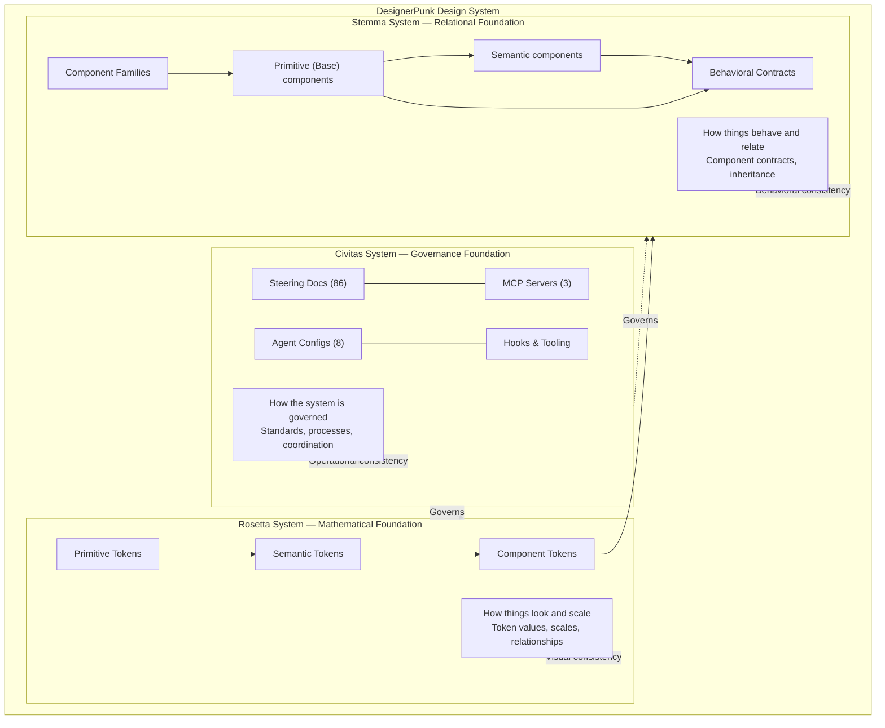
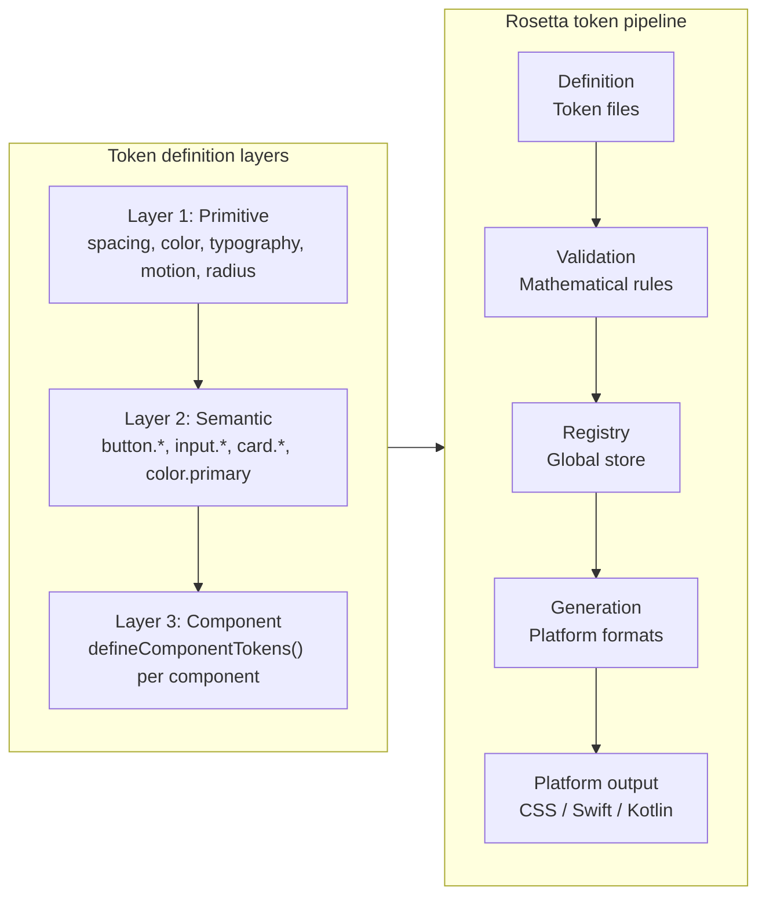
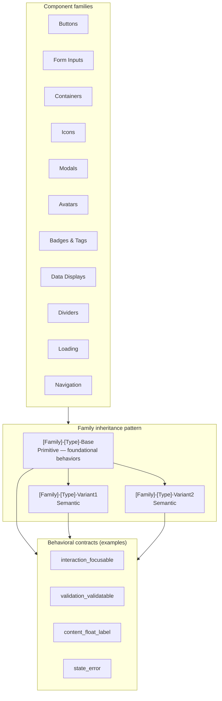
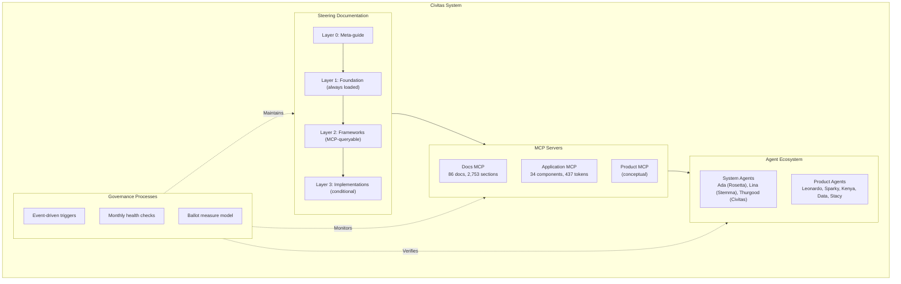
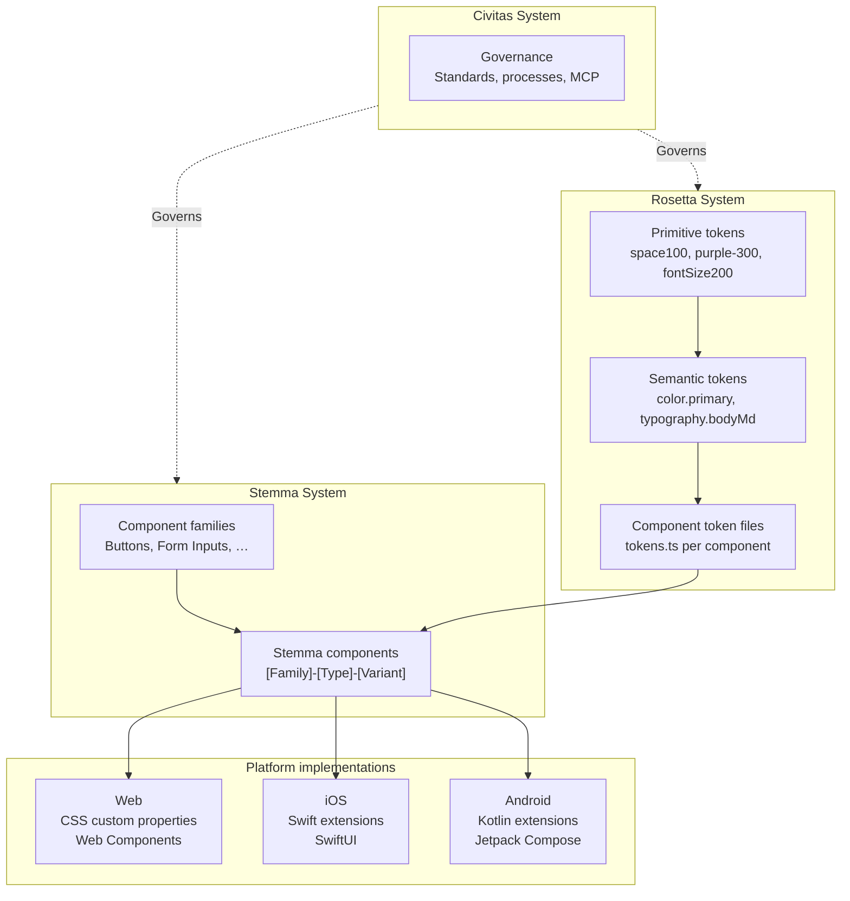
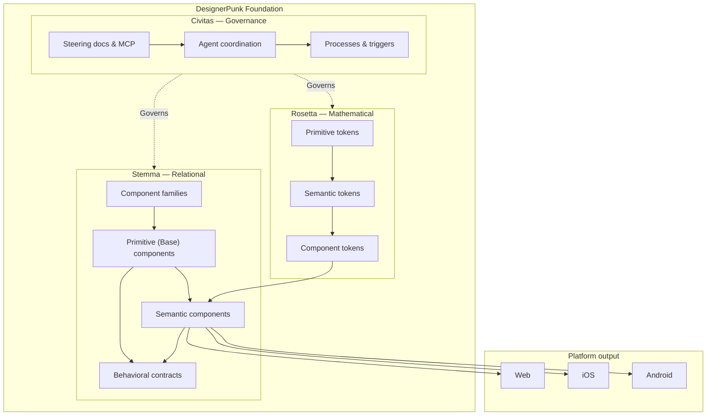

# DesignerPunk Systems Overview

**Date**: 2026-05-03
**Last Reviewed**: 2026-05-03
**Purpose**: Visual architecture overview of DesignerPunk's three foundational systems
**Organization**: architecture-overview
**Scope**: cross-project
**Layer**: 1
**Relevant Tasks**: all-tasks

---

## Overview

DesignerPunk is built on three complementary foundation systems:

- **Rosetta System** — Mathematical foundation for visual consistency (tokens, scales, relationships)
- **Stemma System** — Relational foundation for behavioral consistency (components, contracts, inheritance)
- **Civitas System** — Governance foundation for operational consistency (steering docs, MCP servers, agent coordination, processes)

This document provides visual diagrams showing how these systems work individually and how they integrate to create the complete design system.

For detailed Civitas documentation, see [Civitas System Overview](./Civitas-System-Overview.md).

---

## High-Level: DesignerPunk Three-System Architecture

This diagram shows the relationship between Rosetta (mathematical), Stemma (relational), and Civitas (governance) systems, and how they work together.

---

## Rosetta System: Token Pipeline and Layers

This diagram shows the Rosetta token pipeline (definition → validation → registry → generation → output) and the three-layer token hierarchy (primitive → semantic → component).

---

## Stemma System: Families and Inheritance

This diagram shows the component families, the family inheritance pattern (primitive base → semantic variants), and how behavioral contracts apply to components.

---

## Civitas System: Governance Infrastructure

This diagram shows the Civitas governance infrastructure — steering documentation served via MCP, agent configurations with domain boundaries, and the trigger mechanisms that keep governance active.

---

## Integration: Tokens → Components → Platforms

This diagram shows how Rosetta tokens flow into Stemma components, which then generate platform-specific implementations (Web, iOS, Android), all governed by Civitas.

---

## Combined Overview (Single Diagram)

This diagram provides a simplified single-view of the complete system: three foundations → platform output.

---

## Related Documentation

**Civitas System:**
- [Civitas System Overview](./Civitas-System-Overview.md) — Governance layer definition, three-layer boundary, processes

**Rosetta System:**
- [Rosetta System Principles](./rosetta-system-principles.md) — Mathematical foundation and token philosophy
- [Rosetta System Architecture](./Rosetta-System-Architecture.md) — Detailed pipeline, generation subsystem, validation

**Stemma System:**
- [Stemma System Principles](./stemma-system-principles.md) — Component philosophy and inheritance patterns
- [Contract System Reference](./Contract-System-Reference.md) — Behavioral contracts, Concept Catalog, classification rules
- [Component Quick Reference](./Component-Quick-Reference.md) — Routing table for component family docs

**Component Families:**
- [Component-Family-Button.md](./Component-Family-Button.md)
- [Component-Family-Form-Inputs.md](./Component-Family-Form-Inputs.md)
- [Component-Family-Icon.md](./Component-Family-Icon.md)
- [Component-Family-Container.md](./Component-Family-Container.md)
- [Component-Family-Avatar.md](./Component-Family-Avatar.md)
- [Component-Family-Badge.md](./Component-Family-Badge.md)
- [Component-Family-Chip.md](./Component-Family-Chip.md)
- [Component-Family-Progress.md](./Component-Family-Progress.md)
- [Component-Family-Divider.md](./Component-Family-Divider.md) (placeholder)
- [Component-Family-Loading.md](./Component-Family-Loading.md) (placeholder)
- [Component-Family-Modal.md](./Component-Family-Modal.md) (placeholder)
- [Component-Family-Navigation.md](./Component-Family-Navigation.md)
- [Component-Family-Data-Display.md](./Component-Family-Data-Display.md) (placeholder)
