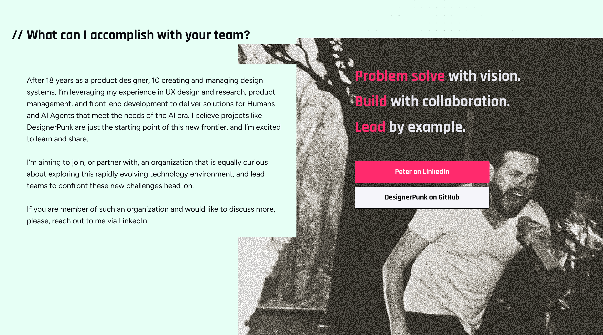

# Component Analysis: Accomplish

**Component Type**: COMPONENT
**Figma ID**: 3492:3224
**File Key**: yU7908VXR1khQN5hZXC6Cy
**Extracted**: 2026-05-10T14:57:43.830Z
**Extractor Version**: 6.3.0

---

## Classification Summary

| Tier | Count | Percentage |
| --- | --- | --- |
| ✅ Semantic Identified | 7 | 6% |
| ⚠️ Primitive Identified | 12 | 11% |
| ❌ Unidentified | 93 | 83% |
| **Total** | **112** | **100%** |

## Node Tree

- **Accomplish** (FRAME, depth 0) [S:0 P:1 U:5]
  - **Pitch** (FRAME, depth 1) [S:0 P:1 U:5]
    - **Frame 509** (FRAME, depth 2) [S:0 P:0 U:5]
      - **Halftone** (FRAME, depth 3) [S:0 P:0 U:1]
      - **Rectangle 172** (FRAME, depth 3) [S:0 P:0 U:1]
    - **60EF904C-9B2B-4B7B-8AD4-596CC09D97ED 1** (FRAME, depth 2) [S:0 P:0 U:1]
    - **Frame 558** (FRAME, depth 2) [S:1 P:0 U:5]
      - **Frame 418** (FRAME, depth 3) [S:0 P:1 U:6]
        - **Frame 417** (FRAME, depth 4) [S:0 P:0 U:6]
          - **What can I accomplish with your team?** (TEXT, depth 5) [S:0 P:1 U:4]
          - **//** (TEXT, depth 5) [S:0 P:1 U:4]
      - **Frame 552** (FRAME, depth 3) [S:4 P:1 U:2]
        - **After 18 years as a product designer, 10 creating and managing design systems, I’m leveraging my experience in UX design and research, product management, and front-end development to deliver solutions for Humans and AI Agents that meet the needs of the AI era. I believe projects like DesignerPunk are just the starting point of this new frontier, and I’m excited to learn and share. I’m aiming to join, or partner with, an organization that is equally curious about exploring this rapidly evolving technology environment, and lead teams to confront these new challenges head-on. If you are member of such an organization and would like to discuss more, please, reach out to me via LinkedIn.** (TEXT, depth 4) [S:0 P:1 U:4]
    - **Frame 419** (FRAME, depth 2) [S:1 P:0 U:5]
      - **Problem solve with vision.** (TEXT, depth 3) [S:0 P:0 U:4]
      - **Build with collaboration.** (TEXT, depth 3) [S:0 P:0 U:4]
      - **Lead by example.** (TEXT, depth 3) [S:0 P:0 U:4]
    - **Frame 420** (FRAME, depth 2) [S:1 P:0 U:5]
      - **Frame 343** (FRAME, depth 3) [S:0 P:1 U:7]
        - **Peter on LinkedIn** (TEXT, depth 4) [S:0 P:1 U:4]
      - **Frame 344** (FRAME, depth 3) [S:0 P:2 U:7]
        - **DesignerPunk on GitHub** (TEXT, depth 4) [S:0 P:1 U:4]

## Token Usage by Node

### Accomplish (FRAME, depth 0)

- ⚠️ `fill`: color.white100 (binding, exact)
- ❌ `padding-top`: 0 (value-match)
- ❌ `padding-right`: 0 (value-match)
- ❌ `padding-bottom`: 0 (value-match)
- ❌ `padding-left`: 0 (value-match)
- ❌ `border-width`: 1 (value-match)

### Pitch (FRAME, depth 1)

- ⚠️ `fill`: color.green100 (binding, exact)
- ❌ `padding-top`: 0 (value-match)
- ❌ `padding-right`: 0 (value-match)
- ❌ `padding-bottom`: 0 (value-match)
- ❌ `padding-left`: 0 (value-match)
- ❌ `border-width`: 1 (value-match)

### Frame 509 (FRAME, depth 2)

- ❌ `padding-top`: 0 (value-match)
- ❌ `padding-right`: 0 (value-match)
- ❌ `padding-bottom`: 0 (value-match)
- ❌ `padding-left`: 0 (value-match)
- ❌ `border-width`: 1 (value-match)

### Halftone (FRAME, depth 3)

- ❌ `border-width`: 1 (value-match)

### Rectangle 172 (FRAME, depth 3)

- ❌ `border-width`: 1 (value-match)

### 60EF904C-9B2B-4B7B-8AD4-596CC09D97ED 1 (FRAME, depth 2)

- ❌ `border-width`: 1 (value-match)

### Frame 558 (FRAME, depth 2)

- ✅ `item-spacing`: semanticSpace.sectioned.loose → space.space600 (binding, exact)
- ❌ `padding-top`: 0 (value-match)
- ❌ `padding-right`: 0 (value-match)
- ❌ `padding-bottom`: 0 (value-match)
- ❌ `padding-left`: 0 (value-match)
- ❌ `border-width`: 1 (value-match)

### Frame 418 (FRAME, depth 3)

- ⚠️ `fill`: color.green100 (binding, exact)
- ❌ `padding-top`: 0 (value-match)
- ❌ `padding-right`: 64 (value-match)
- ❌ `padding-bottom`: 0 (value-match)
- ❌ `padding-left`: 64 (value-match)
- ❌ `item-spacing`: 8 (value-match)
- ❌ `border-width`: 1 (value-match)

### Frame 417 (FRAME, depth 4)

- ❌ `padding-top`: 0 (value-match)
- ❌ `padding-right`: 0 (value-match)
- ❌ `padding-bottom`: 0 (value-match)
- ❌ `padding-left`: 0 (value-match)
- ❌ `item-spacing`: 8 (value-match)
- ❌ `border-width`: 1 (value-match)

### What can I accomplish with your team? (TEXT, depth 5)

- ⚠️ `fill`: color.black300 (binding, exact)
- ❌ `border-width`: 1 (value-match)
- ❌ `font-size`: 33 (value-match)
- ❌ `font-weight`: 700 (value-match)
- ❌ `line-height`: 40 (out-of-tolerance — closest: lineHeight.lineHeight125 (±38.444px))

### // (TEXT, depth 5)

- ⚠️ `fill`: color.black300 (binding, exact)
- ❌ `border-width`: 1 (value-match)
- ❌ `font-size`: 33 (value-match)
- ❌ `font-weight`: 700 (value-match)
- ❌ `line-height`: 40 (out-of-tolerance — closest: lineHeight.lineHeight125 (±38.444px))

### Frame 552 (FRAME, depth 3)

- ✅ `padding-top`: semanticSpace.inset.300 → space.space300 (binding, exact)
- ✅ `padding-right`: semanticSpace.inset.300 → space.space300 (binding, exact)
- ✅ `padding-bottom`: semanticSpace.inset.300 → space.space300 (binding, exact)
- ✅ `padding-left`: semanticSpace.inset.none → space.space000 (binding, exact)
- ⚠️ `fill`: color.green100 (binding, exact)
- ❌ `item-spacing`: 8 (value-match)
- ❌ `border-width`: 1 (value-match)

### After 18 years as a product designer, 10 creating and managing design systems, I’m leveraging my experience in UX design and research, product management, and front-end development to deliver solutions for Humans and AI Agents that meet the needs of the AI era. I believe projects like DesignerPunk are just the starting point of this new frontier, and I’m excited to learn and share. I’m aiming to join, or partner with, an organization that is equally curious about exploring this rapidly evolving technology environment, and lead teams to confront these new challenges head-on. If you are member of such an organization and would like to discuss more, please, reach out to me via LinkedIn. (TEXT, depth 4)

- ⚠️ `fill`: color.black300 (binding, exact)
- ❌ `border-width`: 1 (value-match)
- ❌ `font-size`: 18 (value-match)
- ❌ `font-weight`: 400 (value-match)
- ❌ `line-height`: 28.010000228881836 (out-of-tolerance — closest: lineHeight.lineHeight125 (±26.454000228881835px))

### Frame 419 (FRAME, depth 2)

- ✅ `item-spacing`: semanticSpace.related.normal → space.space200 (binding, exact)
- ❌ `padding-top`: 0 (value-match)
- ❌ `padding-right`: 0 (value-match)
- ❌ `padding-bottom`: 0 (value-match)
- ❌ `padding-left`: 0 (value-match)
- ❌ `border-width`: 1 (value-match)

### Problem solve with vision. (TEXT, depth 3)

- ❌ `border-width`: 1 (value-match)
- ❌ `font-size`: 37 (value-match)
- ❌ `font-weight`: 700 (value-match)
- ❌ `line-height`: 44.029998779296875 (out-of-tolerance — closest: lineHeight.lineHeight125 (±42.47399877929688px))

### Build with collaboration. (TEXT, depth 3)

- ❌ `border-width`: 1 (value-match)
- ❌ `font-size`: 37 (value-match)
- ❌ `font-weight`: 700 (value-match)
- ❌ `line-height`: 44.029998779296875 (out-of-tolerance — closest: lineHeight.lineHeight125 (±42.47399877929688px))

### Lead by example. (TEXT, depth 3)

- ❌ `border-width`: 1 (value-match)
- ❌ `font-size`: 37 (value-match)
- ❌ `font-weight`: 700 (value-match)
- ❌ `line-height`: 44.029998779296875 (out-of-tolerance — closest: lineHeight.lineHeight125 (±42.47399877929688px))

### Frame 420 (FRAME, depth 2)

- ✅ `item-spacing`: semanticSpace.grouped.normal → space.space100 (binding, exact)
- ❌ `padding-top`: 0 (value-match)
- ❌ `padding-right`: 0 (value-match)
- ❌ `padding-bottom`: 0 (value-match)
- ❌ `padding-left`: 0 (value-match)
- ❌ `border-width`: 1 (value-match)

### Frame 343 (FRAME, depth 3)

- ⚠️ `fill`: color.pink300 (binding, exact)
- ❌ `padding-top`: 12 (value-match)
- ❌ `padding-right`: 26 (value-match)
- ❌ `padding-bottom`: 12 (value-match)
- ❌ `padding-left`: 26 (value-match)
- ❌ `item-spacing`: 8 (value-match)
- ❌ `border-radius`: 4 (value-match)
- ❌ `border-width`: 1 (value-match)

### Peter on LinkedIn (TEXT, depth 4)

- ⚠️ `fill`: color.white100 (binding, exact)
- ❌ `border-width`: 1 (value-match)
- ❌ `font-size`: 18 (value-match)
- ❌ `font-weight`: 700 (value-match)
- ❌ `line-height`: 28.010000228881836 (out-of-tolerance — closest: lineHeight.lineHeight125 (±26.454000228881835px))

### Frame 344 (FRAME, depth 3)

- ⚠️ `fill`: color.white200 (binding, exact)
- ⚠️ `stroke`: color.black500 (binding, exact)
- ❌ `padding-top`: 12 (value-match)
- ❌ `padding-right`: 26 (value-match)
- ❌ `padding-bottom`: 12 (value-match)
- ❌ `padding-left`: 26 (value-match)
- ❌ `item-spacing`: 8 (value-match)
- ❌ `border-radius`: 4 (value-match)
- ❌ `border-width`: 1 (value-match)

### DesignerPunk on GitHub (TEXT, depth 4)

- ⚠️ `fill`: color.black500 (binding, exact)
- ❌ `border-width`: 1 (value-match)
- ❌ `font-size`: 18 (value-match)
- ❌ `font-weight`: 700 (value-match)
- ❌ `line-height`: 28.010000228881836 (out-of-tolerance — closest: lineHeight.lineHeight125 (±26.454000228881835px))

## Recommendations

### Variant Mapping

⚠️ **Validation Required**: This analysis is based on Figma component structure. The optimal code structure may differ.

**Component**: Accomplish
**Classification**: styling

**A** ✅ Recommended
- Single component with a variant prop
- Rationale: Variants differ only in visual styling, making a single component with a variant prop the simplest API surface.
- Aligns with: Behavioral analysis: variants are styling-only
- Trade-offs: Simpler consumer API — one import, one tag., Internal complexity grows if behavioral differences emerge later., Harder to tree-shake unused variants.

**B** 
- Primitive + semantic component structure (Stemma pattern)
- Rationale: A split structure future-proofs the component for behavioral divergence, though current variants are styling-only.
- Trade-offs: Clean separation of behavioral contracts per component., Aligns with Stemma inheritance pattern used across DesignerPunk., More components to maintain and document.

**Domain Specialist Validation**:
- **Ada** (Token Specialist): Are token classifications correct? Should new semantic tokens be created?
- **Lina** (Component Specialist): Does the component architecture match Stemma patterns?
- **Thurgood** (Governance): Does this meet spec standards and test coverage requirements?

### Component Token Suggestions

⚠️ **Validation Required**: This analysis is based on Figma component structure. The optimal code structure may differ.

- **accomplish.item-spacing = space.space000** ← `space.space000` (used 5× in item-spacing, padding-top, padding-right, padding-bottom, padding-left)
  - space.space000 is used across 5 properties (item-spacing, padding-top, padding-right, padding-bottom, padding-left). Consistent usage suggests semantic intent that could be encoded as a component token.

**Domain Specialist Validation**:
- **Ada** (Token Specialist): Are token classifications correct? Should new semantic tokens be created?
- **Lina** (Component Specialist): Does the component architecture match Stemma patterns?
- **Thurgood** (Governance): Does this meet spec standards and test coverage requirements?

## Unidentified Values

- **Accomplish** → `padding-top`: 0 (value-match — suggested: `semanticSpace.grouped.none`)
- **Accomplish** → `padding-right`: 0 (value-match — suggested: `semanticSpace.grouped.none`)
- **Accomplish** → `padding-bottom`: 0 (value-match — suggested: `semanticSpace.grouped.none`)
- **Accomplish** → `padding-left`: 0 (value-match — suggested: `semanticSpace.grouped.none`)
- **Accomplish** → `border-width`: 1 (value-match — suggested: `semanticBorderWidth.default`)
- **Pitch** → `padding-top`: 0 (value-match — suggested: `semanticSpace.grouped.none`)
- **Pitch** → `padding-right`: 0 (value-match — suggested: `semanticSpace.grouped.none`)
- **Pitch** → `padding-bottom`: 0 (value-match — suggested: `semanticSpace.grouped.none`)
- **Pitch** → `padding-left`: 0 (value-match — suggested: `semanticSpace.grouped.none`)
- **Pitch** → `border-width`: 1 (value-match — suggested: `semanticBorderWidth.default`)
- **Frame 509** → `padding-top`: 0 (value-match — suggested: `semanticSpace.grouped.none`)
- **Frame 509** → `padding-right`: 0 (value-match — suggested: `semanticSpace.grouped.none`)
- **Frame 509** → `padding-bottom`: 0 (value-match — suggested: `semanticSpace.grouped.none`)
- **Frame 509** → `padding-left`: 0 (value-match — suggested: `semanticSpace.grouped.none`)
- **Frame 509** → `border-width`: 1 (value-match — suggested: `semanticBorderWidth.default`)
- **Halftone** → `border-width`: 1 (value-match — suggested: `semanticBorderWidth.default`)
- **Rectangle 172** → `border-width`: 1 (value-match — suggested: `semanticBorderWidth.default`)
- **60EF904C-9B2B-4B7B-8AD4-596CC09D97ED 1** → `border-width`: 1 (value-match — suggested: `semanticBorderWidth.default`)
- **Frame 558** → `padding-top`: 0 (value-match — suggested: `semanticSpace.grouped.none`)
- **Frame 558** → `padding-right`: 0 (value-match — suggested: `semanticSpace.grouped.none`)
- **Frame 558** → `padding-bottom`: 0 (value-match — suggested: `semanticSpace.grouped.none`)
- **Frame 558** → `padding-left`: 0 (value-match — suggested: `semanticSpace.grouped.none`)
- **Frame 558** → `border-width`: 1 (value-match — suggested: `semanticBorderWidth.default`)
- **Frame 418** → `padding-top`: 0 (value-match — suggested: `semanticSpace.grouped.none`)
- **Frame 418** → `padding-right`: 64 (value-match — suggested: `space.space800`)
- **Frame 418** → `padding-bottom`: 0 (value-match — suggested: `semanticSpace.grouped.none`)
- **Frame 418** → `padding-left`: 64 (value-match — suggested: `space.space800`)
- **Frame 418** → `item-spacing`: 8 (value-match — suggested: `semanticSpace.grouped.normal`)
- **Frame 418** → `border-width`: 1 (value-match — suggested: `semanticBorderWidth.default`)
- **Frame 417** → `padding-top`: 0 (value-match — suggested: `semanticSpace.grouped.none`)
- **Frame 417** → `padding-right`: 0 (value-match — suggested: `semanticSpace.grouped.none`)
- **Frame 417** → `padding-bottom`: 0 (value-match — suggested: `semanticSpace.grouped.none`)
- **Frame 417** → `padding-left`: 0 (value-match — suggested: `semanticSpace.grouped.none`)
- **Frame 417** → `item-spacing`: 8 (value-match — suggested: `semanticSpace.grouped.normal`)
- **Frame 417** → `border-width`: 1 (value-match — suggested: `semanticBorderWidth.default`)
- **What can I accomplish with your team?** → `border-width`: 1 (value-match — suggested: `semanticBorderWidth.default`)
- **What can I accomplish with your team?** → `font-size`: 33 (value-match — suggested: `icon.icon.size500`)
- **What can I accomplish with your team?** → `font-weight`: 700 (value-match — suggested: `fontWeight.fontWeight700`)
- **What can I accomplish with your team?** → `line-height`: 40 (out-of-tolerance — closest: lineHeight.lineHeight125 (±38.444px))
- **//** → `border-width`: 1 (value-match — suggested: `semanticBorderWidth.default`)
- **//** → `font-size`: 33 (value-match — suggested: `icon.icon.size500`)
- **//** → `font-weight`: 700 (value-match — suggested: `fontWeight.fontWeight700`)
- **//** → `line-height`: 40 (out-of-tolerance — closest: lineHeight.lineHeight125 (±38.444px))
- **Frame 552** → `item-spacing`: 8 (value-match — suggested: `semanticSpace.grouped.normal`)
- **Frame 552** → `border-width`: 1 (value-match — suggested: `semanticBorderWidth.default`)
- **After 18 years as a product designer, 10 creating and managing design systems, I’m leveraging my experience in UX design and research, product management, and front-end development to deliver solutions for Humans and AI Agents that meet the needs of the AI era. I believe projects like DesignerPunk are just the starting point of this new frontier, and I’m excited to learn and share. I’m aiming to join, or partner with, an organization that is equally curious about exploring this rapidly evolving technology environment, and lead teams to confront these new challenges head-on. If you are member of such an organization and would like to discuss more, please, reach out to me via LinkedIn.** → `border-width`: 1 (value-match — suggested: `semanticBorderWidth.default`)
- **After 18 years as a product designer, 10 creating and managing design systems, I’m leveraging my experience in UX design and research, product management, and front-end development to deliver solutions for Humans and AI Agents that meet the needs of the AI era. I believe projects like DesignerPunk are just the starting point of this new frontier, and I’m excited to learn and share. I’m aiming to join, or partner with, an organization that is equally curious about exploring this rapidly evolving technology environment, and lead teams to confront these new challenges head-on. If you are member of such an organization and would like to discuss more, please, reach out to me via LinkedIn.** → `font-size`: 18 (value-match — suggested: `icon.icon.size125`)
- **After 18 years as a product designer, 10 creating and managing design systems, I’m leveraging my experience in UX design and research, product management, and front-end development to deliver solutions for Humans and AI Agents that meet the needs of the AI era. I believe projects like DesignerPunk are just the starting point of this new frontier, and I’m excited to learn and share. I’m aiming to join, or partner with, an organization that is equally curious about exploring this rapidly evolving technology environment, and lead teams to confront these new challenges head-on. If you are member of such an organization and would like to discuss more, please, reach out to me via LinkedIn.** → `font-weight`: 400 (value-match — suggested: `fontWeight.fontWeight400`)
- **After 18 years as a product designer, 10 creating and managing design systems, I’m leveraging my experience in UX design and research, product management, and front-end development to deliver solutions for Humans and AI Agents that meet the needs of the AI era. I believe projects like DesignerPunk are just the starting point of this new frontier, and I’m excited to learn and share. I’m aiming to join, or partner with, an organization that is equally curious about exploring this rapidly evolving technology environment, and lead teams to confront these new challenges head-on. If you are member of such an organization and would like to discuss more, please, reach out to me via LinkedIn.** → `line-height`: 28.010000228881836 (out-of-tolerance — closest: lineHeight.lineHeight125 (±26.454000228881835px))
- **Frame 419** → `padding-top`: 0 (value-match — suggested: `semanticSpace.grouped.none`)
- **Frame 419** → `padding-right`: 0 (value-match — suggested: `semanticSpace.grouped.none`)
- **Frame 419** → `padding-bottom`: 0 (value-match — suggested: `semanticSpace.grouped.none`)
- **Frame 419** → `padding-left`: 0 (value-match — suggested: `semanticSpace.grouped.none`)
- **Frame 419** → `border-width`: 1 (value-match — suggested: `semanticBorderWidth.default`)
- **Problem solve with vision.** → `border-width`: 1 (value-match — suggested: `semanticBorderWidth.default`)
- **Problem solve with vision.** → `font-size`: 37 (value-match — suggested: `icon.icon.size600`)
- **Problem solve with vision.** → `font-weight`: 700 (value-match — suggested: `fontWeight.fontWeight700`)
- **Problem solve with vision.** → `line-height`: 44.029998779296875 (out-of-tolerance — closest: lineHeight.lineHeight125 (±42.47399877929688px))
- **Build with collaboration.** → `border-width`: 1 (value-match — suggested: `semanticBorderWidth.default`)
- **Build with collaboration.** → `font-size`: 37 (value-match — suggested: `icon.icon.size600`)
- **Build with collaboration.** → `font-weight`: 700 (value-match — suggested: `fontWeight.fontWeight700`)
- **Build with collaboration.** → `line-height`: 44.029998779296875 (out-of-tolerance — closest: lineHeight.lineHeight125 (±42.47399877929688px))
- **Lead by example.** → `border-width`: 1 (value-match — suggested: `semanticBorderWidth.default`)
- **Lead by example.** → `font-size`: 37 (value-match — suggested: `icon.icon.size600`)
- **Lead by example.** → `font-weight`: 700 (value-match — suggested: `fontWeight.fontWeight700`)
- **Lead by example.** → `line-height`: 44.029998779296875 (out-of-tolerance — closest: lineHeight.lineHeight125 (±42.47399877929688px))
- **Frame 420** → `padding-top`: 0 (value-match — suggested: `semanticSpace.grouped.none`)
- **Frame 420** → `padding-right`: 0 (value-match — suggested: `semanticSpace.grouped.none`)
- **Frame 420** → `padding-bottom`: 0 (value-match — suggested: `semanticSpace.grouped.none`)
- **Frame 420** → `padding-left`: 0 (value-match — suggested: `semanticSpace.grouped.none`)
- **Frame 420** → `border-width`: 1 (value-match — suggested: `semanticBorderWidth.default`)
- **Frame 343** → `padding-top`: 12 (value-match — suggested: `semanticSpace.grouped.loose`)
- **Frame 343** → `padding-right`: 26 (value-match — suggested: `semanticSpace.related.loose`)
- **Frame 343** → `padding-bottom`: 12 (value-match — suggested: `semanticSpace.grouped.loose`)
- **Frame 343** → `padding-left`: 26 (value-match — suggested: `semanticSpace.related.loose`)
- **Frame 343** → `item-spacing`: 8 (value-match — suggested: `semanticSpace.grouped.normal`)
- **Frame 343** → `border-radius`: 4 (value-match — suggested: `semanticRadius.small`)
- **Frame 343** → `border-width`: 1 (value-match — suggested: `semanticBorderWidth.default`)
- **Peter on LinkedIn** → `border-width`: 1 (value-match — suggested: `semanticBorderWidth.default`)
- **Peter on LinkedIn** → `font-size`: 18 (value-match — suggested: `icon.icon.size125`)
- **Peter on LinkedIn** → `font-weight`: 700 (value-match — suggested: `fontWeight.fontWeight700`)
- **Peter on LinkedIn** → `line-height`: 28.010000228881836 (out-of-tolerance — closest: lineHeight.lineHeight125 (±26.454000228881835px))
- **Frame 344** → `padding-top`: 12 (value-match — suggested: `semanticSpace.grouped.loose`)
- **Frame 344** → `padding-right`: 26 (value-match — suggested: `semanticSpace.related.loose`)
- **Frame 344** → `padding-bottom`: 12 (value-match — suggested: `semanticSpace.grouped.loose`)
- **Frame 344** → `padding-left`: 26 (value-match — suggested: `semanticSpace.related.loose`)
- **Frame 344** → `item-spacing`: 8 (value-match — suggested: `semanticSpace.grouped.normal`)
- **Frame 344** → `border-radius`: 4 (value-match — suggested: `semanticRadius.small`)
- **Frame 344** → `border-width`: 1 (value-match — suggested: `semanticBorderWidth.default`)
- **DesignerPunk on GitHub** → `border-width`: 1 (value-match — suggested: `semanticBorderWidth.default`)
- **DesignerPunk on GitHub** → `font-size`: 18 (value-match — suggested: `icon.icon.size125`)
- **DesignerPunk on GitHub** → `font-weight`: 700 (value-match — suggested: `fontWeight.fontWeight700`)
- **DesignerPunk on GitHub** → `line-height`: 28.010000228881836 (out-of-tolerance — closest: lineHeight.lineHeight125 (±26.454000228881835px))

## Screenshots

*Component screenshot (png, 2x, captured 2026-05-10T14:57:43.827Z)*
