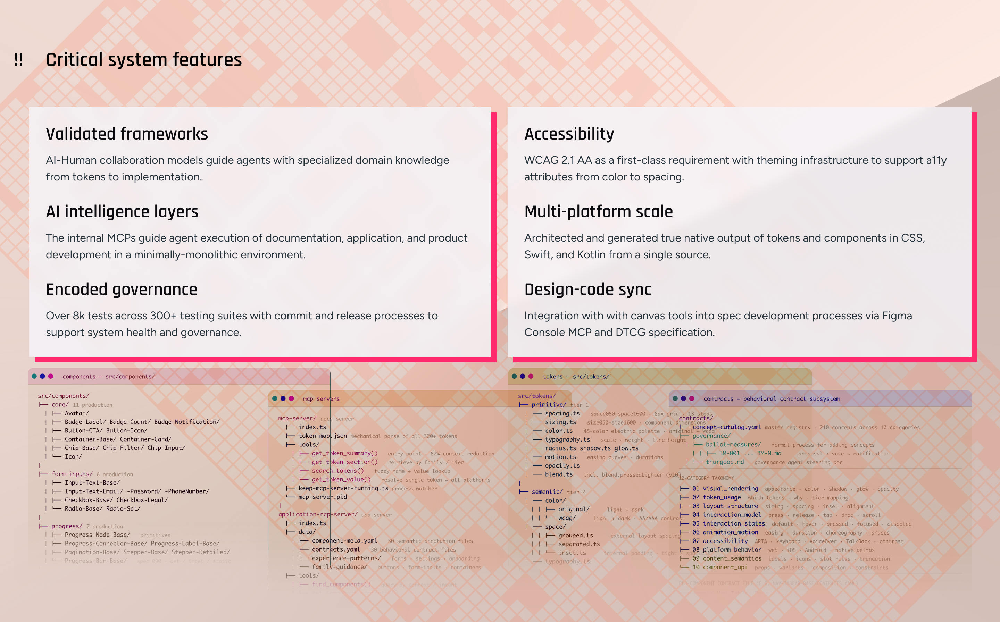

# Component Analysis: CriticalFeatures

**Component Type**: COMPONENT
**Figma ID**: 3492:2487
**File Key**: yU7908VXR1khQN5hZXC6Cy
**Extracted**: 2026-05-10T14:56:02.499Z
**Extractor Version**: 6.3.0

---

## Classification Summary

| Tier | Count | Percentage |
| --- | --- | --- |
| ✅ Semantic Identified | 19 | 6% |
| ⚠️ Primitive Identified | 18 | 5% |
| ❌ Unidentified | 297 | 89% |
| **Total** | **334** | **100%** |

## Node Tree

- **CriticalFeatures** (FRAME, depth 0) [S:0 P:1 U:5]
  - **Critical System Features Container** (FRAME, depth 1) [S:0 P:1 U:5]
    - **Binary Background Container** (FRAME, depth 2) [S:0 P:0 U:5]
      - **Binary Background** (FRAME, depth 3) [S:0 P:0 U:2]
    - **Terminal Windows Container** (FRAME, depth 2) [S:0 P:0 U:5]
      - **Components Terminal Container** (FRAME, depth 3) [S:0 P:0 U:7]
        - **Clip path group** (FRAME, depth 4) [S:0 P:0 U:0]
          - **clip0_3347_5** (FRAME, depth 5) [S:0 P:0 U:0]
            - **Vector** (FRAME, depth 6) [S:0 P:0 U:2]
          - **Group** (FRAME, depth 5) [S:0 P:0 U:0]
            - **Mask group** (FRAME, depth 6) [S:0 P:0 U:0]
              - **Group** (FRAME, depth 7) [S:0 P:0 U:0]
              - **Group** (FRAME, depth 7) [S:0 P:0 U:0]
        - **Rectangle 170** (FRAME, depth 4) [S:0 P:0 U:1]
      - **MCP Terminal Container** (FRAME, depth 3) [S:0 P:0 U:7]
        - **Group** (FRAME, depth 4) [S:0 P:0 U:0]
          - **Vector** (FRAME, depth 5) [S:0 P:1 U:1]
          - **Vector** (FRAME, depth 5) [S:0 P:0 U:2]
          - **Vector** (FRAME, depth 5) [S:0 P:0 U:2]
          - **Vector** (FRAME, depth 5) [S:0 P:0 U:2]
          - **Vector** (FRAME, depth 5) [S:0 P:0 U:2]
          - **Vector** (FRAME, depth 5) [S:0 P:0 U:2]
          - **Vector** (FRAME, depth 5) [S:0 P:0 U:2]
          - **Vector** (FRAME, depth 5) [S:0 P:0 U:2]
          - **Vector** (FRAME, depth 5) [S:0 P:0 U:2]
          - **Vector** (FRAME, depth 5) [S:0 P:0 U:2]
          - **Vector** (FRAME, depth 5) [S:0 P:0 U:2]
          - **Vector** (FRAME, depth 5) [S:0 P:0 U:2]
          - **Vector** (FRAME, depth 5) [S:0 P:0 U:2]
          - **Vector** (FRAME, depth 5) [S:0 P:0 U:2]
          - **Vector** (FRAME, depth 5) [S:0 P:0 U:2]
          - **Vector** (FRAME, depth 5) [S:0 P:0 U:2]
          - **Vector** (FRAME, depth 5) [S:0 P:0 U:2]
          - **Vector** (FRAME, depth 5) [S:0 P:0 U:2]
          - **Vector** (FRAME, depth 5) [S:0 P:0 U:2]
          - **Vector** (FRAME, depth 5) [S:0 P:0 U:2]
          - **Vector** (FRAME, depth 5) [S:0 P:0 U:2]
          - **Vector** (FRAME, depth 5) [S:0 P:0 U:2]
          - **Vector** (FRAME, depth 5) [S:0 P:0 U:2]
          - **Vector** (FRAME, depth 5) [S:0 P:0 U:2]
          - **Vector** (FRAME, depth 5) [S:0 P:0 U:2]
          - **Vector** (FRAME, depth 5) [S:0 P:0 U:2]
          - **Vector** (FRAME, depth 5) [S:0 P:0 U:2]
          - **Vector** (FRAME, depth 5) [S:0 P:0 U:2]
          - **Vector** (FRAME, depth 5) [S:0 P:0 U:2]
          - **Vector** (FRAME, depth 5) [S:0 P:0 U:2]
          - **Vector** (FRAME, depth 5) [S:0 P:0 U:2]
          - **Vector** (FRAME, depth 5) [S:0 P:0 U:2]
          - **Vector** (FRAME, depth 5) [S:0 P:0 U:2]
          - **Vector** (FRAME, depth 5) [S:0 P:0 U:2]
          - **Vector** (FRAME, depth 5) [S:0 P:0 U:2]
          - **Vector** (FRAME, depth 5) [S:0 P:0 U:2]
          - **Vector** (FRAME, depth 5) [S:0 P:0 U:2]
          - **Vector** (FRAME, depth 5) [S:0 P:0 U:2]
          - **Vector** (FRAME, depth 5) [S:0 P:0 U:2]
          - **Vector** (FRAME, depth 5) [S:0 P:0 U:2]
          - **Vector** (FRAME, depth 5) [S:0 P:0 U:2]
          - **Vector** (FRAME, depth 5) [S:0 P:0 U:2]
          - **Vector** (FRAME, depth 5) [S:0 P:0 U:2]
          - **Vector** (FRAME, depth 5) [S:0 P:0 U:2]
          - **Vector** (FRAME, depth 5) [S:0 P:0 U:2]
          - **Vector** (FRAME, depth 5) [S:0 P:0 U:2]
          - **Vector** (FRAME, depth 5) [S:0 P:0 U:2]
          - **Vector** (FRAME, depth 5) [S:0 P:0 U:2]
          - **Vector** (FRAME, depth 5) [S:0 P:0 U:2]
          - **Vector** (FRAME, depth 5) [S:0 P:0 U:2]
          - **Vector** (FRAME, depth 5) [S:0 P:0 U:2]
          - **Vector** (FRAME, depth 5) [S:0 P:0 U:2]
          - **Vector** (FRAME, depth 5) [S:0 P:0 U:2]
          - **Vector** (FRAME, depth 5) [S:0 P:0 U:2]
          - **Vector** (FRAME, depth 5) [S:0 P:0 U:2]
          - **Vector** (FRAME, depth 5) [S:0 P:0 U:2]
          - **Vector** (FRAME, depth 5) [S:0 P:0 U:2]
          - **Vector** (FRAME, depth 5) [S:0 P:0 U:2]
          - **Vector** (FRAME, depth 5) [S:0 P:0 U:2]
          - **Vector** (FRAME, depth 5) [S:0 P:0 U:2]
          - **Vector** (FRAME, depth 5) [S:0 P:0 U:2]
          - **Vector** (FRAME, depth 5) [S:0 P:0 U:2]
          - **Vector** (FRAME, depth 5) [S:0 P:0 U:2]
          - **Vector** (FRAME, depth 5) [S:0 P:0 U:2]
          - **Vector** (FRAME, depth 5) [S:0 P:0 U:2]
        - **Rectangle 170** (FRAME, depth 4) [S:0 P:0 U:1]
      - **Tokens Terminal Container** (FRAME, depth 3) [S:0 P:0 U:7]
        - **Clip path group** (FRAME, depth 4) [S:0 P:0 U:0]
          - **clip0_3348_9223** (FRAME, depth 5) [S:0 P:0 U:0]
            - **Vector** (FRAME, depth 6) [S:0 P:0 U:2]
          - **Group** (FRAME, depth 5) [S:0 P:0 U:0]
            - **Mask group** (FRAME, depth 6) [S:0 P:0 U:0]
              - **Group** (FRAME, depth 7) [S:0 P:0 U:0]
              - **Group** (FRAME, depth 7) [S:0 P:0 U:0]
        - **Rectangle 170** (FRAME, depth 4) [S:0 P:0 U:1]
      - **Contracts Terminal Container** (FRAME, depth 3) [S:0 P:0 U:7]
        - **Clip path group** (FRAME, depth 4) [S:0 P:0 U:0]
          - **clip0_3384_15453** (FRAME, depth 5) [S:0 P:0 U:0]
            - **Vector** (FRAME, depth 6) [S:0 P:0 U:2]
          - **Group** (FRAME, depth 5) [S:0 P:0 U:0]
            - **Mask group** (FRAME, depth 6) [S:0 P:0 U:0]
              - **Group** (FRAME, depth 7) [S:0 P:0 U:0]
              - **Group** (FRAME, depth 7) [S:0 P:0 U:0]
        - **Rectangle 170** (FRAME, depth 4) [S:0 P:0 U:1]
    - **Frame 557** (FRAME, depth 2) [S:1 P:0 U:5]
      - **Header Contaienr** (FRAME, depth 3) [S:1 P:0 U:5]
        - **Critical system features** (TEXT, depth 4) [S:0 P:1 U:4]
        - **!!** (TEXT, depth 4) [S:0 P:1 U:4]
      - **List Set Container** (FRAME, depth 3) [S:1 P:0 U:5]
        - **List 1 Container** (FRAME, depth 4) [S:5 P:0 U:2]
          - **Validated Frameworks Container** (FRAME, depth 5) [S:1 P:0 U:6]
            - **Validated frameworks** (TEXT, depth 6) [S:0 P:1 U:4]
            - **AI-Human collaboration models guide agents with specialized domain knowledge from tokens to implementation.** (TEXT, depth 6) [S:0 P:1 U:4]
          - **AI Intelligence Layers Container** (FRAME, depth 5) [S:1 P:0 U:6]
            - **AI intelligence layers** (TEXT, depth 6) [S:0 P:1 U:4]
            - **The internal MCPs guide agent execution of documentation, application, and product development in a minimally-monolithic environment.** (TEXT, depth 6) [S:0 P:1 U:4]
          - **Encoded Governance Container** (FRAME, depth 5) [S:1 P:0 U:5]
            - **Encoded governance** (TEXT, depth 6) [S:0 P:1 U:4]
            - **Over 8k tests across 300+ testing suites with commit and release processes to support system health and governance.** (TEXT, depth 6) [S:0 P:1 U:4]
        - **List 2 Container** (FRAME, depth 4) [S:5 P:0 U:3]
          - **Accessibility Container** (FRAME, depth 5) [S:1 P:0 U:5]
            - **Accessibility** (TEXT, depth 6) [S:0 P:1 U:4]
            - **WCAG 2.1 AA as a first-class requirement with theming infrastructure to support a11y attributes from color to spacing.** (TEXT, depth 6) [S:0 P:1 U:4]
          - **Multi-Platform Scale Container** (FRAME, depth 5) [S:1 P:1 U:5]
            - **Multi-platform scale** (TEXT, depth 6) [S:0 P:1 U:4]
            - **Architected and generated true native output of tokens and components in CSS, Swift, and Kotlin from a single source.** (TEXT, depth 6) [S:0 P:1 U:4]
          - **Design-Code Sync Container** (FRAME, depth 5) [S:1 P:0 U:5]
            - **Design-code sync** (TEXT, depth 6) [S:0 P:1 U:4]
            - **Integration with with canvas tools into spec development processes via Figma Console MCP and DTCG specification.** (TEXT, depth 6) [S:0 P:1 U:4]

## Token Usage by Node

### CriticalFeatures (FRAME, depth 0)

- ⚠️ `fill`: color.white100 (binding, exact)
- ❌ `padding-top`: 0 (value-match)
- ❌ `padding-right`: 0 (value-match)
- ❌ `padding-bottom`: 0 (value-match)
- ❌ `padding-left`: 0 (value-match)
- ❌ `border-width`: 1 (value-match)

### Critical System Features Container (FRAME, depth 1)

- ⚠️ `fill`: color.orange100 (binding, exact)
- ❌ `padding-top`: 0 (value-match)
- ❌ `padding-right`: 0 (value-match)
- ❌ `padding-bottom`: 0 (value-match)
- ❌ `padding-left`: 0 (value-match)
- ❌ `border-width`: 1 (value-match)

### Binary Background Container (FRAME, depth 2)

- ❌ `padding-top`: 0 (value-match)
- ❌ `padding-right`: 0 (value-match)
- ❌ `padding-bottom`: 0 (value-match)
- ❌ `padding-left`: 0 (value-match)
- ❌ `border-width`: 1 (value-match)

### Binary Background (FRAME, depth 3)

- ❌ `opacity`: 0.1599999964237213 (value-match)
- ❌ `border-width`: 0.7032108306884766 (value-match)

### Terminal Windows Container (FRAME, depth 2)

- ❌ `padding-top`: 0 (value-match)
- ❌ `padding-right`: 0 (value-match)
- ❌ `padding-bottom`: 0 (value-match)
- ❌ `padding-left`: 0 (value-match)
- ❌ `border-width`: 1 (value-match)

### Components Terminal Container (FRAME, depth 3)

- ❌ `padding-top`: 0 (value-match)
- ❌ `padding-right`: 0 (value-match)
- ❌ `padding-bottom`: 0 (value-match)
- ❌ `padding-left`: 0 (value-match)
- ❌ `border-radius`: 8 (value-match)
- ❌ `fill`: rgba(255, 255, 255, 1) (value-match)
- ❌ `border-width`: 1 (value-match)

### Vector (FRAME, depth 6)

- ❌ `fill`: rgba(0, 0, 0, 1) (value-match)
- ❌ `border-width`: 1 (value-match)

### Rectangle 170 (FRAME, depth 4)

- ❌ `border-width`: 1 (value-match)

### MCP Terminal Container (FRAME, depth 3)

- ❌ `padding-top`: 0 (value-match)
- ❌ `padding-right`: 0 (value-match)
- ❌ `padding-bottom`: 0 (value-match)
- ❌ `padding-left`: 0 (value-match)
- ❌ `border-radius`: 8 (value-match)
- ❌ `fill`: rgba(255, 255, 255, 1) (value-match)
- ❌ `border-width`: 1 (value-match)

### Vector (FRAME, depth 5)

- ⚠️ `fill`: color.black400 (binding, exact)
- ❌ `border-width`: 1 (value-match)

### Vector (FRAME, depth 5)

- ❌ `fill`: rgba(12, 26, 46, 1) (out-of-tolerance — closest: color.shadowBlue100 (ΔE 4.3))
- ❌ `border-width`: 1 (value-match)

### Vector (FRAME, depth 5)

- ❌ `border-width`: 1 (value-match)
- ❌ `stroke`: rgba(33, 38, 45, 1) (value-match)

### Vector (FRAME, depth 5)

- ❌ `fill`: rgba(255, 95, 87, 1) (out-of-tolerance — closest: color.orange300 (ΔE 20.4))
- ❌ `border-width`: 1 (value-match)

### Vector (FRAME, depth 5)

- ❌ `fill`: rgba(255, 189, 46, 1) (out-of-tolerance — closest: color.yellow400 (ΔE 27.0))
- ❌ `border-width`: 1 (value-match)

### Vector (FRAME, depth 5)

- ❌ `fill`: rgba(40, 201, 65, 1) (out-of-tolerance — closest: color.green500 (ΔE 19.6))
- ❌ `border-width`: 1 (value-match)

### Vector (FRAME, depth 5)

- ❌ `fill`: rgba(121, 192, 255, 1) (out-of-tolerance — closest: color.white400 (ΔE 31.3))
- ❌ `border-width`: 1 (value-match)

### Vector (FRAME, depth 5)

- ❌ `fill`: rgba(88, 166, 255, 1) (out-of-tolerance — closest: color.white500 (ΔE 42.0))
- ❌ `border-width`: 1 (value-match)

### Vector (FRAME, depth 5)

- ❌ `fill`: rgba(72, 79, 88, 1) (out-of-tolerance — closest: color.black100 (ΔE 9.1))
- ❌ `border-width`: 1 (value-match)

### Vector (FRAME, depth 5)

- ❌ `fill`: rgba(201, 209, 217, 1) (out-of-tolerance — closest: color.white400 (ΔE 6.3))
- ❌ `border-width`: 1 (value-match)

### Vector (FRAME, depth 5)

- ❌ `fill`: rgba(201, 209, 217, 1) (out-of-tolerance — closest: color.white400 (ΔE 6.3))
- ❌ `border-width`: 1 (value-match)

### Vector (FRAME, depth 5)

- ❌ `fill`: rgba(72, 79, 88, 1) (out-of-tolerance — closest: color.black100 (ΔE 9.1))
- ❌ `border-width`: 1 (value-match)

### Vector (FRAME, depth 5)

- ❌ `fill`: rgba(201, 209, 217, 1) (out-of-tolerance — closest: color.white400 (ΔE 6.3))
- ❌ `border-width`: 1 (value-match)

### Vector (FRAME, depth 5)

- ❌ `fill`: rgba(86, 211, 100, 1) (out-of-tolerance — closest: color.green500 (ΔE 11.7))
- ❌ `border-width`: 1 (value-match)

### Vector (FRAME, depth 5)

- ❌ `fill`: rgba(72, 79, 88, 1) (out-of-tolerance — closest: color.black100 (ΔE 9.1))
- ❌ `border-width`: 1 (value-match)

### Vector (FRAME, depth 5)

- ❌ `fill`: rgba(86, 211, 100, 1) (out-of-tolerance — closest: color.green500 (ΔE 11.7))
- ❌ `border-width`: 1 (value-match)

### Vector (FRAME, depth 5)

- ❌ `fill`: rgba(72, 79, 88, 1) (out-of-tolerance — closest: color.black100 (ΔE 9.1))
- ❌ `border-width`: 1 (value-match)

### Vector (FRAME, depth 5)

- ❌ `fill`: rgba(86, 211, 100, 1) (out-of-tolerance — closest: color.green500 (ΔE 11.7))
- ❌ `border-width`: 1 (value-match)

### Vector (FRAME, depth 5)

- ❌ `fill`: rgba(72, 79, 88, 1) (out-of-tolerance — closest: color.black100 (ΔE 9.1))
- ❌ `border-width`: 1 (value-match)

### Vector (FRAME, depth 5)

- ❌ `fill`: rgba(86, 211, 100, 1) (out-of-tolerance — closest: color.green500 (ΔE 11.7))
- ❌ `border-width`: 1 (value-match)

### Vector (FRAME, depth 5)

- ❌ `fill`: rgba(72, 79, 88, 1) (out-of-tolerance — closest: color.black100 (ΔE 9.1))
- ❌ `border-width`: 1 (value-match)

### Vector (FRAME, depth 5)

- ❌ `fill`: rgba(201, 209, 217, 1) (out-of-tolerance — closest: color.white400 (ΔE 6.3))
- ❌ `border-width`: 1 (value-match)

### Vector (FRAME, depth 5)

- ❌ `fill`: rgba(72, 79, 88, 1) (out-of-tolerance — closest: color.black100 (ΔE 9.1))
- ❌ `border-width`: 1 (value-match)

### Vector (FRAME, depth 5)

- ❌ `fill`: rgba(201, 209, 217, 1) (out-of-tolerance — closest: color.white400 (ΔE 6.3))
- ❌ `border-width`: 1 (value-match)

### Vector (FRAME, depth 5)

- ❌ `fill`: rgba(88, 166, 255, 1) (out-of-tolerance — closest: color.white500 (ΔE 42.0))
- ❌ `border-width`: 1 (value-match)

### Vector (FRAME, depth 5)

- ❌ `fill`: rgba(88, 166, 255, 1) (out-of-tolerance — closest: color.white500 (ΔE 42.0))
- ❌ `border-width`: 1 (value-match)

### Vector (FRAME, depth 5)

- ❌ `fill`: rgba(72, 79, 88, 1) (out-of-tolerance — closest: color.black100 (ΔE 9.1))
- ❌ `border-width`: 1 (value-match)

### Vector (FRAME, depth 5)

- ❌ `fill`: rgba(201, 209, 217, 1) (out-of-tolerance — closest: color.white400 (ΔE 6.3))
- ❌ `border-width`: 1 (value-match)

### Vector (FRAME, depth 5)

- ❌ `fill`: rgba(201, 209, 217, 1) (out-of-tolerance — closest: color.white400 (ΔE 6.3))
- ❌ `border-width`: 1 (value-match)

### Vector (FRAME, depth 5)

- ❌ `fill`: rgba(201, 209, 217, 1) (out-of-tolerance — closest: color.white400 (ΔE 6.3))
- ❌ `border-width`: 1 (value-match)

### Vector (FRAME, depth 5)

- ❌ `fill`: rgba(72, 79, 88, 1) (out-of-tolerance — closest: color.black100 (ΔE 9.1))
- ❌ `border-width`: 1 (value-match)

### Vector (FRAME, depth 5)

- ❌ `fill`: rgba(201, 209, 217, 1) (out-of-tolerance — closest: color.white400 (ΔE 6.3))
- ❌ `border-width`: 1 (value-match)

### Vector (FRAME, depth 5)

- ❌ `fill`: rgba(72, 79, 88, 1) (out-of-tolerance — closest: color.black100 (ΔE 9.1))
- ❌ `border-width`: 1 (value-match)

### Vector (FRAME, depth 5)

- ❌ `fill`: rgba(201, 209, 217, 1) (out-of-tolerance — closest: color.white400 (ΔE 6.3))
- ❌ `border-width`: 1 (value-match)

### Vector (FRAME, depth 5)

- ❌ `fill`: rgba(72, 79, 88, 1) (out-of-tolerance — closest: color.black100 (ΔE 9.1))
- ❌ `border-width`: 1 (value-match)

### Vector (FRAME, depth 5)

- ❌ `fill`: rgba(201, 209, 217, 1) (out-of-tolerance — closest: color.white400 (ΔE 6.3))
- ❌ `border-width`: 1 (value-match)

### Vector (FRAME, depth 5)

- ❌ `fill`: rgba(72, 79, 88, 1) (out-of-tolerance — closest: color.black100 (ΔE 9.1))
- ❌ `border-width`: 1 (value-match)

### Vector (FRAME, depth 5)

- ❌ `fill`: rgba(201, 209, 217, 1) (out-of-tolerance — closest: color.white400 (ΔE 6.3))
- ❌ `border-width`: 1 (value-match)

### Vector (FRAME, depth 5)

- ❌ `fill`: rgba(86, 211, 100, 1) (out-of-tolerance — closest: color.green500 (ΔE 11.7))
- ❌ `border-width`: 1 (value-match)

### Vector (FRAME, depth 5)

- ❌ `fill`: rgba(72, 79, 88, 1) (out-of-tolerance — closest: color.black100 (ΔE 9.1))
- ❌ `border-width`: 1 (value-match)

### Vector (FRAME, depth 5)

- ❌ `fill`: rgba(86, 211, 100, 1) (out-of-tolerance — closest: color.green500 (ΔE 11.7))
- ❌ `border-width`: 1 (value-match)

### Vector (FRAME, depth 5)

- ❌ `fill`: rgba(72, 79, 88, 1) (out-of-tolerance — closest: color.black100 (ΔE 9.1))
- ❌ `border-width`: 1 (value-match)

### Vector (FRAME, depth 5)

- ❌ `fill`: rgba(86, 211, 100, 1) (out-of-tolerance — closest: color.green500 (ΔE 11.7))
- ❌ `border-width`: 1 (value-match)

### Vector (FRAME, depth 5)

- ❌ `fill`: rgba(72, 79, 88, 1) (out-of-tolerance — closest: color.black100 (ΔE 9.1))
- ❌ `border-width`: 1 (value-match)

### Vector (FRAME, depth 5)

- ❌ `fill`: rgba(86, 211, 100, 1) (out-of-tolerance — closest: color.green500 (ΔE 11.7))
- ❌ `border-width`: 1 (value-match)

### Vector (FRAME, depth 5)

- ❌ `fill`: rgba(72, 79, 88, 1) (out-of-tolerance — closest: color.black100 (ΔE 9.1))
- ❌ `border-width`: 1 (value-match)

### Vector (FRAME, depth 5)

- ❌ `fill`: rgba(86, 211, 100, 1) (out-of-tolerance — closest: color.green500 (ΔE 11.7))
- ❌ `border-width`: 1 (value-match)

### Vector (FRAME, depth 5)

- ❌ `fill`: rgba(72, 79, 88, 1) (out-of-tolerance — closest: color.black100 (ΔE 9.1))
- ❌ `border-width`: 1 (value-match)

### Vector (FRAME, depth 5)

- ❌ `fill`: rgba(86, 211, 100, 1) (out-of-tolerance — closest: color.green500 (ΔE 11.7))
- ❌ `border-width`: 1 (value-match)

### Vector (FRAME, depth 5)

- ❌ `fill`: rgba(72, 79, 88, 1) (out-of-tolerance — closest: color.black100 (ΔE 9.1))
- ❌ `border-width`: 1 (value-match)

### Vector (FRAME, depth 5)

- ❌ `fill`: rgba(88, 166, 255, 1) (out-of-tolerance — closest: color.white500 (ΔE 42.0))
- ❌ `border-width`: 1 (value-match)

### Vector (FRAME, depth 5)

- ❌ `fill`: rgba(88, 166, 255, 1) (out-of-tolerance — closest: color.white500 (ΔE 42.0))
- ❌ `border-width`: 1 (value-match)

### Vector (FRAME, depth 5)

- ❌ `fill`: rgba(72, 79, 88, 1) (out-of-tolerance — closest: color.black100 (ΔE 9.1))
- ❌ `border-width`: 1 (value-match)

### Vector (FRAME, depth 5)

- ❌ `fill`: rgba(201, 209, 217, 1) (out-of-tolerance — closest: color.white400 (ΔE 6.3))
- ❌ `border-width`: 1 (value-match)

### Vector (FRAME, depth 5)

- ❌ `fill`: rgba(72, 79, 88, 1) (out-of-tolerance — closest: color.black100 (ΔE 9.1))
- ❌ `border-width`: 1 (value-match)

### Vector (FRAME, depth 5)

- ❌ `fill`: rgba(201, 209, 217, 1) (out-of-tolerance — closest: color.white400 (ΔE 6.3))
- ❌ `border-width`: 1 (value-match)

### Vector (FRAME, depth 5)

- ❌ `fill`: rgba(72, 79, 88, 1) (out-of-tolerance — closest: color.black100 (ΔE 9.1))
- ❌ `border-width`: 1 (value-match)

### Vector (FRAME, depth 5)

- ❌ `fill`: rgba(201, 209, 217, 1) (out-of-tolerance — closest: color.white400 (ΔE 6.3))
- ❌ `border-width`: 1 (value-match)

### Vector (FRAME, depth 5)

- ❌ `fill`: rgba(72, 79, 88, 1) (out-of-tolerance — closest: color.black100 (ΔE 9.1))
- ❌ `border-width`: 1 (value-match)

### Vector (FRAME, depth 5)

- ❌ `fill`: rgba(88, 166, 255, 1) (out-of-tolerance — closest: color.white500 (ΔE 42.0))
- ❌ `border-width`: 1 (value-match)

### Vector (FRAME, depth 5)

- ❌ `fill`: rgba(110, 118, 129, 1) (out-of-tolerance — closest: color.gray200 (ΔE 4.8))
- ❌ `border-width`: 1 (value-match)

### Vector (FRAME, depth 5)

- ❌ `fill`: rgba(201, 209, 217, 1) (out-of-tolerance — closest: color.white400 (ΔE 6.3))
- ❌ `border-width`: 1 (value-match)

### Vector (FRAME, depth 5)

- ❌ `fill`: rgba(110, 118, 129, 1) (out-of-tolerance — closest: color.gray200 (ΔE 4.8))
- ❌ `border-width`: 1 (value-match)

### Vector (FRAME, depth 5)

- ❌ `fill`: rgba(86, 211, 100, 1) (out-of-tolerance — closest: color.green500 (ΔE 11.7))
- ❌ `border-width`: 1 (value-match)

### Vector (FRAME, depth 5)

- ❌ `fill`: rgba(110, 118, 129, 1) (out-of-tolerance — closest: color.gray200 (ΔE 4.8))
- ❌ `border-width`: 1 (value-match)

### Rectangle 170 (FRAME, depth 4)

- ❌ `border-width`: 1 (value-match)

### Tokens Terminal Container (FRAME, depth 3)

- ❌ `padding-top`: 0 (value-match)
- ❌ `padding-right`: 0 (value-match)
- ❌ `padding-bottom`: 0 (value-match)
- ❌ `padding-left`: 0 (value-match)
- ❌ `border-radius`: 8 (value-match)
- ❌ `fill`: rgba(255, 255, 255, 1) (value-match)
- ❌ `border-width`: 1 (value-match)

### Vector (FRAME, depth 6)

- ❌ `fill`: rgba(0, 0, 0, 1) (value-match)
- ❌ `border-width`: 1 (value-match)

### Rectangle 170 (FRAME, depth 4)

- ❌ `border-width`: 1 (value-match)

### Contracts Terminal Container (FRAME, depth 3)

- ❌ `padding-top`: 0 (value-match)
- ❌ `padding-right`: 0 (value-match)
- ❌ `padding-bottom`: 0 (value-match)
- ❌ `padding-left`: 0 (value-match)
- ❌ `border-radius`: 8 (value-match)
- ❌ `fill`: rgba(255, 255, 255, 1) (value-match)
- ❌ `border-width`: 1 (value-match)

### Vector (FRAME, depth 6)

- ❌ `fill`: rgba(0, 0, 0, 1) (value-match)
- ❌ `border-width`: 1 (value-match)

### Rectangle 170 (FRAME, depth 4)

- ❌ `border-width`: 1 (value-match)

### Frame 557 (FRAME, depth 2)

- ✅ `item-spacing`: semanticSpace.sectioned.loose → space.space600 (binding, exact)
- ❌ `padding-top`: 0 (value-match)
- ❌ `padding-right`: 0 (value-match)
- ❌ `padding-bottom`: 0 (value-match)
- ❌ `padding-left`: 0 (value-match)
- ❌ `border-width`: 1 (value-match)

### Header Contaienr (FRAME, depth 3)

- ✅ `padding-left`: semanticSpace.inset.300 → space.space300 (binding, exact)
- ❌ `padding-top`: 0 (value-match)
- ❌ `padding-right`: 0 (value-match)
- ❌ `padding-bottom`: 0 (value-match)
- ❌ `item-spacing`: 8 (value-match)
- ❌ `border-width`: 1 (value-match)

### Critical system features (TEXT, depth 4)

- ⚠️ `fill`: color.black500 (binding, exact)
- ❌ `border-width`: 1 (value-match)
- ❌ `font-size`: 29 (value-match)
- ❌ `font-weight`: 600 (value-match)
- ❌ `line-height`: 35.9900016784668 (out-of-tolerance — closest: lineHeight.lineHeight125 (±34.4340016784668px))

### !! (TEXT, depth 4)

- ⚠️ `fill`: color.black500 (binding, exact)
- ❌ `border-width`: 1 (value-match)
- ❌ `font-size`: 29 (value-match)
- ❌ `font-weight`: 600 (value-match)
- ❌ `line-height`: 35.9900016784668 (out-of-tolerance — closest: lineHeight.lineHeight125 (±34.4340016784668px))

### List Set Container (FRAME, depth 3)

- ✅ `item-spacing`: semanticSpace.related.loose → space.space300 (binding, exact)
- ❌ `padding-top`: 0 (value-match)
- ❌ `padding-right`: 0 (value-match)
- ❌ `padding-bottom`: 0 (value-match)
- ❌ `padding-left`: 0 (value-match)
- ❌ `border-width`: 1 (value-match)

### List 1 Container (FRAME, depth 4)

- ✅ `padding-top`: semanticSpace.inset.300 → space.space300 (binding, exact)
- ✅ `padding-right`: semanticSpace.inset.300 → space.space300 (binding, exact)
- ✅ `padding-bottom`: semanticSpace.inset.300 → space.space300 (binding, exact)
- ✅ `padding-left`: semanticSpace.inset.300 → space.space300 (binding, exact)
- ✅ `item-spacing`: semanticSpace.separated.normal → space.space300 (binding, exact)
- ❌ `fill`: rgba(245, 245, 250, 0.800000011920929) (value-match)
- ❌ `border-width`: 1 (value-match)

### Validated Frameworks Container (FRAME, depth 5)

- ✅ `item-spacing`: semanticSpace.grouped.normal → space.space100 (binding, exact)
- ❌ `padding-top`: 0 (value-match)
- ❌ `padding-right`: 0 (value-match)
- ❌ `padding-bottom`: 0 (value-match)
- ❌ `padding-left`: 0 (value-match)
- ❌ `border-radius`: 2 (value-match)
- ❌ `border-width`: 1 (value-match)

### Validated frameworks (TEXT, depth 6)

- ⚠️ `fill`: color.black300 (binding, exact)
- ❌ `border-width`: 1 (value-match)
- ❌ `font-size`: 26 (value-match)
- ❌ `font-weight`: 600 (value-match)
- ❌ `line-height`: 32.0099983215332 (out-of-tolerance — closest: lineHeight.lineHeight125 (±30.453998321533202px))

### AI-Human collaboration models guide agents with specialized domain knowledge from tokens to implementation. (TEXT, depth 6)

- ⚠️ `fill`: color.gray300 (binding, exact)
- ❌ `border-width`: 1 (value-match)
- ❌ `font-size`: 16 (value-match)
- ❌ `font-weight`: 400 (value-match)
- ❌ `line-height`: 24 (out-of-tolerance — closest: lineHeight.lineHeight125 (±22.444px))

### AI Intelligence Layers Container (FRAME, depth 5)

- ✅ `item-spacing`: semanticSpace.grouped.normal → space.space100 (binding, exact)
- ❌ `padding-top`: 0 (value-match)
- ❌ `padding-right`: 0 (value-match)
- ❌ `padding-bottom`: 0 (value-match)
- ❌ `padding-left`: 0 (value-match)
- ❌ `border-radius`: 2 (value-match)
- ❌ `border-width`: 1 (value-match)

### AI intelligence layers (TEXT, depth 6)

- ⚠️ `fill`: color.black300 (binding, exact)
- ❌ `border-width`: 1 (value-match)
- ❌ `font-size`: 26 (value-match)
- ❌ `font-weight`: 600 (value-match)
- ❌ `line-height`: 32.0099983215332 (out-of-tolerance — closest: lineHeight.lineHeight125 (±30.453998321533202px))

### The internal MCPs guide agent execution of documentation, application, and product development in a minimally-monolithic environment. (TEXT, depth 6)

- ⚠️ `fill`: color.gray300 (binding, exact)
- ❌ `border-width`: 1 (value-match)
- ❌ `font-size`: 16 (value-match)
- ❌ `font-weight`: 400 (value-match)
- ❌ `line-height`: 24 (out-of-tolerance — closest: lineHeight.lineHeight125 (±22.444px))

### Encoded Governance Container (FRAME, depth 5)

- ✅ `item-spacing`: semanticSpace.grouped.normal → space.space100 (binding, exact)
- ❌ `padding-top`: 0 (value-match)
- ❌ `padding-right`: 0 (value-match)
- ❌ `padding-bottom`: 0 (value-match)
- ❌ `padding-left`: 0 (value-match)
- ❌ `border-width`: 1 (value-match)

### Encoded governance (TEXT, depth 6)

- ⚠️ `fill`: color.black300 (binding, exact)
- ❌ `border-width`: 1 (value-match)
- ❌ `font-size`: 26 (value-match)
- ❌ `font-weight`: 600 (value-match)
- ❌ `line-height`: 32.0099983215332 (out-of-tolerance — closest: lineHeight.lineHeight125 (±30.453998321533202px))

### Over 8k tests across 300+ testing suites with commit and release processes to support system health and governance. (TEXT, depth 6)

- ⚠️ `fill`: color.gray300 (binding, exact)
- ❌ `border-width`: 1 (value-match)
- ❌ `font-size`: 16 (value-match)
- ❌ `font-weight`: 400 (value-match)
- ❌ `line-height`: 24 (out-of-tolerance — closest: lineHeight.lineHeight125 (±22.444px))

### List 2 Container (FRAME, depth 4)

- ✅ `padding-top`: semanticSpace.inset.300 → space.space300 (binding, exact)
- ✅ `padding-right`: semanticSpace.inset.300 → space.space300 (binding, exact)
- ✅ `padding-bottom`: semanticSpace.inset.300 → space.space300 (binding, exact)
- ✅ `padding-left`: semanticSpace.inset.300 → space.space300 (binding, exact)
- ✅ `item-spacing`: semanticSpace.separated.normal → space.space300 (binding, exact)
- ❌ `counter-axis-spacing`: 24 (value-match)
- ❌ `fill`: rgba(245, 245, 250, 0.800000011920929) (value-match)
- ❌ `border-width`: 1 (value-match)

### Accessibility Container (FRAME, depth 5)

- ✅ `item-spacing`: semanticSpace.grouped.normal → space.space100 (binding, exact)
- ❌ `padding-top`: 0 (value-match)
- ❌ `padding-right`: 0 (value-match)
- ❌ `padding-bottom`: 0 (value-match)
- ❌ `padding-left`: 0 (value-match)
- ❌ `border-width`: 1 (value-match)

### Accessibility (TEXT, depth 6)

- ⚠️ `fill`: color.black300 (binding, exact)
- ❌ `border-width`: 1 (value-match)
- ❌ `font-size`: 26 (value-match)
- ❌ `font-weight`: 600 (value-match)
- ❌ `line-height`: 32.0099983215332 (out-of-tolerance — closest: lineHeight.lineHeight125 (±30.453998321533202px))

### WCAG 2.1 AA as a first-class requirement with theming infrastructure to support a11y attributes from color to spacing. (TEXT, depth 6)

- ⚠️ `fill`: color.gray300 (binding, exact)
- ❌ `border-width`: 1 (value-match)
- ❌ `font-size`: 16 (value-match)
- ❌ `font-weight`: 400 (value-match)
- ❌ `line-height`: 24 (out-of-tolerance — closest: lineHeight.lineHeight125 (±22.444px))

### Multi-Platform Scale Container (FRAME, depth 5)

- ✅ `item-spacing`: semanticSpace.grouped.normal → space.space100 (binding, exact)
- ⚠️ `stroke`: color.white100 (binding, exact)
- ❌ `padding-top`: 0 (value-match)
- ❌ `padding-right`: 0 (value-match)
- ❌ `padding-bottom`: 0 (value-match)
- ❌ `padding-left`: 0 (value-match)
- ❌ `border-width`: 1 (value-match)

### Multi-platform scale (TEXT, depth 6)

- ⚠️ `fill`: color.black300 (binding, exact)
- ❌ `border-width`: 1 (value-match)
- ❌ `font-size`: 26 (value-match)
- ❌ `font-weight`: 600 (value-match)
- ❌ `line-height`: 32.0099983215332 (out-of-tolerance — closest: lineHeight.lineHeight125 (±30.453998321533202px))

### Architected and generated true native output of tokens and components in CSS, Swift, and Kotlin from a single source. (TEXT, depth 6)

- ⚠️ `fill`: color.gray300 (binding, exact)
- ❌ `border-width`: 1 (value-match)
- ❌ `font-size`: 16 (value-match)
- ❌ `font-weight`: 400 (value-match)
- ❌ `line-height`: 24 (out-of-tolerance — closest: lineHeight.lineHeight125 (±22.444px))

### Design-Code Sync Container (FRAME, depth 5)

- ✅ `item-spacing`: semanticSpace.grouped.normal → space.space100 (binding, exact)
- ❌ `padding-top`: 0 (value-match)
- ❌ `padding-right`: 0 (value-match)
- ❌ `padding-bottom`: 0 (value-match)
- ❌ `padding-left`: 0 (value-match)
- ❌ `border-width`: 1 (value-match)

### Design-code sync (TEXT, depth 6)

- ⚠️ `fill`: color.black300 (binding, exact)
- ❌ `border-width`: 1 (value-match)
- ❌ `font-size`: 26 (value-match)
- ❌ `font-weight`: 600 (value-match)
- ❌ `line-height`: 32.0099983215332 (out-of-tolerance — closest: lineHeight.lineHeight125 (±30.453998321533202px))

### Integration with with canvas tools into spec development processes via Figma Console MCP and DTCG specification. (TEXT, depth 6)

- ⚠️ `fill`: color.gray300 (binding, exact)
- ❌ `border-width`: 1 (value-match)
- ❌ `font-size`: 16 (value-match)
- ❌ `font-weight`: 400 (value-match)
- ❌ `line-height`: 24 (out-of-tolerance — closest: lineHeight.lineHeight125 (±22.444px))

## Recommendations

### Variant Mapping

⚠️ **Validation Required**: This analysis is based on Figma component structure. The optimal code structure may differ.

**Component**: CriticalFeatures
**Classification**: styling

**A** ✅ Recommended
- Single component with a variant prop
- Rationale: Variants differ only in visual styling, making a single component with a variant prop the simplest API surface.
- Aligns with: Behavioral analysis: variants are styling-only
- Trade-offs: Simpler consumer API — one import, one tag., Internal complexity grows if behavioral differences emerge later., Harder to tree-shake unused variants.

**B** 
- Primitive + semantic component structure (Stemma pattern)
- Rationale: A split structure future-proofs the component for behavioral divergence, though current variants are styling-only.
- Trade-offs: Clean separation of behavioral contracts per component., Aligns with Stemma inheritance pattern used across DesignerPunk., More components to maintain and document.

**Domain Specialist Validation**:
- **Ada** (Token Specialist): Are token classifications correct? Should new semantic tokens be created?
- **Lina** (Component Specialist): Does the component architecture match Stemma patterns?
- **Thurgood** (Governance): Does this meet spec standards and test coverage requirements?

### Component Token Suggestions

⚠️ **Validation Required**: This analysis is based on Figma component structure. The optimal code structure may differ.

- **critical.item-spacing = space.space000** ← `space.space000` (used 5× in item-spacing, padding-top, padding-right, padding-bottom, padding-left)
  - space.space000 is used across 5 properties (item-spacing, padding-top, padding-right, padding-bottom, padding-left). Consistent usage suggests semantic intent that could be encoded as a component token.

**Domain Specialist Validation**:
- **Ada** (Token Specialist): Are token classifications correct? Should new semantic tokens be created?
- **Lina** (Component Specialist): Does the component architecture match Stemma patterns?
- **Thurgood** (Governance): Does this meet spec standards and test coverage requirements?

## Unidentified Values

- **CriticalFeatures** → `padding-top`: 0 (value-match — suggested: `semanticSpace.grouped.none`)
- **CriticalFeatures** → `padding-right`: 0 (value-match — suggested: `semanticSpace.grouped.none`)
- **CriticalFeatures** → `padding-bottom`: 0 (value-match — suggested: `semanticSpace.grouped.none`)
- **CriticalFeatures** → `padding-left`: 0 (value-match — suggested: `semanticSpace.grouped.none`)
- **CriticalFeatures** → `border-width`: 1 (value-match — suggested: `semanticBorderWidth.default`)
- **Critical System Features Container** → `padding-top`: 0 (value-match — suggested: `semanticSpace.grouped.none`)
- **Critical System Features Container** → `padding-right`: 0 (value-match — suggested: `semanticSpace.grouped.none`)
- **Critical System Features Container** → `padding-bottom`: 0 (value-match — suggested: `semanticSpace.grouped.none`)
- **Critical System Features Container** → `padding-left`: 0 (value-match — suggested: `semanticSpace.grouped.none`)
- **Critical System Features Container** → `border-width`: 1 (value-match — suggested: `semanticBorderWidth.default`)
- **Binary Background Container** → `padding-top`: 0 (value-match — suggested: `semanticSpace.grouped.none`)
- **Binary Background Container** → `padding-right`: 0 (value-match — suggested: `semanticSpace.grouped.none`)
- **Binary Background Container** → `padding-bottom`: 0 (value-match — suggested: `semanticSpace.grouped.none`)
- **Binary Background Container** → `padding-left`: 0 (value-match — suggested: `semanticSpace.grouped.none`)
- **Binary Background Container** → `border-width`: 1 (value-match — suggested: `semanticBorderWidth.default`)
- **Binary Background** → `opacity`: 0.1599999964237213 (value-match — suggested: `opacity.opacity016`)
- **Binary Background** → `border-width`: 0.7032108306884766 (value-match — suggested: `semanticBorderWidth.default`)
- **Terminal Windows Container** → `padding-top`: 0 (value-match — suggested: `semanticSpace.grouped.none`)
- **Terminal Windows Container** → `padding-right`: 0 (value-match — suggested: `semanticSpace.grouped.none`)
- **Terminal Windows Container** → `padding-bottom`: 0 (value-match — suggested: `semanticSpace.grouped.none`)
- **Terminal Windows Container** → `padding-left`: 0 (value-match — suggested: `semanticSpace.grouped.none`)
- **Terminal Windows Container** → `border-width`: 1 (value-match — suggested: `semanticBorderWidth.default`)
- **Components Terminal Container** → `padding-top`: 0 (value-match — suggested: `semanticSpace.grouped.none`)
- **Components Terminal Container** → `padding-right`: 0 (value-match — suggested: `semanticSpace.grouped.none`)
- **Components Terminal Container** → `padding-bottom`: 0 (value-match — suggested: `semanticSpace.grouped.none`)
- **Components Terminal Container** → `padding-left`: 0 (value-match — suggested: `semanticSpace.grouped.none`)
- **Components Terminal Container** → `border-radius`: 8 (value-match — suggested: `semanticRadius.normal`)
- **Components Terminal Container** → `fill`: rgba(255, 255, 255, 1) (value-match — suggested: `semanticColor.color.feedback.notification.text`)
- **Components Terminal Container** → `border-width`: 1 (value-match — suggested: `semanticBorderWidth.default`)
- **Vector** → `fill`: rgba(0, 0, 0, 1) (value-match — suggested: `semanticColor.color.contrast.onLight`)
- **Vector** → `border-width`: 1 (value-match — suggested: `semanticBorderWidth.default`)
- **Rectangle 170** → `border-width`: 1 (value-match — suggested: `semanticBorderWidth.default`)
- **MCP Terminal Container** → `padding-top`: 0 (value-match — suggested: `semanticSpace.grouped.none`)
- **MCP Terminal Container** → `padding-right`: 0 (value-match — suggested: `semanticSpace.grouped.none`)
- **MCP Terminal Container** → `padding-bottom`: 0 (value-match — suggested: `semanticSpace.grouped.none`)
- **MCP Terminal Container** → `padding-left`: 0 (value-match — suggested: `semanticSpace.grouped.none`)
- **MCP Terminal Container** → `border-radius`: 8 (value-match — suggested: `semanticRadius.normal`)
- **MCP Terminal Container** → `fill`: rgba(255, 255, 255, 1) (value-match — suggested: `semanticColor.color.feedback.notification.text`)
- **MCP Terminal Container** → `border-width`: 1 (value-match — suggested: `semanticBorderWidth.default`)
- **Vector** → `border-width`: 1 (value-match — suggested: `semanticBorderWidth.default`)
- **Vector** → `fill`: rgba(12, 26, 46, 1) (out-of-tolerance — closest: color.shadowBlue100 (ΔE 4.3))
- **Vector** → `border-width`: 1 (value-match — suggested: `semanticBorderWidth.default`)
- **Vector** → `border-width`: 1 (value-match — suggested: `semanticBorderWidth.default`)
- **Vector** → `stroke`: rgba(33, 38, 45, 1) (value-match — suggested: `color.black200`)
- **Vector** → `fill`: rgba(255, 95, 87, 1) (out-of-tolerance — closest: color.orange300 (ΔE 20.4))
- **Vector** → `border-width`: 1 (value-match — suggested: `semanticBorderWidth.default`)
- **Vector** → `fill`: rgba(255, 189, 46, 1) (out-of-tolerance — closest: color.yellow400 (ΔE 27.0))
- **Vector** → `border-width`: 1 (value-match — suggested: `semanticBorderWidth.default`)
- **Vector** → `fill`: rgba(40, 201, 65, 1) (out-of-tolerance — closest: color.green500 (ΔE 19.6))
- **Vector** → `border-width`: 1 (value-match — suggested: `semanticBorderWidth.default`)
- **Vector** → `fill`: rgba(121, 192, 255, 1) (out-of-tolerance — closest: color.white400 (ΔE 31.3))
- **Vector** → `border-width`: 1 (value-match — suggested: `semanticBorderWidth.default`)
- **Vector** → `fill`: rgba(88, 166, 255, 1) (out-of-tolerance — closest: color.white500 (ΔE 42.0))
- **Vector** → `border-width`: 1 (value-match — suggested: `semanticBorderWidth.default`)
- **Vector** → `fill`: rgba(72, 79, 88, 1) (out-of-tolerance — closest: color.black100 (ΔE 9.1))
- **Vector** → `border-width`: 1 (value-match — suggested: `semanticBorderWidth.default`)
- **Vector** → `fill`: rgba(201, 209, 217, 1) (out-of-tolerance — closest: color.white400 (ΔE 6.3))
- **Vector** → `border-width`: 1 (value-match — suggested: `semanticBorderWidth.default`)
- **Vector** → `fill`: rgba(201, 209, 217, 1) (out-of-tolerance — closest: color.white400 (ΔE 6.3))
- **Vector** → `border-width`: 1 (value-match — suggested: `semanticBorderWidth.default`)
- **Vector** → `fill`: rgba(72, 79, 88, 1) (out-of-tolerance — closest: color.black100 (ΔE 9.1))
- **Vector** → `border-width`: 1 (value-match — suggested: `semanticBorderWidth.default`)
- **Vector** → `fill`: rgba(201, 209, 217, 1) (out-of-tolerance — closest: color.white400 (ΔE 6.3))
- **Vector** → `border-width`: 1 (value-match — suggested: `semanticBorderWidth.default`)
- **Vector** → `fill`: rgba(86, 211, 100, 1) (out-of-tolerance — closest: color.green500 (ΔE 11.7))
- **Vector** → `border-width`: 1 (value-match — suggested: `semanticBorderWidth.default`)
- **Vector** → `fill`: rgba(72, 79, 88, 1) (out-of-tolerance — closest: color.black100 (ΔE 9.1))
- **Vector** → `border-width`: 1 (value-match — suggested: `semanticBorderWidth.default`)
- **Vector** → `fill`: rgba(86, 211, 100, 1) (out-of-tolerance — closest: color.green500 (ΔE 11.7))
- **Vector** → `border-width`: 1 (value-match — suggested: `semanticBorderWidth.default`)
- **Vector** → `fill`: rgba(72, 79, 88, 1) (out-of-tolerance — closest: color.black100 (ΔE 9.1))
- **Vector** → `border-width`: 1 (value-match — suggested: `semanticBorderWidth.default`)
- **Vector** → `fill`: rgba(86, 211, 100, 1) (out-of-tolerance — closest: color.green500 (ΔE 11.7))
- **Vector** → `border-width`: 1 (value-match — suggested: `semanticBorderWidth.default`)
- **Vector** → `fill`: rgba(72, 79, 88, 1) (out-of-tolerance — closest: color.black100 (ΔE 9.1))
- **Vector** → `border-width`: 1 (value-match — suggested: `semanticBorderWidth.default`)
- **Vector** → `fill`: rgba(86, 211, 100, 1) (out-of-tolerance — closest: color.green500 (ΔE 11.7))
- **Vector** → `border-width`: 1 (value-match — suggested: `semanticBorderWidth.default`)
- **Vector** → `fill`: rgba(72, 79, 88, 1) (out-of-tolerance — closest: color.black100 (ΔE 9.1))
- **Vector** → `border-width`: 1 (value-match — suggested: `semanticBorderWidth.default`)
- **Vector** → `fill`: rgba(201, 209, 217, 1) (out-of-tolerance — closest: color.white400 (ΔE 6.3))
- **Vector** → `border-width`: 1 (value-match — suggested: `semanticBorderWidth.default`)
- **Vector** → `fill`: rgba(72, 79, 88, 1) (out-of-tolerance — closest: color.black100 (ΔE 9.1))
- **Vector** → `border-width`: 1 (value-match — suggested: `semanticBorderWidth.default`)
- **Vector** → `fill`: rgba(201, 209, 217, 1) (out-of-tolerance — closest: color.white400 (ΔE 6.3))
- **Vector** → `border-width`: 1 (value-match — suggested: `semanticBorderWidth.default`)
- **Vector** → `fill`: rgba(88, 166, 255, 1) (out-of-tolerance — closest: color.white500 (ΔE 42.0))
- **Vector** → `border-width`: 1 (value-match — suggested: `semanticBorderWidth.default`)
- **Vector** → `fill`: rgba(88, 166, 255, 1) (out-of-tolerance — closest: color.white500 (ΔE 42.0))
- **Vector** → `border-width`: 1 (value-match — suggested: `semanticBorderWidth.default`)
- **Vector** → `fill`: rgba(72, 79, 88, 1) (out-of-tolerance — closest: color.black100 (ΔE 9.1))
- **Vector** → `border-width`: 1 (value-match — suggested: `semanticBorderWidth.default`)
- **Vector** → `fill`: rgba(201, 209, 217, 1) (out-of-tolerance — closest: color.white400 (ΔE 6.3))
- **Vector** → `border-width`: 1 (value-match — suggested: `semanticBorderWidth.default`)
- **Vector** → `fill`: rgba(201, 209, 217, 1) (out-of-tolerance — closest: color.white400 (ΔE 6.3))
- **Vector** → `border-width`: 1 (value-match — suggested: `semanticBorderWidth.default`)
- **Vector** → `fill`: rgba(201, 209, 217, 1) (out-of-tolerance — closest: color.white400 (ΔE 6.3))
- **Vector** → `border-width`: 1 (value-match — suggested: `semanticBorderWidth.default`)
- **Vector** → `fill`: rgba(72, 79, 88, 1) (out-of-tolerance — closest: color.black100 (ΔE 9.1))
- **Vector** → `border-width`: 1 (value-match — suggested: `semanticBorderWidth.default`)
- **Vector** → `fill`: rgba(201, 209, 217, 1) (out-of-tolerance — closest: color.white400 (ΔE 6.3))
- **Vector** → `border-width`: 1 (value-match — suggested: `semanticBorderWidth.default`)
- **Vector** → `fill`: rgba(72, 79, 88, 1) (out-of-tolerance — closest: color.black100 (ΔE 9.1))
- **Vector** → `border-width`: 1 (value-match — suggested: `semanticBorderWidth.default`)
- **Vector** → `fill`: rgba(201, 209, 217, 1) (out-of-tolerance — closest: color.white400 (ΔE 6.3))
- **Vector** → `border-width`: 1 (value-match — suggested: `semanticBorderWidth.default`)
- **Vector** → `fill`: rgba(72, 79, 88, 1) (out-of-tolerance — closest: color.black100 (ΔE 9.1))
- **Vector** → `border-width`: 1 (value-match — suggested: `semanticBorderWidth.default`)
- **Vector** → `fill`: rgba(201, 209, 217, 1) (out-of-tolerance — closest: color.white400 (ΔE 6.3))
- **Vector** → `border-width`: 1 (value-match — suggested: `semanticBorderWidth.default`)
- **Vector** → `fill`: rgba(72, 79, 88, 1) (out-of-tolerance — closest: color.black100 (ΔE 9.1))
- **Vector** → `border-width`: 1 (value-match — suggested: `semanticBorderWidth.default`)
- **Vector** → `fill`: rgba(201, 209, 217, 1) (out-of-tolerance — closest: color.white400 (ΔE 6.3))
- **Vector** → `border-width`: 1 (value-match — suggested: `semanticBorderWidth.default`)
- **Vector** → `fill`: rgba(86, 211, 100, 1) (out-of-tolerance — closest: color.green500 (ΔE 11.7))
- **Vector** → `border-width`: 1 (value-match — suggested: `semanticBorderWidth.default`)
- **Vector** → `fill`: rgba(72, 79, 88, 1) (out-of-tolerance — closest: color.black100 (ΔE 9.1))
- **Vector** → `border-width`: 1 (value-match — suggested: `semanticBorderWidth.default`)
- **Vector** → `fill`: rgba(86, 211, 100, 1) (out-of-tolerance — closest: color.green500 (ΔE 11.7))
- **Vector** → `border-width`: 1 (value-match — suggested: `semanticBorderWidth.default`)
- **Vector** → `fill`: rgba(72, 79, 88, 1) (out-of-tolerance — closest: color.black100 (ΔE 9.1))
- **Vector** → `border-width`: 1 (value-match — suggested: `semanticBorderWidth.default`)
- **Vector** → `fill`: rgba(86, 211, 100, 1) (out-of-tolerance — closest: color.green500 (ΔE 11.7))
- **Vector** → `border-width`: 1 (value-match — suggested: `semanticBorderWidth.default`)
- **Vector** → `fill`: rgba(72, 79, 88, 1) (out-of-tolerance — closest: color.black100 (ΔE 9.1))
- **Vector** → `border-width`: 1 (value-match — suggested: `semanticBorderWidth.default`)
- **Vector** → `fill`: rgba(86, 211, 100, 1) (out-of-tolerance — closest: color.green500 (ΔE 11.7))
- **Vector** → `border-width`: 1 (value-match — suggested: `semanticBorderWidth.default`)
- **Vector** → `fill`: rgba(72, 79, 88, 1) (out-of-tolerance — closest: color.black100 (ΔE 9.1))
- **Vector** → `border-width`: 1 (value-match — suggested: `semanticBorderWidth.default`)
- **Vector** → `fill`: rgba(86, 211, 100, 1) (out-of-tolerance — closest: color.green500 (ΔE 11.7))
- **Vector** → `border-width`: 1 (value-match — suggested: `semanticBorderWidth.default`)
- **Vector** → `fill`: rgba(72, 79, 88, 1) (out-of-tolerance — closest: color.black100 (ΔE 9.1))
- **Vector** → `border-width`: 1 (value-match — suggested: `semanticBorderWidth.default`)
- **Vector** → `fill`: rgba(86, 211, 100, 1) (out-of-tolerance — closest: color.green500 (ΔE 11.7))
- **Vector** → `border-width`: 1 (value-match — suggested: `semanticBorderWidth.default`)
- **Vector** → `fill`: rgba(72, 79, 88, 1) (out-of-tolerance — closest: color.black100 (ΔE 9.1))
- **Vector** → `border-width`: 1 (value-match — suggested: `semanticBorderWidth.default`)
- **Vector** → `fill`: rgba(88, 166, 255, 1) (out-of-tolerance — closest: color.white500 (ΔE 42.0))
- **Vector** → `border-width`: 1 (value-match — suggested: `semanticBorderWidth.default`)
- **Vector** → `fill`: rgba(88, 166, 255, 1) (out-of-tolerance — closest: color.white500 (ΔE 42.0))
- **Vector** → `border-width`: 1 (value-match — suggested: `semanticBorderWidth.default`)
- **Vector** → `fill`: rgba(72, 79, 88, 1) (out-of-tolerance — closest: color.black100 (ΔE 9.1))
- **Vector** → `border-width`: 1 (value-match — suggested: `semanticBorderWidth.default`)
- **Vector** → `fill`: rgba(201, 209, 217, 1) (out-of-tolerance — closest: color.white400 (ΔE 6.3))
- **Vector** → `border-width`: 1 (value-match — suggested: `semanticBorderWidth.default`)
- **Vector** → `fill`: rgba(72, 79, 88, 1) (out-of-tolerance — closest: color.black100 (ΔE 9.1))
- **Vector** → `border-width`: 1 (value-match — suggested: `semanticBorderWidth.default`)
- **Vector** → `fill`: rgba(201, 209, 217, 1) (out-of-tolerance — closest: color.white400 (ΔE 6.3))
- **Vector** → `border-width`: 1 (value-match — suggested: `semanticBorderWidth.default`)
- **Vector** → `fill`: rgba(72, 79, 88, 1) (out-of-tolerance — closest: color.black100 (ΔE 9.1))
- **Vector** → `border-width`: 1 (value-match — suggested: `semanticBorderWidth.default`)
- **Vector** → `fill`: rgba(201, 209, 217, 1) (out-of-tolerance — closest: color.white400 (ΔE 6.3))
- **Vector** → `border-width`: 1 (value-match — suggested: `semanticBorderWidth.default`)
- **Vector** → `fill`: rgba(72, 79, 88, 1) (out-of-tolerance — closest: color.black100 (ΔE 9.1))
- **Vector** → `border-width`: 1 (value-match — suggested: `semanticBorderWidth.default`)
- **Vector** → `fill`: rgba(88, 166, 255, 1) (out-of-tolerance — closest: color.white500 (ΔE 42.0))
- **Vector** → `border-width`: 1 (value-match — suggested: `semanticBorderWidth.default`)
- **Vector** → `fill`: rgba(110, 118, 129, 1) (out-of-tolerance — closest: color.gray200 (ΔE 4.8))
- **Vector** → `border-width`: 1 (value-match — suggested: `semanticBorderWidth.default`)
- **Vector** → `fill`: rgba(201, 209, 217, 1) (out-of-tolerance — closest: color.white400 (ΔE 6.3))
- **Vector** → `border-width`: 1 (value-match — suggested: `semanticBorderWidth.default`)
- **Vector** → `fill`: rgba(110, 118, 129, 1) (out-of-tolerance — closest: color.gray200 (ΔE 4.8))
- **Vector** → `border-width`: 1 (value-match — suggested: `semanticBorderWidth.default`)
- **Vector** → `fill`: rgba(86, 211, 100, 1) (out-of-tolerance — closest: color.green500 (ΔE 11.7))
- **Vector** → `border-width`: 1 (value-match — suggested: `semanticBorderWidth.default`)
- **Vector** → `fill`: rgba(110, 118, 129, 1) (out-of-tolerance — closest: color.gray200 (ΔE 4.8))
- **Vector** → `border-width`: 1 (value-match — suggested: `semanticBorderWidth.default`)
- **Rectangle 170** → `border-width`: 1 (value-match — suggested: `semanticBorderWidth.default`)
- **Tokens Terminal Container** → `padding-top`: 0 (value-match — suggested: `semanticSpace.grouped.none`)
- **Tokens Terminal Container** → `padding-right`: 0 (value-match — suggested: `semanticSpace.grouped.none`)
- **Tokens Terminal Container** → `padding-bottom`: 0 (value-match — suggested: `semanticSpace.grouped.none`)
- **Tokens Terminal Container** → `padding-left`: 0 (value-match — suggested: `semanticSpace.grouped.none`)
- **Tokens Terminal Container** → `border-radius`: 8 (value-match — suggested: `semanticRadius.normal`)
- **Tokens Terminal Container** → `fill`: rgba(255, 255, 255, 1) (value-match — suggested: `semanticColor.color.feedback.notification.text`)
- **Tokens Terminal Container** → `border-width`: 1 (value-match — suggested: `semanticBorderWidth.default`)
- **Vector** → `fill`: rgba(0, 0, 0, 1) (value-match — suggested: `semanticColor.color.contrast.onLight`)
- **Vector** → `border-width`: 1 (value-match — suggested: `semanticBorderWidth.default`)
- **Rectangle 170** → `border-width`: 1 (value-match — suggested: `semanticBorderWidth.default`)
- **Contracts Terminal Container** → `padding-top`: 0 (value-match — suggested: `semanticSpace.grouped.none`)
- **Contracts Terminal Container** → `padding-right`: 0 (value-match — suggested: `semanticSpace.grouped.none`)
- **Contracts Terminal Container** → `padding-bottom`: 0 (value-match — suggested: `semanticSpace.grouped.none`)
- **Contracts Terminal Container** → `padding-left`: 0 (value-match — suggested: `semanticSpace.grouped.none`)
- **Contracts Terminal Container** → `border-radius`: 8 (value-match — suggested: `semanticRadius.normal`)
- **Contracts Terminal Container** → `fill`: rgba(255, 255, 255, 1) (value-match — suggested: `semanticColor.color.feedback.notification.text`)
- **Contracts Terminal Container** → `border-width`: 1 (value-match — suggested: `semanticBorderWidth.default`)
- **Vector** → `fill`: rgba(0, 0, 0, 1) (value-match — suggested: `semanticColor.color.contrast.onLight`)
- **Vector** → `border-width`: 1 (value-match — suggested: `semanticBorderWidth.default`)
- **Rectangle 170** → `border-width`: 1 (value-match — suggested: `semanticBorderWidth.default`)
- **Frame 557** → `padding-top`: 0 (value-match — suggested: `semanticSpace.grouped.none`)
- **Frame 557** → `padding-right`: 0 (value-match — suggested: `semanticSpace.grouped.none`)
- **Frame 557** → `padding-bottom`: 0 (value-match — suggested: `semanticSpace.grouped.none`)
- **Frame 557** → `padding-left`: 0 (value-match — suggested: `semanticSpace.grouped.none`)
- **Frame 557** → `border-width`: 1 (value-match — suggested: `semanticBorderWidth.default`)
- **Header Contaienr** → `padding-top`: 0 (value-match — suggested: `semanticSpace.grouped.none`)
- **Header Contaienr** → `padding-right`: 0 (value-match — suggested: `semanticSpace.grouped.none`)
- **Header Contaienr** → `padding-bottom`: 0 (value-match — suggested: `semanticSpace.grouped.none`)
- **Header Contaienr** → `item-spacing`: 8 (value-match — suggested: `semanticSpace.grouped.normal`)
- **Header Contaienr** → `border-width`: 1 (value-match — suggested: `semanticBorderWidth.default`)
- **Critical system features** → `border-width`: 1 (value-match — suggested: `semanticBorderWidth.default`)
- **Critical system features** → `font-size`: 29 (value-match — suggested: `icon.icon.size400`)
- **Critical system features** → `font-weight`: 600 (value-match — suggested: `fontWeight.fontWeight600`)
- **Critical system features** → `line-height`: 35.9900016784668 (out-of-tolerance — closest: lineHeight.lineHeight125 (±34.4340016784668px))
- **!!** → `border-width`: 1 (value-match — suggested: `semanticBorderWidth.default`)
- **!!** → `font-size`: 29 (value-match — suggested: `icon.icon.size400`)
- **!!** → `font-weight`: 600 (value-match — suggested: `fontWeight.fontWeight600`)
- **!!** → `line-height`: 35.9900016784668 (out-of-tolerance — closest: lineHeight.lineHeight125 (±34.4340016784668px))
- **List Set Container** → `padding-top`: 0 (value-match — suggested: `semanticSpace.grouped.none`)
- **List Set Container** → `padding-right`: 0 (value-match — suggested: `semanticSpace.grouped.none`)
- **List Set Container** → `padding-bottom`: 0 (value-match — suggested: `semanticSpace.grouped.none`)
- **List Set Container** → `padding-left`: 0 (value-match — suggested: `semanticSpace.grouped.none`)
- **List Set Container** → `border-width`: 1 (value-match — suggested: `semanticBorderWidth.default`)
- **List 1 Container** → `fill`: rgba(245, 245, 250, 0.800000011920929) (value-match — suggested: `semanticColor.color.structure.surface`)
- **List 1 Container** → `border-width`: 1 (value-match — suggested: `semanticBorderWidth.default`)
- **Validated Frameworks Container** → `padding-top`: 0 (value-match — suggested: `semanticSpace.grouped.none`)
- **Validated Frameworks Container** → `padding-right`: 0 (value-match — suggested: `semanticSpace.grouped.none`)
- **Validated Frameworks Container** → `padding-bottom`: 0 (value-match — suggested: `semanticSpace.grouped.none`)
- **Validated Frameworks Container** → `padding-left`: 0 (value-match — suggested: `semanticSpace.grouped.none`)
- **Validated Frameworks Container** → `border-radius`: 2 (value-match — suggested: `semanticRadius.subtle`)
- **Validated Frameworks Container** → `border-width`: 1 (value-match — suggested: `semanticBorderWidth.default`)
- **Validated frameworks** → `border-width`: 1 (value-match — suggested: `semanticBorderWidth.default`)
- **Validated frameworks** → `font-size`: 26 (value-match — suggested: `icon.icon.size300`)
- **Validated frameworks** → `font-weight`: 600 (value-match — suggested: `fontWeight.fontWeight600`)
- **Validated frameworks** → `line-height`: 32.0099983215332 (out-of-tolerance — closest: lineHeight.lineHeight125 (±30.453998321533202px))
- **AI-Human collaboration models guide agents with specialized domain knowledge from tokens to implementation.** → `border-width`: 1 (value-match — suggested: `semanticBorderWidth.default`)
- **AI-Human collaboration models guide agents with specialized domain knowledge from tokens to implementation.** → `font-size`: 16 (value-match — suggested: `icon.icon.size100`)
- **AI-Human collaboration models guide agents with specialized domain knowledge from tokens to implementation.** → `font-weight`: 400 (value-match — suggested: `fontWeight.fontWeight400`)
- **AI-Human collaboration models guide agents with specialized domain knowledge from tokens to implementation.** → `line-height`: 24 (out-of-tolerance — closest: lineHeight.lineHeight125 (±22.444px))
- **AI Intelligence Layers Container** → `padding-top`: 0 (value-match — suggested: `semanticSpace.grouped.none`)
- **AI Intelligence Layers Container** → `padding-right`: 0 (value-match — suggested: `semanticSpace.grouped.none`)
- **AI Intelligence Layers Container** → `padding-bottom`: 0 (value-match — suggested: `semanticSpace.grouped.none`)
- **AI Intelligence Layers Container** → `padding-left`: 0 (value-match — suggested: `semanticSpace.grouped.none`)
- **AI Intelligence Layers Container** → `border-radius`: 2 (value-match — suggested: `semanticRadius.subtle`)
- **AI Intelligence Layers Container** → `border-width`: 1 (value-match — suggested: `semanticBorderWidth.default`)
- **AI intelligence layers** → `border-width`: 1 (value-match — suggested: `semanticBorderWidth.default`)
- **AI intelligence layers** → `font-size`: 26 (value-match — suggested: `icon.icon.size300`)
- **AI intelligence layers** → `font-weight`: 600 (value-match — suggested: `fontWeight.fontWeight600`)
- **AI intelligence layers** → `line-height`: 32.0099983215332 (out-of-tolerance — closest: lineHeight.lineHeight125 (±30.453998321533202px))
- **The internal MCPs guide agent execution of documentation, application, and product development in a minimally-monolithic environment.** → `border-width`: 1 (value-match — suggested: `semanticBorderWidth.default`)
- **The internal MCPs guide agent execution of documentation, application, and product development in a minimally-monolithic environment.** → `font-size`: 16 (value-match — suggested: `icon.icon.size100`)
- **The internal MCPs guide agent execution of documentation, application, and product development in a minimally-monolithic environment.** → `font-weight`: 400 (value-match — suggested: `fontWeight.fontWeight400`)
- **The internal MCPs guide agent execution of documentation, application, and product development in a minimally-monolithic environment.** → `line-height`: 24 (out-of-tolerance — closest: lineHeight.lineHeight125 (±22.444px))
- **Encoded Governance Container** → `padding-top`: 0 (value-match — suggested: `semanticSpace.grouped.none`)
- **Encoded Governance Container** → `padding-right`: 0 (value-match — suggested: `semanticSpace.grouped.none`)
- **Encoded Governance Container** → `padding-bottom`: 0 (value-match — suggested: `semanticSpace.grouped.none`)
- **Encoded Governance Container** → `padding-left`: 0 (value-match — suggested: `semanticSpace.grouped.none`)
- **Encoded Governance Container** → `border-width`: 1 (value-match — suggested: `semanticBorderWidth.default`)
- **Encoded governance** → `border-width`: 1 (value-match — suggested: `semanticBorderWidth.default`)
- **Encoded governance** → `font-size`: 26 (value-match — suggested: `icon.icon.size300`)
- **Encoded governance** → `font-weight`: 600 (value-match — suggested: `fontWeight.fontWeight600`)
- **Encoded governance** → `line-height`: 32.0099983215332 (out-of-tolerance — closest: lineHeight.lineHeight125 (±30.453998321533202px))
- **Over 8k tests across 300+ testing suites with commit and release processes to support system health and governance.** → `border-width`: 1 (value-match — suggested: `semanticBorderWidth.default`)
- **Over 8k tests across 300+ testing suites with commit and release processes to support system health and governance.** → `font-size`: 16 (value-match — suggested: `icon.icon.size100`)
- **Over 8k tests across 300+ testing suites with commit and release processes to support system health and governance.** → `font-weight`: 400 (value-match — suggested: `fontWeight.fontWeight400`)
- **Over 8k tests across 300+ testing suites with commit and release processes to support system health and governance.** → `line-height`: 24 (out-of-tolerance — closest: lineHeight.lineHeight125 (±22.444px))
- **List 2 Container** → `counter-axis-spacing`: 24 (value-match — suggested: `semanticSpace.related.loose`)
- **List 2 Container** → `fill`: rgba(245, 245, 250, 0.800000011920929) (value-match — suggested: `semanticColor.color.structure.surface`)
- **List 2 Container** → `border-width`: 1 (value-match — suggested: `semanticBorderWidth.default`)
- **Accessibility Container** → `padding-top`: 0 (value-match — suggested: `semanticSpace.grouped.none`)
- **Accessibility Container** → `padding-right`: 0 (value-match — suggested: `semanticSpace.grouped.none`)
- **Accessibility Container** → `padding-bottom`: 0 (value-match — suggested: `semanticSpace.grouped.none`)
- **Accessibility Container** → `padding-left`: 0 (value-match — suggested: `semanticSpace.grouped.none`)
- **Accessibility Container** → `border-width`: 1 (value-match — suggested: `semanticBorderWidth.default`)
- **Accessibility** → `border-width`: 1 (value-match — suggested: `semanticBorderWidth.default`)
- **Accessibility** → `font-size`: 26 (value-match — suggested: `icon.icon.size300`)
- **Accessibility** → `font-weight`: 600 (value-match — suggested: `fontWeight.fontWeight600`)
- **Accessibility** → `line-height`: 32.0099983215332 (out-of-tolerance — closest: lineHeight.lineHeight125 (±30.453998321533202px))
- **WCAG 2.1 AA as a first-class requirement with theming infrastructure to support a11y attributes from color to spacing.** → `border-width`: 1 (value-match — suggested: `semanticBorderWidth.default`)
- **WCAG 2.1 AA as a first-class requirement with theming infrastructure to support a11y attributes from color to spacing.** → `font-size`: 16 (value-match — suggested: `icon.icon.size100`)
- **WCAG 2.1 AA as a first-class requirement with theming infrastructure to support a11y attributes from color to spacing.** → `font-weight`: 400 (value-match — suggested: `fontWeight.fontWeight400`)
- **WCAG 2.1 AA as a first-class requirement with theming infrastructure to support a11y attributes from color to spacing.** → `line-height`: 24 (out-of-tolerance — closest: lineHeight.lineHeight125 (±22.444px))
- **Multi-Platform Scale Container** → `padding-top`: 0 (value-match — suggested: `semanticSpace.grouped.none`)
- **Multi-Platform Scale Container** → `padding-right`: 0 (value-match — suggested: `semanticSpace.grouped.none`)
- **Multi-Platform Scale Container** → `padding-bottom`: 0 (value-match — suggested: `semanticSpace.grouped.none`)
- **Multi-Platform Scale Container** → `padding-left`: 0 (value-match — suggested: `semanticSpace.grouped.none`)
- **Multi-Platform Scale Container** → `border-width`: 1 (value-match — suggested: `semanticBorderWidth.default`)
- **Multi-platform scale** → `border-width`: 1 (value-match — suggested: `semanticBorderWidth.default`)
- **Multi-platform scale** → `font-size`: 26 (value-match — suggested: `icon.icon.size300`)
- **Multi-platform scale** → `font-weight`: 600 (value-match — suggested: `fontWeight.fontWeight600`)
- **Multi-platform scale** → `line-height`: 32.0099983215332 (out-of-tolerance — closest: lineHeight.lineHeight125 (±30.453998321533202px))
- **Architected and generated true native output of tokens and components in CSS, Swift, and Kotlin from a single source.** → `border-width`: 1 (value-match — suggested: `semanticBorderWidth.default`)
- **Architected and generated true native output of tokens and components in CSS, Swift, and Kotlin from a single source.** → `font-size`: 16 (value-match — suggested: `icon.icon.size100`)
- **Architected and generated true native output of tokens and components in CSS, Swift, and Kotlin from a single source.** → `font-weight`: 400 (value-match — suggested: `fontWeight.fontWeight400`)
- **Architected and generated true native output of tokens and components in CSS, Swift, and Kotlin from a single source.** → `line-height`: 24 (out-of-tolerance — closest: lineHeight.lineHeight125 (±22.444px))
- **Design-Code Sync Container** → `padding-top`: 0 (value-match — suggested: `semanticSpace.grouped.none`)
- **Design-Code Sync Container** → `padding-right`: 0 (value-match — suggested: `semanticSpace.grouped.none`)
- **Design-Code Sync Container** → `padding-bottom`: 0 (value-match — suggested: `semanticSpace.grouped.none`)
- **Design-Code Sync Container** → `padding-left`: 0 (value-match — suggested: `semanticSpace.grouped.none`)
- **Design-Code Sync Container** → `border-width`: 1 (value-match — suggested: `semanticBorderWidth.default`)
- **Design-code sync** → `border-width`: 1 (value-match — suggested: `semanticBorderWidth.default`)
- **Design-code sync** → `font-size`: 26 (value-match — suggested: `icon.icon.size300`)
- **Design-code sync** → `font-weight`: 600 (value-match — suggested: `fontWeight.fontWeight600`)
- **Design-code sync** → `line-height`: 32.0099983215332 (out-of-tolerance — closest: lineHeight.lineHeight125 (±30.453998321533202px))
- **Integration with with canvas tools into spec development processes via Figma Console MCP and DTCG specification.** → `border-width`: 1 (value-match — suggested: `semanticBorderWidth.default`)
- **Integration with with canvas tools into spec development processes via Figma Console MCP and DTCG specification.** → `font-size`: 16 (value-match — suggested: `icon.icon.size100`)
- **Integration with with canvas tools into spec development processes via Figma Console MCP and DTCG specification.** → `font-weight`: 400 (value-match — suggested: `fontWeight.fontWeight400`)
- **Integration with with canvas tools into spec development processes via Figma Console MCP and DTCG specification.** → `line-height`: 24 (out-of-tolerance — closest: lineHeight.lineHeight125 (±22.444px))

## Screenshots

*Component screenshot (png, 2x, captured 2026-05-10T14:56:02.496Z)*
