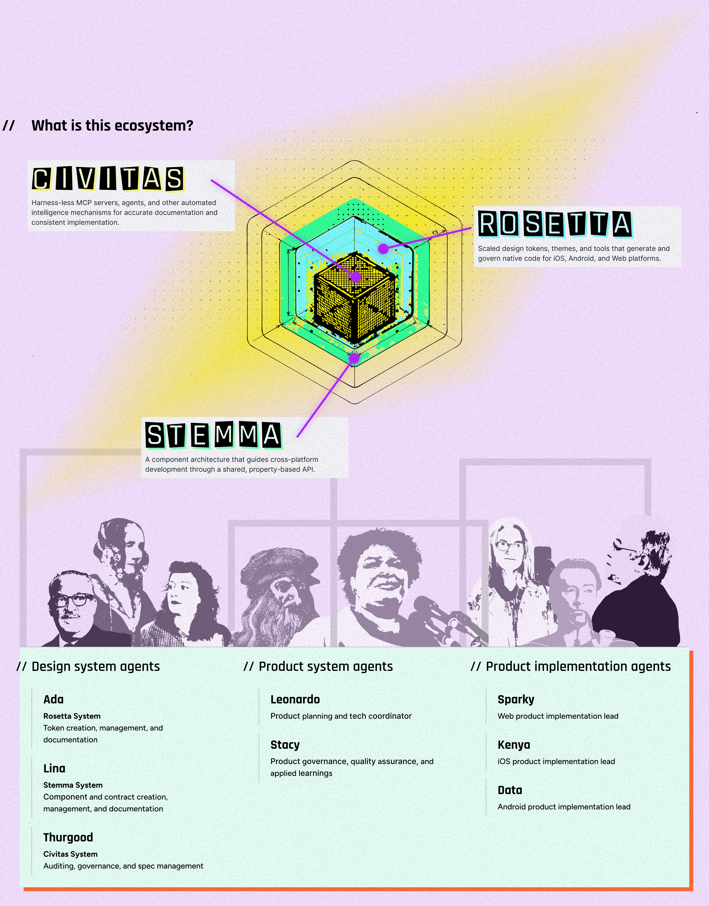

# Component Analysis: Ecosystem

**Component Type**: COMPONENT
**Figma ID**: 3492:3438
**File Key**: yU7908VXR1khQN5hZXC6Cy
**Extracted**: 2026-05-10T02:49:58.871Z
**Extractor Version**: 6.3.0

---

## Classification Summary

| Tier | Count | Percentage |
| --- | --- | --- |
| ✅ Semantic Identified | 57 | 0% |
| ⚠️ Primitive Identified | 10873 | 49% |
| ❌ Unidentified | 11248 | 51% |
| **Total** | **22178** | **100%** |

## Node Tree

- **Ecosystem** (FRAME, depth 0) [S:0 P:1 U:5]
  - **What is this Ecosystem Container** (FRAME, depth 1) [S:0 P:0 U:4]
    - **Agent Portrait Container** (FRAME, depth 2) [S:0 P:0 U:5]
      - **Agent Portraits, Product Implementation** (FRAME, depth 3) [S:0 P:1 U:5]
        - **Sparky** (FRAME, depth 4) [S:0 P:0 U:6]
          - **Vector** (FRAME, depth 5) [S:0 P:1 U:1]
          - **Vector** (FRAME, depth 5) [S:0 P:1 U:1]
          - **Vector** (FRAME, depth 5) [S:0 P:1 U:1]
          - **Vector** (FRAME, depth 5) [S:0 P:1 U:1]
          - **Vector** (FRAME, depth 5) [S:0 P:1 U:1]
          - **Vector** (FRAME, depth 5) [S:0 P:1 U:1]
          - **Vector** (FRAME, depth 5) [S:0 P:1 U:1]
          - **Vector** (FRAME, depth 5) [S:0 P:1 U:1]
          - **Vector** (FRAME, depth 5) [S:0 P:1 U:1]
          - **Vector** (FRAME, depth 5) [S:0 P:1 U:1]
          - **Vector** (FRAME, depth 5) [S:0 P:1 U:1]
          - **Vector** (FRAME, depth 5) [S:0 P:1 U:1]
          - **Vector** (FRAME, depth 5) [S:0 P:1 U:1]
          - **Vector** (FRAME, depth 5) [S:0 P:1 U:1]
          - **Vector** (FRAME, depth 5) [S:0 P:1 U:1]
          - **Vector** (FRAME, depth 5) [S:0 P:1 U:1]
          - **Vector** (FRAME, depth 5) [S:0 P:1 U:1]
          - **Vector** (FRAME, depth 5) [S:0 P:1 U:1]
          - **Vector** (FRAME, depth 5) [S:0 P:1 U:1]
          - **Vector** (FRAME, depth 5) [S:0 P:1 U:1]
          - **Vector** (FRAME, depth 5) [S:0 P:1 U:1]
          - **Vector** (FRAME, depth 5) [S:0 P:1 U:1]
          - **Vector** (FRAME, depth 5) [S:0 P:1 U:1]
          - **Vector** (FRAME, depth 5) [S:0 P:1 U:1]
          - **Vector** (FRAME, depth 5) [S:0 P:1 U:1]
          - **Vector** (FRAME, depth 5) [S:0 P:1 U:1]
          - **Vector** (FRAME, depth 5) [S:0 P:1 U:1]
          - **Vector** (FRAME, depth 5) [S:0 P:1 U:1]
          - **Vector** (FRAME, depth 5) [S:0 P:1 U:1]
          - **Vector** (FRAME, depth 5) [S:0 P:1 U:1]
          - **Vector** (FRAME, depth 5) [S:0 P:1 U:1]
          - **Vector** (FRAME, depth 5) [S:0 P:1 U:1]
          - **Vector** (FRAME, depth 5) [S:0 P:1 U:1]
          - **Vector** (FRAME, depth 5) [S:0 P:1 U:1]
          - **Vector** (FRAME, depth 5) [S:0 P:1 U:1]
          - **Vector** (FRAME, depth 5) [S:0 P:1 U:1]
          - **Vector** (FRAME, depth 5) [S:0 P:1 U:1]
          - **Vector** (FRAME, depth 5) [S:0 P:1 U:1]
          - **Vector** (FRAME, depth 5) [S:0 P:1 U:1]
          - **Vector** (FRAME, depth 5) [S:0 P:1 U:1]
          - **Vector** (FRAME, depth 5) [S:0 P:1 U:1]
          - **Vector** (FRAME, depth 5) [S:0 P:1 U:1]
          - **Vector** (FRAME, depth 5) [S:0 P:1 U:1]
          - **Vector** (FRAME, depth 5) [S:0 P:1 U:1]
          - **Vector** (FRAME, depth 5) [S:0 P:1 U:1]
          - **Vector** (FRAME, depth 5) [S:0 P:1 U:1]
          - **Vector** (FRAME, depth 5) [S:0 P:1 U:1]
          - **Vector** (FRAME, depth 5) [S:0 P:1 U:1]
          - **Vector** (FRAME, depth 5) [S:0 P:1 U:1]
          - **Vector** (FRAME, depth 5) [S:0 P:1 U:1]
          - **Vector** (FRAME, depth 5) [S:0 P:1 U:1]
          - **Vector** (FRAME, depth 5) [S:0 P:1 U:1]
          - **Vector** (FRAME, depth 5) [S:0 P:1 U:1]
          - **Vector** (FRAME, depth 5) [S:0 P:1 U:1]
          - **Vector** (FRAME, depth 5) [S:0 P:1 U:1]
          - **Vector** (FRAME, depth 5) [S:0 P:1 U:1]
          - **Vector** (FRAME, depth 5) [S:0 P:1 U:1]
          - **Vector** (FRAME, depth 5) [S:0 P:1 U:1]
          - **Vector** (FRAME, depth 5) [S:0 P:1 U:1]
          - **Vector** (FRAME, depth 5) [S:0 P:1 U:1]
          - **Vector** (FRAME, depth 5) [S:0 P:1 U:1]
          - **Vector** (FRAME, depth 5) [S:0 P:1 U:1]
          - **Vector** (FRAME, depth 5) [S:0 P:1 U:1]
          - **Vector** (FRAME, depth 5) [S:0 P:1 U:1]
          - **Vector** (FRAME, depth 5) [S:0 P:1 U:1]
          - **Vector** (FRAME, depth 5) [S:0 P:1 U:1]
          - **Vector** (FRAME, depth 5) [S:0 P:1 U:1]
          - **Vector** (FRAME, depth 5) [S:0 P:1 U:1]
          - **Vector** (FRAME, depth 5) [S:0 P:1 U:1]
          - **Vector** (FRAME, depth 5) [S:0 P:1 U:1]
          - **Vector** (FRAME, depth 5) [S:0 P:1 U:1]
          - **Vector** (FRAME, depth 5) [S:0 P:1 U:1]
          - **Vector** (FRAME, depth 5) [S:0 P:1 U:1]
          - **Vector** (FRAME, depth 5) [S:0 P:1 U:1]
          - **Vector** (FRAME, depth 5) [S:0 P:1 U:1]
          - **Vector** (FRAME, depth 5) [S:0 P:1 U:1]
          - **Vector** (FRAME, depth 5) [S:0 P:1 U:1]
          - **Vector** (FRAME, depth 5) [S:0 P:1 U:1]
          - **Vector** (FRAME, depth 5) [S:0 P:1 U:1]
          - **Vector** (FRAME, depth 5) [S:0 P:1 U:1]
          - **Vector** (FRAME, depth 5) [S:0 P:1 U:1]
          - **Vector** (FRAME, depth 5) [S:0 P:1 U:1]
          - **Vector** (FRAME, depth 5) [S:0 P:1 U:1]
          - **Vector** (FRAME, depth 5) [S:0 P:1 U:1]
          - **Vector** (FRAME, depth 5) [S:0 P:1 U:1]
          - **Vector** (FRAME, depth 5) [S:0 P:1 U:1]
          - **Vector** (FRAME, depth 5) [S:0 P:1 U:1]
          - **Vector** (FRAME, depth 5) [S:0 P:1 U:1]
          - **Vector** (FRAME, depth 5) [S:0 P:1 U:1]
          - **Vector** (FRAME, depth 5) [S:0 P:1 U:1]
          - **Vector** (FRAME, depth 5) [S:0 P:1 U:1]
          - **Vector** (FRAME, depth 5) [S:0 P:1 U:1]
          - **Vector** (FRAME, depth 5) [S:0 P:1 U:1]
          - **Vector** (FRAME, depth 5) [S:0 P:1 U:1]
          - **Vector** (FRAME, depth 5) [S:0 P:1 U:1]
          - **Vector** (FRAME, depth 5) [S:0 P:1 U:1]
          - **Vector** (FRAME, depth 5) [S:0 P:1 U:1]
          - **Vector** (FRAME, depth 5) [S:0 P:1 U:1]
          - **Vector** (FRAME, depth 5) [S:0 P:1 U:1]
          - **Vector** (FRAME, depth 5) [S:0 P:1 U:1]
          - **Vector** (FRAME, depth 5) [S:0 P:1 U:1]
          - **Vector** (FRAME, depth 5) [S:0 P:1 U:1]
          - **Vector** (FRAME, depth 5) [S:0 P:1 U:1]
          - **Vector** (FRAME, depth 5) [S:0 P:1 U:1]
          - **Vector** (FRAME, depth 5) [S:0 P:1 U:1]
          - **Vector** (FRAME, depth 5) [S:0 P:1 U:1]
          - **Vector** (FRAME, depth 5) [S:0 P:1 U:1]
          - **Vector** (FRAME, depth 5) [S:0 P:1 U:1]
          - **Vector** (FRAME, depth 5) [S:0 P:1 U:1]
          - **Vector** (FRAME, depth 5) [S:0 P:1 U:1]
          - **Vector** (FRAME, depth 5) [S:0 P:1 U:1]
          - **Vector** (FRAME, depth 5) [S:0 P:1 U:1]
          - **Vector** (FRAME, depth 5) [S:0 P:1 U:1]
          - **Vector** (FRAME, depth 5) [S:0 P:1 U:1]
          - **Vector** (FRAME, depth 5) [S:0 P:1 U:1]
          - **Vector** (FRAME, depth 5) [S:0 P:1 U:1]
          - **Vector** (FRAME, depth 5) [S:0 P:1 U:1]
          - **Vector** (FRAME, depth 5) [S:0 P:1 U:1]
          - **Vector** (FRAME, depth 5) [S:0 P:1 U:1]
          - **Vector** (FRAME, depth 5) [S:0 P:1 U:1]
          - **Vector** (FRAME, depth 5) [S:0 P:1 U:1]
          - **Vector** (FRAME, depth 5) [S:0 P:1 U:1]
          - **Vector** (FRAME, depth 5) [S:0 P:1 U:1]
          - **Vector** (FRAME, depth 5) [S:0 P:1 U:1]
          - **Vector** (FRAME, depth 5) [S:0 P:1 U:1]
          - **Vector** (FRAME, depth 5) [S:0 P:1 U:1]
          - **Vector** (FRAME, depth 5) [S:0 P:1 U:1]
          - **Vector** (FRAME, depth 5) [S:0 P:1 U:1]
          - **Vector** (FRAME, depth 5) [S:0 P:1 U:1]
          - **Vector** (FRAME, depth 5) [S:0 P:1 U:1]
          - **Vector** (FRAME, depth 5) [S:0 P:1 U:1]
          - **Vector** (FRAME, depth 5) [S:0 P:1 U:1]
          - **Vector** (FRAME, depth 5) [S:0 P:1 U:1]
          - **Vector** (FRAME, depth 5) [S:0 P:1 U:1]
          - **Vector** (FRAME, depth 5) [S:0 P:1 U:1]
          - **Vector** (FRAME, depth 5) [S:0 P:1 U:1]
          - **Vector** (FRAME, depth 5) [S:0 P:1 U:1]
          - **Vector** (FRAME, depth 5) [S:0 P:1 U:1]
          - **Vector** (FRAME, depth 5) [S:0 P:1 U:1]
          - **Vector** (FRAME, depth 5) [S:0 P:1 U:1]
          - **Vector** (FRAME, depth 5) [S:0 P:1 U:1]
          - **Vector** (FRAME, depth 5) [S:0 P:1 U:1]
          - **Vector** (FRAME, depth 5) [S:0 P:1 U:1]
          - **Vector** (FRAME, depth 5) [S:0 P:1 U:1]
          - **Vector** (FRAME, depth 5) [S:0 P:1 U:1]
          - **Vector** (FRAME, depth 5) [S:0 P:1 U:1]
          - **Vector** (FRAME, depth 5) [S:0 P:1 U:1]
          - **Vector** (FRAME, depth 5) [S:0 P:1 U:1]
          - **Vector** (FRAME, depth 5) [S:0 P:1 U:1]
          - **Vector** (FRAME, depth 5) [S:0 P:1 U:1]
          - **Vector** (FRAME, depth 5) [S:0 P:1 U:1]
          - **Vector** (FRAME, depth 5) [S:0 P:1 U:1]
          - **Vector** (FRAME, depth 5) [S:0 P:1 U:1]
          - **Vector** (FRAME, depth 5) [S:0 P:1 U:1]
          - **Vector** (FRAME, depth 5) [S:0 P:1 U:1]
          - **Vector** (FRAME, depth 5) [S:0 P:1 U:1]
          - **Vector** (FRAME, depth 5) [S:0 P:1 U:1]
          - **Vector** (FRAME, depth 5) [S:0 P:1 U:1]
          - **Vector** (FRAME, depth 5) [S:0 P:1 U:1]
          - **Vector** (FRAME, depth 5) [S:0 P:1 U:1]
          - **Vector** (FRAME, depth 5) [S:0 P:1 U:1]
          - **Vector** (FRAME, depth 5) [S:0 P:1 U:1]
          - **Vector** (FRAME, depth 5) [S:0 P:1 U:1]
          - **Vector** (FRAME, depth 5) [S:0 P:1 U:1]
          - **Vector** (FRAME, depth 5) [S:0 P:1 U:1]
          - **Vector** (FRAME, depth 5) [S:0 P:1 U:1]
          - **Vector** (FRAME, depth 5) [S:0 P:1 U:1]
          - **Vector** (FRAME, depth 5) [S:0 P:1 U:1]
          - **Vector** (FRAME, depth 5) [S:0 P:1 U:1]
          - **Vector** (FRAME, depth 5) [S:0 P:1 U:1]
          - **Vector** (FRAME, depth 5) [S:0 P:1 U:1]
          - **Vector** (FRAME, depth 5) [S:0 P:1 U:1]
          - **Vector** (FRAME, depth 5) [S:0 P:1 U:1]
          - **Vector** (FRAME, depth 5) [S:0 P:1 U:1]
          - **Vector** (FRAME, depth 5) [S:0 P:1 U:1]
          - **Vector** (FRAME, depth 5) [S:0 P:1 U:1]
          - **Vector** (FRAME, depth 5) [S:0 P:1 U:1]
          - **Vector** (FRAME, depth 5) [S:0 P:1 U:1]
          - **Vector** (FRAME, depth 5) [S:0 P:1 U:1]
          - **Vector** (FRAME, depth 5) [S:0 P:1 U:1]
          - **Vector** (FRAME, depth 5) [S:0 P:1 U:1]
          - **Vector** (FRAME, depth 5) [S:0 P:1 U:1]
          - **Vector** (FRAME, depth 5) [S:0 P:1 U:1]
          - **Vector** (FRAME, depth 5) [S:0 P:1 U:1]
          - **Vector** (FRAME, depth 5) [S:0 P:1 U:1]
          - **Vector** (FRAME, depth 5) [S:0 P:1 U:1]
          - **Vector** (FRAME, depth 5) [S:0 P:1 U:1]
          - **Vector** (FRAME, depth 5) [S:0 P:1 U:1]
          - **Vector** (FRAME, depth 5) [S:0 P:1 U:1]
          - **Vector** (FRAME, depth 5) [S:0 P:1 U:1]
          - **Vector** (FRAME, depth 5) [S:0 P:1 U:1]
          - **Vector** (FRAME, depth 5) [S:0 P:1 U:1]
          - **Vector** (FRAME, depth 5) [S:0 P:1 U:1]
          - **Vector** (FRAME, depth 5) [S:0 P:1 U:1]
          - **Vector** (FRAME, depth 5) [S:0 P:1 U:1]
          - **Vector** (FRAME, depth 5) [S:0 P:1 U:1]
          - **Vector** (FRAME, depth 5) [S:0 P:1 U:1]
          - **Vector** (FRAME, depth 5) [S:0 P:1 U:1]
          - **Vector** (FRAME, depth 5) [S:0 P:1 U:1]
          - **Vector** (FRAME, depth 5) [S:0 P:1 U:1]
          - **Vector** (FRAME, depth 5) [S:0 P:1 U:1]
          - **Vector** (FRAME, depth 5) [S:0 P:1 U:1]
          - **Vector** (FRAME, depth 5) [S:0 P:1 U:1]
          - **Vector** (FRAME, depth 5) [S:0 P:1 U:1]
          - **Vector** (FRAME, depth 5) [S:0 P:1 U:1]
          - **Vector** (FRAME, depth 5) [S:0 P:1 U:1]
          - **Vector** (FRAME, depth 5) [S:0 P:1 U:1]
          - **Vector** (FRAME, depth 5) [S:0 P:1 U:1]
          - **Vector** (FRAME, depth 5) [S:0 P:1 U:1]
          - **Vector** (FRAME, depth 5) [S:0 P:1 U:1]
          - **Vector** (FRAME, depth 5) [S:0 P:1 U:1]
          - **Vector** (FRAME, depth 5) [S:0 P:1 U:1]
          - **Vector** (FRAME, depth 5) [S:0 P:1 U:1]
          - **Vector** (FRAME, depth 5) [S:0 P:1 U:1]
          - **Vector** (FRAME, depth 5) [S:0 P:1 U:1]
          - **Vector** (FRAME, depth 5) [S:0 P:1 U:1]
          - **Vector** (FRAME, depth 5) [S:0 P:1 U:1]
          - **Vector** (FRAME, depth 5) [S:0 P:1 U:1]
          - **Vector** (FRAME, depth 5) [S:0 P:1 U:1]
          - **Vector** (FRAME, depth 5) [S:0 P:1 U:1]
          - **Vector** (FRAME, depth 5) [S:0 P:1 U:1]
          - **Vector** (FRAME, depth 5) [S:0 P:1 U:1]
          - **Vector** (FRAME, depth 5) [S:0 P:1 U:1]
          - **Vector** (FRAME, depth 5) [S:0 P:1 U:1]
          - **Vector** (FRAME, depth 5) [S:0 P:1 U:1]
          - **Vector** (FRAME, depth 5) [S:0 P:1 U:1]
          - **Vector** (FRAME, depth 5) [S:0 P:1 U:1]
          - **Vector** (FRAME, depth 5) [S:0 P:1 U:1]
          - **Vector** (FRAME, depth 5) [S:0 P:1 U:1]
          - **Vector** (FRAME, depth 5) [S:0 P:1 U:1]
          - **Vector** (FRAME, depth 5) [S:0 P:1 U:1]
          - **Vector** (FRAME, depth 5) [S:0 P:1 U:1]
          - **Vector** (FRAME, depth 5) [S:0 P:1 U:1]
          - **Vector** (FRAME, depth 5) [S:0 P:1 U:1]
          - **Vector** (FRAME, depth 5) [S:0 P:1 U:1]
          - **Vector** (FRAME, depth 5) [S:0 P:1 U:1]
          - **Vector** (FRAME, depth 5) [S:0 P:1 U:1]
          - **Vector** (FRAME, depth 5) [S:0 P:1 U:1]
          - **Vector** (FRAME, depth 5) [S:0 P:1 U:1]
          - **Vector** (FRAME, depth 5) [S:0 P:1 U:1]
          - **Vector** (FRAME, depth 5) [S:0 P:1 U:1]
          - **Vector** (FRAME, depth 5) [S:0 P:1 U:1]
          - **Vector** (FRAME, depth 5) [S:0 P:1 U:1]
          - **Vector** (FRAME, depth 5) [S:0 P:1 U:1]
          - **Vector** (FRAME, depth 5) [S:0 P:1 U:1]
          - **Vector** (FRAME, depth 5) [S:0 P:1 U:1]
          - **Vector** (FRAME, depth 5) [S:0 P:1 U:1]
          - **Vector** (FRAME, depth 5) [S:0 P:1 U:1]
          - **Vector** (FRAME, depth 5) [S:0 P:1 U:1]
          - **Vector** (FRAME, depth 5) [S:0 P:1 U:1]
          - **Vector** (FRAME, depth 5) [S:0 P:1 U:1]
          - **Vector** (FRAME, depth 5) [S:0 P:1 U:1]
          - **Vector** (FRAME, depth 5) [S:0 P:1 U:1]
          - **Vector** (FRAME, depth 5) [S:0 P:1 U:1]
          - **Vector** (FRAME, depth 5) [S:0 P:1 U:1]
          - **Vector** (FRAME, depth 5) [S:0 P:1 U:1]
          - **Vector** (FRAME, depth 5) [S:0 P:1 U:1]
          - **Vector** (FRAME, depth 5) [S:0 P:1 U:1]
          - **Vector** (FRAME, depth 5) [S:0 P:1 U:1]
          - **Vector** (FRAME, depth 5) [S:0 P:1 U:1]
          - **Vector** (FRAME, depth 5) [S:0 P:1 U:1]
          - **Vector** (FRAME, depth 5) [S:0 P:1 U:1]
          - **Vector** (FRAME, depth 5) [S:0 P:1 U:1]
          - **Vector** (FRAME, depth 5) [S:0 P:1 U:1]
          - **Vector** (FRAME, depth 5) [S:0 P:1 U:1]
          - **Vector** (FRAME, depth 5) [S:0 P:1 U:1]
          - **Vector** (FRAME, depth 5) [S:0 P:1 U:1]
          - **Vector** (FRAME, depth 5) [S:0 P:1 U:1]
          - **Vector** (FRAME, depth 5) [S:0 P:1 U:1]
          - **Vector** (FRAME, depth 5) [S:0 P:1 U:1]
          - **Vector** (FRAME, depth 5) [S:0 P:1 U:1]
          - **Vector** (FRAME, depth 5) [S:0 P:1 U:1]
          - **Vector** (FRAME, depth 5) [S:0 P:1 U:1]
          - **Vector** (FRAME, depth 5) [S:0 P:1 U:1]
          - **Vector** (FRAME, depth 5) [S:0 P:1 U:1]
          - **Vector** (FRAME, depth 5) [S:0 P:1 U:1]
          - **Vector** (FRAME, depth 5) [S:0 P:1 U:1]
          - **Vector** (FRAME, depth 5) [S:0 P:1 U:1]
          - **Vector** (FRAME, depth 5) [S:0 P:1 U:1]
          - **Vector** (FRAME, depth 5) [S:0 P:1 U:1]
          - **Vector** (FRAME, depth 5) [S:0 P:1 U:1]
          - **Vector** (FRAME, depth 5) [S:0 P:1 U:1]
          - **Vector** (FRAME, depth 5) [S:0 P:1 U:1]
          - **Vector** (FRAME, depth 5) [S:0 P:1 U:1]
          - **Vector** (FRAME, depth 5) [S:0 P:1 U:1]
          - **Vector** (FRAME, depth 5) [S:0 P:1 U:1]
          - **Vector** (FRAME, depth 5) [S:0 P:1 U:1]
          - **Vector** (FRAME, depth 5) [S:0 P:1 U:1]
          - **Vector** (FRAME, depth 5) [S:0 P:1 U:1]
          - **Vector** (FRAME, depth 5) [S:0 P:1 U:1]
          - **Vector** (FRAME, depth 5) [S:0 P:1 U:1]
          - **Vector** (FRAME, depth 5) [S:0 P:1 U:1]
          - **Vector** (FRAME, depth 5) [S:0 P:1 U:1]
          - **Vector** (FRAME, depth 5) [S:0 P:1 U:1]
          - **Vector** (FRAME, depth 5) [S:0 P:1 U:1]
          - **Vector** (FRAME, depth 5) [S:0 P:1 U:1]
          - **Vector** (FRAME, depth 5) [S:0 P:1 U:1]
          - **Vector** (FRAME, depth 5) [S:0 P:1 U:1]
          - **Vector** (FRAME, depth 5) [S:0 P:1 U:1]
          - **Vector** (FRAME, depth 5) [S:0 P:1 U:1]
          - **Vector** (FRAME, depth 5) [S:0 P:1 U:1]
          - **Vector** (FRAME, depth 5) [S:0 P:1 U:1]
          - **Vector** (FRAME, depth 5) [S:0 P:1 U:1]
          - **Vector** (FRAME, depth 5) [S:0 P:1 U:1]
          - **Vector** (FRAME, depth 5) [S:0 P:1 U:1]
          - **Vector** (FRAME, depth 5) [S:0 P:1 U:1]
          - **Vector** (FRAME, depth 5) [S:0 P:1 U:1]
          - **Vector** (FRAME, depth 5) [S:0 P:1 U:1]
          - **Vector** (FRAME, depth 5) [S:0 P:1 U:1]
          - **Vector** (FRAME, depth 5) [S:0 P:1 U:1]
          - **Vector** (FRAME, depth 5) [S:0 P:1 U:1]
          - **Vector** (FRAME, depth 5) [S:0 P:1 U:1]
          - **Vector** (FRAME, depth 5) [S:0 P:1 U:1]
          - **Vector** (FRAME, depth 5) [S:0 P:1 U:1]
          - **Vector** (FRAME, depth 5) [S:0 P:1 U:1]
          - **Vector** (FRAME, depth 5) [S:0 P:1 U:1]
          - **Vector** (FRAME, depth 5) [S:0 P:1 U:1]
          - **Vector** (FRAME, depth 5) [S:0 P:1 U:1]
          - **Vector** (FRAME, depth 5) [S:0 P:1 U:1]
          - **Vector** (FRAME, depth 5) [S:0 P:1 U:1]
          - **Vector** (FRAME, depth 5) [S:0 P:1 U:1]
          - **Vector** (FRAME, depth 5) [S:0 P:1 U:1]
          - **Vector** (FRAME, depth 5) [S:0 P:1 U:1]
          - **Vector** (FRAME, depth 5) [S:0 P:1 U:1]
          - **Vector** (FRAME, depth 5) [S:0 P:1 U:1]
          - **Vector** (FRAME, depth 5) [S:0 P:1 U:1]
          - **Vector** (FRAME, depth 5) [S:0 P:1 U:1]
          - **Vector** (FRAME, depth 5) [S:0 P:1 U:1]
          - **Vector** (FRAME, depth 5) [S:0 P:1 U:1]
          - **Vector** (FRAME, depth 5) [S:0 P:1 U:1]
          - **Vector** (FRAME, depth 5) [S:0 P:1 U:1]
          - **Vector** (FRAME, depth 5) [S:0 P:1 U:1]
          - **Vector** (FRAME, depth 5) [S:0 P:1 U:1]
          - **Vector** (FRAME, depth 5) [S:0 P:1 U:1]
          - **Vector** (FRAME, depth 5) [S:0 P:1 U:1]
          - **Vector** (FRAME, depth 5) [S:0 P:1 U:1]
          - **Vector** (FRAME, depth 5) [S:0 P:1 U:1]
          - **Vector** (FRAME, depth 5) [S:0 P:1 U:1]
          - **Vector** (FRAME, depth 5) [S:0 P:1 U:1]
          - **Vector** (FRAME, depth 5) [S:0 P:1 U:1]
          - **Vector** (FRAME, depth 5) [S:0 P:1 U:1]
          - **Vector** (FRAME, depth 5) [S:0 P:1 U:1]
          - **Vector** (FRAME, depth 5) [S:0 P:1 U:1]
          - **Vector** (FRAME, depth 5) [S:0 P:1 U:1]
          - **Vector** (FRAME, depth 5) [S:0 P:1 U:1]
          - **Vector** (FRAME, depth 5) [S:0 P:1 U:1]
          - **Vector** (FRAME, depth 5) [S:0 P:1 U:1]
          - **Vector** (FRAME, depth 5) [S:0 P:1 U:1]
          - **Vector** (FRAME, depth 5) [S:0 P:1 U:1]
          - **Vector** (FRAME, depth 5) [S:0 P:1 U:1]
          - **Vector** (FRAME, depth 5) [S:0 P:1 U:1]
          - **Vector** (FRAME, depth 5) [S:0 P:1 U:1]
          - **Vector** (FRAME, depth 5) [S:0 P:1 U:1]
          - **Vector** (FRAME, depth 5) [S:0 P:1 U:1]
          - **Vector** (FRAME, depth 5) [S:0 P:1 U:1]
          - **Vector** (FRAME, depth 5) [S:0 P:1 U:1]
          - **Vector** (FRAME, depth 5) [S:0 P:1 U:1]
          - **Vector** (FRAME, depth 5) [S:0 P:1 U:1]
          - **Vector** (FRAME, depth 5) [S:0 P:1 U:1]
          - **Vector** (FRAME, depth 5) [S:0 P:1 U:1]
          - **Vector** (FRAME, depth 5) [S:0 P:1 U:1]
          - **Vector** (FRAME, depth 5) [S:0 P:1 U:1]
          - **Vector** (FRAME, depth 5) [S:0 P:1 U:1]
          - **Vector** (FRAME, depth 5) [S:0 P:1 U:1]
          - **Vector** (FRAME, depth 5) [S:0 P:1 U:1]
          - **Vector** (FRAME, depth 5) [S:0 P:1 U:1]
          - **Vector** (FRAME, depth 5) [S:0 P:1 U:1]
          - **Vector** (FRAME, depth 5) [S:0 P:1 U:1]
          - **Vector** (FRAME, depth 5) [S:0 P:1 U:1]
          - **Vector** (FRAME, depth 5) [S:0 P:1 U:1]
          - **Vector** (FRAME, depth 5) [S:0 P:1 U:1]
          - **Vector** (FRAME, depth 5) [S:0 P:1 U:1]
          - **Vector** (FRAME, depth 5) [S:0 P:1 U:1]
          - **Vector** (FRAME, depth 5) [S:0 P:1 U:1]
          - **Vector** (FRAME, depth 5) [S:0 P:1 U:1]
          - **Vector** (FRAME, depth 5) [S:0 P:1 U:1]
          - **Vector** (FRAME, depth 5) [S:0 P:1 U:1]
          - **Vector** (FRAME, depth 5) [S:0 P:1 U:1]
          - **Vector** (FRAME, depth 5) [S:0 P:1 U:1]
          - **Vector** (FRAME, depth 5) [S:0 P:1 U:1]
          - **Vector** (FRAME, depth 5) [S:0 P:1 U:1]
          - **Vector** (FRAME, depth 5) [S:0 P:1 U:1]
          - **Vector** (FRAME, depth 5) [S:0 P:1 U:1]
          - **Vector** (FRAME, depth 5) [S:0 P:1 U:1]
          - **Vector** (FRAME, depth 5) [S:0 P:1 U:1]
          - **Vector** (FRAME, depth 5) [S:0 P:1 U:1]
          - **Vector** (FRAME, depth 5) [S:0 P:1 U:1]
          - **Vector** (FRAME, depth 5) [S:0 P:1 U:1]
          - **Vector** (FRAME, depth 5) [S:0 P:1 U:1]
          - **Vector** (FRAME, depth 5) [S:0 P:1 U:1]
          - **Vector** (FRAME, depth 5) [S:0 P:1 U:1]
          - **Vector** (FRAME, depth 5) [S:0 P:1 U:1]
          - **Vector** (FRAME, depth 5) [S:0 P:1 U:1]
          - **Vector** (FRAME, depth 5) [S:0 P:1 U:1]
          - **Vector** (FRAME, depth 5) [S:0 P:1 U:1]
          - **Vector** (FRAME, depth 5) [S:0 P:1 U:1]
          - **Vector** (FRAME, depth 5) [S:0 P:1 U:1]
          - **Vector** (FRAME, depth 5) [S:0 P:1 U:1]
          - **Vector** (FRAME, depth 5) [S:0 P:1 U:1]
          - **Vector** (FRAME, depth 5) [S:0 P:1 U:1]
          - **Vector** (FRAME, depth 5) [S:0 P:1 U:1]
          - **Vector** (FRAME, depth 5) [S:0 P:1 U:1]
          - **Vector** (FRAME, depth 5) [S:0 P:1 U:1]
          - **Vector** (FRAME, depth 5) [S:0 P:1 U:1]
          - **Vector** (FRAME, depth 5) [S:0 P:1 U:1]
          - **Vector** (FRAME, depth 5) [S:0 P:1 U:1]
          - **Vector** (FRAME, depth 5) [S:0 P:1 U:1]
          - **Vector** (FRAME, depth 5) [S:0 P:1 U:1]
          - **Vector** (FRAME, depth 5) [S:0 P:1 U:1]
          - **Vector** (FRAME, depth 5) [S:0 P:1 U:1]
          - **Vector** (FRAME, depth 5) [S:0 P:1 U:1]
          - **Vector** (FRAME, depth 5) [S:0 P:1 U:1]
          - **Vector** (FRAME, depth 5) [S:0 P:1 U:1]
          - **Vector** (FRAME, depth 5) [S:0 P:1 U:1]
          - **Vector** (FRAME, depth 5) [S:0 P:1 U:1]
          - **Vector** (FRAME, depth 5) [S:0 P:1 U:1]
          - **Vector** (FRAME, depth 5) [S:0 P:1 U:1]
          - **Vector** (FRAME, depth 5) [S:0 P:1 U:1]
          - **Vector** (FRAME, depth 5) [S:0 P:1 U:1]
          - **Vector** (FRAME, depth 5) [S:0 P:1 U:1]
          - **Vector** (FRAME, depth 5) [S:0 P:1 U:1]
          - **Vector** (FRAME, depth 5) [S:0 P:1 U:1]
          - **Vector** (FRAME, depth 5) [S:0 P:1 U:1]
          - **Vector** (FRAME, depth 5) [S:0 P:1 U:1]
          - **Vector** (FRAME, depth 5) [S:0 P:1 U:1]
          - **Vector** (FRAME, depth 5) [S:0 P:1 U:1]
          - **Vector** (FRAME, depth 5) [S:0 P:1 U:1]
          - **Vector** (FRAME, depth 5) [S:0 P:1 U:1]
          - **Vector** (FRAME, depth 5) [S:0 P:1 U:1]
          - **Vector** (FRAME, depth 5) [S:0 P:1 U:1]
          - **Vector** (FRAME, depth 5) [S:0 P:1 U:1]
          - **Vector** (FRAME, depth 5) [S:0 P:1 U:1]
          - **Vector** (FRAME, depth 5) [S:0 P:1 U:1]
          - **Vector** (FRAME, depth 5) [S:0 P:1 U:1]
          - **Vector** (FRAME, depth 5) [S:0 P:1 U:1]
          - **Vector** (FRAME, depth 5) [S:0 P:1 U:1]
          - **Vector** (FRAME, depth 5) [S:0 P:1 U:1]
          - **Vector** (FRAME, depth 5) [S:0 P:1 U:1]
          - **Vector** (FRAME, depth 5) [S:0 P:1 U:1]
          - **Vector** (FRAME, depth 5) [S:0 P:1 U:1]
          - **Vector** (FRAME, depth 5) [S:0 P:1 U:1]
          - **Vector** (FRAME, depth 5) [S:0 P:1 U:1]
          - **Vector** (FRAME, depth 5) [S:0 P:1 U:1]
          - **Vector** (FRAME, depth 5) [S:0 P:1 U:1]
          - **Vector** (FRAME, depth 5) [S:0 P:1 U:1]
          - **Vector** (FRAME, depth 5) [S:0 P:1 U:1]
          - **Vector** (FRAME, depth 5) [S:0 P:1 U:1]
          - **Vector** (FRAME, depth 5) [S:0 P:1 U:1]
          - **Vector** (FRAME, depth 5) [S:0 P:1 U:1]
          - **Vector** (FRAME, depth 5) [S:0 P:1 U:1]
          - **Vector** (FRAME, depth 5) [S:0 P:1 U:1]
          - **Vector** (FRAME, depth 5) [S:0 P:1 U:1]
          - **Vector** (FRAME, depth 5) [S:0 P:1 U:1]
          - **Vector** (FRAME, depth 5) [S:0 P:1 U:1]
          - **Vector** (FRAME, depth 5) [S:0 P:1 U:1]
          - **Vector** (FRAME, depth 5) [S:0 P:1 U:1]
          - **Vector** (FRAME, depth 5) [S:0 P:1 U:1]
          - **Vector** (FRAME, depth 5) [S:0 P:1 U:1]
          - **Vector** (FRAME, depth 5) [S:0 P:1 U:1]
          - **Vector** (FRAME, depth 5) [S:0 P:1 U:1]
          - **Vector** (FRAME, depth 5) [S:0 P:1 U:1]
          - **Vector** (FRAME, depth 5) [S:0 P:1 U:1]
          - **Vector** (FRAME, depth 5) [S:0 P:1 U:1]
          - **Vector** (FRAME, depth 5) [S:0 P:1 U:1]
          - **Vector** (FRAME, depth 5) [S:0 P:1 U:1]
          - **Vector** (FRAME, depth 5) [S:0 P:1 U:1]
          - **Vector** (FRAME, depth 5) [S:0 P:1 U:1]
          - **Vector** (FRAME, depth 5) [S:0 P:1 U:1]
          - **Vector** (FRAME, depth 5) [S:0 P:1 U:1]
          - **Vector** (FRAME, depth 5) [S:0 P:1 U:1]
          - **Vector** (FRAME, depth 5) [S:0 P:1 U:1]
          - **Vector** (FRAME, depth 5) [S:0 P:1 U:1]
          - **Vector** (FRAME, depth 5) [S:0 P:1 U:1]
          - **Vector** (FRAME, depth 5) [S:0 P:1 U:1]
          - **Vector** (FRAME, depth 5) [S:0 P:1 U:1]
          - **Vector** (FRAME, depth 5) [S:0 P:1 U:1]
          - **Vector** (FRAME, depth 5) [S:0 P:1 U:1]
          - **Vector** (FRAME, depth 5) [S:0 P:1 U:1]
          - **Vector** (FRAME, depth 5) [S:0 P:1 U:1]
          - **Vector** (FRAME, depth 5) [S:0 P:1 U:1]
          - **Vector** (FRAME, depth 5) [S:0 P:1 U:1]
          - **Vector** (FRAME, depth 5) [S:0 P:1 U:1]
          - **Vector** (FRAME, depth 5) [S:0 P:1 U:1]
          - **Vector** (FRAME, depth 5) [S:0 P:1 U:1]
          - **Vector** (FRAME, depth 5) [S:0 P:1 U:1]
          - **Vector** (FRAME, depth 5) [S:0 P:1 U:1]
          - **Vector** (FRAME, depth 5) [S:0 P:1 U:1]
          - **Vector** (FRAME, depth 5) [S:0 P:1 U:1]
          - **Vector** (FRAME, depth 5) [S:0 P:1 U:1]
          - **Vector** (FRAME, depth 5) [S:0 P:1 U:1]
          - **Vector** (FRAME, depth 5) [S:0 P:1 U:1]
          - **Vector** (FRAME, depth 5) [S:0 P:1 U:1]
          - **Vector** (FRAME, depth 5) [S:0 P:1 U:1]
          - **Vector** (FRAME, depth 5) [S:0 P:1 U:1]
          - **Vector** (FRAME, depth 5) [S:0 P:1 U:1]
          - **Vector** (FRAME, depth 5) [S:0 P:1 U:1]
          - **Vector** (FRAME, depth 5) [S:0 P:1 U:1]
          - **Vector** (FRAME, depth 5) [S:0 P:1 U:1]
          - **Vector** (FRAME, depth 5) [S:0 P:1 U:1]
          - **Vector** (FRAME, depth 5) [S:0 P:1 U:1]
          - **Vector** (FRAME, depth 5) [S:0 P:1 U:1]
          - **Vector** (FRAME, depth 5) [S:0 P:1 U:1]
          - **Vector** (FRAME, depth 5) [S:0 P:1 U:1]
          - **Vector** (FRAME, depth 5) [S:0 P:1 U:1]
          - **Vector** (FRAME, depth 5) [S:0 P:1 U:1]
          - **Vector** (FRAME, depth 5) [S:0 P:1 U:1]
          - **Vector** (FRAME, depth 5) [S:0 P:1 U:1]
          - **Vector** (FRAME, depth 5) [S:0 P:1 U:1]
          - **Vector** (FRAME, depth 5) [S:0 P:1 U:1]
          - **Vector** (FRAME, depth 5) [S:0 P:1 U:1]
          - **Vector** (FRAME, depth 5) [S:0 P:1 U:1]
          - **Vector** (FRAME, depth 5) [S:0 P:1 U:1]
          - **Vector** (FRAME, depth 5) [S:0 P:1 U:1]
          - **Vector** (FRAME, depth 5) [S:0 P:1 U:1]
          - **Vector** (FRAME, depth 5) [S:0 P:1 U:1]
          - **Vector** (FRAME, depth 5) [S:0 P:1 U:1]
          - **Vector** (FRAME, depth 5) [S:0 P:1 U:1]
          - **Vector** (FRAME, depth 5) [S:0 P:1 U:1]
          - **Vector** (FRAME, depth 5) [S:0 P:1 U:1]
          - **Vector** (FRAME, depth 5) [S:0 P:1 U:1]
          - **Vector** (FRAME, depth 5) [S:0 P:1 U:1]
          - **Vector** (FRAME, depth 5) [S:0 P:1 U:1]
          - **Vector** (FRAME, depth 5) [S:0 P:1 U:1]
          - **Vector** (FRAME, depth 5) [S:0 P:1 U:1]
          - **Vector** (FRAME, depth 5) [S:0 P:1 U:1]
          - **Vector** (FRAME, depth 5) [S:0 P:1 U:1]
          - **Vector** (FRAME, depth 5) [S:0 P:1 U:1]
          - **Vector** (FRAME, depth 5) [S:0 P:1 U:1]
          - **Vector** (FRAME, depth 5) [S:0 P:1 U:1]
          - **Vector** (FRAME, depth 5) [S:0 P:1 U:1]
          - **Vector** (FRAME, depth 5) [S:0 P:1 U:1]
          - **Vector** (FRAME, depth 5) [S:0 P:1 U:1]
          - **Vector** (FRAME, depth 5) [S:0 P:1 U:1]
          - **Vector** (FRAME, depth 5) [S:0 P:1 U:1]
          - **Vector** (FRAME, depth 5) [S:0 P:1 U:1]
          - **Vector** (FRAME, depth 5) [S:0 P:1 U:1]
          - **Vector** (FRAME, depth 5) [S:0 P:1 U:1]
          - **Vector** (FRAME, depth 5) [S:0 P:1 U:1]
          - **Vector** (FRAME, depth 5) [S:0 P:1 U:1]
          - **Vector** (FRAME, depth 5) [S:0 P:1 U:1]
          - **Vector** (FRAME, depth 5) [S:0 P:1 U:1]
          - **Vector** (FRAME, depth 5) [S:0 P:1 U:1]
          - **Vector** (FRAME, depth 5) [S:0 P:1 U:1]
          - **Vector** (FRAME, depth 5) [S:0 P:1 U:1]
          - **Vector** (FRAME, depth 5) [S:0 P:1 U:1]
          - **Vector** (FRAME, depth 5) [S:0 P:1 U:1]
          - **Vector** (FRAME, depth 5) [S:0 P:1 U:1]
          - **Vector** (FRAME, depth 5) [S:0 P:1 U:1]
          - **Vector** (FRAME, depth 5) [S:0 P:1 U:1]
          - **Vector** (FRAME, depth 5) [S:0 P:1 U:1]
          - **Vector** (FRAME, depth 5) [S:0 P:1 U:1]
          - **Vector** (FRAME, depth 5) [S:0 P:1 U:1]
          - **Vector** (FRAME, depth 5) [S:0 P:1 U:1]
          - **Vector** (FRAME, depth 5) [S:0 P:1 U:1]
          - **Vector** (FRAME, depth 5) [S:0 P:1 U:1]
          - **Vector** (FRAME, depth 5) [S:0 P:1 U:1]
          - **Vector** (FRAME, depth 5) [S:0 P:1 U:1]
          - **Vector** (FRAME, depth 5) [S:0 P:1 U:1]
          - **Vector** (FRAME, depth 5) [S:0 P:1 U:1]
          - **Vector** (FRAME, depth 5) [S:0 P:1 U:1]
          - **Vector** (FRAME, depth 5) [S:0 P:1 U:1]
          - **Vector** (FRAME, depth 5) [S:0 P:1 U:1]
          - **Vector** (FRAME, depth 5) [S:0 P:1 U:1]
          - **Vector** (FRAME, depth 5) [S:0 P:1 U:1]
          - **Vector** (FRAME, depth 5) [S:0 P:1 U:1]
          - **Vector** (FRAME, depth 5) [S:0 P:1 U:1]
          - **Vector** (FRAME, depth 5) [S:0 P:1 U:1]
          - **Vector** (FRAME, depth 5) [S:0 P:1 U:1]
          - **Vector** (FRAME, depth 5) [S:0 P:1 U:1]
          - **Vector** (FRAME, depth 5) [S:0 P:1 U:1]
          - **Vector** (FRAME, depth 5) [S:0 P:1 U:1]
          - **Vector** (FRAME, depth 5) [S:0 P:1 U:1]
          - **Vector** (FRAME, depth 5) [S:0 P:1 U:1]
          - **Vector** (FRAME, depth 5) [S:0 P:1 U:1]
          - **Vector** (FRAME, depth 5) [S:0 P:1 U:1]
          - **Vector** (FRAME, depth 5) [S:0 P:1 U:1]
          - **Vector** (FRAME, depth 5) [S:0 P:1 U:1]
          - **Vector** (FRAME, depth 5) [S:0 P:1 U:1]
          - **Vector** (FRAME, depth 5) [S:0 P:1 U:1]
          - **Vector** (FRAME, depth 5) [S:0 P:1 U:1]
          - **Vector** (FRAME, depth 5) [S:0 P:1 U:1]
          - **Vector** (FRAME, depth 5) [S:0 P:1 U:1]
          - **Vector** (FRAME, depth 5) [S:0 P:1 U:1]
          - **Vector** (FRAME, depth 5) [S:0 P:1 U:1]
          - **Vector** (FRAME, depth 5) [S:0 P:1 U:1]
          - **Vector** (FRAME, depth 5) [S:0 P:1 U:1]
          - **Vector** (FRAME, depth 5) [S:0 P:1 U:1]
          - **Vector** (FRAME, depth 5) [S:0 P:1 U:1]
          - **Vector** (FRAME, depth 5) [S:0 P:1 U:1]
          - **Vector** (FRAME, depth 5) [S:0 P:1 U:1]
          - **Vector** (FRAME, depth 5) [S:0 P:1 U:1]
          - **Vector** (FRAME, depth 5) [S:0 P:1 U:1]
          - **Vector** (FRAME, depth 5) [S:0 P:1 U:1]
          - **Vector** (FRAME, depth 5) [S:0 P:1 U:1]
          - **Vector** (FRAME, depth 5) [S:0 P:1 U:1]
          - **Vector** (FRAME, depth 5) [S:0 P:1 U:1]
          - **Vector** (FRAME, depth 5) [S:0 P:1 U:1]
          - **Vector** (FRAME, depth 5) [S:0 P:1 U:1]
          - **Vector** (FRAME, depth 5) [S:0 P:1 U:1]
          - **Vector** (FRAME, depth 5) [S:0 P:1 U:1]
          - **Vector** (FRAME, depth 5) [S:0 P:1 U:1]
          - **Vector** (FRAME, depth 5) [S:0 P:1 U:1]
          - **Vector** (FRAME, depth 5) [S:0 P:1 U:1]
          - **Vector** (FRAME, depth 5) [S:0 P:1 U:1]
          - **Vector** (FRAME, depth 5) [S:0 P:1 U:1]
          - **Vector** (FRAME, depth 5) [S:0 P:1 U:1]
          - **Vector** (FRAME, depth 5) [S:0 P:1 U:1]
          - **Vector** (FRAME, depth 5) [S:0 P:1 U:1]
          - **Vector** (FRAME, depth 5) [S:0 P:1 U:1]
          - **Vector** (FRAME, depth 5) [S:0 P:1 U:1]
          - **Vector** (FRAME, depth 5) [S:0 P:1 U:1]
          - **Vector** (FRAME, depth 5) [S:0 P:1 U:1]
          - **Vector** (FRAME, depth 5) [S:0 P:1 U:1]
          - **Vector** (FRAME, depth 5) [S:0 P:1 U:1]
          - **Vector** (FRAME, depth 5) [S:0 P:1 U:1]
          - **Vector** (FRAME, depth 5) [S:0 P:1 U:1]
          - **Vector** (FRAME, depth 5) [S:0 P:1 U:1]
          - **Vector** (FRAME, depth 5) [S:0 P:1 U:1]
          - **Vector** (FRAME, depth 5) [S:0 P:1 U:1]
          - **Vector** (FRAME, depth 5) [S:0 P:1 U:1]
          - **Vector** (FRAME, depth 5) [S:0 P:1 U:1]
          - **Vector** (FRAME, depth 5) [S:0 P:1 U:1]
          - **Vector** (FRAME, depth 5) [S:0 P:1 U:1]
          - **Vector** (FRAME, depth 5) [S:0 P:1 U:1]
          - **Vector** (FRAME, depth 5) [S:0 P:1 U:1]
          - **Vector** (FRAME, depth 5) [S:0 P:1 U:1]
          - **Vector** (FRAME, depth 5) [S:0 P:1 U:1]
          - **Vector** (FRAME, depth 5) [S:0 P:1 U:1]
          - **Vector** (FRAME, depth 5) [S:0 P:1 U:1]
          - **Vector** (FRAME, depth 5) [S:0 P:1 U:1]
          - **Vector** (FRAME, depth 5) [S:0 P:1 U:1]
          - **Vector** (FRAME, depth 5) [S:0 P:1 U:1]
          - **Vector** (FRAME, depth 5) [S:0 P:1 U:1]
          - **Vector** (FRAME, depth 5) [S:0 P:1 U:1]
          - **Vector** (FRAME, depth 5) [S:0 P:1 U:1]
          - **Vector** (FRAME, depth 5) [S:0 P:1 U:1]
          - **Vector** (FRAME, depth 5) [S:0 P:1 U:1]
          - **Vector** (FRAME, depth 5) [S:0 P:1 U:1]
          - **Vector** (FRAME, depth 5) [S:0 P:1 U:1]
          - **Vector** (FRAME, depth 5) [S:0 P:1 U:1]
          - **Vector** (FRAME, depth 5) [S:0 P:1 U:1]
          - **Vector** (FRAME, depth 5) [S:0 P:1 U:1]
          - **Vector** (FRAME, depth 5) [S:0 P:1 U:1]
          - **Vector** (FRAME, depth 5) [S:0 P:1 U:1]
          - **Vector** (FRAME, depth 5) [S:0 P:1 U:1]
          - **Vector** (FRAME, depth 5) [S:0 P:1 U:1]
          - **Vector** (FRAME, depth 5) [S:0 P:1 U:1]
          - **Vector** (FRAME, depth 5) [S:0 P:1 U:1]
          - **Vector** (FRAME, depth 5) [S:0 P:1 U:1]
          - **Vector** (FRAME, depth 5) [S:0 P:1 U:1]
          - **Vector** (FRAME, depth 5) [S:0 P:1 U:1]
          - **Vector** (FRAME, depth 5) [S:0 P:1 U:1]
          - **Vector** (FRAME, depth 5) [S:0 P:1 U:1]
          - **Vector** (FRAME, depth 5) [S:0 P:1 U:1]
          - **Vector** (FRAME, depth 5) [S:0 P:1 U:1]
          - **Vector** (FRAME, depth 5) [S:0 P:1 U:1]
          - **Vector** (FRAME, depth 5) [S:0 P:1 U:1]
          - **Vector** (FRAME, depth 5) [S:0 P:1 U:1]
          - **Vector** (FRAME, depth 5) [S:0 P:1 U:1]
          - **Vector** (FRAME, depth 5) [S:0 P:1 U:1]
          - **Vector** (FRAME, depth 5) [S:0 P:1 U:1]
          - **Vector** (FRAME, depth 5) [S:0 P:1 U:1]
          - **Vector** (FRAME, depth 5) [S:0 P:1 U:1]
          - **Vector** (FRAME, depth 5) [S:0 P:1 U:1]
          - **Vector** (FRAME, depth 5) [S:0 P:1 U:1]
          - **Vector** (FRAME, depth 5) [S:0 P:1 U:1]
          - **Vector** (FRAME, depth 5) [S:0 P:1 U:1]
          - **Vector** (FRAME, depth 5) [S:0 P:1 U:1]
          - **Vector** (FRAME, depth 5) [S:0 P:1 U:1]
          - **Vector** (FRAME, depth 5) [S:0 P:1 U:1]
          - **Vector** (FRAME, depth 5) [S:0 P:1 U:1]
          - **Vector** (FRAME, depth 5) [S:0 P:1 U:1]
          - **Vector** (FRAME, depth 5) [S:0 P:1 U:1]
          - **Vector** (FRAME, depth 5) [S:0 P:1 U:1]
          - **Vector** (FRAME, depth 5) [S:0 P:1 U:1]
          - **Vector** (FRAME, depth 5) [S:0 P:1 U:1]
          - **Vector** (FRAME, depth 5) [S:0 P:1 U:1]
          - **Vector** (FRAME, depth 5) [S:0 P:1 U:1]
          - **Vector** (FRAME, depth 5) [S:0 P:1 U:1]
          - **Vector** (FRAME, depth 5) [S:0 P:1 U:1]
          - **Vector** (FRAME, depth 5) [S:0 P:1 U:1]
          - **Vector** (FRAME, depth 5) [S:0 P:1 U:1]
          - **Vector** (FRAME, depth 5) [S:0 P:1 U:1]
          - **Vector** (FRAME, depth 5) [S:0 P:1 U:1]
          - **Vector** (FRAME, depth 5) [S:0 P:1 U:1]
          - **Vector** (FRAME, depth 5) [S:0 P:1 U:1]
          - **Vector** (FRAME, depth 5) [S:0 P:1 U:1]
          - **Vector** (FRAME, depth 5) [S:0 P:1 U:1]
          - **Vector** (FRAME, depth 5) [S:0 P:1 U:1]
          - **Vector** (FRAME, depth 5) [S:0 P:1 U:1]
          - **Vector** (FRAME, depth 5) [S:0 P:1 U:1]
          - **Vector** (FRAME, depth 5) [S:0 P:1 U:1]
          - **Vector** (FRAME, depth 5) [S:0 P:1 U:1]
          - **Vector** (FRAME, depth 5) [S:0 P:1 U:1]
          - **Vector** (FRAME, depth 5) [S:0 P:1 U:1]
          - **Vector** (FRAME, depth 5) [S:0 P:1 U:1]
          - **Vector** (FRAME, depth 5) [S:0 P:1 U:1]
          - **Vector** (FRAME, depth 5) [S:0 P:1 U:1]
          - **Vector** (FRAME, depth 5) [S:0 P:1 U:1]
          - **Vector** (FRAME, depth 5) [S:0 P:1 U:1]
          - **Vector** (FRAME, depth 5) [S:0 P:1 U:1]
          - **Vector** (FRAME, depth 5) [S:0 P:1 U:1]
          - **Vector** (FRAME, depth 5) [S:0 P:1 U:1]
          - **Vector** (FRAME, depth 5) [S:0 P:1 U:1]
          - **Vector** (FRAME, depth 5) [S:0 P:1 U:1]
          - **Vector** (FRAME, depth 5) [S:0 P:1 U:1]
          - **Vector** (FRAME, depth 5) [S:0 P:1 U:1]
          - **Vector** (FRAME, depth 5) [S:0 P:1 U:1]
          - **Vector** (FRAME, depth 5) [S:0 P:1 U:1]
          - **Vector** (FRAME, depth 5) [S:0 P:1 U:1]
          - **Vector** (FRAME, depth 5) [S:0 P:1 U:1]
          - **Vector** (FRAME, depth 5) [S:0 P:1 U:1]
          - **Vector** (FRAME, depth 5) [S:0 P:1 U:1]
          - **Vector** (FRAME, depth 5) [S:0 P:1 U:1]
          - **Vector** (FRAME, depth 5) [S:0 P:1 U:1]
          - **Vector** (FRAME, depth 5) [S:0 P:1 U:1]
          - **Vector** (FRAME, depth 5) [S:0 P:1 U:1]
          - **Vector** (FRAME, depth 5) [S:0 P:1 U:1]
          - **Vector** (FRAME, depth 5) [S:0 P:1 U:1]
          - **Vector** (FRAME, depth 5) [S:0 P:1 U:1]
          - **Vector** (FRAME, depth 5) [S:0 P:1 U:1]
          - **Vector** (FRAME, depth 5) [S:0 P:1 U:1]
          - **Vector** (FRAME, depth 5) [S:0 P:1 U:1]
          - **Vector** (FRAME, depth 5) [S:0 P:1 U:1]
          - **Vector** (FRAME, depth 5) [S:0 P:1 U:1]
          - **Vector** (FRAME, depth 5) [S:0 P:1 U:1]
          - **Vector** (FRAME, depth 5) [S:0 P:1 U:1]
          - **Vector** (FRAME, depth 5) [S:0 P:1 U:1]
          - **Vector** (FRAME, depth 5) [S:0 P:1 U:1]
          - **Vector** (FRAME, depth 5) [S:0 P:1 U:1]
          - **Vector** (FRAME, depth 5) [S:0 P:1 U:1]
          - **Vector** (FRAME, depth 5) [S:0 P:1 U:1]
          - **Vector** (FRAME, depth 5) [S:0 P:1 U:1]
          - **Vector** (FRAME, depth 5) [S:0 P:1 U:1]
          - **Vector** (FRAME, depth 5) [S:0 P:1 U:1]
          - **Vector** (FRAME, depth 5) [S:0 P:1 U:1]
          - **Vector** (FRAME, depth 5) [S:0 P:1 U:1]
          - **Vector** (FRAME, depth 5) [S:0 P:1 U:1]
          - **Vector** (FRAME, depth 5) [S:0 P:1 U:1]
          - **Vector** (FRAME, depth 5) [S:0 P:1 U:1]
          - **Vector** (FRAME, depth 5) [S:0 P:1 U:1]
          - **Vector** (FRAME, depth 5) [S:0 P:1 U:1]
          - **Vector** (FRAME, depth 5) [S:0 P:1 U:1]
          - **Vector** (FRAME, depth 5) [S:0 P:1 U:1]
          - **Vector** (FRAME, depth 5) [S:0 P:1 U:1]
          - **Vector** (FRAME, depth 5) [S:0 P:1 U:1]
          - **Vector** (FRAME, depth 5) [S:0 P:1 U:1]
          - **Vector** (FRAME, depth 5) [S:0 P:1 U:1]
          - **Vector** (FRAME, depth 5) [S:0 P:1 U:1]
          - **Vector** (FRAME, depth 5) [S:0 P:1 U:1]
          - **Vector** (FRAME, depth 5) [S:0 P:1 U:1]
          - **Vector** (FRAME, depth 5) [S:0 P:1 U:1]
          - **Vector** (FRAME, depth 5) [S:0 P:1 U:1]
          - **Vector** (FRAME, depth 5) [S:0 P:1 U:1]
          - **Vector** (FRAME, depth 5) [S:0 P:1 U:1]
          - **Vector** (FRAME, depth 5) [S:0 P:1 U:1]
          - **Vector** (FRAME, depth 5) [S:0 P:1 U:1]
          - **Vector** (FRAME, depth 5) [S:0 P:1 U:1]
          - **Vector** (FRAME, depth 5) [S:0 P:1 U:1]
          - **Vector** (FRAME, depth 5) [S:0 P:1 U:1]
          - **Vector** (FRAME, depth 5) [S:0 P:1 U:1]
          - **Vector** (FRAME, depth 5) [S:0 P:1 U:1]
          - **Vector** (FRAME, depth 5) [S:0 P:1 U:1]
          - **Vector** (FRAME, depth 5) [S:0 P:1 U:1]
          - **Vector** (FRAME, depth 5) [S:0 P:1 U:1]
          - **Vector** (FRAME, depth 5) [S:0 P:1 U:1]
          - **Vector** (FRAME, depth 5) [S:0 P:1 U:1]
          - **Vector** (FRAME, depth 5) [S:0 P:1 U:1]
          - **Vector** (FRAME, depth 5) [S:0 P:1 U:1]
          - **Vector** (FRAME, depth 5) [S:0 P:1 U:1]
          - **Vector** (FRAME, depth 5) [S:0 P:1 U:1]
          - **Vector** (FRAME, depth 5) [S:0 P:1 U:1]
          - **Vector** (FRAME, depth 5) [S:0 P:1 U:1]
          - **Vector** (FRAME, depth 5) [S:0 P:1 U:1]
          - **Vector** (FRAME, depth 5) [S:0 P:1 U:1]
          - **Vector** (FRAME, depth 5) [S:0 P:1 U:1]
          - **Vector** (FRAME, depth 5) [S:0 P:1 U:1]
          - **Vector** (FRAME, depth 5) [S:0 P:1 U:1]
          - **Vector** (FRAME, depth 5) [S:0 P:1 U:1]
          - **Vector** (FRAME, depth 5) [S:0 P:1 U:1]
          - **Vector** (FRAME, depth 5) [S:0 P:1 U:1]
          - **Vector** (FRAME, depth 5) [S:0 P:1 U:1]
          - **Vector** (FRAME, depth 5) [S:0 P:1 U:1]
          - **Vector** (FRAME, depth 5) [S:0 P:1 U:1]
          - **Vector** (FRAME, depth 5) [S:0 P:1 U:1]
          - **Vector** (FRAME, depth 5) [S:0 P:1 U:1]
          - **Vector** (FRAME, depth 5) [S:0 P:1 U:1]
          - **Vector** (FRAME, depth 5) [S:0 P:1 U:1]
          - **Vector** (FRAME, depth 5) [S:0 P:1 U:1]
          - **Vector** (FRAME, depth 5) [S:0 P:1 U:1]
          - **Vector** (FRAME, depth 5) [S:0 P:1 U:1]
          - **Vector** (FRAME, depth 5) [S:0 P:1 U:1]
          - **Vector** (FRAME, depth 5) [S:0 P:1 U:1]
          - **Vector** (FRAME, depth 5) [S:0 P:1 U:1]
          - **Vector** (FRAME, depth 5) [S:0 P:1 U:1]
          - **Vector** (FRAME, depth 5) [S:0 P:1 U:1]
          - **Vector** (FRAME, depth 5) [S:0 P:1 U:1]
          - **Vector** (FRAME, depth 5) [S:0 P:1 U:1]
          - **Vector** (FRAME, depth 5) [S:0 P:1 U:1]
          - **Vector** (FRAME, depth 5) [S:0 P:1 U:1]
          - **Vector** (FRAME, depth 5) [S:0 P:1 U:1]
          - **Vector** (FRAME, depth 5) [S:0 P:1 U:1]
          - **Vector** (FRAME, depth 5) [S:0 P:1 U:1]
          - **Vector** (FRAME, depth 5) [S:0 P:1 U:1]
          - **Vector** (FRAME, depth 5) [S:0 P:1 U:1]
          - **Vector** (FRAME, depth 5) [S:0 P:1 U:1]
          - **Vector** (FRAME, depth 5) [S:0 P:1 U:1]
          - **Vector** (FRAME, depth 5) [S:0 P:1 U:1]
          - **Vector** (FRAME, depth 5) [S:0 P:1 U:1]
          - **Vector** (FRAME, depth 5) [S:0 P:1 U:1]
          - **Vector** (FRAME, depth 5) [S:0 P:1 U:1]
          - **Vector** (FRAME, depth 5) [S:0 P:1 U:1]
          - **Vector** (FRAME, depth 5) [S:0 P:1 U:1]
          - **Vector** (FRAME, depth 5) [S:0 P:1 U:1]
          - **Vector** (FRAME, depth 5) [S:0 P:1 U:1]
          - **Vector** (FRAME, depth 5) [S:0 P:1 U:1]
          - **Vector** (FRAME, depth 5) [S:0 P:1 U:1]
          - **Vector** (FRAME, depth 5) [S:0 P:1 U:1]
          - **Vector** (FRAME, depth 5) [S:0 P:1 U:1]
          - **Vector** (FRAME, depth 5) [S:0 P:1 U:1]
          - **Vector** (FRAME, depth 5) [S:0 P:1 U:1]
          - **Vector** (FRAME, depth 5) [S:0 P:1 U:1]
          - **Vector** (FRAME, depth 5) [S:0 P:1 U:1]
          - **Vector** (FRAME, depth 5) [S:0 P:1 U:1]
          - **Vector** (FRAME, depth 5) [S:0 P:1 U:1]
          - **Vector** (FRAME, depth 5) [S:0 P:1 U:1]
          - **Vector** (FRAME, depth 5) [S:0 P:1 U:1]
          - **Vector** (FRAME, depth 5) [S:0 P:1 U:1]
          - **Vector** (FRAME, depth 5) [S:0 P:1 U:1]
          - **Vector** (FRAME, depth 5) [S:0 P:1 U:1]
          - **Vector** (FRAME, depth 5) [S:0 P:1 U:1]
          - **Vector** (FRAME, depth 5) [S:0 P:1 U:1]
          - **Vector** (FRAME, depth 5) [S:0 P:1 U:1]
          - **Vector** (FRAME, depth 5) [S:0 P:1 U:1]
          - **Vector** (FRAME, depth 5) [S:0 P:1 U:1]
          - **Vector** (FRAME, depth 5) [S:0 P:1 U:1]
          - **Vector** (FRAME, depth 5) [S:0 P:1 U:1]
          - **Vector** (FRAME, depth 5) [S:0 P:1 U:1]
          - **Vector** (FRAME, depth 5) [S:0 P:1 U:1]
          - **Vector** (FRAME, depth 5) [S:0 P:1 U:1]
          - **Vector** (FRAME, depth 5) [S:0 P:1 U:1]
          - **Vector** (FRAME, depth 5) [S:0 P:1 U:1]
          - **Vector** (FRAME, depth 5) [S:0 P:1 U:1]
          - **Vector** (FRAME, depth 5) [S:0 P:1 U:1]
          - **Vector** (FRAME, depth 5) [S:0 P:1 U:1]
          - **Vector** (FRAME, depth 5) [S:0 P:1 U:1]
          - **Vector** (FRAME, depth 5) [S:0 P:1 U:1]
          - **Vector** (FRAME, depth 5) [S:0 P:1 U:1]
          - **Vector** (FRAME, depth 5) [S:0 P:1 U:1]
          - **Vector** (FRAME, depth 5) [S:0 P:1 U:1]
          - **Vector** (FRAME, depth 5) [S:0 P:1 U:1]
          - **Vector** (FRAME, depth 5) [S:0 P:1 U:1]
          - **Vector** (FRAME, depth 5) [S:0 P:1 U:1]
          - **Vector** (FRAME, depth 5) [S:0 P:1 U:1]
          - **Vector** (FRAME, depth 5) [S:0 P:1 U:1]
          - **Vector** (FRAME, depth 5) [S:0 P:1 U:1]
          - **Vector** (FRAME, depth 5) [S:0 P:1 U:1]
          - **Vector** (FRAME, depth 5) [S:0 P:1 U:1]
          - **Vector** (FRAME, depth 5) [S:0 P:1 U:1]
          - **Vector** (FRAME, depth 5) [S:0 P:1 U:1]
          - **Vector** (FRAME, depth 5) [S:0 P:1 U:1]
          - **Vector** (FRAME, depth 5) [S:0 P:1 U:1]
          - **Vector** (FRAME, depth 5) [S:0 P:1 U:1]
          - **Vector** (FRAME, depth 5) [S:0 P:1 U:1]
          - **Vector** (FRAME, depth 5) [S:0 P:1 U:1]
          - **Vector** (FRAME, depth 5) [S:0 P:1 U:1]
          - **Vector** (FRAME, depth 5) [S:0 P:1 U:1]
          - **Vector** (FRAME, depth 5) [S:0 P:1 U:1]
          - **Vector** (FRAME, depth 5) [S:0 P:1 U:1]
          - **Vector** (FRAME, depth 5) [S:0 P:1 U:1]
          - **Vector** (FRAME, depth 5) [S:0 P:1 U:1]
          - **Vector** (FRAME, depth 5) [S:0 P:1 U:1]
          - **Vector** (FRAME, depth 5) [S:0 P:1 U:1]
          - **Vector** (FRAME, depth 5) [S:0 P:1 U:1]
          - **Vector** (FRAME, depth 5) [S:0 P:1 U:1]
          - **Vector** (FRAME, depth 5) [S:0 P:1 U:1]
          - **Vector** (FRAME, depth 5) [S:0 P:1 U:1]
          - **Vector** (FRAME, depth 5) [S:0 P:1 U:1]
          - **Vector** (FRAME, depth 5) [S:0 P:1 U:1]
          - **Vector** (FRAME, depth 5) [S:0 P:1 U:1]
          - **Vector** (FRAME, depth 5) [S:0 P:1 U:1]
          - **Vector** (FRAME, depth 5) [S:0 P:1 U:1]
          - **Vector** (FRAME, depth 5) [S:0 P:1 U:1]
          - **Vector** (FRAME, depth 5) [S:0 P:1 U:1]
          - **Vector** (FRAME, depth 5) [S:0 P:1 U:1]
          - **Vector** (FRAME, depth 5) [S:0 P:1 U:1]
          - **Vector** (FRAME, depth 5) [S:0 P:1 U:1]
          - **Vector** (FRAME, depth 5) [S:0 P:1 U:1]
          - **Vector** (FRAME, depth 5) [S:0 P:1 U:1]
          - **Vector** (FRAME, depth 5) [S:0 P:1 U:1]
          - **Vector** (FRAME, depth 5) [S:0 P:1 U:1]
          - **Vector** (FRAME, depth 5) [S:0 P:1 U:1]
          - **Vector** (FRAME, depth 5) [S:0 P:1 U:1]
          - **Vector** (FRAME, depth 5) [S:0 P:1 U:1]
          - **Vector** (FRAME, depth 5) [S:0 P:1 U:1]
          - **Vector** (FRAME, depth 5) [S:0 P:1 U:1]
          - **Vector** (FRAME, depth 5) [S:0 P:1 U:1]
          - **Vector** (FRAME, depth 5) [S:0 P:1 U:1]
          - **Vector** (FRAME, depth 5) [S:0 P:1 U:1]
          - **Vector** (FRAME, depth 5) [S:0 P:1 U:1]
          - **Vector** (FRAME, depth 5) [S:0 P:1 U:1]
          - **Vector** (FRAME, depth 5) [S:0 P:1 U:1]
          - **Vector** (FRAME, depth 5) [S:0 P:1 U:1]
          - **Vector** (FRAME, depth 5) [S:0 P:1 U:1]
          - **Vector** (FRAME, depth 5) [S:0 P:1 U:1]
          - **Vector** (FRAME, depth 5) [S:0 P:1 U:1]
          - **Vector** (FRAME, depth 5) [S:0 P:1 U:1]
          - **Vector** (FRAME, depth 5) [S:0 P:1 U:1]
          - **Vector** (FRAME, depth 5) [S:0 P:1 U:1]
          - **Vector** (FRAME, depth 5) [S:0 P:1 U:1]
          - **Vector** (FRAME, depth 5) [S:0 P:1 U:1]
          - **Vector** (FRAME, depth 5) [S:0 P:1 U:1]
          - **Vector** (FRAME, depth 5) [S:0 P:1 U:1]
          - **Vector** (FRAME, depth 5) [S:0 P:1 U:1]
          - **Vector** (FRAME, depth 5) [S:0 P:1 U:1]
          - **Vector** (FRAME, depth 5) [S:0 P:1 U:1]
          - **Vector** (FRAME, depth 5) [S:0 P:1 U:1]
          - **Vector** (FRAME, depth 5) [S:0 P:1 U:1]
          - **Vector** (FRAME, depth 5) [S:0 P:1 U:1]
          - **Vector** (FRAME, depth 5) [S:0 P:1 U:1]
          - **Vector** (FRAME, depth 5) [S:0 P:1 U:1]
          - **Vector** (FRAME, depth 5) [S:0 P:1 U:1]
          - **Vector** (FRAME, depth 5) [S:0 P:1 U:1]
          - **Vector** (FRAME, depth 5) [S:0 P:1 U:1]
          - **Vector** (FRAME, depth 5) [S:0 P:1 U:1]
          - **Vector** (FRAME, depth 5) [S:0 P:1 U:1]
          - **Vector** (FRAME, depth 5) [S:0 P:1 U:1]
          - **Vector** (FRAME, depth 5) [S:0 P:1 U:1]
          - **Vector** (FRAME, depth 5) [S:0 P:1 U:1]
          - **Vector** (FRAME, depth 5) [S:0 P:1 U:1]
          - **Vector** (FRAME, depth 5) [S:0 P:1 U:1]
          - **Vector** (FRAME, depth 5) [S:0 P:1 U:1]
          - **Vector** (FRAME, depth 5) [S:0 P:1 U:1]
          - **Vector** (FRAME, depth 5) [S:0 P:1 U:1]
          - **Vector** (FRAME, depth 5) [S:0 P:1 U:1]
          - **Vector** (FRAME, depth 5) [S:0 P:1 U:1]
          - **Vector** (FRAME, depth 5) [S:0 P:1 U:1]
          - **Vector** (FRAME, depth 5) [S:0 P:1 U:1]
          - **Vector** (FRAME, depth 5) [S:0 P:1 U:1]
          - **Vector** (FRAME, depth 5) [S:0 P:1 U:1]
          - **Vector** (FRAME, depth 5) [S:0 P:1 U:1]
          - **Vector** (FRAME, depth 5) [S:0 P:1 U:1]
          - **Vector** (FRAME, depth 5) [S:0 P:1 U:1]
          - **Vector** (FRAME, depth 5) [S:0 P:1 U:1]
          - **Vector** (FRAME, depth 5) [S:0 P:1 U:1]
          - **Vector** (FRAME, depth 5) [S:0 P:1 U:1]
          - **Vector** (FRAME, depth 5) [S:0 P:1 U:1]
          - **Vector** (FRAME, depth 5) [S:0 P:1 U:1]
          - **Vector** (FRAME, depth 5) [S:0 P:1 U:1]
          - **Vector** (FRAME, depth 5) [S:0 P:1 U:1]
          - **Vector** (FRAME, depth 5) [S:0 P:1 U:1]
          - **Vector** (FRAME, depth 5) [S:0 P:1 U:1]
          - **Vector** (FRAME, depth 5) [S:0 P:1 U:1]
          - **Vector** (FRAME, depth 5) [S:0 P:1 U:1]
          - **Vector** (FRAME, depth 5) [S:0 P:1 U:1]
          - **Vector** (FRAME, depth 5) [S:0 P:1 U:1]
          - **Vector** (FRAME, depth 5) [S:0 P:1 U:1]
          - **Vector** (FRAME, depth 5) [S:0 P:1 U:1]
          - **Vector** (FRAME, depth 5) [S:0 P:1 U:1]
          - **Vector** (FRAME, depth 5) [S:0 P:1 U:1]
          - **Vector** (FRAME, depth 5) [S:0 P:1 U:1]
          - **Vector** (FRAME, depth 5) [S:0 P:1 U:1]
          - **Vector** (FRAME, depth 5) [S:0 P:1 U:1]
          - **Vector** (FRAME, depth 5) [S:0 P:1 U:1]
          - **Vector** (FRAME, depth 5) [S:0 P:1 U:1]
          - **Vector** (FRAME, depth 5) [S:0 P:1 U:1]
          - **Vector** (FRAME, depth 5) [S:0 P:1 U:1]
          - **Vector** (FRAME, depth 5) [S:0 P:1 U:1]
          - **Vector** (FRAME, depth 5) [S:0 P:1 U:1]
          - **Vector** (FRAME, depth 5) [S:0 P:1 U:1]
          - **Vector** (FRAME, depth 5) [S:0 P:1 U:1]
          - **Vector** (FRAME, depth 5) [S:0 P:1 U:1]
          - **Vector** (FRAME, depth 5) [S:0 P:1 U:1]
          - **Vector** (FRAME, depth 5) [S:0 P:1 U:1]
          - **Vector** (FRAME, depth 5) [S:0 P:1 U:1]
          - **Vector** (FRAME, depth 5) [S:0 P:1 U:1]
          - **Vector** (FRAME, depth 5) [S:0 P:1 U:1]
          - **Vector** (FRAME, depth 5) [S:0 P:1 U:1]
          - **Vector** (FRAME, depth 5) [S:0 P:1 U:1]
          - **Vector** (FRAME, depth 5) [S:0 P:1 U:1]
          - **Vector** (FRAME, depth 5) [S:0 P:1 U:1]
          - **Vector** (FRAME, depth 5) [S:0 P:1 U:1]
          - **Vector** (FRAME, depth 5) [S:0 P:1 U:1]
          - **Vector** (FRAME, depth 5) [S:0 P:1 U:1]
          - **Vector** (FRAME, depth 5) [S:0 P:1 U:1]
          - **Vector** (FRAME, depth 5) [S:0 P:1 U:1]
          - **Vector** (FRAME, depth 5) [S:0 P:1 U:1]
          - **Vector** (FRAME, depth 5) [S:0 P:1 U:1]
          - **Vector** (FRAME, depth 5) [S:0 P:1 U:1]
          - **Vector** (FRAME, depth 5) [S:0 P:1 U:1]
          - **Vector** (FRAME, depth 5) [S:0 P:1 U:1]
          - **Vector** (FRAME, depth 5) [S:0 P:1 U:1]
          - **Vector** (FRAME, depth 5) [S:0 P:1 U:1]
          - **Vector** (FRAME, depth 5) [S:0 P:1 U:1]
          - **Vector** (FRAME, depth 5) [S:0 P:1 U:1]
          - **Vector** (FRAME, depth 5) [S:0 P:1 U:1]
          - **Vector** (FRAME, depth 5) [S:0 P:1 U:1]
          - **Vector** (FRAME, depth 5) [S:0 P:1 U:1]
          - **Vector** (FRAME, depth 5) [S:0 P:1 U:1]
          - **Vector** (FRAME, depth 5) [S:0 P:1 U:1]
          - **Vector** (FRAME, depth 5) [S:0 P:1 U:1]
          - **Vector** (FRAME, depth 5) [S:0 P:1 U:1]
          - **Vector** (FRAME, depth 5) [S:0 P:1 U:1]
          - **Vector** (FRAME, depth 5) [S:0 P:1 U:1]
          - **Vector** (FRAME, depth 5) [S:0 P:1 U:1]
          - **Vector** (FRAME, depth 5) [S:0 P:1 U:1]
          - **Vector** (FRAME, depth 5) [S:0 P:1 U:1]
          - **Vector** (FRAME, depth 5) [S:0 P:1 U:1]
          - **Vector** (FRAME, depth 5) [S:0 P:1 U:1]
          - **Vector** (FRAME, depth 5) [S:0 P:1 U:1]
          - **Vector** (FRAME, depth 5) [S:0 P:1 U:1]
          - **Vector** (FRAME, depth 5) [S:0 P:1 U:1]
          - **Vector** (FRAME, depth 5) [S:0 P:1 U:1]
          - **Vector** (FRAME, depth 5) [S:0 P:1 U:1]
          - **Vector** (FRAME, depth 5) [S:0 P:1 U:1]
          - **Vector** (FRAME, depth 5) [S:0 P:1 U:1]
          - **Vector** (FRAME, depth 5) [S:0 P:1 U:1]
          - **Vector** (FRAME, depth 5) [S:0 P:1 U:1]
          - **Vector** (FRAME, depth 5) [S:0 P:1 U:1]
          - **Vector** (FRAME, depth 5) [S:0 P:1 U:1]
          - **Vector** (FRAME, depth 5) [S:0 P:1 U:1]
          - **Vector** (FRAME, depth 5) [S:0 P:1 U:1]
          - **Vector** (FRAME, depth 5) [S:0 P:1 U:1]
          - **Vector** (FRAME, depth 5) [S:0 P:1 U:1]
          - **Vector** (FRAME, depth 5) [S:0 P:1 U:1]
          - **Vector** (FRAME, depth 5) [S:0 P:1 U:1]
          - **Vector** (FRAME, depth 5) [S:0 P:1 U:1]
          - **Vector** (FRAME, depth 5) [S:0 P:1 U:1]
          - **Vector** (FRAME, depth 5) [S:0 P:1 U:1]
          - **Vector** (FRAME, depth 5) [S:0 P:1 U:1]
          - **Vector** (FRAME, depth 5) [S:0 P:1 U:1]
          - **Vector** (FRAME, depth 5) [S:0 P:1 U:1]
          - **Vector** (FRAME, depth 5) [S:0 P:1 U:1]
          - **Vector** (FRAME, depth 5) [S:0 P:1 U:1]
          - **Vector** (FRAME, depth 5) [S:0 P:1 U:1]
          - **Vector** (FRAME, depth 5) [S:0 P:1 U:1]
          - **Vector** (FRAME, depth 5) [S:0 P:1 U:1]
          - **Vector** (FRAME, depth 5) [S:0 P:1 U:1]
          - **Vector** (FRAME, depth 5) [S:0 P:1 U:1]
          - **Vector** (FRAME, depth 5) [S:0 P:1 U:1]
          - **Vector** (FRAME, depth 5) [S:0 P:1 U:1]
          - **Vector** (FRAME, depth 5) [S:0 P:1 U:1]
          - **Vector** (FRAME, depth 5) [S:0 P:1 U:1]
          - **Vector** (FRAME, depth 5) [S:0 P:1 U:1]
          - **Vector** (FRAME, depth 5) [S:0 P:1 U:1]
          - **Vector** (FRAME, depth 5) [S:0 P:1 U:1]
          - **Vector** (FRAME, depth 5) [S:0 P:1 U:1]
          - **Vector** (FRAME, depth 5) [S:0 P:1 U:1]
          - **Vector** (FRAME, depth 5) [S:0 P:1 U:1]
          - **Vector** (FRAME, depth 5) [S:0 P:1 U:1]
          - **Vector** (FRAME, depth 5) [S:0 P:1 U:1]
          - **Vector** (FRAME, depth 5) [S:0 P:1 U:1]
          - **Vector** (FRAME, depth 5) [S:0 P:1 U:1]
          - **Vector** (FRAME, depth 5) [S:0 P:1 U:1]
          - **Vector** (FRAME, depth 5) [S:0 P:1 U:1]
          - **Vector** (FRAME, depth 5) [S:0 P:1 U:1]
          - **Vector** (FRAME, depth 5) [S:0 P:1 U:1]
          - **Vector** (FRAME, depth 5) [S:0 P:1 U:1]
          - **Vector** (FRAME, depth 5) [S:0 P:1 U:1]
          - **Vector** (FRAME, depth 5) [S:0 P:1 U:1]
          - **Vector** (FRAME, depth 5) [S:0 P:1 U:1]
          - **Vector** (FRAME, depth 5) [S:0 P:1 U:1]
          - **Vector** (FRAME, depth 5) [S:0 P:1 U:1]
          - **Vector** (FRAME, depth 5) [S:0 P:1 U:1]
          - **Vector** (FRAME, depth 5) [S:0 P:1 U:1]
          - **Vector** (FRAME, depth 5) [S:0 P:1 U:1]
          - **Vector** (FRAME, depth 5) [S:0 P:1 U:1]
          - **Vector** (FRAME, depth 5) [S:0 P:1 U:1]
          - **Vector** (FRAME, depth 5) [S:0 P:1 U:1]
          - **Vector** (FRAME, depth 5) [S:0 P:1 U:1]
          - **Vector** (FRAME, depth 5) [S:0 P:1 U:1]
          - **Vector** (FRAME, depth 5) [S:0 P:1 U:1]
          - **Vector** (FRAME, depth 5) [S:0 P:1 U:1]
          - **Vector** (FRAME, depth 5) [S:0 P:1 U:1]
          - **Vector** (FRAME, depth 5) [S:0 P:1 U:1]
          - **Vector** (FRAME, depth 5) [S:0 P:1 U:1]
          - **Vector** (FRAME, depth 5) [S:0 P:1 U:1]
          - **Vector** (FRAME, depth 5) [S:0 P:1 U:1]
          - **Vector** (FRAME, depth 5) [S:0 P:1 U:1]
          - **Vector** (FRAME, depth 5) [S:0 P:1 U:1]
          - **Vector** (FRAME, depth 5) [S:0 P:1 U:1]
          - **Vector** (FRAME, depth 5) [S:0 P:1 U:1]
          - **Vector** (FRAME, depth 5) [S:0 P:1 U:1]
          - **Vector** (FRAME, depth 5) [S:0 P:1 U:1]
          - **Vector** (FRAME, depth 5) [S:0 P:1 U:1]
          - **Vector** (FRAME, depth 5) [S:0 P:1 U:1]
          - **Vector** (FRAME, depth 5) [S:0 P:1 U:1]
          - **Vector** (FRAME, depth 5) [S:0 P:1 U:1]
          - **Vector** (FRAME, depth 5) [S:0 P:1 U:1]
          - **Vector** (FRAME, depth 5) [S:0 P:1 U:1]
          - **Vector** (FRAME, depth 5) [S:0 P:1 U:1]
          - **Vector** (FRAME, depth 5) [S:0 P:1 U:1]
          - **Vector** (FRAME, depth 5) [S:0 P:1 U:1]
          - **Vector** (FRAME, depth 5) [S:0 P:1 U:1]
          - **Vector** (FRAME, depth 5) [S:0 P:1 U:1]
          - **Vector** (FRAME, depth 5) [S:0 P:1 U:1]
          - **Vector** (FRAME, depth 5) [S:0 P:1 U:1]
          - **Vector** (FRAME, depth 5) [S:0 P:1 U:1]
          - **Vector** (FRAME, depth 5) [S:0 P:1 U:1]
          - **Vector** (FRAME, depth 5) [S:0 P:1 U:1]
          - **Vector** (FRAME, depth 5) [S:0 P:1 U:1]
          - **Vector** (FRAME, depth 5) [S:0 P:1 U:1]
          - **Vector** (FRAME, depth 5) [S:0 P:1 U:1]
          - **Vector** (FRAME, depth 5) [S:0 P:1 U:1]
          - **Vector** (FRAME, depth 5) [S:0 P:1 U:1]
          - **Vector** (FRAME, depth 5) [S:0 P:1 U:1]
          - **Vector** (FRAME, depth 5) [S:0 P:1 U:1]
          - **Vector** (FRAME, depth 5) [S:0 P:1 U:1]
          - **Vector** (FRAME, depth 5) [S:0 P:1 U:1]
          - **Vector** (FRAME, depth 5) [S:0 P:1 U:1]
          - **Vector** (FRAME, depth 5) [S:0 P:1 U:1]
          - **Vector** (FRAME, depth 5) [S:0 P:1 U:1]
          - **Vector** (FRAME, depth 5) [S:0 P:1 U:1]
          - **Vector** (FRAME, depth 5) [S:0 P:1 U:1]
          - **Vector** (FRAME, depth 5) [S:0 P:1 U:1]
          - **Vector** (FRAME, depth 5) [S:0 P:1 U:1]
          - **Vector** (FRAME, depth 5) [S:0 P:1 U:1]
          - **Vector** (FRAME, depth 5) [S:0 P:1 U:1]
          - **Vector** (FRAME, depth 5) [S:0 P:1 U:1]
          - **Vector** (FRAME, depth 5) [S:0 P:1 U:1]
          - **Vector** (FRAME, depth 5) [S:0 P:1 U:1]
          - **Vector** (FRAME, depth 5) [S:0 P:1 U:1]
          - **Vector** (FRAME, depth 5) [S:0 P:1 U:1]
          - **Vector** (FRAME, depth 5) [S:0 P:1 U:1]
          - **Vector** (FRAME, depth 5) [S:0 P:1 U:1]
          - **Vector** (FRAME, depth 5) [S:0 P:1 U:1]
          - **Vector** (FRAME, depth 5) [S:0 P:1 U:1]
          - **Vector** (FRAME, depth 5) [S:0 P:1 U:1]
          - **Vector** (FRAME, depth 5) [S:0 P:1 U:1]
          - **Vector** (FRAME, depth 5) [S:0 P:1 U:1]
          - **Vector** (FRAME, depth 5) [S:0 P:1 U:1]
          - **Vector** (FRAME, depth 5) [S:0 P:1 U:1]
          - **Vector** (FRAME, depth 5) [S:0 P:1 U:1]
          - **Vector** (FRAME, depth 5) [S:0 P:1 U:1]
          - **Vector** (FRAME, depth 5) [S:0 P:1 U:1]
          - **Vector** (FRAME, depth 5) [S:0 P:1 U:1]
          - **Vector** (FRAME, depth 5) [S:0 P:1 U:1]
          - **Vector** (FRAME, depth 5) [S:0 P:1 U:1]
          - **Vector** (FRAME, depth 5) [S:0 P:1 U:1]
          - **Vector** (FRAME, depth 5) [S:0 P:1 U:1]
          - **Vector** (FRAME, depth 5) [S:0 P:1 U:1]
          - **Vector** (FRAME, depth 5) [S:0 P:1 U:1]
          - **Vector** (FRAME, depth 5) [S:0 P:1 U:1]
          - **Vector** (FRAME, depth 5) [S:0 P:1 U:1]
          - **Vector** (FRAME, depth 5) [S:0 P:1 U:1]
          - **Vector** (FRAME, depth 5) [S:0 P:1 U:1]
          - **Vector** (FRAME, depth 5) [S:0 P:1 U:1]
          - **Vector** (FRAME, depth 5) [S:0 P:1 U:1]
          - **Vector** (FRAME, depth 5) [S:0 P:1 U:1]
          - **Vector** (FRAME, depth 5) [S:0 P:1 U:1]
          - **Vector** (FRAME, depth 5) [S:0 P:1 U:1]
          - **Vector** (FRAME, depth 5) [S:0 P:1 U:1]
          - **Vector** (FRAME, depth 5) [S:0 P:1 U:1]
          - **Vector** (FRAME, depth 5) [S:0 P:1 U:1]
          - **Vector** (FRAME, depth 5) [S:0 P:1 U:1]
          - **Vector** (FRAME, depth 5) [S:0 P:1 U:1]
          - **Vector** (FRAME, depth 5) [S:0 P:1 U:1]
          - **Vector** (FRAME, depth 5) [S:0 P:1 U:1]
          - **Vector** (FRAME, depth 5) [S:0 P:1 U:1]
          - **Vector** (FRAME, depth 5) [S:0 P:1 U:1]
          - **Vector** (FRAME, depth 5) [S:0 P:1 U:1]
          - **Vector** (FRAME, depth 5) [S:0 P:1 U:1]
          - **Vector** (FRAME, depth 5) [S:0 P:1 U:1]
          - **Vector** (FRAME, depth 5) [S:0 P:1 U:1]
          - **Vector** (FRAME, depth 5) [S:0 P:1 U:1]
          - **Vector** (FRAME, depth 5) [S:0 P:1 U:1]
          - **Vector** (FRAME, depth 5) [S:0 P:1 U:1]
          - **Vector** (FRAME, depth 5) [S:0 P:1 U:1]
          - **Vector** (FRAME, depth 5) [S:0 P:1 U:1]
          - **Vector** (FRAME, depth 5) [S:0 P:1 U:1]
          - **Vector** (FRAME, depth 5) [S:0 P:1 U:1]
          - **Vector** (FRAME, depth 5) [S:0 P:1 U:1]
          - **Vector** (FRAME, depth 5) [S:0 P:1 U:1]
          - **Vector** (FRAME, depth 5) [S:0 P:1 U:1]
          - **Vector** (FRAME, depth 5) [S:0 P:1 U:1]
          - **Vector** (FRAME, depth 5) [S:0 P:1 U:1]
          - **Vector** (FRAME, depth 5) [S:0 P:1 U:1]
          - **Vector** (FRAME, depth 5) [S:0 P:1 U:1]
          - **Vector** (FRAME, depth 5) [S:0 P:1 U:1]
          - **Vector** (FRAME, depth 5) [S:0 P:1 U:1]
          - **Vector** (FRAME, depth 5) [S:0 P:1 U:1]
          - **Vector** (FRAME, depth 5) [S:0 P:1 U:1]
          - **Vector** (FRAME, depth 5) [S:0 P:1 U:1]
          - **Vector** (FRAME, depth 5) [S:0 P:1 U:1]
          - **Vector** (FRAME, depth 5) [S:0 P:1 U:1]
          - **Vector** (FRAME, depth 5) [S:0 P:1 U:1]
          - **Vector** (FRAME, depth 5) [S:0 P:1 U:1]
          - **Vector** (FRAME, depth 5) [S:0 P:1 U:1]
          - **Vector** (FRAME, depth 5) [S:0 P:1 U:1]
          - **Vector** (FRAME, depth 5) [S:0 P:1 U:1]
          - **Vector** (FRAME, depth 5) [S:0 P:1 U:1]
          - **Vector** (FRAME, depth 5) [S:0 P:1 U:1]
          - **Vector** (FRAME, depth 5) [S:0 P:1 U:1]
          - **Vector** (FRAME, depth 5) [S:0 P:1 U:1]
          - **Vector** (FRAME, depth 5) [S:0 P:1 U:1]
          - **Vector** (FRAME, depth 5) [S:0 P:1 U:1]
          - **Vector** (FRAME, depth 5) [S:0 P:1 U:1]
          - **Vector** (FRAME, depth 5) [S:0 P:1 U:1]
          - **Vector** (FRAME, depth 5) [S:0 P:1 U:1]
          - **Vector** (FRAME, depth 5) [S:0 P:1 U:1]
          - **Vector** (FRAME, depth 5) [S:0 P:1 U:1]
          - **Vector** (FRAME, depth 5) [S:0 P:1 U:1]
          - **Vector** (FRAME, depth 5) [S:0 P:1 U:1]
          - **Vector** (FRAME, depth 5) [S:0 P:1 U:1]
          - **Vector** (FRAME, depth 5) [S:0 P:1 U:1]
          - **Vector** (FRAME, depth 5) [S:0 P:1 U:1]
          - **Vector** (FRAME, depth 5) [S:0 P:1 U:1]
          - **Vector** (FRAME, depth 5) [S:0 P:1 U:1]
          - **Vector** (FRAME, depth 5) [S:0 P:1 U:1]
          - **Vector** (FRAME, depth 5) [S:0 P:1 U:1]
          - **Vector** (FRAME, depth 5) [S:0 P:1 U:1]
          - **Vector** (FRAME, depth 5) [S:0 P:1 U:1]
          - **Vector** (FRAME, depth 5) [S:0 P:1 U:1]
          - **Vector** (FRAME, depth 5) [S:0 P:1 U:1]
          - **Vector** (FRAME, depth 5) [S:0 P:1 U:1]
          - **Vector** (FRAME, depth 5) [S:0 P:1 U:1]
          - **Vector** (FRAME, depth 5) [S:0 P:1 U:1]
          - **Vector** (FRAME, depth 5) [S:0 P:1 U:1]
          - **Vector** (FRAME, depth 5) [S:0 P:1 U:1]
          - **Vector** (FRAME, depth 5) [S:0 P:1 U:1]
          - **Vector** (FRAME, depth 5) [S:0 P:1 U:1]
          - **Vector** (FRAME, depth 5) [S:0 P:1 U:1]
          - **Vector** (FRAME, depth 5) [S:0 P:1 U:1]
          - **Vector** (FRAME, depth 5) [S:0 P:1 U:1]
          - **Vector** (FRAME, depth 5) [S:0 P:1 U:1]
          - **Vector** (FRAME, depth 5) [S:0 P:1 U:1]
          - **Vector** (FRAME, depth 5) [S:0 P:1 U:1]
          - **Vector** (FRAME, depth 5) [S:0 P:1 U:1]
          - **Vector** (FRAME, depth 5) [S:0 P:1 U:1]
          - **Vector** (FRAME, depth 5) [S:0 P:1 U:1]
          - **Vector** (FRAME, depth 5) [S:0 P:1 U:1]
          - **Vector** (FRAME, depth 5) [S:0 P:1 U:1]
          - **Vector** (FRAME, depth 5) [S:0 P:1 U:1]
          - **Vector** (FRAME, depth 5) [S:0 P:1 U:1]
          - **Vector** (FRAME, depth 5) [S:0 P:1 U:1]
          - **Vector** (FRAME, depth 5) [S:0 P:1 U:1]
          - **Vector** (FRAME, depth 5) [S:0 P:1 U:1]
          - **Vector** (FRAME, depth 5) [S:0 P:1 U:1]
          - **Vector** (FRAME, depth 5) [S:0 P:1 U:1]
          - **Vector** (FRAME, depth 5) [S:0 P:1 U:1]
          - **Vector** (FRAME, depth 5) [S:0 P:1 U:1]
          - **Vector** (FRAME, depth 5) [S:0 P:1 U:1]
          - **Vector** (FRAME, depth 5) [S:0 P:1 U:1]
          - **Vector** (FRAME, depth 5) [S:0 P:1 U:1]
          - **Vector** (FRAME, depth 5) [S:0 P:1 U:1]
          - **Vector** (FRAME, depth 5) [S:0 P:1 U:1]
          - **Vector** (FRAME, depth 5) [S:0 P:1 U:1]
          - **Vector** (FRAME, depth 5) [S:0 P:1 U:1]
          - **Vector** (FRAME, depth 5) [S:0 P:1 U:1]
          - **Vector** (FRAME, depth 5) [S:0 P:1 U:1]
          - **Vector** (FRAME, depth 5) [S:0 P:1 U:1]
          - **Vector** (FRAME, depth 5) [S:0 P:1 U:1]
          - **Vector** (FRAME, depth 5) [S:0 P:1 U:1]
          - **Vector** (FRAME, depth 5) [S:0 P:1 U:1]
          - **Vector** (FRAME, depth 5) [S:0 P:1 U:1]
          - **Vector** (FRAME, depth 5) [S:0 P:1 U:1]
          - **Vector** (FRAME, depth 5) [S:0 P:1 U:1]
          - **Vector** (FRAME, depth 5) [S:0 P:1 U:1]
          - **Vector** (FRAME, depth 5) [S:0 P:1 U:1]
          - **Vector** (FRAME, depth 5) [S:0 P:1 U:1]
          - **Vector** (FRAME, depth 5) [S:0 P:1 U:1]
          - **Vector** (FRAME, depth 5) [S:0 P:1 U:1]
          - **Vector** (FRAME, depth 5) [S:0 P:1 U:1]
          - **Vector** (FRAME, depth 5) [S:0 P:1 U:1]
          - **Vector** (FRAME, depth 5) [S:0 P:1 U:1]
          - **Vector** (FRAME, depth 5) [S:0 P:1 U:1]
          - **Vector** (FRAME, depth 5) [S:0 P:1 U:1]
          - **Vector** (FRAME, depth 5) [S:0 P:1 U:1]
          - **Vector** (FRAME, depth 5) [S:0 P:1 U:1]
          - **Vector** (FRAME, depth 5) [S:0 P:1 U:1]
          - **Vector** (FRAME, depth 5) [S:0 P:1 U:1]
          - **Vector** (FRAME, depth 5) [S:0 P:1 U:1]
          - **Vector** (FRAME, depth 5) [S:0 P:1 U:1]
          - **Vector** (FRAME, depth 5) [S:0 P:1 U:1]
          - **Vector** (FRAME, depth 5) [S:0 P:1 U:1]
          - **Vector** (FRAME, depth 5) [S:0 P:1 U:1]
          - **Vector** (FRAME, depth 5) [S:0 P:1 U:1]
          - **Vector** (FRAME, depth 5) [S:0 P:1 U:1]
          - **Vector** (FRAME, depth 5) [S:0 P:1 U:1]
          - **Vector** (FRAME, depth 5) [S:0 P:1 U:1]
          - **Vector** (FRAME, depth 5) [S:0 P:1 U:1]
          - **Vector** (FRAME, depth 5) [S:0 P:1 U:1]
          - **Vector** (FRAME, depth 5) [S:0 P:1 U:1]
          - **Vector** (FRAME, depth 5) [S:0 P:1 U:1]
          - **Vector** (FRAME, depth 5) [S:0 P:1 U:1]
          - **Vector** (FRAME, depth 5) [S:0 P:1 U:1]
          - **Vector** (FRAME, depth 5) [S:0 P:1 U:1]
          - **Vector** (FRAME, depth 5) [S:0 P:1 U:1]
          - **Vector** (FRAME, depth 5) [S:0 P:1 U:1]
          - **Vector** (FRAME, depth 5) [S:0 P:1 U:1]
          - **Vector** (FRAME, depth 5) [S:0 P:1 U:1]
          - **Vector** (FRAME, depth 5) [S:0 P:1 U:1]
          - **Vector** (FRAME, depth 5) [S:0 P:1 U:1]
          - **Vector** (FRAME, depth 5) [S:0 P:1 U:1]
          - **Vector** (FRAME, depth 5) [S:0 P:1 U:1]
          - **Vector** (FRAME, depth 5) [S:0 P:1 U:1]
          - **Vector** (FRAME, depth 5) [S:0 P:1 U:1]
          - **Vector** (FRAME, depth 5) [S:0 P:1 U:1]
          - **Vector** (FRAME, depth 5) [S:0 P:1 U:1]
          - **Vector** (FRAME, depth 5) [S:0 P:1 U:1]
          - **Vector** (FRAME, depth 5) [S:0 P:1 U:1]
          - **Vector** (FRAME, depth 5) [S:0 P:1 U:1]
          - **Vector** (FRAME, depth 5) [S:0 P:1 U:1]
          - **Vector** (FRAME, depth 5) [S:0 P:1 U:1]
          - **Vector** (FRAME, depth 5) [S:0 P:1 U:1]
          - **Vector** (FRAME, depth 5) [S:0 P:1 U:1]
          - **Vector** (FRAME, depth 5) [S:0 P:1 U:1]
          - **Vector** (FRAME, depth 5) [S:0 P:1 U:1]
          - **Vector** (FRAME, depth 5) [S:0 P:1 U:1]
          - **Vector** (FRAME, depth 5) [S:0 P:1 U:1]
          - **Vector** (FRAME, depth 5) [S:0 P:1 U:1]
          - **Vector** (FRAME, depth 5) [S:0 P:1 U:1]
          - **Vector** (FRAME, depth 5) [S:0 P:1 U:1]
          - **Vector** (FRAME, depth 5) [S:0 P:1 U:1]
          - **Vector** (FRAME, depth 5) [S:0 P:1 U:1]
          - **Vector** (FRAME, depth 5) [S:0 P:1 U:1]
          - **Vector** (FRAME, depth 5) [S:0 P:1 U:1]
          - **Vector** (FRAME, depth 5) [S:0 P:1 U:1]
          - **Vector** (FRAME, depth 5) [S:0 P:1 U:1]
          - **Vector** (FRAME, depth 5) [S:0 P:1 U:1]
          - **Vector** (FRAME, depth 5) [S:0 P:1 U:1]
          - **Vector** (FRAME, depth 5) [S:0 P:1 U:1]
          - **Vector** (FRAME, depth 5) [S:0 P:1 U:1]
          - **Vector** (FRAME, depth 5) [S:0 P:1 U:1]
          - **Vector** (FRAME, depth 5) [S:0 P:1 U:1]
          - **Vector** (FRAME, depth 5) [S:0 P:1 U:1]
          - **Vector** (FRAME, depth 5) [S:0 P:1 U:1]
          - **Vector** (FRAME, depth 5) [S:0 P:1 U:1]
          - **Vector** (FRAME, depth 5) [S:0 P:1 U:1]
          - **Vector** (FRAME, depth 5) [S:0 P:1 U:1]
          - **Vector** (FRAME, depth 5) [S:0 P:1 U:1]
          - **Vector** (FRAME, depth 5) [S:0 P:1 U:1]
          - **Vector** (FRAME, depth 5) [S:0 P:1 U:1]
          - **Vector** (FRAME, depth 5) [S:0 P:1 U:1]
          - **Vector** (FRAME, depth 5) [S:0 P:1 U:1]
          - **Vector** (FRAME, depth 5) [S:0 P:1 U:1]
          - **Vector** (FRAME, depth 5) [S:0 P:1 U:1]
          - **Vector** (FRAME, depth 5) [S:0 P:1 U:1]
          - **Vector** (FRAME, depth 5) [S:0 P:1 U:1]
          - **Vector** (FRAME, depth 5) [S:0 P:1 U:1]
          - **Vector** (FRAME, depth 5) [S:0 P:1 U:1]
          - **Vector** (FRAME, depth 5) [S:0 P:1 U:1]
          - **Vector** (FRAME, depth 5) [S:0 P:1 U:1]
          - **Vector** (FRAME, depth 5) [S:0 P:1 U:1]
          - **Vector** (FRAME, depth 5) [S:0 P:1 U:1]
          - **Vector** (FRAME, depth 5) [S:0 P:1 U:1]
          - **Vector** (FRAME, depth 5) [S:0 P:1 U:1]
          - **Vector** (FRAME, depth 5) [S:0 P:1 U:1]
          - **Vector** (FRAME, depth 5) [S:0 P:1 U:1]
          - **Vector** (FRAME, depth 5) [S:0 P:1 U:1]
          - **Vector** (FRAME, depth 5) [S:0 P:1 U:1]
          - **Vector** (FRAME, depth 5) [S:0 P:1 U:1]
          - **Vector** (FRAME, depth 5) [S:0 P:1 U:1]
          - **Vector** (FRAME, depth 5) [S:0 P:1 U:1]
          - **Vector** (FRAME, depth 5) [S:0 P:1 U:1]
          - **Vector** (FRAME, depth 5) [S:0 P:1 U:1]
          - **Vector** (FRAME, depth 5) [S:0 P:1 U:1]
          - **Vector** (FRAME, depth 5) [S:0 P:1 U:1]
          - **Vector** (FRAME, depth 5) [S:0 P:1 U:1]
          - **Vector** (FRAME, depth 5) [S:0 P:1 U:1]
          - **Vector** (FRAME, depth 5) [S:0 P:1 U:1]
          - **Vector** (FRAME, depth 5) [S:0 P:1 U:1]
          - **Vector** (FRAME, depth 5) [S:0 P:1 U:1]
          - **Vector** (FRAME, depth 5) [S:0 P:1 U:1]
          - **Vector** (FRAME, depth 5) [S:0 P:1 U:1]
          - **Vector** (FRAME, depth 5) [S:0 P:1 U:1]
          - **Vector** (FRAME, depth 5) [S:0 P:1 U:1]
          - **Vector** (FRAME, depth 5) [S:0 P:1 U:1]
          - **Vector** (FRAME, depth 5) [S:0 P:1 U:1]
          - **Vector** (FRAME, depth 5) [S:0 P:1 U:1]
          - **Vector** (FRAME, depth 5) [S:0 P:1 U:1]
          - **Vector** (FRAME, depth 5) [S:0 P:1 U:1]
          - **Vector** (FRAME, depth 5) [S:0 P:1 U:1]
          - **Vector** (FRAME, depth 5) [S:0 P:1 U:1]
          - **Vector** (FRAME, depth 5) [S:0 P:1 U:1]
          - **Vector** (FRAME, depth 5) [S:0 P:1 U:1]
          - **Vector** (FRAME, depth 5) [S:0 P:1 U:1]
          - **Vector** (FRAME, depth 5) [S:0 P:1 U:1]
          - **Vector** (FRAME, depth 5) [S:0 P:1 U:1]
          - **Vector** (FRAME, depth 5) [S:0 P:1 U:1]
          - **Vector** (FRAME, depth 5) [S:0 P:1 U:1]
          - **Vector** (FRAME, depth 5) [S:0 P:1 U:1]
          - **Vector** (FRAME, depth 5) [S:0 P:1 U:1]
          - **Vector** (FRAME, depth 5) [S:0 P:1 U:1]
          - **Vector** (FRAME, depth 5) [S:0 P:1 U:1]
          - **Vector** (FRAME, depth 5) [S:0 P:1 U:1]
          - **Vector** (FRAME, depth 5) [S:0 P:1 U:1]
          - **Vector** (FRAME, depth 5) [S:0 P:1 U:1]
          - **Vector** (FRAME, depth 5) [S:0 P:1 U:1]
          - **Vector** (FRAME, depth 5) [S:0 P:1 U:1]
          - **Vector** (FRAME, depth 5) [S:0 P:1 U:1]
          - **Vector** (FRAME, depth 5) [S:0 P:1 U:1]
          - **Vector** (FRAME, depth 5) [S:0 P:1 U:1]
          - **Vector** (FRAME, depth 5) [S:0 P:1 U:1]
          - **Vector** (FRAME, depth 5) [S:0 P:1 U:1]
          - **Vector** (FRAME, depth 5) [S:0 P:1 U:1]
          - **Vector** (FRAME, depth 5) [S:0 P:1 U:1]
          - **Vector** (FRAME, depth 5) [S:0 P:1 U:1]
          - **Vector** (FRAME, depth 5) [S:0 P:1 U:1]
          - **Vector** (FRAME, depth 5) [S:0 P:1 U:1]
          - **Vector** (FRAME, depth 5) [S:0 P:1 U:1]
          - **Vector** (FRAME, depth 5) [S:0 P:1 U:1]
          - **Vector** (FRAME, depth 5) [S:0 P:1 U:1]
          - **Vector** (FRAME, depth 5) [S:0 P:1 U:1]
          - **Vector** (FRAME, depth 5) [S:0 P:1 U:1]
          - **Vector** (FRAME, depth 5) [S:0 P:1 U:1]
          - **Vector** (FRAME, depth 5) [S:0 P:1 U:1]
          - **Vector** (FRAME, depth 5) [S:0 P:1 U:1]
          - **Vector** (FRAME, depth 5) [S:0 P:1 U:1]
          - **Vector** (FRAME, depth 5) [S:0 P:1 U:1]
          - **Vector** (FRAME, depth 5) [S:0 P:1 U:1]
          - **Vector** (FRAME, depth 5) [S:0 P:1 U:1]
          - **Vector** (FRAME, depth 5) [S:0 P:1 U:1]
          - **Vector** (FRAME, depth 5) [S:0 P:1 U:1]
          - **Vector** (FRAME, depth 5) [S:0 P:1 U:1]
          - **Vector** (FRAME, depth 5) [S:0 P:1 U:1]
          - **Vector** (FRAME, depth 5) [S:0 P:1 U:1]
          - **Vector** (FRAME, depth 5) [S:0 P:1 U:1]
          - **Vector** (FRAME, depth 5) [S:0 P:1 U:1]
          - **Vector** (FRAME, depth 5) [S:0 P:1 U:1]
          - **Vector** (FRAME, depth 5) [S:0 P:1 U:1]
          - **Vector** (FRAME, depth 5) [S:0 P:1 U:1]
          - **Vector** (FRAME, depth 5) [S:0 P:1 U:1]
          - **Vector** (FRAME, depth 5) [S:0 P:1 U:1]
          - **Vector** (FRAME, depth 5) [S:0 P:1 U:1]
          - **Vector** (FRAME, depth 5) [S:0 P:1 U:1]
          - **Vector** (FRAME, depth 5) [S:0 P:1 U:1]
          - **Vector** (FRAME, depth 5) [S:0 P:1 U:1]
          - **Vector** (FRAME, depth 5) [S:0 P:1 U:1]
          - **Vector** (FRAME, depth 5) [S:0 P:1 U:1]
          - **Vector** (FRAME, depth 5) [S:0 P:1 U:1]
          - **Vector** (FRAME, depth 5) [S:0 P:1 U:1]
          - **Vector** (FRAME, depth 5) [S:0 P:1 U:1]
          - **Vector** (FRAME, depth 5) [S:0 P:1 U:1]
          - **Vector** (FRAME, depth 5) [S:0 P:1 U:1]
          - **Vector** (FRAME, depth 5) [S:0 P:1 U:1]
          - **Vector** (FRAME, depth 5) [S:0 P:1 U:1]
          - **Vector** (FRAME, depth 5) [S:0 P:1 U:1]
          - **Vector** (FRAME, depth 5) [S:0 P:1 U:1]
          - **Vector** (FRAME, depth 5) [S:0 P:1 U:1]
          - **Vector** (FRAME, depth 5) [S:0 P:1 U:1]
          - **Vector** (FRAME, depth 5) [S:0 P:1 U:1]
          - **Vector** (FRAME, depth 5) [S:0 P:1 U:1]
          - **Vector** (FRAME, depth 5) [S:0 P:1 U:1]
          - **Vector** (FRAME, depth 5) [S:0 P:1 U:1]
          - **Vector** (FRAME, depth 5) [S:0 P:1 U:1]
          - **Vector** (FRAME, depth 5) [S:0 P:1 U:1]
          - **Vector** (FRAME, depth 5) [S:0 P:1 U:1]
          - **Vector** (FRAME, depth 5) [S:0 P:1 U:1]
          - **Vector** (FRAME, depth 5) [S:0 P:1 U:1]
          - **Vector** (FRAME, depth 5) [S:0 P:1 U:1]
          - **Vector** (FRAME, depth 5) [S:0 P:1 U:1]
          - **Vector** (FRAME, depth 5) [S:0 P:1 U:1]
          - **Vector** (FRAME, depth 5) [S:0 P:1 U:1]
          - **Vector** (FRAME, depth 5) [S:0 P:1 U:1]
          - **Vector** (FRAME, depth 5) [S:0 P:1 U:1]
          - **Vector** (FRAME, depth 5) [S:0 P:1 U:1]
          - **Vector** (FRAME, depth 5) [S:0 P:1 U:1]
          - **Vector** (FRAME, depth 5) [S:0 P:1 U:1]
          - **Vector** (FRAME, depth 5) [S:0 P:1 U:1]
          - **Vector** (FRAME, depth 5) [S:0 P:1 U:1]
          - **Vector** (FRAME, depth 5) [S:0 P:1 U:1]
          - **Vector** (FRAME, depth 5) [S:0 P:1 U:1]
          - **Vector** (FRAME, depth 5) [S:0 P:1 U:1]
          - **Vector** (FRAME, depth 5) [S:0 P:1 U:1]
          - **Vector** (FRAME, depth 5) [S:0 P:1 U:1]
          - **Vector** (FRAME, depth 5) [S:0 P:1 U:1]
          - **Vector** (FRAME, depth 5) [S:0 P:1 U:1]
          - **Vector** (FRAME, depth 5) [S:0 P:1 U:1]
          - **Vector** (FRAME, depth 5) [S:0 P:1 U:1]
          - **Vector** (FRAME, depth 5) [S:0 P:1 U:1]
          - **Vector** (FRAME, depth 5) [S:0 P:1 U:1]
          - **Vector** (FRAME, depth 5) [S:0 P:1 U:1]
          - **Vector** (FRAME, depth 5) [S:0 P:1 U:1]
          - **Vector** (FRAME, depth 5) [S:0 P:1 U:1]
          - **Vector** (FRAME, depth 5) [S:0 P:1 U:1]
          - **Vector** (FRAME, depth 5) [S:0 P:1 U:1]
          - **Vector** (FRAME, depth 5) [S:0 P:1 U:1]
          - **Vector** (FRAME, depth 5) [S:0 P:1 U:1]
          - **Vector** (FRAME, depth 5) [S:0 P:1 U:1]
          - **Vector** (FRAME, depth 5) [S:0 P:1 U:1]
          - **Vector** (FRAME, depth 5) [S:0 P:1 U:1]
          - **Vector** (FRAME, depth 5) [S:0 P:1 U:1]
          - **Vector** (FRAME, depth 5) [S:0 P:1 U:1]
          - **Vector** (FRAME, depth 5) [S:0 P:1 U:1]
          - **Vector** (FRAME, depth 5) [S:0 P:1 U:1]
          - **Vector** (FRAME, depth 5) [S:0 P:1 U:1]
          - **Vector** (FRAME, depth 5) [S:0 P:1 U:1]
          - **Vector** (FRAME, depth 5) [S:0 P:1 U:1]
          - **Vector** (FRAME, depth 5) [S:0 P:1 U:1]
          - **Vector** (FRAME, depth 5) [S:0 P:1 U:1]
          - **Vector** (FRAME, depth 5) [S:0 P:1 U:1]
          - **Vector** (FRAME, depth 5) [S:0 P:1 U:1]
          - **Vector** (FRAME, depth 5) [S:0 P:1 U:1]
          - **Vector** (FRAME, depth 5) [S:0 P:1 U:1]
        - **Kenya** (FRAME, depth 4) [S:0 P:0 U:6]
          - **Vector** (FRAME, depth 5) [S:0 P:1 U:1]
          - **Vector** (FRAME, depth 5) [S:0 P:1 U:1]
          - **Vector** (FRAME, depth 5) [S:0 P:1 U:1]
          - **Vector** (FRAME, depth 5) [S:0 P:1 U:1]
          - **Vector** (FRAME, depth 5) [S:0 P:1 U:1]
          - **Vector** (FRAME, depth 5) [S:0 P:1 U:1]
          - **Vector** (FRAME, depth 5) [S:0 P:1 U:1]
          - **Vector** (FRAME, depth 5) [S:0 P:1 U:1]
          - **Vector** (FRAME, depth 5) [S:0 P:1 U:1]
          - **Vector** (FRAME, depth 5) [S:0 P:1 U:1]
          - **Vector** (FRAME, depth 5) [S:0 P:1 U:1]
          - **Vector** (FRAME, depth 5) [S:0 P:1 U:1]
          - **Vector** (FRAME, depth 5) [S:0 P:1 U:1]
          - **Vector** (FRAME, depth 5) [S:0 P:1 U:1]
          - **Vector** (FRAME, depth 5) [S:0 P:1 U:1]
          - **Vector** (FRAME, depth 5) [S:0 P:1 U:1]
          - **Vector** (FRAME, depth 5) [S:0 P:1 U:1]
          - **Vector** (FRAME, depth 5) [S:0 P:1 U:1]
          - **Vector** (FRAME, depth 5) [S:0 P:1 U:1]
          - **Vector** (FRAME, depth 5) [S:0 P:1 U:1]
          - **Vector** (FRAME, depth 5) [S:0 P:1 U:1]
          - **Vector** (FRAME, depth 5) [S:0 P:1 U:1]
          - **Vector** (FRAME, depth 5) [S:0 P:1 U:1]
          - **Vector** (FRAME, depth 5) [S:0 P:1 U:1]
          - **Vector** (FRAME, depth 5) [S:0 P:1 U:1]
          - **Vector** (FRAME, depth 5) [S:0 P:1 U:1]
          - **Vector** (FRAME, depth 5) [S:0 P:1 U:1]
          - **Vector** (FRAME, depth 5) [S:0 P:1 U:1]
          - **Vector** (FRAME, depth 5) [S:0 P:1 U:1]
          - **Vector** (FRAME, depth 5) [S:0 P:1 U:1]
          - **Vector** (FRAME, depth 5) [S:0 P:1 U:1]
          - **Vector** (FRAME, depth 5) [S:0 P:1 U:1]
          - **Vector** (FRAME, depth 5) [S:0 P:1 U:1]
          - **Vector** (FRAME, depth 5) [S:0 P:1 U:1]
          - **Vector** (FRAME, depth 5) [S:0 P:1 U:1]
          - **Vector** (FRAME, depth 5) [S:0 P:1 U:1]
          - **Vector** (FRAME, depth 5) [S:0 P:1 U:1]
          - **Vector** (FRAME, depth 5) [S:0 P:1 U:1]
          - **Vector** (FRAME, depth 5) [S:0 P:1 U:1]
          - **Vector** (FRAME, depth 5) [S:0 P:1 U:1]
          - **Vector** (FRAME, depth 5) [S:0 P:1 U:1]
          - **Vector** (FRAME, depth 5) [S:0 P:1 U:1]
          - **Vector** (FRAME, depth 5) [S:0 P:1 U:1]
          - **Vector** (FRAME, depth 5) [S:0 P:1 U:1]
          - **Vector** (FRAME, depth 5) [S:0 P:1 U:1]
          - **Vector** (FRAME, depth 5) [S:0 P:1 U:1]
          - **Vector** (FRAME, depth 5) [S:0 P:1 U:1]
          - **Vector** (FRAME, depth 5) [S:0 P:1 U:1]
          - **Vector** (FRAME, depth 5) [S:0 P:1 U:1]
          - **Vector** (FRAME, depth 5) [S:0 P:1 U:1]
          - **Vector** (FRAME, depth 5) [S:0 P:1 U:1]
          - **Vector** (FRAME, depth 5) [S:0 P:1 U:1]
          - **Vector** (FRAME, depth 5) [S:0 P:1 U:1]
          - **Vector** (FRAME, depth 5) [S:0 P:1 U:1]
          - **Vector** (FRAME, depth 5) [S:0 P:1 U:1]
          - **Vector** (FRAME, depth 5) [S:0 P:1 U:1]
          - **Vector** (FRAME, depth 5) [S:0 P:1 U:1]
          - **Vector** (FRAME, depth 5) [S:0 P:1 U:1]
          - **Vector** (FRAME, depth 5) [S:0 P:1 U:1]
          - **Vector** (FRAME, depth 5) [S:0 P:1 U:1]
          - **Vector** (FRAME, depth 5) [S:0 P:1 U:1]
          - **Vector** (FRAME, depth 5) [S:0 P:1 U:1]
          - **Vector** (FRAME, depth 5) [S:0 P:1 U:1]
          - **Vector** (FRAME, depth 5) [S:0 P:1 U:1]
          - **Vector** (FRAME, depth 5) [S:0 P:1 U:1]
          - **Vector** (FRAME, depth 5) [S:0 P:1 U:1]
          - **Vector** (FRAME, depth 5) [S:0 P:1 U:1]
          - **Vector** (FRAME, depth 5) [S:0 P:1 U:1]
          - **Vector** (FRAME, depth 5) [S:0 P:1 U:1]
          - **Vector** (FRAME, depth 5) [S:0 P:1 U:1]
          - **Vector** (FRAME, depth 5) [S:0 P:1 U:1]
          - **Vector** (FRAME, depth 5) [S:0 P:1 U:1]
          - **Vector** (FRAME, depth 5) [S:0 P:1 U:1]
          - **Vector** (FRAME, depth 5) [S:0 P:1 U:1]
          - **Vector** (FRAME, depth 5) [S:0 P:1 U:1]
          - **Vector** (FRAME, depth 5) [S:0 P:1 U:1]
          - **Vector** (FRAME, depth 5) [S:0 P:1 U:1]
          - **Vector** (FRAME, depth 5) [S:0 P:1 U:1]
          - **Vector** (FRAME, depth 5) [S:0 P:1 U:1]
          - **Vector** (FRAME, depth 5) [S:0 P:1 U:1]
          - **Vector** (FRAME, depth 5) [S:0 P:1 U:1]
          - **Vector** (FRAME, depth 5) [S:0 P:1 U:1]
          - **Vector** (FRAME, depth 5) [S:0 P:1 U:1]
          - **Vector** (FRAME, depth 5) [S:0 P:1 U:1]
          - **Vector** (FRAME, depth 5) [S:0 P:1 U:1]
          - **Vector** (FRAME, depth 5) [S:0 P:1 U:1]
          - **Vector** (FRAME, depth 5) [S:0 P:1 U:1]
          - **Vector** (FRAME, depth 5) [S:0 P:1 U:1]
          - **Vector** (FRAME, depth 5) [S:0 P:1 U:1]
          - **Vector** (FRAME, depth 5) [S:0 P:1 U:1]
          - **Vector** (FRAME, depth 5) [S:0 P:1 U:1]
          - **Vector** (FRAME, depth 5) [S:0 P:1 U:1]
          - **Vector** (FRAME, depth 5) [S:0 P:1 U:1]
          - **Vector** (FRAME, depth 5) [S:0 P:1 U:1]
          - **Vector** (FRAME, depth 5) [S:0 P:1 U:1]
          - **Vector** (FRAME, depth 5) [S:0 P:1 U:1]
          - **Vector** (FRAME, depth 5) [S:0 P:1 U:1]
          - **Vector** (FRAME, depth 5) [S:0 P:1 U:1]
          - **Vector** (FRAME, depth 5) [S:0 P:1 U:1]
          - **Vector** (FRAME, depth 5) [S:0 P:1 U:1]
          - **Vector** (FRAME, depth 5) [S:0 P:1 U:1]
          - **Vector** (FRAME, depth 5) [S:0 P:1 U:1]
          - **Vector** (FRAME, depth 5) [S:0 P:1 U:1]
          - **Vector** (FRAME, depth 5) [S:0 P:1 U:1]
          - **Vector** (FRAME, depth 5) [S:0 P:1 U:1]
          - **Vector** (FRAME, depth 5) [S:0 P:1 U:1]
          - **Vector** (FRAME, depth 5) [S:0 P:1 U:1]
          - **Vector** (FRAME, depth 5) [S:0 P:1 U:1]
          - **Vector** (FRAME, depth 5) [S:0 P:1 U:1]
          - **Vector** (FRAME, depth 5) [S:0 P:1 U:1]
          - **Vector** (FRAME, depth 5) [S:0 P:1 U:1]
          - **Vector** (FRAME, depth 5) [S:0 P:1 U:1]
          - **Vector** (FRAME, depth 5) [S:0 P:1 U:1]
          - **Vector** (FRAME, depth 5) [S:0 P:1 U:1]
          - **Vector** (FRAME, depth 5) [S:0 P:1 U:1]
          - **Vector** (FRAME, depth 5) [S:0 P:1 U:1]
          - **Vector** (FRAME, depth 5) [S:0 P:1 U:1]
          - **Vector** (FRAME, depth 5) [S:0 P:1 U:1]
          - **Vector** (FRAME, depth 5) [S:0 P:1 U:1]
          - **Vector** (FRAME, depth 5) [S:0 P:1 U:1]
          - **Vector** (FRAME, depth 5) [S:0 P:1 U:1]
          - **Vector** (FRAME, depth 5) [S:0 P:1 U:1]
          - **Vector** (FRAME, depth 5) [S:0 P:1 U:1]
          - **Vector** (FRAME, depth 5) [S:0 P:1 U:1]
          - **Vector** (FRAME, depth 5) [S:0 P:1 U:1]
          - **Vector** (FRAME, depth 5) [S:0 P:1 U:1]
          - **Vector** (FRAME, depth 5) [S:0 P:1 U:1]
          - **Vector** (FRAME, depth 5) [S:0 P:1 U:1]
          - **Vector** (FRAME, depth 5) [S:0 P:1 U:1]
          - **Vector** (FRAME, depth 5) [S:0 P:1 U:1]
          - **Vector** (FRAME, depth 5) [S:0 P:1 U:1]
          - **Vector** (FRAME, depth 5) [S:0 P:1 U:1]
          - **Vector** (FRAME, depth 5) [S:0 P:1 U:1]
          - **Vector** (FRAME, depth 5) [S:0 P:1 U:1]
          - **Vector** (FRAME, depth 5) [S:0 P:1 U:1]
          - **Vector** (FRAME, depth 5) [S:0 P:1 U:1]
          - **Vector** (FRAME, depth 5) [S:0 P:1 U:1]
          - **Vector** (FRAME, depth 5) [S:0 P:1 U:1]
          - **Vector** (FRAME, depth 5) [S:0 P:1 U:1]
          - **Vector** (FRAME, depth 5) [S:0 P:1 U:1]
          - **Vector** (FRAME, depth 5) [S:0 P:1 U:1]
          - **Vector** (FRAME, depth 5) [S:0 P:1 U:1]
          - **Vector** (FRAME, depth 5) [S:0 P:1 U:1]
          - **Vector** (FRAME, depth 5) [S:0 P:1 U:1]
          - **Vector** (FRAME, depth 5) [S:0 P:1 U:1]
          - **Vector** (FRAME, depth 5) [S:0 P:1 U:1]
          - **Vector** (FRAME, depth 5) [S:0 P:1 U:1]
          - **Vector** (FRAME, depth 5) [S:0 P:1 U:1]
          - **Vector** (FRAME, depth 5) [S:0 P:1 U:1]
          - **Vector** (FRAME, depth 5) [S:0 P:1 U:1]
          - **Vector** (FRAME, depth 5) [S:0 P:1 U:1]
          - **Vector** (FRAME, depth 5) [S:0 P:1 U:1]
          - **Vector** (FRAME, depth 5) [S:0 P:1 U:1]
          - **Vector** (FRAME, depth 5) [S:0 P:1 U:1]
          - **Vector** (FRAME, depth 5) [S:0 P:1 U:1]
          - **Vector** (FRAME, depth 5) [S:0 P:1 U:1]
          - **Vector** (FRAME, depth 5) [S:0 P:1 U:1]
          - **Vector** (FRAME, depth 5) [S:0 P:1 U:1]
          - **Vector** (FRAME, depth 5) [S:0 P:1 U:1]
          - **Vector** (FRAME, depth 5) [S:0 P:1 U:1]
          - **Vector** (FRAME, depth 5) [S:0 P:1 U:1]
          - **Vector** (FRAME, depth 5) [S:0 P:1 U:1]
          - **Vector** (FRAME, depth 5) [S:0 P:1 U:1]
          - **Vector** (FRAME, depth 5) [S:0 P:1 U:1]
          - **Vector** (FRAME, depth 5) [S:0 P:1 U:1]
          - **Vector** (FRAME, depth 5) [S:0 P:1 U:1]
          - **Vector** (FRAME, depth 5) [S:0 P:1 U:1]
          - **Vector** (FRAME, depth 5) [S:0 P:1 U:1]
          - **Vector** (FRAME, depth 5) [S:0 P:1 U:1]
          - **Vector** (FRAME, depth 5) [S:0 P:1 U:1]
          - **Vector** (FRAME, depth 5) [S:0 P:1 U:1]
          - **Vector** (FRAME, depth 5) [S:0 P:1 U:1]
          - **Vector** (FRAME, depth 5) [S:0 P:1 U:1]
          - **Vector** (FRAME, depth 5) [S:0 P:1 U:1]
          - **Vector** (FRAME, depth 5) [S:0 P:1 U:1]
          - **Vector** (FRAME, depth 5) [S:0 P:1 U:1]
          - **Vector** (FRAME, depth 5) [S:0 P:1 U:1]
          - **Vector** (FRAME, depth 5) [S:0 P:1 U:1]
          - **Vector** (FRAME, depth 5) [S:0 P:1 U:1]
          - **Vector** (FRAME, depth 5) [S:0 P:1 U:1]
          - **Vector** (FRAME, depth 5) [S:0 P:1 U:1]
          - **Vector** (FRAME, depth 5) [S:0 P:1 U:1]
          - **Vector** (FRAME, depth 5) [S:0 P:1 U:1]
          - **Vector** (FRAME, depth 5) [S:0 P:1 U:1]
          - **Vector** (FRAME, depth 5) [S:0 P:1 U:1]
          - **Vector** (FRAME, depth 5) [S:0 P:1 U:1]
          - **Vector** (FRAME, depth 5) [S:0 P:1 U:1]
          - **Vector** (FRAME, depth 5) [S:0 P:1 U:1]
          - **Vector** (FRAME, depth 5) [S:0 P:1 U:1]
          - **Vector** (FRAME, depth 5) [S:0 P:1 U:1]
          - **Vector** (FRAME, depth 5) [S:0 P:1 U:1]
          - **Vector** (FRAME, depth 5) [S:0 P:1 U:1]
          - **Vector** (FRAME, depth 5) [S:0 P:1 U:1]
          - **Vector** (FRAME, depth 5) [S:0 P:1 U:1]
          - **Vector** (FRAME, depth 5) [S:0 P:1 U:1]
          - **Vector** (FRAME, depth 5) [S:0 P:1 U:1]
          - **Vector** (FRAME, depth 5) [S:0 P:1 U:1]
          - **Vector** (FRAME, depth 5) [S:0 P:1 U:1]
          - **Vector** (FRAME, depth 5) [S:0 P:1 U:1]
          - **Vector** (FRAME, depth 5) [S:0 P:1 U:1]
          - **Vector** (FRAME, depth 5) [S:0 P:1 U:1]
          - **Vector** (FRAME, depth 5) [S:0 P:1 U:1]
          - **Vector** (FRAME, depth 5) [S:0 P:1 U:1]
          - **Vector** (FRAME, depth 5) [S:0 P:1 U:1]
          - **Vector** (FRAME, depth 5) [S:0 P:1 U:1]
          - **Vector** (FRAME, depth 5) [S:0 P:1 U:1]
          - **Vector** (FRAME, depth 5) [S:0 P:1 U:1]
          - **Vector** (FRAME, depth 5) [S:0 P:1 U:1]
          - **Vector** (FRAME, depth 5) [S:0 P:1 U:1]
          - **Vector** (FRAME, depth 5) [S:0 P:1 U:1]
          - **Vector** (FRAME, depth 5) [S:0 P:1 U:1]
          - **Vector** (FRAME, depth 5) [S:0 P:1 U:1]
          - **Vector** (FRAME, depth 5) [S:0 P:1 U:1]
          - **Vector** (FRAME, depth 5) [S:0 P:1 U:1]
          - **Vector** (FRAME, depth 5) [S:0 P:1 U:1]
          - **Vector** (FRAME, depth 5) [S:0 P:1 U:1]
          - **Vector** (FRAME, depth 5) [S:0 P:1 U:1]
          - **Vector** (FRAME, depth 5) [S:0 P:1 U:1]
          - **Vector** (FRAME, depth 5) [S:0 P:1 U:1]
          - **Vector** (FRAME, depth 5) [S:0 P:1 U:1]
          - **Vector** (FRAME, depth 5) [S:0 P:1 U:1]
          - **Vector** (FRAME, depth 5) [S:0 P:1 U:1]
          - **Vector** (FRAME, depth 5) [S:0 P:1 U:1]
          - **Vector** (FRAME, depth 5) [S:0 P:1 U:1]
          - **Vector** (FRAME, depth 5) [S:0 P:1 U:1]
          - **Vector** (FRAME, depth 5) [S:0 P:1 U:1]
          - **Vector** (FRAME, depth 5) [S:0 P:1 U:1]
          - **Vector** (FRAME, depth 5) [S:0 P:1 U:1]
          - **Vector** (FRAME, depth 5) [S:0 P:1 U:1]
          - **Vector** (FRAME, depth 5) [S:0 P:1 U:1]
          - **Vector** (FRAME, depth 5) [S:0 P:1 U:1]
          - **Vector** (FRAME, depth 5) [S:0 P:1 U:1]
          - **Vector** (FRAME, depth 5) [S:0 P:1 U:1]
          - **Vector** (FRAME, depth 5) [S:0 P:1 U:1]
          - **Vector** (FRAME, depth 5) [S:0 P:1 U:1]
          - **Vector** (FRAME, depth 5) [S:0 P:1 U:1]
          - **Vector** (FRAME, depth 5) [S:0 P:1 U:1]
          - **Vector** (FRAME, depth 5) [S:0 P:1 U:1]
          - **Vector** (FRAME, depth 5) [S:0 P:1 U:1]
          - **Vector** (FRAME, depth 5) [S:0 P:1 U:1]
          - **Vector** (FRAME, depth 5) [S:0 P:1 U:1]
          - **Vector** (FRAME, depth 5) [S:0 P:1 U:1]
          - **Vector** (FRAME, depth 5) [S:0 P:1 U:1]
          - **Vector** (FRAME, depth 5) [S:0 P:1 U:1]
          - **Vector** (FRAME, depth 5) [S:0 P:1 U:1]
          - **Vector** (FRAME, depth 5) [S:0 P:1 U:1]
          - **Vector** (FRAME, depth 5) [S:0 P:1 U:1]
          - **Vector** (FRAME, depth 5) [S:0 P:1 U:1]
          - **Vector** (FRAME, depth 5) [S:0 P:1 U:1]
          - **Vector** (FRAME, depth 5) [S:0 P:1 U:1]
          - **Vector** (FRAME, depth 5) [S:0 P:1 U:1]
          - **Vector** (FRAME, depth 5) [S:0 P:1 U:1]
          - **Vector** (FRAME, depth 5) [S:0 P:1 U:1]
          - **Vector** (FRAME, depth 5) [S:0 P:1 U:1]
          - **Vector** (FRAME, depth 5) [S:0 P:1 U:1]
          - **Vector** (FRAME, depth 5) [S:0 P:1 U:1]
          - **Vector** (FRAME, depth 5) [S:0 P:1 U:1]
          - **Vector** (FRAME, depth 5) [S:0 P:1 U:1]
          - **Vector** (FRAME, depth 5) [S:0 P:1 U:1]
          - **Vector** (FRAME, depth 5) [S:0 P:1 U:1]
          - **Vector** (FRAME, depth 5) [S:0 P:1 U:1]
          - **Vector** (FRAME, depth 5) [S:0 P:1 U:1]
          - **Vector** (FRAME, depth 5) [S:0 P:1 U:1]
          - **Vector** (FRAME, depth 5) [S:0 P:1 U:1]
          - **Vector** (FRAME, depth 5) [S:0 P:1 U:1]
          - **Vector** (FRAME, depth 5) [S:0 P:1 U:1]
          - **Vector** (FRAME, depth 5) [S:0 P:1 U:1]
          - **Vector** (FRAME, depth 5) [S:0 P:1 U:1]
          - **Vector** (FRAME, depth 5) [S:0 P:1 U:1]
          - **Vector** (FRAME, depth 5) [S:0 P:1 U:1]
          - **Vector** (FRAME, depth 5) [S:0 P:1 U:1]
          - **Vector** (FRAME, depth 5) [S:0 P:1 U:1]
          - **Vector** (FRAME, depth 5) [S:0 P:1 U:1]
          - **Vector** (FRAME, depth 5) [S:0 P:1 U:1]
          - **Vector** (FRAME, depth 5) [S:0 P:1 U:1]
          - **Vector** (FRAME, depth 5) [S:0 P:1 U:1]
          - **Vector** (FRAME, depth 5) [S:0 P:1 U:1]
          - **Vector** (FRAME, depth 5) [S:0 P:1 U:1]
          - **Vector** (FRAME, depth 5) [S:0 P:1 U:1]
          - **Vector** (FRAME, depth 5) [S:0 P:1 U:1]
          - **Vector** (FRAME, depth 5) [S:0 P:1 U:1]
          - **Vector** (FRAME, depth 5) [S:0 P:1 U:1]
          - **Vector** (FRAME, depth 5) [S:0 P:1 U:1]
          - **Vector** (FRAME, depth 5) [S:0 P:1 U:1]
          - **Vector** (FRAME, depth 5) [S:0 P:1 U:1]
          - **Vector** (FRAME, depth 5) [S:0 P:1 U:1]
          - **Vector** (FRAME, depth 5) [S:0 P:1 U:1]
          - **Vector** (FRAME, depth 5) [S:0 P:1 U:1]
          - **Vector** (FRAME, depth 5) [S:0 P:1 U:1]
          - **Vector** (FRAME, depth 5) [S:0 P:1 U:1]
          - **Vector** (FRAME, depth 5) [S:0 P:1 U:1]
          - **Vector** (FRAME, depth 5) [S:0 P:1 U:1]
          - **Vector** (FRAME, depth 5) [S:0 P:1 U:1]
          - **Vector** (FRAME, depth 5) [S:0 P:1 U:1]
          - **Vector** (FRAME, depth 5) [S:0 P:1 U:1]
          - **Vector** (FRAME, depth 5) [S:0 P:1 U:1]
          - **Vector** (FRAME, depth 5) [S:0 P:1 U:1]
          - **Vector** (FRAME, depth 5) [S:0 P:1 U:1]
          - **Vector** (FRAME, depth 5) [S:0 P:1 U:1]
          - **Vector** (FRAME, depth 5) [S:0 P:1 U:1]
          - **Vector** (FRAME, depth 5) [S:0 P:1 U:1]
          - **Vector** (FRAME, depth 5) [S:0 P:1 U:1]
          - **Vector** (FRAME, depth 5) [S:0 P:1 U:1]
          - **Vector** (FRAME, depth 5) [S:0 P:1 U:1]
          - **Vector** (FRAME, depth 5) [S:0 P:1 U:1]
          - **Vector** (FRAME, depth 5) [S:0 P:1 U:1]
          - **Vector** (FRAME, depth 5) [S:0 P:1 U:1]
          - **Vector** (FRAME, depth 5) [S:0 P:1 U:1]
          - **Vector** (FRAME, depth 5) [S:0 P:1 U:1]
          - **Vector** (FRAME, depth 5) [S:0 P:1 U:1]
          - **Vector** (FRAME, depth 5) [S:0 P:1 U:1]
          - **Vector** (FRAME, depth 5) [S:0 P:1 U:1]
          - **Vector** (FRAME, depth 5) [S:0 P:1 U:1]
          - **Vector** (FRAME, depth 5) [S:0 P:1 U:1]
          - **Vector** (FRAME, depth 5) [S:0 P:1 U:1]
          - **Vector** (FRAME, depth 5) [S:0 P:1 U:1]
          - **Vector** (FRAME, depth 5) [S:0 P:1 U:1]
          - **Vector** (FRAME, depth 5) [S:0 P:1 U:1]
          - **Vector** (FRAME, depth 5) [S:0 P:1 U:1]
          - **Vector** (FRAME, depth 5) [S:0 P:1 U:1]
          - **Vector** (FRAME, depth 5) [S:0 P:1 U:1]
          - **Vector** (FRAME, depth 5) [S:0 P:1 U:1]
          - **Vector** (FRAME, depth 5) [S:0 P:1 U:1]
          - **Vector** (FRAME, depth 5) [S:0 P:1 U:1]
          - **Vector** (FRAME, depth 5) [S:0 P:1 U:1]
          - **Vector** (FRAME, depth 5) [S:0 P:1 U:1]
          - **Vector** (FRAME, depth 5) [S:0 P:1 U:1]
          - **Vector** (FRAME, depth 5) [S:0 P:1 U:1]
          - **Vector** (FRAME, depth 5) [S:0 P:1 U:1]
          - **Vector** (FRAME, depth 5) [S:0 P:1 U:1]
          - **Vector** (FRAME, depth 5) [S:0 P:1 U:1]
          - **Vector** (FRAME, depth 5) [S:0 P:1 U:1]
          - **Vector** (FRAME, depth 5) [S:0 P:1 U:1]
          - **Vector** (FRAME, depth 5) [S:0 P:1 U:1]
          - **Vector** (FRAME, depth 5) [S:0 P:1 U:1]
          - **Vector** (FRAME, depth 5) [S:0 P:1 U:1]
          - **Vector** (FRAME, depth 5) [S:0 P:1 U:1]
          - **Vector** (FRAME, depth 5) [S:0 P:1 U:1]
          - **Vector** (FRAME, depth 5) [S:0 P:1 U:1]
          - **Vector** (FRAME, depth 5) [S:0 P:1 U:1]
          - **Vector** (FRAME, depth 5) [S:0 P:1 U:1]
          - **Vector** (FRAME, depth 5) [S:0 P:1 U:1]
          - **Vector** (FRAME, depth 5) [S:0 P:1 U:1]
          - **Vector** (FRAME, depth 5) [S:0 P:1 U:1]
          - **Vector** (FRAME, depth 5) [S:0 P:1 U:1]
          - **Vector** (FRAME, depth 5) [S:0 P:1 U:1]
          - **Vector** (FRAME, depth 5) [S:0 P:1 U:1]
          - **Vector** (FRAME, depth 5) [S:0 P:1 U:1]
          - **Vector** (FRAME, depth 5) [S:0 P:1 U:1]
          - **Vector** (FRAME, depth 5) [S:0 P:1 U:1]
          - **Vector** (FRAME, depth 5) [S:0 P:1 U:1]
          - **Vector** (FRAME, depth 5) [S:0 P:1 U:1]
          - **Vector** (FRAME, depth 5) [S:0 P:1 U:1]
          - **Vector** (FRAME, depth 5) [S:0 P:1 U:1]
          - **Vector** (FRAME, depth 5) [S:0 P:1 U:1]
          - **Vector** (FRAME, depth 5) [S:0 P:1 U:1]
          - **Vector** (FRAME, depth 5) [S:0 P:1 U:1]
          - **Vector** (FRAME, depth 5) [S:0 P:1 U:1]
          - **Vector** (FRAME, depth 5) [S:0 P:1 U:1]
          - **Vector** (FRAME, depth 5) [S:0 P:1 U:1]
          - **Vector** (FRAME, depth 5) [S:0 P:1 U:1]
          - **Vector** (FRAME, depth 5) [S:0 P:1 U:1]
          - **Vector** (FRAME, depth 5) [S:0 P:1 U:1]
          - **Vector** (FRAME, depth 5) [S:0 P:1 U:1]
          - **Vector** (FRAME, depth 5) [S:0 P:1 U:1]
          - **Vector** (FRAME, depth 5) [S:0 P:1 U:1]
          - **Vector** (FRAME, depth 5) [S:0 P:1 U:1]
          - **Vector** (FRAME, depth 5) [S:0 P:1 U:1]
          - **Vector** (FRAME, depth 5) [S:0 P:1 U:1]
          - **Vector** (FRAME, depth 5) [S:0 P:1 U:1]
          - **Vector** (FRAME, depth 5) [S:0 P:1 U:1]
          - **Vector** (FRAME, depth 5) [S:0 P:1 U:1]
          - **Vector** (FRAME, depth 5) [S:0 P:1 U:1]
          - **Vector** (FRAME, depth 5) [S:0 P:1 U:1]
          - **Vector** (FRAME, depth 5) [S:0 P:1 U:1]
          - **Vector** (FRAME, depth 5) [S:0 P:1 U:1]
          - **Vector** (FRAME, depth 5) [S:0 P:1 U:1]
          - **Vector** (FRAME, depth 5) [S:0 P:1 U:1]
          - **Vector** (FRAME, depth 5) [S:0 P:1 U:1]
          - **Vector** (FRAME, depth 5) [S:0 P:1 U:1]
          - **Vector** (FRAME, depth 5) [S:0 P:1 U:1]
          - **Vector** (FRAME, depth 5) [S:0 P:1 U:1]
          - **Vector** (FRAME, depth 5) [S:0 P:1 U:1]
          - **Vector** (FRAME, depth 5) [S:0 P:1 U:1]
          - **Vector** (FRAME, depth 5) [S:0 P:1 U:1]
          - **Vector** (FRAME, depth 5) [S:0 P:1 U:1]
          - **Vector** (FRAME, depth 5) [S:0 P:1 U:1]
          - **Vector** (FRAME, depth 5) [S:0 P:1 U:1]
          - **Vector** (FRAME, depth 5) [S:0 P:1 U:1]
          - **Vector** (FRAME, depth 5) [S:0 P:1 U:1]
          - **Vector** (FRAME, depth 5) [S:0 P:1 U:1]
          - **Vector** (FRAME, depth 5) [S:0 P:1 U:1]
          - **Vector** (FRAME, depth 5) [S:0 P:1 U:1]
          - **Vector** (FRAME, depth 5) [S:0 P:1 U:1]
        - **Data** (FRAME, depth 4) [S:0 P:0 U:6]
          - **Vector** (FRAME, depth 5) [S:0 P:1 U:1]
          - **Vector** (FRAME, depth 5) [S:0 P:1 U:1]
          - **Vector** (FRAME, depth 5) [S:0 P:1 U:1]
          - **Vector** (FRAME, depth 5) [S:0 P:1 U:1]
          - **Vector** (FRAME, depth 5) [S:0 P:1 U:1]
          - **Vector** (FRAME, depth 5) [S:0 P:1 U:1]
          - **Vector** (FRAME, depth 5) [S:0 P:1 U:1]
          - **Vector** (FRAME, depth 5) [S:0 P:1 U:1]
          - **Vector** (FRAME, depth 5) [S:0 P:1 U:1]
          - **Vector** (FRAME, depth 5) [S:0 P:1 U:1]
          - **Vector** (FRAME, depth 5) [S:0 P:1 U:1]
          - **Vector** (FRAME, depth 5) [S:0 P:1 U:1]
          - **Vector** (FRAME, depth 5) [S:0 P:1 U:1]
          - **Vector** (FRAME, depth 5) [S:0 P:1 U:1]
          - **Vector** (FRAME, depth 5) [S:0 P:1 U:1]
          - **Vector** (FRAME, depth 5) [S:0 P:1 U:1]
          - **Vector** (FRAME, depth 5) [S:0 P:1 U:1]
          - **Vector** (FRAME, depth 5) [S:0 P:1 U:1]
          - **Vector** (FRAME, depth 5) [S:0 P:1 U:1]
          - **Vector** (FRAME, depth 5) [S:0 P:1 U:1]
          - **Vector** (FRAME, depth 5) [S:0 P:1 U:1]
          - **Vector** (FRAME, depth 5) [S:0 P:1 U:1]
          - **Vector** (FRAME, depth 5) [S:0 P:1 U:1]
          - **Vector** (FRAME, depth 5) [S:0 P:1 U:1]
          - **Vector** (FRAME, depth 5) [S:0 P:1 U:1]
          - **Vector** (FRAME, depth 5) [S:0 P:1 U:1]
          - **Vector** (FRAME, depth 5) [S:0 P:1 U:1]
          - **Vector** (FRAME, depth 5) [S:0 P:1 U:1]
          - **Vector** (FRAME, depth 5) [S:0 P:1 U:1]
          - **Vector** (FRAME, depth 5) [S:0 P:1 U:1]
          - **Vector** (FRAME, depth 5) [S:0 P:1 U:1]
          - **Vector** (FRAME, depth 5) [S:0 P:1 U:1]
          - **Vector** (FRAME, depth 5) [S:0 P:1 U:1]
          - **Vector** (FRAME, depth 5) [S:0 P:1 U:1]
          - **Vector** (FRAME, depth 5) [S:0 P:1 U:1]
          - **Vector** (FRAME, depth 5) [S:0 P:1 U:1]
          - **Vector** (FRAME, depth 5) [S:0 P:1 U:1]
          - **Vector** (FRAME, depth 5) [S:0 P:1 U:1]
          - **Vector** (FRAME, depth 5) [S:0 P:1 U:1]
          - **Vector** (FRAME, depth 5) [S:0 P:1 U:1]
          - **Vector** (FRAME, depth 5) [S:0 P:1 U:1]
          - **Vector** (FRAME, depth 5) [S:0 P:1 U:1]
          - **Vector** (FRAME, depth 5) [S:0 P:1 U:1]
          - **Vector** (FRAME, depth 5) [S:0 P:1 U:1]
          - **Vector** (FRAME, depth 5) [S:0 P:1 U:1]
          - **Vector** (FRAME, depth 5) [S:0 P:1 U:1]
          - **Vector** (FRAME, depth 5) [S:0 P:1 U:1]
          - **Vector** (FRAME, depth 5) [S:0 P:1 U:1]
          - **Vector** (FRAME, depth 5) [S:0 P:1 U:1]
          - **Vector** (FRAME, depth 5) [S:0 P:1 U:1]
          - **Vector** (FRAME, depth 5) [S:0 P:1 U:1]
          - **Vector** (FRAME, depth 5) [S:0 P:1 U:1]
          - **Vector** (FRAME, depth 5) [S:0 P:1 U:1]
          - **Vector** (FRAME, depth 5) [S:0 P:1 U:1]
          - **Vector** (FRAME, depth 5) [S:0 P:1 U:1]
          - **Vector** (FRAME, depth 5) [S:0 P:1 U:1]
          - **Vector** (FRAME, depth 5) [S:0 P:1 U:1]
          - **Vector** (FRAME, depth 5) [S:0 P:1 U:1]
          - **Vector** (FRAME, depth 5) [S:0 P:1 U:1]
          - **Vector** (FRAME, depth 5) [S:0 P:1 U:1]
          - **Vector** (FRAME, depth 5) [S:0 P:1 U:1]
          - **Vector** (FRAME, depth 5) [S:0 P:1 U:1]
          - **Vector** (FRAME, depth 5) [S:0 P:1 U:1]
          - **Vector** (FRAME, depth 5) [S:0 P:1 U:1]
          - **Vector** (FRAME, depth 5) [S:0 P:1 U:1]
          - **Vector** (FRAME, depth 5) [S:0 P:1 U:1]
          - **Vector** (FRAME, depth 5) [S:0 P:1 U:1]
          - **Vector** (FRAME, depth 5) [S:0 P:1 U:1]
          - **Vector** (FRAME, depth 5) [S:0 P:1 U:1]
          - **Vector** (FRAME, depth 5) [S:0 P:1 U:1]
          - **Vector** (FRAME, depth 5) [S:0 P:1 U:1]
          - **Vector** (FRAME, depth 5) [S:0 P:1 U:1]
          - **Vector** (FRAME, depth 5) [S:0 P:1 U:1]
          - **Vector** (FRAME, depth 5) [S:0 P:1 U:1]
          - **Vector** (FRAME, depth 5) [S:0 P:1 U:1]
          - **Vector** (FRAME, depth 5) [S:0 P:1 U:1]
          - **Vector** (FRAME, depth 5) [S:0 P:1 U:1]
          - **Vector** (FRAME, depth 5) [S:0 P:1 U:1]
          - **Vector** (FRAME, depth 5) [S:0 P:1 U:1]
          - **Vector** (FRAME, depth 5) [S:0 P:1 U:1]
          - **Vector** (FRAME, depth 5) [S:0 P:1 U:1]
          - **Vector** (FRAME, depth 5) [S:0 P:1 U:1]
          - **Vector** (FRAME, depth 5) [S:0 P:1 U:1]
          - **Vector** (FRAME, depth 5) [S:0 P:1 U:1]
          - **Vector** (FRAME, depth 5) [S:0 P:1 U:1]
          - **Vector** (FRAME, depth 5) [S:0 P:1 U:1]
          - **Vector** (FRAME, depth 5) [S:0 P:1 U:1]
          - **Vector** (FRAME, depth 5) [S:0 P:1 U:1]
          - **Vector** (FRAME, depth 5) [S:0 P:1 U:1]
          - **Vector** (FRAME, depth 5) [S:0 P:1 U:1]
          - **Vector** (FRAME, depth 5) [S:0 P:1 U:1]
          - **Vector** (FRAME, depth 5) [S:0 P:1 U:1]
          - **Vector** (FRAME, depth 5) [S:0 P:1 U:1]
          - **Vector** (FRAME, depth 5) [S:0 P:1 U:1]
          - **Vector** (FRAME, depth 5) [S:0 P:1 U:1]
          - **Vector** (FRAME, depth 5) [S:0 P:1 U:1]
          - **Vector** (FRAME, depth 5) [S:0 P:1 U:1]
          - **Vector** (FRAME, depth 5) [S:0 P:1 U:1]
          - **Vector** (FRAME, depth 5) [S:0 P:1 U:1]
          - **Vector** (FRAME, depth 5) [S:0 P:1 U:1]
          - **Vector** (FRAME, depth 5) [S:0 P:1 U:1]
          - **Vector** (FRAME, depth 5) [S:0 P:1 U:1]
          - **Vector** (FRAME, depth 5) [S:0 P:1 U:1]
          - **Vector** (FRAME, depth 5) [S:0 P:1 U:1]
          - **Vector** (FRAME, depth 5) [S:0 P:1 U:1]
          - **Vector** (FRAME, depth 5) [S:0 P:1 U:1]
          - **Vector** (FRAME, depth 5) [S:0 P:1 U:1]
          - **Vector** (FRAME, depth 5) [S:0 P:1 U:1]
          - **Vector** (FRAME, depth 5) [S:0 P:1 U:1]
          - **Vector** (FRAME, depth 5) [S:0 P:1 U:1]
          - **Vector** (FRAME, depth 5) [S:0 P:1 U:1]
          - **Vector** (FRAME, depth 5) [S:0 P:1 U:1]
          - **Vector** (FRAME, depth 5) [S:0 P:1 U:1]
          - **Vector** (FRAME, depth 5) [S:0 P:1 U:1]
          - **Vector** (FRAME, depth 5) [S:0 P:1 U:1]
          - **Vector** (FRAME, depth 5) [S:0 P:1 U:1]
          - **Vector** (FRAME, depth 5) [S:0 P:1 U:1]
          - **Vector** (FRAME, depth 5) [S:0 P:1 U:1]
          - **Vector** (FRAME, depth 5) [S:0 P:1 U:1]
          - **Vector** (FRAME, depth 5) [S:0 P:1 U:1]
          - **Vector** (FRAME, depth 5) [S:0 P:1 U:1]
          - **Vector** (FRAME, depth 5) [S:0 P:1 U:1]
          - **Vector** (FRAME, depth 5) [S:0 P:1 U:1]
          - **Vector** (FRAME, depth 5) [S:0 P:1 U:1]
          - **Vector** (FRAME, depth 5) [S:0 P:1 U:1]
          - **Vector** (FRAME, depth 5) [S:0 P:1 U:1]
          - **Vector** (FRAME, depth 5) [S:0 P:1 U:1]
          - **Vector** (FRAME, depth 5) [S:0 P:1 U:1]
          - **Vector** (FRAME, depth 5) [S:0 P:1 U:1]
          - **Vector** (FRAME, depth 5) [S:0 P:1 U:1]
          - **Vector** (FRAME, depth 5) [S:0 P:1 U:1]
          - **Vector** (FRAME, depth 5) [S:0 P:1 U:1]
          - **Vector** (FRAME, depth 5) [S:0 P:1 U:1]
          - **Vector** (FRAME, depth 5) [S:0 P:1 U:1]
          - **Vector** (FRAME, depth 5) [S:0 P:1 U:1]
          - **Vector** (FRAME, depth 5) [S:0 P:1 U:1]
          - **Vector** (FRAME, depth 5) [S:0 P:1 U:1]
          - **Vector** (FRAME, depth 5) [S:0 P:1 U:1]
          - **Vector** (FRAME, depth 5) [S:0 P:1 U:1]
          - **Vector** (FRAME, depth 5) [S:0 P:1 U:1]
          - **Vector** (FRAME, depth 5) [S:0 P:1 U:1]
          - **Vector** (FRAME, depth 5) [S:0 P:1 U:1]
          - **Vector** (FRAME, depth 5) [S:0 P:1 U:1]
          - **Vector** (FRAME, depth 5) [S:0 P:1 U:1]
          - **Vector** (FRAME, depth 5) [S:0 P:1 U:1]
          - **Vector** (FRAME, depth 5) [S:0 P:1 U:1]
          - **Vector** (FRAME, depth 5) [S:0 P:1 U:1]
          - **Vector** (FRAME, depth 5) [S:0 P:1 U:1]
          - **Vector** (FRAME, depth 5) [S:0 P:1 U:1]
          - **Vector** (FRAME, depth 5) [S:0 P:1 U:1]
          - **Vector** (FRAME, depth 5) [S:0 P:1 U:1]
          - **Vector** (FRAME, depth 5) [S:0 P:1 U:1]
          - **Vector** (FRAME, depth 5) [S:0 P:1 U:1]
          - **Vector** (FRAME, depth 5) [S:0 P:1 U:1]
          - **Vector** (FRAME, depth 5) [S:0 P:1 U:1]
          - **Vector** (FRAME, depth 5) [S:0 P:1 U:1]
          - **Vector** (FRAME, depth 5) [S:0 P:1 U:1]
          - **Vector** (FRAME, depth 5) [S:0 P:1 U:1]
          - **Vector** (FRAME, depth 5) [S:0 P:1 U:1]
          - **Vector** (FRAME, depth 5) [S:0 P:1 U:1]
          - **Vector** (FRAME, depth 5) [S:0 P:1 U:1]
          - **Vector** (FRAME, depth 5) [S:0 P:1 U:1]
          - **Vector** (FRAME, depth 5) [S:0 P:1 U:1]
          - **Vector** (FRAME, depth 5) [S:0 P:1 U:1]
          - **Vector** (FRAME, depth 5) [S:0 P:1 U:1]
          - **Vector** (FRAME, depth 5) [S:0 P:1 U:1]
          - **Vector** (FRAME, depth 5) [S:0 P:1 U:1]
          - **Vector** (FRAME, depth 5) [S:0 P:1 U:1]
          - **Vector** (FRAME, depth 5) [S:0 P:1 U:1]
          - **Vector** (FRAME, depth 5) [S:0 P:1 U:1]
          - **Vector** (FRAME, depth 5) [S:0 P:1 U:1]
          - **Vector** (FRAME, depth 5) [S:0 P:1 U:1]
          - **Vector** (FRAME, depth 5) [S:0 P:1 U:1]
          - **Vector** (FRAME, depth 5) [S:0 P:1 U:1]
          - **Vector** (FRAME, depth 5) [S:0 P:1 U:1]
          - **Vector** (FRAME, depth 5) [S:0 P:1 U:1]
          - **Vector** (FRAME, depth 5) [S:0 P:1 U:1]
          - **Vector** (FRAME, depth 5) [S:0 P:1 U:1]
          - **Vector** (FRAME, depth 5) [S:0 P:1 U:1]
          - **Vector** (FRAME, depth 5) [S:0 P:1 U:1]
          - **Vector** (FRAME, depth 5) [S:0 P:1 U:1]
          - **Vector** (FRAME, depth 5) [S:0 P:1 U:1]
          - **Vector** (FRAME, depth 5) [S:0 P:1 U:1]
          - **Vector** (FRAME, depth 5) [S:0 P:1 U:1]
          - **Vector** (FRAME, depth 5) [S:0 P:1 U:1]
          - **Vector** (FRAME, depth 5) [S:0 P:1 U:1]
          - **Vector** (FRAME, depth 5) [S:0 P:1 U:1]
          - **Vector** (FRAME, depth 5) [S:0 P:1 U:1]
          - **Vector** (FRAME, depth 5) [S:0 P:1 U:1]
      - **Agent Portraits, Product System Container** (FRAME, depth 3) [S:0 P:1 U:5]
        - **Leonardo** (FRAME, depth 4) [S:0 P:0 U:6]
          - **Vector** (FRAME, depth 5) [S:0 P:1 U:1]
          - **Vector** (FRAME, depth 5) [S:0 P:1 U:1]
        - **Stacy** (FRAME, depth 4) [S:0 P:0 U:6]
          - **Vector** (FRAME, depth 5) [S:0 P:1 U:1]
          - **Vector** (FRAME, depth 5) [S:0 P:1 U:1]
          - **Vector** (FRAME, depth 5) [S:0 P:1 U:1]
          - **Vector** (FRAME, depth 5) [S:0 P:1 U:1]
          - **Vector** (FRAME, depth 5) [S:0 P:1 U:1]
          - **Vector** (FRAME, depth 5) [S:0 P:1 U:1]
          - **Vector** (FRAME, depth 5) [S:0 P:1 U:1]
          - **Vector** (FRAME, depth 5) [S:0 P:1 U:1]
          - **Vector** (FRAME, depth 5) [S:0 P:1 U:1]
          - **Vector** (FRAME, depth 5) [S:0 P:1 U:1]
          - **Vector** (FRAME, depth 5) [S:0 P:1 U:1]
          - **Vector** (FRAME, depth 5) [S:0 P:1 U:1]
          - **Vector** (FRAME, depth 5) [S:0 P:1 U:1]
          - **Vector** (FRAME, depth 5) [S:0 P:1 U:1]
          - **Vector** (FRAME, depth 5) [S:0 P:1 U:1]
          - **Vector** (FRAME, depth 5) [S:0 P:1 U:1]
          - **Vector** (FRAME, depth 5) [S:0 P:1 U:1]
          - **Vector** (FRAME, depth 5) [S:0 P:1 U:1]
          - **Vector** (FRAME, depth 5) [S:0 P:1 U:1]
          - **Vector** (FRAME, depth 5) [S:0 P:1 U:1]
          - **Vector** (FRAME, depth 5) [S:0 P:1 U:1]
          - **Vector** (FRAME, depth 5) [S:0 P:1 U:1]
          - **Vector** (FRAME, depth 5) [S:0 P:1 U:1]
          - **Vector** (FRAME, depth 5) [S:0 P:1 U:1]
          - **Vector** (FRAME, depth 5) [S:0 P:1 U:1]
          - **Vector** (FRAME, depth 5) [S:0 P:1 U:1]
          - **Vector** (FRAME, depth 5) [S:0 P:1 U:1]
          - **Vector** (FRAME, depth 5) [S:0 P:1 U:1]
          - **Vector** (FRAME, depth 5) [S:0 P:1 U:1]
          - **Vector** (FRAME, depth 5) [S:0 P:1 U:1]
          - **Vector** (FRAME, depth 5) [S:0 P:1 U:1]
          - **Vector** (FRAME, depth 5) [S:0 P:1 U:1]
          - **Vector** (FRAME, depth 5) [S:0 P:1 U:1]
          - **Vector** (FRAME, depth 5) [S:0 P:1 U:1]
          - **Vector** (FRAME, depth 5) [S:0 P:1 U:1]
          - **Vector** (FRAME, depth 5) [S:0 P:1 U:1]
          - **Vector** (FRAME, depth 5) [S:0 P:1 U:1]
          - **Vector** (FRAME, depth 5) [S:0 P:1 U:1]
          - **Vector** (FRAME, depth 5) [S:0 P:1 U:1]
          - **Vector** (FRAME, depth 5) [S:0 P:1 U:1]
          - **Vector** (FRAME, depth 5) [S:0 P:1 U:1]
          - **Vector** (FRAME, depth 5) [S:0 P:1 U:1]
          - **Vector** (FRAME, depth 5) [S:0 P:1 U:1]
          - **Vector** (FRAME, depth 5) [S:0 P:1 U:1]
          - **Vector** (FRAME, depth 5) [S:0 P:1 U:1]
          - **Vector** (FRAME, depth 5) [S:0 P:1 U:1]
          - **Vector** (FRAME, depth 5) [S:0 P:1 U:1]
          - **Vector** (FRAME, depth 5) [S:0 P:1 U:1]
          - **Vector** (FRAME, depth 5) [S:0 P:1 U:1]
          - **Vector** (FRAME, depth 5) [S:0 P:1 U:1]
          - **Vector** (FRAME, depth 5) [S:0 P:1 U:1]
          - **Vector** (FRAME, depth 5) [S:0 P:1 U:1]
          - **Vector** (FRAME, depth 5) [S:0 P:1 U:1]
          - **Vector** (FRAME, depth 5) [S:0 P:1 U:1]
          - **Vector** (FRAME, depth 5) [S:0 P:1 U:1]
          - **Vector** (FRAME, depth 5) [S:0 P:1 U:1]
          - **Vector** (FRAME, depth 5) [S:0 P:1 U:1]
          - **Vector** (FRAME, depth 5) [S:0 P:1 U:1]
          - **Vector** (FRAME, depth 5) [S:0 P:1 U:1]
          - **Vector** (FRAME, depth 5) [S:0 P:1 U:1]
          - **Vector** (FRAME, depth 5) [S:0 P:1 U:1]
          - **Vector** (FRAME, depth 5) [S:0 P:1 U:1]
          - **Vector** (FRAME, depth 5) [S:0 P:1 U:1]
          - **Vector** (FRAME, depth 5) [S:0 P:1 U:1]
          - **Vector** (FRAME, depth 5) [S:0 P:1 U:1]
          - **Vector** (FRAME, depth 5) [S:0 P:1 U:1]
          - **Vector** (FRAME, depth 5) [S:0 P:1 U:1]
          - **Vector** (FRAME, depth 5) [S:0 P:1 U:1]
          - **Vector** (FRAME, depth 5) [S:0 P:1 U:1]
          - **Vector** (FRAME, depth 5) [S:0 P:1 U:1]
          - **Vector** (FRAME, depth 5) [S:0 P:1 U:1]
          - **Vector** (FRAME, depth 5) [S:0 P:1 U:1]
          - **Vector** (FRAME, depth 5) [S:0 P:1 U:1]
          - **Vector** (FRAME, depth 5) [S:0 P:1 U:1]
          - **Vector** (FRAME, depth 5) [S:0 P:1 U:1]
          - **Vector** (FRAME, depth 5) [S:0 P:1 U:1]
          - **Vector** (FRAME, depth 5) [S:0 P:1 U:1]
          - **Vector** (FRAME, depth 5) [S:0 P:1 U:1]
          - **Vector** (FRAME, depth 5) [S:0 P:1 U:1]
          - **Vector** (FRAME, depth 5) [S:0 P:1 U:1]
          - **Vector** (FRAME, depth 5) [S:0 P:1 U:1]
          - **Vector** (FRAME, depth 5) [S:0 P:1 U:1]
          - **Vector** (FRAME, depth 5) [S:0 P:1 U:1]
          - **Vector** (FRAME, depth 5) [S:0 P:1 U:1]
          - **Vector** (FRAME, depth 5) [S:0 P:1 U:1]
          - **Vector** (FRAME, depth 5) [S:0 P:1 U:1]
          - **Vector** (FRAME, depth 5) [S:0 P:1 U:1]
          - **Vector** (FRAME, depth 5) [S:0 P:1 U:1]
          - **Vector** (FRAME, depth 5) [S:0 P:1 U:1]
          - **Vector** (FRAME, depth 5) [S:0 P:1 U:1]
          - **Vector** (FRAME, depth 5) [S:0 P:1 U:1]
          - **Vector** (FRAME, depth 5) [S:0 P:1 U:1]
          - **Vector** (FRAME, depth 5) [S:0 P:1 U:1]
          - **Vector** (FRAME, depth 5) [S:0 P:1 U:1]
          - **Vector** (FRAME, depth 5) [S:0 P:1 U:1]
          - **Vector** (FRAME, depth 5) [S:0 P:1 U:1]
          - **Vector** (FRAME, depth 5) [S:0 P:1 U:1]
          - **Vector** (FRAME, depth 5) [S:0 P:1 U:1]
          - **Vector** (FRAME, depth 5) [S:0 P:1 U:1]
          - **Vector** (FRAME, depth 5) [S:0 P:1 U:1]
          - **Vector** (FRAME, depth 5) [S:0 P:1 U:1]
          - **Vector** (FRAME, depth 5) [S:0 P:1 U:1]
          - **Vector** (FRAME, depth 5) [S:0 P:1 U:1]
          - **Vector** (FRAME, depth 5) [S:0 P:1 U:1]
          - **Vector** (FRAME, depth 5) [S:0 P:1 U:1]
          - **Vector** (FRAME, depth 5) [S:0 P:1 U:1]
          - **Vector** (FRAME, depth 5) [S:0 P:1 U:1]
          - **Vector** (FRAME, depth 5) [S:0 P:1 U:1]
          - **Vector** (FRAME, depth 5) [S:0 P:1 U:1]
          - **Vector** (FRAME, depth 5) [S:0 P:1 U:1]
          - **Vector** (FRAME, depth 5) [S:0 P:1 U:1]
          - **Vector** (FRAME, depth 5) [S:0 P:1 U:1]
          - **Vector** (FRAME, depth 5) [S:0 P:1 U:1]
          - **Vector** (FRAME, depth 5) [S:0 P:1 U:1]
          - **Vector** (FRAME, depth 5) [S:0 P:1 U:1]
          - **Vector** (FRAME, depth 5) [S:0 P:1 U:1]
          - **Vector** (FRAME, depth 5) [S:0 P:1 U:1]
          - **Vector** (FRAME, depth 5) [S:0 P:1 U:1]
          - **Vector** (FRAME, depth 5) [S:0 P:1 U:1]
          - **Vector** (FRAME, depth 5) [S:0 P:1 U:1]
          - **Vector** (FRAME, depth 5) [S:0 P:1 U:1]
          - **Vector** (FRAME, depth 5) [S:0 P:1 U:1]
          - **Vector** (FRAME, depth 5) [S:0 P:1 U:1]
          - **Vector** (FRAME, depth 5) [S:0 P:1 U:1]
          - **Vector** (FRAME, depth 5) [S:0 P:1 U:1]
          - **Vector** (FRAME, depth 5) [S:0 P:1 U:1]
          - **Vector** (FRAME, depth 5) [S:0 P:1 U:1]
          - **Vector** (FRAME, depth 5) [S:0 P:1 U:1]
          - **Vector** (FRAME, depth 5) [S:0 P:1 U:1]
          - **Vector** (FRAME, depth 5) [S:0 P:1 U:1]
          - **Vector** (FRAME, depth 5) [S:0 P:1 U:1]
          - **Vector** (FRAME, depth 5) [S:0 P:1 U:1]
          - **Vector** (FRAME, depth 5) [S:0 P:1 U:1]
          - **Vector** (FRAME, depth 5) [S:0 P:1 U:1]
          - **Vector** (FRAME, depth 5) [S:0 P:1 U:1]
          - **Vector** (FRAME, depth 5) [S:0 P:1 U:1]
          - **Vector** (FRAME, depth 5) [S:0 P:1 U:1]
          - **Vector** (FRAME, depth 5) [S:0 P:1 U:1]
          - **Vector** (FRAME, depth 5) [S:0 P:1 U:1]
          - **Vector** (FRAME, depth 5) [S:0 P:1 U:1]
          - **Vector** (FRAME, depth 5) [S:0 P:1 U:1]
          - **Vector** (FRAME, depth 5) [S:0 P:1 U:1]
          - **Vector** (FRAME, depth 5) [S:0 P:1 U:1]
          - **Vector** (FRAME, depth 5) [S:0 P:1 U:1]
          - **Vector** (FRAME, depth 5) [S:0 P:1 U:1]
          - **Vector** (FRAME, depth 5) [S:0 P:1 U:1]
          - **Vector** (FRAME, depth 5) [S:0 P:1 U:1]
          - **Vector** (FRAME, depth 5) [S:0 P:1 U:1]
          - **Vector** (FRAME, depth 5) [S:0 P:1 U:1]
          - **Vector** (FRAME, depth 5) [S:0 P:1 U:1]
          - **Vector** (FRAME, depth 5) [S:0 P:1 U:1]
          - **Vector** (FRAME, depth 5) [S:0 P:1 U:1]
          - **Vector** (FRAME, depth 5) [S:0 P:1 U:1]
          - **Vector** (FRAME, depth 5) [S:0 P:1 U:1]
          - **Vector** (FRAME, depth 5) [S:0 P:1 U:1]
          - **Vector** (FRAME, depth 5) [S:0 P:1 U:1]
          - **Vector** (FRAME, depth 5) [S:0 P:1 U:1]
          - **Vector** (FRAME, depth 5) [S:0 P:1 U:1]
          - **Vector** (FRAME, depth 5) [S:0 P:1 U:1]
          - **Vector** (FRAME, depth 5) [S:0 P:1 U:1]
          - **Vector** (FRAME, depth 5) [S:0 P:1 U:1]
          - **Vector** (FRAME, depth 5) [S:0 P:1 U:1]
          - **Vector** (FRAME, depth 5) [S:0 P:1 U:1]
          - **Vector** (FRAME, depth 5) [S:0 P:1 U:1]
          - **Vector** (FRAME, depth 5) [S:0 P:1 U:1]
          - **Vector** (FRAME, depth 5) [S:0 P:1 U:1]
          - **Vector** (FRAME, depth 5) [S:0 P:1 U:1]
          - **Vector** (FRAME, depth 5) [S:0 P:1 U:1]
          - **Vector** (FRAME, depth 5) [S:0 P:1 U:1]
          - **Vector** (FRAME, depth 5) [S:0 P:1 U:1]
          - **Vector** (FRAME, depth 5) [S:0 P:1 U:1]
          - **Vector** (FRAME, depth 5) [S:0 P:1 U:1]
          - **Vector** (FRAME, depth 5) [S:0 P:1 U:1]
          - **Vector** (FRAME, depth 5) [S:0 P:1 U:1]
          - **Vector** (FRAME, depth 5) [S:0 P:1 U:1]
          - **Vector** (FRAME, depth 5) [S:0 P:1 U:1]
          - **Vector** (FRAME, depth 5) [S:0 P:1 U:1]
          - **Vector** (FRAME, depth 5) [S:0 P:1 U:1]
          - **Vector** (FRAME, depth 5) [S:0 P:1 U:1]
          - **Vector** (FRAME, depth 5) [S:0 P:1 U:1]
          - **Vector** (FRAME, depth 5) [S:0 P:1 U:1]
          - **Vector** (FRAME, depth 5) [S:0 P:1 U:1]
          - **Vector** (FRAME, depth 5) [S:0 P:1 U:1]
          - **Vector** (FRAME, depth 5) [S:0 P:1 U:1]
          - **Vector** (FRAME, depth 5) [S:0 P:1 U:1]
          - **Vector** (FRAME, depth 5) [S:0 P:1 U:1]
          - **Vector** (FRAME, depth 5) [S:0 P:1 U:1]
          - **Vector** (FRAME, depth 5) [S:0 P:1 U:1]
          - **Vector** (FRAME, depth 5) [S:0 P:1 U:1]
          - **Vector** (FRAME, depth 5) [S:0 P:1 U:1]
          - **Vector** (FRAME, depth 5) [S:0 P:1 U:1]
          - **Vector** (FRAME, depth 5) [S:0 P:1 U:1]
          - **Vector** (FRAME, depth 5) [S:0 P:1 U:1]
          - **Vector** (FRAME, depth 5) [S:0 P:1 U:1]
          - **Vector** (FRAME, depth 5) [S:0 P:1 U:1]
          - **Vector** (FRAME, depth 5) [S:0 P:1 U:1]
          - **Vector** (FRAME, depth 5) [S:0 P:1 U:1]
          - **Vector** (FRAME, depth 5) [S:0 P:1 U:1]
          - **Vector** (FRAME, depth 5) [S:0 P:1 U:1]
          - **Vector** (FRAME, depth 5) [S:0 P:1 U:1]
          - **Vector** (FRAME, depth 5) [S:0 P:1 U:1]
          - **Vector** (FRAME, depth 5) [S:0 P:1 U:1]
          - **Vector** (FRAME, depth 5) [S:0 P:1 U:1]
          - **Vector** (FRAME, depth 5) [S:0 P:1 U:1]
          - **Vector** (FRAME, depth 5) [S:0 P:1 U:1]
          - **Vector** (FRAME, depth 5) [S:0 P:1 U:1]
          - **Vector** (FRAME, depth 5) [S:0 P:1 U:1]
          - **Vector** (FRAME, depth 5) [S:0 P:1 U:1]
          - **Vector** (FRAME, depth 5) [S:0 P:1 U:1]
          - **Vector** (FRAME, depth 5) [S:0 P:1 U:1]
          - **Vector** (FRAME, depth 5) [S:0 P:1 U:1]
          - **Vector** (FRAME, depth 5) [S:0 P:1 U:1]
          - **Vector** (FRAME, depth 5) [S:0 P:1 U:1]
          - **Vector** (FRAME, depth 5) [S:0 P:1 U:1]
          - **Vector** (FRAME, depth 5) [S:0 P:1 U:1]
          - **Vector** (FRAME, depth 5) [S:0 P:1 U:1]
          - **Vector** (FRAME, depth 5) [S:0 P:1 U:1]
          - **Vector** (FRAME, depth 5) [S:0 P:1 U:1]
          - **Vector** (FRAME, depth 5) [S:0 P:1 U:1]
          - **Vector** (FRAME, depth 5) [S:0 P:1 U:1]
          - **Vector** (FRAME, depth 5) [S:0 P:1 U:1]
          - **Vector** (FRAME, depth 5) [S:0 P:1 U:1]
          - **Vector** (FRAME, depth 5) [S:0 P:1 U:1]
          - **Vector** (FRAME, depth 5) [S:0 P:1 U:1]
          - **Vector** (FRAME, depth 5) [S:0 P:1 U:1]
          - **Vector** (FRAME, depth 5) [S:0 P:1 U:1]
          - **Vector** (FRAME, depth 5) [S:0 P:1 U:1]
          - **Vector** (FRAME, depth 5) [S:0 P:1 U:1]
          - **Vector** (FRAME, depth 5) [S:0 P:1 U:1]
          - **Vector** (FRAME, depth 5) [S:0 P:1 U:1]
          - **Vector** (FRAME, depth 5) [S:0 P:1 U:1]
          - **Vector** (FRAME, depth 5) [S:0 P:1 U:1]
          - **Vector** (FRAME, depth 5) [S:0 P:1 U:1]
          - **Vector** (FRAME, depth 5) [S:0 P:1 U:1]
          - **Vector** (FRAME, depth 5) [S:0 P:1 U:1]
          - **Vector** (FRAME, depth 5) [S:0 P:1 U:1]
          - **Vector** (FRAME, depth 5) [S:0 P:1 U:1]
          - **Vector** (FRAME, depth 5) [S:0 P:1 U:1]
          - **Vector** (FRAME, depth 5) [S:0 P:1 U:1]
          - **Vector** (FRAME, depth 5) [S:0 P:1 U:1]
          - **Vector** (FRAME, depth 5) [S:0 P:1 U:1]
          - **Vector** (FRAME, depth 5) [S:0 P:1 U:1]
          - **Vector** (FRAME, depth 5) [S:0 P:1 U:1]
          - **Vector** (FRAME, depth 5) [S:0 P:1 U:1]
          - **Vector** (FRAME, depth 5) [S:0 P:1 U:1]
          - **Vector** (FRAME, depth 5) [S:0 P:1 U:1]
          - **Vector** (FRAME, depth 5) [S:0 P:1 U:1]
          - **Vector** (FRAME, depth 5) [S:0 P:1 U:1]
          - **Vector** (FRAME, depth 5) [S:0 P:1 U:1]
          - **Vector** (FRAME, depth 5) [S:0 P:1 U:1]
          - **Vector** (FRAME, depth 5) [S:0 P:1 U:1]
          - **Vector** (FRAME, depth 5) [S:0 P:1 U:1]
          - **Vector** (FRAME, depth 5) [S:0 P:1 U:1]
          - **Vector** (FRAME, depth 5) [S:0 P:1 U:1]
          - **Vector** (FRAME, depth 5) [S:0 P:1 U:1]
          - **Vector** (FRAME, depth 5) [S:0 P:1 U:1]
          - **Vector** (FRAME, depth 5) [S:0 P:1 U:1]
          - **Vector** (FRAME, depth 5) [S:0 P:1 U:1]
          - **Vector** (FRAME, depth 5) [S:0 P:1 U:1]
          - **Vector** (FRAME, depth 5) [S:0 P:1 U:1]
          - **Vector** (FRAME, depth 5) [S:0 P:1 U:1]
          - **Vector** (FRAME, depth 5) [S:0 P:1 U:1]
          - **Vector** (FRAME, depth 5) [S:0 P:1 U:1]
          - **Vector** (FRAME, depth 5) [S:0 P:1 U:1]
          - **Vector** (FRAME, depth 5) [S:0 P:1 U:1]
          - **Vector** (FRAME, depth 5) [S:0 P:1 U:1]
          - **Vector** (FRAME, depth 5) [S:0 P:1 U:1]
          - **Vector** (FRAME, depth 5) [S:0 P:1 U:1]
          - **Vector** (FRAME, depth 5) [S:0 P:1 U:1]
          - **Vector** (FRAME, depth 5) [S:0 P:1 U:1]
          - **Vector** (FRAME, depth 5) [S:0 P:1 U:1]
          - **Vector** (FRAME, depth 5) [S:0 P:1 U:1]
          - **Vector** (FRAME, depth 5) [S:0 P:1 U:1]
          - **Vector** (FRAME, depth 5) [S:0 P:1 U:1]
          - **Vector** (FRAME, depth 5) [S:0 P:1 U:1]
          - **Vector** (FRAME, depth 5) [S:0 P:1 U:1]
          - **Vector** (FRAME, depth 5) [S:0 P:1 U:1]
          - **Vector** (FRAME, depth 5) [S:0 P:1 U:1]
          - **Vector** (FRAME, depth 5) [S:0 P:1 U:1]
          - **Vector** (FRAME, depth 5) [S:0 P:1 U:1]
          - **Vector** (FRAME, depth 5) [S:0 P:1 U:1]
          - **Vector** (FRAME, depth 5) [S:0 P:1 U:1]
          - **Vector** (FRAME, depth 5) [S:0 P:1 U:1]
          - **Vector** (FRAME, depth 5) [S:0 P:1 U:1]
          - **Vector** (FRAME, depth 5) [S:0 P:1 U:1]
          - **Vector** (FRAME, depth 5) [S:0 P:1 U:1]
          - **Vector** (FRAME, depth 5) [S:0 P:1 U:1]
          - **Vector** (FRAME, depth 5) [S:0 P:1 U:1]
          - **Vector** (FRAME, depth 5) [S:0 P:1 U:1]
          - **Vector** (FRAME, depth 5) [S:0 P:1 U:1]
          - **Vector** (FRAME, depth 5) [S:0 P:1 U:1]
          - **Vector** (FRAME, depth 5) [S:0 P:1 U:1]
          - **Vector** (FRAME, depth 5) [S:0 P:1 U:1]
          - **Vector** (FRAME, depth 5) [S:0 P:1 U:1]
          - **Vector** (FRAME, depth 5) [S:0 P:1 U:1]
          - **Vector** (FRAME, depth 5) [S:0 P:1 U:1]
          - **Vector** (FRAME, depth 5) [S:0 P:1 U:1]
          - **Vector** (FRAME, depth 5) [S:0 P:1 U:1]
          - **Vector** (FRAME, depth 5) [S:0 P:1 U:1]
          - **Vector** (FRAME, depth 5) [S:0 P:1 U:1]
          - **Vector** (FRAME, depth 5) [S:0 P:1 U:1]
          - **Vector** (FRAME, depth 5) [S:0 P:1 U:1]
          - **Vector** (FRAME, depth 5) [S:0 P:1 U:1]
          - **Vector** (FRAME, depth 5) [S:0 P:1 U:1]
          - **Vector** (FRAME, depth 5) [S:0 P:1 U:1]
          - **Vector** (FRAME, depth 5) [S:0 P:1 U:1]
          - **Vector** (FRAME, depth 5) [S:0 P:1 U:1]
          - **Vector** (FRAME, depth 5) [S:0 P:1 U:1]
          - **Vector** (FRAME, depth 5) [S:0 P:1 U:1]
          - **Vector** (FRAME, depth 5) [S:0 P:1 U:1]
          - **Vector** (FRAME, depth 5) [S:0 P:1 U:1]
          - **Vector** (FRAME, depth 5) [S:0 P:1 U:1]
          - **Vector** (FRAME, depth 5) [S:0 P:1 U:1]
          - **Vector** (FRAME, depth 5) [S:0 P:1 U:1]
          - **Vector** (FRAME, depth 5) [S:0 P:1 U:1]
          - **Vector** (FRAME, depth 5) [S:0 P:1 U:1]
          - **Vector** (FRAME, depth 5) [S:0 P:1 U:1]
          - **Vector** (FRAME, depth 5) [S:0 P:1 U:1]
          - **Vector** (FRAME, depth 5) [S:0 P:1 U:1]
          - **Vector** (FRAME, depth 5) [S:0 P:1 U:1]
          - **Vector** (FRAME, depth 5) [S:0 P:1 U:1]
          - **Vector** (FRAME, depth 5) [S:0 P:1 U:1]
          - **Vector** (FRAME, depth 5) [S:0 P:1 U:1]
          - **Vector** (FRAME, depth 5) [S:0 P:1 U:1]
          - **Vector** (FRAME, depth 5) [S:0 P:1 U:1]
          - **Vector** (FRAME, depth 5) [S:0 P:1 U:1]
          - **Vector** (FRAME, depth 5) [S:0 P:1 U:1]
          - **Vector** (FRAME, depth 5) [S:0 P:1 U:1]
          - **Vector** (FRAME, depth 5) [S:0 P:1 U:1]
          - **Vector** (FRAME, depth 5) [S:0 P:1 U:1]
          - **Vector** (FRAME, depth 5) [S:0 P:1 U:1]
          - **Vector** (FRAME, depth 5) [S:0 P:1 U:1]
          - **Vector** (FRAME, depth 5) [S:0 P:1 U:1]
          - **Vector** (FRAME, depth 5) [S:0 P:1 U:1]
          - **Vector** (FRAME, depth 5) [S:0 P:1 U:1]
          - **Vector** (FRAME, depth 5) [S:0 P:1 U:1]
          - **Vector** (FRAME, depth 5) [S:0 P:1 U:1]
          - **Vector** (FRAME, depth 5) [S:0 P:1 U:1]
          - **Vector** (FRAME, depth 5) [S:0 P:1 U:1]
          - **Vector** (FRAME, depth 5) [S:0 P:1 U:1]
          - **Vector** (FRAME, depth 5) [S:0 P:1 U:1]
          - **Vector** (FRAME, depth 5) [S:0 P:1 U:1]
          - **Vector** (FRAME, depth 5) [S:0 P:1 U:1]
          - **Vector** (FRAME, depth 5) [S:0 P:1 U:1]
          - **Vector** (FRAME, depth 5) [S:0 P:1 U:1]
          - **Vector** (FRAME, depth 5) [S:0 P:1 U:1]
          - **Vector** (FRAME, depth 5) [S:0 P:1 U:1]
          - **Vector** (FRAME, depth 5) [S:0 P:1 U:1]
          - **Vector** (FRAME, depth 5) [S:0 P:1 U:1]
          - **Vector** (FRAME, depth 5) [S:0 P:1 U:1]
          - **Vector** (FRAME, depth 5) [S:0 P:1 U:1]
          - **Vector** (FRAME, depth 5) [S:0 P:1 U:1]
          - **Vector** (FRAME, depth 5) [S:0 P:1 U:1]
          - **Vector** (FRAME, depth 5) [S:0 P:1 U:1]
          - **Vector** (FRAME, depth 5) [S:0 P:1 U:1]
          - **Vector** (FRAME, depth 5) [S:0 P:1 U:1]
          - **Vector** (FRAME, depth 5) [S:0 P:1 U:1]
          - **Vector** (FRAME, depth 5) [S:0 P:1 U:1]
          - **Vector** (FRAME, depth 5) [S:0 P:1 U:1]
          - **Vector** (FRAME, depth 5) [S:0 P:1 U:1]
          - **Vector** (FRAME, depth 5) [S:0 P:1 U:1]
          - **Vector** (FRAME, depth 5) [S:0 P:1 U:1]
          - **Vector** (FRAME, depth 5) [S:0 P:1 U:1]
          - **Vector** (FRAME, depth 5) [S:0 P:1 U:1]
          - **Vector** (FRAME, depth 5) [S:0 P:1 U:1]
          - **Vector** (FRAME, depth 5) [S:0 P:1 U:1]
          - **Vector** (FRAME, depth 5) [S:0 P:1 U:1]
          - **Vector** (FRAME, depth 5) [S:0 P:1 U:1]
          - **Vector** (FRAME, depth 5) [S:0 P:1 U:1]
          - **Vector** (FRAME, depth 5) [S:0 P:1 U:1]
          - **Vector** (FRAME, depth 5) [S:0 P:1 U:1]
          - **Vector** (FRAME, depth 5) [S:0 P:1 U:1]
          - **Vector** (FRAME, depth 5) [S:0 P:1 U:1]
          - **Vector** (FRAME, depth 5) [S:0 P:1 U:1]
          - **Vector** (FRAME, depth 5) [S:0 P:1 U:1]
          - **Vector** (FRAME, depth 5) [S:0 P:1 U:1]
          - **Vector** (FRAME, depth 5) [S:0 P:1 U:1]
          - **Vector** (FRAME, depth 5) [S:0 P:1 U:1]
          - **Vector** (FRAME, depth 5) [S:0 P:1 U:1]
          - **Vector** (FRAME, depth 5) [S:0 P:1 U:1]
          - **Vector** (FRAME, depth 5) [S:0 P:1 U:1]
          - **Vector** (FRAME, depth 5) [S:0 P:1 U:1]
          - **Vector** (FRAME, depth 5) [S:0 P:1 U:1]
          - **Vector** (FRAME, depth 5) [S:0 P:1 U:1]
          - **Vector** (FRAME, depth 5) [S:0 P:1 U:1]
          - **Vector** (FRAME, depth 5) [S:0 P:1 U:1]
          - **Vector** (FRAME, depth 5) [S:0 P:1 U:1]
          - **Vector** (FRAME, depth 5) [S:0 P:1 U:1]
          - **Vector** (FRAME, depth 5) [S:0 P:1 U:1]
          - **Vector** (FRAME, depth 5) [S:0 P:1 U:1]
          - **Vector** (FRAME, depth 5) [S:0 P:1 U:1]
          - **Vector** (FRAME, depth 5) [S:0 P:1 U:1]
          - **Vector** (FRAME, depth 5) [S:0 P:1 U:1]
          - **Vector** (FRAME, depth 5) [S:0 P:1 U:1]
          - **Vector** (FRAME, depth 5) [S:0 P:1 U:1]
          - **Vector** (FRAME, depth 5) [S:0 P:1 U:1]
          - **Vector** (FRAME, depth 5) [S:0 P:1 U:1]
          - **Vector** (FRAME, depth 5) [S:0 P:1 U:1]
          - **Vector** (FRAME, depth 5) [S:0 P:1 U:1]
          - **Vector** (FRAME, depth 5) [S:0 P:1 U:1]
          - **Vector** (FRAME, depth 5) [S:0 P:1 U:1]
          - **Vector** (FRAME, depth 5) [S:0 P:1 U:1]
          - **Vector** (FRAME, depth 5) [S:0 P:1 U:1]
          - **Vector** (FRAME, depth 5) [S:0 P:1 U:1]
          - **Vector** (FRAME, depth 5) [S:0 P:1 U:1]
          - **Vector** (FRAME, depth 5) [S:0 P:1 U:1]
          - **Vector** (FRAME, depth 5) [S:0 P:1 U:1]
          - **Vector** (FRAME, depth 5) [S:0 P:1 U:1]
          - **Vector** (FRAME, depth 5) [S:0 P:1 U:1]
          - **Vector** (FRAME, depth 5) [S:0 P:1 U:1]
          - **Vector** (FRAME, depth 5) [S:0 P:1 U:1]
          - **Vector** (FRAME, depth 5) [S:0 P:1 U:1]
          - **Vector** (FRAME, depth 5) [S:0 P:1 U:1]
          - **Vector** (FRAME, depth 5) [S:0 P:1 U:1]
          - **Vector** (FRAME, depth 5) [S:0 P:1 U:1]
          - **Vector** (FRAME, depth 5) [S:0 P:1 U:1]
          - **Vector** (FRAME, depth 5) [S:0 P:1 U:1]
          - **Vector** (FRAME, depth 5) [S:0 P:1 U:1]
          - **Vector** (FRAME, depth 5) [S:0 P:1 U:1]
          - **Vector** (FRAME, depth 5) [S:0 P:1 U:1]
          - **Vector** (FRAME, depth 5) [S:0 P:1 U:1]
          - **Vector** (FRAME, depth 5) [S:0 P:1 U:1]
          - **Vector** (FRAME, depth 5) [S:0 P:1 U:1]
          - **Vector** (FRAME, depth 5) [S:0 P:1 U:1]
          - **Vector** (FRAME, depth 5) [S:0 P:1 U:1]
          - **Vector** (FRAME, depth 5) [S:0 P:1 U:1]
          - **Vector** (FRAME, depth 5) [S:0 P:1 U:1]
          - **Vector** (FRAME, depth 5) [S:0 P:1 U:1]
          - **Vector** (FRAME, depth 5) [S:0 P:1 U:1]
          - **Vector** (FRAME, depth 5) [S:0 P:1 U:1]
          - **Vector** (FRAME, depth 5) [S:0 P:1 U:1]
          - **Vector** (FRAME, depth 5) [S:0 P:1 U:1]
          - **Vector** (FRAME, depth 5) [S:0 P:1 U:1]
          - **Vector** (FRAME, depth 5) [S:0 P:1 U:1]
          - **Vector** (FRAME, depth 5) [S:0 P:1 U:1]
          - **Vector** (FRAME, depth 5) [S:0 P:1 U:1]
          - **Vector** (FRAME, depth 5) [S:0 P:1 U:1]
          - **Vector** (FRAME, depth 5) [S:0 P:1 U:1]
          - **Vector** (FRAME, depth 5) [S:0 P:1 U:1]
          - **Vector** (FRAME, depth 5) [S:0 P:1 U:1]
          - **Vector** (FRAME, depth 5) [S:0 P:1 U:1]
          - **Vector** (FRAME, depth 5) [S:0 P:1 U:1]
          - **Vector** (FRAME, depth 5) [S:0 P:1 U:1]
          - **Vector** (FRAME, depth 5) [S:0 P:1 U:1]
          - **Vector** (FRAME, depth 5) [S:0 P:1 U:1]
          - **Vector** (FRAME, depth 5) [S:0 P:1 U:1]
          - **Vector** (FRAME, depth 5) [S:0 P:1 U:1]
          - **Vector** (FRAME, depth 5) [S:0 P:1 U:1]
          - **Vector** (FRAME, depth 5) [S:0 P:1 U:1]
          - **Vector** (FRAME, depth 5) [S:0 P:1 U:1]
          - **Vector** (FRAME, depth 5) [S:0 P:1 U:1]
          - **Vector** (FRAME, depth 5) [S:0 P:1 U:1]
          - **Vector** (FRAME, depth 5) [S:0 P:1 U:1]
          - **Vector** (FRAME, depth 5) [S:0 P:1 U:1]
          - **Vector** (FRAME, depth 5) [S:0 P:1 U:1]
          - **Vector** (FRAME, depth 5) [S:0 P:1 U:1]
          - **Vector** (FRAME, depth 5) [S:0 P:1 U:1]
          - **Vector** (FRAME, depth 5) [S:0 P:1 U:1]
          - **Vector** (FRAME, depth 5) [S:0 P:1 U:1]
          - **Vector** (FRAME, depth 5) [S:0 P:1 U:1]
          - **Vector** (FRAME, depth 5) [S:0 P:1 U:1]
          - **Vector** (FRAME, depth 5) [S:0 P:1 U:1]
          - **Vector** (FRAME, depth 5) [S:0 P:1 U:1]
          - **Vector** (FRAME, depth 5) [S:0 P:1 U:1]
          - **Vector** (FRAME, depth 5) [S:0 P:1 U:1]
          - **Vector** (FRAME, depth 5) [S:0 P:1 U:1]
          - **Vector** (FRAME, depth 5) [S:0 P:1 U:1]
          - **Vector** (FRAME, depth 5) [S:0 P:1 U:1]
          - **Vector** (FRAME, depth 5) [S:0 P:1 U:1]
          - **Vector** (FRAME, depth 5) [S:0 P:1 U:1]
          - **Vector** (FRAME, depth 5) [S:0 P:1 U:1]
          - **Vector** (FRAME, depth 5) [S:0 P:1 U:1]
          - **Vector** (FRAME, depth 5) [S:0 P:1 U:1]
          - **Vector** (FRAME, depth 5) [S:0 P:1 U:1]
          - **Vector** (FRAME, depth 5) [S:0 P:1 U:1]
          - **Vector** (FRAME, depth 5) [S:0 P:1 U:1]
          - **Vector** (FRAME, depth 5) [S:0 P:1 U:1]
          - **Vector** (FRAME, depth 5) [S:0 P:1 U:1]
          - **Vector** (FRAME, depth 5) [S:0 P:1 U:1]
          - **Vector** (FRAME, depth 5) [S:0 P:1 U:1]
          - **Vector** (FRAME, depth 5) [S:0 P:1 U:1]
          - **Vector** (FRAME, depth 5) [S:0 P:1 U:1]
          - **Vector** (FRAME, depth 5) [S:0 P:1 U:1]
          - **Vector** (FRAME, depth 5) [S:0 P:1 U:1]
          - **Vector** (FRAME, depth 5) [S:0 P:1 U:1]
          - **Vector** (FRAME, depth 5) [S:0 P:1 U:1]
          - **Vector** (FRAME, depth 5) [S:0 P:1 U:1]
          - **Vector** (FRAME, depth 5) [S:0 P:1 U:1]
          - **Vector** (FRAME, depth 5) [S:0 P:1 U:1]
          - **Vector** (FRAME, depth 5) [S:0 P:1 U:1]
          - **Vector** (FRAME, depth 5) [S:0 P:1 U:1]
          - **Vector** (FRAME, depth 5) [S:0 P:1 U:1]
          - **Vector** (FRAME, depth 5) [S:0 P:1 U:1]
          - **Vector** (FRAME, depth 5) [S:0 P:1 U:1]
          - **Vector** (FRAME, depth 5) [S:0 P:1 U:1]
          - **Vector** (FRAME, depth 5) [S:0 P:1 U:1]
          - **Vector** (FRAME, depth 5) [S:0 P:1 U:1]
          - **Vector** (FRAME, depth 5) [S:0 P:1 U:1]
          - **Vector** (FRAME, depth 5) [S:0 P:1 U:1]
          - **Vector** (FRAME, depth 5) [S:0 P:1 U:1]
          - **Vector** (FRAME, depth 5) [S:0 P:1 U:1]
          - **Vector** (FRAME, depth 5) [S:0 P:1 U:1]
          - **Vector** (FRAME, depth 5) [S:0 P:1 U:1]
          - **Vector** (FRAME, depth 5) [S:0 P:1 U:1]
          - **Vector** (FRAME, depth 5) [S:0 P:1 U:1]
          - **Vector** (FRAME, depth 5) [S:0 P:1 U:1]
          - **Vector** (FRAME, depth 5) [S:0 P:1 U:1]
          - **Vector** (FRAME, depth 5) [S:0 P:1 U:1]
          - **Vector** (FRAME, depth 5) [S:0 P:1 U:1]
          - **Vector** (FRAME, depth 5) [S:0 P:1 U:1]
          - **Vector** (FRAME, depth 5) [S:0 P:1 U:1]
          - **Vector** (FRAME, depth 5) [S:0 P:1 U:1]
          - **Vector** (FRAME, depth 5) [S:0 P:1 U:1]
          - **Vector** (FRAME, depth 5) [S:0 P:1 U:1]
          - **Vector** (FRAME, depth 5) [S:0 P:1 U:1]
          - **Vector** (FRAME, depth 5) [S:0 P:1 U:1]
          - **Vector** (FRAME, depth 5) [S:0 P:1 U:1]
          - **Vector** (FRAME, depth 5) [S:0 P:1 U:1]
          - **Vector** (FRAME, depth 5) [S:0 P:1 U:1]
          - **Vector** (FRAME, depth 5) [S:0 P:1 U:1]
          - **Vector** (FRAME, depth 5) [S:0 P:1 U:1]
          - **Vector** (FRAME, depth 5) [S:0 P:1 U:1]
          - **Vector** (FRAME, depth 5) [S:0 P:1 U:1]
          - **Vector** (FRAME, depth 5) [S:0 P:1 U:1]
          - **Vector** (FRAME, depth 5) [S:0 P:1 U:1]
          - **Vector** (FRAME, depth 5) [S:0 P:1 U:1]
          - **Vector** (FRAME, depth 5) [S:0 P:1 U:1]
          - **Vector** (FRAME, depth 5) [S:0 P:1 U:1]
          - **Vector** (FRAME, depth 5) [S:0 P:1 U:1]
          - **Vector** (FRAME, depth 5) [S:0 P:1 U:1]
          - **Vector** (FRAME, depth 5) [S:0 P:1 U:1]
          - **Vector** (FRAME, depth 5) [S:0 P:1 U:1]
          - **Vector** (FRAME, depth 5) [S:0 P:1 U:1]
          - **Vector** (FRAME, depth 5) [S:0 P:1 U:1]
          - **Vector** (FRAME, depth 5) [S:0 P:1 U:1]
          - **Vector** (FRAME, depth 5) [S:0 P:1 U:1]
          - **Vector** (FRAME, depth 5) [S:0 P:1 U:1]
          - **Vector** (FRAME, depth 5) [S:0 P:1 U:1]
          - **Vector** (FRAME, depth 5) [S:0 P:1 U:1]
          - **Vector** (FRAME, depth 5) [S:0 P:1 U:1]
          - **Vector** (FRAME, depth 5) [S:0 P:1 U:1]
          - **Vector** (FRAME, depth 5) [S:0 P:1 U:1]
          - **Vector** (FRAME, depth 5) [S:0 P:1 U:1]
          - **Vector** (FRAME, depth 5) [S:0 P:1 U:1]
          - **Vector** (FRAME, depth 5) [S:0 P:1 U:1]
          - **Vector** (FRAME, depth 5) [S:0 P:1 U:1]
          - **Vector** (FRAME, depth 5) [S:0 P:1 U:1]
          - **Vector** (FRAME, depth 5) [S:0 P:1 U:1]
          - **Vector** (FRAME, depth 5) [S:0 P:1 U:1]
          - **Vector** (FRAME, depth 5) [S:0 P:1 U:1]
          - **Vector** (FRAME, depth 5) [S:0 P:1 U:1]
          - **Vector** (FRAME, depth 5) [S:0 P:1 U:1]
          - **Vector** (FRAME, depth 5) [S:0 P:1 U:1]
          - **Vector** (FRAME, depth 5) [S:0 P:1 U:1]
          - **Vector** (FRAME, depth 5) [S:0 P:1 U:1]
          - **Vector** (FRAME, depth 5) [S:0 P:1 U:1]
          - **Vector** (FRAME, depth 5) [S:0 P:1 U:1]
          - **Vector** (FRAME, depth 5) [S:0 P:1 U:1]
          - **Vector** (FRAME, depth 5) [S:0 P:1 U:1]
          - **Vector** (FRAME, depth 5) [S:0 P:1 U:1]
          - **Vector** (FRAME, depth 5) [S:0 P:1 U:1]
          - **Vector** (FRAME, depth 5) [S:0 P:1 U:1]
          - **Vector** (FRAME, depth 5) [S:0 P:1 U:1]
          - **Vector** (FRAME, depth 5) [S:0 P:1 U:1]
          - **Vector** (FRAME, depth 5) [S:0 P:1 U:1]
          - **Vector** (FRAME, depth 5) [S:0 P:1 U:1]
          - **Vector** (FRAME, depth 5) [S:0 P:1 U:1]
          - **Vector** (FRAME, depth 5) [S:0 P:1 U:1]
          - **Vector** (FRAME, depth 5) [S:0 P:1 U:1]
          - **Vector** (FRAME, depth 5) [S:0 P:1 U:1]
          - **Vector** (FRAME, depth 5) [S:0 P:1 U:1]
          - **Vector** (FRAME, depth 5) [S:0 P:1 U:1]
          - **Vector** (FRAME, depth 5) [S:0 P:1 U:1]
          - **Vector** (FRAME, depth 5) [S:0 P:1 U:1]
          - **Vector** (FRAME, depth 5) [S:0 P:1 U:1]
          - **Vector** (FRAME, depth 5) [S:0 P:1 U:1]
          - **Vector** (FRAME, depth 5) [S:0 P:1 U:1]
          - **Vector** (FRAME, depth 5) [S:0 P:1 U:1]
          - **Vector** (FRAME, depth 5) [S:0 P:1 U:1]
          - **Vector** (FRAME, depth 5) [S:0 P:1 U:1]
          - **Vector** (FRAME, depth 5) [S:0 P:1 U:1]
          - **Vector** (FRAME, depth 5) [S:0 P:1 U:1]
          - **Vector** (FRAME, depth 5) [S:0 P:1 U:1]
          - **Vector** (FRAME, depth 5) [S:0 P:1 U:1]
          - **Vector** (FRAME, depth 5) [S:0 P:1 U:1]
          - **Vector** (FRAME, depth 5) [S:0 P:1 U:1]
          - **Vector** (FRAME, depth 5) [S:0 P:1 U:1]
          - **Vector** (FRAME, depth 5) [S:0 P:1 U:1]
          - **Vector** (FRAME, depth 5) [S:0 P:1 U:1]
          - **Vector** (FRAME, depth 5) [S:0 P:1 U:1]
          - **Vector** (FRAME, depth 5) [S:0 P:1 U:1]
          - **Vector** (FRAME, depth 5) [S:0 P:1 U:1]
          - **Vector** (FRAME, depth 5) [S:0 P:1 U:1]
          - **Vector** (FRAME, depth 5) [S:0 P:1 U:1]
          - **Vector** (FRAME, depth 5) [S:0 P:1 U:1]
          - **Vector** (FRAME, depth 5) [S:0 P:1 U:1]
          - **Vector** (FRAME, depth 5) [S:0 P:1 U:1]
          - **Vector** (FRAME, depth 5) [S:0 P:1 U:1]
          - **Vector** (FRAME, depth 5) [S:0 P:1 U:1]
          - **Vector** (FRAME, depth 5) [S:0 P:1 U:1]
          - **Vector** (FRAME, depth 5) [S:0 P:1 U:1]
          - **Vector** (FRAME, depth 5) [S:0 P:1 U:1]
          - **Vector** (FRAME, depth 5) [S:0 P:1 U:1]
          - **Vector** (FRAME, depth 5) [S:0 P:1 U:1]
          - **Vector** (FRAME, depth 5) [S:0 P:1 U:1]
          - **Vector** (FRAME, depth 5) [S:0 P:1 U:1]
          - **Vector** (FRAME, depth 5) [S:0 P:1 U:1]
          - **Vector** (FRAME, depth 5) [S:0 P:1 U:1]
          - **Vector** (FRAME, depth 5) [S:0 P:1 U:1]
          - **Vector** (FRAME, depth 5) [S:0 P:1 U:1]
          - **Vector** (FRAME, depth 5) [S:0 P:1 U:1]
          - **Vector** (FRAME, depth 5) [S:0 P:1 U:1]
          - **Vector** (FRAME, depth 5) [S:0 P:1 U:1]
          - **Vector** (FRAME, depth 5) [S:0 P:1 U:1]
          - **Vector** (FRAME, depth 5) [S:0 P:1 U:1]
          - **Vector** (FRAME, depth 5) [S:0 P:1 U:1]
          - **Vector** (FRAME, depth 5) [S:0 P:1 U:1]
          - **Vector** (FRAME, depth 5) [S:0 P:1 U:1]
          - **Vector** (FRAME, depth 5) [S:0 P:1 U:1]
          - **Vector** (FRAME, depth 5) [S:0 P:1 U:1]
          - **Vector** (FRAME, depth 5) [S:0 P:1 U:1]
          - **Vector** (FRAME, depth 5) [S:0 P:1 U:1]
          - **Vector** (FRAME, depth 5) [S:0 P:1 U:1]
          - **Vector** (FRAME, depth 5) [S:0 P:1 U:1]
          - **Vector** (FRAME, depth 5) [S:0 P:1 U:1]
          - **Vector** (FRAME, depth 5) [S:0 P:1 U:1]
          - **Vector** (FRAME, depth 5) [S:0 P:1 U:1]
          - **Vector** (FRAME, depth 5) [S:0 P:1 U:1]
          - **Vector** (FRAME, depth 5) [S:0 P:1 U:1]
          - **Vector** (FRAME, depth 5) [S:0 P:1 U:1]
          - **Vector** (FRAME, depth 5) [S:0 P:1 U:1]
          - **Vector** (FRAME, depth 5) [S:0 P:1 U:1]
          - **Vector** (FRAME, depth 5) [S:0 P:1 U:1]
          - **Vector** (FRAME, depth 5) [S:0 P:1 U:1]
          - **Vector** (FRAME, depth 5) [S:0 P:1 U:1]
          - **Vector** (FRAME, depth 5) [S:0 P:1 U:1]
          - **Vector** (FRAME, depth 5) [S:0 P:1 U:1]
          - **Vector** (FRAME, depth 5) [S:0 P:1 U:1]
          - **Vector** (FRAME, depth 5) [S:0 P:1 U:1]
          - **Vector** (FRAME, depth 5) [S:0 P:1 U:1]
          - **Vector** (FRAME, depth 5) [S:0 P:1 U:1]
          - **Vector** (FRAME, depth 5) [S:0 P:1 U:1]
          - **Vector** (FRAME, depth 5) [S:0 P:1 U:1]
          - **Vector** (FRAME, depth 5) [S:0 P:1 U:1]
          - **Vector** (FRAME, depth 5) [S:0 P:1 U:1]
          - **Vector** (FRAME, depth 5) [S:0 P:1 U:1]
          - **Vector** (FRAME, depth 5) [S:0 P:1 U:1]
          - **Vector** (FRAME, depth 5) [S:0 P:1 U:1]
          - **Vector** (FRAME, depth 5) [S:0 P:1 U:1]
          - **Vector** (FRAME, depth 5) [S:0 P:1 U:1]
          - **Vector** (FRAME, depth 5) [S:0 P:1 U:1]
          - **Vector** (FRAME, depth 5) [S:0 P:1 U:1]
          - **Vector** (FRAME, depth 5) [S:0 P:1 U:1]
          - **Vector** (FRAME, depth 5) [S:0 P:1 U:1]
          - **Vector** (FRAME, depth 5) [S:0 P:1 U:1]
          - **Vector** (FRAME, depth 5) [S:0 P:1 U:1]
          - **Vector** (FRAME, depth 5) [S:0 P:1 U:1]
          - **Vector** (FRAME, depth 5) [S:0 P:1 U:1]
          - **Vector** (FRAME, depth 5) [S:0 P:1 U:1]
          - **Vector** (FRAME, depth 5) [S:0 P:1 U:1]
      - **Agent Portraits, Design System Container** (FRAME, depth 3) [S:0 P:1 U:5]
        - **Ada** (FRAME, depth 4) [S:0 P:0 U:6]
          - **Vector** (FRAME, depth 5) [S:0 P:1 U:1]
          - **Vector** (FRAME, depth 5) [S:0 P:1 U:1]
          - **Vector** (FRAME, depth 5) [S:0 P:1 U:1]
          - **Vector** (FRAME, depth 5) [S:0 P:1 U:1]
          - **Vector** (FRAME, depth 5) [S:0 P:1 U:1]
          - **Vector** (FRAME, depth 5) [S:0 P:1 U:1]
          - **Vector** (FRAME, depth 5) [S:0 P:1 U:1]
          - **Vector** (FRAME, depth 5) [S:0 P:1 U:1]
          - **Vector** (FRAME, depth 5) [S:0 P:1 U:1]
          - **Vector** (FRAME, depth 5) [S:0 P:1 U:1]
          - **Vector** (FRAME, depth 5) [S:0 P:1 U:1]
          - **Vector** (FRAME, depth 5) [S:0 P:1 U:1]
          - **Vector** (FRAME, depth 5) [S:0 P:1 U:1]
          - **Vector** (FRAME, depth 5) [S:0 P:1 U:1]
          - **Vector** (FRAME, depth 5) [S:0 P:1 U:1]
          - **Vector** (FRAME, depth 5) [S:0 P:1 U:1]
          - **Vector** (FRAME, depth 5) [S:0 P:1 U:1]
          - **Vector** (FRAME, depth 5) [S:0 P:1 U:1]
          - **Vector** (FRAME, depth 5) [S:0 P:1 U:1]
          - **Vector** (FRAME, depth 5) [S:0 P:1 U:1]
          - **Vector** (FRAME, depth 5) [S:0 P:1 U:1]
          - **Vector** (FRAME, depth 5) [S:0 P:1 U:1]
          - **Vector** (FRAME, depth 5) [S:0 P:1 U:1]
          - **Vector** (FRAME, depth 5) [S:0 P:1 U:1]
          - **Vector** (FRAME, depth 5) [S:0 P:1 U:1]
          - **Vector** (FRAME, depth 5) [S:0 P:1 U:1]
          - **Vector** (FRAME, depth 5) [S:0 P:1 U:1]
          - **Vector** (FRAME, depth 5) [S:0 P:1 U:1]
          - **Vector** (FRAME, depth 5) [S:0 P:1 U:1]
          - **Vector** (FRAME, depth 5) [S:0 P:1 U:1]
          - **Vector** (FRAME, depth 5) [S:0 P:1 U:1]
          - **Vector** (FRAME, depth 5) [S:0 P:1 U:1]
          - **Vector** (FRAME, depth 5) [S:0 P:1 U:1]
          - **Vector** (FRAME, depth 5) [S:0 P:1 U:1]
          - **Vector** (FRAME, depth 5) [S:0 P:1 U:1]
          - **Vector** (FRAME, depth 5) [S:0 P:1 U:1]
          - **Vector** (FRAME, depth 5) [S:0 P:1 U:1]
          - **Vector** (FRAME, depth 5) [S:0 P:1 U:1]
          - **Vector** (FRAME, depth 5) [S:0 P:1 U:1]
          - **Vector** (FRAME, depth 5) [S:0 P:1 U:1]
          - **Vector** (FRAME, depth 5) [S:0 P:1 U:1]
          - **Vector** (FRAME, depth 5) [S:0 P:1 U:1]
          - **Vector** (FRAME, depth 5) [S:0 P:1 U:1]
          - **Vector** (FRAME, depth 5) [S:0 P:1 U:1]
          - **Vector** (FRAME, depth 5) [S:0 P:1 U:1]
          - **Vector** (FRAME, depth 5) [S:0 P:1 U:1]
          - **Vector** (FRAME, depth 5) [S:0 P:1 U:1]
          - **Vector** (FRAME, depth 5) [S:0 P:1 U:1]
          - **Vector** (FRAME, depth 5) [S:0 P:1 U:1]
          - **Vector** (FRAME, depth 5) [S:0 P:1 U:1]
          - **Vector** (FRAME, depth 5) [S:0 P:1 U:1]
          - **Vector** (FRAME, depth 5) [S:0 P:1 U:1]
          - **Vector** (FRAME, depth 5) [S:0 P:1 U:1]
          - **Vector** (FRAME, depth 5) [S:0 P:1 U:1]
          - **Vector** (FRAME, depth 5) [S:0 P:1 U:1]
          - **Vector** (FRAME, depth 5) [S:0 P:1 U:1]
          - **Vector** (FRAME, depth 5) [S:0 P:1 U:1]
          - **Vector** (FRAME, depth 5) [S:0 P:1 U:1]
          - **Vector** (FRAME, depth 5) [S:0 P:1 U:1]
          - **Vector** (FRAME, depth 5) [S:0 P:1 U:1]
          - **Vector** (FRAME, depth 5) [S:0 P:1 U:1]
          - **Vector** (FRAME, depth 5) [S:0 P:1 U:1]
          - **Vector** (FRAME, depth 5) [S:0 P:1 U:1]
          - **Vector** (FRAME, depth 5) [S:0 P:1 U:1]
          - **Vector** (FRAME, depth 5) [S:0 P:1 U:1]
          - **Vector** (FRAME, depth 5) [S:0 P:1 U:1]
          - **Vector** (FRAME, depth 5) [S:0 P:1 U:1]
          - **Vector** (FRAME, depth 5) [S:0 P:1 U:1]
          - **Vector** (FRAME, depth 5) [S:0 P:1 U:1]
          - **Vector** (FRAME, depth 5) [S:0 P:1 U:1]
          - **Vector** (FRAME, depth 5) [S:0 P:1 U:1]
          - **Vector** (FRAME, depth 5) [S:0 P:1 U:1]
          - **Vector** (FRAME, depth 5) [S:0 P:1 U:1]
          - **Vector** (FRAME, depth 5) [S:0 P:1 U:1]
          - **Vector** (FRAME, depth 5) [S:0 P:1 U:1]
          - **Vector** (FRAME, depth 5) [S:0 P:1 U:1]
          - **Vector** (FRAME, depth 5) [S:0 P:1 U:1]
          - **Vector** (FRAME, depth 5) [S:0 P:1 U:1]
          - **Vector** (FRAME, depth 5) [S:0 P:1 U:1]
          - **Vector** (FRAME, depth 5) [S:0 P:1 U:1]
          - **Vector** (FRAME, depth 5) [S:0 P:1 U:1]
          - **Vector** (FRAME, depth 5) [S:0 P:1 U:1]
          - **Vector** (FRAME, depth 5) [S:0 P:1 U:1]
          - **Vector** (FRAME, depth 5) [S:0 P:1 U:1]
          - **Vector** (FRAME, depth 5) [S:0 P:1 U:1]
          - **Vector** (FRAME, depth 5) [S:0 P:1 U:1]
          - **Vector** (FRAME, depth 5) [S:0 P:1 U:1]
          - **Vector** (FRAME, depth 5) [S:0 P:1 U:1]
          - **Vector** (FRAME, depth 5) [S:0 P:1 U:1]
          - **Vector** (FRAME, depth 5) [S:0 P:1 U:1]
          - **Vector** (FRAME, depth 5) [S:0 P:1 U:1]
          - **Vector** (FRAME, depth 5) [S:0 P:1 U:1]
          - **Vector** (FRAME, depth 5) [S:0 P:1 U:1]
          - **Vector** (FRAME, depth 5) [S:0 P:1 U:1]
          - **Vector** (FRAME, depth 5) [S:0 P:1 U:1]
          - **Vector** (FRAME, depth 5) [S:0 P:1 U:1]
          - **Vector** (FRAME, depth 5) [S:0 P:1 U:1]
          - **Vector** (FRAME, depth 5) [S:0 P:1 U:1]
          - **Vector** (FRAME, depth 5) [S:0 P:1 U:1]
          - **Vector** (FRAME, depth 5) [S:0 P:1 U:1]
          - **Vector** (FRAME, depth 5) [S:0 P:1 U:1]
          - **Vector** (FRAME, depth 5) [S:0 P:1 U:1]
          - **Vector** (FRAME, depth 5) [S:0 P:1 U:1]
          - **Vector** (FRAME, depth 5) [S:0 P:1 U:1]
          - **Vector** (FRAME, depth 5) [S:0 P:1 U:1]
          - **Vector** (FRAME, depth 5) [S:0 P:1 U:1]
          - **Vector** (FRAME, depth 5) [S:0 P:1 U:1]
          - **Vector** (FRAME, depth 5) [S:0 P:1 U:1]
          - **Vector** (FRAME, depth 5) [S:0 P:1 U:1]
          - **Vector** (FRAME, depth 5) [S:0 P:1 U:1]
          - **Vector** (FRAME, depth 5) [S:0 P:1 U:1]
          - **Vector** (FRAME, depth 5) [S:0 P:1 U:1]
          - **Vector** (FRAME, depth 5) [S:0 P:1 U:1]
          - **Vector** (FRAME, depth 5) [S:0 P:1 U:1]
          - **Vector** (FRAME, depth 5) [S:0 P:1 U:1]
          - **Vector** (FRAME, depth 5) [S:0 P:1 U:1]
          - **Vector** (FRAME, depth 5) [S:0 P:1 U:1]
          - **Vector** (FRAME, depth 5) [S:0 P:1 U:1]
          - **Vector** (FRAME, depth 5) [S:0 P:1 U:1]
          - **Vector** (FRAME, depth 5) [S:0 P:1 U:1]
          - **Vector** (FRAME, depth 5) [S:0 P:1 U:1]
          - **Vector** (FRAME, depth 5) [S:0 P:1 U:1]
          - **Vector** (FRAME, depth 5) [S:0 P:1 U:1]
          - **Vector** (FRAME, depth 5) [S:0 P:1 U:1]
          - **Vector** (FRAME, depth 5) [S:0 P:1 U:1]
          - **Vector** (FRAME, depth 5) [S:0 P:1 U:1]
          - **Vector** (FRAME, depth 5) [S:0 P:1 U:1]
          - **Vector** (FRAME, depth 5) [S:0 P:1 U:1]
          - **Vector** (FRAME, depth 5) [S:0 P:1 U:1]
          - **Vector** (FRAME, depth 5) [S:0 P:1 U:1]
          - **Vector** (FRAME, depth 5) [S:0 P:1 U:1]
          - **Vector** (FRAME, depth 5) [S:0 P:1 U:1]
          - **Vector** (FRAME, depth 5) [S:0 P:1 U:1]
          - **Vector** (FRAME, depth 5) [S:0 P:1 U:1]
          - **Vector** (FRAME, depth 5) [S:0 P:1 U:1]
          - **Vector** (FRAME, depth 5) [S:0 P:1 U:1]
          - **Vector** (FRAME, depth 5) [S:0 P:1 U:1]
          - **Vector** (FRAME, depth 5) [S:0 P:1 U:1]
          - **Vector** (FRAME, depth 5) [S:0 P:1 U:1]
          - **Vector** (FRAME, depth 5) [S:0 P:1 U:1]
          - **Vector** (FRAME, depth 5) [S:0 P:1 U:1]
          - **Vector** (FRAME, depth 5) [S:0 P:1 U:1]
          - **Vector** (FRAME, depth 5) [S:0 P:1 U:1]
          - **Vector** (FRAME, depth 5) [S:0 P:1 U:1]
          - **Vector** (FRAME, depth 5) [S:0 P:1 U:1]
          - **Vector** (FRAME, depth 5) [S:0 P:1 U:1]
          - **Vector** (FRAME, depth 5) [S:0 P:1 U:1]
          - **Vector** (FRAME, depth 5) [S:0 P:1 U:1]
          - **Vector** (FRAME, depth 5) [S:0 P:1 U:1]
          - **Vector** (FRAME, depth 5) [S:0 P:1 U:1]
          - **Vector** (FRAME, depth 5) [S:0 P:1 U:1]
          - **Vector** (FRAME, depth 5) [S:0 P:1 U:1]
          - **Vector** (FRAME, depth 5) [S:0 P:1 U:1]
          - **Vector** (FRAME, depth 5) [S:0 P:1 U:1]
          - **Vector** (FRAME, depth 5) [S:0 P:1 U:1]
          - **Vector** (FRAME, depth 5) [S:0 P:1 U:1]
          - **Vector** (FRAME, depth 5) [S:0 P:1 U:1]
          - **Vector** (FRAME, depth 5) [S:0 P:1 U:1]
          - **Vector** (FRAME, depth 5) [S:0 P:1 U:1]
          - **Vector** (FRAME, depth 5) [S:0 P:1 U:1]
          - **Vector** (FRAME, depth 5) [S:0 P:1 U:1]
          - **Vector** (FRAME, depth 5) [S:0 P:1 U:1]
          - **Vector** (FRAME, depth 5) [S:0 P:1 U:1]
          - **Vector** (FRAME, depth 5) [S:0 P:1 U:1]
          - **Vector** (FRAME, depth 5) [S:0 P:1 U:1]
          - **Vector** (FRAME, depth 5) [S:0 P:1 U:1]
          - **Vector** (FRAME, depth 5) [S:0 P:1 U:1]
          - **Vector** (FRAME, depth 5) [S:0 P:1 U:1]
          - **Vector** (FRAME, depth 5) [S:0 P:1 U:1]
          - **Vector** (FRAME, depth 5) [S:0 P:1 U:1]
          - **Vector** (FRAME, depth 5) [S:0 P:1 U:1]
          - **Vector** (FRAME, depth 5) [S:0 P:1 U:1]
          - **Vector** (FRAME, depth 5) [S:0 P:1 U:1]
          - **Vector** (FRAME, depth 5) [S:0 P:1 U:1]
          - **Vector** (FRAME, depth 5) [S:0 P:1 U:1]
          - **Vector** (FRAME, depth 5) [S:0 P:1 U:1]
          - **Vector** (FRAME, depth 5) [S:0 P:1 U:1]
          - **Vector** (FRAME, depth 5) [S:0 P:1 U:1]
          - **Vector** (FRAME, depth 5) [S:0 P:1 U:1]
          - **Vector** (FRAME, depth 5) [S:0 P:1 U:1]
          - **Vector** (FRAME, depth 5) [S:0 P:1 U:1]
          - **Vector** (FRAME, depth 5) [S:0 P:1 U:1]
          - **Vector** (FRAME, depth 5) [S:0 P:1 U:1]
          - **Vector** (FRAME, depth 5) [S:0 P:1 U:1]
          - **Vector** (FRAME, depth 5) [S:0 P:1 U:1]
          - **Vector** (FRAME, depth 5) [S:0 P:1 U:1]
          - **Vector** (FRAME, depth 5) [S:0 P:1 U:1]
          - **Vector** (FRAME, depth 5) [S:0 P:1 U:1]
          - **Vector** (FRAME, depth 5) [S:0 P:1 U:1]
          - **Vector** (FRAME, depth 5) [S:0 P:1 U:1]
          - **Vector** (FRAME, depth 5) [S:0 P:1 U:1]
          - **Vector** (FRAME, depth 5) [S:0 P:1 U:1]
          - **Vector** (FRAME, depth 5) [S:0 P:1 U:1]
          - **Vector** (FRAME, depth 5) [S:0 P:1 U:1]
          - **Vector** (FRAME, depth 5) [S:0 P:1 U:1]
          - **Vector** (FRAME, depth 5) [S:0 P:1 U:1]
          - **Vector** (FRAME, depth 5) [S:0 P:1 U:1]
          - **Vector** (FRAME, depth 5) [S:0 P:1 U:1]
          - **Vector** (FRAME, depth 5) [S:0 P:1 U:1]
          - **Vector** (FRAME, depth 5) [S:0 P:1 U:1]
          - **Vector** (FRAME, depth 5) [S:0 P:1 U:1]
          - **Vector** (FRAME, depth 5) [S:0 P:1 U:1]
          - **Vector** (FRAME, depth 5) [S:0 P:1 U:1]
          - **Vector** (FRAME, depth 5) [S:0 P:1 U:1]
          - **Vector** (FRAME, depth 5) [S:0 P:1 U:1]
          - **Vector** (FRAME, depth 5) [S:0 P:1 U:1]
          - **Vector** (FRAME, depth 5) [S:0 P:1 U:1]
          - **Vector** (FRAME, depth 5) [S:0 P:1 U:1]
          - **Vector** (FRAME, depth 5) [S:0 P:1 U:1]
          - **Vector** (FRAME, depth 5) [S:0 P:1 U:1]
          - **Vector** (FRAME, depth 5) [S:0 P:1 U:1]
          - **Vector** (FRAME, depth 5) [S:0 P:1 U:1]
          - **Vector** (FRAME, depth 5) [S:0 P:1 U:1]
          - **Vector** (FRAME, depth 5) [S:0 P:1 U:1]
          - **Vector** (FRAME, depth 5) [S:0 P:1 U:1]
          - **Vector** (FRAME, depth 5) [S:0 P:1 U:1]
          - **Vector** (FRAME, depth 5) [S:0 P:1 U:1]
          - **Vector** (FRAME, depth 5) [S:0 P:1 U:1]
          - **Vector** (FRAME, depth 5) [S:0 P:1 U:1]
          - **Vector** (FRAME, depth 5) [S:0 P:1 U:1]
          - **Vector** (FRAME, depth 5) [S:0 P:1 U:1]
          - **Vector** (FRAME, depth 5) [S:0 P:1 U:1]
          - **Vector** (FRAME, depth 5) [S:0 P:1 U:1]
          - **Vector** (FRAME, depth 5) [S:0 P:1 U:1]
          - **Vector** (FRAME, depth 5) [S:0 P:1 U:1]
          - **Vector** (FRAME, depth 5) [S:0 P:1 U:1]
          - **Vector** (FRAME, depth 5) [S:0 P:1 U:1]
          - **Vector** (FRAME, depth 5) [S:0 P:1 U:1]
          - **Vector** (FRAME, depth 5) [S:0 P:1 U:1]
          - **Vector** (FRAME, depth 5) [S:0 P:1 U:1]
          - **Vector** (FRAME, depth 5) [S:0 P:1 U:1]
          - **Vector** (FRAME, depth 5) [S:0 P:1 U:1]
          - **Vector** (FRAME, depth 5) [S:0 P:1 U:1]
          - **Vector** (FRAME, depth 5) [S:0 P:1 U:1]
          - **Vector** (FRAME, depth 5) [S:0 P:1 U:1]
          - **Vector** (FRAME, depth 5) [S:0 P:1 U:1]
          - **Vector** (FRAME, depth 5) [S:0 P:1 U:1]
          - **Vector** (FRAME, depth 5) [S:0 P:1 U:1]
          - **Vector** (FRAME, depth 5) [S:0 P:1 U:1]
          - **Vector** (FRAME, depth 5) [S:0 P:1 U:1]
          - **Vector** (FRAME, depth 5) [S:0 P:1 U:1]
          - **Vector** (FRAME, depth 5) [S:0 P:1 U:1]
          - **Vector** (FRAME, depth 5) [S:0 P:1 U:1]
          - **Vector** (FRAME, depth 5) [S:0 P:1 U:1]
          - **Vector** (FRAME, depth 5) [S:0 P:1 U:1]
          - **Vector** (FRAME, depth 5) [S:0 P:1 U:1]
          - **Vector** (FRAME, depth 5) [S:0 P:1 U:1]
          - **Vector** (FRAME, depth 5) [S:0 P:1 U:1]
          - **Vector** (FRAME, depth 5) [S:0 P:1 U:1]
          - **Vector** (FRAME, depth 5) [S:0 P:1 U:1]
          - **Vector** (FRAME, depth 5) [S:0 P:1 U:1]
          - **Vector** (FRAME, depth 5) [S:0 P:1 U:1]
          - **Vector** (FRAME, depth 5) [S:0 P:1 U:1]
          - **Vector** (FRAME, depth 5) [S:0 P:1 U:1]
          - **Vector** (FRAME, depth 5) [S:0 P:1 U:1]
          - **Vector** (FRAME, depth 5) [S:0 P:1 U:1]
          - **Vector** (FRAME, depth 5) [S:0 P:1 U:1]
          - **Vector** (FRAME, depth 5) [S:0 P:1 U:1]
          - **Vector** (FRAME, depth 5) [S:0 P:1 U:1]
          - **Vector** (FRAME, depth 5) [S:0 P:1 U:1]
          - **Vector** (FRAME, depth 5) [S:0 P:1 U:1]
          - **Vector** (FRAME, depth 5) [S:0 P:1 U:1]
          - **Vector** (FRAME, depth 5) [S:0 P:1 U:1]
          - **Vector** (FRAME, depth 5) [S:0 P:1 U:1]
          - **Vector** (FRAME, depth 5) [S:0 P:1 U:1]
          - **Vector** (FRAME, depth 5) [S:0 P:1 U:1]
          - **Vector** (FRAME, depth 5) [S:0 P:1 U:1]
          - **Vector** (FRAME, depth 5) [S:0 P:1 U:1]
          - **Vector** (FRAME, depth 5) [S:0 P:1 U:1]
          - **Vector** (FRAME, depth 5) [S:0 P:1 U:1]
          - **Vector** (FRAME, depth 5) [S:0 P:1 U:1]
          - **Vector** (FRAME, depth 5) [S:0 P:1 U:1]
          - **Vector** (FRAME, depth 5) [S:0 P:1 U:1]
          - **Vector** (FRAME, depth 5) [S:0 P:1 U:1]
          - **Vector** (FRAME, depth 5) [S:0 P:1 U:1]
          - **Vector** (FRAME, depth 5) [S:0 P:1 U:1]
          - **Vector** (FRAME, depth 5) [S:0 P:1 U:1]
          - **Vector** (FRAME, depth 5) [S:0 P:1 U:1]
          - **Vector** (FRAME, depth 5) [S:0 P:1 U:1]
          - **Vector** (FRAME, depth 5) [S:0 P:1 U:1]
          - **Vector** (FRAME, depth 5) [S:0 P:1 U:1]
          - **Vector** (FRAME, depth 5) [S:0 P:1 U:1]
          - **Vector** (FRAME, depth 5) [S:0 P:1 U:1]
          - **Vector** (FRAME, depth 5) [S:0 P:1 U:1]
          - **Vector** (FRAME, depth 5) [S:0 P:1 U:1]
          - **Vector** (FRAME, depth 5) [S:0 P:1 U:1]
          - **Vector** (FRAME, depth 5) [S:0 P:1 U:1]
          - **Vector** (FRAME, depth 5) [S:0 P:1 U:1]
          - **Vector** (FRAME, depth 5) [S:0 P:1 U:1]
          - **Vector** (FRAME, depth 5) [S:0 P:1 U:1]
          - **Vector** (FRAME, depth 5) [S:0 P:1 U:1]
          - **Vector** (FRAME, depth 5) [S:0 P:1 U:1]
          - **Vector** (FRAME, depth 5) [S:0 P:1 U:1]
          - **Vector** (FRAME, depth 5) [S:0 P:1 U:1]
          - **Vector** (FRAME, depth 5) [S:0 P:1 U:1]
          - **Vector** (FRAME, depth 5) [S:0 P:1 U:1]
          - **Vector** (FRAME, depth 5) [S:0 P:1 U:1]
          - **Vector** (FRAME, depth 5) [S:0 P:1 U:1]
          - **Vector** (FRAME, depth 5) [S:0 P:1 U:1]
          - **Vector** (FRAME, depth 5) [S:0 P:1 U:1]
          - **Vector** (FRAME, depth 5) [S:0 P:1 U:1]
          - **Vector** (FRAME, depth 5) [S:0 P:1 U:1]
          - **Vector** (FRAME, depth 5) [S:0 P:1 U:1]
          - **Vector** (FRAME, depth 5) [S:0 P:1 U:1]
          - **Vector** (FRAME, depth 5) [S:0 P:1 U:1]
          - **Vector** (FRAME, depth 5) [S:0 P:1 U:1]
          - **Vector** (FRAME, depth 5) [S:0 P:1 U:1]
          - **Vector** (FRAME, depth 5) [S:0 P:1 U:1]
          - **Vector** (FRAME, depth 5) [S:0 P:1 U:1]
          - **Vector** (FRAME, depth 5) [S:0 P:1 U:1]
          - **Vector** (FRAME, depth 5) [S:0 P:1 U:1]
          - **Vector** (FRAME, depth 5) [S:0 P:1 U:1]
          - **Vector** (FRAME, depth 5) [S:0 P:1 U:1]
          - **Vector** (FRAME, depth 5) [S:0 P:1 U:1]
          - **Vector** (FRAME, depth 5) [S:0 P:1 U:1]
          - **Vector** (FRAME, depth 5) [S:0 P:1 U:1]
          - **Vector** (FRAME, depth 5) [S:0 P:1 U:1]
          - **Vector** (FRAME, depth 5) [S:0 P:1 U:1]
          - **Vector** (FRAME, depth 5) [S:0 P:1 U:1]
          - **Vector** (FRAME, depth 5) [S:0 P:1 U:1]
          - **Vector** (FRAME, depth 5) [S:0 P:1 U:1]
          - **Vector** (FRAME, depth 5) [S:0 P:1 U:1]
          - **Vector** (FRAME, depth 5) [S:0 P:1 U:1]
          - **Vector** (FRAME, depth 5) [S:0 P:1 U:1]
          - **Vector** (FRAME, depth 5) [S:0 P:1 U:1]
          - **Vector** (FRAME, depth 5) [S:0 P:1 U:1]
          - **Vector** (FRAME, depth 5) [S:0 P:1 U:1]
          - **Vector** (FRAME, depth 5) [S:0 P:1 U:1]
          - **Vector** (FRAME, depth 5) [S:0 P:1 U:1]
          - **Vector** (FRAME, depth 5) [S:0 P:1 U:1]
          - **Vector** (FRAME, depth 5) [S:0 P:1 U:1]
          - **Vector** (FRAME, depth 5) [S:0 P:1 U:1]
          - **Vector** (FRAME, depth 5) [S:0 P:1 U:1]
          - **Vector** (FRAME, depth 5) [S:0 P:1 U:1]
          - **Vector** (FRAME, depth 5) [S:0 P:1 U:1]
          - **Vector** (FRAME, depth 5) [S:0 P:1 U:1]
          - **Vector** (FRAME, depth 5) [S:0 P:1 U:1]
          - **Vector** (FRAME, depth 5) [S:0 P:1 U:1]
          - **Vector** (FRAME, depth 5) [S:0 P:1 U:1]
          - **Vector** (FRAME, depth 5) [S:0 P:1 U:1]
          - **Vector** (FRAME, depth 5) [S:0 P:1 U:1]
          - **Vector** (FRAME, depth 5) [S:0 P:1 U:1]
          - **Vector** (FRAME, depth 5) [S:0 P:1 U:1]
          - **Vector** (FRAME, depth 5) [S:0 P:1 U:1]
          - **Vector** (FRAME, depth 5) [S:0 P:1 U:1]
          - **Vector** (FRAME, depth 5) [S:0 P:1 U:1]
          - **Vector** (FRAME, depth 5) [S:0 P:1 U:1]
          - **Vector** (FRAME, depth 5) [S:0 P:1 U:1]
          - **Vector** (FRAME, depth 5) [S:0 P:1 U:1]
          - **Vector** (FRAME, depth 5) [S:0 P:1 U:1]
          - **Vector** (FRAME, depth 5) [S:0 P:1 U:1]
          - **Vector** (FRAME, depth 5) [S:0 P:1 U:1]
          - **Vector** (FRAME, depth 5) [S:0 P:1 U:1]
          - **Vector** (FRAME, depth 5) [S:0 P:1 U:1]
          - **Vector** (FRAME, depth 5) [S:0 P:1 U:1]
          - **Vector** (FRAME, depth 5) [S:0 P:1 U:1]
          - **Vector** (FRAME, depth 5) [S:0 P:1 U:1]
          - **Vector** (FRAME, depth 5) [S:0 P:1 U:1]
          - **Vector** (FRAME, depth 5) [S:0 P:1 U:1]
          - **Vector** (FRAME, depth 5) [S:0 P:1 U:1]
          - **Vector** (FRAME, depth 5) [S:0 P:1 U:1]
          - **Vector** (FRAME, depth 5) [S:0 P:1 U:1]
          - **Vector** (FRAME, depth 5) [S:0 P:1 U:1]
          - **Vector** (FRAME, depth 5) [S:0 P:1 U:1]
          - **Vector** (FRAME, depth 5) [S:0 P:1 U:1]
          - **Vector** (FRAME, depth 5) [S:0 P:1 U:1]
          - **Vector** (FRAME, depth 5) [S:0 P:1 U:1]
          - **Vector** (FRAME, depth 5) [S:0 P:1 U:1]
          - **Vector** (FRAME, depth 5) [S:0 P:1 U:1]
          - **Vector** (FRAME, depth 5) [S:0 P:1 U:1]
          - **Vector** (FRAME, depth 5) [S:0 P:1 U:1]
          - **Vector** (FRAME, depth 5) [S:0 P:1 U:1]
          - **Vector** (FRAME, depth 5) [S:0 P:1 U:1]
          - **Vector** (FRAME, depth 5) [S:0 P:1 U:1]
          - **Vector** (FRAME, depth 5) [S:0 P:1 U:1]
          - **Vector** (FRAME, depth 5) [S:0 P:1 U:1]
          - **Vector** (FRAME, depth 5) [S:0 P:1 U:1]
          - **Vector** (FRAME, depth 5) [S:0 P:1 U:1]
          - **Vector** (FRAME, depth 5) [S:0 P:1 U:1]
          - **Vector** (FRAME, depth 5) [S:0 P:1 U:1]
          - **Vector** (FRAME, depth 5) [S:0 P:1 U:1]
          - **Vector** (FRAME, depth 5) [S:0 P:1 U:1]
          - **Vector** (FRAME, depth 5) [S:0 P:1 U:1]
          - **Vector** (FRAME, depth 5) [S:0 P:1 U:1]
          - **Vector** (FRAME, depth 5) [S:0 P:1 U:1]
          - **Vector** (FRAME, depth 5) [S:0 P:1 U:1]
          - **Vector** (FRAME, depth 5) [S:0 P:1 U:1]
          - **Vector** (FRAME, depth 5) [S:0 P:1 U:1]
          - **Vector** (FRAME, depth 5) [S:0 P:1 U:1]
          - **Vector** (FRAME, depth 5) [S:0 P:1 U:1]
          - **Vector** (FRAME, depth 5) [S:0 P:1 U:1]
          - **Vector** (FRAME, depth 5) [S:0 P:1 U:1]
          - **Vector** (FRAME, depth 5) [S:0 P:1 U:1]
          - **Vector** (FRAME, depth 5) [S:0 P:1 U:1]
          - **Vector** (FRAME, depth 5) [S:0 P:1 U:1]
          - **Vector** (FRAME, depth 5) [S:0 P:1 U:1]
          - **Vector** (FRAME, depth 5) [S:0 P:1 U:1]
          - **Vector** (FRAME, depth 5) [S:0 P:1 U:1]
          - **Vector** (FRAME, depth 5) [S:0 P:1 U:1]
          - **Vector** (FRAME, depth 5) [S:0 P:1 U:1]
          - **Vector** (FRAME, depth 5) [S:0 P:1 U:1]
          - **Vector** (FRAME, depth 5) [S:0 P:1 U:1]
          - **Vector** (FRAME, depth 5) [S:0 P:1 U:1]
          - **Vector** (FRAME, depth 5) [S:0 P:1 U:1]
          - **Vector** (FRAME, depth 5) [S:0 P:1 U:1]
          - **Vector** (FRAME, depth 5) [S:0 P:1 U:1]
          - **Vector** (FRAME, depth 5) [S:0 P:1 U:1]
          - **Vector** (FRAME, depth 5) [S:0 P:1 U:1]
          - **Vector** (FRAME, depth 5) [S:0 P:1 U:1]
          - **Vector** (FRAME, depth 5) [S:0 P:1 U:1]
          - **Vector** (FRAME, depth 5) [S:0 P:1 U:1]
          - **Vector** (FRAME, depth 5) [S:0 P:1 U:1]
          - **Vector** (FRAME, depth 5) [S:0 P:1 U:1]
          - **Vector** (FRAME, depth 5) [S:0 P:1 U:1]
          - **Vector** (FRAME, depth 5) [S:0 P:1 U:1]
          - **Vector** (FRAME, depth 5) [S:0 P:1 U:1]
          - **Vector** (FRAME, depth 5) [S:0 P:1 U:1]
          - **Vector** (FRAME, depth 5) [S:0 P:1 U:1]
          - **Vector** (FRAME, depth 5) [S:0 P:1 U:1]
          - **Vector** (FRAME, depth 5) [S:0 P:1 U:1]
          - **Vector** (FRAME, depth 5) [S:0 P:1 U:1]
          - **Vector** (FRAME, depth 5) [S:0 P:1 U:1]
          - **Vector** (FRAME, depth 5) [S:0 P:1 U:1]
          - **Vector** (FRAME, depth 5) [S:0 P:1 U:1]
          - **Vector** (FRAME, depth 5) [S:0 P:1 U:1]
          - **Vector** (FRAME, depth 5) [S:0 P:1 U:1]
          - **Vector** (FRAME, depth 5) [S:0 P:1 U:1]
          - **Vector** (FRAME, depth 5) [S:0 P:1 U:1]
          - **Vector** (FRAME, depth 5) [S:0 P:1 U:1]
          - **Vector** (FRAME, depth 5) [S:0 P:1 U:1]
          - **Vector** (FRAME, depth 5) [S:0 P:1 U:1]
          - **Vector** (FRAME, depth 5) [S:0 P:1 U:1]
          - **Vector** (FRAME, depth 5) [S:0 P:1 U:1]
          - **Vector** (FRAME, depth 5) [S:0 P:1 U:1]
          - **Vector** (FRAME, depth 5) [S:0 P:1 U:1]
          - **Vector** (FRAME, depth 5) [S:0 P:1 U:1]
          - **Vector** (FRAME, depth 5) [S:0 P:1 U:1]
          - **Vector** (FRAME, depth 5) [S:0 P:1 U:1]
          - **Vector** (FRAME, depth 5) [S:0 P:1 U:1]
          - **Vector** (FRAME, depth 5) [S:0 P:1 U:1]
          - **Vector** (FRAME, depth 5) [S:0 P:1 U:1]
          - **Vector** (FRAME, depth 5) [S:0 P:1 U:1]
          - **Vector** (FRAME, depth 5) [S:0 P:1 U:1]
          - **Vector** (FRAME, depth 5) [S:0 P:1 U:1]
          - **Vector** (FRAME, depth 5) [S:0 P:1 U:1]
          - **Vector** (FRAME, depth 5) [S:0 P:1 U:1]
          - **Vector** (FRAME, depth 5) [S:0 P:1 U:1]
          - **Vector** (FRAME, depth 5) [S:0 P:1 U:1]
          - **Vector** (FRAME, depth 5) [S:0 P:1 U:1]
          - **Vector** (FRAME, depth 5) [S:0 P:1 U:1]
          - **Vector** (FRAME, depth 5) [S:0 P:1 U:1]
          - **Vector** (FRAME, depth 5) [S:0 P:1 U:1]
          - **Vector** (FRAME, depth 5) [S:0 P:1 U:1]
          - **Vector** (FRAME, depth 5) [S:0 P:1 U:1]
          - **Vector** (FRAME, depth 5) [S:0 P:1 U:1]
          - **Vector** (FRAME, depth 5) [S:0 P:1 U:1]
          - **Vector** (FRAME, depth 5) [S:0 P:1 U:1]
          - **Vector** (FRAME, depth 5) [S:0 P:1 U:1]
          - **Vector** (FRAME, depth 5) [S:0 P:1 U:1]
          - **Vector** (FRAME, depth 5) [S:0 P:1 U:1]
          - **Vector** (FRAME, depth 5) [S:0 P:1 U:1]
          - **Vector** (FRAME, depth 5) [S:0 P:1 U:1]
          - **Vector** (FRAME, depth 5) [S:0 P:1 U:1]
          - **Vector** (FRAME, depth 5) [S:0 P:1 U:1]
          - **Vector** (FRAME, depth 5) [S:0 P:1 U:1]
          - **Vector** (FRAME, depth 5) [S:0 P:1 U:1]
          - **Vector** (FRAME, depth 5) [S:0 P:1 U:1]
          - **Vector** (FRAME, depth 5) [S:0 P:1 U:1]
          - **Vector** (FRAME, depth 5) [S:0 P:1 U:1]
          - **Vector** (FRAME, depth 5) [S:0 P:1 U:1]
          - **Vector** (FRAME, depth 5) [S:0 P:1 U:1]
          - **Vector** (FRAME, depth 5) [S:0 P:1 U:1]
          - **Vector** (FRAME, depth 5) [S:0 P:1 U:1]
          - **Vector** (FRAME, depth 5) [S:0 P:1 U:1]
          - **Vector** (FRAME, depth 5) [S:0 P:1 U:1]
          - **Vector** (FRAME, depth 5) [S:0 P:1 U:1]
          - **Vector** (FRAME, depth 5) [S:0 P:1 U:1]
          - **Vector** (FRAME, depth 5) [S:0 P:1 U:1]
          - **Vector** (FRAME, depth 5) [S:0 P:1 U:1]
          - **Vector** (FRAME, depth 5) [S:0 P:1 U:1]
          - **Vector** (FRAME, depth 5) [S:0 P:1 U:1]
          - **Vector** (FRAME, depth 5) [S:0 P:1 U:1]
          - **Vector** (FRAME, depth 5) [S:0 P:1 U:1]
          - **Vector** (FRAME, depth 5) [S:0 P:1 U:1]
          - **Vector** (FRAME, depth 5) [S:0 P:1 U:1]
          - **Vector** (FRAME, depth 5) [S:0 P:1 U:1]
          - **Vector** (FRAME, depth 5) [S:0 P:1 U:1]
          - **Vector** (FRAME, depth 5) [S:0 P:1 U:1]
          - **Vector** (FRAME, depth 5) [S:0 P:1 U:1]
          - **Vector** (FRAME, depth 5) [S:0 P:1 U:1]
          - **Vector** (FRAME, depth 5) [S:0 P:1 U:1]
          - **Vector** (FRAME, depth 5) [S:0 P:1 U:1]
          - **Vector** (FRAME, depth 5) [S:0 P:1 U:1]
          - **Vector** (FRAME, depth 5) [S:0 P:1 U:1]
          - **Vector** (FRAME, depth 5) [S:0 P:1 U:1]
          - **Vector** (FRAME, depth 5) [S:0 P:1 U:1]
          - **Vector** (FRAME, depth 5) [S:0 P:1 U:1]
          - **Vector** (FRAME, depth 5) [S:0 P:1 U:1]
          - **Vector** (FRAME, depth 5) [S:0 P:1 U:1]
          - **Vector** (FRAME, depth 5) [S:0 P:1 U:1]
          - **Vector** (FRAME, depth 5) [S:0 P:1 U:1]
          - **Vector** (FRAME, depth 5) [S:0 P:1 U:1]
          - **Vector** (FRAME, depth 5) [S:0 P:1 U:1]
          - **Vector** (FRAME, depth 5) [S:0 P:1 U:1]
          - **Vector** (FRAME, depth 5) [S:0 P:1 U:1]
          - **Vector** (FRAME, depth 5) [S:0 P:1 U:1]
          - **Vector** (FRAME, depth 5) [S:0 P:1 U:1]
          - **Vector** (FRAME, depth 5) [S:0 P:1 U:1]
          - **Vector** (FRAME, depth 5) [S:0 P:1 U:1]
          - **Vector** (FRAME, depth 5) [S:0 P:1 U:1]
          - **Vector** (FRAME, depth 5) [S:0 P:1 U:1]
          - **Vector** (FRAME, depth 5) [S:0 P:1 U:1]
          - **Vector** (FRAME, depth 5) [S:0 P:1 U:1]
          - **Vector** (FRAME, depth 5) [S:0 P:1 U:1]
          - **Vector** (FRAME, depth 5) [S:0 P:1 U:1]
          - **Vector** (FRAME, depth 5) [S:0 P:1 U:1]
          - **Vector** (FRAME, depth 5) [S:0 P:1 U:1]
          - **Vector** (FRAME, depth 5) [S:0 P:1 U:1]
          - **Vector** (FRAME, depth 5) [S:0 P:1 U:1]
          - **Vector** (FRAME, depth 5) [S:0 P:1 U:1]
          - **Vector** (FRAME, depth 5) [S:0 P:1 U:1]
          - **Vector** (FRAME, depth 5) [S:0 P:1 U:1]
          - **Vector** (FRAME, depth 5) [S:0 P:1 U:1]
          - **Vector** (FRAME, depth 5) [S:0 P:1 U:1]
          - **Vector** (FRAME, depth 5) [S:0 P:1 U:1]
          - **Vector** (FRAME, depth 5) [S:0 P:1 U:1]
          - **Vector** (FRAME, depth 5) [S:0 P:1 U:1]
          - **Vector** (FRAME, depth 5) [S:0 P:1 U:1]
          - **Vector** (FRAME, depth 5) [S:0 P:1 U:1]
          - **Vector** (FRAME, depth 5) [S:0 P:1 U:1]
          - **Vector** (FRAME, depth 5) [S:0 P:1 U:1]
          - **Vector** (FRAME, depth 5) [S:0 P:1 U:1]
          - **Vector** (FRAME, depth 5) [S:0 P:1 U:1]
          - **Vector** (FRAME, depth 5) [S:0 P:1 U:1]
          - **Vector** (FRAME, depth 5) [S:0 P:1 U:1]
          - **Vector** (FRAME, depth 5) [S:0 P:1 U:1]
          - **Vector** (FRAME, depth 5) [S:0 P:1 U:1]
          - **Vector** (FRAME, depth 5) [S:0 P:1 U:1]
          - **Vector** (FRAME, depth 5) [S:0 P:1 U:1]
          - **Vector** (FRAME, depth 5) [S:0 P:1 U:1]
          - **Vector** (FRAME, depth 5) [S:0 P:1 U:1]
          - **Vector** (FRAME, depth 5) [S:0 P:1 U:1]
          - **Vector** (FRAME, depth 5) [S:0 P:1 U:1]
          - **Vector** (FRAME, depth 5) [S:0 P:1 U:1]
          - **Vector** (FRAME, depth 5) [S:0 P:1 U:1]
          - **Vector** (FRAME, depth 5) [S:0 P:1 U:1]
          - **Vector** (FRAME, depth 5) [S:0 P:1 U:1]
          - **Vector** (FRAME, depth 5) [S:0 P:1 U:1]
          - **Vector** (FRAME, depth 5) [S:0 P:1 U:1]
          - **Vector** (FRAME, depth 5) [S:0 P:1 U:1]
          - **Vector** (FRAME, depth 5) [S:0 P:1 U:1]
          - **Vector** (FRAME, depth 5) [S:0 P:1 U:1]
          - **Vector** (FRAME, depth 5) [S:0 P:1 U:1]
          - **Vector** (FRAME, depth 5) [S:0 P:1 U:1]
          - **Vector** (FRAME, depth 5) [S:0 P:1 U:1]
          - **Vector** (FRAME, depth 5) [S:0 P:1 U:1]
          - **Vector** (FRAME, depth 5) [S:0 P:1 U:1]
          - **Vector** (FRAME, depth 5) [S:0 P:1 U:1]
          - **Vector** (FRAME, depth 5) [S:0 P:1 U:1]
          - **Vector** (FRAME, depth 5) [S:0 P:1 U:1]
          - **Vector** (FRAME, depth 5) [S:0 P:1 U:1]
          - **Vector** (FRAME, depth 5) [S:0 P:1 U:1]
          - **Vector** (FRAME, depth 5) [S:0 P:1 U:1]
          - **Vector** (FRAME, depth 5) [S:0 P:1 U:1]
          - **Vector** (FRAME, depth 5) [S:0 P:1 U:1]
          - **Vector** (FRAME, depth 5) [S:0 P:1 U:1]
          - **Vector** (FRAME, depth 5) [S:0 P:1 U:1]
          - **Vector** (FRAME, depth 5) [S:0 P:1 U:1]
          - **Vector** (FRAME, depth 5) [S:0 P:1 U:1]
          - **Vector** (FRAME, depth 5) [S:0 P:1 U:1]
          - **Vector** (FRAME, depth 5) [S:0 P:1 U:1]
          - **Vector** (FRAME, depth 5) [S:0 P:1 U:1]
          - **Vector** (FRAME, depth 5) [S:0 P:1 U:1]
          - **Vector** (FRAME, depth 5) [S:0 P:1 U:1]
          - **Vector** (FRAME, depth 5) [S:0 P:1 U:1]
          - **Vector** (FRAME, depth 5) [S:0 P:1 U:1]
          - **Vector** (FRAME, depth 5) [S:0 P:1 U:1]
          - **Vector** (FRAME, depth 5) [S:0 P:1 U:1]
          - **Vector** (FRAME, depth 5) [S:0 P:1 U:1]
          - **Vector** (FRAME, depth 5) [S:0 P:1 U:1]
          - **Vector** (FRAME, depth 5) [S:0 P:1 U:1]
          - **Vector** (FRAME, depth 5) [S:0 P:1 U:1]
          - **Vector** (FRAME, depth 5) [S:0 P:1 U:1]
          - **Vector** (FRAME, depth 5) [S:0 P:1 U:1]
          - **Vector** (FRAME, depth 5) [S:0 P:1 U:1]
          - **Vector** (FRAME, depth 5) [S:0 P:1 U:1]
          - **Vector** (FRAME, depth 5) [S:0 P:1 U:1]
          - **Vector** (FRAME, depth 5) [S:0 P:1 U:1]
          - **Vector** (FRAME, depth 5) [S:0 P:1 U:1]
          - **Vector** (FRAME, depth 5) [S:0 P:1 U:1]
          - **Vector** (FRAME, depth 5) [S:0 P:1 U:1]
          - **Vector** (FRAME, depth 5) [S:0 P:1 U:1]
          - **Vector** (FRAME, depth 5) [S:0 P:1 U:1]
          - **Vector** (FRAME, depth 5) [S:0 P:1 U:1]
          - **Vector** (FRAME, depth 5) [S:0 P:1 U:1]
          - **Vector** (FRAME, depth 5) [S:0 P:1 U:1]
          - **Vector** (FRAME, depth 5) [S:0 P:1 U:1]
          - **Vector** (FRAME, depth 5) [S:0 P:1 U:1]
          - **Vector** (FRAME, depth 5) [S:0 P:1 U:1]
          - **Vector** (FRAME, depth 5) [S:0 P:1 U:1]
          - **Vector** (FRAME, depth 5) [S:0 P:1 U:1]
          - **Vector** (FRAME, depth 5) [S:0 P:1 U:1]
          - **Vector** (FRAME, depth 5) [S:0 P:1 U:1]
          - **Vector** (FRAME, depth 5) [S:0 P:1 U:1]
          - **Vector** (FRAME, depth 5) [S:0 P:1 U:1]
          - **Vector** (FRAME, depth 5) [S:0 P:1 U:1]
          - **Vector** (FRAME, depth 5) [S:0 P:1 U:1]
          - **Vector** (FRAME, depth 5) [S:0 P:1 U:1]
          - **Vector** (FRAME, depth 5) [S:0 P:1 U:1]
          - **Vector** (FRAME, depth 5) [S:0 P:1 U:1]
          - **Vector** (FRAME, depth 5) [S:0 P:1 U:1]
          - **Vector** (FRAME, depth 5) [S:0 P:1 U:1]
          - **Vector** (FRAME, depth 5) [S:0 P:1 U:1]
          - **Vector** (FRAME, depth 5) [S:0 P:1 U:1]
          - **Vector** (FRAME, depth 5) [S:0 P:1 U:1]
          - **Vector** (FRAME, depth 5) [S:0 P:1 U:1]
          - **Vector** (FRAME, depth 5) [S:0 P:1 U:1]
          - **Vector** (FRAME, depth 5) [S:0 P:1 U:1]
          - **Vector** (FRAME, depth 5) [S:0 P:1 U:1]
          - **Vector** (FRAME, depth 5) [S:0 P:1 U:1]
          - **Vector** (FRAME, depth 5) [S:0 P:1 U:1]
          - **Vector** (FRAME, depth 5) [S:0 P:1 U:1]
          - **Vector** (FRAME, depth 5) [S:0 P:1 U:1]
          - **Vector** (FRAME, depth 5) [S:0 P:1 U:1]
          - **Vector** (FRAME, depth 5) [S:0 P:1 U:1]
          - **Vector** (FRAME, depth 5) [S:0 P:1 U:1]
          - **Vector** (FRAME, depth 5) [S:0 P:1 U:1]
          - **Vector** (FRAME, depth 5) [S:0 P:1 U:1]
          - **Vector** (FRAME, depth 5) [S:0 P:1 U:1]
          - **Vector** (FRAME, depth 5) [S:0 P:1 U:1]
          - **Vector** (FRAME, depth 5) [S:0 P:1 U:1]
          - **Vector** (FRAME, depth 5) [S:0 P:1 U:1]
          - **Vector** (FRAME, depth 5) [S:0 P:1 U:1]
          - **Vector** (FRAME, depth 5) [S:0 P:1 U:1]
          - **Vector** (FRAME, depth 5) [S:0 P:1 U:1]
          - **Vector** (FRAME, depth 5) [S:0 P:1 U:1]
          - **Vector** (FRAME, depth 5) [S:0 P:1 U:1]
          - **Vector** (FRAME, depth 5) [S:0 P:1 U:1]
          - **Vector** (FRAME, depth 5) [S:0 P:1 U:1]
          - **Vector** (FRAME, depth 5) [S:0 P:1 U:1]
          - **Vector** (FRAME, depth 5) [S:0 P:1 U:1]
          - **Vector** (FRAME, depth 5) [S:0 P:1 U:1]
          - **Vector** (FRAME, depth 5) [S:0 P:1 U:1]
          - **Vector** (FRAME, depth 5) [S:0 P:1 U:1]
          - **Vector** (FRAME, depth 5) [S:0 P:1 U:1]
          - **Vector** (FRAME, depth 5) [S:0 P:1 U:1]
          - **Vector** (FRAME, depth 5) [S:0 P:1 U:1]
          - **Vector** (FRAME, depth 5) [S:0 P:1 U:1]
          - **Vector** (FRAME, depth 5) [S:0 P:1 U:1]
          - **Vector** (FRAME, depth 5) [S:0 P:1 U:1]
          - **Vector** (FRAME, depth 5) [S:0 P:1 U:1]
          - **Vector** (FRAME, depth 5) [S:0 P:1 U:1]
          - **Vector** (FRAME, depth 5) [S:0 P:1 U:1]
          - **Vector** (FRAME, depth 5) [S:0 P:1 U:1]
          - **Vector** (FRAME, depth 5) [S:0 P:1 U:1]
          - **Vector** (FRAME, depth 5) [S:0 P:1 U:1]
          - **Vector** (FRAME, depth 5) [S:0 P:1 U:1]
          - **Vector** (FRAME, depth 5) [S:0 P:1 U:1]
          - **Vector** (FRAME, depth 5) [S:0 P:1 U:1]
          - **Vector** (FRAME, depth 5) [S:0 P:1 U:1]
          - **Vector** (FRAME, depth 5) [S:0 P:1 U:1]
          - **Vector** (FRAME, depth 5) [S:0 P:1 U:1]
          - **Vector** (FRAME, depth 5) [S:0 P:1 U:1]
          - **Vector** (FRAME, depth 5) [S:0 P:1 U:1]
          - **Vector** (FRAME, depth 5) [S:0 P:1 U:1]
          - **Vector** (FRAME, depth 5) [S:0 P:1 U:1]
          - **Vector** (FRAME, depth 5) [S:0 P:1 U:1]
          - **Vector** (FRAME, depth 5) [S:0 P:1 U:1]
          - **Vector** (FRAME, depth 5) [S:0 P:1 U:1]
          - **Vector** (FRAME, depth 5) [S:0 P:1 U:1]
          - **Vector** (FRAME, depth 5) [S:0 P:1 U:1]
          - **Vector** (FRAME, depth 5) [S:0 P:1 U:1]
          - **Vector** (FRAME, depth 5) [S:0 P:1 U:1]
          - **Vector** (FRAME, depth 5) [S:0 P:1 U:1]
          - **Vector** (FRAME, depth 5) [S:0 P:1 U:1]
          - **Vector** (FRAME, depth 5) [S:0 P:1 U:1]
          - **Vector** (FRAME, depth 5) [S:0 P:1 U:1]
          - **Vector** (FRAME, depth 5) [S:0 P:1 U:1]
          - **Vector** (FRAME, depth 5) [S:0 P:1 U:1]
          - **Vector** (FRAME, depth 5) [S:0 P:1 U:1]
          - **Vector** (FRAME, depth 5) [S:0 P:1 U:1]
          - **Vector** (FRAME, depth 5) [S:0 P:1 U:1]
          - **Vector** (FRAME, depth 5) [S:0 P:1 U:1]
          - **Vector** (FRAME, depth 5) [S:0 P:1 U:1]
          - **Vector** (FRAME, depth 5) [S:0 P:1 U:1]
          - **Vector** (FRAME, depth 5) [S:0 P:1 U:1]
          - **Vector** (FRAME, depth 5) [S:0 P:1 U:1]
          - **Vector** (FRAME, depth 5) [S:0 P:1 U:1]
          - **Vector** (FRAME, depth 5) [S:0 P:1 U:1]
          - **Vector** (FRAME, depth 5) [S:0 P:1 U:1]
          - **Vector** (FRAME, depth 5) [S:0 P:1 U:1]
          - **Vector** (FRAME, depth 5) [S:0 P:1 U:1]
          - **Vector** (FRAME, depth 5) [S:0 P:1 U:1]
          - **Vector** (FRAME, depth 5) [S:0 P:1 U:1]
          - **Vector** (FRAME, depth 5) [S:0 P:1 U:1]
          - **Vector** (FRAME, depth 5) [S:0 P:1 U:1]
          - **Vector** (FRAME, depth 5) [S:0 P:1 U:1]
          - **Vector** (FRAME, depth 5) [S:0 P:1 U:1]
          - **Vector** (FRAME, depth 5) [S:0 P:1 U:1]
          - **Vector** (FRAME, depth 5) [S:0 P:1 U:1]
          - **Vector** (FRAME, depth 5) [S:0 P:1 U:1]
          - **Vector** (FRAME, depth 5) [S:0 P:1 U:1]
          - **Vector** (FRAME, depth 5) [S:0 P:1 U:1]
          - **Vector** (FRAME, depth 5) [S:0 P:1 U:1]
          - **Vector** (FRAME, depth 5) [S:0 P:1 U:1]
          - **Vector** (FRAME, depth 5) [S:0 P:1 U:1]
          - **Vector** (FRAME, depth 5) [S:0 P:1 U:1]
          - **Vector** (FRAME, depth 5) [S:0 P:1 U:1]
          - **Vector** (FRAME, depth 5) [S:0 P:1 U:1]
          - **Vector** (FRAME, depth 5) [S:0 P:1 U:1]
          - **Vector** (FRAME, depth 5) [S:0 P:1 U:1]
          - **Vector** (FRAME, depth 5) [S:0 P:1 U:1]
          - **Vector** (FRAME, depth 5) [S:0 P:1 U:1]
          - **Vector** (FRAME, depth 5) [S:0 P:1 U:1]
          - **Vector** (FRAME, depth 5) [S:0 P:1 U:1]
          - **Vector** (FRAME, depth 5) [S:0 P:1 U:1]
          - **Vector** (FRAME, depth 5) [S:0 P:1 U:1]
          - **Vector** (FRAME, depth 5) [S:0 P:1 U:1]
          - **Vector** (FRAME, depth 5) [S:0 P:1 U:1]
          - **Vector** (FRAME, depth 5) [S:0 P:1 U:1]
          - **Vector** (FRAME, depth 5) [S:0 P:1 U:1]
          - **Vector** (FRAME, depth 5) [S:0 P:1 U:1]
          - **Vector** (FRAME, depth 5) [S:0 P:1 U:1]
          - **Vector** (FRAME, depth 5) [S:0 P:1 U:1]
          - **Vector** (FRAME, depth 5) [S:0 P:1 U:1]
          - **Vector** (FRAME, depth 5) [S:0 P:1 U:1]
          - **Vector** (FRAME, depth 5) [S:0 P:1 U:1]
          - **Vector** (FRAME, depth 5) [S:0 P:1 U:1]
          - **Vector** (FRAME, depth 5) [S:0 P:1 U:1]
          - **Vector** (FRAME, depth 5) [S:0 P:1 U:1]
          - **Vector** (FRAME, depth 5) [S:0 P:1 U:1]
          - **Vector** (FRAME, depth 5) [S:0 P:1 U:1]
          - **Vector** (FRAME, depth 5) [S:0 P:1 U:1]
          - **Vector** (FRAME, depth 5) [S:0 P:1 U:1]
          - **Vector** (FRAME, depth 5) [S:0 P:1 U:1]
          - **Vector** (FRAME, depth 5) [S:0 P:1 U:1]
          - **Vector** (FRAME, depth 5) [S:0 P:1 U:1]
          - **Vector** (FRAME, depth 5) [S:0 P:1 U:1]
          - **Vector** (FRAME, depth 5) [S:0 P:1 U:1]
          - **Vector** (FRAME, depth 5) [S:0 P:1 U:1]
          - **Vector** (FRAME, depth 5) [S:0 P:1 U:1]
          - **Vector** (FRAME, depth 5) [S:0 P:1 U:1]
          - **Vector** (FRAME, depth 5) [S:0 P:1 U:1]
          - **Vector** (FRAME, depth 5) [S:0 P:1 U:1]
          - **Vector** (FRAME, depth 5) [S:0 P:1 U:1]
          - **Vector** (FRAME, depth 5) [S:0 P:1 U:1]
          - **Vector** (FRAME, depth 5) [S:0 P:1 U:1]
          - **Vector** (FRAME, depth 5) [S:0 P:1 U:1]
          - **Vector** (FRAME, depth 5) [S:0 P:1 U:1]
          - **Vector** (FRAME, depth 5) [S:0 P:1 U:1]
          - **Vector** (FRAME, depth 5) [S:0 P:1 U:1]
          - **Vector** (FRAME, depth 5) [S:0 P:1 U:1]
          - **Vector** (FRAME, depth 5) [S:0 P:1 U:1]
          - **Vector** (FRAME, depth 5) [S:0 P:1 U:1]
          - **Vector** (FRAME, depth 5) [S:0 P:1 U:1]
          - **Vector** (FRAME, depth 5) [S:0 P:1 U:1]
          - **Vector** (FRAME, depth 5) [S:0 P:1 U:1]
          - **Vector** (FRAME, depth 5) [S:0 P:1 U:1]
          - **Vector** (FRAME, depth 5) [S:0 P:1 U:1]
          - **Vector** (FRAME, depth 5) [S:0 P:1 U:1]
          - **Vector** (FRAME, depth 5) [S:0 P:1 U:1]
          - **Vector** (FRAME, depth 5) [S:0 P:1 U:1]
          - **Vector** (FRAME, depth 5) [S:0 P:1 U:1]
          - **Vector** (FRAME, depth 5) [S:0 P:1 U:1]
          - **Vector** (FRAME, depth 5) [S:0 P:1 U:1]
          - **Vector** (FRAME, depth 5) [S:0 P:1 U:1]
          - **Vector** (FRAME, depth 5) [S:0 P:1 U:1]
          - **Vector** (FRAME, depth 5) [S:0 P:1 U:1]
          - **Vector** (FRAME, depth 5) [S:0 P:1 U:1]
          - **Vector** (FRAME, depth 5) [S:0 P:1 U:1]
          - **Vector** (FRAME, depth 5) [S:0 P:1 U:1]
          - **Vector** (FRAME, depth 5) [S:0 P:1 U:1]
          - **Vector** (FRAME, depth 5) [S:0 P:1 U:1]
          - **Vector** (FRAME, depth 5) [S:0 P:1 U:1]
          - **Vector** (FRAME, depth 5) [S:0 P:1 U:1]
          - **Vector** (FRAME, depth 5) [S:0 P:1 U:1]
          - **Vector** (FRAME, depth 5) [S:0 P:1 U:1]
          - **Vector** (FRAME, depth 5) [S:0 P:1 U:1]
          - **Vector** (FRAME, depth 5) [S:0 P:1 U:1]
          - **Vector** (FRAME, depth 5) [S:0 P:1 U:1]
          - **Vector** (FRAME, depth 5) [S:0 P:1 U:1]
          - **Vector** (FRAME, depth 5) [S:0 P:1 U:1]
          - **Vector** (FRAME, depth 5) [S:0 P:1 U:1]
          - **Vector** (FRAME, depth 5) [S:0 P:1 U:1]
          - **Vector** (FRAME, depth 5) [S:0 P:1 U:1]
          - **Vector** (FRAME, depth 5) [S:0 P:1 U:1]
          - **Vector** (FRAME, depth 5) [S:0 P:1 U:1]
          - **Vector** (FRAME, depth 5) [S:0 P:1 U:1]
          - **Vector** (FRAME, depth 5) [S:0 P:1 U:1]
          - **Vector** (FRAME, depth 5) [S:0 P:1 U:1]
          - **Vector** (FRAME, depth 5) [S:0 P:1 U:1]
          - **Vector** (FRAME, depth 5) [S:0 P:1 U:1]
          - **Vector** (FRAME, depth 5) [S:0 P:1 U:1]
          - **Vector** (FRAME, depth 5) [S:0 P:1 U:1]
          - **Vector** (FRAME, depth 5) [S:0 P:1 U:1]
          - **Vector** (FRAME, depth 5) [S:0 P:1 U:1]
          - **Vector** (FRAME, depth 5) [S:0 P:1 U:1]
          - **Vector** (FRAME, depth 5) [S:0 P:1 U:1]
          - **Vector** (FRAME, depth 5) [S:0 P:1 U:1]
          - **Vector** (FRAME, depth 5) [S:0 P:1 U:1]
          - **Vector** (FRAME, depth 5) [S:0 P:1 U:1]
          - **Vector** (FRAME, depth 5) [S:0 P:1 U:1]
          - **Vector** (FRAME, depth 5) [S:0 P:1 U:1]
          - **Vector** (FRAME, depth 5) [S:0 P:1 U:1]
          - **Vector** (FRAME, depth 5) [S:0 P:1 U:1]
          - **Vector** (FRAME, depth 5) [S:0 P:1 U:1]
          - **Vector** (FRAME, depth 5) [S:0 P:1 U:1]
          - **Vector** (FRAME, depth 5) [S:0 P:1 U:1]
          - **Vector** (FRAME, depth 5) [S:0 P:1 U:1]
          - **Vector** (FRAME, depth 5) [S:0 P:1 U:1]
          - **Vector** (FRAME, depth 5) [S:0 P:1 U:1]
          - **Vector** (FRAME, depth 5) [S:0 P:1 U:1]
          - **Vector** (FRAME, depth 5) [S:0 P:1 U:1]
          - **Vector** (FRAME, depth 5) [S:0 P:1 U:1]
          - **Vector** (FRAME, depth 5) [S:0 P:1 U:1]
          - **Vector** (FRAME, depth 5) [S:0 P:1 U:1]
          - **Vector** (FRAME, depth 5) [S:0 P:1 U:1]
          - **Vector** (FRAME, depth 5) [S:0 P:1 U:1]
          - **Vector** (FRAME, depth 5) [S:0 P:1 U:1]
          - **Vector** (FRAME, depth 5) [S:0 P:1 U:1]
          - **Vector** (FRAME, depth 5) [S:0 P:1 U:1]
          - **Vector** (FRAME, depth 5) [S:0 P:1 U:1]
          - **Vector** (FRAME, depth 5) [S:0 P:1 U:1]
          - **Vector** (FRAME, depth 5) [S:0 P:1 U:1]
          - **Vector** (FRAME, depth 5) [S:0 P:1 U:1]
          - **Vector** (FRAME, depth 5) [S:0 P:1 U:1]
          - **Vector** (FRAME, depth 5) [S:0 P:1 U:1]
          - **Vector** (FRAME, depth 5) [S:0 P:1 U:1]
          - **Vector** (FRAME, depth 5) [S:0 P:1 U:1]
          - **Vector** (FRAME, depth 5) [S:0 P:1 U:1]
          - **Vector** (FRAME, depth 5) [S:0 P:1 U:1]
          - **Vector** (FRAME, depth 5) [S:0 P:1 U:1]
          - **Vector** (FRAME, depth 5) [S:0 P:1 U:1]
          - **Vector** (FRAME, depth 5) [S:0 P:1 U:1]
          - **Vector** (FRAME, depth 5) [S:0 P:1 U:1]
          - **Vector** (FRAME, depth 5) [S:0 P:1 U:1]
          - **Vector** (FRAME, depth 5) [S:0 P:1 U:1]
          - **Vector** (FRAME, depth 5) [S:0 P:1 U:1]
          - **Vector** (FRAME, depth 5) [S:0 P:1 U:1]
          - **Vector** (FRAME, depth 5) [S:0 P:1 U:1]
          - **Vector** (FRAME, depth 5) [S:0 P:1 U:1]
          - **Vector** (FRAME, depth 5) [S:0 P:1 U:1]
          - **Vector** (FRAME, depth 5) [S:0 P:1 U:1]
          - **Vector** (FRAME, depth 5) [S:0 P:1 U:1]
          - **Vector** (FRAME, depth 5) [S:0 P:1 U:1]
          - **Vector** (FRAME, depth 5) [S:0 P:1 U:1]
          - **Vector** (FRAME, depth 5) [S:0 P:1 U:1]
          - **Vector** (FRAME, depth 5) [S:0 P:1 U:1]
          - **Vector** (FRAME, depth 5) [S:0 P:1 U:1]
          - **Vector** (FRAME, depth 5) [S:0 P:1 U:1]
          - **Vector** (FRAME, depth 5) [S:0 P:1 U:1]
          - **Vector** (FRAME, depth 5) [S:0 P:1 U:1]
          - **Vector** (FRAME, depth 5) [S:0 P:1 U:1]
          - **Vector** (FRAME, depth 5) [S:0 P:1 U:1]
          - **Vector** (FRAME, depth 5) [S:0 P:1 U:1]
          - **Vector** (FRAME, depth 5) [S:0 P:1 U:1]
          - **Vector** (FRAME, depth 5) [S:0 P:1 U:1]
          - **Vector** (FRAME, depth 5) [S:0 P:1 U:1]
          - **Vector** (FRAME, depth 5) [S:0 P:1 U:1]
          - **Vector** (FRAME, depth 5) [S:0 P:1 U:1]
          - **Vector** (FRAME, depth 5) [S:0 P:1 U:1]
          - **Vector** (FRAME, depth 5) [S:0 P:1 U:1]
          - **Vector** (FRAME, depth 5) [S:0 P:1 U:1]
          - **Vector** (FRAME, depth 5) [S:0 P:1 U:1]
          - **Vector** (FRAME, depth 5) [S:0 P:1 U:1]
          - **Vector** (FRAME, depth 5) [S:0 P:1 U:1]
          - **Vector** (FRAME, depth 5) [S:0 P:1 U:1]
          - **Vector** (FRAME, depth 5) [S:0 P:1 U:1]
          - **Vector** (FRAME, depth 5) [S:0 P:1 U:1]
          - **Vector** (FRAME, depth 5) [S:0 P:1 U:1]
          - **Vector** (FRAME, depth 5) [S:0 P:1 U:1]
          - **Vector** (FRAME, depth 5) [S:0 P:1 U:1]
          - **Vector** (FRAME, depth 5) [S:0 P:1 U:1]
          - **Vector** (FRAME, depth 5) [S:0 P:1 U:1]
          - **Vector** (FRAME, depth 5) [S:0 P:1 U:1]
          - **Vector** (FRAME, depth 5) [S:0 P:1 U:1]
          - **Vector** (FRAME, depth 5) [S:0 P:1 U:1]
          - **Vector** (FRAME, depth 5) [S:0 P:1 U:1]
          - **Vector** (FRAME, depth 5) [S:0 P:1 U:1]
          - **Vector** (FRAME, depth 5) [S:0 P:1 U:1]
          - **Vector** (FRAME, depth 5) [S:0 P:1 U:1]
          - **Vector** (FRAME, depth 5) [S:0 P:1 U:1]
          - **Vector** (FRAME, depth 5) [S:0 P:1 U:1]
          - **Vector** (FRAME, depth 5) [S:0 P:1 U:1]
          - **Vector** (FRAME, depth 5) [S:0 P:1 U:1]
          - **Vector** (FRAME, depth 5) [S:0 P:1 U:1]
          - **Vector** (FRAME, depth 5) [S:0 P:1 U:1]
          - **Vector** (FRAME, depth 5) [S:0 P:1 U:1]
          - **Vector** (FRAME, depth 5) [S:0 P:1 U:1]
          - **Vector** (FRAME, depth 5) [S:0 P:1 U:1]
          - **Vector** (FRAME, depth 5) [S:0 P:1 U:1]
          - **Vector** (FRAME, depth 5) [S:0 P:1 U:1]
          - **Vector** (FRAME, depth 5) [S:0 P:1 U:1]
          - **Vector** (FRAME, depth 5) [S:0 P:1 U:1]
          - **Vector** (FRAME, depth 5) [S:0 P:1 U:1]
          - **Vector** (FRAME, depth 5) [S:0 P:1 U:1]
          - **Vector** (FRAME, depth 5) [S:0 P:1 U:1]
          - **Vector** (FRAME, depth 5) [S:0 P:1 U:1]
          - **Vector** (FRAME, depth 5) [S:0 P:1 U:1]
          - **Vector** (FRAME, depth 5) [S:0 P:1 U:1]
          - **Vector** (FRAME, depth 5) [S:0 P:1 U:1]
          - **Vector** (FRAME, depth 5) [S:0 P:1 U:1]
          - **Vector** (FRAME, depth 5) [S:0 P:1 U:1]
          - **Vector** (FRAME, depth 5) [S:0 P:1 U:1]
          - **Vector** (FRAME, depth 5) [S:0 P:1 U:1]
          - **Vector** (FRAME, depth 5) [S:0 P:1 U:1]
          - **Vector** (FRAME, depth 5) [S:0 P:1 U:1]
          - **Vector** (FRAME, depth 5) [S:0 P:1 U:1]
          - **Vector** (FRAME, depth 5) [S:0 P:1 U:1]
          - **Vector** (FRAME, depth 5) [S:0 P:1 U:1]
          - **Vector** (FRAME, depth 5) [S:0 P:1 U:1]
          - **Vector** (FRAME, depth 5) [S:0 P:1 U:1]
          - **Vector** (FRAME, depth 5) [S:0 P:1 U:1]
          - **Vector** (FRAME, depth 5) [S:0 P:1 U:1]
          - **Vector** (FRAME, depth 5) [S:0 P:1 U:1]
          - **Vector** (FRAME, depth 5) [S:0 P:1 U:1]
          - **Vector** (FRAME, depth 5) [S:0 P:1 U:1]
          - **Vector** (FRAME, depth 5) [S:0 P:1 U:1]
          - **Vector** (FRAME, depth 5) [S:0 P:1 U:1]
          - **Vector** (FRAME, depth 5) [S:0 P:1 U:1]
          - **Vector** (FRAME, depth 5) [S:0 P:1 U:1]
          - **Vector** (FRAME, depth 5) [S:0 P:1 U:1]
          - **Vector** (FRAME, depth 5) [S:0 P:1 U:1]
          - **Vector** (FRAME, depth 5) [S:0 P:1 U:1]
          - **Vector** (FRAME, depth 5) [S:0 P:1 U:1]
          - **Vector** (FRAME, depth 5) [S:0 P:1 U:1]
          - **Vector** (FRAME, depth 5) [S:0 P:1 U:1]
          - **Vector** (FRAME, depth 5) [S:0 P:1 U:1]
          - **Vector** (FRAME, depth 5) [S:0 P:1 U:1]
          - **Vector** (FRAME, depth 5) [S:0 P:1 U:1]
          - **Vector** (FRAME, depth 5) [S:0 P:1 U:1]
          - **Vector** (FRAME, depth 5) [S:0 P:1 U:1]
          - **Vector** (FRAME, depth 5) [S:0 P:1 U:1]
          - **Vector** (FRAME, depth 5) [S:0 P:1 U:1]
          - **Vector** (FRAME, depth 5) [S:0 P:1 U:1]
          - **Vector** (FRAME, depth 5) [S:0 P:1 U:1]
          - **Vector** (FRAME, depth 5) [S:0 P:1 U:1]
          - **Vector** (FRAME, depth 5) [S:0 P:1 U:1]
          - **Vector** (FRAME, depth 5) [S:0 P:1 U:1]
          - **Vector** (FRAME, depth 5) [S:0 P:1 U:1]
          - **Vector** (FRAME, depth 5) [S:0 P:1 U:1]
          - **Vector** (FRAME, depth 5) [S:0 P:1 U:1]
          - **Vector** (FRAME, depth 5) [S:0 P:1 U:1]
          - **Vector** (FRAME, depth 5) [S:0 P:1 U:1]
          - **Vector** (FRAME, depth 5) [S:0 P:1 U:1]
          - **Vector** (FRAME, depth 5) [S:0 P:1 U:1]
          - **Vector** (FRAME, depth 5) [S:0 P:1 U:1]
          - **Vector** (FRAME, depth 5) [S:0 P:1 U:1]
          - **Vector** (FRAME, depth 5) [S:0 P:1 U:1]
          - **Vector** (FRAME, depth 5) [S:0 P:1 U:1]
          - **Vector** (FRAME, depth 5) [S:0 P:1 U:1]
          - **Vector** (FRAME, depth 5) [S:0 P:1 U:1]
          - **Vector** (FRAME, depth 5) [S:0 P:1 U:1]
          - **Vector** (FRAME, depth 5) [S:0 P:1 U:1]
          - **Vector** (FRAME, depth 5) [S:0 P:1 U:1]
          - **Vector** (FRAME, depth 5) [S:0 P:1 U:1]
          - **Vector** (FRAME, depth 5) [S:0 P:1 U:1]
          - **Vector** (FRAME, depth 5) [S:0 P:1 U:1]
          - **Vector** (FRAME, depth 5) [S:0 P:1 U:1]
          - **Vector** (FRAME, depth 5) [S:0 P:1 U:1]
          - **Vector** (FRAME, depth 5) [S:0 P:1 U:1]
          - **Vector** (FRAME, depth 5) [S:0 P:1 U:1]
          - **Vector** (FRAME, depth 5) [S:0 P:1 U:1]
          - **Vector** (FRAME, depth 5) [S:0 P:1 U:1]
          - **Vector** (FRAME, depth 5) [S:0 P:1 U:1]
          - **Vector** (FRAME, depth 5) [S:0 P:1 U:1]
          - **Vector** (FRAME, depth 5) [S:0 P:1 U:1]
          - **Vector** (FRAME, depth 5) [S:0 P:1 U:1]
          - **Vector** (FRAME, depth 5) [S:0 P:1 U:1]
          - **Vector** (FRAME, depth 5) [S:0 P:1 U:1]
          - **Vector** (FRAME, depth 5) [S:0 P:1 U:1]
          - **Vector** (FRAME, depth 5) [S:0 P:1 U:1]
          - **Vector** (FRAME, depth 5) [S:0 P:1 U:1]
          - **Vector** (FRAME, depth 5) [S:0 P:1 U:1]
          - **Vector** (FRAME, depth 5) [S:0 P:1 U:1]
          - **Vector** (FRAME, depth 5) [S:0 P:1 U:1]
          - **Vector** (FRAME, depth 5) [S:0 P:1 U:1]
          - **Vector** (FRAME, depth 5) [S:0 P:1 U:1]
          - **Vector** (FRAME, depth 5) [S:0 P:1 U:1]
          - **Vector** (FRAME, depth 5) [S:0 P:1 U:1]
          - **Vector** (FRAME, depth 5) [S:0 P:1 U:1]
          - **Vector** (FRAME, depth 5) [S:0 P:1 U:1]
          - **Vector** (FRAME, depth 5) [S:0 P:1 U:1]
          - **Vector** (FRAME, depth 5) [S:0 P:1 U:1]
          - **Vector** (FRAME, depth 5) [S:0 P:1 U:1]
          - **Vector** (FRAME, depth 5) [S:0 P:1 U:1]
          - **Vector** (FRAME, depth 5) [S:0 P:1 U:1]
          - **Vector** (FRAME, depth 5) [S:0 P:1 U:1]
          - **Vector** (FRAME, depth 5) [S:0 P:1 U:1]
          - **Vector** (FRAME, depth 5) [S:0 P:1 U:1]
          - **Vector** (FRAME, depth 5) [S:0 P:1 U:1]
          - **Vector** (FRAME, depth 5) [S:0 P:1 U:1]
          - **Vector** (FRAME, depth 5) [S:0 P:1 U:1]
          - **Vector** (FRAME, depth 5) [S:0 P:1 U:1]
          - **Vector** (FRAME, depth 5) [S:0 P:1 U:1]
          - **Vector** (FRAME, depth 5) [S:0 P:1 U:1]
          - **Vector** (FRAME, depth 5) [S:0 P:1 U:1]
          - **Vector** (FRAME, depth 5) [S:0 P:1 U:1]
          - **Vector** (FRAME, depth 5) [S:0 P:1 U:1]
          - **Vector** (FRAME, depth 5) [S:0 P:1 U:1]
          - **Vector** (FRAME, depth 5) [S:0 P:1 U:1]
          - **Vector** (FRAME, depth 5) [S:0 P:1 U:1]
          - **Vector** (FRAME, depth 5) [S:0 P:1 U:1]
          - **Vector** (FRAME, depth 5) [S:0 P:1 U:1]
          - **Vector** (FRAME, depth 5) [S:0 P:1 U:1]
          - **Vector** (FRAME, depth 5) [S:0 P:1 U:1]
          - **Vector** (FRAME, depth 5) [S:0 P:1 U:1]
          - **Vector** (FRAME, depth 5) [S:0 P:1 U:1]
          - **Vector** (FRAME, depth 5) [S:0 P:1 U:1]
          - **Vector** (FRAME, depth 5) [S:0 P:1 U:1]
          - **Vector** (FRAME, depth 5) [S:0 P:1 U:1]
          - **Vector** (FRAME, depth 5) [S:0 P:1 U:1]
          - **Vector** (FRAME, depth 5) [S:0 P:1 U:1]
          - **Vector** (FRAME, depth 5) [S:0 P:1 U:1]
          - **Vector** (FRAME, depth 5) [S:0 P:1 U:1]
          - **Vector** (FRAME, depth 5) [S:0 P:1 U:1]
          - **Vector** (FRAME, depth 5) [S:0 P:1 U:1]
          - **Vector** (FRAME, depth 5) [S:0 P:1 U:1]
          - **Vector** (FRAME, depth 5) [S:0 P:1 U:1]
          - **Vector** (FRAME, depth 5) [S:0 P:1 U:1]
          - **Vector** (FRAME, depth 5) [S:0 P:1 U:1]
          - **Vector** (FRAME, depth 5) [S:0 P:1 U:1]
          - **Vector** (FRAME, depth 5) [S:0 P:1 U:1]
          - **Vector** (FRAME, depth 5) [S:0 P:1 U:1]
          - **Vector** (FRAME, depth 5) [S:0 P:1 U:1]
          - **Vector** (FRAME, depth 5) [S:0 P:1 U:1]
          - **Vector** (FRAME, depth 5) [S:0 P:1 U:1]
          - **Vector** (FRAME, depth 5) [S:0 P:1 U:1]
          - **Vector** (FRAME, depth 5) [S:0 P:1 U:1]
          - **Vector** (FRAME, depth 5) [S:0 P:1 U:1]
          - **Vector** (FRAME, depth 5) [S:0 P:1 U:1]
          - **Vector** (FRAME, depth 5) [S:0 P:1 U:1]
          - **Vector** (FRAME, depth 5) [S:0 P:1 U:1]
          - **Vector** (FRAME, depth 5) [S:0 P:1 U:1]
          - **Vector** (FRAME, depth 5) [S:0 P:1 U:1]
          - **Vector** (FRAME, depth 5) [S:0 P:1 U:1]
          - **Vector** (FRAME, depth 5) [S:0 P:1 U:1]
          - **Vector** (FRAME, depth 5) [S:0 P:1 U:1]
          - **Vector** (FRAME, depth 5) [S:0 P:1 U:1]
          - **Vector** (FRAME, depth 5) [S:0 P:1 U:1]
          - **Vector** (FRAME, depth 5) [S:0 P:1 U:1]
          - **Vector** (FRAME, depth 5) [S:0 P:1 U:1]
          - **Vector** (FRAME, depth 5) [S:0 P:1 U:1]
          - **Vector** (FRAME, depth 5) [S:0 P:1 U:1]
          - **Vector** (FRAME, depth 5) [S:0 P:1 U:1]
          - **Vector** (FRAME, depth 5) [S:0 P:1 U:1]
          - **Vector** (FRAME, depth 5) [S:0 P:1 U:1]
          - **Vector** (FRAME, depth 5) [S:0 P:1 U:1]
          - **Vector** (FRAME, depth 5) [S:0 P:1 U:1]
          - **Vector** (FRAME, depth 5) [S:0 P:1 U:1]
          - **Vector** (FRAME, depth 5) [S:0 P:1 U:1]
          - **Vector** (FRAME, depth 5) [S:0 P:1 U:1]
          - **Vector** (FRAME, depth 5) [S:0 P:1 U:1]
          - **Vector** (FRAME, depth 5) [S:0 P:1 U:1]
          - **Vector** (FRAME, depth 5) [S:0 P:1 U:1]
          - **Vector** (FRAME, depth 5) [S:0 P:1 U:1]
          - **Vector** (FRAME, depth 5) [S:0 P:1 U:1]
          - **Vector** (FRAME, depth 5) [S:0 P:1 U:1]
          - **Vector** (FRAME, depth 5) [S:0 P:1 U:1]
          - **Vector** (FRAME, depth 5) [S:0 P:1 U:1]
          - **Vector** (FRAME, depth 5) [S:0 P:1 U:1]
          - **Vector** (FRAME, depth 5) [S:0 P:1 U:1]
          - **Vector** (FRAME, depth 5) [S:0 P:1 U:1]
          - **Vector** (FRAME, depth 5) [S:0 P:1 U:1]
          - **Vector** (FRAME, depth 5) [S:0 P:1 U:1]
          - **Vector** (FRAME, depth 5) [S:0 P:1 U:1]
          - **Vector** (FRAME, depth 5) [S:0 P:1 U:1]
          - **Vector** (FRAME, depth 5) [S:0 P:1 U:1]
          - **Vector** (FRAME, depth 5) [S:0 P:1 U:1]
          - **Vector** (FRAME, depth 5) [S:0 P:1 U:1]
          - **Vector** (FRAME, depth 5) [S:0 P:1 U:1]
          - **Vector** (FRAME, depth 5) [S:0 P:1 U:1]
          - **Vector** (FRAME, depth 5) [S:0 P:1 U:1]
          - **Vector** (FRAME, depth 5) [S:0 P:1 U:1]
          - **Vector** (FRAME, depth 5) [S:0 P:1 U:1]
          - **Vector** (FRAME, depth 5) [S:0 P:1 U:1]
          - **Vector** (FRAME, depth 5) [S:0 P:1 U:1]
          - **Vector** (FRAME, depth 5) [S:0 P:1 U:1]
          - **Vector** (FRAME, depth 5) [S:0 P:1 U:1]
          - **Vector** (FRAME, depth 5) [S:0 P:1 U:1]
          - **Vector** (FRAME, depth 5) [S:0 P:1 U:1]
          - **Vector** (FRAME, depth 5) [S:0 P:1 U:1]
          - **Vector** (FRAME, depth 5) [S:0 P:1 U:1]
          - **Vector** (FRAME, depth 5) [S:0 P:1 U:1]
          - **Vector** (FRAME, depth 5) [S:0 P:1 U:1]
          - **Vector** (FRAME, depth 5) [S:0 P:1 U:1]
          - **Vector** (FRAME, depth 5) [S:0 P:1 U:1]
          - **Vector** (FRAME, depth 5) [S:0 P:1 U:1]
          - **Vector** (FRAME, depth 5) [S:0 P:1 U:1]
          - **Vector** (FRAME, depth 5) [S:0 P:1 U:1]
          - **Vector** (FRAME, depth 5) [S:0 P:1 U:1]
          - **Vector** (FRAME, depth 5) [S:0 P:1 U:1]
          - **Vector** (FRAME, depth 5) [S:0 P:1 U:1]
          - **Vector** (FRAME, depth 5) [S:0 P:1 U:1]
          - **Vector** (FRAME, depth 5) [S:0 P:1 U:1]
          - **Vector** (FRAME, depth 5) [S:0 P:1 U:1]
          - **Vector** (FRAME, depth 5) [S:0 P:1 U:1]
          - **Vector** (FRAME, depth 5) [S:0 P:1 U:1]
          - **Vector** (FRAME, depth 5) [S:0 P:1 U:1]
          - **Vector** (FRAME, depth 5) [S:0 P:1 U:1]
          - **Vector** (FRAME, depth 5) [S:0 P:1 U:1]
          - **Vector** (FRAME, depth 5) [S:0 P:1 U:1]
          - **Vector** (FRAME, depth 5) [S:0 P:1 U:1]
          - **Vector** (FRAME, depth 5) [S:0 P:1 U:1]
          - **Vector** (FRAME, depth 5) [S:0 P:1 U:1]
          - **Vector** (FRAME, depth 5) [S:0 P:1 U:1]
          - **Vector** (FRAME, depth 5) [S:0 P:1 U:1]
          - **Vector** (FRAME, depth 5) [S:0 P:1 U:1]
          - **Vector** (FRAME, depth 5) [S:0 P:1 U:1]
          - **Vector** (FRAME, depth 5) [S:0 P:1 U:1]
          - **Vector** (FRAME, depth 5) [S:0 P:1 U:1]
          - **Vector** (FRAME, depth 5) [S:0 P:1 U:1]
          - **Vector** (FRAME, depth 5) [S:0 P:1 U:1]
          - **Vector** (FRAME, depth 5) [S:0 P:1 U:1]
          - **Vector** (FRAME, depth 5) [S:0 P:1 U:1]
          - **Vector** (FRAME, depth 5) [S:0 P:1 U:1]
          - **Vector** (FRAME, depth 5) [S:0 P:1 U:1]
          - **Vector** (FRAME, depth 5) [S:0 P:1 U:1]
          - **Vector** (FRAME, depth 5) [S:0 P:1 U:1]
          - **Vector** (FRAME, depth 5) [S:0 P:1 U:1]
          - **Vector** (FRAME, depth 5) [S:0 P:1 U:1]
          - **Vector** (FRAME, depth 5) [S:0 P:1 U:1]
          - **Vector** (FRAME, depth 5) [S:0 P:1 U:1]
          - **Vector** (FRAME, depth 5) [S:0 P:1 U:1]
          - **Vector** (FRAME, depth 5) [S:0 P:1 U:1]
          - **Vector** (FRAME, depth 5) [S:0 P:1 U:1]
          - **Vector** (FRAME, depth 5) [S:0 P:1 U:1]
          - **Vector** (FRAME, depth 5) [S:0 P:1 U:1]
          - **Vector** (FRAME, depth 5) [S:0 P:1 U:1]
          - **Vector** (FRAME, depth 5) [S:0 P:1 U:1]
          - **Vector** (FRAME, depth 5) [S:0 P:1 U:1]
          - **Vector** (FRAME, depth 5) [S:0 P:1 U:1]
          - **Vector** (FRAME, depth 5) [S:0 P:1 U:1]
          - **Vector** (FRAME, depth 5) [S:0 P:1 U:1]
          - **Vector** (FRAME, depth 5) [S:0 P:1 U:1]
          - **Vector** (FRAME, depth 5) [S:0 P:1 U:1]
          - **Vector** (FRAME, depth 5) [S:0 P:1 U:1]
          - **Vector** (FRAME, depth 5) [S:0 P:1 U:1]
          - **Vector** (FRAME, depth 5) [S:0 P:1 U:1]
          - **Vector** (FRAME, depth 5) [S:0 P:1 U:1]
          - **Vector** (FRAME, depth 5) [S:0 P:1 U:1]
          - **Vector** (FRAME, depth 5) [S:0 P:1 U:1]
          - **Vector** (FRAME, depth 5) [S:0 P:1 U:1]
          - **Vector** (FRAME, depth 5) [S:0 P:1 U:1]
          - **Vector** (FRAME, depth 5) [S:0 P:1 U:1]
          - **Vector** (FRAME, depth 5) [S:0 P:1 U:1]
          - **Vector** (FRAME, depth 5) [S:0 P:1 U:1]
          - **Vector** (FRAME, depth 5) [S:0 P:1 U:1]
          - **Vector** (FRAME, depth 5) [S:0 P:1 U:1]
          - **Vector** (FRAME, depth 5) [S:0 P:1 U:1]
          - **Vector** (FRAME, depth 5) [S:0 P:1 U:1]
          - **Vector** (FRAME, depth 5) [S:0 P:1 U:1]
          - **Vector** (FRAME, depth 5) [S:0 P:1 U:1]
          - **Vector** (FRAME, depth 5) [S:0 P:1 U:1]
          - **Vector** (FRAME, depth 5) [S:0 P:1 U:1]
          - **Vector** (FRAME, depth 5) [S:0 P:1 U:1]
          - **Vector** (FRAME, depth 5) [S:0 P:1 U:1]
          - **Vector** (FRAME, depth 5) [S:0 P:1 U:1]
          - **Vector** (FRAME, depth 5) [S:0 P:1 U:1]
          - **Vector** (FRAME, depth 5) [S:0 P:1 U:1]
          - **Vector** (FRAME, depth 5) [S:0 P:1 U:1]
          - **Vector** (FRAME, depth 5) [S:0 P:1 U:1]
          - **Vector** (FRAME, depth 5) [S:0 P:1 U:1]
          - **Vector** (FRAME, depth 5) [S:0 P:1 U:1]
          - **Vector** (FRAME, depth 5) [S:0 P:1 U:1]
          - **Vector** (FRAME, depth 5) [S:0 P:1 U:1]
          - **Vector** (FRAME, depth 5) [S:0 P:1 U:1]
          - **Vector** (FRAME, depth 5) [S:0 P:1 U:1]
          - **Vector** (FRAME, depth 5) [S:0 P:1 U:1]
          - **Vector** (FRAME, depth 5) [S:0 P:1 U:1]
          - **Vector** (FRAME, depth 5) [S:0 P:1 U:1]
          - **Vector** (FRAME, depth 5) [S:0 P:1 U:1]
          - **Vector** (FRAME, depth 5) [S:0 P:1 U:1]
          - **Vector** (FRAME, depth 5) [S:0 P:1 U:1]
          - **Vector** (FRAME, depth 5) [S:0 P:1 U:1]
          - **Vector** (FRAME, depth 5) [S:0 P:1 U:1]
          - **Vector** (FRAME, depth 5) [S:0 P:1 U:1]
          - **Vector** (FRAME, depth 5) [S:0 P:1 U:1]
          - **Vector** (FRAME, depth 5) [S:0 P:1 U:1]
          - **Vector** (FRAME, depth 5) [S:0 P:1 U:1]
          - **Vector** (FRAME, depth 5) [S:0 P:1 U:1]
          - **Vector** (FRAME, depth 5) [S:0 P:1 U:1]
          - **Vector** (FRAME, depth 5) [S:0 P:1 U:1]
          - **Vector** (FRAME, depth 5) [S:0 P:1 U:1]
          - **Vector** (FRAME, depth 5) [S:0 P:1 U:1]
          - **Vector** (FRAME, depth 5) [S:0 P:1 U:1]
          - **Vector** (FRAME, depth 5) [S:0 P:1 U:1]
          - **Vector** (FRAME, depth 5) [S:0 P:1 U:1]
          - **Vector** (FRAME, depth 5) [S:0 P:1 U:1]
          - **Vector** (FRAME, depth 5) [S:0 P:1 U:1]
          - **Vector** (FRAME, depth 5) [S:0 P:1 U:1]
          - **Vector** (FRAME, depth 5) [S:0 P:1 U:1]
          - **Vector** (FRAME, depth 5) [S:0 P:1 U:1]
          - **Vector** (FRAME, depth 5) [S:0 P:1 U:1]
          - **Vector** (FRAME, depth 5) [S:0 P:1 U:1]
          - **Vector** (FRAME, depth 5) [S:0 P:1 U:1]
          - **Vector** (FRAME, depth 5) [S:0 P:1 U:1]
          - **Vector** (FRAME, depth 5) [S:0 P:1 U:1]
          - **Vector** (FRAME, depth 5) [S:0 P:1 U:1]
          - **Vector** (FRAME, depth 5) [S:0 P:1 U:1]
          - **Vector** (FRAME, depth 5) [S:0 P:1 U:1]
          - **Vector** (FRAME, depth 5) [S:0 P:1 U:1]
          - **Vector** (FRAME, depth 5) [S:0 P:1 U:1]
          - **Vector** (FRAME, depth 5) [S:0 P:1 U:1]
          - **Vector** (FRAME, depth 5) [S:0 P:1 U:1]
          - **Vector** (FRAME, depth 5) [S:0 P:1 U:1]
          - **Vector** (FRAME, depth 5) [S:0 P:1 U:1]
          - **Vector** (FRAME, depth 5) [S:0 P:1 U:1]
          - **Vector** (FRAME, depth 5) [S:0 P:1 U:1]
          - **Vector** (FRAME, depth 5) [S:0 P:1 U:1]
          - **Vector** (FRAME, depth 5) [S:0 P:1 U:1]
          - **Vector** (FRAME, depth 5) [S:0 P:1 U:1]
          - **Vector** (FRAME, depth 5) [S:0 P:1 U:1]
          - **Vector** (FRAME, depth 5) [S:0 P:1 U:1]
          - **Vector** (FRAME, depth 5) [S:0 P:1 U:1]
          - **Vector** (FRAME, depth 5) [S:0 P:1 U:1]
          - **Vector** (FRAME, depth 5) [S:0 P:1 U:1]
          - **Vector** (FRAME, depth 5) [S:0 P:1 U:1]
          - **Vector** (FRAME, depth 5) [S:0 P:1 U:1]
          - **Vector** (FRAME, depth 5) [S:0 P:1 U:1]
          - **Vector** (FRAME, depth 5) [S:0 P:1 U:1]
          - **Vector** (FRAME, depth 5) [S:0 P:1 U:1]
          - **Vector** (FRAME, depth 5) [S:0 P:1 U:1]
          - **Vector** (FRAME, depth 5) [S:0 P:1 U:1]
          - **Vector** (FRAME, depth 5) [S:0 P:1 U:1]
          - **Vector** (FRAME, depth 5) [S:0 P:1 U:1]
          - **Vector** (FRAME, depth 5) [S:0 P:1 U:1]
          - **Vector** (FRAME, depth 5) [S:0 P:1 U:1]
          - **Vector** (FRAME, depth 5) [S:0 P:1 U:1]
          - **Vector** (FRAME, depth 5) [S:0 P:1 U:1]
          - **Vector** (FRAME, depth 5) [S:0 P:1 U:1]
          - **Vector** (FRAME, depth 5) [S:0 P:1 U:1]
          - **Vector** (FRAME, depth 5) [S:0 P:1 U:1]
          - **Vector** (FRAME, depth 5) [S:0 P:1 U:1]
          - **Vector** (FRAME, depth 5) [S:0 P:1 U:1]
          - **Vector** (FRAME, depth 5) [S:0 P:1 U:1]
          - **Vector** (FRAME, depth 5) [S:0 P:1 U:1]
          - **Vector** (FRAME, depth 5) [S:0 P:1 U:1]
          - **Vector** (FRAME, depth 5) [S:0 P:1 U:1]
          - **Vector** (FRAME, depth 5) [S:0 P:1 U:1]
          - **Vector** (FRAME, depth 5) [S:0 P:1 U:1]
          - **Vector** (FRAME, depth 5) [S:0 P:1 U:1]
          - **Vector** (FRAME, depth 5) [S:0 P:1 U:1]
          - **Vector** (FRAME, depth 5) [S:0 P:1 U:1]
          - **Vector** (FRAME, depth 5) [S:0 P:1 U:1]
          - **Vector** (FRAME, depth 5) [S:0 P:1 U:1]
          - **Vector** (FRAME, depth 5) [S:0 P:1 U:1]
          - **Vector** (FRAME, depth 5) [S:0 P:1 U:1]
          - **Vector** (FRAME, depth 5) [S:0 P:1 U:1]
          - **Vector** (FRAME, depth 5) [S:0 P:1 U:1]
          - **Vector** (FRAME, depth 5) [S:0 P:1 U:1]
          - **Vector** (FRAME, depth 5) [S:0 P:1 U:1]
          - **Vector** (FRAME, depth 5) [S:0 P:1 U:1]
          - **Vector** (FRAME, depth 5) [S:0 P:1 U:1]
          - **Vector** (FRAME, depth 5) [S:0 P:1 U:1]
          - **Vector** (FRAME, depth 5) [S:0 P:1 U:1]
          - **Vector** (FRAME, depth 5) [S:0 P:1 U:1]
          - **Vector** (FRAME, depth 5) [S:0 P:1 U:1]
          - **Vector** (FRAME, depth 5) [S:0 P:1 U:1]
          - **Vector** (FRAME, depth 5) [S:0 P:1 U:1]
          - **Vector** (FRAME, depth 5) [S:0 P:1 U:1]
          - **Vector** (FRAME, depth 5) [S:0 P:1 U:1]
          - **Vector** (FRAME, depth 5) [S:0 P:1 U:1]
          - **Vector** (FRAME, depth 5) [S:0 P:1 U:1]
          - **Vector** (FRAME, depth 5) [S:0 P:1 U:1]
          - **Vector** (FRAME, depth 5) [S:0 P:1 U:1]
          - **Vector** (FRAME, depth 5) [S:0 P:1 U:1]
          - **Vector** (FRAME, depth 5) [S:0 P:1 U:1]
          - **Vector** (FRAME, depth 5) [S:0 P:1 U:1]
          - **Vector** (FRAME, depth 5) [S:0 P:1 U:1]
          - **Vector** (FRAME, depth 5) [S:0 P:1 U:1]
          - **Vector** (FRAME, depth 5) [S:0 P:1 U:1]
          - **Vector** (FRAME, depth 5) [S:0 P:1 U:1]
          - **Vector** (FRAME, depth 5) [S:0 P:1 U:1]
          - **Vector** (FRAME, depth 5) [S:0 P:1 U:1]
          - **Vector** (FRAME, depth 5) [S:0 P:1 U:1]
          - **Vector** (FRAME, depth 5) [S:0 P:1 U:1]
          - **Vector** (FRAME, depth 5) [S:0 P:1 U:1]
          - **Vector** (FRAME, depth 5) [S:0 P:1 U:1]
          - **Vector** (FRAME, depth 5) [S:0 P:1 U:1]
          - **Vector** (FRAME, depth 5) [S:0 P:1 U:1]
          - **Vector** (FRAME, depth 5) [S:0 P:1 U:1]
          - **Vector** (FRAME, depth 5) [S:0 P:1 U:1]
          - **Vector** (FRAME, depth 5) [S:0 P:1 U:1]
          - **Vector** (FRAME, depth 5) [S:0 P:1 U:1]
          - **Vector** (FRAME, depth 5) [S:0 P:1 U:1]
          - **Vector** (FRAME, depth 5) [S:0 P:1 U:1]
          - **Vector** (FRAME, depth 5) [S:0 P:1 U:1]
          - **Vector** (FRAME, depth 5) [S:0 P:1 U:1]
          - **Vector** (FRAME, depth 5) [S:0 P:1 U:1]
          - **Vector** (FRAME, depth 5) [S:0 P:1 U:1]
          - **Vector** (FRAME, depth 5) [S:0 P:1 U:1]
          - **Vector** (FRAME, depth 5) [S:0 P:1 U:1]
          - **Vector** (FRAME, depth 5) [S:0 P:1 U:1]
          - **Vector** (FRAME, depth 5) [S:0 P:1 U:1]
          - **Vector** (FRAME, depth 5) [S:0 P:1 U:1]
          - **Vector** (FRAME, depth 5) [S:0 P:1 U:1]
          - **Vector** (FRAME, depth 5) [S:0 P:1 U:1]
          - **Vector** (FRAME, depth 5) [S:0 P:1 U:1]
          - **Vector** (FRAME, depth 5) [S:0 P:1 U:1]
          - **Vector** (FRAME, depth 5) [S:0 P:1 U:1]
          - **Vector** (FRAME, depth 5) [S:0 P:1 U:1]
          - **Vector** (FRAME, depth 5) [S:0 P:1 U:1]
          - **Vector** (FRAME, depth 5) [S:0 P:1 U:1]
          - **Vector** (FRAME, depth 5) [S:0 P:1 U:1]
          - **Vector** (FRAME, depth 5) [S:0 P:1 U:1]
          - **Vector** (FRAME, depth 5) [S:0 P:1 U:1]
          - **Vector** (FRAME, depth 5) [S:0 P:1 U:1]
          - **Vector** (FRAME, depth 5) [S:0 P:1 U:1]
          - **Vector** (FRAME, depth 5) [S:0 P:1 U:1]
          - **Vector** (FRAME, depth 5) [S:0 P:1 U:1]
          - **Vector** (FRAME, depth 5) [S:0 P:1 U:1]
          - **Vector** (FRAME, depth 5) [S:0 P:1 U:1]
          - **Vector** (FRAME, depth 5) [S:0 P:1 U:1]
          - **Vector** (FRAME, depth 5) [S:0 P:1 U:1]
          - **Vector** (FRAME, depth 5) [S:0 P:1 U:1]
          - **Vector** (FRAME, depth 5) [S:0 P:1 U:1]
          - **Vector** (FRAME, depth 5) [S:0 P:1 U:1]
          - **Vector** (FRAME, depth 5) [S:0 P:1 U:1]
          - **Vector** (FRAME, depth 5) [S:0 P:1 U:1]
          - **Vector** (FRAME, depth 5) [S:0 P:1 U:1]
          - **Vector** (FRAME, depth 5) [S:0 P:1 U:1]
          - **Vector** (FRAME, depth 5) [S:0 P:1 U:1]
          - **Vector** (FRAME, depth 5) [S:0 P:1 U:1]
          - **Vector** (FRAME, depth 5) [S:0 P:1 U:1]
          - **Vector** (FRAME, depth 5) [S:0 P:1 U:1]
          - **Vector** (FRAME, depth 5) [S:0 P:1 U:1]
          - **Vector** (FRAME, depth 5) [S:0 P:1 U:1]
          - **Vector** (FRAME, depth 5) [S:0 P:1 U:1]
          - **Vector** (FRAME, depth 5) [S:0 P:1 U:1]
          - **Vector** (FRAME, depth 5) [S:0 P:1 U:1]
          - **Vector** (FRAME, depth 5) [S:0 P:1 U:1]
          - **Vector** (FRAME, depth 5) [S:0 P:1 U:1]
          - **Vector** (FRAME, depth 5) [S:0 P:1 U:1]
          - **Vector** (FRAME, depth 5) [S:0 P:1 U:1]
          - **Vector** (FRAME, depth 5) [S:0 P:1 U:1]
          - **Vector** (FRAME, depth 5) [S:0 P:1 U:1]
          - **Vector** (FRAME, depth 5) [S:0 P:1 U:1]
          - **Vector** (FRAME, depth 5) [S:0 P:1 U:1]
          - **Vector** (FRAME, depth 5) [S:0 P:1 U:1]
          - **Vector** (FRAME, depth 5) [S:0 P:1 U:1]
          - **Vector** (FRAME, depth 5) [S:0 P:1 U:1]
          - **Vector** (FRAME, depth 5) [S:0 P:1 U:1]
          - **Vector** (FRAME, depth 5) [S:0 P:1 U:1]
          - **Vector** (FRAME, depth 5) [S:0 P:1 U:1]
          - **Vector** (FRAME, depth 5) [S:0 P:1 U:1]
          - **Vector** (FRAME, depth 5) [S:0 P:1 U:1]
          - **Vector** (FRAME, depth 5) [S:0 P:1 U:1]
          - **Vector** (FRAME, depth 5) [S:0 P:1 U:1]
          - **Vector** (FRAME, depth 5) [S:0 P:1 U:1]
          - **Vector** (FRAME, depth 5) [S:0 P:1 U:1]
          - **Vector** (FRAME, depth 5) [S:0 P:1 U:1]
          - **Vector** (FRAME, depth 5) [S:0 P:1 U:1]
          - **Vector** (FRAME, depth 5) [S:0 P:1 U:1]
          - **Vector** (FRAME, depth 5) [S:0 P:1 U:1]
          - **Vector** (FRAME, depth 5) [S:0 P:1 U:1]
          - **Vector** (FRAME, depth 5) [S:0 P:1 U:1]
          - **Vector** (FRAME, depth 5) [S:0 P:1 U:1]
          - **Vector** (FRAME, depth 5) [S:0 P:1 U:1]
          - **Vector** (FRAME, depth 5) [S:0 P:1 U:1]
          - **Vector** (FRAME, depth 5) [S:0 P:1 U:1]
          - **Vector** (FRAME, depth 5) [S:0 P:1 U:1]
          - **Vector** (FRAME, depth 5) [S:0 P:1 U:1]
          - **Vector** (FRAME, depth 5) [S:0 P:1 U:1]
          - **Vector** (FRAME, depth 5) [S:0 P:1 U:1]
          - **Vector** (FRAME, depth 5) [S:0 P:1 U:1]
          - **Vector** (FRAME, depth 5) [S:0 P:1 U:1]
          - **Vector** (FRAME, depth 5) [S:0 P:1 U:1]
          - **Vector** (FRAME, depth 5) [S:0 P:1 U:1]
          - **Vector** (FRAME, depth 5) [S:0 P:1 U:1]
          - **Vector** (FRAME, depth 5) [S:0 P:1 U:1]
          - **Vector** (FRAME, depth 5) [S:0 P:1 U:1]
          - **Vector** (FRAME, depth 5) [S:0 P:1 U:1]
          - **Vector** (FRAME, depth 5) [S:0 P:1 U:1]
          - **Vector** (FRAME, depth 5) [S:0 P:1 U:1]
          - **Vector** (FRAME, depth 5) [S:0 P:1 U:1]
          - **Vector** (FRAME, depth 5) [S:0 P:1 U:1]
          - **Vector** (FRAME, depth 5) [S:0 P:1 U:1]
          - **Vector** (FRAME, depth 5) [S:0 P:1 U:1]
          - **Vector** (FRAME, depth 5) [S:0 P:1 U:1]
          - **Vector** (FRAME, depth 5) [S:0 P:1 U:1]
          - **Vector** (FRAME, depth 5) [S:0 P:1 U:1]
          - **Vector** (FRAME, depth 5) [S:0 P:1 U:1]
          - **Vector** (FRAME, depth 5) [S:0 P:1 U:1]
          - **Vector** (FRAME, depth 5) [S:0 P:1 U:1]
          - **Vector** (FRAME, depth 5) [S:0 P:1 U:1]
          - **Vector** (FRAME, depth 5) [S:0 P:1 U:1]
          - **Vector** (FRAME, depth 5) [S:0 P:1 U:1]
          - **Vector** (FRAME, depth 5) [S:0 P:1 U:1]
          - **Vector** (FRAME, depth 5) [S:0 P:1 U:1]
          - **Vector** (FRAME, depth 5) [S:0 P:1 U:1]
          - **Vector** (FRAME, depth 5) [S:0 P:1 U:1]
          - **Vector** (FRAME, depth 5) [S:0 P:1 U:1]
          - **Vector** (FRAME, depth 5) [S:0 P:1 U:1]
          - **Vector** (FRAME, depth 5) [S:0 P:1 U:1]
          - **Vector** (FRAME, depth 5) [S:0 P:1 U:1]
          - **Vector** (FRAME, depth 5) [S:0 P:1 U:1]
          - **Vector** (FRAME, depth 5) [S:0 P:1 U:1]
          - **Vector** (FRAME, depth 5) [S:0 P:1 U:1]
          - **Vector** (FRAME, depth 5) [S:0 P:1 U:1]
          - **Vector** (FRAME, depth 5) [S:0 P:1 U:1]
          - **Vector** (FRAME, depth 5) [S:0 P:1 U:1]
          - **Vector** (FRAME, depth 5) [S:0 P:1 U:1]
          - **Vector** (FRAME, depth 5) [S:0 P:1 U:1]
          - **Vector** (FRAME, depth 5) [S:0 P:1 U:1]
          - **Vector** (FRAME, depth 5) [S:0 P:1 U:1]
          - **Vector** (FRAME, depth 5) [S:0 P:1 U:1]
          - **Vector** (FRAME, depth 5) [S:0 P:1 U:1]
          - **Vector** (FRAME, depth 5) [S:0 P:1 U:1]
          - **Vector** (FRAME, depth 5) [S:0 P:1 U:1]
          - **Vector** (FRAME, depth 5) [S:0 P:1 U:1]
          - **Vector** (FRAME, depth 5) [S:0 P:1 U:1]
          - **Vector** (FRAME, depth 5) [S:0 P:1 U:1]
          - **Vector** (FRAME, depth 5) [S:0 P:1 U:1]
          - **Vector** (FRAME, depth 5) [S:0 P:1 U:1]
          - **Vector** (FRAME, depth 5) [S:0 P:1 U:1]
          - **Vector** (FRAME, depth 5) [S:0 P:1 U:1]
          - **Vector** (FRAME, depth 5) [S:0 P:1 U:1]
          - **Vector** (FRAME, depth 5) [S:0 P:1 U:1]
          - **Vector** (FRAME, depth 5) [S:0 P:1 U:1]
          - **Vector** (FRAME, depth 5) [S:0 P:1 U:1]
          - **Vector** (FRAME, depth 5) [S:0 P:1 U:1]
          - **Vector** (FRAME, depth 5) [S:0 P:1 U:1]
          - **Vector** (FRAME, depth 5) [S:0 P:1 U:1]
          - **Vector** (FRAME, depth 5) [S:0 P:1 U:1]
          - **Vector** (FRAME, depth 5) [S:0 P:1 U:1]
          - **Vector** (FRAME, depth 5) [S:0 P:1 U:1]
          - **Vector** (FRAME, depth 5) [S:0 P:1 U:1]
          - **Vector** (FRAME, depth 5) [S:0 P:1 U:1]
          - **Vector** (FRAME, depth 5) [S:0 P:1 U:1]
          - **Vector** (FRAME, depth 5) [S:0 P:1 U:1]
          - **Vector** (FRAME, depth 5) [S:0 P:1 U:1]
          - **Vector** (FRAME, depth 5) [S:0 P:1 U:1]
          - **Vector** (FRAME, depth 5) [S:0 P:1 U:1]
          - **Vector** (FRAME, depth 5) [S:0 P:1 U:1]
          - **Vector** (FRAME, depth 5) [S:0 P:1 U:1]
          - **Vector** (FRAME, depth 5) [S:0 P:1 U:1]
          - **Vector** (FRAME, depth 5) [S:0 P:1 U:1]
          - **Vector** (FRAME, depth 5) [S:0 P:1 U:1]
          - **Vector** (FRAME, depth 5) [S:0 P:1 U:1]
          - **Vector** (FRAME, depth 5) [S:0 P:1 U:1]
          - **Vector** (FRAME, depth 5) [S:0 P:1 U:1]
          - **Vector** (FRAME, depth 5) [S:0 P:1 U:1]
          - **Vector** (FRAME, depth 5) [S:0 P:1 U:1]
          - **Vector** (FRAME, depth 5) [S:0 P:1 U:1]
          - **Vector** (FRAME, depth 5) [S:0 P:1 U:1]
          - **Vector** (FRAME, depth 5) [S:0 P:1 U:1]
          - **Vector** (FRAME, depth 5) [S:0 P:1 U:1]
          - **Vector** (FRAME, depth 5) [S:0 P:1 U:1]
          - **Vector** (FRAME, depth 5) [S:0 P:1 U:1]
          - **Vector** (FRAME, depth 5) [S:0 P:1 U:1]
          - **Vector** (FRAME, depth 5) [S:0 P:1 U:1]
          - **Vector** (FRAME, depth 5) [S:0 P:1 U:1]
          - **Vector** (FRAME, depth 5) [S:0 P:1 U:1]
          - **Vector** (FRAME, depth 5) [S:0 P:1 U:1]
          - **Vector** (FRAME, depth 5) [S:0 P:1 U:1]
          - **Vector** (FRAME, depth 5) [S:0 P:1 U:1]
          - **Vector** (FRAME, depth 5) [S:0 P:1 U:1]
          - **Vector** (FRAME, depth 5) [S:0 P:1 U:1]
          - **Vector** (FRAME, depth 5) [S:0 P:1 U:1]
          - **Vector** (FRAME, depth 5) [S:0 P:1 U:1]
          - **Vector** (FRAME, depth 5) [S:0 P:1 U:1]
          - **Vector** (FRAME, depth 5) [S:0 P:1 U:1]
          - **Vector** (FRAME, depth 5) [S:0 P:1 U:1]
          - **Vector** (FRAME, depth 5) [S:0 P:1 U:1]
          - **Vector** (FRAME, depth 5) [S:0 P:1 U:1]
          - **Vector** (FRAME, depth 5) [S:0 P:1 U:1]
          - **Vector** (FRAME, depth 5) [S:0 P:1 U:1]
          - **Vector** (FRAME, depth 5) [S:0 P:1 U:1]
          - **Vector** (FRAME, depth 5) [S:0 P:1 U:1]
          - **Vector** (FRAME, depth 5) [S:0 P:1 U:1]
          - **Vector** (FRAME, depth 5) [S:0 P:1 U:1]
          - **Vector** (FRAME, depth 5) [S:0 P:1 U:1]
          - **Vector** (FRAME, depth 5) [S:0 P:1 U:1]
          - **Vector** (FRAME, depth 5) [S:0 P:1 U:1]
          - **Vector** (FRAME, depth 5) [S:0 P:1 U:1]
          - **Vector** (FRAME, depth 5) [S:0 P:1 U:1]
          - **Vector** (FRAME, depth 5) [S:0 P:1 U:1]
          - **Vector** (FRAME, depth 5) [S:0 P:1 U:1]
          - **Vector** (FRAME, depth 5) [S:0 P:1 U:1]
          - **Vector** (FRAME, depth 5) [S:0 P:1 U:1]
          - **Vector** (FRAME, depth 5) [S:0 P:1 U:1]
          - **Vector** (FRAME, depth 5) [S:0 P:1 U:1]
          - **Vector** (FRAME, depth 5) [S:0 P:1 U:1]
          - **Vector** (FRAME, depth 5) [S:0 P:1 U:1]
          - **Vector** (FRAME, depth 5) [S:0 P:1 U:1]
          - **Vector** (FRAME, depth 5) [S:0 P:1 U:1]
          - **Vector** (FRAME, depth 5) [S:0 P:1 U:1]
          - **Vector** (FRAME, depth 5) [S:0 P:1 U:1]
          - **Vector** (FRAME, depth 5) [S:0 P:1 U:1]
          - **Vector** (FRAME, depth 5) [S:0 P:1 U:1]
          - **Vector** (FRAME, depth 5) [S:0 P:1 U:1]
          - **Vector** (FRAME, depth 5) [S:0 P:1 U:1]
          - **Vector** (FRAME, depth 5) [S:0 P:1 U:1]
          - **Vector** (FRAME, depth 5) [S:0 P:1 U:1]
          - **Vector** (FRAME, depth 5) [S:0 P:1 U:1]
          - **Vector** (FRAME, depth 5) [S:0 P:1 U:1]
          - **Vector** (FRAME, depth 5) [S:0 P:1 U:1]
          - **Vector** (FRAME, depth 5) [S:0 P:1 U:1]
          - **Vector** (FRAME, depth 5) [S:0 P:1 U:1]
          - **Vector** (FRAME, depth 5) [S:0 P:1 U:1]
          - **Vector** (FRAME, depth 5) [S:0 P:1 U:1]
          - **Vector** (FRAME, depth 5) [S:0 P:1 U:1]
          - **Vector** (FRAME, depth 5) [S:0 P:1 U:1]
          - **Vector** (FRAME, depth 5) [S:0 P:1 U:1]
          - **Vector** (FRAME, depth 5) [S:0 P:1 U:1]
          - **Vector** (FRAME, depth 5) [S:0 P:1 U:1]
          - **Vector** (FRAME, depth 5) [S:0 P:1 U:1]
          - **Vector** (FRAME, depth 5) [S:0 P:1 U:1]
          - **Vector** (FRAME, depth 5) [S:0 P:1 U:1]
          - **Vector** (FRAME, depth 5) [S:0 P:1 U:1]
          - **Vector** (FRAME, depth 5) [S:0 P:1 U:1]
          - **Vector** (FRAME, depth 5) [S:0 P:1 U:1]
          - **Vector** (FRAME, depth 5) [S:0 P:1 U:1]
          - **Vector** (FRAME, depth 5) [S:0 P:1 U:1]
          - **Vector** (FRAME, depth 5) [S:0 P:1 U:1]
          - **Vector** (FRAME, depth 5) [S:0 P:1 U:1]
          - **Vector** (FRAME, depth 5) [S:0 P:1 U:1]
          - **Vector** (FRAME, depth 5) [S:0 P:1 U:1]
          - **Vector** (FRAME, depth 5) [S:0 P:1 U:1]
          - **Vector** (FRAME, depth 5) [S:0 P:1 U:1]
          - **Vector** (FRAME, depth 5) [S:0 P:1 U:1]
          - **Vector** (FRAME, depth 5) [S:0 P:1 U:1]
          - **Vector** (FRAME, depth 5) [S:0 P:1 U:1]
          - **Vector** (FRAME, depth 5) [S:0 P:1 U:1]
          - **Vector** (FRAME, depth 5) [S:0 P:1 U:1]
          - **Vector** (FRAME, depth 5) [S:0 P:1 U:1]
          - **Vector** (FRAME, depth 5) [S:0 P:1 U:1]
          - **Vector** (FRAME, depth 5) [S:0 P:1 U:1]
          - **Vector** (FRAME, depth 5) [S:0 P:1 U:1]
          - **Vector** (FRAME, depth 5) [S:0 P:1 U:1]
          - **Vector** (FRAME, depth 5) [S:0 P:1 U:1]
          - **Vector** (FRAME, depth 5) [S:0 P:1 U:1]
          - **Vector** (FRAME, depth 5) [S:0 P:1 U:1]
          - **Vector** (FRAME, depth 5) [S:0 P:1 U:1]
          - **Vector** (FRAME, depth 5) [S:0 P:1 U:1]
          - **Vector** (FRAME, depth 5) [S:0 P:1 U:1]
          - **Vector** (FRAME, depth 5) [S:0 P:1 U:1]
          - **Vector** (FRAME, depth 5) [S:0 P:1 U:1]
          - **Vector** (FRAME, depth 5) [S:0 P:1 U:1]
          - **Vector** (FRAME, depth 5) [S:0 P:1 U:1]
          - **Vector** (FRAME, depth 5) [S:0 P:1 U:1]
          - **Vector** (FRAME, depth 5) [S:0 P:1 U:1]
          - **Vector** (FRAME, depth 5) [S:0 P:1 U:1]
          - **Vector** (FRAME, depth 5) [S:0 P:1 U:1]
          - **Vector** (FRAME, depth 5) [S:0 P:1 U:1]
          - **Vector** (FRAME, depth 5) [S:0 P:1 U:1]
          - **Vector** (FRAME, depth 5) [S:0 P:1 U:1]
          - **Vector** (FRAME, depth 5) [S:0 P:1 U:1]
          - **Vector** (FRAME, depth 5) [S:0 P:1 U:1]
          - **Vector** (FRAME, depth 5) [S:0 P:1 U:1]
          - **Vector** (FRAME, depth 5) [S:0 P:1 U:1]
          - **Vector** (FRAME, depth 5) [S:0 P:1 U:1]
          - **Vector** (FRAME, depth 5) [S:0 P:1 U:1]
          - **Vector** (FRAME, depth 5) [S:0 P:1 U:1]
          - **Vector** (FRAME, depth 5) [S:0 P:1 U:1]
          - **Vector** (FRAME, depth 5) [S:0 P:1 U:1]
          - **Vector** (FRAME, depth 5) [S:0 P:1 U:1]
          - **Vector** (FRAME, depth 5) [S:0 P:1 U:1]
          - **Vector** (FRAME, depth 5) [S:0 P:1 U:1]
          - **Vector** (FRAME, depth 5) [S:0 P:1 U:1]
          - **Vector** (FRAME, depth 5) [S:0 P:1 U:1]
          - **Vector** (FRAME, depth 5) [S:0 P:1 U:1]
          - **Vector** (FRAME, depth 5) [S:0 P:1 U:1]
          - **Vector** (FRAME, depth 5) [S:0 P:1 U:1]
          - **Vector** (FRAME, depth 5) [S:0 P:1 U:1]
          - **Vector** (FRAME, depth 5) [S:0 P:1 U:1]
          - **Vector** (FRAME, depth 5) [S:0 P:1 U:1]
          - **Vector** (FRAME, depth 5) [S:0 P:1 U:1]
          - **Vector** (FRAME, depth 5) [S:0 P:1 U:1]
          - **Vector** (FRAME, depth 5) [S:0 P:1 U:1]
          - **Vector** (FRAME, depth 5) [S:0 P:1 U:1]
          - **Vector** (FRAME, depth 5) [S:0 P:1 U:1]
          - **Vector** (FRAME, depth 5) [S:0 P:1 U:1]
          - **Vector** (FRAME, depth 5) [S:0 P:1 U:1]
          - **Vector** (FRAME, depth 5) [S:0 P:1 U:1]
          - **Vector** (FRAME, depth 5) [S:0 P:1 U:1]
          - **Vector** (FRAME, depth 5) [S:0 P:1 U:1]
          - **Vector** (FRAME, depth 5) [S:0 P:1 U:1]
          - **Vector** (FRAME, depth 5) [S:0 P:1 U:1]
          - **Vector** (FRAME, depth 5) [S:0 P:1 U:1]
          - **Vector** (FRAME, depth 5) [S:0 P:1 U:1]
          - **Vector** (FRAME, depth 5) [S:0 P:1 U:1]
          - **Vector** (FRAME, depth 5) [S:0 P:1 U:1]
          - **Vector** (FRAME, depth 5) [S:0 P:1 U:1]
          - **Vector** (FRAME, depth 5) [S:0 P:1 U:1]
          - **Vector** (FRAME, depth 5) [S:0 P:1 U:1]
          - **Vector** (FRAME, depth 5) [S:0 P:1 U:1]
          - **Vector** (FRAME, depth 5) [S:0 P:1 U:1]
          - **Vector** (FRAME, depth 5) [S:0 P:1 U:1]
          - **Vector** (FRAME, depth 5) [S:0 P:1 U:1]
          - **Vector** (FRAME, depth 5) [S:0 P:1 U:1]
          - **Vector** (FRAME, depth 5) [S:0 P:1 U:1]
          - **Vector** (FRAME, depth 5) [S:0 P:1 U:1]
          - **Vector** (FRAME, depth 5) [S:0 P:1 U:1]
          - **Vector** (FRAME, depth 5) [S:0 P:1 U:1]
          - **Vector** (FRAME, depth 5) [S:0 P:1 U:1]
          - **Vector** (FRAME, depth 5) [S:0 P:1 U:1]
          - **Vector** (FRAME, depth 5) [S:0 P:1 U:1]
          - **Vector** (FRAME, depth 5) [S:0 P:1 U:1]
          - **Vector** (FRAME, depth 5) [S:0 P:1 U:1]
          - **Vector** (FRAME, depth 5) [S:0 P:1 U:1]
          - **Vector** (FRAME, depth 5) [S:0 P:1 U:1]
          - **Vector** (FRAME, depth 5) [S:0 P:1 U:1]
          - **Vector** (FRAME, depth 5) [S:0 P:1 U:1]
          - **Vector** (FRAME, depth 5) [S:0 P:1 U:1]
          - **Vector** (FRAME, depth 5) [S:0 P:1 U:1]
          - **Vector** (FRAME, depth 5) [S:0 P:1 U:1]
          - **Vector** (FRAME, depth 5) [S:0 P:1 U:1]
          - **Vector** (FRAME, depth 5) [S:0 P:1 U:1]
          - **Vector** (FRAME, depth 5) [S:0 P:1 U:1]
          - **Vector** (FRAME, depth 5) [S:0 P:1 U:1]
          - **Vector** (FRAME, depth 5) [S:0 P:1 U:1]
          - **Vector** (FRAME, depth 5) [S:0 P:1 U:1]
          - **Vector** (FRAME, depth 5) [S:0 P:1 U:1]
          - **Vector** (FRAME, depth 5) [S:0 P:1 U:1]
          - **Vector** (FRAME, depth 5) [S:0 P:1 U:1]
          - **Vector** (FRAME, depth 5) [S:0 P:1 U:1]
          - **Vector** (FRAME, depth 5) [S:0 P:1 U:1]
          - **Vector** (FRAME, depth 5) [S:0 P:1 U:1]
          - **Vector** (FRAME, depth 5) [S:0 P:1 U:1]
          - **Vector** (FRAME, depth 5) [S:0 P:1 U:1]
          - **Vector** (FRAME, depth 5) [S:0 P:1 U:1]
          - **Vector** (FRAME, depth 5) [S:0 P:1 U:1]
          - **Vector** (FRAME, depth 5) [S:0 P:1 U:1]
          - **Vector** (FRAME, depth 5) [S:0 P:1 U:1]
          - **Vector** (FRAME, depth 5) [S:0 P:1 U:1]
          - **Vector** (FRAME, depth 5) [S:0 P:1 U:1]
          - **Vector** (FRAME, depth 5) [S:0 P:1 U:1]
          - **Vector** (FRAME, depth 5) [S:0 P:1 U:1]
          - **Vector** (FRAME, depth 5) [S:0 P:1 U:1]
          - **Vector** (FRAME, depth 5) [S:0 P:1 U:1]
          - **Vector** (FRAME, depth 5) [S:0 P:1 U:1]
          - **Vector** (FRAME, depth 5) [S:0 P:1 U:1]
          - **Vector** (FRAME, depth 5) [S:0 P:1 U:1]
          - **Vector** (FRAME, depth 5) [S:0 P:1 U:1]
          - **Vector** (FRAME, depth 5) [S:0 P:1 U:1]
          - **Vector** (FRAME, depth 5) [S:0 P:1 U:1]
          - **Vector** (FRAME, depth 5) [S:0 P:1 U:1]
          - **Vector** (FRAME, depth 5) [S:0 P:1 U:1]
          - **Vector** (FRAME, depth 5) [S:0 P:1 U:1]
          - **Vector** (FRAME, depth 5) [S:0 P:1 U:1]
          - **Vector** (FRAME, depth 5) [S:0 P:1 U:1]
          - **Vector** (FRAME, depth 5) [S:0 P:1 U:1]
          - **Vector** (FRAME, depth 5) [S:0 P:1 U:1]
          - **Vector** (FRAME, depth 5) [S:0 P:1 U:1]
          - **Vector** (FRAME, depth 5) [S:0 P:1 U:1]
          - **Vector** (FRAME, depth 5) [S:0 P:1 U:1]
          - **Vector** (FRAME, depth 5) [S:0 P:1 U:1]
          - **Vector** (FRAME, depth 5) [S:0 P:1 U:1]
          - **Vector** (FRAME, depth 5) [S:0 P:1 U:1]
          - **Vector** (FRAME, depth 5) [S:0 P:1 U:1]
          - **Vector** (FRAME, depth 5) [S:0 P:1 U:1]
          - **Vector** (FRAME, depth 5) [S:0 P:1 U:1]
          - **Vector** (FRAME, depth 5) [S:0 P:1 U:1]
          - **Vector** (FRAME, depth 5) [S:0 P:1 U:1]
          - **Vector** (FRAME, depth 5) [S:0 P:1 U:1]
          - **Vector** (FRAME, depth 5) [S:0 P:1 U:1]
          - **Vector** (FRAME, depth 5) [S:0 P:1 U:1]
          - **Vector** (FRAME, depth 5) [S:0 P:1 U:1]
          - **Vector** (FRAME, depth 5) [S:0 P:1 U:1]
          - **Vector** (FRAME, depth 5) [S:0 P:1 U:1]
          - **Vector** (FRAME, depth 5) [S:0 P:1 U:1]
          - **Vector** (FRAME, depth 5) [S:0 P:1 U:1]
          - **Vector** (FRAME, depth 5) [S:0 P:1 U:1]
          - **Vector** (FRAME, depth 5) [S:0 P:1 U:1]
          - **Vector** (FRAME, depth 5) [S:0 P:1 U:1]
          - **Vector** (FRAME, depth 5) [S:0 P:1 U:1]
          - **Vector** (FRAME, depth 5) [S:0 P:1 U:1]
          - **Vector** (FRAME, depth 5) [S:0 P:1 U:1]
          - **Vector** (FRAME, depth 5) [S:0 P:1 U:1]
          - **Vector** (FRAME, depth 5) [S:0 P:1 U:1]
          - **Vector** (FRAME, depth 5) [S:0 P:1 U:1]
          - **Vector** (FRAME, depth 5) [S:0 P:1 U:1]
          - **Vector** (FRAME, depth 5) [S:0 P:1 U:1]
          - **Vector** (FRAME, depth 5) [S:0 P:1 U:1]
          - **Vector** (FRAME, depth 5) [S:0 P:1 U:1]
          - **Vector** (FRAME, depth 5) [S:0 P:1 U:1]
          - **Vector** (FRAME, depth 5) [S:0 P:1 U:1]
          - **Vector** (FRAME, depth 5) [S:0 P:1 U:1]
          - **Vector** (FRAME, depth 5) [S:0 P:1 U:1]
          - **Vector** (FRAME, depth 5) [S:0 P:1 U:1]
          - **Vector** (FRAME, depth 5) [S:0 P:1 U:1]
          - **Vector** (FRAME, depth 5) [S:0 P:1 U:1]
          - **Vector** (FRAME, depth 5) [S:0 P:1 U:1]
          - **Vector** (FRAME, depth 5) [S:0 P:1 U:1]
          - **Vector** (FRAME, depth 5) [S:0 P:1 U:1]
          - **Vector** (FRAME, depth 5) [S:0 P:1 U:1]
          - **Vector** (FRAME, depth 5) [S:0 P:1 U:1]
          - **Vector** (FRAME, depth 5) [S:0 P:1 U:1]
          - **Vector** (FRAME, depth 5) [S:0 P:1 U:1]
          - **Vector** (FRAME, depth 5) [S:0 P:1 U:1]
          - **Vector** (FRAME, depth 5) [S:0 P:1 U:1]
          - **Vector** (FRAME, depth 5) [S:0 P:1 U:1]
          - **Vector** (FRAME, depth 5) [S:0 P:1 U:1]
          - **Vector** (FRAME, depth 5) [S:0 P:1 U:1]
          - **Vector** (FRAME, depth 5) [S:0 P:1 U:1]
          - **Vector** (FRAME, depth 5) [S:0 P:1 U:1]
          - **Vector** (FRAME, depth 5) [S:0 P:1 U:1]
          - **Vector** (FRAME, depth 5) [S:0 P:1 U:1]
          - **Vector** (FRAME, depth 5) [S:0 P:1 U:1]
          - **Vector** (FRAME, depth 5) [S:0 P:1 U:1]
          - **Vector** (FRAME, depth 5) [S:0 P:1 U:1]
          - **Vector** (FRAME, depth 5) [S:0 P:1 U:1]
          - **Vector** (FRAME, depth 5) [S:0 P:1 U:1]
          - **Vector** (FRAME, depth 5) [S:0 P:1 U:1]
          - **Vector** (FRAME, depth 5) [S:0 P:1 U:1]
          - **Vector** (FRAME, depth 5) [S:0 P:1 U:1]
          - **Vector** (FRAME, depth 5) [S:0 P:1 U:1]
          - **Vector** (FRAME, depth 5) [S:0 P:1 U:1]
          - **Vector** (FRAME, depth 5) [S:0 P:1 U:1]
          - **Vector** (FRAME, depth 5) [S:0 P:1 U:1]
          - **Vector** (FRAME, depth 5) [S:0 P:1 U:1]
          - **Vector** (FRAME, depth 5) [S:0 P:1 U:1]
          - **Vector** (FRAME, depth 5) [S:0 P:1 U:1]
          - **Vector** (FRAME, depth 5) [S:0 P:1 U:1]
          - **Vector** (FRAME, depth 5) [S:0 P:1 U:1]
          - **Vector** (FRAME, depth 5) [S:0 P:1 U:1]
          - **Vector** (FRAME, depth 5) [S:0 P:1 U:1]
          - **Vector** (FRAME, depth 5) [S:0 P:1 U:1]
          - **Vector** (FRAME, depth 5) [S:0 P:1 U:1]
          - **Vector** (FRAME, depth 5) [S:0 P:1 U:1]
          - **Vector** (FRAME, depth 5) [S:0 P:1 U:1]
          - **Vector** (FRAME, depth 5) [S:0 P:1 U:1]
          - **Vector** (FRAME, depth 5) [S:0 P:1 U:1]
          - **Vector** (FRAME, depth 5) [S:0 P:1 U:1]
          - **Vector** (FRAME, depth 5) [S:0 P:1 U:1]
          - **Vector** (FRAME, depth 5) [S:0 P:1 U:1]
          - **Vector** (FRAME, depth 5) [S:0 P:1 U:1]
          - **Vector** (FRAME, depth 5) [S:0 P:1 U:1]
          - **Vector** (FRAME, depth 5) [S:0 P:1 U:1]
          - **Vector** (FRAME, depth 5) [S:0 P:1 U:1]
          - **Vector** (FRAME, depth 5) [S:0 P:1 U:1]
          - **Vector** (FRAME, depth 5) [S:0 P:1 U:1]
          - **Vector** (FRAME, depth 5) [S:0 P:1 U:1]
          - **Vector** (FRAME, depth 5) [S:0 P:1 U:1]
          - **Vector** (FRAME, depth 5) [S:0 P:1 U:1]
          - **Vector** (FRAME, depth 5) [S:0 P:1 U:1]
          - **Vector** (FRAME, depth 5) [S:0 P:1 U:1]
          - **Vector** (FRAME, depth 5) [S:0 P:1 U:1]
          - **Vector** (FRAME, depth 5) [S:0 P:1 U:1]
          - **Vector** (FRAME, depth 5) [S:0 P:1 U:1]
          - **Vector** (FRAME, depth 5) [S:0 P:1 U:1]
          - **Vector** (FRAME, depth 5) [S:0 P:1 U:1]
          - **Vector** (FRAME, depth 5) [S:0 P:1 U:1]
          - **Vector** (FRAME, depth 5) [S:0 P:1 U:1]
          - **Vector** (FRAME, depth 5) [S:0 P:1 U:1]
          - **Vector** (FRAME, depth 5) [S:0 P:1 U:1]
          - **Vector** (FRAME, depth 5) [S:0 P:1 U:1]
          - **Vector** (FRAME, depth 5) [S:0 P:1 U:1]
          - **Vector** (FRAME, depth 5) [S:0 P:1 U:1]
          - **Vector** (FRAME, depth 5) [S:0 P:1 U:1]
          - **Vector** (FRAME, depth 5) [S:0 P:1 U:1]
          - **Vector** (FRAME, depth 5) [S:0 P:1 U:1]
          - **Vector** (FRAME, depth 5) [S:0 P:1 U:1]
          - **Vector** (FRAME, depth 5) [S:0 P:1 U:1]
          - **Vector** (FRAME, depth 5) [S:0 P:1 U:1]
          - **Vector** (FRAME, depth 5) [S:0 P:1 U:1]
          - **Vector** (FRAME, depth 5) [S:0 P:1 U:1]
          - **Vector** (FRAME, depth 5) [S:0 P:1 U:1]
          - **Vector** (FRAME, depth 5) [S:0 P:1 U:1]
          - **Vector** (FRAME, depth 5) [S:0 P:1 U:1]
          - **Vector** (FRAME, depth 5) [S:0 P:1 U:1]
          - **Vector** (FRAME, depth 5) [S:0 P:1 U:1]
          - **Vector** (FRAME, depth 5) [S:0 P:1 U:1]
          - **Vector** (FRAME, depth 5) [S:0 P:1 U:1]
          - **Vector** (FRAME, depth 5) [S:0 P:1 U:1]
          - **Vector** (FRAME, depth 5) [S:0 P:1 U:1]
          - **Vector** (FRAME, depth 5) [S:0 P:1 U:1]
          - **Vector** (FRAME, depth 5) [S:0 P:1 U:1]
          - **Vector** (FRAME, depth 5) [S:0 P:1 U:1]
          - **Vector** (FRAME, depth 5) [S:0 P:1 U:1]
          - **Vector** (FRAME, depth 5) [S:0 P:1 U:1]
          - **Vector** (FRAME, depth 5) [S:0 P:1 U:1]
          - **Vector** (FRAME, depth 5) [S:0 P:1 U:1]
          - **Vector** (FRAME, depth 5) [S:0 P:1 U:1]
          - **Vector** (FRAME, depth 5) [S:0 P:1 U:1]
          - **Vector** (FRAME, depth 5) [S:0 P:1 U:1]
          - **Vector** (FRAME, depth 5) [S:0 P:1 U:1]
          - **Vector** (FRAME, depth 5) [S:0 P:1 U:1]
          - **Vector** (FRAME, depth 5) [S:0 P:1 U:1]
          - **Vector** (FRAME, depth 5) [S:0 P:1 U:1]
          - **Vector** (FRAME, depth 5) [S:0 P:1 U:1]
          - **Vector** (FRAME, depth 5) [S:0 P:1 U:1]
          - **Vector** (FRAME, depth 5) [S:0 P:1 U:1]
          - **Vector** (FRAME, depth 5) [S:0 P:1 U:1]
          - **Vector** (FRAME, depth 5) [S:0 P:1 U:1]
          - **Vector** (FRAME, depth 5) [S:0 P:1 U:1]
          - **Vector** (FRAME, depth 5) [S:0 P:1 U:1]
          - **Vector** (FRAME, depth 5) [S:0 P:1 U:1]
          - **Vector** (FRAME, depth 5) [S:0 P:1 U:1]
          - **Vector** (FRAME, depth 5) [S:0 P:1 U:1]
          - **Vector** (FRAME, depth 5) [S:0 P:1 U:1]
          - **Vector** (FRAME, depth 5) [S:0 P:1 U:1]
          - **Vector** (FRAME, depth 5) [S:0 P:1 U:1]
          - **Vector** (FRAME, depth 5) [S:0 P:1 U:1]
          - **Vector** (FRAME, depth 5) [S:0 P:1 U:1]
          - **Vector** (FRAME, depth 5) [S:0 P:1 U:1]
          - **Vector** (FRAME, depth 5) [S:0 P:1 U:1]
          - **Vector** (FRAME, depth 5) [S:0 P:1 U:1]
          - **Vector** (FRAME, depth 5) [S:0 P:1 U:1]
          - **Vector** (FRAME, depth 5) [S:0 P:1 U:1]
          - **Vector** (FRAME, depth 5) [S:0 P:1 U:1]
          - **Vector** (FRAME, depth 5) [S:0 P:1 U:1]
          - **Vector** (FRAME, depth 5) [S:0 P:1 U:1]
          - **Vector** (FRAME, depth 5) [S:0 P:1 U:1]
          - **Vector** (FRAME, depth 5) [S:0 P:1 U:1]
          - **Vector** (FRAME, depth 5) [S:0 P:1 U:1]
          - **Vector** (FRAME, depth 5) [S:0 P:1 U:1]
          - **Vector** (FRAME, depth 5) [S:0 P:1 U:1]
          - **Vector** (FRAME, depth 5) [S:0 P:1 U:1]
          - **Vector** (FRAME, depth 5) [S:0 P:1 U:1]
          - **Vector** (FRAME, depth 5) [S:0 P:1 U:1]
          - **Vector** (FRAME, depth 5) [S:0 P:1 U:1]
          - **Vector** (FRAME, depth 5) [S:0 P:1 U:1]
          - **Vector** (FRAME, depth 5) [S:0 P:1 U:1]
          - **Vector** (FRAME, depth 5) [S:0 P:1 U:1]
          - **Vector** (FRAME, depth 5) [S:0 P:1 U:1]
          - **Vector** (FRAME, depth 5) [S:0 P:1 U:1]
          - **Vector** (FRAME, depth 5) [S:0 P:1 U:1]
          - **Vector** (FRAME, depth 5) [S:0 P:1 U:1]
          - **Vector** (FRAME, depth 5) [S:0 P:1 U:1]
          - **Vector** (FRAME, depth 5) [S:0 P:1 U:1]
          - **Vector** (FRAME, depth 5) [S:0 P:1 U:1]
          - **Vector** (FRAME, depth 5) [S:0 P:1 U:1]
          - **Vector** (FRAME, depth 5) [S:0 P:1 U:1]
          - **Vector** (FRAME, depth 5) [S:0 P:1 U:1]
          - **Vector** (FRAME, depth 5) [S:0 P:1 U:1]
          - **Vector** (FRAME, depth 5) [S:0 P:1 U:1]
          - **Vector** (FRAME, depth 5) [S:0 P:1 U:1]
          - **Vector** (FRAME, depth 5) [S:0 P:1 U:1]
          - **Vector** (FRAME, depth 5) [S:0 P:1 U:1]
          - **Vector** (FRAME, depth 5) [S:0 P:1 U:1]
          - **Vector** (FRAME, depth 5) [S:0 P:1 U:1]
          - **Vector** (FRAME, depth 5) [S:0 P:1 U:1]
          - **Vector** (FRAME, depth 5) [S:0 P:1 U:1]
          - **Vector** (FRAME, depth 5) [S:0 P:1 U:1]
          - **Vector** (FRAME, depth 5) [S:0 P:1 U:1]
          - **Vector** (FRAME, depth 5) [S:0 P:1 U:1]
          - **Vector** (FRAME, depth 5) [S:0 P:1 U:1]
          - **Vector** (FRAME, depth 5) [S:0 P:1 U:1]
          - **Vector** (FRAME, depth 5) [S:0 P:1 U:1]
          - **Vector** (FRAME, depth 5) [S:0 P:1 U:1]
          - **Vector** (FRAME, depth 5) [S:0 P:1 U:1]
          - **Vector** (FRAME, depth 5) [S:0 P:1 U:1]
          - **Vector** (FRAME, depth 5) [S:0 P:1 U:1]
          - **Vector** (FRAME, depth 5) [S:0 P:1 U:1]
          - **Vector** (FRAME, depth 5) [S:0 P:1 U:1]
          - **Vector** (FRAME, depth 5) [S:0 P:1 U:1]
          - **Vector** (FRAME, depth 5) [S:0 P:1 U:1]
          - **Vector** (FRAME, depth 5) [S:0 P:1 U:1]
          - **Vector** (FRAME, depth 5) [S:0 P:1 U:1]
          - **Vector** (FRAME, depth 5) [S:0 P:1 U:1]
          - **Vector** (FRAME, depth 5) [S:0 P:1 U:1]
          - **Vector** (FRAME, depth 5) [S:0 P:1 U:1]
          - **Vector** (FRAME, depth 5) [S:0 P:1 U:1]
          - **Vector** (FRAME, depth 5) [S:0 P:1 U:1]
          - **Vector** (FRAME, depth 5) [S:0 P:1 U:1]
          - **Vector** (FRAME, depth 5) [S:0 P:1 U:1]
          - **Vector** (FRAME, depth 5) [S:0 P:1 U:1]
          - **Vector** (FRAME, depth 5) [S:0 P:1 U:1]
          - **Vector** (FRAME, depth 5) [S:0 P:1 U:1]
          - **Vector** (FRAME, depth 5) [S:0 P:1 U:1]
          - **Vector** (FRAME, depth 5) [S:0 P:1 U:1]
          - **Vector** (FRAME, depth 5) [S:0 P:1 U:1]
          - **Vector** (FRAME, depth 5) [S:0 P:1 U:1]
          - **Vector** (FRAME, depth 5) [S:0 P:1 U:1]
          - **Vector** (FRAME, depth 5) [S:0 P:1 U:1]
          - **Vector** (FRAME, depth 5) [S:0 P:1 U:1]
          - **Vector** (FRAME, depth 5) [S:0 P:1 U:1]
          - **Vector** (FRAME, depth 5) [S:0 P:1 U:1]
          - **Vector** (FRAME, depth 5) [S:0 P:1 U:1]
          - **Vector** (FRAME, depth 5) [S:0 P:1 U:1]
          - **Vector** (FRAME, depth 5) [S:0 P:1 U:1]
          - **Vector** (FRAME, depth 5) [S:0 P:1 U:1]
          - **Vector** (FRAME, depth 5) [S:0 P:1 U:1]
          - **Vector** (FRAME, depth 5) [S:0 P:1 U:1]
          - **Vector** (FRAME, depth 5) [S:0 P:1 U:1]
          - **Vector** (FRAME, depth 5) [S:0 P:1 U:1]
          - **Vector** (FRAME, depth 5) [S:0 P:1 U:1]
          - **Vector** (FRAME, depth 5) [S:0 P:1 U:1]
          - **Vector** (FRAME, depth 5) [S:0 P:1 U:1]
          - **Vector** (FRAME, depth 5) [S:0 P:1 U:1]
          - **Vector** (FRAME, depth 5) [S:0 P:1 U:1]
          - **Vector** (FRAME, depth 5) [S:0 P:1 U:1]
          - **Vector** (FRAME, depth 5) [S:0 P:1 U:1]
          - **Vector** (FRAME, depth 5) [S:0 P:1 U:1]
          - **Vector** (FRAME, depth 5) [S:0 P:1 U:1]
          - **Vector** (FRAME, depth 5) [S:0 P:1 U:1]
          - **Vector** (FRAME, depth 5) [S:0 P:1 U:1]
          - **Vector** (FRAME, depth 5) [S:0 P:1 U:1]
          - **Vector** (FRAME, depth 5) [S:0 P:1 U:1]
          - **Vector** (FRAME, depth 5) [S:0 P:1 U:1]
          - **Vector** (FRAME, depth 5) [S:0 P:1 U:1]
          - **Vector** (FRAME, depth 5) [S:0 P:1 U:1]
          - **Vector** (FRAME, depth 5) [S:0 P:1 U:1]
          - **Vector** (FRAME, depth 5) [S:0 P:1 U:1]
          - **Vector** (FRAME, depth 5) [S:0 P:1 U:1]
          - **Vector** (FRAME, depth 5) [S:0 P:1 U:1]
          - **Vector** (FRAME, depth 5) [S:0 P:1 U:1]
          - **Vector** (FRAME, depth 5) [S:0 P:1 U:1]
          - **Vector** (FRAME, depth 5) [S:0 P:1 U:1]
          - **Vector** (FRAME, depth 5) [S:0 P:1 U:1]
          - **Vector** (FRAME, depth 5) [S:0 P:1 U:1]
          - **Vector** (FRAME, depth 5) [S:0 P:1 U:1]
          - **Vector** (FRAME, depth 5) [S:0 P:1 U:1]
          - **Vector** (FRAME, depth 5) [S:0 P:1 U:1]
          - **Vector** (FRAME, depth 5) [S:0 P:1 U:1]
          - **Vector** (FRAME, depth 5) [S:0 P:1 U:1]
          - **Vector** (FRAME, depth 5) [S:0 P:1 U:1]
          - **Vector** (FRAME, depth 5) [S:0 P:1 U:1]
          - **Vector** (FRAME, depth 5) [S:0 P:1 U:1]
          - **Vector** (FRAME, depth 5) [S:0 P:1 U:1]
          - **Vector** (FRAME, depth 5) [S:0 P:1 U:1]
          - **Vector** (FRAME, depth 5) [S:0 P:1 U:1]
          - **Vector** (FRAME, depth 5) [S:0 P:1 U:1]
          - **Vector** (FRAME, depth 5) [S:0 P:1 U:1]
          - **Vector** (FRAME, depth 5) [S:0 P:1 U:1]
          - **Vector** (FRAME, depth 5) [S:0 P:1 U:1]
          - **Vector** (FRAME, depth 5) [S:0 P:1 U:1]
          - **Vector** (FRAME, depth 5) [S:0 P:1 U:1]
          - **Vector** (FRAME, depth 5) [S:0 P:1 U:1]
          - **Vector** (FRAME, depth 5) [S:0 P:1 U:1]
          - **Vector** (FRAME, depth 5) [S:0 P:1 U:1]
          - **Vector** (FRAME, depth 5) [S:0 P:1 U:1]
          - **Vector** (FRAME, depth 5) [S:0 P:1 U:1]
          - **Vector** (FRAME, depth 5) [S:0 P:1 U:1]
          - **Vector** (FRAME, depth 5) [S:0 P:1 U:1]
          - **Vector** (FRAME, depth 5) [S:0 P:1 U:1]
          - **Vector** (FRAME, depth 5) [S:0 P:1 U:1]
          - **Vector** (FRAME, depth 5) [S:0 P:1 U:1]
          - **Vector** (FRAME, depth 5) [S:0 P:1 U:1]
          - **Vector** (FRAME, depth 5) [S:0 P:1 U:1]
          - **Vector** (FRAME, depth 5) [S:0 P:1 U:1]
          - **Vector** (FRAME, depth 5) [S:0 P:1 U:1]
          - **Vector** (FRAME, depth 5) [S:0 P:1 U:1]
          - **Vector** (FRAME, depth 5) [S:0 P:1 U:1]
          - **Vector** (FRAME, depth 5) [S:0 P:1 U:1]
          - **Vector** (FRAME, depth 5) [S:0 P:1 U:1]
          - **Vector** (FRAME, depth 5) [S:0 P:1 U:1]
          - **Vector** (FRAME, depth 5) [S:0 P:1 U:1]
          - **Vector** (FRAME, depth 5) [S:0 P:1 U:1]
          - **Vector** (FRAME, depth 5) [S:0 P:1 U:1]
          - **Vector** (FRAME, depth 5) [S:0 P:1 U:1]
          - **Vector** (FRAME, depth 5) [S:0 P:1 U:1]
          - **Vector** (FRAME, depth 5) [S:0 P:1 U:1]
          - **Vector** (FRAME, depth 5) [S:0 P:1 U:1]
          - **Vector** (FRAME, depth 5) [S:0 P:1 U:1]
          - **Vector** (FRAME, depth 5) [S:0 P:1 U:1]
          - **Vector** (FRAME, depth 5) [S:0 P:1 U:1]
          - **Vector** (FRAME, depth 5) [S:0 P:1 U:1]
          - **Vector** (FRAME, depth 5) [S:0 P:1 U:1]
          - **Vector** (FRAME, depth 5) [S:0 P:1 U:1]
          - **Vector** (FRAME, depth 5) [S:0 P:1 U:1]
          - **Vector** (FRAME, depth 5) [S:0 P:1 U:1]
          - **Vector** (FRAME, depth 5) [S:0 P:1 U:1]
          - **Vector** (FRAME, depth 5) [S:0 P:1 U:1]
          - **Vector** (FRAME, depth 5) [S:0 P:1 U:1]
          - **Vector** (FRAME, depth 5) [S:0 P:1 U:1]
          - **Vector** (FRAME, depth 5) [S:0 P:1 U:1]
          - **Vector** (FRAME, depth 5) [S:0 P:1 U:1]
          - **Vector** (FRAME, depth 5) [S:0 P:1 U:1]
          - **Vector** (FRAME, depth 5) [S:0 P:1 U:1]
          - **Vector** (FRAME, depth 5) [S:0 P:1 U:1]
          - **Vector** (FRAME, depth 5) [S:0 P:1 U:1]
          - **Vector** (FRAME, depth 5) [S:0 P:1 U:1]
          - **Vector** (FRAME, depth 5) [S:0 P:1 U:1]
          - **Vector** (FRAME, depth 5) [S:0 P:1 U:1]
          - **Vector** (FRAME, depth 5) [S:0 P:1 U:1]
          - **Vector** (FRAME, depth 5) [S:0 P:1 U:1]
          - **Vector** (FRAME, depth 5) [S:0 P:1 U:1]
          - **Vector** (FRAME, depth 5) [S:0 P:1 U:1]
          - **Vector** (FRAME, depth 5) [S:0 P:1 U:1]
          - **Vector** (FRAME, depth 5) [S:0 P:1 U:1]
          - **Vector** (FRAME, depth 5) [S:0 P:1 U:1]
          - **Vector** (FRAME, depth 5) [S:0 P:1 U:1]
          - **Vector** (FRAME, depth 5) [S:0 P:1 U:1]
          - **Vector** (FRAME, depth 5) [S:0 P:1 U:1]
          - **Vector** (FRAME, depth 5) [S:0 P:1 U:1]
          - **Vector** (FRAME, depth 5) [S:0 P:1 U:1]
          - **Vector** (FRAME, depth 5) [S:0 P:1 U:1]
          - **Vector** (FRAME, depth 5) [S:0 P:1 U:1]
          - **Vector** (FRAME, depth 5) [S:0 P:1 U:1]
          - **Vector** (FRAME, depth 5) [S:0 P:1 U:1]
          - **Vector** (FRAME, depth 5) [S:0 P:1 U:1]
          - **Vector** (FRAME, depth 5) [S:0 P:1 U:1]
          - **Vector** (FRAME, depth 5) [S:0 P:1 U:1]
          - **Vector** (FRAME, depth 5) [S:0 P:1 U:1]
          - **Vector** (FRAME, depth 5) [S:0 P:1 U:1]
          - **Vector** (FRAME, depth 5) [S:0 P:1 U:1]
          - **Vector** (FRAME, depth 5) [S:0 P:1 U:1]
          - **Vector** (FRAME, depth 5) [S:0 P:1 U:1]
          - **Vector** (FRAME, depth 5) [S:0 P:1 U:1]
          - **Vector** (FRAME, depth 5) [S:0 P:1 U:1]
          - **Vector** (FRAME, depth 5) [S:0 P:1 U:1]
          - **Vector** (FRAME, depth 5) [S:0 P:1 U:1]
          - **Vector** (FRAME, depth 5) [S:0 P:1 U:1]
          - **Vector** (FRAME, depth 5) [S:0 P:1 U:1]
          - **Vector** (FRAME, depth 5) [S:0 P:1 U:1]
          - **Vector** (FRAME, depth 5) [S:0 P:1 U:1]
          - **Vector** (FRAME, depth 5) [S:0 P:1 U:1]
          - **Vector** (FRAME, depth 5) [S:0 P:1 U:1]
          - **Vector** (FRAME, depth 5) [S:0 P:1 U:1]
          - **Vector** (FRAME, depth 5) [S:0 P:1 U:1]
          - **Vector** (FRAME, depth 5) [S:0 P:1 U:1]
          - **Vector** (FRAME, depth 5) [S:0 P:1 U:1]
          - **Vector** (FRAME, depth 5) [S:0 P:1 U:1]
          - **Vector** (FRAME, depth 5) [S:0 P:1 U:1]
          - **Vector** (FRAME, depth 5) [S:0 P:1 U:1]
          - **Vector** (FRAME, depth 5) [S:0 P:1 U:1]
          - **Vector** (FRAME, depth 5) [S:0 P:1 U:1]
          - **Vector** (FRAME, depth 5) [S:0 P:1 U:1]
          - **Vector** (FRAME, depth 5) [S:0 P:1 U:1]
          - **Vector** (FRAME, depth 5) [S:0 P:1 U:1]
          - **Vector** (FRAME, depth 5) [S:0 P:1 U:1]
          - **Vector** (FRAME, depth 5) [S:0 P:1 U:1]
          - **Vector** (FRAME, depth 5) [S:0 P:1 U:1]
          - **Vector** (FRAME, depth 5) [S:0 P:1 U:1]
          - **Vector** (FRAME, depth 5) [S:0 P:1 U:1]
          - **Vector** (FRAME, depth 5) [S:0 P:1 U:1]
          - **Vector** (FRAME, depth 5) [S:0 P:1 U:1]
          - **Vector** (FRAME, depth 5) [S:0 P:1 U:1]
          - **Vector** (FRAME, depth 5) [S:0 P:1 U:1]
          - **Vector** (FRAME, depth 5) [S:0 P:1 U:1]
          - **Vector** (FRAME, depth 5) [S:0 P:1 U:1]
          - **Vector** (FRAME, depth 5) [S:0 P:1 U:1]
          - **Vector** (FRAME, depth 5) [S:0 P:1 U:1]
          - **Vector** (FRAME, depth 5) [S:0 P:1 U:1]
          - **Vector** (FRAME, depth 5) [S:0 P:1 U:1]
          - **Vector** (FRAME, depth 5) [S:0 P:1 U:1]
          - **Vector** (FRAME, depth 5) [S:0 P:1 U:1]
          - **Vector** (FRAME, depth 5) [S:0 P:1 U:1]
          - **Vector** (FRAME, depth 5) [S:0 P:1 U:1]
          - **Vector** (FRAME, depth 5) [S:0 P:1 U:1]
          - **Vector** (FRAME, depth 5) [S:0 P:1 U:1]
          - **Vector** (FRAME, depth 5) [S:0 P:1 U:1]
          - **Vector** (FRAME, depth 5) [S:0 P:1 U:1]
          - **Vector** (FRAME, depth 5) [S:0 P:1 U:1]
          - **Vector** (FRAME, depth 5) [S:0 P:1 U:1]
          - **Vector** (FRAME, depth 5) [S:0 P:1 U:1]
          - **Vector** (FRAME, depth 5) [S:0 P:1 U:1]
          - **Vector** (FRAME, depth 5) [S:0 P:1 U:1]
          - **Vector** (FRAME, depth 5) [S:0 P:1 U:1]
          - **Vector** (FRAME, depth 5) [S:0 P:1 U:1]
          - **Vector** (FRAME, depth 5) [S:0 P:1 U:1]
          - **Vector** (FRAME, depth 5) [S:0 P:1 U:1]
          - **Vector** (FRAME, depth 5) [S:0 P:1 U:1]
          - **Vector** (FRAME, depth 5) [S:0 P:1 U:1]
          - **Vector** (FRAME, depth 5) [S:0 P:1 U:1]
          - **Vector** (FRAME, depth 5) [S:0 P:1 U:1]
          - **Vector** (FRAME, depth 5) [S:0 P:1 U:1]
          - **Vector** (FRAME, depth 5) [S:0 P:1 U:1]
          - **Vector** (FRAME, depth 5) [S:0 P:1 U:1]
          - **Vector** (FRAME, depth 5) [S:0 P:1 U:1]
          - **Vector** (FRAME, depth 5) [S:0 P:1 U:1]
          - **Vector** (FRAME, depth 5) [S:0 P:1 U:1]
          - **Vector** (FRAME, depth 5) [S:0 P:1 U:1]
          - **Vector** (FRAME, depth 5) [S:0 P:1 U:1]
          - **Vector** (FRAME, depth 5) [S:0 P:1 U:1]
          - **Vector** (FRAME, depth 5) [S:0 P:1 U:1]
          - **Vector** (FRAME, depth 5) [S:0 P:1 U:1]
          - **Vector** (FRAME, depth 5) [S:0 P:1 U:1]
          - **Vector** (FRAME, depth 5) [S:0 P:1 U:1]
          - **Vector** (FRAME, depth 5) [S:0 P:1 U:1]
          - **Vector** (FRAME, depth 5) [S:0 P:1 U:1]
          - **Vector** (FRAME, depth 5) [S:0 P:1 U:1]
          - **Vector** (FRAME, depth 5) [S:0 P:1 U:1]
          - **Vector** (FRAME, depth 5) [S:0 P:1 U:1]
          - **Vector** (FRAME, depth 5) [S:0 P:1 U:1]
          - **Vector** (FRAME, depth 5) [S:0 P:1 U:1]
          - **Vector** (FRAME, depth 5) [S:0 P:1 U:1]
          - **Vector** (FRAME, depth 5) [S:0 P:1 U:1]
          - **Vector** (FRAME, depth 5) [S:0 P:1 U:1]
          - **Vector** (FRAME, depth 5) [S:0 P:1 U:1]
          - **Vector** (FRAME, depth 5) [S:0 P:1 U:1]
          - **Vector** (FRAME, depth 5) [S:0 P:1 U:1]
          - **Vector** (FRAME, depth 5) [S:0 P:1 U:1]
          - **Vector** (FRAME, depth 5) [S:0 P:1 U:1]
          - **Vector** (FRAME, depth 5) [S:0 P:1 U:1]
          - **Vector** (FRAME, depth 5) [S:0 P:1 U:1]
          - **Vector** (FRAME, depth 5) [S:0 P:1 U:1]
          - **Vector** (FRAME, depth 5) [S:0 P:1 U:1]
          - **Vector** (FRAME, depth 5) [S:0 P:1 U:1]
          - **Vector** (FRAME, depth 5) [S:0 P:1 U:1]
          - **Vector** (FRAME, depth 5) [S:0 P:1 U:1]
          - **Vector** (FRAME, depth 5) [S:0 P:1 U:1]
          - **Vector** (FRAME, depth 5) [S:0 P:1 U:1]
          - **Vector** (FRAME, depth 5) [S:0 P:1 U:1]
          - **Vector** (FRAME, depth 5) [S:0 P:1 U:1]
          - **Vector** (FRAME, depth 5) [S:0 P:1 U:1]
          - **Vector** (FRAME, depth 5) [S:0 P:1 U:1]
          - **Vector** (FRAME, depth 5) [S:0 P:1 U:1]
          - **Vector** (FRAME, depth 5) [S:0 P:1 U:1]
          - **Vector** (FRAME, depth 5) [S:0 P:1 U:1]
          - **Vector** (FRAME, depth 5) [S:0 P:1 U:1]
          - **Vector** (FRAME, depth 5) [S:0 P:1 U:1]
          - **Vector** (FRAME, depth 5) [S:0 P:1 U:1]
          - **Vector** (FRAME, depth 5) [S:0 P:1 U:1]
          - **Vector** (FRAME, depth 5) [S:0 P:1 U:1]
          - **Vector** (FRAME, depth 5) [S:0 P:1 U:1]
          - **Vector** (FRAME, depth 5) [S:0 P:1 U:1]
          - **Vector** (FRAME, depth 5) [S:0 P:1 U:1]
          - **Vector** (FRAME, depth 5) [S:0 P:1 U:1]
          - **Vector** (FRAME, depth 5) [S:0 P:1 U:1]
          - **Vector** (FRAME, depth 5) [S:0 P:1 U:1]
          - **Vector** (FRAME, depth 5) [S:0 P:1 U:1]
          - **Vector** (FRAME, depth 5) [S:0 P:1 U:1]
          - **Vector** (FRAME, depth 5) [S:0 P:1 U:1]
          - **Vector** (FRAME, depth 5) [S:0 P:1 U:1]
          - **Vector** (FRAME, depth 5) [S:0 P:1 U:1]
          - **Vector** (FRAME, depth 5) [S:0 P:1 U:1]
          - **Vector** (FRAME, depth 5) [S:0 P:1 U:1]
          - **Vector** (FRAME, depth 5) [S:0 P:1 U:1]
          - **Vector** (FRAME, depth 5) [S:0 P:1 U:1]
          - **Vector** (FRAME, depth 5) [S:0 P:1 U:1]
          - **Vector** (FRAME, depth 5) [S:0 P:1 U:1]
          - **Vector** (FRAME, depth 5) [S:0 P:1 U:1]
          - **Vector** (FRAME, depth 5) [S:0 P:1 U:1]
          - **Vector** (FRAME, depth 5) [S:0 P:1 U:1]
          - **Vector** (FRAME, depth 5) [S:0 P:1 U:1]
          - **Vector** (FRAME, depth 5) [S:0 P:1 U:1]
          - **Vector** (FRAME, depth 5) [S:0 P:1 U:1]
          - **Vector** (FRAME, depth 5) [S:0 P:1 U:1]
          - **Vector** (FRAME, depth 5) [S:0 P:1 U:1]
          - **Vector** (FRAME, depth 5) [S:0 P:1 U:1]
          - **Vector** (FRAME, depth 5) [S:0 P:1 U:1]
          - **Vector** (FRAME, depth 5) [S:0 P:1 U:1]
          - **Vector** (FRAME, depth 5) [S:0 P:1 U:1]
          - **Vector** (FRAME, depth 5) [S:0 P:1 U:1]
          - **Vector** (FRAME, depth 5) [S:0 P:1 U:1]
          - **Vector** (FRAME, depth 5) [S:0 P:1 U:1]
          - **Vector** (FRAME, depth 5) [S:0 P:1 U:1]
          - **Vector** (FRAME, depth 5) [S:0 P:1 U:1]
          - **Vector** (FRAME, depth 5) [S:0 P:1 U:1]
          - **Vector** (FRAME, depth 5) [S:0 P:1 U:1]
          - **Vector** (FRAME, depth 5) [S:0 P:1 U:1]
          - **Vector** (FRAME, depth 5) [S:0 P:1 U:1]
          - **Vector** (FRAME, depth 5) [S:0 P:1 U:1]
          - **Vector** (FRAME, depth 5) [S:0 P:1 U:1]
          - **Vector** (FRAME, depth 5) [S:0 P:1 U:1]
          - **Vector** (FRAME, depth 5) [S:0 P:1 U:1]
          - **Vector** (FRAME, depth 5) [S:0 P:1 U:1]
          - **Vector** (FRAME, depth 5) [S:0 P:1 U:1]
          - **Vector** (FRAME, depth 5) [S:0 P:1 U:1]
          - **Vector** (FRAME, depth 5) [S:0 P:1 U:1]
          - **Vector** (FRAME, depth 5) [S:0 P:1 U:1]
          - **Vector** (FRAME, depth 5) [S:0 P:1 U:1]
          - **Vector** (FRAME, depth 5) [S:0 P:1 U:1]
          - **Vector** (FRAME, depth 5) [S:0 P:1 U:1]
          - **Vector** (FRAME, depth 5) [S:0 P:1 U:1]
          - **Vector** (FRAME, depth 5) [S:0 P:1 U:1]
          - **Vector** (FRAME, depth 5) [S:0 P:1 U:1]
          - **Vector** (FRAME, depth 5) [S:0 P:1 U:1]
          - **Vector** (FRAME, depth 5) [S:0 P:1 U:1]
          - **Vector** (FRAME, depth 5) [S:0 P:1 U:1]
          - **Vector** (FRAME, depth 5) [S:0 P:1 U:1]
          - **Vector** (FRAME, depth 5) [S:0 P:1 U:1]
          - **Vector** (FRAME, depth 5) [S:0 P:1 U:1]
          - **Vector** (FRAME, depth 5) [S:0 P:1 U:1]
          - **Vector** (FRAME, depth 5) [S:0 P:1 U:1]
          - **Vector** (FRAME, depth 5) [S:0 P:1 U:1]
          - **Vector** (FRAME, depth 5) [S:0 P:1 U:1]
          - **Vector** (FRAME, depth 5) [S:0 P:1 U:1]
          - **Vector** (FRAME, depth 5) [S:0 P:1 U:1]
          - **Vector** (FRAME, depth 5) [S:0 P:1 U:1]
          - **Vector** (FRAME, depth 5) [S:0 P:1 U:1]
          - **Vector** (FRAME, depth 5) [S:0 P:1 U:1]
          - **Vector** (FRAME, depth 5) [S:0 P:1 U:1]
          - **Vector** (FRAME, depth 5) [S:0 P:1 U:1]
          - **Vector** (FRAME, depth 5) [S:0 P:1 U:1]
          - **Vector** (FRAME, depth 5) [S:0 P:1 U:1]
          - **Vector** (FRAME, depth 5) [S:0 P:1 U:1]
          - **Vector** (FRAME, depth 5) [S:0 P:1 U:1]
          - **Vector** (FRAME, depth 5) [S:0 P:1 U:1]
          - **Vector** (FRAME, depth 5) [S:0 P:1 U:1]
          - **Vector** (FRAME, depth 5) [S:0 P:1 U:1]
          - **Vector** (FRAME, depth 5) [S:0 P:1 U:1]
          - **Vector** (FRAME, depth 5) [S:0 P:1 U:1]
          - **Vector** (FRAME, depth 5) [S:0 P:1 U:1]
          - **Vector** (FRAME, depth 5) [S:0 P:1 U:1]
          - **Vector** (FRAME, depth 5) [S:0 P:1 U:1]
          - **Vector** (FRAME, depth 5) [S:0 P:1 U:1]
          - **Vector** (FRAME, depth 5) [S:0 P:1 U:1]
          - **Vector** (FRAME, depth 5) [S:0 P:1 U:1]
          - **Vector** (FRAME, depth 5) [S:0 P:1 U:1]
          - **Vector** (FRAME, depth 5) [S:0 P:1 U:1]
          - **Vector** (FRAME, depth 5) [S:0 P:1 U:1]
          - **Vector** (FRAME, depth 5) [S:0 P:1 U:1]
          - **Vector** (FRAME, depth 5) [S:0 P:1 U:1]
          - **Vector** (FRAME, depth 5) [S:0 P:1 U:1]
          - **Vector** (FRAME, depth 5) [S:0 P:1 U:1]
          - **Vector** (FRAME, depth 5) [S:0 P:1 U:1]
          - **Vector** (FRAME, depth 5) [S:0 P:1 U:1]
          - **Vector** (FRAME, depth 5) [S:0 P:1 U:1]
          - **Vector** (FRAME, depth 5) [S:0 P:1 U:1]
          - **Vector** (FRAME, depth 5) [S:0 P:1 U:1]
          - **Vector** (FRAME, depth 5) [S:0 P:1 U:1]
          - **Vector** (FRAME, depth 5) [S:0 P:1 U:1]
          - **Vector** (FRAME, depth 5) [S:0 P:1 U:1]
          - **Vector** (FRAME, depth 5) [S:0 P:1 U:1]
          - **Vector** (FRAME, depth 5) [S:0 P:1 U:1]
          - **Vector** (FRAME, depth 5) [S:0 P:1 U:1]
          - **Vector** (FRAME, depth 5) [S:0 P:1 U:1]
          - **Vector** (FRAME, depth 5) [S:0 P:1 U:1]
          - **Vector** (FRAME, depth 5) [S:0 P:1 U:1]
          - **Vector** (FRAME, depth 5) [S:0 P:1 U:1]
          - **Vector** (FRAME, depth 5) [S:0 P:1 U:1]
          - **Vector** (FRAME, depth 5) [S:0 P:1 U:1]
          - **Vector** (FRAME, depth 5) [S:0 P:1 U:1]
          - **Vector** (FRAME, depth 5) [S:0 P:1 U:1]
          - **Vector** (FRAME, depth 5) [S:0 P:1 U:1]
          - **Vector** (FRAME, depth 5) [S:0 P:1 U:1]
          - **Vector** (FRAME, depth 5) [S:0 P:1 U:1]
          - **Vector** (FRAME, depth 5) [S:0 P:1 U:1]
          - **Vector** (FRAME, depth 5) [S:0 P:1 U:1]
          - **Vector** (FRAME, depth 5) [S:0 P:1 U:1]
          - **Vector** (FRAME, depth 5) [S:0 P:1 U:1]
          - **Vector** (FRAME, depth 5) [S:0 P:1 U:1]
          - **Vector** (FRAME, depth 5) [S:0 P:1 U:1]
          - **Vector** (FRAME, depth 5) [S:0 P:1 U:1]
          - **Vector** (FRAME, depth 5) [S:0 P:1 U:1]
          - **Vector** (FRAME, depth 5) [S:0 P:1 U:1]
          - **Vector** (FRAME, depth 5) [S:0 P:1 U:1]
          - **Vector** (FRAME, depth 5) [S:0 P:1 U:1]
          - **Vector** (FRAME, depth 5) [S:0 P:1 U:1]
          - **Vector** (FRAME, depth 5) [S:0 P:1 U:1]
          - **Vector** (FRAME, depth 5) [S:0 P:1 U:1]
          - **Vector** (FRAME, depth 5) [S:0 P:1 U:1]
          - **Vector** (FRAME, depth 5) [S:0 P:1 U:1]
          - **Vector** (FRAME, depth 5) [S:0 P:1 U:1]
          - **Vector** (FRAME, depth 5) [S:0 P:1 U:1]
          - **Vector** (FRAME, depth 5) [S:0 P:1 U:1]
          - **Vector** (FRAME, depth 5) [S:0 P:1 U:1]
          - **Vector** (FRAME, depth 5) [S:0 P:1 U:1]
          - **Vector** (FRAME, depth 5) [S:0 P:1 U:1]
          - **Vector** (FRAME, depth 5) [S:0 P:1 U:1]
          - **Vector** (FRAME, depth 5) [S:0 P:1 U:1]
          - **Vector** (FRAME, depth 5) [S:0 P:1 U:1]
          - **Vector** (FRAME, depth 5) [S:0 P:1 U:1]
          - **Vector** (FRAME, depth 5) [S:0 P:1 U:1]
          - **Vector** (FRAME, depth 5) [S:0 P:1 U:1]
          - **Vector** (FRAME, depth 5) [S:0 P:1 U:1]
          - **Vector** (FRAME, depth 5) [S:0 P:1 U:1]
          - **Vector** (FRAME, depth 5) [S:0 P:1 U:1]
          - **Vector** (FRAME, depth 5) [S:0 P:1 U:1]
          - **Vector** (FRAME, depth 5) [S:0 P:1 U:1]
          - **Vector** (FRAME, depth 5) [S:0 P:1 U:1]
          - **Vector** (FRAME, depth 5) [S:0 P:1 U:1]
          - **Vector** (FRAME, depth 5) [S:0 P:1 U:1]
          - **Vector** (FRAME, depth 5) [S:0 P:1 U:1]
          - **Vector** (FRAME, depth 5) [S:0 P:1 U:1]
          - **Vector** (FRAME, depth 5) [S:0 P:1 U:1]
          - **Vector** (FRAME, depth 5) [S:0 P:1 U:1]
          - **Vector** (FRAME, depth 5) [S:0 P:1 U:1]
          - **Vector** (FRAME, depth 5) [S:0 P:1 U:1]
          - **Vector** (FRAME, depth 5) [S:0 P:1 U:1]
          - **Vector** (FRAME, depth 5) [S:0 P:1 U:1]
          - **Vector** (FRAME, depth 5) [S:0 P:1 U:1]
          - **Vector** (FRAME, depth 5) [S:0 P:1 U:1]
          - **Vector** (FRAME, depth 5) [S:0 P:1 U:1]
          - **Vector** (FRAME, depth 5) [S:0 P:1 U:1]
          - **Vector** (FRAME, depth 5) [S:0 P:1 U:1]
          - **Vector** (FRAME, depth 5) [S:0 P:1 U:1]
          - **Vector** (FRAME, depth 5) [S:0 P:1 U:1]
          - **Vector** (FRAME, depth 5) [S:0 P:1 U:1]
          - **Vector** (FRAME, depth 5) [S:0 P:1 U:1]
          - **Vector** (FRAME, depth 5) [S:0 P:1 U:1]
          - **Vector** (FRAME, depth 5) [S:0 P:1 U:1]
          - **Vector** (FRAME, depth 5) [S:0 P:1 U:1]
          - **Vector** (FRAME, depth 5) [S:0 P:1 U:1]
          - **Vector** (FRAME, depth 5) [S:0 P:1 U:1]
          - **Vector** (FRAME, depth 5) [S:0 P:1 U:1]
          - **Vector** (FRAME, depth 5) [S:0 P:1 U:1]
          - **Vector** (FRAME, depth 5) [S:0 P:1 U:1]
          - **Vector** (FRAME, depth 5) [S:0 P:1 U:1]
          - **Vector** (FRAME, depth 5) [S:0 P:1 U:1]
          - **Vector** (FRAME, depth 5) [S:0 P:1 U:1]
          - **Vector** (FRAME, depth 5) [S:0 P:1 U:1]
          - **Vector** (FRAME, depth 5) [S:0 P:1 U:1]
          - **Vector** (FRAME, depth 5) [S:0 P:1 U:1]
          - **Vector** (FRAME, depth 5) [S:0 P:1 U:1]
          - **Vector** (FRAME, depth 5) [S:0 P:1 U:1]
          - **Vector** (FRAME, depth 5) [S:0 P:1 U:1]
          - **Vector** (FRAME, depth 5) [S:0 P:1 U:1]
          - **Vector** (FRAME, depth 5) [S:0 P:1 U:1]
          - **Vector** (FRAME, depth 5) [S:0 P:1 U:1]
          - **Vector** (FRAME, depth 5) [S:0 P:1 U:1]
          - **Vector** (FRAME, depth 5) [S:0 P:1 U:1]
          - **Vector** (FRAME, depth 5) [S:0 P:1 U:1]
          - **Vector** (FRAME, depth 5) [S:0 P:1 U:1]
          - **Vector** (FRAME, depth 5) [S:0 P:1 U:1]
          - **Vector** (FRAME, depth 5) [S:0 P:1 U:1]
          - **Vector** (FRAME, depth 5) [S:0 P:1 U:1]
          - **Vector** (FRAME, depth 5) [S:0 P:1 U:1]
          - **Vector** (FRAME, depth 5) [S:0 P:1 U:1]
          - **Vector** (FRAME, depth 5) [S:0 P:1 U:1]
          - **Vector** (FRAME, depth 5) [S:0 P:1 U:1]
          - **Vector** (FRAME, depth 5) [S:0 P:1 U:1]
          - **Vector** (FRAME, depth 5) [S:0 P:1 U:1]
          - **Vector** (FRAME, depth 5) [S:0 P:1 U:1]
          - **Vector** (FRAME, depth 5) [S:0 P:1 U:1]
          - **Vector** (FRAME, depth 5) [S:0 P:1 U:1]
          - **Vector** (FRAME, depth 5) [S:0 P:1 U:1]
          - **Vector** (FRAME, depth 5) [S:0 P:1 U:1]
          - **Vector** (FRAME, depth 5) [S:0 P:1 U:1]
          - **Vector** (FRAME, depth 5) [S:0 P:1 U:1]
          - **Vector** (FRAME, depth 5) [S:0 P:1 U:1]
          - **Vector** (FRAME, depth 5) [S:0 P:1 U:1]
          - **Vector** (FRAME, depth 5) [S:0 P:1 U:1]
          - **Vector** (FRAME, depth 5) [S:0 P:1 U:1]
          - **Vector** (FRAME, depth 5) [S:0 P:1 U:1]
          - **Vector** (FRAME, depth 5) [S:0 P:1 U:1]
          - **Vector** (FRAME, depth 5) [S:0 P:1 U:1]
          - **Vector** (FRAME, depth 5) [S:0 P:1 U:1]
          - **Vector** (FRAME, depth 5) [S:0 P:1 U:1]
          - **Vector** (FRAME, depth 5) [S:0 P:1 U:1]
          - **Vector** (FRAME, depth 5) [S:0 P:1 U:1]
          - **Vector** (FRAME, depth 5) [S:0 P:1 U:1]
          - **Vector** (FRAME, depth 5) [S:0 P:1 U:1]
          - **Vector** (FRAME, depth 5) [S:0 P:1 U:1]
          - **Vector** (FRAME, depth 5) [S:0 P:1 U:1]
          - **Vector** (FRAME, depth 5) [S:0 P:1 U:1]
          - **Vector** (FRAME, depth 5) [S:0 P:1 U:1]
          - **Vector** (FRAME, depth 5) [S:0 P:1 U:1]
          - **Vector** (FRAME, depth 5) [S:0 P:1 U:1]
          - **Vector** (FRAME, depth 5) [S:0 P:1 U:1]
          - **Vector** (FRAME, depth 5) [S:0 P:1 U:1]
          - **Vector** (FRAME, depth 5) [S:0 P:1 U:1]
          - **Vector** (FRAME, depth 5) [S:0 P:1 U:1]
          - **Vector** (FRAME, depth 5) [S:0 P:1 U:1]
          - **Vector** (FRAME, depth 5) [S:0 P:1 U:1]
          - **Vector** (FRAME, depth 5) [S:0 P:1 U:1]
          - **Vector** (FRAME, depth 5) [S:0 P:1 U:1]
          - **Vector** (FRAME, depth 5) [S:0 P:1 U:1]
          - **Vector** (FRAME, depth 5) [S:0 P:1 U:1]
          - **Vector** (FRAME, depth 5) [S:0 P:1 U:1]
          - **Vector** (FRAME, depth 5) [S:0 P:1 U:1]
          - **Vector** (FRAME, depth 5) [S:0 P:1 U:1]
          - **Vector** (FRAME, depth 5) [S:0 P:1 U:1]
          - **Vector** (FRAME, depth 5) [S:0 P:1 U:1]
          - **Vector** (FRAME, depth 5) [S:0 P:1 U:1]
          - **Vector** (FRAME, depth 5) [S:0 P:1 U:1]
          - **Vector** (FRAME, depth 5) [S:0 P:1 U:1]
          - **Vector** (FRAME, depth 5) [S:0 P:1 U:1]
          - **Vector** (FRAME, depth 5) [S:0 P:1 U:1]
          - **Vector** (FRAME, depth 5) [S:0 P:1 U:1]
          - **Vector** (FRAME, depth 5) [S:0 P:1 U:1]
          - **Vector** (FRAME, depth 5) [S:0 P:1 U:1]
          - **Vector** (FRAME, depth 5) [S:0 P:1 U:1]
          - **Vector** (FRAME, depth 5) [S:0 P:1 U:1]
          - **Vector** (FRAME, depth 5) [S:0 P:1 U:1]
          - **Vector** (FRAME, depth 5) [S:0 P:1 U:1]
          - **Vector** (FRAME, depth 5) [S:0 P:1 U:1]
          - **Vector** (FRAME, depth 5) [S:0 P:1 U:1]
          - **Vector** (FRAME, depth 5) [S:0 P:1 U:1]
          - **Vector** (FRAME, depth 5) [S:0 P:1 U:1]
          - **Vector** (FRAME, depth 5) [S:0 P:1 U:1]
          - **Vector** (FRAME, depth 5) [S:0 P:1 U:1]
          - **Vector** (FRAME, depth 5) [S:0 P:1 U:1]
          - **Vector** (FRAME, depth 5) [S:0 P:1 U:1]
          - **Vector** (FRAME, depth 5) [S:0 P:1 U:1]
          - **Vector** (FRAME, depth 5) [S:0 P:1 U:1]
          - **Vector** (FRAME, depth 5) [S:0 P:1 U:1]
          - **Vector** (FRAME, depth 5) [S:0 P:1 U:1]
          - **Vector** (FRAME, depth 5) [S:0 P:1 U:1]
          - **Vector** (FRAME, depth 5) [S:0 P:1 U:1]
          - **Vector** (FRAME, depth 5) [S:0 P:1 U:1]
          - **Vector** (FRAME, depth 5) [S:0 P:1 U:1]
          - **Vector** (FRAME, depth 5) [S:0 P:1 U:1]
          - **Vector** (FRAME, depth 5) [S:0 P:1 U:1]
          - **Vector** (FRAME, depth 5) [S:0 P:1 U:1]
          - **Vector** (FRAME, depth 5) [S:0 P:1 U:1]
          - **Vector** (FRAME, depth 5) [S:0 P:1 U:1]
          - **Vector** (FRAME, depth 5) [S:0 P:1 U:1]
          - **Vector** (FRAME, depth 5) [S:0 P:1 U:1]
          - **Vector** (FRAME, depth 5) [S:0 P:1 U:1]
          - **Vector** (FRAME, depth 5) [S:0 P:1 U:1]
          - **Vector** (FRAME, depth 5) [S:0 P:1 U:1]
          - **Vector** (FRAME, depth 5) [S:0 P:1 U:1]
          - **Vector** (FRAME, depth 5) [S:0 P:1 U:1]
          - **Vector** (FRAME, depth 5) [S:0 P:1 U:1]
          - **Vector** (FRAME, depth 5) [S:0 P:1 U:1]
          - **Vector** (FRAME, depth 5) [S:0 P:1 U:1]
          - **Vector** (FRAME, depth 5) [S:0 P:1 U:1]
          - **Vector** (FRAME, depth 5) [S:0 P:1 U:1]
          - **Vector** (FRAME, depth 5) [S:0 P:1 U:1]
          - **Vector** (FRAME, depth 5) [S:0 P:1 U:1]
          - **Vector** (FRAME, depth 5) [S:0 P:1 U:1]
          - **Vector** (FRAME, depth 5) [S:0 P:1 U:1]
          - **Vector** (FRAME, depth 5) [S:0 P:1 U:1]
          - **Vector** (FRAME, depth 5) [S:0 P:1 U:1]
          - **Vector** (FRAME, depth 5) [S:0 P:1 U:1]
          - **Vector** (FRAME, depth 5) [S:0 P:1 U:1]
          - **Vector** (FRAME, depth 5) [S:0 P:1 U:1]
          - **Vector** (FRAME, depth 5) [S:0 P:1 U:1]
          - **Vector** (FRAME, depth 5) [S:0 P:1 U:1]
          - **Vector** (FRAME, depth 5) [S:0 P:1 U:1]
          - **Vector** (FRAME, depth 5) [S:0 P:1 U:1]
          - **Vector** (FRAME, depth 5) [S:0 P:1 U:1]
          - **Vector** (FRAME, depth 5) [S:0 P:1 U:1]
          - **Vector** (FRAME, depth 5) [S:0 P:1 U:1]
          - **Vector** (FRAME, depth 5) [S:0 P:1 U:1]
          - **Vector** (FRAME, depth 5) [S:0 P:1 U:1]
          - **Vector** (FRAME, depth 5) [S:0 P:1 U:1]
          - **Vector** (FRAME, depth 5) [S:0 P:1 U:1]
          - **Vector** (FRAME, depth 5) [S:0 P:1 U:1]
          - **Vector** (FRAME, depth 5) [S:0 P:1 U:1]
          - **Vector** (FRAME, depth 5) [S:0 P:1 U:1]
          - **Vector** (FRAME, depth 5) [S:0 P:1 U:1]
          - **Vector** (FRAME, depth 5) [S:0 P:1 U:1]
          - **Vector** (FRAME, depth 5) [S:0 P:1 U:1]
          - **Vector** (FRAME, depth 5) [S:0 P:1 U:1]
          - **Vector** (FRAME, depth 5) [S:0 P:1 U:1]
          - **Vector** (FRAME, depth 5) [S:0 P:1 U:1]
          - **Vector** (FRAME, depth 5) [S:0 P:1 U:1]
          - **Vector** (FRAME, depth 5) [S:0 P:1 U:1]
          - **Vector** (FRAME, depth 5) [S:0 P:1 U:1]
          - **Vector** (FRAME, depth 5) [S:0 P:1 U:1]
          - **Vector** (FRAME, depth 5) [S:0 P:1 U:1]
          - **Vector** (FRAME, depth 5) [S:0 P:1 U:1]
          - **Vector** (FRAME, depth 5) [S:0 P:1 U:1]
          - **Vector** (FRAME, depth 5) [S:0 P:1 U:1]
          - **Vector** (FRAME, depth 5) [S:0 P:1 U:1]
          - **Vector** (FRAME, depth 5) [S:0 P:1 U:1]
          - **Vector** (FRAME, depth 5) [S:0 P:1 U:1]
          - **Vector** (FRAME, depth 5) [S:0 P:1 U:1]
          - **Vector** (FRAME, depth 5) [S:0 P:1 U:1]
          - **Vector** (FRAME, depth 5) [S:0 P:1 U:1]
          - **Vector** (FRAME, depth 5) [S:0 P:1 U:1]
          - **Vector** (FRAME, depth 5) [S:0 P:1 U:1]
          - **Vector** (FRAME, depth 5) [S:0 P:1 U:1]
          - **Vector** (FRAME, depth 5) [S:0 P:1 U:1]
          - **Vector** (FRAME, depth 5) [S:0 P:1 U:1]
          - **Vector** (FRAME, depth 5) [S:0 P:1 U:1]
          - **Vector** (FRAME, depth 5) [S:0 P:1 U:1]
          - **Vector** (FRAME, depth 5) [S:0 P:1 U:1]
          - **Vector** (FRAME, depth 5) [S:0 P:1 U:1]
          - **Vector** (FRAME, depth 5) [S:0 P:1 U:1]
          - **Vector** (FRAME, depth 5) [S:0 P:1 U:1]
          - **Vector** (FRAME, depth 5) [S:0 P:1 U:1]
          - **Vector** (FRAME, depth 5) [S:0 P:1 U:1]
          - **Vector** (FRAME, depth 5) [S:0 P:1 U:1]
          - **Vector** (FRAME, depth 5) [S:0 P:1 U:1]
          - **Vector** (FRAME, depth 5) [S:0 P:1 U:1]
          - **Vector** (FRAME, depth 5) [S:0 P:1 U:1]
          - **Vector** (FRAME, depth 5) [S:0 P:1 U:1]
          - **Vector** (FRAME, depth 5) [S:0 P:1 U:1]
          - **Vector** (FRAME, depth 5) [S:0 P:1 U:1]
          - **Vector** (FRAME, depth 5) [S:0 P:1 U:1]
          - **Vector** (FRAME, depth 5) [S:0 P:1 U:1]
          - **Vector** (FRAME, depth 5) [S:0 P:1 U:1]
          - **Vector** (FRAME, depth 5) [S:0 P:1 U:1]
          - **Vector** (FRAME, depth 5) [S:0 P:1 U:1]
          - **Vector** (FRAME, depth 5) [S:0 P:1 U:1]
          - **Vector** (FRAME, depth 5) [S:0 P:1 U:1]
          - **Vector** (FRAME, depth 5) [S:0 P:1 U:1]
          - **Vector** (FRAME, depth 5) [S:0 P:1 U:1]
          - **Vector** (FRAME, depth 5) [S:0 P:1 U:1]
          - **Vector** (FRAME, depth 5) [S:0 P:1 U:1]
          - **Vector** (FRAME, depth 5) [S:0 P:1 U:1]
          - **Vector** (FRAME, depth 5) [S:0 P:1 U:1]
          - **Vector** (FRAME, depth 5) [S:0 P:1 U:1]
          - **Vector** (FRAME, depth 5) [S:0 P:1 U:1]
          - **Vector** (FRAME, depth 5) [S:0 P:1 U:1]
          - **Vector** (FRAME, depth 5) [S:0 P:1 U:1]
          - **Vector** (FRAME, depth 5) [S:0 P:1 U:1]
          - **Vector** (FRAME, depth 5) [S:0 P:1 U:1]
          - **Vector** (FRAME, depth 5) [S:0 P:1 U:1]
          - **Vector** (FRAME, depth 5) [S:0 P:1 U:1]
          - **Vector** (FRAME, depth 5) [S:0 P:1 U:1]
          - **Vector** (FRAME, depth 5) [S:0 P:1 U:1]
          - **Vector** (FRAME, depth 5) [S:0 P:1 U:1]
          - **Vector** (FRAME, depth 5) [S:0 P:1 U:1]
          - **Vector** (FRAME, depth 5) [S:0 P:1 U:1]
          - **Vector** (FRAME, depth 5) [S:0 P:1 U:1]
          - **Vector** (FRAME, depth 5) [S:0 P:1 U:1]
          - **Vector** (FRAME, depth 5) [S:0 P:1 U:1]
          - **Vector** (FRAME, depth 5) [S:0 P:1 U:1]
          - **Vector** (FRAME, depth 5) [S:0 P:1 U:1]
          - **Vector** (FRAME, depth 5) [S:0 P:1 U:1]
          - **Vector** (FRAME, depth 5) [S:0 P:1 U:1]
          - **Vector** (FRAME, depth 5) [S:0 P:1 U:1]
          - **Vector** (FRAME, depth 5) [S:0 P:1 U:1]
          - **Vector** (FRAME, depth 5) [S:0 P:1 U:1]
          - **Vector** (FRAME, depth 5) [S:0 P:1 U:1]
          - **Vector** (FRAME, depth 5) [S:0 P:1 U:1]
          - **Vector** (FRAME, depth 5) [S:0 P:1 U:1]
          - **Vector** (FRAME, depth 5) [S:0 P:1 U:1]
          - **Vector** (FRAME, depth 5) [S:0 P:1 U:1]
          - **Vector** (FRAME, depth 5) [S:0 P:1 U:1]
          - **Vector** (FRAME, depth 5) [S:0 P:1 U:1]
          - **Vector** (FRAME, depth 5) [S:0 P:1 U:1]
          - **Vector** (FRAME, depth 5) [S:0 P:1 U:1]
          - **Vector** (FRAME, depth 5) [S:0 P:1 U:1]
          - **Vector** (FRAME, depth 5) [S:0 P:1 U:1]
          - **Vector** (FRAME, depth 5) [S:0 P:1 U:1]
          - **Vector** (FRAME, depth 5) [S:0 P:1 U:1]
          - **Vector** (FRAME, depth 5) [S:0 P:1 U:1]
          - **Vector** (FRAME, depth 5) [S:0 P:1 U:1]
          - **Vector** (FRAME, depth 5) [S:0 P:1 U:1]
          - **Vector** (FRAME, depth 5) [S:0 P:1 U:1]
          - **Vector** (FRAME, depth 5) [S:0 P:1 U:1]
          - **Vector** (FRAME, depth 5) [S:0 P:1 U:1]
          - **Vector** (FRAME, depth 5) [S:0 P:1 U:1]
          - **Vector** (FRAME, depth 5) [S:0 P:1 U:1]
          - **Vector** (FRAME, depth 5) [S:0 P:1 U:1]
          - **Vector** (FRAME, depth 5) [S:0 P:1 U:1]
          - **Vector** (FRAME, depth 5) [S:0 P:1 U:1]
          - **Vector** (FRAME, depth 5) [S:0 P:1 U:1]
          - **Vector** (FRAME, depth 5) [S:0 P:1 U:1]
          - **Vector** (FRAME, depth 5) [S:0 P:1 U:1]
          - **Vector** (FRAME, depth 5) [S:0 P:1 U:1]
          - **Vector** (FRAME, depth 5) [S:0 P:1 U:1]
          - **Vector** (FRAME, depth 5) [S:0 P:1 U:1]
          - **Vector** (FRAME, depth 5) [S:0 P:1 U:1]
          - **Vector** (FRAME, depth 5) [S:0 P:1 U:1]
          - **Vector** (FRAME, depth 5) [S:0 P:1 U:1]
          - **Vector** (FRAME, depth 5) [S:0 P:1 U:1]
          - **Vector** (FRAME, depth 5) [S:0 P:1 U:1]
          - **Vector** (FRAME, depth 5) [S:0 P:1 U:1]
          - **Vector** (FRAME, depth 5) [S:0 P:1 U:1]
          - **Vector** (FRAME, depth 5) [S:0 P:1 U:1]
          - **Vector** (FRAME, depth 5) [S:0 P:1 U:1]
          - **Vector** (FRAME, depth 5) [S:0 P:1 U:1]
          - **Vector** (FRAME, depth 5) [S:0 P:1 U:1]
          - **Vector** (FRAME, depth 5) [S:0 P:1 U:1]
          - **Vector** (FRAME, depth 5) [S:0 P:1 U:1]
          - **Vector** (FRAME, depth 5) [S:0 P:1 U:1]
          - **Vector** (FRAME, depth 5) [S:0 P:1 U:1]
          - **Vector** (FRAME, depth 5) [S:0 P:1 U:1]
          - **Vector** (FRAME, depth 5) [S:0 P:1 U:1]
          - **Vector** (FRAME, depth 5) [S:0 P:1 U:1]
          - **Vector** (FRAME, depth 5) [S:0 P:1 U:1]
          - **Vector** (FRAME, depth 5) [S:0 P:1 U:1]
          - **Vector** (FRAME, depth 5) [S:0 P:1 U:1]
          - **Vector** (FRAME, depth 5) [S:0 P:1 U:1]
          - **Vector** (FRAME, depth 5) [S:0 P:1 U:1]
          - **Vector** (FRAME, depth 5) [S:0 P:1 U:1]
          - **Vector** (FRAME, depth 5) [S:0 P:1 U:1]
          - **Vector** (FRAME, depth 5) [S:0 P:1 U:1]
          - **Vector** (FRAME, depth 5) [S:0 P:1 U:1]
          - **Vector** (FRAME, depth 5) [S:0 P:1 U:1]
          - **Vector** (FRAME, depth 5) [S:0 P:1 U:1]
          - **Vector** (FRAME, depth 5) [S:0 P:1 U:1]
          - **Vector** (FRAME, depth 5) [S:0 P:1 U:1]
          - **Vector** (FRAME, depth 5) [S:0 P:1 U:1]
          - **Vector** (FRAME, depth 5) [S:0 P:1 U:1]
          - **Vector** (FRAME, depth 5) [S:0 P:1 U:1]
          - **Vector** (FRAME, depth 5) [S:0 P:1 U:1]
          - **Vector** (FRAME, depth 5) [S:0 P:1 U:1]
          - **Vector** (FRAME, depth 5) [S:0 P:1 U:1]
          - **Vector** (FRAME, depth 5) [S:0 P:1 U:1]
          - **Vector** (FRAME, depth 5) [S:0 P:1 U:1]
          - **Vector** (FRAME, depth 5) [S:0 P:1 U:1]
          - **Vector** (FRAME, depth 5) [S:0 P:1 U:1]
          - **Vector** (FRAME, depth 5) [S:0 P:1 U:1]
          - **Vector** (FRAME, depth 5) [S:0 P:1 U:1]
          - **Vector** (FRAME, depth 5) [S:0 P:1 U:1]
          - **Vector** (FRAME, depth 5) [S:0 P:1 U:1]
          - **Vector** (FRAME, depth 5) [S:0 P:1 U:1]
          - **Vector** (FRAME, depth 5) [S:0 P:1 U:1]
          - **Vector** (FRAME, depth 5) [S:0 P:1 U:1]
          - **Vector** (FRAME, depth 5) [S:0 P:1 U:1]
          - **Vector** (FRAME, depth 5) [S:0 P:1 U:1]
          - **Vector** (FRAME, depth 5) [S:0 P:1 U:1]
          - **Vector** (FRAME, depth 5) [S:0 P:1 U:1]
          - **Vector** (FRAME, depth 5) [S:0 P:1 U:1]
          - **Vector** (FRAME, depth 5) [S:0 P:1 U:1]
          - **Vector** (FRAME, depth 5) [S:0 P:1 U:1]
          - **Vector** (FRAME, depth 5) [S:0 P:1 U:1]
          - **Vector** (FRAME, depth 5) [S:0 P:1 U:1]
          - **Vector** (FRAME, depth 5) [S:0 P:1 U:1]
          - **Vector** (FRAME, depth 5) [S:0 P:1 U:1]
          - **Vector** (FRAME, depth 5) [S:0 P:1 U:1]
          - **Vector** (FRAME, depth 5) [S:0 P:1 U:1]
          - **Vector** (FRAME, depth 5) [S:0 P:1 U:1]
          - **Vector** (FRAME, depth 5) [S:0 P:1 U:1]
          - **Vector** (FRAME, depth 5) [S:0 P:1 U:1]
          - **Vector** (FRAME, depth 5) [S:0 P:1 U:1]
          - **Vector** (FRAME, depth 5) [S:0 P:1 U:1]
          - **Vector** (FRAME, depth 5) [S:0 P:1 U:1]
          - **Vector** (FRAME, depth 5) [S:0 P:1 U:1]
          - **Vector** (FRAME, depth 5) [S:0 P:1 U:1]
          - **Vector** (FRAME, depth 5) [S:0 P:1 U:1]
          - **Vector** (FRAME, depth 5) [S:0 P:1 U:1]
          - **Vector** (FRAME, depth 5) [S:0 P:1 U:1]
          - **Vector** (FRAME, depth 5) [S:0 P:1 U:1]
          - **Vector** (FRAME, depth 5) [S:0 P:1 U:1]
          - **Vector** (FRAME, depth 5) [S:0 P:1 U:1]
          - **Vector** (FRAME, depth 5) [S:0 P:1 U:1]
          - **Vector** (FRAME, depth 5) [S:0 P:1 U:1]
          - **Vector** (FRAME, depth 5) [S:0 P:1 U:1]
          - **Vector** (FRAME, depth 5) [S:0 P:1 U:1]
          - **Vector** (FRAME, depth 5) [S:0 P:1 U:1]
          - **Vector** (FRAME, depth 5) [S:0 P:1 U:1]
          - **Vector** (FRAME, depth 5) [S:0 P:1 U:1]
          - **Vector** (FRAME, depth 5) [S:0 P:1 U:1]
          - **Vector** (FRAME, depth 5) [S:0 P:1 U:1]
          - **Vector** (FRAME, depth 5) [S:0 P:1 U:1]
          - **Vector** (FRAME, depth 5) [S:0 P:1 U:1]
          - **Vector** (FRAME, depth 5) [S:0 P:1 U:1]
          - **Vector** (FRAME, depth 5) [S:0 P:1 U:1]
          - **Vector** (FRAME, depth 5) [S:0 P:1 U:1]
          - **Vector** (FRAME, depth 5) [S:0 P:1 U:1]
          - **Vector** (FRAME, depth 5) [S:0 P:1 U:1]
          - **Vector** (FRAME, depth 5) [S:0 P:1 U:1]
          - **Vector** (FRAME, depth 5) [S:0 P:1 U:1]
          - **Vector** (FRAME, depth 5) [S:0 P:1 U:1]
          - **Vector** (FRAME, depth 5) [S:0 P:1 U:1]
          - **Vector** (FRAME, depth 5) [S:0 P:1 U:1]
          - **Vector** (FRAME, depth 5) [S:0 P:1 U:1]
          - **Vector** (FRAME, depth 5) [S:0 P:1 U:1]
          - **Vector** (FRAME, depth 5) [S:0 P:1 U:1]
          - **Vector** (FRAME, depth 5) [S:0 P:1 U:1]
          - **Vector** (FRAME, depth 5) [S:0 P:1 U:1]
          - **Vector** (FRAME, depth 5) [S:0 P:1 U:1]
          - **Vector** (FRAME, depth 5) [S:0 P:1 U:1]
          - **Vector** (FRAME, depth 5) [S:0 P:1 U:1]
          - **Vector** (FRAME, depth 5) [S:0 P:1 U:1]
          - **Vector** (FRAME, depth 5) [S:0 P:1 U:1]
          - **Vector** (FRAME, depth 5) [S:0 P:1 U:1]
          - **Vector** (FRAME, depth 5) [S:0 P:1 U:1]
          - **Vector** (FRAME, depth 5) [S:0 P:1 U:1]
          - **Vector** (FRAME, depth 5) [S:0 P:1 U:1]
          - **Vector** (FRAME, depth 5) [S:0 P:1 U:1]
          - **Vector** (FRAME, depth 5) [S:0 P:1 U:1]
          - **Vector** (FRAME, depth 5) [S:0 P:1 U:1]
          - **Vector** (FRAME, depth 5) [S:0 P:1 U:1]
          - **Vector** (FRAME, depth 5) [S:0 P:1 U:1]
          - **Vector** (FRAME, depth 5) [S:0 P:1 U:1]
          - **Vector** (FRAME, depth 5) [S:0 P:1 U:1]
          - **Vector** (FRAME, depth 5) [S:0 P:1 U:1]
          - **Vector** (FRAME, depth 5) [S:0 P:1 U:1]
          - **Vector** (FRAME, depth 5) [S:0 P:1 U:1]
          - **Vector** (FRAME, depth 5) [S:0 P:1 U:1]
          - **Vector** (FRAME, depth 5) [S:0 P:1 U:1]
          - **Vector** (FRAME, depth 5) [S:0 P:1 U:1]
          - **Vector** (FRAME, depth 5) [S:0 P:1 U:1]
          - **Vector** (FRAME, depth 5) [S:0 P:1 U:1]
          - **Vector** (FRAME, depth 5) [S:0 P:1 U:1]
          - **Vector** (FRAME, depth 5) [S:0 P:1 U:1]
          - **Vector** (FRAME, depth 5) [S:0 P:1 U:1]
          - **Vector** (FRAME, depth 5) [S:0 P:1 U:1]
          - **Vector** (FRAME, depth 5) [S:0 P:1 U:1]
          - **Vector** (FRAME, depth 5) [S:0 P:1 U:1]
          - **Vector** (FRAME, depth 5) [S:0 P:1 U:1]
          - **Vector** (FRAME, depth 5) [S:0 P:1 U:1]
          - **Vector** (FRAME, depth 5) [S:0 P:1 U:1]
          - **Vector** (FRAME, depth 5) [S:0 P:1 U:1]
          - **Vector** (FRAME, depth 5) [S:0 P:1 U:1]
          - **Vector** (FRAME, depth 5) [S:0 P:1 U:1]
          - **Vector** (FRAME, depth 5) [S:0 P:1 U:1]
          - **Vector** (FRAME, depth 5) [S:0 P:1 U:1]
          - **Vector** (FRAME, depth 5) [S:0 P:1 U:1]
          - **Vector** (FRAME, depth 5) [S:0 P:1 U:1]
          - **Vector** (FRAME, depth 5) [S:0 P:1 U:1]
          - **Vector** (FRAME, depth 5) [S:0 P:1 U:1]
          - **Vector** (FRAME, depth 5) [S:0 P:1 U:1]
          - **Vector** (FRAME, depth 5) [S:0 P:1 U:1]
          - **Vector** (FRAME, depth 5) [S:0 P:1 U:1]
          - **Vector** (FRAME, depth 5) [S:0 P:1 U:1]
          - **Vector** (FRAME, depth 5) [S:0 P:1 U:1]
          - **Vector** (FRAME, depth 5) [S:0 P:1 U:1]
          - **Vector** (FRAME, depth 5) [S:0 P:1 U:1]
          - **Vector** (FRAME, depth 5) [S:0 P:1 U:1]
          - **Vector** (FRAME, depth 5) [S:0 P:1 U:1]
          - **Vector** (FRAME, depth 5) [S:0 P:1 U:1]
          - **Vector** (FRAME, depth 5) [S:0 P:1 U:1]
          - **Vector** (FRAME, depth 5) [S:0 P:1 U:1]
          - **Vector** (FRAME, depth 5) [S:0 P:1 U:1]
          - **Vector** (FRAME, depth 5) [S:0 P:1 U:1]
          - **Vector** (FRAME, depth 5) [S:0 P:1 U:1]
          - **Vector** (FRAME, depth 5) [S:0 P:1 U:1]
          - **Vector** (FRAME, depth 5) [S:0 P:1 U:1]
          - **Vector** (FRAME, depth 5) [S:0 P:1 U:1]
          - **Vector** (FRAME, depth 5) [S:0 P:1 U:1]
          - **Vector** (FRAME, depth 5) [S:0 P:1 U:1]
          - **Vector** (FRAME, depth 5) [S:0 P:1 U:1]
          - **Vector** (FRAME, depth 5) [S:0 P:1 U:1]
          - **Vector** (FRAME, depth 5) [S:0 P:1 U:1]
          - **Vector** (FRAME, depth 5) [S:0 P:1 U:1]
          - **Vector** (FRAME, depth 5) [S:0 P:1 U:1]
          - **Vector** (FRAME, depth 5) [S:0 P:1 U:1]
          - **Vector** (FRAME, depth 5) [S:0 P:1 U:1]
          - **Vector** (FRAME, depth 5) [S:0 P:1 U:1]
          - **Vector** (FRAME, depth 5) [S:0 P:1 U:1]
          - **Vector** (FRAME, depth 5) [S:0 P:1 U:1]
          - **Vector** (FRAME, depth 5) [S:0 P:1 U:1]
          - **Vector** (FRAME, depth 5) [S:0 P:1 U:1]
          - **Vector** (FRAME, depth 5) [S:0 P:1 U:1]
          - **Vector** (FRAME, depth 5) [S:0 P:1 U:1]
          - **Vector** (FRAME, depth 5) [S:0 P:1 U:1]
          - **Vector** (FRAME, depth 5) [S:0 P:1 U:1]
          - **Vector** (FRAME, depth 5) [S:0 P:1 U:1]
          - **Vector** (FRAME, depth 5) [S:0 P:1 U:1]
          - **Vector** (FRAME, depth 5) [S:0 P:1 U:1]
          - **Vector** (FRAME, depth 5) [S:0 P:1 U:1]
          - **Vector** (FRAME, depth 5) [S:0 P:1 U:1]
          - **Vector** (FRAME, depth 5) [S:0 P:1 U:1]
          - **Vector** (FRAME, depth 5) [S:0 P:1 U:1]
          - **Vector** (FRAME, depth 5) [S:0 P:1 U:1]
          - **Vector** (FRAME, depth 5) [S:0 P:1 U:1]
          - **Vector** (FRAME, depth 5) [S:0 P:1 U:1]
          - **Vector** (FRAME, depth 5) [S:0 P:1 U:1]
          - **Vector** (FRAME, depth 5) [S:0 P:1 U:1]
          - **Vector** (FRAME, depth 5) [S:0 P:1 U:1]
          - **Vector** (FRAME, depth 5) [S:0 P:1 U:1]
          - **Vector** (FRAME, depth 5) [S:0 P:1 U:1]
          - **Vector** (FRAME, depth 5) [S:0 P:1 U:1]
          - **Vector** (FRAME, depth 5) [S:0 P:1 U:1]
          - **Vector** (FRAME, depth 5) [S:0 P:1 U:1]
          - **Vector** (FRAME, depth 5) [S:0 P:1 U:1]
          - **Vector** (FRAME, depth 5) [S:0 P:1 U:1]
          - **Vector** (FRAME, depth 5) [S:0 P:1 U:1]
          - **Vector** (FRAME, depth 5) [S:0 P:1 U:1]
          - **Vector** (FRAME, depth 5) [S:0 P:1 U:1]
          - **Vector** (FRAME, depth 5) [S:0 P:1 U:1]
          - **Vector** (FRAME, depth 5) [S:0 P:1 U:1]
          - **Vector** (FRAME, depth 5) [S:0 P:1 U:1]
          - **Vector** (FRAME, depth 5) [S:0 P:1 U:1]
          - **Vector** (FRAME, depth 5) [S:0 P:1 U:1]
          - **Vector** (FRAME, depth 5) [S:0 P:1 U:1]
          - **Vector** (FRAME, depth 5) [S:0 P:1 U:1]
          - **Vector** (FRAME, depth 5) [S:0 P:1 U:1]
          - **Vector** (FRAME, depth 5) [S:0 P:1 U:1]
          - **Vector** (FRAME, depth 5) [S:0 P:1 U:1]
          - **Vector** (FRAME, depth 5) [S:0 P:1 U:1]
          - **Vector** (FRAME, depth 5) [S:0 P:1 U:1]
          - **Vector** (FRAME, depth 5) [S:0 P:1 U:1]
          - **Vector** (FRAME, depth 5) [S:0 P:1 U:1]
          - **Vector** (FRAME, depth 5) [S:0 P:1 U:1]
          - **Vector** (FRAME, depth 5) [S:0 P:1 U:1]
          - **Vector** (FRAME, depth 5) [S:0 P:1 U:1]
          - **Vector** (FRAME, depth 5) [S:0 P:1 U:1]
          - **Vector** (FRAME, depth 5) [S:0 P:1 U:1]
          - **Vector** (FRAME, depth 5) [S:0 P:1 U:1]
          - **Vector** (FRAME, depth 5) [S:0 P:1 U:1]
          - **Vector** (FRAME, depth 5) [S:0 P:1 U:1]
          - **Vector** (FRAME, depth 5) [S:0 P:1 U:1]
          - **Vector** (FRAME, depth 5) [S:0 P:1 U:1]
          - **Vector** (FRAME, depth 5) [S:0 P:1 U:1]
          - **Vector** (FRAME, depth 5) [S:0 P:1 U:1]
          - **Vector** (FRAME, depth 5) [S:0 P:1 U:1]
          - **Vector** (FRAME, depth 5) [S:0 P:1 U:1]
          - **Vector** (FRAME, depth 5) [S:0 P:1 U:1]
          - **Vector** (FRAME, depth 5) [S:0 P:1 U:1]
          - **Vector** (FRAME, depth 5) [S:0 P:1 U:1]
          - **Vector** (FRAME, depth 5) [S:0 P:1 U:1]
          - **Vector** (FRAME, depth 5) [S:0 P:1 U:1]
          - **Vector** (FRAME, depth 5) [S:0 P:1 U:1]
          - **Vector** (FRAME, depth 5) [S:0 P:1 U:1]
          - **Vector** (FRAME, depth 5) [S:0 P:1 U:1]
          - **Vector** (FRAME, depth 5) [S:0 P:1 U:1]
          - **Vector** (FRAME, depth 5) [S:0 P:1 U:1]
          - **Vector** (FRAME, depth 5) [S:0 P:1 U:1]
          - **Vector** (FRAME, depth 5) [S:0 P:1 U:1]
          - **Vector** (FRAME, depth 5) [S:0 P:1 U:1]
          - **Vector** (FRAME, depth 5) [S:0 P:1 U:1]
          - **Vector** (FRAME, depth 5) [S:0 P:1 U:1]
          - **Vector** (FRAME, depth 5) [S:0 P:1 U:1]
          - **Vector** (FRAME, depth 5) [S:0 P:1 U:1]
          - **Vector** (FRAME, depth 5) [S:0 P:1 U:1]
          - **Vector** (FRAME, depth 5) [S:0 P:1 U:1]
          - **Vector** (FRAME, depth 5) [S:0 P:1 U:1]
          - **Vector** (FRAME, depth 5) [S:0 P:1 U:1]
          - **Vector** (FRAME, depth 5) [S:0 P:1 U:1]
          - **Vector** (FRAME, depth 5) [S:0 P:1 U:1]
          - **Vector** (FRAME, depth 5) [S:0 P:1 U:1]
          - **Vector** (FRAME, depth 5) [S:0 P:1 U:1]
          - **Vector** (FRAME, depth 5) [S:0 P:1 U:1]
          - **Vector** (FRAME, depth 5) [S:0 P:1 U:1]
          - **Vector** (FRAME, depth 5) [S:0 P:1 U:1]
          - **Vector** (FRAME, depth 5) [S:0 P:1 U:1]
          - **Vector** (FRAME, depth 5) [S:0 P:1 U:1]
          - **Vector** (FRAME, depth 5) [S:0 P:1 U:1]
          - **Vector** (FRAME, depth 5) [S:0 P:1 U:1]
          - **Vector** (FRAME, depth 5) [S:0 P:1 U:1]
          - **Vector** (FRAME, depth 5) [S:0 P:1 U:1]
          - **Vector** (FRAME, depth 5) [S:0 P:1 U:1]
          - **Vector** (FRAME, depth 5) [S:0 P:1 U:1]
          - **Vector** (FRAME, depth 5) [S:0 P:1 U:1]
          - **Vector** (FRAME, depth 5) [S:0 P:1 U:1]
          - **Vector** (FRAME, depth 5) [S:0 P:1 U:1]
          - **Vector** (FRAME, depth 5) [S:0 P:1 U:1]
          - **Vector** (FRAME, depth 5) [S:0 P:1 U:1]
          - **Vector** (FRAME, depth 5) [S:0 P:1 U:1]
          - **Vector** (FRAME, depth 5) [S:0 P:1 U:1]
          - **Vector** (FRAME, depth 5) [S:0 P:1 U:1]
          - **Vector** (FRAME, depth 5) [S:0 P:1 U:1]
          - **Vector** (FRAME, depth 5) [S:0 P:1 U:1]
          - **Vector** (FRAME, depth 5) [S:0 P:1 U:1]
          - **Vector** (FRAME, depth 5) [S:0 P:1 U:1]
          - **Vector** (FRAME, depth 5) [S:0 P:1 U:1]
          - **Vector** (FRAME, depth 5) [S:0 P:1 U:1]
          - **Vector** (FRAME, depth 5) [S:0 P:1 U:1]
          - **Vector** (FRAME, depth 5) [S:0 P:1 U:1]
          - **Vector** (FRAME, depth 5) [S:0 P:1 U:1]
          - **Vector** (FRAME, depth 5) [S:0 P:1 U:1]
          - **Vector** (FRAME, depth 5) [S:0 P:1 U:1]
          - **Vector** (FRAME, depth 5) [S:0 P:1 U:1]
          - **Vector** (FRAME, depth 5) [S:0 P:1 U:1]
          - **Vector** (FRAME, depth 5) [S:0 P:1 U:1]
          - **Vector** (FRAME, depth 5) [S:0 P:1 U:1]
          - **Vector** (FRAME, depth 5) [S:0 P:1 U:1]
          - **Vector** (FRAME, depth 5) [S:0 P:1 U:1]
          - **Vector** (FRAME, depth 5) [S:0 P:1 U:1]
          - **Vector** (FRAME, depth 5) [S:0 P:1 U:1]
          - **Vector** (FRAME, depth 5) [S:0 P:1 U:1]
          - **Vector** (FRAME, depth 5) [S:0 P:1 U:1]
          - **Vector** (FRAME, depth 5) [S:0 P:1 U:1]
          - **Vector** (FRAME, depth 5) [S:0 P:1 U:1]
          - **Vector** (FRAME, depth 5) [S:0 P:1 U:1]
          - **Vector** (FRAME, depth 5) [S:0 P:1 U:1]
          - **Vector** (FRAME, depth 5) [S:0 P:1 U:1]
          - **Vector** (FRAME, depth 5) [S:0 P:1 U:1]
          - **Vector** (FRAME, depth 5) [S:0 P:1 U:1]
          - **Vector** (FRAME, depth 5) [S:0 P:1 U:1]
          - **Vector** (FRAME, depth 5) [S:0 P:1 U:1]
          - **Vector** (FRAME, depth 5) [S:0 P:1 U:1]
          - **Vector** (FRAME, depth 5) [S:0 P:1 U:1]
          - **Vector** (FRAME, depth 5) [S:0 P:1 U:1]
          - **Vector** (FRAME, depth 5) [S:0 P:1 U:1]
          - **Vector** (FRAME, depth 5) [S:0 P:1 U:1]
          - **Vector** (FRAME, depth 5) [S:0 P:1 U:1]
          - **Vector** (FRAME, depth 5) [S:0 P:1 U:1]
          - **Vector** (FRAME, depth 5) [S:0 P:1 U:1]
          - **Vector** (FRAME, depth 5) [S:0 P:1 U:1]
          - **Vector** (FRAME, depth 5) [S:0 P:1 U:1]
          - **Vector** (FRAME, depth 5) [S:0 P:1 U:1]
          - **Vector** (FRAME, depth 5) [S:0 P:1 U:1]
          - **Vector** (FRAME, depth 5) [S:0 P:1 U:1]
          - **Vector** (FRAME, depth 5) [S:0 P:1 U:1]
          - **Vector** (FRAME, depth 5) [S:0 P:1 U:1]
          - **Vector** (FRAME, depth 5) [S:0 P:1 U:1]
          - **Vector** (FRAME, depth 5) [S:0 P:1 U:1]
          - **Vector** (FRAME, depth 5) [S:0 P:1 U:1]
          - **Vector** (FRAME, depth 5) [S:0 P:1 U:1]
          - **Vector** (FRAME, depth 5) [S:0 P:1 U:1]
          - **Vector** (FRAME, depth 5) [S:0 P:1 U:1]
          - **Vector** (FRAME, depth 5) [S:0 P:1 U:1]
          - **Vector** (FRAME, depth 5) [S:0 P:1 U:1]
          - **Vector** (FRAME, depth 5) [S:0 P:1 U:1]
          - **Vector** (FRAME, depth 5) [S:0 P:1 U:1]
          - **Vector** (FRAME, depth 5) [S:0 P:1 U:1]
          - **Vector** (FRAME, depth 5) [S:0 P:1 U:1]
          - **Vector** (FRAME, depth 5) [S:0 P:1 U:1]
          - **Vector** (FRAME, depth 5) [S:0 P:1 U:1]
          - **Vector** (FRAME, depth 5) [S:0 P:1 U:1]
          - **Vector** (FRAME, depth 5) [S:0 P:1 U:1]
          - **Vector** (FRAME, depth 5) [S:0 P:1 U:1]
          - **Vector** (FRAME, depth 5) [S:0 P:1 U:1]
          - **Vector** (FRAME, depth 5) [S:0 P:1 U:1]
          - **Vector** (FRAME, depth 5) [S:0 P:1 U:1]
          - **Vector** (FRAME, depth 5) [S:0 P:1 U:1]
          - **Vector** (FRAME, depth 5) [S:0 P:1 U:1]
          - **Vector** (FRAME, depth 5) [S:0 P:1 U:1]
          - **Vector** (FRAME, depth 5) [S:0 P:1 U:1]
          - **Vector** (FRAME, depth 5) [S:0 P:1 U:1]
          - **Vector** (FRAME, depth 5) [S:0 P:1 U:1]
          - **Vector** (FRAME, depth 5) [S:0 P:1 U:1]
          - **Vector** (FRAME, depth 5) [S:0 P:1 U:1]
          - **Vector** (FRAME, depth 5) [S:0 P:1 U:1]
          - **Vector** (FRAME, depth 5) [S:0 P:1 U:1]
          - **Vector** (FRAME, depth 5) [S:0 P:1 U:1]
          - **Vector** (FRAME, depth 5) [S:0 P:1 U:1]
          - **Vector** (FRAME, depth 5) [S:0 P:1 U:1]
          - **Vector** (FRAME, depth 5) [S:0 P:1 U:1]
          - **Vector** (FRAME, depth 5) [S:0 P:1 U:1]
          - **Vector** (FRAME, depth 5) [S:0 P:1 U:1]
          - **Vector** (FRAME, depth 5) [S:0 P:1 U:1]
          - **Vector** (FRAME, depth 5) [S:0 P:1 U:1]
          - **Vector** (FRAME, depth 5) [S:0 P:1 U:1]
          - **Vector** (FRAME, depth 5) [S:0 P:1 U:1]
          - **Vector** (FRAME, depth 5) [S:0 P:1 U:1]
          - **Vector** (FRAME, depth 5) [S:0 P:1 U:1]
          - **Vector** (FRAME, depth 5) [S:0 P:1 U:1]
          - **Vector** (FRAME, depth 5) [S:0 P:1 U:1]
          - **Vector** (FRAME, depth 5) [S:0 P:1 U:1]
          - **Vector** (FRAME, depth 5) [S:0 P:1 U:1]
          - **Vector** (FRAME, depth 5) [S:0 P:1 U:1]
          - **Vector** (FRAME, depth 5) [S:0 P:1 U:1]
          - **Vector** (FRAME, depth 5) [S:0 P:1 U:1]
          - **Vector** (FRAME, depth 5) [S:0 P:1 U:1]
          - **Vector** (FRAME, depth 5) [S:0 P:1 U:1]
          - **Vector** (FRAME, depth 5) [S:0 P:1 U:1]
          - **Vector** (FRAME, depth 5) [S:0 P:1 U:1]
          - **Vector** (FRAME, depth 5) [S:0 P:1 U:1]
          - **Vector** (FRAME, depth 5) [S:0 P:1 U:1]
          - **Vector** (FRAME, depth 5) [S:0 P:1 U:1]
          - **Vector** (FRAME, depth 5) [S:0 P:1 U:1]
          - **Vector** (FRAME, depth 5) [S:0 P:1 U:1]
          - **Vector** (FRAME, depth 5) [S:0 P:1 U:1]
          - **Vector** (FRAME, depth 5) [S:0 P:1 U:1]
          - **Vector** (FRAME, depth 5) [S:0 P:1 U:1]
          - **Vector** (FRAME, depth 5) [S:0 P:1 U:1]
          - **Vector** (FRAME, depth 5) [S:0 P:1 U:1]
          - **Vector** (FRAME, depth 5) [S:0 P:1 U:1]
          - **Vector** (FRAME, depth 5) [S:0 P:1 U:1]
          - **Vector** (FRAME, depth 5) [S:0 P:1 U:1]
          - **Vector** (FRAME, depth 5) [S:0 P:1 U:1]
          - **Vector** (FRAME, depth 5) [S:0 P:1 U:1]
          - **Vector** (FRAME, depth 5) [S:0 P:1 U:1]
          - **Vector** (FRAME, depth 5) [S:0 P:1 U:1]
          - **Vector** (FRAME, depth 5) [S:0 P:1 U:1]
          - **Vector** (FRAME, depth 5) [S:0 P:1 U:1]
          - **Vector** (FRAME, depth 5) [S:0 P:1 U:1]
          - **Vector** (FRAME, depth 5) [S:0 P:1 U:1]
          - **Vector** (FRAME, depth 5) [S:0 P:1 U:1]
          - **Vector** (FRAME, depth 5) [S:0 P:1 U:1]
          - **Vector** (FRAME, depth 5) [S:0 P:1 U:1]
          - **Vector** (FRAME, depth 5) [S:0 P:1 U:1]
          - **Vector** (FRAME, depth 5) [S:0 P:1 U:1]
          - **Vector** (FRAME, depth 5) [S:0 P:1 U:1]
          - **Vector** (FRAME, depth 5) [S:0 P:1 U:1]
          - **Vector** (FRAME, depth 5) [S:0 P:1 U:1]
          - **Vector** (FRAME, depth 5) [S:0 P:1 U:1]
          - **Vector** (FRAME, depth 5) [S:0 P:1 U:1]
          - **Vector** (FRAME, depth 5) [S:0 P:1 U:1]
          - **Vector** (FRAME, depth 5) [S:0 P:1 U:1]
          - **Vector** (FRAME, depth 5) [S:0 P:1 U:1]
          - **Vector** (FRAME, depth 5) [S:0 P:1 U:1]
          - **Vector** (FRAME, depth 5) [S:0 P:1 U:1]
          - **Vector** (FRAME, depth 5) [S:0 P:1 U:1]
          - **Vector** (FRAME, depth 5) [S:0 P:1 U:1]
          - **Vector** (FRAME, depth 5) [S:0 P:1 U:1]
          - **Vector** (FRAME, depth 5) [S:0 P:1 U:1]
          - **Vector** (FRAME, depth 5) [S:0 P:1 U:1]
          - **Vector** (FRAME, depth 5) [S:0 P:1 U:1]
          - **Vector** (FRAME, depth 5) [S:0 P:1 U:1]
          - **Vector** (FRAME, depth 5) [S:0 P:1 U:1]
          - **Vector** (FRAME, depth 5) [S:0 P:1 U:1]
          - **Vector** (FRAME, depth 5) [S:0 P:1 U:1]
          - **Vector** (FRAME, depth 5) [S:0 P:1 U:1]
          - **Vector** (FRAME, depth 5) [S:0 P:1 U:1]
          - **Vector** (FRAME, depth 5) [S:0 P:1 U:1]
          - **Vector** (FRAME, depth 5) [S:0 P:1 U:1]
          - **Vector** (FRAME, depth 5) [S:0 P:1 U:1]
          - **Vector** (FRAME, depth 5) [S:0 P:1 U:1]
          - **Vector** (FRAME, depth 5) [S:0 P:1 U:1]
          - **Vector** (FRAME, depth 5) [S:0 P:1 U:1]
          - **Vector** (FRAME, depth 5) [S:0 P:1 U:1]
          - **Vector** (FRAME, depth 5) [S:0 P:1 U:1]
          - **Vector** (FRAME, depth 5) [S:0 P:1 U:1]
          - **Vector** (FRAME, depth 5) [S:0 P:1 U:1]
          - **Vector** (FRAME, depth 5) [S:0 P:1 U:1]
          - **Vector** (FRAME, depth 5) [S:0 P:1 U:1]
          - **Vector** (FRAME, depth 5) [S:0 P:1 U:1]
          - **Vector** (FRAME, depth 5) [S:0 P:1 U:1]
          - **Vector** (FRAME, depth 5) [S:0 P:1 U:1]
          - **Vector** (FRAME, depth 5) [S:0 P:1 U:1]
          - **Vector** (FRAME, depth 5) [S:0 P:1 U:1]
          - **Vector** (FRAME, depth 5) [S:0 P:1 U:1]
          - **Vector** (FRAME, depth 5) [S:0 P:1 U:1]
          - **Vector** (FRAME, depth 5) [S:0 P:1 U:1]
          - **Vector** (FRAME, depth 5) [S:0 P:1 U:1]
          - **Vector** (FRAME, depth 5) [S:0 P:1 U:1]
          - **Vector** (FRAME, depth 5) [S:0 P:1 U:1]
          - **Vector** (FRAME, depth 5) [S:0 P:1 U:1]
          - **Vector** (FRAME, depth 5) [S:0 P:1 U:1]
          - **Vector** (FRAME, depth 5) [S:0 P:1 U:1]
          - **Vector** (FRAME, depth 5) [S:0 P:1 U:1]
          - **Vector** (FRAME, depth 5) [S:0 P:1 U:1]
          - **Vector** (FRAME, depth 5) [S:0 P:1 U:1]
          - **Vector** (FRAME, depth 5) [S:0 P:1 U:1]
          - **Vector** (FRAME, depth 5) [S:0 P:1 U:1]
          - **Vector** (FRAME, depth 5) [S:0 P:1 U:1]
          - **Vector** (FRAME, depth 5) [S:0 P:1 U:1]
          - **Vector** (FRAME, depth 5) [S:0 P:1 U:1]
          - **Vector** (FRAME, depth 5) [S:0 P:1 U:1]
          - **Vector** (FRAME, depth 5) [S:0 P:1 U:1]
          - **Vector** (FRAME, depth 5) [S:0 P:1 U:1]
          - **Vector** (FRAME, depth 5) [S:0 P:1 U:1]
          - **Vector** (FRAME, depth 5) [S:0 P:1 U:1]
          - **Vector** (FRAME, depth 5) [S:0 P:1 U:1]
        - **Thurgood** (FRAME, depth 4) [S:0 P:0 U:6]
          - **Vector** (FRAME, depth 5) [S:0 P:1 U:1]
          - **Vector** (FRAME, depth 5) [S:0 P:1 U:1]
          - **Vector** (FRAME, depth 5) [S:0 P:1 U:1]
          - **Vector** (FRAME, depth 5) [S:0 P:1 U:1]
          - **Vector** (FRAME, depth 5) [S:0 P:1 U:1]
          - **Vector** (FRAME, depth 5) [S:0 P:1 U:1]
          - **Vector** (FRAME, depth 5) [S:0 P:1 U:1]
          - **Vector** (FRAME, depth 5) [S:0 P:1 U:1]
          - **Vector** (FRAME, depth 5) [S:0 P:1 U:1]
          - **Vector** (FRAME, depth 5) [S:0 P:1 U:1]
          - **Vector** (FRAME, depth 5) [S:0 P:1 U:1]
          - **Vector** (FRAME, depth 5) [S:0 P:1 U:1]
          - **Vector** (FRAME, depth 5) [S:0 P:1 U:1]
          - **Vector** (FRAME, depth 5) [S:0 P:1 U:1]
          - **Vector** (FRAME, depth 5) [S:0 P:1 U:1]
          - **Vector** (FRAME, depth 5) [S:0 P:1 U:1]
          - **Vector** (FRAME, depth 5) [S:0 P:1 U:1]
          - **Vector** (FRAME, depth 5) [S:0 P:1 U:1]
          - **Vector** (FRAME, depth 5) [S:0 P:1 U:1]
          - **Vector** (FRAME, depth 5) [S:0 P:1 U:1]
          - **Vector** (FRAME, depth 5) [S:0 P:1 U:1]
          - **Vector** (FRAME, depth 5) [S:0 P:1 U:1]
          - **Vector** (FRAME, depth 5) [S:0 P:1 U:1]
          - **Vector** (FRAME, depth 5) [S:0 P:1 U:1]
          - **Vector** (FRAME, depth 5) [S:0 P:1 U:1]
          - **Vector** (FRAME, depth 5) [S:0 P:1 U:1]
          - **Vector** (FRAME, depth 5) [S:0 P:1 U:1]
          - **Vector** (FRAME, depth 5) [S:0 P:1 U:1]
          - **Vector** (FRAME, depth 5) [S:0 P:1 U:1]
          - **Vector** (FRAME, depth 5) [S:0 P:1 U:1]
          - **Vector** (FRAME, depth 5) [S:0 P:1 U:1]
          - **Vector** (FRAME, depth 5) [S:0 P:1 U:1]
          - **Vector** (FRAME, depth 5) [S:0 P:1 U:1]
          - **Vector** (FRAME, depth 5) [S:0 P:1 U:1]
          - **Vector** (FRAME, depth 5) [S:0 P:1 U:1]
          - **Vector** (FRAME, depth 5) [S:0 P:1 U:1]
          - **Vector** (FRAME, depth 5) [S:0 P:1 U:1]
          - **Vector** (FRAME, depth 5) [S:0 P:1 U:1]
          - **Vector** (FRAME, depth 5) [S:0 P:1 U:1]
          - **Vector** (FRAME, depth 5) [S:0 P:1 U:1]
          - **Vector** (FRAME, depth 5) [S:0 P:1 U:1]
          - **Vector** (FRAME, depth 5) [S:0 P:1 U:1]
          - **Vector** (FRAME, depth 5) [S:0 P:1 U:1]
          - **Vector** (FRAME, depth 5) [S:0 P:1 U:1]
          - **Vector** (FRAME, depth 5) [S:0 P:1 U:1]
          - **Vector** (FRAME, depth 5) [S:0 P:1 U:1]
          - **Vector** (FRAME, depth 5) [S:0 P:1 U:1]
          - **Vector** (FRAME, depth 5) [S:0 P:1 U:1]
          - **Vector** (FRAME, depth 5) [S:0 P:1 U:1]
          - **Vector** (FRAME, depth 5) [S:0 P:1 U:1]
          - **Vector** (FRAME, depth 5) [S:0 P:1 U:1]
          - **Vector** (FRAME, depth 5) [S:0 P:1 U:1]
          - **Vector** (FRAME, depth 5) [S:0 P:1 U:1]
          - **Vector** (FRAME, depth 5) [S:0 P:1 U:1]
          - **Vector** (FRAME, depth 5) [S:0 P:1 U:1]
          - **Vector** (FRAME, depth 5) [S:0 P:1 U:1]
          - **Vector** (FRAME, depth 5) [S:0 P:1 U:1]
          - **Vector** (FRAME, depth 5) [S:0 P:1 U:1]
          - **Vector** (FRAME, depth 5) [S:0 P:1 U:1]
          - **Vector** (FRAME, depth 5) [S:0 P:1 U:1]
          - **Vector** (FRAME, depth 5) [S:0 P:1 U:1]
          - **Vector** (FRAME, depth 5) [S:0 P:1 U:1]
          - **Vector** (FRAME, depth 5) [S:0 P:1 U:1]
          - **Vector** (FRAME, depth 5) [S:0 P:1 U:1]
          - **Vector** (FRAME, depth 5) [S:0 P:1 U:1]
          - **Vector** (FRAME, depth 5) [S:0 P:1 U:1]
          - **Vector** (FRAME, depth 5) [S:0 P:1 U:1]
          - **Vector** (FRAME, depth 5) [S:0 P:1 U:1]
          - **Vector** (FRAME, depth 5) [S:0 P:1 U:1]
          - **Vector** (FRAME, depth 5) [S:0 P:1 U:1]
          - **Vector** (FRAME, depth 5) [S:0 P:1 U:1]
          - **Vector** (FRAME, depth 5) [S:0 P:1 U:1]
          - **Vector** (FRAME, depth 5) [S:0 P:1 U:1]
          - **Vector** (FRAME, depth 5) [S:0 P:1 U:1]
          - **Vector** (FRAME, depth 5) [S:0 P:1 U:1]
          - **Vector** (FRAME, depth 5) [S:0 P:1 U:1]
          - **Vector** (FRAME, depth 5) [S:0 P:1 U:1]
          - **Vector** (FRAME, depth 5) [S:0 P:1 U:1]
          - **Vector** (FRAME, depth 5) [S:0 P:1 U:1]
          - **Vector** (FRAME, depth 5) [S:0 P:1 U:1]
          - **Vector** (FRAME, depth 5) [S:0 P:1 U:1]
          - **Vector** (FRAME, depth 5) [S:0 P:1 U:1]
          - **Vector** (FRAME, depth 5) [S:0 P:1 U:1]
          - **Vector** (FRAME, depth 5) [S:0 P:1 U:1]
          - **Vector** (FRAME, depth 5) [S:0 P:1 U:1]
          - **Vector** (FRAME, depth 5) [S:0 P:1 U:1]
          - **Vector** (FRAME, depth 5) [S:0 P:1 U:1]
          - **Vector** (FRAME, depth 5) [S:0 P:1 U:1]
          - **Vector** (FRAME, depth 5) [S:0 P:1 U:1]
          - **Vector** (FRAME, depth 5) [S:0 P:1 U:1]
          - **Vector** (FRAME, depth 5) [S:0 P:1 U:1]
          - **Vector** (FRAME, depth 5) [S:0 P:1 U:1]
          - **Vector** (FRAME, depth 5) [S:0 P:1 U:1]
          - **Vector** (FRAME, depth 5) [S:0 P:1 U:1]
          - **Vector** (FRAME, depth 5) [S:0 P:1 U:1]
          - **Vector** (FRAME, depth 5) [S:0 P:1 U:1]
          - **Vector** (FRAME, depth 5) [S:0 P:1 U:1]
          - **Vector** (FRAME, depth 5) [S:0 P:1 U:1]
          - **Vector** (FRAME, depth 5) [S:0 P:1 U:1]
          - **Vector** (FRAME, depth 5) [S:0 P:1 U:1]
          - **Vector** (FRAME, depth 5) [S:0 P:1 U:1]
          - **Vector** (FRAME, depth 5) [S:0 P:1 U:1]
          - **Vector** (FRAME, depth 5) [S:0 P:1 U:1]
          - **Vector** (FRAME, depth 5) [S:0 P:1 U:1]
          - **Vector** (FRAME, depth 5) [S:0 P:1 U:1]
          - **Vector** (FRAME, depth 5) [S:0 P:1 U:1]
          - **Vector** (FRAME, depth 5) [S:0 P:1 U:1]
          - **Vector** (FRAME, depth 5) [S:0 P:1 U:1]
          - **Vector** (FRAME, depth 5) [S:0 P:1 U:1]
          - **Vector** (FRAME, depth 5) [S:0 P:1 U:1]
          - **Vector** (FRAME, depth 5) [S:0 P:1 U:1]
          - **Vector** (FRAME, depth 5) [S:0 P:1 U:1]
          - **Vector** (FRAME, depth 5) [S:0 P:1 U:1]
          - **Vector** (FRAME, depth 5) [S:0 P:1 U:1]
          - **Vector** (FRAME, depth 5) [S:0 P:1 U:1]
          - **Vector** (FRAME, depth 5) [S:0 P:1 U:1]
          - **Vector** (FRAME, depth 5) [S:0 P:1 U:1]
          - **Vector** (FRAME, depth 5) [S:0 P:1 U:1]
          - **Vector** (FRAME, depth 5) [S:0 P:1 U:1]
          - **Vector** (FRAME, depth 5) [S:0 P:1 U:1]
          - **Vector** (FRAME, depth 5) [S:0 P:1 U:1]
          - **Vector** (FRAME, depth 5) [S:0 P:1 U:1]
          - **Vector** (FRAME, depth 5) [S:0 P:1 U:1]
          - **Vector** (FRAME, depth 5) [S:0 P:1 U:1]
          - **Vector** (FRAME, depth 5) [S:0 P:1 U:1]
          - **Vector** (FRAME, depth 5) [S:0 P:1 U:1]
          - **Vector** (FRAME, depth 5) [S:0 P:1 U:1]
          - **Vector** (FRAME, depth 5) [S:0 P:1 U:1]
          - **Vector** (FRAME, depth 5) [S:0 P:1 U:1]
          - **Vector** (FRAME, depth 5) [S:0 P:1 U:1]
          - **Vector** (FRAME, depth 5) [S:0 P:1 U:1]
          - **Vector** (FRAME, depth 5) [S:0 P:1 U:1]
          - **Vector** (FRAME, depth 5) [S:0 P:1 U:1]
          - **Vector** (FRAME, depth 5) [S:0 P:1 U:1]
          - **Vector** (FRAME, depth 5) [S:0 P:1 U:1]
          - **Vector** (FRAME, depth 5) [S:0 P:1 U:1]
          - **Vector** (FRAME, depth 5) [S:0 P:1 U:1]
          - **Vector** (FRAME, depth 5) [S:0 P:1 U:1]
          - **Vector** (FRAME, depth 5) [S:0 P:1 U:1]
          - **Vector** (FRAME, depth 5) [S:0 P:1 U:1]
          - **Vector** (FRAME, depth 5) [S:0 P:1 U:1]
          - **Vector** (FRAME, depth 5) [S:0 P:1 U:1]
          - **Vector** (FRAME, depth 5) [S:0 P:1 U:1]
          - **Vector** (FRAME, depth 5) [S:0 P:1 U:1]
          - **Vector** (FRAME, depth 5) [S:0 P:1 U:1]
          - **Vector** (FRAME, depth 5) [S:0 P:1 U:1]
          - **Vector** (FRAME, depth 5) [S:0 P:1 U:1]
          - **Vector** (FRAME, depth 5) [S:0 P:1 U:1]
          - **Vector** (FRAME, depth 5) [S:0 P:1 U:1]
          - **Vector** (FRAME, depth 5) [S:0 P:1 U:1]
          - **Vector** (FRAME, depth 5) [S:0 P:1 U:1]
          - **Vector** (FRAME, depth 5) [S:0 P:1 U:1]
          - **Vector** (FRAME, depth 5) [S:0 P:1 U:1]
          - **Vector** (FRAME, depth 5) [S:0 P:1 U:1]
          - **Vector** (FRAME, depth 5) [S:0 P:1 U:1]
          - **Vector** (FRAME, depth 5) [S:0 P:1 U:1]
          - **Vector** (FRAME, depth 5) [S:0 P:1 U:1]
          - **Vector** (FRAME, depth 5) [S:0 P:1 U:1]
          - **Vector** (FRAME, depth 5) [S:0 P:1 U:1]
          - **Vector** (FRAME, depth 5) [S:0 P:1 U:1]
          - **Vector** (FRAME, depth 5) [S:0 P:1 U:1]
          - **Vector** (FRAME, depth 5) [S:0 P:1 U:1]
          - **Vector** (FRAME, depth 5) [S:0 P:1 U:1]
          - **Vector** (FRAME, depth 5) [S:0 P:1 U:1]
          - **Vector** (FRAME, depth 5) [S:0 P:1 U:1]
          - **Vector** (FRAME, depth 5) [S:0 P:1 U:1]
          - **Vector** (FRAME, depth 5) [S:0 P:1 U:1]
          - **Vector** (FRAME, depth 5) [S:0 P:1 U:1]
          - **Vector** (FRAME, depth 5) [S:0 P:1 U:1]
          - **Vector** (FRAME, depth 5) [S:0 P:1 U:1]
          - **Vector** (FRAME, depth 5) [S:0 P:1 U:1]
          - **Vector** (FRAME, depth 5) [S:0 P:1 U:1]
          - **Vector** (FRAME, depth 5) [S:0 P:1 U:1]
          - **Vector** (FRAME, depth 5) [S:0 P:1 U:1]
          - **Vector** (FRAME, depth 5) [S:0 P:1 U:1]
          - **Vector** (FRAME, depth 5) [S:0 P:1 U:1]
          - **Vector** (FRAME, depth 5) [S:0 P:1 U:1]
          - **Vector** (FRAME, depth 5) [S:0 P:1 U:1]
          - **Vector** (FRAME, depth 5) [S:0 P:1 U:1]
          - **Vector** (FRAME, depth 5) [S:0 P:1 U:1]
          - **Vector** (FRAME, depth 5) [S:0 P:1 U:1]
          - **Vector** (FRAME, depth 5) [S:0 P:1 U:1]
          - **Vector** (FRAME, depth 5) [S:0 P:1 U:1]
          - **Vector** (FRAME, depth 5) [S:0 P:1 U:1]
          - **Vector** (FRAME, depth 5) [S:0 P:1 U:1]
          - **Vector** (FRAME, depth 5) [S:0 P:1 U:1]
          - **Vector** (FRAME, depth 5) [S:0 P:1 U:1]
          - **Vector** (FRAME, depth 5) [S:0 P:1 U:1]
          - **Vector** (FRAME, depth 5) [S:0 P:1 U:1]
          - **Vector** (FRAME, depth 5) [S:0 P:1 U:1]
          - **Vector** (FRAME, depth 5) [S:0 P:1 U:1]
          - **Vector** (FRAME, depth 5) [S:0 P:1 U:1]
          - **Vector** (FRAME, depth 5) [S:0 P:1 U:1]
          - **Vector** (FRAME, depth 5) [S:0 P:1 U:1]
          - **Vector** (FRAME, depth 5) [S:0 P:1 U:1]
          - **Vector** (FRAME, depth 5) [S:0 P:1 U:1]
          - **Vector** (FRAME, depth 5) [S:0 P:1 U:1]
          - **Vector** (FRAME, depth 5) [S:0 P:1 U:1]
          - **Vector** (FRAME, depth 5) [S:0 P:1 U:1]
          - **Vector** (FRAME, depth 5) [S:0 P:1 U:1]
          - **Vector** (FRAME, depth 5) [S:0 P:1 U:1]
          - **Vector** (FRAME, depth 5) [S:0 P:1 U:1]
          - **Vector** (FRAME, depth 5) [S:0 P:1 U:1]
          - **Vector** (FRAME, depth 5) [S:0 P:1 U:1]
          - **Vector** (FRAME, depth 5) [S:0 P:1 U:1]
          - **Vector** (FRAME, depth 5) [S:0 P:1 U:1]
          - **Vector** (FRAME, depth 5) [S:0 P:1 U:1]
          - **Vector** (FRAME, depth 5) [S:0 P:1 U:1]
          - **Vector** (FRAME, depth 5) [S:0 P:1 U:1]
          - **Vector** (FRAME, depth 5) [S:0 P:1 U:1]
          - **Vector** (FRAME, depth 5) [S:0 P:1 U:1]
          - **Vector** (FRAME, depth 5) [S:0 P:1 U:1]
          - **Vector** (FRAME, depth 5) [S:0 P:1 U:1]
          - **Vector** (FRAME, depth 5) [S:0 P:1 U:1]
          - **Vector** (FRAME, depth 5) [S:0 P:1 U:1]
          - **Vector** (FRAME, depth 5) [S:0 P:1 U:1]
          - **Vector** (FRAME, depth 5) [S:0 P:1 U:1]
          - **Vector** (FRAME, depth 5) [S:0 P:1 U:1]
          - **Vector** (FRAME, depth 5) [S:0 P:1 U:1]
          - **Vector** (FRAME, depth 5) [S:0 P:1 U:1]
          - **Vector** (FRAME, depth 5) [S:0 P:1 U:1]
          - **Vector** (FRAME, depth 5) [S:0 P:1 U:1]
          - **Vector** (FRAME, depth 5) [S:0 P:1 U:1]
          - **Vector** (FRAME, depth 5) [S:0 P:1 U:1]
          - **Vector** (FRAME, depth 5) [S:0 P:1 U:1]
          - **Vector** (FRAME, depth 5) [S:0 P:1 U:1]
          - **Vector** (FRAME, depth 5) [S:0 P:1 U:1]
          - **Vector** (FRAME, depth 5) [S:0 P:1 U:1]
          - **Vector** (FRAME, depth 5) [S:0 P:1 U:1]
          - **Vector** (FRAME, depth 5) [S:0 P:1 U:1]
          - **Vector** (FRAME, depth 5) [S:0 P:1 U:1]
          - **Vector** (FRAME, depth 5) [S:0 P:1 U:1]
          - **Vector** (FRAME, depth 5) [S:0 P:1 U:1]
          - **Vector** (FRAME, depth 5) [S:0 P:1 U:1]
          - **Vector** (FRAME, depth 5) [S:0 P:1 U:1]
          - **Vector** (FRAME, depth 5) [S:0 P:1 U:1]
          - **Vector** (FRAME, depth 5) [S:0 P:1 U:1]
          - **Vector** (FRAME, depth 5) [S:0 P:1 U:1]
          - **Vector** (FRAME, depth 5) [S:0 P:1 U:1]
          - **Vector** (FRAME, depth 5) [S:0 P:1 U:1]
          - **Vector** (FRAME, depth 5) [S:0 P:1 U:1]
          - **Vector** (FRAME, depth 5) [S:0 P:1 U:1]
          - **Vector** (FRAME, depth 5) [S:0 P:1 U:1]
          - **Vector** (FRAME, depth 5) [S:0 P:1 U:1]
          - **Vector** (FRAME, depth 5) [S:0 P:1 U:1]
          - **Vector** (FRAME, depth 5) [S:0 P:1 U:1]
          - **Vector** (FRAME, depth 5) [S:0 P:1 U:1]
          - **Vector** (FRAME, depth 5) [S:0 P:1 U:1]
          - **Vector** (FRAME, depth 5) [S:0 P:1 U:1]
          - **Vector** (FRAME, depth 5) [S:0 P:1 U:1]
          - **Vector** (FRAME, depth 5) [S:0 P:1 U:1]
          - **Vector** (FRAME, depth 5) [S:0 P:1 U:1]
          - **Vector** (FRAME, depth 5) [S:0 P:1 U:1]
          - **Vector** (FRAME, depth 5) [S:0 P:1 U:1]
          - **Vector** (FRAME, depth 5) [S:0 P:1 U:1]
          - **Vector** (FRAME, depth 5) [S:0 P:1 U:1]
          - **Vector** (FRAME, depth 5) [S:0 P:1 U:1]
          - **Vector** (FRAME, depth 5) [S:0 P:1 U:1]
          - **Vector** (FRAME, depth 5) [S:0 P:1 U:1]
          - **Vector** (FRAME, depth 5) [S:0 P:1 U:1]
          - **Vector** (FRAME, depth 5) [S:0 P:1 U:1]
          - **Vector** (FRAME, depth 5) [S:0 P:1 U:1]
          - **Vector** (FRAME, depth 5) [S:0 P:1 U:1]
          - **Vector** (FRAME, depth 5) [S:0 P:1 U:1]
          - **Vector** (FRAME, depth 5) [S:0 P:1 U:1]
          - **Vector** (FRAME, depth 5) [S:0 P:1 U:1]
          - **Vector** (FRAME, depth 5) [S:0 P:1 U:1]
          - **Vector** (FRAME, depth 5) [S:0 P:1 U:1]
          - **Vector** (FRAME, depth 5) [S:0 P:1 U:1]
          - **Vector** (FRAME, depth 5) [S:0 P:1 U:1]
          - **Vector** (FRAME, depth 5) [S:0 P:1 U:1]
          - **Vector** (FRAME, depth 5) [S:0 P:1 U:1]
          - **Vector** (FRAME, depth 5) [S:0 P:1 U:1]
          - **Vector** (FRAME, depth 5) [S:0 P:1 U:1]
          - **Vector** (FRAME, depth 5) [S:0 P:1 U:1]
          - **Vector** (FRAME, depth 5) [S:0 P:1 U:1]
          - **Vector** (FRAME, depth 5) [S:0 P:1 U:1]
          - **Vector** (FRAME, depth 5) [S:0 P:1 U:1]
          - **Vector** (FRAME, depth 5) [S:0 P:1 U:1]
          - **Vector** (FRAME, depth 5) [S:0 P:1 U:1]
          - **Vector** (FRAME, depth 5) [S:0 P:1 U:1]
          - **Vector** (FRAME, depth 5) [S:0 P:1 U:1]
          - **Vector** (FRAME, depth 5) [S:0 P:1 U:1]
          - **Vector** (FRAME, depth 5) [S:0 P:1 U:1]
          - **Vector** (FRAME, depth 5) [S:0 P:1 U:1]
          - **Vector** (FRAME, depth 5) [S:0 P:1 U:1]
          - **Vector** (FRAME, depth 5) [S:0 P:1 U:1]
          - **Vector** (FRAME, depth 5) [S:0 P:1 U:1]
          - **Vector** (FRAME, depth 5) [S:0 P:1 U:1]
          - **Vector** (FRAME, depth 5) [S:0 P:1 U:1]
          - **Vector** (FRAME, depth 5) [S:0 P:1 U:1]
          - **Vector** (FRAME, depth 5) [S:0 P:1 U:1]
          - **Vector** (FRAME, depth 5) [S:0 P:1 U:1]
          - **Vector** (FRAME, depth 5) [S:0 P:1 U:1]
          - **Vector** (FRAME, depth 5) [S:0 P:1 U:1]
          - **Vector** (FRAME, depth 5) [S:0 P:1 U:1]
          - **Vector** (FRAME, depth 5) [S:0 P:1 U:1]
          - **Vector** (FRAME, depth 5) [S:0 P:1 U:1]
          - **Vector** (FRAME, depth 5) [S:0 P:1 U:1]
          - **Vector** (FRAME, depth 5) [S:0 P:1 U:1]
          - **Vector** (FRAME, depth 5) [S:0 P:1 U:1]
          - **Vector** (FRAME, depth 5) [S:0 P:1 U:1]
          - **Vector** (FRAME, depth 5) [S:0 P:1 U:1]
          - **Vector** (FRAME, depth 5) [S:0 P:1 U:1]
          - **Vector** (FRAME, depth 5) [S:0 P:1 U:1]
          - **Vector** (FRAME, depth 5) [S:0 P:1 U:1]
          - **Vector** (FRAME, depth 5) [S:0 P:1 U:1]
          - **Vector** (FRAME, depth 5) [S:0 P:1 U:1]
          - **Vector** (FRAME, depth 5) [S:0 P:1 U:1]
          - **Vector** (FRAME, depth 5) [S:0 P:1 U:1]
          - **Vector** (FRAME, depth 5) [S:0 P:1 U:1]
          - **Vector** (FRAME, depth 5) [S:0 P:1 U:1]
          - **Vector** (FRAME, depth 5) [S:0 P:1 U:1]
          - **Vector** (FRAME, depth 5) [S:0 P:1 U:1]
          - **Vector** (FRAME, depth 5) [S:0 P:1 U:1]
          - **Vector** (FRAME, depth 5) [S:0 P:1 U:1]
          - **Vector** (FRAME, depth 5) [S:0 P:1 U:1]
          - **Vector** (FRAME, depth 5) [S:0 P:1 U:1]
          - **Vector** (FRAME, depth 5) [S:0 P:1 U:1]
          - **Vector** (FRAME, depth 5) [S:0 P:1 U:1]
          - **Vector** (FRAME, depth 5) [S:0 P:1 U:1]
          - **Vector** (FRAME, depth 5) [S:0 P:1 U:1]
          - **Vector** (FRAME, depth 5) [S:0 P:1 U:1]
          - **Vector** (FRAME, depth 5) [S:0 P:1 U:1]
          - **Vector** (FRAME, depth 5) [S:0 P:1 U:1]
          - **Vector** (FRAME, depth 5) [S:0 P:1 U:1]
          - **Vector** (FRAME, depth 5) [S:0 P:1 U:1]
          - **Vector** (FRAME, depth 5) [S:0 P:1 U:1]
          - **Vector** (FRAME, depth 5) [S:0 P:1 U:1]
          - **Vector** (FRAME, depth 5) [S:0 P:1 U:1]
          - **Vector** (FRAME, depth 5) [S:0 P:1 U:1]
          - **Vector** (FRAME, depth 5) [S:0 P:1 U:1]
          - **Vector** (FRAME, depth 5) [S:0 P:1 U:1]
          - **Vector** (FRAME, depth 5) [S:0 P:1 U:1]
          - **Vector** (FRAME, depth 5) [S:0 P:1 U:1]
          - **Vector** (FRAME, depth 5) [S:0 P:1 U:1]
          - **Vector** (FRAME, depth 5) [S:0 P:1 U:1]
          - **Vector** (FRAME, depth 5) [S:0 P:1 U:1]
          - **Vector** (FRAME, depth 5) [S:0 P:1 U:1]
          - **Vector** (FRAME, depth 5) [S:0 P:1 U:1]
          - **Vector** (FRAME, depth 5) [S:0 P:1 U:1]
          - **Vector** (FRAME, depth 5) [S:0 P:1 U:1]
          - **Vector** (FRAME, depth 5) [S:0 P:1 U:1]
          - **Vector** (FRAME, depth 5) [S:0 P:1 U:1]
          - **Vector** (FRAME, depth 5) [S:0 P:1 U:1]
          - **Vector** (FRAME, depth 5) [S:0 P:1 U:1]
          - **Vector** (FRAME, depth 5) [S:0 P:1 U:1]
          - **Vector** (FRAME, depth 5) [S:0 P:1 U:1]
          - **Vector** (FRAME, depth 5) [S:0 P:1 U:1]
          - **Vector** (FRAME, depth 5) [S:0 P:1 U:1]
          - **Vector** (FRAME, depth 5) [S:0 P:1 U:1]
          - **Vector** (FRAME, depth 5) [S:0 P:1 U:1]
          - **Vector** (FRAME, depth 5) [S:0 P:1 U:1]
          - **Vector** (FRAME, depth 5) [S:0 P:1 U:1]
          - **Vector** (FRAME, depth 5) [S:0 P:1 U:1]
          - **Vector** (FRAME, depth 5) [S:0 P:1 U:1]
          - **Vector** (FRAME, depth 5) [S:0 P:1 U:1]
          - **Vector** (FRAME, depth 5) [S:0 P:1 U:1]
          - **Vector** (FRAME, depth 5) [S:0 P:1 U:1]
          - **Vector** (FRAME, depth 5) [S:0 P:1 U:1]
          - **Vector** (FRAME, depth 5) [S:0 P:1 U:1]
          - **Vector** (FRAME, depth 5) [S:0 P:1 U:1]
          - **Vector** (FRAME, depth 5) [S:0 P:1 U:1]
          - **Vector** (FRAME, depth 5) [S:0 P:1 U:1]
          - **Vector** (FRAME, depth 5) [S:0 P:1 U:1]
          - **Vector** (FRAME, depth 5) [S:0 P:1 U:1]
          - **Vector** (FRAME, depth 5) [S:0 P:1 U:1]
          - **Vector** (FRAME, depth 5) [S:0 P:1 U:1]
          - **Vector** (FRAME, depth 5) [S:0 P:1 U:1]
          - **Vector** (FRAME, depth 5) [S:0 P:1 U:1]
          - **Vector** (FRAME, depth 5) [S:0 P:1 U:1]
          - **Vector** (FRAME, depth 5) [S:0 P:1 U:1]
          - **Vector** (FRAME, depth 5) [S:0 P:1 U:1]
          - **Vector** (FRAME, depth 5) [S:0 P:1 U:1]
          - **Vector** (FRAME, depth 5) [S:0 P:1 U:1]
          - **Vector** (FRAME, depth 5) [S:0 P:1 U:1]
          - **Vector** (FRAME, depth 5) [S:0 P:1 U:1]
          - **Vector** (FRAME, depth 5) [S:0 P:1 U:1]
          - **Vector** (FRAME, depth 5) [S:0 P:1 U:1]
          - **Vector** (FRAME, depth 5) [S:0 P:1 U:1]
          - **Vector** (FRAME, depth 5) [S:0 P:1 U:1]
          - **Vector** (FRAME, depth 5) [S:0 P:1 U:1]
          - **Vector** (FRAME, depth 5) [S:0 P:1 U:1]
          - **Vector** (FRAME, depth 5) [S:0 P:1 U:1]
          - **Vector** (FRAME, depth 5) [S:0 P:1 U:1]
          - **Vector** (FRAME, depth 5) [S:0 P:1 U:1]
          - **Vector** (FRAME, depth 5) [S:0 P:1 U:1]
          - **Vector** (FRAME, depth 5) [S:0 P:1 U:1]
          - **Vector** (FRAME, depth 5) [S:0 P:1 U:1]
          - **Vector** (FRAME, depth 5) [S:0 P:1 U:1]
          - **Vector** (FRAME, depth 5) [S:0 P:1 U:1]
          - **Vector** (FRAME, depth 5) [S:0 P:1 U:1]
          - **Vector** (FRAME, depth 5) [S:0 P:1 U:1]
          - **Vector** (FRAME, depth 5) [S:0 P:1 U:1]
          - **Vector** (FRAME, depth 5) [S:0 P:1 U:1]
          - **Vector** (FRAME, depth 5) [S:0 P:1 U:1]
          - **Vector** (FRAME, depth 5) [S:0 P:1 U:1]
          - **Vector** (FRAME, depth 5) [S:0 P:1 U:1]
          - **Vector** (FRAME, depth 5) [S:0 P:1 U:1]
          - **Vector** (FRAME, depth 5) [S:0 P:1 U:1]
          - **Vector** (FRAME, depth 5) [S:0 P:1 U:1]
          - **Vector** (FRAME, depth 5) [S:0 P:1 U:1]
          - **Vector** (FRAME, depth 5) [S:0 P:1 U:1]
          - **Vector** (FRAME, depth 5) [S:0 P:1 U:1]
          - **Vector** (FRAME, depth 5) [S:0 P:1 U:1]
          - **Vector** (FRAME, depth 5) [S:0 P:1 U:1]
          - **Vector** (FRAME, depth 5) [S:0 P:1 U:1]
          - **Vector** (FRAME, depth 5) [S:0 P:1 U:1]
          - **Vector** (FRAME, depth 5) [S:0 P:1 U:1]
          - **Vector** (FRAME, depth 5) [S:0 P:1 U:1]
          - **Vector** (FRAME, depth 5) [S:0 P:1 U:1]
          - **Vector** (FRAME, depth 5) [S:0 P:1 U:1]
          - **Vector** (FRAME, depth 5) [S:0 P:1 U:1]
          - **Vector** (FRAME, depth 5) [S:0 P:1 U:1]
          - **Vector** (FRAME, depth 5) [S:0 P:1 U:1]
          - **Vector** (FRAME, depth 5) [S:0 P:1 U:1]
          - **Vector** (FRAME, depth 5) [S:0 P:1 U:1]
          - **Vector** (FRAME, depth 5) [S:0 P:1 U:1]
          - **Vector** (FRAME, depth 5) [S:0 P:1 U:1]
          - **Vector** (FRAME, depth 5) [S:0 P:1 U:1]
          - **Vector** (FRAME, depth 5) [S:0 P:1 U:1]
          - **Vector** (FRAME, depth 5) [S:0 P:1 U:1]
          - **Vector** (FRAME, depth 5) [S:0 P:1 U:1]
          - **Vector** (FRAME, depth 5) [S:0 P:1 U:1]
          - **Vector** (FRAME, depth 5) [S:0 P:1 U:1]
          - **Vector** (FRAME, depth 5) [S:0 P:1 U:1]
          - **Vector** (FRAME, depth 5) [S:0 P:1 U:1]
          - **Vector** (FRAME, depth 5) [S:0 P:1 U:1]
          - **Vector** (FRAME, depth 5) [S:0 P:1 U:1]
          - **Vector** (FRAME, depth 5) [S:0 P:1 U:1]
          - **Vector** (FRAME, depth 5) [S:0 P:1 U:1]
          - **Vector** (FRAME, depth 5) [S:0 P:1 U:1]
          - **Vector** (FRAME, depth 5) [S:0 P:1 U:1]
          - **Vector** (FRAME, depth 5) [S:0 P:1 U:1]
          - **Vector** (FRAME, depth 5) [S:0 P:1 U:1]
          - **Vector** (FRAME, depth 5) [S:0 P:1 U:1]
          - **Vector** (FRAME, depth 5) [S:0 P:1 U:1]
          - **Vector** (FRAME, depth 5) [S:0 P:1 U:1]
          - **Vector** (FRAME, depth 5) [S:0 P:1 U:1]
          - **Vector** (FRAME, depth 5) [S:0 P:1 U:1]
          - **Vector** (FRAME, depth 5) [S:0 P:1 U:1]
          - **Vector** (FRAME, depth 5) [S:0 P:1 U:1]
          - **Vector** (FRAME, depth 5) [S:0 P:1 U:1]
          - **Vector** (FRAME, depth 5) [S:0 P:1 U:1]
          - **Vector** (FRAME, depth 5) [S:0 P:1 U:1]
          - **Vector** (FRAME, depth 5) [S:0 P:1 U:1]
          - **Vector** (FRAME, depth 5) [S:0 P:1 U:1]
          - **Vector** (FRAME, depth 5) [S:0 P:1 U:1]
          - **Vector** (FRAME, depth 5) [S:0 P:1 U:1]
          - **Vector** (FRAME, depth 5) [S:0 P:1 U:1]
          - **Vector** (FRAME, depth 5) [S:0 P:1 U:1]
          - **Vector** (FRAME, depth 5) [S:0 P:1 U:1]
          - **Vector** (FRAME, depth 5) [S:0 P:1 U:1]
          - **Vector** (FRAME, depth 5) [S:0 P:1 U:1]
          - **Vector** (FRAME, depth 5) [S:0 P:1 U:1]
          - **Vector** (FRAME, depth 5) [S:0 P:1 U:1]
          - **Vector** (FRAME, depth 5) [S:0 P:1 U:1]
          - **Vector** (FRAME, depth 5) [S:0 P:1 U:1]
          - **Vector** (FRAME, depth 5) [S:0 P:1 U:1]
          - **Vector** (FRAME, depth 5) [S:0 P:1 U:1]
          - **Vector** (FRAME, depth 5) [S:0 P:1 U:1]
          - **Vector** (FRAME, depth 5) [S:0 P:1 U:1]
          - **Vector** (FRAME, depth 5) [S:0 P:1 U:1]
          - **Vector** (FRAME, depth 5) [S:0 P:1 U:1]
          - **Vector** (FRAME, depth 5) [S:0 P:1 U:1]
          - **Vector** (FRAME, depth 5) [S:0 P:1 U:1]
          - **Vector** (FRAME, depth 5) [S:0 P:1 U:1]
          - **Vector** (FRAME, depth 5) [S:0 P:1 U:1]
          - **Vector** (FRAME, depth 5) [S:0 P:1 U:1]
          - **Vector** (FRAME, depth 5) [S:0 P:1 U:1]
          - **Vector** (FRAME, depth 5) [S:0 P:1 U:1]
          - **Vector** (FRAME, depth 5) [S:0 P:1 U:1]
          - **Vector** (FRAME, depth 5) [S:0 P:1 U:1]
          - **Vector** (FRAME, depth 5) [S:0 P:1 U:1]
          - **Vector** (FRAME, depth 5) [S:0 P:1 U:1]
          - **Vector** (FRAME, depth 5) [S:0 P:1 U:1]
          - **Vector** (FRAME, depth 5) [S:0 P:1 U:1]
          - **Vector** (FRAME, depth 5) [S:0 P:1 U:1]
          - **Vector** (FRAME, depth 5) [S:0 P:1 U:1]
          - **Vector** (FRAME, depth 5) [S:0 P:1 U:1]
          - **Vector** (FRAME, depth 5) [S:0 P:1 U:1]
          - **Vector** (FRAME, depth 5) [S:0 P:1 U:1]
          - **Vector** (FRAME, depth 5) [S:0 P:1 U:1]
          - **Vector** (FRAME, depth 5) [S:0 P:1 U:1]
          - **Vector** (FRAME, depth 5) [S:0 P:1 U:1]
          - **Vector** (FRAME, depth 5) [S:0 P:1 U:1]
          - **Vector** (FRAME, depth 5) [S:0 P:1 U:1]
          - **Vector** (FRAME, depth 5) [S:0 P:1 U:1]
          - **Vector** (FRAME, depth 5) [S:0 P:1 U:1]
          - **Vector** (FRAME, depth 5) [S:0 P:1 U:1]
          - **Vector** (FRAME, depth 5) [S:0 P:1 U:1]
          - **Vector** (FRAME, depth 5) [S:0 P:1 U:1]
          - **Vector** (FRAME, depth 5) [S:0 P:1 U:1]
          - **Vector** (FRAME, depth 5) [S:0 P:1 U:1]
          - **Vector** (FRAME, depth 5) [S:0 P:1 U:1]
          - **Vector** (FRAME, depth 5) [S:0 P:1 U:1]
          - **Vector** (FRAME, depth 5) [S:0 P:1 U:1]
          - **Vector** (FRAME, depth 5) [S:0 P:1 U:1]
          - **Vector** (FRAME, depth 5) [S:0 P:1 U:1]
          - **Vector** (FRAME, depth 5) [S:0 P:1 U:1]
          - **Vector** (FRAME, depth 5) [S:0 P:1 U:1]
          - **Vector** (FRAME, depth 5) [S:0 P:1 U:1]
          - **Vector** (FRAME, depth 5) [S:0 P:1 U:1]
          - **Vector** (FRAME, depth 5) [S:0 P:1 U:1]
          - **Vector** (FRAME, depth 5) [S:0 P:1 U:1]
          - **Vector** (FRAME, depth 5) [S:0 P:1 U:1]
          - **Vector** (FRAME, depth 5) [S:0 P:1 U:1]
          - **Vector** (FRAME, depth 5) [S:0 P:1 U:1]
          - **Vector** (FRAME, depth 5) [S:0 P:1 U:1]
          - **Vector** (FRAME, depth 5) [S:0 P:1 U:1]
          - **Vector** (FRAME, depth 5) [S:0 P:1 U:1]
          - **Vector** (FRAME, depth 5) [S:0 P:1 U:1]
          - **Vector** (FRAME, depth 5) [S:0 P:1 U:1]
          - **Vector** (FRAME, depth 5) [S:0 P:1 U:1]
          - **Vector** (FRAME, depth 5) [S:0 P:1 U:1]
          - **Vector** (FRAME, depth 5) [S:0 P:1 U:1]
          - **Vector** (FRAME, depth 5) [S:0 P:1 U:1]
          - **Vector** (FRAME, depth 5) [S:0 P:1 U:1]
          - **Vector** (FRAME, depth 5) [S:0 P:1 U:1]
          - **Vector** (FRAME, depth 5) [S:0 P:1 U:1]
          - **Vector** (FRAME, depth 5) [S:0 P:1 U:1]
          - **Vector** (FRAME, depth 5) [S:0 P:1 U:1]
          - **Vector** (FRAME, depth 5) [S:0 P:1 U:1]
          - **Vector** (FRAME, depth 5) [S:0 P:1 U:1]
          - **Vector** (FRAME, depth 5) [S:0 P:1 U:1]
          - **Vector** (FRAME, depth 5) [S:0 P:1 U:1]
          - **Vector** (FRAME, depth 5) [S:0 P:1 U:1]
          - **Vector** (FRAME, depth 5) [S:0 P:1 U:1]
          - **Vector** (FRAME, depth 5) [S:0 P:1 U:1]
          - **Vector** (FRAME, depth 5) [S:0 P:1 U:1]
          - **Vector** (FRAME, depth 5) [S:0 P:1 U:1]
          - **Vector** (FRAME, depth 5) [S:0 P:1 U:1]
          - **Vector** (FRAME, depth 5) [S:0 P:1 U:1]
          - **Vector** (FRAME, depth 5) [S:0 P:1 U:1]
          - **Vector** (FRAME, depth 5) [S:0 P:1 U:1]
          - **Vector** (FRAME, depth 5) [S:0 P:1 U:1]
          - **Vector** (FRAME, depth 5) [S:0 P:1 U:1]
          - **Vector** (FRAME, depth 5) [S:0 P:1 U:1]
          - **Vector** (FRAME, depth 5) [S:0 P:1 U:1]
          - **Vector** (FRAME, depth 5) [S:0 P:1 U:1]
          - **Vector** (FRAME, depth 5) [S:0 P:1 U:1]
          - **Vector** (FRAME, depth 5) [S:0 P:1 U:1]
          - **Vector** (FRAME, depth 5) [S:0 P:1 U:1]
          - **Vector** (FRAME, depth 5) [S:0 P:1 U:1]
          - **Vector** (FRAME, depth 5) [S:0 P:1 U:1]
          - **Vector** (FRAME, depth 5) [S:0 P:1 U:1]
          - **Vector** (FRAME, depth 5) [S:0 P:1 U:1]
          - **Vector** (FRAME, depth 5) [S:0 P:1 U:1]
          - **Vector** (FRAME, depth 5) [S:0 P:1 U:1]
          - **Vector** (FRAME, depth 5) [S:0 P:1 U:1]
          - **Vector** (FRAME, depth 5) [S:0 P:1 U:1]
          - **Vector** (FRAME, depth 5) [S:0 P:1 U:1]
          - **Vector** (FRAME, depth 5) [S:0 P:1 U:1]
          - **Vector** (FRAME, depth 5) [S:0 P:1 U:1]
          - **Vector** (FRAME, depth 5) [S:0 P:1 U:1]
          - **Vector** (FRAME, depth 5) [S:0 P:1 U:1]
          - **Vector** (FRAME, depth 5) [S:0 P:1 U:1]
          - **Vector** (FRAME, depth 5) [S:0 P:1 U:1]
          - **Vector** (FRAME, depth 5) [S:0 P:1 U:1]
          - **Vector** (FRAME, depth 5) [S:0 P:1 U:1]
          - **Vector** (FRAME, depth 5) [S:0 P:1 U:1]
          - **Vector** (FRAME, depth 5) [S:0 P:1 U:1]
          - **Vector** (FRAME, depth 5) [S:0 P:1 U:1]
          - **Vector** (FRAME, depth 5) [S:0 P:1 U:1]
          - **Vector** (FRAME, depth 5) [S:0 P:1 U:1]
          - **Vector** (FRAME, depth 5) [S:0 P:1 U:1]
          - **Vector** (FRAME, depth 5) [S:0 P:1 U:1]
          - **Vector** (FRAME, depth 5) [S:0 P:1 U:1]
          - **Vector** (FRAME, depth 5) [S:0 P:1 U:1]
          - **Vector** (FRAME, depth 5) [S:0 P:1 U:1]
          - **Vector** (FRAME, depth 5) [S:0 P:1 U:1]
          - **Vector** (FRAME, depth 5) [S:0 P:1 U:1]
          - **Vector** (FRAME, depth 5) [S:0 P:1 U:1]
          - **Vector** (FRAME, depth 5) [S:0 P:1 U:1]
          - **Vector** (FRAME, depth 5) [S:0 P:1 U:1]
          - **Vector** (FRAME, depth 5) [S:0 P:1 U:1]
          - **Vector** (FRAME, depth 5) [S:0 P:1 U:1]
          - **Vector** (FRAME, depth 5) [S:0 P:1 U:1]
          - **Vector** (FRAME, depth 5) [S:0 P:1 U:1]
          - **Vector** (FRAME, depth 5) [S:0 P:1 U:1]
          - **Vector** (FRAME, depth 5) [S:0 P:1 U:1]
          - **Vector** (FRAME, depth 5) [S:0 P:1 U:1]
          - **Vector** (FRAME, depth 5) [S:0 P:1 U:1]
          - **Vector** (FRAME, depth 5) [S:0 P:1 U:1]
          - **Vector** (FRAME, depth 5) [S:0 P:1 U:1]
          - **Vector** (FRAME, depth 5) [S:0 P:1 U:1]
          - **Vector** (FRAME, depth 5) [S:0 P:1 U:1]
          - **Vector** (FRAME, depth 5) [S:0 P:1 U:1]
          - **Vector** (FRAME, depth 5) [S:0 P:1 U:1]
          - **Vector** (FRAME, depth 5) [S:0 P:1 U:1]
          - **Vector** (FRAME, depth 5) [S:0 P:1 U:1]
          - **Vector** (FRAME, depth 5) [S:0 P:1 U:1]
          - **Vector** (FRAME, depth 5) [S:0 P:1 U:1]
          - **Vector** (FRAME, depth 5) [S:0 P:1 U:1]
          - **Vector** (FRAME, depth 5) [S:0 P:1 U:1]
          - **Vector** (FRAME, depth 5) [S:0 P:1 U:1]
          - **Vector** (FRAME, depth 5) [S:0 P:1 U:1]
          - **Vector** (FRAME, depth 5) [S:0 P:1 U:1]
          - **Vector** (FRAME, depth 5) [S:0 P:1 U:1]
          - **Vector** (FRAME, depth 5) [S:0 P:1 U:1]
          - **Vector** (FRAME, depth 5) [S:0 P:1 U:1]
          - **Vector** (FRAME, depth 5) [S:0 P:1 U:1]
          - **Vector** (FRAME, depth 5) [S:0 P:1 U:1]
          - **Vector** (FRAME, depth 5) [S:0 P:1 U:1]
          - **Vector** (FRAME, depth 5) [S:0 P:1 U:1]
          - **Vector** (FRAME, depth 5) [S:0 P:1 U:1]
          - **Vector** (FRAME, depth 5) [S:0 P:1 U:1]
          - **Vector** (FRAME, depth 5) [S:0 P:1 U:1]
          - **Vector** (FRAME, depth 5) [S:0 P:1 U:1]
          - **Vector** (FRAME, depth 5) [S:0 P:1 U:1]
          - **Vector** (FRAME, depth 5) [S:0 P:1 U:1]
          - **Vector** (FRAME, depth 5) [S:0 P:1 U:1]
          - **Vector** (FRAME, depth 5) [S:0 P:1 U:1]
          - **Vector** (FRAME, depth 5) [S:0 P:1 U:1]
          - **Vector** (FRAME, depth 5) [S:0 P:1 U:1]
          - **Vector** (FRAME, depth 5) [S:0 P:1 U:1]
          - **Vector** (FRAME, depth 5) [S:0 P:1 U:1]
          - **Vector** (FRAME, depth 5) [S:0 P:1 U:1]
          - **Vector** (FRAME, depth 5) [S:0 P:1 U:1]
          - **Vector** (FRAME, depth 5) [S:0 P:1 U:1]
          - **Vector** (FRAME, depth 5) [S:0 P:1 U:1]
          - **Vector** (FRAME, depth 5) [S:0 P:1 U:1]
          - **Vector** (FRAME, depth 5) [S:0 P:1 U:1]
          - **Vector** (FRAME, depth 5) [S:0 P:1 U:1]
          - **Vector** (FRAME, depth 5) [S:0 P:1 U:1]
          - **Vector** (FRAME, depth 5) [S:0 P:1 U:1]
          - **Vector** (FRAME, depth 5) [S:0 P:1 U:1]
          - **Vector** (FRAME, depth 5) [S:0 P:1 U:1]
          - **Vector** (FRAME, depth 5) [S:0 P:1 U:1]
          - **Vector** (FRAME, depth 5) [S:0 P:1 U:1]
          - **Vector** (FRAME, depth 5) [S:0 P:1 U:1]
          - **Vector** (FRAME, depth 5) [S:0 P:1 U:1]
          - **Vector** (FRAME, depth 5) [S:0 P:1 U:1]
          - **Vector** (FRAME, depth 5) [S:0 P:1 U:1]
          - **Vector** (FRAME, depth 5) [S:0 P:1 U:1]
          - **Vector** (FRAME, depth 5) [S:0 P:1 U:1]
          - **Vector** (FRAME, depth 5) [S:0 P:1 U:1]
          - **Vector** (FRAME, depth 5) [S:0 P:1 U:1]
          - **Vector** (FRAME, depth 5) [S:0 P:1 U:1]
          - **Vector** (FRAME, depth 5) [S:0 P:1 U:1]
          - **Vector** (FRAME, depth 5) [S:0 P:1 U:1]
          - **Vector** (FRAME, depth 5) [S:0 P:1 U:1]
          - **Vector** (FRAME, depth 5) [S:0 P:1 U:1]
          - **Vector** (FRAME, depth 5) [S:0 P:1 U:1]
          - **Vector** (FRAME, depth 5) [S:0 P:1 U:1]
          - **Vector** (FRAME, depth 5) [S:0 P:1 U:1]
          - **Vector** (FRAME, depth 5) [S:0 P:1 U:1]
          - **Vector** (FRAME, depth 5) [S:0 P:1 U:1]
          - **Vector** (FRAME, depth 5) [S:0 P:1 U:1]
          - **Vector** (FRAME, depth 5) [S:0 P:1 U:1]
          - **Vector** (FRAME, depth 5) [S:0 P:1 U:1]
          - **Vector** (FRAME, depth 5) [S:0 P:1 U:1]
          - **Vector** (FRAME, depth 5) [S:0 P:1 U:1]
          - **Vector** (FRAME, depth 5) [S:0 P:1 U:1]
          - **Vector** (FRAME, depth 5) [S:0 P:1 U:1]
          - **Vector** (FRAME, depth 5) [S:0 P:1 U:1]
          - **Vector** (FRAME, depth 5) [S:0 P:1 U:1]
          - **Vector** (FRAME, depth 5) [S:0 P:1 U:1]
          - **Vector** (FRAME, depth 5) [S:0 P:1 U:1]
          - **Vector** (FRAME, depth 5) [S:0 P:1 U:1]
          - **Vector** (FRAME, depth 5) [S:0 P:1 U:1]
          - **Vector** (FRAME, depth 5) [S:0 P:1 U:1]
          - **Vector** (FRAME, depth 5) [S:0 P:1 U:1]
          - **Vector** (FRAME, depth 5) [S:0 P:1 U:1]
          - **Vector** (FRAME, depth 5) [S:0 P:1 U:1]
          - **Vector** (FRAME, depth 5) [S:0 P:1 U:1]
          - **Vector** (FRAME, depth 5) [S:0 P:1 U:1]
          - **Vector** (FRAME, depth 5) [S:0 P:1 U:1]
          - **Vector** (FRAME, depth 5) [S:0 P:1 U:1]
          - **Vector** (FRAME, depth 5) [S:0 P:1 U:1]
          - **Vector** (FRAME, depth 5) [S:0 P:1 U:1]
          - **Vector** (FRAME, depth 5) [S:0 P:1 U:1]
          - **Vector** (FRAME, depth 5) [S:0 P:1 U:1]
          - **Vector** (FRAME, depth 5) [S:0 P:1 U:1]
          - **Vector** (FRAME, depth 5) [S:0 P:1 U:1]
          - **Vector** (FRAME, depth 5) [S:0 P:1 U:1]
          - **Vector** (FRAME, depth 5) [S:0 P:1 U:1]
          - **Vector** (FRAME, depth 5) [S:0 P:1 U:1]
          - **Vector** (FRAME, depth 5) [S:0 P:1 U:1]
          - **Vector** (FRAME, depth 5) [S:0 P:1 U:1]
          - **Vector** (FRAME, depth 5) [S:0 P:1 U:1]
          - **Vector** (FRAME, depth 5) [S:0 P:1 U:1]
          - **Vector** (FRAME, depth 5) [S:0 P:1 U:1]
          - **Vector** (FRAME, depth 5) [S:0 P:1 U:1]
          - **Vector** (FRAME, depth 5) [S:0 P:1 U:1]
          - **Vector** (FRAME, depth 5) [S:0 P:1 U:1]
          - **Vector** (FRAME, depth 5) [S:0 P:1 U:1]
          - **Vector** (FRAME, depth 5) [S:0 P:1 U:1]
          - **Vector** (FRAME, depth 5) [S:0 P:1 U:1]
          - **Vector** (FRAME, depth 5) [S:0 P:1 U:1]
          - **Vector** (FRAME, depth 5) [S:0 P:1 U:1]
          - **Vector** (FRAME, depth 5) [S:0 P:1 U:1]
          - **Vector** (FRAME, depth 5) [S:0 P:1 U:1]
          - **Vector** (FRAME, depth 5) [S:0 P:1 U:1]
          - **Vector** (FRAME, depth 5) [S:0 P:1 U:1]
          - **Vector** (FRAME, depth 5) [S:0 P:1 U:1]
          - **Vector** (FRAME, depth 5) [S:0 P:1 U:1]
          - **Vector** (FRAME, depth 5) [S:0 P:1 U:1]
          - **Vector** (FRAME, depth 5) [S:0 P:1 U:1]
          - **Vector** (FRAME, depth 5) [S:0 P:1 U:1]
          - **Vector** (FRAME, depth 5) [S:0 P:1 U:1]
          - **Vector** (FRAME, depth 5) [S:0 P:1 U:1]
          - **Vector** (FRAME, depth 5) [S:0 P:1 U:1]
          - **Vector** (FRAME, depth 5) [S:0 P:1 U:1]
          - **Vector** (FRAME, depth 5) [S:0 P:1 U:1]
          - **Vector** (FRAME, depth 5) [S:0 P:1 U:1]
          - **Vector** (FRAME, depth 5) [S:0 P:1 U:1]
          - **Vector** (FRAME, depth 5) [S:0 P:1 U:1]
          - **Vector** (FRAME, depth 5) [S:0 P:1 U:1]
          - **Vector** (FRAME, depth 5) [S:0 P:1 U:1]
          - **Vector** (FRAME, depth 5) [S:0 P:1 U:1]
          - **Vector** (FRAME, depth 5) [S:0 P:1 U:1]
          - **Vector** (FRAME, depth 5) [S:0 P:1 U:1]
          - **Vector** (FRAME, depth 5) [S:0 P:1 U:1]
          - **Vector** (FRAME, depth 5) [S:0 P:1 U:1]
          - **Vector** (FRAME, depth 5) [S:0 P:1 U:1]
          - **Vector** (FRAME, depth 5) [S:0 P:1 U:1]
          - **Vector** (FRAME, depth 5) [S:0 P:1 U:1]
          - **Vector** (FRAME, depth 5) [S:0 P:1 U:1]
          - **Vector** (FRAME, depth 5) [S:0 P:1 U:1]
          - **Vector** (FRAME, depth 5) [S:0 P:1 U:1]
          - **Vector** (FRAME, depth 5) [S:0 P:1 U:1]
          - **Vector** (FRAME, depth 5) [S:0 P:1 U:1]
          - **Vector** (FRAME, depth 5) [S:0 P:1 U:1]
          - **Vector** (FRAME, depth 5) [S:0 P:1 U:1]
          - **Vector** (FRAME, depth 5) [S:0 P:1 U:1]
          - **Vector** (FRAME, depth 5) [S:0 P:1 U:1]
          - **Vector** (FRAME, depth 5) [S:0 P:1 U:1]
          - **Vector** (FRAME, depth 5) [S:0 P:1 U:1]
          - **Vector** (FRAME, depth 5) [S:0 P:1 U:1]
          - **Vector** (FRAME, depth 5) [S:0 P:1 U:1]
          - **Vector** (FRAME, depth 5) [S:0 P:1 U:1]
          - **Vector** (FRAME, depth 5) [S:0 P:1 U:1]
          - **Vector** (FRAME, depth 5) [S:0 P:1 U:1]
          - **Vector** (FRAME, depth 5) [S:0 P:1 U:1]
          - **Vector** (FRAME, depth 5) [S:0 P:1 U:1]
          - **Vector** (FRAME, depth 5) [S:0 P:1 U:1]
          - **Vector** (FRAME, depth 5) [S:0 P:1 U:1]
          - **Vector** (FRAME, depth 5) [S:0 P:1 U:1]
          - **Vector** (FRAME, depth 5) [S:0 P:1 U:1]
          - **Vector** (FRAME, depth 5) [S:0 P:1 U:1]
          - **Vector** (FRAME, depth 5) [S:0 P:1 U:1]
          - **Vector** (FRAME, depth 5) [S:0 P:1 U:1]
          - **Vector** (FRAME, depth 5) [S:0 P:1 U:1]
          - **Vector** (FRAME, depth 5) [S:0 P:1 U:1]
          - **Vector** (FRAME, depth 5) [S:0 P:1 U:1]
          - **Vector** (FRAME, depth 5) [S:0 P:1 U:1]
          - **Vector** (FRAME, depth 5) [S:0 P:1 U:1]
          - **Vector** (FRAME, depth 5) [S:0 P:1 U:1]
          - **Vector** (FRAME, depth 5) [S:0 P:1 U:1]
          - **Vector** (FRAME, depth 5) [S:0 P:1 U:1]
          - **Vector** (FRAME, depth 5) [S:0 P:1 U:1]
          - **Vector** (FRAME, depth 5) [S:0 P:1 U:1]
          - **Vector** (FRAME, depth 5) [S:0 P:1 U:1]
          - **Vector** (FRAME, depth 5) [S:0 P:1 U:1]
          - **Vector** (FRAME, depth 5) [S:0 P:1 U:1]
          - **Vector** (FRAME, depth 5) [S:0 P:1 U:1]
          - **Vector** (FRAME, depth 5) [S:0 P:1 U:1]
          - **Vector** (FRAME, depth 5) [S:0 P:1 U:1]
          - **Vector** (FRAME, depth 5) [S:0 P:1 U:1]
          - **Vector** (FRAME, depth 5) [S:0 P:1 U:1]
          - **Vector** (FRAME, depth 5) [S:0 P:1 U:1]
          - **Vector** (FRAME, depth 5) [S:0 P:1 U:1]
          - **Vector** (FRAME, depth 5) [S:0 P:1 U:1]
          - **Vector** (FRAME, depth 5) [S:0 P:1 U:1]
          - **Vector** (FRAME, depth 5) [S:0 P:1 U:1]
          - **Vector** (FRAME, depth 5) [S:0 P:1 U:1]
          - **Vector** (FRAME, depth 5) [S:0 P:1 U:1]
          - **Vector** (FRAME, depth 5) [S:0 P:1 U:1]
          - **Vector** (FRAME, depth 5) [S:0 P:1 U:1]
          - **Vector** (FRAME, depth 5) [S:0 P:1 U:1]
          - **Vector** (FRAME, depth 5) [S:0 P:1 U:1]
          - **Vector** (FRAME, depth 5) [S:0 P:1 U:1]
          - **Vector** (FRAME, depth 5) [S:0 P:1 U:1]
          - **Vector** (FRAME, depth 5) [S:0 P:1 U:1]
          - **Vector** (FRAME, depth 5) [S:0 P:1 U:1]
          - **Vector** (FRAME, depth 5) [S:0 P:1 U:1]
          - **Vector** (FRAME, depth 5) [S:0 P:1 U:1]
          - **Vector** (FRAME, depth 5) [S:0 P:1 U:1]
          - **Vector** (FRAME, depth 5) [S:0 P:1 U:1]
          - **Vector** (FRAME, depth 5) [S:0 P:1 U:1]
          - **Vector** (FRAME, depth 5) [S:0 P:1 U:1]
          - **Vector** (FRAME, depth 5) [S:0 P:1 U:1]
          - **Vector** (FRAME, depth 5) [S:0 P:1 U:1]
          - **Vector** (FRAME, depth 5) [S:0 P:1 U:1]
          - **Vector** (FRAME, depth 5) [S:0 P:1 U:1]
          - **Vector** (FRAME, depth 5) [S:0 P:1 U:1]
          - **Vector** (FRAME, depth 5) [S:0 P:1 U:1]
          - **Vector** (FRAME, depth 5) [S:0 P:1 U:1]
          - **Vector** (FRAME, depth 5) [S:0 P:1 U:1]
          - **Vector** (FRAME, depth 5) [S:0 P:1 U:1]
          - **Vector** (FRAME, depth 5) [S:0 P:1 U:1]
          - **Vector** (FRAME, depth 5) [S:0 P:1 U:1]
          - **Vector** (FRAME, depth 5) [S:0 P:1 U:1]
          - **Vector** (FRAME, depth 5) [S:0 P:1 U:1]
          - **Vector** (FRAME, depth 5) [S:0 P:1 U:1]
          - **Vector** (FRAME, depth 5) [S:0 P:1 U:1]
          - **Vector** (FRAME, depth 5) [S:0 P:1 U:1]
          - **Vector** (FRAME, depth 5) [S:0 P:1 U:1]
          - **Vector** (FRAME, depth 5) [S:0 P:1 U:1]
          - **Vector** (FRAME, depth 5) [S:0 P:1 U:1]
          - **Vector** (FRAME, depth 5) [S:0 P:1 U:1]
          - **Vector** (FRAME, depth 5) [S:0 P:1 U:1]
          - **Vector** (FRAME, depth 5) [S:0 P:1 U:1]
          - **Vector** (FRAME, depth 5) [S:0 P:1 U:1]
          - **Vector** (FRAME, depth 5) [S:0 P:1 U:1]
          - **Vector** (FRAME, depth 5) [S:0 P:1 U:1]
          - **Vector** (FRAME, depth 5) [S:0 P:1 U:1]
          - **Vector** (FRAME, depth 5) [S:0 P:1 U:1]
          - **Vector** (FRAME, depth 5) [S:0 P:1 U:1]
          - **Vector** (FRAME, depth 5) [S:0 P:1 U:1]
          - **Vector** (FRAME, depth 5) [S:0 P:1 U:1]
          - **Vector** (FRAME, depth 5) [S:0 P:1 U:1]
          - **Vector** (FRAME, depth 5) [S:0 P:1 U:1]
          - **Vector** (FRAME, depth 5) [S:0 P:1 U:1]
          - **Vector** (FRAME, depth 5) [S:0 P:1 U:1]
          - **Vector** (FRAME, depth 5) [S:0 P:1 U:1]
          - **Vector** (FRAME, depth 5) [S:0 P:1 U:1]
          - **Vector** (FRAME, depth 5) [S:0 P:1 U:1]
          - **Vector** (FRAME, depth 5) [S:0 P:1 U:1]
          - **Vector** (FRAME, depth 5) [S:0 P:1 U:1]
          - **Vector** (FRAME, depth 5) [S:0 P:1 U:1]
          - **Vector** (FRAME, depth 5) [S:0 P:1 U:1]
          - **Vector** (FRAME, depth 5) [S:0 P:1 U:1]
          - **Vector** (FRAME, depth 5) [S:0 P:1 U:1]
          - **Vector** (FRAME, depth 5) [S:0 P:1 U:1]
          - **Vector** (FRAME, depth 5) [S:0 P:1 U:1]
          - **Vector** (FRAME, depth 5) [S:0 P:1 U:1]
          - **Vector** (FRAME, depth 5) [S:0 P:1 U:1]
          - **Vector** (FRAME, depth 5) [S:0 P:1 U:1]
          - **Vector** (FRAME, depth 5) [S:0 P:1 U:1]
          - **Vector** (FRAME, depth 5) [S:0 P:1 U:1]
          - **Vector** (FRAME, depth 5) [S:0 P:1 U:1]
          - **Vector** (FRAME, depth 5) [S:0 P:1 U:1]
          - **Vector** (FRAME, depth 5) [S:0 P:1 U:1]
          - **Vector** (FRAME, depth 5) [S:0 P:1 U:1]
          - **Vector** (FRAME, depth 5) [S:0 P:1 U:1]
          - **Vector** (FRAME, depth 5) [S:0 P:1 U:1]
          - **Vector** (FRAME, depth 5) [S:0 P:1 U:1]
          - **Vector** (FRAME, depth 5) [S:0 P:1 U:1]
          - **Vector** (FRAME, depth 5) [S:0 P:1 U:1]
          - **Vector** (FRAME, depth 5) [S:0 P:1 U:1]
          - **Vector** (FRAME, depth 5) [S:0 P:1 U:1]
          - **Vector** (FRAME, depth 5) [S:0 P:1 U:1]
          - **Vector** (FRAME, depth 5) [S:0 P:1 U:1]
          - **Vector** (FRAME, depth 5) [S:0 P:1 U:1]
          - **Vector** (FRAME, depth 5) [S:0 P:1 U:1]
          - **Vector** (FRAME, depth 5) [S:0 P:1 U:1]
          - **Vector** (FRAME, depth 5) [S:0 P:1 U:1]
          - **Vector** (FRAME, depth 5) [S:0 P:1 U:1]
          - **Vector** (FRAME, depth 5) [S:0 P:1 U:1]
          - **Vector** (FRAME, depth 5) [S:0 P:1 U:1]
          - **Vector** (FRAME, depth 5) [S:0 P:1 U:1]
          - **Vector** (FRAME, depth 5) [S:0 P:1 U:1]
          - **Vector** (FRAME, depth 5) [S:0 P:1 U:1]
          - **Vector** (FRAME, depth 5) [S:0 P:1 U:1]
          - **Vector** (FRAME, depth 5) [S:0 P:1 U:1]
          - **Vector** (FRAME, depth 5) [S:0 P:1 U:1]
          - **Vector** (FRAME, depth 5) [S:0 P:1 U:1]
          - **Vector** (FRAME, depth 5) [S:0 P:1 U:1]
          - **Vector** (FRAME, depth 5) [S:0 P:1 U:1]
          - **Vector** (FRAME, depth 5) [S:0 P:1 U:1]
          - **Vector** (FRAME, depth 5) [S:0 P:1 U:1]
          - **Vector** (FRAME, depth 5) [S:0 P:1 U:1]
          - **Vector** (FRAME, depth 5) [S:0 P:1 U:1]
          - **Vector** (FRAME, depth 5) [S:0 P:1 U:1]
          - **Vector** (FRAME, depth 5) [S:0 P:1 U:1]
          - **Vector** (FRAME, depth 5) [S:0 P:1 U:1]
          - **Vector** (FRAME, depth 5) [S:0 P:1 U:1]
          - **Vector** (FRAME, depth 5) [S:0 P:1 U:1]
          - **Vector** (FRAME, depth 5) [S:0 P:1 U:1]
          - **Vector** (FRAME, depth 5) [S:0 P:1 U:1]
          - **Vector** (FRAME, depth 5) [S:0 P:1 U:1]
          - **Vector** (FRAME, depth 5) [S:0 P:1 U:1]
          - **Vector** (FRAME, depth 5) [S:0 P:1 U:1]
          - **Vector** (FRAME, depth 5) [S:0 P:1 U:1]
          - **Vector** (FRAME, depth 5) [S:0 P:1 U:1]
          - **Vector** (FRAME, depth 5) [S:0 P:1 U:1]
          - **Vector** (FRAME, depth 5) [S:0 P:1 U:1]
          - **Vector** (FRAME, depth 5) [S:0 P:1 U:1]
          - **Vector** (FRAME, depth 5) [S:0 P:1 U:1]
          - **Vector** (FRAME, depth 5) [S:0 P:1 U:1]
          - **Vector** (FRAME, depth 5) [S:0 P:1 U:1]
          - **Vector** (FRAME, depth 5) [S:0 P:1 U:1]
          - **Vector** (FRAME, depth 5) [S:0 P:1 U:1]
          - **Vector** (FRAME, depth 5) [S:0 P:1 U:1]
          - **Vector** (FRAME, depth 5) [S:0 P:1 U:1]
          - **Vector** (FRAME, depth 5) [S:0 P:1 U:1]
          - **Vector** (FRAME, depth 5) [S:0 P:1 U:1]
          - **Vector** (FRAME, depth 5) [S:0 P:1 U:1]
          - **Vector** (FRAME, depth 5) [S:0 P:1 U:1]
          - **Vector** (FRAME, depth 5) [S:0 P:1 U:1]
          - **Vector** (FRAME, depth 5) [S:0 P:1 U:1]
          - **Vector** (FRAME, depth 5) [S:0 P:1 U:1]
          - **Vector** (FRAME, depth 5) [S:0 P:1 U:1]
          - **Vector** (FRAME, depth 5) [S:0 P:1 U:1]
          - **Vector** (FRAME, depth 5) [S:0 P:1 U:1]
          - **Vector** (FRAME, depth 5) [S:0 P:1 U:1]
          - **Vector** (FRAME, depth 5) [S:0 P:1 U:1]
          - **Vector** (FRAME, depth 5) [S:0 P:1 U:1]
          - **Vector** (FRAME, depth 5) [S:0 P:1 U:1]
          - **Vector** (FRAME, depth 5) [S:0 P:1 U:1]
          - **Vector** (FRAME, depth 5) [S:0 P:1 U:1]
          - **Vector** (FRAME, depth 5) [S:0 P:1 U:1]
          - **Vector** (FRAME, depth 5) [S:0 P:1 U:1]
          - **Vector** (FRAME, depth 5) [S:0 P:1 U:1]
          - **Vector** (FRAME, depth 5) [S:0 P:1 U:1]
          - **Vector** (FRAME, depth 5) [S:0 P:1 U:1]
          - **Vector** (FRAME, depth 5) [S:0 P:1 U:1]
          - **Vector** (FRAME, depth 5) [S:0 P:1 U:1]
          - **Vector** (FRAME, depth 5) [S:0 P:1 U:1]
          - **Vector** (FRAME, depth 5) [S:0 P:1 U:1]
          - **Vector** (FRAME, depth 5) [S:0 P:1 U:1]
          - **Vector** (FRAME, depth 5) [S:0 P:1 U:1]
          - **Vector** (FRAME, depth 5) [S:0 P:1 U:1]
          - **Vector** (FRAME, depth 5) [S:0 P:1 U:1]
          - **Vector** (FRAME, depth 5) [S:0 P:1 U:1]
          - **Vector** (FRAME, depth 5) [S:0 P:1 U:1]
          - **Vector** (FRAME, depth 5) [S:0 P:1 U:1]
          - **Vector** (FRAME, depth 5) [S:0 P:1 U:1]
          - **Vector** (FRAME, depth 5) [S:0 P:1 U:1]
          - **Vector** (FRAME, depth 5) [S:0 P:1 U:1]
          - **Vector** (FRAME, depth 5) [S:0 P:1 U:1]
          - **Vector** (FRAME, depth 5) [S:0 P:1 U:1]
          - **Vector** (FRAME, depth 5) [S:0 P:1 U:1]
          - **Vector** (FRAME, depth 5) [S:0 P:1 U:1]
          - **Vector** (FRAME, depth 5) [S:0 P:1 U:1]
          - **Vector** (FRAME, depth 5) [S:0 P:1 U:1]
          - **Vector** (FRAME, depth 5) [S:0 P:1 U:1]
          - **Vector** (FRAME, depth 5) [S:0 P:1 U:1]
          - **Vector** (FRAME, depth 5) [S:0 P:1 U:1]
          - **Vector** (FRAME, depth 5) [S:0 P:1 U:1]
          - **Vector** (FRAME, depth 5) [S:0 P:1 U:1]
          - **Vector** (FRAME, depth 5) [S:0 P:1 U:1]
          - **Vector** (FRAME, depth 5) [S:0 P:1 U:1]
          - **Vector** (FRAME, depth 5) [S:0 P:1 U:1]
          - **Vector** (FRAME, depth 5) [S:0 P:1 U:1]
          - **Vector** (FRAME, depth 5) [S:0 P:1 U:1]
          - **Vector** (FRAME, depth 5) [S:0 P:1 U:1]
          - **Vector** (FRAME, depth 5) [S:0 P:1 U:1]
          - **Vector** (FRAME, depth 5) [S:0 P:1 U:1]
          - **Vector** (FRAME, depth 5) [S:0 P:1 U:1]
          - **Vector** (FRAME, depth 5) [S:0 P:1 U:1]
          - **Vector** (FRAME, depth 5) [S:0 P:1 U:1]
          - **Vector** (FRAME, depth 5) [S:0 P:1 U:1]
          - **Vector** (FRAME, depth 5) [S:0 P:1 U:1]
          - **Vector** (FRAME, depth 5) [S:0 P:1 U:1]
          - **Vector** (FRAME, depth 5) [S:0 P:1 U:1]
          - **Vector** (FRAME, depth 5) [S:0 P:1 U:1]
          - **Vector** (FRAME, depth 5) [S:0 P:1 U:1]
          - **Vector** (FRAME, depth 5) [S:0 P:1 U:1]
          - **Vector** (FRAME, depth 5) [S:0 P:1 U:1]
          - **Vector** (FRAME, depth 5) [S:0 P:1 U:1]
          - **Vector** (FRAME, depth 5) [S:0 P:1 U:1]
          - **Vector** (FRAME, depth 5) [S:0 P:1 U:1]
          - **Vector** (FRAME, depth 5) [S:0 P:1 U:1]
          - **Vector** (FRAME, depth 5) [S:0 P:1 U:1]
          - **Vector** (FRAME, depth 5) [S:0 P:1 U:1]
          - **Vector** (FRAME, depth 5) [S:0 P:1 U:1]
          - **Vector** (FRAME, depth 5) [S:0 P:1 U:1]
          - **Vector** (FRAME, depth 5) [S:0 P:1 U:1]
          - **Vector** (FRAME, depth 5) [S:0 P:1 U:1]
          - **Vector** (FRAME, depth 5) [S:0 P:1 U:1]
          - **Vector** (FRAME, depth 5) [S:0 P:1 U:1]
          - **Vector** (FRAME, depth 5) [S:0 P:1 U:1]
          - **Vector** (FRAME, depth 5) [S:0 P:1 U:1]
          - **Vector** (FRAME, depth 5) [S:0 P:1 U:1]
          - **Vector** (FRAME, depth 5) [S:0 P:1 U:1]
          - **Vector** (FRAME, depth 5) [S:0 P:1 U:1]
          - **Vector** (FRAME, depth 5) [S:0 P:1 U:1]
          - **Vector** (FRAME, depth 5) [S:0 P:1 U:1]
          - **Vector** (FRAME, depth 5) [S:0 P:1 U:1]
          - **Vector** (FRAME, depth 5) [S:0 P:1 U:1]
          - **Vector** (FRAME, depth 5) [S:0 P:1 U:1]
          - **Vector** (FRAME, depth 5) [S:0 P:1 U:1]
          - **Vector** (FRAME, depth 5) [S:0 P:1 U:1]
          - **Vector** (FRAME, depth 5) [S:0 P:1 U:1]
          - **Vector** (FRAME, depth 5) [S:0 P:1 U:1]
          - **Vector** (FRAME, depth 5) [S:0 P:1 U:1]
          - **Vector** (FRAME, depth 5) [S:0 P:1 U:1]
          - **Vector** (FRAME, depth 5) [S:0 P:1 U:1]
          - **Vector** (FRAME, depth 5) [S:0 P:1 U:1]
          - **Vector** (FRAME, depth 5) [S:0 P:1 U:1]
          - **Vector** (FRAME, depth 5) [S:0 P:1 U:1]
          - **Vector** (FRAME, depth 5) [S:0 P:1 U:1]
          - **Vector** (FRAME, depth 5) [S:0 P:1 U:1]
          - **Vector** (FRAME, depth 5) [S:0 P:1 U:1]
          - **Vector** (FRAME, depth 5) [S:0 P:1 U:1]
          - **Vector** (FRAME, depth 5) [S:0 P:1 U:1]
          - **Vector** (FRAME, depth 5) [S:0 P:1 U:1]
          - **Vector** (FRAME, depth 5) [S:0 P:1 U:1]
          - **Vector** (FRAME, depth 5) [S:0 P:1 U:1]
          - **Vector** (FRAME, depth 5) [S:0 P:1 U:1]
          - **Vector** (FRAME, depth 5) [S:0 P:1 U:1]
          - **Vector** (FRAME, depth 5) [S:0 P:1 U:1]
          - **Vector** (FRAME, depth 5) [S:0 P:1 U:1]
          - **Vector** (FRAME, depth 5) [S:0 P:1 U:1]
          - **Vector** (FRAME, depth 5) [S:0 P:1 U:1]
          - **Vector** (FRAME, depth 5) [S:0 P:1 U:1]
          - **Vector** (FRAME, depth 5) [S:0 P:1 U:1]
          - **Vector** (FRAME, depth 5) [S:0 P:1 U:1]
          - **Vector** (FRAME, depth 5) [S:0 P:1 U:1]
          - **Vector** (FRAME, depth 5) [S:0 P:1 U:1]
          - **Vector** (FRAME, depth 5) [S:0 P:1 U:1]
          - **Vector** (FRAME, depth 5) [S:0 P:1 U:1]
          - **Vector** (FRAME, depth 5) [S:0 P:1 U:1]
          - **Vector** (FRAME, depth 5) [S:0 P:1 U:1]
          - **Vector** (FRAME, depth 5) [S:0 P:1 U:1]
          - **Vector** (FRAME, depth 5) [S:0 P:1 U:1]
          - **Vector** (FRAME, depth 5) [S:0 P:1 U:1]
          - **Vector** (FRAME, depth 5) [S:0 P:1 U:1]
          - **Vector** (FRAME, depth 5) [S:0 P:1 U:1]
          - **Vector** (FRAME, depth 5) [S:0 P:1 U:1]
          - **Vector** (FRAME, depth 5) [S:0 P:1 U:1]
          - **Vector** (FRAME, depth 5) [S:0 P:1 U:1]
          - **Vector** (FRAME, depth 5) [S:0 P:1 U:1]
          - **Vector** (FRAME, depth 5) [S:0 P:1 U:1]
          - **Vector** (FRAME, depth 5) [S:0 P:1 U:1]
          - **Vector** (FRAME, depth 5) [S:0 P:1 U:1]
          - **Vector** (FRAME, depth 5) [S:0 P:1 U:1]
          - **Vector** (FRAME, depth 5) [S:0 P:1 U:1]
          - **Vector** (FRAME, depth 5) [S:0 P:1 U:1]
          - **Vector** (FRAME, depth 5) [S:0 P:1 U:1]
          - **Vector** (FRAME, depth 5) [S:0 P:1 U:1]
          - **Vector** (FRAME, depth 5) [S:0 P:1 U:1]
          - **Vector** (FRAME, depth 5) [S:0 P:1 U:1]
          - **Vector** (FRAME, depth 5) [S:0 P:1 U:1]
          - **Vector** (FRAME, depth 5) [S:0 P:1 U:1]
          - **Vector** (FRAME, depth 5) [S:0 P:1 U:1]
          - **Vector** (FRAME, depth 5) [S:0 P:1 U:1]
          - **Vector** (FRAME, depth 5) [S:0 P:1 U:1]
          - **Vector** (FRAME, depth 5) [S:0 P:1 U:1]
          - **Vector** (FRAME, depth 5) [S:0 P:1 U:1]
          - **Vector** (FRAME, depth 5) [S:0 P:1 U:1]
          - **Vector** (FRAME, depth 5) [S:0 P:1 U:1]
          - **Vector** (FRAME, depth 5) [S:0 P:1 U:1]
          - **Vector** (FRAME, depth 5) [S:0 P:1 U:1]
          - **Vector** (FRAME, depth 5) [S:0 P:1 U:1]
          - **Vector** (FRAME, depth 5) [S:0 P:1 U:1]
          - **Vector** (FRAME, depth 5) [S:0 P:1 U:1]
          - **Vector** (FRAME, depth 5) [S:0 P:1 U:1]
          - **Vector** (FRAME, depth 5) [S:0 P:1 U:1]
          - **Vector** (FRAME, depth 5) [S:0 P:1 U:1]
          - **Vector** (FRAME, depth 5) [S:0 P:1 U:1]
          - **Vector** (FRAME, depth 5) [S:0 P:1 U:1]
          - **Vector** (FRAME, depth 5) [S:0 P:1 U:1]
          - **Vector** (FRAME, depth 5) [S:0 P:1 U:1]
          - **Vector** (FRAME, depth 5) [S:0 P:1 U:1]
          - **Vector** (FRAME, depth 5) [S:0 P:1 U:1]
          - **Vector** (FRAME, depth 5) [S:0 P:1 U:1]
          - **Vector** (FRAME, depth 5) [S:0 P:1 U:1]
          - **Vector** (FRAME, depth 5) [S:0 P:1 U:1]
          - **Vector** (FRAME, depth 5) [S:0 P:1 U:1]
          - **Vector** (FRAME, depth 5) [S:0 P:1 U:1]
          - **Vector** (FRAME, depth 5) [S:0 P:1 U:1]
          - **Vector** (FRAME, depth 5) [S:0 P:1 U:1]
          - **Vector** (FRAME, depth 5) [S:0 P:1 U:1]
          - **Vector** (FRAME, depth 5) [S:0 P:1 U:1]
          - **Vector** (FRAME, depth 5) [S:0 P:1 U:1]
          - **Vector** (FRAME, depth 5) [S:0 P:1 U:1]
          - **Vector** (FRAME, depth 5) [S:0 P:1 U:1]
          - **Vector** (FRAME, depth 5) [S:0 P:1 U:1]
          - **Vector** (FRAME, depth 5) [S:0 P:1 U:1]
          - **Vector** (FRAME, depth 5) [S:0 P:1 U:1]
          - **Vector** (FRAME, depth 5) [S:0 P:1 U:1]
          - **Vector** (FRAME, depth 5) [S:0 P:1 U:1]
          - **Vector** (FRAME, depth 5) [S:0 P:1 U:1]
          - **Vector** (FRAME, depth 5) [S:0 P:1 U:1]
          - **Vector** (FRAME, depth 5) [S:0 P:1 U:1]
          - **Vector** (FRAME, depth 5) [S:0 P:1 U:1]
          - **Vector** (FRAME, depth 5) [S:0 P:1 U:1]
          - **Vector** (FRAME, depth 5) [S:0 P:1 U:1]
          - **Vector** (FRAME, depth 5) [S:0 P:1 U:1]
          - **Vector** (FRAME, depth 5) [S:0 P:1 U:1]
          - **Vector** (FRAME, depth 5) [S:0 P:1 U:1]
          - **Vector** (FRAME, depth 5) [S:0 P:1 U:1]
          - **Vector** (FRAME, depth 5) [S:0 P:1 U:1]
          - **Vector** (FRAME, depth 5) [S:0 P:1 U:1]
          - **Vector** (FRAME, depth 5) [S:0 P:1 U:1]
          - **Vector** (FRAME, depth 5) [S:0 P:1 U:1]
          - **Vector** (FRAME, depth 5) [S:0 P:1 U:1]
          - **Vector** (FRAME, depth 5) [S:0 P:1 U:1]
          - **Vector** (FRAME, depth 5) [S:0 P:1 U:1]
          - **Vector** (FRAME, depth 5) [S:0 P:1 U:1]
          - **Vector** (FRAME, depth 5) [S:0 P:1 U:1]
          - **Vector** (FRAME, depth 5) [S:0 P:1 U:1]
          - **Vector** (FRAME, depth 5) [S:0 P:1 U:1]
          - **Vector** (FRAME, depth 5) [S:0 P:1 U:1]
          - **Vector** (FRAME, depth 5) [S:0 P:1 U:1]
          - **Vector** (FRAME, depth 5) [S:0 P:1 U:1]
          - **Vector** (FRAME, depth 5) [S:0 P:1 U:1]
          - **Vector** (FRAME, depth 5) [S:0 P:1 U:1]
          - **Vector** (FRAME, depth 5) [S:0 P:1 U:1]
          - **Vector** (FRAME, depth 5) [S:0 P:1 U:1]
          - **Vector** (FRAME, depth 5) [S:0 P:1 U:1]
          - **Vector** (FRAME, depth 5) [S:0 P:1 U:1]
          - **Vector** (FRAME, depth 5) [S:0 P:1 U:1]
          - **Vector** (FRAME, depth 5) [S:0 P:1 U:1]
          - **Vector** (FRAME, depth 5) [S:0 P:1 U:1]
          - **Vector** (FRAME, depth 5) [S:0 P:1 U:1]
          - **Vector** (FRAME, depth 5) [S:0 P:1 U:1]
          - **Vector** (FRAME, depth 5) [S:0 P:1 U:1]
          - **Vector** (FRAME, depth 5) [S:0 P:1 U:1]
          - **Vector** (FRAME, depth 5) [S:0 P:1 U:1]
          - **Vector** (FRAME, depth 5) [S:0 P:1 U:1]
        - **Lina** (FRAME, depth 4) [S:0 P:0 U:6]
          - **Vector** (FRAME, depth 5) [S:0 P:1 U:1]
          - **Vector** (FRAME, depth 5) [S:0 P:1 U:1]
          - **Vector** (FRAME, depth 5) [S:0 P:1 U:1]
          - **Vector** (FRAME, depth 5) [S:0 P:1 U:1]
          - **Vector** (FRAME, depth 5) [S:0 P:1 U:1]
          - **Vector** (FRAME, depth 5) [S:0 P:1 U:1]
          - **Vector** (FRAME, depth 5) [S:0 P:1 U:1]
          - **Vector** (FRAME, depth 5) [S:0 P:1 U:1]
          - **Vector** (FRAME, depth 5) [S:0 P:1 U:1]
          - **Vector** (FRAME, depth 5) [S:0 P:1 U:1]
          - **Vector** (FRAME, depth 5) [S:0 P:1 U:1]
          - **Vector** (FRAME, depth 5) [S:0 P:1 U:1]
          - **Vector** (FRAME, depth 5) [S:0 P:1 U:1]
          - **Vector** (FRAME, depth 5) [S:0 P:1 U:1]
          - **Vector** (FRAME, depth 5) [S:0 P:1 U:1]
          - **Vector** (FRAME, depth 5) [S:0 P:1 U:1]
          - **Vector** (FRAME, depth 5) [S:0 P:1 U:1]
          - **Vector** (FRAME, depth 5) [S:0 P:1 U:1]
          - **Vector** (FRAME, depth 5) [S:0 P:1 U:1]
          - **Vector** (FRAME, depth 5) [S:0 P:1 U:1]
          - **Vector** (FRAME, depth 5) [S:0 P:1 U:1]
          - **Vector** (FRAME, depth 5) [S:0 P:1 U:1]
          - **Vector** (FRAME, depth 5) [S:0 P:1 U:1]
          - **Vector** (FRAME, depth 5) [S:0 P:1 U:1]
          - **Vector** (FRAME, depth 5) [S:0 P:1 U:1]
          - **Vector** (FRAME, depth 5) [S:0 P:1 U:1]
          - **Vector** (FRAME, depth 5) [S:0 P:1 U:1]
          - **Vector** (FRAME, depth 5) [S:0 P:1 U:1]
          - **Vector** (FRAME, depth 5) [S:0 P:1 U:1]
          - **Vector** (FRAME, depth 5) [S:0 P:1 U:1]
          - **Vector** (FRAME, depth 5) [S:0 P:1 U:1]
          - **Vector** (FRAME, depth 5) [S:0 P:1 U:1]
          - **Vector** (FRAME, depth 5) [S:0 P:1 U:1]
          - **Vector** (FRAME, depth 5) [S:0 P:1 U:1]
          - **Vector** (FRAME, depth 5) [S:0 P:1 U:1]
          - **Vector** (FRAME, depth 5) [S:0 P:1 U:1]
          - **Vector** (FRAME, depth 5) [S:0 P:1 U:1]
          - **Vector** (FRAME, depth 5) [S:0 P:1 U:1]
          - **Vector** (FRAME, depth 5) [S:0 P:1 U:1]
          - **Vector** (FRAME, depth 5) [S:0 P:1 U:1]
          - **Vector** (FRAME, depth 5) [S:0 P:1 U:1]
          - **Vector** (FRAME, depth 5) [S:0 P:1 U:1]
          - **Vector** (FRAME, depth 5) [S:0 P:1 U:1]
          - **Vector** (FRAME, depth 5) [S:0 P:1 U:1]
          - **Vector** (FRAME, depth 5) [S:0 P:1 U:1]
          - **Vector** (FRAME, depth 5) [S:0 P:1 U:1]
          - **Vector** (FRAME, depth 5) [S:0 P:1 U:1]
          - **Vector** (FRAME, depth 5) [S:0 P:1 U:1]
          - **Vector** (FRAME, depth 5) [S:0 P:1 U:1]
          - **Vector** (FRAME, depth 5) [S:0 P:1 U:1]
          - **Vector** (FRAME, depth 5) [S:0 P:1 U:1]
          - **Vector** (FRAME, depth 5) [S:0 P:1 U:1]
          - **Vector** (FRAME, depth 5) [S:0 P:1 U:1]
          - **Vector** (FRAME, depth 5) [S:0 P:1 U:1]
          - **Vector** (FRAME, depth 5) [S:0 P:1 U:1]
          - **Vector** (FRAME, depth 5) [S:0 P:1 U:1]
          - **Vector** (FRAME, depth 5) [S:0 P:1 U:1]
          - **Vector** (FRAME, depth 5) [S:0 P:1 U:1]
          - **Vector** (FRAME, depth 5) [S:0 P:1 U:1]
          - **Vector** (FRAME, depth 5) [S:0 P:1 U:1]
          - **Vector** (FRAME, depth 5) [S:0 P:1 U:1]
          - **Vector** (FRAME, depth 5) [S:0 P:1 U:1]
          - **Vector** (FRAME, depth 5) [S:0 P:1 U:1]
          - **Vector** (FRAME, depth 5) [S:0 P:1 U:1]
          - **Vector** (FRAME, depth 5) [S:0 P:1 U:1]
          - **Vector** (FRAME, depth 5) [S:0 P:1 U:1]
          - **Vector** (FRAME, depth 5) [S:0 P:1 U:1]
          - **Vector** (FRAME, depth 5) [S:0 P:1 U:1]
          - **Vector** (FRAME, depth 5) [S:0 P:1 U:1]
          - **Vector** (FRAME, depth 5) [S:0 P:1 U:1]
          - **Vector** (FRAME, depth 5) [S:0 P:1 U:1]
          - **Vector** (FRAME, depth 5) [S:0 P:1 U:1]
          - **Vector** (FRAME, depth 5) [S:0 P:1 U:1]
          - **Vector** (FRAME, depth 5) [S:0 P:1 U:1]
          - **Vector** (FRAME, depth 5) [S:0 P:1 U:1]
          - **Vector** (FRAME, depth 5) [S:0 P:1 U:1]
          - **Vector** (FRAME, depth 5) [S:0 P:1 U:1]
          - **Vector** (FRAME, depth 5) [S:0 P:1 U:1]
          - **Vector** (FRAME, depth 5) [S:0 P:1 U:1]
          - **Vector** (FRAME, depth 5) [S:0 P:1 U:1]
          - **Vector** (FRAME, depth 5) [S:0 P:1 U:1]
          - **Vector** (FRAME, depth 5) [S:0 P:1 U:1]
          - **Vector** (FRAME, depth 5) [S:0 P:1 U:1]
          - **Vector** (FRAME, depth 5) [S:0 P:1 U:1]
          - **Vector** (FRAME, depth 5) [S:0 P:1 U:1]
          - **Vector** (FRAME, depth 5) [S:0 P:1 U:1]
          - **Vector** (FRAME, depth 5) [S:0 P:1 U:1]
          - **Vector** (FRAME, depth 5) [S:0 P:1 U:1]
          - **Vector** (FRAME, depth 5) [S:0 P:1 U:1]
          - **Vector** (FRAME, depth 5) [S:0 P:1 U:1]
          - **Vector** (FRAME, depth 5) [S:0 P:1 U:1]
          - **Vector** (FRAME, depth 5) [S:0 P:1 U:1]
          - **Vector** (FRAME, depth 5) [S:0 P:1 U:1]
          - **Vector** (FRAME, depth 5) [S:0 P:1 U:1]
          - **Vector** (FRAME, depth 5) [S:0 P:1 U:1]
          - **Vector** (FRAME, depth 5) [S:0 P:1 U:1]
          - **Vector** (FRAME, depth 5) [S:0 P:1 U:1]
          - **Vector** (FRAME, depth 5) [S:0 P:1 U:1]
          - **Vector** (FRAME, depth 5) [S:0 P:1 U:1]
          - **Vector** (FRAME, depth 5) [S:0 P:1 U:1]
          - **Vector** (FRAME, depth 5) [S:0 P:1 U:1]
          - **Vector** (FRAME, depth 5) [S:0 P:1 U:1]
          - **Vector** (FRAME, depth 5) [S:0 P:1 U:1]
          - **Vector** (FRAME, depth 5) [S:0 P:1 U:1]
          - **Vector** (FRAME, depth 5) [S:0 P:1 U:1]
          - **Vector** (FRAME, depth 5) [S:0 P:1 U:1]
          - **Vector** (FRAME, depth 5) [S:0 P:1 U:1]
          - **Vector** (FRAME, depth 5) [S:0 P:1 U:1]
          - **Vector** (FRAME, depth 5) [S:0 P:1 U:1]
          - **Vector** (FRAME, depth 5) [S:0 P:1 U:1]
          - **Vector** (FRAME, depth 5) [S:0 P:1 U:1]
          - **Vector** (FRAME, depth 5) [S:0 P:1 U:1]
          - **Vector** (FRAME, depth 5) [S:0 P:1 U:1]
          - **Vector** (FRAME, depth 5) [S:0 P:1 U:1]
          - **Vector** (FRAME, depth 5) [S:0 P:1 U:1]
          - **Vector** (FRAME, depth 5) [S:0 P:1 U:1]
          - **Vector** (FRAME, depth 5) [S:0 P:1 U:1]
          - **Vector** (FRAME, depth 5) [S:0 P:1 U:1]
          - **Vector** (FRAME, depth 5) [S:0 P:1 U:1]
          - **Vector** (FRAME, depth 5) [S:0 P:1 U:1]
          - **Vector** (FRAME, depth 5) [S:0 P:1 U:1]
          - **Vector** (FRAME, depth 5) [S:0 P:1 U:1]
          - **Vector** (FRAME, depth 5) [S:0 P:1 U:1]
          - **Vector** (FRAME, depth 5) [S:0 P:1 U:1]
          - **Vector** (FRAME, depth 5) [S:0 P:1 U:1]
          - **Vector** (FRAME, depth 5) [S:0 P:1 U:1]
          - **Vector** (FRAME, depth 5) [S:0 P:1 U:1]
          - **Vector** (FRAME, depth 5) [S:0 P:1 U:1]
          - **Vector** (FRAME, depth 5) [S:0 P:1 U:1]
          - **Vector** (FRAME, depth 5) [S:0 P:1 U:1]
          - **Vector** (FRAME, depth 5) [S:0 P:1 U:1]
          - **Vector** (FRAME, depth 5) [S:0 P:1 U:1]
          - **Vector** (FRAME, depth 5) [S:0 P:1 U:1]
          - **Vector** (FRAME, depth 5) [S:0 P:1 U:1]
          - **Vector** (FRAME, depth 5) [S:0 P:1 U:1]
          - **Vector** (FRAME, depth 5) [S:0 P:1 U:1]
          - **Vector** (FRAME, depth 5) [S:0 P:1 U:1]
          - **Vector** (FRAME, depth 5) [S:0 P:1 U:1]
          - **Vector** (FRAME, depth 5) [S:0 P:1 U:1]
          - **Vector** (FRAME, depth 5) [S:0 P:1 U:1]
          - **Vector** (FRAME, depth 5) [S:0 P:1 U:1]
          - **Vector** (FRAME, depth 5) [S:0 P:1 U:1]
          - **Vector** (FRAME, depth 5) [S:0 P:1 U:1]
          - **Vector** (FRAME, depth 5) [S:0 P:1 U:1]
          - **Vector** (FRAME, depth 5) [S:0 P:1 U:1]
          - **Vector** (FRAME, depth 5) [S:0 P:1 U:1]
          - **Vector** (FRAME, depth 5) [S:0 P:1 U:1]
          - **Vector** (FRAME, depth 5) [S:0 P:1 U:1]
          - **Vector** (FRAME, depth 5) [S:0 P:1 U:1]
          - **Vector** (FRAME, depth 5) [S:0 P:1 U:1]
          - **Vector** (FRAME, depth 5) [S:0 P:1 U:1]
          - **Vector** (FRAME, depth 5) [S:0 P:1 U:1]
          - **Vector** (FRAME, depth 5) [S:0 P:1 U:1]
          - **Vector** (FRAME, depth 5) [S:0 P:1 U:1]
          - **Vector** (FRAME, depth 5) [S:0 P:1 U:1]
          - **Vector** (FRAME, depth 5) [S:0 P:1 U:1]
          - **Vector** (FRAME, depth 5) [S:0 P:1 U:1]
          - **Vector** (FRAME, depth 5) [S:0 P:1 U:1]
          - **Vector** (FRAME, depth 5) [S:0 P:1 U:1]
          - **Vector** (FRAME, depth 5) [S:0 P:1 U:1]
          - **Vector** (FRAME, depth 5) [S:0 P:1 U:1]
          - **Vector** (FRAME, depth 5) [S:0 P:1 U:1]
          - **Vector** (FRAME, depth 5) [S:0 P:1 U:1]
          - **Vector** (FRAME, depth 5) [S:0 P:1 U:1]
          - **Vector** (FRAME, depth 5) [S:0 P:1 U:1]
          - **Vector** (FRAME, depth 5) [S:0 P:1 U:1]
          - **Vector** (FRAME, depth 5) [S:0 P:1 U:1]
          - **Vector** (FRAME, depth 5) [S:0 P:1 U:1]
          - **Vector** (FRAME, depth 5) [S:0 P:1 U:1]
          - **Vector** (FRAME, depth 5) [S:0 P:1 U:1]
          - **Vector** (FRAME, depth 5) [S:0 P:1 U:1]
          - **Vector** (FRAME, depth 5) [S:0 P:1 U:1]
          - **Vector** (FRAME, depth 5) [S:0 P:1 U:1]
          - **Vector** (FRAME, depth 5) [S:0 P:1 U:1]
          - **Vector** (FRAME, depth 5) [S:0 P:1 U:1]
          - **Vector** (FRAME, depth 5) [S:0 P:1 U:1]
          - **Vector** (FRAME, depth 5) [S:0 P:1 U:1]
          - **Vector** (FRAME, depth 5) [S:0 P:1 U:1]
          - **Vector** (FRAME, depth 5) [S:0 P:1 U:1]
          - **Vector** (FRAME, depth 5) [S:0 P:1 U:1]
          - **Vector** (FRAME, depth 5) [S:0 P:1 U:1]
          - **Vector** (FRAME, depth 5) [S:0 P:1 U:1]
          - **Vector** (FRAME, depth 5) [S:0 P:1 U:1]
          - **Vector** (FRAME, depth 5) [S:0 P:1 U:1]
          - **Vector** (FRAME, depth 5) [S:0 P:1 U:1]
          - **Vector** (FRAME, depth 5) [S:0 P:1 U:1]
          - **Vector** (FRAME, depth 5) [S:0 P:1 U:1]
          - **Vector** (FRAME, depth 5) [S:0 P:1 U:1]
          - **Vector** (FRAME, depth 5) [S:0 P:1 U:1]
          - **Vector** (FRAME, depth 5) [S:0 P:1 U:1]
          - **Vector** (FRAME, depth 5) [S:0 P:1 U:1]
          - **Vector** (FRAME, depth 5) [S:0 P:1 U:1]
          - **Vector** (FRAME, depth 5) [S:0 P:1 U:1]
          - **Vector** (FRAME, depth 5) [S:0 P:1 U:1]
          - **Vector** (FRAME, depth 5) [S:0 P:1 U:1]
          - **Vector** (FRAME, depth 5) [S:0 P:1 U:1]
          - **Vector** (FRAME, depth 5) [S:0 P:1 U:1]
          - **Vector** (FRAME, depth 5) [S:0 P:1 U:1]
          - **Vector** (FRAME, depth 5) [S:0 P:1 U:1]
          - **Vector** (FRAME, depth 5) [S:0 P:1 U:1]
          - **Vector** (FRAME, depth 5) [S:0 P:1 U:1]
          - **Vector** (FRAME, depth 5) [S:0 P:1 U:1]
          - **Vector** (FRAME, depth 5) [S:0 P:1 U:1]
          - **Vector** (FRAME, depth 5) [S:0 P:1 U:1]
          - **Vector** (FRAME, depth 5) [S:0 P:1 U:1]
          - **Vector** (FRAME, depth 5) [S:0 P:1 U:1]
          - **Vector** (FRAME, depth 5) [S:0 P:1 U:1]
          - **Vector** (FRAME, depth 5) [S:0 P:1 U:1]
          - **Vector** (FRAME, depth 5) [S:0 P:1 U:1]
          - **Vector** (FRAME, depth 5) [S:0 P:1 U:1]
          - **Vector** (FRAME, depth 5) [S:0 P:1 U:1]
          - **Vector** (FRAME, depth 5) [S:0 P:1 U:1]
          - **Vector** (FRAME, depth 5) [S:0 P:1 U:1]
          - **Vector** (FRAME, depth 5) [S:0 P:1 U:1]
          - **Vector** (FRAME, depth 5) [S:0 P:1 U:1]
          - **Vector** (FRAME, depth 5) [S:0 P:1 U:1]
          - **Vector** (FRAME, depth 5) [S:0 P:1 U:1]
          - **Vector** (FRAME, depth 5) [S:0 P:1 U:1]
          - **Vector** (FRAME, depth 5) [S:0 P:1 U:1]
          - **Vector** (FRAME, depth 5) [S:0 P:1 U:1]
          - **Vector** (FRAME, depth 5) [S:0 P:1 U:1]
          - **Vector** (FRAME, depth 5) [S:0 P:1 U:1]
          - **Vector** (FRAME, depth 5) [S:0 P:1 U:1]
          - **Vector** (FRAME, depth 5) [S:0 P:1 U:1]
          - **Vector** (FRAME, depth 5) [S:0 P:1 U:1]
          - **Vector** (FRAME, depth 5) [S:0 P:1 U:1]
          - **Vector** (FRAME, depth 5) [S:0 P:1 U:1]
          - **Vector** (FRAME, depth 5) [S:0 P:1 U:1]
          - **Vector** (FRAME, depth 5) [S:0 P:1 U:1]
          - **Vector** (FRAME, depth 5) [S:0 P:1 U:1]
          - **Vector** (FRAME, depth 5) [S:0 P:1 U:1]
          - **Vector** (FRAME, depth 5) [S:0 P:1 U:1]
          - **Vector** (FRAME, depth 5) [S:0 P:1 U:1]
          - **Vector** (FRAME, depth 5) [S:0 P:1 U:1]
          - **Vector** (FRAME, depth 5) [S:0 P:1 U:1]
          - **Vector** (FRAME, depth 5) [S:0 P:1 U:1]
          - **Vector** (FRAME, depth 5) [S:0 P:1 U:1]
          - **Vector** (FRAME, depth 5) [S:0 P:1 U:1]
          - **Vector** (FRAME, depth 5) [S:0 P:1 U:1]
          - **Vector** (FRAME, depth 5) [S:0 P:1 U:1]
          - **Vector** (FRAME, depth 5) [S:0 P:1 U:1]
          - **Vector** (FRAME, depth 5) [S:0 P:1 U:1]
          - **Vector** (FRAME, depth 5) [S:0 P:1 U:1]
          - **Vector** (FRAME, depth 5) [S:0 P:1 U:1]
          - **Vector** (FRAME, depth 5) [S:0 P:1 U:1]
          - **Vector** (FRAME, depth 5) [S:0 P:1 U:1]
          - **Vector** (FRAME, depth 5) [S:0 P:1 U:1]
          - **Vector** (FRAME, depth 5) [S:0 P:1 U:1]
          - **Vector** (FRAME, depth 5) [S:0 P:1 U:1]
          - **Vector** (FRAME, depth 5) [S:0 P:1 U:1]
          - **Vector** (FRAME, depth 5) [S:0 P:1 U:1]
          - **Vector** (FRAME, depth 5) [S:0 P:1 U:1]
          - **Vector** (FRAME, depth 5) [S:0 P:1 U:1]
          - **Vector** (FRAME, depth 5) [S:0 P:1 U:1]
          - **Vector** (FRAME, depth 5) [S:0 P:1 U:1]
          - **Vector** (FRAME, depth 5) [S:0 P:1 U:1]
          - **Vector** (FRAME, depth 5) [S:0 P:1 U:1]
          - **Vector** (FRAME, depth 5) [S:0 P:1 U:1]
          - **Vector** (FRAME, depth 5) [S:0 P:1 U:1]
          - **Vector** (FRAME, depth 5) [S:0 P:1 U:1]
          - **Vector** (FRAME, depth 5) [S:0 P:1 U:1]
          - **Vector** (FRAME, depth 5) [S:0 P:1 U:1]
          - **Vector** (FRAME, depth 5) [S:0 P:1 U:1]
          - **Vector** (FRAME, depth 5) [S:0 P:1 U:1]
          - **Vector** (FRAME, depth 5) [S:0 P:1 U:1]
          - **Vector** (FRAME, depth 5) [S:0 P:1 U:1]
          - **Vector** (FRAME, depth 5) [S:0 P:1 U:1]
          - **Vector** (FRAME, depth 5) [S:0 P:1 U:1]
          - **Vector** (FRAME, depth 5) [S:0 P:1 U:1]
          - **Vector** (FRAME, depth 5) [S:0 P:1 U:1]
          - **Vector** (FRAME, depth 5) [S:0 P:1 U:1]
          - **Vector** (FRAME, depth 5) [S:0 P:1 U:1]
          - **Vector** (FRAME, depth 5) [S:0 P:1 U:1]
          - **Vector** (FRAME, depth 5) [S:0 P:1 U:1]
          - **Vector** (FRAME, depth 5) [S:0 P:1 U:1]
          - **Vector** (FRAME, depth 5) [S:0 P:1 U:1]
          - **Vector** (FRAME, depth 5) [S:0 P:1 U:1]
          - **Vector** (FRAME, depth 5) [S:0 P:1 U:1]
          - **Vector** (FRAME, depth 5) [S:0 P:1 U:1]
          - **Vector** (FRAME, depth 5) [S:0 P:1 U:1]
          - **Vector** (FRAME, depth 5) [S:0 P:1 U:1]
          - **Vector** (FRAME, depth 5) [S:0 P:1 U:1]
          - **Vector** (FRAME, depth 5) [S:0 P:1 U:1]
          - **Vector** (FRAME, depth 5) [S:0 P:1 U:1]
          - **Vector** (FRAME, depth 5) [S:0 P:1 U:1]
          - **Vector** (FRAME, depth 5) [S:0 P:1 U:1]
          - **Vector** (FRAME, depth 5) [S:0 P:1 U:1]
          - **Vector** (FRAME, depth 5) [S:0 P:1 U:1]
          - **Vector** (FRAME, depth 5) [S:0 P:1 U:1]
          - **Vector** (FRAME, depth 5) [S:0 P:1 U:1]
          - **Vector** (FRAME, depth 5) [S:0 P:1 U:1]
          - **Vector** (FRAME, depth 5) [S:0 P:1 U:1]
          - **Vector** (FRAME, depth 5) [S:0 P:1 U:1]
          - **Vector** (FRAME, depth 5) [S:0 P:1 U:1]
          - **Vector** (FRAME, depth 5) [S:0 P:1 U:1]
          - **Vector** (FRAME, depth 5) [S:0 P:1 U:1]
          - **Vector** (FRAME, depth 5) [S:0 P:1 U:1]
          - **Vector** (FRAME, depth 5) [S:0 P:1 U:1]
          - **Vector** (FRAME, depth 5) [S:0 P:1 U:1]
          - **Vector** (FRAME, depth 5) [S:0 P:1 U:1]
          - **Vector** (FRAME, depth 5) [S:0 P:1 U:1]
          - **Vector** (FRAME, depth 5) [S:0 P:1 U:1]
          - **Vector** (FRAME, depth 5) [S:0 P:1 U:1]
          - **Vector** (FRAME, depth 5) [S:0 P:1 U:1]
          - **Vector** (FRAME, depth 5) [S:0 P:1 U:1]
          - **Vector** (FRAME, depth 5) [S:0 P:1 U:1]
          - **Vector** (FRAME, depth 5) [S:0 P:1 U:1]
          - **Vector** (FRAME, depth 5) [S:0 P:1 U:1]
          - **Vector** (FRAME, depth 5) [S:0 P:1 U:1]
          - **Vector** (FRAME, depth 5) [S:0 P:1 U:1]
          - **Vector** (FRAME, depth 5) [S:0 P:1 U:1]
          - **Vector** (FRAME, depth 5) [S:0 P:1 U:1]
          - **Vector** (FRAME, depth 5) [S:0 P:1 U:1]
          - **Vector** (FRAME, depth 5) [S:0 P:1 U:1]
          - **Vector** (FRAME, depth 5) [S:0 P:1 U:1]
          - **Vector** (FRAME, depth 5) [S:0 P:1 U:1]
          - **Vector** (FRAME, depth 5) [S:0 P:1 U:1]
          - **Vector** (FRAME, depth 5) [S:0 P:1 U:1]
          - **Vector** (FRAME, depth 5) [S:0 P:1 U:1]
          - **Vector** (FRAME, depth 5) [S:0 P:1 U:1]
          - **Vector** (FRAME, depth 5) [S:0 P:1 U:1]
          - **Vector** (FRAME, depth 5) [S:0 P:1 U:1]
          - **Vector** (FRAME, depth 5) [S:0 P:1 U:1]
          - **Vector** (FRAME, depth 5) [S:0 P:1 U:1]
          - **Vector** (FRAME, depth 5) [S:0 P:1 U:1]
          - **Vector** (FRAME, depth 5) [S:0 P:1 U:1]
          - **Vector** (FRAME, depth 5) [S:0 P:1 U:1]
          - **Vector** (FRAME, depth 5) [S:0 P:1 U:1]
          - **Vector** (FRAME, depth 5) [S:0 P:1 U:1]
          - **Vector** (FRAME, depth 5) [S:0 P:1 U:1]
          - **Vector** (FRAME, depth 5) [S:0 P:1 U:1]
          - **Vector** (FRAME, depth 5) [S:0 P:1 U:1]
          - **Vector** (FRAME, depth 5) [S:0 P:1 U:1]
          - **Vector** (FRAME, depth 5) [S:0 P:1 U:1]
          - **Vector** (FRAME, depth 5) [S:0 P:1 U:1]
          - **Vector** (FRAME, depth 5) [S:0 P:1 U:1]
          - **Vector** (FRAME, depth 5) [S:0 P:1 U:1]
          - **Vector** (FRAME, depth 5) [S:0 P:1 U:1]
          - **Vector** (FRAME, depth 5) [S:0 P:1 U:1]
          - **Vector** (FRAME, depth 5) [S:0 P:1 U:1]
          - **Vector** (FRAME, depth 5) [S:0 P:1 U:1]
          - **Vector** (FRAME, depth 5) [S:0 P:1 U:1]
          - **Vector** (FRAME, depth 5) [S:0 P:1 U:1]
          - **Vector** (FRAME, depth 5) [S:0 P:1 U:1]
          - **Vector** (FRAME, depth 5) [S:0 P:1 U:1]
          - **Vector** (FRAME, depth 5) [S:0 P:1 U:1]
          - **Vector** (FRAME, depth 5) [S:0 P:1 U:1]
          - **Vector** (FRAME, depth 5) [S:0 P:1 U:1]
          - **Vector** (FRAME, depth 5) [S:0 P:1 U:1]
          - **Vector** (FRAME, depth 5) [S:0 P:1 U:1]
          - **Vector** (FRAME, depth 5) [S:0 P:1 U:1]
          - **Vector** (FRAME, depth 5) [S:0 P:1 U:1]
          - **Vector** (FRAME, depth 5) [S:0 P:1 U:1]
          - **Vector** (FRAME, depth 5) [S:0 P:1 U:1]
          - **Vector** (FRAME, depth 5) [S:0 P:1 U:1]
          - **Vector** (FRAME, depth 5) [S:0 P:1 U:1]
          - **Vector** (FRAME, depth 5) [S:0 P:1 U:1]
          - **Vector** (FRAME, depth 5) [S:0 P:1 U:1]
          - **Vector** (FRAME, depth 5) [S:0 P:1 U:1]
          - **Vector** (FRAME, depth 5) [S:0 P:1 U:1]
          - **Vector** (FRAME, depth 5) [S:0 P:1 U:1]
          - **Vector** (FRAME, depth 5) [S:0 P:1 U:1]
          - **Vector** (FRAME, depth 5) [S:0 P:1 U:1]
          - **Vector** (FRAME, depth 5) [S:0 P:1 U:1]
          - **Vector** (FRAME, depth 5) [S:0 P:1 U:1]
          - **Vector** (FRAME, depth 5) [S:0 P:1 U:1]
          - **Vector** (FRAME, depth 5) [S:0 P:1 U:1]
          - **Vector** (FRAME, depth 5) [S:0 P:1 U:1]
          - **Vector** (FRAME, depth 5) [S:0 P:1 U:1]
          - **Vector** (FRAME, depth 5) [S:0 P:1 U:1]
          - **Vector** (FRAME, depth 5) [S:0 P:1 U:1]
          - **Vector** (FRAME, depth 5) [S:0 P:1 U:1]
          - **Vector** (FRAME, depth 5) [S:0 P:1 U:1]
          - **Vector** (FRAME, depth 5) [S:0 P:1 U:1]
          - **Vector** (FRAME, depth 5) [S:0 P:1 U:1]
          - **Vector** (FRAME, depth 5) [S:0 P:1 U:1]
          - **Vector** (FRAME, depth 5) [S:0 P:1 U:1]
          - **Vector** (FRAME, depth 5) [S:0 P:1 U:1]
          - **Vector** (FRAME, depth 5) [S:0 P:1 U:1]
          - **Vector** (FRAME, depth 5) [S:0 P:1 U:1]
          - **Vector** (FRAME, depth 5) [S:0 P:1 U:1]
          - **Vector** (FRAME, depth 5) [S:0 P:1 U:1]
          - **Vector** (FRAME, depth 5) [S:0 P:1 U:1]
          - **Vector** (FRAME, depth 5) [S:0 P:1 U:1]
          - **Vector** (FRAME, depth 5) [S:0 P:1 U:1]
          - **Vector** (FRAME, depth 5) [S:0 P:1 U:1]
          - **Vector** (FRAME, depth 5) [S:0 P:1 U:1]
          - **Vector** (FRAME, depth 5) [S:0 P:1 U:1]
          - **Vector** (FRAME, depth 5) [S:0 P:1 U:1]
          - **Vector** (FRAME, depth 5) [S:0 P:1 U:1]
          - **Vector** (FRAME, depth 5) [S:0 P:1 U:1]
          - **Vector** (FRAME, depth 5) [S:0 P:1 U:1]
          - **Vector** (FRAME, depth 5) [S:0 P:1 U:1]
          - **Vector** (FRAME, depth 5) [S:0 P:1 U:1]
          - **Vector** (FRAME, depth 5) [S:0 P:1 U:1]
          - **Vector** (FRAME, depth 5) [S:0 P:1 U:1]
          - **Vector** (FRAME, depth 5) [S:0 P:1 U:1]
          - **Vector** (FRAME, depth 5) [S:0 P:1 U:1]
          - **Vector** (FRAME, depth 5) [S:0 P:1 U:1]
          - **Vector** (FRAME, depth 5) [S:0 P:1 U:1]
          - **Vector** (FRAME, depth 5) [S:0 P:1 U:1]
          - **Vector** (FRAME, depth 5) [S:0 P:1 U:1]
          - **Vector** (FRAME, depth 5) [S:0 P:1 U:1]
          - **Vector** (FRAME, depth 5) [S:0 P:1 U:1]
          - **Vector** (FRAME, depth 5) [S:0 P:1 U:1]
          - **Vector** (FRAME, depth 5) [S:0 P:1 U:1]
          - **Vector** (FRAME, depth 5) [S:0 P:1 U:1]
          - **Vector** (FRAME, depth 5) [S:0 P:1 U:1]
          - **Vector** (FRAME, depth 5) [S:0 P:1 U:1]
          - **Vector** (FRAME, depth 5) [S:0 P:1 U:1]
          - **Vector** (FRAME, depth 5) [S:0 P:1 U:1]
          - **Vector** (FRAME, depth 5) [S:0 P:1 U:1]
          - **Vector** (FRAME, depth 5) [S:0 P:1 U:1]
          - **Vector** (FRAME, depth 5) [S:0 P:1 U:1]
          - **Vector** (FRAME, depth 5) [S:0 P:1 U:1]
          - **Vector** (FRAME, depth 5) [S:0 P:1 U:1]
          - **Vector** (FRAME, depth 5) [S:0 P:1 U:1]
          - **Vector** (FRAME, depth 5) [S:0 P:1 U:1]
          - **Vector** (FRAME, depth 5) [S:0 P:1 U:1]
          - **Vector** (FRAME, depth 5) [S:0 P:1 U:1]
          - **Vector** (FRAME, depth 5) [S:0 P:1 U:1]
          - **Vector** (FRAME, depth 5) [S:0 P:1 U:1]
          - **Vector** (FRAME, depth 5) [S:0 P:1 U:1]
          - **Vector** (FRAME, depth 5) [S:0 P:1 U:1]
          - **Vector** (FRAME, depth 5) [S:0 P:1 U:1]
          - **Vector** (FRAME, depth 5) [S:0 P:1 U:1]
          - **Vector** (FRAME, depth 5) [S:0 P:1 U:1]
          - **Vector** (FRAME, depth 5) [S:0 P:1 U:1]
          - **Vector** (FRAME, depth 5) [S:0 P:1 U:1]
          - **Vector** (FRAME, depth 5) [S:0 P:1 U:1]
          - **Vector** (FRAME, depth 5) [S:0 P:1 U:1]
          - **Vector** (FRAME, depth 5) [S:0 P:1 U:1]
          - **Vector** (FRAME, depth 5) [S:0 P:1 U:1]
          - **Vector** (FRAME, depth 5) [S:0 P:1 U:1]
          - **Vector** (FRAME, depth 5) [S:0 P:1 U:1]
          - **Vector** (FRAME, depth 5) [S:0 P:1 U:1]
          - **Vector** (FRAME, depth 5) [S:0 P:1 U:1]
          - **Vector** (FRAME, depth 5) [S:0 P:1 U:1]
          - **Vector** (FRAME, depth 5) [S:0 P:1 U:1]
          - **Vector** (FRAME, depth 5) [S:0 P:1 U:1]
          - **Vector** (FRAME, depth 5) [S:0 P:1 U:1]
          - **Vector** (FRAME, depth 5) [S:0 P:1 U:1]
          - **Vector** (FRAME, depth 5) [S:0 P:1 U:1]
          - **Vector** (FRAME, depth 5) [S:0 P:1 U:1]
          - **Vector** (FRAME, depth 5) [S:0 P:1 U:1]
          - **Vector** (FRAME, depth 5) [S:0 P:1 U:1]
          - **Vector** (FRAME, depth 5) [S:0 P:1 U:1]
          - **Vector** (FRAME, depth 5) [S:0 P:1 U:1]
          - **Vector** (FRAME, depth 5) [S:0 P:1 U:1]
          - **Vector** (FRAME, depth 5) [S:0 P:1 U:1]
          - **Vector** (FRAME, depth 5) [S:0 P:1 U:1]
          - **Vector** (FRAME, depth 5) [S:0 P:1 U:1]
          - **Vector** (FRAME, depth 5) [S:0 P:1 U:1]
          - **Vector** (FRAME, depth 5) [S:0 P:1 U:1]
          - **Vector** (FRAME, depth 5) [S:0 P:1 U:1]
          - **Vector** (FRAME, depth 5) [S:0 P:1 U:1]
          - **Vector** (FRAME, depth 5) [S:0 P:1 U:1]
          - **Vector** (FRAME, depth 5) [S:0 P:1 U:1]
          - **Vector** (FRAME, depth 5) [S:0 P:1 U:1]
          - **Vector** (FRAME, depth 5) [S:0 P:1 U:1]
          - **Vector** (FRAME, depth 5) [S:0 P:1 U:1]
          - **Vector** (FRAME, depth 5) [S:0 P:1 U:1]
          - **Vector** (FRAME, depth 5) [S:0 P:1 U:1]
          - **Vector** (FRAME, depth 5) [S:0 P:1 U:1]
          - **Vector** (FRAME, depth 5) [S:0 P:1 U:1]
          - **Vector** (FRAME, depth 5) [S:0 P:1 U:1]
          - **Vector** (FRAME, depth 5) [S:0 P:1 U:1]
          - **Vector** (FRAME, depth 5) [S:0 P:1 U:1]
          - **Vector** (FRAME, depth 5) [S:0 P:1 U:1]
          - **Vector** (FRAME, depth 5) [S:0 P:1 U:1]
          - **Vector** (FRAME, depth 5) [S:0 P:1 U:1]
          - **Vector** (FRAME, depth 5) [S:0 P:1 U:1]
          - **Vector** (FRAME, depth 5) [S:0 P:1 U:1]
          - **Vector** (FRAME, depth 5) [S:0 P:1 U:1]
          - **Vector** (FRAME, depth 5) [S:0 P:1 U:1]
          - **Vector** (FRAME, depth 5) [S:0 P:1 U:1]
          - **Vector** (FRAME, depth 5) [S:0 P:1 U:1]
          - **Vector** (FRAME, depth 5) [S:0 P:1 U:1]
          - **Vector** (FRAME, depth 5) [S:0 P:1 U:1]
          - **Vector** (FRAME, depth 5) [S:0 P:1 U:1]
          - **Vector** (FRAME, depth 5) [S:0 P:1 U:1]
          - **Vector** (FRAME, depth 5) [S:0 P:1 U:1]
          - **Vector** (FRAME, depth 5) [S:0 P:1 U:1]
          - **Vector** (FRAME, depth 5) [S:0 P:1 U:1]
          - **Vector** (FRAME, depth 5) [S:0 P:1 U:1]
          - **Vector** (FRAME, depth 5) [S:0 P:1 U:1]
          - **Vector** (FRAME, depth 5) [S:0 P:1 U:1]
          - **Vector** (FRAME, depth 5) [S:0 P:1 U:1]
          - **Vector** (FRAME, depth 5) [S:0 P:1 U:1]
          - **Vector** (FRAME, depth 5) [S:0 P:1 U:1]
          - **Vector** (FRAME, depth 5) [S:0 P:1 U:1]
          - **Vector** (FRAME, depth 5) [S:0 P:1 U:1]
          - **Vector** (FRAME, depth 5) [S:0 P:1 U:1]
          - **Vector** (FRAME, depth 5) [S:0 P:1 U:1]
          - **Vector** (FRAME, depth 5) [S:0 P:1 U:1]
          - **Vector** (FRAME, depth 5) [S:0 P:1 U:1]
          - **Vector** (FRAME, depth 5) [S:0 P:1 U:1]
          - **Vector** (FRAME, depth 5) [S:0 P:1 U:1]
          - **Vector** (FRAME, depth 5) [S:0 P:1 U:1]
          - **Vector** (FRAME, depth 5) [S:0 P:1 U:1]
          - **Vector** (FRAME, depth 5) [S:0 P:1 U:1]
          - **Vector** (FRAME, depth 5) [S:0 P:1 U:1]
          - **Vector** (FRAME, depth 5) [S:0 P:1 U:1]
          - **Vector** (FRAME, depth 5) [S:0 P:1 U:1]
          - **Vector** (FRAME, depth 5) [S:0 P:1 U:1]
          - **Vector** (FRAME, depth 5) [S:0 P:1 U:1]
          - **Vector** (FRAME, depth 5) [S:0 P:1 U:1]
          - **Vector** (FRAME, depth 5) [S:0 P:1 U:1]
          - **Vector** (FRAME, depth 5) [S:0 P:1 U:1]
          - **Vector** (FRAME, depth 5) [S:0 P:1 U:1]
          - **Vector** (FRAME, depth 5) [S:0 P:1 U:1]
          - **Vector** (FRAME, depth 5) [S:0 P:1 U:1]
          - **Vector** (FRAME, depth 5) [S:0 P:1 U:1]
          - **Vector** (FRAME, depth 5) [S:0 P:1 U:1]
          - **Vector** (FRAME, depth 5) [S:0 P:1 U:1]
          - **Vector** (FRAME, depth 5) [S:0 P:1 U:1]
          - **Vector** (FRAME, depth 5) [S:0 P:1 U:1]
          - **Vector** (FRAME, depth 5) [S:0 P:1 U:1]
          - **Vector** (FRAME, depth 5) [S:0 P:1 U:1]
          - **Vector** (FRAME, depth 5) [S:0 P:1 U:1]
          - **Vector** (FRAME, depth 5) [S:0 P:1 U:1]
          - **Vector** (FRAME, depth 5) [S:0 P:1 U:1]
          - **Vector** (FRAME, depth 5) [S:0 P:1 U:1]
          - **Vector** (FRAME, depth 5) [S:0 P:1 U:1]
          - **Vector** (FRAME, depth 5) [S:0 P:1 U:1]
          - **Vector** (FRAME, depth 5) [S:0 P:1 U:1]
          - **Vector** (FRAME, depth 5) [S:0 P:1 U:1]
          - **Vector** (FRAME, depth 5) [S:0 P:1 U:1]
          - **Vector** (FRAME, depth 5) [S:0 P:1 U:1]
          - **Vector** (FRAME, depth 5) [S:0 P:1 U:1]
          - **Vector** (FRAME, depth 5) [S:0 P:1 U:1]
          - **Vector** (FRAME, depth 5) [S:0 P:1 U:1]
          - **Vector** (FRAME, depth 5) [S:0 P:1 U:1]
          - **Vector** (FRAME, depth 5) [S:0 P:1 U:1]
          - **Vector** (FRAME, depth 5) [S:0 P:1 U:1]
          - **Vector** (FRAME, depth 5) [S:0 P:1 U:1]
          - **Vector** (FRAME, depth 5) [S:0 P:1 U:1]
          - **Vector** (FRAME, depth 5) [S:0 P:1 U:1]
          - **Vector** (FRAME, depth 5) [S:0 P:1 U:1]
          - **Vector** (FRAME, depth 5) [S:0 P:1 U:1]
          - **Vector** (FRAME, depth 5) [S:0 P:1 U:1]
          - **Vector** (FRAME, depth 5) [S:0 P:1 U:1]
          - **Vector** (FRAME, depth 5) [S:0 P:1 U:1]
          - **Vector** (FRAME, depth 5) [S:0 P:1 U:1]
          - **Vector** (FRAME, depth 5) [S:0 P:1 U:1]
          - **Vector** (FRAME, depth 5) [S:0 P:1 U:1]
          - **Vector** (FRAME, depth 5) [S:0 P:1 U:1]
          - **Vector** (FRAME, depth 5) [S:0 P:1 U:1]
          - **Vector** (FRAME, depth 5) [S:0 P:1 U:1]
          - **Vector** (FRAME, depth 5) [S:0 P:1 U:1]
          - **Vector** (FRAME, depth 5) [S:0 P:1 U:1]
          - **Vector** (FRAME, depth 5) [S:0 P:1 U:1]
          - **Vector** (FRAME, depth 5) [S:0 P:1 U:1]
          - **Vector** (FRAME, depth 5) [S:0 P:1 U:1]
          - **Vector** (FRAME, depth 5) [S:0 P:1 U:1]
          - **Vector** (FRAME, depth 5) [S:0 P:1 U:1]
          - **Vector** (FRAME, depth 5) [S:0 P:1 U:1]
          - **Vector** (FRAME, depth 5) [S:0 P:1 U:1]
          - **Vector** (FRAME, depth 5) [S:0 P:1 U:1]
          - **Vector** (FRAME, depth 5) [S:0 P:1 U:1]
          - **Vector** (FRAME, depth 5) [S:0 P:1 U:1]
          - **Vector** (FRAME, depth 5) [S:0 P:1 U:1]
          - **Vector** (FRAME, depth 5) [S:0 P:1 U:1]
          - **Vector** (FRAME, depth 5) [S:0 P:1 U:1]
          - **Vector** (FRAME, depth 5) [S:0 P:1 U:1]
          - **Vector** (FRAME, depth 5) [S:0 P:1 U:1]
          - **Vector** (FRAME, depth 5) [S:0 P:1 U:1]
          - **Vector** (FRAME, depth 5) [S:0 P:1 U:1]
          - **Vector** (FRAME, depth 5) [S:0 P:1 U:1]
          - **Vector** (FRAME, depth 5) [S:0 P:1 U:1]
          - **Vector** (FRAME, depth 5) [S:0 P:1 U:1]
          - **Vector** (FRAME, depth 5) [S:0 P:1 U:1]
          - **Vector** (FRAME, depth 5) [S:0 P:1 U:1]
          - **Vector** (FRAME, depth 5) [S:0 P:1 U:1]
          - **Vector** (FRAME, depth 5) [S:0 P:1 U:1]
          - **Vector** (FRAME, depth 5) [S:0 P:1 U:1]
          - **Vector** (FRAME, depth 5) [S:0 P:1 U:1]
          - **Vector** (FRAME, depth 5) [S:0 P:1 U:1]
          - **Vector** (FRAME, depth 5) [S:0 P:1 U:1]
          - **Vector** (FRAME, depth 5) [S:0 P:1 U:1]
          - **Vector** (FRAME, depth 5) [S:0 P:1 U:1]
          - **Vector** (FRAME, depth 5) [S:0 P:1 U:1]
          - **Vector** (FRAME, depth 5) [S:0 P:1 U:1]
          - **Vector** (FRAME, depth 5) [S:0 P:1 U:1]
          - **Vector** (FRAME, depth 5) [S:0 P:1 U:1]
          - **Vector** (FRAME, depth 5) [S:0 P:1 U:1]
          - **Vector** (FRAME, depth 5) [S:0 P:1 U:1]
          - **Vector** (FRAME, depth 5) [S:0 P:1 U:1]
          - **Vector** (FRAME, depth 5) [S:0 P:1 U:1]
          - **Vector** (FRAME, depth 5) [S:0 P:1 U:1]
          - **Vector** (FRAME, depth 5) [S:0 P:1 U:1]
          - **Vector** (FRAME, depth 5) [S:0 P:1 U:1]
          - **Vector** (FRAME, depth 5) [S:0 P:1 U:1]
          - **Vector** (FRAME, depth 5) [S:0 P:1 U:1]
          - **Vector** (FRAME, depth 5) [S:0 P:1 U:1]
          - **Vector** (FRAME, depth 5) [S:0 P:1 U:1]
          - **Vector** (FRAME, depth 5) [S:0 P:1 U:1]
          - **Vector** (FRAME, depth 5) [S:0 P:1 U:1]
          - **Vector** (FRAME, depth 5) [S:0 P:1 U:1]
          - **Vector** (FRAME, depth 5) [S:0 P:1 U:1]
          - **Vector** (FRAME, depth 5) [S:0 P:1 U:1]
          - **Vector** (FRAME, depth 5) [S:0 P:1 U:1]
          - **Vector** (FRAME, depth 5) [S:0 P:1 U:1]
          - **Vector** (FRAME, depth 5) [S:0 P:1 U:1]
          - **Vector** (FRAME, depth 5) [S:0 P:1 U:1]
          - **Vector** (FRAME, depth 5) [S:0 P:1 U:1]
          - **Vector** (FRAME, depth 5) [S:0 P:1 U:1]
          - **Vector** (FRAME, depth 5) [S:0 P:1 U:1]
          - **Vector** (FRAME, depth 5) [S:0 P:1 U:1]
          - **Vector** (FRAME, depth 5) [S:0 P:1 U:1]
          - **Vector** (FRAME, depth 5) [S:0 P:1 U:1]
          - **Vector** (FRAME, depth 5) [S:0 P:1 U:1]
          - **Vector** (FRAME, depth 5) [S:0 P:1 U:1]
          - **Vector** (FRAME, depth 5) [S:0 P:1 U:1]
          - **Vector** (FRAME, depth 5) [S:0 P:1 U:1]
          - **Vector** (FRAME, depth 5) [S:0 P:1 U:1]
          - **Vector** (FRAME, depth 5) [S:0 P:1 U:1]
          - **Vector** (FRAME, depth 5) [S:0 P:1 U:1]
          - **Vector** (FRAME, depth 5) [S:0 P:1 U:1]
          - **Vector** (FRAME, depth 5) [S:0 P:1 U:1]
          - **Vector** (FRAME, depth 5) [S:0 P:1 U:1]
          - **Vector** (FRAME, depth 5) [S:0 P:1 U:1]
          - **Vector** (FRAME, depth 5) [S:0 P:1 U:1]
          - **Vector** (FRAME, depth 5) [S:0 P:1 U:1]
          - **Vector** (FRAME, depth 5) [S:0 P:1 U:1]
          - **Vector** (FRAME, depth 5) [S:0 P:1 U:1]
          - **Vector** (FRAME, depth 5) [S:0 P:1 U:1]
          - **Vector** (FRAME, depth 5) [S:0 P:1 U:1]
          - **Vector** (FRAME, depth 5) [S:0 P:1 U:1]
          - **Vector** (FRAME, depth 5) [S:0 P:1 U:1]
          - **Vector** (FRAME, depth 5) [S:0 P:1 U:1]
          - **Vector** (FRAME, depth 5) [S:0 P:1 U:1]
          - **Vector** (FRAME, depth 5) [S:0 P:1 U:1]
          - **Vector** (FRAME, depth 5) [S:0 P:1 U:1]
          - **Vector** (FRAME, depth 5) [S:0 P:1 U:1]
          - **Vector** (FRAME, depth 5) [S:0 P:1 U:1]
          - **Vector** (FRAME, depth 5) [S:0 P:1 U:1]
          - **Vector** (FRAME, depth 5) [S:0 P:1 U:1]
          - **Vector** (FRAME, depth 5) [S:0 P:1 U:1]
          - **Vector** (FRAME, depth 5) [S:0 P:1 U:1]
          - **Vector** (FRAME, depth 5) [S:0 P:1 U:1]
          - **Vector** (FRAME, depth 5) [S:0 P:1 U:1]
          - **Vector** (FRAME, depth 5) [S:0 P:1 U:1]
          - **Vector** (FRAME, depth 5) [S:0 P:1 U:1]
          - **Vector** (FRAME, depth 5) [S:0 P:1 U:1]
          - **Vector** (FRAME, depth 5) [S:0 P:1 U:1]
          - **Vector** (FRAME, depth 5) [S:0 P:1 U:1]
          - **Vector** (FRAME, depth 5) [S:0 P:1 U:1]
          - **Vector** (FRAME, depth 5) [S:0 P:1 U:1]
          - **Vector** (FRAME, depth 5) [S:0 P:1 U:1]
          - **Vector** (FRAME, depth 5) [S:0 P:1 U:1]
          - **Vector** (FRAME, depth 5) [S:0 P:1 U:1]
          - **Vector** (FRAME, depth 5) [S:0 P:1 U:1]
          - **Vector** (FRAME, depth 5) [S:0 P:1 U:1]
          - **Vector** (FRAME, depth 5) [S:0 P:1 U:1]
          - **Vector** (FRAME, depth 5) [S:0 P:1 U:1]
          - **Vector** (FRAME, depth 5) [S:0 P:1 U:1]
          - **Vector** (FRAME, depth 5) [S:0 P:1 U:1]
          - **Vector** (FRAME, depth 5) [S:0 P:1 U:1]
          - **Vector** (FRAME, depth 5) [S:0 P:1 U:1]
          - **Vector** (FRAME, depth 5) [S:0 P:1 U:1]
          - **Vector** (FRAME, depth 5) [S:0 P:1 U:1]
          - **Vector** (FRAME, depth 5) [S:0 P:1 U:1]
          - **Vector** (FRAME, depth 5) [S:0 P:1 U:1]
          - **Vector** (FRAME, depth 5) [S:0 P:1 U:1]
          - **Vector** (FRAME, depth 5) [S:0 P:1 U:1]
          - **Vector** (FRAME, depth 5) [S:0 P:1 U:1]
          - **Vector** (FRAME, depth 5) [S:0 P:1 U:1]
          - **Vector** (FRAME, depth 5) [S:0 P:1 U:1]
          - **Vector** (FRAME, depth 5) [S:0 P:1 U:1]
          - **Vector** (FRAME, depth 5) [S:0 P:1 U:1]
          - **Vector** (FRAME, depth 5) [S:0 P:1 U:1]
          - **Vector** (FRAME, depth 5) [S:0 P:1 U:1]
          - **Vector** (FRAME, depth 5) [S:0 P:1 U:1]
          - **Vector** (FRAME, depth 5) [S:0 P:1 U:1]
          - **Vector** (FRAME, depth 5) [S:0 P:1 U:1]
          - **Vector** (FRAME, depth 5) [S:0 P:1 U:1]
          - **Vector** (FRAME, depth 5) [S:0 P:1 U:1]
          - **Vector** (FRAME, depth 5) [S:0 P:1 U:1]
          - **Vector** (FRAME, depth 5) [S:0 P:1 U:1]
          - **Vector** (FRAME, depth 5) [S:0 P:1 U:1]
          - **Vector** (FRAME, depth 5) [S:0 P:1 U:1]
          - **Vector** (FRAME, depth 5) [S:0 P:1 U:1]
          - **Vector** (FRAME, depth 5) [S:0 P:1 U:1]
          - **Vector** (FRAME, depth 5) [S:0 P:1 U:1]
          - **Vector** (FRAME, depth 5) [S:0 P:1 U:1]
          - **Vector** (FRAME, depth 5) [S:0 P:1 U:1]
          - **Vector** (FRAME, depth 5) [S:0 P:1 U:1]
          - **Vector** (FRAME, depth 5) [S:0 P:1 U:1]
          - **Vector** (FRAME, depth 5) [S:0 P:1 U:1]
          - **Vector** (FRAME, depth 5) [S:0 P:1 U:1]
          - **Vector** (FRAME, depth 5) [S:0 P:1 U:1]
          - **Vector** (FRAME, depth 5) [S:0 P:1 U:1]
          - **Vector** (FRAME, depth 5) [S:0 P:1 U:1]
          - **Vector** (FRAME, depth 5) [S:0 P:1 U:1]
          - **Vector** (FRAME, depth 5) [S:0 P:1 U:1]
          - **Vector** (FRAME, depth 5) [S:0 P:1 U:1]
          - **Vector** (FRAME, depth 5) [S:0 P:1 U:1]
          - **Vector** (FRAME, depth 5) [S:0 P:1 U:1]
          - **Vector** (FRAME, depth 5) [S:0 P:1 U:1]
          - **Vector** (FRAME, depth 5) [S:0 P:1 U:1]
          - **Vector** (FRAME, depth 5) [S:0 P:1 U:1]
          - **Vector** (FRAME, depth 5) [S:0 P:1 U:1]
          - **Vector** (FRAME, depth 5) [S:0 P:1 U:1]
          - **Vector** (FRAME, depth 5) [S:0 P:1 U:1]
          - **Vector** (FRAME, depth 5) [S:0 P:1 U:1]
          - **Vector** (FRAME, depth 5) [S:0 P:1 U:1]
          - **Vector** (FRAME, depth 5) [S:0 P:1 U:1]
          - **Vector** (FRAME, depth 5) [S:0 P:1 U:1]
          - **Vector** (FRAME, depth 5) [S:0 P:1 U:1]
          - **Vector** (FRAME, depth 5) [S:0 P:1 U:1]
          - **Vector** (FRAME, depth 5) [S:0 P:1 U:1]
          - **Vector** (FRAME, depth 5) [S:0 P:1 U:1]
          - **Vector** (FRAME, depth 5) [S:0 P:1 U:1]
          - **Vector** (FRAME, depth 5) [S:0 P:1 U:1]
          - **Vector** (FRAME, depth 5) [S:0 P:1 U:1]
          - **Vector** (FRAME, depth 5) [S:0 P:1 U:1]
          - **Vector** (FRAME, depth 5) [S:0 P:1 U:1]
          - **Vector** (FRAME, depth 5) [S:0 P:1 U:1]
          - **Vector** (FRAME, depth 5) [S:0 P:1 U:1]
          - **Vector** (FRAME, depth 5) [S:0 P:1 U:1]
          - **Vector** (FRAME, depth 5) [S:0 P:1 U:1]
          - **Vector** (FRAME, depth 5) [S:0 P:1 U:1]
          - **Vector** (FRAME, depth 5) [S:0 P:1 U:1]
          - **Vector** (FRAME, depth 5) [S:0 P:1 U:1]
          - **Vector** (FRAME, depth 5) [S:0 P:1 U:1]
          - **Vector** (FRAME, depth 5) [S:0 P:1 U:1]
          - **Vector** (FRAME, depth 5) [S:0 P:1 U:1]
          - **Vector** (FRAME, depth 5) [S:0 P:1 U:1]
          - **Vector** (FRAME, depth 5) [S:0 P:1 U:1]
          - **Vector** (FRAME, depth 5) [S:0 P:1 U:1]
          - **Vector** (FRAME, depth 5) [S:0 P:1 U:1]
          - **Vector** (FRAME, depth 5) [S:0 P:1 U:1]
          - **Vector** (FRAME, depth 5) [S:0 P:1 U:1]
          - **Vector** (FRAME, depth 5) [S:0 P:1 U:1]
          - **Vector** (FRAME, depth 5) [S:0 P:1 U:1]
          - **Vector** (FRAME, depth 5) [S:0 P:1 U:1]
          - **Vector** (FRAME, depth 5) [S:0 P:1 U:1]
          - **Vector** (FRAME, depth 5) [S:0 P:1 U:1]
          - **Vector** (FRAME, depth 5) [S:0 P:1 U:1]
          - **Vector** (FRAME, depth 5) [S:0 P:1 U:1]
          - **Vector** (FRAME, depth 5) [S:0 P:1 U:1]
          - **Vector** (FRAME, depth 5) [S:0 P:1 U:1]
          - **Vector** (FRAME, depth 5) [S:0 P:1 U:1]
          - **Vector** (FRAME, depth 5) [S:0 P:1 U:1]
          - **Vector** (FRAME, depth 5) [S:0 P:1 U:1]
          - **Vector** (FRAME, depth 5) [S:0 P:1 U:1]
          - **Vector** (FRAME, depth 5) [S:0 P:1 U:1]
          - **Vector** (FRAME, depth 5) [S:0 P:1 U:1]
          - **Vector** (FRAME, depth 5) [S:0 P:1 U:1]
          - **Vector** (FRAME, depth 5) [S:0 P:1 U:1]
          - **Vector** (FRAME, depth 5) [S:0 P:1 U:1]
          - **Vector** (FRAME, depth 5) [S:0 P:1 U:1]
          - **Vector** (FRAME, depth 5) [S:0 P:1 U:1]
          - **Vector** (FRAME, depth 5) [S:0 P:1 U:1]
          - **Vector** (FRAME, depth 5) [S:0 P:1 U:1]
          - **Vector** (FRAME, depth 5) [S:0 P:1 U:1]
          - **Vector** (FRAME, depth 5) [S:0 P:1 U:1]
          - **Vector** (FRAME, depth 5) [S:0 P:1 U:1]
          - **Vector** (FRAME, depth 5) [S:0 P:1 U:1]
          - **Vector** (FRAME, depth 5) [S:0 P:1 U:1]
          - **Vector** (FRAME, depth 5) [S:0 P:1 U:1]
          - **Vector** (FRAME, depth 5) [S:0 P:1 U:1]
          - **Vector** (FRAME, depth 5) [S:0 P:1 U:1]
          - **Vector** (FRAME, depth 5) [S:0 P:1 U:1]
          - **Vector** (FRAME, depth 5) [S:0 P:1 U:1]
          - **Vector** (FRAME, depth 5) [S:0 P:1 U:1]
          - **Vector** (FRAME, depth 5) [S:0 P:1 U:1]
          - **Vector** (FRAME, depth 5) [S:0 P:1 U:1]
          - **Vector** (FRAME, depth 5) [S:0 P:1 U:1]
          - **Vector** (FRAME, depth 5) [S:0 P:1 U:1]
          - **Vector** (FRAME, depth 5) [S:0 P:1 U:1]
          - **Vector** (FRAME, depth 5) [S:0 P:1 U:1]
          - **Vector** (FRAME, depth 5) [S:0 P:1 U:1]
          - **Vector** (FRAME, depth 5) [S:0 P:1 U:1]
          - **Vector** (FRAME, depth 5) [S:0 P:1 U:1]
          - **Vector** (FRAME, depth 5) [S:0 P:1 U:1]
          - **Vector** (FRAME, depth 5) [S:0 P:1 U:1]
          - **Vector** (FRAME, depth 5) [S:0 P:1 U:1]
          - **Vector** (FRAME, depth 5) [S:0 P:1 U:1]
          - **Vector** (FRAME, depth 5) [S:0 P:1 U:1]
          - **Vector** (FRAME, depth 5) [S:0 P:1 U:1]
          - **Vector** (FRAME, depth 5) [S:0 P:1 U:1]
          - **Vector** (FRAME, depth 5) [S:0 P:1 U:1]
          - **Vector** (FRAME, depth 5) [S:0 P:1 U:1]
          - **Vector** (FRAME, depth 5) [S:0 P:1 U:1]
          - **Vector** (FRAME, depth 5) [S:0 P:1 U:1]
          - **Vector** (FRAME, depth 5) [S:0 P:1 U:1]
          - **Vector** (FRAME, depth 5) [S:0 P:1 U:1]
          - **Vector** (FRAME, depth 5) [S:0 P:1 U:1]
          - **Vector** (FRAME, depth 5) [S:0 P:1 U:1]
          - **Vector** (FRAME, depth 5) [S:0 P:1 U:1]
          - **Vector** (FRAME, depth 5) [S:0 P:1 U:1]
          - **Vector** (FRAME, depth 5) [S:0 P:1 U:1]
          - **Vector** (FRAME, depth 5) [S:0 P:1 U:1]
          - **Vector** (FRAME, depth 5) [S:0 P:1 U:1]
          - **Vector** (FRAME, depth 5) [S:0 P:1 U:1]
          - **Vector** (FRAME, depth 5) [S:0 P:1 U:1]
          - **Vector** (FRAME, depth 5) [S:0 P:1 U:1]
          - **Vector** (FRAME, depth 5) [S:0 P:1 U:1]
          - **Vector** (FRAME, depth 5) [S:0 P:1 U:1]
          - **Vector** (FRAME, depth 5) [S:0 P:1 U:1]
          - **Vector** (FRAME, depth 5) [S:0 P:1 U:1]
          - **Vector** (FRAME, depth 5) [S:0 P:1 U:1]
          - **Vector** (FRAME, depth 5) [S:0 P:1 U:1]
          - **Vector** (FRAME, depth 5) [S:0 P:1 U:1]
          - **Vector** (FRAME, depth 5) [S:0 P:1 U:1]
          - **Vector** (FRAME, depth 5) [S:0 P:1 U:1]
          - **Vector** (FRAME, depth 5) [S:0 P:1 U:1]
          - **Vector** (FRAME, depth 5) [S:0 P:1 U:1]
          - **Vector** (FRAME, depth 5) [S:0 P:1 U:1]
          - **Vector** (FRAME, depth 5) [S:0 P:1 U:1]
          - **Vector** (FRAME, depth 5) [S:0 P:1 U:1]
          - **Vector** (FRAME, depth 5) [S:0 P:1 U:1]
          - **Vector** (FRAME, depth 5) [S:0 P:1 U:1]
          - **Vector** (FRAME, depth 5) [S:0 P:1 U:1]
          - **Vector** (FRAME, depth 5) [S:0 P:1 U:1]
          - **Vector** (FRAME, depth 5) [S:0 P:1 U:1]
          - **Vector** (FRAME, depth 5) [S:0 P:1 U:1]
          - **Vector** (FRAME, depth 5) [S:0 P:1 U:1]
          - **Vector** (FRAME, depth 5) [S:0 P:1 U:1]
          - **Vector** (FRAME, depth 5) [S:0 P:1 U:1]
          - **Vector** (FRAME, depth 5) [S:0 P:1 U:1]
          - **Vector** (FRAME, depth 5) [S:0 P:1 U:1]
          - **Vector** (FRAME, depth 5) [S:0 P:1 U:1]
          - **Vector** (FRAME, depth 5) [S:0 P:1 U:1]
          - **Vector** (FRAME, depth 5) [S:0 P:1 U:1]
          - **Vector** (FRAME, depth 5) [S:0 P:1 U:1]
          - **Vector** (FRAME, depth 5) [S:0 P:1 U:1]
          - **Vector** (FRAME, depth 5) [S:0 P:1 U:1]
          - **Vector** (FRAME, depth 5) [S:0 P:1 U:1]
          - **Vector** (FRAME, depth 5) [S:0 P:1 U:1]
          - **Vector** (FRAME, depth 5) [S:0 P:1 U:1]
          - **Vector** (FRAME, depth 5) [S:0 P:1 U:1]
          - **Vector** (FRAME, depth 5) [S:0 P:1 U:1]
          - **Vector** (FRAME, depth 5) [S:0 P:1 U:1]
          - **Vector** (FRAME, depth 5) [S:0 P:1 U:1]
          - **Vector** (FRAME, depth 5) [S:0 P:1 U:1]
          - **Vector** (FRAME, depth 5) [S:0 P:1 U:1]
          - **Vector** (FRAME, depth 5) [S:0 P:1 U:1]
          - **Vector** (FRAME, depth 5) [S:0 P:1 U:1]
          - **Vector** (FRAME, depth 5) [S:0 P:1 U:1]
          - **Vector** (FRAME, depth 5) [S:0 P:1 U:1]
          - **Vector** (FRAME, depth 5) [S:0 P:1 U:1]
          - **Vector** (FRAME, depth 5) [S:0 P:1 U:1]
          - **Vector** (FRAME, depth 5) [S:0 P:1 U:1]
          - **Vector** (FRAME, depth 5) [S:0 P:1 U:1]
          - **Vector** (FRAME, depth 5) [S:0 P:1 U:1]
          - **Vector** (FRAME, depth 5) [S:0 P:1 U:1]
          - **Vector** (FRAME, depth 5) [S:0 P:1 U:1]
          - **Vector** (FRAME, depth 5) [S:0 P:1 U:1]
          - **Vector** (FRAME, depth 5) [S:0 P:1 U:1]
          - **Vector** (FRAME, depth 5) [S:0 P:1 U:1]
          - **Vector** (FRAME, depth 5) [S:0 P:1 U:1]
          - **Vector** (FRAME, depth 5) [S:0 P:1 U:1]
          - **Vector** (FRAME, depth 5) [S:0 P:1 U:1]
          - **Vector** (FRAME, depth 5) [S:0 P:1 U:1]
          - **Vector** (FRAME, depth 5) [S:0 P:1 U:1]
          - **Vector** (FRAME, depth 5) [S:0 P:1 U:1]
          - **Vector** (FRAME, depth 5) [S:0 P:1 U:1]
          - **Vector** (FRAME, depth 5) [S:0 P:1 U:1]
          - **Vector** (FRAME, depth 5) [S:0 P:1 U:1]
          - **Vector** (FRAME, depth 5) [S:0 P:1 U:1]
          - **Vector** (FRAME, depth 5) [S:0 P:1 U:1]
          - **Vector** (FRAME, depth 5) [S:0 P:1 U:1]
          - **Vector** (FRAME, depth 5) [S:0 P:1 U:1]
          - **Vector** (FRAME, depth 5) [S:0 P:1 U:1]
          - **Vector** (FRAME, depth 5) [S:0 P:1 U:1]
          - **Vector** (FRAME, depth 5) [S:0 P:1 U:1]
          - **Vector** (FRAME, depth 5) [S:0 P:1 U:1]
          - **Vector** (FRAME, depth 5) [S:0 P:1 U:1]
          - **Vector** (FRAME, depth 5) [S:0 P:1 U:1]
          - **Vector** (FRAME, depth 5) [S:0 P:1 U:1]
          - **Vector** (FRAME, depth 5) [S:0 P:1 U:1]
          - **Vector** (FRAME, depth 5) [S:0 P:1 U:1]
          - **Vector** (FRAME, depth 5) [S:0 P:1 U:1]
          - **Vector** (FRAME, depth 5) [S:0 P:1 U:1]
          - **Vector** (FRAME, depth 5) [S:0 P:1 U:1]
          - **Vector** (FRAME, depth 5) [S:0 P:1 U:1]
          - **Vector** (FRAME, depth 5) [S:0 P:1 U:1]
          - **Vector** (FRAME, depth 5) [S:0 P:1 U:1]
          - **Vector** (FRAME, depth 5) [S:0 P:1 U:1]
          - **Vector** (FRAME, depth 5) [S:0 P:1 U:1]
          - **Vector** (FRAME, depth 5) [S:0 P:1 U:1]
          - **Vector** (FRAME, depth 5) [S:0 P:1 U:1]
          - **Vector** (FRAME, depth 5) [S:0 P:1 U:1]
          - **Vector** (FRAME, depth 5) [S:0 P:1 U:1]
          - **Vector** (FRAME, depth 5) [S:0 P:1 U:1]
          - **Vector** (FRAME, depth 5) [S:0 P:1 U:1]
          - **Vector** (FRAME, depth 5) [S:0 P:1 U:1]
          - **Vector** (FRAME, depth 5) [S:0 P:1 U:1]
          - **Vector** (FRAME, depth 5) [S:0 P:1 U:1]
          - **Vector** (FRAME, depth 5) [S:0 P:1 U:1]
          - **Vector** (FRAME, depth 5) [S:0 P:1 U:1]
          - **Vector** (FRAME, depth 5) [S:0 P:1 U:1]
          - **Vector** (FRAME, depth 5) [S:0 P:1 U:1]
          - **Vector** (FRAME, depth 5) [S:0 P:1 U:1]
          - **Vector** (FRAME, depth 5) [S:0 P:1 U:1]
          - **Vector** (FRAME, depth 5) [S:0 P:1 U:1]
          - **Vector** (FRAME, depth 5) [S:0 P:1 U:1]
          - **Vector** (FRAME, depth 5) [S:0 P:1 U:1]
          - **Vector** (FRAME, depth 5) [S:0 P:1 U:1]
          - **Vector** (FRAME, depth 5) [S:0 P:1 U:1]
          - **Vector** (FRAME, depth 5) [S:0 P:1 U:1]
          - **Vector** (FRAME, depth 5) [S:0 P:1 U:1]
          - **Vector** (FRAME, depth 5) [S:0 P:1 U:1]
          - **Vector** (FRAME, depth 5) [S:0 P:1 U:1]
          - **Vector** (FRAME, depth 5) [S:0 P:1 U:1]
          - **Vector** (FRAME, depth 5) [S:0 P:1 U:1]
          - **Vector** (FRAME, depth 5) [S:0 P:1 U:1]
          - **Vector** (FRAME, depth 5) [S:0 P:1 U:1]
          - **Vector** (FRAME, depth 5) [S:0 P:1 U:1]
          - **Vector** (FRAME, depth 5) [S:0 P:1 U:1]
          - **Vector** (FRAME, depth 5) [S:0 P:1 U:1]
          - **Vector** (FRAME, depth 5) [S:0 P:1 U:1]
          - **Vector** (FRAME, depth 5) [S:0 P:1 U:1]
          - **Vector** (FRAME, depth 5) [S:0 P:1 U:1]
          - **Vector** (FRAME, depth 5) [S:0 P:1 U:1]
          - **Vector** (FRAME, depth 5) [S:0 P:1 U:1]
          - **Vector** (FRAME, depth 5) [S:0 P:1 U:1]
          - **Vector** (FRAME, depth 5) [S:0 P:1 U:1]
          - **Vector** (FRAME, depth 5) [S:0 P:1 U:1]
          - **Vector** (FRAME, depth 5) [S:0 P:1 U:1]
          - **Vector** (FRAME, depth 5) [S:0 P:1 U:1]
          - **Vector** (FRAME, depth 5) [S:0 P:1 U:1]
          - **Vector** (FRAME, depth 5) [S:0 P:1 U:1]
          - **Vector** (FRAME, depth 5) [S:0 P:1 U:1]
          - **Vector** (FRAME, depth 5) [S:0 P:1 U:1]
          - **Vector** (FRAME, depth 5) [S:0 P:1 U:1]
          - **Vector** (FRAME, depth 5) [S:0 P:1 U:1]
          - **Vector** (FRAME, depth 5) [S:0 P:1 U:1]
          - **Vector** (FRAME, depth 5) [S:0 P:1 U:1]
          - **Vector** (FRAME, depth 5) [S:0 P:1 U:1]
          - **Vector** (FRAME, depth 5) [S:0 P:1 U:1]
          - **Vector** (FRAME, depth 5) [S:0 P:1 U:1]
          - **Vector** (FRAME, depth 5) [S:0 P:1 U:1]
          - **Vector** (FRAME, depth 5) [S:0 P:1 U:1]
          - **Vector** (FRAME, depth 5) [S:0 P:1 U:1]
          - **Vector** (FRAME, depth 5) [S:0 P:1 U:1]
          - **Vector** (FRAME, depth 5) [S:0 P:1 U:1]
          - **Vector** (FRAME, depth 5) [S:0 P:1 U:1]
          - **Vector** (FRAME, depth 5) [S:0 P:1 U:1]
          - **Vector** (FRAME, depth 5) [S:0 P:1 U:1]
          - **Vector** (FRAME, depth 5) [S:0 P:1 U:1]
          - **Vector** (FRAME, depth 5) [S:0 P:1 U:1]
          - **Vector** (FRAME, depth 5) [S:0 P:1 U:1]
          - **Vector** (FRAME, depth 5) [S:0 P:1 U:1]
          - **Vector** (FRAME, depth 5) [S:0 P:1 U:1]
          - **Vector** (FRAME, depth 5) [S:0 P:1 U:1]
          - **Vector** (FRAME, depth 5) [S:0 P:1 U:1]
          - **Vector** (FRAME, depth 5) [S:0 P:1 U:1]
          - **Vector** (FRAME, depth 5) [S:0 P:1 U:1]
          - **Vector** (FRAME, depth 5) [S:0 P:1 U:1]
          - **Vector** (FRAME, depth 5) [S:0 P:1 U:1]
          - **Vector** (FRAME, depth 5) [S:0 P:1 U:1]
          - **Vector** (FRAME, depth 5) [S:0 P:1 U:1]
          - **Vector** (FRAME, depth 5) [S:0 P:1 U:1]
          - **Vector** (FRAME, depth 5) [S:0 P:1 U:1]
          - **Vector** (FRAME, depth 5) [S:0 P:1 U:1]
          - **Vector** (FRAME, depth 5) [S:0 P:1 U:1]
          - **Vector** (FRAME, depth 5) [S:0 P:1 U:1]
          - **Vector** (FRAME, depth 5) [S:0 P:1 U:1]
          - **Vector** (FRAME, depth 5) [S:0 P:1 U:1]
          - **Vector** (FRAME, depth 5) [S:0 P:1 U:1]
          - **Vector** (FRAME, depth 5) [S:0 P:1 U:1]
          - **Vector** (FRAME, depth 5) [S:0 P:1 U:1]
          - **Vector** (FRAME, depth 5) [S:0 P:1 U:1]
          - **Vector** (FRAME, depth 5) [S:0 P:1 U:1]
          - **Vector** (FRAME, depth 5) [S:0 P:1 U:1]
          - **Vector** (FRAME, depth 5) [S:0 P:1 U:1]
          - **Vector** (FRAME, depth 5) [S:0 P:1 U:1]
          - **Vector** (FRAME, depth 5) [S:0 P:1 U:1]
          - **Vector** (FRAME, depth 5) [S:0 P:1 U:1]
          - **Vector** (FRAME, depth 5) [S:0 P:1 U:1]
          - **Vector** (FRAME, depth 5) [S:0 P:1 U:1]
          - **Vector** (FRAME, depth 5) [S:0 P:1 U:1]
          - **Vector** (FRAME, depth 5) [S:0 P:1 U:1]
          - **Vector** (FRAME, depth 5) [S:0 P:1 U:1]
          - **Vector** (FRAME, depth 5) [S:0 P:1 U:1]
          - **Vector** (FRAME, depth 5) [S:0 P:1 U:1]
          - **Vector** (FRAME, depth 5) [S:0 P:1 U:1]
          - **Vector** (FRAME, depth 5) [S:0 P:1 U:1]
          - **Vector** (FRAME, depth 5) [S:0 P:1 U:1]
          - **Vector** (FRAME, depth 5) [S:0 P:1 U:1]
          - **Vector** (FRAME, depth 5) [S:0 P:1 U:1]
          - **Vector** (FRAME, depth 5) [S:0 P:1 U:1]
          - **Vector** (FRAME, depth 5) [S:0 P:1 U:1]
          - **Vector** (FRAME, depth 5) [S:0 P:1 U:1]
          - **Vector** (FRAME, depth 5) [S:0 P:1 U:1]
          - **Vector** (FRAME, depth 5) [S:0 P:1 U:1]
          - **Vector** (FRAME, depth 5) [S:0 P:1 U:1]
          - **Vector** (FRAME, depth 5) [S:0 P:1 U:1]
          - **Vector** (FRAME, depth 5) [S:0 P:1 U:1]
          - **Vector** (FRAME, depth 5) [S:0 P:1 U:1]
          - **Vector** (FRAME, depth 5) [S:0 P:1 U:1]
          - **Vector** (FRAME, depth 5) [S:0 P:1 U:1]
          - **Vector** (FRAME, depth 5) [S:0 P:1 U:1]
          - **Vector** (FRAME, depth 5) [S:0 P:1 U:1]
          - **Vector** (FRAME, depth 5) [S:0 P:1 U:1]
          - **Vector** (FRAME, depth 5) [S:0 P:1 U:1]
          - **Vector** (FRAME, depth 5) [S:0 P:1 U:1]
          - **Vector** (FRAME, depth 5) [S:0 P:1 U:1]
          - **Vector** (FRAME, depth 5) [S:0 P:1 U:1]
          - **Vector** (FRAME, depth 5) [S:0 P:1 U:1]
          - **Vector** (FRAME, depth 5) [S:0 P:1 U:1]
          - **Vector** (FRAME, depth 5) [S:0 P:1 U:1]
          - **Vector** (FRAME, depth 5) [S:0 P:1 U:1]
          - **Vector** (FRAME, depth 5) [S:0 P:1 U:1]
          - **Vector** (FRAME, depth 5) [S:0 P:1 U:1]
          - **Vector** (FRAME, depth 5) [S:0 P:1 U:1]
          - **Vector** (FRAME, depth 5) [S:0 P:1 U:1]
          - **Vector** (FRAME, depth 5) [S:0 P:1 U:1]
          - **Vector** (FRAME, depth 5) [S:0 P:1 U:1]
          - **Vector** (FRAME, depth 5) [S:0 P:1 U:1]
          - **Vector** (FRAME, depth 5) [S:0 P:1 U:1]
          - **Vector** (FRAME, depth 5) [S:0 P:1 U:1]
          - **Vector** (FRAME, depth 5) [S:0 P:1 U:1]
          - **Vector** (FRAME, depth 5) [S:0 P:1 U:1]
          - **Vector** (FRAME, depth 5) [S:0 P:1 U:1]
          - **Vector** (FRAME, depth 5) [S:0 P:1 U:1]
          - **Vector** (FRAME, depth 5) [S:0 P:1 U:1]
          - **Vector** (FRAME, depth 5) [S:0 P:1 U:1]
          - **Vector** (FRAME, depth 5) [S:0 P:1 U:1]
          - **Vector** (FRAME, depth 5) [S:0 P:1 U:1]
          - **Vector** (FRAME, depth 5) [S:0 P:1 U:1]
          - **Vector** (FRAME, depth 5) [S:0 P:1 U:1]
          - **Vector** (FRAME, depth 5) [S:0 P:1 U:1]
          - **Vector** (FRAME, depth 5) [S:0 P:1 U:1]
          - **Vector** (FRAME, depth 5) [S:0 P:1 U:1]
          - **Vector** (FRAME, depth 5) [S:0 P:1 U:1]
          - **Vector** (FRAME, depth 5) [S:0 P:1 U:1]
          - **Vector** (FRAME, depth 5) [S:0 P:1 U:1]
          - **Vector** (FRAME, depth 5) [S:0 P:1 U:1]
          - **Vector** (FRAME, depth 5) [S:0 P:1 U:1]
          - **Vector** (FRAME, depth 5) [S:0 P:1 U:1]
          - **Vector** (FRAME, depth 5) [S:0 P:1 U:1]
          - **Vector** (FRAME, depth 5) [S:0 P:1 U:1]
          - **Vector** (FRAME, depth 5) [S:0 P:1 U:1]
          - **Vector** (FRAME, depth 5) [S:0 P:1 U:1]
          - **Vector** (FRAME, depth 5) [S:0 P:1 U:1]
          - **Vector** (FRAME, depth 5) [S:0 P:1 U:1]
          - **Vector** (FRAME, depth 5) [S:0 P:1 U:1]
          - **Vector** (FRAME, depth 5) [S:0 P:1 U:1]
          - **Vector** (FRAME, depth 5) [S:0 P:1 U:1]
          - **Vector** (FRAME, depth 5) [S:0 P:1 U:1]
          - **Vector** (FRAME, depth 5) [S:0 P:1 U:1]
          - **Vector** (FRAME, depth 5) [S:0 P:1 U:1]
          - **Vector** (FRAME, depth 5) [S:0 P:1 U:1]
          - **Vector** (FRAME, depth 5) [S:0 P:1 U:1]
          - **Vector** (FRAME, depth 5) [S:0 P:1 U:1]
          - **Vector** (FRAME, depth 5) [S:0 P:1 U:1]
          - **Vector** (FRAME, depth 5) [S:0 P:1 U:1]
          - **Vector** (FRAME, depth 5) [S:0 P:1 U:1]
          - **Vector** (FRAME, depth 5) [S:0 P:1 U:1]
          - **Vector** (FRAME, depth 5) [S:0 P:1 U:1]
          - **Vector** (FRAME, depth 5) [S:0 P:1 U:1]
          - **Vector** (FRAME, depth 5) [S:0 P:1 U:1]
          - **Vector** (FRAME, depth 5) [S:0 P:1 U:1]
          - **Vector** (FRAME, depth 5) [S:0 P:1 U:1]
          - **Vector** (FRAME, depth 5) [S:0 P:1 U:1]
          - **Vector** (FRAME, depth 5) [S:0 P:1 U:1]
          - **Vector** (FRAME, depth 5) [S:0 P:1 U:1]
          - **Vector** (FRAME, depth 5) [S:0 P:1 U:1]
          - **Vector** (FRAME, depth 5) [S:0 P:1 U:1]
          - **Vector** (FRAME, depth 5) [S:0 P:1 U:1]
          - **Vector** (FRAME, depth 5) [S:0 P:1 U:1]
          - **Vector** (FRAME, depth 5) [S:0 P:1 U:1]
          - **Vector** (FRAME, depth 5) [S:0 P:1 U:1]
          - **Vector** (FRAME, depth 5) [S:0 P:1 U:1]
          - **Vector** (FRAME, depth 5) [S:0 P:1 U:1]
          - **Vector** (FRAME, depth 5) [S:0 P:1 U:1]
          - **Vector** (FRAME, depth 5) [S:0 P:1 U:1]
          - **Vector** (FRAME, depth 5) [S:0 P:1 U:1]
          - **Vector** (FRAME, depth 5) [S:0 P:1 U:1]
          - **Vector** (FRAME, depth 5) [S:0 P:1 U:1]
          - **Vector** (FRAME, depth 5) [S:0 P:1 U:1]
          - **Vector** (FRAME, depth 5) [S:0 P:1 U:1]
          - **Vector** (FRAME, depth 5) [S:0 P:1 U:1]
          - **Vector** (FRAME, depth 5) [S:0 P:1 U:1]
          - **Vector** (FRAME, depth 5) [S:0 P:1 U:1]
          - **Vector** (FRAME, depth 5) [S:0 P:1 U:1]
          - **Vector** (FRAME, depth 5) [S:0 P:1 U:1]
          - **Vector** (FRAME, depth 5) [S:0 P:1 U:1]
          - **Vector** (FRAME, depth 5) [S:0 P:1 U:1]
          - **Vector** (FRAME, depth 5) [S:0 P:1 U:1]
          - **Vector** (FRAME, depth 5) [S:0 P:1 U:1]
          - **Vector** (FRAME, depth 5) [S:0 P:1 U:1]
          - **Vector** (FRAME, depth 5) [S:0 P:1 U:1]
          - **Vector** (FRAME, depth 5) [S:0 P:1 U:1]
          - **Vector** (FRAME, depth 5) [S:0 P:1 U:1]
          - **Vector** (FRAME, depth 5) [S:0 P:1 U:1]
          - **Vector** (FRAME, depth 5) [S:0 P:1 U:1]
          - **Vector** (FRAME, depth 5) [S:0 P:1 U:1]
          - **Vector** (FRAME, depth 5) [S:0 P:1 U:1]
          - **Vector** (FRAME, depth 5) [S:0 P:1 U:1]
          - **Vector** (FRAME, depth 5) [S:0 P:1 U:1]
          - **Vector** (FRAME, depth 5) [S:0 P:1 U:1]
          - **Vector** (FRAME, depth 5) [S:0 P:1 U:1]
          - **Vector** (FRAME, depth 5) [S:0 P:1 U:1]
          - **Vector** (FRAME, depth 5) [S:0 P:1 U:1]
          - **Vector** (FRAME, depth 5) [S:0 P:1 U:1]
          - **Vector** (FRAME, depth 5) [S:0 P:1 U:1]
          - **Vector** (FRAME, depth 5) [S:0 P:1 U:1]
          - **Vector** (FRAME, depth 5) [S:0 P:1 U:1]
          - **Vector** (FRAME, depth 5) [S:0 P:1 U:1]
          - **Vector** (FRAME, depth 5) [S:0 P:1 U:1]
          - **Vector** (FRAME, depth 5) [S:0 P:1 U:1]
          - **Vector** (FRAME, depth 5) [S:0 P:1 U:1]
          - **Vector** (FRAME, depth 5) [S:0 P:1 U:1]
          - **Vector** (FRAME, depth 5) [S:0 P:1 U:1]
          - **Vector** (FRAME, depth 5) [S:0 P:1 U:1]
          - **Vector** (FRAME, depth 5) [S:0 P:1 U:1]
          - **Vector** (FRAME, depth 5) [S:0 P:1 U:1]
          - **Vector** (FRAME, depth 5) [S:0 P:1 U:1]
          - **Vector** (FRAME, depth 5) [S:0 P:1 U:1]
          - **Vector** (FRAME, depth 5) [S:0 P:1 U:1]
          - **Vector** (FRAME, depth 5) [S:0 P:1 U:1]
          - **Vector** (FRAME, depth 5) [S:0 P:1 U:1]
          - **Vector** (FRAME, depth 5) [S:0 P:1 U:1]
          - **Vector** (FRAME, depth 5) [S:0 P:1 U:1]
          - **Vector** (FRAME, depth 5) [S:0 P:1 U:1]
          - **Vector** (FRAME, depth 5) [S:0 P:1 U:1]
          - **Vector** (FRAME, depth 5) [S:0 P:1 U:1]
          - **Vector** (FRAME, depth 5) [S:0 P:1 U:1]
          - **Vector** (FRAME, depth 5) [S:0 P:1 U:1]
          - **Vector** (FRAME, depth 5) [S:0 P:1 U:1]
          - **Vector** (FRAME, depth 5) [S:0 P:1 U:1]
          - **Vector** (FRAME, depth 5) [S:0 P:1 U:1]
          - **Vector** (FRAME, depth 5) [S:0 P:1 U:1]
          - **Vector** (FRAME, depth 5) [S:0 P:1 U:1]
          - **Vector** (FRAME, depth 5) [S:0 P:1 U:1]
          - **Vector** (FRAME, depth 5) [S:0 P:1 U:1]
          - **Vector** (FRAME, depth 5) [S:0 P:1 U:1]
          - **Vector** (FRAME, depth 5) [S:0 P:1 U:1]
          - **Vector** (FRAME, depth 5) [S:0 P:1 U:1]
          - **Vector** (FRAME, depth 5) [S:0 P:1 U:1]
          - **Vector** (FRAME, depth 5) [S:0 P:1 U:1]
          - **Vector** (FRAME, depth 5) [S:0 P:1 U:1]
          - **Vector** (FRAME, depth 5) [S:0 P:1 U:1]
          - **Vector** (FRAME, depth 5) [S:0 P:1 U:1]
          - **Vector** (FRAME, depth 5) [S:0 P:1 U:1]
          - **Vector** (FRAME, depth 5) [S:0 P:1 U:1]
          - **Vector** (FRAME, depth 5) [S:0 P:1 U:1]
          - **Vector** (FRAME, depth 5) [S:0 P:1 U:1]
          - **Vector** (FRAME, depth 5) [S:0 P:1 U:1]
          - **Vector** (FRAME, depth 5) [S:0 P:1 U:1]
          - **Vector** (FRAME, depth 5) [S:0 P:1 U:1]
          - **Vector** (FRAME, depth 5) [S:0 P:1 U:1]
          - **Vector** (FRAME, depth 5) [S:0 P:1 U:1]
          - **Vector** (FRAME, depth 5) [S:0 P:1 U:1]
          - **Vector** (FRAME, depth 5) [S:0 P:1 U:1]
          - **Vector** (FRAME, depth 5) [S:0 P:1 U:1]
          - **Vector** (FRAME, depth 5) [S:0 P:1 U:1]
          - **Vector** (FRAME, depth 5) [S:0 P:1 U:1]
          - **Vector** (FRAME, depth 5) [S:0 P:1 U:1]
          - **Vector** (FRAME, depth 5) [S:0 P:1 U:1]
          - **Vector** (FRAME, depth 5) [S:0 P:1 U:1]
          - **Vector** (FRAME, depth 5) [S:0 P:1 U:1]
          - **Vector** (FRAME, depth 5) [S:0 P:1 U:1]
          - **Vector** (FRAME, depth 5) [S:0 P:1 U:1]
          - **Vector** (FRAME, depth 5) [S:0 P:1 U:1]
          - **Vector** (FRAME, depth 5) [S:0 P:1 U:1]
          - **Vector** (FRAME, depth 5) [S:0 P:1 U:1]
          - **Vector** (FRAME, depth 5) [S:0 P:1 U:1]
          - **Vector** (FRAME, depth 5) [S:0 P:1 U:1]
          - **Vector** (FRAME, depth 5) [S:0 P:1 U:1]
          - **Vector** (FRAME, depth 5) [S:0 P:1 U:1]
          - **Vector** (FRAME, depth 5) [S:0 P:1 U:1]
          - **Vector** (FRAME, depth 5) [S:0 P:1 U:1]
          - **Vector** (FRAME, depth 5) [S:0 P:1 U:1]
          - **Vector** (FRAME, depth 5) [S:0 P:1 U:1]
          - **Vector** (FRAME, depth 5) [S:0 P:1 U:1]
          - **Vector** (FRAME, depth 5) [S:0 P:1 U:1]
          - **Vector** (FRAME, depth 5) [S:0 P:1 U:1]
          - **Vector** (FRAME, depth 5) [S:0 P:1 U:1]
          - **Vector** (FRAME, depth 5) [S:0 P:1 U:1]
          - **Vector** (FRAME, depth 5) [S:0 P:1 U:1]
          - **Vector** (FRAME, depth 5) [S:0 P:1 U:1]
          - **Vector** (FRAME, depth 5) [S:0 P:1 U:1]
          - **Vector** (FRAME, depth 5) [S:0 P:1 U:1]
          - **Vector** (FRAME, depth 5) [S:0 P:1 U:1]
          - **Vector** (FRAME, depth 5) [S:0 P:1 U:1]
          - **Vector** (FRAME, depth 5) [S:0 P:1 U:1]
          - **Vector** (FRAME, depth 5) [S:0 P:1 U:1]
          - **Vector** (FRAME, depth 5) [S:0 P:1 U:1]
          - **Vector** (FRAME, depth 5) [S:0 P:1 U:1]
          - **Vector** (FRAME, depth 5) [S:0 P:1 U:1]
          - **Vector** (FRAME, depth 5) [S:0 P:1 U:1]
          - **Vector** (FRAME, depth 5) [S:0 P:1 U:1]
          - **Vector** (FRAME, depth 5) [S:0 P:1 U:1]
          - **Vector** (FRAME, depth 5) [S:0 P:1 U:1]
          - **Vector** (FRAME, depth 5) [S:0 P:1 U:1]
          - **Vector** (FRAME, depth 5) [S:0 P:1 U:1]
          - **Vector** (FRAME, depth 5) [S:0 P:1 U:1]
          - **Vector** (FRAME, depth 5) [S:0 P:1 U:1]
          - **Vector** (FRAME, depth 5) [S:0 P:1 U:1]
          - **Vector** (FRAME, depth 5) [S:0 P:1 U:1]
          - **Vector** (FRAME, depth 5) [S:0 P:1 U:1]
          - **Vector** (FRAME, depth 5) [S:0 P:1 U:1]
          - **Vector** (FRAME, depth 5) [S:0 P:1 U:1]
          - **Vector** (FRAME, depth 5) [S:0 P:1 U:1]
          - **Vector** (FRAME, depth 5) [S:0 P:1 U:1]
          - **Vector** (FRAME, depth 5) [S:0 P:1 U:1]
          - **Vector** (FRAME, depth 5) [S:0 P:1 U:1]
          - **Vector** (FRAME, depth 5) [S:0 P:1 U:1]
          - **Vector** (FRAME, depth 5) [S:0 P:1 U:1]
          - **Vector** (FRAME, depth 5) [S:0 P:1 U:1]
          - **Vector** (FRAME, depth 5) [S:0 P:1 U:1]
          - **Vector** (FRAME, depth 5) [S:0 P:1 U:1]
          - **Vector** (FRAME, depth 5) [S:0 P:1 U:1]
          - **Vector** (FRAME, depth 5) [S:0 P:1 U:1]
          - **Vector** (FRAME, depth 5) [S:0 P:1 U:1]
          - **Vector** (FRAME, depth 5) [S:0 P:1 U:1]
          - **Vector** (FRAME, depth 5) [S:0 P:1 U:1]
          - **Vector** (FRAME, depth 5) [S:0 P:1 U:1]
          - **Vector** (FRAME, depth 5) [S:0 P:1 U:1]
          - **Vector** (FRAME, depth 5) [S:0 P:1 U:1]
          - **Vector** (FRAME, depth 5) [S:0 P:1 U:1]
          - **Vector** (FRAME, depth 5) [S:0 P:1 U:1]
          - **Vector** (FRAME, depth 5) [S:0 P:1 U:1]
          - **Vector** (FRAME, depth 5) [S:0 P:1 U:1]
          - **Vector** (FRAME, depth 5) [S:0 P:1 U:1]
          - **Vector** (FRAME, depth 5) [S:0 P:1 U:1]
          - **Vector** (FRAME, depth 5) [S:0 P:1 U:1]
          - **Vector** (FRAME, depth 5) [S:0 P:1 U:1]
          - **Vector** (FRAME, depth 5) [S:0 P:1 U:1]
          - **Vector** (FRAME, depth 5) [S:0 P:1 U:1]
          - **Vector** (FRAME, depth 5) [S:0 P:1 U:1]
          - **Vector** (FRAME, depth 5) [S:0 P:1 U:1]
          - **Vector** (FRAME, depth 5) [S:0 P:1 U:1]
          - **Vector** (FRAME, depth 5) [S:0 P:1 U:1]
          - **Vector** (FRAME, depth 5) [S:0 P:1 U:1]
          - **Vector** (FRAME, depth 5) [S:0 P:1 U:1]
          - **Vector** (FRAME, depth 5) [S:0 P:1 U:1]
          - **Vector** (FRAME, depth 5) [S:0 P:1 U:1]
          - **Vector** (FRAME, depth 5) [S:0 P:1 U:1]
          - **Vector** (FRAME, depth 5) [S:0 P:1 U:1]
          - **Vector** (FRAME, depth 5) [S:0 P:1 U:1]
          - **Vector** (FRAME, depth 5) [S:0 P:1 U:1]
          - **Vector** (FRAME, depth 5) [S:0 P:1 U:1]
          - **Vector** (FRAME, depth 5) [S:0 P:1 U:1]
          - **Vector** (FRAME, depth 5) [S:0 P:1 U:1]
          - **Vector** (FRAME, depth 5) [S:0 P:1 U:1]
          - **Vector** (FRAME, depth 5) [S:0 P:1 U:1]
          - **Vector** (FRAME, depth 5) [S:0 P:1 U:1]
          - **Vector** (FRAME, depth 5) [S:0 P:1 U:1]
          - **Vector** (FRAME, depth 5) [S:0 P:1 U:1]
          - **Vector** (FRAME, depth 5) [S:0 P:1 U:1]
          - **Vector** (FRAME, depth 5) [S:0 P:1 U:1]
          - **Vector** (FRAME, depth 5) [S:0 P:1 U:1]
          - **Vector** (FRAME, depth 5) [S:0 P:1 U:1]
          - **Vector** (FRAME, depth 5) [S:0 P:1 U:1]
          - **Vector** (FRAME, depth 5) [S:0 P:1 U:1]
          - **Vector** (FRAME, depth 5) [S:0 P:1 U:1]
          - **Vector** (FRAME, depth 5) [S:0 P:1 U:1]
          - **Vector** (FRAME, depth 5) [S:0 P:1 U:1]
          - **Vector** (FRAME, depth 5) [S:0 P:1 U:1]
          - **Vector** (FRAME, depth 5) [S:0 P:1 U:1]
          - **Vector** (FRAME, depth 5) [S:0 P:1 U:1]
          - **Vector** (FRAME, depth 5) [S:0 P:1 U:1]
          - **Vector** (FRAME, depth 5) [S:0 P:1 U:1]
          - **Vector** (FRAME, depth 5) [S:0 P:1 U:1]
          - **Vector** (FRAME, depth 5) [S:0 P:1 U:1]
          - **Vector** (FRAME, depth 5) [S:0 P:1 U:1]
          - **Vector** (FRAME, depth 5) [S:0 P:1 U:1]
          - **Vector** (FRAME, depth 5) [S:0 P:1 U:1]
          - **Vector** (FRAME, depth 5) [S:0 P:1 U:1]
          - **Vector** (FRAME, depth 5) [S:0 P:1 U:1]
          - **Vector** (FRAME, depth 5) [S:0 P:1 U:1]
          - **Vector** (FRAME, depth 5) [S:0 P:1 U:1]
          - **Vector** (FRAME, depth 5) [S:0 P:1 U:1]
          - **Vector** (FRAME, depth 5) [S:0 P:1 U:1]
          - **Vector** (FRAME, depth 5) [S:0 P:1 U:1]
          - **Vector** (FRAME, depth 5) [S:0 P:1 U:1]
          - **Vector** (FRAME, depth 5) [S:0 P:1 U:1]
          - **Vector** (FRAME, depth 5) [S:0 P:1 U:1]
          - **Vector** (FRAME, depth 5) [S:0 P:1 U:1]
          - **Vector** (FRAME, depth 5) [S:0 P:1 U:1]
          - **Vector** (FRAME, depth 5) [S:0 P:1 U:1]
          - **Vector** (FRAME, depth 5) [S:0 P:1 U:1]
          - **Vector** (FRAME, depth 5) [S:0 P:1 U:1]
          - **Vector** (FRAME, depth 5) [S:0 P:1 U:1]
          - **Vector** (FRAME, depth 5) [S:0 P:1 U:1]
          - **Vector** (FRAME, depth 5) [S:0 P:1 U:1]
          - **Vector** (FRAME, depth 5) [S:0 P:1 U:1]
          - **Vector** (FRAME, depth 5) [S:0 P:1 U:1]
          - **Vector** (FRAME, depth 5) [S:0 P:1 U:1]
          - **Vector** (FRAME, depth 5) [S:0 P:1 U:1]
          - **Vector** (FRAME, depth 5) [S:0 P:1 U:1]
          - **Vector** (FRAME, depth 5) [S:0 P:1 U:1]
          - **Vector** (FRAME, depth 5) [S:0 P:1 U:1]
          - **Vector** (FRAME, depth 5) [S:0 P:1 U:1]
          - **Vector** (FRAME, depth 5) [S:0 P:1 U:1]
          - **Vector** (FRAME, depth 5) [S:0 P:1 U:1]
          - **Vector** (FRAME, depth 5) [S:0 P:1 U:1]
          - **Vector** (FRAME, depth 5) [S:0 P:1 U:1]
          - **Vector** (FRAME, depth 5) [S:0 P:1 U:1]
          - **Vector** (FRAME, depth 5) [S:0 P:1 U:1]
          - **Vector** (FRAME, depth 5) [S:0 P:1 U:1]
          - **Vector** (FRAME, depth 5) [S:0 P:1 U:1]
          - **Vector** (FRAME, depth 5) [S:0 P:1 U:1]
          - **Vector** (FRAME, depth 5) [S:0 P:1 U:1]
          - **Vector** (FRAME, depth 5) [S:0 P:1 U:1]
          - **Vector** (FRAME, depth 5) [S:0 P:1 U:1]
          - **Vector** (FRAME, depth 5) [S:0 P:1 U:1]
          - **Vector** (FRAME, depth 5) [S:0 P:1 U:1]
          - **Vector** (FRAME, depth 5) [S:0 P:1 U:1]
          - **Vector** (FRAME, depth 5) [S:0 P:1 U:1]
          - **Vector** (FRAME, depth 5) [S:0 P:1 U:1]
          - **Vector** (FRAME, depth 5) [S:0 P:1 U:1]
          - **Vector** (FRAME, depth 5) [S:0 P:1 U:1]
          - **Vector** (FRAME, depth 5) [S:0 P:1 U:1]
          - **Vector** (FRAME, depth 5) [S:0 P:1 U:1]
          - **Vector** (FRAME, depth 5) [S:0 P:1 U:1]
          - **Vector** (FRAME, depth 5) [S:0 P:1 U:1]
          - **Vector** (FRAME, depth 5) [S:0 P:1 U:1]
          - **Vector** (FRAME, depth 5) [S:0 P:1 U:1]
          - **Vector** (FRAME, depth 5) [S:0 P:1 U:1]
          - **Vector** (FRAME, depth 5) [S:0 P:1 U:1]
          - **Vector** (FRAME, depth 5) [S:0 P:1 U:1]
          - **Vector** (FRAME, depth 5) [S:0 P:1 U:1]
          - **Vector** (FRAME, depth 5) [S:0 P:1 U:1]
          - **Vector** (FRAME, depth 5) [S:0 P:1 U:1]
          - **Vector** (FRAME, depth 5) [S:0 P:1 U:1]
          - **Vector** (FRAME, depth 5) [S:0 P:1 U:1]
          - **Vector** (FRAME, depth 5) [S:0 P:1 U:1]
          - **Vector** (FRAME, depth 5) [S:0 P:1 U:1]
          - **Vector** (FRAME, depth 5) [S:0 P:1 U:1]
          - **Vector** (FRAME, depth 5) [S:0 P:1 U:1]
          - **Vector** (FRAME, depth 5) [S:0 P:1 U:1]
          - **Vector** (FRAME, depth 5) [S:0 P:1 U:1]
          - **Vector** (FRAME, depth 5) [S:0 P:1 U:1]
          - **Vector** (FRAME, depth 5) [S:0 P:1 U:1]
          - **Vector** (FRAME, depth 5) [S:0 P:1 U:1]
          - **Vector** (FRAME, depth 5) [S:0 P:1 U:1]
          - **Vector** (FRAME, depth 5) [S:0 P:1 U:1]
          - **Vector** (FRAME, depth 5) [S:0 P:1 U:1]
          - **Vector** (FRAME, depth 5) [S:0 P:1 U:1]
          - **Vector** (FRAME, depth 5) [S:0 P:1 U:1]
          - **Vector** (FRAME, depth 5) [S:0 P:1 U:1]
          - **Vector** (FRAME, depth 5) [S:0 P:1 U:1]
          - **Vector** (FRAME, depth 5) [S:0 P:1 U:1]
          - **Vector** (FRAME, depth 5) [S:0 P:1 U:1]
          - **Vector** (FRAME, depth 5) [S:0 P:1 U:1]
          - **Vector** (FRAME, depth 5) [S:0 P:1 U:1]
          - **Vector** (FRAME, depth 5) [S:0 P:1 U:1]
          - **Vector** (FRAME, depth 5) [S:0 P:1 U:1]
          - **Vector** (FRAME, depth 5) [S:0 P:1 U:1]
          - **Vector** (FRAME, depth 5) [S:0 P:1 U:1]
          - **Vector** (FRAME, depth 5) [S:0 P:1 U:1]
          - **Vector** (FRAME, depth 5) [S:0 P:1 U:1]
          - **Vector** (FRAME, depth 5) [S:0 P:1 U:1]
          - **Vector** (FRAME, depth 5) [S:0 P:1 U:1]
          - **Vector** (FRAME, depth 5) [S:0 P:1 U:1]
          - **Vector** (FRAME, depth 5) [S:0 P:1 U:1]
          - **Vector** (FRAME, depth 5) [S:0 P:1 U:1]
          - **Vector** (FRAME, depth 5) [S:0 P:1 U:1]
          - **Vector** (FRAME, depth 5) [S:0 P:1 U:1]
          - **Vector** (FRAME, depth 5) [S:0 P:1 U:1]
          - **Vector** (FRAME, depth 5) [S:0 P:1 U:1]
          - **Vector** (FRAME, depth 5) [S:0 P:1 U:1]
          - **Vector** (FRAME, depth 5) [S:0 P:1 U:1]
          - **Vector** (FRAME, depth 5) [S:0 P:1 U:1]
          - **Vector** (FRAME, depth 5) [S:0 P:1 U:1]
          - **Vector** (FRAME, depth 5) [S:0 P:1 U:1]
          - **Vector** (FRAME, depth 5) [S:0 P:1 U:1]
          - **Vector** (FRAME, depth 5) [S:0 P:1 U:1]
          - **Vector** (FRAME, depth 5) [S:0 P:1 U:1]
          - **Vector** (FRAME, depth 5) [S:0 P:1 U:1]
          - **Vector** (FRAME, depth 5) [S:0 P:1 U:1]
          - **Vector** (FRAME, depth 5) [S:0 P:1 U:1]
          - **Vector** (FRAME, depth 5) [S:0 P:1 U:1]
          - **Vector** (FRAME, depth 5) [S:0 P:1 U:1]
          - **Vector** (FRAME, depth 5) [S:0 P:1 U:1]
          - **Vector** (FRAME, depth 5) [S:0 P:1 U:1]
          - **Vector** (FRAME, depth 5) [S:0 P:1 U:1]
          - **Vector** (FRAME, depth 5) [S:0 P:1 U:1]
          - **Vector** (FRAME, depth 5) [S:0 P:1 U:1]
          - **Vector** (FRAME, depth 5) [S:0 P:1 U:1]
          - **Vector** (FRAME, depth 5) [S:0 P:1 U:1]
          - **Vector** (FRAME, depth 5) [S:0 P:1 U:1]
          - **Vector** (FRAME, depth 5) [S:0 P:1 U:1]
          - **Vector** (FRAME, depth 5) [S:0 P:1 U:1]
          - **Vector** (FRAME, depth 5) [S:0 P:1 U:1]
          - **Vector** (FRAME, depth 5) [S:0 P:1 U:1]
          - **Vector** (FRAME, depth 5) [S:0 P:1 U:1]
          - **Vector** (FRAME, depth 5) [S:0 P:1 U:1]
          - **Vector** (FRAME, depth 5) [S:0 P:1 U:1]
          - **Vector** (FRAME, depth 5) [S:0 P:1 U:1]
          - **Vector** (FRAME, depth 5) [S:0 P:1 U:1]
          - **Vector** (FRAME, depth 5) [S:0 P:1 U:1]
          - **Vector** (FRAME, depth 5) [S:0 P:1 U:1]
          - **Vector** (FRAME, depth 5) [S:0 P:1 U:1]
          - **Vector** (FRAME, depth 5) [S:0 P:1 U:1]
          - **Vector** (FRAME, depth 5) [S:0 P:1 U:1]
          - **Vector** (FRAME, depth 5) [S:0 P:1 U:1]
          - **Vector** (FRAME, depth 5) [S:0 P:1 U:1]
          - **Vector** (FRAME, depth 5) [S:0 P:1 U:1]
          - **Vector** (FRAME, depth 5) [S:0 P:1 U:1]
          - **Vector** (FRAME, depth 5) [S:0 P:1 U:1]
          - **Vector** (FRAME, depth 5) [S:0 P:1 U:1]
          - **Vector** (FRAME, depth 5) [S:0 P:1 U:1]
          - **Vector** (FRAME, depth 5) [S:0 P:1 U:1]
          - **Vector** (FRAME, depth 5) [S:0 P:1 U:1]
          - **Vector** (FRAME, depth 5) [S:0 P:1 U:1]
          - **Vector** (FRAME, depth 5) [S:0 P:1 U:1]
          - **Vector** (FRAME, depth 5) [S:0 P:1 U:1]
          - **Vector** (FRAME, depth 5) [S:0 P:1 U:1]
          - **Vector** (FRAME, depth 5) [S:0 P:1 U:1]
          - **Vector** (FRAME, depth 5) [S:0 P:1 U:1]
          - **Vector** (FRAME, depth 5) [S:0 P:1 U:1]
          - **Vector** (FRAME, depth 5) [S:0 P:1 U:1]
          - **Vector** (FRAME, depth 5) [S:0 P:1 U:1]
          - **Vector** (FRAME, depth 5) [S:0 P:1 U:1]
          - **Vector** (FRAME, depth 5) [S:0 P:1 U:1]
          - **Vector** (FRAME, depth 5) [S:0 P:1 U:1]
          - **Vector** (FRAME, depth 5) [S:0 P:1 U:1]
          - **Vector** (FRAME, depth 5) [S:0 P:1 U:1]
          - **Vector** (FRAME, depth 5) [S:0 P:1 U:1]
          - **Vector** (FRAME, depth 5) [S:0 P:1 U:1]
          - **Vector** (FRAME, depth 5) [S:0 P:1 U:1]
          - **Vector** (FRAME, depth 5) [S:0 P:1 U:1]
          - **Vector** (FRAME, depth 5) [S:0 P:1 U:1]
          - **Vector** (FRAME, depth 5) [S:0 P:1 U:1]
          - **Vector** (FRAME, depth 5) [S:0 P:1 U:1]
          - **Vector** (FRAME, depth 5) [S:0 P:1 U:1]
          - **Vector** (FRAME, depth 5) [S:0 P:1 U:1]
          - **Vector** (FRAME, depth 5) [S:0 P:1 U:1]
          - **Vector** (FRAME, depth 5) [S:0 P:1 U:1]
          - **Vector** (FRAME, depth 5) [S:0 P:1 U:1]
          - **Vector** (FRAME, depth 5) [S:0 P:1 U:1]
          - **Vector** (FRAME, depth 5) [S:0 P:1 U:1]
          - **Vector** (FRAME, depth 5) [S:0 P:1 U:1]
          - **Vector** (FRAME, depth 5) [S:0 P:1 U:1]
          - **Vector** (FRAME, depth 5) [S:0 P:1 U:1]
          - **Vector** (FRAME, depth 5) [S:0 P:1 U:1]
          - **Vector** (FRAME, depth 5) [S:0 P:1 U:1]
          - **Vector** (FRAME, depth 5) [S:0 P:1 U:1]
          - **Vector** (FRAME, depth 5) [S:0 P:1 U:1]
          - **Vector** (FRAME, depth 5) [S:0 P:1 U:1]
          - **Vector** (FRAME, depth 5) [S:0 P:1 U:1]
          - **Vector** (FRAME, depth 5) [S:0 P:1 U:1]
          - **Vector** (FRAME, depth 5) [S:0 P:1 U:1]
          - **Vector** (FRAME, depth 5) [S:0 P:1 U:1]
          - **Vector** (FRAME, depth 5) [S:0 P:1 U:1]
          - **Vector** (FRAME, depth 5) [S:0 P:1 U:1]
          - **Vector** (FRAME, depth 5) [S:0 P:1 U:1]
          - **Vector** (FRAME, depth 5) [S:0 P:1 U:1]
          - **Vector** (FRAME, depth 5) [S:0 P:1 U:1]
          - **Vector** (FRAME, depth 5) [S:0 P:1 U:1]
          - **Vector** (FRAME, depth 5) [S:0 P:1 U:1]
          - **Vector** (FRAME, depth 5) [S:0 P:1 U:1]
          - **Vector** (FRAME, depth 5) [S:0 P:1 U:1]
          - **Vector** (FRAME, depth 5) [S:0 P:1 U:1]
          - **Vector** (FRAME, depth 5) [S:0 P:1 U:1]
          - **Vector** (FRAME, depth 5) [S:0 P:1 U:1]
          - **Vector** (FRAME, depth 5) [S:0 P:1 U:1]
          - **Vector** (FRAME, depth 5) [S:0 P:1 U:1]
          - **Vector** (FRAME, depth 5) [S:0 P:1 U:1]
          - **Vector** (FRAME, depth 5) [S:0 P:1 U:1]
          - **Vector** (FRAME, depth 5) [S:0 P:1 U:1]
          - **Vector** (FRAME, depth 5) [S:0 P:1 U:1]
          - **Vector** (FRAME, depth 5) [S:0 P:1 U:1]
          - **Vector** (FRAME, depth 5) [S:0 P:1 U:1]
          - **Vector** (FRAME, depth 5) [S:0 P:1 U:1]
          - **Vector** (FRAME, depth 5) [S:0 P:1 U:1]
          - **Vector** (FRAME, depth 5) [S:0 P:1 U:1]
          - **Vector** (FRAME, depth 5) [S:0 P:1 U:1]
          - **Vector** (FRAME, depth 5) [S:0 P:1 U:1]
          - **Vector** (FRAME, depth 5) [S:0 P:1 U:1]
          - **Vector** (FRAME, depth 5) [S:0 P:1 U:1]
          - **Vector** (FRAME, depth 5) [S:0 P:1 U:1]
          - **Vector** (FRAME, depth 5) [S:0 P:1 U:1]
          - **Vector** (FRAME, depth 5) [S:0 P:1 U:1]
          - **Vector** (FRAME, depth 5) [S:0 P:1 U:1]
          - **Vector** (FRAME, depth 5) [S:0 P:1 U:1]
          - **Vector** (FRAME, depth 5) [S:0 P:1 U:1]
          - **Vector** (FRAME, depth 5) [S:0 P:1 U:1]
          - **Vector** (FRAME, depth 5) [S:0 P:1 U:1]
          - **Vector** (FRAME, depth 5) [S:0 P:1 U:1]
          - **Vector** (FRAME, depth 5) [S:0 P:1 U:1]
          - **Vector** (FRAME, depth 5) [S:0 P:1 U:1]
          - **Vector** (FRAME, depth 5) [S:0 P:1 U:1]
          - **Vector** (FRAME, depth 5) [S:0 P:1 U:1]
          - **Vector** (FRAME, depth 5) [S:0 P:1 U:1]
          - **Vector** (FRAME, depth 5) [S:0 P:1 U:1]
          - **Vector** (FRAME, depth 5) [S:0 P:1 U:1]
          - **Vector** (FRAME, depth 5) [S:0 P:1 U:1]
          - **Vector** (FRAME, depth 5) [S:0 P:1 U:1]
          - **Vector** (FRAME, depth 5) [S:0 P:1 U:1]
          - **Vector** (FRAME, depth 5) [S:0 P:1 U:1]
          - **Vector** (FRAME, depth 5) [S:0 P:1 U:1]
          - **Vector** (FRAME, depth 5) [S:0 P:1 U:1]
          - **Vector** (FRAME, depth 5) [S:0 P:1 U:1]
          - **Vector** (FRAME, depth 5) [S:0 P:1 U:1]
          - **Vector** (FRAME, depth 5) [S:0 P:1 U:1]
          - **Vector** (FRAME, depth 5) [S:0 P:1 U:1]
          - **Vector** (FRAME, depth 5) [S:0 P:1 U:1]
          - **Vector** (FRAME, depth 5) [S:0 P:1 U:1]
          - **Vector** (FRAME, depth 5) [S:0 P:1 U:1]
          - **Vector** (FRAME, depth 5) [S:0 P:1 U:1]
          - **Vector** (FRAME, depth 5) [S:0 P:1 U:1]
          - **Vector** (FRAME, depth 5) [S:0 P:1 U:1]
          - **Vector** (FRAME, depth 5) [S:0 P:1 U:1]
          - **Vector** (FRAME, depth 5) [S:0 P:1 U:1]
          - **Vector** (FRAME, depth 5) [S:0 P:1 U:1]
          - **Vector** (FRAME, depth 5) [S:0 P:1 U:1]
          - **Vector** (FRAME, depth 5) [S:0 P:1 U:1]
          - **Vector** (FRAME, depth 5) [S:0 P:1 U:1]
          - **Vector** (FRAME, depth 5) [S:0 P:1 U:1]
          - **Vector** (FRAME, depth 5) [S:0 P:1 U:1]
          - **Vector** (FRAME, depth 5) [S:0 P:1 U:1]
          - **Vector** (FRAME, depth 5) [S:0 P:1 U:1]
          - **Vector** (FRAME, depth 5) [S:0 P:1 U:1]
          - **Vector** (FRAME, depth 5) [S:0 P:1 U:1]
          - **Vector** (FRAME, depth 5) [S:0 P:1 U:1]
          - **Vector** (FRAME, depth 5) [S:0 P:1 U:1]
          - **Vector** (FRAME, depth 5) [S:0 P:1 U:1]
          - **Vector** (FRAME, depth 5) [S:0 P:1 U:1]
          - **Vector** (FRAME, depth 5) [S:0 P:1 U:1]
          - **Vector** (FRAME, depth 5) [S:0 P:1 U:1]
          - **Vector** (FRAME, depth 5) [S:0 P:1 U:1]
          - **Vector** (FRAME, depth 5) [S:0 P:1 U:1]
          - **Vector** (FRAME, depth 5) [S:0 P:1 U:1]
          - **Vector** (FRAME, depth 5) [S:0 P:1 U:1]
          - **Vector** (FRAME, depth 5) [S:0 P:1 U:1]
          - **Vector** (FRAME, depth 5) [S:0 P:1 U:1]
          - **Vector** (FRAME, depth 5) [S:0 P:1 U:1]
          - **Vector** (FRAME, depth 5) [S:0 P:1 U:1]
          - **Vector** (FRAME, depth 5) [S:0 P:1 U:1]
          - **Vector** (FRAME, depth 5) [S:0 P:1 U:1]
          - **Vector** (FRAME, depth 5) [S:0 P:1 U:1]
          - **Vector** (FRAME, depth 5) [S:0 P:1 U:1]
          - **Vector** (FRAME, depth 5) [S:0 P:1 U:1]
          - **Vector** (FRAME, depth 5) [S:0 P:1 U:1]
          - **Vector** (FRAME, depth 5) [S:0 P:1 U:1]
          - **Vector** (FRAME, depth 5) [S:0 P:1 U:1]
          - **Vector** (FRAME, depth 5) [S:0 P:1 U:1]
          - **Vector** (FRAME, depth 5) [S:0 P:1 U:1]
          - **Vector** (FRAME, depth 5) [S:0 P:1 U:1]
          - **Vector** (FRAME, depth 5) [S:0 P:1 U:1]
          - **Vector** (FRAME, depth 5) [S:0 P:1 U:1]
          - **Vector** (FRAME, depth 5) [S:0 P:1 U:1]
          - **Vector** (FRAME, depth 5) [S:0 P:1 U:1]
          - **Vector** (FRAME, depth 5) [S:0 P:1 U:1]
          - **Vector** (FRAME, depth 5) [S:0 P:1 U:1]
          - **Vector** (FRAME, depth 5) [S:0 P:1 U:1]
          - **Vector** (FRAME, depth 5) [S:0 P:1 U:1]
          - **Vector** (FRAME, depth 5) [S:0 P:1 U:1]
          - **Vector** (FRAME, depth 5) [S:0 P:1 U:1]
          - **Vector** (FRAME, depth 5) [S:0 P:1 U:1]
          - **Vector** (FRAME, depth 5) [S:0 P:1 U:1]
          - **Vector** (FRAME, depth 5) [S:0 P:1 U:1]
          - **Vector** (FRAME, depth 5) [S:0 P:1 U:1]
          - **Vector** (FRAME, depth 5) [S:0 P:1 U:1]
          - **Vector** (FRAME, depth 5) [S:0 P:1 U:1]
          - **Vector** (FRAME, depth 5) [S:0 P:1 U:1]
          - **Vector** (FRAME, depth 5) [S:0 P:1 U:1]
          - **Vector** (FRAME, depth 5) [S:0 P:1 U:1]
          - **Vector** (FRAME, depth 5) [S:0 P:1 U:1]
          - **Vector** (FRAME, depth 5) [S:0 P:1 U:1]
          - **Vector** (FRAME, depth 5) [S:0 P:1 U:1]
          - **Vector** (FRAME, depth 5) [S:0 P:1 U:1]
          - **Vector** (FRAME, depth 5) [S:0 P:1 U:1]
          - **Vector** (FRAME, depth 5) [S:0 P:1 U:1]
          - **Vector** (FRAME, depth 5) [S:0 P:1 U:1]
          - **Vector** (FRAME, depth 5) [S:0 P:1 U:1]
          - **Vector** (FRAME, depth 5) [S:0 P:1 U:1]
          - **Vector** (FRAME, depth 5) [S:0 P:1 U:1]
          - **Vector** (FRAME, depth 5) [S:0 P:1 U:1]
          - **Vector** (FRAME, depth 5) [S:0 P:1 U:1]
          - **Vector** (FRAME, depth 5) [S:0 P:1 U:1]
          - **Vector** (FRAME, depth 5) [S:0 P:1 U:1]
          - **Vector** (FRAME, depth 5) [S:0 P:1 U:1]
          - **Vector** (FRAME, depth 5) [S:0 P:1 U:1]
          - **Vector** (FRAME, depth 5) [S:0 P:1 U:1]
          - **Vector** (FRAME, depth 5) [S:0 P:1 U:1]
          - **Vector** (FRAME, depth 5) [S:0 P:1 U:1]
          - **Vector** (FRAME, depth 5) [S:0 P:1 U:1]
          - **Vector** (FRAME, depth 5) [S:0 P:1 U:1]
          - **Vector** (FRAME, depth 5) [S:0 P:1 U:1]
          - **Vector** (FRAME, depth 5) [S:0 P:1 U:1]
          - **Vector** (FRAME, depth 5) [S:0 P:1 U:1]
          - **Vector** (FRAME, depth 5) [S:0 P:1 U:1]
          - **Vector** (FRAME, depth 5) [S:0 P:1 U:1]
          - **Vector** (FRAME, depth 5) [S:0 P:1 U:1]
          - **Vector** (FRAME, depth 5) [S:0 P:1 U:1]
          - **Vector** (FRAME, depth 5) [S:0 P:1 U:1]
          - **Vector** (FRAME, depth 5) [S:0 P:1 U:1]
          - **Vector** (FRAME, depth 5) [S:0 P:1 U:1]
          - **Vector** (FRAME, depth 5) [S:0 P:1 U:1]
          - **Vector** (FRAME, depth 5) [S:0 P:1 U:1]
          - **Vector** (FRAME, depth 5) [S:0 P:1 U:1]
          - **Vector** (FRAME, depth 5) [S:0 P:1 U:1]
          - **Vector** (FRAME, depth 5) [S:0 P:1 U:1]
          - **Vector** (FRAME, depth 5) [S:0 P:1 U:1]
          - **Vector** (FRAME, depth 5) [S:0 P:1 U:1]
          - **Vector** (FRAME, depth 5) [S:0 P:1 U:1]
          - **Vector** (FRAME, depth 5) [S:0 P:1 U:1]
          - **Vector** (FRAME, depth 5) [S:0 P:1 U:1]
          - **Vector** (FRAME, depth 5) [S:0 P:1 U:1]
          - **Vector** (FRAME, depth 5) [S:0 P:1 U:1]
          - **Vector** (FRAME, depth 5) [S:0 P:1 U:1]
          - **Vector** (FRAME, depth 5) [S:0 P:1 U:1]
          - **Vector** (FRAME, depth 5) [S:0 P:1 U:1]
          - **Vector** (FRAME, depth 5) [S:0 P:1 U:1]
          - **Vector** (FRAME, depth 5) [S:0 P:1 U:1]
          - **Vector** (FRAME, depth 5) [S:0 P:1 U:1]
          - **Vector** (FRAME, depth 5) [S:0 P:1 U:1]
          - **Vector** (FRAME, depth 5) [S:0 P:1 U:1]
          - **Vector** (FRAME, depth 5) [S:0 P:1 U:1]
          - **Vector** (FRAME, depth 5) [S:0 P:1 U:1]
          - **Vector** (FRAME, depth 5) [S:0 P:1 U:1]
          - **Vector** (FRAME, depth 5) [S:0 P:1 U:1]
          - **Vector** (FRAME, depth 5) [S:0 P:1 U:1]
          - **Vector** (FRAME, depth 5) [S:0 P:1 U:1]
          - **Vector** (FRAME, depth 5) [S:0 P:1 U:1]
          - **Vector** (FRAME, depth 5) [S:0 P:1 U:1]
          - **Vector** (FRAME, depth 5) [S:0 P:1 U:1]
          - **Vector** (FRAME, depth 5) [S:0 P:1 U:1]
          - **Vector** (FRAME, depth 5) [S:0 P:1 U:1]
          - **Vector** (FRAME, depth 5) [S:0 P:1 U:1]
          - **Vector** (FRAME, depth 5) [S:0 P:1 U:1]
          - **Vector** (FRAME, depth 5) [S:0 P:1 U:1]
          - **Vector** (FRAME, depth 5) [S:0 P:1 U:1]
          - **Vector** (FRAME, depth 5) [S:0 P:1 U:1]
          - **Vector** (FRAME, depth 5) [S:0 P:1 U:1]
          - **Vector** (FRAME, depth 5) [S:0 P:1 U:1]
          - **Vector** (FRAME, depth 5) [S:0 P:1 U:1]
          - **Vector** (FRAME, depth 5) [S:0 P:1 U:1]
          - **Vector** (FRAME, depth 5) [S:0 P:1 U:1]
          - **Vector** (FRAME, depth 5) [S:0 P:1 U:1]
          - **Vector** (FRAME, depth 5) [S:0 P:1 U:1]
          - **Vector** (FRAME, depth 5) [S:0 P:1 U:1]
          - **Vector** (FRAME, depth 5) [S:0 P:1 U:1]
          - **Vector** (FRAME, depth 5) [S:0 P:1 U:1]
          - **Vector** (FRAME, depth 5) [S:0 P:1 U:1]
          - **Vector** (FRAME, depth 5) [S:0 P:1 U:1]
          - **Vector** (FRAME, depth 5) [S:0 P:1 U:1]
          - **Vector** (FRAME, depth 5) [S:0 P:1 U:1]
          - **Vector** (FRAME, depth 5) [S:0 P:1 U:1]
          - **Vector** (FRAME, depth 5) [S:0 P:1 U:1]
          - **Vector** (FRAME, depth 5) [S:0 P:1 U:1]
          - **Vector** (FRAME, depth 5) [S:0 P:1 U:1]
          - **Vector** (FRAME, depth 5) [S:0 P:1 U:1]
          - **Vector** (FRAME, depth 5) [S:0 P:1 U:1]
          - **Vector** (FRAME, depth 5) [S:0 P:1 U:1]
          - **Vector** (FRAME, depth 5) [S:0 P:1 U:1]
          - **Vector** (FRAME, depth 5) [S:0 P:1 U:1]
          - **Vector** (FRAME, depth 5) [S:0 P:1 U:1]
          - **Vector** (FRAME, depth 5) [S:0 P:1 U:1]
          - **Vector** (FRAME, depth 5) [S:0 P:1 U:1]
          - **Vector** (FRAME, depth 5) [S:0 P:1 U:1]
          - **Vector** (FRAME, depth 5) [S:0 P:1 U:1]
          - **Vector** (FRAME, depth 5) [S:0 P:1 U:1]
          - **Vector** (FRAME, depth 5) [S:0 P:1 U:1]
          - **Vector** (FRAME, depth 5) [S:0 P:1 U:1]
          - **Vector** (FRAME, depth 5) [S:0 P:1 U:1]
          - **Vector** (FRAME, depth 5) [S:0 P:1 U:1]
          - **Vector** (FRAME, depth 5) [S:0 P:1 U:1]
          - **Vector** (FRAME, depth 5) [S:0 P:1 U:1]
          - **Vector** (FRAME, depth 5) [S:0 P:1 U:1]
          - **Vector** (FRAME, depth 5) [S:0 P:1 U:1]
          - **Vector** (FRAME, depth 5) [S:0 P:1 U:1]
          - **Vector** (FRAME, depth 5) [S:0 P:1 U:1]
          - **Vector** (FRAME, depth 5) [S:0 P:1 U:1]
          - **Vector** (FRAME, depth 5) [S:0 P:1 U:1]
          - **Vector** (FRAME, depth 5) [S:0 P:1 U:1]
          - **Vector** (FRAME, depth 5) [S:0 P:1 U:1]
          - **Vector** (FRAME, depth 5) [S:0 P:1 U:1]
          - **Vector** (FRAME, depth 5) [S:0 P:1 U:1]
          - **Vector** (FRAME, depth 5) [S:0 P:1 U:1]
          - **Vector** (FRAME, depth 5) [S:0 P:1 U:1]
          - **Vector** (FRAME, depth 5) [S:0 P:1 U:1]
          - **Vector** (FRAME, depth 5) [S:0 P:1 U:1]
          - **Vector** (FRAME, depth 5) [S:0 P:1 U:1]
          - **Vector** (FRAME, depth 5) [S:0 P:1 U:1]
          - **Vector** (FRAME, depth 5) [S:0 P:1 U:1]
          - **Vector** (FRAME, depth 5) [S:0 P:1 U:1]
          - **Vector** (FRAME, depth 5) [S:0 P:1 U:1]
          - **Vector** (FRAME, depth 5) [S:0 P:1 U:1]
          - **Vector** (FRAME, depth 5) [S:0 P:1 U:1]
          - **Vector** (FRAME, depth 5) [S:0 P:1 U:1]
          - **Vector** (FRAME, depth 5) [S:0 P:1 U:1]
          - **Vector** (FRAME, depth 5) [S:0 P:1 U:1]
          - **Vector** (FRAME, depth 5) [S:0 P:1 U:1]
          - **Vector** (FRAME, depth 5) [S:0 P:1 U:1]
          - **Vector** (FRAME, depth 5) [S:0 P:1 U:1]
          - **Vector** (FRAME, depth 5) [S:0 P:1 U:1]
          - **Vector** (FRAME, depth 5) [S:0 P:1 U:1]
          - **Vector** (FRAME, depth 5) [S:0 P:1 U:1]
          - **Vector** (FRAME, depth 5) [S:0 P:1 U:1]
          - **Vector** (FRAME, depth 5) [S:0 P:1 U:1]
          - **Vector** (FRAME, depth 5) [S:0 P:1 U:1]
          - **Vector** (FRAME, depth 5) [S:0 P:1 U:1]
          - **Vector** (FRAME, depth 5) [S:0 P:1 U:1]
          - **Vector** (FRAME, depth 5) [S:0 P:1 U:1]
          - **Vector** (FRAME, depth 5) [S:0 P:1 U:1]
          - **Vector** (FRAME, depth 5) [S:0 P:1 U:1]
          - **Vector** (FRAME, depth 5) [S:0 P:1 U:1]
          - **Vector** (FRAME, depth 5) [S:0 P:1 U:1]
          - **Vector** (FRAME, depth 5) [S:0 P:1 U:1]
          - **Vector** (FRAME, depth 5) [S:0 P:1 U:1]
          - **Vector** (FRAME, depth 5) [S:0 P:1 U:1]
          - **Vector** (FRAME, depth 5) [S:0 P:1 U:1]
          - **Vector** (FRAME, depth 5) [S:0 P:1 U:1]
          - **Vector** (FRAME, depth 5) [S:0 P:1 U:1]
          - **Vector** (FRAME, depth 5) [S:0 P:1 U:1]
          - **Vector** (FRAME, depth 5) [S:0 P:1 U:1]
          - **Vector** (FRAME, depth 5) [S:0 P:1 U:1]
          - **Vector** (FRAME, depth 5) [S:0 P:1 U:1]
          - **Vector** (FRAME, depth 5) [S:0 P:1 U:1]
          - **Vector** (FRAME, depth 5) [S:0 P:1 U:1]
          - **Vector** (FRAME, depth 5) [S:0 P:1 U:1]
          - **Vector** (FRAME, depth 5) [S:0 P:1 U:1]
          - **Vector** (FRAME, depth 5) [S:0 P:1 U:1]
          - **Vector** (FRAME, depth 5) [S:0 P:1 U:1]
          - **Vector** (FRAME, depth 5) [S:0 P:1 U:1]
          - **Vector** (FRAME, depth 5) [S:0 P:1 U:1]
          - **Vector** (FRAME, depth 5) [S:0 P:1 U:1]
          - **Vector** (FRAME, depth 5) [S:0 P:1 U:1]
          - **Vector** (FRAME, depth 5) [S:0 P:1 U:1]
          - **Vector** (FRAME, depth 5) [S:0 P:1 U:1]
          - **Vector** (FRAME, depth 5) [S:0 P:1 U:1]
          - **Vector** (FRAME, depth 5) [S:0 P:1 U:1]
          - **Vector** (FRAME, depth 5) [S:0 P:1 U:1]
          - **Vector** (FRAME, depth 5) [S:0 P:1 U:1]
          - **Vector** (FRAME, depth 5) [S:0 P:1 U:1]
          - **Vector** (FRAME, depth 5) [S:0 P:1 U:1]
          - **Vector** (FRAME, depth 5) [S:0 P:1 U:1]
          - **Vector** (FRAME, depth 5) [S:0 P:1 U:1]
          - **Vector** (FRAME, depth 5) [S:0 P:1 U:1]
          - **Vector** (FRAME, depth 5) [S:0 P:1 U:1]
          - **Vector** (FRAME, depth 5) [S:0 P:1 U:1]
          - **Vector** (FRAME, depth 5) [S:0 P:1 U:1]
          - **Vector** (FRAME, depth 5) [S:0 P:1 U:1]
          - **Vector** (FRAME, depth 5) [S:0 P:1 U:1]
          - **Vector** (FRAME, depth 5) [S:0 P:1 U:1]
          - **Vector** (FRAME, depth 5) [S:0 P:1 U:1]
          - **Vector** (FRAME, depth 5) [S:0 P:1 U:1]
          - **Vector** (FRAME, depth 5) [S:0 P:1 U:1]
          - **Vector** (FRAME, depth 5) [S:0 P:1 U:1]
          - **Vector** (FRAME, depth 5) [S:0 P:1 U:1]
          - **Vector** (FRAME, depth 5) [S:0 P:1 U:1]
          - **Vector** (FRAME, depth 5) [S:0 P:1 U:1]
          - **Vector** (FRAME, depth 5) [S:0 P:1 U:1]
          - **Vector** (FRAME, depth 5) [S:0 P:1 U:1]
          - **Vector** (FRAME, depth 5) [S:0 P:1 U:1]
          - **Vector** (FRAME, depth 5) [S:0 P:1 U:1]
          - **Vector** (FRAME, depth 5) [S:0 P:1 U:1]
          - **Vector** (FRAME, depth 5) [S:0 P:1 U:1]
          - **Vector** (FRAME, depth 5) [S:0 P:1 U:1]
          - **Vector** (FRAME, depth 5) [S:0 P:1 U:1]
          - **Vector** (FRAME, depth 5) [S:0 P:1 U:1]
          - **Vector** (FRAME, depth 5) [S:0 P:1 U:1]
          - **Vector** (FRAME, depth 5) [S:0 P:1 U:1]
          - **Vector** (FRAME, depth 5) [S:0 P:1 U:1]
          - **Vector** (FRAME, depth 5) [S:0 P:1 U:1]
          - **Vector** (FRAME, depth 5) [S:0 P:1 U:1]
          - **Vector** (FRAME, depth 5) [S:0 P:1 U:1]
          - **Vector** (FRAME, depth 5) [S:0 P:1 U:1]
          - **Vector** (FRAME, depth 5) [S:0 P:1 U:1]
          - **Vector** (FRAME, depth 5) [S:0 P:1 U:1]
          - **Vector** (FRAME, depth 5) [S:0 P:1 U:1]
          - **Vector** (FRAME, depth 5) [S:0 P:1 U:1]
          - **Vector** (FRAME, depth 5) [S:0 P:1 U:1]
          - **Vector** (FRAME, depth 5) [S:0 P:1 U:1]
          - **Vector** (FRAME, depth 5) [S:0 P:1 U:1]
          - **Vector** (FRAME, depth 5) [S:0 P:1 U:1]
          - **Vector** (FRAME, depth 5) [S:0 P:1 U:1]
          - **Vector** (FRAME, depth 5) [S:0 P:1 U:1]
          - **Vector** (FRAME, depth 5) [S:0 P:1 U:1]
          - **Vector** (FRAME, depth 5) [S:0 P:1 U:1]
          - **Vector** (FRAME, depth 5) [S:0 P:1 U:1]
          - **Vector** (FRAME, depth 5) [S:0 P:1 U:1]
          - **Vector** (FRAME, depth 5) [S:0 P:1 U:1]
          - **Vector** (FRAME, depth 5) [S:0 P:1 U:1]
          - **Vector** (FRAME, depth 5) [S:0 P:1 U:1]
          - **Vector** (FRAME, depth 5) [S:0 P:1 U:1]
          - **Vector** (FRAME, depth 5) [S:0 P:1 U:1]
          - **Vector** (FRAME, depth 5) [S:0 P:1 U:1]
          - **Vector** (FRAME, depth 5) [S:0 P:1 U:1]
          - **Vector** (FRAME, depth 5) [S:0 P:1 U:1]
          - **Vector** (FRAME, depth 5) [S:0 P:1 U:1]
          - **Vector** (FRAME, depth 5) [S:0 P:1 U:1]
          - **Vector** (FRAME, depth 5) [S:0 P:1 U:1]
          - **Vector** (FRAME, depth 5) [S:0 P:1 U:1]
          - **Vector** (FRAME, depth 5) [S:0 P:1 U:1]
          - **Vector** (FRAME, depth 5) [S:0 P:1 U:1]
          - **Vector** (FRAME, depth 5) [S:0 P:1 U:1]
          - **Vector** (FRAME, depth 5) [S:0 P:1 U:1]
          - **Vector** (FRAME, depth 5) [S:0 P:1 U:1]
          - **Vector** (FRAME, depth 5) [S:0 P:1 U:1]
          - **Vector** (FRAME, depth 5) [S:0 P:1 U:1]
          - **Vector** (FRAME, depth 5) [S:0 P:1 U:1]
          - **Vector** (FRAME, depth 5) [S:0 P:1 U:1]
          - **Vector** (FRAME, depth 5) [S:0 P:1 U:1]
          - **Vector** (FRAME, depth 5) [S:0 P:1 U:1]
          - **Vector** (FRAME, depth 5) [S:0 P:1 U:1]
          - **Vector** (FRAME, depth 5) [S:0 P:1 U:1]
          - **Vector** (FRAME, depth 5) [S:0 P:1 U:1]
          - **Vector** (FRAME, depth 5) [S:0 P:1 U:1]
          - **Vector** (FRAME, depth 5) [S:0 P:1 U:1]
          - **Vector** (FRAME, depth 5) [S:0 P:1 U:1]
          - **Vector** (FRAME, depth 5) [S:0 P:1 U:1]
          - **Vector** (FRAME, depth 5) [S:0 P:1 U:1]
          - **Vector** (FRAME, depth 5) [S:0 P:1 U:1]
          - **Vector** (FRAME, depth 5) [S:0 P:1 U:1]
          - **Vector** (FRAME, depth 5) [S:0 P:1 U:1]
          - **Vector** (FRAME, depth 5) [S:0 P:1 U:1]
          - **Vector** (FRAME, depth 5) [S:0 P:1 U:1]
          - **Vector** (FRAME, depth 5) [S:0 P:1 U:1]
          - **Vector** (FRAME, depth 5) [S:0 P:1 U:1]
          - **Vector** (FRAME, depth 5) [S:0 P:1 U:1]
          - **Vector** (FRAME, depth 5) [S:0 P:1 U:1]
          - **Vector** (FRAME, depth 5) [S:0 P:1 U:1]
          - **Vector** (FRAME, depth 5) [S:0 P:1 U:1]
          - **Vector** (FRAME, depth 5) [S:0 P:1 U:1]
          - **Vector** (FRAME, depth 5) [S:0 P:1 U:1]
          - **Vector** (FRAME, depth 5) [S:0 P:1 U:1]
          - **Vector** (FRAME, depth 5) [S:0 P:1 U:1]
          - **Vector** (FRAME, depth 5) [S:0 P:1 U:1]
          - **Vector** (FRAME, depth 5) [S:0 P:1 U:1]
          - **Vector** (FRAME, depth 5) [S:0 P:1 U:1]
          - **Vector** (FRAME, depth 5) [S:0 P:1 U:1]
          - **Vector** (FRAME, depth 5) [S:0 P:1 U:1]
          - **Vector** (FRAME, depth 5) [S:0 P:1 U:1]
          - **Vector** (FRAME, depth 5) [S:0 P:1 U:1]
          - **Vector** (FRAME, depth 5) [S:0 P:1 U:1]
          - **Vector** (FRAME, depth 5) [S:0 P:1 U:1]
          - **Vector** (FRAME, depth 5) [S:0 P:1 U:1]
          - **Vector** (FRAME, depth 5) [S:0 P:1 U:1]
          - **Vector** (FRAME, depth 5) [S:0 P:1 U:1]
          - **Vector** (FRAME, depth 5) [S:0 P:1 U:1]
          - **Vector** (FRAME, depth 5) [S:0 P:1 U:1]
          - **Vector** (FRAME, depth 5) [S:0 P:1 U:1]
          - **Vector** (FRAME, depth 5) [S:0 P:1 U:1]
          - **Vector** (FRAME, depth 5) [S:0 P:1 U:1]
          - **Vector** (FRAME, depth 5) [S:0 P:1 U:1]
          - **Vector** (FRAME, depth 5) [S:0 P:1 U:1]
          - **Vector** (FRAME, depth 5) [S:0 P:1 U:1]
          - **Vector** (FRAME, depth 5) [S:0 P:1 U:1]
          - **Vector** (FRAME, depth 5) [S:0 P:1 U:1]
          - **Vector** (FRAME, depth 5) [S:0 P:1 U:1]
          - **Vector** (FRAME, depth 5) [S:0 P:1 U:1]
          - **Vector** (FRAME, depth 5) [S:0 P:1 U:1]
          - **Vector** (FRAME, depth 5) [S:0 P:1 U:1]
          - **Vector** (FRAME, depth 5) [S:0 P:1 U:1]
          - **Vector** (FRAME, depth 5) [S:0 P:1 U:1]
          - **Vector** (FRAME, depth 5) [S:0 P:1 U:1]
          - **Vector** (FRAME, depth 5) [S:0 P:1 U:1]
          - **Vector** (FRAME, depth 5) [S:0 P:1 U:1]
          - **Vector** (FRAME, depth 5) [S:0 P:1 U:1]
          - **Vector** (FRAME, depth 5) [S:0 P:1 U:1]
          - **Vector** (FRAME, depth 5) [S:0 P:1 U:1]
          - **Vector** (FRAME, depth 5) [S:0 P:1 U:1]
          - **Vector** (FRAME, depth 5) [S:0 P:1 U:1]
          - **Vector** (FRAME, depth 5) [S:0 P:1 U:1]
          - **Vector** (FRAME, depth 5) [S:0 P:1 U:1]
          - **Vector** (FRAME, depth 5) [S:0 P:1 U:1]
          - **Vector** (FRAME, depth 5) [S:0 P:1 U:1]
          - **Vector** (FRAME, depth 5) [S:0 P:1 U:1]
          - **Vector** (FRAME, depth 5) [S:0 P:1 U:1]
          - **Vector** (FRAME, depth 5) [S:0 P:1 U:1]
          - **Vector** (FRAME, depth 5) [S:0 P:1 U:1]
          - **Vector** (FRAME, depth 5) [S:0 P:1 U:1]
          - **Vector** (FRAME, depth 5) [S:0 P:1 U:1]
          - **Vector** (FRAME, depth 5) [S:0 P:1 U:1]
          - **Vector** (FRAME, depth 5) [S:0 P:1 U:1]
          - **Vector** (FRAME, depth 5) [S:0 P:1 U:1]
          - **Vector** (FRAME, depth 5) [S:0 P:1 U:1]
          - **Vector** (FRAME, depth 5) [S:0 P:1 U:1]
          - **Vector** (FRAME, depth 5) [S:0 P:1 U:1]
          - **Vector** (FRAME, depth 5) [S:0 P:1 U:1]
          - **Vector** (FRAME, depth 5) [S:0 P:1 U:1]
          - **Vector** (FRAME, depth 5) [S:0 P:1 U:1]
          - **Vector** (FRAME, depth 5) [S:0 P:1 U:1]
          - **Vector** (FRAME, depth 5) [S:0 P:1 U:1]
          - **Vector** (FRAME, depth 5) [S:0 P:1 U:1]
          - **Vector** (FRAME, depth 5) [S:0 P:1 U:1]
          - **Vector** (FRAME, depth 5) [S:0 P:1 U:1]
          - **Vector** (FRAME, depth 5) [S:0 P:1 U:1]
          - **Vector** (FRAME, depth 5) [S:0 P:1 U:1]
          - **Vector** (FRAME, depth 5) [S:0 P:1 U:1]
          - **Vector** (FRAME, depth 5) [S:0 P:1 U:1]
          - **Vector** (FRAME, depth 5) [S:0 P:1 U:1]
          - **Vector** (FRAME, depth 5) [S:0 P:1 U:1]
          - **Vector** (FRAME, depth 5) [S:0 P:1 U:1]
          - **Vector** (FRAME, depth 5) [S:0 P:1 U:1]
          - **Vector** (FRAME, depth 5) [S:0 P:1 U:1]
          - **Vector** (FRAME, depth 5) [S:0 P:1 U:1]
          - **Vector** (FRAME, depth 5) [S:0 P:1 U:1]
          - **Vector** (FRAME, depth 5) [S:0 P:1 U:1]
          - **Vector** (FRAME, depth 5) [S:0 P:1 U:1]
          - **Vector** (FRAME, depth 5) [S:0 P:1 U:1]
          - **Vector** (FRAME, depth 5) [S:0 P:1 U:1]
          - **Vector** (FRAME, depth 5) [S:0 P:1 U:1]
          - **Vector** (FRAME, depth 5) [S:0 P:1 U:1]
          - **Vector** (FRAME, depth 5) [S:0 P:1 U:1]
          - **Vector** (FRAME, depth 5) [S:0 P:1 U:1]
          - **Vector** (FRAME, depth 5) [S:0 P:1 U:1]
          - **Vector** (FRAME, depth 5) [S:0 P:1 U:1]
          - **Vector** (FRAME, depth 5) [S:0 P:1 U:1]
          - **Vector** (FRAME, depth 5) [S:0 P:1 U:1]
          - **Vector** (FRAME, depth 5) [S:0 P:1 U:1]
          - **Vector** (FRAME, depth 5) [S:0 P:1 U:1]
          - **Vector** (FRAME, depth 5) [S:0 P:1 U:1]
          - **Vector** (FRAME, depth 5) [S:0 P:1 U:1]
          - **Vector** (FRAME, depth 5) [S:0 P:1 U:1]
          - **Vector** (FRAME, depth 5) [S:0 P:1 U:1]
          - **Vector** (FRAME, depth 5) [S:0 P:1 U:1]
          - **Vector** (FRAME, depth 5) [S:0 P:1 U:1]
          - **Vector** (FRAME, depth 5) [S:0 P:1 U:1]
          - **Vector** (FRAME, depth 5) [S:0 P:1 U:1]
          - **Vector** (FRAME, depth 5) [S:0 P:1 U:1]
          - **Vector** (FRAME, depth 5) [S:0 P:1 U:1]
          - **Vector** (FRAME, depth 5) [S:0 P:1 U:1]
          - **Vector** (FRAME, depth 5) [S:0 P:1 U:1]
          - **Vector** (FRAME, depth 5) [S:0 P:1 U:1]
          - **Vector** (FRAME, depth 5) [S:0 P:1 U:1]
          - **Vector** (FRAME, depth 5) [S:0 P:1 U:1]
          - **Vector** (FRAME, depth 5) [S:0 P:1 U:1]
          - **Vector** (FRAME, depth 5) [S:0 P:1 U:1]
          - **Vector** (FRAME, depth 5) [S:0 P:1 U:1]
          - **Vector** (FRAME, depth 5) [S:0 P:1 U:1]
          - **Vector** (FRAME, depth 5) [S:0 P:1 U:1]
          - **Vector** (FRAME, depth 5) [S:0 P:1 U:1]
          - **Vector** (FRAME, depth 5) [S:0 P:1 U:1]
          - **Vector** (FRAME, depth 5) [S:0 P:1 U:1]
          - **Vector** (FRAME, depth 5) [S:0 P:1 U:1]
          - **Vector** (FRAME, depth 5) [S:0 P:1 U:1]
          - **Vector** (FRAME, depth 5) [S:0 P:1 U:1]
          - **Vector** (FRAME, depth 5) [S:0 P:1 U:1]
          - **Vector** (FRAME, depth 5) [S:0 P:1 U:1]
          - **Vector** (FRAME, depth 5) [S:0 P:1 U:1]
          - **Vector** (FRAME, depth 5) [S:0 P:1 U:1]
          - **Vector** (FRAME, depth 5) [S:0 P:1 U:1]
          - **Vector** (FRAME, depth 5) [S:0 P:1 U:1]
          - **Vector** (FRAME, depth 5) [S:0 P:1 U:1]
          - **Vector** (FRAME, depth 5) [S:0 P:1 U:1]
          - **Vector** (FRAME, depth 5) [S:0 P:1 U:1]
          - **Vector** (FRAME, depth 5) [S:0 P:1 U:1]
          - **Vector** (FRAME, depth 5) [S:0 P:1 U:1]
          - **Vector** (FRAME, depth 5) [S:0 P:1 U:1]
          - **Vector** (FRAME, depth 5) [S:0 P:1 U:1]
          - **Vector** (FRAME, depth 5) [S:0 P:1 U:1]
          - **Vector** (FRAME, depth 5) [S:0 P:1 U:1]
          - **Vector** (FRAME, depth 5) [S:0 P:1 U:1]
          - **Vector** (FRAME, depth 5) [S:0 P:1 U:1]
          - **Vector** (FRAME, depth 5) [S:0 P:1 U:1]
          - **Vector** (FRAME, depth 5) [S:0 P:1 U:1]
          - **Vector** (FRAME, depth 5) [S:0 P:1 U:1]
          - **Vector** (FRAME, depth 5) [S:0 P:1 U:1]
          - **Vector** (FRAME, depth 5) [S:0 P:1 U:1]
          - **Vector** (FRAME, depth 5) [S:0 P:1 U:1]
          - **Vector** (FRAME, depth 5) [S:0 P:1 U:1]
          - **Vector** (FRAME, depth 5) [S:0 P:1 U:1]
          - **Vector** (FRAME, depth 5) [S:0 P:1 U:1]
          - **Vector** (FRAME, depth 5) [S:0 P:1 U:1]
          - **Vector** (FRAME, depth 5) [S:0 P:1 U:1]
          - **Vector** (FRAME, depth 5) [S:0 P:1 U:1]
          - **Vector** (FRAME, depth 5) [S:0 P:1 U:1]
          - **Vector** (FRAME, depth 5) [S:0 P:1 U:1]
          - **Vector** (FRAME, depth 5) [S:0 P:1 U:1]
          - **Vector** (FRAME, depth 5) [S:0 P:1 U:1]
          - **Vector** (FRAME, depth 5) [S:0 P:1 U:1]
          - **Vector** (FRAME, depth 5) [S:0 P:1 U:1]
          - **Vector** (FRAME, depth 5) [S:0 P:1 U:1]
          - **Vector** (FRAME, depth 5) [S:0 P:1 U:1]
          - **Vector** (FRAME, depth 5) [S:0 P:1 U:1]
          - **Vector** (FRAME, depth 5) [S:0 P:1 U:1]
          - **Vector** (FRAME, depth 5) [S:0 P:1 U:1]
          - **Vector** (FRAME, depth 5) [S:0 P:1 U:1]
          - **Vector** (FRAME, depth 5) [S:0 P:1 U:1]
          - **Vector** (FRAME, depth 5) [S:0 P:1 U:1]
          - **Vector** (FRAME, depth 5) [S:0 P:1 U:1]
          - **Vector** (FRAME, depth 5) [S:0 P:1 U:1]
          - **Vector** (FRAME, depth 5) [S:0 P:1 U:1]
          - **Vector** (FRAME, depth 5) [S:0 P:1 U:1]
          - **Vector** (FRAME, depth 5) [S:0 P:1 U:1]
          - **Vector** (FRAME, depth 5) [S:0 P:1 U:1]
          - **Vector** (FRAME, depth 5) [S:0 P:1 U:1]
          - **Vector** (FRAME, depth 5) [S:0 P:1 U:1]
          - **Vector** (FRAME, depth 5) [S:0 P:1 U:1]
          - **Vector** (FRAME, depth 5) [S:0 P:1 U:1]
          - **Vector** (FRAME, depth 5) [S:0 P:1 U:1]
          - **Vector** (FRAME, depth 5) [S:0 P:1 U:1]
          - **Vector** (FRAME, depth 5) [S:0 P:1 U:1]
          - **Vector** (FRAME, depth 5) [S:0 P:1 U:1]
          - **Vector** (FRAME, depth 5) [S:0 P:1 U:1]
          - **Vector** (FRAME, depth 5) [S:0 P:1 U:1]
          - **Vector** (FRAME, depth 5) [S:0 P:1 U:1]
          - **Vector** (FRAME, depth 5) [S:0 P:1 U:1]
          - **Vector** (FRAME, depth 5) [S:0 P:1 U:1]
          - **Vector** (FRAME, depth 5) [S:0 P:1 U:1]
          - **Vector** (FRAME, depth 5) [S:0 P:1 U:1]
          - **Vector** (FRAME, depth 5) [S:0 P:1 U:1]
          - **Vector** (FRAME, depth 5) [S:0 P:1 U:1]
          - **Vector** (FRAME, depth 5) [S:0 P:1 U:1]
          - **Vector** (FRAME, depth 5) [S:0 P:1 U:1]
          - **Vector** (FRAME, depth 5) [S:0 P:1 U:1]
          - **Vector** (FRAME, depth 5) [S:0 P:1 U:1]
          - **Vector** (FRAME, depth 5) [S:0 P:1 U:1]
          - **Vector** (FRAME, depth 5) [S:0 P:1 U:1]
          - **Vector** (FRAME, depth 5) [S:0 P:1 U:1]
          - **Vector** (FRAME, depth 5) [S:0 P:1 U:1]
          - **Vector** (FRAME, depth 5) [S:0 P:1 U:1]
          - **Vector** (FRAME, depth 5) [S:0 P:1 U:1]
          - **Vector** (FRAME, depth 5) [S:0 P:1 U:1]
          - **Vector** (FRAME, depth 5) [S:0 P:1 U:1]
          - **Vector** (FRAME, depth 5) [S:0 P:1 U:1]
          - **Vector** (FRAME, depth 5) [S:0 P:1 U:1]
          - **Vector** (FRAME, depth 5) [S:0 P:1 U:1]
          - **Vector** (FRAME, depth 5) [S:0 P:1 U:1]
          - **Vector** (FRAME, depth 5) [S:0 P:1 U:1]
          - **Vector** (FRAME, depth 5) [S:0 P:1 U:1]
          - **Vector** (FRAME, depth 5) [S:0 P:1 U:1]
          - **Vector** (FRAME, depth 5) [S:0 P:1 U:1]
          - **Vector** (FRAME, depth 5) [S:0 P:1 U:1]
          - **Vector** (FRAME, depth 5) [S:0 P:1 U:1]
          - **Vector** (FRAME, depth 5) [S:0 P:1 U:1]
          - **Vector** (FRAME, depth 5) [S:0 P:1 U:1]
          - **Vector** (FRAME, depth 5) [S:0 P:1 U:1]
          - **Vector** (FRAME, depth 5) [S:0 P:1 U:1]
          - **Vector** (FRAME, depth 5) [S:0 P:1 U:1]
          - **Vector** (FRAME, depth 5) [S:0 P:1 U:1]
          - **Vector** (FRAME, depth 5) [S:0 P:1 U:1]
          - **Vector** (FRAME, depth 5) [S:0 P:1 U:1]
          - **Vector** (FRAME, depth 5) [S:0 P:1 U:1]
          - **Vector** (FRAME, depth 5) [S:0 P:1 U:1]
          - **Vector** (FRAME, depth 5) [S:0 P:1 U:1]
          - **Vector** (FRAME, depth 5) [S:0 P:1 U:1]
          - **Vector** (FRAME, depth 5) [S:0 P:1 U:1]
          - **Vector** (FRAME, depth 5) [S:0 P:1 U:1]
          - **Vector** (FRAME, depth 5) [S:0 P:1 U:1]
          - **Vector** (FRAME, depth 5) [S:0 P:1 U:1]
          - **Vector** (FRAME, depth 5) [S:0 P:1 U:1]
          - **Vector** (FRAME, depth 5) [S:0 P:1 U:1]
          - **Vector** (FRAME, depth 5) [S:0 P:1 U:1]
          - **Vector** (FRAME, depth 5) [S:0 P:1 U:1]
          - **Vector** (FRAME, depth 5) [S:0 P:1 U:1]
          - **Vector** (FRAME, depth 5) [S:0 P:1 U:1]
          - **Vector** (FRAME, depth 5) [S:0 P:1 U:1]
          - **Vector** (FRAME, depth 5) [S:0 P:1 U:1]
          - **Vector** (FRAME, depth 5) [S:0 P:1 U:1]
          - **Vector** (FRAME, depth 5) [S:0 P:1 U:1]
          - **Vector** (FRAME, depth 5) [S:0 P:1 U:1]
          - **Vector** (FRAME, depth 5) [S:0 P:1 U:1]
          - **Vector** (FRAME, depth 5) [S:0 P:1 U:1]
          - **Vector** (FRAME, depth 5) [S:0 P:1 U:1]
          - **Vector** (FRAME, depth 5) [S:0 P:1 U:1]
          - **Vector** (FRAME, depth 5) [S:0 P:1 U:1]
          - **Vector** (FRAME, depth 5) [S:0 P:1 U:1]
          - **Vector** (FRAME, depth 5) [S:0 P:1 U:1]
          - **Vector** (FRAME, depth 5) [S:0 P:1 U:1]
          - **Vector** (FRAME, depth 5) [S:0 P:1 U:1]
          - **Vector** (FRAME, depth 5) [S:0 P:1 U:1]
          - **Vector** (FRAME, depth 5) [S:0 P:1 U:1]
          - **Vector** (FRAME, depth 5) [S:0 P:1 U:1]
          - **Vector** (FRAME, depth 5) [S:0 P:1 U:1]
          - **Vector** (FRAME, depth 5) [S:0 P:1 U:1]
          - **Vector** (FRAME, depth 5) [S:0 P:1 U:1]
          - **Vector** (FRAME, depth 5) [S:0 P:1 U:1]
          - **Vector** (FRAME, depth 5) [S:0 P:1 U:1]
          - **Vector** (FRAME, depth 5) [S:0 P:1 U:1]
          - **Vector** (FRAME, depth 5) [S:0 P:1 U:1]
          - **Vector** (FRAME, depth 5) [S:0 P:1 U:1]
          - **Vector** (FRAME, depth 5) [S:0 P:1 U:1]
          - **Vector** (FRAME, depth 5) [S:0 P:1 U:1]
          - **Vector** (FRAME, depth 5) [S:0 P:1 U:1]
          - **Vector** (FRAME, depth 5) [S:0 P:1 U:1]
          - **Vector** (FRAME, depth 5) [S:0 P:1 U:1]
          - **Vector** (FRAME, depth 5) [S:0 P:1 U:1]
          - **Vector** (FRAME, depth 5) [S:0 P:1 U:1]
          - **Vector** (FRAME, depth 5) [S:0 P:1 U:1]
          - **Vector** (FRAME, depth 5) [S:0 P:1 U:1]
          - **Vector** (FRAME, depth 5) [S:0 P:1 U:1]
          - **Vector** (FRAME, depth 5) [S:0 P:1 U:1]
          - **Vector** (FRAME, depth 5) [S:0 P:1 U:1]
          - **Vector** (FRAME, depth 5) [S:0 P:1 U:1]
          - **Vector** (FRAME, depth 5) [S:0 P:1 U:1]
          - **Vector** (FRAME, depth 5) [S:0 P:1 U:1]
          - **Vector** (FRAME, depth 5) [S:0 P:1 U:1]
          - **Vector** (FRAME, depth 5) [S:0 P:1 U:1]
          - **Vector** (FRAME, depth 5) [S:0 P:1 U:1]
          - **Vector** (FRAME, depth 5) [S:0 P:1 U:1]
          - **Vector** (FRAME, depth 5) [S:0 P:1 U:1]
          - **Vector** (FRAME, depth 5) [S:0 P:1 U:1]
          - **Vector** (FRAME, depth 5) [S:0 P:1 U:1]
          - **Vector** (FRAME, depth 5) [S:0 P:1 U:1]
          - **Vector** (FRAME, depth 5) [S:0 P:1 U:1]
          - **Vector** (FRAME, depth 5) [S:0 P:1 U:1]
          - **Vector** (FRAME, depth 5) [S:0 P:1 U:1]
          - **Vector** (FRAME, depth 5) [S:0 P:1 U:1]
          - **Vector** (FRAME, depth 5) [S:0 P:1 U:1]
          - **Vector** (FRAME, depth 5) [S:0 P:1 U:1]
          - **Vector** (FRAME, depth 5) [S:0 P:1 U:1]
          - **Vector** (FRAME, depth 5) [S:0 P:1 U:1]
          - **Vector** (FRAME, depth 5) [S:0 P:1 U:1]
          - **Vector** (FRAME, depth 5) [S:0 P:1 U:1]
          - **Vector** (FRAME, depth 5) [S:0 P:1 U:1]
          - **Vector** (FRAME, depth 5) [S:0 P:1 U:1]
          - **Vector** (FRAME, depth 5) [S:0 P:1 U:1]
          - **Vector** (FRAME, depth 5) [S:0 P:1 U:1]
          - **Vector** (FRAME, depth 5) [S:0 P:1 U:1]
          - **Vector** (FRAME, depth 5) [S:0 P:1 U:1]
          - **Vector** (FRAME, depth 5) [S:0 P:1 U:1]
          - **Vector** (FRAME, depth 5) [S:0 P:1 U:1]
          - **Vector** (FRAME, depth 5) [S:0 P:1 U:1]
          - **Vector** (FRAME, depth 5) [S:0 P:1 U:1]
          - **Vector** (FRAME, depth 5) [S:0 P:1 U:1]
          - **Vector** (FRAME, depth 5) [S:0 P:1 U:1]
          - **Vector** (FRAME, depth 5) [S:0 P:1 U:1]
          - **Vector** (FRAME, depth 5) [S:0 P:1 U:1]
          - **Vector** (FRAME, depth 5) [S:0 P:1 U:1]
          - **Vector** (FRAME, depth 5) [S:0 P:1 U:1]
          - **Vector** (FRAME, depth 5) [S:0 P:1 U:1]
          - **Vector** (FRAME, depth 5) [S:0 P:1 U:1]
          - **Vector** (FRAME, depth 5) [S:0 P:1 U:1]
          - **Vector** (FRAME, depth 5) [S:0 P:1 U:1]
          - **Vector** (FRAME, depth 5) [S:0 P:1 U:1]
          - **Vector** (FRAME, depth 5) [S:0 P:1 U:1]
          - **Vector** (FRAME, depth 5) [S:0 P:1 U:1]
          - **Vector** (FRAME, depth 5) [S:0 P:1 U:1]
          - **Vector** (FRAME, depth 5) [S:0 P:1 U:1]
          - **Vector** (FRAME, depth 5) [S:0 P:1 U:1]
          - **Vector** (FRAME, depth 5) [S:0 P:1 U:1]
          - **Vector** (FRAME, depth 5) [S:0 P:1 U:1]
          - **Vector** (FRAME, depth 5) [S:0 P:1 U:1]
          - **Vector** (FRAME, depth 5) [S:0 P:1 U:1]
          - **Vector** (FRAME, depth 5) [S:0 P:1 U:1]
          - **Vector** (FRAME, depth 5) [S:0 P:1 U:1]
          - **Vector** (FRAME, depth 5) [S:0 P:1 U:1]
          - **Vector** (FRAME, depth 5) [S:0 P:1 U:1]
          - **Vector** (FRAME, depth 5) [S:0 P:1 U:1]
          - **Vector** (FRAME, depth 5) [S:0 P:1 U:1]
          - **Vector** (FRAME, depth 5) [S:0 P:1 U:1]
          - **Vector** (FRAME, depth 5) [S:0 P:1 U:1]
          - **Vector** (FRAME, depth 5) [S:0 P:1 U:1]
          - **Vector** (FRAME, depth 5) [S:0 P:1 U:1]
          - **Vector** (FRAME, depth 5) [S:0 P:1 U:1]
          - **Vector** (FRAME, depth 5) [S:0 P:1 U:1]
          - **Vector** (FRAME, depth 5) [S:0 P:1 U:1]
          - **Vector** (FRAME, depth 5) [S:0 P:1 U:1]
          - **Vector** (FRAME, depth 5) [S:0 P:1 U:1]
          - **Vector** (FRAME, depth 5) [S:0 P:1 U:1]
          - **Vector** (FRAME, depth 5) [S:0 P:1 U:1]
          - **Vector** (FRAME, depth 5) [S:0 P:1 U:1]
          - **Vector** (FRAME, depth 5) [S:0 P:1 U:1]
          - **Vector** (FRAME, depth 5) [S:0 P:1 U:1]
          - **Vector** (FRAME, depth 5) [S:0 P:1 U:1]
          - **Vector** (FRAME, depth 5) [S:0 P:1 U:1]
          - **Vector** (FRAME, depth 5) [S:0 P:1 U:1]
          - **Vector** (FRAME, depth 5) [S:0 P:1 U:1]
          - **Vector** (FRAME, depth 5) [S:0 P:1 U:1]
          - **Vector** (FRAME, depth 5) [S:0 P:1 U:1]
          - **Vector** (FRAME, depth 5) [S:0 P:1 U:1]
          - **Vector** (FRAME, depth 5) [S:0 P:1 U:1]
          - **Vector** (FRAME, depth 5) [S:0 P:1 U:1]
          - **Vector** (FRAME, depth 5) [S:0 P:1 U:1]
          - **Vector** (FRAME, depth 5) [S:0 P:1 U:1]
          - **Vector** (FRAME, depth 5) [S:0 P:1 U:1]
          - **Vector** (FRAME, depth 5) [S:0 P:1 U:1]
          - **Vector** (FRAME, depth 5) [S:0 P:1 U:1]
          - **Vector** (FRAME, depth 5) [S:0 P:1 U:1]
          - **Vector** (FRAME, depth 5) [S:0 P:1 U:1]
          - **Vector** (FRAME, depth 5) [S:0 P:1 U:1]
          - **Vector** (FRAME, depth 5) [S:0 P:1 U:1]
          - **Vector** (FRAME, depth 5) [S:0 P:1 U:1]
          - **Vector** (FRAME, depth 5) [S:0 P:1 U:1]
          - **Vector** (FRAME, depth 5) [S:0 P:1 U:1]
          - **Vector** (FRAME, depth 5) [S:0 P:1 U:1]
          - **Vector** (FRAME, depth 5) [S:0 P:1 U:1]
          - **Vector** (FRAME, depth 5) [S:0 P:1 U:1]
          - **Vector** (FRAME, depth 5) [S:0 P:1 U:1]
          - **Vector** (FRAME, depth 5) [S:0 P:1 U:1]
          - **Vector** (FRAME, depth 5) [S:0 P:1 U:1]
          - **Vector** (FRAME, depth 5) [S:0 P:1 U:1]
          - **Vector** (FRAME, depth 5) [S:0 P:1 U:1]
          - **Vector** (FRAME, depth 5) [S:0 P:1 U:1]
          - **Vector** (FRAME, depth 5) [S:0 P:1 U:1]
          - **Vector** (FRAME, depth 5) [S:0 P:1 U:1]
          - **Vector** (FRAME, depth 5) [S:0 P:1 U:1]
          - **Vector** (FRAME, depth 5) [S:0 P:1 U:1]
          - **Vector** (FRAME, depth 5) [S:0 P:1 U:1]
          - **Vector** (FRAME, depth 5) [S:0 P:1 U:1]
          - **Vector** (FRAME, depth 5) [S:0 P:1 U:1]
          - **Vector** (FRAME, depth 5) [S:0 P:1 U:1]
          - **Vector** (FRAME, depth 5) [S:0 P:1 U:1]
          - **Vector** (FRAME, depth 5) [S:0 P:1 U:1]
          - **Vector** (FRAME, depth 5) [S:0 P:1 U:1]
          - **Vector** (FRAME, depth 5) [S:0 P:1 U:1]
          - **Vector** (FRAME, depth 5) [S:0 P:1 U:1]
          - **Vector** (FRAME, depth 5) [S:0 P:1 U:1]
          - **Vector** (FRAME, depth 5) [S:0 P:1 U:1]
          - **Vector** (FRAME, depth 5) [S:0 P:1 U:1]
          - **Vector** (FRAME, depth 5) [S:0 P:1 U:1]
          - **Vector** (FRAME, depth 5) [S:0 P:1 U:1]
          - **Vector** (FRAME, depth 5) [S:0 P:1 U:1]
          - **Vector** (FRAME, depth 5) [S:0 P:1 U:1]
          - **Vector** (FRAME, depth 5) [S:0 P:1 U:1]
          - **Vector** (FRAME, depth 5) [S:0 P:1 U:1]
          - **Vector** (FRAME, depth 5) [S:0 P:1 U:1]
          - **Vector** (FRAME, depth 5) [S:0 P:1 U:1]
          - **Vector** (FRAME, depth 5) [S:0 P:1 U:1]
          - **Vector** (FRAME, depth 5) [S:0 P:1 U:1]
          - **Vector** (FRAME, depth 5) [S:0 P:1 U:1]
          - **Vector** (FRAME, depth 5) [S:0 P:1 U:1]
          - **Vector** (FRAME, depth 5) [S:0 P:1 U:1]
          - **Vector** (FRAME, depth 5) [S:0 P:1 U:1]
          - **Vector** (FRAME, depth 5) [S:0 P:1 U:1]
          - **Vector** (FRAME, depth 5) [S:0 P:1 U:1]
          - **Vector** (FRAME, depth 5) [S:0 P:1 U:1]
          - **Vector** (FRAME, depth 5) [S:0 P:1 U:1]
          - **Vector** (FRAME, depth 5) [S:0 P:1 U:1]
          - **Vector** (FRAME, depth 5) [S:0 P:1 U:1]
          - **Vector** (FRAME, depth 5) [S:0 P:1 U:1]
          - **Vector** (FRAME, depth 5) [S:0 P:1 U:1]
          - **Vector** (FRAME, depth 5) [S:0 P:1 U:1]
          - **Vector** (FRAME, depth 5) [S:0 P:1 U:1]
          - **Vector** (FRAME, depth 5) [S:0 P:1 U:1]
          - **Vector** (FRAME, depth 5) [S:0 P:1 U:1]
          - **Vector** (FRAME, depth 5) [S:0 P:1 U:1]
          - **Vector** (FRAME, depth 5) [S:0 P:1 U:1]
          - **Vector** (FRAME, depth 5) [S:0 P:1 U:1]
          - **Vector** (FRAME, depth 5) [S:0 P:1 U:1]
          - **Vector** (FRAME, depth 5) [S:0 P:1 U:1]
          - **Vector** (FRAME, depth 5) [S:0 P:1 U:1]
          - **Vector** (FRAME, depth 5) [S:0 P:1 U:1]
          - **Vector** (FRAME, depth 5) [S:0 P:1 U:1]
          - **Vector** (FRAME, depth 5) [S:0 P:1 U:1]
          - **Vector** (FRAME, depth 5) [S:0 P:1 U:1]
          - **Vector** (FRAME, depth 5) [S:0 P:1 U:1]
          - **Vector** (FRAME, depth 5) [S:0 P:1 U:1]
          - **Vector** (FRAME, depth 5) [S:0 P:1 U:1]
          - **Vector** (FRAME, depth 5) [S:0 P:1 U:1]
          - **Vector** (FRAME, depth 5) [S:0 P:1 U:1]
          - **Vector** (FRAME, depth 5) [S:0 P:1 U:1]
          - **Vector** (FRAME, depth 5) [S:0 P:1 U:1]
          - **Vector** (FRAME, depth 5) [S:0 P:1 U:1]
          - **Vector** (FRAME, depth 5) [S:0 P:1 U:1]
          - **Vector** (FRAME, depth 5) [S:0 P:1 U:1]
          - **Vector** (FRAME, depth 5) [S:0 P:1 U:1]
          - **Vector** (FRAME, depth 5) [S:0 P:1 U:1]
          - **Vector** (FRAME, depth 5) [S:0 P:1 U:1]
          - **Vector** (FRAME, depth 5) [S:0 P:1 U:1]
          - **Vector** (FRAME, depth 5) [S:0 P:1 U:1]
          - **Vector** (FRAME, depth 5) [S:0 P:1 U:1]
          - **Vector** (FRAME, depth 5) [S:0 P:1 U:1]
          - **Vector** (FRAME, depth 5) [S:0 P:1 U:1]
          - **Vector** (FRAME, depth 5) [S:0 P:1 U:1]
          - **Vector** (FRAME, depth 5) [S:0 P:1 U:1]
          - **Vector** (FRAME, depth 5) [S:0 P:1 U:1]
          - **Vector** (FRAME, depth 5) [S:0 P:1 U:1]
          - **Vector** (FRAME, depth 5) [S:0 P:1 U:1]
          - **Vector** (FRAME, depth 5) [S:0 P:1 U:1]
          - **Vector** (FRAME, depth 5) [S:0 P:1 U:1]
          - **Vector** (FRAME, depth 5) [S:0 P:1 U:1]
          - **Vector** (FRAME, depth 5) [S:0 P:1 U:1]
          - **Vector** (FRAME, depth 5) [S:0 P:1 U:1]
          - **Vector** (FRAME, depth 5) [S:0 P:1 U:1]
          - **Vector** (FRAME, depth 5) [S:0 P:1 U:1]
          - **Vector** (FRAME, depth 5) [S:0 P:1 U:1]
          - **Vector** (FRAME, depth 5) [S:0 P:1 U:1]
          - **Vector** (FRAME, depth 5) [S:0 P:1 U:1]
          - **Vector** (FRAME, depth 5) [S:0 P:1 U:1]
          - **Vector** (FRAME, depth 5) [S:0 P:1 U:1]
          - **Vector** (FRAME, depth 5) [S:0 P:1 U:1]
          - **Vector** (FRAME, depth 5) [S:0 P:1 U:1]
          - **Vector** (FRAME, depth 5) [S:0 P:1 U:1]
          - **Vector** (FRAME, depth 5) [S:0 P:1 U:1]
          - **Vector** (FRAME, depth 5) [S:0 P:1 U:1]
          - **Vector** (FRAME, depth 5) [S:0 P:1 U:1]
          - **Vector** (FRAME, depth 5) [S:0 P:1 U:1]
          - **Vector** (FRAME, depth 5) [S:0 P:1 U:1]
          - **Vector** (FRAME, depth 5) [S:0 P:1 U:1]
          - **Vector** (FRAME, depth 5) [S:0 P:1 U:1]
          - **Vector** (FRAME, depth 5) [S:0 P:1 U:1]
          - **Vector** (FRAME, depth 5) [S:0 P:1 U:1]
          - **Vector** (FRAME, depth 5) [S:0 P:1 U:1]
          - **Vector** (FRAME, depth 5) [S:0 P:1 U:1]
          - **Vector** (FRAME, depth 5) [S:0 P:1 U:1]
          - **Vector** (FRAME, depth 5) [S:0 P:1 U:1]
          - **Vector** (FRAME, depth 5) [S:0 P:1 U:1]
          - **Vector** (FRAME, depth 5) [S:0 P:1 U:1]
          - **Vector** (FRAME, depth 5) [S:0 P:1 U:1]
          - **Vector** (FRAME, depth 5) [S:0 P:1 U:1]
          - **Vector** (FRAME, depth 5) [S:0 P:1 U:1]
          - **Vector** (FRAME, depth 5) [S:0 P:1 U:1]
          - **Vector** (FRAME, depth 5) [S:0 P:1 U:1]
          - **Vector** (FRAME, depth 5) [S:0 P:1 U:1]
          - **Vector** (FRAME, depth 5) [S:0 P:1 U:1]
          - **Vector** (FRAME, depth 5) [S:0 P:1 U:1]
          - **Vector** (FRAME, depth 5) [S:0 P:1 U:1]
          - **Vector** (FRAME, depth 5) [S:0 P:1 U:1]
          - **Vector** (FRAME, depth 5) [S:0 P:1 U:1]
          - **Vector** (FRAME, depth 5) [S:0 P:1 U:1]
          - **Vector** (FRAME, depth 5) [S:0 P:1 U:1]
          - **Vector** (FRAME, depth 5) [S:0 P:1 U:1]
          - **Vector** (FRAME, depth 5) [S:0 P:1 U:1]
          - **Vector** (FRAME, depth 5) [S:0 P:1 U:1]
          - **Vector** (FRAME, depth 5) [S:0 P:1 U:1]
          - **Vector** (FRAME, depth 5) [S:0 P:1 U:1]
          - **Vector** (FRAME, depth 5) [S:0 P:1 U:1]
          - **Vector** (FRAME, depth 5) [S:0 P:1 U:1]
          - **Vector** (FRAME, depth 5) [S:0 P:1 U:1]
          - **Vector** (FRAME, depth 5) [S:0 P:1 U:1]
          - **Vector** (FRAME, depth 5) [S:0 P:1 U:1]
          - **Vector** (FRAME, depth 5) [S:0 P:1 U:1]
          - **Vector** (FRAME, depth 5) [S:0 P:1 U:1]
          - **Vector** (FRAME, depth 5) [S:0 P:1 U:1]
          - **Vector** (FRAME, depth 5) [S:0 P:1 U:1]
          - **Vector** (FRAME, depth 5) [S:0 P:1 U:1]
          - **Vector** (FRAME, depth 5) [S:0 P:1 U:1]
          - **Vector** (FRAME, depth 5) [S:0 P:1 U:1]
          - **Vector** (FRAME, depth 5) [S:0 P:1 U:1]
          - **Vector** (FRAME, depth 5) [S:0 P:1 U:1]
          - **Vector** (FRAME, depth 5) [S:0 P:1 U:1]
          - **Vector** (FRAME, depth 5) [S:0 P:1 U:1]
          - **Vector** (FRAME, depth 5) [S:0 P:1 U:1]
          - **Vector** (FRAME, depth 5) [S:0 P:1 U:1]
          - **Vector** (FRAME, depth 5) [S:0 P:1 U:1]
          - **Vector** (FRAME, depth 5) [S:0 P:1 U:1]
          - **Vector** (FRAME, depth 5) [S:0 P:1 U:1]
          - **Vector** (FRAME, depth 5) [S:0 P:1 U:1]
          - **Vector** (FRAME, depth 5) [S:0 P:1 U:1]
          - **Vector** (FRAME, depth 5) [S:0 P:1 U:1]
          - **Vector** (FRAME, depth 5) [S:0 P:1 U:1]
          - **Vector** (FRAME, depth 5) [S:0 P:1 U:1]
          - **Vector** (FRAME, depth 5) [S:0 P:1 U:1]
          - **Vector** (FRAME, depth 5) [S:0 P:1 U:1]
          - **Vector** (FRAME, depth 5) [S:0 P:1 U:1]
          - **Vector** (FRAME, depth 5) [S:0 P:1 U:1]
          - **Vector** (FRAME, depth 5) [S:0 P:1 U:1]
          - **Vector** (FRAME, depth 5) [S:0 P:1 U:1]
          - **Vector** (FRAME, depth 5) [S:0 P:1 U:1]
          - **Vector** (FRAME, depth 5) [S:0 P:1 U:1]
          - **Vector** (FRAME, depth 5) [S:0 P:1 U:1]
          - **Vector** (FRAME, depth 5) [S:0 P:1 U:1]
          - **Vector** (FRAME, depth 5) [S:0 P:1 U:1]
          - **Vector** (FRAME, depth 5) [S:0 P:1 U:1]
          - **Vector** (FRAME, depth 5) [S:0 P:1 U:1]
          - **Vector** (FRAME, depth 5) [S:0 P:1 U:1]
          - **Vector** (FRAME, depth 5) [S:0 P:1 U:1]
          - **Vector** (FRAME, depth 5) [S:0 P:1 U:1]
          - **Vector** (FRAME, depth 5) [S:0 P:1 U:1]
          - **Vector** (FRAME, depth 5) [S:0 P:1 U:1]
          - **Vector** (FRAME, depth 5) [S:0 P:1 U:1]
          - **Vector** (FRAME, depth 5) [S:0 P:1 U:1]
          - **Vector** (FRAME, depth 5) [S:0 P:1 U:1]
          - **Vector** (FRAME, depth 5) [S:0 P:1 U:1]
          - **Vector** (FRAME, depth 5) [S:0 P:1 U:1]
          - **Vector** (FRAME, depth 5) [S:0 P:1 U:1]
          - **Vector** (FRAME, depth 5) [S:0 P:1 U:1]
          - **Vector** (FRAME, depth 5) [S:0 P:1 U:1]
          - **Vector** (FRAME, depth 5) [S:0 P:1 U:1]
          - **Vector** (FRAME, depth 5) [S:0 P:1 U:1]
          - **Vector** (FRAME, depth 5) [S:0 P:1 U:1]
          - **Vector** (FRAME, depth 5) [S:0 P:1 U:1]
          - **Vector** (FRAME, depth 5) [S:0 P:1 U:1]
          - **Vector** (FRAME, depth 5) [S:0 P:1 U:1]
          - **Vector** (FRAME, depth 5) [S:0 P:1 U:1]
          - **Vector** (FRAME, depth 5) [S:0 P:1 U:1]
          - **Vector** (FRAME, depth 5) [S:0 P:1 U:1]
          - **Vector** (FRAME, depth 5) [S:0 P:1 U:1]
          - **Vector** (FRAME, depth 5) [S:0 P:1 U:1]
          - **Vector** (FRAME, depth 5) [S:0 P:1 U:1]
          - **Vector** (FRAME, depth 5) [S:0 P:1 U:1]
          - **Vector** (FRAME, depth 5) [S:0 P:1 U:1]
          - **Vector** (FRAME, depth 5) [S:0 P:1 U:1]
          - **Vector** (FRAME, depth 5) [S:0 P:1 U:1]
          - **Vector** (FRAME, depth 5) [S:0 P:1 U:1]
          - **Vector** (FRAME, depth 5) [S:0 P:1 U:1]
          - **Vector** (FRAME, depth 5) [S:0 P:1 U:1]
          - **Vector** (FRAME, depth 5) [S:0 P:1 U:1]
          - **Vector** (FRAME, depth 5) [S:0 P:1 U:1]
          - **Vector** (FRAME, depth 5) [S:0 P:1 U:1]
          - **Vector** (FRAME, depth 5) [S:0 P:1 U:1]
          - **Vector** (FRAME, depth 5) [S:0 P:1 U:1]
          - **Vector** (FRAME, depth 5) [S:0 P:1 U:1]
          - **Vector** (FRAME, depth 5) [S:0 P:1 U:1]
          - **Vector** (FRAME, depth 5) [S:0 P:1 U:1]
          - **Vector** (FRAME, depth 5) [S:0 P:1 U:1]
          - **Vector** (FRAME, depth 5) [S:0 P:1 U:1]
          - **Vector** (FRAME, depth 5) [S:0 P:1 U:1]
          - **Vector** (FRAME, depth 5) [S:0 P:1 U:1]
          - **Vector** (FRAME, depth 5) [S:0 P:1 U:1]
          - **Vector** (FRAME, depth 5) [S:0 P:1 U:1]
          - **Vector** (FRAME, depth 5) [S:0 P:1 U:1]
          - **Vector** (FRAME, depth 5) [S:0 P:1 U:1]
          - **Vector** (FRAME, depth 5) [S:0 P:1 U:1]
          - **Vector** (FRAME, depth 5) [S:0 P:1 U:1]
          - **Vector** (FRAME, depth 5) [S:0 P:1 U:1]
          - **Vector** (FRAME, depth 5) [S:0 P:1 U:1]
          - **Vector** (FRAME, depth 5) [S:0 P:1 U:1]
          - **Vector** (FRAME, depth 5) [S:0 P:1 U:1]
          - **Vector** (FRAME, depth 5) [S:0 P:1 U:1]
          - **Vector** (FRAME, depth 5) [S:0 P:1 U:1]
          - **Vector** (FRAME, depth 5) [S:0 P:1 U:1]
          - **Vector** (FRAME, depth 5) [S:0 P:1 U:1]
          - **Vector** (FRAME, depth 5) [S:0 P:1 U:1]
          - **Vector** (FRAME, depth 5) [S:0 P:1 U:1]
          - **Vector** (FRAME, depth 5) [S:0 P:1 U:1]
          - **Vector** (FRAME, depth 5) [S:0 P:1 U:1]
          - **Vector** (FRAME, depth 5) [S:0 P:1 U:1]
          - **Vector** (FRAME, depth 5) [S:0 P:1 U:1]
          - **Vector** (FRAME, depth 5) [S:0 P:1 U:1]
          - **Vector** (FRAME, depth 5) [S:0 P:1 U:1]
          - **Vector** (FRAME, depth 5) [S:0 P:1 U:1]
          - **Vector** (FRAME, depth 5) [S:0 P:1 U:1]
          - **Vector** (FRAME, depth 5) [S:0 P:1 U:1]
          - **Vector** (FRAME, depth 5) [S:0 P:1 U:1]
          - **Vector** (FRAME, depth 5) [S:0 P:1 U:1]
          - **Vector** (FRAME, depth 5) [S:0 P:1 U:1]
          - **Vector** (FRAME, depth 5) [S:0 P:1 U:1]
          - **Vector** (FRAME, depth 5) [S:0 P:1 U:1]
          - **Vector** (FRAME, depth 5) [S:0 P:1 U:1]
          - **Vector** (FRAME, depth 5) [S:0 P:1 U:1]
          - **Vector** (FRAME, depth 5) [S:0 P:1 U:1]
          - **Vector** (FRAME, depth 5) [S:0 P:1 U:1]
          - **Vector** (FRAME, depth 5) [S:0 P:1 U:1]
          - **Vector** (FRAME, depth 5) [S:0 P:1 U:1]
          - **Vector** (FRAME, depth 5) [S:0 P:1 U:1]
          - **Vector** (FRAME, depth 5) [S:0 P:1 U:1]
          - **Vector** (FRAME, depth 5) [S:0 P:1 U:1]
          - **Vector** (FRAME, depth 5) [S:0 P:1 U:1]
          - **Vector** (FRAME, depth 5) [S:0 P:1 U:1]
          - **Vector** (FRAME, depth 5) [S:0 P:1 U:1]
          - **Vector** (FRAME, depth 5) [S:0 P:1 U:1]
          - **Vector** (FRAME, depth 5) [S:0 P:1 U:1]
          - **Vector** (FRAME, depth 5) [S:0 P:1 U:1]
          - **Vector** (FRAME, depth 5) [S:0 P:1 U:1]
          - **Vector** (FRAME, depth 5) [S:0 P:1 U:1]
          - **Vector** (FRAME, depth 5) [S:0 P:1 U:1]
          - **Vector** (FRAME, depth 5) [S:0 P:1 U:1]
          - **Vector** (FRAME, depth 5) [S:0 P:1 U:1]
          - **Vector** (FRAME, depth 5) [S:0 P:1 U:1]
          - **Vector** (FRAME, depth 5) [S:0 P:1 U:1]
          - **Vector** (FRAME, depth 5) [S:0 P:1 U:1]
          - **Vector** (FRAME, depth 5) [S:0 P:1 U:1]
          - **Vector** (FRAME, depth 5) [S:0 P:1 U:1]
          - **Vector** (FRAME, depth 5) [S:0 P:1 U:1]
          - **Vector** (FRAME, depth 5) [S:0 P:1 U:1]
          - **Vector** (FRAME, depth 5) [S:0 P:1 U:1]
          - **Vector** (FRAME, depth 5) [S:0 P:1 U:1]
          - **Vector** (FRAME, depth 5) [S:0 P:1 U:1]
          - **Vector** (FRAME, depth 5) [S:0 P:1 U:1]
          - **Vector** (FRAME, depth 5) [S:0 P:1 U:1]
          - **Vector** (FRAME, depth 5) [S:0 P:1 U:1]
          - **Vector** (FRAME, depth 5) [S:0 P:1 U:1]
          - **Vector** (FRAME, depth 5) [S:0 P:1 U:1]
          - **Vector** (FRAME, depth 5) [S:0 P:1 U:1]
          - **Vector** (FRAME, depth 5) [S:0 P:1 U:1]
          - **Vector** (FRAME, depth 5) [S:0 P:1 U:1]
          - **Vector** (FRAME, depth 5) [S:0 P:1 U:1]
          - **Vector** (FRAME, depth 5) [S:0 P:1 U:1]
          - **Vector** (FRAME, depth 5) [S:0 P:1 U:1]
          - **Vector** (FRAME, depth 5) [S:0 P:1 U:1]
          - **Vector** (FRAME, depth 5) [S:0 P:1 U:1]
          - **Vector** (FRAME, depth 5) [S:0 P:1 U:1]
          - **Vector** (FRAME, depth 5) [S:0 P:1 U:1]
          - **Vector** (FRAME, depth 5) [S:0 P:1 U:1]
          - **Vector** (FRAME, depth 5) [S:0 P:1 U:1]
          - **Vector** (FRAME, depth 5) [S:0 P:1 U:1]
          - **Vector** (FRAME, depth 5) [S:0 P:1 U:1]
          - **Vector** (FRAME, depth 5) [S:0 P:1 U:1]
          - **Vector** (FRAME, depth 5) [S:0 P:1 U:1]
          - **Vector** (FRAME, depth 5) [S:0 P:1 U:1]
          - **Vector** (FRAME, depth 5) [S:0 P:1 U:1]
          - **Vector** (FRAME, depth 5) [S:0 P:1 U:1]
          - **Vector** (FRAME, depth 5) [S:0 P:1 U:1]
          - **Vector** (FRAME, depth 5) [S:0 P:1 U:1]
          - **Vector** (FRAME, depth 5) [S:0 P:1 U:1]
          - **Vector** (FRAME, depth 5) [S:0 P:1 U:1]
          - **Vector** (FRAME, depth 5) [S:0 P:1 U:1]
          - **Vector** (FRAME, depth 5) [S:0 P:1 U:1]
          - **Vector** (FRAME, depth 5) [S:0 P:1 U:1]
          - **Vector** (FRAME, depth 5) [S:0 P:1 U:1]
          - **Vector** (FRAME, depth 5) [S:0 P:1 U:1]
          - **Vector** (FRAME, depth 5) [S:0 P:1 U:1]
          - **Vector** (FRAME, depth 5) [S:0 P:1 U:1]
          - **Vector** (FRAME, depth 5) [S:0 P:1 U:1]
          - **Vector** (FRAME, depth 5) [S:0 P:1 U:1]
          - **Vector** (FRAME, depth 5) [S:0 P:1 U:1]
          - **Vector** (FRAME, depth 5) [S:0 P:1 U:1]
          - **Vector** (FRAME, depth 5) [S:0 P:1 U:1]
          - **Vector** (FRAME, depth 5) [S:0 P:1 U:1]
          - **Vector** (FRAME, depth 5) [S:0 P:1 U:1]
          - **Vector** (FRAME, depth 5) [S:0 P:1 U:1]
          - **Vector** (FRAME, depth 5) [S:0 P:1 U:1]
          - **Vector** (FRAME, depth 5) [S:0 P:1 U:1]
          - **Vector** (FRAME, depth 5) [S:0 P:1 U:1]
          - **Vector** (FRAME, depth 5) [S:0 P:1 U:1]
          - **Vector** (FRAME, depth 5) [S:0 P:1 U:1]
          - **Vector** (FRAME, depth 5) [S:0 P:1 U:1]
          - **Vector** (FRAME, depth 5) [S:0 P:1 U:1]
          - **Vector** (FRAME, depth 5) [S:0 P:1 U:1]
          - **Vector** (FRAME, depth 5) [S:0 P:1 U:1]
          - **Vector** (FRAME, depth 5) [S:0 P:1 U:1]
          - **Vector** (FRAME, depth 5) [S:0 P:1 U:1]
          - **Vector** (FRAME, depth 5) [S:0 P:1 U:1]
          - **Vector** (FRAME, depth 5) [S:0 P:1 U:1]
          - **Vector** (FRAME, depth 5) [S:0 P:1 U:1]
          - **Vector** (FRAME, depth 5) [S:0 P:1 U:1]
          - **Vector** (FRAME, depth 5) [S:0 P:1 U:1]
          - **Vector** (FRAME, depth 5) [S:0 P:1 U:1]
          - **Vector** (FRAME, depth 5) [S:0 P:1 U:1]
          - **Vector** (FRAME, depth 5) [S:0 P:1 U:1]
          - **Vector** (FRAME, depth 5) [S:0 P:1 U:1]
          - **Vector** (FRAME, depth 5) [S:0 P:1 U:1]
          - **Vector** (FRAME, depth 5) [S:0 P:1 U:1]
          - **Vector** (FRAME, depth 5) [S:0 P:1 U:1]
          - **Vector** (FRAME, depth 5) [S:0 P:1 U:1]
          - **Vector** (FRAME, depth 5) [S:0 P:1 U:1]
          - **Vector** (FRAME, depth 5) [S:0 P:1 U:1]
          - **Vector** (FRAME, depth 5) [S:0 P:1 U:1]
          - **Vector** (FRAME, depth 5) [S:0 P:1 U:1]
          - **Vector** (FRAME, depth 5) [S:0 P:1 U:1]
          - **Vector** (FRAME, depth 5) [S:0 P:1 U:1]
          - **Vector** (FRAME, depth 5) [S:0 P:1 U:1]
          - **Vector** (FRAME, depth 5) [S:0 P:1 U:1]
          - **Vector** (FRAME, depth 5) [S:0 P:1 U:1]
          - **Vector** (FRAME, depth 5) [S:0 P:1 U:1]
          - **Vector** (FRAME, depth 5) [S:0 P:1 U:1]
          - **Vector** (FRAME, depth 5) [S:0 P:1 U:1]
          - **Vector** (FRAME, depth 5) [S:0 P:1 U:1]
          - **Vector** (FRAME, depth 5) [S:0 P:1 U:1]
          - **Vector** (FRAME, depth 5) [S:0 P:1 U:1]
          - **Vector** (FRAME, depth 5) [S:0 P:1 U:1]
          - **Vector** (FRAME, depth 5) [S:0 P:1 U:1]
          - **Vector** (FRAME, depth 5) [S:0 P:1 U:1]
          - **Vector** (FRAME, depth 5) [S:0 P:1 U:1]
          - **Vector** (FRAME, depth 5) [S:0 P:1 U:1]
          - **Vector** (FRAME, depth 5) [S:0 P:1 U:1]
          - **Vector** (FRAME, depth 5) [S:0 P:1 U:1]
          - **Vector** (FRAME, depth 5) [S:0 P:1 U:1]
          - **Vector** (FRAME, depth 5) [S:0 P:1 U:1]
          - **Vector** (FRAME, depth 5) [S:0 P:1 U:1]
          - **Vector** (FRAME, depth 5) [S:0 P:1 U:1]
          - **Vector** (FRAME, depth 5) [S:0 P:1 U:1]
          - **Vector** (FRAME, depth 5) [S:0 P:1 U:1]
          - **Vector** (FRAME, depth 5) [S:0 P:1 U:1]
          - **Vector** (FRAME, depth 5) [S:0 P:1 U:1]
          - **Vector** (FRAME, depth 5) [S:0 P:1 U:1]
          - **Vector** (FRAME, depth 5) [S:0 P:1 U:1]
          - **Vector** (FRAME, depth 5) [S:0 P:1 U:1]
          - **Vector** (FRAME, depth 5) [S:0 P:1 U:1]
          - **Vector** (FRAME, depth 5) [S:0 P:1 U:1]
          - **Vector** (FRAME, depth 5) [S:0 P:1 U:1]
          - **Vector** (FRAME, depth 5) [S:0 P:1 U:1]
          - **Vector** (FRAME, depth 5) [S:0 P:1 U:1]
          - **Vector** (FRAME, depth 5) [S:0 P:1 U:1]
          - **Vector** (FRAME, depth 5) [S:0 P:1 U:1]
          - **Vector** (FRAME, depth 5) [S:0 P:1 U:1]
          - **Vector** (FRAME, depth 5) [S:0 P:1 U:1]
          - **Vector** (FRAME, depth 5) [S:0 P:1 U:1]
          - **Vector** (FRAME, depth 5) [S:0 P:1 U:1]
          - **Vector** (FRAME, depth 5) [S:0 P:1 U:1]
          - **Vector** (FRAME, depth 5) [S:0 P:1 U:1]
          - **Vector** (FRAME, depth 5) [S:0 P:1 U:1]
          - **Vector** (FRAME, depth 5) [S:0 P:1 U:1]
          - **Vector** (FRAME, depth 5) [S:0 P:1 U:1]
          - **Vector** (FRAME, depth 5) [S:0 P:1 U:1]
          - **Vector** (FRAME, depth 5) [S:0 P:1 U:1]
          - **Vector** (FRAME, depth 5) [S:0 P:1 U:1]
          - **Vector** (FRAME, depth 5) [S:0 P:1 U:1]
          - **Vector** (FRAME, depth 5) [S:0 P:1 U:1]
          - **Vector** (FRAME, depth 5) [S:0 P:1 U:1]
          - **Vector** (FRAME, depth 5) [S:0 P:1 U:1]
          - **Vector** (FRAME, depth 5) [S:0 P:1 U:1]
          - **Vector** (FRAME, depth 5) [S:0 P:1 U:1]
          - **Vector** (FRAME, depth 5) [S:0 P:1 U:1]
          - **Vector** (FRAME, depth 5) [S:0 P:1 U:1]
          - **Vector** (FRAME, depth 5) [S:0 P:1 U:1]
          - **Vector** (FRAME, depth 5) [S:0 P:1 U:1]
          - **Vector** (FRAME, depth 5) [S:0 P:1 U:1]
          - **Vector** (FRAME, depth 5) [S:0 P:1 U:1]
          - **Vector** (FRAME, depth 5) [S:0 P:1 U:1]
          - **Vector** (FRAME, depth 5) [S:0 P:1 U:1]
          - **Vector** (FRAME, depth 5) [S:0 P:1 U:1]
          - **Vector** (FRAME, depth 5) [S:0 P:1 U:1]
          - **Vector** (FRAME, depth 5) [S:0 P:1 U:1]
          - **Vector** (FRAME, depth 5) [S:0 P:1 U:1]
          - **Vector** (FRAME, depth 5) [S:0 P:1 U:1]
          - **Vector** (FRAME, depth 5) [S:0 P:1 U:1]
          - **Vector** (FRAME, depth 5) [S:0 P:1 U:1]
          - **Vector** (FRAME, depth 5) [S:0 P:1 U:1]
          - **Vector** (FRAME, depth 5) [S:0 P:1 U:1]
          - **Vector** (FRAME, depth 5) [S:0 P:1 U:1]
          - **Vector** (FRAME, depth 5) [S:0 P:1 U:1]
          - **Vector** (FRAME, depth 5) [S:0 P:1 U:1]
          - **Vector** (FRAME, depth 5) [S:0 P:1 U:1]
          - **Vector** (FRAME, depth 5) [S:0 P:1 U:1]
          - **Vector** (FRAME, depth 5) [S:0 P:1 U:1]
          - **Vector** (FRAME, depth 5) [S:0 P:1 U:1]
          - **Vector** (FRAME, depth 5) [S:0 P:1 U:1]
          - **Vector** (FRAME, depth 5) [S:0 P:1 U:1]
          - **Vector** (FRAME, depth 5) [S:0 P:1 U:1]
          - **Vector** (FRAME, depth 5) [S:0 P:1 U:1]
          - **Vector** (FRAME, depth 5) [S:0 P:1 U:1]
          - **Vector** (FRAME, depth 5) [S:0 P:1 U:1]
          - **Vector** (FRAME, depth 5) [S:0 P:1 U:1]
          - **Vector** (FRAME, depth 5) [S:0 P:1 U:1]
          - **Vector** (FRAME, depth 5) [S:0 P:1 U:1]
          - **Vector** (FRAME, depth 5) [S:0 P:1 U:1]
          - **Vector** (FRAME, depth 5) [S:0 P:1 U:1]
          - **Vector** (FRAME, depth 5) [S:0 P:1 U:1]
          - **Vector** (FRAME, depth 5) [S:0 P:1 U:1]
          - **Vector** (FRAME, depth 5) [S:0 P:1 U:1]
          - **Vector** (FRAME, depth 5) [S:0 P:1 U:1]
          - **Vector** (FRAME, depth 5) [S:0 P:1 U:1]
          - **Vector** (FRAME, depth 5) [S:0 P:1 U:1]
          - **Vector** (FRAME, depth 5) [S:0 P:1 U:1]
          - **Vector** (FRAME, depth 5) [S:0 P:1 U:1]
          - **Vector** (FRAME, depth 5) [S:0 P:1 U:1]
          - **Vector** (FRAME, depth 5) [S:0 P:1 U:1]
          - **Vector** (FRAME, depth 5) [S:0 P:1 U:1]
          - **Vector** (FRAME, depth 5) [S:0 P:1 U:1]
          - **Vector** (FRAME, depth 5) [S:0 P:1 U:1]
          - **Vector** (FRAME, depth 5) [S:0 P:1 U:1]
          - **Vector** (FRAME, depth 5) [S:0 P:1 U:1]
          - **Vector** (FRAME, depth 5) [S:0 P:1 U:1]
          - **Vector** (FRAME, depth 5) [S:0 P:1 U:1]
          - **Vector** (FRAME, depth 5) [S:0 P:1 U:1]
          - **Vector** (FRAME, depth 5) [S:0 P:1 U:1]
          - **Vector** (FRAME, depth 5) [S:0 P:1 U:1]
          - **Vector** (FRAME, depth 5) [S:0 P:1 U:1]
          - **Vector** (FRAME, depth 5) [S:0 P:1 U:1]
          - **Vector** (FRAME, depth 5) [S:0 P:1 U:1]
          - **Vector** (FRAME, depth 5) [S:0 P:1 U:1]
          - **Vector** (FRAME, depth 5) [S:0 P:1 U:1]
          - **Vector** (FRAME, depth 5) [S:0 P:1 U:1]
          - **Vector** (FRAME, depth 5) [S:0 P:1 U:1]
          - **Vector** (FRAME, depth 5) [S:0 P:1 U:1]
          - **Vector** (FRAME, depth 5) [S:0 P:1 U:1]
          - **Vector** (FRAME, depth 5) [S:0 P:1 U:1]
          - **Vector** (FRAME, depth 5) [S:0 P:1 U:1]
          - **Vector** (FRAME, depth 5) [S:0 P:1 U:1]
          - **Vector** (FRAME, depth 5) [S:0 P:1 U:1]
          - **Vector** (FRAME, depth 5) [S:0 P:1 U:1]
          - **Vector** (FRAME, depth 5) [S:0 P:1 U:1]
          - **Vector** (FRAME, depth 5) [S:0 P:1 U:1]
          - **Vector** (FRAME, depth 5) [S:0 P:1 U:1]
          - **Vector** (FRAME, depth 5) [S:0 P:1 U:1]
          - **Vector** (FRAME, depth 5) [S:0 P:1 U:1]
          - **Vector** (FRAME, depth 5) [S:0 P:1 U:1]
          - **Vector** (FRAME, depth 5) [S:0 P:1 U:1]
          - **Vector** (FRAME, depth 5) [S:0 P:1 U:1]
          - **Vector** (FRAME, depth 5) [S:0 P:1 U:1]
          - **Vector** (FRAME, depth 5) [S:0 P:1 U:1]
          - **Vector** (FRAME, depth 5) [S:0 P:1 U:1]
          - **Vector** (FRAME, depth 5) [S:0 P:1 U:1]
          - **Vector** (FRAME, depth 5) [S:0 P:1 U:1]
          - **Vector** (FRAME, depth 5) [S:0 P:1 U:1]
          - **Vector** (FRAME, depth 5) [S:0 P:1 U:1]
          - **Vector** (FRAME, depth 5) [S:0 P:1 U:1]
          - **Vector** (FRAME, depth 5) [S:0 P:1 U:1]
          - **Vector** (FRAME, depth 5) [S:0 P:1 U:1]
          - **Vector** (FRAME, depth 5) [S:0 P:1 U:1]
          - **Vector** (FRAME, depth 5) [S:0 P:1 U:1]
          - **Vector** (FRAME, depth 5) [S:0 P:1 U:1]
          - **Vector** (FRAME, depth 5) [S:0 P:1 U:1]
          - **Vector** (FRAME, depth 5) [S:0 P:1 U:1]
          - **Vector** (FRAME, depth 5) [S:0 P:1 U:1]
          - **Vector** (FRAME, depth 5) [S:0 P:1 U:1]
          - **Vector** (FRAME, depth 5) [S:0 P:1 U:1]
          - **Vector** (FRAME, depth 5) [S:0 P:1 U:1]
          - **Vector** (FRAME, depth 5) [S:0 P:1 U:1]
          - **Vector** (FRAME, depth 5) [S:0 P:1 U:1]
          - **Vector** (FRAME, depth 5) [S:0 P:1 U:1]
          - **Vector** (FRAME, depth 5) [S:0 P:1 U:1]
          - **Vector** (FRAME, depth 5) [S:0 P:1 U:1]
          - **Vector** (FRAME, depth 5) [S:0 P:1 U:1]
          - **Vector** (FRAME, depth 5) [S:0 P:1 U:1]
          - **Vector** (FRAME, depth 5) [S:0 P:1 U:1]
          - **Vector** (FRAME, depth 5) [S:0 P:1 U:1]
          - **Vector** (FRAME, depth 5) [S:0 P:1 U:1]
          - **Vector** (FRAME, depth 5) [S:0 P:1 U:1]
          - **Vector** (FRAME, depth 5) [S:0 P:1 U:1]
          - **Vector** (FRAME, depth 5) [S:0 P:1 U:1]
          - **Vector** (FRAME, depth 5) [S:0 P:1 U:1]
          - **Vector** (FRAME, depth 5) [S:0 P:1 U:1]
          - **Vector** (FRAME, depth 5) [S:0 P:1 U:1]
          - **Vector** (FRAME, depth 5) [S:0 P:1 U:1]
          - **Vector** (FRAME, depth 5) [S:0 P:1 U:1]
          - **Vector** (FRAME, depth 5) [S:0 P:1 U:1]
          - **Vector** (FRAME, depth 5) [S:0 P:1 U:1]
          - **Vector** (FRAME, depth 5) [S:0 P:1 U:1]
          - **Vector** (FRAME, depth 5) [S:0 P:1 U:1]
          - **Vector** (FRAME, depth 5) [S:0 P:1 U:1]
          - **Vector** (FRAME, depth 5) [S:0 P:1 U:1]
          - **Vector** (FRAME, depth 5) [S:0 P:1 U:1]
          - **Vector** (FRAME, depth 5) [S:0 P:1 U:1]
          - **Vector** (FRAME, depth 5) [S:0 P:1 U:1]
          - **Vector** (FRAME, depth 5) [S:0 P:1 U:1]
          - **Vector** (FRAME, depth 5) [S:0 P:1 U:1]
          - **Vector** (FRAME, depth 5) [S:0 P:1 U:1]
          - **Vector** (FRAME, depth 5) [S:0 P:1 U:1]
          - **Vector** (FRAME, depth 5) [S:0 P:1 U:1]
          - **Vector** (FRAME, depth 5) [S:0 P:1 U:1]
          - **Vector** (FRAME, depth 5) [S:0 P:1 U:1]
          - **Vector** (FRAME, depth 5) [S:0 P:1 U:1]
          - **Vector** (FRAME, depth 5) [S:0 P:1 U:1]
          - **Vector** (FRAME, depth 5) [S:0 P:1 U:1]
          - **Vector** (FRAME, depth 5) [S:0 P:1 U:1]
          - **Vector** (FRAME, depth 5) [S:0 P:1 U:1]
          - **Vector** (FRAME, depth 5) [S:0 P:1 U:1]
          - **Vector** (FRAME, depth 5) [S:0 P:1 U:1]
          - **Vector** (FRAME, depth 5) [S:0 P:1 U:1]
          - **Vector** (FRAME, depth 5) [S:0 P:1 U:1]
          - **Vector** (FRAME, depth 5) [S:0 P:1 U:1]
          - **Vector** (FRAME, depth 5) [S:0 P:1 U:1]
          - **Vector** (FRAME, depth 5) [S:0 P:1 U:1]
          - **Vector** (FRAME, depth 5) [S:0 P:1 U:1]
          - **Vector** (FRAME, depth 5) [S:0 P:1 U:1]
          - **Vector** (FRAME, depth 5) [S:0 P:1 U:1]
          - **Vector** (FRAME, depth 5) [S:0 P:1 U:1]
          - **Vector** (FRAME, depth 5) [S:0 P:1 U:1]
          - **Vector** (FRAME, depth 5) [S:0 P:1 U:1]
          - **Vector** (FRAME, depth 5) [S:0 P:1 U:1]
          - **Vector** (FRAME, depth 5) [S:0 P:1 U:1]
          - **Vector** (FRAME, depth 5) [S:0 P:1 U:1]
          - **Vector** (FRAME, depth 5) [S:0 P:1 U:1]
          - **Vector** (FRAME, depth 5) [S:0 P:1 U:1]
          - **Vector** (FRAME, depth 5) [S:0 P:1 U:1]
          - **Vector** (FRAME, depth 5) [S:0 P:1 U:1]
          - **Vector** (FRAME, depth 5) [S:0 P:1 U:1]
          - **Vector** (FRAME, depth 5) [S:0 P:1 U:1]
          - **Vector** (FRAME, depth 5) [S:0 P:1 U:1]
          - **Vector** (FRAME, depth 5) [S:0 P:1 U:1]
          - **Vector** (FRAME, depth 5) [S:0 P:1 U:1]
          - **Vector** (FRAME, depth 5) [S:0 P:1 U:1]
          - **Vector** (FRAME, depth 5) [S:0 P:1 U:1]
          - **Vector** (FRAME, depth 5) [S:0 P:1 U:1]
          - **Vector** (FRAME, depth 5) [S:0 P:1 U:1]
          - **Vector** (FRAME, depth 5) [S:0 P:1 U:1]
          - **Vector** (FRAME, depth 5) [S:0 P:1 U:1]
          - **Vector** (FRAME, depth 5) [S:0 P:1 U:1]
          - **Vector** (FRAME, depth 5) [S:0 P:1 U:1]
          - **Vector** (FRAME, depth 5) [S:0 P:1 U:1]
          - **Vector** (FRAME, depth 5) [S:0 P:1 U:1]
          - **Vector** (FRAME, depth 5) [S:0 P:1 U:1]
          - **Vector** (FRAME, depth 5) [S:0 P:1 U:1]
          - **Vector** (FRAME, depth 5) [S:0 P:1 U:1]
          - **Vector** (FRAME, depth 5) [S:0 P:1 U:1]
          - **Vector** (FRAME, depth 5) [S:0 P:1 U:1]
          - **Vector** (FRAME, depth 5) [S:0 P:1 U:1]
          - **Vector** (FRAME, depth 5) [S:0 P:1 U:1]
          - **Vector** (FRAME, depth 5) [S:0 P:1 U:1]
          - **Vector** (FRAME, depth 5) [S:0 P:1 U:1]
          - **Vector** (FRAME, depth 5) [S:0 P:1 U:1]
          - **Vector** (FRAME, depth 5) [S:0 P:1 U:1]
          - **Vector** (FRAME, depth 5) [S:0 P:1 U:1]
          - **Vector** (FRAME, depth 5) [S:0 P:1 U:1]
          - **Vector** (FRAME, depth 5) [S:0 P:1 U:1]
          - **Vector** (FRAME, depth 5) [S:0 P:1 U:1]
          - **Vector** (FRAME, depth 5) [S:0 P:1 U:1]
          - **Vector** (FRAME, depth 5) [S:0 P:1 U:1]
          - **Vector** (FRAME, depth 5) [S:0 P:1 U:1]
          - **Vector** (FRAME, depth 5) [S:0 P:1 U:1]
          - **Vector** (FRAME, depth 5) [S:0 P:1 U:1]
          - **Vector** (FRAME, depth 5) [S:0 P:1 U:1]
          - **Vector** (FRAME, depth 5) [S:0 P:1 U:1]
          - **Vector** (FRAME, depth 5) [S:0 P:1 U:1]
          - **Vector** (FRAME, depth 5) [S:0 P:1 U:1]
          - **Vector** (FRAME, depth 5) [S:0 P:1 U:1]
          - **Vector** (FRAME, depth 5) [S:0 P:1 U:1]
          - **Vector** (FRAME, depth 5) [S:0 P:1 U:1]
          - **Vector** (FRAME, depth 5) [S:0 P:1 U:1]
          - **Vector** (FRAME, depth 5) [S:0 P:1 U:1]
          - **Vector** (FRAME, depth 5) [S:0 P:1 U:1]
          - **Vector** (FRAME, depth 5) [S:0 P:1 U:1]
          - **Vector** (FRAME, depth 5) [S:0 P:1 U:1]
          - **Vector** (FRAME, depth 5) [S:0 P:1 U:1]
          - **Vector** (FRAME, depth 5) [S:0 P:1 U:1]
          - **Vector** (FRAME, depth 5) [S:0 P:1 U:1]
          - **Vector** (FRAME, depth 5) [S:0 P:1 U:1]
          - **Vector** (FRAME, depth 5) [S:0 P:1 U:1]
          - **Vector** (FRAME, depth 5) [S:0 P:1 U:1]
          - **Vector** (FRAME, depth 5) [S:0 P:1 U:1]
          - **Vector** (FRAME, depth 5) [S:0 P:1 U:1]
          - **Vector** (FRAME, depth 5) [S:0 P:1 U:1]
          - **Vector** (FRAME, depth 5) [S:0 P:1 U:1]
          - **Vector** (FRAME, depth 5) [S:0 P:1 U:1]
          - **Vector** (FRAME, depth 5) [S:0 P:1 U:1]
          - **Vector** (FRAME, depth 5) [S:0 P:1 U:1]
          - **Vector** (FRAME, depth 5) [S:0 P:1 U:1]
          - **Vector** (FRAME, depth 5) [S:0 P:1 U:1]
          - **Vector** (FRAME, depth 5) [S:0 P:1 U:1]
          - **Vector** (FRAME, depth 5) [S:0 P:1 U:1]
          - **Vector** (FRAME, depth 5) [S:0 P:1 U:1]
          - **Vector** (FRAME, depth 5) [S:0 P:1 U:1]
          - **Vector** (FRAME, depth 5) [S:0 P:1 U:1]
          - **Vector** (FRAME, depth 5) [S:0 P:1 U:1]
          - **Vector** (FRAME, depth 5) [S:0 P:1 U:1]
          - **Vector** (FRAME, depth 5) [S:0 P:1 U:1]
          - **Vector** (FRAME, depth 5) [S:0 P:1 U:1]
          - **Vector** (FRAME, depth 5) [S:0 P:1 U:1]
          - **Vector** (FRAME, depth 5) [S:0 P:1 U:1]
          - **Vector** (FRAME, depth 5) [S:0 P:1 U:1]
          - **Vector** (FRAME, depth 5) [S:0 P:1 U:1]
          - **Vector** (FRAME, depth 5) [S:0 P:1 U:1]
          - **Vector** (FRAME, depth 5) [S:0 P:1 U:1]
          - **Vector** (FRAME, depth 5) [S:0 P:1 U:1]
          - **Vector** (FRAME, depth 5) [S:0 P:1 U:1]
          - **Vector** (FRAME, depth 5) [S:0 P:1 U:1]
          - **Vector** (FRAME, depth 5) [S:0 P:1 U:1]
          - **Vector** (FRAME, depth 5) [S:0 P:1 U:1]
          - **Vector** (FRAME, depth 5) [S:0 P:1 U:1]
          - **Vector** (FRAME, depth 5) [S:0 P:1 U:1]
          - **Vector** (FRAME, depth 5) [S:0 P:1 U:1]
          - **Vector** (FRAME, depth 5) [S:0 P:1 U:1]
          - **Vector** (FRAME, depth 5) [S:0 P:1 U:1]
          - **Vector** (FRAME, depth 5) [S:0 P:1 U:1]
          - **Vector** (FRAME, depth 5) [S:0 P:1 U:1]
          - **Vector** (FRAME, depth 5) [S:0 P:1 U:1]
          - **Vector** (FRAME, depth 5) [S:0 P:1 U:1]
          - **Vector** (FRAME, depth 5) [S:0 P:1 U:1]
          - **Vector** (FRAME, depth 5) [S:0 P:1 U:1]
          - **Vector** (FRAME, depth 5) [S:0 P:1 U:1]
          - **Vector** (FRAME, depth 5) [S:0 P:1 U:1]
          - **Vector** (FRAME, depth 5) [S:0 P:1 U:1]
          - **Vector** (FRAME, depth 5) [S:0 P:1 U:1]
          - **Vector** (FRAME, depth 5) [S:0 P:1 U:1]
          - **Vector** (FRAME, depth 5) [S:0 P:1 U:1]
          - **Vector** (FRAME, depth 5) [S:0 P:1 U:1]
          - **Vector** (FRAME, depth 5) [S:0 P:1 U:1]
          - **Vector** (FRAME, depth 5) [S:0 P:1 U:1]
          - **Vector** (FRAME, depth 5) [S:0 P:1 U:1]
          - **Vector** (FRAME, depth 5) [S:0 P:1 U:1]
          - **Vector** (FRAME, depth 5) [S:0 P:1 U:1]
          - **Vector** (FRAME, depth 5) [S:0 P:1 U:1]
          - **Vector** (FRAME, depth 5) [S:0 P:1 U:1]
          - **Vector** (FRAME, depth 5) [S:0 P:1 U:1]
          - **Vector** (FRAME, depth 5) [S:0 P:1 U:1]
          - **Vector** (FRAME, depth 5) [S:0 P:1 U:1]
          - **Vector** (FRAME, depth 5) [S:0 P:1 U:1]
          - **Vector** (FRAME, depth 5) [S:0 P:1 U:1]
          - **Vector** (FRAME, depth 5) [S:0 P:1 U:1]
          - **Vector** (FRAME, depth 5) [S:0 P:1 U:1]
          - **Vector** (FRAME, depth 5) [S:0 P:1 U:1]
          - **Vector** (FRAME, depth 5) [S:0 P:1 U:1]
          - **Vector** (FRAME, depth 5) [S:0 P:1 U:1]
          - **Vector** (FRAME, depth 5) [S:0 P:1 U:1]
          - **Vector** (FRAME, depth 5) [S:0 P:1 U:1]
          - **Vector** (FRAME, depth 5) [S:0 P:1 U:1]
          - **Vector** (FRAME, depth 5) [S:0 P:1 U:1]
          - **Vector** (FRAME, depth 5) [S:0 P:1 U:1]
          - **Vector** (FRAME, depth 5) [S:0 P:1 U:1]
          - **Vector** (FRAME, depth 5) [S:0 P:1 U:1]
          - **Vector** (FRAME, depth 5) [S:0 P:1 U:1]
          - **Vector** (FRAME, depth 5) [S:0 P:1 U:1]
          - **Vector** (FRAME, depth 5) [S:0 P:1 U:1]
          - **Vector** (FRAME, depth 5) [S:0 P:1 U:1]
          - **Vector** (FRAME, depth 5) [S:0 P:1 U:1]
          - **Vector** (FRAME, depth 5) [S:0 P:1 U:1]
          - **Vector** (FRAME, depth 5) [S:0 P:1 U:1]
          - **Vector** (FRAME, depth 5) [S:0 P:1 U:1]
          - **Vector** (FRAME, depth 5) [S:0 P:1 U:1]
          - **Vector** (FRAME, depth 5) [S:0 P:1 U:1]
          - **Vector** (FRAME, depth 5) [S:0 P:1 U:1]
          - **Vector** (FRAME, depth 5) [S:0 P:1 U:1]
          - **Vector** (FRAME, depth 5) [S:0 P:1 U:1]
          - **Vector** (FRAME, depth 5) [S:0 P:1 U:1]
          - **Vector** (FRAME, depth 5) [S:0 P:1 U:1]
          - **Vector** (FRAME, depth 5) [S:0 P:1 U:1]
          - **Vector** (FRAME, depth 5) [S:0 P:1 U:1]
          - **Vector** (FRAME, depth 5) [S:0 P:1 U:1]
          - **Vector** (FRAME, depth 5) [S:0 P:1 U:1]
          - **Vector** (FRAME, depth 5) [S:0 P:1 U:1]
          - **Vector** (FRAME, depth 5) [S:0 P:1 U:1]
          - **Vector** (FRAME, depth 5) [S:0 P:1 U:1]
          - **Vector** (FRAME, depth 5) [S:0 P:1 U:1]
          - **Vector** (FRAME, depth 5) [S:0 P:1 U:1]
          - **Vector** (FRAME, depth 5) [S:0 P:1 U:1]
          - **Vector** (FRAME, depth 5) [S:0 P:1 U:1]
          - **Vector** (FRAME, depth 5) [S:0 P:1 U:1]
          - **Vector** (FRAME, depth 5) [S:0 P:1 U:1]
          - **Vector** (FRAME, depth 5) [S:0 P:1 U:1]
          - **Vector** (FRAME, depth 5) [S:0 P:1 U:1]
          - **Vector** (FRAME, depth 5) [S:0 P:1 U:1]
          - **Vector** (FRAME, depth 5) [S:0 P:1 U:1]
          - **Vector** (FRAME, depth 5) [S:0 P:1 U:1]
          - **Vector** (FRAME, depth 5) [S:0 P:1 U:1]
          - **Vector** (FRAME, depth 5) [S:0 P:1 U:1]
          - **Vector** (FRAME, depth 5) [S:0 P:1 U:1]
          - **Vector** (FRAME, depth 5) [S:0 P:1 U:1]
          - **Vector** (FRAME, depth 5) [S:0 P:1 U:1]
          - **Vector** (FRAME, depth 5) [S:0 P:1 U:1]
          - **Vector** (FRAME, depth 5) [S:0 P:1 U:1]
          - **Vector** (FRAME, depth 5) [S:0 P:1 U:1]
          - **Vector** (FRAME, depth 5) [S:0 P:1 U:1]
          - **Vector** (FRAME, depth 5) [S:0 P:1 U:1]
          - **Vector** (FRAME, depth 5) [S:0 P:1 U:1]
          - **Vector** (FRAME, depth 5) [S:0 P:1 U:1]
          - **Vector** (FRAME, depth 5) [S:0 P:1 U:1]
          - **Vector** (FRAME, depth 5) [S:0 P:1 U:1]
          - **Vector** (FRAME, depth 5) [S:0 P:1 U:1]
          - **Vector** (FRAME, depth 5) [S:0 P:1 U:1]
          - **Vector** (FRAME, depth 5) [S:0 P:1 U:1]
          - **Vector** (FRAME, depth 5) [S:0 P:1 U:1]
          - **Vector** (FRAME, depth 5) [S:0 P:1 U:1]
          - **Vector** (FRAME, depth 5) [S:0 P:1 U:1]
          - **Vector** (FRAME, depth 5) [S:0 P:1 U:1]
          - **Vector** (FRAME, depth 5) [S:0 P:1 U:1]
          - **Vector** (FRAME, depth 5) [S:0 P:1 U:1]
          - **Vector** (FRAME, depth 5) [S:0 P:1 U:1]
          - **Vector** (FRAME, depth 5) [S:0 P:1 U:1]
          - **Vector** (FRAME, depth 5) [S:0 P:1 U:1]
          - **Vector** (FRAME, depth 5) [S:0 P:1 U:1]
          - **Vector** (FRAME, depth 5) [S:0 P:1 U:1]
          - **Vector** (FRAME, depth 5) [S:0 P:1 U:1]
          - **Vector** (FRAME, depth 5) [S:0 P:1 U:1]
          - **Vector** (FRAME, depth 5) [S:0 P:1 U:1]
          - **Vector** (FRAME, depth 5) [S:0 P:1 U:1]
          - **Vector** (FRAME, depth 5) [S:0 P:1 U:1]
          - **Vector** (FRAME, depth 5) [S:0 P:1 U:1]
          - **Vector** (FRAME, depth 5) [S:0 P:1 U:1]
          - **Vector** (FRAME, depth 5) [S:0 P:1 U:1]
          - **Vector** (FRAME, depth 5) [S:0 P:1 U:1]
          - **Vector** (FRAME, depth 5) [S:0 P:1 U:1]
          - **Vector** (FRAME, depth 5) [S:0 P:1 U:1]
          - **Vector** (FRAME, depth 5) [S:0 P:1 U:1]
          - **Vector** (FRAME, depth 5) [S:0 P:1 U:1]
          - **Vector** (FRAME, depth 5) [S:0 P:1 U:1]
          - **Vector** (FRAME, depth 5) [S:0 P:1 U:1]
          - **Vector** (FRAME, depth 5) [S:0 P:1 U:1]
          - **Vector** (FRAME, depth 5) [S:0 P:1 U:1]
          - **Vector** (FRAME, depth 5) [S:0 P:1 U:1]
          - **Vector** (FRAME, depth 5) [S:0 P:1 U:1]
          - **Vector** (FRAME, depth 5) [S:0 P:1 U:1]
          - **Vector** (FRAME, depth 5) [S:0 P:1 U:1]
          - **Vector** (FRAME, depth 5) [S:0 P:1 U:1]
          - **Vector** (FRAME, depth 5) [S:0 P:1 U:1]
          - **Vector** (FRAME, depth 5) [S:0 P:1 U:1]
          - **Vector** (FRAME, depth 5) [S:0 P:1 U:1]
          - **Vector** (FRAME, depth 5) [S:0 P:1 U:1]
          - **Vector** (FRAME, depth 5) [S:0 P:1 U:1]
          - **Vector** (FRAME, depth 5) [S:0 P:1 U:1]
          - **Vector** (FRAME, depth 5) [S:0 P:1 U:1]
          - **Vector** (FRAME, depth 5) [S:0 P:1 U:1]
          - **Vector** (FRAME, depth 5) [S:0 P:1 U:1]
          - **Vector** (FRAME, depth 5) [S:0 P:1 U:1]
          - **Vector** (FRAME, depth 5) [S:0 P:1 U:1]
          - **Vector** (FRAME, depth 5) [S:0 P:1 U:1]
          - **Vector** (FRAME, depth 5) [S:0 P:1 U:1]
          - **Vector** (FRAME, depth 5) [S:0 P:1 U:1]
          - **Vector** (FRAME, depth 5) [S:0 P:1 U:1]
          - **Vector** (FRAME, depth 5) [S:0 P:1 U:1]
          - **Vector** (FRAME, depth 5) [S:0 P:1 U:1]
          - **Vector** (FRAME, depth 5) [S:0 P:1 U:1]
          - **Vector** (FRAME, depth 5) [S:0 P:1 U:1]
          - **Vector** (FRAME, depth 5) [S:0 P:1 U:1]
          - **Vector** (FRAME, depth 5) [S:0 P:1 U:1]
          - **Vector** (FRAME, depth 5) [S:0 P:1 U:1]
          - **Vector** (FRAME, depth 5) [S:0 P:1 U:1]
          - **Vector** (FRAME, depth 5) [S:0 P:1 U:1]
          - **Vector** (FRAME, depth 5) [S:0 P:1 U:1]
          - **Vector** (FRAME, depth 5) [S:0 P:1 U:1]
          - **Vector** (FRAME, depth 5) [S:0 P:1 U:1]
          - **Vector** (FRAME, depth 5) [S:0 P:1 U:1]
          - **Vector** (FRAME, depth 5) [S:0 P:1 U:1]
          - **Vector** (FRAME, depth 5) [S:0 P:1 U:1]
          - **Vector** (FRAME, depth 5) [S:0 P:1 U:1]
          - **Vector** (FRAME, depth 5) [S:0 P:1 U:1]
          - **Vector** (FRAME, depth 5) [S:0 P:1 U:1]
          - **Vector** (FRAME, depth 5) [S:0 P:1 U:1]
          - **Vector** (FRAME, depth 5) [S:0 P:1 U:1]
          - **Vector** (FRAME, depth 5) [S:0 P:1 U:1]
          - **Vector** (FRAME, depth 5) [S:0 P:1 U:1]
          - **Vector** (FRAME, depth 5) [S:0 P:1 U:1]
          - **Vector** (FRAME, depth 5) [S:0 P:1 U:1]
          - **Vector** (FRAME, depth 5) [S:0 P:1 U:1]
          - **Vector** (FRAME, depth 5) [S:0 P:1 U:1]
          - **Vector** (FRAME, depth 5) [S:0 P:1 U:1]
          - **Vector** (FRAME, depth 5) [S:0 P:1 U:1]
          - **Vector** (FRAME, depth 5) [S:0 P:1 U:1]
          - **Vector** (FRAME, depth 5) [S:0 P:1 U:1]
          - **Vector** (FRAME, depth 5) [S:0 P:1 U:1]
          - **Vector** (FRAME, depth 5) [S:0 P:1 U:1]
          - **Vector** (FRAME, depth 5) [S:0 P:1 U:1]
          - **Vector** (FRAME, depth 5) [S:0 P:1 U:1]
          - **Vector** (FRAME, depth 5) [S:0 P:1 U:1]
          - **Vector** (FRAME, depth 5) [S:0 P:1 U:1]
          - **Vector** (FRAME, depth 5) [S:0 P:1 U:1]
          - **Vector** (FRAME, depth 5) [S:0 P:1 U:1]
          - **Vector** (FRAME, depth 5) [S:0 P:1 U:1]
          - **Vector** (FRAME, depth 5) [S:0 P:1 U:1]
          - **Vector** (FRAME, depth 5) [S:0 P:1 U:1]
          - **Vector** (FRAME, depth 5) [S:0 P:1 U:1]
          - **Vector** (FRAME, depth 5) [S:0 P:1 U:1]
          - **Vector** (FRAME, depth 5) [S:0 P:1 U:1]
          - **Vector** (FRAME, depth 5) [S:0 P:1 U:1]
          - **Vector** (FRAME, depth 5) [S:0 P:1 U:1]
          - **Vector** (FRAME, depth 5) [S:0 P:1 U:1]
          - **Vector** (FRAME, depth 5) [S:0 P:1 U:1]
          - **Vector** (FRAME, depth 5) [S:0 P:1 U:1]
          - **Vector** (FRAME, depth 5) [S:0 P:1 U:1]
          - **Vector** (FRAME, depth 5) [S:0 P:1 U:1]
          - **Vector** (FRAME, depth 5) [S:0 P:1 U:1]
          - **Vector** (FRAME, depth 5) [S:0 P:1 U:1]
          - **Vector** (FRAME, depth 5) [S:0 P:1 U:1]
          - **Vector** (FRAME, depth 5) [S:0 P:1 U:1]
          - **Vector** (FRAME, depth 5) [S:0 P:1 U:1]
          - **Vector** (FRAME, depth 5) [S:0 P:1 U:1]
          - **Vector** (FRAME, depth 5) [S:0 P:1 U:1]
          - **Vector** (FRAME, depth 5) [S:0 P:1 U:1]
          - **Vector** (FRAME, depth 5) [S:0 P:1 U:1]
          - **Vector** (FRAME, depth 5) [S:0 P:1 U:1]
          - **Vector** (FRAME, depth 5) [S:0 P:1 U:1]
          - **Vector** (FRAME, depth 5) [S:0 P:1 U:1]
          - **Vector** (FRAME, depth 5) [S:0 P:1 U:1]
          - **Vector** (FRAME, depth 5) [S:0 P:1 U:1]
          - **Vector** (FRAME, depth 5) [S:0 P:1 U:1]
          - **Vector** (FRAME, depth 5) [S:0 P:1 U:1]
          - **Vector** (FRAME, depth 5) [S:0 P:1 U:1]
          - **Vector** (FRAME, depth 5) [S:0 P:1 U:1]
          - **Vector** (FRAME, depth 5) [S:0 P:1 U:1]
          - **Vector** (FRAME, depth 5) [S:0 P:1 U:1]
          - **Vector** (FRAME, depth 5) [S:0 P:1 U:1]
          - **Vector** (FRAME, depth 5) [S:0 P:1 U:1]
          - **Vector** (FRAME, depth 5) [S:0 P:1 U:1]
          - **Vector** (FRAME, depth 5) [S:0 P:1 U:1]
          - **Vector** (FRAME, depth 5) [S:0 P:1 U:1]
          - **Vector** (FRAME, depth 5) [S:0 P:1 U:1]
          - **Vector** (FRAME, depth 5) [S:0 P:1 U:1]
          - **Vector** (FRAME, depth 5) [S:0 P:1 U:1]
          - **Vector** (FRAME, depth 5) [S:0 P:1 U:1]
          - **Vector** (FRAME, depth 5) [S:0 P:1 U:1]
          - **Vector** (FRAME, depth 5) [S:0 P:1 U:1]
          - **Vector** (FRAME, depth 5) [S:0 P:1 U:1]
          - **Vector** (FRAME, depth 5) [S:0 P:1 U:1]
          - **Vector** (FRAME, depth 5) [S:0 P:1 U:1]
          - **Vector** (FRAME, depth 5) [S:0 P:1 U:1]
          - **Vector** (FRAME, depth 5) [S:0 P:1 U:1]
          - **Vector** (FRAME, depth 5) [S:0 P:1 U:1]
          - **Vector** (FRAME, depth 5) [S:0 P:1 U:1]
          - **Vector** (FRAME, depth 5) [S:0 P:1 U:1]
          - **Vector** (FRAME, depth 5) [S:0 P:1 U:1]
          - **Vector** (FRAME, depth 5) [S:0 P:1 U:1]
          - **Vector** (FRAME, depth 5) [S:0 P:1 U:1]
          - **Vector** (FRAME, depth 5) [S:0 P:1 U:1]
          - **Vector** (FRAME, depth 5) [S:0 P:1 U:1]
          - **Vector** (FRAME, depth 5) [S:0 P:1 U:1]
          - **Vector** (FRAME, depth 5) [S:0 P:1 U:1]
          - **Vector** (FRAME, depth 5) [S:0 P:1 U:1]
          - **Vector** (FRAME, depth 5) [S:0 P:1 U:1]
          - **Vector** (FRAME, depth 5) [S:0 P:1 U:1]
          - **Vector** (FRAME, depth 5) [S:0 P:1 U:1]
          - **Vector** (FRAME, depth 5) [S:0 P:1 U:1]
          - **Vector** (FRAME, depth 5) [S:0 P:1 U:1]
          - **Vector** (FRAME, depth 5) [S:0 P:1 U:1]
          - **Vector** (FRAME, depth 5) [S:0 P:1 U:1]
          - **Vector** (FRAME, depth 5) [S:0 P:1 U:1]
          - **Vector** (FRAME, depth 5) [S:0 P:1 U:1]
          - **Vector** (FRAME, depth 5) [S:0 P:1 U:1]
          - **Vector** (FRAME, depth 5) [S:0 P:1 U:1]
          - **Vector** (FRAME, depth 5) [S:0 P:1 U:1]
          - **Vector** (FRAME, depth 5) [S:0 P:1 U:1]
          - **Vector** (FRAME, depth 5) [S:0 P:1 U:1]
          - **Vector** (FRAME, depth 5) [S:0 P:1 U:1]
          - **Vector** (FRAME, depth 5) [S:0 P:1 U:1]
          - **Vector** (FRAME, depth 5) [S:0 P:1 U:1]
          - **Vector** (FRAME, depth 5) [S:0 P:1 U:1]
          - **Vector** (FRAME, depth 5) [S:0 P:1 U:1]
          - **Vector** (FRAME, depth 5) [S:0 P:1 U:1]
          - **Vector** (FRAME, depth 5) [S:0 P:1 U:1]
          - **Vector** (FRAME, depth 5) [S:0 P:1 U:1]
          - **Vector** (FRAME, depth 5) [S:0 P:1 U:1]
          - **Vector** (FRAME, depth 5) [S:0 P:1 U:1]
          - **Vector** (FRAME, depth 5) [S:0 P:1 U:1]
          - **Vector** (FRAME, depth 5) [S:0 P:1 U:1]
          - **Vector** (FRAME, depth 5) [S:0 P:1 U:1]
          - **Vector** (FRAME, depth 5) [S:0 P:1 U:1]
          - **Vector** (FRAME, depth 5) [S:0 P:1 U:1]
          - **Vector** (FRAME, depth 5) [S:0 P:1 U:1]
          - **Vector** (FRAME, depth 5) [S:0 P:1 U:1]
          - **Vector** (FRAME, depth 5) [S:0 P:1 U:1]
          - **Vector** (FRAME, depth 5) [S:0 P:1 U:1]
          - **Vector** (FRAME, depth 5) [S:0 P:1 U:1]
          - **Vector** (FRAME, depth 5) [S:0 P:1 U:1]
          - **Vector** (FRAME, depth 5) [S:0 P:1 U:1]
          - **Vector** (FRAME, depth 5) [S:0 P:1 U:1]
          - **Vector** (FRAME, depth 5) [S:0 P:1 U:1]
          - **Vector** (FRAME, depth 5) [S:0 P:1 U:1]
          - **Vector** (FRAME, depth 5) [S:0 P:1 U:1]
          - **Vector** (FRAME, depth 5) [S:0 P:1 U:1]
          - **Vector** (FRAME, depth 5) [S:0 P:1 U:1]
          - **Vector** (FRAME, depth 5) [S:0 P:1 U:1]
          - **Vector** (FRAME, depth 5) [S:0 P:1 U:1]
          - **Vector** (FRAME, depth 5) [S:0 P:1 U:1]
          - **Vector** (FRAME, depth 5) [S:0 P:1 U:1]
          - **Vector** (FRAME, depth 5) [S:0 P:1 U:1]
          - **Vector** (FRAME, depth 5) [S:0 P:1 U:1]
          - **Vector** (FRAME, depth 5) [S:0 P:1 U:1]
          - **Vector** (FRAME, depth 5) [S:0 P:1 U:1]
          - **Vector** (FRAME, depth 5) [S:0 P:1 U:1]
          - **Vector** (FRAME, depth 5) [S:0 P:1 U:1]
          - **Vector** (FRAME, depth 5) [S:0 P:1 U:1]
          - **Vector** (FRAME, depth 5) [S:0 P:1 U:1]
          - **Vector** (FRAME, depth 5) [S:0 P:1 U:1]
          - **Vector** (FRAME, depth 5) [S:0 P:1 U:1]
          - **Vector** (FRAME, depth 5) [S:0 P:1 U:1]
          - **Vector** (FRAME, depth 5) [S:0 P:1 U:1]
          - **Vector** (FRAME, depth 5) [S:0 P:1 U:1]
          - **Vector** (FRAME, depth 5) [S:0 P:1 U:1]
          - **Vector** (FRAME, depth 5) [S:0 P:1 U:1]
          - **Vector** (FRAME, depth 5) [S:0 P:1 U:1]
          - **Vector** (FRAME, depth 5) [S:0 P:1 U:1]
          - **Vector** (FRAME, depth 5) [S:0 P:1 U:1]
          - **Vector** (FRAME, depth 5) [S:0 P:1 U:1]
          - **Vector** (FRAME, depth 5) [S:0 P:1 U:1]
          - **Vector** (FRAME, depth 5) [S:0 P:1 U:1]
          - **Vector** (FRAME, depth 5) [S:0 P:1 U:1]
          - **Vector** (FRAME, depth 5) [S:0 P:1 U:1]
          - **Vector** (FRAME, depth 5) [S:0 P:1 U:1]
          - **Vector** (FRAME, depth 5) [S:0 P:1 U:1]
          - **Vector** (FRAME, depth 5) [S:0 P:1 U:1]
          - **Vector** (FRAME, depth 5) [S:0 P:1 U:1]
          - **Vector** (FRAME, depth 5) [S:0 P:1 U:1]
          - **Vector** (FRAME, depth 5) [S:0 P:1 U:1]
          - **Vector** (FRAME, depth 5) [S:0 P:1 U:1]
          - **Vector** (FRAME, depth 5) [S:0 P:1 U:1]
          - **Vector** (FRAME, depth 5) [S:0 P:1 U:1]
          - **Vector** (FRAME, depth 5) [S:0 P:1 U:1]
          - **Vector** (FRAME, depth 5) [S:0 P:1 U:1]
          - **Vector** (FRAME, depth 5) [S:0 P:1 U:1]
          - **Vector** (FRAME, depth 5) [S:0 P:1 U:1]
          - **Vector** (FRAME, depth 5) [S:0 P:1 U:1]
          - **Vector** (FRAME, depth 5) [S:0 P:1 U:1]
          - **Vector** (FRAME, depth 5) [S:0 P:1 U:1]
          - **Vector** (FRAME, depth 5) [S:0 P:1 U:1]
          - **Vector** (FRAME, depth 5) [S:0 P:1 U:1]
          - **Vector** (FRAME, depth 5) [S:0 P:1 U:1]
          - **Vector** (FRAME, depth 5) [S:0 P:1 U:1]
          - **Vector** (FRAME, depth 5) [S:0 P:1 U:1]
          - **Vector** (FRAME, depth 5) [S:0 P:1 U:1]
          - **Vector** (FRAME, depth 5) [S:0 P:1 U:1]
          - **Vector** (FRAME, depth 5) [S:0 P:1 U:1]
          - **Vector** (FRAME, depth 5) [S:0 P:1 U:1]
          - **Vector** (FRAME, depth 5) [S:0 P:1 U:1]
          - **Vector** (FRAME, depth 5) [S:0 P:1 U:1]
          - **Vector** (FRAME, depth 5) [S:0 P:1 U:1]
          - **Vector** (FRAME, depth 5) [S:0 P:1 U:1]
          - **Vector** (FRAME, depth 5) [S:0 P:1 U:1]
          - **Vector** (FRAME, depth 5) [S:0 P:1 U:1]
          - **Vector** (FRAME, depth 5) [S:0 P:1 U:1]
          - **Vector** (FRAME, depth 5) [S:0 P:1 U:1]
          - **Vector** (FRAME, depth 5) [S:0 P:1 U:1]
          - **Vector** (FRAME, depth 5) [S:0 P:1 U:1]
          - **Vector** (FRAME, depth 5) [S:0 P:1 U:1]
          - **Vector** (FRAME, depth 5) [S:0 P:1 U:1]
          - **Vector** (FRAME, depth 5) [S:0 P:1 U:1]
          - **Vector** (FRAME, depth 5) [S:0 P:1 U:1]
          - **Vector** (FRAME, depth 5) [S:0 P:1 U:1]
          - **Vector** (FRAME, depth 5) [S:0 P:1 U:1]
          - **Vector** (FRAME, depth 5) [S:0 P:1 U:1]
          - **Vector** (FRAME, depth 5) [S:0 P:1 U:1]
          - **Vector** (FRAME, depth 5) [S:0 P:1 U:1]
          - **Vector** (FRAME, depth 5) [S:0 P:1 U:1]
          - **Vector** (FRAME, depth 5) [S:0 P:1 U:1]
          - **Vector** (FRAME, depth 5) [S:0 P:1 U:1]
          - **Vector** (FRAME, depth 5) [S:0 P:1 U:1]
          - **Vector** (FRAME, depth 5) [S:0 P:1 U:1]
          - **Vector** (FRAME, depth 5) [S:0 P:1 U:1]
          - **Vector** (FRAME, depth 5) [S:0 P:1 U:1]
          - **Vector** (FRAME, depth 5) [S:0 P:1 U:1]
          - **Vector** (FRAME, depth 5) [S:0 P:1 U:1]
          - **Vector** (FRAME, depth 5) [S:0 P:1 U:1]
          - **Vector** (FRAME, depth 5) [S:0 P:1 U:1]
          - **Vector** (FRAME, depth 5) [S:0 P:1 U:1]
          - **Vector** (FRAME, depth 5) [S:0 P:1 U:1]
          - **Vector** (FRAME, depth 5) [S:0 P:1 U:1]
          - **Vector** (FRAME, depth 5) [S:0 P:1 U:1]
          - **Vector** (FRAME, depth 5) [S:0 P:1 U:1]
          - **Vector** (FRAME, depth 5) [S:0 P:1 U:1]
          - **Vector** (FRAME, depth 5) [S:0 P:1 U:1]
          - **Vector** (FRAME, depth 5) [S:0 P:1 U:1]
          - **Vector** (FRAME, depth 5) [S:0 P:1 U:1]
          - **Vector** (FRAME, depth 5) [S:0 P:1 U:1]
          - **Vector** (FRAME, depth 5) [S:0 P:1 U:1]
          - **Vector** (FRAME, depth 5) [S:0 P:1 U:1]
          - **Vector** (FRAME, depth 5) [S:0 P:1 U:1]
          - **Vector** (FRAME, depth 5) [S:0 P:1 U:1]
          - **Vector** (FRAME, depth 5) [S:0 P:1 U:1]
          - **Vector** (FRAME, depth 5) [S:0 P:1 U:1]
          - **Vector** (FRAME, depth 5) [S:0 P:1 U:1]
          - **Vector** (FRAME, depth 5) [S:0 P:1 U:1]
          - **Vector** (FRAME, depth 5) [S:0 P:1 U:1]
          - **Vector** (FRAME, depth 5) [S:0 P:1 U:1]
          - **Vector** (FRAME, depth 5) [S:0 P:1 U:1]
          - **Vector** (FRAME, depth 5) [S:0 P:1 U:1]
          - **Vector** (FRAME, depth 5) [S:0 P:1 U:1]
          - **Vector** (FRAME, depth 5) [S:0 P:1 U:1]
          - **Vector** (FRAME, depth 5) [S:0 P:1 U:1]
          - **Vector** (FRAME, depth 5) [S:0 P:1 U:1]
          - **Vector** (FRAME, depth 5) [S:0 P:1 U:1]
          - **Vector** (FRAME, depth 5) [S:0 P:1 U:1]
          - **Vector** (FRAME, depth 5) [S:0 P:1 U:1]
          - **Vector** (FRAME, depth 5) [S:0 P:1 U:1]
          - **Vector** (FRAME, depth 5) [S:0 P:1 U:1]
          - **Vector** (FRAME, depth 5) [S:0 P:1 U:1]
          - **Vector** (FRAME, depth 5) [S:0 P:1 U:1]
          - **Vector** (FRAME, depth 5) [S:0 P:1 U:1]
          - **Vector** (FRAME, depth 5) [S:0 P:1 U:1]
          - **Vector** (FRAME, depth 5) [S:0 P:1 U:1]
          - **Vector** (FRAME, depth 5) [S:0 P:1 U:1]
          - **Vector** (FRAME, depth 5) [S:0 P:1 U:1]
          - **Vector** (FRAME, depth 5) [S:0 P:1 U:1]
          - **Vector** (FRAME, depth 5) [S:0 P:1 U:1]
          - **Vector** (FRAME, depth 5) [S:0 P:1 U:1]
          - **Vector** (FRAME, depth 5) [S:0 P:1 U:1]
          - **Vector** (FRAME, depth 5) [S:0 P:1 U:1]
          - **Vector** (FRAME, depth 5) [S:0 P:1 U:1]
          - **Vector** (FRAME, depth 5) [S:0 P:1 U:1]
          - **Vector** (FRAME, depth 5) [S:0 P:1 U:1]
          - **Vector** (FRAME, depth 5) [S:0 P:1 U:1]
          - **Vector** (FRAME, depth 5) [S:0 P:1 U:1]
          - **Vector** (FRAME, depth 5) [S:0 P:1 U:1]
          - **Vector** (FRAME, depth 5) [S:0 P:1 U:1]
          - **Vector** (FRAME, depth 5) [S:0 P:1 U:1]
          - **Vector** (FRAME, depth 5) [S:0 P:1 U:1]
          - **Vector** (FRAME, depth 5) [S:0 P:1 U:1]
          - **Vector** (FRAME, depth 5) [S:0 P:1 U:1]
          - **Vector** (FRAME, depth 5) [S:0 P:1 U:1]
          - **Vector** (FRAME, depth 5) [S:0 P:1 U:1]
          - **Vector** (FRAME, depth 5) [S:0 P:1 U:1]
          - **Vector** (FRAME, depth 5) [S:0 P:1 U:1]
          - **Vector** (FRAME, depth 5) [S:0 P:1 U:1]
          - **Vector** (FRAME, depth 5) [S:0 P:1 U:1]
          - **Vector** (FRAME, depth 5) [S:0 P:1 U:1]
          - **Vector** (FRAME, depth 5) [S:0 P:1 U:1]
          - **Vector** (FRAME, depth 5) [S:0 P:1 U:1]
          - **Vector** (FRAME, depth 5) [S:0 P:1 U:1]
          - **Vector** (FRAME, depth 5) [S:0 P:1 U:1]
          - **Vector** (FRAME, depth 5) [S:0 P:1 U:1]
          - **Vector** (FRAME, depth 5) [S:0 P:1 U:1]
          - **Vector** (FRAME, depth 5) [S:0 P:1 U:1]
          - **Vector** (FRAME, depth 5) [S:0 P:1 U:1]
          - **Vector** (FRAME, depth 5) [S:0 P:1 U:1]
          - **Vector** (FRAME, depth 5) [S:0 P:1 U:1]
          - **Vector** (FRAME, depth 5) [S:0 P:1 U:1]
          - **Vector** (FRAME, depth 5) [S:0 P:1 U:1]
          - **Vector** (FRAME, depth 5) [S:0 P:1 U:1]
    - **Agents Directory Container** (FRAME, depth 2) [S:3 P:2 U:2]
      - **Design System Agents List Container** (FRAME, depth 3) [S:3 P:0 U:3]
        - **Header** (FRAME, depth 4) [S:0 P:0 U:6]
          - **Design system agents** (TEXT, depth 5) [S:0 P:1 U:4]
          - **//** (TEXT, depth 5) [S:0 P:1 U:4]
        - **Agent List Container** (FRAME, depth 4) [S:1 P:0 U:5]
          - **Ada Container** (FRAME, depth 5) [S:5 P:1 U:0]
            - **Ada** (TEXT, depth 6) [S:0 P:1 U:4]
            - **Rosetta System Token creation, management, and documentation** (TEXT, depth 6) [S:0 P:0 U:4]
          - **Lina Container** (FRAME, depth 5) [S:5 P:1 U:0]
            - **Lina** (TEXT, depth 6) [S:0 P:1 U:4]
            - **Stemma System Component and contract creation, management, and documentation** (TEXT, depth 6) [S:0 P:0 U:4]
          - **Thurgood Container** (FRAME, depth 5) [S:5 P:1 U:0]
            - **Thurgood** (TEXT, depth 6) [S:0 P:1 U:4]
            - **Civitas System Auditing, governance, and spec management** (TEXT, depth 6) [S:0 P:0 U:4]
      - **Product System Agents List Container** (FRAME, depth 3) [S:3 P:0 U:3]
        - **Header** (FRAME, depth 4) [S:0 P:0 U:6]
          - **Product system agents** (TEXT, depth 5) [S:0 P:1 U:4]
          - **//** (TEXT, depth 5) [S:0 P:1 U:4]
        - **Agents List Container** (FRAME, depth 4) [S:1 P:0 U:5]
          - **Leonardo Container** (FRAME, depth 5) [S:5 P:1 U:0]
            - **Leonardo** (TEXT, depth 6) [S:0 P:1 U:4]
            - **Product planning and tech coordinator** (TEXT, depth 6) [S:0 P:0 U:5]
          - **Stacy Container** (FRAME, depth 5) [S:5 P:1 U:0]
            - **Stacy** (TEXT, depth 6) [S:0 P:1 U:4]
            - **Product governance, quality assurance, and applied learnings** (TEXT, depth 6) [S:0 P:0 U:5]
      - **Product Implementation Agents List Container** (FRAME, depth 3) [S:3 P:0 U:3]
        - **Header** (FRAME, depth 4) [S:0 P:0 U:6]
          - **Product implementation agents** (TEXT, depth 5) [S:0 P:1 U:4]
          - **//** (TEXT, depth 5) [S:0 P:1 U:4]
        - **Agent List Container** (FRAME, depth 4) [S:1 P:0 U:5]
          - **Sparky Container** (FRAME, depth 5) [S:5 P:1 U:0]
            - **Sparky** (TEXT, depth 6) [S:0 P:1 U:4]
            - **Web product implementation lead** (TEXT, depth 6) [S:0 P:0 U:5]
          - **Kenya Container** (FRAME, depth 5) [S:5 P:1 U:0]
            - **Kenya** (TEXT, depth 6) [S:0 P:1 U:4]
            - **iOS product implementation lead** (TEXT, depth 6) [S:0 P:0 U:5]
          - **Data Container** (FRAME, depth 5) [S:5 P:1 U:0]
            - **Data** (TEXT, depth 6) [S:0 P:1 U:4]
            - **Android product implementation lead** (TEXT, depth 6) [S:0 P:0 U:5]
    - **Halftone** (FRAME, depth 2) [S:0 P:0 U:1]
    - **Frame 556** (FRAME, depth 2) [S:1 P:0 U:5]
      - **Title** (FRAME, depth 3) [S:1 P:0 U:5]
        - **What is this ecosystem?** (TEXT, depth 4) [S:0 P:1 U:4]
        - **//** (TEXT, depth 4) [S:0 P:1 U:4]
      - **DP Illustration** (FRAME, depth 3) [S:0 P:0 U:5]
        - **Illustration** (FRAME, depth 4) [S:0 P:0 U:5]
          - **Stemma Bkgrnd** (FRAME, depth 5) [S:0 P:1 U:0]
            - **Vector** (FRAME, depth 6) [S:0 P:1 U:1]
            - **Vector** (FRAME, depth 6) [S:0 P:0 U:2]
          - **Rosetta Bkgrnd** (FRAME, depth 5) [S:0 P:1 U:0]
            - **Vector** (FRAME, depth 6) [S:0 P:0 U:2]
            - **Vector** (FRAME, depth 6) [S:0 P:0 U:2]
          - **Outlines** (FRAME, depth 5) [S:0 P:1 U:1]
          - **Civitas** (FRAME, depth 5) [S:0 P:0 U:5]
            - **Vector** (FRAME, depth 6) [S:0 P:0 U:2]
            - **Vector** (FRAME, depth 6) [S:0 P:1 U:1]
            - **Vector** (FRAME, depth 6) [S:0 P:1 U:1]
            - **Vector** (FRAME, depth 6) [S:0 P:1 U:1]
            - **Vector** (FRAME, depth 6) [S:0 P:1 U:1]
            - **Vector** (FRAME, depth 6) [S:0 P:1 U:1]
            - **Vector** (FRAME, depth 6) [S:0 P:1 U:1]
            - **Vector** (FRAME, depth 6) [S:0 P:1 U:1]
            - **Vector** (FRAME, depth 6) [S:0 P:1 U:1]
            - **Vector** (FRAME, depth 6) [S:0 P:1 U:1]
            - **Vector** (FRAME, depth 6) [S:0 P:1 U:1]
            - **Vector** (FRAME, depth 6) [S:0 P:0 U:2]
            - **Vector** (FRAME, depth 6) [S:0 P:0 U:2]
            - **Vector** (FRAME, depth 6) [S:0 P:1 U:1]
            - **Vector** (FRAME, depth 6) [S:0 P:1 U:1]
            - **Vector** (FRAME, depth 6) [S:0 P:1 U:1]
            - **Vector** (FRAME, depth 6) [S:0 P:1 U:1]
            - **Vector** (FRAME, depth 6) [S:0 P:0 U:2]
            - **Vector** (FRAME, depth 6) [S:0 P:1 U:1]
            - **Vector** (FRAME, depth 6) [S:0 P:0 U:2]
            - **Vector** (FRAME, depth 6) [S:0 P:1 U:1]
            - **Vector** (FRAME, depth 6) [S:0 P:1 U:1]
            - **Vector** (FRAME, depth 6) [S:0 P:1 U:1]
            - **Vector** (FRAME, depth 6) [S:0 P:1 U:1]
            - **Vector** (FRAME, depth 6) [S:0 P:1 U:1]
            - **Vector** (FRAME, depth 6) [S:0 P:1 U:1]
            - **Vector** (FRAME, depth 6) [S:0 P:1 U:1]
            - **Vector** (FRAME, depth 6) [S:0 P:1 U:1]
            - **Vector** (FRAME, depth 6) [S:0 P:1 U:1]
            - **Vector** (FRAME, depth 6) [S:0 P:1 U:1]
            - **Vector** (FRAME, depth 6) [S:0 P:1 U:1]
            - **Vector** (FRAME, depth 6) [S:0 P:1 U:1]
            - **Vector** (FRAME, depth 6) [S:0 P:1 U:1]
            - **Vector** (FRAME, depth 6) [S:0 P:1 U:1]
            - **Vector** (FRAME, depth 6) [S:0 P:1 U:1]
            - **Vector** (FRAME, depth 6) [S:0 P:1 U:1]
            - **Vector** (FRAME, depth 6) [S:0 P:1 U:1]
            - **Vector** (FRAME, depth 6) [S:0 P:1 U:1]
            - **Vector** (FRAME, depth 6) [S:0 P:1 U:1]
            - **Vector** (FRAME, depth 6) [S:0 P:1 U:1]
            - **Vector** (FRAME, depth 6) [S:0 P:1 U:1]
            - **Vector** (FRAME, depth 6) [S:0 P:1 U:1]
            - **Vector** (FRAME, depth 6) [S:0 P:1 U:1]
            - **Vector** (FRAME, depth 6) [S:0 P:1 U:1]
            - **Vector** (FRAME, depth 6) [S:0 P:1 U:1]
            - **Vector** (FRAME, depth 6) [S:0 P:1 U:1]
            - **Vector** (FRAME, depth 6) [S:0 P:1 U:1]
            - **Vector** (FRAME, depth 6) [S:0 P:1 U:1]
            - **Vector** (FRAME, depth 6) [S:0 P:1 U:1]
            - **Vector** (FRAME, depth 6) [S:0 P:1 U:1]
            - **Vector** (FRAME, depth 6) [S:0 P:1 U:1]
            - **Vector** (FRAME, depth 6) [S:0 P:1 U:1]
            - **Vector** (FRAME, depth 6) [S:0 P:1 U:1]
            - **Vector** (FRAME, depth 6) [S:0 P:1 U:1]
            - **Vector** (FRAME, depth 6) [S:0 P:1 U:1]
            - **Vector** (FRAME, depth 6) [S:0 P:1 U:1]
            - **Vector** (FRAME, depth 6) [S:0 P:1 U:1]
            - **Vector** (FRAME, depth 6) [S:0 P:1 U:1]
            - **Vector** (FRAME, depth 6) [S:0 P:1 U:1]
            - **Vector** (FRAME, depth 6) [S:0 P:1 U:1]
            - **Vector** (FRAME, depth 6) [S:0 P:1 U:1]
            - **Vector** (FRAME, depth 6) [S:0 P:1 U:1]
            - **Vector** (FRAME, depth 6) [S:0 P:1 U:1]
            - **Vector** (FRAME, depth 6) [S:0 P:1 U:1]
            - **Vector** (FRAME, depth 6) [S:0 P:1 U:1]
            - **Vector** (FRAME, depth 6) [S:0 P:1 U:1]
            - **Vector** (FRAME, depth 6) [S:0 P:1 U:1]
            - **Vector** (FRAME, depth 6) [S:0 P:1 U:1]
            - **Vector** (FRAME, depth 6) [S:0 P:1 U:1]
            - **Vector** (FRAME, depth 6) [S:0 P:1 U:1]
            - **Vector** (FRAME, depth 6) [S:0 P:1 U:1]
            - **Vector** (FRAME, depth 6) [S:0 P:1 U:1]
            - **Vector** (FRAME, depth 6) [S:0 P:1 U:1]
            - **Vector** (FRAME, depth 6) [S:0 P:1 U:1]
            - **Vector** (FRAME, depth 6) [S:0 P:1 U:1]
            - **Vector** (FRAME, depth 6) [S:0 P:1 U:1]
            - **Vector** (FRAME, depth 6) [S:0 P:1 U:1]
            - **Vector** (FRAME, depth 6) [S:0 P:1 U:1]
            - **Vector** (FRAME, depth 6) [S:0 P:1 U:1]
            - **Vector** (FRAME, depth 6) [S:0 P:1 U:1]
            - **Vector** (FRAME, depth 6) [S:0 P:1 U:1]
            - **Vector** (FRAME, depth 6) [S:0 P:1 U:1]
            - **Vector** (FRAME, depth 6) [S:0 P:1 U:1]
            - **Vector** (FRAME, depth 6) [S:0 P:1 U:1]
            - **Vector** (FRAME, depth 6) [S:0 P:1 U:1]
            - **Vector** (FRAME, depth 6) [S:0 P:1 U:1]
            - **Vector** (FRAME, depth 6) [S:0 P:1 U:1]
            - **Vector** (FRAME, depth 6) [S:0 P:1 U:1]
            - **Vector** (FRAME, depth 6) [S:0 P:1 U:1]
            - **Vector** (FRAME, depth 6) [S:0 P:1 U:1]
            - **Vector** (FRAME, depth 6) [S:0 P:1 U:1]
            - **Vector** (FRAME, depth 6) [S:0 P:1 U:1]
            - **Vector** (FRAME, depth 6) [S:0 P:1 U:1]
            - **Vector** (FRAME, depth 6) [S:0 P:1 U:1]
            - **Vector** (FRAME, depth 6) [S:0 P:1 U:1]
            - **Vector** (FRAME, depth 6) [S:0 P:1 U:1]
            - **Vector** (FRAME, depth 6) [S:0 P:1 U:1]
            - **Vector** (FRAME, depth 6) [S:0 P:1 U:1]
            - **Vector** (FRAME, depth 6) [S:0 P:1 U:1]
            - **Vector** (FRAME, depth 6) [S:0 P:1 U:1]
            - **Vector** (FRAME, depth 6) [S:0 P:1 U:1]
            - **Vector** (FRAME, depth 6) [S:0 P:1 U:1]
            - **Vector** (FRAME, depth 6) [S:0 P:1 U:1]
            - **Vector** (FRAME, depth 6) [S:0 P:1 U:1]
            - **Vector** (FRAME, depth 6) [S:0 P:1 U:1]
            - **Vector** (FRAME, depth 6) [S:0 P:1 U:1]
            - **Vector** (FRAME, depth 6) [S:0 P:1 U:1]
            - **Vector** (FRAME, depth 6) [S:0 P:1 U:1]
            - **Vector** (FRAME, depth 6) [S:0 P:1 U:1]
            - **Vector** (FRAME, depth 6) [S:0 P:1 U:1]
            - **Vector** (FRAME, depth 6) [S:0 P:1 U:1]
            - **Vector** (FRAME, depth 6) [S:0 P:1 U:1]
            - **Vector** (FRAME, depth 6) [S:0 P:1 U:1]
            - **Vector** (FRAME, depth 6) [S:0 P:1 U:1]
            - **Vector** (FRAME, depth 6) [S:0 P:1 U:1]
            - **Vector** (FRAME, depth 6) [S:0 P:1 U:1]
            - **Vector** (FRAME, depth 6) [S:0 P:1 U:1]
            - **Vector** (FRAME, depth 6) [S:0 P:1 U:1]
            - **Vector** (FRAME, depth 6) [S:0 P:1 U:1]
            - **Vector** (FRAME, depth 6) [S:0 P:1 U:1]
            - **Vector** (FRAME, depth 6) [S:0 P:1 U:1]
            - **Vector** (FRAME, depth 6) [S:0 P:1 U:1]
            - **Vector** (FRAME, depth 6) [S:0 P:1 U:1]
            - **Vector** (FRAME, depth 6) [S:0 P:1 U:1]
            - **Vector** (FRAME, depth 6) [S:0 P:1 U:1]
            - **Vector** (FRAME, depth 6) [S:0 P:1 U:1]
            - **Vector** (FRAME, depth 6) [S:0 P:1 U:1]
            - **Vector** (FRAME, depth 6) [S:0 P:1 U:1]
            - **Vector** (FRAME, depth 6) [S:0 P:1 U:1]
            - **Vector** (FRAME, depth 6) [S:0 P:1 U:1]
            - **Vector** (FRAME, depth 6) [S:0 P:1 U:1]
            - **Vector** (FRAME, depth 6) [S:0 P:1 U:1]
            - **Vector** (FRAME, depth 6) [S:0 P:1 U:1]
            - **Vector** (FRAME, depth 6) [S:0 P:1 U:1]
            - **Vector** (FRAME, depth 6) [S:0 P:1 U:1]
            - **Vector** (FRAME, depth 6) [S:0 P:1 U:1]
            - **Vector** (FRAME, depth 6) [S:0 P:1 U:1]
            - **Vector** (FRAME, depth 6) [S:0 P:1 U:1]
            - **Vector** (FRAME, depth 6) [S:0 P:1 U:1]
            - **Vector** (FRAME, depth 6) [S:0 P:1 U:1]
            - **Vector** (FRAME, depth 6) [S:0 P:1 U:1]
            - **Vector** (FRAME, depth 6) [S:0 P:1 U:1]
            - **Vector** (FRAME, depth 6) [S:0 P:1 U:1]
            - **Vector** (FRAME, depth 6) [S:0 P:1 U:1]
            - **Vector** (FRAME, depth 6) [S:0 P:1 U:1]
            - **Vector** (FRAME, depth 6) [S:0 P:1 U:1]
            - **Vector** (FRAME, depth 6) [S:0 P:1 U:1]
            - **Vector** (FRAME, depth 6) [S:0 P:1 U:1]
            - **Vector** (FRAME, depth 6) [S:0 P:1 U:1]
            - **Vector** (FRAME, depth 6) [S:0 P:1 U:1]
            - **Vector** (FRAME, depth 6) [S:0 P:1 U:1]
            - **Vector** (FRAME, depth 6) [S:0 P:1 U:1]
            - **Vector** (FRAME, depth 6) [S:0 P:1 U:1]
            - **Vector** (FRAME, depth 6) [S:0 P:1 U:1]
            - **Vector** (FRAME, depth 6) [S:0 P:1 U:1]
            - **Vector** (FRAME, depth 6) [S:0 P:1 U:1]
            - **Vector** (FRAME, depth 6) [S:0 P:1 U:1]
            - **Vector** (FRAME, depth 6) [S:0 P:1 U:1]
            - **Vector** (FRAME, depth 6) [S:0 P:1 U:1]
            - **Vector** (FRAME, depth 6) [S:0 P:1 U:1]
            - **Vector** (FRAME, depth 6) [S:0 P:1 U:1]
            - **Vector** (FRAME, depth 6) [S:0 P:1 U:1]
            - **Vector** (FRAME, depth 6) [S:0 P:1 U:1]
            - **Vector** (FRAME, depth 6) [S:0 P:1 U:1]
            - **Vector** (FRAME, depth 6) [S:0 P:1 U:1]
            - **Vector** (FRAME, depth 6) [S:0 P:1 U:1]
            - **Vector** (FRAME, depth 6) [S:0 P:1 U:1]
            - **Vector** (FRAME, depth 6) [S:0 P:1 U:1]
            - **Vector** (FRAME, depth 6) [S:0 P:1 U:1]
            - **Vector** (FRAME, depth 6) [S:0 P:1 U:1]
            - **Vector** (FRAME, depth 6) [S:0 P:1 U:1]
            - **Vector** (FRAME, depth 6) [S:0 P:1 U:1]
            - **Vector** (FRAME, depth 6) [S:0 P:1 U:1]
            - **Vector** (FRAME, depth 6) [S:0 P:1 U:1]
            - **Vector** (FRAME, depth 6) [S:0 P:1 U:1]
            - **Vector** (FRAME, depth 6) [S:0 P:1 U:1]
            - **Vector** (FRAME, depth 6) [S:0 P:1 U:1]
            - **Vector** (FRAME, depth 6) [S:0 P:1 U:1]
            - **Vector** (FRAME, depth 6) [S:0 P:1 U:1]
            - **Vector** (FRAME, depth 6) [S:0 P:1 U:1]
            - **Vector** (FRAME, depth 6) [S:0 P:1 U:1]
            - **Vector** (FRAME, depth 6) [S:0 P:1 U:1]
            - **Vector** (FRAME, depth 6) [S:0 P:1 U:1]
            - **Vector** (FRAME, depth 6) [S:0 P:1 U:1]
            - **Vector** (FRAME, depth 6) [S:0 P:1 U:1]
            - **Vector** (FRAME, depth 6) [S:0 P:1 U:1]
            - **Vector** (FRAME, depth 6) [S:0 P:1 U:1]
            - **Vector** (FRAME, depth 6) [S:0 P:1 U:1]
            - **Vector** (FRAME, depth 6) [S:0 P:1 U:1]
            - **Vector** (FRAME, depth 6) [S:0 P:1 U:1]
            - **Vector** (FRAME, depth 6) [S:0 P:1 U:1]
            - **Vector** (FRAME, depth 6) [S:0 P:1 U:1]
            - **Vector** (FRAME, depth 6) [S:0 P:1 U:1]
            - **Vector** (FRAME, depth 6) [S:0 P:1 U:1]
            - **Vector** (FRAME, depth 6) [S:0 P:1 U:1]
            - **Vector** (FRAME, depth 6) [S:0 P:1 U:1]
            - **Vector** (FRAME, depth 6) [S:0 P:1 U:1]
            - **Vector** (FRAME, depth 6) [S:0 P:1 U:1]
            - **Vector** (FRAME, depth 6) [S:0 P:1 U:1]
            - **Vector** (FRAME, depth 6) [S:0 P:1 U:1]
            - **Vector** (FRAME, depth 6) [S:0 P:1 U:1]
            - **Vector** (FRAME, depth 6) [S:0 P:1 U:1]
            - **Vector** (FRAME, depth 6) [S:0 P:1 U:1]
            - **Vector** (FRAME, depth 6) [S:0 P:1 U:1]
            - **Vector** (FRAME, depth 6) [S:0 P:1 U:1]
            - **Vector** (FRAME, depth 6) [S:0 P:1 U:1]
            - **Vector** (FRAME, depth 6) [S:0 P:1 U:1]
            - **Vector** (FRAME, depth 6) [S:0 P:1 U:1]
            - **Vector** (FRAME, depth 6) [S:0 P:1 U:1]
            - **Vector** (FRAME, depth 6) [S:0 P:1 U:1]
            - **Vector** (FRAME, depth 6) [S:0 P:1 U:1]
            - **Vector** (FRAME, depth 6) [S:0 P:1 U:1]
            - **Vector** (FRAME, depth 6) [S:0 P:1 U:1]
            - **Vector** (FRAME, depth 6) [S:0 P:1 U:1]
            - **Vector** (FRAME, depth 6) [S:0 P:1 U:1]
            - **Vector** (FRAME, depth 6) [S:0 P:1 U:1]
            - **Vector** (FRAME, depth 6) [S:0 P:1 U:1]
            - **Vector** (FRAME, depth 6) [S:0 P:1 U:1]
            - **Vector** (FRAME, depth 6) [S:0 P:1 U:1]
            - **Vector** (FRAME, depth 6) [S:0 P:1 U:1]
            - **Vector** (FRAME, depth 6) [S:0 P:1 U:1]
            - **Vector** (FRAME, depth 6) [S:0 P:1 U:1]
            - **Vector** (FRAME, depth 6) [S:0 P:1 U:1]
            - **Vector** (FRAME, depth 6) [S:0 P:1 U:1]
            - **Vector** (FRAME, depth 6) [S:0 P:1 U:1]
            - **Vector** (FRAME, depth 6) [S:0 P:1 U:1]
            - **Vector** (FRAME, depth 6) [S:0 P:1 U:1]
            - **Vector** (FRAME, depth 6) [S:0 P:1 U:1]
            - **Vector** (FRAME, depth 6) [S:0 P:1 U:1]
            - **Vector** (FRAME, depth 6) [S:0 P:1 U:1]
            - **Vector** (FRAME, depth 6) [S:0 P:1 U:1]
            - **Vector** (FRAME, depth 6) [S:0 P:1 U:1]
            - **Vector** (FRAME, depth 6) [S:0 P:1 U:1]
            - **Vector** (FRAME, depth 6) [S:0 P:1 U:1]
            - **Vector** (FRAME, depth 6) [S:0 P:1 U:1]
            - **Vector** (FRAME, depth 6) [S:0 P:1 U:1]
            - **Vector** (FRAME, depth 6) [S:0 P:1 U:1]
            - **Vector** (FRAME, depth 6) [S:0 P:1 U:1]
            - **Vector** (FRAME, depth 6) [S:0 P:1 U:1]
            - **Vector** (FRAME, depth 6) [S:0 P:1 U:1]
            - **Vector** (FRAME, depth 6) [S:0 P:1 U:1]
            - **Vector** (FRAME, depth 6) [S:0 P:1 U:1]
            - **Vector** (FRAME, depth 6) [S:0 P:1 U:1]
            - **Vector** (FRAME, depth 6) [S:0 P:1 U:1]
            - **Vector** (FRAME, depth 6) [S:0 P:1 U:1]
            - **Vector** (FRAME, depth 6) [S:0 P:1 U:1]
            - **Vector** (FRAME, depth 6) [S:0 P:1 U:1]
            - **Vector** (FRAME, depth 6) [S:0 P:1 U:1]
            - **Vector** (FRAME, depth 6) [S:0 P:1 U:1]
            - **Vector** (FRAME, depth 6) [S:0 P:1 U:1]
            - **Vector** (FRAME, depth 6) [S:0 P:1 U:1]
            - **Vector** (FRAME, depth 6) [S:0 P:1 U:1]
            - **Vector** (FRAME, depth 6) [S:0 P:1 U:1]
            - **Vector** (FRAME, depth 6) [S:0 P:1 U:1]
            - **Vector** (FRAME, depth 6) [S:0 P:1 U:1]
            - **Vector** (FRAME, depth 6) [S:0 P:1 U:1]
            - **Vector** (FRAME, depth 6) [S:0 P:1 U:1]
            - **Vector** (FRAME, depth 6) [S:0 P:0 U:2]
            - **Vector** (FRAME, depth 6) [S:0 P:1 U:1]
            - **Vector** (FRAME, depth 6) [S:0 P:0 U:2]
            - **Vector** (FRAME, depth 6) [S:0 P:1 U:1]
            - **Vector** (FRAME, depth 6) [S:0 P:1 U:1]
            - **Vector** (FRAME, depth 6) [S:0 P:1 U:1]
            - **Vector** (FRAME, depth 6) [S:0 P:1 U:1]
            - **Vector** (FRAME, depth 6) [S:0 P:1 U:1]
            - **Vector** (FRAME, depth 6) [S:0 P:1 U:1]
            - **Vector** (FRAME, depth 6) [S:0 P:1 U:1]
            - **Vector** (FRAME, depth 6) [S:0 P:1 U:1]
            - **Vector** (FRAME, depth 6) [S:0 P:1 U:1]
            - **Vector** (FRAME, depth 6) [S:0 P:1 U:1]
            - **Vector** (FRAME, depth 6) [S:0 P:1 U:1]
            - **Vector** (FRAME, depth 6) [S:0 P:1 U:1]
            - **Vector** (FRAME, depth 6) [S:0 P:1 U:1]
            - **Vector** (FRAME, depth 6) [S:0 P:1 U:1]
            - **Vector** (FRAME, depth 6) [S:0 P:1 U:1]
            - **Vector** (FRAME, depth 6) [S:0 P:1 U:1]
            - **Vector** (FRAME, depth 6) [S:0 P:1 U:1]
            - **Vector** (FRAME, depth 6) [S:0 P:1 U:1]
            - **Vector** (FRAME, depth 6) [S:0 P:1 U:1]
            - **Vector** (FRAME, depth 6) [S:0 P:1 U:1]
            - **Vector** (FRAME, depth 6) [S:0 P:1 U:1]
            - **Vector** (FRAME, depth 6) [S:0 P:1 U:1]
            - **Vector** (FRAME, depth 6) [S:0 P:1 U:1]
            - **Vector** (FRAME, depth 6) [S:0 P:1 U:1]
            - **Vector** (FRAME, depth 6) [S:0 P:1 U:1]
            - **Vector** (FRAME, depth 6) [S:0 P:1 U:1]
            - **Vector** (FRAME, depth 6) [S:0 P:1 U:1]
            - **Vector** (FRAME, depth 6) [S:0 P:1 U:1]
            - **Vector** (FRAME, depth 6) [S:0 P:1 U:1]
            - **Vector** (FRAME, depth 6) [S:0 P:1 U:1]
            - **Vector** (FRAME, depth 6) [S:0 P:1 U:1]
            - **Vector** (FRAME, depth 6) [S:0 P:1 U:1]
            - **Vector** (FRAME, depth 6) [S:0 P:1 U:1]
            - **Vector** (FRAME, depth 6) [S:0 P:1 U:1]
            - **Vector** (FRAME, depth 6) [S:0 P:1 U:1]
            - **Vector** (FRAME, depth 6) [S:0 P:1 U:1]
            - **Vector** (FRAME, depth 6) [S:0 P:1 U:1]
            - **Vector** (FRAME, depth 6) [S:0 P:1 U:1]
            - **Vector** (FRAME, depth 6) [S:0 P:1 U:1]
            - **Vector** (FRAME, depth 6) [S:0 P:1 U:1]
            - **Vector** (FRAME, depth 6) [S:0 P:1 U:1]
            - **Vector** (FRAME, depth 6) [S:0 P:1 U:1]
            - **Vector** (FRAME, depth 6) [S:0 P:1 U:1]
            - **Vector** (FRAME, depth 6) [S:0 P:1 U:1]
            - **Vector** (FRAME, depth 6) [S:0 P:1 U:1]
            - **Vector** (FRAME, depth 6) [S:0 P:1 U:1]
            - **Vector** (FRAME, depth 6) [S:0 P:1 U:1]
            - **Vector** (FRAME, depth 6) [S:0 P:1 U:1]
            - **Vector** (FRAME, depth 6) [S:0 P:1 U:1]
            - **Vector** (FRAME, depth 6) [S:0 P:1 U:1]
            - **Vector** (FRAME, depth 6) [S:0 P:1 U:1]
            - **Vector** (FRAME, depth 6) [S:0 P:1 U:1]
            - **Vector** (FRAME, depth 6) [S:0 P:1 U:1]
            - **Vector** (FRAME, depth 6) [S:0 P:0 U:2]
            - **Vector** (FRAME, depth 6) [S:0 P:1 U:1]
            - **Vector** (FRAME, depth 6) [S:0 P:1 U:1]
            - **Vector** (FRAME, depth 6) [S:0 P:1 U:1]
            - **Vector** (FRAME, depth 6) [S:0 P:1 U:1]
            - **Vector** (FRAME, depth 6) [S:0 P:1 U:1]
            - **Vector** (FRAME, depth 6) [S:0 P:1 U:1]
            - **Vector** (FRAME, depth 6) [S:0 P:1 U:1]
            - **Vector** (FRAME, depth 6) [S:0 P:1 U:1]
            - **Vector** (FRAME, depth 6) [S:0 P:1 U:1]
            - **Vector** (FRAME, depth 6) [S:0 P:1 U:1]
            - **Vector** (FRAME, depth 6) [S:0 P:1 U:1]
            - **Vector** (FRAME, depth 6) [S:0 P:1 U:1]
            - **Vector** (FRAME, depth 6) [S:0 P:1 U:1]
            - **Vector** (FRAME, depth 6) [S:0 P:1 U:1]
            - **Vector** (FRAME, depth 6) [S:0 P:1 U:1]
            - **Vector** (FRAME, depth 6) [S:0 P:1 U:1]
            - **Vector** (FRAME, depth 6) [S:0 P:1 U:1]
            - **Vector** (FRAME, depth 6) [S:0 P:1 U:1]
            - **Vector** (FRAME, depth 6) [S:0 P:1 U:1]
            - **Vector** (FRAME, depth 6) [S:0 P:1 U:1]
            - **Vector** (FRAME, depth 6) [S:0 P:1 U:1]
            - **Vector** (FRAME, depth 6) [S:0 P:1 U:1]
            - **Vector** (FRAME, depth 6) [S:0 P:1 U:1]
            - **Vector** (FRAME, depth 6) [S:0 P:1 U:1]
            - **Vector** (FRAME, depth 6) [S:0 P:1 U:1]
            - **Vector** (FRAME, depth 6) [S:0 P:1 U:1]
            - **Vector** (FRAME, depth 6) [S:0 P:1 U:1]
            - **Vector** (FRAME, depth 6) [S:0 P:1 U:1]
            - **Vector** (FRAME, depth 6) [S:0 P:1 U:1]
            - **Vector** (FRAME, depth 6) [S:0 P:1 U:1]
            - **Vector** (FRAME, depth 6) [S:0 P:1 U:1]
            - **Vector** (FRAME, depth 6) [S:0 P:1 U:1]
            - **Vector** (FRAME, depth 6) [S:0 P:1 U:1]
            - **Vector** (FRAME, depth 6) [S:0 P:1 U:1]
            - **Vector** (FRAME, depth 6) [S:0 P:1 U:1]
            - **Vector** (FRAME, depth 6) [S:0 P:1 U:1]
            - **Vector** (FRAME, depth 6) [S:0 P:1 U:1]
            - **Vector** (FRAME, depth 6) [S:0 P:1 U:1]
            - **Vector** (FRAME, depth 6) [S:0 P:1 U:1]
            - **Vector** (FRAME, depth 6) [S:0 P:1 U:1]
            - **Vector** (FRAME, depth 6) [S:0 P:1 U:1]
            - **Vector** (FRAME, depth 6) [S:0 P:1 U:1]
            - **Vector** (FRAME, depth 6) [S:0 P:1 U:1]
            - **Vector** (FRAME, depth 6) [S:0 P:1 U:1]
            - **Vector** (FRAME, depth 6) [S:0 P:1 U:1]
            - **Vector** (FRAME, depth 6) [S:0 P:1 U:1]
            - **Vector** (FRAME, depth 6) [S:0 P:1 U:1]
            - **Vector** (FRAME, depth 6) [S:0 P:1 U:1]
            - **Vector** (FRAME, depth 6) [S:0 P:1 U:1]
            - **Vector** (FRAME, depth 6) [S:0 P:1 U:1]
            - **Vector** (FRAME, depth 6) [S:0 P:1 U:1]
            - **Vector** (FRAME, depth 6) [S:0 P:1 U:1]
            - **Vector** (FRAME, depth 6) [S:0 P:1 U:1]
            - **Vector** (FRAME, depth 6) [S:0 P:1 U:1]
            - **Vector** (FRAME, depth 6) [S:0 P:1 U:1]
            - **Vector** (FRAME, depth 6) [S:0 P:1 U:1]
            - **Vector** (FRAME, depth 6) [S:0 P:1 U:1]
            - **Vector** (FRAME, depth 6) [S:0 P:1 U:1]
            - **Vector** (FRAME, depth 6) [S:0 P:1 U:1]
            - **Vector** (FRAME, depth 6) [S:0 P:1 U:1]
            - **Vector** (FRAME, depth 6) [S:0 P:1 U:1]
            - **Vector** (FRAME, depth 6) [S:0 P:1 U:1]
            - **Vector** (FRAME, depth 6) [S:0 P:1 U:1]
            - **Vector** (FRAME, depth 6) [S:0 P:1 U:1]
            - **Vector** (FRAME, depth 6) [S:0 P:1 U:1]
            - **Vector** (FRAME, depth 6) [S:0 P:1 U:1]
            - **Vector** (FRAME, depth 6) [S:0 P:1 U:1]
            - **Vector** (FRAME, depth 6) [S:0 P:1 U:1]
            - **Vector** (FRAME, depth 6) [S:0 P:1 U:1]
            - **Vector** (FRAME, depth 6) [S:0 P:1 U:1]
            - **Vector** (FRAME, depth 6) [S:0 P:1 U:1]
            - **Vector** (FRAME, depth 6) [S:0 P:1 U:1]
            - **Vector** (FRAME, depth 6) [S:0 P:1 U:1]
            - **Vector** (FRAME, depth 6) [S:0 P:1 U:1]
            - **Vector** (FRAME, depth 6) [S:0 P:1 U:1]
            - **Vector** (FRAME, depth 6) [S:0 P:1 U:1]
            - **Vector** (FRAME, depth 6) [S:0 P:1 U:1]
            - **Vector** (FRAME, depth 6) [S:0 P:1 U:1]
            - **Vector** (FRAME, depth 6) [S:0 P:1 U:1]
            - **Vector** (FRAME, depth 6) [S:0 P:1 U:1]
            - **Vector** (FRAME, depth 6) [S:0 P:1 U:1]
            - **Vector** (FRAME, depth 6) [S:0 P:1 U:1]
            - **Vector** (FRAME, depth 6) [S:0 P:1 U:1]
            - **Vector** (FRAME, depth 6) [S:0 P:1 U:1]
            - **Vector** (FRAME, depth 6) [S:0 P:1 U:1]
            - **Vector** (FRAME, depth 6) [S:0 P:1 U:1]
            - **Vector** (FRAME, depth 6) [S:0 P:1 U:1]
            - **Vector** (FRAME, depth 6) [S:0 P:1 U:1]
            - **Vector** (FRAME, depth 6) [S:0 P:1 U:1]
            - **Vector** (FRAME, depth 6) [S:0 P:1 U:1]
            - **Vector** (FRAME, depth 6) [S:0 P:1 U:1]
            - **Vector** (FRAME, depth 6) [S:0 P:1 U:1]
            - **Vector** (FRAME, depth 6) [S:0 P:1 U:1]
            - **Vector** (FRAME, depth 6) [S:0 P:1 U:1]
            - **Vector** (FRAME, depth 6) [S:0 P:1 U:1]
            - **Vector** (FRAME, depth 6) [S:0 P:1 U:1]
            - **Vector** (FRAME, depth 6) [S:0 P:1 U:1]
            - **Vector** (FRAME, depth 6) [S:0 P:1 U:1]
            - **Vector** (FRAME, depth 6) [S:0 P:1 U:1]
            - **Vector** (FRAME, depth 6) [S:0 P:1 U:1]
            - **Vector** (FRAME, depth 6) [S:0 P:1 U:1]
            - **Vector** (FRAME, depth 6) [S:0 P:1 U:1]
            - **Vector** (FRAME, depth 6) [S:0 P:1 U:1]
            - **Vector** (FRAME, depth 6) [S:0 P:1 U:1]
            - **Vector** (FRAME, depth 6) [S:0 P:1 U:1]
            - **Vector** (FRAME, depth 6) [S:0 P:1 U:1]
            - **Vector** (FRAME, depth 6) [S:0 P:1 U:1]
            - **Vector** (FRAME, depth 6) [S:0 P:1 U:1]
            - **Vector** (FRAME, depth 6) [S:0 P:1 U:1]
            - **Vector** (FRAME, depth 6) [S:0 P:1 U:1]
            - **Vector** (FRAME, depth 6) [S:0 P:1 U:1]
            - **Vector** (FRAME, depth 6) [S:0 P:1 U:1]
            - **Vector** (FRAME, depth 6) [S:0 P:1 U:1]
            - **Vector** (FRAME, depth 6) [S:0 P:1 U:1]
            - **Vector** (FRAME, depth 6) [S:0 P:1 U:1]
            - **Vector** (FRAME, depth 6) [S:0 P:1 U:1]
            - **Vector** (FRAME, depth 6) [S:0 P:1 U:1]
            - **Vector** (FRAME, depth 6) [S:0 P:1 U:1]
            - **Vector** (FRAME, depth 6) [S:0 P:1 U:1]
            - **Vector** (FRAME, depth 6) [S:0 P:1 U:1]
            - **Vector** (FRAME, depth 6) [S:0 P:1 U:1]
            - **Vector** (FRAME, depth 6) [S:0 P:1 U:1]
            - **Vector** (FRAME, depth 6) [S:0 P:1 U:1]
            - **Vector** (FRAME, depth 6) [S:0 P:1 U:1]
            - **Vector** (FRAME, depth 6) [S:0 P:1 U:1]
            - **Vector** (FRAME, depth 6) [S:0 P:1 U:1]
            - **Vector** (FRAME, depth 6) [S:0 P:1 U:1]
            - **Vector** (FRAME, depth 6) [S:0 P:1 U:1]
            - **Vector** (FRAME, depth 6) [S:0 P:1 U:1]
            - **Vector** (FRAME, depth 6) [S:0 P:1 U:1]
            - **Vector** (FRAME, depth 6) [S:0 P:1 U:1]
            - **Vector** (FRAME, depth 6) [S:0 P:1 U:1]
            - **Vector** (FRAME, depth 6) [S:0 P:1 U:1]
            - **Vector** (FRAME, depth 6) [S:0 P:1 U:1]
            - **Vector** (FRAME, depth 6) [S:0 P:1 U:1]
            - **Vector** (FRAME, depth 6) [S:0 P:1 U:1]
            - **Vector** (FRAME, depth 6) [S:0 P:1 U:1]
            - **Vector** (FRAME, depth 6) [S:0 P:1 U:1]
            - **Vector** (FRAME, depth 6) [S:0 P:1 U:1]
            - **Vector** (FRAME, depth 6) [S:0 P:1 U:1]
            - **Vector** (FRAME, depth 6) [S:0 P:1 U:1]
            - **Vector** (FRAME, depth 6) [S:0 P:1 U:1]
            - **Vector** (FRAME, depth 6) [S:0 P:1 U:1]
            - **Vector** (FRAME, depth 6) [S:0 P:1 U:1]
            - **Vector** (FRAME, depth 6) [S:0 P:1 U:1]
            - **Vector** (FRAME, depth 6) [S:0 P:1 U:1]
            - **Vector** (FRAME, depth 6) [S:0 P:1 U:1]
            - **Vector** (FRAME, depth 6) [S:0 P:1 U:1]
            - **Vector** (FRAME, depth 6) [S:0 P:1 U:1]
            - **Vector** (FRAME, depth 6) [S:0 P:1 U:1]
            - **Vector** (FRAME, depth 6) [S:0 P:1 U:1]
            - **Vector** (FRAME, depth 6) [S:0 P:1 U:1]
            - **Vector** (FRAME, depth 6) [S:0 P:1 U:1]
            - **Vector** (FRAME, depth 6) [S:0 P:1 U:1]
            - **Vector** (FRAME, depth 6) [S:0 P:1 U:1]
            - **Vector** (FRAME, depth 6) [S:0 P:1 U:1]
            - **Vector** (FRAME, depth 6) [S:0 P:1 U:1]
            - **Vector** (FRAME, depth 6) [S:0 P:1 U:1]
            - **Vector** (FRAME, depth 6) [S:0 P:1 U:1]
            - **Vector** (FRAME, depth 6) [S:0 P:1 U:1]
            - **Vector** (FRAME, depth 6) [S:0 P:1 U:1]
            - **Vector** (FRAME, depth 6) [S:0 P:1 U:1]
            - **Vector** (FRAME, depth 6) [S:0 P:1 U:1]
            - **Vector** (FRAME, depth 6) [S:0 P:1 U:1]
            - **Vector** (FRAME, depth 6) [S:0 P:1 U:1]
            - **Vector** (FRAME, depth 6) [S:0 P:0 U:2]
            - **Vector** (FRAME, depth 6) [S:0 P:1 U:1]
            - **Vector** (FRAME, depth 6) [S:0 P:0 U:2]
            - **Vector** (FRAME, depth 6) [S:0 P:1 U:1]
            - **Vector** (FRAME, depth 6) [S:0 P:1 U:1]
            - **Vector** (FRAME, depth 6) [S:0 P:1 U:1]
            - **Vector** (FRAME, depth 6) [S:0 P:1 U:1]
            - **Vector** (FRAME, depth 6) [S:0 P:1 U:1]
            - **Vector** (FRAME, depth 6) [S:0 P:1 U:1]
            - **Vector** (FRAME, depth 6) [S:0 P:1 U:1]
            - **Vector** (FRAME, depth 6) [S:0 P:1 U:1]
            - **Vector** (FRAME, depth 6) [S:0 P:1 U:1]
            - **Vector** (FRAME, depth 6) [S:0 P:1 U:1]
            - **Vector** (FRAME, depth 6) [S:0 P:1 U:1]
            - **Vector** (FRAME, depth 6) [S:0 P:1 U:1]
            - **Vector** (FRAME, depth 6) [S:0 P:1 U:1]
            - **Vector** (FRAME, depth 6) [S:0 P:1 U:1]
            - **Vector** (FRAME, depth 6) [S:0 P:1 U:1]
            - **Vector** (FRAME, depth 6) [S:0 P:1 U:1]
            - **Vector** (FRAME, depth 6) [S:0 P:1 U:1]
            - **Vector** (FRAME, depth 6) [S:0 P:1 U:1]
            - **Vector** (FRAME, depth 6) [S:0 P:1 U:1]
            - **Vector** (FRAME, depth 6) [S:0 P:1 U:1]
            - **Vector** (FRAME, depth 6) [S:0 P:1 U:1]
            - **Vector** (FRAME, depth 6) [S:0 P:1 U:1]
            - **Vector** (FRAME, depth 6) [S:0 P:1 U:1]
            - **Vector** (FRAME, depth 6) [S:0 P:1 U:1]
            - **Vector** (FRAME, depth 6) [S:0 P:1 U:1]
            - **Vector** (FRAME, depth 6) [S:0 P:1 U:1]
            - **Vector** (FRAME, depth 6) [S:0 P:1 U:1]
            - **Vector** (FRAME, depth 6) [S:0 P:1 U:1]
            - **Vector** (FRAME, depth 6) [S:0 P:1 U:1]
            - **Vector** (FRAME, depth 6) [S:0 P:1 U:1]
            - **Vector** (FRAME, depth 6) [S:0 P:1 U:1]
            - **Vector** (FRAME, depth 6) [S:0 P:1 U:1]
            - **Vector** (FRAME, depth 6) [S:0 P:1 U:1]
            - **Vector** (FRAME, depth 6) [S:0 P:1 U:1]
            - **Vector** (FRAME, depth 6) [S:0 P:1 U:1]
            - **Vector** (FRAME, depth 6) [S:0 P:1 U:1]
            - **Vector** (FRAME, depth 6) [S:0 P:1 U:1]
            - **Vector** (FRAME, depth 6) [S:0 P:1 U:1]
            - **Vector** (FRAME, depth 6) [S:0 P:1 U:1]
            - **Vector** (FRAME, depth 6) [S:0 P:1 U:1]
            - **Vector** (FRAME, depth 6) [S:0 P:1 U:1]
            - **Vector** (FRAME, depth 6) [S:0 P:1 U:1]
            - **Vector** (FRAME, depth 6) [S:0 P:1 U:1]
            - **Vector** (FRAME, depth 6) [S:0 P:1 U:1]
            - **Vector** (FRAME, depth 6) [S:0 P:1 U:1]
            - **Vector** (FRAME, depth 6) [S:0 P:1 U:1]
            - **Vector** (FRAME, depth 6) [S:0 P:1 U:1]
            - **Vector** (FRAME, depth 6) [S:0 P:1 U:1]
            - **Vector** (FRAME, depth 6) [S:0 P:1 U:1]
            - **Vector** (FRAME, depth 6) [S:0 P:1 U:1]
            - **Vector** (FRAME, depth 6) [S:0 P:1 U:1]
            - **Vector** (FRAME, depth 6) [S:0 P:1 U:1]
            - **Vector** (FRAME, depth 6) [S:0 P:1 U:1]
            - **Vector** (FRAME, depth 6) [S:0 P:1 U:1]
            - **Vector** (FRAME, depth 6) [S:0 P:1 U:1]
            - **Vector** (FRAME, depth 6) [S:0 P:1 U:1]
            - **Vector** (FRAME, depth 6) [S:0 P:1 U:1]
            - **Vector** (FRAME, depth 6) [S:0 P:1 U:1]
            - **Vector** (FRAME, depth 6) [S:0 P:1 U:1]
            - **Vector** (FRAME, depth 6) [S:0 P:1 U:1]
            - **Vector** (FRAME, depth 6) [S:0 P:1 U:1]
            - **Vector** (FRAME, depth 6) [S:0 P:1 U:1]
            - **Vector** (FRAME, depth 6) [S:0 P:1 U:1]
            - **Vector** (FRAME, depth 6) [S:0 P:1 U:1]
            - **Vector** (FRAME, depth 6) [S:0 P:1 U:1]
            - **Vector** (FRAME, depth 6) [S:0 P:1 U:1]
            - **Vector** (FRAME, depth 6) [S:0 P:1 U:1]
            - **Vector** (FRAME, depth 6) [S:0 P:1 U:1]
            - **Vector** (FRAME, depth 6) [S:0 P:1 U:1]
            - **Vector** (FRAME, depth 6) [S:0 P:1 U:1]
            - **Vector** (FRAME, depth 6) [S:0 P:1 U:1]
            - **Vector** (FRAME, depth 6) [S:0 P:1 U:1]
            - **Vector** (FRAME, depth 6) [S:0 P:1 U:1]
            - **Vector** (FRAME, depth 6) [S:0 P:1 U:1]
            - **Vector** (FRAME, depth 6) [S:0 P:1 U:1]
            - **Vector** (FRAME, depth 6) [S:0 P:1 U:1]
            - **Vector** (FRAME, depth 6) [S:0 P:1 U:1]
            - **Vector** (FRAME, depth 6) [S:0 P:1 U:1]
            - **Vector** (FRAME, depth 6) [S:0 P:1 U:1]
            - **Vector** (FRAME, depth 6) [S:0 P:1 U:1]
            - **Vector** (FRAME, depth 6) [S:0 P:1 U:1]
            - **Vector** (FRAME, depth 6) [S:0 P:1 U:1]
            - **Vector** (FRAME, depth 6) [S:0 P:1 U:1]
            - **Vector** (FRAME, depth 6) [S:0 P:1 U:1]
            - **Vector** (FRAME, depth 6) [S:0 P:1 U:1]
            - **Vector** (FRAME, depth 6) [S:0 P:1 U:1]
            - **Vector** (FRAME, depth 6) [S:0 P:1 U:1]
            - **Vector** (FRAME, depth 6) [S:0 P:1 U:1]
            - **Vector** (FRAME, depth 6) [S:0 P:1 U:1]
            - **Vector** (FRAME, depth 6) [S:0 P:1 U:1]
            - **Vector** (FRAME, depth 6) [S:0 P:1 U:1]
            - **Vector** (FRAME, depth 6) [S:0 P:1 U:1]
            - **Vector** (FRAME, depth 6) [S:0 P:1 U:1]
            - **Vector** (FRAME, depth 6) [S:0 P:1 U:1]
            - **Vector** (FRAME, depth 6) [S:0 P:1 U:1]
            - **Vector** (FRAME, depth 6) [S:0 P:1 U:1]
            - **Vector** (FRAME, depth 6) [S:0 P:1 U:1]
            - **Vector** (FRAME, depth 6) [S:0 P:1 U:1]
            - **Vector** (FRAME, depth 6) [S:0 P:1 U:1]
            - **Vector** (FRAME, depth 6) [S:0 P:1 U:1]
            - **Vector** (FRAME, depth 6) [S:0 P:1 U:1]
            - **Vector** (FRAME, depth 6) [S:0 P:1 U:1]
            - **Vector** (FRAME, depth 6) [S:0 P:1 U:1]
            - **Vector** (FRAME, depth 6) [S:0 P:1 U:1]
            - **Vector** (FRAME, depth 6) [S:0 P:1 U:1]
            - **Vector** (FRAME, depth 6) [S:0 P:1 U:1]
            - **Vector** (FRAME, depth 6) [S:0 P:1 U:1]
            - **Vector** (FRAME, depth 6) [S:0 P:1 U:1]
            - **Vector** (FRAME, depth 6) [S:0 P:1 U:1]
            - **Vector** (FRAME, depth 6) [S:0 P:1 U:1]
            - **Vector** (FRAME, depth 6) [S:0 P:1 U:1]
            - **Vector** (FRAME, depth 6) [S:0 P:1 U:1]
            - **Vector** (FRAME, depth 6) [S:0 P:1 U:1]
            - **Vector** (FRAME, depth 6) [S:0 P:1 U:1]
            - **Vector** (FRAME, depth 6) [S:0 P:1 U:1]
            - **Vector** (FRAME, depth 6) [S:0 P:1 U:1]
            - **Vector** (FRAME, depth 6) [S:0 P:1 U:1]
            - **Vector** (FRAME, depth 6) [S:0 P:1 U:1]
            - **Vector** (FRAME, depth 6) [S:0 P:1 U:1]
            - **Vector** (FRAME, depth 6) [S:0 P:1 U:1]
            - **Vector** (FRAME, depth 6) [S:0 P:1 U:1]
            - **Vector** (FRAME, depth 6) [S:0 P:1 U:1]
            - **Vector** (FRAME, depth 6) [S:0 P:1 U:1]
            - **Vector** (FRAME, depth 6) [S:0 P:1 U:1]
            - **Vector** (FRAME, depth 6) [S:0 P:1 U:1]
            - **Vector** (FRAME, depth 6) [S:0 P:1 U:1]
            - **Vector** (FRAME, depth 6) [S:0 P:1 U:1]
            - **Vector** (FRAME, depth 6) [S:0 P:1 U:1]
            - **Vector** (FRAME, depth 6) [S:0 P:1 U:1]
            - **Vector** (FRAME, depth 6) [S:0 P:1 U:1]
            - **Vector** (FRAME, depth 6) [S:0 P:1 U:1]
            - **Vector** (FRAME, depth 6) [S:0 P:1 U:1]
            - **Vector** (FRAME, depth 6) [S:0 P:1 U:1]
            - **Vector** (FRAME, depth 6) [S:0 P:1 U:1]
            - **Vector** (FRAME, depth 6) [S:0 P:1 U:1]
            - **Vector** (FRAME, depth 6) [S:0 P:1 U:1]
            - **Vector** (FRAME, depth 6) [S:0 P:1 U:1]
            - **Vector** (FRAME, depth 6) [S:0 P:1 U:1]
            - **Vector** (FRAME, depth 6) [S:0 P:1 U:1]
            - **Vector** (FRAME, depth 6) [S:0 P:1 U:1]
            - **Vector** (FRAME, depth 6) [S:0 P:1 U:1]
            - **Vector** (FRAME, depth 6) [S:0 P:1 U:1]
            - **Vector** (FRAME, depth 6) [S:0 P:1 U:1]
            - **Vector** (FRAME, depth 6) [S:0 P:1 U:1]
            - **Vector** (FRAME, depth 6) [S:0 P:1 U:1]
            - **Vector** (FRAME, depth 6) [S:0 P:1 U:1]
            - **Vector** (FRAME, depth 6) [S:0 P:1 U:1]
            - **Vector** (FRAME, depth 6) [S:0 P:1 U:1]
            - **Vector** (FRAME, depth 6) [S:0 P:1 U:1]
            - **Vector** (FRAME, depth 6) [S:0 P:1 U:1]
            - **Vector** (FRAME, depth 6) [S:0 P:1 U:1]
            - **Vector** (FRAME, depth 6) [S:0 P:1 U:1]
            - **Vector** (FRAME, depth 6) [S:0 P:1 U:1]
            - **Vector** (FRAME, depth 6) [S:0 P:1 U:1]
            - **Vector** (FRAME, depth 6) [S:0 P:1 U:1]
            - **Vector** (FRAME, depth 6) [S:0 P:1 U:1]
            - **Vector** (FRAME, depth 6) [S:0 P:1 U:1]
            - **Vector** (FRAME, depth 6) [S:0 P:1 U:1]
            - **Vector** (FRAME, depth 6) [S:0 P:1 U:1]
            - **Vector** (FRAME, depth 6) [S:0 P:1 U:1]
            - **Vector** (FRAME, depth 6) [S:0 P:0 U:2]
            - **Vector** (FRAME, depth 6) [S:0 P:1 U:1]
            - **Vector** (FRAME, depth 6) [S:0 P:0 U:2]
            - **Vector** (FRAME, depth 6) [S:0 P:1 U:1]
            - **Vector** (FRAME, depth 6) [S:0 P:1 U:1]
            - **Vector** (FRAME, depth 6) [S:0 P:1 U:1]
            - **Vector** (FRAME, depth 6) [S:0 P:1 U:1]
            - **Vector** (FRAME, depth 6) [S:0 P:1 U:1]
            - **Vector** (FRAME, depth 6) [S:0 P:1 U:1]
            - **Vector** (FRAME, depth 6) [S:0 P:1 U:1]
            - **Vector** (FRAME, depth 6) [S:0 P:1 U:1]
            - **Vector** (FRAME, depth 6) [S:0 P:1 U:1]
            - **Vector** (FRAME, depth 6) [S:0 P:1 U:1]
            - **Vector** (FRAME, depth 6) [S:0 P:1 U:1]
            - **Vector** (FRAME, depth 6) [S:0 P:0 U:2]
            - **Vector** (FRAME, depth 6) [S:0 P:1 U:1]
            - **Vector** (FRAME, depth 6) [S:0 P:1 U:1]
            - **Vector** (FRAME, depth 6) [S:0 P:1 U:1]
            - **Vector** (FRAME, depth 6) [S:0 P:1 U:1]
            - **Vector** (FRAME, depth 6) [S:0 P:1 U:1]
            - **Vector** (FRAME, depth 6) [S:0 P:0 U:2]
            - **Vector** (FRAME, depth 6) [S:0 P:1 U:1]
            - **Vector** (FRAME, depth 6) [S:0 P:1 U:1]
            - **Vector** (FRAME, depth 6) [S:0 P:1 U:1]
            - **Vector** (FRAME, depth 6) [S:0 P:1 U:1]
            - **Vector** (FRAME, depth 6) [S:0 P:1 U:1]
            - **Vector** (FRAME, depth 6) [S:0 P:1 U:1]
            - **Vector** (FRAME, depth 6) [S:0 P:1 U:1]
            - **Vector** (FRAME, depth 6) [S:0 P:1 U:1]
            - **Vector** (FRAME, depth 6) [S:0 P:1 U:1]
            - **Vector** (FRAME, depth 6) [S:0 P:1 U:1]
            - **Vector** (FRAME, depth 6) [S:0 P:1 U:1]
            - **Vector** (FRAME, depth 6) [S:0 P:1 U:1]
            - **Vector** (FRAME, depth 6) [S:0 P:1 U:1]
            - **Vector** (FRAME, depth 6) [S:0 P:0 U:2]
            - **Vector** (FRAME, depth 6) [S:0 P:1 U:1]
            - **Vector** (FRAME, depth 6) [S:0 P:1 U:1]
            - **Vector** (FRAME, depth 6) [S:0 P:1 U:1]
            - **Vector** (FRAME, depth 6) [S:0 P:0 U:2]
            - **Vector** (FRAME, depth 6) [S:0 P:1 U:1]
            - **Vector** (FRAME, depth 6) [S:0 P:1 U:1]
            - **Vector** (FRAME, depth 6) [S:0 P:1 U:1]
            - **Vector** (FRAME, depth 6) [S:0 P:1 U:1]
            - **Vector** (FRAME, depth 6) [S:0 P:1 U:1]
            - **Vector** (FRAME, depth 6) [S:0 P:1 U:1]
            - **Vector** (FRAME, depth 6) [S:0 P:1 U:1]
            - **Vector** (FRAME, depth 6) [S:0 P:1 U:1]
            - **Vector** (FRAME, depth 6) [S:0 P:1 U:1]
            - **Vector** (FRAME, depth 6) [S:0 P:1 U:1]
            - **Vector** (FRAME, depth 6) [S:0 P:1 U:1]
            - **Vector** (FRAME, depth 6) [S:0 P:0 U:2]
            - **Vector** (FRAME, depth 6) [S:0 P:1 U:1]
            - **Vector** (FRAME, depth 6) [S:0 P:1 U:1]
            - **Vector** (FRAME, depth 6) [S:0 P:1 U:1]
            - **Vector** (FRAME, depth 6) [S:0 P:1 U:1]
            - **Vector** (FRAME, depth 6) [S:0 P:1 U:1]
            - **Vector** (FRAME, depth 6) [S:0 P:1 U:1]
            - **Vector** (FRAME, depth 6) [S:0 P:1 U:1]
            - **Vector** (FRAME, depth 6) [S:0 P:1 U:1]
            - **Vector** (FRAME, depth 6) [S:0 P:1 U:1]
            - **Vector** (FRAME, depth 6) [S:0 P:1 U:1]
            - **Vector** (FRAME, depth 6) [S:0 P:1 U:1]
            - **Vector** (FRAME, depth 6) [S:0 P:1 U:1]
            - **Vector** (FRAME, depth 6) [S:0 P:1 U:1]
            - **Vector** (FRAME, depth 6) [S:0 P:1 U:1]
            - **Vector** (FRAME, depth 6) [S:0 P:1 U:1]
            - **Vector** (FRAME, depth 6) [S:0 P:1 U:1]
            - **Vector** (FRAME, depth 6) [S:0 P:1 U:1]
            - **Vector** (FRAME, depth 6) [S:0 P:1 U:1]
            - **Vector** (FRAME, depth 6) [S:0 P:1 U:1]
            - **Vector** (FRAME, depth 6) [S:0 P:1 U:1]
            - **Vector** (FRAME, depth 6) [S:0 P:1 U:1]
            - **Vector** (FRAME, depth 6) [S:0 P:1 U:1]
            - **Vector** (FRAME, depth 6) [S:0 P:1 U:1]
            - **Vector** (FRAME, depth 6) [S:0 P:1 U:1]
            - **Vector** (FRAME, depth 6) [S:0 P:1 U:1]
            - **Vector** (FRAME, depth 6) [S:0 P:1 U:1]
            - **Vector** (FRAME, depth 6) [S:0 P:1 U:1]
            - **Vector** (FRAME, depth 6) [S:0 P:1 U:1]
            - **Vector** (FRAME, depth 6) [S:0 P:1 U:1]
            - **Vector** (FRAME, depth 6) [S:0 P:0 U:2]
            - **Vector** (FRAME, depth 6) [S:0 P:1 U:1]
            - **Vector** (FRAME, depth 6) [S:0 P:1 U:1]
            - **Vector** (FRAME, depth 6) [S:0 P:1 U:1]
            - **Vector** (FRAME, depth 6) [S:0 P:1 U:1]
            - **Vector** (FRAME, depth 6) [S:0 P:1 U:1]
            - **Vector** (FRAME, depth 6) [S:0 P:1 U:1]
            - **Vector** (FRAME, depth 6) [S:0 P:1 U:1]
            - **Vector** (FRAME, depth 6) [S:0 P:1 U:1]
            - **Vector** (FRAME, depth 6) [S:0 P:1 U:1]
            - **Vector** (FRAME, depth 6) [S:0 P:1 U:1]
            - **Vector** (FRAME, depth 6) [S:0 P:1 U:1]
            - **Vector** (FRAME, depth 6) [S:0 P:1 U:1]
            - **Vector** (FRAME, depth 6) [S:0 P:1 U:1]
            - **Vector** (FRAME, depth 6) [S:0 P:1 U:1]
            - **Vector** (FRAME, depth 6) [S:0 P:1 U:1]
            - **Vector** (FRAME, depth 6) [S:0 P:1 U:1]
            - **Vector** (FRAME, depth 6) [S:0 P:1 U:1]
            - **Vector** (FRAME, depth 6) [S:0 P:1 U:1]
            - **Vector** (FRAME, depth 6) [S:0 P:1 U:1]
            - **Vector** (FRAME, depth 6) [S:0 P:1 U:1]
            - **Vector** (FRAME, depth 6) [S:0 P:1 U:1]
            - **Vector** (FRAME, depth 6) [S:0 P:1 U:1]
            - **Vector** (FRAME, depth 6) [S:0 P:1 U:1]
            - **Vector** (FRAME, depth 6) [S:0 P:1 U:1]
            - **Vector** (FRAME, depth 6) [S:0 P:1 U:1]
            - **Vector** (FRAME, depth 6) [S:0 P:1 U:1]
            - **Vector** (FRAME, depth 6) [S:0 P:1 U:1]
            - **Vector** (FRAME, depth 6) [S:0 P:1 U:1]
            - **Vector** (FRAME, depth 6) [S:0 P:1 U:1]
            - **Vector** (FRAME, depth 6) [S:0 P:1 U:1]
            - **Vector** (FRAME, depth 6) [S:0 P:1 U:1]
            - **Vector** (FRAME, depth 6) [S:0 P:1 U:1]
            - **Vector** (FRAME, depth 6) [S:0 P:1 U:1]
            - **Vector** (FRAME, depth 6) [S:0 P:1 U:1]
            - **Vector** (FRAME, depth 6) [S:0 P:1 U:1]
            - **Vector** (FRAME, depth 6) [S:0 P:1 U:1]
            - **Vector** (FRAME, depth 6) [S:0 P:1 U:1]
            - **Vector** (FRAME, depth 6) [S:0 P:1 U:1]
            - **Vector** (FRAME, depth 6) [S:0 P:1 U:1]
            - **Vector** (FRAME, depth 6) [S:0 P:1 U:1]
            - **Vector** (FRAME, depth 6) [S:0 P:1 U:1]
            - **Vector** (FRAME, depth 6) [S:0 P:1 U:1]
            - **Vector** (FRAME, depth 6) [S:0 P:1 U:1]
            - **Vector** (FRAME, depth 6) [S:0 P:1 U:1]
            - **Vector** (FRAME, depth 6) [S:0 P:1 U:1]
            - **Vector** (FRAME, depth 6) [S:0 P:1 U:1]
            - **Vector** (FRAME, depth 6) [S:0 P:0 U:2]
            - **Vector** (FRAME, depth 6) [S:0 P:1 U:1]
            - **Vector** (FRAME, depth 6) [S:0 P:1 U:1]
            - **Vector** (FRAME, depth 6) [S:0 P:1 U:1]
            - **Vector** (FRAME, depth 6) [S:0 P:1 U:1]
        - **Rosetta Description Container** (FRAME, depth 4) [S:0 P:5 U:2]
          - **Header** (FRAME, depth 5) [S:0 P:0 U:5]
            - **A** (FRAME, depth 6) [S:0 P:0 U:5]
              - **Rectangle 128** (FRAME, depth 7) [S:0 P:0 U:0]
              - **Vector** (FRAME, depth 7) [S:0 P:0 U:0]
            - **T 2** (FRAME, depth 6) [S:0 P:0 U:5]
              - **Rectangle 128** (FRAME, depth 7) [S:0 P:0 U:0]
              - **Vector** (FRAME, depth 7) [S:0 P:0 U:0]
            - **T 1** (FRAME, depth 6) [S:0 P:0 U:5]
              - **Rectangle 128** (FRAME, depth 7) [S:0 P:0 U:0]
              - **Vector** (FRAME, depth 7) [S:0 P:0 U:0]
            - **E** (FRAME, depth 6) [S:0 P:0 U:5]
              - **Rectangle 125** (FRAME, depth 7) [S:0 P:0 U:0]
              - **Vector** (FRAME, depth 7) [S:0 P:0 U:0]
            - **S** (FRAME, depth 6) [S:0 P:0 U:5]
              - **Rectangle 127** (FRAME, depth 7) [S:0 P:0 U:0]
              - **Vector** (FRAME, depth 7) [S:0 P:0 U:0]
            - **O** (FRAME, depth 6) [S:0 P:0 U:5]
              - **Rectangle 125** (FRAME, depth 7) [S:0 P:0 U:0]
              - **Vector** (FRAME, depth 7) [S:0 P:0 U:0]
            - **R** (FRAME, depth 6) [S:0 P:0 U:5]
              - **Rectangle 128** (FRAME, depth 7) [S:0 P:0 U:0]
              - **Vector** (FRAME, depth 7) [S:0 P:0 U:0]
          - **Scaled design tokens, themes, and tools that generate and govern native code for iOS, Android, and Web platforms.** (TEXT, depth 5) [S:0 P:1 U:4]
        - **Stemma Description Container** (FRAME, depth 4) [S:0 P:5 U:2]
          - **Header** (FRAME, depth 5) [S:0 P:0 U:5]
            - **A** (FRAME, depth 6) [S:0 P:0 U:5]
              - **Rectangle 128** (FRAME, depth 7) [S:0 P:0 U:0]
              - **Vector** (FRAME, depth 7) [S:0 P:0 U:0]
            - **M 2** (FRAME, depth 6) [S:0 P:0 U:5]
              - **Rectangle 125** (FRAME, depth 7) [S:0 P:0 U:0]
              - **Vector** (FRAME, depth 7) [S:0 P:0 U:0]
            - **M 1** (FRAME, depth 6) [S:0 P:0 U:5]
              - **Rectangle 125** (FRAME, depth 7) [S:0 P:0 U:0]
              - **Vector** (FRAME, depth 7) [S:0 P:0 U:0]
            - **E** (FRAME, depth 6) [S:0 P:0 U:5]
              - **Rectangle 125** (FRAME, depth 7) [S:0 P:0 U:0]
              - **Vector** (FRAME, depth 7) [S:0 P:0 U:0]
            - **T** (FRAME, depth 6) [S:0 P:0 U:5]
              - **Rectangle 128** (FRAME, depth 7) [S:0 P:0 U:0]
              - **Vector** (FRAME, depth 7) [S:0 P:0 U:0]
            - **S** (FRAME, depth 6) [S:0 P:0 U:5]
              - **Rectangle 127** (FRAME, depth 7) [S:0 P:0 U:0]
              - **Vector** (FRAME, depth 7) [S:0 P:0 U:0]
          - **A component architecture that guides cross-platform development through a shared, property-based API.** (TEXT, depth 5) [S:0 P:1 U:4]
        - **Civitas Description Container** (FRAME, depth 4) [S:0 P:5 U:2]
          - **Header** (FRAME, depth 5) [S:0 P:0 U:5]
            - **S** (FRAME, depth 6) [S:0 P:0 U:5]
              - **Rectangle 127** (FRAME, depth 7) [S:0 P:0 U:0]
              - **Vector** (FRAME, depth 7) [S:0 P:0 U:0]
            - **A** (FRAME, depth 6) [S:0 P:0 U:5]
              - **Rectangle 128** (FRAME, depth 7) [S:0 P:0 U:0]
              - **Vector** (FRAME, depth 7) [S:0 P:0 U:0]
            - **T** (FRAME, depth 6) [S:0 P:0 U:5]
              - **Rectangle 128** (FRAME, depth 7) [S:0 P:0 U:0]
              - **Vector** (FRAME, depth 7) [S:0 P:0 U:0]
            - **I 1** (FRAME, depth 6) [S:0 P:0 U:5]
              - **Rectangle 129** (FRAME, depth 7) [S:0 P:0 U:0]
              - **Vector** (FRAME, depth 7) [S:0 P:0 U:0]
            - **V** (FRAME, depth 6) [S:0 P:0 U:5]
              - **Rectangle 128** (FRAME, depth 7) [S:0 P:0 U:0]
              - **V** (FRAME, depth 7) [S:0 P:0 U:0]
            - **I 2** (FRAME, depth 6) [S:0 P:0 U:5]
              - **Rectangle 129** (FRAME, depth 7) [S:0 P:0 U:0]
              - **Vector** (FRAME, depth 7) [S:0 P:0 U:0]
            - **C** (FRAME, depth 6) [S:0 P:0 U:5]
              - **Rectangle 128** (FRAME, depth 7) [S:0 P:0 U:0]
              - **C** (FRAME, depth 7) [S:0 P:0 U:0]
          - **Harness-less MCP servers, agents, and other automated intelligence mechanisms for accurate documentation and consistent implementation.** (TEXT, depth 5) [S:0 P:1 U:4]
        - **Rosetta Connector** (FRAME, depth 4) [S:0 P:1 U:1]
        - **Stemma Connector** (FRAME, depth 4) [S:0 P:1 U:1]
        - **Civitas Connector** (FRAME, depth 4) [S:0 P:1 U:1]

## Token Usage by Node

### Ecosystem (FRAME, depth 0)

- ⚠️ `fill`: color.white100 (binding, exact)
- ❌ `padding-top`: 0 (value-match)
- ❌ `padding-right`: 0 (value-match)
- ❌ `padding-bottom`: 0 (value-match)
- ❌ `padding-left`: 0 (value-match)
- ❌ `border-width`: 1 (value-match)

### What is this Ecosystem Container (FRAME, depth 1)

- ❌ `padding-top`: 0 (value-match)
- ❌ `padding-right`: 0 (value-match)
- ❌ `padding-bottom`: 0 (value-match)
- ❌ `padding-left`: 0 (value-match)

### Agent Portrait Container (FRAME, depth 2)

- ❌ `padding-top`: 0 (value-match)
- ❌ `padding-right`: 0 (value-match)
- ❌ `padding-bottom`: 0 (value-match)
- ❌ `padding-left`: 0 (value-match)
- ❌ `border-width`: 1 (value-match)

### Agent Portraits, Product Implementation (FRAME, depth 3)

- ⚠️ `stroke`: color.green200 (binding, exact)
- ❌ `padding-top`: 0 (value-match)
- ❌ `padding-right`: 0 (value-match)
- ❌ `padding-bottom`: 0 (value-match)
- ❌ `padding-left`: 0 (value-match)
- ❌ `border-width`: 14 (out-of-tolerance — closest: borderWidth.borderWidth400 (±10px))

### Sparky (FRAME, depth 4)

- ❌ `padding-top`: 0 (value-match)
- ❌ `padding-right`: 0 (value-match)
- ❌ `padding-bottom`: 0 (value-match)
- ❌ `padding-left`: 0 (value-match)
- ❌ `fill`: rgba(255, 255, 255, 1) (value-match)
- ❌ `border-width`: 1 (value-match)

### Vector (FRAME, depth 5)

- ⚠️ `fill`: color.yellow100 (binding, exact)
- ❌ `border-width`: 0.39068153500556946 (value-match)

### Vector (FRAME, depth 5)

- ⚠️ `fill`: color.yellow100 (binding, exact)
- ❌ `border-width`: 0.39068153500556946 (value-match)

### Vector (FRAME, depth 5)

- ⚠️ `fill`: color.yellow100 (binding, exact)
- ❌ `border-width`: 0.39068153500556946 (value-match)

### Vector (FRAME, depth 5)

- ⚠️ `fill`: color.yellow100 (binding, exact)
- ❌ `border-width`: 0.39068153500556946 (value-match)

### Vector (FRAME, depth 5)

- ⚠️ `fill`: color.yellow100 (binding, exact)
- ❌ `border-width`: 0.39068153500556946 (value-match)

### Vector (FRAME, depth 5)

- ⚠️ `fill`: color.yellow100 (binding, exact)
- ❌ `border-width`: 0.39068153500556946 (value-match)

### Vector (FRAME, depth 5)

- ⚠️ `fill`: color.yellow100 (binding, exact)
- ❌ `border-width`: 0.39068153500556946 (value-match)

### Vector (FRAME, depth 5)

- ⚠️ `fill`: color.pink300 (binding, exact)
- ❌ `border-width`: 0.39068153500556946 (value-match)

### Vector (FRAME, depth 5)

- ⚠️ `fill`: color.yellow100 (binding, exact)
- ❌ `border-width`: 0.39068153500556946 (value-match)

### Vector (FRAME, depth 5)

- ⚠️ `fill`: color.yellow100 (binding, exact)
- ❌ `border-width`: 0.39068153500556946 (value-match)

### Vector (FRAME, depth 5)

- ⚠️ `fill`: color.yellow100 (binding, exact)
- ❌ `border-width`: 0.39068153500556946 (value-match)

### Vector (FRAME, depth 5)

- ⚠️ `fill`: color.yellow100 (binding, exact)
- ❌ `border-width`: 0.39068153500556946 (value-match)

### Vector (FRAME, depth 5)

- ⚠️ `fill`: color.yellow100 (binding, exact)
- ❌ `border-width`: 0.39068153500556946 (value-match)

### Vector (FRAME, depth 5)

- ⚠️ `fill`: color.yellow100 (binding, exact)
- ❌ `border-width`: 0.39068153500556946 (value-match)

### Vector (FRAME, depth 5)

- ⚠️ `fill`: color.yellow100 (binding, exact)
- ❌ `border-width`: 0.39068153500556946 (value-match)

### Vector (FRAME, depth 5)

- ⚠️ `fill`: color.yellow100 (binding, exact)
- ❌ `border-width`: 0.39068153500556946 (value-match)

### Vector (FRAME, depth 5)

- ⚠️ `fill`: color.yellow100 (binding, exact)
- ❌ `border-width`: 0.39068153500556946 (value-match)

### Vector (FRAME, depth 5)

- ⚠️ `fill`: color.yellow100 (binding, exact)
- ❌ `border-width`: 0.39068153500556946 (value-match)

### Vector (FRAME, depth 5)

- ⚠️ `fill`: color.pink300 (binding, exact)
- ❌ `border-width`: 0.39068153500556946 (value-match)

### Vector (FRAME, depth 5)

- ⚠️ `fill`: color.yellow100 (binding, exact)
- ❌ `border-width`: 0.39068153500556946 (value-match)

### Vector (FRAME, depth 5)

- ⚠️ `fill`: color.yellow100 (binding, exact)
- ❌ `border-width`: 0.39068153500556946 (value-match)

### Vector (FRAME, depth 5)

- ⚠️ `fill`: color.yellow100 (binding, exact)
- ❌ `border-width`: 0.39068153500556946 (value-match)

### Vector (FRAME, depth 5)

- ⚠️ `fill`: color.yellow100 (binding, exact)
- ❌ `border-width`: 0.39068153500556946 (value-match)

### Vector (FRAME, depth 5)

- ⚠️ `fill`: color.yellow100 (binding, exact)
- ❌ `border-width`: 0.39068153500556946 (value-match)

### Vector (FRAME, depth 5)

- ⚠️ `fill`: color.yellow100 (binding, exact)
- ❌ `border-width`: 0.39068153500556946 (value-match)

### Vector (FRAME, depth 5)

- ⚠️ `fill`: color.pink300 (binding, exact)
- ❌ `border-width`: 0.39068153500556946 (value-match)

### Vector (FRAME, depth 5)

- ⚠️ `fill`: color.yellow100 (binding, exact)
- ❌ `border-width`: 0.39068153500556946 (value-match)

### Vector (FRAME, depth 5)

- ⚠️ `fill`: color.yellow100 (binding, exact)
- ❌ `border-width`: 0.39068153500556946 (value-match)

### Vector (FRAME, depth 5)

- ⚠️ `fill`: color.yellow100 (binding, exact)
- ❌ `border-width`: 0.39068153500556946 (value-match)

### Vector (FRAME, depth 5)

- ⚠️ `fill`: color.yellow100 (binding, exact)
- ❌ `border-width`: 0.39068153500556946 (value-match)

### Vector (FRAME, depth 5)

- ⚠️ `fill`: color.yellow100 (binding, exact)
- ❌ `border-width`: 0.39068153500556946 (value-match)

### Vector (FRAME, depth 5)

- ⚠️ `fill`: color.yellow100 (binding, exact)
- ❌ `border-width`: 0.39068153500556946 (value-match)

### Vector (FRAME, depth 5)

- ⚠️ `fill`: color.yellow100 (binding, exact)
- ❌ `border-width`: 0.39068153500556946 (value-match)

### Vector (FRAME, depth 5)

- ⚠️ `fill`: color.yellow100 (binding, exact)
- ❌ `border-width`: 0.39068153500556946 (value-match)

### Vector (FRAME, depth 5)

- ⚠️ `fill`: color.yellow100 (binding, exact)
- ❌ `border-width`: 0.39068153500556946 (value-match)

### Vector (FRAME, depth 5)

- ⚠️ `fill`: color.yellow100 (binding, exact)
- ❌ `border-width`: 0.39068153500556946 (value-match)

### Vector (FRAME, depth 5)

- ⚠️ `fill`: color.yellow100 (binding, exact)
- ❌ `border-width`: 0.39068153500556946 (value-match)

### Vector (FRAME, depth 5)

- ⚠️ `fill`: color.yellow100 (binding, exact)
- ❌ `border-width`: 0.39068153500556946 (value-match)

### Vector (FRAME, depth 5)

- ⚠️ `fill`: color.yellow100 (binding, exact)
- ❌ `border-width`: 0.39068153500556946 (value-match)

### Vector (FRAME, depth 5)

- ⚠️ `fill`: color.yellow100 (binding, exact)
- ❌ `border-width`: 0.39068153500556946 (value-match)

### Vector (FRAME, depth 5)

- ⚠️ `fill`: color.yellow100 (binding, exact)
- ❌ `border-width`: 0.39068153500556946 (value-match)

### Vector (FRAME, depth 5)

- ⚠️ `fill`: color.yellow100 (binding, exact)
- ❌ `border-width`: 0.39068153500556946 (value-match)

### Vector (FRAME, depth 5)

- ⚠️ `fill`: color.yellow100 (binding, exact)
- ❌ `border-width`: 0.39068153500556946 (value-match)

### Vector (FRAME, depth 5)

- ⚠️ `fill`: color.yellow100 (binding, exact)
- ❌ `border-width`: 0.39068153500556946 (value-match)

### Vector (FRAME, depth 5)

- ⚠️ `fill`: color.yellow100 (binding, exact)
- ❌ `border-width`: 0.39068153500556946 (value-match)

### Vector (FRAME, depth 5)

- ⚠️ `fill`: color.yellow100 (binding, exact)
- ❌ `border-width`: 0.39068153500556946 (value-match)

### Vector (FRAME, depth 5)

- ⚠️ `fill`: color.yellow100 (binding, exact)
- ❌ `border-width`: 0.39068153500556946 (value-match)

### Vector (FRAME, depth 5)

- ⚠️ `fill`: color.yellow100 (binding, exact)
- ❌ `border-width`: 0.39068153500556946 (value-match)

### Vector (FRAME, depth 5)

- ⚠️ `fill`: color.yellow100 (binding, exact)
- ❌ `border-width`: 0.39068153500556946 (value-match)

### Vector (FRAME, depth 5)

- ⚠️ `fill`: color.yellow100 (binding, exact)
- ❌ `border-width`: 0.39068153500556946 (value-match)

### Vector (FRAME, depth 5)

- ⚠️ `fill`: color.yellow100 (binding, exact)
- ❌ `border-width`: 0.39068153500556946 (value-match)

### Vector (FRAME, depth 5)

- ⚠️ `fill`: color.yellow100 (binding, exact)
- ❌ `border-width`: 0.39068153500556946 (value-match)

### Vector (FRAME, depth 5)

- ⚠️ `fill`: color.yellow100 (binding, exact)
- ❌ `border-width`: 0.39068153500556946 (value-match)

### Vector (FRAME, depth 5)

- ⚠️ `fill`: color.yellow100 (binding, exact)
- ❌ `border-width`: 0.39068153500556946 (value-match)

### Vector (FRAME, depth 5)

- ⚠️ `fill`: color.yellow100 (binding, exact)
- ❌ `border-width`: 0.39068153500556946 (value-match)

### Vector (FRAME, depth 5)

- ⚠️ `fill`: color.yellow100 (binding, exact)
- ❌ `border-width`: 0.39068153500556946 (value-match)

### Vector (FRAME, depth 5)

- ⚠️ `fill`: color.yellow100 (binding, exact)
- ❌ `border-width`: 0.39068153500556946 (value-match)

### Vector (FRAME, depth 5)

- ⚠️ `fill`: color.yellow100 (binding, exact)
- ❌ `border-width`: 0.39068153500556946 (value-match)

### Vector (FRAME, depth 5)

- ⚠️ `fill`: color.yellow100 (binding, exact)
- ❌ `border-width`: 0.39068153500556946 (value-match)

### Vector (FRAME, depth 5)

- ⚠️ `fill`: color.yellow100 (binding, exact)
- ❌ `border-width`: 0.39068153500556946 (value-match)

### Vector (FRAME, depth 5)

- ⚠️ `fill`: color.yellow100 (binding, exact)
- ❌ `border-width`: 0.39068153500556946 (value-match)

### Vector (FRAME, depth 5)

- ⚠️ `fill`: color.yellow100 (binding, exact)
- ❌ `border-width`: 0.39068153500556946 (value-match)

### Vector (FRAME, depth 5)

- ⚠️ `fill`: color.yellow100 (binding, exact)
- ❌ `border-width`: 0.39068153500556946 (value-match)

### Vector (FRAME, depth 5)

- ⚠️ `fill`: color.yellow100 (binding, exact)
- ❌ `border-width`: 0.39068153500556946 (value-match)

### Vector (FRAME, depth 5)

- ⚠️ `fill`: color.yellow100 (binding, exact)
- ❌ `border-width`: 0.39068153500556946 (value-match)

### Vector (FRAME, depth 5)

- ⚠️ `fill`: color.yellow100 (binding, exact)
- ❌ `border-width`: 0.39068153500556946 (value-match)

### Vector (FRAME, depth 5)

- ⚠️ `fill`: color.yellow100 (binding, exact)
- ❌ `border-width`: 0.39068153500556946 (value-match)

### Vector (FRAME, depth 5)

- ⚠️ `fill`: color.yellow100 (binding, exact)
- ❌ `border-width`: 0.39068153500556946 (value-match)

### Vector (FRAME, depth 5)

- ⚠️ `fill`: color.yellow100 (binding, exact)
- ❌ `border-width`: 0.39068153500556946 (value-match)

### Vector (FRAME, depth 5)

- ⚠️ `fill`: color.yellow100 (binding, exact)
- ❌ `border-width`: 0.39068153500556946 (value-match)

### Vector (FRAME, depth 5)

- ⚠️ `fill`: color.yellow100 (binding, exact)
- ❌ `border-width`: 0.39068153500556946 (value-match)

### Vector (FRAME, depth 5)

- ⚠️ `fill`: color.yellow100 (binding, exact)
- ❌ `border-width`: 0.39068153500556946 (value-match)

### Vector (FRAME, depth 5)

- ⚠️ `fill`: color.yellow100 (binding, exact)
- ❌ `border-width`: 0.39068153500556946 (value-match)

### Vector (FRAME, depth 5)

- ⚠️ `fill`: color.yellow100 (binding, exact)
- ❌ `border-width`: 0.39068153500556946 (value-match)

### Vector (FRAME, depth 5)

- ⚠️ `fill`: color.yellow100 (binding, exact)
- ❌ `border-width`: 0.39068153500556946 (value-match)

### Vector (FRAME, depth 5)

- ⚠️ `fill`: color.yellow100 (binding, exact)
- ❌ `border-width`: 0.39068153500556946 (value-match)

### Vector (FRAME, depth 5)

- ⚠️ `fill`: color.yellow100 (binding, exact)
- ❌ `border-width`: 0.39068153500556946 (value-match)

### Vector (FRAME, depth 5)

- ⚠️ `fill`: color.yellow100 (binding, exact)
- ❌ `border-width`: 0.39068153500556946 (value-match)

### Vector (FRAME, depth 5)

- ⚠️ `fill`: color.yellow100 (binding, exact)
- ❌ `border-width`: 0.39068153500556946 (value-match)

### Vector (FRAME, depth 5)

- ⚠️ `fill`: color.yellow100 (binding, exact)
- ❌ `border-width`: 0.39068153500556946 (value-match)

### Vector (FRAME, depth 5)

- ⚠️ `fill`: color.yellow100 (binding, exact)
- ❌ `border-width`: 0.39068153500556946 (value-match)

### Vector (FRAME, depth 5)

- ⚠️ `fill`: color.yellow100 (binding, exact)
- ❌ `border-width`: 0.39068153500556946 (value-match)

### Vector (FRAME, depth 5)

- ⚠️ `fill`: color.yellow100 (binding, exact)
- ❌ `border-width`: 0.39068153500556946 (value-match)

### Vector (FRAME, depth 5)

- ⚠️ `fill`: color.yellow100 (binding, exact)
- ❌ `border-width`: 0.39068153500556946 (value-match)

### Vector (FRAME, depth 5)

- ⚠️ `fill`: color.yellow100 (binding, exact)
- ❌ `border-width`: 0.39068153500556946 (value-match)

### Vector (FRAME, depth 5)

- ⚠️ `fill`: color.yellow100 (binding, exact)
- ❌ `border-width`: 0.39068153500556946 (value-match)

### Vector (FRAME, depth 5)

- ⚠️ `fill`: color.yellow100 (binding, exact)
- ❌ `border-width`: 0.39068153500556946 (value-match)

### Vector (FRAME, depth 5)

- ⚠️ `fill`: color.yellow100 (binding, exact)
- ❌ `border-width`: 0.39068153500556946 (value-match)

### Vector (FRAME, depth 5)

- ⚠️ `fill`: color.yellow100 (binding, exact)
- ❌ `border-width`: 0.39068153500556946 (value-match)

### Vector (FRAME, depth 5)

- ⚠️ `fill`: color.yellow100 (binding, exact)
- ❌ `border-width`: 0.39068153500556946 (value-match)

### Vector (FRAME, depth 5)

- ⚠️ `fill`: color.yellow100 (binding, exact)
- ❌ `border-width`: 0.39068153500556946 (value-match)

### Vector (FRAME, depth 5)

- ⚠️ `fill`: color.yellow100 (binding, exact)
- ❌ `border-width`: 0.39068153500556946 (value-match)

### Vector (FRAME, depth 5)

- ⚠️ `fill`: color.yellow100 (binding, exact)
- ❌ `border-width`: 0.39068153500556946 (value-match)

### Vector (FRAME, depth 5)

- ⚠️ `fill`: color.yellow100 (binding, exact)
- ❌ `border-width`: 0.39068153500556946 (value-match)

### Vector (FRAME, depth 5)

- ⚠️ `fill`: color.yellow100 (binding, exact)
- ❌ `border-width`: 0.39068153500556946 (value-match)

### Vector (FRAME, depth 5)

- ⚠️ `fill`: color.yellow100 (binding, exact)
- ❌ `border-width`: 0.39068153500556946 (value-match)

### Vector (FRAME, depth 5)

- ⚠️ `fill`: color.yellow100 (binding, exact)
- ❌ `border-width`: 0.39068153500556946 (value-match)

### Vector (FRAME, depth 5)

- ⚠️ `fill`: color.yellow100 (binding, exact)
- ❌ `border-width`: 0.39068153500556946 (value-match)

### Vector (FRAME, depth 5)

- ⚠️ `fill`: color.yellow100 (binding, exact)
- ❌ `border-width`: 0.39068153500556946 (value-match)

### Vector (FRAME, depth 5)

- ⚠️ `fill`: color.yellow100 (binding, exact)
- ❌ `border-width`: 0.39068153500556946 (value-match)

### Vector (FRAME, depth 5)

- ⚠️ `fill`: color.yellow100 (binding, exact)
- ❌ `border-width`: 0.39068153500556946 (value-match)

### Vector (FRAME, depth 5)

- ⚠️ `fill`: color.yellow100 (binding, exact)
- ❌ `border-width`: 0.39068153500556946 (value-match)

### Vector (FRAME, depth 5)

- ⚠️ `fill`: color.yellow100 (binding, exact)
- ❌ `border-width`: 0.39068153500556946 (value-match)

### Vector (FRAME, depth 5)

- ⚠️ `fill`: color.yellow100 (binding, exact)
- ❌ `border-width`: 0.39068153500556946 (value-match)

### Vector (FRAME, depth 5)

- ⚠️ `fill`: color.yellow100 (binding, exact)
- ❌ `border-width`: 0.39068153500556946 (value-match)

### Vector (FRAME, depth 5)

- ⚠️ `fill`: color.yellow100 (binding, exact)
- ❌ `border-width`: 0.39068153500556946 (value-match)

### Vector (FRAME, depth 5)

- ⚠️ `fill`: color.yellow100 (binding, exact)
- ❌ `border-width`: 0.39068153500556946 (value-match)

### Vector (FRAME, depth 5)

- ⚠️ `fill`: color.yellow100 (binding, exact)
- ❌ `border-width`: 0.39068153500556946 (value-match)

### Vector (FRAME, depth 5)

- ⚠️ `fill`: color.yellow100 (binding, exact)
- ❌ `border-width`: 0.39068153500556946 (value-match)

### Vector (FRAME, depth 5)

- ⚠️ `fill`: color.yellow100 (binding, exact)
- ❌ `border-width`: 0.39068153500556946 (value-match)

### Vector (FRAME, depth 5)

- ⚠️ `fill`: color.pink300 (binding, exact)
- ❌ `border-width`: 0.39068153500556946 (value-match)

### Vector (FRAME, depth 5)

- ⚠️ `fill`: color.yellow100 (binding, exact)
- ❌ `border-width`: 0.39068153500556946 (value-match)

### Vector (FRAME, depth 5)

- ⚠️ `fill`: color.yellow100 (binding, exact)
- ❌ `border-width`: 0.39068153500556946 (value-match)

### Vector (FRAME, depth 5)

- ⚠️ `fill`: color.pink300 (binding, exact)
- ❌ `border-width`: 0.39068153500556946 (value-match)

### Vector (FRAME, depth 5)

- ⚠️ `fill`: color.yellow100 (binding, exact)
- ❌ `border-width`: 0.39068153500556946 (value-match)

### Vector (FRAME, depth 5)

- ⚠️ `fill`: color.yellow100 (binding, exact)
- ❌ `border-width`: 0.39068153500556946 (value-match)

### Vector (FRAME, depth 5)

- ⚠️ `fill`: color.yellow100 (binding, exact)
- ❌ `border-width`: 0.39068153500556946 (value-match)

### Vector (FRAME, depth 5)

- ⚠️ `fill`: color.pink300 (binding, exact)
- ❌ `border-width`: 0.39068153500556946 (value-match)

### Vector (FRAME, depth 5)

- ⚠️ `fill`: color.yellow100 (binding, exact)
- ❌ `border-width`: 0.39068153500556946 (value-match)

### Vector (FRAME, depth 5)

- ⚠️ `fill`: color.yellow100 (binding, exact)
- ❌ `border-width`: 0.39068153500556946 (value-match)

### Vector (FRAME, depth 5)

- ⚠️ `fill`: color.pink300 (binding, exact)
- ❌ `border-width`: 0.39068153500556946 (value-match)

### Vector (FRAME, depth 5)

- ⚠️ `fill`: color.yellow100 (binding, exact)
- ❌ `border-width`: 0.39068153500556946 (value-match)

### Vector (FRAME, depth 5)

- ⚠️ `fill`: color.yellow100 (binding, exact)
- ❌ `border-width`: 0.39068153500556946 (value-match)

### Vector (FRAME, depth 5)

- ⚠️ `fill`: color.yellow100 (binding, exact)
- ❌ `border-width`: 0.39068153500556946 (value-match)

### Vector (FRAME, depth 5)

- ⚠️ `fill`: color.yellow100 (binding, exact)
- ❌ `border-width`: 0.39068153500556946 (value-match)

### Vector (FRAME, depth 5)

- ⚠️ `fill`: color.yellow100 (binding, exact)
- ❌ `border-width`: 0.39068153500556946 (value-match)

### Vector (FRAME, depth 5)

- ⚠️ `fill`: color.yellow100 (binding, exact)
- ❌ `border-width`: 0.39068153500556946 (value-match)

### Vector (FRAME, depth 5)

- ⚠️ `fill`: color.yellow100 (binding, exact)
- ❌ `border-width`: 0.39068153500556946 (value-match)

### Vector (FRAME, depth 5)

- ⚠️ `fill`: color.yellow100 (binding, exact)
- ❌ `border-width`: 0.39068153500556946 (value-match)

### Vector (FRAME, depth 5)

- ⚠️ `fill`: color.yellow100 (binding, exact)
- ❌ `border-width`: 0.39068153500556946 (value-match)

### Vector (FRAME, depth 5)

- ⚠️ `fill`: color.yellow100 (binding, exact)
- ❌ `border-width`: 0.39068153500556946 (value-match)

### Vector (FRAME, depth 5)

- ⚠️ `fill`: color.yellow100 (binding, exact)
- ❌ `border-width`: 0.39068153500556946 (value-match)

### Vector (FRAME, depth 5)

- ⚠️ `fill`: color.yellow100 (binding, exact)
- ❌ `border-width`: 0.39068153500556946 (value-match)

### Vector (FRAME, depth 5)

- ⚠️ `fill`: color.yellow100 (binding, exact)
- ❌ `border-width`: 0.39068153500556946 (value-match)

### Vector (FRAME, depth 5)

- ⚠️ `fill`: color.yellow100 (binding, exact)
- ❌ `border-width`: 0.39068153500556946 (value-match)

### Vector (FRAME, depth 5)

- ⚠️ `fill`: color.yellow100 (binding, exact)
- ❌ `border-width`: 0.39068153500556946 (value-match)

### Vector (FRAME, depth 5)

- ⚠️ `fill`: color.yellow100 (binding, exact)
- ❌ `border-width`: 0.39068153500556946 (value-match)

### Vector (FRAME, depth 5)

- ⚠️ `fill`: color.yellow100 (binding, exact)
- ❌ `border-width`: 0.39068153500556946 (value-match)

### Vector (FRAME, depth 5)

- ⚠️ `fill`: color.yellow100 (binding, exact)
- ❌ `border-width`: 0.39068153500556946 (value-match)

### Vector (FRAME, depth 5)

- ⚠️ `fill`: color.yellow100 (binding, exact)
- ❌ `border-width`: 0.39068153500556946 (value-match)

### Vector (FRAME, depth 5)

- ⚠️ `fill`: color.yellow100 (binding, exact)
- ❌ `border-width`: 0.39068153500556946 (value-match)

### Vector (FRAME, depth 5)

- ⚠️ `fill`: color.yellow100 (binding, exact)
- ❌ `border-width`: 0.39068153500556946 (value-match)

### Vector (FRAME, depth 5)

- ⚠️ `fill`: color.yellow100 (binding, exact)
- ❌ `border-width`: 0.39068153500556946 (value-match)

### Vector (FRAME, depth 5)

- ⚠️ `fill`: color.yellow100 (binding, exact)
- ❌ `border-width`: 0.39068153500556946 (value-match)

### Vector (FRAME, depth 5)

- ⚠️ `fill`: color.yellow100 (binding, exact)
- ❌ `border-width`: 0.39068153500556946 (value-match)

### Vector (FRAME, depth 5)

- ⚠️ `fill`: color.yellow100 (binding, exact)
- ❌ `border-width`: 0.39068153500556946 (value-match)

### Vector (FRAME, depth 5)

- ⚠️ `fill`: color.yellow100 (binding, exact)
- ❌ `border-width`: 0.39068153500556946 (value-match)

### Vector (FRAME, depth 5)

- ⚠️ `fill`: color.yellow100 (binding, exact)
- ❌ `border-width`: 0.39068153500556946 (value-match)

### Vector (FRAME, depth 5)

- ⚠️ `fill`: color.yellow100 (binding, exact)
- ❌ `border-width`: 0.39068153500556946 (value-match)

### Vector (FRAME, depth 5)

- ⚠️ `fill`: color.yellow100 (binding, exact)
- ❌ `border-width`: 0.39068153500556946 (value-match)

### Vector (FRAME, depth 5)

- ⚠️ `fill`: color.yellow100 (binding, exact)
- ❌ `border-width`: 0.39068153500556946 (value-match)

### Vector (FRAME, depth 5)

- ⚠️ `fill`: color.yellow100 (binding, exact)
- ❌ `border-width`: 0.39068153500556946 (value-match)

### Vector (FRAME, depth 5)

- ⚠️ `fill`: color.yellow100 (binding, exact)
- ❌ `border-width`: 0.39068153500556946 (value-match)

### Vector (FRAME, depth 5)

- ⚠️ `fill`: color.yellow100 (binding, exact)
- ❌ `border-width`: 0.39068153500556946 (value-match)

### Vector (FRAME, depth 5)

- ⚠️ `fill`: color.yellow100 (binding, exact)
- ❌ `border-width`: 0.39068153500556946 (value-match)

### Vector (FRAME, depth 5)

- ⚠️ `fill`: color.yellow100 (binding, exact)
- ❌ `border-width`: 0.39068153500556946 (value-match)

### Vector (FRAME, depth 5)

- ⚠️ `fill`: color.yellow100 (binding, exact)
- ❌ `border-width`: 0.39068153500556946 (value-match)

### Vector (FRAME, depth 5)

- ⚠️ `fill`: color.yellow100 (binding, exact)
- ❌ `border-width`: 0.39068153500556946 (value-match)

### Vector (FRAME, depth 5)

- ⚠️ `fill`: color.yellow100 (binding, exact)
- ❌ `border-width`: 0.39068153500556946 (value-match)

### Vector (FRAME, depth 5)

- ⚠️ `fill`: color.yellow100 (binding, exact)
- ❌ `border-width`: 0.39068153500556946 (value-match)

### Vector (FRAME, depth 5)

- ⚠️ `fill`: color.yellow100 (binding, exact)
- ❌ `border-width`: 0.39068153500556946 (value-match)

### Vector (FRAME, depth 5)

- ⚠️ `fill`: color.yellow100 (binding, exact)
- ❌ `border-width`: 0.39068153500556946 (value-match)

### Vector (FRAME, depth 5)

- ⚠️ `fill`: color.yellow100 (binding, exact)
- ❌ `border-width`: 0.39068153500556946 (value-match)

### Vector (FRAME, depth 5)

- ⚠️ `fill`: color.yellow100 (binding, exact)
- ❌ `border-width`: 0.39068153500556946 (value-match)

### Vector (FRAME, depth 5)

- ⚠️ `fill`: color.yellow100 (binding, exact)
- ❌ `border-width`: 0.39068153500556946 (value-match)

### Vector (FRAME, depth 5)

- ⚠️ `fill`: color.yellow100 (binding, exact)
- ❌ `border-width`: 0.39068153500556946 (value-match)

### Vector (FRAME, depth 5)

- ⚠️ `fill`: color.yellow100 (binding, exact)
- ❌ `border-width`: 0.39068153500556946 (value-match)

### Vector (FRAME, depth 5)

- ⚠️ `fill`: color.yellow100 (binding, exact)
- ❌ `border-width`: 0.39068153500556946 (value-match)

### Vector (FRAME, depth 5)

- ⚠️ `fill`: color.yellow100 (binding, exact)
- ❌ `border-width`: 0.39068153500556946 (value-match)

### Vector (FRAME, depth 5)

- ⚠️ `fill`: color.yellow100 (binding, exact)
- ❌ `border-width`: 0.39068153500556946 (value-match)

### Vector (FRAME, depth 5)

- ⚠️ `fill`: color.yellow100 (binding, exact)
- ❌ `border-width`: 0.39068153500556946 (value-match)

### Vector (FRAME, depth 5)

- ⚠️ `fill`: color.yellow100 (binding, exact)
- ❌ `border-width`: 0.39068153500556946 (value-match)

### Vector (FRAME, depth 5)

- ⚠️ `fill`: color.yellow100 (binding, exact)
- ❌ `border-width`: 0.39068153500556946 (value-match)

### Vector (FRAME, depth 5)

- ⚠️ `fill`: color.yellow100 (binding, exact)
- ❌ `border-width`: 0.39068153500556946 (value-match)

### Vector (FRAME, depth 5)

- ⚠️ `fill`: color.yellow100 (binding, exact)
- ❌ `border-width`: 0.39068153500556946 (value-match)

### Vector (FRAME, depth 5)

- ⚠️ `fill`: color.yellow100 (binding, exact)
- ❌ `border-width`: 0.39068153500556946 (value-match)

### Vector (FRAME, depth 5)

- ⚠️ `fill`: color.yellow100 (binding, exact)
- ❌ `border-width`: 0.39068153500556946 (value-match)

### Vector (FRAME, depth 5)

- ⚠️ `fill`: color.yellow100 (binding, exact)
- ❌ `border-width`: 0.39068153500556946 (value-match)

### Vector (FRAME, depth 5)

- ⚠️ `fill`: color.yellow100 (binding, exact)
- ❌ `border-width`: 0.39068153500556946 (value-match)

### Vector (FRAME, depth 5)

- ⚠️ `fill`: color.yellow100 (binding, exact)
- ❌ `border-width`: 0.39068153500556946 (value-match)

### Vector (FRAME, depth 5)

- ⚠️ `fill`: color.yellow100 (binding, exact)
- ❌ `border-width`: 0.39068153500556946 (value-match)

### Vector (FRAME, depth 5)

- ⚠️ `fill`: color.yellow100 (binding, exact)
- ❌ `border-width`: 0.39068153500556946 (value-match)

### Vector (FRAME, depth 5)

- ⚠️ `fill`: color.yellow100 (binding, exact)
- ❌ `border-width`: 0.39068153500556946 (value-match)

### Vector (FRAME, depth 5)

- ⚠️ `fill`: color.yellow100 (binding, exact)
- ❌ `border-width`: 0.39068153500556946 (value-match)

### Vector (FRAME, depth 5)

- ⚠️ `fill`: color.yellow100 (binding, exact)
- ❌ `border-width`: 0.39068153500556946 (value-match)

### Vector (FRAME, depth 5)

- ⚠️ `fill`: color.yellow100 (binding, exact)
- ❌ `border-width`: 0.39068153500556946 (value-match)

### Vector (FRAME, depth 5)

- ⚠️ `fill`: color.yellow100 (binding, exact)
- ❌ `border-width`: 0.39068153500556946 (value-match)

### Vector (FRAME, depth 5)

- ⚠️ `fill`: color.yellow100 (binding, exact)
- ❌ `border-width`: 0.39068153500556946 (value-match)

### Vector (FRAME, depth 5)

- ⚠️ `fill`: color.yellow100 (binding, exact)
- ❌ `border-width`: 0.39068153500556946 (value-match)

### Vector (FRAME, depth 5)

- ⚠️ `fill`: color.pink300 (binding, exact)
- ❌ `border-width`: 0.39068153500556946 (value-match)

### Vector (FRAME, depth 5)

- ⚠️ `fill`: color.pink300 (binding, exact)
- ❌ `border-width`: 0.39068153500556946 (value-match)

### Vector (FRAME, depth 5)

- ⚠️ `fill`: color.yellow100 (binding, exact)
- ❌ `border-width`: 0.39068153500556946 (value-match)

### Vector (FRAME, depth 5)

- ⚠️ `fill`: color.yellow100 (binding, exact)
- ❌ `border-width`: 0.39068153500556946 (value-match)

### Vector (FRAME, depth 5)

- ⚠️ `fill`: color.yellow100 (binding, exact)
- ❌ `border-width`: 0.39068153500556946 (value-match)

### Vector (FRAME, depth 5)

- ⚠️ `fill`: color.yellow100 (binding, exact)
- ❌ `border-width`: 0.39068153500556946 (value-match)

### Vector (FRAME, depth 5)

- ⚠️ `fill`: color.yellow100 (binding, exact)
- ❌ `border-width`: 0.39068153500556946 (value-match)

### Vector (FRAME, depth 5)

- ⚠️ `fill`: color.yellow100 (binding, exact)
- ❌ `border-width`: 0.39068153500556946 (value-match)

### Vector (FRAME, depth 5)

- ⚠️ `fill`: color.yellow100 (binding, exact)
- ❌ `border-width`: 0.39068153500556946 (value-match)

### Vector (FRAME, depth 5)

- ⚠️ `fill`: color.yellow100 (binding, exact)
- ❌ `border-width`: 0.39068153500556946 (value-match)

### Vector (FRAME, depth 5)

- ⚠️ `fill`: color.yellow100 (binding, exact)
- ❌ `border-width`: 0.39068153500556946 (value-match)

### Vector (FRAME, depth 5)

- ⚠️ `fill`: color.yellow100 (binding, exact)
- ❌ `border-width`: 0.39068153500556946 (value-match)

### Vector (FRAME, depth 5)

- ⚠️ `fill`: color.yellow100 (binding, exact)
- ❌ `border-width`: 0.39068153500556946 (value-match)

### Vector (FRAME, depth 5)

- ⚠️ `fill`: color.yellow100 (binding, exact)
- ❌ `border-width`: 0.39068153500556946 (value-match)

### Vector (FRAME, depth 5)

- ⚠️ `fill`: color.yellow100 (binding, exact)
- ❌ `border-width`: 0.39068153500556946 (value-match)

### Vector (FRAME, depth 5)

- ⚠️ `fill`: color.yellow100 (binding, exact)
- ❌ `border-width`: 0.39068153500556946 (value-match)

### Vector (FRAME, depth 5)

- ⚠️ `fill`: color.yellow100 (binding, exact)
- ❌ `border-width`: 0.39068153500556946 (value-match)

### Vector (FRAME, depth 5)

- ⚠️ `fill`: color.yellow100 (binding, exact)
- ❌ `border-width`: 0.39068153500556946 (value-match)

### Vector (FRAME, depth 5)

- ⚠️ `fill`: color.yellow100 (binding, exact)
- ❌ `border-width`: 0.39068153500556946 (value-match)

### Vector (FRAME, depth 5)

- ⚠️ `fill`: color.yellow100 (binding, exact)
- ❌ `border-width`: 0.39068153500556946 (value-match)

### Vector (FRAME, depth 5)

- ⚠️ `fill`: color.yellow100 (binding, exact)
- ❌ `border-width`: 0.39068153500556946 (value-match)

### Vector (FRAME, depth 5)

- ⚠️ `fill`: color.yellow100 (binding, exact)
- ❌ `border-width`: 0.39068153500556946 (value-match)

### Vector (FRAME, depth 5)

- ⚠️ `fill`: color.pink300 (binding, exact)
- ❌ `border-width`: 0.39068153500556946 (value-match)

### Vector (FRAME, depth 5)

- ⚠️ `fill`: color.yellow100 (binding, exact)
- ❌ `border-width`: 0.39068153500556946 (value-match)

### Vector (FRAME, depth 5)

- ⚠️ `fill`: color.yellow100 (binding, exact)
- ❌ `border-width`: 0.39068153500556946 (value-match)

### Vector (FRAME, depth 5)

- ⚠️ `fill`: color.yellow100 (binding, exact)
- ❌ `border-width`: 0.39068153500556946 (value-match)

### Vector (FRAME, depth 5)

- ⚠️ `fill`: color.yellow100 (binding, exact)
- ❌ `border-width`: 0.39068153500556946 (value-match)

### Vector (FRAME, depth 5)

- ⚠️ `fill`: color.yellow100 (binding, exact)
- ❌ `border-width`: 0.39068153500556946 (value-match)

### Vector (FRAME, depth 5)

- ⚠️ `fill`: color.yellow100 (binding, exact)
- ❌ `border-width`: 0.39068153500556946 (value-match)

### Vector (FRAME, depth 5)

- ⚠️ `fill`: color.yellow100 (binding, exact)
- ❌ `border-width`: 0.39068153500556946 (value-match)

### Vector (FRAME, depth 5)

- ⚠️ `fill`: color.yellow100 (binding, exact)
- ❌ `border-width`: 0.39068153500556946 (value-match)

### Vector (FRAME, depth 5)

- ⚠️ `fill`: color.yellow100 (binding, exact)
- ❌ `border-width`: 0.39068153500556946 (value-match)

### Vector (FRAME, depth 5)

- ⚠️ `fill`: color.yellow100 (binding, exact)
- ❌ `border-width`: 0.39068153500556946 (value-match)

### Vector (FRAME, depth 5)

- ⚠️ `fill`: color.pink300 (binding, exact)
- ❌ `border-width`: 0.39068153500556946 (value-match)

### Vector (FRAME, depth 5)

- ⚠️ `fill`: color.yellow100 (binding, exact)
- ❌ `border-width`: 0.39068153500556946 (value-match)

### Vector (FRAME, depth 5)

- ⚠️ `fill`: color.yellow100 (binding, exact)
- ❌ `border-width`: 0.39068153500556946 (value-match)

### Vector (FRAME, depth 5)

- ⚠️ `fill`: color.yellow100 (binding, exact)
- ❌ `border-width`: 0.39068153500556946 (value-match)

### Vector (FRAME, depth 5)

- ⚠️ `fill`: color.yellow100 (binding, exact)
- ❌ `border-width`: 0.39068153500556946 (value-match)

### Vector (FRAME, depth 5)

- ⚠️ `fill`: color.yellow100 (binding, exact)
- ❌ `border-width`: 0.39068153500556946 (value-match)

### Vector (FRAME, depth 5)

- ⚠️ `fill`: color.yellow100 (binding, exact)
- ❌ `border-width`: 0.39068153500556946 (value-match)

### Vector (FRAME, depth 5)

- ⚠️ `fill`: color.yellow100 (binding, exact)
- ❌ `border-width`: 0.39068153500556946 (value-match)

### Vector (FRAME, depth 5)

- ⚠️ `fill`: color.yellow100 (binding, exact)
- ❌ `border-width`: 0.39068153500556946 (value-match)

### Vector (FRAME, depth 5)

- ⚠️ `fill`: color.pink300 (binding, exact)
- ❌ `border-width`: 0.39068153500556946 (value-match)

### Vector (FRAME, depth 5)

- ⚠️ `fill`: color.pink300 (binding, exact)
- ❌ `border-width`: 0.39068153500556946 (value-match)

### Vector (FRAME, depth 5)

- ⚠️ `fill`: color.yellow100 (binding, exact)
- ❌ `border-width`: 0.39068153500556946 (value-match)

### Vector (FRAME, depth 5)

- ⚠️ `fill`: color.yellow100 (binding, exact)
- ❌ `border-width`: 0.39068153500556946 (value-match)

### Vector (FRAME, depth 5)

- ⚠️ `fill`: color.yellow100 (binding, exact)
- ❌ `border-width`: 0.39068153500556946 (value-match)

### Vector (FRAME, depth 5)

- ⚠️ `fill`: color.yellow100 (binding, exact)
- ❌ `border-width`: 0.39068153500556946 (value-match)

### Vector (FRAME, depth 5)

- ⚠️ `fill`: color.yellow100 (binding, exact)
- ❌ `border-width`: 0.39068153500556946 (value-match)

### Vector (FRAME, depth 5)

- ⚠️ `fill`: color.yellow100 (binding, exact)
- ❌ `border-width`: 0.39068153500556946 (value-match)

### Vector (FRAME, depth 5)

- ⚠️ `fill`: color.yellow100 (binding, exact)
- ❌ `border-width`: 0.39068153500556946 (value-match)

### Vector (FRAME, depth 5)

- ⚠️ `fill`: color.yellow100 (binding, exact)
- ❌ `border-width`: 0.39068153500556946 (value-match)

### Vector (FRAME, depth 5)

- ⚠️ `fill`: color.yellow100 (binding, exact)
- ❌ `border-width`: 0.39068153500556946 (value-match)

### Vector (FRAME, depth 5)

- ⚠️ `fill`: color.yellow100 (binding, exact)
- ❌ `border-width`: 0.39068153500556946 (value-match)

### Vector (FRAME, depth 5)

- ⚠️ `fill`: color.yellow100 (binding, exact)
- ❌ `border-width`: 0.39068153500556946 (value-match)

### Vector (FRAME, depth 5)

- ⚠️ `fill`: color.yellow100 (binding, exact)
- ❌ `border-width`: 0.39068153500556946 (value-match)

### Vector (FRAME, depth 5)

- ⚠️ `fill`: color.yellow100 (binding, exact)
- ❌ `border-width`: 0.39068153500556946 (value-match)

### Vector (FRAME, depth 5)

- ⚠️ `fill`: color.pink300 (binding, exact)
- ❌ `border-width`: 0.39068153500556946 (value-match)

### Vector (FRAME, depth 5)

- ⚠️ `fill`: color.pink300 (binding, exact)
- ❌ `border-width`: 0.39068153500556946 (value-match)

### Vector (FRAME, depth 5)

- ⚠️ `fill`: color.yellow100 (binding, exact)
- ❌ `border-width`: 0.39068153500556946 (value-match)

### Vector (FRAME, depth 5)

- ⚠️ `fill`: color.yellow100 (binding, exact)
- ❌ `border-width`: 0.39068153500556946 (value-match)

### Vector (FRAME, depth 5)

- ⚠️ `fill`: color.yellow100 (binding, exact)
- ❌ `border-width`: 0.39068153500556946 (value-match)

### Vector (FRAME, depth 5)

- ⚠️ `fill`: color.yellow100 (binding, exact)
- ❌ `border-width`: 0.39068153500556946 (value-match)

### Vector (FRAME, depth 5)

- ⚠️ `fill`: color.yellow100 (binding, exact)
- ❌ `border-width`: 0.39068153500556946 (value-match)

### Vector (FRAME, depth 5)

- ⚠️ `fill`: color.yellow100 (binding, exact)
- ❌ `border-width`: 0.39068153500556946 (value-match)

### Vector (FRAME, depth 5)

- ⚠️ `fill`: color.pink300 (binding, exact)
- ❌ `border-width`: 0.39068153500556946 (value-match)

### Vector (FRAME, depth 5)

- ⚠️ `fill`: color.yellow100 (binding, exact)
- ❌ `border-width`: 0.39068153500556946 (value-match)

### Vector (FRAME, depth 5)

- ⚠️ `fill`: color.yellow100 (binding, exact)
- ❌ `border-width`: 0.39068153500556946 (value-match)

### Vector (FRAME, depth 5)

- ⚠️ `fill`: color.yellow100 (binding, exact)
- ❌ `border-width`: 0.39068153500556946 (value-match)

### Vector (FRAME, depth 5)

- ⚠️ `fill`: color.yellow100 (binding, exact)
- ❌ `border-width`: 0.39068153500556946 (value-match)

### Vector (FRAME, depth 5)

- ⚠️ `fill`: color.yellow100 (binding, exact)
- ❌ `border-width`: 0.39068153500556946 (value-match)

### Vector (FRAME, depth 5)

- ⚠️ `fill`: color.yellow100 (binding, exact)
- ❌ `border-width`: 0.39068153500556946 (value-match)

### Vector (FRAME, depth 5)

- ⚠️ `fill`: color.yellow100 (binding, exact)
- ❌ `border-width`: 0.39068153500556946 (value-match)

### Vector (FRAME, depth 5)

- ⚠️ `fill`: color.yellow100 (binding, exact)
- ❌ `border-width`: 0.39068153500556946 (value-match)

### Vector (FRAME, depth 5)

- ⚠️ `fill`: color.yellow100 (binding, exact)
- ❌ `border-width`: 0.39068153500556946 (value-match)

### Vector (FRAME, depth 5)

- ⚠️ `fill`: color.yellow100 (binding, exact)
- ❌ `border-width`: 0.39068153500556946 (value-match)

### Vector (FRAME, depth 5)

- ⚠️ `fill`: color.yellow100 (binding, exact)
- ❌ `border-width`: 0.39068153500556946 (value-match)

### Vector (FRAME, depth 5)

- ⚠️ `fill`: color.yellow100 (binding, exact)
- ❌ `border-width`: 0.39068153500556946 (value-match)

### Vector (FRAME, depth 5)

- ⚠️ `fill`: color.yellow100 (binding, exact)
- ❌ `border-width`: 0.39068153500556946 (value-match)

### Vector (FRAME, depth 5)

- ⚠️ `fill`: color.yellow100 (binding, exact)
- ❌ `border-width`: 0.39068153500556946 (value-match)

### Vector (FRAME, depth 5)

- ⚠️ `fill`: color.yellow100 (binding, exact)
- ❌ `border-width`: 0.39068153500556946 (value-match)

### Vector (FRAME, depth 5)

- ⚠️ `fill`: color.yellow100 (binding, exact)
- ❌ `border-width`: 0.39068153500556946 (value-match)

### Vector (FRAME, depth 5)

- ⚠️ `fill`: color.yellow100 (binding, exact)
- ❌ `border-width`: 0.39068153500556946 (value-match)

### Vector (FRAME, depth 5)

- ⚠️ `fill`: color.yellow100 (binding, exact)
- ❌ `border-width`: 0.39068153500556946 (value-match)

### Vector (FRAME, depth 5)

- ⚠️ `fill`: color.yellow100 (binding, exact)
- ❌ `border-width`: 0.39068153500556946 (value-match)

### Vector (FRAME, depth 5)

- ⚠️ `fill`: color.yellow100 (binding, exact)
- ❌ `border-width`: 0.39068153500556946 (value-match)

### Vector (FRAME, depth 5)

- ⚠️ `fill`: color.pink300 (binding, exact)
- ❌ `border-width`: 0.39068153500556946 (value-match)

### Vector (FRAME, depth 5)

- ⚠️ `fill`: color.pink300 (binding, exact)
- ❌ `border-width`: 0.39068153500556946 (value-match)

### Vector (FRAME, depth 5)

- ⚠️ `fill`: color.pink300 (binding, exact)
- ❌ `border-width`: 0.39068153500556946 (value-match)

### Vector (FRAME, depth 5)

- ⚠️ `fill`: color.pink300 (binding, exact)
- ❌ `border-width`: 0.39068153500556946 (value-match)

### Vector (FRAME, depth 5)

- ⚠️ `fill`: color.pink300 (binding, exact)
- ❌ `border-width`: 0.39068153500556946 (value-match)

### Vector (FRAME, depth 5)

- ⚠️ `fill`: color.pink300 (binding, exact)
- ❌ `border-width`: 0.39068153500556946 (value-match)

### Vector (FRAME, depth 5)

- ⚠️ `fill`: color.pink300 (binding, exact)
- ❌ `border-width`: 0.39068153500556946 (value-match)

### Vector (FRAME, depth 5)

- ⚠️ `fill`: color.pink300 (binding, exact)
- ❌ `border-width`: 0.39068153500556946 (value-match)

### Vector (FRAME, depth 5)

- ⚠️ `fill`: color.pink300 (binding, exact)
- ❌ `border-width`: 0.39068153500556946 (value-match)

### Vector (FRAME, depth 5)

- ⚠️ `fill`: color.pink300 (binding, exact)
- ❌ `border-width`: 0.39068153500556946 (value-match)

### Vector (FRAME, depth 5)

- ⚠️ `fill`: color.pink300 (binding, exact)
- ❌ `border-width`: 0.39068153500556946 (value-match)

### Vector (FRAME, depth 5)

- ⚠️ `fill`: color.yellow100 (binding, exact)
- ❌ `border-width`: 0.39068153500556946 (value-match)

### Vector (FRAME, depth 5)

- ⚠️ `fill`: color.pink300 (binding, exact)
- ❌ `border-width`: 0.39068153500556946 (value-match)

### Vector (FRAME, depth 5)

- ⚠️ `fill`: color.yellow100 (binding, exact)
- ❌ `border-width`: 0.39068153500556946 (value-match)

### Vector (FRAME, depth 5)

- ⚠️ `fill`: color.pink300 (binding, exact)
- ❌ `border-width`: 0.39068153500556946 (value-match)

### Vector (FRAME, depth 5)

- ⚠️ `fill`: color.yellow100 (binding, exact)
- ❌ `border-width`: 0.39068153500556946 (value-match)

### Vector (FRAME, depth 5)

- ⚠️ `fill`: color.pink300 (binding, exact)
- ❌ `border-width`: 0.39068153500556946 (value-match)

### Vector (FRAME, depth 5)

- ⚠️ `fill`: color.pink300 (binding, exact)
- ❌ `border-width`: 0.39068153500556946 (value-match)

### Vector (FRAME, depth 5)

- ⚠️ `fill`: color.pink300 (binding, exact)
- ❌ `border-width`: 0.39068153500556946 (value-match)

### Vector (FRAME, depth 5)

- ⚠️ `fill`: color.yellow100 (binding, exact)
- ❌ `border-width`: 0.39068153500556946 (value-match)

### Vector (FRAME, depth 5)

- ⚠️ `fill`: color.yellow100 (binding, exact)
- ❌ `border-width`: 0.39068153500556946 (value-match)

### Vector (FRAME, depth 5)

- ⚠️ `fill`: color.yellow100 (binding, exact)
- ❌ `border-width`: 0.39068153500556946 (value-match)

### Vector (FRAME, depth 5)

- ⚠️ `fill`: color.yellow100 (binding, exact)
- ❌ `border-width`: 0.39068153500556946 (value-match)

### Vector (FRAME, depth 5)

- ⚠️ `fill`: color.pink300 (binding, exact)
- ❌ `border-width`: 0.39068153500556946 (value-match)

### Vector (FRAME, depth 5)

- ⚠️ `fill`: color.pink300 (binding, exact)
- ❌ `border-width`: 0.39068153500556946 (value-match)

### Vector (FRAME, depth 5)

- ⚠️ `fill`: color.pink300 (binding, exact)
- ❌ `border-width`: 0.39068153500556946 (value-match)

### Vector (FRAME, depth 5)

- ⚠️ `fill`: color.pink300 (binding, exact)
- ❌ `border-width`: 0.39068153500556946 (value-match)

### Vector (FRAME, depth 5)

- ⚠️ `fill`: color.pink300 (binding, exact)
- ❌ `border-width`: 0.39068153500556946 (value-match)

### Vector (FRAME, depth 5)

- ⚠️ `fill`: color.pink300 (binding, exact)
- ❌ `border-width`: 0.39068153500556946 (value-match)

### Vector (FRAME, depth 5)

- ⚠️ `fill`: color.pink300 (binding, exact)
- ❌ `border-width`: 0.39068153500556946 (value-match)

### Vector (FRAME, depth 5)

- ⚠️ `fill`: color.pink300 (binding, exact)
- ❌ `border-width`: 0.39068153500556946 (value-match)

### Vector (FRAME, depth 5)

- ⚠️ `fill`: color.yellow100 (binding, exact)
- ❌ `border-width`: 0.39068153500556946 (value-match)

### Vector (FRAME, depth 5)

- ⚠️ `fill`: color.yellow100 (binding, exact)
- ❌ `border-width`: 0.39068153500556946 (value-match)

### Vector (FRAME, depth 5)

- ⚠️ `fill`: color.pink300 (binding, exact)
- ❌ `border-width`: 0.39068153500556946 (value-match)

### Vector (FRAME, depth 5)

- ⚠️ `fill`: color.pink300 (binding, exact)
- ❌ `border-width`: 0.39068153500556946 (value-match)

### Vector (FRAME, depth 5)

- ⚠️ `fill`: color.pink300 (binding, exact)
- ❌ `border-width`: 0.39068153500556946 (value-match)

### Vector (FRAME, depth 5)

- ⚠️ `fill`: color.yellow100 (binding, exact)
- ❌ `border-width`: 0.39068153500556946 (value-match)

### Vector (FRAME, depth 5)

- ⚠️ `fill`: color.yellow100 (binding, exact)
- ❌ `border-width`: 0.39068153500556946 (value-match)

### Vector (FRAME, depth 5)

- ⚠️ `fill`: color.pink300 (binding, exact)
- ❌ `border-width`: 0.39068153500556946 (value-match)

### Vector (FRAME, depth 5)

- ⚠️ `fill`: color.pink300 (binding, exact)
- ❌ `border-width`: 0.39068153500556946 (value-match)

### Vector (FRAME, depth 5)

- ⚠️ `fill`: color.pink300 (binding, exact)
- ❌ `border-width`: 0.39068153500556946 (value-match)

### Vector (FRAME, depth 5)

- ⚠️ `fill`: color.yellow100 (binding, exact)
- ❌ `border-width`: 0.39068153500556946 (value-match)

### Vector (FRAME, depth 5)

- ⚠️ `fill`: color.yellow100 (binding, exact)
- ❌ `border-width`: 0.39068153500556946 (value-match)

### Vector (FRAME, depth 5)

- ⚠️ `fill`: color.yellow100 (binding, exact)
- ❌ `border-width`: 0.39068153500556946 (value-match)

### Vector (FRAME, depth 5)

- ⚠️ `fill`: color.pink300 (binding, exact)
- ❌ `border-width`: 0.39068153500556946 (value-match)

### Vector (FRAME, depth 5)

- ⚠️ `fill`: color.pink300 (binding, exact)
- ❌ `border-width`: 0.39068153500556946 (value-match)

### Vector (FRAME, depth 5)

- ⚠️ `fill`: color.pink300 (binding, exact)
- ❌ `border-width`: 0.39068153500556946 (value-match)

### Vector (FRAME, depth 5)

- ⚠️ `fill`: color.yellow100 (binding, exact)
- ❌ `border-width`: 0.39068153500556946 (value-match)

### Vector (FRAME, depth 5)

- ⚠️ `fill`: color.pink300 (binding, exact)
- ❌ `border-width`: 0.39068153500556946 (value-match)

### Vector (FRAME, depth 5)

- ⚠️ `fill`: color.pink300 (binding, exact)
- ❌ `border-width`: 0.39068153500556946 (value-match)

### Vector (FRAME, depth 5)

- ⚠️ `fill`: color.pink300 (binding, exact)
- ❌ `border-width`: 0.39068153500556946 (value-match)

### Vector (FRAME, depth 5)

- ⚠️ `fill`: color.pink300 (binding, exact)
- ❌ `border-width`: 0.39068153500556946 (value-match)

### Vector (FRAME, depth 5)

- ⚠️ `fill`: color.yellow100 (binding, exact)
- ❌ `border-width`: 0.39068153500556946 (value-match)

### Vector (FRAME, depth 5)

- ⚠️ `fill`: color.yellow100 (binding, exact)
- ❌ `border-width`: 0.39068153500556946 (value-match)

### Vector (FRAME, depth 5)

- ⚠️ `fill`: color.yellow100 (binding, exact)
- ❌ `border-width`: 0.39068153500556946 (value-match)

### Vector (FRAME, depth 5)

- ⚠️ `fill`: color.yellow100 (binding, exact)
- ❌ `border-width`: 0.39068153500556946 (value-match)

### Vector (FRAME, depth 5)

- ⚠️ `fill`: color.yellow100 (binding, exact)
- ❌ `border-width`: 0.39068153500556946 (value-match)

### Vector (FRAME, depth 5)

- ⚠️ `fill`: color.yellow100 (binding, exact)
- ❌ `border-width`: 0.39068153500556946 (value-match)

### Vector (FRAME, depth 5)

- ⚠️ `fill`: color.yellow100 (binding, exact)
- ❌ `border-width`: 0.39068153500556946 (value-match)

### Vector (FRAME, depth 5)

- ⚠️ `fill`: color.yellow100 (binding, exact)
- ❌ `border-width`: 0.39068153500556946 (value-match)

### Vector (FRAME, depth 5)

- ⚠️ `fill`: color.yellow100 (binding, exact)
- ❌ `border-width`: 0.39068153500556946 (value-match)

### Vector (FRAME, depth 5)

- ⚠️ `fill`: color.pink300 (binding, exact)
- ❌ `border-width`: 0.39068153500556946 (value-match)

### Vector (FRAME, depth 5)

- ⚠️ `fill`: color.pink300 (binding, exact)
- ❌ `border-width`: 0.39068153500556946 (value-match)

### Vector (FRAME, depth 5)

- ⚠️ `fill`: color.pink300 (binding, exact)
- ❌ `border-width`: 0.39068153500556946 (value-match)

### Vector (FRAME, depth 5)

- ⚠️ `fill`: color.yellow100 (binding, exact)
- ❌ `border-width`: 0.39068153500556946 (value-match)

### Vector (FRAME, depth 5)

- ⚠️ `fill`: color.pink300 (binding, exact)
- ❌ `border-width`: 0.39068153500556946 (value-match)

### Vector (FRAME, depth 5)

- ⚠️ `fill`: color.pink300 (binding, exact)
- ❌ `border-width`: 0.39068153500556946 (value-match)

### Vector (FRAME, depth 5)

- ⚠️ `fill`: color.pink300 (binding, exact)
- ❌ `border-width`: 0.39068153500556946 (value-match)

### Vector (FRAME, depth 5)

- ⚠️ `fill`: color.pink300 (binding, exact)
- ❌ `border-width`: 0.39068153500556946 (value-match)

### Vector (FRAME, depth 5)

- ⚠️ `fill`: color.pink300 (binding, exact)
- ❌ `border-width`: 0.39068153500556946 (value-match)

### Vector (FRAME, depth 5)

- ⚠️ `fill`: color.pink300 (binding, exact)
- ❌ `border-width`: 0.39068153500556946 (value-match)

### Vector (FRAME, depth 5)

- ⚠️ `fill`: color.pink300 (binding, exact)
- ❌ `border-width`: 0.39068153500556946 (value-match)

### Vector (FRAME, depth 5)

- ⚠️ `fill`: color.pink300 (binding, exact)
- ❌ `border-width`: 0.39068153500556946 (value-match)

### Vector (FRAME, depth 5)

- ⚠️ `fill`: color.pink300 (binding, exact)
- ❌ `border-width`: 0.39068153500556946 (value-match)

### Vector (FRAME, depth 5)

- ⚠️ `fill`: color.pink300 (binding, exact)
- ❌ `border-width`: 0.39068153500556946 (value-match)

### Vector (FRAME, depth 5)

- ⚠️ `fill`: color.pink300 (binding, exact)
- ❌ `border-width`: 0.39068153500556946 (value-match)

### Vector (FRAME, depth 5)

- ⚠️ `fill`: color.pink300 (binding, exact)
- ❌ `border-width`: 0.39068153500556946 (value-match)

### Vector (FRAME, depth 5)

- ⚠️ `fill`: color.pink300 (binding, exact)
- ❌ `border-width`: 0.39068153500556946 (value-match)

### Vector (FRAME, depth 5)

- ⚠️ `fill`: color.pink300 (binding, exact)
- ❌ `border-width`: 0.39068153500556946 (value-match)

### Vector (FRAME, depth 5)

- ⚠️ `fill`: color.pink300 (binding, exact)
- ❌ `border-width`: 0.39068153500556946 (value-match)

### Vector (FRAME, depth 5)

- ⚠️ `fill`: color.pink300 (binding, exact)
- ❌ `border-width`: 0.39068153500556946 (value-match)

### Vector (FRAME, depth 5)

- ⚠️ `fill`: color.pink300 (binding, exact)
- ❌ `border-width`: 0.39068153500556946 (value-match)

### Vector (FRAME, depth 5)

- ⚠️ `fill`: color.pink300 (binding, exact)
- ❌ `border-width`: 0.39068153500556946 (value-match)

### Vector (FRAME, depth 5)

- ⚠️ `fill`: color.yellow100 (binding, exact)
- ❌ `border-width`: 0.39068153500556946 (value-match)

### Vector (FRAME, depth 5)

- ⚠️ `fill`: color.yellow100 (binding, exact)
- ❌ `border-width`: 0.39068153500556946 (value-match)

### Vector (FRAME, depth 5)

- ⚠️ `fill`: color.yellow100 (binding, exact)
- ❌ `border-width`: 0.39068153500556946 (value-match)

### Vector (FRAME, depth 5)

- ⚠️ `fill`: color.yellow100 (binding, exact)
- ❌ `border-width`: 0.39068153500556946 (value-match)

### Vector (FRAME, depth 5)

- ⚠️ `fill`: color.yellow100 (binding, exact)
- ❌ `border-width`: 0.39068153500556946 (value-match)

### Vector (FRAME, depth 5)

- ⚠️ `fill`: color.yellow100 (binding, exact)
- ❌ `border-width`: 0.39068153500556946 (value-match)

### Vector (FRAME, depth 5)

- ⚠️ `fill`: color.yellow100 (binding, exact)
- ❌ `border-width`: 0.39068153500556946 (value-match)

### Vector (FRAME, depth 5)

- ⚠️ `fill`: color.yellow100 (binding, exact)
- ❌ `border-width`: 0.39068153500556946 (value-match)

### Vector (FRAME, depth 5)

- ⚠️ `fill`: color.yellow100 (binding, exact)
- ❌ `border-width`: 0.39068153500556946 (value-match)

### Vector (FRAME, depth 5)

- ⚠️ `fill`: color.yellow100 (binding, exact)
- ❌ `border-width`: 0.39068153500556946 (value-match)

### Vector (FRAME, depth 5)

- ⚠️ `fill`: color.yellow100 (binding, exact)
- ❌ `border-width`: 0.39068153500556946 (value-match)

### Vector (FRAME, depth 5)

- ⚠️ `fill`: color.yellow100 (binding, exact)
- ❌ `border-width`: 0.39068153500556946 (value-match)

### Vector (FRAME, depth 5)

- ⚠️ `fill`: color.yellow100 (binding, exact)
- ❌ `border-width`: 0.39068153500556946 (value-match)

### Vector (FRAME, depth 5)

- ⚠️ `fill`: color.yellow100 (binding, exact)
- ❌ `border-width`: 0.39068153500556946 (value-match)

### Vector (FRAME, depth 5)

- ⚠️ `fill`: color.yellow100 (binding, exact)
- ❌ `border-width`: 0.39068153500556946 (value-match)

### Vector (FRAME, depth 5)

- ⚠️ `fill`: color.yellow100 (binding, exact)
- ❌ `border-width`: 0.39068153500556946 (value-match)

### Vector (FRAME, depth 5)

- ⚠️ `fill`: color.yellow100 (binding, exact)
- ❌ `border-width`: 0.39068153500556946 (value-match)

### Vector (FRAME, depth 5)

- ⚠️ `fill`: color.yellow100 (binding, exact)
- ❌ `border-width`: 0.39068153500556946 (value-match)

### Vector (FRAME, depth 5)

- ⚠️ `fill`: color.yellow100 (binding, exact)
- ❌ `border-width`: 0.39068153500556946 (value-match)

### Vector (FRAME, depth 5)

- ⚠️ `fill`: color.yellow100 (binding, exact)
- ❌ `border-width`: 0.39068153500556946 (value-match)

### Vector (FRAME, depth 5)

- ⚠️ `fill`: color.yellow100 (binding, exact)
- ❌ `border-width`: 0.39068153500556946 (value-match)

### Vector (FRAME, depth 5)

- ⚠️ `fill`: color.yellow100 (binding, exact)
- ❌ `border-width`: 0.39068153500556946 (value-match)

### Vector (FRAME, depth 5)

- ⚠️ `fill`: color.yellow100 (binding, exact)
- ❌ `border-width`: 0.39068153500556946 (value-match)

### Vector (FRAME, depth 5)

- ⚠️ `fill`: color.yellow100 (binding, exact)
- ❌ `border-width`: 0.39068153500556946 (value-match)

### Vector (FRAME, depth 5)

- ⚠️ `fill`: color.yellow100 (binding, exact)
- ❌ `border-width`: 0.39068153500556946 (value-match)

### Vector (FRAME, depth 5)

- ⚠️ `fill`: color.pink300 (binding, exact)
- ❌ `border-width`: 0.39068153500556946 (value-match)

### Vector (FRAME, depth 5)

- ⚠️ `fill`: color.pink300 (binding, exact)
- ❌ `border-width`: 0.39068153500556946 (value-match)

### Vector (FRAME, depth 5)

- ⚠️ `fill`: color.pink300 (binding, exact)
- ❌ `border-width`: 0.39068153500556946 (value-match)

### Vector (FRAME, depth 5)

- ⚠️ `fill`: color.yellow100 (binding, exact)
- ❌ `border-width`: 0.39068153500556946 (value-match)

### Vector (FRAME, depth 5)

- ⚠️ `fill`: color.yellow100 (binding, exact)
- ❌ `border-width`: 0.39068153500556946 (value-match)

### Vector (FRAME, depth 5)

- ⚠️ `fill`: color.yellow100 (binding, exact)
- ❌ `border-width`: 0.39068153500556946 (value-match)

### Vector (FRAME, depth 5)

- ⚠️ `fill`: color.yellow100 (binding, exact)
- ❌ `border-width`: 0.39068153500556946 (value-match)

### Vector (FRAME, depth 5)

- ⚠️ `fill`: color.yellow100 (binding, exact)
- ❌ `border-width`: 0.39068153500556946 (value-match)

### Vector (FRAME, depth 5)

- ⚠️ `fill`: color.yellow100 (binding, exact)
- ❌ `border-width`: 0.39068153500556946 (value-match)

### Vector (FRAME, depth 5)

- ⚠️ `fill`: color.yellow100 (binding, exact)
- ❌ `border-width`: 0.39068153500556946 (value-match)

### Vector (FRAME, depth 5)

- ⚠️ `fill`: color.yellow100 (binding, exact)
- ❌ `border-width`: 0.39068153500556946 (value-match)

### Vector (FRAME, depth 5)

- ⚠️ `fill`: color.yellow100 (binding, exact)
- ❌ `border-width`: 0.39068153500556946 (value-match)

### Vector (FRAME, depth 5)

- ⚠️ `fill`: color.yellow100 (binding, exact)
- ❌ `border-width`: 0.39068153500556946 (value-match)

### Vector (FRAME, depth 5)

- ⚠️ `fill`: color.yellow100 (binding, exact)
- ❌ `border-width`: 0.39068153500556946 (value-match)

### Vector (FRAME, depth 5)

- ⚠️ `fill`: color.yellow100 (binding, exact)
- ❌ `border-width`: 0.39068153500556946 (value-match)

### Vector (FRAME, depth 5)

- ⚠️ `fill`: color.yellow100 (binding, exact)
- ❌ `border-width`: 0.39068153500556946 (value-match)

### Vector (FRAME, depth 5)

- ⚠️ `fill`: color.pink300 (binding, exact)
- ❌ `border-width`: 0.39068153500556946 (value-match)

### Vector (FRAME, depth 5)

- ⚠️ `fill`: color.pink300 (binding, exact)
- ❌ `border-width`: 0.39068153500556946 (value-match)

### Vector (FRAME, depth 5)

- ⚠️ `fill`: color.pink300 (binding, exact)
- ❌ `border-width`: 0.39068153500556946 (value-match)

### Vector (FRAME, depth 5)

- ⚠️ `fill`: color.pink300 (binding, exact)
- ❌ `border-width`: 0.39068153500556946 (value-match)

### Vector (FRAME, depth 5)

- ⚠️ `fill`: color.pink300 (binding, exact)
- ❌ `border-width`: 0.39068153500556946 (value-match)

### Vector (FRAME, depth 5)

- ⚠️ `fill`: color.pink300 (binding, exact)
- ❌ `border-width`: 0.39068153500556946 (value-match)

### Vector (FRAME, depth 5)

- ⚠️ `fill`: color.pink300 (binding, exact)
- ❌ `border-width`: 0.39068153500556946 (value-match)

### Vector (FRAME, depth 5)

- ⚠️ `fill`: color.yellow100 (binding, exact)
- ❌ `border-width`: 0.39068153500556946 (value-match)

### Vector (FRAME, depth 5)

- ⚠️ `fill`: color.yellow100 (binding, exact)
- ❌ `border-width`: 0.39068153500556946 (value-match)

### Vector (FRAME, depth 5)

- ⚠️ `fill`: color.yellow100 (binding, exact)
- ❌ `border-width`: 0.39068153500556946 (value-match)

### Vector (FRAME, depth 5)

- ⚠️ `fill`: color.pink300 (binding, exact)
- ❌ `border-width`: 0.39068153500556946 (value-match)

### Vector (FRAME, depth 5)

- ⚠️ `fill`: color.yellow100 (binding, exact)
- ❌ `border-width`: 0.39068153500556946 (value-match)

### Vector (FRAME, depth 5)

- ⚠️ `fill`: color.yellow100 (binding, exact)
- ❌ `border-width`: 0.39068153500556946 (value-match)

### Vector (FRAME, depth 5)

- ⚠️ `fill`: color.pink300 (binding, exact)
- ❌ `border-width`: 0.39068153500556946 (value-match)

### Vector (FRAME, depth 5)

- ⚠️ `fill`: color.yellow100 (binding, exact)
- ❌ `border-width`: 0.39068153500556946 (value-match)

### Vector (FRAME, depth 5)

- ⚠️ `fill`: color.pink300 (binding, exact)
- ❌ `border-width`: 0.39068153500556946 (value-match)

### Vector (FRAME, depth 5)

- ⚠️ `fill`: color.pink300 (binding, exact)
- ❌ `border-width`: 0.39068153500556946 (value-match)

### Vector (FRAME, depth 5)

- ⚠️ `fill`: color.yellow100 (binding, exact)
- ❌ `border-width`: 0.39068153500556946 (value-match)

### Vector (FRAME, depth 5)

- ⚠️ `fill`: color.yellow100 (binding, exact)
- ❌ `border-width`: 0.39068153500556946 (value-match)

### Vector (FRAME, depth 5)

- ⚠️ `fill`: color.pink300 (binding, exact)
- ❌ `border-width`: 0.39068153500556946 (value-match)

### Vector (FRAME, depth 5)

- ⚠️ `fill`: color.pink300 (binding, exact)
- ❌ `border-width`: 0.39068153500556946 (value-match)

### Vector (FRAME, depth 5)

- ⚠️ `fill`: color.pink300 (binding, exact)
- ❌ `border-width`: 0.39068153500556946 (value-match)

### Vector (FRAME, depth 5)

- ⚠️ `fill`: color.yellow100 (binding, exact)
- ❌ `border-width`: 0.39068153500556946 (value-match)

### Vector (FRAME, depth 5)

- ⚠️ `fill`: color.yellow100 (binding, exact)
- ❌ `border-width`: 0.39068153500556946 (value-match)

### Vector (FRAME, depth 5)

- ⚠️ `fill`: color.pink300 (binding, exact)
- ❌ `border-width`: 0.39068153500556946 (value-match)

### Vector (FRAME, depth 5)

- ⚠️ `fill`: color.yellow100 (binding, exact)
- ❌ `border-width`: 0.39068153500556946 (value-match)

### Vector (FRAME, depth 5)

- ⚠️ `fill`: color.yellow100 (binding, exact)
- ❌ `border-width`: 0.39068153500556946 (value-match)

### Vector (FRAME, depth 5)

- ⚠️ `fill`: color.pink300 (binding, exact)
- ❌ `border-width`: 0.39068153500556946 (value-match)

### Vector (FRAME, depth 5)

- ⚠️ `fill`: color.yellow100 (binding, exact)
- ❌ `border-width`: 0.39068153500556946 (value-match)

### Vector (FRAME, depth 5)

- ⚠️ `fill`: color.yellow100 (binding, exact)
- ❌ `border-width`: 0.39068153500556946 (value-match)

### Vector (FRAME, depth 5)

- ⚠️ `fill`: color.pink300 (binding, exact)
- ❌ `border-width`: 0.39068153500556946 (value-match)

### Vector (FRAME, depth 5)

- ⚠️ `fill`: color.pink300 (binding, exact)
- ❌ `border-width`: 0.39068153500556946 (value-match)

### Vector (FRAME, depth 5)

- ⚠️ `fill`: color.pink300 (binding, exact)
- ❌ `border-width`: 0.39068153500556946 (value-match)

### Vector (FRAME, depth 5)

- ⚠️ `fill`: color.pink300 (binding, exact)
- ❌ `border-width`: 0.39068153500556946 (value-match)

### Vector (FRAME, depth 5)

- ⚠️ `fill`: color.pink300 (binding, exact)
- ❌ `border-width`: 0.39068153500556946 (value-match)

### Vector (FRAME, depth 5)

- ⚠️ `fill`: color.pink300 (binding, exact)
- ❌ `border-width`: 0.39068153500556946 (value-match)

### Vector (FRAME, depth 5)

- ⚠️ `fill`: color.yellow100 (binding, exact)
- ❌ `border-width`: 0.39068153500556946 (value-match)

### Vector (FRAME, depth 5)

- ⚠️ `fill`: color.pink300 (binding, exact)
- ❌ `border-width`: 0.39068153500556946 (value-match)

### Vector (FRAME, depth 5)

- ⚠️ `fill`: color.pink300 (binding, exact)
- ❌ `border-width`: 0.39068153500556946 (value-match)

### Vector (FRAME, depth 5)

- ⚠️ `fill`: color.yellow100 (binding, exact)
- ❌ `border-width`: 0.39068153500556946 (value-match)

### Vector (FRAME, depth 5)

- ⚠️ `fill`: color.pink300 (binding, exact)
- ❌ `border-width`: 0.39068153500556946 (value-match)

### Vector (FRAME, depth 5)

- ⚠️ `fill`: color.yellow100 (binding, exact)
- ❌ `border-width`: 0.39068153500556946 (value-match)

### Vector (FRAME, depth 5)

- ⚠️ `fill`: color.yellow100 (binding, exact)
- ❌ `border-width`: 0.39068153500556946 (value-match)

### Vector (FRAME, depth 5)

- ⚠️ `fill`: color.pink300 (binding, exact)
- ❌ `border-width`: 0.39068153500556946 (value-match)

### Vector (FRAME, depth 5)

- ⚠️ `fill`: color.yellow100 (binding, exact)
- ❌ `border-width`: 0.39068153500556946 (value-match)

### Vector (FRAME, depth 5)

- ⚠️ `fill`: color.yellow100 (binding, exact)
- ❌ `border-width`: 0.39068153500556946 (value-match)

### Vector (FRAME, depth 5)

- ⚠️ `fill`: color.pink300 (binding, exact)
- ❌ `border-width`: 0.39068153500556946 (value-match)

### Vector (FRAME, depth 5)

- ⚠️ `fill`: color.pink300 (binding, exact)
- ❌ `border-width`: 0.39068153500556946 (value-match)

### Vector (FRAME, depth 5)

- ⚠️ `fill`: color.pink300 (binding, exact)
- ❌ `border-width`: 0.39068153500556946 (value-match)

### Vector (FRAME, depth 5)

- ⚠️ `fill`: color.yellow100 (binding, exact)
- ❌ `border-width`: 0.39068153500556946 (value-match)

### Vector (FRAME, depth 5)

- ⚠️ `fill`: color.yellow100 (binding, exact)
- ❌ `border-width`: 0.39068153500556946 (value-match)

### Vector (FRAME, depth 5)

- ⚠️ `fill`: color.yellow100 (binding, exact)
- ❌ `border-width`: 0.39068153500556946 (value-match)

### Vector (FRAME, depth 5)

- ⚠️ `fill`: color.yellow100 (binding, exact)
- ❌ `border-width`: 0.39068153500556946 (value-match)

### Vector (FRAME, depth 5)

- ⚠️ `fill`: color.yellow100 (binding, exact)
- ❌ `border-width`: 0.39068153500556946 (value-match)

### Vector (FRAME, depth 5)

- ⚠️ `fill`: color.pink300 (binding, exact)
- ❌ `border-width`: 0.39068153500556946 (value-match)

### Vector (FRAME, depth 5)

- ⚠️ `fill`: color.pink300 (binding, exact)
- ❌ `border-width`: 0.39068153500556946 (value-match)

### Vector (FRAME, depth 5)

- ⚠️ `fill`: color.pink300 (binding, exact)
- ❌ `border-width`: 0.39068153500556946 (value-match)

### Vector (FRAME, depth 5)

- ⚠️ `fill`: color.pink300 (binding, exact)
- ❌ `border-width`: 0.39068153500556946 (value-match)

### Vector (FRAME, depth 5)

- ⚠️ `fill`: color.pink300 (binding, exact)
- ❌ `border-width`: 0.39068153500556946 (value-match)

### Vector (FRAME, depth 5)

- ⚠️ `fill`: color.pink300 (binding, exact)
- ❌ `border-width`: 0.39068153500556946 (value-match)

### Vector (FRAME, depth 5)

- ⚠️ `fill`: color.pink300 (binding, exact)
- ❌ `border-width`: 0.39068153500556946 (value-match)

### Vector (FRAME, depth 5)

- ⚠️ `fill`: color.yellow100 (binding, exact)
- ❌ `border-width`: 0.39068153500556946 (value-match)

### Vector (FRAME, depth 5)

- ⚠️ `fill`: color.yellow100 (binding, exact)
- ❌ `border-width`: 0.39068153500556946 (value-match)

### Vector (FRAME, depth 5)

- ⚠️ `fill`: color.yellow100 (binding, exact)
- ❌ `border-width`: 0.39068153500556946 (value-match)

### Vector (FRAME, depth 5)

- ⚠️ `fill`: color.yellow100 (binding, exact)
- ❌ `border-width`: 0.39068153500556946 (value-match)

### Vector (FRAME, depth 5)

- ⚠️ `fill`: color.pink300 (binding, exact)
- ❌ `border-width`: 0.39068153500556946 (value-match)

### Vector (FRAME, depth 5)

- ⚠️ `fill`: color.yellow100 (binding, exact)
- ❌ `border-width`: 0.39068153500556946 (value-match)

### Vector (FRAME, depth 5)

- ⚠️ `fill`: color.yellow100 (binding, exact)
- ❌ `border-width`: 0.39068153500556946 (value-match)

### Vector (FRAME, depth 5)

- ⚠️ `fill`: color.pink300 (binding, exact)
- ❌ `border-width`: 0.39068153500556946 (value-match)

### Vector (FRAME, depth 5)

- ⚠️ `fill`: color.yellow100 (binding, exact)
- ❌ `border-width`: 0.39068153500556946 (value-match)

### Vector (FRAME, depth 5)

- ⚠️ `fill`: color.yellow100 (binding, exact)
- ❌ `border-width`: 0.39068153500556946 (value-match)

### Vector (FRAME, depth 5)

- ⚠️ `fill`: color.yellow100 (binding, exact)
- ❌ `border-width`: 0.39068153500556946 (value-match)

### Vector (FRAME, depth 5)

- ⚠️ `fill`: color.yellow100 (binding, exact)
- ❌ `border-width`: 0.39068153500556946 (value-match)

### Vector (FRAME, depth 5)

- ⚠️ `fill`: color.yellow100 (binding, exact)
- ❌ `border-width`: 0.39068153500556946 (value-match)

### Vector (FRAME, depth 5)

- ⚠️ `fill`: color.yellow100 (binding, exact)
- ❌ `border-width`: 0.39068153500556946 (value-match)

### Vector (FRAME, depth 5)

- ⚠️ `fill`: color.yellow100 (binding, exact)
- ❌ `border-width`: 0.39068153500556946 (value-match)

### Vector (FRAME, depth 5)

- ⚠️ `fill`: color.pink300 (binding, exact)
- ❌ `border-width`: 0.39068153500556946 (value-match)

### Vector (FRAME, depth 5)

- ⚠️ `fill`: color.yellow100 (binding, exact)
- ❌ `border-width`: 0.39068153500556946 (value-match)

### Vector (FRAME, depth 5)

- ⚠️ `fill`: color.yellow100 (binding, exact)
- ❌ `border-width`: 0.39068153500556946 (value-match)

### Vector (FRAME, depth 5)

- ⚠️ `fill`: color.yellow100 (binding, exact)
- ❌ `border-width`: 0.39068153500556946 (value-match)

### Vector (FRAME, depth 5)

- ⚠️ `fill`: color.yellow100 (binding, exact)
- ❌ `border-width`: 0.39068153500556946 (value-match)

### Vector (FRAME, depth 5)

- ⚠️ `fill`: color.pink300 (binding, exact)
- ❌ `border-width`: 0.39068153500556946 (value-match)

### Vector (FRAME, depth 5)

- ⚠️ `fill`: color.pink300 (binding, exact)
- ❌ `border-width`: 0.39068153500556946 (value-match)

### Vector (FRAME, depth 5)

- ⚠️ `fill`: color.yellow100 (binding, exact)
- ❌ `border-width`: 0.39068153500556946 (value-match)

### Vector (FRAME, depth 5)

- ⚠️ `fill`: color.yellow100 (binding, exact)
- ❌ `border-width`: 0.39068153500556946 (value-match)

### Vector (FRAME, depth 5)

- ⚠️ `fill`: color.yellow100 (binding, exact)
- ❌ `border-width`: 0.39068153500556946 (value-match)

### Vector (FRAME, depth 5)

- ⚠️ `fill`: color.yellow100 (binding, exact)
- ❌ `border-width`: 0.39068153500556946 (value-match)

### Vector (FRAME, depth 5)

- ⚠️ `fill`: color.yellow100 (binding, exact)
- ❌ `border-width`: 0.39068153500556946 (value-match)

### Vector (FRAME, depth 5)

- ⚠️ `fill`: color.yellow100 (binding, exact)
- ❌ `border-width`: 0.39068153500556946 (value-match)

### Vector (FRAME, depth 5)

- ⚠️ `fill`: color.yellow100 (binding, exact)
- ❌ `border-width`: 0.39068153500556946 (value-match)

### Vector (FRAME, depth 5)

- ⚠️ `fill`: color.yellow100 (binding, exact)
- ❌ `border-width`: 0.39068153500556946 (value-match)

### Vector (FRAME, depth 5)

- ⚠️ `fill`: color.pink300 (binding, exact)
- ❌ `border-width`: 0.39068153500556946 (value-match)

### Vector (FRAME, depth 5)

- ⚠️ `fill`: color.pink300 (binding, exact)
- ❌ `border-width`: 0.39068153500556946 (value-match)

### Vector (FRAME, depth 5)

- ⚠️ `fill`: color.pink300 (binding, exact)
- ❌ `border-width`: 0.39068153500556946 (value-match)

### Vector (FRAME, depth 5)

- ⚠️ `fill`: color.yellow100 (binding, exact)
- ❌ `border-width`: 0.39068153500556946 (value-match)

### Vector (FRAME, depth 5)

- ⚠️ `fill`: color.yellow100 (binding, exact)
- ❌ `border-width`: 0.39068153500556946 (value-match)

### Vector (FRAME, depth 5)

- ⚠️ `fill`: color.yellow100 (binding, exact)
- ❌ `border-width`: 0.39068153500556946 (value-match)

### Vector (FRAME, depth 5)

- ⚠️ `fill`: color.yellow100 (binding, exact)
- ❌ `border-width`: 0.39068153500556946 (value-match)

### Vector (FRAME, depth 5)

- ⚠️ `fill`: color.yellow100 (binding, exact)
- ❌ `border-width`: 0.39068153500556946 (value-match)

### Vector (FRAME, depth 5)

- ⚠️ `fill`: color.yellow100 (binding, exact)
- ❌ `border-width`: 0.39068153500556946 (value-match)

### Vector (FRAME, depth 5)

- ⚠️ `fill`: color.pink300 (binding, exact)
- ❌ `border-width`: 0.39068153500556946 (value-match)

### Vector (FRAME, depth 5)

- ⚠️ `fill`: color.yellow100 (binding, exact)
- ❌ `border-width`: 0.39068153500556946 (value-match)

### Vector (FRAME, depth 5)

- ⚠️ `fill`: color.yellow100 (binding, exact)
- ❌ `border-width`: 0.39068153500556946 (value-match)

### Vector (FRAME, depth 5)

- ⚠️ `fill`: color.yellow100 (binding, exact)
- ❌ `border-width`: 0.39068153500556946 (value-match)

### Vector (FRAME, depth 5)

- ⚠️ `fill`: color.yellow100 (binding, exact)
- ❌ `border-width`: 0.39068153500556946 (value-match)

### Vector (FRAME, depth 5)

- ⚠️ `fill`: color.yellow100 (binding, exact)
- ❌ `border-width`: 0.39068153500556946 (value-match)

### Vector (FRAME, depth 5)

- ⚠️ `fill`: color.yellow100 (binding, exact)
- ❌ `border-width`: 0.39068153500556946 (value-match)

### Vector (FRAME, depth 5)

- ⚠️ `fill`: color.yellow100 (binding, exact)
- ❌ `border-width`: 0.39068153500556946 (value-match)

### Vector (FRAME, depth 5)

- ⚠️ `fill`: color.yellow100 (binding, exact)
- ❌ `border-width`: 0.39068153500556946 (value-match)

### Vector (FRAME, depth 5)

- ⚠️ `fill`: color.yellow100 (binding, exact)
- ❌ `border-width`: 0.39068153500556946 (value-match)

### Vector (FRAME, depth 5)

- ⚠️ `fill`: color.yellow100 (binding, exact)
- ❌ `border-width`: 0.39068153500556946 (value-match)

### Vector (FRAME, depth 5)

- ⚠️ `fill`: color.pink300 (binding, exact)
- ❌ `border-width`: 0.39068153500556946 (value-match)

### Vector (FRAME, depth 5)

- ⚠️ `fill`: color.yellow100 (binding, exact)
- ❌ `border-width`: 0.39068153500556946 (value-match)

### Vector (FRAME, depth 5)

- ⚠️ `fill`: color.pink300 (binding, exact)
- ❌ `border-width`: 0.39068153500556946 (value-match)

### Vector (FRAME, depth 5)

- ⚠️ `fill`: color.yellow100 (binding, exact)
- ❌ `border-width`: 0.39068153500556946 (value-match)

### Vector (FRAME, depth 5)

- ⚠️ `fill`: color.yellow100 (binding, exact)
- ❌ `border-width`: 0.39068153500556946 (value-match)

### Vector (FRAME, depth 5)

- ⚠️ `fill`: color.yellow100 (binding, exact)
- ❌ `border-width`: 0.39068153500556946 (value-match)

### Vector (FRAME, depth 5)

- ⚠️ `fill`: color.yellow100 (binding, exact)
- ❌ `border-width`: 0.39068153500556946 (value-match)

### Vector (FRAME, depth 5)

- ⚠️ `fill`: color.yellow100 (binding, exact)
- ❌ `border-width`: 0.39068153500556946 (value-match)

### Vector (FRAME, depth 5)

- ⚠️ `fill`: color.yellow100 (binding, exact)
- ❌ `border-width`: 0.39068153500556946 (value-match)

### Vector (FRAME, depth 5)

- ⚠️ `fill`: color.yellow100 (binding, exact)
- ❌ `border-width`: 0.39068153500556946 (value-match)

### Vector (FRAME, depth 5)

- ⚠️ `fill`: color.yellow100 (binding, exact)
- ❌ `border-width`: 0.39068153500556946 (value-match)

### Vector (FRAME, depth 5)

- ⚠️ `fill`: color.yellow100 (binding, exact)
- ❌ `border-width`: 0.39068153500556946 (value-match)

### Vector (FRAME, depth 5)

- ⚠️ `fill`: color.yellow100 (binding, exact)
- ❌ `border-width`: 0.39068153500556946 (value-match)

### Vector (FRAME, depth 5)

- ⚠️ `fill`: color.yellow100 (binding, exact)
- ❌ `border-width`: 0.39068153500556946 (value-match)

### Vector (FRAME, depth 5)

- ⚠️ `fill`: color.yellow100 (binding, exact)
- ❌ `border-width`: 0.39068153500556946 (value-match)

### Vector (FRAME, depth 5)

- ⚠️ `fill`: color.yellow100 (binding, exact)
- ❌ `border-width`: 0.39068153500556946 (value-match)

### Vector (FRAME, depth 5)

- ⚠️ `fill`: color.yellow100 (binding, exact)
- ❌ `border-width`: 0.39068153500556946 (value-match)

### Vector (FRAME, depth 5)

- ⚠️ `fill`: color.pink300 (binding, exact)
- ❌ `border-width`: 0.39068153500556946 (value-match)

### Vector (FRAME, depth 5)

- ⚠️ `fill`: color.yellow100 (binding, exact)
- ❌ `border-width`: 0.39068153500556946 (value-match)

### Vector (FRAME, depth 5)

- ⚠️ `fill`: color.yellow100 (binding, exact)
- ❌ `border-width`: 0.39068153500556946 (value-match)

### Vector (FRAME, depth 5)

- ⚠️ `fill`: color.yellow100 (binding, exact)
- ❌ `border-width`: 0.39068153500556946 (value-match)

### Vector (FRAME, depth 5)

- ⚠️ `fill`: color.yellow100 (binding, exact)
- ❌ `border-width`: 0.39068153500556946 (value-match)

### Vector (FRAME, depth 5)

- ⚠️ `fill`: color.yellow100 (binding, exact)
- ❌ `border-width`: 0.39068153500556946 (value-match)

### Vector (FRAME, depth 5)

- ⚠️ `fill`: color.yellow100 (binding, exact)
- ❌ `border-width`: 0.39068153500556946 (value-match)

### Vector (FRAME, depth 5)

- ⚠️ `fill`: color.yellow100 (binding, exact)
- ❌ `border-width`: 0.39068153500556946 (value-match)

### Vector (FRAME, depth 5)

- ⚠️ `fill`: color.yellow100 (binding, exact)
- ❌ `border-width`: 0.39068153500556946 (value-match)

### Vector (FRAME, depth 5)

- ⚠️ `fill`: color.yellow100 (binding, exact)
- ❌ `border-width`: 0.39068153500556946 (value-match)

### Vector (FRAME, depth 5)

- ⚠️ `fill`: color.yellow100 (binding, exact)
- ❌ `border-width`: 0.39068153500556946 (value-match)

### Vector (FRAME, depth 5)

- ⚠️ `fill`: color.yellow100 (binding, exact)
- ❌ `border-width`: 0.39068153500556946 (value-match)

### Vector (FRAME, depth 5)

- ⚠️ `fill`: color.pink300 (binding, exact)
- ❌ `border-width`: 0.39068153500556946 (value-match)

### Vector (FRAME, depth 5)

- ⚠️ `fill`: color.yellow100 (binding, exact)
- ❌ `border-width`: 0.39068153500556946 (value-match)

### Vector (FRAME, depth 5)

- ⚠️ `fill`: color.yellow100 (binding, exact)
- ❌ `border-width`: 0.39068153500556946 (value-match)

### Vector (FRAME, depth 5)

- ⚠️ `fill`: color.yellow100 (binding, exact)
- ❌ `border-width`: 0.39068153500556946 (value-match)

### Vector (FRAME, depth 5)

- ⚠️ `fill`: color.yellow100 (binding, exact)
- ❌ `border-width`: 0.39068153500556946 (value-match)

### Vector (FRAME, depth 5)

- ⚠️ `fill`: color.yellow100 (binding, exact)
- ❌ `border-width`: 0.39068153500556946 (value-match)

### Vector (FRAME, depth 5)

- ⚠️ `fill`: color.yellow100 (binding, exact)
- ❌ `border-width`: 0.39068153500556946 (value-match)

### Vector (FRAME, depth 5)

- ⚠️ `fill`: color.yellow100 (binding, exact)
- ❌ `border-width`: 0.39068153500556946 (value-match)

### Vector (FRAME, depth 5)

- ⚠️ `fill`: color.pink300 (binding, exact)
- ❌ `border-width`: 0.39068153500556946 (value-match)

### Vector (FRAME, depth 5)

- ⚠️ `fill`: color.pink300 (binding, exact)
- ❌ `border-width`: 0.39068153500556946 (value-match)

### Vector (FRAME, depth 5)

- ⚠️ `fill`: color.yellow100 (binding, exact)
- ❌ `border-width`: 0.39068153500556946 (value-match)

### Vector (FRAME, depth 5)

- ⚠️ `fill`: color.yellow100 (binding, exact)
- ❌ `border-width`: 0.39068153500556946 (value-match)

### Vector (FRAME, depth 5)

- ⚠️ `fill`: color.pink300 (binding, exact)
- ❌ `border-width`: 0.39068153500556946 (value-match)

### Vector (FRAME, depth 5)

- ⚠️ `fill`: color.pink300 (binding, exact)
- ❌ `border-width`: 0.39068153500556946 (value-match)

### Vector (FRAME, depth 5)

- ⚠️ `fill`: color.yellow100 (binding, exact)
- ❌ `border-width`: 0.39068153500556946 (value-match)

### Vector (FRAME, depth 5)

- ⚠️ `fill`: color.yellow100 (binding, exact)
- ❌ `border-width`: 0.39068153500556946 (value-match)

### Vector (FRAME, depth 5)

- ⚠️ `fill`: color.yellow100 (binding, exact)
- ❌ `border-width`: 0.39068153500556946 (value-match)

### Vector (FRAME, depth 5)

- ⚠️ `fill`: color.yellow100 (binding, exact)
- ❌ `border-width`: 0.39068153500556946 (value-match)

### Vector (FRAME, depth 5)

- ⚠️ `fill`: color.pink300 (binding, exact)
- ❌ `border-width`: 0.39068153500556946 (value-match)

### Vector (FRAME, depth 5)

- ⚠️ `fill`: color.yellow100 (binding, exact)
- ❌ `border-width`: 0.39068153500556946 (value-match)

### Vector (FRAME, depth 5)

- ⚠️ `fill`: color.pink300 (binding, exact)
- ❌ `border-width`: 0.39068153500556946 (value-match)

### Vector (FRAME, depth 5)

- ⚠️ `fill`: color.yellow100 (binding, exact)
- ❌ `border-width`: 0.39068153500556946 (value-match)

### Vector (FRAME, depth 5)

- ⚠️ `fill`: color.yellow100 (binding, exact)
- ❌ `border-width`: 0.39068153500556946 (value-match)

### Vector (FRAME, depth 5)

- ⚠️ `fill`: color.yellow100 (binding, exact)
- ❌ `border-width`: 0.39068153500556946 (value-match)

### Vector (FRAME, depth 5)

- ⚠️ `fill`: color.yellow100 (binding, exact)
- ❌ `border-width`: 0.39068153500556946 (value-match)

### Vector (FRAME, depth 5)

- ⚠️ `fill`: color.yellow100 (binding, exact)
- ❌ `border-width`: 0.39068153500556946 (value-match)

### Vector (FRAME, depth 5)

- ⚠️ `fill`: color.pink300 (binding, exact)
- ❌ `border-width`: 0.39068153500556946 (value-match)

### Vector (FRAME, depth 5)

- ⚠️ `fill`: color.yellow100 (binding, exact)
- ❌ `border-width`: 0.39068153500556946 (value-match)

### Vector (FRAME, depth 5)

- ⚠️ `fill`: color.pink300 (binding, exact)
- ❌ `border-width`: 0.39068153500556946 (value-match)

### Vector (FRAME, depth 5)

- ⚠️ `fill`: color.yellow100 (binding, exact)
- ❌ `border-width`: 0.39068153500556946 (value-match)

### Vector (FRAME, depth 5)

- ⚠️ `fill`: color.yellow100 (binding, exact)
- ❌ `border-width`: 0.39068153500556946 (value-match)

### Vector (FRAME, depth 5)

- ⚠️ `fill`: color.yellow100 (binding, exact)
- ❌ `border-width`: 0.39068153500556946 (value-match)

### Vector (FRAME, depth 5)

- ⚠️ `fill`: color.yellow100 (binding, exact)
- ❌ `border-width`: 0.39068153500556946 (value-match)

### Vector (FRAME, depth 5)

- ⚠️ `fill`: color.yellow100 (binding, exact)
- ❌ `border-width`: 0.39068153500556946 (value-match)

### Vector (FRAME, depth 5)

- ⚠️ `fill`: color.yellow100 (binding, exact)
- ❌ `border-width`: 0.39068153500556946 (value-match)

### Vector (FRAME, depth 5)

- ⚠️ `fill`: color.yellow100 (binding, exact)
- ❌ `border-width`: 0.39068153500556946 (value-match)

### Vector (FRAME, depth 5)

- ⚠️ `fill`: color.yellow100 (binding, exact)
- ❌ `border-width`: 0.39068153500556946 (value-match)

### Vector (FRAME, depth 5)

- ⚠️ `fill`: color.yellow100 (binding, exact)
- ❌ `border-width`: 0.39068153500556946 (value-match)

### Vector (FRAME, depth 5)

- ⚠️ `fill`: color.yellow100 (binding, exact)
- ❌ `border-width`: 0.39068153500556946 (value-match)

### Vector (FRAME, depth 5)

- ⚠️ `fill`: color.yellow100 (binding, exact)
- ❌ `border-width`: 0.39068153500556946 (value-match)

### Vector (FRAME, depth 5)

- ⚠️ `fill`: color.yellow100 (binding, exact)
- ❌ `border-width`: 0.39068153500556946 (value-match)

### Vector (FRAME, depth 5)

- ⚠️ `fill`: color.yellow100 (binding, exact)
- ❌ `border-width`: 0.39068153500556946 (value-match)

### Vector (FRAME, depth 5)

- ⚠️ `fill`: color.yellow100 (binding, exact)
- ❌ `border-width`: 0.39068153500556946 (value-match)

### Vector (FRAME, depth 5)

- ⚠️ `fill`: color.yellow100 (binding, exact)
- ❌ `border-width`: 0.39068153500556946 (value-match)

### Vector (FRAME, depth 5)

- ⚠️ `fill`: color.yellow100 (binding, exact)
- ❌ `border-width`: 0.39068153500556946 (value-match)

### Vector (FRAME, depth 5)

- ⚠️ `fill`: color.yellow100 (binding, exact)
- ❌ `border-width`: 0.39068153500556946 (value-match)

### Vector (FRAME, depth 5)

- ⚠️ `fill`: color.yellow100 (binding, exact)
- ❌ `border-width`: 0.39068153500556946 (value-match)

### Vector (FRAME, depth 5)

- ⚠️ `fill`: color.yellow100 (binding, exact)
- ❌ `border-width`: 0.39068153500556946 (value-match)

### Vector (FRAME, depth 5)

- ⚠️ `fill`: color.yellow100 (binding, exact)
- ❌ `border-width`: 0.39068153500556946 (value-match)

### Vector (FRAME, depth 5)

- ⚠️ `fill`: color.yellow100 (binding, exact)
- ❌ `border-width`: 0.39068153500556946 (value-match)

### Vector (FRAME, depth 5)

- ⚠️ `fill`: color.yellow100 (binding, exact)
- ❌ `border-width`: 0.39068153500556946 (value-match)

### Vector (FRAME, depth 5)

- ⚠️ `fill`: color.pink300 (binding, exact)
- ❌ `border-width`: 0.39068153500556946 (value-match)

### Vector (FRAME, depth 5)

- ⚠️ `fill`: color.pink300 (binding, exact)
- ❌ `border-width`: 0.39068153500556946 (value-match)

### Vector (FRAME, depth 5)

- ⚠️ `fill`: color.yellow100 (binding, exact)
- ❌ `border-width`: 0.39068153500556946 (value-match)

### Vector (FRAME, depth 5)

- ⚠️ `fill`: color.yellow100 (binding, exact)
- ❌ `border-width`: 0.39068153500556946 (value-match)

### Vector (FRAME, depth 5)

- ⚠️ `fill`: color.yellow100 (binding, exact)
- ❌ `border-width`: 0.39068153500556946 (value-match)

### Vector (FRAME, depth 5)

- ⚠️ `fill`: color.yellow100 (binding, exact)
- ❌ `border-width`: 0.39068153500556946 (value-match)

### Vector (FRAME, depth 5)

- ⚠️ `fill`: color.yellow100 (binding, exact)
- ❌ `border-width`: 0.39068153500556946 (value-match)

### Vector (FRAME, depth 5)

- ⚠️ `fill`: color.yellow100 (binding, exact)
- ❌ `border-width`: 0.39068153500556946 (value-match)

### Vector (FRAME, depth 5)

- ⚠️ `fill`: color.yellow100 (binding, exact)
- ❌ `border-width`: 0.39068153500556946 (value-match)

### Vector (FRAME, depth 5)

- ⚠️ `fill`: color.yellow100 (binding, exact)
- ❌ `border-width`: 0.39068153500556946 (value-match)

### Vector (FRAME, depth 5)

- ⚠️ `fill`: color.yellow100 (binding, exact)
- ❌ `border-width`: 0.39068153500556946 (value-match)

### Vector (FRAME, depth 5)

- ⚠️ `fill`: color.yellow100 (binding, exact)
- ❌ `border-width`: 0.39068153500556946 (value-match)

### Vector (FRAME, depth 5)

- ⚠️ `fill`: color.yellow100 (binding, exact)
- ❌ `border-width`: 0.39068153500556946 (value-match)

### Vector (FRAME, depth 5)

- ⚠️ `fill`: color.yellow100 (binding, exact)
- ❌ `border-width`: 0.39068153500556946 (value-match)

### Vector (FRAME, depth 5)

- ⚠️ `fill`: color.yellow100 (binding, exact)
- ❌ `border-width`: 0.39068153500556946 (value-match)

### Vector (FRAME, depth 5)

- ⚠️ `fill`: color.yellow100 (binding, exact)
- ❌ `border-width`: 0.39068153500556946 (value-match)

### Vector (FRAME, depth 5)

- ⚠️ `fill`: color.yellow100 (binding, exact)
- ❌ `border-width`: 0.39068153500556946 (value-match)

### Vector (FRAME, depth 5)

- ⚠️ `fill`: color.yellow100 (binding, exact)
- ❌ `border-width`: 0.39068153500556946 (value-match)

### Vector (FRAME, depth 5)

- ⚠️ `fill`: color.yellow100 (binding, exact)
- ❌ `border-width`: 0.39068153500556946 (value-match)

### Vector (FRAME, depth 5)

- ⚠️ `fill`: color.yellow100 (binding, exact)
- ❌ `border-width`: 0.39068153500556946 (value-match)

### Vector (FRAME, depth 5)

- ⚠️ `fill`: color.pink300 (binding, exact)
- ❌ `border-width`: 0.39068153500556946 (value-match)

### Vector (FRAME, depth 5)

- ⚠️ `fill`: color.yellow100 (binding, exact)
- ❌ `border-width`: 0.39068153500556946 (value-match)

### Vector (FRAME, depth 5)

- ⚠️ `fill`: color.yellow100 (binding, exact)
- ❌ `border-width`: 0.39068153500556946 (value-match)

### Vector (FRAME, depth 5)

- ⚠️ `fill`: color.yellow100 (binding, exact)
- ❌ `border-width`: 0.39068153500556946 (value-match)

### Vector (FRAME, depth 5)

- ⚠️ `fill`: color.yellow100 (binding, exact)
- ❌ `border-width`: 0.39068153500556946 (value-match)

### Vector (FRAME, depth 5)

- ⚠️ `fill`: color.yellow100 (binding, exact)
- ❌ `border-width`: 0.39068153500556946 (value-match)

### Vector (FRAME, depth 5)

- ⚠️ `fill`: color.yellow100 (binding, exact)
- ❌ `border-width`: 0.39068153500556946 (value-match)

### Vector (FRAME, depth 5)

- ⚠️ `fill`: color.yellow100 (binding, exact)
- ❌ `border-width`: 0.39068153500556946 (value-match)

### Vector (FRAME, depth 5)

- ⚠️ `fill`: color.yellow100 (binding, exact)
- ❌ `border-width`: 0.39068153500556946 (value-match)

### Vector (FRAME, depth 5)

- ⚠️ `fill`: color.yellow100 (binding, exact)
- ❌ `border-width`: 0.39068153500556946 (value-match)

### Vector (FRAME, depth 5)

- ⚠️ `fill`: color.yellow100 (binding, exact)
- ❌ `border-width`: 0.39068153500556946 (value-match)

### Vector (FRAME, depth 5)

- ⚠️ `fill`: color.yellow100 (binding, exact)
- ❌ `border-width`: 0.39068153500556946 (value-match)

### Vector (FRAME, depth 5)

- ⚠️ `fill`: color.yellow100 (binding, exact)
- ❌ `border-width`: 0.39068153500556946 (value-match)

### Vector (FRAME, depth 5)

- ⚠️ `fill`: color.pink300 (binding, exact)
- ❌ `border-width`: 0.39068153500556946 (value-match)

### Vector (FRAME, depth 5)

- ⚠️ `fill`: color.pink300 (binding, exact)
- ❌ `border-width`: 0.39068153500556946 (value-match)

### Vector (FRAME, depth 5)

- ⚠️ `fill`: color.yellow100 (binding, exact)
- ❌ `border-width`: 0.39068153500556946 (value-match)

### Vector (FRAME, depth 5)

- ⚠️ `fill`: color.yellow100 (binding, exact)
- ❌ `border-width`: 0.39068153500556946 (value-match)

### Vector (FRAME, depth 5)

- ⚠️ `fill`: color.yellow100 (binding, exact)
- ❌ `border-width`: 0.39068153500556946 (value-match)

### Vector (FRAME, depth 5)

- ⚠️ `fill`: color.yellow100 (binding, exact)
- ❌ `border-width`: 0.39068153500556946 (value-match)

### Vector (FRAME, depth 5)

- ⚠️ `fill`: color.yellow100 (binding, exact)
- ❌ `border-width`: 0.39068153500556946 (value-match)

### Vector (FRAME, depth 5)

- ⚠️ `fill`: color.yellow100 (binding, exact)
- ❌ `border-width`: 0.39068153500556946 (value-match)

### Vector (FRAME, depth 5)

- ⚠️ `fill`: color.pink300 (binding, exact)
- ❌ `border-width`: 0.39068153500556946 (value-match)

### Vector (FRAME, depth 5)

- ⚠️ `fill`: color.pink300 (binding, exact)
- ❌ `border-width`: 0.39068153500556946 (value-match)

### Vector (FRAME, depth 5)

- ⚠️ `fill`: color.yellow100 (binding, exact)
- ❌ `border-width`: 0.39068153500556946 (value-match)

### Vector (FRAME, depth 5)

- ⚠️ `fill`: color.yellow100 (binding, exact)
- ❌ `border-width`: 0.39068153500556946 (value-match)

### Vector (FRAME, depth 5)

- ⚠️ `fill`: color.pink300 (binding, exact)
- ❌ `border-width`: 0.39068153500556946 (value-match)

### Vector (FRAME, depth 5)

- ⚠️ `fill`: color.yellow100 (binding, exact)
- ❌ `border-width`: 0.39068153500556946 (value-match)

### Vector (FRAME, depth 5)

- ⚠️ `fill`: color.pink300 (binding, exact)
- ❌ `border-width`: 0.39068153500556946 (value-match)

### Vector (FRAME, depth 5)

- ⚠️ `fill`: color.yellow100 (binding, exact)
- ❌ `border-width`: 0.39068153500556946 (value-match)

### Vector (FRAME, depth 5)

- ⚠️ `fill`: color.yellow100 (binding, exact)
- ❌ `border-width`: 0.39068153500556946 (value-match)

### Vector (FRAME, depth 5)

- ⚠️ `fill`: color.yellow100 (binding, exact)
- ❌ `border-width`: 0.39068153500556946 (value-match)

### Vector (FRAME, depth 5)

- ⚠️ `fill`: color.pink300 (binding, exact)
- ❌ `border-width`: 0.39068153500556946 (value-match)

### Vector (FRAME, depth 5)

- ⚠️ `fill`: color.yellow100 (binding, exact)
- ❌ `border-width`: 0.39068153500556946 (value-match)

### Vector (FRAME, depth 5)

- ⚠️ `fill`: color.pink300 (binding, exact)
- ❌ `border-width`: 0.39068153500556946 (value-match)

### Vector (FRAME, depth 5)

- ⚠️ `fill`: color.pink300 (binding, exact)
- ❌ `border-width`: 0.39068153500556946 (value-match)

### Vector (FRAME, depth 5)

- ⚠️ `fill`: color.pink300 (binding, exact)
- ❌ `border-width`: 0.39068153500556946 (value-match)

### Vector (FRAME, depth 5)

- ⚠️ `fill`: color.yellow100 (binding, exact)
- ❌ `border-width`: 0.39068153500556946 (value-match)

### Vector (FRAME, depth 5)

- ⚠️ `fill`: color.yellow100 (binding, exact)
- ❌ `border-width`: 0.39068153500556946 (value-match)

### Vector (FRAME, depth 5)

- ⚠️ `fill`: color.pink300 (binding, exact)
- ❌ `border-width`: 0.39068153500556946 (value-match)

### Vector (FRAME, depth 5)

- ⚠️ `fill`: color.pink300 (binding, exact)
- ❌ `border-width`: 0.39068153500556946 (value-match)

### Vector (FRAME, depth 5)

- ⚠️ `fill`: color.yellow100 (binding, exact)
- ❌ `border-width`: 0.39068153500556946 (value-match)

### Vector (FRAME, depth 5)

- ⚠️ `fill`: color.yellow100 (binding, exact)
- ❌ `border-width`: 0.39068153500556946 (value-match)

### Vector (FRAME, depth 5)

- ⚠️ `fill`: color.yellow100 (binding, exact)
- ❌ `border-width`: 0.39068153500556946 (value-match)

### Vector (FRAME, depth 5)

- ⚠️ `fill`: color.yellow100 (binding, exact)
- ❌ `border-width`: 0.39068153500556946 (value-match)

### Vector (FRAME, depth 5)

- ⚠️ `fill`: color.yellow100 (binding, exact)
- ❌ `border-width`: 0.39068153500556946 (value-match)

### Vector (FRAME, depth 5)

- ⚠️ `fill`: color.yellow100 (binding, exact)
- ❌ `border-width`: 0.39068153500556946 (value-match)

### Vector (FRAME, depth 5)

- ⚠️ `fill`: color.yellow100 (binding, exact)
- ❌ `border-width`: 0.39068153500556946 (value-match)

### Vector (FRAME, depth 5)

- ⚠️ `fill`: color.pink300 (binding, exact)
- ❌ `border-width`: 0.39068153500556946 (value-match)

### Vector (FRAME, depth 5)

- ⚠️ `fill`: color.yellow100 (binding, exact)
- ❌ `border-width`: 0.39068153500556946 (value-match)

### Vector (FRAME, depth 5)

- ⚠️ `fill`: color.yellow100 (binding, exact)
- ❌ `border-width`: 0.39068153500556946 (value-match)

### Vector (FRAME, depth 5)

- ⚠️ `fill`: color.yellow100 (binding, exact)
- ❌ `border-width`: 0.39068153500556946 (value-match)

### Vector (FRAME, depth 5)

- ⚠️ `fill`: color.yellow100 (binding, exact)
- ❌ `border-width`: 0.39068153500556946 (value-match)

### Vector (FRAME, depth 5)

- ⚠️ `fill`: color.yellow100 (binding, exact)
- ❌ `border-width`: 0.39068153500556946 (value-match)

### Vector (FRAME, depth 5)

- ⚠️ `fill`: color.yellow100 (binding, exact)
- ❌ `border-width`: 0.39068153500556946 (value-match)

### Vector (FRAME, depth 5)

- ⚠️ `fill`: color.pink300 (binding, exact)
- ❌ `border-width`: 0.39068153500556946 (value-match)

### Vector (FRAME, depth 5)

- ⚠️ `fill`: color.pink300 (binding, exact)
- ❌ `border-width`: 0.39068153500556946 (value-match)

### Vector (FRAME, depth 5)

- ⚠️ `fill`: color.yellow100 (binding, exact)
- ❌ `border-width`: 0.39068153500556946 (value-match)

### Vector (FRAME, depth 5)

- ⚠️ `fill`: color.yellow100 (binding, exact)
- ❌ `border-width`: 0.39068153500556946 (value-match)

### Vector (FRAME, depth 5)

- ⚠️ `fill`: color.yellow100 (binding, exact)
- ❌ `border-width`: 0.39068153500556946 (value-match)

### Vector (FRAME, depth 5)

- ⚠️ `fill`: color.yellow100 (binding, exact)
- ❌ `border-width`: 0.39068153500556946 (value-match)

### Vector (FRAME, depth 5)

- ⚠️ `fill`: color.pink300 (binding, exact)
- ❌ `border-width`: 0.39068153500556946 (value-match)

### Vector (FRAME, depth 5)

- ⚠️ `fill`: color.pink300 (binding, exact)
- ❌ `border-width`: 0.39068153500556946 (value-match)

### Vector (FRAME, depth 5)

- ⚠️ `fill`: color.pink300 (binding, exact)
- ❌ `border-width`: 0.39068153500556946 (value-match)

### Vector (FRAME, depth 5)

- ⚠️ `fill`: color.yellow100 (binding, exact)
- ❌ `border-width`: 0.39068153500556946 (value-match)

### Vector (FRAME, depth 5)

- ⚠️ `fill`: color.yellow100 (binding, exact)
- ❌ `border-width`: 0.39068153500556946 (value-match)

### Vector (FRAME, depth 5)

- ⚠️ `fill`: color.pink300 (binding, exact)
- ❌ `border-width`: 0.39068153500556946 (value-match)

### Vector (FRAME, depth 5)

- ⚠️ `fill`: color.pink300 (binding, exact)
- ❌ `border-width`: 0.39068153500556946 (value-match)

### Vector (FRAME, depth 5)

- ⚠️ `fill`: color.yellow100 (binding, exact)
- ❌ `border-width`: 0.39068153500556946 (value-match)

### Vector (FRAME, depth 5)

- ⚠️ `fill`: color.yellow100 (binding, exact)
- ❌ `border-width`: 0.39068153500556946 (value-match)

### Vector (FRAME, depth 5)

- ⚠️ `fill`: color.yellow100 (binding, exact)
- ❌ `border-width`: 0.39068153500556946 (value-match)

### Vector (FRAME, depth 5)

- ⚠️ `fill`: color.yellow100 (binding, exact)
- ❌ `border-width`: 0.39068153500556946 (value-match)

### Vector (FRAME, depth 5)

- ⚠️ `fill`: color.pink300 (binding, exact)
- ❌ `border-width`: 0.39068153500556946 (value-match)

### Vector (FRAME, depth 5)

- ⚠️ `fill`: color.pink300 (binding, exact)
- ❌ `border-width`: 0.39068153500556946 (value-match)

### Vector (FRAME, depth 5)

- ⚠️ `fill`: color.pink300 (binding, exact)
- ❌ `border-width`: 0.39068153500556946 (value-match)

### Vector (FRAME, depth 5)

- ⚠️ `fill`: color.pink300 (binding, exact)
- ❌ `border-width`: 0.39068153500556946 (value-match)

### Vector (FRAME, depth 5)

- ⚠️ `fill`: color.pink300 (binding, exact)
- ❌ `border-width`: 0.39068153500556946 (value-match)

### Vector (FRAME, depth 5)

- ⚠️ `fill`: color.pink300 (binding, exact)
- ❌ `border-width`: 0.39068153500556946 (value-match)

### Vector (FRAME, depth 5)

- ⚠️ `fill`: color.yellow100 (binding, exact)
- ❌ `border-width`: 0.39068153500556946 (value-match)

### Vector (FRAME, depth 5)

- ⚠️ `fill`: color.yellow100 (binding, exact)
- ❌ `border-width`: 0.39068153500556946 (value-match)

### Vector (FRAME, depth 5)

- ⚠️ `fill`: color.yellow100 (binding, exact)
- ❌ `border-width`: 0.39068153500556946 (value-match)

### Vector (FRAME, depth 5)

- ⚠️ `fill`: color.yellow100 (binding, exact)
- ❌ `border-width`: 0.39068153500556946 (value-match)

### Vector (FRAME, depth 5)

- ⚠️ `fill`: color.yellow100 (binding, exact)
- ❌ `border-width`: 0.39068153500556946 (value-match)

### Vector (FRAME, depth 5)

- ⚠️ `fill`: color.yellow100 (binding, exact)
- ❌ `border-width`: 0.39068153500556946 (value-match)

### Vector (FRAME, depth 5)

- ⚠️ `fill`: color.yellow100 (binding, exact)
- ❌ `border-width`: 0.39068153500556946 (value-match)

### Vector (FRAME, depth 5)

- ⚠️ `fill`: color.yellow100 (binding, exact)
- ❌ `border-width`: 0.39068153500556946 (value-match)

### Vector (FRAME, depth 5)

- ⚠️ `fill`: color.pink300 (binding, exact)
- ❌ `border-width`: 0.39068153500556946 (value-match)

### Vector (FRAME, depth 5)

- ⚠️ `fill`: color.yellow100 (binding, exact)
- ❌ `border-width`: 0.39068153500556946 (value-match)

### Vector (FRAME, depth 5)

- ⚠️ `fill`: color.yellow100 (binding, exact)
- ❌ `border-width`: 0.39068153500556946 (value-match)

### Vector (FRAME, depth 5)

- ⚠️ `fill`: color.yellow100 (binding, exact)
- ❌ `border-width`: 0.39068153500556946 (value-match)

### Vector (FRAME, depth 5)

- ⚠️ `fill`: color.yellow100 (binding, exact)
- ❌ `border-width`: 0.39068153500556946 (value-match)

### Vector (FRAME, depth 5)

- ⚠️ `fill`: color.yellow100 (binding, exact)
- ❌ `border-width`: 0.39068153500556946 (value-match)

### Vector (FRAME, depth 5)

- ⚠️ `fill`: color.yellow100 (binding, exact)
- ❌ `border-width`: 0.39068153500556946 (value-match)

### Vector (FRAME, depth 5)

- ⚠️ `fill`: color.yellow100 (binding, exact)
- ❌ `border-width`: 0.39068153500556946 (value-match)

### Vector (FRAME, depth 5)

- ⚠️ `fill`: color.pink300 (binding, exact)
- ❌ `border-width`: 0.39068153500556946 (value-match)

### Vector (FRAME, depth 5)

- ⚠️ `fill`: color.yellow100 (binding, exact)
- ❌ `border-width`: 0.39068153500556946 (value-match)

### Vector (FRAME, depth 5)

- ⚠️ `fill`: color.pink300 (binding, exact)
- ❌ `border-width`: 0.39068153500556946 (value-match)

### Vector (FRAME, depth 5)

- ⚠️ `fill`: color.pink300 (binding, exact)
- ❌ `border-width`: 0.39068153500556946 (value-match)

### Vector (FRAME, depth 5)

- ⚠️ `fill`: color.pink300 (binding, exact)
- ❌ `border-width`: 0.39068153500556946 (value-match)

### Vector (FRAME, depth 5)

- ⚠️ `fill`: color.pink300 (binding, exact)
- ❌ `border-width`: 0.39068153500556946 (value-match)

### Vector (FRAME, depth 5)

- ⚠️ `fill`: color.pink300 (binding, exact)
- ❌ `border-width`: 0.39068153500556946 (value-match)

### Vector (FRAME, depth 5)

- ⚠️ `fill`: color.pink300 (binding, exact)
- ❌ `border-width`: 0.39068153500556946 (value-match)

### Vector (FRAME, depth 5)

- ⚠️ `fill`: color.pink300 (binding, exact)
- ❌ `border-width`: 0.39068153500556946 (value-match)

### Vector (FRAME, depth 5)

- ⚠️ `fill`: color.yellow100 (binding, exact)
- ❌ `border-width`: 0.39068153500556946 (value-match)

### Vector (FRAME, depth 5)

- ⚠️ `fill`: color.pink300 (binding, exact)
- ❌ `border-width`: 0.39068153500556946 (value-match)

### Vector (FRAME, depth 5)

- ⚠️ `fill`: color.yellow100 (binding, exact)
- ❌ `border-width`: 0.39068153500556946 (value-match)

### Vector (FRAME, depth 5)

- ⚠️ `fill`: color.pink300 (binding, exact)
- ❌ `border-width`: 0.39068153500556946 (value-match)

### Vector (FRAME, depth 5)

- ⚠️ `fill`: color.yellow100 (binding, exact)
- ❌ `border-width`: 0.39068153500556946 (value-match)

### Vector (FRAME, depth 5)

- ⚠️ `fill`: color.yellow100 (binding, exact)
- ❌ `border-width`: 0.39068153500556946 (value-match)

### Vector (FRAME, depth 5)

- ⚠️ `fill`: color.yellow100 (binding, exact)
- ❌ `border-width`: 0.39068153500556946 (value-match)

### Vector (FRAME, depth 5)

- ⚠️ `fill`: color.yellow100 (binding, exact)
- ❌ `border-width`: 0.39068153500556946 (value-match)

### Vector (FRAME, depth 5)

- ⚠️ `fill`: color.pink300 (binding, exact)
- ❌ `border-width`: 0.39068153500556946 (value-match)

### Vector (FRAME, depth 5)

- ⚠️ `fill`: color.yellow100 (binding, exact)
- ❌ `border-width`: 0.39068153500556946 (value-match)

### Vector (FRAME, depth 5)

- ⚠️ `fill`: color.yellow100 (binding, exact)
- ❌ `border-width`: 0.39068153500556946 (value-match)

### Vector (FRAME, depth 5)

- ⚠️ `fill`: color.yellow100 (binding, exact)
- ❌ `border-width`: 0.39068153500556946 (value-match)

### Vector (FRAME, depth 5)

- ⚠️ `fill`: color.pink300 (binding, exact)
- ❌ `border-width`: 0.39068153500556946 (value-match)

### Vector (FRAME, depth 5)

- ⚠️ `fill`: color.pink300 (binding, exact)
- ❌ `border-width`: 0.39068153500556946 (value-match)

### Vector (FRAME, depth 5)

- ⚠️ `fill`: color.yellow100 (binding, exact)
- ❌ `border-width`: 0.39068153500556946 (value-match)

### Vector (FRAME, depth 5)

- ⚠️ `fill`: color.yellow100 (binding, exact)
- ❌ `border-width`: 0.39068153500556946 (value-match)

### Vector (FRAME, depth 5)

- ⚠️ `fill`: color.yellow100 (binding, exact)
- ❌ `border-width`: 0.39068153500556946 (value-match)

### Vector (FRAME, depth 5)

- ⚠️ `fill`: color.yellow100 (binding, exact)
- ❌ `border-width`: 0.39068153500556946 (value-match)

### Vector (FRAME, depth 5)

- ⚠️ `fill`: color.pink300 (binding, exact)
- ❌ `border-width`: 0.39068153500556946 (value-match)

### Vector (FRAME, depth 5)

- ⚠️ `fill`: color.yellow100 (binding, exact)
- ❌ `border-width`: 0.39068153500556946 (value-match)

### Vector (FRAME, depth 5)

- ⚠️ `fill`: color.yellow100 (binding, exact)
- ❌ `border-width`: 0.39068153500556946 (value-match)

### Vector (FRAME, depth 5)

- ⚠️ `fill`: color.pink300 (binding, exact)
- ❌ `border-width`: 0.39068153500556946 (value-match)

### Vector (FRAME, depth 5)

- ⚠️ `fill`: color.pink300 (binding, exact)
- ❌ `border-width`: 0.39068153500556946 (value-match)

### Vector (FRAME, depth 5)

- ⚠️ `fill`: color.yellow100 (binding, exact)
- ❌ `border-width`: 0.39068153500556946 (value-match)

### Vector (FRAME, depth 5)

- ⚠️ `fill`: color.yellow100 (binding, exact)
- ❌ `border-width`: 0.39068153500556946 (value-match)

### Vector (FRAME, depth 5)

- ⚠️ `fill`: color.yellow100 (binding, exact)
- ❌ `border-width`: 0.39068153500556946 (value-match)

### Vector (FRAME, depth 5)

- ⚠️ `fill`: color.yellow100 (binding, exact)
- ❌ `border-width`: 0.39068153500556946 (value-match)

### Vector (FRAME, depth 5)

- ⚠️ `fill`: color.pink300 (binding, exact)
- ❌ `border-width`: 0.39068153500556946 (value-match)

### Vector (FRAME, depth 5)

- ⚠️ `fill`: color.yellow100 (binding, exact)
- ❌ `border-width`: 0.39068153500556946 (value-match)

### Vector (FRAME, depth 5)

- ⚠️ `fill`: color.pink300 (binding, exact)
- ❌ `border-width`: 0.39068153500556946 (value-match)

### Vector (FRAME, depth 5)

- ⚠️ `fill`: color.yellow100 (binding, exact)
- ❌ `border-width`: 0.39068153500556946 (value-match)

### Vector (FRAME, depth 5)

- ⚠️ `fill`: color.yellow100 (binding, exact)
- ❌ `border-width`: 0.39068153500556946 (value-match)

### Vector (FRAME, depth 5)

- ⚠️ `fill`: color.pink300 (binding, exact)
- ❌ `border-width`: 0.39068153500556946 (value-match)

### Vector (FRAME, depth 5)

- ⚠️ `fill`: color.pink300 (binding, exact)
- ❌ `border-width`: 0.39068153500556946 (value-match)

### Vector (FRAME, depth 5)

- ⚠️ `fill`: color.yellow100 (binding, exact)
- ❌ `border-width`: 0.39068153500556946 (value-match)

### Vector (FRAME, depth 5)

- ⚠️ `fill`: color.yellow100 (binding, exact)
- ❌ `border-width`: 0.39068153500556946 (value-match)

### Vector (FRAME, depth 5)

- ⚠️ `fill`: color.yellow100 (binding, exact)
- ❌ `border-width`: 0.39068153500556946 (value-match)

### Vector (FRAME, depth 5)

- ⚠️ `fill`: color.pink300 (binding, exact)
- ❌ `border-width`: 0.39068153500556946 (value-match)

### Vector (FRAME, depth 5)

- ⚠️ `fill`: color.pink300 (binding, exact)
- ❌ `border-width`: 0.39068153500556946 (value-match)

### Vector (FRAME, depth 5)

- ⚠️ `fill`: color.yellow100 (binding, exact)
- ❌ `border-width`: 0.39068153500556946 (value-match)

### Vector (FRAME, depth 5)

- ⚠️ `fill`: color.pink300 (binding, exact)
- ❌ `border-width`: 0.39068153500556946 (value-match)

### Vector (FRAME, depth 5)

- ⚠️ `fill`: color.yellow100 (binding, exact)
- ❌ `border-width`: 0.39068153500556946 (value-match)

### Vector (FRAME, depth 5)

- ⚠️ `fill`: color.yellow100 (binding, exact)
- ❌ `border-width`: 0.39068153500556946 (value-match)

### Vector (FRAME, depth 5)

- ⚠️ `fill`: color.pink300 (binding, exact)
- ❌ `border-width`: 0.39068153500556946 (value-match)

### Vector (FRAME, depth 5)

- ⚠️ `fill`: color.yellow100 (binding, exact)
- ❌ `border-width`: 0.39068153500556946 (value-match)

### Vector (FRAME, depth 5)

- ⚠️ `fill`: color.yellow100 (binding, exact)
- ❌ `border-width`: 0.39068153500556946 (value-match)

### Vector (FRAME, depth 5)

- ⚠️ `fill`: color.yellow100 (binding, exact)
- ❌ `border-width`: 0.39068153500556946 (value-match)

### Vector (FRAME, depth 5)

- ⚠️ `fill`: color.pink300 (binding, exact)
- ❌ `border-width`: 0.39068153500556946 (value-match)

### Vector (FRAME, depth 5)

- ⚠️ `fill`: color.yellow100 (binding, exact)
- ❌ `border-width`: 0.39068153500556946 (value-match)

### Vector (FRAME, depth 5)

- ⚠️ `fill`: color.pink300 (binding, exact)
- ❌ `border-width`: 0.39068153500556946 (value-match)

### Vector (FRAME, depth 5)

- ⚠️ `fill`: color.yellow100 (binding, exact)
- ❌ `border-width`: 0.39068153500556946 (value-match)

### Vector (FRAME, depth 5)

- ⚠️ `fill`: color.yellow100 (binding, exact)
- ❌ `border-width`: 0.39068153500556946 (value-match)

### Vector (FRAME, depth 5)

- ⚠️ `fill`: color.yellow100 (binding, exact)
- ❌ `border-width`: 0.39068153500556946 (value-match)

### Vector (FRAME, depth 5)

- ⚠️ `fill`: color.yellow100 (binding, exact)
- ❌ `border-width`: 0.39068153500556946 (value-match)

### Vector (FRAME, depth 5)

- ⚠️ `fill`: color.yellow100 (binding, exact)
- ❌ `border-width`: 0.39068153500556946 (value-match)

### Vector (FRAME, depth 5)

- ⚠️ `fill`: color.yellow100 (binding, exact)
- ❌ `border-width`: 0.39068153500556946 (value-match)

### Vector (FRAME, depth 5)

- ⚠️ `fill`: color.yellow100 (binding, exact)
- ❌ `border-width`: 0.39068153500556946 (value-match)

### Vector (FRAME, depth 5)

- ⚠️ `fill`: color.yellow100 (binding, exact)
- ❌ `border-width`: 0.39068153500556946 (value-match)

### Vector (FRAME, depth 5)

- ⚠️ `fill`: color.pink300 (binding, exact)
- ❌ `border-width`: 0.39068153500556946 (value-match)

### Vector (FRAME, depth 5)

- ⚠️ `fill`: color.pink300 (binding, exact)
- ❌ `border-width`: 0.39068153500556946 (value-match)

### Vector (FRAME, depth 5)

- ⚠️ `fill`: color.pink300 (binding, exact)
- ❌ `border-width`: 0.39068153500556946 (value-match)

### Vector (FRAME, depth 5)

- ⚠️ `fill`: color.pink300 (binding, exact)
- ❌ `border-width`: 0.39068153500556946 (value-match)

### Vector (FRAME, depth 5)

- ⚠️ `fill`: color.pink300 (binding, exact)
- ❌ `border-width`: 0.39068153500556946 (value-match)

### Vector (FRAME, depth 5)

- ⚠️ `fill`: color.yellow100 (binding, exact)
- ❌ `border-width`: 0.39068153500556946 (value-match)

### Vector (FRAME, depth 5)

- ⚠️ `fill`: color.pink300 (binding, exact)
- ❌ `border-width`: 0.39068153500556946 (value-match)

### Vector (FRAME, depth 5)

- ⚠️ `fill`: color.yellow100 (binding, exact)
- ❌ `border-width`: 0.39068153500556946 (value-match)

### Vector (FRAME, depth 5)

- ⚠️ `fill`: color.yellow100 (binding, exact)
- ❌ `border-width`: 0.39068153500556946 (value-match)

### Vector (FRAME, depth 5)

- ⚠️ `fill`: color.yellow100 (binding, exact)
- ❌ `border-width`: 0.39068153500556946 (value-match)

### Vector (FRAME, depth 5)

- ⚠️ `fill`: color.yellow100 (binding, exact)
- ❌ `border-width`: 0.39068153500556946 (value-match)

### Vector (FRAME, depth 5)

- ⚠️ `fill`: color.yellow100 (binding, exact)
- ❌ `border-width`: 0.39068153500556946 (value-match)

### Vector (FRAME, depth 5)

- ⚠️ `fill`: color.yellow100 (binding, exact)
- ❌ `border-width`: 0.39068153500556946 (value-match)

### Vector (FRAME, depth 5)

- ⚠️ `fill`: color.yellow100 (binding, exact)
- ❌ `border-width`: 0.39068153500556946 (value-match)

### Vector (FRAME, depth 5)

- ⚠️ `fill`: color.yellow100 (binding, exact)
- ❌ `border-width`: 0.39068153500556946 (value-match)

### Vector (FRAME, depth 5)

- ⚠️ `fill`: color.yellow100 (binding, exact)
- ❌ `border-width`: 0.39068153500556946 (value-match)

### Vector (FRAME, depth 5)

- ⚠️ `fill`: color.yellow100 (binding, exact)
- ❌ `border-width`: 0.39068153500556946 (value-match)

### Vector (FRAME, depth 5)

- ⚠️ `fill`: color.yellow100 (binding, exact)
- ❌ `border-width`: 0.39068153500556946 (value-match)

### Vector (FRAME, depth 5)

- ⚠️ `fill`: color.yellow100 (binding, exact)
- ❌ `border-width`: 0.39068153500556946 (value-match)

### Vector (FRAME, depth 5)

- ⚠️ `fill`: color.yellow100 (binding, exact)
- ❌ `border-width`: 0.39068153500556946 (value-match)

### Vector (FRAME, depth 5)

- ⚠️ `fill`: color.yellow100 (binding, exact)
- ❌ `border-width`: 0.39068153500556946 (value-match)

### Vector (FRAME, depth 5)

- ⚠️ `fill`: color.yellow100 (binding, exact)
- ❌ `border-width`: 0.39068153500556946 (value-match)

### Vector (FRAME, depth 5)

- ⚠️ `fill`: color.yellow100 (binding, exact)
- ❌ `border-width`: 0.39068153500556946 (value-match)

### Vector (FRAME, depth 5)

- ⚠️ `fill`: color.yellow100 (binding, exact)
- ❌ `border-width`: 0.39068153500556946 (value-match)

### Vector (FRAME, depth 5)

- ⚠️ `fill`: color.yellow100 (binding, exact)
- ❌ `border-width`: 0.39068153500556946 (value-match)

### Vector (FRAME, depth 5)

- ⚠️ `fill`: color.yellow100 (binding, exact)
- ❌ `border-width`: 0.39068153500556946 (value-match)

### Vector (FRAME, depth 5)

- ⚠️ `fill`: color.yellow100 (binding, exact)
- ❌ `border-width`: 0.39068153500556946 (value-match)

### Vector (FRAME, depth 5)

- ⚠️ `fill`: color.yellow100 (binding, exact)
- ❌ `border-width`: 0.39068153500556946 (value-match)

### Vector (FRAME, depth 5)

- ⚠️ `fill`: color.yellow100 (binding, exact)
- ❌ `border-width`: 0.39068153500556946 (value-match)

### Vector (FRAME, depth 5)

- ⚠️ `fill`: color.yellow100 (binding, exact)
- ❌ `border-width`: 0.39068153500556946 (value-match)

### Vector (FRAME, depth 5)

- ⚠️ `fill`: color.yellow100 (binding, exact)
- ❌ `border-width`: 0.39068153500556946 (value-match)

### Vector (FRAME, depth 5)

- ⚠️ `fill`: color.yellow100 (binding, exact)
- ❌ `border-width`: 0.39068153500556946 (value-match)

### Vector (FRAME, depth 5)

- ⚠️ `fill`: color.yellow100 (binding, exact)
- ❌ `border-width`: 0.39068153500556946 (value-match)

### Vector (FRAME, depth 5)

- ⚠️ `fill`: color.yellow100 (binding, exact)
- ❌ `border-width`: 0.39068153500556946 (value-match)

### Vector (FRAME, depth 5)

- ⚠️ `fill`: color.yellow100 (binding, exact)
- ❌ `border-width`: 0.39068153500556946 (value-match)

### Vector (FRAME, depth 5)

- ⚠️ `fill`: color.yellow100 (binding, exact)
- ❌ `border-width`: 0.39068153500556946 (value-match)

### Vector (FRAME, depth 5)

- ⚠️ `fill`: color.yellow100 (binding, exact)
- ❌ `border-width`: 0.39068153500556946 (value-match)

### Vector (FRAME, depth 5)

- ⚠️ `fill`: color.yellow100 (binding, exact)
- ❌ `border-width`: 0.39068153500556946 (value-match)

### Vector (FRAME, depth 5)

- ⚠️ `fill`: color.yellow100 (binding, exact)
- ❌ `border-width`: 0.39068153500556946 (value-match)

### Vector (FRAME, depth 5)

- ⚠️ `fill`: color.yellow100 (binding, exact)
- ❌ `border-width`: 0.39068153500556946 (value-match)

### Vector (FRAME, depth 5)

- ⚠️ `fill`: color.yellow100 (binding, exact)
- ❌ `border-width`: 0.39068153500556946 (value-match)

### Vector (FRAME, depth 5)

- ⚠️ `fill`: color.yellow100 (binding, exact)
- ❌ `border-width`: 0.39068153500556946 (value-match)

### Vector (FRAME, depth 5)

- ⚠️ `fill`: color.yellow100 (binding, exact)
- ❌ `border-width`: 0.39068153500556946 (value-match)

### Vector (FRAME, depth 5)

- ⚠️ `fill`: color.yellow100 (binding, exact)
- ❌ `border-width`: 0.39068153500556946 (value-match)

### Vector (FRAME, depth 5)

- ⚠️ `fill`: color.yellow100 (binding, exact)
- ❌ `border-width`: 0.39068153500556946 (value-match)

### Vector (FRAME, depth 5)

- ⚠️ `fill`: color.yellow100 (binding, exact)
- ❌ `border-width`: 0.39068153500556946 (value-match)

### Vector (FRAME, depth 5)

- ⚠️ `fill`: color.yellow100 (binding, exact)
- ❌ `border-width`: 0.39068153500556946 (value-match)

### Vector (FRAME, depth 5)

- ⚠️ `fill`: color.yellow100 (binding, exact)
- ❌ `border-width`: 0.39068153500556946 (value-match)

### Vector (FRAME, depth 5)

- ⚠️ `fill`: color.yellow100 (binding, exact)
- ❌ `border-width`: 0.39068153500556946 (value-match)

### Vector (FRAME, depth 5)

- ⚠️ `fill`: color.yellow100 (binding, exact)
- ❌ `border-width`: 0.39068153500556946 (value-match)

### Vector (FRAME, depth 5)

- ⚠️ `fill`: color.yellow100 (binding, exact)
- ❌ `border-width`: 0.39068153500556946 (value-match)

### Vector (FRAME, depth 5)

- ⚠️ `fill`: color.yellow100 (binding, exact)
- ❌ `border-width`: 0.39068153500556946 (value-match)

### Vector (FRAME, depth 5)

- ⚠️ `fill`: color.yellow100 (binding, exact)
- ❌ `border-width`: 0.39068153500556946 (value-match)

### Vector (FRAME, depth 5)

- ⚠️ `fill`: color.yellow100 (binding, exact)
- ❌ `border-width`: 0.39068153500556946 (value-match)

### Vector (FRAME, depth 5)

- ⚠️ `fill`: color.yellow100 (binding, exact)
- ❌ `border-width`: 0.39068153500556946 (value-match)

### Vector (FRAME, depth 5)

- ⚠️ `fill`: color.yellow100 (binding, exact)
- ❌ `border-width`: 0.39068153500556946 (value-match)

### Vector (FRAME, depth 5)

- ⚠️ `fill`: color.yellow100 (binding, exact)
- ❌ `border-width`: 0.39068153500556946 (value-match)

### Vector (FRAME, depth 5)

- ⚠️ `fill`: color.yellow100 (binding, exact)
- ❌ `border-width`: 0.39068153500556946 (value-match)

### Vector (FRAME, depth 5)

- ⚠️ `fill`: color.yellow100 (binding, exact)
- ❌ `border-width`: 0.39068153500556946 (value-match)

### Vector (FRAME, depth 5)

- ⚠️ `fill`: color.yellow100 (binding, exact)
- ❌ `border-width`: 0.39068153500556946 (value-match)

### Vector (FRAME, depth 5)

- ⚠️ `fill`: color.yellow100 (binding, exact)
- ❌ `border-width`: 0.39068153500556946 (value-match)

### Vector (FRAME, depth 5)

- ⚠️ `fill`: color.yellow100 (binding, exact)
- ❌ `border-width`: 0.39068153500556946 (value-match)

### Vector (FRAME, depth 5)

- ⚠️ `fill`: color.yellow100 (binding, exact)
- ❌ `border-width`: 0.39068153500556946 (value-match)

### Vector (FRAME, depth 5)

- ⚠️ `fill`: color.yellow100 (binding, exact)
- ❌ `border-width`: 0.39068153500556946 (value-match)

### Vector (FRAME, depth 5)

- ⚠️ `fill`: color.yellow100 (binding, exact)
- ❌ `border-width`: 0.39068153500556946 (value-match)

### Vector (FRAME, depth 5)

- ⚠️ `fill`: color.yellow100 (binding, exact)
- ❌ `border-width`: 0.39068153500556946 (value-match)

### Vector (FRAME, depth 5)

- ⚠️ `fill`: color.yellow100 (binding, exact)
- ❌ `border-width`: 0.39068153500556946 (value-match)

### Vector (FRAME, depth 5)

- ⚠️ `fill`: color.yellow100 (binding, exact)
- ❌ `border-width`: 0.39068153500556946 (value-match)

### Vector (FRAME, depth 5)

- ⚠️ `fill`: color.pink300 (binding, exact)
- ❌ `border-width`: 0.39068153500556946 (value-match)

### Vector (FRAME, depth 5)

- ⚠️ `fill`: color.yellow100 (binding, exact)
- ❌ `border-width`: 0.39068153500556946 (value-match)

### Vector (FRAME, depth 5)

- ⚠️ `fill`: color.yellow100 (binding, exact)
- ❌ `border-width`: 0.39068153500556946 (value-match)

### Vector (FRAME, depth 5)

- ⚠️ `fill`: color.yellow100 (binding, exact)
- ❌ `border-width`: 0.39068153500556946 (value-match)

### Vector (FRAME, depth 5)

- ⚠️ `fill`: color.yellow100 (binding, exact)
- ❌ `border-width`: 0.39068153500556946 (value-match)

### Vector (FRAME, depth 5)

- ⚠️ `fill`: color.yellow100 (binding, exact)
- ❌ `border-width`: 0.39068153500556946 (value-match)

### Vector (FRAME, depth 5)

- ⚠️ `fill`: color.yellow100 (binding, exact)
- ❌ `border-width`: 0.39068153500556946 (value-match)

### Vector (FRAME, depth 5)

- ⚠️ `fill`: color.yellow100 (binding, exact)
- ❌ `border-width`: 0.39068153500556946 (value-match)

### Vector (FRAME, depth 5)

- ⚠️ `fill`: color.yellow100 (binding, exact)
- ❌ `border-width`: 0.39068153500556946 (value-match)

### Vector (FRAME, depth 5)

- ⚠️ `fill`: color.yellow100 (binding, exact)
- ❌ `border-width`: 0.39068153500556946 (value-match)

### Vector (FRAME, depth 5)

- ⚠️ `fill`: color.yellow100 (binding, exact)
- ❌ `border-width`: 0.39068153500556946 (value-match)

### Vector (FRAME, depth 5)

- ⚠️ `fill`: color.yellow100 (binding, exact)
- ❌ `border-width`: 0.39068153500556946 (value-match)

### Vector (FRAME, depth 5)

- ⚠️ `fill`: color.yellow100 (binding, exact)
- ❌ `border-width`: 0.39068153500556946 (value-match)

### Vector (FRAME, depth 5)

- ⚠️ `fill`: color.yellow100 (binding, exact)
- ❌ `border-width`: 0.39068153500556946 (value-match)

### Vector (FRAME, depth 5)

- ⚠️ `fill`: color.pink300 (binding, exact)
- ❌ `border-width`: 0.39068153500556946 (value-match)

### Vector (FRAME, depth 5)

- ⚠️ `fill`: color.yellow100 (binding, exact)
- ❌ `border-width`: 0.39068153500556946 (value-match)

### Vector (FRAME, depth 5)

- ⚠️ `fill`: color.pink300 (binding, exact)
- ❌ `border-width`: 0.39068153500556946 (value-match)

### Vector (FRAME, depth 5)

- ⚠️ `fill`: color.yellow100 (binding, exact)
- ❌ `border-width`: 0.39068153500556946 (value-match)

### Vector (FRAME, depth 5)

- ⚠️ `fill`: color.yellow100 (binding, exact)
- ❌ `border-width`: 0.39068153500556946 (value-match)

### Vector (FRAME, depth 5)

- ⚠️ `fill`: color.yellow100 (binding, exact)
- ❌ `border-width`: 0.39068153500556946 (value-match)

### Vector (FRAME, depth 5)

- ⚠️ `fill`: color.yellow100 (binding, exact)
- ❌ `border-width`: 0.39068153500556946 (value-match)

### Vector (FRAME, depth 5)

- ⚠️ `fill`: color.yellow100 (binding, exact)
- ❌ `border-width`: 0.39068153500556946 (value-match)

### Vector (FRAME, depth 5)

- ⚠️ `fill`: color.yellow100 (binding, exact)
- ❌ `border-width`: 0.39068153500556946 (value-match)

### Vector (FRAME, depth 5)

- ⚠️ `fill`: color.yellow100 (binding, exact)
- ❌ `border-width`: 0.39068153500556946 (value-match)

### Vector (FRAME, depth 5)

- ⚠️ `fill`: color.yellow100 (binding, exact)
- ❌ `border-width`: 0.39068153500556946 (value-match)

### Vector (FRAME, depth 5)

- ⚠️ `fill`: color.yellow100 (binding, exact)
- ❌ `border-width`: 0.39068153500556946 (value-match)

### Vector (FRAME, depth 5)

- ⚠️ `fill`: color.yellow100 (binding, exact)
- ❌ `border-width`: 0.39068153500556946 (value-match)

### Vector (FRAME, depth 5)

- ⚠️ `fill`: color.yellow100 (binding, exact)
- ❌ `border-width`: 0.39068153500556946 (value-match)

### Vector (FRAME, depth 5)

- ⚠️ `fill`: color.yellow100 (binding, exact)
- ❌ `border-width`: 0.39068153500556946 (value-match)

### Vector (FRAME, depth 5)

- ⚠️ `fill`: color.yellow100 (binding, exact)
- ❌ `border-width`: 0.39068153500556946 (value-match)

### Vector (FRAME, depth 5)

- ⚠️ `fill`: color.yellow100 (binding, exact)
- ❌ `border-width`: 0.39068153500556946 (value-match)

### Vector (FRAME, depth 5)

- ⚠️ `fill`: color.yellow100 (binding, exact)
- ❌ `border-width`: 0.39068153500556946 (value-match)

### Vector (FRAME, depth 5)

- ⚠️ `fill`: color.yellow100 (binding, exact)
- ❌ `border-width`: 0.39068153500556946 (value-match)

### Vector (FRAME, depth 5)

- ⚠️ `fill`: color.yellow100 (binding, exact)
- ❌ `border-width`: 0.39068153500556946 (value-match)

### Vector (FRAME, depth 5)

- ⚠️ `fill`: color.yellow100 (binding, exact)
- ❌ `border-width`: 0.39068153500556946 (value-match)

### Vector (FRAME, depth 5)

- ⚠️ `fill`: color.yellow100 (binding, exact)
- ❌ `border-width`: 0.39068153500556946 (value-match)

### Vector (FRAME, depth 5)

- ⚠️ `fill`: color.yellow100 (binding, exact)
- ❌ `border-width`: 0.39068153500556946 (value-match)

### Vector (FRAME, depth 5)

- ⚠️ `fill`: color.yellow100 (binding, exact)
- ❌ `border-width`: 0.39068153500556946 (value-match)

### Vector (FRAME, depth 5)

- ⚠️ `fill`: color.yellow100 (binding, exact)
- ❌ `border-width`: 0.39068153500556946 (value-match)

### Vector (FRAME, depth 5)

- ⚠️ `fill`: color.yellow100 (binding, exact)
- ❌ `border-width`: 0.39068153500556946 (value-match)

### Vector (FRAME, depth 5)

- ⚠️ `fill`: color.pink300 (binding, exact)
- ❌ `border-width`: 0.39068153500556946 (value-match)

### Vector (FRAME, depth 5)

- ⚠️ `fill`: color.pink300 (binding, exact)
- ❌ `border-width`: 0.39068153500556946 (value-match)

### Vector (FRAME, depth 5)

- ⚠️ `fill`: color.yellow100 (binding, exact)
- ❌ `border-width`: 0.39068153500556946 (value-match)

### Vector (FRAME, depth 5)

- ⚠️ `fill`: color.yellow100 (binding, exact)
- ❌ `border-width`: 0.39068153500556946 (value-match)

### Vector (FRAME, depth 5)

- ⚠️ `fill`: color.pink300 (binding, exact)
- ❌ `border-width`: 0.39068153500556946 (value-match)

### Vector (FRAME, depth 5)

- ⚠️ `fill`: color.pink300 (binding, exact)
- ❌ `border-width`: 0.39068153500556946 (value-match)

### Vector (FRAME, depth 5)

- ⚠️ `fill`: color.pink300 (binding, exact)
- ❌ `border-width`: 0.39068153500556946 (value-match)

### Vector (FRAME, depth 5)

- ⚠️ `fill`: color.pink300 (binding, exact)
- ❌ `border-width`: 0.39068153500556946 (value-match)

### Vector (FRAME, depth 5)

- ⚠️ `fill`: color.pink300 (binding, exact)
- ❌ `border-width`: 0.39068153500556946 (value-match)

### Vector (FRAME, depth 5)

- ⚠️ `fill`: color.pink300 (binding, exact)
- ❌ `border-width`: 0.39068153500556946 (value-match)

### Vector (FRAME, depth 5)

- ⚠️ `fill`: color.pink300 (binding, exact)
- ❌ `border-width`: 0.39068153500556946 (value-match)

### Vector (FRAME, depth 5)

- ⚠️ `fill`: color.pink300 (binding, exact)
- ❌ `border-width`: 0.39068153500556946 (value-match)

### Vector (FRAME, depth 5)

- ⚠️ `fill`: color.yellow100 (binding, exact)
- ❌ `border-width`: 0.39068153500556946 (value-match)

### Vector (FRAME, depth 5)

- ⚠️ `fill`: color.pink300 (binding, exact)
- ❌ `border-width`: 0.39068153500556946 (value-match)

### Vector (FRAME, depth 5)

- ⚠️ `fill`: color.yellow100 (binding, exact)
- ❌ `border-width`: 0.39068153500556946 (value-match)

### Vector (FRAME, depth 5)

- ⚠️ `fill`: color.yellow100 (binding, exact)
- ❌ `border-width`: 0.39068153500556946 (value-match)

### Vector (FRAME, depth 5)

- ⚠️ `fill`: color.yellow100 (binding, exact)
- ❌ `border-width`: 0.39068153500556946 (value-match)

### Vector (FRAME, depth 5)

- ⚠️ `fill`: color.yellow100 (binding, exact)
- ❌ `border-width`: 0.39068153500556946 (value-match)

### Vector (FRAME, depth 5)

- ⚠️ `fill`: color.pink300 (binding, exact)
- ❌ `border-width`: 0.39068153500556946 (value-match)

### Vector (FRAME, depth 5)

- ⚠️ `fill`: color.pink300 (binding, exact)
- ❌ `border-width`: 0.39068153500556946 (value-match)

### Vector (FRAME, depth 5)

- ⚠️ `fill`: color.yellow100 (binding, exact)
- ❌ `border-width`: 0.39068153500556946 (value-match)

### Vector (FRAME, depth 5)

- ⚠️ `fill`: color.yellow100 (binding, exact)
- ❌ `border-width`: 0.39068153500556946 (value-match)

### Vector (FRAME, depth 5)

- ⚠️ `fill`: color.yellow100 (binding, exact)
- ❌ `border-width`: 0.39068153500556946 (value-match)

### Vector (FRAME, depth 5)

- ⚠️ `fill`: color.yellow100 (binding, exact)
- ❌ `border-width`: 0.39068153500556946 (value-match)

### Vector (FRAME, depth 5)

- ⚠️ `fill`: color.pink300 (binding, exact)
- ❌ `border-width`: 0.39068153500556946 (value-match)

### Vector (FRAME, depth 5)

- ⚠️ `fill`: color.pink300 (binding, exact)
- ❌ `border-width`: 0.39068153500556946 (value-match)

### Vector (FRAME, depth 5)

- ⚠️ `fill`: color.pink300 (binding, exact)
- ❌ `border-width`: 0.39068153500556946 (value-match)

### Vector (FRAME, depth 5)

- ⚠️ `fill`: color.yellow100 (binding, exact)
- ❌ `border-width`: 0.39068153500556946 (value-match)

### Vector (FRAME, depth 5)

- ⚠️ `fill`: color.yellow100 (binding, exact)
- ❌ `border-width`: 0.39068153500556946 (value-match)

### Vector (FRAME, depth 5)

- ⚠️ `fill`: color.yellow100 (binding, exact)
- ❌ `border-width`: 0.39068153500556946 (value-match)

### Vector (FRAME, depth 5)

- ⚠️ `fill`: color.yellow100 (binding, exact)
- ❌ `border-width`: 0.39068153500556946 (value-match)

### Vector (FRAME, depth 5)

- ⚠️ `fill`: color.yellow100 (binding, exact)
- ❌ `border-width`: 0.39068153500556946 (value-match)

### Vector (FRAME, depth 5)

- ⚠️ `fill`: color.yellow100 (binding, exact)
- ❌ `border-width`: 0.39068153500556946 (value-match)

### Vector (FRAME, depth 5)

- ⚠️ `fill`: color.yellow100 (binding, exact)
- ❌ `border-width`: 0.39068153500556946 (value-match)

### Vector (FRAME, depth 5)

- ⚠️ `fill`: color.yellow100 (binding, exact)
- ❌ `border-width`: 0.39068153500556946 (value-match)

### Vector (FRAME, depth 5)

- ⚠️ `fill`: color.yellow100 (binding, exact)
- ❌ `border-width`: 0.39068153500556946 (value-match)

### Vector (FRAME, depth 5)

- ⚠️ `fill`: color.yellow100 (binding, exact)
- ❌ `border-width`: 0.39068153500556946 (value-match)

### Vector (FRAME, depth 5)

- ⚠️ `fill`: color.yellow100 (binding, exact)
- ❌ `border-width`: 0.39068153500556946 (value-match)

### Vector (FRAME, depth 5)

- ⚠️ `fill`: color.yellow100 (binding, exact)
- ❌ `border-width`: 0.39068153500556946 (value-match)

### Vector (FRAME, depth 5)

- ⚠️ `fill`: color.yellow100 (binding, exact)
- ❌ `border-width`: 0.39068153500556946 (value-match)

### Vector (FRAME, depth 5)

- ⚠️ `fill`: color.pink300 (binding, exact)
- ❌ `border-width`: 0.39068153500556946 (value-match)

### Vector (FRAME, depth 5)

- ⚠️ `fill`: color.yellow100 (binding, exact)
- ❌ `border-width`: 0.39068153500556946 (value-match)

### Vector (FRAME, depth 5)

- ⚠️ `fill`: color.pink300 (binding, exact)
- ❌ `border-width`: 0.39068153500556946 (value-match)

### Vector (FRAME, depth 5)

- ⚠️ `fill`: color.pink300 (binding, exact)
- ❌ `border-width`: 0.39068153500556946 (value-match)

### Vector (FRAME, depth 5)

- ⚠️ `fill`: color.yellow100 (binding, exact)
- ❌ `border-width`: 0.39068153500556946 (value-match)

### Vector (FRAME, depth 5)

- ⚠️ `fill`: color.yellow100 (binding, exact)
- ❌ `border-width`: 0.39068153500556946 (value-match)

### Vector (FRAME, depth 5)

- ⚠️ `fill`: color.yellow100 (binding, exact)
- ❌ `border-width`: 0.39068153500556946 (value-match)

### Vector (FRAME, depth 5)

- ⚠️ `fill`: color.yellow100 (binding, exact)
- ❌ `border-width`: 0.39068153500556946 (value-match)

### Vector (FRAME, depth 5)

- ⚠️ `fill`: color.yellow100 (binding, exact)
- ❌ `border-width`: 0.39068153500556946 (value-match)

### Vector (FRAME, depth 5)

- ⚠️ `fill`: color.yellow100 (binding, exact)
- ❌ `border-width`: 0.39068153500556946 (value-match)

### Vector (FRAME, depth 5)

- ⚠️ `fill`: color.pink300 (binding, exact)
- ❌ `border-width`: 0.39068153500556946 (value-match)

### Vector (FRAME, depth 5)

- ⚠️ `fill`: color.pink300 (binding, exact)
- ❌ `border-width`: 0.39068153500556946 (value-match)

### Vector (FRAME, depth 5)

- ⚠️ `fill`: color.yellow100 (binding, exact)
- ❌ `border-width`: 0.39068153500556946 (value-match)

### Vector (FRAME, depth 5)

- ⚠️ `fill`: color.yellow100 (binding, exact)
- ❌ `border-width`: 0.39068153500556946 (value-match)

### Vector (FRAME, depth 5)

- ⚠️ `fill`: color.yellow100 (binding, exact)
- ❌ `border-width`: 0.39068153500556946 (value-match)

### Vector (FRAME, depth 5)

- ⚠️ `fill`: color.yellow100 (binding, exact)
- ❌ `border-width`: 0.39068153500556946 (value-match)

### Vector (FRAME, depth 5)

- ⚠️ `fill`: color.yellow100 (binding, exact)
- ❌ `border-width`: 0.39068153500556946 (value-match)

### Vector (FRAME, depth 5)

- ⚠️ `fill`: color.yellow100 (binding, exact)
- ❌ `border-width`: 0.39068153500556946 (value-match)

### Vector (FRAME, depth 5)

- ⚠️ `fill`: color.yellow100 (binding, exact)
- ❌ `border-width`: 0.39068153500556946 (value-match)

### Vector (FRAME, depth 5)

- ⚠️ `fill`: color.yellow100 (binding, exact)
- ❌ `border-width`: 0.39068153500556946 (value-match)

### Vector (FRAME, depth 5)

- ⚠️ `fill`: color.yellow100 (binding, exact)
- ❌ `border-width`: 0.39068153500556946 (value-match)

### Vector (FRAME, depth 5)

- ⚠️ `fill`: color.yellow100 (binding, exact)
- ❌ `border-width`: 0.39068153500556946 (value-match)

### Vector (FRAME, depth 5)

- ⚠️ `fill`: color.yellow100 (binding, exact)
- ❌ `border-width`: 0.39068153500556946 (value-match)

### Vector (FRAME, depth 5)

- ⚠️ `fill`: color.pink300 (binding, exact)
- ❌ `border-width`: 0.39068153500556946 (value-match)

### Vector (FRAME, depth 5)

- ⚠️ `fill`: color.pink300 (binding, exact)
- ❌ `border-width`: 0.39068153500556946 (value-match)

### Vector (FRAME, depth 5)

- ⚠️ `fill`: color.yellow100 (binding, exact)
- ❌ `border-width`: 0.39068153500556946 (value-match)

### Vector (FRAME, depth 5)

- ⚠️ `fill`: color.yellow100 (binding, exact)
- ❌ `border-width`: 0.39068153500556946 (value-match)

### Vector (FRAME, depth 5)

- ⚠️ `fill`: color.yellow100 (binding, exact)
- ❌ `border-width`: 0.39068153500556946 (value-match)

### Vector (FRAME, depth 5)

- ⚠️ `fill`: color.pink300 (binding, exact)
- ❌ `border-width`: 0.39068153500556946 (value-match)

### Vector (FRAME, depth 5)

- ⚠️ `fill`: color.yellow100 (binding, exact)
- ❌ `border-width`: 0.39068153500556946 (value-match)

### Vector (FRAME, depth 5)

- ⚠️ `fill`: color.yellow100 (binding, exact)
- ❌ `border-width`: 0.39068153500556946 (value-match)

### Vector (FRAME, depth 5)

- ⚠️ `fill`: color.yellow100 (binding, exact)
- ❌ `border-width`: 0.39068153500556946 (value-match)

### Vector (FRAME, depth 5)

- ⚠️ `fill`: color.yellow100 (binding, exact)
- ❌ `border-width`: 0.39068153500556946 (value-match)

### Vector (FRAME, depth 5)

- ⚠️ `fill`: color.yellow100 (binding, exact)
- ❌ `border-width`: 0.39068153500556946 (value-match)

### Vector (FRAME, depth 5)

- ⚠️ `fill`: color.yellow100 (binding, exact)
- ❌ `border-width`: 0.39068153500556946 (value-match)

### Vector (FRAME, depth 5)

- ⚠️ `fill`: color.yellow100 (binding, exact)
- ❌ `border-width`: 0.39068153500556946 (value-match)

### Vector (FRAME, depth 5)

- ⚠️ `fill`: color.yellow100 (binding, exact)
- ❌ `border-width`: 0.39068153500556946 (value-match)

### Vector (FRAME, depth 5)

- ⚠️ `fill`: color.pink300 (binding, exact)
- ❌ `border-width`: 0.39068153500556946 (value-match)

### Vector (FRAME, depth 5)

- ⚠️ `fill`: color.pink300 (binding, exact)
- ❌ `border-width`: 0.39068153500556946 (value-match)

### Vector (FRAME, depth 5)

- ⚠️ `fill`: color.pink300 (binding, exact)
- ❌ `border-width`: 0.39068153500556946 (value-match)

### Vector (FRAME, depth 5)

- ⚠️ `fill`: color.pink300 (binding, exact)
- ❌ `border-width`: 0.39068153500556946 (value-match)

### Vector (FRAME, depth 5)

- ⚠️ `fill`: color.yellow100 (binding, exact)
- ❌ `border-width`: 0.39068153500556946 (value-match)

### Vector (FRAME, depth 5)

- ⚠️ `fill`: color.yellow100 (binding, exact)
- ❌ `border-width`: 0.39068153500556946 (value-match)

### Vector (FRAME, depth 5)

- ⚠️ `fill`: color.yellow100 (binding, exact)
- ❌ `border-width`: 0.39068153500556946 (value-match)

### Vector (FRAME, depth 5)

- ⚠️ `fill`: color.pink300 (binding, exact)
- ❌ `border-width`: 0.39068153500556946 (value-match)

### Vector (FRAME, depth 5)

- ⚠️ `fill`: color.yellow100 (binding, exact)
- ❌ `border-width`: 0.39068153500556946 (value-match)

### Vector (FRAME, depth 5)

- ⚠️ `fill`: color.pink300 (binding, exact)
- ❌ `border-width`: 0.39068153500556946 (value-match)

### Vector (FRAME, depth 5)

- ⚠️ `fill`: color.pink300 (binding, exact)
- ❌ `border-width`: 0.39068153500556946 (value-match)

### Vector (FRAME, depth 5)

- ⚠️ `fill`: color.yellow100 (binding, exact)
- ❌ `border-width`: 0.39068153500556946 (value-match)

### Vector (FRAME, depth 5)

- ⚠️ `fill`: color.pink300 (binding, exact)
- ❌ `border-width`: 0.39068153500556946 (value-match)

### Vector (FRAME, depth 5)

- ⚠️ `fill`: color.pink300 (binding, exact)
- ❌ `border-width`: 0.39068153500556946 (value-match)

### Vector (FRAME, depth 5)

- ⚠️ `fill`: color.yellow100 (binding, exact)
- ❌ `border-width`: 0.39068153500556946 (value-match)

### Vector (FRAME, depth 5)

- ⚠️ `fill`: color.pink300 (binding, exact)
- ❌ `border-width`: 0.39068153500556946 (value-match)

### Vector (FRAME, depth 5)

- ⚠️ `fill`: color.pink300 (binding, exact)
- ❌ `border-width`: 0.39068153500556946 (value-match)

### Vector (FRAME, depth 5)

- ⚠️ `fill`: color.yellow100 (binding, exact)
- ❌ `border-width`: 0.39068153500556946 (value-match)

### Vector (FRAME, depth 5)

- ⚠️ `fill`: color.yellow100 (binding, exact)
- ❌ `border-width`: 0.39068153500556946 (value-match)

### Vector (FRAME, depth 5)

- ⚠️ `fill`: color.yellow100 (binding, exact)
- ❌ `border-width`: 0.39068153500556946 (value-match)

### Vector (FRAME, depth 5)

- ⚠️ `fill`: color.yellow100 (binding, exact)
- ❌ `border-width`: 0.39068153500556946 (value-match)

### Vector (FRAME, depth 5)

- ⚠️ `fill`: color.yellow100 (binding, exact)
- ❌ `border-width`: 0.39068153500556946 (value-match)

### Vector (FRAME, depth 5)

- ⚠️ `fill`: color.yellow100 (binding, exact)
- ❌ `border-width`: 0.39068153500556946 (value-match)

### Vector (FRAME, depth 5)

- ⚠️ `fill`: color.yellow100 (binding, exact)
- ❌ `border-width`: 0.39068153500556946 (value-match)

### Vector (FRAME, depth 5)

- ⚠️ `fill`: color.pink300 (binding, exact)
- ❌ `border-width`: 0.39068153500556946 (value-match)

### Vector (FRAME, depth 5)

- ⚠️ `fill`: color.yellow100 (binding, exact)
- ❌ `border-width`: 0.39068153500556946 (value-match)

### Vector (FRAME, depth 5)

- ⚠️ `fill`: color.pink300 (binding, exact)
- ❌ `border-width`: 0.39068153500556946 (value-match)

### Vector (FRAME, depth 5)

- ⚠️ `fill`: color.pink300 (binding, exact)
- ❌ `border-width`: 0.39068153500556946 (value-match)

### Vector (FRAME, depth 5)

- ⚠️ `fill`: color.yellow100 (binding, exact)
- ❌ `border-width`: 0.39068153500556946 (value-match)

### Vector (FRAME, depth 5)

- ⚠️ `fill`: color.yellow100 (binding, exact)
- ❌ `border-width`: 0.39068153500556946 (value-match)

### Vector (FRAME, depth 5)

- ⚠️ `fill`: color.pink300 (binding, exact)
- ❌ `border-width`: 0.39068153500556946 (value-match)

### Vector (FRAME, depth 5)

- ⚠️ `fill`: color.pink300 (binding, exact)
- ❌ `border-width`: 0.39068153500556946 (value-match)

### Vector (FRAME, depth 5)

- ⚠️ `fill`: color.yellow100 (binding, exact)
- ❌ `border-width`: 0.39068153500556946 (value-match)

### Vector (FRAME, depth 5)

- ⚠️ `fill`: color.yellow100 (binding, exact)
- ❌ `border-width`: 0.39068153500556946 (value-match)

### Vector (FRAME, depth 5)

- ⚠️ `fill`: color.yellow100 (binding, exact)
- ❌ `border-width`: 0.39068153500556946 (value-match)

### Vector (FRAME, depth 5)

- ⚠️ `fill`: color.yellow100 (binding, exact)
- ❌ `border-width`: 0.39068153500556946 (value-match)

### Vector (FRAME, depth 5)

- ⚠️ `fill`: color.pink300 (binding, exact)
- ❌ `border-width`: 0.39068153500556946 (value-match)

### Vector (FRAME, depth 5)

- ⚠️ `fill`: color.yellow100 (binding, exact)
- ❌ `border-width`: 0.39068153500556946 (value-match)

### Vector (FRAME, depth 5)

- ⚠️ `fill`: color.yellow100 (binding, exact)
- ❌ `border-width`: 0.39068153500556946 (value-match)

### Vector (FRAME, depth 5)

- ⚠️ `fill`: color.yellow100 (binding, exact)
- ❌ `border-width`: 0.39068153500556946 (value-match)

### Vector (FRAME, depth 5)

- ⚠️ `fill`: color.yellow100 (binding, exact)
- ❌ `border-width`: 0.39068153500556946 (value-match)

### Vector (FRAME, depth 5)

- ⚠️ `fill`: color.yellow100 (binding, exact)
- ❌ `border-width`: 0.39068153500556946 (value-match)

### Vector (FRAME, depth 5)

- ⚠️ `fill`: color.yellow100 (binding, exact)
- ❌ `border-width`: 0.39068153500556946 (value-match)

### Vector (FRAME, depth 5)

- ⚠️ `fill`: color.yellow100 (binding, exact)
- ❌ `border-width`: 0.39068153500556946 (value-match)

### Vector (FRAME, depth 5)

- ⚠️ `fill`: color.pink300 (binding, exact)
- ❌ `border-width`: 0.39068153500556946 (value-match)

### Vector (FRAME, depth 5)

- ⚠️ `fill`: color.yellow100 (binding, exact)
- ❌ `border-width`: 0.39068153500556946 (value-match)

### Vector (FRAME, depth 5)

- ⚠️ `fill`: color.yellow100 (binding, exact)
- ❌ `border-width`: 0.39068153500556946 (value-match)

### Vector (FRAME, depth 5)

- ⚠️ `fill`: color.yellow100 (binding, exact)
- ❌ `border-width`: 0.39068153500556946 (value-match)

### Vector (FRAME, depth 5)

- ⚠️ `fill`: color.yellow100 (binding, exact)
- ❌ `border-width`: 0.39068153500556946 (value-match)

### Vector (FRAME, depth 5)

- ⚠️ `fill`: color.yellow100 (binding, exact)
- ❌ `border-width`: 0.39068153500556946 (value-match)

### Vector (FRAME, depth 5)

- ⚠️ `fill`: color.pink300 (binding, exact)
- ❌ `border-width`: 0.39068153500556946 (value-match)

### Vector (FRAME, depth 5)

- ⚠️ `fill`: color.yellow100 (binding, exact)
- ❌ `border-width`: 0.39068153500556946 (value-match)

### Vector (FRAME, depth 5)

- ⚠️ `fill`: color.yellow100 (binding, exact)
- ❌ `border-width`: 0.39068153500556946 (value-match)

### Vector (FRAME, depth 5)

- ⚠️ `fill`: color.yellow100 (binding, exact)
- ❌ `border-width`: 0.39068153500556946 (value-match)

### Vector (FRAME, depth 5)

- ⚠️ `fill`: color.yellow100 (binding, exact)
- ❌ `border-width`: 0.39068153500556946 (value-match)

### Vector (FRAME, depth 5)

- ⚠️ `fill`: color.yellow100 (binding, exact)
- ❌ `border-width`: 0.39068153500556946 (value-match)

### Vector (FRAME, depth 5)

- ⚠️ `fill`: color.yellow100 (binding, exact)
- ❌ `border-width`: 0.39068153500556946 (value-match)

### Vector (FRAME, depth 5)

- ⚠️ `fill`: color.yellow100 (binding, exact)
- ❌ `border-width`: 0.39068153500556946 (value-match)

### Vector (FRAME, depth 5)

- ⚠️ `fill`: color.yellow100 (binding, exact)
- ❌ `border-width`: 0.39068153500556946 (value-match)

### Vector (FRAME, depth 5)

- ⚠️ `fill`: color.yellow100 (binding, exact)
- ❌ `border-width`: 0.39068153500556946 (value-match)

### Vector (FRAME, depth 5)

- ⚠️ `fill`: color.yellow100 (binding, exact)
- ❌ `border-width`: 0.39068153500556946 (value-match)

### Vector (FRAME, depth 5)

- ⚠️ `fill`: color.yellow100 (binding, exact)
- ❌ `border-width`: 0.39068153500556946 (value-match)

### Vector (FRAME, depth 5)

- ⚠️ `fill`: color.yellow100 (binding, exact)
- ❌ `border-width`: 0.39068153500556946 (value-match)

### Vector (FRAME, depth 5)

- ⚠️ `fill`: color.yellow100 (binding, exact)
- ❌ `border-width`: 0.39068153500556946 (value-match)

### Vector (FRAME, depth 5)

- ⚠️ `fill`: color.yellow100 (binding, exact)
- ❌ `border-width`: 0.39068153500556946 (value-match)

### Vector (FRAME, depth 5)

- ⚠️ `fill`: color.yellow100 (binding, exact)
- ❌ `border-width`: 0.39068153500556946 (value-match)

### Vector (FRAME, depth 5)

- ⚠️ `fill`: color.yellow100 (binding, exact)
- ❌ `border-width`: 0.39068153500556946 (value-match)

### Vector (FRAME, depth 5)

- ⚠️ `fill`: color.yellow100 (binding, exact)
- ❌ `border-width`: 0.39068153500556946 (value-match)

### Vector (FRAME, depth 5)

- ⚠️ `fill`: color.yellow100 (binding, exact)
- ❌ `border-width`: 0.39068153500556946 (value-match)

### Vector (FRAME, depth 5)

- ⚠️ `fill`: color.yellow100 (binding, exact)
- ❌ `border-width`: 0.39068153500556946 (value-match)

### Vector (FRAME, depth 5)

- ⚠️ `fill`: color.yellow100 (binding, exact)
- ❌ `border-width`: 0.39068153500556946 (value-match)

### Vector (FRAME, depth 5)

- ⚠️ `fill`: color.yellow100 (binding, exact)
- ❌ `border-width`: 0.39068153500556946 (value-match)

### Vector (FRAME, depth 5)

- ⚠️ `fill`: color.yellow100 (binding, exact)
- ❌ `border-width`: 0.39068153500556946 (value-match)

### Vector (FRAME, depth 5)

- ⚠️ `fill`: color.yellow100 (binding, exact)
- ❌ `border-width`: 0.39068153500556946 (value-match)

### Vector (FRAME, depth 5)

- ⚠️ `fill`: color.yellow100 (binding, exact)
- ❌ `border-width`: 0.39068153500556946 (value-match)

### Vector (FRAME, depth 5)

- ⚠️ `fill`: color.yellow100 (binding, exact)
- ❌ `border-width`: 0.39068153500556946 (value-match)

### Vector (FRAME, depth 5)

- ⚠️ `fill`: color.yellow100 (binding, exact)
- ❌ `border-width`: 0.39068153500556946 (value-match)

### Vector (FRAME, depth 5)

- ⚠️ `fill`: color.yellow100 (binding, exact)
- ❌ `border-width`: 0.39068153500556946 (value-match)

### Vector (FRAME, depth 5)

- ⚠️ `fill`: color.yellow100 (binding, exact)
- ❌ `border-width`: 0.39068153500556946 (value-match)

### Vector (FRAME, depth 5)

- ⚠️ `fill`: color.yellow100 (binding, exact)
- ❌ `border-width`: 0.39068153500556946 (value-match)

### Vector (FRAME, depth 5)

- ⚠️ `fill`: color.yellow100 (binding, exact)
- ❌ `border-width`: 0.39068153500556946 (value-match)

### Vector (FRAME, depth 5)

- ⚠️ `fill`: color.yellow100 (binding, exact)
- ❌ `border-width`: 0.39068153500556946 (value-match)

### Vector (FRAME, depth 5)

- ⚠️ `fill`: color.pink300 (binding, exact)
- ❌ `border-width`: 0.39068153500556946 (value-match)

### Vector (FRAME, depth 5)

- ⚠️ `fill`: color.pink300 (binding, exact)
- ❌ `border-width`: 0.39068153500556946 (value-match)

### Vector (FRAME, depth 5)

- ⚠️ `fill`: color.pink300 (binding, exact)
- ❌ `border-width`: 0.39068153500556946 (value-match)

### Vector (FRAME, depth 5)

- ⚠️ `fill`: color.pink300 (binding, exact)
- ❌ `border-width`: 0.39068153500556946 (value-match)

### Vector (FRAME, depth 5)

- ⚠️ `fill`: color.pink300 (binding, exact)
- ❌ `border-width`: 0.39068153500556946 (value-match)

### Vector (FRAME, depth 5)

- ⚠️ `fill`: color.pink300 (binding, exact)
- ❌ `border-width`: 0.39068153500556946 (value-match)

### Vector (FRAME, depth 5)

- ⚠️ `fill`: color.pink300 (binding, exact)
- ❌ `border-width`: 0.39068153500556946 (value-match)

### Vector (FRAME, depth 5)

- ⚠️ `fill`: color.yellow100 (binding, exact)
- ❌ `border-width`: 0.39068153500556946 (value-match)

### Vector (FRAME, depth 5)

- ⚠️ `fill`: color.pink300 (binding, exact)
- ❌ `border-width`: 0.39068153500556946 (value-match)

### Vector (FRAME, depth 5)

- ⚠️ `fill`: color.pink300 (binding, exact)
- ❌ `border-width`: 0.39068153500556946 (value-match)

### Vector (FRAME, depth 5)

- ⚠️ `fill`: color.pink300 (binding, exact)
- ❌ `border-width`: 0.39068153500556946 (value-match)

### Vector (FRAME, depth 5)

- ⚠️ `fill`: color.pink300 (binding, exact)
- ❌ `border-width`: 0.39068153500556946 (value-match)

### Vector (FRAME, depth 5)

- ⚠️ `fill`: color.pink300 (binding, exact)
- ❌ `border-width`: 0.39068153500556946 (value-match)

### Vector (FRAME, depth 5)

- ⚠️ `fill`: color.pink300 (binding, exact)
- ❌ `border-width`: 0.39068153500556946 (value-match)

### Vector (FRAME, depth 5)

- ⚠️ `fill`: color.pink300 (binding, exact)
- ❌ `border-width`: 0.39068153500556946 (value-match)

### Vector (FRAME, depth 5)

- ⚠️ `fill`: color.yellow100 (binding, exact)
- ❌ `border-width`: 0.39068153500556946 (value-match)

### Vector (FRAME, depth 5)

- ⚠️ `fill`: color.pink300 (binding, exact)
- ❌ `border-width`: 0.39068153500556946 (value-match)

### Vector (FRAME, depth 5)

- ⚠️ `fill`: color.yellow100 (binding, exact)
- ❌ `border-width`: 0.39068153500556946 (value-match)

### Vector (FRAME, depth 5)

- ⚠️ `fill`: color.pink300 (binding, exact)
- ❌ `border-width`: 0.39068153500556946 (value-match)

### Vector (FRAME, depth 5)

- ⚠️ `fill`: color.yellow100 (binding, exact)
- ❌ `border-width`: 0.39068153500556946 (value-match)

### Vector (FRAME, depth 5)

- ⚠️ `fill`: color.pink300 (binding, exact)
- ❌ `border-width`: 0.39068153500556946 (value-match)

### Vector (FRAME, depth 5)

- ⚠️ `fill`: color.pink300 (binding, exact)
- ❌ `border-width`: 0.39068153500556946 (value-match)

### Vector (FRAME, depth 5)

- ⚠️ `fill`: color.pink300 (binding, exact)
- ❌ `border-width`: 0.39068153500556946 (value-match)

### Vector (FRAME, depth 5)

- ⚠️ `fill`: color.yellow100 (binding, exact)
- ❌ `border-width`: 0.39068153500556946 (value-match)

### Vector (FRAME, depth 5)

- ⚠️ `fill`: color.yellow100 (binding, exact)
- ❌ `border-width`: 0.39068153500556946 (value-match)

### Vector (FRAME, depth 5)

- ⚠️ `fill`: color.yellow100 (binding, exact)
- ❌ `border-width`: 0.39068153500556946 (value-match)

### Vector (FRAME, depth 5)

- ⚠️ `fill`: color.yellow100 (binding, exact)
- ❌ `border-width`: 0.39068153500556946 (value-match)

### Vector (FRAME, depth 5)

- ⚠️ `fill`: color.pink300 (binding, exact)
- ❌ `border-width`: 0.39068153500556946 (value-match)

### Vector (FRAME, depth 5)

- ⚠️ `fill`: color.yellow100 (binding, exact)
- ❌ `border-width`: 0.39068153500556946 (value-match)

### Vector (FRAME, depth 5)

- ⚠️ `fill`: color.pink300 (binding, exact)
- ❌ `border-width`: 0.39068153500556946 (value-match)

### Vector (FRAME, depth 5)

- ⚠️ `fill`: color.pink300 (binding, exact)
- ❌ `border-width`: 0.39068153500556946 (value-match)

### Vector (FRAME, depth 5)

- ⚠️ `fill`: color.pink300 (binding, exact)
- ❌ `border-width`: 0.39068153500556946 (value-match)

### Vector (FRAME, depth 5)

- ⚠️ `fill`: color.pink300 (binding, exact)
- ❌ `border-width`: 0.39068153500556946 (value-match)

### Vector (FRAME, depth 5)

- ⚠️ `fill`: color.pink300 (binding, exact)
- ❌ `border-width`: 0.39068153500556946 (value-match)

### Vector (FRAME, depth 5)

- ⚠️ `fill`: color.pink300 (binding, exact)
- ❌ `border-width`: 0.39068153500556946 (value-match)

### Vector (FRAME, depth 5)

- ⚠️ `fill`: color.pink300 (binding, exact)
- ❌ `border-width`: 0.39068153500556946 (value-match)

### Vector (FRAME, depth 5)

- ⚠️ `fill`: color.pink300 (binding, exact)
- ❌ `border-width`: 0.39068153500556946 (value-match)

### Vector (FRAME, depth 5)

- ⚠️ `fill`: color.pink300 (binding, exact)
- ❌ `border-width`: 0.39068153500556946 (value-match)

### Vector (FRAME, depth 5)

- ⚠️ `fill`: color.yellow100 (binding, exact)
- ❌ `border-width`: 0.39068153500556946 (value-match)

### Vector (FRAME, depth 5)

- ⚠️ `fill`: color.pink300 (binding, exact)
- ❌ `border-width`: 0.39068153500556946 (value-match)

### Vector (FRAME, depth 5)

- ⚠️ `fill`: color.yellow100 (binding, exact)
- ❌ `border-width`: 0.39068153500556946 (value-match)

### Vector (FRAME, depth 5)

- ⚠️ `fill`: color.pink300 (binding, exact)
- ❌ `border-width`: 0.39068153500556946 (value-match)

### Vector (FRAME, depth 5)

- ⚠️ `fill`: color.yellow100 (binding, exact)
- ❌ `border-width`: 0.39068153500556946 (value-match)

### Vector (FRAME, depth 5)

- ⚠️ `fill`: color.yellow100 (binding, exact)
- ❌ `border-width`: 0.39068153500556946 (value-match)

### Vector (FRAME, depth 5)

- ⚠️ `fill`: color.pink300 (binding, exact)
- ❌ `border-width`: 0.39068153500556946 (value-match)

### Vector (FRAME, depth 5)

- ⚠️ `fill`: color.pink300 (binding, exact)
- ❌ `border-width`: 0.39068153500556946 (value-match)

### Vector (FRAME, depth 5)

- ⚠️ `fill`: color.pink300 (binding, exact)
- ❌ `border-width`: 0.39068153500556946 (value-match)

### Vector (FRAME, depth 5)

- ⚠️ `fill`: color.pink300 (binding, exact)
- ❌ `border-width`: 0.39068153500556946 (value-match)

### Vector (FRAME, depth 5)

- ⚠️ `fill`: color.pink300 (binding, exact)
- ❌ `border-width`: 0.39068153500556946 (value-match)

### Vector (FRAME, depth 5)

- ⚠️ `fill`: color.yellow100 (binding, exact)
- ❌ `border-width`: 0.39068153500556946 (value-match)

### Vector (FRAME, depth 5)

- ⚠️ `fill`: color.pink300 (binding, exact)
- ❌ `border-width`: 0.39068153500556946 (value-match)

### Vector (FRAME, depth 5)

- ⚠️ `fill`: color.pink300 (binding, exact)
- ❌ `border-width`: 0.39068153500556946 (value-match)

### Vector (FRAME, depth 5)

- ⚠️ `fill`: color.pink300 (binding, exact)
- ❌ `border-width`: 0.39068153500556946 (value-match)

### Vector (FRAME, depth 5)

- ⚠️ `fill`: color.pink300 (binding, exact)
- ❌ `border-width`: 0.39068153500556946 (value-match)

### Vector (FRAME, depth 5)

- ⚠️ `fill`: color.yellow100 (binding, exact)
- ❌ `border-width`: 0.39068153500556946 (value-match)

### Vector (FRAME, depth 5)

- ⚠️ `fill`: color.pink300 (binding, exact)
- ❌ `border-width`: 0.39068153500556946 (value-match)

### Vector (FRAME, depth 5)

- ⚠️ `fill`: color.yellow100 (binding, exact)
- ❌ `border-width`: 0.39068153500556946 (value-match)

### Vector (FRAME, depth 5)

- ⚠️ `fill`: color.pink300 (binding, exact)
- ❌ `border-width`: 0.39068153500556946 (value-match)

### Vector (FRAME, depth 5)

- ⚠️ `fill`: color.pink300 (binding, exact)
- ❌ `border-width`: 0.39068153500556946 (value-match)

### Vector (FRAME, depth 5)

- ⚠️ `fill`: color.yellow100 (binding, exact)
- ❌ `border-width`: 0.39068153500556946 (value-match)

### Vector (FRAME, depth 5)

- ⚠️ `fill`: color.yellow100 (binding, exact)
- ❌ `border-width`: 0.39068153500556946 (value-match)

### Vector (FRAME, depth 5)

- ⚠️ `fill`: color.yellow100 (binding, exact)
- ❌ `border-width`: 0.39068153500556946 (value-match)

### Vector (FRAME, depth 5)

- ⚠️ `fill`: color.yellow100 (binding, exact)
- ❌ `border-width`: 0.39068153500556946 (value-match)

### Vector (FRAME, depth 5)

- ⚠️ `fill`: color.yellow100 (binding, exact)
- ❌ `border-width`: 0.39068153500556946 (value-match)

### Vector (FRAME, depth 5)

- ⚠️ `fill`: color.pink300 (binding, exact)
- ❌ `border-width`: 0.39068153500556946 (value-match)

### Vector (FRAME, depth 5)

- ⚠️ `fill`: color.pink300 (binding, exact)
- ❌ `border-width`: 0.39068153500556946 (value-match)

### Vector (FRAME, depth 5)

- ⚠️ `fill`: color.pink300 (binding, exact)
- ❌ `border-width`: 0.39068153500556946 (value-match)

### Vector (FRAME, depth 5)

- ⚠️ `fill`: color.pink300 (binding, exact)
- ❌ `border-width`: 0.39068153500556946 (value-match)

### Vector (FRAME, depth 5)

- ⚠️ `fill`: color.yellow100 (binding, exact)
- ❌ `border-width`: 0.39068153500556946 (value-match)

### Vector (FRAME, depth 5)

- ⚠️ `fill`: color.pink300 (binding, exact)
- ❌ `border-width`: 0.39068153500556946 (value-match)

### Vector (FRAME, depth 5)

- ⚠️ `fill`: color.pink300 (binding, exact)
- ❌ `border-width`: 0.39068153500556946 (value-match)

### Vector (FRAME, depth 5)

- ⚠️ `fill`: color.pink300 (binding, exact)
- ❌ `border-width`: 0.39068153500556946 (value-match)

### Vector (FRAME, depth 5)

- ⚠️ `fill`: color.pink300 (binding, exact)
- ❌ `border-width`: 0.39068153500556946 (value-match)

### Vector (FRAME, depth 5)

- ⚠️ `fill`: color.yellow100 (binding, exact)
- ❌ `border-width`: 0.39068153500556946 (value-match)

### Vector (FRAME, depth 5)

- ⚠️ `fill`: color.pink300 (binding, exact)
- ❌ `border-width`: 0.39068153500556946 (value-match)

### Vector (FRAME, depth 5)

- ⚠️ `fill`: color.pink300 (binding, exact)
- ❌ `border-width`: 0.39068153500556946 (value-match)

### Vector (FRAME, depth 5)

- ⚠️ `fill`: color.pink300 (binding, exact)
- ❌ `border-width`: 0.39068153500556946 (value-match)

### Vector (FRAME, depth 5)

- ⚠️ `fill`: color.yellow100 (binding, exact)
- ❌ `border-width`: 0.39068153500556946 (value-match)

### Vector (FRAME, depth 5)

- ⚠️ `fill`: color.pink300 (binding, exact)
- ❌ `border-width`: 0.39068153500556946 (value-match)

### Vector (FRAME, depth 5)

- ⚠️ `fill`: color.yellow100 (binding, exact)
- ❌ `border-width`: 0.39068153500556946 (value-match)

### Vector (FRAME, depth 5)

- ⚠️ `fill`: color.pink300 (binding, exact)
- ❌ `border-width`: 0.39068153500556946 (value-match)

### Vector (FRAME, depth 5)

- ⚠️ `fill`: color.pink300 (binding, exact)
- ❌ `border-width`: 0.39068153500556946 (value-match)

### Vector (FRAME, depth 5)

- ⚠️ `fill`: color.pink300 (binding, exact)
- ❌ `border-width`: 0.39068153500556946 (value-match)

### Vector (FRAME, depth 5)

- ⚠️ `fill`: color.pink300 (binding, exact)
- ❌ `border-width`: 0.39068153500556946 (value-match)

### Vector (FRAME, depth 5)

- ⚠️ `fill`: color.pink300 (binding, exact)
- ❌ `border-width`: 0.39068153500556946 (value-match)

### Vector (FRAME, depth 5)

- ⚠️ `fill`: color.pink300 (binding, exact)
- ❌ `border-width`: 0.39068153500556946 (value-match)

### Vector (FRAME, depth 5)

- ⚠️ `fill`: color.yellow100 (binding, exact)
- ❌ `border-width`: 0.39068153500556946 (value-match)

### Vector (FRAME, depth 5)

- ⚠️ `fill`: color.pink300 (binding, exact)
- ❌ `border-width`: 0.39068153500556946 (value-match)

### Vector (FRAME, depth 5)

- ⚠️ `fill`: color.pink300 (binding, exact)
- ❌ `border-width`: 0.39068153500556946 (value-match)

### Vector (FRAME, depth 5)

- ⚠️ `fill`: color.yellow100 (binding, exact)
- ❌ `border-width`: 0.39068153500556946 (value-match)

### Vector (FRAME, depth 5)

- ⚠️ `fill`: color.yellow100 (binding, exact)
- ❌ `border-width`: 0.39068153500556946 (value-match)

### Vector (FRAME, depth 5)

- ⚠️ `fill`: color.yellow100 (binding, exact)
- ❌ `border-width`: 0.39068153500556946 (value-match)

### Vector (FRAME, depth 5)

- ⚠️ `fill`: color.yellow100 (binding, exact)
- ❌ `border-width`: 0.39068153500556946 (value-match)

### Vector (FRAME, depth 5)

- ⚠️ `fill`: color.pink300 (binding, exact)
- ❌ `border-width`: 0.39068153500556946 (value-match)

### Vector (FRAME, depth 5)

- ⚠️ `fill`: color.yellow100 (binding, exact)
- ❌ `border-width`: 0.39068153500556946 (value-match)

### Vector (FRAME, depth 5)

- ⚠️ `fill`: color.yellow100 (binding, exact)
- ❌ `border-width`: 0.39068153500556946 (value-match)

### Vector (FRAME, depth 5)

- ⚠️ `fill`: color.yellow100 (binding, exact)
- ❌ `border-width`: 0.39068153500556946 (value-match)

### Vector (FRAME, depth 5)

- ⚠️ `fill`: color.yellow100 (binding, exact)
- ❌ `border-width`: 0.39068153500556946 (value-match)

### Vector (FRAME, depth 5)

- ⚠️ `fill`: color.yellow100 (binding, exact)
- ❌ `border-width`: 0.39068153500556946 (value-match)

### Vector (FRAME, depth 5)

- ⚠️ `fill`: color.pink300 (binding, exact)
- ❌ `border-width`: 0.39068153500556946 (value-match)

### Vector (FRAME, depth 5)

- ⚠️ `fill`: color.pink300 (binding, exact)
- ❌ `border-width`: 0.39068153500556946 (value-match)

### Vector (FRAME, depth 5)

- ⚠️ `fill`: color.pink300 (binding, exact)
- ❌ `border-width`: 0.39068153500556946 (value-match)

### Vector (FRAME, depth 5)

- ⚠️ `fill`: color.pink300 (binding, exact)
- ❌ `border-width`: 0.39068153500556946 (value-match)

### Vector (FRAME, depth 5)

- ⚠️ `fill`: color.pink300 (binding, exact)
- ❌ `border-width`: 0.39068153500556946 (value-match)

### Vector (FRAME, depth 5)

- ⚠️ `fill`: color.pink300 (binding, exact)
- ❌ `border-width`: 0.39068153500556946 (value-match)

### Vector (FRAME, depth 5)

- ⚠️ `fill`: color.pink300 (binding, exact)
- ❌ `border-width`: 0.39068153500556946 (value-match)

### Vector (FRAME, depth 5)

- ⚠️ `fill`: color.pink300 (binding, exact)
- ❌ `border-width`: 0.39068153500556946 (value-match)

### Vector (FRAME, depth 5)

- ⚠️ `fill`: color.pink300 (binding, exact)
- ❌ `border-width`: 0.39068153500556946 (value-match)

### Vector (FRAME, depth 5)

- ⚠️ `fill`: color.pink300 (binding, exact)
- ❌ `border-width`: 0.39068153500556946 (value-match)

### Vector (FRAME, depth 5)

- ⚠️ `fill`: color.pink300 (binding, exact)
- ❌ `border-width`: 0.39068153500556946 (value-match)

### Vector (FRAME, depth 5)

- ⚠️ `fill`: color.pink300 (binding, exact)
- ❌ `border-width`: 0.39068153500556946 (value-match)

### Vector (FRAME, depth 5)

- ⚠️ `fill`: color.pink300 (binding, exact)
- ❌ `border-width`: 0.39068153500556946 (value-match)

### Vector (FRAME, depth 5)

- ⚠️ `fill`: color.pink300 (binding, exact)
- ❌ `border-width`: 0.39068153500556946 (value-match)

### Vector (FRAME, depth 5)

- ⚠️ `fill`: color.pink300 (binding, exact)
- ❌ `border-width`: 0.39068153500556946 (value-match)

### Vector (FRAME, depth 5)

- ⚠️ `fill`: color.pink300 (binding, exact)
- ❌ `border-width`: 0.39068153500556946 (value-match)

### Vector (FRAME, depth 5)

- ⚠️ `fill`: color.pink300 (binding, exact)
- ❌ `border-width`: 0.39068153500556946 (value-match)

### Vector (FRAME, depth 5)

- ⚠️ `fill`: color.pink300 (binding, exact)
- ❌ `border-width`: 0.39068153500556946 (value-match)

### Vector (FRAME, depth 5)

- ⚠️ `fill`: color.pink300 (binding, exact)
- ❌ `border-width`: 0.39068153500556946 (value-match)

### Vector (FRAME, depth 5)

- ⚠️ `fill`: color.yellow100 (binding, exact)
- ❌ `border-width`: 0.39068153500556946 (value-match)

### Vector (FRAME, depth 5)

- ⚠️ `fill`: color.pink300 (binding, exact)
- ❌ `border-width`: 0.39068153500556946 (value-match)

### Vector (FRAME, depth 5)

- ⚠️ `fill`: color.pink300 (binding, exact)
- ❌ `border-width`: 0.39068153500556946 (value-match)

### Vector (FRAME, depth 5)

- ⚠️ `fill`: color.pink300 (binding, exact)
- ❌ `border-width`: 0.39068153500556946 (value-match)

### Vector (FRAME, depth 5)

- ⚠️ `fill`: color.pink300 (binding, exact)
- ❌ `border-width`: 0.39068153500556946 (value-match)

### Vector (FRAME, depth 5)

- ⚠️ `fill`: color.pink300 (binding, exact)
- ❌ `border-width`: 0.39068153500556946 (value-match)

### Vector (FRAME, depth 5)

- ⚠️ `fill`: color.pink300 (binding, exact)
- ❌ `border-width`: 0.39068153500556946 (value-match)

### Vector (FRAME, depth 5)

- ⚠️ `fill`: color.pink300 (binding, exact)
- ❌ `border-width`: 0.39068153500556946 (value-match)

### Vector (FRAME, depth 5)

- ⚠️ `fill`: color.pink300 (binding, exact)
- ❌ `border-width`: 0.39068153500556946 (value-match)

### Vector (FRAME, depth 5)

- ⚠️ `fill`: color.pink300 (binding, exact)
- ❌ `border-width`: 0.39068153500556946 (value-match)

### Vector (FRAME, depth 5)

- ⚠️ `fill`: color.pink300 (binding, exact)
- ❌ `border-width`: 0.39068153500556946 (value-match)

### Vector (FRAME, depth 5)

- ⚠️ `fill`: color.pink300 (binding, exact)
- ❌ `border-width`: 0.39068153500556946 (value-match)

### Vector (FRAME, depth 5)

- ⚠️ `fill`: color.yellow100 (binding, exact)
- ❌ `border-width`: 0.39068153500556946 (value-match)

### Vector (FRAME, depth 5)

- ⚠️ `fill`: color.pink300 (binding, exact)
- ❌ `border-width`: 0.39068153500556946 (value-match)

### Vector (FRAME, depth 5)

- ⚠️ `fill`: color.pink300 (binding, exact)
- ❌ `border-width`: 0.39068153500556946 (value-match)

### Vector (FRAME, depth 5)

- ⚠️ `fill`: color.pink300 (binding, exact)
- ❌ `border-width`: 0.39068153500556946 (value-match)

### Vector (FRAME, depth 5)

- ⚠️ `fill`: color.yellow100 (binding, exact)
- ❌ `border-width`: 0.39068153500556946 (value-match)

### Vector (FRAME, depth 5)

- ⚠️ `fill`: color.yellow100 (binding, exact)
- ❌ `border-width`: 0.39068153500556946 (value-match)

### Vector (FRAME, depth 5)

- ⚠️ `fill`: color.yellow100 (binding, exact)
- ❌ `border-width`: 0.39068153500556946 (value-match)

### Vector (FRAME, depth 5)

- ⚠️ `fill`: color.pink300 (binding, exact)
- ❌ `border-width`: 0.39068153500556946 (value-match)

### Vector (FRAME, depth 5)

- ⚠️ `fill`: color.pink300 (binding, exact)
- ❌ `border-width`: 0.39068153500556946 (value-match)

### Vector (FRAME, depth 5)

- ⚠️ `fill`: color.pink300 (binding, exact)
- ❌ `border-width`: 0.39068153500556946 (value-match)

### Vector (FRAME, depth 5)

- ⚠️ `fill`: color.pink300 (binding, exact)
- ❌ `border-width`: 0.39068153500556946 (value-match)

### Vector (FRAME, depth 5)

- ⚠️ `fill`: color.pink300 (binding, exact)
- ❌ `border-width`: 0.39068153500556946 (value-match)

### Vector (FRAME, depth 5)

- ⚠️ `fill`: color.pink300 (binding, exact)
- ❌ `border-width`: 0.39068153500556946 (value-match)

### Vector (FRAME, depth 5)

- ⚠️ `fill`: color.pink300 (binding, exact)
- ❌ `border-width`: 0.39068153500556946 (value-match)

### Vector (FRAME, depth 5)

- ⚠️ `fill`: color.yellow100 (binding, exact)
- ❌ `border-width`: 0.39068153500556946 (value-match)

### Vector (FRAME, depth 5)

- ⚠️ `fill`: color.pink300 (binding, exact)
- ❌ `border-width`: 0.39068153500556946 (value-match)

### Vector (FRAME, depth 5)

- ⚠️ `fill`: color.pink300 (binding, exact)
- ❌ `border-width`: 0.39068153500556946 (value-match)

### Vector (FRAME, depth 5)

- ⚠️ `fill`: color.pink300 (binding, exact)
- ❌ `border-width`: 0.39068153500556946 (value-match)

### Vector (FRAME, depth 5)

- ⚠️ `fill`: color.yellow100 (binding, exact)
- ❌ `border-width`: 0.39068153500556946 (value-match)

### Vector (FRAME, depth 5)

- ⚠️ `fill`: color.yellow100 (binding, exact)
- ❌ `border-width`: 0.39068153500556946 (value-match)

### Vector (FRAME, depth 5)

- ⚠️ `fill`: color.pink300 (binding, exact)
- ❌ `border-width`: 0.39068153500556946 (value-match)

### Vector (FRAME, depth 5)

- ⚠️ `fill`: color.pink300 (binding, exact)
- ❌ `border-width`: 0.39068153500556946 (value-match)

### Vector (FRAME, depth 5)

- ⚠️ `fill`: color.pink300 (binding, exact)
- ❌ `border-width`: 0.39068153500556946 (value-match)

### Vector (FRAME, depth 5)

- ⚠️ `fill`: color.pink300 (binding, exact)
- ❌ `border-width`: 0.39068153500556946 (value-match)

### Vector (FRAME, depth 5)

- ⚠️ `fill`: color.pink300 (binding, exact)
- ❌ `border-width`: 0.39068153500556946 (value-match)

### Vector (FRAME, depth 5)

- ⚠️ `fill`: color.yellow100 (binding, exact)
- ❌ `border-width`: 0.39068153500556946 (value-match)

### Vector (FRAME, depth 5)

- ⚠️ `fill`: color.yellow100 (binding, exact)
- ❌ `border-width`: 0.39068153500556946 (value-match)

### Vector (FRAME, depth 5)

- ⚠️ `fill`: color.yellow100 (binding, exact)
- ❌ `border-width`: 0.39068153500556946 (value-match)

### Vector (FRAME, depth 5)

- ⚠️ `fill`: color.pink300 (binding, exact)
- ❌ `border-width`: 0.39068153500556946 (value-match)

### Vector (FRAME, depth 5)

- ⚠️ `fill`: color.yellow100 (binding, exact)
- ❌ `border-width`: 0.39068153500556946 (value-match)

### Vector (FRAME, depth 5)

- ⚠️ `fill`: color.yellow100 (binding, exact)
- ❌ `border-width`: 0.39068153500556946 (value-match)

### Vector (FRAME, depth 5)

- ⚠️ `fill`: color.pink300 (binding, exact)
- ❌ `border-width`: 0.39068153500556946 (value-match)

### Vector (FRAME, depth 5)

- ⚠️ `fill`: color.pink300 (binding, exact)
- ❌ `border-width`: 0.39068153500556946 (value-match)

### Vector (FRAME, depth 5)

- ⚠️ `fill`: color.yellow100 (binding, exact)
- ❌ `border-width`: 0.39068153500556946 (value-match)

### Vector (FRAME, depth 5)

- ⚠️ `fill`: color.pink300 (binding, exact)
- ❌ `border-width`: 0.39068153500556946 (value-match)

### Vector (FRAME, depth 5)

- ⚠️ `fill`: color.pink300 (binding, exact)
- ❌ `border-width`: 0.39068153500556946 (value-match)

### Vector (FRAME, depth 5)

- ⚠️ `fill`: color.pink300 (binding, exact)
- ❌ `border-width`: 0.39068153500556946 (value-match)

### Vector (FRAME, depth 5)

- ⚠️ `fill`: color.yellow100 (binding, exact)
- ❌ `border-width`: 0.39068153500556946 (value-match)

### Vector (FRAME, depth 5)

- ⚠️ `fill`: color.yellow100 (binding, exact)
- ❌ `border-width`: 0.39068153500556946 (value-match)

### Vector (FRAME, depth 5)

- ⚠️ `fill`: color.yellow100 (binding, exact)
- ❌ `border-width`: 0.39068153500556946 (value-match)

### Vector (FRAME, depth 5)

- ⚠️ `fill`: color.yellow100 (binding, exact)
- ❌ `border-width`: 0.39068153500556946 (value-match)

### Vector (FRAME, depth 5)

- ⚠️ `fill`: color.pink300 (binding, exact)
- ❌ `border-width`: 0.39068153500556946 (value-match)

### Vector (FRAME, depth 5)

- ⚠️ `fill`: color.yellow100 (binding, exact)
- ❌ `border-width`: 0.39068153500556946 (value-match)

### Vector (FRAME, depth 5)

- ⚠️ `fill`: color.yellow100 (binding, exact)
- ❌ `border-width`: 0.39068153500556946 (value-match)

### Vector (FRAME, depth 5)

- ⚠️ `fill`: color.yellow100 (binding, exact)
- ❌ `border-width`: 0.39068153500556946 (value-match)

### Vector (FRAME, depth 5)

- ⚠️ `fill`: color.pink300 (binding, exact)
- ❌ `border-width`: 0.39068153500556946 (value-match)

### Vector (FRAME, depth 5)

- ⚠️ `fill`: color.pink300 (binding, exact)
- ❌ `border-width`: 0.39068153500556946 (value-match)

### Vector (FRAME, depth 5)

- ⚠️ `fill`: color.pink300 (binding, exact)
- ❌ `border-width`: 0.39068153500556946 (value-match)

### Vector (FRAME, depth 5)

- ⚠️ `fill`: color.yellow100 (binding, exact)
- ❌ `border-width`: 0.39068153500556946 (value-match)

### Vector (FRAME, depth 5)

- ⚠️ `fill`: color.yellow100 (binding, exact)
- ❌ `border-width`: 0.39068153500556946 (value-match)

### Vector (FRAME, depth 5)

- ⚠️ `fill`: color.yellow100 (binding, exact)
- ❌ `border-width`: 0.39068153500556946 (value-match)

### Vector (FRAME, depth 5)

- ⚠️ `fill`: color.pink300 (binding, exact)
- ❌ `border-width`: 0.39068153500556946 (value-match)

### Vector (FRAME, depth 5)

- ⚠️ `fill`: color.pink300 (binding, exact)
- ❌ `border-width`: 0.39068153500556946 (value-match)

### Vector (FRAME, depth 5)

- ⚠️ `fill`: color.pink300 (binding, exact)
- ❌ `border-width`: 0.39068153500556946 (value-match)

### Vector (FRAME, depth 5)

- ⚠️ `fill`: color.pink300 (binding, exact)
- ❌ `border-width`: 0.39068153500556946 (value-match)

### Vector (FRAME, depth 5)

- ⚠️ `fill`: color.pink300 (binding, exact)
- ❌ `border-width`: 0.39068153500556946 (value-match)

### Vector (FRAME, depth 5)

- ⚠️ `fill`: color.pink300 (binding, exact)
- ❌ `border-width`: 0.39068153500556946 (value-match)

### Vector (FRAME, depth 5)

- ⚠️ `fill`: color.yellow100 (binding, exact)
- ❌ `border-width`: 0.39068153500556946 (value-match)

### Vector (FRAME, depth 5)

- ⚠️ `fill`: color.pink300 (binding, exact)
- ❌ `border-width`: 0.39068153500556946 (value-match)

### Vector (FRAME, depth 5)

- ⚠️ `fill`: color.pink300 (binding, exact)
- ❌ `border-width`: 0.39068153500556946 (value-match)

### Vector (FRAME, depth 5)

- ⚠️ `fill`: color.pink300 (binding, exact)
- ❌ `border-width`: 0.39068153500556946 (value-match)

### Vector (FRAME, depth 5)

- ⚠️ `fill`: color.pink300 (binding, exact)
- ❌ `border-width`: 0.39068153500556946 (value-match)

### Vector (FRAME, depth 5)

- ⚠️ `fill`: color.pink300 (binding, exact)
- ❌ `border-width`: 0.39068153500556946 (value-match)

### Vector (FRAME, depth 5)

- ⚠️ `fill`: color.pink300 (binding, exact)
- ❌ `border-width`: 0.39068153500556946 (value-match)

### Vector (FRAME, depth 5)

- ⚠️ `fill`: color.pink300 (binding, exact)
- ❌ `border-width`: 0.39068153500556946 (value-match)

### Vector (FRAME, depth 5)

- ⚠️ `fill`: color.pink300 (binding, exact)
- ❌ `border-width`: 0.39068153500556946 (value-match)

### Vector (FRAME, depth 5)

- ⚠️ `fill`: color.pink300 (binding, exact)
- ❌ `border-width`: 0.39068153500556946 (value-match)

### Vector (FRAME, depth 5)

- ⚠️ `fill`: color.pink300 (binding, exact)
- ❌ `border-width`: 0.39068153500556946 (value-match)

### Vector (FRAME, depth 5)

- ⚠️ `fill`: color.pink300 (binding, exact)
- ❌ `border-width`: 0.39068153500556946 (value-match)

### Vector (FRAME, depth 5)

- ⚠️ `fill`: color.yellow100 (binding, exact)
- ❌ `border-width`: 0.39068153500556946 (value-match)

### Vector (FRAME, depth 5)

- ⚠️ `fill`: color.yellow100 (binding, exact)
- ❌ `border-width`: 0.39068153500556946 (value-match)

### Vector (FRAME, depth 5)

- ⚠️ `fill`: color.yellow100 (binding, exact)
- ❌ `border-width`: 0.39068153500556946 (value-match)

### Vector (FRAME, depth 5)

- ⚠️ `fill`: color.yellow100 (binding, exact)
- ❌ `border-width`: 0.39068153500556946 (value-match)

### Vector (FRAME, depth 5)

- ⚠️ `fill`: color.pink300 (binding, exact)
- ❌ `border-width`: 0.39068153500556946 (value-match)

### Vector (FRAME, depth 5)

- ⚠️ `fill`: color.pink300 (binding, exact)
- ❌ `border-width`: 0.39068153500556946 (value-match)

### Vector (FRAME, depth 5)

- ⚠️ `fill`: color.pink300 (binding, exact)
- ❌ `border-width`: 0.39068153500556946 (value-match)

### Vector (FRAME, depth 5)

- ⚠️ `fill`: color.yellow100 (binding, exact)
- ❌ `border-width`: 0.39068153500556946 (value-match)

### Vector (FRAME, depth 5)

- ⚠️ `fill`: color.pink300 (binding, exact)
- ❌ `border-width`: 0.39068153500556946 (value-match)

### Vector (FRAME, depth 5)

- ⚠️ `fill`: color.pink300 (binding, exact)
- ❌ `border-width`: 0.39068153500556946 (value-match)

### Vector (FRAME, depth 5)

- ⚠️ `fill`: color.pink300 (binding, exact)
- ❌ `border-width`: 0.39068153500556946 (value-match)

### Vector (FRAME, depth 5)

- ⚠️ `fill`: color.pink300 (binding, exact)
- ❌ `border-width`: 0.39068153500556946 (value-match)

### Vector (FRAME, depth 5)

- ⚠️ `fill`: color.pink300 (binding, exact)
- ❌ `border-width`: 0.39068153500556946 (value-match)

### Vector (FRAME, depth 5)

- ⚠️ `fill`: color.pink300 (binding, exact)
- ❌ `border-width`: 0.39068153500556946 (value-match)

### Vector (FRAME, depth 5)

- ⚠️ `fill`: color.yellow100 (binding, exact)
- ❌ `border-width`: 0.39068153500556946 (value-match)

### Vector (FRAME, depth 5)

- ⚠️ `fill`: color.yellow100 (binding, exact)
- ❌ `border-width`: 0.39068153500556946 (value-match)

### Vector (FRAME, depth 5)

- ⚠️ `fill`: color.yellow100 (binding, exact)
- ❌ `border-width`: 0.39068153500556946 (value-match)

### Vector (FRAME, depth 5)

- ⚠️ `fill`: color.yellow100 (binding, exact)
- ❌ `border-width`: 0.39068153500556946 (value-match)

### Vector (FRAME, depth 5)

- ⚠️ `fill`: color.yellow100 (binding, exact)
- ❌ `border-width`: 0.39068153500556946 (value-match)

### Vector (FRAME, depth 5)

- ⚠️ `fill`: color.yellow100 (binding, exact)
- ❌ `border-width`: 0.39068153500556946 (value-match)

### Vector (FRAME, depth 5)

- ⚠️ `fill`: color.pink300 (binding, exact)
- ❌ `border-width`: 0.39068153500556946 (value-match)

### Vector (FRAME, depth 5)

- ⚠️ `fill`: color.pink300 (binding, exact)
- ❌ `border-width`: 0.39068153500556946 (value-match)

### Vector (FRAME, depth 5)

- ⚠️ `fill`: color.yellow100 (binding, exact)
- ❌ `border-width`: 0.39068153500556946 (value-match)

### Vector (FRAME, depth 5)

- ⚠️ `fill`: color.yellow100 (binding, exact)
- ❌ `border-width`: 0.39068153500556946 (value-match)

### Vector (FRAME, depth 5)

- ⚠️ `fill`: color.pink300 (binding, exact)
- ❌ `border-width`: 0.39068153500556946 (value-match)

### Vector (FRAME, depth 5)

- ⚠️ `fill`: color.pink300 (binding, exact)
- ❌ `border-width`: 0.39068153500556946 (value-match)

### Vector (FRAME, depth 5)

- ⚠️ `fill`: color.pink300 (binding, exact)
- ❌ `border-width`: 0.39068153500556946 (value-match)

### Vector (FRAME, depth 5)

- ⚠️ `fill`: color.yellow100 (binding, exact)
- ❌ `border-width`: 0.39068153500556946 (value-match)

### Vector (FRAME, depth 5)

- ⚠️ `fill`: color.yellow100 (binding, exact)
- ❌ `border-width`: 0.39068153500556946 (value-match)

### Vector (FRAME, depth 5)

- ⚠️ `fill`: color.yellow100 (binding, exact)
- ❌ `border-width`: 0.39068153500556946 (value-match)

### Vector (FRAME, depth 5)

- ⚠️ `fill`: color.pink300 (binding, exact)
- ❌ `border-width`: 0.39068153500556946 (value-match)

### Vector (FRAME, depth 5)

- ⚠️ `fill`: color.pink300 (binding, exact)
- ❌ `border-width`: 0.39068153500556946 (value-match)

### Vector (FRAME, depth 5)

- ⚠️ `fill`: color.pink300 (binding, exact)
- ❌ `border-width`: 0.39068153500556946 (value-match)

### Vector (FRAME, depth 5)

- ⚠️ `fill`: color.pink300 (binding, exact)
- ❌ `border-width`: 0.39068153500556946 (value-match)

### Vector (FRAME, depth 5)

- ⚠️ `fill`: color.pink300 (binding, exact)
- ❌ `border-width`: 0.39068153500556946 (value-match)

### Vector (FRAME, depth 5)

- ⚠️ `fill`: color.pink300 (binding, exact)
- ❌ `border-width`: 0.39068153500556946 (value-match)

### Vector (FRAME, depth 5)

- ⚠️ `fill`: color.pink300 (binding, exact)
- ❌ `border-width`: 0.39068153500556946 (value-match)

### Vector (FRAME, depth 5)

- ⚠️ `fill`: color.pink300 (binding, exact)
- ❌ `border-width`: 0.39068153500556946 (value-match)

### Vector (FRAME, depth 5)

- ⚠️ `fill`: color.pink300 (binding, exact)
- ❌ `border-width`: 0.39068153500556946 (value-match)

### Vector (FRAME, depth 5)

- ⚠️ `fill`: color.yellow100 (binding, exact)
- ❌ `border-width`: 0.39068153500556946 (value-match)

### Vector (FRAME, depth 5)

- ⚠️ `fill`: color.pink300 (binding, exact)
- ❌ `border-width`: 0.39068153500556946 (value-match)

### Vector (FRAME, depth 5)

- ⚠️ `fill`: color.yellow100 (binding, exact)
- ❌ `border-width`: 0.39068153500556946 (value-match)

### Vector (FRAME, depth 5)

- ⚠️ `fill`: color.pink300 (binding, exact)
- ❌ `border-width`: 0.39068153500556946 (value-match)

### Vector (FRAME, depth 5)

- ⚠️ `fill`: color.yellow100 (binding, exact)
- ❌ `border-width`: 0.39068153500556946 (value-match)

### Vector (FRAME, depth 5)

- ⚠️ `fill`: color.yellow100 (binding, exact)
- ❌ `border-width`: 0.39068153500556946 (value-match)

### Vector (FRAME, depth 5)

- ⚠️ `fill`: color.pink300 (binding, exact)
- ❌ `border-width`: 0.39068153500556946 (value-match)

### Vector (FRAME, depth 5)

- ⚠️ `fill`: color.pink300 (binding, exact)
- ❌ `border-width`: 0.39068153500556946 (value-match)

### Vector (FRAME, depth 5)

- ⚠️ `fill`: color.pink300 (binding, exact)
- ❌ `border-width`: 0.39068153500556946 (value-match)

### Vector (FRAME, depth 5)

- ⚠️ `fill`: color.yellow100 (binding, exact)
- ❌ `border-width`: 0.39068153500556946 (value-match)

### Vector (FRAME, depth 5)

- ⚠️ `fill`: color.pink300 (binding, exact)
- ❌ `border-width`: 0.39068153500556946 (value-match)

### Vector (FRAME, depth 5)

- ⚠️ `fill`: color.pink300 (binding, exact)
- ❌ `border-width`: 0.39068153500556946 (value-match)

### Vector (FRAME, depth 5)

- ⚠️ `fill`: color.pink300 (binding, exact)
- ❌ `border-width`: 0.39068153500556946 (value-match)

### Vector (FRAME, depth 5)

- ⚠️ `fill`: color.pink300 (binding, exact)
- ❌ `border-width`: 0.39068153500556946 (value-match)

### Vector (FRAME, depth 5)

- ⚠️ `fill`: color.yellow100 (binding, exact)
- ❌ `border-width`: 0.39068153500556946 (value-match)

### Vector (FRAME, depth 5)

- ⚠️ `fill`: color.pink300 (binding, exact)
- ❌ `border-width`: 0.39068153500556946 (value-match)

### Vector (FRAME, depth 5)

- ⚠️ `fill`: color.pink300 (binding, exact)
- ❌ `border-width`: 0.39068153500556946 (value-match)

### Vector (FRAME, depth 5)

- ⚠️ `fill`: color.pink300 (binding, exact)
- ❌ `border-width`: 0.39068153500556946 (value-match)

### Vector (FRAME, depth 5)

- ⚠️ `fill`: color.pink300 (binding, exact)
- ❌ `border-width`: 0.39068153500556946 (value-match)

### Vector (FRAME, depth 5)

- ⚠️ `fill`: color.pink300 (binding, exact)
- ❌ `border-width`: 0.39068153500556946 (value-match)

### Vector (FRAME, depth 5)

- ⚠️ `fill`: color.pink300 (binding, exact)
- ❌ `border-width`: 0.39068153500556946 (value-match)

### Vector (FRAME, depth 5)

- ⚠️ `fill`: color.pink300 (binding, exact)
- ❌ `border-width`: 0.39068153500556946 (value-match)

### Vector (FRAME, depth 5)

- ⚠️ `fill`: color.pink300 (binding, exact)
- ❌ `border-width`: 0.39068153500556946 (value-match)

### Vector (FRAME, depth 5)

- ⚠️ `fill`: color.pink300 (binding, exact)
- ❌ `border-width`: 0.39068153500556946 (value-match)

### Vector (FRAME, depth 5)

- ⚠️ `fill`: color.pink300 (binding, exact)
- ❌ `border-width`: 0.39068153500556946 (value-match)

### Vector (FRAME, depth 5)

- ⚠️ `fill`: color.pink300 (binding, exact)
- ❌ `border-width`: 0.39068153500556946 (value-match)

### Vector (FRAME, depth 5)

- ⚠️ `fill`: color.pink300 (binding, exact)
- ❌ `border-width`: 0.39068153500556946 (value-match)

### Vector (FRAME, depth 5)

- ⚠️ `fill`: color.yellow100 (binding, exact)
- ❌ `border-width`: 0.39068153500556946 (value-match)

### Vector (FRAME, depth 5)

- ⚠️ `fill`: color.pink300 (binding, exact)
- ❌ `border-width`: 0.39068153500556946 (value-match)

### Vector (FRAME, depth 5)

- ⚠️ `fill`: color.pink300 (binding, exact)
- ❌ `border-width`: 0.39068153500556946 (value-match)

### Vector (FRAME, depth 5)

- ⚠️ `fill`: color.pink300 (binding, exact)
- ❌ `border-width`: 0.39068153500556946 (value-match)

### Vector (FRAME, depth 5)

- ⚠️ `fill`: color.pink300 (binding, exact)
- ❌ `border-width`: 0.39068153500556946 (value-match)

### Vector (FRAME, depth 5)

- ⚠️ `fill`: color.yellow100 (binding, exact)
- ❌ `border-width`: 0.39068153500556946 (value-match)

### Vector (FRAME, depth 5)

- ⚠️ `fill`: color.pink300 (binding, exact)
- ❌ `border-width`: 0.39068153500556946 (value-match)

### Vector (FRAME, depth 5)

- ⚠️ `fill`: color.pink300 (binding, exact)
- ❌ `border-width`: 0.39068153500556946 (value-match)

### Vector (FRAME, depth 5)

- ⚠️ `fill`: color.yellow100 (binding, exact)
- ❌ `border-width`: 0.39068153500556946 (value-match)

### Vector (FRAME, depth 5)

- ⚠️ `fill`: color.pink300 (binding, exact)
- ❌ `border-width`: 0.39068153500556946 (value-match)

### Vector (FRAME, depth 5)

- ⚠️ `fill`: color.pink300 (binding, exact)
- ❌ `border-width`: 0.39068153500556946 (value-match)

### Vector (FRAME, depth 5)

- ⚠️ `fill`: color.pink300 (binding, exact)
- ❌ `border-width`: 0.39068153500556946 (value-match)

### Vector (FRAME, depth 5)

- ⚠️ `fill`: color.pink300 (binding, exact)
- ❌ `border-width`: 0.39068153500556946 (value-match)

### Vector (FRAME, depth 5)

- ⚠️ `fill`: color.pink300 (binding, exact)
- ❌ `border-width`: 0.39068153500556946 (value-match)

### Vector (FRAME, depth 5)

- ⚠️ `fill`: color.pink300 (binding, exact)
- ❌ `border-width`: 0.39068153500556946 (value-match)

### Vector (FRAME, depth 5)

- ⚠️ `fill`: color.pink300 (binding, exact)
- ❌ `border-width`: 0.39068153500556946 (value-match)

### Vector (FRAME, depth 5)

- ⚠️ `fill`: color.pink300 (binding, exact)
- ❌ `border-width`: 0.39068153500556946 (value-match)

### Vector (FRAME, depth 5)

- ⚠️ `fill`: color.pink300 (binding, exact)
- ❌ `border-width`: 0.39068153500556946 (value-match)

### Vector (FRAME, depth 5)

- ⚠️ `fill`: color.pink300 (binding, exact)
- ❌ `border-width`: 0.39068153500556946 (value-match)

### Vector (FRAME, depth 5)

- ⚠️ `fill`: color.yellow100 (binding, exact)
- ❌ `border-width`: 0.39068153500556946 (value-match)

### Vector (FRAME, depth 5)

- ⚠️ `fill`: color.pink300 (binding, exact)
- ❌ `border-width`: 0.39068153500556946 (value-match)

### Vector (FRAME, depth 5)

- ⚠️ `fill`: color.pink300 (binding, exact)
- ❌ `border-width`: 0.39068153500556946 (value-match)

### Vector (FRAME, depth 5)

- ⚠️ `fill`: color.yellow100 (binding, exact)
- ❌ `border-width`: 0.39068153500556946 (value-match)

### Vector (FRAME, depth 5)

- ⚠️ `fill`: color.yellow100 (binding, exact)
- ❌ `border-width`: 0.39068153500556946 (value-match)

### Vector (FRAME, depth 5)

- ⚠️ `fill`: color.pink300 (binding, exact)
- ❌ `border-width`: 0.39068153500556946 (value-match)

### Vector (FRAME, depth 5)

- ⚠️ `fill`: color.pink300 (binding, exact)
- ❌ `border-width`: 0.39068153500556946 (value-match)

### Vector (FRAME, depth 5)

- ⚠️ `fill`: color.pink300 (binding, exact)
- ❌ `border-width`: 0.39068153500556946 (value-match)

### Vector (FRAME, depth 5)

- ⚠️ `fill`: color.pink300 (binding, exact)
- ❌ `border-width`: 0.39068153500556946 (value-match)

### Vector (FRAME, depth 5)

- ⚠️ `fill`: color.pink300 (binding, exact)
- ❌ `border-width`: 0.39068153500556946 (value-match)

### Vector (FRAME, depth 5)

- ⚠️ `fill`: color.pink300 (binding, exact)
- ❌ `border-width`: 0.39068153500556946 (value-match)

### Vector (FRAME, depth 5)

- ⚠️ `fill`: color.pink300 (binding, exact)
- ❌ `border-width`: 0.39068153500556946 (value-match)

### Vector (FRAME, depth 5)

- ⚠️ `fill`: color.pink300 (binding, exact)
- ❌ `border-width`: 0.39068153500556946 (value-match)

### Vector (FRAME, depth 5)

- ⚠️ `fill`: color.pink300 (binding, exact)
- ❌ `border-width`: 0.39068153500556946 (value-match)

### Vector (FRAME, depth 5)

- ⚠️ `fill`: color.pink300 (binding, exact)
- ❌ `border-width`: 0.39068153500556946 (value-match)

### Vector (FRAME, depth 5)

- ⚠️ `fill`: color.pink300 (binding, exact)
- ❌ `border-width`: 0.39068153500556946 (value-match)

### Vector (FRAME, depth 5)

- ⚠️ `fill`: color.yellow100 (binding, exact)
- ❌ `border-width`: 0.39068153500556946 (value-match)

### Vector (FRAME, depth 5)

- ⚠️ `fill`: color.pink300 (binding, exact)
- ❌ `border-width`: 0.39068153500556946 (value-match)

### Vector (FRAME, depth 5)

- ⚠️ `fill`: color.pink300 (binding, exact)
- ❌ `border-width`: 0.39068153500556946 (value-match)

### Vector (FRAME, depth 5)

- ⚠️ `fill`: color.pink300 (binding, exact)
- ❌ `border-width`: 0.39068153500556946 (value-match)

### Vector (FRAME, depth 5)

- ⚠️ `fill`: color.pink300 (binding, exact)
- ❌ `border-width`: 0.39068153500556946 (value-match)

### Vector (FRAME, depth 5)

- ⚠️ `fill`: color.pink300 (binding, exact)
- ❌ `border-width`: 0.39068153500556946 (value-match)

### Vector (FRAME, depth 5)

- ⚠️ `fill`: color.pink300 (binding, exact)
- ❌ `border-width`: 0.39068153500556946 (value-match)

### Vector (FRAME, depth 5)

- ⚠️ `fill`: color.pink300 (binding, exact)
- ❌ `border-width`: 0.39068153500556946 (value-match)

### Vector (FRAME, depth 5)

- ⚠️ `fill`: color.pink300 (binding, exact)
- ❌ `border-width`: 0.39068153500556946 (value-match)

### Vector (FRAME, depth 5)

- ⚠️ `fill`: color.pink300 (binding, exact)
- ❌ `border-width`: 0.39068153500556946 (value-match)

### Vector (FRAME, depth 5)

- ⚠️ `fill`: color.pink300 (binding, exact)
- ❌ `border-width`: 0.39068153500556946 (value-match)

### Vector (FRAME, depth 5)

- ⚠️ `fill`: color.pink300 (binding, exact)
- ❌ `border-width`: 0.39068153500556946 (value-match)

### Vector (FRAME, depth 5)

- ⚠️ `fill`: color.pink300 (binding, exact)
- ❌ `border-width`: 0.39068153500556946 (value-match)

### Vector (FRAME, depth 5)

- ⚠️ `fill`: color.yellow100 (binding, exact)
- ❌ `border-width`: 0.39068153500556946 (value-match)

### Vector (FRAME, depth 5)

- ⚠️ `fill`: color.yellow100 (binding, exact)
- ❌ `border-width`: 0.39068153500556946 (value-match)

### Vector (FRAME, depth 5)

- ⚠️ `fill`: color.pink300 (binding, exact)
- ❌ `border-width`: 0.39068153500556946 (value-match)

### Vector (FRAME, depth 5)

- ⚠️ `fill`: color.pink300 (binding, exact)
- ❌ `border-width`: 0.39068153500556946 (value-match)

### Vector (FRAME, depth 5)

- ⚠️ `fill`: color.pink300 (binding, exact)
- ❌ `border-width`: 0.39068153500556946 (value-match)

### Vector (FRAME, depth 5)

- ⚠️ `fill`: color.pink300 (binding, exact)
- ❌ `border-width`: 0.39068153500556946 (value-match)

### Vector (FRAME, depth 5)

- ⚠️ `fill`: color.pink300 (binding, exact)
- ❌ `border-width`: 0.39068153500556946 (value-match)

### Vector (FRAME, depth 5)

- ⚠️ `fill`: color.pink300 (binding, exact)
- ❌ `border-width`: 0.39068153500556946 (value-match)

### Vector (FRAME, depth 5)

- ⚠️ `fill`: color.pink300 (binding, exact)
- ❌ `border-width`: 0.39068153500556946 (value-match)

### Vector (FRAME, depth 5)

- ⚠️ `fill`: color.yellow100 (binding, exact)
- ❌ `border-width`: 0.39068153500556946 (value-match)

### Vector (FRAME, depth 5)

- ⚠️ `fill`: color.yellow100 (binding, exact)
- ❌ `border-width`: 0.39068153500556946 (value-match)

### Vector (FRAME, depth 5)

- ⚠️ `fill`: color.pink300 (binding, exact)
- ❌ `border-width`: 0.39068153500556946 (value-match)

### Vector (FRAME, depth 5)

- ⚠️ `fill`: color.pink300 (binding, exact)
- ❌ `border-width`: 0.39068153500556946 (value-match)

### Vector (FRAME, depth 5)

- ⚠️ `fill`: color.pink300 (binding, exact)
- ❌ `border-width`: 0.39068153500556946 (value-match)

### Vector (FRAME, depth 5)

- ⚠️ `fill`: color.pink300 (binding, exact)
- ❌ `border-width`: 0.39068153500556946 (value-match)

### Vector (FRAME, depth 5)

- ⚠️ `fill`: color.pink300 (binding, exact)
- ❌ `border-width`: 0.39068153500556946 (value-match)

### Vector (FRAME, depth 5)

- ⚠️ `fill`: color.yellow100 (binding, exact)
- ❌ `border-width`: 0.39068153500556946 (value-match)

### Vector (FRAME, depth 5)

- ⚠️ `fill`: color.yellow100 (binding, exact)
- ❌ `border-width`: 0.39068153500556946 (value-match)

### Vector (FRAME, depth 5)

- ⚠️ `fill`: color.pink300 (binding, exact)
- ❌ `border-width`: 0.39068153500556946 (value-match)

### Vector (FRAME, depth 5)

- ⚠️ `fill`: color.pink300 (binding, exact)
- ❌ `border-width`: 0.39068153500556946 (value-match)

### Vector (FRAME, depth 5)

- ⚠️ `fill`: color.pink300 (binding, exact)
- ❌ `border-width`: 0.39068153500556946 (value-match)

### Vector (FRAME, depth 5)

- ⚠️ `fill`: color.pink300 (binding, exact)
- ❌ `border-width`: 0.39068153500556946 (value-match)

### Vector (FRAME, depth 5)

- ⚠️ `fill`: color.pink300 (binding, exact)
- ❌ `border-width`: 0.39068153500556946 (value-match)

### Vector (FRAME, depth 5)

- ⚠️ `fill`: color.pink300 (binding, exact)
- ❌ `border-width`: 0.39068153500556946 (value-match)

### Vector (FRAME, depth 5)

- ⚠️ `fill`: color.pink300 (binding, exact)
- ❌ `border-width`: 0.39068153500556946 (value-match)

### Vector (FRAME, depth 5)

- ⚠️ `fill`: color.pink300 (binding, exact)
- ❌ `border-width`: 0.39068153500556946 (value-match)

### Vector (FRAME, depth 5)

- ⚠️ `fill`: color.yellow100 (binding, exact)
- ❌ `border-width`: 0.39068153500556946 (value-match)

### Vector (FRAME, depth 5)

- ⚠️ `fill`: color.yellow100 (binding, exact)
- ❌ `border-width`: 0.39068153500556946 (value-match)

### Vector (FRAME, depth 5)

- ⚠️ `fill`: color.pink300 (binding, exact)
- ❌ `border-width`: 0.39068153500556946 (value-match)

### Vector (FRAME, depth 5)

- ⚠️ `fill`: color.pink300 (binding, exact)
- ❌ `border-width`: 0.39068153500556946 (value-match)

### Vector (FRAME, depth 5)

- ⚠️ `fill`: color.yellow100 (binding, exact)
- ❌ `border-width`: 0.39068153500556946 (value-match)

### Vector (FRAME, depth 5)

- ⚠️ `fill`: color.pink300 (binding, exact)
- ❌ `border-width`: 0.39068153500556946 (value-match)

### Vector (FRAME, depth 5)

- ⚠️ `fill`: color.pink300 (binding, exact)
- ❌ `border-width`: 0.39068153500556946 (value-match)

### Vector (FRAME, depth 5)

- ⚠️ `fill`: color.pink300 (binding, exact)
- ❌ `border-width`: 0.39068153500556946 (value-match)

### Vector (FRAME, depth 5)

- ⚠️ `fill`: color.yellow100 (binding, exact)
- ❌ `border-width`: 0.39068153500556946 (value-match)

### Vector (FRAME, depth 5)

- ⚠️ `fill`: color.yellow100 (binding, exact)
- ❌ `border-width`: 0.39068153500556946 (value-match)

### Vector (FRAME, depth 5)

- ⚠️ `fill`: color.pink300 (binding, exact)
- ❌ `border-width`: 0.39068153500556946 (value-match)

### Vector (FRAME, depth 5)

- ⚠️ `fill`: color.yellow100 (binding, exact)
- ❌ `border-width`: 0.39068153500556946 (value-match)

### Vector (FRAME, depth 5)

- ⚠️ `fill`: color.pink300 (binding, exact)
- ❌ `border-width`: 0.39068153500556946 (value-match)

### Vector (FRAME, depth 5)

- ⚠️ `fill`: color.pink300 (binding, exact)
- ❌ `border-width`: 0.39068153500556946 (value-match)

### Vector (FRAME, depth 5)

- ⚠️ `fill`: color.pink300 (binding, exact)
- ❌ `border-width`: 0.39068153500556946 (value-match)

### Vector (FRAME, depth 5)

- ⚠️ `fill`: color.pink300 (binding, exact)
- ❌ `border-width`: 0.39068153500556946 (value-match)

### Vector (FRAME, depth 5)

- ⚠️ `fill`: color.pink300 (binding, exact)
- ❌ `border-width`: 0.39068153500556946 (value-match)

### Vector (FRAME, depth 5)

- ⚠️ `fill`: color.pink300 (binding, exact)
- ❌ `border-width`: 0.39068153500556946 (value-match)

### Vector (FRAME, depth 5)

- ⚠️ `fill`: color.pink300 (binding, exact)
- ❌ `border-width`: 0.39068153500556946 (value-match)

### Vector (FRAME, depth 5)

- ⚠️ `fill`: color.pink300 (binding, exact)
- ❌ `border-width`: 0.39068153500556946 (value-match)

### Vector (FRAME, depth 5)

- ⚠️ `fill`: color.pink300 (binding, exact)
- ❌ `border-width`: 0.39068153500556946 (value-match)

### Vector (FRAME, depth 5)

- ⚠️ `fill`: color.pink300 (binding, exact)
- ❌ `border-width`: 0.39068153500556946 (value-match)

### Vector (FRAME, depth 5)

- ⚠️ `fill`: color.pink300 (binding, exact)
- ❌ `border-width`: 0.39068153500556946 (value-match)

### Vector (FRAME, depth 5)

- ⚠️ `fill`: color.pink300 (binding, exact)
- ❌ `border-width`: 0.39068153500556946 (value-match)

### Vector (FRAME, depth 5)

- ⚠️ `fill`: color.pink300 (binding, exact)
- ❌ `border-width`: 0.39068153500556946 (value-match)

### Vector (FRAME, depth 5)

- ⚠️ `fill`: color.pink300 (binding, exact)
- ❌ `border-width`: 0.39068153500556946 (value-match)

### Vector (FRAME, depth 5)

- ⚠️ `fill`: color.yellow100 (binding, exact)
- ❌ `border-width`: 0.39068153500556946 (value-match)

### Vector (FRAME, depth 5)

- ⚠️ `fill`: color.pink300 (binding, exact)
- ❌ `border-width`: 0.39068153500556946 (value-match)

### Vector (FRAME, depth 5)

- ⚠️ `fill`: color.pink300 (binding, exact)
- ❌ `border-width`: 0.39068153500556946 (value-match)

### Vector (FRAME, depth 5)

- ⚠️ `fill`: color.pink300 (binding, exact)
- ❌ `border-width`: 0.39068153500556946 (value-match)

### Vector (FRAME, depth 5)

- ⚠️ `fill`: color.pink300 (binding, exact)
- ❌ `border-width`: 0.39068153500556946 (value-match)

### Vector (FRAME, depth 5)

- ⚠️ `fill`: color.pink300 (binding, exact)
- ❌ `border-width`: 0.39068153500556946 (value-match)

### Vector (FRAME, depth 5)

- ⚠️ `fill`: color.pink300 (binding, exact)
- ❌ `border-width`: 0.39068153500556946 (value-match)

### Vector (FRAME, depth 5)

- ⚠️ `fill`: color.pink300 (binding, exact)
- ❌ `border-width`: 0.39068153500556946 (value-match)

### Vector (FRAME, depth 5)

- ⚠️ `fill`: color.yellow100 (binding, exact)
- ❌ `border-width`: 0.39068153500556946 (value-match)

### Vector (FRAME, depth 5)

- ⚠️ `fill`: color.yellow100 (binding, exact)
- ❌ `border-width`: 0.39068153500556946 (value-match)

### Vector (FRAME, depth 5)

- ⚠️ `fill`: color.pink300 (binding, exact)
- ❌ `border-width`: 0.39068153500556946 (value-match)

### Vector (FRAME, depth 5)

- ⚠️ `fill`: color.pink300 (binding, exact)
- ❌ `border-width`: 0.39068153500556946 (value-match)

### Vector (FRAME, depth 5)

- ⚠️ `fill`: color.pink300 (binding, exact)
- ❌ `border-width`: 0.39068153500556946 (value-match)

### Vector (FRAME, depth 5)

- ⚠️ `fill`: color.pink300 (binding, exact)
- ❌ `border-width`: 0.39068153500556946 (value-match)

### Vector (FRAME, depth 5)

- ⚠️ `fill`: color.pink300 (binding, exact)
- ❌ `border-width`: 0.39068153500556946 (value-match)

### Vector (FRAME, depth 5)

- ⚠️ `fill`: color.pink300 (binding, exact)
- ❌ `border-width`: 0.39068153500556946 (value-match)

### Vector (FRAME, depth 5)

- ⚠️ `fill`: color.pink300 (binding, exact)
- ❌ `border-width`: 0.39068153500556946 (value-match)

### Vector (FRAME, depth 5)

- ⚠️ `fill`: color.pink300 (binding, exact)
- ❌ `border-width`: 0.39068153500556946 (value-match)

### Vector (FRAME, depth 5)

- ⚠️ `fill`: color.yellow100 (binding, exact)
- ❌ `border-width`: 0.39068153500556946 (value-match)

### Vector (FRAME, depth 5)

- ⚠️ `fill`: color.pink300 (binding, exact)
- ❌ `border-width`: 0.39068153500556946 (value-match)

### Vector (FRAME, depth 5)

- ⚠️ `fill`: color.pink300 (binding, exact)
- ❌ `border-width`: 0.39068153500556946 (value-match)

### Vector (FRAME, depth 5)

- ⚠️ `fill`: color.yellow100 (binding, exact)
- ❌ `border-width`: 0.39068153500556946 (value-match)

### Vector (FRAME, depth 5)

- ⚠️ `fill`: color.yellow100 (binding, exact)
- ❌ `border-width`: 0.39068153500556946 (value-match)

### Vector (FRAME, depth 5)

- ⚠️ `fill`: color.yellow100 (binding, exact)
- ❌ `border-width`: 0.39068153500556946 (value-match)

### Vector (FRAME, depth 5)

- ⚠️ `fill`: color.yellow100 (binding, exact)
- ❌ `border-width`: 0.39068153500556946 (value-match)

### Vector (FRAME, depth 5)

- ⚠️ `fill`: color.pink300 (binding, exact)
- ❌ `border-width`: 0.39068153500556946 (value-match)

### Vector (FRAME, depth 5)

- ⚠️ `fill`: color.pink300 (binding, exact)
- ❌ `border-width`: 0.39068153500556946 (value-match)

### Vector (FRAME, depth 5)

- ⚠️ `fill`: color.yellow100 (binding, exact)
- ❌ `border-width`: 0.39068153500556946 (value-match)

### Vector (FRAME, depth 5)

- ⚠️ `fill`: color.yellow100 (binding, exact)
- ❌ `border-width`: 0.39068153500556946 (value-match)

### Vector (FRAME, depth 5)

- ⚠️ `fill`: color.yellow100 (binding, exact)
- ❌ `border-width`: 0.39068153500556946 (value-match)

### Vector (FRAME, depth 5)

- ⚠️ `fill`: color.yellow100 (binding, exact)
- ❌ `border-width`: 0.39068153500556946 (value-match)

### Vector (FRAME, depth 5)

- ⚠️ `fill`: color.pink300 (binding, exact)
- ❌ `border-width`: 0.39068153500556946 (value-match)

### Vector (FRAME, depth 5)

- ⚠️ `fill`: color.pink300 (binding, exact)
- ❌ `border-width`: 0.39068153500556946 (value-match)

### Vector (FRAME, depth 5)

- ⚠️ `fill`: color.yellow100 (binding, exact)
- ❌ `border-width`: 0.39068153500556946 (value-match)

### Vector (FRAME, depth 5)

- ⚠️ `fill`: color.pink300 (binding, exact)
- ❌ `border-width`: 0.39068153500556946 (value-match)

### Vector (FRAME, depth 5)

- ⚠️ `fill`: color.pink300 (binding, exact)
- ❌ `border-width`: 0.39068153500556946 (value-match)

### Vector (FRAME, depth 5)

- ⚠️ `fill`: color.pink300 (binding, exact)
- ❌ `border-width`: 0.39068153500556946 (value-match)

### Vector (FRAME, depth 5)

- ⚠️ `fill`: color.pink300 (binding, exact)
- ❌ `border-width`: 0.39068153500556946 (value-match)

### Vector (FRAME, depth 5)

- ⚠️ `fill`: color.pink300 (binding, exact)
- ❌ `border-width`: 0.39068153500556946 (value-match)

### Vector (FRAME, depth 5)

- ⚠️ `fill`: color.pink300 (binding, exact)
- ❌ `border-width`: 0.39068153500556946 (value-match)

### Vector (FRAME, depth 5)

- ⚠️ `fill`: color.pink300 (binding, exact)
- ❌ `border-width`: 0.39068153500556946 (value-match)

### Vector (FRAME, depth 5)

- ⚠️ `fill`: color.pink300 (binding, exact)
- ❌ `border-width`: 0.39068153500556946 (value-match)

### Vector (FRAME, depth 5)

- ⚠️ `fill`: color.pink300 (binding, exact)
- ❌ `border-width`: 0.39068153500556946 (value-match)

### Vector (FRAME, depth 5)

- ⚠️ `fill`: color.pink300 (binding, exact)
- ❌ `border-width`: 0.39068153500556946 (value-match)

### Vector (FRAME, depth 5)

- ⚠️ `fill`: color.pink300 (binding, exact)
- ❌ `border-width`: 0.39068153500556946 (value-match)

### Vector (FRAME, depth 5)

- ⚠️ `fill`: color.pink300 (binding, exact)
- ❌ `border-width`: 0.39068153500556946 (value-match)

### Vector (FRAME, depth 5)

- ⚠️ `fill`: color.pink300 (binding, exact)
- ❌ `border-width`: 0.39068153500556946 (value-match)

### Vector (FRAME, depth 5)

- ⚠️ `fill`: color.pink300 (binding, exact)
- ❌ `border-width`: 0.39068153500556946 (value-match)

### Vector (FRAME, depth 5)

- ⚠️ `fill`: color.pink300 (binding, exact)
- ❌ `border-width`: 0.39068153500556946 (value-match)

### Vector (FRAME, depth 5)

- ⚠️ `fill`: color.pink300 (binding, exact)
- ❌ `border-width`: 0.39068153500556946 (value-match)

### Vector (FRAME, depth 5)

- ⚠️ `fill`: color.pink300 (binding, exact)
- ❌ `border-width`: 0.39068153500556946 (value-match)

### Vector (FRAME, depth 5)

- ⚠️ `fill`: color.pink300 (binding, exact)
- ❌ `border-width`: 0.39068153500556946 (value-match)

### Vector (FRAME, depth 5)

- ⚠️ `fill`: color.yellow100 (binding, exact)
- ❌ `border-width`: 0.39068153500556946 (value-match)

### Vector (FRAME, depth 5)

- ⚠️ `fill`: color.pink300 (binding, exact)
- ❌ `border-width`: 0.39068153500556946 (value-match)

### Vector (FRAME, depth 5)

- ⚠️ `fill`: color.yellow100 (binding, exact)
- ❌ `border-width`: 0.39068153500556946 (value-match)

### Vector (FRAME, depth 5)

- ⚠️ `fill`: color.pink300 (binding, exact)
- ❌ `border-width`: 0.39068153500556946 (value-match)

### Vector (FRAME, depth 5)

- ⚠️ `fill`: color.pink300 (binding, exact)
- ❌ `border-width`: 0.39068153500556946 (value-match)

### Vector (FRAME, depth 5)

- ⚠️ `fill`: color.pink300 (binding, exact)
- ❌ `border-width`: 0.39068153500556946 (value-match)

### Vector (FRAME, depth 5)

- ⚠️ `fill`: color.yellow100 (binding, exact)
- ❌ `border-width`: 0.39068153500556946 (value-match)

### Vector (FRAME, depth 5)

- ⚠️ `fill`: color.yellow100 (binding, exact)
- ❌ `border-width`: 0.39068153500556946 (value-match)

### Vector (FRAME, depth 5)

- ⚠️ `fill`: color.pink300 (binding, exact)
- ❌ `border-width`: 0.39068153500556946 (value-match)

### Vector (FRAME, depth 5)

- ⚠️ `fill`: color.yellow100 (binding, exact)
- ❌ `border-width`: 0.39068153500556946 (value-match)

### Vector (FRAME, depth 5)

- ⚠️ `fill`: color.pink300 (binding, exact)
- ❌ `border-width`: 0.39068153500556946 (value-match)

### Vector (FRAME, depth 5)

- ⚠️ `fill`: color.yellow100 (binding, exact)
- ❌ `border-width`: 0.39068153500556946 (value-match)

### Vector (FRAME, depth 5)

- ⚠️ `fill`: color.yellow100 (binding, exact)
- ❌ `border-width`: 0.39068153500556946 (value-match)

### Vector (FRAME, depth 5)

- ⚠️ `fill`: color.yellow100 (binding, exact)
- ❌ `border-width`: 0.39068153500556946 (value-match)

### Vector (FRAME, depth 5)

- ⚠️ `fill`: color.yellow100 (binding, exact)
- ❌ `border-width`: 0.39068153500556946 (value-match)

### Vector (FRAME, depth 5)

- ⚠️ `fill`: color.yellow100 (binding, exact)
- ❌ `border-width`: 0.39068153500556946 (value-match)

### Vector (FRAME, depth 5)

- ⚠️ `fill`: color.yellow100 (binding, exact)
- ❌ `border-width`: 0.39068153500556946 (value-match)

### Vector (FRAME, depth 5)

- ⚠️ `fill`: color.yellow100 (binding, exact)
- ❌ `border-width`: 0.39068153500556946 (value-match)

### Vector (FRAME, depth 5)

- ⚠️ `fill`: color.yellow100 (binding, exact)
- ❌ `border-width`: 0.39068153500556946 (value-match)

### Vector (FRAME, depth 5)

- ⚠️ `fill`: color.yellow100 (binding, exact)
- ❌ `border-width`: 0.39068153500556946 (value-match)

### Vector (FRAME, depth 5)

- ⚠️ `fill`: color.yellow100 (binding, exact)
- ❌ `border-width`: 0.39068153500556946 (value-match)

### Vector (FRAME, depth 5)

- ⚠️ `fill`: color.yellow100 (binding, exact)
- ❌ `border-width`: 0.39068153500556946 (value-match)

### Vector (FRAME, depth 5)

- ⚠️ `fill`: color.yellow100 (binding, exact)
- ❌ `border-width`: 0.39068153500556946 (value-match)

### Vector (FRAME, depth 5)

- ⚠️ `fill`: color.yellow100 (binding, exact)
- ❌ `border-width`: 0.39068153500556946 (value-match)

### Vector (FRAME, depth 5)

- ⚠️ `fill`: color.yellow100 (binding, exact)
- ❌ `border-width`: 0.39068153500556946 (value-match)

### Vector (FRAME, depth 5)

- ⚠️ `fill`: color.yellow100 (binding, exact)
- ❌ `border-width`: 0.39068153500556946 (value-match)

### Vector (FRAME, depth 5)

- ⚠️ `fill`: color.pink300 (binding, exact)
- ❌ `border-width`: 0.39068153500556946 (value-match)

### Vector (FRAME, depth 5)

- ⚠️ `fill`: color.pink300 (binding, exact)
- ❌ `border-width`: 0.39068153500556946 (value-match)

### Vector (FRAME, depth 5)

- ⚠️ `fill`: color.yellow100 (binding, exact)
- ❌ `border-width`: 0.39068153500556946 (value-match)

### Vector (FRAME, depth 5)

- ⚠️ `fill`: color.yellow100 (binding, exact)
- ❌ `border-width`: 0.39068153500556946 (value-match)

### Vector (FRAME, depth 5)

- ⚠️ `fill`: color.yellow100 (binding, exact)
- ❌ `border-width`: 0.39068153500556946 (value-match)

### Vector (FRAME, depth 5)

- ⚠️ `fill`: color.yellow100 (binding, exact)
- ❌ `border-width`: 0.39068153500556946 (value-match)

### Vector (FRAME, depth 5)

- ⚠️ `fill`: color.yellow100 (binding, exact)
- ❌ `border-width`: 0.39068153500556946 (value-match)

### Vector (FRAME, depth 5)

- ⚠️ `fill`: color.pink300 (binding, exact)
- ❌ `border-width`: 0.39068153500556946 (value-match)

### Vector (FRAME, depth 5)

- ⚠️ `fill`: color.yellow100 (binding, exact)
- ❌ `border-width`: 0.39068153500556946 (value-match)

### Vector (FRAME, depth 5)

- ⚠️ `fill`: color.yellow100 (binding, exact)
- ❌ `border-width`: 0.39068153500556946 (value-match)

### Vector (FRAME, depth 5)

- ⚠️ `fill`: color.pink300 (binding, exact)
- ❌ `border-width`: 0.39068153500556946 (value-match)

### Vector (FRAME, depth 5)

- ⚠️ `fill`: color.pink300 (binding, exact)
- ❌ `border-width`: 0.39068153500556946 (value-match)

### Vector (FRAME, depth 5)

- ⚠️ `fill`: color.yellow100 (binding, exact)
- ❌ `border-width`: 0.39068153500556946 (value-match)

### Vector (FRAME, depth 5)

- ⚠️ `fill`: color.yellow100 (binding, exact)
- ❌ `border-width`: 0.39068153500556946 (value-match)

### Vector (FRAME, depth 5)

- ⚠️ `fill`: color.yellow100 (binding, exact)
- ❌ `border-width`: 0.39068153500556946 (value-match)

### Kenya (FRAME, depth 4)

- ❌ `padding-top`: 0 (value-match)
- ❌ `padding-right`: 0 (value-match)
- ❌ `padding-bottom`: 0 (value-match)
- ❌ `padding-left`: 0 (value-match)
- ❌ `fill`: rgba(255, 255, 255, 1) (value-match)
- ❌ `border-width`: 1 (value-match)

### Vector (FRAME, depth 5)

- ⚠️ `fill`: color.teal500 (binding, exact)
- ❌ `border-width`: 0.32131290435791016 (value-match)

### Vector (FRAME, depth 5)

- ⚠️ `fill`: color.teal500 (binding, exact)
- ❌ `border-width`: 0.32131290435791016 (value-match)

### Vector (FRAME, depth 5)

- ⚠️ `fill`: color.teal500 (binding, exact)
- ❌ `border-width`: 0.32131290435791016 (value-match)

### Vector (FRAME, depth 5)

- ⚠️ `fill`: color.teal500 (binding, exact)
- ❌ `border-width`: 0.32131290435791016 (value-match)

### Vector (FRAME, depth 5)

- ⚠️ `fill`: color.teal500 (binding, exact)
- ❌ `border-width`: 0.32131290435791016 (value-match)

### Vector (FRAME, depth 5)

- ⚠️ `fill`: color.teal500 (binding, exact)
- ❌ `border-width`: 0.32131290435791016 (value-match)

### Vector (FRAME, depth 5)

- ⚠️ `fill`: color.teal500 (binding, exact)
- ❌ `border-width`: 0.32131290435791016 (value-match)

### Vector (FRAME, depth 5)

- ⚠️ `fill`: color.teal100 (binding, exact)
- ❌ `border-width`: 0.32131290435791016 (value-match)

### Vector (FRAME, depth 5)

- ⚠️ `fill`: color.teal100 (binding, exact)
- ❌ `border-width`: 0.32131290435791016 (value-match)

### Vector (FRAME, depth 5)

- ⚠️ `fill`: color.teal500 (binding, exact)
- ❌ `border-width`: 0.32131290435791016 (value-match)

### Vector (FRAME, depth 5)

- ⚠️ `fill`: color.teal500 (binding, exact)
- ❌ `border-width`: 0.32131290435791016 (value-match)

### Vector (FRAME, depth 5)

- ⚠️ `fill`: color.teal100 (binding, exact)
- ❌ `border-width`: 0.32131290435791016 (value-match)

### Vector (FRAME, depth 5)

- ⚠️ `fill`: color.teal100 (binding, exact)
- ❌ `border-width`: 0.32131290435791016 (value-match)

### Vector (FRAME, depth 5)

- ⚠️ `fill`: color.teal100 (binding, exact)
- ❌ `border-width`: 0.32131290435791016 (value-match)

### Vector (FRAME, depth 5)

- ⚠️ `fill`: color.teal500 (binding, exact)
- ❌ `border-width`: 0.32131290435791016 (value-match)

### Vector (FRAME, depth 5)

- ⚠️ `fill`: color.teal500 (binding, exact)
- ❌ `border-width`: 0.32131290435791016 (value-match)

### Vector (FRAME, depth 5)

- ⚠️ `fill`: color.teal500 (binding, exact)
- ❌ `border-width`: 0.32131290435791016 (value-match)

### Vector (FRAME, depth 5)

- ⚠️ `fill`: color.teal500 (binding, exact)
- ❌ `border-width`: 0.32131290435791016 (value-match)

### Vector (FRAME, depth 5)

- ⚠️ `fill`: color.teal100 (binding, exact)
- ❌ `border-width`: 0.32131290435791016 (value-match)

### Vector (FRAME, depth 5)

- ⚠️ `fill`: color.teal100 (binding, exact)
- ❌ `border-width`: 0.32131290435791016 (value-match)

### Vector (FRAME, depth 5)

- ⚠️ `fill`: color.teal100 (binding, exact)
- ❌ `border-width`: 0.32131290435791016 (value-match)

### Vector (FRAME, depth 5)

- ⚠️ `fill`: color.teal100 (binding, exact)
- ❌ `border-width`: 0.32131290435791016 (value-match)

### Vector (FRAME, depth 5)

- ⚠️ `fill`: color.teal500 (binding, exact)
- ❌ `border-width`: 0.32131290435791016 (value-match)

### Vector (FRAME, depth 5)

- ⚠️ `fill`: color.teal500 (binding, exact)
- ❌ `border-width`: 0.32131290435791016 (value-match)

### Vector (FRAME, depth 5)

- ⚠️ `fill`: color.teal500 (binding, exact)
- ❌ `border-width`: 0.32131290435791016 (value-match)

### Vector (FRAME, depth 5)

- ⚠️ `fill`: color.teal500 (binding, exact)
- ❌ `border-width`: 0.32131290435791016 (value-match)

### Vector (FRAME, depth 5)

- ⚠️ `fill`: color.teal500 (binding, exact)
- ❌ `border-width`: 0.32131290435791016 (value-match)

### Vector (FRAME, depth 5)

- ⚠️ `fill`: color.teal500 (binding, exact)
- ❌ `border-width`: 0.32131290435791016 (value-match)

### Vector (FRAME, depth 5)

- ⚠️ `fill`: color.teal500 (binding, exact)
- ❌ `border-width`: 0.32131290435791016 (value-match)

### Vector (FRAME, depth 5)

- ⚠️ `fill`: color.teal100 (binding, exact)
- ❌ `border-width`: 0.32131290435791016 (value-match)

### Vector (FRAME, depth 5)

- ⚠️ `fill`: color.teal100 (binding, exact)
- ❌ `border-width`: 0.32131290435791016 (value-match)

### Vector (FRAME, depth 5)

- ⚠️ `fill`: color.teal100 (binding, exact)
- ❌ `border-width`: 0.32131290435791016 (value-match)

### Vector (FRAME, depth 5)

- ⚠️ `fill`: color.teal500 (binding, exact)
- ❌ `border-width`: 0.32131290435791016 (value-match)

### Vector (FRAME, depth 5)

- ⚠️ `fill`: color.teal100 (binding, exact)
- ❌ `border-width`: 0.32131290435791016 (value-match)

### Vector (FRAME, depth 5)

- ⚠️ `fill`: color.teal100 (binding, exact)
- ❌ `border-width`: 0.32131290435791016 (value-match)

### Vector (FRAME, depth 5)

- ⚠️ `fill`: color.teal100 (binding, exact)
- ❌ `border-width`: 0.32131290435791016 (value-match)

### Vector (FRAME, depth 5)

- ⚠️ `fill`: color.teal500 (binding, exact)
- ❌ `border-width`: 0.32131290435791016 (value-match)

### Vector (FRAME, depth 5)

- ⚠️ `fill`: color.teal500 (binding, exact)
- ❌ `border-width`: 0.32131290435791016 (value-match)

### Vector (FRAME, depth 5)

- ⚠️ `fill`: color.teal100 (binding, exact)
- ❌ `border-width`: 0.32131290435791016 (value-match)

### Vector (FRAME, depth 5)

- ⚠️ `fill`: color.teal500 (binding, exact)
- ❌ `border-width`: 0.32131290435791016 (value-match)

### Vector (FRAME, depth 5)

- ⚠️ `fill`: color.teal500 (binding, exact)
- ❌ `border-width`: 0.32131290435791016 (value-match)

### Vector (FRAME, depth 5)

- ⚠️ `fill`: color.teal100 (binding, exact)
- ❌ `border-width`: 0.32131290435791016 (value-match)

### Vector (FRAME, depth 5)

- ⚠️ `fill`: color.teal100 (binding, exact)
- ❌ `border-width`: 0.32131290435791016 (value-match)

### Vector (FRAME, depth 5)

- ⚠️ `fill`: color.teal100 (binding, exact)
- ❌ `border-width`: 0.32131290435791016 (value-match)

### Vector (FRAME, depth 5)

- ⚠️ `fill`: color.teal100 (binding, exact)
- ❌ `border-width`: 0.32131290435791016 (value-match)

### Vector (FRAME, depth 5)

- ⚠️ `fill`: color.teal500 (binding, exact)
- ❌ `border-width`: 0.32131290435791016 (value-match)

### Vector (FRAME, depth 5)

- ⚠️ `fill`: color.teal500 (binding, exact)
- ❌ `border-width`: 0.32131290435791016 (value-match)

### Vector (FRAME, depth 5)

- ⚠️ `fill`: color.teal100 (binding, exact)
- ❌ `border-width`: 0.32131290435791016 (value-match)

### Vector (FRAME, depth 5)

- ⚠️ `fill`: color.teal100 (binding, exact)
- ❌ `border-width`: 0.32131290435791016 (value-match)

### Vector (FRAME, depth 5)

- ⚠️ `fill`: color.teal100 (binding, exact)
- ❌ `border-width`: 0.32131290435791016 (value-match)

### Vector (FRAME, depth 5)

- ⚠️ `fill`: color.teal100 (binding, exact)
- ❌ `border-width`: 0.32131290435791016 (value-match)

### Vector (FRAME, depth 5)

- ⚠️ `fill`: color.teal100 (binding, exact)
- ❌ `border-width`: 0.32131290435791016 (value-match)

### Vector (FRAME, depth 5)

- ⚠️ `fill`: color.teal500 (binding, exact)
- ❌ `border-width`: 0.32131290435791016 (value-match)

### Vector (FRAME, depth 5)

- ⚠️ `fill`: color.teal100 (binding, exact)
- ❌ `border-width`: 0.32131290435791016 (value-match)

### Vector (FRAME, depth 5)

- ⚠️ `fill`: color.teal500 (binding, exact)
- ❌ `border-width`: 0.32131290435791016 (value-match)

### Vector (FRAME, depth 5)

- ⚠️ `fill`: color.teal500 (binding, exact)
- ❌ `border-width`: 0.32131290435791016 (value-match)

### Vector (FRAME, depth 5)

- ⚠️ `fill`: color.teal100 (binding, exact)
- ❌ `border-width`: 0.32131290435791016 (value-match)

### Vector (FRAME, depth 5)

- ⚠️ `fill`: color.teal500 (binding, exact)
- ❌ `border-width`: 0.32131290435791016 (value-match)

### Vector (FRAME, depth 5)

- ⚠️ `fill`: color.teal100 (binding, exact)
- ❌ `border-width`: 0.32131290435791016 (value-match)

### Vector (FRAME, depth 5)

- ⚠️ `fill`: color.teal500 (binding, exact)
- ❌ `border-width`: 0.32131290435791016 (value-match)

### Vector (FRAME, depth 5)

- ⚠️ `fill`: color.teal500 (binding, exact)
- ❌ `border-width`: 0.32131290435791016 (value-match)

### Vector (FRAME, depth 5)

- ⚠️ `fill`: color.teal500 (binding, exact)
- ❌ `border-width`: 0.32131290435791016 (value-match)

### Vector (FRAME, depth 5)

- ⚠️ `fill`: color.teal500 (binding, exact)
- ❌ `border-width`: 0.32131290435791016 (value-match)

### Vector (FRAME, depth 5)

- ⚠️ `fill`: color.teal500 (binding, exact)
- ❌ `border-width`: 0.32131290435791016 (value-match)

### Vector (FRAME, depth 5)

- ⚠️ `fill`: color.teal100 (binding, exact)
- ❌ `border-width`: 0.32131290435791016 (value-match)

### Vector (FRAME, depth 5)

- ⚠️ `fill`: color.teal100 (binding, exact)
- ❌ `border-width`: 0.32131290435791016 (value-match)

### Vector (FRAME, depth 5)

- ⚠️ `fill`: color.teal100 (binding, exact)
- ❌ `border-width`: 0.32131290435791016 (value-match)

### Vector (FRAME, depth 5)

- ⚠️ `fill`: color.teal100 (binding, exact)
- ❌ `border-width`: 0.32131290435791016 (value-match)

### Vector (FRAME, depth 5)

- ⚠️ `fill`: color.teal100 (binding, exact)
- ❌ `border-width`: 0.32131290435791016 (value-match)

### Vector (FRAME, depth 5)

- ⚠️ `fill`: color.teal100 (binding, exact)
- ❌ `border-width`: 0.32131290435791016 (value-match)

### Vector (FRAME, depth 5)

- ⚠️ `fill`: color.teal500 (binding, exact)
- ❌ `border-width`: 0.32131290435791016 (value-match)

### Vector (FRAME, depth 5)

- ⚠️ `fill`: color.teal500 (binding, exact)
- ❌ `border-width`: 0.32131290435791016 (value-match)

### Vector (FRAME, depth 5)

- ⚠️ `fill`: color.teal100 (binding, exact)
- ❌ `border-width`: 0.32131290435791016 (value-match)

### Vector (FRAME, depth 5)

- ⚠️ `fill`: color.teal500 (binding, exact)
- ❌ `border-width`: 0.32131290435791016 (value-match)

### Vector (FRAME, depth 5)

- ⚠️ `fill`: color.teal500 (binding, exact)
- ❌ `border-width`: 0.32131290435791016 (value-match)

### Vector (FRAME, depth 5)

- ⚠️ `fill`: color.teal500 (binding, exact)
- ❌ `border-width`: 0.32131290435791016 (value-match)

### Vector (FRAME, depth 5)

- ⚠️ `fill`: color.teal500 (binding, exact)
- ❌ `border-width`: 0.32131290435791016 (value-match)

### Vector (FRAME, depth 5)

- ⚠️ `fill`: color.teal100 (binding, exact)
- ❌ `border-width`: 0.32131290435791016 (value-match)

### Vector (FRAME, depth 5)

- ⚠️ `fill`: color.teal100 (binding, exact)
- ❌ `border-width`: 0.32131290435791016 (value-match)

### Vector (FRAME, depth 5)

- ⚠️ `fill`: color.teal100 (binding, exact)
- ❌ `border-width`: 0.32131290435791016 (value-match)

### Vector (FRAME, depth 5)

- ⚠️ `fill`: color.teal100 (binding, exact)
- ❌ `border-width`: 0.32131290435791016 (value-match)

### Vector (FRAME, depth 5)

- ⚠️ `fill`: color.teal500 (binding, exact)
- ❌ `border-width`: 0.32131290435791016 (value-match)

### Vector (FRAME, depth 5)

- ⚠️ `fill`: color.teal500 (binding, exact)
- ❌ `border-width`: 0.32131290435791016 (value-match)

### Vector (FRAME, depth 5)

- ⚠️ `fill`: color.teal100 (binding, exact)
- ❌ `border-width`: 0.32131290435791016 (value-match)

### Vector (FRAME, depth 5)

- ⚠️ `fill`: color.teal500 (binding, exact)
- ❌ `border-width`: 0.32131290435791016 (value-match)

### Vector (FRAME, depth 5)

- ⚠️ `fill`: color.teal500 (binding, exact)
- ❌ `border-width`: 0.32131290435791016 (value-match)

### Vector (FRAME, depth 5)

- ⚠️ `fill`: color.teal100 (binding, exact)
- ❌ `border-width`: 0.32131290435791016 (value-match)

### Vector (FRAME, depth 5)

- ⚠️ `fill`: color.teal500 (binding, exact)
- ❌ `border-width`: 0.32131290435791016 (value-match)

### Vector (FRAME, depth 5)

- ⚠️ `fill`: color.teal100 (binding, exact)
- ❌ `border-width`: 0.32131290435791016 (value-match)

### Vector (FRAME, depth 5)

- ⚠️ `fill`: color.teal500 (binding, exact)
- ❌ `border-width`: 0.32131290435791016 (value-match)

### Vector (FRAME, depth 5)

- ⚠️ `fill`: color.teal100 (binding, exact)
- ❌ `border-width`: 0.32131290435791016 (value-match)

### Vector (FRAME, depth 5)

- ⚠️ `fill`: color.teal500 (binding, exact)
- ❌ `border-width`: 0.32131290435791016 (value-match)

### Vector (FRAME, depth 5)

- ⚠️ `fill`: color.teal100 (binding, exact)
- ❌ `border-width`: 0.32131290435791016 (value-match)

### Vector (FRAME, depth 5)

- ⚠️ `fill`: color.teal100 (binding, exact)
- ❌ `border-width`: 0.32131290435791016 (value-match)

### Vector (FRAME, depth 5)

- ⚠️ `fill`: color.teal500 (binding, exact)
- ❌ `border-width`: 0.32131290435791016 (value-match)

### Vector (FRAME, depth 5)

- ⚠️ `fill`: color.teal100 (binding, exact)
- ❌ `border-width`: 0.32131290435791016 (value-match)

### Vector (FRAME, depth 5)

- ⚠️ `fill`: color.teal100 (binding, exact)
- ❌ `border-width`: 0.32131290435791016 (value-match)

### Vector (FRAME, depth 5)

- ⚠️ `fill`: color.teal100 (binding, exact)
- ❌ `border-width`: 0.32131290435791016 (value-match)

### Vector (FRAME, depth 5)

- ⚠️ `fill`: color.teal100 (binding, exact)
- ❌ `border-width`: 0.32131290435791016 (value-match)

### Vector (FRAME, depth 5)

- ⚠️ `fill`: color.teal100 (binding, exact)
- ❌ `border-width`: 0.32131290435791016 (value-match)

### Vector (FRAME, depth 5)

- ⚠️ `fill`: color.teal100 (binding, exact)
- ❌ `border-width`: 0.32131290435791016 (value-match)

### Vector (FRAME, depth 5)

- ⚠️ `fill`: color.teal100 (binding, exact)
- ❌ `border-width`: 0.32131290435791016 (value-match)

### Vector (FRAME, depth 5)

- ⚠️ `fill`: color.teal100 (binding, exact)
- ❌ `border-width`: 0.32131290435791016 (value-match)

### Vector (FRAME, depth 5)

- ⚠️ `fill`: color.teal100 (binding, exact)
- ❌ `border-width`: 0.32131290435791016 (value-match)

### Vector (FRAME, depth 5)

- ⚠️ `fill`: color.teal500 (binding, exact)
- ❌ `border-width`: 0.32131290435791016 (value-match)

### Vector (FRAME, depth 5)

- ⚠️ `fill`: color.teal500 (binding, exact)
- ❌ `border-width`: 0.32131290435791016 (value-match)

### Vector (FRAME, depth 5)

- ⚠️ `fill`: color.teal500 (binding, exact)
- ❌ `border-width`: 0.32131290435791016 (value-match)

### Vector (FRAME, depth 5)

- ⚠️ `fill`: color.teal500 (binding, exact)
- ❌ `border-width`: 0.32131290435791016 (value-match)

### Vector (FRAME, depth 5)

- ⚠️ `fill`: color.teal500 (binding, exact)
- ❌ `border-width`: 0.32131290435791016 (value-match)

### Vector (FRAME, depth 5)

- ⚠️ `fill`: color.teal100 (binding, exact)
- ❌ `border-width`: 0.32131290435791016 (value-match)

### Vector (FRAME, depth 5)

- ⚠️ `fill`: color.teal100 (binding, exact)
- ❌ `border-width`: 0.32131290435791016 (value-match)

### Vector (FRAME, depth 5)

- ⚠️ `fill`: color.teal500 (binding, exact)
- ❌ `border-width`: 0.32131290435791016 (value-match)

### Vector (FRAME, depth 5)

- ⚠️ `fill`: color.teal100 (binding, exact)
- ❌ `border-width`: 0.32131290435791016 (value-match)

### Vector (FRAME, depth 5)

- ⚠️ `fill`: color.teal100 (binding, exact)
- ❌ `border-width`: 0.32131290435791016 (value-match)

### Vector (FRAME, depth 5)

- ⚠️ `fill`: color.teal100 (binding, exact)
- ❌ `border-width`: 0.32131290435791016 (value-match)

### Vector (FRAME, depth 5)

- ⚠️ `fill`: color.teal100 (binding, exact)
- ❌ `border-width`: 0.32131290435791016 (value-match)

### Vector (FRAME, depth 5)

- ⚠️ `fill`: color.teal500 (binding, exact)
- ❌ `border-width`: 0.32131290435791016 (value-match)

### Vector (FRAME, depth 5)

- ⚠️ `fill`: color.teal100 (binding, exact)
- ❌ `border-width`: 0.32131290435791016 (value-match)

### Vector (FRAME, depth 5)

- ⚠️ `fill`: color.teal100 (binding, exact)
- ❌ `border-width`: 0.32131290435791016 (value-match)

### Vector (FRAME, depth 5)

- ⚠️ `fill`: color.teal100 (binding, exact)
- ❌ `border-width`: 0.32131290435791016 (value-match)

### Vector (FRAME, depth 5)

- ⚠️ `fill`: color.teal500 (binding, exact)
- ❌ `border-width`: 0.32131290435791016 (value-match)

### Vector (FRAME, depth 5)

- ⚠️ `fill`: color.teal500 (binding, exact)
- ❌ `border-width`: 0.32131290435791016 (value-match)

### Vector (FRAME, depth 5)

- ⚠️ `fill`: color.teal500 (binding, exact)
- ❌ `border-width`: 0.32131290435791016 (value-match)

### Vector (FRAME, depth 5)

- ⚠️ `fill`: color.teal500 (binding, exact)
- ❌ `border-width`: 0.32131290435791016 (value-match)

### Vector (FRAME, depth 5)

- ⚠️ `fill`: color.teal100 (binding, exact)
- ❌ `border-width`: 0.32131290435791016 (value-match)

### Vector (FRAME, depth 5)

- ⚠️ `fill`: color.teal100 (binding, exact)
- ❌ `border-width`: 0.32131290435791016 (value-match)

### Vector (FRAME, depth 5)

- ⚠️ `fill`: color.teal100 (binding, exact)
- ❌ `border-width`: 0.32131290435791016 (value-match)

### Vector (FRAME, depth 5)

- ⚠️ `fill`: color.teal100 (binding, exact)
- ❌ `border-width`: 0.32131290435791016 (value-match)

### Vector (FRAME, depth 5)

- ⚠️ `fill`: color.teal500 (binding, exact)
- ❌ `border-width`: 0.32131290435791016 (value-match)

### Vector (FRAME, depth 5)

- ⚠️ `fill`: color.teal500 (binding, exact)
- ❌ `border-width`: 0.32131290435791016 (value-match)

### Vector (FRAME, depth 5)

- ⚠️ `fill`: color.teal100 (binding, exact)
- ❌ `border-width`: 0.32131290435791016 (value-match)

### Vector (FRAME, depth 5)

- ⚠️ `fill`: color.teal100 (binding, exact)
- ❌ `border-width`: 0.32131290435791016 (value-match)

### Vector (FRAME, depth 5)

- ⚠️ `fill`: color.teal100 (binding, exact)
- ❌ `border-width`: 0.32131290435791016 (value-match)

### Vector (FRAME, depth 5)

- ⚠️ `fill`: color.teal100 (binding, exact)
- ❌ `border-width`: 0.32131290435791016 (value-match)

### Vector (FRAME, depth 5)

- ⚠️ `fill`: color.teal100 (binding, exact)
- ❌ `border-width`: 0.32131290435791016 (value-match)

### Vector (FRAME, depth 5)

- ⚠️ `fill`: color.teal500 (binding, exact)
- ❌ `border-width`: 0.32131290435791016 (value-match)

### Vector (FRAME, depth 5)

- ⚠️ `fill`: color.teal100 (binding, exact)
- ❌ `border-width`: 0.32131290435791016 (value-match)

### Vector (FRAME, depth 5)

- ⚠️ `fill`: color.teal500 (binding, exact)
- ❌ `border-width`: 0.32131290435791016 (value-match)

### Vector (FRAME, depth 5)

- ⚠️ `fill`: color.teal500 (binding, exact)
- ❌ `border-width`: 0.32131290435791016 (value-match)

### Vector (FRAME, depth 5)

- ⚠️ `fill`: color.teal500 (binding, exact)
- ❌ `border-width`: 0.32131290435791016 (value-match)

### Vector (FRAME, depth 5)

- ⚠️ `fill`: color.teal500 (binding, exact)
- ❌ `border-width`: 0.32131290435791016 (value-match)

### Vector (FRAME, depth 5)

- ⚠️ `fill`: color.teal500 (binding, exact)
- ❌ `border-width`: 0.32131290435791016 (value-match)

### Vector (FRAME, depth 5)

- ⚠️ `fill`: color.teal500 (binding, exact)
- ❌ `border-width`: 0.32131290435791016 (value-match)

### Vector (FRAME, depth 5)

- ⚠️ `fill`: color.teal500 (binding, exact)
- ❌ `border-width`: 0.32131290435791016 (value-match)

### Vector (FRAME, depth 5)

- ⚠️ `fill`: color.teal500 (binding, exact)
- ❌ `border-width`: 0.32131290435791016 (value-match)

### Vector (FRAME, depth 5)

- ⚠️ `fill`: color.teal500 (binding, exact)
- ❌ `border-width`: 0.32131290435791016 (value-match)

### Vector (FRAME, depth 5)

- ⚠️ `fill`: color.teal500 (binding, exact)
- ❌ `border-width`: 0.32131290435791016 (value-match)

### Vector (FRAME, depth 5)

- ⚠️ `fill`: color.teal500 (binding, exact)
- ❌ `border-width`: 0.32131290435791016 (value-match)

### Vector (FRAME, depth 5)

- ⚠️ `fill`: color.teal500 (binding, exact)
- ❌ `border-width`: 0.32131290435791016 (value-match)

### Vector (FRAME, depth 5)

- ⚠️ `fill`: color.teal500 (binding, exact)
- ❌ `border-width`: 0.32131290435791016 (value-match)

### Vector (FRAME, depth 5)

- ⚠️ `fill`: color.teal500 (binding, exact)
- ❌ `border-width`: 0.32131290435791016 (value-match)

### Vector (FRAME, depth 5)

- ⚠️ `fill`: color.teal500 (binding, exact)
- ❌ `border-width`: 0.32131290435791016 (value-match)

### Vector (FRAME, depth 5)

- ⚠️ `fill`: color.teal100 (binding, exact)
- ❌ `border-width`: 0.32131290435791016 (value-match)

### Vector (FRAME, depth 5)

- ⚠️ `fill`: color.teal100 (binding, exact)
- ❌ `border-width`: 0.32131290435791016 (value-match)

### Vector (FRAME, depth 5)

- ⚠️ `fill`: color.teal100 (binding, exact)
- ❌ `border-width`: 0.32131290435791016 (value-match)

### Vector (FRAME, depth 5)

- ⚠️ `fill`: color.teal100 (binding, exact)
- ❌ `border-width`: 0.32131290435791016 (value-match)

### Vector (FRAME, depth 5)

- ⚠️ `fill`: color.teal100 (binding, exact)
- ❌ `border-width`: 0.32131290435791016 (value-match)

### Vector (FRAME, depth 5)

- ⚠️ `fill`: color.teal100 (binding, exact)
- ❌ `border-width`: 0.32131290435791016 (value-match)

### Vector (FRAME, depth 5)

- ⚠️ `fill`: color.teal100 (binding, exact)
- ❌ `border-width`: 0.32131290435791016 (value-match)

### Vector (FRAME, depth 5)

- ⚠️ `fill`: color.teal100 (binding, exact)
- ❌ `border-width`: 0.32131290435791016 (value-match)

### Vector (FRAME, depth 5)

- ⚠️ `fill`: color.teal100 (binding, exact)
- ❌ `border-width`: 0.32131290435791016 (value-match)

### Vector (FRAME, depth 5)

- ⚠️ `fill`: color.teal100 (binding, exact)
- ❌ `border-width`: 0.32131290435791016 (value-match)

### Vector (FRAME, depth 5)

- ⚠️ `fill`: color.teal100 (binding, exact)
- ❌ `border-width`: 0.32131290435791016 (value-match)

### Vector (FRAME, depth 5)

- ⚠️ `fill`: color.teal100 (binding, exact)
- ❌ `border-width`: 0.32131290435791016 (value-match)

### Vector (FRAME, depth 5)

- ⚠️ `fill`: color.teal100 (binding, exact)
- ❌ `border-width`: 0.32131290435791016 (value-match)

### Vector (FRAME, depth 5)

- ⚠️ `fill`: color.teal500 (binding, exact)
- ❌ `border-width`: 0.32131290435791016 (value-match)

### Vector (FRAME, depth 5)

- ⚠️ `fill`: color.teal500 (binding, exact)
- ❌ `border-width`: 0.32131290435791016 (value-match)

### Vector (FRAME, depth 5)

- ⚠️ `fill`: color.teal500 (binding, exact)
- ❌ `border-width`: 0.32131290435791016 (value-match)

### Vector (FRAME, depth 5)

- ⚠️ `fill`: color.teal500 (binding, exact)
- ❌ `border-width`: 0.32131290435791016 (value-match)

### Vector (FRAME, depth 5)

- ⚠️ `fill`: color.teal100 (binding, exact)
- ❌ `border-width`: 0.32131290435791016 (value-match)

### Vector (FRAME, depth 5)

- ⚠️ `fill`: color.teal500 (binding, exact)
- ❌ `border-width`: 0.32131290435791016 (value-match)

### Vector (FRAME, depth 5)

- ⚠️ `fill`: color.teal500 (binding, exact)
- ❌ `border-width`: 0.32131290435791016 (value-match)

### Vector (FRAME, depth 5)

- ⚠️ `fill`: color.teal500 (binding, exact)
- ❌ `border-width`: 0.32131290435791016 (value-match)

### Vector (FRAME, depth 5)

- ⚠️ `fill`: color.teal500 (binding, exact)
- ❌ `border-width`: 0.32131290435791016 (value-match)

### Vector (FRAME, depth 5)

- ⚠️ `fill`: color.teal500 (binding, exact)
- ❌ `border-width`: 0.32131290435791016 (value-match)

### Vector (FRAME, depth 5)

- ⚠️ `fill`: color.teal500 (binding, exact)
- ❌ `border-width`: 0.32131290435791016 (value-match)

### Vector (FRAME, depth 5)

- ⚠️ `fill`: color.teal500 (binding, exact)
- ❌ `border-width`: 0.32131290435791016 (value-match)

### Vector (FRAME, depth 5)

- ⚠️ `fill`: color.teal500 (binding, exact)
- ❌ `border-width`: 0.32131290435791016 (value-match)

### Vector (FRAME, depth 5)

- ⚠️ `fill`: color.teal500 (binding, exact)
- ❌ `border-width`: 0.32131290435791016 (value-match)

### Vector (FRAME, depth 5)

- ⚠️ `fill`: color.teal500 (binding, exact)
- ❌ `border-width`: 0.32131290435791016 (value-match)

### Vector (FRAME, depth 5)

- ⚠️ `fill`: color.teal500 (binding, exact)
- ❌ `border-width`: 0.32131290435791016 (value-match)

### Vector (FRAME, depth 5)

- ⚠️ `fill`: color.teal500 (binding, exact)
- ❌ `border-width`: 0.32131290435791016 (value-match)

### Vector (FRAME, depth 5)

- ⚠️ `fill`: color.teal500 (binding, exact)
- ❌ `border-width`: 0.32131290435791016 (value-match)

### Vector (FRAME, depth 5)

- ⚠️ `fill`: color.teal500 (binding, exact)
- ❌ `border-width`: 0.32131290435791016 (value-match)

### Vector (FRAME, depth 5)

- ⚠️ `fill`: color.teal500 (binding, exact)
- ❌ `border-width`: 0.32131290435791016 (value-match)

### Vector (FRAME, depth 5)

- ⚠️ `fill`: color.teal500 (binding, exact)
- ❌ `border-width`: 0.32131290435791016 (value-match)

### Vector (FRAME, depth 5)

- ⚠️ `fill`: color.teal500 (binding, exact)
- ❌ `border-width`: 0.32131290435791016 (value-match)

### Vector (FRAME, depth 5)

- ⚠️ `fill`: color.teal500 (binding, exact)
- ❌ `border-width`: 0.32131290435791016 (value-match)

### Vector (FRAME, depth 5)

- ⚠️ `fill`: color.teal500 (binding, exact)
- ❌ `border-width`: 0.32131290435791016 (value-match)

### Vector (FRAME, depth 5)

- ⚠️ `fill`: color.teal500 (binding, exact)
- ❌ `border-width`: 0.32131290435791016 (value-match)

### Vector (FRAME, depth 5)

- ⚠️ `fill`: color.teal500 (binding, exact)
- ❌ `border-width`: 0.32131290435791016 (value-match)

### Vector (FRAME, depth 5)

- ⚠️ `fill`: color.teal100 (binding, exact)
- ❌ `border-width`: 0.32131290435791016 (value-match)

### Vector (FRAME, depth 5)

- ⚠️ `fill`: color.teal100 (binding, exact)
- ❌ `border-width`: 0.32131290435791016 (value-match)

### Vector (FRAME, depth 5)

- ⚠️ `fill`: color.teal500 (binding, exact)
- ❌ `border-width`: 0.32131290435791016 (value-match)

### Vector (FRAME, depth 5)

- ⚠️ `fill`: color.teal500 (binding, exact)
- ❌ `border-width`: 0.32131290435791016 (value-match)

### Vector (FRAME, depth 5)

- ⚠️ `fill`: color.teal100 (binding, exact)
- ❌ `border-width`: 0.32131290435791016 (value-match)

### Vector (FRAME, depth 5)

- ⚠️ `fill`: color.teal100 (binding, exact)
- ❌ `border-width`: 0.32131290435791016 (value-match)

### Vector (FRAME, depth 5)

- ⚠️ `fill`: color.teal100 (binding, exact)
- ❌ `border-width`: 0.32131290435791016 (value-match)

### Vector (FRAME, depth 5)

- ⚠️ `fill`: color.teal500 (binding, exact)
- ❌ `border-width`: 0.32131290435791016 (value-match)

### Vector (FRAME, depth 5)

- ⚠️ `fill`: color.teal500 (binding, exact)
- ❌ `border-width`: 0.32131290435791016 (value-match)

### Vector (FRAME, depth 5)

- ⚠️ `fill`: color.teal500 (binding, exact)
- ❌ `border-width`: 0.32131290435791016 (value-match)

### Vector (FRAME, depth 5)

- ⚠️ `fill`: color.teal500 (binding, exact)
- ❌ `border-width`: 0.32131290435791016 (value-match)

### Vector (FRAME, depth 5)

- ⚠️ `fill`: color.teal500 (binding, exact)
- ❌ `border-width`: 0.32131290435791016 (value-match)

### Vector (FRAME, depth 5)

- ⚠️ `fill`: color.teal500 (binding, exact)
- ❌ `border-width`: 0.32131290435791016 (value-match)

### Vector (FRAME, depth 5)

- ⚠️ `fill`: color.teal500 (binding, exact)
- ❌ `border-width`: 0.32131290435791016 (value-match)

### Vector (FRAME, depth 5)

- ⚠️ `fill`: color.teal500 (binding, exact)
- ❌ `border-width`: 0.32131290435791016 (value-match)

### Vector (FRAME, depth 5)

- ⚠️ `fill`: color.teal500 (binding, exact)
- ❌ `border-width`: 0.32131290435791016 (value-match)

### Vector (FRAME, depth 5)

- ⚠️ `fill`: color.teal500 (binding, exact)
- ❌ `border-width`: 0.32131290435791016 (value-match)

### Vector (FRAME, depth 5)

- ⚠️ `fill`: color.teal100 (binding, exact)
- ❌ `border-width`: 0.32131290435791016 (value-match)

### Vector (FRAME, depth 5)

- ⚠️ `fill`: color.teal100 (binding, exact)
- ❌ `border-width`: 0.32131290435791016 (value-match)

### Vector (FRAME, depth 5)

- ⚠️ `fill`: color.teal100 (binding, exact)
- ❌ `border-width`: 0.32131290435791016 (value-match)

### Vector (FRAME, depth 5)

- ⚠️ `fill`: color.teal100 (binding, exact)
- ❌ `border-width`: 0.32131290435791016 (value-match)

### Vector (FRAME, depth 5)

- ⚠️ `fill`: color.teal100 (binding, exact)
- ❌ `border-width`: 0.32131290435791016 (value-match)

### Vector (FRAME, depth 5)

- ⚠️ `fill`: color.teal500 (binding, exact)
- ❌ `border-width`: 0.32131290435791016 (value-match)

### Vector (FRAME, depth 5)

- ⚠️ `fill`: color.teal500 (binding, exact)
- ❌ `border-width`: 0.32131290435791016 (value-match)

### Vector (FRAME, depth 5)

- ⚠️ `fill`: color.teal100 (binding, exact)
- ❌ `border-width`: 0.32131290435791016 (value-match)

### Vector (FRAME, depth 5)

- ⚠️ `fill`: color.teal500 (binding, exact)
- ❌ `border-width`: 0.32131290435791016 (value-match)

### Vector (FRAME, depth 5)

- ⚠️ `fill`: color.teal100 (binding, exact)
- ❌ `border-width`: 0.32131290435791016 (value-match)

### Vector (FRAME, depth 5)

- ⚠️ `fill`: color.teal500 (binding, exact)
- ❌ `border-width`: 0.32131290435791016 (value-match)

### Vector (FRAME, depth 5)

- ⚠️ `fill`: color.teal100 (binding, exact)
- ❌ `border-width`: 0.32131290435791016 (value-match)

### Vector (FRAME, depth 5)

- ⚠️ `fill`: color.teal500 (binding, exact)
- ❌ `border-width`: 0.32131290435791016 (value-match)

### Vector (FRAME, depth 5)

- ⚠️ `fill`: color.teal500 (binding, exact)
- ❌ `border-width`: 0.32131290435791016 (value-match)

### Vector (FRAME, depth 5)

- ⚠️ `fill`: color.teal500 (binding, exact)
- ❌ `border-width`: 0.32131290435791016 (value-match)

### Vector (FRAME, depth 5)

- ⚠️ `fill`: color.teal500 (binding, exact)
- ❌ `border-width`: 0.32131290435791016 (value-match)

### Vector (FRAME, depth 5)

- ⚠️ `fill`: color.teal500 (binding, exact)
- ❌ `border-width`: 0.32131290435791016 (value-match)

### Vector (FRAME, depth 5)

- ⚠️ `fill`: color.teal500 (binding, exact)
- ❌ `border-width`: 0.32131290435791016 (value-match)

### Vector (FRAME, depth 5)

- ⚠️ `fill`: color.teal500 (binding, exact)
- ❌ `border-width`: 0.32131290435791016 (value-match)

### Vector (FRAME, depth 5)

- ⚠️ `fill`: color.teal500 (binding, exact)
- ❌ `border-width`: 0.32131290435791016 (value-match)

### Vector (FRAME, depth 5)

- ⚠️ `fill`: color.teal500 (binding, exact)
- ❌ `border-width`: 0.32131290435791016 (value-match)

### Vector (FRAME, depth 5)

- ⚠️ `fill`: color.teal500 (binding, exact)
- ❌ `border-width`: 0.32131290435791016 (value-match)

### Vector (FRAME, depth 5)

- ⚠️ `fill`: color.teal500 (binding, exact)
- ❌ `border-width`: 0.32131290435791016 (value-match)

### Vector (FRAME, depth 5)

- ⚠️ `fill`: color.teal500 (binding, exact)
- ❌ `border-width`: 0.32131290435791016 (value-match)

### Vector (FRAME, depth 5)

- ⚠️ `fill`: color.teal500 (binding, exact)
- ❌ `border-width`: 0.32131290435791016 (value-match)

### Vector (FRAME, depth 5)

- ⚠️ `fill`: color.teal500 (binding, exact)
- ❌ `border-width`: 0.32131290435791016 (value-match)

### Vector (FRAME, depth 5)

- ⚠️ `fill`: color.teal100 (binding, exact)
- ❌ `border-width`: 0.32131290435791016 (value-match)

### Vector (FRAME, depth 5)

- ⚠️ `fill`: color.teal500 (binding, exact)
- ❌ `border-width`: 0.32131290435791016 (value-match)

### Vector (FRAME, depth 5)

- ⚠️ `fill`: color.teal500 (binding, exact)
- ❌ `border-width`: 0.32131290435791016 (value-match)

### Vector (FRAME, depth 5)

- ⚠️ `fill`: color.teal500 (binding, exact)
- ❌ `border-width`: 0.32131290435791016 (value-match)

### Vector (FRAME, depth 5)

- ⚠️ `fill`: color.teal500 (binding, exact)
- ❌ `border-width`: 0.32131290435791016 (value-match)

### Vector (FRAME, depth 5)

- ⚠️ `fill`: color.teal100 (binding, exact)
- ❌ `border-width`: 0.32131290435791016 (value-match)

### Vector (FRAME, depth 5)

- ⚠️ `fill`: color.teal500 (binding, exact)
- ❌ `border-width`: 0.32131290435791016 (value-match)

### Vector (FRAME, depth 5)

- ⚠️ `fill`: color.teal500 (binding, exact)
- ❌ `border-width`: 0.32131290435791016 (value-match)

### Vector (FRAME, depth 5)

- ⚠️ `fill`: color.teal500 (binding, exact)
- ❌ `border-width`: 0.32131290435791016 (value-match)

### Vector (FRAME, depth 5)

- ⚠️ `fill`: color.teal100 (binding, exact)
- ❌ `border-width`: 0.32131290435791016 (value-match)

### Vector (FRAME, depth 5)

- ⚠️ `fill`: color.teal500 (binding, exact)
- ❌ `border-width`: 0.32131290435791016 (value-match)

### Vector (FRAME, depth 5)

- ⚠️ `fill`: color.teal500 (binding, exact)
- ❌ `border-width`: 0.32131290435791016 (value-match)

### Vector (FRAME, depth 5)

- ⚠️ `fill`: color.teal100 (binding, exact)
- ❌ `border-width`: 0.32131290435791016 (value-match)

### Vector (FRAME, depth 5)

- ⚠️ `fill`: color.teal500 (binding, exact)
- ❌ `border-width`: 0.32131290435791016 (value-match)

### Vector (FRAME, depth 5)

- ⚠️ `fill`: color.teal500 (binding, exact)
- ❌ `border-width`: 0.32131290435791016 (value-match)

### Vector (FRAME, depth 5)

- ⚠️ `fill`: color.teal500 (binding, exact)
- ❌ `border-width`: 0.32131290435791016 (value-match)

### Vector (FRAME, depth 5)

- ⚠️ `fill`: color.teal100 (binding, exact)
- ❌ `border-width`: 0.32131290435791016 (value-match)

### Vector (FRAME, depth 5)

- ⚠️ `fill`: color.teal100 (binding, exact)
- ❌ `border-width`: 0.32131290435791016 (value-match)

### Vector (FRAME, depth 5)

- ⚠️ `fill`: color.teal500 (binding, exact)
- ❌ `border-width`: 0.32131290435791016 (value-match)

### Vector (FRAME, depth 5)

- ⚠️ `fill`: color.teal100 (binding, exact)
- ❌ `border-width`: 0.32131290435791016 (value-match)

### Vector (FRAME, depth 5)

- ⚠️ `fill`: color.teal100 (binding, exact)
- ❌ `border-width`: 0.32131290435791016 (value-match)

### Vector (FRAME, depth 5)

- ⚠️ `fill`: color.teal100 (binding, exact)
- ❌ `border-width`: 0.32131290435791016 (value-match)

### Vector (FRAME, depth 5)

- ⚠️ `fill`: color.teal100 (binding, exact)
- ❌ `border-width`: 0.32131290435791016 (value-match)

### Vector (FRAME, depth 5)

- ⚠️ `fill`: color.teal500 (binding, exact)
- ❌ `border-width`: 0.32131290435791016 (value-match)

### Vector (FRAME, depth 5)

- ⚠️ `fill`: color.teal100 (binding, exact)
- ❌ `border-width`: 0.32131290435791016 (value-match)

### Vector (FRAME, depth 5)

- ⚠️ `fill`: color.teal100 (binding, exact)
- ❌ `border-width`: 0.32131290435791016 (value-match)

### Vector (FRAME, depth 5)

- ⚠️ `fill`: color.teal100 (binding, exact)
- ❌ `border-width`: 0.32131290435791016 (value-match)

### Vector (FRAME, depth 5)

- ⚠️ `fill`: color.teal100 (binding, exact)
- ❌ `border-width`: 0.32131290435791016 (value-match)

### Vector (FRAME, depth 5)

- ⚠️ `fill`: color.teal100 (binding, exact)
- ❌ `border-width`: 0.32131290435791016 (value-match)

### Vector (FRAME, depth 5)

- ⚠️ `fill`: color.teal100 (binding, exact)
- ❌ `border-width`: 0.32131290435791016 (value-match)

### Vector (FRAME, depth 5)

- ⚠️ `fill`: color.teal500 (binding, exact)
- ❌ `border-width`: 0.32131290435791016 (value-match)

### Vector (FRAME, depth 5)

- ⚠️ `fill`: color.teal100 (binding, exact)
- ❌ `border-width`: 0.32131290435791016 (value-match)

### Vector (FRAME, depth 5)

- ⚠️ `fill`: color.teal100 (binding, exact)
- ❌ `border-width`: 0.32131290435791016 (value-match)

### Vector (FRAME, depth 5)

- ⚠️ `fill`: color.teal100 (binding, exact)
- ❌ `border-width`: 0.32131290435791016 (value-match)

### Vector (FRAME, depth 5)

- ⚠️ `fill`: color.teal100 (binding, exact)
- ❌ `border-width`: 0.32131290435791016 (value-match)

### Vector (FRAME, depth 5)

- ⚠️ `fill`: color.teal100 (binding, exact)
- ❌ `border-width`: 0.32131290435791016 (value-match)

### Vector (FRAME, depth 5)

- ⚠️ `fill`: color.teal100 (binding, exact)
- ❌ `border-width`: 0.32131290435791016 (value-match)

### Vector (FRAME, depth 5)

- ⚠️ `fill`: color.teal100 (binding, exact)
- ❌ `border-width`: 0.32131290435791016 (value-match)

### Vector (FRAME, depth 5)

- ⚠️ `fill`: color.teal100 (binding, exact)
- ❌ `border-width`: 0.32131290435791016 (value-match)

### Vector (FRAME, depth 5)

- ⚠️ `fill`: color.teal500 (binding, exact)
- ❌ `border-width`: 0.32131290435791016 (value-match)

### Vector (FRAME, depth 5)

- ⚠️ `fill`: color.teal100 (binding, exact)
- ❌ `border-width`: 0.32131290435791016 (value-match)

### Vector (FRAME, depth 5)

- ⚠️ `fill`: color.teal100 (binding, exact)
- ❌ `border-width`: 0.32131290435791016 (value-match)

### Vector (FRAME, depth 5)

- ⚠️ `fill`: color.teal100 (binding, exact)
- ❌ `border-width`: 0.32131290435791016 (value-match)

### Vector (FRAME, depth 5)

- ⚠️ `fill`: color.teal500 (binding, exact)
- ❌ `border-width`: 0.32131290435791016 (value-match)

### Vector (FRAME, depth 5)

- ⚠️ `fill`: color.teal500 (binding, exact)
- ❌ `border-width`: 0.32131290435791016 (value-match)

### Vector (FRAME, depth 5)

- ⚠️ `fill`: color.teal500 (binding, exact)
- ❌ `border-width`: 0.32131290435791016 (value-match)

### Vector (FRAME, depth 5)

- ⚠️ `fill`: color.teal100 (binding, exact)
- ❌ `border-width`: 0.32131290435791016 (value-match)

### Vector (FRAME, depth 5)

- ⚠️ `fill`: color.teal100 (binding, exact)
- ❌ `border-width`: 0.32131290435791016 (value-match)

### Vector (FRAME, depth 5)

- ⚠️ `fill`: color.teal100 (binding, exact)
- ❌ `border-width`: 0.32131290435791016 (value-match)

### Vector (FRAME, depth 5)

- ⚠️ `fill`: color.teal100 (binding, exact)
- ❌ `border-width`: 0.32131290435791016 (value-match)

### Vector (FRAME, depth 5)

- ⚠️ `fill`: color.teal100 (binding, exact)
- ❌ `border-width`: 0.32131290435791016 (value-match)

### Vector (FRAME, depth 5)

- ⚠️ `fill`: color.teal500 (binding, exact)
- ❌ `border-width`: 0.32131290435791016 (value-match)

### Vector (FRAME, depth 5)

- ⚠️ `fill`: color.teal100 (binding, exact)
- ❌ `border-width`: 0.32131290435791016 (value-match)

### Vector (FRAME, depth 5)

- ⚠️ `fill`: color.teal500 (binding, exact)
- ❌ `border-width`: 0.32131290435791016 (value-match)

### Vector (FRAME, depth 5)

- ⚠️ `fill`: color.teal100 (binding, exact)
- ❌ `border-width`: 0.32131290435791016 (value-match)

### Vector (FRAME, depth 5)

- ⚠️ `fill`: color.teal100 (binding, exact)
- ❌ `border-width`: 0.32131290435791016 (value-match)

### Vector (FRAME, depth 5)

- ⚠️ `fill`: color.teal100 (binding, exact)
- ❌ `border-width`: 0.32131290435791016 (value-match)

### Vector (FRAME, depth 5)

- ⚠️ `fill`: color.teal100 (binding, exact)
- ❌ `border-width`: 0.32131290435791016 (value-match)

### Vector (FRAME, depth 5)

- ⚠️ `fill`: color.teal500 (binding, exact)
- ❌ `border-width`: 0.32131290435791016 (value-match)

### Vector (FRAME, depth 5)

- ⚠️ `fill`: color.teal100 (binding, exact)
- ❌ `border-width`: 0.32131290435791016 (value-match)

### Vector (FRAME, depth 5)

- ⚠️ `fill`: color.teal100 (binding, exact)
- ❌ `border-width`: 0.32131290435791016 (value-match)

### Vector (FRAME, depth 5)

- ⚠️ `fill`: color.teal100 (binding, exact)
- ❌ `border-width`: 0.32131290435791016 (value-match)

### Vector (FRAME, depth 5)

- ⚠️ `fill`: color.teal100 (binding, exact)
- ❌ `border-width`: 0.32131290435791016 (value-match)

### Vector (FRAME, depth 5)

- ⚠️ `fill`: color.teal100 (binding, exact)
- ❌ `border-width`: 0.32131290435791016 (value-match)

### Vector (FRAME, depth 5)

- ⚠️ `fill`: color.teal500 (binding, exact)
- ❌ `border-width`: 0.32131290435791016 (value-match)

### Vector (FRAME, depth 5)

- ⚠️ `fill`: color.teal100 (binding, exact)
- ❌ `border-width`: 0.32131290435791016 (value-match)

### Vector (FRAME, depth 5)

- ⚠️ `fill`: color.teal500 (binding, exact)
- ❌ `border-width`: 0.32131290435791016 (value-match)

### Vector (FRAME, depth 5)

- ⚠️ `fill`: color.teal500 (binding, exact)
- ❌ `border-width`: 0.32131290435791016 (value-match)

### Vector (FRAME, depth 5)

- ⚠️ `fill`: color.teal100 (binding, exact)
- ❌ `border-width`: 0.32131290435791016 (value-match)

### Vector (FRAME, depth 5)

- ⚠️ `fill`: color.teal500 (binding, exact)
- ❌ `border-width`: 0.32131290435791016 (value-match)

### Vector (FRAME, depth 5)

- ⚠️ `fill`: color.teal500 (binding, exact)
- ❌ `border-width`: 0.32131290435791016 (value-match)

### Vector (FRAME, depth 5)

- ⚠️ `fill`: color.teal500 (binding, exact)
- ❌ `border-width`: 0.32131290435791016 (value-match)

### Vector (FRAME, depth 5)

- ⚠️ `fill`: color.teal100 (binding, exact)
- ❌ `border-width`: 0.32131290435791016 (value-match)

### Vector (FRAME, depth 5)

- ⚠️ `fill`: color.teal500 (binding, exact)
- ❌ `border-width`: 0.32131290435791016 (value-match)

### Vector (FRAME, depth 5)

- ⚠️ `fill`: color.teal100 (binding, exact)
- ❌ `border-width`: 0.32131290435791016 (value-match)

### Vector (FRAME, depth 5)

- ⚠️ `fill`: color.teal500 (binding, exact)
- ❌ `border-width`: 0.32131290435791016 (value-match)

### Vector (FRAME, depth 5)

- ⚠️ `fill`: color.teal500 (binding, exact)
- ❌ `border-width`: 0.32131290435791016 (value-match)

### Vector (FRAME, depth 5)

- ⚠️ `fill`: color.teal100 (binding, exact)
- ❌ `border-width`: 0.32131290435791016 (value-match)

### Vector (FRAME, depth 5)

- ⚠️ `fill`: color.teal500 (binding, exact)
- ❌ `border-width`: 0.32131290435791016 (value-match)

### Vector (FRAME, depth 5)

- ⚠️ `fill`: color.teal500 (binding, exact)
- ❌ `border-width`: 0.32131290435791016 (value-match)

### Vector (FRAME, depth 5)

- ⚠️ `fill`: color.teal100 (binding, exact)
- ❌ `border-width`: 0.32131290435791016 (value-match)

### Vector (FRAME, depth 5)

- ⚠️ `fill`: color.teal100 (binding, exact)
- ❌ `border-width`: 0.32131290435791016 (value-match)

### Vector (FRAME, depth 5)

- ⚠️ `fill`: color.teal500 (binding, exact)
- ❌ `border-width`: 0.32131290435791016 (value-match)

### Vector (FRAME, depth 5)

- ⚠️ `fill`: color.teal100 (binding, exact)
- ❌ `border-width`: 0.32131290435791016 (value-match)

### Vector (FRAME, depth 5)

- ⚠️ `fill`: color.teal100 (binding, exact)
- ❌ `border-width`: 0.32131290435791016 (value-match)

### Vector (FRAME, depth 5)

- ⚠️ `fill`: color.teal100 (binding, exact)
- ❌ `border-width`: 0.32131290435791016 (value-match)

### Vector (FRAME, depth 5)

- ⚠️ `fill`: color.teal100 (binding, exact)
- ❌ `border-width`: 0.32131290435791016 (value-match)

### Vector (FRAME, depth 5)

- ⚠️ `fill`: color.teal100 (binding, exact)
- ❌ `border-width`: 0.32131290435791016 (value-match)

### Vector (FRAME, depth 5)

- ⚠️ `fill`: color.teal500 (binding, exact)
- ❌ `border-width`: 0.32131290435791016 (value-match)

### Vector (FRAME, depth 5)

- ⚠️ `fill`: color.teal100 (binding, exact)
- ❌ `border-width`: 0.32131290435791016 (value-match)

### Vector (FRAME, depth 5)

- ⚠️ `fill`: color.teal100 (binding, exact)
- ❌ `border-width`: 0.32131290435791016 (value-match)

### Vector (FRAME, depth 5)

- ⚠️ `fill`: color.teal100 (binding, exact)
- ❌ `border-width`: 0.32131290435791016 (value-match)

### Vector (FRAME, depth 5)

- ⚠️ `fill`: color.teal500 (binding, exact)
- ❌ `border-width`: 0.32131290435791016 (value-match)

### Vector (FRAME, depth 5)

- ⚠️ `fill`: color.teal100 (binding, exact)
- ❌ `border-width`: 0.32131290435791016 (value-match)

### Vector (FRAME, depth 5)

- ⚠️ `fill`: color.teal100 (binding, exact)
- ❌ `border-width`: 0.32131290435791016 (value-match)

### Vector (FRAME, depth 5)

- ⚠️ `fill`: color.teal100 (binding, exact)
- ❌ `border-width`: 0.32131290435791016 (value-match)

### Vector (FRAME, depth 5)

- ⚠️ `fill`: color.teal100 (binding, exact)
- ❌ `border-width`: 0.32131290435791016 (value-match)

### Vector (FRAME, depth 5)

- ⚠️ `fill`: color.teal100 (binding, exact)
- ❌ `border-width`: 0.32131290435791016 (value-match)

### Vector (FRAME, depth 5)

- ⚠️ `fill`: color.teal100 (binding, exact)
- ❌ `border-width`: 0.32131290435791016 (value-match)

### Vector (FRAME, depth 5)

- ⚠️ `fill`: color.teal100 (binding, exact)
- ❌ `border-width`: 0.32131290435791016 (value-match)

### Vector (FRAME, depth 5)

- ⚠️ `fill`: color.teal100 (binding, exact)
- ❌ `border-width`: 0.32131290435791016 (value-match)

### Vector (FRAME, depth 5)

- ⚠️ `fill`: color.teal100 (binding, exact)
- ❌ `border-width`: 0.32131290435791016 (value-match)

### Vector (FRAME, depth 5)

- ⚠️ `fill`: color.teal100 (binding, exact)
- ❌ `border-width`: 0.32131290435791016 (value-match)

### Vector (FRAME, depth 5)

- ⚠️ `fill`: color.teal500 (binding, exact)
- ❌ `border-width`: 0.32131290435791016 (value-match)

### Vector (FRAME, depth 5)

- ⚠️ `fill`: color.teal100 (binding, exact)
- ❌ `border-width`: 0.32131290435791016 (value-match)

### Vector (FRAME, depth 5)

- ⚠️ `fill`: color.teal100 (binding, exact)
- ❌ `border-width`: 0.32131290435791016 (value-match)

### Vector (FRAME, depth 5)

- ⚠️ `fill`: color.teal100 (binding, exact)
- ❌ `border-width`: 0.32131290435791016 (value-match)

### Vector (FRAME, depth 5)

- ⚠️ `fill`: color.teal100 (binding, exact)
- ❌ `border-width`: 0.32131290435791016 (value-match)

### Vector (FRAME, depth 5)

- ⚠️ `fill`: color.teal100 (binding, exact)
- ❌ `border-width`: 0.32131290435791016 (value-match)

### Vector (FRAME, depth 5)

- ⚠️ `fill`: color.teal500 (binding, exact)
- ❌ `border-width`: 0.32131290435791016 (value-match)

### Vector (FRAME, depth 5)

- ⚠️ `fill`: color.teal500 (binding, exact)
- ❌ `border-width`: 0.32131290435791016 (value-match)

### Vector (FRAME, depth 5)

- ⚠️ `fill`: color.teal100 (binding, exact)
- ❌ `border-width`: 0.32131290435791016 (value-match)

### Vector (FRAME, depth 5)

- ⚠️ `fill`: color.teal500 (binding, exact)
- ❌ `border-width`: 0.32131290435791016 (value-match)

### Vector (FRAME, depth 5)

- ⚠️ `fill`: color.teal500 (binding, exact)
- ❌ `border-width`: 0.32131290435791016 (value-match)

### Vector (FRAME, depth 5)

- ⚠️ `fill`: color.teal500 (binding, exact)
- ❌ `border-width`: 0.32131290435791016 (value-match)

### Vector (FRAME, depth 5)

- ⚠️ `fill`: color.teal500 (binding, exact)
- ❌ `border-width`: 0.32131290435791016 (value-match)

### Vector (FRAME, depth 5)

- ⚠️ `fill`: color.teal500 (binding, exact)
- ❌ `border-width`: 0.32131290435791016 (value-match)

### Vector (FRAME, depth 5)

- ⚠️ `fill`: color.teal100 (binding, exact)
- ❌ `border-width`: 0.32131290435791016 (value-match)

### Vector (FRAME, depth 5)

- ⚠️ `fill`: color.teal500 (binding, exact)
- ❌ `border-width`: 0.32131290435791016 (value-match)

### Vector (FRAME, depth 5)

- ⚠️ `fill`: color.teal100 (binding, exact)
- ❌ `border-width`: 0.32131290435791016 (value-match)

### Vector (FRAME, depth 5)

- ⚠️ `fill`: color.teal500 (binding, exact)
- ❌ `border-width`: 0.32131290435791016 (value-match)

### Vector (FRAME, depth 5)

- ⚠️ `fill`: color.teal100 (binding, exact)
- ❌ `border-width`: 0.32131290435791016 (value-match)

### Vector (FRAME, depth 5)

- ⚠️ `fill`: color.teal500 (binding, exact)
- ❌ `border-width`: 0.32131290435791016 (value-match)

### Vector (FRAME, depth 5)

- ⚠️ `fill`: color.teal100 (binding, exact)
- ❌ `border-width`: 0.32131290435791016 (value-match)

### Vector (FRAME, depth 5)

- ⚠️ `fill`: color.teal100 (binding, exact)
- ❌ `border-width`: 0.32131290435791016 (value-match)

### Vector (FRAME, depth 5)

- ⚠️ `fill`: color.teal100 (binding, exact)
- ❌ `border-width`: 0.32131290435791016 (value-match)

### Vector (FRAME, depth 5)

- ⚠️ `fill`: color.teal500 (binding, exact)
- ❌ `border-width`: 0.32131290435791016 (value-match)

### Vector (FRAME, depth 5)

- ⚠️ `fill`: color.teal500 (binding, exact)
- ❌ `border-width`: 0.32131290435791016 (value-match)

### Vector (FRAME, depth 5)

- ⚠️ `fill`: color.teal500 (binding, exact)
- ❌ `border-width`: 0.32131290435791016 (value-match)

### Vector (FRAME, depth 5)

- ⚠️ `fill`: color.teal500 (binding, exact)
- ❌ `border-width`: 0.32131290435791016 (value-match)

### Vector (FRAME, depth 5)

- ⚠️ `fill`: color.teal500 (binding, exact)
- ❌ `border-width`: 0.32131290435791016 (value-match)

### Vector (FRAME, depth 5)

- ⚠️ `fill`: color.teal500 (binding, exact)
- ❌ `border-width`: 0.32131290435791016 (value-match)

### Vector (FRAME, depth 5)

- ⚠️ `fill`: color.teal100 (binding, exact)
- ❌ `border-width`: 0.32131290435791016 (value-match)

### Vector (FRAME, depth 5)

- ⚠️ `fill`: color.teal500 (binding, exact)
- ❌ `border-width`: 0.32131290435791016 (value-match)

### Vector (FRAME, depth 5)

- ⚠️ `fill`: color.teal500 (binding, exact)
- ❌ `border-width`: 0.32131290435791016 (value-match)

### Vector (FRAME, depth 5)

- ⚠️ `fill`: color.teal500 (binding, exact)
- ❌ `border-width`: 0.32131290435791016 (value-match)

### Vector (FRAME, depth 5)

- ⚠️ `fill`: color.teal500 (binding, exact)
- ❌ `border-width`: 0.32131290435791016 (value-match)

### Vector (FRAME, depth 5)

- ⚠️ `fill`: color.teal100 (binding, exact)
- ❌ `border-width`: 0.32131290435791016 (value-match)

### Vector (FRAME, depth 5)

- ⚠️ `fill`: color.teal500 (binding, exact)
- ❌ `border-width`: 0.32131290435791016 (value-match)

### Vector (FRAME, depth 5)

- ⚠️ `fill`: color.teal500 (binding, exact)
- ❌ `border-width`: 0.32131290435791016 (value-match)

### Vector (FRAME, depth 5)

- ⚠️ `fill`: color.teal500 (binding, exact)
- ❌ `border-width`: 0.32131290435791016 (value-match)

### Vector (FRAME, depth 5)

- ⚠️ `fill`: color.teal500 (binding, exact)
- ❌ `border-width`: 0.32131290435791016 (value-match)

### Vector (FRAME, depth 5)

- ⚠️ `fill`: color.teal500 (binding, exact)
- ❌ `border-width`: 0.32131290435791016 (value-match)

### Vector (FRAME, depth 5)

- ⚠️ `fill`: color.teal100 (binding, exact)
- ❌ `border-width`: 0.32131290435791016 (value-match)

### Vector (FRAME, depth 5)

- ⚠️ `fill`: color.teal100 (binding, exact)
- ❌ `border-width`: 0.32131290435791016 (value-match)

### Vector (FRAME, depth 5)

- ⚠️ `fill`: color.teal500 (binding, exact)
- ❌ `border-width`: 0.32131290435791016 (value-match)

### Vector (FRAME, depth 5)

- ⚠️ `fill`: color.teal500 (binding, exact)
- ❌ `border-width`: 0.32131290435791016 (value-match)

### Vector (FRAME, depth 5)

- ⚠️ `fill`: color.teal100 (binding, exact)
- ❌ `border-width`: 0.32131290435791016 (value-match)

### Vector (FRAME, depth 5)

- ⚠️ `fill`: color.teal100 (binding, exact)
- ❌ `border-width`: 0.32131290435791016 (value-match)

### Vector (FRAME, depth 5)

- ⚠️ `fill`: color.teal100 (binding, exact)
- ❌ `border-width`: 0.32131290435791016 (value-match)

### Vector (FRAME, depth 5)

- ⚠️ `fill`: color.teal100 (binding, exact)
- ❌ `border-width`: 0.32131290435791016 (value-match)

### Vector (FRAME, depth 5)

- ⚠️ `fill`: color.teal500 (binding, exact)
- ❌ `border-width`: 0.32131290435791016 (value-match)

### Vector (FRAME, depth 5)

- ⚠️ `fill`: color.teal100 (binding, exact)
- ❌ `border-width`: 0.32131290435791016 (value-match)

### Vector (FRAME, depth 5)

- ⚠️ `fill`: color.teal100 (binding, exact)
- ❌ `border-width`: 0.32131290435791016 (value-match)

### Vector (FRAME, depth 5)

- ⚠️ `fill`: color.teal100 (binding, exact)
- ❌ `border-width`: 0.32131290435791016 (value-match)

### Vector (FRAME, depth 5)

- ⚠️ `fill`: color.teal100 (binding, exact)
- ❌ `border-width`: 0.32131290435791016 (value-match)

### Vector (FRAME, depth 5)

- ⚠️ `fill`: color.teal100 (binding, exact)
- ❌ `border-width`: 0.32131290435791016 (value-match)

### Vector (FRAME, depth 5)

- ⚠️ `fill`: color.teal100 (binding, exact)
- ❌ `border-width`: 0.32131290435791016 (value-match)

### Vector (FRAME, depth 5)

- ⚠️ `fill`: color.teal100 (binding, exact)
- ❌ `border-width`: 0.32131290435791016 (value-match)

### Vector (FRAME, depth 5)

- ⚠️ `fill`: color.teal500 (binding, exact)
- ❌ `border-width`: 0.32131290435791016 (value-match)

### Data (FRAME, depth 4)

- ❌ `padding-top`: 0 (value-match)
- ❌ `padding-right`: 0 (value-match)
- ❌ `padding-bottom`: 0 (value-match)
- ❌ `padding-left`: 0 (value-match)
- ❌ `fill`: rgba(255, 255, 255, 1) (value-match)
- ❌ `border-width`: 1 (value-match)

### Vector (FRAME, depth 5)

- ⚠️ `fill`: color.yellow400 (binding, exact)
- ❌ `border-width`: 0.3808644711971283 (value-match)

### Vector (FRAME, depth 5)

- ⚠️ `fill`: color.pink100 (binding, exact)
- ❌ `border-width`: 0.3808644711971283 (value-match)

### Vector (FRAME, depth 5)

- ⚠️ `fill`: color.yellow400 (binding, exact)
- ❌ `border-width`: 0.3808644711971283 (value-match)

### Vector (FRAME, depth 5)

- ⚠️ `fill`: color.pink100 (binding, exact)
- ❌ `border-width`: 0.3808644711971283 (value-match)

### Vector (FRAME, depth 5)

- ⚠️ `fill`: color.yellow400 (binding, exact)
- ❌ `border-width`: 0.3808644711971283 (value-match)

### Vector (FRAME, depth 5)

- ⚠️ `fill`: color.yellow400 (binding, exact)
- ❌ `border-width`: 0.3808644711971283 (value-match)

### Vector (FRAME, depth 5)

- ⚠️ `fill`: color.yellow400 (binding, exact)
- ❌ `border-width`: 0.3808644711971283 (value-match)

### Vector (FRAME, depth 5)

- ⚠️ `fill`: color.yellow400 (binding, exact)
- ❌ `border-width`: 0.3808644711971283 (value-match)

### Vector (FRAME, depth 5)

- ⚠️ `fill`: color.yellow400 (binding, exact)
- ❌ `border-width`: 0.3808644711971283 (value-match)

### Vector (FRAME, depth 5)

- ⚠️ `fill`: color.yellow400 (binding, exact)
- ❌ `border-width`: 0.3808644711971283 (value-match)

### Vector (FRAME, depth 5)

- ⚠️ `fill`: color.pink100 (binding, exact)
- ❌ `border-width`: 0.3808644711971283 (value-match)

### Vector (FRAME, depth 5)

- ⚠️ `fill`: color.pink100 (binding, exact)
- ❌ `border-width`: 0.3808644711971283 (value-match)

### Vector (FRAME, depth 5)

- ⚠️ `fill`: color.pink100 (binding, exact)
- ❌ `border-width`: 0.3808644711971283 (value-match)

### Vector (FRAME, depth 5)

- ⚠️ `fill`: color.yellow400 (binding, exact)
- ❌ `border-width`: 0.3808644711971283 (value-match)

### Vector (FRAME, depth 5)

- ⚠️ `fill`: color.yellow400 (binding, exact)
- ❌ `border-width`: 0.3808644711971283 (value-match)

### Vector (FRAME, depth 5)

- ⚠️ `fill`: color.pink100 (binding, exact)
- ❌ `border-width`: 0.3808644711971283 (value-match)

### Vector (FRAME, depth 5)

- ⚠️ `fill`: color.yellow400 (binding, exact)
- ❌ `border-width`: 0.3808644711971283 (value-match)

### Vector (FRAME, depth 5)

- ⚠️ `fill`: color.yellow400 (binding, exact)
- ❌ `border-width`: 0.3808644711971283 (value-match)

### Vector (FRAME, depth 5)

- ⚠️ `fill`: color.pink100 (binding, exact)
- ❌ `border-width`: 0.3808644711971283 (value-match)

### Vector (FRAME, depth 5)

- ⚠️ `fill`: color.pink100 (binding, exact)
- ❌ `border-width`: 0.3808644711971283 (value-match)

### Vector (FRAME, depth 5)

- ⚠️ `fill`: color.yellow400 (binding, exact)
- ❌ `border-width`: 0.3808644711971283 (value-match)

### Vector (FRAME, depth 5)

- ⚠️ `fill`: color.yellow400 (binding, exact)
- ❌ `border-width`: 0.3808644711971283 (value-match)

### Vector (FRAME, depth 5)

- ⚠️ `fill`: color.yellow400 (binding, exact)
- ❌ `border-width`: 0.3808644711971283 (value-match)

### Vector (FRAME, depth 5)

- ⚠️ `fill`: color.pink100 (binding, exact)
- ❌ `border-width`: 0.3808644711971283 (value-match)

### Vector (FRAME, depth 5)

- ⚠️ `fill`: color.pink100 (binding, exact)
- ❌ `border-width`: 0.3808644711971283 (value-match)

### Vector (FRAME, depth 5)

- ⚠️ `fill`: color.yellow400 (binding, exact)
- ❌ `border-width`: 0.3808644711971283 (value-match)

### Vector (FRAME, depth 5)

- ⚠️ `fill`: color.pink100 (binding, exact)
- ❌ `border-width`: 0.3808644711971283 (value-match)

### Vector (FRAME, depth 5)

- ⚠️ `fill`: color.yellow400 (binding, exact)
- ❌ `border-width`: 0.3808644711971283 (value-match)

### Vector (FRAME, depth 5)

- ⚠️ `fill`: color.pink100 (binding, exact)
- ❌ `border-width`: 0.3808644711971283 (value-match)

### Vector (FRAME, depth 5)

- ⚠️ `fill`: color.yellow400 (binding, exact)
- ❌ `border-width`: 0.3808644711971283 (value-match)

### Vector (FRAME, depth 5)

- ⚠️ `fill`: color.yellow400 (binding, exact)
- ❌ `border-width`: 0.3808644711971283 (value-match)

### Vector (FRAME, depth 5)

- ⚠️ `fill`: color.yellow400 (binding, exact)
- ❌ `border-width`: 0.3808644711971283 (value-match)

### Vector (FRAME, depth 5)

- ⚠️ `fill`: color.yellow400 (binding, exact)
- ❌ `border-width`: 0.3808644711971283 (value-match)

### Vector (FRAME, depth 5)

- ⚠️ `fill`: color.pink100 (binding, exact)
- ❌ `border-width`: 0.3808644711971283 (value-match)

### Vector (FRAME, depth 5)

- ⚠️ `fill`: color.yellow400 (binding, exact)
- ❌ `border-width`: 0.3808644711971283 (value-match)

### Vector (FRAME, depth 5)

- ⚠️ `fill`: color.yellow400 (binding, exact)
- ❌ `border-width`: 0.3808644711971283 (value-match)

### Vector (FRAME, depth 5)

- ⚠️ `fill`: color.pink100 (binding, exact)
- ❌ `border-width`: 0.3808644711971283 (value-match)

### Vector (FRAME, depth 5)

- ⚠️ `fill`: color.yellow400 (binding, exact)
- ❌ `border-width`: 0.3808644711971283 (value-match)

### Vector (FRAME, depth 5)

- ⚠️ `fill`: color.pink100 (binding, exact)
- ❌ `border-width`: 0.3808644711971283 (value-match)

### Vector (FRAME, depth 5)

- ⚠️ `fill`: color.pink100 (binding, exact)
- ❌ `border-width`: 0.3808644711971283 (value-match)

### Vector (FRAME, depth 5)

- ⚠️ `fill`: color.pink100 (binding, exact)
- ❌ `border-width`: 0.3808644711971283 (value-match)

### Vector (FRAME, depth 5)

- ⚠️ `fill`: color.pink100 (binding, exact)
- ❌ `border-width`: 0.3808644711971283 (value-match)

### Vector (FRAME, depth 5)

- ⚠️ `fill`: color.pink100 (binding, exact)
- ❌ `border-width`: 0.3808644711971283 (value-match)

### Vector (FRAME, depth 5)

- ⚠️ `fill`: color.pink100 (binding, exact)
- ❌ `border-width`: 0.3808644711971283 (value-match)

### Vector (FRAME, depth 5)

- ⚠️ `fill`: color.yellow400 (binding, exact)
- ❌ `border-width`: 0.3808644711971283 (value-match)

### Vector (FRAME, depth 5)

- ⚠️ `fill`: color.pink100 (binding, exact)
- ❌ `border-width`: 0.3808644711971283 (value-match)

### Vector (FRAME, depth 5)

- ⚠️ `fill`: color.yellow400 (binding, exact)
- ❌ `border-width`: 0.3808644711971283 (value-match)

### Vector (FRAME, depth 5)

- ⚠️ `fill`: color.pink100 (binding, exact)
- ❌ `border-width`: 0.3808644711971283 (value-match)

### Vector (FRAME, depth 5)

- ⚠️ `fill`: color.yellow400 (binding, exact)
- ❌ `border-width`: 0.3808644711971283 (value-match)

### Vector (FRAME, depth 5)

- ⚠️ `fill`: color.pink100 (binding, exact)
- ❌ `border-width`: 0.3808644711971283 (value-match)

### Vector (FRAME, depth 5)

- ⚠️ `fill`: color.yellow400 (binding, exact)
- ❌ `border-width`: 0.3808644711971283 (value-match)

### Vector (FRAME, depth 5)

- ⚠️ `fill`: color.yellow400 (binding, exact)
- ❌ `border-width`: 0.3808644711971283 (value-match)

### Vector (FRAME, depth 5)

- ⚠️ `fill`: color.yellow400 (binding, exact)
- ❌ `border-width`: 0.3808644711971283 (value-match)

### Vector (FRAME, depth 5)

- ⚠️ `fill`: color.yellow400 (binding, exact)
- ❌ `border-width`: 0.3808644711971283 (value-match)

### Vector (FRAME, depth 5)

- ⚠️ `fill`: color.yellow400 (binding, exact)
- ❌ `border-width`: 0.3808644711971283 (value-match)

### Vector (FRAME, depth 5)

- ⚠️ `fill`: color.yellow400 (binding, exact)
- ❌ `border-width`: 0.3808644711971283 (value-match)

### Vector (FRAME, depth 5)

- ⚠️ `fill`: color.pink100 (binding, exact)
- ❌ `border-width`: 0.3808644711971283 (value-match)

### Vector (FRAME, depth 5)

- ⚠️ `fill`: color.pink100 (binding, exact)
- ❌ `border-width`: 0.3808644711971283 (value-match)

### Vector (FRAME, depth 5)

- ⚠️ `fill`: color.pink100 (binding, exact)
- ❌ `border-width`: 0.3808644711971283 (value-match)

### Vector (FRAME, depth 5)

- ⚠️ `fill`: color.yellow400 (binding, exact)
- ❌ `border-width`: 0.3808644711971283 (value-match)

### Vector (FRAME, depth 5)

- ⚠️ `fill`: color.yellow400 (binding, exact)
- ❌ `border-width`: 0.3808644711971283 (value-match)

### Vector (FRAME, depth 5)

- ⚠️ `fill`: color.pink100 (binding, exact)
- ❌ `border-width`: 0.3808644711971283 (value-match)

### Vector (FRAME, depth 5)

- ⚠️ `fill`: color.pink100 (binding, exact)
- ❌ `border-width`: 0.3808644711971283 (value-match)

### Vector (FRAME, depth 5)

- ⚠️ `fill`: color.yellow400 (binding, exact)
- ❌ `border-width`: 0.3808644711971283 (value-match)

### Vector (FRAME, depth 5)

- ⚠️ `fill`: color.yellow400 (binding, exact)
- ❌ `border-width`: 0.3808644711971283 (value-match)

### Vector (FRAME, depth 5)

- ⚠️ `fill`: color.yellow400 (binding, exact)
- ❌ `border-width`: 0.3808644711971283 (value-match)

### Vector (FRAME, depth 5)

- ⚠️ `fill`: color.yellow400 (binding, exact)
- ❌ `border-width`: 0.3808644711971283 (value-match)

### Vector (FRAME, depth 5)

- ⚠️ `fill`: color.yellow400 (binding, exact)
- ❌ `border-width`: 0.3808644711971283 (value-match)

### Vector (FRAME, depth 5)

- ⚠️ `fill`: color.pink100 (binding, exact)
- ❌ `border-width`: 0.3808644711971283 (value-match)

### Vector (FRAME, depth 5)

- ⚠️ `fill`: color.yellow400 (binding, exact)
- ❌ `border-width`: 0.3808644711971283 (value-match)

### Vector (FRAME, depth 5)

- ⚠️ `fill`: color.yellow400 (binding, exact)
- ❌ `border-width`: 0.3808644711971283 (value-match)

### Vector (FRAME, depth 5)

- ⚠️ `fill`: color.yellow400 (binding, exact)
- ❌ `border-width`: 0.3808644711971283 (value-match)

### Vector (FRAME, depth 5)

- ⚠️ `fill`: color.pink100 (binding, exact)
- ❌ `border-width`: 0.3808644711971283 (value-match)

### Vector (FRAME, depth 5)

- ⚠️ `fill`: color.yellow400 (binding, exact)
- ❌ `border-width`: 0.3808644711971283 (value-match)

### Vector (FRAME, depth 5)

- ⚠️ `fill`: color.yellow400 (binding, exact)
- ❌ `border-width`: 0.3808644711971283 (value-match)

### Vector (FRAME, depth 5)

- ⚠️ `fill`: color.yellow400 (binding, exact)
- ❌ `border-width`: 0.3808644711971283 (value-match)

### Vector (FRAME, depth 5)

- ⚠️ `fill`: color.pink100 (binding, exact)
- ❌ `border-width`: 0.3808644711971283 (value-match)

### Vector (FRAME, depth 5)

- ⚠️ `fill`: color.pink100 (binding, exact)
- ❌ `border-width`: 0.3808644711971283 (value-match)

### Vector (FRAME, depth 5)

- ⚠️ `fill`: color.pink100 (binding, exact)
- ❌ `border-width`: 0.3808644711971283 (value-match)

### Vector (FRAME, depth 5)

- ⚠️ `fill`: color.pink100 (binding, exact)
- ❌ `border-width`: 0.3808644711971283 (value-match)

### Vector (FRAME, depth 5)

- ⚠️ `fill`: color.yellow400 (binding, exact)
- ❌ `border-width`: 0.3808644711971283 (value-match)

### Vector (FRAME, depth 5)

- ⚠️ `fill`: color.pink100 (binding, exact)
- ❌ `border-width`: 0.3808644711971283 (value-match)

### Vector (FRAME, depth 5)

- ⚠️ `fill`: color.yellow400 (binding, exact)
- ❌ `border-width`: 0.3808644711971283 (value-match)

### Vector (FRAME, depth 5)

- ⚠️ `fill`: color.yellow400 (binding, exact)
- ❌ `border-width`: 0.3808644711971283 (value-match)

### Vector (FRAME, depth 5)

- ⚠️ `fill`: color.pink100 (binding, exact)
- ❌ `border-width`: 0.3808644711971283 (value-match)

### Vector (FRAME, depth 5)

- ⚠️ `fill`: color.yellow400 (binding, exact)
- ❌ `border-width`: 0.3808644711971283 (value-match)

### Vector (FRAME, depth 5)

- ⚠️ `fill`: color.yellow400 (binding, exact)
- ❌ `border-width`: 0.3808644711971283 (value-match)

### Vector (FRAME, depth 5)

- ⚠️ `fill`: color.yellow400 (binding, exact)
- ❌ `border-width`: 0.3808644711971283 (value-match)

### Vector (FRAME, depth 5)

- ⚠️ `fill`: color.yellow400 (binding, exact)
- ❌ `border-width`: 0.3808644711971283 (value-match)

### Vector (FRAME, depth 5)

- ⚠️ `fill`: color.yellow400 (binding, exact)
- ❌ `border-width`: 0.3808644711971283 (value-match)

### Vector (FRAME, depth 5)

- ⚠️ `fill`: color.yellow400 (binding, exact)
- ❌ `border-width`: 0.3808644711971283 (value-match)

### Vector (FRAME, depth 5)

- ⚠️ `fill`: color.pink100 (binding, exact)
- ❌ `border-width`: 0.3808644711971283 (value-match)

### Vector (FRAME, depth 5)

- ⚠️ `fill`: color.yellow400 (binding, exact)
- ❌ `border-width`: 0.3808644711971283 (value-match)

### Vector (FRAME, depth 5)

- ⚠️ `fill`: color.yellow400 (binding, exact)
- ❌ `border-width`: 0.3808644711971283 (value-match)

### Vector (FRAME, depth 5)

- ⚠️ `fill`: color.yellow400 (binding, exact)
- ❌ `border-width`: 0.3808644711971283 (value-match)

### Vector (FRAME, depth 5)

- ⚠️ `fill`: color.yellow400 (binding, exact)
- ❌ `border-width`: 0.3808644711971283 (value-match)

### Vector (FRAME, depth 5)

- ⚠️ `fill`: color.pink100 (binding, exact)
- ❌ `border-width`: 0.3808644711971283 (value-match)

### Vector (FRAME, depth 5)

- ⚠️ `fill`: color.yellow400 (binding, exact)
- ❌ `border-width`: 0.3808644711971283 (value-match)

### Vector (FRAME, depth 5)

- ⚠️ `fill`: color.yellow400 (binding, exact)
- ❌ `border-width`: 0.3808644711971283 (value-match)

### Vector (FRAME, depth 5)

- ⚠️ `fill`: color.yellow400 (binding, exact)
- ❌ `border-width`: 0.3808644711971283 (value-match)

### Vector (FRAME, depth 5)

- ⚠️ `fill`: color.yellow400 (binding, exact)
- ❌ `border-width`: 0.3808644711971283 (value-match)

### Vector (FRAME, depth 5)

- ⚠️ `fill`: color.pink100 (binding, exact)
- ❌ `border-width`: 0.3808644711971283 (value-match)

### Vector (FRAME, depth 5)

- ⚠️ `fill`: color.yellow400 (binding, exact)
- ❌ `border-width`: 0.3808644711971283 (value-match)

### Vector (FRAME, depth 5)

- ⚠️ `fill`: color.yellow400 (binding, exact)
- ❌ `border-width`: 0.3808644711971283 (value-match)

### Vector (FRAME, depth 5)

- ⚠️ `fill`: color.yellow400 (binding, exact)
- ❌ `border-width`: 0.3808644711971283 (value-match)

### Vector (FRAME, depth 5)

- ⚠️ `fill`: color.yellow400 (binding, exact)
- ❌ `border-width`: 0.3808644711971283 (value-match)

### Vector (FRAME, depth 5)

- ⚠️ `fill`: color.yellow400 (binding, exact)
- ❌ `border-width`: 0.3808644711971283 (value-match)

### Vector (FRAME, depth 5)

- ⚠️ `fill`: color.yellow400 (binding, exact)
- ❌ `border-width`: 0.3808644711971283 (value-match)

### Vector (FRAME, depth 5)

- ⚠️ `fill`: color.pink100 (binding, exact)
- ❌ `border-width`: 0.3808644711971283 (value-match)

### Vector (FRAME, depth 5)

- ⚠️ `fill`: color.pink100 (binding, exact)
- ❌ `border-width`: 0.3808644711971283 (value-match)

### Vector (FRAME, depth 5)

- ⚠️ `fill`: color.pink100 (binding, exact)
- ❌ `border-width`: 0.3808644711971283 (value-match)

### Vector (FRAME, depth 5)

- ⚠️ `fill`: color.yellow400 (binding, exact)
- ❌ `border-width`: 0.3808644711971283 (value-match)

### Vector (FRAME, depth 5)

- ⚠️ `fill`: color.yellow400 (binding, exact)
- ❌ `border-width`: 0.3808644711971283 (value-match)

### Vector (FRAME, depth 5)

- ⚠️ `fill`: color.yellow400 (binding, exact)
- ❌ `border-width`: 0.3808644711971283 (value-match)

### Vector (FRAME, depth 5)

- ⚠️ `fill`: color.yellow400 (binding, exact)
- ❌ `border-width`: 0.3808644711971283 (value-match)

### Vector (FRAME, depth 5)

- ⚠️ `fill`: color.yellow400 (binding, exact)
- ❌ `border-width`: 0.3808644711971283 (value-match)

### Vector (FRAME, depth 5)

- ⚠️ `fill`: color.pink100 (binding, exact)
- ❌ `border-width`: 0.3808644711971283 (value-match)

### Vector (FRAME, depth 5)

- ⚠️ `fill`: color.yellow400 (binding, exact)
- ❌ `border-width`: 0.3808644711971283 (value-match)

### Vector (FRAME, depth 5)

- ⚠️ `fill`: color.yellow400 (binding, exact)
- ❌ `border-width`: 0.3808644711971283 (value-match)

### Vector (FRAME, depth 5)

- ⚠️ `fill`: color.yellow400 (binding, exact)
- ❌ `border-width`: 0.3808644711971283 (value-match)

### Vector (FRAME, depth 5)

- ⚠️ `fill`: color.pink100 (binding, exact)
- ❌ `border-width`: 0.3808644711971283 (value-match)

### Vector (FRAME, depth 5)

- ⚠️ `fill`: color.yellow400 (binding, exact)
- ❌ `border-width`: 0.3808644711971283 (value-match)

### Vector (FRAME, depth 5)

- ⚠️ `fill`: color.yellow400 (binding, exact)
- ❌ `border-width`: 0.3808644711971283 (value-match)

### Vector (FRAME, depth 5)

- ⚠️ `fill`: color.yellow400 (binding, exact)
- ❌ `border-width`: 0.3808644711971283 (value-match)

### Vector (FRAME, depth 5)

- ⚠️ `fill`: color.pink100 (binding, exact)
- ❌ `border-width`: 0.3808644711971283 (value-match)

### Vector (FRAME, depth 5)

- ⚠️ `fill`: color.pink100 (binding, exact)
- ❌ `border-width`: 0.3808644711971283 (value-match)

### Vector (FRAME, depth 5)

- ⚠️ `fill`: color.yellow400 (binding, exact)
- ❌ `border-width`: 0.3808644711971283 (value-match)

### Vector (FRAME, depth 5)

- ⚠️ `fill`: color.yellow400 (binding, exact)
- ❌ `border-width`: 0.3808644711971283 (value-match)

### Vector (FRAME, depth 5)

- ⚠️ `fill`: color.yellow400 (binding, exact)
- ❌ `border-width`: 0.3808644711971283 (value-match)

### Vector (FRAME, depth 5)

- ⚠️ `fill`: color.yellow400 (binding, exact)
- ❌ `border-width`: 0.3808644711971283 (value-match)

### Vector (FRAME, depth 5)

- ⚠️ `fill`: color.yellow400 (binding, exact)
- ❌ `border-width`: 0.3808644711971283 (value-match)

### Vector (FRAME, depth 5)

- ⚠️ `fill`: color.yellow400 (binding, exact)
- ❌ `border-width`: 0.3808644711971283 (value-match)

### Vector (FRAME, depth 5)

- ⚠️ `fill`: color.yellow400 (binding, exact)
- ❌ `border-width`: 0.3808644711971283 (value-match)

### Vector (FRAME, depth 5)

- ⚠️ `fill`: color.pink100 (binding, exact)
- ❌ `border-width`: 0.3808644711971283 (value-match)

### Vector (FRAME, depth 5)

- ⚠️ `fill`: color.pink100 (binding, exact)
- ❌ `border-width`: 0.3808644711971283 (value-match)

### Vector (FRAME, depth 5)

- ⚠️ `fill`: color.yellow400 (binding, exact)
- ❌ `border-width`: 0.3808644711971283 (value-match)

### Vector (FRAME, depth 5)

- ⚠️ `fill`: color.yellow400 (binding, exact)
- ❌ `border-width`: 0.3808644711971283 (value-match)

### Vector (FRAME, depth 5)

- ⚠️ `fill`: color.yellow400 (binding, exact)
- ❌ `border-width`: 0.3808644711971283 (value-match)

### Vector (FRAME, depth 5)

- ⚠️ `fill`: color.yellow400 (binding, exact)
- ❌ `border-width`: 0.3808644711971283 (value-match)

### Vector (FRAME, depth 5)

- ⚠️ `fill`: color.yellow400 (binding, exact)
- ❌ `border-width`: 0.3808644711971283 (value-match)

### Vector (FRAME, depth 5)

- ⚠️ `fill`: color.yellow400 (binding, exact)
- ❌ `border-width`: 0.3808644711971283 (value-match)

### Vector (FRAME, depth 5)

- ⚠️ `fill`: color.yellow400 (binding, exact)
- ❌ `border-width`: 0.3808644711971283 (value-match)

### Vector (FRAME, depth 5)

- ⚠️ `fill`: color.yellow400 (binding, exact)
- ❌ `border-width`: 0.3808644711971283 (value-match)

### Vector (FRAME, depth 5)

- ⚠️ `fill`: color.yellow400 (binding, exact)
- ❌ `border-width`: 0.3808644711971283 (value-match)

### Vector (FRAME, depth 5)

- ⚠️ `fill`: color.yellow400 (binding, exact)
- ❌ `border-width`: 0.3808644711971283 (value-match)

### Vector (FRAME, depth 5)

- ⚠️ `fill`: color.yellow400 (binding, exact)
- ❌ `border-width`: 0.3808644711971283 (value-match)

### Vector (FRAME, depth 5)

- ⚠️ `fill`: color.yellow400 (binding, exact)
- ❌ `border-width`: 0.3808644711971283 (value-match)

### Vector (FRAME, depth 5)

- ⚠️ `fill`: color.yellow400 (binding, exact)
- ❌ `border-width`: 0.3808644711971283 (value-match)

### Vector (FRAME, depth 5)

- ⚠️ `fill`: color.yellow400 (binding, exact)
- ❌ `border-width`: 0.3808644711971283 (value-match)

### Vector (FRAME, depth 5)

- ⚠️ `fill`: color.yellow400 (binding, exact)
- ❌ `border-width`: 0.3808644711971283 (value-match)

### Vector (FRAME, depth 5)

- ⚠️ `fill`: color.yellow400 (binding, exact)
- ❌ `border-width`: 0.3808644711971283 (value-match)

### Vector (FRAME, depth 5)

- ⚠️ `fill`: color.pink100 (binding, exact)
- ❌ `border-width`: 0.3808644711971283 (value-match)

### Vector (FRAME, depth 5)

- ⚠️ `fill`: color.yellow400 (binding, exact)
- ❌ `border-width`: 0.3808644711971283 (value-match)

### Vector (FRAME, depth 5)

- ⚠️ `fill`: color.pink100 (binding, exact)
- ❌ `border-width`: 0.3808644711971283 (value-match)

### Vector (FRAME, depth 5)

- ⚠️ `fill`: color.yellow400 (binding, exact)
- ❌ `border-width`: 0.3808644711971283 (value-match)

### Vector (FRAME, depth 5)

- ⚠️ `fill`: color.pink100 (binding, exact)
- ❌ `border-width`: 0.3808644711971283 (value-match)

### Vector (FRAME, depth 5)

- ⚠️ `fill`: color.pink100 (binding, exact)
- ❌ `border-width`: 0.3808644711971283 (value-match)

### Vector (FRAME, depth 5)

- ⚠️ `fill`: color.pink100 (binding, exact)
- ❌ `border-width`: 0.3808644711971283 (value-match)

### Vector (FRAME, depth 5)

- ⚠️ `fill`: color.pink100 (binding, exact)
- ❌ `border-width`: 0.3808644711971283 (value-match)

### Vector (FRAME, depth 5)

- ⚠️ `fill`: color.yellow400 (binding, exact)
- ❌ `border-width`: 0.3808644711971283 (value-match)

### Vector (FRAME, depth 5)

- ⚠️ `fill`: color.pink100 (binding, exact)
- ❌ `border-width`: 0.3808644711971283 (value-match)

### Vector (FRAME, depth 5)

- ⚠️ `fill`: color.pink100 (binding, exact)
- ❌ `border-width`: 0.3808644711971283 (value-match)

### Vector (FRAME, depth 5)

- ⚠️ `fill`: color.pink100 (binding, exact)
- ❌ `border-width`: 0.3808644711971283 (value-match)

### Vector (FRAME, depth 5)

- ⚠️ `fill`: color.pink100 (binding, exact)
- ❌ `border-width`: 0.3808644711971283 (value-match)

### Vector (FRAME, depth 5)

- ⚠️ `fill`: color.pink100 (binding, exact)
- ❌ `border-width`: 0.3808644711971283 (value-match)

### Vector (FRAME, depth 5)

- ⚠️ `fill`: color.pink100 (binding, exact)
- ❌ `border-width`: 0.3808644711971283 (value-match)

### Vector (FRAME, depth 5)

- ⚠️ `fill`: color.pink100 (binding, exact)
- ❌ `border-width`: 0.3808644711971283 (value-match)

### Vector (FRAME, depth 5)

- ⚠️ `fill`: color.yellow400 (binding, exact)
- ❌ `border-width`: 0.3808644711971283 (value-match)

### Vector (FRAME, depth 5)

- ⚠️ `fill`: color.yellow400 (binding, exact)
- ❌ `border-width`: 0.3808644711971283 (value-match)

### Vector (FRAME, depth 5)

- ⚠️ `fill`: color.pink100 (binding, exact)
- ❌ `border-width`: 0.3808644711971283 (value-match)

### Vector (FRAME, depth 5)

- ⚠️ `fill`: color.pink100 (binding, exact)
- ❌ `border-width`: 0.3808644711971283 (value-match)

### Vector (FRAME, depth 5)

- ⚠️ `fill`: color.pink100 (binding, exact)
- ❌ `border-width`: 0.3808644711971283 (value-match)

### Vector (FRAME, depth 5)

- ⚠️ `fill`: color.pink100 (binding, exact)
- ❌ `border-width`: 0.3808644711971283 (value-match)

### Vector (FRAME, depth 5)

- ⚠️ `fill`: color.pink100 (binding, exact)
- ❌ `border-width`: 0.3808644711971283 (value-match)

### Vector (FRAME, depth 5)

- ⚠️ `fill`: color.yellow400 (binding, exact)
- ❌ `border-width`: 0.3808644711971283 (value-match)

### Vector (FRAME, depth 5)

- ⚠️ `fill`: color.pink100 (binding, exact)
- ❌ `border-width`: 0.3808644711971283 (value-match)

### Vector (FRAME, depth 5)

- ⚠️ `fill`: color.pink100 (binding, exact)
- ❌ `border-width`: 0.3808644711971283 (value-match)

### Vector (FRAME, depth 5)

- ⚠️ `fill`: color.pink100 (binding, exact)
- ❌ `border-width`: 0.3808644711971283 (value-match)

### Vector (FRAME, depth 5)

- ⚠️ `fill`: color.pink100 (binding, exact)
- ❌ `border-width`: 0.3808644711971283 (value-match)

### Vector (FRAME, depth 5)

- ⚠️ `fill`: color.pink100 (binding, exact)
- ❌ `border-width`: 0.3808644711971283 (value-match)

### Vector (FRAME, depth 5)

- ⚠️ `fill`: color.pink100 (binding, exact)
- ❌ `border-width`: 0.3808644711971283 (value-match)

### Vector (FRAME, depth 5)

- ⚠️ `fill`: color.pink100 (binding, exact)
- ❌ `border-width`: 0.3808644711971283 (value-match)

### Vector (FRAME, depth 5)

- ⚠️ `fill`: color.pink100 (binding, exact)
- ❌ `border-width`: 0.3808644711971283 (value-match)

### Vector (FRAME, depth 5)

- ⚠️ `fill`: color.pink100 (binding, exact)
- ❌ `border-width`: 0.3808644711971283 (value-match)

### Vector (FRAME, depth 5)

- ⚠️ `fill`: color.pink100 (binding, exact)
- ❌ `border-width`: 0.3808644711971283 (value-match)

### Vector (FRAME, depth 5)

- ⚠️ `fill`: color.pink100 (binding, exact)
- ❌ `border-width`: 0.3808644711971283 (value-match)

### Vector (FRAME, depth 5)

- ⚠️ `fill`: color.pink100 (binding, exact)
- ❌ `border-width`: 0.3808644711971283 (value-match)

### Vector (FRAME, depth 5)

- ⚠️ `fill`: color.pink100 (binding, exact)
- ❌ `border-width`: 0.3808644711971283 (value-match)

### Vector (FRAME, depth 5)

- ⚠️ `fill`: color.pink100 (binding, exact)
- ❌ `border-width`: 0.3808644711971283 (value-match)

### Agent Portraits, Product System Container (FRAME, depth 3)

- ⚠️ `stroke`: color.green200 (binding, exact)
- ❌ `padding-top`: 0 (value-match)
- ❌ `padding-right`: 0 (value-match)
- ❌ `padding-bottom`: 0 (value-match)
- ❌ `padding-left`: 0 (value-match)
- ❌ `border-width`: 14 (out-of-tolerance — closest: borderWidth.borderWidth400 (±10px))

### Leonardo (FRAME, depth 4)

- ❌ `padding-top`: 0 (value-match)
- ❌ `padding-right`: 0 (value-match)
- ❌ `padding-bottom`: 0 (value-match)
- ❌ `padding-left`: 0 (value-match)
- ❌ `fill`: rgba(255, 255, 255, 1) (value-match)
- ❌ `border-width`: 1 (value-match)

### Vector (FRAME, depth 5)

- ⚠️ `fill`: color.cyan400 (binding, exact)
- ❌ `border-width`: 0.7812102437019348 (value-match)

### Vector (FRAME, depth 5)

- ⚠️ `fill`: color.purple100 (binding, exact)
- ❌ `border-width`: 0.7812102437019348 (value-match)

### Stacy (FRAME, depth 4)

- ❌ `padding-top`: 0 (value-match)
- ❌ `padding-right`: 0 (value-match)
- ❌ `padding-bottom`: 0 (value-match)
- ❌ `padding-left`: 0 (value-match)
- ❌ `fill`: rgba(255, 255, 255, 1) (value-match)
- ❌ `border-width`: 1 (value-match)

### Vector (FRAME, depth 5)

- ⚠️ `fill`: color.orange300 (binding, exact)
- ❌ `border-width`: 0.5858898162841797 (value-match)

### Vector (FRAME, depth 5)

- ⚠️ `fill`: color.orange300 (binding, exact)
- ❌ `border-width`: 0.5858898162841797 (value-match)

### Vector (FRAME, depth 5)

- ⚠️ `fill`: color.orange300 (binding, exact)
- ❌ `border-width`: 0.5858898162841797 (value-match)

### Vector (FRAME, depth 5)

- ⚠️ `fill`: color.green100 (binding, exact)
- ❌ `border-width`: 0.5858898162841797 (value-match)

### Vector (FRAME, depth 5)

- ⚠️ `fill`: color.green100 (binding, exact)
- ❌ `border-width`: 0.5858898162841797 (value-match)

### Vector (FRAME, depth 5)

- ⚠️ `fill`: color.green100 (binding, exact)
- ❌ `border-width`: 0.5858898162841797 (value-match)

### Vector (FRAME, depth 5)

- ⚠️ `fill`: color.green100 (binding, exact)
- ❌ `border-width`: 0.5858898162841797 (value-match)

### Vector (FRAME, depth 5)

- ⚠️ `fill`: color.green100 (binding, exact)
- ❌ `border-width`: 0.5858898162841797 (value-match)

### Vector (FRAME, depth 5)

- ⚠️ `fill`: color.green100 (binding, exact)
- ❌ `border-width`: 0.5858898162841797 (value-match)

### Vector (FRAME, depth 5)

- ⚠️ `fill`: color.green100 (binding, exact)
- ❌ `border-width`: 0.5858898162841797 (value-match)

### Vector (FRAME, depth 5)

- ⚠️ `fill`: color.green100 (binding, exact)
- ❌ `border-width`: 0.5858898162841797 (value-match)

### Vector (FRAME, depth 5)

- ⚠️ `fill`: color.green100 (binding, exact)
- ❌ `border-width`: 0.5858898162841797 (value-match)

### Vector (FRAME, depth 5)

- ⚠️ `fill`: color.green100 (binding, exact)
- ❌ `border-width`: 0.5858898162841797 (value-match)

### Vector (FRAME, depth 5)

- ⚠️ `fill`: color.green100 (binding, exact)
- ❌ `border-width`: 0.5858898162841797 (value-match)

### Vector (FRAME, depth 5)

- ⚠️ `fill`: color.green100 (binding, exact)
- ❌ `border-width`: 0.5858898162841797 (value-match)

### Vector (FRAME, depth 5)

- ⚠️ `fill`: color.green100 (binding, exact)
- ❌ `border-width`: 0.5858898162841797 (value-match)

### Vector (FRAME, depth 5)

- ⚠️ `fill`: color.orange300 (binding, exact)
- ❌ `border-width`: 0.5858898162841797 (value-match)

### Vector (FRAME, depth 5)

- ⚠️ `fill`: color.green100 (binding, exact)
- ❌ `border-width`: 0.5858898162841797 (value-match)

### Vector (FRAME, depth 5)

- ⚠️ `fill`: color.green100 (binding, exact)
- ❌ `border-width`: 0.5858898162841797 (value-match)

### Vector (FRAME, depth 5)

- ⚠️ `fill`: color.green100 (binding, exact)
- ❌ `border-width`: 0.5858898162841797 (value-match)

### Vector (FRAME, depth 5)

- ⚠️ `fill`: color.green100 (binding, exact)
- ❌ `border-width`: 0.5858898162841797 (value-match)

### Vector (FRAME, depth 5)

- ⚠️ `fill`: color.orange300 (binding, exact)
- ❌ `border-width`: 0.5858898162841797 (value-match)

### Vector (FRAME, depth 5)

- ⚠️ `fill`: color.green100 (binding, exact)
- ❌ `border-width`: 0.5858898162841797 (value-match)

### Vector (FRAME, depth 5)

- ⚠️ `fill`: color.orange300 (binding, exact)
- ❌ `border-width`: 0.5858898162841797 (value-match)

### Vector (FRAME, depth 5)

- ⚠️ `fill`: color.orange300 (binding, exact)
- ❌ `border-width`: 0.5858898162841797 (value-match)

### Vector (FRAME, depth 5)

- ⚠️ `fill`: color.green100 (binding, exact)
- ❌ `border-width`: 0.5858898162841797 (value-match)

### Vector (FRAME, depth 5)

- ⚠️ `fill`: color.green100 (binding, exact)
- ❌ `border-width`: 0.5858898162841797 (value-match)

### Vector (FRAME, depth 5)

- ⚠️ `fill`: color.orange300 (binding, exact)
- ❌ `border-width`: 0.5858898162841797 (value-match)

### Vector (FRAME, depth 5)

- ⚠️ `fill`: color.green100 (binding, exact)
- ❌ `border-width`: 0.5858898162841797 (value-match)

### Vector (FRAME, depth 5)

- ⚠️ `fill`: color.green100 (binding, exact)
- ❌ `border-width`: 0.5858898162841797 (value-match)

### Vector (FRAME, depth 5)

- ⚠️ `fill`: color.green100 (binding, exact)
- ❌ `border-width`: 0.5858898162841797 (value-match)

### Vector (FRAME, depth 5)

- ⚠️ `fill`: color.green100 (binding, exact)
- ❌ `border-width`: 0.5858898162841797 (value-match)

### Vector (FRAME, depth 5)

- ⚠️ `fill`: color.green100 (binding, exact)
- ❌ `border-width`: 0.5858898162841797 (value-match)

### Vector (FRAME, depth 5)

- ⚠️ `fill`: color.green100 (binding, exact)
- ❌ `border-width`: 0.5858898162841797 (value-match)

### Vector (FRAME, depth 5)

- ⚠️ `fill`: color.green100 (binding, exact)
- ❌ `border-width`: 0.5858898162841797 (value-match)

### Vector (FRAME, depth 5)

- ⚠️ `fill`: color.green100 (binding, exact)
- ❌ `border-width`: 0.5858898162841797 (value-match)

### Vector (FRAME, depth 5)

- ⚠️ `fill`: color.orange300 (binding, exact)
- ❌ `border-width`: 0.5858898162841797 (value-match)

### Vector (FRAME, depth 5)

- ⚠️ `fill`: color.orange300 (binding, exact)
- ❌ `border-width`: 0.5858898162841797 (value-match)

### Vector (FRAME, depth 5)

- ⚠️ `fill`: color.orange300 (binding, exact)
- ❌ `border-width`: 0.5858898162841797 (value-match)

### Vector (FRAME, depth 5)

- ⚠️ `fill`: color.orange300 (binding, exact)
- ❌ `border-width`: 0.5858898162841797 (value-match)

### Vector (FRAME, depth 5)

- ⚠️ `fill`: color.orange300 (binding, exact)
- ❌ `border-width`: 0.5858898162841797 (value-match)

### Vector (FRAME, depth 5)

- ⚠️ `fill`: color.orange300 (binding, exact)
- ❌ `border-width`: 0.5858898162841797 (value-match)

### Vector (FRAME, depth 5)

- ⚠️ `fill`: color.orange300 (binding, exact)
- ❌ `border-width`: 0.5858898162841797 (value-match)

### Vector (FRAME, depth 5)

- ⚠️ `fill`: color.orange300 (binding, exact)
- ❌ `border-width`: 0.5858898162841797 (value-match)

### Vector (FRAME, depth 5)

- ⚠️ `fill`: color.orange300 (binding, exact)
- ❌ `border-width`: 0.5858898162841797 (value-match)

### Vector (FRAME, depth 5)

- ⚠️ `fill`: color.orange300 (binding, exact)
- ❌ `border-width`: 0.5858898162841797 (value-match)

### Vector (FRAME, depth 5)

- ⚠️ `fill`: color.green100 (binding, exact)
- ❌ `border-width`: 0.5858898162841797 (value-match)

### Vector (FRAME, depth 5)

- ⚠️ `fill`: color.green100 (binding, exact)
- ❌ `border-width`: 0.5858898162841797 (value-match)

### Vector (FRAME, depth 5)

- ⚠️ `fill`: color.green100 (binding, exact)
- ❌ `border-width`: 0.5858898162841797 (value-match)

### Vector (FRAME, depth 5)

- ⚠️ `fill`: color.orange300 (binding, exact)
- ❌ `border-width`: 0.5858898162841797 (value-match)

### Vector (FRAME, depth 5)

- ⚠️ `fill`: color.green100 (binding, exact)
- ❌ `border-width`: 0.5858898162841797 (value-match)

### Vector (FRAME, depth 5)

- ⚠️ `fill`: color.orange300 (binding, exact)
- ❌ `border-width`: 0.5858898162841797 (value-match)

### Vector (FRAME, depth 5)

- ⚠️ `fill`: color.orange300 (binding, exact)
- ❌ `border-width`: 0.5858898162841797 (value-match)

### Vector (FRAME, depth 5)

- ⚠️ `fill`: color.green100 (binding, exact)
- ❌ `border-width`: 0.5858898162841797 (value-match)

### Vector (FRAME, depth 5)

- ⚠️ `fill`: color.orange300 (binding, exact)
- ❌ `border-width`: 0.5858898162841797 (value-match)

### Vector (FRAME, depth 5)

- ⚠️ `fill`: color.orange300 (binding, exact)
- ❌ `border-width`: 0.5858898162841797 (value-match)

### Vector (FRAME, depth 5)

- ⚠️ `fill`: color.green100 (binding, exact)
- ❌ `border-width`: 0.5858898162841797 (value-match)

### Vector (FRAME, depth 5)

- ⚠️ `fill`: color.green100 (binding, exact)
- ❌ `border-width`: 0.5858898162841797 (value-match)

### Vector (FRAME, depth 5)

- ⚠️ `fill`: color.green100 (binding, exact)
- ❌ `border-width`: 0.5858898162841797 (value-match)

### Vector (FRAME, depth 5)

- ⚠️ `fill`: color.green100 (binding, exact)
- ❌ `border-width`: 0.5858898162841797 (value-match)

### Vector (FRAME, depth 5)

- ⚠️ `fill`: color.orange300 (binding, exact)
- ❌ `border-width`: 0.5858898162841797 (value-match)

### Vector (FRAME, depth 5)

- ⚠️ `fill`: color.orange300 (binding, exact)
- ❌ `border-width`: 0.5858898162841797 (value-match)

### Vector (FRAME, depth 5)

- ⚠️ `fill`: color.green100 (binding, exact)
- ❌ `border-width`: 0.5858898162841797 (value-match)

### Vector (FRAME, depth 5)

- ⚠️ `fill`: color.green100 (binding, exact)
- ❌ `border-width`: 0.5858898162841797 (value-match)

### Vector (FRAME, depth 5)

- ⚠️ `fill`: color.green100 (binding, exact)
- ❌ `border-width`: 0.5858898162841797 (value-match)

### Vector (FRAME, depth 5)

- ⚠️ `fill`: color.green100 (binding, exact)
- ❌ `border-width`: 0.5858898162841797 (value-match)

### Vector (FRAME, depth 5)

- ⚠️ `fill`: color.green100 (binding, exact)
- ❌ `border-width`: 0.5858898162841797 (value-match)

### Vector (FRAME, depth 5)

- ⚠️ `fill`: color.green100 (binding, exact)
- ❌ `border-width`: 0.5858898162841797 (value-match)

### Vector (FRAME, depth 5)

- ⚠️ `fill`: color.green100 (binding, exact)
- ❌ `border-width`: 0.5858898162841797 (value-match)

### Vector (FRAME, depth 5)

- ⚠️ `fill`: color.green100 (binding, exact)
- ❌ `border-width`: 0.5858898162841797 (value-match)

### Vector (FRAME, depth 5)

- ⚠️ `fill`: color.orange300 (binding, exact)
- ❌ `border-width`: 0.5858898162841797 (value-match)

### Vector (FRAME, depth 5)

- ⚠️ `fill`: color.green100 (binding, exact)
- ❌ `border-width`: 0.5858898162841797 (value-match)

### Vector (FRAME, depth 5)

- ⚠️ `fill`: color.orange300 (binding, exact)
- ❌ `border-width`: 0.5858898162841797 (value-match)

### Vector (FRAME, depth 5)

- ⚠️ `fill`: color.green100 (binding, exact)
- ❌ `border-width`: 0.5858898162841797 (value-match)

### Vector (FRAME, depth 5)

- ⚠️ `fill`: color.orange300 (binding, exact)
- ❌ `border-width`: 0.5858898162841797 (value-match)

### Vector (FRAME, depth 5)

- ⚠️ `fill`: color.green100 (binding, exact)
- ❌ `border-width`: 0.5858898162841797 (value-match)

### Vector (FRAME, depth 5)

- ⚠️ `fill`: color.green100 (binding, exact)
- ❌ `border-width`: 0.5858898162841797 (value-match)

### Vector (FRAME, depth 5)

- ⚠️ `fill`: color.green100 (binding, exact)
- ❌ `border-width`: 0.5858898162841797 (value-match)

### Vector (FRAME, depth 5)

- ⚠️ `fill`: color.green100 (binding, exact)
- ❌ `border-width`: 0.5858898162841797 (value-match)

### Vector (FRAME, depth 5)

- ⚠️ `fill`: color.orange300 (binding, exact)
- ❌ `border-width`: 0.5858898162841797 (value-match)

### Vector (FRAME, depth 5)

- ⚠️ `fill`: color.green100 (binding, exact)
- ❌ `border-width`: 0.5858898162841797 (value-match)

### Vector (FRAME, depth 5)

- ⚠️ `fill`: color.green100 (binding, exact)
- ❌ `border-width`: 0.5858898162841797 (value-match)

### Vector (FRAME, depth 5)

- ⚠️ `fill`: color.green100 (binding, exact)
- ❌ `border-width`: 0.5858898162841797 (value-match)

### Vector (FRAME, depth 5)

- ⚠️ `fill`: color.green100 (binding, exact)
- ❌ `border-width`: 0.5858898162841797 (value-match)

### Vector (FRAME, depth 5)

- ⚠️ `fill`: color.green100 (binding, exact)
- ❌ `border-width`: 0.5858898162841797 (value-match)

### Vector (FRAME, depth 5)

- ⚠️ `fill`: color.green100 (binding, exact)
- ❌ `border-width`: 0.5858898162841797 (value-match)

### Vector (FRAME, depth 5)

- ⚠️ `fill`: color.orange300 (binding, exact)
- ❌ `border-width`: 0.5858898162841797 (value-match)

### Vector (FRAME, depth 5)

- ⚠️ `fill`: color.green100 (binding, exact)
- ❌ `border-width`: 0.5858898162841797 (value-match)

### Vector (FRAME, depth 5)

- ⚠️ `fill`: color.green100 (binding, exact)
- ❌ `border-width`: 0.5858898162841797 (value-match)

### Vector (FRAME, depth 5)

- ⚠️ `fill`: color.green100 (binding, exact)
- ❌ `border-width`: 0.5858898162841797 (value-match)

### Vector (FRAME, depth 5)

- ⚠️ `fill`: color.green100 (binding, exact)
- ❌ `border-width`: 0.5858898162841797 (value-match)

### Vector (FRAME, depth 5)

- ⚠️ `fill`: color.green100 (binding, exact)
- ❌ `border-width`: 0.5858898162841797 (value-match)

### Vector (FRAME, depth 5)

- ⚠️ `fill`: color.green100 (binding, exact)
- ❌ `border-width`: 0.5858898162841797 (value-match)

### Vector (FRAME, depth 5)

- ⚠️ `fill`: color.green100 (binding, exact)
- ❌ `border-width`: 0.5858898162841797 (value-match)

### Vector (FRAME, depth 5)

- ⚠️ `fill`: color.green100 (binding, exact)
- ❌ `border-width`: 0.5858898162841797 (value-match)

### Vector (FRAME, depth 5)

- ⚠️ `fill`: color.green100 (binding, exact)
- ❌ `border-width`: 0.5858898162841797 (value-match)

### Vector (FRAME, depth 5)

- ⚠️ `fill`: color.green100 (binding, exact)
- ❌ `border-width`: 0.5858898162841797 (value-match)

### Vector (FRAME, depth 5)

- ⚠️ `fill`: color.green100 (binding, exact)
- ❌ `border-width`: 0.5858898162841797 (value-match)

### Vector (FRAME, depth 5)

- ⚠️ `fill`: color.green100 (binding, exact)
- ❌ `border-width`: 0.5858898162841797 (value-match)

### Vector (FRAME, depth 5)

- ⚠️ `fill`: color.green100 (binding, exact)
- ❌ `border-width`: 0.5858898162841797 (value-match)

### Vector (FRAME, depth 5)

- ⚠️ `fill`: color.green100 (binding, exact)
- ❌ `border-width`: 0.5858898162841797 (value-match)

### Vector (FRAME, depth 5)

- ⚠️ `fill`: color.green100 (binding, exact)
- ❌ `border-width`: 0.5858898162841797 (value-match)

### Vector (FRAME, depth 5)

- ⚠️ `fill`: color.orange300 (binding, exact)
- ❌ `border-width`: 0.5858898162841797 (value-match)

### Vector (FRAME, depth 5)

- ⚠️ `fill`: color.orange300 (binding, exact)
- ❌ `border-width`: 0.5858898162841797 (value-match)

### Vector (FRAME, depth 5)

- ⚠️ `fill`: color.orange300 (binding, exact)
- ❌ `border-width`: 0.5858898162841797 (value-match)

### Vector (FRAME, depth 5)

- ⚠️ `fill`: color.orange300 (binding, exact)
- ❌ `border-width`: 0.5858898162841797 (value-match)

### Vector (FRAME, depth 5)

- ⚠️ `fill`: color.orange300 (binding, exact)
- ❌ `border-width`: 0.5858898162841797 (value-match)

### Vector (FRAME, depth 5)

- ⚠️ `fill`: color.orange300 (binding, exact)
- ❌ `border-width`: 0.5858898162841797 (value-match)

### Vector (FRAME, depth 5)

- ⚠️ `fill`: color.orange300 (binding, exact)
- ❌ `border-width`: 0.5858898162841797 (value-match)

### Vector (FRAME, depth 5)

- ⚠️ `fill`: color.orange300 (binding, exact)
- ❌ `border-width`: 0.5858898162841797 (value-match)

### Vector (FRAME, depth 5)

- ⚠️ `fill`: color.orange300 (binding, exact)
- ❌ `border-width`: 0.5858898162841797 (value-match)

### Vector (FRAME, depth 5)

- ⚠️ `fill`: color.orange300 (binding, exact)
- ❌ `border-width`: 0.5858898162841797 (value-match)

### Vector (FRAME, depth 5)

- ⚠️ `fill`: color.orange300 (binding, exact)
- ❌ `border-width`: 0.5858898162841797 (value-match)

### Vector (FRAME, depth 5)

- ⚠️ `fill`: color.orange300 (binding, exact)
- ❌ `border-width`: 0.5858898162841797 (value-match)

### Vector (FRAME, depth 5)

- ⚠️ `fill`: color.orange300 (binding, exact)
- ❌ `border-width`: 0.5858898162841797 (value-match)

### Vector (FRAME, depth 5)

- ⚠️ `fill`: color.orange300 (binding, exact)
- ❌ `border-width`: 0.5858898162841797 (value-match)

### Vector (FRAME, depth 5)

- ⚠️ `fill`: color.orange300 (binding, exact)
- ❌ `border-width`: 0.5858898162841797 (value-match)

### Vector (FRAME, depth 5)

- ⚠️ `fill`: color.orange300 (binding, exact)
- ❌ `border-width`: 0.5858898162841797 (value-match)

### Vector (FRAME, depth 5)

- ⚠️ `fill`: color.orange300 (binding, exact)
- ❌ `border-width`: 0.5858898162841797 (value-match)

### Vector (FRAME, depth 5)

- ⚠️ `fill`: color.orange300 (binding, exact)
- ❌ `border-width`: 0.5858898162841797 (value-match)

### Vector (FRAME, depth 5)

- ⚠️ `fill`: color.orange300 (binding, exact)
- ❌ `border-width`: 0.5858898162841797 (value-match)

### Vector (FRAME, depth 5)

- ⚠️ `fill`: color.orange300 (binding, exact)
- ❌ `border-width`: 0.5858898162841797 (value-match)

### Vector (FRAME, depth 5)

- ⚠️ `fill`: color.orange300 (binding, exact)
- ❌ `border-width`: 0.5858898162841797 (value-match)

### Vector (FRAME, depth 5)

- ⚠️ `fill`: color.orange300 (binding, exact)
- ❌ `border-width`: 0.5858898162841797 (value-match)

### Vector (FRAME, depth 5)

- ⚠️ `fill`: color.orange300 (binding, exact)
- ❌ `border-width`: 0.5858898162841797 (value-match)

### Vector (FRAME, depth 5)

- ⚠️ `fill`: color.orange300 (binding, exact)
- ❌ `border-width`: 0.5858898162841797 (value-match)

### Vector (FRAME, depth 5)

- ⚠️ `fill`: color.orange300 (binding, exact)
- ❌ `border-width`: 0.5858898162841797 (value-match)

### Vector (FRAME, depth 5)

- ⚠️ `fill`: color.orange300 (binding, exact)
- ❌ `border-width`: 0.5858898162841797 (value-match)

### Vector (FRAME, depth 5)

- ⚠️ `fill`: color.orange300 (binding, exact)
- ❌ `border-width`: 0.5858898162841797 (value-match)

### Vector (FRAME, depth 5)

- ⚠️ `fill`: color.orange300 (binding, exact)
- ❌ `border-width`: 0.5858898162841797 (value-match)

### Vector (FRAME, depth 5)

- ⚠️ `fill`: color.orange300 (binding, exact)
- ❌ `border-width`: 0.5858898162841797 (value-match)

### Vector (FRAME, depth 5)

- ⚠️ `fill`: color.orange300 (binding, exact)
- ❌ `border-width`: 0.5858898162841797 (value-match)

### Vector (FRAME, depth 5)

- ⚠️ `fill`: color.orange300 (binding, exact)
- ❌ `border-width`: 0.5858898162841797 (value-match)

### Vector (FRAME, depth 5)

- ⚠️ `fill`: color.orange300 (binding, exact)
- ❌ `border-width`: 0.5858898162841797 (value-match)

### Vector (FRAME, depth 5)

- ⚠️ `fill`: color.orange300 (binding, exact)
- ❌ `border-width`: 0.5858898162841797 (value-match)

### Vector (FRAME, depth 5)

- ⚠️ `fill`: color.orange300 (binding, exact)
- ❌ `border-width`: 0.5858898162841797 (value-match)

### Vector (FRAME, depth 5)

- ⚠️ `fill`: color.orange300 (binding, exact)
- ❌ `border-width`: 0.5858898162841797 (value-match)

### Vector (FRAME, depth 5)

- ⚠️ `fill`: color.orange300 (binding, exact)
- ❌ `border-width`: 0.5858898162841797 (value-match)

### Vector (FRAME, depth 5)

- ⚠️ `fill`: color.orange300 (binding, exact)
- ❌ `border-width`: 0.5858898162841797 (value-match)

### Vector (FRAME, depth 5)

- ⚠️ `fill`: color.orange300 (binding, exact)
- ❌ `border-width`: 0.5858898162841797 (value-match)

### Vector (FRAME, depth 5)

- ⚠️ `fill`: color.orange300 (binding, exact)
- ❌ `border-width`: 0.5858898162841797 (value-match)

### Vector (FRAME, depth 5)

- ⚠️ `fill`: color.orange300 (binding, exact)
- ❌ `border-width`: 0.5858898162841797 (value-match)

### Vector (FRAME, depth 5)

- ⚠️ `fill`: color.orange300 (binding, exact)
- ❌ `border-width`: 0.5858898162841797 (value-match)

### Vector (FRAME, depth 5)

- ⚠️ `fill`: color.orange300 (binding, exact)
- ❌ `border-width`: 0.5858898162841797 (value-match)

### Vector (FRAME, depth 5)

- ⚠️ `fill`: color.orange300 (binding, exact)
- ❌ `border-width`: 0.5858898162841797 (value-match)

### Vector (FRAME, depth 5)

- ⚠️ `fill`: color.orange300 (binding, exact)
- ❌ `border-width`: 0.5858898162841797 (value-match)

### Vector (FRAME, depth 5)

- ⚠️ `fill`: color.orange300 (binding, exact)
- ❌ `border-width`: 0.5858898162841797 (value-match)

### Vector (FRAME, depth 5)

- ⚠️ `fill`: color.orange300 (binding, exact)
- ❌ `border-width`: 0.5858898162841797 (value-match)

### Vector (FRAME, depth 5)

- ⚠️ `fill`: color.orange300 (binding, exact)
- ❌ `border-width`: 0.5858898162841797 (value-match)

### Vector (FRAME, depth 5)

- ⚠️ `fill`: color.orange300 (binding, exact)
- ❌ `border-width`: 0.5858898162841797 (value-match)

### Vector (FRAME, depth 5)

- ⚠️ `fill`: color.orange300 (binding, exact)
- ❌ `border-width`: 0.5858898162841797 (value-match)

### Vector (FRAME, depth 5)

- ⚠️ `fill`: color.orange300 (binding, exact)
- ❌ `border-width`: 0.5858898162841797 (value-match)

### Vector (FRAME, depth 5)

- ⚠️ `fill`: color.orange300 (binding, exact)
- ❌ `border-width`: 0.5858898162841797 (value-match)

### Vector (FRAME, depth 5)

- ⚠️ `fill`: color.orange300 (binding, exact)
- ❌ `border-width`: 0.5858898162841797 (value-match)

### Vector (FRAME, depth 5)

- ⚠️ `fill`: color.orange300 (binding, exact)
- ❌ `border-width`: 0.5858898162841797 (value-match)

### Vector (FRAME, depth 5)

- ⚠️ `fill`: color.orange300 (binding, exact)
- ❌ `border-width`: 0.5858898162841797 (value-match)

### Vector (FRAME, depth 5)

- ⚠️ `fill`: color.orange300 (binding, exact)
- ❌ `border-width`: 0.5858898162841797 (value-match)

### Vector (FRAME, depth 5)

- ⚠️ `fill`: color.orange300 (binding, exact)
- ❌ `border-width`: 0.5858898162841797 (value-match)

### Vector (FRAME, depth 5)

- ⚠️ `fill`: color.orange300 (binding, exact)
- ❌ `border-width`: 0.5858898162841797 (value-match)

### Vector (FRAME, depth 5)

- ⚠️ `fill`: color.orange300 (binding, exact)
- ❌ `border-width`: 0.5858898162841797 (value-match)

### Vector (FRAME, depth 5)

- ⚠️ `fill`: color.orange300 (binding, exact)
- ❌ `border-width`: 0.5858898162841797 (value-match)

### Vector (FRAME, depth 5)

- ⚠️ `fill`: color.orange300 (binding, exact)
- ❌ `border-width`: 0.5858898162841797 (value-match)

### Vector (FRAME, depth 5)

- ⚠️ `fill`: color.orange300 (binding, exact)
- ❌ `border-width`: 0.5858898162841797 (value-match)

### Vector (FRAME, depth 5)

- ⚠️ `fill`: color.orange300 (binding, exact)
- ❌ `border-width`: 0.5858898162841797 (value-match)

### Vector (FRAME, depth 5)

- ⚠️ `fill`: color.orange300 (binding, exact)
- ❌ `border-width`: 0.5858898162841797 (value-match)

### Vector (FRAME, depth 5)

- ⚠️ `fill`: color.orange300 (binding, exact)
- ❌ `border-width`: 0.5858898162841797 (value-match)

### Vector (FRAME, depth 5)

- ⚠️ `fill`: color.orange300 (binding, exact)
- ❌ `border-width`: 0.5858898162841797 (value-match)

### Vector (FRAME, depth 5)

- ⚠️ `fill`: color.orange300 (binding, exact)
- ❌ `border-width`: 0.5858898162841797 (value-match)

### Vector (FRAME, depth 5)

- ⚠️ `fill`: color.orange300 (binding, exact)
- ❌ `border-width`: 0.5858898162841797 (value-match)

### Vector (FRAME, depth 5)

- ⚠️ `fill`: color.orange300 (binding, exact)
- ❌ `border-width`: 0.5858898162841797 (value-match)

### Vector (FRAME, depth 5)

- ⚠️ `fill`: color.orange300 (binding, exact)
- ❌ `border-width`: 0.5858898162841797 (value-match)

### Vector (FRAME, depth 5)

- ⚠️ `fill`: color.orange300 (binding, exact)
- ❌ `border-width`: 0.5858898162841797 (value-match)

### Vector (FRAME, depth 5)

- ⚠️ `fill`: color.orange300 (binding, exact)
- ❌ `border-width`: 0.5858898162841797 (value-match)

### Vector (FRAME, depth 5)

- ⚠️ `fill`: color.orange300 (binding, exact)
- ❌ `border-width`: 0.5858898162841797 (value-match)

### Vector (FRAME, depth 5)

- ⚠️ `fill`: color.orange300 (binding, exact)
- ❌ `border-width`: 0.5858898162841797 (value-match)

### Vector (FRAME, depth 5)

- ⚠️ `fill`: color.orange300 (binding, exact)
- ❌ `border-width`: 0.5858898162841797 (value-match)

### Vector (FRAME, depth 5)

- ⚠️ `fill`: color.orange300 (binding, exact)
- ❌ `border-width`: 0.5858898162841797 (value-match)

### Vector (FRAME, depth 5)

- ⚠️ `fill`: color.orange300 (binding, exact)
- ❌ `border-width`: 0.5858898162841797 (value-match)

### Vector (FRAME, depth 5)

- ⚠️ `fill`: color.orange300 (binding, exact)
- ❌ `border-width`: 0.5858898162841797 (value-match)

### Vector (FRAME, depth 5)

- ⚠️ `fill`: color.orange300 (binding, exact)
- ❌ `border-width`: 0.5858898162841797 (value-match)

### Vector (FRAME, depth 5)

- ⚠️ `fill`: color.orange300 (binding, exact)
- ❌ `border-width`: 0.5858898162841797 (value-match)

### Vector (FRAME, depth 5)

- ⚠️ `fill`: color.orange300 (binding, exact)
- ❌ `border-width`: 0.5858898162841797 (value-match)

### Vector (FRAME, depth 5)

- ⚠️ `fill`: color.orange300 (binding, exact)
- ❌ `border-width`: 0.5858898162841797 (value-match)

### Vector (FRAME, depth 5)

- ⚠️ `fill`: color.orange300 (binding, exact)
- ❌ `border-width`: 0.5858898162841797 (value-match)

### Vector (FRAME, depth 5)

- ⚠️ `fill`: color.orange300 (binding, exact)
- ❌ `border-width`: 0.5858898162841797 (value-match)

### Vector (FRAME, depth 5)

- ⚠️ `fill`: color.orange300 (binding, exact)
- ❌ `border-width`: 0.5858898162841797 (value-match)

### Vector (FRAME, depth 5)

- ⚠️ `fill`: color.orange300 (binding, exact)
- ❌ `border-width`: 0.5858898162841797 (value-match)

### Vector (FRAME, depth 5)

- ⚠️ `fill`: color.orange300 (binding, exact)
- ❌ `border-width`: 0.5858898162841797 (value-match)

### Vector (FRAME, depth 5)

- ⚠️ `fill`: color.orange300 (binding, exact)
- ❌ `border-width`: 0.5858898162841797 (value-match)

### Vector (FRAME, depth 5)

- ⚠️ `fill`: color.orange300 (binding, exact)
- ❌ `border-width`: 0.5858898162841797 (value-match)

### Vector (FRAME, depth 5)

- ⚠️ `fill`: color.orange300 (binding, exact)
- ❌ `border-width`: 0.5858898162841797 (value-match)

### Vector (FRAME, depth 5)

- ⚠️ `fill`: color.orange300 (binding, exact)
- ❌ `border-width`: 0.5858898162841797 (value-match)

### Vector (FRAME, depth 5)

- ⚠️ `fill`: color.orange300 (binding, exact)
- ❌ `border-width`: 0.5858898162841797 (value-match)

### Vector (FRAME, depth 5)

- ⚠️ `fill`: color.orange300 (binding, exact)
- ❌ `border-width`: 0.5858898162841797 (value-match)

### Vector (FRAME, depth 5)

- ⚠️ `fill`: color.orange300 (binding, exact)
- ❌ `border-width`: 0.5858898162841797 (value-match)

### Vector (FRAME, depth 5)

- ⚠️ `fill`: color.orange300 (binding, exact)
- ❌ `border-width`: 0.5858898162841797 (value-match)

### Vector (FRAME, depth 5)

- ⚠️ `fill`: color.orange300 (binding, exact)
- ❌ `border-width`: 0.5858898162841797 (value-match)

### Vector (FRAME, depth 5)

- ⚠️ `fill`: color.orange300 (binding, exact)
- ❌ `border-width`: 0.5858898162841797 (value-match)

### Vector (FRAME, depth 5)

- ⚠️ `fill`: color.orange300 (binding, exact)
- ❌ `border-width`: 0.5858898162841797 (value-match)

### Vector (FRAME, depth 5)

- ⚠️ `fill`: color.orange300 (binding, exact)
- ❌ `border-width`: 0.5858898162841797 (value-match)

### Vector (FRAME, depth 5)

- ⚠️ `fill`: color.orange300 (binding, exact)
- ❌ `border-width`: 0.5858898162841797 (value-match)

### Vector (FRAME, depth 5)

- ⚠️ `fill`: color.orange300 (binding, exact)
- ❌ `border-width`: 0.5858898162841797 (value-match)

### Vector (FRAME, depth 5)

- ⚠️ `fill`: color.orange300 (binding, exact)
- ❌ `border-width`: 0.5858898162841797 (value-match)

### Vector (FRAME, depth 5)

- ⚠️ `fill`: color.orange300 (binding, exact)
- ❌ `border-width`: 0.5858898162841797 (value-match)

### Vector (FRAME, depth 5)

- ⚠️ `fill`: color.orange300 (binding, exact)
- ❌ `border-width`: 0.5858898162841797 (value-match)

### Vector (FRAME, depth 5)

- ⚠️ `fill`: color.orange300 (binding, exact)
- ❌ `border-width`: 0.5858898162841797 (value-match)

### Vector (FRAME, depth 5)

- ⚠️ `fill`: color.orange300 (binding, exact)
- ❌ `border-width`: 0.5858898162841797 (value-match)

### Vector (FRAME, depth 5)

- ⚠️ `fill`: color.orange300 (binding, exact)
- ❌ `border-width`: 0.5858898162841797 (value-match)

### Vector (FRAME, depth 5)

- ⚠️ `fill`: color.orange300 (binding, exact)
- ❌ `border-width`: 0.5858898162841797 (value-match)

### Vector (FRAME, depth 5)

- ⚠️ `fill`: color.orange300 (binding, exact)
- ❌ `border-width`: 0.5858898162841797 (value-match)

### Vector (FRAME, depth 5)

- ⚠️ `fill`: color.orange300 (binding, exact)
- ❌ `border-width`: 0.5858898162841797 (value-match)

### Vector (FRAME, depth 5)

- ⚠️ `fill`: color.green100 (binding, exact)
- ❌ `border-width`: 0.5858898162841797 (value-match)

### Vector (FRAME, depth 5)

- ⚠️ `fill`: color.orange300 (binding, exact)
- ❌ `border-width`: 0.5858898162841797 (value-match)

### Vector (FRAME, depth 5)

- ⚠️ `fill`: color.orange300 (binding, exact)
- ❌ `border-width`: 0.5858898162841797 (value-match)

### Vector (FRAME, depth 5)

- ⚠️ `fill`: color.green100 (binding, exact)
- ❌ `border-width`: 0.5858898162841797 (value-match)

### Vector (FRAME, depth 5)

- ⚠️ `fill`: color.green100 (binding, exact)
- ❌ `border-width`: 0.5858898162841797 (value-match)

### Vector (FRAME, depth 5)

- ⚠️ `fill`: color.green100 (binding, exact)
- ❌ `border-width`: 0.5858898162841797 (value-match)

### Vector (FRAME, depth 5)

- ⚠️ `fill`: color.orange300 (binding, exact)
- ❌ `border-width`: 0.5858898162841797 (value-match)

### Vector (FRAME, depth 5)

- ⚠️ `fill`: color.green100 (binding, exact)
- ❌ `border-width`: 0.5858898162841797 (value-match)

### Vector (FRAME, depth 5)

- ⚠️ `fill`: color.orange300 (binding, exact)
- ❌ `border-width`: 0.5858898162841797 (value-match)

### Vector (FRAME, depth 5)

- ⚠️ `fill`: color.green100 (binding, exact)
- ❌ `border-width`: 0.5858898162841797 (value-match)

### Vector (FRAME, depth 5)

- ⚠️ `fill`: color.green100 (binding, exact)
- ❌ `border-width`: 0.5858898162841797 (value-match)

### Vector (FRAME, depth 5)

- ⚠️ `fill`: color.green100 (binding, exact)
- ❌ `border-width`: 0.5858898162841797 (value-match)

### Vector (FRAME, depth 5)

- ⚠️ `fill`: color.green100 (binding, exact)
- ❌ `border-width`: 0.5858898162841797 (value-match)

### Vector (FRAME, depth 5)

- ⚠️ `fill`: color.orange300 (binding, exact)
- ❌ `border-width`: 0.5858898162841797 (value-match)

### Vector (FRAME, depth 5)

- ⚠️ `fill`: color.green100 (binding, exact)
- ❌ `border-width`: 0.5858898162841797 (value-match)

### Vector (FRAME, depth 5)

- ⚠️ `fill`: color.orange300 (binding, exact)
- ❌ `border-width`: 0.5858898162841797 (value-match)

### Vector (FRAME, depth 5)

- ⚠️ `fill`: color.orange300 (binding, exact)
- ❌ `border-width`: 0.5858898162841797 (value-match)

### Vector (FRAME, depth 5)

- ⚠️ `fill`: color.green100 (binding, exact)
- ❌ `border-width`: 0.5858898162841797 (value-match)

### Vector (FRAME, depth 5)

- ⚠️ `fill`: color.green100 (binding, exact)
- ❌ `border-width`: 0.5858898162841797 (value-match)

### Vector (FRAME, depth 5)

- ⚠️ `fill`: color.green100 (binding, exact)
- ❌ `border-width`: 0.5858898162841797 (value-match)

### Vector (FRAME, depth 5)

- ⚠️ `fill`: color.green100 (binding, exact)
- ❌ `border-width`: 0.5858898162841797 (value-match)

### Vector (FRAME, depth 5)

- ⚠️ `fill`: color.green100 (binding, exact)
- ❌ `border-width`: 0.5858898162841797 (value-match)

### Vector (FRAME, depth 5)

- ⚠️ `fill`: color.green100 (binding, exact)
- ❌ `border-width`: 0.5858898162841797 (value-match)

### Vector (FRAME, depth 5)

- ⚠️ `fill`: color.green100 (binding, exact)
- ❌ `border-width`: 0.5858898162841797 (value-match)

### Vector (FRAME, depth 5)

- ⚠️ `fill`: color.green100 (binding, exact)
- ❌ `border-width`: 0.5858898162841797 (value-match)

### Vector (FRAME, depth 5)

- ⚠️ `fill`: color.green100 (binding, exact)
- ❌ `border-width`: 0.5858898162841797 (value-match)

### Vector (FRAME, depth 5)

- ⚠️ `fill`: color.green100 (binding, exact)
- ❌ `border-width`: 0.5858898162841797 (value-match)

### Vector (FRAME, depth 5)

- ⚠️ `fill`: color.green100 (binding, exact)
- ❌ `border-width`: 0.5858898162841797 (value-match)

### Vector (FRAME, depth 5)

- ⚠️ `fill`: color.green100 (binding, exact)
- ❌ `border-width`: 0.5858898162841797 (value-match)

### Vector (FRAME, depth 5)

- ⚠️ `fill`: color.green100 (binding, exact)
- ❌ `border-width`: 0.5858898162841797 (value-match)

### Vector (FRAME, depth 5)

- ⚠️ `fill`: color.green100 (binding, exact)
- ❌ `border-width`: 0.5858898162841797 (value-match)

### Vector (FRAME, depth 5)

- ⚠️ `fill`: color.green100 (binding, exact)
- ❌ `border-width`: 0.5858898162841797 (value-match)

### Vector (FRAME, depth 5)

- ⚠️ `fill`: color.green100 (binding, exact)
- ❌ `border-width`: 0.5858898162841797 (value-match)

### Vector (FRAME, depth 5)

- ⚠️ `fill`: color.orange300 (binding, exact)
- ❌ `border-width`: 0.5858898162841797 (value-match)

### Vector (FRAME, depth 5)

- ⚠️ `fill`: color.orange300 (binding, exact)
- ❌ `border-width`: 0.5858898162841797 (value-match)

### Vector (FRAME, depth 5)

- ⚠️ `fill`: color.green100 (binding, exact)
- ❌ `border-width`: 0.5858898162841797 (value-match)

### Vector (FRAME, depth 5)

- ⚠️ `fill`: color.green100 (binding, exact)
- ❌ `border-width`: 0.5858898162841797 (value-match)

### Vector (FRAME, depth 5)

- ⚠️ `fill`: color.green100 (binding, exact)
- ❌ `border-width`: 0.5858898162841797 (value-match)

### Vector (FRAME, depth 5)

- ⚠️ `fill`: color.orange300 (binding, exact)
- ❌ `border-width`: 0.5858898162841797 (value-match)

### Vector (FRAME, depth 5)

- ⚠️ `fill`: color.green100 (binding, exact)
- ❌ `border-width`: 0.5858898162841797 (value-match)

### Vector (FRAME, depth 5)

- ⚠️ `fill`: color.orange300 (binding, exact)
- ❌ `border-width`: 0.5858898162841797 (value-match)

### Vector (FRAME, depth 5)

- ⚠️ `fill`: color.orange300 (binding, exact)
- ❌ `border-width`: 0.5858898162841797 (value-match)

### Vector (FRAME, depth 5)

- ⚠️ `fill`: color.orange300 (binding, exact)
- ❌ `border-width`: 0.5858898162841797 (value-match)

### Vector (FRAME, depth 5)

- ⚠️ `fill`: color.orange300 (binding, exact)
- ❌ `border-width`: 0.5858898162841797 (value-match)

### Vector (FRAME, depth 5)

- ⚠️ `fill`: color.orange300 (binding, exact)
- ❌ `border-width`: 0.5858898162841797 (value-match)

### Vector (FRAME, depth 5)

- ⚠️ `fill`: color.orange300 (binding, exact)
- ❌ `border-width`: 0.5858898162841797 (value-match)

### Vector (FRAME, depth 5)

- ⚠️ `fill`: color.green100 (binding, exact)
- ❌ `border-width`: 0.5858898162841797 (value-match)

### Vector (FRAME, depth 5)

- ⚠️ `fill`: color.green100 (binding, exact)
- ❌ `border-width`: 0.5858898162841797 (value-match)

### Vector (FRAME, depth 5)

- ⚠️ `fill`: color.green100 (binding, exact)
- ❌ `border-width`: 0.5858898162841797 (value-match)

### Vector (FRAME, depth 5)

- ⚠️ `fill`: color.green100 (binding, exact)
- ❌ `border-width`: 0.5858898162841797 (value-match)

### Vector (FRAME, depth 5)

- ⚠️ `fill`: color.green100 (binding, exact)
- ❌ `border-width`: 0.5858898162841797 (value-match)

### Vector (FRAME, depth 5)

- ⚠️ `fill`: color.orange300 (binding, exact)
- ❌ `border-width`: 0.5858898162841797 (value-match)

### Vector (FRAME, depth 5)

- ⚠️ `fill`: color.orange300 (binding, exact)
- ❌ `border-width`: 0.5858898162841797 (value-match)

### Vector (FRAME, depth 5)

- ⚠️ `fill`: color.orange300 (binding, exact)
- ❌ `border-width`: 0.5858898162841797 (value-match)

### Vector (FRAME, depth 5)

- ⚠️ `fill`: color.green100 (binding, exact)
- ❌ `border-width`: 0.5858898162841797 (value-match)

### Vector (FRAME, depth 5)

- ⚠️ `fill`: color.green100 (binding, exact)
- ❌ `border-width`: 0.5858898162841797 (value-match)

### Vector (FRAME, depth 5)

- ⚠️ `fill`: color.orange300 (binding, exact)
- ❌ `border-width`: 0.5858898162841797 (value-match)

### Vector (FRAME, depth 5)

- ⚠️ `fill`: color.orange300 (binding, exact)
- ❌ `border-width`: 0.5858898162841797 (value-match)

### Vector (FRAME, depth 5)

- ⚠️ `fill`: color.orange300 (binding, exact)
- ❌ `border-width`: 0.5858898162841797 (value-match)

### Vector (FRAME, depth 5)

- ⚠️ `fill`: color.orange300 (binding, exact)
- ❌ `border-width`: 0.5858898162841797 (value-match)

### Vector (FRAME, depth 5)

- ⚠️ `fill`: color.orange300 (binding, exact)
- ❌ `border-width`: 0.5858898162841797 (value-match)

### Vector (FRAME, depth 5)

- ⚠️ `fill`: color.orange300 (binding, exact)
- ❌ `border-width`: 0.5858898162841797 (value-match)

### Vector (FRAME, depth 5)

- ⚠️ `fill`: color.orange300 (binding, exact)
- ❌ `border-width`: 0.5858898162841797 (value-match)

### Vector (FRAME, depth 5)

- ⚠️ `fill`: color.orange300 (binding, exact)
- ❌ `border-width`: 0.5858898162841797 (value-match)

### Vector (FRAME, depth 5)

- ⚠️ `fill`: color.orange300 (binding, exact)
- ❌ `border-width`: 0.5858898162841797 (value-match)

### Vector (FRAME, depth 5)

- ⚠️ `fill`: color.orange300 (binding, exact)
- ❌ `border-width`: 0.5858898162841797 (value-match)

### Vector (FRAME, depth 5)

- ⚠️ `fill`: color.orange300 (binding, exact)
- ❌ `border-width`: 0.5858898162841797 (value-match)

### Vector (FRAME, depth 5)

- ⚠️ `fill`: color.orange300 (binding, exact)
- ❌ `border-width`: 0.5858898162841797 (value-match)

### Vector (FRAME, depth 5)

- ⚠️ `fill`: color.orange300 (binding, exact)
- ❌ `border-width`: 0.5858898162841797 (value-match)

### Vector (FRAME, depth 5)

- ⚠️ `fill`: color.orange300 (binding, exact)
- ❌ `border-width`: 0.5858898162841797 (value-match)

### Vector (FRAME, depth 5)

- ⚠️ `fill`: color.orange300 (binding, exact)
- ❌ `border-width`: 0.5858898162841797 (value-match)

### Vector (FRAME, depth 5)

- ⚠️ `fill`: color.orange300 (binding, exact)
- ❌ `border-width`: 0.5858898162841797 (value-match)

### Vector (FRAME, depth 5)

- ⚠️ `fill`: color.orange300 (binding, exact)
- ❌ `border-width`: 0.5858898162841797 (value-match)

### Vector (FRAME, depth 5)

- ⚠️ `fill`: color.orange300 (binding, exact)
- ❌ `border-width`: 0.5858898162841797 (value-match)

### Vector (FRAME, depth 5)

- ⚠️ `fill`: color.orange300 (binding, exact)
- ❌ `border-width`: 0.5858898162841797 (value-match)

### Vector (FRAME, depth 5)

- ⚠️ `fill`: color.orange300 (binding, exact)
- ❌ `border-width`: 0.5858898162841797 (value-match)

### Vector (FRAME, depth 5)

- ⚠️ `fill`: color.green100 (binding, exact)
- ❌ `border-width`: 0.5858898162841797 (value-match)

### Vector (FRAME, depth 5)

- ⚠️ `fill`: color.orange300 (binding, exact)
- ❌ `border-width`: 0.5858898162841797 (value-match)

### Vector (FRAME, depth 5)

- ⚠️ `fill`: color.orange300 (binding, exact)
- ❌ `border-width`: 0.5858898162841797 (value-match)

### Vector (FRAME, depth 5)

- ⚠️ `fill`: color.green100 (binding, exact)
- ❌ `border-width`: 0.5858898162841797 (value-match)

### Vector (FRAME, depth 5)

- ⚠️ `fill`: color.green100 (binding, exact)
- ❌ `border-width`: 0.5858898162841797 (value-match)

### Vector (FRAME, depth 5)

- ⚠️ `fill`: color.green100 (binding, exact)
- ❌ `border-width`: 0.5858898162841797 (value-match)

### Vector (FRAME, depth 5)

- ⚠️ `fill`: color.green100 (binding, exact)
- ❌ `border-width`: 0.5858898162841797 (value-match)

### Vector (FRAME, depth 5)

- ⚠️ `fill`: color.orange300 (binding, exact)
- ❌ `border-width`: 0.5858898162841797 (value-match)

### Vector (FRAME, depth 5)

- ⚠️ `fill`: color.orange300 (binding, exact)
- ❌ `border-width`: 0.5858898162841797 (value-match)

### Vector (FRAME, depth 5)

- ⚠️ `fill`: color.orange300 (binding, exact)
- ❌ `border-width`: 0.5858898162841797 (value-match)

### Vector (FRAME, depth 5)

- ⚠️ `fill`: color.orange300 (binding, exact)
- ❌ `border-width`: 0.5858898162841797 (value-match)

### Vector (FRAME, depth 5)

- ⚠️ `fill`: color.orange300 (binding, exact)
- ❌ `border-width`: 0.5858898162841797 (value-match)

### Vector (FRAME, depth 5)

- ⚠️ `fill`: color.orange300 (binding, exact)
- ❌ `border-width`: 0.5858898162841797 (value-match)

### Vector (FRAME, depth 5)

- ⚠️ `fill`: color.orange300 (binding, exact)
- ❌ `border-width`: 0.5858898162841797 (value-match)

### Vector (FRAME, depth 5)

- ⚠️ `fill`: color.green100 (binding, exact)
- ❌ `border-width`: 0.5858898162841797 (value-match)

### Vector (FRAME, depth 5)

- ⚠️ `fill`: color.green100 (binding, exact)
- ❌ `border-width`: 0.5858898162841797 (value-match)

### Vector (FRAME, depth 5)

- ⚠️ `fill`: color.orange300 (binding, exact)
- ❌ `border-width`: 0.5858898162841797 (value-match)

### Vector (FRAME, depth 5)

- ⚠️ `fill`: color.green100 (binding, exact)
- ❌ `border-width`: 0.5858898162841797 (value-match)

### Vector (FRAME, depth 5)

- ⚠️ `fill`: color.orange300 (binding, exact)
- ❌ `border-width`: 0.5858898162841797 (value-match)

### Vector (FRAME, depth 5)

- ⚠️ `fill`: color.orange300 (binding, exact)
- ❌ `border-width`: 0.5858898162841797 (value-match)

### Vector (FRAME, depth 5)

- ⚠️ `fill`: color.orange300 (binding, exact)
- ❌ `border-width`: 0.5858898162841797 (value-match)

### Vector (FRAME, depth 5)

- ⚠️ `fill`: color.orange300 (binding, exact)
- ❌ `border-width`: 0.5858898162841797 (value-match)

### Vector (FRAME, depth 5)

- ⚠️ `fill`: color.orange300 (binding, exact)
- ❌ `border-width`: 0.5858898162841797 (value-match)

### Vector (FRAME, depth 5)

- ⚠️ `fill`: color.green100 (binding, exact)
- ❌ `border-width`: 0.5858898162841797 (value-match)

### Vector (FRAME, depth 5)

- ⚠️ `fill`: color.orange300 (binding, exact)
- ❌ `border-width`: 0.5858898162841797 (value-match)

### Vector (FRAME, depth 5)

- ⚠️ `fill`: color.green100 (binding, exact)
- ❌ `border-width`: 0.5858898162841797 (value-match)

### Vector (FRAME, depth 5)

- ⚠️ `fill`: color.green100 (binding, exact)
- ❌ `border-width`: 0.5858898162841797 (value-match)

### Vector (FRAME, depth 5)

- ⚠️ `fill`: color.orange300 (binding, exact)
- ❌ `border-width`: 0.5858898162841797 (value-match)

### Vector (FRAME, depth 5)

- ⚠️ `fill`: color.orange300 (binding, exact)
- ❌ `border-width`: 0.5858898162841797 (value-match)

### Vector (FRAME, depth 5)

- ⚠️ `fill`: color.green100 (binding, exact)
- ❌ `border-width`: 0.5858898162841797 (value-match)

### Vector (FRAME, depth 5)

- ⚠️ `fill`: color.orange300 (binding, exact)
- ❌ `border-width`: 0.5858898162841797 (value-match)

### Vector (FRAME, depth 5)

- ⚠️ `fill`: color.orange300 (binding, exact)
- ❌ `border-width`: 0.5858898162841797 (value-match)

### Vector (FRAME, depth 5)

- ⚠️ `fill`: color.green100 (binding, exact)
- ❌ `border-width`: 0.5858898162841797 (value-match)

### Vector (FRAME, depth 5)

- ⚠️ `fill`: color.green100 (binding, exact)
- ❌ `border-width`: 0.5858898162841797 (value-match)

### Vector (FRAME, depth 5)

- ⚠️ `fill`: color.green100 (binding, exact)
- ❌ `border-width`: 0.5858898162841797 (value-match)

### Vector (FRAME, depth 5)

- ⚠️ `fill`: color.green100 (binding, exact)
- ❌ `border-width`: 0.5858898162841797 (value-match)

### Vector (FRAME, depth 5)

- ⚠️ `fill`: color.orange300 (binding, exact)
- ❌ `border-width`: 0.5858898162841797 (value-match)

### Vector (FRAME, depth 5)

- ⚠️ `fill`: color.orange300 (binding, exact)
- ❌ `border-width`: 0.5858898162841797 (value-match)

### Vector (FRAME, depth 5)

- ⚠️ `fill`: color.orange300 (binding, exact)
- ❌ `border-width`: 0.5858898162841797 (value-match)

### Vector (FRAME, depth 5)

- ⚠️ `fill`: color.green100 (binding, exact)
- ❌ `border-width`: 0.5858898162841797 (value-match)

### Vector (FRAME, depth 5)

- ⚠️ `fill`: color.orange300 (binding, exact)
- ❌ `border-width`: 0.5858898162841797 (value-match)

### Vector (FRAME, depth 5)

- ⚠️ `fill`: color.green100 (binding, exact)
- ❌ `border-width`: 0.5858898162841797 (value-match)

### Vector (FRAME, depth 5)

- ⚠️ `fill`: color.orange300 (binding, exact)
- ❌ `border-width`: 0.5858898162841797 (value-match)

### Vector (FRAME, depth 5)

- ⚠️ `fill`: color.orange300 (binding, exact)
- ❌ `border-width`: 0.5858898162841797 (value-match)

### Vector (FRAME, depth 5)

- ⚠️ `fill`: color.orange300 (binding, exact)
- ❌ `border-width`: 0.5858898162841797 (value-match)

### Vector (FRAME, depth 5)

- ⚠️ `fill`: color.green100 (binding, exact)
- ❌ `border-width`: 0.5858898162841797 (value-match)

### Vector (FRAME, depth 5)

- ⚠️ `fill`: color.green100 (binding, exact)
- ❌ `border-width`: 0.5858898162841797 (value-match)

### Vector (FRAME, depth 5)

- ⚠️ `fill`: color.green100 (binding, exact)
- ❌ `border-width`: 0.5858898162841797 (value-match)

### Vector (FRAME, depth 5)

- ⚠️ `fill`: color.green100 (binding, exact)
- ❌ `border-width`: 0.5858898162841797 (value-match)

### Vector (FRAME, depth 5)

- ⚠️ `fill`: color.orange300 (binding, exact)
- ❌ `border-width`: 0.5858898162841797 (value-match)

### Vector (FRAME, depth 5)

- ⚠️ `fill`: color.green100 (binding, exact)
- ❌ `border-width`: 0.5858898162841797 (value-match)

### Vector (FRAME, depth 5)

- ⚠️ `fill`: color.orange300 (binding, exact)
- ❌ `border-width`: 0.5858898162841797 (value-match)

### Vector (FRAME, depth 5)

- ⚠️ `fill`: color.orange300 (binding, exact)
- ❌ `border-width`: 0.5858898162841797 (value-match)

### Vector (FRAME, depth 5)

- ⚠️ `fill`: color.green100 (binding, exact)
- ❌ `border-width`: 0.5858898162841797 (value-match)

### Vector (FRAME, depth 5)

- ⚠️ `fill`: color.orange300 (binding, exact)
- ❌ `border-width`: 0.5858898162841797 (value-match)

### Vector (FRAME, depth 5)

- ⚠️ `fill`: color.orange300 (binding, exact)
- ❌ `border-width`: 0.5858898162841797 (value-match)

### Vector (FRAME, depth 5)

- ⚠️ `fill`: color.orange300 (binding, exact)
- ❌ `border-width`: 0.5858898162841797 (value-match)

### Vector (FRAME, depth 5)

- ⚠️ `fill`: color.orange300 (binding, exact)
- ❌ `border-width`: 0.5858898162841797 (value-match)

### Vector (FRAME, depth 5)

- ⚠️ `fill`: color.orange300 (binding, exact)
- ❌ `border-width`: 0.5858898162841797 (value-match)

### Vector (FRAME, depth 5)

- ⚠️ `fill`: color.orange300 (binding, exact)
- ❌ `border-width`: 0.5858898162841797 (value-match)

### Vector (FRAME, depth 5)

- ⚠️ `fill`: color.orange300 (binding, exact)
- ❌ `border-width`: 0.5858898162841797 (value-match)

### Vector (FRAME, depth 5)

- ⚠️ `fill`: color.green100 (binding, exact)
- ❌ `border-width`: 0.5858898162841797 (value-match)

### Vector (FRAME, depth 5)

- ⚠️ `fill`: color.green100 (binding, exact)
- ❌ `border-width`: 0.5858898162841797 (value-match)

### Vector (FRAME, depth 5)

- ⚠️ `fill`: color.green100 (binding, exact)
- ❌ `border-width`: 0.5858898162841797 (value-match)

### Vector (FRAME, depth 5)

- ⚠️ `fill`: color.green100 (binding, exact)
- ❌ `border-width`: 0.5858898162841797 (value-match)

### Vector (FRAME, depth 5)

- ⚠️ `fill`: color.green100 (binding, exact)
- ❌ `border-width`: 0.5858898162841797 (value-match)

### Vector (FRAME, depth 5)

- ⚠️ `fill`: color.green100 (binding, exact)
- ❌ `border-width`: 0.5858898162841797 (value-match)

### Vector (FRAME, depth 5)

- ⚠️ `fill`: color.green100 (binding, exact)
- ❌ `border-width`: 0.5858898162841797 (value-match)

### Vector (FRAME, depth 5)

- ⚠️ `fill`: color.orange300 (binding, exact)
- ❌ `border-width`: 0.5858898162841797 (value-match)

### Vector (FRAME, depth 5)

- ⚠️ `fill`: color.orange300 (binding, exact)
- ❌ `border-width`: 0.5858898162841797 (value-match)

### Vector (FRAME, depth 5)

- ⚠️ `fill`: color.orange300 (binding, exact)
- ❌ `border-width`: 0.5858898162841797 (value-match)

### Vector (FRAME, depth 5)

- ⚠️ `fill`: color.orange300 (binding, exact)
- ❌ `border-width`: 0.5858898162841797 (value-match)

### Vector (FRAME, depth 5)

- ⚠️ `fill`: color.orange300 (binding, exact)
- ❌ `border-width`: 0.5858898162841797 (value-match)

### Vector (FRAME, depth 5)

- ⚠️ `fill`: color.orange300 (binding, exact)
- ❌ `border-width`: 0.5858898162841797 (value-match)

### Vector (FRAME, depth 5)

- ⚠️ `fill`: color.orange300 (binding, exact)
- ❌ `border-width`: 0.5858898162841797 (value-match)

### Vector (FRAME, depth 5)

- ⚠️ `fill`: color.orange300 (binding, exact)
- ❌ `border-width`: 0.5858898162841797 (value-match)

### Vector (FRAME, depth 5)

- ⚠️ `fill`: color.orange300 (binding, exact)
- ❌ `border-width`: 0.5858898162841797 (value-match)

### Vector (FRAME, depth 5)

- ⚠️ `fill`: color.green100 (binding, exact)
- ❌ `border-width`: 0.5858898162841797 (value-match)

### Vector (FRAME, depth 5)

- ⚠️ `fill`: color.green100 (binding, exact)
- ❌ `border-width`: 0.5858898162841797 (value-match)

### Vector (FRAME, depth 5)

- ⚠️ `fill`: color.green100 (binding, exact)
- ❌ `border-width`: 0.5858898162841797 (value-match)

### Vector (FRAME, depth 5)

- ⚠️ `fill`: color.green100 (binding, exact)
- ❌ `border-width`: 0.5858898162841797 (value-match)

### Vector (FRAME, depth 5)

- ⚠️ `fill`: color.green100 (binding, exact)
- ❌ `border-width`: 0.5858898162841797 (value-match)

### Vector (FRAME, depth 5)

- ⚠️ `fill`: color.green100 (binding, exact)
- ❌ `border-width`: 0.5858898162841797 (value-match)

### Vector (FRAME, depth 5)

- ⚠️ `fill`: color.green100 (binding, exact)
- ❌ `border-width`: 0.5858898162841797 (value-match)

### Vector (FRAME, depth 5)

- ⚠️ `fill`: color.green100 (binding, exact)
- ❌ `border-width`: 0.5858898162841797 (value-match)

### Vector (FRAME, depth 5)

- ⚠️ `fill`: color.green100 (binding, exact)
- ❌ `border-width`: 0.5858898162841797 (value-match)

### Vector (FRAME, depth 5)

- ⚠️ `fill`: color.orange300 (binding, exact)
- ❌ `border-width`: 0.5858898162841797 (value-match)

### Vector (FRAME, depth 5)

- ⚠️ `fill`: color.orange300 (binding, exact)
- ❌ `border-width`: 0.5858898162841797 (value-match)

### Vector (FRAME, depth 5)

- ⚠️ `fill`: color.green100 (binding, exact)
- ❌ `border-width`: 0.5858898162841797 (value-match)

### Vector (FRAME, depth 5)

- ⚠️ `fill`: color.orange300 (binding, exact)
- ❌ `border-width`: 0.5858898162841797 (value-match)

### Vector (FRAME, depth 5)

- ⚠️ `fill`: color.orange300 (binding, exact)
- ❌ `border-width`: 0.5858898162841797 (value-match)

### Vector (FRAME, depth 5)

- ⚠️ `fill`: color.green100 (binding, exact)
- ❌ `border-width`: 0.5858898162841797 (value-match)

### Vector (FRAME, depth 5)

- ⚠️ `fill`: color.green100 (binding, exact)
- ❌ `border-width`: 0.5858898162841797 (value-match)

### Vector (FRAME, depth 5)

- ⚠️ `fill`: color.green100 (binding, exact)
- ❌ `border-width`: 0.5858898162841797 (value-match)

### Vector (FRAME, depth 5)

- ⚠️ `fill`: color.green100 (binding, exact)
- ❌ `border-width`: 0.5858898162841797 (value-match)

### Vector (FRAME, depth 5)

- ⚠️ `fill`: color.green100 (binding, exact)
- ❌ `border-width`: 0.5858898162841797 (value-match)

### Vector (FRAME, depth 5)

- ⚠️ `fill`: color.green100 (binding, exact)
- ❌ `border-width`: 0.5858898162841797 (value-match)

### Vector (FRAME, depth 5)

- ⚠️ `fill`: color.orange300 (binding, exact)
- ❌ `border-width`: 0.5858898162841797 (value-match)

### Vector (FRAME, depth 5)

- ⚠️ `fill`: color.orange300 (binding, exact)
- ❌ `border-width`: 0.5858898162841797 (value-match)

### Vector (FRAME, depth 5)

- ⚠️ `fill`: color.orange300 (binding, exact)
- ❌ `border-width`: 0.5858898162841797 (value-match)

### Vector (FRAME, depth 5)

- ⚠️ `fill`: color.orange300 (binding, exact)
- ❌ `border-width`: 0.5858898162841797 (value-match)

### Vector (FRAME, depth 5)

- ⚠️ `fill`: color.green100 (binding, exact)
- ❌ `border-width`: 0.5858898162841797 (value-match)

### Vector (FRAME, depth 5)

- ⚠️ `fill`: color.green100 (binding, exact)
- ❌ `border-width`: 0.5858898162841797 (value-match)

### Vector (FRAME, depth 5)

- ⚠️ `fill`: color.orange300 (binding, exact)
- ❌ `border-width`: 0.5858898162841797 (value-match)

### Vector (FRAME, depth 5)

- ⚠️ `fill`: color.orange300 (binding, exact)
- ❌ `border-width`: 0.5858898162841797 (value-match)

### Vector (FRAME, depth 5)

- ⚠️ `fill`: color.orange300 (binding, exact)
- ❌ `border-width`: 0.5858898162841797 (value-match)

### Vector (FRAME, depth 5)

- ⚠️ `fill`: color.green100 (binding, exact)
- ❌ `border-width`: 0.5858898162841797 (value-match)

### Vector (FRAME, depth 5)

- ⚠️ `fill`: color.green100 (binding, exact)
- ❌ `border-width`: 0.5858898162841797 (value-match)

### Vector (FRAME, depth 5)

- ⚠️ `fill`: color.green100 (binding, exact)
- ❌ `border-width`: 0.5858898162841797 (value-match)

### Vector (FRAME, depth 5)

- ⚠️ `fill`: color.orange300 (binding, exact)
- ❌ `border-width`: 0.5858898162841797 (value-match)

### Vector (FRAME, depth 5)

- ⚠️ `fill`: color.orange300 (binding, exact)
- ❌ `border-width`: 0.5858898162841797 (value-match)

### Vector (FRAME, depth 5)

- ⚠️ `fill`: color.green100 (binding, exact)
- ❌ `border-width`: 0.5858898162841797 (value-match)

### Vector (FRAME, depth 5)

- ⚠️ `fill`: color.green100 (binding, exact)
- ❌ `border-width`: 0.5858898162841797 (value-match)

### Vector (FRAME, depth 5)

- ⚠️ `fill`: color.green100 (binding, exact)
- ❌ `border-width`: 0.5858898162841797 (value-match)

### Vector (FRAME, depth 5)

- ⚠️ `fill`: color.green100 (binding, exact)
- ❌ `border-width`: 0.5858898162841797 (value-match)

### Vector (FRAME, depth 5)

- ⚠️ `fill`: color.orange300 (binding, exact)
- ❌ `border-width`: 0.5858898162841797 (value-match)

### Vector (FRAME, depth 5)

- ⚠️ `fill`: color.orange300 (binding, exact)
- ❌ `border-width`: 0.5858898162841797 (value-match)

### Vector (FRAME, depth 5)

- ⚠️ `fill`: color.orange300 (binding, exact)
- ❌ `border-width`: 0.5858898162841797 (value-match)

### Vector (FRAME, depth 5)

- ⚠️ `fill`: color.green100 (binding, exact)
- ❌ `border-width`: 0.5858898162841797 (value-match)

### Vector (FRAME, depth 5)

- ⚠️ `fill`: color.orange300 (binding, exact)
- ❌ `border-width`: 0.5858898162841797 (value-match)

### Vector (FRAME, depth 5)

- ⚠️ `fill`: color.green100 (binding, exact)
- ❌ `border-width`: 0.5858898162841797 (value-match)

### Vector (FRAME, depth 5)

- ⚠️ `fill`: color.green100 (binding, exact)
- ❌ `border-width`: 0.5858898162841797 (value-match)

### Vector (FRAME, depth 5)

- ⚠️ `fill`: color.orange300 (binding, exact)
- ❌ `border-width`: 0.5858898162841797 (value-match)

### Vector (FRAME, depth 5)

- ⚠️ `fill`: color.green100 (binding, exact)
- ❌ `border-width`: 0.5858898162841797 (value-match)

### Vector (FRAME, depth 5)

- ⚠️ `fill`: color.green100 (binding, exact)
- ❌ `border-width`: 0.5858898162841797 (value-match)

### Vector (FRAME, depth 5)

- ⚠️ `fill`: color.orange300 (binding, exact)
- ❌ `border-width`: 0.5858898162841797 (value-match)

### Vector (FRAME, depth 5)

- ⚠️ `fill`: color.orange300 (binding, exact)
- ❌ `border-width`: 0.5858898162841797 (value-match)

### Vector (FRAME, depth 5)

- ⚠️ `fill`: color.green100 (binding, exact)
- ❌ `border-width`: 0.5858898162841797 (value-match)

### Vector (FRAME, depth 5)

- ⚠️ `fill`: color.green100 (binding, exact)
- ❌ `border-width`: 0.5858898162841797 (value-match)

### Vector (FRAME, depth 5)

- ⚠️ `fill`: color.green100 (binding, exact)
- ❌ `border-width`: 0.5858898162841797 (value-match)

### Vector (FRAME, depth 5)

- ⚠️ `fill`: color.orange300 (binding, exact)
- ❌ `border-width`: 0.5858898162841797 (value-match)

### Vector (FRAME, depth 5)

- ⚠️ `fill`: color.orange300 (binding, exact)
- ❌ `border-width`: 0.5858898162841797 (value-match)

### Vector (FRAME, depth 5)

- ⚠️ `fill`: color.orange300 (binding, exact)
- ❌ `border-width`: 0.5858898162841797 (value-match)

### Vector (FRAME, depth 5)

- ⚠️ `fill`: color.green100 (binding, exact)
- ❌ `border-width`: 0.5858898162841797 (value-match)

### Vector (FRAME, depth 5)

- ⚠️ `fill`: color.orange300 (binding, exact)
- ❌ `border-width`: 0.5858898162841797 (value-match)

### Vector (FRAME, depth 5)

- ⚠️ `fill`: color.orange300 (binding, exact)
- ❌ `border-width`: 0.5858898162841797 (value-match)

### Vector (FRAME, depth 5)

- ⚠️ `fill`: color.green100 (binding, exact)
- ❌ `border-width`: 0.5858898162841797 (value-match)

### Vector (FRAME, depth 5)

- ⚠️ `fill`: color.green100 (binding, exact)
- ❌ `border-width`: 0.5858898162841797 (value-match)

### Vector (FRAME, depth 5)

- ⚠️ `fill`: color.green100 (binding, exact)
- ❌ `border-width`: 0.5858898162841797 (value-match)

### Vector (FRAME, depth 5)

- ⚠️ `fill`: color.orange300 (binding, exact)
- ❌ `border-width`: 0.5858898162841797 (value-match)

### Vector (FRAME, depth 5)

- ⚠️ `fill`: color.orange300 (binding, exact)
- ❌ `border-width`: 0.5858898162841797 (value-match)

### Vector (FRAME, depth 5)

- ⚠️ `fill`: color.orange300 (binding, exact)
- ❌ `border-width`: 0.5858898162841797 (value-match)

### Vector (FRAME, depth 5)

- ⚠️ `fill`: color.green100 (binding, exact)
- ❌ `border-width`: 0.5858898162841797 (value-match)

### Vector (FRAME, depth 5)

- ⚠️ `fill`: color.green100 (binding, exact)
- ❌ `border-width`: 0.5858898162841797 (value-match)

### Vector (FRAME, depth 5)

- ⚠️ `fill`: color.orange300 (binding, exact)
- ❌ `border-width`: 0.5858898162841797 (value-match)

### Vector (FRAME, depth 5)

- ⚠️ `fill`: color.orange300 (binding, exact)
- ❌ `border-width`: 0.5858898162841797 (value-match)

### Vector (FRAME, depth 5)

- ⚠️ `fill`: color.orange300 (binding, exact)
- ❌ `border-width`: 0.5858898162841797 (value-match)

### Vector (FRAME, depth 5)

- ⚠️ `fill`: color.orange300 (binding, exact)
- ❌ `border-width`: 0.5858898162841797 (value-match)

### Vector (FRAME, depth 5)

- ⚠️ `fill`: color.green100 (binding, exact)
- ❌ `border-width`: 0.5858898162841797 (value-match)

### Vector (FRAME, depth 5)

- ⚠️ `fill`: color.green100 (binding, exact)
- ❌ `border-width`: 0.5858898162841797 (value-match)

### Vector (FRAME, depth 5)

- ⚠️ `fill`: color.green100 (binding, exact)
- ❌ `border-width`: 0.5858898162841797 (value-match)

### Vector (FRAME, depth 5)

- ⚠️ `fill`: color.orange300 (binding, exact)
- ❌ `border-width`: 0.5858898162841797 (value-match)

### Vector (FRAME, depth 5)

- ⚠️ `fill`: color.green100 (binding, exact)
- ❌ `border-width`: 0.5858898162841797 (value-match)

### Vector (FRAME, depth 5)

- ⚠️ `fill`: color.green100 (binding, exact)
- ❌ `border-width`: 0.5858898162841797 (value-match)

### Vector (FRAME, depth 5)

- ⚠️ `fill`: color.green100 (binding, exact)
- ❌ `border-width`: 0.5858898162841797 (value-match)

### Vector (FRAME, depth 5)

- ⚠️ `fill`: color.orange300 (binding, exact)
- ❌ `border-width`: 0.5858898162841797 (value-match)

### Vector (FRAME, depth 5)

- ⚠️ `fill`: color.orange300 (binding, exact)
- ❌ `border-width`: 0.5858898162841797 (value-match)

### Vector (FRAME, depth 5)

- ⚠️ `fill`: color.orange300 (binding, exact)
- ❌ `border-width`: 0.5858898162841797 (value-match)

### Vector (FRAME, depth 5)

- ⚠️ `fill`: color.green100 (binding, exact)
- ❌ `border-width`: 0.5858898162841797 (value-match)

### Vector (FRAME, depth 5)

- ⚠️ `fill`: color.green100 (binding, exact)
- ❌ `border-width`: 0.5858898162841797 (value-match)

### Vector (FRAME, depth 5)

- ⚠️ `fill`: color.green100 (binding, exact)
- ❌ `border-width`: 0.5858898162841797 (value-match)

### Vector (FRAME, depth 5)

- ⚠️ `fill`: color.green100 (binding, exact)
- ❌ `border-width`: 0.5858898162841797 (value-match)

### Vector (FRAME, depth 5)

- ⚠️ `fill`: color.green100 (binding, exact)
- ❌ `border-width`: 0.5858898162841797 (value-match)

### Vector (FRAME, depth 5)

- ⚠️ `fill`: color.green100 (binding, exact)
- ❌ `border-width`: 0.5858898162841797 (value-match)

### Vector (FRAME, depth 5)

- ⚠️ `fill`: color.green100 (binding, exact)
- ❌ `border-width`: 0.5858898162841797 (value-match)

### Vector (FRAME, depth 5)

- ⚠️ `fill`: color.green100 (binding, exact)
- ❌ `border-width`: 0.5858898162841797 (value-match)

### Vector (FRAME, depth 5)

- ⚠️ `fill`: color.orange300 (binding, exact)
- ❌ `border-width`: 0.5858898162841797 (value-match)

### Vector (FRAME, depth 5)

- ⚠️ `fill`: color.green100 (binding, exact)
- ❌ `border-width`: 0.5858898162841797 (value-match)

### Vector (FRAME, depth 5)

- ⚠️ `fill`: color.green100 (binding, exact)
- ❌ `border-width`: 0.5858898162841797 (value-match)

### Vector (FRAME, depth 5)

- ⚠️ `fill`: color.orange300 (binding, exact)
- ❌ `border-width`: 0.5858898162841797 (value-match)

### Vector (FRAME, depth 5)

- ⚠️ `fill`: color.green100 (binding, exact)
- ❌ `border-width`: 0.5858898162841797 (value-match)

### Vector (FRAME, depth 5)

- ⚠️ `fill`: color.green100 (binding, exact)
- ❌ `border-width`: 0.5858898162841797 (value-match)

### Vector (FRAME, depth 5)

- ⚠️ `fill`: color.orange300 (binding, exact)
- ❌ `border-width`: 0.5858898162841797 (value-match)

### Vector (FRAME, depth 5)

- ⚠️ `fill`: color.green100 (binding, exact)
- ❌ `border-width`: 0.5858898162841797 (value-match)

### Vector (FRAME, depth 5)

- ⚠️ `fill`: color.green100 (binding, exact)
- ❌ `border-width`: 0.5858898162841797 (value-match)

### Vector (FRAME, depth 5)

- ⚠️ `fill`: color.orange300 (binding, exact)
- ❌ `border-width`: 0.5858898162841797 (value-match)

### Vector (FRAME, depth 5)

- ⚠️ `fill`: color.green100 (binding, exact)
- ❌ `border-width`: 0.5858898162841797 (value-match)

### Vector (FRAME, depth 5)

- ⚠️ `fill`: color.orange300 (binding, exact)
- ❌ `border-width`: 0.5858898162841797 (value-match)

### Vector (FRAME, depth 5)

- ⚠️ `fill`: color.orange300 (binding, exact)
- ❌ `border-width`: 0.5858898162841797 (value-match)

### Vector (FRAME, depth 5)

- ⚠️ `fill`: color.green100 (binding, exact)
- ❌ `border-width`: 0.5858898162841797 (value-match)

### Vector (FRAME, depth 5)

- ⚠️ `fill`: color.green100 (binding, exact)
- ❌ `border-width`: 0.5858898162841797 (value-match)

### Vector (FRAME, depth 5)

- ⚠️ `fill`: color.orange300 (binding, exact)
- ❌ `border-width`: 0.5858898162841797 (value-match)

### Vector (FRAME, depth 5)

- ⚠️ `fill`: color.green100 (binding, exact)
- ❌ `border-width`: 0.5858898162841797 (value-match)

### Vector (FRAME, depth 5)

- ⚠️ `fill`: color.green100 (binding, exact)
- ❌ `border-width`: 0.5858898162841797 (value-match)

### Vector (FRAME, depth 5)

- ⚠️ `fill`: color.orange300 (binding, exact)
- ❌ `border-width`: 0.5858898162841797 (value-match)

### Vector (FRAME, depth 5)

- ⚠️ `fill`: color.green100 (binding, exact)
- ❌ `border-width`: 0.5858898162841797 (value-match)

### Vector (FRAME, depth 5)

- ⚠️ `fill`: color.green100 (binding, exact)
- ❌ `border-width`: 0.5858898162841797 (value-match)

### Vector (FRAME, depth 5)

- ⚠️ `fill`: color.green100 (binding, exact)
- ❌ `border-width`: 0.5858898162841797 (value-match)

### Vector (FRAME, depth 5)

- ⚠️ `fill`: color.orange300 (binding, exact)
- ❌ `border-width`: 0.5858898162841797 (value-match)

### Vector (FRAME, depth 5)

- ⚠️ `fill`: color.orange300 (binding, exact)
- ❌ `border-width`: 0.5858898162841797 (value-match)

### Vector (FRAME, depth 5)

- ⚠️ `fill`: color.orange300 (binding, exact)
- ❌ `border-width`: 0.5858898162841797 (value-match)

### Vector (FRAME, depth 5)

- ⚠️ `fill`: color.orange300 (binding, exact)
- ❌ `border-width`: 0.5858898162841797 (value-match)

### Vector (FRAME, depth 5)

- ⚠️ `fill`: color.orange300 (binding, exact)
- ❌ `border-width`: 0.5858898162841797 (value-match)

### Vector (FRAME, depth 5)

- ⚠️ `fill`: color.orange300 (binding, exact)
- ❌ `border-width`: 0.5858898162841797 (value-match)

### Vector (FRAME, depth 5)

- ⚠️ `fill`: color.orange300 (binding, exact)
- ❌ `border-width`: 0.5858898162841797 (value-match)

### Vector (FRAME, depth 5)

- ⚠️ `fill`: color.orange300 (binding, exact)
- ❌ `border-width`: 0.5858898162841797 (value-match)

### Vector (FRAME, depth 5)

- ⚠️ `fill`: color.orange300 (binding, exact)
- ❌ `border-width`: 0.5858898162841797 (value-match)

### Vector (FRAME, depth 5)

- ⚠️ `fill`: color.green100 (binding, exact)
- ❌ `border-width`: 0.5858898162841797 (value-match)

### Vector (FRAME, depth 5)

- ⚠️ `fill`: color.orange300 (binding, exact)
- ❌ `border-width`: 0.5858898162841797 (value-match)

### Vector (FRAME, depth 5)

- ⚠️ `fill`: color.orange300 (binding, exact)
- ❌ `border-width`: 0.5858898162841797 (value-match)

### Vector (FRAME, depth 5)

- ⚠️ `fill`: color.orange300 (binding, exact)
- ❌ `border-width`: 0.5858898162841797 (value-match)

### Vector (FRAME, depth 5)

- ⚠️ `fill`: color.orange300 (binding, exact)
- ❌ `border-width`: 0.5858898162841797 (value-match)

### Vector (FRAME, depth 5)

- ⚠️ `fill`: color.orange300 (binding, exact)
- ❌ `border-width`: 0.5858898162841797 (value-match)

### Vector (FRAME, depth 5)

- ⚠️ `fill`: color.orange300 (binding, exact)
- ❌ `border-width`: 0.5858898162841797 (value-match)

### Vector (FRAME, depth 5)

- ⚠️ `fill`: color.orange300 (binding, exact)
- ❌ `border-width`: 0.5858898162841797 (value-match)

### Vector (FRAME, depth 5)

- ⚠️ `fill`: color.orange300 (binding, exact)
- ❌ `border-width`: 0.5858898162841797 (value-match)

### Vector (FRAME, depth 5)

- ⚠️ `fill`: color.orange300 (binding, exact)
- ❌ `border-width`: 0.5858898162841797 (value-match)

### Vector (FRAME, depth 5)

- ⚠️ `fill`: color.orange300 (binding, exact)
- ❌ `border-width`: 0.5858898162841797 (value-match)

### Vector (FRAME, depth 5)

- ⚠️ `fill`: color.green100 (binding, exact)
- ❌ `border-width`: 0.5858898162841797 (value-match)

### Vector (FRAME, depth 5)

- ⚠️ `fill`: color.orange300 (binding, exact)
- ❌ `border-width`: 0.5858898162841797 (value-match)

### Vector (FRAME, depth 5)

- ⚠️ `fill`: color.orange300 (binding, exact)
- ❌ `border-width`: 0.5858898162841797 (value-match)

### Vector (FRAME, depth 5)

- ⚠️ `fill`: color.green100 (binding, exact)
- ❌ `border-width`: 0.5858898162841797 (value-match)

### Vector (FRAME, depth 5)

- ⚠️ `fill`: color.green100 (binding, exact)
- ❌ `border-width`: 0.5858898162841797 (value-match)

### Vector (FRAME, depth 5)

- ⚠️ `fill`: color.orange300 (binding, exact)
- ❌ `border-width`: 0.5858898162841797 (value-match)

### Vector (FRAME, depth 5)

- ⚠️ `fill`: color.orange300 (binding, exact)
- ❌ `border-width`: 0.5858898162841797 (value-match)

### Vector (FRAME, depth 5)

- ⚠️ `fill`: color.orange300 (binding, exact)
- ❌ `border-width`: 0.5858898162841797 (value-match)

### Vector (FRAME, depth 5)

- ⚠️ `fill`: color.green100 (binding, exact)
- ❌ `border-width`: 0.5858898162841797 (value-match)

### Vector (FRAME, depth 5)

- ⚠️ `fill`: color.orange300 (binding, exact)
- ❌ `border-width`: 0.5858898162841797 (value-match)

### Vector (FRAME, depth 5)

- ⚠️ `fill`: color.orange300 (binding, exact)
- ❌ `border-width`: 0.5858898162841797 (value-match)

### Vector (FRAME, depth 5)

- ⚠️ `fill`: color.orange300 (binding, exact)
- ❌ `border-width`: 0.5858898162841797 (value-match)

### Vector (FRAME, depth 5)

- ⚠️ `fill`: color.orange300 (binding, exact)
- ❌ `border-width`: 0.5858898162841797 (value-match)

### Vector (FRAME, depth 5)

- ⚠️ `fill`: color.orange300 (binding, exact)
- ❌ `border-width`: 0.5858898162841797 (value-match)

### Vector (FRAME, depth 5)

- ⚠️ `fill`: color.orange300 (binding, exact)
- ❌ `border-width`: 0.5858898162841797 (value-match)

### Vector (FRAME, depth 5)

- ⚠️ `fill`: color.orange300 (binding, exact)
- ❌ `border-width`: 0.5858898162841797 (value-match)

### Vector (FRAME, depth 5)

- ⚠️ `fill`: color.green100 (binding, exact)
- ❌ `border-width`: 0.5858898162841797 (value-match)

### Vector (FRAME, depth 5)

- ⚠️ `fill`: color.orange300 (binding, exact)
- ❌ `border-width`: 0.5858898162841797 (value-match)

### Vector (FRAME, depth 5)

- ⚠️ `fill`: color.orange300 (binding, exact)
- ❌ `border-width`: 0.5858898162841797 (value-match)

### Vector (FRAME, depth 5)

- ⚠️ `fill`: color.orange300 (binding, exact)
- ❌ `border-width`: 0.5858898162841797 (value-match)

### Vector (FRAME, depth 5)

- ⚠️ `fill`: color.green100 (binding, exact)
- ❌ `border-width`: 0.5858898162841797 (value-match)

### Vector (FRAME, depth 5)

- ⚠️ `fill`: color.orange300 (binding, exact)
- ❌ `border-width`: 0.5858898162841797 (value-match)

### Vector (FRAME, depth 5)

- ⚠️ `fill`: color.orange300 (binding, exact)
- ❌ `border-width`: 0.5858898162841797 (value-match)

### Vector (FRAME, depth 5)

- ⚠️ `fill`: color.orange300 (binding, exact)
- ❌ `border-width`: 0.5858898162841797 (value-match)

### Vector (FRAME, depth 5)

- ⚠️ `fill`: color.orange300 (binding, exact)
- ❌ `border-width`: 0.5858898162841797 (value-match)

### Vector (FRAME, depth 5)

- ⚠️ `fill`: color.orange300 (binding, exact)
- ❌ `border-width`: 0.5858898162841797 (value-match)

### Vector (FRAME, depth 5)

- ⚠️ `fill`: color.orange300 (binding, exact)
- ❌ `border-width`: 0.5858898162841797 (value-match)

### Vector (FRAME, depth 5)

- ⚠️ `fill`: color.orange300 (binding, exact)
- ❌ `border-width`: 0.5858898162841797 (value-match)

### Vector (FRAME, depth 5)

- ⚠️ `fill`: color.orange300 (binding, exact)
- ❌ `border-width`: 0.5858898162841797 (value-match)

### Vector (FRAME, depth 5)

- ⚠️ `fill`: color.orange300 (binding, exact)
- ❌ `border-width`: 0.5858898162841797 (value-match)

### Vector (FRAME, depth 5)

- ⚠️ `fill`: color.orange300 (binding, exact)
- ❌ `border-width`: 0.5858898162841797 (value-match)

### Vector (FRAME, depth 5)

- ⚠️ `fill`: color.orange300 (binding, exact)
- ❌ `border-width`: 0.5858898162841797 (value-match)

### Vector (FRAME, depth 5)

- ⚠️ `fill`: color.orange300 (binding, exact)
- ❌ `border-width`: 0.5858898162841797 (value-match)

### Vector (FRAME, depth 5)

- ⚠️ `fill`: color.orange300 (binding, exact)
- ❌ `border-width`: 0.5858898162841797 (value-match)

### Vector (FRAME, depth 5)

- ⚠️ `fill`: color.orange300 (binding, exact)
- ❌ `border-width`: 0.5858898162841797 (value-match)

### Vector (FRAME, depth 5)

- ⚠️ `fill`: color.orange300 (binding, exact)
- ❌ `border-width`: 0.5858898162841797 (value-match)

### Vector (FRAME, depth 5)

- ⚠️ `fill`: color.orange300 (binding, exact)
- ❌ `border-width`: 0.5858898162841797 (value-match)

### Vector (FRAME, depth 5)

- ⚠️ `fill`: color.green100 (binding, exact)
- ❌ `border-width`: 0.5858898162841797 (value-match)

### Vector (FRAME, depth 5)

- ⚠️ `fill`: color.orange300 (binding, exact)
- ❌ `border-width`: 0.5858898162841797 (value-match)

### Vector (FRAME, depth 5)

- ⚠️ `fill`: color.orange300 (binding, exact)
- ❌ `border-width`: 0.5858898162841797 (value-match)

### Vector (FRAME, depth 5)

- ⚠️ `fill`: color.orange300 (binding, exact)
- ❌ `border-width`: 0.5858898162841797 (value-match)

### Vector (FRAME, depth 5)

- ⚠️ `fill`: color.orange300 (binding, exact)
- ❌ `border-width`: 0.5858898162841797 (value-match)

### Vector (FRAME, depth 5)

- ⚠️ `fill`: color.green100 (binding, exact)
- ❌ `border-width`: 0.5858898162841797 (value-match)

### Vector (FRAME, depth 5)

- ⚠️ `fill`: color.orange300 (binding, exact)
- ❌ `border-width`: 0.5858898162841797 (value-match)

### Vector (FRAME, depth 5)

- ⚠️ `fill`: color.orange300 (binding, exact)
- ❌ `border-width`: 0.5858898162841797 (value-match)

### Vector (FRAME, depth 5)

- ⚠️ `fill`: color.orange300 (binding, exact)
- ❌ `border-width`: 0.5858898162841797 (value-match)

### Vector (FRAME, depth 5)

- ⚠️ `fill`: color.orange300 (binding, exact)
- ❌ `border-width`: 0.5858898162841797 (value-match)

### Vector (FRAME, depth 5)

- ⚠️ `fill`: color.orange300 (binding, exact)
- ❌ `border-width`: 0.5858898162841797 (value-match)

### Vector (FRAME, depth 5)

- ⚠️ `fill`: color.orange300 (binding, exact)
- ❌ `border-width`: 0.5858898162841797 (value-match)

### Vector (FRAME, depth 5)

- ⚠️ `fill`: color.orange300 (binding, exact)
- ❌ `border-width`: 0.5858898162841797 (value-match)

### Vector (FRAME, depth 5)

- ⚠️ `fill`: color.orange300 (binding, exact)
- ❌ `border-width`: 0.5858898162841797 (value-match)

### Vector (FRAME, depth 5)

- ⚠️ `fill`: color.orange300 (binding, exact)
- ❌ `border-width`: 0.5858898162841797 (value-match)

### Vector (FRAME, depth 5)

- ⚠️ `fill`: color.orange300 (binding, exact)
- ❌ `border-width`: 0.5858898162841797 (value-match)

### Vector (FRAME, depth 5)

- ⚠️ `fill`: color.orange300 (binding, exact)
- ❌ `border-width`: 0.5858898162841797 (value-match)

### Vector (FRAME, depth 5)

- ⚠️ `fill`: color.orange300 (binding, exact)
- ❌ `border-width`: 0.5858898162841797 (value-match)

### Vector (FRAME, depth 5)

- ⚠️ `fill`: color.orange300 (binding, exact)
- ❌ `border-width`: 0.5858898162841797 (value-match)

### Vector (FRAME, depth 5)

- ⚠️ `fill`: color.orange300 (binding, exact)
- ❌ `border-width`: 0.5858898162841797 (value-match)

### Vector (FRAME, depth 5)

- ⚠️ `fill`: color.orange300 (binding, exact)
- ❌ `border-width`: 0.5858898162841797 (value-match)

### Vector (FRAME, depth 5)

- ⚠️ `fill`: color.orange300 (binding, exact)
- ❌ `border-width`: 0.5858898162841797 (value-match)

### Vector (FRAME, depth 5)

- ⚠️ `fill`: color.orange300 (binding, exact)
- ❌ `border-width`: 0.5858898162841797 (value-match)

### Vector (FRAME, depth 5)

- ⚠️ `fill`: color.orange300 (binding, exact)
- ❌ `border-width`: 0.5858898162841797 (value-match)

### Vector (FRAME, depth 5)

- ⚠️ `fill`: color.orange300 (binding, exact)
- ❌ `border-width`: 0.5858898162841797 (value-match)

### Vector (FRAME, depth 5)

- ⚠️ `fill`: color.orange300 (binding, exact)
- ❌ `border-width`: 0.5858898162841797 (value-match)

### Vector (FRAME, depth 5)

- ⚠️ `fill`: color.green100 (binding, exact)
- ❌ `border-width`: 0.5858898162841797 (value-match)

### Vector (FRAME, depth 5)

- ⚠️ `fill`: color.orange300 (binding, exact)
- ❌ `border-width`: 0.5858898162841797 (value-match)

### Vector (FRAME, depth 5)

- ⚠️ `fill`: color.orange300 (binding, exact)
- ❌ `border-width`: 0.5858898162841797 (value-match)

### Vector (FRAME, depth 5)

- ⚠️ `fill`: color.orange300 (binding, exact)
- ❌ `border-width`: 0.5858898162841797 (value-match)

### Vector (FRAME, depth 5)

- ⚠️ `fill`: color.orange300 (binding, exact)
- ❌ `border-width`: 0.5858898162841797 (value-match)

### Vector (FRAME, depth 5)

- ⚠️ `fill`: color.orange300 (binding, exact)
- ❌ `border-width`: 0.5858898162841797 (value-match)

### Vector (FRAME, depth 5)

- ⚠️ `fill`: color.orange300 (binding, exact)
- ❌ `border-width`: 0.5858898162841797 (value-match)

### Vector (FRAME, depth 5)

- ⚠️ `fill`: color.orange300 (binding, exact)
- ❌ `border-width`: 0.5858898162841797 (value-match)

### Vector (FRAME, depth 5)

- ⚠️ `fill`: color.green100 (binding, exact)
- ❌ `border-width`: 0.5858898162841797 (value-match)

### Vector (FRAME, depth 5)

- ⚠️ `fill`: color.green100 (binding, exact)
- ❌ `border-width`: 0.5858898162841797 (value-match)

### Vector (FRAME, depth 5)

- ⚠️ `fill`: color.green100 (binding, exact)
- ❌ `border-width`: 0.5858898162841797 (value-match)

### Vector (FRAME, depth 5)

- ⚠️ `fill`: color.orange300 (binding, exact)
- ❌ `border-width`: 0.5858898162841797 (value-match)

### Vector (FRAME, depth 5)

- ⚠️ `fill`: color.orange300 (binding, exact)
- ❌ `border-width`: 0.5858898162841797 (value-match)

### Vector (FRAME, depth 5)

- ⚠️ `fill`: color.orange300 (binding, exact)
- ❌ `border-width`: 0.5858898162841797 (value-match)

### Vector (FRAME, depth 5)

- ⚠️ `fill`: color.orange300 (binding, exact)
- ❌ `border-width`: 0.5858898162841797 (value-match)

### Vector (FRAME, depth 5)

- ⚠️ `fill`: color.orange300 (binding, exact)
- ❌ `border-width`: 0.5858898162841797 (value-match)

### Vector (FRAME, depth 5)

- ⚠️ `fill`: color.orange300 (binding, exact)
- ❌ `border-width`: 0.5858898162841797 (value-match)

### Vector (FRAME, depth 5)

- ⚠️ `fill`: color.orange300 (binding, exact)
- ❌ `border-width`: 0.5858898162841797 (value-match)

### Vector (FRAME, depth 5)

- ⚠️ `fill`: color.green100 (binding, exact)
- ❌ `border-width`: 0.5858898162841797 (value-match)

### Vector (FRAME, depth 5)

- ⚠️ `fill`: color.orange300 (binding, exact)
- ❌ `border-width`: 0.5858898162841797 (value-match)

### Vector (FRAME, depth 5)

- ⚠️ `fill`: color.green100 (binding, exact)
- ❌ `border-width`: 0.5858898162841797 (value-match)

### Vector (FRAME, depth 5)

- ⚠️ `fill`: color.orange300 (binding, exact)
- ❌ `border-width`: 0.5858898162841797 (value-match)

### Vector (FRAME, depth 5)

- ⚠️ `fill`: color.orange300 (binding, exact)
- ❌ `border-width`: 0.5858898162841797 (value-match)

### Vector (FRAME, depth 5)

- ⚠️ `fill`: color.orange300 (binding, exact)
- ❌ `border-width`: 0.5858898162841797 (value-match)

### Vector (FRAME, depth 5)

- ⚠️ `fill`: color.orange300 (binding, exact)
- ❌ `border-width`: 0.5858898162841797 (value-match)

### Vector (FRAME, depth 5)

- ⚠️ `fill`: color.green100 (binding, exact)
- ❌ `border-width`: 0.5858898162841797 (value-match)

### Vector (FRAME, depth 5)

- ⚠️ `fill`: color.orange300 (binding, exact)
- ❌ `border-width`: 0.5858898162841797 (value-match)

### Vector (FRAME, depth 5)

- ⚠️ `fill`: color.orange300 (binding, exact)
- ❌ `border-width`: 0.5858898162841797 (value-match)

### Vector (FRAME, depth 5)

- ⚠️ `fill`: color.orange300 (binding, exact)
- ❌ `border-width`: 0.5858898162841797 (value-match)

### Vector (FRAME, depth 5)

- ⚠️ `fill`: color.green100 (binding, exact)
- ❌ `border-width`: 0.5858898162841797 (value-match)

### Vector (FRAME, depth 5)

- ⚠️ `fill`: color.orange300 (binding, exact)
- ❌ `border-width`: 0.5858898162841797 (value-match)

### Vector (FRAME, depth 5)

- ⚠️ `fill`: color.orange300 (binding, exact)
- ❌ `border-width`: 0.5858898162841797 (value-match)

### Vector (FRAME, depth 5)

- ⚠️ `fill`: color.orange300 (binding, exact)
- ❌ `border-width`: 0.5858898162841797 (value-match)

### Vector (FRAME, depth 5)

- ⚠️ `fill`: color.orange300 (binding, exact)
- ❌ `border-width`: 0.5858898162841797 (value-match)

### Vector (FRAME, depth 5)

- ⚠️ `fill`: color.orange300 (binding, exact)
- ❌ `border-width`: 0.5858898162841797 (value-match)

### Vector (FRAME, depth 5)

- ⚠️ `fill`: color.green100 (binding, exact)
- ❌ `border-width`: 0.5858898162841797 (value-match)

### Vector (FRAME, depth 5)

- ⚠️ `fill`: color.orange300 (binding, exact)
- ❌ `border-width`: 0.5858898162841797 (value-match)

### Vector (FRAME, depth 5)

- ⚠️ `fill`: color.orange300 (binding, exact)
- ❌ `border-width`: 0.5858898162841797 (value-match)

### Vector (FRAME, depth 5)

- ⚠️ `fill`: color.orange300 (binding, exact)
- ❌ `border-width`: 0.5858898162841797 (value-match)

### Vector (FRAME, depth 5)

- ⚠️ `fill`: color.green100 (binding, exact)
- ❌ `border-width`: 0.5858898162841797 (value-match)

### Vector (FRAME, depth 5)

- ⚠️ `fill`: color.green100 (binding, exact)
- ❌ `border-width`: 0.5858898162841797 (value-match)

### Vector (FRAME, depth 5)

- ⚠️ `fill`: color.orange300 (binding, exact)
- ❌ `border-width`: 0.5858898162841797 (value-match)

### Vector (FRAME, depth 5)

- ⚠️ `fill`: color.orange300 (binding, exact)
- ❌ `border-width`: 0.5858898162841797 (value-match)

### Vector (FRAME, depth 5)

- ⚠️ `fill`: color.orange300 (binding, exact)
- ❌ `border-width`: 0.5858898162841797 (value-match)

### Vector (FRAME, depth 5)

- ⚠️ `fill`: color.orange300 (binding, exact)
- ❌ `border-width`: 0.5858898162841797 (value-match)

### Vector (FRAME, depth 5)

- ⚠️ `fill`: color.orange300 (binding, exact)
- ❌ `border-width`: 0.5858898162841797 (value-match)

### Vector (FRAME, depth 5)

- ⚠️ `fill`: color.orange300 (binding, exact)
- ❌ `border-width`: 0.5858898162841797 (value-match)

### Vector (FRAME, depth 5)

- ⚠️ `fill`: color.orange300 (binding, exact)
- ❌ `border-width`: 0.5858898162841797 (value-match)

### Vector (FRAME, depth 5)

- ⚠️ `fill`: color.orange300 (binding, exact)
- ❌ `border-width`: 0.5858898162841797 (value-match)

### Vector (FRAME, depth 5)

- ⚠️ `fill`: color.orange300 (binding, exact)
- ❌ `border-width`: 0.5858898162841797 (value-match)

### Vector (FRAME, depth 5)

- ⚠️ `fill`: color.orange300 (binding, exact)
- ❌ `border-width`: 0.5858898162841797 (value-match)

### Vector (FRAME, depth 5)

- ⚠️ `fill`: color.orange300 (binding, exact)
- ❌ `border-width`: 0.5858898162841797 (value-match)

### Vector (FRAME, depth 5)

- ⚠️ `fill`: color.orange300 (binding, exact)
- ❌ `border-width`: 0.5858898162841797 (value-match)

### Vector (FRAME, depth 5)

- ⚠️ `fill`: color.orange300 (binding, exact)
- ❌ `border-width`: 0.5858898162841797 (value-match)

### Vector (FRAME, depth 5)

- ⚠️ `fill`: color.orange300 (binding, exact)
- ❌ `border-width`: 0.5858898162841797 (value-match)

### Vector (FRAME, depth 5)

- ⚠️ `fill`: color.orange300 (binding, exact)
- ❌ `border-width`: 0.5858898162841797 (value-match)

### Vector (FRAME, depth 5)

- ⚠️ `fill`: color.orange300 (binding, exact)
- ❌ `border-width`: 0.5858898162841797 (value-match)

### Vector (FRAME, depth 5)

- ⚠️ `fill`: color.orange300 (binding, exact)
- ❌ `border-width`: 0.5858898162841797 (value-match)

### Vector (FRAME, depth 5)

- ⚠️ `fill`: color.orange300 (binding, exact)
- ❌ `border-width`: 0.5858898162841797 (value-match)

### Vector (FRAME, depth 5)

- ⚠️ `fill`: color.orange300 (binding, exact)
- ❌ `border-width`: 0.5858898162841797 (value-match)

### Vector (FRAME, depth 5)

- ⚠️ `fill`: color.orange300 (binding, exact)
- ❌ `border-width`: 0.5858898162841797 (value-match)

### Vector (FRAME, depth 5)

- ⚠️ `fill`: color.orange300 (binding, exact)
- ❌ `border-width`: 0.5858898162841797 (value-match)

### Vector (FRAME, depth 5)

- ⚠️ `fill`: color.orange300 (binding, exact)
- ❌ `border-width`: 0.5858898162841797 (value-match)

### Vector (FRAME, depth 5)

- ⚠️ `fill`: color.orange300 (binding, exact)
- ❌ `border-width`: 0.5858898162841797 (value-match)

### Vector (FRAME, depth 5)

- ⚠️ `fill`: color.orange300 (binding, exact)
- ❌ `border-width`: 0.5858898162841797 (value-match)

### Vector (FRAME, depth 5)

- ⚠️ `fill`: color.orange300 (binding, exact)
- ❌ `border-width`: 0.5858898162841797 (value-match)

### Vector (FRAME, depth 5)

- ⚠️ `fill`: color.orange300 (binding, exact)
- ❌ `border-width`: 0.5858898162841797 (value-match)

### Vector (FRAME, depth 5)

- ⚠️ `fill`: color.orange300 (binding, exact)
- ❌ `border-width`: 0.5858898162841797 (value-match)

### Vector (FRAME, depth 5)

- ⚠️ `fill`: color.orange300 (binding, exact)
- ❌ `border-width`: 0.5858898162841797 (value-match)

### Vector (FRAME, depth 5)

- ⚠️ `fill`: color.orange300 (binding, exact)
- ❌ `border-width`: 0.5858898162841797 (value-match)

### Vector (FRAME, depth 5)

- ⚠️ `fill`: color.orange300 (binding, exact)
- ❌ `border-width`: 0.5858898162841797 (value-match)

### Vector (FRAME, depth 5)

- ⚠️ `fill`: color.green100 (binding, exact)
- ❌ `border-width`: 0.5858898162841797 (value-match)

### Vector (FRAME, depth 5)

- ⚠️ `fill`: color.orange300 (binding, exact)
- ❌ `border-width`: 0.5858898162841797 (value-match)

### Vector (FRAME, depth 5)

- ⚠️ `fill`: color.green100 (binding, exact)
- ❌ `border-width`: 0.5858898162841797 (value-match)

### Vector (FRAME, depth 5)

- ⚠️ `fill`: color.orange300 (binding, exact)
- ❌ `border-width`: 0.5858898162841797 (value-match)

### Vector (FRAME, depth 5)

- ⚠️ `fill`: color.orange300 (binding, exact)
- ❌ `border-width`: 0.5858898162841797 (value-match)

### Vector (FRAME, depth 5)

- ⚠️ `fill`: color.orange300 (binding, exact)
- ❌ `border-width`: 0.5858898162841797 (value-match)

### Vector (FRAME, depth 5)

- ⚠️ `fill`: color.orange300 (binding, exact)
- ❌ `border-width`: 0.5858898162841797 (value-match)

### Vector (FRAME, depth 5)

- ⚠️ `fill`: color.orange300 (binding, exact)
- ❌ `border-width`: 0.5858898162841797 (value-match)

### Vector (FRAME, depth 5)

- ⚠️ `fill`: color.orange300 (binding, exact)
- ❌ `border-width`: 0.5858898162841797 (value-match)

### Vector (FRAME, depth 5)

- ⚠️ `fill`: color.orange300 (binding, exact)
- ❌ `border-width`: 0.5858898162841797 (value-match)

### Vector (FRAME, depth 5)

- ⚠️ `fill`: color.orange300 (binding, exact)
- ❌ `border-width`: 0.5858898162841797 (value-match)

### Vector (FRAME, depth 5)

- ⚠️ `fill`: color.orange300 (binding, exact)
- ❌ `border-width`: 0.5858898162841797 (value-match)

### Vector (FRAME, depth 5)

- ⚠️ `fill`: color.orange300 (binding, exact)
- ❌ `border-width`: 0.5858898162841797 (value-match)

### Vector (FRAME, depth 5)

- ⚠️ `fill`: color.orange300 (binding, exact)
- ❌ `border-width`: 0.5858898162841797 (value-match)

### Vector (FRAME, depth 5)

- ⚠️ `fill`: color.orange300 (binding, exact)
- ❌ `border-width`: 0.5858898162841797 (value-match)

### Vector (FRAME, depth 5)

- ⚠️ `fill`: color.orange300 (binding, exact)
- ❌ `border-width`: 0.5858898162841797 (value-match)

### Vector (FRAME, depth 5)

- ⚠️ `fill`: color.orange300 (binding, exact)
- ❌ `border-width`: 0.5858898162841797 (value-match)

### Vector (FRAME, depth 5)

- ⚠️ `fill`: color.orange300 (binding, exact)
- ❌ `border-width`: 0.5858898162841797 (value-match)

### Vector (FRAME, depth 5)

- ⚠️ `fill`: color.orange300 (binding, exact)
- ❌ `border-width`: 0.5858898162841797 (value-match)

### Vector (FRAME, depth 5)

- ⚠️ `fill`: color.green100 (binding, exact)
- ❌ `border-width`: 0.5858898162841797 (value-match)

### Vector (FRAME, depth 5)

- ⚠️ `fill`: color.orange300 (binding, exact)
- ❌ `border-width`: 0.5858898162841797 (value-match)

### Vector (FRAME, depth 5)

- ⚠️ `fill`: color.orange300 (binding, exact)
- ❌ `border-width`: 0.5858898162841797 (value-match)

### Vector (FRAME, depth 5)

- ⚠️ `fill`: color.orange300 (binding, exact)
- ❌ `border-width`: 0.5858898162841797 (value-match)

### Vector (FRAME, depth 5)

- ⚠️ `fill`: color.orange300 (binding, exact)
- ❌ `border-width`: 0.5858898162841797 (value-match)

### Vector (FRAME, depth 5)

- ⚠️ `fill`: color.orange300 (binding, exact)
- ❌ `border-width`: 0.5858898162841797 (value-match)

### Vector (FRAME, depth 5)

- ⚠️ `fill`: color.orange300 (binding, exact)
- ❌ `border-width`: 0.5858898162841797 (value-match)

### Vector (FRAME, depth 5)

- ⚠️ `fill`: color.orange300 (binding, exact)
- ❌ `border-width`: 0.5858898162841797 (value-match)

### Vector (FRAME, depth 5)

- ⚠️ `fill`: color.orange300 (binding, exact)
- ❌ `border-width`: 0.5858898162841797 (value-match)

### Vector (FRAME, depth 5)

- ⚠️ `fill`: color.orange300 (binding, exact)
- ❌ `border-width`: 0.5858898162841797 (value-match)

### Vector (FRAME, depth 5)

- ⚠️ `fill`: color.green100 (binding, exact)
- ❌ `border-width`: 0.5858898162841797 (value-match)

### Vector (FRAME, depth 5)

- ⚠️ `fill`: color.orange300 (binding, exact)
- ❌ `border-width`: 0.5858898162841797 (value-match)

### Agent Portraits, Design System Container (FRAME, depth 3)

- ⚠️ `stroke`: color.green200 (binding, exact)
- ❌ `padding-top`: 0 (value-match)
- ❌ `padding-right`: 0 (value-match)
- ❌ `padding-bottom`: 0 (value-match)
- ❌ `padding-left`: 0 (value-match)
- ❌ `border-width`: 14 (out-of-tolerance — closest: borderWidth.borderWidth400 (±10px))

### Ada (FRAME, depth 4)

- ❌ `padding-top`: 0 (value-match)
- ❌ `padding-right`: 0 (value-match)
- ❌ `padding-bottom`: 0 (value-match)
- ❌ `padding-left`: 0 (value-match)
- ❌ `fill`: rgba(255, 255, 255, 1) (value-match)
- ❌ `border-width`: 1 (value-match)

### Vector (FRAME, depth 5)

- ⚠️ `fill`: color.pink300 (binding, exact)
- ❌ `border-width`: 0.3158869743347168 (value-match)

### Vector (FRAME, depth 5)

- ⚠️ `fill`: color.pink300 (binding, exact)
- ❌ `border-width`: 0.3158869743347168 (value-match)

### Vector (FRAME, depth 5)

- ⚠️ `fill`: color.pink300 (binding, exact)
- ❌ `border-width`: 0.3158869743347168 (value-match)

### Vector (FRAME, depth 5)

- ⚠️ `fill`: color.cyan100 (binding, exact)
- ❌ `border-width`: 0.3158869743347168 (value-match)

### Vector (FRAME, depth 5)

- ⚠️ `fill`: color.cyan100 (binding, exact)
- ❌ `border-width`: 0.3158869743347168 (value-match)

### Vector (FRAME, depth 5)

- ⚠️ `fill`: color.cyan100 (binding, exact)
- ❌ `border-width`: 0.3158869743347168 (value-match)

### Vector (FRAME, depth 5)

- ⚠️ `fill`: color.cyan100 (binding, exact)
- ❌ `border-width`: 0.3158869743347168 (value-match)

### Vector (FRAME, depth 5)

- ⚠️ `fill`: color.cyan100 (binding, exact)
- ❌ `border-width`: 0.3158869743347168 (value-match)

### Vector (FRAME, depth 5)

- ⚠️ `fill`: color.pink300 (binding, exact)
- ❌ `border-width`: 0.3158869743347168 (value-match)

### Vector (FRAME, depth 5)

- ⚠️ `fill`: color.pink300 (binding, exact)
- ❌ `border-width`: 0.3158869743347168 (value-match)

### Vector (FRAME, depth 5)

- ⚠️ `fill`: color.cyan100 (binding, exact)
- ❌ `border-width`: 0.3158869743347168 (value-match)

### Vector (FRAME, depth 5)

- ⚠️ `fill`: color.pink300 (binding, exact)
- ❌ `border-width`: 0.3158869743347168 (value-match)

### Vector (FRAME, depth 5)

- ⚠️ `fill`: color.cyan100 (binding, exact)
- ❌ `border-width`: 0.3158869743347168 (value-match)

### Vector (FRAME, depth 5)

- ⚠️ `fill`: color.cyan100 (binding, exact)
- ❌ `border-width`: 0.3158869743347168 (value-match)

### Vector (FRAME, depth 5)

- ⚠️ `fill`: color.cyan100 (binding, exact)
- ❌ `border-width`: 0.3158869743347168 (value-match)

### Vector (FRAME, depth 5)

- ⚠️ `fill`: color.cyan100 (binding, exact)
- ❌ `border-width`: 0.3158869743347168 (value-match)

### Vector (FRAME, depth 5)

- ⚠️ `fill`: color.pink300 (binding, exact)
- ❌ `border-width`: 0.3158869743347168 (value-match)

### Vector (FRAME, depth 5)

- ⚠️ `fill`: color.cyan100 (binding, exact)
- ❌ `border-width`: 0.3158869743347168 (value-match)

### Vector (FRAME, depth 5)

- ⚠️ `fill`: color.cyan100 (binding, exact)
- ❌ `border-width`: 0.3158869743347168 (value-match)

### Vector (FRAME, depth 5)

- ⚠️ `fill`: color.pink300 (binding, exact)
- ❌ `border-width`: 0.3158869743347168 (value-match)

### Vector (FRAME, depth 5)

- ⚠️ `fill`: color.cyan100 (binding, exact)
- ❌ `border-width`: 0.3158869743347168 (value-match)

### Vector (FRAME, depth 5)

- ⚠️ `fill`: color.pink300 (binding, exact)
- ❌ `border-width`: 0.3158869743347168 (value-match)

### Vector (FRAME, depth 5)

- ⚠️ `fill`: color.cyan100 (binding, exact)
- ❌ `border-width`: 0.3158869743347168 (value-match)

### Vector (FRAME, depth 5)

- ⚠️ `fill`: color.pink300 (binding, exact)
- ❌ `border-width`: 0.3158869743347168 (value-match)

### Vector (FRAME, depth 5)

- ⚠️ `fill`: color.pink300 (binding, exact)
- ❌ `border-width`: 0.3158869743347168 (value-match)

### Vector (FRAME, depth 5)

- ⚠️ `fill`: color.pink300 (binding, exact)
- ❌ `border-width`: 0.3158869743347168 (value-match)

### Vector (FRAME, depth 5)

- ⚠️ `fill`: color.pink300 (binding, exact)
- ❌ `border-width`: 0.3158869743347168 (value-match)

### Vector (FRAME, depth 5)

- ⚠️ `fill`: color.pink300 (binding, exact)
- ❌ `border-width`: 0.3158869743347168 (value-match)

### Vector (FRAME, depth 5)

- ⚠️ `fill`: color.pink300 (binding, exact)
- ❌ `border-width`: 0.3158869743347168 (value-match)

### Vector (FRAME, depth 5)

- ⚠️ `fill`: color.cyan100 (binding, exact)
- ❌ `border-width`: 0.3158869743347168 (value-match)

### Vector (FRAME, depth 5)

- ⚠️ `fill`: color.cyan100 (binding, exact)
- ❌ `border-width`: 0.3158869743347168 (value-match)

### Vector (FRAME, depth 5)

- ⚠️ `fill`: color.cyan100 (binding, exact)
- ❌ `border-width`: 0.3158869743347168 (value-match)

### Vector (FRAME, depth 5)

- ⚠️ `fill`: color.cyan100 (binding, exact)
- ❌ `border-width`: 0.3158869743347168 (value-match)

### Vector (FRAME, depth 5)

- ⚠️ `fill`: color.pink300 (binding, exact)
- ❌ `border-width`: 0.3158869743347168 (value-match)

### Vector (FRAME, depth 5)

- ⚠️ `fill`: color.pink300 (binding, exact)
- ❌ `border-width`: 0.3158869743347168 (value-match)

### Vector (FRAME, depth 5)

- ⚠️ `fill`: color.cyan100 (binding, exact)
- ❌ `border-width`: 0.3158869743347168 (value-match)

### Vector (FRAME, depth 5)

- ⚠️ `fill`: color.cyan100 (binding, exact)
- ❌ `border-width`: 0.3158869743347168 (value-match)

### Vector (FRAME, depth 5)

- ⚠️ `fill`: color.cyan100 (binding, exact)
- ❌ `border-width`: 0.3158869743347168 (value-match)

### Vector (FRAME, depth 5)

- ⚠️ `fill`: color.pink300 (binding, exact)
- ❌ `border-width`: 0.3158869743347168 (value-match)

### Vector (FRAME, depth 5)

- ⚠️ `fill`: color.cyan100 (binding, exact)
- ❌ `border-width`: 0.3158869743347168 (value-match)

### Vector (FRAME, depth 5)

- ⚠️ `fill`: color.cyan100 (binding, exact)
- ❌ `border-width`: 0.3158869743347168 (value-match)

### Vector (FRAME, depth 5)

- ⚠️ `fill`: color.cyan100 (binding, exact)
- ❌ `border-width`: 0.3158869743347168 (value-match)

### Vector (FRAME, depth 5)

- ⚠️ `fill`: color.cyan100 (binding, exact)
- ❌ `border-width`: 0.3158869743347168 (value-match)

### Vector (FRAME, depth 5)

- ⚠️ `fill`: color.cyan100 (binding, exact)
- ❌ `border-width`: 0.3158869743347168 (value-match)

### Vector (FRAME, depth 5)

- ⚠️ `fill`: color.cyan100 (binding, exact)
- ❌ `border-width`: 0.3158869743347168 (value-match)

### Vector (FRAME, depth 5)

- ⚠️ `fill`: color.cyan100 (binding, exact)
- ❌ `border-width`: 0.3158869743347168 (value-match)

### Vector (FRAME, depth 5)

- ⚠️ `fill`: color.cyan100 (binding, exact)
- ❌ `border-width`: 0.3158869743347168 (value-match)

### Vector (FRAME, depth 5)

- ⚠️ `fill`: color.cyan100 (binding, exact)
- ❌ `border-width`: 0.3158869743347168 (value-match)

### Vector (FRAME, depth 5)

- ⚠️ `fill`: color.cyan100 (binding, exact)
- ❌ `border-width`: 0.3158869743347168 (value-match)

### Vector (FRAME, depth 5)

- ⚠️ `fill`: color.cyan100 (binding, exact)
- ❌ `border-width`: 0.3158869743347168 (value-match)

### Vector (FRAME, depth 5)

- ⚠️ `fill`: color.cyan100 (binding, exact)
- ❌ `border-width`: 0.3158869743347168 (value-match)

### Vector (FRAME, depth 5)

- ⚠️ `fill`: color.cyan100 (binding, exact)
- ❌ `border-width`: 0.3158869743347168 (value-match)

### Vector (FRAME, depth 5)

- ⚠️ `fill`: color.cyan100 (binding, exact)
- ❌ `border-width`: 0.3158869743347168 (value-match)

### Vector (FRAME, depth 5)

- ⚠️ `fill`: color.cyan100 (binding, exact)
- ❌ `border-width`: 0.3158869743347168 (value-match)

### Vector (FRAME, depth 5)

- ⚠️ `fill`: color.cyan100 (binding, exact)
- ❌ `border-width`: 0.3158869743347168 (value-match)

### Vector (FRAME, depth 5)

- ⚠️ `fill`: color.pink300 (binding, exact)
- ❌ `border-width`: 0.3158869743347168 (value-match)

### Vector (FRAME, depth 5)

- ⚠️ `fill`: color.pink300 (binding, exact)
- ❌ `border-width`: 0.3158869743347168 (value-match)

### Vector (FRAME, depth 5)

- ⚠️ `fill`: color.cyan100 (binding, exact)
- ❌ `border-width`: 0.3158869743347168 (value-match)

### Vector (FRAME, depth 5)

- ⚠️ `fill`: color.cyan100 (binding, exact)
- ❌ `border-width`: 0.3158869743347168 (value-match)

### Vector (FRAME, depth 5)

- ⚠️ `fill`: color.cyan100 (binding, exact)
- ❌ `border-width`: 0.3158869743347168 (value-match)

### Vector (FRAME, depth 5)

- ⚠️ `fill`: color.cyan100 (binding, exact)
- ❌ `border-width`: 0.3158869743347168 (value-match)

### Vector (FRAME, depth 5)

- ⚠️ `fill`: color.cyan100 (binding, exact)
- ❌ `border-width`: 0.3158869743347168 (value-match)

### Vector (FRAME, depth 5)

- ⚠️ `fill`: color.cyan100 (binding, exact)
- ❌ `border-width`: 0.3158869743347168 (value-match)

### Vector (FRAME, depth 5)

- ⚠️ `fill`: color.cyan100 (binding, exact)
- ❌ `border-width`: 0.3158869743347168 (value-match)

### Vector (FRAME, depth 5)

- ⚠️ `fill`: color.cyan100 (binding, exact)
- ❌ `border-width`: 0.3158869743347168 (value-match)

### Vector (FRAME, depth 5)

- ⚠️ `fill`: color.cyan100 (binding, exact)
- ❌ `border-width`: 0.3158869743347168 (value-match)

### Vector (FRAME, depth 5)

- ⚠️ `fill`: color.cyan100 (binding, exact)
- ❌ `border-width`: 0.3158869743347168 (value-match)

### Vector (FRAME, depth 5)

- ⚠️ `fill`: color.cyan100 (binding, exact)
- ❌ `border-width`: 0.3158869743347168 (value-match)

### Vector (FRAME, depth 5)

- ⚠️ `fill`: color.cyan100 (binding, exact)
- ❌ `border-width`: 0.3158869743347168 (value-match)

### Vector (FRAME, depth 5)

- ⚠️ `fill`: color.cyan100 (binding, exact)
- ❌ `border-width`: 0.3158869743347168 (value-match)

### Vector (FRAME, depth 5)

- ⚠️ `fill`: color.pink300 (binding, exact)
- ❌ `border-width`: 0.3158869743347168 (value-match)

### Vector (FRAME, depth 5)

- ⚠️ `fill`: color.cyan100 (binding, exact)
- ❌ `border-width`: 0.3158869743347168 (value-match)

### Vector (FRAME, depth 5)

- ⚠️ `fill`: color.cyan100 (binding, exact)
- ❌ `border-width`: 0.3158869743347168 (value-match)

### Vector (FRAME, depth 5)

- ⚠️ `fill`: color.cyan100 (binding, exact)
- ❌ `border-width`: 0.3158869743347168 (value-match)

### Vector (FRAME, depth 5)

- ⚠️ `fill`: color.cyan100 (binding, exact)
- ❌ `border-width`: 0.3158869743347168 (value-match)

### Vector (FRAME, depth 5)

- ⚠️ `fill`: color.cyan100 (binding, exact)
- ❌ `border-width`: 0.3158869743347168 (value-match)

### Vector (FRAME, depth 5)

- ⚠️ `fill`: color.cyan100 (binding, exact)
- ❌ `border-width`: 0.3158869743347168 (value-match)

### Vector (FRAME, depth 5)

- ⚠️ `fill`: color.cyan100 (binding, exact)
- ❌ `border-width`: 0.3158869743347168 (value-match)

### Vector (FRAME, depth 5)

- ⚠️ `fill`: color.pink300 (binding, exact)
- ❌ `border-width`: 0.3158869743347168 (value-match)

### Vector (FRAME, depth 5)

- ⚠️ `fill`: color.cyan100 (binding, exact)
- ❌ `border-width`: 0.3158869743347168 (value-match)

### Vector (FRAME, depth 5)

- ⚠️ `fill`: color.pink300 (binding, exact)
- ❌ `border-width`: 0.3158869743347168 (value-match)

### Vector (FRAME, depth 5)

- ⚠️ `fill`: color.pink300 (binding, exact)
- ❌ `border-width`: 0.3158869743347168 (value-match)

### Vector (FRAME, depth 5)

- ⚠️ `fill`: color.cyan100 (binding, exact)
- ❌ `border-width`: 0.3158869743347168 (value-match)

### Vector (FRAME, depth 5)

- ⚠️ `fill`: color.cyan100 (binding, exact)
- ❌ `border-width`: 0.3158869743347168 (value-match)

### Vector (FRAME, depth 5)

- ⚠️ `fill`: color.cyan100 (binding, exact)
- ❌ `border-width`: 0.3158869743347168 (value-match)

### Vector (FRAME, depth 5)

- ⚠️ `fill`: color.cyan100 (binding, exact)
- ❌ `border-width`: 0.3158869743347168 (value-match)

### Vector (FRAME, depth 5)

- ⚠️ `fill`: color.cyan100 (binding, exact)
- ❌ `border-width`: 0.3158869743347168 (value-match)

### Vector (FRAME, depth 5)

- ⚠️ `fill`: color.pink300 (binding, exact)
- ❌ `border-width`: 0.3158869743347168 (value-match)

### Vector (FRAME, depth 5)

- ⚠️ `fill`: color.cyan100 (binding, exact)
- ❌ `border-width`: 0.3158869743347168 (value-match)

### Vector (FRAME, depth 5)

- ⚠️ `fill`: color.pink300 (binding, exact)
- ❌ `border-width`: 0.3158869743347168 (value-match)

### Vector (FRAME, depth 5)

- ⚠️ `fill`: color.cyan100 (binding, exact)
- ❌ `border-width`: 0.3158869743347168 (value-match)

### Vector (FRAME, depth 5)

- ⚠️ `fill`: color.cyan100 (binding, exact)
- ❌ `border-width`: 0.3158869743347168 (value-match)

### Vector (FRAME, depth 5)

- ⚠️ `fill`: color.cyan100 (binding, exact)
- ❌ `border-width`: 0.3158869743347168 (value-match)

### Vector (FRAME, depth 5)

- ⚠️ `fill`: color.cyan100 (binding, exact)
- ❌ `border-width`: 0.3158869743347168 (value-match)

### Vector (FRAME, depth 5)

- ⚠️ `fill`: color.pink300 (binding, exact)
- ❌ `border-width`: 0.3158869743347168 (value-match)

### Vector (FRAME, depth 5)

- ⚠️ `fill`: color.cyan100 (binding, exact)
- ❌ `border-width`: 0.3158869743347168 (value-match)

### Vector (FRAME, depth 5)

- ⚠️ `fill`: color.cyan100 (binding, exact)
- ❌ `border-width`: 0.3158869743347168 (value-match)

### Vector (FRAME, depth 5)

- ⚠️ `fill`: color.cyan100 (binding, exact)
- ❌ `border-width`: 0.3158869743347168 (value-match)

### Vector (FRAME, depth 5)

- ⚠️ `fill`: color.cyan100 (binding, exact)
- ❌ `border-width`: 0.3158869743347168 (value-match)

### Vector (FRAME, depth 5)

- ⚠️ `fill`: color.cyan100 (binding, exact)
- ❌ `border-width`: 0.3158869743347168 (value-match)

### Vector (FRAME, depth 5)

- ⚠️ `fill`: color.cyan100 (binding, exact)
- ❌ `border-width`: 0.3158869743347168 (value-match)

### Vector (FRAME, depth 5)

- ⚠️ `fill`: color.cyan100 (binding, exact)
- ❌ `border-width`: 0.3158869743347168 (value-match)

### Vector (FRAME, depth 5)

- ⚠️ `fill`: color.cyan100 (binding, exact)
- ❌ `border-width`: 0.3158869743347168 (value-match)

### Vector (FRAME, depth 5)

- ⚠️ `fill`: color.cyan100 (binding, exact)
- ❌ `border-width`: 0.3158869743347168 (value-match)

### Vector (FRAME, depth 5)

- ⚠️ `fill`: color.cyan100 (binding, exact)
- ❌ `border-width`: 0.3158869743347168 (value-match)

### Vector (FRAME, depth 5)

- ⚠️ `fill`: color.cyan100 (binding, exact)
- ❌ `border-width`: 0.3158869743347168 (value-match)

### Vector (FRAME, depth 5)

- ⚠️ `fill`: color.cyan100 (binding, exact)
- ❌ `border-width`: 0.3158869743347168 (value-match)

### Vector (FRAME, depth 5)

- ⚠️ `fill`: color.cyan100 (binding, exact)
- ❌ `border-width`: 0.3158869743347168 (value-match)

### Vector (FRAME, depth 5)

- ⚠️ `fill`: color.cyan100 (binding, exact)
- ❌ `border-width`: 0.3158869743347168 (value-match)

### Vector (FRAME, depth 5)

- ⚠️ `fill`: color.cyan100 (binding, exact)
- ❌ `border-width`: 0.3158869743347168 (value-match)

### Vector (FRAME, depth 5)

- ⚠️ `fill`: color.cyan100 (binding, exact)
- ❌ `border-width`: 0.3158869743347168 (value-match)

### Vector (FRAME, depth 5)

- ⚠️ `fill`: color.cyan100 (binding, exact)
- ❌ `border-width`: 0.3158869743347168 (value-match)

### Vector (FRAME, depth 5)

- ⚠️ `fill`: color.cyan100 (binding, exact)
- ❌ `border-width`: 0.3158869743347168 (value-match)

### Vector (FRAME, depth 5)

- ⚠️ `fill`: color.cyan100 (binding, exact)
- ❌ `border-width`: 0.3158869743347168 (value-match)

### Vector (FRAME, depth 5)

- ⚠️ `fill`: color.cyan100 (binding, exact)
- ❌ `border-width`: 0.3158869743347168 (value-match)

### Vector (FRAME, depth 5)

- ⚠️ `fill`: color.cyan100 (binding, exact)
- ❌ `border-width`: 0.3158869743347168 (value-match)

### Vector (FRAME, depth 5)

- ⚠️ `fill`: color.cyan100 (binding, exact)
- ❌ `border-width`: 0.3158869743347168 (value-match)

### Vector (FRAME, depth 5)

- ⚠️ `fill`: color.cyan100 (binding, exact)
- ❌ `border-width`: 0.3158869743347168 (value-match)

### Vector (FRAME, depth 5)

- ⚠️ `fill`: color.cyan100 (binding, exact)
- ❌ `border-width`: 0.3158869743347168 (value-match)

### Vector (FRAME, depth 5)

- ⚠️ `fill`: color.cyan100 (binding, exact)
- ❌ `border-width`: 0.3158869743347168 (value-match)

### Vector (FRAME, depth 5)

- ⚠️ `fill`: color.cyan100 (binding, exact)
- ❌ `border-width`: 0.3158869743347168 (value-match)

### Vector (FRAME, depth 5)

- ⚠️ `fill`: color.cyan100 (binding, exact)
- ❌ `border-width`: 0.3158869743347168 (value-match)

### Vector (FRAME, depth 5)

- ⚠️ `fill`: color.pink300 (binding, exact)
- ❌ `border-width`: 0.3158869743347168 (value-match)

### Vector (FRAME, depth 5)

- ⚠️ `fill`: color.pink300 (binding, exact)
- ❌ `border-width`: 0.3158869743347168 (value-match)

### Vector (FRAME, depth 5)

- ⚠️ `fill`: color.pink300 (binding, exact)
- ❌ `border-width`: 0.3158869743347168 (value-match)

### Vector (FRAME, depth 5)

- ⚠️ `fill`: color.pink300 (binding, exact)
- ❌ `border-width`: 0.3158869743347168 (value-match)

### Vector (FRAME, depth 5)

- ⚠️ `fill`: color.cyan100 (binding, exact)
- ❌ `border-width`: 0.3158869743347168 (value-match)

### Vector (FRAME, depth 5)

- ⚠️ `fill`: color.pink300 (binding, exact)
- ❌ `border-width`: 0.3158869743347168 (value-match)

### Vector (FRAME, depth 5)

- ⚠️ `fill`: color.cyan100 (binding, exact)
- ❌ `border-width`: 0.3158869743347168 (value-match)

### Vector (FRAME, depth 5)

- ⚠️ `fill`: color.cyan100 (binding, exact)
- ❌ `border-width`: 0.3158869743347168 (value-match)

### Vector (FRAME, depth 5)

- ⚠️ `fill`: color.pink300 (binding, exact)
- ❌ `border-width`: 0.3158869743347168 (value-match)

### Vector (FRAME, depth 5)

- ⚠️ `fill`: color.cyan100 (binding, exact)
- ❌ `border-width`: 0.3158869743347168 (value-match)

### Vector (FRAME, depth 5)

- ⚠️ `fill`: color.cyan100 (binding, exact)
- ❌ `border-width`: 0.3158869743347168 (value-match)

### Vector (FRAME, depth 5)

- ⚠️ `fill`: color.pink300 (binding, exact)
- ❌ `border-width`: 0.3158869743347168 (value-match)

### Vector (FRAME, depth 5)

- ⚠️ `fill`: color.cyan100 (binding, exact)
- ❌ `border-width`: 0.3158869743347168 (value-match)

### Vector (FRAME, depth 5)

- ⚠️ `fill`: color.cyan100 (binding, exact)
- ❌ `border-width`: 0.3158869743347168 (value-match)

### Vector (FRAME, depth 5)

- ⚠️ `fill`: color.cyan100 (binding, exact)
- ❌ `border-width`: 0.3158869743347168 (value-match)

### Vector (FRAME, depth 5)

- ⚠️ `fill`: color.cyan100 (binding, exact)
- ❌ `border-width`: 0.3158869743347168 (value-match)

### Vector (FRAME, depth 5)

- ⚠️ `fill`: color.cyan100 (binding, exact)
- ❌ `border-width`: 0.3158869743347168 (value-match)

### Vector (FRAME, depth 5)

- ⚠️ `fill`: color.cyan100 (binding, exact)
- ❌ `border-width`: 0.3158869743347168 (value-match)

### Vector (FRAME, depth 5)

- ⚠️ `fill`: color.cyan100 (binding, exact)
- ❌ `border-width`: 0.3158869743347168 (value-match)

### Vector (FRAME, depth 5)

- ⚠️ `fill`: color.cyan100 (binding, exact)
- ❌ `border-width`: 0.3158869743347168 (value-match)

### Vector (FRAME, depth 5)

- ⚠️ `fill`: color.cyan100 (binding, exact)
- ❌ `border-width`: 0.3158869743347168 (value-match)

### Vector (FRAME, depth 5)

- ⚠️ `fill`: color.cyan100 (binding, exact)
- ❌ `border-width`: 0.3158869743347168 (value-match)

### Vector (FRAME, depth 5)

- ⚠️ `fill`: color.cyan100 (binding, exact)
- ❌ `border-width`: 0.3158869743347168 (value-match)

### Vector (FRAME, depth 5)

- ⚠️ `fill`: color.cyan100 (binding, exact)
- ❌ `border-width`: 0.3158869743347168 (value-match)

### Vector (FRAME, depth 5)

- ⚠️ `fill`: color.cyan100 (binding, exact)
- ❌ `border-width`: 0.3158869743347168 (value-match)

### Vector (FRAME, depth 5)

- ⚠️ `fill`: color.cyan100 (binding, exact)
- ❌ `border-width`: 0.3158869743347168 (value-match)

### Vector (FRAME, depth 5)

- ⚠️ `fill`: color.cyan100 (binding, exact)
- ❌ `border-width`: 0.3158869743347168 (value-match)

### Vector (FRAME, depth 5)

- ⚠️ `fill`: color.cyan100 (binding, exact)
- ❌ `border-width`: 0.3158869743347168 (value-match)

### Vector (FRAME, depth 5)

- ⚠️ `fill`: color.cyan100 (binding, exact)
- ❌ `border-width`: 0.3158869743347168 (value-match)

### Vector (FRAME, depth 5)

- ⚠️ `fill`: color.cyan100 (binding, exact)
- ❌ `border-width`: 0.3158869743347168 (value-match)

### Vector (FRAME, depth 5)

- ⚠️ `fill`: color.cyan100 (binding, exact)
- ❌ `border-width`: 0.3158869743347168 (value-match)

### Vector (FRAME, depth 5)

- ⚠️ `fill`: color.cyan100 (binding, exact)
- ❌ `border-width`: 0.3158869743347168 (value-match)

### Vector (FRAME, depth 5)

- ⚠️ `fill`: color.cyan100 (binding, exact)
- ❌ `border-width`: 0.3158869743347168 (value-match)

### Vector (FRAME, depth 5)

- ⚠️ `fill`: color.cyan100 (binding, exact)
- ❌ `border-width`: 0.3158869743347168 (value-match)

### Vector (FRAME, depth 5)

- ⚠️ `fill`: color.cyan100 (binding, exact)
- ❌ `border-width`: 0.3158869743347168 (value-match)

### Vector (FRAME, depth 5)

- ⚠️ `fill`: color.cyan100 (binding, exact)
- ❌ `border-width`: 0.3158869743347168 (value-match)

### Vector (FRAME, depth 5)

- ⚠️ `fill`: color.cyan100 (binding, exact)
- ❌ `border-width`: 0.3158869743347168 (value-match)

### Vector (FRAME, depth 5)

- ⚠️ `fill`: color.cyan100 (binding, exact)
- ❌ `border-width`: 0.3158869743347168 (value-match)

### Vector (FRAME, depth 5)

- ⚠️ `fill`: color.cyan100 (binding, exact)
- ❌ `border-width`: 0.3158869743347168 (value-match)

### Vector (FRAME, depth 5)

- ⚠️ `fill`: color.pink300 (binding, exact)
- ❌ `border-width`: 0.3158869743347168 (value-match)

### Vector (FRAME, depth 5)

- ⚠️ `fill`: color.pink300 (binding, exact)
- ❌ `border-width`: 0.3158869743347168 (value-match)

### Vector (FRAME, depth 5)

- ⚠️ `fill`: color.pink300 (binding, exact)
- ❌ `border-width`: 0.3158869743347168 (value-match)

### Vector (FRAME, depth 5)

- ⚠️ `fill`: color.pink300 (binding, exact)
- ❌ `border-width`: 0.3158869743347168 (value-match)

### Vector (FRAME, depth 5)

- ⚠️ `fill`: color.pink300 (binding, exact)
- ❌ `border-width`: 0.3158869743347168 (value-match)

### Vector (FRAME, depth 5)

- ⚠️ `fill`: color.pink300 (binding, exact)
- ❌ `border-width`: 0.3158869743347168 (value-match)

### Vector (FRAME, depth 5)

- ⚠️ `fill`: color.pink300 (binding, exact)
- ❌ `border-width`: 0.3158869743347168 (value-match)

### Vector (FRAME, depth 5)

- ⚠️ `fill`: color.pink300 (binding, exact)
- ❌ `border-width`: 0.3158869743347168 (value-match)

### Vector (FRAME, depth 5)

- ⚠️ `fill`: color.pink300 (binding, exact)
- ❌ `border-width`: 0.3158869743347168 (value-match)

### Vector (FRAME, depth 5)

- ⚠️ `fill`: color.cyan100 (binding, exact)
- ❌ `border-width`: 0.3158869743347168 (value-match)

### Vector (FRAME, depth 5)

- ⚠️ `fill`: color.cyan100 (binding, exact)
- ❌ `border-width`: 0.3158869743347168 (value-match)

### Vector (FRAME, depth 5)

- ⚠️ `fill`: color.cyan100 (binding, exact)
- ❌ `border-width`: 0.3158869743347168 (value-match)

### Vector (FRAME, depth 5)

- ⚠️ `fill`: color.cyan100 (binding, exact)
- ❌ `border-width`: 0.3158869743347168 (value-match)

### Vector (FRAME, depth 5)

- ⚠️ `fill`: color.cyan100 (binding, exact)
- ❌ `border-width`: 0.3158869743347168 (value-match)

### Vector (FRAME, depth 5)

- ⚠️ `fill`: color.cyan100 (binding, exact)
- ❌ `border-width`: 0.3158869743347168 (value-match)

### Vector (FRAME, depth 5)

- ⚠️ `fill`: color.cyan100 (binding, exact)
- ❌ `border-width`: 0.3158869743347168 (value-match)

### Vector (FRAME, depth 5)

- ⚠️ `fill`: color.cyan100 (binding, exact)
- ❌ `border-width`: 0.3158869743347168 (value-match)

### Vector (FRAME, depth 5)

- ⚠️ `fill`: color.cyan100 (binding, exact)
- ❌ `border-width`: 0.3158869743347168 (value-match)

### Vector (FRAME, depth 5)

- ⚠️ `fill`: color.cyan100 (binding, exact)
- ❌ `border-width`: 0.3158869743347168 (value-match)

### Vector (FRAME, depth 5)

- ⚠️ `fill`: color.cyan100 (binding, exact)
- ❌ `border-width`: 0.3158869743347168 (value-match)

### Vector (FRAME, depth 5)

- ⚠️ `fill`: color.cyan100 (binding, exact)
- ❌ `border-width`: 0.3158869743347168 (value-match)

### Vector (FRAME, depth 5)

- ⚠️ `fill`: color.cyan100 (binding, exact)
- ❌ `border-width`: 0.3158869743347168 (value-match)

### Vector (FRAME, depth 5)

- ⚠️ `fill`: color.cyan100 (binding, exact)
- ❌ `border-width`: 0.3158869743347168 (value-match)

### Vector (FRAME, depth 5)

- ⚠️ `fill`: color.cyan100 (binding, exact)
- ❌ `border-width`: 0.3158869743347168 (value-match)

### Vector (FRAME, depth 5)

- ⚠️ `fill`: color.cyan100 (binding, exact)
- ❌ `border-width`: 0.3158869743347168 (value-match)

### Vector (FRAME, depth 5)

- ⚠️ `fill`: color.pink300 (binding, exact)
- ❌ `border-width`: 0.3158869743347168 (value-match)

### Vector (FRAME, depth 5)

- ⚠️ `fill`: color.cyan100 (binding, exact)
- ❌ `border-width`: 0.3158869743347168 (value-match)

### Vector (FRAME, depth 5)

- ⚠️ `fill`: color.cyan100 (binding, exact)
- ❌ `border-width`: 0.3158869743347168 (value-match)

### Vector (FRAME, depth 5)

- ⚠️ `fill`: color.cyan100 (binding, exact)
- ❌ `border-width`: 0.3158869743347168 (value-match)

### Vector (FRAME, depth 5)

- ⚠️ `fill`: color.cyan100 (binding, exact)
- ❌ `border-width`: 0.3158869743347168 (value-match)

### Vector (FRAME, depth 5)

- ⚠️ `fill`: color.cyan100 (binding, exact)
- ❌ `border-width`: 0.3158869743347168 (value-match)

### Vector (FRAME, depth 5)

- ⚠️ `fill`: color.pink300 (binding, exact)
- ❌ `border-width`: 0.3158869743347168 (value-match)

### Vector (FRAME, depth 5)

- ⚠️ `fill`: color.cyan100 (binding, exact)
- ❌ `border-width`: 0.3158869743347168 (value-match)

### Vector (FRAME, depth 5)

- ⚠️ `fill`: color.cyan100 (binding, exact)
- ❌ `border-width`: 0.3158869743347168 (value-match)

### Vector (FRAME, depth 5)

- ⚠️ `fill`: color.cyan100 (binding, exact)
- ❌ `border-width`: 0.3158869743347168 (value-match)

### Vector (FRAME, depth 5)

- ⚠️ `fill`: color.pink300 (binding, exact)
- ❌ `border-width`: 0.3158869743347168 (value-match)

### Vector (FRAME, depth 5)

- ⚠️ `fill`: color.pink300 (binding, exact)
- ❌ `border-width`: 0.3158869743347168 (value-match)

### Vector (FRAME, depth 5)

- ⚠️ `fill`: color.pink300 (binding, exact)
- ❌ `border-width`: 0.3158869743347168 (value-match)

### Vector (FRAME, depth 5)

- ⚠️ `fill`: color.pink300 (binding, exact)
- ❌ `border-width`: 0.3158869743347168 (value-match)

### Vector (FRAME, depth 5)

- ⚠️ `fill`: color.pink300 (binding, exact)
- ❌ `border-width`: 0.3158869743347168 (value-match)

### Vector (FRAME, depth 5)

- ⚠️ `fill`: color.cyan100 (binding, exact)
- ❌ `border-width`: 0.3158869743347168 (value-match)

### Vector (FRAME, depth 5)

- ⚠️ `fill`: color.pink300 (binding, exact)
- ❌ `border-width`: 0.3158869743347168 (value-match)

### Vector (FRAME, depth 5)

- ⚠️ `fill`: color.cyan100 (binding, exact)
- ❌ `border-width`: 0.3158869743347168 (value-match)

### Vector (FRAME, depth 5)

- ⚠️ `fill`: color.pink300 (binding, exact)
- ❌ `border-width`: 0.3158869743347168 (value-match)

### Vector (FRAME, depth 5)

- ⚠️ `fill`: color.cyan100 (binding, exact)
- ❌ `border-width`: 0.3158869743347168 (value-match)

### Vector (FRAME, depth 5)

- ⚠️ `fill`: color.cyan100 (binding, exact)
- ❌ `border-width`: 0.3158869743347168 (value-match)

### Vector (FRAME, depth 5)

- ⚠️ `fill`: color.cyan100 (binding, exact)
- ❌ `border-width`: 0.3158869743347168 (value-match)

### Vector (FRAME, depth 5)

- ⚠️ `fill`: color.cyan100 (binding, exact)
- ❌ `border-width`: 0.3158869743347168 (value-match)

### Vector (FRAME, depth 5)

- ⚠️ `fill`: color.cyan100 (binding, exact)
- ❌ `border-width`: 0.3158869743347168 (value-match)

### Vector (FRAME, depth 5)

- ⚠️ `fill`: color.pink300 (binding, exact)
- ❌ `border-width`: 0.3158869743347168 (value-match)

### Vector (FRAME, depth 5)

- ⚠️ `fill`: color.cyan100 (binding, exact)
- ❌ `border-width`: 0.3158869743347168 (value-match)

### Vector (FRAME, depth 5)

- ⚠️ `fill`: color.cyan100 (binding, exact)
- ❌ `border-width`: 0.3158869743347168 (value-match)

### Vector (FRAME, depth 5)

- ⚠️ `fill`: color.cyan100 (binding, exact)
- ❌ `border-width`: 0.3158869743347168 (value-match)

### Vector (FRAME, depth 5)

- ⚠️ `fill`: color.cyan100 (binding, exact)
- ❌ `border-width`: 0.3158869743347168 (value-match)

### Vector (FRAME, depth 5)

- ⚠️ `fill`: color.cyan100 (binding, exact)
- ❌ `border-width`: 0.3158869743347168 (value-match)

### Vector (FRAME, depth 5)

- ⚠️ `fill`: color.cyan100 (binding, exact)
- ❌ `border-width`: 0.3158869743347168 (value-match)

### Vector (FRAME, depth 5)

- ⚠️ `fill`: color.pink300 (binding, exact)
- ❌ `border-width`: 0.3158869743347168 (value-match)

### Vector (FRAME, depth 5)

- ⚠️ `fill`: color.pink300 (binding, exact)
- ❌ `border-width`: 0.3158869743347168 (value-match)

### Vector (FRAME, depth 5)

- ⚠️ `fill`: color.cyan100 (binding, exact)
- ❌ `border-width`: 0.3158869743347168 (value-match)

### Vector (FRAME, depth 5)

- ⚠️ `fill`: color.cyan100 (binding, exact)
- ❌ `border-width`: 0.3158869743347168 (value-match)

### Vector (FRAME, depth 5)

- ⚠️ `fill`: color.cyan100 (binding, exact)
- ❌ `border-width`: 0.3158869743347168 (value-match)

### Vector (FRAME, depth 5)

- ⚠️ `fill`: color.cyan100 (binding, exact)
- ❌ `border-width`: 0.3158869743347168 (value-match)

### Vector (FRAME, depth 5)

- ⚠️ `fill`: color.cyan100 (binding, exact)
- ❌ `border-width`: 0.3158869743347168 (value-match)

### Vector (FRAME, depth 5)

- ⚠️ `fill`: color.pink300 (binding, exact)
- ❌ `border-width`: 0.3158869743347168 (value-match)

### Vector (FRAME, depth 5)

- ⚠️ `fill`: color.cyan100 (binding, exact)
- ❌ `border-width`: 0.3158869743347168 (value-match)

### Vector (FRAME, depth 5)

- ⚠️ `fill`: color.cyan100 (binding, exact)
- ❌ `border-width`: 0.3158869743347168 (value-match)

### Vector (FRAME, depth 5)

- ⚠️ `fill`: color.cyan100 (binding, exact)
- ❌ `border-width`: 0.3158869743347168 (value-match)

### Vector (FRAME, depth 5)

- ⚠️ `fill`: color.cyan100 (binding, exact)
- ❌ `border-width`: 0.3158869743347168 (value-match)

### Vector (FRAME, depth 5)

- ⚠️ `fill`: color.cyan100 (binding, exact)
- ❌ `border-width`: 0.3158869743347168 (value-match)

### Vector (FRAME, depth 5)

- ⚠️ `fill`: color.cyan100 (binding, exact)
- ❌ `border-width`: 0.3158869743347168 (value-match)

### Vector (FRAME, depth 5)

- ⚠️ `fill`: color.cyan100 (binding, exact)
- ❌ `border-width`: 0.3158869743347168 (value-match)

### Vector (FRAME, depth 5)

- ⚠️ `fill`: color.pink300 (binding, exact)
- ❌ `border-width`: 0.3158869743347168 (value-match)

### Vector (FRAME, depth 5)

- ⚠️ `fill`: color.cyan100 (binding, exact)
- ❌ `border-width`: 0.3158869743347168 (value-match)

### Vector (FRAME, depth 5)

- ⚠️ `fill`: color.cyan100 (binding, exact)
- ❌ `border-width`: 0.3158869743347168 (value-match)

### Vector (FRAME, depth 5)

- ⚠️ `fill`: color.cyan100 (binding, exact)
- ❌ `border-width`: 0.3158869743347168 (value-match)

### Vector (FRAME, depth 5)

- ⚠️ `fill`: color.cyan100 (binding, exact)
- ❌ `border-width`: 0.3158869743347168 (value-match)

### Vector (FRAME, depth 5)

- ⚠️ `fill`: color.cyan100 (binding, exact)
- ❌ `border-width`: 0.3158869743347168 (value-match)

### Vector (FRAME, depth 5)

- ⚠️ `fill`: color.cyan100 (binding, exact)
- ❌ `border-width`: 0.3158869743347168 (value-match)

### Vector (FRAME, depth 5)

- ⚠️ `fill`: color.cyan100 (binding, exact)
- ❌ `border-width`: 0.3158869743347168 (value-match)

### Vector (FRAME, depth 5)

- ⚠️ `fill`: color.cyan100 (binding, exact)
- ❌ `border-width`: 0.3158869743347168 (value-match)

### Vector (FRAME, depth 5)

- ⚠️ `fill`: color.cyan100 (binding, exact)
- ❌ `border-width`: 0.3158869743347168 (value-match)

### Vector (FRAME, depth 5)

- ⚠️ `fill`: color.cyan100 (binding, exact)
- ❌ `border-width`: 0.3158869743347168 (value-match)

### Vector (FRAME, depth 5)

- ⚠️ `fill`: color.pink300 (binding, exact)
- ❌ `border-width`: 0.3158869743347168 (value-match)

### Vector (FRAME, depth 5)

- ⚠️ `fill`: color.pink300 (binding, exact)
- ❌ `border-width`: 0.3158869743347168 (value-match)

### Vector (FRAME, depth 5)

- ⚠️ `fill`: color.cyan100 (binding, exact)
- ❌ `border-width`: 0.3158869743347168 (value-match)

### Vector (FRAME, depth 5)

- ⚠️ `fill`: color.pink300 (binding, exact)
- ❌ `border-width`: 0.3158869743347168 (value-match)

### Vector (FRAME, depth 5)

- ⚠️ `fill`: color.cyan100 (binding, exact)
- ❌ `border-width`: 0.3158869743347168 (value-match)

### Vector (FRAME, depth 5)

- ⚠️ `fill`: color.pink300 (binding, exact)
- ❌ `border-width`: 0.3158869743347168 (value-match)

### Vector (FRAME, depth 5)

- ⚠️ `fill`: color.cyan100 (binding, exact)
- ❌ `border-width`: 0.3158869743347168 (value-match)

### Vector (FRAME, depth 5)

- ⚠️ `fill`: color.cyan100 (binding, exact)
- ❌ `border-width`: 0.3158869743347168 (value-match)

### Vector (FRAME, depth 5)

- ⚠️ `fill`: color.cyan100 (binding, exact)
- ❌ `border-width`: 0.3158869743347168 (value-match)

### Vector (FRAME, depth 5)

- ⚠️ `fill`: color.cyan100 (binding, exact)
- ❌ `border-width`: 0.3158869743347168 (value-match)

### Vector (FRAME, depth 5)

- ⚠️ `fill`: color.cyan100 (binding, exact)
- ❌ `border-width`: 0.3158869743347168 (value-match)

### Vector (FRAME, depth 5)

- ⚠️ `fill`: color.cyan100 (binding, exact)
- ❌ `border-width`: 0.3158869743347168 (value-match)

### Vector (FRAME, depth 5)

- ⚠️ `fill`: color.cyan100 (binding, exact)
- ❌ `border-width`: 0.3158869743347168 (value-match)

### Vector (FRAME, depth 5)

- ⚠️ `fill`: color.cyan100 (binding, exact)
- ❌ `border-width`: 0.3158869743347168 (value-match)

### Vector (FRAME, depth 5)

- ⚠️ `fill`: color.cyan100 (binding, exact)
- ❌ `border-width`: 0.3158869743347168 (value-match)

### Vector (FRAME, depth 5)

- ⚠️ `fill`: color.cyan100 (binding, exact)
- ❌ `border-width`: 0.3158869743347168 (value-match)

### Vector (FRAME, depth 5)

- ⚠️ `fill`: color.cyan100 (binding, exact)
- ❌ `border-width`: 0.3158869743347168 (value-match)

### Vector (FRAME, depth 5)

- ⚠️ `fill`: color.cyan100 (binding, exact)
- ❌ `border-width`: 0.3158869743347168 (value-match)

### Vector (FRAME, depth 5)

- ⚠️ `fill`: color.cyan100 (binding, exact)
- ❌ `border-width`: 0.3158869743347168 (value-match)

### Vector (FRAME, depth 5)

- ⚠️ `fill`: color.cyan100 (binding, exact)
- ❌ `border-width`: 0.3158869743347168 (value-match)

### Vector (FRAME, depth 5)

- ⚠️ `fill`: color.cyan100 (binding, exact)
- ❌ `border-width`: 0.3158869743347168 (value-match)

### Vector (FRAME, depth 5)

- ⚠️ `fill`: color.cyan100 (binding, exact)
- ❌ `border-width`: 0.3158869743347168 (value-match)

### Vector (FRAME, depth 5)

- ⚠️ `fill`: color.cyan100 (binding, exact)
- ❌ `border-width`: 0.3158869743347168 (value-match)

### Vector (FRAME, depth 5)

- ⚠️ `fill`: color.cyan100 (binding, exact)
- ❌ `border-width`: 0.3158869743347168 (value-match)

### Vector (FRAME, depth 5)

- ⚠️ `fill`: color.cyan100 (binding, exact)
- ❌ `border-width`: 0.3158869743347168 (value-match)

### Vector (FRAME, depth 5)

- ⚠️ `fill`: color.cyan100 (binding, exact)
- ❌ `border-width`: 0.3158869743347168 (value-match)

### Vector (FRAME, depth 5)

- ⚠️ `fill`: color.cyan100 (binding, exact)
- ❌ `border-width`: 0.3158869743347168 (value-match)

### Vector (FRAME, depth 5)

- ⚠️ `fill`: color.cyan100 (binding, exact)
- ❌ `border-width`: 0.3158869743347168 (value-match)

### Vector (FRAME, depth 5)

- ⚠️ `fill`: color.cyan100 (binding, exact)
- ❌ `border-width`: 0.3158869743347168 (value-match)

### Vector (FRAME, depth 5)

- ⚠️ `fill`: color.cyan100 (binding, exact)
- ❌ `border-width`: 0.3158869743347168 (value-match)

### Vector (FRAME, depth 5)

- ⚠️ `fill`: color.cyan100 (binding, exact)
- ❌ `border-width`: 0.3158869743347168 (value-match)

### Vector (FRAME, depth 5)

- ⚠️ `fill`: color.cyan100 (binding, exact)
- ❌ `border-width`: 0.3158869743347168 (value-match)

### Vector (FRAME, depth 5)

- ⚠️ `fill`: color.cyan100 (binding, exact)
- ❌ `border-width`: 0.3158869743347168 (value-match)

### Vector (FRAME, depth 5)

- ⚠️ `fill`: color.cyan100 (binding, exact)
- ❌ `border-width`: 0.3158869743347168 (value-match)

### Vector (FRAME, depth 5)

- ⚠️ `fill`: color.cyan100 (binding, exact)
- ❌ `border-width`: 0.3158869743347168 (value-match)

### Vector (FRAME, depth 5)

- ⚠️ `fill`: color.cyan100 (binding, exact)
- ❌ `border-width`: 0.3158869743347168 (value-match)

### Vector (FRAME, depth 5)

- ⚠️ `fill`: color.pink300 (binding, exact)
- ❌ `border-width`: 0.3158869743347168 (value-match)

### Vector (FRAME, depth 5)

- ⚠️ `fill`: color.cyan100 (binding, exact)
- ❌ `border-width`: 0.3158869743347168 (value-match)

### Vector (FRAME, depth 5)

- ⚠️ `fill`: color.cyan100 (binding, exact)
- ❌ `border-width`: 0.3158869743347168 (value-match)

### Vector (FRAME, depth 5)

- ⚠️ `fill`: color.cyan100 (binding, exact)
- ❌ `border-width`: 0.3158869743347168 (value-match)

### Vector (FRAME, depth 5)

- ⚠️ `fill`: color.cyan100 (binding, exact)
- ❌ `border-width`: 0.3158869743347168 (value-match)

### Vector (FRAME, depth 5)

- ⚠️ `fill`: color.cyan100 (binding, exact)
- ❌ `border-width`: 0.3158869743347168 (value-match)

### Vector (FRAME, depth 5)

- ⚠️ `fill`: color.cyan100 (binding, exact)
- ❌ `border-width`: 0.3158869743347168 (value-match)

### Vector (FRAME, depth 5)

- ⚠️ `fill`: color.cyan100 (binding, exact)
- ❌ `border-width`: 0.3158869743347168 (value-match)

### Vector (FRAME, depth 5)

- ⚠️ `fill`: color.cyan100 (binding, exact)
- ❌ `border-width`: 0.3158869743347168 (value-match)

### Vector (FRAME, depth 5)

- ⚠️ `fill`: color.cyan100 (binding, exact)
- ❌ `border-width`: 0.3158869743347168 (value-match)

### Vector (FRAME, depth 5)

- ⚠️ `fill`: color.cyan100 (binding, exact)
- ❌ `border-width`: 0.3158869743347168 (value-match)

### Vector (FRAME, depth 5)

- ⚠️ `fill`: color.cyan100 (binding, exact)
- ❌ `border-width`: 0.3158869743347168 (value-match)

### Vector (FRAME, depth 5)

- ⚠️ `fill`: color.cyan100 (binding, exact)
- ❌ `border-width`: 0.3158869743347168 (value-match)

### Vector (FRAME, depth 5)

- ⚠️ `fill`: color.cyan100 (binding, exact)
- ❌ `border-width`: 0.3158869743347168 (value-match)

### Vector (FRAME, depth 5)

- ⚠️ `fill`: color.cyan100 (binding, exact)
- ❌ `border-width`: 0.3158869743347168 (value-match)

### Vector (FRAME, depth 5)

- ⚠️ `fill`: color.cyan100 (binding, exact)
- ❌ `border-width`: 0.3158869743347168 (value-match)

### Vector (FRAME, depth 5)

- ⚠️ `fill`: color.cyan100 (binding, exact)
- ❌ `border-width`: 0.3158869743347168 (value-match)

### Vector (FRAME, depth 5)

- ⚠️ `fill`: color.cyan100 (binding, exact)
- ❌ `border-width`: 0.3158869743347168 (value-match)

### Vector (FRAME, depth 5)

- ⚠️ `fill`: color.cyan100 (binding, exact)
- ❌ `border-width`: 0.3158869743347168 (value-match)

### Vector (FRAME, depth 5)

- ⚠️ `fill`: color.cyan100 (binding, exact)
- ❌ `border-width`: 0.3158869743347168 (value-match)

### Vector (FRAME, depth 5)

- ⚠️ `fill`: color.pink300 (binding, exact)
- ❌ `border-width`: 0.3158869743347168 (value-match)

### Vector (FRAME, depth 5)

- ⚠️ `fill`: color.pink300 (binding, exact)
- ❌ `border-width`: 0.3158869743347168 (value-match)

### Vector (FRAME, depth 5)

- ⚠️ `fill`: color.cyan100 (binding, exact)
- ❌ `border-width`: 0.3158869743347168 (value-match)

### Vector (FRAME, depth 5)

- ⚠️ `fill`: color.cyan100 (binding, exact)
- ❌ `border-width`: 0.3158869743347168 (value-match)

### Vector (FRAME, depth 5)

- ⚠️ `fill`: color.pink300 (binding, exact)
- ❌ `border-width`: 0.3158869743347168 (value-match)

### Vector (FRAME, depth 5)

- ⚠️ `fill`: color.pink300 (binding, exact)
- ❌ `border-width`: 0.3158869743347168 (value-match)

### Vector (FRAME, depth 5)

- ⚠️ `fill`: color.cyan100 (binding, exact)
- ❌ `border-width`: 0.3158869743347168 (value-match)

### Vector (FRAME, depth 5)

- ⚠️ `fill`: color.pink300 (binding, exact)
- ❌ `border-width`: 0.3158869743347168 (value-match)

### Vector (FRAME, depth 5)

- ⚠️ `fill`: color.cyan100 (binding, exact)
- ❌ `border-width`: 0.3158869743347168 (value-match)

### Vector (FRAME, depth 5)

- ⚠️ `fill`: color.pink300 (binding, exact)
- ❌ `border-width`: 0.3158869743347168 (value-match)

### Vector (FRAME, depth 5)

- ⚠️ `fill`: color.pink300 (binding, exact)
- ❌ `border-width`: 0.3158869743347168 (value-match)

### Vector (FRAME, depth 5)

- ⚠️ `fill`: color.pink300 (binding, exact)
- ❌ `border-width`: 0.3158869743347168 (value-match)

### Vector (FRAME, depth 5)

- ⚠️ `fill`: color.pink300 (binding, exact)
- ❌ `border-width`: 0.3158869743347168 (value-match)

### Vector (FRAME, depth 5)

- ⚠️ `fill`: color.cyan100 (binding, exact)
- ❌ `border-width`: 0.3158869743347168 (value-match)

### Vector (FRAME, depth 5)

- ⚠️ `fill`: color.cyan100 (binding, exact)
- ❌ `border-width`: 0.3158869743347168 (value-match)

### Vector (FRAME, depth 5)

- ⚠️ `fill`: color.cyan100 (binding, exact)
- ❌ `border-width`: 0.3158869743347168 (value-match)

### Vector (FRAME, depth 5)

- ⚠️ `fill`: color.cyan100 (binding, exact)
- ❌ `border-width`: 0.3158869743347168 (value-match)

### Vector (FRAME, depth 5)

- ⚠️ `fill`: color.cyan100 (binding, exact)
- ❌ `border-width`: 0.3158869743347168 (value-match)

### Vector (FRAME, depth 5)

- ⚠️ `fill`: color.cyan100 (binding, exact)
- ❌ `border-width`: 0.3158869743347168 (value-match)

### Vector (FRAME, depth 5)

- ⚠️ `fill`: color.cyan100 (binding, exact)
- ❌ `border-width`: 0.3158869743347168 (value-match)

### Vector (FRAME, depth 5)

- ⚠️ `fill`: color.pink300 (binding, exact)
- ❌ `border-width`: 0.3158869743347168 (value-match)

### Vector (FRAME, depth 5)

- ⚠️ `fill`: color.cyan100 (binding, exact)
- ❌ `border-width`: 0.3158869743347168 (value-match)

### Vector (FRAME, depth 5)

- ⚠️ `fill`: color.pink300 (binding, exact)
- ❌ `border-width`: 0.3158869743347168 (value-match)

### Vector (FRAME, depth 5)

- ⚠️ `fill`: color.pink300 (binding, exact)
- ❌ `border-width`: 0.3158869743347168 (value-match)

### Vector (FRAME, depth 5)

- ⚠️ `fill`: color.cyan100 (binding, exact)
- ❌ `border-width`: 0.3158869743347168 (value-match)

### Vector (FRAME, depth 5)

- ⚠️ `fill`: color.cyan100 (binding, exact)
- ❌ `border-width`: 0.3158869743347168 (value-match)

### Vector (FRAME, depth 5)

- ⚠️ `fill`: color.cyan100 (binding, exact)
- ❌ `border-width`: 0.3158869743347168 (value-match)

### Vector (FRAME, depth 5)

- ⚠️ `fill`: color.pink300 (binding, exact)
- ❌ `border-width`: 0.3158869743347168 (value-match)

### Vector (FRAME, depth 5)

- ⚠️ `fill`: color.cyan100 (binding, exact)
- ❌ `border-width`: 0.3158869743347168 (value-match)

### Vector (FRAME, depth 5)

- ⚠️ `fill`: color.pink300 (binding, exact)
- ❌ `border-width`: 0.3158869743347168 (value-match)

### Vector (FRAME, depth 5)

- ⚠️ `fill`: color.pink300 (binding, exact)
- ❌ `border-width`: 0.3158869743347168 (value-match)

### Vector (FRAME, depth 5)

- ⚠️ `fill`: color.cyan100 (binding, exact)
- ❌ `border-width`: 0.3158869743347168 (value-match)

### Vector (FRAME, depth 5)

- ⚠️ `fill`: color.pink300 (binding, exact)
- ❌ `border-width`: 0.3158869743347168 (value-match)

### Vector (FRAME, depth 5)

- ⚠️ `fill`: color.cyan100 (binding, exact)
- ❌ `border-width`: 0.3158869743347168 (value-match)

### Vector (FRAME, depth 5)

- ⚠️ `fill`: color.cyan100 (binding, exact)
- ❌ `border-width`: 0.3158869743347168 (value-match)

### Vector (FRAME, depth 5)

- ⚠️ `fill`: color.cyan100 (binding, exact)
- ❌ `border-width`: 0.3158869743347168 (value-match)

### Vector (FRAME, depth 5)

- ⚠️ `fill`: color.cyan100 (binding, exact)
- ❌ `border-width`: 0.3158869743347168 (value-match)

### Vector (FRAME, depth 5)

- ⚠️ `fill`: color.cyan100 (binding, exact)
- ❌ `border-width`: 0.3158869743347168 (value-match)

### Vector (FRAME, depth 5)

- ⚠️ `fill`: color.cyan100 (binding, exact)
- ❌ `border-width`: 0.3158869743347168 (value-match)

### Vector (FRAME, depth 5)

- ⚠️ `fill`: color.cyan100 (binding, exact)
- ❌ `border-width`: 0.3158869743347168 (value-match)

### Vector (FRAME, depth 5)

- ⚠️ `fill`: color.cyan100 (binding, exact)
- ❌ `border-width`: 0.3158869743347168 (value-match)

### Vector (FRAME, depth 5)

- ⚠️ `fill`: color.cyan100 (binding, exact)
- ❌ `border-width`: 0.3158869743347168 (value-match)

### Vector (FRAME, depth 5)

- ⚠️ `fill`: color.cyan100 (binding, exact)
- ❌ `border-width`: 0.3158869743347168 (value-match)

### Vector (FRAME, depth 5)

- ⚠️ `fill`: color.cyan100 (binding, exact)
- ❌ `border-width`: 0.3158869743347168 (value-match)

### Vector (FRAME, depth 5)

- ⚠️ `fill`: color.cyan100 (binding, exact)
- ❌ `border-width`: 0.3158869743347168 (value-match)

### Vector (FRAME, depth 5)

- ⚠️ `fill`: color.cyan100 (binding, exact)
- ❌ `border-width`: 0.3158869743347168 (value-match)

### Vector (FRAME, depth 5)

- ⚠️ `fill`: color.cyan100 (binding, exact)
- ❌ `border-width`: 0.3158869743347168 (value-match)

### Vector (FRAME, depth 5)

- ⚠️ `fill`: color.cyan100 (binding, exact)
- ❌ `border-width`: 0.3158869743347168 (value-match)

### Vector (FRAME, depth 5)

- ⚠️ `fill`: color.cyan100 (binding, exact)
- ❌ `border-width`: 0.3158869743347168 (value-match)

### Vector (FRAME, depth 5)

- ⚠️ `fill`: color.cyan100 (binding, exact)
- ❌ `border-width`: 0.3158869743347168 (value-match)

### Vector (FRAME, depth 5)

- ⚠️ `fill`: color.cyan100 (binding, exact)
- ❌ `border-width`: 0.3158869743347168 (value-match)

### Vector (FRAME, depth 5)

- ⚠️ `fill`: color.cyan100 (binding, exact)
- ❌ `border-width`: 0.3158869743347168 (value-match)

### Vector (FRAME, depth 5)

- ⚠️ `fill`: color.cyan100 (binding, exact)
- ❌ `border-width`: 0.3158869743347168 (value-match)

### Vector (FRAME, depth 5)

- ⚠️ `fill`: color.cyan100 (binding, exact)
- ❌ `border-width`: 0.3158869743347168 (value-match)

### Vector (FRAME, depth 5)

- ⚠️ `fill`: color.cyan100 (binding, exact)
- ❌ `border-width`: 0.3158869743347168 (value-match)

### Vector (FRAME, depth 5)

- ⚠️ `fill`: color.cyan100 (binding, exact)
- ❌ `border-width`: 0.3158869743347168 (value-match)

### Vector (FRAME, depth 5)

- ⚠️ `fill`: color.cyan100 (binding, exact)
- ❌ `border-width`: 0.3158869743347168 (value-match)

### Vector (FRAME, depth 5)

- ⚠️ `fill`: color.pink300 (binding, exact)
- ❌ `border-width`: 0.3158869743347168 (value-match)

### Vector (FRAME, depth 5)

- ⚠️ `fill`: color.cyan100 (binding, exact)
- ❌ `border-width`: 0.3158869743347168 (value-match)

### Vector (FRAME, depth 5)

- ⚠️ `fill`: color.cyan100 (binding, exact)
- ❌ `border-width`: 0.3158869743347168 (value-match)

### Vector (FRAME, depth 5)

- ⚠️ `fill`: color.cyan100 (binding, exact)
- ❌ `border-width`: 0.3158869743347168 (value-match)

### Vector (FRAME, depth 5)

- ⚠️ `fill`: color.pink300 (binding, exact)
- ❌ `border-width`: 0.3158869743347168 (value-match)

### Vector (FRAME, depth 5)

- ⚠️ `fill`: color.pink300 (binding, exact)
- ❌ `border-width`: 0.3158869743347168 (value-match)

### Vector (FRAME, depth 5)

- ⚠️ `fill`: color.pink300 (binding, exact)
- ❌ `border-width`: 0.3158869743347168 (value-match)

### Vector (FRAME, depth 5)

- ⚠️ `fill`: color.pink300 (binding, exact)
- ❌ `border-width`: 0.3158869743347168 (value-match)

### Vector (FRAME, depth 5)

- ⚠️ `fill`: color.cyan100 (binding, exact)
- ❌ `border-width`: 0.3158869743347168 (value-match)

### Vector (FRAME, depth 5)

- ⚠️ `fill`: color.cyan100 (binding, exact)
- ❌ `border-width`: 0.3158869743347168 (value-match)

### Vector (FRAME, depth 5)

- ⚠️ `fill`: color.cyan100 (binding, exact)
- ❌ `border-width`: 0.3158869743347168 (value-match)

### Vector (FRAME, depth 5)

- ⚠️ `fill`: color.pink300 (binding, exact)
- ❌ `border-width`: 0.3158869743347168 (value-match)

### Vector (FRAME, depth 5)

- ⚠️ `fill`: color.pink300 (binding, exact)
- ❌ `border-width`: 0.3158869743347168 (value-match)

### Vector (FRAME, depth 5)

- ⚠️ `fill`: color.cyan100 (binding, exact)
- ❌ `border-width`: 0.3158869743347168 (value-match)

### Vector (FRAME, depth 5)

- ⚠️ `fill`: color.pink300 (binding, exact)
- ❌ `border-width`: 0.3158869743347168 (value-match)

### Vector (FRAME, depth 5)

- ⚠️ `fill`: color.pink300 (binding, exact)
- ❌ `border-width`: 0.3158869743347168 (value-match)

### Vector (FRAME, depth 5)

- ⚠️ `fill`: color.pink300 (binding, exact)
- ❌ `border-width`: 0.3158869743347168 (value-match)

### Vector (FRAME, depth 5)

- ⚠️ `fill`: color.pink300 (binding, exact)
- ❌ `border-width`: 0.3158869743347168 (value-match)

### Vector (FRAME, depth 5)

- ⚠️ `fill`: color.pink300 (binding, exact)
- ❌ `border-width`: 0.3158869743347168 (value-match)

### Vector (FRAME, depth 5)

- ⚠️ `fill`: color.pink300 (binding, exact)
- ❌ `border-width`: 0.3158869743347168 (value-match)

### Vector (FRAME, depth 5)

- ⚠️ `fill`: color.pink300 (binding, exact)
- ❌ `border-width`: 0.3158869743347168 (value-match)

### Vector (FRAME, depth 5)

- ⚠️ `fill`: color.pink300 (binding, exact)
- ❌ `border-width`: 0.3158869743347168 (value-match)

### Vector (FRAME, depth 5)

- ⚠️ `fill`: color.pink300 (binding, exact)
- ❌ `border-width`: 0.3158869743347168 (value-match)

### Vector (FRAME, depth 5)

- ⚠️ `fill`: color.pink300 (binding, exact)
- ❌ `border-width`: 0.3158869743347168 (value-match)

### Vector (FRAME, depth 5)

- ⚠️ `fill`: color.pink300 (binding, exact)
- ❌ `border-width`: 0.3158869743347168 (value-match)

### Vector (FRAME, depth 5)

- ⚠️ `fill`: color.pink300 (binding, exact)
- ❌ `border-width`: 0.3158869743347168 (value-match)

### Vector (FRAME, depth 5)

- ⚠️ `fill`: color.pink300 (binding, exact)
- ❌ `border-width`: 0.3158869743347168 (value-match)

### Vector (FRAME, depth 5)

- ⚠️ `fill`: color.cyan100 (binding, exact)
- ❌ `border-width`: 0.3158869743347168 (value-match)

### Vector (FRAME, depth 5)

- ⚠️ `fill`: color.pink300 (binding, exact)
- ❌ `border-width`: 0.3158869743347168 (value-match)

### Vector (FRAME, depth 5)

- ⚠️ `fill`: color.pink300 (binding, exact)
- ❌ `border-width`: 0.3158869743347168 (value-match)

### Vector (FRAME, depth 5)

- ⚠️ `fill`: color.cyan100 (binding, exact)
- ❌ `border-width`: 0.3158869743347168 (value-match)

### Vector (FRAME, depth 5)

- ⚠️ `fill`: color.cyan100 (binding, exact)
- ❌ `border-width`: 0.3158869743347168 (value-match)

### Vector (FRAME, depth 5)

- ⚠️ `fill`: color.cyan100 (binding, exact)
- ❌ `border-width`: 0.3158869743347168 (value-match)

### Vector (FRAME, depth 5)

- ⚠️ `fill`: color.cyan100 (binding, exact)
- ❌ `border-width`: 0.3158869743347168 (value-match)

### Vector (FRAME, depth 5)

- ⚠️ `fill`: color.pink300 (binding, exact)
- ❌ `border-width`: 0.3158869743347168 (value-match)

### Vector (FRAME, depth 5)

- ⚠️ `fill`: color.cyan100 (binding, exact)
- ❌ `border-width`: 0.3158869743347168 (value-match)

### Vector (FRAME, depth 5)

- ⚠️ `fill`: color.pink300 (binding, exact)
- ❌ `border-width`: 0.3158869743347168 (value-match)

### Vector (FRAME, depth 5)

- ⚠️ `fill`: color.pink300 (binding, exact)
- ❌ `border-width`: 0.3158869743347168 (value-match)

### Vector (FRAME, depth 5)

- ⚠️ `fill`: color.cyan100 (binding, exact)
- ❌ `border-width`: 0.3158869743347168 (value-match)

### Vector (FRAME, depth 5)

- ⚠️ `fill`: color.pink300 (binding, exact)
- ❌ `border-width`: 0.3158869743347168 (value-match)

### Vector (FRAME, depth 5)

- ⚠️ `fill`: color.pink300 (binding, exact)
- ❌ `border-width`: 0.3158869743347168 (value-match)

### Vector (FRAME, depth 5)

- ⚠️ `fill`: color.cyan100 (binding, exact)
- ❌ `border-width`: 0.3158869743347168 (value-match)

### Vector (FRAME, depth 5)

- ⚠️ `fill`: color.cyan100 (binding, exact)
- ❌ `border-width`: 0.3158869743347168 (value-match)

### Vector (FRAME, depth 5)

- ⚠️ `fill`: color.cyan100 (binding, exact)
- ❌ `border-width`: 0.3158869743347168 (value-match)

### Vector (FRAME, depth 5)

- ⚠️ `fill`: color.pink300 (binding, exact)
- ❌ `border-width`: 0.3158869743347168 (value-match)

### Vector (FRAME, depth 5)

- ⚠️ `fill`: color.pink300 (binding, exact)
- ❌ `border-width`: 0.3158869743347168 (value-match)

### Vector (FRAME, depth 5)

- ⚠️ `fill`: color.cyan100 (binding, exact)
- ❌ `border-width`: 0.3158869743347168 (value-match)

### Vector (FRAME, depth 5)

- ⚠️ `fill`: color.cyan100 (binding, exact)
- ❌ `border-width`: 0.3158869743347168 (value-match)

### Vector (FRAME, depth 5)

- ⚠️ `fill`: color.cyan100 (binding, exact)
- ❌ `border-width`: 0.3158869743347168 (value-match)

### Vector (FRAME, depth 5)

- ⚠️ `fill`: color.cyan100 (binding, exact)
- ❌ `border-width`: 0.3158869743347168 (value-match)

### Vector (FRAME, depth 5)

- ⚠️ `fill`: color.cyan100 (binding, exact)
- ❌ `border-width`: 0.3158869743347168 (value-match)

### Vector (FRAME, depth 5)

- ⚠️ `fill`: color.cyan100 (binding, exact)
- ❌ `border-width`: 0.3158869743347168 (value-match)

### Vector (FRAME, depth 5)

- ⚠️ `fill`: color.cyan100 (binding, exact)
- ❌ `border-width`: 0.3158869743347168 (value-match)

### Vector (FRAME, depth 5)

- ⚠️ `fill`: color.cyan100 (binding, exact)
- ❌ `border-width`: 0.3158869743347168 (value-match)

### Vector (FRAME, depth 5)

- ⚠️ `fill`: color.pink300 (binding, exact)
- ❌ `border-width`: 0.3158869743347168 (value-match)

### Vector (FRAME, depth 5)

- ⚠️ `fill`: color.pink300 (binding, exact)
- ❌ `border-width`: 0.3158869743347168 (value-match)

### Vector (FRAME, depth 5)

- ⚠️ `fill`: color.cyan100 (binding, exact)
- ❌ `border-width`: 0.3158869743347168 (value-match)

### Vector (FRAME, depth 5)

- ⚠️ `fill`: color.pink300 (binding, exact)
- ❌ `border-width`: 0.3158869743347168 (value-match)

### Vector (FRAME, depth 5)

- ⚠️ `fill`: color.pink300 (binding, exact)
- ❌ `border-width`: 0.3158869743347168 (value-match)

### Vector (FRAME, depth 5)

- ⚠️ `fill`: color.cyan100 (binding, exact)
- ❌ `border-width`: 0.3158869743347168 (value-match)

### Vector (FRAME, depth 5)

- ⚠️ `fill`: color.cyan100 (binding, exact)
- ❌ `border-width`: 0.3158869743347168 (value-match)

### Vector (FRAME, depth 5)

- ⚠️ `fill`: color.cyan100 (binding, exact)
- ❌ `border-width`: 0.3158869743347168 (value-match)

### Vector (FRAME, depth 5)

- ⚠️ `fill`: color.cyan100 (binding, exact)
- ❌ `border-width`: 0.3158869743347168 (value-match)

### Vector (FRAME, depth 5)

- ⚠️ `fill`: color.cyan100 (binding, exact)
- ❌ `border-width`: 0.3158869743347168 (value-match)

### Vector (FRAME, depth 5)

- ⚠️ `fill`: color.cyan100 (binding, exact)
- ❌ `border-width`: 0.3158869743347168 (value-match)

### Vector (FRAME, depth 5)

- ⚠️ `fill`: color.cyan100 (binding, exact)
- ❌ `border-width`: 0.3158869743347168 (value-match)

### Vector (FRAME, depth 5)

- ⚠️ `fill`: color.cyan100 (binding, exact)
- ❌ `border-width`: 0.3158869743347168 (value-match)

### Vector (FRAME, depth 5)

- ⚠️ `fill`: color.cyan100 (binding, exact)
- ❌ `border-width`: 0.3158869743347168 (value-match)

### Vector (FRAME, depth 5)

- ⚠️ `fill`: color.cyan100 (binding, exact)
- ❌ `border-width`: 0.3158869743347168 (value-match)

### Vector (FRAME, depth 5)

- ⚠️ `fill`: color.cyan100 (binding, exact)
- ❌ `border-width`: 0.3158869743347168 (value-match)

### Vector (FRAME, depth 5)

- ⚠️ `fill`: color.pink300 (binding, exact)
- ❌ `border-width`: 0.3158869743347168 (value-match)

### Vector (FRAME, depth 5)

- ⚠️ `fill`: color.cyan100 (binding, exact)
- ❌ `border-width`: 0.3158869743347168 (value-match)

### Vector (FRAME, depth 5)

- ⚠️ `fill`: color.cyan100 (binding, exact)
- ❌ `border-width`: 0.3158869743347168 (value-match)

### Vector (FRAME, depth 5)

- ⚠️ `fill`: color.pink300 (binding, exact)
- ❌ `border-width`: 0.3158869743347168 (value-match)

### Vector (FRAME, depth 5)

- ⚠️ `fill`: color.pink300 (binding, exact)
- ❌ `border-width`: 0.3158869743347168 (value-match)

### Vector (FRAME, depth 5)

- ⚠️ `fill`: color.cyan100 (binding, exact)
- ❌ `border-width`: 0.3158869743347168 (value-match)

### Vector (FRAME, depth 5)

- ⚠️ `fill`: color.cyan100 (binding, exact)
- ❌ `border-width`: 0.3158869743347168 (value-match)

### Vector (FRAME, depth 5)

- ⚠️ `fill`: color.cyan100 (binding, exact)
- ❌ `border-width`: 0.3158869743347168 (value-match)

### Vector (FRAME, depth 5)

- ⚠️ `fill`: color.cyan100 (binding, exact)
- ❌ `border-width`: 0.3158869743347168 (value-match)

### Vector (FRAME, depth 5)

- ⚠️ `fill`: color.pink300 (binding, exact)
- ❌ `border-width`: 0.3158869743347168 (value-match)

### Vector (FRAME, depth 5)

- ⚠️ `fill`: color.pink300 (binding, exact)
- ❌ `border-width`: 0.3158869743347168 (value-match)

### Vector (FRAME, depth 5)

- ⚠️ `fill`: color.pink300 (binding, exact)
- ❌ `border-width`: 0.3158869743347168 (value-match)

### Vector (FRAME, depth 5)

- ⚠️ `fill`: color.pink300 (binding, exact)
- ❌ `border-width`: 0.3158869743347168 (value-match)

### Vector (FRAME, depth 5)

- ⚠️ `fill`: color.pink300 (binding, exact)
- ❌ `border-width`: 0.3158869743347168 (value-match)

### Vector (FRAME, depth 5)

- ⚠️ `fill`: color.pink300 (binding, exact)
- ❌ `border-width`: 0.3158869743347168 (value-match)

### Vector (FRAME, depth 5)

- ⚠️ `fill`: color.pink300 (binding, exact)
- ❌ `border-width`: 0.3158869743347168 (value-match)

### Vector (FRAME, depth 5)

- ⚠️ `fill`: color.pink300 (binding, exact)
- ❌ `border-width`: 0.3158869743347168 (value-match)

### Vector (FRAME, depth 5)

- ⚠️ `fill`: color.pink300 (binding, exact)
- ❌ `border-width`: 0.3158869743347168 (value-match)

### Vector (FRAME, depth 5)

- ⚠️ `fill`: color.pink300 (binding, exact)
- ❌ `border-width`: 0.3158869743347168 (value-match)

### Vector (FRAME, depth 5)

- ⚠️ `fill`: color.cyan100 (binding, exact)
- ❌ `border-width`: 0.3158869743347168 (value-match)

### Vector (FRAME, depth 5)

- ⚠️ `fill`: color.pink300 (binding, exact)
- ❌ `border-width`: 0.3158869743347168 (value-match)

### Vector (FRAME, depth 5)

- ⚠️ `fill`: color.pink300 (binding, exact)
- ❌ `border-width`: 0.3158869743347168 (value-match)

### Vector (FRAME, depth 5)

- ⚠️ `fill`: color.cyan100 (binding, exact)
- ❌ `border-width`: 0.3158869743347168 (value-match)

### Vector (FRAME, depth 5)

- ⚠️ `fill`: color.pink300 (binding, exact)
- ❌ `border-width`: 0.3158869743347168 (value-match)

### Vector (FRAME, depth 5)

- ⚠️ `fill`: color.cyan100 (binding, exact)
- ❌ `border-width`: 0.3158869743347168 (value-match)

### Vector (FRAME, depth 5)

- ⚠️ `fill`: color.pink300 (binding, exact)
- ❌ `border-width`: 0.3158869743347168 (value-match)

### Vector (FRAME, depth 5)

- ⚠️ `fill`: color.cyan100 (binding, exact)
- ❌ `border-width`: 0.3158869743347168 (value-match)

### Vector (FRAME, depth 5)

- ⚠️ `fill`: color.cyan100 (binding, exact)
- ❌ `border-width`: 0.3158869743347168 (value-match)

### Vector (FRAME, depth 5)

- ⚠️ `fill`: color.cyan100 (binding, exact)
- ❌ `border-width`: 0.3158869743347168 (value-match)

### Vector (FRAME, depth 5)

- ⚠️ `fill`: color.cyan100 (binding, exact)
- ❌ `border-width`: 0.3158869743347168 (value-match)

### Vector (FRAME, depth 5)

- ⚠️ `fill`: color.cyan100 (binding, exact)
- ❌ `border-width`: 0.3158869743347168 (value-match)

### Vector (FRAME, depth 5)

- ⚠️ `fill`: color.cyan100 (binding, exact)
- ❌ `border-width`: 0.3158869743347168 (value-match)

### Vector (FRAME, depth 5)

- ⚠️ `fill`: color.cyan100 (binding, exact)
- ❌ `border-width`: 0.3158869743347168 (value-match)

### Vector (FRAME, depth 5)

- ⚠️ `fill`: color.cyan100 (binding, exact)
- ❌ `border-width`: 0.3158869743347168 (value-match)

### Vector (FRAME, depth 5)

- ⚠️ `fill`: color.cyan100 (binding, exact)
- ❌ `border-width`: 0.3158869743347168 (value-match)

### Vector (FRAME, depth 5)

- ⚠️ `fill`: color.cyan100 (binding, exact)
- ❌ `border-width`: 0.3158869743347168 (value-match)

### Vector (FRAME, depth 5)

- ⚠️ `fill`: color.cyan100 (binding, exact)
- ❌ `border-width`: 0.3158869743347168 (value-match)

### Vector (FRAME, depth 5)

- ⚠️ `fill`: color.cyan100 (binding, exact)
- ❌ `border-width`: 0.3158869743347168 (value-match)

### Vector (FRAME, depth 5)

- ⚠️ `fill`: color.cyan100 (binding, exact)
- ❌ `border-width`: 0.3158869743347168 (value-match)

### Vector (FRAME, depth 5)

- ⚠️ `fill`: color.cyan100 (binding, exact)
- ❌ `border-width`: 0.3158869743347168 (value-match)

### Vector (FRAME, depth 5)

- ⚠️ `fill`: color.cyan100 (binding, exact)
- ❌ `border-width`: 0.3158869743347168 (value-match)

### Vector (FRAME, depth 5)

- ⚠️ `fill`: color.cyan100 (binding, exact)
- ❌ `border-width`: 0.3158869743347168 (value-match)

### Vector (FRAME, depth 5)

- ⚠️ `fill`: color.cyan100 (binding, exact)
- ❌ `border-width`: 0.3158869743347168 (value-match)

### Vector (FRAME, depth 5)

- ⚠️ `fill`: color.cyan100 (binding, exact)
- ❌ `border-width`: 0.3158869743347168 (value-match)

### Vector (FRAME, depth 5)

- ⚠️ `fill`: color.pink300 (binding, exact)
- ❌ `border-width`: 0.3158869743347168 (value-match)

### Vector (FRAME, depth 5)

- ⚠️ `fill`: color.pink300 (binding, exact)
- ❌ `border-width`: 0.3158869743347168 (value-match)

### Vector (FRAME, depth 5)

- ⚠️ `fill`: color.pink300 (binding, exact)
- ❌ `border-width`: 0.3158869743347168 (value-match)

### Vector (FRAME, depth 5)

- ⚠️ `fill`: color.cyan100 (binding, exact)
- ❌ `border-width`: 0.3158869743347168 (value-match)

### Vector (FRAME, depth 5)

- ⚠️ `fill`: color.pink300 (binding, exact)
- ❌ `border-width`: 0.3158869743347168 (value-match)

### Vector (FRAME, depth 5)

- ⚠️ `fill`: color.pink300 (binding, exact)
- ❌ `border-width`: 0.3158869743347168 (value-match)

### Vector (FRAME, depth 5)

- ⚠️ `fill`: color.pink300 (binding, exact)
- ❌ `border-width`: 0.3158869743347168 (value-match)

### Vector (FRAME, depth 5)

- ⚠️ `fill`: color.pink300 (binding, exact)
- ❌ `border-width`: 0.3158869743347168 (value-match)

### Vector (FRAME, depth 5)

- ⚠️ `fill`: color.pink300 (binding, exact)
- ❌ `border-width`: 0.3158869743347168 (value-match)

### Vector (FRAME, depth 5)

- ⚠️ `fill`: color.pink300 (binding, exact)
- ❌ `border-width`: 0.3158869743347168 (value-match)

### Vector (FRAME, depth 5)

- ⚠️ `fill`: color.cyan100 (binding, exact)
- ❌ `border-width`: 0.3158869743347168 (value-match)

### Vector (FRAME, depth 5)

- ⚠️ `fill`: color.cyan100 (binding, exact)
- ❌ `border-width`: 0.3158869743347168 (value-match)

### Vector (FRAME, depth 5)

- ⚠️ `fill`: color.cyan100 (binding, exact)
- ❌ `border-width`: 0.3158869743347168 (value-match)

### Vector (FRAME, depth 5)

- ⚠️ `fill`: color.cyan100 (binding, exact)
- ❌ `border-width`: 0.3158869743347168 (value-match)

### Vector (FRAME, depth 5)

- ⚠️ `fill`: color.cyan100 (binding, exact)
- ❌ `border-width`: 0.3158869743347168 (value-match)

### Vector (FRAME, depth 5)

- ⚠️ `fill`: color.cyan100 (binding, exact)
- ❌ `border-width`: 0.3158869743347168 (value-match)

### Vector (FRAME, depth 5)

- ⚠️ `fill`: color.cyan100 (binding, exact)
- ❌ `border-width`: 0.3158869743347168 (value-match)

### Vector (FRAME, depth 5)

- ⚠️ `fill`: color.cyan100 (binding, exact)
- ❌ `border-width`: 0.3158869743347168 (value-match)

### Vector (FRAME, depth 5)

- ⚠️ `fill`: color.cyan100 (binding, exact)
- ❌ `border-width`: 0.3158869743347168 (value-match)

### Vector (FRAME, depth 5)

- ⚠️ `fill`: color.cyan100 (binding, exact)
- ❌ `border-width`: 0.3158869743347168 (value-match)

### Vector (FRAME, depth 5)

- ⚠️ `fill`: color.cyan100 (binding, exact)
- ❌ `border-width`: 0.3158869743347168 (value-match)

### Vector (FRAME, depth 5)

- ⚠️ `fill`: color.cyan100 (binding, exact)
- ❌ `border-width`: 0.3158869743347168 (value-match)

### Vector (FRAME, depth 5)

- ⚠️ `fill`: color.cyan100 (binding, exact)
- ❌ `border-width`: 0.3158869743347168 (value-match)

### Vector (FRAME, depth 5)

- ⚠️ `fill`: color.cyan100 (binding, exact)
- ❌ `border-width`: 0.3158869743347168 (value-match)

### Vector (FRAME, depth 5)

- ⚠️ `fill`: color.cyan100 (binding, exact)
- ❌ `border-width`: 0.3158869743347168 (value-match)

### Vector (FRAME, depth 5)

- ⚠️ `fill`: color.cyan100 (binding, exact)
- ❌ `border-width`: 0.3158869743347168 (value-match)

### Vector (FRAME, depth 5)

- ⚠️ `fill`: color.cyan100 (binding, exact)
- ❌ `border-width`: 0.3158869743347168 (value-match)

### Vector (FRAME, depth 5)

- ⚠️ `fill`: color.cyan100 (binding, exact)
- ❌ `border-width`: 0.3158869743347168 (value-match)

### Vector (FRAME, depth 5)

- ⚠️ `fill`: color.cyan100 (binding, exact)
- ❌ `border-width`: 0.3158869743347168 (value-match)

### Vector (FRAME, depth 5)

- ⚠️ `fill`: color.cyan100 (binding, exact)
- ❌ `border-width`: 0.3158869743347168 (value-match)

### Vector (FRAME, depth 5)

- ⚠️ `fill`: color.cyan100 (binding, exact)
- ❌ `border-width`: 0.3158869743347168 (value-match)

### Vector (FRAME, depth 5)

- ⚠️ `fill`: color.cyan100 (binding, exact)
- ❌ `border-width`: 0.3158869743347168 (value-match)

### Vector (FRAME, depth 5)

- ⚠️ `fill`: color.cyan100 (binding, exact)
- ❌ `border-width`: 0.3158869743347168 (value-match)

### Vector (FRAME, depth 5)

- ⚠️ `fill`: color.cyan100 (binding, exact)
- ❌ `border-width`: 0.3158869743347168 (value-match)

### Vector (FRAME, depth 5)

- ⚠️ `fill`: color.cyan100 (binding, exact)
- ❌ `border-width`: 0.3158869743347168 (value-match)

### Vector (FRAME, depth 5)

- ⚠️ `fill`: color.pink300 (binding, exact)
- ❌ `border-width`: 0.3158869743347168 (value-match)

### Vector (FRAME, depth 5)

- ⚠️ `fill`: color.cyan100 (binding, exact)
- ❌ `border-width`: 0.3158869743347168 (value-match)

### Vector (FRAME, depth 5)

- ⚠️ `fill`: color.cyan100 (binding, exact)
- ❌ `border-width`: 0.3158869743347168 (value-match)

### Vector (FRAME, depth 5)

- ⚠️ `fill`: color.cyan100 (binding, exact)
- ❌ `border-width`: 0.3158869743347168 (value-match)

### Vector (FRAME, depth 5)

- ⚠️ `fill`: color.cyan100 (binding, exact)
- ❌ `border-width`: 0.3158869743347168 (value-match)

### Vector (FRAME, depth 5)

- ⚠️ `fill`: color.cyan100 (binding, exact)
- ❌ `border-width`: 0.3158869743347168 (value-match)

### Vector (FRAME, depth 5)

- ⚠️ `fill`: color.cyan100 (binding, exact)
- ❌ `border-width`: 0.3158869743347168 (value-match)

### Vector (FRAME, depth 5)

- ⚠️ `fill`: color.cyan100 (binding, exact)
- ❌ `border-width`: 0.3158869743347168 (value-match)

### Vector (FRAME, depth 5)

- ⚠️ `fill`: color.cyan100 (binding, exact)
- ❌ `border-width`: 0.3158869743347168 (value-match)

### Vector (FRAME, depth 5)

- ⚠️ `fill`: color.cyan100 (binding, exact)
- ❌ `border-width`: 0.3158869743347168 (value-match)

### Vector (FRAME, depth 5)

- ⚠️ `fill`: color.pink300 (binding, exact)
- ❌ `border-width`: 0.3158869743347168 (value-match)

### Vector (FRAME, depth 5)

- ⚠️ `fill`: color.pink300 (binding, exact)
- ❌ `border-width`: 0.3158869743347168 (value-match)

### Vector (FRAME, depth 5)

- ⚠️ `fill`: color.cyan100 (binding, exact)
- ❌ `border-width`: 0.3158869743347168 (value-match)

### Vector (FRAME, depth 5)

- ⚠️ `fill`: color.pink300 (binding, exact)
- ❌ `border-width`: 0.3158869743347168 (value-match)

### Vector (FRAME, depth 5)

- ⚠️ `fill`: color.cyan100 (binding, exact)
- ❌ `border-width`: 0.3158869743347168 (value-match)

### Vector (FRAME, depth 5)

- ⚠️ `fill`: color.cyan100 (binding, exact)
- ❌ `border-width`: 0.3158869743347168 (value-match)

### Vector (FRAME, depth 5)

- ⚠️ `fill`: color.cyan100 (binding, exact)
- ❌ `border-width`: 0.3158869743347168 (value-match)

### Vector (FRAME, depth 5)

- ⚠️ `fill`: color.pink300 (binding, exact)
- ❌ `border-width`: 0.3158869743347168 (value-match)

### Vector (FRAME, depth 5)

- ⚠️ `fill`: color.cyan100 (binding, exact)
- ❌ `border-width`: 0.3158869743347168 (value-match)

### Vector (FRAME, depth 5)

- ⚠️ `fill`: color.cyan100 (binding, exact)
- ❌ `border-width`: 0.3158869743347168 (value-match)

### Vector (FRAME, depth 5)

- ⚠️ `fill`: color.cyan100 (binding, exact)
- ❌ `border-width`: 0.3158869743347168 (value-match)

### Vector (FRAME, depth 5)

- ⚠️ `fill`: color.cyan100 (binding, exact)
- ❌ `border-width`: 0.3158869743347168 (value-match)

### Vector (FRAME, depth 5)

- ⚠️ `fill`: color.cyan100 (binding, exact)
- ❌ `border-width`: 0.3158869743347168 (value-match)

### Vector (FRAME, depth 5)

- ⚠️ `fill`: color.cyan100 (binding, exact)
- ❌ `border-width`: 0.3158869743347168 (value-match)

### Vector (FRAME, depth 5)

- ⚠️ `fill`: color.cyan100 (binding, exact)
- ❌ `border-width`: 0.3158869743347168 (value-match)

### Vector (FRAME, depth 5)

- ⚠️ `fill`: color.cyan100 (binding, exact)
- ❌ `border-width`: 0.3158869743347168 (value-match)

### Vector (FRAME, depth 5)

- ⚠️ `fill`: color.cyan100 (binding, exact)
- ❌ `border-width`: 0.3158869743347168 (value-match)

### Vector (FRAME, depth 5)

- ⚠️ `fill`: color.cyan100 (binding, exact)
- ❌ `border-width`: 0.3158869743347168 (value-match)

### Vector (FRAME, depth 5)

- ⚠️ `fill`: color.cyan100 (binding, exact)
- ❌ `border-width`: 0.3158869743347168 (value-match)

### Vector (FRAME, depth 5)

- ⚠️ `fill`: color.cyan100 (binding, exact)
- ❌ `border-width`: 0.3158869743347168 (value-match)

### Vector (FRAME, depth 5)

- ⚠️ `fill`: color.cyan100 (binding, exact)
- ❌ `border-width`: 0.3158869743347168 (value-match)

### Vector (FRAME, depth 5)

- ⚠️ `fill`: color.cyan100 (binding, exact)
- ❌ `border-width`: 0.3158869743347168 (value-match)

### Vector (FRAME, depth 5)

- ⚠️ `fill`: color.cyan100 (binding, exact)
- ❌ `border-width`: 0.3158869743347168 (value-match)

### Vector (FRAME, depth 5)

- ⚠️ `fill`: color.cyan100 (binding, exact)
- ❌ `border-width`: 0.3158869743347168 (value-match)

### Vector (FRAME, depth 5)

- ⚠️ `fill`: color.cyan100 (binding, exact)
- ❌ `border-width`: 0.3158869743347168 (value-match)

### Vector (FRAME, depth 5)

- ⚠️ `fill`: color.cyan100 (binding, exact)
- ❌ `border-width`: 0.3158869743347168 (value-match)

### Vector (FRAME, depth 5)

- ⚠️ `fill`: color.cyan100 (binding, exact)
- ❌ `border-width`: 0.3158869743347168 (value-match)

### Vector (FRAME, depth 5)

- ⚠️ `fill`: color.cyan100 (binding, exact)
- ❌ `border-width`: 0.3158869743347168 (value-match)

### Vector (FRAME, depth 5)

- ⚠️ `fill`: color.cyan100 (binding, exact)
- ❌ `border-width`: 0.3158869743347168 (value-match)

### Vector (FRAME, depth 5)

- ⚠️ `fill`: color.pink300 (binding, exact)
- ❌ `border-width`: 0.3158869743347168 (value-match)

### Vector (FRAME, depth 5)

- ⚠️ `fill`: color.pink300 (binding, exact)
- ❌ `border-width`: 0.3158869743347168 (value-match)

### Vector (FRAME, depth 5)

- ⚠️ `fill`: color.pink300 (binding, exact)
- ❌ `border-width`: 0.3158869743347168 (value-match)

### Vector (FRAME, depth 5)

- ⚠️ `fill`: color.pink300 (binding, exact)
- ❌ `border-width`: 0.3158869743347168 (value-match)

### Vector (FRAME, depth 5)

- ⚠️ `fill`: color.pink300 (binding, exact)
- ❌ `border-width`: 0.3158869743347168 (value-match)

### Vector (FRAME, depth 5)

- ⚠️ `fill`: color.cyan100 (binding, exact)
- ❌ `border-width`: 0.3158869743347168 (value-match)

### Vector (FRAME, depth 5)

- ⚠️ `fill`: color.cyan100 (binding, exact)
- ❌ `border-width`: 0.3158869743347168 (value-match)

### Vector (FRAME, depth 5)

- ⚠️ `fill`: color.cyan100 (binding, exact)
- ❌ `border-width`: 0.3158869743347168 (value-match)

### Vector (FRAME, depth 5)

- ⚠️ `fill`: color.pink300 (binding, exact)
- ❌ `border-width`: 0.3158869743347168 (value-match)

### Vector (FRAME, depth 5)

- ⚠️ `fill`: color.pink300 (binding, exact)
- ❌ `border-width`: 0.3158869743347168 (value-match)

### Vector (FRAME, depth 5)

- ⚠️ `fill`: color.cyan100 (binding, exact)
- ❌ `border-width`: 0.3158869743347168 (value-match)

### Vector (FRAME, depth 5)

- ⚠️ `fill`: color.pink300 (binding, exact)
- ❌ `border-width`: 0.3158869743347168 (value-match)

### Vector (FRAME, depth 5)

- ⚠️ `fill`: color.cyan100 (binding, exact)
- ❌ `border-width`: 0.3158869743347168 (value-match)

### Vector (FRAME, depth 5)

- ⚠️ `fill`: color.cyan100 (binding, exact)
- ❌ `border-width`: 0.3158869743347168 (value-match)

### Vector (FRAME, depth 5)

- ⚠️ `fill`: color.cyan100 (binding, exact)
- ❌ `border-width`: 0.3158869743347168 (value-match)

### Vector (FRAME, depth 5)

- ⚠️ `fill`: color.cyan100 (binding, exact)
- ❌ `border-width`: 0.3158869743347168 (value-match)

### Vector (FRAME, depth 5)

- ⚠️ `fill`: color.cyan100 (binding, exact)
- ❌ `border-width`: 0.3158869743347168 (value-match)

### Vector (FRAME, depth 5)

- ⚠️ `fill`: color.cyan100 (binding, exact)
- ❌ `border-width`: 0.3158869743347168 (value-match)

### Vector (FRAME, depth 5)

- ⚠️ `fill`: color.cyan100 (binding, exact)
- ❌ `border-width`: 0.3158869743347168 (value-match)

### Vector (FRAME, depth 5)

- ⚠️ `fill`: color.pink300 (binding, exact)
- ❌ `border-width`: 0.3158869743347168 (value-match)

### Vector (FRAME, depth 5)

- ⚠️ `fill`: color.cyan100 (binding, exact)
- ❌ `border-width`: 0.3158869743347168 (value-match)

### Vector (FRAME, depth 5)

- ⚠️ `fill`: color.pink300 (binding, exact)
- ❌ `border-width`: 0.3158869743347168 (value-match)

### Vector (FRAME, depth 5)

- ⚠️ `fill`: color.pink300 (binding, exact)
- ❌ `border-width`: 0.3158869743347168 (value-match)

### Vector (FRAME, depth 5)

- ⚠️ `fill`: color.cyan100 (binding, exact)
- ❌ `border-width`: 0.3158869743347168 (value-match)

### Vector (FRAME, depth 5)

- ⚠️ `fill`: color.pink300 (binding, exact)
- ❌ `border-width`: 0.3158869743347168 (value-match)

### Vector (FRAME, depth 5)

- ⚠️ `fill`: color.cyan100 (binding, exact)
- ❌ `border-width`: 0.3158869743347168 (value-match)

### Vector (FRAME, depth 5)

- ⚠️ `fill`: color.pink300 (binding, exact)
- ❌ `border-width`: 0.3158869743347168 (value-match)

### Vector (FRAME, depth 5)

- ⚠️ `fill`: color.cyan100 (binding, exact)
- ❌ `border-width`: 0.3158869743347168 (value-match)

### Vector (FRAME, depth 5)

- ⚠️ `fill`: color.pink300 (binding, exact)
- ❌ `border-width`: 0.3158869743347168 (value-match)

### Vector (FRAME, depth 5)

- ⚠️ `fill`: color.pink300 (binding, exact)
- ❌ `border-width`: 0.3158869743347168 (value-match)

### Vector (FRAME, depth 5)

- ⚠️ `fill`: color.pink300 (binding, exact)
- ❌ `border-width`: 0.3158869743347168 (value-match)

### Vector (FRAME, depth 5)

- ⚠️ `fill`: color.cyan100 (binding, exact)
- ❌ `border-width`: 0.3158869743347168 (value-match)

### Vector (FRAME, depth 5)

- ⚠️ `fill`: color.pink300 (binding, exact)
- ❌ `border-width`: 0.3158869743347168 (value-match)

### Vector (FRAME, depth 5)

- ⚠️ `fill`: color.cyan100 (binding, exact)
- ❌ `border-width`: 0.3158869743347168 (value-match)

### Vector (FRAME, depth 5)

- ⚠️ `fill`: color.pink300 (binding, exact)
- ❌ `border-width`: 0.3158869743347168 (value-match)

### Vector (FRAME, depth 5)

- ⚠️ `fill`: color.pink300 (binding, exact)
- ❌ `border-width`: 0.3158869743347168 (value-match)

### Vector (FRAME, depth 5)

- ⚠️ `fill`: color.cyan100 (binding, exact)
- ❌ `border-width`: 0.3158869743347168 (value-match)

### Vector (FRAME, depth 5)

- ⚠️ `fill`: color.cyan100 (binding, exact)
- ❌ `border-width`: 0.3158869743347168 (value-match)

### Vector (FRAME, depth 5)

- ⚠️ `fill`: color.cyan100 (binding, exact)
- ❌ `border-width`: 0.3158869743347168 (value-match)

### Vector (FRAME, depth 5)

- ⚠️ `fill`: color.pink300 (binding, exact)
- ❌ `border-width`: 0.3158869743347168 (value-match)

### Vector (FRAME, depth 5)

- ⚠️ `fill`: color.cyan100 (binding, exact)
- ❌ `border-width`: 0.3158869743347168 (value-match)

### Vector (FRAME, depth 5)

- ⚠️ `fill`: color.pink300 (binding, exact)
- ❌ `border-width`: 0.3158869743347168 (value-match)

### Vector (FRAME, depth 5)

- ⚠️ `fill`: color.pink300 (binding, exact)
- ❌ `border-width`: 0.3158869743347168 (value-match)

### Vector (FRAME, depth 5)

- ⚠️ `fill`: color.cyan100 (binding, exact)
- ❌ `border-width`: 0.3158869743347168 (value-match)

### Vector (FRAME, depth 5)

- ⚠️ `fill`: color.pink300 (binding, exact)
- ❌ `border-width`: 0.3158869743347168 (value-match)

### Vector (FRAME, depth 5)

- ⚠️ `fill`: color.pink300 (binding, exact)
- ❌ `border-width`: 0.3158869743347168 (value-match)

### Vector (FRAME, depth 5)

- ⚠️ `fill`: color.pink300 (binding, exact)
- ❌ `border-width`: 0.3158869743347168 (value-match)

### Vector (FRAME, depth 5)

- ⚠️ `fill`: color.pink300 (binding, exact)
- ❌ `border-width`: 0.3158869743347168 (value-match)

### Vector (FRAME, depth 5)

- ⚠️ `fill`: color.pink300 (binding, exact)
- ❌ `border-width`: 0.3158869743347168 (value-match)

### Vector (FRAME, depth 5)

- ⚠️ `fill`: color.pink300 (binding, exact)
- ❌ `border-width`: 0.3158869743347168 (value-match)

### Vector (FRAME, depth 5)

- ⚠️ `fill`: color.pink300 (binding, exact)
- ❌ `border-width`: 0.3158869743347168 (value-match)

### Vector (FRAME, depth 5)

- ⚠️ `fill`: color.cyan100 (binding, exact)
- ❌ `border-width`: 0.3158869743347168 (value-match)

### Vector (FRAME, depth 5)

- ⚠️ `fill`: color.cyan100 (binding, exact)
- ❌ `border-width`: 0.3158869743347168 (value-match)

### Vector (FRAME, depth 5)

- ⚠️ `fill`: color.cyan100 (binding, exact)
- ❌ `border-width`: 0.3158869743347168 (value-match)

### Vector (FRAME, depth 5)

- ⚠️ `fill`: color.cyan100 (binding, exact)
- ❌ `border-width`: 0.3158869743347168 (value-match)

### Vector (FRAME, depth 5)

- ⚠️ `fill`: color.pink300 (binding, exact)
- ❌ `border-width`: 0.3158869743347168 (value-match)

### Vector (FRAME, depth 5)

- ⚠️ `fill`: color.cyan100 (binding, exact)
- ❌ `border-width`: 0.3158869743347168 (value-match)

### Vector (FRAME, depth 5)

- ⚠️ `fill`: color.cyan100 (binding, exact)
- ❌ `border-width`: 0.3158869743347168 (value-match)

### Vector (FRAME, depth 5)

- ⚠️ `fill`: color.cyan100 (binding, exact)
- ❌ `border-width`: 0.3158869743347168 (value-match)

### Vector (FRAME, depth 5)

- ⚠️ `fill`: color.pink300 (binding, exact)
- ❌ `border-width`: 0.3158869743347168 (value-match)

### Vector (FRAME, depth 5)

- ⚠️ `fill`: color.pink300 (binding, exact)
- ❌ `border-width`: 0.3158869743347168 (value-match)

### Vector (FRAME, depth 5)

- ⚠️ `fill`: color.pink300 (binding, exact)
- ❌ `border-width`: 0.3158869743347168 (value-match)

### Vector (FRAME, depth 5)

- ⚠️ `fill`: color.pink300 (binding, exact)
- ❌ `border-width`: 0.3158869743347168 (value-match)

### Vector (FRAME, depth 5)

- ⚠️ `fill`: color.cyan100 (binding, exact)
- ❌ `border-width`: 0.3158869743347168 (value-match)

### Vector (FRAME, depth 5)

- ⚠️ `fill`: color.pink300 (binding, exact)
- ❌ `border-width`: 0.3158869743347168 (value-match)

### Vector (FRAME, depth 5)

- ⚠️ `fill`: color.pink300 (binding, exact)
- ❌ `border-width`: 0.3158869743347168 (value-match)

### Vector (FRAME, depth 5)

- ⚠️ `fill`: color.cyan100 (binding, exact)
- ❌ `border-width`: 0.3158869743347168 (value-match)

### Vector (FRAME, depth 5)

- ⚠️ `fill`: color.cyan100 (binding, exact)
- ❌ `border-width`: 0.3158869743347168 (value-match)

### Vector (FRAME, depth 5)

- ⚠️ `fill`: color.pink300 (binding, exact)
- ❌ `border-width`: 0.3158869743347168 (value-match)

### Vector (FRAME, depth 5)

- ⚠️ `fill`: color.cyan100 (binding, exact)
- ❌ `border-width`: 0.3158869743347168 (value-match)

### Vector (FRAME, depth 5)

- ⚠️ `fill`: color.pink300 (binding, exact)
- ❌ `border-width`: 0.3158869743347168 (value-match)

### Vector (FRAME, depth 5)

- ⚠️ `fill`: color.pink300 (binding, exact)
- ❌ `border-width`: 0.3158869743347168 (value-match)

### Vector (FRAME, depth 5)

- ⚠️ `fill`: color.pink300 (binding, exact)
- ❌ `border-width`: 0.3158869743347168 (value-match)

### Vector (FRAME, depth 5)

- ⚠️ `fill`: color.cyan100 (binding, exact)
- ❌ `border-width`: 0.3158869743347168 (value-match)

### Vector (FRAME, depth 5)

- ⚠️ `fill`: color.cyan100 (binding, exact)
- ❌ `border-width`: 0.3158869743347168 (value-match)

### Vector (FRAME, depth 5)

- ⚠️ `fill`: color.cyan100 (binding, exact)
- ❌ `border-width`: 0.3158869743347168 (value-match)

### Vector (FRAME, depth 5)

- ⚠️ `fill`: color.cyan100 (binding, exact)
- ❌ `border-width`: 0.3158869743347168 (value-match)

### Vector (FRAME, depth 5)

- ⚠️ `fill`: color.cyan100 (binding, exact)
- ❌ `border-width`: 0.3158869743347168 (value-match)

### Vector (FRAME, depth 5)

- ⚠️ `fill`: color.cyan100 (binding, exact)
- ❌ `border-width`: 0.3158869743347168 (value-match)

### Vector (FRAME, depth 5)

- ⚠️ `fill`: color.cyan100 (binding, exact)
- ❌ `border-width`: 0.3158869743347168 (value-match)

### Vector (FRAME, depth 5)

- ⚠️ `fill`: color.pink300 (binding, exact)
- ❌ `border-width`: 0.3158869743347168 (value-match)

### Vector (FRAME, depth 5)

- ⚠️ `fill`: color.cyan100 (binding, exact)
- ❌ `border-width`: 0.3158869743347168 (value-match)

### Vector (FRAME, depth 5)

- ⚠️ `fill`: color.cyan100 (binding, exact)
- ❌ `border-width`: 0.3158869743347168 (value-match)

### Vector (FRAME, depth 5)

- ⚠️ `fill`: color.cyan100 (binding, exact)
- ❌ `border-width`: 0.3158869743347168 (value-match)

### Vector (FRAME, depth 5)

- ⚠️ `fill`: color.pink300 (binding, exact)
- ❌ `border-width`: 0.3158869743347168 (value-match)

### Vector (FRAME, depth 5)

- ⚠️ `fill`: color.pink300 (binding, exact)
- ❌ `border-width`: 0.3158869743347168 (value-match)

### Vector (FRAME, depth 5)

- ⚠️ `fill`: color.cyan100 (binding, exact)
- ❌ `border-width`: 0.3158869743347168 (value-match)

### Vector (FRAME, depth 5)

- ⚠️ `fill`: color.cyan100 (binding, exact)
- ❌ `border-width`: 0.3158869743347168 (value-match)

### Vector (FRAME, depth 5)

- ⚠️ `fill`: color.cyan100 (binding, exact)
- ❌ `border-width`: 0.3158869743347168 (value-match)

### Vector (FRAME, depth 5)

- ⚠️ `fill`: color.cyan100 (binding, exact)
- ❌ `border-width`: 0.3158869743347168 (value-match)

### Vector (FRAME, depth 5)

- ⚠️ `fill`: color.cyan100 (binding, exact)
- ❌ `border-width`: 0.3158869743347168 (value-match)

### Vector (FRAME, depth 5)

- ⚠️ `fill`: color.cyan100 (binding, exact)
- ❌ `border-width`: 0.3158869743347168 (value-match)

### Vector (FRAME, depth 5)

- ⚠️ `fill`: color.pink300 (binding, exact)
- ❌ `border-width`: 0.3158869743347168 (value-match)

### Vector (FRAME, depth 5)

- ⚠️ `fill`: color.pink300 (binding, exact)
- ❌ `border-width`: 0.3158869743347168 (value-match)

### Vector (FRAME, depth 5)

- ⚠️ `fill`: color.cyan100 (binding, exact)
- ❌ `border-width`: 0.3158869743347168 (value-match)

### Vector (FRAME, depth 5)

- ⚠️ `fill`: color.cyan100 (binding, exact)
- ❌ `border-width`: 0.3158869743347168 (value-match)

### Vector (FRAME, depth 5)

- ⚠️ `fill`: color.cyan100 (binding, exact)
- ❌ `border-width`: 0.3158869743347168 (value-match)

### Vector (FRAME, depth 5)

- ⚠️ `fill`: color.pink300 (binding, exact)
- ❌ `border-width`: 0.3158869743347168 (value-match)

### Vector (FRAME, depth 5)

- ⚠️ `fill`: color.pink300 (binding, exact)
- ❌ `border-width`: 0.3158869743347168 (value-match)

### Vector (FRAME, depth 5)

- ⚠️ `fill`: color.pink300 (binding, exact)
- ❌ `border-width`: 0.3158869743347168 (value-match)

### Vector (FRAME, depth 5)

- ⚠️ `fill`: color.pink300 (binding, exact)
- ❌ `border-width`: 0.3158869743347168 (value-match)

### Vector (FRAME, depth 5)

- ⚠️ `fill`: color.pink300 (binding, exact)
- ❌ `border-width`: 0.3158869743347168 (value-match)

### Vector (FRAME, depth 5)

- ⚠️ `fill`: color.pink300 (binding, exact)
- ❌ `border-width`: 0.3158869743347168 (value-match)

### Vector (FRAME, depth 5)

- ⚠️ `fill`: color.pink300 (binding, exact)
- ❌ `border-width`: 0.3158869743347168 (value-match)

### Vector (FRAME, depth 5)

- ⚠️ `fill`: color.pink300 (binding, exact)
- ❌ `border-width`: 0.3158869743347168 (value-match)

### Vector (FRAME, depth 5)

- ⚠️ `fill`: color.pink300 (binding, exact)
- ❌ `border-width`: 0.3158869743347168 (value-match)

### Vector (FRAME, depth 5)

- ⚠️ `fill`: color.pink300 (binding, exact)
- ❌ `border-width`: 0.3158869743347168 (value-match)

### Vector (FRAME, depth 5)

- ⚠️ `fill`: color.cyan100 (binding, exact)
- ❌ `border-width`: 0.3158869743347168 (value-match)

### Vector (FRAME, depth 5)

- ⚠️ `fill`: color.pink300 (binding, exact)
- ❌ `border-width`: 0.3158869743347168 (value-match)

### Vector (FRAME, depth 5)

- ⚠️ `fill`: color.cyan100 (binding, exact)
- ❌ `border-width`: 0.3158869743347168 (value-match)

### Vector (FRAME, depth 5)

- ⚠️ `fill`: color.pink300 (binding, exact)
- ❌ `border-width`: 0.3158869743347168 (value-match)

### Vector (FRAME, depth 5)

- ⚠️ `fill`: color.cyan100 (binding, exact)
- ❌ `border-width`: 0.3158869743347168 (value-match)

### Vector (FRAME, depth 5)

- ⚠️ `fill`: color.pink300 (binding, exact)
- ❌ `border-width`: 0.3158869743347168 (value-match)

### Vector (FRAME, depth 5)

- ⚠️ `fill`: color.pink300 (binding, exact)
- ❌ `border-width`: 0.3158869743347168 (value-match)

### Vector (FRAME, depth 5)

- ⚠️ `fill`: color.cyan100 (binding, exact)
- ❌ `border-width`: 0.3158869743347168 (value-match)

### Vector (FRAME, depth 5)

- ⚠️ `fill`: color.pink300 (binding, exact)
- ❌ `border-width`: 0.3158869743347168 (value-match)

### Vector (FRAME, depth 5)

- ⚠️ `fill`: color.cyan100 (binding, exact)
- ❌ `border-width`: 0.3158869743347168 (value-match)

### Vector (FRAME, depth 5)

- ⚠️ `fill`: color.cyan100 (binding, exact)
- ❌ `border-width`: 0.3158869743347168 (value-match)

### Vector (FRAME, depth 5)

- ⚠️ `fill`: color.pink300 (binding, exact)
- ❌ `border-width`: 0.3158869743347168 (value-match)

### Vector (FRAME, depth 5)

- ⚠️ `fill`: color.cyan100 (binding, exact)
- ❌ `border-width`: 0.3158869743347168 (value-match)

### Vector (FRAME, depth 5)

- ⚠️ `fill`: color.pink300 (binding, exact)
- ❌ `border-width`: 0.3158869743347168 (value-match)

### Vector (FRAME, depth 5)

- ⚠️ `fill`: color.pink300 (binding, exact)
- ❌ `border-width`: 0.3158869743347168 (value-match)

### Vector (FRAME, depth 5)

- ⚠️ `fill`: color.pink300 (binding, exact)
- ❌ `border-width`: 0.3158869743347168 (value-match)

### Vector (FRAME, depth 5)

- ⚠️ `fill`: color.cyan100 (binding, exact)
- ❌ `border-width`: 0.3158869743347168 (value-match)

### Vector (FRAME, depth 5)

- ⚠️ `fill`: color.pink300 (binding, exact)
- ❌ `border-width`: 0.3158869743347168 (value-match)

### Vector (FRAME, depth 5)

- ⚠️ `fill`: color.pink300 (binding, exact)
- ❌ `border-width`: 0.3158869743347168 (value-match)

### Vector (FRAME, depth 5)

- ⚠️ `fill`: color.cyan100 (binding, exact)
- ❌ `border-width`: 0.3158869743347168 (value-match)

### Vector (FRAME, depth 5)

- ⚠️ `fill`: color.cyan100 (binding, exact)
- ❌ `border-width`: 0.3158869743347168 (value-match)

### Vector (FRAME, depth 5)

- ⚠️ `fill`: color.cyan100 (binding, exact)
- ❌ `border-width`: 0.3158869743347168 (value-match)

### Vector (FRAME, depth 5)

- ⚠️ `fill`: color.cyan100 (binding, exact)
- ❌ `border-width`: 0.3158869743347168 (value-match)

### Vector (FRAME, depth 5)

- ⚠️ `fill`: color.cyan100 (binding, exact)
- ❌ `border-width`: 0.3158869743347168 (value-match)

### Vector (FRAME, depth 5)

- ⚠️ `fill`: color.cyan100 (binding, exact)
- ❌ `border-width`: 0.3158869743347168 (value-match)

### Vector (FRAME, depth 5)

- ⚠️ `fill`: color.pink300 (binding, exact)
- ❌ `border-width`: 0.3158869743347168 (value-match)

### Vector (FRAME, depth 5)

- ⚠️ `fill`: color.cyan100 (binding, exact)
- ❌ `border-width`: 0.3158869743347168 (value-match)

### Vector (FRAME, depth 5)

- ⚠️ `fill`: color.cyan100 (binding, exact)
- ❌ `border-width`: 0.3158869743347168 (value-match)

### Vector (FRAME, depth 5)

- ⚠️ `fill`: color.pink300 (binding, exact)
- ❌ `border-width`: 0.3158869743347168 (value-match)

### Vector (FRAME, depth 5)

- ⚠️ `fill`: color.cyan100 (binding, exact)
- ❌ `border-width`: 0.3158869743347168 (value-match)

### Vector (FRAME, depth 5)

- ⚠️ `fill`: color.pink300 (binding, exact)
- ❌ `border-width`: 0.3158869743347168 (value-match)

### Vector (FRAME, depth 5)

- ⚠️ `fill`: color.pink300 (binding, exact)
- ❌ `border-width`: 0.3158869743347168 (value-match)

### Vector (FRAME, depth 5)

- ⚠️ `fill`: color.pink300 (binding, exact)
- ❌ `border-width`: 0.3158869743347168 (value-match)

### Vector (FRAME, depth 5)

- ⚠️ `fill`: color.cyan100 (binding, exact)
- ❌ `border-width`: 0.3158869743347168 (value-match)

### Vector (FRAME, depth 5)

- ⚠️ `fill`: color.cyan100 (binding, exact)
- ❌ `border-width`: 0.3158869743347168 (value-match)

### Vector (FRAME, depth 5)

- ⚠️ `fill`: color.cyan100 (binding, exact)
- ❌ `border-width`: 0.3158869743347168 (value-match)

### Vector (FRAME, depth 5)

- ⚠️ `fill`: color.pink300 (binding, exact)
- ❌ `border-width`: 0.3158869743347168 (value-match)

### Vector (FRAME, depth 5)

- ⚠️ `fill`: color.pink300 (binding, exact)
- ❌ `border-width`: 0.3158869743347168 (value-match)

### Vector (FRAME, depth 5)

- ⚠️ `fill`: color.pink300 (binding, exact)
- ❌ `border-width`: 0.3158869743347168 (value-match)

### Vector (FRAME, depth 5)

- ⚠️ `fill`: color.pink300 (binding, exact)
- ❌ `border-width`: 0.3158869743347168 (value-match)

### Vector (FRAME, depth 5)

- ⚠️ `fill`: color.pink300 (binding, exact)
- ❌ `border-width`: 0.3158869743347168 (value-match)

### Vector (FRAME, depth 5)

- ⚠️ `fill`: color.pink300 (binding, exact)
- ❌ `border-width`: 0.3158869743347168 (value-match)

### Vector (FRAME, depth 5)

- ⚠️ `fill`: color.pink300 (binding, exact)
- ❌ `border-width`: 0.3158869743347168 (value-match)

### Vector (FRAME, depth 5)

- ⚠️ `fill`: color.cyan100 (binding, exact)
- ❌ `border-width`: 0.3158869743347168 (value-match)

### Vector (FRAME, depth 5)

- ⚠️ `fill`: color.pink300 (binding, exact)
- ❌ `border-width`: 0.3158869743347168 (value-match)

### Vector (FRAME, depth 5)

- ⚠️ `fill`: color.cyan100 (binding, exact)
- ❌ `border-width`: 0.3158869743347168 (value-match)

### Vector (FRAME, depth 5)

- ⚠️ `fill`: color.cyan100 (binding, exact)
- ❌ `border-width`: 0.3158869743347168 (value-match)

### Vector (FRAME, depth 5)

- ⚠️ `fill`: color.cyan100 (binding, exact)
- ❌ `border-width`: 0.3158869743347168 (value-match)

### Vector (FRAME, depth 5)

- ⚠️ `fill`: color.cyan100 (binding, exact)
- ❌ `border-width`: 0.3158869743347168 (value-match)

### Vector (FRAME, depth 5)

- ⚠️ `fill`: color.cyan100 (binding, exact)
- ❌ `border-width`: 0.3158869743347168 (value-match)

### Vector (FRAME, depth 5)

- ⚠️ `fill`: color.pink300 (binding, exact)
- ❌ `border-width`: 0.3158869743347168 (value-match)

### Vector (FRAME, depth 5)

- ⚠️ `fill`: color.pink300 (binding, exact)
- ❌ `border-width`: 0.3158869743347168 (value-match)

### Vector (FRAME, depth 5)

- ⚠️ `fill`: color.pink300 (binding, exact)
- ❌ `border-width`: 0.3158869743347168 (value-match)

### Vector (FRAME, depth 5)

- ⚠️ `fill`: color.pink300 (binding, exact)
- ❌ `border-width`: 0.3158869743347168 (value-match)

### Vector (FRAME, depth 5)

- ⚠️ `fill`: color.pink300 (binding, exact)
- ❌ `border-width`: 0.3158869743347168 (value-match)

### Vector (FRAME, depth 5)

- ⚠️ `fill`: color.pink300 (binding, exact)
- ❌ `border-width`: 0.3158869743347168 (value-match)

### Vector (FRAME, depth 5)

- ⚠️ `fill`: color.pink300 (binding, exact)
- ❌ `border-width`: 0.3158869743347168 (value-match)

### Vector (FRAME, depth 5)

- ⚠️ `fill`: color.cyan100 (binding, exact)
- ❌ `border-width`: 0.3158869743347168 (value-match)

### Vector (FRAME, depth 5)

- ⚠️ `fill`: color.cyan100 (binding, exact)
- ❌ `border-width`: 0.3158869743347168 (value-match)

### Vector (FRAME, depth 5)

- ⚠️ `fill`: color.pink300 (binding, exact)
- ❌ `border-width`: 0.3158869743347168 (value-match)

### Vector (FRAME, depth 5)

- ⚠️ `fill`: color.cyan100 (binding, exact)
- ❌ `border-width`: 0.3158869743347168 (value-match)

### Vector (FRAME, depth 5)

- ⚠️ `fill`: color.pink300 (binding, exact)
- ❌ `border-width`: 0.3158869743347168 (value-match)

### Vector (FRAME, depth 5)

- ⚠️ `fill`: color.cyan100 (binding, exact)
- ❌ `border-width`: 0.3158869743347168 (value-match)

### Vector (FRAME, depth 5)

- ⚠️ `fill`: color.cyan100 (binding, exact)
- ❌ `border-width`: 0.3158869743347168 (value-match)

### Vector (FRAME, depth 5)

- ⚠️ `fill`: color.cyan100 (binding, exact)
- ❌ `border-width`: 0.3158869743347168 (value-match)

### Vector (FRAME, depth 5)

- ⚠️ `fill`: color.cyan100 (binding, exact)
- ❌ `border-width`: 0.3158869743347168 (value-match)

### Vector (FRAME, depth 5)

- ⚠️ `fill`: color.cyan100 (binding, exact)
- ❌ `border-width`: 0.3158869743347168 (value-match)

### Vector (FRAME, depth 5)

- ⚠️ `fill`: color.cyan100 (binding, exact)
- ❌ `border-width`: 0.3158869743347168 (value-match)

### Vector (FRAME, depth 5)

- ⚠️ `fill`: color.cyan100 (binding, exact)
- ❌ `border-width`: 0.3158869743347168 (value-match)

### Vector (FRAME, depth 5)

- ⚠️ `fill`: color.cyan100 (binding, exact)
- ❌ `border-width`: 0.3158869743347168 (value-match)

### Vector (FRAME, depth 5)

- ⚠️ `fill`: color.cyan100 (binding, exact)
- ❌ `border-width`: 0.3158869743347168 (value-match)

### Vector (FRAME, depth 5)

- ⚠️ `fill`: color.pink300 (binding, exact)
- ❌ `border-width`: 0.3158869743347168 (value-match)

### Vector (FRAME, depth 5)

- ⚠️ `fill`: color.cyan100 (binding, exact)
- ❌ `border-width`: 0.3158869743347168 (value-match)

### Vector (FRAME, depth 5)

- ⚠️ `fill`: color.cyan100 (binding, exact)
- ❌ `border-width`: 0.3158869743347168 (value-match)

### Vector (FRAME, depth 5)

- ⚠️ `fill`: color.cyan100 (binding, exact)
- ❌ `border-width`: 0.3158869743347168 (value-match)

### Vector (FRAME, depth 5)

- ⚠️ `fill`: color.cyan100 (binding, exact)
- ❌ `border-width`: 0.3158869743347168 (value-match)

### Vector (FRAME, depth 5)

- ⚠️ `fill`: color.cyan100 (binding, exact)
- ❌ `border-width`: 0.3158869743347168 (value-match)

### Vector (FRAME, depth 5)

- ⚠️ `fill`: color.cyan100 (binding, exact)
- ❌ `border-width`: 0.3158869743347168 (value-match)

### Vector (FRAME, depth 5)

- ⚠️ `fill`: color.pink300 (binding, exact)
- ❌ `border-width`: 0.3158869743347168 (value-match)

### Vector (FRAME, depth 5)

- ⚠️ `fill`: color.pink300 (binding, exact)
- ❌ `border-width`: 0.3158869743347168 (value-match)

### Vector (FRAME, depth 5)

- ⚠️ `fill`: color.pink300 (binding, exact)
- ❌ `border-width`: 0.3158869743347168 (value-match)

### Vector (FRAME, depth 5)

- ⚠️ `fill`: color.cyan100 (binding, exact)
- ❌ `border-width`: 0.3158869743347168 (value-match)

### Vector (FRAME, depth 5)

- ⚠️ `fill`: color.pink300 (binding, exact)
- ❌ `border-width`: 0.3158869743347168 (value-match)

### Vector (FRAME, depth 5)

- ⚠️ `fill`: color.pink300 (binding, exact)
- ❌ `border-width`: 0.3158869743347168 (value-match)

### Vector (FRAME, depth 5)

- ⚠️ `fill`: color.pink300 (binding, exact)
- ❌ `border-width`: 0.3158869743347168 (value-match)

### Vector (FRAME, depth 5)

- ⚠️ `fill`: color.pink300 (binding, exact)
- ❌ `border-width`: 0.3158869743347168 (value-match)

### Vector (FRAME, depth 5)

- ⚠️ `fill`: color.cyan100 (binding, exact)
- ❌ `border-width`: 0.3158869743347168 (value-match)

### Vector (FRAME, depth 5)

- ⚠️ `fill`: color.pink300 (binding, exact)
- ❌ `border-width`: 0.3158869743347168 (value-match)

### Vector (FRAME, depth 5)

- ⚠️ `fill`: color.pink300 (binding, exact)
- ❌ `border-width`: 0.3158869743347168 (value-match)

### Vector (FRAME, depth 5)

- ⚠️ `fill`: color.pink300 (binding, exact)
- ❌ `border-width`: 0.3158869743347168 (value-match)

### Vector (FRAME, depth 5)

- ⚠️ `fill`: color.pink300 (binding, exact)
- ❌ `border-width`: 0.3158869743347168 (value-match)

### Vector (FRAME, depth 5)

- ⚠️ `fill`: color.pink300 (binding, exact)
- ❌ `border-width`: 0.3158869743347168 (value-match)

### Vector (FRAME, depth 5)

- ⚠️ `fill`: color.cyan100 (binding, exact)
- ❌ `border-width`: 0.3158869743347168 (value-match)

### Vector (FRAME, depth 5)

- ⚠️ `fill`: color.cyan100 (binding, exact)
- ❌ `border-width`: 0.3158869743347168 (value-match)

### Vector (FRAME, depth 5)

- ⚠️ `fill`: color.pink300 (binding, exact)
- ❌ `border-width`: 0.3158869743347168 (value-match)

### Vector (FRAME, depth 5)

- ⚠️ `fill`: color.cyan100 (binding, exact)
- ❌ `border-width`: 0.3158869743347168 (value-match)

### Vector (FRAME, depth 5)

- ⚠️ `fill`: color.pink300 (binding, exact)
- ❌ `border-width`: 0.3158869743347168 (value-match)

### Vector (FRAME, depth 5)

- ⚠️ `fill`: color.pink300 (binding, exact)
- ❌ `border-width`: 0.3158869743347168 (value-match)

### Vector (FRAME, depth 5)

- ⚠️ `fill`: color.pink300 (binding, exact)
- ❌ `border-width`: 0.3158869743347168 (value-match)

### Vector (FRAME, depth 5)

- ⚠️ `fill`: color.pink300 (binding, exact)
- ❌ `border-width`: 0.3158869743347168 (value-match)

### Vector (FRAME, depth 5)

- ⚠️ `fill`: color.pink300 (binding, exact)
- ❌ `border-width`: 0.3158869743347168 (value-match)

### Vector (FRAME, depth 5)

- ⚠️ `fill`: color.pink300 (binding, exact)
- ❌ `border-width`: 0.3158869743347168 (value-match)

### Vector (FRAME, depth 5)

- ⚠️ `fill`: color.pink300 (binding, exact)
- ❌ `border-width`: 0.3158869743347168 (value-match)

### Vector (FRAME, depth 5)

- ⚠️ `fill`: color.cyan100 (binding, exact)
- ❌ `border-width`: 0.3158869743347168 (value-match)

### Vector (FRAME, depth 5)

- ⚠️ `fill`: color.cyan100 (binding, exact)
- ❌ `border-width`: 0.3158869743347168 (value-match)

### Vector (FRAME, depth 5)

- ⚠️ `fill`: color.pink300 (binding, exact)
- ❌ `border-width`: 0.3158869743347168 (value-match)

### Vector (FRAME, depth 5)

- ⚠️ `fill`: color.pink300 (binding, exact)
- ❌ `border-width`: 0.3158869743347168 (value-match)

### Vector (FRAME, depth 5)

- ⚠️ `fill`: color.pink300 (binding, exact)
- ❌ `border-width`: 0.3158869743347168 (value-match)

### Vector (FRAME, depth 5)

- ⚠️ `fill`: color.cyan100 (binding, exact)
- ❌ `border-width`: 0.3158869743347168 (value-match)

### Vector (FRAME, depth 5)

- ⚠️ `fill`: color.pink300 (binding, exact)
- ❌ `border-width`: 0.3158869743347168 (value-match)

### Vector (FRAME, depth 5)

- ⚠️ `fill`: color.pink300 (binding, exact)
- ❌ `border-width`: 0.3158869743347168 (value-match)

### Vector (FRAME, depth 5)

- ⚠️ `fill`: color.pink300 (binding, exact)
- ❌ `border-width`: 0.3158869743347168 (value-match)

### Vector (FRAME, depth 5)

- ⚠️ `fill`: color.pink300 (binding, exact)
- ❌ `border-width`: 0.3158869743347168 (value-match)

### Vector (FRAME, depth 5)

- ⚠️ `fill`: color.pink300 (binding, exact)
- ❌ `border-width`: 0.3158869743347168 (value-match)

### Vector (FRAME, depth 5)

- ⚠️ `fill`: color.pink300 (binding, exact)
- ❌ `border-width`: 0.3158869743347168 (value-match)

### Vector (FRAME, depth 5)

- ⚠️ `fill`: color.pink300 (binding, exact)
- ❌ `border-width`: 0.3158869743347168 (value-match)

### Vector (FRAME, depth 5)

- ⚠️ `fill`: color.pink300 (binding, exact)
- ❌ `border-width`: 0.3158869743347168 (value-match)

### Vector (FRAME, depth 5)

- ⚠️ `fill`: color.cyan100 (binding, exact)
- ❌ `border-width`: 0.3158869743347168 (value-match)

### Vector (FRAME, depth 5)

- ⚠️ `fill`: color.pink300 (binding, exact)
- ❌ `border-width`: 0.3158869743347168 (value-match)

### Vector (FRAME, depth 5)

- ⚠️ `fill`: color.pink300 (binding, exact)
- ❌ `border-width`: 0.3158869743347168 (value-match)

### Vector (FRAME, depth 5)

- ⚠️ `fill`: color.pink300 (binding, exact)
- ❌ `border-width`: 0.3158869743347168 (value-match)

### Vector (FRAME, depth 5)

- ⚠️ `fill`: color.pink300 (binding, exact)
- ❌ `border-width`: 0.3158869743347168 (value-match)

### Vector (FRAME, depth 5)

- ⚠️ `fill`: color.pink300 (binding, exact)
- ❌ `border-width`: 0.3158869743347168 (value-match)

### Vector (FRAME, depth 5)

- ⚠️ `fill`: color.pink300 (binding, exact)
- ❌ `border-width`: 0.3158869743347168 (value-match)

### Vector (FRAME, depth 5)

- ⚠️ `fill`: color.pink300 (binding, exact)
- ❌ `border-width`: 0.3158869743347168 (value-match)

### Vector (FRAME, depth 5)

- ⚠️ `fill`: color.pink300 (binding, exact)
- ❌ `border-width`: 0.3158869743347168 (value-match)

### Vector (FRAME, depth 5)

- ⚠️ `fill`: color.pink300 (binding, exact)
- ❌ `border-width`: 0.3158869743347168 (value-match)

### Vector (FRAME, depth 5)

- ⚠️ `fill`: color.pink300 (binding, exact)
- ❌ `border-width`: 0.3158869743347168 (value-match)

### Vector (FRAME, depth 5)

- ⚠️ `fill`: color.pink300 (binding, exact)
- ❌ `border-width`: 0.3158869743347168 (value-match)

### Vector (FRAME, depth 5)

- ⚠️ `fill`: color.pink300 (binding, exact)
- ❌ `border-width`: 0.3158869743347168 (value-match)

### Vector (FRAME, depth 5)

- ⚠️ `fill`: color.pink300 (binding, exact)
- ❌ `border-width`: 0.3158869743347168 (value-match)

### Vector (FRAME, depth 5)

- ⚠️ `fill`: color.pink300 (binding, exact)
- ❌ `border-width`: 0.3158869743347168 (value-match)

### Vector (FRAME, depth 5)

- ⚠️ `fill`: color.pink300 (binding, exact)
- ❌ `border-width`: 0.3158869743347168 (value-match)

### Vector (FRAME, depth 5)

- ⚠️ `fill`: color.pink300 (binding, exact)
- ❌ `border-width`: 0.3158869743347168 (value-match)

### Vector (FRAME, depth 5)

- ⚠️ `fill`: color.cyan100 (binding, exact)
- ❌ `border-width`: 0.3158869743347168 (value-match)

### Vector (FRAME, depth 5)

- ⚠️ `fill`: color.pink300 (binding, exact)
- ❌ `border-width`: 0.3158869743347168 (value-match)

### Vector (FRAME, depth 5)

- ⚠️ `fill`: color.pink300 (binding, exact)
- ❌ `border-width`: 0.3158869743347168 (value-match)

### Vector (FRAME, depth 5)

- ⚠️ `fill`: color.pink300 (binding, exact)
- ❌ `border-width`: 0.3158869743347168 (value-match)

### Vector (FRAME, depth 5)

- ⚠️ `fill`: color.cyan100 (binding, exact)
- ❌ `border-width`: 0.3158869743347168 (value-match)

### Vector (FRAME, depth 5)

- ⚠️ `fill`: color.pink300 (binding, exact)
- ❌ `border-width`: 0.3158869743347168 (value-match)

### Vector (FRAME, depth 5)

- ⚠️ `fill`: color.pink300 (binding, exact)
- ❌ `border-width`: 0.3158869743347168 (value-match)

### Vector (FRAME, depth 5)

- ⚠️ `fill`: color.cyan100 (binding, exact)
- ❌ `border-width`: 0.3158869743347168 (value-match)

### Vector (FRAME, depth 5)

- ⚠️ `fill`: color.cyan100 (binding, exact)
- ❌ `border-width`: 0.3158869743347168 (value-match)

### Vector (FRAME, depth 5)

- ⚠️ `fill`: color.pink300 (binding, exact)
- ❌ `border-width`: 0.3158869743347168 (value-match)

### Vector (FRAME, depth 5)

- ⚠️ `fill`: color.pink300 (binding, exact)
- ❌ `border-width`: 0.3158869743347168 (value-match)

### Vector (FRAME, depth 5)

- ⚠️ `fill`: color.pink300 (binding, exact)
- ❌ `border-width`: 0.3158869743347168 (value-match)

### Vector (FRAME, depth 5)

- ⚠️ `fill`: color.pink300 (binding, exact)
- ❌ `border-width`: 0.3158869743347168 (value-match)

### Vector (FRAME, depth 5)

- ⚠️ `fill`: color.pink300 (binding, exact)
- ❌ `border-width`: 0.3158869743347168 (value-match)

### Vector (FRAME, depth 5)

- ⚠️ `fill`: color.pink300 (binding, exact)
- ❌ `border-width`: 0.3158869743347168 (value-match)

### Vector (FRAME, depth 5)

- ⚠️ `fill`: color.pink300 (binding, exact)
- ❌ `border-width`: 0.3158869743347168 (value-match)

### Vector (FRAME, depth 5)

- ⚠️ `fill`: color.pink300 (binding, exact)
- ❌ `border-width`: 0.3158869743347168 (value-match)

### Vector (FRAME, depth 5)

- ⚠️ `fill`: color.pink300 (binding, exact)
- ❌ `border-width`: 0.3158869743347168 (value-match)

### Vector (FRAME, depth 5)

- ⚠️ `fill`: color.pink300 (binding, exact)
- ❌ `border-width`: 0.3158869743347168 (value-match)

### Vector (FRAME, depth 5)

- ⚠️ `fill`: color.pink300 (binding, exact)
- ❌ `border-width`: 0.3158869743347168 (value-match)

### Vector (FRAME, depth 5)

- ⚠️ `fill`: color.pink300 (binding, exact)
- ❌ `border-width`: 0.3158869743347168 (value-match)

### Vector (FRAME, depth 5)

- ⚠️ `fill`: color.pink300 (binding, exact)
- ❌ `border-width`: 0.3158869743347168 (value-match)

### Vector (FRAME, depth 5)

- ⚠️ `fill`: color.pink300 (binding, exact)
- ❌ `border-width`: 0.3158869743347168 (value-match)

### Vector (FRAME, depth 5)

- ⚠️ `fill`: color.pink300 (binding, exact)
- ❌ `border-width`: 0.3158869743347168 (value-match)

### Vector (FRAME, depth 5)

- ⚠️ `fill`: color.pink300 (binding, exact)
- ❌ `border-width`: 0.3158869743347168 (value-match)

### Vector (FRAME, depth 5)

- ⚠️ `fill`: color.pink300 (binding, exact)
- ❌ `border-width`: 0.3158869743347168 (value-match)

### Vector (FRAME, depth 5)

- ⚠️ `fill`: color.pink300 (binding, exact)
- ❌ `border-width`: 0.3158869743347168 (value-match)

### Vector (FRAME, depth 5)

- ⚠️ `fill`: color.pink300 (binding, exact)
- ❌ `border-width`: 0.3158869743347168 (value-match)

### Vector (FRAME, depth 5)

- ⚠️ `fill`: color.pink300 (binding, exact)
- ❌ `border-width`: 0.3158869743347168 (value-match)

### Vector (FRAME, depth 5)

- ⚠️ `fill`: color.pink300 (binding, exact)
- ❌ `border-width`: 0.3158869743347168 (value-match)

### Vector (FRAME, depth 5)

- ⚠️ `fill`: color.pink300 (binding, exact)
- ❌ `border-width`: 0.3158869743347168 (value-match)

### Vector (FRAME, depth 5)

- ⚠️ `fill`: color.pink300 (binding, exact)
- ❌ `border-width`: 0.3158869743347168 (value-match)

### Vector (FRAME, depth 5)

- ⚠️ `fill`: color.pink300 (binding, exact)
- ❌ `border-width`: 0.3158869743347168 (value-match)

### Vector (FRAME, depth 5)

- ⚠️ `fill`: color.pink300 (binding, exact)
- ❌ `border-width`: 0.3158869743347168 (value-match)

### Vector (FRAME, depth 5)

- ⚠️ `fill`: color.pink300 (binding, exact)
- ❌ `border-width`: 0.3158869743347168 (value-match)

### Vector (FRAME, depth 5)

- ⚠️ `fill`: color.pink300 (binding, exact)
- ❌ `border-width`: 0.3158869743347168 (value-match)

### Vector (FRAME, depth 5)

- ⚠️ `fill`: color.pink300 (binding, exact)
- ❌ `border-width`: 0.3158869743347168 (value-match)

### Vector (FRAME, depth 5)

- ⚠️ `fill`: color.pink300 (binding, exact)
- ❌ `border-width`: 0.3158869743347168 (value-match)

### Vector (FRAME, depth 5)

- ⚠️ `fill`: color.pink300 (binding, exact)
- ❌ `border-width`: 0.3158869743347168 (value-match)

### Vector (FRAME, depth 5)

- ⚠️ `fill`: color.pink300 (binding, exact)
- ❌ `border-width`: 0.3158869743347168 (value-match)

### Vector (FRAME, depth 5)

- ⚠️ `fill`: color.pink300 (binding, exact)
- ❌ `border-width`: 0.3158869743347168 (value-match)

### Vector (FRAME, depth 5)

- ⚠️ `fill`: color.pink300 (binding, exact)
- ❌ `border-width`: 0.3158869743347168 (value-match)

### Vector (FRAME, depth 5)

- ⚠️ `fill`: color.pink300 (binding, exact)
- ❌ `border-width`: 0.3158869743347168 (value-match)

### Vector (FRAME, depth 5)

- ⚠️ `fill`: color.pink300 (binding, exact)
- ❌ `border-width`: 0.3158869743347168 (value-match)

### Vector (FRAME, depth 5)

- ⚠️ `fill`: color.pink300 (binding, exact)
- ❌ `border-width`: 0.3158869743347168 (value-match)

### Vector (FRAME, depth 5)

- ⚠️ `fill`: color.pink300 (binding, exact)
- ❌ `border-width`: 0.3158869743347168 (value-match)

### Vector (FRAME, depth 5)

- ⚠️ `fill`: color.pink300 (binding, exact)
- ❌ `border-width`: 0.3158869743347168 (value-match)

### Vector (FRAME, depth 5)

- ⚠️ `fill`: color.pink300 (binding, exact)
- ❌ `border-width`: 0.3158869743347168 (value-match)

### Vector (FRAME, depth 5)

- ⚠️ `fill`: color.pink300 (binding, exact)
- ❌ `border-width`: 0.3158869743347168 (value-match)

### Vector (FRAME, depth 5)

- ⚠️ `fill`: color.pink300 (binding, exact)
- ❌ `border-width`: 0.3158869743347168 (value-match)

### Vector (FRAME, depth 5)

- ⚠️ `fill`: color.pink300 (binding, exact)
- ❌ `border-width`: 0.3158869743347168 (value-match)

### Vector (FRAME, depth 5)

- ⚠️ `fill`: color.pink300 (binding, exact)
- ❌ `border-width`: 0.3158869743347168 (value-match)

### Vector (FRAME, depth 5)

- ⚠️ `fill`: color.pink300 (binding, exact)
- ❌ `border-width`: 0.3158869743347168 (value-match)

### Vector (FRAME, depth 5)

- ⚠️ `fill`: color.pink300 (binding, exact)
- ❌ `border-width`: 0.3158869743347168 (value-match)

### Vector (FRAME, depth 5)

- ⚠️ `fill`: color.pink300 (binding, exact)
- ❌ `border-width`: 0.3158869743347168 (value-match)

### Vector (FRAME, depth 5)

- ⚠️ `fill`: color.pink300 (binding, exact)
- ❌ `border-width`: 0.3158869743347168 (value-match)

### Vector (FRAME, depth 5)

- ⚠️ `fill`: color.cyan100 (binding, exact)
- ❌ `border-width`: 0.3158869743347168 (value-match)

### Vector (FRAME, depth 5)

- ⚠️ `fill`: color.pink300 (binding, exact)
- ❌ `border-width`: 0.3158869743347168 (value-match)

### Vector (FRAME, depth 5)

- ⚠️ `fill`: color.pink300 (binding, exact)
- ❌ `border-width`: 0.3158869743347168 (value-match)

### Vector (FRAME, depth 5)

- ⚠️ `fill`: color.pink300 (binding, exact)
- ❌ `border-width`: 0.3158869743347168 (value-match)

### Vector (FRAME, depth 5)

- ⚠️ `fill`: color.pink300 (binding, exact)
- ❌ `border-width`: 0.3158869743347168 (value-match)

### Vector (FRAME, depth 5)

- ⚠️ `fill`: color.pink300 (binding, exact)
- ❌ `border-width`: 0.3158869743347168 (value-match)

### Vector (FRAME, depth 5)

- ⚠️ `fill`: color.pink300 (binding, exact)
- ❌ `border-width`: 0.3158869743347168 (value-match)

### Vector (FRAME, depth 5)

- ⚠️ `fill`: color.pink300 (binding, exact)
- ❌ `border-width`: 0.3158869743347168 (value-match)

### Vector (FRAME, depth 5)

- ⚠️ `fill`: color.pink300 (binding, exact)
- ❌ `border-width`: 0.3158869743347168 (value-match)

### Vector (FRAME, depth 5)

- ⚠️ `fill`: color.pink300 (binding, exact)
- ❌ `border-width`: 0.3158869743347168 (value-match)

### Vector (FRAME, depth 5)

- ⚠️ `fill`: color.pink300 (binding, exact)
- ❌ `border-width`: 0.3158869743347168 (value-match)

### Vector (FRAME, depth 5)

- ⚠️ `fill`: color.pink300 (binding, exact)
- ❌ `border-width`: 0.3158869743347168 (value-match)

### Vector (FRAME, depth 5)

- ⚠️ `fill`: color.pink300 (binding, exact)
- ❌ `border-width`: 0.3158869743347168 (value-match)

### Vector (FRAME, depth 5)

- ⚠️ `fill`: color.pink300 (binding, exact)
- ❌ `border-width`: 0.3158869743347168 (value-match)

### Vector (FRAME, depth 5)

- ⚠️ `fill`: color.pink300 (binding, exact)
- ❌ `border-width`: 0.3158869743347168 (value-match)

### Vector (FRAME, depth 5)

- ⚠️ `fill`: color.pink300 (binding, exact)
- ❌ `border-width`: 0.3158869743347168 (value-match)

### Vector (FRAME, depth 5)

- ⚠️ `fill`: color.pink300 (binding, exact)
- ❌ `border-width`: 0.3158869743347168 (value-match)

### Vector (FRAME, depth 5)

- ⚠️ `fill`: color.pink300 (binding, exact)
- ❌ `border-width`: 0.3158869743347168 (value-match)

### Vector (FRAME, depth 5)

- ⚠️ `fill`: color.pink300 (binding, exact)
- ❌ `border-width`: 0.3158869743347168 (value-match)

### Vector (FRAME, depth 5)

- ⚠️ `fill`: color.cyan100 (binding, exact)
- ❌ `border-width`: 0.3158869743347168 (value-match)

### Vector (FRAME, depth 5)

- ⚠️ `fill`: color.pink300 (binding, exact)
- ❌ `border-width`: 0.3158869743347168 (value-match)

### Vector (FRAME, depth 5)

- ⚠️ `fill`: color.pink300 (binding, exact)
- ❌ `border-width`: 0.3158869743347168 (value-match)

### Vector (FRAME, depth 5)

- ⚠️ `fill`: color.pink300 (binding, exact)
- ❌ `border-width`: 0.3158869743347168 (value-match)

### Vector (FRAME, depth 5)

- ⚠️ `fill`: color.pink300 (binding, exact)
- ❌ `border-width`: 0.3158869743347168 (value-match)

### Vector (FRAME, depth 5)

- ⚠️ `fill`: color.pink300 (binding, exact)
- ❌ `border-width`: 0.3158869743347168 (value-match)

### Vector (FRAME, depth 5)

- ⚠️ `fill`: color.pink300 (binding, exact)
- ❌ `border-width`: 0.3158869743347168 (value-match)

### Vector (FRAME, depth 5)

- ⚠️ `fill`: color.pink300 (binding, exact)
- ❌ `border-width`: 0.3158869743347168 (value-match)

### Vector (FRAME, depth 5)

- ⚠️ `fill`: color.pink300 (binding, exact)
- ❌ `border-width`: 0.3158869743347168 (value-match)

### Vector (FRAME, depth 5)

- ⚠️ `fill`: color.pink300 (binding, exact)
- ❌ `border-width`: 0.3158869743347168 (value-match)

### Vector (FRAME, depth 5)

- ⚠️ `fill`: color.cyan100 (binding, exact)
- ❌ `border-width`: 0.3158869743347168 (value-match)

### Vector (FRAME, depth 5)

- ⚠️ `fill`: color.cyan100 (binding, exact)
- ❌ `border-width`: 0.3158869743347168 (value-match)

### Vector (FRAME, depth 5)

- ⚠️ `fill`: color.cyan100 (binding, exact)
- ❌ `border-width`: 0.3158869743347168 (value-match)

### Vector (FRAME, depth 5)

- ⚠️ `fill`: color.cyan100 (binding, exact)
- ❌ `border-width`: 0.3158869743347168 (value-match)

### Vector (FRAME, depth 5)

- ⚠️ `fill`: color.cyan100 (binding, exact)
- ❌ `border-width`: 0.3158869743347168 (value-match)

### Vector (FRAME, depth 5)

- ⚠️ `fill`: color.cyan100 (binding, exact)
- ❌ `border-width`: 0.3158869743347168 (value-match)

### Vector (FRAME, depth 5)

- ⚠️ `fill`: color.cyan100 (binding, exact)
- ❌ `border-width`: 0.3158869743347168 (value-match)

### Vector (FRAME, depth 5)

- ⚠️ `fill`: color.cyan100 (binding, exact)
- ❌ `border-width`: 0.3158869743347168 (value-match)

### Vector (FRAME, depth 5)

- ⚠️ `fill`: color.cyan100 (binding, exact)
- ❌ `border-width`: 0.3158869743347168 (value-match)

### Vector (FRAME, depth 5)

- ⚠️ `fill`: color.cyan100 (binding, exact)
- ❌ `border-width`: 0.3158869743347168 (value-match)

### Vector (FRAME, depth 5)

- ⚠️ `fill`: color.cyan100 (binding, exact)
- ❌ `border-width`: 0.3158869743347168 (value-match)

### Vector (FRAME, depth 5)

- ⚠️ `fill`: color.cyan100 (binding, exact)
- ❌ `border-width`: 0.3158869743347168 (value-match)

### Vector (FRAME, depth 5)

- ⚠️ `fill`: color.pink300 (binding, exact)
- ❌ `border-width`: 0.3158869743347168 (value-match)

### Vector (FRAME, depth 5)

- ⚠️ `fill`: color.cyan100 (binding, exact)
- ❌ `border-width`: 0.3158869743347168 (value-match)

### Vector (FRAME, depth 5)

- ⚠️ `fill`: color.pink300 (binding, exact)
- ❌ `border-width`: 0.3158869743347168 (value-match)

### Vector (FRAME, depth 5)

- ⚠️ `fill`: color.cyan100 (binding, exact)
- ❌ `border-width`: 0.3158869743347168 (value-match)

### Vector (FRAME, depth 5)

- ⚠️ `fill`: color.cyan100 (binding, exact)
- ❌ `border-width`: 0.3158869743347168 (value-match)

### Vector (FRAME, depth 5)

- ⚠️ `fill`: color.cyan100 (binding, exact)
- ❌ `border-width`: 0.3158869743347168 (value-match)

### Vector (FRAME, depth 5)

- ⚠️ `fill`: color.cyan100 (binding, exact)
- ❌ `border-width`: 0.3158869743347168 (value-match)

### Vector (FRAME, depth 5)

- ⚠️ `fill`: color.cyan100 (binding, exact)
- ❌ `border-width`: 0.3158869743347168 (value-match)

### Vector (FRAME, depth 5)

- ⚠️ `fill`: color.cyan100 (binding, exact)
- ❌ `border-width`: 0.3158869743347168 (value-match)

### Vector (FRAME, depth 5)

- ⚠️ `fill`: color.cyan100 (binding, exact)
- ❌ `border-width`: 0.3158869743347168 (value-match)

### Vector (FRAME, depth 5)

- ⚠️ `fill`: color.cyan100 (binding, exact)
- ❌ `border-width`: 0.3158869743347168 (value-match)

### Vector (FRAME, depth 5)

- ⚠️ `fill`: color.cyan100 (binding, exact)
- ❌ `border-width`: 0.3158869743347168 (value-match)

### Vector (FRAME, depth 5)

- ⚠️ `fill`: color.cyan100 (binding, exact)
- ❌ `border-width`: 0.3158869743347168 (value-match)

### Vector (FRAME, depth 5)

- ⚠️ `fill`: color.cyan100 (binding, exact)
- ❌ `border-width`: 0.3158869743347168 (value-match)

### Vector (FRAME, depth 5)

- ⚠️ `fill`: color.cyan100 (binding, exact)
- ❌ `border-width`: 0.3158869743347168 (value-match)

### Vector (FRAME, depth 5)

- ⚠️ `fill`: color.cyan100 (binding, exact)
- ❌ `border-width`: 0.3158869743347168 (value-match)

### Vector (FRAME, depth 5)

- ⚠️ `fill`: color.cyan100 (binding, exact)
- ❌ `border-width`: 0.3158869743347168 (value-match)

### Vector (FRAME, depth 5)

- ⚠️ `fill`: color.cyan100 (binding, exact)
- ❌ `border-width`: 0.3158869743347168 (value-match)

### Vector (FRAME, depth 5)

- ⚠️ `fill`: color.cyan100 (binding, exact)
- ❌ `border-width`: 0.3158869743347168 (value-match)

### Vector (FRAME, depth 5)

- ⚠️ `fill`: color.cyan100 (binding, exact)
- ❌ `border-width`: 0.3158869743347168 (value-match)

### Vector (FRAME, depth 5)

- ⚠️ `fill`: color.cyan100 (binding, exact)
- ❌ `border-width`: 0.3158869743347168 (value-match)

### Vector (FRAME, depth 5)

- ⚠️ `fill`: color.cyan100 (binding, exact)
- ❌ `border-width`: 0.3158869743347168 (value-match)

### Vector (FRAME, depth 5)

- ⚠️ `fill`: color.cyan100 (binding, exact)
- ❌ `border-width`: 0.3158869743347168 (value-match)

### Vector (FRAME, depth 5)

- ⚠️ `fill`: color.cyan100 (binding, exact)
- ❌ `border-width`: 0.3158869743347168 (value-match)

### Vector (FRAME, depth 5)

- ⚠️ `fill`: color.cyan100 (binding, exact)
- ❌ `border-width`: 0.3158869743347168 (value-match)

### Vector (FRAME, depth 5)

- ⚠️ `fill`: color.cyan100 (binding, exact)
- ❌ `border-width`: 0.3158869743347168 (value-match)

### Vector (FRAME, depth 5)

- ⚠️ `fill`: color.cyan100 (binding, exact)
- ❌ `border-width`: 0.3158869743347168 (value-match)

### Vector (FRAME, depth 5)

- ⚠️ `fill`: color.cyan100 (binding, exact)
- ❌ `border-width`: 0.3158869743347168 (value-match)

### Vector (FRAME, depth 5)

- ⚠️ `fill`: color.cyan100 (binding, exact)
- ❌ `border-width`: 0.3158869743347168 (value-match)

### Vector (FRAME, depth 5)

- ⚠️ `fill`: color.cyan100 (binding, exact)
- ❌ `border-width`: 0.3158869743347168 (value-match)

### Vector (FRAME, depth 5)

- ⚠️ `fill`: color.cyan100 (binding, exact)
- ❌ `border-width`: 0.3158869743347168 (value-match)

### Vector (FRAME, depth 5)

- ⚠️ `fill`: color.cyan100 (binding, exact)
- ❌ `border-width`: 0.3158869743347168 (value-match)

### Vector (FRAME, depth 5)

- ⚠️ `fill`: color.cyan100 (binding, exact)
- ❌ `border-width`: 0.3158869743347168 (value-match)

### Vector (FRAME, depth 5)

- ⚠️ `fill`: color.cyan100 (binding, exact)
- ❌ `border-width`: 0.3158869743347168 (value-match)

### Vector (FRAME, depth 5)

- ⚠️ `fill`: color.cyan100 (binding, exact)
- ❌ `border-width`: 0.3158869743347168 (value-match)

### Vector (FRAME, depth 5)

- ⚠️ `fill`: color.cyan100 (binding, exact)
- ❌ `border-width`: 0.3158869743347168 (value-match)

### Vector (FRAME, depth 5)

- ⚠️ `fill`: color.cyan100 (binding, exact)
- ❌ `border-width`: 0.3158869743347168 (value-match)

### Vector (FRAME, depth 5)

- ⚠️ `fill`: color.cyan100 (binding, exact)
- ❌ `border-width`: 0.3158869743347168 (value-match)

### Vector (FRAME, depth 5)

- ⚠️ `fill`: color.cyan100 (binding, exact)
- ❌ `border-width`: 0.3158869743347168 (value-match)

### Vector (FRAME, depth 5)

- ⚠️ `fill`: color.cyan100 (binding, exact)
- ❌ `border-width`: 0.3158869743347168 (value-match)

### Vector (FRAME, depth 5)

- ⚠️ `fill`: color.cyan100 (binding, exact)
- ❌ `border-width`: 0.3158869743347168 (value-match)

### Vector (FRAME, depth 5)

- ⚠️ `fill`: color.cyan100 (binding, exact)
- ❌ `border-width`: 0.3158869743347168 (value-match)

### Vector (FRAME, depth 5)

- ⚠️ `fill`: color.cyan100 (binding, exact)
- ❌ `border-width`: 0.3158869743347168 (value-match)

### Vector (FRAME, depth 5)

- ⚠️ `fill`: color.cyan100 (binding, exact)
- ❌ `border-width`: 0.3158869743347168 (value-match)

### Vector (FRAME, depth 5)

- ⚠️ `fill`: color.cyan100 (binding, exact)
- ❌ `border-width`: 0.3158869743347168 (value-match)

### Vector (FRAME, depth 5)

- ⚠️ `fill`: color.cyan100 (binding, exact)
- ❌ `border-width`: 0.3158869743347168 (value-match)

### Vector (FRAME, depth 5)

- ⚠️ `fill`: color.cyan100 (binding, exact)
- ❌ `border-width`: 0.3158869743347168 (value-match)

### Vector (FRAME, depth 5)

- ⚠️ `fill`: color.cyan100 (binding, exact)
- ❌ `border-width`: 0.3158869743347168 (value-match)

### Vector (FRAME, depth 5)

- ⚠️ `fill`: color.cyan100 (binding, exact)
- ❌ `border-width`: 0.3158869743347168 (value-match)

### Vector (FRAME, depth 5)

- ⚠️ `fill`: color.cyan100 (binding, exact)
- ❌ `border-width`: 0.3158869743347168 (value-match)

### Vector (FRAME, depth 5)

- ⚠️ `fill`: color.cyan100 (binding, exact)
- ❌ `border-width`: 0.3158869743347168 (value-match)

### Vector (FRAME, depth 5)

- ⚠️ `fill`: color.cyan100 (binding, exact)
- ❌ `border-width`: 0.3158869743347168 (value-match)

### Vector (FRAME, depth 5)

- ⚠️ `fill`: color.cyan100 (binding, exact)
- ❌ `border-width`: 0.3158869743347168 (value-match)

### Vector (FRAME, depth 5)

- ⚠️ `fill`: color.cyan100 (binding, exact)
- ❌ `border-width`: 0.3158869743347168 (value-match)

### Vector (FRAME, depth 5)

- ⚠️ `fill`: color.cyan100 (binding, exact)
- ❌ `border-width`: 0.3158869743347168 (value-match)

### Vector (FRAME, depth 5)

- ⚠️ `fill`: color.cyan100 (binding, exact)
- ❌ `border-width`: 0.3158869743347168 (value-match)

### Vector (FRAME, depth 5)

- ⚠️ `fill`: color.cyan100 (binding, exact)
- ❌ `border-width`: 0.3158869743347168 (value-match)

### Vector (FRAME, depth 5)

- ⚠️ `fill`: color.cyan100 (binding, exact)
- ❌ `border-width`: 0.3158869743347168 (value-match)

### Vector (FRAME, depth 5)

- ⚠️ `fill`: color.cyan100 (binding, exact)
- ❌ `border-width`: 0.3158869743347168 (value-match)

### Vector (FRAME, depth 5)

- ⚠️ `fill`: color.cyan100 (binding, exact)
- ❌ `border-width`: 0.3158869743347168 (value-match)

### Vector (FRAME, depth 5)

- ⚠️ `fill`: color.cyan100 (binding, exact)
- ❌ `border-width`: 0.3158869743347168 (value-match)

### Vector (FRAME, depth 5)

- ⚠️ `fill`: color.cyan100 (binding, exact)
- ❌ `border-width`: 0.3158869743347168 (value-match)

### Vector (FRAME, depth 5)

- ⚠️ `fill`: color.cyan100 (binding, exact)
- ❌ `border-width`: 0.3158869743347168 (value-match)

### Vector (FRAME, depth 5)

- ⚠️ `fill`: color.pink300 (binding, exact)
- ❌ `border-width`: 0.3158869743347168 (value-match)

### Vector (FRAME, depth 5)

- ⚠️ `fill`: color.pink300 (binding, exact)
- ❌ `border-width`: 0.3158869743347168 (value-match)

### Vector (FRAME, depth 5)

- ⚠️ `fill`: color.pink300 (binding, exact)
- ❌ `border-width`: 0.3158869743347168 (value-match)

### Vector (FRAME, depth 5)

- ⚠️ `fill`: color.pink300 (binding, exact)
- ❌ `border-width`: 0.3158869743347168 (value-match)

### Vector (FRAME, depth 5)

- ⚠️ `fill`: color.pink300 (binding, exact)
- ❌ `border-width`: 0.3158869743347168 (value-match)

### Vector (FRAME, depth 5)

- ⚠️ `fill`: color.pink300 (binding, exact)
- ❌ `border-width`: 0.3158869743347168 (value-match)

### Vector (FRAME, depth 5)

- ⚠️ `fill`: color.pink300 (binding, exact)
- ❌ `border-width`: 0.3158869743347168 (value-match)

### Vector (FRAME, depth 5)

- ⚠️ `fill`: color.pink300 (binding, exact)
- ❌ `border-width`: 0.3158869743347168 (value-match)

### Vector (FRAME, depth 5)

- ⚠️ `fill`: color.pink300 (binding, exact)
- ❌ `border-width`: 0.3158869743347168 (value-match)

### Vector (FRAME, depth 5)

- ⚠️ `fill`: color.pink300 (binding, exact)
- ❌ `border-width`: 0.3158869743347168 (value-match)

### Vector (FRAME, depth 5)

- ⚠️ `fill`: color.pink300 (binding, exact)
- ❌ `border-width`: 0.3158869743347168 (value-match)

### Vector (FRAME, depth 5)

- ⚠️ `fill`: color.pink300 (binding, exact)
- ❌ `border-width`: 0.3158869743347168 (value-match)

### Vector (FRAME, depth 5)

- ⚠️ `fill`: color.pink300 (binding, exact)
- ❌ `border-width`: 0.3158869743347168 (value-match)

### Vector (FRAME, depth 5)

- ⚠️ `fill`: color.pink300 (binding, exact)
- ❌ `border-width`: 0.3158869743347168 (value-match)

### Vector (FRAME, depth 5)

- ⚠️ `fill`: color.cyan100 (binding, exact)
- ❌ `border-width`: 0.3158869743347168 (value-match)

### Vector (FRAME, depth 5)

- ⚠️ `fill`: color.pink300 (binding, exact)
- ❌ `border-width`: 0.3158869743347168 (value-match)

### Vector (FRAME, depth 5)

- ⚠️ `fill`: color.pink300 (binding, exact)
- ❌ `border-width`: 0.3158869743347168 (value-match)

### Vector (FRAME, depth 5)

- ⚠️ `fill`: color.pink300 (binding, exact)
- ❌ `border-width`: 0.3158869743347168 (value-match)

### Vector (FRAME, depth 5)

- ⚠️ `fill`: color.pink300 (binding, exact)
- ❌ `border-width`: 0.3158869743347168 (value-match)

### Vector (FRAME, depth 5)

- ⚠️ `fill`: color.pink300 (binding, exact)
- ❌ `border-width`: 0.3158869743347168 (value-match)

### Vector (FRAME, depth 5)

- ⚠️ `fill`: color.pink300 (binding, exact)
- ❌ `border-width`: 0.3158869743347168 (value-match)

### Vector (FRAME, depth 5)

- ⚠️ `fill`: color.pink300 (binding, exact)
- ❌ `border-width`: 0.3158869743347168 (value-match)

### Vector (FRAME, depth 5)

- ⚠️ `fill`: color.pink300 (binding, exact)
- ❌ `border-width`: 0.3158869743347168 (value-match)

### Vector (FRAME, depth 5)

- ⚠️ `fill`: color.pink300 (binding, exact)
- ❌ `border-width`: 0.3158869743347168 (value-match)

### Vector (FRAME, depth 5)

- ⚠️ `fill`: color.pink300 (binding, exact)
- ❌ `border-width`: 0.3158869743347168 (value-match)

### Vector (FRAME, depth 5)

- ⚠️ `fill`: color.pink300 (binding, exact)
- ❌ `border-width`: 0.3158869743347168 (value-match)

### Vector (FRAME, depth 5)

- ⚠️ `fill`: color.cyan100 (binding, exact)
- ❌ `border-width`: 0.3158869743347168 (value-match)

### Vector (FRAME, depth 5)

- ⚠️ `fill`: color.pink300 (binding, exact)
- ❌ `border-width`: 0.3158869743347168 (value-match)

### Vector (FRAME, depth 5)

- ⚠️ `fill`: color.cyan100 (binding, exact)
- ❌ `border-width`: 0.3158869743347168 (value-match)

### Vector (FRAME, depth 5)

- ⚠️ `fill`: color.pink300 (binding, exact)
- ❌ `border-width`: 0.3158869743347168 (value-match)

### Vector (FRAME, depth 5)

- ⚠️ `fill`: color.cyan100 (binding, exact)
- ❌ `border-width`: 0.3158869743347168 (value-match)

### Vector (FRAME, depth 5)

- ⚠️ `fill`: color.cyan100 (binding, exact)
- ❌ `border-width`: 0.3158869743347168 (value-match)

### Vector (FRAME, depth 5)

- ⚠️ `fill`: color.pink300 (binding, exact)
- ❌ `border-width`: 0.3158869743347168 (value-match)

### Vector (FRAME, depth 5)

- ⚠️ `fill`: color.pink300 (binding, exact)
- ❌ `border-width`: 0.3158869743347168 (value-match)

### Vector (FRAME, depth 5)

- ⚠️ `fill`: color.pink300 (binding, exact)
- ❌ `border-width`: 0.3158869743347168 (value-match)

### Vector (FRAME, depth 5)

- ⚠️ `fill`: color.pink300 (binding, exact)
- ❌ `border-width`: 0.3158869743347168 (value-match)

### Vector (FRAME, depth 5)

- ⚠️ `fill`: color.pink300 (binding, exact)
- ❌ `border-width`: 0.3158869743347168 (value-match)

### Vector (FRAME, depth 5)

- ⚠️ `fill`: color.pink300 (binding, exact)
- ❌ `border-width`: 0.3158869743347168 (value-match)

### Vector (FRAME, depth 5)

- ⚠️ `fill`: color.pink300 (binding, exact)
- ❌ `border-width`: 0.3158869743347168 (value-match)

### Vector (FRAME, depth 5)

- ⚠️ `fill`: color.pink300 (binding, exact)
- ❌ `border-width`: 0.3158869743347168 (value-match)

### Vector (FRAME, depth 5)

- ⚠️ `fill`: color.pink300 (binding, exact)
- ❌ `border-width`: 0.3158869743347168 (value-match)

### Vector (FRAME, depth 5)

- ⚠️ `fill`: color.pink300 (binding, exact)
- ❌ `border-width`: 0.3158869743347168 (value-match)

### Vector (FRAME, depth 5)

- ⚠️ `fill`: color.pink300 (binding, exact)
- ❌ `border-width`: 0.3158869743347168 (value-match)

### Vector (FRAME, depth 5)

- ⚠️ `fill`: color.pink300 (binding, exact)
- ❌ `border-width`: 0.3158869743347168 (value-match)

### Vector (FRAME, depth 5)

- ⚠️ `fill`: color.pink300 (binding, exact)
- ❌ `border-width`: 0.3158869743347168 (value-match)

### Vector (FRAME, depth 5)

- ⚠️ `fill`: color.pink300 (binding, exact)
- ❌ `border-width`: 0.3158869743347168 (value-match)

### Vector (FRAME, depth 5)

- ⚠️ `fill`: color.pink300 (binding, exact)
- ❌ `border-width`: 0.3158869743347168 (value-match)

### Vector (FRAME, depth 5)

- ⚠️ `fill`: color.pink300 (binding, exact)
- ❌ `border-width`: 0.3158869743347168 (value-match)

### Vector (FRAME, depth 5)

- ⚠️ `fill`: color.pink300 (binding, exact)
- ❌ `border-width`: 0.3158869743347168 (value-match)

### Vector (FRAME, depth 5)

- ⚠️ `fill`: color.pink300 (binding, exact)
- ❌ `border-width`: 0.3158869743347168 (value-match)

### Vector (FRAME, depth 5)

- ⚠️ `fill`: color.pink300 (binding, exact)
- ❌ `border-width`: 0.3158869743347168 (value-match)

### Vector (FRAME, depth 5)

- ⚠️ `fill`: color.pink300 (binding, exact)
- ❌ `border-width`: 0.3158869743347168 (value-match)

### Vector (FRAME, depth 5)

- ⚠️ `fill`: color.pink300 (binding, exact)
- ❌ `border-width`: 0.3158869743347168 (value-match)

### Vector (FRAME, depth 5)

- ⚠️ `fill`: color.pink300 (binding, exact)
- ❌ `border-width`: 0.3158869743347168 (value-match)

### Vector (FRAME, depth 5)

- ⚠️ `fill`: color.pink300 (binding, exact)
- ❌ `border-width`: 0.3158869743347168 (value-match)

### Vector (FRAME, depth 5)

- ⚠️ `fill`: color.pink300 (binding, exact)
- ❌ `border-width`: 0.3158869743347168 (value-match)

### Vector (FRAME, depth 5)

- ⚠️ `fill`: color.pink300 (binding, exact)
- ❌ `border-width`: 0.3158869743347168 (value-match)

### Vector (FRAME, depth 5)

- ⚠️ `fill`: color.pink300 (binding, exact)
- ❌ `border-width`: 0.3158869743347168 (value-match)

### Vector (FRAME, depth 5)

- ⚠️ `fill`: color.pink300 (binding, exact)
- ❌ `border-width`: 0.3158869743347168 (value-match)

### Vector (FRAME, depth 5)

- ⚠️ `fill`: color.cyan100 (binding, exact)
- ❌ `border-width`: 0.3158869743347168 (value-match)

### Vector (FRAME, depth 5)

- ⚠️ `fill`: color.cyan100 (binding, exact)
- ❌ `border-width`: 0.3158869743347168 (value-match)

### Vector (FRAME, depth 5)

- ⚠️ `fill`: color.pink300 (binding, exact)
- ❌ `border-width`: 0.3158869743347168 (value-match)

### Vector (FRAME, depth 5)

- ⚠️ `fill`: color.pink300 (binding, exact)
- ❌ `border-width`: 0.3158869743347168 (value-match)

### Vector (FRAME, depth 5)

- ⚠️ `fill`: color.pink300 (binding, exact)
- ❌ `border-width`: 0.3158869743347168 (value-match)

### Vector (FRAME, depth 5)

- ⚠️ `fill`: color.cyan100 (binding, exact)
- ❌ `border-width`: 0.3158869743347168 (value-match)

### Vector (FRAME, depth 5)

- ⚠️ `fill`: color.pink300 (binding, exact)
- ❌ `border-width`: 0.3158869743347168 (value-match)

### Vector (FRAME, depth 5)

- ⚠️ `fill`: color.pink300 (binding, exact)
- ❌ `border-width`: 0.3158869743347168 (value-match)

### Vector (FRAME, depth 5)

- ⚠️ `fill`: color.pink300 (binding, exact)
- ❌ `border-width`: 0.3158869743347168 (value-match)

### Vector (FRAME, depth 5)

- ⚠️ `fill`: color.pink300 (binding, exact)
- ❌ `border-width`: 0.3158869743347168 (value-match)

### Vector (FRAME, depth 5)

- ⚠️ `fill`: color.pink300 (binding, exact)
- ❌ `border-width`: 0.3158869743347168 (value-match)

### Vector (FRAME, depth 5)

- ⚠️ `fill`: color.pink300 (binding, exact)
- ❌ `border-width`: 0.3158869743347168 (value-match)

### Vector (FRAME, depth 5)

- ⚠️ `fill`: color.cyan100 (binding, exact)
- ❌ `border-width`: 0.3158869743347168 (value-match)

### Vector (FRAME, depth 5)

- ⚠️ `fill`: color.pink300 (binding, exact)
- ❌ `border-width`: 0.3158869743347168 (value-match)

### Vector (FRAME, depth 5)

- ⚠️ `fill`: color.pink300 (binding, exact)
- ❌ `border-width`: 0.3158869743347168 (value-match)

### Vector (FRAME, depth 5)

- ⚠️ `fill`: color.cyan100 (binding, exact)
- ❌ `border-width`: 0.3158869743347168 (value-match)

### Vector (FRAME, depth 5)

- ⚠️ `fill`: color.pink300 (binding, exact)
- ❌ `border-width`: 0.3158869743347168 (value-match)

### Vector (FRAME, depth 5)

- ⚠️ `fill`: color.cyan100 (binding, exact)
- ❌ `border-width`: 0.3158869743347168 (value-match)

### Vector (FRAME, depth 5)

- ⚠️ `fill`: color.cyan100 (binding, exact)
- ❌ `border-width`: 0.3158869743347168 (value-match)

### Vector (FRAME, depth 5)

- ⚠️ `fill`: color.cyan100 (binding, exact)
- ❌ `border-width`: 0.3158869743347168 (value-match)

### Vector (FRAME, depth 5)

- ⚠️ `fill`: color.pink300 (binding, exact)
- ❌ `border-width`: 0.3158869743347168 (value-match)

### Vector (FRAME, depth 5)

- ⚠️ `fill`: color.pink300 (binding, exact)
- ❌ `border-width`: 0.3158869743347168 (value-match)

### Vector (FRAME, depth 5)

- ⚠️ `fill`: color.pink300 (binding, exact)
- ❌ `border-width`: 0.3158869743347168 (value-match)

### Vector (FRAME, depth 5)

- ⚠️ `fill`: color.cyan100 (binding, exact)
- ❌ `border-width`: 0.3158869743347168 (value-match)

### Vector (FRAME, depth 5)

- ⚠️ `fill`: color.cyan100 (binding, exact)
- ❌ `border-width`: 0.3158869743347168 (value-match)

### Vector (FRAME, depth 5)

- ⚠️ `fill`: color.pink300 (binding, exact)
- ❌ `border-width`: 0.3158869743347168 (value-match)

### Vector (FRAME, depth 5)

- ⚠️ `fill`: color.pink300 (binding, exact)
- ❌ `border-width`: 0.3158869743347168 (value-match)

### Vector (FRAME, depth 5)

- ⚠️ `fill`: color.cyan100 (binding, exact)
- ❌ `border-width`: 0.3158869743347168 (value-match)

### Vector (FRAME, depth 5)

- ⚠️ `fill`: color.cyan100 (binding, exact)
- ❌ `border-width`: 0.3158869743347168 (value-match)

### Vector (FRAME, depth 5)

- ⚠️ `fill`: color.cyan100 (binding, exact)
- ❌ `border-width`: 0.3158869743347168 (value-match)

### Vector (FRAME, depth 5)

- ⚠️ `fill`: color.cyan100 (binding, exact)
- ❌ `border-width`: 0.3158869743347168 (value-match)

### Vector (FRAME, depth 5)

- ⚠️ `fill`: color.pink300 (binding, exact)
- ❌ `border-width`: 0.3158869743347168 (value-match)

### Vector (FRAME, depth 5)

- ⚠️ `fill`: color.cyan100 (binding, exact)
- ❌ `border-width`: 0.3158869743347168 (value-match)

### Vector (FRAME, depth 5)

- ⚠️ `fill`: color.cyan100 (binding, exact)
- ❌ `border-width`: 0.3158869743347168 (value-match)

### Vector (FRAME, depth 5)

- ⚠️ `fill`: color.cyan100 (binding, exact)
- ❌ `border-width`: 0.3158869743347168 (value-match)

### Vector (FRAME, depth 5)

- ⚠️ `fill`: color.cyan100 (binding, exact)
- ❌ `border-width`: 0.3158869743347168 (value-match)

### Vector (FRAME, depth 5)

- ⚠️ `fill`: color.cyan100 (binding, exact)
- ❌ `border-width`: 0.3158869743347168 (value-match)

### Vector (FRAME, depth 5)

- ⚠️ `fill`: color.cyan100 (binding, exact)
- ❌ `border-width`: 0.3158869743347168 (value-match)

### Vector (FRAME, depth 5)

- ⚠️ `fill`: color.cyan100 (binding, exact)
- ❌ `border-width`: 0.3158869743347168 (value-match)

### Vector (FRAME, depth 5)

- ⚠️ `fill`: color.cyan100 (binding, exact)
- ❌ `border-width`: 0.3158869743347168 (value-match)

### Vector (FRAME, depth 5)

- ⚠️ `fill`: color.pink300 (binding, exact)
- ❌ `border-width`: 0.3158869743347168 (value-match)

### Vector (FRAME, depth 5)

- ⚠️ `fill`: color.cyan100 (binding, exact)
- ❌ `border-width`: 0.3158869743347168 (value-match)

### Vector (FRAME, depth 5)

- ⚠️ `fill`: color.cyan100 (binding, exact)
- ❌ `border-width`: 0.3158869743347168 (value-match)

### Vector (FRAME, depth 5)

- ⚠️ `fill`: color.pink300 (binding, exact)
- ❌ `border-width`: 0.3158869743347168 (value-match)

### Vector (FRAME, depth 5)

- ⚠️ `fill`: color.pink300 (binding, exact)
- ❌ `border-width`: 0.3158869743347168 (value-match)

### Vector (FRAME, depth 5)

- ⚠️ `fill`: color.cyan100 (binding, exact)
- ❌ `border-width`: 0.3158869743347168 (value-match)

### Vector (FRAME, depth 5)

- ⚠️ `fill`: color.cyan100 (binding, exact)
- ❌ `border-width`: 0.3158869743347168 (value-match)

### Vector (FRAME, depth 5)

- ⚠️ `fill`: color.cyan100 (binding, exact)
- ❌ `border-width`: 0.3158869743347168 (value-match)

### Vector (FRAME, depth 5)

- ⚠️ `fill`: color.cyan100 (binding, exact)
- ❌ `border-width`: 0.3158869743347168 (value-match)

### Vector (FRAME, depth 5)

- ⚠️ `fill`: color.cyan100 (binding, exact)
- ❌ `border-width`: 0.3158869743347168 (value-match)

### Vector (FRAME, depth 5)

- ⚠️ `fill`: color.cyan100 (binding, exact)
- ❌ `border-width`: 0.3158869743347168 (value-match)

### Vector (FRAME, depth 5)

- ⚠️ `fill`: color.cyan100 (binding, exact)
- ❌ `border-width`: 0.3158869743347168 (value-match)

### Vector (FRAME, depth 5)

- ⚠️ `fill`: color.pink300 (binding, exact)
- ❌ `border-width`: 0.3158869743347168 (value-match)

### Vector (FRAME, depth 5)

- ⚠️ `fill`: color.cyan100 (binding, exact)
- ❌ `border-width`: 0.3158869743347168 (value-match)

### Vector (FRAME, depth 5)

- ⚠️ `fill`: color.cyan100 (binding, exact)
- ❌ `border-width`: 0.3158869743347168 (value-match)

### Vector (FRAME, depth 5)

- ⚠️ `fill`: color.cyan100 (binding, exact)
- ❌ `border-width`: 0.3158869743347168 (value-match)

### Vector (FRAME, depth 5)

- ⚠️ `fill`: color.cyan100 (binding, exact)
- ❌ `border-width`: 0.3158869743347168 (value-match)

### Vector (FRAME, depth 5)

- ⚠️ `fill`: color.cyan100 (binding, exact)
- ❌ `border-width`: 0.3158869743347168 (value-match)

### Vector (FRAME, depth 5)

- ⚠️ `fill`: color.cyan100 (binding, exact)
- ❌ `border-width`: 0.3158869743347168 (value-match)

### Vector (FRAME, depth 5)

- ⚠️ `fill`: color.cyan100 (binding, exact)
- ❌ `border-width`: 0.3158869743347168 (value-match)

### Vector (FRAME, depth 5)

- ⚠️ `fill`: color.cyan100 (binding, exact)
- ❌ `border-width`: 0.3158869743347168 (value-match)

### Vector (FRAME, depth 5)

- ⚠️ `fill`: color.cyan100 (binding, exact)
- ❌ `border-width`: 0.3158869743347168 (value-match)

### Vector (FRAME, depth 5)

- ⚠️ `fill`: color.cyan100 (binding, exact)
- ❌ `border-width`: 0.3158869743347168 (value-match)

### Vector (FRAME, depth 5)

- ⚠️ `fill`: color.cyan100 (binding, exact)
- ❌ `border-width`: 0.3158869743347168 (value-match)

### Vector (FRAME, depth 5)

- ⚠️ `fill`: color.cyan100 (binding, exact)
- ❌ `border-width`: 0.3158869743347168 (value-match)

### Vector (FRAME, depth 5)

- ⚠️ `fill`: color.cyan100 (binding, exact)
- ❌ `border-width`: 0.3158869743347168 (value-match)

### Vector (FRAME, depth 5)

- ⚠️ `fill`: color.cyan100 (binding, exact)
- ❌ `border-width`: 0.3158869743347168 (value-match)

### Vector (FRAME, depth 5)

- ⚠️ `fill`: color.pink300 (binding, exact)
- ❌ `border-width`: 0.3158869743347168 (value-match)

### Vector (FRAME, depth 5)

- ⚠️ `fill`: color.cyan100 (binding, exact)
- ❌ `border-width`: 0.3158869743347168 (value-match)

### Vector (FRAME, depth 5)

- ⚠️ `fill`: color.cyan100 (binding, exact)
- ❌ `border-width`: 0.3158869743347168 (value-match)

### Vector (FRAME, depth 5)

- ⚠️ `fill`: color.cyan100 (binding, exact)
- ❌ `border-width`: 0.3158869743347168 (value-match)

### Vector (FRAME, depth 5)

- ⚠️ `fill`: color.cyan100 (binding, exact)
- ❌ `border-width`: 0.3158869743347168 (value-match)

### Vector (FRAME, depth 5)

- ⚠️ `fill`: color.cyan100 (binding, exact)
- ❌ `border-width`: 0.3158869743347168 (value-match)

### Vector (FRAME, depth 5)

- ⚠️ `fill`: color.cyan100 (binding, exact)
- ❌ `border-width`: 0.3158869743347168 (value-match)

### Vector (FRAME, depth 5)

- ⚠️ `fill`: color.cyan100 (binding, exact)
- ❌ `border-width`: 0.3158869743347168 (value-match)

### Vector (FRAME, depth 5)

- ⚠️ `fill`: color.cyan100 (binding, exact)
- ❌ `border-width`: 0.3158869743347168 (value-match)

### Vector (FRAME, depth 5)

- ⚠️ `fill`: color.pink300 (binding, exact)
- ❌ `border-width`: 0.3158869743347168 (value-match)

### Vector (FRAME, depth 5)

- ⚠️ `fill`: color.pink300 (binding, exact)
- ❌ `border-width`: 0.3158869743347168 (value-match)

### Vector (FRAME, depth 5)

- ⚠️ `fill`: color.cyan100 (binding, exact)
- ❌ `border-width`: 0.3158869743347168 (value-match)

### Vector (FRAME, depth 5)

- ⚠️ `fill`: color.cyan100 (binding, exact)
- ❌ `border-width`: 0.3158869743347168 (value-match)

### Vector (FRAME, depth 5)

- ⚠️ `fill`: color.cyan100 (binding, exact)
- ❌ `border-width`: 0.3158869743347168 (value-match)

### Vector (FRAME, depth 5)

- ⚠️ `fill`: color.cyan100 (binding, exact)
- ❌ `border-width`: 0.3158869743347168 (value-match)

### Vector (FRAME, depth 5)

- ⚠️ `fill`: color.cyan100 (binding, exact)
- ❌ `border-width`: 0.3158869743347168 (value-match)

### Vector (FRAME, depth 5)

- ⚠️ `fill`: color.cyan100 (binding, exact)
- ❌ `border-width`: 0.3158869743347168 (value-match)

### Vector (FRAME, depth 5)

- ⚠️ `fill`: color.cyan100 (binding, exact)
- ❌ `border-width`: 0.3158869743347168 (value-match)

### Vector (FRAME, depth 5)

- ⚠️ `fill`: color.pink300 (binding, exact)
- ❌ `border-width`: 0.3158869743347168 (value-match)

### Vector (FRAME, depth 5)

- ⚠️ `fill`: color.cyan100 (binding, exact)
- ❌ `border-width`: 0.3158869743347168 (value-match)

### Vector (FRAME, depth 5)

- ⚠️ `fill`: color.cyan100 (binding, exact)
- ❌ `border-width`: 0.3158869743347168 (value-match)

### Vector (FRAME, depth 5)

- ⚠️ `fill`: color.cyan100 (binding, exact)
- ❌ `border-width`: 0.3158869743347168 (value-match)

### Vector (FRAME, depth 5)

- ⚠️ `fill`: color.cyan100 (binding, exact)
- ❌ `border-width`: 0.3158869743347168 (value-match)

### Vector (FRAME, depth 5)

- ⚠️ `fill`: color.pink300 (binding, exact)
- ❌ `border-width`: 0.3158869743347168 (value-match)

### Vector (FRAME, depth 5)

- ⚠️ `fill`: color.cyan100 (binding, exact)
- ❌ `border-width`: 0.3158869743347168 (value-match)

### Vector (FRAME, depth 5)

- ⚠️ `fill`: color.pink300 (binding, exact)
- ❌ `border-width`: 0.3158869743347168 (value-match)

### Vector (FRAME, depth 5)

- ⚠️ `fill`: color.cyan100 (binding, exact)
- ❌ `border-width`: 0.3158869743347168 (value-match)

### Vector (FRAME, depth 5)

- ⚠️ `fill`: color.cyan100 (binding, exact)
- ❌ `border-width`: 0.3158869743347168 (value-match)

### Vector (FRAME, depth 5)

- ⚠️ `fill`: color.cyan100 (binding, exact)
- ❌ `border-width`: 0.3158869743347168 (value-match)

### Vector (FRAME, depth 5)

- ⚠️ `fill`: color.cyan100 (binding, exact)
- ❌ `border-width`: 0.3158869743347168 (value-match)

### Vector (FRAME, depth 5)

- ⚠️ `fill`: color.pink300 (binding, exact)
- ❌ `border-width`: 0.3158869743347168 (value-match)

### Vector (FRAME, depth 5)

- ⚠️ `fill`: color.pink300 (binding, exact)
- ❌ `border-width`: 0.3158869743347168 (value-match)

### Vector (FRAME, depth 5)

- ⚠️ `fill`: color.cyan100 (binding, exact)
- ❌ `border-width`: 0.3158869743347168 (value-match)

### Vector (FRAME, depth 5)

- ⚠️ `fill`: color.cyan100 (binding, exact)
- ❌ `border-width`: 0.3158869743347168 (value-match)

### Vector (FRAME, depth 5)

- ⚠️ `fill`: color.cyan100 (binding, exact)
- ❌ `border-width`: 0.3158869743347168 (value-match)

### Vector (FRAME, depth 5)

- ⚠️ `fill`: color.cyan100 (binding, exact)
- ❌ `border-width`: 0.3158869743347168 (value-match)

### Vector (FRAME, depth 5)

- ⚠️ `fill`: color.cyan100 (binding, exact)
- ❌ `border-width`: 0.3158869743347168 (value-match)

### Vector (FRAME, depth 5)

- ⚠️ `fill`: color.cyan100 (binding, exact)
- ❌ `border-width`: 0.3158869743347168 (value-match)

### Vector (FRAME, depth 5)

- ⚠️ `fill`: color.cyan100 (binding, exact)
- ❌ `border-width`: 0.3158869743347168 (value-match)

### Vector (FRAME, depth 5)

- ⚠️ `fill`: color.cyan100 (binding, exact)
- ❌ `border-width`: 0.3158869743347168 (value-match)

### Vector (FRAME, depth 5)

- ⚠️ `fill`: color.cyan100 (binding, exact)
- ❌ `border-width`: 0.3158869743347168 (value-match)

### Vector (FRAME, depth 5)

- ⚠️ `fill`: color.pink300 (binding, exact)
- ❌ `border-width`: 0.3158869743347168 (value-match)

### Vector (FRAME, depth 5)

- ⚠️ `fill`: color.cyan100 (binding, exact)
- ❌ `border-width`: 0.3158869743347168 (value-match)

### Vector (FRAME, depth 5)

- ⚠️ `fill`: color.cyan100 (binding, exact)
- ❌ `border-width`: 0.3158869743347168 (value-match)

### Vector (FRAME, depth 5)

- ⚠️ `fill`: color.cyan100 (binding, exact)
- ❌ `border-width`: 0.3158869743347168 (value-match)

### Vector (FRAME, depth 5)

- ⚠️ `fill`: color.cyan100 (binding, exact)
- ❌ `border-width`: 0.3158869743347168 (value-match)

### Vector (FRAME, depth 5)

- ⚠️ `fill`: color.cyan100 (binding, exact)
- ❌ `border-width`: 0.3158869743347168 (value-match)

### Vector (FRAME, depth 5)

- ⚠️ `fill`: color.cyan100 (binding, exact)
- ❌ `border-width`: 0.3158869743347168 (value-match)

### Vector (FRAME, depth 5)

- ⚠️ `fill`: color.cyan100 (binding, exact)
- ❌ `border-width`: 0.3158869743347168 (value-match)

### Vector (FRAME, depth 5)

- ⚠️ `fill`: color.cyan100 (binding, exact)
- ❌ `border-width`: 0.3158869743347168 (value-match)

### Vector (FRAME, depth 5)

- ⚠️ `fill`: color.cyan100 (binding, exact)
- ❌ `border-width`: 0.3158869743347168 (value-match)

### Vector (FRAME, depth 5)

- ⚠️ `fill`: color.cyan100 (binding, exact)
- ❌ `border-width`: 0.3158869743347168 (value-match)

### Vector (FRAME, depth 5)

- ⚠️ `fill`: color.cyan100 (binding, exact)
- ❌ `border-width`: 0.3158869743347168 (value-match)

### Vector (FRAME, depth 5)

- ⚠️ `fill`: color.cyan100 (binding, exact)
- ❌ `border-width`: 0.3158869743347168 (value-match)

### Vector (FRAME, depth 5)

- ⚠️ `fill`: color.cyan100 (binding, exact)
- ❌ `border-width`: 0.3158869743347168 (value-match)

### Vector (FRAME, depth 5)

- ⚠️ `fill`: color.cyan100 (binding, exact)
- ❌ `border-width`: 0.3158869743347168 (value-match)

### Vector (FRAME, depth 5)

- ⚠️ `fill`: color.cyan100 (binding, exact)
- ❌ `border-width`: 0.3158869743347168 (value-match)

### Vector (FRAME, depth 5)

- ⚠️ `fill`: color.cyan100 (binding, exact)
- ❌ `border-width`: 0.3158869743347168 (value-match)

### Vector (FRAME, depth 5)

- ⚠️ `fill`: color.cyan100 (binding, exact)
- ❌ `border-width`: 0.3158869743347168 (value-match)

### Vector (FRAME, depth 5)

- ⚠️ `fill`: color.cyan100 (binding, exact)
- ❌ `border-width`: 0.3158869743347168 (value-match)

### Vector (FRAME, depth 5)

- ⚠️ `fill`: color.cyan100 (binding, exact)
- ❌ `border-width`: 0.3158869743347168 (value-match)

### Vector (FRAME, depth 5)

- ⚠️ `fill`: color.pink300 (binding, exact)
- ❌ `border-width`: 0.3158869743347168 (value-match)

### Vector (FRAME, depth 5)

- ⚠️ `fill`: color.cyan100 (binding, exact)
- ❌ `border-width`: 0.3158869743347168 (value-match)

### Vector (FRAME, depth 5)

- ⚠️ `fill`: color.cyan100 (binding, exact)
- ❌ `border-width`: 0.3158869743347168 (value-match)

### Vector (FRAME, depth 5)

- ⚠️ `fill`: color.cyan100 (binding, exact)
- ❌ `border-width`: 0.3158869743347168 (value-match)

### Vector (FRAME, depth 5)

- ⚠️ `fill`: color.cyan100 (binding, exact)
- ❌ `border-width`: 0.3158869743347168 (value-match)

### Vector (FRAME, depth 5)

- ⚠️ `fill`: color.cyan100 (binding, exact)
- ❌ `border-width`: 0.3158869743347168 (value-match)

### Vector (FRAME, depth 5)

- ⚠️ `fill`: color.cyan100 (binding, exact)
- ❌ `border-width`: 0.3158869743347168 (value-match)

### Vector (FRAME, depth 5)

- ⚠️ `fill`: color.cyan100 (binding, exact)
- ❌ `border-width`: 0.3158869743347168 (value-match)

### Vector (FRAME, depth 5)

- ⚠️ `fill`: color.cyan100 (binding, exact)
- ❌ `border-width`: 0.3158869743347168 (value-match)

### Vector (FRAME, depth 5)

- ⚠️ `fill`: color.cyan100 (binding, exact)
- ❌ `border-width`: 0.3158869743347168 (value-match)

### Vector (FRAME, depth 5)

- ⚠️ `fill`: color.cyan100 (binding, exact)
- ❌ `border-width`: 0.3158869743347168 (value-match)

### Vector (FRAME, depth 5)

- ⚠️ `fill`: color.cyan100 (binding, exact)
- ❌ `border-width`: 0.3158869743347168 (value-match)

### Vector (FRAME, depth 5)

- ⚠️ `fill`: color.cyan100 (binding, exact)
- ❌ `border-width`: 0.3158869743347168 (value-match)

### Vector (FRAME, depth 5)

- ⚠️ `fill`: color.cyan100 (binding, exact)
- ❌ `border-width`: 0.3158869743347168 (value-match)

### Vector (FRAME, depth 5)

- ⚠️ `fill`: color.cyan100 (binding, exact)
- ❌ `border-width`: 0.3158869743347168 (value-match)

### Vector (FRAME, depth 5)

- ⚠️ `fill`: color.cyan100 (binding, exact)
- ❌ `border-width`: 0.3158869743347168 (value-match)

### Vector (FRAME, depth 5)

- ⚠️ `fill`: color.cyan100 (binding, exact)
- ❌ `border-width`: 0.3158869743347168 (value-match)

### Vector (FRAME, depth 5)

- ⚠️ `fill`: color.cyan100 (binding, exact)
- ❌ `border-width`: 0.3158869743347168 (value-match)

### Vector (FRAME, depth 5)

- ⚠️ `fill`: color.cyan100 (binding, exact)
- ❌ `border-width`: 0.3158869743347168 (value-match)

### Vector (FRAME, depth 5)

- ⚠️ `fill`: color.cyan100 (binding, exact)
- ❌ `border-width`: 0.3158869743347168 (value-match)

### Vector (FRAME, depth 5)

- ⚠️ `fill`: color.cyan100 (binding, exact)
- ❌ `border-width`: 0.3158869743347168 (value-match)

### Vector (FRAME, depth 5)

- ⚠️ `fill`: color.cyan100 (binding, exact)
- ❌ `border-width`: 0.3158869743347168 (value-match)

### Vector (FRAME, depth 5)

- ⚠️ `fill`: color.cyan100 (binding, exact)
- ❌ `border-width`: 0.3158869743347168 (value-match)

### Vector (FRAME, depth 5)

- ⚠️ `fill`: color.cyan100 (binding, exact)
- ❌ `border-width`: 0.3158869743347168 (value-match)

### Vector (FRAME, depth 5)

- ⚠️ `fill`: color.cyan100 (binding, exact)
- ❌ `border-width`: 0.3158869743347168 (value-match)

### Vector (FRAME, depth 5)

- ⚠️ `fill`: color.cyan100 (binding, exact)
- ❌ `border-width`: 0.3158869743347168 (value-match)

### Vector (FRAME, depth 5)

- ⚠️ `fill`: color.cyan100 (binding, exact)
- ❌ `border-width`: 0.3158869743347168 (value-match)

### Vector (FRAME, depth 5)

- ⚠️ `fill`: color.cyan100 (binding, exact)
- ❌ `border-width`: 0.3158869743347168 (value-match)

### Vector (FRAME, depth 5)

- ⚠️ `fill`: color.cyan100 (binding, exact)
- ❌ `border-width`: 0.3158869743347168 (value-match)

### Vector (FRAME, depth 5)

- ⚠️ `fill`: color.cyan100 (binding, exact)
- ❌ `border-width`: 0.3158869743347168 (value-match)

### Vector (FRAME, depth 5)

- ⚠️ `fill`: color.cyan100 (binding, exact)
- ❌ `border-width`: 0.3158869743347168 (value-match)

### Vector (FRAME, depth 5)

- ⚠️ `fill`: color.cyan100 (binding, exact)
- ❌ `border-width`: 0.3158869743347168 (value-match)

### Vector (FRAME, depth 5)

- ⚠️ `fill`: color.cyan100 (binding, exact)
- ❌ `border-width`: 0.3158869743347168 (value-match)

### Vector (FRAME, depth 5)

- ⚠️ `fill`: color.cyan100 (binding, exact)
- ❌ `border-width`: 0.3158869743347168 (value-match)

### Vector (FRAME, depth 5)

- ⚠️ `fill`: color.cyan100 (binding, exact)
- ❌ `border-width`: 0.3158869743347168 (value-match)

### Vector (FRAME, depth 5)

- ⚠️ `fill`: color.cyan100 (binding, exact)
- ❌ `border-width`: 0.3158869743347168 (value-match)

### Vector (FRAME, depth 5)

- ⚠️ `fill`: color.cyan100 (binding, exact)
- ❌ `border-width`: 0.3158869743347168 (value-match)

### Vector (FRAME, depth 5)

- ⚠️ `fill`: color.cyan100 (binding, exact)
- ❌ `border-width`: 0.3158869743347168 (value-match)

### Vector (FRAME, depth 5)

- ⚠️ `fill`: color.cyan100 (binding, exact)
- ❌ `border-width`: 0.3158869743347168 (value-match)

### Vector (FRAME, depth 5)

- ⚠️ `fill`: color.cyan100 (binding, exact)
- ❌ `border-width`: 0.3158869743347168 (value-match)

### Vector (FRAME, depth 5)

- ⚠️ `fill`: color.cyan100 (binding, exact)
- ❌ `border-width`: 0.3158869743347168 (value-match)

### Vector (FRAME, depth 5)

- ⚠️ `fill`: color.pink300 (binding, exact)
- ❌ `border-width`: 0.3158869743347168 (value-match)

### Vector (FRAME, depth 5)

- ⚠️ `fill`: color.cyan100 (binding, exact)
- ❌ `border-width`: 0.3158869743347168 (value-match)

### Vector (FRAME, depth 5)

- ⚠️ `fill`: color.cyan100 (binding, exact)
- ❌ `border-width`: 0.3158869743347168 (value-match)

### Vector (FRAME, depth 5)

- ⚠️ `fill`: color.cyan100 (binding, exact)
- ❌ `border-width`: 0.3158869743347168 (value-match)

### Vector (FRAME, depth 5)

- ⚠️ `fill`: color.cyan100 (binding, exact)
- ❌ `border-width`: 0.3158869743347168 (value-match)

### Vector (FRAME, depth 5)

- ⚠️ `fill`: color.cyan100 (binding, exact)
- ❌ `border-width`: 0.3158869743347168 (value-match)

### Vector (FRAME, depth 5)

- ⚠️ `fill`: color.cyan100 (binding, exact)
- ❌ `border-width`: 0.3158869743347168 (value-match)

### Vector (FRAME, depth 5)

- ⚠️ `fill`: color.cyan100 (binding, exact)
- ❌ `border-width`: 0.3158869743347168 (value-match)

### Vector (FRAME, depth 5)

- ⚠️ `fill`: color.pink300 (binding, exact)
- ❌ `border-width`: 0.3158869743347168 (value-match)

### Vector (FRAME, depth 5)

- ⚠️ `fill`: color.cyan100 (binding, exact)
- ❌ `border-width`: 0.3158869743347168 (value-match)

### Vector (FRAME, depth 5)

- ⚠️ `fill`: color.cyan100 (binding, exact)
- ❌ `border-width`: 0.3158869743347168 (value-match)

### Vector (FRAME, depth 5)

- ⚠️ `fill`: color.cyan100 (binding, exact)
- ❌ `border-width`: 0.3158869743347168 (value-match)

### Vector (FRAME, depth 5)

- ⚠️ `fill`: color.cyan100 (binding, exact)
- ❌ `border-width`: 0.3158869743347168 (value-match)

### Vector (FRAME, depth 5)

- ⚠️ `fill`: color.cyan100 (binding, exact)
- ❌ `border-width`: 0.3158869743347168 (value-match)

### Vector (FRAME, depth 5)

- ⚠️ `fill`: color.cyan100 (binding, exact)
- ❌ `border-width`: 0.3158869743347168 (value-match)

### Vector (FRAME, depth 5)

- ⚠️ `fill`: color.cyan100 (binding, exact)
- ❌ `border-width`: 0.3158869743347168 (value-match)

### Vector (FRAME, depth 5)

- ⚠️ `fill`: color.cyan100 (binding, exact)
- ❌ `border-width`: 0.3158869743347168 (value-match)

### Vector (FRAME, depth 5)

- ⚠️ `fill`: color.cyan100 (binding, exact)
- ❌ `border-width`: 0.3158869743347168 (value-match)

### Vector (FRAME, depth 5)

- ⚠️ `fill`: color.cyan100 (binding, exact)
- ❌ `border-width`: 0.3158869743347168 (value-match)

### Vector (FRAME, depth 5)

- ⚠️ `fill`: color.cyan100 (binding, exact)
- ❌ `border-width`: 0.3158869743347168 (value-match)

### Vector (FRAME, depth 5)

- ⚠️ `fill`: color.cyan100 (binding, exact)
- ❌ `border-width`: 0.3158869743347168 (value-match)

### Vector (FRAME, depth 5)

- ⚠️ `fill`: color.cyan100 (binding, exact)
- ❌ `border-width`: 0.3158869743347168 (value-match)

### Vector (FRAME, depth 5)

- ⚠️ `fill`: color.cyan100 (binding, exact)
- ❌ `border-width`: 0.3158869743347168 (value-match)

### Vector (FRAME, depth 5)

- ⚠️ `fill`: color.cyan100 (binding, exact)
- ❌ `border-width`: 0.3158869743347168 (value-match)

### Vector (FRAME, depth 5)

- ⚠️ `fill`: color.cyan100 (binding, exact)
- ❌ `border-width`: 0.3158869743347168 (value-match)

### Vector (FRAME, depth 5)

- ⚠️ `fill`: color.cyan100 (binding, exact)
- ❌ `border-width`: 0.3158869743347168 (value-match)

### Vector (FRAME, depth 5)

- ⚠️ `fill`: color.cyan100 (binding, exact)
- ❌ `border-width`: 0.3158869743347168 (value-match)

### Vector (FRAME, depth 5)

- ⚠️ `fill`: color.cyan100 (binding, exact)
- ❌ `border-width`: 0.3158869743347168 (value-match)

### Vector (FRAME, depth 5)

- ⚠️ `fill`: color.cyan100 (binding, exact)
- ❌ `border-width`: 0.3158869743347168 (value-match)

### Vector (FRAME, depth 5)

- ⚠️ `fill`: color.cyan100 (binding, exact)
- ❌ `border-width`: 0.3158869743347168 (value-match)

### Vector (FRAME, depth 5)

- ⚠️ `fill`: color.cyan100 (binding, exact)
- ❌ `border-width`: 0.3158869743347168 (value-match)

### Vector (FRAME, depth 5)

- ⚠️ `fill`: color.cyan100 (binding, exact)
- ❌ `border-width`: 0.3158869743347168 (value-match)

### Vector (FRAME, depth 5)

- ⚠️ `fill`: color.cyan100 (binding, exact)
- ❌ `border-width`: 0.3158869743347168 (value-match)

### Vector (FRAME, depth 5)

- ⚠️ `fill`: color.cyan100 (binding, exact)
- ❌ `border-width`: 0.3158869743347168 (value-match)

### Vector (FRAME, depth 5)

- ⚠️ `fill`: color.cyan100 (binding, exact)
- ❌ `border-width`: 0.3158869743347168 (value-match)

### Vector (FRAME, depth 5)

- ⚠️ `fill`: color.cyan100 (binding, exact)
- ❌ `border-width`: 0.3158869743347168 (value-match)

### Vector (FRAME, depth 5)

- ⚠️ `fill`: color.cyan100 (binding, exact)
- ❌ `border-width`: 0.3158869743347168 (value-match)

### Vector (FRAME, depth 5)

- ⚠️ `fill`: color.cyan100 (binding, exact)
- ❌ `border-width`: 0.3158869743347168 (value-match)

### Vector (FRAME, depth 5)

- ⚠️ `fill`: color.cyan100 (binding, exact)
- ❌ `border-width`: 0.3158869743347168 (value-match)

### Vector (FRAME, depth 5)

- ⚠️ `fill`: color.cyan100 (binding, exact)
- ❌ `border-width`: 0.3158869743347168 (value-match)

### Vector (FRAME, depth 5)

- ⚠️ `fill`: color.cyan100 (binding, exact)
- ❌ `border-width`: 0.3158869743347168 (value-match)

### Vector (FRAME, depth 5)

- ⚠️ `fill`: color.cyan100 (binding, exact)
- ❌ `border-width`: 0.3158869743347168 (value-match)

### Vector (FRAME, depth 5)

- ⚠️ `fill`: color.cyan100 (binding, exact)
- ❌ `border-width`: 0.3158869743347168 (value-match)

### Vector (FRAME, depth 5)

- ⚠️ `fill`: color.pink300 (binding, exact)
- ❌ `border-width`: 0.3158869743347168 (value-match)

### Vector (FRAME, depth 5)

- ⚠️ `fill`: color.cyan100 (binding, exact)
- ❌ `border-width`: 0.3158869743347168 (value-match)

### Vector (FRAME, depth 5)

- ⚠️ `fill`: color.cyan100 (binding, exact)
- ❌ `border-width`: 0.3158869743347168 (value-match)

### Vector (FRAME, depth 5)

- ⚠️ `fill`: color.pink300 (binding, exact)
- ❌ `border-width`: 0.3158869743347168 (value-match)

### Vector (FRAME, depth 5)

- ⚠️ `fill`: color.cyan100 (binding, exact)
- ❌ `border-width`: 0.3158869743347168 (value-match)

### Vector (FRAME, depth 5)

- ⚠️ `fill`: color.pink300 (binding, exact)
- ❌ `border-width`: 0.3158869743347168 (value-match)

### Vector (FRAME, depth 5)

- ⚠️ `fill`: color.pink300 (binding, exact)
- ❌ `border-width`: 0.3158869743347168 (value-match)

### Vector (FRAME, depth 5)

- ⚠️ `fill`: color.pink300 (binding, exact)
- ❌ `border-width`: 0.3158869743347168 (value-match)

### Vector (FRAME, depth 5)

- ⚠️ `fill`: color.pink300 (binding, exact)
- ❌ `border-width`: 0.3158869743347168 (value-match)

### Vector (FRAME, depth 5)

- ⚠️ `fill`: color.cyan100 (binding, exact)
- ❌ `border-width`: 0.3158869743347168 (value-match)

### Vector (FRAME, depth 5)

- ⚠️ `fill`: color.pink300 (binding, exact)
- ❌ `border-width`: 0.3158869743347168 (value-match)

### Vector (FRAME, depth 5)

- ⚠️ `fill`: color.cyan100 (binding, exact)
- ❌ `border-width`: 0.3158869743347168 (value-match)

### Vector (FRAME, depth 5)

- ⚠️ `fill`: color.cyan100 (binding, exact)
- ❌ `border-width`: 0.3158869743347168 (value-match)

### Vector (FRAME, depth 5)

- ⚠️ `fill`: color.cyan100 (binding, exact)
- ❌ `border-width`: 0.3158869743347168 (value-match)

### Vector (FRAME, depth 5)

- ⚠️ `fill`: color.cyan100 (binding, exact)
- ❌ `border-width`: 0.3158869743347168 (value-match)

### Vector (FRAME, depth 5)

- ⚠️ `fill`: color.cyan100 (binding, exact)
- ❌ `border-width`: 0.3158869743347168 (value-match)

### Vector (FRAME, depth 5)

- ⚠️ `fill`: color.cyan100 (binding, exact)
- ❌ `border-width`: 0.3158869743347168 (value-match)

### Vector (FRAME, depth 5)

- ⚠️ `fill`: color.cyan100 (binding, exact)
- ❌ `border-width`: 0.3158869743347168 (value-match)

### Vector (FRAME, depth 5)

- ⚠️ `fill`: color.cyan100 (binding, exact)
- ❌ `border-width`: 0.3158869743347168 (value-match)

### Vector (FRAME, depth 5)

- ⚠️ `fill`: color.cyan100 (binding, exact)
- ❌ `border-width`: 0.3158869743347168 (value-match)

### Vector (FRAME, depth 5)

- ⚠️ `fill`: color.cyan100 (binding, exact)
- ❌ `border-width`: 0.3158869743347168 (value-match)

### Vector (FRAME, depth 5)

- ⚠️ `fill`: color.cyan100 (binding, exact)
- ❌ `border-width`: 0.3158869743347168 (value-match)

### Vector (FRAME, depth 5)

- ⚠️ `fill`: color.cyan100 (binding, exact)
- ❌ `border-width`: 0.3158869743347168 (value-match)

### Vector (FRAME, depth 5)

- ⚠️ `fill`: color.cyan100 (binding, exact)
- ❌ `border-width`: 0.3158869743347168 (value-match)

### Vector (FRAME, depth 5)

- ⚠️ `fill`: color.cyan100 (binding, exact)
- ❌ `border-width`: 0.3158869743347168 (value-match)

### Vector (FRAME, depth 5)

- ⚠️ `fill`: color.cyan100 (binding, exact)
- ❌ `border-width`: 0.3158869743347168 (value-match)

### Vector (FRAME, depth 5)

- ⚠️ `fill`: color.cyan100 (binding, exact)
- ❌ `border-width`: 0.3158869743347168 (value-match)

### Vector (FRAME, depth 5)

- ⚠️ `fill`: color.cyan100 (binding, exact)
- ❌ `border-width`: 0.3158869743347168 (value-match)

### Vector (FRAME, depth 5)

- ⚠️ `fill`: color.cyan100 (binding, exact)
- ❌ `border-width`: 0.3158869743347168 (value-match)

### Vector (FRAME, depth 5)

- ⚠️ `fill`: color.cyan100 (binding, exact)
- ❌ `border-width`: 0.3158869743347168 (value-match)

### Vector (FRAME, depth 5)

- ⚠️ `fill`: color.cyan100 (binding, exact)
- ❌ `border-width`: 0.3158869743347168 (value-match)

### Vector (FRAME, depth 5)

- ⚠️ `fill`: color.cyan100 (binding, exact)
- ❌ `border-width`: 0.3158869743347168 (value-match)

### Vector (FRAME, depth 5)

- ⚠️ `fill`: color.cyan100 (binding, exact)
- ❌ `border-width`: 0.3158869743347168 (value-match)

### Vector (FRAME, depth 5)

- ⚠️ `fill`: color.cyan100 (binding, exact)
- ❌ `border-width`: 0.3158869743347168 (value-match)

### Vector (FRAME, depth 5)

- ⚠️ `fill`: color.cyan100 (binding, exact)
- ❌ `border-width`: 0.3158869743347168 (value-match)

### Vector (FRAME, depth 5)

- ⚠️ `fill`: color.cyan100 (binding, exact)
- ❌ `border-width`: 0.3158869743347168 (value-match)

### Vector (FRAME, depth 5)

- ⚠️ `fill`: color.pink300 (binding, exact)
- ❌ `border-width`: 0.3158869743347168 (value-match)

### Vector (FRAME, depth 5)

- ⚠️ `fill`: color.cyan100 (binding, exact)
- ❌ `border-width`: 0.3158869743347168 (value-match)

### Vector (FRAME, depth 5)

- ⚠️ `fill`: color.cyan100 (binding, exact)
- ❌ `border-width`: 0.3158869743347168 (value-match)

### Vector (FRAME, depth 5)

- ⚠️ `fill`: color.cyan100 (binding, exact)
- ❌ `border-width`: 0.3158869743347168 (value-match)

### Vector (FRAME, depth 5)

- ⚠️ `fill`: color.cyan100 (binding, exact)
- ❌ `border-width`: 0.3158869743347168 (value-match)

### Vector (FRAME, depth 5)

- ⚠️ `fill`: color.pink300 (binding, exact)
- ❌ `border-width`: 0.3158869743347168 (value-match)

### Vector (FRAME, depth 5)

- ⚠️ `fill`: color.pink300 (binding, exact)
- ❌ `border-width`: 0.3158869743347168 (value-match)

### Vector (FRAME, depth 5)

- ⚠️ `fill`: color.pink300 (binding, exact)
- ❌ `border-width`: 0.3158869743347168 (value-match)

### Vector (FRAME, depth 5)

- ⚠️ `fill`: color.pink300 (binding, exact)
- ❌ `border-width`: 0.3158869743347168 (value-match)

### Vector (FRAME, depth 5)

- ⚠️ `fill`: color.pink300 (binding, exact)
- ❌ `border-width`: 0.3158869743347168 (value-match)

### Vector (FRAME, depth 5)

- ⚠️ `fill`: color.pink300 (binding, exact)
- ❌ `border-width`: 0.3158869743347168 (value-match)

### Vector (FRAME, depth 5)

- ⚠️ `fill`: color.pink300 (binding, exact)
- ❌ `border-width`: 0.3158869743347168 (value-match)

### Vector (FRAME, depth 5)

- ⚠️ `fill`: color.cyan100 (binding, exact)
- ❌ `border-width`: 0.3158869743347168 (value-match)

### Vector (FRAME, depth 5)

- ⚠️ `fill`: color.pink300 (binding, exact)
- ❌ `border-width`: 0.3158869743347168 (value-match)

### Vector (FRAME, depth 5)

- ⚠️ `fill`: color.pink300 (binding, exact)
- ❌ `border-width`: 0.3158869743347168 (value-match)

### Vector (FRAME, depth 5)

- ⚠️ `fill`: color.pink300 (binding, exact)
- ❌ `border-width`: 0.3158869743347168 (value-match)

### Vector (FRAME, depth 5)

- ⚠️ `fill`: color.pink300 (binding, exact)
- ❌ `border-width`: 0.3158869743347168 (value-match)

### Vector (FRAME, depth 5)

- ⚠️ `fill`: color.pink300 (binding, exact)
- ❌ `border-width`: 0.3158869743347168 (value-match)

### Vector (FRAME, depth 5)

- ⚠️ `fill`: color.cyan100 (binding, exact)
- ❌ `border-width`: 0.3158869743347168 (value-match)

### Vector (FRAME, depth 5)

- ⚠️ `fill`: color.cyan100 (binding, exact)
- ❌ `border-width`: 0.3158869743347168 (value-match)

### Vector (FRAME, depth 5)

- ⚠️ `fill`: color.cyan100 (binding, exact)
- ❌ `border-width`: 0.3158869743347168 (value-match)

### Vector (FRAME, depth 5)

- ⚠️ `fill`: color.cyan100 (binding, exact)
- ❌ `border-width`: 0.3158869743347168 (value-match)

### Vector (FRAME, depth 5)

- ⚠️ `fill`: color.cyan100 (binding, exact)
- ❌ `border-width`: 0.3158869743347168 (value-match)

### Vector (FRAME, depth 5)

- ⚠️ `fill`: color.cyan100 (binding, exact)
- ❌ `border-width`: 0.3158869743347168 (value-match)

### Vector (FRAME, depth 5)

- ⚠️ `fill`: color.cyan100 (binding, exact)
- ❌ `border-width`: 0.3158869743347168 (value-match)

### Vector (FRAME, depth 5)

- ⚠️ `fill`: color.cyan100 (binding, exact)
- ❌ `border-width`: 0.3158869743347168 (value-match)

### Vector (FRAME, depth 5)

- ⚠️ `fill`: color.cyan100 (binding, exact)
- ❌ `border-width`: 0.3158869743347168 (value-match)

### Vector (FRAME, depth 5)

- ⚠️ `fill`: color.pink300 (binding, exact)
- ❌ `border-width`: 0.3158869743347168 (value-match)

### Vector (FRAME, depth 5)

- ⚠️ `fill`: color.cyan100 (binding, exact)
- ❌ `border-width`: 0.3158869743347168 (value-match)

### Vector (FRAME, depth 5)

- ⚠️ `fill`: color.pink300 (binding, exact)
- ❌ `border-width`: 0.3158869743347168 (value-match)

### Vector (FRAME, depth 5)

- ⚠️ `fill`: color.cyan100 (binding, exact)
- ❌ `border-width`: 0.3158869743347168 (value-match)

### Vector (FRAME, depth 5)

- ⚠️ `fill`: color.cyan100 (binding, exact)
- ❌ `border-width`: 0.3158869743347168 (value-match)

### Vector (FRAME, depth 5)

- ⚠️ `fill`: color.cyan100 (binding, exact)
- ❌ `border-width`: 0.3158869743347168 (value-match)

### Vector (FRAME, depth 5)

- ⚠️ `fill`: color.cyan100 (binding, exact)
- ❌ `border-width`: 0.3158869743347168 (value-match)

### Vector (FRAME, depth 5)

- ⚠️ `fill`: color.cyan100 (binding, exact)
- ❌ `border-width`: 0.3158869743347168 (value-match)

### Vector (FRAME, depth 5)

- ⚠️ `fill`: color.cyan100 (binding, exact)
- ❌ `border-width`: 0.3158869743347168 (value-match)

### Vector (FRAME, depth 5)

- ⚠️ `fill`: color.cyan100 (binding, exact)
- ❌ `border-width`: 0.3158869743347168 (value-match)

### Vector (FRAME, depth 5)

- ⚠️ `fill`: color.cyan100 (binding, exact)
- ❌ `border-width`: 0.3158869743347168 (value-match)

### Vector (FRAME, depth 5)

- ⚠️ `fill`: color.cyan100 (binding, exact)
- ❌ `border-width`: 0.3158869743347168 (value-match)

### Vector (FRAME, depth 5)

- ⚠️ `fill`: color.cyan100 (binding, exact)
- ❌ `border-width`: 0.3158869743347168 (value-match)

### Vector (FRAME, depth 5)

- ⚠️ `fill`: color.cyan100 (binding, exact)
- ❌ `border-width`: 0.3158869743347168 (value-match)

### Vector (FRAME, depth 5)

- ⚠️ `fill`: color.cyan100 (binding, exact)
- ❌ `border-width`: 0.3158869743347168 (value-match)

### Vector (FRAME, depth 5)

- ⚠️ `fill`: color.cyan100 (binding, exact)
- ❌ `border-width`: 0.3158869743347168 (value-match)

### Vector (FRAME, depth 5)

- ⚠️ `fill`: color.cyan100 (binding, exact)
- ❌ `border-width`: 0.3158869743347168 (value-match)

### Vector (FRAME, depth 5)

- ⚠️ `fill`: color.cyan100 (binding, exact)
- ❌ `border-width`: 0.3158869743347168 (value-match)

### Vector (FRAME, depth 5)

- ⚠️ `fill`: color.cyan100 (binding, exact)
- ❌ `border-width`: 0.3158869743347168 (value-match)

### Vector (FRAME, depth 5)

- ⚠️ `fill`: color.cyan100 (binding, exact)
- ❌ `border-width`: 0.3158869743347168 (value-match)

### Vector (FRAME, depth 5)

- ⚠️ `fill`: color.cyan100 (binding, exact)
- ❌ `border-width`: 0.3158869743347168 (value-match)

### Vector (FRAME, depth 5)

- ⚠️ `fill`: color.cyan100 (binding, exact)
- ❌ `border-width`: 0.3158869743347168 (value-match)

### Vector (FRAME, depth 5)

- ⚠️ `fill`: color.cyan100 (binding, exact)
- ❌ `border-width`: 0.3158869743347168 (value-match)

### Vector (FRAME, depth 5)

- ⚠️ `fill`: color.pink300 (binding, exact)
- ❌ `border-width`: 0.3158869743347168 (value-match)

### Vector (FRAME, depth 5)

- ⚠️ `fill`: color.pink300 (binding, exact)
- ❌ `border-width`: 0.3158869743347168 (value-match)

### Vector (FRAME, depth 5)

- ⚠️ `fill`: color.pink300 (binding, exact)
- ❌ `border-width`: 0.3158869743347168 (value-match)

### Vector (FRAME, depth 5)

- ⚠️ `fill`: color.cyan100 (binding, exact)
- ❌ `border-width`: 0.3158869743347168 (value-match)

### Vector (FRAME, depth 5)

- ⚠️ `fill`: color.cyan100 (binding, exact)
- ❌ `border-width`: 0.3158869743347168 (value-match)

### Vector (FRAME, depth 5)

- ⚠️ `fill`: color.pink300 (binding, exact)
- ❌ `border-width`: 0.3158869743347168 (value-match)

### Vector (FRAME, depth 5)

- ⚠️ `fill`: color.cyan100 (binding, exact)
- ❌ `border-width`: 0.3158869743347168 (value-match)

### Vector (FRAME, depth 5)

- ⚠️ `fill`: color.cyan100 (binding, exact)
- ❌ `border-width`: 0.3158869743347168 (value-match)

### Vector (FRAME, depth 5)

- ⚠️ `fill`: color.cyan100 (binding, exact)
- ❌ `border-width`: 0.3158869743347168 (value-match)

### Vector (FRAME, depth 5)

- ⚠️ `fill`: color.cyan100 (binding, exact)
- ❌ `border-width`: 0.3158869743347168 (value-match)

### Vector (FRAME, depth 5)

- ⚠️ `fill`: color.cyan100 (binding, exact)
- ❌ `border-width`: 0.3158869743347168 (value-match)

### Vector (FRAME, depth 5)

- ⚠️ `fill`: color.cyan100 (binding, exact)
- ❌ `border-width`: 0.3158869743347168 (value-match)

### Vector (FRAME, depth 5)

- ⚠️ `fill`: color.cyan100 (binding, exact)
- ❌ `border-width`: 0.3158869743347168 (value-match)

### Vector (FRAME, depth 5)

- ⚠️ `fill`: color.cyan100 (binding, exact)
- ❌ `border-width`: 0.3158869743347168 (value-match)

### Vector (FRAME, depth 5)

- ⚠️ `fill`: color.cyan100 (binding, exact)
- ❌ `border-width`: 0.3158869743347168 (value-match)

### Vector (FRAME, depth 5)

- ⚠️ `fill`: color.cyan100 (binding, exact)
- ❌ `border-width`: 0.3158869743347168 (value-match)

### Vector (FRAME, depth 5)

- ⚠️ `fill`: color.cyan100 (binding, exact)
- ❌ `border-width`: 0.3158869743347168 (value-match)

### Vector (FRAME, depth 5)

- ⚠️ `fill`: color.cyan100 (binding, exact)
- ❌ `border-width`: 0.3158869743347168 (value-match)

### Vector (FRAME, depth 5)

- ⚠️ `fill`: color.cyan100 (binding, exact)
- ❌ `border-width`: 0.3158869743347168 (value-match)

### Vector (FRAME, depth 5)

- ⚠️ `fill`: color.cyan100 (binding, exact)
- ❌ `border-width`: 0.3158869743347168 (value-match)

### Vector (FRAME, depth 5)

- ⚠️ `fill`: color.cyan100 (binding, exact)
- ❌ `border-width`: 0.3158869743347168 (value-match)

### Vector (FRAME, depth 5)

- ⚠️ `fill`: color.cyan100 (binding, exact)
- ❌ `border-width`: 0.3158869743347168 (value-match)

### Vector (FRAME, depth 5)

- ⚠️ `fill`: color.cyan100 (binding, exact)
- ❌ `border-width`: 0.3158869743347168 (value-match)

### Vector (FRAME, depth 5)

- ⚠️ `fill`: color.cyan100 (binding, exact)
- ❌ `border-width`: 0.3158869743347168 (value-match)

### Vector (FRAME, depth 5)

- ⚠️ `fill`: color.cyan100 (binding, exact)
- ❌ `border-width`: 0.3158869743347168 (value-match)

### Vector (FRAME, depth 5)

- ⚠️ `fill`: color.cyan100 (binding, exact)
- ❌ `border-width`: 0.3158869743347168 (value-match)

### Vector (FRAME, depth 5)

- ⚠️ `fill`: color.cyan100 (binding, exact)
- ❌ `border-width`: 0.3158869743347168 (value-match)

### Vector (FRAME, depth 5)

- ⚠️ `fill`: color.cyan100 (binding, exact)
- ❌ `border-width`: 0.3158869743347168 (value-match)

### Vector (FRAME, depth 5)

- ⚠️ `fill`: color.cyan100 (binding, exact)
- ❌ `border-width`: 0.3158869743347168 (value-match)

### Vector (FRAME, depth 5)

- ⚠️ `fill`: color.cyan100 (binding, exact)
- ❌ `border-width`: 0.3158869743347168 (value-match)

### Vector (FRAME, depth 5)

- ⚠️ `fill`: color.cyan100 (binding, exact)
- ❌ `border-width`: 0.3158869743347168 (value-match)

### Vector (FRAME, depth 5)

- ⚠️ `fill`: color.cyan100 (binding, exact)
- ❌ `border-width`: 0.3158869743347168 (value-match)

### Vector (FRAME, depth 5)

- ⚠️ `fill`: color.pink300 (binding, exact)
- ❌ `border-width`: 0.3158869743347168 (value-match)

### Vector (FRAME, depth 5)

- ⚠️ `fill`: color.cyan100 (binding, exact)
- ❌ `border-width`: 0.3158869743347168 (value-match)

### Vector (FRAME, depth 5)

- ⚠️ `fill`: color.pink300 (binding, exact)
- ❌ `border-width`: 0.3158869743347168 (value-match)

### Vector (FRAME, depth 5)

- ⚠️ `fill`: color.cyan100 (binding, exact)
- ❌ `border-width`: 0.3158869743347168 (value-match)

### Vector (FRAME, depth 5)

- ⚠️ `fill`: color.pink300 (binding, exact)
- ❌ `border-width`: 0.3158869743347168 (value-match)

### Vector (FRAME, depth 5)

- ⚠️ `fill`: color.pink300 (binding, exact)
- ❌ `border-width`: 0.3158869743347168 (value-match)

### Vector (FRAME, depth 5)

- ⚠️ `fill`: color.cyan100 (binding, exact)
- ❌ `border-width`: 0.3158869743347168 (value-match)

### Vector (FRAME, depth 5)

- ⚠️ `fill`: color.cyan100 (binding, exact)
- ❌ `border-width`: 0.3158869743347168 (value-match)

### Vector (FRAME, depth 5)

- ⚠️ `fill`: color.cyan100 (binding, exact)
- ❌ `border-width`: 0.3158869743347168 (value-match)

### Vector (FRAME, depth 5)

- ⚠️ `fill`: color.cyan100 (binding, exact)
- ❌ `border-width`: 0.3158869743347168 (value-match)

### Vector (FRAME, depth 5)

- ⚠️ `fill`: color.cyan100 (binding, exact)
- ❌ `border-width`: 0.3158869743347168 (value-match)

### Vector (FRAME, depth 5)

- ⚠️ `fill`: color.pink300 (binding, exact)
- ❌ `border-width`: 0.3158869743347168 (value-match)

### Vector (FRAME, depth 5)

- ⚠️ `fill`: color.pink300 (binding, exact)
- ❌ `border-width`: 0.3158869743347168 (value-match)

### Vector (FRAME, depth 5)

- ⚠️ `fill`: color.pink300 (binding, exact)
- ❌ `border-width`: 0.3158869743347168 (value-match)

### Vector (FRAME, depth 5)

- ⚠️ `fill`: color.pink300 (binding, exact)
- ❌ `border-width`: 0.3158869743347168 (value-match)

### Vector (FRAME, depth 5)

- ⚠️ `fill`: color.cyan100 (binding, exact)
- ❌ `border-width`: 0.3158869743347168 (value-match)

### Vector (FRAME, depth 5)

- ⚠️ `fill`: color.cyan100 (binding, exact)
- ❌ `border-width`: 0.3158869743347168 (value-match)

### Vector (FRAME, depth 5)

- ⚠️ `fill`: color.cyan100 (binding, exact)
- ❌ `border-width`: 0.3158869743347168 (value-match)

### Vector (FRAME, depth 5)

- ⚠️ `fill`: color.cyan100 (binding, exact)
- ❌ `border-width`: 0.3158869743347168 (value-match)

### Vector (FRAME, depth 5)

- ⚠️ `fill`: color.cyan100 (binding, exact)
- ❌ `border-width`: 0.3158869743347168 (value-match)

### Vector (FRAME, depth 5)

- ⚠️ `fill`: color.cyan100 (binding, exact)
- ❌ `border-width`: 0.3158869743347168 (value-match)

### Vector (FRAME, depth 5)

- ⚠️ `fill`: color.cyan100 (binding, exact)
- ❌ `border-width`: 0.3158869743347168 (value-match)

### Vector (FRAME, depth 5)

- ⚠️ `fill`: color.pink300 (binding, exact)
- ❌ `border-width`: 0.3158869743347168 (value-match)

### Vector (FRAME, depth 5)

- ⚠️ `fill`: color.pink300 (binding, exact)
- ❌ `border-width`: 0.3158869743347168 (value-match)

### Vector (FRAME, depth 5)

- ⚠️ `fill`: color.cyan100 (binding, exact)
- ❌ `border-width`: 0.3158869743347168 (value-match)

### Vector (FRAME, depth 5)

- ⚠️ `fill`: color.cyan100 (binding, exact)
- ❌ `border-width`: 0.3158869743347168 (value-match)

### Vector (FRAME, depth 5)

- ⚠️ `fill`: color.cyan100 (binding, exact)
- ❌ `border-width`: 0.3158869743347168 (value-match)

### Vector (FRAME, depth 5)

- ⚠️ `fill`: color.cyan100 (binding, exact)
- ❌ `border-width`: 0.3158869743347168 (value-match)

### Vector (FRAME, depth 5)

- ⚠️ `fill`: color.cyan100 (binding, exact)
- ❌ `border-width`: 0.3158869743347168 (value-match)

### Vector (FRAME, depth 5)

- ⚠️ `fill`: color.cyan100 (binding, exact)
- ❌ `border-width`: 0.3158869743347168 (value-match)

### Vector (FRAME, depth 5)

- ⚠️ `fill`: color.cyan100 (binding, exact)
- ❌ `border-width`: 0.3158869743347168 (value-match)

### Vector (FRAME, depth 5)

- ⚠️ `fill`: color.cyan100 (binding, exact)
- ❌ `border-width`: 0.3158869743347168 (value-match)

### Vector (FRAME, depth 5)

- ⚠️ `fill`: color.cyan100 (binding, exact)
- ❌ `border-width`: 0.3158869743347168 (value-match)

### Vector (FRAME, depth 5)

- ⚠️ `fill`: color.cyan100 (binding, exact)
- ❌ `border-width`: 0.3158869743347168 (value-match)

### Vector (FRAME, depth 5)

- ⚠️ `fill`: color.cyan100 (binding, exact)
- ❌ `border-width`: 0.3158869743347168 (value-match)

### Vector (FRAME, depth 5)

- ⚠️ `fill`: color.cyan100 (binding, exact)
- ❌ `border-width`: 0.3158869743347168 (value-match)

### Vector (FRAME, depth 5)

- ⚠️ `fill`: color.cyan100 (binding, exact)
- ❌ `border-width`: 0.3158869743347168 (value-match)

### Vector (FRAME, depth 5)

- ⚠️ `fill`: color.cyan100 (binding, exact)
- ❌ `border-width`: 0.3158869743347168 (value-match)

### Vector (FRAME, depth 5)

- ⚠️ `fill`: color.cyan100 (binding, exact)
- ❌ `border-width`: 0.3158869743347168 (value-match)

### Vector (FRAME, depth 5)

- ⚠️ `fill`: color.cyan100 (binding, exact)
- ❌ `border-width`: 0.3158869743347168 (value-match)

### Vector (FRAME, depth 5)

- ⚠️ `fill`: color.cyan100 (binding, exact)
- ❌ `border-width`: 0.3158869743347168 (value-match)

### Vector (FRAME, depth 5)

- ⚠️ `fill`: color.pink300 (binding, exact)
- ❌ `border-width`: 0.3158869743347168 (value-match)

### Vector (FRAME, depth 5)

- ⚠️ `fill`: color.pink300 (binding, exact)
- ❌ `border-width`: 0.3158869743347168 (value-match)

### Vector (FRAME, depth 5)

- ⚠️ `fill`: color.cyan100 (binding, exact)
- ❌ `border-width`: 0.3158869743347168 (value-match)

### Vector (FRAME, depth 5)

- ⚠️ `fill`: color.pink300 (binding, exact)
- ❌ `border-width`: 0.3158869743347168 (value-match)

### Vector (FRAME, depth 5)

- ⚠️ `fill`: color.cyan100 (binding, exact)
- ❌ `border-width`: 0.3158869743347168 (value-match)

### Vector (FRAME, depth 5)

- ⚠️ `fill`: color.pink300 (binding, exact)
- ❌ `border-width`: 0.3158869743347168 (value-match)

### Vector (FRAME, depth 5)

- ⚠️ `fill`: color.pink300 (binding, exact)
- ❌ `border-width`: 0.3158869743347168 (value-match)

### Vector (FRAME, depth 5)

- ⚠️ `fill`: color.pink300 (binding, exact)
- ❌ `border-width`: 0.3158869743347168 (value-match)

### Vector (FRAME, depth 5)

- ⚠️ `fill`: color.cyan100 (binding, exact)
- ❌ `border-width`: 0.3158869743347168 (value-match)

### Vector (FRAME, depth 5)

- ⚠️ `fill`: color.pink300 (binding, exact)
- ❌ `border-width`: 0.3158869743347168 (value-match)

### Vector (FRAME, depth 5)

- ⚠️ `fill`: color.cyan100 (binding, exact)
- ❌ `border-width`: 0.3158869743347168 (value-match)

### Vector (FRAME, depth 5)

- ⚠️ `fill`: color.cyan100 (binding, exact)
- ❌ `border-width`: 0.3158869743347168 (value-match)

### Vector (FRAME, depth 5)

- ⚠️ `fill`: color.cyan100 (binding, exact)
- ❌ `border-width`: 0.3158869743347168 (value-match)

### Vector (FRAME, depth 5)

- ⚠️ `fill`: color.cyan100 (binding, exact)
- ❌ `border-width`: 0.3158869743347168 (value-match)

### Vector (FRAME, depth 5)

- ⚠️ `fill`: color.cyan100 (binding, exact)
- ❌ `border-width`: 0.3158869743347168 (value-match)

### Vector (FRAME, depth 5)

- ⚠️ `fill`: color.cyan100 (binding, exact)
- ❌ `border-width`: 0.3158869743347168 (value-match)

### Vector (FRAME, depth 5)

- ⚠️ `fill`: color.cyan100 (binding, exact)
- ❌ `border-width`: 0.3158869743347168 (value-match)

### Vector (FRAME, depth 5)

- ⚠️ `fill`: color.cyan100 (binding, exact)
- ❌ `border-width`: 0.3158869743347168 (value-match)

### Vector (FRAME, depth 5)

- ⚠️ `fill`: color.cyan100 (binding, exact)
- ❌ `border-width`: 0.3158869743347168 (value-match)

### Vector (FRAME, depth 5)

- ⚠️ `fill`: color.cyan100 (binding, exact)
- ❌ `border-width`: 0.3158869743347168 (value-match)

### Vector (FRAME, depth 5)

- ⚠️ `fill`: color.cyan100 (binding, exact)
- ❌ `border-width`: 0.3158869743347168 (value-match)

### Vector (FRAME, depth 5)

- ⚠️ `fill`: color.cyan100 (binding, exact)
- ❌ `border-width`: 0.3158869743347168 (value-match)

### Vector (FRAME, depth 5)

- ⚠️ `fill`: color.cyan100 (binding, exact)
- ❌ `border-width`: 0.3158869743347168 (value-match)

### Vector (FRAME, depth 5)

- ⚠️ `fill`: color.cyan100 (binding, exact)
- ❌ `border-width`: 0.3158869743347168 (value-match)

### Vector (FRAME, depth 5)

- ⚠️ `fill`: color.cyan100 (binding, exact)
- ❌ `border-width`: 0.3158869743347168 (value-match)

### Vector (FRAME, depth 5)

- ⚠️ `fill`: color.cyan100 (binding, exact)
- ❌ `border-width`: 0.3158869743347168 (value-match)

### Vector (FRAME, depth 5)

- ⚠️ `fill`: color.cyan100 (binding, exact)
- ❌ `border-width`: 0.3158869743347168 (value-match)

### Vector (FRAME, depth 5)

- ⚠️ `fill`: color.cyan100 (binding, exact)
- ❌ `border-width`: 0.3158869743347168 (value-match)

### Vector (FRAME, depth 5)

- ⚠️ `fill`: color.pink300 (binding, exact)
- ❌ `border-width`: 0.3158869743347168 (value-match)

### Vector (FRAME, depth 5)

- ⚠️ `fill`: color.pink300 (binding, exact)
- ❌ `border-width`: 0.3158869743347168 (value-match)

### Vector (FRAME, depth 5)

- ⚠️ `fill`: color.pink300 (binding, exact)
- ❌ `border-width`: 0.3158869743347168 (value-match)

### Vector (FRAME, depth 5)

- ⚠️ `fill`: color.cyan100 (binding, exact)
- ❌ `border-width`: 0.3158869743347168 (value-match)

### Vector (FRAME, depth 5)

- ⚠️ `fill`: color.pink300 (binding, exact)
- ❌ `border-width`: 0.3158869743347168 (value-match)

### Vector (FRAME, depth 5)

- ⚠️ `fill`: color.pink300 (binding, exact)
- ❌ `border-width`: 0.3158869743347168 (value-match)

### Vector (FRAME, depth 5)

- ⚠️ `fill`: color.cyan100 (binding, exact)
- ❌ `border-width`: 0.3158869743347168 (value-match)

### Vector (FRAME, depth 5)

- ⚠️ `fill`: color.cyan100 (binding, exact)
- ❌ `border-width`: 0.3158869743347168 (value-match)

### Vector (FRAME, depth 5)

- ⚠️ `fill`: color.cyan100 (binding, exact)
- ❌ `border-width`: 0.3158869743347168 (value-match)

### Vector (FRAME, depth 5)

- ⚠️ `fill`: color.cyan100 (binding, exact)
- ❌ `border-width`: 0.3158869743347168 (value-match)

### Vector (FRAME, depth 5)

- ⚠️ `fill`: color.cyan100 (binding, exact)
- ❌ `border-width`: 0.3158869743347168 (value-match)

### Vector (FRAME, depth 5)

- ⚠️ `fill`: color.cyan100 (binding, exact)
- ❌ `border-width`: 0.3158869743347168 (value-match)

### Vector (FRAME, depth 5)

- ⚠️ `fill`: color.pink300 (binding, exact)
- ❌ `border-width`: 0.3158869743347168 (value-match)

### Vector (FRAME, depth 5)

- ⚠️ `fill`: color.cyan100 (binding, exact)
- ❌ `border-width`: 0.3158869743347168 (value-match)

### Vector (FRAME, depth 5)

- ⚠️ `fill`: color.cyan100 (binding, exact)
- ❌ `border-width`: 0.3158869743347168 (value-match)

### Vector (FRAME, depth 5)

- ⚠️ `fill`: color.pink300 (binding, exact)
- ❌ `border-width`: 0.3158869743347168 (value-match)

### Vector (FRAME, depth 5)

- ⚠️ `fill`: color.cyan100 (binding, exact)
- ❌ `border-width`: 0.3158869743347168 (value-match)

### Vector (FRAME, depth 5)

- ⚠️ `fill`: color.pink300 (binding, exact)
- ❌ `border-width`: 0.3158869743347168 (value-match)

### Vector (FRAME, depth 5)

- ⚠️ `fill`: color.pink300 (binding, exact)
- ❌ `border-width`: 0.3158869743347168 (value-match)

### Vector (FRAME, depth 5)

- ⚠️ `fill`: color.pink300 (binding, exact)
- ❌ `border-width`: 0.3158869743347168 (value-match)

### Vector (FRAME, depth 5)

- ⚠️ `fill`: color.pink300 (binding, exact)
- ❌ `border-width`: 0.3158869743347168 (value-match)

### Vector (FRAME, depth 5)

- ⚠️ `fill`: color.pink300 (binding, exact)
- ❌ `border-width`: 0.3158869743347168 (value-match)

### Vector (FRAME, depth 5)

- ⚠️ `fill`: color.pink300 (binding, exact)
- ❌ `border-width`: 0.3158869743347168 (value-match)

### Vector (FRAME, depth 5)

- ⚠️ `fill`: color.pink300 (binding, exact)
- ❌ `border-width`: 0.3158869743347168 (value-match)

### Vector (FRAME, depth 5)

- ⚠️ `fill`: color.cyan100 (binding, exact)
- ❌ `border-width`: 0.3158869743347168 (value-match)

### Vector (FRAME, depth 5)

- ⚠️ `fill`: color.cyan100 (binding, exact)
- ❌ `border-width`: 0.3158869743347168 (value-match)

### Vector (FRAME, depth 5)

- ⚠️ `fill`: color.cyan100 (binding, exact)
- ❌ `border-width`: 0.3158869743347168 (value-match)

### Vector (FRAME, depth 5)

- ⚠️ `fill`: color.pink300 (binding, exact)
- ❌ `border-width`: 0.3158869743347168 (value-match)

### Vector (FRAME, depth 5)

- ⚠️ `fill`: color.pink300 (binding, exact)
- ❌ `border-width`: 0.3158869743347168 (value-match)

### Vector (FRAME, depth 5)

- ⚠️ `fill`: color.pink300 (binding, exact)
- ❌ `border-width`: 0.3158869743347168 (value-match)

### Vector (FRAME, depth 5)

- ⚠️ `fill`: color.pink300 (binding, exact)
- ❌ `border-width`: 0.3158869743347168 (value-match)

### Vector (FRAME, depth 5)

- ⚠️ `fill`: color.pink300 (binding, exact)
- ❌ `border-width`: 0.3158869743347168 (value-match)

### Vector (FRAME, depth 5)

- ⚠️ `fill`: color.pink300 (binding, exact)
- ❌ `border-width`: 0.3158869743347168 (value-match)

### Vector (FRAME, depth 5)

- ⚠️ `fill`: color.pink300 (binding, exact)
- ❌ `border-width`: 0.3158869743347168 (value-match)

### Vector (FRAME, depth 5)

- ⚠️ `fill`: color.pink300 (binding, exact)
- ❌ `border-width`: 0.3158869743347168 (value-match)

### Vector (FRAME, depth 5)

- ⚠️ `fill`: color.pink300 (binding, exact)
- ❌ `border-width`: 0.3158869743347168 (value-match)

### Vector (FRAME, depth 5)

- ⚠️ `fill`: color.pink300 (binding, exact)
- ❌ `border-width`: 0.3158869743347168 (value-match)

### Vector (FRAME, depth 5)

- ⚠️ `fill`: color.pink300 (binding, exact)
- ❌ `border-width`: 0.3158869743347168 (value-match)

### Vector (FRAME, depth 5)

- ⚠️ `fill`: color.pink300 (binding, exact)
- ❌ `border-width`: 0.3158869743347168 (value-match)

### Vector (FRAME, depth 5)

- ⚠️ `fill`: color.pink300 (binding, exact)
- ❌ `border-width`: 0.3158869743347168 (value-match)

### Vector (FRAME, depth 5)

- ⚠️ `fill`: color.pink300 (binding, exact)
- ❌ `border-width`: 0.3158869743347168 (value-match)

### Vector (FRAME, depth 5)

- ⚠️ `fill`: color.pink300 (binding, exact)
- ❌ `border-width`: 0.3158869743347168 (value-match)

### Vector (FRAME, depth 5)

- ⚠️ `fill`: color.pink300 (binding, exact)
- ❌ `border-width`: 0.3158869743347168 (value-match)

### Vector (FRAME, depth 5)

- ⚠️ `fill`: color.pink300 (binding, exact)
- ❌ `border-width`: 0.3158869743347168 (value-match)

### Vector (FRAME, depth 5)

- ⚠️ `fill`: color.pink300 (binding, exact)
- ❌ `border-width`: 0.3158869743347168 (value-match)

### Vector (FRAME, depth 5)

- ⚠️ `fill`: color.pink300 (binding, exact)
- ❌ `border-width`: 0.3158869743347168 (value-match)

### Vector (FRAME, depth 5)

- ⚠️ `fill`: color.pink300 (binding, exact)
- ❌ `border-width`: 0.3158869743347168 (value-match)

### Vector (FRAME, depth 5)

- ⚠️ `fill`: color.pink300 (binding, exact)
- ❌ `border-width`: 0.3158869743347168 (value-match)

### Vector (FRAME, depth 5)

- ⚠️ `fill`: color.cyan100 (binding, exact)
- ❌ `border-width`: 0.3158869743347168 (value-match)

### Vector (FRAME, depth 5)

- ⚠️ `fill`: color.pink300 (binding, exact)
- ❌ `border-width`: 0.3158869743347168 (value-match)

### Vector (FRAME, depth 5)

- ⚠️ `fill`: color.cyan100 (binding, exact)
- ❌ `border-width`: 0.3158869743347168 (value-match)

### Vector (FRAME, depth 5)

- ⚠️ `fill`: color.cyan100 (binding, exact)
- ❌ `border-width`: 0.3158869743347168 (value-match)

### Vector (FRAME, depth 5)

- ⚠️ `fill`: color.pink300 (binding, exact)
- ❌ `border-width`: 0.3158869743347168 (value-match)

### Vector (FRAME, depth 5)

- ⚠️ `fill`: color.cyan100 (binding, exact)
- ❌ `border-width`: 0.3158869743347168 (value-match)

### Vector (FRAME, depth 5)

- ⚠️ `fill`: color.cyan100 (binding, exact)
- ❌ `border-width`: 0.3158869743347168 (value-match)

### Vector (FRAME, depth 5)

- ⚠️ `fill`: color.pink300 (binding, exact)
- ❌ `border-width`: 0.3158869743347168 (value-match)

### Vector (FRAME, depth 5)

- ⚠️ `fill`: color.pink300 (binding, exact)
- ❌ `border-width`: 0.3158869743347168 (value-match)

### Vector (FRAME, depth 5)

- ⚠️ `fill`: color.pink300 (binding, exact)
- ❌ `border-width`: 0.3158869743347168 (value-match)

### Vector (FRAME, depth 5)

- ⚠️ `fill`: color.pink300 (binding, exact)
- ❌ `border-width`: 0.3158869743347168 (value-match)

### Vector (FRAME, depth 5)

- ⚠️ `fill`: color.pink300 (binding, exact)
- ❌ `border-width`: 0.3158869743347168 (value-match)

### Vector (FRAME, depth 5)

- ⚠️ `fill`: color.pink300 (binding, exact)
- ❌ `border-width`: 0.3158869743347168 (value-match)

### Vector (FRAME, depth 5)

- ⚠️ `fill`: color.pink300 (binding, exact)
- ❌ `border-width`: 0.3158869743347168 (value-match)

### Vector (FRAME, depth 5)

- ⚠️ `fill`: color.pink300 (binding, exact)
- ❌ `border-width`: 0.3158869743347168 (value-match)

### Vector (FRAME, depth 5)

- ⚠️ `fill`: color.pink300 (binding, exact)
- ❌ `border-width`: 0.3158869743347168 (value-match)

### Vector (FRAME, depth 5)

- ⚠️ `fill`: color.pink300 (binding, exact)
- ❌ `border-width`: 0.3158869743347168 (value-match)

### Vector (FRAME, depth 5)

- ⚠️ `fill`: color.cyan100 (binding, exact)
- ❌ `border-width`: 0.3158869743347168 (value-match)

### Vector (FRAME, depth 5)

- ⚠️ `fill`: color.pink300 (binding, exact)
- ❌ `border-width`: 0.3158869743347168 (value-match)

### Vector (FRAME, depth 5)

- ⚠️ `fill`: color.pink300 (binding, exact)
- ❌ `border-width`: 0.3158869743347168 (value-match)

### Vector (FRAME, depth 5)

- ⚠️ `fill`: color.pink300 (binding, exact)
- ❌ `border-width`: 0.3158869743347168 (value-match)

### Vector (FRAME, depth 5)

- ⚠️ `fill`: color.pink300 (binding, exact)
- ❌ `border-width`: 0.3158869743347168 (value-match)

### Vector (FRAME, depth 5)

- ⚠️ `fill`: color.pink300 (binding, exact)
- ❌ `border-width`: 0.3158869743347168 (value-match)

### Vector (FRAME, depth 5)

- ⚠️ `fill`: color.pink300 (binding, exact)
- ❌ `border-width`: 0.3158869743347168 (value-match)

### Vector (FRAME, depth 5)

- ⚠️ `fill`: color.pink300 (binding, exact)
- ❌ `border-width`: 0.3158869743347168 (value-match)

### Vector (FRAME, depth 5)

- ⚠️ `fill`: color.pink300 (binding, exact)
- ❌ `border-width`: 0.3158869743347168 (value-match)

### Vector (FRAME, depth 5)

- ⚠️ `fill`: color.pink300 (binding, exact)
- ❌ `border-width`: 0.3158869743347168 (value-match)

### Vector (FRAME, depth 5)

- ⚠️ `fill`: color.pink300 (binding, exact)
- ❌ `border-width`: 0.3158869743347168 (value-match)

### Vector (FRAME, depth 5)

- ⚠️ `fill`: color.cyan100 (binding, exact)
- ❌ `border-width`: 0.3158869743347168 (value-match)

### Vector (FRAME, depth 5)

- ⚠️ `fill`: color.pink300 (binding, exact)
- ❌ `border-width`: 0.3158869743347168 (value-match)

### Vector (FRAME, depth 5)

- ⚠️ `fill`: color.pink300 (binding, exact)
- ❌ `border-width`: 0.3158869743347168 (value-match)

### Vector (FRAME, depth 5)

- ⚠️ `fill`: color.pink300 (binding, exact)
- ❌ `border-width`: 0.3158869743347168 (value-match)

### Vector (FRAME, depth 5)

- ⚠️ `fill`: color.cyan100 (binding, exact)
- ❌ `border-width`: 0.3158869743347168 (value-match)

### Vector (FRAME, depth 5)

- ⚠️ `fill`: color.cyan100 (binding, exact)
- ❌ `border-width`: 0.3158869743347168 (value-match)

### Vector (FRAME, depth 5)

- ⚠️ `fill`: color.cyan100 (binding, exact)
- ❌ `border-width`: 0.3158869743347168 (value-match)

### Vector (FRAME, depth 5)

- ⚠️ `fill`: color.cyan100 (binding, exact)
- ❌ `border-width`: 0.3158869743347168 (value-match)

### Vector (FRAME, depth 5)

- ⚠️ `fill`: color.cyan100 (binding, exact)
- ❌ `border-width`: 0.3158869743347168 (value-match)

### Vector (FRAME, depth 5)

- ⚠️ `fill`: color.pink300 (binding, exact)
- ❌ `border-width`: 0.3158869743347168 (value-match)

### Vector (FRAME, depth 5)

- ⚠️ `fill`: color.pink300 (binding, exact)
- ❌ `border-width`: 0.3158869743347168 (value-match)

### Vector (FRAME, depth 5)

- ⚠️ `fill`: color.pink300 (binding, exact)
- ❌ `border-width`: 0.3158869743347168 (value-match)

### Vector (FRAME, depth 5)

- ⚠️ `fill`: color.pink300 (binding, exact)
- ❌ `border-width`: 0.3158869743347168 (value-match)

### Vector (FRAME, depth 5)

- ⚠️ `fill`: color.cyan100 (binding, exact)
- ❌ `border-width`: 0.3158869743347168 (value-match)

### Vector (FRAME, depth 5)

- ⚠️ `fill`: color.cyan100 (binding, exact)
- ❌ `border-width`: 0.3158869743347168 (value-match)

### Vector (FRAME, depth 5)

- ⚠️ `fill`: color.cyan100 (binding, exact)
- ❌ `border-width`: 0.3158869743347168 (value-match)

### Vector (FRAME, depth 5)

- ⚠️ `fill`: color.cyan100 (binding, exact)
- ❌ `border-width`: 0.3158869743347168 (value-match)

### Vector (FRAME, depth 5)

- ⚠️ `fill`: color.cyan100 (binding, exact)
- ❌ `border-width`: 0.3158869743347168 (value-match)

### Vector (FRAME, depth 5)

- ⚠️ `fill`: color.cyan100 (binding, exact)
- ❌ `border-width`: 0.3158869743347168 (value-match)

### Vector (FRAME, depth 5)

- ⚠️ `fill`: color.cyan100 (binding, exact)
- ❌ `border-width`: 0.3158869743347168 (value-match)

### Vector (FRAME, depth 5)

- ⚠️ `fill`: color.cyan100 (binding, exact)
- ❌ `border-width`: 0.3158869743347168 (value-match)

### Vector (FRAME, depth 5)

- ⚠️ `fill`: color.cyan100 (binding, exact)
- ❌ `border-width`: 0.3158869743347168 (value-match)

### Vector (FRAME, depth 5)

- ⚠️ `fill`: color.cyan100 (binding, exact)
- ❌ `border-width`: 0.3158869743347168 (value-match)

### Vector (FRAME, depth 5)

- ⚠️ `fill`: color.pink300 (binding, exact)
- ❌ `border-width`: 0.3158869743347168 (value-match)

### Vector (FRAME, depth 5)

- ⚠️ `fill`: color.cyan100 (binding, exact)
- ❌ `border-width`: 0.3158869743347168 (value-match)

### Vector (FRAME, depth 5)

- ⚠️ `fill`: color.cyan100 (binding, exact)
- ❌ `border-width`: 0.3158869743347168 (value-match)

### Vector (FRAME, depth 5)

- ⚠️ `fill`: color.cyan100 (binding, exact)
- ❌ `border-width`: 0.3158869743347168 (value-match)

### Vector (FRAME, depth 5)

- ⚠️ `fill`: color.cyan100 (binding, exact)
- ❌ `border-width`: 0.3158869743347168 (value-match)

### Vector (FRAME, depth 5)

- ⚠️ `fill`: color.pink300 (binding, exact)
- ❌ `border-width`: 0.3158869743347168 (value-match)

### Vector (FRAME, depth 5)

- ⚠️ `fill`: color.pink300 (binding, exact)
- ❌ `border-width`: 0.3158869743347168 (value-match)

### Vector (FRAME, depth 5)

- ⚠️ `fill`: color.pink300 (binding, exact)
- ❌ `border-width`: 0.3158869743347168 (value-match)

### Vector (FRAME, depth 5)

- ⚠️ `fill`: color.pink300 (binding, exact)
- ❌ `border-width`: 0.3158869743347168 (value-match)

### Vector (FRAME, depth 5)

- ⚠️ `fill`: color.cyan100 (binding, exact)
- ❌ `border-width`: 0.3158869743347168 (value-match)

### Vector (FRAME, depth 5)

- ⚠️ `fill`: color.cyan100 (binding, exact)
- ❌ `border-width`: 0.3158869743347168 (value-match)

### Vector (FRAME, depth 5)

- ⚠️ `fill`: color.pink300 (binding, exact)
- ❌ `border-width`: 0.3158869743347168 (value-match)

### Vector (FRAME, depth 5)

- ⚠️ `fill`: color.cyan100 (binding, exact)
- ❌ `border-width`: 0.3158869743347168 (value-match)

### Vector (FRAME, depth 5)

- ⚠️ `fill`: color.pink300 (binding, exact)
- ❌ `border-width`: 0.3158869743347168 (value-match)

### Vector (FRAME, depth 5)

- ⚠️ `fill`: color.cyan100 (binding, exact)
- ❌ `border-width`: 0.3158869743347168 (value-match)

### Vector (FRAME, depth 5)

- ⚠️ `fill`: color.cyan100 (binding, exact)
- ❌ `border-width`: 0.3158869743347168 (value-match)

### Vector (FRAME, depth 5)

- ⚠️ `fill`: color.cyan100 (binding, exact)
- ❌ `border-width`: 0.3158869743347168 (value-match)

### Vector (FRAME, depth 5)

- ⚠️ `fill`: color.pink300 (binding, exact)
- ❌ `border-width`: 0.3158869743347168 (value-match)

### Vector (FRAME, depth 5)

- ⚠️ `fill`: color.pink300 (binding, exact)
- ❌ `border-width`: 0.3158869743347168 (value-match)

### Vector (FRAME, depth 5)

- ⚠️ `fill`: color.cyan100 (binding, exact)
- ❌ `border-width`: 0.3158869743347168 (value-match)

### Vector (FRAME, depth 5)

- ⚠️ `fill`: color.cyan100 (binding, exact)
- ❌ `border-width`: 0.3158869743347168 (value-match)

### Vector (FRAME, depth 5)

- ⚠️ `fill`: color.cyan100 (binding, exact)
- ❌ `border-width`: 0.3158869743347168 (value-match)

### Vector (FRAME, depth 5)

- ⚠️ `fill`: color.pink300 (binding, exact)
- ❌ `border-width`: 0.3158869743347168 (value-match)

### Vector (FRAME, depth 5)

- ⚠️ `fill`: color.cyan100 (binding, exact)
- ❌ `border-width`: 0.3158869743347168 (value-match)

### Vector (FRAME, depth 5)

- ⚠️ `fill`: color.cyan100 (binding, exact)
- ❌ `border-width`: 0.3158869743347168 (value-match)

### Vector (FRAME, depth 5)

- ⚠️ `fill`: color.pink300 (binding, exact)
- ❌ `border-width`: 0.3158869743347168 (value-match)

### Vector (FRAME, depth 5)

- ⚠️ `fill`: color.cyan100 (binding, exact)
- ❌ `border-width`: 0.3158869743347168 (value-match)

### Vector (FRAME, depth 5)

- ⚠️ `fill`: color.cyan100 (binding, exact)
- ❌ `border-width`: 0.3158869743347168 (value-match)

### Vector (FRAME, depth 5)

- ⚠️ `fill`: color.cyan100 (binding, exact)
- ❌ `border-width`: 0.3158869743347168 (value-match)

### Vector (FRAME, depth 5)

- ⚠️ `fill`: color.cyan100 (binding, exact)
- ❌ `border-width`: 0.3158869743347168 (value-match)

### Vector (FRAME, depth 5)

- ⚠️ `fill`: color.pink300 (binding, exact)
- ❌ `border-width`: 0.3158869743347168 (value-match)

### Vector (FRAME, depth 5)

- ⚠️ `fill`: color.pink300 (binding, exact)
- ❌ `border-width`: 0.3158869743347168 (value-match)

### Vector (FRAME, depth 5)

- ⚠️ `fill`: color.pink300 (binding, exact)
- ❌ `border-width`: 0.3158869743347168 (value-match)

### Vector (FRAME, depth 5)

- ⚠️ `fill`: color.pink300 (binding, exact)
- ❌ `border-width`: 0.3158869743347168 (value-match)

### Vector (FRAME, depth 5)

- ⚠️ `fill`: color.cyan100 (binding, exact)
- ❌ `border-width`: 0.3158869743347168 (value-match)

### Vector (FRAME, depth 5)

- ⚠️ `fill`: color.cyan100 (binding, exact)
- ❌ `border-width`: 0.3158869743347168 (value-match)

### Vector (FRAME, depth 5)

- ⚠️ `fill`: color.cyan100 (binding, exact)
- ❌ `border-width`: 0.3158869743347168 (value-match)

### Vector (FRAME, depth 5)

- ⚠️ `fill`: color.pink300 (binding, exact)
- ❌ `border-width`: 0.3158869743347168 (value-match)

### Vector (FRAME, depth 5)

- ⚠️ `fill`: color.pink300 (binding, exact)
- ❌ `border-width`: 0.3158869743347168 (value-match)

### Vector (FRAME, depth 5)

- ⚠️ `fill`: color.cyan100 (binding, exact)
- ❌ `border-width`: 0.3158869743347168 (value-match)

### Vector (FRAME, depth 5)

- ⚠️ `fill`: color.pink300 (binding, exact)
- ❌ `border-width`: 0.3158869743347168 (value-match)

### Vector (FRAME, depth 5)

- ⚠️ `fill`: color.cyan100 (binding, exact)
- ❌ `border-width`: 0.3158869743347168 (value-match)

### Vector (FRAME, depth 5)

- ⚠️ `fill`: color.pink300 (binding, exact)
- ❌ `border-width`: 0.3158869743347168 (value-match)

### Vector (FRAME, depth 5)

- ⚠️ `fill`: color.cyan100 (binding, exact)
- ❌ `border-width`: 0.3158869743347168 (value-match)

### Vector (FRAME, depth 5)

- ⚠️ `fill`: color.pink300 (binding, exact)
- ❌ `border-width`: 0.3158869743347168 (value-match)

### Vector (FRAME, depth 5)

- ⚠️ `fill`: color.cyan100 (binding, exact)
- ❌ `border-width`: 0.3158869743347168 (value-match)

### Vector (FRAME, depth 5)

- ⚠️ `fill`: color.cyan100 (binding, exact)
- ❌ `border-width`: 0.3158869743347168 (value-match)

### Vector (FRAME, depth 5)

- ⚠️ `fill`: color.cyan100 (binding, exact)
- ❌ `border-width`: 0.3158869743347168 (value-match)

### Vector (FRAME, depth 5)

- ⚠️ `fill`: color.cyan100 (binding, exact)
- ❌ `border-width`: 0.3158869743347168 (value-match)

### Vector (FRAME, depth 5)

- ⚠️ `fill`: color.cyan100 (binding, exact)
- ❌ `border-width`: 0.3158869743347168 (value-match)

### Vector (FRAME, depth 5)

- ⚠️ `fill`: color.cyan100 (binding, exact)
- ❌ `border-width`: 0.3158869743347168 (value-match)

### Vector (FRAME, depth 5)

- ⚠️ `fill`: color.cyan100 (binding, exact)
- ❌ `border-width`: 0.3158869743347168 (value-match)

### Vector (FRAME, depth 5)

- ⚠️ `fill`: color.cyan100 (binding, exact)
- ❌ `border-width`: 0.3158869743347168 (value-match)

### Vector (FRAME, depth 5)

- ⚠️ `fill`: color.cyan100 (binding, exact)
- ❌ `border-width`: 0.3158869743347168 (value-match)

### Vector (FRAME, depth 5)

- ⚠️ `fill`: color.cyan100 (binding, exact)
- ❌ `border-width`: 0.3158869743347168 (value-match)

### Vector (FRAME, depth 5)

- ⚠️ `fill`: color.cyan100 (binding, exact)
- ❌ `border-width`: 0.3158869743347168 (value-match)

### Vector (FRAME, depth 5)

- ⚠️ `fill`: color.cyan100 (binding, exact)
- ❌ `border-width`: 0.3158869743347168 (value-match)

### Vector (FRAME, depth 5)

- ⚠️ `fill`: color.cyan100 (binding, exact)
- ❌ `border-width`: 0.3158869743347168 (value-match)

### Vector (FRAME, depth 5)

- ⚠️ `fill`: color.cyan100 (binding, exact)
- ❌ `border-width`: 0.3158869743347168 (value-match)

### Vector (FRAME, depth 5)

- ⚠️ `fill`: color.cyan100 (binding, exact)
- ❌ `border-width`: 0.3158869743347168 (value-match)

### Vector (FRAME, depth 5)

- ⚠️ `fill`: color.cyan100 (binding, exact)
- ❌ `border-width`: 0.3158869743347168 (value-match)

### Vector (FRAME, depth 5)

- ⚠️ `fill`: color.cyan100 (binding, exact)
- ❌ `border-width`: 0.3158869743347168 (value-match)

### Vector (FRAME, depth 5)

- ⚠️ `fill`: color.cyan100 (binding, exact)
- ❌ `border-width`: 0.3158869743347168 (value-match)

### Vector (FRAME, depth 5)

- ⚠️ `fill`: color.cyan100 (binding, exact)
- ❌ `border-width`: 0.3158869743347168 (value-match)

### Vector (FRAME, depth 5)

- ⚠️ `fill`: color.cyan100 (binding, exact)
- ❌ `border-width`: 0.3158869743347168 (value-match)

### Vector (FRAME, depth 5)

- ⚠️ `fill`: color.cyan100 (binding, exact)
- ❌ `border-width`: 0.3158869743347168 (value-match)

### Vector (FRAME, depth 5)

- ⚠️ `fill`: color.cyan100 (binding, exact)
- ❌ `border-width`: 0.3158869743347168 (value-match)

### Vector (FRAME, depth 5)

- ⚠️ `fill`: color.cyan100 (binding, exact)
- ❌ `border-width`: 0.3158869743347168 (value-match)

### Vector (FRAME, depth 5)

- ⚠️ `fill`: color.cyan100 (binding, exact)
- ❌ `border-width`: 0.3158869743347168 (value-match)

### Vector (FRAME, depth 5)

- ⚠️ `fill`: color.cyan100 (binding, exact)
- ❌ `border-width`: 0.3158869743347168 (value-match)

### Vector (FRAME, depth 5)

- ⚠️ `fill`: color.cyan100 (binding, exact)
- ❌ `border-width`: 0.3158869743347168 (value-match)

### Vector (FRAME, depth 5)

- ⚠️ `fill`: color.cyan100 (binding, exact)
- ❌ `border-width`: 0.3158869743347168 (value-match)

### Vector (FRAME, depth 5)

- ⚠️ `fill`: color.cyan100 (binding, exact)
- ❌ `border-width`: 0.3158869743347168 (value-match)

### Vector (FRAME, depth 5)

- ⚠️ `fill`: color.cyan100 (binding, exact)
- ❌ `border-width`: 0.3158869743347168 (value-match)

### Vector (FRAME, depth 5)

- ⚠️ `fill`: color.cyan100 (binding, exact)
- ❌ `border-width`: 0.3158869743347168 (value-match)

### Vector (FRAME, depth 5)

- ⚠️ `fill`: color.pink300 (binding, exact)
- ❌ `border-width`: 0.3158869743347168 (value-match)

### Vector (FRAME, depth 5)

- ⚠️ `fill`: color.pink300 (binding, exact)
- ❌ `border-width`: 0.3158869743347168 (value-match)

### Vector (FRAME, depth 5)

- ⚠️ `fill`: color.pink300 (binding, exact)
- ❌ `border-width`: 0.3158869743347168 (value-match)

### Vector (FRAME, depth 5)

- ⚠️ `fill`: color.pink300 (binding, exact)
- ❌ `border-width`: 0.3158869743347168 (value-match)

### Vector (FRAME, depth 5)

- ⚠️ `fill`: color.pink300 (binding, exact)
- ❌ `border-width`: 0.3158869743347168 (value-match)

### Vector (FRAME, depth 5)

- ⚠️ `fill`: color.pink300 (binding, exact)
- ❌ `border-width`: 0.3158869743347168 (value-match)

### Vector (FRAME, depth 5)

- ⚠️ `fill`: color.pink300 (binding, exact)
- ❌ `border-width`: 0.3158869743347168 (value-match)

### Vector (FRAME, depth 5)

- ⚠️ `fill`: color.pink300 (binding, exact)
- ❌ `border-width`: 0.3158869743347168 (value-match)

### Vector (FRAME, depth 5)

- ⚠️ `fill`: color.pink300 (binding, exact)
- ❌ `border-width`: 0.3158869743347168 (value-match)

### Vector (FRAME, depth 5)

- ⚠️ `fill`: color.pink300 (binding, exact)
- ❌ `border-width`: 0.3158869743347168 (value-match)

### Vector (FRAME, depth 5)

- ⚠️ `fill`: color.pink300 (binding, exact)
- ❌ `border-width`: 0.3158869743347168 (value-match)

### Vector (FRAME, depth 5)

- ⚠️ `fill`: color.pink300 (binding, exact)
- ❌ `border-width`: 0.3158869743347168 (value-match)

### Vector (FRAME, depth 5)

- ⚠️ `fill`: color.pink300 (binding, exact)
- ❌ `border-width`: 0.3158869743347168 (value-match)

### Vector (FRAME, depth 5)

- ⚠️ `fill`: color.pink300 (binding, exact)
- ❌ `border-width`: 0.3158869743347168 (value-match)

### Vector (FRAME, depth 5)

- ⚠️ `fill`: color.pink300 (binding, exact)
- ❌ `border-width`: 0.3158869743347168 (value-match)

### Vector (FRAME, depth 5)

- ⚠️ `fill`: color.pink300 (binding, exact)
- ❌ `border-width`: 0.3158869743347168 (value-match)

### Vector (FRAME, depth 5)

- ⚠️ `fill`: color.pink300 (binding, exact)
- ❌ `border-width`: 0.3158869743347168 (value-match)

### Vector (FRAME, depth 5)

- ⚠️ `fill`: color.pink300 (binding, exact)
- ❌ `border-width`: 0.3158869743347168 (value-match)

### Vector (FRAME, depth 5)

- ⚠️ `fill`: color.pink300 (binding, exact)
- ❌ `border-width`: 0.3158869743347168 (value-match)

### Vector (FRAME, depth 5)

- ⚠️ `fill`: color.pink300 (binding, exact)
- ❌ `border-width`: 0.3158869743347168 (value-match)

### Vector (FRAME, depth 5)

- ⚠️ `fill`: color.pink300 (binding, exact)
- ❌ `border-width`: 0.3158869743347168 (value-match)

### Vector (FRAME, depth 5)

- ⚠️ `fill`: color.pink300 (binding, exact)
- ❌ `border-width`: 0.3158869743347168 (value-match)

### Vector (FRAME, depth 5)

- ⚠️ `fill`: color.pink300 (binding, exact)
- ❌ `border-width`: 0.3158869743347168 (value-match)

### Vector (FRAME, depth 5)

- ⚠️ `fill`: color.pink300 (binding, exact)
- ❌ `border-width`: 0.3158869743347168 (value-match)

### Vector (FRAME, depth 5)

- ⚠️ `fill`: color.pink300 (binding, exact)
- ❌ `border-width`: 0.3158869743347168 (value-match)

### Vector (FRAME, depth 5)

- ⚠️ `fill`: color.pink300 (binding, exact)
- ❌ `border-width`: 0.3158869743347168 (value-match)

### Vector (FRAME, depth 5)

- ⚠️ `fill`: color.pink300 (binding, exact)
- ❌ `border-width`: 0.3158869743347168 (value-match)

### Vector (FRAME, depth 5)

- ⚠️ `fill`: color.pink300 (binding, exact)
- ❌ `border-width`: 0.3158869743347168 (value-match)

### Vector (FRAME, depth 5)

- ⚠️ `fill`: color.pink300 (binding, exact)
- ❌ `border-width`: 0.3158869743347168 (value-match)

### Vector (FRAME, depth 5)

- ⚠️ `fill`: color.pink300 (binding, exact)
- ❌ `border-width`: 0.3158869743347168 (value-match)

### Vector (FRAME, depth 5)

- ⚠️ `fill`: color.pink300 (binding, exact)
- ❌ `border-width`: 0.3158869743347168 (value-match)

### Vector (FRAME, depth 5)

- ⚠️ `fill`: color.pink300 (binding, exact)
- ❌ `border-width`: 0.3158869743347168 (value-match)

### Vector (FRAME, depth 5)

- ⚠️ `fill`: color.pink300 (binding, exact)
- ❌ `border-width`: 0.3158869743347168 (value-match)

### Vector (FRAME, depth 5)

- ⚠️ `fill`: color.pink300 (binding, exact)
- ❌ `border-width`: 0.3158869743347168 (value-match)

### Vector (FRAME, depth 5)

- ⚠️ `fill`: color.pink300 (binding, exact)
- ❌ `border-width`: 0.3158869743347168 (value-match)

### Vector (FRAME, depth 5)

- ⚠️ `fill`: color.pink300 (binding, exact)
- ❌ `border-width`: 0.3158869743347168 (value-match)

### Vector (FRAME, depth 5)

- ⚠️ `fill`: color.pink300 (binding, exact)
- ❌ `border-width`: 0.3158869743347168 (value-match)

### Vector (FRAME, depth 5)

- ⚠️ `fill`: color.pink300 (binding, exact)
- ❌ `border-width`: 0.3158869743347168 (value-match)

### Vector (FRAME, depth 5)

- ⚠️ `fill`: color.cyan100 (binding, exact)
- ❌ `border-width`: 0.3158869743347168 (value-match)

### Vector (FRAME, depth 5)

- ⚠️ `fill`: color.pink300 (binding, exact)
- ❌ `border-width`: 0.3158869743347168 (value-match)

### Vector (FRAME, depth 5)

- ⚠️ `fill`: color.pink300 (binding, exact)
- ❌ `border-width`: 0.3158869743347168 (value-match)

### Vector (FRAME, depth 5)

- ⚠️ `fill`: color.cyan100 (binding, exact)
- ❌ `border-width`: 0.3158869743347168 (value-match)

### Vector (FRAME, depth 5)

- ⚠️ `fill`: color.pink300 (binding, exact)
- ❌ `border-width`: 0.3158869743347168 (value-match)

### Vector (FRAME, depth 5)

- ⚠️ `fill`: color.pink300 (binding, exact)
- ❌ `border-width`: 0.3158869743347168 (value-match)

### Vector (FRAME, depth 5)

- ⚠️ `fill`: color.pink300 (binding, exact)
- ❌ `border-width`: 0.3158869743347168 (value-match)

### Vector (FRAME, depth 5)

- ⚠️ `fill`: color.pink300 (binding, exact)
- ❌ `border-width`: 0.3158869743347168 (value-match)

### Vector (FRAME, depth 5)

- ⚠️ `fill`: color.pink300 (binding, exact)
- ❌ `border-width`: 0.3158869743347168 (value-match)

### Vector (FRAME, depth 5)

- ⚠️ `fill`: color.pink300 (binding, exact)
- ❌ `border-width`: 0.3158869743347168 (value-match)

### Vector (FRAME, depth 5)

- ⚠️ `fill`: color.pink300 (binding, exact)
- ❌ `border-width`: 0.3158869743347168 (value-match)

### Vector (FRAME, depth 5)

- ⚠️ `fill`: color.cyan100 (binding, exact)
- ❌ `border-width`: 0.3158869743347168 (value-match)

### Vector (FRAME, depth 5)

- ⚠️ `fill`: color.pink300 (binding, exact)
- ❌ `border-width`: 0.3158869743347168 (value-match)

### Vector (FRAME, depth 5)

- ⚠️ `fill`: color.pink300 (binding, exact)
- ❌ `border-width`: 0.3158869743347168 (value-match)

### Vector (FRAME, depth 5)

- ⚠️ `fill`: color.cyan100 (binding, exact)
- ❌ `border-width`: 0.3158869743347168 (value-match)

### Vector (FRAME, depth 5)

- ⚠️ `fill`: color.pink300 (binding, exact)
- ❌ `border-width`: 0.3158869743347168 (value-match)

### Vector (FRAME, depth 5)

- ⚠️ `fill`: color.cyan100 (binding, exact)
- ❌ `border-width`: 0.3158869743347168 (value-match)

### Vector (FRAME, depth 5)

- ⚠️ `fill`: color.pink300 (binding, exact)
- ❌ `border-width`: 0.3158869743347168 (value-match)

### Vector (FRAME, depth 5)

- ⚠️ `fill`: color.pink300 (binding, exact)
- ❌ `border-width`: 0.3158869743347168 (value-match)

### Vector (FRAME, depth 5)

- ⚠️ `fill`: color.cyan100 (binding, exact)
- ❌ `border-width`: 0.3158869743347168 (value-match)

### Vector (FRAME, depth 5)

- ⚠️ `fill`: color.pink300 (binding, exact)
- ❌ `border-width`: 0.3158869743347168 (value-match)

### Vector (FRAME, depth 5)

- ⚠️ `fill`: color.pink300 (binding, exact)
- ❌ `border-width`: 0.3158869743347168 (value-match)

### Vector (FRAME, depth 5)

- ⚠️ `fill`: color.pink300 (binding, exact)
- ❌ `border-width`: 0.3158869743347168 (value-match)

### Vector (FRAME, depth 5)

- ⚠️ `fill`: color.pink300 (binding, exact)
- ❌ `border-width`: 0.3158869743347168 (value-match)

### Vector (FRAME, depth 5)

- ⚠️ `fill`: color.pink300 (binding, exact)
- ❌ `border-width`: 0.3158869743347168 (value-match)

### Vector (FRAME, depth 5)

- ⚠️ `fill`: color.cyan100 (binding, exact)
- ❌ `border-width`: 0.3158869743347168 (value-match)

### Vector (FRAME, depth 5)

- ⚠️ `fill`: color.cyan100 (binding, exact)
- ❌ `border-width`: 0.3158869743347168 (value-match)

### Vector (FRAME, depth 5)

- ⚠️ `fill`: color.cyan100 (binding, exact)
- ❌ `border-width`: 0.3158869743347168 (value-match)

### Vector (FRAME, depth 5)

- ⚠️ `fill`: color.pink300 (binding, exact)
- ❌ `border-width`: 0.3158869743347168 (value-match)

### Vector (FRAME, depth 5)

- ⚠️ `fill`: color.pink300 (binding, exact)
- ❌ `border-width`: 0.3158869743347168 (value-match)

### Vector (FRAME, depth 5)

- ⚠️ `fill`: color.pink300 (binding, exact)
- ❌ `border-width`: 0.3158869743347168 (value-match)

### Vector (FRAME, depth 5)

- ⚠️ `fill`: color.pink300 (binding, exact)
- ❌ `border-width`: 0.3158869743347168 (value-match)

### Vector (FRAME, depth 5)

- ⚠️ `fill`: color.pink300 (binding, exact)
- ❌ `border-width`: 0.3158869743347168 (value-match)

### Vector (FRAME, depth 5)

- ⚠️ `fill`: color.pink300 (binding, exact)
- ❌ `border-width`: 0.3158869743347168 (value-match)

### Vector (FRAME, depth 5)

- ⚠️ `fill`: color.pink300 (binding, exact)
- ❌ `border-width`: 0.3158869743347168 (value-match)

### Vector (FRAME, depth 5)

- ⚠️ `fill`: color.pink300 (binding, exact)
- ❌ `border-width`: 0.3158869743347168 (value-match)

### Vector (FRAME, depth 5)

- ⚠️ `fill`: color.cyan100 (binding, exact)
- ❌ `border-width`: 0.3158869743347168 (value-match)

### Vector (FRAME, depth 5)

- ⚠️ `fill`: color.pink300 (binding, exact)
- ❌ `border-width`: 0.3158869743347168 (value-match)

### Vector (FRAME, depth 5)

- ⚠️ `fill`: color.pink300 (binding, exact)
- ❌ `border-width`: 0.3158869743347168 (value-match)

### Vector (FRAME, depth 5)

- ⚠️ `fill`: color.cyan100 (binding, exact)
- ❌ `border-width`: 0.3158869743347168 (value-match)

### Vector (FRAME, depth 5)

- ⚠️ `fill`: color.pink300 (binding, exact)
- ❌ `border-width`: 0.3158869743347168 (value-match)

### Vector (FRAME, depth 5)

- ⚠️ `fill`: color.cyan100 (binding, exact)
- ❌ `border-width`: 0.3158869743347168 (value-match)

### Vector (FRAME, depth 5)

- ⚠️ `fill`: color.cyan100 (binding, exact)
- ❌ `border-width`: 0.3158869743347168 (value-match)

### Vector (FRAME, depth 5)

- ⚠️ `fill`: color.cyan100 (binding, exact)
- ❌ `border-width`: 0.3158869743347168 (value-match)

### Vector (FRAME, depth 5)

- ⚠️ `fill`: color.cyan100 (binding, exact)
- ❌ `border-width`: 0.3158869743347168 (value-match)

### Vector (FRAME, depth 5)

- ⚠️ `fill`: color.cyan100 (binding, exact)
- ❌ `border-width`: 0.3158869743347168 (value-match)

### Vector (FRAME, depth 5)

- ⚠️ `fill`: color.cyan100 (binding, exact)
- ❌ `border-width`: 0.3158869743347168 (value-match)

### Vector (FRAME, depth 5)

- ⚠️ `fill`: color.cyan100 (binding, exact)
- ❌ `border-width`: 0.3158869743347168 (value-match)

### Vector (FRAME, depth 5)

- ⚠️ `fill`: color.cyan100 (binding, exact)
- ❌ `border-width`: 0.3158869743347168 (value-match)

### Vector (FRAME, depth 5)

- ⚠️ `fill`: color.cyan100 (binding, exact)
- ❌ `border-width`: 0.3158869743347168 (value-match)

### Vector (FRAME, depth 5)

- ⚠️ `fill`: color.cyan100 (binding, exact)
- ❌ `border-width`: 0.3158869743347168 (value-match)

### Vector (FRAME, depth 5)

- ⚠️ `fill`: color.cyan100 (binding, exact)
- ❌ `border-width`: 0.3158869743347168 (value-match)

### Vector (FRAME, depth 5)

- ⚠️ `fill`: color.pink300 (binding, exact)
- ❌ `border-width`: 0.3158869743347168 (value-match)

### Vector (FRAME, depth 5)

- ⚠️ `fill`: color.cyan100 (binding, exact)
- ❌ `border-width`: 0.3158869743347168 (value-match)

### Vector (FRAME, depth 5)

- ⚠️ `fill`: color.cyan100 (binding, exact)
- ❌ `border-width`: 0.3158869743347168 (value-match)

### Vector (FRAME, depth 5)

- ⚠️ `fill`: color.cyan100 (binding, exact)
- ❌ `border-width`: 0.3158869743347168 (value-match)

### Vector (FRAME, depth 5)

- ⚠️ `fill`: color.pink300 (binding, exact)
- ❌ `border-width`: 0.3158869743347168 (value-match)

### Vector (FRAME, depth 5)

- ⚠️ `fill`: color.cyan100 (binding, exact)
- ❌ `border-width`: 0.3158869743347168 (value-match)

### Vector (FRAME, depth 5)

- ⚠️ `fill`: color.pink300 (binding, exact)
- ❌ `border-width`: 0.3158869743347168 (value-match)

### Vector (FRAME, depth 5)

- ⚠️ `fill`: color.pink300 (binding, exact)
- ❌ `border-width`: 0.3158869743347168 (value-match)

### Vector (FRAME, depth 5)

- ⚠️ `fill`: color.pink300 (binding, exact)
- ❌ `border-width`: 0.3158869743347168 (value-match)

### Vector (FRAME, depth 5)

- ⚠️ `fill`: color.cyan100 (binding, exact)
- ❌ `border-width`: 0.3158869743347168 (value-match)

### Vector (FRAME, depth 5)

- ⚠️ `fill`: color.cyan100 (binding, exact)
- ❌ `border-width`: 0.3158869743347168 (value-match)

### Vector (FRAME, depth 5)

- ⚠️ `fill`: color.pink300 (binding, exact)
- ❌ `border-width`: 0.3158869743347168 (value-match)

### Vector (FRAME, depth 5)

- ⚠️ `fill`: color.cyan100 (binding, exact)
- ❌ `border-width`: 0.3158869743347168 (value-match)

### Vector (FRAME, depth 5)

- ⚠️ `fill`: color.cyan100 (binding, exact)
- ❌ `border-width`: 0.3158869743347168 (value-match)

### Vector (FRAME, depth 5)

- ⚠️ `fill`: color.cyan100 (binding, exact)
- ❌ `border-width`: 0.3158869743347168 (value-match)

### Vector (FRAME, depth 5)

- ⚠️ `fill`: color.cyan100 (binding, exact)
- ❌ `border-width`: 0.3158869743347168 (value-match)

### Vector (FRAME, depth 5)

- ⚠️ `fill`: color.cyan100 (binding, exact)
- ❌ `border-width`: 0.3158869743347168 (value-match)

### Vector (FRAME, depth 5)

- ⚠️ `fill`: color.cyan100 (binding, exact)
- ❌ `border-width`: 0.3158869743347168 (value-match)

### Vector (FRAME, depth 5)

- ⚠️ `fill`: color.cyan100 (binding, exact)
- ❌ `border-width`: 0.3158869743347168 (value-match)

### Vector (FRAME, depth 5)

- ⚠️ `fill`: color.cyan100 (binding, exact)
- ❌ `border-width`: 0.3158869743347168 (value-match)

### Vector (FRAME, depth 5)

- ⚠️ `fill`: color.cyan100 (binding, exact)
- ❌ `border-width`: 0.3158869743347168 (value-match)

### Vector (FRAME, depth 5)

- ⚠️ `fill`: color.cyan100 (binding, exact)
- ❌ `border-width`: 0.3158869743347168 (value-match)

### Vector (FRAME, depth 5)

- ⚠️ `fill`: color.cyan100 (binding, exact)
- ❌ `border-width`: 0.3158869743347168 (value-match)

### Vector (FRAME, depth 5)

- ⚠️ `fill`: color.cyan100 (binding, exact)
- ❌ `border-width`: 0.3158869743347168 (value-match)

### Vector (FRAME, depth 5)

- ⚠️ `fill`: color.cyan100 (binding, exact)
- ❌ `border-width`: 0.3158869743347168 (value-match)

### Vector (FRAME, depth 5)

- ⚠️ `fill`: color.cyan100 (binding, exact)
- ❌ `border-width`: 0.3158869743347168 (value-match)

### Vector (FRAME, depth 5)

- ⚠️ `fill`: color.cyan100 (binding, exact)
- ❌ `border-width`: 0.3158869743347168 (value-match)

### Vector (FRAME, depth 5)

- ⚠️ `fill`: color.cyan100 (binding, exact)
- ❌ `border-width`: 0.3158869743347168 (value-match)

### Vector (FRAME, depth 5)

- ⚠️ `fill`: color.cyan100 (binding, exact)
- ❌ `border-width`: 0.3158869743347168 (value-match)

### Vector (FRAME, depth 5)

- ⚠️ `fill`: color.cyan100 (binding, exact)
- ❌ `border-width`: 0.3158869743347168 (value-match)

### Vector (FRAME, depth 5)

- ⚠️ `fill`: color.cyan100 (binding, exact)
- ❌ `border-width`: 0.3158869743347168 (value-match)

### Vector (FRAME, depth 5)

- ⚠️ `fill`: color.cyan100 (binding, exact)
- ❌ `border-width`: 0.3158869743347168 (value-match)

### Vector (FRAME, depth 5)

- ⚠️ `fill`: color.cyan100 (binding, exact)
- ❌ `border-width`: 0.3158869743347168 (value-match)

### Vector (FRAME, depth 5)

- ⚠️ `fill`: color.pink300 (binding, exact)
- ❌ `border-width`: 0.3158869743347168 (value-match)

### Vector (FRAME, depth 5)

- ⚠️ `fill`: color.cyan100 (binding, exact)
- ❌ `border-width`: 0.3158869743347168 (value-match)

### Vector (FRAME, depth 5)

- ⚠️ `fill`: color.cyan100 (binding, exact)
- ❌ `border-width`: 0.3158869743347168 (value-match)

### Vector (FRAME, depth 5)

- ⚠️ `fill`: color.cyan100 (binding, exact)
- ❌ `border-width`: 0.3158869743347168 (value-match)

### Vector (FRAME, depth 5)

- ⚠️ `fill`: color.cyan100 (binding, exact)
- ❌ `border-width`: 0.3158869743347168 (value-match)

### Vector (FRAME, depth 5)

- ⚠️ `fill`: color.cyan100 (binding, exact)
- ❌ `border-width`: 0.3158869743347168 (value-match)

### Vector (FRAME, depth 5)

- ⚠️ `fill`: color.cyan100 (binding, exact)
- ❌ `border-width`: 0.3158869743347168 (value-match)

### Vector (FRAME, depth 5)

- ⚠️ `fill`: color.cyan100 (binding, exact)
- ❌ `border-width`: 0.3158869743347168 (value-match)

### Vector (FRAME, depth 5)

- ⚠️ `fill`: color.cyan100 (binding, exact)
- ❌ `border-width`: 0.3158869743347168 (value-match)

### Vector (FRAME, depth 5)

- ⚠️ `fill`: color.cyan100 (binding, exact)
- ❌ `border-width`: 0.3158869743347168 (value-match)

### Vector (FRAME, depth 5)

- ⚠️ `fill`: color.cyan100 (binding, exact)
- ❌ `border-width`: 0.3158869743347168 (value-match)

### Vector (FRAME, depth 5)

- ⚠️ `fill`: color.cyan100 (binding, exact)
- ❌ `border-width`: 0.3158869743347168 (value-match)

### Vector (FRAME, depth 5)

- ⚠️ `fill`: color.cyan100 (binding, exact)
- ❌ `border-width`: 0.3158869743347168 (value-match)

### Vector (FRAME, depth 5)

- ⚠️ `fill`: color.cyan100 (binding, exact)
- ❌ `border-width`: 0.3158869743347168 (value-match)

### Vector (FRAME, depth 5)

- ⚠️ `fill`: color.cyan100 (binding, exact)
- ❌ `border-width`: 0.3158869743347168 (value-match)

### Vector (FRAME, depth 5)

- ⚠️ `fill`: color.cyan100 (binding, exact)
- ❌ `border-width`: 0.3158869743347168 (value-match)

### Vector (FRAME, depth 5)

- ⚠️ `fill`: color.cyan100 (binding, exact)
- ❌ `border-width`: 0.3158869743347168 (value-match)

### Vector (FRAME, depth 5)

- ⚠️ `fill`: color.cyan100 (binding, exact)
- ❌ `border-width`: 0.3158869743347168 (value-match)

### Vector (FRAME, depth 5)

- ⚠️ `fill`: color.cyan100 (binding, exact)
- ❌ `border-width`: 0.3158869743347168 (value-match)

### Vector (FRAME, depth 5)

- ⚠️ `fill`: color.pink300 (binding, exact)
- ❌ `border-width`: 0.3158869743347168 (value-match)

### Vector (FRAME, depth 5)

- ⚠️ `fill`: color.pink300 (binding, exact)
- ❌ `border-width`: 0.3158869743347168 (value-match)

### Vector (FRAME, depth 5)

- ⚠️ `fill`: color.pink300 (binding, exact)
- ❌ `border-width`: 0.3158869743347168 (value-match)

### Vector (FRAME, depth 5)

- ⚠️ `fill`: color.pink300 (binding, exact)
- ❌ `border-width`: 0.3158869743347168 (value-match)

### Vector (FRAME, depth 5)

- ⚠️ `fill`: color.pink300 (binding, exact)
- ❌ `border-width`: 0.3158869743347168 (value-match)

### Vector (FRAME, depth 5)

- ⚠️ `fill`: color.pink300 (binding, exact)
- ❌ `border-width`: 0.3158869743347168 (value-match)

### Vector (FRAME, depth 5)

- ⚠️ `fill`: color.pink300 (binding, exact)
- ❌ `border-width`: 0.3158869743347168 (value-match)

### Vector (FRAME, depth 5)

- ⚠️ `fill`: color.pink300 (binding, exact)
- ❌ `border-width`: 0.3158869743347168 (value-match)

### Vector (FRAME, depth 5)

- ⚠️ `fill`: color.pink300 (binding, exact)
- ❌ `border-width`: 0.3158869743347168 (value-match)

### Vector (FRAME, depth 5)

- ⚠️ `fill`: color.pink300 (binding, exact)
- ❌ `border-width`: 0.3158869743347168 (value-match)

### Vector (FRAME, depth 5)

- ⚠️ `fill`: color.pink300 (binding, exact)
- ❌ `border-width`: 0.3158869743347168 (value-match)

### Vector (FRAME, depth 5)

- ⚠️ `fill`: color.pink300 (binding, exact)
- ❌ `border-width`: 0.3158869743347168 (value-match)

### Vector (FRAME, depth 5)

- ⚠️ `fill`: color.pink300 (binding, exact)
- ❌ `border-width`: 0.3158869743347168 (value-match)

### Vector (FRAME, depth 5)

- ⚠️ `fill`: color.pink300 (binding, exact)
- ❌ `border-width`: 0.3158869743347168 (value-match)

### Vector (FRAME, depth 5)

- ⚠️ `fill`: color.pink300 (binding, exact)
- ❌ `border-width`: 0.3158869743347168 (value-match)

### Vector (FRAME, depth 5)

- ⚠️ `fill`: color.pink300 (binding, exact)
- ❌ `border-width`: 0.3158869743347168 (value-match)

### Vector (FRAME, depth 5)

- ⚠️ `fill`: color.pink300 (binding, exact)
- ❌ `border-width`: 0.3158869743347168 (value-match)

### Vector (FRAME, depth 5)

- ⚠️ `fill`: color.pink300 (binding, exact)
- ❌ `border-width`: 0.3158869743347168 (value-match)

### Vector (FRAME, depth 5)

- ⚠️ `fill`: color.pink300 (binding, exact)
- ❌ `border-width`: 0.3158869743347168 (value-match)

### Vector (FRAME, depth 5)

- ⚠️ `fill`: color.cyan100 (binding, exact)
- ❌ `border-width`: 0.3158869743347168 (value-match)

### Vector (FRAME, depth 5)

- ⚠️ `fill`: color.pink300 (binding, exact)
- ❌ `border-width`: 0.3158869743347168 (value-match)

### Vector (FRAME, depth 5)

- ⚠️ `fill`: color.pink300 (binding, exact)
- ❌ `border-width`: 0.3158869743347168 (value-match)

### Vector (FRAME, depth 5)

- ⚠️ `fill`: color.pink300 (binding, exact)
- ❌ `border-width`: 0.3158869743347168 (value-match)

### Vector (FRAME, depth 5)

- ⚠️ `fill`: color.pink300 (binding, exact)
- ❌ `border-width`: 0.3158869743347168 (value-match)

### Vector (FRAME, depth 5)

- ⚠️ `fill`: color.pink300 (binding, exact)
- ❌ `border-width`: 0.3158869743347168 (value-match)

### Vector (FRAME, depth 5)

- ⚠️ `fill`: color.pink300 (binding, exact)
- ❌ `border-width`: 0.3158869743347168 (value-match)

### Vector (FRAME, depth 5)

- ⚠️ `fill`: color.pink300 (binding, exact)
- ❌ `border-width`: 0.3158869743347168 (value-match)

### Vector (FRAME, depth 5)

- ⚠️ `fill`: color.cyan100 (binding, exact)
- ❌ `border-width`: 0.3158869743347168 (value-match)

### Vector (FRAME, depth 5)

- ⚠️ `fill`: color.pink300 (binding, exact)
- ❌ `border-width`: 0.3158869743347168 (value-match)

### Vector (FRAME, depth 5)

- ⚠️ `fill`: color.cyan100 (binding, exact)
- ❌ `border-width`: 0.3158869743347168 (value-match)

### Vector (FRAME, depth 5)

- ⚠️ `fill`: color.pink300 (binding, exact)
- ❌ `border-width`: 0.3158869743347168 (value-match)

### Vector (FRAME, depth 5)

- ⚠️ `fill`: color.pink300 (binding, exact)
- ❌ `border-width`: 0.3158869743347168 (value-match)

### Vector (FRAME, depth 5)

- ⚠️ `fill`: color.pink300 (binding, exact)
- ❌ `border-width`: 0.3158869743347168 (value-match)

### Vector (FRAME, depth 5)

- ⚠️ `fill`: color.pink300 (binding, exact)
- ❌ `border-width`: 0.3158869743347168 (value-match)

### Vector (FRAME, depth 5)

- ⚠️ `fill`: color.pink300 (binding, exact)
- ❌ `border-width`: 0.3158869743347168 (value-match)

### Vector (FRAME, depth 5)

- ⚠️ `fill`: color.pink300 (binding, exact)
- ❌ `border-width`: 0.3158869743347168 (value-match)

### Vector (FRAME, depth 5)

- ⚠️ `fill`: color.pink300 (binding, exact)
- ❌ `border-width`: 0.3158869743347168 (value-match)

### Vector (FRAME, depth 5)

- ⚠️ `fill`: color.cyan100 (binding, exact)
- ❌ `border-width`: 0.3158869743347168 (value-match)

### Vector (FRAME, depth 5)

- ⚠️ `fill`: color.pink300 (binding, exact)
- ❌ `border-width`: 0.3158869743347168 (value-match)

### Vector (FRAME, depth 5)

- ⚠️ `fill`: color.pink300 (binding, exact)
- ❌ `border-width`: 0.3158869743347168 (value-match)

### Vector (FRAME, depth 5)

- ⚠️ `fill`: color.pink300 (binding, exact)
- ❌ `border-width`: 0.3158869743347168 (value-match)

### Vector (FRAME, depth 5)

- ⚠️ `fill`: color.pink300 (binding, exact)
- ❌ `border-width`: 0.3158869743347168 (value-match)

### Vector (FRAME, depth 5)

- ⚠️ `fill`: color.pink300 (binding, exact)
- ❌ `border-width`: 0.3158869743347168 (value-match)

### Vector (FRAME, depth 5)

- ⚠️ `fill`: color.cyan100 (binding, exact)
- ❌ `border-width`: 0.3158869743347168 (value-match)

### Vector (FRAME, depth 5)

- ⚠️ `fill`: color.cyan100 (binding, exact)
- ❌ `border-width`: 0.3158869743347168 (value-match)

### Vector (FRAME, depth 5)

- ⚠️ `fill`: color.cyan100 (binding, exact)
- ❌ `border-width`: 0.3158869743347168 (value-match)

### Vector (FRAME, depth 5)

- ⚠️ `fill`: color.cyan100 (binding, exact)
- ❌ `border-width`: 0.3158869743347168 (value-match)

### Vector (FRAME, depth 5)

- ⚠️ `fill`: color.cyan100 (binding, exact)
- ❌ `border-width`: 0.3158869743347168 (value-match)

### Vector (FRAME, depth 5)

- ⚠️ `fill`: color.pink300 (binding, exact)
- ❌ `border-width`: 0.3158869743347168 (value-match)

### Vector (FRAME, depth 5)

- ⚠️ `fill`: color.cyan100 (binding, exact)
- ❌ `border-width`: 0.3158869743347168 (value-match)

### Vector (FRAME, depth 5)

- ⚠️ `fill`: color.cyan100 (binding, exact)
- ❌ `border-width`: 0.3158869743347168 (value-match)

### Vector (FRAME, depth 5)

- ⚠️ `fill`: color.cyan100 (binding, exact)
- ❌ `border-width`: 0.3158869743347168 (value-match)

### Vector (FRAME, depth 5)

- ⚠️ `fill`: color.cyan100 (binding, exact)
- ❌ `border-width`: 0.3158869743347168 (value-match)

### Vector (FRAME, depth 5)

- ⚠️ `fill`: color.cyan100 (binding, exact)
- ❌ `border-width`: 0.3158869743347168 (value-match)

### Vector (FRAME, depth 5)

- ⚠️ `fill`: color.cyan100 (binding, exact)
- ❌ `border-width`: 0.3158869743347168 (value-match)

### Vector (FRAME, depth 5)

- ⚠️ `fill`: color.cyan100 (binding, exact)
- ❌ `border-width`: 0.3158869743347168 (value-match)

### Vector (FRAME, depth 5)

- ⚠️ `fill`: color.cyan100 (binding, exact)
- ❌ `border-width`: 0.3158869743347168 (value-match)

### Vector (FRAME, depth 5)

- ⚠️ `fill`: color.cyan100 (binding, exact)
- ❌ `border-width`: 0.3158869743347168 (value-match)

### Vector (FRAME, depth 5)

- ⚠️ `fill`: color.cyan100 (binding, exact)
- ❌ `border-width`: 0.3158869743347168 (value-match)

### Vector (FRAME, depth 5)

- ⚠️ `fill`: color.cyan100 (binding, exact)
- ❌ `border-width`: 0.3158869743347168 (value-match)

### Vector (FRAME, depth 5)

- ⚠️ `fill`: color.cyan100 (binding, exact)
- ❌ `border-width`: 0.3158869743347168 (value-match)

### Vector (FRAME, depth 5)

- ⚠️ `fill`: color.cyan100 (binding, exact)
- ❌ `border-width`: 0.3158869743347168 (value-match)

### Vector (FRAME, depth 5)

- ⚠️ `fill`: color.cyan100 (binding, exact)
- ❌ `border-width`: 0.3158869743347168 (value-match)

### Vector (FRAME, depth 5)

- ⚠️ `fill`: color.cyan100 (binding, exact)
- ❌ `border-width`: 0.3158869743347168 (value-match)

### Vector (FRAME, depth 5)

- ⚠️ `fill`: color.cyan100 (binding, exact)
- ❌ `border-width`: 0.3158869743347168 (value-match)

### Vector (FRAME, depth 5)

- ⚠️ `fill`: color.cyan100 (binding, exact)
- ❌ `border-width`: 0.3158869743347168 (value-match)

### Vector (FRAME, depth 5)

- ⚠️ `fill`: color.cyan100 (binding, exact)
- ❌ `border-width`: 0.3158869743347168 (value-match)

### Vector (FRAME, depth 5)

- ⚠️ `fill`: color.cyan100 (binding, exact)
- ❌ `border-width`: 0.3158869743347168 (value-match)

### Vector (FRAME, depth 5)

- ⚠️ `fill`: color.cyan100 (binding, exact)
- ❌ `border-width`: 0.3158869743347168 (value-match)

### Vector (FRAME, depth 5)

- ⚠️ `fill`: color.pink300 (binding, exact)
- ❌ `border-width`: 0.3158869743347168 (value-match)

### Vector (FRAME, depth 5)

- ⚠️ `fill`: color.cyan100 (binding, exact)
- ❌ `border-width`: 0.3158869743347168 (value-match)

### Vector (FRAME, depth 5)

- ⚠️ `fill`: color.cyan100 (binding, exact)
- ❌ `border-width`: 0.3158869743347168 (value-match)

### Vector (FRAME, depth 5)

- ⚠️ `fill`: color.cyan100 (binding, exact)
- ❌ `border-width`: 0.3158869743347168 (value-match)

### Vector (FRAME, depth 5)

- ⚠️ `fill`: color.pink300 (binding, exact)
- ❌ `border-width`: 0.3158869743347168 (value-match)

### Vector (FRAME, depth 5)

- ⚠️ `fill`: color.cyan100 (binding, exact)
- ❌ `border-width`: 0.3158869743347168 (value-match)

### Vector (FRAME, depth 5)

- ⚠️ `fill`: color.cyan100 (binding, exact)
- ❌ `border-width`: 0.3158869743347168 (value-match)

### Vector (FRAME, depth 5)

- ⚠️ `fill`: color.cyan100 (binding, exact)
- ❌ `border-width`: 0.3158869743347168 (value-match)

### Vector (FRAME, depth 5)

- ⚠️ `fill`: color.pink300 (binding, exact)
- ❌ `border-width`: 0.3158869743347168 (value-match)

### Vector (FRAME, depth 5)

- ⚠️ `fill`: color.pink300 (binding, exact)
- ❌ `border-width`: 0.3158869743347168 (value-match)

### Vector (FRAME, depth 5)

- ⚠️ `fill`: color.pink300 (binding, exact)
- ❌ `border-width`: 0.3158869743347168 (value-match)

### Vector (FRAME, depth 5)

- ⚠️ `fill`: color.cyan100 (binding, exact)
- ❌ `border-width`: 0.3158869743347168 (value-match)

### Vector (FRAME, depth 5)

- ⚠️ `fill`: color.cyan100 (binding, exact)
- ❌ `border-width`: 0.3158869743347168 (value-match)

### Vector (FRAME, depth 5)

- ⚠️ `fill`: color.pink300 (binding, exact)
- ❌ `border-width`: 0.3158869743347168 (value-match)

### Vector (FRAME, depth 5)

- ⚠️ `fill`: color.pink300 (binding, exact)
- ❌ `border-width`: 0.3158869743347168 (value-match)

### Vector (FRAME, depth 5)

- ⚠️ `fill`: color.pink300 (binding, exact)
- ❌ `border-width`: 0.3158869743347168 (value-match)

### Vector (FRAME, depth 5)

- ⚠️ `fill`: color.pink300 (binding, exact)
- ❌ `border-width`: 0.3158869743347168 (value-match)

### Vector (FRAME, depth 5)

- ⚠️ `fill`: color.pink300 (binding, exact)
- ❌ `border-width`: 0.3158869743347168 (value-match)

### Vector (FRAME, depth 5)

- ⚠️ `fill`: color.pink300 (binding, exact)
- ❌ `border-width`: 0.3158869743347168 (value-match)

### Vector (FRAME, depth 5)

- ⚠️ `fill`: color.pink300 (binding, exact)
- ❌ `border-width`: 0.3158869743347168 (value-match)

### Vector (FRAME, depth 5)

- ⚠️ `fill`: color.cyan100 (binding, exact)
- ❌ `border-width`: 0.3158869743347168 (value-match)

### Vector (FRAME, depth 5)

- ⚠️ `fill`: color.cyan100 (binding, exact)
- ❌ `border-width`: 0.3158869743347168 (value-match)

### Vector (FRAME, depth 5)

- ⚠️ `fill`: color.cyan100 (binding, exact)
- ❌ `border-width`: 0.3158869743347168 (value-match)

### Vector (FRAME, depth 5)

- ⚠️ `fill`: color.cyan100 (binding, exact)
- ❌ `border-width`: 0.3158869743347168 (value-match)

### Vector (FRAME, depth 5)

- ⚠️ `fill`: color.pink300 (binding, exact)
- ❌ `border-width`: 0.3158869743347168 (value-match)

### Vector (FRAME, depth 5)

- ⚠️ `fill`: color.pink300 (binding, exact)
- ❌ `border-width`: 0.3158869743347168 (value-match)

### Vector (FRAME, depth 5)

- ⚠️ `fill`: color.pink300 (binding, exact)
- ❌ `border-width`: 0.3158869743347168 (value-match)

### Vector (FRAME, depth 5)

- ⚠️ `fill`: color.cyan100 (binding, exact)
- ❌ `border-width`: 0.3158869743347168 (value-match)

### Vector (FRAME, depth 5)

- ⚠️ `fill`: color.cyan100 (binding, exact)
- ❌ `border-width`: 0.3158869743347168 (value-match)

### Vector (FRAME, depth 5)

- ⚠️ `fill`: color.cyan100 (binding, exact)
- ❌ `border-width`: 0.3158869743347168 (value-match)

### Vector (FRAME, depth 5)

- ⚠️ `fill`: color.pink300 (binding, exact)
- ❌ `border-width`: 0.3158869743347168 (value-match)

### Vector (FRAME, depth 5)

- ⚠️ `fill`: color.cyan100 (binding, exact)
- ❌ `border-width`: 0.3158869743347168 (value-match)

### Vector (FRAME, depth 5)

- ⚠️ `fill`: color.pink300 (binding, exact)
- ❌ `border-width`: 0.3158869743347168 (value-match)

### Vector (FRAME, depth 5)

- ⚠️ `fill`: color.pink300 (binding, exact)
- ❌ `border-width`: 0.3158869743347168 (value-match)

### Vector (FRAME, depth 5)

- ⚠️ `fill`: color.pink300 (binding, exact)
- ❌ `border-width`: 0.3158869743347168 (value-match)

### Vector (FRAME, depth 5)

- ⚠️ `fill`: color.cyan100 (binding, exact)
- ❌ `border-width`: 0.3158869743347168 (value-match)

### Vector (FRAME, depth 5)

- ⚠️ `fill`: color.pink300 (binding, exact)
- ❌ `border-width`: 0.3158869743347168 (value-match)

### Vector (FRAME, depth 5)

- ⚠️ `fill`: color.pink300 (binding, exact)
- ❌ `border-width`: 0.3158869743347168 (value-match)

### Vector (FRAME, depth 5)

- ⚠️ `fill`: color.pink300 (binding, exact)
- ❌ `border-width`: 0.3158869743347168 (value-match)

### Vector (FRAME, depth 5)

- ⚠️ `fill`: color.pink300 (binding, exact)
- ❌ `border-width`: 0.3158869743347168 (value-match)

### Vector (FRAME, depth 5)

- ⚠️ `fill`: color.pink300 (binding, exact)
- ❌ `border-width`: 0.3158869743347168 (value-match)

### Vector (FRAME, depth 5)

- ⚠️ `fill`: color.pink300 (binding, exact)
- ❌ `border-width`: 0.3158869743347168 (value-match)

### Vector (FRAME, depth 5)

- ⚠️ `fill`: color.pink300 (binding, exact)
- ❌ `border-width`: 0.3158869743347168 (value-match)

### Vector (FRAME, depth 5)

- ⚠️ `fill`: color.pink300 (binding, exact)
- ❌ `border-width`: 0.3158869743347168 (value-match)

### Vector (FRAME, depth 5)

- ⚠️ `fill`: color.pink300 (binding, exact)
- ❌ `border-width`: 0.3158869743347168 (value-match)

### Vector (FRAME, depth 5)

- ⚠️ `fill`: color.pink300 (binding, exact)
- ❌ `border-width`: 0.3158869743347168 (value-match)

### Vector (FRAME, depth 5)

- ⚠️ `fill`: color.pink300 (binding, exact)
- ❌ `border-width`: 0.3158869743347168 (value-match)

### Vector (FRAME, depth 5)

- ⚠️ `fill`: color.pink300 (binding, exact)
- ❌ `border-width`: 0.3158869743347168 (value-match)

### Vector (FRAME, depth 5)

- ⚠️ `fill`: color.pink300 (binding, exact)
- ❌ `border-width`: 0.3158869743347168 (value-match)

### Vector (FRAME, depth 5)

- ⚠️ `fill`: color.pink300 (binding, exact)
- ❌ `border-width`: 0.3158869743347168 (value-match)

### Vector (FRAME, depth 5)

- ⚠️ `fill`: color.pink300 (binding, exact)
- ❌ `border-width`: 0.3158869743347168 (value-match)

### Vector (FRAME, depth 5)

- ⚠️ `fill`: color.pink300 (binding, exact)
- ❌ `border-width`: 0.3158869743347168 (value-match)

### Vector (FRAME, depth 5)

- ⚠️ `fill`: color.pink300 (binding, exact)
- ❌ `border-width`: 0.3158869743347168 (value-match)

### Vector (FRAME, depth 5)

- ⚠️ `fill`: color.pink300 (binding, exact)
- ❌ `border-width`: 0.3158869743347168 (value-match)

### Vector (FRAME, depth 5)

- ⚠️ `fill`: color.pink300 (binding, exact)
- ❌ `border-width`: 0.3158869743347168 (value-match)

### Vector (FRAME, depth 5)

- ⚠️ `fill`: color.pink300 (binding, exact)
- ❌ `border-width`: 0.3158869743347168 (value-match)

### Vector (FRAME, depth 5)

- ⚠️ `fill`: color.pink300 (binding, exact)
- ❌ `border-width`: 0.3158869743347168 (value-match)

### Vector (FRAME, depth 5)

- ⚠️ `fill`: color.pink300 (binding, exact)
- ❌ `border-width`: 0.3158869743347168 (value-match)

### Vector (FRAME, depth 5)

- ⚠️ `fill`: color.pink300 (binding, exact)
- ❌ `border-width`: 0.3158869743347168 (value-match)

### Vector (FRAME, depth 5)

- ⚠️ `fill`: color.pink300 (binding, exact)
- ❌ `border-width`: 0.3158869743347168 (value-match)

### Vector (FRAME, depth 5)

- ⚠️ `fill`: color.pink300 (binding, exact)
- ❌ `border-width`: 0.3158869743347168 (value-match)

### Vector (FRAME, depth 5)

- ⚠️ `fill`: color.pink300 (binding, exact)
- ❌ `border-width`: 0.3158869743347168 (value-match)

### Vector (FRAME, depth 5)

- ⚠️ `fill`: color.pink300 (binding, exact)
- ❌ `border-width`: 0.3158869743347168 (value-match)

### Vector (FRAME, depth 5)

- ⚠️ `fill`: color.pink300 (binding, exact)
- ❌ `border-width`: 0.3158869743347168 (value-match)

### Vector (FRAME, depth 5)

- ⚠️ `fill`: color.pink300 (binding, exact)
- ❌ `border-width`: 0.3158869743347168 (value-match)

### Vector (FRAME, depth 5)

- ⚠️ `fill`: color.pink300 (binding, exact)
- ❌ `border-width`: 0.3158869743347168 (value-match)

### Vector (FRAME, depth 5)

- ⚠️ `fill`: color.pink300 (binding, exact)
- ❌ `border-width`: 0.3158869743347168 (value-match)

### Vector (FRAME, depth 5)

- ⚠️ `fill`: color.pink300 (binding, exact)
- ❌ `border-width`: 0.3158869743347168 (value-match)

### Vector (FRAME, depth 5)

- ⚠️ `fill`: color.pink300 (binding, exact)
- ❌ `border-width`: 0.3158869743347168 (value-match)

### Vector (FRAME, depth 5)

- ⚠️ `fill`: color.pink300 (binding, exact)
- ❌ `border-width`: 0.3158869743347168 (value-match)

### Vector (FRAME, depth 5)

- ⚠️ `fill`: color.pink300 (binding, exact)
- ❌ `border-width`: 0.3158869743347168 (value-match)

### Vector (FRAME, depth 5)

- ⚠️ `fill`: color.pink300 (binding, exact)
- ❌ `border-width`: 0.3158869743347168 (value-match)

### Vector (FRAME, depth 5)

- ⚠️ `fill`: color.pink300 (binding, exact)
- ❌ `border-width`: 0.3158869743347168 (value-match)

### Vector (FRAME, depth 5)

- ⚠️ `fill`: color.cyan100 (binding, exact)
- ❌ `border-width`: 0.3158869743347168 (value-match)

### Vector (FRAME, depth 5)

- ⚠️ `fill`: color.pink300 (binding, exact)
- ❌ `border-width`: 0.3158869743347168 (value-match)

### Vector (FRAME, depth 5)

- ⚠️ `fill`: color.pink300 (binding, exact)
- ❌ `border-width`: 0.3158869743347168 (value-match)

### Vector (FRAME, depth 5)

- ⚠️ `fill`: color.pink300 (binding, exact)
- ❌ `border-width`: 0.3158869743347168 (value-match)

### Vector (FRAME, depth 5)

- ⚠️ `fill`: color.pink300 (binding, exact)
- ❌ `border-width`: 0.3158869743347168 (value-match)

### Vector (FRAME, depth 5)

- ⚠️ `fill`: color.pink300 (binding, exact)
- ❌ `border-width`: 0.3158869743347168 (value-match)

### Vector (FRAME, depth 5)

- ⚠️ `fill`: color.pink300 (binding, exact)
- ❌ `border-width`: 0.3158869743347168 (value-match)

### Vector (FRAME, depth 5)

- ⚠️ `fill`: color.pink300 (binding, exact)
- ❌ `border-width`: 0.3158869743347168 (value-match)

### Vector (FRAME, depth 5)

- ⚠️ `fill`: color.pink300 (binding, exact)
- ❌ `border-width`: 0.3158869743347168 (value-match)

### Vector (FRAME, depth 5)

- ⚠️ `fill`: color.pink300 (binding, exact)
- ❌ `border-width`: 0.3158869743347168 (value-match)

### Vector (FRAME, depth 5)

- ⚠️ `fill`: color.cyan100 (binding, exact)
- ❌ `border-width`: 0.3158869743347168 (value-match)

### Vector (FRAME, depth 5)

- ⚠️ `fill`: color.cyan100 (binding, exact)
- ❌ `border-width`: 0.3158869743347168 (value-match)

### Vector (FRAME, depth 5)

- ⚠️ `fill`: color.pink300 (binding, exact)
- ❌ `border-width`: 0.3158869743347168 (value-match)

### Vector (FRAME, depth 5)

- ⚠️ `fill`: color.pink300 (binding, exact)
- ❌ `border-width`: 0.3158869743347168 (value-match)

### Vector (FRAME, depth 5)

- ⚠️ `fill`: color.pink300 (binding, exact)
- ❌ `border-width`: 0.3158869743347168 (value-match)

### Vector (FRAME, depth 5)

- ⚠️ `fill`: color.cyan100 (binding, exact)
- ❌ `border-width`: 0.3158869743347168 (value-match)

### Vector (FRAME, depth 5)

- ⚠️ `fill`: color.pink300 (binding, exact)
- ❌ `border-width`: 0.3158869743347168 (value-match)

### Vector (FRAME, depth 5)

- ⚠️ `fill`: color.cyan100 (binding, exact)
- ❌ `border-width`: 0.3158869743347168 (value-match)

### Vector (FRAME, depth 5)

- ⚠️ `fill`: color.cyan100 (binding, exact)
- ❌ `border-width`: 0.3158869743347168 (value-match)

### Vector (FRAME, depth 5)

- ⚠️ `fill`: color.cyan100 (binding, exact)
- ❌ `border-width`: 0.3158869743347168 (value-match)

### Vector (FRAME, depth 5)

- ⚠️ `fill`: color.cyan100 (binding, exact)
- ❌ `border-width`: 0.3158869743347168 (value-match)

### Vector (FRAME, depth 5)

- ⚠️ `fill`: color.cyan100 (binding, exact)
- ❌ `border-width`: 0.3158869743347168 (value-match)

### Vector (FRAME, depth 5)

- ⚠️ `fill`: color.cyan100 (binding, exact)
- ❌ `border-width`: 0.3158869743347168 (value-match)

### Vector (FRAME, depth 5)

- ⚠️ `fill`: color.cyan100 (binding, exact)
- ❌ `border-width`: 0.3158869743347168 (value-match)

### Vector (FRAME, depth 5)

- ⚠️ `fill`: color.cyan100 (binding, exact)
- ❌ `border-width`: 0.3158869743347168 (value-match)

### Vector (FRAME, depth 5)

- ⚠️ `fill`: color.cyan100 (binding, exact)
- ❌ `border-width`: 0.3158869743347168 (value-match)

### Vector (FRAME, depth 5)

- ⚠️ `fill`: color.cyan100 (binding, exact)
- ❌ `border-width`: 0.3158869743347168 (value-match)

### Vector (FRAME, depth 5)

- ⚠️ `fill`: color.cyan100 (binding, exact)
- ❌ `border-width`: 0.3158869743347168 (value-match)

### Vector (FRAME, depth 5)

- ⚠️ `fill`: color.cyan100 (binding, exact)
- ❌ `border-width`: 0.3158869743347168 (value-match)

### Vector (FRAME, depth 5)

- ⚠️ `fill`: color.cyan100 (binding, exact)
- ❌ `border-width`: 0.3158869743347168 (value-match)

### Vector (FRAME, depth 5)

- ⚠️ `fill`: color.cyan100 (binding, exact)
- ❌ `border-width`: 0.3158869743347168 (value-match)

### Vector (FRAME, depth 5)

- ⚠️ `fill`: color.cyan100 (binding, exact)
- ❌ `border-width`: 0.3158869743347168 (value-match)

### Vector (FRAME, depth 5)

- ⚠️ `fill`: color.cyan100 (binding, exact)
- ❌ `border-width`: 0.3158869743347168 (value-match)

### Vector (FRAME, depth 5)

- ⚠️ `fill`: color.cyan100 (binding, exact)
- ❌ `border-width`: 0.3158869743347168 (value-match)

### Vector (FRAME, depth 5)

- ⚠️ `fill`: color.cyan100 (binding, exact)
- ❌ `border-width`: 0.3158869743347168 (value-match)

### Vector (FRAME, depth 5)

- ⚠️ `fill`: color.cyan100 (binding, exact)
- ❌ `border-width`: 0.3158869743347168 (value-match)

### Vector (FRAME, depth 5)

- ⚠️ `fill`: color.cyan100 (binding, exact)
- ❌ `border-width`: 0.3158869743347168 (value-match)

### Vector (FRAME, depth 5)

- ⚠️ `fill`: color.cyan100 (binding, exact)
- ❌ `border-width`: 0.3158869743347168 (value-match)

### Vector (FRAME, depth 5)

- ⚠️ `fill`: color.cyan100 (binding, exact)
- ❌ `border-width`: 0.3158869743347168 (value-match)

### Vector (FRAME, depth 5)

- ⚠️ `fill`: color.pink300 (binding, exact)
- ❌ `border-width`: 0.3158869743347168 (value-match)

### Vector (FRAME, depth 5)

- ⚠️ `fill`: color.pink300 (binding, exact)
- ❌ `border-width`: 0.3158869743347168 (value-match)

### Vector (FRAME, depth 5)

- ⚠️ `fill`: color.cyan100 (binding, exact)
- ❌ `border-width`: 0.3158869743347168 (value-match)

### Vector (FRAME, depth 5)

- ⚠️ `fill`: color.cyan100 (binding, exact)
- ❌ `border-width`: 0.3158869743347168 (value-match)

### Vector (FRAME, depth 5)

- ⚠️ `fill`: color.cyan100 (binding, exact)
- ❌ `border-width`: 0.3158869743347168 (value-match)

### Vector (FRAME, depth 5)

- ⚠️ `fill`: color.cyan100 (binding, exact)
- ❌ `border-width`: 0.3158869743347168 (value-match)

### Vector (FRAME, depth 5)

- ⚠️ `fill`: color.cyan100 (binding, exact)
- ❌ `border-width`: 0.3158869743347168 (value-match)

### Vector (FRAME, depth 5)

- ⚠️ `fill`: color.cyan100 (binding, exact)
- ❌ `border-width`: 0.3158869743347168 (value-match)

### Vector (FRAME, depth 5)

- ⚠️ `fill`: color.pink300 (binding, exact)
- ❌ `border-width`: 0.3158869743347168 (value-match)

### Vector (FRAME, depth 5)

- ⚠️ `fill`: color.pink300 (binding, exact)
- ❌ `border-width`: 0.3158869743347168 (value-match)

### Vector (FRAME, depth 5)

- ⚠️ `fill`: color.pink300 (binding, exact)
- ❌ `border-width`: 0.3158869743347168 (value-match)

### Vector (FRAME, depth 5)

- ⚠️ `fill`: color.pink300 (binding, exact)
- ❌ `border-width`: 0.3158869743347168 (value-match)

### Vector (FRAME, depth 5)

- ⚠️ `fill`: color.pink300 (binding, exact)
- ❌ `border-width`: 0.3158869743347168 (value-match)

### Vector (FRAME, depth 5)

- ⚠️ `fill`: color.pink300 (binding, exact)
- ❌ `border-width`: 0.3158869743347168 (value-match)

### Vector (FRAME, depth 5)

- ⚠️ `fill`: color.pink300 (binding, exact)
- ❌ `border-width`: 0.3158869743347168 (value-match)

### Vector (FRAME, depth 5)

- ⚠️ `fill`: color.pink300 (binding, exact)
- ❌ `border-width`: 0.3158869743347168 (value-match)

### Vector (FRAME, depth 5)

- ⚠️ `fill`: color.pink300 (binding, exact)
- ❌ `border-width`: 0.3158869743347168 (value-match)

### Vector (FRAME, depth 5)

- ⚠️ `fill`: color.pink300 (binding, exact)
- ❌ `border-width`: 0.3158869743347168 (value-match)

### Vector (FRAME, depth 5)

- ⚠️ `fill`: color.pink300 (binding, exact)
- ❌ `border-width`: 0.3158869743347168 (value-match)

### Vector (FRAME, depth 5)

- ⚠️ `fill`: color.pink300 (binding, exact)
- ❌ `border-width`: 0.3158869743347168 (value-match)

### Vector (FRAME, depth 5)

- ⚠️ `fill`: color.pink300 (binding, exact)
- ❌ `border-width`: 0.3158869743347168 (value-match)

### Vector (FRAME, depth 5)

- ⚠️ `fill`: color.pink300 (binding, exact)
- ❌ `border-width`: 0.3158869743347168 (value-match)

### Vector (FRAME, depth 5)

- ⚠️ `fill`: color.pink300 (binding, exact)
- ❌ `border-width`: 0.3158869743347168 (value-match)

### Vector (FRAME, depth 5)

- ⚠️ `fill`: color.pink300 (binding, exact)
- ❌ `border-width`: 0.3158869743347168 (value-match)

### Vector (FRAME, depth 5)

- ⚠️ `fill`: color.pink300 (binding, exact)
- ❌ `border-width`: 0.3158869743347168 (value-match)

### Vector (FRAME, depth 5)

- ⚠️ `fill`: color.pink300 (binding, exact)
- ❌ `border-width`: 0.3158869743347168 (value-match)

### Vector (FRAME, depth 5)

- ⚠️ `fill`: color.pink300 (binding, exact)
- ❌ `border-width`: 0.3158869743347168 (value-match)

### Vector (FRAME, depth 5)

- ⚠️ `fill`: color.cyan100 (binding, exact)
- ❌ `border-width`: 0.3158869743347168 (value-match)

### Vector (FRAME, depth 5)

- ⚠️ `fill`: color.pink300 (binding, exact)
- ❌ `border-width`: 0.3158869743347168 (value-match)

### Vector (FRAME, depth 5)

- ⚠️ `fill`: color.pink300 (binding, exact)
- ❌ `border-width`: 0.3158869743347168 (value-match)

### Vector (FRAME, depth 5)

- ⚠️ `fill`: color.pink300 (binding, exact)
- ❌ `border-width`: 0.3158869743347168 (value-match)

### Vector (FRAME, depth 5)

- ⚠️ `fill`: color.cyan100 (binding, exact)
- ❌ `border-width`: 0.3158869743347168 (value-match)

### Vector (FRAME, depth 5)

- ⚠️ `fill`: color.cyan100 (binding, exact)
- ❌ `border-width`: 0.3158869743347168 (value-match)

### Vector (FRAME, depth 5)

- ⚠️ `fill`: color.cyan100 (binding, exact)
- ❌ `border-width`: 0.3158869743347168 (value-match)

### Vector (FRAME, depth 5)

- ⚠️ `fill`: color.cyan100 (binding, exact)
- ❌ `border-width`: 0.3158869743347168 (value-match)

### Vector (FRAME, depth 5)

- ⚠️ `fill`: color.cyan100 (binding, exact)
- ❌ `border-width`: 0.3158869743347168 (value-match)

### Vector (FRAME, depth 5)

- ⚠️ `fill`: color.cyan100 (binding, exact)
- ❌ `border-width`: 0.3158869743347168 (value-match)

### Vector (FRAME, depth 5)

- ⚠️ `fill`: color.cyan100 (binding, exact)
- ❌ `border-width`: 0.3158869743347168 (value-match)

### Vector (FRAME, depth 5)

- ⚠️ `fill`: color.cyan100 (binding, exact)
- ❌ `border-width`: 0.3158869743347168 (value-match)

### Vector (FRAME, depth 5)

- ⚠️ `fill`: color.cyan100 (binding, exact)
- ❌ `border-width`: 0.3158869743347168 (value-match)

### Vector (FRAME, depth 5)

- ⚠️ `fill`: color.cyan100 (binding, exact)
- ❌ `border-width`: 0.3158869743347168 (value-match)

### Vector (FRAME, depth 5)

- ⚠️ `fill`: color.cyan100 (binding, exact)
- ❌ `border-width`: 0.3158869743347168 (value-match)

### Vector (FRAME, depth 5)

- ⚠️ `fill`: color.cyan100 (binding, exact)
- ❌ `border-width`: 0.3158869743347168 (value-match)

### Vector (FRAME, depth 5)

- ⚠️ `fill`: color.cyan100 (binding, exact)
- ❌ `border-width`: 0.3158869743347168 (value-match)

### Vector (FRAME, depth 5)

- ⚠️ `fill`: color.cyan100 (binding, exact)
- ❌ `border-width`: 0.3158869743347168 (value-match)

### Vector (FRAME, depth 5)

- ⚠️ `fill`: color.cyan100 (binding, exact)
- ❌ `border-width`: 0.3158869743347168 (value-match)

### Vector (FRAME, depth 5)

- ⚠️ `fill`: color.cyan100 (binding, exact)
- ❌ `border-width`: 0.3158869743347168 (value-match)

### Vector (FRAME, depth 5)

- ⚠️ `fill`: color.cyan100 (binding, exact)
- ❌ `border-width`: 0.3158869743347168 (value-match)

### Vector (FRAME, depth 5)

- ⚠️ `fill`: color.cyan100 (binding, exact)
- ❌ `border-width`: 0.3158869743347168 (value-match)

### Vector (FRAME, depth 5)

- ⚠️ `fill`: color.cyan100 (binding, exact)
- ❌ `border-width`: 0.3158869743347168 (value-match)

### Vector (FRAME, depth 5)

- ⚠️ `fill`: color.cyan100 (binding, exact)
- ❌ `border-width`: 0.3158869743347168 (value-match)

### Vector (FRAME, depth 5)

- ⚠️ `fill`: color.cyan100 (binding, exact)
- ❌ `border-width`: 0.3158869743347168 (value-match)

### Vector (FRAME, depth 5)

- ⚠️ `fill`: color.cyan100 (binding, exact)
- ❌ `border-width`: 0.3158869743347168 (value-match)

### Vector (FRAME, depth 5)

- ⚠️ `fill`: color.cyan100 (binding, exact)
- ❌ `border-width`: 0.3158869743347168 (value-match)

### Vector (FRAME, depth 5)

- ⚠️ `fill`: color.cyan100 (binding, exact)
- ❌ `border-width`: 0.3158869743347168 (value-match)

### Vector (FRAME, depth 5)

- ⚠️ `fill`: color.cyan100 (binding, exact)
- ❌ `border-width`: 0.3158869743347168 (value-match)

### Vector (FRAME, depth 5)

- ⚠️ `fill`: color.cyan100 (binding, exact)
- ❌ `border-width`: 0.3158869743347168 (value-match)

### Vector (FRAME, depth 5)

- ⚠️ `fill`: color.cyan100 (binding, exact)
- ❌ `border-width`: 0.3158869743347168 (value-match)

### Vector (FRAME, depth 5)

- ⚠️ `fill`: color.cyan100 (binding, exact)
- ❌ `border-width`: 0.3158869743347168 (value-match)

### Vector (FRAME, depth 5)

- ⚠️ `fill`: color.cyan100 (binding, exact)
- ❌ `border-width`: 0.3158869743347168 (value-match)

### Vector (FRAME, depth 5)

- ⚠️ `fill`: color.cyan100 (binding, exact)
- ❌ `border-width`: 0.3158869743347168 (value-match)

### Vector (FRAME, depth 5)

- ⚠️ `fill`: color.pink300 (binding, exact)
- ❌ `border-width`: 0.3158869743347168 (value-match)

### Vector (FRAME, depth 5)

- ⚠️ `fill`: color.pink300 (binding, exact)
- ❌ `border-width`: 0.3158869743347168 (value-match)

### Vector (FRAME, depth 5)

- ⚠️ `fill`: color.pink300 (binding, exact)
- ❌ `border-width`: 0.3158869743347168 (value-match)

### Vector (FRAME, depth 5)

- ⚠️ `fill`: color.pink300 (binding, exact)
- ❌ `border-width`: 0.3158869743347168 (value-match)

### Vector (FRAME, depth 5)

- ⚠️ `fill`: color.pink300 (binding, exact)
- ❌ `border-width`: 0.3158869743347168 (value-match)

### Vector (FRAME, depth 5)

- ⚠️ `fill`: color.pink300 (binding, exact)
- ❌ `border-width`: 0.3158869743347168 (value-match)

### Vector (FRAME, depth 5)

- ⚠️ `fill`: color.pink300 (binding, exact)
- ❌ `border-width`: 0.3158869743347168 (value-match)

### Vector (FRAME, depth 5)

- ⚠️ `fill`: color.pink300 (binding, exact)
- ❌ `border-width`: 0.3158869743347168 (value-match)

### Vector (FRAME, depth 5)

- ⚠️ `fill`: color.cyan100 (binding, exact)
- ❌ `border-width`: 0.3158869743347168 (value-match)

### Vector (FRAME, depth 5)

- ⚠️ `fill`: color.pink300 (binding, exact)
- ❌ `border-width`: 0.3158869743347168 (value-match)

### Vector (FRAME, depth 5)

- ⚠️ `fill`: color.cyan100 (binding, exact)
- ❌ `border-width`: 0.3158869743347168 (value-match)

### Vector (FRAME, depth 5)

- ⚠️ `fill`: color.pink300 (binding, exact)
- ❌ `border-width`: 0.3158869743347168 (value-match)

### Vector (FRAME, depth 5)

- ⚠️ `fill`: color.pink300 (binding, exact)
- ❌ `border-width`: 0.3158869743347168 (value-match)

### Vector (FRAME, depth 5)

- ⚠️ `fill`: color.cyan100 (binding, exact)
- ❌ `border-width`: 0.3158869743347168 (value-match)

### Vector (FRAME, depth 5)

- ⚠️ `fill`: color.cyan100 (binding, exact)
- ❌ `border-width`: 0.3158869743347168 (value-match)

### Vector (FRAME, depth 5)

- ⚠️ `fill`: color.pink300 (binding, exact)
- ❌ `border-width`: 0.3158869743347168 (value-match)

### Vector (FRAME, depth 5)

- ⚠️ `fill`: color.pink300 (binding, exact)
- ❌ `border-width`: 0.3158869743347168 (value-match)

### Vector (FRAME, depth 5)

- ⚠️ `fill`: color.pink300 (binding, exact)
- ❌ `border-width`: 0.3158869743347168 (value-match)

### Vector (FRAME, depth 5)

- ⚠️ `fill`: color.pink300 (binding, exact)
- ❌ `border-width`: 0.3158869743347168 (value-match)

### Vector (FRAME, depth 5)

- ⚠️ `fill`: color.pink300 (binding, exact)
- ❌ `border-width`: 0.3158869743347168 (value-match)

### Vector (FRAME, depth 5)

- ⚠️ `fill`: color.pink300 (binding, exact)
- ❌ `border-width`: 0.3158869743347168 (value-match)

### Vector (FRAME, depth 5)

- ⚠️ `fill`: color.pink300 (binding, exact)
- ❌ `border-width`: 0.3158869743347168 (value-match)

### Vector (FRAME, depth 5)

- ⚠️ `fill`: color.pink300 (binding, exact)
- ❌ `border-width`: 0.3158869743347168 (value-match)

### Vector (FRAME, depth 5)

- ⚠️ `fill`: color.pink300 (binding, exact)
- ❌ `border-width`: 0.3158869743347168 (value-match)

### Vector (FRAME, depth 5)

- ⚠️ `fill`: color.pink300 (binding, exact)
- ❌ `border-width`: 0.3158869743347168 (value-match)

### Vector (FRAME, depth 5)

- ⚠️ `fill`: color.pink300 (binding, exact)
- ❌ `border-width`: 0.3158869743347168 (value-match)

### Vector (FRAME, depth 5)

- ⚠️ `fill`: color.pink300 (binding, exact)
- ❌ `border-width`: 0.3158869743347168 (value-match)

### Vector (FRAME, depth 5)

- ⚠️ `fill`: color.cyan100 (binding, exact)
- ❌ `border-width`: 0.3158869743347168 (value-match)

### Vector (FRAME, depth 5)

- ⚠️ `fill`: color.cyan100 (binding, exact)
- ❌ `border-width`: 0.3158869743347168 (value-match)

### Vector (FRAME, depth 5)

- ⚠️ `fill`: color.cyan100 (binding, exact)
- ❌ `border-width`: 0.3158869743347168 (value-match)

### Vector (FRAME, depth 5)

- ⚠️ `fill`: color.cyan100 (binding, exact)
- ❌ `border-width`: 0.3158869743347168 (value-match)

### Vector (FRAME, depth 5)

- ⚠️ `fill`: color.cyan100 (binding, exact)
- ❌ `border-width`: 0.3158869743347168 (value-match)

### Vector (FRAME, depth 5)

- ⚠️ `fill`: color.cyan100 (binding, exact)
- ❌ `border-width`: 0.3158869743347168 (value-match)

### Vector (FRAME, depth 5)

- ⚠️ `fill`: color.cyan100 (binding, exact)
- ❌ `border-width`: 0.3158869743347168 (value-match)

### Vector (FRAME, depth 5)

- ⚠️ `fill`: color.cyan100 (binding, exact)
- ❌ `border-width`: 0.3158869743347168 (value-match)

### Vector (FRAME, depth 5)

- ⚠️ `fill`: color.cyan100 (binding, exact)
- ❌ `border-width`: 0.3158869743347168 (value-match)

### Vector (FRAME, depth 5)

- ⚠️ `fill`: color.cyan100 (binding, exact)
- ❌ `border-width`: 0.3158869743347168 (value-match)

### Vector (FRAME, depth 5)

- ⚠️ `fill`: color.cyan100 (binding, exact)
- ❌ `border-width`: 0.3158869743347168 (value-match)

### Vector (FRAME, depth 5)

- ⚠️ `fill`: color.cyan100 (binding, exact)
- ❌ `border-width`: 0.3158869743347168 (value-match)

### Vector (FRAME, depth 5)

- ⚠️ `fill`: color.cyan100 (binding, exact)
- ❌ `border-width`: 0.3158869743347168 (value-match)

### Vector (FRAME, depth 5)

- ⚠️ `fill`: color.cyan100 (binding, exact)
- ❌ `border-width`: 0.3158869743347168 (value-match)

### Vector (FRAME, depth 5)

- ⚠️ `fill`: color.cyan100 (binding, exact)
- ❌ `border-width`: 0.3158869743347168 (value-match)

### Vector (FRAME, depth 5)

- ⚠️ `fill`: color.cyan100 (binding, exact)
- ❌ `border-width`: 0.3158869743347168 (value-match)

### Vector (FRAME, depth 5)

- ⚠️ `fill`: color.cyan100 (binding, exact)
- ❌ `border-width`: 0.3158869743347168 (value-match)

### Vector (FRAME, depth 5)

- ⚠️ `fill`: color.cyan100 (binding, exact)
- ❌ `border-width`: 0.3158869743347168 (value-match)

### Vector (FRAME, depth 5)

- ⚠️ `fill`: color.cyan100 (binding, exact)
- ❌ `border-width`: 0.3158869743347168 (value-match)

### Vector (FRAME, depth 5)

- ⚠️ `fill`: color.cyan100 (binding, exact)
- ❌ `border-width`: 0.3158869743347168 (value-match)

### Vector (FRAME, depth 5)

- ⚠️ `fill`: color.pink300 (binding, exact)
- ❌ `border-width`: 0.3158869743347168 (value-match)

### Vector (FRAME, depth 5)

- ⚠️ `fill`: color.cyan100 (binding, exact)
- ❌ `border-width`: 0.3158869743347168 (value-match)

### Vector (FRAME, depth 5)

- ⚠️ `fill`: color.cyan100 (binding, exact)
- ❌ `border-width`: 0.3158869743347168 (value-match)

### Vector (FRAME, depth 5)

- ⚠️ `fill`: color.cyan100 (binding, exact)
- ❌ `border-width`: 0.3158869743347168 (value-match)

### Vector (FRAME, depth 5)

- ⚠️ `fill`: color.cyan100 (binding, exact)
- ❌ `border-width`: 0.3158869743347168 (value-match)

### Vector (FRAME, depth 5)

- ⚠️ `fill`: color.cyan100 (binding, exact)
- ❌ `border-width`: 0.3158869743347168 (value-match)

### Vector (FRAME, depth 5)

- ⚠️ `fill`: color.cyan100 (binding, exact)
- ❌ `border-width`: 0.3158869743347168 (value-match)

### Vector (FRAME, depth 5)

- ⚠️ `fill`: color.pink300 (binding, exact)
- ❌ `border-width`: 0.3158869743347168 (value-match)

### Vector (FRAME, depth 5)

- ⚠️ `fill`: color.cyan100 (binding, exact)
- ❌ `border-width`: 0.3158869743347168 (value-match)

### Vector (FRAME, depth 5)

- ⚠️ `fill`: color.cyan100 (binding, exact)
- ❌ `border-width`: 0.3158869743347168 (value-match)

### Vector (FRAME, depth 5)

- ⚠️ `fill`: color.cyan100 (binding, exact)
- ❌ `border-width`: 0.3158869743347168 (value-match)

### Vector (FRAME, depth 5)

- ⚠️ `fill`: color.cyan100 (binding, exact)
- ❌ `border-width`: 0.3158869743347168 (value-match)

### Vector (FRAME, depth 5)

- ⚠️ `fill`: color.cyan100 (binding, exact)
- ❌ `border-width`: 0.3158869743347168 (value-match)

### Vector (FRAME, depth 5)

- ⚠️ `fill`: color.cyan100 (binding, exact)
- ❌ `border-width`: 0.3158869743347168 (value-match)

### Vector (FRAME, depth 5)

- ⚠️ `fill`: color.cyan100 (binding, exact)
- ❌ `border-width`: 0.3158869743347168 (value-match)

### Vector (FRAME, depth 5)

- ⚠️ `fill`: color.cyan100 (binding, exact)
- ❌ `border-width`: 0.3158869743347168 (value-match)

### Vector (FRAME, depth 5)

- ⚠️ `fill`: color.cyan100 (binding, exact)
- ❌ `border-width`: 0.3158869743347168 (value-match)

### Vector (FRAME, depth 5)

- ⚠️ `fill`: color.cyan100 (binding, exact)
- ❌ `border-width`: 0.3158869743347168 (value-match)

### Vector (FRAME, depth 5)

- ⚠️ `fill`: color.cyan100 (binding, exact)
- ❌ `border-width`: 0.3158869743347168 (value-match)

### Vector (FRAME, depth 5)

- ⚠️ `fill`: color.cyan100 (binding, exact)
- ❌ `border-width`: 0.3158869743347168 (value-match)

### Vector (FRAME, depth 5)

- ⚠️ `fill`: color.cyan100 (binding, exact)
- ❌ `border-width`: 0.3158869743347168 (value-match)

### Vector (FRAME, depth 5)

- ⚠️ `fill`: color.cyan100 (binding, exact)
- ❌ `border-width`: 0.3158869743347168 (value-match)

### Vector (FRAME, depth 5)

- ⚠️ `fill`: color.cyan100 (binding, exact)
- ❌ `border-width`: 0.3158869743347168 (value-match)

### Vector (FRAME, depth 5)

- ⚠️ `fill`: color.cyan100 (binding, exact)
- ❌ `border-width`: 0.3158869743347168 (value-match)

### Vector (FRAME, depth 5)

- ⚠️ `fill`: color.cyan100 (binding, exact)
- ❌ `border-width`: 0.3158869743347168 (value-match)

### Vector (FRAME, depth 5)

- ⚠️ `fill`: color.cyan100 (binding, exact)
- ❌ `border-width`: 0.3158869743347168 (value-match)

### Vector (FRAME, depth 5)

- ⚠️ `fill`: color.cyan100 (binding, exact)
- ❌ `border-width`: 0.3158869743347168 (value-match)

### Vector (FRAME, depth 5)

- ⚠️ `fill`: color.cyan100 (binding, exact)
- ❌ `border-width`: 0.3158869743347168 (value-match)

### Vector (FRAME, depth 5)

- ⚠️ `fill`: color.cyan100 (binding, exact)
- ❌ `border-width`: 0.3158869743347168 (value-match)

### Vector (FRAME, depth 5)

- ⚠️ `fill`: color.cyan100 (binding, exact)
- ❌ `border-width`: 0.3158869743347168 (value-match)

### Vector (FRAME, depth 5)

- ⚠️ `fill`: color.cyan100 (binding, exact)
- ❌ `border-width`: 0.3158869743347168 (value-match)

### Vector (FRAME, depth 5)

- ⚠️ `fill`: color.pink300 (binding, exact)
- ❌ `border-width`: 0.3158869743347168 (value-match)

### Vector (FRAME, depth 5)

- ⚠️ `fill`: color.pink300 (binding, exact)
- ❌ `border-width`: 0.3158869743347168 (value-match)

### Vector (FRAME, depth 5)

- ⚠️ `fill`: color.cyan100 (binding, exact)
- ❌ `border-width`: 0.3158869743347168 (value-match)

### Vector (FRAME, depth 5)

- ⚠️ `fill`: color.cyan100 (binding, exact)
- ❌ `border-width`: 0.3158869743347168 (value-match)

### Vector (FRAME, depth 5)

- ⚠️ `fill`: color.cyan100 (binding, exact)
- ❌ `border-width`: 0.3158869743347168 (value-match)

### Vector (FRAME, depth 5)

- ⚠️ `fill`: color.cyan100 (binding, exact)
- ❌ `border-width`: 0.3158869743347168 (value-match)

### Vector (FRAME, depth 5)

- ⚠️ `fill`: color.cyan100 (binding, exact)
- ❌ `border-width`: 0.3158869743347168 (value-match)

### Vector (FRAME, depth 5)

- ⚠️ `fill`: color.cyan100 (binding, exact)
- ❌ `border-width`: 0.3158869743347168 (value-match)

### Vector (FRAME, depth 5)

- ⚠️ `fill`: color.cyan100 (binding, exact)
- ❌ `border-width`: 0.3158869743347168 (value-match)

### Vector (FRAME, depth 5)

- ⚠️ `fill`: color.cyan100 (binding, exact)
- ❌ `border-width`: 0.3158869743347168 (value-match)

### Vector (FRAME, depth 5)

- ⚠️ `fill`: color.pink300 (binding, exact)
- ❌ `border-width`: 0.3158869743347168 (value-match)

### Vector (FRAME, depth 5)

- ⚠️ `fill`: color.pink300 (binding, exact)
- ❌ `border-width`: 0.3158869743347168 (value-match)

### Vector (FRAME, depth 5)

- ⚠️ `fill`: color.cyan100 (binding, exact)
- ❌ `border-width`: 0.3158869743347168 (value-match)

### Vector (FRAME, depth 5)

- ⚠️ `fill`: color.cyan100 (binding, exact)
- ❌ `border-width`: 0.3158869743347168 (value-match)

### Vector (FRAME, depth 5)

- ⚠️ `fill`: color.cyan100 (binding, exact)
- ❌ `border-width`: 0.3158869743347168 (value-match)

### Vector (FRAME, depth 5)

- ⚠️ `fill`: color.pink300 (binding, exact)
- ❌ `border-width`: 0.3158869743347168 (value-match)

### Vector (FRAME, depth 5)

- ⚠️ `fill`: color.cyan100 (binding, exact)
- ❌ `border-width`: 0.3158869743347168 (value-match)

### Vector (FRAME, depth 5)

- ⚠️ `fill`: color.cyan100 (binding, exact)
- ❌ `border-width`: 0.3158869743347168 (value-match)

### Vector (FRAME, depth 5)

- ⚠️ `fill`: color.cyan100 (binding, exact)
- ❌ `border-width`: 0.3158869743347168 (value-match)

### Vector (FRAME, depth 5)

- ⚠️ `fill`: color.cyan100 (binding, exact)
- ❌ `border-width`: 0.3158869743347168 (value-match)

### Vector (FRAME, depth 5)

- ⚠️ `fill`: color.pink300 (binding, exact)
- ❌ `border-width`: 0.3158869743347168 (value-match)

### Vector (FRAME, depth 5)

- ⚠️ `fill`: color.cyan100 (binding, exact)
- ❌ `border-width`: 0.3158869743347168 (value-match)

### Vector (FRAME, depth 5)

- ⚠️ `fill`: color.cyan100 (binding, exact)
- ❌ `border-width`: 0.3158869743347168 (value-match)

### Vector (FRAME, depth 5)

- ⚠️ `fill`: color.pink300 (binding, exact)
- ❌ `border-width`: 0.3158869743347168 (value-match)

### Vector (FRAME, depth 5)

- ⚠️ `fill`: color.cyan100 (binding, exact)
- ❌ `border-width`: 0.3158869743347168 (value-match)

### Vector (FRAME, depth 5)

- ⚠️ `fill`: color.cyan100 (binding, exact)
- ❌ `border-width`: 0.3158869743347168 (value-match)

### Vector (FRAME, depth 5)

- ⚠️ `fill`: color.cyan100 (binding, exact)
- ❌ `border-width`: 0.3158869743347168 (value-match)

### Vector (FRAME, depth 5)

- ⚠️ `fill`: color.cyan100 (binding, exact)
- ❌ `border-width`: 0.3158869743347168 (value-match)

### Vector (FRAME, depth 5)

- ⚠️ `fill`: color.cyan100 (binding, exact)
- ❌ `border-width`: 0.3158869743347168 (value-match)

### Vector (FRAME, depth 5)

- ⚠️ `fill`: color.cyan100 (binding, exact)
- ❌ `border-width`: 0.3158869743347168 (value-match)

### Vector (FRAME, depth 5)

- ⚠️ `fill`: color.cyan100 (binding, exact)
- ❌ `border-width`: 0.3158869743347168 (value-match)

### Vector (FRAME, depth 5)

- ⚠️ `fill`: color.cyan100 (binding, exact)
- ❌ `border-width`: 0.3158869743347168 (value-match)

### Vector (FRAME, depth 5)

- ⚠️ `fill`: color.cyan100 (binding, exact)
- ❌ `border-width`: 0.3158869743347168 (value-match)

### Vector (FRAME, depth 5)

- ⚠️ `fill`: color.cyan100 (binding, exact)
- ❌ `border-width`: 0.3158869743347168 (value-match)

### Vector (FRAME, depth 5)

- ⚠️ `fill`: color.cyan100 (binding, exact)
- ❌ `border-width`: 0.3158869743347168 (value-match)

### Vector (FRAME, depth 5)

- ⚠️ `fill`: color.cyan100 (binding, exact)
- ❌ `border-width`: 0.3158869743347168 (value-match)

### Vector (FRAME, depth 5)

- ⚠️ `fill`: color.cyan100 (binding, exact)
- ❌ `border-width`: 0.3158869743347168 (value-match)

### Vector (FRAME, depth 5)

- ⚠️ `fill`: color.cyan100 (binding, exact)
- ❌ `border-width`: 0.3158869743347168 (value-match)

### Vector (FRAME, depth 5)

- ⚠️ `fill`: color.cyan100 (binding, exact)
- ❌ `border-width`: 0.3158869743347168 (value-match)

### Vector (FRAME, depth 5)

- ⚠️ `fill`: color.cyan100 (binding, exact)
- ❌ `border-width`: 0.3158869743347168 (value-match)

### Vector (FRAME, depth 5)

- ⚠️ `fill`: color.cyan100 (binding, exact)
- ❌ `border-width`: 0.3158869743347168 (value-match)

### Vector (FRAME, depth 5)

- ⚠️ `fill`: color.cyan100 (binding, exact)
- ❌ `border-width`: 0.3158869743347168 (value-match)

### Vector (FRAME, depth 5)

- ⚠️ `fill`: color.cyan100 (binding, exact)
- ❌ `border-width`: 0.3158869743347168 (value-match)

### Vector (FRAME, depth 5)

- ⚠️ `fill`: color.cyan100 (binding, exact)
- ❌ `border-width`: 0.3158869743347168 (value-match)

### Vector (FRAME, depth 5)

- ⚠️ `fill`: color.cyan100 (binding, exact)
- ❌ `border-width`: 0.3158869743347168 (value-match)

### Vector (FRAME, depth 5)

- ⚠️ `fill`: color.cyan100 (binding, exact)
- ❌ `border-width`: 0.3158869743347168 (value-match)

### Vector (FRAME, depth 5)

- ⚠️ `fill`: color.cyan100 (binding, exact)
- ❌ `border-width`: 0.3158869743347168 (value-match)

### Vector (FRAME, depth 5)

- ⚠️ `fill`: color.cyan100 (binding, exact)
- ❌ `border-width`: 0.3158869743347168 (value-match)

### Vector (FRAME, depth 5)

- ⚠️ `fill`: color.cyan100 (binding, exact)
- ❌ `border-width`: 0.3158869743347168 (value-match)

### Vector (FRAME, depth 5)

- ⚠️ `fill`: color.cyan100 (binding, exact)
- ❌ `border-width`: 0.3158869743347168 (value-match)

### Vector (FRAME, depth 5)

- ⚠️ `fill`: color.cyan100 (binding, exact)
- ❌ `border-width`: 0.3158869743347168 (value-match)

### Vector (FRAME, depth 5)

- ⚠️ `fill`: color.pink300 (binding, exact)
- ❌ `border-width`: 0.3158869743347168 (value-match)

### Vector (FRAME, depth 5)

- ⚠️ `fill`: color.pink300 (binding, exact)
- ❌ `border-width`: 0.3158869743347168 (value-match)

### Vector (FRAME, depth 5)

- ⚠️ `fill`: color.pink300 (binding, exact)
- ❌ `border-width`: 0.3158869743347168 (value-match)

### Vector (FRAME, depth 5)

- ⚠️ `fill`: color.cyan100 (binding, exact)
- ❌ `border-width`: 0.3158869743347168 (value-match)

### Vector (FRAME, depth 5)

- ⚠️ `fill`: color.cyan100 (binding, exact)
- ❌ `border-width`: 0.3158869743347168 (value-match)

### Vector (FRAME, depth 5)

- ⚠️ `fill`: color.cyan100 (binding, exact)
- ❌ `border-width`: 0.3158869743347168 (value-match)

### Vector (FRAME, depth 5)

- ⚠️ `fill`: color.cyan100 (binding, exact)
- ❌ `border-width`: 0.3158869743347168 (value-match)

### Vector (FRAME, depth 5)

- ⚠️ `fill`: color.cyan100 (binding, exact)
- ❌ `border-width`: 0.3158869743347168 (value-match)

### Vector (FRAME, depth 5)

- ⚠️ `fill`: color.cyan100 (binding, exact)
- ❌ `border-width`: 0.3158869743347168 (value-match)

### Vector (FRAME, depth 5)

- ⚠️ `fill`: color.cyan100 (binding, exact)
- ❌ `border-width`: 0.3158869743347168 (value-match)

### Vector (FRAME, depth 5)

- ⚠️ `fill`: color.cyan100 (binding, exact)
- ❌ `border-width`: 0.3158869743347168 (value-match)

### Vector (FRAME, depth 5)

- ⚠️ `fill`: color.cyan100 (binding, exact)
- ❌ `border-width`: 0.3158869743347168 (value-match)

### Vector (FRAME, depth 5)

- ⚠️ `fill`: color.cyan100 (binding, exact)
- ❌ `border-width`: 0.3158869743347168 (value-match)

### Vector (FRAME, depth 5)

- ⚠️ `fill`: color.pink300 (binding, exact)
- ❌ `border-width`: 0.3158869743347168 (value-match)

### Vector (FRAME, depth 5)

- ⚠️ `fill`: color.cyan100 (binding, exact)
- ❌ `border-width`: 0.3158869743347168 (value-match)

### Vector (FRAME, depth 5)

- ⚠️ `fill`: color.cyan100 (binding, exact)
- ❌ `border-width`: 0.3158869743347168 (value-match)

### Vector (FRAME, depth 5)

- ⚠️ `fill`: color.cyan100 (binding, exact)
- ❌ `border-width`: 0.3158869743347168 (value-match)

### Vector (FRAME, depth 5)

- ⚠️ `fill`: color.cyan100 (binding, exact)
- ❌ `border-width`: 0.3158869743347168 (value-match)

### Vector (FRAME, depth 5)

- ⚠️ `fill`: color.cyan100 (binding, exact)
- ❌ `border-width`: 0.3158869743347168 (value-match)

### Vector (FRAME, depth 5)

- ⚠️ `fill`: color.cyan100 (binding, exact)
- ❌ `border-width`: 0.3158869743347168 (value-match)

### Vector (FRAME, depth 5)

- ⚠️ `fill`: color.cyan100 (binding, exact)
- ❌ `border-width`: 0.3158869743347168 (value-match)

### Vector (FRAME, depth 5)

- ⚠️ `fill`: color.cyan100 (binding, exact)
- ❌ `border-width`: 0.3158869743347168 (value-match)

### Vector (FRAME, depth 5)

- ⚠️ `fill`: color.cyan100 (binding, exact)
- ❌ `border-width`: 0.3158869743347168 (value-match)

### Vector (FRAME, depth 5)

- ⚠️ `fill`: color.cyan100 (binding, exact)
- ❌ `border-width`: 0.3158869743347168 (value-match)

### Vector (FRAME, depth 5)

- ⚠️ `fill`: color.cyan100 (binding, exact)
- ❌ `border-width`: 0.3158869743347168 (value-match)

### Vector (FRAME, depth 5)

- ⚠️ `fill`: color.pink300 (binding, exact)
- ❌ `border-width`: 0.3158869743347168 (value-match)

### Vector (FRAME, depth 5)

- ⚠️ `fill`: color.pink300 (binding, exact)
- ❌ `border-width`: 0.3158869743347168 (value-match)

### Vector (FRAME, depth 5)

- ⚠️ `fill`: color.pink300 (binding, exact)
- ❌ `border-width`: 0.3158869743347168 (value-match)

### Vector (FRAME, depth 5)

- ⚠️ `fill`: color.cyan100 (binding, exact)
- ❌ `border-width`: 0.3158869743347168 (value-match)

### Vector (FRAME, depth 5)

- ⚠️ `fill`: color.cyan100 (binding, exact)
- ❌ `border-width`: 0.3158869743347168 (value-match)

### Vector (FRAME, depth 5)

- ⚠️ `fill`: color.cyan100 (binding, exact)
- ❌ `border-width`: 0.3158869743347168 (value-match)

### Vector (FRAME, depth 5)

- ⚠️ `fill`: color.pink300 (binding, exact)
- ❌ `border-width`: 0.3158869743347168 (value-match)

### Vector (FRAME, depth 5)

- ⚠️ `fill`: color.pink300 (binding, exact)
- ❌ `border-width`: 0.3158869743347168 (value-match)

### Vector (FRAME, depth 5)

- ⚠️ `fill`: color.cyan100 (binding, exact)
- ❌ `border-width`: 0.3158869743347168 (value-match)

### Vector (FRAME, depth 5)

- ⚠️ `fill`: color.cyan100 (binding, exact)
- ❌ `border-width`: 0.3158869743347168 (value-match)

### Vector (FRAME, depth 5)

- ⚠️ `fill`: color.cyan100 (binding, exact)
- ❌ `border-width`: 0.3158869743347168 (value-match)

### Vector (FRAME, depth 5)

- ⚠️ `fill`: color.cyan100 (binding, exact)
- ❌ `border-width`: 0.3158869743347168 (value-match)

### Vector (FRAME, depth 5)

- ⚠️ `fill`: color.cyan100 (binding, exact)
- ❌ `border-width`: 0.3158869743347168 (value-match)

### Vector (FRAME, depth 5)

- ⚠️ `fill`: color.cyan100 (binding, exact)
- ❌ `border-width`: 0.3158869743347168 (value-match)

### Vector (FRAME, depth 5)

- ⚠️ `fill`: color.cyan100 (binding, exact)
- ❌ `border-width`: 0.3158869743347168 (value-match)

### Vector (FRAME, depth 5)

- ⚠️ `fill`: color.pink300 (binding, exact)
- ❌ `border-width`: 0.3158869743347168 (value-match)

### Vector (FRAME, depth 5)

- ⚠️ `fill`: color.pink300 (binding, exact)
- ❌ `border-width`: 0.3158869743347168 (value-match)

### Vector (FRAME, depth 5)

- ⚠️ `fill`: color.pink300 (binding, exact)
- ❌ `border-width`: 0.3158869743347168 (value-match)

### Vector (FRAME, depth 5)

- ⚠️ `fill`: color.pink300 (binding, exact)
- ❌ `border-width`: 0.3158869743347168 (value-match)

### Vector (FRAME, depth 5)

- ⚠️ `fill`: color.pink300 (binding, exact)
- ❌ `border-width`: 0.3158869743347168 (value-match)

### Vector (FRAME, depth 5)

- ⚠️ `fill`: color.cyan100 (binding, exact)
- ❌ `border-width`: 0.3158869743347168 (value-match)

### Vector (FRAME, depth 5)

- ⚠️ `fill`: color.cyan100 (binding, exact)
- ❌ `border-width`: 0.3158869743347168 (value-match)

### Vector (FRAME, depth 5)

- ⚠️ `fill`: color.cyan100 (binding, exact)
- ❌ `border-width`: 0.3158869743347168 (value-match)

### Vector (FRAME, depth 5)

- ⚠️ `fill`: color.cyan100 (binding, exact)
- ❌ `border-width`: 0.3158869743347168 (value-match)

### Vector (FRAME, depth 5)

- ⚠️ `fill`: color.cyan100 (binding, exact)
- ❌ `border-width`: 0.3158869743347168 (value-match)

### Vector (FRAME, depth 5)

- ⚠️ `fill`: color.cyan100 (binding, exact)
- ❌ `border-width`: 0.3158869743347168 (value-match)

### Vector (FRAME, depth 5)

- ⚠️ `fill`: color.pink300 (binding, exact)
- ❌ `border-width`: 0.3158869743347168 (value-match)

### Vector (FRAME, depth 5)

- ⚠️ `fill`: color.cyan100 (binding, exact)
- ❌ `border-width`: 0.3158869743347168 (value-match)

### Vector (FRAME, depth 5)

- ⚠️ `fill`: color.cyan100 (binding, exact)
- ❌ `border-width`: 0.3158869743347168 (value-match)

### Vector (FRAME, depth 5)

- ⚠️ `fill`: color.cyan100 (binding, exact)
- ❌ `border-width`: 0.3158869743347168 (value-match)

### Vector (FRAME, depth 5)

- ⚠️ `fill`: color.cyan100 (binding, exact)
- ❌ `border-width`: 0.3158869743347168 (value-match)

### Vector (FRAME, depth 5)

- ⚠️ `fill`: color.cyan100 (binding, exact)
- ❌ `border-width`: 0.3158869743347168 (value-match)

### Vector (FRAME, depth 5)

- ⚠️ `fill`: color.cyan100 (binding, exact)
- ❌ `border-width`: 0.3158869743347168 (value-match)

### Vector (FRAME, depth 5)

- ⚠️ `fill`: color.cyan100 (binding, exact)
- ❌ `border-width`: 0.3158869743347168 (value-match)

### Vector (FRAME, depth 5)

- ⚠️ `fill`: color.pink300 (binding, exact)
- ❌ `border-width`: 0.3158869743347168 (value-match)

### Vector (FRAME, depth 5)

- ⚠️ `fill`: color.pink300 (binding, exact)
- ❌ `border-width`: 0.3158869743347168 (value-match)

### Vector (FRAME, depth 5)

- ⚠️ `fill`: color.pink300 (binding, exact)
- ❌ `border-width`: 0.3158869743347168 (value-match)

### Vector (FRAME, depth 5)

- ⚠️ `fill`: color.pink300 (binding, exact)
- ❌ `border-width`: 0.3158869743347168 (value-match)

### Vector (FRAME, depth 5)

- ⚠️ `fill`: color.pink300 (binding, exact)
- ❌ `border-width`: 0.3158869743347168 (value-match)

### Vector (FRAME, depth 5)

- ⚠️ `fill`: color.pink300 (binding, exact)
- ❌ `border-width`: 0.3158869743347168 (value-match)

### Vector (FRAME, depth 5)

- ⚠️ `fill`: color.pink300 (binding, exact)
- ❌ `border-width`: 0.3158869743347168 (value-match)

### Vector (FRAME, depth 5)

- ⚠️ `fill`: color.pink300 (binding, exact)
- ❌ `border-width`: 0.3158869743347168 (value-match)

### Vector (FRAME, depth 5)

- ⚠️ `fill`: color.pink300 (binding, exact)
- ❌ `border-width`: 0.3158869743347168 (value-match)

### Vector (FRAME, depth 5)

- ⚠️ `fill`: color.pink300 (binding, exact)
- ❌ `border-width`: 0.3158869743347168 (value-match)

### Vector (FRAME, depth 5)

- ⚠️ `fill`: color.pink300 (binding, exact)
- ❌ `border-width`: 0.3158869743347168 (value-match)

### Vector (FRAME, depth 5)

- ⚠️ `fill`: color.pink300 (binding, exact)
- ❌ `border-width`: 0.3158869743347168 (value-match)

### Vector (FRAME, depth 5)

- ⚠️ `fill`: color.pink300 (binding, exact)
- ❌ `border-width`: 0.3158869743347168 (value-match)

### Vector (FRAME, depth 5)

- ⚠️ `fill`: color.pink300 (binding, exact)
- ❌ `border-width`: 0.3158869743347168 (value-match)

### Vector (FRAME, depth 5)

- ⚠️ `fill`: color.pink300 (binding, exact)
- ❌ `border-width`: 0.3158869743347168 (value-match)

### Vector (FRAME, depth 5)

- ⚠️ `fill`: color.pink300 (binding, exact)
- ❌ `border-width`: 0.3158869743347168 (value-match)

### Vector (FRAME, depth 5)

- ⚠️ `fill`: color.pink300 (binding, exact)
- ❌ `border-width`: 0.3158869743347168 (value-match)

### Vector (FRAME, depth 5)

- ⚠️ `fill`: color.cyan100 (binding, exact)
- ❌ `border-width`: 0.3158869743347168 (value-match)

### Vector (FRAME, depth 5)

- ⚠️ `fill`: color.cyan100 (binding, exact)
- ❌ `border-width`: 0.3158869743347168 (value-match)

### Vector (FRAME, depth 5)

- ⚠️ `fill`: color.cyan100 (binding, exact)
- ❌ `border-width`: 0.3158869743347168 (value-match)

### Vector (FRAME, depth 5)

- ⚠️ `fill`: color.cyan100 (binding, exact)
- ❌ `border-width`: 0.3158869743347168 (value-match)

### Vector (FRAME, depth 5)

- ⚠️ `fill`: color.cyan100 (binding, exact)
- ❌ `border-width`: 0.3158869743347168 (value-match)

### Vector (FRAME, depth 5)

- ⚠️ `fill`: color.cyan100 (binding, exact)
- ❌ `border-width`: 0.3158869743347168 (value-match)

### Vector (FRAME, depth 5)

- ⚠️ `fill`: color.cyan100 (binding, exact)
- ❌ `border-width`: 0.3158869743347168 (value-match)

### Vector (FRAME, depth 5)

- ⚠️ `fill`: color.cyan100 (binding, exact)
- ❌ `border-width`: 0.3158869743347168 (value-match)

### Vector (FRAME, depth 5)

- ⚠️ `fill`: color.cyan100 (binding, exact)
- ❌ `border-width`: 0.3158869743347168 (value-match)

### Vector (FRAME, depth 5)

- ⚠️ `fill`: color.pink300 (binding, exact)
- ❌ `border-width`: 0.3158869743347168 (value-match)

### Vector (FRAME, depth 5)

- ⚠️ `fill`: color.pink300 (binding, exact)
- ❌ `border-width`: 0.3158869743347168 (value-match)

### Vector (FRAME, depth 5)

- ⚠️ `fill`: color.pink300 (binding, exact)
- ❌ `border-width`: 0.3158869743347168 (value-match)

### Vector (FRAME, depth 5)

- ⚠️ `fill`: color.pink300 (binding, exact)
- ❌ `border-width`: 0.3158869743347168 (value-match)

### Vector (FRAME, depth 5)

- ⚠️ `fill`: color.pink300 (binding, exact)
- ❌ `border-width`: 0.3158869743347168 (value-match)

### Vector (FRAME, depth 5)

- ⚠️ `fill`: color.pink300 (binding, exact)
- ❌ `border-width`: 0.3158869743347168 (value-match)

### Vector (FRAME, depth 5)

- ⚠️ `fill`: color.pink300 (binding, exact)
- ❌ `border-width`: 0.3158869743347168 (value-match)

### Vector (FRAME, depth 5)

- ⚠️ `fill`: color.pink300 (binding, exact)
- ❌ `border-width`: 0.3158869743347168 (value-match)

### Vector (FRAME, depth 5)

- ⚠️ `fill`: color.pink300 (binding, exact)
- ❌ `border-width`: 0.3158869743347168 (value-match)

### Vector (FRAME, depth 5)

- ⚠️ `fill`: color.pink300 (binding, exact)
- ❌ `border-width`: 0.3158869743347168 (value-match)

### Vector (FRAME, depth 5)

- ⚠️ `fill`: color.pink300 (binding, exact)
- ❌ `border-width`: 0.3158869743347168 (value-match)

### Vector (FRAME, depth 5)

- ⚠️ `fill`: color.pink300 (binding, exact)
- ❌ `border-width`: 0.3158869743347168 (value-match)

### Vector (FRAME, depth 5)

- ⚠️ `fill`: color.pink300 (binding, exact)
- ❌ `border-width`: 0.3158869743347168 (value-match)

### Vector (FRAME, depth 5)

- ⚠️ `fill`: color.cyan100 (binding, exact)
- ❌ `border-width`: 0.3158869743347168 (value-match)

### Vector (FRAME, depth 5)

- ⚠️ `fill`: color.pink300 (binding, exact)
- ❌ `border-width`: 0.3158869743347168 (value-match)

### Vector (FRAME, depth 5)

- ⚠️ `fill`: color.pink300 (binding, exact)
- ❌ `border-width`: 0.3158869743347168 (value-match)

### Vector (FRAME, depth 5)

- ⚠️ `fill`: color.cyan100 (binding, exact)
- ❌ `border-width`: 0.3158869743347168 (value-match)

### Vector (FRAME, depth 5)

- ⚠️ `fill`: color.cyan100 (binding, exact)
- ❌ `border-width`: 0.3158869743347168 (value-match)

### Vector (FRAME, depth 5)

- ⚠️ `fill`: color.pink300 (binding, exact)
- ❌ `border-width`: 0.3158869743347168 (value-match)

### Vector (FRAME, depth 5)

- ⚠️ `fill`: color.cyan100 (binding, exact)
- ❌ `border-width`: 0.3158869743347168 (value-match)

### Vector (FRAME, depth 5)

- ⚠️ `fill`: color.cyan100 (binding, exact)
- ❌ `border-width`: 0.3158869743347168 (value-match)

### Vector (FRAME, depth 5)

- ⚠️ `fill`: color.cyan100 (binding, exact)
- ❌ `border-width`: 0.3158869743347168 (value-match)

### Vector (FRAME, depth 5)

- ⚠️ `fill`: color.cyan100 (binding, exact)
- ❌ `border-width`: 0.3158869743347168 (value-match)

### Vector (FRAME, depth 5)

- ⚠️ `fill`: color.pink300 (binding, exact)
- ❌ `border-width`: 0.3158869743347168 (value-match)

### Vector (FRAME, depth 5)

- ⚠️ `fill`: color.pink300 (binding, exact)
- ❌ `border-width`: 0.3158869743347168 (value-match)

### Vector (FRAME, depth 5)

- ⚠️ `fill`: color.pink300 (binding, exact)
- ❌ `border-width`: 0.3158869743347168 (value-match)

### Vector (FRAME, depth 5)

- ⚠️ `fill`: color.cyan100 (binding, exact)
- ❌ `border-width`: 0.3158869743347168 (value-match)

### Vector (FRAME, depth 5)

- ⚠️ `fill`: color.pink300 (binding, exact)
- ❌ `border-width`: 0.3158869743347168 (value-match)

### Vector (FRAME, depth 5)

- ⚠️ `fill`: color.pink300 (binding, exact)
- ❌ `border-width`: 0.3158869743347168 (value-match)

### Vector (FRAME, depth 5)

- ⚠️ `fill`: color.pink300 (binding, exact)
- ❌ `border-width`: 0.3158869743347168 (value-match)

### Vector (FRAME, depth 5)

- ⚠️ `fill`: color.pink300 (binding, exact)
- ❌ `border-width`: 0.3158869743347168 (value-match)

### Vector (FRAME, depth 5)

- ⚠️ `fill`: color.pink300 (binding, exact)
- ❌ `border-width`: 0.3158869743347168 (value-match)

### Vector (FRAME, depth 5)

- ⚠️ `fill`: color.pink300 (binding, exact)
- ❌ `border-width`: 0.3158869743347168 (value-match)

### Vector (FRAME, depth 5)

- ⚠️ `fill`: color.pink300 (binding, exact)
- ❌ `border-width`: 0.3158869743347168 (value-match)

### Vector (FRAME, depth 5)

- ⚠️ `fill`: color.pink300 (binding, exact)
- ❌ `border-width`: 0.3158869743347168 (value-match)

### Vector (FRAME, depth 5)

- ⚠️ `fill`: color.pink300 (binding, exact)
- ❌ `border-width`: 0.3158869743347168 (value-match)

### Vector (FRAME, depth 5)

- ⚠️ `fill`: color.pink300 (binding, exact)
- ❌ `border-width`: 0.3158869743347168 (value-match)

### Vector (FRAME, depth 5)

- ⚠️ `fill`: color.pink300 (binding, exact)
- ❌ `border-width`: 0.3158869743347168 (value-match)

### Vector (FRAME, depth 5)

- ⚠️ `fill`: color.pink300 (binding, exact)
- ❌ `border-width`: 0.3158869743347168 (value-match)

### Vector (FRAME, depth 5)

- ⚠️ `fill`: color.pink300 (binding, exact)
- ❌ `border-width`: 0.3158869743347168 (value-match)

### Vector (FRAME, depth 5)

- ⚠️ `fill`: color.pink300 (binding, exact)
- ❌ `border-width`: 0.3158869743347168 (value-match)

### Vector (FRAME, depth 5)

- ⚠️ `fill`: color.pink300 (binding, exact)
- ❌ `border-width`: 0.3158869743347168 (value-match)

### Vector (FRAME, depth 5)

- ⚠️ `fill`: color.pink300 (binding, exact)
- ❌ `border-width`: 0.3158869743347168 (value-match)

### Vector (FRAME, depth 5)

- ⚠️ `fill`: color.pink300 (binding, exact)
- ❌ `border-width`: 0.3158869743347168 (value-match)

### Vector (FRAME, depth 5)

- ⚠️ `fill`: color.pink300 (binding, exact)
- ❌ `border-width`: 0.3158869743347168 (value-match)

### Vector (FRAME, depth 5)

- ⚠️ `fill`: color.pink300 (binding, exact)
- ❌ `border-width`: 0.3158869743347168 (value-match)

### Vector (FRAME, depth 5)

- ⚠️ `fill`: color.pink300 (binding, exact)
- ❌ `border-width`: 0.3158869743347168 (value-match)

### Vector (FRAME, depth 5)

- ⚠️ `fill`: color.pink300 (binding, exact)
- ❌ `border-width`: 0.3158869743347168 (value-match)

### Vector (FRAME, depth 5)

- ⚠️ `fill`: color.pink300 (binding, exact)
- ❌ `border-width`: 0.3158869743347168 (value-match)

### Vector (FRAME, depth 5)

- ⚠️ `fill`: color.pink300 (binding, exact)
- ❌ `border-width`: 0.3158869743347168 (value-match)

### Vector (FRAME, depth 5)

- ⚠️ `fill`: color.pink300 (binding, exact)
- ❌ `border-width`: 0.3158869743347168 (value-match)

### Vector (FRAME, depth 5)

- ⚠️ `fill`: color.pink300 (binding, exact)
- ❌ `border-width`: 0.3158869743347168 (value-match)

### Vector (FRAME, depth 5)

- ⚠️ `fill`: color.pink300 (binding, exact)
- ❌ `border-width`: 0.3158869743347168 (value-match)

### Vector (FRAME, depth 5)

- ⚠️ `fill`: color.pink300 (binding, exact)
- ❌ `border-width`: 0.3158869743347168 (value-match)

### Vector (FRAME, depth 5)

- ⚠️ `fill`: color.pink300 (binding, exact)
- ❌ `border-width`: 0.3158869743347168 (value-match)

### Vector (FRAME, depth 5)

- ⚠️ `fill`: color.pink300 (binding, exact)
- ❌ `border-width`: 0.3158869743347168 (value-match)

### Vector (FRAME, depth 5)

- ⚠️ `fill`: color.pink300 (binding, exact)
- ❌ `border-width`: 0.3158869743347168 (value-match)

### Vector (FRAME, depth 5)

- ⚠️ `fill`: color.pink300 (binding, exact)
- ❌ `border-width`: 0.3158869743347168 (value-match)

### Vector (FRAME, depth 5)

- ⚠️ `fill`: color.pink300 (binding, exact)
- ❌ `border-width`: 0.3158869743347168 (value-match)

### Vector (FRAME, depth 5)

- ⚠️ `fill`: color.cyan100 (binding, exact)
- ❌ `border-width`: 0.3158869743347168 (value-match)

### Vector (FRAME, depth 5)

- ⚠️ `fill`: color.cyan100 (binding, exact)
- ❌ `border-width`: 0.3158869743347168 (value-match)

### Vector (FRAME, depth 5)

- ⚠️ `fill`: color.pink300 (binding, exact)
- ❌ `border-width`: 0.3158869743347168 (value-match)

### Vector (FRAME, depth 5)

- ⚠️ `fill`: color.cyan100 (binding, exact)
- ❌ `border-width`: 0.3158869743347168 (value-match)

### Vector (FRAME, depth 5)

- ⚠️ `fill`: color.cyan100 (binding, exact)
- ❌ `border-width`: 0.3158869743347168 (value-match)

### Vector (FRAME, depth 5)

- ⚠️ `fill`: color.cyan100 (binding, exact)
- ❌ `border-width`: 0.3158869743347168 (value-match)

### Vector (FRAME, depth 5)

- ⚠️ `fill`: color.cyan100 (binding, exact)
- ❌ `border-width`: 0.3158869743347168 (value-match)

### Vector (FRAME, depth 5)

- ⚠️ `fill`: color.cyan100 (binding, exact)
- ❌ `border-width`: 0.3158869743347168 (value-match)

### Vector (FRAME, depth 5)

- ⚠️ `fill`: color.cyan100 (binding, exact)
- ❌ `border-width`: 0.3158869743347168 (value-match)

### Vector (FRAME, depth 5)

- ⚠️ `fill`: color.cyan100 (binding, exact)
- ❌ `border-width`: 0.3158869743347168 (value-match)

### Vector (FRAME, depth 5)

- ⚠️ `fill`: color.cyan100 (binding, exact)
- ❌ `border-width`: 0.3158869743347168 (value-match)

### Vector (FRAME, depth 5)

- ⚠️ `fill`: color.cyan100 (binding, exact)
- ❌ `border-width`: 0.3158869743347168 (value-match)

### Vector (FRAME, depth 5)

- ⚠️ `fill`: color.cyan100 (binding, exact)
- ❌ `border-width`: 0.3158869743347168 (value-match)

### Vector (FRAME, depth 5)

- ⚠️ `fill`: color.pink300 (binding, exact)
- ❌ `border-width`: 0.3158869743347168 (value-match)

### Vector (FRAME, depth 5)

- ⚠️ `fill`: color.cyan100 (binding, exact)
- ❌ `border-width`: 0.3158869743347168 (value-match)

### Vector (FRAME, depth 5)

- ⚠️ `fill`: color.pink300 (binding, exact)
- ❌ `border-width`: 0.3158869743347168 (value-match)

### Vector (FRAME, depth 5)

- ⚠️ `fill`: color.pink300 (binding, exact)
- ❌ `border-width`: 0.3158869743347168 (value-match)

### Vector (FRAME, depth 5)

- ⚠️ `fill`: color.pink300 (binding, exact)
- ❌ `border-width`: 0.3158869743347168 (value-match)

### Vector (FRAME, depth 5)

- ⚠️ `fill`: color.cyan100 (binding, exact)
- ❌ `border-width`: 0.3158869743347168 (value-match)

### Vector (FRAME, depth 5)

- ⚠️ `fill`: color.cyan100 (binding, exact)
- ❌ `border-width`: 0.3158869743347168 (value-match)

### Vector (FRAME, depth 5)

- ⚠️ `fill`: color.pink300 (binding, exact)
- ❌ `border-width`: 0.3158869743347168 (value-match)

### Vector (FRAME, depth 5)

- ⚠️ `fill`: color.cyan100 (binding, exact)
- ❌ `border-width`: 0.3158869743347168 (value-match)

### Vector (FRAME, depth 5)

- ⚠️ `fill`: color.pink300 (binding, exact)
- ❌ `border-width`: 0.3158869743347168 (value-match)

### Vector (FRAME, depth 5)

- ⚠️ `fill`: color.pink300 (binding, exact)
- ❌ `border-width`: 0.3158869743347168 (value-match)

### Vector (FRAME, depth 5)

- ⚠️ `fill`: color.cyan100 (binding, exact)
- ❌ `border-width`: 0.3158869743347168 (value-match)

### Vector (FRAME, depth 5)

- ⚠️ `fill`: color.cyan100 (binding, exact)
- ❌ `border-width`: 0.3158869743347168 (value-match)

### Vector (FRAME, depth 5)

- ⚠️ `fill`: color.pink300 (binding, exact)
- ❌ `border-width`: 0.3158869743347168 (value-match)

### Vector (FRAME, depth 5)

- ⚠️ `fill`: color.cyan100 (binding, exact)
- ❌ `border-width`: 0.3158869743347168 (value-match)

### Vector (FRAME, depth 5)

- ⚠️ `fill`: color.cyan100 (binding, exact)
- ❌ `border-width`: 0.3158869743347168 (value-match)

### Vector (FRAME, depth 5)

- ⚠️ `fill`: color.pink300 (binding, exact)
- ❌ `border-width`: 0.3158869743347168 (value-match)

### Vector (FRAME, depth 5)

- ⚠️ `fill`: color.pink300 (binding, exact)
- ❌ `border-width`: 0.3158869743347168 (value-match)

### Vector (FRAME, depth 5)

- ⚠️ `fill`: color.pink300 (binding, exact)
- ❌ `border-width`: 0.3158869743347168 (value-match)

### Vector (FRAME, depth 5)

- ⚠️ `fill`: color.pink300 (binding, exact)
- ❌ `border-width`: 0.3158869743347168 (value-match)

### Vector (FRAME, depth 5)

- ⚠️ `fill`: color.pink300 (binding, exact)
- ❌ `border-width`: 0.3158869743347168 (value-match)

### Vector (FRAME, depth 5)

- ⚠️ `fill`: color.pink300 (binding, exact)
- ❌ `border-width`: 0.3158869743347168 (value-match)

### Vector (FRAME, depth 5)

- ⚠️ `fill`: color.pink300 (binding, exact)
- ❌ `border-width`: 0.3158869743347168 (value-match)

### Vector (FRAME, depth 5)

- ⚠️ `fill`: color.pink300 (binding, exact)
- ❌ `border-width`: 0.3158869743347168 (value-match)

### Vector (FRAME, depth 5)

- ⚠️ `fill`: color.pink300 (binding, exact)
- ❌ `border-width`: 0.3158869743347168 (value-match)

### Vector (FRAME, depth 5)

- ⚠️ `fill`: color.cyan100 (binding, exact)
- ❌ `border-width`: 0.3158869743347168 (value-match)

### Vector (FRAME, depth 5)

- ⚠️ `fill`: color.cyan100 (binding, exact)
- ❌ `border-width`: 0.3158869743347168 (value-match)

### Vector (FRAME, depth 5)

- ⚠️ `fill`: color.cyan100 (binding, exact)
- ❌ `border-width`: 0.3158869743347168 (value-match)

### Vector (FRAME, depth 5)

- ⚠️ `fill`: color.pink300 (binding, exact)
- ❌ `border-width`: 0.3158869743347168 (value-match)

### Vector (FRAME, depth 5)

- ⚠️ `fill`: color.pink300 (binding, exact)
- ❌ `border-width`: 0.3158869743347168 (value-match)

### Vector (FRAME, depth 5)

- ⚠️ `fill`: color.cyan100 (binding, exact)
- ❌ `border-width`: 0.3158869743347168 (value-match)

### Vector (FRAME, depth 5)

- ⚠️ `fill`: color.pink300 (binding, exact)
- ❌ `border-width`: 0.3158869743347168 (value-match)

### Vector (FRAME, depth 5)

- ⚠️ `fill`: color.cyan100 (binding, exact)
- ❌ `border-width`: 0.3158869743347168 (value-match)

### Vector (FRAME, depth 5)

- ⚠️ `fill`: color.pink300 (binding, exact)
- ❌ `border-width`: 0.3158869743347168 (value-match)

### Vector (FRAME, depth 5)

- ⚠️ `fill`: color.pink300 (binding, exact)
- ❌ `border-width`: 0.3158869743347168 (value-match)

### Vector (FRAME, depth 5)

- ⚠️ `fill`: color.pink300 (binding, exact)
- ❌ `border-width`: 0.3158869743347168 (value-match)

### Vector (FRAME, depth 5)

- ⚠️ `fill`: color.pink300 (binding, exact)
- ❌ `border-width`: 0.3158869743347168 (value-match)

### Vector (FRAME, depth 5)

- ⚠️ `fill`: color.pink300 (binding, exact)
- ❌ `border-width`: 0.3158869743347168 (value-match)

### Vector (FRAME, depth 5)

- ⚠️ `fill`: color.pink300 (binding, exact)
- ❌ `border-width`: 0.3158869743347168 (value-match)

### Vector (FRAME, depth 5)

- ⚠️ `fill`: color.pink300 (binding, exact)
- ❌ `border-width`: 0.3158869743347168 (value-match)

### Vector (FRAME, depth 5)

- ⚠️ `fill`: color.pink300 (binding, exact)
- ❌ `border-width`: 0.3158869743347168 (value-match)

### Vector (FRAME, depth 5)

- ⚠️ `fill`: color.pink300 (binding, exact)
- ❌ `border-width`: 0.3158869743347168 (value-match)

### Vector (FRAME, depth 5)

- ⚠️ `fill`: color.pink300 (binding, exact)
- ❌ `border-width`: 0.3158869743347168 (value-match)

### Vector (FRAME, depth 5)

- ⚠️ `fill`: color.pink300 (binding, exact)
- ❌ `border-width`: 0.3158869743347168 (value-match)

### Vector (FRAME, depth 5)

- ⚠️ `fill`: color.cyan100 (binding, exact)
- ❌ `border-width`: 0.3158869743347168 (value-match)

### Vector (FRAME, depth 5)

- ⚠️ `fill`: color.cyan100 (binding, exact)
- ❌ `border-width`: 0.3158869743347168 (value-match)

### Vector (FRAME, depth 5)

- ⚠️ `fill`: color.cyan100 (binding, exact)
- ❌ `border-width`: 0.3158869743347168 (value-match)

### Vector (FRAME, depth 5)

- ⚠️ `fill`: color.cyan100 (binding, exact)
- ❌ `border-width`: 0.3158869743347168 (value-match)

### Vector (FRAME, depth 5)

- ⚠️ `fill`: color.pink300 (binding, exact)
- ❌ `border-width`: 0.3158869743347168 (value-match)

### Vector (FRAME, depth 5)

- ⚠️ `fill`: color.pink300 (binding, exact)
- ❌ `border-width`: 0.3158869743347168 (value-match)

### Vector (FRAME, depth 5)

- ⚠️ `fill`: color.cyan100 (binding, exact)
- ❌ `border-width`: 0.3158869743347168 (value-match)

### Vector (FRAME, depth 5)

- ⚠️ `fill`: color.cyan100 (binding, exact)
- ❌ `border-width`: 0.3158869743347168 (value-match)

### Vector (FRAME, depth 5)

- ⚠️ `fill`: color.cyan100 (binding, exact)
- ❌ `border-width`: 0.3158869743347168 (value-match)

### Vector (FRAME, depth 5)

- ⚠️ `fill`: color.cyan100 (binding, exact)
- ❌ `border-width`: 0.3158869743347168 (value-match)

### Vector (FRAME, depth 5)

- ⚠️ `fill`: color.pink300 (binding, exact)
- ❌ `border-width`: 0.3158869743347168 (value-match)

### Vector (FRAME, depth 5)

- ⚠️ `fill`: color.pink300 (binding, exact)
- ❌ `border-width`: 0.3158869743347168 (value-match)

### Vector (FRAME, depth 5)

- ⚠️ `fill`: color.pink300 (binding, exact)
- ❌ `border-width`: 0.3158869743347168 (value-match)

### Vector (FRAME, depth 5)

- ⚠️ `fill`: color.pink300 (binding, exact)
- ❌ `border-width`: 0.3158869743347168 (value-match)

### Vector (FRAME, depth 5)

- ⚠️ `fill`: color.pink300 (binding, exact)
- ❌ `border-width`: 0.3158869743347168 (value-match)

### Vector (FRAME, depth 5)

- ⚠️ `fill`: color.pink300 (binding, exact)
- ❌ `border-width`: 0.3158869743347168 (value-match)

### Vector (FRAME, depth 5)

- ⚠️ `fill`: color.pink300 (binding, exact)
- ❌ `border-width`: 0.3158869743347168 (value-match)

### Vector (FRAME, depth 5)

- ⚠️ `fill`: color.pink300 (binding, exact)
- ❌ `border-width`: 0.3158869743347168 (value-match)

### Vector (FRAME, depth 5)

- ⚠️ `fill`: color.pink300 (binding, exact)
- ❌ `border-width`: 0.3158869743347168 (value-match)

### Vector (FRAME, depth 5)

- ⚠️ `fill`: color.pink300 (binding, exact)
- ❌ `border-width`: 0.3158869743347168 (value-match)

### Vector (FRAME, depth 5)

- ⚠️ `fill`: color.pink300 (binding, exact)
- ❌ `border-width`: 0.3158869743347168 (value-match)

### Vector (FRAME, depth 5)

- ⚠️ `fill`: color.pink300 (binding, exact)
- ❌ `border-width`: 0.3158869743347168 (value-match)

### Vector (FRAME, depth 5)

- ⚠️ `fill`: color.pink300 (binding, exact)
- ❌ `border-width`: 0.3158869743347168 (value-match)

### Vector (FRAME, depth 5)

- ⚠️ `fill`: color.pink300 (binding, exact)
- ❌ `border-width`: 0.3158869743347168 (value-match)

### Vector (FRAME, depth 5)

- ⚠️ `fill`: color.cyan100 (binding, exact)
- ❌ `border-width`: 0.3158869743347168 (value-match)

### Vector (FRAME, depth 5)

- ⚠️ `fill`: color.pink300 (binding, exact)
- ❌ `border-width`: 0.3158869743347168 (value-match)

### Vector (FRAME, depth 5)

- ⚠️ `fill`: color.cyan100 (binding, exact)
- ❌ `border-width`: 0.3158869743347168 (value-match)

### Vector (FRAME, depth 5)

- ⚠️ `fill`: color.cyan100 (binding, exact)
- ❌ `border-width`: 0.3158869743347168 (value-match)

### Vector (FRAME, depth 5)

- ⚠️ `fill`: color.pink300 (binding, exact)
- ❌ `border-width`: 0.3158869743347168 (value-match)

### Vector (FRAME, depth 5)

- ⚠️ `fill`: color.pink300 (binding, exact)
- ❌ `border-width`: 0.3158869743347168 (value-match)

### Vector (FRAME, depth 5)

- ⚠️ `fill`: color.cyan100 (binding, exact)
- ❌ `border-width`: 0.3158869743347168 (value-match)

### Vector (FRAME, depth 5)

- ⚠️ `fill`: color.cyan100 (binding, exact)
- ❌ `border-width`: 0.3158869743347168 (value-match)

### Vector (FRAME, depth 5)

- ⚠️ `fill`: color.cyan100 (binding, exact)
- ❌ `border-width`: 0.3158869743347168 (value-match)

### Vector (FRAME, depth 5)

- ⚠️ `fill`: color.cyan100 (binding, exact)
- ❌ `border-width`: 0.3158869743347168 (value-match)

### Vector (FRAME, depth 5)

- ⚠️ `fill`: color.cyan100 (binding, exact)
- ❌ `border-width`: 0.3158869743347168 (value-match)

### Vector (FRAME, depth 5)

- ⚠️ `fill`: color.pink300 (binding, exact)
- ❌ `border-width`: 0.3158869743347168 (value-match)

### Vector (FRAME, depth 5)

- ⚠️ `fill`: color.pink300 (binding, exact)
- ❌ `border-width`: 0.3158869743347168 (value-match)

### Vector (FRAME, depth 5)

- ⚠️ `fill`: color.cyan100 (binding, exact)
- ❌ `border-width`: 0.3158869743347168 (value-match)

### Vector (FRAME, depth 5)

- ⚠️ `fill`: color.cyan100 (binding, exact)
- ❌ `border-width`: 0.3158869743347168 (value-match)

### Vector (FRAME, depth 5)

- ⚠️ `fill`: color.cyan100 (binding, exact)
- ❌ `border-width`: 0.3158869743347168 (value-match)

### Vector (FRAME, depth 5)

- ⚠️ `fill`: color.cyan100 (binding, exact)
- ❌ `border-width`: 0.3158869743347168 (value-match)

### Vector (FRAME, depth 5)

- ⚠️ `fill`: color.pink300 (binding, exact)
- ❌ `border-width`: 0.3158869743347168 (value-match)

### Vector (FRAME, depth 5)

- ⚠️ `fill`: color.pink300 (binding, exact)
- ❌ `border-width`: 0.3158869743347168 (value-match)

### Vector (FRAME, depth 5)

- ⚠️ `fill`: color.cyan100 (binding, exact)
- ❌ `border-width`: 0.3158869743347168 (value-match)

### Vector (FRAME, depth 5)

- ⚠️ `fill`: color.pink300 (binding, exact)
- ❌ `border-width`: 0.3158869743347168 (value-match)

### Vector (FRAME, depth 5)

- ⚠️ `fill`: color.pink300 (binding, exact)
- ❌ `border-width`: 0.3158869743347168 (value-match)

### Vector (FRAME, depth 5)

- ⚠️ `fill`: color.pink300 (binding, exact)
- ❌ `border-width`: 0.3158869743347168 (value-match)

### Vector (FRAME, depth 5)

- ⚠️ `fill`: color.pink300 (binding, exact)
- ❌ `border-width`: 0.3158869743347168 (value-match)

### Vector (FRAME, depth 5)

- ⚠️ `fill`: color.pink300 (binding, exact)
- ❌ `border-width`: 0.3158869743347168 (value-match)

### Vector (FRAME, depth 5)

- ⚠️ `fill`: color.pink300 (binding, exact)
- ❌ `border-width`: 0.3158869743347168 (value-match)

### Vector (FRAME, depth 5)

- ⚠️ `fill`: color.pink300 (binding, exact)
- ❌ `border-width`: 0.3158869743347168 (value-match)

### Vector (FRAME, depth 5)

- ⚠️ `fill`: color.cyan100 (binding, exact)
- ❌ `border-width`: 0.3158869743347168 (value-match)

### Vector (FRAME, depth 5)

- ⚠️ `fill`: color.pink300 (binding, exact)
- ❌ `border-width`: 0.3158869743347168 (value-match)

### Vector (FRAME, depth 5)

- ⚠️ `fill`: color.pink300 (binding, exact)
- ❌ `border-width`: 0.3158869743347168 (value-match)

### Vector (FRAME, depth 5)

- ⚠️ `fill`: color.pink300 (binding, exact)
- ❌ `border-width`: 0.3158869743347168 (value-match)

### Vector (FRAME, depth 5)

- ⚠️ `fill`: color.pink300 (binding, exact)
- ❌ `border-width`: 0.3158869743347168 (value-match)

### Vector (FRAME, depth 5)

- ⚠️ `fill`: color.pink300 (binding, exact)
- ❌ `border-width`: 0.3158869743347168 (value-match)

### Vector (FRAME, depth 5)

- ⚠️ `fill`: color.pink300 (binding, exact)
- ❌ `border-width`: 0.3158869743347168 (value-match)

### Vector (FRAME, depth 5)

- ⚠️ `fill`: color.pink300 (binding, exact)
- ❌ `border-width`: 0.3158869743347168 (value-match)

### Vector (FRAME, depth 5)

- ⚠️ `fill`: color.pink300 (binding, exact)
- ❌ `border-width`: 0.3158869743347168 (value-match)

### Vector (FRAME, depth 5)

- ⚠️ `fill`: color.pink300 (binding, exact)
- ❌ `border-width`: 0.3158869743347168 (value-match)

### Vector (FRAME, depth 5)

- ⚠️ `fill`: color.cyan100 (binding, exact)
- ❌ `border-width`: 0.3158869743347168 (value-match)

### Vector (FRAME, depth 5)

- ⚠️ `fill`: color.cyan100 (binding, exact)
- ❌ `border-width`: 0.3158869743347168 (value-match)

### Vector (FRAME, depth 5)

- ⚠️ `fill`: color.cyan100 (binding, exact)
- ❌ `border-width`: 0.3158869743347168 (value-match)

### Vector (FRAME, depth 5)

- ⚠️ `fill`: color.cyan100 (binding, exact)
- ❌ `border-width`: 0.3158869743347168 (value-match)

### Vector (FRAME, depth 5)

- ⚠️ `fill`: color.cyan100 (binding, exact)
- ❌ `border-width`: 0.3158869743347168 (value-match)

### Vector (FRAME, depth 5)

- ⚠️ `fill`: color.cyan100 (binding, exact)
- ❌ `border-width`: 0.3158869743347168 (value-match)

### Vector (FRAME, depth 5)

- ⚠️ `fill`: color.cyan100 (binding, exact)
- ❌ `border-width`: 0.3158869743347168 (value-match)

### Vector (FRAME, depth 5)

- ⚠️ `fill`: color.pink300 (binding, exact)
- ❌ `border-width`: 0.3158869743347168 (value-match)

### Vector (FRAME, depth 5)

- ⚠️ `fill`: color.pink300 (binding, exact)
- ❌ `border-width`: 0.3158869743347168 (value-match)

### Vector (FRAME, depth 5)

- ⚠️ `fill`: color.pink300 (binding, exact)
- ❌ `border-width`: 0.3158869743347168 (value-match)

### Vector (FRAME, depth 5)

- ⚠️ `fill`: color.pink300 (binding, exact)
- ❌ `border-width`: 0.3158869743347168 (value-match)

### Vector (FRAME, depth 5)

- ⚠️ `fill`: color.pink300 (binding, exact)
- ❌ `border-width`: 0.3158869743347168 (value-match)

### Vector (FRAME, depth 5)

- ⚠️ `fill`: color.pink300 (binding, exact)
- ❌ `border-width`: 0.3158869743347168 (value-match)

### Vector (FRAME, depth 5)

- ⚠️ `fill`: color.pink300 (binding, exact)
- ❌ `border-width`: 0.3158869743347168 (value-match)

### Vector (FRAME, depth 5)

- ⚠️ `fill`: color.pink300 (binding, exact)
- ❌ `border-width`: 0.3158869743347168 (value-match)

### Vector (FRAME, depth 5)

- ⚠️ `fill`: color.pink300 (binding, exact)
- ❌ `border-width`: 0.3158869743347168 (value-match)

### Vector (FRAME, depth 5)

- ⚠️ `fill`: color.pink300 (binding, exact)
- ❌ `border-width`: 0.3158869743347168 (value-match)

### Vector (FRAME, depth 5)

- ⚠️ `fill`: color.pink300 (binding, exact)
- ❌ `border-width`: 0.3158869743347168 (value-match)

### Vector (FRAME, depth 5)

- ⚠️ `fill`: color.pink300 (binding, exact)
- ❌ `border-width`: 0.3158869743347168 (value-match)

### Vector (FRAME, depth 5)

- ⚠️ `fill`: color.pink300 (binding, exact)
- ❌ `border-width`: 0.3158869743347168 (value-match)

### Vector (FRAME, depth 5)

- ⚠️ `fill`: color.pink300 (binding, exact)
- ❌ `border-width`: 0.3158869743347168 (value-match)

### Vector (FRAME, depth 5)

- ⚠️ `fill`: color.pink300 (binding, exact)
- ❌ `border-width`: 0.3158869743347168 (value-match)

### Vector (FRAME, depth 5)

- ⚠️ `fill`: color.pink300 (binding, exact)
- ❌ `border-width`: 0.3158869743347168 (value-match)

### Vector (FRAME, depth 5)

- ⚠️ `fill`: color.pink300 (binding, exact)
- ❌ `border-width`: 0.3158869743347168 (value-match)

### Vector (FRAME, depth 5)

- ⚠️ `fill`: color.pink300 (binding, exact)
- ❌ `border-width`: 0.3158869743347168 (value-match)

### Vector (FRAME, depth 5)

- ⚠️ `fill`: color.pink300 (binding, exact)
- ❌ `border-width`: 0.3158869743347168 (value-match)

### Vector (FRAME, depth 5)

- ⚠️ `fill`: color.pink300 (binding, exact)
- ❌ `border-width`: 0.3158869743347168 (value-match)

### Vector (FRAME, depth 5)

- ⚠️ `fill`: color.pink300 (binding, exact)
- ❌ `border-width`: 0.3158869743347168 (value-match)

### Vector (FRAME, depth 5)

- ⚠️ `fill`: color.pink300 (binding, exact)
- ❌ `border-width`: 0.3158869743347168 (value-match)

### Vector (FRAME, depth 5)

- ⚠️ `fill`: color.pink300 (binding, exact)
- ❌ `border-width`: 0.3158869743347168 (value-match)

### Vector (FRAME, depth 5)

- ⚠️ `fill`: color.pink300 (binding, exact)
- ❌ `border-width`: 0.3158869743347168 (value-match)

### Vector (FRAME, depth 5)

- ⚠️ `fill`: color.pink300 (binding, exact)
- ❌ `border-width`: 0.3158869743347168 (value-match)

### Vector (FRAME, depth 5)

- ⚠️ `fill`: color.pink300 (binding, exact)
- ❌ `border-width`: 0.3158869743347168 (value-match)

### Vector (FRAME, depth 5)

- ⚠️ `fill`: color.pink300 (binding, exact)
- ❌ `border-width`: 0.3158869743347168 (value-match)

### Vector (FRAME, depth 5)

- ⚠️ `fill`: color.pink300 (binding, exact)
- ❌ `border-width`: 0.3158869743347168 (value-match)

### Vector (FRAME, depth 5)

- ⚠️ `fill`: color.pink300 (binding, exact)
- ❌ `border-width`: 0.3158869743347168 (value-match)

### Vector (FRAME, depth 5)

- ⚠️ `fill`: color.pink300 (binding, exact)
- ❌ `border-width`: 0.3158869743347168 (value-match)

### Vector (FRAME, depth 5)

- ⚠️ `fill`: color.pink300 (binding, exact)
- ❌ `border-width`: 0.3158869743347168 (value-match)

### Vector (FRAME, depth 5)

- ⚠️ `fill`: color.pink300 (binding, exact)
- ❌ `border-width`: 0.3158869743347168 (value-match)

### Vector (FRAME, depth 5)

- ⚠️ `fill`: color.pink300 (binding, exact)
- ❌ `border-width`: 0.3158869743347168 (value-match)

### Vector (FRAME, depth 5)

- ⚠️ `fill`: color.cyan100 (binding, exact)
- ❌ `border-width`: 0.3158869743347168 (value-match)

### Vector (FRAME, depth 5)

- ⚠️ `fill`: color.pink300 (binding, exact)
- ❌ `border-width`: 0.3158869743347168 (value-match)

### Vector (FRAME, depth 5)

- ⚠️ `fill`: color.cyan100 (binding, exact)
- ❌ `border-width`: 0.3158869743347168 (value-match)

### Vector (FRAME, depth 5)

- ⚠️ `fill`: color.pink300 (binding, exact)
- ❌ `border-width`: 0.3158869743347168 (value-match)

### Vector (FRAME, depth 5)

- ⚠️ `fill`: color.pink300 (binding, exact)
- ❌ `border-width`: 0.3158869743347168 (value-match)

### Vector (FRAME, depth 5)

- ⚠️ `fill`: color.pink300 (binding, exact)
- ❌ `border-width`: 0.3158869743347168 (value-match)

### Vector (FRAME, depth 5)

- ⚠️ `fill`: color.pink300 (binding, exact)
- ❌ `border-width`: 0.3158869743347168 (value-match)

### Vector (FRAME, depth 5)

- ⚠️ `fill`: color.pink300 (binding, exact)
- ❌ `border-width`: 0.3158869743347168 (value-match)

### Vector (FRAME, depth 5)

- ⚠️ `fill`: color.pink300 (binding, exact)
- ❌ `border-width`: 0.3158869743347168 (value-match)

### Vector (FRAME, depth 5)

- ⚠️ `fill`: color.pink300 (binding, exact)
- ❌ `border-width`: 0.3158869743347168 (value-match)

### Vector (FRAME, depth 5)

- ⚠️ `fill`: color.pink300 (binding, exact)
- ❌ `border-width`: 0.3158869743347168 (value-match)

### Vector (FRAME, depth 5)

- ⚠️ `fill`: color.pink300 (binding, exact)
- ❌ `border-width`: 0.3158869743347168 (value-match)

### Vector (FRAME, depth 5)

- ⚠️ `fill`: color.cyan100 (binding, exact)
- ❌ `border-width`: 0.3158869743347168 (value-match)

### Vector (FRAME, depth 5)

- ⚠️ `fill`: color.cyan100 (binding, exact)
- ❌ `border-width`: 0.3158869743347168 (value-match)

### Vector (FRAME, depth 5)

- ⚠️ `fill`: color.pink300 (binding, exact)
- ❌ `border-width`: 0.3158869743347168 (value-match)

### Vector (FRAME, depth 5)

- ⚠️ `fill`: color.pink300 (binding, exact)
- ❌ `border-width`: 0.3158869743347168 (value-match)

### Vector (FRAME, depth 5)

- ⚠️ `fill`: color.pink300 (binding, exact)
- ❌ `border-width`: 0.3158869743347168 (value-match)

### Vector (FRAME, depth 5)

- ⚠️ `fill`: color.pink300 (binding, exact)
- ❌ `border-width`: 0.3158869743347168 (value-match)

### Vector (FRAME, depth 5)

- ⚠️ `fill`: color.pink300 (binding, exact)
- ❌ `border-width`: 0.3158869743347168 (value-match)

### Vector (FRAME, depth 5)

- ⚠️ `fill`: color.cyan100 (binding, exact)
- ❌ `border-width`: 0.3158869743347168 (value-match)

### Vector (FRAME, depth 5)

- ⚠️ `fill`: color.cyan100 (binding, exact)
- ❌ `border-width`: 0.3158869743347168 (value-match)

### Vector (FRAME, depth 5)

- ⚠️ `fill`: color.pink300 (binding, exact)
- ❌ `border-width`: 0.3158869743347168 (value-match)

### Vector (FRAME, depth 5)

- ⚠️ `fill`: color.pink300 (binding, exact)
- ❌ `border-width`: 0.3158869743347168 (value-match)

### Vector (FRAME, depth 5)

- ⚠️ `fill`: color.pink300 (binding, exact)
- ❌ `border-width`: 0.3158869743347168 (value-match)

### Vector (FRAME, depth 5)

- ⚠️ `fill`: color.pink300 (binding, exact)
- ❌ `border-width`: 0.3158869743347168 (value-match)

### Vector (FRAME, depth 5)

- ⚠️ `fill`: color.pink300 (binding, exact)
- ❌ `border-width`: 0.3158869743347168 (value-match)

### Vector (FRAME, depth 5)

- ⚠️ `fill`: color.pink300 (binding, exact)
- ❌ `border-width`: 0.3158869743347168 (value-match)

### Vector (FRAME, depth 5)

- ⚠️ `fill`: color.pink300 (binding, exact)
- ❌ `border-width`: 0.3158869743347168 (value-match)

### Vector (FRAME, depth 5)

- ⚠️ `fill`: color.pink300 (binding, exact)
- ❌ `border-width`: 0.3158869743347168 (value-match)

### Vector (FRAME, depth 5)

- ⚠️ `fill`: color.pink300 (binding, exact)
- ❌ `border-width`: 0.3158869743347168 (value-match)

### Vector (FRAME, depth 5)

- ⚠️ `fill`: color.pink300 (binding, exact)
- ❌ `border-width`: 0.3158869743347168 (value-match)

### Vector (FRAME, depth 5)

- ⚠️ `fill`: color.cyan100 (binding, exact)
- ❌ `border-width`: 0.3158869743347168 (value-match)

### Vector (FRAME, depth 5)

- ⚠️ `fill`: color.cyan100 (binding, exact)
- ❌ `border-width`: 0.3158869743347168 (value-match)

### Vector (FRAME, depth 5)

- ⚠️ `fill`: color.cyan100 (binding, exact)
- ❌ `border-width`: 0.3158869743347168 (value-match)

### Vector (FRAME, depth 5)

- ⚠️ `fill`: color.pink300 (binding, exact)
- ❌ `border-width`: 0.3158869743347168 (value-match)

### Vector (FRAME, depth 5)

- ⚠️ `fill`: color.pink300 (binding, exact)
- ❌ `border-width`: 0.3158869743347168 (value-match)

### Vector (FRAME, depth 5)

- ⚠️ `fill`: color.pink300 (binding, exact)
- ❌ `border-width`: 0.3158869743347168 (value-match)

### Vector (FRAME, depth 5)

- ⚠️ `fill`: color.pink300 (binding, exact)
- ❌ `border-width`: 0.3158869743347168 (value-match)

### Vector (FRAME, depth 5)

- ⚠️ `fill`: color.pink300 (binding, exact)
- ❌ `border-width`: 0.3158869743347168 (value-match)

### Vector (FRAME, depth 5)

- ⚠️ `fill`: color.pink300 (binding, exact)
- ❌ `border-width`: 0.3158869743347168 (value-match)

### Vector (FRAME, depth 5)

- ⚠️ `fill`: color.cyan100 (binding, exact)
- ❌ `border-width`: 0.3158869743347168 (value-match)

### Vector (FRAME, depth 5)

- ⚠️ `fill`: color.pink300 (binding, exact)
- ❌ `border-width`: 0.3158869743347168 (value-match)

### Vector (FRAME, depth 5)

- ⚠️ `fill`: color.cyan100 (binding, exact)
- ❌ `border-width`: 0.3158869743347168 (value-match)

### Vector (FRAME, depth 5)

- ⚠️ `fill`: color.pink300 (binding, exact)
- ❌ `border-width`: 0.3158869743347168 (value-match)

### Vector (FRAME, depth 5)

- ⚠️ `fill`: color.pink300 (binding, exact)
- ❌ `border-width`: 0.3158869743347168 (value-match)

### Vector (FRAME, depth 5)

- ⚠️ `fill`: color.pink300 (binding, exact)
- ❌ `border-width`: 0.3158869743347168 (value-match)

### Vector (FRAME, depth 5)

- ⚠️ `fill`: color.pink300 (binding, exact)
- ❌ `border-width`: 0.3158869743347168 (value-match)

### Vector (FRAME, depth 5)

- ⚠️ `fill`: color.pink300 (binding, exact)
- ❌ `border-width`: 0.3158869743347168 (value-match)

### Vector (FRAME, depth 5)

- ⚠️ `fill`: color.pink300 (binding, exact)
- ❌ `border-width`: 0.3158869743347168 (value-match)

### Vector (FRAME, depth 5)

- ⚠️ `fill`: color.pink300 (binding, exact)
- ❌ `border-width`: 0.3158869743347168 (value-match)

### Vector (FRAME, depth 5)

- ⚠️ `fill`: color.pink300 (binding, exact)
- ❌ `border-width`: 0.3158869743347168 (value-match)

### Vector (FRAME, depth 5)

- ⚠️ `fill`: color.pink300 (binding, exact)
- ❌ `border-width`: 0.3158869743347168 (value-match)

### Vector (FRAME, depth 5)

- ⚠️ `fill`: color.pink300 (binding, exact)
- ❌ `border-width`: 0.3158869743347168 (value-match)

### Vector (FRAME, depth 5)

- ⚠️ `fill`: color.pink300 (binding, exact)
- ❌ `border-width`: 0.3158869743347168 (value-match)

### Vector (FRAME, depth 5)

- ⚠️ `fill`: color.pink300 (binding, exact)
- ❌ `border-width`: 0.3158869743347168 (value-match)

### Vector (FRAME, depth 5)

- ⚠️ `fill`: color.pink300 (binding, exact)
- ❌ `border-width`: 0.3158869743347168 (value-match)

### Vector (FRAME, depth 5)

- ⚠️ `fill`: color.cyan100 (binding, exact)
- ❌ `border-width`: 0.3158869743347168 (value-match)

### Vector (FRAME, depth 5)

- ⚠️ `fill`: color.pink300 (binding, exact)
- ❌ `border-width`: 0.3158869743347168 (value-match)

### Vector (FRAME, depth 5)

- ⚠️ `fill`: color.pink300 (binding, exact)
- ❌ `border-width`: 0.3158869743347168 (value-match)

### Vector (FRAME, depth 5)

- ⚠️ `fill`: color.pink300 (binding, exact)
- ❌ `border-width`: 0.3158869743347168 (value-match)

### Vector (FRAME, depth 5)

- ⚠️ `fill`: color.cyan100 (binding, exact)
- ❌ `border-width`: 0.3158869743347168 (value-match)

### Vector (FRAME, depth 5)

- ⚠️ `fill`: color.pink300 (binding, exact)
- ❌ `border-width`: 0.3158869743347168 (value-match)

### Vector (FRAME, depth 5)

- ⚠️ `fill`: color.cyan100 (binding, exact)
- ❌ `border-width`: 0.3158869743347168 (value-match)

### Vector (FRAME, depth 5)

- ⚠️ `fill`: color.pink300 (binding, exact)
- ❌ `border-width`: 0.3158869743347168 (value-match)

### Vector (FRAME, depth 5)

- ⚠️ `fill`: color.pink300 (binding, exact)
- ❌ `border-width`: 0.3158869743347168 (value-match)

### Vector (FRAME, depth 5)

- ⚠️ `fill`: color.pink300 (binding, exact)
- ❌ `border-width`: 0.3158869743347168 (value-match)

### Vector (FRAME, depth 5)

- ⚠️ `fill`: color.pink300 (binding, exact)
- ❌ `border-width`: 0.3158869743347168 (value-match)

### Vector (FRAME, depth 5)

- ⚠️ `fill`: color.pink300 (binding, exact)
- ❌ `border-width`: 0.3158869743347168 (value-match)

### Vector (FRAME, depth 5)

- ⚠️ `fill`: color.cyan100 (binding, exact)
- ❌ `border-width`: 0.3158869743347168 (value-match)

### Vector (FRAME, depth 5)

- ⚠️ `fill`: color.pink300 (binding, exact)
- ❌ `border-width`: 0.3158869743347168 (value-match)

### Vector (FRAME, depth 5)

- ⚠️ `fill`: color.pink300 (binding, exact)
- ❌ `border-width`: 0.3158869743347168 (value-match)

### Vector (FRAME, depth 5)

- ⚠️ `fill`: color.pink300 (binding, exact)
- ❌ `border-width`: 0.3158869743347168 (value-match)

### Vector (FRAME, depth 5)

- ⚠️ `fill`: color.pink300 (binding, exact)
- ❌ `border-width`: 0.3158869743347168 (value-match)

### Vector (FRAME, depth 5)

- ⚠️ `fill`: color.pink300 (binding, exact)
- ❌ `border-width`: 0.3158869743347168 (value-match)

### Vector (FRAME, depth 5)

- ⚠️ `fill`: color.pink300 (binding, exact)
- ❌ `border-width`: 0.3158869743347168 (value-match)

### Vector (FRAME, depth 5)

- ⚠️ `fill`: color.pink300 (binding, exact)
- ❌ `border-width`: 0.3158869743347168 (value-match)

### Vector (FRAME, depth 5)

- ⚠️ `fill`: color.pink300 (binding, exact)
- ❌ `border-width`: 0.3158869743347168 (value-match)

### Vector (FRAME, depth 5)

- ⚠️ `fill`: color.pink300 (binding, exact)
- ❌ `border-width`: 0.3158869743347168 (value-match)

### Vector (FRAME, depth 5)

- ⚠️ `fill`: color.pink300 (binding, exact)
- ❌ `border-width`: 0.3158869743347168 (value-match)

### Vector (FRAME, depth 5)

- ⚠️ `fill`: color.pink300 (binding, exact)
- ❌ `border-width`: 0.3158869743347168 (value-match)

### Vector (FRAME, depth 5)

- ⚠️ `fill`: color.pink300 (binding, exact)
- ❌ `border-width`: 0.3158869743347168 (value-match)

### Vector (FRAME, depth 5)

- ⚠️ `fill`: color.pink300 (binding, exact)
- ❌ `border-width`: 0.3158869743347168 (value-match)

### Vector (FRAME, depth 5)

- ⚠️ `fill`: color.pink300 (binding, exact)
- ❌ `border-width`: 0.3158869743347168 (value-match)

### Vector (FRAME, depth 5)

- ⚠️ `fill`: color.pink300 (binding, exact)
- ❌ `border-width`: 0.3158869743347168 (value-match)

### Vector (FRAME, depth 5)

- ⚠️ `fill`: color.pink300 (binding, exact)
- ❌ `border-width`: 0.3158869743347168 (value-match)

### Vector (FRAME, depth 5)

- ⚠️ `fill`: color.cyan100 (binding, exact)
- ❌ `border-width`: 0.3158869743347168 (value-match)

### Vector (FRAME, depth 5)

- ⚠️ `fill`: color.pink300 (binding, exact)
- ❌ `border-width`: 0.3158869743347168 (value-match)

### Vector (FRAME, depth 5)

- ⚠️ `fill`: color.pink300 (binding, exact)
- ❌ `border-width`: 0.3158869743347168 (value-match)

### Vector (FRAME, depth 5)

- ⚠️ `fill`: color.cyan100 (binding, exact)
- ❌ `border-width`: 0.3158869743347168 (value-match)

### Vector (FRAME, depth 5)

- ⚠️ `fill`: color.pink300 (binding, exact)
- ❌ `border-width`: 0.3158869743347168 (value-match)

### Vector (FRAME, depth 5)

- ⚠️ `fill`: color.pink300 (binding, exact)
- ❌ `border-width`: 0.3158869743347168 (value-match)

### Vector (FRAME, depth 5)

- ⚠️ `fill`: color.pink300 (binding, exact)
- ❌ `border-width`: 0.3158869743347168 (value-match)

### Vector (FRAME, depth 5)

- ⚠️ `fill`: color.pink300 (binding, exact)
- ❌ `border-width`: 0.3158869743347168 (value-match)

### Vector (FRAME, depth 5)

- ⚠️ `fill`: color.pink300 (binding, exact)
- ❌ `border-width`: 0.3158869743347168 (value-match)

### Vector (FRAME, depth 5)

- ⚠️ `fill`: color.pink300 (binding, exact)
- ❌ `border-width`: 0.3158869743347168 (value-match)

### Vector (FRAME, depth 5)

- ⚠️ `fill`: color.cyan100 (binding, exact)
- ❌ `border-width`: 0.3158869743347168 (value-match)

### Vector (FRAME, depth 5)

- ⚠️ `fill`: color.cyan100 (binding, exact)
- ❌ `border-width`: 0.3158869743347168 (value-match)

### Vector (FRAME, depth 5)

- ⚠️ `fill`: color.pink300 (binding, exact)
- ❌ `border-width`: 0.3158869743347168 (value-match)

### Vector (FRAME, depth 5)

- ⚠️ `fill`: color.cyan100 (binding, exact)
- ❌ `border-width`: 0.3158869743347168 (value-match)

### Vector (FRAME, depth 5)

- ⚠️ `fill`: color.pink300 (binding, exact)
- ❌ `border-width`: 0.3158869743347168 (value-match)

### Vector (FRAME, depth 5)

- ⚠️ `fill`: color.pink300 (binding, exact)
- ❌ `border-width`: 0.3158869743347168 (value-match)

### Vector (FRAME, depth 5)

- ⚠️ `fill`: color.pink300 (binding, exact)
- ❌ `border-width`: 0.3158869743347168 (value-match)

### Vector (FRAME, depth 5)

- ⚠️ `fill`: color.pink300 (binding, exact)
- ❌ `border-width`: 0.3158869743347168 (value-match)

### Vector (FRAME, depth 5)

- ⚠️ `fill`: color.pink300 (binding, exact)
- ❌ `border-width`: 0.3158869743347168 (value-match)

### Vector (FRAME, depth 5)

- ⚠️ `fill`: color.pink300 (binding, exact)
- ❌ `border-width`: 0.3158869743347168 (value-match)

### Vector (FRAME, depth 5)

- ⚠️ `fill`: color.pink300 (binding, exact)
- ❌ `border-width`: 0.3158869743347168 (value-match)

### Vector (FRAME, depth 5)

- ⚠️ `fill`: color.pink300 (binding, exact)
- ❌ `border-width`: 0.3158869743347168 (value-match)

### Vector (FRAME, depth 5)

- ⚠️ `fill`: color.pink300 (binding, exact)
- ❌ `border-width`: 0.3158869743347168 (value-match)

### Vector (FRAME, depth 5)

- ⚠️ `fill`: color.pink300 (binding, exact)
- ❌ `border-width`: 0.3158869743347168 (value-match)

### Vector (FRAME, depth 5)

- ⚠️ `fill`: color.pink300 (binding, exact)
- ❌ `border-width`: 0.3158869743347168 (value-match)

### Vector (FRAME, depth 5)

- ⚠️ `fill`: color.pink300 (binding, exact)
- ❌ `border-width`: 0.3158869743347168 (value-match)

### Vector (FRAME, depth 5)

- ⚠️ `fill`: color.pink300 (binding, exact)
- ❌ `border-width`: 0.3158869743347168 (value-match)

### Vector (FRAME, depth 5)

- ⚠️ `fill`: color.pink300 (binding, exact)
- ❌ `border-width`: 0.3158869743347168 (value-match)

### Vector (FRAME, depth 5)

- ⚠️ `fill`: color.pink300 (binding, exact)
- ❌ `border-width`: 0.3158869743347168 (value-match)

### Vector (FRAME, depth 5)

- ⚠️ `fill`: color.pink300 (binding, exact)
- ❌ `border-width`: 0.3158869743347168 (value-match)

### Vector (FRAME, depth 5)

- ⚠️ `fill`: color.pink300 (binding, exact)
- ❌ `border-width`: 0.3158869743347168 (value-match)

### Vector (FRAME, depth 5)

- ⚠️ `fill`: color.pink300 (binding, exact)
- ❌ `border-width`: 0.3158869743347168 (value-match)

### Vector (FRAME, depth 5)

- ⚠️ `fill`: color.pink300 (binding, exact)
- ❌ `border-width`: 0.3158869743347168 (value-match)

### Vector (FRAME, depth 5)

- ⚠️ `fill`: color.pink300 (binding, exact)
- ❌ `border-width`: 0.3158869743347168 (value-match)

### Vector (FRAME, depth 5)

- ⚠️ `fill`: color.cyan100 (binding, exact)
- ❌ `border-width`: 0.3158869743347168 (value-match)

### Vector (FRAME, depth 5)

- ⚠️ `fill`: color.pink300 (binding, exact)
- ❌ `border-width`: 0.3158869743347168 (value-match)

### Vector (FRAME, depth 5)

- ⚠️ `fill`: color.pink300 (binding, exact)
- ❌ `border-width`: 0.3158869743347168 (value-match)

### Vector (FRAME, depth 5)

- ⚠️ `fill`: color.pink300 (binding, exact)
- ❌ `border-width`: 0.3158869743347168 (value-match)

### Vector (FRAME, depth 5)

- ⚠️ `fill`: color.pink300 (binding, exact)
- ❌ `border-width`: 0.3158869743347168 (value-match)

### Vector (FRAME, depth 5)

- ⚠️ `fill`: color.pink300 (binding, exact)
- ❌ `border-width`: 0.3158869743347168 (value-match)

### Vector (FRAME, depth 5)

- ⚠️ `fill`: color.pink300 (binding, exact)
- ❌ `border-width`: 0.3158869743347168 (value-match)

### Vector (FRAME, depth 5)

- ⚠️ `fill`: color.pink300 (binding, exact)
- ❌ `border-width`: 0.3158869743347168 (value-match)

### Vector (FRAME, depth 5)

- ⚠️ `fill`: color.pink300 (binding, exact)
- ❌ `border-width`: 0.3158869743347168 (value-match)

### Vector (FRAME, depth 5)

- ⚠️ `fill`: color.pink300 (binding, exact)
- ❌ `border-width`: 0.3158869743347168 (value-match)

### Vector (FRAME, depth 5)

- ⚠️ `fill`: color.pink300 (binding, exact)
- ❌ `border-width`: 0.3158869743347168 (value-match)

### Vector (FRAME, depth 5)

- ⚠️ `fill`: color.pink300 (binding, exact)
- ❌ `border-width`: 0.3158869743347168 (value-match)

### Vector (FRAME, depth 5)

- ⚠️ `fill`: color.pink300 (binding, exact)
- ❌ `border-width`: 0.3158869743347168 (value-match)

### Vector (FRAME, depth 5)

- ⚠️ `fill`: color.pink300 (binding, exact)
- ❌ `border-width`: 0.3158869743347168 (value-match)

### Vector (FRAME, depth 5)

- ⚠️ `fill`: color.pink300 (binding, exact)
- ❌ `border-width`: 0.3158869743347168 (value-match)

### Vector (FRAME, depth 5)

- ⚠️ `fill`: color.pink300 (binding, exact)
- ❌ `border-width`: 0.3158869743347168 (value-match)

### Vector (FRAME, depth 5)

- ⚠️ `fill`: color.cyan100 (binding, exact)
- ❌ `border-width`: 0.3158869743347168 (value-match)

### Vector (FRAME, depth 5)

- ⚠️ `fill`: color.pink300 (binding, exact)
- ❌ `border-width`: 0.3158869743347168 (value-match)

### Vector (FRAME, depth 5)

- ⚠️ `fill`: color.pink300 (binding, exact)
- ❌ `border-width`: 0.3158869743347168 (value-match)

### Vector (FRAME, depth 5)

- ⚠️ `fill`: color.pink300 (binding, exact)
- ❌ `border-width`: 0.3158869743347168 (value-match)

### Vector (FRAME, depth 5)

- ⚠️ `fill`: color.pink300 (binding, exact)
- ❌ `border-width`: 0.3158869743347168 (value-match)

### Vector (FRAME, depth 5)

- ⚠️ `fill`: color.pink300 (binding, exact)
- ❌ `border-width`: 0.3158869743347168 (value-match)

### Vector (FRAME, depth 5)

- ⚠️ `fill`: color.pink300 (binding, exact)
- ❌ `border-width`: 0.3158869743347168 (value-match)

### Vector (FRAME, depth 5)

- ⚠️ `fill`: color.pink300 (binding, exact)
- ❌ `border-width`: 0.3158869743347168 (value-match)

### Vector (FRAME, depth 5)

- ⚠️ `fill`: color.pink300 (binding, exact)
- ❌ `border-width`: 0.3158869743347168 (value-match)

### Vector (FRAME, depth 5)

- ⚠️ `fill`: color.pink300 (binding, exact)
- ❌ `border-width`: 0.3158869743347168 (value-match)

### Vector (FRAME, depth 5)

- ⚠️ `fill`: color.pink300 (binding, exact)
- ❌ `border-width`: 0.3158869743347168 (value-match)

### Vector (FRAME, depth 5)

- ⚠️ `fill`: color.pink300 (binding, exact)
- ❌ `border-width`: 0.3158869743347168 (value-match)

### Vector (FRAME, depth 5)

- ⚠️ `fill`: color.pink300 (binding, exact)
- ❌ `border-width`: 0.3158869743347168 (value-match)

### Vector (FRAME, depth 5)

- ⚠️ `fill`: color.pink300 (binding, exact)
- ❌ `border-width`: 0.3158869743347168 (value-match)

### Vector (FRAME, depth 5)

- ⚠️ `fill`: color.cyan100 (binding, exact)
- ❌ `border-width`: 0.3158869743347168 (value-match)

### Vector (FRAME, depth 5)

- ⚠️ `fill`: color.pink300 (binding, exact)
- ❌ `border-width`: 0.3158869743347168 (value-match)

### Vector (FRAME, depth 5)

- ⚠️ `fill`: color.pink300 (binding, exact)
- ❌ `border-width`: 0.3158869743347168 (value-match)

### Vector (FRAME, depth 5)

- ⚠️ `fill`: color.pink300 (binding, exact)
- ❌ `border-width`: 0.3158869743347168 (value-match)

### Vector (FRAME, depth 5)

- ⚠️ `fill`: color.pink300 (binding, exact)
- ❌ `border-width`: 0.3158869743347168 (value-match)

### Vector (FRAME, depth 5)

- ⚠️ `fill`: color.pink300 (binding, exact)
- ❌ `border-width`: 0.3158869743347168 (value-match)

### Vector (FRAME, depth 5)

- ⚠️ `fill`: color.pink300 (binding, exact)
- ❌ `border-width`: 0.3158869743347168 (value-match)

### Vector (FRAME, depth 5)

- ⚠️ `fill`: color.pink300 (binding, exact)
- ❌ `border-width`: 0.3158869743347168 (value-match)

### Vector (FRAME, depth 5)

- ⚠️ `fill`: color.pink300 (binding, exact)
- ❌ `border-width`: 0.3158869743347168 (value-match)

### Vector (FRAME, depth 5)

- ⚠️ `fill`: color.pink300 (binding, exact)
- ❌ `border-width`: 0.3158869743347168 (value-match)

### Vector (FRAME, depth 5)

- ⚠️ `fill`: color.cyan100 (binding, exact)
- ❌ `border-width`: 0.3158869743347168 (value-match)

### Vector (FRAME, depth 5)

- ⚠️ `fill`: color.cyan100 (binding, exact)
- ❌ `border-width`: 0.3158869743347168 (value-match)

### Vector (FRAME, depth 5)

- ⚠️ `fill`: color.pink300 (binding, exact)
- ❌ `border-width`: 0.3158869743347168 (value-match)

### Vector (FRAME, depth 5)

- ⚠️ `fill`: color.pink300 (binding, exact)
- ❌ `border-width`: 0.3158869743347168 (value-match)

### Vector (FRAME, depth 5)

- ⚠️ `fill`: color.pink300 (binding, exact)
- ❌ `border-width`: 0.3158869743347168 (value-match)

### Vector (FRAME, depth 5)

- ⚠️ `fill`: color.cyan100 (binding, exact)
- ❌ `border-width`: 0.3158869743347168 (value-match)

### Vector (FRAME, depth 5)

- ⚠️ `fill`: color.pink300 (binding, exact)
- ❌ `border-width`: 0.3158869743347168 (value-match)

### Vector (FRAME, depth 5)

- ⚠️ `fill`: color.pink300 (binding, exact)
- ❌ `border-width`: 0.3158869743347168 (value-match)

### Vector (FRAME, depth 5)

- ⚠️ `fill`: color.pink300 (binding, exact)
- ❌ `border-width`: 0.3158869743347168 (value-match)

### Vector (FRAME, depth 5)

- ⚠️ `fill`: color.pink300 (binding, exact)
- ❌ `border-width`: 0.3158869743347168 (value-match)

### Vector (FRAME, depth 5)

- ⚠️ `fill`: color.pink300 (binding, exact)
- ❌ `border-width`: 0.3158869743347168 (value-match)

### Vector (FRAME, depth 5)

- ⚠️ `fill`: color.pink300 (binding, exact)
- ❌ `border-width`: 0.3158869743347168 (value-match)

### Vector (FRAME, depth 5)

- ⚠️ `fill`: color.cyan100 (binding, exact)
- ❌ `border-width`: 0.3158869743347168 (value-match)

### Vector (FRAME, depth 5)

- ⚠️ `fill`: color.pink300 (binding, exact)
- ❌ `border-width`: 0.3158869743347168 (value-match)

### Vector (FRAME, depth 5)

- ⚠️ `fill`: color.pink300 (binding, exact)
- ❌ `border-width`: 0.3158869743347168 (value-match)

### Vector (FRAME, depth 5)

- ⚠️ `fill`: color.pink300 (binding, exact)
- ❌ `border-width`: 0.3158869743347168 (value-match)

### Vector (FRAME, depth 5)

- ⚠️ `fill`: color.pink300 (binding, exact)
- ❌ `border-width`: 0.3158869743347168 (value-match)

### Vector (FRAME, depth 5)

- ⚠️ `fill`: color.pink300 (binding, exact)
- ❌ `border-width`: 0.3158869743347168 (value-match)

### Vector (FRAME, depth 5)

- ⚠️ `fill`: color.pink300 (binding, exact)
- ❌ `border-width`: 0.3158869743347168 (value-match)

### Vector (FRAME, depth 5)

- ⚠️ `fill`: color.pink300 (binding, exact)
- ❌ `border-width`: 0.3158869743347168 (value-match)

### Vector (FRAME, depth 5)

- ⚠️ `fill`: color.pink300 (binding, exact)
- ❌ `border-width`: 0.3158869743347168 (value-match)

### Vector (FRAME, depth 5)

- ⚠️ `fill`: color.pink300 (binding, exact)
- ❌ `border-width`: 0.3158869743347168 (value-match)

### Vector (FRAME, depth 5)

- ⚠️ `fill`: color.pink300 (binding, exact)
- ❌ `border-width`: 0.3158869743347168 (value-match)

### Vector (FRAME, depth 5)

- ⚠️ `fill`: color.pink300 (binding, exact)
- ❌ `border-width`: 0.3158869743347168 (value-match)

### Vector (FRAME, depth 5)

- ⚠️ `fill`: color.pink300 (binding, exact)
- ❌ `border-width`: 0.3158869743347168 (value-match)

### Vector (FRAME, depth 5)

- ⚠️ `fill`: color.pink300 (binding, exact)
- ❌ `border-width`: 0.3158869743347168 (value-match)

### Vector (FRAME, depth 5)

- ⚠️ `fill`: color.pink300 (binding, exact)
- ❌ `border-width`: 0.3158869743347168 (value-match)

### Vector (FRAME, depth 5)

- ⚠️ `fill`: color.pink300 (binding, exact)
- ❌ `border-width`: 0.3158869743347168 (value-match)

### Vector (FRAME, depth 5)

- ⚠️ `fill`: color.pink300 (binding, exact)
- ❌ `border-width`: 0.3158869743347168 (value-match)

### Vector (FRAME, depth 5)

- ⚠️ `fill`: color.pink300 (binding, exact)
- ❌ `border-width`: 0.3158869743347168 (value-match)

### Vector (FRAME, depth 5)

- ⚠️ `fill`: color.pink300 (binding, exact)
- ❌ `border-width`: 0.3158869743347168 (value-match)

### Vector (FRAME, depth 5)

- ⚠️ `fill`: color.pink300 (binding, exact)
- ❌ `border-width`: 0.3158869743347168 (value-match)

### Vector (FRAME, depth 5)

- ⚠️ `fill`: color.pink300 (binding, exact)
- ❌ `border-width`: 0.3158869743347168 (value-match)

### Vector (FRAME, depth 5)

- ⚠️ `fill`: color.pink300 (binding, exact)
- ❌ `border-width`: 0.3158869743347168 (value-match)

### Vector (FRAME, depth 5)

- ⚠️ `fill`: color.pink300 (binding, exact)
- ❌ `border-width`: 0.3158869743347168 (value-match)

### Vector (FRAME, depth 5)

- ⚠️ `fill`: color.cyan100 (binding, exact)
- ❌ `border-width`: 0.3158869743347168 (value-match)

### Vector (FRAME, depth 5)

- ⚠️ `fill`: color.pink300 (binding, exact)
- ❌ `border-width`: 0.3158869743347168 (value-match)

### Vector (FRAME, depth 5)

- ⚠️ `fill`: color.pink300 (binding, exact)
- ❌ `border-width`: 0.3158869743347168 (value-match)

### Vector (FRAME, depth 5)

- ⚠️ `fill`: color.cyan100 (binding, exact)
- ❌ `border-width`: 0.3158869743347168 (value-match)

### Vector (FRAME, depth 5)

- ⚠️ `fill`: color.pink300 (binding, exact)
- ❌ `border-width`: 0.3158869743347168 (value-match)

### Vector (FRAME, depth 5)

- ⚠️ `fill`: color.pink300 (binding, exact)
- ❌ `border-width`: 0.3158869743347168 (value-match)

### Vector (FRAME, depth 5)

- ⚠️ `fill`: color.pink300 (binding, exact)
- ❌ `border-width`: 0.3158869743347168 (value-match)

### Vector (FRAME, depth 5)

- ⚠️ `fill`: color.pink300 (binding, exact)
- ❌ `border-width`: 0.3158869743347168 (value-match)

### Vector (FRAME, depth 5)

- ⚠️ `fill`: color.pink300 (binding, exact)
- ❌ `border-width`: 0.3158869743347168 (value-match)

### Vector (FRAME, depth 5)

- ⚠️ `fill`: color.pink300 (binding, exact)
- ❌ `border-width`: 0.3158869743347168 (value-match)

### Vector (FRAME, depth 5)

- ⚠️ `fill`: color.pink300 (binding, exact)
- ❌ `border-width`: 0.3158869743347168 (value-match)

### Vector (FRAME, depth 5)

- ⚠️ `fill`: color.pink300 (binding, exact)
- ❌ `border-width`: 0.3158869743347168 (value-match)

### Vector (FRAME, depth 5)

- ⚠️ `fill`: color.pink300 (binding, exact)
- ❌ `border-width`: 0.3158869743347168 (value-match)

### Vector (FRAME, depth 5)

- ⚠️ `fill`: color.pink300 (binding, exact)
- ❌ `border-width`: 0.3158869743347168 (value-match)

### Vector (FRAME, depth 5)

- ⚠️ `fill`: color.pink300 (binding, exact)
- ❌ `border-width`: 0.3158869743347168 (value-match)

### Vector (FRAME, depth 5)

- ⚠️ `fill`: color.cyan100 (binding, exact)
- ❌ `border-width`: 0.3158869743347168 (value-match)

### Vector (FRAME, depth 5)

- ⚠️ `fill`: color.pink300 (binding, exact)
- ❌ `border-width`: 0.3158869743347168 (value-match)

### Vector (FRAME, depth 5)

- ⚠️ `fill`: color.pink300 (binding, exact)
- ❌ `border-width`: 0.3158869743347168 (value-match)

### Vector (FRAME, depth 5)

- ⚠️ `fill`: color.pink300 (binding, exact)
- ❌ `border-width`: 0.3158869743347168 (value-match)

### Vector (FRAME, depth 5)

- ⚠️ `fill`: color.pink300 (binding, exact)
- ❌ `border-width`: 0.3158869743347168 (value-match)

### Vector (FRAME, depth 5)

- ⚠️ `fill`: color.pink300 (binding, exact)
- ❌ `border-width`: 0.3158869743347168 (value-match)

### Vector (FRAME, depth 5)

- ⚠️ `fill`: color.pink300 (binding, exact)
- ❌ `border-width`: 0.3158869743347168 (value-match)

### Vector (FRAME, depth 5)

- ⚠️ `fill`: color.pink300 (binding, exact)
- ❌ `border-width`: 0.3158869743347168 (value-match)

### Vector (FRAME, depth 5)

- ⚠️ `fill`: color.pink300 (binding, exact)
- ❌ `border-width`: 0.3158869743347168 (value-match)

### Vector (FRAME, depth 5)

- ⚠️ `fill`: color.pink300 (binding, exact)
- ❌ `border-width`: 0.3158869743347168 (value-match)

### Vector (FRAME, depth 5)

- ⚠️ `fill`: color.pink300 (binding, exact)
- ❌ `border-width`: 0.3158869743347168 (value-match)

### Vector (FRAME, depth 5)

- ⚠️ `fill`: color.pink300 (binding, exact)
- ❌ `border-width`: 0.3158869743347168 (value-match)

### Vector (FRAME, depth 5)

- ⚠️ `fill`: color.pink300 (binding, exact)
- ❌ `border-width`: 0.3158869743347168 (value-match)

### Vector (FRAME, depth 5)

- ⚠️ `fill`: color.cyan100 (binding, exact)
- ❌ `border-width`: 0.3158869743347168 (value-match)

### Vector (FRAME, depth 5)

- ⚠️ `fill`: color.pink300 (binding, exact)
- ❌ `border-width`: 0.3158869743347168 (value-match)

### Vector (FRAME, depth 5)

- ⚠️ `fill`: color.pink300 (binding, exact)
- ❌ `border-width`: 0.3158869743347168 (value-match)

### Vector (FRAME, depth 5)

- ⚠️ `fill`: color.pink300 (binding, exact)
- ❌ `border-width`: 0.3158869743347168 (value-match)

### Vector (FRAME, depth 5)

- ⚠️ `fill`: color.pink300 (binding, exact)
- ❌ `border-width`: 0.3158869743347168 (value-match)

### Vector (FRAME, depth 5)

- ⚠️ `fill`: color.pink300 (binding, exact)
- ❌ `border-width`: 0.3158869743347168 (value-match)

### Vector (FRAME, depth 5)

- ⚠️ `fill`: color.pink300 (binding, exact)
- ❌ `border-width`: 0.3158869743347168 (value-match)

### Vector (FRAME, depth 5)

- ⚠️ `fill`: color.pink300 (binding, exact)
- ❌ `border-width`: 0.3158869743347168 (value-match)

### Vector (FRAME, depth 5)

- ⚠️ `fill`: color.pink300 (binding, exact)
- ❌ `border-width`: 0.3158869743347168 (value-match)

### Vector (FRAME, depth 5)

- ⚠️ `fill`: color.cyan100 (binding, exact)
- ❌ `border-width`: 0.3158869743347168 (value-match)

### Vector (FRAME, depth 5)

- ⚠️ `fill`: color.pink300 (binding, exact)
- ❌ `border-width`: 0.3158869743347168 (value-match)

### Vector (FRAME, depth 5)

- ⚠️ `fill`: color.pink300 (binding, exact)
- ❌ `border-width`: 0.3158869743347168 (value-match)

### Vector (FRAME, depth 5)

- ⚠️ `fill`: color.pink300 (binding, exact)
- ❌ `border-width`: 0.3158869743347168 (value-match)

### Vector (FRAME, depth 5)

- ⚠️ `fill`: color.pink300 (binding, exact)
- ❌ `border-width`: 0.3158869743347168 (value-match)

### Vector (FRAME, depth 5)

- ⚠️ `fill`: color.pink300 (binding, exact)
- ❌ `border-width`: 0.3158869743347168 (value-match)

### Vector (FRAME, depth 5)

- ⚠️ `fill`: color.pink300 (binding, exact)
- ❌ `border-width`: 0.3158869743347168 (value-match)

### Vector (FRAME, depth 5)

- ⚠️ `fill`: color.pink300 (binding, exact)
- ❌ `border-width`: 0.3158869743347168 (value-match)

### Vector (FRAME, depth 5)

- ⚠️ `fill`: color.pink300 (binding, exact)
- ❌ `border-width`: 0.3158869743347168 (value-match)

### Vector (FRAME, depth 5)

- ⚠️ `fill`: color.pink300 (binding, exact)
- ❌ `border-width`: 0.3158869743347168 (value-match)

### Vector (FRAME, depth 5)

- ⚠️ `fill`: color.pink300 (binding, exact)
- ❌ `border-width`: 0.3158869743347168 (value-match)

### Vector (FRAME, depth 5)

- ⚠️ `fill`: color.pink300 (binding, exact)
- ❌ `border-width`: 0.3158869743347168 (value-match)

### Vector (FRAME, depth 5)

- ⚠️ `fill`: color.pink300 (binding, exact)
- ❌ `border-width`: 0.3158869743347168 (value-match)

### Vector (FRAME, depth 5)

- ⚠️ `fill`: color.pink300 (binding, exact)
- ❌ `border-width`: 0.3158869743347168 (value-match)

### Vector (FRAME, depth 5)

- ⚠️ `fill`: color.pink300 (binding, exact)
- ❌ `border-width`: 0.3158869743347168 (value-match)

### Vector (FRAME, depth 5)

- ⚠️ `fill`: color.pink300 (binding, exact)
- ❌ `border-width`: 0.3158869743347168 (value-match)

### Vector (FRAME, depth 5)

- ⚠️ `fill`: color.cyan100 (binding, exact)
- ❌ `border-width`: 0.3158869743347168 (value-match)

### Vector (FRAME, depth 5)

- ⚠️ `fill`: color.pink300 (binding, exact)
- ❌ `border-width`: 0.3158869743347168 (value-match)

### Vector (FRAME, depth 5)

- ⚠️ `fill`: color.pink300 (binding, exact)
- ❌ `border-width`: 0.3158869743347168 (value-match)

### Vector (FRAME, depth 5)

- ⚠️ `fill`: color.pink300 (binding, exact)
- ❌ `border-width`: 0.3158869743347168 (value-match)

### Vector (FRAME, depth 5)

- ⚠️ `fill`: color.pink300 (binding, exact)
- ❌ `border-width`: 0.3158869743347168 (value-match)

### Vector (FRAME, depth 5)

- ⚠️ `fill`: color.pink300 (binding, exact)
- ❌ `border-width`: 0.3158869743347168 (value-match)

### Vector (FRAME, depth 5)

- ⚠️ `fill`: color.pink300 (binding, exact)
- ❌ `border-width`: 0.3158869743347168 (value-match)

### Vector (FRAME, depth 5)

- ⚠️ `fill`: color.pink300 (binding, exact)
- ❌ `border-width`: 0.3158869743347168 (value-match)

### Vector (FRAME, depth 5)

- ⚠️ `fill`: color.pink300 (binding, exact)
- ❌ `border-width`: 0.3158869743347168 (value-match)

### Vector (FRAME, depth 5)

- ⚠️ `fill`: color.pink300 (binding, exact)
- ❌ `border-width`: 0.3158869743347168 (value-match)

### Vector (FRAME, depth 5)

- ⚠️ `fill`: color.pink300 (binding, exact)
- ❌ `border-width`: 0.3158869743347168 (value-match)

### Vector (FRAME, depth 5)

- ⚠️ `fill`: color.pink300 (binding, exact)
- ❌ `border-width`: 0.3158869743347168 (value-match)

### Vector (FRAME, depth 5)

- ⚠️ `fill`: color.pink300 (binding, exact)
- ❌ `border-width`: 0.3158869743347168 (value-match)

### Vector (FRAME, depth 5)

- ⚠️ `fill`: color.pink300 (binding, exact)
- ❌ `border-width`: 0.3158869743347168 (value-match)

### Vector (FRAME, depth 5)

- ⚠️ `fill`: color.pink300 (binding, exact)
- ❌ `border-width`: 0.3158869743347168 (value-match)

### Vector (FRAME, depth 5)

- ⚠️ `fill`: color.pink300 (binding, exact)
- ❌ `border-width`: 0.3158869743347168 (value-match)

### Vector (FRAME, depth 5)

- ⚠️ `fill`: color.pink300 (binding, exact)
- ❌ `border-width`: 0.3158869743347168 (value-match)

### Vector (FRAME, depth 5)

- ⚠️ `fill`: color.pink300 (binding, exact)
- ❌ `border-width`: 0.3158869743347168 (value-match)

### Vector (FRAME, depth 5)

- ⚠️ `fill`: color.pink300 (binding, exact)
- ❌ `border-width`: 0.3158869743347168 (value-match)

### Vector (FRAME, depth 5)

- ⚠️ `fill`: color.pink300 (binding, exact)
- ❌ `border-width`: 0.3158869743347168 (value-match)

### Vector (FRAME, depth 5)

- ⚠️ `fill`: color.pink300 (binding, exact)
- ❌ `border-width`: 0.3158869743347168 (value-match)

### Vector (FRAME, depth 5)

- ⚠️ `fill`: color.pink300 (binding, exact)
- ❌ `border-width`: 0.3158869743347168 (value-match)

### Vector (FRAME, depth 5)

- ⚠️ `fill`: color.pink300 (binding, exact)
- ❌ `border-width`: 0.3158869743347168 (value-match)

### Vector (FRAME, depth 5)

- ⚠️ `fill`: color.pink300 (binding, exact)
- ❌ `border-width`: 0.3158869743347168 (value-match)

### Vector (FRAME, depth 5)

- ⚠️ `fill`: color.pink300 (binding, exact)
- ❌ `border-width`: 0.3158869743347168 (value-match)

### Vector (FRAME, depth 5)

- ⚠️ `fill`: color.pink300 (binding, exact)
- ❌ `border-width`: 0.3158869743347168 (value-match)

### Vector (FRAME, depth 5)

- ⚠️ `fill`: color.pink300 (binding, exact)
- ❌ `border-width`: 0.3158869743347168 (value-match)

### Vector (FRAME, depth 5)

- ⚠️ `fill`: color.pink300 (binding, exact)
- ❌ `border-width`: 0.3158869743347168 (value-match)

### Vector (FRAME, depth 5)

- ⚠️ `fill`: color.cyan100 (binding, exact)
- ❌ `border-width`: 0.3158869743347168 (value-match)

### Vector (FRAME, depth 5)

- ⚠️ `fill`: color.pink300 (binding, exact)
- ❌ `border-width`: 0.3158869743347168 (value-match)

### Vector (FRAME, depth 5)

- ⚠️ `fill`: color.pink300 (binding, exact)
- ❌ `border-width`: 0.3158869743347168 (value-match)

### Vector (FRAME, depth 5)

- ⚠️ `fill`: color.pink300 (binding, exact)
- ❌ `border-width`: 0.3158869743347168 (value-match)

### Vector (FRAME, depth 5)

- ⚠️ `fill`: color.pink300 (binding, exact)
- ❌ `border-width`: 0.3158869743347168 (value-match)

### Vector (FRAME, depth 5)

- ⚠️ `fill`: color.pink300 (binding, exact)
- ❌ `border-width`: 0.3158869743347168 (value-match)

### Vector (FRAME, depth 5)

- ⚠️ `fill`: color.pink300 (binding, exact)
- ❌ `border-width`: 0.3158869743347168 (value-match)

### Vector (FRAME, depth 5)

- ⚠️ `fill`: color.pink300 (binding, exact)
- ❌ `border-width`: 0.3158869743347168 (value-match)

### Vector (FRAME, depth 5)

- ⚠️ `fill`: color.pink300 (binding, exact)
- ❌ `border-width`: 0.3158869743347168 (value-match)

### Vector (FRAME, depth 5)

- ⚠️ `fill`: color.pink300 (binding, exact)
- ❌ `border-width`: 0.3158869743347168 (value-match)

### Vector (FRAME, depth 5)

- ⚠️ `fill`: color.pink300 (binding, exact)
- ❌ `border-width`: 0.3158869743347168 (value-match)

### Vector (FRAME, depth 5)

- ⚠️ `fill`: color.pink300 (binding, exact)
- ❌ `border-width`: 0.3158869743347168 (value-match)

### Vector (FRAME, depth 5)

- ⚠️ `fill`: color.pink300 (binding, exact)
- ❌ `border-width`: 0.3158869743347168 (value-match)

### Vector (FRAME, depth 5)

- ⚠️ `fill`: color.pink300 (binding, exact)
- ❌ `border-width`: 0.3158869743347168 (value-match)

### Vector (FRAME, depth 5)

- ⚠️ `fill`: color.pink300 (binding, exact)
- ❌ `border-width`: 0.3158869743347168 (value-match)

### Vector (FRAME, depth 5)

- ⚠️ `fill`: color.pink300 (binding, exact)
- ❌ `border-width`: 0.3158869743347168 (value-match)

### Vector (FRAME, depth 5)

- ⚠️ `fill`: color.pink300 (binding, exact)
- ❌ `border-width`: 0.3158869743347168 (value-match)

### Vector (FRAME, depth 5)

- ⚠️ `fill`: color.pink300 (binding, exact)
- ❌ `border-width`: 0.3158869743347168 (value-match)

### Vector (FRAME, depth 5)

- ⚠️ `fill`: color.pink300 (binding, exact)
- ❌ `border-width`: 0.3158869743347168 (value-match)

### Vector (FRAME, depth 5)

- ⚠️ `fill`: color.pink300 (binding, exact)
- ❌ `border-width`: 0.3158869743347168 (value-match)

### Vector (FRAME, depth 5)

- ⚠️ `fill`: color.pink300 (binding, exact)
- ❌ `border-width`: 0.3158869743347168 (value-match)

### Vector (FRAME, depth 5)

- ⚠️ `fill`: color.pink300 (binding, exact)
- ❌ `border-width`: 0.3158869743347168 (value-match)

### Vector (FRAME, depth 5)

- ⚠️ `fill`: color.pink300 (binding, exact)
- ❌ `border-width`: 0.3158869743347168 (value-match)

### Vector (FRAME, depth 5)

- ⚠️ `fill`: color.pink300 (binding, exact)
- ❌ `border-width`: 0.3158869743347168 (value-match)

### Vector (FRAME, depth 5)

- ⚠️ `fill`: color.pink300 (binding, exact)
- ❌ `border-width`: 0.3158869743347168 (value-match)

### Vector (FRAME, depth 5)

- ⚠️ `fill`: color.pink300 (binding, exact)
- ❌ `border-width`: 0.3158869743347168 (value-match)

### Vector (FRAME, depth 5)

- ⚠️ `fill`: color.pink300 (binding, exact)
- ❌ `border-width`: 0.3158869743347168 (value-match)

### Vector (FRAME, depth 5)

- ⚠️ `fill`: color.pink300 (binding, exact)
- ❌ `border-width`: 0.3158869743347168 (value-match)

### Vector (FRAME, depth 5)

- ⚠️ `fill`: color.pink300 (binding, exact)
- ❌ `border-width`: 0.3158869743347168 (value-match)

### Vector (FRAME, depth 5)

- ⚠️ `fill`: color.pink300 (binding, exact)
- ❌ `border-width`: 0.3158869743347168 (value-match)

### Vector (FRAME, depth 5)

- ⚠️ `fill`: color.pink300 (binding, exact)
- ❌ `border-width`: 0.3158869743347168 (value-match)

### Vector (FRAME, depth 5)

- ⚠️ `fill`: color.pink300 (binding, exact)
- ❌ `border-width`: 0.3158869743347168 (value-match)

### Vector (FRAME, depth 5)

- ⚠️ `fill`: color.pink300 (binding, exact)
- ❌ `border-width`: 0.3158869743347168 (value-match)

### Vector (FRAME, depth 5)

- ⚠️ `fill`: color.pink300 (binding, exact)
- ❌ `border-width`: 0.3158869743347168 (value-match)

### Vector (FRAME, depth 5)

- ⚠️ `fill`: color.pink300 (binding, exact)
- ❌ `border-width`: 0.3158869743347168 (value-match)

### Vector (FRAME, depth 5)

- ⚠️ `fill`: color.pink300 (binding, exact)
- ❌ `border-width`: 0.3158869743347168 (value-match)

### Vector (FRAME, depth 5)

- ⚠️ `fill`: color.pink300 (binding, exact)
- ❌ `border-width`: 0.3158869743347168 (value-match)

### Vector (FRAME, depth 5)

- ⚠️ `fill`: color.pink300 (binding, exact)
- ❌ `border-width`: 0.3158869743347168 (value-match)

### Vector (FRAME, depth 5)

- ⚠️ `fill`: color.pink300 (binding, exact)
- ❌ `border-width`: 0.3158869743347168 (value-match)

### Vector (FRAME, depth 5)

- ⚠️ `fill`: color.pink300 (binding, exact)
- ❌ `border-width`: 0.3158869743347168 (value-match)

### Vector (FRAME, depth 5)

- ⚠️ `fill`: color.pink300 (binding, exact)
- ❌ `border-width`: 0.3158869743347168 (value-match)

### Vector (FRAME, depth 5)

- ⚠️ `fill`: color.pink300 (binding, exact)
- ❌ `border-width`: 0.3158869743347168 (value-match)

### Vector (FRAME, depth 5)

- ⚠️ `fill`: color.pink300 (binding, exact)
- ❌ `border-width`: 0.3158869743347168 (value-match)

### Vector (FRAME, depth 5)

- ⚠️ `fill`: color.pink300 (binding, exact)
- ❌ `border-width`: 0.3158869743347168 (value-match)

### Vector (FRAME, depth 5)

- ⚠️ `fill`: color.pink300 (binding, exact)
- ❌ `border-width`: 0.3158869743347168 (value-match)

### Vector (FRAME, depth 5)

- ⚠️ `fill`: color.pink300 (binding, exact)
- ❌ `border-width`: 0.3158869743347168 (value-match)

### Vector (FRAME, depth 5)

- ⚠️ `fill`: color.pink300 (binding, exact)
- ❌ `border-width`: 0.3158869743347168 (value-match)

### Vector (FRAME, depth 5)

- ⚠️ `fill`: color.pink300 (binding, exact)
- ❌ `border-width`: 0.3158869743347168 (value-match)

### Vector (FRAME, depth 5)

- ⚠️ `fill`: color.pink300 (binding, exact)
- ❌ `border-width`: 0.3158869743347168 (value-match)

### Vector (FRAME, depth 5)

- ⚠️ `fill`: color.pink300 (binding, exact)
- ❌ `border-width`: 0.3158869743347168 (value-match)

### Vector (FRAME, depth 5)

- ⚠️ `fill`: color.pink300 (binding, exact)
- ❌ `border-width`: 0.3158869743347168 (value-match)

### Vector (FRAME, depth 5)

- ⚠️ `fill`: color.pink300 (binding, exact)
- ❌ `border-width`: 0.3158869743347168 (value-match)

### Vector (FRAME, depth 5)

- ⚠️ `fill`: color.pink300 (binding, exact)
- ❌ `border-width`: 0.3158869743347168 (value-match)

### Vector (FRAME, depth 5)

- ⚠️ `fill`: color.pink300 (binding, exact)
- ❌ `border-width`: 0.3158869743347168 (value-match)

### Vector (FRAME, depth 5)

- ⚠️ `fill`: color.pink300 (binding, exact)
- ❌ `border-width`: 0.3158869743347168 (value-match)

### Vector (FRAME, depth 5)

- ⚠️ `fill`: color.pink300 (binding, exact)
- ❌ `border-width`: 0.3158869743347168 (value-match)

### Vector (FRAME, depth 5)

- ⚠️ `fill`: color.pink300 (binding, exact)
- ❌ `border-width`: 0.3158869743347168 (value-match)

### Vector (FRAME, depth 5)

- ⚠️ `fill`: color.pink300 (binding, exact)
- ❌ `border-width`: 0.3158869743347168 (value-match)

### Vector (FRAME, depth 5)

- ⚠️ `fill`: color.pink300 (binding, exact)
- ❌ `border-width`: 0.3158869743347168 (value-match)

### Vector (FRAME, depth 5)

- ⚠️ `fill`: color.pink300 (binding, exact)
- ❌ `border-width`: 0.3158869743347168 (value-match)

### Vector (FRAME, depth 5)

- ⚠️ `fill`: color.pink300 (binding, exact)
- ❌ `border-width`: 0.3158869743347168 (value-match)

### Vector (FRAME, depth 5)

- ⚠️ `fill`: color.pink300 (binding, exact)
- ❌ `border-width`: 0.3158869743347168 (value-match)

### Vector (FRAME, depth 5)

- ⚠️ `fill`: color.pink300 (binding, exact)
- ❌ `border-width`: 0.3158869743347168 (value-match)

### Vector (FRAME, depth 5)

- ⚠️ `fill`: color.pink300 (binding, exact)
- ❌ `border-width`: 0.3158869743347168 (value-match)

### Vector (FRAME, depth 5)

- ⚠️ `fill`: color.pink300 (binding, exact)
- ❌ `border-width`: 0.3158869743347168 (value-match)

### Vector (FRAME, depth 5)

- ⚠️ `fill`: color.pink300 (binding, exact)
- ❌ `border-width`: 0.3158869743347168 (value-match)

### Vector (FRAME, depth 5)

- ⚠️ `fill`: color.cyan100 (binding, exact)
- ❌ `border-width`: 0.3158869743347168 (value-match)

### Vector (FRAME, depth 5)

- ⚠️ `fill`: color.pink300 (binding, exact)
- ❌ `border-width`: 0.3158869743347168 (value-match)

### Vector (FRAME, depth 5)

- ⚠️ `fill`: color.pink300 (binding, exact)
- ❌ `border-width`: 0.3158869743347168 (value-match)

### Vector (FRAME, depth 5)

- ⚠️ `fill`: color.pink300 (binding, exact)
- ❌ `border-width`: 0.3158869743347168 (value-match)

### Vector (FRAME, depth 5)

- ⚠️ `fill`: color.pink300 (binding, exact)
- ❌ `border-width`: 0.3158869743347168 (value-match)

### Vector (FRAME, depth 5)

- ⚠️ `fill`: color.pink300 (binding, exact)
- ❌ `border-width`: 0.3158869743347168 (value-match)

### Vector (FRAME, depth 5)

- ⚠️ `fill`: color.pink300 (binding, exact)
- ❌ `border-width`: 0.3158869743347168 (value-match)

### Vector (FRAME, depth 5)

- ⚠️ `fill`: color.cyan100 (binding, exact)
- ❌ `border-width`: 0.3158869743347168 (value-match)

### Vector (FRAME, depth 5)

- ⚠️ `fill`: color.pink300 (binding, exact)
- ❌ `border-width`: 0.3158869743347168 (value-match)

### Vector (FRAME, depth 5)

- ⚠️ `fill`: color.pink300 (binding, exact)
- ❌ `border-width`: 0.3158869743347168 (value-match)

### Vector (FRAME, depth 5)

- ⚠️ `fill`: color.pink300 (binding, exact)
- ❌ `border-width`: 0.3158869743347168 (value-match)

### Vector (FRAME, depth 5)

- ⚠️ `fill`: color.cyan100 (binding, exact)
- ❌ `border-width`: 0.3158869743347168 (value-match)

### Vector (FRAME, depth 5)

- ⚠️ `fill`: color.pink300 (binding, exact)
- ❌ `border-width`: 0.3158869743347168 (value-match)

### Vector (FRAME, depth 5)

- ⚠️ `fill`: color.pink300 (binding, exact)
- ❌ `border-width`: 0.3158869743347168 (value-match)

### Vector (FRAME, depth 5)

- ⚠️ `fill`: color.pink300 (binding, exact)
- ❌ `border-width`: 0.3158869743347168 (value-match)

### Vector (FRAME, depth 5)

- ⚠️ `fill`: color.pink300 (binding, exact)
- ❌ `border-width`: 0.3158869743347168 (value-match)

### Vector (FRAME, depth 5)

- ⚠️ `fill`: color.pink300 (binding, exact)
- ❌ `border-width`: 0.3158869743347168 (value-match)

### Vector (FRAME, depth 5)

- ⚠️ `fill`: color.pink300 (binding, exact)
- ❌ `border-width`: 0.3158869743347168 (value-match)

### Vector (FRAME, depth 5)

- ⚠️ `fill`: color.pink300 (binding, exact)
- ❌ `border-width`: 0.3158869743347168 (value-match)

### Vector (FRAME, depth 5)

- ⚠️ `fill`: color.pink300 (binding, exact)
- ❌ `border-width`: 0.3158869743347168 (value-match)

### Vector (FRAME, depth 5)

- ⚠️ `fill`: color.pink300 (binding, exact)
- ❌ `border-width`: 0.3158869743347168 (value-match)

### Vector (FRAME, depth 5)

- ⚠️ `fill`: color.pink300 (binding, exact)
- ❌ `border-width`: 0.3158869743347168 (value-match)

### Vector (FRAME, depth 5)

- ⚠️ `fill`: color.pink300 (binding, exact)
- ❌ `border-width`: 0.3158869743347168 (value-match)

### Vector (FRAME, depth 5)

- ⚠️ `fill`: color.pink300 (binding, exact)
- ❌ `border-width`: 0.3158869743347168 (value-match)

### Vector (FRAME, depth 5)

- ⚠️ `fill`: color.pink300 (binding, exact)
- ❌ `border-width`: 0.3158869743347168 (value-match)

### Vector (FRAME, depth 5)

- ⚠️ `fill`: color.pink300 (binding, exact)
- ❌ `border-width`: 0.3158869743347168 (value-match)

### Vector (FRAME, depth 5)

- ⚠️ `fill`: color.pink300 (binding, exact)
- ❌ `border-width`: 0.3158869743347168 (value-match)

### Vector (FRAME, depth 5)

- ⚠️ `fill`: color.pink300 (binding, exact)
- ❌ `border-width`: 0.3158869743347168 (value-match)

### Vector (FRAME, depth 5)

- ⚠️ `fill`: color.pink300 (binding, exact)
- ❌ `border-width`: 0.3158869743347168 (value-match)

### Vector (FRAME, depth 5)

- ⚠️ `fill`: color.pink300 (binding, exact)
- ❌ `border-width`: 0.3158869743347168 (value-match)

### Vector (FRAME, depth 5)

- ⚠️ `fill`: color.pink300 (binding, exact)
- ❌ `border-width`: 0.3158869743347168 (value-match)

### Vector (FRAME, depth 5)

- ⚠️ `fill`: color.pink300 (binding, exact)
- ❌ `border-width`: 0.3158869743347168 (value-match)

### Vector (FRAME, depth 5)

- ⚠️ `fill`: color.pink300 (binding, exact)
- ❌ `border-width`: 0.3158869743347168 (value-match)

### Vector (FRAME, depth 5)

- ⚠️ `fill`: color.pink300 (binding, exact)
- ❌ `border-width`: 0.3158869743347168 (value-match)

### Vector (FRAME, depth 5)

- ⚠️ `fill`: color.pink300 (binding, exact)
- ❌ `border-width`: 0.3158869743347168 (value-match)

### Vector (FRAME, depth 5)

- ⚠️ `fill`: color.pink300 (binding, exact)
- ❌ `border-width`: 0.3158869743347168 (value-match)

### Vector (FRAME, depth 5)

- ⚠️ `fill`: color.pink300 (binding, exact)
- ❌ `border-width`: 0.3158869743347168 (value-match)

### Vector (FRAME, depth 5)

- ⚠️ `fill`: color.pink300 (binding, exact)
- ❌ `border-width`: 0.3158869743347168 (value-match)

### Vector (FRAME, depth 5)

- ⚠️ `fill`: color.pink300 (binding, exact)
- ❌ `border-width`: 0.3158869743347168 (value-match)

### Vector (FRAME, depth 5)

- ⚠️ `fill`: color.pink300 (binding, exact)
- ❌ `border-width`: 0.3158869743347168 (value-match)

### Vector (FRAME, depth 5)

- ⚠️ `fill`: color.pink300 (binding, exact)
- ❌ `border-width`: 0.3158869743347168 (value-match)

### Vector (FRAME, depth 5)

- ⚠️ `fill`: color.pink300 (binding, exact)
- ❌ `border-width`: 0.3158869743347168 (value-match)

### Vector (FRAME, depth 5)

- ⚠️ `fill`: color.pink300 (binding, exact)
- ❌ `border-width`: 0.3158869743347168 (value-match)

### Vector (FRAME, depth 5)

- ⚠️ `fill`: color.pink300 (binding, exact)
- ❌ `border-width`: 0.3158869743347168 (value-match)

### Vector (FRAME, depth 5)

- ⚠️ `fill`: color.pink300 (binding, exact)
- ❌ `border-width`: 0.3158869743347168 (value-match)

### Vector (FRAME, depth 5)

- ⚠️ `fill`: color.pink300 (binding, exact)
- ❌ `border-width`: 0.3158869743347168 (value-match)

### Vector (FRAME, depth 5)

- ⚠️ `fill`: color.pink300 (binding, exact)
- ❌ `border-width`: 0.3158869743347168 (value-match)

### Vector (FRAME, depth 5)

- ⚠️ `fill`: color.pink300 (binding, exact)
- ❌ `border-width`: 0.3158869743347168 (value-match)

### Vector (FRAME, depth 5)

- ⚠️ `fill`: color.pink300 (binding, exact)
- ❌ `border-width`: 0.3158869743347168 (value-match)

### Vector (FRAME, depth 5)

- ⚠️ `fill`: color.pink300 (binding, exact)
- ❌ `border-width`: 0.3158869743347168 (value-match)

### Vector (FRAME, depth 5)

- ⚠️ `fill`: color.pink300 (binding, exact)
- ❌ `border-width`: 0.3158869743347168 (value-match)

### Vector (FRAME, depth 5)

- ⚠️ `fill`: color.pink300 (binding, exact)
- ❌ `border-width`: 0.3158869743347168 (value-match)

### Vector (FRAME, depth 5)

- ⚠️ `fill`: color.pink300 (binding, exact)
- ❌ `border-width`: 0.3158869743347168 (value-match)

### Vector (FRAME, depth 5)

- ⚠️ `fill`: color.pink300 (binding, exact)
- ❌ `border-width`: 0.3158869743347168 (value-match)

### Vector (FRAME, depth 5)

- ⚠️ `fill`: color.pink300 (binding, exact)
- ❌ `border-width`: 0.3158869743347168 (value-match)

### Vector (FRAME, depth 5)

- ⚠️ `fill`: color.pink300 (binding, exact)
- ❌ `border-width`: 0.3158869743347168 (value-match)

### Vector (FRAME, depth 5)

- ⚠️ `fill`: color.pink300 (binding, exact)
- ❌ `border-width`: 0.3158869743347168 (value-match)

### Vector (FRAME, depth 5)

- ⚠️ `fill`: color.pink300 (binding, exact)
- ❌ `border-width`: 0.3158869743347168 (value-match)

### Vector (FRAME, depth 5)

- ⚠️ `fill`: color.pink300 (binding, exact)
- ❌ `border-width`: 0.3158869743347168 (value-match)

### Vector (FRAME, depth 5)

- ⚠️ `fill`: color.pink300 (binding, exact)
- ❌ `border-width`: 0.3158869743347168 (value-match)

### Vector (FRAME, depth 5)

- ⚠️ `fill`: color.pink300 (binding, exact)
- ❌ `border-width`: 0.3158869743347168 (value-match)

### Vector (FRAME, depth 5)

- ⚠️ `fill`: color.pink300 (binding, exact)
- ❌ `border-width`: 0.3158869743347168 (value-match)

### Vector (FRAME, depth 5)

- ⚠️ `fill`: color.pink300 (binding, exact)
- ❌ `border-width`: 0.3158869743347168 (value-match)

### Vector (FRAME, depth 5)

- ⚠️ `fill`: color.pink300 (binding, exact)
- ❌ `border-width`: 0.3158869743347168 (value-match)

### Vector (FRAME, depth 5)

- ⚠️ `fill`: color.pink300 (binding, exact)
- ❌ `border-width`: 0.3158869743347168 (value-match)

### Vector (FRAME, depth 5)

- ⚠️ `fill`: color.pink300 (binding, exact)
- ❌ `border-width`: 0.3158869743347168 (value-match)

### Vector (FRAME, depth 5)

- ⚠️ `fill`: color.pink300 (binding, exact)
- ❌ `border-width`: 0.3158869743347168 (value-match)

### Vector (FRAME, depth 5)

- ⚠️ `fill`: color.pink300 (binding, exact)
- ❌ `border-width`: 0.3158869743347168 (value-match)

### Vector (FRAME, depth 5)

- ⚠️ `fill`: color.pink300 (binding, exact)
- ❌ `border-width`: 0.3158869743347168 (value-match)

### Vector (FRAME, depth 5)

- ⚠️ `fill`: color.pink300 (binding, exact)
- ❌ `border-width`: 0.3158869743347168 (value-match)

### Vector (FRAME, depth 5)

- ⚠️ `fill`: color.pink300 (binding, exact)
- ❌ `border-width`: 0.3158869743347168 (value-match)

### Vector (FRAME, depth 5)

- ⚠️ `fill`: color.pink300 (binding, exact)
- ❌ `border-width`: 0.3158869743347168 (value-match)

### Vector (FRAME, depth 5)

- ⚠️ `fill`: color.pink300 (binding, exact)
- ❌ `border-width`: 0.3158869743347168 (value-match)

### Vector (FRAME, depth 5)

- ⚠️ `fill`: color.pink300 (binding, exact)
- ❌ `border-width`: 0.3158869743347168 (value-match)

### Vector (FRAME, depth 5)

- ⚠️ `fill`: color.pink300 (binding, exact)
- ❌ `border-width`: 0.3158869743347168 (value-match)

### Vector (FRAME, depth 5)

- ⚠️ `fill`: color.pink300 (binding, exact)
- ❌ `border-width`: 0.3158869743347168 (value-match)

### Vector (FRAME, depth 5)

- ⚠️ `fill`: color.pink300 (binding, exact)
- ❌ `border-width`: 0.3158869743347168 (value-match)

### Vector (FRAME, depth 5)

- ⚠️ `fill`: color.pink300 (binding, exact)
- ❌ `border-width`: 0.3158869743347168 (value-match)

### Vector (FRAME, depth 5)

- ⚠️ `fill`: color.pink300 (binding, exact)
- ❌ `border-width`: 0.3158869743347168 (value-match)

### Vector (FRAME, depth 5)

- ⚠️ `fill`: color.pink300 (binding, exact)
- ❌ `border-width`: 0.3158869743347168 (value-match)

### Vector (FRAME, depth 5)

- ⚠️ `fill`: color.pink300 (binding, exact)
- ❌ `border-width`: 0.3158869743347168 (value-match)

### Vector (FRAME, depth 5)

- ⚠️ `fill`: color.pink300 (binding, exact)
- ❌ `border-width`: 0.3158869743347168 (value-match)

### Vector (FRAME, depth 5)

- ⚠️ `fill`: color.pink300 (binding, exact)
- ❌ `border-width`: 0.3158869743347168 (value-match)

### Vector (FRAME, depth 5)

- ⚠️ `fill`: color.pink300 (binding, exact)
- ❌ `border-width`: 0.3158869743347168 (value-match)

### Vector (FRAME, depth 5)

- ⚠️ `fill`: color.pink300 (binding, exact)
- ❌ `border-width`: 0.3158869743347168 (value-match)

### Vector (FRAME, depth 5)

- ⚠️ `fill`: color.pink300 (binding, exact)
- ❌ `border-width`: 0.3158869743347168 (value-match)

### Vector (FRAME, depth 5)

- ⚠️ `fill`: color.cyan100 (binding, exact)
- ❌ `border-width`: 0.3158869743347168 (value-match)

### Vector (FRAME, depth 5)

- ⚠️ `fill`: color.pink300 (binding, exact)
- ❌ `border-width`: 0.3158869743347168 (value-match)

### Vector (FRAME, depth 5)

- ⚠️ `fill`: color.pink300 (binding, exact)
- ❌ `border-width`: 0.3158869743347168 (value-match)

### Vector (FRAME, depth 5)

- ⚠️ `fill`: color.pink300 (binding, exact)
- ❌ `border-width`: 0.3158869743347168 (value-match)

### Vector (FRAME, depth 5)

- ⚠️ `fill`: color.pink300 (binding, exact)
- ❌ `border-width`: 0.3158869743347168 (value-match)

### Vector (FRAME, depth 5)

- ⚠️ `fill`: color.pink300 (binding, exact)
- ❌ `border-width`: 0.3158869743347168 (value-match)

### Vector (FRAME, depth 5)

- ⚠️ `fill`: color.pink300 (binding, exact)
- ❌ `border-width`: 0.3158869743347168 (value-match)

### Vector (FRAME, depth 5)

- ⚠️ `fill`: color.pink300 (binding, exact)
- ❌ `border-width`: 0.3158869743347168 (value-match)

### Vector (FRAME, depth 5)

- ⚠️ `fill`: color.pink300 (binding, exact)
- ❌ `border-width`: 0.3158869743347168 (value-match)

### Vector (FRAME, depth 5)

- ⚠️ `fill`: color.pink300 (binding, exact)
- ❌ `border-width`: 0.3158869743347168 (value-match)

### Vector (FRAME, depth 5)

- ⚠️ `fill`: color.pink300 (binding, exact)
- ❌ `border-width`: 0.3158869743347168 (value-match)

### Vector (FRAME, depth 5)

- ⚠️ `fill`: color.pink300 (binding, exact)
- ❌ `border-width`: 0.3158869743347168 (value-match)

### Vector (FRAME, depth 5)

- ⚠️ `fill`: color.pink300 (binding, exact)
- ❌ `border-width`: 0.3158869743347168 (value-match)

### Vector (FRAME, depth 5)

- ⚠️ `fill`: color.pink300 (binding, exact)
- ❌ `border-width`: 0.3158869743347168 (value-match)

### Vector (FRAME, depth 5)

- ⚠️ `fill`: color.pink300 (binding, exact)
- ❌ `border-width`: 0.3158869743347168 (value-match)

### Vector (FRAME, depth 5)

- ⚠️ `fill`: color.pink300 (binding, exact)
- ❌ `border-width`: 0.3158869743347168 (value-match)

### Vector (FRAME, depth 5)

- ⚠️ `fill`: color.pink300 (binding, exact)
- ❌ `border-width`: 0.3158869743347168 (value-match)

### Vector (FRAME, depth 5)

- ⚠️ `fill`: color.pink300 (binding, exact)
- ❌ `border-width`: 0.3158869743347168 (value-match)

### Vector (FRAME, depth 5)

- ⚠️ `fill`: color.pink300 (binding, exact)
- ❌ `border-width`: 0.3158869743347168 (value-match)

### Vector (FRAME, depth 5)

- ⚠️ `fill`: color.pink300 (binding, exact)
- ❌ `border-width`: 0.3158869743347168 (value-match)

### Vector (FRAME, depth 5)

- ⚠️ `fill`: color.pink300 (binding, exact)
- ❌ `border-width`: 0.3158869743347168 (value-match)

### Vector (FRAME, depth 5)

- ⚠️ `fill`: color.pink300 (binding, exact)
- ❌ `border-width`: 0.3158869743347168 (value-match)

### Vector (FRAME, depth 5)

- ⚠️ `fill`: color.pink300 (binding, exact)
- ❌ `border-width`: 0.3158869743347168 (value-match)

### Vector (FRAME, depth 5)

- ⚠️ `fill`: color.pink300 (binding, exact)
- ❌ `border-width`: 0.3158869743347168 (value-match)

### Vector (FRAME, depth 5)

- ⚠️ `fill`: color.pink300 (binding, exact)
- ❌ `border-width`: 0.3158869743347168 (value-match)

### Vector (FRAME, depth 5)

- ⚠️ `fill`: color.pink300 (binding, exact)
- ❌ `border-width`: 0.3158869743347168 (value-match)

### Vector (FRAME, depth 5)

- ⚠️ `fill`: color.pink300 (binding, exact)
- ❌ `border-width`: 0.3158869743347168 (value-match)

### Vector (FRAME, depth 5)

- ⚠️ `fill`: color.pink300 (binding, exact)
- ❌ `border-width`: 0.3158869743347168 (value-match)

### Vector (FRAME, depth 5)

- ⚠️ `fill`: color.pink300 (binding, exact)
- ❌ `border-width`: 0.3158869743347168 (value-match)

### Vector (FRAME, depth 5)

- ⚠️ `fill`: color.pink300 (binding, exact)
- ❌ `border-width`: 0.3158869743347168 (value-match)

### Vector (FRAME, depth 5)

- ⚠️ `fill`: color.pink300 (binding, exact)
- ❌ `border-width`: 0.3158869743347168 (value-match)

### Vector (FRAME, depth 5)

- ⚠️ `fill`: color.pink300 (binding, exact)
- ❌ `border-width`: 0.3158869743347168 (value-match)

### Vector (FRAME, depth 5)

- ⚠️ `fill`: color.pink300 (binding, exact)
- ❌ `border-width`: 0.3158869743347168 (value-match)

### Vector (FRAME, depth 5)

- ⚠️ `fill`: color.pink300 (binding, exact)
- ❌ `border-width`: 0.3158869743347168 (value-match)

### Vector (FRAME, depth 5)

- ⚠️ `fill`: color.pink300 (binding, exact)
- ❌ `border-width`: 0.3158869743347168 (value-match)

### Vector (FRAME, depth 5)

- ⚠️ `fill`: color.pink300 (binding, exact)
- ❌ `border-width`: 0.3158869743347168 (value-match)

### Vector (FRAME, depth 5)

- ⚠️ `fill`: color.pink300 (binding, exact)
- ❌ `border-width`: 0.3158869743347168 (value-match)

### Vector (FRAME, depth 5)

- ⚠️ `fill`: color.pink300 (binding, exact)
- ❌ `border-width`: 0.3158869743347168 (value-match)

### Vector (FRAME, depth 5)

- ⚠️ `fill`: color.pink300 (binding, exact)
- ❌ `border-width`: 0.3158869743347168 (value-match)

### Vector (FRAME, depth 5)

- ⚠️ `fill`: color.pink300 (binding, exact)
- ❌ `border-width`: 0.3158869743347168 (value-match)

### Vector (FRAME, depth 5)

- ⚠️ `fill`: color.pink300 (binding, exact)
- ❌ `border-width`: 0.3158869743347168 (value-match)

### Vector (FRAME, depth 5)

- ⚠️ `fill`: color.pink300 (binding, exact)
- ❌ `border-width`: 0.3158869743347168 (value-match)

### Vector (FRAME, depth 5)

- ⚠️ `fill`: color.pink300 (binding, exact)
- ❌ `border-width`: 0.3158869743347168 (value-match)

### Vector (FRAME, depth 5)

- ⚠️ `fill`: color.pink300 (binding, exact)
- ❌ `border-width`: 0.3158869743347168 (value-match)

### Vector (FRAME, depth 5)

- ⚠️ `fill`: color.pink300 (binding, exact)
- ❌ `border-width`: 0.3158869743347168 (value-match)

### Vector (FRAME, depth 5)

- ⚠️ `fill`: color.pink300 (binding, exact)
- ❌ `border-width`: 0.3158869743347168 (value-match)

### Vector (FRAME, depth 5)

- ⚠️ `fill`: color.pink300 (binding, exact)
- ❌ `border-width`: 0.3158869743347168 (value-match)

### Vector (FRAME, depth 5)

- ⚠️ `fill`: color.pink300 (binding, exact)
- ❌ `border-width`: 0.3158869743347168 (value-match)

### Vector (FRAME, depth 5)

- ⚠️ `fill`: color.pink300 (binding, exact)
- ❌ `border-width`: 0.3158869743347168 (value-match)

### Vector (FRAME, depth 5)

- ⚠️ `fill`: color.pink300 (binding, exact)
- ❌ `border-width`: 0.3158869743347168 (value-match)

### Vector (FRAME, depth 5)

- ⚠️ `fill`: color.pink300 (binding, exact)
- ❌ `border-width`: 0.3158869743347168 (value-match)

### Vector (FRAME, depth 5)

- ⚠️ `fill`: color.cyan100 (binding, exact)
- ❌ `border-width`: 0.3158869743347168 (value-match)

### Vector (FRAME, depth 5)

- ⚠️ `fill`: color.cyan100 (binding, exact)
- ❌ `border-width`: 0.3158869743347168 (value-match)

### Vector (FRAME, depth 5)

- ⚠️ `fill`: color.cyan100 (binding, exact)
- ❌ `border-width`: 0.3158869743347168 (value-match)

### Vector (FRAME, depth 5)

- ⚠️ `fill`: color.cyan100 (binding, exact)
- ❌ `border-width`: 0.3158869743347168 (value-match)

### Vector (FRAME, depth 5)

- ⚠️ `fill`: color.pink300 (binding, exact)
- ❌ `border-width`: 0.3158869743347168 (value-match)

### Vector (FRAME, depth 5)

- ⚠️ `fill`: color.cyan100 (binding, exact)
- ❌ `border-width`: 0.3158869743347168 (value-match)

### Vector (FRAME, depth 5)

- ⚠️ `fill`: color.cyan100 (binding, exact)
- ❌ `border-width`: 0.3158869743347168 (value-match)

### Vector (FRAME, depth 5)

- ⚠️ `fill`: color.cyan100 (binding, exact)
- ❌ `border-width`: 0.3158869743347168 (value-match)

### Vector (FRAME, depth 5)

- ⚠️ `fill`: color.pink300 (binding, exact)
- ❌ `border-width`: 0.3158869743347168 (value-match)

### Vector (FRAME, depth 5)

- ⚠️ `fill`: color.pink300 (binding, exact)
- ❌ `border-width`: 0.3158869743347168 (value-match)

### Vector (FRAME, depth 5)

- ⚠️ `fill`: color.pink300 (binding, exact)
- ❌ `border-width`: 0.3158869743347168 (value-match)

### Vector (FRAME, depth 5)

- ⚠️ `fill`: color.pink300 (binding, exact)
- ❌ `border-width`: 0.3158869743347168 (value-match)

### Vector (FRAME, depth 5)

- ⚠️ `fill`: color.pink300 (binding, exact)
- ❌ `border-width`: 0.3158869743347168 (value-match)

### Vector (FRAME, depth 5)

- ⚠️ `fill`: color.pink300 (binding, exact)
- ❌ `border-width`: 0.3158869743347168 (value-match)

### Vector (FRAME, depth 5)

- ⚠️ `fill`: color.cyan100 (binding, exact)
- ❌ `border-width`: 0.3158869743347168 (value-match)

### Vector (FRAME, depth 5)

- ⚠️ `fill`: color.cyan100 (binding, exact)
- ❌ `border-width`: 0.3158869743347168 (value-match)

### Vector (FRAME, depth 5)

- ⚠️ `fill`: color.pink300 (binding, exact)
- ❌ `border-width`: 0.3158869743347168 (value-match)

### Vector (FRAME, depth 5)

- ⚠️ `fill`: color.pink300 (binding, exact)
- ❌ `border-width`: 0.3158869743347168 (value-match)

### Vector (FRAME, depth 5)

- ⚠️ `fill`: color.pink300 (binding, exact)
- ❌ `border-width`: 0.3158869743347168 (value-match)

### Vector (FRAME, depth 5)

- ⚠️ `fill`: color.pink300 (binding, exact)
- ❌ `border-width`: 0.3158869743347168 (value-match)

### Vector (FRAME, depth 5)

- ⚠️ `fill`: color.pink300 (binding, exact)
- ❌ `border-width`: 0.3158869743347168 (value-match)

### Vector (FRAME, depth 5)

- ⚠️ `fill`: color.cyan100 (binding, exact)
- ❌ `border-width`: 0.3158869743347168 (value-match)

### Vector (FRAME, depth 5)

- ⚠️ `fill`: color.cyan100 (binding, exact)
- ❌ `border-width`: 0.3158869743347168 (value-match)

### Vector (FRAME, depth 5)

- ⚠️ `fill`: color.cyan100 (binding, exact)
- ❌ `border-width`: 0.3158869743347168 (value-match)

### Vector (FRAME, depth 5)

- ⚠️ `fill`: color.pink300 (binding, exact)
- ❌ `border-width`: 0.3158869743347168 (value-match)

### Vector (FRAME, depth 5)

- ⚠️ `fill`: color.pink300 (binding, exact)
- ❌ `border-width`: 0.3158869743347168 (value-match)

### Vector (FRAME, depth 5)

- ⚠️ `fill`: color.pink300 (binding, exact)
- ❌ `border-width`: 0.3158869743347168 (value-match)

### Vector (FRAME, depth 5)

- ⚠️ `fill`: color.pink300 (binding, exact)
- ❌ `border-width`: 0.3158869743347168 (value-match)

### Vector (FRAME, depth 5)

- ⚠️ `fill`: color.cyan100 (binding, exact)
- ❌ `border-width`: 0.3158869743347168 (value-match)

### Vector (FRAME, depth 5)

- ⚠️ `fill`: color.pink300 (binding, exact)
- ❌ `border-width`: 0.3158869743347168 (value-match)

### Vector (FRAME, depth 5)

- ⚠️ `fill`: color.pink300 (binding, exact)
- ❌ `border-width`: 0.3158869743347168 (value-match)

### Vector (FRAME, depth 5)

- ⚠️ `fill`: color.pink300 (binding, exact)
- ❌ `border-width`: 0.3158869743347168 (value-match)

### Vector (FRAME, depth 5)

- ⚠️ `fill`: color.pink300 (binding, exact)
- ❌ `border-width`: 0.3158869743347168 (value-match)

### Vector (FRAME, depth 5)

- ⚠️ `fill`: color.pink300 (binding, exact)
- ❌ `border-width`: 0.3158869743347168 (value-match)

### Vector (FRAME, depth 5)

- ⚠️ `fill`: color.pink300 (binding, exact)
- ❌ `border-width`: 0.3158869743347168 (value-match)

### Vector (FRAME, depth 5)

- ⚠️ `fill`: color.cyan100 (binding, exact)
- ❌ `border-width`: 0.3158869743347168 (value-match)

### Vector (FRAME, depth 5)

- ⚠️ `fill`: color.pink300 (binding, exact)
- ❌ `border-width`: 0.3158869743347168 (value-match)

### Vector (FRAME, depth 5)

- ⚠️ `fill`: color.pink300 (binding, exact)
- ❌ `border-width`: 0.3158869743347168 (value-match)

### Vector (FRAME, depth 5)

- ⚠️ `fill`: color.pink300 (binding, exact)
- ❌ `border-width`: 0.3158869743347168 (value-match)

### Vector (FRAME, depth 5)

- ⚠️ `fill`: color.pink300 (binding, exact)
- ❌ `border-width`: 0.3158869743347168 (value-match)

### Vector (FRAME, depth 5)

- ⚠️ `fill`: color.pink300 (binding, exact)
- ❌ `border-width`: 0.3158869743347168 (value-match)

### Vector (FRAME, depth 5)

- ⚠️ `fill`: color.cyan100 (binding, exact)
- ❌ `border-width`: 0.3158869743347168 (value-match)

### Vector (FRAME, depth 5)

- ⚠️ `fill`: color.pink300 (binding, exact)
- ❌ `border-width`: 0.3158869743347168 (value-match)

### Vector (FRAME, depth 5)

- ⚠️ `fill`: color.cyan100 (binding, exact)
- ❌ `border-width`: 0.3158869743347168 (value-match)

### Vector (FRAME, depth 5)

- ⚠️ `fill`: color.cyan100 (binding, exact)
- ❌ `border-width`: 0.3158869743347168 (value-match)

### Vector (FRAME, depth 5)

- ⚠️ `fill`: color.pink300 (binding, exact)
- ❌ `border-width`: 0.3158869743347168 (value-match)

### Vector (FRAME, depth 5)

- ⚠️ `fill`: color.cyan100 (binding, exact)
- ❌ `border-width`: 0.3158869743347168 (value-match)

### Vector (FRAME, depth 5)

- ⚠️ `fill`: color.pink300 (binding, exact)
- ❌ `border-width`: 0.3158869743347168 (value-match)

### Vector (FRAME, depth 5)

- ⚠️ `fill`: color.cyan100 (binding, exact)
- ❌ `border-width`: 0.3158869743347168 (value-match)

### Vector (FRAME, depth 5)

- ⚠️ `fill`: color.cyan100 (binding, exact)
- ❌ `border-width`: 0.3158869743347168 (value-match)

### Vector (FRAME, depth 5)

- ⚠️ `fill`: color.cyan100 (binding, exact)
- ❌ `border-width`: 0.3158869743347168 (value-match)

### Vector (FRAME, depth 5)

- ⚠️ `fill`: color.pink300 (binding, exact)
- ❌ `border-width`: 0.3158869743347168 (value-match)

### Vector (FRAME, depth 5)

- ⚠️ `fill`: color.cyan100 (binding, exact)
- ❌ `border-width`: 0.3158869743347168 (value-match)

### Vector (FRAME, depth 5)

- ⚠️ `fill`: color.pink300 (binding, exact)
- ❌ `border-width`: 0.3158869743347168 (value-match)

### Vector (FRAME, depth 5)

- ⚠️ `fill`: color.cyan100 (binding, exact)
- ❌ `border-width`: 0.3158869743347168 (value-match)

### Vector (FRAME, depth 5)

- ⚠️ `fill`: color.pink300 (binding, exact)
- ❌ `border-width`: 0.3158869743347168 (value-match)

### Vector (FRAME, depth 5)

- ⚠️ `fill`: color.pink300 (binding, exact)
- ❌ `border-width`: 0.3158869743347168 (value-match)

### Vector (FRAME, depth 5)

- ⚠️ `fill`: color.cyan100 (binding, exact)
- ❌ `border-width`: 0.3158869743347168 (value-match)

### Vector (FRAME, depth 5)

- ⚠️ `fill`: color.pink300 (binding, exact)
- ❌ `border-width`: 0.3158869743347168 (value-match)

### Vector (FRAME, depth 5)

- ⚠️ `fill`: color.pink300 (binding, exact)
- ❌ `border-width`: 0.3158869743347168 (value-match)

### Vector (FRAME, depth 5)

- ⚠️ `fill`: color.pink300 (binding, exact)
- ❌ `border-width`: 0.3158869743347168 (value-match)

### Vector (FRAME, depth 5)

- ⚠️ `fill`: color.pink300 (binding, exact)
- ❌ `border-width`: 0.3158869743347168 (value-match)

### Vector (FRAME, depth 5)

- ⚠️ `fill`: color.cyan100 (binding, exact)
- ❌ `border-width`: 0.3158869743347168 (value-match)

### Vector (FRAME, depth 5)

- ⚠️ `fill`: color.cyan100 (binding, exact)
- ❌ `border-width`: 0.3158869743347168 (value-match)

### Vector (FRAME, depth 5)

- ⚠️ `fill`: color.pink300 (binding, exact)
- ❌ `border-width`: 0.3158869743347168 (value-match)

### Vector (FRAME, depth 5)

- ⚠️ `fill`: color.cyan100 (binding, exact)
- ❌ `border-width`: 0.3158869743347168 (value-match)

### Vector (FRAME, depth 5)

- ⚠️ `fill`: color.pink300 (binding, exact)
- ❌ `border-width`: 0.3158869743347168 (value-match)

### Vector (FRAME, depth 5)

- ⚠️ `fill`: color.cyan100 (binding, exact)
- ❌ `border-width`: 0.3158869743347168 (value-match)

### Vector (FRAME, depth 5)

- ⚠️ `fill`: color.pink300 (binding, exact)
- ❌ `border-width`: 0.3158869743347168 (value-match)

### Vector (FRAME, depth 5)

- ⚠️ `fill`: color.cyan100 (binding, exact)
- ❌ `border-width`: 0.3158869743347168 (value-match)

### Vector (FRAME, depth 5)

- ⚠️ `fill`: color.cyan100 (binding, exact)
- ❌ `border-width`: 0.3158869743347168 (value-match)

### Vector (FRAME, depth 5)

- ⚠️ `fill`: color.cyan100 (binding, exact)
- ❌ `border-width`: 0.3158869743347168 (value-match)

### Vector (FRAME, depth 5)

- ⚠️ `fill`: color.pink300 (binding, exact)
- ❌ `border-width`: 0.3158869743347168 (value-match)

### Vector (FRAME, depth 5)

- ⚠️ `fill`: color.pink300 (binding, exact)
- ❌ `border-width`: 0.3158869743347168 (value-match)

### Vector (FRAME, depth 5)

- ⚠️ `fill`: color.cyan100 (binding, exact)
- ❌ `border-width`: 0.3158869743347168 (value-match)

### Vector (FRAME, depth 5)

- ⚠️ `fill`: color.pink300 (binding, exact)
- ❌ `border-width`: 0.3158869743347168 (value-match)

### Vector (FRAME, depth 5)

- ⚠️ `fill`: color.pink300 (binding, exact)
- ❌ `border-width`: 0.3158869743347168 (value-match)

### Vector (FRAME, depth 5)

- ⚠️ `fill`: color.cyan100 (binding, exact)
- ❌ `border-width`: 0.3158869743347168 (value-match)

### Vector (FRAME, depth 5)

- ⚠️ `fill`: color.pink300 (binding, exact)
- ❌ `border-width`: 0.3158869743347168 (value-match)

### Vector (FRAME, depth 5)

- ⚠️ `fill`: color.pink300 (binding, exact)
- ❌ `border-width`: 0.3158869743347168 (value-match)

### Vector (FRAME, depth 5)

- ⚠️ `fill`: color.cyan100 (binding, exact)
- ❌ `border-width`: 0.3158869743347168 (value-match)

### Vector (FRAME, depth 5)

- ⚠️ `fill`: color.pink300 (binding, exact)
- ❌ `border-width`: 0.3158869743347168 (value-match)

### Vector (FRAME, depth 5)

- ⚠️ `fill`: color.pink300 (binding, exact)
- ❌ `border-width`: 0.3158869743347168 (value-match)

### Vector (FRAME, depth 5)

- ⚠️ `fill`: color.pink300 (binding, exact)
- ❌ `border-width`: 0.3158869743347168 (value-match)

### Vector (FRAME, depth 5)

- ⚠️ `fill`: color.cyan100 (binding, exact)
- ❌ `border-width`: 0.3158869743347168 (value-match)

### Vector (FRAME, depth 5)

- ⚠️ `fill`: color.cyan100 (binding, exact)
- ❌ `border-width`: 0.3158869743347168 (value-match)

### Vector (FRAME, depth 5)

- ⚠️ `fill`: color.cyan100 (binding, exact)
- ❌ `border-width`: 0.3158869743347168 (value-match)

### Vector (FRAME, depth 5)

- ⚠️ `fill`: color.cyan100 (binding, exact)
- ❌ `border-width`: 0.3158869743347168 (value-match)

### Vector (FRAME, depth 5)

- ⚠️ `fill`: color.cyan100 (binding, exact)
- ❌ `border-width`: 0.3158869743347168 (value-match)

### Vector (FRAME, depth 5)

- ⚠️ `fill`: color.pink300 (binding, exact)
- ❌ `border-width`: 0.3158869743347168 (value-match)

### Vector (FRAME, depth 5)

- ⚠️ `fill`: color.pink300 (binding, exact)
- ❌ `border-width`: 0.3158869743347168 (value-match)

### Vector (FRAME, depth 5)

- ⚠️ `fill`: color.cyan100 (binding, exact)
- ❌ `border-width`: 0.3158869743347168 (value-match)

### Vector (FRAME, depth 5)

- ⚠️ `fill`: color.cyan100 (binding, exact)
- ❌ `border-width`: 0.3158869743347168 (value-match)

### Vector (FRAME, depth 5)

- ⚠️ `fill`: color.pink300 (binding, exact)
- ❌ `border-width`: 0.3158869743347168 (value-match)

### Vector (FRAME, depth 5)

- ⚠️ `fill`: color.cyan100 (binding, exact)
- ❌ `border-width`: 0.3158869743347168 (value-match)

### Vector (FRAME, depth 5)

- ⚠️ `fill`: color.cyan100 (binding, exact)
- ❌ `border-width`: 0.3158869743347168 (value-match)

### Vector (FRAME, depth 5)

- ⚠️ `fill`: color.cyan100 (binding, exact)
- ❌ `border-width`: 0.3158869743347168 (value-match)

### Vector (FRAME, depth 5)

- ⚠️ `fill`: color.cyan100 (binding, exact)
- ❌ `border-width`: 0.3158869743347168 (value-match)

### Vector (FRAME, depth 5)

- ⚠️ `fill`: color.pink300 (binding, exact)
- ❌ `border-width`: 0.3158869743347168 (value-match)

### Vector (FRAME, depth 5)

- ⚠️ `fill`: color.pink300 (binding, exact)
- ❌ `border-width`: 0.3158869743347168 (value-match)

### Vector (FRAME, depth 5)

- ⚠️ `fill`: color.pink300 (binding, exact)
- ❌ `border-width`: 0.3158869743347168 (value-match)

### Vector (FRAME, depth 5)

- ⚠️ `fill`: color.pink300 (binding, exact)
- ❌ `border-width`: 0.3158869743347168 (value-match)

### Vector (FRAME, depth 5)

- ⚠️ `fill`: color.cyan100 (binding, exact)
- ❌ `border-width`: 0.3158869743347168 (value-match)

### Vector (FRAME, depth 5)

- ⚠️ `fill`: color.cyan100 (binding, exact)
- ❌ `border-width`: 0.3158869743347168 (value-match)

### Thurgood (FRAME, depth 4)

- ❌ `padding-top`: 0 (value-match)
- ❌ `padding-right`: 0 (value-match)
- ❌ `padding-bottom`: 0 (value-match)
- ❌ `padding-left`: 0 (value-match)
- ❌ `fill`: rgba(255, 255, 255, 1) (value-match)
- ❌ `border-width`: 1 (value-match)

### Vector (FRAME, depth 5)

- ⚠️ `fill`: color.pink100 (binding, exact)
- ❌ `border-width`: 0.25 (value-match)

### Vector (FRAME, depth 5)

- ⚠️ `fill`: color.pink100 (binding, exact)
- ❌ `border-width`: 0.25 (value-match)

### Vector (FRAME, depth 5)

- ⚠️ `fill`: color.pink100 (binding, exact)
- ❌ `border-width`: 0.25 (value-match)

### Vector (FRAME, depth 5)

- ⚠️ `fill`: color.pink100 (binding, exact)
- ❌ `border-width`: 0.25 (value-match)

### Vector (FRAME, depth 5)

- ⚠️ `fill`: color.pink100 (binding, exact)
- ❌ `border-width`: 0.25 (value-match)

### Vector (FRAME, depth 5)

- ⚠️ `fill`: color.pink100 (binding, exact)
- ❌ `border-width`: 0.25 (value-match)

### Vector (FRAME, depth 5)

- ⚠️ `fill`: color.pink100 (binding, exact)
- ❌ `border-width`: 0.25 (value-match)

### Vector (FRAME, depth 5)

- ⚠️ `fill`: color.teal300 (binding, exact)
- ❌ `border-width`: 0.25 (value-match)

### Vector (FRAME, depth 5)

- ⚠️ `fill`: color.teal300 (binding, exact)
- ❌ `border-width`: 0.25 (value-match)

### Vector (FRAME, depth 5)

- ⚠️ `fill`: color.teal300 (binding, exact)
- ❌ `border-width`: 0.25 (value-match)

### Vector (FRAME, depth 5)

- ⚠️ `fill`: color.teal300 (binding, exact)
- ❌ `border-width`: 0.25 (value-match)

### Vector (FRAME, depth 5)

- ⚠️ `fill`: color.teal300 (binding, exact)
- ❌ `border-width`: 0.25 (value-match)

### Vector (FRAME, depth 5)

- ⚠️ `fill`: color.teal300 (binding, exact)
- ❌ `border-width`: 0.25 (value-match)

### Vector (FRAME, depth 5)

- ⚠️ `fill`: color.teal300 (binding, exact)
- ❌ `border-width`: 0.25 (value-match)

### Vector (FRAME, depth 5)

- ⚠️ `fill`: color.teal300 (binding, exact)
- ❌ `border-width`: 0.25 (value-match)

### Vector (FRAME, depth 5)

- ⚠️ `fill`: color.teal300 (binding, exact)
- ❌ `border-width`: 0.25 (value-match)

### Vector (FRAME, depth 5)

- ⚠️ `fill`: color.teal300 (binding, exact)
- ❌ `border-width`: 0.25 (value-match)

### Vector (FRAME, depth 5)

- ⚠️ `fill`: color.teal300 (binding, exact)
- ❌ `border-width`: 0.25 (value-match)

### Vector (FRAME, depth 5)

- ⚠️ `fill`: color.teal300 (binding, exact)
- ❌ `border-width`: 0.25 (value-match)

### Vector (FRAME, depth 5)

- ⚠️ `fill`: color.teal300 (binding, exact)
- ❌ `border-width`: 0.25 (value-match)

### Vector (FRAME, depth 5)

- ⚠️ `fill`: color.teal300 (binding, exact)
- ❌ `border-width`: 0.25 (value-match)

### Vector (FRAME, depth 5)

- ⚠️ `fill`: color.teal300 (binding, exact)
- ❌ `border-width`: 0.25 (value-match)

### Vector (FRAME, depth 5)

- ⚠️ `fill`: color.pink100 (binding, exact)
- ❌ `border-width`: 0.25 (value-match)

### Vector (FRAME, depth 5)

- ⚠️ `fill`: color.pink100 (binding, exact)
- ❌ `border-width`: 0.25 (value-match)

### Vector (FRAME, depth 5)

- ⚠️ `fill`: color.teal300 (binding, exact)
- ❌ `border-width`: 0.25 (value-match)

### Vector (FRAME, depth 5)

- ⚠️ `fill`: color.teal300 (binding, exact)
- ❌ `border-width`: 0.25 (value-match)

### Vector (FRAME, depth 5)

- ⚠️ `fill`: color.teal300 (binding, exact)
- ❌ `border-width`: 0.25 (value-match)

### Vector (FRAME, depth 5)

- ⚠️ `fill`: color.teal300 (binding, exact)
- ❌ `border-width`: 0.25 (value-match)

### Vector (FRAME, depth 5)

- ⚠️ `fill`: color.teal300 (binding, exact)
- ❌ `border-width`: 0.25 (value-match)

### Vector (FRAME, depth 5)

- ⚠️ `fill`: color.teal300 (binding, exact)
- ❌ `border-width`: 0.25 (value-match)

### Vector (FRAME, depth 5)

- ⚠️ `fill`: color.pink100 (binding, exact)
- ❌ `border-width`: 0.25 (value-match)

### Vector (FRAME, depth 5)

- ⚠️ `fill`: color.teal300 (binding, exact)
- ❌ `border-width`: 0.25 (value-match)

### Vector (FRAME, depth 5)

- ⚠️ `fill`: color.teal300 (binding, exact)
- ❌ `border-width`: 0.25 (value-match)

### Vector (FRAME, depth 5)

- ⚠️ `fill`: color.pink100 (binding, exact)
- ❌ `border-width`: 0.25 (value-match)

### Vector (FRAME, depth 5)

- ⚠️ `fill`: color.pink100 (binding, exact)
- ❌ `border-width`: 0.25 (value-match)

### Vector (FRAME, depth 5)

- ⚠️ `fill`: color.teal300 (binding, exact)
- ❌ `border-width`: 0.25 (value-match)

### Vector (FRAME, depth 5)

- ⚠️ `fill`: color.pink100 (binding, exact)
- ❌ `border-width`: 0.25 (value-match)

### Vector (FRAME, depth 5)

- ⚠️ `fill`: color.teal300 (binding, exact)
- ❌ `border-width`: 0.25 (value-match)

### Vector (FRAME, depth 5)

- ⚠️ `fill`: color.teal300 (binding, exact)
- ❌ `border-width`: 0.25 (value-match)

### Vector (FRAME, depth 5)

- ⚠️ `fill`: color.teal300 (binding, exact)
- ❌ `border-width`: 0.25 (value-match)

### Vector (FRAME, depth 5)

- ⚠️ `fill`: color.teal300 (binding, exact)
- ❌ `border-width`: 0.25 (value-match)

### Vector (FRAME, depth 5)

- ⚠️ `fill`: color.teal300 (binding, exact)
- ❌ `border-width`: 0.25 (value-match)

### Vector (FRAME, depth 5)

- ⚠️ `fill`: color.teal300 (binding, exact)
- ❌ `border-width`: 0.25 (value-match)

### Vector (FRAME, depth 5)

- ⚠️ `fill`: color.pink100 (binding, exact)
- ❌ `border-width`: 0.25 (value-match)

### Vector (FRAME, depth 5)

- ⚠️ `fill`: color.teal300 (binding, exact)
- ❌ `border-width`: 0.25 (value-match)

### Vector (FRAME, depth 5)

- ⚠️ `fill`: color.pink100 (binding, exact)
- ❌ `border-width`: 0.25 (value-match)

### Vector (FRAME, depth 5)

- ⚠️ `fill`: color.teal300 (binding, exact)
- ❌ `border-width`: 0.25 (value-match)

### Vector (FRAME, depth 5)

- ⚠️ `fill`: color.teal300 (binding, exact)
- ❌ `border-width`: 0.25 (value-match)

### Vector (FRAME, depth 5)

- ⚠️ `fill`: color.teal300 (binding, exact)
- ❌ `border-width`: 0.25 (value-match)

### Vector (FRAME, depth 5)

- ⚠️ `fill`: color.teal300 (binding, exact)
- ❌ `border-width`: 0.25 (value-match)

### Vector (FRAME, depth 5)

- ⚠️ `fill`: color.teal300 (binding, exact)
- ❌ `border-width`: 0.25 (value-match)

### Vector (FRAME, depth 5)

- ⚠️ `fill`: color.teal300 (binding, exact)
- ❌ `border-width`: 0.25 (value-match)

### Vector (FRAME, depth 5)

- ⚠️ `fill`: color.pink100 (binding, exact)
- ❌ `border-width`: 0.25 (value-match)

### Vector (FRAME, depth 5)

- ⚠️ `fill`: color.teal300 (binding, exact)
- ❌ `border-width`: 0.25 (value-match)

### Vector (FRAME, depth 5)

- ⚠️ `fill`: color.pink100 (binding, exact)
- ❌ `border-width`: 0.25 (value-match)

### Vector (FRAME, depth 5)

- ⚠️ `fill`: color.pink100 (binding, exact)
- ❌ `border-width`: 0.25 (value-match)

### Vector (FRAME, depth 5)

- ⚠️ `fill`: color.pink100 (binding, exact)
- ❌ `border-width`: 0.25 (value-match)

### Vector (FRAME, depth 5)

- ⚠️ `fill`: color.pink100 (binding, exact)
- ❌ `border-width`: 0.25 (value-match)

### Vector (FRAME, depth 5)

- ⚠️ `fill`: color.pink100 (binding, exact)
- ❌ `border-width`: 0.25 (value-match)

### Vector (FRAME, depth 5)

- ⚠️ `fill`: color.pink100 (binding, exact)
- ❌ `border-width`: 0.25 (value-match)

### Vector (FRAME, depth 5)

- ⚠️ `fill`: color.pink100 (binding, exact)
- ❌ `border-width`: 0.25 (value-match)

### Vector (FRAME, depth 5)

- ⚠️ `fill`: color.pink100 (binding, exact)
- ❌ `border-width`: 0.25 (value-match)

### Vector (FRAME, depth 5)

- ⚠️ `fill`: color.teal300 (binding, exact)
- ❌ `border-width`: 0.25 (value-match)

### Vector (FRAME, depth 5)

- ⚠️ `fill`: color.teal300 (binding, exact)
- ❌ `border-width`: 0.25 (value-match)

### Vector (FRAME, depth 5)

- ⚠️ `fill`: color.teal300 (binding, exact)
- ❌ `border-width`: 0.25 (value-match)

### Vector (FRAME, depth 5)

- ⚠️ `fill`: color.pink100 (binding, exact)
- ❌ `border-width`: 0.25 (value-match)

### Vector (FRAME, depth 5)

- ⚠️ `fill`: color.pink100 (binding, exact)
- ❌ `border-width`: 0.25 (value-match)

### Vector (FRAME, depth 5)

- ⚠️ `fill`: color.pink100 (binding, exact)
- ❌ `border-width`: 0.25 (value-match)

### Vector (FRAME, depth 5)

- ⚠️ `fill`: color.pink100 (binding, exact)
- ❌ `border-width`: 0.25 (value-match)

### Vector (FRAME, depth 5)

- ⚠️ `fill`: color.pink100 (binding, exact)
- ❌ `border-width`: 0.25 (value-match)

### Vector (FRAME, depth 5)

- ⚠️ `fill`: color.pink100 (binding, exact)
- ❌ `border-width`: 0.25 (value-match)

### Vector (FRAME, depth 5)

- ⚠️ `fill`: color.pink100 (binding, exact)
- ❌ `border-width`: 0.25 (value-match)

### Vector (FRAME, depth 5)

- ⚠️ `fill`: color.teal300 (binding, exact)
- ❌ `border-width`: 0.25 (value-match)

### Vector (FRAME, depth 5)

- ⚠️ `fill`: color.teal300 (binding, exact)
- ❌ `border-width`: 0.25 (value-match)

### Vector (FRAME, depth 5)

- ⚠️ `fill`: color.pink100 (binding, exact)
- ❌ `border-width`: 0.25 (value-match)

### Vector (FRAME, depth 5)

- ⚠️ `fill`: color.pink100 (binding, exact)
- ❌ `border-width`: 0.25 (value-match)

### Vector (FRAME, depth 5)

- ⚠️ `fill`: color.pink100 (binding, exact)
- ❌ `border-width`: 0.25 (value-match)

### Vector (FRAME, depth 5)

- ⚠️ `fill`: color.teal300 (binding, exact)
- ❌ `border-width`: 0.25 (value-match)

### Vector (FRAME, depth 5)

- ⚠️ `fill`: color.teal300 (binding, exact)
- ❌ `border-width`: 0.25 (value-match)

### Vector (FRAME, depth 5)

- ⚠️ `fill`: color.pink100 (binding, exact)
- ❌ `border-width`: 0.25 (value-match)

### Vector (FRAME, depth 5)

- ⚠️ `fill`: color.pink100 (binding, exact)
- ❌ `border-width`: 0.25 (value-match)

### Vector (FRAME, depth 5)

- ⚠️ `fill`: color.teal300 (binding, exact)
- ❌ `border-width`: 0.25 (value-match)

### Vector (FRAME, depth 5)

- ⚠️ `fill`: color.teal300 (binding, exact)
- ❌ `border-width`: 0.25 (value-match)

### Vector (FRAME, depth 5)

- ⚠️ `fill`: color.pink100 (binding, exact)
- ❌ `border-width`: 0.25 (value-match)

### Vector (FRAME, depth 5)

- ⚠️ `fill`: color.pink100 (binding, exact)
- ❌ `border-width`: 0.25 (value-match)

### Vector (FRAME, depth 5)

- ⚠️ `fill`: color.teal300 (binding, exact)
- ❌ `border-width`: 0.25 (value-match)

### Vector (FRAME, depth 5)

- ⚠️ `fill`: color.pink100 (binding, exact)
- ❌ `border-width`: 0.25 (value-match)

### Vector (FRAME, depth 5)

- ⚠️ `fill`: color.pink100 (binding, exact)
- ❌ `border-width`: 0.25 (value-match)

### Vector (FRAME, depth 5)

- ⚠️ `fill`: color.pink100 (binding, exact)
- ❌ `border-width`: 0.25 (value-match)

### Vector (FRAME, depth 5)

- ⚠️ `fill`: color.teal300 (binding, exact)
- ❌ `border-width`: 0.25 (value-match)

### Vector (FRAME, depth 5)

- ⚠️ `fill`: color.pink100 (binding, exact)
- ❌ `border-width`: 0.25 (value-match)

### Vector (FRAME, depth 5)

- ⚠️ `fill`: color.teal300 (binding, exact)
- ❌ `border-width`: 0.25 (value-match)

### Vector (FRAME, depth 5)

- ⚠️ `fill`: color.pink100 (binding, exact)
- ❌ `border-width`: 0.25 (value-match)

### Vector (FRAME, depth 5)

- ⚠️ `fill`: color.teal300 (binding, exact)
- ❌ `border-width`: 0.25 (value-match)

### Vector (FRAME, depth 5)

- ⚠️ `fill`: color.pink100 (binding, exact)
- ❌ `border-width`: 0.25 (value-match)

### Vector (FRAME, depth 5)

- ⚠️ `fill`: color.pink100 (binding, exact)
- ❌ `border-width`: 0.25 (value-match)

### Vector (FRAME, depth 5)

- ⚠️ `fill`: color.teal300 (binding, exact)
- ❌ `border-width`: 0.25 (value-match)

### Vector (FRAME, depth 5)

- ⚠️ `fill`: color.teal300 (binding, exact)
- ❌ `border-width`: 0.25 (value-match)

### Vector (FRAME, depth 5)

- ⚠️ `fill`: color.teal300 (binding, exact)
- ❌ `border-width`: 0.25 (value-match)

### Vector (FRAME, depth 5)

- ⚠️ `fill`: color.pink100 (binding, exact)
- ❌ `border-width`: 0.25 (value-match)

### Vector (FRAME, depth 5)

- ⚠️ `fill`: color.teal300 (binding, exact)
- ❌ `border-width`: 0.25 (value-match)

### Vector (FRAME, depth 5)

- ⚠️ `fill`: color.pink100 (binding, exact)
- ❌ `border-width`: 0.25 (value-match)

### Vector (FRAME, depth 5)

- ⚠️ `fill`: color.pink100 (binding, exact)
- ❌ `border-width`: 0.25 (value-match)

### Vector (FRAME, depth 5)

- ⚠️ `fill`: color.pink100 (binding, exact)
- ❌ `border-width`: 0.25 (value-match)

### Vector (FRAME, depth 5)

- ⚠️ `fill`: color.pink100 (binding, exact)
- ❌ `border-width`: 0.25 (value-match)

### Vector (FRAME, depth 5)

- ⚠️ `fill`: color.pink100 (binding, exact)
- ❌ `border-width`: 0.25 (value-match)

### Vector (FRAME, depth 5)

- ⚠️ `fill`: color.pink100 (binding, exact)
- ❌ `border-width`: 0.25 (value-match)

### Vector (FRAME, depth 5)

- ⚠️ `fill`: color.pink100 (binding, exact)
- ❌ `border-width`: 0.25 (value-match)

### Vector (FRAME, depth 5)

- ⚠️ `fill`: color.pink100 (binding, exact)
- ❌ `border-width`: 0.25 (value-match)

### Vector (FRAME, depth 5)

- ⚠️ `fill`: color.pink100 (binding, exact)
- ❌ `border-width`: 0.25 (value-match)

### Vector (FRAME, depth 5)

- ⚠️ `fill`: color.pink100 (binding, exact)
- ❌ `border-width`: 0.25 (value-match)

### Vector (FRAME, depth 5)

- ⚠️ `fill`: color.teal300 (binding, exact)
- ❌ `border-width`: 0.25 (value-match)

### Vector (FRAME, depth 5)

- ⚠️ `fill`: color.pink100 (binding, exact)
- ❌ `border-width`: 0.25 (value-match)

### Vector (FRAME, depth 5)

- ⚠️ `fill`: color.pink100 (binding, exact)
- ❌ `border-width`: 0.25 (value-match)

### Vector (FRAME, depth 5)

- ⚠️ `fill`: color.pink100 (binding, exact)
- ❌ `border-width`: 0.25 (value-match)

### Vector (FRAME, depth 5)

- ⚠️ `fill`: color.pink100 (binding, exact)
- ❌ `border-width`: 0.25 (value-match)

### Vector (FRAME, depth 5)

- ⚠️ `fill`: color.pink100 (binding, exact)
- ❌ `border-width`: 0.25 (value-match)

### Vector (FRAME, depth 5)

- ⚠️ `fill`: color.pink100 (binding, exact)
- ❌ `border-width`: 0.25 (value-match)

### Vector (FRAME, depth 5)

- ⚠️ `fill`: color.pink100 (binding, exact)
- ❌ `border-width`: 0.25 (value-match)

### Vector (FRAME, depth 5)

- ⚠️ `fill`: color.pink100 (binding, exact)
- ❌ `border-width`: 0.25 (value-match)

### Vector (FRAME, depth 5)

- ⚠️ `fill`: color.pink100 (binding, exact)
- ❌ `border-width`: 0.25 (value-match)

### Vector (FRAME, depth 5)

- ⚠️ `fill`: color.pink100 (binding, exact)
- ❌ `border-width`: 0.25 (value-match)

### Vector (FRAME, depth 5)

- ⚠️ `fill`: color.teal300 (binding, exact)
- ❌ `border-width`: 0.25 (value-match)

### Vector (FRAME, depth 5)

- ⚠️ `fill`: color.pink100 (binding, exact)
- ❌ `border-width`: 0.25 (value-match)

### Vector (FRAME, depth 5)

- ⚠️ `fill`: color.teal300 (binding, exact)
- ❌ `border-width`: 0.25 (value-match)

### Vector (FRAME, depth 5)

- ⚠️ `fill`: color.teal300 (binding, exact)
- ❌ `border-width`: 0.25 (value-match)

### Vector (FRAME, depth 5)

- ⚠️ `fill`: color.pink100 (binding, exact)
- ❌ `border-width`: 0.25 (value-match)

### Vector (FRAME, depth 5)

- ⚠️ `fill`: color.teal300 (binding, exact)
- ❌ `border-width`: 0.25 (value-match)

### Vector (FRAME, depth 5)

- ⚠️ `fill`: color.teal300 (binding, exact)
- ❌ `border-width`: 0.25 (value-match)

### Vector (FRAME, depth 5)

- ⚠️ `fill`: color.teal300 (binding, exact)
- ❌ `border-width`: 0.25 (value-match)

### Vector (FRAME, depth 5)

- ⚠️ `fill`: color.pink100 (binding, exact)
- ❌ `border-width`: 0.25 (value-match)

### Vector (FRAME, depth 5)

- ⚠️ `fill`: color.pink100 (binding, exact)
- ❌ `border-width`: 0.25 (value-match)

### Vector (FRAME, depth 5)

- ⚠️ `fill`: color.pink100 (binding, exact)
- ❌ `border-width`: 0.25 (value-match)

### Vector (FRAME, depth 5)

- ⚠️ `fill`: color.teal300 (binding, exact)
- ❌ `border-width`: 0.25 (value-match)

### Vector (FRAME, depth 5)

- ⚠️ `fill`: color.teal300 (binding, exact)
- ❌ `border-width`: 0.25 (value-match)

### Vector (FRAME, depth 5)

- ⚠️ `fill`: color.teal300 (binding, exact)
- ❌ `border-width`: 0.25 (value-match)

### Vector (FRAME, depth 5)

- ⚠️ `fill`: color.teal300 (binding, exact)
- ❌ `border-width`: 0.25 (value-match)

### Vector (FRAME, depth 5)

- ⚠️ `fill`: color.teal300 (binding, exact)
- ❌ `border-width`: 0.25 (value-match)

### Vector (FRAME, depth 5)

- ⚠️ `fill`: color.teal300 (binding, exact)
- ❌ `border-width`: 0.25 (value-match)

### Vector (FRAME, depth 5)

- ⚠️ `fill`: color.teal300 (binding, exact)
- ❌ `border-width`: 0.25 (value-match)

### Vector (FRAME, depth 5)

- ⚠️ `fill`: color.teal300 (binding, exact)
- ❌ `border-width`: 0.25 (value-match)

### Vector (FRAME, depth 5)

- ⚠️ `fill`: color.teal300 (binding, exact)
- ❌ `border-width`: 0.25 (value-match)

### Vector (FRAME, depth 5)

- ⚠️ `fill`: color.teal300 (binding, exact)
- ❌ `border-width`: 0.25 (value-match)

### Vector (FRAME, depth 5)

- ⚠️ `fill`: color.teal300 (binding, exact)
- ❌ `border-width`: 0.25 (value-match)

### Vector (FRAME, depth 5)

- ⚠️ `fill`: color.teal300 (binding, exact)
- ❌ `border-width`: 0.25 (value-match)

### Vector (FRAME, depth 5)

- ⚠️ `fill`: color.teal300 (binding, exact)
- ❌ `border-width`: 0.25 (value-match)

### Vector (FRAME, depth 5)

- ⚠️ `fill`: color.pink100 (binding, exact)
- ❌ `border-width`: 0.25 (value-match)

### Vector (FRAME, depth 5)

- ⚠️ `fill`: color.pink100 (binding, exact)
- ❌ `border-width`: 0.25 (value-match)

### Vector (FRAME, depth 5)

- ⚠️ `fill`: color.teal300 (binding, exact)
- ❌ `border-width`: 0.25 (value-match)

### Vector (FRAME, depth 5)

- ⚠️ `fill`: color.teal300 (binding, exact)
- ❌ `border-width`: 0.25 (value-match)

### Vector (FRAME, depth 5)

- ⚠️ `fill`: color.teal300 (binding, exact)
- ❌ `border-width`: 0.25 (value-match)

### Vector (FRAME, depth 5)

- ⚠️ `fill`: color.teal300 (binding, exact)
- ❌ `border-width`: 0.25 (value-match)

### Vector (FRAME, depth 5)

- ⚠️ `fill`: color.pink100 (binding, exact)
- ❌ `border-width`: 0.25 (value-match)

### Vector (FRAME, depth 5)

- ⚠️ `fill`: color.teal300 (binding, exact)
- ❌ `border-width`: 0.25 (value-match)

### Vector (FRAME, depth 5)

- ⚠️ `fill`: color.teal300 (binding, exact)
- ❌ `border-width`: 0.25 (value-match)

### Vector (FRAME, depth 5)

- ⚠️ `fill`: color.pink100 (binding, exact)
- ❌ `border-width`: 0.25 (value-match)

### Vector (FRAME, depth 5)

- ⚠️ `fill`: color.pink100 (binding, exact)
- ❌ `border-width`: 0.25 (value-match)

### Vector (FRAME, depth 5)

- ⚠️ `fill`: color.pink100 (binding, exact)
- ❌ `border-width`: 0.25 (value-match)

### Vector (FRAME, depth 5)

- ⚠️ `fill`: color.teal300 (binding, exact)
- ❌ `border-width`: 0.25 (value-match)

### Vector (FRAME, depth 5)

- ⚠️ `fill`: color.teal300 (binding, exact)
- ❌ `border-width`: 0.25 (value-match)

### Vector (FRAME, depth 5)

- ⚠️ `fill`: color.teal300 (binding, exact)
- ❌ `border-width`: 0.25 (value-match)

### Vector (FRAME, depth 5)

- ⚠️ `fill`: color.teal300 (binding, exact)
- ❌ `border-width`: 0.25 (value-match)

### Vector (FRAME, depth 5)

- ⚠️ `fill`: color.teal300 (binding, exact)
- ❌ `border-width`: 0.25 (value-match)

### Vector (FRAME, depth 5)

- ⚠️ `fill`: color.teal300 (binding, exact)
- ❌ `border-width`: 0.25 (value-match)

### Vector (FRAME, depth 5)

- ⚠️ `fill`: color.pink100 (binding, exact)
- ❌ `border-width`: 0.25 (value-match)

### Vector (FRAME, depth 5)

- ⚠️ `fill`: color.teal300 (binding, exact)
- ❌ `border-width`: 0.25 (value-match)

### Vector (FRAME, depth 5)

- ⚠️ `fill`: color.teal300 (binding, exact)
- ❌ `border-width`: 0.25 (value-match)

### Vector (FRAME, depth 5)

- ⚠️ `fill`: color.teal300 (binding, exact)
- ❌ `border-width`: 0.25 (value-match)

### Vector (FRAME, depth 5)

- ⚠️ `fill`: color.teal300 (binding, exact)
- ❌ `border-width`: 0.25 (value-match)

### Vector (FRAME, depth 5)

- ⚠️ `fill`: color.teal300 (binding, exact)
- ❌ `border-width`: 0.25 (value-match)

### Vector (FRAME, depth 5)

- ⚠️ `fill`: color.teal300 (binding, exact)
- ❌ `border-width`: 0.25 (value-match)

### Vector (FRAME, depth 5)

- ⚠️ `fill`: color.teal300 (binding, exact)
- ❌ `border-width`: 0.25 (value-match)

### Vector (FRAME, depth 5)

- ⚠️ `fill`: color.teal300 (binding, exact)
- ❌ `border-width`: 0.25 (value-match)

### Vector (FRAME, depth 5)

- ⚠️ `fill`: color.teal300 (binding, exact)
- ❌ `border-width`: 0.25 (value-match)

### Vector (FRAME, depth 5)

- ⚠️ `fill`: color.pink100 (binding, exact)
- ❌ `border-width`: 0.25 (value-match)

### Vector (FRAME, depth 5)

- ⚠️ `fill`: color.pink100 (binding, exact)
- ❌ `border-width`: 0.25 (value-match)

### Vector (FRAME, depth 5)

- ⚠️ `fill`: color.teal300 (binding, exact)
- ❌ `border-width`: 0.25 (value-match)

### Vector (FRAME, depth 5)

- ⚠️ `fill`: color.teal300 (binding, exact)
- ❌ `border-width`: 0.25 (value-match)

### Vector (FRAME, depth 5)

- ⚠️ `fill`: color.pink100 (binding, exact)
- ❌ `border-width`: 0.25 (value-match)

### Vector (FRAME, depth 5)

- ⚠️ `fill`: color.pink100 (binding, exact)
- ❌ `border-width`: 0.25 (value-match)

### Vector (FRAME, depth 5)

- ⚠️ `fill`: color.pink100 (binding, exact)
- ❌ `border-width`: 0.25 (value-match)

### Vector (FRAME, depth 5)

- ⚠️ `fill`: color.teal300 (binding, exact)
- ❌ `border-width`: 0.25 (value-match)

### Vector (FRAME, depth 5)

- ⚠️ `fill`: color.teal300 (binding, exact)
- ❌ `border-width`: 0.25 (value-match)

### Vector (FRAME, depth 5)

- ⚠️ `fill`: color.teal300 (binding, exact)
- ❌ `border-width`: 0.25 (value-match)

### Vector (FRAME, depth 5)

- ⚠️ `fill`: color.pink100 (binding, exact)
- ❌ `border-width`: 0.25 (value-match)

### Vector (FRAME, depth 5)

- ⚠️ `fill`: color.pink100 (binding, exact)
- ❌ `border-width`: 0.25 (value-match)

### Vector (FRAME, depth 5)

- ⚠️ `fill`: color.teal300 (binding, exact)
- ❌ `border-width`: 0.25 (value-match)

### Vector (FRAME, depth 5)

- ⚠️ `fill`: color.pink100 (binding, exact)
- ❌ `border-width`: 0.25 (value-match)

### Vector (FRAME, depth 5)

- ⚠️ `fill`: color.teal300 (binding, exact)
- ❌ `border-width`: 0.25 (value-match)

### Vector (FRAME, depth 5)

- ⚠️ `fill`: color.pink100 (binding, exact)
- ❌ `border-width`: 0.25 (value-match)

### Vector (FRAME, depth 5)

- ⚠️ `fill`: color.teal300 (binding, exact)
- ❌ `border-width`: 0.25 (value-match)

### Vector (FRAME, depth 5)

- ⚠️ `fill`: color.teal300 (binding, exact)
- ❌ `border-width`: 0.25 (value-match)

### Vector (FRAME, depth 5)

- ⚠️ `fill`: color.teal300 (binding, exact)
- ❌ `border-width`: 0.25 (value-match)

### Vector (FRAME, depth 5)

- ⚠️ `fill`: color.pink100 (binding, exact)
- ❌ `border-width`: 0.25 (value-match)

### Vector (FRAME, depth 5)

- ⚠️ `fill`: color.pink100 (binding, exact)
- ❌ `border-width`: 0.25 (value-match)

### Vector (FRAME, depth 5)

- ⚠️ `fill`: color.pink100 (binding, exact)
- ❌ `border-width`: 0.25 (value-match)

### Vector (FRAME, depth 5)

- ⚠️ `fill`: color.teal300 (binding, exact)
- ❌ `border-width`: 0.25 (value-match)

### Vector (FRAME, depth 5)

- ⚠️ `fill`: color.pink100 (binding, exact)
- ❌ `border-width`: 0.25 (value-match)

### Vector (FRAME, depth 5)

- ⚠️ `fill`: color.pink100 (binding, exact)
- ❌ `border-width`: 0.25 (value-match)

### Vector (FRAME, depth 5)

- ⚠️ `fill`: color.teal300 (binding, exact)
- ❌ `border-width`: 0.25 (value-match)

### Vector (FRAME, depth 5)

- ⚠️ `fill`: color.teal300 (binding, exact)
- ❌ `border-width`: 0.25 (value-match)

### Vector (FRAME, depth 5)

- ⚠️ `fill`: color.pink100 (binding, exact)
- ❌ `border-width`: 0.25 (value-match)

### Vector (FRAME, depth 5)

- ⚠️ `fill`: color.teal300 (binding, exact)
- ❌ `border-width`: 0.25 (value-match)

### Vector (FRAME, depth 5)

- ⚠️ `fill`: color.teal300 (binding, exact)
- ❌ `border-width`: 0.25 (value-match)

### Vector (FRAME, depth 5)

- ⚠️ `fill`: color.pink100 (binding, exact)
- ❌ `border-width`: 0.25 (value-match)

### Vector (FRAME, depth 5)

- ⚠️ `fill`: color.pink100 (binding, exact)
- ❌ `border-width`: 0.25 (value-match)

### Vector (FRAME, depth 5)

- ⚠️ `fill`: color.pink100 (binding, exact)
- ❌ `border-width`: 0.25 (value-match)

### Vector (FRAME, depth 5)

- ⚠️ `fill`: color.pink100 (binding, exact)
- ❌ `border-width`: 0.25 (value-match)

### Vector (FRAME, depth 5)

- ⚠️ `fill`: color.pink100 (binding, exact)
- ❌ `border-width`: 0.25 (value-match)

### Vector (FRAME, depth 5)

- ⚠️ `fill`: color.teal300 (binding, exact)
- ❌ `border-width`: 0.25 (value-match)

### Vector (FRAME, depth 5)

- ⚠️ `fill`: color.teal300 (binding, exact)
- ❌ `border-width`: 0.25 (value-match)

### Vector (FRAME, depth 5)

- ⚠️ `fill`: color.teal300 (binding, exact)
- ❌ `border-width`: 0.25 (value-match)

### Vector (FRAME, depth 5)

- ⚠️ `fill`: color.pink100 (binding, exact)
- ❌ `border-width`: 0.25 (value-match)

### Vector (FRAME, depth 5)

- ⚠️ `fill`: color.pink100 (binding, exact)
- ❌ `border-width`: 0.25 (value-match)

### Vector (FRAME, depth 5)

- ⚠️ `fill`: color.pink100 (binding, exact)
- ❌ `border-width`: 0.25 (value-match)

### Vector (FRAME, depth 5)

- ⚠️ `fill`: color.teal300 (binding, exact)
- ❌ `border-width`: 0.25 (value-match)

### Vector (FRAME, depth 5)

- ⚠️ `fill`: color.pink100 (binding, exact)
- ❌ `border-width`: 0.25 (value-match)

### Vector (FRAME, depth 5)

- ⚠️ `fill`: color.pink100 (binding, exact)
- ❌ `border-width`: 0.25 (value-match)

### Vector (FRAME, depth 5)

- ⚠️ `fill`: color.pink100 (binding, exact)
- ❌ `border-width`: 0.25 (value-match)

### Vector (FRAME, depth 5)

- ⚠️ `fill`: color.pink100 (binding, exact)
- ❌ `border-width`: 0.25 (value-match)

### Vector (FRAME, depth 5)

- ⚠️ `fill`: color.pink100 (binding, exact)
- ❌ `border-width`: 0.25 (value-match)

### Vector (FRAME, depth 5)

- ⚠️ `fill`: color.pink100 (binding, exact)
- ❌ `border-width`: 0.25 (value-match)

### Vector (FRAME, depth 5)

- ⚠️ `fill`: color.pink100 (binding, exact)
- ❌ `border-width`: 0.25 (value-match)

### Vector (FRAME, depth 5)

- ⚠️ `fill`: color.pink100 (binding, exact)
- ❌ `border-width`: 0.25 (value-match)

### Vector (FRAME, depth 5)

- ⚠️ `fill`: color.pink100 (binding, exact)
- ❌ `border-width`: 0.25 (value-match)

### Vector (FRAME, depth 5)

- ⚠️ `fill`: color.pink100 (binding, exact)
- ❌ `border-width`: 0.25 (value-match)

### Vector (FRAME, depth 5)

- ⚠️ `fill`: color.pink100 (binding, exact)
- ❌ `border-width`: 0.25 (value-match)

### Vector (FRAME, depth 5)

- ⚠️ `fill`: color.pink100 (binding, exact)
- ❌ `border-width`: 0.25 (value-match)

### Vector (FRAME, depth 5)

- ⚠️ `fill`: color.teal300 (binding, exact)
- ❌ `border-width`: 0.25 (value-match)

### Vector (FRAME, depth 5)

- ⚠️ `fill`: color.teal300 (binding, exact)
- ❌ `border-width`: 0.25 (value-match)

### Vector (FRAME, depth 5)

- ⚠️ `fill`: color.teal300 (binding, exact)
- ❌ `border-width`: 0.25 (value-match)

### Vector (FRAME, depth 5)

- ⚠️ `fill`: color.teal300 (binding, exact)
- ❌ `border-width`: 0.25 (value-match)

### Vector (FRAME, depth 5)

- ⚠️ `fill`: color.pink100 (binding, exact)
- ❌ `border-width`: 0.25 (value-match)

### Vector (FRAME, depth 5)

- ⚠️ `fill`: color.pink100 (binding, exact)
- ❌ `border-width`: 0.25 (value-match)

### Vector (FRAME, depth 5)

- ⚠️ `fill`: color.pink100 (binding, exact)
- ❌ `border-width`: 0.25 (value-match)

### Vector (FRAME, depth 5)

- ⚠️ `fill`: color.teal300 (binding, exact)
- ❌ `border-width`: 0.25 (value-match)

### Vector (FRAME, depth 5)

- ⚠️ `fill`: color.teal300 (binding, exact)
- ❌ `border-width`: 0.25 (value-match)

### Vector (FRAME, depth 5)

- ⚠️ `fill`: color.pink100 (binding, exact)
- ❌ `border-width`: 0.25 (value-match)

### Vector (FRAME, depth 5)

- ⚠️ `fill`: color.teal300 (binding, exact)
- ❌ `border-width`: 0.25 (value-match)

### Vector (FRAME, depth 5)

- ⚠️ `fill`: color.pink100 (binding, exact)
- ❌ `border-width`: 0.25 (value-match)

### Vector (FRAME, depth 5)

- ⚠️ `fill`: color.pink100 (binding, exact)
- ❌ `border-width`: 0.25 (value-match)

### Vector (FRAME, depth 5)

- ⚠️ `fill`: color.pink100 (binding, exact)
- ❌ `border-width`: 0.25 (value-match)

### Vector (FRAME, depth 5)

- ⚠️ `fill`: color.pink100 (binding, exact)
- ❌ `border-width`: 0.25 (value-match)

### Vector (FRAME, depth 5)

- ⚠️ `fill`: color.pink100 (binding, exact)
- ❌ `border-width`: 0.25 (value-match)

### Vector (FRAME, depth 5)

- ⚠️ `fill`: color.teal300 (binding, exact)
- ❌ `border-width`: 0.25 (value-match)

### Vector (FRAME, depth 5)

- ⚠️ `fill`: color.pink100 (binding, exact)
- ❌ `border-width`: 0.25 (value-match)

### Vector (FRAME, depth 5)

- ⚠️ `fill`: color.teal300 (binding, exact)
- ❌ `border-width`: 0.25 (value-match)

### Vector (FRAME, depth 5)

- ⚠️ `fill`: color.pink100 (binding, exact)
- ❌ `border-width`: 0.25 (value-match)

### Vector (FRAME, depth 5)

- ⚠️ `fill`: color.pink100 (binding, exact)
- ❌ `border-width`: 0.25 (value-match)

### Vector (FRAME, depth 5)

- ⚠️ `fill`: color.pink100 (binding, exact)
- ❌ `border-width`: 0.25 (value-match)

### Vector (FRAME, depth 5)

- ⚠️ `fill`: color.pink100 (binding, exact)
- ❌ `border-width`: 0.25 (value-match)

### Vector (FRAME, depth 5)

- ⚠️ `fill`: color.pink100 (binding, exact)
- ❌ `border-width`: 0.25 (value-match)

### Vector (FRAME, depth 5)

- ⚠️ `fill`: color.pink100 (binding, exact)
- ❌ `border-width`: 0.25 (value-match)

### Vector (FRAME, depth 5)

- ⚠️ `fill`: color.teal300 (binding, exact)
- ❌ `border-width`: 0.25 (value-match)

### Vector (FRAME, depth 5)

- ⚠️ `fill`: color.teal300 (binding, exact)
- ❌ `border-width`: 0.25 (value-match)

### Vector (FRAME, depth 5)

- ⚠️ `fill`: color.teal300 (binding, exact)
- ❌ `border-width`: 0.25 (value-match)

### Vector (FRAME, depth 5)

- ⚠️ `fill`: color.pink100 (binding, exact)
- ❌ `border-width`: 0.25 (value-match)

### Vector (FRAME, depth 5)

- ⚠️ `fill`: color.pink100 (binding, exact)
- ❌ `border-width`: 0.25 (value-match)

### Vector (FRAME, depth 5)

- ⚠️ `fill`: color.pink100 (binding, exact)
- ❌ `border-width`: 0.25 (value-match)

### Vector (FRAME, depth 5)

- ⚠️ `fill`: color.teal300 (binding, exact)
- ❌ `border-width`: 0.25 (value-match)

### Vector (FRAME, depth 5)

- ⚠️ `fill`: color.teal300 (binding, exact)
- ❌ `border-width`: 0.25 (value-match)

### Vector (FRAME, depth 5)

- ⚠️ `fill`: color.teal300 (binding, exact)
- ❌ `border-width`: 0.25 (value-match)

### Vector (FRAME, depth 5)

- ⚠️ `fill`: color.teal300 (binding, exact)
- ❌ `border-width`: 0.25 (value-match)

### Vector (FRAME, depth 5)

- ⚠️ `fill`: color.teal300 (binding, exact)
- ❌ `border-width`: 0.25 (value-match)

### Vector (FRAME, depth 5)

- ⚠️ `fill`: color.pink100 (binding, exact)
- ❌ `border-width`: 0.25 (value-match)

### Vector (FRAME, depth 5)

- ⚠️ `fill`: color.pink100 (binding, exact)
- ❌ `border-width`: 0.25 (value-match)

### Vector (FRAME, depth 5)

- ⚠️ `fill`: color.pink100 (binding, exact)
- ❌ `border-width`: 0.25 (value-match)

### Vector (FRAME, depth 5)

- ⚠️ `fill`: color.teal300 (binding, exact)
- ❌ `border-width`: 0.25 (value-match)

### Vector (FRAME, depth 5)

- ⚠️ `fill`: color.pink100 (binding, exact)
- ❌ `border-width`: 0.25 (value-match)

### Vector (FRAME, depth 5)

- ⚠️ `fill`: color.pink100 (binding, exact)
- ❌ `border-width`: 0.25 (value-match)

### Vector (FRAME, depth 5)

- ⚠️ `fill`: color.pink100 (binding, exact)
- ❌ `border-width`: 0.25 (value-match)

### Vector (FRAME, depth 5)

- ⚠️ `fill`: color.pink100 (binding, exact)
- ❌ `border-width`: 0.25 (value-match)

### Vector (FRAME, depth 5)

- ⚠️ `fill`: color.pink100 (binding, exact)
- ❌ `border-width`: 0.25 (value-match)

### Vector (FRAME, depth 5)

- ⚠️ `fill`: color.pink100 (binding, exact)
- ❌ `border-width`: 0.25 (value-match)

### Vector (FRAME, depth 5)

- ⚠️ `fill`: color.teal300 (binding, exact)
- ❌ `border-width`: 0.25 (value-match)

### Vector (FRAME, depth 5)

- ⚠️ `fill`: color.teal300 (binding, exact)
- ❌ `border-width`: 0.25 (value-match)

### Vector (FRAME, depth 5)

- ⚠️ `fill`: color.pink100 (binding, exact)
- ❌ `border-width`: 0.25 (value-match)

### Vector (FRAME, depth 5)

- ⚠️ `fill`: color.pink100 (binding, exact)
- ❌ `border-width`: 0.25 (value-match)

### Vector (FRAME, depth 5)

- ⚠️ `fill`: color.pink100 (binding, exact)
- ❌ `border-width`: 0.25 (value-match)

### Vector (FRAME, depth 5)

- ⚠️ `fill`: color.pink100 (binding, exact)
- ❌ `border-width`: 0.25 (value-match)

### Vector (FRAME, depth 5)

- ⚠️ `fill`: color.teal300 (binding, exact)
- ❌ `border-width`: 0.25 (value-match)

### Vector (FRAME, depth 5)

- ⚠️ `fill`: color.teal300 (binding, exact)
- ❌ `border-width`: 0.25 (value-match)

### Vector (FRAME, depth 5)

- ⚠️ `fill`: color.teal300 (binding, exact)
- ❌ `border-width`: 0.25 (value-match)

### Vector (FRAME, depth 5)

- ⚠️ `fill`: color.teal300 (binding, exact)
- ❌ `border-width`: 0.25 (value-match)

### Vector (FRAME, depth 5)

- ⚠️ `fill`: color.teal300 (binding, exact)
- ❌ `border-width`: 0.25 (value-match)

### Vector (FRAME, depth 5)

- ⚠️ `fill`: color.teal300 (binding, exact)
- ❌ `border-width`: 0.25 (value-match)

### Vector (FRAME, depth 5)

- ⚠️ `fill`: color.teal300 (binding, exact)
- ❌ `border-width`: 0.25 (value-match)

### Vector (FRAME, depth 5)

- ⚠️ `fill`: color.teal300 (binding, exact)
- ❌ `border-width`: 0.25 (value-match)

### Vector (FRAME, depth 5)

- ⚠️ `fill`: color.pink100 (binding, exact)
- ❌ `border-width`: 0.25 (value-match)

### Vector (FRAME, depth 5)

- ⚠️ `fill`: color.pink100 (binding, exact)
- ❌ `border-width`: 0.25 (value-match)

### Vector (FRAME, depth 5)

- ⚠️ `fill`: color.pink100 (binding, exact)
- ❌ `border-width`: 0.25 (value-match)

### Vector (FRAME, depth 5)

- ⚠️ `fill`: color.pink100 (binding, exact)
- ❌ `border-width`: 0.25 (value-match)

### Vector (FRAME, depth 5)

- ⚠️ `fill`: color.pink100 (binding, exact)
- ❌ `border-width`: 0.25 (value-match)

### Vector (FRAME, depth 5)

- ⚠️ `fill`: color.pink100 (binding, exact)
- ❌ `border-width`: 0.25 (value-match)

### Vector (FRAME, depth 5)

- ⚠️ `fill`: color.pink100 (binding, exact)
- ❌ `border-width`: 0.25 (value-match)

### Vector (FRAME, depth 5)

- ⚠️ `fill`: color.pink100 (binding, exact)
- ❌ `border-width`: 0.25 (value-match)

### Vector (FRAME, depth 5)

- ⚠️ `fill`: color.pink100 (binding, exact)
- ❌ `border-width`: 0.25 (value-match)

### Vector (FRAME, depth 5)

- ⚠️ `fill`: color.pink100 (binding, exact)
- ❌ `border-width`: 0.25 (value-match)

### Vector (FRAME, depth 5)

- ⚠️ `fill`: color.pink100 (binding, exact)
- ❌ `border-width`: 0.25 (value-match)

### Vector (FRAME, depth 5)

- ⚠️ `fill`: color.pink100 (binding, exact)
- ❌ `border-width`: 0.25 (value-match)

### Vector (FRAME, depth 5)

- ⚠️ `fill`: color.pink100 (binding, exact)
- ❌ `border-width`: 0.25 (value-match)

### Vector (FRAME, depth 5)

- ⚠️ `fill`: color.pink100 (binding, exact)
- ❌ `border-width`: 0.25 (value-match)

### Vector (FRAME, depth 5)

- ⚠️ `fill`: color.pink100 (binding, exact)
- ❌ `border-width`: 0.25 (value-match)

### Vector (FRAME, depth 5)

- ⚠️ `fill`: color.pink100 (binding, exact)
- ❌ `border-width`: 0.25 (value-match)

### Vector (FRAME, depth 5)

- ⚠️ `fill`: color.pink100 (binding, exact)
- ❌ `border-width`: 0.25 (value-match)

### Vector (FRAME, depth 5)

- ⚠️ `fill`: color.pink100 (binding, exact)
- ❌ `border-width`: 0.25 (value-match)

### Vector (FRAME, depth 5)

- ⚠️ `fill`: color.pink100 (binding, exact)
- ❌ `border-width`: 0.25 (value-match)

### Vector (FRAME, depth 5)

- ⚠️ `fill`: color.teal300 (binding, exact)
- ❌ `border-width`: 0.25 (value-match)

### Vector (FRAME, depth 5)

- ⚠️ `fill`: color.teal300 (binding, exact)
- ❌ `border-width`: 0.25 (value-match)

### Vector (FRAME, depth 5)

- ⚠️ `fill`: color.pink100 (binding, exact)
- ❌ `border-width`: 0.25 (value-match)

### Vector (FRAME, depth 5)

- ⚠️ `fill`: color.pink100 (binding, exact)
- ❌ `border-width`: 0.25 (value-match)

### Vector (FRAME, depth 5)

- ⚠️ `fill`: color.teal300 (binding, exact)
- ❌ `border-width`: 0.25 (value-match)

### Vector (FRAME, depth 5)

- ⚠️ `fill`: color.teal300 (binding, exact)
- ❌ `border-width`: 0.25 (value-match)

### Vector (FRAME, depth 5)

- ⚠️ `fill`: color.teal300 (binding, exact)
- ❌ `border-width`: 0.25 (value-match)

### Vector (FRAME, depth 5)

- ⚠️ `fill`: color.teal300 (binding, exact)
- ❌ `border-width`: 0.25 (value-match)

### Vector (FRAME, depth 5)

- ⚠️ `fill`: color.teal300 (binding, exact)
- ❌ `border-width`: 0.25 (value-match)

### Vector (FRAME, depth 5)

- ⚠️ `fill`: color.teal300 (binding, exact)
- ❌ `border-width`: 0.25 (value-match)

### Vector (FRAME, depth 5)

- ⚠️ `fill`: color.teal300 (binding, exact)
- ❌ `border-width`: 0.25 (value-match)

### Vector (FRAME, depth 5)

- ⚠️ `fill`: color.pink100 (binding, exact)
- ❌ `border-width`: 0.25 (value-match)

### Vector (FRAME, depth 5)

- ⚠️ `fill`: color.teal300 (binding, exact)
- ❌ `border-width`: 0.25 (value-match)

### Vector (FRAME, depth 5)

- ⚠️ `fill`: color.teal300 (binding, exact)
- ❌ `border-width`: 0.25 (value-match)

### Vector (FRAME, depth 5)

- ⚠️ `fill`: color.pink100 (binding, exact)
- ❌ `border-width`: 0.25 (value-match)

### Vector (FRAME, depth 5)

- ⚠️ `fill`: color.teal300 (binding, exact)
- ❌ `border-width`: 0.25 (value-match)

### Vector (FRAME, depth 5)

- ⚠️ `fill`: color.teal300 (binding, exact)
- ❌ `border-width`: 0.25 (value-match)

### Vector (FRAME, depth 5)

- ⚠️ `fill`: color.teal300 (binding, exact)
- ❌ `border-width`: 0.25 (value-match)

### Vector (FRAME, depth 5)

- ⚠️ `fill`: color.teal300 (binding, exact)
- ❌ `border-width`: 0.25 (value-match)

### Vector (FRAME, depth 5)

- ⚠️ `fill`: color.teal300 (binding, exact)
- ❌ `border-width`: 0.25 (value-match)

### Vector (FRAME, depth 5)

- ⚠️ `fill`: color.teal300 (binding, exact)
- ❌ `border-width`: 0.25 (value-match)

### Vector (FRAME, depth 5)

- ⚠️ `fill`: color.teal300 (binding, exact)
- ❌ `border-width`: 0.25 (value-match)

### Vector (FRAME, depth 5)

- ⚠️ `fill`: color.teal300 (binding, exact)
- ❌ `border-width`: 0.25 (value-match)

### Vector (FRAME, depth 5)

- ⚠️ `fill`: color.pink100 (binding, exact)
- ❌ `border-width`: 0.25 (value-match)

### Vector (FRAME, depth 5)

- ⚠️ `fill`: color.teal300 (binding, exact)
- ❌ `border-width`: 0.25 (value-match)

### Vector (FRAME, depth 5)

- ⚠️ `fill`: color.pink100 (binding, exact)
- ❌ `border-width`: 0.25 (value-match)

### Vector (FRAME, depth 5)

- ⚠️ `fill`: color.teal300 (binding, exact)
- ❌ `border-width`: 0.25 (value-match)

### Vector (FRAME, depth 5)

- ⚠️ `fill`: color.pink100 (binding, exact)
- ❌ `border-width`: 0.25 (value-match)

### Vector (FRAME, depth 5)

- ⚠️ `fill`: color.pink100 (binding, exact)
- ❌ `border-width`: 0.25 (value-match)

### Vector (FRAME, depth 5)

- ⚠️ `fill`: color.teal300 (binding, exact)
- ❌ `border-width`: 0.25 (value-match)

### Vector (FRAME, depth 5)

- ⚠️ `fill`: color.teal300 (binding, exact)
- ❌ `border-width`: 0.25 (value-match)

### Vector (FRAME, depth 5)

- ⚠️ `fill`: color.teal300 (binding, exact)
- ❌ `border-width`: 0.25 (value-match)

### Vector (FRAME, depth 5)

- ⚠️ `fill`: color.teal300 (binding, exact)
- ❌ `border-width`: 0.25 (value-match)

### Vector (FRAME, depth 5)

- ⚠️ `fill`: color.pink100 (binding, exact)
- ❌ `border-width`: 0.25 (value-match)

### Vector (FRAME, depth 5)

- ⚠️ `fill`: color.teal300 (binding, exact)
- ❌ `border-width`: 0.25 (value-match)

### Vector (FRAME, depth 5)

- ⚠️ `fill`: color.teal300 (binding, exact)
- ❌ `border-width`: 0.25 (value-match)

### Vector (FRAME, depth 5)

- ⚠️ `fill`: color.teal300 (binding, exact)
- ❌ `border-width`: 0.25 (value-match)

### Vector (FRAME, depth 5)

- ⚠️ `fill`: color.pink100 (binding, exact)
- ❌ `border-width`: 0.25 (value-match)

### Vector (FRAME, depth 5)

- ⚠️ `fill`: color.teal300 (binding, exact)
- ❌ `border-width`: 0.25 (value-match)

### Vector (FRAME, depth 5)

- ⚠️ `fill`: color.teal300 (binding, exact)
- ❌ `border-width`: 0.25 (value-match)

### Vector (FRAME, depth 5)

- ⚠️ `fill`: color.teal300 (binding, exact)
- ❌ `border-width`: 0.25 (value-match)

### Vector (FRAME, depth 5)

- ⚠️ `fill`: color.teal300 (binding, exact)
- ❌ `border-width`: 0.25 (value-match)

### Vector (FRAME, depth 5)

- ⚠️ `fill`: color.teal300 (binding, exact)
- ❌ `border-width`: 0.25 (value-match)

### Vector (FRAME, depth 5)

- ⚠️ `fill`: color.teal300 (binding, exact)
- ❌ `border-width`: 0.25 (value-match)

### Vector (FRAME, depth 5)

- ⚠️ `fill`: color.teal300 (binding, exact)
- ❌ `border-width`: 0.25 (value-match)

### Vector (FRAME, depth 5)

- ⚠️ `fill`: color.teal300 (binding, exact)
- ❌ `border-width`: 0.25 (value-match)

### Vector (FRAME, depth 5)

- ⚠️ `fill`: color.teal300 (binding, exact)
- ❌ `border-width`: 0.25 (value-match)

### Vector (FRAME, depth 5)

- ⚠️ `fill`: color.teal300 (binding, exact)
- ❌ `border-width`: 0.25 (value-match)

### Vector (FRAME, depth 5)

- ⚠️ `fill`: color.teal300 (binding, exact)
- ❌ `border-width`: 0.25 (value-match)

### Vector (FRAME, depth 5)

- ⚠️ `fill`: color.teal300 (binding, exact)
- ❌ `border-width`: 0.25 (value-match)

### Vector (FRAME, depth 5)

- ⚠️ `fill`: color.teal300 (binding, exact)
- ❌ `border-width`: 0.25 (value-match)

### Vector (FRAME, depth 5)

- ⚠️ `fill`: color.pink100 (binding, exact)
- ❌ `border-width`: 0.25 (value-match)

### Vector (FRAME, depth 5)

- ⚠️ `fill`: color.pink100 (binding, exact)
- ❌ `border-width`: 0.25 (value-match)

### Vector (FRAME, depth 5)

- ⚠️ `fill`: color.pink100 (binding, exact)
- ❌ `border-width`: 0.25 (value-match)

### Vector (FRAME, depth 5)

- ⚠️ `fill`: color.pink100 (binding, exact)
- ❌ `border-width`: 0.25 (value-match)

### Vector (FRAME, depth 5)

- ⚠️ `fill`: color.teal300 (binding, exact)
- ❌ `border-width`: 0.25 (value-match)

### Vector (FRAME, depth 5)

- ⚠️ `fill`: color.teal300 (binding, exact)
- ❌ `border-width`: 0.25 (value-match)

### Vector (FRAME, depth 5)

- ⚠️ `fill`: color.teal300 (binding, exact)
- ❌ `border-width`: 0.25 (value-match)

### Vector (FRAME, depth 5)

- ⚠️ `fill`: color.pink100 (binding, exact)
- ❌ `border-width`: 0.25 (value-match)

### Vector (FRAME, depth 5)

- ⚠️ `fill`: color.pink100 (binding, exact)
- ❌ `border-width`: 0.25 (value-match)

### Vector (FRAME, depth 5)

- ⚠️ `fill`: color.teal300 (binding, exact)
- ❌ `border-width`: 0.25 (value-match)

### Vector (FRAME, depth 5)

- ⚠️ `fill`: color.pink100 (binding, exact)
- ❌ `border-width`: 0.25 (value-match)

### Vector (FRAME, depth 5)

- ⚠️ `fill`: color.teal300 (binding, exact)
- ❌ `border-width`: 0.25 (value-match)

### Vector (FRAME, depth 5)

- ⚠️ `fill`: color.pink100 (binding, exact)
- ❌ `border-width`: 0.25 (value-match)

### Vector (FRAME, depth 5)

- ⚠️ `fill`: color.pink100 (binding, exact)
- ❌ `border-width`: 0.25 (value-match)

### Vector (FRAME, depth 5)

- ⚠️ `fill`: color.pink100 (binding, exact)
- ❌ `border-width`: 0.25 (value-match)

### Vector (FRAME, depth 5)

- ⚠️ `fill`: color.teal300 (binding, exact)
- ❌ `border-width`: 0.25 (value-match)

### Vector (FRAME, depth 5)

- ⚠️ `fill`: color.teal300 (binding, exact)
- ❌ `border-width`: 0.25 (value-match)

### Vector (FRAME, depth 5)

- ⚠️ `fill`: color.teal300 (binding, exact)
- ❌ `border-width`: 0.25 (value-match)

### Vector (FRAME, depth 5)

- ⚠️ `fill`: color.pink100 (binding, exact)
- ❌ `border-width`: 0.25 (value-match)

### Vector (FRAME, depth 5)

- ⚠️ `fill`: color.pink100 (binding, exact)
- ❌ `border-width`: 0.25 (value-match)

### Vector (FRAME, depth 5)

- ⚠️ `fill`: color.teal300 (binding, exact)
- ❌ `border-width`: 0.25 (value-match)

### Vector (FRAME, depth 5)

- ⚠️ `fill`: color.teal300 (binding, exact)
- ❌ `border-width`: 0.25 (value-match)

### Vector (FRAME, depth 5)

- ⚠️ `fill`: color.teal300 (binding, exact)
- ❌ `border-width`: 0.25 (value-match)

### Vector (FRAME, depth 5)

- ⚠️ `fill`: color.teal300 (binding, exact)
- ❌ `border-width`: 0.25 (value-match)

### Vector (FRAME, depth 5)

- ⚠️ `fill`: color.teal300 (binding, exact)
- ❌ `border-width`: 0.25 (value-match)

### Vector (FRAME, depth 5)

- ⚠️ `fill`: color.teal300 (binding, exact)
- ❌ `border-width`: 0.25 (value-match)

### Vector (FRAME, depth 5)

- ⚠️ `fill`: color.teal300 (binding, exact)
- ❌ `border-width`: 0.25 (value-match)

### Vector (FRAME, depth 5)

- ⚠️ `fill`: color.teal300 (binding, exact)
- ❌ `border-width`: 0.25 (value-match)

### Vector (FRAME, depth 5)

- ⚠️ `fill`: color.pink100 (binding, exact)
- ❌ `border-width`: 0.25 (value-match)

### Vector (FRAME, depth 5)

- ⚠️ `fill`: color.teal300 (binding, exact)
- ❌ `border-width`: 0.25 (value-match)

### Vector (FRAME, depth 5)

- ⚠️ `fill`: color.teal300 (binding, exact)
- ❌ `border-width`: 0.25 (value-match)

### Vector (FRAME, depth 5)

- ⚠️ `fill`: color.pink100 (binding, exact)
- ❌ `border-width`: 0.25 (value-match)

### Vector (FRAME, depth 5)

- ⚠️ `fill`: color.pink100 (binding, exact)
- ❌ `border-width`: 0.25 (value-match)

### Vector (FRAME, depth 5)

- ⚠️ `fill`: color.pink100 (binding, exact)
- ❌ `border-width`: 0.25 (value-match)

### Vector (FRAME, depth 5)

- ⚠️ `fill`: color.teal300 (binding, exact)
- ❌ `border-width`: 0.25 (value-match)

### Vector (FRAME, depth 5)

- ⚠️ `fill`: color.pink100 (binding, exact)
- ❌ `border-width`: 0.25 (value-match)

### Vector (FRAME, depth 5)

- ⚠️ `fill`: color.teal300 (binding, exact)
- ❌ `border-width`: 0.25 (value-match)

### Vector (FRAME, depth 5)

- ⚠️ `fill`: color.pink100 (binding, exact)
- ❌ `border-width`: 0.25 (value-match)

### Vector (FRAME, depth 5)

- ⚠️ `fill`: color.teal300 (binding, exact)
- ❌ `border-width`: 0.25 (value-match)

### Vector (FRAME, depth 5)

- ⚠️ `fill`: color.teal300 (binding, exact)
- ❌ `border-width`: 0.25 (value-match)

### Vector (FRAME, depth 5)

- ⚠️ `fill`: color.pink100 (binding, exact)
- ❌ `border-width`: 0.25 (value-match)

### Vector (FRAME, depth 5)

- ⚠️ `fill`: color.pink100 (binding, exact)
- ❌ `border-width`: 0.25 (value-match)

### Vector (FRAME, depth 5)

- ⚠️ `fill`: color.teal300 (binding, exact)
- ❌ `border-width`: 0.25 (value-match)

### Vector (FRAME, depth 5)

- ⚠️ `fill`: color.pink100 (binding, exact)
- ❌ `border-width`: 0.25 (value-match)

### Vector (FRAME, depth 5)

- ⚠️ `fill`: color.teal300 (binding, exact)
- ❌ `border-width`: 0.25 (value-match)

### Vector (FRAME, depth 5)

- ⚠️ `fill`: color.teal300 (binding, exact)
- ❌ `border-width`: 0.25 (value-match)

### Vector (FRAME, depth 5)

- ⚠️ `fill`: color.teal300 (binding, exact)
- ❌ `border-width`: 0.25 (value-match)

### Vector (FRAME, depth 5)

- ⚠️ `fill`: color.teal300 (binding, exact)
- ❌ `border-width`: 0.25 (value-match)

### Vector (FRAME, depth 5)

- ⚠️ `fill`: color.teal300 (binding, exact)
- ❌ `border-width`: 0.25 (value-match)

### Vector (FRAME, depth 5)

- ⚠️ `fill`: color.teal300 (binding, exact)
- ❌ `border-width`: 0.25 (value-match)

### Vector (FRAME, depth 5)

- ⚠️ `fill`: color.teal300 (binding, exact)
- ❌ `border-width`: 0.25 (value-match)

### Vector (FRAME, depth 5)

- ⚠️ `fill`: color.pink100 (binding, exact)
- ❌ `border-width`: 0.25 (value-match)

### Vector (FRAME, depth 5)

- ⚠️ `fill`: color.pink100 (binding, exact)
- ❌ `border-width`: 0.25 (value-match)

### Vector (FRAME, depth 5)

- ⚠️ `fill`: color.pink100 (binding, exact)
- ❌ `border-width`: 0.25 (value-match)

### Vector (FRAME, depth 5)

- ⚠️ `fill`: color.pink100 (binding, exact)
- ❌ `border-width`: 0.25 (value-match)

### Vector (FRAME, depth 5)

- ⚠️ `fill`: color.pink100 (binding, exact)
- ❌ `border-width`: 0.25 (value-match)

### Vector (FRAME, depth 5)

- ⚠️ `fill`: color.pink100 (binding, exact)
- ❌ `border-width`: 0.25 (value-match)

### Vector (FRAME, depth 5)

- ⚠️ `fill`: color.pink100 (binding, exact)
- ❌ `border-width`: 0.25 (value-match)

### Vector (FRAME, depth 5)

- ⚠️ `fill`: color.pink100 (binding, exact)
- ❌ `border-width`: 0.25 (value-match)

### Vector (FRAME, depth 5)

- ⚠️ `fill`: color.pink100 (binding, exact)
- ❌ `border-width`: 0.25 (value-match)

### Vector (FRAME, depth 5)

- ⚠️ `fill`: color.pink100 (binding, exact)
- ❌ `border-width`: 0.25 (value-match)

### Vector (FRAME, depth 5)

- ⚠️ `fill`: color.pink100 (binding, exact)
- ❌ `border-width`: 0.25 (value-match)

### Vector (FRAME, depth 5)

- ⚠️ `fill`: color.pink100 (binding, exact)
- ❌ `border-width`: 0.25 (value-match)

### Vector (FRAME, depth 5)

- ⚠️ `fill`: color.pink100 (binding, exact)
- ❌ `border-width`: 0.25 (value-match)

### Vector (FRAME, depth 5)

- ⚠️ `fill`: color.pink100 (binding, exact)
- ❌ `border-width`: 0.25 (value-match)

### Vector (FRAME, depth 5)

- ⚠️ `fill`: color.pink100 (binding, exact)
- ❌ `border-width`: 0.25 (value-match)

### Vector (FRAME, depth 5)

- ⚠️ `fill`: color.pink100 (binding, exact)
- ❌ `border-width`: 0.25 (value-match)

### Vector (FRAME, depth 5)

- ⚠️ `fill`: color.pink100 (binding, exact)
- ❌ `border-width`: 0.25 (value-match)

### Vector (FRAME, depth 5)

- ⚠️ `fill`: color.pink100 (binding, exact)
- ❌ `border-width`: 0.25 (value-match)

### Vector (FRAME, depth 5)

- ⚠️ `fill`: color.pink100 (binding, exact)
- ❌ `border-width`: 0.25 (value-match)

### Vector (FRAME, depth 5)

- ⚠️ `fill`: color.pink100 (binding, exact)
- ❌ `border-width`: 0.25 (value-match)

### Vector (FRAME, depth 5)

- ⚠️ `fill`: color.pink100 (binding, exact)
- ❌ `border-width`: 0.25 (value-match)

### Vector (FRAME, depth 5)

- ⚠️ `fill`: color.pink100 (binding, exact)
- ❌ `border-width`: 0.25 (value-match)

### Vector (FRAME, depth 5)

- ⚠️ `fill`: color.pink100 (binding, exact)
- ❌ `border-width`: 0.25 (value-match)

### Vector (FRAME, depth 5)

- ⚠️ `fill`: color.pink100 (binding, exact)
- ❌ `border-width`: 0.25 (value-match)

### Vector (FRAME, depth 5)

- ⚠️ `fill`: color.pink100 (binding, exact)
- ❌ `border-width`: 0.25 (value-match)

### Vector (FRAME, depth 5)

- ⚠️ `fill`: color.pink100 (binding, exact)
- ❌ `border-width`: 0.25 (value-match)

### Vector (FRAME, depth 5)

- ⚠️ `fill`: color.pink100 (binding, exact)
- ❌ `border-width`: 0.25 (value-match)

### Vector (FRAME, depth 5)

- ⚠️ `fill`: color.pink100 (binding, exact)
- ❌ `border-width`: 0.25 (value-match)

### Vector (FRAME, depth 5)

- ⚠️ `fill`: color.pink100 (binding, exact)
- ❌ `border-width`: 0.25 (value-match)

### Vector (FRAME, depth 5)

- ⚠️ `fill`: color.pink100 (binding, exact)
- ❌ `border-width`: 0.25 (value-match)

### Vector (FRAME, depth 5)

- ⚠️ `fill`: color.pink100 (binding, exact)
- ❌ `border-width`: 0.25 (value-match)

### Vector (FRAME, depth 5)

- ⚠️ `fill`: color.pink100 (binding, exact)
- ❌ `border-width`: 0.25 (value-match)

### Vector (FRAME, depth 5)

- ⚠️ `fill`: color.pink100 (binding, exact)
- ❌ `border-width`: 0.25 (value-match)

### Vector (FRAME, depth 5)

- ⚠️ `fill`: color.pink100 (binding, exact)
- ❌ `border-width`: 0.25 (value-match)

### Vector (FRAME, depth 5)

- ⚠️ `fill`: color.pink100 (binding, exact)
- ❌ `border-width`: 0.25 (value-match)

### Vector (FRAME, depth 5)

- ⚠️ `fill`: color.pink100 (binding, exact)
- ❌ `border-width`: 0.25 (value-match)

### Vector (FRAME, depth 5)

- ⚠️ `fill`: color.pink100 (binding, exact)
- ❌ `border-width`: 0.25 (value-match)

### Vector (FRAME, depth 5)

- ⚠️ `fill`: color.pink100 (binding, exact)
- ❌ `border-width`: 0.25 (value-match)

### Vector (FRAME, depth 5)

- ⚠️ `fill`: color.pink100 (binding, exact)
- ❌ `border-width`: 0.25 (value-match)

### Vector (FRAME, depth 5)

- ⚠️ `fill`: color.pink100 (binding, exact)
- ❌ `border-width`: 0.25 (value-match)

### Vector (FRAME, depth 5)

- ⚠️ `fill`: color.pink100 (binding, exact)
- ❌ `border-width`: 0.25 (value-match)

### Vector (FRAME, depth 5)

- ⚠️ `fill`: color.pink100 (binding, exact)
- ❌ `border-width`: 0.25 (value-match)

### Vector (FRAME, depth 5)

- ⚠️ `fill`: color.pink100 (binding, exact)
- ❌ `border-width`: 0.25 (value-match)

### Vector (FRAME, depth 5)

- ⚠️ `fill`: color.pink100 (binding, exact)
- ❌ `border-width`: 0.25 (value-match)

### Vector (FRAME, depth 5)

- ⚠️ `fill`: color.pink100 (binding, exact)
- ❌ `border-width`: 0.25 (value-match)

### Vector (FRAME, depth 5)

- ⚠️ `fill`: color.pink100 (binding, exact)
- ❌ `border-width`: 0.25 (value-match)

### Vector (FRAME, depth 5)

- ⚠️ `fill`: color.pink100 (binding, exact)
- ❌ `border-width`: 0.25 (value-match)

### Vector (FRAME, depth 5)

- ⚠️ `fill`: color.pink100 (binding, exact)
- ❌ `border-width`: 0.25 (value-match)

### Vector (FRAME, depth 5)

- ⚠️ `fill`: color.pink100 (binding, exact)
- ❌ `border-width`: 0.25 (value-match)

### Vector (FRAME, depth 5)

- ⚠️ `fill`: color.pink100 (binding, exact)
- ❌ `border-width`: 0.25 (value-match)

### Vector (FRAME, depth 5)

- ⚠️ `fill`: color.pink100 (binding, exact)
- ❌ `border-width`: 0.25 (value-match)

### Vector (FRAME, depth 5)

- ⚠️ `fill`: color.pink100 (binding, exact)
- ❌ `border-width`: 0.25 (value-match)

### Vector (FRAME, depth 5)

- ⚠️ `fill`: color.pink100 (binding, exact)
- ❌ `border-width`: 0.25 (value-match)

### Vector (FRAME, depth 5)

- ⚠️ `fill`: color.pink100 (binding, exact)
- ❌ `border-width`: 0.25 (value-match)

### Vector (FRAME, depth 5)

- ⚠️ `fill`: color.pink100 (binding, exact)
- ❌ `border-width`: 0.25 (value-match)

### Vector (FRAME, depth 5)

- ⚠️ `fill`: color.pink100 (binding, exact)
- ❌ `border-width`: 0.25 (value-match)

### Vector (FRAME, depth 5)

- ⚠️ `fill`: color.pink100 (binding, exact)
- ❌ `border-width`: 0.25 (value-match)

### Vector (FRAME, depth 5)

- ⚠️ `fill`: color.pink100 (binding, exact)
- ❌ `border-width`: 0.25 (value-match)

### Vector (FRAME, depth 5)

- ⚠️ `fill`: color.pink100 (binding, exact)
- ❌ `border-width`: 0.25 (value-match)

### Vector (FRAME, depth 5)

- ⚠️ `fill`: color.pink100 (binding, exact)
- ❌ `border-width`: 0.25 (value-match)

### Vector (FRAME, depth 5)

- ⚠️ `fill`: color.pink100 (binding, exact)
- ❌ `border-width`: 0.25 (value-match)

### Vector (FRAME, depth 5)

- ⚠️ `fill`: color.pink100 (binding, exact)
- ❌ `border-width`: 0.25 (value-match)

### Vector (FRAME, depth 5)

- ⚠️ `fill`: color.pink100 (binding, exact)
- ❌ `border-width`: 0.25 (value-match)

### Vector (FRAME, depth 5)

- ⚠️ `fill`: color.pink100 (binding, exact)
- ❌ `border-width`: 0.25 (value-match)

### Vector (FRAME, depth 5)

- ⚠️ `fill`: color.pink100 (binding, exact)
- ❌ `border-width`: 0.25 (value-match)

### Vector (FRAME, depth 5)

- ⚠️ `fill`: color.pink100 (binding, exact)
- ❌ `border-width`: 0.25 (value-match)

### Vector (FRAME, depth 5)

- ⚠️ `fill`: color.pink100 (binding, exact)
- ❌ `border-width`: 0.25 (value-match)

### Vector (FRAME, depth 5)

- ⚠️ `fill`: color.pink100 (binding, exact)
- ❌ `border-width`: 0.25 (value-match)

### Vector (FRAME, depth 5)

- ⚠️ `fill`: color.pink100 (binding, exact)
- ❌ `border-width`: 0.25 (value-match)

### Vector (FRAME, depth 5)

- ⚠️ `fill`: color.pink100 (binding, exact)
- ❌ `border-width`: 0.25 (value-match)

### Vector (FRAME, depth 5)

- ⚠️ `fill`: color.pink100 (binding, exact)
- ❌ `border-width`: 0.25 (value-match)

### Vector (FRAME, depth 5)

- ⚠️ `fill`: color.pink100 (binding, exact)
- ❌ `border-width`: 0.25 (value-match)

### Vector (FRAME, depth 5)

- ⚠️ `fill`: color.pink100 (binding, exact)
- ❌ `border-width`: 0.25 (value-match)

### Vector (FRAME, depth 5)

- ⚠️ `fill`: color.pink100 (binding, exact)
- ❌ `border-width`: 0.25 (value-match)

### Vector (FRAME, depth 5)

- ⚠️ `fill`: color.pink100 (binding, exact)
- ❌ `border-width`: 0.25 (value-match)

### Vector (FRAME, depth 5)

- ⚠️ `fill`: color.pink100 (binding, exact)
- ❌ `border-width`: 0.25 (value-match)

### Vector (FRAME, depth 5)

- ⚠️ `fill`: color.pink100 (binding, exact)
- ❌ `border-width`: 0.25 (value-match)

### Vector (FRAME, depth 5)

- ⚠️ `fill`: color.pink100 (binding, exact)
- ❌ `border-width`: 0.25 (value-match)

### Vector (FRAME, depth 5)

- ⚠️ `fill`: color.pink100 (binding, exact)
- ❌ `border-width`: 0.25 (value-match)

### Vector (FRAME, depth 5)

- ⚠️ `fill`: color.pink100 (binding, exact)
- ❌ `border-width`: 0.25 (value-match)

### Vector (FRAME, depth 5)

- ⚠️ `fill`: color.pink100 (binding, exact)
- ❌ `border-width`: 0.25 (value-match)

### Vector (FRAME, depth 5)

- ⚠️ `fill`: color.pink100 (binding, exact)
- ❌ `border-width`: 0.25 (value-match)

### Vector (FRAME, depth 5)

- ⚠️ `fill`: color.pink100 (binding, exact)
- ❌ `border-width`: 0.25 (value-match)

### Vector (FRAME, depth 5)

- ⚠️ `fill`: color.pink100 (binding, exact)
- ❌ `border-width`: 0.25 (value-match)

### Vector (FRAME, depth 5)

- ⚠️ `fill`: color.teal300 (binding, exact)
- ❌ `border-width`: 0.25 (value-match)

### Vector (FRAME, depth 5)

- ⚠️ `fill`: color.teal300 (binding, exact)
- ❌ `border-width`: 0.25 (value-match)

### Vector (FRAME, depth 5)

- ⚠️ `fill`: color.teal300 (binding, exact)
- ❌ `border-width`: 0.25 (value-match)

### Vector (FRAME, depth 5)

- ⚠️ `fill`: color.teal300 (binding, exact)
- ❌ `border-width`: 0.25 (value-match)

### Vector (FRAME, depth 5)

- ⚠️ `fill`: color.teal300 (binding, exact)
- ❌ `border-width`: 0.25 (value-match)

### Vector (FRAME, depth 5)

- ⚠️ `fill`: color.teal300 (binding, exact)
- ❌ `border-width`: 0.25 (value-match)

### Vector (FRAME, depth 5)

- ⚠️ `fill`: color.teal300 (binding, exact)
- ❌ `border-width`: 0.25 (value-match)

### Vector (FRAME, depth 5)

- ⚠️ `fill`: color.teal300 (binding, exact)
- ❌ `border-width`: 0.25 (value-match)

### Vector (FRAME, depth 5)

- ⚠️ `fill`: color.teal300 (binding, exact)
- ❌ `border-width`: 0.25 (value-match)

### Vector (FRAME, depth 5)

- ⚠️ `fill`: color.teal300 (binding, exact)
- ❌ `border-width`: 0.25 (value-match)

### Vector (FRAME, depth 5)

- ⚠️ `fill`: color.teal300 (binding, exact)
- ❌ `border-width`: 0.25 (value-match)

### Vector (FRAME, depth 5)

- ⚠️ `fill`: color.teal300 (binding, exact)
- ❌ `border-width`: 0.25 (value-match)

### Vector (FRAME, depth 5)

- ⚠️ `fill`: color.teal300 (binding, exact)
- ❌ `border-width`: 0.25 (value-match)

### Vector (FRAME, depth 5)

- ⚠️ `fill`: color.teal300 (binding, exact)
- ❌ `border-width`: 0.25 (value-match)

### Vector (FRAME, depth 5)

- ⚠️ `fill`: color.teal300 (binding, exact)
- ❌ `border-width`: 0.25 (value-match)

### Vector (FRAME, depth 5)

- ⚠️ `fill`: color.teal300 (binding, exact)
- ❌ `border-width`: 0.25 (value-match)

### Vector (FRAME, depth 5)

- ⚠️ `fill`: color.teal300 (binding, exact)
- ❌ `border-width`: 0.25 (value-match)

### Vector (FRAME, depth 5)

- ⚠️ `fill`: color.teal300 (binding, exact)
- ❌ `border-width`: 0.25 (value-match)

### Vector (FRAME, depth 5)

- ⚠️ `fill`: color.teal300 (binding, exact)
- ❌ `border-width`: 0.25 (value-match)

### Vector (FRAME, depth 5)

- ⚠️ `fill`: color.teal300 (binding, exact)
- ❌ `border-width`: 0.25 (value-match)

### Vector (FRAME, depth 5)

- ⚠️ `fill`: color.teal300 (binding, exact)
- ❌ `border-width`: 0.25 (value-match)

### Vector (FRAME, depth 5)

- ⚠️ `fill`: color.teal300 (binding, exact)
- ❌ `border-width`: 0.25 (value-match)

### Vector (FRAME, depth 5)

- ⚠️ `fill`: color.teal300 (binding, exact)
- ❌ `border-width`: 0.25 (value-match)

### Vector (FRAME, depth 5)

- ⚠️ `fill`: color.teal300 (binding, exact)
- ❌ `border-width`: 0.25 (value-match)

### Vector (FRAME, depth 5)

- ⚠️ `fill`: color.teal300 (binding, exact)
- ❌ `border-width`: 0.25 (value-match)

### Vector (FRAME, depth 5)

- ⚠️ `fill`: color.teal300 (binding, exact)
- ❌ `border-width`: 0.25 (value-match)

### Vector (FRAME, depth 5)

- ⚠️ `fill`: color.teal300 (binding, exact)
- ❌ `border-width`: 0.25 (value-match)

### Vector (FRAME, depth 5)

- ⚠️ `fill`: color.teal300 (binding, exact)
- ❌ `border-width`: 0.25 (value-match)

### Vector (FRAME, depth 5)

- ⚠️ `fill`: color.teal300 (binding, exact)
- ❌ `border-width`: 0.25 (value-match)

### Vector (FRAME, depth 5)

- ⚠️ `fill`: color.teal300 (binding, exact)
- ❌ `border-width`: 0.25 (value-match)

### Vector (FRAME, depth 5)

- ⚠️ `fill`: color.teal300 (binding, exact)
- ❌ `border-width`: 0.25 (value-match)

### Vector (FRAME, depth 5)

- ⚠️ `fill`: color.teal300 (binding, exact)
- ❌ `border-width`: 0.25 (value-match)

### Vector (FRAME, depth 5)

- ⚠️ `fill`: color.teal300 (binding, exact)
- ❌ `border-width`: 0.25 (value-match)

### Vector (FRAME, depth 5)

- ⚠️ `fill`: color.teal300 (binding, exact)
- ❌ `border-width`: 0.25 (value-match)

### Vector (FRAME, depth 5)

- ⚠️ `fill`: color.teal300 (binding, exact)
- ❌ `border-width`: 0.25 (value-match)

### Vector (FRAME, depth 5)

- ⚠️ `fill`: color.teal300 (binding, exact)
- ❌ `border-width`: 0.25 (value-match)

### Vector (FRAME, depth 5)

- ⚠️ `fill`: color.teal300 (binding, exact)
- ❌ `border-width`: 0.25 (value-match)

### Vector (FRAME, depth 5)

- ⚠️ `fill`: color.teal300 (binding, exact)
- ❌ `border-width`: 0.25 (value-match)

### Vector (FRAME, depth 5)

- ⚠️ `fill`: color.teal300 (binding, exact)
- ❌ `border-width`: 0.25 (value-match)

### Vector (FRAME, depth 5)

- ⚠️ `fill`: color.teal300 (binding, exact)
- ❌ `border-width`: 0.25 (value-match)

### Vector (FRAME, depth 5)

- ⚠️ `fill`: color.teal300 (binding, exact)
- ❌ `border-width`: 0.25 (value-match)

### Vector (FRAME, depth 5)

- ⚠️ `fill`: color.teal300 (binding, exact)
- ❌ `border-width`: 0.25 (value-match)

### Vector (FRAME, depth 5)

- ⚠️ `fill`: color.teal300 (binding, exact)
- ❌ `border-width`: 0.25 (value-match)

### Vector (FRAME, depth 5)

- ⚠️ `fill`: color.teal300 (binding, exact)
- ❌ `border-width`: 0.25 (value-match)

### Vector (FRAME, depth 5)

- ⚠️ `fill`: color.teal300 (binding, exact)
- ❌ `border-width`: 0.25 (value-match)

### Vector (FRAME, depth 5)

- ⚠️ `fill`: color.teal300 (binding, exact)
- ❌ `border-width`: 0.25 (value-match)

### Vector (FRAME, depth 5)

- ⚠️ `fill`: color.teal300 (binding, exact)
- ❌ `border-width`: 0.25 (value-match)

### Vector (FRAME, depth 5)

- ⚠️ `fill`: color.teal300 (binding, exact)
- ❌ `border-width`: 0.25 (value-match)

### Vector (FRAME, depth 5)

- ⚠️ `fill`: color.teal300 (binding, exact)
- ❌ `border-width`: 0.25 (value-match)

### Vector (FRAME, depth 5)

- ⚠️ `fill`: color.teal300 (binding, exact)
- ❌ `border-width`: 0.25 (value-match)

### Vector (FRAME, depth 5)

- ⚠️ `fill`: color.teal300 (binding, exact)
- ❌ `border-width`: 0.25 (value-match)

### Vector (FRAME, depth 5)

- ⚠️ `fill`: color.teal300 (binding, exact)
- ❌ `border-width`: 0.25 (value-match)

### Vector (FRAME, depth 5)

- ⚠️ `fill`: color.teal300 (binding, exact)
- ❌ `border-width`: 0.25 (value-match)

### Vector (FRAME, depth 5)

- ⚠️ `fill`: color.teal300 (binding, exact)
- ❌ `border-width`: 0.25 (value-match)

### Vector (FRAME, depth 5)

- ⚠️ `fill`: color.teal300 (binding, exact)
- ❌ `border-width`: 0.25 (value-match)

### Vector (FRAME, depth 5)

- ⚠️ `fill`: color.teal300 (binding, exact)
- ❌ `border-width`: 0.25 (value-match)

### Vector (FRAME, depth 5)

- ⚠️ `fill`: color.teal300 (binding, exact)
- ❌ `border-width`: 0.25 (value-match)

### Vector (FRAME, depth 5)

- ⚠️ `fill`: color.teal300 (binding, exact)
- ❌ `border-width`: 0.25 (value-match)

### Vector (FRAME, depth 5)

- ⚠️ `fill`: color.teal300 (binding, exact)
- ❌ `border-width`: 0.25 (value-match)

### Vector (FRAME, depth 5)

- ⚠️ `fill`: color.teal300 (binding, exact)
- ❌ `border-width`: 0.25 (value-match)

### Vector (FRAME, depth 5)

- ⚠️ `fill`: color.teal300 (binding, exact)
- ❌ `border-width`: 0.25 (value-match)

### Vector (FRAME, depth 5)

- ⚠️ `fill`: color.teal300 (binding, exact)
- ❌ `border-width`: 0.25 (value-match)

### Vector (FRAME, depth 5)

- ⚠️ `fill`: color.teal300 (binding, exact)
- ❌ `border-width`: 0.25 (value-match)

### Vector (FRAME, depth 5)

- ⚠️ `fill`: color.teal300 (binding, exact)
- ❌ `border-width`: 0.25 (value-match)

### Vector (FRAME, depth 5)

- ⚠️ `fill`: color.teal300 (binding, exact)
- ❌ `border-width`: 0.25 (value-match)

### Vector (FRAME, depth 5)

- ⚠️ `fill`: color.teal300 (binding, exact)
- ❌ `border-width`: 0.25 (value-match)

### Vector (FRAME, depth 5)

- ⚠️ `fill`: color.teal300 (binding, exact)
- ❌ `border-width`: 0.25 (value-match)

### Vector (FRAME, depth 5)

- ⚠️ `fill`: color.teal300 (binding, exact)
- ❌ `border-width`: 0.25 (value-match)

### Vector (FRAME, depth 5)

- ⚠️ `fill`: color.teal300 (binding, exact)
- ❌ `border-width`: 0.25 (value-match)

### Vector (FRAME, depth 5)

- ⚠️ `fill`: color.teal300 (binding, exact)
- ❌ `border-width`: 0.25 (value-match)

### Vector (FRAME, depth 5)

- ⚠️ `fill`: color.teal300 (binding, exact)
- ❌ `border-width`: 0.25 (value-match)

### Vector (FRAME, depth 5)

- ⚠️ `fill`: color.teal300 (binding, exact)
- ❌ `border-width`: 0.25 (value-match)

### Vector (FRAME, depth 5)

- ⚠️ `fill`: color.teal300 (binding, exact)
- ❌ `border-width`: 0.25 (value-match)

### Vector (FRAME, depth 5)

- ⚠️ `fill`: color.teal300 (binding, exact)
- ❌ `border-width`: 0.25 (value-match)

### Vector (FRAME, depth 5)

- ⚠️ `fill`: color.teal300 (binding, exact)
- ❌ `border-width`: 0.25 (value-match)

### Vector (FRAME, depth 5)

- ⚠️ `fill`: color.teal300 (binding, exact)
- ❌ `border-width`: 0.25 (value-match)

### Vector (FRAME, depth 5)

- ⚠️ `fill`: color.teal300 (binding, exact)
- ❌ `border-width`: 0.25 (value-match)

### Vector (FRAME, depth 5)

- ⚠️ `fill`: color.teal300 (binding, exact)
- ❌ `border-width`: 0.25 (value-match)

### Vector (FRAME, depth 5)

- ⚠️ `fill`: color.teal300 (binding, exact)
- ❌ `border-width`: 0.25 (value-match)

### Vector (FRAME, depth 5)

- ⚠️ `fill`: color.teal300 (binding, exact)
- ❌ `border-width`: 0.25 (value-match)

### Vector (FRAME, depth 5)

- ⚠️ `fill`: color.teal300 (binding, exact)
- ❌ `border-width`: 0.25 (value-match)

### Vector (FRAME, depth 5)

- ⚠️ `fill`: color.teal300 (binding, exact)
- ❌ `border-width`: 0.25 (value-match)

### Vector (FRAME, depth 5)

- ⚠️ `fill`: color.teal300 (binding, exact)
- ❌ `border-width`: 0.25 (value-match)

### Vector (FRAME, depth 5)

- ⚠️ `fill`: color.teal300 (binding, exact)
- ❌ `border-width`: 0.25 (value-match)

### Vector (FRAME, depth 5)

- ⚠️ `fill`: color.teal300 (binding, exact)
- ❌ `border-width`: 0.25 (value-match)

### Vector (FRAME, depth 5)

- ⚠️ `fill`: color.teal300 (binding, exact)
- ❌ `border-width`: 0.25 (value-match)

### Vector (FRAME, depth 5)

- ⚠️ `fill`: color.teal300 (binding, exact)
- ❌ `border-width`: 0.25 (value-match)

### Vector (FRAME, depth 5)

- ⚠️ `fill`: color.teal300 (binding, exact)
- ❌ `border-width`: 0.25 (value-match)

### Vector (FRAME, depth 5)

- ⚠️ `fill`: color.teal300 (binding, exact)
- ❌ `border-width`: 0.25 (value-match)

### Vector (FRAME, depth 5)

- ⚠️ `fill`: color.teal300 (binding, exact)
- ❌ `border-width`: 0.25 (value-match)

### Vector (FRAME, depth 5)

- ⚠️ `fill`: color.teal300 (binding, exact)
- ❌ `border-width`: 0.25 (value-match)

### Vector (FRAME, depth 5)

- ⚠️ `fill`: color.teal300 (binding, exact)
- ❌ `border-width`: 0.25 (value-match)

### Vector (FRAME, depth 5)

- ⚠️ `fill`: color.teal300 (binding, exact)
- ❌ `border-width`: 0.25 (value-match)

### Vector (FRAME, depth 5)

- ⚠️ `fill`: color.teal300 (binding, exact)
- ❌ `border-width`: 0.25 (value-match)

### Vector (FRAME, depth 5)

- ⚠️ `fill`: color.teal300 (binding, exact)
- ❌ `border-width`: 0.25 (value-match)

### Vector (FRAME, depth 5)

- ⚠️ `fill`: color.teal300 (binding, exact)
- ❌ `border-width`: 0.25 (value-match)

### Vector (FRAME, depth 5)

- ⚠️ `fill`: color.teal300 (binding, exact)
- ❌ `border-width`: 0.25 (value-match)

### Vector (FRAME, depth 5)

- ⚠️ `fill`: color.teal300 (binding, exact)
- ❌ `border-width`: 0.25 (value-match)

### Vector (FRAME, depth 5)

- ⚠️ `fill`: color.teal300 (binding, exact)
- ❌ `border-width`: 0.25 (value-match)

### Vector (FRAME, depth 5)

- ⚠️ `fill`: color.teal300 (binding, exact)
- ❌ `border-width`: 0.25 (value-match)

### Vector (FRAME, depth 5)

- ⚠️ `fill`: color.teal300 (binding, exact)
- ❌ `border-width`: 0.25 (value-match)

### Vector (FRAME, depth 5)

- ⚠️ `fill`: color.teal300 (binding, exact)
- ❌ `border-width`: 0.25 (value-match)

### Vector (FRAME, depth 5)

- ⚠️ `fill`: color.teal300 (binding, exact)
- ❌ `border-width`: 0.25 (value-match)

### Vector (FRAME, depth 5)

- ⚠️ `fill`: color.teal300 (binding, exact)
- ❌ `border-width`: 0.25 (value-match)

### Vector (FRAME, depth 5)

- ⚠️ `fill`: color.teal300 (binding, exact)
- ❌ `border-width`: 0.25 (value-match)

### Vector (FRAME, depth 5)

- ⚠️ `fill`: color.teal300 (binding, exact)
- ❌ `border-width`: 0.25 (value-match)

### Vector (FRAME, depth 5)

- ⚠️ `fill`: color.teal300 (binding, exact)
- ❌ `border-width`: 0.25 (value-match)

### Vector (FRAME, depth 5)

- ⚠️ `fill`: color.teal300 (binding, exact)
- ❌ `border-width`: 0.25 (value-match)

### Vector (FRAME, depth 5)

- ⚠️ `fill`: color.teal300 (binding, exact)
- ❌ `border-width`: 0.25 (value-match)

### Vector (FRAME, depth 5)

- ⚠️ `fill`: color.teal300 (binding, exact)
- ❌ `border-width`: 0.25 (value-match)

### Vector (FRAME, depth 5)

- ⚠️ `fill`: color.teal300 (binding, exact)
- ❌ `border-width`: 0.25 (value-match)

### Vector (FRAME, depth 5)

- ⚠️ `fill`: color.teal300 (binding, exact)
- ❌ `border-width`: 0.25 (value-match)

### Vector (FRAME, depth 5)

- ⚠️ `fill`: color.teal300 (binding, exact)
- ❌ `border-width`: 0.25 (value-match)

### Vector (FRAME, depth 5)

- ⚠️ `fill`: color.teal300 (binding, exact)
- ❌ `border-width`: 0.25 (value-match)

### Vector (FRAME, depth 5)

- ⚠️ `fill`: color.teal300 (binding, exact)
- ❌ `border-width`: 0.25 (value-match)

### Vector (FRAME, depth 5)

- ⚠️ `fill`: color.teal300 (binding, exact)
- ❌ `border-width`: 0.25 (value-match)

### Vector (FRAME, depth 5)

- ⚠️ `fill`: color.teal300 (binding, exact)
- ❌ `border-width`: 0.25 (value-match)

### Vector (FRAME, depth 5)

- ⚠️ `fill`: color.teal300 (binding, exact)
- ❌ `border-width`: 0.25 (value-match)

### Vector (FRAME, depth 5)

- ⚠️ `fill`: color.teal300 (binding, exact)
- ❌ `border-width`: 0.25 (value-match)

### Vector (FRAME, depth 5)

- ⚠️ `fill`: color.teal300 (binding, exact)
- ❌ `border-width`: 0.25 (value-match)

### Vector (FRAME, depth 5)

- ⚠️ `fill`: color.teal300 (binding, exact)
- ❌ `border-width`: 0.25 (value-match)

### Vector (FRAME, depth 5)

- ⚠️ `fill`: color.pink100 (binding, exact)
- ❌ `border-width`: 0.25 (value-match)

### Vector (FRAME, depth 5)

- ⚠️ `fill`: color.pink100 (binding, exact)
- ❌ `border-width`: 0.25 (value-match)

### Vector (FRAME, depth 5)

- ⚠️ `fill`: color.teal300 (binding, exact)
- ❌ `border-width`: 0.25 (value-match)

### Vector (FRAME, depth 5)

- ⚠️ `fill`: color.teal300 (binding, exact)
- ❌ `border-width`: 0.25 (value-match)

### Vector (FRAME, depth 5)

- ⚠️ `fill`: color.teal300 (binding, exact)
- ❌ `border-width`: 0.25 (value-match)

### Vector (FRAME, depth 5)

- ⚠️ `fill`: color.pink100 (binding, exact)
- ❌ `border-width`: 0.25 (value-match)

### Vector (FRAME, depth 5)

- ⚠️ `fill`: color.teal300 (binding, exact)
- ❌ `border-width`: 0.25 (value-match)

### Vector (FRAME, depth 5)

- ⚠️ `fill`: color.teal300 (binding, exact)
- ❌ `border-width`: 0.25 (value-match)

### Vector (FRAME, depth 5)

- ⚠️ `fill`: color.teal300 (binding, exact)
- ❌ `border-width`: 0.25 (value-match)

### Vector (FRAME, depth 5)

- ⚠️ `fill`: color.teal300 (binding, exact)
- ❌ `border-width`: 0.25 (value-match)

### Vector (FRAME, depth 5)

- ⚠️ `fill`: color.teal300 (binding, exact)
- ❌ `border-width`: 0.25 (value-match)

### Vector (FRAME, depth 5)

- ⚠️ `fill`: color.teal300 (binding, exact)
- ❌ `border-width`: 0.25 (value-match)

### Vector (FRAME, depth 5)

- ⚠️ `fill`: color.teal300 (binding, exact)
- ❌ `border-width`: 0.25 (value-match)

### Vector (FRAME, depth 5)

- ⚠️ `fill`: color.teal300 (binding, exact)
- ❌ `border-width`: 0.25 (value-match)

### Vector (FRAME, depth 5)

- ⚠️ `fill`: color.teal300 (binding, exact)
- ❌ `border-width`: 0.25 (value-match)

### Vector (FRAME, depth 5)

- ⚠️ `fill`: color.teal300 (binding, exact)
- ❌ `border-width`: 0.25 (value-match)

### Vector (FRAME, depth 5)

- ⚠️ `fill`: color.teal300 (binding, exact)
- ❌ `border-width`: 0.25 (value-match)

### Vector (FRAME, depth 5)

- ⚠️ `fill`: color.teal300 (binding, exact)
- ❌ `border-width`: 0.25 (value-match)

### Vector (FRAME, depth 5)

- ⚠️ `fill`: color.teal300 (binding, exact)
- ❌ `border-width`: 0.25 (value-match)

### Vector (FRAME, depth 5)

- ⚠️ `fill`: color.teal300 (binding, exact)
- ❌ `border-width`: 0.25 (value-match)

### Vector (FRAME, depth 5)

- ⚠️ `fill`: color.teal300 (binding, exact)
- ❌ `border-width`: 0.25 (value-match)

### Vector (FRAME, depth 5)

- ⚠️ `fill`: color.teal300 (binding, exact)
- ❌ `border-width`: 0.25 (value-match)

### Vector (FRAME, depth 5)

- ⚠️ `fill`: color.pink100 (binding, exact)
- ❌ `border-width`: 0.25 (value-match)

### Vector (FRAME, depth 5)

- ⚠️ `fill`: color.teal300 (binding, exact)
- ❌ `border-width`: 0.25 (value-match)

### Vector (FRAME, depth 5)

- ⚠️ `fill`: color.teal300 (binding, exact)
- ❌ `border-width`: 0.25 (value-match)

### Vector (FRAME, depth 5)

- ⚠️ `fill`: color.pink100 (binding, exact)
- ❌ `border-width`: 0.25 (value-match)

### Vector (FRAME, depth 5)

- ⚠️ `fill`: color.pink100 (binding, exact)
- ❌ `border-width`: 0.25 (value-match)

### Vector (FRAME, depth 5)

- ⚠️ `fill`: color.pink100 (binding, exact)
- ❌ `border-width`: 0.25 (value-match)

### Vector (FRAME, depth 5)

- ⚠️ `fill`: color.pink100 (binding, exact)
- ❌ `border-width`: 0.25 (value-match)

### Vector (FRAME, depth 5)

- ⚠️ `fill`: color.pink100 (binding, exact)
- ❌ `border-width`: 0.25 (value-match)

### Vector (FRAME, depth 5)

- ⚠️ `fill`: color.teal300 (binding, exact)
- ❌ `border-width`: 0.25 (value-match)

### Vector (FRAME, depth 5)

- ⚠️ `fill`: color.teal300 (binding, exact)
- ❌ `border-width`: 0.25 (value-match)

### Vector (FRAME, depth 5)

- ⚠️ `fill`: color.teal300 (binding, exact)
- ❌ `border-width`: 0.25 (value-match)

### Vector (FRAME, depth 5)

- ⚠️ `fill`: color.teal300 (binding, exact)
- ❌ `border-width`: 0.25 (value-match)

### Vector (FRAME, depth 5)

- ⚠️ `fill`: color.teal300 (binding, exact)
- ❌ `border-width`: 0.25 (value-match)

### Vector (FRAME, depth 5)

- ⚠️ `fill`: color.teal300 (binding, exact)
- ❌ `border-width`: 0.25 (value-match)

### Vector (FRAME, depth 5)

- ⚠️ `fill`: color.teal300 (binding, exact)
- ❌ `border-width`: 0.25 (value-match)

### Vector (FRAME, depth 5)

- ⚠️ `fill`: color.teal300 (binding, exact)
- ❌ `border-width`: 0.25 (value-match)

### Vector (FRAME, depth 5)

- ⚠️ `fill`: color.teal300 (binding, exact)
- ❌ `border-width`: 0.25 (value-match)

### Vector (FRAME, depth 5)

- ⚠️ `fill`: color.teal300 (binding, exact)
- ❌ `border-width`: 0.25 (value-match)

### Vector (FRAME, depth 5)

- ⚠️ `fill`: color.teal300 (binding, exact)
- ❌ `border-width`: 0.25 (value-match)

### Vector (FRAME, depth 5)

- ⚠️ `fill`: color.teal300 (binding, exact)
- ❌ `border-width`: 0.25 (value-match)

### Vector (FRAME, depth 5)

- ⚠️ `fill`: color.teal300 (binding, exact)
- ❌ `border-width`: 0.25 (value-match)

### Vector (FRAME, depth 5)

- ⚠️ `fill`: color.teal300 (binding, exact)
- ❌ `border-width`: 0.25 (value-match)

### Vector (FRAME, depth 5)

- ⚠️ `fill`: color.pink100 (binding, exact)
- ❌ `border-width`: 0.25 (value-match)

### Vector (FRAME, depth 5)

- ⚠️ `fill`: color.teal300 (binding, exact)
- ❌ `border-width`: 0.25 (value-match)

### Vector (FRAME, depth 5)

- ⚠️ `fill`: color.teal300 (binding, exact)
- ❌ `border-width`: 0.25 (value-match)

### Vector (FRAME, depth 5)

- ⚠️ `fill`: color.teal300 (binding, exact)
- ❌ `border-width`: 0.25 (value-match)

### Vector (FRAME, depth 5)

- ⚠️ `fill`: color.teal300 (binding, exact)
- ❌ `border-width`: 0.25 (value-match)

### Vector (FRAME, depth 5)

- ⚠️ `fill`: color.teal300 (binding, exact)
- ❌ `border-width`: 0.25 (value-match)

### Vector (FRAME, depth 5)

- ⚠️ `fill`: color.teal300 (binding, exact)
- ❌ `border-width`: 0.25 (value-match)

### Vector (FRAME, depth 5)

- ⚠️ `fill`: color.teal300 (binding, exact)
- ❌ `border-width`: 0.25 (value-match)

### Vector (FRAME, depth 5)

- ⚠️ `fill`: color.teal300 (binding, exact)
- ❌ `border-width`: 0.25 (value-match)

### Vector (FRAME, depth 5)

- ⚠️ `fill`: color.teal300 (binding, exact)
- ❌ `border-width`: 0.25 (value-match)

### Vector (FRAME, depth 5)

- ⚠️ `fill`: color.teal300 (binding, exact)
- ❌ `border-width`: 0.25 (value-match)

### Vector (FRAME, depth 5)

- ⚠️ `fill`: color.teal300 (binding, exact)
- ❌ `border-width`: 0.25 (value-match)

### Vector (FRAME, depth 5)

- ⚠️ `fill`: color.teal300 (binding, exact)
- ❌ `border-width`: 0.25 (value-match)

### Vector (FRAME, depth 5)

- ⚠️ `fill`: color.teal300 (binding, exact)
- ❌ `border-width`: 0.25 (value-match)

### Vector (FRAME, depth 5)

- ⚠️ `fill`: color.teal300 (binding, exact)
- ❌ `border-width`: 0.25 (value-match)

### Vector (FRAME, depth 5)

- ⚠️ `fill`: color.teal300 (binding, exact)
- ❌ `border-width`: 0.25 (value-match)

### Vector (FRAME, depth 5)

- ⚠️ `fill`: color.teal300 (binding, exact)
- ❌ `border-width`: 0.25 (value-match)

### Vector (FRAME, depth 5)

- ⚠️ `fill`: color.teal300 (binding, exact)
- ❌ `border-width`: 0.25 (value-match)

### Vector (FRAME, depth 5)

- ⚠️ `fill`: color.teal300 (binding, exact)
- ❌ `border-width`: 0.25 (value-match)

### Vector (FRAME, depth 5)

- ⚠️ `fill`: color.teal300 (binding, exact)
- ❌ `border-width`: 0.25 (value-match)

### Vector (FRAME, depth 5)

- ⚠️ `fill`: color.teal300 (binding, exact)
- ❌ `border-width`: 0.25 (value-match)

### Vector (FRAME, depth 5)

- ⚠️ `fill`: color.teal300 (binding, exact)
- ❌ `border-width`: 0.25 (value-match)

### Vector (FRAME, depth 5)

- ⚠️ `fill`: color.teal300 (binding, exact)
- ❌ `border-width`: 0.25 (value-match)

### Vector (FRAME, depth 5)

- ⚠️ `fill`: color.teal300 (binding, exact)
- ❌ `border-width`: 0.25 (value-match)

### Vector (FRAME, depth 5)

- ⚠️ `fill`: color.pink100 (binding, exact)
- ❌ `border-width`: 0.25 (value-match)

### Vector (FRAME, depth 5)

- ⚠️ `fill`: color.pink100 (binding, exact)
- ❌ `border-width`: 0.25 (value-match)

### Vector (FRAME, depth 5)

- ⚠️ `fill`: color.pink100 (binding, exact)
- ❌ `border-width`: 0.25 (value-match)

### Vector (FRAME, depth 5)

- ⚠️ `fill`: color.pink100 (binding, exact)
- ❌ `border-width`: 0.25 (value-match)

### Vector (FRAME, depth 5)

- ⚠️ `fill`: color.teal300 (binding, exact)
- ❌ `border-width`: 0.25 (value-match)

### Vector (FRAME, depth 5)

- ⚠️ `fill`: color.pink100 (binding, exact)
- ❌ `border-width`: 0.25 (value-match)

### Vector (FRAME, depth 5)

- ⚠️ `fill`: color.teal300 (binding, exact)
- ❌ `border-width`: 0.25 (value-match)

### Vector (FRAME, depth 5)

- ⚠️ `fill`: color.teal300 (binding, exact)
- ❌ `border-width`: 0.25 (value-match)

### Vector (FRAME, depth 5)

- ⚠️ `fill`: color.teal300 (binding, exact)
- ❌ `border-width`: 0.25 (value-match)

### Vector (FRAME, depth 5)

- ⚠️ `fill`: color.teal300 (binding, exact)
- ❌ `border-width`: 0.25 (value-match)

### Vector (FRAME, depth 5)

- ⚠️ `fill`: color.teal300 (binding, exact)
- ❌ `border-width`: 0.25 (value-match)

### Vector (FRAME, depth 5)

- ⚠️ `fill`: color.teal300 (binding, exact)
- ❌ `border-width`: 0.25 (value-match)

### Vector (FRAME, depth 5)

- ⚠️ `fill`: color.teal300 (binding, exact)
- ❌ `border-width`: 0.25 (value-match)

### Vector (FRAME, depth 5)

- ⚠️ `fill`: color.teal300 (binding, exact)
- ❌ `border-width`: 0.25 (value-match)

### Vector (FRAME, depth 5)

- ⚠️ `fill`: color.teal300 (binding, exact)
- ❌ `border-width`: 0.25 (value-match)

### Vector (FRAME, depth 5)

- ⚠️ `fill`: color.teal300 (binding, exact)
- ❌ `border-width`: 0.25 (value-match)

### Vector (FRAME, depth 5)

- ⚠️ `fill`: color.pink100 (binding, exact)
- ❌ `border-width`: 0.25 (value-match)

### Vector (FRAME, depth 5)

- ⚠️ `fill`: color.teal300 (binding, exact)
- ❌ `border-width`: 0.25 (value-match)

### Vector (FRAME, depth 5)

- ⚠️ `fill`: color.teal300 (binding, exact)
- ❌ `border-width`: 0.25 (value-match)

### Vector (FRAME, depth 5)

- ⚠️ `fill`: color.pink100 (binding, exact)
- ❌ `border-width`: 0.25 (value-match)

### Vector (FRAME, depth 5)

- ⚠️ `fill`: color.teal300 (binding, exact)
- ❌ `border-width`: 0.25 (value-match)

### Vector (FRAME, depth 5)

- ⚠️ `fill`: color.teal300 (binding, exact)
- ❌ `border-width`: 0.25 (value-match)

### Vector (FRAME, depth 5)

- ⚠️ `fill`: color.pink100 (binding, exact)
- ❌ `border-width`: 0.25 (value-match)

### Vector (FRAME, depth 5)

- ⚠️ `fill`: color.teal300 (binding, exact)
- ❌ `border-width`: 0.25 (value-match)

### Vector (FRAME, depth 5)

- ⚠️ `fill`: color.teal300 (binding, exact)
- ❌ `border-width`: 0.25 (value-match)

### Vector (FRAME, depth 5)

- ⚠️ `fill`: color.pink100 (binding, exact)
- ❌ `border-width`: 0.25 (value-match)

### Vector (FRAME, depth 5)

- ⚠️ `fill`: color.pink100 (binding, exact)
- ❌ `border-width`: 0.25 (value-match)

### Vector (FRAME, depth 5)

- ⚠️ `fill`: color.teal300 (binding, exact)
- ❌ `border-width`: 0.25 (value-match)

### Vector (FRAME, depth 5)

- ⚠️ `fill`: color.pink100 (binding, exact)
- ❌ `border-width`: 0.25 (value-match)

### Vector (FRAME, depth 5)

- ⚠️ `fill`: color.teal300 (binding, exact)
- ❌ `border-width`: 0.25 (value-match)

### Vector (FRAME, depth 5)

- ⚠️ `fill`: color.teal300 (binding, exact)
- ❌ `border-width`: 0.25 (value-match)

### Vector (FRAME, depth 5)

- ⚠️ `fill`: color.pink100 (binding, exact)
- ❌ `border-width`: 0.25 (value-match)

### Vector (FRAME, depth 5)

- ⚠️ `fill`: color.pink100 (binding, exact)
- ❌ `border-width`: 0.25 (value-match)

### Vector (FRAME, depth 5)

- ⚠️ `fill`: color.teal300 (binding, exact)
- ❌ `border-width`: 0.25 (value-match)

### Vector (FRAME, depth 5)

- ⚠️ `fill`: color.teal300 (binding, exact)
- ❌ `border-width`: 0.25 (value-match)

### Vector (FRAME, depth 5)

- ⚠️ `fill`: color.pink100 (binding, exact)
- ❌ `border-width`: 0.25 (value-match)

### Vector (FRAME, depth 5)

- ⚠️ `fill`: color.pink100 (binding, exact)
- ❌ `border-width`: 0.25 (value-match)

### Vector (FRAME, depth 5)

- ⚠️ `fill`: color.pink100 (binding, exact)
- ❌ `border-width`: 0.25 (value-match)

### Vector (FRAME, depth 5)

- ⚠️ `fill`: color.teal300 (binding, exact)
- ❌ `border-width`: 0.25 (value-match)

### Vector (FRAME, depth 5)

- ⚠️ `fill`: color.pink100 (binding, exact)
- ❌ `border-width`: 0.25 (value-match)

### Vector (FRAME, depth 5)

- ⚠️ `fill`: color.pink100 (binding, exact)
- ❌ `border-width`: 0.25 (value-match)

### Vector (FRAME, depth 5)

- ⚠️ `fill`: color.teal300 (binding, exact)
- ❌ `border-width`: 0.25 (value-match)

### Vector (FRAME, depth 5)

- ⚠️ `fill`: color.teal300 (binding, exact)
- ❌ `border-width`: 0.25 (value-match)

### Vector (FRAME, depth 5)

- ⚠️ `fill`: color.pink100 (binding, exact)
- ❌ `border-width`: 0.25 (value-match)

### Vector (FRAME, depth 5)

- ⚠️ `fill`: color.teal300 (binding, exact)
- ❌ `border-width`: 0.25 (value-match)

### Vector (FRAME, depth 5)

- ⚠️ `fill`: color.teal300 (binding, exact)
- ❌ `border-width`: 0.25 (value-match)

### Vector (FRAME, depth 5)

- ⚠️ `fill`: color.pink100 (binding, exact)
- ❌ `border-width`: 0.25 (value-match)

### Vector (FRAME, depth 5)

- ⚠️ `fill`: color.teal300 (binding, exact)
- ❌ `border-width`: 0.25 (value-match)

### Vector (FRAME, depth 5)

- ⚠️ `fill`: color.teal300 (binding, exact)
- ❌ `border-width`: 0.25 (value-match)

### Vector (FRAME, depth 5)

- ⚠️ `fill`: color.teal300 (binding, exact)
- ❌ `border-width`: 0.25 (value-match)

### Vector (FRAME, depth 5)

- ⚠️ `fill`: color.pink100 (binding, exact)
- ❌ `border-width`: 0.25 (value-match)

### Vector (FRAME, depth 5)

- ⚠️ `fill`: color.teal300 (binding, exact)
- ❌ `border-width`: 0.25 (value-match)

### Vector (FRAME, depth 5)

- ⚠️ `fill`: color.teal300 (binding, exact)
- ❌ `border-width`: 0.25 (value-match)

### Vector (FRAME, depth 5)

- ⚠️ `fill`: color.pink100 (binding, exact)
- ❌ `border-width`: 0.25 (value-match)

### Vector (FRAME, depth 5)

- ⚠️ `fill`: color.teal300 (binding, exact)
- ❌ `border-width`: 0.25 (value-match)

### Vector (FRAME, depth 5)

- ⚠️ `fill`: color.teal300 (binding, exact)
- ❌ `border-width`: 0.25 (value-match)

### Vector (FRAME, depth 5)

- ⚠️ `fill`: color.teal300 (binding, exact)
- ❌ `border-width`: 0.25 (value-match)

### Vector (FRAME, depth 5)

- ⚠️ `fill`: color.teal300 (binding, exact)
- ❌ `border-width`: 0.25 (value-match)

### Vector (FRAME, depth 5)

- ⚠️ `fill`: color.teal300 (binding, exact)
- ❌ `border-width`: 0.25 (value-match)

### Vector (FRAME, depth 5)

- ⚠️ `fill`: color.pink100 (binding, exact)
- ❌ `border-width`: 0.25 (value-match)

### Vector (FRAME, depth 5)

- ⚠️ `fill`: color.teal300 (binding, exact)
- ❌ `border-width`: 0.25 (value-match)

### Vector (FRAME, depth 5)

- ⚠️ `fill`: color.pink100 (binding, exact)
- ❌ `border-width`: 0.25 (value-match)

### Vector (FRAME, depth 5)

- ⚠️ `fill`: color.teal300 (binding, exact)
- ❌ `border-width`: 0.25 (value-match)

### Vector (FRAME, depth 5)

- ⚠️ `fill`: color.pink100 (binding, exact)
- ❌ `border-width`: 0.25 (value-match)

### Vector (FRAME, depth 5)

- ⚠️ `fill`: color.teal300 (binding, exact)
- ❌ `border-width`: 0.25 (value-match)

### Vector (FRAME, depth 5)

- ⚠️ `fill`: color.teal300 (binding, exact)
- ❌ `border-width`: 0.25 (value-match)

### Vector (FRAME, depth 5)

- ⚠️ `fill`: color.pink100 (binding, exact)
- ❌ `border-width`: 0.25 (value-match)

### Vector (FRAME, depth 5)

- ⚠️ `fill`: color.pink100 (binding, exact)
- ❌ `border-width`: 0.25 (value-match)

### Vector (FRAME, depth 5)

- ⚠️ `fill`: color.pink100 (binding, exact)
- ❌ `border-width`: 0.25 (value-match)

### Vector (FRAME, depth 5)

- ⚠️ `fill`: color.teal300 (binding, exact)
- ❌ `border-width`: 0.25 (value-match)

### Vector (FRAME, depth 5)

- ⚠️ `fill`: color.teal300 (binding, exact)
- ❌ `border-width`: 0.25 (value-match)

### Vector (FRAME, depth 5)

- ⚠️ `fill`: color.pink100 (binding, exact)
- ❌ `border-width`: 0.25 (value-match)

### Vector (FRAME, depth 5)

- ⚠️ `fill`: color.pink100 (binding, exact)
- ❌ `border-width`: 0.25 (value-match)

### Vector (FRAME, depth 5)

- ⚠️ `fill`: color.teal300 (binding, exact)
- ❌ `border-width`: 0.25 (value-match)

### Vector (FRAME, depth 5)

- ⚠️ `fill`: color.pink100 (binding, exact)
- ❌ `border-width`: 0.25 (value-match)

### Vector (FRAME, depth 5)

- ⚠️ `fill`: color.pink100 (binding, exact)
- ❌ `border-width`: 0.25 (value-match)

### Vector (FRAME, depth 5)

- ⚠️ `fill`: color.teal300 (binding, exact)
- ❌ `border-width`: 0.25 (value-match)

### Vector (FRAME, depth 5)

- ⚠️ `fill`: color.pink100 (binding, exact)
- ❌ `border-width`: 0.25 (value-match)

### Vector (FRAME, depth 5)

- ⚠️ `fill`: color.pink100 (binding, exact)
- ❌ `border-width`: 0.25 (value-match)

### Vector (FRAME, depth 5)

- ⚠️ `fill`: color.teal300 (binding, exact)
- ❌ `border-width`: 0.25 (value-match)

### Vector (FRAME, depth 5)

- ⚠️ `fill`: color.pink100 (binding, exact)
- ❌ `border-width`: 0.25 (value-match)

### Vector (FRAME, depth 5)

- ⚠️ `fill`: color.pink100 (binding, exact)
- ❌ `border-width`: 0.25 (value-match)

### Vector (FRAME, depth 5)

- ⚠️ `fill`: color.pink100 (binding, exact)
- ❌ `border-width`: 0.25 (value-match)

### Vector (FRAME, depth 5)

- ⚠️ `fill`: color.pink100 (binding, exact)
- ❌ `border-width`: 0.25 (value-match)

### Vector (FRAME, depth 5)

- ⚠️ `fill`: color.pink100 (binding, exact)
- ❌ `border-width`: 0.25 (value-match)

### Vector (FRAME, depth 5)

- ⚠️ `fill`: color.pink100 (binding, exact)
- ❌ `border-width`: 0.25 (value-match)

### Vector (FRAME, depth 5)

- ⚠️ `fill`: color.pink100 (binding, exact)
- ❌ `border-width`: 0.25 (value-match)

### Vector (FRAME, depth 5)

- ⚠️ `fill`: color.pink100 (binding, exact)
- ❌ `border-width`: 0.25 (value-match)

### Vector (FRAME, depth 5)

- ⚠️ `fill`: color.pink100 (binding, exact)
- ❌ `border-width`: 0.25 (value-match)

### Vector (FRAME, depth 5)

- ⚠️ `fill`: color.pink100 (binding, exact)
- ❌ `border-width`: 0.25 (value-match)

### Vector (FRAME, depth 5)

- ⚠️ `fill`: color.pink100 (binding, exact)
- ❌ `border-width`: 0.25 (value-match)

### Vector (FRAME, depth 5)

- ⚠️ `fill`: color.pink100 (binding, exact)
- ❌ `border-width`: 0.25 (value-match)

### Vector (FRAME, depth 5)

- ⚠️ `fill`: color.teal300 (binding, exact)
- ❌ `border-width`: 0.25 (value-match)

### Vector (FRAME, depth 5)

- ⚠️ `fill`: color.teal300 (binding, exact)
- ❌ `border-width`: 0.25 (value-match)

### Vector (FRAME, depth 5)

- ⚠️ `fill`: color.pink100 (binding, exact)
- ❌ `border-width`: 0.25 (value-match)

### Vector (FRAME, depth 5)

- ⚠️ `fill`: color.pink100 (binding, exact)
- ❌ `border-width`: 0.25 (value-match)

### Vector (FRAME, depth 5)

- ⚠️ `fill`: color.teal300 (binding, exact)
- ❌ `border-width`: 0.25 (value-match)

### Vector (FRAME, depth 5)

- ⚠️ `fill`: color.teal300 (binding, exact)
- ❌ `border-width`: 0.25 (value-match)

### Vector (FRAME, depth 5)

- ⚠️ `fill`: color.pink100 (binding, exact)
- ❌ `border-width`: 0.25 (value-match)

### Vector (FRAME, depth 5)

- ⚠️ `fill`: color.pink100 (binding, exact)
- ❌ `border-width`: 0.25 (value-match)

### Vector (FRAME, depth 5)

- ⚠️ `fill`: color.pink100 (binding, exact)
- ❌ `border-width`: 0.25 (value-match)

### Vector (FRAME, depth 5)

- ⚠️ `fill`: color.pink100 (binding, exact)
- ❌ `border-width`: 0.25 (value-match)

### Vector (FRAME, depth 5)

- ⚠️ `fill`: color.pink100 (binding, exact)
- ❌ `border-width`: 0.25 (value-match)

### Vector (FRAME, depth 5)

- ⚠️ `fill`: color.pink100 (binding, exact)
- ❌ `border-width`: 0.25 (value-match)

### Vector (FRAME, depth 5)

- ⚠️ `fill`: color.teal300 (binding, exact)
- ❌ `border-width`: 0.25 (value-match)

### Vector (FRAME, depth 5)

- ⚠️ `fill`: color.pink100 (binding, exact)
- ❌ `border-width`: 0.25 (value-match)

### Vector (FRAME, depth 5)

- ⚠️ `fill`: color.pink100 (binding, exact)
- ❌ `border-width`: 0.25 (value-match)

### Vector (FRAME, depth 5)

- ⚠️ `fill`: color.teal300 (binding, exact)
- ❌ `border-width`: 0.25 (value-match)

### Vector (FRAME, depth 5)

- ⚠️ `fill`: color.teal300 (binding, exact)
- ❌ `border-width`: 0.25 (value-match)

### Vector (FRAME, depth 5)

- ⚠️ `fill`: color.teal300 (binding, exact)
- ❌ `border-width`: 0.25 (value-match)

### Vector (FRAME, depth 5)

- ⚠️ `fill`: color.teal300 (binding, exact)
- ❌ `border-width`: 0.25 (value-match)

### Vector (FRAME, depth 5)

- ⚠️ `fill`: color.teal300 (binding, exact)
- ❌ `border-width`: 0.25 (value-match)

### Vector (FRAME, depth 5)

- ⚠️ `fill`: color.teal300 (binding, exact)
- ❌ `border-width`: 0.25 (value-match)

### Vector (FRAME, depth 5)

- ⚠️ `fill`: color.teal300 (binding, exact)
- ❌ `border-width`: 0.25 (value-match)

### Vector (FRAME, depth 5)

- ⚠️ `fill`: color.teal300 (binding, exact)
- ❌ `border-width`: 0.25 (value-match)

### Vector (FRAME, depth 5)

- ⚠️ `fill`: color.pink100 (binding, exact)
- ❌ `border-width`: 0.25 (value-match)

### Vector (FRAME, depth 5)

- ⚠️ `fill`: color.teal300 (binding, exact)
- ❌ `border-width`: 0.25 (value-match)

### Vector (FRAME, depth 5)

- ⚠️ `fill`: color.teal300 (binding, exact)
- ❌ `border-width`: 0.25 (value-match)

### Vector (FRAME, depth 5)

- ⚠️ `fill`: color.pink100 (binding, exact)
- ❌ `border-width`: 0.25 (value-match)

### Vector (FRAME, depth 5)

- ⚠️ `fill`: color.teal300 (binding, exact)
- ❌ `border-width`: 0.25 (value-match)

### Vector (FRAME, depth 5)

- ⚠️ `fill`: color.teal300 (binding, exact)
- ❌ `border-width`: 0.25 (value-match)

### Vector (FRAME, depth 5)

- ⚠️ `fill`: color.teal300 (binding, exact)
- ❌ `border-width`: 0.25 (value-match)

### Vector (FRAME, depth 5)

- ⚠️ `fill`: color.teal300 (binding, exact)
- ❌ `border-width`: 0.25 (value-match)

### Vector (FRAME, depth 5)

- ⚠️ `fill`: color.teal300 (binding, exact)
- ❌ `border-width`: 0.25 (value-match)

### Vector (FRAME, depth 5)

- ⚠️ `fill`: color.pink100 (binding, exact)
- ❌ `border-width`: 0.25 (value-match)

### Vector (FRAME, depth 5)

- ⚠️ `fill`: color.teal300 (binding, exact)
- ❌ `border-width`: 0.25 (value-match)

### Vector (FRAME, depth 5)

- ⚠️ `fill`: color.teal300 (binding, exact)
- ❌ `border-width`: 0.25 (value-match)

### Vector (FRAME, depth 5)

- ⚠️ `fill`: color.pink100 (binding, exact)
- ❌ `border-width`: 0.25 (value-match)

### Vector (FRAME, depth 5)

- ⚠️ `fill`: color.teal300 (binding, exact)
- ❌ `border-width`: 0.25 (value-match)

### Vector (FRAME, depth 5)

- ⚠️ `fill`: color.teal300 (binding, exact)
- ❌ `border-width`: 0.25 (value-match)

### Vector (FRAME, depth 5)

- ⚠️ `fill`: color.teal300 (binding, exact)
- ❌ `border-width`: 0.25 (value-match)

### Vector (FRAME, depth 5)

- ⚠️ `fill`: color.teal300 (binding, exact)
- ❌ `border-width`: 0.25 (value-match)

### Vector (FRAME, depth 5)

- ⚠️ `fill`: color.pink100 (binding, exact)
- ❌ `border-width`: 0.25 (value-match)

### Vector (FRAME, depth 5)

- ⚠️ `fill`: color.pink100 (binding, exact)
- ❌ `border-width`: 0.25 (value-match)

### Vector (FRAME, depth 5)

- ⚠️ `fill`: color.pink100 (binding, exact)
- ❌ `border-width`: 0.25 (value-match)

### Vector (FRAME, depth 5)

- ⚠️ `fill`: color.pink100 (binding, exact)
- ❌ `border-width`: 0.25 (value-match)

### Vector (FRAME, depth 5)

- ⚠️ `fill`: color.pink100 (binding, exact)
- ❌ `border-width`: 0.25 (value-match)

### Vector (FRAME, depth 5)

- ⚠️ `fill`: color.pink100 (binding, exact)
- ❌ `border-width`: 0.25 (value-match)

### Vector (FRAME, depth 5)

- ⚠️ `fill`: color.teal300 (binding, exact)
- ❌ `border-width`: 0.25 (value-match)

### Vector (FRAME, depth 5)

- ⚠️ `fill`: color.pink100 (binding, exact)
- ❌ `border-width`: 0.25 (value-match)

### Vector (FRAME, depth 5)

- ⚠️ `fill`: color.pink100 (binding, exact)
- ❌ `border-width`: 0.25 (value-match)

### Vector (FRAME, depth 5)

- ⚠️ `fill`: color.pink100 (binding, exact)
- ❌ `border-width`: 0.25 (value-match)

### Vector (FRAME, depth 5)

- ⚠️ `fill`: color.pink100 (binding, exact)
- ❌ `border-width`: 0.25 (value-match)

### Vector (FRAME, depth 5)

- ⚠️ `fill`: color.pink100 (binding, exact)
- ❌ `border-width`: 0.25 (value-match)

### Vector (FRAME, depth 5)

- ⚠️ `fill`: color.pink100 (binding, exact)
- ❌ `border-width`: 0.25 (value-match)

### Vector (FRAME, depth 5)

- ⚠️ `fill`: color.pink100 (binding, exact)
- ❌ `border-width`: 0.25 (value-match)

### Vector (FRAME, depth 5)

- ⚠️ `fill`: color.teal300 (binding, exact)
- ❌ `border-width`: 0.25 (value-match)

### Vector (FRAME, depth 5)

- ⚠️ `fill`: color.teal300 (binding, exact)
- ❌ `border-width`: 0.25 (value-match)

### Vector (FRAME, depth 5)

- ⚠️ `fill`: color.teal300 (binding, exact)
- ❌ `border-width`: 0.25 (value-match)

### Vector (FRAME, depth 5)

- ⚠️ `fill`: color.teal300 (binding, exact)
- ❌ `border-width`: 0.25 (value-match)

### Vector (FRAME, depth 5)

- ⚠️ `fill`: color.pink100 (binding, exact)
- ❌ `border-width`: 0.25 (value-match)

### Vector (FRAME, depth 5)

- ⚠️ `fill`: color.pink100 (binding, exact)
- ❌ `border-width`: 0.25 (value-match)

### Vector (FRAME, depth 5)

- ⚠️ `fill`: color.pink100 (binding, exact)
- ❌ `border-width`: 0.25 (value-match)

### Vector (FRAME, depth 5)

- ⚠️ `fill`: color.pink100 (binding, exact)
- ❌ `border-width`: 0.25 (value-match)

### Vector (FRAME, depth 5)

- ⚠️ `fill`: color.teal300 (binding, exact)
- ❌ `border-width`: 0.25 (value-match)

### Vector (FRAME, depth 5)

- ⚠️ `fill`: color.pink100 (binding, exact)
- ❌ `border-width`: 0.25 (value-match)

### Vector (FRAME, depth 5)

- ⚠️ `fill`: color.pink100 (binding, exact)
- ❌ `border-width`: 0.25 (value-match)

### Vector (FRAME, depth 5)

- ⚠️ `fill`: color.teal300 (binding, exact)
- ❌ `border-width`: 0.25 (value-match)

### Vector (FRAME, depth 5)

- ⚠️ `fill`: color.teal300 (binding, exact)
- ❌ `border-width`: 0.25 (value-match)

### Vector (FRAME, depth 5)

- ⚠️ `fill`: color.teal300 (binding, exact)
- ❌ `border-width`: 0.25 (value-match)

### Vector (FRAME, depth 5)

- ⚠️ `fill`: color.teal300 (binding, exact)
- ❌ `border-width`: 0.25 (value-match)

### Vector (FRAME, depth 5)

- ⚠️ `fill`: color.pink100 (binding, exact)
- ❌ `border-width`: 0.25 (value-match)

### Vector (FRAME, depth 5)

- ⚠️ `fill`: color.pink100 (binding, exact)
- ❌ `border-width`: 0.25 (value-match)

### Vector (FRAME, depth 5)

- ⚠️ `fill`: color.pink100 (binding, exact)
- ❌ `border-width`: 0.25 (value-match)

### Vector (FRAME, depth 5)

- ⚠️ `fill`: color.pink100 (binding, exact)
- ❌ `border-width`: 0.25 (value-match)

### Vector (FRAME, depth 5)

- ⚠️ `fill`: color.pink100 (binding, exact)
- ❌ `border-width`: 0.25 (value-match)

### Vector (FRAME, depth 5)

- ⚠️ `fill`: color.pink100 (binding, exact)
- ❌ `border-width`: 0.25 (value-match)

### Vector (FRAME, depth 5)

- ⚠️ `fill`: color.pink100 (binding, exact)
- ❌ `border-width`: 0.25 (value-match)

### Vector (FRAME, depth 5)

- ⚠️ `fill`: color.pink100 (binding, exact)
- ❌ `border-width`: 0.25 (value-match)

### Vector (FRAME, depth 5)

- ⚠️ `fill`: color.pink100 (binding, exact)
- ❌ `border-width`: 0.25 (value-match)

### Vector (FRAME, depth 5)

- ⚠️ `fill`: color.pink100 (binding, exact)
- ❌ `border-width`: 0.25 (value-match)

### Vector (FRAME, depth 5)

- ⚠️ `fill`: color.pink100 (binding, exact)
- ❌ `border-width`: 0.25 (value-match)

### Vector (FRAME, depth 5)

- ⚠️ `fill`: color.pink100 (binding, exact)
- ❌ `border-width`: 0.25 (value-match)

### Vector (FRAME, depth 5)

- ⚠️ `fill`: color.pink100 (binding, exact)
- ❌ `border-width`: 0.25 (value-match)

### Vector (FRAME, depth 5)

- ⚠️ `fill`: color.teal300 (binding, exact)
- ❌ `border-width`: 0.25 (value-match)

### Vector (FRAME, depth 5)

- ⚠️ `fill`: color.pink100 (binding, exact)
- ❌ `border-width`: 0.25 (value-match)

### Vector (FRAME, depth 5)

- ⚠️ `fill`: color.pink100 (binding, exact)
- ❌ `border-width`: 0.25 (value-match)

### Vector (FRAME, depth 5)

- ⚠️ `fill`: color.pink100 (binding, exact)
- ❌ `border-width`: 0.25 (value-match)

### Vector (FRAME, depth 5)

- ⚠️ `fill`: color.pink100 (binding, exact)
- ❌ `border-width`: 0.25 (value-match)

### Vector (FRAME, depth 5)

- ⚠️ `fill`: color.pink100 (binding, exact)
- ❌ `border-width`: 0.25 (value-match)

### Vector (FRAME, depth 5)

- ⚠️ `fill`: color.pink100 (binding, exact)
- ❌ `border-width`: 0.25 (value-match)

### Vector (FRAME, depth 5)

- ⚠️ `fill`: color.pink100 (binding, exact)
- ❌ `border-width`: 0.25 (value-match)

### Vector (FRAME, depth 5)

- ⚠️ `fill`: color.pink100 (binding, exact)
- ❌ `border-width`: 0.25 (value-match)

### Vector (FRAME, depth 5)

- ⚠️ `fill`: color.pink100 (binding, exact)
- ❌ `border-width`: 0.25 (value-match)

### Vector (FRAME, depth 5)

- ⚠️ `fill`: color.teal300 (binding, exact)
- ❌ `border-width`: 0.25 (value-match)

### Vector (FRAME, depth 5)

- ⚠️ `fill`: color.pink100 (binding, exact)
- ❌ `border-width`: 0.25 (value-match)

### Vector (FRAME, depth 5)

- ⚠️ `fill`: color.pink100 (binding, exact)
- ❌ `border-width`: 0.25 (value-match)

### Vector (FRAME, depth 5)

- ⚠️ `fill`: color.teal300 (binding, exact)
- ❌ `border-width`: 0.25 (value-match)

### Vector (FRAME, depth 5)

- ⚠️ `fill`: color.teal300 (binding, exact)
- ❌ `border-width`: 0.25 (value-match)

### Vector (FRAME, depth 5)

- ⚠️ `fill`: color.teal300 (binding, exact)
- ❌ `border-width`: 0.25 (value-match)

### Vector (FRAME, depth 5)

- ⚠️ `fill`: color.teal300 (binding, exact)
- ❌ `border-width`: 0.25 (value-match)

### Vector (FRAME, depth 5)

- ⚠️ `fill`: color.teal300 (binding, exact)
- ❌ `border-width`: 0.25 (value-match)

### Vector (FRAME, depth 5)

- ⚠️ `fill`: color.pink100 (binding, exact)
- ❌ `border-width`: 0.25 (value-match)

### Vector (FRAME, depth 5)

- ⚠️ `fill`: color.pink100 (binding, exact)
- ❌ `border-width`: 0.25 (value-match)

### Vector (FRAME, depth 5)

- ⚠️ `fill`: color.teal300 (binding, exact)
- ❌ `border-width`: 0.25 (value-match)

### Vector (FRAME, depth 5)

- ⚠️ `fill`: color.pink100 (binding, exact)
- ❌ `border-width`: 0.25 (value-match)

### Vector (FRAME, depth 5)

- ⚠️ `fill`: color.pink100 (binding, exact)
- ❌ `border-width`: 0.25 (value-match)

### Vector (FRAME, depth 5)

- ⚠️ `fill`: color.pink100 (binding, exact)
- ❌ `border-width`: 0.25 (value-match)

### Vector (FRAME, depth 5)

- ⚠️ `fill`: color.pink100 (binding, exact)
- ❌ `border-width`: 0.25 (value-match)

### Vector (FRAME, depth 5)

- ⚠️ `fill`: color.pink100 (binding, exact)
- ❌ `border-width`: 0.25 (value-match)

### Vector (FRAME, depth 5)

- ⚠️ `fill`: color.pink100 (binding, exact)
- ❌ `border-width`: 0.25 (value-match)

### Vector (FRAME, depth 5)

- ⚠️ `fill`: color.pink100 (binding, exact)
- ❌ `border-width`: 0.25 (value-match)

### Vector (FRAME, depth 5)

- ⚠️ `fill`: color.teal300 (binding, exact)
- ❌ `border-width`: 0.25 (value-match)

### Vector (FRAME, depth 5)

- ⚠️ `fill`: color.teal300 (binding, exact)
- ❌ `border-width`: 0.25 (value-match)

### Vector (FRAME, depth 5)

- ⚠️ `fill`: color.pink100 (binding, exact)
- ❌ `border-width`: 0.25 (value-match)

### Vector (FRAME, depth 5)

- ⚠️ `fill`: color.pink100 (binding, exact)
- ❌ `border-width`: 0.25 (value-match)

### Vector (FRAME, depth 5)

- ⚠️ `fill`: color.pink100 (binding, exact)
- ❌ `border-width`: 0.25 (value-match)

### Vector (FRAME, depth 5)

- ⚠️ `fill`: color.pink100 (binding, exact)
- ❌ `border-width`: 0.25 (value-match)

### Vector (FRAME, depth 5)

- ⚠️ `fill`: color.pink100 (binding, exact)
- ❌ `border-width`: 0.25 (value-match)

### Vector (FRAME, depth 5)

- ⚠️ `fill`: color.pink100 (binding, exact)
- ❌ `border-width`: 0.25 (value-match)

### Vector (FRAME, depth 5)

- ⚠️ `fill`: color.pink100 (binding, exact)
- ❌ `border-width`: 0.25 (value-match)

### Vector (FRAME, depth 5)

- ⚠️ `fill`: color.pink100 (binding, exact)
- ❌ `border-width`: 0.25 (value-match)

### Vector (FRAME, depth 5)

- ⚠️ `fill`: color.pink100 (binding, exact)
- ❌ `border-width`: 0.25 (value-match)

### Vector (FRAME, depth 5)

- ⚠️ `fill`: color.pink100 (binding, exact)
- ❌ `border-width`: 0.25 (value-match)

### Vector (FRAME, depth 5)

- ⚠️ `fill`: color.pink100 (binding, exact)
- ❌ `border-width`: 0.25 (value-match)

### Vector (FRAME, depth 5)

- ⚠️ `fill`: color.teal300 (binding, exact)
- ❌ `border-width`: 0.25 (value-match)

### Vector (FRAME, depth 5)

- ⚠️ `fill`: color.pink100 (binding, exact)
- ❌ `border-width`: 0.25 (value-match)

### Vector (FRAME, depth 5)

- ⚠️ `fill`: color.pink100 (binding, exact)
- ❌ `border-width`: 0.25 (value-match)

### Vector (FRAME, depth 5)

- ⚠️ `fill`: color.pink100 (binding, exact)
- ❌ `border-width`: 0.25 (value-match)

### Vector (FRAME, depth 5)

- ⚠️ `fill`: color.pink100 (binding, exact)
- ❌ `border-width`: 0.25 (value-match)

### Vector (FRAME, depth 5)

- ⚠️ `fill`: color.pink100 (binding, exact)
- ❌ `border-width`: 0.25 (value-match)

### Vector (FRAME, depth 5)

- ⚠️ `fill`: color.pink100 (binding, exact)
- ❌ `border-width`: 0.25 (value-match)

### Vector (FRAME, depth 5)

- ⚠️ `fill`: color.pink100 (binding, exact)
- ❌ `border-width`: 0.25 (value-match)

### Vector (FRAME, depth 5)

- ⚠️ `fill`: color.pink100 (binding, exact)
- ❌ `border-width`: 0.25 (value-match)

### Vector (FRAME, depth 5)

- ⚠️ `fill`: color.pink100 (binding, exact)
- ❌ `border-width`: 0.25 (value-match)

### Vector (FRAME, depth 5)

- ⚠️ `fill`: color.pink100 (binding, exact)
- ❌ `border-width`: 0.25 (value-match)

### Vector (FRAME, depth 5)

- ⚠️ `fill`: color.teal300 (binding, exact)
- ❌ `border-width`: 0.25 (value-match)

### Vector (FRAME, depth 5)

- ⚠️ `fill`: color.pink100 (binding, exact)
- ❌ `border-width`: 0.25 (value-match)

### Vector (FRAME, depth 5)

- ⚠️ `fill`: color.teal300 (binding, exact)
- ❌ `border-width`: 0.25 (value-match)

### Vector (FRAME, depth 5)

- ⚠️ `fill`: color.pink100 (binding, exact)
- ❌ `border-width`: 0.25 (value-match)

### Vector (FRAME, depth 5)

- ⚠️ `fill`: color.teal300 (binding, exact)
- ❌ `border-width`: 0.25 (value-match)

### Vector (FRAME, depth 5)

- ⚠️ `fill`: color.pink100 (binding, exact)
- ❌ `border-width`: 0.25 (value-match)

### Vector (FRAME, depth 5)

- ⚠️ `fill`: color.pink100 (binding, exact)
- ❌ `border-width`: 0.25 (value-match)

### Vector (FRAME, depth 5)

- ⚠️ `fill`: color.pink100 (binding, exact)
- ❌ `border-width`: 0.25 (value-match)

### Vector (FRAME, depth 5)

- ⚠️ `fill`: color.pink100 (binding, exact)
- ❌ `border-width`: 0.25 (value-match)

### Vector (FRAME, depth 5)

- ⚠️ `fill`: color.pink100 (binding, exact)
- ❌ `border-width`: 0.25 (value-match)

### Vector (FRAME, depth 5)

- ⚠️ `fill`: color.pink100 (binding, exact)
- ❌ `border-width`: 0.25 (value-match)

### Vector (FRAME, depth 5)

- ⚠️ `fill`: color.teal300 (binding, exact)
- ❌ `border-width`: 0.25 (value-match)

### Vector (FRAME, depth 5)

- ⚠️ `fill`: color.pink100 (binding, exact)
- ❌ `border-width`: 0.25 (value-match)

### Vector (FRAME, depth 5)

- ⚠️ `fill`: color.pink100 (binding, exact)
- ❌ `border-width`: 0.25 (value-match)

### Vector (FRAME, depth 5)

- ⚠️ `fill`: color.pink100 (binding, exact)
- ❌ `border-width`: 0.25 (value-match)

### Vector (FRAME, depth 5)

- ⚠️ `fill`: color.pink100 (binding, exact)
- ❌ `border-width`: 0.25 (value-match)

### Vector (FRAME, depth 5)

- ⚠️ `fill`: color.pink100 (binding, exact)
- ❌ `border-width`: 0.25 (value-match)

### Vector (FRAME, depth 5)

- ⚠️ `fill`: color.pink100 (binding, exact)
- ❌ `border-width`: 0.25 (value-match)

### Vector (FRAME, depth 5)

- ⚠️ `fill`: color.pink100 (binding, exact)
- ❌ `border-width`: 0.25 (value-match)

### Vector (FRAME, depth 5)

- ⚠️ `fill`: color.pink100 (binding, exact)
- ❌ `border-width`: 0.25 (value-match)

### Vector (FRAME, depth 5)

- ⚠️ `fill`: color.pink100 (binding, exact)
- ❌ `border-width`: 0.25 (value-match)

### Vector (FRAME, depth 5)

- ⚠️ `fill`: color.pink100 (binding, exact)
- ❌ `border-width`: 0.25 (value-match)

### Vector (FRAME, depth 5)

- ⚠️ `fill`: color.pink100 (binding, exact)
- ❌ `border-width`: 0.25 (value-match)

### Vector (FRAME, depth 5)

- ⚠️ `fill`: color.pink100 (binding, exact)
- ❌ `border-width`: 0.25 (value-match)

### Vector (FRAME, depth 5)

- ⚠️ `fill`: color.pink100 (binding, exact)
- ❌ `border-width`: 0.25 (value-match)

### Vector (FRAME, depth 5)

- ⚠️ `fill`: color.pink100 (binding, exact)
- ❌ `border-width`: 0.25 (value-match)

### Vector (FRAME, depth 5)

- ⚠️ `fill`: color.pink100 (binding, exact)
- ❌ `border-width`: 0.25 (value-match)

### Vector (FRAME, depth 5)

- ⚠️ `fill`: color.pink100 (binding, exact)
- ❌ `border-width`: 0.25 (value-match)

### Vector (FRAME, depth 5)

- ⚠️ `fill`: color.pink100 (binding, exact)
- ❌ `border-width`: 0.25 (value-match)

### Vector (FRAME, depth 5)

- ⚠️ `fill`: color.pink100 (binding, exact)
- ❌ `border-width`: 0.25 (value-match)

### Vector (FRAME, depth 5)

- ⚠️ `fill`: color.pink100 (binding, exact)
- ❌ `border-width`: 0.25 (value-match)

### Vector (FRAME, depth 5)

- ⚠️ `fill`: color.pink100 (binding, exact)
- ❌ `border-width`: 0.25 (value-match)

### Vector (FRAME, depth 5)

- ⚠️ `fill`: color.pink100 (binding, exact)
- ❌ `border-width`: 0.25 (value-match)

### Vector (FRAME, depth 5)

- ⚠️ `fill`: color.pink100 (binding, exact)
- ❌ `border-width`: 0.25 (value-match)

### Vector (FRAME, depth 5)

- ⚠️ `fill`: color.pink100 (binding, exact)
- ❌ `border-width`: 0.25 (value-match)

### Vector (FRAME, depth 5)

- ⚠️ `fill`: color.pink100 (binding, exact)
- ❌ `border-width`: 0.25 (value-match)

### Vector (FRAME, depth 5)

- ⚠️ `fill`: color.pink100 (binding, exact)
- ❌ `border-width`: 0.25 (value-match)

### Vector (FRAME, depth 5)

- ⚠️ `fill`: color.pink100 (binding, exact)
- ❌ `border-width`: 0.25 (value-match)

### Vector (FRAME, depth 5)

- ⚠️ `fill`: color.pink100 (binding, exact)
- ❌ `border-width`: 0.25 (value-match)

### Vector (FRAME, depth 5)

- ⚠️ `fill`: color.pink100 (binding, exact)
- ❌ `border-width`: 0.25 (value-match)

### Vector (FRAME, depth 5)

- ⚠️ `fill`: color.pink100 (binding, exact)
- ❌ `border-width`: 0.25 (value-match)

### Vector (FRAME, depth 5)

- ⚠️ `fill`: color.pink100 (binding, exact)
- ❌ `border-width`: 0.25 (value-match)

### Vector (FRAME, depth 5)

- ⚠️ `fill`: color.pink100 (binding, exact)
- ❌ `border-width`: 0.25 (value-match)

### Vector (FRAME, depth 5)

- ⚠️ `fill`: color.teal300 (binding, exact)
- ❌ `border-width`: 0.25 (value-match)

### Vector (FRAME, depth 5)

- ⚠️ `fill`: color.pink100 (binding, exact)
- ❌ `border-width`: 0.25 (value-match)

### Vector (FRAME, depth 5)

- ⚠️ `fill`: color.pink100 (binding, exact)
- ❌ `border-width`: 0.25 (value-match)

### Vector (FRAME, depth 5)

- ⚠️ `fill`: color.pink100 (binding, exact)
- ❌ `border-width`: 0.25 (value-match)

### Vector (FRAME, depth 5)

- ⚠️ `fill`: color.pink100 (binding, exact)
- ❌ `border-width`: 0.25 (value-match)

### Vector (FRAME, depth 5)

- ⚠️ `fill`: color.pink100 (binding, exact)
- ❌ `border-width`: 0.25 (value-match)

### Vector (FRAME, depth 5)

- ⚠️ `fill`: color.pink100 (binding, exact)
- ❌ `border-width`: 0.25 (value-match)

### Vector (FRAME, depth 5)

- ⚠️ `fill`: color.pink100 (binding, exact)
- ❌ `border-width`: 0.25 (value-match)

### Vector (FRAME, depth 5)

- ⚠️ `fill`: color.pink100 (binding, exact)
- ❌ `border-width`: 0.25 (value-match)

### Vector (FRAME, depth 5)

- ⚠️ `fill`: color.pink100 (binding, exact)
- ❌ `border-width`: 0.25 (value-match)

### Vector (FRAME, depth 5)

- ⚠️ `fill`: color.pink100 (binding, exact)
- ❌ `border-width`: 0.25 (value-match)

### Vector (FRAME, depth 5)

- ⚠️ `fill`: color.pink100 (binding, exact)
- ❌ `border-width`: 0.25 (value-match)

### Vector (FRAME, depth 5)

- ⚠️ `fill`: color.teal300 (binding, exact)
- ❌ `border-width`: 0.25 (value-match)

### Vector (FRAME, depth 5)

- ⚠️ `fill`: color.teal300 (binding, exact)
- ❌ `border-width`: 0.25 (value-match)

### Vector (FRAME, depth 5)

- ⚠️ `fill`: color.teal300 (binding, exact)
- ❌ `border-width`: 0.25 (value-match)

### Vector (FRAME, depth 5)

- ⚠️ `fill`: color.pink100 (binding, exact)
- ❌ `border-width`: 0.25 (value-match)

### Vector (FRAME, depth 5)

- ⚠️ `fill`: color.pink100 (binding, exact)
- ❌ `border-width`: 0.25 (value-match)

### Vector (FRAME, depth 5)

- ⚠️ `fill`: color.teal300 (binding, exact)
- ❌ `border-width`: 0.25 (value-match)

### Vector (FRAME, depth 5)

- ⚠️ `fill`: color.teal300 (binding, exact)
- ❌ `border-width`: 0.25 (value-match)

### Vector (FRAME, depth 5)

- ⚠️ `fill`: color.pink100 (binding, exact)
- ❌ `border-width`: 0.25 (value-match)

### Vector (FRAME, depth 5)

- ⚠️ `fill`: color.teal300 (binding, exact)
- ❌ `border-width`: 0.25 (value-match)

### Vector (FRAME, depth 5)

- ⚠️ `fill`: color.teal300 (binding, exact)
- ❌ `border-width`: 0.25 (value-match)

### Vector (FRAME, depth 5)

- ⚠️ `fill`: color.teal300 (binding, exact)
- ❌ `border-width`: 0.25 (value-match)

### Vector (FRAME, depth 5)

- ⚠️ `fill`: color.teal300 (binding, exact)
- ❌ `border-width`: 0.25 (value-match)

### Vector (FRAME, depth 5)

- ⚠️ `fill`: color.teal300 (binding, exact)
- ❌ `border-width`: 0.25 (value-match)

### Vector (FRAME, depth 5)

- ⚠️ `fill`: color.teal300 (binding, exact)
- ❌ `border-width`: 0.25 (value-match)

### Vector (FRAME, depth 5)

- ⚠️ `fill`: color.teal300 (binding, exact)
- ❌ `border-width`: 0.25 (value-match)

### Vector (FRAME, depth 5)

- ⚠️ `fill`: color.teal300 (binding, exact)
- ❌ `border-width`: 0.25 (value-match)

### Vector (FRAME, depth 5)

- ⚠️ `fill`: color.teal300 (binding, exact)
- ❌ `border-width`: 0.25 (value-match)

### Vector (FRAME, depth 5)

- ⚠️ `fill`: color.teal300 (binding, exact)
- ❌ `border-width`: 0.25 (value-match)

### Vector (FRAME, depth 5)

- ⚠️ `fill`: color.teal300 (binding, exact)
- ❌ `border-width`: 0.25 (value-match)

### Vector (FRAME, depth 5)

- ⚠️ `fill`: color.teal300 (binding, exact)
- ❌ `border-width`: 0.25 (value-match)

### Vector (FRAME, depth 5)

- ⚠️ `fill`: color.teal300 (binding, exact)
- ❌ `border-width`: 0.25 (value-match)

### Vector (FRAME, depth 5)

- ⚠️ `fill`: color.teal300 (binding, exact)
- ❌ `border-width`: 0.25 (value-match)

### Vector (FRAME, depth 5)

- ⚠️ `fill`: color.teal300 (binding, exact)
- ❌ `border-width`: 0.25 (value-match)

### Vector (FRAME, depth 5)

- ⚠️ `fill`: color.teal300 (binding, exact)
- ❌ `border-width`: 0.25 (value-match)

### Vector (FRAME, depth 5)

- ⚠️ `fill`: color.teal300 (binding, exact)
- ❌ `border-width`: 0.25 (value-match)

### Vector (FRAME, depth 5)

- ⚠️ `fill`: color.teal300 (binding, exact)
- ❌ `border-width`: 0.25 (value-match)

### Vector (FRAME, depth 5)

- ⚠️ `fill`: color.teal300 (binding, exact)
- ❌ `border-width`: 0.25 (value-match)

### Vector (FRAME, depth 5)

- ⚠️ `fill`: color.teal300 (binding, exact)
- ❌ `border-width`: 0.25 (value-match)

### Vector (FRAME, depth 5)

- ⚠️ `fill`: color.teal300 (binding, exact)
- ❌ `border-width`: 0.25 (value-match)

### Vector (FRAME, depth 5)

- ⚠️ `fill`: color.pink100 (binding, exact)
- ❌ `border-width`: 0.25 (value-match)

### Vector (FRAME, depth 5)

- ⚠️ `fill`: color.pink100 (binding, exact)
- ❌ `border-width`: 0.25 (value-match)

### Vector (FRAME, depth 5)

- ⚠️ `fill`: color.pink100 (binding, exact)
- ❌ `border-width`: 0.25 (value-match)

### Vector (FRAME, depth 5)

- ⚠️ `fill`: color.teal300 (binding, exact)
- ❌ `border-width`: 0.25 (value-match)

### Vector (FRAME, depth 5)

- ⚠️ `fill`: color.teal300 (binding, exact)
- ❌ `border-width`: 0.25 (value-match)

### Vector (FRAME, depth 5)

- ⚠️ `fill`: color.teal300 (binding, exact)
- ❌ `border-width`: 0.25 (value-match)

### Vector (FRAME, depth 5)

- ⚠️ `fill`: color.teal300 (binding, exact)
- ❌ `border-width`: 0.25 (value-match)

### Vector (FRAME, depth 5)

- ⚠️ `fill`: color.teal300 (binding, exact)
- ❌ `border-width`: 0.25 (value-match)

### Vector (FRAME, depth 5)

- ⚠️ `fill`: color.teal300 (binding, exact)
- ❌ `border-width`: 0.25 (value-match)

### Vector (FRAME, depth 5)

- ⚠️ `fill`: color.teal300 (binding, exact)
- ❌ `border-width`: 0.25 (value-match)

### Vector (FRAME, depth 5)

- ⚠️ `fill`: color.pink100 (binding, exact)
- ❌ `border-width`: 0.25 (value-match)

### Vector (FRAME, depth 5)

- ⚠️ `fill`: color.pink100 (binding, exact)
- ❌ `border-width`: 0.25 (value-match)

### Vector (FRAME, depth 5)

- ⚠️ `fill`: color.pink100 (binding, exact)
- ❌ `border-width`: 0.25 (value-match)

### Vector (FRAME, depth 5)

- ⚠️ `fill`: color.teal300 (binding, exact)
- ❌ `border-width`: 0.25 (value-match)

### Vector (FRAME, depth 5)

- ⚠️ `fill`: color.teal300 (binding, exact)
- ❌ `border-width`: 0.25 (value-match)

### Vector (FRAME, depth 5)

- ⚠️ `fill`: color.teal300 (binding, exact)
- ❌ `border-width`: 0.25 (value-match)

### Vector (FRAME, depth 5)

- ⚠️ `fill`: color.teal300 (binding, exact)
- ❌ `border-width`: 0.25 (value-match)

### Vector (FRAME, depth 5)

- ⚠️ `fill`: color.pink100 (binding, exact)
- ❌ `border-width`: 0.25 (value-match)

### Vector (FRAME, depth 5)

- ⚠️ `fill`: color.teal300 (binding, exact)
- ❌ `border-width`: 0.25 (value-match)

### Vector (FRAME, depth 5)

- ⚠️ `fill`: color.teal300 (binding, exact)
- ❌ `border-width`: 0.25 (value-match)

### Vector (FRAME, depth 5)

- ⚠️ `fill`: color.pink100 (binding, exact)
- ❌ `border-width`: 0.25 (value-match)

### Vector (FRAME, depth 5)

- ⚠️ `fill`: color.teal300 (binding, exact)
- ❌ `border-width`: 0.25 (value-match)

### Vector (FRAME, depth 5)

- ⚠️ `fill`: color.teal300 (binding, exact)
- ❌ `border-width`: 0.25 (value-match)

### Vector (FRAME, depth 5)

- ⚠️ `fill`: color.teal300 (binding, exact)
- ❌ `border-width`: 0.25 (value-match)

### Vector (FRAME, depth 5)

- ⚠️ `fill`: color.teal300 (binding, exact)
- ❌ `border-width`: 0.25 (value-match)

### Vector (FRAME, depth 5)

- ⚠️ `fill`: color.teal300 (binding, exact)
- ❌ `border-width`: 0.25 (value-match)

### Vector (FRAME, depth 5)

- ⚠️ `fill`: color.teal300 (binding, exact)
- ❌ `border-width`: 0.25 (value-match)

### Vector (FRAME, depth 5)

- ⚠️ `fill`: color.teal300 (binding, exact)
- ❌ `border-width`: 0.25 (value-match)

### Vector (FRAME, depth 5)

- ⚠️ `fill`: color.teal300 (binding, exact)
- ❌ `border-width`: 0.25 (value-match)

### Vector (FRAME, depth 5)

- ⚠️ `fill`: color.teal300 (binding, exact)
- ❌ `border-width`: 0.25 (value-match)

### Vector (FRAME, depth 5)

- ⚠️ `fill`: color.teal300 (binding, exact)
- ❌ `border-width`: 0.25 (value-match)

### Vector (FRAME, depth 5)

- ⚠️ `fill`: color.teal300 (binding, exact)
- ❌ `border-width`: 0.25 (value-match)

### Vector (FRAME, depth 5)

- ⚠️ `fill`: color.teal300 (binding, exact)
- ❌ `border-width`: 0.25 (value-match)

### Vector (FRAME, depth 5)

- ⚠️ `fill`: color.teal300 (binding, exact)
- ❌ `border-width`: 0.25 (value-match)

### Vector (FRAME, depth 5)

- ⚠️ `fill`: color.teal300 (binding, exact)
- ❌ `border-width`: 0.25 (value-match)

### Vector (FRAME, depth 5)

- ⚠️ `fill`: color.pink100 (binding, exact)
- ❌ `border-width`: 0.25 (value-match)

### Vector (FRAME, depth 5)

- ⚠️ `fill`: color.teal300 (binding, exact)
- ❌ `border-width`: 0.25 (value-match)

### Vector (FRAME, depth 5)

- ⚠️ `fill`: color.teal300 (binding, exact)
- ❌ `border-width`: 0.25 (value-match)

### Vector (FRAME, depth 5)

- ⚠️ `fill`: color.teal300 (binding, exact)
- ❌ `border-width`: 0.25 (value-match)

### Vector (FRAME, depth 5)

- ⚠️ `fill`: color.teal300 (binding, exact)
- ❌ `border-width`: 0.25 (value-match)

### Vector (FRAME, depth 5)

- ⚠️ `fill`: color.pink100 (binding, exact)
- ❌ `border-width`: 0.25 (value-match)

### Vector (FRAME, depth 5)

- ⚠️ `fill`: color.teal300 (binding, exact)
- ❌ `border-width`: 0.25 (value-match)

### Vector (FRAME, depth 5)

- ⚠️ `fill`: color.teal300 (binding, exact)
- ❌ `border-width`: 0.25 (value-match)

### Vector (FRAME, depth 5)

- ⚠️ `fill`: color.teal300 (binding, exact)
- ❌ `border-width`: 0.25 (value-match)

### Vector (FRAME, depth 5)

- ⚠️ `fill`: color.pink100 (binding, exact)
- ❌ `border-width`: 0.25 (value-match)

### Vector (FRAME, depth 5)

- ⚠️ `fill`: color.teal300 (binding, exact)
- ❌ `border-width`: 0.25 (value-match)

### Vector (FRAME, depth 5)

- ⚠️ `fill`: color.teal300 (binding, exact)
- ❌ `border-width`: 0.25 (value-match)

### Vector (FRAME, depth 5)

- ⚠️ `fill`: color.pink100 (binding, exact)
- ❌ `border-width`: 0.25 (value-match)

### Vector (FRAME, depth 5)

- ⚠️ `fill`: color.teal300 (binding, exact)
- ❌ `border-width`: 0.25 (value-match)

### Vector (FRAME, depth 5)

- ⚠️ `fill`: color.pink100 (binding, exact)
- ❌ `border-width`: 0.25 (value-match)

### Vector (FRAME, depth 5)

- ⚠️ `fill`: color.teal300 (binding, exact)
- ❌ `border-width`: 0.25 (value-match)

### Vector (FRAME, depth 5)

- ⚠️ `fill`: color.teal300 (binding, exact)
- ❌ `border-width`: 0.25 (value-match)

### Vector (FRAME, depth 5)

- ⚠️ `fill`: color.pink100 (binding, exact)
- ❌ `border-width`: 0.25 (value-match)

### Vector (FRAME, depth 5)

- ⚠️ `fill`: color.teal300 (binding, exact)
- ❌ `border-width`: 0.25 (value-match)

### Vector (FRAME, depth 5)

- ⚠️ `fill`: color.teal300 (binding, exact)
- ❌ `border-width`: 0.25 (value-match)

### Vector (FRAME, depth 5)

- ⚠️ `fill`: color.pink100 (binding, exact)
- ❌ `border-width`: 0.25 (value-match)

### Vector (FRAME, depth 5)

- ⚠️ `fill`: color.teal300 (binding, exact)
- ❌ `border-width`: 0.25 (value-match)

### Vector (FRAME, depth 5)

- ⚠️ `fill`: color.teal300 (binding, exact)
- ❌ `border-width`: 0.25 (value-match)

### Vector (FRAME, depth 5)

- ⚠️ `fill`: color.teal300 (binding, exact)
- ❌ `border-width`: 0.25 (value-match)

### Vector (FRAME, depth 5)

- ⚠️ `fill`: color.pink100 (binding, exact)
- ❌ `border-width`: 0.25 (value-match)

### Vector (FRAME, depth 5)

- ⚠️ `fill`: color.pink100 (binding, exact)
- ❌ `border-width`: 0.25 (value-match)

### Vector (FRAME, depth 5)

- ⚠️ `fill`: color.teal300 (binding, exact)
- ❌ `border-width`: 0.25 (value-match)

### Vector (FRAME, depth 5)

- ⚠️ `fill`: color.pink100 (binding, exact)
- ❌ `border-width`: 0.25 (value-match)

### Vector (FRAME, depth 5)

- ⚠️ `fill`: color.pink100 (binding, exact)
- ❌ `border-width`: 0.25 (value-match)

### Vector (FRAME, depth 5)

- ⚠️ `fill`: color.pink100 (binding, exact)
- ❌ `border-width`: 0.25 (value-match)

### Vector (FRAME, depth 5)

- ⚠️ `fill`: color.pink100 (binding, exact)
- ❌ `border-width`: 0.25 (value-match)

### Vector (FRAME, depth 5)

- ⚠️ `fill`: color.teal300 (binding, exact)
- ❌ `border-width`: 0.25 (value-match)

### Vector (FRAME, depth 5)

- ⚠️ `fill`: color.pink100 (binding, exact)
- ❌ `border-width`: 0.25 (value-match)

### Vector (FRAME, depth 5)

- ⚠️ `fill`: color.teal300 (binding, exact)
- ❌ `border-width`: 0.25 (value-match)

### Vector (FRAME, depth 5)

- ⚠️ `fill`: color.pink100 (binding, exact)
- ❌ `border-width`: 0.25 (value-match)

### Vector (FRAME, depth 5)

- ⚠️ `fill`: color.pink100 (binding, exact)
- ❌ `border-width`: 0.25 (value-match)

### Vector (FRAME, depth 5)

- ⚠️ `fill`: color.teal300 (binding, exact)
- ❌ `border-width`: 0.25 (value-match)

### Vector (FRAME, depth 5)

- ⚠️ `fill`: color.teal300 (binding, exact)
- ❌ `border-width`: 0.25 (value-match)

### Vector (FRAME, depth 5)

- ⚠️ `fill`: color.teal300 (binding, exact)
- ❌ `border-width`: 0.25 (value-match)

### Vector (FRAME, depth 5)

- ⚠️ `fill`: color.teal300 (binding, exact)
- ❌ `border-width`: 0.25 (value-match)

### Vector (FRAME, depth 5)

- ⚠️ `fill`: color.teal300 (binding, exact)
- ❌ `border-width`: 0.25 (value-match)

### Vector (FRAME, depth 5)

- ⚠️ `fill`: color.teal300 (binding, exact)
- ❌ `border-width`: 0.25 (value-match)

### Vector (FRAME, depth 5)

- ⚠️ `fill`: color.teal300 (binding, exact)
- ❌ `border-width`: 0.25 (value-match)

### Vector (FRAME, depth 5)

- ⚠️ `fill`: color.teal300 (binding, exact)
- ❌ `border-width`: 0.25 (value-match)

### Vector (FRAME, depth 5)

- ⚠️ `fill`: color.teal300 (binding, exact)
- ❌ `border-width`: 0.25 (value-match)

### Vector (FRAME, depth 5)

- ⚠️ `fill`: color.teal300 (binding, exact)
- ❌ `border-width`: 0.25 (value-match)

### Vector (FRAME, depth 5)

- ⚠️ `fill`: color.teal300 (binding, exact)
- ❌ `border-width`: 0.25 (value-match)

### Vector (FRAME, depth 5)

- ⚠️ `fill`: color.teal300 (binding, exact)
- ❌ `border-width`: 0.25 (value-match)

### Vector (FRAME, depth 5)

- ⚠️ `fill`: color.teal300 (binding, exact)
- ❌ `border-width`: 0.25 (value-match)

### Vector (FRAME, depth 5)

- ⚠️ `fill`: color.teal300 (binding, exact)
- ❌ `border-width`: 0.25 (value-match)

### Vector (FRAME, depth 5)

- ⚠️ `fill`: color.teal300 (binding, exact)
- ❌ `border-width`: 0.25 (value-match)

### Vector (FRAME, depth 5)

- ⚠️ `fill`: color.teal300 (binding, exact)
- ❌ `border-width`: 0.25 (value-match)

### Vector (FRAME, depth 5)

- ⚠️ `fill`: color.pink100 (binding, exact)
- ❌ `border-width`: 0.25 (value-match)

### Vector (FRAME, depth 5)

- ⚠️ `fill`: color.teal300 (binding, exact)
- ❌ `border-width`: 0.25 (value-match)

### Vector (FRAME, depth 5)

- ⚠️ `fill`: color.teal300 (binding, exact)
- ❌ `border-width`: 0.25 (value-match)

### Vector (FRAME, depth 5)

- ⚠️ `fill`: color.teal300 (binding, exact)
- ❌ `border-width`: 0.25 (value-match)

### Vector (FRAME, depth 5)

- ⚠️ `fill`: color.teal300 (binding, exact)
- ❌ `border-width`: 0.25 (value-match)

### Vector (FRAME, depth 5)

- ⚠️ `fill`: color.teal300 (binding, exact)
- ❌ `border-width`: 0.25 (value-match)

### Vector (FRAME, depth 5)

- ⚠️ `fill`: color.pink100 (binding, exact)
- ❌ `border-width`: 0.25 (value-match)

### Vector (FRAME, depth 5)

- ⚠️ `fill`: color.teal300 (binding, exact)
- ❌ `border-width`: 0.25 (value-match)

### Vector (FRAME, depth 5)

- ⚠️ `fill`: color.teal300 (binding, exact)
- ❌ `border-width`: 0.25 (value-match)

### Vector (FRAME, depth 5)

- ⚠️ `fill`: color.teal300 (binding, exact)
- ❌ `border-width`: 0.25 (value-match)

### Vector (FRAME, depth 5)

- ⚠️ `fill`: color.teal300 (binding, exact)
- ❌ `border-width`: 0.25 (value-match)

### Vector (FRAME, depth 5)

- ⚠️ `fill`: color.teal300 (binding, exact)
- ❌ `border-width`: 0.25 (value-match)

### Vector (FRAME, depth 5)

- ⚠️ `fill`: color.pink100 (binding, exact)
- ❌ `border-width`: 0.25 (value-match)

### Vector (FRAME, depth 5)

- ⚠️ `fill`: color.teal300 (binding, exact)
- ❌ `border-width`: 0.25 (value-match)

### Vector (FRAME, depth 5)

- ⚠️ `fill`: color.teal300 (binding, exact)
- ❌ `border-width`: 0.25 (value-match)

### Vector (FRAME, depth 5)

- ⚠️ `fill`: color.teal300 (binding, exact)
- ❌ `border-width`: 0.25 (value-match)

### Vector (FRAME, depth 5)

- ⚠️ `fill`: color.teal300 (binding, exact)
- ❌ `border-width`: 0.25 (value-match)

### Vector (FRAME, depth 5)

- ⚠️ `fill`: color.teal300 (binding, exact)
- ❌ `border-width`: 0.25 (value-match)

### Vector (FRAME, depth 5)

- ⚠️ `fill`: color.pink100 (binding, exact)
- ❌ `border-width`: 0.25 (value-match)

### Vector (FRAME, depth 5)

- ⚠️ `fill`: color.teal300 (binding, exact)
- ❌ `border-width`: 0.25 (value-match)

### Vector (FRAME, depth 5)

- ⚠️ `fill`: color.teal300 (binding, exact)
- ❌ `border-width`: 0.25 (value-match)

### Vector (FRAME, depth 5)

- ⚠️ `fill`: color.teal300 (binding, exact)
- ❌ `border-width`: 0.25 (value-match)

### Vector (FRAME, depth 5)

- ⚠️ `fill`: color.teal300 (binding, exact)
- ❌ `border-width`: 0.25 (value-match)

### Vector (FRAME, depth 5)

- ⚠️ `fill`: color.teal300 (binding, exact)
- ❌ `border-width`: 0.25 (value-match)

### Vector (FRAME, depth 5)

- ⚠️ `fill`: color.teal300 (binding, exact)
- ❌ `border-width`: 0.25 (value-match)

### Vector (FRAME, depth 5)

- ⚠️ `fill`: color.teal300 (binding, exact)
- ❌ `border-width`: 0.25 (value-match)

### Lina (FRAME, depth 4)

- ❌ `padding-top`: 0 (value-match)
- ❌ `padding-right`: 0 (value-match)
- ❌ `padding-bottom`: 0 (value-match)
- ❌ `padding-left`: 0 (value-match)
- ❌ `fill`: rgba(255, 255, 255, 1) (value-match)
- ❌ `border-width`: 1 (value-match)

### Vector (FRAME, depth 5)

- ⚠️ `fill`: color.purple300 (binding, exact)
- ❌ `border-width`: 0.31597423553466797 (value-match)

### Vector (FRAME, depth 5)

- ⚠️ `fill`: color.yellow100 (binding, exact)
- ❌ `border-width`: 0.31597423553466797 (value-match)

### Vector (FRAME, depth 5)

- ⚠️ `fill`: color.yellow100 (binding, exact)
- ❌ `border-width`: 0.31597423553466797 (value-match)

### Vector (FRAME, depth 5)

- ⚠️ `fill`: color.yellow100 (binding, exact)
- ❌ `border-width`: 0.31597423553466797 (value-match)

### Vector (FRAME, depth 5)

- ⚠️ `fill`: color.yellow100 (binding, exact)
- ❌ `border-width`: 0.31597423553466797 (value-match)

### Vector (FRAME, depth 5)

- ⚠️ `fill`: color.purple300 (binding, exact)
- ❌ `border-width`: 0.31597423553466797 (value-match)

### Vector (FRAME, depth 5)

- ⚠️ `fill`: color.yellow100 (binding, exact)
- ❌ `border-width`: 0.31597423553466797 (value-match)

### Vector (FRAME, depth 5)

- ⚠️ `fill`: color.yellow100 (binding, exact)
- ❌ `border-width`: 0.31597423553466797 (value-match)

### Vector (FRAME, depth 5)

- ⚠️ `fill`: color.yellow100 (binding, exact)
- ❌ `border-width`: 0.31597423553466797 (value-match)

### Vector (FRAME, depth 5)

- ⚠️ `fill`: color.yellow100 (binding, exact)
- ❌ `border-width`: 0.31597423553466797 (value-match)

### Vector (FRAME, depth 5)

- ⚠️ `fill`: color.yellow100 (binding, exact)
- ❌ `border-width`: 0.31597423553466797 (value-match)

### Vector (FRAME, depth 5)

- ⚠️ `fill`: color.purple300 (binding, exact)
- ❌ `border-width`: 0.31597423553466797 (value-match)

### Vector (FRAME, depth 5)

- ⚠️ `fill`: color.yellow100 (binding, exact)
- ❌ `border-width`: 0.31597423553466797 (value-match)

### Vector (FRAME, depth 5)

- ⚠️ `fill`: color.yellow100 (binding, exact)
- ❌ `border-width`: 0.31597423553466797 (value-match)

### Vector (FRAME, depth 5)

- ⚠️ `fill`: color.purple300 (binding, exact)
- ❌ `border-width`: 0.31597423553466797 (value-match)

### Vector (FRAME, depth 5)

- ⚠️ `fill`: color.yellow100 (binding, exact)
- ❌ `border-width`: 0.31597423553466797 (value-match)

### Vector (FRAME, depth 5)

- ⚠️ `fill`: color.purple300 (binding, exact)
- ❌ `border-width`: 0.31597423553466797 (value-match)

### Vector (FRAME, depth 5)

- ⚠️ `fill`: color.purple300 (binding, exact)
- ❌ `border-width`: 0.31597423553466797 (value-match)

### Vector (FRAME, depth 5)

- ⚠️ `fill`: color.yellow100 (binding, exact)
- ❌ `border-width`: 0.31597423553466797 (value-match)

### Vector (FRAME, depth 5)

- ⚠️ `fill`: color.yellow100 (binding, exact)
- ❌ `border-width`: 0.31597423553466797 (value-match)

### Vector (FRAME, depth 5)

- ⚠️ `fill`: color.yellow100 (binding, exact)
- ❌ `border-width`: 0.31597423553466797 (value-match)

### Vector (FRAME, depth 5)

- ⚠️ `fill`: color.yellow100 (binding, exact)
- ❌ `border-width`: 0.31597423553466797 (value-match)

### Vector (FRAME, depth 5)

- ⚠️ `fill`: color.yellow100 (binding, exact)
- ❌ `border-width`: 0.31597423553466797 (value-match)

### Vector (FRAME, depth 5)

- ⚠️ `fill`: color.purple300 (binding, exact)
- ❌ `border-width`: 0.31597423553466797 (value-match)

### Vector (FRAME, depth 5)

- ⚠️ `fill`: color.yellow100 (binding, exact)
- ❌ `border-width`: 0.31597423553466797 (value-match)

### Vector (FRAME, depth 5)

- ⚠️ `fill`: color.yellow100 (binding, exact)
- ❌ `border-width`: 0.31597423553466797 (value-match)

### Vector (FRAME, depth 5)

- ⚠️ `fill`: color.yellow100 (binding, exact)
- ❌ `border-width`: 0.31597423553466797 (value-match)

### Vector (FRAME, depth 5)

- ⚠️ `fill`: color.yellow100 (binding, exact)
- ❌ `border-width`: 0.31597423553466797 (value-match)

### Vector (FRAME, depth 5)

- ⚠️ `fill`: color.yellow100 (binding, exact)
- ❌ `border-width`: 0.31597423553466797 (value-match)

### Vector (FRAME, depth 5)

- ⚠️ `fill`: color.yellow100 (binding, exact)
- ❌ `border-width`: 0.31597423553466797 (value-match)

### Vector (FRAME, depth 5)

- ⚠️ `fill`: color.yellow100 (binding, exact)
- ❌ `border-width`: 0.31597423553466797 (value-match)

### Vector (FRAME, depth 5)

- ⚠️ `fill`: color.yellow100 (binding, exact)
- ❌ `border-width`: 0.31597423553466797 (value-match)

### Vector (FRAME, depth 5)

- ⚠️ `fill`: color.purple300 (binding, exact)
- ❌ `border-width`: 0.31597423553466797 (value-match)

### Vector (FRAME, depth 5)

- ⚠️ `fill`: color.yellow100 (binding, exact)
- ❌ `border-width`: 0.31597423553466797 (value-match)

### Vector (FRAME, depth 5)

- ⚠️ `fill`: color.yellow100 (binding, exact)
- ❌ `border-width`: 0.31597423553466797 (value-match)

### Vector (FRAME, depth 5)

- ⚠️ `fill`: color.yellow100 (binding, exact)
- ❌ `border-width`: 0.31597423553466797 (value-match)

### Vector (FRAME, depth 5)

- ⚠️ `fill`: color.yellow100 (binding, exact)
- ❌ `border-width`: 0.31597423553466797 (value-match)

### Vector (FRAME, depth 5)

- ⚠️ `fill`: color.yellow100 (binding, exact)
- ❌ `border-width`: 0.31597423553466797 (value-match)

### Vector (FRAME, depth 5)

- ⚠️ `fill`: color.purple300 (binding, exact)
- ❌ `border-width`: 0.31597423553466797 (value-match)

### Vector (FRAME, depth 5)

- ⚠️ `fill`: color.yellow100 (binding, exact)
- ❌ `border-width`: 0.31597423553466797 (value-match)

### Vector (FRAME, depth 5)

- ⚠️ `fill`: color.yellow100 (binding, exact)
- ❌ `border-width`: 0.31597423553466797 (value-match)

### Vector (FRAME, depth 5)

- ⚠️ `fill`: color.yellow100 (binding, exact)
- ❌ `border-width`: 0.31597423553466797 (value-match)

### Vector (FRAME, depth 5)

- ⚠️ `fill`: color.yellow100 (binding, exact)
- ❌ `border-width`: 0.31597423553466797 (value-match)

### Vector (FRAME, depth 5)

- ⚠️ `fill`: color.purple300 (binding, exact)
- ❌ `border-width`: 0.31597423553466797 (value-match)

### Vector (FRAME, depth 5)

- ⚠️ `fill`: color.yellow100 (binding, exact)
- ❌ `border-width`: 0.31597423553466797 (value-match)

### Vector (FRAME, depth 5)

- ⚠️ `fill`: color.yellow100 (binding, exact)
- ❌ `border-width`: 0.31597423553466797 (value-match)

### Vector (FRAME, depth 5)

- ⚠️ `fill`: color.yellow100 (binding, exact)
- ❌ `border-width`: 0.31597423553466797 (value-match)

### Vector (FRAME, depth 5)

- ⚠️ `fill`: color.yellow100 (binding, exact)
- ❌ `border-width`: 0.31597423553466797 (value-match)

### Vector (FRAME, depth 5)

- ⚠️ `fill`: color.yellow100 (binding, exact)
- ❌ `border-width`: 0.31597423553466797 (value-match)

### Vector (FRAME, depth 5)

- ⚠️ `fill`: color.yellow100 (binding, exact)
- ❌ `border-width`: 0.31597423553466797 (value-match)

### Vector (FRAME, depth 5)

- ⚠️ `fill`: color.yellow100 (binding, exact)
- ❌ `border-width`: 0.31597423553466797 (value-match)

### Vector (FRAME, depth 5)

- ⚠️ `fill`: color.yellow100 (binding, exact)
- ❌ `border-width`: 0.31597423553466797 (value-match)

### Vector (FRAME, depth 5)

- ⚠️ `fill`: color.yellow100 (binding, exact)
- ❌ `border-width`: 0.31597423553466797 (value-match)

### Vector (FRAME, depth 5)

- ⚠️ `fill`: color.purple300 (binding, exact)
- ❌ `border-width`: 0.31597423553466797 (value-match)

### Vector (FRAME, depth 5)

- ⚠️ `fill`: color.purple300 (binding, exact)
- ❌ `border-width`: 0.31597423553466797 (value-match)

### Vector (FRAME, depth 5)

- ⚠️ `fill`: color.yellow100 (binding, exact)
- ❌ `border-width`: 0.31597423553466797 (value-match)

### Vector (FRAME, depth 5)

- ⚠️ `fill`: color.purple300 (binding, exact)
- ❌ `border-width`: 0.31597423553466797 (value-match)

### Vector (FRAME, depth 5)

- ⚠️ `fill`: color.yellow100 (binding, exact)
- ❌ `border-width`: 0.31597423553466797 (value-match)

### Vector (FRAME, depth 5)

- ⚠️ `fill`: color.purple300 (binding, exact)
- ❌ `border-width`: 0.31597423553466797 (value-match)

### Vector (FRAME, depth 5)

- ⚠️ `fill`: color.yellow100 (binding, exact)
- ❌ `border-width`: 0.31597423553466797 (value-match)

### Vector (FRAME, depth 5)

- ⚠️ `fill`: color.yellow100 (binding, exact)
- ❌ `border-width`: 0.31597423553466797 (value-match)

### Vector (FRAME, depth 5)

- ⚠️ `fill`: color.yellow100 (binding, exact)
- ❌ `border-width`: 0.31597423553466797 (value-match)

### Vector (FRAME, depth 5)

- ⚠️ `fill`: color.purple300 (binding, exact)
- ❌ `border-width`: 0.31597423553466797 (value-match)

### Vector (FRAME, depth 5)

- ⚠️ `fill`: color.purple300 (binding, exact)
- ❌ `border-width`: 0.31597423553466797 (value-match)

### Vector (FRAME, depth 5)

- ⚠️ `fill`: color.yellow100 (binding, exact)
- ❌ `border-width`: 0.31597423553466797 (value-match)

### Vector (FRAME, depth 5)

- ⚠️ `fill`: color.yellow100 (binding, exact)
- ❌ `border-width`: 0.31597423553466797 (value-match)

### Vector (FRAME, depth 5)

- ⚠️ `fill`: color.yellow100 (binding, exact)
- ❌ `border-width`: 0.31597423553466797 (value-match)

### Vector (FRAME, depth 5)

- ⚠️ `fill`: color.yellow100 (binding, exact)
- ❌ `border-width`: 0.31597423553466797 (value-match)

### Vector (FRAME, depth 5)

- ⚠️ `fill`: color.yellow100 (binding, exact)
- ❌ `border-width`: 0.31597423553466797 (value-match)

### Vector (FRAME, depth 5)

- ⚠️ `fill`: color.yellow100 (binding, exact)
- ❌ `border-width`: 0.31597423553466797 (value-match)

### Vector (FRAME, depth 5)

- ⚠️ `fill`: color.yellow100 (binding, exact)
- ❌ `border-width`: 0.31597423553466797 (value-match)

### Vector (FRAME, depth 5)

- ⚠️ `fill`: color.yellow100 (binding, exact)
- ❌ `border-width`: 0.31597423553466797 (value-match)

### Vector (FRAME, depth 5)

- ⚠️ `fill`: color.yellow100 (binding, exact)
- ❌ `border-width`: 0.31597423553466797 (value-match)

### Vector (FRAME, depth 5)

- ⚠️ `fill`: color.yellow100 (binding, exact)
- ❌ `border-width`: 0.31597423553466797 (value-match)

### Vector (FRAME, depth 5)

- ⚠️ `fill`: color.purple300 (binding, exact)
- ❌ `border-width`: 0.31597423553466797 (value-match)

### Vector (FRAME, depth 5)

- ⚠️ `fill`: color.purple300 (binding, exact)
- ❌ `border-width`: 0.31597423553466797 (value-match)

### Vector (FRAME, depth 5)

- ⚠️ `fill`: color.yellow100 (binding, exact)
- ❌ `border-width`: 0.31597423553466797 (value-match)

### Vector (FRAME, depth 5)

- ⚠️ `fill`: color.yellow100 (binding, exact)
- ❌ `border-width`: 0.31597423553466797 (value-match)

### Vector (FRAME, depth 5)

- ⚠️ `fill`: color.purple300 (binding, exact)
- ❌ `border-width`: 0.31597423553466797 (value-match)

### Vector (FRAME, depth 5)

- ⚠️ `fill`: color.yellow100 (binding, exact)
- ❌ `border-width`: 0.31597423553466797 (value-match)

### Vector (FRAME, depth 5)

- ⚠️ `fill`: color.purple300 (binding, exact)
- ❌ `border-width`: 0.31597423553466797 (value-match)

### Vector (FRAME, depth 5)

- ⚠️ `fill`: color.yellow100 (binding, exact)
- ❌ `border-width`: 0.31597423553466797 (value-match)

### Vector (FRAME, depth 5)

- ⚠️ `fill`: color.yellow100 (binding, exact)
- ❌ `border-width`: 0.31597423553466797 (value-match)

### Vector (FRAME, depth 5)

- ⚠️ `fill`: color.yellow100 (binding, exact)
- ❌ `border-width`: 0.31597423553466797 (value-match)

### Vector (FRAME, depth 5)

- ⚠️ `fill`: color.yellow100 (binding, exact)
- ❌ `border-width`: 0.31597423553466797 (value-match)

### Vector (FRAME, depth 5)

- ⚠️ `fill`: color.yellow100 (binding, exact)
- ❌ `border-width`: 0.31597423553466797 (value-match)

### Vector (FRAME, depth 5)

- ⚠️ `fill`: color.yellow100 (binding, exact)
- ❌ `border-width`: 0.31597423553466797 (value-match)

### Vector (FRAME, depth 5)

- ⚠️ `fill`: color.yellow100 (binding, exact)
- ❌ `border-width`: 0.31597423553466797 (value-match)

### Vector (FRAME, depth 5)

- ⚠️ `fill`: color.purple300 (binding, exact)
- ❌ `border-width`: 0.31597423553466797 (value-match)

### Vector (FRAME, depth 5)

- ⚠️ `fill`: color.yellow100 (binding, exact)
- ❌ `border-width`: 0.31597423553466797 (value-match)

### Vector (FRAME, depth 5)

- ⚠️ `fill`: color.yellow100 (binding, exact)
- ❌ `border-width`: 0.31597423553466797 (value-match)

### Vector (FRAME, depth 5)

- ⚠️ `fill`: color.yellow100 (binding, exact)
- ❌ `border-width`: 0.31597423553466797 (value-match)

### Vector (FRAME, depth 5)

- ⚠️ `fill`: color.yellow100 (binding, exact)
- ❌ `border-width`: 0.31597423553466797 (value-match)

### Vector (FRAME, depth 5)

- ⚠️ `fill`: color.yellow100 (binding, exact)
- ❌ `border-width`: 0.31597423553466797 (value-match)

### Vector (FRAME, depth 5)

- ⚠️ `fill`: color.yellow100 (binding, exact)
- ❌ `border-width`: 0.31597423553466797 (value-match)

### Vector (FRAME, depth 5)

- ⚠️ `fill`: color.purple300 (binding, exact)
- ❌ `border-width`: 0.31597423553466797 (value-match)

### Vector (FRAME, depth 5)

- ⚠️ `fill`: color.yellow100 (binding, exact)
- ❌ `border-width`: 0.31597423553466797 (value-match)

### Vector (FRAME, depth 5)

- ⚠️ `fill`: color.yellow100 (binding, exact)
- ❌ `border-width`: 0.31597423553466797 (value-match)

### Vector (FRAME, depth 5)

- ⚠️ `fill`: color.purple300 (binding, exact)
- ❌ `border-width`: 0.31597423553466797 (value-match)

### Vector (FRAME, depth 5)

- ⚠️ `fill`: color.purple300 (binding, exact)
- ❌ `border-width`: 0.31597423553466797 (value-match)

### Vector (FRAME, depth 5)

- ⚠️ `fill`: color.yellow100 (binding, exact)
- ❌ `border-width`: 0.31597423553466797 (value-match)

### Vector (FRAME, depth 5)

- ⚠️ `fill`: color.yellow100 (binding, exact)
- ❌ `border-width`: 0.31597423553466797 (value-match)

### Vector (FRAME, depth 5)

- ⚠️ `fill`: color.yellow100 (binding, exact)
- ❌ `border-width`: 0.31597423553466797 (value-match)

### Vector (FRAME, depth 5)

- ⚠️ `fill`: color.yellow100 (binding, exact)
- ❌ `border-width`: 0.31597423553466797 (value-match)

### Vector (FRAME, depth 5)

- ⚠️ `fill`: color.yellow100 (binding, exact)
- ❌ `border-width`: 0.31597423553466797 (value-match)

### Vector (FRAME, depth 5)

- ⚠️ `fill`: color.yellow100 (binding, exact)
- ❌ `border-width`: 0.31597423553466797 (value-match)

### Vector (FRAME, depth 5)

- ⚠️ `fill`: color.yellow100 (binding, exact)
- ❌ `border-width`: 0.31597423553466797 (value-match)

### Vector (FRAME, depth 5)

- ⚠️ `fill`: color.yellow100 (binding, exact)
- ❌ `border-width`: 0.31597423553466797 (value-match)

### Vector (FRAME, depth 5)

- ⚠️ `fill`: color.yellow100 (binding, exact)
- ❌ `border-width`: 0.31597423553466797 (value-match)

### Vector (FRAME, depth 5)

- ⚠️ `fill`: color.yellow100 (binding, exact)
- ❌ `border-width`: 0.31597423553466797 (value-match)

### Vector (FRAME, depth 5)

- ⚠️ `fill`: color.yellow100 (binding, exact)
- ❌ `border-width`: 0.31597423553466797 (value-match)

### Vector (FRAME, depth 5)

- ⚠️ `fill`: color.yellow100 (binding, exact)
- ❌ `border-width`: 0.31597423553466797 (value-match)

### Vector (FRAME, depth 5)

- ⚠️ `fill`: color.yellow100 (binding, exact)
- ❌ `border-width`: 0.31597423553466797 (value-match)

### Vector (FRAME, depth 5)

- ⚠️ `fill`: color.yellow100 (binding, exact)
- ❌ `border-width`: 0.31597423553466797 (value-match)

### Vector (FRAME, depth 5)

- ⚠️ `fill`: color.yellow100 (binding, exact)
- ❌ `border-width`: 0.31597423553466797 (value-match)

### Vector (FRAME, depth 5)

- ⚠️ `fill`: color.yellow100 (binding, exact)
- ❌ `border-width`: 0.31597423553466797 (value-match)

### Vector (FRAME, depth 5)

- ⚠️ `fill`: color.yellow100 (binding, exact)
- ❌ `border-width`: 0.31597423553466797 (value-match)

### Vector (FRAME, depth 5)

- ⚠️ `fill`: color.yellow100 (binding, exact)
- ❌ `border-width`: 0.31597423553466797 (value-match)

### Vector (FRAME, depth 5)

- ⚠️ `fill`: color.yellow100 (binding, exact)
- ❌ `border-width`: 0.31597423553466797 (value-match)

### Vector (FRAME, depth 5)

- ⚠️ `fill`: color.yellow100 (binding, exact)
- ❌ `border-width`: 0.31597423553466797 (value-match)

### Vector (FRAME, depth 5)

- ⚠️ `fill`: color.yellow100 (binding, exact)
- ❌ `border-width`: 0.31597423553466797 (value-match)

### Vector (FRAME, depth 5)

- ⚠️ `fill`: color.yellow100 (binding, exact)
- ❌ `border-width`: 0.31597423553466797 (value-match)

### Vector (FRAME, depth 5)

- ⚠️ `fill`: color.yellow100 (binding, exact)
- ❌ `border-width`: 0.31597423553466797 (value-match)

### Vector (FRAME, depth 5)

- ⚠️ `fill`: color.yellow100 (binding, exact)
- ❌ `border-width`: 0.31597423553466797 (value-match)

### Vector (FRAME, depth 5)

- ⚠️ `fill`: color.yellow100 (binding, exact)
- ❌ `border-width`: 0.31597423553466797 (value-match)

### Vector (FRAME, depth 5)

- ⚠️ `fill`: color.yellow100 (binding, exact)
- ❌ `border-width`: 0.31597423553466797 (value-match)

### Vector (FRAME, depth 5)

- ⚠️ `fill`: color.yellow100 (binding, exact)
- ❌ `border-width`: 0.31597423553466797 (value-match)

### Vector (FRAME, depth 5)

- ⚠️ `fill`: color.yellow100 (binding, exact)
- ❌ `border-width`: 0.31597423553466797 (value-match)

### Vector (FRAME, depth 5)

- ⚠️ `fill`: color.yellow100 (binding, exact)
- ❌ `border-width`: 0.31597423553466797 (value-match)

### Vector (FRAME, depth 5)

- ⚠️ `fill`: color.yellow100 (binding, exact)
- ❌ `border-width`: 0.31597423553466797 (value-match)

### Vector (FRAME, depth 5)

- ⚠️ `fill`: color.purple300 (binding, exact)
- ❌ `border-width`: 0.31597423553466797 (value-match)

### Vector (FRAME, depth 5)

- ⚠️ `fill`: color.yellow100 (binding, exact)
- ❌ `border-width`: 0.31597423553466797 (value-match)

### Vector (FRAME, depth 5)

- ⚠️ `fill`: color.yellow100 (binding, exact)
- ❌ `border-width`: 0.31597423553466797 (value-match)

### Vector (FRAME, depth 5)

- ⚠️ `fill`: color.yellow100 (binding, exact)
- ❌ `border-width`: 0.31597423553466797 (value-match)

### Vector (FRAME, depth 5)

- ⚠️ `fill`: color.purple300 (binding, exact)
- ❌ `border-width`: 0.31597423553466797 (value-match)

### Vector (FRAME, depth 5)

- ⚠️ `fill`: color.purple300 (binding, exact)
- ❌ `border-width`: 0.31597423553466797 (value-match)

### Vector (FRAME, depth 5)

- ⚠️ `fill`: color.yellow100 (binding, exact)
- ❌ `border-width`: 0.31597423553466797 (value-match)

### Vector (FRAME, depth 5)

- ⚠️ `fill`: color.yellow100 (binding, exact)
- ❌ `border-width`: 0.31597423553466797 (value-match)

### Vector (FRAME, depth 5)

- ⚠️ `fill`: color.yellow100 (binding, exact)
- ❌ `border-width`: 0.31597423553466797 (value-match)

### Vector (FRAME, depth 5)

- ⚠️ `fill`: color.yellow100 (binding, exact)
- ❌ `border-width`: 0.31597423553466797 (value-match)

### Vector (FRAME, depth 5)

- ⚠️ `fill`: color.yellow100 (binding, exact)
- ❌ `border-width`: 0.31597423553466797 (value-match)

### Vector (FRAME, depth 5)

- ⚠️ `fill`: color.yellow100 (binding, exact)
- ❌ `border-width`: 0.31597423553466797 (value-match)

### Vector (FRAME, depth 5)

- ⚠️ `fill`: color.yellow100 (binding, exact)
- ❌ `border-width`: 0.31597423553466797 (value-match)

### Vector (FRAME, depth 5)

- ⚠️ `fill`: color.yellow100 (binding, exact)
- ❌ `border-width`: 0.31597423553466797 (value-match)

### Vector (FRAME, depth 5)

- ⚠️ `fill`: color.yellow100 (binding, exact)
- ❌ `border-width`: 0.31597423553466797 (value-match)

### Vector (FRAME, depth 5)

- ⚠️ `fill`: color.yellow100 (binding, exact)
- ❌ `border-width`: 0.31597423553466797 (value-match)

### Vector (FRAME, depth 5)

- ⚠️ `fill`: color.yellow100 (binding, exact)
- ❌ `border-width`: 0.31597423553466797 (value-match)

### Vector (FRAME, depth 5)

- ⚠️ `fill`: color.yellow100 (binding, exact)
- ❌ `border-width`: 0.31597423553466797 (value-match)

### Vector (FRAME, depth 5)

- ⚠️ `fill`: color.purple300 (binding, exact)
- ❌ `border-width`: 0.31597423553466797 (value-match)

### Vector (FRAME, depth 5)

- ⚠️ `fill`: color.yellow100 (binding, exact)
- ❌ `border-width`: 0.31597423553466797 (value-match)

### Vector (FRAME, depth 5)

- ⚠️ `fill`: color.yellow100 (binding, exact)
- ❌ `border-width`: 0.31597423553466797 (value-match)

### Vector (FRAME, depth 5)

- ⚠️ `fill`: color.yellow100 (binding, exact)
- ❌ `border-width`: 0.31597423553466797 (value-match)

### Vector (FRAME, depth 5)

- ⚠️ `fill`: color.purple300 (binding, exact)
- ❌ `border-width`: 0.31597423553466797 (value-match)

### Vector (FRAME, depth 5)

- ⚠️ `fill`: color.yellow100 (binding, exact)
- ❌ `border-width`: 0.31597423553466797 (value-match)

### Vector (FRAME, depth 5)

- ⚠️ `fill`: color.yellow100 (binding, exact)
- ❌ `border-width`: 0.31597423553466797 (value-match)

### Vector (FRAME, depth 5)

- ⚠️ `fill`: color.yellow100 (binding, exact)
- ❌ `border-width`: 0.31597423553466797 (value-match)

### Vector (FRAME, depth 5)

- ⚠️ `fill`: color.yellow100 (binding, exact)
- ❌ `border-width`: 0.31597423553466797 (value-match)

### Vector (FRAME, depth 5)

- ⚠️ `fill`: color.yellow100 (binding, exact)
- ❌ `border-width`: 0.31597423553466797 (value-match)

### Vector (FRAME, depth 5)

- ⚠️ `fill`: color.yellow100 (binding, exact)
- ❌ `border-width`: 0.31597423553466797 (value-match)

### Vector (FRAME, depth 5)

- ⚠️ `fill`: color.yellow100 (binding, exact)
- ❌ `border-width`: 0.31597423553466797 (value-match)

### Vector (FRAME, depth 5)

- ⚠️ `fill`: color.yellow100 (binding, exact)
- ❌ `border-width`: 0.31597423553466797 (value-match)

### Vector (FRAME, depth 5)

- ⚠️ `fill`: color.yellow100 (binding, exact)
- ❌ `border-width`: 0.31597423553466797 (value-match)

### Vector (FRAME, depth 5)

- ⚠️ `fill`: color.yellow100 (binding, exact)
- ❌ `border-width`: 0.31597423553466797 (value-match)

### Vector (FRAME, depth 5)

- ⚠️ `fill`: color.yellow100 (binding, exact)
- ❌ `border-width`: 0.31597423553466797 (value-match)

### Vector (FRAME, depth 5)

- ⚠️ `fill`: color.yellow100 (binding, exact)
- ❌ `border-width`: 0.31597423553466797 (value-match)

### Vector (FRAME, depth 5)

- ⚠️ `fill`: color.yellow100 (binding, exact)
- ❌ `border-width`: 0.31597423553466797 (value-match)

### Vector (FRAME, depth 5)

- ⚠️ `fill`: color.purple300 (binding, exact)
- ❌ `border-width`: 0.31597423553466797 (value-match)

### Vector (FRAME, depth 5)

- ⚠️ `fill`: color.yellow100 (binding, exact)
- ❌ `border-width`: 0.31597423553466797 (value-match)

### Vector (FRAME, depth 5)

- ⚠️ `fill`: color.purple300 (binding, exact)
- ❌ `border-width`: 0.31597423553466797 (value-match)

### Vector (FRAME, depth 5)

- ⚠️ `fill`: color.yellow100 (binding, exact)
- ❌ `border-width`: 0.31597423553466797 (value-match)

### Vector (FRAME, depth 5)

- ⚠️ `fill`: color.yellow100 (binding, exact)
- ❌ `border-width`: 0.31597423553466797 (value-match)

### Vector (FRAME, depth 5)

- ⚠️ `fill`: color.yellow100 (binding, exact)
- ❌ `border-width`: 0.31597423553466797 (value-match)

### Vector (FRAME, depth 5)

- ⚠️ `fill`: color.yellow100 (binding, exact)
- ❌ `border-width`: 0.31597423553466797 (value-match)

### Vector (FRAME, depth 5)

- ⚠️ `fill`: color.yellow100 (binding, exact)
- ❌ `border-width`: 0.31597423553466797 (value-match)

### Vector (FRAME, depth 5)

- ⚠️ `fill`: color.yellow100 (binding, exact)
- ❌ `border-width`: 0.31597423553466797 (value-match)

### Vector (FRAME, depth 5)

- ⚠️ `fill`: color.yellow100 (binding, exact)
- ❌ `border-width`: 0.31597423553466797 (value-match)

### Vector (FRAME, depth 5)

- ⚠️ `fill`: color.yellow100 (binding, exact)
- ❌ `border-width`: 0.31597423553466797 (value-match)

### Vector (FRAME, depth 5)

- ⚠️ `fill`: color.yellow100 (binding, exact)
- ❌ `border-width`: 0.31597423553466797 (value-match)

### Vector (FRAME, depth 5)

- ⚠️ `fill`: color.yellow100 (binding, exact)
- ❌ `border-width`: 0.31597423553466797 (value-match)

### Vector (FRAME, depth 5)

- ⚠️ `fill`: color.yellow100 (binding, exact)
- ❌ `border-width`: 0.31597423553466797 (value-match)

### Vector (FRAME, depth 5)

- ⚠️ `fill`: color.yellow100 (binding, exact)
- ❌ `border-width`: 0.31597423553466797 (value-match)

### Vector (FRAME, depth 5)

- ⚠️ `fill`: color.purple300 (binding, exact)
- ❌ `border-width`: 0.31597423553466797 (value-match)

### Vector (FRAME, depth 5)

- ⚠️ `fill`: color.yellow100 (binding, exact)
- ❌ `border-width`: 0.31597423553466797 (value-match)

### Vector (FRAME, depth 5)

- ⚠️ `fill`: color.yellow100 (binding, exact)
- ❌ `border-width`: 0.31597423553466797 (value-match)

### Vector (FRAME, depth 5)

- ⚠️ `fill`: color.purple300 (binding, exact)
- ❌ `border-width`: 0.31597423553466797 (value-match)

### Vector (FRAME, depth 5)

- ⚠️ `fill`: color.yellow100 (binding, exact)
- ❌ `border-width`: 0.31597423553466797 (value-match)

### Vector (FRAME, depth 5)

- ⚠️ `fill`: color.yellow100 (binding, exact)
- ❌ `border-width`: 0.31597423553466797 (value-match)

### Vector (FRAME, depth 5)

- ⚠️ `fill`: color.yellow100 (binding, exact)
- ❌ `border-width`: 0.31597423553466797 (value-match)

### Vector (FRAME, depth 5)

- ⚠️ `fill`: color.purple300 (binding, exact)
- ❌ `border-width`: 0.31597423553466797 (value-match)

### Vector (FRAME, depth 5)

- ⚠️ `fill`: color.yellow100 (binding, exact)
- ❌ `border-width`: 0.31597423553466797 (value-match)

### Vector (FRAME, depth 5)

- ⚠️ `fill`: color.yellow100 (binding, exact)
- ❌ `border-width`: 0.31597423553466797 (value-match)

### Vector (FRAME, depth 5)

- ⚠️ `fill`: color.yellow100 (binding, exact)
- ❌ `border-width`: 0.31597423553466797 (value-match)

### Vector (FRAME, depth 5)

- ⚠️ `fill`: color.yellow100 (binding, exact)
- ❌ `border-width`: 0.31597423553466797 (value-match)

### Vector (FRAME, depth 5)

- ⚠️ `fill`: color.yellow100 (binding, exact)
- ❌ `border-width`: 0.31597423553466797 (value-match)

### Vector (FRAME, depth 5)

- ⚠️ `fill`: color.yellow100 (binding, exact)
- ❌ `border-width`: 0.31597423553466797 (value-match)

### Vector (FRAME, depth 5)

- ⚠️ `fill`: color.yellow100 (binding, exact)
- ❌ `border-width`: 0.31597423553466797 (value-match)

### Vector (FRAME, depth 5)

- ⚠️ `fill`: color.yellow100 (binding, exact)
- ❌ `border-width`: 0.31597423553466797 (value-match)

### Vector (FRAME, depth 5)

- ⚠️ `fill`: color.yellow100 (binding, exact)
- ❌ `border-width`: 0.31597423553466797 (value-match)

### Vector (FRAME, depth 5)

- ⚠️ `fill`: color.purple300 (binding, exact)
- ❌ `border-width`: 0.31597423553466797 (value-match)

### Vector (FRAME, depth 5)

- ⚠️ `fill`: color.yellow100 (binding, exact)
- ❌ `border-width`: 0.31597423553466797 (value-match)

### Vector (FRAME, depth 5)

- ⚠️ `fill`: color.yellow100 (binding, exact)
- ❌ `border-width`: 0.31597423553466797 (value-match)

### Vector (FRAME, depth 5)

- ⚠️ `fill`: color.yellow100 (binding, exact)
- ❌ `border-width`: 0.31597423553466797 (value-match)

### Vector (FRAME, depth 5)

- ⚠️ `fill`: color.yellow100 (binding, exact)
- ❌ `border-width`: 0.31597423553466797 (value-match)

### Vector (FRAME, depth 5)

- ⚠️ `fill`: color.purple300 (binding, exact)
- ❌ `border-width`: 0.31597423553466797 (value-match)

### Vector (FRAME, depth 5)

- ⚠️ `fill`: color.yellow100 (binding, exact)
- ❌ `border-width`: 0.31597423553466797 (value-match)

### Vector (FRAME, depth 5)

- ⚠️ `fill`: color.yellow100 (binding, exact)
- ❌ `border-width`: 0.31597423553466797 (value-match)

### Vector (FRAME, depth 5)

- ⚠️ `fill`: color.yellow100 (binding, exact)
- ❌ `border-width`: 0.31597423553466797 (value-match)

### Vector (FRAME, depth 5)

- ⚠️ `fill`: color.purple300 (binding, exact)
- ❌ `border-width`: 0.31597423553466797 (value-match)

### Vector (FRAME, depth 5)

- ⚠️ `fill`: color.purple300 (binding, exact)
- ❌ `border-width`: 0.31597423553466797 (value-match)

### Vector (FRAME, depth 5)

- ⚠️ `fill`: color.yellow100 (binding, exact)
- ❌ `border-width`: 0.31597423553466797 (value-match)

### Vector (FRAME, depth 5)

- ⚠️ `fill`: color.yellow100 (binding, exact)
- ❌ `border-width`: 0.31597423553466797 (value-match)

### Vector (FRAME, depth 5)

- ⚠️ `fill`: color.purple300 (binding, exact)
- ❌ `border-width`: 0.31597423553466797 (value-match)

### Vector (FRAME, depth 5)

- ⚠️ `fill`: color.purple300 (binding, exact)
- ❌ `border-width`: 0.31597423553466797 (value-match)

### Vector (FRAME, depth 5)

- ⚠️ `fill`: color.yellow100 (binding, exact)
- ❌ `border-width`: 0.31597423553466797 (value-match)

### Vector (FRAME, depth 5)

- ⚠️ `fill`: color.yellow100 (binding, exact)
- ❌ `border-width`: 0.31597423553466797 (value-match)

### Vector (FRAME, depth 5)

- ⚠️ `fill`: color.purple300 (binding, exact)
- ❌ `border-width`: 0.31597423553466797 (value-match)

### Vector (FRAME, depth 5)

- ⚠️ `fill`: color.yellow100 (binding, exact)
- ❌ `border-width`: 0.31597423553466797 (value-match)

### Vector (FRAME, depth 5)

- ⚠️ `fill`: color.yellow100 (binding, exact)
- ❌ `border-width`: 0.31597423553466797 (value-match)

### Vector (FRAME, depth 5)

- ⚠️ `fill`: color.yellow100 (binding, exact)
- ❌ `border-width`: 0.31597423553466797 (value-match)

### Vector (FRAME, depth 5)

- ⚠️ `fill`: color.yellow100 (binding, exact)
- ❌ `border-width`: 0.31597423553466797 (value-match)

### Vector (FRAME, depth 5)

- ⚠️ `fill`: color.purple300 (binding, exact)
- ❌ `border-width`: 0.31597423553466797 (value-match)

### Vector (FRAME, depth 5)

- ⚠️ `fill`: color.yellow100 (binding, exact)
- ❌ `border-width`: 0.31597423553466797 (value-match)

### Vector (FRAME, depth 5)

- ⚠️ `fill`: color.purple300 (binding, exact)
- ❌ `border-width`: 0.31597423553466797 (value-match)

### Vector (FRAME, depth 5)

- ⚠️ `fill`: color.yellow100 (binding, exact)
- ❌ `border-width`: 0.31597423553466797 (value-match)

### Vector (FRAME, depth 5)

- ⚠️ `fill`: color.yellow100 (binding, exact)
- ❌ `border-width`: 0.31597423553466797 (value-match)

### Vector (FRAME, depth 5)

- ⚠️ `fill`: color.yellow100 (binding, exact)
- ❌ `border-width`: 0.31597423553466797 (value-match)

### Vector (FRAME, depth 5)

- ⚠️ `fill`: color.yellow100 (binding, exact)
- ❌ `border-width`: 0.31597423553466797 (value-match)

### Vector (FRAME, depth 5)

- ⚠️ `fill`: color.yellow100 (binding, exact)
- ❌ `border-width`: 0.31597423553466797 (value-match)

### Vector (FRAME, depth 5)

- ⚠️ `fill`: color.purple300 (binding, exact)
- ❌ `border-width`: 0.31597423553466797 (value-match)

### Vector (FRAME, depth 5)

- ⚠️ `fill`: color.purple300 (binding, exact)
- ❌ `border-width`: 0.31597423553466797 (value-match)

### Vector (FRAME, depth 5)

- ⚠️ `fill`: color.purple300 (binding, exact)
- ❌ `border-width`: 0.31597423553466797 (value-match)

### Vector (FRAME, depth 5)

- ⚠️ `fill`: color.purple300 (binding, exact)
- ❌ `border-width`: 0.31597423553466797 (value-match)

### Vector (FRAME, depth 5)

- ⚠️ `fill`: color.yellow100 (binding, exact)
- ❌ `border-width`: 0.31597423553466797 (value-match)

### Vector (FRAME, depth 5)

- ⚠️ `fill`: color.yellow100 (binding, exact)
- ❌ `border-width`: 0.31597423553466797 (value-match)

### Vector (FRAME, depth 5)

- ⚠️ `fill`: color.yellow100 (binding, exact)
- ❌ `border-width`: 0.31597423553466797 (value-match)

### Vector (FRAME, depth 5)

- ⚠️ `fill`: color.purple300 (binding, exact)
- ❌ `border-width`: 0.31597423553466797 (value-match)

### Vector (FRAME, depth 5)

- ⚠️ `fill`: color.purple300 (binding, exact)
- ❌ `border-width`: 0.31597423553466797 (value-match)

### Vector (FRAME, depth 5)

- ⚠️ `fill`: color.purple300 (binding, exact)
- ❌ `border-width`: 0.31597423553466797 (value-match)

### Vector (FRAME, depth 5)

- ⚠️ `fill`: color.purple300 (binding, exact)
- ❌ `border-width`: 0.31597423553466797 (value-match)

### Vector (FRAME, depth 5)

- ⚠️ `fill`: color.purple300 (binding, exact)
- ❌ `border-width`: 0.31597423553466797 (value-match)

### Vector (FRAME, depth 5)

- ⚠️ `fill`: color.yellow100 (binding, exact)
- ❌ `border-width`: 0.31597423553466797 (value-match)

### Vector (FRAME, depth 5)

- ⚠️ `fill`: color.purple300 (binding, exact)
- ❌ `border-width`: 0.31597423553466797 (value-match)

### Vector (FRAME, depth 5)

- ⚠️ `fill`: color.purple300 (binding, exact)
- ❌ `border-width`: 0.31597423553466797 (value-match)

### Vector (FRAME, depth 5)

- ⚠️ `fill`: color.yellow100 (binding, exact)
- ❌ `border-width`: 0.31597423553466797 (value-match)

### Vector (FRAME, depth 5)

- ⚠️ `fill`: color.purple300 (binding, exact)
- ❌ `border-width`: 0.31597423553466797 (value-match)

### Vector (FRAME, depth 5)

- ⚠️ `fill`: color.purple300 (binding, exact)
- ❌ `border-width`: 0.31597423553466797 (value-match)

### Vector (FRAME, depth 5)

- ⚠️ `fill`: color.purple300 (binding, exact)
- ❌ `border-width`: 0.31597423553466797 (value-match)

### Vector (FRAME, depth 5)

- ⚠️ `fill`: color.purple300 (binding, exact)
- ❌ `border-width`: 0.31597423553466797 (value-match)

### Vector (FRAME, depth 5)

- ⚠️ `fill`: color.purple300 (binding, exact)
- ❌ `border-width`: 0.31597423553466797 (value-match)

### Vector (FRAME, depth 5)

- ⚠️ `fill`: color.purple300 (binding, exact)
- ❌ `border-width`: 0.31597423553466797 (value-match)

### Vector (FRAME, depth 5)

- ⚠️ `fill`: color.purple300 (binding, exact)
- ❌ `border-width`: 0.31597423553466797 (value-match)

### Vector (FRAME, depth 5)

- ⚠️ `fill`: color.yellow100 (binding, exact)
- ❌ `border-width`: 0.31597423553466797 (value-match)

### Vector (FRAME, depth 5)

- ⚠️ `fill`: color.purple300 (binding, exact)
- ❌ `border-width`: 0.31597423553466797 (value-match)

### Vector (FRAME, depth 5)

- ⚠️ `fill`: color.purple300 (binding, exact)
- ❌ `border-width`: 0.31597423553466797 (value-match)

### Vector (FRAME, depth 5)

- ⚠️ `fill`: color.purple300 (binding, exact)
- ❌ `border-width`: 0.31597423553466797 (value-match)

### Vector (FRAME, depth 5)

- ⚠️ `fill`: color.purple300 (binding, exact)
- ❌ `border-width`: 0.31597423553466797 (value-match)

### Vector (FRAME, depth 5)

- ⚠️ `fill`: color.purple300 (binding, exact)
- ❌ `border-width`: 0.31597423553466797 (value-match)

### Vector (FRAME, depth 5)

- ⚠️ `fill`: color.purple300 (binding, exact)
- ❌ `border-width`: 0.31597423553466797 (value-match)

### Vector (FRAME, depth 5)

- ⚠️ `fill`: color.purple300 (binding, exact)
- ❌ `border-width`: 0.31597423553466797 (value-match)

### Vector (FRAME, depth 5)

- ⚠️ `fill`: color.purple300 (binding, exact)
- ❌ `border-width`: 0.31597423553466797 (value-match)

### Vector (FRAME, depth 5)

- ⚠️ `fill`: color.purple300 (binding, exact)
- ❌ `border-width`: 0.31597423553466797 (value-match)

### Vector (FRAME, depth 5)

- ⚠️ `fill`: color.purple300 (binding, exact)
- ❌ `border-width`: 0.31597423553466797 (value-match)

### Vector (FRAME, depth 5)

- ⚠️ `fill`: color.yellow100 (binding, exact)
- ❌ `border-width`: 0.31597423553466797 (value-match)

### Vector (FRAME, depth 5)

- ⚠️ `fill`: color.yellow100 (binding, exact)
- ❌ `border-width`: 0.31597423553466797 (value-match)

### Vector (FRAME, depth 5)

- ⚠️ `fill`: color.yellow100 (binding, exact)
- ❌ `border-width`: 0.31597423553466797 (value-match)

### Vector (FRAME, depth 5)

- ⚠️ `fill`: color.yellow100 (binding, exact)
- ❌ `border-width`: 0.31597423553466797 (value-match)

### Vector (FRAME, depth 5)

- ⚠️ `fill`: color.yellow100 (binding, exact)
- ❌ `border-width`: 0.31597423553466797 (value-match)

### Vector (FRAME, depth 5)

- ⚠️ `fill`: color.yellow100 (binding, exact)
- ❌ `border-width`: 0.31597423553466797 (value-match)

### Vector (FRAME, depth 5)

- ⚠️ `fill`: color.yellow100 (binding, exact)
- ❌ `border-width`: 0.31597423553466797 (value-match)

### Vector (FRAME, depth 5)

- ⚠️ `fill`: color.yellow100 (binding, exact)
- ❌ `border-width`: 0.31597423553466797 (value-match)

### Vector (FRAME, depth 5)

- ⚠️ `fill`: color.yellow100 (binding, exact)
- ❌ `border-width`: 0.31597423553466797 (value-match)

### Vector (FRAME, depth 5)

- ⚠️ `fill`: color.yellow100 (binding, exact)
- ❌ `border-width`: 0.31597423553466797 (value-match)

### Vector (FRAME, depth 5)

- ⚠️ `fill`: color.yellow100 (binding, exact)
- ❌ `border-width`: 0.31597423553466797 (value-match)

### Vector (FRAME, depth 5)

- ⚠️ `fill`: color.yellow100 (binding, exact)
- ❌ `border-width`: 0.31597423553466797 (value-match)

### Vector (FRAME, depth 5)

- ⚠️ `fill`: color.yellow100 (binding, exact)
- ❌ `border-width`: 0.31597423553466797 (value-match)

### Vector (FRAME, depth 5)

- ⚠️ `fill`: color.yellow100 (binding, exact)
- ❌ `border-width`: 0.31597423553466797 (value-match)

### Vector (FRAME, depth 5)

- ⚠️ `fill`: color.yellow100 (binding, exact)
- ❌ `border-width`: 0.31597423553466797 (value-match)

### Vector (FRAME, depth 5)

- ⚠️ `fill`: color.purple300 (binding, exact)
- ❌ `border-width`: 0.31597423553466797 (value-match)

### Vector (FRAME, depth 5)

- ⚠️ `fill`: color.yellow100 (binding, exact)
- ❌ `border-width`: 0.31597423553466797 (value-match)

### Vector (FRAME, depth 5)

- ⚠️ `fill`: color.yellow100 (binding, exact)
- ❌ `border-width`: 0.31597423553466797 (value-match)

### Vector (FRAME, depth 5)

- ⚠️ `fill`: color.yellow100 (binding, exact)
- ❌ `border-width`: 0.31597423553466797 (value-match)

### Vector (FRAME, depth 5)

- ⚠️ `fill`: color.yellow100 (binding, exact)
- ❌ `border-width`: 0.31597423553466797 (value-match)

### Vector (FRAME, depth 5)

- ⚠️ `fill`: color.yellow100 (binding, exact)
- ❌ `border-width`: 0.31597423553466797 (value-match)

### Vector (FRAME, depth 5)

- ⚠️ `fill`: color.yellow100 (binding, exact)
- ❌ `border-width`: 0.31597423553466797 (value-match)

### Vector (FRAME, depth 5)

- ⚠️ `fill`: color.yellow100 (binding, exact)
- ❌ `border-width`: 0.31597423553466797 (value-match)

### Vector (FRAME, depth 5)

- ⚠️ `fill`: color.purple300 (binding, exact)
- ❌ `border-width`: 0.31597423553466797 (value-match)

### Vector (FRAME, depth 5)

- ⚠️ `fill`: color.yellow100 (binding, exact)
- ❌ `border-width`: 0.31597423553466797 (value-match)

### Vector (FRAME, depth 5)

- ⚠️ `fill`: color.yellow100 (binding, exact)
- ❌ `border-width`: 0.31597423553466797 (value-match)

### Vector (FRAME, depth 5)

- ⚠️ `fill`: color.yellow100 (binding, exact)
- ❌ `border-width`: 0.31597423553466797 (value-match)

### Vector (FRAME, depth 5)

- ⚠️ `fill`: color.yellow100 (binding, exact)
- ❌ `border-width`: 0.31597423553466797 (value-match)

### Vector (FRAME, depth 5)

- ⚠️ `fill`: color.yellow100 (binding, exact)
- ❌ `border-width`: 0.31597423553466797 (value-match)

### Vector (FRAME, depth 5)

- ⚠️ `fill`: color.yellow100 (binding, exact)
- ❌ `border-width`: 0.31597423553466797 (value-match)

### Vector (FRAME, depth 5)

- ⚠️ `fill`: color.yellow100 (binding, exact)
- ❌ `border-width`: 0.31597423553466797 (value-match)

### Vector (FRAME, depth 5)

- ⚠️ `fill`: color.yellow100 (binding, exact)
- ❌ `border-width`: 0.31597423553466797 (value-match)

### Vector (FRAME, depth 5)

- ⚠️ `fill`: color.yellow100 (binding, exact)
- ❌ `border-width`: 0.31597423553466797 (value-match)

### Vector (FRAME, depth 5)

- ⚠️ `fill`: color.yellow100 (binding, exact)
- ❌ `border-width`: 0.31597423553466797 (value-match)

### Vector (FRAME, depth 5)

- ⚠️ `fill`: color.yellow100 (binding, exact)
- ❌ `border-width`: 0.31597423553466797 (value-match)

### Vector (FRAME, depth 5)

- ⚠️ `fill`: color.yellow100 (binding, exact)
- ❌ `border-width`: 0.31597423553466797 (value-match)

### Vector (FRAME, depth 5)

- ⚠️ `fill`: color.yellow100 (binding, exact)
- ❌ `border-width`: 0.31597423553466797 (value-match)

### Vector (FRAME, depth 5)

- ⚠️ `fill`: color.yellow100 (binding, exact)
- ❌ `border-width`: 0.31597423553466797 (value-match)

### Vector (FRAME, depth 5)

- ⚠️ `fill`: color.yellow100 (binding, exact)
- ❌ `border-width`: 0.31597423553466797 (value-match)

### Vector (FRAME, depth 5)

- ⚠️ `fill`: color.yellow100 (binding, exact)
- ❌ `border-width`: 0.31597423553466797 (value-match)

### Vector (FRAME, depth 5)

- ⚠️ `fill`: color.yellow100 (binding, exact)
- ❌ `border-width`: 0.31597423553466797 (value-match)

### Vector (FRAME, depth 5)

- ⚠️ `fill`: color.yellow100 (binding, exact)
- ❌ `border-width`: 0.31597423553466797 (value-match)

### Vector (FRAME, depth 5)

- ⚠️ `fill`: color.yellow100 (binding, exact)
- ❌ `border-width`: 0.31597423553466797 (value-match)

### Vector (FRAME, depth 5)

- ⚠️ `fill`: color.yellow100 (binding, exact)
- ❌ `border-width`: 0.31597423553466797 (value-match)

### Vector (FRAME, depth 5)

- ⚠️ `fill`: color.yellow100 (binding, exact)
- ❌ `border-width`: 0.31597423553466797 (value-match)

### Vector (FRAME, depth 5)

- ⚠️ `fill`: color.yellow100 (binding, exact)
- ❌ `border-width`: 0.31597423553466797 (value-match)

### Vector (FRAME, depth 5)

- ⚠️ `fill`: color.yellow100 (binding, exact)
- ❌ `border-width`: 0.31597423553466797 (value-match)

### Vector (FRAME, depth 5)

- ⚠️ `fill`: color.yellow100 (binding, exact)
- ❌ `border-width`: 0.31597423553466797 (value-match)

### Vector (FRAME, depth 5)

- ⚠️ `fill`: color.yellow100 (binding, exact)
- ❌ `border-width`: 0.31597423553466797 (value-match)

### Vector (FRAME, depth 5)

- ⚠️ `fill`: color.yellow100 (binding, exact)
- ❌ `border-width`: 0.31597423553466797 (value-match)

### Vector (FRAME, depth 5)

- ⚠️ `fill`: color.yellow100 (binding, exact)
- ❌ `border-width`: 0.31597423553466797 (value-match)

### Vector (FRAME, depth 5)

- ⚠️ `fill`: color.yellow100 (binding, exact)
- ❌ `border-width`: 0.31597423553466797 (value-match)

### Vector (FRAME, depth 5)

- ⚠️ `fill`: color.yellow100 (binding, exact)
- ❌ `border-width`: 0.31597423553466797 (value-match)

### Vector (FRAME, depth 5)

- ⚠️ `fill`: color.yellow100 (binding, exact)
- ❌ `border-width`: 0.31597423553466797 (value-match)

### Vector (FRAME, depth 5)

- ⚠️ `fill`: color.yellow100 (binding, exact)
- ❌ `border-width`: 0.31597423553466797 (value-match)

### Vector (FRAME, depth 5)

- ⚠️ `fill`: color.yellow100 (binding, exact)
- ❌ `border-width`: 0.31597423553466797 (value-match)

### Vector (FRAME, depth 5)

- ⚠️ `fill`: color.yellow100 (binding, exact)
- ❌ `border-width`: 0.31597423553466797 (value-match)

### Vector (FRAME, depth 5)

- ⚠️ `fill`: color.yellow100 (binding, exact)
- ❌ `border-width`: 0.31597423553466797 (value-match)

### Vector (FRAME, depth 5)

- ⚠️ `fill`: color.yellow100 (binding, exact)
- ❌ `border-width`: 0.31597423553466797 (value-match)

### Vector (FRAME, depth 5)

- ⚠️ `fill`: color.yellow100 (binding, exact)
- ❌ `border-width`: 0.31597423553466797 (value-match)

### Vector (FRAME, depth 5)

- ⚠️ `fill`: color.yellow100 (binding, exact)
- ❌ `border-width`: 0.31597423553466797 (value-match)

### Vector (FRAME, depth 5)

- ⚠️ `fill`: color.yellow100 (binding, exact)
- ❌ `border-width`: 0.31597423553466797 (value-match)

### Vector (FRAME, depth 5)

- ⚠️ `fill`: color.yellow100 (binding, exact)
- ❌ `border-width`: 0.31597423553466797 (value-match)

### Vector (FRAME, depth 5)

- ⚠️ `fill`: color.yellow100 (binding, exact)
- ❌ `border-width`: 0.31597423553466797 (value-match)

### Vector (FRAME, depth 5)

- ⚠️ `fill`: color.yellow100 (binding, exact)
- ❌ `border-width`: 0.31597423553466797 (value-match)

### Vector (FRAME, depth 5)

- ⚠️ `fill`: color.yellow100 (binding, exact)
- ❌ `border-width`: 0.31597423553466797 (value-match)

### Vector (FRAME, depth 5)

- ⚠️ `fill`: color.yellow100 (binding, exact)
- ❌ `border-width`: 0.31597423553466797 (value-match)

### Vector (FRAME, depth 5)

- ⚠️ `fill`: color.yellow100 (binding, exact)
- ❌ `border-width`: 0.31597423553466797 (value-match)

### Vector (FRAME, depth 5)

- ⚠️ `fill`: color.yellow100 (binding, exact)
- ❌ `border-width`: 0.31597423553466797 (value-match)

### Vector (FRAME, depth 5)

- ⚠️ `fill`: color.yellow100 (binding, exact)
- ❌ `border-width`: 0.31597423553466797 (value-match)

### Vector (FRAME, depth 5)

- ⚠️ `fill`: color.yellow100 (binding, exact)
- ❌ `border-width`: 0.31597423553466797 (value-match)

### Vector (FRAME, depth 5)

- ⚠️ `fill`: color.yellow100 (binding, exact)
- ❌ `border-width`: 0.31597423553466797 (value-match)

### Vector (FRAME, depth 5)

- ⚠️ `fill`: color.yellow100 (binding, exact)
- ❌ `border-width`: 0.31597423553466797 (value-match)

### Vector (FRAME, depth 5)

- ⚠️ `fill`: color.yellow100 (binding, exact)
- ❌ `border-width`: 0.31597423553466797 (value-match)

### Vector (FRAME, depth 5)

- ⚠️ `fill`: color.yellow100 (binding, exact)
- ❌ `border-width`: 0.31597423553466797 (value-match)

### Vector (FRAME, depth 5)

- ⚠️ `fill`: color.yellow100 (binding, exact)
- ❌ `border-width`: 0.31597423553466797 (value-match)

### Vector (FRAME, depth 5)

- ⚠️ `fill`: color.yellow100 (binding, exact)
- ❌ `border-width`: 0.31597423553466797 (value-match)

### Vector (FRAME, depth 5)

- ⚠️ `fill`: color.yellow100 (binding, exact)
- ❌ `border-width`: 0.31597423553466797 (value-match)

### Vector (FRAME, depth 5)

- ⚠️ `fill`: color.yellow100 (binding, exact)
- ❌ `border-width`: 0.31597423553466797 (value-match)

### Vector (FRAME, depth 5)

- ⚠️ `fill`: color.yellow100 (binding, exact)
- ❌ `border-width`: 0.31597423553466797 (value-match)

### Vector (FRAME, depth 5)

- ⚠️ `fill`: color.yellow100 (binding, exact)
- ❌ `border-width`: 0.31597423553466797 (value-match)

### Vector (FRAME, depth 5)

- ⚠️ `fill`: color.yellow100 (binding, exact)
- ❌ `border-width`: 0.31597423553466797 (value-match)

### Vector (FRAME, depth 5)

- ⚠️ `fill`: color.yellow100 (binding, exact)
- ❌ `border-width`: 0.31597423553466797 (value-match)

### Vector (FRAME, depth 5)

- ⚠️ `fill`: color.yellow100 (binding, exact)
- ❌ `border-width`: 0.31597423553466797 (value-match)

### Vector (FRAME, depth 5)

- ⚠️ `fill`: color.yellow100 (binding, exact)
- ❌ `border-width`: 0.31597423553466797 (value-match)

### Vector (FRAME, depth 5)

- ⚠️ `fill`: color.yellow100 (binding, exact)
- ❌ `border-width`: 0.31597423553466797 (value-match)

### Vector (FRAME, depth 5)

- ⚠️ `fill`: color.yellow100 (binding, exact)
- ❌ `border-width`: 0.31597423553466797 (value-match)

### Vector (FRAME, depth 5)

- ⚠️ `fill`: color.yellow100 (binding, exact)
- ❌ `border-width`: 0.31597423553466797 (value-match)

### Vector (FRAME, depth 5)

- ⚠️ `fill`: color.yellow100 (binding, exact)
- ❌ `border-width`: 0.31597423553466797 (value-match)

### Vector (FRAME, depth 5)

- ⚠️ `fill`: color.yellow100 (binding, exact)
- ❌ `border-width`: 0.31597423553466797 (value-match)

### Vector (FRAME, depth 5)

- ⚠️ `fill`: color.yellow100 (binding, exact)
- ❌ `border-width`: 0.31597423553466797 (value-match)

### Vector (FRAME, depth 5)

- ⚠️ `fill`: color.yellow100 (binding, exact)
- ❌ `border-width`: 0.31597423553466797 (value-match)

### Vector (FRAME, depth 5)

- ⚠️ `fill`: color.yellow100 (binding, exact)
- ❌ `border-width`: 0.31597423553466797 (value-match)

### Vector (FRAME, depth 5)

- ⚠️ `fill`: color.yellow100 (binding, exact)
- ❌ `border-width`: 0.31597423553466797 (value-match)

### Vector (FRAME, depth 5)

- ⚠️ `fill`: color.yellow100 (binding, exact)
- ❌ `border-width`: 0.31597423553466797 (value-match)

### Vector (FRAME, depth 5)

- ⚠️ `fill`: color.yellow100 (binding, exact)
- ❌ `border-width`: 0.31597423553466797 (value-match)

### Vector (FRAME, depth 5)

- ⚠️ `fill`: color.yellow100 (binding, exact)
- ❌ `border-width`: 0.31597423553466797 (value-match)

### Vector (FRAME, depth 5)

- ⚠️ `fill`: color.yellow100 (binding, exact)
- ❌ `border-width`: 0.31597423553466797 (value-match)

### Vector (FRAME, depth 5)

- ⚠️ `fill`: color.yellow100 (binding, exact)
- ❌ `border-width`: 0.31597423553466797 (value-match)

### Vector (FRAME, depth 5)

- ⚠️ `fill`: color.yellow100 (binding, exact)
- ❌ `border-width`: 0.31597423553466797 (value-match)

### Vector (FRAME, depth 5)

- ⚠️ `fill`: color.yellow100 (binding, exact)
- ❌ `border-width`: 0.31597423553466797 (value-match)

### Vector (FRAME, depth 5)

- ⚠️ `fill`: color.yellow100 (binding, exact)
- ❌ `border-width`: 0.31597423553466797 (value-match)

### Vector (FRAME, depth 5)

- ⚠️ `fill`: color.yellow100 (binding, exact)
- ❌ `border-width`: 0.31597423553466797 (value-match)

### Vector (FRAME, depth 5)

- ⚠️ `fill`: color.yellow100 (binding, exact)
- ❌ `border-width`: 0.31597423553466797 (value-match)

### Vector (FRAME, depth 5)

- ⚠️ `fill`: color.yellow100 (binding, exact)
- ❌ `border-width`: 0.31597423553466797 (value-match)

### Vector (FRAME, depth 5)

- ⚠️ `fill`: color.yellow100 (binding, exact)
- ❌ `border-width`: 0.31597423553466797 (value-match)

### Vector (FRAME, depth 5)

- ⚠️ `fill`: color.yellow100 (binding, exact)
- ❌ `border-width`: 0.31597423553466797 (value-match)

### Vector (FRAME, depth 5)

- ⚠️ `fill`: color.yellow100 (binding, exact)
- ❌ `border-width`: 0.31597423553466797 (value-match)

### Vector (FRAME, depth 5)

- ⚠️ `fill`: color.yellow100 (binding, exact)
- ❌ `border-width`: 0.31597423553466797 (value-match)

### Vector (FRAME, depth 5)

- ⚠️ `fill`: color.yellow100 (binding, exact)
- ❌ `border-width`: 0.31597423553466797 (value-match)

### Vector (FRAME, depth 5)

- ⚠️ `fill`: color.yellow100 (binding, exact)
- ❌ `border-width`: 0.31597423553466797 (value-match)

### Vector (FRAME, depth 5)

- ⚠️ `fill`: color.yellow100 (binding, exact)
- ❌ `border-width`: 0.31597423553466797 (value-match)

### Vector (FRAME, depth 5)

- ⚠️ `fill`: color.yellow100 (binding, exact)
- ❌ `border-width`: 0.31597423553466797 (value-match)

### Vector (FRAME, depth 5)

- ⚠️ `fill`: color.yellow100 (binding, exact)
- ❌ `border-width`: 0.31597423553466797 (value-match)

### Vector (FRAME, depth 5)

- ⚠️ `fill`: color.yellow100 (binding, exact)
- ❌ `border-width`: 0.31597423553466797 (value-match)

### Vector (FRAME, depth 5)

- ⚠️ `fill`: color.yellow100 (binding, exact)
- ❌ `border-width`: 0.31597423553466797 (value-match)

### Vector (FRAME, depth 5)

- ⚠️ `fill`: color.yellow100 (binding, exact)
- ❌ `border-width`: 0.31597423553466797 (value-match)

### Vector (FRAME, depth 5)

- ⚠️ `fill`: color.yellow100 (binding, exact)
- ❌ `border-width`: 0.31597423553466797 (value-match)

### Vector (FRAME, depth 5)

- ⚠️ `fill`: color.yellow100 (binding, exact)
- ❌ `border-width`: 0.31597423553466797 (value-match)

### Vector (FRAME, depth 5)

- ⚠️ `fill`: color.yellow100 (binding, exact)
- ❌ `border-width`: 0.31597423553466797 (value-match)

### Vector (FRAME, depth 5)

- ⚠️ `fill`: color.yellow100 (binding, exact)
- ❌ `border-width`: 0.31597423553466797 (value-match)

### Vector (FRAME, depth 5)

- ⚠️ `fill`: color.yellow100 (binding, exact)
- ❌ `border-width`: 0.31597423553466797 (value-match)

### Vector (FRAME, depth 5)

- ⚠️ `fill`: color.yellow100 (binding, exact)
- ❌ `border-width`: 0.31597423553466797 (value-match)

### Vector (FRAME, depth 5)

- ⚠️ `fill`: color.yellow100 (binding, exact)
- ❌ `border-width`: 0.31597423553466797 (value-match)

### Vector (FRAME, depth 5)

- ⚠️ `fill`: color.yellow100 (binding, exact)
- ❌ `border-width`: 0.31597423553466797 (value-match)

### Vector (FRAME, depth 5)

- ⚠️ `fill`: color.yellow100 (binding, exact)
- ❌ `border-width`: 0.31597423553466797 (value-match)

### Vector (FRAME, depth 5)

- ⚠️ `fill`: color.yellow100 (binding, exact)
- ❌ `border-width`: 0.31597423553466797 (value-match)

### Vector (FRAME, depth 5)

- ⚠️ `fill`: color.yellow100 (binding, exact)
- ❌ `border-width`: 0.31597423553466797 (value-match)

### Vector (FRAME, depth 5)

- ⚠️ `fill`: color.yellow100 (binding, exact)
- ❌ `border-width`: 0.31597423553466797 (value-match)

### Vector (FRAME, depth 5)

- ⚠️ `fill`: color.yellow100 (binding, exact)
- ❌ `border-width`: 0.31597423553466797 (value-match)

### Vector (FRAME, depth 5)

- ⚠️ `fill`: color.yellow100 (binding, exact)
- ❌ `border-width`: 0.31597423553466797 (value-match)

### Vector (FRAME, depth 5)

- ⚠️ `fill`: color.yellow100 (binding, exact)
- ❌ `border-width`: 0.31597423553466797 (value-match)

### Vector (FRAME, depth 5)

- ⚠️ `fill`: color.yellow100 (binding, exact)
- ❌ `border-width`: 0.31597423553466797 (value-match)

### Vector (FRAME, depth 5)

- ⚠️ `fill`: color.yellow100 (binding, exact)
- ❌ `border-width`: 0.31597423553466797 (value-match)

### Vector (FRAME, depth 5)

- ⚠️ `fill`: color.yellow100 (binding, exact)
- ❌ `border-width`: 0.31597423553466797 (value-match)

### Vector (FRAME, depth 5)

- ⚠️ `fill`: color.yellow100 (binding, exact)
- ❌ `border-width`: 0.31597423553466797 (value-match)

### Vector (FRAME, depth 5)

- ⚠️ `fill`: color.yellow100 (binding, exact)
- ❌ `border-width`: 0.31597423553466797 (value-match)

### Vector (FRAME, depth 5)

- ⚠️ `fill`: color.yellow100 (binding, exact)
- ❌ `border-width`: 0.31597423553466797 (value-match)

### Vector (FRAME, depth 5)

- ⚠️ `fill`: color.yellow100 (binding, exact)
- ❌ `border-width`: 0.31597423553466797 (value-match)

### Vector (FRAME, depth 5)

- ⚠️ `fill`: color.yellow100 (binding, exact)
- ❌ `border-width`: 0.31597423553466797 (value-match)

### Vector (FRAME, depth 5)

- ⚠️ `fill`: color.yellow100 (binding, exact)
- ❌ `border-width`: 0.31597423553466797 (value-match)

### Vector (FRAME, depth 5)

- ⚠️ `fill`: color.yellow100 (binding, exact)
- ❌ `border-width`: 0.31597423553466797 (value-match)

### Vector (FRAME, depth 5)

- ⚠️ `fill`: color.yellow100 (binding, exact)
- ❌ `border-width`: 0.31597423553466797 (value-match)

### Vector (FRAME, depth 5)

- ⚠️ `fill`: color.yellow100 (binding, exact)
- ❌ `border-width`: 0.31597423553466797 (value-match)

### Vector (FRAME, depth 5)

- ⚠️ `fill`: color.yellow100 (binding, exact)
- ❌ `border-width`: 0.31597423553466797 (value-match)

### Vector (FRAME, depth 5)

- ⚠️ `fill`: color.yellow100 (binding, exact)
- ❌ `border-width`: 0.31597423553466797 (value-match)

### Vector (FRAME, depth 5)

- ⚠️ `fill`: color.yellow100 (binding, exact)
- ❌ `border-width`: 0.31597423553466797 (value-match)

### Vector (FRAME, depth 5)

- ⚠️ `fill`: color.yellow100 (binding, exact)
- ❌ `border-width`: 0.31597423553466797 (value-match)

### Vector (FRAME, depth 5)

- ⚠️ `fill`: color.yellow100 (binding, exact)
- ❌ `border-width`: 0.31597423553466797 (value-match)

### Vector (FRAME, depth 5)

- ⚠️ `fill`: color.yellow100 (binding, exact)
- ❌ `border-width`: 0.31597423553466797 (value-match)

### Vector (FRAME, depth 5)

- ⚠️ `fill`: color.yellow100 (binding, exact)
- ❌ `border-width`: 0.31597423553466797 (value-match)

### Vector (FRAME, depth 5)

- ⚠️ `fill`: color.yellow100 (binding, exact)
- ❌ `border-width`: 0.31597423553466797 (value-match)

### Vector (FRAME, depth 5)

- ⚠️ `fill`: color.yellow100 (binding, exact)
- ❌ `border-width`: 0.31597423553466797 (value-match)

### Vector (FRAME, depth 5)

- ⚠️ `fill`: color.yellow100 (binding, exact)
- ❌ `border-width`: 0.31597423553466797 (value-match)

### Vector (FRAME, depth 5)

- ⚠️ `fill`: color.yellow100 (binding, exact)
- ❌ `border-width`: 0.31597423553466797 (value-match)

### Vector (FRAME, depth 5)

- ⚠️ `fill`: color.yellow100 (binding, exact)
- ❌ `border-width`: 0.31597423553466797 (value-match)

### Vector (FRAME, depth 5)

- ⚠️ `fill`: color.yellow100 (binding, exact)
- ❌ `border-width`: 0.31597423553466797 (value-match)

### Vector (FRAME, depth 5)

- ⚠️ `fill`: color.yellow100 (binding, exact)
- ❌ `border-width`: 0.31597423553466797 (value-match)

### Vector (FRAME, depth 5)

- ⚠️ `fill`: color.yellow100 (binding, exact)
- ❌ `border-width`: 0.31597423553466797 (value-match)

### Vector (FRAME, depth 5)

- ⚠️ `fill`: color.yellow100 (binding, exact)
- ❌ `border-width`: 0.31597423553466797 (value-match)

### Vector (FRAME, depth 5)

- ⚠️ `fill`: color.yellow100 (binding, exact)
- ❌ `border-width`: 0.31597423553466797 (value-match)

### Vector (FRAME, depth 5)

- ⚠️ `fill`: color.yellow100 (binding, exact)
- ❌ `border-width`: 0.31597423553466797 (value-match)

### Vector (FRAME, depth 5)

- ⚠️ `fill`: color.yellow100 (binding, exact)
- ❌ `border-width`: 0.31597423553466797 (value-match)

### Vector (FRAME, depth 5)

- ⚠️ `fill`: color.yellow100 (binding, exact)
- ❌ `border-width`: 0.31597423553466797 (value-match)

### Vector (FRAME, depth 5)

- ⚠️ `fill`: color.yellow100 (binding, exact)
- ❌ `border-width`: 0.31597423553466797 (value-match)

### Vector (FRAME, depth 5)

- ⚠️ `fill`: color.yellow100 (binding, exact)
- ❌ `border-width`: 0.31597423553466797 (value-match)

### Vector (FRAME, depth 5)

- ⚠️ `fill`: color.yellow100 (binding, exact)
- ❌ `border-width`: 0.31597423553466797 (value-match)

### Vector (FRAME, depth 5)

- ⚠️ `fill`: color.yellow100 (binding, exact)
- ❌ `border-width`: 0.31597423553466797 (value-match)

### Vector (FRAME, depth 5)

- ⚠️ `fill`: color.yellow100 (binding, exact)
- ❌ `border-width`: 0.31597423553466797 (value-match)

### Vector (FRAME, depth 5)

- ⚠️ `fill`: color.yellow100 (binding, exact)
- ❌ `border-width`: 0.31597423553466797 (value-match)

### Vector (FRAME, depth 5)

- ⚠️ `fill`: color.yellow100 (binding, exact)
- ❌ `border-width`: 0.31597423553466797 (value-match)

### Vector (FRAME, depth 5)

- ⚠️ `fill`: color.yellow100 (binding, exact)
- ❌ `border-width`: 0.31597423553466797 (value-match)

### Vector (FRAME, depth 5)

- ⚠️ `fill`: color.yellow100 (binding, exact)
- ❌ `border-width`: 0.31597423553466797 (value-match)

### Vector (FRAME, depth 5)

- ⚠️ `fill`: color.purple300 (binding, exact)
- ❌ `border-width`: 0.31597423553466797 (value-match)

### Vector (FRAME, depth 5)

- ⚠️ `fill`: color.yellow100 (binding, exact)
- ❌ `border-width`: 0.31597423553466797 (value-match)

### Vector (FRAME, depth 5)

- ⚠️ `fill`: color.yellow100 (binding, exact)
- ❌ `border-width`: 0.31597423553466797 (value-match)

### Vector (FRAME, depth 5)

- ⚠️ `fill`: color.yellow100 (binding, exact)
- ❌ `border-width`: 0.31597423553466797 (value-match)

### Vector (FRAME, depth 5)

- ⚠️ `fill`: color.yellow100 (binding, exact)
- ❌ `border-width`: 0.31597423553466797 (value-match)

### Vector (FRAME, depth 5)

- ⚠️ `fill`: color.yellow100 (binding, exact)
- ❌ `border-width`: 0.31597423553466797 (value-match)

### Vector (FRAME, depth 5)

- ⚠️ `fill`: color.yellow100 (binding, exact)
- ❌ `border-width`: 0.31597423553466797 (value-match)

### Vector (FRAME, depth 5)

- ⚠️ `fill`: color.yellow100 (binding, exact)
- ❌ `border-width`: 0.31597423553466797 (value-match)

### Vector (FRAME, depth 5)

- ⚠️ `fill`: color.yellow100 (binding, exact)
- ❌ `border-width`: 0.31597423553466797 (value-match)

### Vector (FRAME, depth 5)

- ⚠️ `fill`: color.yellow100 (binding, exact)
- ❌ `border-width`: 0.31597423553466797 (value-match)

### Vector (FRAME, depth 5)

- ⚠️ `fill`: color.yellow100 (binding, exact)
- ❌ `border-width`: 0.31597423553466797 (value-match)

### Vector (FRAME, depth 5)

- ⚠️ `fill`: color.purple300 (binding, exact)
- ❌ `border-width`: 0.31597423553466797 (value-match)

### Vector (FRAME, depth 5)

- ⚠️ `fill`: color.purple300 (binding, exact)
- ❌ `border-width`: 0.31597423553466797 (value-match)

### Vector (FRAME, depth 5)

- ⚠️ `fill`: color.purple300 (binding, exact)
- ❌ `border-width`: 0.31597423553466797 (value-match)

### Vector (FRAME, depth 5)

- ⚠️ `fill`: color.yellow100 (binding, exact)
- ❌ `border-width`: 0.31597423553466797 (value-match)

### Vector (FRAME, depth 5)

- ⚠️ `fill`: color.purple300 (binding, exact)
- ❌ `border-width`: 0.31597423553466797 (value-match)

### Vector (FRAME, depth 5)

- ⚠️ `fill`: color.yellow100 (binding, exact)
- ❌ `border-width`: 0.31597423553466797 (value-match)

### Vector (FRAME, depth 5)

- ⚠️ `fill`: color.yellow100 (binding, exact)
- ❌ `border-width`: 0.31597423553466797 (value-match)

### Vector (FRAME, depth 5)

- ⚠️ `fill`: color.yellow100 (binding, exact)
- ❌ `border-width`: 0.31597423553466797 (value-match)

### Vector (FRAME, depth 5)

- ⚠️ `fill`: color.yellow100 (binding, exact)
- ❌ `border-width`: 0.31597423553466797 (value-match)

### Vector (FRAME, depth 5)

- ⚠️ `fill`: color.yellow100 (binding, exact)
- ❌ `border-width`: 0.31597423553466797 (value-match)

### Vector (FRAME, depth 5)

- ⚠️ `fill`: color.yellow100 (binding, exact)
- ❌ `border-width`: 0.31597423553466797 (value-match)

### Vector (FRAME, depth 5)

- ⚠️ `fill`: color.yellow100 (binding, exact)
- ❌ `border-width`: 0.31597423553466797 (value-match)

### Vector (FRAME, depth 5)

- ⚠️ `fill`: color.yellow100 (binding, exact)
- ❌ `border-width`: 0.31597423553466797 (value-match)

### Vector (FRAME, depth 5)

- ⚠️ `fill`: color.yellow100 (binding, exact)
- ❌ `border-width`: 0.31597423553466797 (value-match)

### Vector (FRAME, depth 5)

- ⚠️ `fill`: color.purple300 (binding, exact)
- ❌ `border-width`: 0.31597423553466797 (value-match)

### Vector (FRAME, depth 5)

- ⚠️ `fill`: color.yellow100 (binding, exact)
- ❌ `border-width`: 0.31597423553466797 (value-match)

### Vector (FRAME, depth 5)

- ⚠️ `fill`: color.purple300 (binding, exact)
- ❌ `border-width`: 0.31597423553466797 (value-match)

### Vector (FRAME, depth 5)

- ⚠️ `fill`: color.yellow100 (binding, exact)
- ❌ `border-width`: 0.31597423553466797 (value-match)

### Vector (FRAME, depth 5)

- ⚠️ `fill`: color.purple300 (binding, exact)
- ❌ `border-width`: 0.31597423553466797 (value-match)

### Vector (FRAME, depth 5)

- ⚠️ `fill`: color.yellow100 (binding, exact)
- ❌ `border-width`: 0.31597423553466797 (value-match)

### Vector (FRAME, depth 5)

- ⚠️ `fill`: color.yellow100 (binding, exact)
- ❌ `border-width`: 0.31597423553466797 (value-match)

### Vector (FRAME, depth 5)

- ⚠️ `fill`: color.yellow100 (binding, exact)
- ❌ `border-width`: 0.31597423553466797 (value-match)

### Vector (FRAME, depth 5)

- ⚠️ `fill`: color.purple300 (binding, exact)
- ❌ `border-width`: 0.31597423553466797 (value-match)

### Vector (FRAME, depth 5)

- ⚠️ `fill`: color.yellow100 (binding, exact)
- ❌ `border-width`: 0.31597423553466797 (value-match)

### Vector (FRAME, depth 5)

- ⚠️ `fill`: color.purple300 (binding, exact)
- ❌ `border-width`: 0.31597423553466797 (value-match)

### Vector (FRAME, depth 5)

- ⚠️ `fill`: color.yellow100 (binding, exact)
- ❌ `border-width`: 0.31597423553466797 (value-match)

### Vector (FRAME, depth 5)

- ⚠️ `fill`: color.yellow100 (binding, exact)
- ❌ `border-width`: 0.31597423553466797 (value-match)

### Vector (FRAME, depth 5)

- ⚠️ `fill`: color.yellow100 (binding, exact)
- ❌ `border-width`: 0.31597423553466797 (value-match)

### Vector (FRAME, depth 5)

- ⚠️ `fill`: color.purple300 (binding, exact)
- ❌ `border-width`: 0.31597423553466797 (value-match)

### Vector (FRAME, depth 5)

- ⚠️ `fill`: color.yellow100 (binding, exact)
- ❌ `border-width`: 0.31597423553466797 (value-match)

### Vector (FRAME, depth 5)

- ⚠️ `fill`: color.yellow100 (binding, exact)
- ❌ `border-width`: 0.31597423553466797 (value-match)

### Vector (FRAME, depth 5)

- ⚠️ `fill`: color.purple300 (binding, exact)
- ❌ `border-width`: 0.31597423553466797 (value-match)

### Vector (FRAME, depth 5)

- ⚠️ `fill`: color.yellow100 (binding, exact)
- ❌ `border-width`: 0.31597423553466797 (value-match)

### Vector (FRAME, depth 5)

- ⚠️ `fill`: color.yellow100 (binding, exact)
- ❌ `border-width`: 0.31597423553466797 (value-match)

### Vector (FRAME, depth 5)

- ⚠️ `fill`: color.yellow100 (binding, exact)
- ❌ `border-width`: 0.31597423553466797 (value-match)

### Vector (FRAME, depth 5)

- ⚠️ `fill`: color.yellow100 (binding, exact)
- ❌ `border-width`: 0.31597423553466797 (value-match)

### Vector (FRAME, depth 5)

- ⚠️ `fill`: color.yellow100 (binding, exact)
- ❌ `border-width`: 0.31597423553466797 (value-match)

### Vector (FRAME, depth 5)

- ⚠️ `fill`: color.yellow100 (binding, exact)
- ❌ `border-width`: 0.31597423553466797 (value-match)

### Vector (FRAME, depth 5)

- ⚠️ `fill`: color.yellow100 (binding, exact)
- ❌ `border-width`: 0.31597423553466797 (value-match)

### Vector (FRAME, depth 5)

- ⚠️ `fill`: color.yellow100 (binding, exact)
- ❌ `border-width`: 0.31597423553466797 (value-match)

### Vector (FRAME, depth 5)

- ⚠️ `fill`: color.yellow100 (binding, exact)
- ❌ `border-width`: 0.31597423553466797 (value-match)

### Vector (FRAME, depth 5)

- ⚠️ `fill`: color.purple300 (binding, exact)
- ❌ `border-width`: 0.31597423553466797 (value-match)

### Vector (FRAME, depth 5)

- ⚠️ `fill`: color.yellow100 (binding, exact)
- ❌ `border-width`: 0.31597423553466797 (value-match)

### Vector (FRAME, depth 5)

- ⚠️ `fill`: color.yellow100 (binding, exact)
- ❌ `border-width`: 0.31597423553466797 (value-match)

### Vector (FRAME, depth 5)

- ⚠️ `fill`: color.yellow100 (binding, exact)
- ❌ `border-width`: 0.31597423553466797 (value-match)

### Vector (FRAME, depth 5)

- ⚠️ `fill`: color.yellow100 (binding, exact)
- ❌ `border-width`: 0.31597423553466797 (value-match)

### Vector (FRAME, depth 5)

- ⚠️ `fill`: color.yellow100 (binding, exact)
- ❌ `border-width`: 0.31597423553466797 (value-match)

### Vector (FRAME, depth 5)

- ⚠️ `fill`: color.yellow100 (binding, exact)
- ❌ `border-width`: 0.31597423553466797 (value-match)

### Vector (FRAME, depth 5)

- ⚠️ `fill`: color.purple300 (binding, exact)
- ❌ `border-width`: 0.31597423553466797 (value-match)

### Vector (FRAME, depth 5)

- ⚠️ `fill`: color.yellow100 (binding, exact)
- ❌ `border-width`: 0.31597423553466797 (value-match)

### Vector (FRAME, depth 5)

- ⚠️ `fill`: color.purple300 (binding, exact)
- ❌ `border-width`: 0.31597423553466797 (value-match)

### Vector (FRAME, depth 5)

- ⚠️ `fill`: color.yellow100 (binding, exact)
- ❌ `border-width`: 0.31597423553466797 (value-match)

### Vector (FRAME, depth 5)

- ⚠️ `fill`: color.purple300 (binding, exact)
- ❌ `border-width`: 0.31597423553466797 (value-match)

### Vector (FRAME, depth 5)

- ⚠️ `fill`: color.purple300 (binding, exact)
- ❌ `border-width`: 0.31597423553466797 (value-match)

### Vector (FRAME, depth 5)

- ⚠️ `fill`: color.purple300 (binding, exact)
- ❌ `border-width`: 0.31597423553466797 (value-match)

### Vector (FRAME, depth 5)

- ⚠️ `fill`: color.purple300 (binding, exact)
- ❌ `border-width`: 0.31597423553466797 (value-match)

### Vector (FRAME, depth 5)

- ⚠️ `fill`: color.purple300 (binding, exact)
- ❌ `border-width`: 0.31597423553466797 (value-match)

### Vector (FRAME, depth 5)

- ⚠️ `fill`: color.yellow100 (binding, exact)
- ❌ `border-width`: 0.31597423553466797 (value-match)

### Vector (FRAME, depth 5)

- ⚠️ `fill`: color.yellow100 (binding, exact)
- ❌ `border-width`: 0.31597423553466797 (value-match)

### Vector (FRAME, depth 5)

- ⚠️ `fill`: color.yellow100 (binding, exact)
- ❌ `border-width`: 0.31597423553466797 (value-match)

### Vector (FRAME, depth 5)

- ⚠️ `fill`: color.purple300 (binding, exact)
- ❌ `border-width`: 0.31597423553466797 (value-match)

### Vector (FRAME, depth 5)

- ⚠️ `fill`: color.purple300 (binding, exact)
- ❌ `border-width`: 0.31597423553466797 (value-match)

### Vector (FRAME, depth 5)

- ⚠️ `fill`: color.yellow100 (binding, exact)
- ❌ `border-width`: 0.31597423553466797 (value-match)

### Vector (FRAME, depth 5)

- ⚠️ `fill`: color.purple300 (binding, exact)
- ❌ `border-width`: 0.31597423553466797 (value-match)

### Vector (FRAME, depth 5)

- ⚠️ `fill`: color.purple300 (binding, exact)
- ❌ `border-width`: 0.31597423553466797 (value-match)

### Vector (FRAME, depth 5)

- ⚠️ `fill`: color.purple300 (binding, exact)
- ❌ `border-width`: 0.31597423553466797 (value-match)

### Vector (FRAME, depth 5)

- ⚠️ `fill`: color.yellow100 (binding, exact)
- ❌ `border-width`: 0.31597423553466797 (value-match)

### Vector (FRAME, depth 5)

- ⚠️ `fill`: color.yellow100 (binding, exact)
- ❌ `border-width`: 0.31597423553466797 (value-match)

### Vector (FRAME, depth 5)

- ⚠️ `fill`: color.yellow100 (binding, exact)
- ❌ `border-width`: 0.31597423553466797 (value-match)

### Vector (FRAME, depth 5)

- ⚠️ `fill`: color.yellow100 (binding, exact)
- ❌ `border-width`: 0.31597423553466797 (value-match)

### Vector (FRAME, depth 5)

- ⚠️ `fill`: color.purple300 (binding, exact)
- ❌ `border-width`: 0.31597423553466797 (value-match)

### Vector (FRAME, depth 5)

- ⚠️ `fill`: color.yellow100 (binding, exact)
- ❌ `border-width`: 0.31597423553466797 (value-match)

### Vector (FRAME, depth 5)

- ⚠️ `fill`: color.purple300 (binding, exact)
- ❌ `border-width`: 0.31597423553466797 (value-match)

### Vector (FRAME, depth 5)

- ⚠️ `fill`: color.yellow100 (binding, exact)
- ❌ `border-width`: 0.31597423553466797 (value-match)

### Vector (FRAME, depth 5)

- ⚠️ `fill`: color.purple300 (binding, exact)
- ❌ `border-width`: 0.31597423553466797 (value-match)

### Vector (FRAME, depth 5)

- ⚠️ `fill`: color.yellow100 (binding, exact)
- ❌ `border-width`: 0.31597423553466797 (value-match)

### Vector (FRAME, depth 5)

- ⚠️ `fill`: color.purple300 (binding, exact)
- ❌ `border-width`: 0.31597423553466797 (value-match)

### Vector (FRAME, depth 5)

- ⚠️ `fill`: color.yellow100 (binding, exact)
- ❌ `border-width`: 0.31597423553466797 (value-match)

### Vector (FRAME, depth 5)

- ⚠️ `fill`: color.yellow100 (binding, exact)
- ❌ `border-width`: 0.31597423553466797 (value-match)

### Vector (FRAME, depth 5)

- ⚠️ `fill`: color.yellow100 (binding, exact)
- ❌ `border-width`: 0.31597423553466797 (value-match)

### Vector (FRAME, depth 5)

- ⚠️ `fill`: color.purple300 (binding, exact)
- ❌ `border-width`: 0.31597423553466797 (value-match)

### Vector (FRAME, depth 5)

- ⚠️ `fill`: color.purple300 (binding, exact)
- ❌ `border-width`: 0.31597423553466797 (value-match)

### Vector (FRAME, depth 5)

- ⚠️ `fill`: color.purple300 (binding, exact)
- ❌ `border-width`: 0.31597423553466797 (value-match)

### Vector (FRAME, depth 5)

- ⚠️ `fill`: color.purple300 (binding, exact)
- ❌ `border-width`: 0.31597423553466797 (value-match)

### Vector (FRAME, depth 5)

- ⚠️ `fill`: color.purple300 (binding, exact)
- ❌ `border-width`: 0.31597423553466797 (value-match)

### Vector (FRAME, depth 5)

- ⚠️ `fill`: color.purple300 (binding, exact)
- ❌ `border-width`: 0.31597423553466797 (value-match)

### Vector (FRAME, depth 5)

- ⚠️ `fill`: color.yellow100 (binding, exact)
- ❌ `border-width`: 0.31597423553466797 (value-match)

### Vector (FRAME, depth 5)

- ⚠️ `fill`: color.purple300 (binding, exact)
- ❌ `border-width`: 0.31597423553466797 (value-match)

### Vector (FRAME, depth 5)

- ⚠️ `fill`: color.purple300 (binding, exact)
- ❌ `border-width`: 0.31597423553466797 (value-match)

### Vector (FRAME, depth 5)

- ⚠️ `fill`: color.purple300 (binding, exact)
- ❌ `border-width`: 0.31597423553466797 (value-match)

### Vector (FRAME, depth 5)

- ⚠️ `fill`: color.purple300 (binding, exact)
- ❌ `border-width`: 0.31597423553466797 (value-match)

### Vector (FRAME, depth 5)

- ⚠️ `fill`: color.yellow100 (binding, exact)
- ❌ `border-width`: 0.31597423553466797 (value-match)

### Vector (FRAME, depth 5)

- ⚠️ `fill`: color.yellow100 (binding, exact)
- ❌ `border-width`: 0.31597423553466797 (value-match)

### Vector (FRAME, depth 5)

- ⚠️ `fill`: color.purple300 (binding, exact)
- ❌ `border-width`: 0.31597423553466797 (value-match)

### Vector (FRAME, depth 5)

- ⚠️ `fill`: color.yellow100 (binding, exact)
- ❌ `border-width`: 0.31597423553466797 (value-match)

### Vector (FRAME, depth 5)

- ⚠️ `fill`: color.yellow100 (binding, exact)
- ❌ `border-width`: 0.31597423553466797 (value-match)

### Vector (FRAME, depth 5)

- ⚠️ `fill`: color.purple300 (binding, exact)
- ❌ `border-width`: 0.31597423553466797 (value-match)

### Vector (FRAME, depth 5)

- ⚠️ `fill`: color.purple300 (binding, exact)
- ❌ `border-width`: 0.31597423553466797 (value-match)

### Vector (FRAME, depth 5)

- ⚠️ `fill`: color.purple300 (binding, exact)
- ❌ `border-width`: 0.31597423553466797 (value-match)

### Vector (FRAME, depth 5)

- ⚠️ `fill`: color.yellow100 (binding, exact)
- ❌ `border-width`: 0.31597423553466797 (value-match)

### Vector (FRAME, depth 5)

- ⚠️ `fill`: color.yellow100 (binding, exact)
- ❌ `border-width`: 0.31597423553466797 (value-match)

### Vector (FRAME, depth 5)

- ⚠️ `fill`: color.yellow100 (binding, exact)
- ❌ `border-width`: 0.31597423553466797 (value-match)

### Vector (FRAME, depth 5)

- ⚠️ `fill`: color.yellow100 (binding, exact)
- ❌ `border-width`: 0.31597423553466797 (value-match)

### Vector (FRAME, depth 5)

- ⚠️ `fill`: color.yellow100 (binding, exact)
- ❌ `border-width`: 0.31597423553466797 (value-match)

### Vector (FRAME, depth 5)

- ⚠️ `fill`: color.yellow100 (binding, exact)
- ❌ `border-width`: 0.31597423553466797 (value-match)

### Vector (FRAME, depth 5)

- ⚠️ `fill`: color.yellow100 (binding, exact)
- ❌ `border-width`: 0.31597423553466797 (value-match)

### Vector (FRAME, depth 5)

- ⚠️ `fill`: color.purple300 (binding, exact)
- ❌ `border-width`: 0.31597423553466797 (value-match)

### Vector (FRAME, depth 5)

- ⚠️ `fill`: color.yellow100 (binding, exact)
- ❌ `border-width`: 0.31597423553466797 (value-match)

### Vector (FRAME, depth 5)

- ⚠️ `fill`: color.purple300 (binding, exact)
- ❌ `border-width`: 0.31597423553466797 (value-match)

### Vector (FRAME, depth 5)

- ⚠️ `fill`: color.purple300 (binding, exact)
- ❌ `border-width`: 0.31597423553466797 (value-match)

### Vector (FRAME, depth 5)

- ⚠️ `fill`: color.purple300 (binding, exact)
- ❌ `border-width`: 0.31597423553466797 (value-match)

### Vector (FRAME, depth 5)

- ⚠️ `fill`: color.purple300 (binding, exact)
- ❌ `border-width`: 0.31597423553466797 (value-match)

### Vector (FRAME, depth 5)

- ⚠️ `fill`: color.purple300 (binding, exact)
- ❌ `border-width`: 0.31597423553466797 (value-match)

### Vector (FRAME, depth 5)

- ⚠️ `fill`: color.yellow100 (binding, exact)
- ❌ `border-width`: 0.31597423553466797 (value-match)

### Vector (FRAME, depth 5)

- ⚠️ `fill`: color.yellow100 (binding, exact)
- ❌ `border-width`: 0.31597423553466797 (value-match)

### Vector (FRAME, depth 5)

- ⚠️ `fill`: color.yellow100 (binding, exact)
- ❌ `border-width`: 0.31597423553466797 (value-match)

### Vector (FRAME, depth 5)

- ⚠️ `fill`: color.yellow100 (binding, exact)
- ❌ `border-width`: 0.31597423553466797 (value-match)

### Vector (FRAME, depth 5)

- ⚠️ `fill`: color.purple300 (binding, exact)
- ❌ `border-width`: 0.31597423553466797 (value-match)

### Vector (FRAME, depth 5)

- ⚠️ `fill`: color.yellow100 (binding, exact)
- ❌ `border-width`: 0.31597423553466797 (value-match)

### Vector (FRAME, depth 5)

- ⚠️ `fill`: color.yellow100 (binding, exact)
- ❌ `border-width`: 0.31597423553466797 (value-match)

### Vector (FRAME, depth 5)

- ⚠️ `fill`: color.purple300 (binding, exact)
- ❌ `border-width`: 0.31597423553466797 (value-match)

### Vector (FRAME, depth 5)

- ⚠️ `fill`: color.purple300 (binding, exact)
- ❌ `border-width`: 0.31597423553466797 (value-match)

### Vector (FRAME, depth 5)

- ⚠️ `fill`: color.purple300 (binding, exact)
- ❌ `border-width`: 0.31597423553466797 (value-match)

### Vector (FRAME, depth 5)

- ⚠️ `fill`: color.purple300 (binding, exact)
- ❌ `border-width`: 0.31597423553466797 (value-match)

### Vector (FRAME, depth 5)

- ⚠️ `fill`: color.purple300 (binding, exact)
- ❌ `border-width`: 0.31597423553466797 (value-match)

### Vector (FRAME, depth 5)

- ⚠️ `fill`: color.purple300 (binding, exact)
- ❌ `border-width`: 0.31597423553466797 (value-match)

### Vector (FRAME, depth 5)

- ⚠️ `fill`: color.purple300 (binding, exact)
- ❌ `border-width`: 0.31597423553466797 (value-match)

### Vector (FRAME, depth 5)

- ⚠️ `fill`: color.purple300 (binding, exact)
- ❌ `border-width`: 0.31597423553466797 (value-match)

### Vector (FRAME, depth 5)

- ⚠️ `fill`: color.purple300 (binding, exact)
- ❌ `border-width`: 0.31597423553466797 (value-match)

### Vector (FRAME, depth 5)

- ⚠️ `fill`: color.yellow100 (binding, exact)
- ❌ `border-width`: 0.31597423553466797 (value-match)

### Vector (FRAME, depth 5)

- ⚠️ `fill`: color.purple300 (binding, exact)
- ❌ `border-width`: 0.31597423553466797 (value-match)

### Vector (FRAME, depth 5)

- ⚠️ `fill`: color.purple300 (binding, exact)
- ❌ `border-width`: 0.31597423553466797 (value-match)

### Vector (FRAME, depth 5)

- ⚠️ `fill`: color.purple300 (binding, exact)
- ❌ `border-width`: 0.31597423553466797 (value-match)

### Vector (FRAME, depth 5)

- ⚠️ `fill`: color.purple300 (binding, exact)
- ❌ `border-width`: 0.31597423553466797 (value-match)

### Vector (FRAME, depth 5)

- ⚠️ `fill`: color.purple300 (binding, exact)
- ❌ `border-width`: 0.31597423553466797 (value-match)

### Vector (FRAME, depth 5)

- ⚠️ `fill`: color.yellow100 (binding, exact)
- ❌ `border-width`: 0.31597423553466797 (value-match)

### Vector (FRAME, depth 5)

- ⚠️ `fill`: color.purple300 (binding, exact)
- ❌ `border-width`: 0.31597423553466797 (value-match)

### Vector (FRAME, depth 5)

- ⚠️ `fill`: color.purple300 (binding, exact)
- ❌ `border-width`: 0.31597423553466797 (value-match)

### Vector (FRAME, depth 5)

- ⚠️ `fill`: color.purple300 (binding, exact)
- ❌ `border-width`: 0.31597423553466797 (value-match)

### Vector (FRAME, depth 5)

- ⚠️ `fill`: color.purple300 (binding, exact)
- ❌ `border-width`: 0.31597423553466797 (value-match)

### Vector (FRAME, depth 5)

- ⚠️ `fill`: color.purple300 (binding, exact)
- ❌ `border-width`: 0.31597423553466797 (value-match)

### Vector (FRAME, depth 5)

- ⚠️ `fill`: color.purple300 (binding, exact)
- ❌ `border-width`: 0.31597423553466797 (value-match)

### Vector (FRAME, depth 5)

- ⚠️ `fill`: color.purple300 (binding, exact)
- ❌ `border-width`: 0.31597423553466797 (value-match)

### Vector (FRAME, depth 5)

- ⚠️ `fill`: color.purple300 (binding, exact)
- ❌ `border-width`: 0.31597423553466797 (value-match)

### Vector (FRAME, depth 5)

- ⚠️ `fill`: color.purple300 (binding, exact)
- ❌ `border-width`: 0.31597423553466797 (value-match)

### Vector (FRAME, depth 5)

- ⚠️ `fill`: color.purple300 (binding, exact)
- ❌ `border-width`: 0.31597423553466797 (value-match)

### Vector (FRAME, depth 5)

- ⚠️ `fill`: color.yellow100 (binding, exact)
- ❌ `border-width`: 0.31597423553466797 (value-match)

### Vector (FRAME, depth 5)

- ⚠️ `fill`: color.purple300 (binding, exact)
- ❌ `border-width`: 0.31597423553466797 (value-match)

### Vector (FRAME, depth 5)

- ⚠️ `fill`: color.purple300 (binding, exact)
- ❌ `border-width`: 0.31597423553466797 (value-match)

### Vector (FRAME, depth 5)

- ⚠️ `fill`: color.yellow100 (binding, exact)
- ❌ `border-width`: 0.31597423553466797 (value-match)

### Vector (FRAME, depth 5)

- ⚠️ `fill`: color.purple300 (binding, exact)
- ❌ `border-width`: 0.31597423553466797 (value-match)

### Vector (FRAME, depth 5)

- ⚠️ `fill`: color.purple300 (binding, exact)
- ❌ `border-width`: 0.31597423553466797 (value-match)

### Vector (FRAME, depth 5)

- ⚠️ `fill`: color.purple300 (binding, exact)
- ❌ `border-width`: 0.31597423553466797 (value-match)

### Vector (FRAME, depth 5)

- ⚠️ `fill`: color.purple300 (binding, exact)
- ❌ `border-width`: 0.31597423553466797 (value-match)

### Vector (FRAME, depth 5)

- ⚠️ `fill`: color.purple300 (binding, exact)
- ❌ `border-width`: 0.31597423553466797 (value-match)

### Vector (FRAME, depth 5)

- ⚠️ `fill`: color.purple300 (binding, exact)
- ❌ `border-width`: 0.31597423553466797 (value-match)

### Vector (FRAME, depth 5)

- ⚠️ `fill`: color.purple300 (binding, exact)
- ❌ `border-width`: 0.31597423553466797 (value-match)

### Vector (FRAME, depth 5)

- ⚠️ `fill`: color.purple300 (binding, exact)
- ❌ `border-width`: 0.31597423553466797 (value-match)

### Vector (FRAME, depth 5)

- ⚠️ `fill`: color.purple300 (binding, exact)
- ❌ `border-width`: 0.31597423553466797 (value-match)

### Vector (FRAME, depth 5)

- ⚠️ `fill`: color.purple300 (binding, exact)
- ❌ `border-width`: 0.31597423553466797 (value-match)

### Vector (FRAME, depth 5)

- ⚠️ `fill`: color.purple300 (binding, exact)
- ❌ `border-width`: 0.31597423553466797 (value-match)

### Vector (FRAME, depth 5)

- ⚠️ `fill`: color.purple300 (binding, exact)
- ❌ `border-width`: 0.31597423553466797 (value-match)

### Vector (FRAME, depth 5)

- ⚠️ `fill`: color.yellow100 (binding, exact)
- ❌ `border-width`: 0.31597423553466797 (value-match)

### Vector (FRAME, depth 5)

- ⚠️ `fill`: color.purple300 (binding, exact)
- ❌ `border-width`: 0.31597423553466797 (value-match)

### Vector (FRAME, depth 5)

- ⚠️ `fill`: color.yellow100 (binding, exact)
- ❌ `border-width`: 0.31597423553466797 (value-match)

### Vector (FRAME, depth 5)

- ⚠️ `fill`: color.purple300 (binding, exact)
- ❌ `border-width`: 0.31597423553466797 (value-match)

### Vector (FRAME, depth 5)

- ⚠️ `fill`: color.purple300 (binding, exact)
- ❌ `border-width`: 0.31597423553466797 (value-match)

### Vector (FRAME, depth 5)

- ⚠️ `fill`: color.purple300 (binding, exact)
- ❌ `border-width`: 0.31597423553466797 (value-match)

### Vector (FRAME, depth 5)

- ⚠️ `fill`: color.purple300 (binding, exact)
- ❌ `border-width`: 0.31597423553466797 (value-match)

### Vector (FRAME, depth 5)

- ⚠️ `fill`: color.purple300 (binding, exact)
- ❌ `border-width`: 0.31597423553466797 (value-match)

### Vector (FRAME, depth 5)

- ⚠️ `fill`: color.purple300 (binding, exact)
- ❌ `border-width`: 0.31597423553466797 (value-match)

### Vector (FRAME, depth 5)

- ⚠️ `fill`: color.purple300 (binding, exact)
- ❌ `border-width`: 0.31597423553466797 (value-match)

### Vector (FRAME, depth 5)

- ⚠️ `fill`: color.purple300 (binding, exact)
- ❌ `border-width`: 0.31597423553466797 (value-match)

### Vector (FRAME, depth 5)

- ⚠️ `fill`: color.purple300 (binding, exact)
- ❌ `border-width`: 0.31597423553466797 (value-match)

### Vector (FRAME, depth 5)

- ⚠️ `fill`: color.purple300 (binding, exact)
- ❌ `border-width`: 0.31597423553466797 (value-match)

### Vector (FRAME, depth 5)

- ⚠️ `fill`: color.purple300 (binding, exact)
- ❌ `border-width`: 0.31597423553466797 (value-match)

### Vector (FRAME, depth 5)

- ⚠️ `fill`: color.purple300 (binding, exact)
- ❌ `border-width`: 0.31597423553466797 (value-match)

### Vector (FRAME, depth 5)

- ⚠️ `fill`: color.purple300 (binding, exact)
- ❌ `border-width`: 0.31597423553466797 (value-match)

### Vector (FRAME, depth 5)

- ⚠️ `fill`: color.purple300 (binding, exact)
- ❌ `border-width`: 0.31597423553466797 (value-match)

### Vector (FRAME, depth 5)

- ⚠️ `fill`: color.purple300 (binding, exact)
- ❌ `border-width`: 0.31597423553466797 (value-match)

### Vector (FRAME, depth 5)

- ⚠️ `fill`: color.purple300 (binding, exact)
- ❌ `border-width`: 0.31597423553466797 (value-match)

### Vector (FRAME, depth 5)

- ⚠️ `fill`: color.purple300 (binding, exact)
- ❌ `border-width`: 0.31597423553466797 (value-match)

### Vector (FRAME, depth 5)

- ⚠️ `fill`: color.purple300 (binding, exact)
- ❌ `border-width`: 0.31597423553466797 (value-match)

### Vector (FRAME, depth 5)

- ⚠️ `fill`: color.purple300 (binding, exact)
- ❌ `border-width`: 0.31597423553466797 (value-match)

### Vector (FRAME, depth 5)

- ⚠️ `fill`: color.purple300 (binding, exact)
- ❌ `border-width`: 0.31597423553466797 (value-match)

### Vector (FRAME, depth 5)

- ⚠️ `fill`: color.purple300 (binding, exact)
- ❌ `border-width`: 0.31597423553466797 (value-match)

### Vector (FRAME, depth 5)

- ⚠️ `fill`: color.purple300 (binding, exact)
- ❌ `border-width`: 0.31597423553466797 (value-match)

### Vector (FRAME, depth 5)

- ⚠️ `fill`: color.purple300 (binding, exact)
- ❌ `border-width`: 0.31597423553466797 (value-match)

### Vector (FRAME, depth 5)

- ⚠️ `fill`: color.purple300 (binding, exact)
- ❌ `border-width`: 0.31597423553466797 (value-match)

### Vector (FRAME, depth 5)

- ⚠️ `fill`: color.yellow100 (binding, exact)
- ❌ `border-width`: 0.31597423553466797 (value-match)

### Vector (FRAME, depth 5)

- ⚠️ `fill`: color.yellow100 (binding, exact)
- ❌ `border-width`: 0.31597423553466797 (value-match)

### Vector (FRAME, depth 5)

- ⚠️ `fill`: color.yellow100 (binding, exact)
- ❌ `border-width`: 0.31597423553466797 (value-match)

### Vector (FRAME, depth 5)

- ⚠️ `fill`: color.yellow100 (binding, exact)
- ❌ `border-width`: 0.31597423553466797 (value-match)

### Vector (FRAME, depth 5)

- ⚠️ `fill`: color.yellow100 (binding, exact)
- ❌ `border-width`: 0.31597423553466797 (value-match)

### Vector (FRAME, depth 5)

- ⚠️ `fill`: color.yellow100 (binding, exact)
- ❌ `border-width`: 0.31597423553466797 (value-match)

### Vector (FRAME, depth 5)

- ⚠️ `fill`: color.yellow100 (binding, exact)
- ❌ `border-width`: 0.31597423553466797 (value-match)

### Vector (FRAME, depth 5)

- ⚠️ `fill`: color.yellow100 (binding, exact)
- ❌ `border-width`: 0.31597423553466797 (value-match)

### Vector (FRAME, depth 5)

- ⚠️ `fill`: color.purple300 (binding, exact)
- ❌ `border-width`: 0.31597423553466797 (value-match)

### Vector (FRAME, depth 5)

- ⚠️ `fill`: color.yellow100 (binding, exact)
- ❌ `border-width`: 0.31597423553466797 (value-match)

### Vector (FRAME, depth 5)

- ⚠️ `fill`: color.yellow100 (binding, exact)
- ❌ `border-width`: 0.31597423553466797 (value-match)

### Vector (FRAME, depth 5)

- ⚠️ `fill`: color.yellow100 (binding, exact)
- ❌ `border-width`: 0.31597423553466797 (value-match)

### Vector (FRAME, depth 5)

- ⚠️ `fill`: color.yellow100 (binding, exact)
- ❌ `border-width`: 0.31597423553466797 (value-match)

### Vector (FRAME, depth 5)

- ⚠️ `fill`: color.yellow100 (binding, exact)
- ❌ `border-width`: 0.31597423553466797 (value-match)

### Vector (FRAME, depth 5)

- ⚠️ `fill`: color.purple300 (binding, exact)
- ❌ `border-width`: 0.31597423553466797 (value-match)

### Vector (FRAME, depth 5)

- ⚠️ `fill`: color.purple300 (binding, exact)
- ❌ `border-width`: 0.31597423553466797 (value-match)

### Vector (FRAME, depth 5)

- ⚠️ `fill`: color.purple300 (binding, exact)
- ❌ `border-width`: 0.31597423553466797 (value-match)

### Vector (FRAME, depth 5)

- ⚠️ `fill`: color.yellow100 (binding, exact)
- ❌ `border-width`: 0.31597423553466797 (value-match)

### Vector (FRAME, depth 5)

- ⚠️ `fill`: color.yellow100 (binding, exact)
- ❌ `border-width`: 0.31597423553466797 (value-match)

### Vector (FRAME, depth 5)

- ⚠️ `fill`: color.yellow100 (binding, exact)
- ❌ `border-width`: 0.31597423553466797 (value-match)

### Vector (FRAME, depth 5)

- ⚠️ `fill`: color.yellow100 (binding, exact)
- ❌ `border-width`: 0.31597423553466797 (value-match)

### Vector (FRAME, depth 5)

- ⚠️ `fill`: color.yellow100 (binding, exact)
- ❌ `border-width`: 0.31597423553466797 (value-match)

### Vector (FRAME, depth 5)

- ⚠️ `fill`: color.yellow100 (binding, exact)
- ❌ `border-width`: 0.31597423553466797 (value-match)

### Vector (FRAME, depth 5)

- ⚠️ `fill`: color.purple300 (binding, exact)
- ❌ `border-width`: 0.31597423553466797 (value-match)

### Vector (FRAME, depth 5)

- ⚠️ `fill`: color.purple300 (binding, exact)
- ❌ `border-width`: 0.31597423553466797 (value-match)

### Vector (FRAME, depth 5)

- ⚠️ `fill`: color.yellow100 (binding, exact)
- ❌ `border-width`: 0.31597423553466797 (value-match)

### Vector (FRAME, depth 5)

- ⚠️ `fill`: color.yellow100 (binding, exact)
- ❌ `border-width`: 0.31597423553466797 (value-match)

### Vector (FRAME, depth 5)

- ⚠️ `fill`: color.yellow100 (binding, exact)
- ❌ `border-width`: 0.31597423553466797 (value-match)

### Vector (FRAME, depth 5)

- ⚠️ `fill`: color.yellow100 (binding, exact)
- ❌ `border-width`: 0.31597423553466797 (value-match)

### Vector (FRAME, depth 5)

- ⚠️ `fill`: color.purple300 (binding, exact)
- ❌ `border-width`: 0.31597423553466797 (value-match)

### Vector (FRAME, depth 5)

- ⚠️ `fill`: color.purple300 (binding, exact)
- ❌ `border-width`: 0.31597423553466797 (value-match)

### Vector (FRAME, depth 5)

- ⚠️ `fill`: color.purple300 (binding, exact)
- ❌ `border-width`: 0.31597423553466797 (value-match)

### Vector (FRAME, depth 5)

- ⚠️ `fill`: color.yellow100 (binding, exact)
- ❌ `border-width`: 0.31597423553466797 (value-match)

### Vector (FRAME, depth 5)

- ⚠️ `fill`: color.yellow100 (binding, exact)
- ❌ `border-width`: 0.31597423553466797 (value-match)

### Vector (FRAME, depth 5)

- ⚠️ `fill`: color.yellow100 (binding, exact)
- ❌ `border-width`: 0.31597423553466797 (value-match)

### Vector (FRAME, depth 5)

- ⚠️ `fill`: color.yellow100 (binding, exact)
- ❌ `border-width`: 0.31597423553466797 (value-match)

### Vector (FRAME, depth 5)

- ⚠️ `fill`: color.purple300 (binding, exact)
- ❌ `border-width`: 0.31597423553466797 (value-match)

### Vector (FRAME, depth 5)

- ⚠️ `fill`: color.yellow100 (binding, exact)
- ❌ `border-width`: 0.31597423553466797 (value-match)

### Vector (FRAME, depth 5)

- ⚠️ `fill`: color.yellow100 (binding, exact)
- ❌ `border-width`: 0.31597423553466797 (value-match)

### Vector (FRAME, depth 5)

- ⚠️ `fill`: color.purple300 (binding, exact)
- ❌ `border-width`: 0.31597423553466797 (value-match)

### Vector (FRAME, depth 5)

- ⚠️ `fill`: color.yellow100 (binding, exact)
- ❌ `border-width`: 0.31597423553466797 (value-match)

### Vector (FRAME, depth 5)

- ⚠️ `fill`: color.purple300 (binding, exact)
- ❌ `border-width`: 0.31597423553466797 (value-match)

### Vector (FRAME, depth 5)

- ⚠️ `fill`: color.yellow100 (binding, exact)
- ❌ `border-width`: 0.31597423553466797 (value-match)

### Vector (FRAME, depth 5)

- ⚠️ `fill`: color.yellow100 (binding, exact)
- ❌ `border-width`: 0.31597423553466797 (value-match)

### Vector (FRAME, depth 5)

- ⚠️ `fill`: color.purple300 (binding, exact)
- ❌ `border-width`: 0.31597423553466797 (value-match)

### Vector (FRAME, depth 5)

- ⚠️ `fill`: color.yellow100 (binding, exact)
- ❌ `border-width`: 0.31597423553466797 (value-match)

### Vector (FRAME, depth 5)

- ⚠️ `fill`: color.yellow100 (binding, exact)
- ❌ `border-width`: 0.31597423553466797 (value-match)

### Vector (FRAME, depth 5)

- ⚠️ `fill`: color.purple300 (binding, exact)
- ❌ `border-width`: 0.31597423553466797 (value-match)

### Vector (FRAME, depth 5)

- ⚠️ `fill`: color.yellow100 (binding, exact)
- ❌ `border-width`: 0.31597423553466797 (value-match)

### Vector (FRAME, depth 5)

- ⚠️ `fill`: color.purple300 (binding, exact)
- ❌ `border-width`: 0.31597423553466797 (value-match)

### Vector (FRAME, depth 5)

- ⚠️ `fill`: color.yellow100 (binding, exact)
- ❌ `border-width`: 0.31597423553466797 (value-match)

### Vector (FRAME, depth 5)

- ⚠️ `fill`: color.purple300 (binding, exact)
- ❌ `border-width`: 0.31597423553466797 (value-match)

### Vector (FRAME, depth 5)

- ⚠️ `fill`: color.purple300 (binding, exact)
- ❌ `border-width`: 0.31597423553466797 (value-match)

### Vector (FRAME, depth 5)

- ⚠️ `fill`: color.purple300 (binding, exact)
- ❌ `border-width`: 0.31597423553466797 (value-match)

### Vector (FRAME, depth 5)

- ⚠️ `fill`: color.purple300 (binding, exact)
- ❌ `border-width`: 0.31597423553466797 (value-match)

### Vector (FRAME, depth 5)

- ⚠️ `fill`: color.purple300 (binding, exact)
- ❌ `border-width`: 0.31597423553466797 (value-match)

### Vector (FRAME, depth 5)

- ⚠️ `fill`: color.yellow100 (binding, exact)
- ❌ `border-width`: 0.31597423553466797 (value-match)

### Vector (FRAME, depth 5)

- ⚠️ `fill`: color.purple300 (binding, exact)
- ❌ `border-width`: 0.31597423553466797 (value-match)

### Vector (FRAME, depth 5)

- ⚠️ `fill`: color.purple300 (binding, exact)
- ❌ `border-width`: 0.31597423553466797 (value-match)

### Vector (FRAME, depth 5)

- ⚠️ `fill`: color.yellow100 (binding, exact)
- ❌ `border-width`: 0.31597423553466797 (value-match)

### Vector (FRAME, depth 5)

- ⚠️ `fill`: color.purple300 (binding, exact)
- ❌ `border-width`: 0.31597423553466797 (value-match)

### Vector (FRAME, depth 5)

- ⚠️ `fill`: color.yellow100 (binding, exact)
- ❌ `border-width`: 0.31597423553466797 (value-match)

### Vector (FRAME, depth 5)

- ⚠️ `fill`: color.purple300 (binding, exact)
- ❌ `border-width`: 0.31597423553466797 (value-match)

### Vector (FRAME, depth 5)

- ⚠️ `fill`: color.purple300 (binding, exact)
- ❌ `border-width`: 0.31597423553466797 (value-match)

### Vector (FRAME, depth 5)

- ⚠️ `fill`: color.purple300 (binding, exact)
- ❌ `border-width`: 0.31597423553466797 (value-match)

### Vector (FRAME, depth 5)

- ⚠️ `fill`: color.yellow100 (binding, exact)
- ❌ `border-width`: 0.31597423553466797 (value-match)

### Vector (FRAME, depth 5)

- ⚠️ `fill`: color.purple300 (binding, exact)
- ❌ `border-width`: 0.31597423553466797 (value-match)

### Vector (FRAME, depth 5)

- ⚠️ `fill`: color.purple300 (binding, exact)
- ❌ `border-width`: 0.31597423553466797 (value-match)

### Vector (FRAME, depth 5)

- ⚠️ `fill`: color.purple300 (binding, exact)
- ❌ `border-width`: 0.31597423553466797 (value-match)

### Vector (FRAME, depth 5)

- ⚠️ `fill`: color.yellow100 (binding, exact)
- ❌ `border-width`: 0.31597423553466797 (value-match)

### Vector (FRAME, depth 5)

- ⚠️ `fill`: color.yellow100 (binding, exact)
- ❌ `border-width`: 0.31597423553466797 (value-match)

### Vector (FRAME, depth 5)

- ⚠️ `fill`: color.yellow100 (binding, exact)
- ❌ `border-width`: 0.31597423553466797 (value-match)

### Vector (FRAME, depth 5)

- ⚠️ `fill`: color.purple300 (binding, exact)
- ❌ `border-width`: 0.31597423553466797 (value-match)

### Vector (FRAME, depth 5)

- ⚠️ `fill`: color.yellow100 (binding, exact)
- ❌ `border-width`: 0.31597423553466797 (value-match)

### Vector (FRAME, depth 5)

- ⚠️ `fill`: color.yellow100 (binding, exact)
- ❌ `border-width`: 0.31597423553466797 (value-match)

### Vector (FRAME, depth 5)

- ⚠️ `fill`: color.yellow100 (binding, exact)
- ❌ `border-width`: 0.31597423553466797 (value-match)

### Vector (FRAME, depth 5)

- ⚠️ `fill`: color.yellow100 (binding, exact)
- ❌ `border-width`: 0.31597423553466797 (value-match)

### Vector (FRAME, depth 5)

- ⚠️ `fill`: color.purple300 (binding, exact)
- ❌ `border-width`: 0.31597423553466797 (value-match)

### Vector (FRAME, depth 5)

- ⚠️ `fill`: color.yellow100 (binding, exact)
- ❌ `border-width`: 0.31597423553466797 (value-match)

### Vector (FRAME, depth 5)

- ⚠️ `fill`: color.yellow100 (binding, exact)
- ❌ `border-width`: 0.31597423553466797 (value-match)

### Vector (FRAME, depth 5)

- ⚠️ `fill`: color.yellow100 (binding, exact)
- ❌ `border-width`: 0.31597423553466797 (value-match)

### Vector (FRAME, depth 5)

- ⚠️ `fill`: color.purple300 (binding, exact)
- ❌ `border-width`: 0.31597423553466797 (value-match)

### Vector (FRAME, depth 5)

- ⚠️ `fill`: color.yellow100 (binding, exact)
- ❌ `border-width`: 0.31597423553466797 (value-match)

### Vector (FRAME, depth 5)

- ⚠️ `fill`: color.purple300 (binding, exact)
- ❌ `border-width`: 0.31597423553466797 (value-match)

### Vector (FRAME, depth 5)

- ⚠️ `fill`: color.purple300 (binding, exact)
- ❌ `border-width`: 0.31597423553466797 (value-match)

### Vector (FRAME, depth 5)

- ⚠️ `fill`: color.purple300 (binding, exact)
- ❌ `border-width`: 0.31597423553466797 (value-match)

### Vector (FRAME, depth 5)

- ⚠️ `fill`: color.yellow100 (binding, exact)
- ❌ `border-width`: 0.31597423553466797 (value-match)

### Vector (FRAME, depth 5)

- ⚠️ `fill`: color.purple300 (binding, exact)
- ❌ `border-width`: 0.31597423553466797 (value-match)

### Vector (FRAME, depth 5)

- ⚠️ `fill`: color.yellow100 (binding, exact)
- ❌ `border-width`: 0.31597423553466797 (value-match)

### Vector (FRAME, depth 5)

- ⚠️ `fill`: color.purple300 (binding, exact)
- ❌ `border-width`: 0.31597423553466797 (value-match)

### Vector (FRAME, depth 5)

- ⚠️ `fill`: color.purple300 (binding, exact)
- ❌ `border-width`: 0.31597423553466797 (value-match)

### Vector (FRAME, depth 5)

- ⚠️ `fill`: color.yellow100 (binding, exact)
- ❌ `border-width`: 0.31597423553466797 (value-match)

### Vector (FRAME, depth 5)

- ⚠️ `fill`: color.purple300 (binding, exact)
- ❌ `border-width`: 0.31597423553466797 (value-match)

### Vector (FRAME, depth 5)

- ⚠️ `fill`: color.purple300 (binding, exact)
- ❌ `border-width`: 0.31597423553466797 (value-match)

### Vector (FRAME, depth 5)

- ⚠️ `fill`: color.purple300 (binding, exact)
- ❌ `border-width`: 0.31597423553466797 (value-match)

### Vector (FRAME, depth 5)

- ⚠️ `fill`: color.purple300 (binding, exact)
- ❌ `border-width`: 0.31597423553466797 (value-match)

### Vector (FRAME, depth 5)

- ⚠️ `fill`: color.purple300 (binding, exact)
- ❌ `border-width`: 0.31597423553466797 (value-match)

### Vector (FRAME, depth 5)

- ⚠️ `fill`: color.purple300 (binding, exact)
- ❌ `border-width`: 0.31597423553466797 (value-match)

### Vector (FRAME, depth 5)

- ⚠️ `fill`: color.yellow100 (binding, exact)
- ❌ `border-width`: 0.31597423553466797 (value-match)

### Vector (FRAME, depth 5)

- ⚠️ `fill`: color.purple300 (binding, exact)
- ❌ `border-width`: 0.31597423553466797 (value-match)

### Vector (FRAME, depth 5)

- ⚠️ `fill`: color.purple300 (binding, exact)
- ❌ `border-width`: 0.31597423553466797 (value-match)

### Vector (FRAME, depth 5)

- ⚠️ `fill`: color.purple300 (binding, exact)
- ❌ `border-width`: 0.31597423553466797 (value-match)

### Vector (FRAME, depth 5)

- ⚠️ `fill`: color.purple300 (binding, exact)
- ❌ `border-width`: 0.31597423553466797 (value-match)

### Vector (FRAME, depth 5)

- ⚠️ `fill`: color.purple300 (binding, exact)
- ❌ `border-width`: 0.31597423553466797 (value-match)

### Vector (FRAME, depth 5)

- ⚠️ `fill`: color.purple300 (binding, exact)
- ❌ `border-width`: 0.31597423553466797 (value-match)

### Vector (FRAME, depth 5)

- ⚠️ `fill`: color.purple300 (binding, exact)
- ❌ `border-width`: 0.31597423553466797 (value-match)

### Vector (FRAME, depth 5)

- ⚠️ `fill`: color.purple300 (binding, exact)
- ❌ `border-width`: 0.31597423553466797 (value-match)

### Vector (FRAME, depth 5)

- ⚠️ `fill`: color.purple300 (binding, exact)
- ❌ `border-width`: 0.31597423553466797 (value-match)

### Vector (FRAME, depth 5)

- ⚠️ `fill`: color.purple300 (binding, exact)
- ❌ `border-width`: 0.31597423553466797 (value-match)

### Vector (FRAME, depth 5)

- ⚠️ `fill`: color.yellow100 (binding, exact)
- ❌ `border-width`: 0.31597423553466797 (value-match)

### Vector (FRAME, depth 5)

- ⚠️ `fill`: color.purple300 (binding, exact)
- ❌ `border-width`: 0.31597423553466797 (value-match)

### Vector (FRAME, depth 5)

- ⚠️ `fill`: color.yellow100 (binding, exact)
- ❌ `border-width`: 0.31597423553466797 (value-match)

### Vector (FRAME, depth 5)

- ⚠️ `fill`: color.yellow100 (binding, exact)
- ❌ `border-width`: 0.31597423553466797 (value-match)

### Vector (FRAME, depth 5)

- ⚠️ `fill`: color.yellow100 (binding, exact)
- ❌ `border-width`: 0.31597423553466797 (value-match)

### Vector (FRAME, depth 5)

- ⚠️ `fill`: color.purple300 (binding, exact)
- ❌ `border-width`: 0.31597423553466797 (value-match)

### Vector (FRAME, depth 5)

- ⚠️ `fill`: color.yellow100 (binding, exact)
- ❌ `border-width`: 0.31597423553466797 (value-match)

### Vector (FRAME, depth 5)

- ⚠️ `fill`: color.purple300 (binding, exact)
- ❌ `border-width`: 0.31597423553466797 (value-match)

### Vector (FRAME, depth 5)

- ⚠️ `fill`: color.yellow100 (binding, exact)
- ❌ `border-width`: 0.31597423553466797 (value-match)

### Vector (FRAME, depth 5)

- ⚠️ `fill`: color.yellow100 (binding, exact)
- ❌ `border-width`: 0.31597423553466797 (value-match)

### Vector (FRAME, depth 5)

- ⚠️ `fill`: color.purple300 (binding, exact)
- ❌ `border-width`: 0.31597423553466797 (value-match)

### Vector (FRAME, depth 5)

- ⚠️ `fill`: color.purple300 (binding, exact)
- ❌ `border-width`: 0.31597423553466797 (value-match)

### Vector (FRAME, depth 5)

- ⚠️ `fill`: color.purple300 (binding, exact)
- ❌ `border-width`: 0.31597423553466797 (value-match)

### Vector (FRAME, depth 5)

- ⚠️ `fill`: color.purple300 (binding, exact)
- ❌ `border-width`: 0.31597423553466797 (value-match)

### Vector (FRAME, depth 5)

- ⚠️ `fill`: color.yellow100 (binding, exact)
- ❌ `border-width`: 0.31597423553466797 (value-match)

### Vector (FRAME, depth 5)

- ⚠️ `fill`: color.yellow100 (binding, exact)
- ❌ `border-width`: 0.31597423553466797 (value-match)

### Vector (FRAME, depth 5)

- ⚠️ `fill`: color.yellow100 (binding, exact)
- ❌ `border-width`: 0.31597423553466797 (value-match)

### Vector (FRAME, depth 5)

- ⚠️ `fill`: color.yellow100 (binding, exact)
- ❌ `border-width`: 0.31597423553466797 (value-match)

### Vector (FRAME, depth 5)

- ⚠️ `fill`: color.purple300 (binding, exact)
- ❌ `border-width`: 0.31597423553466797 (value-match)

### Vector (FRAME, depth 5)

- ⚠️ `fill`: color.yellow100 (binding, exact)
- ❌ `border-width`: 0.31597423553466797 (value-match)

### Vector (FRAME, depth 5)

- ⚠️ `fill`: color.yellow100 (binding, exact)
- ❌ `border-width`: 0.31597423553466797 (value-match)

### Vector (FRAME, depth 5)

- ⚠️ `fill`: color.yellow100 (binding, exact)
- ❌ `border-width`: 0.31597423553466797 (value-match)

### Vector (FRAME, depth 5)

- ⚠️ `fill`: color.yellow100 (binding, exact)
- ❌ `border-width`: 0.31597423553466797 (value-match)

### Vector (FRAME, depth 5)

- ⚠️ `fill`: color.yellow100 (binding, exact)
- ❌ `border-width`: 0.31597423553466797 (value-match)

### Vector (FRAME, depth 5)

- ⚠️ `fill`: color.purple300 (binding, exact)
- ❌ `border-width`: 0.31597423553466797 (value-match)

### Vector (FRAME, depth 5)

- ⚠️ `fill`: color.yellow100 (binding, exact)
- ❌ `border-width`: 0.31597423553466797 (value-match)

### Vector (FRAME, depth 5)

- ⚠️ `fill`: color.yellow100 (binding, exact)
- ❌ `border-width`: 0.31597423553466797 (value-match)

### Vector (FRAME, depth 5)

- ⚠️ `fill`: color.yellow100 (binding, exact)
- ❌ `border-width`: 0.31597423553466797 (value-match)

### Vector (FRAME, depth 5)

- ⚠️ `fill`: color.purple300 (binding, exact)
- ❌ `border-width`: 0.31597423553466797 (value-match)

### Vector (FRAME, depth 5)

- ⚠️ `fill`: color.yellow100 (binding, exact)
- ❌ `border-width`: 0.31597423553466797 (value-match)

### Vector (FRAME, depth 5)

- ⚠️ `fill`: color.purple300 (binding, exact)
- ❌ `border-width`: 0.31597423553466797 (value-match)

### Vector (FRAME, depth 5)

- ⚠️ `fill`: color.purple300 (binding, exact)
- ❌ `border-width`: 0.31597423553466797 (value-match)

### Vector (FRAME, depth 5)

- ⚠️ `fill`: color.yellow100 (binding, exact)
- ❌ `border-width`: 0.31597423553466797 (value-match)

### Vector (FRAME, depth 5)

- ⚠️ `fill`: color.purple300 (binding, exact)
- ❌ `border-width`: 0.31597423553466797 (value-match)

### Vector (FRAME, depth 5)

- ⚠️ `fill`: color.purple300 (binding, exact)
- ❌ `border-width`: 0.31597423553466797 (value-match)

### Vector (FRAME, depth 5)

- ⚠️ `fill`: color.purple300 (binding, exact)
- ❌ `border-width`: 0.31597423553466797 (value-match)

### Vector (FRAME, depth 5)

- ⚠️ `fill`: color.yellow100 (binding, exact)
- ❌ `border-width`: 0.31597423553466797 (value-match)

### Vector (FRAME, depth 5)

- ⚠️ `fill`: color.purple300 (binding, exact)
- ❌ `border-width`: 0.31597423553466797 (value-match)

### Vector (FRAME, depth 5)

- ⚠️ `fill`: color.yellow100 (binding, exact)
- ❌ `border-width`: 0.31597423553466797 (value-match)

### Vector (FRAME, depth 5)

- ⚠️ `fill`: color.yellow100 (binding, exact)
- ❌ `border-width`: 0.31597423553466797 (value-match)

### Vector (FRAME, depth 5)

- ⚠️ `fill`: color.yellow100 (binding, exact)
- ❌ `border-width`: 0.31597423553466797 (value-match)

### Vector (FRAME, depth 5)

- ⚠️ `fill`: color.yellow100 (binding, exact)
- ❌ `border-width`: 0.31597423553466797 (value-match)

### Vector (FRAME, depth 5)

- ⚠️ `fill`: color.yellow100 (binding, exact)
- ❌ `border-width`: 0.31597423553466797 (value-match)

### Vector (FRAME, depth 5)

- ⚠️ `fill`: color.yellow100 (binding, exact)
- ❌ `border-width`: 0.31597423553466797 (value-match)

### Vector (FRAME, depth 5)

- ⚠️ `fill`: color.yellow100 (binding, exact)
- ❌ `border-width`: 0.31597423553466797 (value-match)

### Vector (FRAME, depth 5)

- ⚠️ `fill`: color.yellow100 (binding, exact)
- ❌ `border-width`: 0.31597423553466797 (value-match)

### Vector (FRAME, depth 5)

- ⚠️ `fill`: color.yellow100 (binding, exact)
- ❌ `border-width`: 0.31597423553466797 (value-match)

### Vector (FRAME, depth 5)

- ⚠️ `fill`: color.yellow100 (binding, exact)
- ❌ `border-width`: 0.31597423553466797 (value-match)

### Vector (FRAME, depth 5)

- ⚠️ `fill`: color.yellow100 (binding, exact)
- ❌ `border-width`: 0.31597423553466797 (value-match)

### Vector (FRAME, depth 5)

- ⚠️ `fill`: color.yellow100 (binding, exact)
- ❌ `border-width`: 0.31597423553466797 (value-match)

### Vector (FRAME, depth 5)

- ⚠️ `fill`: color.purple300 (binding, exact)
- ❌ `border-width`: 0.31597423553466797 (value-match)

### Vector (FRAME, depth 5)

- ⚠️ `fill`: color.purple300 (binding, exact)
- ❌ `border-width`: 0.31597423553466797 (value-match)

### Vector (FRAME, depth 5)

- ⚠️ `fill`: color.yellow100 (binding, exact)
- ❌ `border-width`: 0.31597423553466797 (value-match)

### Vector (FRAME, depth 5)

- ⚠️ `fill`: color.yellow100 (binding, exact)
- ❌ `border-width`: 0.31597423553466797 (value-match)

### Vector (FRAME, depth 5)

- ⚠️ `fill`: color.yellow100 (binding, exact)
- ❌ `border-width`: 0.31597423553466797 (value-match)

### Vector (FRAME, depth 5)

- ⚠️ `fill`: color.yellow100 (binding, exact)
- ❌ `border-width`: 0.31597423553466797 (value-match)

### Vector (FRAME, depth 5)

- ⚠️ `fill`: color.purple300 (binding, exact)
- ❌ `border-width`: 0.31597423553466797 (value-match)

### Vector (FRAME, depth 5)

- ⚠️ `fill`: color.purple300 (binding, exact)
- ❌ `border-width`: 0.31597423553466797 (value-match)

### Vector (FRAME, depth 5)

- ⚠️ `fill`: color.purple300 (binding, exact)
- ❌ `border-width`: 0.31597423553466797 (value-match)

### Vector (FRAME, depth 5)

- ⚠️ `fill`: color.yellow100 (binding, exact)
- ❌ `border-width`: 0.31597423553466797 (value-match)

### Vector (FRAME, depth 5)

- ⚠️ `fill`: color.yellow100 (binding, exact)
- ❌ `border-width`: 0.31597423553466797 (value-match)

### Vector (FRAME, depth 5)

- ⚠️ `fill`: color.yellow100 (binding, exact)
- ❌ `border-width`: 0.31597423553466797 (value-match)

### Vector (FRAME, depth 5)

- ⚠️ `fill`: color.purple300 (binding, exact)
- ❌ `border-width`: 0.31597423553466797 (value-match)

### Vector (FRAME, depth 5)

- ⚠️ `fill`: color.yellow100 (binding, exact)
- ❌ `border-width`: 0.31597423553466797 (value-match)

### Vector (FRAME, depth 5)

- ⚠️ `fill`: color.yellow100 (binding, exact)
- ❌ `border-width`: 0.31597423553466797 (value-match)

### Vector (FRAME, depth 5)

- ⚠️ `fill`: color.yellow100 (binding, exact)
- ❌ `border-width`: 0.31597423553466797 (value-match)

### Vector (FRAME, depth 5)

- ⚠️ `fill`: color.purple300 (binding, exact)
- ❌ `border-width`: 0.31597423553466797 (value-match)

### Vector (FRAME, depth 5)

- ⚠️ `fill`: color.yellow100 (binding, exact)
- ❌ `border-width`: 0.31597423553466797 (value-match)

### Vector (FRAME, depth 5)

- ⚠️ `fill`: color.yellow100 (binding, exact)
- ❌ `border-width`: 0.31597423553466797 (value-match)

### Vector (FRAME, depth 5)

- ⚠️ `fill`: color.yellow100 (binding, exact)
- ❌ `border-width`: 0.31597423553466797 (value-match)

### Vector (FRAME, depth 5)

- ⚠️ `fill`: color.yellow100 (binding, exact)
- ❌ `border-width`: 0.31597423553466797 (value-match)

### Vector (FRAME, depth 5)

- ⚠️ `fill`: color.yellow100 (binding, exact)
- ❌ `border-width`: 0.31597423553466797 (value-match)

### Vector (FRAME, depth 5)

- ⚠️ `fill`: color.purple300 (binding, exact)
- ❌ `border-width`: 0.31597423553466797 (value-match)

### Vector (FRAME, depth 5)

- ⚠️ `fill`: color.yellow100 (binding, exact)
- ❌ `border-width`: 0.31597423553466797 (value-match)

### Vector (FRAME, depth 5)

- ⚠️ `fill`: color.yellow100 (binding, exact)
- ❌ `border-width`: 0.31597423553466797 (value-match)

### Vector (FRAME, depth 5)

- ⚠️ `fill`: color.purple300 (binding, exact)
- ❌ `border-width`: 0.31597423553466797 (value-match)

### Vector (FRAME, depth 5)

- ⚠️ `fill`: color.yellow100 (binding, exact)
- ❌ `border-width`: 0.31597423553466797 (value-match)

### Vector (FRAME, depth 5)

- ⚠️ `fill`: color.yellow100 (binding, exact)
- ❌ `border-width`: 0.31597423553466797 (value-match)

### Vector (FRAME, depth 5)

- ⚠️ `fill`: color.yellow100 (binding, exact)
- ❌ `border-width`: 0.31597423553466797 (value-match)

### Vector (FRAME, depth 5)

- ⚠️ `fill`: color.purple300 (binding, exact)
- ❌ `border-width`: 0.31597423553466797 (value-match)

### Vector (FRAME, depth 5)

- ⚠️ `fill`: color.purple300 (binding, exact)
- ❌ `border-width`: 0.31597423553466797 (value-match)

### Vector (FRAME, depth 5)

- ⚠️ `fill`: color.yellow100 (binding, exact)
- ❌ `border-width`: 0.31597423553466797 (value-match)

### Vector (FRAME, depth 5)

- ⚠️ `fill`: color.yellow100 (binding, exact)
- ❌ `border-width`: 0.31597423553466797 (value-match)

### Vector (FRAME, depth 5)

- ⚠️ `fill`: color.purple300 (binding, exact)
- ❌ `border-width`: 0.31597423553466797 (value-match)

### Vector (FRAME, depth 5)

- ⚠️ `fill`: color.purple300 (binding, exact)
- ❌ `border-width`: 0.31597423553466797 (value-match)

### Vector (FRAME, depth 5)

- ⚠️ `fill`: color.yellow100 (binding, exact)
- ❌ `border-width`: 0.31597423553466797 (value-match)

### Vector (FRAME, depth 5)

- ⚠️ `fill`: color.purple300 (binding, exact)
- ❌ `border-width`: 0.31597423553466797 (value-match)

### Vector (FRAME, depth 5)

- ⚠️ `fill`: color.purple300 (binding, exact)
- ❌ `border-width`: 0.31597423553466797 (value-match)

### Vector (FRAME, depth 5)

- ⚠️ `fill`: color.purple300 (binding, exact)
- ❌ `border-width`: 0.31597423553466797 (value-match)

### Vector (FRAME, depth 5)

- ⚠️ `fill`: color.yellow100 (binding, exact)
- ❌ `border-width`: 0.31597423553466797 (value-match)

### Vector (FRAME, depth 5)

- ⚠️ `fill`: color.purple300 (binding, exact)
- ❌ `border-width`: 0.31597423553466797 (value-match)

### Vector (FRAME, depth 5)

- ⚠️ `fill`: color.yellow100 (binding, exact)
- ❌ `border-width`: 0.31597423553466797 (value-match)

### Vector (FRAME, depth 5)

- ⚠️ `fill`: color.purple300 (binding, exact)
- ❌ `border-width`: 0.31597423553466797 (value-match)

### Vector (FRAME, depth 5)

- ⚠️ `fill`: color.purple300 (binding, exact)
- ❌ `border-width`: 0.31597423553466797 (value-match)

### Vector (FRAME, depth 5)

- ⚠️ `fill`: color.yellow100 (binding, exact)
- ❌ `border-width`: 0.31597423553466797 (value-match)

### Vector (FRAME, depth 5)

- ⚠️ `fill`: color.yellow100 (binding, exact)
- ❌ `border-width`: 0.31597423553466797 (value-match)

### Vector (FRAME, depth 5)

- ⚠️ `fill`: color.purple300 (binding, exact)
- ❌ `border-width`: 0.31597423553466797 (value-match)

### Vector (FRAME, depth 5)

- ⚠️ `fill`: color.yellow100 (binding, exact)
- ❌ `border-width`: 0.31597423553466797 (value-match)

### Vector (FRAME, depth 5)

- ⚠️ `fill`: color.yellow100 (binding, exact)
- ❌ `border-width`: 0.31597423553466797 (value-match)

### Vector (FRAME, depth 5)

- ⚠️ `fill`: color.purple300 (binding, exact)
- ❌ `border-width`: 0.31597423553466797 (value-match)

### Vector (FRAME, depth 5)

- ⚠️ `fill`: color.yellow100 (binding, exact)
- ❌ `border-width`: 0.31597423553466797 (value-match)

### Vector (FRAME, depth 5)

- ⚠️ `fill`: color.yellow100 (binding, exact)
- ❌ `border-width`: 0.31597423553466797 (value-match)

### Vector (FRAME, depth 5)

- ⚠️ `fill`: color.yellow100 (binding, exact)
- ❌ `border-width`: 0.31597423553466797 (value-match)

### Vector (FRAME, depth 5)

- ⚠️ `fill`: color.yellow100 (binding, exact)
- ❌ `border-width`: 0.31597423553466797 (value-match)

### Vector (FRAME, depth 5)

- ⚠️ `fill`: color.yellow100 (binding, exact)
- ❌ `border-width`: 0.31597423553466797 (value-match)

### Vector (FRAME, depth 5)

- ⚠️ `fill`: color.yellow100 (binding, exact)
- ❌ `border-width`: 0.31597423553466797 (value-match)

### Vector (FRAME, depth 5)

- ⚠️ `fill`: color.yellow100 (binding, exact)
- ❌ `border-width`: 0.31597423553466797 (value-match)

### Vector (FRAME, depth 5)

- ⚠️ `fill`: color.purple300 (binding, exact)
- ❌ `border-width`: 0.31597423553466797 (value-match)

### Vector (FRAME, depth 5)

- ⚠️ `fill`: color.yellow100 (binding, exact)
- ❌ `border-width`: 0.31597423553466797 (value-match)

### Vector (FRAME, depth 5)

- ⚠️ `fill`: color.yellow100 (binding, exact)
- ❌ `border-width`: 0.31597423553466797 (value-match)

### Vector (FRAME, depth 5)

- ⚠️ `fill`: color.purple300 (binding, exact)
- ❌ `border-width`: 0.31597423553466797 (value-match)

### Vector (FRAME, depth 5)

- ⚠️ `fill`: color.purple300 (binding, exact)
- ❌ `border-width`: 0.31597423553466797 (value-match)

### Vector (FRAME, depth 5)

- ⚠️ `fill`: color.yellow100 (binding, exact)
- ❌ `border-width`: 0.31597423553466797 (value-match)

### Vector (FRAME, depth 5)

- ⚠️ `fill`: color.purple300 (binding, exact)
- ❌ `border-width`: 0.31597423553466797 (value-match)

### Vector (FRAME, depth 5)

- ⚠️ `fill`: color.yellow100 (binding, exact)
- ❌ `border-width`: 0.31597423553466797 (value-match)

### Vector (FRAME, depth 5)

- ⚠️ `fill`: color.yellow100 (binding, exact)
- ❌ `border-width`: 0.31597423553466797 (value-match)

### Vector (FRAME, depth 5)

- ⚠️ `fill`: color.yellow100 (binding, exact)
- ❌ `border-width`: 0.31597423553466797 (value-match)

### Vector (FRAME, depth 5)

- ⚠️ `fill`: color.yellow100 (binding, exact)
- ❌ `border-width`: 0.31597423553466797 (value-match)

### Vector (FRAME, depth 5)

- ⚠️ `fill`: color.yellow100 (binding, exact)
- ❌ `border-width`: 0.31597423553466797 (value-match)

### Vector (FRAME, depth 5)

- ⚠️ `fill`: color.purple300 (binding, exact)
- ❌ `border-width`: 0.31597423553466797 (value-match)

### Vector (FRAME, depth 5)

- ⚠️ `fill`: color.yellow100 (binding, exact)
- ❌ `border-width`: 0.31597423553466797 (value-match)

### Vector (FRAME, depth 5)

- ⚠️ `fill`: color.yellow100 (binding, exact)
- ❌ `border-width`: 0.31597423553466797 (value-match)

### Vector (FRAME, depth 5)

- ⚠️ `fill`: color.yellow100 (binding, exact)
- ❌ `border-width`: 0.31597423553466797 (value-match)

### Vector (FRAME, depth 5)

- ⚠️ `fill`: color.yellow100 (binding, exact)
- ❌ `border-width`: 0.31597423553466797 (value-match)

### Vector (FRAME, depth 5)

- ⚠️ `fill`: color.yellow100 (binding, exact)
- ❌ `border-width`: 0.31597423553466797 (value-match)

### Vector (FRAME, depth 5)

- ⚠️ `fill`: color.yellow100 (binding, exact)
- ❌ `border-width`: 0.31597423553466797 (value-match)

### Vector (FRAME, depth 5)

- ⚠️ `fill`: color.yellow100 (binding, exact)
- ❌ `border-width`: 0.31597423553466797 (value-match)

### Vector (FRAME, depth 5)

- ⚠️ `fill`: color.yellow100 (binding, exact)
- ❌ `border-width`: 0.31597423553466797 (value-match)

### Vector (FRAME, depth 5)

- ⚠️ `fill`: color.yellow100 (binding, exact)
- ❌ `border-width`: 0.31597423553466797 (value-match)

### Vector (FRAME, depth 5)

- ⚠️ `fill`: color.purple300 (binding, exact)
- ❌ `border-width`: 0.31597423553466797 (value-match)

### Vector (FRAME, depth 5)

- ⚠️ `fill`: color.purple300 (binding, exact)
- ❌ `border-width`: 0.31597423553466797 (value-match)

### Vector (FRAME, depth 5)

- ⚠️ `fill`: color.yellow100 (binding, exact)
- ❌ `border-width`: 0.31597423553466797 (value-match)

### Vector (FRAME, depth 5)

- ⚠️ `fill`: color.yellow100 (binding, exact)
- ❌ `border-width`: 0.31597423553466797 (value-match)

### Vector (FRAME, depth 5)

- ⚠️ `fill`: color.yellow100 (binding, exact)
- ❌ `border-width`: 0.31597423553466797 (value-match)

### Vector (FRAME, depth 5)

- ⚠️ `fill`: color.yellow100 (binding, exact)
- ❌ `border-width`: 0.31597423553466797 (value-match)

### Vector (FRAME, depth 5)

- ⚠️ `fill`: color.purple300 (binding, exact)
- ❌ `border-width`: 0.31597423553466797 (value-match)

### Vector (FRAME, depth 5)

- ⚠️ `fill`: color.yellow100 (binding, exact)
- ❌ `border-width`: 0.31597423553466797 (value-match)

### Vector (FRAME, depth 5)

- ⚠️ `fill`: color.yellow100 (binding, exact)
- ❌ `border-width`: 0.31597423553466797 (value-match)

### Vector (FRAME, depth 5)

- ⚠️ `fill`: color.yellow100 (binding, exact)
- ❌ `border-width`: 0.31597423553466797 (value-match)

### Vector (FRAME, depth 5)

- ⚠️ `fill`: color.yellow100 (binding, exact)
- ❌ `border-width`: 0.31597423553466797 (value-match)

### Vector (FRAME, depth 5)

- ⚠️ `fill`: color.purple300 (binding, exact)
- ❌ `border-width`: 0.31597423553466797 (value-match)

### Vector (FRAME, depth 5)

- ⚠️ `fill`: color.yellow100 (binding, exact)
- ❌ `border-width`: 0.31597423553466797 (value-match)

### Vector (FRAME, depth 5)

- ⚠️ `fill`: color.yellow100 (binding, exact)
- ❌ `border-width`: 0.31597423553466797 (value-match)

### Vector (FRAME, depth 5)

- ⚠️ `fill`: color.yellow100 (binding, exact)
- ❌ `border-width`: 0.31597423553466797 (value-match)

### Vector (FRAME, depth 5)

- ⚠️ `fill`: color.yellow100 (binding, exact)
- ❌ `border-width`: 0.31597423553466797 (value-match)

### Vector (FRAME, depth 5)

- ⚠️ `fill`: color.yellow100 (binding, exact)
- ❌ `border-width`: 0.31597423553466797 (value-match)

### Vector (FRAME, depth 5)

- ⚠️ `fill`: color.yellow100 (binding, exact)
- ❌ `border-width`: 0.31597423553466797 (value-match)

### Vector (FRAME, depth 5)

- ⚠️ `fill`: color.yellow100 (binding, exact)
- ❌ `border-width`: 0.31597423553466797 (value-match)

### Vector (FRAME, depth 5)

- ⚠️ `fill`: color.yellow100 (binding, exact)
- ❌ `border-width`: 0.31597423553466797 (value-match)

### Vector (FRAME, depth 5)

- ⚠️ `fill`: color.yellow100 (binding, exact)
- ❌ `border-width`: 0.31597423553466797 (value-match)

### Vector (FRAME, depth 5)

- ⚠️ `fill`: color.purple300 (binding, exact)
- ❌ `border-width`: 0.31597423553466797 (value-match)

### Vector (FRAME, depth 5)

- ⚠️ `fill`: color.purple300 (binding, exact)
- ❌ `border-width`: 0.31597423553466797 (value-match)

### Vector (FRAME, depth 5)

- ⚠️ `fill`: color.purple300 (binding, exact)
- ❌ `border-width`: 0.31597423553466797 (value-match)

### Vector (FRAME, depth 5)

- ⚠️ `fill`: color.yellow100 (binding, exact)
- ❌ `border-width`: 0.31597423553466797 (value-match)

### Vector (FRAME, depth 5)

- ⚠️ `fill`: color.yellow100 (binding, exact)
- ❌ `border-width`: 0.31597423553466797 (value-match)

### Vector (FRAME, depth 5)

- ⚠️ `fill`: color.purple300 (binding, exact)
- ❌ `border-width`: 0.31597423553466797 (value-match)

### Vector (FRAME, depth 5)

- ⚠️ `fill`: color.purple300 (binding, exact)
- ❌ `border-width`: 0.31597423553466797 (value-match)

### Vector (FRAME, depth 5)

- ⚠️ `fill`: color.yellow100 (binding, exact)
- ❌ `border-width`: 0.31597423553466797 (value-match)

### Vector (FRAME, depth 5)

- ⚠️ `fill`: color.yellow100 (binding, exact)
- ❌ `border-width`: 0.31597423553466797 (value-match)

### Vector (FRAME, depth 5)

- ⚠️ `fill`: color.purple300 (binding, exact)
- ❌ `border-width`: 0.31597423553466797 (value-match)

### Vector (FRAME, depth 5)

- ⚠️ `fill`: color.yellow100 (binding, exact)
- ❌ `border-width`: 0.31597423553466797 (value-match)

### Vector (FRAME, depth 5)

- ⚠️ `fill`: color.yellow100 (binding, exact)
- ❌ `border-width`: 0.31597423553466797 (value-match)

### Vector (FRAME, depth 5)

- ⚠️ `fill`: color.purple300 (binding, exact)
- ❌ `border-width`: 0.31597423553466797 (value-match)

### Vector (FRAME, depth 5)

- ⚠️ `fill`: color.yellow100 (binding, exact)
- ❌ `border-width`: 0.31597423553466797 (value-match)

### Vector (FRAME, depth 5)

- ⚠️ `fill`: color.yellow100 (binding, exact)
- ❌ `border-width`: 0.31597423553466797 (value-match)

### Vector (FRAME, depth 5)

- ⚠️ `fill`: color.yellow100 (binding, exact)
- ❌ `border-width`: 0.31597423553466797 (value-match)

### Vector (FRAME, depth 5)

- ⚠️ `fill`: color.yellow100 (binding, exact)
- ❌ `border-width`: 0.31597423553466797 (value-match)

### Vector (FRAME, depth 5)

- ⚠️ `fill`: color.yellow100 (binding, exact)
- ❌ `border-width`: 0.31597423553466797 (value-match)

### Vector (FRAME, depth 5)

- ⚠️ `fill`: color.yellow100 (binding, exact)
- ❌ `border-width`: 0.31597423553466797 (value-match)

### Vector (FRAME, depth 5)

- ⚠️ `fill`: color.yellow100 (binding, exact)
- ❌ `border-width`: 0.31597423553466797 (value-match)

### Vector (FRAME, depth 5)

- ⚠️ `fill`: color.yellow100 (binding, exact)
- ❌ `border-width`: 0.31597423553466797 (value-match)

### Vector (FRAME, depth 5)

- ⚠️ `fill`: color.yellow100 (binding, exact)
- ❌ `border-width`: 0.31597423553466797 (value-match)

### Vector (FRAME, depth 5)

- ⚠️ `fill`: color.purple300 (binding, exact)
- ❌ `border-width`: 0.31597423553466797 (value-match)

### Vector (FRAME, depth 5)

- ⚠️ `fill`: color.yellow100 (binding, exact)
- ❌ `border-width`: 0.31597423553466797 (value-match)

### Vector (FRAME, depth 5)

- ⚠️ `fill`: color.purple300 (binding, exact)
- ❌ `border-width`: 0.31597423553466797 (value-match)

### Vector (FRAME, depth 5)

- ⚠️ `fill`: color.purple300 (binding, exact)
- ❌ `border-width`: 0.31597423553466797 (value-match)

### Vector (FRAME, depth 5)

- ⚠️ `fill`: color.yellow100 (binding, exact)
- ❌ `border-width`: 0.31597423553466797 (value-match)

### Vector (FRAME, depth 5)

- ⚠️ `fill`: color.purple300 (binding, exact)
- ❌ `border-width`: 0.31597423553466797 (value-match)

### Vector (FRAME, depth 5)

- ⚠️ `fill`: color.purple300 (binding, exact)
- ❌ `border-width`: 0.31597423553466797 (value-match)

### Vector (FRAME, depth 5)

- ⚠️ `fill`: color.purple300 (binding, exact)
- ❌ `border-width`: 0.31597423553466797 (value-match)

### Vector (FRAME, depth 5)

- ⚠️ `fill`: color.yellow100 (binding, exact)
- ❌ `border-width`: 0.31597423553466797 (value-match)

### Vector (FRAME, depth 5)

- ⚠️ `fill`: color.yellow100 (binding, exact)
- ❌ `border-width`: 0.31597423553466797 (value-match)

### Vector (FRAME, depth 5)

- ⚠️ `fill`: color.yellow100 (binding, exact)
- ❌ `border-width`: 0.31597423553466797 (value-match)

### Vector (FRAME, depth 5)

- ⚠️ `fill`: color.yellow100 (binding, exact)
- ❌ `border-width`: 0.31597423553466797 (value-match)

### Vector (FRAME, depth 5)

- ⚠️ `fill`: color.yellow100 (binding, exact)
- ❌ `border-width`: 0.31597423553466797 (value-match)

### Vector (FRAME, depth 5)

- ⚠️ `fill`: color.yellow100 (binding, exact)
- ❌ `border-width`: 0.31597423553466797 (value-match)

### Vector (FRAME, depth 5)

- ⚠️ `fill`: color.yellow100 (binding, exact)
- ❌ `border-width`: 0.31597423553466797 (value-match)

### Vector (FRAME, depth 5)

- ⚠️ `fill`: color.yellow100 (binding, exact)
- ❌ `border-width`: 0.31597423553466797 (value-match)

### Vector (FRAME, depth 5)

- ⚠️ `fill`: color.yellow100 (binding, exact)
- ❌ `border-width`: 0.31597423553466797 (value-match)

### Vector (FRAME, depth 5)

- ⚠️ `fill`: color.yellow100 (binding, exact)
- ❌ `border-width`: 0.31597423553466797 (value-match)

### Vector (FRAME, depth 5)

- ⚠️ `fill`: color.yellow100 (binding, exact)
- ❌ `border-width`: 0.31597423553466797 (value-match)

### Vector (FRAME, depth 5)

- ⚠️ `fill`: color.purple300 (binding, exact)
- ❌ `border-width`: 0.31597423553466797 (value-match)

### Vector (FRAME, depth 5)

- ⚠️ `fill`: color.purple300 (binding, exact)
- ❌ `border-width`: 0.31597423553466797 (value-match)

### Vector (FRAME, depth 5)

- ⚠️ `fill`: color.purple300 (binding, exact)
- ❌ `border-width`: 0.31597423553466797 (value-match)

### Vector (FRAME, depth 5)

- ⚠️ `fill`: color.yellow100 (binding, exact)
- ❌ `border-width`: 0.31597423553466797 (value-match)

### Vector (FRAME, depth 5)

- ⚠️ `fill`: color.yellow100 (binding, exact)
- ❌ `border-width`: 0.31597423553466797 (value-match)

### Vector (FRAME, depth 5)

- ⚠️ `fill`: color.yellow100 (binding, exact)
- ❌ `border-width`: 0.31597423553466797 (value-match)

### Vector (FRAME, depth 5)

- ⚠️ `fill`: color.yellow100 (binding, exact)
- ❌ `border-width`: 0.31597423553466797 (value-match)

### Vector (FRAME, depth 5)

- ⚠️ `fill`: color.yellow100 (binding, exact)
- ❌ `border-width`: 0.31597423553466797 (value-match)

### Vector (FRAME, depth 5)

- ⚠️ `fill`: color.yellow100 (binding, exact)
- ❌ `border-width`: 0.31597423553466797 (value-match)

### Vector (FRAME, depth 5)

- ⚠️ `fill`: color.yellow100 (binding, exact)
- ❌ `border-width`: 0.31597423553466797 (value-match)

### Vector (FRAME, depth 5)

- ⚠️ `fill`: color.yellow100 (binding, exact)
- ❌ `border-width`: 0.31597423553466797 (value-match)

### Vector (FRAME, depth 5)

- ⚠️ `fill`: color.yellow100 (binding, exact)
- ❌ `border-width`: 0.31597423553466797 (value-match)

### Vector (FRAME, depth 5)

- ⚠️ `fill`: color.yellow100 (binding, exact)
- ❌ `border-width`: 0.31597423553466797 (value-match)

### Vector (FRAME, depth 5)

- ⚠️ `fill`: color.yellow100 (binding, exact)
- ❌ `border-width`: 0.31597423553466797 (value-match)

### Vector (FRAME, depth 5)

- ⚠️ `fill`: color.yellow100 (binding, exact)
- ❌ `border-width`: 0.31597423553466797 (value-match)

### Vector (FRAME, depth 5)

- ⚠️ `fill`: color.yellow100 (binding, exact)
- ❌ `border-width`: 0.31597423553466797 (value-match)

### Vector (FRAME, depth 5)

- ⚠️ `fill`: color.yellow100 (binding, exact)
- ❌ `border-width`: 0.31597423553466797 (value-match)

### Vector (FRAME, depth 5)

- ⚠️ `fill`: color.yellow100 (binding, exact)
- ❌ `border-width`: 0.31597423553466797 (value-match)

### Vector (FRAME, depth 5)

- ⚠️ `fill`: color.purple300 (binding, exact)
- ❌ `border-width`: 0.31597423553466797 (value-match)

### Vector (FRAME, depth 5)

- ⚠️ `fill`: color.yellow100 (binding, exact)
- ❌ `border-width`: 0.31597423553466797 (value-match)

### Vector (FRAME, depth 5)

- ⚠️ `fill`: color.yellow100 (binding, exact)
- ❌ `border-width`: 0.31597423553466797 (value-match)

### Vector (FRAME, depth 5)

- ⚠️ `fill`: color.purple300 (binding, exact)
- ❌ `border-width`: 0.31597423553466797 (value-match)

### Vector (FRAME, depth 5)

- ⚠️ `fill`: color.yellow100 (binding, exact)
- ❌ `border-width`: 0.31597423553466797 (value-match)

### Vector (FRAME, depth 5)

- ⚠️ `fill`: color.yellow100 (binding, exact)
- ❌ `border-width`: 0.31597423553466797 (value-match)

### Vector (FRAME, depth 5)

- ⚠️ `fill`: color.yellow100 (binding, exact)
- ❌ `border-width`: 0.31597423553466797 (value-match)

### Vector (FRAME, depth 5)

- ⚠️ `fill`: color.yellow100 (binding, exact)
- ❌ `border-width`: 0.31597423553466797 (value-match)

### Vector (FRAME, depth 5)

- ⚠️ `fill`: color.purple300 (binding, exact)
- ❌ `border-width`: 0.31597423553466797 (value-match)

### Vector (FRAME, depth 5)

- ⚠️ `fill`: color.yellow100 (binding, exact)
- ❌ `border-width`: 0.31597423553466797 (value-match)

### Vector (FRAME, depth 5)

- ⚠️ `fill`: color.purple300 (binding, exact)
- ❌ `border-width`: 0.31597423553466797 (value-match)

### Vector (FRAME, depth 5)

- ⚠️ `fill`: color.yellow100 (binding, exact)
- ❌ `border-width`: 0.31597423553466797 (value-match)

### Vector (FRAME, depth 5)

- ⚠️ `fill`: color.purple300 (binding, exact)
- ❌ `border-width`: 0.31597423553466797 (value-match)

### Vector (FRAME, depth 5)

- ⚠️ `fill`: color.yellow100 (binding, exact)
- ❌ `border-width`: 0.31597423553466797 (value-match)

### Vector (FRAME, depth 5)

- ⚠️ `fill`: color.yellow100 (binding, exact)
- ❌ `border-width`: 0.31597423553466797 (value-match)

### Vector (FRAME, depth 5)

- ⚠️ `fill`: color.yellow100 (binding, exact)
- ❌ `border-width`: 0.31597423553466797 (value-match)

### Vector (FRAME, depth 5)

- ⚠️ `fill`: color.purple300 (binding, exact)
- ❌ `border-width`: 0.31597423553466797 (value-match)

### Vector (FRAME, depth 5)

- ⚠️ `fill`: color.purple300 (binding, exact)
- ❌ `border-width`: 0.31597423553466797 (value-match)

### Vector (FRAME, depth 5)

- ⚠️ `fill`: color.purple300 (binding, exact)
- ❌ `border-width`: 0.31597423553466797 (value-match)

### Vector (FRAME, depth 5)

- ⚠️ `fill`: color.yellow100 (binding, exact)
- ❌ `border-width`: 0.31597423553466797 (value-match)

### Vector (FRAME, depth 5)

- ⚠️ `fill`: color.yellow100 (binding, exact)
- ❌ `border-width`: 0.31597423553466797 (value-match)

### Vector (FRAME, depth 5)

- ⚠️ `fill`: color.yellow100 (binding, exact)
- ❌ `border-width`: 0.31597423553466797 (value-match)

### Vector (FRAME, depth 5)

- ⚠️ `fill`: color.purple300 (binding, exact)
- ❌ `border-width`: 0.31597423553466797 (value-match)

### Vector (FRAME, depth 5)

- ⚠️ `fill`: color.purple300 (binding, exact)
- ❌ `border-width`: 0.31597423553466797 (value-match)

### Vector (FRAME, depth 5)

- ⚠️ `fill`: color.yellow100 (binding, exact)
- ❌ `border-width`: 0.31597423553466797 (value-match)

### Vector (FRAME, depth 5)

- ⚠️ `fill`: color.yellow100 (binding, exact)
- ❌ `border-width`: 0.31597423553466797 (value-match)

### Vector (FRAME, depth 5)

- ⚠️ `fill`: color.yellow100 (binding, exact)
- ❌ `border-width`: 0.31597423553466797 (value-match)

### Vector (FRAME, depth 5)

- ⚠️ `fill`: color.yellow100 (binding, exact)
- ❌ `border-width`: 0.31597423553466797 (value-match)

### Vector (FRAME, depth 5)

- ⚠️ `fill`: color.yellow100 (binding, exact)
- ❌ `border-width`: 0.31597423553466797 (value-match)

### Vector (FRAME, depth 5)

- ⚠️ `fill`: color.yellow100 (binding, exact)
- ❌ `border-width`: 0.31597423553466797 (value-match)

### Vector (FRAME, depth 5)

- ⚠️ `fill`: color.purple300 (binding, exact)
- ❌ `border-width`: 0.31597423553466797 (value-match)

### Vector (FRAME, depth 5)

- ⚠️ `fill`: color.yellow100 (binding, exact)
- ❌ `border-width`: 0.31597423553466797 (value-match)

### Vector (FRAME, depth 5)

- ⚠️ `fill`: color.yellow100 (binding, exact)
- ❌ `border-width`: 0.31597423553466797 (value-match)

### Vector (FRAME, depth 5)

- ⚠️ `fill`: color.yellow100 (binding, exact)
- ❌ `border-width`: 0.31597423553466797 (value-match)

### Vector (FRAME, depth 5)

- ⚠️ `fill`: color.yellow100 (binding, exact)
- ❌ `border-width`: 0.31597423553466797 (value-match)

### Vector (FRAME, depth 5)

- ⚠️ `fill`: color.yellow100 (binding, exact)
- ❌ `border-width`: 0.31597423553466797 (value-match)

### Vector (FRAME, depth 5)

- ⚠️ `fill`: color.purple300 (binding, exact)
- ❌ `border-width`: 0.31597423553466797 (value-match)

### Vector (FRAME, depth 5)

- ⚠️ `fill`: color.yellow100 (binding, exact)
- ❌ `border-width`: 0.31597423553466797 (value-match)

### Vector (FRAME, depth 5)

- ⚠️ `fill`: color.yellow100 (binding, exact)
- ❌ `border-width`: 0.31597423553466797 (value-match)

### Vector (FRAME, depth 5)

- ⚠️ `fill`: color.purple300 (binding, exact)
- ❌ `border-width`: 0.31597423553466797 (value-match)

### Vector (FRAME, depth 5)

- ⚠️ `fill`: color.purple300 (binding, exact)
- ❌ `border-width`: 0.31597423553466797 (value-match)

### Vector (FRAME, depth 5)

- ⚠️ `fill`: color.purple300 (binding, exact)
- ❌ `border-width`: 0.31597423553466797 (value-match)

### Vector (FRAME, depth 5)

- ⚠️ `fill`: color.yellow100 (binding, exact)
- ❌ `border-width`: 0.31597423553466797 (value-match)

### Vector (FRAME, depth 5)

- ⚠️ `fill`: color.purple300 (binding, exact)
- ❌ `border-width`: 0.31597423553466797 (value-match)

### Vector (FRAME, depth 5)

- ⚠️ `fill`: color.yellow100 (binding, exact)
- ❌ `border-width`: 0.31597423553466797 (value-match)

### Vector (FRAME, depth 5)

- ⚠️ `fill`: color.yellow100 (binding, exact)
- ❌ `border-width`: 0.31597423553466797 (value-match)

### Vector (FRAME, depth 5)

- ⚠️ `fill`: color.purple300 (binding, exact)
- ❌ `border-width`: 0.31597423553466797 (value-match)

### Vector (FRAME, depth 5)

- ⚠️ `fill`: color.yellow100 (binding, exact)
- ❌ `border-width`: 0.31597423553466797 (value-match)

### Vector (FRAME, depth 5)

- ⚠️ `fill`: color.yellow100 (binding, exact)
- ❌ `border-width`: 0.31597423553466797 (value-match)

### Vector (FRAME, depth 5)

- ⚠️ `fill`: color.yellow100 (binding, exact)
- ❌ `border-width`: 0.31597423553466797 (value-match)

### Vector (FRAME, depth 5)

- ⚠️ `fill`: color.yellow100 (binding, exact)
- ❌ `border-width`: 0.31597423553466797 (value-match)

### Vector (FRAME, depth 5)

- ⚠️ `fill`: color.yellow100 (binding, exact)
- ❌ `border-width`: 0.31597423553466797 (value-match)

### Vector (FRAME, depth 5)

- ⚠️ `fill`: color.yellow100 (binding, exact)
- ❌ `border-width`: 0.31597423553466797 (value-match)

### Vector (FRAME, depth 5)

- ⚠️ `fill`: color.yellow100 (binding, exact)
- ❌ `border-width`: 0.31597423553466797 (value-match)

### Vector (FRAME, depth 5)

- ⚠️ `fill`: color.yellow100 (binding, exact)
- ❌ `border-width`: 0.31597423553466797 (value-match)

### Vector (FRAME, depth 5)

- ⚠️ `fill`: color.yellow100 (binding, exact)
- ❌ `border-width`: 0.31597423553466797 (value-match)

### Vector (FRAME, depth 5)

- ⚠️ `fill`: color.yellow100 (binding, exact)
- ❌ `border-width`: 0.31597423553466797 (value-match)

### Vector (FRAME, depth 5)

- ⚠️ `fill`: color.purple300 (binding, exact)
- ❌ `border-width`: 0.31597423553466797 (value-match)

### Vector (FRAME, depth 5)

- ⚠️ `fill`: color.purple300 (binding, exact)
- ❌ `border-width`: 0.31597423553466797 (value-match)

### Vector (FRAME, depth 5)

- ⚠️ `fill`: color.yellow100 (binding, exact)
- ❌ `border-width`: 0.31597423553466797 (value-match)

### Vector (FRAME, depth 5)

- ⚠️ `fill`: color.yellow100 (binding, exact)
- ❌ `border-width`: 0.31597423553466797 (value-match)

### Vector (FRAME, depth 5)

- ⚠️ `fill`: color.yellow100 (binding, exact)
- ❌ `border-width`: 0.31597423553466797 (value-match)

### Vector (FRAME, depth 5)

- ⚠️ `fill`: color.yellow100 (binding, exact)
- ❌ `border-width`: 0.31597423553466797 (value-match)

### Vector (FRAME, depth 5)

- ⚠️ `fill`: color.yellow100 (binding, exact)
- ❌ `border-width`: 0.31597423553466797 (value-match)

### Vector (FRAME, depth 5)

- ⚠️ `fill`: color.purple300 (binding, exact)
- ❌ `border-width`: 0.31597423553466797 (value-match)

### Vector (FRAME, depth 5)

- ⚠️ `fill`: color.yellow100 (binding, exact)
- ❌ `border-width`: 0.31597423553466797 (value-match)

### Vector (FRAME, depth 5)

- ⚠️ `fill`: color.yellow100 (binding, exact)
- ❌ `border-width`: 0.31597423553466797 (value-match)

### Vector (FRAME, depth 5)

- ⚠️ `fill`: color.purple300 (binding, exact)
- ❌ `border-width`: 0.31597423553466797 (value-match)

### Vector (FRAME, depth 5)

- ⚠️ `fill`: color.yellow100 (binding, exact)
- ❌ `border-width`: 0.31597423553466797 (value-match)

### Vector (FRAME, depth 5)

- ⚠️ `fill`: color.yellow100 (binding, exact)
- ❌ `border-width`: 0.31597423553466797 (value-match)

### Vector (FRAME, depth 5)

- ⚠️ `fill`: color.yellow100 (binding, exact)
- ❌ `border-width`: 0.31597423553466797 (value-match)

### Vector (FRAME, depth 5)

- ⚠️ `fill`: color.purple300 (binding, exact)
- ❌ `border-width`: 0.31597423553466797 (value-match)

### Vector (FRAME, depth 5)

- ⚠️ `fill`: color.purple300 (binding, exact)
- ❌ `border-width`: 0.31597423553466797 (value-match)

### Vector (FRAME, depth 5)

- ⚠️ `fill`: color.yellow100 (binding, exact)
- ❌ `border-width`: 0.31597423553466797 (value-match)

### Vector (FRAME, depth 5)

- ⚠️ `fill`: color.yellow100 (binding, exact)
- ❌ `border-width`: 0.31597423553466797 (value-match)

### Vector (FRAME, depth 5)

- ⚠️ `fill`: color.yellow100 (binding, exact)
- ❌ `border-width`: 0.31597423553466797 (value-match)

### Vector (FRAME, depth 5)

- ⚠️ `fill`: color.purple300 (binding, exact)
- ❌ `border-width`: 0.31597423553466797 (value-match)

### Vector (FRAME, depth 5)

- ⚠️ `fill`: color.yellow100 (binding, exact)
- ❌ `border-width`: 0.31597423553466797 (value-match)

### Vector (FRAME, depth 5)

- ⚠️ `fill`: color.purple300 (binding, exact)
- ❌ `border-width`: 0.31597423553466797 (value-match)

### Vector (FRAME, depth 5)

- ⚠️ `fill`: color.yellow100 (binding, exact)
- ❌ `border-width`: 0.31597423553466797 (value-match)

### Vector (FRAME, depth 5)

- ⚠️ `fill`: color.purple300 (binding, exact)
- ❌ `border-width`: 0.31597423553466797 (value-match)

### Vector (FRAME, depth 5)

- ⚠️ `fill`: color.purple300 (binding, exact)
- ❌ `border-width`: 0.31597423553466797 (value-match)

### Vector (FRAME, depth 5)

- ⚠️ `fill`: color.yellow100 (binding, exact)
- ❌ `border-width`: 0.31597423553466797 (value-match)

### Vector (FRAME, depth 5)

- ⚠️ `fill`: color.purple300 (binding, exact)
- ❌ `border-width`: 0.31597423553466797 (value-match)

### Vector (FRAME, depth 5)

- ⚠️ `fill`: color.purple300 (binding, exact)
- ❌ `border-width`: 0.31597423553466797 (value-match)

### Vector (FRAME, depth 5)

- ⚠️ `fill`: color.purple300 (binding, exact)
- ❌ `border-width`: 0.31597423553466797 (value-match)

### Vector (FRAME, depth 5)

- ⚠️ `fill`: color.yellow100 (binding, exact)
- ❌ `border-width`: 0.31597423553466797 (value-match)

### Vector (FRAME, depth 5)

- ⚠️ `fill`: color.purple300 (binding, exact)
- ❌ `border-width`: 0.31597423553466797 (value-match)

### Vector (FRAME, depth 5)

- ⚠️ `fill`: color.purple300 (binding, exact)
- ❌ `border-width`: 0.31597423553466797 (value-match)

### Vector (FRAME, depth 5)

- ⚠️ `fill`: color.purple300 (binding, exact)
- ❌ `border-width`: 0.31597423553466797 (value-match)

### Vector (FRAME, depth 5)

- ⚠️ `fill`: color.purple300 (binding, exact)
- ❌ `border-width`: 0.31597423553466797 (value-match)

### Vector (FRAME, depth 5)

- ⚠️ `fill`: color.purple300 (binding, exact)
- ❌ `border-width`: 0.31597423553466797 (value-match)

### Vector (FRAME, depth 5)

- ⚠️ `fill`: color.yellow100 (binding, exact)
- ❌ `border-width`: 0.31597423553466797 (value-match)

### Vector (FRAME, depth 5)

- ⚠️ `fill`: color.purple300 (binding, exact)
- ❌ `border-width`: 0.31597423553466797 (value-match)

### Vector (FRAME, depth 5)

- ⚠️ `fill`: color.purple300 (binding, exact)
- ❌ `border-width`: 0.31597423553466797 (value-match)

### Vector (FRAME, depth 5)

- ⚠️ `fill`: color.purple300 (binding, exact)
- ❌ `border-width`: 0.31597423553466797 (value-match)

### Vector (FRAME, depth 5)

- ⚠️ `fill`: color.purple300 (binding, exact)
- ❌ `border-width`: 0.31597423553466797 (value-match)

### Vector (FRAME, depth 5)

- ⚠️ `fill`: color.purple300 (binding, exact)
- ❌ `border-width`: 0.31597423553466797 (value-match)

### Vector (FRAME, depth 5)

- ⚠️ `fill`: color.purple300 (binding, exact)
- ❌ `border-width`: 0.31597423553466797 (value-match)

### Vector (FRAME, depth 5)

- ⚠️ `fill`: color.purple300 (binding, exact)
- ❌ `border-width`: 0.31597423553466797 (value-match)

### Vector (FRAME, depth 5)

- ⚠️ `fill`: color.purple300 (binding, exact)
- ❌ `border-width`: 0.31597423553466797 (value-match)

### Vector (FRAME, depth 5)

- ⚠️ `fill`: color.purple300 (binding, exact)
- ❌ `border-width`: 0.31597423553466797 (value-match)

### Vector (FRAME, depth 5)

- ⚠️ `fill`: color.purple300 (binding, exact)
- ❌ `border-width`: 0.31597423553466797 (value-match)

### Vector (FRAME, depth 5)

- ⚠️ `fill`: color.purple300 (binding, exact)
- ❌ `border-width`: 0.31597423553466797 (value-match)

### Vector (FRAME, depth 5)

- ⚠️ `fill`: color.purple300 (binding, exact)
- ❌ `border-width`: 0.31597423553466797 (value-match)

### Vector (FRAME, depth 5)

- ⚠️ `fill`: color.yellow100 (binding, exact)
- ❌ `border-width`: 0.31597423553466797 (value-match)

### Vector (FRAME, depth 5)

- ⚠️ `fill`: color.yellow100 (binding, exact)
- ❌ `border-width`: 0.31597423553466797 (value-match)

### Vector (FRAME, depth 5)

- ⚠️ `fill`: color.yellow100 (binding, exact)
- ❌ `border-width`: 0.31597423553466797 (value-match)

### Vector (FRAME, depth 5)

- ⚠️ `fill`: color.yellow100 (binding, exact)
- ❌ `border-width`: 0.31597423553466797 (value-match)

### Vector (FRAME, depth 5)

- ⚠️ `fill`: color.yellow100 (binding, exact)
- ❌ `border-width`: 0.31597423553466797 (value-match)

### Vector (FRAME, depth 5)

- ⚠️ `fill`: color.yellow100 (binding, exact)
- ❌ `border-width`: 0.31597423553466797 (value-match)

### Vector (FRAME, depth 5)

- ⚠️ `fill`: color.yellow100 (binding, exact)
- ❌ `border-width`: 0.31597423553466797 (value-match)

### Vector (FRAME, depth 5)

- ⚠️ `fill`: color.yellow100 (binding, exact)
- ❌ `border-width`: 0.31597423553466797 (value-match)

### Vector (FRAME, depth 5)

- ⚠️ `fill`: color.yellow100 (binding, exact)
- ❌ `border-width`: 0.31597423553466797 (value-match)

### Vector (FRAME, depth 5)

- ⚠️ `fill`: color.yellow100 (binding, exact)
- ❌ `border-width`: 0.31597423553466797 (value-match)

### Vector (FRAME, depth 5)

- ⚠️ `fill`: color.yellow100 (binding, exact)
- ❌ `border-width`: 0.31597423553466797 (value-match)

### Vector (FRAME, depth 5)

- ⚠️ `fill`: color.yellow100 (binding, exact)
- ❌ `border-width`: 0.31597423553466797 (value-match)

### Vector (FRAME, depth 5)

- ⚠️ `fill`: color.yellow100 (binding, exact)
- ❌ `border-width`: 0.31597423553466797 (value-match)

### Vector (FRAME, depth 5)

- ⚠️ `fill`: color.yellow100 (binding, exact)
- ❌ `border-width`: 0.31597423553466797 (value-match)

### Vector (FRAME, depth 5)

- ⚠️ `fill`: color.yellow100 (binding, exact)
- ❌ `border-width`: 0.31597423553466797 (value-match)

### Vector (FRAME, depth 5)

- ⚠️ `fill`: color.yellow100 (binding, exact)
- ❌ `border-width`: 0.31597423553466797 (value-match)

### Vector (FRAME, depth 5)

- ⚠️ `fill`: color.yellow100 (binding, exact)
- ❌ `border-width`: 0.31597423553466797 (value-match)

### Vector (FRAME, depth 5)

- ⚠️ `fill`: color.yellow100 (binding, exact)
- ❌ `border-width`: 0.31597423553466797 (value-match)

### Vector (FRAME, depth 5)

- ⚠️ `fill`: color.yellow100 (binding, exact)
- ❌ `border-width`: 0.31597423553466797 (value-match)

### Vector (FRAME, depth 5)

- ⚠️ `fill`: color.yellow100 (binding, exact)
- ❌ `border-width`: 0.31597423553466797 (value-match)

### Vector (FRAME, depth 5)

- ⚠️ `fill`: color.yellow100 (binding, exact)
- ❌ `border-width`: 0.31597423553466797 (value-match)

### Vector (FRAME, depth 5)

- ⚠️ `fill`: color.yellow100 (binding, exact)
- ❌ `border-width`: 0.31597423553466797 (value-match)

### Vector (FRAME, depth 5)

- ⚠️ `fill`: color.yellow100 (binding, exact)
- ❌ `border-width`: 0.31597423553466797 (value-match)

### Vector (FRAME, depth 5)

- ⚠️ `fill`: color.yellow100 (binding, exact)
- ❌ `border-width`: 0.31597423553466797 (value-match)

### Vector (FRAME, depth 5)

- ⚠️ `fill`: color.yellow100 (binding, exact)
- ❌ `border-width`: 0.31597423553466797 (value-match)

### Vector (FRAME, depth 5)

- ⚠️ `fill`: color.yellow100 (binding, exact)
- ❌ `border-width`: 0.31597423553466797 (value-match)

### Vector (FRAME, depth 5)

- ⚠️ `fill`: color.yellow100 (binding, exact)
- ❌ `border-width`: 0.31597423553466797 (value-match)

### Vector (FRAME, depth 5)

- ⚠️ `fill`: color.yellow100 (binding, exact)
- ❌ `border-width`: 0.31597423553466797 (value-match)

### Vector (FRAME, depth 5)

- ⚠️ `fill`: color.yellow100 (binding, exact)
- ❌ `border-width`: 0.31597423553466797 (value-match)

### Vector (FRAME, depth 5)

- ⚠️ `fill`: color.yellow100 (binding, exact)
- ❌ `border-width`: 0.31597423553466797 (value-match)

### Vector (FRAME, depth 5)

- ⚠️ `fill`: color.yellow100 (binding, exact)
- ❌ `border-width`: 0.31597423553466797 (value-match)

### Vector (FRAME, depth 5)

- ⚠️ `fill`: color.yellow100 (binding, exact)
- ❌ `border-width`: 0.31597423553466797 (value-match)

### Vector (FRAME, depth 5)

- ⚠️ `fill`: color.yellow100 (binding, exact)
- ❌ `border-width`: 0.31597423553466797 (value-match)

### Vector (FRAME, depth 5)

- ⚠️ `fill`: color.yellow100 (binding, exact)
- ❌ `border-width`: 0.31597423553466797 (value-match)

### Vector (FRAME, depth 5)

- ⚠️ `fill`: color.yellow100 (binding, exact)
- ❌ `border-width`: 0.31597423553466797 (value-match)

### Vector (FRAME, depth 5)

- ⚠️ `fill`: color.yellow100 (binding, exact)
- ❌ `border-width`: 0.31597423553466797 (value-match)

### Vector (FRAME, depth 5)

- ⚠️ `fill`: color.yellow100 (binding, exact)
- ❌ `border-width`: 0.31597423553466797 (value-match)

### Vector (FRAME, depth 5)

- ⚠️ `fill`: color.yellow100 (binding, exact)
- ❌ `border-width`: 0.31597423553466797 (value-match)

### Vector (FRAME, depth 5)

- ⚠️ `fill`: color.yellow100 (binding, exact)
- ❌ `border-width`: 0.31597423553466797 (value-match)

### Vector (FRAME, depth 5)

- ⚠️ `fill`: color.yellow100 (binding, exact)
- ❌ `border-width`: 0.31597423553466797 (value-match)

### Vector (FRAME, depth 5)

- ⚠️ `fill`: color.yellow100 (binding, exact)
- ❌ `border-width`: 0.31597423553466797 (value-match)

### Vector (FRAME, depth 5)

- ⚠️ `fill`: color.yellow100 (binding, exact)
- ❌ `border-width`: 0.31597423553466797 (value-match)

### Vector (FRAME, depth 5)

- ⚠️ `fill`: color.yellow100 (binding, exact)
- ❌ `border-width`: 0.31597423553466797 (value-match)

### Vector (FRAME, depth 5)

- ⚠️ `fill`: color.yellow100 (binding, exact)
- ❌ `border-width`: 0.31597423553466797 (value-match)

### Vector (FRAME, depth 5)

- ⚠️ `fill`: color.yellow100 (binding, exact)
- ❌ `border-width`: 0.31597423553466797 (value-match)

### Vector (FRAME, depth 5)

- ⚠️ `fill`: color.yellow100 (binding, exact)
- ❌ `border-width`: 0.31597423553466797 (value-match)

### Vector (FRAME, depth 5)

- ⚠️ `fill`: color.yellow100 (binding, exact)
- ❌ `border-width`: 0.31597423553466797 (value-match)

### Vector (FRAME, depth 5)

- ⚠️ `fill`: color.yellow100 (binding, exact)
- ❌ `border-width`: 0.31597423553466797 (value-match)

### Vector (FRAME, depth 5)

- ⚠️ `fill`: color.yellow100 (binding, exact)
- ❌ `border-width`: 0.31597423553466797 (value-match)

### Vector (FRAME, depth 5)

- ⚠️ `fill`: color.yellow100 (binding, exact)
- ❌ `border-width`: 0.31597423553466797 (value-match)

### Vector (FRAME, depth 5)

- ⚠️ `fill`: color.yellow100 (binding, exact)
- ❌ `border-width`: 0.31597423553466797 (value-match)

### Vector (FRAME, depth 5)

- ⚠️ `fill`: color.yellow100 (binding, exact)
- ❌ `border-width`: 0.31597423553466797 (value-match)

### Vector (FRAME, depth 5)

- ⚠️ `fill`: color.yellow100 (binding, exact)
- ❌ `border-width`: 0.31597423553466797 (value-match)

### Vector (FRAME, depth 5)

- ⚠️ `fill`: color.yellow100 (binding, exact)
- ❌ `border-width`: 0.31597423553466797 (value-match)

### Vector (FRAME, depth 5)

- ⚠️ `fill`: color.yellow100 (binding, exact)
- ❌ `border-width`: 0.31597423553466797 (value-match)

### Vector (FRAME, depth 5)

- ⚠️ `fill`: color.yellow100 (binding, exact)
- ❌ `border-width`: 0.31597423553466797 (value-match)

### Vector (FRAME, depth 5)

- ⚠️ `fill`: color.yellow100 (binding, exact)
- ❌ `border-width`: 0.31597423553466797 (value-match)

### Vector (FRAME, depth 5)

- ⚠️ `fill`: color.yellow100 (binding, exact)
- ❌ `border-width`: 0.31597423553466797 (value-match)

### Vector (FRAME, depth 5)

- ⚠️ `fill`: color.yellow100 (binding, exact)
- ❌ `border-width`: 0.31597423553466797 (value-match)

### Vector (FRAME, depth 5)

- ⚠️ `fill`: color.yellow100 (binding, exact)
- ❌ `border-width`: 0.31597423553466797 (value-match)

### Vector (FRAME, depth 5)

- ⚠️ `fill`: color.yellow100 (binding, exact)
- ❌ `border-width`: 0.31597423553466797 (value-match)

### Vector (FRAME, depth 5)

- ⚠️ `fill`: color.yellow100 (binding, exact)
- ❌ `border-width`: 0.31597423553466797 (value-match)

### Vector (FRAME, depth 5)

- ⚠️ `fill`: color.yellow100 (binding, exact)
- ❌ `border-width`: 0.31597423553466797 (value-match)

### Vector (FRAME, depth 5)

- ⚠️ `fill`: color.yellow100 (binding, exact)
- ❌ `border-width`: 0.31597423553466797 (value-match)

### Vector (FRAME, depth 5)

- ⚠️ `fill`: color.yellow100 (binding, exact)
- ❌ `border-width`: 0.31597423553466797 (value-match)

### Vector (FRAME, depth 5)

- ⚠️ `fill`: color.yellow100 (binding, exact)
- ❌ `border-width`: 0.31597423553466797 (value-match)

### Vector (FRAME, depth 5)

- ⚠️ `fill`: color.yellow100 (binding, exact)
- ❌ `border-width`: 0.31597423553466797 (value-match)

### Vector (FRAME, depth 5)

- ⚠️ `fill`: color.yellow100 (binding, exact)
- ❌ `border-width`: 0.31597423553466797 (value-match)

### Vector (FRAME, depth 5)

- ⚠️ `fill`: color.yellow100 (binding, exact)
- ❌ `border-width`: 0.31597423553466797 (value-match)

### Vector (FRAME, depth 5)

- ⚠️ `fill`: color.yellow100 (binding, exact)
- ❌ `border-width`: 0.31597423553466797 (value-match)

### Vector (FRAME, depth 5)

- ⚠️ `fill`: color.yellow100 (binding, exact)
- ❌ `border-width`: 0.31597423553466797 (value-match)

### Vector (FRAME, depth 5)

- ⚠️ `fill`: color.yellow100 (binding, exact)
- ❌ `border-width`: 0.31597423553466797 (value-match)

### Vector (FRAME, depth 5)

- ⚠️ `fill`: color.yellow100 (binding, exact)
- ❌ `border-width`: 0.31597423553466797 (value-match)

### Vector (FRAME, depth 5)

- ⚠️ `fill`: color.yellow100 (binding, exact)
- ❌ `border-width`: 0.31597423553466797 (value-match)

### Vector (FRAME, depth 5)

- ⚠️ `fill`: color.yellow100 (binding, exact)
- ❌ `border-width`: 0.31597423553466797 (value-match)

### Vector (FRAME, depth 5)

- ⚠️ `fill`: color.yellow100 (binding, exact)
- ❌ `border-width`: 0.31597423553466797 (value-match)

### Vector (FRAME, depth 5)

- ⚠️ `fill`: color.yellow100 (binding, exact)
- ❌ `border-width`: 0.31597423553466797 (value-match)

### Vector (FRAME, depth 5)

- ⚠️ `fill`: color.yellow100 (binding, exact)
- ❌ `border-width`: 0.31597423553466797 (value-match)

### Vector (FRAME, depth 5)

- ⚠️ `fill`: color.yellow100 (binding, exact)
- ❌ `border-width`: 0.31597423553466797 (value-match)

### Vector (FRAME, depth 5)

- ⚠️ `fill`: color.yellow100 (binding, exact)
- ❌ `border-width`: 0.31597423553466797 (value-match)

### Vector (FRAME, depth 5)

- ⚠️ `fill`: color.yellow100 (binding, exact)
- ❌ `border-width`: 0.31597423553466797 (value-match)

### Vector (FRAME, depth 5)

- ⚠️ `fill`: color.yellow100 (binding, exact)
- ❌ `border-width`: 0.31597423553466797 (value-match)

### Vector (FRAME, depth 5)

- ⚠️ `fill`: color.yellow100 (binding, exact)
- ❌ `border-width`: 0.31597423553466797 (value-match)

### Vector (FRAME, depth 5)

- ⚠️ `fill`: color.yellow100 (binding, exact)
- ❌ `border-width`: 0.31597423553466797 (value-match)

### Vector (FRAME, depth 5)

- ⚠️ `fill`: color.yellow100 (binding, exact)
- ❌ `border-width`: 0.31597423553466797 (value-match)

### Vector (FRAME, depth 5)

- ⚠️ `fill`: color.yellow100 (binding, exact)
- ❌ `border-width`: 0.31597423553466797 (value-match)

### Vector (FRAME, depth 5)

- ⚠️ `fill`: color.yellow100 (binding, exact)
- ❌ `border-width`: 0.31597423553466797 (value-match)

### Vector (FRAME, depth 5)

- ⚠️ `fill`: color.yellow100 (binding, exact)
- ❌ `border-width`: 0.31597423553466797 (value-match)

### Vector (FRAME, depth 5)

- ⚠️ `fill`: color.yellow100 (binding, exact)
- ❌ `border-width`: 0.31597423553466797 (value-match)

### Vector (FRAME, depth 5)

- ⚠️ `fill`: color.yellow100 (binding, exact)
- ❌ `border-width`: 0.31597423553466797 (value-match)

### Vector (FRAME, depth 5)

- ⚠️ `fill`: color.yellow100 (binding, exact)
- ❌ `border-width`: 0.31597423553466797 (value-match)

### Vector (FRAME, depth 5)

- ⚠️ `fill`: color.yellow100 (binding, exact)
- ❌ `border-width`: 0.31597423553466797 (value-match)

### Vector (FRAME, depth 5)

- ⚠️ `fill`: color.yellow100 (binding, exact)
- ❌ `border-width`: 0.31597423553466797 (value-match)

### Vector (FRAME, depth 5)

- ⚠️ `fill`: color.yellow100 (binding, exact)
- ❌ `border-width`: 0.31597423553466797 (value-match)

### Vector (FRAME, depth 5)

- ⚠️ `fill`: color.yellow100 (binding, exact)
- ❌ `border-width`: 0.31597423553466797 (value-match)

### Vector (FRAME, depth 5)

- ⚠️ `fill`: color.yellow100 (binding, exact)
- ❌ `border-width`: 0.31597423553466797 (value-match)

### Vector (FRAME, depth 5)

- ⚠️ `fill`: color.yellow100 (binding, exact)
- ❌ `border-width`: 0.31597423553466797 (value-match)

### Vector (FRAME, depth 5)

- ⚠️ `fill`: color.yellow100 (binding, exact)
- ❌ `border-width`: 0.31597423553466797 (value-match)

### Vector (FRAME, depth 5)

- ⚠️ `fill`: color.yellow100 (binding, exact)
- ❌ `border-width`: 0.31597423553466797 (value-match)

### Vector (FRAME, depth 5)

- ⚠️ `fill`: color.yellow100 (binding, exact)
- ❌ `border-width`: 0.31597423553466797 (value-match)

### Vector (FRAME, depth 5)

- ⚠️ `fill`: color.yellow100 (binding, exact)
- ❌ `border-width`: 0.31597423553466797 (value-match)

### Vector (FRAME, depth 5)

- ⚠️ `fill`: color.yellow100 (binding, exact)
- ❌ `border-width`: 0.31597423553466797 (value-match)

### Vector (FRAME, depth 5)

- ⚠️ `fill`: color.yellow100 (binding, exact)
- ❌ `border-width`: 0.31597423553466797 (value-match)

### Vector (FRAME, depth 5)

- ⚠️ `fill`: color.yellow100 (binding, exact)
- ❌ `border-width`: 0.31597423553466797 (value-match)

### Vector (FRAME, depth 5)

- ⚠️ `fill`: color.yellow100 (binding, exact)
- ❌ `border-width`: 0.31597423553466797 (value-match)

### Vector (FRAME, depth 5)

- ⚠️ `fill`: color.yellow100 (binding, exact)
- ❌ `border-width`: 0.31597423553466797 (value-match)

### Vector (FRAME, depth 5)

- ⚠️ `fill`: color.yellow100 (binding, exact)
- ❌ `border-width`: 0.31597423553466797 (value-match)

### Vector (FRAME, depth 5)

- ⚠️ `fill`: color.yellow100 (binding, exact)
- ❌ `border-width`: 0.31597423553466797 (value-match)

### Vector (FRAME, depth 5)

- ⚠️ `fill`: color.yellow100 (binding, exact)
- ❌ `border-width`: 0.31597423553466797 (value-match)

### Vector (FRAME, depth 5)

- ⚠️ `fill`: color.yellow100 (binding, exact)
- ❌ `border-width`: 0.31597423553466797 (value-match)

### Vector (FRAME, depth 5)

- ⚠️ `fill`: color.yellow100 (binding, exact)
- ❌ `border-width`: 0.31597423553466797 (value-match)

### Vector (FRAME, depth 5)

- ⚠️ `fill`: color.yellow100 (binding, exact)
- ❌ `border-width`: 0.31597423553466797 (value-match)

### Vector (FRAME, depth 5)

- ⚠️ `fill`: color.yellow100 (binding, exact)
- ❌ `border-width`: 0.31597423553466797 (value-match)

### Vector (FRAME, depth 5)

- ⚠️ `fill`: color.yellow100 (binding, exact)
- ❌ `border-width`: 0.31597423553466797 (value-match)

### Vector (FRAME, depth 5)

- ⚠️ `fill`: color.yellow100 (binding, exact)
- ❌ `border-width`: 0.31597423553466797 (value-match)

### Vector (FRAME, depth 5)

- ⚠️ `fill`: color.yellow100 (binding, exact)
- ❌ `border-width`: 0.31597423553466797 (value-match)

### Vector (FRAME, depth 5)

- ⚠️ `fill`: color.yellow100 (binding, exact)
- ❌ `border-width`: 0.31597423553466797 (value-match)

### Vector (FRAME, depth 5)

- ⚠️ `fill`: color.purple300 (binding, exact)
- ❌ `border-width`: 0.31597423553466797 (value-match)

### Vector (FRAME, depth 5)

- ⚠️ `fill`: color.purple300 (binding, exact)
- ❌ `border-width`: 0.31597423553466797 (value-match)

### Vector (FRAME, depth 5)

- ⚠️ `fill`: color.yellow100 (binding, exact)
- ❌ `border-width`: 0.31597423553466797 (value-match)

### Vector (FRAME, depth 5)

- ⚠️ `fill`: color.yellow100 (binding, exact)
- ❌ `border-width`: 0.31597423553466797 (value-match)

### Vector (FRAME, depth 5)

- ⚠️ `fill`: color.yellow100 (binding, exact)
- ❌ `border-width`: 0.31597423553466797 (value-match)

### Vector (FRAME, depth 5)

- ⚠️ `fill`: color.yellow100 (binding, exact)
- ❌ `border-width`: 0.31597423553466797 (value-match)

### Vector (FRAME, depth 5)

- ⚠️ `fill`: color.yellow100 (binding, exact)
- ❌ `border-width`: 0.31597423553466797 (value-match)

### Vector (FRAME, depth 5)

- ⚠️ `fill`: color.yellow100 (binding, exact)
- ❌ `border-width`: 0.31597423553466797 (value-match)

### Vector (FRAME, depth 5)

- ⚠️ `fill`: color.yellow100 (binding, exact)
- ❌ `border-width`: 0.31597423553466797 (value-match)

### Vector (FRAME, depth 5)

- ⚠️ `fill`: color.yellow100 (binding, exact)
- ❌ `border-width`: 0.31597423553466797 (value-match)

### Vector (FRAME, depth 5)

- ⚠️ `fill`: color.yellow100 (binding, exact)
- ❌ `border-width`: 0.31597423553466797 (value-match)

### Vector (FRAME, depth 5)

- ⚠️ `fill`: color.yellow100 (binding, exact)
- ❌ `border-width`: 0.31597423553466797 (value-match)

### Vector (FRAME, depth 5)

- ⚠️ `fill`: color.yellow100 (binding, exact)
- ❌ `border-width`: 0.31597423553466797 (value-match)

### Vector (FRAME, depth 5)

- ⚠️ `fill`: color.yellow100 (binding, exact)
- ❌ `border-width`: 0.31597423553466797 (value-match)

### Vector (FRAME, depth 5)

- ⚠️ `fill`: color.yellow100 (binding, exact)
- ❌ `border-width`: 0.31597423553466797 (value-match)

### Vector (FRAME, depth 5)

- ⚠️ `fill`: color.yellow100 (binding, exact)
- ❌ `border-width`: 0.31597423553466797 (value-match)

### Vector (FRAME, depth 5)

- ⚠️ `fill`: color.yellow100 (binding, exact)
- ❌ `border-width`: 0.31597423553466797 (value-match)

### Vector (FRAME, depth 5)

- ⚠️ `fill`: color.yellow100 (binding, exact)
- ❌ `border-width`: 0.31597423553466797 (value-match)

### Vector (FRAME, depth 5)

- ⚠️ `fill`: color.purple300 (binding, exact)
- ❌ `border-width`: 0.31597423553466797 (value-match)

### Vector (FRAME, depth 5)

- ⚠️ `fill`: color.yellow100 (binding, exact)
- ❌ `border-width`: 0.31597423553466797 (value-match)

### Vector (FRAME, depth 5)

- ⚠️ `fill`: color.yellow100 (binding, exact)
- ❌ `border-width`: 0.31597423553466797 (value-match)

### Vector (FRAME, depth 5)

- ⚠️ `fill`: color.yellow100 (binding, exact)
- ❌ `border-width`: 0.31597423553466797 (value-match)

### Vector (FRAME, depth 5)

- ⚠️ `fill`: color.yellow100 (binding, exact)
- ❌ `border-width`: 0.31597423553466797 (value-match)

### Vector (FRAME, depth 5)

- ⚠️ `fill`: color.yellow100 (binding, exact)
- ❌ `border-width`: 0.31597423553466797 (value-match)

### Vector (FRAME, depth 5)

- ⚠️ `fill`: color.yellow100 (binding, exact)
- ❌ `border-width`: 0.31597423553466797 (value-match)

### Vector (FRAME, depth 5)

- ⚠️ `fill`: color.purple300 (binding, exact)
- ❌ `border-width`: 0.31597423553466797 (value-match)

### Vector (FRAME, depth 5)

- ⚠️ `fill`: color.yellow100 (binding, exact)
- ❌ `border-width`: 0.31597423553466797 (value-match)

### Vector (FRAME, depth 5)

- ⚠️ `fill`: color.purple300 (binding, exact)
- ❌ `border-width`: 0.31597423553466797 (value-match)

### Vector (FRAME, depth 5)

- ⚠️ `fill`: color.yellow100 (binding, exact)
- ❌ `border-width`: 0.31597423553466797 (value-match)

### Vector (FRAME, depth 5)

- ⚠️ `fill`: color.yellow100 (binding, exact)
- ❌ `border-width`: 0.31597423553466797 (value-match)

### Vector (FRAME, depth 5)

- ⚠️ `fill`: color.yellow100 (binding, exact)
- ❌ `border-width`: 0.31597423553466797 (value-match)

### Vector (FRAME, depth 5)

- ⚠️ `fill`: color.yellow100 (binding, exact)
- ❌ `border-width`: 0.31597423553466797 (value-match)

### Vector (FRAME, depth 5)

- ⚠️ `fill`: color.purple300 (binding, exact)
- ❌ `border-width`: 0.31597423553466797 (value-match)

### Vector (FRAME, depth 5)

- ⚠️ `fill`: color.purple300 (binding, exact)
- ❌ `border-width`: 0.31597423553466797 (value-match)

### Vector (FRAME, depth 5)

- ⚠️ `fill`: color.yellow100 (binding, exact)
- ❌ `border-width`: 0.31597423553466797 (value-match)

### Vector (FRAME, depth 5)

- ⚠️ `fill`: color.purple300 (binding, exact)
- ❌ `border-width`: 0.31597423553466797 (value-match)

### Vector (FRAME, depth 5)

- ⚠️ `fill`: color.yellow100 (binding, exact)
- ❌ `border-width`: 0.31597423553466797 (value-match)

### Vector (FRAME, depth 5)

- ⚠️ `fill`: color.yellow100 (binding, exact)
- ❌ `border-width`: 0.31597423553466797 (value-match)

### Vector (FRAME, depth 5)

- ⚠️ `fill`: color.yellow100 (binding, exact)
- ❌ `border-width`: 0.31597423553466797 (value-match)

### Vector (FRAME, depth 5)

- ⚠️ `fill`: color.yellow100 (binding, exact)
- ❌ `border-width`: 0.31597423553466797 (value-match)

### Vector (FRAME, depth 5)

- ⚠️ `fill`: color.yellow100 (binding, exact)
- ❌ `border-width`: 0.31597423553466797 (value-match)

### Vector (FRAME, depth 5)

- ⚠️ `fill`: color.yellow100 (binding, exact)
- ❌ `border-width`: 0.31597423553466797 (value-match)

### Vector (FRAME, depth 5)

- ⚠️ `fill`: color.yellow100 (binding, exact)
- ❌ `border-width`: 0.31597423553466797 (value-match)

### Vector (FRAME, depth 5)

- ⚠️ `fill`: color.yellow100 (binding, exact)
- ❌ `border-width`: 0.31597423553466797 (value-match)

### Vector (FRAME, depth 5)

- ⚠️ `fill`: color.yellow100 (binding, exact)
- ❌ `border-width`: 0.31597423553466797 (value-match)

### Vector (FRAME, depth 5)

- ⚠️ `fill`: color.yellow100 (binding, exact)
- ❌ `border-width`: 0.31597423553466797 (value-match)

### Vector (FRAME, depth 5)

- ⚠️ `fill`: color.yellow100 (binding, exact)
- ❌ `border-width`: 0.31597423553466797 (value-match)

### Vector (FRAME, depth 5)

- ⚠️ `fill`: color.yellow100 (binding, exact)
- ❌ `border-width`: 0.31597423553466797 (value-match)

### Vector (FRAME, depth 5)

- ⚠️ `fill`: color.yellow100 (binding, exact)
- ❌ `border-width`: 0.31597423553466797 (value-match)

### Vector (FRAME, depth 5)

- ⚠️ `fill`: color.yellow100 (binding, exact)
- ❌ `border-width`: 0.31597423553466797 (value-match)

### Vector (FRAME, depth 5)

- ⚠️ `fill`: color.purple300 (binding, exact)
- ❌ `border-width`: 0.31597423553466797 (value-match)

### Vector (FRAME, depth 5)

- ⚠️ `fill`: color.purple300 (binding, exact)
- ❌ `border-width`: 0.31597423553466797 (value-match)

### Vector (FRAME, depth 5)

- ⚠️ `fill`: color.yellow100 (binding, exact)
- ❌ `border-width`: 0.31597423553466797 (value-match)

### Vector (FRAME, depth 5)

- ⚠️ `fill`: color.yellow100 (binding, exact)
- ❌ `border-width`: 0.31597423553466797 (value-match)

### Vector (FRAME, depth 5)

- ⚠️ `fill`: color.yellow100 (binding, exact)
- ❌ `border-width`: 0.31597423553466797 (value-match)

### Vector (FRAME, depth 5)

- ⚠️ `fill`: color.yellow100 (binding, exact)
- ❌ `border-width`: 0.31597423553466797 (value-match)

### Vector (FRAME, depth 5)

- ⚠️ `fill`: color.yellow100 (binding, exact)
- ❌ `border-width`: 0.31597423553466797 (value-match)

### Vector (FRAME, depth 5)

- ⚠️ `fill`: color.yellow100 (binding, exact)
- ❌ `border-width`: 0.31597423553466797 (value-match)

### Vector (FRAME, depth 5)

- ⚠️ `fill`: color.yellow100 (binding, exact)
- ❌ `border-width`: 0.31597423553466797 (value-match)

### Vector (FRAME, depth 5)

- ⚠️ `fill`: color.yellow100 (binding, exact)
- ❌ `border-width`: 0.31597423553466797 (value-match)

### Vector (FRAME, depth 5)

- ⚠️ `fill`: color.yellow100 (binding, exact)
- ❌ `border-width`: 0.31597423553466797 (value-match)

### Vector (FRAME, depth 5)

- ⚠️ `fill`: color.yellow100 (binding, exact)
- ❌ `border-width`: 0.31597423553466797 (value-match)

### Vector (FRAME, depth 5)

- ⚠️ `fill`: color.yellow100 (binding, exact)
- ❌ `border-width`: 0.31597423553466797 (value-match)

### Vector (FRAME, depth 5)

- ⚠️ `fill`: color.yellow100 (binding, exact)
- ❌ `border-width`: 0.31597423553466797 (value-match)

### Vector (FRAME, depth 5)

- ⚠️ `fill`: color.yellow100 (binding, exact)
- ❌ `border-width`: 0.31597423553466797 (value-match)

### Vector (FRAME, depth 5)

- ⚠️ `fill`: color.yellow100 (binding, exact)
- ❌ `border-width`: 0.31597423553466797 (value-match)

### Vector (FRAME, depth 5)

- ⚠️ `fill`: color.yellow100 (binding, exact)
- ❌ `border-width`: 0.31597423553466797 (value-match)

### Vector (FRAME, depth 5)

- ⚠️ `fill`: color.yellow100 (binding, exact)
- ❌ `border-width`: 0.31597423553466797 (value-match)

### Vector (FRAME, depth 5)

- ⚠️ `fill`: color.yellow100 (binding, exact)
- ❌ `border-width`: 0.31597423553466797 (value-match)

### Vector (FRAME, depth 5)

- ⚠️ `fill`: color.yellow100 (binding, exact)
- ❌ `border-width`: 0.31597423553466797 (value-match)

### Vector (FRAME, depth 5)

- ⚠️ `fill`: color.yellow100 (binding, exact)
- ❌ `border-width`: 0.31597423553466797 (value-match)

### Vector (FRAME, depth 5)

- ⚠️ `fill`: color.yellow100 (binding, exact)
- ❌ `border-width`: 0.31597423553466797 (value-match)

### Vector (FRAME, depth 5)

- ⚠️ `fill`: color.yellow100 (binding, exact)
- ❌ `border-width`: 0.31597423553466797 (value-match)

### Vector (FRAME, depth 5)

- ⚠️ `fill`: color.yellow100 (binding, exact)
- ❌ `border-width`: 0.31597423553466797 (value-match)

### Vector (FRAME, depth 5)

- ⚠️ `fill`: color.yellow100 (binding, exact)
- ❌ `border-width`: 0.31597423553466797 (value-match)

### Vector (FRAME, depth 5)

- ⚠️ `fill`: color.yellow100 (binding, exact)
- ❌ `border-width`: 0.31597423553466797 (value-match)

### Vector (FRAME, depth 5)

- ⚠️ `fill`: color.yellow100 (binding, exact)
- ❌ `border-width`: 0.31597423553466797 (value-match)

### Vector (FRAME, depth 5)

- ⚠️ `fill`: color.yellow100 (binding, exact)
- ❌ `border-width`: 0.31597423553466797 (value-match)

### Vector (FRAME, depth 5)

- ⚠️ `fill`: color.yellow100 (binding, exact)
- ❌ `border-width`: 0.31597423553466797 (value-match)

### Vector (FRAME, depth 5)

- ⚠️ `fill`: color.yellow100 (binding, exact)
- ❌ `border-width`: 0.31597423553466797 (value-match)

### Vector (FRAME, depth 5)

- ⚠️ `fill`: color.yellow100 (binding, exact)
- ❌ `border-width`: 0.31597423553466797 (value-match)

### Vector (FRAME, depth 5)

- ⚠️ `fill`: color.yellow100 (binding, exact)
- ❌ `border-width`: 0.31597423553466797 (value-match)

### Vector (FRAME, depth 5)

- ⚠️ `fill`: color.yellow100 (binding, exact)
- ❌ `border-width`: 0.31597423553466797 (value-match)

### Vector (FRAME, depth 5)

- ⚠️ `fill`: color.yellow100 (binding, exact)
- ❌ `border-width`: 0.31597423553466797 (value-match)

### Vector (FRAME, depth 5)

- ⚠️ `fill`: color.yellow100 (binding, exact)
- ❌ `border-width`: 0.31597423553466797 (value-match)

### Vector (FRAME, depth 5)

- ⚠️ `fill`: color.yellow100 (binding, exact)
- ❌ `border-width`: 0.31597423553466797 (value-match)

### Vector (FRAME, depth 5)

- ⚠️ `fill`: color.yellow100 (binding, exact)
- ❌ `border-width`: 0.31597423553466797 (value-match)

### Vector (FRAME, depth 5)

- ⚠️ `fill`: color.yellow100 (binding, exact)
- ❌ `border-width`: 0.31597423553466797 (value-match)

### Vector (FRAME, depth 5)

- ⚠️ `fill`: color.yellow100 (binding, exact)
- ❌ `border-width`: 0.31597423553466797 (value-match)

### Vector (FRAME, depth 5)

- ⚠️ `fill`: color.yellow100 (binding, exact)
- ❌ `border-width`: 0.31597423553466797 (value-match)

### Vector (FRAME, depth 5)

- ⚠️ `fill`: color.yellow100 (binding, exact)
- ❌ `border-width`: 0.31597423553466797 (value-match)

### Vector (FRAME, depth 5)

- ⚠️ `fill`: color.yellow100 (binding, exact)
- ❌ `border-width`: 0.31597423553466797 (value-match)

### Vector (FRAME, depth 5)

- ⚠️ `fill`: color.yellow100 (binding, exact)
- ❌ `border-width`: 0.31597423553466797 (value-match)

### Vector (FRAME, depth 5)

- ⚠️ `fill`: color.yellow100 (binding, exact)
- ❌ `border-width`: 0.31597423553466797 (value-match)

### Vector (FRAME, depth 5)

- ⚠️ `fill`: color.yellow100 (binding, exact)
- ❌ `border-width`: 0.31597423553466797 (value-match)

### Vector (FRAME, depth 5)

- ⚠️ `fill`: color.yellow100 (binding, exact)
- ❌ `border-width`: 0.31597423553466797 (value-match)

### Vector (FRAME, depth 5)

- ⚠️ `fill`: color.yellow100 (binding, exact)
- ❌ `border-width`: 0.31597423553466797 (value-match)

### Vector (FRAME, depth 5)

- ⚠️ `fill`: color.yellow100 (binding, exact)
- ❌ `border-width`: 0.31597423553466797 (value-match)

### Vector (FRAME, depth 5)

- ⚠️ `fill`: color.yellow100 (binding, exact)
- ❌ `border-width`: 0.31597423553466797 (value-match)

### Vector (FRAME, depth 5)

- ⚠️ `fill`: color.yellow100 (binding, exact)
- ❌ `border-width`: 0.31597423553466797 (value-match)

### Vector (FRAME, depth 5)

- ⚠️ `fill`: color.yellow100 (binding, exact)
- ❌ `border-width`: 0.31597423553466797 (value-match)

### Vector (FRAME, depth 5)

- ⚠️ `fill`: color.yellow100 (binding, exact)
- ❌ `border-width`: 0.31597423553466797 (value-match)

### Vector (FRAME, depth 5)

- ⚠️ `fill`: color.yellow100 (binding, exact)
- ❌ `border-width`: 0.31597423553466797 (value-match)

### Vector (FRAME, depth 5)

- ⚠️ `fill`: color.yellow100 (binding, exact)
- ❌ `border-width`: 0.31597423553466797 (value-match)

### Vector (FRAME, depth 5)

- ⚠️ `fill`: color.yellow100 (binding, exact)
- ❌ `border-width`: 0.31597423553466797 (value-match)

### Vector (FRAME, depth 5)

- ⚠️ `fill`: color.yellow100 (binding, exact)
- ❌ `border-width`: 0.31597423553466797 (value-match)

### Vector (FRAME, depth 5)

- ⚠️ `fill`: color.yellow100 (binding, exact)
- ❌ `border-width`: 0.31597423553466797 (value-match)

### Vector (FRAME, depth 5)

- ⚠️ `fill`: color.yellow100 (binding, exact)
- ❌ `border-width`: 0.31597423553466797 (value-match)

### Vector (FRAME, depth 5)

- ⚠️ `fill`: color.yellow100 (binding, exact)
- ❌ `border-width`: 0.31597423553466797 (value-match)

### Vector (FRAME, depth 5)

- ⚠️ `fill`: color.yellow100 (binding, exact)
- ❌ `border-width`: 0.31597423553466797 (value-match)

### Vector (FRAME, depth 5)

- ⚠️ `fill`: color.yellow100 (binding, exact)
- ❌ `border-width`: 0.31597423553466797 (value-match)

### Vector (FRAME, depth 5)

- ⚠️ `fill`: color.yellow100 (binding, exact)
- ❌ `border-width`: 0.31597423553466797 (value-match)

### Vector (FRAME, depth 5)

- ⚠️ `fill`: color.yellow100 (binding, exact)
- ❌ `border-width`: 0.31597423553466797 (value-match)

### Vector (FRAME, depth 5)

- ⚠️ `fill`: color.yellow100 (binding, exact)
- ❌ `border-width`: 0.31597423553466797 (value-match)

### Vector (FRAME, depth 5)

- ⚠️ `fill`: color.yellow100 (binding, exact)
- ❌ `border-width`: 0.31597423553466797 (value-match)

### Vector (FRAME, depth 5)

- ⚠️ `fill`: color.yellow100 (binding, exact)
- ❌ `border-width`: 0.31597423553466797 (value-match)

### Vector (FRAME, depth 5)

- ⚠️ `fill`: color.yellow100 (binding, exact)
- ❌ `border-width`: 0.31597423553466797 (value-match)

### Vector (FRAME, depth 5)

- ⚠️ `fill`: color.yellow100 (binding, exact)
- ❌ `border-width`: 0.31597423553466797 (value-match)

### Vector (FRAME, depth 5)

- ⚠️ `fill`: color.yellow100 (binding, exact)
- ❌ `border-width`: 0.31597423553466797 (value-match)

### Vector (FRAME, depth 5)

- ⚠️ `fill`: color.yellow100 (binding, exact)
- ❌ `border-width`: 0.31597423553466797 (value-match)

### Vector (FRAME, depth 5)

- ⚠️ `fill`: color.yellow100 (binding, exact)
- ❌ `border-width`: 0.31597423553466797 (value-match)

### Vector (FRAME, depth 5)

- ⚠️ `fill`: color.yellow100 (binding, exact)
- ❌ `border-width`: 0.31597423553466797 (value-match)

### Vector (FRAME, depth 5)

- ⚠️ `fill`: color.yellow100 (binding, exact)
- ❌ `border-width`: 0.31597423553466797 (value-match)

### Vector (FRAME, depth 5)

- ⚠️ `fill`: color.yellow100 (binding, exact)
- ❌ `border-width`: 0.31597423553466797 (value-match)

### Vector (FRAME, depth 5)

- ⚠️ `fill`: color.yellow100 (binding, exact)
- ❌ `border-width`: 0.31597423553466797 (value-match)

### Vector (FRAME, depth 5)

- ⚠️ `fill`: color.yellow100 (binding, exact)
- ❌ `border-width`: 0.31597423553466797 (value-match)

### Vector (FRAME, depth 5)

- ⚠️ `fill`: color.yellow100 (binding, exact)
- ❌ `border-width`: 0.31597423553466797 (value-match)

### Vector (FRAME, depth 5)

- ⚠️ `fill`: color.yellow100 (binding, exact)
- ❌ `border-width`: 0.31597423553466797 (value-match)

### Vector (FRAME, depth 5)

- ⚠️ `fill`: color.yellow100 (binding, exact)
- ❌ `border-width`: 0.31597423553466797 (value-match)

### Vector (FRAME, depth 5)

- ⚠️ `fill`: color.yellow100 (binding, exact)
- ❌ `border-width`: 0.31597423553466797 (value-match)

### Vector (FRAME, depth 5)

- ⚠️ `fill`: color.yellow100 (binding, exact)
- ❌ `border-width`: 0.31597423553466797 (value-match)

### Vector (FRAME, depth 5)

- ⚠️ `fill`: color.yellow100 (binding, exact)
- ❌ `border-width`: 0.31597423553466797 (value-match)

### Vector (FRAME, depth 5)

- ⚠️ `fill`: color.yellow100 (binding, exact)
- ❌ `border-width`: 0.31597423553466797 (value-match)

### Vector (FRAME, depth 5)

- ⚠️ `fill`: color.yellow100 (binding, exact)
- ❌ `border-width`: 0.31597423553466797 (value-match)

### Vector (FRAME, depth 5)

- ⚠️ `fill`: color.yellow100 (binding, exact)
- ❌ `border-width`: 0.31597423553466797 (value-match)

### Vector (FRAME, depth 5)

- ⚠️ `fill`: color.yellow100 (binding, exact)
- ❌ `border-width`: 0.31597423553466797 (value-match)

### Vector (FRAME, depth 5)

- ⚠️ `fill`: color.yellow100 (binding, exact)
- ❌ `border-width`: 0.31597423553466797 (value-match)

### Vector (FRAME, depth 5)

- ⚠️ `fill`: color.yellow100 (binding, exact)
- ❌ `border-width`: 0.31597423553466797 (value-match)

### Vector (FRAME, depth 5)

- ⚠️ `fill`: color.yellow100 (binding, exact)
- ❌ `border-width`: 0.31597423553466797 (value-match)

### Vector (FRAME, depth 5)

- ⚠️ `fill`: color.yellow100 (binding, exact)
- ❌ `border-width`: 0.31597423553466797 (value-match)

### Vector (FRAME, depth 5)

- ⚠️ `fill`: color.yellow100 (binding, exact)
- ❌ `border-width`: 0.31597423553466797 (value-match)

### Vector (FRAME, depth 5)

- ⚠️ `fill`: color.yellow100 (binding, exact)
- ❌ `border-width`: 0.31597423553466797 (value-match)

### Vector (FRAME, depth 5)

- ⚠️ `fill`: color.yellow100 (binding, exact)
- ❌ `border-width`: 0.31597423553466797 (value-match)

### Vector (FRAME, depth 5)

- ⚠️ `fill`: color.yellow100 (binding, exact)
- ❌ `border-width`: 0.31597423553466797 (value-match)

### Vector (FRAME, depth 5)

- ⚠️ `fill`: color.yellow100 (binding, exact)
- ❌ `border-width`: 0.31597423553466797 (value-match)

### Vector (FRAME, depth 5)

- ⚠️ `fill`: color.yellow100 (binding, exact)
- ❌ `border-width`: 0.31597423553466797 (value-match)

### Vector (FRAME, depth 5)

- ⚠️ `fill`: color.yellow100 (binding, exact)
- ❌ `border-width`: 0.31597423553466797 (value-match)

### Vector (FRAME, depth 5)

- ⚠️ `fill`: color.yellow100 (binding, exact)
- ❌ `border-width`: 0.31597423553466797 (value-match)

### Vector (FRAME, depth 5)

- ⚠️ `fill`: color.yellow100 (binding, exact)
- ❌ `border-width`: 0.31597423553466797 (value-match)

### Vector (FRAME, depth 5)

- ⚠️ `fill`: color.yellow100 (binding, exact)
- ❌ `border-width`: 0.31597423553466797 (value-match)

### Vector (FRAME, depth 5)

- ⚠️ `fill`: color.yellow100 (binding, exact)
- ❌ `border-width`: 0.31597423553466797 (value-match)

### Vector (FRAME, depth 5)

- ⚠️ `fill`: color.yellow100 (binding, exact)
- ❌ `border-width`: 0.31597423553466797 (value-match)

### Vector (FRAME, depth 5)

- ⚠️ `fill`: color.yellow100 (binding, exact)
- ❌ `border-width`: 0.31597423553466797 (value-match)

### Vector (FRAME, depth 5)

- ⚠️ `fill`: color.yellow100 (binding, exact)
- ❌ `border-width`: 0.31597423553466797 (value-match)

### Vector (FRAME, depth 5)

- ⚠️ `fill`: color.yellow100 (binding, exact)
- ❌ `border-width`: 0.31597423553466797 (value-match)

### Vector (FRAME, depth 5)

- ⚠️ `fill`: color.yellow100 (binding, exact)
- ❌ `border-width`: 0.31597423553466797 (value-match)

### Vector (FRAME, depth 5)

- ⚠️ `fill`: color.yellow100 (binding, exact)
- ❌ `border-width`: 0.31597423553466797 (value-match)

### Vector (FRAME, depth 5)

- ⚠️ `fill`: color.yellow100 (binding, exact)
- ❌ `border-width`: 0.31597423553466797 (value-match)

### Vector (FRAME, depth 5)

- ⚠️ `fill`: color.yellow100 (binding, exact)
- ❌ `border-width`: 0.31597423553466797 (value-match)

### Vector (FRAME, depth 5)

- ⚠️ `fill`: color.yellow100 (binding, exact)
- ❌ `border-width`: 0.31597423553466797 (value-match)

### Vector (FRAME, depth 5)

- ⚠️ `fill`: color.yellow100 (binding, exact)
- ❌ `border-width`: 0.31597423553466797 (value-match)

### Vector (FRAME, depth 5)

- ⚠️ `fill`: color.yellow100 (binding, exact)
- ❌ `border-width`: 0.31597423553466797 (value-match)

### Vector (FRAME, depth 5)

- ⚠️ `fill`: color.yellow100 (binding, exact)
- ❌ `border-width`: 0.31597423553466797 (value-match)

### Vector (FRAME, depth 5)

- ⚠️ `fill`: color.yellow100 (binding, exact)
- ❌ `border-width`: 0.31597423553466797 (value-match)

### Vector (FRAME, depth 5)

- ⚠️ `fill`: color.yellow100 (binding, exact)
- ❌ `border-width`: 0.31597423553466797 (value-match)

### Vector (FRAME, depth 5)

- ⚠️ `fill`: color.yellow100 (binding, exact)
- ❌ `border-width`: 0.31597423553466797 (value-match)

### Vector (FRAME, depth 5)

- ⚠️ `fill`: color.yellow100 (binding, exact)
- ❌ `border-width`: 0.31597423553466797 (value-match)

### Vector (FRAME, depth 5)

- ⚠️ `fill`: color.yellow100 (binding, exact)
- ❌ `border-width`: 0.31597423553466797 (value-match)

### Vector (FRAME, depth 5)

- ⚠️ `fill`: color.yellow100 (binding, exact)
- ❌ `border-width`: 0.31597423553466797 (value-match)

### Vector (FRAME, depth 5)

- ⚠️ `fill`: color.yellow100 (binding, exact)
- ❌ `border-width`: 0.31597423553466797 (value-match)

### Vector (FRAME, depth 5)

- ⚠️ `fill`: color.yellow100 (binding, exact)
- ❌ `border-width`: 0.31597423553466797 (value-match)

### Vector (FRAME, depth 5)

- ⚠️ `fill`: color.yellow100 (binding, exact)
- ❌ `border-width`: 0.31597423553466797 (value-match)

### Vector (FRAME, depth 5)

- ⚠️ `fill`: color.yellow100 (binding, exact)
- ❌ `border-width`: 0.31597423553466797 (value-match)

### Vector (FRAME, depth 5)

- ⚠️ `fill`: color.yellow100 (binding, exact)
- ❌ `border-width`: 0.31597423553466797 (value-match)

### Vector (FRAME, depth 5)

- ⚠️ `fill`: color.yellow100 (binding, exact)
- ❌ `border-width`: 0.31597423553466797 (value-match)

### Vector (FRAME, depth 5)

- ⚠️ `fill`: color.yellow100 (binding, exact)
- ❌ `border-width`: 0.31597423553466797 (value-match)

### Vector (FRAME, depth 5)

- ⚠️ `fill`: color.yellow100 (binding, exact)
- ❌ `border-width`: 0.31597423553466797 (value-match)

### Vector (FRAME, depth 5)

- ⚠️ `fill`: color.yellow100 (binding, exact)
- ❌ `border-width`: 0.31597423553466797 (value-match)

### Vector (FRAME, depth 5)

- ⚠️ `fill`: color.yellow100 (binding, exact)
- ❌ `border-width`: 0.31597423553466797 (value-match)

### Vector (FRAME, depth 5)

- ⚠️ `fill`: color.yellow100 (binding, exact)
- ❌ `border-width`: 0.31597423553466797 (value-match)

### Vector (FRAME, depth 5)

- ⚠️ `fill`: color.yellow100 (binding, exact)
- ❌ `border-width`: 0.31597423553466797 (value-match)

### Vector (FRAME, depth 5)

- ⚠️ `fill`: color.yellow100 (binding, exact)
- ❌ `border-width`: 0.31597423553466797 (value-match)

### Vector (FRAME, depth 5)

- ⚠️ `fill`: color.yellow100 (binding, exact)
- ❌ `border-width`: 0.31597423553466797 (value-match)

### Vector (FRAME, depth 5)

- ⚠️ `fill`: color.yellow100 (binding, exact)
- ❌ `border-width`: 0.31597423553466797 (value-match)

### Vector (FRAME, depth 5)

- ⚠️ `fill`: color.yellow100 (binding, exact)
- ❌ `border-width`: 0.31597423553466797 (value-match)

### Vector (FRAME, depth 5)

- ⚠️ `fill`: color.yellow100 (binding, exact)
- ❌ `border-width`: 0.31597423553466797 (value-match)

### Vector (FRAME, depth 5)

- ⚠️ `fill`: color.yellow100 (binding, exact)
- ❌ `border-width`: 0.31597423553466797 (value-match)

### Vector (FRAME, depth 5)

- ⚠️ `fill`: color.yellow100 (binding, exact)
- ❌ `border-width`: 0.31597423553466797 (value-match)

### Vector (FRAME, depth 5)

- ⚠️ `fill`: color.yellow100 (binding, exact)
- ❌ `border-width`: 0.31597423553466797 (value-match)

### Vector (FRAME, depth 5)

- ⚠️ `fill`: color.yellow100 (binding, exact)
- ❌ `border-width`: 0.31597423553466797 (value-match)

### Vector (FRAME, depth 5)

- ⚠️ `fill`: color.yellow100 (binding, exact)
- ❌ `border-width`: 0.31597423553466797 (value-match)

### Vector (FRAME, depth 5)

- ⚠️ `fill`: color.yellow100 (binding, exact)
- ❌ `border-width`: 0.31597423553466797 (value-match)

### Vector (FRAME, depth 5)

- ⚠️ `fill`: color.yellow100 (binding, exact)
- ❌ `border-width`: 0.31597423553466797 (value-match)

### Vector (FRAME, depth 5)

- ⚠️ `fill`: color.yellow100 (binding, exact)
- ❌ `border-width`: 0.31597423553466797 (value-match)

### Vector (FRAME, depth 5)

- ⚠️ `fill`: color.yellow100 (binding, exact)
- ❌ `border-width`: 0.31597423553466797 (value-match)

### Vector (FRAME, depth 5)

- ⚠️ `fill`: color.yellow100 (binding, exact)
- ❌ `border-width`: 0.31597423553466797 (value-match)

### Vector (FRAME, depth 5)

- ⚠️ `fill`: color.yellow100 (binding, exact)
- ❌ `border-width`: 0.31597423553466797 (value-match)

### Vector (FRAME, depth 5)

- ⚠️ `fill`: color.yellow100 (binding, exact)
- ❌ `border-width`: 0.31597423553466797 (value-match)

### Vector (FRAME, depth 5)

- ⚠️ `fill`: color.yellow100 (binding, exact)
- ❌ `border-width`: 0.31597423553466797 (value-match)

### Vector (FRAME, depth 5)

- ⚠️ `fill`: color.yellow100 (binding, exact)
- ❌ `border-width`: 0.31597423553466797 (value-match)

### Vector (FRAME, depth 5)

- ⚠️ `fill`: color.yellow100 (binding, exact)
- ❌ `border-width`: 0.31597423553466797 (value-match)

### Vector (FRAME, depth 5)

- ⚠️ `fill`: color.yellow100 (binding, exact)
- ❌ `border-width`: 0.31597423553466797 (value-match)

### Vector (FRAME, depth 5)

- ⚠️ `fill`: color.yellow100 (binding, exact)
- ❌ `border-width`: 0.31597423553466797 (value-match)

### Vector (FRAME, depth 5)

- ⚠️ `fill`: color.yellow100 (binding, exact)
- ❌ `border-width`: 0.31597423553466797 (value-match)

### Vector (FRAME, depth 5)

- ⚠️ `fill`: color.yellow100 (binding, exact)
- ❌ `border-width`: 0.31597423553466797 (value-match)

### Vector (FRAME, depth 5)

- ⚠️ `fill`: color.yellow100 (binding, exact)
- ❌ `border-width`: 0.31597423553466797 (value-match)

### Vector (FRAME, depth 5)

- ⚠️ `fill`: color.yellow100 (binding, exact)
- ❌ `border-width`: 0.31597423553466797 (value-match)

### Vector (FRAME, depth 5)

- ⚠️ `fill`: color.yellow100 (binding, exact)
- ❌ `border-width`: 0.31597423553466797 (value-match)

### Vector (FRAME, depth 5)

- ⚠️ `fill`: color.yellow100 (binding, exact)
- ❌ `border-width`: 0.31597423553466797 (value-match)

### Vector (FRAME, depth 5)

- ⚠️ `fill`: color.yellow100 (binding, exact)
- ❌ `border-width`: 0.31597423553466797 (value-match)

### Vector (FRAME, depth 5)

- ⚠️ `fill`: color.yellow100 (binding, exact)
- ❌ `border-width`: 0.31597423553466797 (value-match)

### Vector (FRAME, depth 5)

- ⚠️ `fill`: color.yellow100 (binding, exact)
- ❌ `border-width`: 0.31597423553466797 (value-match)

### Vector (FRAME, depth 5)

- ⚠️ `fill`: color.yellow100 (binding, exact)
- ❌ `border-width`: 0.31597423553466797 (value-match)

### Vector (FRAME, depth 5)

- ⚠️ `fill`: color.yellow100 (binding, exact)
- ❌ `border-width`: 0.31597423553466797 (value-match)

### Vector (FRAME, depth 5)

- ⚠️ `fill`: color.yellow100 (binding, exact)
- ❌ `border-width`: 0.31597423553466797 (value-match)

### Vector (FRAME, depth 5)

- ⚠️ `fill`: color.yellow100 (binding, exact)
- ❌ `border-width`: 0.31597423553466797 (value-match)

### Vector (FRAME, depth 5)

- ⚠️ `fill`: color.yellow100 (binding, exact)
- ❌ `border-width`: 0.31597423553466797 (value-match)

### Vector (FRAME, depth 5)

- ⚠️ `fill`: color.yellow100 (binding, exact)
- ❌ `border-width`: 0.31597423553466797 (value-match)

### Vector (FRAME, depth 5)

- ⚠️ `fill`: color.yellow100 (binding, exact)
- ❌ `border-width`: 0.31597423553466797 (value-match)

### Vector (FRAME, depth 5)

- ⚠️ `fill`: color.yellow100 (binding, exact)
- ❌ `border-width`: 0.31597423553466797 (value-match)

### Vector (FRAME, depth 5)

- ⚠️ `fill`: color.yellow100 (binding, exact)
- ❌ `border-width`: 0.31597423553466797 (value-match)

### Vector (FRAME, depth 5)

- ⚠️ `fill`: color.yellow100 (binding, exact)
- ❌ `border-width`: 0.31597423553466797 (value-match)

### Vector (FRAME, depth 5)

- ⚠️ `fill`: color.yellow100 (binding, exact)
- ❌ `border-width`: 0.31597423553466797 (value-match)

### Vector (FRAME, depth 5)

- ⚠️ `fill`: color.yellow100 (binding, exact)
- ❌ `border-width`: 0.31597423553466797 (value-match)

### Vector (FRAME, depth 5)

- ⚠️ `fill`: color.yellow100 (binding, exact)
- ❌ `border-width`: 0.31597423553466797 (value-match)

### Vector (FRAME, depth 5)

- ⚠️ `fill`: color.yellow100 (binding, exact)
- ❌ `border-width`: 0.31597423553466797 (value-match)

### Vector (FRAME, depth 5)

- ⚠️ `fill`: color.yellow100 (binding, exact)
- ❌ `border-width`: 0.31597423553466797 (value-match)

### Vector (FRAME, depth 5)

- ⚠️ `fill`: color.yellow100 (binding, exact)
- ❌ `border-width`: 0.31597423553466797 (value-match)

### Vector (FRAME, depth 5)

- ⚠️ `fill`: color.yellow100 (binding, exact)
- ❌ `border-width`: 0.31597423553466797 (value-match)

### Vector (FRAME, depth 5)

- ⚠️ `fill`: color.yellow100 (binding, exact)
- ❌ `border-width`: 0.31597423553466797 (value-match)

### Vector (FRAME, depth 5)

- ⚠️ `fill`: color.yellow100 (binding, exact)
- ❌ `border-width`: 0.31597423553466797 (value-match)

### Vector (FRAME, depth 5)

- ⚠️ `fill`: color.yellow100 (binding, exact)
- ❌ `border-width`: 0.31597423553466797 (value-match)

### Vector (FRAME, depth 5)

- ⚠️ `fill`: color.yellow100 (binding, exact)
- ❌ `border-width`: 0.31597423553466797 (value-match)

### Vector (FRAME, depth 5)

- ⚠️ `fill`: color.yellow100 (binding, exact)
- ❌ `border-width`: 0.31597423553466797 (value-match)

### Vector (FRAME, depth 5)

- ⚠️ `fill`: color.purple300 (binding, exact)
- ❌ `border-width`: 0.31597423553466797 (value-match)

### Vector (FRAME, depth 5)

- ⚠️ `fill`: color.purple300 (binding, exact)
- ❌ `border-width`: 0.31597423553466797 (value-match)

### Vector (FRAME, depth 5)

- ⚠️ `fill`: color.yellow100 (binding, exact)
- ❌ `border-width`: 0.31597423553466797 (value-match)

### Vector (FRAME, depth 5)

- ⚠️ `fill`: color.yellow100 (binding, exact)
- ❌ `border-width`: 0.31597423553466797 (value-match)

### Vector (FRAME, depth 5)

- ⚠️ `fill`: color.yellow100 (binding, exact)
- ❌ `border-width`: 0.31597423553466797 (value-match)

### Vector (FRAME, depth 5)

- ⚠️ `fill`: color.yellow100 (binding, exact)
- ❌ `border-width`: 0.31597423553466797 (value-match)

### Vector (FRAME, depth 5)

- ⚠️ `fill`: color.purple300 (binding, exact)
- ❌ `border-width`: 0.31597423553466797 (value-match)

### Vector (FRAME, depth 5)

- ⚠️ `fill`: color.yellow100 (binding, exact)
- ❌ `border-width`: 0.31597423553466797 (value-match)

### Vector (FRAME, depth 5)

- ⚠️ `fill`: color.yellow100 (binding, exact)
- ❌ `border-width`: 0.31597423553466797 (value-match)

### Vector (FRAME, depth 5)

- ⚠️ `fill`: color.yellow100 (binding, exact)
- ❌ `border-width`: 0.31597423553466797 (value-match)

### Vector (FRAME, depth 5)

- ⚠️ `fill`: color.yellow100 (binding, exact)
- ❌ `border-width`: 0.31597423553466797 (value-match)

### Vector (FRAME, depth 5)

- ⚠️ `fill`: color.yellow100 (binding, exact)
- ❌ `border-width`: 0.31597423553466797 (value-match)

### Vector (FRAME, depth 5)

- ⚠️ `fill`: color.purple300 (binding, exact)
- ❌ `border-width`: 0.31597423553466797 (value-match)

### Vector (FRAME, depth 5)

- ⚠️ `fill`: color.yellow100 (binding, exact)
- ❌ `border-width`: 0.31597423553466797 (value-match)

### Vector (FRAME, depth 5)

- ⚠️ `fill`: color.yellow100 (binding, exact)
- ❌ `border-width`: 0.31597423553466797 (value-match)

### Vector (FRAME, depth 5)

- ⚠️ `fill`: color.yellow100 (binding, exact)
- ❌ `border-width`: 0.31597423553466797 (value-match)

### Vector (FRAME, depth 5)

- ⚠️ `fill`: color.yellow100 (binding, exact)
- ❌ `border-width`: 0.31597423553466797 (value-match)

### Vector (FRAME, depth 5)

- ⚠️ `fill`: color.purple300 (binding, exact)
- ❌ `border-width`: 0.31597423553466797 (value-match)

### Vector (FRAME, depth 5)

- ⚠️ `fill`: color.purple300 (binding, exact)
- ❌ `border-width`: 0.31597423553466797 (value-match)

### Vector (FRAME, depth 5)

- ⚠️ `fill`: color.yellow100 (binding, exact)
- ❌ `border-width`: 0.31597423553466797 (value-match)

### Vector (FRAME, depth 5)

- ⚠️ `fill`: color.yellow100 (binding, exact)
- ❌ `border-width`: 0.31597423553466797 (value-match)

### Vector (FRAME, depth 5)

- ⚠️ `fill`: color.yellow100 (binding, exact)
- ❌ `border-width`: 0.31597423553466797 (value-match)

### Vector (FRAME, depth 5)

- ⚠️ `fill`: color.yellow100 (binding, exact)
- ❌ `border-width`: 0.31597423553466797 (value-match)

### Vector (FRAME, depth 5)

- ⚠️ `fill`: color.yellow100 (binding, exact)
- ❌ `border-width`: 0.31597423553466797 (value-match)

### Vector (FRAME, depth 5)

- ⚠️ `fill`: color.yellow100 (binding, exact)
- ❌ `border-width`: 0.31597423553466797 (value-match)

### Vector (FRAME, depth 5)

- ⚠️ `fill`: color.yellow100 (binding, exact)
- ❌ `border-width`: 0.31597423553466797 (value-match)

### Vector (FRAME, depth 5)

- ⚠️ `fill`: color.yellow100 (binding, exact)
- ❌ `border-width`: 0.31597423553466797 (value-match)

### Vector (FRAME, depth 5)

- ⚠️ `fill`: color.yellow100 (binding, exact)
- ❌ `border-width`: 0.31597423553466797 (value-match)

### Vector (FRAME, depth 5)

- ⚠️ `fill`: color.yellow100 (binding, exact)
- ❌ `border-width`: 0.31597423553466797 (value-match)

### Vector (FRAME, depth 5)

- ⚠️ `fill`: color.yellow100 (binding, exact)
- ❌ `border-width`: 0.31597423553466797 (value-match)

### Vector (FRAME, depth 5)

- ⚠️ `fill`: color.yellow100 (binding, exact)
- ❌ `border-width`: 0.31597423553466797 (value-match)

### Vector (FRAME, depth 5)

- ⚠️ `fill`: color.yellow100 (binding, exact)
- ❌ `border-width`: 0.31597423553466797 (value-match)

### Vector (FRAME, depth 5)

- ⚠️ `fill`: color.yellow100 (binding, exact)
- ❌ `border-width`: 0.31597423553466797 (value-match)

### Vector (FRAME, depth 5)

- ⚠️ `fill`: color.yellow100 (binding, exact)
- ❌ `border-width`: 0.31597423553466797 (value-match)

### Vector (FRAME, depth 5)

- ⚠️ `fill`: color.yellow100 (binding, exact)
- ❌ `border-width`: 0.31597423553466797 (value-match)

### Vector (FRAME, depth 5)

- ⚠️ `fill`: color.yellow100 (binding, exact)
- ❌ `border-width`: 0.31597423553466797 (value-match)

### Vector (FRAME, depth 5)

- ⚠️ `fill`: color.purple300 (binding, exact)
- ❌ `border-width`: 0.31597423553466797 (value-match)

### Vector (FRAME, depth 5)

- ⚠️ `fill`: color.yellow100 (binding, exact)
- ❌ `border-width`: 0.31597423553466797 (value-match)

### Vector (FRAME, depth 5)

- ⚠️ `fill`: color.yellow100 (binding, exact)
- ❌ `border-width`: 0.31597423553466797 (value-match)

### Vector (FRAME, depth 5)

- ⚠️ `fill`: color.purple300 (binding, exact)
- ❌ `border-width`: 0.31597423553466797 (value-match)

### Vector (FRAME, depth 5)

- ⚠️ `fill`: color.yellow100 (binding, exact)
- ❌ `border-width`: 0.31597423553466797 (value-match)

### Vector (FRAME, depth 5)

- ⚠️ `fill`: color.yellow100 (binding, exact)
- ❌ `border-width`: 0.31597423553466797 (value-match)

### Vector (FRAME, depth 5)

- ⚠️ `fill`: color.yellow100 (binding, exact)
- ❌ `border-width`: 0.31597423553466797 (value-match)

### Vector (FRAME, depth 5)

- ⚠️ `fill`: color.yellow100 (binding, exact)
- ❌ `border-width`: 0.31597423553466797 (value-match)

### Vector (FRAME, depth 5)

- ⚠️ `fill`: color.purple300 (binding, exact)
- ❌ `border-width`: 0.31597423553466797 (value-match)

### Vector (FRAME, depth 5)

- ⚠️ `fill`: color.yellow100 (binding, exact)
- ❌ `border-width`: 0.31597423553466797 (value-match)

### Vector (FRAME, depth 5)

- ⚠️ `fill`: color.purple300 (binding, exact)
- ❌ `border-width`: 0.31597423553466797 (value-match)

### Vector (FRAME, depth 5)

- ⚠️ `fill`: color.yellow100 (binding, exact)
- ❌ `border-width`: 0.31597423553466797 (value-match)

### Vector (FRAME, depth 5)

- ⚠️ `fill`: color.yellow100 (binding, exact)
- ❌ `border-width`: 0.31597423553466797 (value-match)

### Vector (FRAME, depth 5)

- ⚠️ `fill`: color.yellow100 (binding, exact)
- ❌ `border-width`: 0.31597423553466797 (value-match)

### Vector (FRAME, depth 5)

- ⚠️ `fill`: color.yellow100 (binding, exact)
- ❌ `border-width`: 0.31597423553466797 (value-match)

### Vector (FRAME, depth 5)

- ⚠️ `fill`: color.yellow100 (binding, exact)
- ❌ `border-width`: 0.31597423553466797 (value-match)

### Vector (FRAME, depth 5)

- ⚠️ `fill`: color.yellow100 (binding, exact)
- ❌ `border-width`: 0.31597423553466797 (value-match)

### Vector (FRAME, depth 5)

- ⚠️ `fill`: color.yellow100 (binding, exact)
- ❌ `border-width`: 0.31597423553466797 (value-match)

### Vector (FRAME, depth 5)

- ⚠️ `fill`: color.purple300 (binding, exact)
- ❌ `border-width`: 0.31597423553466797 (value-match)

### Vector (FRAME, depth 5)

- ⚠️ `fill`: color.yellow100 (binding, exact)
- ❌ `border-width`: 0.31597423553466797 (value-match)

### Vector (FRAME, depth 5)

- ⚠️ `fill`: color.yellow100 (binding, exact)
- ❌ `border-width`: 0.31597423553466797 (value-match)

### Vector (FRAME, depth 5)

- ⚠️ `fill`: color.purple300 (binding, exact)
- ❌ `border-width`: 0.31597423553466797 (value-match)

### Vector (FRAME, depth 5)

- ⚠️ `fill`: color.purple300 (binding, exact)
- ❌ `border-width`: 0.31597423553466797 (value-match)

### Vector (FRAME, depth 5)

- ⚠️ `fill`: color.purple300 (binding, exact)
- ❌ `border-width`: 0.31597423553466797 (value-match)

### Vector (FRAME, depth 5)

- ⚠️ `fill`: color.yellow100 (binding, exact)
- ❌ `border-width`: 0.31597423553466797 (value-match)

### Vector (FRAME, depth 5)

- ⚠️ `fill`: color.yellow100 (binding, exact)
- ❌ `border-width`: 0.31597423553466797 (value-match)

### Vector (FRAME, depth 5)

- ⚠️ `fill`: color.purple300 (binding, exact)
- ❌ `border-width`: 0.31597423553466797 (value-match)

### Vector (FRAME, depth 5)

- ⚠️ `fill`: color.purple300 (binding, exact)
- ❌ `border-width`: 0.31597423553466797 (value-match)

### Vector (FRAME, depth 5)

- ⚠️ `fill`: color.yellow100 (binding, exact)
- ❌ `border-width`: 0.31597423553466797 (value-match)

### Vector (FRAME, depth 5)

- ⚠️ `fill`: color.purple300 (binding, exact)
- ❌ `border-width`: 0.31597423553466797 (value-match)

### Vector (FRAME, depth 5)

- ⚠️ `fill`: color.yellow100 (binding, exact)
- ❌ `border-width`: 0.31597423553466797 (value-match)

### Vector (FRAME, depth 5)

- ⚠️ `fill`: color.yellow100 (binding, exact)
- ❌ `border-width`: 0.31597423553466797 (value-match)

### Vector (FRAME, depth 5)

- ⚠️ `fill`: color.yellow100 (binding, exact)
- ❌ `border-width`: 0.31597423553466797 (value-match)

### Vector (FRAME, depth 5)

- ⚠️ `fill`: color.yellow100 (binding, exact)
- ❌ `border-width`: 0.31597423553466797 (value-match)

### Vector (FRAME, depth 5)

- ⚠️ `fill`: color.purple300 (binding, exact)
- ❌ `border-width`: 0.31597423553466797 (value-match)

### Vector (FRAME, depth 5)

- ⚠️ `fill`: color.yellow100 (binding, exact)
- ❌ `border-width`: 0.31597423553466797 (value-match)

### Vector (FRAME, depth 5)

- ⚠️ `fill`: color.yellow100 (binding, exact)
- ❌ `border-width`: 0.31597423553466797 (value-match)

### Vector (FRAME, depth 5)

- ⚠️ `fill`: color.yellow100 (binding, exact)
- ❌ `border-width`: 0.31597423553466797 (value-match)

### Vector (FRAME, depth 5)

- ⚠️ `fill`: color.yellow100 (binding, exact)
- ❌ `border-width`: 0.31597423553466797 (value-match)

### Vector (FRAME, depth 5)

- ⚠️ `fill`: color.yellow100 (binding, exact)
- ❌ `border-width`: 0.31597423553466797 (value-match)

### Vector (FRAME, depth 5)

- ⚠️ `fill`: color.yellow100 (binding, exact)
- ❌ `border-width`: 0.31597423553466797 (value-match)

### Vector (FRAME, depth 5)

- ⚠️ `fill`: color.purple300 (binding, exact)
- ❌ `border-width`: 0.31597423553466797 (value-match)

### Vector (FRAME, depth 5)

- ⚠️ `fill`: color.yellow100 (binding, exact)
- ❌ `border-width`: 0.31597423553466797 (value-match)

### Vector (FRAME, depth 5)

- ⚠️ `fill`: color.purple300 (binding, exact)
- ❌ `border-width`: 0.31597423553466797 (value-match)

### Vector (FRAME, depth 5)

- ⚠️ `fill`: color.purple300 (binding, exact)
- ❌ `border-width`: 0.31597423553466797 (value-match)

### Vector (FRAME, depth 5)

- ⚠️ `fill`: color.yellow100 (binding, exact)
- ❌ `border-width`: 0.31597423553466797 (value-match)

### Vector (FRAME, depth 5)

- ⚠️ `fill`: color.yellow100 (binding, exact)
- ❌ `border-width`: 0.31597423553466797 (value-match)

### Vector (FRAME, depth 5)

- ⚠️ `fill`: color.yellow100 (binding, exact)
- ❌ `border-width`: 0.31597423553466797 (value-match)

### Vector (FRAME, depth 5)

- ⚠️ `fill`: color.yellow100 (binding, exact)
- ❌ `border-width`: 0.31597423553466797 (value-match)

### Vector (FRAME, depth 5)

- ⚠️ `fill`: color.yellow100 (binding, exact)
- ❌ `border-width`: 0.31597423553466797 (value-match)

### Vector (FRAME, depth 5)

- ⚠️ `fill`: color.purple300 (binding, exact)
- ❌ `border-width`: 0.31597423553466797 (value-match)

### Vector (FRAME, depth 5)

- ⚠️ `fill`: color.yellow100 (binding, exact)
- ❌ `border-width`: 0.31597423553466797 (value-match)

### Vector (FRAME, depth 5)

- ⚠️ `fill`: color.purple300 (binding, exact)
- ❌ `border-width`: 0.31597423553466797 (value-match)

### Vector (FRAME, depth 5)

- ⚠️ `fill`: color.yellow100 (binding, exact)
- ❌ `border-width`: 0.31597423553466797 (value-match)

### Vector (FRAME, depth 5)

- ⚠️ `fill`: color.yellow100 (binding, exact)
- ❌ `border-width`: 0.31597423553466797 (value-match)

### Vector (FRAME, depth 5)

- ⚠️ `fill`: color.purple300 (binding, exact)
- ❌ `border-width`: 0.31597423553466797 (value-match)

### Vector (FRAME, depth 5)

- ⚠️ `fill`: color.yellow100 (binding, exact)
- ❌ `border-width`: 0.31597423553466797 (value-match)

### Vector (FRAME, depth 5)

- ⚠️ `fill`: color.purple300 (binding, exact)
- ❌ `border-width`: 0.31597423553466797 (value-match)

### Vector (FRAME, depth 5)

- ⚠️ `fill`: color.yellow100 (binding, exact)
- ❌ `border-width`: 0.31597423553466797 (value-match)

### Vector (FRAME, depth 5)

- ⚠️ `fill`: color.purple300 (binding, exact)
- ❌ `border-width`: 0.31597423553466797 (value-match)

### Vector (FRAME, depth 5)

- ⚠️ `fill`: color.yellow100 (binding, exact)
- ❌ `border-width`: 0.31597423553466797 (value-match)

### Vector (FRAME, depth 5)

- ⚠️ `fill`: color.purple300 (binding, exact)
- ❌ `border-width`: 0.31597423553466797 (value-match)

### Vector (FRAME, depth 5)

- ⚠️ `fill`: color.yellow100 (binding, exact)
- ❌ `border-width`: 0.31597423553466797 (value-match)

### Vector (FRAME, depth 5)

- ⚠️ `fill`: color.yellow100 (binding, exact)
- ❌ `border-width`: 0.31597423553466797 (value-match)

### Vector (FRAME, depth 5)

- ⚠️ `fill`: color.yellow100 (binding, exact)
- ❌ `border-width`: 0.31597423553466797 (value-match)

### Vector (FRAME, depth 5)

- ⚠️ `fill`: color.yellow100 (binding, exact)
- ❌ `border-width`: 0.31597423553466797 (value-match)

### Vector (FRAME, depth 5)

- ⚠️ `fill`: color.purple300 (binding, exact)
- ❌ `border-width`: 0.31597423553466797 (value-match)

### Vector (FRAME, depth 5)

- ⚠️ `fill`: color.yellow100 (binding, exact)
- ❌ `border-width`: 0.31597423553466797 (value-match)

### Vector (FRAME, depth 5)

- ⚠️ `fill`: color.purple300 (binding, exact)
- ❌ `border-width`: 0.31597423553466797 (value-match)

### Vector (FRAME, depth 5)

- ⚠️ `fill`: color.purple300 (binding, exact)
- ❌ `border-width`: 0.31597423553466797 (value-match)

### Vector (FRAME, depth 5)

- ⚠️ `fill`: color.yellow100 (binding, exact)
- ❌ `border-width`: 0.31597423553466797 (value-match)

### Vector (FRAME, depth 5)

- ⚠️ `fill`: color.purple300 (binding, exact)
- ❌ `border-width`: 0.31597423553466797 (value-match)

### Vector (FRAME, depth 5)

- ⚠️ `fill`: color.yellow100 (binding, exact)
- ❌ `border-width`: 0.31597423553466797 (value-match)

### Vector (FRAME, depth 5)

- ⚠️ `fill`: color.yellow100 (binding, exact)
- ❌ `border-width`: 0.31597423553466797 (value-match)

### Vector (FRAME, depth 5)

- ⚠️ `fill`: color.yellow100 (binding, exact)
- ❌ `border-width`: 0.31597423553466797 (value-match)

### Vector (FRAME, depth 5)

- ⚠️ `fill`: color.yellow100 (binding, exact)
- ❌ `border-width`: 0.31597423553466797 (value-match)

### Vector (FRAME, depth 5)

- ⚠️ `fill`: color.purple300 (binding, exact)
- ❌ `border-width`: 0.31597423553466797 (value-match)

### Vector (FRAME, depth 5)

- ⚠️ `fill`: color.purple300 (binding, exact)
- ❌ `border-width`: 0.31597423553466797 (value-match)

### Vector (FRAME, depth 5)

- ⚠️ `fill`: color.yellow100 (binding, exact)
- ❌ `border-width`: 0.31597423553466797 (value-match)

### Vector (FRAME, depth 5)

- ⚠️ `fill`: color.purple300 (binding, exact)
- ❌ `border-width`: 0.31597423553466797 (value-match)

### Vector (FRAME, depth 5)

- ⚠️ `fill`: color.purple300 (binding, exact)
- ❌ `border-width`: 0.31597423553466797 (value-match)

### Vector (FRAME, depth 5)

- ⚠️ `fill`: color.purple300 (binding, exact)
- ❌ `border-width`: 0.31597423553466797 (value-match)

### Vector (FRAME, depth 5)

- ⚠️ `fill`: color.purple300 (binding, exact)
- ❌ `border-width`: 0.31597423553466797 (value-match)

### Vector (FRAME, depth 5)

- ⚠️ `fill`: color.purple300 (binding, exact)
- ❌ `border-width`: 0.31597423553466797 (value-match)

### Vector (FRAME, depth 5)

- ⚠️ `fill`: color.yellow100 (binding, exact)
- ❌ `border-width`: 0.31597423553466797 (value-match)

### Vector (FRAME, depth 5)

- ⚠️ `fill`: color.purple300 (binding, exact)
- ❌ `border-width`: 0.31597423553466797 (value-match)

### Vector (FRAME, depth 5)

- ⚠️ `fill`: color.purple300 (binding, exact)
- ❌ `border-width`: 0.31597423553466797 (value-match)

### Vector (FRAME, depth 5)

- ⚠️ `fill`: color.yellow100 (binding, exact)
- ❌ `border-width`: 0.31597423553466797 (value-match)

### Vector (FRAME, depth 5)

- ⚠️ `fill`: color.yellow100 (binding, exact)
- ❌ `border-width`: 0.31597423553466797 (value-match)

### Vector (FRAME, depth 5)

- ⚠️ `fill`: color.purple300 (binding, exact)
- ❌ `border-width`: 0.31597423553466797 (value-match)

### Vector (FRAME, depth 5)

- ⚠️ `fill`: color.yellow100 (binding, exact)
- ❌ `border-width`: 0.31597423553466797 (value-match)

### Vector (FRAME, depth 5)

- ⚠️ `fill`: color.yellow100 (binding, exact)
- ❌ `border-width`: 0.31597423553466797 (value-match)

### Vector (FRAME, depth 5)

- ⚠️ `fill`: color.purple300 (binding, exact)
- ❌ `border-width`: 0.31597423553466797 (value-match)

### Vector (FRAME, depth 5)

- ⚠️ `fill`: color.yellow100 (binding, exact)
- ❌ `border-width`: 0.31597423553466797 (value-match)

### Vector (FRAME, depth 5)

- ⚠️ `fill`: color.purple300 (binding, exact)
- ❌ `border-width`: 0.31597423553466797 (value-match)

### Vector (FRAME, depth 5)

- ⚠️ `fill`: color.yellow100 (binding, exact)
- ❌ `border-width`: 0.31597423553466797 (value-match)

### Vector (FRAME, depth 5)

- ⚠️ `fill`: color.purple300 (binding, exact)
- ❌ `border-width`: 0.31597423553466797 (value-match)

### Vector (FRAME, depth 5)

- ⚠️ `fill`: color.purple300 (binding, exact)
- ❌ `border-width`: 0.31597423553466797 (value-match)

### Vector (FRAME, depth 5)

- ⚠️ `fill`: color.yellow100 (binding, exact)
- ❌ `border-width`: 0.31597423553466797 (value-match)

### Vector (FRAME, depth 5)

- ⚠️ `fill`: color.purple300 (binding, exact)
- ❌ `border-width`: 0.31597423553466797 (value-match)

### Vector (FRAME, depth 5)

- ⚠️ `fill`: color.yellow100 (binding, exact)
- ❌ `border-width`: 0.31597423553466797 (value-match)

### Vector (FRAME, depth 5)

- ⚠️ `fill`: color.yellow100 (binding, exact)
- ❌ `border-width`: 0.31597423553466797 (value-match)

### Vector (FRAME, depth 5)

- ⚠️ `fill`: color.purple300 (binding, exact)
- ❌ `border-width`: 0.31597423553466797 (value-match)

### Vector (FRAME, depth 5)

- ⚠️ `fill`: color.purple300 (binding, exact)
- ❌ `border-width`: 0.31597423553466797 (value-match)

### Vector (FRAME, depth 5)

- ⚠️ `fill`: color.purple300 (binding, exact)
- ❌ `border-width`: 0.31597423553466797 (value-match)

### Vector (FRAME, depth 5)

- ⚠️ `fill`: color.yellow100 (binding, exact)
- ❌ `border-width`: 0.31597423553466797 (value-match)

### Vector (FRAME, depth 5)

- ⚠️ `fill`: color.yellow100 (binding, exact)
- ❌ `border-width`: 0.31597423553466797 (value-match)

### Vector (FRAME, depth 5)

- ⚠️ `fill`: color.yellow100 (binding, exact)
- ❌ `border-width`: 0.31597423553466797 (value-match)

### Vector (FRAME, depth 5)

- ⚠️ `fill`: color.yellow100 (binding, exact)
- ❌ `border-width`: 0.31597423553466797 (value-match)

### Vector (FRAME, depth 5)

- ⚠️ `fill`: color.yellow100 (binding, exact)
- ❌ `border-width`: 0.31597423553466797 (value-match)

### Vector (FRAME, depth 5)

- ⚠️ `fill`: color.yellow100 (binding, exact)
- ❌ `border-width`: 0.31597423553466797 (value-match)

### Vector (FRAME, depth 5)

- ⚠️ `fill`: color.yellow100 (binding, exact)
- ❌ `border-width`: 0.31597423553466797 (value-match)

### Vector (FRAME, depth 5)

- ⚠️ `fill`: color.yellow100 (binding, exact)
- ❌ `border-width`: 0.31597423553466797 (value-match)

### Vector (FRAME, depth 5)

- ⚠️ `fill`: color.purple300 (binding, exact)
- ❌ `border-width`: 0.31597423553466797 (value-match)

### Vector (FRAME, depth 5)

- ⚠️ `fill`: color.yellow100 (binding, exact)
- ❌ `border-width`: 0.31597423553466797 (value-match)

### Vector (FRAME, depth 5)

- ⚠️ `fill`: color.yellow100 (binding, exact)
- ❌ `border-width`: 0.31597423553466797 (value-match)

### Vector (FRAME, depth 5)

- ⚠️ `fill`: color.purple300 (binding, exact)
- ❌ `border-width`: 0.31597423553466797 (value-match)

### Vector (FRAME, depth 5)

- ⚠️ `fill`: color.yellow100 (binding, exact)
- ❌ `border-width`: 0.31597423553466797 (value-match)

### Vector (FRAME, depth 5)

- ⚠️ `fill`: color.yellow100 (binding, exact)
- ❌ `border-width`: 0.31597423553466797 (value-match)

### Vector (FRAME, depth 5)

- ⚠️ `fill`: color.yellow100 (binding, exact)
- ❌ `border-width`: 0.31597423553466797 (value-match)

### Vector (FRAME, depth 5)

- ⚠️ `fill`: color.yellow100 (binding, exact)
- ❌ `border-width`: 0.31597423553466797 (value-match)

### Vector (FRAME, depth 5)

- ⚠️ `fill`: color.purple300 (binding, exact)
- ❌ `border-width`: 0.31597423553466797 (value-match)

### Vector (FRAME, depth 5)

- ⚠️ `fill`: color.yellow100 (binding, exact)
- ❌ `border-width`: 0.31597423553466797 (value-match)

### Vector (FRAME, depth 5)

- ⚠️ `fill`: color.yellow100 (binding, exact)
- ❌ `border-width`: 0.31597423553466797 (value-match)

### Vector (FRAME, depth 5)

- ⚠️ `fill`: color.yellow100 (binding, exact)
- ❌ `border-width`: 0.31597423553466797 (value-match)

### Vector (FRAME, depth 5)

- ⚠️ `fill`: color.yellow100 (binding, exact)
- ❌ `border-width`: 0.31597423553466797 (value-match)

### Vector (FRAME, depth 5)

- ⚠️ `fill`: color.yellow100 (binding, exact)
- ❌ `border-width`: 0.31597423553466797 (value-match)

### Vector (FRAME, depth 5)

- ⚠️ `fill`: color.yellow100 (binding, exact)
- ❌ `border-width`: 0.31597423553466797 (value-match)

### Vector (FRAME, depth 5)

- ⚠️ `fill`: color.yellow100 (binding, exact)
- ❌ `border-width`: 0.31597423553466797 (value-match)

### Vector (FRAME, depth 5)

- ⚠️ `fill`: color.yellow100 (binding, exact)
- ❌ `border-width`: 0.31597423553466797 (value-match)

### Vector (FRAME, depth 5)

- ⚠️ `fill`: color.yellow100 (binding, exact)
- ❌ `border-width`: 0.31597423553466797 (value-match)

### Vector (FRAME, depth 5)

- ⚠️ `fill`: color.yellow100 (binding, exact)
- ❌ `border-width`: 0.31597423553466797 (value-match)

### Vector (FRAME, depth 5)

- ⚠️ `fill`: color.yellow100 (binding, exact)
- ❌ `border-width`: 0.31597423553466797 (value-match)

### Vector (FRAME, depth 5)

- ⚠️ `fill`: color.yellow100 (binding, exact)
- ❌ `border-width`: 0.31597423553466797 (value-match)

### Vector (FRAME, depth 5)

- ⚠️ `fill`: color.yellow100 (binding, exact)
- ❌ `border-width`: 0.31597423553466797 (value-match)

### Vector (FRAME, depth 5)

- ⚠️ `fill`: color.yellow100 (binding, exact)
- ❌ `border-width`: 0.31597423553466797 (value-match)

### Vector (FRAME, depth 5)

- ⚠️ `fill`: color.purple300 (binding, exact)
- ❌ `border-width`: 0.31597423553466797 (value-match)

### Vector (FRAME, depth 5)

- ⚠️ `fill`: color.yellow100 (binding, exact)
- ❌ `border-width`: 0.31597423553466797 (value-match)

### Vector (FRAME, depth 5)

- ⚠️ `fill`: color.purple300 (binding, exact)
- ❌ `border-width`: 0.31597423553466797 (value-match)

### Vector (FRAME, depth 5)

- ⚠️ `fill`: color.yellow100 (binding, exact)
- ❌ `border-width`: 0.31597423553466797 (value-match)

### Vector (FRAME, depth 5)

- ⚠️ `fill`: color.yellow100 (binding, exact)
- ❌ `border-width`: 0.31597423553466797 (value-match)

### Vector (FRAME, depth 5)

- ⚠️ `fill`: color.yellow100 (binding, exact)
- ❌ `border-width`: 0.31597423553466797 (value-match)

### Vector (FRAME, depth 5)

- ⚠️ `fill`: color.yellow100 (binding, exact)
- ❌ `border-width`: 0.31597423553466797 (value-match)

### Vector (FRAME, depth 5)

- ⚠️ `fill`: color.yellow100 (binding, exact)
- ❌ `border-width`: 0.31597423553466797 (value-match)

### Vector (FRAME, depth 5)

- ⚠️ `fill`: color.yellow100 (binding, exact)
- ❌ `border-width`: 0.31597423553466797 (value-match)

### Vector (FRAME, depth 5)

- ⚠️ `fill`: color.yellow100 (binding, exact)
- ❌ `border-width`: 0.31597423553466797 (value-match)

### Vector (FRAME, depth 5)

- ⚠️ `fill`: color.yellow100 (binding, exact)
- ❌ `border-width`: 0.31597423553466797 (value-match)

### Vector (FRAME, depth 5)

- ⚠️ `fill`: color.yellow100 (binding, exact)
- ❌ `border-width`: 0.31597423553466797 (value-match)

### Vector (FRAME, depth 5)

- ⚠️ `fill`: color.yellow100 (binding, exact)
- ❌ `border-width`: 0.31597423553466797 (value-match)

### Vector (FRAME, depth 5)

- ⚠️ `fill`: color.yellow100 (binding, exact)
- ❌ `border-width`: 0.31597423553466797 (value-match)

### Vector (FRAME, depth 5)

- ⚠️ `fill`: color.yellow100 (binding, exact)
- ❌ `border-width`: 0.31597423553466797 (value-match)

### Vector (FRAME, depth 5)

- ⚠️ `fill`: color.yellow100 (binding, exact)
- ❌ `border-width`: 0.31597423553466797 (value-match)

### Vector (FRAME, depth 5)

- ⚠️ `fill`: color.yellow100 (binding, exact)
- ❌ `border-width`: 0.31597423553466797 (value-match)

### Vector (FRAME, depth 5)

- ⚠️ `fill`: color.yellow100 (binding, exact)
- ❌ `border-width`: 0.31597423553466797 (value-match)

### Vector (FRAME, depth 5)

- ⚠️ `fill`: color.yellow100 (binding, exact)
- ❌ `border-width`: 0.31597423553466797 (value-match)

### Vector (FRAME, depth 5)

- ⚠️ `fill`: color.yellow100 (binding, exact)
- ❌ `border-width`: 0.31597423553466797 (value-match)

### Vector (FRAME, depth 5)

- ⚠️ `fill`: color.yellow100 (binding, exact)
- ❌ `border-width`: 0.31597423553466797 (value-match)

### Vector (FRAME, depth 5)

- ⚠️ `fill`: color.purple300 (binding, exact)
- ❌ `border-width`: 0.31597423553466797 (value-match)

### Vector (FRAME, depth 5)

- ⚠️ `fill`: color.yellow100 (binding, exact)
- ❌ `border-width`: 0.31597423553466797 (value-match)

### Vector (FRAME, depth 5)

- ⚠️ `fill`: color.yellow100 (binding, exact)
- ❌ `border-width`: 0.31597423553466797 (value-match)

### Vector (FRAME, depth 5)

- ⚠️ `fill`: color.yellow100 (binding, exact)
- ❌ `border-width`: 0.31597423553466797 (value-match)

### Vector (FRAME, depth 5)

- ⚠️ `fill`: color.purple300 (binding, exact)
- ❌ `border-width`: 0.31597423553466797 (value-match)

### Vector (FRAME, depth 5)

- ⚠️ `fill`: color.yellow100 (binding, exact)
- ❌ `border-width`: 0.31597423553466797 (value-match)

### Vector (FRAME, depth 5)

- ⚠️ `fill`: color.yellow100 (binding, exact)
- ❌ `border-width`: 0.31597423553466797 (value-match)

### Vector (FRAME, depth 5)

- ⚠️ `fill`: color.yellow100 (binding, exact)
- ❌ `border-width`: 0.31597423553466797 (value-match)

### Vector (FRAME, depth 5)

- ⚠️ `fill`: color.purple300 (binding, exact)
- ❌ `border-width`: 0.31597423553466797 (value-match)

### Vector (FRAME, depth 5)

- ⚠️ `fill`: color.purple300 (binding, exact)
- ❌ `border-width`: 0.31597423553466797 (value-match)

### Vector (FRAME, depth 5)

- ⚠️ `fill`: color.yellow100 (binding, exact)
- ❌ `border-width`: 0.31597423553466797 (value-match)

### Vector (FRAME, depth 5)

- ⚠️ `fill`: color.yellow100 (binding, exact)
- ❌ `border-width`: 0.31597423553466797 (value-match)

### Vector (FRAME, depth 5)

- ⚠️ `fill`: color.purple300 (binding, exact)
- ❌ `border-width`: 0.31597423553466797 (value-match)

### Vector (FRAME, depth 5)

- ⚠️ `fill`: color.yellow100 (binding, exact)
- ❌ `border-width`: 0.31597423553466797 (value-match)

### Vector (FRAME, depth 5)

- ⚠️ `fill`: color.purple300 (binding, exact)
- ❌ `border-width`: 0.31597423553466797 (value-match)

### Vector (FRAME, depth 5)

- ⚠️ `fill`: color.yellow100 (binding, exact)
- ❌ `border-width`: 0.31597423553466797 (value-match)

### Vector (FRAME, depth 5)

- ⚠️ `fill`: color.purple300 (binding, exact)
- ❌ `border-width`: 0.31597423553466797 (value-match)

### Vector (FRAME, depth 5)

- ⚠️ `fill`: color.yellow100 (binding, exact)
- ❌ `border-width`: 0.31597423553466797 (value-match)

### Vector (FRAME, depth 5)

- ⚠️ `fill`: color.yellow100 (binding, exact)
- ❌ `border-width`: 0.31597423553466797 (value-match)

### Vector (FRAME, depth 5)

- ⚠️ `fill`: color.yellow100 (binding, exact)
- ❌ `border-width`: 0.31597423553466797 (value-match)

### Vector (FRAME, depth 5)

- ⚠️ `fill`: color.purple300 (binding, exact)
- ❌ `border-width`: 0.31597423553466797 (value-match)

### Vector (FRAME, depth 5)

- ⚠️ `fill`: color.purple300 (binding, exact)
- ❌ `border-width`: 0.31597423553466797 (value-match)

### Vector (FRAME, depth 5)

- ⚠️ `fill`: color.yellow100 (binding, exact)
- ❌ `border-width`: 0.31597423553466797 (value-match)

### Vector (FRAME, depth 5)

- ⚠️ `fill`: color.yellow100 (binding, exact)
- ❌ `border-width`: 0.31597423553466797 (value-match)

### Vector (FRAME, depth 5)

- ⚠️ `fill`: color.purple300 (binding, exact)
- ❌ `border-width`: 0.31597423553466797 (value-match)

### Vector (FRAME, depth 5)

- ⚠️ `fill`: color.yellow100 (binding, exact)
- ❌ `border-width`: 0.31597423553466797 (value-match)

### Vector (FRAME, depth 5)

- ⚠️ `fill`: color.yellow100 (binding, exact)
- ❌ `border-width`: 0.31597423553466797 (value-match)

### Vector (FRAME, depth 5)

- ⚠️ `fill`: color.purple300 (binding, exact)
- ❌ `border-width`: 0.31597423553466797 (value-match)

### Vector (FRAME, depth 5)

- ⚠️ `fill`: color.yellow100 (binding, exact)
- ❌ `border-width`: 0.31597423553466797 (value-match)

### Vector (FRAME, depth 5)

- ⚠️ `fill`: color.yellow100 (binding, exact)
- ❌ `border-width`: 0.31597423553466797 (value-match)

### Vector (FRAME, depth 5)

- ⚠️ `fill`: color.purple300 (binding, exact)
- ❌ `border-width`: 0.31597423553466797 (value-match)

### Vector (FRAME, depth 5)

- ⚠️ `fill`: color.yellow100 (binding, exact)
- ❌ `border-width`: 0.31597423553466797 (value-match)

### Vector (FRAME, depth 5)

- ⚠️ `fill`: color.yellow100 (binding, exact)
- ❌ `border-width`: 0.31597423553466797 (value-match)

### Vector (FRAME, depth 5)

- ⚠️ `fill`: color.purple300 (binding, exact)
- ❌ `border-width`: 0.31597423553466797 (value-match)

### Vector (FRAME, depth 5)

- ⚠️ `fill`: color.purple300 (binding, exact)
- ❌ `border-width`: 0.31597423553466797 (value-match)

### Vector (FRAME, depth 5)

- ⚠️ `fill`: color.purple300 (binding, exact)
- ❌ `border-width`: 0.31597423553466797 (value-match)

### Vector (FRAME, depth 5)

- ⚠️ `fill`: color.purple300 (binding, exact)
- ❌ `border-width`: 0.31597423553466797 (value-match)

### Vector (FRAME, depth 5)

- ⚠️ `fill`: color.purple300 (binding, exact)
- ❌ `border-width`: 0.31597423553466797 (value-match)

### Vector (FRAME, depth 5)

- ⚠️ `fill`: color.yellow100 (binding, exact)
- ❌ `border-width`: 0.31597423553466797 (value-match)

### Vector (FRAME, depth 5)

- ⚠️ `fill`: color.purple300 (binding, exact)
- ❌ `border-width`: 0.31597423553466797 (value-match)

### Vector (FRAME, depth 5)

- ⚠️ `fill`: color.yellow100 (binding, exact)
- ❌ `border-width`: 0.31597423553466797 (value-match)

### Vector (FRAME, depth 5)

- ⚠️ `fill`: color.yellow100 (binding, exact)
- ❌ `border-width`: 0.31597423553466797 (value-match)

### Vector (FRAME, depth 5)

- ⚠️ `fill`: color.yellow100 (binding, exact)
- ❌ `border-width`: 0.31597423553466797 (value-match)

### Vector (FRAME, depth 5)

- ⚠️ `fill`: color.yellow100 (binding, exact)
- ❌ `border-width`: 0.31597423553466797 (value-match)

### Vector (FRAME, depth 5)

- ⚠️ `fill`: color.yellow100 (binding, exact)
- ❌ `border-width`: 0.31597423553466797 (value-match)

### Vector (FRAME, depth 5)

- ⚠️ `fill`: color.yellow100 (binding, exact)
- ❌ `border-width`: 0.31597423553466797 (value-match)

### Vector (FRAME, depth 5)

- ⚠️ `fill`: color.yellow100 (binding, exact)
- ❌ `border-width`: 0.31597423553466797 (value-match)

### Vector (FRAME, depth 5)

- ⚠️ `fill`: color.yellow100 (binding, exact)
- ❌ `border-width`: 0.31597423553466797 (value-match)

### Vector (FRAME, depth 5)

- ⚠️ `fill`: color.purple300 (binding, exact)
- ❌ `border-width`: 0.31597423553466797 (value-match)

### Vector (FRAME, depth 5)

- ⚠️ `fill`: color.yellow100 (binding, exact)
- ❌ `border-width`: 0.31597423553466797 (value-match)

### Vector (FRAME, depth 5)

- ⚠️ `fill`: color.yellow100 (binding, exact)
- ❌ `border-width`: 0.31597423553466797 (value-match)

### Vector (FRAME, depth 5)

- ⚠️ `fill`: color.yellow100 (binding, exact)
- ❌ `border-width`: 0.31597423553466797 (value-match)

### Vector (FRAME, depth 5)

- ⚠️ `fill`: color.yellow100 (binding, exact)
- ❌ `border-width`: 0.31597423553466797 (value-match)

### Vector (FRAME, depth 5)

- ⚠️ `fill`: color.yellow100 (binding, exact)
- ❌ `border-width`: 0.31597423553466797 (value-match)

### Vector (FRAME, depth 5)

- ⚠️ `fill`: color.yellow100 (binding, exact)
- ❌ `border-width`: 0.31597423553466797 (value-match)

### Vector (FRAME, depth 5)

- ⚠️ `fill`: color.purple300 (binding, exact)
- ❌ `border-width`: 0.31597423553466797 (value-match)

### Vector (FRAME, depth 5)

- ⚠️ `fill`: color.purple300 (binding, exact)
- ❌ `border-width`: 0.31597423553466797 (value-match)

### Vector (FRAME, depth 5)

- ⚠️ `fill`: color.yellow100 (binding, exact)
- ❌ `border-width`: 0.31597423553466797 (value-match)

### Vector (FRAME, depth 5)

- ⚠️ `fill`: color.yellow100 (binding, exact)
- ❌ `border-width`: 0.31597423553466797 (value-match)

### Vector (FRAME, depth 5)

- ⚠️ `fill`: color.yellow100 (binding, exact)
- ❌ `border-width`: 0.31597423553466797 (value-match)

### Vector (FRAME, depth 5)

- ⚠️ `fill`: color.yellow100 (binding, exact)
- ❌ `border-width`: 0.31597423553466797 (value-match)

### Vector (FRAME, depth 5)

- ⚠️ `fill`: color.purple300 (binding, exact)
- ❌ `border-width`: 0.31597423553466797 (value-match)

### Vector (FRAME, depth 5)

- ⚠️ `fill`: color.yellow100 (binding, exact)
- ❌ `border-width`: 0.31597423553466797 (value-match)

### Vector (FRAME, depth 5)

- ⚠️ `fill`: color.yellow100 (binding, exact)
- ❌ `border-width`: 0.31597423553466797 (value-match)

### Vector (FRAME, depth 5)

- ⚠️ `fill`: color.purple300 (binding, exact)
- ❌ `border-width`: 0.31597423553466797 (value-match)

### Vector (FRAME, depth 5)

- ⚠️ `fill`: color.purple300 (binding, exact)
- ❌ `border-width`: 0.31597423553466797 (value-match)

### Vector (FRAME, depth 5)

- ⚠️ `fill`: color.yellow100 (binding, exact)
- ❌ `border-width`: 0.31597423553466797 (value-match)

### Vector (FRAME, depth 5)

- ⚠️ `fill`: color.purple300 (binding, exact)
- ❌ `border-width`: 0.31597423553466797 (value-match)

### Vector (FRAME, depth 5)

- ⚠️ `fill`: color.yellow100 (binding, exact)
- ❌ `border-width`: 0.31597423553466797 (value-match)

### Vector (FRAME, depth 5)

- ⚠️ `fill`: color.purple300 (binding, exact)
- ❌ `border-width`: 0.31597423553466797 (value-match)

### Vector (FRAME, depth 5)

- ⚠️ `fill`: color.purple300 (binding, exact)
- ❌ `border-width`: 0.31597423553466797 (value-match)

### Vector (FRAME, depth 5)

- ⚠️ `fill`: color.yellow100 (binding, exact)
- ❌ `border-width`: 0.31597423553466797 (value-match)

### Vector (FRAME, depth 5)

- ⚠️ `fill`: color.yellow100 (binding, exact)
- ❌ `border-width`: 0.31597423553466797 (value-match)

### Vector (FRAME, depth 5)

- ⚠️ `fill`: color.yellow100 (binding, exact)
- ❌ `border-width`: 0.31597423553466797 (value-match)

### Vector (FRAME, depth 5)

- ⚠️ `fill`: color.yellow100 (binding, exact)
- ❌ `border-width`: 0.31597423553466797 (value-match)

### Vector (FRAME, depth 5)

- ⚠️ `fill`: color.yellow100 (binding, exact)
- ❌ `border-width`: 0.31597423553466797 (value-match)

### Vector (FRAME, depth 5)

- ⚠️ `fill`: color.yellow100 (binding, exact)
- ❌ `border-width`: 0.31597423553466797 (value-match)

### Vector (FRAME, depth 5)

- ⚠️ `fill`: color.purple300 (binding, exact)
- ❌ `border-width`: 0.31597423553466797 (value-match)

### Vector (FRAME, depth 5)

- ⚠️ `fill`: color.purple300 (binding, exact)
- ❌ `border-width`: 0.31597423553466797 (value-match)

### Vector (FRAME, depth 5)

- ⚠️ `fill`: color.purple300 (binding, exact)
- ❌ `border-width`: 0.31597423553466797 (value-match)

### Vector (FRAME, depth 5)

- ⚠️ `fill`: color.yellow100 (binding, exact)
- ❌ `border-width`: 0.31597423553466797 (value-match)

### Vector (FRAME, depth 5)

- ⚠️ `fill`: color.yellow100 (binding, exact)
- ❌ `border-width`: 0.31597423553466797 (value-match)

### Vector (FRAME, depth 5)

- ⚠️ `fill`: color.yellow100 (binding, exact)
- ❌ `border-width`: 0.31597423553466797 (value-match)

### Vector (FRAME, depth 5)

- ⚠️ `fill`: color.purple300 (binding, exact)
- ❌ `border-width`: 0.31597423553466797 (value-match)

### Vector (FRAME, depth 5)

- ⚠️ `fill`: color.purple300 (binding, exact)
- ❌ `border-width`: 0.31597423553466797 (value-match)

### Vector (FRAME, depth 5)

- ⚠️ `fill`: color.yellow100 (binding, exact)
- ❌ `border-width`: 0.31597423553466797 (value-match)

### Vector (FRAME, depth 5)

- ⚠️ `fill`: color.yellow100 (binding, exact)
- ❌ `border-width`: 0.31597423553466797 (value-match)

### Vector (FRAME, depth 5)

- ⚠️ `fill`: color.yellow100 (binding, exact)
- ❌ `border-width`: 0.31597423553466797 (value-match)

### Vector (FRAME, depth 5)

- ⚠️ `fill`: color.yellow100 (binding, exact)
- ❌ `border-width`: 0.31597423553466797 (value-match)

### Vector (FRAME, depth 5)

- ⚠️ `fill`: color.yellow100 (binding, exact)
- ❌ `border-width`: 0.31597423553466797 (value-match)

### Vector (FRAME, depth 5)

- ⚠️ `fill`: color.purple300 (binding, exact)
- ❌ `border-width`: 0.31597423553466797 (value-match)

### Vector (FRAME, depth 5)

- ⚠️ `fill`: color.purple300 (binding, exact)
- ❌ `border-width`: 0.31597423553466797 (value-match)

### Vector (FRAME, depth 5)

- ⚠️ `fill`: color.yellow100 (binding, exact)
- ❌ `border-width`: 0.31597423553466797 (value-match)

### Vector (FRAME, depth 5)

- ⚠️ `fill`: color.yellow100 (binding, exact)
- ❌ `border-width`: 0.31597423553466797 (value-match)

### Vector (FRAME, depth 5)

- ⚠️ `fill`: color.yellow100 (binding, exact)
- ❌ `border-width`: 0.31597423553466797 (value-match)

### Vector (FRAME, depth 5)

- ⚠️ `fill`: color.purple300 (binding, exact)
- ❌ `border-width`: 0.31597423553466797 (value-match)

### Vector (FRAME, depth 5)

- ⚠️ `fill`: color.purple300 (binding, exact)
- ❌ `border-width`: 0.31597423553466797 (value-match)

### Vector (FRAME, depth 5)

- ⚠️ `fill`: color.yellow100 (binding, exact)
- ❌ `border-width`: 0.31597423553466797 (value-match)

### Vector (FRAME, depth 5)

- ⚠️ `fill`: color.yellow100 (binding, exact)
- ❌ `border-width`: 0.31597423553466797 (value-match)

### Vector (FRAME, depth 5)

- ⚠️ `fill`: color.yellow100 (binding, exact)
- ❌ `border-width`: 0.31597423553466797 (value-match)

### Vector (FRAME, depth 5)

- ⚠️ `fill`: color.yellow100 (binding, exact)
- ❌ `border-width`: 0.31597423553466797 (value-match)

### Vector (FRAME, depth 5)

- ⚠️ `fill`: color.purple300 (binding, exact)
- ❌ `border-width`: 0.31597423553466797 (value-match)

### Vector (FRAME, depth 5)

- ⚠️ `fill`: color.yellow100 (binding, exact)
- ❌ `border-width`: 0.31597423553466797 (value-match)

### Vector (FRAME, depth 5)

- ⚠️ `fill`: color.yellow100 (binding, exact)
- ❌ `border-width`: 0.31597423553466797 (value-match)

### Vector (FRAME, depth 5)

- ⚠️ `fill`: color.yellow100 (binding, exact)
- ❌ `border-width`: 0.31597423553466797 (value-match)

### Vector (FRAME, depth 5)

- ⚠️ `fill`: color.purple300 (binding, exact)
- ❌ `border-width`: 0.31597423553466797 (value-match)

### Vector (FRAME, depth 5)

- ⚠️ `fill`: color.purple300 (binding, exact)
- ❌ `border-width`: 0.31597423553466797 (value-match)

### Vector (FRAME, depth 5)

- ⚠️ `fill`: color.yellow100 (binding, exact)
- ❌ `border-width`: 0.31597423553466797 (value-match)

### Vector (FRAME, depth 5)

- ⚠️ `fill`: color.yellow100 (binding, exact)
- ❌ `border-width`: 0.31597423553466797 (value-match)

### Vector (FRAME, depth 5)

- ⚠️ `fill`: color.yellow100 (binding, exact)
- ❌ `border-width`: 0.31597423553466797 (value-match)

### Vector (FRAME, depth 5)

- ⚠️ `fill`: color.purple300 (binding, exact)
- ❌ `border-width`: 0.31597423553466797 (value-match)

### Vector (FRAME, depth 5)

- ⚠️ `fill`: color.yellow100 (binding, exact)
- ❌ `border-width`: 0.31597423553466797 (value-match)

### Vector (FRAME, depth 5)

- ⚠️ `fill`: color.yellow100 (binding, exact)
- ❌ `border-width`: 0.31597423553466797 (value-match)

### Vector (FRAME, depth 5)

- ⚠️ `fill`: color.yellow100 (binding, exact)
- ❌ `border-width`: 0.31597423553466797 (value-match)

### Vector (FRAME, depth 5)

- ⚠️ `fill`: color.purple300 (binding, exact)
- ❌ `border-width`: 0.31597423553466797 (value-match)

### Vector (FRAME, depth 5)

- ⚠️ `fill`: color.purple300 (binding, exact)
- ❌ `border-width`: 0.31597423553466797 (value-match)

### Vector (FRAME, depth 5)

- ⚠️ `fill`: color.purple300 (binding, exact)
- ❌ `border-width`: 0.31597423553466797 (value-match)

### Vector (FRAME, depth 5)

- ⚠️ `fill`: color.purple300 (binding, exact)
- ❌ `border-width`: 0.31597423553466797 (value-match)

### Vector (FRAME, depth 5)

- ⚠️ `fill`: color.yellow100 (binding, exact)
- ❌ `border-width`: 0.31597423553466797 (value-match)

### Vector (FRAME, depth 5)

- ⚠️ `fill`: color.yellow100 (binding, exact)
- ❌ `border-width`: 0.31597423553466797 (value-match)

### Vector (FRAME, depth 5)

- ⚠️ `fill`: color.yellow100 (binding, exact)
- ❌ `border-width`: 0.31597423553466797 (value-match)

### Vector (FRAME, depth 5)

- ⚠️ `fill`: color.purple300 (binding, exact)
- ❌ `border-width`: 0.31597423553466797 (value-match)

### Vector (FRAME, depth 5)

- ⚠️ `fill`: color.yellow100 (binding, exact)
- ❌ `border-width`: 0.31597423553466797 (value-match)

### Vector (FRAME, depth 5)

- ⚠️ `fill`: color.purple300 (binding, exact)
- ❌ `border-width`: 0.31597423553466797 (value-match)

### Vector (FRAME, depth 5)

- ⚠️ `fill`: color.yellow100 (binding, exact)
- ❌ `border-width`: 0.31597423553466797 (value-match)

### Vector (FRAME, depth 5)

- ⚠️ `fill`: color.purple300 (binding, exact)
- ❌ `border-width`: 0.31597423553466797 (value-match)

### Vector (FRAME, depth 5)

- ⚠️ `fill`: color.yellow100 (binding, exact)
- ❌ `border-width`: 0.31597423553466797 (value-match)

### Vector (FRAME, depth 5)

- ⚠️ `fill`: color.yellow100 (binding, exact)
- ❌ `border-width`: 0.31597423553466797 (value-match)

### Vector (FRAME, depth 5)

- ⚠️ `fill`: color.yellow100 (binding, exact)
- ❌ `border-width`: 0.31597423553466797 (value-match)

### Vector (FRAME, depth 5)

- ⚠️ `fill`: color.yellow100 (binding, exact)
- ❌ `border-width`: 0.31597423553466797 (value-match)

### Vector (FRAME, depth 5)

- ⚠️ `fill`: color.purple300 (binding, exact)
- ❌ `border-width`: 0.31597423553466797 (value-match)

### Vector (FRAME, depth 5)

- ⚠️ `fill`: color.yellow100 (binding, exact)
- ❌ `border-width`: 0.31597423553466797 (value-match)

### Vector (FRAME, depth 5)

- ⚠️ `fill`: color.purple300 (binding, exact)
- ❌ `border-width`: 0.31597423553466797 (value-match)

### Vector (FRAME, depth 5)

- ⚠️ `fill`: color.yellow100 (binding, exact)
- ❌ `border-width`: 0.31597423553466797 (value-match)

### Vector (FRAME, depth 5)

- ⚠️ `fill`: color.yellow100 (binding, exact)
- ❌ `border-width`: 0.31597423553466797 (value-match)

### Vector (FRAME, depth 5)

- ⚠️ `fill`: color.purple300 (binding, exact)
- ❌ `border-width`: 0.31597423553466797 (value-match)

### Vector (FRAME, depth 5)

- ⚠️ `fill`: color.yellow100 (binding, exact)
- ❌ `border-width`: 0.31597423553466797 (value-match)

### Vector (FRAME, depth 5)

- ⚠️ `fill`: color.yellow100 (binding, exact)
- ❌ `border-width`: 0.31597423553466797 (value-match)

### Vector (FRAME, depth 5)

- ⚠️ `fill`: color.yellow100 (binding, exact)
- ❌ `border-width`: 0.31597423553466797 (value-match)

### Vector (FRAME, depth 5)

- ⚠️ `fill`: color.yellow100 (binding, exact)
- ❌ `border-width`: 0.31597423553466797 (value-match)

### Vector (FRAME, depth 5)

- ⚠️ `fill`: color.purple300 (binding, exact)
- ❌ `border-width`: 0.31597423553466797 (value-match)

### Vector (FRAME, depth 5)

- ⚠️ `fill`: color.yellow100 (binding, exact)
- ❌ `border-width`: 0.31597423553466797 (value-match)

### Vector (FRAME, depth 5)

- ⚠️ `fill`: color.purple300 (binding, exact)
- ❌ `border-width`: 0.31597423553466797 (value-match)

### Vector (FRAME, depth 5)

- ⚠️ `fill`: color.yellow100 (binding, exact)
- ❌ `border-width`: 0.31597423553466797 (value-match)

### Vector (FRAME, depth 5)

- ⚠️ `fill`: color.yellow100 (binding, exact)
- ❌ `border-width`: 0.31597423553466797 (value-match)

### Vector (FRAME, depth 5)

- ⚠️ `fill`: color.yellow100 (binding, exact)
- ❌ `border-width`: 0.31597423553466797 (value-match)

### Vector (FRAME, depth 5)

- ⚠️ `fill`: color.yellow100 (binding, exact)
- ❌ `border-width`: 0.31597423553466797 (value-match)

### Vector (FRAME, depth 5)

- ⚠️ `fill`: color.yellow100 (binding, exact)
- ❌ `border-width`: 0.31597423553466797 (value-match)

### Vector (FRAME, depth 5)

- ⚠️ `fill`: color.yellow100 (binding, exact)
- ❌ `border-width`: 0.31597423553466797 (value-match)

### Vector (FRAME, depth 5)

- ⚠️ `fill`: color.purple300 (binding, exact)
- ❌ `border-width`: 0.31597423553466797 (value-match)

### Vector (FRAME, depth 5)

- ⚠️ `fill`: color.yellow100 (binding, exact)
- ❌ `border-width`: 0.31597423553466797 (value-match)

### Vector (FRAME, depth 5)

- ⚠️ `fill`: color.purple300 (binding, exact)
- ❌ `border-width`: 0.31597423553466797 (value-match)

### Vector (FRAME, depth 5)

- ⚠️ `fill`: color.purple300 (binding, exact)
- ❌ `border-width`: 0.31597423553466797 (value-match)

### Vector (FRAME, depth 5)

- ⚠️ `fill`: color.yellow100 (binding, exact)
- ❌ `border-width`: 0.31597423553466797 (value-match)

### Vector (FRAME, depth 5)

- ⚠️ `fill`: color.yellow100 (binding, exact)
- ❌ `border-width`: 0.31597423553466797 (value-match)

### Vector (FRAME, depth 5)

- ⚠️ `fill`: color.yellow100 (binding, exact)
- ❌ `border-width`: 0.31597423553466797 (value-match)

### Vector (FRAME, depth 5)

- ⚠️ `fill`: color.purple300 (binding, exact)
- ❌ `border-width`: 0.31597423553466797 (value-match)

### Vector (FRAME, depth 5)

- ⚠️ `fill`: color.purple300 (binding, exact)
- ❌ `border-width`: 0.31597423553466797 (value-match)

### Vector (FRAME, depth 5)

- ⚠️ `fill`: color.yellow100 (binding, exact)
- ❌ `border-width`: 0.31597423553466797 (value-match)

### Vector (FRAME, depth 5)

- ⚠️ `fill`: color.yellow100 (binding, exact)
- ❌ `border-width`: 0.31597423553466797 (value-match)

### Vector (FRAME, depth 5)

- ⚠️ `fill`: color.yellow100 (binding, exact)
- ❌ `border-width`: 0.31597423553466797 (value-match)

### Vector (FRAME, depth 5)

- ⚠️ `fill`: color.purple300 (binding, exact)
- ❌ `border-width`: 0.31597423553466797 (value-match)

### Vector (FRAME, depth 5)

- ⚠️ `fill`: color.yellow100 (binding, exact)
- ❌ `border-width`: 0.31597423553466797 (value-match)

### Vector (FRAME, depth 5)

- ⚠️ `fill`: color.yellow100 (binding, exact)
- ❌ `border-width`: 0.31597423553466797 (value-match)

### Vector (FRAME, depth 5)

- ⚠️ `fill`: color.yellow100 (binding, exact)
- ❌ `border-width`: 0.31597423553466797 (value-match)

### Vector (FRAME, depth 5)

- ⚠️ `fill`: color.yellow100 (binding, exact)
- ❌ `border-width`: 0.31597423553466797 (value-match)

### Vector (FRAME, depth 5)

- ⚠️ `fill`: color.yellow100 (binding, exact)
- ❌ `border-width`: 0.31597423553466797 (value-match)

### Vector (FRAME, depth 5)

- ⚠️ `fill`: color.yellow100 (binding, exact)
- ❌ `border-width`: 0.31597423553466797 (value-match)

### Vector (FRAME, depth 5)

- ⚠️ `fill`: color.purple300 (binding, exact)
- ❌ `border-width`: 0.31597423553466797 (value-match)

### Vector (FRAME, depth 5)

- ⚠️ `fill`: color.purple300 (binding, exact)
- ❌ `border-width`: 0.31597423553466797 (value-match)

### Vector (FRAME, depth 5)

- ⚠️ `fill`: color.purple300 (binding, exact)
- ❌ `border-width`: 0.31597423553466797 (value-match)

### Vector (FRAME, depth 5)

- ⚠️ `fill`: color.yellow100 (binding, exact)
- ❌ `border-width`: 0.31597423553466797 (value-match)

### Vector (FRAME, depth 5)

- ⚠️ `fill`: color.yellow100 (binding, exact)
- ❌ `border-width`: 0.31597423553466797 (value-match)

### Vector (FRAME, depth 5)

- ⚠️ `fill`: color.yellow100 (binding, exact)
- ❌ `border-width`: 0.31597423553466797 (value-match)

### Vector (FRAME, depth 5)

- ⚠️ `fill`: color.yellow100 (binding, exact)
- ❌ `border-width`: 0.31597423553466797 (value-match)

### Vector (FRAME, depth 5)

- ⚠️ `fill`: color.purple300 (binding, exact)
- ❌ `border-width`: 0.31597423553466797 (value-match)

### Vector (FRAME, depth 5)

- ⚠️ `fill`: color.purple300 (binding, exact)
- ❌ `border-width`: 0.31597423553466797 (value-match)

### Vector (FRAME, depth 5)

- ⚠️ `fill`: color.purple300 (binding, exact)
- ❌ `border-width`: 0.31597423553466797 (value-match)

### Vector (FRAME, depth 5)

- ⚠️ `fill`: color.yellow100 (binding, exact)
- ❌ `border-width`: 0.31597423553466797 (value-match)

### Vector (FRAME, depth 5)

- ⚠️ `fill`: color.purple300 (binding, exact)
- ❌ `border-width`: 0.31597423553466797 (value-match)

### Vector (FRAME, depth 5)

- ⚠️ `fill`: color.purple300 (binding, exact)
- ❌ `border-width`: 0.31597423553466797 (value-match)

### Vector (FRAME, depth 5)

- ⚠️ `fill`: color.purple300 (binding, exact)
- ❌ `border-width`: 0.31597423553466797 (value-match)

### Vector (FRAME, depth 5)

- ⚠️ `fill`: color.yellow100 (binding, exact)
- ❌ `border-width`: 0.31597423553466797 (value-match)

### Vector (FRAME, depth 5)

- ⚠️ `fill`: color.purple300 (binding, exact)
- ❌ `border-width`: 0.31597423553466797 (value-match)

### Vector (FRAME, depth 5)

- ⚠️ `fill`: color.purple300 (binding, exact)
- ❌ `border-width`: 0.31597423553466797 (value-match)

### Vector (FRAME, depth 5)

- ⚠️ `fill`: color.purple300 (binding, exact)
- ❌ `border-width`: 0.31597423553466797 (value-match)

### Vector (FRAME, depth 5)

- ⚠️ `fill`: color.purple300 (binding, exact)
- ❌ `border-width`: 0.31597423553466797 (value-match)

### Vector (FRAME, depth 5)

- ⚠️ `fill`: color.purple300 (binding, exact)
- ❌ `border-width`: 0.31597423553466797 (value-match)

### Vector (FRAME, depth 5)

- ⚠️ `fill`: color.purple300 (binding, exact)
- ❌ `border-width`: 0.31597423553466797 (value-match)

### Vector (FRAME, depth 5)

- ⚠️ `fill`: color.yellow100 (binding, exact)
- ❌ `border-width`: 0.31597423553466797 (value-match)

### Vector (FRAME, depth 5)

- ⚠️ `fill`: color.yellow100 (binding, exact)
- ❌ `border-width`: 0.31597423553466797 (value-match)

### Vector (FRAME, depth 5)

- ⚠️ `fill`: color.yellow100 (binding, exact)
- ❌ `border-width`: 0.31597423553466797 (value-match)

### Vector (FRAME, depth 5)

- ⚠️ `fill`: color.yellow100 (binding, exact)
- ❌ `border-width`: 0.31597423553466797 (value-match)

### Vector (FRAME, depth 5)

- ⚠️ `fill`: color.yellow100 (binding, exact)
- ❌ `border-width`: 0.31597423553466797 (value-match)

### Vector (FRAME, depth 5)

- ⚠️ `fill`: color.yellow100 (binding, exact)
- ❌ `border-width`: 0.31597423553466797 (value-match)

### Vector (FRAME, depth 5)

- ⚠️ `fill`: color.yellow100 (binding, exact)
- ❌ `border-width`: 0.31597423553466797 (value-match)

### Vector (FRAME, depth 5)

- ⚠️ `fill`: color.yellow100 (binding, exact)
- ❌ `border-width`: 0.31597423553466797 (value-match)

### Vector (FRAME, depth 5)

- ⚠️ `fill`: color.yellow100 (binding, exact)
- ❌ `border-width`: 0.31597423553466797 (value-match)

### Vector (FRAME, depth 5)

- ⚠️ `fill`: color.yellow100 (binding, exact)
- ❌ `border-width`: 0.31597423553466797 (value-match)

### Vector (FRAME, depth 5)

- ⚠️ `fill`: color.purple300 (binding, exact)
- ❌ `border-width`: 0.31597423553466797 (value-match)

### Vector (FRAME, depth 5)

- ⚠️ `fill`: color.yellow100 (binding, exact)
- ❌ `border-width`: 0.31597423553466797 (value-match)

### Vector (FRAME, depth 5)

- ⚠️ `fill`: color.yellow100 (binding, exact)
- ❌ `border-width`: 0.31597423553466797 (value-match)

### Vector (FRAME, depth 5)

- ⚠️ `fill`: color.purple300 (binding, exact)
- ❌ `border-width`: 0.31597423553466797 (value-match)

### Vector (FRAME, depth 5)

- ⚠️ `fill`: color.purple300 (binding, exact)
- ❌ `border-width`: 0.31597423553466797 (value-match)

### Vector (FRAME, depth 5)

- ⚠️ `fill`: color.purple300 (binding, exact)
- ❌ `border-width`: 0.31597423553466797 (value-match)

### Vector (FRAME, depth 5)

- ⚠️ `fill`: color.purple300 (binding, exact)
- ❌ `border-width`: 0.31597423553466797 (value-match)

### Vector (FRAME, depth 5)

- ⚠️ `fill`: color.yellow100 (binding, exact)
- ❌ `border-width`: 0.31597423553466797 (value-match)

### Vector (FRAME, depth 5)

- ⚠️ `fill`: color.yellow100 (binding, exact)
- ❌ `border-width`: 0.31597423553466797 (value-match)

### Vector (FRAME, depth 5)

- ⚠️ `fill`: color.yellow100 (binding, exact)
- ❌ `border-width`: 0.31597423553466797 (value-match)

### Vector (FRAME, depth 5)

- ⚠️ `fill`: color.purple300 (binding, exact)
- ❌ `border-width`: 0.31597423553466797 (value-match)

### Vector (FRAME, depth 5)

- ⚠️ `fill`: color.yellow100 (binding, exact)
- ❌ `border-width`: 0.31597423553466797 (value-match)

### Vector (FRAME, depth 5)

- ⚠️ `fill`: color.yellow100 (binding, exact)
- ❌ `border-width`: 0.31597423553466797 (value-match)

### Vector (FRAME, depth 5)

- ⚠️ `fill`: color.yellow100 (binding, exact)
- ❌ `border-width`: 0.31597423553466797 (value-match)

### Vector (FRAME, depth 5)

- ⚠️ `fill`: color.purple300 (binding, exact)
- ❌ `border-width`: 0.31597423553466797 (value-match)

### Vector (FRAME, depth 5)

- ⚠️ `fill`: color.purple300 (binding, exact)
- ❌ `border-width`: 0.31597423553466797 (value-match)

### Vector (FRAME, depth 5)

- ⚠️ `fill`: color.yellow100 (binding, exact)
- ❌ `border-width`: 0.31597423553466797 (value-match)

### Vector (FRAME, depth 5)

- ⚠️ `fill`: color.yellow100 (binding, exact)
- ❌ `border-width`: 0.31597423553466797 (value-match)

### Vector (FRAME, depth 5)

- ⚠️ `fill`: color.purple300 (binding, exact)
- ❌ `border-width`: 0.31597423553466797 (value-match)

### Vector (FRAME, depth 5)

- ⚠️ `fill`: color.yellow100 (binding, exact)
- ❌ `border-width`: 0.31597423553466797 (value-match)

### Vector (FRAME, depth 5)

- ⚠️ `fill`: color.purple300 (binding, exact)
- ❌ `border-width`: 0.31597423553466797 (value-match)

### Vector (FRAME, depth 5)

- ⚠️ `fill`: color.yellow100 (binding, exact)
- ❌ `border-width`: 0.31597423553466797 (value-match)

### Vector (FRAME, depth 5)

- ⚠️ `fill`: color.yellow100 (binding, exact)
- ❌ `border-width`: 0.31597423553466797 (value-match)

### Vector (FRAME, depth 5)

- ⚠️ `fill`: color.yellow100 (binding, exact)
- ❌ `border-width`: 0.31597423553466797 (value-match)

### Vector (FRAME, depth 5)

- ⚠️ `fill`: color.purple300 (binding, exact)
- ❌ `border-width`: 0.31597423553466797 (value-match)

### Vector (FRAME, depth 5)

- ⚠️ `fill`: color.yellow100 (binding, exact)
- ❌ `border-width`: 0.31597423553466797 (value-match)

### Vector (FRAME, depth 5)

- ⚠️ `fill`: color.yellow100 (binding, exact)
- ❌ `border-width`: 0.31597423553466797 (value-match)

### Vector (FRAME, depth 5)

- ⚠️ `fill`: color.yellow100 (binding, exact)
- ❌ `border-width`: 0.31597423553466797 (value-match)

### Vector (FRAME, depth 5)

- ⚠️ `fill`: color.yellow100 (binding, exact)
- ❌ `border-width`: 0.31597423553466797 (value-match)

### Vector (FRAME, depth 5)

- ⚠️ `fill`: color.yellow100 (binding, exact)
- ❌ `border-width`: 0.31597423553466797 (value-match)

### Vector (FRAME, depth 5)

- ⚠️ `fill`: color.yellow100 (binding, exact)
- ❌ `border-width`: 0.31597423553466797 (value-match)

### Vector (FRAME, depth 5)

- ⚠️ `fill`: color.yellow100 (binding, exact)
- ❌ `border-width`: 0.31597423553466797 (value-match)

### Vector (FRAME, depth 5)

- ⚠️ `fill`: color.purple300 (binding, exact)
- ❌ `border-width`: 0.31597423553466797 (value-match)

### Vector (FRAME, depth 5)

- ⚠️ `fill`: color.purple300 (binding, exact)
- ❌ `border-width`: 0.31597423553466797 (value-match)

### Vector (FRAME, depth 5)

- ⚠️ `fill`: color.yellow100 (binding, exact)
- ❌ `border-width`: 0.31597423553466797 (value-match)

### Vector (FRAME, depth 5)

- ⚠️ `fill`: color.purple300 (binding, exact)
- ❌ `border-width`: 0.31597423553466797 (value-match)

### Vector (FRAME, depth 5)

- ⚠️ `fill`: color.yellow100 (binding, exact)
- ❌ `border-width`: 0.31597423553466797 (value-match)

### Vector (FRAME, depth 5)

- ⚠️ `fill`: color.yellow100 (binding, exact)
- ❌ `border-width`: 0.31597423553466797 (value-match)

### Vector (FRAME, depth 5)

- ⚠️ `fill`: color.purple300 (binding, exact)
- ❌ `border-width`: 0.31597423553466797 (value-match)

### Vector (FRAME, depth 5)

- ⚠️ `fill`: color.yellow100 (binding, exact)
- ❌ `border-width`: 0.31597423553466797 (value-match)

### Vector (FRAME, depth 5)

- ⚠️ `fill`: color.purple300 (binding, exact)
- ❌ `border-width`: 0.31597423553466797 (value-match)

### Vector (FRAME, depth 5)

- ⚠️ `fill`: color.yellow100 (binding, exact)
- ❌ `border-width`: 0.31597423553466797 (value-match)

### Vector (FRAME, depth 5)

- ⚠️ `fill`: color.yellow100 (binding, exact)
- ❌ `border-width`: 0.31597423553466797 (value-match)

### Vector (FRAME, depth 5)

- ⚠️ `fill`: color.yellow100 (binding, exact)
- ❌ `border-width`: 0.31597423553466797 (value-match)

### Vector (FRAME, depth 5)

- ⚠️ `fill`: color.yellow100 (binding, exact)
- ❌ `border-width`: 0.31597423553466797 (value-match)

### Vector (FRAME, depth 5)

- ⚠️ `fill`: color.purple300 (binding, exact)
- ❌ `border-width`: 0.31597423553466797 (value-match)

### Vector (FRAME, depth 5)

- ⚠️ `fill`: color.purple300 (binding, exact)
- ❌ `border-width`: 0.31597423553466797 (value-match)

### Vector (FRAME, depth 5)

- ⚠️ `fill`: color.purple300 (binding, exact)
- ❌ `border-width`: 0.31597423553466797 (value-match)

### Vector (FRAME, depth 5)

- ⚠️ `fill`: color.yellow100 (binding, exact)
- ❌ `border-width`: 0.31597423553466797 (value-match)

### Vector (FRAME, depth 5)

- ⚠️ `fill`: color.yellow100 (binding, exact)
- ❌ `border-width`: 0.31597423553466797 (value-match)

### Vector (FRAME, depth 5)

- ⚠️ `fill`: color.yellow100 (binding, exact)
- ❌ `border-width`: 0.31597423553466797 (value-match)

### Vector (FRAME, depth 5)

- ⚠️ `fill`: color.yellow100 (binding, exact)
- ❌ `border-width`: 0.31597423553466797 (value-match)

### Vector (FRAME, depth 5)

- ⚠️ `fill`: color.yellow100 (binding, exact)
- ❌ `border-width`: 0.31597423553466797 (value-match)

### Vector (FRAME, depth 5)

- ⚠️ `fill`: color.purple300 (binding, exact)
- ❌ `border-width`: 0.31597423553466797 (value-match)

### Vector (FRAME, depth 5)

- ⚠️ `fill`: color.purple300 (binding, exact)
- ❌ `border-width`: 0.31597423553466797 (value-match)

### Vector (FRAME, depth 5)

- ⚠️ `fill`: color.yellow100 (binding, exact)
- ❌ `border-width`: 0.31597423553466797 (value-match)

### Vector (FRAME, depth 5)

- ⚠️ `fill`: color.purple300 (binding, exact)
- ❌ `border-width`: 0.31597423553466797 (value-match)

### Vector (FRAME, depth 5)

- ⚠️ `fill`: color.yellow100 (binding, exact)
- ❌ `border-width`: 0.31597423553466797 (value-match)

### Vector (FRAME, depth 5)

- ⚠️ `fill`: color.purple300 (binding, exact)
- ❌ `border-width`: 0.31597423553466797 (value-match)

### Vector (FRAME, depth 5)

- ⚠️ `fill`: color.yellow100 (binding, exact)
- ❌ `border-width`: 0.31597423553466797 (value-match)

### Vector (FRAME, depth 5)

- ⚠️ `fill`: color.purple300 (binding, exact)
- ❌ `border-width`: 0.31597423553466797 (value-match)

### Vector (FRAME, depth 5)

- ⚠️ `fill`: color.purple300 (binding, exact)
- ❌ `border-width`: 0.31597423553466797 (value-match)

### Vector (FRAME, depth 5)

- ⚠️ `fill`: color.purple300 (binding, exact)
- ❌ `border-width`: 0.31597423553466797 (value-match)

### Vector (FRAME, depth 5)

- ⚠️ `fill`: color.yellow100 (binding, exact)
- ❌ `border-width`: 0.31597423553466797 (value-match)

### Vector (FRAME, depth 5)

- ⚠️ `fill`: color.yellow100 (binding, exact)
- ❌ `border-width`: 0.31597423553466797 (value-match)

### Vector (FRAME, depth 5)

- ⚠️ `fill`: color.yellow100 (binding, exact)
- ❌ `border-width`: 0.31597423553466797 (value-match)

### Vector (FRAME, depth 5)

- ⚠️ `fill`: color.yellow100 (binding, exact)
- ❌ `border-width`: 0.31597423553466797 (value-match)

### Vector (FRAME, depth 5)

- ⚠️ `fill`: color.yellow100 (binding, exact)
- ❌ `border-width`: 0.31597423553466797 (value-match)

### Vector (FRAME, depth 5)

- ⚠️ `fill`: color.yellow100 (binding, exact)
- ❌ `border-width`: 0.31597423553466797 (value-match)

### Vector (FRAME, depth 5)

- ⚠️ `fill`: color.yellow100 (binding, exact)
- ❌ `border-width`: 0.31597423553466797 (value-match)

### Vector (FRAME, depth 5)

- ⚠️ `fill`: color.yellow100 (binding, exact)
- ❌ `border-width`: 0.31597423553466797 (value-match)

### Vector (FRAME, depth 5)

- ⚠️ `fill`: color.yellow100 (binding, exact)
- ❌ `border-width`: 0.31597423553466797 (value-match)

### Vector (FRAME, depth 5)

- ⚠️ `fill`: color.yellow100 (binding, exact)
- ❌ `border-width`: 0.31597423553466797 (value-match)

### Vector (FRAME, depth 5)

- ⚠️ `fill`: color.yellow100 (binding, exact)
- ❌ `border-width`: 0.31597423553466797 (value-match)

### Vector (FRAME, depth 5)

- ⚠️ `fill`: color.yellow100 (binding, exact)
- ❌ `border-width`: 0.31597423553466797 (value-match)

### Vector (FRAME, depth 5)

- ⚠️ `fill`: color.purple300 (binding, exact)
- ❌ `border-width`: 0.31597423553466797 (value-match)

### Vector (FRAME, depth 5)

- ⚠️ `fill`: color.yellow100 (binding, exact)
- ❌ `border-width`: 0.31597423553466797 (value-match)

### Vector (FRAME, depth 5)

- ⚠️ `fill`: color.purple300 (binding, exact)
- ❌ `border-width`: 0.31597423553466797 (value-match)

### Vector (FRAME, depth 5)

- ⚠️ `fill`: color.purple300 (binding, exact)
- ❌ `border-width`: 0.31597423553466797 (value-match)

### Vector (FRAME, depth 5)

- ⚠️ `fill`: color.purple300 (binding, exact)
- ❌ `border-width`: 0.31597423553466797 (value-match)

### Vector (FRAME, depth 5)

- ⚠️ `fill`: color.yellow100 (binding, exact)
- ❌ `border-width`: 0.31597423553466797 (value-match)

### Vector (FRAME, depth 5)

- ⚠️ `fill`: color.yellow100 (binding, exact)
- ❌ `border-width`: 0.31597423553466797 (value-match)

### Vector (FRAME, depth 5)

- ⚠️ `fill`: color.yellow100 (binding, exact)
- ❌ `border-width`: 0.31597423553466797 (value-match)

### Vector (FRAME, depth 5)

- ⚠️ `fill`: color.yellow100 (binding, exact)
- ❌ `border-width`: 0.31597423553466797 (value-match)

### Vector (FRAME, depth 5)

- ⚠️ `fill`: color.yellow100 (binding, exact)
- ❌ `border-width`: 0.31597423553466797 (value-match)

### Vector (FRAME, depth 5)

- ⚠️ `fill`: color.yellow100 (binding, exact)
- ❌ `border-width`: 0.31597423553466797 (value-match)

### Vector (FRAME, depth 5)

- ⚠️ `fill`: color.yellow100 (binding, exact)
- ❌ `border-width`: 0.31597423553466797 (value-match)

### Vector (FRAME, depth 5)

- ⚠️ `fill`: color.yellow100 (binding, exact)
- ❌ `border-width`: 0.31597423553466797 (value-match)

### Vector (FRAME, depth 5)

- ⚠️ `fill`: color.yellow100 (binding, exact)
- ❌ `border-width`: 0.31597423553466797 (value-match)

### Vector (FRAME, depth 5)

- ⚠️ `fill`: color.yellow100 (binding, exact)
- ❌ `border-width`: 0.31597423553466797 (value-match)

### Vector (FRAME, depth 5)

- ⚠️ `fill`: color.yellow100 (binding, exact)
- ❌ `border-width`: 0.31597423553466797 (value-match)

### Vector (FRAME, depth 5)

- ⚠️ `fill`: color.yellow100 (binding, exact)
- ❌ `border-width`: 0.31597423553466797 (value-match)

### Vector (FRAME, depth 5)

- ⚠️ `fill`: color.yellow100 (binding, exact)
- ❌ `border-width`: 0.31597423553466797 (value-match)

### Vector (FRAME, depth 5)

- ⚠️ `fill`: color.yellow100 (binding, exact)
- ❌ `border-width`: 0.31597423553466797 (value-match)

### Vector (FRAME, depth 5)

- ⚠️ `fill`: color.yellow100 (binding, exact)
- ❌ `border-width`: 0.31597423553466797 (value-match)

### Vector (FRAME, depth 5)

- ⚠️ `fill`: color.yellow100 (binding, exact)
- ❌ `border-width`: 0.31597423553466797 (value-match)

### Vector (FRAME, depth 5)

- ⚠️ `fill`: color.yellow100 (binding, exact)
- ❌ `border-width`: 0.31597423553466797 (value-match)

### Vector (FRAME, depth 5)

- ⚠️ `fill`: color.purple300 (binding, exact)
- ❌ `border-width`: 0.31597423553466797 (value-match)

### Vector (FRAME, depth 5)

- ⚠️ `fill`: color.yellow100 (binding, exact)
- ❌ `border-width`: 0.31597423553466797 (value-match)

### Vector (FRAME, depth 5)

- ⚠️ `fill`: color.purple300 (binding, exact)
- ❌ `border-width`: 0.31597423553466797 (value-match)

### Vector (FRAME, depth 5)

- ⚠️ `fill`: color.yellow100 (binding, exact)
- ❌ `border-width`: 0.31597423553466797 (value-match)

### Vector (FRAME, depth 5)

- ⚠️ `fill`: color.purple300 (binding, exact)
- ❌ `border-width`: 0.31597423553466797 (value-match)

### Vector (FRAME, depth 5)

- ⚠️ `fill`: color.yellow100 (binding, exact)
- ❌ `border-width`: 0.31597423553466797 (value-match)

### Vector (FRAME, depth 5)

- ⚠️ `fill`: color.yellow100 (binding, exact)
- ❌ `border-width`: 0.31597423553466797 (value-match)

### Vector (FRAME, depth 5)

- ⚠️ `fill`: color.yellow100 (binding, exact)
- ❌ `border-width`: 0.31597423553466797 (value-match)

### Vector (FRAME, depth 5)

- ⚠️ `fill`: color.yellow100 (binding, exact)
- ❌ `border-width`: 0.31597423553466797 (value-match)

### Vector (FRAME, depth 5)

- ⚠️ `fill`: color.yellow100 (binding, exact)
- ❌ `border-width`: 0.31597423553466797 (value-match)

### Vector (FRAME, depth 5)

- ⚠️ `fill`: color.yellow100 (binding, exact)
- ❌ `border-width`: 0.31597423553466797 (value-match)

### Vector (FRAME, depth 5)

- ⚠️ `fill`: color.yellow100 (binding, exact)
- ❌ `border-width`: 0.31597423553466797 (value-match)

### Vector (FRAME, depth 5)

- ⚠️ `fill`: color.yellow100 (binding, exact)
- ❌ `border-width`: 0.31597423553466797 (value-match)

### Vector (FRAME, depth 5)

- ⚠️ `fill`: color.purple300 (binding, exact)
- ❌ `border-width`: 0.31597423553466797 (value-match)

### Vector (FRAME, depth 5)

- ⚠️ `fill`: color.purple300 (binding, exact)
- ❌ `border-width`: 0.31597423553466797 (value-match)

### Vector (FRAME, depth 5)

- ⚠️ `fill`: color.yellow100 (binding, exact)
- ❌ `border-width`: 0.31597423553466797 (value-match)

### Vector (FRAME, depth 5)

- ⚠️ `fill`: color.yellow100 (binding, exact)
- ❌ `border-width`: 0.31597423553466797 (value-match)

### Vector (FRAME, depth 5)

- ⚠️ `fill`: color.yellow100 (binding, exact)
- ❌ `border-width`: 0.31597423553466797 (value-match)

### Vector (FRAME, depth 5)

- ⚠️ `fill`: color.yellow100 (binding, exact)
- ❌ `border-width`: 0.31597423553466797 (value-match)

### Vector (FRAME, depth 5)

- ⚠️ `fill`: color.yellow100 (binding, exact)
- ❌ `border-width`: 0.31597423553466797 (value-match)

### Vector (FRAME, depth 5)

- ⚠️ `fill`: color.purple300 (binding, exact)
- ❌ `border-width`: 0.31597423553466797 (value-match)

### Vector (FRAME, depth 5)

- ⚠️ `fill`: color.yellow100 (binding, exact)
- ❌ `border-width`: 0.31597423553466797 (value-match)

### Vector (FRAME, depth 5)

- ⚠️ `fill`: color.yellow100 (binding, exact)
- ❌ `border-width`: 0.31597423553466797 (value-match)

### Vector (FRAME, depth 5)

- ⚠️ `fill`: color.yellow100 (binding, exact)
- ❌ `border-width`: 0.31597423553466797 (value-match)

### Vector (FRAME, depth 5)

- ⚠️ `fill`: color.yellow100 (binding, exact)
- ❌ `border-width`: 0.31597423553466797 (value-match)

### Vector (FRAME, depth 5)

- ⚠️ `fill`: color.purple300 (binding, exact)
- ❌ `border-width`: 0.31597423553466797 (value-match)

### Vector (FRAME, depth 5)

- ⚠️ `fill`: color.yellow100 (binding, exact)
- ❌ `border-width`: 0.31597423553466797 (value-match)

### Vector (FRAME, depth 5)

- ⚠️ `fill`: color.yellow100 (binding, exact)
- ❌ `border-width`: 0.31597423553466797 (value-match)

### Vector (FRAME, depth 5)

- ⚠️ `fill`: color.yellow100 (binding, exact)
- ❌ `border-width`: 0.31597423553466797 (value-match)

### Vector (FRAME, depth 5)

- ⚠️ `fill`: color.yellow100 (binding, exact)
- ❌ `border-width`: 0.31597423553466797 (value-match)

### Vector (FRAME, depth 5)

- ⚠️ `fill`: color.purple300 (binding, exact)
- ❌ `border-width`: 0.31597423553466797 (value-match)

### Vector (FRAME, depth 5)

- ⚠️ `fill`: color.purple300 (binding, exact)
- ❌ `border-width`: 0.31597423553466797 (value-match)

### Vector (FRAME, depth 5)

- ⚠️ `fill`: color.purple300 (binding, exact)
- ❌ `border-width`: 0.31597423553466797 (value-match)

### Vector (FRAME, depth 5)

- ⚠️ `fill`: color.yellow100 (binding, exact)
- ❌ `border-width`: 0.31597423553466797 (value-match)

### Vector (FRAME, depth 5)

- ⚠️ `fill`: color.yellow100 (binding, exact)
- ❌ `border-width`: 0.31597423553466797 (value-match)

### Vector (FRAME, depth 5)

- ⚠️ `fill`: color.yellow100 (binding, exact)
- ❌ `border-width`: 0.31597423553466797 (value-match)

### Vector (FRAME, depth 5)

- ⚠️ `fill`: color.purple300 (binding, exact)
- ❌ `border-width`: 0.31597423553466797 (value-match)

### Vector (FRAME, depth 5)

- ⚠️ `fill`: color.purple300 (binding, exact)
- ❌ `border-width`: 0.31597423553466797 (value-match)

### Vector (FRAME, depth 5)

- ⚠️ `fill`: color.yellow100 (binding, exact)
- ❌ `border-width`: 0.31597423553466797 (value-match)

### Vector (FRAME, depth 5)

- ⚠️ `fill`: color.yellow100 (binding, exact)
- ❌ `border-width`: 0.31597423553466797 (value-match)

### Vector (FRAME, depth 5)

- ⚠️ `fill`: color.yellow100 (binding, exact)
- ❌ `border-width`: 0.31597423553466797 (value-match)

### Vector (FRAME, depth 5)

- ⚠️ `fill`: color.yellow100 (binding, exact)
- ❌ `border-width`: 0.31597423553466797 (value-match)

### Vector (FRAME, depth 5)

- ⚠️ `fill`: color.yellow100 (binding, exact)
- ❌ `border-width`: 0.31597423553466797 (value-match)

### Vector (FRAME, depth 5)

- ⚠️ `fill`: color.yellow100 (binding, exact)
- ❌ `border-width`: 0.31597423553466797 (value-match)

### Vector (FRAME, depth 5)

- ⚠️ `fill`: color.yellow100 (binding, exact)
- ❌ `border-width`: 0.31597423553466797 (value-match)

### Vector (FRAME, depth 5)

- ⚠️ `fill`: color.purple300 (binding, exact)
- ❌ `border-width`: 0.31597423553466797 (value-match)

### Vector (FRAME, depth 5)

- ⚠️ `fill`: color.yellow100 (binding, exact)
- ❌ `border-width`: 0.31597423553466797 (value-match)

### Vector (FRAME, depth 5)

- ⚠️ `fill`: color.yellow100 (binding, exact)
- ❌ `border-width`: 0.31597423553466797 (value-match)

### Vector (FRAME, depth 5)

- ⚠️ `fill`: color.yellow100 (binding, exact)
- ❌ `border-width`: 0.31597423553466797 (value-match)

### Vector (FRAME, depth 5)

- ⚠️ `fill`: color.purple300 (binding, exact)
- ❌ `border-width`: 0.31597423553466797 (value-match)

### Vector (FRAME, depth 5)

- ⚠️ `fill`: color.yellow100 (binding, exact)
- ❌ `border-width`: 0.31597423553466797 (value-match)

### Vector (FRAME, depth 5)

- ⚠️ `fill`: color.purple300 (binding, exact)
- ❌ `border-width`: 0.31597423553466797 (value-match)

### Vector (FRAME, depth 5)

- ⚠️ `fill`: color.yellow100 (binding, exact)
- ❌ `border-width`: 0.31597423553466797 (value-match)

### Vector (FRAME, depth 5)

- ⚠️ `fill`: color.yellow100 (binding, exact)
- ❌ `border-width`: 0.31597423553466797 (value-match)

### Vector (FRAME, depth 5)

- ⚠️ `fill`: color.yellow100 (binding, exact)
- ❌ `border-width`: 0.31597423553466797 (value-match)

### Vector (FRAME, depth 5)

- ⚠️ `fill`: color.yellow100 (binding, exact)
- ❌ `border-width`: 0.31597423553466797 (value-match)

### Vector (FRAME, depth 5)

- ⚠️ `fill`: color.yellow100 (binding, exact)
- ❌ `border-width`: 0.31597423553466797 (value-match)

### Vector (FRAME, depth 5)

- ⚠️ `fill`: color.yellow100 (binding, exact)
- ❌ `border-width`: 0.31597423553466797 (value-match)

### Vector (FRAME, depth 5)

- ⚠️ `fill`: color.yellow100 (binding, exact)
- ❌ `border-width`: 0.31597423553466797 (value-match)

### Vector (FRAME, depth 5)

- ⚠️ `fill`: color.yellow100 (binding, exact)
- ❌ `border-width`: 0.31597423553466797 (value-match)

### Vector (FRAME, depth 5)

- ⚠️ `fill`: color.purple300 (binding, exact)
- ❌ `border-width`: 0.31597423553466797 (value-match)

### Vector (FRAME, depth 5)

- ⚠️ `fill`: color.yellow100 (binding, exact)
- ❌ `border-width`: 0.31597423553466797 (value-match)

### Vector (FRAME, depth 5)

- ⚠️ `fill`: color.yellow100 (binding, exact)
- ❌ `border-width`: 0.31597423553466797 (value-match)

### Vector (FRAME, depth 5)

- ⚠️ `fill`: color.yellow100 (binding, exact)
- ❌ `border-width`: 0.31597423553466797 (value-match)

### Vector (FRAME, depth 5)

- ⚠️ `fill`: color.yellow100 (binding, exact)
- ❌ `border-width`: 0.31597423553466797 (value-match)

### Vector (FRAME, depth 5)

- ⚠️ `fill`: color.yellow100 (binding, exact)
- ❌ `border-width`: 0.31597423553466797 (value-match)

### Vector (FRAME, depth 5)

- ⚠️ `fill`: color.yellow100 (binding, exact)
- ❌ `border-width`: 0.31597423553466797 (value-match)

### Vector (FRAME, depth 5)

- ⚠️ `fill`: color.yellow100 (binding, exact)
- ❌ `border-width`: 0.31597423553466797 (value-match)

### Vector (FRAME, depth 5)

- ⚠️ `fill`: color.yellow100 (binding, exact)
- ❌ `border-width`: 0.31597423553466797 (value-match)

### Vector (FRAME, depth 5)

- ⚠️ `fill`: color.yellow100 (binding, exact)
- ❌ `border-width`: 0.31597423553466797 (value-match)

### Vector (FRAME, depth 5)

- ⚠️ `fill`: color.yellow100 (binding, exact)
- ❌ `border-width`: 0.31597423553466797 (value-match)

### Vector (FRAME, depth 5)

- ⚠️ `fill`: color.purple300 (binding, exact)
- ❌ `border-width`: 0.31597423553466797 (value-match)

### Vector (FRAME, depth 5)

- ⚠️ `fill`: color.purple300 (binding, exact)
- ❌ `border-width`: 0.31597423553466797 (value-match)

### Vector (FRAME, depth 5)

- ⚠️ `fill`: color.purple300 (binding, exact)
- ❌ `border-width`: 0.31597423553466797 (value-match)

### Vector (FRAME, depth 5)

- ⚠️ `fill`: color.yellow100 (binding, exact)
- ❌ `border-width`: 0.31597423553466797 (value-match)

### Vector (FRAME, depth 5)

- ⚠️ `fill`: color.purple300 (binding, exact)
- ❌ `border-width`: 0.31597423553466797 (value-match)

### Vector (FRAME, depth 5)

- ⚠️ `fill`: color.yellow100 (binding, exact)
- ❌ `border-width`: 0.31597423553466797 (value-match)

### Vector (FRAME, depth 5)

- ⚠️ `fill`: color.yellow100 (binding, exact)
- ❌ `border-width`: 0.31597423553466797 (value-match)

### Vector (FRAME, depth 5)

- ⚠️ `fill`: color.yellow100 (binding, exact)
- ❌ `border-width`: 0.31597423553466797 (value-match)

### Vector (FRAME, depth 5)

- ⚠️ `fill`: color.yellow100 (binding, exact)
- ❌ `border-width`: 0.31597423553466797 (value-match)

### Vector (FRAME, depth 5)

- ⚠️ `fill`: color.yellow100 (binding, exact)
- ❌ `border-width`: 0.31597423553466797 (value-match)

### Vector (FRAME, depth 5)

- ⚠️ `fill`: color.yellow100 (binding, exact)
- ❌ `border-width`: 0.31597423553466797 (value-match)

### Vector (FRAME, depth 5)

- ⚠️ `fill`: color.yellow100 (binding, exact)
- ❌ `border-width`: 0.31597423553466797 (value-match)

### Vector (FRAME, depth 5)

- ⚠️ `fill`: color.yellow100 (binding, exact)
- ❌ `border-width`: 0.31597423553466797 (value-match)

### Vector (FRAME, depth 5)

- ⚠️ `fill`: color.purple300 (binding, exact)
- ❌ `border-width`: 0.31597423553466797 (value-match)

### Vector (FRAME, depth 5)

- ⚠️ `fill`: color.purple300 (binding, exact)
- ❌ `border-width`: 0.31597423553466797 (value-match)

### Vector (FRAME, depth 5)

- ⚠️ `fill`: color.yellow100 (binding, exact)
- ❌ `border-width`: 0.31597423553466797 (value-match)

### Vector (FRAME, depth 5)

- ⚠️ `fill`: color.yellow100 (binding, exact)
- ❌ `border-width`: 0.31597423553466797 (value-match)

### Vector (FRAME, depth 5)

- ⚠️ `fill`: color.yellow100 (binding, exact)
- ❌ `border-width`: 0.31597423553466797 (value-match)

### Vector (FRAME, depth 5)

- ⚠️ `fill`: color.yellow100 (binding, exact)
- ❌ `border-width`: 0.31597423553466797 (value-match)

### Vector (FRAME, depth 5)

- ⚠️ `fill`: color.yellow100 (binding, exact)
- ❌ `border-width`: 0.31597423553466797 (value-match)

### Vector (FRAME, depth 5)

- ⚠️ `fill`: color.yellow100 (binding, exact)
- ❌ `border-width`: 0.31597423553466797 (value-match)

### Vector (FRAME, depth 5)

- ⚠️ `fill`: color.yellow100 (binding, exact)
- ❌ `border-width`: 0.31597423553466797 (value-match)

### Vector (FRAME, depth 5)

- ⚠️ `fill`: color.yellow100 (binding, exact)
- ❌ `border-width`: 0.31597423553466797 (value-match)

### Vector (FRAME, depth 5)

- ⚠️ `fill`: color.yellow100 (binding, exact)
- ❌ `border-width`: 0.31597423553466797 (value-match)

### Vector (FRAME, depth 5)

- ⚠️ `fill`: color.yellow100 (binding, exact)
- ❌ `border-width`: 0.31597423553466797 (value-match)

### Vector (FRAME, depth 5)

- ⚠️ `fill`: color.yellow100 (binding, exact)
- ❌ `border-width`: 0.31597423553466797 (value-match)

### Vector (FRAME, depth 5)

- ⚠️ `fill`: color.yellow100 (binding, exact)
- ❌ `border-width`: 0.31597423553466797 (value-match)

### Vector (FRAME, depth 5)

- ⚠️ `fill`: color.yellow100 (binding, exact)
- ❌ `border-width`: 0.31597423553466797 (value-match)

### Vector (FRAME, depth 5)

- ⚠️ `fill`: color.yellow100 (binding, exact)
- ❌ `border-width`: 0.31597423553466797 (value-match)

### Vector (FRAME, depth 5)

- ⚠️ `fill`: color.yellow100 (binding, exact)
- ❌ `border-width`: 0.31597423553466797 (value-match)

### Vector (FRAME, depth 5)

- ⚠️ `fill`: color.purple300 (binding, exact)
- ❌ `border-width`: 0.31597423553466797 (value-match)

### Vector (FRAME, depth 5)

- ⚠️ `fill`: color.purple300 (binding, exact)
- ❌ `border-width`: 0.31597423553466797 (value-match)

### Vector (FRAME, depth 5)

- ⚠️ `fill`: color.purple300 (binding, exact)
- ❌ `border-width`: 0.31597423553466797 (value-match)

### Vector (FRAME, depth 5)

- ⚠️ `fill`: color.yellow100 (binding, exact)
- ❌ `border-width`: 0.31597423553466797 (value-match)

### Vector (FRAME, depth 5)

- ⚠️ `fill`: color.yellow100 (binding, exact)
- ❌ `border-width`: 0.31597423553466797 (value-match)

### Vector (FRAME, depth 5)

- ⚠️ `fill`: color.purple300 (binding, exact)
- ❌ `border-width`: 0.31597423553466797 (value-match)

### Vector (FRAME, depth 5)

- ⚠️ `fill`: color.purple300 (binding, exact)
- ❌ `border-width`: 0.31597423553466797 (value-match)

### Vector (FRAME, depth 5)

- ⚠️ `fill`: color.yellow100 (binding, exact)
- ❌ `border-width`: 0.31597423553466797 (value-match)

### Vector (FRAME, depth 5)

- ⚠️ `fill`: color.yellow100 (binding, exact)
- ❌ `border-width`: 0.31597423553466797 (value-match)

### Vector (FRAME, depth 5)

- ⚠️ `fill`: color.yellow100 (binding, exact)
- ❌ `border-width`: 0.31597423553466797 (value-match)

### Vector (FRAME, depth 5)

- ⚠️ `fill`: color.yellow100 (binding, exact)
- ❌ `border-width`: 0.31597423553466797 (value-match)

### Vector (FRAME, depth 5)

- ⚠️ `fill`: color.yellow100 (binding, exact)
- ❌ `border-width`: 0.31597423553466797 (value-match)

### Vector (FRAME, depth 5)

- ⚠️ `fill`: color.purple300 (binding, exact)
- ❌ `border-width`: 0.31597423553466797 (value-match)

### Vector (FRAME, depth 5)

- ⚠️ `fill`: color.yellow100 (binding, exact)
- ❌ `border-width`: 0.31597423553466797 (value-match)

### Vector (FRAME, depth 5)

- ⚠️ `fill`: color.yellow100 (binding, exact)
- ❌ `border-width`: 0.31597423553466797 (value-match)

### Vector (FRAME, depth 5)

- ⚠️ `fill`: color.purple300 (binding, exact)
- ❌ `border-width`: 0.31597423553466797 (value-match)

### Vector (FRAME, depth 5)

- ⚠️ `fill`: color.yellow100 (binding, exact)
- ❌ `border-width`: 0.31597423553466797 (value-match)

### Vector (FRAME, depth 5)

- ⚠️ `fill`: color.yellow100 (binding, exact)
- ❌ `border-width`: 0.31597423553466797 (value-match)

### Vector (FRAME, depth 5)

- ⚠️ `fill`: color.purple300 (binding, exact)
- ❌ `border-width`: 0.31597423553466797 (value-match)

### Vector (FRAME, depth 5)

- ⚠️ `fill`: color.purple300 (binding, exact)
- ❌ `border-width`: 0.31597423553466797 (value-match)

### Vector (FRAME, depth 5)

- ⚠️ `fill`: color.purple300 (binding, exact)
- ❌ `border-width`: 0.31597423553466797 (value-match)

### Vector (FRAME, depth 5)

- ⚠️ `fill`: color.yellow100 (binding, exact)
- ❌ `border-width`: 0.31597423553466797 (value-match)

### Vector (FRAME, depth 5)

- ⚠️ `fill`: color.purple300 (binding, exact)
- ❌ `border-width`: 0.31597423553466797 (value-match)

### Vector (FRAME, depth 5)

- ⚠️ `fill`: color.yellow100 (binding, exact)
- ❌ `border-width`: 0.31597423553466797 (value-match)

### Vector (FRAME, depth 5)

- ⚠️ `fill`: color.yellow100 (binding, exact)
- ❌ `border-width`: 0.31597423553466797 (value-match)

### Vector (FRAME, depth 5)

- ⚠️ `fill`: color.purple300 (binding, exact)
- ❌ `border-width`: 0.31597423553466797 (value-match)

### Vector (FRAME, depth 5)

- ⚠️ `fill`: color.yellow100 (binding, exact)
- ❌ `border-width`: 0.31597423553466797 (value-match)

### Vector (FRAME, depth 5)

- ⚠️ `fill`: color.yellow100 (binding, exact)
- ❌ `border-width`: 0.31597423553466797 (value-match)

### Vector (FRAME, depth 5)

- ⚠️ `fill`: color.yellow100 (binding, exact)
- ❌ `border-width`: 0.31597423553466797 (value-match)

### Vector (FRAME, depth 5)

- ⚠️ `fill`: color.yellow100 (binding, exact)
- ❌ `border-width`: 0.31597423553466797 (value-match)

### Vector (FRAME, depth 5)

- ⚠️ `fill`: color.yellow100 (binding, exact)
- ❌ `border-width`: 0.31597423553466797 (value-match)

### Vector (FRAME, depth 5)

- ⚠️ `fill`: color.yellow100 (binding, exact)
- ❌ `border-width`: 0.31597423553466797 (value-match)

### Vector (FRAME, depth 5)

- ⚠️ `fill`: color.yellow100 (binding, exact)
- ❌ `border-width`: 0.31597423553466797 (value-match)

### Vector (FRAME, depth 5)

- ⚠️ `fill`: color.yellow100 (binding, exact)
- ❌ `border-width`: 0.31597423553466797 (value-match)

### Vector (FRAME, depth 5)

- ⚠️ `fill`: color.yellow100 (binding, exact)
- ❌ `border-width`: 0.31597423553466797 (value-match)

### Vector (FRAME, depth 5)

- ⚠️ `fill`: color.yellow100 (binding, exact)
- ❌ `border-width`: 0.31597423553466797 (value-match)

### Vector (FRAME, depth 5)

- ⚠️ `fill`: color.yellow100 (binding, exact)
- ❌ `border-width`: 0.31597423553466797 (value-match)

### Vector (FRAME, depth 5)

- ⚠️ `fill`: color.yellow100 (binding, exact)
- ❌ `border-width`: 0.31597423553466797 (value-match)

### Vector (FRAME, depth 5)

- ⚠️ `fill`: color.purple300 (binding, exact)
- ❌ `border-width`: 0.31597423553466797 (value-match)

### Vector (FRAME, depth 5)

- ⚠️ `fill`: color.yellow100 (binding, exact)
- ❌ `border-width`: 0.31597423553466797 (value-match)

### Vector (FRAME, depth 5)

- ⚠️ `fill`: color.yellow100 (binding, exact)
- ❌ `border-width`: 0.31597423553466797 (value-match)

### Vector (FRAME, depth 5)

- ⚠️ `fill`: color.yellow100 (binding, exact)
- ❌ `border-width`: 0.31597423553466797 (value-match)

### Vector (FRAME, depth 5)

- ⚠️ `fill`: color.yellow100 (binding, exact)
- ❌ `border-width`: 0.31597423553466797 (value-match)

### Vector (FRAME, depth 5)

- ⚠️ `fill`: color.purple300 (binding, exact)
- ❌ `border-width`: 0.31597423553466797 (value-match)

### Vector (FRAME, depth 5)

- ⚠️ `fill`: color.yellow100 (binding, exact)
- ❌ `border-width`: 0.31597423553466797 (value-match)

### Vector (FRAME, depth 5)

- ⚠️ `fill`: color.yellow100 (binding, exact)
- ❌ `border-width`: 0.31597423553466797 (value-match)

### Vector (FRAME, depth 5)

- ⚠️ `fill`: color.purple300 (binding, exact)
- ❌ `border-width`: 0.31597423553466797 (value-match)

### Vector (FRAME, depth 5)

- ⚠️ `fill`: color.yellow100 (binding, exact)
- ❌ `border-width`: 0.31597423553466797 (value-match)

### Vector (FRAME, depth 5)

- ⚠️ `fill`: color.yellow100 (binding, exact)
- ❌ `border-width`: 0.31597423553466797 (value-match)

### Vector (FRAME, depth 5)

- ⚠️ `fill`: color.yellow100 (binding, exact)
- ❌ `border-width`: 0.31597423553466797 (value-match)

### Vector (FRAME, depth 5)

- ⚠️ `fill`: color.yellow100 (binding, exact)
- ❌ `border-width`: 0.31597423553466797 (value-match)

### Vector (FRAME, depth 5)

- ⚠️ `fill`: color.yellow100 (binding, exact)
- ❌ `border-width`: 0.31597423553466797 (value-match)

### Vector (FRAME, depth 5)

- ⚠️ `fill`: color.yellow100 (binding, exact)
- ❌ `border-width`: 0.31597423553466797 (value-match)

### Vector (FRAME, depth 5)

- ⚠️ `fill`: color.yellow100 (binding, exact)
- ❌ `border-width`: 0.31597423553466797 (value-match)

### Vector (FRAME, depth 5)

- ⚠️ `fill`: color.purple300 (binding, exact)
- ❌ `border-width`: 0.31597423553466797 (value-match)

### Vector (FRAME, depth 5)

- ⚠️ `fill`: color.yellow100 (binding, exact)
- ❌ `border-width`: 0.31597423553466797 (value-match)

### Vector (FRAME, depth 5)

- ⚠️ `fill`: color.yellow100 (binding, exact)
- ❌ `border-width`: 0.31597423553466797 (value-match)

### Vector (FRAME, depth 5)

- ⚠️ `fill`: color.yellow100 (binding, exact)
- ❌ `border-width`: 0.31597423553466797 (value-match)

### Vector (FRAME, depth 5)

- ⚠️ `fill`: color.yellow100 (binding, exact)
- ❌ `border-width`: 0.31597423553466797 (value-match)

### Vector (FRAME, depth 5)

- ⚠️ `fill`: color.purple300 (binding, exact)
- ❌ `border-width`: 0.31597423553466797 (value-match)

### Vector (FRAME, depth 5)

- ⚠️ `fill`: color.yellow100 (binding, exact)
- ❌ `border-width`: 0.31597423553466797 (value-match)

### Vector (FRAME, depth 5)

- ⚠️ `fill`: color.yellow100 (binding, exact)
- ❌ `border-width`: 0.31597423553466797 (value-match)

### Vector (FRAME, depth 5)

- ⚠️ `fill`: color.yellow100 (binding, exact)
- ❌ `border-width`: 0.31597423553466797 (value-match)

### Vector (FRAME, depth 5)

- ⚠️ `fill`: color.purple300 (binding, exact)
- ❌ `border-width`: 0.31597423553466797 (value-match)

### Vector (FRAME, depth 5)

- ⚠️ `fill`: color.yellow100 (binding, exact)
- ❌ `border-width`: 0.31597423553466797 (value-match)

### Vector (FRAME, depth 5)

- ⚠️ `fill`: color.yellow100 (binding, exact)
- ❌ `border-width`: 0.31597423553466797 (value-match)

### Vector (FRAME, depth 5)

- ⚠️ `fill`: color.yellow100 (binding, exact)
- ❌ `border-width`: 0.31597423553466797 (value-match)

### Vector (FRAME, depth 5)

- ⚠️ `fill`: color.yellow100 (binding, exact)
- ❌ `border-width`: 0.31597423553466797 (value-match)

### Vector (FRAME, depth 5)

- ⚠️ `fill`: color.yellow100 (binding, exact)
- ❌ `border-width`: 0.31597423553466797 (value-match)

### Vector (FRAME, depth 5)

- ⚠️ `fill`: color.purple300 (binding, exact)
- ❌ `border-width`: 0.31597423553466797 (value-match)

### Vector (FRAME, depth 5)

- ⚠️ `fill`: color.yellow100 (binding, exact)
- ❌ `border-width`: 0.31597423553466797 (value-match)

### Vector (FRAME, depth 5)

- ⚠️ `fill`: color.purple300 (binding, exact)
- ❌ `border-width`: 0.31597423553466797 (value-match)

### Vector (FRAME, depth 5)

- ⚠️ `fill`: color.yellow100 (binding, exact)
- ❌ `border-width`: 0.31597423553466797 (value-match)

### Vector (FRAME, depth 5)

- ⚠️ `fill`: color.yellow100 (binding, exact)
- ❌ `border-width`: 0.31597423553466797 (value-match)

### Vector (FRAME, depth 5)

- ⚠️ `fill`: color.yellow100 (binding, exact)
- ❌ `border-width`: 0.31597423553466797 (value-match)

### Vector (FRAME, depth 5)

- ⚠️ `fill`: color.purple300 (binding, exact)
- ❌ `border-width`: 0.31597423553466797 (value-match)

### Vector (FRAME, depth 5)

- ⚠️ `fill`: color.yellow100 (binding, exact)
- ❌ `border-width`: 0.31597423553466797 (value-match)

### Vector (FRAME, depth 5)

- ⚠️ `fill`: color.purple300 (binding, exact)
- ❌ `border-width`: 0.31597423553466797 (value-match)

### Vector (FRAME, depth 5)

- ⚠️ `fill`: color.purple300 (binding, exact)
- ❌ `border-width`: 0.31597423553466797 (value-match)

### Vector (FRAME, depth 5)

- ⚠️ `fill`: color.purple300 (binding, exact)
- ❌ `border-width`: 0.31597423553466797 (value-match)

### Vector (FRAME, depth 5)

- ⚠️ `fill`: color.yellow100 (binding, exact)
- ❌ `border-width`: 0.31597423553466797 (value-match)

### Vector (FRAME, depth 5)

- ⚠️ `fill`: color.yellow100 (binding, exact)
- ❌ `border-width`: 0.31597423553466797 (value-match)

### Vector (FRAME, depth 5)

- ⚠️ `fill`: color.purple300 (binding, exact)
- ❌ `border-width`: 0.31597423553466797 (value-match)

### Vector (FRAME, depth 5)

- ⚠️ `fill`: color.purple300 (binding, exact)
- ❌ `border-width`: 0.31597423553466797 (value-match)

### Vector (FRAME, depth 5)

- ⚠️ `fill`: color.yellow100 (binding, exact)
- ❌ `border-width`: 0.31597423553466797 (value-match)

### Vector (FRAME, depth 5)

- ⚠️ `fill`: color.yellow100 (binding, exact)
- ❌ `border-width`: 0.31597423553466797 (value-match)

### Vector (FRAME, depth 5)

- ⚠️ `fill`: color.purple300 (binding, exact)
- ❌ `border-width`: 0.31597423553466797 (value-match)

### Vector (FRAME, depth 5)

- ⚠️ `fill`: color.purple300 (binding, exact)
- ❌ `border-width`: 0.31597423553466797 (value-match)

### Vector (FRAME, depth 5)

- ⚠️ `fill`: color.yellow100 (binding, exact)
- ❌ `border-width`: 0.31597423553466797 (value-match)

### Vector (FRAME, depth 5)

- ⚠️ `fill`: color.yellow100 (binding, exact)
- ❌ `border-width`: 0.31597423553466797 (value-match)

### Vector (FRAME, depth 5)

- ⚠️ `fill`: color.yellow100 (binding, exact)
- ❌ `border-width`: 0.31597423553466797 (value-match)

### Vector (FRAME, depth 5)

- ⚠️ `fill`: color.purple300 (binding, exact)
- ❌ `border-width`: 0.31597423553466797 (value-match)

### Vector (FRAME, depth 5)

- ⚠️ `fill`: color.purple300 (binding, exact)
- ❌ `border-width`: 0.31597423553466797 (value-match)

### Vector (FRAME, depth 5)

- ⚠️ `fill`: color.yellow100 (binding, exact)
- ❌ `border-width`: 0.31597423553466797 (value-match)

### Vector (FRAME, depth 5)

- ⚠️ `fill`: color.yellow100 (binding, exact)
- ❌ `border-width`: 0.31597423553466797 (value-match)

### Vector (FRAME, depth 5)

- ⚠️ `fill`: color.yellow100 (binding, exact)
- ❌ `border-width`: 0.31597423553466797 (value-match)

### Vector (FRAME, depth 5)

- ⚠️ `fill`: color.yellow100 (binding, exact)
- ❌ `border-width`: 0.31597423553466797 (value-match)

### Vector (FRAME, depth 5)

- ⚠️ `fill`: color.yellow100 (binding, exact)
- ❌ `border-width`: 0.31597423553466797 (value-match)

### Vector (FRAME, depth 5)

- ⚠️ `fill`: color.purple300 (binding, exact)
- ❌ `border-width`: 0.31597423553466797 (value-match)

### Vector (FRAME, depth 5)

- ⚠️ `fill`: color.purple300 (binding, exact)
- ❌ `border-width`: 0.31597423553466797 (value-match)

### Vector (FRAME, depth 5)

- ⚠️ `fill`: color.yellow100 (binding, exact)
- ❌ `border-width`: 0.31597423553466797 (value-match)

### Vector (FRAME, depth 5)

- ⚠️ `fill`: color.yellow100 (binding, exact)
- ❌ `border-width`: 0.31597423553466797 (value-match)

### Vector (FRAME, depth 5)

- ⚠️ `fill`: color.purple300 (binding, exact)
- ❌ `border-width`: 0.31597423553466797 (value-match)

### Vector (FRAME, depth 5)

- ⚠️ `fill`: color.yellow100 (binding, exact)
- ❌ `border-width`: 0.31597423553466797 (value-match)

### Vector (FRAME, depth 5)

- ⚠️ `fill`: color.purple300 (binding, exact)
- ❌ `border-width`: 0.31597423553466797 (value-match)

### Vector (FRAME, depth 5)

- ⚠️ `fill`: color.purple300 (binding, exact)
- ❌ `border-width`: 0.31597423553466797 (value-match)

### Vector (FRAME, depth 5)

- ⚠️ `fill`: color.purple300 (binding, exact)
- ❌ `border-width`: 0.31597423553466797 (value-match)

### Vector (FRAME, depth 5)

- ⚠️ `fill`: color.purple300 (binding, exact)
- ❌ `border-width`: 0.31597423553466797 (value-match)

### Vector (FRAME, depth 5)

- ⚠️ `fill`: color.yellow100 (binding, exact)
- ❌ `border-width`: 0.31597423553466797 (value-match)

### Vector (FRAME, depth 5)

- ⚠️ `fill`: color.yellow100 (binding, exact)
- ❌ `border-width`: 0.31597423553466797 (value-match)

### Vector (FRAME, depth 5)

- ⚠️ `fill`: color.yellow100 (binding, exact)
- ❌ `border-width`: 0.31597423553466797 (value-match)

### Vector (FRAME, depth 5)

- ⚠️ `fill`: color.yellow100 (binding, exact)
- ❌ `border-width`: 0.31597423553466797 (value-match)

### Vector (FRAME, depth 5)

- ⚠️ `fill`: color.purple300 (binding, exact)
- ❌ `border-width`: 0.31597423553466797 (value-match)

### Vector (FRAME, depth 5)

- ⚠️ `fill`: color.yellow100 (binding, exact)
- ❌ `border-width`: 0.31597423553466797 (value-match)

### Vector (FRAME, depth 5)

- ⚠️ `fill`: color.purple300 (binding, exact)
- ❌ `border-width`: 0.31597423553466797 (value-match)

### Vector (FRAME, depth 5)

- ⚠️ `fill`: color.yellow100 (binding, exact)
- ❌ `border-width`: 0.31597423553466797 (value-match)

### Vector (FRAME, depth 5)

- ⚠️ `fill`: color.purple300 (binding, exact)
- ❌ `border-width`: 0.31597423553466797 (value-match)

### Vector (FRAME, depth 5)

- ⚠️ `fill`: color.yellow100 (binding, exact)
- ❌ `border-width`: 0.31597423553466797 (value-match)

### Vector (FRAME, depth 5)

- ⚠️ `fill`: color.yellow100 (binding, exact)
- ❌ `border-width`: 0.31597423553466797 (value-match)

### Vector (FRAME, depth 5)

- ⚠️ `fill`: color.purple300 (binding, exact)
- ❌ `border-width`: 0.31597423553466797 (value-match)

### Vector (FRAME, depth 5)

- ⚠️ `fill`: color.purple300 (binding, exact)
- ❌ `border-width`: 0.31597423553466797 (value-match)

### Vector (FRAME, depth 5)

- ⚠️ `fill`: color.yellow100 (binding, exact)
- ❌ `border-width`: 0.31597423553466797 (value-match)

### Vector (FRAME, depth 5)

- ⚠️ `fill`: color.yellow100 (binding, exact)
- ❌ `border-width`: 0.31597423553466797 (value-match)

### Vector (FRAME, depth 5)

- ⚠️ `fill`: color.yellow100 (binding, exact)
- ❌ `border-width`: 0.31597423553466797 (value-match)

### Vector (FRAME, depth 5)

- ⚠️ `fill`: color.yellow100 (binding, exact)
- ❌ `border-width`: 0.31597423553466797 (value-match)

### Vector (FRAME, depth 5)

- ⚠️ `fill`: color.yellow100 (binding, exact)
- ❌ `border-width`: 0.31597423553466797 (value-match)

### Vector (FRAME, depth 5)

- ⚠️ `fill`: color.yellow100 (binding, exact)
- ❌ `border-width`: 0.31597423553466797 (value-match)

### Vector (FRAME, depth 5)

- ⚠️ `fill`: color.yellow100 (binding, exact)
- ❌ `border-width`: 0.31597423553466797 (value-match)

### Vector (FRAME, depth 5)

- ⚠️ `fill`: color.purple300 (binding, exact)
- ❌ `border-width`: 0.31597423553466797 (value-match)

### Vector (FRAME, depth 5)

- ⚠️ `fill`: color.yellow100 (binding, exact)
- ❌ `border-width`: 0.31597423553466797 (value-match)

### Vector (FRAME, depth 5)

- ⚠️ `fill`: color.yellow100 (binding, exact)
- ❌ `border-width`: 0.31597423553466797 (value-match)

### Vector (FRAME, depth 5)

- ⚠️ `fill`: color.purple300 (binding, exact)
- ❌ `border-width`: 0.31597423553466797 (value-match)

### Vector (FRAME, depth 5)

- ⚠️ `fill`: color.yellow100 (binding, exact)
- ❌ `border-width`: 0.31597423553466797 (value-match)

### Vector (FRAME, depth 5)

- ⚠️ `fill`: color.yellow100 (binding, exact)
- ❌ `border-width`: 0.31597423553466797 (value-match)

### Vector (FRAME, depth 5)

- ⚠️ `fill`: color.yellow100 (binding, exact)
- ❌ `border-width`: 0.31597423553466797 (value-match)

### Vector (FRAME, depth 5)

- ⚠️ `fill`: color.yellow100 (binding, exact)
- ❌ `border-width`: 0.31597423553466797 (value-match)

### Vector (FRAME, depth 5)

- ⚠️ `fill`: color.yellow100 (binding, exact)
- ❌ `border-width`: 0.31597423553466797 (value-match)

### Vector (FRAME, depth 5)

- ⚠️ `fill`: color.purple300 (binding, exact)
- ❌ `border-width`: 0.31597423553466797 (value-match)

### Vector (FRAME, depth 5)

- ⚠️ `fill`: color.yellow100 (binding, exact)
- ❌ `border-width`: 0.31597423553466797 (value-match)

### Vector (FRAME, depth 5)

- ⚠️ `fill`: color.purple300 (binding, exact)
- ❌ `border-width`: 0.31597423553466797 (value-match)

### Vector (FRAME, depth 5)

- ⚠️ `fill`: color.yellow100 (binding, exact)
- ❌ `border-width`: 0.31597423553466797 (value-match)

### Vector (FRAME, depth 5)

- ⚠️ `fill`: color.yellow100 (binding, exact)
- ❌ `border-width`: 0.31597423553466797 (value-match)

### Vector (FRAME, depth 5)

- ⚠️ `fill`: color.yellow100 (binding, exact)
- ❌ `border-width`: 0.31597423553466797 (value-match)

### Vector (FRAME, depth 5)

- ⚠️ `fill`: color.purple300 (binding, exact)
- ❌ `border-width`: 0.31597423553466797 (value-match)

### Vector (FRAME, depth 5)

- ⚠️ `fill`: color.yellow100 (binding, exact)
- ❌ `border-width`: 0.31597423553466797 (value-match)

### Vector (FRAME, depth 5)

- ⚠️ `fill`: color.purple300 (binding, exact)
- ❌ `border-width`: 0.31597423553466797 (value-match)

### Vector (FRAME, depth 5)

- ⚠️ `fill`: color.yellow100 (binding, exact)
- ❌ `border-width`: 0.31597423553466797 (value-match)

### Vector (FRAME, depth 5)

- ⚠️ `fill`: color.yellow100 (binding, exact)
- ❌ `border-width`: 0.31597423553466797 (value-match)

### Vector (FRAME, depth 5)

- ⚠️ `fill`: color.yellow100 (binding, exact)
- ❌ `border-width`: 0.31597423553466797 (value-match)

### Vector (FRAME, depth 5)

- ⚠️ `fill`: color.purple300 (binding, exact)
- ❌ `border-width`: 0.31597423553466797 (value-match)

### Vector (FRAME, depth 5)

- ⚠️ `fill`: color.purple300 (binding, exact)
- ❌ `border-width`: 0.31597423553466797 (value-match)

### Vector (FRAME, depth 5)

- ⚠️ `fill`: color.purple300 (binding, exact)
- ❌ `border-width`: 0.31597423553466797 (value-match)

### Vector (FRAME, depth 5)

- ⚠️ `fill`: color.yellow100 (binding, exact)
- ❌ `border-width`: 0.31597423553466797 (value-match)

### Vector (FRAME, depth 5)

- ⚠️ `fill`: color.yellow100 (binding, exact)
- ❌ `border-width`: 0.31597423553466797 (value-match)

### Vector (FRAME, depth 5)

- ⚠️ `fill`: color.purple300 (binding, exact)
- ❌ `border-width`: 0.31597423553466797 (value-match)

### Vector (FRAME, depth 5)

- ⚠️ `fill`: color.yellow100 (binding, exact)
- ❌ `border-width`: 0.31597423553466797 (value-match)

### Vector (FRAME, depth 5)

- ⚠️ `fill`: color.purple300 (binding, exact)
- ❌ `border-width`: 0.31597423553466797 (value-match)

### Vector (FRAME, depth 5)

- ⚠️ `fill`: color.yellow100 (binding, exact)
- ❌ `border-width`: 0.31597423553466797 (value-match)

### Vector (FRAME, depth 5)

- ⚠️ `fill`: color.purple300 (binding, exact)
- ❌ `border-width`: 0.31597423553466797 (value-match)

### Vector (FRAME, depth 5)

- ⚠️ `fill`: color.yellow100 (binding, exact)
- ❌ `border-width`: 0.31597423553466797 (value-match)

### Vector (FRAME, depth 5)

- ⚠️ `fill`: color.purple300 (binding, exact)
- ❌ `border-width`: 0.31597423553466797 (value-match)

### Vector (FRAME, depth 5)

- ⚠️ `fill`: color.yellow100 (binding, exact)
- ❌ `border-width`: 0.31597423553466797 (value-match)

### Vector (FRAME, depth 5)

- ⚠️ `fill`: color.purple300 (binding, exact)
- ❌ `border-width`: 0.31597423553466797 (value-match)

### Vector (FRAME, depth 5)

- ⚠️ `fill`: color.yellow100 (binding, exact)
- ❌ `border-width`: 0.31597423553466797 (value-match)

### Vector (FRAME, depth 5)

- ⚠️ `fill`: color.purple300 (binding, exact)
- ❌ `border-width`: 0.31597423553466797 (value-match)

### Vector (FRAME, depth 5)

- ⚠️ `fill`: color.yellow100 (binding, exact)
- ❌ `border-width`: 0.31597423553466797 (value-match)

### Vector (FRAME, depth 5)

- ⚠️ `fill`: color.purple300 (binding, exact)
- ❌ `border-width`: 0.31597423553466797 (value-match)

### Vector (FRAME, depth 5)

- ⚠️ `fill`: color.purple300 (binding, exact)
- ❌ `border-width`: 0.31597423553466797 (value-match)

### Vector (FRAME, depth 5)

- ⚠️ `fill`: color.yellow100 (binding, exact)
- ❌ `border-width`: 0.31597423553466797 (value-match)

### Vector (FRAME, depth 5)

- ⚠️ `fill`: color.purple300 (binding, exact)
- ❌ `border-width`: 0.31597423553466797 (value-match)

### Vector (FRAME, depth 5)

- ⚠️ `fill`: color.yellow100 (binding, exact)
- ❌ `border-width`: 0.31597423553466797 (value-match)

### Vector (FRAME, depth 5)

- ⚠️ `fill`: color.purple300 (binding, exact)
- ❌ `border-width`: 0.31597423553466797 (value-match)

### Vector (FRAME, depth 5)

- ⚠️ `fill`: color.yellow100 (binding, exact)
- ❌ `border-width`: 0.31597423553466797 (value-match)

### Vector (FRAME, depth 5)

- ⚠️ `fill`: color.purple300 (binding, exact)
- ❌ `border-width`: 0.31597423553466797 (value-match)

### Vector (FRAME, depth 5)

- ⚠️ `fill`: color.purple300 (binding, exact)
- ❌ `border-width`: 0.31597423553466797 (value-match)

### Vector (FRAME, depth 5)

- ⚠️ `fill`: color.yellow100 (binding, exact)
- ❌ `border-width`: 0.31597423553466797 (value-match)

### Vector (FRAME, depth 5)

- ⚠️ `fill`: color.yellow100 (binding, exact)
- ❌ `border-width`: 0.31597423553466797 (value-match)

### Vector (FRAME, depth 5)

- ⚠️ `fill`: color.purple300 (binding, exact)
- ❌ `border-width`: 0.31597423553466797 (value-match)

### Vector (FRAME, depth 5)

- ⚠️ `fill`: color.purple300 (binding, exact)
- ❌ `border-width`: 0.31597423553466797 (value-match)

### Vector (FRAME, depth 5)

- ⚠️ `fill`: color.yellow100 (binding, exact)
- ❌ `border-width`: 0.31597423553466797 (value-match)

### Vector (FRAME, depth 5)

- ⚠️ `fill`: color.purple300 (binding, exact)
- ❌ `border-width`: 0.31597423553466797 (value-match)

### Vector (FRAME, depth 5)

- ⚠️ `fill`: color.yellow100 (binding, exact)
- ❌ `border-width`: 0.31597423553466797 (value-match)

### Vector (FRAME, depth 5)

- ⚠️ `fill`: color.purple300 (binding, exact)
- ❌ `border-width`: 0.31597423553466797 (value-match)

### Vector (FRAME, depth 5)

- ⚠️ `fill`: color.yellow100 (binding, exact)
- ❌ `border-width`: 0.31597423553466797 (value-match)

### Vector (FRAME, depth 5)

- ⚠️ `fill`: color.yellow100 (binding, exact)
- ❌ `border-width`: 0.31597423553466797 (value-match)

### Vector (FRAME, depth 5)

- ⚠️ `fill`: color.yellow100 (binding, exact)
- ❌ `border-width`: 0.31597423553466797 (value-match)

### Vector (FRAME, depth 5)

- ⚠️ `fill`: color.yellow100 (binding, exact)
- ❌ `border-width`: 0.31597423553466797 (value-match)

### Vector (FRAME, depth 5)

- ⚠️ `fill`: color.purple300 (binding, exact)
- ❌ `border-width`: 0.31597423553466797 (value-match)

### Vector (FRAME, depth 5)

- ⚠️ `fill`: color.yellow100 (binding, exact)
- ❌ `border-width`: 0.31597423553466797 (value-match)

### Vector (FRAME, depth 5)

- ⚠️ `fill`: color.purple300 (binding, exact)
- ❌ `border-width`: 0.31597423553466797 (value-match)

### Vector (FRAME, depth 5)

- ⚠️ `fill`: color.purple300 (binding, exact)
- ❌ `border-width`: 0.31597423553466797 (value-match)

### Vector (FRAME, depth 5)

- ⚠️ `fill`: color.purple300 (binding, exact)
- ❌ `border-width`: 0.31597423553466797 (value-match)

### Vector (FRAME, depth 5)

- ⚠️ `fill`: color.purple300 (binding, exact)
- ❌ `border-width`: 0.31597423553466797 (value-match)

### Vector (FRAME, depth 5)

- ⚠️ `fill`: color.purple300 (binding, exact)
- ❌ `border-width`: 0.31597423553466797 (value-match)

### Vector (FRAME, depth 5)

- ⚠️ `fill`: color.purple300 (binding, exact)
- ❌ `border-width`: 0.31597423553466797 (value-match)

### Vector (FRAME, depth 5)

- ⚠️ `fill`: color.yellow100 (binding, exact)
- ❌ `border-width`: 0.31597423553466797 (value-match)

### Vector (FRAME, depth 5)

- ⚠️ `fill`: color.purple300 (binding, exact)
- ❌ `border-width`: 0.31597423553466797 (value-match)

### Vector (FRAME, depth 5)

- ⚠️ `fill`: color.purple300 (binding, exact)
- ❌ `border-width`: 0.31597423553466797 (value-match)

### Vector (FRAME, depth 5)

- ⚠️ `fill`: color.purple300 (binding, exact)
- ❌ `border-width`: 0.31597423553466797 (value-match)

### Vector (FRAME, depth 5)

- ⚠️ `fill`: color.yellow100 (binding, exact)
- ❌ `border-width`: 0.31597423553466797 (value-match)

### Vector (FRAME, depth 5)

- ⚠️ `fill`: color.yellow100 (binding, exact)
- ❌ `border-width`: 0.31597423553466797 (value-match)

### Vector (FRAME, depth 5)

- ⚠️ `fill`: color.yellow100 (binding, exact)
- ❌ `border-width`: 0.31597423553466797 (value-match)

### Vector (FRAME, depth 5)

- ⚠️ `fill`: color.purple300 (binding, exact)
- ❌ `border-width`: 0.31597423553466797 (value-match)

### Vector (FRAME, depth 5)

- ⚠️ `fill`: color.yellow100 (binding, exact)
- ❌ `border-width`: 0.31597423553466797 (value-match)

### Vector (FRAME, depth 5)

- ⚠️ `fill`: color.purple300 (binding, exact)
- ❌ `border-width`: 0.31597423553466797 (value-match)

### Vector (FRAME, depth 5)

- ⚠️ `fill`: color.yellow100 (binding, exact)
- ❌ `border-width`: 0.31597423553466797 (value-match)

### Vector (FRAME, depth 5)

- ⚠️ `fill`: color.yellow100 (binding, exact)
- ❌ `border-width`: 0.31597423553466797 (value-match)

### Vector (FRAME, depth 5)

- ⚠️ `fill`: color.purple300 (binding, exact)
- ❌ `border-width`: 0.31597423553466797 (value-match)

### Vector (FRAME, depth 5)

- ⚠️ `fill`: color.purple300 (binding, exact)
- ❌ `border-width`: 0.31597423553466797 (value-match)

### Vector (FRAME, depth 5)

- ⚠️ `fill`: color.yellow100 (binding, exact)
- ❌ `border-width`: 0.31597423553466797 (value-match)

### Vector (FRAME, depth 5)

- ⚠️ `fill`: color.purple300 (binding, exact)
- ❌ `border-width`: 0.31597423553466797 (value-match)

### Vector (FRAME, depth 5)

- ⚠️ `fill`: color.purple300 (binding, exact)
- ❌ `border-width`: 0.31597423553466797 (value-match)

### Vector (FRAME, depth 5)

- ⚠️ `fill`: color.purple300 (binding, exact)
- ❌ `border-width`: 0.31597423553466797 (value-match)

### Vector (FRAME, depth 5)

- ⚠️ `fill`: color.yellow100 (binding, exact)
- ❌ `border-width`: 0.31597423553466797 (value-match)

### Vector (FRAME, depth 5)

- ⚠️ `fill`: color.purple300 (binding, exact)
- ❌ `border-width`: 0.31597423553466797 (value-match)

### Vector (FRAME, depth 5)

- ⚠️ `fill`: color.yellow100 (binding, exact)
- ❌ `border-width`: 0.31597423553466797 (value-match)

### Vector (FRAME, depth 5)

- ⚠️ `fill`: color.purple300 (binding, exact)
- ❌ `border-width`: 0.31597423553466797 (value-match)

### Vector (FRAME, depth 5)

- ⚠️ `fill`: color.yellow100 (binding, exact)
- ❌ `border-width`: 0.31597423553466797 (value-match)

### Vector (FRAME, depth 5)

- ⚠️ `fill`: color.purple300 (binding, exact)
- ❌ `border-width`: 0.31597423553466797 (value-match)

### Vector (FRAME, depth 5)

- ⚠️ `fill`: color.purple300 (binding, exact)
- ❌ `border-width`: 0.31597423553466797 (value-match)

### Vector (FRAME, depth 5)

- ⚠️ `fill`: color.yellow100 (binding, exact)
- ❌ `border-width`: 0.31597423553466797 (value-match)

### Vector (FRAME, depth 5)

- ⚠️ `fill`: color.yellow100 (binding, exact)
- ❌ `border-width`: 0.31597423553466797 (value-match)

### Vector (FRAME, depth 5)

- ⚠️ `fill`: color.yellow100 (binding, exact)
- ❌ `border-width`: 0.31597423553466797 (value-match)

### Vector (FRAME, depth 5)

- ⚠️ `fill`: color.yellow100 (binding, exact)
- ❌ `border-width`: 0.31597423553466797 (value-match)

### Vector (FRAME, depth 5)

- ⚠️ `fill`: color.purple300 (binding, exact)
- ❌ `border-width`: 0.31597423553466797 (value-match)

### Vector (FRAME, depth 5)

- ⚠️ `fill`: color.purple300 (binding, exact)
- ❌ `border-width`: 0.31597423553466797 (value-match)

### Vector (FRAME, depth 5)

- ⚠️ `fill`: color.yellow100 (binding, exact)
- ❌ `border-width`: 0.31597423553466797 (value-match)

### Vector (FRAME, depth 5)

- ⚠️ `fill`: color.purple300 (binding, exact)
- ❌ `border-width`: 0.31597423553466797 (value-match)

### Vector (FRAME, depth 5)

- ⚠️ `fill`: color.yellow100 (binding, exact)
- ❌ `border-width`: 0.31597423553466797 (value-match)

### Vector (FRAME, depth 5)

- ⚠️ `fill`: color.purple300 (binding, exact)
- ❌ `border-width`: 0.31597423553466797 (value-match)

### Vector (FRAME, depth 5)

- ⚠️ `fill`: color.purple300 (binding, exact)
- ❌ `border-width`: 0.31597423553466797 (value-match)

### Vector (FRAME, depth 5)

- ⚠️ `fill`: color.purple300 (binding, exact)
- ❌ `border-width`: 0.31597423553466797 (value-match)

### Vector (FRAME, depth 5)

- ⚠️ `fill`: color.yellow100 (binding, exact)
- ❌ `border-width`: 0.31597423553466797 (value-match)

### Vector (FRAME, depth 5)

- ⚠️ `fill`: color.yellow100 (binding, exact)
- ❌ `border-width`: 0.31597423553466797 (value-match)

### Vector (FRAME, depth 5)

- ⚠️ `fill`: color.purple300 (binding, exact)
- ❌ `border-width`: 0.31597423553466797 (value-match)

### Vector (FRAME, depth 5)

- ⚠️ `fill`: color.purple300 (binding, exact)
- ❌ `border-width`: 0.31597423553466797 (value-match)

### Vector (FRAME, depth 5)

- ⚠️ `fill`: color.purple300 (binding, exact)
- ❌ `border-width`: 0.31597423553466797 (value-match)

### Vector (FRAME, depth 5)

- ⚠️ `fill`: color.purple300 (binding, exact)
- ❌ `border-width`: 0.31597423553466797 (value-match)

### Vector (FRAME, depth 5)

- ⚠️ `fill`: color.yellow100 (binding, exact)
- ❌ `border-width`: 0.31597423553466797 (value-match)

### Vector (FRAME, depth 5)

- ⚠️ `fill`: color.yellow100 (binding, exact)
- ❌ `border-width`: 0.31597423553466797 (value-match)

### Vector (FRAME, depth 5)

- ⚠️ `fill`: color.yellow100 (binding, exact)
- ❌ `border-width`: 0.31597423553466797 (value-match)

### Vector (FRAME, depth 5)

- ⚠️ `fill`: color.purple300 (binding, exact)
- ❌ `border-width`: 0.31597423553466797 (value-match)

### Vector (FRAME, depth 5)

- ⚠️ `fill`: color.purple300 (binding, exact)
- ❌ `border-width`: 0.31597423553466797 (value-match)

### Vector (FRAME, depth 5)

- ⚠️ `fill`: color.purple300 (binding, exact)
- ❌ `border-width`: 0.31597423553466797 (value-match)

### Vector (FRAME, depth 5)

- ⚠️ `fill`: color.yellow100 (binding, exact)
- ❌ `border-width`: 0.31597423553466797 (value-match)

### Vector (FRAME, depth 5)

- ⚠️ `fill`: color.yellow100 (binding, exact)
- ❌ `border-width`: 0.31597423553466797 (value-match)

### Vector (FRAME, depth 5)

- ⚠️ `fill`: color.yellow100 (binding, exact)
- ❌ `border-width`: 0.31597423553466797 (value-match)

### Vector (FRAME, depth 5)

- ⚠️ `fill`: color.purple300 (binding, exact)
- ❌ `border-width`: 0.31597423553466797 (value-match)

### Vector (FRAME, depth 5)

- ⚠️ `fill`: color.purple300 (binding, exact)
- ❌ `border-width`: 0.31597423553466797 (value-match)

### Vector (FRAME, depth 5)

- ⚠️ `fill`: color.purple300 (binding, exact)
- ❌ `border-width`: 0.31597423553466797 (value-match)

### Vector (FRAME, depth 5)

- ⚠️ `fill`: color.yellow100 (binding, exact)
- ❌ `border-width`: 0.31597423553466797 (value-match)

### Vector (FRAME, depth 5)

- ⚠️ `fill`: color.yellow100 (binding, exact)
- ❌ `border-width`: 0.31597423553466797 (value-match)

### Vector (FRAME, depth 5)

- ⚠️ `fill`: color.purple300 (binding, exact)
- ❌ `border-width`: 0.31597423553466797 (value-match)

### Vector (FRAME, depth 5)

- ⚠️ `fill`: color.yellow100 (binding, exact)
- ❌ `border-width`: 0.31597423553466797 (value-match)

### Vector (FRAME, depth 5)

- ⚠️ `fill`: color.yellow100 (binding, exact)
- ❌ `border-width`: 0.31597423553466797 (value-match)

### Vector (FRAME, depth 5)

- ⚠️ `fill`: color.yellow100 (binding, exact)
- ❌ `border-width`: 0.31597423553466797 (value-match)

### Vector (FRAME, depth 5)

- ⚠️ `fill`: color.yellow100 (binding, exact)
- ❌ `border-width`: 0.31597423553466797 (value-match)

### Vector (FRAME, depth 5)

- ⚠️ `fill`: color.purple300 (binding, exact)
- ❌ `border-width`: 0.31597423553466797 (value-match)

### Vector (FRAME, depth 5)

- ⚠️ `fill`: color.purple300 (binding, exact)
- ❌ `border-width`: 0.31597423553466797 (value-match)

### Vector (FRAME, depth 5)

- ⚠️ `fill`: color.purple300 (binding, exact)
- ❌ `border-width`: 0.31597423553466797 (value-match)

### Vector (FRAME, depth 5)

- ⚠️ `fill`: color.purple300 (binding, exact)
- ❌ `border-width`: 0.31597423553466797 (value-match)

### Vector (FRAME, depth 5)

- ⚠️ `fill`: color.purple300 (binding, exact)
- ❌ `border-width`: 0.31597423553466797 (value-match)

### Vector (FRAME, depth 5)

- ⚠️ `fill`: color.purple300 (binding, exact)
- ❌ `border-width`: 0.31597423553466797 (value-match)

### Vector (FRAME, depth 5)

- ⚠️ `fill`: color.purple300 (binding, exact)
- ❌ `border-width`: 0.31597423553466797 (value-match)

### Vector (FRAME, depth 5)

- ⚠️ `fill`: color.purple300 (binding, exact)
- ❌ `border-width`: 0.31597423553466797 (value-match)

### Vector (FRAME, depth 5)

- ⚠️ `fill`: color.purple300 (binding, exact)
- ❌ `border-width`: 0.31597423553466797 (value-match)

### Vector (FRAME, depth 5)

- ⚠️ `fill`: color.purple300 (binding, exact)
- ❌ `border-width`: 0.31597423553466797 (value-match)

### Vector (FRAME, depth 5)

- ⚠️ `fill`: color.purple300 (binding, exact)
- ❌ `border-width`: 0.31597423553466797 (value-match)

### Vector (FRAME, depth 5)

- ⚠️ `fill`: color.purple300 (binding, exact)
- ❌ `border-width`: 0.31597423553466797 (value-match)

### Vector (FRAME, depth 5)

- ⚠️ `fill`: color.purple300 (binding, exact)
- ❌ `border-width`: 0.31597423553466797 (value-match)

### Vector (FRAME, depth 5)

- ⚠️ `fill`: color.purple300 (binding, exact)
- ❌ `border-width`: 0.31597423553466797 (value-match)

### Vector (FRAME, depth 5)

- ⚠️ `fill`: color.purple300 (binding, exact)
- ❌ `border-width`: 0.31597423553466797 (value-match)

### Vector (FRAME, depth 5)

- ⚠️ `fill`: color.purple300 (binding, exact)
- ❌ `border-width`: 0.31597423553466797 (value-match)

### Vector (FRAME, depth 5)

- ⚠️ `fill`: color.purple300 (binding, exact)
- ❌ `border-width`: 0.31597423553466797 (value-match)

### Vector (FRAME, depth 5)

- ⚠️ `fill`: color.purple300 (binding, exact)
- ❌ `border-width`: 0.31597423553466797 (value-match)

### Vector (FRAME, depth 5)

- ⚠️ `fill`: color.purple300 (binding, exact)
- ❌ `border-width`: 0.31597423553466797 (value-match)

### Vector (FRAME, depth 5)

- ⚠️ `fill`: color.purple300 (binding, exact)
- ❌ `border-width`: 0.31597423553466797 (value-match)

### Vector (FRAME, depth 5)

- ⚠️ `fill`: color.purple300 (binding, exact)
- ❌ `border-width`: 0.31597423553466797 (value-match)

### Vector (FRAME, depth 5)

- ⚠️ `fill`: color.yellow100 (binding, exact)
- ❌ `border-width`: 0.31597423553466797 (value-match)

### Vector (FRAME, depth 5)

- ⚠️ `fill`: color.yellow100 (binding, exact)
- ❌ `border-width`: 0.31597423553466797 (value-match)

### Vector (FRAME, depth 5)

- ⚠️ `fill`: color.yellow100 (binding, exact)
- ❌ `border-width`: 0.31597423553466797 (value-match)

### Vector (FRAME, depth 5)

- ⚠️ `fill`: color.purple300 (binding, exact)
- ❌ `border-width`: 0.31597423553466797 (value-match)

### Vector (FRAME, depth 5)

- ⚠️ `fill`: color.yellow100 (binding, exact)
- ❌ `border-width`: 0.31597423553466797 (value-match)

### Vector (FRAME, depth 5)

- ⚠️ `fill`: color.yellow100 (binding, exact)
- ❌ `border-width`: 0.31597423553466797 (value-match)

### Vector (FRAME, depth 5)

- ⚠️ `fill`: color.purple300 (binding, exact)
- ❌ `border-width`: 0.31597423553466797 (value-match)

### Vector (FRAME, depth 5)

- ⚠️ `fill`: color.purple300 (binding, exact)
- ❌ `border-width`: 0.31597423553466797 (value-match)

### Vector (FRAME, depth 5)

- ⚠️ `fill`: color.purple300 (binding, exact)
- ❌ `border-width`: 0.31597423553466797 (value-match)

### Vector (FRAME, depth 5)

- ⚠️ `fill`: color.purple300 (binding, exact)
- ❌ `border-width`: 0.31597423553466797 (value-match)

### Vector (FRAME, depth 5)

- ⚠️ `fill`: color.purple300 (binding, exact)
- ❌ `border-width`: 0.31597423553466797 (value-match)

### Vector (FRAME, depth 5)

- ⚠️ `fill`: color.purple300 (binding, exact)
- ❌ `border-width`: 0.31597423553466797 (value-match)

### Vector (FRAME, depth 5)

- ⚠️ `fill`: color.yellow100 (binding, exact)
- ❌ `border-width`: 0.31597423553466797 (value-match)

### Vector (FRAME, depth 5)

- ⚠️ `fill`: color.yellow100 (binding, exact)
- ❌ `border-width`: 0.31597423553466797 (value-match)

### Vector (FRAME, depth 5)

- ⚠️ `fill`: color.yellow100 (binding, exact)
- ❌ `border-width`: 0.31597423553466797 (value-match)

### Vector (FRAME, depth 5)

- ⚠️ `fill`: color.purple300 (binding, exact)
- ❌ `border-width`: 0.31597423553466797 (value-match)

### Vector (FRAME, depth 5)

- ⚠️ `fill`: color.yellow100 (binding, exact)
- ❌ `border-width`: 0.31597423553466797 (value-match)

### Vector (FRAME, depth 5)

- ⚠️ `fill`: color.yellow100 (binding, exact)
- ❌ `border-width`: 0.31597423553466797 (value-match)

### Vector (FRAME, depth 5)

- ⚠️ `fill`: color.yellow100 (binding, exact)
- ❌ `border-width`: 0.31597423553466797 (value-match)

### Vector (FRAME, depth 5)

- ⚠️ `fill`: color.purple300 (binding, exact)
- ❌ `border-width`: 0.31597423553466797 (value-match)

### Vector (FRAME, depth 5)

- ⚠️ `fill`: color.purple300 (binding, exact)
- ❌ `border-width`: 0.31597423553466797 (value-match)

### Vector (FRAME, depth 5)

- ⚠️ `fill`: color.purple300 (binding, exact)
- ❌ `border-width`: 0.31597423553466797 (value-match)

### Vector (FRAME, depth 5)

- ⚠️ `fill`: color.purple300 (binding, exact)
- ❌ `border-width`: 0.31597423553466797 (value-match)

### Vector (FRAME, depth 5)

- ⚠️ `fill`: color.purple300 (binding, exact)
- ❌ `border-width`: 0.31597423553466797 (value-match)

### Vector (FRAME, depth 5)

- ⚠️ `fill`: color.purple300 (binding, exact)
- ❌ `border-width`: 0.31597423553466797 (value-match)

### Vector (FRAME, depth 5)

- ⚠️ `fill`: color.yellow100 (binding, exact)
- ❌ `border-width`: 0.31597423553466797 (value-match)

### Vector (FRAME, depth 5)

- ⚠️ `fill`: color.yellow100 (binding, exact)
- ❌ `border-width`: 0.31597423553466797 (value-match)

### Vector (FRAME, depth 5)

- ⚠️ `fill`: color.yellow100 (binding, exact)
- ❌ `border-width`: 0.31597423553466797 (value-match)

### Vector (FRAME, depth 5)

- ⚠️ `fill`: color.purple300 (binding, exact)
- ❌ `border-width`: 0.31597423553466797 (value-match)

### Vector (FRAME, depth 5)

- ⚠️ `fill`: color.yellow100 (binding, exact)
- ❌ `border-width`: 0.31597423553466797 (value-match)

### Vector (FRAME, depth 5)

- ⚠️ `fill`: color.purple300 (binding, exact)
- ❌ `border-width`: 0.31597423553466797 (value-match)

### Vector (FRAME, depth 5)

- ⚠️ `fill`: color.purple300 (binding, exact)
- ❌ `border-width`: 0.31597423553466797 (value-match)

### Vector (FRAME, depth 5)

- ⚠️ `fill`: color.purple300 (binding, exact)
- ❌ `border-width`: 0.31597423553466797 (value-match)

### Vector (FRAME, depth 5)

- ⚠️ `fill`: color.purple300 (binding, exact)
- ❌ `border-width`: 0.31597423553466797 (value-match)

### Vector (FRAME, depth 5)

- ⚠️ `fill`: color.yellow100 (binding, exact)
- ❌ `border-width`: 0.31597423553466797 (value-match)

### Vector (FRAME, depth 5)

- ⚠️ `fill`: color.purple300 (binding, exact)
- ❌ `border-width`: 0.31597423553466797 (value-match)

### Vector (FRAME, depth 5)

- ⚠️ `fill`: color.purple300 (binding, exact)
- ❌ `border-width`: 0.31597423553466797 (value-match)

### Vector (FRAME, depth 5)

- ⚠️ `fill`: color.yellow100 (binding, exact)
- ❌ `border-width`: 0.31597423553466797 (value-match)

### Vector (FRAME, depth 5)

- ⚠️ `fill`: color.purple300 (binding, exact)
- ❌ `border-width`: 0.31597423553466797 (value-match)

### Vector (FRAME, depth 5)

- ⚠️ `fill`: color.purple300 (binding, exact)
- ❌ `border-width`: 0.31597423553466797 (value-match)

### Vector (FRAME, depth 5)

- ⚠️ `fill`: color.purple300 (binding, exact)
- ❌ `border-width`: 0.31597423553466797 (value-match)

### Vector (FRAME, depth 5)

- ⚠️ `fill`: color.yellow100 (binding, exact)
- ❌ `border-width`: 0.31597423553466797 (value-match)

### Vector (FRAME, depth 5)

- ⚠️ `fill`: color.purple300 (binding, exact)
- ❌ `border-width`: 0.31597423553466797 (value-match)

### Vector (FRAME, depth 5)

- ⚠️ `fill`: color.yellow100 (binding, exact)
- ❌ `border-width`: 0.31597423553466797 (value-match)

### Vector (FRAME, depth 5)

- ⚠️ `fill`: color.purple300 (binding, exact)
- ❌ `border-width`: 0.31597423553466797 (value-match)

### Vector (FRAME, depth 5)

- ⚠️ `fill`: color.purple300 (binding, exact)
- ❌ `border-width`: 0.31597423553466797 (value-match)

### Vector (FRAME, depth 5)

- ⚠️ `fill`: color.purple300 (binding, exact)
- ❌ `border-width`: 0.31597423553466797 (value-match)

### Vector (FRAME, depth 5)

- ⚠️ `fill`: color.yellow100 (binding, exact)
- ❌ `border-width`: 0.31597423553466797 (value-match)

### Vector (FRAME, depth 5)

- ⚠️ `fill`: color.purple300 (binding, exact)
- ❌ `border-width`: 0.31597423553466797 (value-match)

### Vector (FRAME, depth 5)

- ⚠️ `fill`: color.purple300 (binding, exact)
- ❌ `border-width`: 0.31597423553466797 (value-match)

### Vector (FRAME, depth 5)

- ⚠️ `fill`: color.yellow100 (binding, exact)
- ❌ `border-width`: 0.31597423553466797 (value-match)

### Vector (FRAME, depth 5)

- ⚠️ `fill`: color.purple300 (binding, exact)
- ❌ `border-width`: 0.31597423553466797 (value-match)

### Vector (FRAME, depth 5)

- ⚠️ `fill`: color.purple300 (binding, exact)
- ❌ `border-width`: 0.31597423553466797 (value-match)

### Vector (FRAME, depth 5)

- ⚠️ `fill`: color.yellow100 (binding, exact)
- ❌ `border-width`: 0.31597423553466797 (value-match)

### Vector (FRAME, depth 5)

- ⚠️ `fill`: color.purple300 (binding, exact)
- ❌ `border-width`: 0.31597423553466797 (value-match)

### Vector (FRAME, depth 5)

- ⚠️ `fill`: color.purple300 (binding, exact)
- ❌ `border-width`: 0.31597423553466797 (value-match)

### Vector (FRAME, depth 5)

- ⚠️ `fill`: color.yellow100 (binding, exact)
- ❌ `border-width`: 0.31597423553466797 (value-match)

### Vector (FRAME, depth 5)

- ⚠️ `fill`: color.purple300 (binding, exact)
- ❌ `border-width`: 0.31597423553466797 (value-match)

### Vector (FRAME, depth 5)

- ⚠️ `fill`: color.purple300 (binding, exact)
- ❌ `border-width`: 0.31597423553466797 (value-match)

### Vector (FRAME, depth 5)

- ⚠️ `fill`: color.yellow100 (binding, exact)
- ❌ `border-width`: 0.31597423553466797 (value-match)

### Vector (FRAME, depth 5)

- ⚠️ `fill`: color.yellow100 (binding, exact)
- ❌ `border-width`: 0.31597423553466797 (value-match)

### Vector (FRAME, depth 5)

- ⚠️ `fill`: color.yellow100 (binding, exact)
- ❌ `border-width`: 0.31597423553466797 (value-match)

### Vector (FRAME, depth 5)

- ⚠️ `fill`: color.purple300 (binding, exact)
- ❌ `border-width`: 0.31597423553466797 (value-match)

### Vector (FRAME, depth 5)

- ⚠️ `fill`: color.purple300 (binding, exact)
- ❌ `border-width`: 0.31597423553466797 (value-match)

### Vector (FRAME, depth 5)

- ⚠️ `fill`: color.purple300 (binding, exact)
- ❌ `border-width`: 0.31597423553466797 (value-match)

### Vector (FRAME, depth 5)

- ⚠️ `fill`: color.purple300 (binding, exact)
- ❌ `border-width`: 0.31597423553466797 (value-match)

### Vector (FRAME, depth 5)

- ⚠️ `fill`: color.yellow100 (binding, exact)
- ❌ `border-width`: 0.31597423553466797 (value-match)

### Vector (FRAME, depth 5)

- ⚠️ `fill`: color.yellow100 (binding, exact)
- ❌ `border-width`: 0.31597423553466797 (value-match)

### Vector (FRAME, depth 5)

- ⚠️ `fill`: color.purple300 (binding, exact)
- ❌ `border-width`: 0.31597423553466797 (value-match)

### Vector (FRAME, depth 5)

- ⚠️ `fill`: color.purple300 (binding, exact)
- ❌ `border-width`: 0.31597423553466797 (value-match)

### Vector (FRAME, depth 5)

- ⚠️ `fill`: color.yellow100 (binding, exact)
- ❌ `border-width`: 0.31597423553466797 (value-match)

### Vector (FRAME, depth 5)

- ⚠️ `fill`: color.purple300 (binding, exact)
- ❌ `border-width`: 0.31597423553466797 (value-match)

### Vector (FRAME, depth 5)

- ⚠️ `fill`: color.yellow100 (binding, exact)
- ❌ `border-width`: 0.31597423553466797 (value-match)

### Vector (FRAME, depth 5)

- ⚠️ `fill`: color.purple300 (binding, exact)
- ❌ `border-width`: 0.31597423553466797 (value-match)

### Vector (FRAME, depth 5)

- ⚠️ `fill`: color.yellow100 (binding, exact)
- ❌ `border-width`: 0.31597423553466797 (value-match)

### Vector (FRAME, depth 5)

- ⚠️ `fill`: color.yellow100 (binding, exact)
- ❌ `border-width`: 0.31597423553466797 (value-match)

### Vector (FRAME, depth 5)

- ⚠️ `fill`: color.purple300 (binding, exact)
- ❌ `border-width`: 0.31597423553466797 (value-match)

### Vector (FRAME, depth 5)

- ⚠️ `fill`: color.purple300 (binding, exact)
- ❌ `border-width`: 0.31597423553466797 (value-match)

### Vector (FRAME, depth 5)

- ⚠️ `fill`: color.purple300 (binding, exact)
- ❌ `border-width`: 0.31597423553466797 (value-match)

### Vector (FRAME, depth 5)

- ⚠️ `fill`: color.purple300 (binding, exact)
- ❌ `border-width`: 0.31597423553466797 (value-match)

### Vector (FRAME, depth 5)

- ⚠️ `fill`: color.purple300 (binding, exact)
- ❌ `border-width`: 0.31597423553466797 (value-match)

### Vector (FRAME, depth 5)

- ⚠️ `fill`: color.yellow100 (binding, exact)
- ❌ `border-width`: 0.31597423553466797 (value-match)

### Vector (FRAME, depth 5)

- ⚠️ `fill`: color.yellow100 (binding, exact)
- ❌ `border-width`: 0.31597423553466797 (value-match)

### Vector (FRAME, depth 5)

- ⚠️ `fill`: color.purple300 (binding, exact)
- ❌ `border-width`: 0.31597423553466797 (value-match)

### Vector (FRAME, depth 5)

- ⚠️ `fill`: color.yellow100 (binding, exact)
- ❌ `border-width`: 0.31597423553466797 (value-match)

### Vector (FRAME, depth 5)

- ⚠️ `fill`: color.purple300 (binding, exact)
- ❌ `border-width`: 0.31597423553466797 (value-match)

### Vector (FRAME, depth 5)

- ⚠️ `fill`: color.purple300 (binding, exact)
- ❌ `border-width`: 0.31597423553466797 (value-match)

### Vector (FRAME, depth 5)

- ⚠️ `fill`: color.yellow100 (binding, exact)
- ❌ `border-width`: 0.31597423553466797 (value-match)

### Vector (FRAME, depth 5)

- ⚠️ `fill`: color.purple300 (binding, exact)
- ❌ `border-width`: 0.31597423553466797 (value-match)

### Vector (FRAME, depth 5)

- ⚠️ `fill`: color.purple300 (binding, exact)
- ❌ `border-width`: 0.31597423553466797 (value-match)

### Vector (FRAME, depth 5)

- ⚠️ `fill`: color.purple300 (binding, exact)
- ❌ `border-width`: 0.31597423553466797 (value-match)

### Vector (FRAME, depth 5)

- ⚠️ `fill`: color.purple300 (binding, exact)
- ❌ `border-width`: 0.31597423553466797 (value-match)

### Vector (FRAME, depth 5)

- ⚠️ `fill`: color.yellow100 (binding, exact)
- ❌ `border-width`: 0.31597423553466797 (value-match)

### Vector (FRAME, depth 5)

- ⚠️ `fill`: color.yellow100 (binding, exact)
- ❌ `border-width`: 0.31597423553466797 (value-match)

### Vector (FRAME, depth 5)

- ⚠️ `fill`: color.purple300 (binding, exact)
- ❌ `border-width`: 0.31597423553466797 (value-match)

### Vector (FRAME, depth 5)

- ⚠️ `fill`: color.yellow100 (binding, exact)
- ❌ `border-width`: 0.31597423553466797 (value-match)

### Vector (FRAME, depth 5)

- ⚠️ `fill`: color.purple300 (binding, exact)
- ❌ `border-width`: 0.31597423553466797 (value-match)

### Vector (FRAME, depth 5)

- ⚠️ `fill`: color.purple300 (binding, exact)
- ❌ `border-width`: 0.31597423553466797 (value-match)

### Vector (FRAME, depth 5)

- ⚠️ `fill`: color.yellow100 (binding, exact)
- ❌ `border-width`: 0.31597423553466797 (value-match)

### Vector (FRAME, depth 5)

- ⚠️ `fill`: color.yellow100 (binding, exact)
- ❌ `border-width`: 0.31597423553466797 (value-match)

### Vector (FRAME, depth 5)

- ⚠️ `fill`: color.yellow100 (binding, exact)
- ❌ `border-width`: 0.31597423553466797 (value-match)

### Vector (FRAME, depth 5)

- ⚠️ `fill`: color.purple300 (binding, exact)
- ❌ `border-width`: 0.31597423553466797 (value-match)

### Vector (FRAME, depth 5)

- ⚠️ `fill`: color.yellow100 (binding, exact)
- ❌ `border-width`: 0.31597423553466797 (value-match)

### Vector (FRAME, depth 5)

- ⚠️ `fill`: color.purple300 (binding, exact)
- ❌ `border-width`: 0.31597423553466797 (value-match)

### Vector (FRAME, depth 5)

- ⚠️ `fill`: color.purple300 (binding, exact)
- ❌ `border-width`: 0.31597423553466797 (value-match)

### Vector (FRAME, depth 5)

- ⚠️ `fill`: color.yellow100 (binding, exact)
- ❌ `border-width`: 0.31597423553466797 (value-match)

### Vector (FRAME, depth 5)

- ⚠️ `fill`: color.yellow100 (binding, exact)
- ❌ `border-width`: 0.31597423553466797 (value-match)

### Vector (FRAME, depth 5)

- ⚠️ `fill`: color.purple300 (binding, exact)
- ❌ `border-width`: 0.31597423553466797 (value-match)

### Vector (FRAME, depth 5)

- ⚠️ `fill`: color.yellow100 (binding, exact)
- ❌ `border-width`: 0.31597423553466797 (value-match)

### Vector (FRAME, depth 5)

- ⚠️ `fill`: color.yellow100 (binding, exact)
- ❌ `border-width`: 0.31597423553466797 (value-match)

### Vector (FRAME, depth 5)

- ⚠️ `fill`: color.purple300 (binding, exact)
- ❌ `border-width`: 0.31597423553466797 (value-match)

### Vector (FRAME, depth 5)

- ⚠️ `fill`: color.purple300 (binding, exact)
- ❌ `border-width`: 0.31597423553466797 (value-match)

### Vector (FRAME, depth 5)

- ⚠️ `fill`: color.yellow100 (binding, exact)
- ❌ `border-width`: 0.31597423553466797 (value-match)

### Vector (FRAME, depth 5)

- ⚠️ `fill`: color.purple300 (binding, exact)
- ❌ `border-width`: 0.31597423553466797 (value-match)

### Vector (FRAME, depth 5)

- ⚠️ `fill`: color.yellow100 (binding, exact)
- ❌ `border-width`: 0.31597423553466797 (value-match)

### Vector (FRAME, depth 5)

- ⚠️ `fill`: color.purple300 (binding, exact)
- ❌ `border-width`: 0.31597423553466797 (value-match)

### Vector (FRAME, depth 5)

- ⚠️ `fill`: color.purple300 (binding, exact)
- ❌ `border-width`: 0.31597423553466797 (value-match)

### Vector (FRAME, depth 5)

- ⚠️ `fill`: color.purple300 (binding, exact)
- ❌ `border-width`: 0.31597423553466797 (value-match)

### Vector (FRAME, depth 5)

- ⚠️ `fill`: color.yellow100 (binding, exact)
- ❌ `border-width`: 0.31597423553466797 (value-match)

### Vector (FRAME, depth 5)

- ⚠️ `fill`: color.purple300 (binding, exact)
- ❌ `border-width`: 0.31597423553466797 (value-match)

### Vector (FRAME, depth 5)

- ⚠️ `fill`: color.purple300 (binding, exact)
- ❌ `border-width`: 0.31597423553466797 (value-match)

### Vector (FRAME, depth 5)

- ⚠️ `fill`: color.purple300 (binding, exact)
- ❌ `border-width`: 0.31597423553466797 (value-match)

### Vector (FRAME, depth 5)

- ⚠️ `fill`: color.purple300 (binding, exact)
- ❌ `border-width`: 0.31597423553466797 (value-match)

### Vector (FRAME, depth 5)

- ⚠️ `fill`: color.purple300 (binding, exact)
- ❌ `border-width`: 0.31597423553466797 (value-match)

### Vector (FRAME, depth 5)

- ⚠️ `fill`: color.purple300 (binding, exact)
- ❌ `border-width`: 0.31597423553466797 (value-match)

### Vector (FRAME, depth 5)

- ⚠️ `fill`: color.purple300 (binding, exact)
- ❌ `border-width`: 0.31597423553466797 (value-match)

### Vector (FRAME, depth 5)

- ⚠️ `fill`: color.purple300 (binding, exact)
- ❌ `border-width`: 0.31597423553466797 (value-match)

### Vector (FRAME, depth 5)

- ⚠️ `fill`: color.yellow100 (binding, exact)
- ❌ `border-width`: 0.31597423553466797 (value-match)

### Vector (FRAME, depth 5)

- ⚠️ `fill`: color.purple300 (binding, exact)
- ❌ `border-width`: 0.31597423553466797 (value-match)

### Vector (FRAME, depth 5)

- ⚠️ `fill`: color.yellow100 (binding, exact)
- ❌ `border-width`: 0.31597423553466797 (value-match)

### Vector (FRAME, depth 5)

- ⚠️ `fill`: color.purple300 (binding, exact)
- ❌ `border-width`: 0.31597423553466797 (value-match)

### Vector (FRAME, depth 5)

- ⚠️ `fill`: color.yellow100 (binding, exact)
- ❌ `border-width`: 0.31597423553466797 (value-match)

### Vector (FRAME, depth 5)

- ⚠️ `fill`: color.yellow100 (binding, exact)
- ❌ `border-width`: 0.31597423553466797 (value-match)

### Vector (FRAME, depth 5)

- ⚠️ `fill`: color.purple300 (binding, exact)
- ❌ `border-width`: 0.31597423553466797 (value-match)

### Vector (FRAME, depth 5)

- ⚠️ `fill`: color.purple300 (binding, exact)
- ❌ `border-width`: 0.31597423553466797 (value-match)

### Vector (FRAME, depth 5)

- ⚠️ `fill`: color.purple300 (binding, exact)
- ❌ `border-width`: 0.31597423553466797 (value-match)

### Vector (FRAME, depth 5)

- ⚠️ `fill`: color.purple300 (binding, exact)
- ❌ `border-width`: 0.31597423553466797 (value-match)

### Vector (FRAME, depth 5)

- ⚠️ `fill`: color.purple300 (binding, exact)
- ❌ `border-width`: 0.31597423553466797 (value-match)

### Vector (FRAME, depth 5)

- ⚠️ `fill`: color.purple300 (binding, exact)
- ❌ `border-width`: 0.31597423553466797 (value-match)

### Vector (FRAME, depth 5)

- ⚠️ `fill`: color.yellow100 (binding, exact)
- ❌ `border-width`: 0.31597423553466797 (value-match)

### Vector (FRAME, depth 5)

- ⚠️ `fill`: color.purple300 (binding, exact)
- ❌ `border-width`: 0.31597423553466797 (value-match)

### Vector (FRAME, depth 5)

- ⚠️ `fill`: color.purple300 (binding, exact)
- ❌ `border-width`: 0.31597423553466797 (value-match)

### Vector (FRAME, depth 5)

- ⚠️ `fill`: color.purple300 (binding, exact)
- ❌ `border-width`: 0.31597423553466797 (value-match)

### Vector (FRAME, depth 5)

- ⚠️ `fill`: color.purple300 (binding, exact)
- ❌ `border-width`: 0.31597423553466797 (value-match)

### Vector (FRAME, depth 5)

- ⚠️ `fill`: color.yellow100 (binding, exact)
- ❌ `border-width`: 0.31597423553466797 (value-match)

### Vector (FRAME, depth 5)

- ⚠️ `fill`: color.purple300 (binding, exact)
- ❌ `border-width`: 0.31597423553466797 (value-match)

### Vector (FRAME, depth 5)

- ⚠️ `fill`: color.purple300 (binding, exact)
- ❌ `border-width`: 0.31597423553466797 (value-match)

### Vector (FRAME, depth 5)

- ⚠️ `fill`: color.purple300 (binding, exact)
- ❌ `border-width`: 0.31597423553466797 (value-match)

### Vector (FRAME, depth 5)

- ⚠️ `fill`: color.yellow100 (binding, exact)
- ❌ `border-width`: 0.31597423553466797 (value-match)

### Vector (FRAME, depth 5)

- ⚠️ `fill`: color.yellow100 (binding, exact)
- ❌ `border-width`: 0.31597423553466797 (value-match)

### Vector (FRAME, depth 5)

- ⚠️ `fill`: color.purple300 (binding, exact)
- ❌ `border-width`: 0.31597423553466797 (value-match)

### Vector (FRAME, depth 5)

- ⚠️ `fill`: color.yellow100 (binding, exact)
- ❌ `border-width`: 0.31597423553466797 (value-match)

### Vector (FRAME, depth 5)

- ⚠️ `fill`: color.purple300 (binding, exact)
- ❌ `border-width`: 0.31597423553466797 (value-match)

### Vector (FRAME, depth 5)

- ⚠️ `fill`: color.purple300 (binding, exact)
- ❌ `border-width`: 0.31597423553466797 (value-match)

### Vector (FRAME, depth 5)

- ⚠️ `fill`: color.purple300 (binding, exact)
- ❌ `border-width`: 0.31597423553466797 (value-match)

### Vector (FRAME, depth 5)

- ⚠️ `fill`: color.purple300 (binding, exact)
- ❌ `border-width`: 0.31597423553466797 (value-match)

### Vector (FRAME, depth 5)

- ⚠️ `fill`: color.yellow100 (binding, exact)
- ❌ `border-width`: 0.31597423553466797 (value-match)

### Vector (FRAME, depth 5)

- ⚠️ `fill`: color.purple300 (binding, exact)
- ❌ `border-width`: 0.31597423553466797 (value-match)

### Vector (FRAME, depth 5)

- ⚠️ `fill`: color.yellow100 (binding, exact)
- ❌ `border-width`: 0.31597423553466797 (value-match)

### Vector (FRAME, depth 5)

- ⚠️ `fill`: color.purple300 (binding, exact)
- ❌ `border-width`: 0.31597423553466797 (value-match)

### Vector (FRAME, depth 5)

- ⚠️ `fill`: color.purple300 (binding, exact)
- ❌ `border-width`: 0.31597423553466797 (value-match)

### Vector (FRAME, depth 5)

- ⚠️ `fill`: color.purple300 (binding, exact)
- ❌ `border-width`: 0.31597423553466797 (value-match)

### Vector (FRAME, depth 5)

- ⚠️ `fill`: color.yellow100 (binding, exact)
- ❌ `border-width`: 0.31597423553466797 (value-match)

### Vector (FRAME, depth 5)

- ⚠️ `fill`: color.purple300 (binding, exact)
- ❌ `border-width`: 0.31597423553466797 (value-match)

### Vector (FRAME, depth 5)

- ⚠️ `fill`: color.purple300 (binding, exact)
- ❌ `border-width`: 0.31597423553466797 (value-match)

### Vector (FRAME, depth 5)

- ⚠️ `fill`: color.purple300 (binding, exact)
- ❌ `border-width`: 0.31597423553466797 (value-match)

### Vector (FRAME, depth 5)

- ⚠️ `fill`: color.purple300 (binding, exact)
- ❌ `border-width`: 0.31597423553466797 (value-match)

### Vector (FRAME, depth 5)

- ⚠️ `fill`: color.yellow100 (binding, exact)
- ❌ `border-width`: 0.31597423553466797 (value-match)

### Vector (FRAME, depth 5)

- ⚠️ `fill`: color.purple300 (binding, exact)
- ❌ `border-width`: 0.31597423553466797 (value-match)

### Vector (FRAME, depth 5)

- ⚠️ `fill`: color.purple300 (binding, exact)
- ❌ `border-width`: 0.31597423553466797 (value-match)

### Vector (FRAME, depth 5)

- ⚠️ `fill`: color.purple300 (binding, exact)
- ❌ `border-width`: 0.31597423553466797 (value-match)

### Vector (FRAME, depth 5)

- ⚠️ `fill`: color.purple300 (binding, exact)
- ❌ `border-width`: 0.31597423553466797 (value-match)

### Vector (FRAME, depth 5)

- ⚠️ `fill`: color.purple300 (binding, exact)
- ❌ `border-width`: 0.31597423553466797 (value-match)

### Vector (FRAME, depth 5)

- ⚠️ `fill`: color.yellow100 (binding, exact)
- ❌ `border-width`: 0.31597423553466797 (value-match)

### Vector (FRAME, depth 5)

- ⚠️ `fill`: color.purple300 (binding, exact)
- ❌ `border-width`: 0.31597423553466797 (value-match)

### Vector (FRAME, depth 5)

- ⚠️ `fill`: color.purple300 (binding, exact)
- ❌ `border-width`: 0.31597423553466797 (value-match)

### Vector (FRAME, depth 5)

- ⚠️ `fill`: color.yellow100 (binding, exact)
- ❌ `border-width`: 0.31597423553466797 (value-match)

### Vector (FRAME, depth 5)

- ⚠️ `fill`: color.purple300 (binding, exact)
- ❌ `border-width`: 0.31597423553466797 (value-match)

### Vector (FRAME, depth 5)

- ⚠️ `fill`: color.yellow100 (binding, exact)
- ❌ `border-width`: 0.31597423553466797 (value-match)

### Vector (FRAME, depth 5)

- ⚠️ `fill`: color.purple300 (binding, exact)
- ❌ `border-width`: 0.31597423553466797 (value-match)

### Vector (FRAME, depth 5)

- ⚠️ `fill`: color.yellow100 (binding, exact)
- ❌ `border-width`: 0.31597423553466797 (value-match)

### Vector (FRAME, depth 5)

- ⚠️ `fill`: color.purple300 (binding, exact)
- ❌ `border-width`: 0.31597423553466797 (value-match)

### Vector (FRAME, depth 5)

- ⚠️ `fill`: color.purple300 (binding, exact)
- ❌ `border-width`: 0.31597423553466797 (value-match)

### Vector (FRAME, depth 5)

- ⚠️ `fill`: color.purple300 (binding, exact)
- ❌ `border-width`: 0.31597423553466797 (value-match)

### Vector (FRAME, depth 5)

- ⚠️ `fill`: color.purple300 (binding, exact)
- ❌ `border-width`: 0.31597423553466797 (value-match)

### Vector (FRAME, depth 5)

- ⚠️ `fill`: color.purple300 (binding, exact)
- ❌ `border-width`: 0.31597423553466797 (value-match)

### Vector (FRAME, depth 5)

- ⚠️ `fill`: color.purple300 (binding, exact)
- ❌ `border-width`: 0.31597423553466797 (value-match)

### Vector (FRAME, depth 5)

- ⚠️ `fill`: color.purple300 (binding, exact)
- ❌ `border-width`: 0.31597423553466797 (value-match)

### Vector (FRAME, depth 5)

- ⚠️ `fill`: color.purple300 (binding, exact)
- ❌ `border-width`: 0.31597423553466797 (value-match)

### Vector (FRAME, depth 5)

- ⚠️ `fill`: color.yellow100 (binding, exact)
- ❌ `border-width`: 0.31597423553466797 (value-match)

### Vector (FRAME, depth 5)

- ⚠️ `fill`: color.purple300 (binding, exact)
- ❌ `border-width`: 0.31597423553466797 (value-match)

### Vector (FRAME, depth 5)

- ⚠️ `fill`: color.yellow100 (binding, exact)
- ❌ `border-width`: 0.31597423553466797 (value-match)

### Vector (FRAME, depth 5)

- ⚠️ `fill`: color.purple300 (binding, exact)
- ❌ `border-width`: 0.31597423553466797 (value-match)

### Vector (FRAME, depth 5)

- ⚠️ `fill`: color.yellow100 (binding, exact)
- ❌ `border-width`: 0.31597423553466797 (value-match)

### Vector (FRAME, depth 5)

- ⚠️ `fill`: color.purple300 (binding, exact)
- ❌ `border-width`: 0.31597423553466797 (value-match)

### Vector (FRAME, depth 5)

- ⚠️ `fill`: color.yellow100 (binding, exact)
- ❌ `border-width`: 0.31597423553466797 (value-match)

### Vector (FRAME, depth 5)

- ⚠️ `fill`: color.purple300 (binding, exact)
- ❌ `border-width`: 0.31597423553466797 (value-match)

### Vector (FRAME, depth 5)

- ⚠️ `fill`: color.yellow100 (binding, exact)
- ❌ `border-width`: 0.31597423553466797 (value-match)

### Vector (FRAME, depth 5)

- ⚠️ `fill`: color.purple300 (binding, exact)
- ❌ `border-width`: 0.31597423553466797 (value-match)

### Vector (FRAME, depth 5)

- ⚠️ `fill`: color.purple300 (binding, exact)
- ❌ `border-width`: 0.31597423553466797 (value-match)

### Vector (FRAME, depth 5)

- ⚠️ `fill`: color.yellow100 (binding, exact)
- ❌ `border-width`: 0.31597423553466797 (value-match)

### Vector (FRAME, depth 5)

- ⚠️ `fill`: color.purple300 (binding, exact)
- ❌ `border-width`: 0.31597423553466797 (value-match)

### Vector (FRAME, depth 5)

- ⚠️ `fill`: color.yellow100 (binding, exact)
- ❌ `border-width`: 0.31597423553466797 (value-match)

### Vector (FRAME, depth 5)

- ⚠️ `fill`: color.purple300 (binding, exact)
- ❌ `border-width`: 0.31597423553466797 (value-match)

### Vector (FRAME, depth 5)

- ⚠️ `fill`: color.yellow100 (binding, exact)
- ❌ `border-width`: 0.31597423553466797 (value-match)

### Vector (FRAME, depth 5)

- ⚠️ `fill`: color.purple300 (binding, exact)
- ❌ `border-width`: 0.31597423553466797 (value-match)

### Vector (FRAME, depth 5)

- ⚠️ `fill`: color.yellow100 (binding, exact)
- ❌ `border-width`: 0.31597423553466797 (value-match)

### Vector (FRAME, depth 5)

- ⚠️ `fill`: color.purple300 (binding, exact)
- ❌ `border-width`: 0.31597423553466797 (value-match)

### Vector (FRAME, depth 5)

- ⚠️ `fill`: color.purple300 (binding, exact)
- ❌ `border-width`: 0.31597423553466797 (value-match)

### Vector (FRAME, depth 5)

- ⚠️ `fill`: color.yellow100 (binding, exact)
- ❌ `border-width`: 0.31597423553466797 (value-match)

### Vector (FRAME, depth 5)

- ⚠️ `fill`: color.purple300 (binding, exact)
- ❌ `border-width`: 0.31597423553466797 (value-match)

### Vector (FRAME, depth 5)

- ⚠️ `fill`: color.purple300 (binding, exact)
- ❌ `border-width`: 0.31597423553466797 (value-match)

### Vector (FRAME, depth 5)

- ⚠️ `fill`: color.purple300 (binding, exact)
- ❌ `border-width`: 0.31597423553466797 (value-match)

### Vector (FRAME, depth 5)

- ⚠️ `fill`: color.purple300 (binding, exact)
- ❌ `border-width`: 0.31597423553466797 (value-match)

### Vector (FRAME, depth 5)

- ⚠️ `fill`: color.purple300 (binding, exact)
- ❌ `border-width`: 0.31597423553466797 (value-match)

### Vector (FRAME, depth 5)

- ⚠️ `fill`: color.purple300 (binding, exact)
- ❌ `border-width`: 0.31597423553466797 (value-match)

### Vector (FRAME, depth 5)

- ⚠️ `fill`: color.yellow100 (binding, exact)
- ❌ `border-width`: 0.31597423553466797 (value-match)

### Vector (FRAME, depth 5)

- ⚠️ `fill`: color.yellow100 (binding, exact)
- ❌ `border-width`: 0.31597423553466797 (value-match)

### Vector (FRAME, depth 5)

- ⚠️ `fill`: color.purple300 (binding, exact)
- ❌ `border-width`: 0.31597423553466797 (value-match)

### Vector (FRAME, depth 5)

- ⚠️ `fill`: color.purple300 (binding, exact)
- ❌ `border-width`: 0.31597423553466797 (value-match)

### Vector (FRAME, depth 5)

- ⚠️ `fill`: color.purple300 (binding, exact)
- ❌ `border-width`: 0.31597423553466797 (value-match)

### Vector (FRAME, depth 5)

- ⚠️ `fill`: color.purple300 (binding, exact)
- ❌ `border-width`: 0.31597423553466797 (value-match)

### Vector (FRAME, depth 5)

- ⚠️ `fill`: color.purple300 (binding, exact)
- ❌ `border-width`: 0.31597423553466797 (value-match)

### Vector (FRAME, depth 5)

- ⚠️ `fill`: color.purple300 (binding, exact)
- ❌ `border-width`: 0.31597423553466797 (value-match)

### Vector (FRAME, depth 5)

- ⚠️ `fill`: color.yellow100 (binding, exact)
- ❌ `border-width`: 0.31597423553466797 (value-match)

### Vector (FRAME, depth 5)

- ⚠️ `fill`: color.purple300 (binding, exact)
- ❌ `border-width`: 0.31597423553466797 (value-match)

### Vector (FRAME, depth 5)

- ⚠️ `fill`: color.yellow100 (binding, exact)
- ❌ `border-width`: 0.31597423553466797 (value-match)

### Vector (FRAME, depth 5)

- ⚠️ `fill`: color.yellow100 (binding, exact)
- ❌ `border-width`: 0.31597423553466797 (value-match)

### Vector (FRAME, depth 5)

- ⚠️ `fill`: color.purple300 (binding, exact)
- ❌ `border-width`: 0.31597423553466797 (value-match)

### Vector (FRAME, depth 5)

- ⚠️ `fill`: color.purple300 (binding, exact)
- ❌ `border-width`: 0.31597423553466797 (value-match)

### Vector (FRAME, depth 5)

- ⚠️ `fill`: color.yellow100 (binding, exact)
- ❌ `border-width`: 0.31597423553466797 (value-match)

### Vector (FRAME, depth 5)

- ⚠️ `fill`: color.yellow100 (binding, exact)
- ❌ `border-width`: 0.31597423553466797 (value-match)

### Vector (FRAME, depth 5)

- ⚠️ `fill`: color.purple300 (binding, exact)
- ❌ `border-width`: 0.31597423553466797 (value-match)

### Vector (FRAME, depth 5)

- ⚠️ `fill`: color.purple300 (binding, exact)
- ❌ `border-width`: 0.31597423553466797 (value-match)

### Vector (FRAME, depth 5)

- ⚠️ `fill`: color.purple300 (binding, exact)
- ❌ `border-width`: 0.31597423553466797 (value-match)

### Vector (FRAME, depth 5)

- ⚠️ `fill`: color.yellow100 (binding, exact)
- ❌ `border-width`: 0.31597423553466797 (value-match)

### Vector (FRAME, depth 5)

- ⚠️ `fill`: color.purple300 (binding, exact)
- ❌ `border-width`: 0.31597423553466797 (value-match)

### Vector (FRAME, depth 5)

- ⚠️ `fill`: color.purple300 (binding, exact)
- ❌ `border-width`: 0.31597423553466797 (value-match)

### Vector (FRAME, depth 5)

- ⚠️ `fill`: color.purple300 (binding, exact)
- ❌ `border-width`: 0.31597423553466797 (value-match)

### Vector (FRAME, depth 5)

- ⚠️ `fill`: color.purple300 (binding, exact)
- ❌ `border-width`: 0.31597423553466797 (value-match)

### Vector (FRAME, depth 5)

- ⚠️ `fill`: color.yellow100 (binding, exact)
- ❌ `border-width`: 0.31597423553466797 (value-match)

### Vector (FRAME, depth 5)

- ⚠️ `fill`: color.yellow100 (binding, exact)
- ❌ `border-width`: 0.31597423553466797 (value-match)

### Vector (FRAME, depth 5)

- ⚠️ `fill`: color.purple300 (binding, exact)
- ❌ `border-width`: 0.31597423553466797 (value-match)

### Vector (FRAME, depth 5)

- ⚠️ `fill`: color.purple300 (binding, exact)
- ❌ `border-width`: 0.31597423553466797 (value-match)

### Vector (FRAME, depth 5)

- ⚠️ `fill`: color.purple300 (binding, exact)
- ❌ `border-width`: 0.31597423553466797 (value-match)

### Vector (FRAME, depth 5)

- ⚠️ `fill`: color.purple300 (binding, exact)
- ❌ `border-width`: 0.31597423553466797 (value-match)

### Vector (FRAME, depth 5)

- ⚠️ `fill`: color.purple300 (binding, exact)
- ❌ `border-width`: 0.31597423553466797 (value-match)

### Vector (FRAME, depth 5)

- ⚠️ `fill`: color.yellow100 (binding, exact)
- ❌ `border-width`: 0.31597423553466797 (value-match)

### Vector (FRAME, depth 5)

- ⚠️ `fill`: color.purple300 (binding, exact)
- ❌ `border-width`: 0.31597423553466797 (value-match)

### Vector (FRAME, depth 5)

- ⚠️ `fill`: color.yellow100 (binding, exact)
- ❌ `border-width`: 0.31597423553466797 (value-match)

### Vector (FRAME, depth 5)

- ⚠️ `fill`: color.purple300 (binding, exact)
- ❌ `border-width`: 0.31597423553466797 (value-match)

### Vector (FRAME, depth 5)

- ⚠️ `fill`: color.yellow100 (binding, exact)
- ❌ `border-width`: 0.31597423553466797 (value-match)

### Vector (FRAME, depth 5)

- ⚠️ `fill`: color.purple300 (binding, exact)
- ❌ `border-width`: 0.31597423553466797 (value-match)

### Vector (FRAME, depth 5)

- ⚠️ `fill`: color.purple300 (binding, exact)
- ❌ `border-width`: 0.31597423553466797 (value-match)

### Vector (FRAME, depth 5)

- ⚠️ `fill`: color.purple300 (binding, exact)
- ❌ `border-width`: 0.31597423553466797 (value-match)

### Vector (FRAME, depth 5)

- ⚠️ `fill`: color.purple300 (binding, exact)
- ❌ `border-width`: 0.31597423553466797 (value-match)

### Vector (FRAME, depth 5)

- ⚠️ `fill`: color.purple300 (binding, exact)
- ❌ `border-width`: 0.31597423553466797 (value-match)

### Vector (FRAME, depth 5)

- ⚠️ `fill`: color.yellow100 (binding, exact)
- ❌ `border-width`: 0.31597423553466797 (value-match)

### Vector (FRAME, depth 5)

- ⚠️ `fill`: color.purple300 (binding, exact)
- ❌ `border-width`: 0.31597423553466797 (value-match)

### Vector (FRAME, depth 5)

- ⚠️ `fill`: color.purple300 (binding, exact)
- ❌ `border-width`: 0.31597423553466797 (value-match)

### Vector (FRAME, depth 5)

- ⚠️ `fill`: color.purple300 (binding, exact)
- ❌ `border-width`: 0.31597423553466797 (value-match)

### Vector (FRAME, depth 5)

- ⚠️ `fill`: color.purple300 (binding, exact)
- ❌ `border-width`: 0.31597423553466797 (value-match)

### Vector (FRAME, depth 5)

- ⚠️ `fill`: color.yellow100 (binding, exact)
- ❌ `border-width`: 0.31597423553466797 (value-match)

### Vector (FRAME, depth 5)

- ⚠️ `fill`: color.purple300 (binding, exact)
- ❌ `border-width`: 0.31597423553466797 (value-match)

### Vector (FRAME, depth 5)

- ⚠️ `fill`: color.purple300 (binding, exact)
- ❌ `border-width`: 0.31597423553466797 (value-match)

### Vector (FRAME, depth 5)

- ⚠️ `fill`: color.yellow100 (binding, exact)
- ❌ `border-width`: 0.31597423553466797 (value-match)

### Vector (FRAME, depth 5)

- ⚠️ `fill`: color.purple300 (binding, exact)
- ❌ `border-width`: 0.31597423553466797 (value-match)

### Vector (FRAME, depth 5)

- ⚠️ `fill`: color.purple300 (binding, exact)
- ❌ `border-width`: 0.31597423553466797 (value-match)

### Vector (FRAME, depth 5)

- ⚠️ `fill`: color.purple300 (binding, exact)
- ❌ `border-width`: 0.31597423553466797 (value-match)

### Vector (FRAME, depth 5)

- ⚠️ `fill`: color.purple300 (binding, exact)
- ❌ `border-width`: 0.31597423553466797 (value-match)

### Vector (FRAME, depth 5)

- ⚠️ `fill`: color.yellow100 (binding, exact)
- ❌ `border-width`: 0.31597423553466797 (value-match)

### Vector (FRAME, depth 5)

- ⚠️ `fill`: color.purple300 (binding, exact)
- ❌ `border-width`: 0.31597423553466797 (value-match)

### Vector (FRAME, depth 5)

- ⚠️ `fill`: color.purple300 (binding, exact)
- ❌ `border-width`: 0.31597423553466797 (value-match)

### Vector (FRAME, depth 5)

- ⚠️ `fill`: color.purple300 (binding, exact)
- ❌ `border-width`: 0.31597423553466797 (value-match)

### Vector (FRAME, depth 5)

- ⚠️ `fill`: color.yellow100 (binding, exact)
- ❌ `border-width`: 0.31597423553466797 (value-match)

### Vector (FRAME, depth 5)

- ⚠️ `fill`: color.yellow100 (binding, exact)
- ❌ `border-width`: 0.31597423553466797 (value-match)

### Vector (FRAME, depth 5)

- ⚠️ `fill`: color.purple300 (binding, exact)
- ❌ `border-width`: 0.31597423553466797 (value-match)

### Vector (FRAME, depth 5)

- ⚠️ `fill`: color.purple300 (binding, exact)
- ❌ `border-width`: 0.31597423553466797 (value-match)

### Vector (FRAME, depth 5)

- ⚠️ `fill`: color.purple300 (binding, exact)
- ❌ `border-width`: 0.31597423553466797 (value-match)

### Vector (FRAME, depth 5)

- ⚠️ `fill`: color.purple300 (binding, exact)
- ❌ `border-width`: 0.31597423553466797 (value-match)

### Vector (FRAME, depth 5)

- ⚠️ `fill`: color.yellow100 (binding, exact)
- ❌ `border-width`: 0.31597423553466797 (value-match)

### Vector (FRAME, depth 5)

- ⚠️ `fill`: color.yellow100 (binding, exact)
- ❌ `border-width`: 0.31597423553466797 (value-match)

### Vector (FRAME, depth 5)

- ⚠️ `fill`: color.yellow100 (binding, exact)
- ❌ `border-width`: 0.31597423553466797 (value-match)

### Vector (FRAME, depth 5)

- ⚠️ `fill`: color.purple300 (binding, exact)
- ❌ `border-width`: 0.31597423553466797 (value-match)

### Vector (FRAME, depth 5)

- ⚠️ `fill`: color.yellow100 (binding, exact)
- ❌ `border-width`: 0.31597423553466797 (value-match)

### Vector (FRAME, depth 5)

- ⚠️ `fill`: color.purple300 (binding, exact)
- ❌ `border-width`: 0.31597423553466797 (value-match)

### Vector (FRAME, depth 5)

- ⚠️ `fill`: color.purple300 (binding, exact)
- ❌ `border-width`: 0.31597423553466797 (value-match)

### Vector (FRAME, depth 5)

- ⚠️ `fill`: color.yellow100 (binding, exact)
- ❌ `border-width`: 0.31597423553466797 (value-match)

### Vector (FRAME, depth 5)

- ⚠️ `fill`: color.purple300 (binding, exact)
- ❌ `border-width`: 0.31597423553466797 (value-match)

### Vector (FRAME, depth 5)

- ⚠️ `fill`: color.purple300 (binding, exact)
- ❌ `border-width`: 0.31597423553466797 (value-match)

### Vector (FRAME, depth 5)

- ⚠️ `fill`: color.purple300 (binding, exact)
- ❌ `border-width`: 0.31597423553466797 (value-match)

### Vector (FRAME, depth 5)

- ⚠️ `fill`: color.yellow100 (binding, exact)
- ❌ `border-width`: 0.31597423553466797 (value-match)

### Vector (FRAME, depth 5)

- ⚠️ `fill`: color.yellow100 (binding, exact)
- ❌ `border-width`: 0.31597423553466797 (value-match)

### Vector (FRAME, depth 5)

- ⚠️ `fill`: color.yellow100 (binding, exact)
- ❌ `border-width`: 0.31597423553466797 (value-match)

### Vector (FRAME, depth 5)

- ⚠️ `fill`: color.purple300 (binding, exact)
- ❌ `border-width`: 0.31597423553466797 (value-match)

### Vector (FRAME, depth 5)

- ⚠️ `fill`: color.yellow100 (binding, exact)
- ❌ `border-width`: 0.31597423553466797 (value-match)

### Vector (FRAME, depth 5)

- ⚠️ `fill`: color.purple300 (binding, exact)
- ❌ `border-width`: 0.31597423553466797 (value-match)

### Vector (FRAME, depth 5)

- ⚠️ `fill`: color.purple300 (binding, exact)
- ❌ `border-width`: 0.31597423553466797 (value-match)

### Vector (FRAME, depth 5)

- ⚠️ `fill`: color.purple300 (binding, exact)
- ❌ `border-width`: 0.31597423553466797 (value-match)

### Vector (FRAME, depth 5)

- ⚠️ `fill`: color.purple300 (binding, exact)
- ❌ `border-width`: 0.31597423553466797 (value-match)

### Vector (FRAME, depth 5)

- ⚠️ `fill`: color.yellow100 (binding, exact)
- ❌ `border-width`: 0.31597423553466797 (value-match)

### Vector (FRAME, depth 5)

- ⚠️ `fill`: color.purple300 (binding, exact)
- ❌ `border-width`: 0.31597423553466797 (value-match)

### Vector (FRAME, depth 5)

- ⚠️ `fill`: color.purple300 (binding, exact)
- ❌ `border-width`: 0.31597423553466797 (value-match)

### Vector (FRAME, depth 5)

- ⚠️ `fill`: color.purple300 (binding, exact)
- ❌ `border-width`: 0.31597423553466797 (value-match)

### Vector (FRAME, depth 5)

- ⚠️ `fill`: color.yellow100 (binding, exact)
- ❌ `border-width`: 0.31597423553466797 (value-match)

### Vector (FRAME, depth 5)

- ⚠️ `fill`: color.yellow100 (binding, exact)
- ❌ `border-width`: 0.31597423553466797 (value-match)

### Vector (FRAME, depth 5)

- ⚠️ `fill`: color.yellow100 (binding, exact)
- ❌ `border-width`: 0.31597423553466797 (value-match)

### Vector (FRAME, depth 5)

- ⚠️ `fill`: color.purple300 (binding, exact)
- ❌ `border-width`: 0.31597423553466797 (value-match)

### Vector (FRAME, depth 5)

- ⚠️ `fill`: color.yellow100 (binding, exact)
- ❌ `border-width`: 0.31597423553466797 (value-match)

### Vector (FRAME, depth 5)

- ⚠️ `fill`: color.purple300 (binding, exact)
- ❌ `border-width`: 0.31597423553466797 (value-match)

### Vector (FRAME, depth 5)

- ⚠️ `fill`: color.purple300 (binding, exact)
- ❌ `border-width`: 0.31597423553466797 (value-match)

### Vector (FRAME, depth 5)

- ⚠️ `fill`: color.purple300 (binding, exact)
- ❌ `border-width`: 0.31597423553466797 (value-match)

### Vector (FRAME, depth 5)

- ⚠️ `fill`: color.purple300 (binding, exact)
- ❌ `border-width`: 0.31597423553466797 (value-match)

### Vector (FRAME, depth 5)

- ⚠️ `fill`: color.purple300 (binding, exact)
- ❌ `border-width`: 0.31597423553466797 (value-match)

### Vector (FRAME, depth 5)

- ⚠️ `fill`: color.purple300 (binding, exact)
- ❌ `border-width`: 0.31597423553466797 (value-match)

### Vector (FRAME, depth 5)

- ⚠️ `fill`: color.yellow100 (binding, exact)
- ❌ `border-width`: 0.31597423553466797 (value-match)

### Vector (FRAME, depth 5)

- ⚠️ `fill`: color.yellow100 (binding, exact)
- ❌ `border-width`: 0.31597423553466797 (value-match)

### Vector (FRAME, depth 5)

- ⚠️ `fill`: color.purple300 (binding, exact)
- ❌ `border-width`: 0.31597423553466797 (value-match)

### Vector (FRAME, depth 5)

- ⚠️ `fill`: color.purple300 (binding, exact)
- ❌ `border-width`: 0.31597423553466797 (value-match)

### Vector (FRAME, depth 5)

- ⚠️ `fill`: color.yellow100 (binding, exact)
- ❌ `border-width`: 0.31597423553466797 (value-match)

### Vector (FRAME, depth 5)

- ⚠️ `fill`: color.purple300 (binding, exact)
- ❌ `border-width`: 0.31597423553466797 (value-match)

### Vector (FRAME, depth 5)

- ⚠️ `fill`: color.purple300 (binding, exact)
- ❌ `border-width`: 0.31597423553466797 (value-match)

### Vector (FRAME, depth 5)

- ⚠️ `fill`: color.purple300 (binding, exact)
- ❌ `border-width`: 0.31597423553466797 (value-match)

### Vector (FRAME, depth 5)

- ⚠️ `fill`: color.purple300 (binding, exact)
- ❌ `border-width`: 0.31597423553466797 (value-match)

### Vector (FRAME, depth 5)

- ⚠️ `fill`: color.yellow100 (binding, exact)
- ❌ `border-width`: 0.31597423553466797 (value-match)

### Vector (FRAME, depth 5)

- ⚠️ `fill`: color.yellow100 (binding, exact)
- ❌ `border-width`: 0.31597423553466797 (value-match)

### Vector (FRAME, depth 5)

- ⚠️ `fill`: color.purple300 (binding, exact)
- ❌ `border-width`: 0.31597423553466797 (value-match)

### Vector (FRAME, depth 5)

- ⚠️ `fill`: color.purple300 (binding, exact)
- ❌ `border-width`: 0.31597423553466797 (value-match)

### Vector (FRAME, depth 5)

- ⚠️ `fill`: color.purple300 (binding, exact)
- ❌ `border-width`: 0.31597423553466797 (value-match)

### Vector (FRAME, depth 5)

- ⚠️ `fill`: color.purple300 (binding, exact)
- ❌ `border-width`: 0.31597423553466797 (value-match)

### Vector (FRAME, depth 5)

- ⚠️ `fill`: color.purple300 (binding, exact)
- ❌ `border-width`: 0.31597423553466797 (value-match)

### Vector (FRAME, depth 5)

- ⚠️ `fill`: color.purple300 (binding, exact)
- ❌ `border-width`: 0.31597423553466797 (value-match)

### Vector (FRAME, depth 5)

- ⚠️ `fill`: color.purple300 (binding, exact)
- ❌ `border-width`: 0.31597423553466797 (value-match)

### Vector (FRAME, depth 5)

- ⚠️ `fill`: color.purple300 (binding, exact)
- ❌ `border-width`: 0.31597423553466797 (value-match)

### Vector (FRAME, depth 5)

- ⚠️ `fill`: color.purple300 (binding, exact)
- ❌ `border-width`: 0.31597423553466797 (value-match)

### Vector (FRAME, depth 5)

- ⚠️ `fill`: color.yellow100 (binding, exact)
- ❌ `border-width`: 0.31597423553466797 (value-match)

### Vector (FRAME, depth 5)

- ⚠️ `fill`: color.purple300 (binding, exact)
- ❌ `border-width`: 0.31597423553466797 (value-match)

### Vector (FRAME, depth 5)

- ⚠️ `fill`: color.purple300 (binding, exact)
- ❌ `border-width`: 0.31597423553466797 (value-match)

### Vector (FRAME, depth 5)

- ⚠️ `fill`: color.yellow100 (binding, exact)
- ❌ `border-width`: 0.31597423553466797 (value-match)

### Vector (FRAME, depth 5)

- ⚠️ `fill`: color.yellow100 (binding, exact)
- ❌ `border-width`: 0.31597423553466797 (value-match)

### Vector (FRAME, depth 5)

- ⚠️ `fill`: color.yellow100 (binding, exact)
- ❌ `border-width`: 0.31597423553466797 (value-match)

### Vector (FRAME, depth 5)

- ⚠️ `fill`: color.purple300 (binding, exact)
- ❌ `border-width`: 0.31597423553466797 (value-match)

### Vector (FRAME, depth 5)

- ⚠️ `fill`: color.purple300 (binding, exact)
- ❌ `border-width`: 0.31597423553466797 (value-match)

### Vector (FRAME, depth 5)

- ⚠️ `fill`: color.purple300 (binding, exact)
- ❌ `border-width`: 0.31597423553466797 (value-match)

### Vector (FRAME, depth 5)

- ⚠️ `fill`: color.purple300 (binding, exact)
- ❌ `border-width`: 0.31597423553466797 (value-match)

### Vector (FRAME, depth 5)

- ⚠️ `fill`: color.purple300 (binding, exact)
- ❌ `border-width`: 0.31597423553466797 (value-match)

### Vector (FRAME, depth 5)

- ⚠️ `fill`: color.purple300 (binding, exact)
- ❌ `border-width`: 0.31597423553466797 (value-match)

### Vector (FRAME, depth 5)

- ⚠️ `fill`: color.purple300 (binding, exact)
- ❌ `border-width`: 0.31597423553466797 (value-match)

### Vector (FRAME, depth 5)

- ⚠️ `fill`: color.yellow100 (binding, exact)
- ❌ `border-width`: 0.31597423553466797 (value-match)

### Vector (FRAME, depth 5)

- ⚠️ `fill`: color.purple300 (binding, exact)
- ❌ `border-width`: 0.31597423553466797 (value-match)

### Vector (FRAME, depth 5)

- ⚠️ `fill`: color.purple300 (binding, exact)
- ❌ `border-width`: 0.31597423553466797 (value-match)

### Vector (FRAME, depth 5)

- ⚠️ `fill`: color.purple300 (binding, exact)
- ❌ `border-width`: 0.31597423553466797 (value-match)

### Vector (FRAME, depth 5)

- ⚠️ `fill`: color.yellow100 (binding, exact)
- ❌ `border-width`: 0.31597423553466797 (value-match)

### Vector (FRAME, depth 5)

- ⚠️ `fill`: color.purple300 (binding, exact)
- ❌ `border-width`: 0.31597423553466797 (value-match)

### Vector (FRAME, depth 5)

- ⚠️ `fill`: color.purple300 (binding, exact)
- ❌ `border-width`: 0.31597423553466797 (value-match)

### Vector (FRAME, depth 5)

- ⚠️ `fill`: color.yellow100 (binding, exact)
- ❌ `border-width`: 0.31597423553466797 (value-match)

### Vector (FRAME, depth 5)

- ⚠️ `fill`: color.yellow100 (binding, exact)
- ❌ `border-width`: 0.31597423553466797 (value-match)

### Vector (FRAME, depth 5)

- ⚠️ `fill`: color.purple300 (binding, exact)
- ❌ `border-width`: 0.31597423553466797 (value-match)

### Vector (FRAME, depth 5)

- ⚠️ `fill`: color.purple300 (binding, exact)
- ❌ `border-width`: 0.31597423553466797 (value-match)

### Vector (FRAME, depth 5)

- ⚠️ `fill`: color.purple300 (binding, exact)
- ❌ `border-width`: 0.31597423553466797 (value-match)

### Vector (FRAME, depth 5)

- ⚠️ `fill`: color.yellow100 (binding, exact)
- ❌ `border-width`: 0.31597423553466797 (value-match)

### Vector (FRAME, depth 5)

- ⚠️ `fill`: color.purple300 (binding, exact)
- ❌ `border-width`: 0.31597423553466797 (value-match)

### Vector (FRAME, depth 5)

- ⚠️ `fill`: color.purple300 (binding, exact)
- ❌ `border-width`: 0.31597423553466797 (value-match)

### Vector (FRAME, depth 5)

- ⚠️ `fill`: color.purple300 (binding, exact)
- ❌ `border-width`: 0.31597423553466797 (value-match)

### Vector (FRAME, depth 5)

- ⚠️ `fill`: color.purple300 (binding, exact)
- ❌ `border-width`: 0.31597423553466797 (value-match)

### Vector (FRAME, depth 5)

- ⚠️ `fill`: color.purple300 (binding, exact)
- ❌ `border-width`: 0.31597423553466797 (value-match)

### Vector (FRAME, depth 5)

- ⚠️ `fill`: color.yellow100 (binding, exact)
- ❌ `border-width`: 0.31597423553466797 (value-match)

### Vector (FRAME, depth 5)

- ⚠️ `fill`: color.purple300 (binding, exact)
- ❌ `border-width`: 0.31597423553466797 (value-match)

### Vector (FRAME, depth 5)

- ⚠️ `fill`: color.purple300 (binding, exact)
- ❌ `border-width`: 0.31597423553466797 (value-match)

### Vector (FRAME, depth 5)

- ⚠️ `fill`: color.purple300 (binding, exact)
- ❌ `border-width`: 0.31597423553466797 (value-match)

### Vector (FRAME, depth 5)

- ⚠️ `fill`: color.yellow100 (binding, exact)
- ❌ `border-width`: 0.31597423553466797 (value-match)

### Vector (FRAME, depth 5)

- ⚠️ `fill`: color.purple300 (binding, exact)
- ❌ `border-width`: 0.31597423553466797 (value-match)

### Vector (FRAME, depth 5)

- ⚠️ `fill`: color.purple300 (binding, exact)
- ❌ `border-width`: 0.31597423553466797 (value-match)

### Vector (FRAME, depth 5)

- ⚠️ `fill`: color.yellow100 (binding, exact)
- ❌ `border-width`: 0.31597423553466797 (value-match)

### Vector (FRAME, depth 5)

- ⚠️ `fill`: color.purple300 (binding, exact)
- ❌ `border-width`: 0.31597423553466797 (value-match)

### Vector (FRAME, depth 5)

- ⚠️ `fill`: color.purple300 (binding, exact)
- ❌ `border-width`: 0.31597423553466797 (value-match)

### Vector (FRAME, depth 5)

- ⚠️ `fill`: color.purple300 (binding, exact)
- ❌ `border-width`: 0.31597423553466797 (value-match)

### Vector (FRAME, depth 5)

- ⚠️ `fill`: color.yellow100 (binding, exact)
- ❌ `border-width`: 0.31597423553466797 (value-match)

### Vector (FRAME, depth 5)

- ⚠️ `fill`: color.yellow100 (binding, exact)
- ❌ `border-width`: 0.31597423553466797 (value-match)

### Vector (FRAME, depth 5)

- ⚠️ `fill`: color.purple300 (binding, exact)
- ❌ `border-width`: 0.31597423553466797 (value-match)

### Vector (FRAME, depth 5)

- ⚠️ `fill`: color.purple300 (binding, exact)
- ❌ `border-width`: 0.31597423553466797 (value-match)

### Vector (FRAME, depth 5)

- ⚠️ `fill`: color.purple300 (binding, exact)
- ❌ `border-width`: 0.31597423553466797 (value-match)

### Vector (FRAME, depth 5)

- ⚠️ `fill`: color.purple300 (binding, exact)
- ❌ `border-width`: 0.31597423553466797 (value-match)

### Vector (FRAME, depth 5)

- ⚠️ `fill`: color.purple300 (binding, exact)
- ❌ `border-width`: 0.31597423553466797 (value-match)

### Vector (FRAME, depth 5)

- ⚠️ `fill`: color.yellow100 (binding, exact)
- ❌ `border-width`: 0.31597423553466797 (value-match)

### Vector (FRAME, depth 5)

- ⚠️ `fill`: color.purple300 (binding, exact)
- ❌ `border-width`: 0.31597423553466797 (value-match)

### Vector (FRAME, depth 5)

- ⚠️ `fill`: color.purple300 (binding, exact)
- ❌ `border-width`: 0.31597423553466797 (value-match)

### Vector (FRAME, depth 5)

- ⚠️ `fill`: color.purple300 (binding, exact)
- ❌ `border-width`: 0.31597423553466797 (value-match)

### Vector (FRAME, depth 5)

- ⚠️ `fill`: color.purple300 (binding, exact)
- ❌ `border-width`: 0.31597423553466797 (value-match)

### Vector (FRAME, depth 5)

- ⚠️ `fill`: color.yellow100 (binding, exact)
- ❌ `border-width`: 0.31597423553466797 (value-match)

### Vector (FRAME, depth 5)

- ⚠️ `fill`: color.yellow100 (binding, exact)
- ❌ `border-width`: 0.31597423553466797 (value-match)

### Vector (FRAME, depth 5)

- ⚠️ `fill`: color.purple300 (binding, exact)
- ❌ `border-width`: 0.31597423553466797 (value-match)

### Vector (FRAME, depth 5)

- ⚠️ `fill`: color.purple300 (binding, exact)
- ❌ `border-width`: 0.31597423553466797 (value-match)

### Vector (FRAME, depth 5)

- ⚠️ `fill`: color.purple300 (binding, exact)
- ❌ `border-width`: 0.31597423553466797 (value-match)

### Vector (FRAME, depth 5)

- ⚠️ `fill`: color.purple300 (binding, exact)
- ❌ `border-width`: 0.31597423553466797 (value-match)

### Vector (FRAME, depth 5)

- ⚠️ `fill`: color.yellow100 (binding, exact)
- ❌ `border-width`: 0.31597423553466797 (value-match)

### Vector (FRAME, depth 5)

- ⚠️ `fill`: color.purple300 (binding, exact)
- ❌ `border-width`: 0.31597423553466797 (value-match)

### Vector (FRAME, depth 5)

- ⚠️ `fill`: color.purple300 (binding, exact)
- ❌ `border-width`: 0.31597423553466797 (value-match)

### Vector (FRAME, depth 5)

- ⚠️ `fill`: color.purple300 (binding, exact)
- ❌ `border-width`: 0.31597423553466797 (value-match)

### Vector (FRAME, depth 5)

- ⚠️ `fill`: color.yellow100 (binding, exact)
- ❌ `border-width`: 0.31597423553466797 (value-match)

### Vector (FRAME, depth 5)

- ⚠️ `fill`: color.purple300 (binding, exact)
- ❌ `border-width`: 0.31597423553466797 (value-match)

### Vector (FRAME, depth 5)

- ⚠️ `fill`: color.purple300 (binding, exact)
- ❌ `border-width`: 0.31597423553466797 (value-match)

### Vector (FRAME, depth 5)

- ⚠️ `fill`: color.purple300 (binding, exact)
- ❌ `border-width`: 0.31597423553466797 (value-match)

### Vector (FRAME, depth 5)

- ⚠️ `fill`: color.purple300 (binding, exact)
- ❌ `border-width`: 0.31597423553466797 (value-match)

### Vector (FRAME, depth 5)

- ⚠️ `fill`: color.yellow100 (binding, exact)
- ❌ `border-width`: 0.31597423553466797 (value-match)

### Vector (FRAME, depth 5)

- ⚠️ `fill`: color.purple300 (binding, exact)
- ❌ `border-width`: 0.31597423553466797 (value-match)

### Vector (FRAME, depth 5)

- ⚠️ `fill`: color.purple300 (binding, exact)
- ❌ `border-width`: 0.31597423553466797 (value-match)

### Vector (FRAME, depth 5)

- ⚠️ `fill`: color.purple300 (binding, exact)
- ❌ `border-width`: 0.31597423553466797 (value-match)

### Vector (FRAME, depth 5)

- ⚠️ `fill`: color.purple300 (binding, exact)
- ❌ `border-width`: 0.31597423553466797 (value-match)

### Vector (FRAME, depth 5)

- ⚠️ `fill`: color.purple300 (binding, exact)
- ❌ `border-width`: 0.31597423553466797 (value-match)

### Vector (FRAME, depth 5)

- ⚠️ `fill`: color.purple300 (binding, exact)
- ❌ `border-width`: 0.31597423553466797 (value-match)

### Vector (FRAME, depth 5)

- ⚠️ `fill`: color.purple300 (binding, exact)
- ❌ `border-width`: 0.31597423553466797 (value-match)

### Vector (FRAME, depth 5)

- ⚠️ `fill`: color.purple300 (binding, exact)
- ❌ `border-width`: 0.31597423553466797 (value-match)

### Vector (FRAME, depth 5)

- ⚠️ `fill`: color.yellow100 (binding, exact)
- ❌ `border-width`: 0.31597423553466797 (value-match)

### Vector (FRAME, depth 5)

- ⚠️ `fill`: color.purple300 (binding, exact)
- ❌ `border-width`: 0.31597423553466797 (value-match)

### Vector (FRAME, depth 5)

- ⚠️ `fill`: color.purple300 (binding, exact)
- ❌ `border-width`: 0.31597423553466797 (value-match)

### Vector (FRAME, depth 5)

- ⚠️ `fill`: color.purple300 (binding, exact)
- ❌ `border-width`: 0.31597423553466797 (value-match)

### Vector (FRAME, depth 5)

- ⚠️ `fill`: color.yellow100 (binding, exact)
- ❌ `border-width`: 0.31597423553466797 (value-match)

### Vector (FRAME, depth 5)

- ⚠️ `fill`: color.purple300 (binding, exact)
- ❌ `border-width`: 0.31597423553466797 (value-match)

### Vector (FRAME, depth 5)

- ⚠️ `fill`: color.purple300 (binding, exact)
- ❌ `border-width`: 0.31597423553466797 (value-match)

### Vector (FRAME, depth 5)

- ⚠️ `fill`: color.yellow100 (binding, exact)
- ❌ `border-width`: 0.31597423553466797 (value-match)

### Vector (FRAME, depth 5)

- ⚠️ `fill`: color.purple300 (binding, exact)
- ❌ `border-width`: 0.31597423553466797 (value-match)

### Vector (FRAME, depth 5)

- ⚠️ `fill`: color.purple300 (binding, exact)
- ❌ `border-width`: 0.31597423553466797 (value-match)

### Vector (FRAME, depth 5)

- ⚠️ `fill`: color.yellow100 (binding, exact)
- ❌ `border-width`: 0.31597423553466797 (value-match)

### Vector (FRAME, depth 5)

- ⚠️ `fill`: color.purple300 (binding, exact)
- ❌ `border-width`: 0.31597423553466797 (value-match)

### Vector (FRAME, depth 5)

- ⚠️ `fill`: color.yellow100 (binding, exact)
- ❌ `border-width`: 0.31597423553466797 (value-match)

### Vector (FRAME, depth 5)

- ⚠️ `fill`: color.yellow100 (binding, exact)
- ❌ `border-width`: 0.31597423553466797 (value-match)

### Vector (FRAME, depth 5)

- ⚠️ `fill`: color.purple300 (binding, exact)
- ❌ `border-width`: 0.31597423553466797 (value-match)

### Vector (FRAME, depth 5)

- ⚠️ `fill`: color.yellow100 (binding, exact)
- ❌ `border-width`: 0.31597423553466797 (value-match)

### Vector (FRAME, depth 5)

- ⚠️ `fill`: color.yellow100 (binding, exact)
- ❌ `border-width`: 0.31597423553466797 (value-match)

### Vector (FRAME, depth 5)

- ⚠️ `fill`: color.purple300 (binding, exact)
- ❌ `border-width`: 0.31597423553466797 (value-match)

### Vector (FRAME, depth 5)

- ⚠️ `fill`: color.purple300 (binding, exact)
- ❌ `border-width`: 0.31597423553466797 (value-match)

### Vector (FRAME, depth 5)

- ⚠️ `fill`: color.purple300 (binding, exact)
- ❌ `border-width`: 0.31597423553466797 (value-match)

### Vector (FRAME, depth 5)

- ⚠️ `fill`: color.purple300 (binding, exact)
- ❌ `border-width`: 0.31597423553466797 (value-match)

### Vector (FRAME, depth 5)

- ⚠️ `fill`: color.purple300 (binding, exact)
- ❌ `border-width`: 0.31597423553466797 (value-match)

### Vector (FRAME, depth 5)

- ⚠️ `fill`: color.purple300 (binding, exact)
- ❌ `border-width`: 0.31597423553466797 (value-match)

### Vector (FRAME, depth 5)

- ⚠️ `fill`: color.purple300 (binding, exact)
- ❌ `border-width`: 0.31597423553466797 (value-match)

### Vector (FRAME, depth 5)

- ⚠️ `fill`: color.yellow100 (binding, exact)
- ❌ `border-width`: 0.31597423553466797 (value-match)

### Vector (FRAME, depth 5)

- ⚠️ `fill`: color.purple300 (binding, exact)
- ❌ `border-width`: 0.31597423553466797 (value-match)

### Vector (FRAME, depth 5)

- ⚠️ `fill`: color.purple300 (binding, exact)
- ❌ `border-width`: 0.31597423553466797 (value-match)

### Vector (FRAME, depth 5)

- ⚠️ `fill`: color.yellow100 (binding, exact)
- ❌ `border-width`: 0.31597423553466797 (value-match)

### Vector (FRAME, depth 5)

- ⚠️ `fill`: color.purple300 (binding, exact)
- ❌ `border-width`: 0.31597423553466797 (value-match)

### Vector (FRAME, depth 5)

- ⚠️ `fill`: color.purple300 (binding, exact)
- ❌ `border-width`: 0.31597423553466797 (value-match)

### Vector (FRAME, depth 5)

- ⚠️ `fill`: color.purple300 (binding, exact)
- ❌ `border-width`: 0.31597423553466797 (value-match)

### Vector (FRAME, depth 5)

- ⚠️ `fill`: color.purple300 (binding, exact)
- ❌ `border-width`: 0.31597423553466797 (value-match)

### Vector (FRAME, depth 5)

- ⚠️ `fill`: color.purple300 (binding, exact)
- ❌ `border-width`: 0.31597423553466797 (value-match)

### Vector (FRAME, depth 5)

- ⚠️ `fill`: color.yellow100 (binding, exact)
- ❌ `border-width`: 0.31597423553466797 (value-match)

### Vector (FRAME, depth 5)

- ⚠️ `fill`: color.purple300 (binding, exact)
- ❌ `border-width`: 0.31597423553466797 (value-match)

### Vector (FRAME, depth 5)

- ⚠️ `fill`: color.yellow100 (binding, exact)
- ❌ `border-width`: 0.31597423553466797 (value-match)

### Vector (FRAME, depth 5)

- ⚠️ `fill`: color.yellow100 (binding, exact)
- ❌ `border-width`: 0.31597423553466797 (value-match)

### Vector (FRAME, depth 5)

- ⚠️ `fill`: color.purple300 (binding, exact)
- ❌ `border-width`: 0.31597423553466797 (value-match)

### Vector (FRAME, depth 5)

- ⚠️ `fill`: color.purple300 (binding, exact)
- ❌ `border-width`: 0.31597423553466797 (value-match)

### Vector (FRAME, depth 5)

- ⚠️ `fill`: color.purple300 (binding, exact)
- ❌ `border-width`: 0.31597423553466797 (value-match)

### Vector (FRAME, depth 5)

- ⚠️ `fill`: color.purple300 (binding, exact)
- ❌ `border-width`: 0.31597423553466797 (value-match)

### Vector (FRAME, depth 5)

- ⚠️ `fill`: color.purple300 (binding, exact)
- ❌ `border-width`: 0.31597423553466797 (value-match)

### Vector (FRAME, depth 5)

- ⚠️ `fill`: color.purple300 (binding, exact)
- ❌ `border-width`: 0.31597423553466797 (value-match)

### Vector (FRAME, depth 5)

- ⚠️ `fill`: color.purple300 (binding, exact)
- ❌ `border-width`: 0.31597423553466797 (value-match)

### Vector (FRAME, depth 5)

- ⚠️ `fill`: color.purple300 (binding, exact)
- ❌ `border-width`: 0.31597423553466797 (value-match)

### Vector (FRAME, depth 5)

- ⚠️ `fill`: color.purple300 (binding, exact)
- ❌ `border-width`: 0.31597423553466797 (value-match)

### Vector (FRAME, depth 5)

- ⚠️ `fill`: color.purple300 (binding, exact)
- ❌ `border-width`: 0.31597423553466797 (value-match)

### Vector (FRAME, depth 5)

- ⚠️ `fill`: color.yellow100 (binding, exact)
- ❌ `border-width`: 0.31597423553466797 (value-match)

### Vector (FRAME, depth 5)

- ⚠️ `fill`: color.purple300 (binding, exact)
- ❌ `border-width`: 0.31597423553466797 (value-match)

### Vector (FRAME, depth 5)

- ⚠️ `fill`: color.purple300 (binding, exact)
- ❌ `border-width`: 0.31597423553466797 (value-match)

### Vector (FRAME, depth 5)

- ⚠️ `fill`: color.purple300 (binding, exact)
- ❌ `border-width`: 0.31597423553466797 (value-match)

### Vector (FRAME, depth 5)

- ⚠️ `fill`: color.purple300 (binding, exact)
- ❌ `border-width`: 0.31597423553466797 (value-match)

### Vector (FRAME, depth 5)

- ⚠️ `fill`: color.purple300 (binding, exact)
- ❌ `border-width`: 0.31597423553466797 (value-match)

### Vector (FRAME, depth 5)

- ⚠️ `fill`: color.purple300 (binding, exact)
- ❌ `border-width`: 0.31597423553466797 (value-match)

### Vector (FRAME, depth 5)

- ⚠️ `fill`: color.purple300 (binding, exact)
- ❌ `border-width`: 0.31597423553466797 (value-match)

### Vector (FRAME, depth 5)

- ⚠️ `fill`: color.purple300 (binding, exact)
- ❌ `border-width`: 0.31597423553466797 (value-match)

### Vector (FRAME, depth 5)

- ⚠️ `fill`: color.purple300 (binding, exact)
- ❌ `border-width`: 0.31597423553466797 (value-match)

### Vector (FRAME, depth 5)

- ⚠️ `fill`: color.purple300 (binding, exact)
- ❌ `border-width`: 0.31597423553466797 (value-match)

### Vector (FRAME, depth 5)

- ⚠️ `fill`: color.purple300 (binding, exact)
- ❌ `border-width`: 0.31597423553466797 (value-match)

### Vector (FRAME, depth 5)

- ⚠️ `fill`: color.purple300 (binding, exact)
- ❌ `border-width`: 0.31597423553466797 (value-match)

### Vector (FRAME, depth 5)

- ⚠️ `fill`: color.yellow100 (binding, exact)
- ❌ `border-width`: 0.31597423553466797 (value-match)

### Vector (FRAME, depth 5)

- ⚠️ `fill`: color.purple300 (binding, exact)
- ❌ `border-width`: 0.31597423553466797 (value-match)

### Vector (FRAME, depth 5)

- ⚠️ `fill`: color.yellow100 (binding, exact)
- ❌ `border-width`: 0.31597423553466797 (value-match)

### Vector (FRAME, depth 5)

- ⚠️ `fill`: color.purple300 (binding, exact)
- ❌ `border-width`: 0.31597423553466797 (value-match)

### Vector (FRAME, depth 5)

- ⚠️ `fill`: color.purple300 (binding, exact)
- ❌ `border-width`: 0.31597423553466797 (value-match)

### Vector (FRAME, depth 5)

- ⚠️ `fill`: color.purple300 (binding, exact)
- ❌ `border-width`: 0.31597423553466797 (value-match)

### Vector (FRAME, depth 5)

- ⚠️ `fill`: color.purple300 (binding, exact)
- ❌ `border-width`: 0.31597423553466797 (value-match)

### Vector (FRAME, depth 5)

- ⚠️ `fill`: color.purple300 (binding, exact)
- ❌ `border-width`: 0.31597423553466797 (value-match)

### Vector (FRAME, depth 5)

- ⚠️ `fill`: color.purple300 (binding, exact)
- ❌ `border-width`: 0.31597423553466797 (value-match)

### Vector (FRAME, depth 5)

- ⚠️ `fill`: color.yellow100 (binding, exact)
- ❌ `border-width`: 0.31597423553466797 (value-match)

### Vector (FRAME, depth 5)

- ⚠️ `fill`: color.yellow100 (binding, exact)
- ❌ `border-width`: 0.31597423553466797 (value-match)

### Vector (FRAME, depth 5)

- ⚠️ `fill`: color.yellow100 (binding, exact)
- ❌ `border-width`: 0.31597423553466797 (value-match)

### Vector (FRAME, depth 5)

- ⚠️ `fill`: color.purple300 (binding, exact)
- ❌ `border-width`: 0.31597423553466797 (value-match)

### Vector (FRAME, depth 5)

- ⚠️ `fill`: color.yellow100 (binding, exact)
- ❌ `border-width`: 0.31597423553466797 (value-match)

### Vector (FRAME, depth 5)

- ⚠️ `fill`: color.yellow100 (binding, exact)
- ❌ `border-width`: 0.31597423553466797 (value-match)

### Vector (FRAME, depth 5)

- ⚠️ `fill`: color.yellow100 (binding, exact)
- ❌ `border-width`: 0.31597423553466797 (value-match)

### Vector (FRAME, depth 5)

- ⚠️ `fill`: color.yellow100 (binding, exact)
- ❌ `border-width`: 0.31597423553466797 (value-match)

### Vector (FRAME, depth 5)

- ⚠️ `fill`: color.yellow100 (binding, exact)
- ❌ `border-width`: 0.31597423553466797 (value-match)

### Vector (FRAME, depth 5)

- ⚠️ `fill`: color.yellow100 (binding, exact)
- ❌ `border-width`: 0.31597423553466797 (value-match)

### Vector (FRAME, depth 5)

- ⚠️ `fill`: color.purple300 (binding, exact)
- ❌ `border-width`: 0.31597423553466797 (value-match)

### Vector (FRAME, depth 5)

- ⚠️ `fill`: color.yellow100 (binding, exact)
- ❌ `border-width`: 0.31597423553466797 (value-match)

### Vector (FRAME, depth 5)

- ⚠️ `fill`: color.yellow100 (binding, exact)
- ❌ `border-width`: 0.31597423553466797 (value-match)

### Vector (FRAME, depth 5)

- ⚠️ `fill`: color.purple300 (binding, exact)
- ❌ `border-width`: 0.31597423553466797 (value-match)

### Vector (FRAME, depth 5)

- ⚠️ `fill`: color.yellow100 (binding, exact)
- ❌ `border-width`: 0.31597423553466797 (value-match)

### Vector (FRAME, depth 5)

- ⚠️ `fill`: color.yellow100 (binding, exact)
- ❌ `border-width`: 0.31597423553466797 (value-match)

### Vector (FRAME, depth 5)

- ⚠️ `fill`: color.purple300 (binding, exact)
- ❌ `border-width`: 0.31597423553466797 (value-match)

### Vector (FRAME, depth 5)

- ⚠️ `fill`: color.purple300 (binding, exact)
- ❌ `border-width`: 0.31597423553466797 (value-match)

### Vector (FRAME, depth 5)

- ⚠️ `fill`: color.yellow100 (binding, exact)
- ❌ `border-width`: 0.31597423553466797 (value-match)

### Vector (FRAME, depth 5)

- ⚠️ `fill`: color.yellow100 (binding, exact)
- ❌ `border-width`: 0.31597423553466797 (value-match)

### Vector (FRAME, depth 5)

- ⚠️ `fill`: color.purple300 (binding, exact)
- ❌ `border-width`: 0.31597423553466797 (value-match)

### Vector (FRAME, depth 5)

- ⚠️ `fill`: color.yellow100 (binding, exact)
- ❌ `border-width`: 0.31597423553466797 (value-match)

### Vector (FRAME, depth 5)

- ⚠️ `fill`: color.purple300 (binding, exact)
- ❌ `border-width`: 0.31597423553466797 (value-match)

### Vector (FRAME, depth 5)

- ⚠️ `fill`: color.yellow100 (binding, exact)
- ❌ `border-width`: 0.31597423553466797 (value-match)

### Vector (FRAME, depth 5)

- ⚠️ `fill`: color.yellow100 (binding, exact)
- ❌ `border-width`: 0.31597423553466797 (value-match)

### Vector (FRAME, depth 5)

- ⚠️ `fill`: color.yellow100 (binding, exact)
- ❌ `border-width`: 0.31597423553466797 (value-match)

### Vector (FRAME, depth 5)

- ⚠️ `fill`: color.yellow100 (binding, exact)
- ❌ `border-width`: 0.31597423553466797 (value-match)

### Vector (FRAME, depth 5)

- ⚠️ `fill`: color.yellow100 (binding, exact)
- ❌ `border-width`: 0.31597423553466797 (value-match)

### Vector (FRAME, depth 5)

- ⚠️ `fill`: color.yellow100 (binding, exact)
- ❌ `border-width`: 0.31597423553466797 (value-match)

### Vector (FRAME, depth 5)

- ⚠️ `fill`: color.yellow100 (binding, exact)
- ❌ `border-width`: 0.31597423553466797 (value-match)

### Vector (FRAME, depth 5)

- ⚠️ `fill`: color.yellow100 (binding, exact)
- ❌ `border-width`: 0.31597423553466797 (value-match)

### Vector (FRAME, depth 5)

- ⚠️ `fill`: color.purple300 (binding, exact)
- ❌ `border-width`: 0.31597423553466797 (value-match)

### Vector (FRAME, depth 5)

- ⚠️ `fill`: color.yellow100 (binding, exact)
- ❌ `border-width`: 0.31597423553466797 (value-match)

### Vector (FRAME, depth 5)

- ⚠️ `fill`: color.yellow100 (binding, exact)
- ❌ `border-width`: 0.31597423553466797 (value-match)

### Vector (FRAME, depth 5)

- ⚠️ `fill`: color.purple300 (binding, exact)
- ❌ `border-width`: 0.31597423553466797 (value-match)

### Vector (FRAME, depth 5)

- ⚠️ `fill`: color.yellow100 (binding, exact)
- ❌ `border-width`: 0.31597423553466797 (value-match)

### Vector (FRAME, depth 5)

- ⚠️ `fill`: color.purple300 (binding, exact)
- ❌ `border-width`: 0.31597423553466797 (value-match)

### Vector (FRAME, depth 5)

- ⚠️ `fill`: color.yellow100 (binding, exact)
- ❌ `border-width`: 0.31597423553466797 (value-match)

### Vector (FRAME, depth 5)

- ⚠️ `fill`: color.purple300 (binding, exact)
- ❌ `border-width`: 0.31597423553466797 (value-match)

### Vector (FRAME, depth 5)

- ⚠️ `fill`: color.yellow100 (binding, exact)
- ❌ `border-width`: 0.31597423553466797 (value-match)

### Vector (FRAME, depth 5)

- ⚠️ `fill`: color.purple300 (binding, exact)
- ❌ `border-width`: 0.31597423553466797 (value-match)

### Vector (FRAME, depth 5)

- ⚠️ `fill`: color.purple300 (binding, exact)
- ❌ `border-width`: 0.31597423553466797 (value-match)

### Vector (FRAME, depth 5)

- ⚠️ `fill`: color.yellow100 (binding, exact)
- ❌ `border-width`: 0.31597423553466797 (value-match)

### Vector (FRAME, depth 5)

- ⚠️ `fill`: color.yellow100 (binding, exact)
- ❌ `border-width`: 0.31597423553466797 (value-match)

### Vector (FRAME, depth 5)

- ⚠️ `fill`: color.yellow100 (binding, exact)
- ❌ `border-width`: 0.31597423553466797 (value-match)

### Vector (FRAME, depth 5)

- ⚠️ `fill`: color.yellow100 (binding, exact)
- ❌ `border-width`: 0.31597423553466797 (value-match)

### Vector (FRAME, depth 5)

- ⚠️ `fill`: color.yellow100 (binding, exact)
- ❌ `border-width`: 0.31597423553466797 (value-match)

### Vector (FRAME, depth 5)

- ⚠️ `fill`: color.yellow100 (binding, exact)
- ❌ `border-width`: 0.31597423553466797 (value-match)

### Vector (FRAME, depth 5)

- ⚠️ `fill`: color.yellow100 (binding, exact)
- ❌ `border-width`: 0.31597423553466797 (value-match)

### Vector (FRAME, depth 5)

- ⚠️ `fill`: color.purple300 (binding, exact)
- ❌ `border-width`: 0.31597423553466797 (value-match)

### Vector (FRAME, depth 5)

- ⚠️ `fill`: color.yellow100 (binding, exact)
- ❌ `border-width`: 0.31597423553466797 (value-match)

### Vector (FRAME, depth 5)

- ⚠️ `fill`: color.yellow100 (binding, exact)
- ❌ `border-width`: 0.31597423553466797 (value-match)

### Vector (FRAME, depth 5)

- ⚠️ `fill`: color.yellow100 (binding, exact)
- ❌ `border-width`: 0.31597423553466797 (value-match)

### Vector (FRAME, depth 5)

- ⚠️ `fill`: color.yellow100 (binding, exact)
- ❌ `border-width`: 0.31597423553466797 (value-match)

### Vector (FRAME, depth 5)

- ⚠️ `fill`: color.purple300 (binding, exact)
- ❌ `border-width`: 0.31597423553466797 (value-match)

### Vector (FRAME, depth 5)

- ⚠️ `fill`: color.yellow100 (binding, exact)
- ❌ `border-width`: 0.31597423553466797 (value-match)

### Vector (FRAME, depth 5)

- ⚠️ `fill`: color.purple300 (binding, exact)
- ❌ `border-width`: 0.31597423553466797 (value-match)

### Vector (FRAME, depth 5)

- ⚠️ `fill`: color.purple300 (binding, exact)
- ❌ `border-width`: 0.31597423553466797 (value-match)

### Vector (FRAME, depth 5)

- ⚠️ `fill`: color.yellow100 (binding, exact)
- ❌ `border-width`: 0.31597423553466797 (value-match)

### Vector (FRAME, depth 5)

- ⚠️ `fill`: color.yellow100 (binding, exact)
- ❌ `border-width`: 0.31597423553466797 (value-match)

### Vector (FRAME, depth 5)

- ⚠️ `fill`: color.purple300 (binding, exact)
- ❌ `border-width`: 0.31597423553466797 (value-match)

### Vector (FRAME, depth 5)

- ⚠️ `fill`: color.yellow100 (binding, exact)
- ❌ `border-width`: 0.31597423553466797 (value-match)

### Vector (FRAME, depth 5)

- ⚠️ `fill`: color.yellow100 (binding, exact)
- ❌ `border-width`: 0.31597423553466797 (value-match)

### Vector (FRAME, depth 5)

- ⚠️ `fill`: color.yellow100 (binding, exact)
- ❌ `border-width`: 0.31597423553466797 (value-match)

### Vector (FRAME, depth 5)

- ⚠️ `fill`: color.yellow100 (binding, exact)
- ❌ `border-width`: 0.31597423553466797 (value-match)

### Vector (FRAME, depth 5)

- ⚠️ `fill`: color.yellow100 (binding, exact)
- ❌ `border-width`: 0.31597423553466797 (value-match)

### Vector (FRAME, depth 5)

- ⚠️ `fill`: color.yellow100 (binding, exact)
- ❌ `border-width`: 0.31597423553466797 (value-match)

### Vector (FRAME, depth 5)

- ⚠️ `fill`: color.yellow100 (binding, exact)
- ❌ `border-width`: 0.31597423553466797 (value-match)

### Vector (FRAME, depth 5)

- ⚠️ `fill`: color.yellow100 (binding, exact)
- ❌ `border-width`: 0.31597423553466797 (value-match)

### Vector (FRAME, depth 5)

- ⚠️ `fill`: color.yellow100 (binding, exact)
- ❌ `border-width`: 0.31597423553466797 (value-match)

### Vector (FRAME, depth 5)

- ⚠️ `fill`: color.purple300 (binding, exact)
- ❌ `border-width`: 0.31597423553466797 (value-match)

### Vector (FRAME, depth 5)

- ⚠️ `fill`: color.purple300 (binding, exact)
- ❌ `border-width`: 0.31597423553466797 (value-match)

### Vector (FRAME, depth 5)

- ⚠️ `fill`: color.purple300 (binding, exact)
- ❌ `border-width`: 0.31597423553466797 (value-match)

### Vector (FRAME, depth 5)

- ⚠️ `fill`: color.yellow100 (binding, exact)
- ❌ `border-width`: 0.31597423553466797 (value-match)

### Vector (FRAME, depth 5)

- ⚠️ `fill`: color.yellow100 (binding, exact)
- ❌ `border-width`: 0.31597423553466797 (value-match)

### Vector (FRAME, depth 5)

- ⚠️ `fill`: color.yellow100 (binding, exact)
- ❌ `border-width`: 0.31597423553466797 (value-match)

### Vector (FRAME, depth 5)

- ⚠️ `fill`: color.yellow100 (binding, exact)
- ❌ `border-width`: 0.31597423553466797 (value-match)

### Vector (FRAME, depth 5)

- ⚠️ `fill`: color.yellow100 (binding, exact)
- ❌ `border-width`: 0.31597423553466797 (value-match)

### Vector (FRAME, depth 5)

- ⚠️ `fill`: color.yellow100 (binding, exact)
- ❌ `border-width`: 0.31597423553466797 (value-match)

### Vector (FRAME, depth 5)

- ⚠️ `fill`: color.yellow100 (binding, exact)
- ❌ `border-width`: 0.31597423553466797 (value-match)

### Vector (FRAME, depth 5)

- ⚠️ `fill`: color.yellow100 (binding, exact)
- ❌ `border-width`: 0.31597423553466797 (value-match)

### Vector (FRAME, depth 5)

- ⚠️ `fill`: color.yellow100 (binding, exact)
- ❌ `border-width`: 0.31597423553466797 (value-match)

### Vector (FRAME, depth 5)

- ⚠️ `fill`: color.yellow100 (binding, exact)
- ❌ `border-width`: 0.31597423553466797 (value-match)

### Vector (FRAME, depth 5)

- ⚠️ `fill`: color.yellow100 (binding, exact)
- ❌ `border-width`: 0.31597423553466797 (value-match)

### Vector (FRAME, depth 5)

- ⚠️ `fill`: color.yellow100 (binding, exact)
- ❌ `border-width`: 0.31597423553466797 (value-match)

### Vector (FRAME, depth 5)

- ⚠️ `fill`: color.yellow100 (binding, exact)
- ❌ `border-width`: 0.31597423553466797 (value-match)

### Vector (FRAME, depth 5)

- ⚠️ `fill`: color.yellow100 (binding, exact)
- ❌ `border-width`: 0.31597423553466797 (value-match)

### Vector (FRAME, depth 5)

- ⚠️ `fill`: color.yellow100 (binding, exact)
- ❌ `border-width`: 0.31597423553466797 (value-match)

### Vector (FRAME, depth 5)

- ⚠️ `fill`: color.yellow100 (binding, exact)
- ❌ `border-width`: 0.31597423553466797 (value-match)

### Vector (FRAME, depth 5)

- ⚠️ `fill`: color.yellow100 (binding, exact)
- ❌ `border-width`: 0.31597423553466797 (value-match)

### Vector (FRAME, depth 5)

- ⚠️ `fill`: color.yellow100 (binding, exact)
- ❌ `border-width`: 0.31597423553466797 (value-match)

### Vector (FRAME, depth 5)

- ⚠️ `fill`: color.yellow100 (binding, exact)
- ❌ `border-width`: 0.31597423553466797 (value-match)

### Vector (FRAME, depth 5)

- ⚠️ `fill`: color.yellow100 (binding, exact)
- ❌ `border-width`: 0.31597423553466797 (value-match)

### Vector (FRAME, depth 5)

- ⚠️ `fill`: color.yellow100 (binding, exact)
- ❌ `border-width`: 0.31597423553466797 (value-match)

### Vector (FRAME, depth 5)

- ⚠️ `fill`: color.yellow100 (binding, exact)
- ❌ `border-width`: 0.31597423553466797 (value-match)

### Vector (FRAME, depth 5)

- ⚠️ `fill`: color.yellow100 (binding, exact)
- ❌ `border-width`: 0.31597423553466797 (value-match)

### Vector (FRAME, depth 5)

- ⚠️ `fill`: color.yellow100 (binding, exact)
- ❌ `border-width`: 0.31597423553466797 (value-match)

### Vector (FRAME, depth 5)

- ⚠️ `fill`: color.yellow100 (binding, exact)
- ❌ `border-width`: 0.31597423553466797 (value-match)

### Vector (FRAME, depth 5)

- ⚠️ `fill`: color.yellow100 (binding, exact)
- ❌ `border-width`: 0.31597423553466797 (value-match)

### Vector (FRAME, depth 5)

- ⚠️ `fill`: color.purple300 (binding, exact)
- ❌ `border-width`: 0.31597423553466797 (value-match)

### Vector (FRAME, depth 5)

- ⚠️ `fill`: color.purple300 (binding, exact)
- ❌ `border-width`: 0.31597423553466797 (value-match)

### Vector (FRAME, depth 5)

- ⚠️ `fill`: color.purple300 (binding, exact)
- ❌ `border-width`: 0.31597423553466797 (value-match)

### Vector (FRAME, depth 5)

- ⚠️ `fill`: color.yellow100 (binding, exact)
- ❌ `border-width`: 0.31597423553466797 (value-match)

### Vector (FRAME, depth 5)

- ⚠️ `fill`: color.yellow100 (binding, exact)
- ❌ `border-width`: 0.31597423553466797 (value-match)

### Vector (FRAME, depth 5)

- ⚠️ `fill`: color.yellow100 (binding, exact)
- ❌ `border-width`: 0.31597423553466797 (value-match)

### Vector (FRAME, depth 5)

- ⚠️ `fill`: color.yellow100 (binding, exact)
- ❌ `border-width`: 0.31597423553466797 (value-match)

### Vector (FRAME, depth 5)

- ⚠️ `fill`: color.yellow100 (binding, exact)
- ❌ `border-width`: 0.31597423553466797 (value-match)

### Vector (FRAME, depth 5)

- ⚠️ `fill`: color.yellow100 (binding, exact)
- ❌ `border-width`: 0.31597423553466797 (value-match)

### Vector (FRAME, depth 5)

- ⚠️ `fill`: color.yellow100 (binding, exact)
- ❌ `border-width`: 0.31597423553466797 (value-match)

### Vector (FRAME, depth 5)

- ⚠️ `fill`: color.yellow100 (binding, exact)
- ❌ `border-width`: 0.31597423553466797 (value-match)

### Vector (FRAME, depth 5)

- ⚠️ `fill`: color.yellow100 (binding, exact)
- ❌ `border-width`: 0.31597423553466797 (value-match)

### Vector (FRAME, depth 5)

- ⚠️ `fill`: color.yellow100 (binding, exact)
- ❌ `border-width`: 0.31597423553466797 (value-match)

### Vector (FRAME, depth 5)

- ⚠️ `fill`: color.yellow100 (binding, exact)
- ❌ `border-width`: 0.31597423553466797 (value-match)

### Vector (FRAME, depth 5)

- ⚠️ `fill`: color.yellow100 (binding, exact)
- ❌ `border-width`: 0.31597423553466797 (value-match)

### Vector (FRAME, depth 5)

- ⚠️ `fill`: color.yellow100 (binding, exact)
- ❌ `border-width`: 0.31597423553466797 (value-match)

### Vector (FRAME, depth 5)

- ⚠️ `fill`: color.yellow100 (binding, exact)
- ❌ `border-width`: 0.31597423553466797 (value-match)

### Vector (FRAME, depth 5)

- ⚠️ `fill`: color.yellow100 (binding, exact)
- ❌ `border-width`: 0.31597423553466797 (value-match)

### Vector (FRAME, depth 5)

- ⚠️ `fill`: color.yellow100 (binding, exact)
- ❌ `border-width`: 0.31597423553466797 (value-match)

### Vector (FRAME, depth 5)

- ⚠️ `fill`: color.yellow100 (binding, exact)
- ❌ `border-width`: 0.31597423553466797 (value-match)

### Vector (FRAME, depth 5)

- ⚠️ `fill`: color.yellow100 (binding, exact)
- ❌ `border-width`: 0.31597423553466797 (value-match)

### Vector (FRAME, depth 5)

- ⚠️ `fill`: color.yellow100 (binding, exact)
- ❌ `border-width`: 0.31597423553466797 (value-match)

### Vector (FRAME, depth 5)

- ⚠️ `fill`: color.yellow100 (binding, exact)
- ❌ `border-width`: 0.31597423553466797 (value-match)

### Vector (FRAME, depth 5)

- ⚠️ `fill`: color.purple300 (binding, exact)
- ❌ `border-width`: 0.31597423553466797 (value-match)

### Vector (FRAME, depth 5)

- ⚠️ `fill`: color.yellow100 (binding, exact)
- ❌ `border-width`: 0.31597423553466797 (value-match)

### Vector (FRAME, depth 5)

- ⚠️ `fill`: color.purple300 (binding, exact)
- ❌ `border-width`: 0.31597423553466797 (value-match)

### Vector (FRAME, depth 5)

- ⚠️ `fill`: color.yellow100 (binding, exact)
- ❌ `border-width`: 0.31597423553466797 (value-match)

### Vector (FRAME, depth 5)

- ⚠️ `fill`: color.yellow100 (binding, exact)
- ❌ `border-width`: 0.31597423553466797 (value-match)

### Vector (FRAME, depth 5)

- ⚠️ `fill`: color.yellow100 (binding, exact)
- ❌ `border-width`: 0.31597423553466797 (value-match)

### Vector (FRAME, depth 5)

- ⚠️ `fill`: color.yellow100 (binding, exact)
- ❌ `border-width`: 0.31597423553466797 (value-match)

### Vector (FRAME, depth 5)

- ⚠️ `fill`: color.yellow100 (binding, exact)
- ❌ `border-width`: 0.31597423553466797 (value-match)

### Vector (FRAME, depth 5)

- ⚠️ `fill`: color.purple300 (binding, exact)
- ❌ `border-width`: 0.31597423553466797 (value-match)

### Vector (FRAME, depth 5)

- ⚠️ `fill`: color.yellow100 (binding, exact)
- ❌ `border-width`: 0.31597423553466797 (value-match)

### Vector (FRAME, depth 5)

- ⚠️ `fill`: color.purple300 (binding, exact)
- ❌ `border-width`: 0.31597423553466797 (value-match)

### Vector (FRAME, depth 5)

- ⚠️ `fill`: color.yellow100 (binding, exact)
- ❌ `border-width`: 0.31597423553466797 (value-match)

### Vector (FRAME, depth 5)

- ⚠️ `fill`: color.purple300 (binding, exact)
- ❌ `border-width`: 0.31597423553466797 (value-match)

### Vector (FRAME, depth 5)

- ⚠️ `fill`: color.yellow100 (binding, exact)
- ❌ `border-width`: 0.31597423553466797 (value-match)

### Vector (FRAME, depth 5)

- ⚠️ `fill`: color.yellow100 (binding, exact)
- ❌ `border-width`: 0.31597423553466797 (value-match)

### Vector (FRAME, depth 5)

- ⚠️ `fill`: color.yellow100 (binding, exact)
- ❌ `border-width`: 0.31597423553466797 (value-match)

### Vector (FRAME, depth 5)

- ⚠️ `fill`: color.yellow100 (binding, exact)
- ❌ `border-width`: 0.31597423553466797 (value-match)

### Vector (FRAME, depth 5)

- ⚠️ `fill`: color.yellow100 (binding, exact)
- ❌ `border-width`: 0.31597423553466797 (value-match)

### Vector (FRAME, depth 5)

- ⚠️ `fill`: color.yellow100 (binding, exact)
- ❌ `border-width`: 0.31597423553466797 (value-match)

### Vector (FRAME, depth 5)

- ⚠️ `fill`: color.yellow100 (binding, exact)
- ❌ `border-width`: 0.31597423553466797 (value-match)

### Vector (FRAME, depth 5)

- ⚠️ `fill`: color.yellow100 (binding, exact)
- ❌ `border-width`: 0.31597423553466797 (value-match)

### Vector (FRAME, depth 5)

- ⚠️ `fill`: color.yellow100 (binding, exact)
- ❌ `border-width`: 0.31597423553466797 (value-match)

### Vector (FRAME, depth 5)

- ⚠️ `fill`: color.yellow100 (binding, exact)
- ❌ `border-width`: 0.31597423553466797 (value-match)

### Vector (FRAME, depth 5)

- ⚠️ `fill`: color.yellow100 (binding, exact)
- ❌ `border-width`: 0.31597423553466797 (value-match)

### Vector (FRAME, depth 5)

- ⚠️ `fill`: color.yellow100 (binding, exact)
- ❌ `border-width`: 0.31597423553466797 (value-match)

### Vector (FRAME, depth 5)

- ⚠️ `fill`: color.yellow100 (binding, exact)
- ❌ `border-width`: 0.31597423553466797 (value-match)

### Vector (FRAME, depth 5)

- ⚠️ `fill`: color.yellow100 (binding, exact)
- ❌ `border-width`: 0.31597423553466797 (value-match)

### Vector (FRAME, depth 5)

- ⚠️ `fill`: color.yellow100 (binding, exact)
- ❌ `border-width`: 0.31597423553466797 (value-match)

### Vector (FRAME, depth 5)

- ⚠️ `fill`: color.yellow100 (binding, exact)
- ❌ `border-width`: 0.31597423553466797 (value-match)

### Vector (FRAME, depth 5)

- ⚠️ `fill`: color.yellow100 (binding, exact)
- ❌ `border-width`: 0.31597423553466797 (value-match)

### Vector (FRAME, depth 5)

- ⚠️ `fill`: color.yellow100 (binding, exact)
- ❌ `border-width`: 0.31597423553466797 (value-match)

### Vector (FRAME, depth 5)

- ⚠️ `fill`: color.yellow100 (binding, exact)
- ❌ `border-width`: 0.31597423553466797 (value-match)

### Vector (FRAME, depth 5)

- ⚠️ `fill`: color.yellow100 (binding, exact)
- ❌ `border-width`: 0.31597423553466797 (value-match)

### Vector (FRAME, depth 5)

- ⚠️ `fill`: color.yellow100 (binding, exact)
- ❌ `border-width`: 0.31597423553466797 (value-match)

### Vector (FRAME, depth 5)

- ⚠️ `fill`: color.yellow100 (binding, exact)
- ❌ `border-width`: 0.31597423553466797 (value-match)

### Vector (FRAME, depth 5)

- ⚠️ `fill`: color.yellow100 (binding, exact)
- ❌ `border-width`: 0.31597423553466797 (value-match)

### Vector (FRAME, depth 5)

- ⚠️ `fill`: color.yellow100 (binding, exact)
- ❌ `border-width`: 0.31597423553466797 (value-match)

### Vector (FRAME, depth 5)

- ⚠️ `fill`: color.yellow100 (binding, exact)
- ❌ `border-width`: 0.31597423553466797 (value-match)

### Vector (FRAME, depth 5)

- ⚠️ `fill`: color.yellow100 (binding, exact)
- ❌ `border-width`: 0.31597423553466797 (value-match)

### Vector (FRAME, depth 5)

- ⚠️ `fill`: color.yellow100 (binding, exact)
- ❌ `border-width`: 0.31597423553466797 (value-match)

### Vector (FRAME, depth 5)

- ⚠️ `fill`: color.yellow100 (binding, exact)
- ❌ `border-width`: 0.31597423553466797 (value-match)

### Vector (FRAME, depth 5)

- ⚠️ `fill`: color.yellow100 (binding, exact)
- ❌ `border-width`: 0.31597423553466797 (value-match)

### Vector (FRAME, depth 5)

- ⚠️ `fill`: color.yellow100 (binding, exact)
- ❌ `border-width`: 0.31597423553466797 (value-match)

### Vector (FRAME, depth 5)

- ⚠️ `fill`: color.yellow100 (binding, exact)
- ❌ `border-width`: 0.31597423553466797 (value-match)

### Vector (FRAME, depth 5)

- ⚠️ `fill`: color.yellow100 (binding, exact)
- ❌ `border-width`: 0.31597423553466797 (value-match)

### Vector (FRAME, depth 5)

- ⚠️ `fill`: color.yellow100 (binding, exact)
- ❌ `border-width`: 0.31597423553466797 (value-match)

### Vector (FRAME, depth 5)

- ⚠️ `fill`: color.yellow100 (binding, exact)
- ❌ `border-width`: 0.31597423553466797 (value-match)

### Vector (FRAME, depth 5)

- ⚠️ `fill`: color.yellow100 (binding, exact)
- ❌ `border-width`: 0.31597423553466797 (value-match)

### Vector (FRAME, depth 5)

- ⚠️ `fill`: color.yellow100 (binding, exact)
- ❌ `border-width`: 0.31597423553466797 (value-match)

### Vector (FRAME, depth 5)

- ⚠️ `fill`: color.yellow100 (binding, exact)
- ❌ `border-width`: 0.31597423553466797 (value-match)

### Vector (FRAME, depth 5)

- ⚠️ `fill`: color.yellow100 (binding, exact)
- ❌ `border-width`: 0.31597423553466797 (value-match)

### Vector (FRAME, depth 5)

- ⚠️ `fill`: color.yellow100 (binding, exact)
- ❌ `border-width`: 0.31597423553466797 (value-match)

### Vector (FRAME, depth 5)

- ⚠️ `fill`: color.yellow100 (binding, exact)
- ❌ `border-width`: 0.31597423553466797 (value-match)

### Vector (FRAME, depth 5)

- ⚠️ `fill`: color.yellow100 (binding, exact)
- ❌ `border-width`: 0.31597423553466797 (value-match)

### Vector (FRAME, depth 5)

- ⚠️ `fill`: color.yellow100 (binding, exact)
- ❌ `border-width`: 0.31597423553466797 (value-match)

### Vector (FRAME, depth 5)

- ⚠️ `fill`: color.yellow100 (binding, exact)
- ❌ `border-width`: 0.31597423553466797 (value-match)

### Vector (FRAME, depth 5)

- ⚠️ `fill`: color.yellow100 (binding, exact)
- ❌ `border-width`: 0.31597423553466797 (value-match)

### Vector (FRAME, depth 5)

- ⚠️ `fill`: color.yellow100 (binding, exact)
- ❌ `border-width`: 0.31597423553466797 (value-match)

### Vector (FRAME, depth 5)

- ⚠️ `fill`: color.yellow100 (binding, exact)
- ❌ `border-width`: 0.31597423553466797 (value-match)

### Vector (FRAME, depth 5)

- ⚠️ `fill`: color.yellow100 (binding, exact)
- ❌ `border-width`: 0.31597423553466797 (value-match)

### Vector (FRAME, depth 5)

- ⚠️ `fill`: color.yellow100 (binding, exact)
- ❌ `border-width`: 0.31597423553466797 (value-match)

### Vector (FRAME, depth 5)

- ⚠️ `fill`: color.yellow100 (binding, exact)
- ❌ `border-width`: 0.31597423553466797 (value-match)

### Vector (FRAME, depth 5)

- ⚠️ `fill`: color.yellow100 (binding, exact)
- ❌ `border-width`: 0.31597423553466797 (value-match)

### Vector (FRAME, depth 5)

- ⚠️ `fill`: color.purple300 (binding, exact)
- ❌ `border-width`: 0.31597423553466797 (value-match)

### Vector (FRAME, depth 5)

- ⚠️ `fill`: color.purple300 (binding, exact)
- ❌ `border-width`: 0.31597423553466797 (value-match)

### Vector (FRAME, depth 5)

- ⚠️ `fill`: color.yellow100 (binding, exact)
- ❌ `border-width`: 0.31597423553466797 (value-match)

### Vector (FRAME, depth 5)

- ⚠️ `fill`: color.yellow100 (binding, exact)
- ❌ `border-width`: 0.31597423553466797 (value-match)

### Vector (FRAME, depth 5)

- ⚠️ `fill`: color.yellow100 (binding, exact)
- ❌ `border-width`: 0.31597423553466797 (value-match)

### Vector (FRAME, depth 5)

- ⚠️ `fill`: color.yellow100 (binding, exact)
- ❌ `border-width`: 0.31597423553466797 (value-match)

### Vector (FRAME, depth 5)

- ⚠️ `fill`: color.purple300 (binding, exact)
- ❌ `border-width`: 0.31597423553466797 (value-match)

### Vector (FRAME, depth 5)

- ⚠️ `fill`: color.yellow100 (binding, exact)
- ❌ `border-width`: 0.31597423553466797 (value-match)

### Vector (FRAME, depth 5)

- ⚠️ `fill`: color.purple300 (binding, exact)
- ❌ `border-width`: 0.31597423553466797 (value-match)

### Vector (FRAME, depth 5)

- ⚠️ `fill`: color.yellow100 (binding, exact)
- ❌ `border-width`: 0.31597423553466797 (value-match)

### Vector (FRAME, depth 5)

- ⚠️ `fill`: color.yellow100 (binding, exact)
- ❌ `border-width`: 0.31597423553466797 (value-match)

### Vector (FRAME, depth 5)

- ⚠️ `fill`: color.yellow100 (binding, exact)
- ❌ `border-width`: 0.31597423553466797 (value-match)

### Vector (FRAME, depth 5)

- ⚠️ `fill`: color.purple300 (binding, exact)
- ❌ `border-width`: 0.31597423553466797 (value-match)

### Vector (FRAME, depth 5)

- ⚠️ `fill`: color.yellow100 (binding, exact)
- ❌ `border-width`: 0.31597423553466797 (value-match)

### Vector (FRAME, depth 5)

- ⚠️ `fill`: color.purple300 (binding, exact)
- ❌ `border-width`: 0.31597423553466797 (value-match)

### Vector (FRAME, depth 5)

- ⚠️ `fill`: color.purple300 (binding, exact)
- ❌ `border-width`: 0.31597423553466797 (value-match)

### Vector (FRAME, depth 5)

- ⚠️ `fill`: color.purple300 (binding, exact)
- ❌ `border-width`: 0.31597423553466797 (value-match)

### Vector (FRAME, depth 5)

- ⚠️ `fill`: color.yellow100 (binding, exact)
- ❌ `border-width`: 0.31597423553466797 (value-match)

### Vector (FRAME, depth 5)

- ⚠️ `fill`: color.purple300 (binding, exact)
- ❌ `border-width`: 0.31597423553466797 (value-match)

### Vector (FRAME, depth 5)

- ⚠️ `fill`: color.purple300 (binding, exact)
- ❌ `border-width`: 0.31597423553466797 (value-match)

### Vector (FRAME, depth 5)

- ⚠️ `fill`: color.yellow100 (binding, exact)
- ❌ `border-width`: 0.31597423553466797 (value-match)

### Vector (FRAME, depth 5)

- ⚠️ `fill`: color.purple300 (binding, exact)
- ❌ `border-width`: 0.31597423553466797 (value-match)

### Vector (FRAME, depth 5)

- ⚠️ `fill`: color.yellow100 (binding, exact)
- ❌ `border-width`: 0.31597423553466797 (value-match)

### Vector (FRAME, depth 5)

- ⚠️ `fill`: color.purple300 (binding, exact)
- ❌ `border-width`: 0.31597423553466797 (value-match)

### Vector (FRAME, depth 5)

- ⚠️ `fill`: color.purple300 (binding, exact)
- ❌ `border-width`: 0.31597423553466797 (value-match)

### Vector (FRAME, depth 5)

- ⚠️ `fill`: color.yellow100 (binding, exact)
- ❌ `border-width`: 0.31597423553466797 (value-match)

### Vector (FRAME, depth 5)

- ⚠️ `fill`: color.purple300 (binding, exact)
- ❌ `border-width`: 0.31597423553466797 (value-match)

### Vector (FRAME, depth 5)

- ⚠️ `fill`: color.purple300 (binding, exact)
- ❌ `border-width`: 0.31597423553466797 (value-match)

### Vector (FRAME, depth 5)

- ⚠️ `fill`: color.yellow100 (binding, exact)
- ❌ `border-width`: 0.31597423553466797 (value-match)

### Vector (FRAME, depth 5)

- ⚠️ `fill`: color.yellow100 (binding, exact)
- ❌ `border-width`: 0.31597423553466797 (value-match)

### Vector (FRAME, depth 5)

- ⚠️ `fill`: color.purple300 (binding, exact)
- ❌ `border-width`: 0.31597423553466797 (value-match)

### Vector (FRAME, depth 5)

- ⚠️ `fill`: color.purple300 (binding, exact)
- ❌ `border-width`: 0.31597423553466797 (value-match)

### Vector (FRAME, depth 5)

- ⚠️ `fill`: color.purple300 (binding, exact)
- ❌ `border-width`: 0.31597423553466797 (value-match)

### Vector (FRAME, depth 5)

- ⚠️ `fill`: color.yellow100 (binding, exact)
- ❌ `border-width`: 0.31597423553466797 (value-match)

### Vector (FRAME, depth 5)

- ⚠️ `fill`: color.yellow100 (binding, exact)
- ❌ `border-width`: 0.31597423553466797 (value-match)

### Vector (FRAME, depth 5)

- ⚠️ `fill`: color.purple300 (binding, exact)
- ❌ `border-width`: 0.31597423553466797 (value-match)

### Vector (FRAME, depth 5)

- ⚠️ `fill`: color.purple300 (binding, exact)
- ❌ `border-width`: 0.31597423553466797 (value-match)

### Vector (FRAME, depth 5)

- ⚠️ `fill`: color.yellow100 (binding, exact)
- ❌ `border-width`: 0.31597423553466797 (value-match)

### Vector (FRAME, depth 5)

- ⚠️ `fill`: color.purple300 (binding, exact)
- ❌ `border-width`: 0.31597423553466797 (value-match)

### Vector (FRAME, depth 5)

- ⚠️ `fill`: color.yellow100 (binding, exact)
- ❌ `border-width`: 0.31597423553466797 (value-match)

### Vector (FRAME, depth 5)

- ⚠️ `fill`: color.yellow100 (binding, exact)
- ❌ `border-width`: 0.31597423553466797 (value-match)

### Vector (FRAME, depth 5)

- ⚠️ `fill`: color.yellow100 (binding, exact)
- ❌ `border-width`: 0.31597423553466797 (value-match)

### Vector (FRAME, depth 5)

- ⚠️ `fill`: color.yellow100 (binding, exact)
- ❌ `border-width`: 0.31597423553466797 (value-match)

### Vector (FRAME, depth 5)

- ⚠️ `fill`: color.purple300 (binding, exact)
- ❌ `border-width`: 0.31597423553466797 (value-match)

### Vector (FRAME, depth 5)

- ⚠️ `fill`: color.yellow100 (binding, exact)
- ❌ `border-width`: 0.31597423553466797 (value-match)

### Vector (FRAME, depth 5)

- ⚠️ `fill`: color.yellow100 (binding, exact)
- ❌ `border-width`: 0.31597423553466797 (value-match)

### Vector (FRAME, depth 5)

- ⚠️ `fill`: color.purple300 (binding, exact)
- ❌ `border-width`: 0.31597423553466797 (value-match)

### Vector (FRAME, depth 5)

- ⚠️ `fill`: color.yellow100 (binding, exact)
- ❌ `border-width`: 0.31597423553466797 (value-match)

### Vector (FRAME, depth 5)

- ⚠️ `fill`: color.yellow100 (binding, exact)
- ❌ `border-width`: 0.31597423553466797 (value-match)

### Vector (FRAME, depth 5)

- ⚠️ `fill`: color.yellow100 (binding, exact)
- ❌ `border-width`: 0.31597423553466797 (value-match)

### Vector (FRAME, depth 5)

- ⚠️ `fill`: color.purple300 (binding, exact)
- ❌ `border-width`: 0.31597423553466797 (value-match)

### Vector (FRAME, depth 5)

- ⚠️ `fill`: color.yellow100 (binding, exact)
- ❌ `border-width`: 0.31597423553466797 (value-match)

### Vector (FRAME, depth 5)

- ⚠️ `fill`: color.purple300 (binding, exact)
- ❌ `border-width`: 0.31597423553466797 (value-match)

### Vector (FRAME, depth 5)

- ⚠️ `fill`: color.yellow100 (binding, exact)
- ❌ `border-width`: 0.31597423553466797 (value-match)

### Vector (FRAME, depth 5)

- ⚠️ `fill`: color.purple300 (binding, exact)
- ❌ `border-width`: 0.31597423553466797 (value-match)

### Vector (FRAME, depth 5)

- ⚠️ `fill`: color.purple300 (binding, exact)
- ❌ `border-width`: 0.31597423553466797 (value-match)

### Vector (FRAME, depth 5)

- ⚠️ `fill`: color.purple300 (binding, exact)
- ❌ `border-width`: 0.31597423553466797 (value-match)

### Vector (FRAME, depth 5)

- ⚠️ `fill`: color.purple300 (binding, exact)
- ❌ `border-width`: 0.31597423553466797 (value-match)

### Vector (FRAME, depth 5)

- ⚠️ `fill`: color.purple300 (binding, exact)
- ❌ `border-width`: 0.31597423553466797 (value-match)

### Vector (FRAME, depth 5)

- ⚠️ `fill`: color.yellow100 (binding, exact)
- ❌ `border-width`: 0.31597423553466797 (value-match)

### Vector (FRAME, depth 5)

- ⚠️ `fill`: color.purple300 (binding, exact)
- ❌ `border-width`: 0.31597423553466797 (value-match)

### Vector (FRAME, depth 5)

- ⚠️ `fill`: color.purple300 (binding, exact)
- ❌ `border-width`: 0.31597423553466797 (value-match)

### Vector (FRAME, depth 5)

- ⚠️ `fill`: color.purple300 (binding, exact)
- ❌ `border-width`: 0.31597423553466797 (value-match)

### Vector (FRAME, depth 5)

- ⚠️ `fill`: color.yellow100 (binding, exact)
- ❌ `border-width`: 0.31597423553466797 (value-match)

### Vector (FRAME, depth 5)

- ⚠️ `fill`: color.purple300 (binding, exact)
- ❌ `border-width`: 0.31597423553466797 (value-match)

### Vector (FRAME, depth 5)

- ⚠️ `fill`: color.purple300 (binding, exact)
- ❌ `border-width`: 0.31597423553466797 (value-match)

### Vector (FRAME, depth 5)

- ⚠️ `fill`: color.purple300 (binding, exact)
- ❌ `border-width`: 0.31597423553466797 (value-match)

### Vector (FRAME, depth 5)

- ⚠️ `fill`: color.purple300 (binding, exact)
- ❌ `border-width`: 0.31597423553466797 (value-match)

### Vector (FRAME, depth 5)

- ⚠️ `fill`: color.purple300 (binding, exact)
- ❌ `border-width`: 0.31597423553466797 (value-match)

### Vector (FRAME, depth 5)

- ⚠️ `fill`: color.purple300 (binding, exact)
- ❌ `border-width`: 0.31597423553466797 (value-match)

### Vector (FRAME, depth 5)

- ⚠️ `fill`: color.yellow100 (binding, exact)
- ❌ `border-width`: 0.31597423553466797 (value-match)

### Vector (FRAME, depth 5)

- ⚠️ `fill`: color.purple300 (binding, exact)
- ❌ `border-width`: 0.31597423553466797 (value-match)

### Vector (FRAME, depth 5)

- ⚠️ `fill`: color.yellow100 (binding, exact)
- ❌ `border-width`: 0.31597423553466797 (value-match)

### Vector (FRAME, depth 5)

- ⚠️ `fill`: color.purple300 (binding, exact)
- ❌ `border-width`: 0.31597423553466797 (value-match)

### Vector (FRAME, depth 5)

- ⚠️ `fill`: color.purple300 (binding, exact)
- ❌ `border-width`: 0.31597423553466797 (value-match)

### Vector (FRAME, depth 5)

- ⚠️ `fill`: color.purple300 (binding, exact)
- ❌ `border-width`: 0.31597423553466797 (value-match)

### Vector (FRAME, depth 5)

- ⚠️ `fill`: color.purple300 (binding, exact)
- ❌ `border-width`: 0.31597423553466797 (value-match)

### Vector (FRAME, depth 5)

- ⚠️ `fill`: color.purple300 (binding, exact)
- ❌ `border-width`: 0.31597423553466797 (value-match)

### Vector (FRAME, depth 5)

- ⚠️ `fill`: color.purple300 (binding, exact)
- ❌ `border-width`: 0.31597423553466797 (value-match)

### Vector (FRAME, depth 5)

- ⚠️ `fill`: color.purple300 (binding, exact)
- ❌ `border-width`: 0.31597423553466797 (value-match)

### Vector (FRAME, depth 5)

- ⚠️ `fill`: color.purple300 (binding, exact)
- ❌ `border-width`: 0.31597423553466797 (value-match)

### Vector (FRAME, depth 5)

- ⚠️ `fill`: color.yellow100 (binding, exact)
- ❌ `border-width`: 0.31597423553466797 (value-match)

### Vector (FRAME, depth 5)

- ⚠️ `fill`: color.yellow100 (binding, exact)
- ❌ `border-width`: 0.31597423553466797 (value-match)

### Vector (FRAME, depth 5)

- ⚠️ `fill`: color.yellow100 (binding, exact)
- ❌ `border-width`: 0.31597423553466797 (value-match)

### Vector (FRAME, depth 5)

- ⚠️ `fill`: color.yellow100 (binding, exact)
- ❌ `border-width`: 0.31597423553466797 (value-match)

### Vector (FRAME, depth 5)

- ⚠️ `fill`: color.purple300 (binding, exact)
- ❌ `border-width`: 0.31597423553466797 (value-match)

### Vector (FRAME, depth 5)

- ⚠️ `fill`: color.purple300 (binding, exact)
- ❌ `border-width`: 0.31597423553466797 (value-match)

### Vector (FRAME, depth 5)

- ⚠️ `fill`: color.yellow100 (binding, exact)
- ❌ `border-width`: 0.31597423553466797 (value-match)

### Vector (FRAME, depth 5)

- ⚠️ `fill`: color.purple300 (binding, exact)
- ❌ `border-width`: 0.31597423553466797 (value-match)

### Vector (FRAME, depth 5)

- ⚠️ `fill`: color.purple300 (binding, exact)
- ❌ `border-width`: 0.31597423553466797 (value-match)

### Vector (FRAME, depth 5)

- ⚠️ `fill`: color.yellow100 (binding, exact)
- ❌ `border-width`: 0.31597423553466797 (value-match)

### Vector (FRAME, depth 5)

- ⚠️ `fill`: color.purple300 (binding, exact)
- ❌ `border-width`: 0.31597423553466797 (value-match)

### Vector (FRAME, depth 5)

- ⚠️ `fill`: color.purple300 (binding, exact)
- ❌ `border-width`: 0.31597423553466797 (value-match)

### Vector (FRAME, depth 5)

- ⚠️ `fill`: color.yellow100 (binding, exact)
- ❌ `border-width`: 0.31597423553466797 (value-match)

### Vector (FRAME, depth 5)

- ⚠️ `fill`: color.purple300 (binding, exact)
- ❌ `border-width`: 0.31597423553466797 (value-match)

### Vector (FRAME, depth 5)

- ⚠️ `fill`: color.yellow100 (binding, exact)
- ❌ `border-width`: 0.31597423553466797 (value-match)

### Vector (FRAME, depth 5)

- ⚠️ `fill`: color.yellow100 (binding, exact)
- ❌ `border-width`: 0.31597423553466797 (value-match)

### Vector (FRAME, depth 5)

- ⚠️ `fill`: color.yellow100 (binding, exact)
- ❌ `border-width`: 0.31597423553466797 (value-match)

### Vector (FRAME, depth 5)

- ⚠️ `fill`: color.purple300 (binding, exact)
- ❌ `border-width`: 0.31597423553466797 (value-match)

### Vector (FRAME, depth 5)

- ⚠️ `fill`: color.purple300 (binding, exact)
- ❌ `border-width`: 0.31597423553466797 (value-match)

### Vector (FRAME, depth 5)

- ⚠️ `fill`: color.purple300 (binding, exact)
- ❌ `border-width`: 0.31597423553466797 (value-match)

### Vector (FRAME, depth 5)

- ⚠️ `fill`: color.yellow100 (binding, exact)
- ❌ `border-width`: 0.31597423553466797 (value-match)

### Vector (FRAME, depth 5)

- ⚠️ `fill`: color.yellow100 (binding, exact)
- ❌ `border-width`: 0.31597423553466797 (value-match)

### Vector (FRAME, depth 5)

- ⚠️ `fill`: color.yellow100 (binding, exact)
- ❌ `border-width`: 0.31597423553466797 (value-match)

### Vector (FRAME, depth 5)

- ⚠️ `fill`: color.yellow100 (binding, exact)
- ❌ `border-width`: 0.31597423553466797 (value-match)

### Vector (FRAME, depth 5)

- ⚠️ `fill`: color.purple300 (binding, exact)
- ❌ `border-width`: 0.31597423553466797 (value-match)

### Vector (FRAME, depth 5)

- ⚠️ `fill`: color.purple300 (binding, exact)
- ❌ `border-width`: 0.31597423553466797 (value-match)

### Vector (FRAME, depth 5)

- ⚠️ `fill`: color.purple300 (binding, exact)
- ❌ `border-width`: 0.31597423553466797 (value-match)

### Vector (FRAME, depth 5)

- ⚠️ `fill`: color.yellow100 (binding, exact)
- ❌ `border-width`: 0.31597423553466797 (value-match)

### Vector (FRAME, depth 5)

- ⚠️ `fill`: color.purple300 (binding, exact)
- ❌ `border-width`: 0.31597423553466797 (value-match)

### Vector (FRAME, depth 5)

- ⚠️ `fill`: color.purple300 (binding, exact)
- ❌ `border-width`: 0.31597423553466797 (value-match)

### Vector (FRAME, depth 5)

- ⚠️ `fill`: color.purple300 (binding, exact)
- ❌ `border-width`: 0.31597423553466797 (value-match)

### Vector (FRAME, depth 5)

- ⚠️ `fill`: color.purple300 (binding, exact)
- ❌ `border-width`: 0.31597423553466797 (value-match)

### Vector (FRAME, depth 5)

- ⚠️ `fill`: color.purple300 (binding, exact)
- ❌ `border-width`: 0.31597423553466797 (value-match)

### Vector (FRAME, depth 5)

- ⚠️ `fill`: color.purple300 (binding, exact)
- ❌ `border-width`: 0.31597423553466797 (value-match)

### Vector (FRAME, depth 5)

- ⚠️ `fill`: color.purple300 (binding, exact)
- ❌ `border-width`: 0.31597423553466797 (value-match)

### Vector (FRAME, depth 5)

- ⚠️ `fill`: color.purple300 (binding, exact)
- ❌ `border-width`: 0.31597423553466797 (value-match)

### Vector (FRAME, depth 5)

- ⚠️ `fill`: color.purple300 (binding, exact)
- ❌ `border-width`: 0.31597423553466797 (value-match)

### Vector (FRAME, depth 5)

- ⚠️ `fill`: color.purple300 (binding, exact)
- ❌ `border-width`: 0.31597423553466797 (value-match)

### Vector (FRAME, depth 5)

- ⚠️ `fill`: color.purple300 (binding, exact)
- ❌ `border-width`: 0.31597423553466797 (value-match)

### Vector (FRAME, depth 5)

- ⚠️ `fill`: color.purple300 (binding, exact)
- ❌ `border-width`: 0.31597423553466797 (value-match)

### Vector (FRAME, depth 5)

- ⚠️ `fill`: color.purple300 (binding, exact)
- ❌ `border-width`: 0.31597423553466797 (value-match)

### Vector (FRAME, depth 5)

- ⚠️ `fill`: color.purple300 (binding, exact)
- ❌ `border-width`: 0.31597423553466797 (value-match)

### Vector (FRAME, depth 5)

- ⚠️ `fill`: color.purple300 (binding, exact)
- ❌ `border-width`: 0.31597423553466797 (value-match)

### Vector (FRAME, depth 5)

- ⚠️ `fill`: color.purple300 (binding, exact)
- ❌ `border-width`: 0.31597423553466797 (value-match)

### Vector (FRAME, depth 5)

- ⚠️ `fill`: color.purple300 (binding, exact)
- ❌ `border-width`: 0.31597423553466797 (value-match)

### Vector (FRAME, depth 5)

- ⚠️ `fill`: color.purple300 (binding, exact)
- ❌ `border-width`: 0.31597423553466797 (value-match)

### Vector (FRAME, depth 5)

- ⚠️ `fill`: color.purple300 (binding, exact)
- ❌ `border-width`: 0.31597423553466797 (value-match)

### Vector (FRAME, depth 5)

- ⚠️ `fill`: color.purple300 (binding, exact)
- ❌ `border-width`: 0.31597423553466797 (value-match)

### Vector (FRAME, depth 5)

- ⚠️ `fill`: color.purple300 (binding, exact)
- ❌ `border-width`: 0.31597423553466797 (value-match)

### Vector (FRAME, depth 5)

- ⚠️ `fill`: color.purple300 (binding, exact)
- ❌ `border-width`: 0.31597423553466797 (value-match)

### Vector (FRAME, depth 5)

- ⚠️ `fill`: color.purple300 (binding, exact)
- ❌ `border-width`: 0.31597423553466797 (value-match)

### Vector (FRAME, depth 5)

- ⚠️ `fill`: color.purple300 (binding, exact)
- ❌ `border-width`: 0.31597423553466797 (value-match)

### Vector (FRAME, depth 5)

- ⚠️ `fill`: color.purple300 (binding, exact)
- ❌ `border-width`: 0.31597423553466797 (value-match)

### Vector (FRAME, depth 5)

- ⚠️ `fill`: color.purple300 (binding, exact)
- ❌ `border-width`: 0.31597423553466797 (value-match)

### Vector (FRAME, depth 5)

- ⚠️ `fill`: color.purple300 (binding, exact)
- ❌ `border-width`: 0.31597423553466797 (value-match)

### Vector (FRAME, depth 5)

- ⚠️ `fill`: color.purple300 (binding, exact)
- ❌ `border-width`: 0.31597423553466797 (value-match)

### Vector (FRAME, depth 5)

- ⚠️ `fill`: color.purple300 (binding, exact)
- ❌ `border-width`: 0.31597423553466797 (value-match)

### Vector (FRAME, depth 5)

- ⚠️ `fill`: color.purple300 (binding, exact)
- ❌ `border-width`: 0.31597423553466797 (value-match)

### Vector (FRAME, depth 5)

- ⚠️ `fill`: color.purple300 (binding, exact)
- ❌ `border-width`: 0.31597423553466797 (value-match)

### Vector (FRAME, depth 5)

- ⚠️ `fill`: color.purple300 (binding, exact)
- ❌ `border-width`: 0.31597423553466797 (value-match)

### Vector (FRAME, depth 5)

- ⚠️ `fill`: color.purple300 (binding, exact)
- ❌ `border-width`: 0.31597423553466797 (value-match)

### Vector (FRAME, depth 5)

- ⚠️ `fill`: color.purple300 (binding, exact)
- ❌ `border-width`: 0.31597423553466797 (value-match)

### Vector (FRAME, depth 5)

- ⚠️ `fill`: color.yellow100 (binding, exact)
- ❌ `border-width`: 0.31597423553466797 (value-match)

### Vector (FRAME, depth 5)

- ⚠️ `fill`: color.yellow100 (binding, exact)
- ❌ `border-width`: 0.31597423553466797 (value-match)

### Vector (FRAME, depth 5)

- ⚠️ `fill`: color.purple300 (binding, exact)
- ❌ `border-width`: 0.31597423553466797 (value-match)

### Vector (FRAME, depth 5)

- ⚠️ `fill`: color.purple300 (binding, exact)
- ❌ `border-width`: 0.31597423553466797 (value-match)

### Vector (FRAME, depth 5)

- ⚠️ `fill`: color.yellow100 (binding, exact)
- ❌ `border-width`: 0.31597423553466797 (value-match)

### Vector (FRAME, depth 5)

- ⚠️ `fill`: color.yellow100 (binding, exact)
- ❌ `border-width`: 0.31597423553466797 (value-match)

### Vector (FRAME, depth 5)

- ⚠️ `fill`: color.yellow100 (binding, exact)
- ❌ `border-width`: 0.31597423553466797 (value-match)

### Vector (FRAME, depth 5)

- ⚠️ `fill`: color.purple300 (binding, exact)
- ❌ `border-width`: 0.31597423553466797 (value-match)

### Vector (FRAME, depth 5)

- ⚠️ `fill`: color.yellow100 (binding, exact)
- ❌ `border-width`: 0.31597423553466797 (value-match)

### Vector (FRAME, depth 5)

- ⚠️ `fill`: color.yellow100 (binding, exact)
- ❌ `border-width`: 0.31597423553466797 (value-match)

### Vector (FRAME, depth 5)

- ⚠️ `fill`: color.yellow100 (binding, exact)
- ❌ `border-width`: 0.31597423553466797 (value-match)

### Vector (FRAME, depth 5)

- ⚠️ `fill`: color.yellow100 (binding, exact)
- ❌ `border-width`: 0.31597423553466797 (value-match)

### Vector (FRAME, depth 5)

- ⚠️ `fill`: color.yellow100 (binding, exact)
- ❌ `border-width`: 0.31597423553466797 (value-match)

### Vector (FRAME, depth 5)

- ⚠️ `fill`: color.yellow100 (binding, exact)
- ❌ `border-width`: 0.31597423553466797 (value-match)

### Vector (FRAME, depth 5)

- ⚠️ `fill`: color.yellow100 (binding, exact)
- ❌ `border-width`: 0.31597423553466797 (value-match)

### Vector (FRAME, depth 5)

- ⚠️ `fill`: color.purple300 (binding, exact)
- ❌ `border-width`: 0.31597423553466797 (value-match)

### Vector (FRAME, depth 5)

- ⚠️ `fill`: color.purple300 (binding, exact)
- ❌ `border-width`: 0.31597423553466797 (value-match)

### Vector (FRAME, depth 5)

- ⚠️ `fill`: color.yellow100 (binding, exact)
- ❌ `border-width`: 0.31597423553466797 (value-match)

### Vector (FRAME, depth 5)

- ⚠️ `fill`: color.yellow100 (binding, exact)
- ❌ `border-width`: 0.31597423553466797 (value-match)

### Vector (FRAME, depth 5)

- ⚠️ `fill`: color.purple300 (binding, exact)
- ❌ `border-width`: 0.31597423553466797 (value-match)

### Vector (FRAME, depth 5)

- ⚠️ `fill`: color.yellow100 (binding, exact)
- ❌ `border-width`: 0.31597423553466797 (value-match)

### Vector (FRAME, depth 5)

- ⚠️ `fill`: color.yellow100 (binding, exact)
- ❌ `border-width`: 0.31597423553466797 (value-match)

### Vector (FRAME, depth 5)

- ⚠️ `fill`: color.yellow100 (binding, exact)
- ❌ `border-width`: 0.31597423553466797 (value-match)

### Vector (FRAME, depth 5)

- ⚠️ `fill`: color.purple300 (binding, exact)
- ❌ `border-width`: 0.31597423553466797 (value-match)

### Vector (FRAME, depth 5)

- ⚠️ `fill`: color.yellow100 (binding, exact)
- ❌ `border-width`: 0.31597423553466797 (value-match)

### Vector (FRAME, depth 5)

- ⚠️ `fill`: color.purple300 (binding, exact)
- ❌ `border-width`: 0.31597423553466797 (value-match)

### Vector (FRAME, depth 5)

- ⚠️ `fill`: color.purple300 (binding, exact)
- ❌ `border-width`: 0.31597423553466797 (value-match)

### Vector (FRAME, depth 5)

- ⚠️ `fill`: color.yellow100 (binding, exact)
- ❌ `border-width`: 0.31597423553466797 (value-match)

### Vector (FRAME, depth 5)

- ⚠️ `fill`: color.yellow100 (binding, exact)
- ❌ `border-width`: 0.31597423553466797 (value-match)

### Vector (FRAME, depth 5)

- ⚠️ `fill`: color.yellow100 (binding, exact)
- ❌ `border-width`: 0.31597423553466797 (value-match)

### Vector (FRAME, depth 5)

- ⚠️ `fill`: color.yellow100 (binding, exact)
- ❌ `border-width`: 0.31597423553466797 (value-match)

### Vector (FRAME, depth 5)

- ⚠️ `fill`: color.purple300 (binding, exact)
- ❌ `border-width`: 0.31597423553466797 (value-match)

### Vector (FRAME, depth 5)

- ⚠️ `fill`: color.yellow100 (binding, exact)
- ❌ `border-width`: 0.31597423553466797 (value-match)

### Vector (FRAME, depth 5)

- ⚠️ `fill`: color.yellow100 (binding, exact)
- ❌ `border-width`: 0.31597423553466797 (value-match)

### Vector (FRAME, depth 5)

- ⚠️ `fill`: color.purple300 (binding, exact)
- ❌ `border-width`: 0.31597423553466797 (value-match)

### Vector (FRAME, depth 5)

- ⚠️ `fill`: color.purple300 (binding, exact)
- ❌ `border-width`: 0.31597423553466797 (value-match)

### Vector (FRAME, depth 5)

- ⚠️ `fill`: color.purple300 (binding, exact)
- ❌ `border-width`: 0.31597423553466797 (value-match)

### Vector (FRAME, depth 5)

- ⚠️ `fill`: color.purple300 (binding, exact)
- ❌ `border-width`: 0.31597423553466797 (value-match)

### Vector (FRAME, depth 5)

- ⚠️ `fill`: color.purple300 (binding, exact)
- ❌ `border-width`: 0.31597423553466797 (value-match)

### Vector (FRAME, depth 5)

- ⚠️ `fill`: color.purple300 (binding, exact)
- ❌ `border-width`: 0.31597423553466797 (value-match)

### Vector (FRAME, depth 5)

- ⚠️ `fill`: color.purple300 (binding, exact)
- ❌ `border-width`: 0.31597423553466797 (value-match)

### Vector (FRAME, depth 5)

- ⚠️ `fill`: color.purple300 (binding, exact)
- ❌ `border-width`: 0.31597423553466797 (value-match)

### Vector (FRAME, depth 5)

- ⚠️ `fill`: color.yellow100 (binding, exact)
- ❌ `border-width`: 0.31597423553466797 (value-match)

### Vector (FRAME, depth 5)

- ⚠️ `fill`: color.yellow100 (binding, exact)
- ❌ `border-width`: 0.31597423553466797 (value-match)

### Vector (FRAME, depth 5)

- ⚠️ `fill`: color.yellow100 (binding, exact)
- ❌ `border-width`: 0.31597423553466797 (value-match)

### Vector (FRAME, depth 5)

- ⚠️ `fill`: color.purple300 (binding, exact)
- ❌ `border-width`: 0.31597423553466797 (value-match)

### Vector (FRAME, depth 5)

- ⚠️ `fill`: color.purple300 (binding, exact)
- ❌ `border-width`: 0.31597423553466797 (value-match)

### Vector (FRAME, depth 5)

- ⚠️ `fill`: color.yellow100 (binding, exact)
- ❌ `border-width`: 0.31597423553466797 (value-match)

### Vector (FRAME, depth 5)

- ⚠️ `fill`: color.purple300 (binding, exact)
- ❌ `border-width`: 0.31597423553466797 (value-match)

### Vector (FRAME, depth 5)

- ⚠️ `fill`: color.purple300 (binding, exact)
- ❌ `border-width`: 0.31597423553466797 (value-match)

### Vector (FRAME, depth 5)

- ⚠️ `fill`: color.purple300 (binding, exact)
- ❌ `border-width`: 0.31597423553466797 (value-match)

### Vector (FRAME, depth 5)

- ⚠️ `fill`: color.yellow100 (binding, exact)
- ❌ `border-width`: 0.31597423553466797 (value-match)

### Vector (FRAME, depth 5)

- ⚠️ `fill`: color.purple300 (binding, exact)
- ❌ `border-width`: 0.31597423553466797 (value-match)

### Vector (FRAME, depth 5)

- ⚠️ `fill`: color.purple300 (binding, exact)
- ❌ `border-width`: 0.31597423553466797 (value-match)

### Vector (FRAME, depth 5)

- ⚠️ `fill`: color.purple300 (binding, exact)
- ❌ `border-width`: 0.31597423553466797 (value-match)

### Vector (FRAME, depth 5)

- ⚠️ `fill`: color.purple300 (binding, exact)
- ❌ `border-width`: 0.31597423553466797 (value-match)

### Vector (FRAME, depth 5)

- ⚠️ `fill`: color.purple300 (binding, exact)
- ❌ `border-width`: 0.31597423553466797 (value-match)

### Vector (FRAME, depth 5)

- ⚠️ `fill`: color.purple300 (binding, exact)
- ❌ `border-width`: 0.31597423553466797 (value-match)

### Vector (FRAME, depth 5)

- ⚠️ `fill`: color.purple300 (binding, exact)
- ❌ `border-width`: 0.31597423553466797 (value-match)

### Vector (FRAME, depth 5)

- ⚠️ `fill`: color.purple300 (binding, exact)
- ❌ `border-width`: 0.31597423553466797 (value-match)

### Vector (FRAME, depth 5)

- ⚠️ `fill`: color.purple300 (binding, exact)
- ❌ `border-width`: 0.31597423553466797 (value-match)

### Vector (FRAME, depth 5)

- ⚠️ `fill`: color.purple300 (binding, exact)
- ❌ `border-width`: 0.31597423553466797 (value-match)

### Vector (FRAME, depth 5)

- ⚠️ `fill`: color.purple300 (binding, exact)
- ❌ `border-width`: 0.31597423553466797 (value-match)

### Vector (FRAME, depth 5)

- ⚠️ `fill`: color.purple300 (binding, exact)
- ❌ `border-width`: 0.31597423553466797 (value-match)

### Vector (FRAME, depth 5)

- ⚠️ `fill`: color.purple300 (binding, exact)
- ❌ `border-width`: 0.31597423553466797 (value-match)

### Vector (FRAME, depth 5)

- ⚠️ `fill`: color.purple300 (binding, exact)
- ❌ `border-width`: 0.31597423553466797 (value-match)

### Vector (FRAME, depth 5)

- ⚠️ `fill`: color.purple300 (binding, exact)
- ❌ `border-width`: 0.31597423553466797 (value-match)

### Vector (FRAME, depth 5)

- ⚠️ `fill`: color.yellow100 (binding, exact)
- ❌ `border-width`: 0.31597423553466797 (value-match)

### Vector (FRAME, depth 5)

- ⚠️ `fill`: color.purple300 (binding, exact)
- ❌ `border-width`: 0.31597423553466797 (value-match)

### Vector (FRAME, depth 5)

- ⚠️ `fill`: color.purple300 (binding, exact)
- ❌ `border-width`: 0.31597423553466797 (value-match)

### Vector (FRAME, depth 5)

- ⚠️ `fill`: color.yellow100 (binding, exact)
- ❌ `border-width`: 0.31597423553466797 (value-match)

### Vector (FRAME, depth 5)

- ⚠️ `fill`: color.purple300 (binding, exact)
- ❌ `border-width`: 0.31597423553466797 (value-match)

### Vector (FRAME, depth 5)

- ⚠️ `fill`: color.purple300 (binding, exact)
- ❌ `border-width`: 0.31597423553466797 (value-match)

### Vector (FRAME, depth 5)

- ⚠️ `fill`: color.purple300 (binding, exact)
- ❌ `border-width`: 0.31597423553466797 (value-match)

### Vector (FRAME, depth 5)

- ⚠️ `fill`: color.yellow100 (binding, exact)
- ❌ `border-width`: 0.31597423553466797 (value-match)

### Vector (FRAME, depth 5)

- ⚠️ `fill`: color.purple300 (binding, exact)
- ❌ `border-width`: 0.31597423553466797 (value-match)

### Vector (FRAME, depth 5)

- ⚠️ `fill`: color.purple300 (binding, exact)
- ❌ `border-width`: 0.31597423553466797 (value-match)

### Vector (FRAME, depth 5)

- ⚠️ `fill`: color.purple300 (binding, exact)
- ❌ `border-width`: 0.31597423553466797 (value-match)

### Vector (FRAME, depth 5)

- ⚠️ `fill`: color.purple300 (binding, exact)
- ❌ `border-width`: 0.31597423553466797 (value-match)

### Vector (FRAME, depth 5)

- ⚠️ `fill`: color.yellow100 (binding, exact)
- ❌ `border-width`: 0.31597423553466797 (value-match)

### Vector (FRAME, depth 5)

- ⚠️ `fill`: color.yellow100 (binding, exact)
- ❌ `border-width`: 0.31597423553466797 (value-match)

### Vector (FRAME, depth 5)

- ⚠️ `fill`: color.purple300 (binding, exact)
- ❌ `border-width`: 0.31597423553466797 (value-match)

### Vector (FRAME, depth 5)

- ⚠️ `fill`: color.purple300 (binding, exact)
- ❌ `border-width`: 0.31597423553466797 (value-match)

### Vector (FRAME, depth 5)

- ⚠️ `fill`: color.yellow100 (binding, exact)
- ❌ `border-width`: 0.31597423553466797 (value-match)

### Vector (FRAME, depth 5)

- ⚠️ `fill`: color.purple300 (binding, exact)
- ❌ `border-width`: 0.31597423553466797 (value-match)

### Vector (FRAME, depth 5)

- ⚠️ `fill`: color.yellow100 (binding, exact)
- ❌ `border-width`: 0.31597423553466797 (value-match)

### Vector (FRAME, depth 5)

- ⚠️ `fill`: color.purple300 (binding, exact)
- ❌ `border-width`: 0.31597423553466797 (value-match)

### Vector (FRAME, depth 5)

- ⚠️ `fill`: color.purple300 (binding, exact)
- ❌ `border-width`: 0.31597423553466797 (value-match)

### Vector (FRAME, depth 5)

- ⚠️ `fill`: color.purple300 (binding, exact)
- ❌ `border-width`: 0.31597423553466797 (value-match)

### Vector (FRAME, depth 5)

- ⚠️ `fill`: color.purple300 (binding, exact)
- ❌ `border-width`: 0.31597423553466797 (value-match)

### Vector (FRAME, depth 5)

- ⚠️ `fill`: color.purple300 (binding, exact)
- ❌ `border-width`: 0.31597423553466797 (value-match)

### Vector (FRAME, depth 5)

- ⚠️ `fill`: color.purple300 (binding, exact)
- ❌ `border-width`: 0.31597423553466797 (value-match)

### Vector (FRAME, depth 5)

- ⚠️ `fill`: color.purple300 (binding, exact)
- ❌ `border-width`: 0.31597423553466797 (value-match)

### Vector (FRAME, depth 5)

- ⚠️ `fill`: color.purple300 (binding, exact)
- ❌ `border-width`: 0.31597423553466797 (value-match)

### Vector (FRAME, depth 5)

- ⚠️ `fill`: color.purple300 (binding, exact)
- ❌ `border-width`: 0.31597423553466797 (value-match)

### Vector (FRAME, depth 5)

- ⚠️ `fill`: color.purple300 (binding, exact)
- ❌ `border-width`: 0.31597423553466797 (value-match)

### Vector (FRAME, depth 5)

- ⚠️ `fill`: color.purple300 (binding, exact)
- ❌ `border-width`: 0.31597423553466797 (value-match)

### Vector (FRAME, depth 5)

- ⚠️ `fill`: color.purple300 (binding, exact)
- ❌ `border-width`: 0.31597423553466797 (value-match)

### Vector (FRAME, depth 5)

- ⚠️ `fill`: color.purple300 (binding, exact)
- ❌ `border-width`: 0.31597423553466797 (value-match)

### Vector (FRAME, depth 5)

- ⚠️ `fill`: color.yellow100 (binding, exact)
- ❌ `border-width`: 0.31597423553466797 (value-match)

### Vector (FRAME, depth 5)

- ⚠️ `fill`: color.purple300 (binding, exact)
- ❌ `border-width`: 0.31597423553466797 (value-match)

### Vector (FRAME, depth 5)

- ⚠️ `fill`: color.purple300 (binding, exact)
- ❌ `border-width`: 0.31597423553466797 (value-match)

### Vector (FRAME, depth 5)

- ⚠️ `fill`: color.purple300 (binding, exact)
- ❌ `border-width`: 0.31597423553466797 (value-match)

### Vector (FRAME, depth 5)

- ⚠️ `fill`: color.purple300 (binding, exact)
- ❌ `border-width`: 0.31597423553466797 (value-match)

### Vector (FRAME, depth 5)

- ⚠️ `fill`: color.purple300 (binding, exact)
- ❌ `border-width`: 0.31597423553466797 (value-match)

### Vector (FRAME, depth 5)

- ⚠️ `fill`: color.purple300 (binding, exact)
- ❌ `border-width`: 0.31597423553466797 (value-match)

### Vector (FRAME, depth 5)

- ⚠️ `fill`: color.purple300 (binding, exact)
- ❌ `border-width`: 0.31597423553466797 (value-match)

### Vector (FRAME, depth 5)

- ⚠️ `fill`: color.purple300 (binding, exact)
- ❌ `border-width`: 0.31597423553466797 (value-match)

### Vector (FRAME, depth 5)

- ⚠️ `fill`: color.purple300 (binding, exact)
- ❌ `border-width`: 0.31597423553466797 (value-match)

### Vector (FRAME, depth 5)

- ⚠️ `fill`: color.purple300 (binding, exact)
- ❌ `border-width`: 0.31597423553466797 (value-match)

### Vector (FRAME, depth 5)

- ⚠️ `fill`: color.purple300 (binding, exact)
- ❌ `border-width`: 0.31597423553466797 (value-match)

### Vector (FRAME, depth 5)

- ⚠️ `fill`: color.purple300 (binding, exact)
- ❌ `border-width`: 0.31597423553466797 (value-match)

### Vector (FRAME, depth 5)

- ⚠️ `fill`: color.purple300 (binding, exact)
- ❌ `border-width`: 0.31597423553466797 (value-match)

### Vector (FRAME, depth 5)

- ⚠️ `fill`: color.purple300 (binding, exact)
- ❌ `border-width`: 0.31597423553466797 (value-match)

### Vector (FRAME, depth 5)

- ⚠️ `fill`: color.purple300 (binding, exact)
- ❌ `border-width`: 0.31597423553466797 (value-match)

### Vector (FRAME, depth 5)

- ⚠️ `fill`: color.purple300 (binding, exact)
- ❌ `border-width`: 0.31597423553466797 (value-match)

### Vector (FRAME, depth 5)

- ⚠️ `fill`: color.purple300 (binding, exact)
- ❌ `border-width`: 0.31597423553466797 (value-match)

### Vector (FRAME, depth 5)

- ⚠️ `fill`: color.purple300 (binding, exact)
- ❌ `border-width`: 0.31597423553466797 (value-match)

### Vector (FRAME, depth 5)

- ⚠️ `fill`: color.purple300 (binding, exact)
- ❌ `border-width`: 0.31597423553466797 (value-match)

### Vector (FRAME, depth 5)

- ⚠️ `fill`: color.purple300 (binding, exact)
- ❌ `border-width`: 0.31597423553466797 (value-match)

### Vector (FRAME, depth 5)

- ⚠️ `fill`: color.purple300 (binding, exact)
- ❌ `border-width`: 0.31597423553466797 (value-match)

### Vector (FRAME, depth 5)

- ⚠️ `fill`: color.purple300 (binding, exact)
- ❌ `border-width`: 0.31597423553466797 (value-match)

### Vector (FRAME, depth 5)

- ⚠️ `fill`: color.purple300 (binding, exact)
- ❌ `border-width`: 0.31597423553466797 (value-match)

### Vector (FRAME, depth 5)

- ⚠️ `fill`: color.purple300 (binding, exact)
- ❌ `border-width`: 0.31597423553466797 (value-match)

### Vector (FRAME, depth 5)

- ⚠️ `fill`: color.purple300 (binding, exact)
- ❌ `border-width`: 0.31597423553466797 (value-match)

### Vector (FRAME, depth 5)

- ⚠️ `fill`: color.purple300 (binding, exact)
- ❌ `border-width`: 0.31597423553466797 (value-match)

### Vector (FRAME, depth 5)

- ⚠️ `fill`: color.purple300 (binding, exact)
- ❌ `border-width`: 0.31597423553466797 (value-match)

### Vector (FRAME, depth 5)

- ⚠️ `fill`: color.purple300 (binding, exact)
- ❌ `border-width`: 0.31597423553466797 (value-match)

### Vector (FRAME, depth 5)

- ⚠️ `fill`: color.purple300 (binding, exact)
- ❌ `border-width`: 0.31597423553466797 (value-match)

### Vector (FRAME, depth 5)

- ⚠️ `fill`: color.purple300 (binding, exact)
- ❌ `border-width`: 0.31597423553466797 (value-match)

### Vector (FRAME, depth 5)

- ⚠️ `fill`: color.purple300 (binding, exact)
- ❌ `border-width`: 0.31597423553466797 (value-match)

### Vector (FRAME, depth 5)

- ⚠️ `fill`: color.yellow100 (binding, exact)
- ❌ `border-width`: 0.31597423553466797 (value-match)

### Vector (FRAME, depth 5)

- ⚠️ `fill`: color.yellow100 (binding, exact)
- ❌ `border-width`: 0.31597423553466797 (value-match)

### Vector (FRAME, depth 5)

- ⚠️ `fill`: color.yellow100 (binding, exact)
- ❌ `border-width`: 0.31597423553466797 (value-match)

### Vector (FRAME, depth 5)

- ⚠️ `fill`: color.yellow100 (binding, exact)
- ❌ `border-width`: 0.31597423553466797 (value-match)

### Vector (FRAME, depth 5)

- ⚠️ `fill`: color.yellow100 (binding, exact)
- ❌ `border-width`: 0.31597423553466797 (value-match)

### Vector (FRAME, depth 5)

- ⚠️ `fill`: color.purple300 (binding, exact)
- ❌ `border-width`: 0.31597423553466797 (value-match)

### Vector (FRAME, depth 5)

- ⚠️ `fill`: color.purple300 (binding, exact)
- ❌ `border-width`: 0.31597423553466797 (value-match)

### Vector (FRAME, depth 5)

- ⚠️ `fill`: color.purple300 (binding, exact)
- ❌ `border-width`: 0.31597423553466797 (value-match)

### Vector (FRAME, depth 5)

- ⚠️ `fill`: color.purple300 (binding, exact)
- ❌ `border-width`: 0.31597423553466797 (value-match)

### Vector (FRAME, depth 5)

- ⚠️ `fill`: color.yellow100 (binding, exact)
- ❌ `border-width`: 0.31597423553466797 (value-match)

### Vector (FRAME, depth 5)

- ⚠️ `fill`: color.yellow100 (binding, exact)
- ❌ `border-width`: 0.31597423553466797 (value-match)

### Vector (FRAME, depth 5)

- ⚠️ `fill`: color.yellow100 (binding, exact)
- ❌ `border-width`: 0.31597423553466797 (value-match)

### Vector (FRAME, depth 5)

- ⚠️ `fill`: color.purple300 (binding, exact)
- ❌ `border-width`: 0.31597423553466797 (value-match)

### Vector (FRAME, depth 5)

- ⚠️ `fill`: color.yellow100 (binding, exact)
- ❌ `border-width`: 0.31597423553466797 (value-match)

### Vector (FRAME, depth 5)

- ⚠️ `fill`: color.purple300 (binding, exact)
- ❌ `border-width`: 0.31597423553466797 (value-match)

### Vector (FRAME, depth 5)

- ⚠️ `fill`: color.yellow100 (binding, exact)
- ❌ `border-width`: 0.31597423553466797 (value-match)

### Vector (FRAME, depth 5)

- ⚠️ `fill`: color.purple300 (binding, exact)
- ❌ `border-width`: 0.31597423553466797 (value-match)

### Vector (FRAME, depth 5)

- ⚠️ `fill`: color.purple300 (binding, exact)
- ❌ `border-width`: 0.31597423553466797 (value-match)

### Vector (FRAME, depth 5)

- ⚠️ `fill`: color.purple300 (binding, exact)
- ❌ `border-width`: 0.31597423553466797 (value-match)

### Vector (FRAME, depth 5)

- ⚠️ `fill`: color.purple300 (binding, exact)
- ❌ `border-width`: 0.31597423553466797 (value-match)

### Vector (FRAME, depth 5)

- ⚠️ `fill`: color.yellow100 (binding, exact)
- ❌ `border-width`: 0.31597423553466797 (value-match)

### Vector (FRAME, depth 5)

- ⚠️ `fill`: color.purple300 (binding, exact)
- ❌ `border-width`: 0.31597423553466797 (value-match)

### Vector (FRAME, depth 5)

- ⚠️ `fill`: color.purple300 (binding, exact)
- ❌ `border-width`: 0.31597423553466797 (value-match)

### Vector (FRAME, depth 5)

- ⚠️ `fill`: color.purple300 (binding, exact)
- ❌ `border-width`: 0.31597423553466797 (value-match)

### Vector (FRAME, depth 5)

- ⚠️ `fill`: color.purple300 (binding, exact)
- ❌ `border-width`: 0.31597423553466797 (value-match)

### Vector (FRAME, depth 5)

- ⚠️ `fill`: color.purple300 (binding, exact)
- ❌ `border-width`: 0.31597423553466797 (value-match)

### Agents Directory Container (FRAME, depth 2)

- ✅ `padding-top`: semanticSpace.inset.300 → space.space300 (binding, exact)
- ✅ `padding-bottom`: semanticSpace.inset.300 → space.space300 (binding, exact)
- ✅ `item-spacing`: semanticSpace.related.loose → space.space300 (binding, exact)
- ⚠️ `fill`: color.green100 (binding, exact)
- ⚠️ `stroke`: color.gray100 (binding, exact)
- ❌ `padding-right`: 0 (value-match)
- ❌ `padding-left`: 0 (value-match)

### Design System Agents List Container (FRAME, depth 3)

- ✅ `padding-right`: semanticSpace.inset.300 → space.space300 (binding, exact)
- ✅ `padding-left`: semanticSpace.inset.300 → space.space300 (binding, exact)
- ✅ `item-spacing`: semanticSpace.related.loose → space.space300 (binding, exact)
- ❌ `padding-top`: 0 (value-match)
- ❌ `padding-bottom`: 0 (value-match)
- ❌ `border-width`: 1 (value-match)

### Header (FRAME, depth 4)

- ❌ `padding-top`: 0 (value-match)
- ❌ `padding-right`: 0 (value-match)
- ❌ `padding-bottom`: 0 (value-match)
- ❌ `padding-left`: 0 (value-match)
- ❌ `item-spacing`: 8 (value-match)
- ❌ `border-width`: 1 (value-match)

### Design system agents (TEXT, depth 5)

- ⚠️ `fill`: color.black500 (binding, exact)
- ❌ `border-width`: 1 (value-match)
- ❌ `font-size`: 29 (value-match)
- ❌ `font-weight`: 600 (value-match)
- ❌ `line-height`: 35.9900016784668 (out-of-tolerance — closest: lineHeight.lineHeight125 (±34.4340016784668px))

### // (TEXT, depth 5)

- ⚠️ `fill`: color.black500 (binding, exact)
- ❌ `border-width`: 1 (value-match)
- ❌ `font-size`: 29 (value-match)
- ❌ `font-weight`: 600 (value-match)
- ❌ `line-height`: 35.9900016784668 (out-of-tolerance — closest: lineHeight.lineHeight125 (±34.4340016784668px))

### Agent List Container (FRAME, depth 4)

- ✅ `item-spacing`: semanticSpace.related.normal → space.space200 (binding, exact)
- ❌ `padding-top`: 0 (value-match)
- ❌ `padding-right`: 0 (value-match)
- ❌ `padding-bottom`: 0 (value-match)
- ❌ `padding-left`: 0 (value-match)
- ❌ `border-width`: 1 (value-match)

### Ada Container (FRAME, depth 5)

- ✅ `padding-top`: semanticSpace.inset.100 → space.space100 (binding, exact)
- ✅ `padding-right`: semanticSpace.inset.300 → space.space300 (binding, exact)
- ✅ `padding-bottom`: semanticSpace.inset.100 → space.space100 (binding, exact)
- ✅ `padding-left`: semanticSpace.inset.300 → space.space300 (binding, exact)
- ✅ `item-spacing`: semanticSpace.grouped.tight → space.space050 (binding, exact)
- ⚠️ `stroke`: color.gray100 (binding, exact)

### Ada (TEXT, depth 6)

- ⚠️ `fill`: color.black500 (binding, exact)
- ❌ `border-width`: 1 (value-match)
- ❌ `font-size`: 26 (value-match)
- ❌ `font-weight`: 700 (value-match)
- ❌ `line-height`: 32.0099983215332 (out-of-tolerance — closest: lineHeight.lineHeight125 (±30.453998321533202px))

### Rosetta System Token creation, management, and documentation (TEXT, depth 6)

- ❌ `fill`: rgba(0, 0, 0, 1) (value-match)
- ❌ `border-width`: 1 (value-match)
- ❌ `font-size`: 16 (value-match)
- ❌ `line-height`: 24 (out-of-tolerance — closest: lineHeight.lineHeight125 (±22.444px))

### Lina Container (FRAME, depth 5)

- ✅ `padding-top`: semanticSpace.inset.100 → space.space100 (binding, exact)
- ✅ `padding-right`: semanticSpace.inset.300 → space.space300 (binding, exact)
- ✅ `padding-bottom`: semanticSpace.inset.100 → space.space100 (binding, exact)
- ✅ `padding-left`: semanticSpace.inset.300 → space.space300 (binding, exact)
- ✅ `item-spacing`: semanticSpace.grouped.tight → space.space050 (binding, exact)
- ⚠️ `stroke`: color.gray100 (binding, exact)

### Lina (TEXT, depth 6)

- ⚠️ `fill`: color.black500 (binding, exact)
- ❌ `border-width`: 1 (value-match)
- ❌ `font-size`: 26 (value-match)
- ❌ `font-weight`: 700 (value-match)
- ❌ `line-height`: 32.0099983215332 (out-of-tolerance — closest: lineHeight.lineHeight125 (±30.453998321533202px))

### Stemma System Component and contract creation, management, and documentation (TEXT, depth 6)

- ❌ `fill`: rgba(0, 0, 0, 1) (value-match)
- ❌ `border-width`: 1 (value-match)
- ❌ `font-size`: 16 (value-match)
- ❌ `line-height`: 24 (out-of-tolerance — closest: lineHeight.lineHeight125 (±22.444px))

### Thurgood Container (FRAME, depth 5)

- ✅ `padding-top`: semanticSpace.inset.100 → space.space100 (binding, exact)
- ✅ `padding-right`: semanticSpace.inset.300 → space.space300 (binding, exact)
- ✅ `padding-bottom`: semanticSpace.inset.100 → space.space100 (binding, exact)
- ✅ `padding-left`: semanticSpace.inset.300 → space.space300 (binding, exact)
- ✅ `item-spacing`: semanticSpace.grouped.tight → space.space050 (binding, exact)
- ⚠️ `stroke`: color.gray100 (binding, exact)

### Thurgood (TEXT, depth 6)

- ⚠️ `fill`: color.black500 (binding, exact)
- ❌ `border-width`: 1 (value-match)
- ❌ `font-size`: 26 (value-match)
- ❌ `font-weight`: 700 (value-match)
- ❌ `line-height`: 32.0099983215332 (out-of-tolerance — closest: lineHeight.lineHeight125 (±30.453998321533202px))

### Civitas System Auditing, governance, and spec management (TEXT, depth 6)

- ❌ `fill`: rgba(0, 0, 0, 1) (value-match)
- ❌ `border-width`: 1 (value-match)
- ❌ `font-size`: 16 (value-match)
- ❌ `line-height`: 24 (out-of-tolerance — closest: lineHeight.lineHeight125 (±22.444px))

### Product System Agents List Container (FRAME, depth 3)

- ✅ `padding-right`: semanticSpace.inset.300 → space.space300 (binding, exact)
- ✅ `padding-left`: semanticSpace.inset.300 → space.space300 (binding, exact)
- ✅ `item-spacing`: semanticSpace.related.loose → space.space300 (binding, exact)
- ❌ `padding-top`: 0 (value-match)
- ❌ `padding-bottom`: 0 (value-match)
- ❌ `border-width`: 1 (value-match)

### Header (FRAME, depth 4)

- ❌ `padding-top`: 0 (value-match)
- ❌ `padding-right`: 0 (value-match)
- ❌ `padding-bottom`: 0 (value-match)
- ❌ `padding-left`: 0 (value-match)
- ❌ `item-spacing`: 8 (value-match)
- ❌ `border-width`: 1 (value-match)

### Product system agents (TEXT, depth 5)

- ⚠️ `fill`: color.black500 (binding, exact)
- ❌ `border-width`: 1 (value-match)
- ❌ `font-size`: 29 (value-match)
- ❌ `font-weight`: 600 (value-match)
- ❌ `line-height`: 35.9900016784668 (out-of-tolerance — closest: lineHeight.lineHeight125 (±34.4340016784668px))

### // (TEXT, depth 5)

- ⚠️ `fill`: color.black500 (binding, exact)
- ❌ `border-width`: 1 (value-match)
- ❌ `font-size`: 29 (value-match)
- ❌ `font-weight`: 600 (value-match)
- ❌ `line-height`: 35.9900016784668 (out-of-tolerance — closest: lineHeight.lineHeight125 (±34.4340016784668px))

### Agents List Container (FRAME, depth 4)

- ✅ `item-spacing`: semanticSpace.related.normal → space.space200 (binding, exact)
- ❌ `padding-top`: 0 (value-match)
- ❌ `padding-right`: 0 (value-match)
- ❌ `padding-bottom`: 0 (value-match)
- ❌ `padding-left`: 0 (value-match)
- ❌ `border-width`: 1 (value-match)

### Leonardo Container (FRAME, depth 5)

- ✅ `padding-top`: semanticSpace.inset.100 → space.space100 (binding, exact)
- ✅ `padding-right`: semanticSpace.inset.300 → space.space300 (binding, exact)
- ✅ `padding-bottom`: semanticSpace.inset.100 → space.space100 (binding, exact)
- ✅ `padding-left`: semanticSpace.inset.300 → space.space300 (binding, exact)
- ✅ `item-spacing`: semanticSpace.grouped.tight → space.space050 (binding, exact)
- ⚠️ `stroke`: color.gray100 (binding, exact)

### Leonardo (TEXT, depth 6)

- ⚠️ `fill`: color.black500 (binding, exact)
- ❌ `border-width`: 1 (value-match)
- ❌ `font-size`: 26 (value-match)
- ❌ `font-weight`: 700 (value-match)
- ❌ `line-height`: 32.0099983215332 (out-of-tolerance — closest: lineHeight.lineHeight125 (±30.453998321533202px))

### Product planning and tech coordinator (TEXT, depth 6)

- ❌ `fill`: rgba(0, 0, 0, 1) (value-match)
- ❌ `border-width`: 1 (value-match)
- ❌ `font-size`: 16 (value-match)
- ❌ `font-weight`: 500 (value-match)
- ❌ `line-height`: 24 (out-of-tolerance — closest: lineHeight.lineHeight125 (±22.444px))

### Stacy Container (FRAME, depth 5)

- ✅ `padding-top`: semanticSpace.inset.100 → space.space100 (binding, exact)
- ✅ `padding-right`: semanticSpace.inset.300 → space.space300 (binding, exact)
- ✅ `padding-bottom`: semanticSpace.inset.100 → space.space100 (binding, exact)
- ✅ `padding-left`: semanticSpace.inset.300 → space.space300 (binding, exact)
- ✅ `item-spacing`: semanticSpace.grouped.tight → space.space050 (binding, exact)
- ⚠️ `stroke`: color.gray100 (binding, exact)

### Stacy (TEXT, depth 6)

- ⚠️ `fill`: color.black500 (binding, exact)
- ❌ `border-width`: 1 (value-match)
- ❌ `font-size`: 26 (value-match)
- ❌ `font-weight`: 700 (value-match)
- ❌ `line-height`: 32.0099983215332 (out-of-tolerance — closest: lineHeight.lineHeight125 (±30.453998321533202px))

### Product governance, quality assurance, and applied learnings (TEXT, depth 6)

- ❌ `fill`: rgba(0, 0, 0, 1) (value-match)
- ❌ `border-width`: 1 (value-match)
- ❌ `font-size`: 16 (value-match)
- ❌ `font-weight`: 500 (value-match)
- ❌ `line-height`: 24 (out-of-tolerance — closest: lineHeight.lineHeight125 (±22.444px))

### Product Implementation Agents List Container (FRAME, depth 3)

- ✅ `padding-right`: semanticSpace.inset.300 → space.space300 (binding, exact)
- ✅ `padding-left`: semanticSpace.inset.300 → space.space300 (binding, exact)
- ✅ `item-spacing`: semanticSpace.related.loose → space.space300 (binding, exact)
- ❌ `padding-top`: 0 (value-match)
- ❌ `padding-bottom`: 0 (value-match)
- ❌ `border-width`: 1 (value-match)

### Header (FRAME, depth 4)

- ❌ `padding-top`: 0 (value-match)
- ❌ `padding-right`: 0 (value-match)
- ❌ `padding-bottom`: 0 (value-match)
- ❌ `padding-left`: 0 (value-match)
- ❌ `item-spacing`: 8 (value-match)
- ❌ `border-width`: 1 (value-match)

### Product implementation agents (TEXT, depth 5)

- ⚠️ `fill`: color.black500 (binding, exact)
- ❌ `border-width`: 1 (value-match)
- ❌ `font-size`: 29 (value-match)
- ❌ `font-weight`: 600 (value-match)
- ❌ `line-height`: 35.9900016784668 (out-of-tolerance — closest: lineHeight.lineHeight125 (±34.4340016784668px))

### // (TEXT, depth 5)

- ⚠️ `fill`: color.black500 (binding, exact)
- ❌ `border-width`: 1 (value-match)
- ❌ `font-size`: 29 (value-match)
- ❌ `font-weight`: 600 (value-match)
- ❌ `line-height`: 35.9900016784668 (out-of-tolerance — closest: lineHeight.lineHeight125 (±34.4340016784668px))

### Agent List Container (FRAME, depth 4)

- ✅ `item-spacing`: semanticSpace.related.normal → space.space200 (binding, exact)
- ❌ `padding-top`: 0 (value-match)
- ❌ `padding-right`: 0 (value-match)
- ❌ `padding-bottom`: 0 (value-match)
- ❌ `padding-left`: 0 (value-match)
- ❌ `border-width`: 1 (value-match)

### Sparky Container (FRAME, depth 5)

- ✅ `padding-top`: semanticSpace.inset.100 → space.space100 (binding, exact)
- ✅ `padding-right`: semanticSpace.inset.300 → space.space300 (binding, exact)
- ✅ `padding-bottom`: semanticSpace.inset.100 → space.space100 (binding, exact)
- ✅ `padding-left`: semanticSpace.inset.300 → space.space300 (binding, exact)
- ✅ `item-spacing`: semanticSpace.grouped.tight → space.space050 (binding, exact)
- ⚠️ `stroke`: color.gray100 (binding, exact)

### Sparky (TEXT, depth 6)

- ⚠️ `fill`: color.black500 (binding, exact)
- ❌ `border-width`: 1 (value-match)
- ❌ `font-size`: 26 (value-match)
- ❌ `font-weight`: 700 (value-match)
- ❌ `line-height`: 32.0099983215332 (out-of-tolerance — closest: lineHeight.lineHeight125 (±30.453998321533202px))

### Web product implementation lead (TEXT, depth 6)

- ❌ `fill`: rgba(0, 0, 0, 1) (value-match)
- ❌ `border-width`: 1 (value-match)
- ❌ `font-size`: 16 (value-match)
- ❌ `font-weight`: 500 (value-match)
- ❌ `line-height`: 24 (out-of-tolerance — closest: lineHeight.lineHeight125 (±22.444px))

### Kenya Container (FRAME, depth 5)

- ✅ `padding-top`: semanticSpace.inset.100 → space.space100 (binding, exact)
- ✅ `padding-right`: semanticSpace.inset.300 → space.space300 (binding, exact)
- ✅ `padding-bottom`: semanticSpace.inset.100 → space.space100 (binding, exact)
- ✅ `padding-left`: semanticSpace.inset.300 → space.space300 (binding, exact)
- ✅ `item-spacing`: semanticSpace.grouped.tight → space.space050 (binding, exact)
- ⚠️ `stroke`: color.gray100 (binding, exact)

### Kenya (TEXT, depth 6)

- ⚠️ `fill`: color.black500 (binding, exact)
- ❌ `border-width`: 1 (value-match)
- ❌ `font-size`: 26 (value-match)
- ❌ `font-weight`: 700 (value-match)
- ❌ `line-height`: 32.0099983215332 (out-of-tolerance — closest: lineHeight.lineHeight125 (±30.453998321533202px))

### iOS product implementation lead (TEXT, depth 6)

- ❌ `fill`: rgba(0, 0, 0, 1) (value-match)
- ❌ `border-width`: 1 (value-match)
- ❌ `font-size`: 16 (value-match)
- ❌ `font-weight`: 500 (value-match)
- ❌ `line-height`: 24 (out-of-tolerance — closest: lineHeight.lineHeight125 (±22.444px))

### Data Container (FRAME, depth 5)

- ✅ `padding-top`: semanticSpace.inset.100 → space.space100 (binding, exact)
- ✅ `padding-right`: semanticSpace.inset.300 → space.space300 (binding, exact)
- ✅ `padding-bottom`: semanticSpace.inset.100 → space.space100 (binding, exact)
- ✅ `padding-left`: semanticSpace.inset.300 → space.space300 (binding, exact)
- ✅ `item-spacing`: semanticSpace.grouped.tight → space.space050 (binding, exact)
- ⚠️ `stroke`: color.gray100 (binding, exact)

### Data (TEXT, depth 6)

- ⚠️ `fill`: color.black500 (binding, exact)
- ❌ `border-width`: 1 (value-match)
- ❌ `font-size`: 26 (value-match)
- ❌ `font-weight`: 700 (value-match)
- ❌ `line-height`: 32.0099983215332 (out-of-tolerance — closest: lineHeight.lineHeight125 (±30.453998321533202px))

### Android product implementation lead (TEXT, depth 6)

- ❌ `fill`: rgba(0, 0, 0, 1) (value-match)
- ❌ `border-width`: 1 (value-match)
- ❌ `font-size`: 16 (value-match)
- ❌ `font-weight`: 500 (value-match)
- ❌ `line-height`: 24 (out-of-tolerance — closest: lineHeight.lineHeight125 (±22.444px))

### Halftone (FRAME, depth 2)

- ❌ `border-width`: 1 (value-match)

### Frame 556 (FRAME, depth 2)

- ✅ `item-spacing`: semanticSpace.sectioned.loose → space.space600 (binding, exact)
- ❌ `padding-top`: 0 (value-match)
- ❌ `padding-right`: 0 (value-match)
- ❌ `padding-bottom`: 0 (value-match)
- ❌ `padding-left`: 0 (value-match)
- ❌ `border-width`: 1 (value-match)

### Title (FRAME, depth 3)

- ✅ `padding-left`: semanticSpace.inset.300 → space.space300 (binding, exact)
- ❌ `padding-top`: 0 (value-match)
- ❌ `padding-right`: 0 (value-match)
- ❌ `padding-bottom`: 0 (value-match)
- ❌ `item-spacing`: 8 (value-match)
- ❌ `border-width`: 1 (value-match)

### What is this ecosystem? (TEXT, depth 4)

- ⚠️ `fill`: color.black500 (binding, exact)
- ❌ `border-width`: 1 (value-match)
- ❌ `font-size`: 33 (value-match)
- ❌ `font-weight`: 700 (value-match)
- ❌ `line-height`: 40 (out-of-tolerance — closest: lineHeight.lineHeight125 (±38.444px))

### // (TEXT, depth 4)

- ⚠️ `fill`: color.black500 (binding, exact)
- ❌ `border-width`: 1 (value-match)
- ❌ `font-size`: 33 (value-match)
- ❌ `font-weight`: 700 (value-match)
- ❌ `line-height`: 40 (out-of-tolerance — closest: lineHeight.lineHeight125 (±38.444px))

### DP Illustration (FRAME, depth 3)

- ❌ `padding-top`: 0 (value-match)
- ❌ `padding-right`: 0 (value-match)
- ❌ `padding-bottom`: 0 (value-match)
- ❌ `padding-left`: 0 (value-match)
- ❌ `border-width`: 1 (value-match)

### Illustration (FRAME, depth 4)

- ❌ `padding-top`: 0 (value-match)
- ❌ `padding-right`: 0 (value-match)
- ❌ `padding-bottom`: 0 (value-match)
- ❌ `padding-left`: 0 (value-match)
- ❌ `border-width`: 1 (value-match)

### Stemma Bkgrnd (FRAME, depth 5)

- ⚠️ `fill`: color.green300 (binding, exact)

### Vector (FRAME, depth 6)

- ⚠️ `fill`: color.green200 (binding, exact)
- ❌ `border-width`: 0.5093127489089966 (value-match)

### Vector (FRAME, depth 6)

- ❌ `fill`: rgba(252, 24, 24, 1) (out-of-tolerance — closest: color.orange300 (ΔE 26.1))
- ❌ `border-width`: 0.5093127489089966 (value-match)

### Rosetta Bkgrnd (FRAME, depth 5)

- ⚠️ `fill`: color.cyan200 (binding, exact)

### Vector (FRAME, depth 6)

- ❌ `fill`: rgba(255, 255, 255, 1) (value-match)
- ❌ `border-width`: 0.5093127489089966 (value-match)

### Vector (FRAME, depth 6)

- ❌ `fill`: rgba(252, 24, 24, 1) (out-of-tolerance — closest: color.orange300 (ΔE 26.1))
- ❌ `border-width`: 0.5093127489089966 (value-match)

### Outlines (FRAME, depth 5)

- ⚠️ `fill`: color.black300 (binding, exact)
- ❌ `border-width`: 0.5093127489089966 (value-match)

### Civitas (FRAME, depth 5)

- ❌ `padding-top`: 0 (value-match)
- ❌ `padding-right`: 0 (value-match)
- ❌ `padding-bottom`: 0 (value-match)
- ❌ `padding-left`: 0 (value-match)
- ❌ `border-width`: 1 (value-match)

### Vector (FRAME, depth 6)

- ❌ `fill`: rgba(0, 0, 0, 1) (value-match)
- ❌ `border-width`: 0.5093127489089966 (value-match)

### Vector (FRAME, depth 6)

- ⚠️ `fill`: color.yellow300 (binding, exact)
- ❌ `border-width`: 0.5093127489089966 (value-match)

### Vector (FRAME, depth 6)

- ⚠️ `fill`: color.yellow300 (binding, exact)
- ❌ `border-width`: 0.5093127489089966 (value-match)

### Vector (FRAME, depth 6)

- ⚠️ `fill`: color.yellow300 (binding, exact)
- ❌ `border-width`: 0.5093127489089966 (value-match)

### Vector (FRAME, depth 6)

- ⚠️ `fill`: color.yellow300 (binding, exact)
- ❌ `border-width`: 0.5093127489089966 (value-match)

### Vector (FRAME, depth 6)

- ⚠️ `fill`: color.yellow300 (binding, exact)
- ❌ `border-width`: 0.5093127489089966 (value-match)

### Vector (FRAME, depth 6)

- ⚠️ `fill`: color.yellow300 (binding, exact)
- ❌ `border-width`: 0.5093127489089966 (value-match)

### Vector (FRAME, depth 6)

- ⚠️ `fill`: color.yellow300 (binding, exact)
- ❌ `border-width`: 0.5093127489089966 (value-match)

### Vector (FRAME, depth 6)

- ⚠️ `fill`: color.yellow300 (binding, exact)
- ❌ `border-width`: 0.5093127489089966 (value-match)

### Vector (FRAME, depth 6)

- ⚠️ `fill`: color.yellow300 (binding, exact)
- ❌ `border-width`: 0.5093127489089966 (value-match)

### Vector (FRAME, depth 6)

- ⚠️ `fill`: color.yellow300 (binding, exact)
- ❌ `border-width`: 0.5093127489089966 (value-match)

### Vector (FRAME, depth 6)

- ❌ `fill`: rgba(0, 0, 0, 1) (value-match)
- ❌ `border-width`: 0.5093127489089966 (value-match)

### Vector (FRAME, depth 6)

- ❌ `fill`: rgba(0, 0, 0, 1) (value-match)
- ❌ `border-width`: 0.5093127489089966 (value-match)

### Vector (FRAME, depth 6)

- ⚠️ `fill`: color.yellow300 (binding, exact)
- ❌ `border-width`: 0.5093127489089966 (value-match)

### Vector (FRAME, depth 6)

- ⚠️ `fill`: color.yellow300 (binding, exact)
- ❌ `border-width`: 0.5093127489089966 (value-match)

### Vector (FRAME, depth 6)

- ⚠️ `fill`: color.yellow300 (binding, exact)
- ❌ `border-width`: 0.5093127489089966 (value-match)

### Vector (FRAME, depth 6)

- ⚠️ `fill`: color.yellow300 (binding, exact)
- ❌ `border-width`: 0.5093127489089966 (value-match)

### Vector (FRAME, depth 6)

- ❌ `fill`: rgba(0, 0, 0, 1) (value-match)
- ❌ `border-width`: 0.5093127489089966 (value-match)

### Vector (FRAME, depth 6)

- ⚠️ `fill`: color.yellow300 (binding, exact)
- ❌ `border-width`: 0.5093127489089966 (value-match)

### Vector (FRAME, depth 6)

- ❌ `fill`: rgba(0, 0, 0, 1) (value-match)
- ❌ `border-width`: 0.5093127489089966 (value-match)

### Vector (FRAME, depth 6)

- ⚠️ `fill`: color.yellow300 (binding, exact)
- ❌ `border-width`: 0.5093127489089966 (value-match)

### Vector (FRAME, depth 6)

- ⚠️ `fill`: color.yellow300 (binding, exact)
- ❌ `border-width`: 0.5093127489089966 (value-match)

### Vector (FRAME, depth 6)

- ⚠️ `fill`: color.yellow300 (binding, exact)
- ❌ `border-width`: 0.5093127489089966 (value-match)

### Vector (FRAME, depth 6)

- ⚠️ `fill`: color.yellow300 (binding, exact)
- ❌ `border-width`: 0.5093127489089966 (value-match)

### Vector (FRAME, depth 6)

- ⚠️ `fill`: color.yellow300 (binding, exact)
- ❌ `border-width`: 0.5093127489089966 (value-match)

### Vector (FRAME, depth 6)

- ⚠️ `fill`: color.yellow300 (binding, exact)
- ❌ `border-width`: 0.5093127489089966 (value-match)

### Vector (FRAME, depth 6)

- ⚠️ `fill`: color.yellow300 (binding, exact)
- ❌ `border-width`: 0.5093127489089966 (value-match)

### Vector (FRAME, depth 6)

- ⚠️ `fill`: color.yellow300 (binding, exact)
- ❌ `border-width`: 0.5093127489089966 (value-match)

### Vector (FRAME, depth 6)

- ⚠️ `fill`: color.yellow300 (binding, exact)
- ❌ `border-width`: 0.5093127489089966 (value-match)

### Vector (FRAME, depth 6)

- ⚠️ `fill`: color.yellow300 (binding, exact)
- ❌ `border-width`: 0.5093127489089966 (value-match)

### Vector (FRAME, depth 6)

- ⚠️ `fill`: color.yellow300 (binding, exact)
- ❌ `border-width`: 0.5093127489089966 (value-match)

### Vector (FRAME, depth 6)

- ⚠️ `fill`: color.yellow300 (binding, exact)
- ❌ `border-width`: 0.5093127489089966 (value-match)

### Vector (FRAME, depth 6)

- ⚠️ `fill`: color.yellow300 (binding, exact)
- ❌ `border-width`: 0.5093127489089966 (value-match)

### Vector (FRAME, depth 6)

- ⚠️ `fill`: color.yellow300 (binding, exact)
- ❌ `border-width`: 0.5093127489089966 (value-match)

### Vector (FRAME, depth 6)

- ⚠️ `fill`: color.yellow300 (binding, exact)
- ❌ `border-width`: 0.5093127489089966 (value-match)

### Vector (FRAME, depth 6)

- ⚠️ `fill`: color.yellow300 (binding, exact)
- ❌ `border-width`: 0.5093127489089966 (value-match)

### Vector (FRAME, depth 6)

- ⚠️ `fill`: color.yellow300 (binding, exact)
- ❌ `border-width`: 0.5093127489089966 (value-match)

### Vector (FRAME, depth 6)

- ⚠️ `fill`: color.yellow300 (binding, exact)
- ❌ `border-width`: 0.5093127489089966 (value-match)

### Vector (FRAME, depth 6)

- ⚠️ `fill`: color.yellow300 (binding, exact)
- ❌ `border-width`: 0.5093127489089966 (value-match)

### Vector (FRAME, depth 6)

- ⚠️ `fill`: color.yellow300 (binding, exact)
- ❌ `border-width`: 0.5093127489089966 (value-match)

### Vector (FRAME, depth 6)

- ⚠️ `fill`: color.yellow300 (binding, exact)
- ❌ `border-width`: 0.5093127489089966 (value-match)

### Vector (FRAME, depth 6)

- ⚠️ `fill`: color.yellow300 (binding, exact)
- ❌ `border-width`: 0.5093127489089966 (value-match)

### Vector (FRAME, depth 6)

- ⚠️ `fill`: color.yellow300 (binding, exact)
- ❌ `border-width`: 0.5093127489089966 (value-match)

### Vector (FRAME, depth 6)

- ⚠️ `fill`: color.yellow300 (binding, exact)
- ❌ `border-width`: 0.5093127489089966 (value-match)

### Vector (FRAME, depth 6)

- ⚠️ `fill`: color.yellow300 (binding, exact)
- ❌ `border-width`: 0.5093127489089966 (value-match)

### Vector (FRAME, depth 6)

- ⚠️ `fill`: color.yellow300 (binding, exact)
- ❌ `border-width`: 0.5093127489089966 (value-match)

### Vector (FRAME, depth 6)

- ⚠️ `fill`: color.yellow300 (binding, exact)
- ❌ `border-width`: 0.5093127489089966 (value-match)

### Vector (FRAME, depth 6)

- ⚠️ `fill`: color.yellow300 (binding, exact)
- ❌ `border-width`: 0.5093127489089966 (value-match)

### Vector (FRAME, depth 6)

- ⚠️ `fill`: color.yellow300 (binding, exact)
- ❌ `border-width`: 0.5093127489089966 (value-match)

### Vector (FRAME, depth 6)

- ⚠️ `fill`: color.yellow300 (binding, exact)
- ❌ `border-width`: 0.5093127489089966 (value-match)

### Vector (FRAME, depth 6)

- ⚠️ `fill`: color.yellow300 (binding, exact)
- ❌ `border-width`: 0.5093127489089966 (value-match)

### Vector (FRAME, depth 6)

- ⚠️ `fill`: color.yellow300 (binding, exact)
- ❌ `border-width`: 0.5093127489089966 (value-match)

### Vector (FRAME, depth 6)

- ⚠️ `fill`: color.yellow300 (binding, exact)
- ❌ `border-width`: 0.5093127489089966 (value-match)

### Vector (FRAME, depth 6)

- ⚠️ `fill`: color.yellow300 (binding, exact)
- ❌ `border-width`: 0.5093127489089966 (value-match)

### Vector (FRAME, depth 6)

- ⚠️ `fill`: color.yellow300 (binding, exact)
- ❌ `border-width`: 0.5093127489089966 (value-match)

### Vector (FRAME, depth 6)

- ⚠️ `fill`: color.yellow300 (binding, exact)
- ❌ `border-width`: 0.5093127489089966 (value-match)

### Vector (FRAME, depth 6)

- ⚠️ `fill`: color.yellow300 (binding, exact)
- ❌ `border-width`: 0.5093127489089966 (value-match)

### Vector (FRAME, depth 6)

- ⚠️ `fill`: color.yellow300 (binding, exact)
- ❌ `border-width`: 0.5093127489089966 (value-match)

### Vector (FRAME, depth 6)

- ⚠️ `fill`: color.yellow300 (binding, exact)
- ❌ `border-width`: 0.5093127489089966 (value-match)

### Vector (FRAME, depth 6)

- ⚠️ `fill`: color.yellow300 (binding, exact)
- ❌ `border-width`: 0.5093127489089966 (value-match)

### Vector (FRAME, depth 6)

- ⚠️ `fill`: color.yellow300 (binding, exact)
- ❌ `border-width`: 0.5093127489089966 (value-match)

### Vector (FRAME, depth 6)

- ⚠️ `fill`: color.yellow300 (binding, exact)
- ❌ `border-width`: 0.5093127489089966 (value-match)

### Vector (FRAME, depth 6)

- ⚠️ `fill`: color.yellow300 (binding, exact)
- ❌ `border-width`: 0.5093127489089966 (value-match)

### Vector (FRAME, depth 6)

- ⚠️ `fill`: color.yellow300 (binding, exact)
- ❌ `border-width`: 0.5093127489089966 (value-match)

### Vector (FRAME, depth 6)

- ⚠️ `fill`: color.yellow300 (binding, exact)
- ❌ `border-width`: 0.5093127489089966 (value-match)

### Vector (FRAME, depth 6)

- ⚠️ `fill`: color.yellow300 (binding, exact)
- ❌ `border-width`: 0.5093127489089966 (value-match)

### Vector (FRAME, depth 6)

- ⚠️ `fill`: color.yellow300 (binding, exact)
- ❌ `border-width`: 0.5093127489089966 (value-match)

### Vector (FRAME, depth 6)

- ⚠️ `fill`: color.yellow300 (binding, exact)
- ❌ `border-width`: 0.5093127489089966 (value-match)

### Vector (FRAME, depth 6)

- ⚠️ `fill`: color.yellow300 (binding, exact)
- ❌ `border-width`: 0.5093127489089966 (value-match)

### Vector (FRAME, depth 6)

- ⚠️ `fill`: color.yellow300 (binding, exact)
- ❌ `border-width`: 0.5093127489089966 (value-match)

### Vector (FRAME, depth 6)

- ⚠️ `fill`: color.yellow300 (binding, exact)
- ❌ `border-width`: 0.5093127489089966 (value-match)

### Vector (FRAME, depth 6)

- ⚠️ `fill`: color.yellow300 (binding, exact)
- ❌ `border-width`: 0.5093127489089966 (value-match)

### Vector (FRAME, depth 6)

- ⚠️ `fill`: color.yellow300 (binding, exact)
- ❌ `border-width`: 0.5093127489089966 (value-match)

### Vector (FRAME, depth 6)

- ⚠️ `fill`: color.yellow300 (binding, exact)
- ❌ `border-width`: 0.5093127489089966 (value-match)

### Vector (FRAME, depth 6)

- ⚠️ `fill`: color.yellow300 (binding, exact)
- ❌ `border-width`: 0.5093127489089966 (value-match)

### Vector (FRAME, depth 6)

- ⚠️ `fill`: color.yellow300 (binding, exact)
- ❌ `border-width`: 0.5093127489089966 (value-match)

### Vector (FRAME, depth 6)

- ⚠️ `fill`: color.yellow300 (binding, exact)
- ❌ `border-width`: 0.5093127489089966 (value-match)

### Vector (FRAME, depth 6)

- ⚠️ `fill`: color.yellow300 (binding, exact)
- ❌ `border-width`: 0.5093127489089966 (value-match)

### Vector (FRAME, depth 6)

- ⚠️ `fill`: color.yellow300 (binding, exact)
- ❌ `border-width`: 0.5093127489089966 (value-match)

### Vector (FRAME, depth 6)

- ⚠️ `fill`: color.yellow300 (binding, exact)
- ❌ `border-width`: 0.5093127489089966 (value-match)

### Vector (FRAME, depth 6)

- ⚠️ `fill`: color.yellow300 (binding, exact)
- ❌ `border-width`: 0.5093127489089966 (value-match)

### Vector (FRAME, depth 6)

- ⚠️ `fill`: color.yellow300 (binding, exact)
- ❌ `border-width`: 0.5093127489089966 (value-match)

### Vector (FRAME, depth 6)

- ⚠️ `fill`: color.yellow300 (binding, exact)
- ❌ `border-width`: 0.5093127489089966 (value-match)

### Vector (FRAME, depth 6)

- ⚠️ `fill`: color.yellow300 (binding, exact)
- ❌ `border-width`: 0.5093127489089966 (value-match)

### Vector (FRAME, depth 6)

- ⚠️ `fill`: color.yellow300 (binding, exact)
- ❌ `border-width`: 0.5093127489089966 (value-match)

### Vector (FRAME, depth 6)

- ⚠️ `fill`: color.yellow300 (binding, exact)
- ❌ `border-width`: 0.5093127489089966 (value-match)

### Vector (FRAME, depth 6)

- ⚠️ `fill`: color.yellow300 (binding, exact)
- ❌ `border-width`: 0.5093127489089966 (value-match)

### Vector (FRAME, depth 6)

- ⚠️ `fill`: color.yellow300 (binding, exact)
- ❌ `border-width`: 0.5093127489089966 (value-match)

### Vector (FRAME, depth 6)

- ⚠️ `fill`: color.yellow300 (binding, exact)
- ❌ `border-width`: 0.5093127489089966 (value-match)

### Vector (FRAME, depth 6)

- ⚠️ `fill`: color.yellow300 (binding, exact)
- ❌ `border-width`: 0.5093127489089966 (value-match)

### Vector (FRAME, depth 6)

- ⚠️ `fill`: color.yellow300 (binding, exact)
- ❌ `border-width`: 0.5093127489089966 (value-match)

### Vector (FRAME, depth 6)

- ⚠️ `fill`: color.yellow300 (binding, exact)
- ❌ `border-width`: 0.5093127489089966 (value-match)

### Vector (FRAME, depth 6)

- ⚠️ `fill`: color.yellow300 (binding, exact)
- ❌ `border-width`: 0.5093127489089966 (value-match)

### Vector (FRAME, depth 6)

- ⚠️ `fill`: color.yellow300 (binding, exact)
- ❌ `border-width`: 0.5093127489089966 (value-match)

### Vector (FRAME, depth 6)

- ⚠️ `fill`: color.yellow300 (binding, exact)
- ❌ `border-width`: 0.5093127489089966 (value-match)

### Vector (FRAME, depth 6)

- ⚠️ `fill`: color.yellow300 (binding, exact)
- ❌ `border-width`: 0.5093127489089966 (value-match)

### Vector (FRAME, depth 6)

- ⚠️ `fill`: color.yellow300 (binding, exact)
- ❌ `border-width`: 0.5093127489089966 (value-match)

### Vector (FRAME, depth 6)

- ⚠️ `fill`: color.yellow300 (binding, exact)
- ❌ `border-width`: 0.5093127489089966 (value-match)

### Vector (FRAME, depth 6)

- ⚠️ `fill`: color.yellow300 (binding, exact)
- ❌ `border-width`: 0.5093127489089966 (value-match)

### Vector (FRAME, depth 6)

- ⚠️ `fill`: color.yellow300 (binding, exact)
- ❌ `border-width`: 0.5093127489089966 (value-match)

### Vector (FRAME, depth 6)

- ⚠️ `fill`: color.yellow300 (binding, exact)
- ❌ `border-width`: 0.5093127489089966 (value-match)

### Vector (FRAME, depth 6)

- ⚠️ `fill`: color.yellow300 (binding, exact)
- ❌ `border-width`: 0.5093127489089966 (value-match)

### Vector (FRAME, depth 6)

- ⚠️ `fill`: color.yellow300 (binding, exact)
- ❌ `border-width`: 0.5093127489089966 (value-match)

### Vector (FRAME, depth 6)

- ⚠️ `fill`: color.yellow300 (binding, exact)
- ❌ `border-width`: 0.5093127489089966 (value-match)

### Vector (FRAME, depth 6)

- ⚠️ `fill`: color.yellow300 (binding, exact)
- ❌ `border-width`: 0.5093127489089966 (value-match)

### Vector (FRAME, depth 6)

- ⚠️ `fill`: color.yellow300 (binding, exact)
- ❌ `border-width`: 0.5093127489089966 (value-match)

### Vector (FRAME, depth 6)

- ⚠️ `fill`: color.yellow300 (binding, exact)
- ❌ `border-width`: 0.5093127489089966 (value-match)

### Vector (FRAME, depth 6)

- ⚠️ `fill`: color.yellow300 (binding, exact)
- ❌ `border-width`: 0.5093127489089966 (value-match)

### Vector (FRAME, depth 6)

- ⚠️ `fill`: color.yellow300 (binding, exact)
- ❌ `border-width`: 0.5093127489089966 (value-match)

### Vector (FRAME, depth 6)

- ⚠️ `fill`: color.yellow300 (binding, exact)
- ❌ `border-width`: 0.5093127489089966 (value-match)

### Vector (FRAME, depth 6)

- ⚠️ `fill`: color.yellow300 (binding, exact)
- ❌ `border-width`: 0.5093127489089966 (value-match)

### Vector (FRAME, depth 6)

- ⚠️ `fill`: color.yellow300 (binding, exact)
- ❌ `border-width`: 0.5093127489089966 (value-match)

### Vector (FRAME, depth 6)

- ⚠️ `fill`: color.yellow300 (binding, exact)
- ❌ `border-width`: 0.5093127489089966 (value-match)

### Vector (FRAME, depth 6)

- ⚠️ `fill`: color.yellow300 (binding, exact)
- ❌ `border-width`: 0.5093127489089966 (value-match)

### Vector (FRAME, depth 6)

- ⚠️ `fill`: color.yellow300 (binding, exact)
- ❌ `border-width`: 0.5093127489089966 (value-match)

### Vector (FRAME, depth 6)

- ⚠️ `fill`: color.yellow300 (binding, exact)
- ❌ `border-width`: 0.5093127489089966 (value-match)

### Vector (FRAME, depth 6)

- ⚠️ `fill`: color.yellow300 (binding, exact)
- ❌ `border-width`: 0.5093127489089966 (value-match)

### Vector (FRAME, depth 6)

- ⚠️ `fill`: color.yellow300 (binding, exact)
- ❌ `border-width`: 0.5093127489089966 (value-match)

### Vector (FRAME, depth 6)

- ⚠️ `fill`: color.yellow300 (binding, exact)
- ❌ `border-width`: 0.5093127489089966 (value-match)

### Vector (FRAME, depth 6)

- ⚠️ `fill`: color.yellow300 (binding, exact)
- ❌ `border-width`: 0.5093127489089966 (value-match)

### Vector (FRAME, depth 6)

- ⚠️ `fill`: color.yellow300 (binding, exact)
- ❌ `border-width`: 0.5093127489089966 (value-match)

### Vector (FRAME, depth 6)

- ⚠️ `fill`: color.yellow300 (binding, exact)
- ❌ `border-width`: 0.5093127489089966 (value-match)

### Vector (FRAME, depth 6)

- ⚠️ `fill`: color.yellow300 (binding, exact)
- ❌ `border-width`: 0.5093127489089966 (value-match)

### Vector (FRAME, depth 6)

- ⚠️ `fill`: color.yellow300 (binding, exact)
- ❌ `border-width`: 0.5093127489089966 (value-match)

### Vector (FRAME, depth 6)

- ⚠️ `fill`: color.yellow300 (binding, exact)
- ❌ `border-width`: 0.5093127489089966 (value-match)

### Vector (FRAME, depth 6)

- ⚠️ `fill`: color.yellow300 (binding, exact)
- ❌ `border-width`: 0.5093127489089966 (value-match)

### Vector (FRAME, depth 6)

- ⚠️ `fill`: color.yellow300 (binding, exact)
- ❌ `border-width`: 0.5093127489089966 (value-match)

### Vector (FRAME, depth 6)

- ⚠️ `fill`: color.yellow300 (binding, exact)
- ❌ `border-width`: 0.5093127489089966 (value-match)

### Vector (FRAME, depth 6)

- ⚠️ `fill`: color.yellow300 (binding, exact)
- ❌ `border-width`: 0.5093127489089966 (value-match)

### Vector (FRAME, depth 6)

- ⚠️ `fill`: color.yellow300 (binding, exact)
- ❌ `border-width`: 0.5093127489089966 (value-match)

### Vector (FRAME, depth 6)

- ⚠️ `fill`: color.yellow300 (binding, exact)
- ❌ `border-width`: 0.5093127489089966 (value-match)

### Vector (FRAME, depth 6)

- ⚠️ `fill`: color.yellow300 (binding, exact)
- ❌ `border-width`: 0.5093127489089966 (value-match)

### Vector (FRAME, depth 6)

- ⚠️ `fill`: color.yellow300 (binding, exact)
- ❌ `border-width`: 0.5093127489089966 (value-match)

### Vector (FRAME, depth 6)

- ⚠️ `fill`: color.yellow300 (binding, exact)
- ❌ `border-width`: 0.5093127489089966 (value-match)

### Vector (FRAME, depth 6)

- ⚠️ `fill`: color.yellow300 (binding, exact)
- ❌ `border-width`: 0.5093127489089966 (value-match)

### Vector (FRAME, depth 6)

- ⚠️ `fill`: color.yellow300 (binding, exact)
- ❌ `border-width`: 0.5093127489089966 (value-match)

### Vector (FRAME, depth 6)

- ⚠️ `fill`: color.yellow300 (binding, exact)
- ❌ `border-width`: 0.5093127489089966 (value-match)

### Vector (FRAME, depth 6)

- ⚠️ `fill`: color.yellow300 (binding, exact)
- ❌ `border-width`: 0.5093127489089966 (value-match)

### Vector (FRAME, depth 6)

- ⚠️ `fill`: color.yellow300 (binding, exact)
- ❌ `border-width`: 0.5093127489089966 (value-match)

### Vector (FRAME, depth 6)

- ⚠️ `fill`: color.yellow300 (binding, exact)
- ❌ `border-width`: 0.5093127489089966 (value-match)

### Vector (FRAME, depth 6)

- ⚠️ `fill`: color.yellow300 (binding, exact)
- ❌ `border-width`: 0.5093127489089966 (value-match)

### Vector (FRAME, depth 6)

- ⚠️ `fill`: color.yellow300 (binding, exact)
- ❌ `border-width`: 0.5093127489089966 (value-match)

### Vector (FRAME, depth 6)

- ⚠️ `fill`: color.yellow300 (binding, exact)
- ❌ `border-width`: 0.5093127489089966 (value-match)

### Vector (FRAME, depth 6)

- ⚠️ `fill`: color.yellow300 (binding, exact)
- ❌ `border-width`: 0.5093127489089966 (value-match)

### Vector (FRAME, depth 6)

- ⚠️ `fill`: color.yellow300 (binding, exact)
- ❌ `border-width`: 0.5093127489089966 (value-match)

### Vector (FRAME, depth 6)

- ⚠️ `fill`: color.yellow300 (binding, exact)
- ❌ `border-width`: 0.5093127489089966 (value-match)

### Vector (FRAME, depth 6)

- ⚠️ `fill`: color.yellow300 (binding, exact)
- ❌ `border-width`: 0.5093127489089966 (value-match)

### Vector (FRAME, depth 6)

- ⚠️ `fill`: color.yellow300 (binding, exact)
- ❌ `border-width`: 0.5093127489089966 (value-match)

### Vector (FRAME, depth 6)

- ⚠️ `fill`: color.yellow300 (binding, exact)
- ❌ `border-width`: 0.5093127489089966 (value-match)

### Vector (FRAME, depth 6)

- ⚠️ `fill`: color.yellow300 (binding, exact)
- ❌ `border-width`: 0.5093127489089966 (value-match)

### Vector (FRAME, depth 6)

- ⚠️ `fill`: color.yellow300 (binding, exact)
- ❌ `border-width`: 0.5093127489089966 (value-match)

### Vector (FRAME, depth 6)

- ⚠️ `fill`: color.yellow300 (binding, exact)
- ❌ `border-width`: 0.5093127489089966 (value-match)

### Vector (FRAME, depth 6)

- ⚠️ `fill`: color.yellow300 (binding, exact)
- ❌ `border-width`: 0.5093127489089966 (value-match)

### Vector (FRAME, depth 6)

- ⚠️ `fill`: color.yellow300 (binding, exact)
- ❌ `border-width`: 0.5093127489089966 (value-match)

### Vector (FRAME, depth 6)

- ⚠️ `fill`: color.yellow300 (binding, exact)
- ❌ `border-width`: 0.5093127489089966 (value-match)

### Vector (FRAME, depth 6)

- ⚠️ `fill`: color.yellow300 (binding, exact)
- ❌ `border-width`: 0.5093127489089966 (value-match)

### Vector (FRAME, depth 6)

- ⚠️ `fill`: color.yellow300 (binding, exact)
- ❌ `border-width`: 0.5093127489089966 (value-match)

### Vector (FRAME, depth 6)

- ⚠️ `fill`: color.yellow300 (binding, exact)
- ❌ `border-width`: 0.5093127489089966 (value-match)

### Vector (FRAME, depth 6)

- ⚠️ `fill`: color.yellow300 (binding, exact)
- ❌ `border-width`: 0.5093127489089966 (value-match)

### Vector (FRAME, depth 6)

- ⚠️ `fill`: color.yellow300 (binding, exact)
- ❌ `border-width`: 0.5093127489089966 (value-match)

### Vector (FRAME, depth 6)

- ⚠️ `fill`: color.yellow300 (binding, exact)
- ❌ `border-width`: 0.5093127489089966 (value-match)

### Vector (FRAME, depth 6)

- ⚠️ `fill`: color.yellow300 (binding, exact)
- ❌ `border-width`: 0.5093127489089966 (value-match)

### Vector (FRAME, depth 6)

- ⚠️ `fill`: color.yellow300 (binding, exact)
- ❌ `border-width`: 0.5093127489089966 (value-match)

### Vector (FRAME, depth 6)

- ⚠️ `fill`: color.yellow300 (binding, exact)
- ❌ `border-width`: 0.5093127489089966 (value-match)

### Vector (FRAME, depth 6)

- ⚠️ `fill`: color.yellow300 (binding, exact)
- ❌ `border-width`: 0.5093127489089966 (value-match)

### Vector (FRAME, depth 6)

- ⚠️ `fill`: color.yellow300 (binding, exact)
- ❌ `border-width`: 0.5093127489089966 (value-match)

### Vector (FRAME, depth 6)

- ⚠️ `fill`: color.yellow300 (binding, exact)
- ❌ `border-width`: 0.5093127489089966 (value-match)

### Vector (FRAME, depth 6)

- ⚠️ `fill`: color.yellow300 (binding, exact)
- ❌ `border-width`: 0.5093127489089966 (value-match)

### Vector (FRAME, depth 6)

- ⚠️ `fill`: color.yellow300 (binding, exact)
- ❌ `border-width`: 0.5093127489089966 (value-match)

### Vector (FRAME, depth 6)

- ⚠️ `fill`: color.yellow300 (binding, exact)
- ❌ `border-width`: 0.5093127489089966 (value-match)

### Vector (FRAME, depth 6)

- ⚠️ `fill`: color.yellow300 (binding, exact)
- ❌ `border-width`: 0.5093127489089966 (value-match)

### Vector (FRAME, depth 6)

- ⚠️ `fill`: color.yellow300 (binding, exact)
- ❌ `border-width`: 0.5093127489089966 (value-match)

### Vector (FRAME, depth 6)

- ⚠️ `fill`: color.yellow300 (binding, exact)
- ❌ `border-width`: 0.5093127489089966 (value-match)

### Vector (FRAME, depth 6)

- ⚠️ `fill`: color.yellow300 (binding, exact)
- ❌ `border-width`: 0.5093127489089966 (value-match)

### Vector (FRAME, depth 6)

- ⚠️ `fill`: color.yellow300 (binding, exact)
- ❌ `border-width`: 0.5093127489089966 (value-match)

### Vector (FRAME, depth 6)

- ⚠️ `fill`: color.yellow300 (binding, exact)
- ❌ `border-width`: 0.5093127489089966 (value-match)

### Vector (FRAME, depth 6)

- ⚠️ `fill`: color.yellow300 (binding, exact)
- ❌ `border-width`: 0.5093127489089966 (value-match)

### Vector (FRAME, depth 6)

- ⚠️ `fill`: color.yellow300 (binding, exact)
- ❌ `border-width`: 0.5093127489089966 (value-match)

### Vector (FRAME, depth 6)

- ⚠️ `fill`: color.yellow300 (binding, exact)
- ❌ `border-width`: 0.5093127489089966 (value-match)

### Vector (FRAME, depth 6)

- ⚠️ `fill`: color.yellow300 (binding, exact)
- ❌ `border-width`: 0.5093127489089966 (value-match)

### Vector (FRAME, depth 6)

- ⚠️ `fill`: color.yellow300 (binding, exact)
- ❌ `border-width`: 0.5093127489089966 (value-match)

### Vector (FRAME, depth 6)

- ⚠️ `fill`: color.yellow300 (binding, exact)
- ❌ `border-width`: 0.5093127489089966 (value-match)

### Vector (FRAME, depth 6)

- ⚠️ `fill`: color.yellow300 (binding, exact)
- ❌ `border-width`: 0.5093127489089966 (value-match)

### Vector (FRAME, depth 6)

- ⚠️ `fill`: color.yellow300 (binding, exact)
- ❌ `border-width`: 0.5093127489089966 (value-match)

### Vector (FRAME, depth 6)

- ⚠️ `fill`: color.yellow300 (binding, exact)
- ❌ `border-width`: 0.5093127489089966 (value-match)

### Vector (FRAME, depth 6)

- ⚠️ `fill`: color.yellow300 (binding, exact)
- ❌ `border-width`: 0.5093127489089966 (value-match)

### Vector (FRAME, depth 6)

- ⚠️ `fill`: color.yellow300 (binding, exact)
- ❌ `border-width`: 0.5093127489089966 (value-match)

### Vector (FRAME, depth 6)

- ⚠️ `fill`: color.yellow300 (binding, exact)
- ❌ `border-width`: 0.5093127489089966 (value-match)

### Vector (FRAME, depth 6)

- ⚠️ `fill`: color.yellow300 (binding, exact)
- ❌ `border-width`: 0.5093127489089966 (value-match)

### Vector (FRAME, depth 6)

- ⚠️ `fill`: color.yellow300 (binding, exact)
- ❌ `border-width`: 0.5093127489089966 (value-match)

### Vector (FRAME, depth 6)

- ⚠️ `fill`: color.yellow300 (binding, exact)
- ❌ `border-width`: 0.5093127489089966 (value-match)

### Vector (FRAME, depth 6)

- ⚠️ `fill`: color.yellow300 (binding, exact)
- ❌ `border-width`: 0.5093127489089966 (value-match)

### Vector (FRAME, depth 6)

- ⚠️ `fill`: color.yellow300 (binding, exact)
- ❌ `border-width`: 0.5093127489089966 (value-match)

### Vector (FRAME, depth 6)

- ⚠️ `fill`: color.yellow300 (binding, exact)
- ❌ `border-width`: 0.5093127489089966 (value-match)

### Vector (FRAME, depth 6)

- ⚠️ `fill`: color.yellow300 (binding, exact)
- ❌ `border-width`: 0.5093127489089966 (value-match)

### Vector (FRAME, depth 6)

- ⚠️ `fill`: color.yellow300 (binding, exact)
- ❌ `border-width`: 0.5093127489089966 (value-match)

### Vector (FRAME, depth 6)

- ⚠️ `fill`: color.yellow300 (binding, exact)
- ❌ `border-width`: 0.5093127489089966 (value-match)

### Vector (FRAME, depth 6)

- ⚠️ `fill`: color.yellow300 (binding, exact)
- ❌ `border-width`: 0.5093127489089966 (value-match)

### Vector (FRAME, depth 6)

- ⚠️ `fill`: color.yellow300 (binding, exact)
- ❌ `border-width`: 0.5093127489089966 (value-match)

### Vector (FRAME, depth 6)

- ⚠️ `fill`: color.yellow300 (binding, exact)
- ❌ `border-width`: 0.5093127489089966 (value-match)

### Vector (FRAME, depth 6)

- ⚠️ `fill`: color.yellow300 (binding, exact)
- ❌ `border-width`: 0.5093127489089966 (value-match)

### Vector (FRAME, depth 6)

- ⚠️ `fill`: color.yellow300 (binding, exact)
- ❌ `border-width`: 0.5093127489089966 (value-match)

### Vector (FRAME, depth 6)

- ⚠️ `fill`: color.yellow300 (binding, exact)
- ❌ `border-width`: 0.5093127489089966 (value-match)

### Vector (FRAME, depth 6)

- ⚠️ `fill`: color.yellow300 (binding, exact)
- ❌ `border-width`: 0.5093127489089966 (value-match)

### Vector (FRAME, depth 6)

- ⚠️ `fill`: color.yellow300 (binding, exact)
- ❌ `border-width`: 0.5093127489089966 (value-match)

### Vector (FRAME, depth 6)

- ⚠️ `fill`: color.yellow300 (binding, exact)
- ❌ `border-width`: 0.5093127489089966 (value-match)

### Vector (FRAME, depth 6)

- ⚠️ `fill`: color.yellow300 (binding, exact)
- ❌ `border-width`: 0.5093127489089966 (value-match)

### Vector (FRAME, depth 6)

- ⚠️ `fill`: color.yellow300 (binding, exact)
- ❌ `border-width`: 0.5093127489089966 (value-match)

### Vector (FRAME, depth 6)

- ⚠️ `fill`: color.yellow300 (binding, exact)
- ❌ `border-width`: 0.5093127489089966 (value-match)

### Vector (FRAME, depth 6)

- ⚠️ `fill`: color.yellow300 (binding, exact)
- ❌ `border-width`: 0.5093127489089966 (value-match)

### Vector (FRAME, depth 6)

- ⚠️ `fill`: color.yellow300 (binding, exact)
- ❌ `border-width`: 0.5093127489089966 (value-match)

### Vector (FRAME, depth 6)

- ⚠️ `fill`: color.yellow300 (binding, exact)
- ❌ `border-width`: 0.5093127489089966 (value-match)

### Vector (FRAME, depth 6)

- ⚠️ `fill`: color.yellow300 (binding, exact)
- ❌ `border-width`: 0.5093127489089966 (value-match)

### Vector (FRAME, depth 6)

- ⚠️ `fill`: color.yellow300 (binding, exact)
- ❌ `border-width`: 0.5093127489089966 (value-match)

### Vector (FRAME, depth 6)

- ⚠️ `fill`: color.yellow300 (binding, exact)
- ❌ `border-width`: 0.5093127489089966 (value-match)

### Vector (FRAME, depth 6)

- ⚠️ `fill`: color.yellow300 (binding, exact)
- ❌ `border-width`: 0.5093127489089966 (value-match)

### Vector (FRAME, depth 6)

- ⚠️ `fill`: color.yellow300 (binding, exact)
- ❌ `border-width`: 0.5093127489089966 (value-match)

### Vector (FRAME, depth 6)

- ⚠️ `fill`: color.yellow300 (binding, exact)
- ❌ `border-width`: 0.5093127489089966 (value-match)

### Vector (FRAME, depth 6)

- ⚠️ `fill`: color.yellow300 (binding, exact)
- ❌ `border-width`: 0.5093127489089966 (value-match)

### Vector (FRAME, depth 6)

- ⚠️ `fill`: color.yellow300 (binding, exact)
- ❌ `border-width`: 0.5093127489089966 (value-match)

### Vector (FRAME, depth 6)

- ⚠️ `fill`: color.yellow300 (binding, exact)
- ❌ `border-width`: 0.5093127489089966 (value-match)

### Vector (FRAME, depth 6)

- ⚠️ `fill`: color.yellow300 (binding, exact)
- ❌ `border-width`: 0.5093127489089966 (value-match)

### Vector (FRAME, depth 6)

- ⚠️ `fill`: color.yellow300 (binding, exact)
- ❌ `border-width`: 0.5093127489089966 (value-match)

### Vector (FRAME, depth 6)

- ⚠️ `fill`: color.yellow300 (binding, exact)
- ❌ `border-width`: 0.5093127489089966 (value-match)

### Vector (FRAME, depth 6)

- ⚠️ `fill`: color.yellow300 (binding, exact)
- ❌ `border-width`: 0.5093127489089966 (value-match)

### Vector (FRAME, depth 6)

- ⚠️ `fill`: color.yellow300 (binding, exact)
- ❌ `border-width`: 0.5093127489089966 (value-match)

### Vector (FRAME, depth 6)

- ⚠️ `fill`: color.yellow300 (binding, exact)
- ❌ `border-width`: 0.5093127489089966 (value-match)

### Vector (FRAME, depth 6)

- ⚠️ `fill`: color.yellow300 (binding, exact)
- ❌ `border-width`: 0.5093127489089966 (value-match)

### Vector (FRAME, depth 6)

- ⚠️ `fill`: color.yellow300 (binding, exact)
- ❌ `border-width`: 0.5093127489089966 (value-match)

### Vector (FRAME, depth 6)

- ⚠️ `fill`: color.yellow300 (binding, exact)
- ❌ `border-width`: 0.5093127489089966 (value-match)

### Vector (FRAME, depth 6)

- ⚠️ `fill`: color.yellow300 (binding, exact)
- ❌ `border-width`: 0.5093127489089966 (value-match)

### Vector (FRAME, depth 6)

- ⚠️ `fill`: color.yellow300 (binding, exact)
- ❌ `border-width`: 0.5093127489089966 (value-match)

### Vector (FRAME, depth 6)

- ⚠️ `fill`: color.yellow300 (binding, exact)
- ❌ `border-width`: 0.5093127489089966 (value-match)

### Vector (FRAME, depth 6)

- ⚠️ `fill`: color.yellow300 (binding, exact)
- ❌ `border-width`: 0.5093127489089966 (value-match)

### Vector (FRAME, depth 6)

- ⚠️ `fill`: color.yellow300 (binding, exact)
- ❌ `border-width`: 0.5093127489089966 (value-match)

### Vector (FRAME, depth 6)

- ⚠️ `fill`: color.yellow300 (binding, exact)
- ❌ `border-width`: 0.5093127489089966 (value-match)

### Vector (FRAME, depth 6)

- ⚠️ `fill`: color.yellow300 (binding, exact)
- ❌ `border-width`: 0.5093127489089966 (value-match)

### Vector (FRAME, depth 6)

- ⚠️ `fill`: color.yellow300 (binding, exact)
- ❌ `border-width`: 0.5093127489089966 (value-match)

### Vector (FRAME, depth 6)

- ⚠️ `fill`: color.yellow300 (binding, exact)
- ❌ `border-width`: 0.5093127489089966 (value-match)

### Vector (FRAME, depth 6)

- ⚠️ `fill`: color.yellow300 (binding, exact)
- ❌ `border-width`: 0.5093127489089966 (value-match)

### Vector (FRAME, depth 6)

- ⚠️ `fill`: color.yellow300 (binding, exact)
- ❌ `border-width`: 0.5093127489089966 (value-match)

### Vector (FRAME, depth 6)

- ⚠️ `fill`: color.yellow300 (binding, exact)
- ❌ `border-width`: 0.5093127489089966 (value-match)

### Vector (FRAME, depth 6)

- ⚠️ `fill`: color.yellow300 (binding, exact)
- ❌ `border-width`: 0.5093127489089966 (value-match)

### Vector (FRAME, depth 6)

- ⚠️ `fill`: color.yellow300 (binding, exact)
- ❌ `border-width`: 0.5093127489089966 (value-match)

### Vector (FRAME, depth 6)

- ⚠️ `fill`: color.yellow300 (binding, exact)
- ❌ `border-width`: 0.5093127489089966 (value-match)

### Vector (FRAME, depth 6)

- ⚠️ `fill`: color.yellow300 (binding, exact)
- ❌ `border-width`: 0.5093127489089966 (value-match)

### Vector (FRAME, depth 6)

- ⚠️ `fill`: color.yellow300 (binding, exact)
- ❌ `border-width`: 0.5093127489089966 (value-match)

### Vector (FRAME, depth 6)

- ⚠️ `fill`: color.yellow300 (binding, exact)
- ❌ `border-width`: 0.5093127489089966 (value-match)

### Vector (FRAME, depth 6)

- ⚠️ `fill`: color.yellow300 (binding, exact)
- ❌ `border-width`: 0.5093127489089966 (value-match)

### Vector (FRAME, depth 6)

- ⚠️ `fill`: color.yellow300 (binding, exact)
- ❌ `border-width`: 0.5093127489089966 (value-match)

### Vector (FRAME, depth 6)

- ⚠️ `fill`: color.yellow300 (binding, exact)
- ❌ `border-width`: 0.5093127489089966 (value-match)

### Vector (FRAME, depth 6)

- ⚠️ `fill`: color.yellow300 (binding, exact)
- ❌ `border-width`: 0.5093127489089966 (value-match)

### Vector (FRAME, depth 6)

- ⚠️ `fill`: color.yellow300 (binding, exact)
- ❌ `border-width`: 0.5093127489089966 (value-match)

### Vector (FRAME, depth 6)

- ⚠️ `fill`: color.yellow300 (binding, exact)
- ❌ `border-width`: 0.5093127489089966 (value-match)

### Vector (FRAME, depth 6)

- ⚠️ `fill`: color.yellow300 (binding, exact)
- ❌ `border-width`: 0.5093127489089966 (value-match)

### Vector (FRAME, depth 6)

- ⚠️ `fill`: color.yellow300 (binding, exact)
- ❌ `border-width`: 0.5093127489089966 (value-match)

### Vector (FRAME, depth 6)

- ⚠️ `fill`: color.yellow300 (binding, exact)
- ❌ `border-width`: 0.5093127489089966 (value-match)

### Vector (FRAME, depth 6)

- ❌ `fill`: rgba(0, 0, 0, 1) (value-match)
- ❌ `border-width`: 0.5093127489089966 (value-match)

### Vector (FRAME, depth 6)

- ⚠️ `fill`: color.yellow300 (binding, exact)
- ❌ `border-width`: 0.5093127489089966 (value-match)

### Vector (FRAME, depth 6)

- ❌ `fill`: rgba(0, 0, 0, 1) (value-match)
- ❌ `border-width`: 0.5093127489089966 (value-match)

### Vector (FRAME, depth 6)

- ⚠️ `fill`: color.yellow300 (binding, exact)
- ❌ `border-width`: 0.5093127489089966 (value-match)

### Vector (FRAME, depth 6)

- ⚠️ `fill`: color.yellow300 (binding, exact)
- ❌ `border-width`: 0.5093127489089966 (value-match)

### Vector (FRAME, depth 6)

- ⚠️ `fill`: color.yellow300 (binding, exact)
- ❌ `border-width`: 0.5093127489089966 (value-match)

### Vector (FRAME, depth 6)

- ⚠️ `fill`: color.yellow300 (binding, exact)
- ❌ `border-width`: 0.5093127489089966 (value-match)

### Vector (FRAME, depth 6)

- ⚠️ `fill`: color.yellow300 (binding, exact)
- ❌ `border-width`: 0.5093127489089966 (value-match)

### Vector (FRAME, depth 6)

- ⚠️ `fill`: color.yellow300 (binding, exact)
- ❌ `border-width`: 0.5093127489089966 (value-match)

### Vector (FRAME, depth 6)

- ⚠️ `fill`: color.yellow300 (binding, exact)
- ❌ `border-width`: 0.5093127489089966 (value-match)

### Vector (FRAME, depth 6)

- ⚠️ `fill`: color.yellow300 (binding, exact)
- ❌ `border-width`: 0.5093127489089966 (value-match)

### Vector (FRAME, depth 6)

- ⚠️ `fill`: color.yellow300 (binding, exact)
- ❌ `border-width`: 0.5093127489089966 (value-match)

### Vector (FRAME, depth 6)

- ⚠️ `fill`: color.yellow300 (binding, exact)
- ❌ `border-width`: 0.5093127489089966 (value-match)

### Vector (FRAME, depth 6)

- ⚠️ `fill`: color.yellow300 (binding, exact)
- ❌ `border-width`: 0.5093127489089966 (value-match)

### Vector (FRAME, depth 6)

- ⚠️ `fill`: color.yellow300 (binding, exact)
- ❌ `border-width`: 0.5093127489089966 (value-match)

### Vector (FRAME, depth 6)

- ⚠️ `fill`: color.yellow300 (binding, exact)
- ❌ `border-width`: 0.5093127489089966 (value-match)

### Vector (FRAME, depth 6)

- ⚠️ `fill`: color.yellow300 (binding, exact)
- ❌ `border-width`: 0.5093127489089966 (value-match)

### Vector (FRAME, depth 6)

- ⚠️ `fill`: color.yellow300 (binding, exact)
- ❌ `border-width`: 0.5093127489089966 (value-match)

### Vector (FRAME, depth 6)

- ⚠️ `fill`: color.yellow300 (binding, exact)
- ❌ `border-width`: 0.5093127489089966 (value-match)

### Vector (FRAME, depth 6)

- ⚠️ `fill`: color.yellow300 (binding, exact)
- ❌ `border-width`: 0.5093127489089966 (value-match)

### Vector (FRAME, depth 6)

- ⚠️ `fill`: color.yellow300 (binding, exact)
- ❌ `border-width`: 0.5093127489089966 (value-match)

### Vector (FRAME, depth 6)

- ⚠️ `fill`: color.yellow300 (binding, exact)
- ❌ `border-width`: 0.5093127489089966 (value-match)

### Vector (FRAME, depth 6)

- ⚠️ `fill`: color.yellow300 (binding, exact)
- ❌ `border-width`: 0.5093127489089966 (value-match)

### Vector (FRAME, depth 6)

- ⚠️ `fill`: color.yellow300 (binding, exact)
- ❌ `border-width`: 0.5093127489089966 (value-match)

### Vector (FRAME, depth 6)

- ⚠️ `fill`: color.yellow300 (binding, exact)
- ❌ `border-width`: 0.5093127489089966 (value-match)

### Vector (FRAME, depth 6)

- ⚠️ `fill`: color.yellow300 (binding, exact)
- ❌ `border-width`: 0.5093127489089966 (value-match)

### Vector (FRAME, depth 6)

- ⚠️ `fill`: color.yellow300 (binding, exact)
- ❌ `border-width`: 0.5093127489089966 (value-match)

### Vector (FRAME, depth 6)

- ⚠️ `fill`: color.yellow300 (binding, exact)
- ❌ `border-width`: 0.5093127489089966 (value-match)

### Vector (FRAME, depth 6)

- ⚠️ `fill`: color.yellow300 (binding, exact)
- ❌ `border-width`: 0.5093127489089966 (value-match)

### Vector (FRAME, depth 6)

- ⚠️ `fill`: color.yellow300 (binding, exact)
- ❌ `border-width`: 0.5093127489089966 (value-match)

### Vector (FRAME, depth 6)

- ⚠️ `fill`: color.yellow300 (binding, exact)
- ❌ `border-width`: 0.5093127489089966 (value-match)

### Vector (FRAME, depth 6)

- ⚠️ `fill`: color.yellow300 (binding, exact)
- ❌ `border-width`: 0.5093127489089966 (value-match)

### Vector (FRAME, depth 6)

- ⚠️ `fill`: color.yellow300 (binding, exact)
- ❌ `border-width`: 0.5093127489089966 (value-match)

### Vector (FRAME, depth 6)

- ⚠️ `fill`: color.yellow300 (binding, exact)
- ❌ `border-width`: 0.5093127489089966 (value-match)

### Vector (FRAME, depth 6)

- ⚠️ `fill`: color.yellow300 (binding, exact)
- ❌ `border-width`: 0.5093127489089966 (value-match)

### Vector (FRAME, depth 6)

- ⚠️ `fill`: color.yellow300 (binding, exact)
- ❌ `border-width`: 0.5093127489089966 (value-match)

### Vector (FRAME, depth 6)

- ⚠️ `fill`: color.yellow300 (binding, exact)
- ❌ `border-width`: 0.5093127489089966 (value-match)

### Vector (FRAME, depth 6)

- ⚠️ `fill`: color.yellow300 (binding, exact)
- ❌ `border-width`: 0.5093127489089966 (value-match)

### Vector (FRAME, depth 6)

- ⚠️ `fill`: color.yellow300 (binding, exact)
- ❌ `border-width`: 0.5093127489089966 (value-match)

### Vector (FRAME, depth 6)

- ⚠️ `fill`: color.yellow300 (binding, exact)
- ❌ `border-width`: 0.5093127489089966 (value-match)

### Vector (FRAME, depth 6)

- ⚠️ `fill`: color.yellow300 (binding, exact)
- ❌ `border-width`: 0.5093127489089966 (value-match)

### Vector (FRAME, depth 6)

- ⚠️ `fill`: color.yellow300 (binding, exact)
- ❌ `border-width`: 0.5093127489089966 (value-match)

### Vector (FRAME, depth 6)

- ⚠️ `fill`: color.yellow300 (binding, exact)
- ❌ `border-width`: 0.5093127489089966 (value-match)

### Vector (FRAME, depth 6)

- ⚠️ `fill`: color.yellow300 (binding, exact)
- ❌ `border-width`: 0.5093127489089966 (value-match)

### Vector (FRAME, depth 6)

- ⚠️ `fill`: color.yellow300 (binding, exact)
- ❌ `border-width`: 0.5093127489089966 (value-match)

### Vector (FRAME, depth 6)

- ⚠️ `fill`: color.yellow300 (binding, exact)
- ❌ `border-width`: 0.5093127489089966 (value-match)

### Vector (FRAME, depth 6)

- ⚠️ `fill`: color.yellow300 (binding, exact)
- ❌ `border-width`: 0.5093127489089966 (value-match)

### Vector (FRAME, depth 6)

- ⚠️ `fill`: color.yellow300 (binding, exact)
- ❌ `border-width`: 0.5093127489089966 (value-match)

### Vector (FRAME, depth 6)

- ⚠️ `fill`: color.yellow300 (binding, exact)
- ❌ `border-width`: 0.5093127489089966 (value-match)

### Vector (FRAME, depth 6)

- ⚠️ `fill`: color.yellow300 (binding, exact)
- ❌ `border-width`: 0.5093127489089966 (value-match)

### Vector (FRAME, depth 6)

- ⚠️ `fill`: color.yellow300 (binding, exact)
- ❌ `border-width`: 0.5093127489089966 (value-match)

### Vector (FRAME, depth 6)

- ⚠️ `fill`: color.yellow300 (binding, exact)
- ❌ `border-width`: 0.5093127489089966 (value-match)

### Vector (FRAME, depth 6)

- ⚠️ `fill`: color.yellow300 (binding, exact)
- ❌ `border-width`: 0.5093127489089966 (value-match)

### Vector (FRAME, depth 6)

- ⚠️ `fill`: color.yellow300 (binding, exact)
- ❌ `border-width`: 0.5093127489089966 (value-match)

### Vector (FRAME, depth 6)

- ⚠️ `fill`: color.yellow300 (binding, exact)
- ❌ `border-width`: 0.5093127489089966 (value-match)

### Vector (FRAME, depth 6)

- ⚠️ `fill`: color.yellow300 (binding, exact)
- ❌ `border-width`: 0.5093127489089966 (value-match)

### Vector (FRAME, depth 6)

- ❌ `fill`: rgba(0, 0, 0, 1) (value-match)
- ❌ `border-width`: 0.5093127489089966 (value-match)

### Vector (FRAME, depth 6)

- ⚠️ `fill`: color.yellow300 (binding, exact)
- ❌ `border-width`: 0.5093127489089966 (value-match)

### Vector (FRAME, depth 6)

- ⚠️ `fill`: color.yellow300 (binding, exact)
- ❌ `border-width`: 0.5093127489089966 (value-match)

### Vector (FRAME, depth 6)

- ⚠️ `fill`: color.yellow300 (binding, exact)
- ❌ `border-width`: 0.5093127489089966 (value-match)

### Vector (FRAME, depth 6)

- ⚠️ `fill`: color.yellow300 (binding, exact)
- ❌ `border-width`: 0.5093127489089966 (value-match)

### Vector (FRAME, depth 6)

- ⚠️ `fill`: color.yellow300 (binding, exact)
- ❌ `border-width`: 0.5093127489089966 (value-match)

### Vector (FRAME, depth 6)

- ⚠️ `fill`: color.yellow300 (binding, exact)
- ❌ `border-width`: 0.5093127489089966 (value-match)

### Vector (FRAME, depth 6)

- ⚠️ `fill`: color.yellow300 (binding, exact)
- ❌ `border-width`: 0.5093127489089966 (value-match)

### Vector (FRAME, depth 6)

- ⚠️ `fill`: color.yellow300 (binding, exact)
- ❌ `border-width`: 0.5093127489089966 (value-match)

### Vector (FRAME, depth 6)

- ⚠️ `fill`: color.yellow300 (binding, exact)
- ❌ `border-width`: 0.5093127489089966 (value-match)

### Vector (FRAME, depth 6)

- ⚠️ `fill`: color.yellow300 (binding, exact)
- ❌ `border-width`: 0.5093127489089966 (value-match)

### Vector (FRAME, depth 6)

- ⚠️ `fill`: color.yellow300 (binding, exact)
- ❌ `border-width`: 0.5093127489089966 (value-match)

### Vector (FRAME, depth 6)

- ⚠️ `fill`: color.yellow300 (binding, exact)
- ❌ `border-width`: 0.5093127489089966 (value-match)

### Vector (FRAME, depth 6)

- ⚠️ `fill`: color.yellow300 (binding, exact)
- ❌ `border-width`: 0.5093127489089966 (value-match)

### Vector (FRAME, depth 6)

- ⚠️ `fill`: color.yellow300 (binding, exact)
- ❌ `border-width`: 0.5093127489089966 (value-match)

### Vector (FRAME, depth 6)

- ⚠️ `fill`: color.yellow300 (binding, exact)
- ❌ `border-width`: 0.5093127489089966 (value-match)

### Vector (FRAME, depth 6)

- ⚠️ `fill`: color.yellow300 (binding, exact)
- ❌ `border-width`: 0.5093127489089966 (value-match)

### Vector (FRAME, depth 6)

- ⚠️ `fill`: color.yellow300 (binding, exact)
- ❌ `border-width`: 0.5093127489089966 (value-match)

### Vector (FRAME, depth 6)

- ⚠️ `fill`: color.yellow300 (binding, exact)
- ❌ `border-width`: 0.5093127489089966 (value-match)

### Vector (FRAME, depth 6)

- ⚠️ `fill`: color.yellow300 (binding, exact)
- ❌ `border-width`: 0.5093127489089966 (value-match)

### Vector (FRAME, depth 6)

- ⚠️ `fill`: color.yellow300 (binding, exact)
- ❌ `border-width`: 0.5093127489089966 (value-match)

### Vector (FRAME, depth 6)

- ⚠️ `fill`: color.yellow300 (binding, exact)
- ❌ `border-width`: 0.5093127489089966 (value-match)

### Vector (FRAME, depth 6)

- ⚠️ `fill`: color.yellow300 (binding, exact)
- ❌ `border-width`: 0.5093127489089966 (value-match)

### Vector (FRAME, depth 6)

- ⚠️ `fill`: color.yellow300 (binding, exact)
- ❌ `border-width`: 0.5093127489089966 (value-match)

### Vector (FRAME, depth 6)

- ⚠️ `fill`: color.yellow300 (binding, exact)
- ❌ `border-width`: 0.5093127489089966 (value-match)

### Vector (FRAME, depth 6)

- ⚠️ `fill`: color.yellow300 (binding, exact)
- ❌ `border-width`: 0.5093127489089966 (value-match)

### Vector (FRAME, depth 6)

- ⚠️ `fill`: color.yellow300 (binding, exact)
- ❌ `border-width`: 0.5093127489089966 (value-match)

### Vector (FRAME, depth 6)

- ⚠️ `fill`: color.yellow300 (binding, exact)
- ❌ `border-width`: 0.5093127489089966 (value-match)

### Vector (FRAME, depth 6)

- ⚠️ `fill`: color.yellow300 (binding, exact)
- ❌ `border-width`: 0.5093127489089966 (value-match)

### Vector (FRAME, depth 6)

- ⚠️ `fill`: color.yellow300 (binding, exact)
- ❌ `border-width`: 0.5093127489089966 (value-match)

### Vector (FRAME, depth 6)

- ⚠️ `fill`: color.yellow300 (binding, exact)
- ❌ `border-width`: 0.5093127489089966 (value-match)

### Vector (FRAME, depth 6)

- ⚠️ `fill`: color.yellow300 (binding, exact)
- ❌ `border-width`: 0.5093127489089966 (value-match)

### Vector (FRAME, depth 6)

- ⚠️ `fill`: color.yellow300 (binding, exact)
- ❌ `border-width`: 0.5093127489089966 (value-match)

### Vector (FRAME, depth 6)

- ⚠️ `fill`: color.yellow300 (binding, exact)
- ❌ `border-width`: 0.5093127489089966 (value-match)

### Vector (FRAME, depth 6)

- ⚠️ `fill`: color.yellow300 (binding, exact)
- ❌ `border-width`: 0.5093127489089966 (value-match)

### Vector (FRAME, depth 6)

- ⚠️ `fill`: color.yellow300 (binding, exact)
- ❌ `border-width`: 0.5093127489089966 (value-match)

### Vector (FRAME, depth 6)

- ⚠️ `fill`: color.yellow300 (binding, exact)
- ❌ `border-width`: 0.5093127489089966 (value-match)

### Vector (FRAME, depth 6)

- ⚠️ `fill`: color.yellow300 (binding, exact)
- ❌ `border-width`: 0.5093127489089966 (value-match)

### Vector (FRAME, depth 6)

- ⚠️ `fill`: color.yellow300 (binding, exact)
- ❌ `border-width`: 0.5093127489089966 (value-match)

### Vector (FRAME, depth 6)

- ⚠️ `fill`: color.yellow300 (binding, exact)
- ❌ `border-width`: 0.5093127489089966 (value-match)

### Vector (FRAME, depth 6)

- ⚠️ `fill`: color.yellow300 (binding, exact)
- ❌ `border-width`: 0.5093127489089966 (value-match)

### Vector (FRAME, depth 6)

- ⚠️ `fill`: color.yellow300 (binding, exact)
- ❌ `border-width`: 0.5093127489089966 (value-match)

### Vector (FRAME, depth 6)

- ⚠️ `fill`: color.yellow300 (binding, exact)
- ❌ `border-width`: 0.5093127489089966 (value-match)

### Vector (FRAME, depth 6)

- ⚠️ `fill`: color.yellow300 (binding, exact)
- ❌ `border-width`: 0.5093127489089966 (value-match)

### Vector (FRAME, depth 6)

- ⚠️ `fill`: color.yellow300 (binding, exact)
- ❌ `border-width`: 0.5093127489089966 (value-match)

### Vector (FRAME, depth 6)

- ⚠️ `fill`: color.yellow300 (binding, exact)
- ❌ `border-width`: 0.5093127489089966 (value-match)

### Vector (FRAME, depth 6)

- ⚠️ `fill`: color.yellow300 (binding, exact)
- ❌ `border-width`: 0.5093127489089966 (value-match)

### Vector (FRAME, depth 6)

- ⚠️ `fill`: color.yellow300 (binding, exact)
- ❌ `border-width`: 0.5093127489089966 (value-match)

### Vector (FRAME, depth 6)

- ⚠️ `fill`: color.yellow300 (binding, exact)
- ❌ `border-width`: 0.5093127489089966 (value-match)

### Vector (FRAME, depth 6)

- ⚠️ `fill`: color.yellow300 (binding, exact)
- ❌ `border-width`: 0.5093127489089966 (value-match)

### Vector (FRAME, depth 6)

- ⚠️ `fill`: color.yellow300 (binding, exact)
- ❌ `border-width`: 0.5093127489089966 (value-match)

### Vector (FRAME, depth 6)

- ⚠️ `fill`: color.yellow300 (binding, exact)
- ❌ `border-width`: 0.5093127489089966 (value-match)

### Vector (FRAME, depth 6)

- ⚠️ `fill`: color.yellow300 (binding, exact)
- ❌ `border-width`: 0.5093127489089966 (value-match)

### Vector (FRAME, depth 6)

- ⚠️ `fill`: color.yellow300 (binding, exact)
- ❌ `border-width`: 0.5093127489089966 (value-match)

### Vector (FRAME, depth 6)

- ⚠️ `fill`: color.yellow300 (binding, exact)
- ❌ `border-width`: 0.5093127489089966 (value-match)

### Vector (FRAME, depth 6)

- ⚠️ `fill`: color.yellow300 (binding, exact)
- ❌ `border-width`: 0.5093127489089966 (value-match)

### Vector (FRAME, depth 6)

- ⚠️ `fill`: color.yellow300 (binding, exact)
- ❌ `border-width`: 0.5093127489089966 (value-match)

### Vector (FRAME, depth 6)

- ⚠️ `fill`: color.yellow300 (binding, exact)
- ❌ `border-width`: 0.5093127489089966 (value-match)

### Vector (FRAME, depth 6)

- ⚠️ `fill`: color.yellow300 (binding, exact)
- ❌ `border-width`: 0.5093127489089966 (value-match)

### Vector (FRAME, depth 6)

- ⚠️ `fill`: color.yellow300 (binding, exact)
- ❌ `border-width`: 0.5093127489089966 (value-match)

### Vector (FRAME, depth 6)

- ⚠️ `fill`: color.yellow300 (binding, exact)
- ❌ `border-width`: 0.5093127489089966 (value-match)

### Vector (FRAME, depth 6)

- ⚠️ `fill`: color.yellow300 (binding, exact)
- ❌ `border-width`: 0.5093127489089966 (value-match)

### Vector (FRAME, depth 6)

- ⚠️ `fill`: color.yellow300 (binding, exact)
- ❌ `border-width`: 0.5093127489089966 (value-match)

### Vector (FRAME, depth 6)

- ⚠️ `fill`: color.yellow300 (binding, exact)
- ❌ `border-width`: 0.5093127489089966 (value-match)

### Vector (FRAME, depth 6)

- ⚠️ `fill`: color.yellow300 (binding, exact)
- ❌ `border-width`: 0.5093127489089966 (value-match)

### Vector (FRAME, depth 6)

- ⚠️ `fill`: color.yellow300 (binding, exact)
- ❌ `border-width`: 0.5093127489089966 (value-match)

### Vector (FRAME, depth 6)

- ⚠️ `fill`: color.yellow300 (binding, exact)
- ❌ `border-width`: 0.5093127489089966 (value-match)

### Vector (FRAME, depth 6)

- ⚠️ `fill`: color.yellow300 (binding, exact)
- ❌ `border-width`: 0.5093127489089966 (value-match)

### Vector (FRAME, depth 6)

- ⚠️ `fill`: color.yellow300 (binding, exact)
- ❌ `border-width`: 0.5093127489089966 (value-match)

### Vector (FRAME, depth 6)

- ⚠️ `fill`: color.yellow300 (binding, exact)
- ❌ `border-width`: 0.5093127489089966 (value-match)

### Vector (FRAME, depth 6)

- ⚠️ `fill`: color.yellow300 (binding, exact)
- ❌ `border-width`: 0.5093127489089966 (value-match)

### Vector (FRAME, depth 6)

- ⚠️ `fill`: color.yellow300 (binding, exact)
- ❌ `border-width`: 0.5093127489089966 (value-match)

### Vector (FRAME, depth 6)

- ⚠️ `fill`: color.yellow300 (binding, exact)
- ❌ `border-width`: 0.5093127489089966 (value-match)

### Vector (FRAME, depth 6)

- ⚠️ `fill`: color.yellow300 (binding, exact)
- ❌ `border-width`: 0.5093127489089966 (value-match)

### Vector (FRAME, depth 6)

- ⚠️ `fill`: color.yellow300 (binding, exact)
- ❌ `border-width`: 0.5093127489089966 (value-match)

### Vector (FRAME, depth 6)

- ⚠️ `fill`: color.yellow300 (binding, exact)
- ❌ `border-width`: 0.5093127489089966 (value-match)

### Vector (FRAME, depth 6)

- ⚠️ `fill`: color.yellow300 (binding, exact)
- ❌ `border-width`: 0.5093127489089966 (value-match)

### Vector (FRAME, depth 6)

- ⚠️ `fill`: color.yellow300 (binding, exact)
- ❌ `border-width`: 0.5093127489089966 (value-match)

### Vector (FRAME, depth 6)

- ⚠️ `fill`: color.yellow300 (binding, exact)
- ❌ `border-width`: 0.5093127489089966 (value-match)

### Vector (FRAME, depth 6)

- ⚠️ `fill`: color.yellow300 (binding, exact)
- ❌ `border-width`: 0.5093127489089966 (value-match)

### Vector (FRAME, depth 6)

- ⚠️ `fill`: color.yellow300 (binding, exact)
- ❌ `border-width`: 0.5093127489089966 (value-match)

### Vector (FRAME, depth 6)

- ⚠️ `fill`: color.yellow300 (binding, exact)
- ❌ `border-width`: 0.5093127489089966 (value-match)

### Vector (FRAME, depth 6)

- ⚠️ `fill`: color.yellow300 (binding, exact)
- ❌ `border-width`: 0.5093127489089966 (value-match)

### Vector (FRAME, depth 6)

- ⚠️ `fill`: color.yellow300 (binding, exact)
- ❌ `border-width`: 0.5093127489089966 (value-match)

### Vector (FRAME, depth 6)

- ⚠️ `fill`: color.yellow300 (binding, exact)
- ❌ `border-width`: 0.5093127489089966 (value-match)

### Vector (FRAME, depth 6)

- ⚠️ `fill`: color.yellow300 (binding, exact)
- ❌ `border-width`: 0.5093127489089966 (value-match)

### Vector (FRAME, depth 6)

- ⚠️ `fill`: color.yellow300 (binding, exact)
- ❌ `border-width`: 0.5093127489089966 (value-match)

### Vector (FRAME, depth 6)

- ⚠️ `fill`: color.yellow300 (binding, exact)
- ❌ `border-width`: 0.5093127489089966 (value-match)

### Vector (FRAME, depth 6)

- ⚠️ `fill`: color.yellow300 (binding, exact)
- ❌ `border-width`: 0.5093127489089966 (value-match)

### Vector (FRAME, depth 6)

- ⚠️ `fill`: color.yellow300 (binding, exact)
- ❌ `border-width`: 0.5093127489089966 (value-match)

### Vector (FRAME, depth 6)

- ⚠️ `fill`: color.yellow300 (binding, exact)
- ❌ `border-width`: 0.5093127489089966 (value-match)

### Vector (FRAME, depth 6)

- ⚠️ `fill`: color.yellow300 (binding, exact)
- ❌ `border-width`: 0.5093127489089966 (value-match)

### Vector (FRAME, depth 6)

- ⚠️ `fill`: color.yellow300 (binding, exact)
- ❌ `border-width`: 0.5093127489089966 (value-match)

### Vector (FRAME, depth 6)

- ⚠️ `fill`: color.yellow300 (binding, exact)
- ❌ `border-width`: 0.5093127489089966 (value-match)

### Vector (FRAME, depth 6)

- ⚠️ `fill`: color.yellow300 (binding, exact)
- ❌ `border-width`: 0.5093127489089966 (value-match)

### Vector (FRAME, depth 6)

- ⚠️ `fill`: color.yellow300 (binding, exact)
- ❌ `border-width`: 0.5093127489089966 (value-match)

### Vector (FRAME, depth 6)

- ⚠️ `fill`: color.yellow300 (binding, exact)
- ❌ `border-width`: 0.5093127489089966 (value-match)

### Vector (FRAME, depth 6)

- ⚠️ `fill`: color.yellow300 (binding, exact)
- ❌ `border-width`: 0.5093127489089966 (value-match)

### Vector (FRAME, depth 6)

- ⚠️ `fill`: color.yellow300 (binding, exact)
- ❌ `border-width`: 0.5093127489089966 (value-match)

### Vector (FRAME, depth 6)

- ⚠️ `fill`: color.yellow300 (binding, exact)
- ❌ `border-width`: 0.5093127489089966 (value-match)

### Vector (FRAME, depth 6)

- ⚠️ `fill`: color.yellow300 (binding, exact)
- ❌ `border-width`: 0.5093127489089966 (value-match)

### Vector (FRAME, depth 6)

- ⚠️ `fill`: color.yellow300 (binding, exact)
- ❌ `border-width`: 0.5093127489089966 (value-match)

### Vector (FRAME, depth 6)

- ⚠️ `fill`: color.yellow300 (binding, exact)
- ❌ `border-width`: 0.5093127489089966 (value-match)

### Vector (FRAME, depth 6)

- ⚠️ `fill`: color.yellow300 (binding, exact)
- ❌ `border-width`: 0.5093127489089966 (value-match)

### Vector (FRAME, depth 6)

- ⚠️ `fill`: color.yellow300 (binding, exact)
- ❌ `border-width`: 0.5093127489089966 (value-match)

### Vector (FRAME, depth 6)

- ⚠️ `fill`: color.yellow300 (binding, exact)
- ❌ `border-width`: 0.5093127489089966 (value-match)

### Vector (FRAME, depth 6)

- ⚠️ `fill`: color.yellow300 (binding, exact)
- ❌ `border-width`: 0.5093127489089966 (value-match)

### Vector (FRAME, depth 6)

- ⚠️ `fill`: color.yellow300 (binding, exact)
- ❌ `border-width`: 0.5093127489089966 (value-match)

### Vector (FRAME, depth 6)

- ⚠️ `fill`: color.yellow300 (binding, exact)
- ❌ `border-width`: 0.5093127489089966 (value-match)

### Vector (FRAME, depth 6)

- ⚠️ `fill`: color.yellow300 (binding, exact)
- ❌ `border-width`: 0.5093127489089966 (value-match)

### Vector (FRAME, depth 6)

- ⚠️ `fill`: color.yellow300 (binding, exact)
- ❌ `border-width`: 0.5093127489089966 (value-match)

### Vector (FRAME, depth 6)

- ⚠️ `fill`: color.yellow300 (binding, exact)
- ❌ `border-width`: 0.5093127489089966 (value-match)

### Vector (FRAME, depth 6)

- ⚠️ `fill`: color.yellow300 (binding, exact)
- ❌ `border-width`: 0.5093127489089966 (value-match)

### Vector (FRAME, depth 6)

- ⚠️ `fill`: color.yellow300 (binding, exact)
- ❌ `border-width`: 0.5093127489089966 (value-match)

### Vector (FRAME, depth 6)

- ⚠️ `fill`: color.yellow300 (binding, exact)
- ❌ `border-width`: 0.5093127489089966 (value-match)

### Vector (FRAME, depth 6)

- ⚠️ `fill`: color.yellow300 (binding, exact)
- ❌ `border-width`: 0.5093127489089966 (value-match)

### Vector (FRAME, depth 6)

- ⚠️ `fill`: color.yellow300 (binding, exact)
- ❌ `border-width`: 0.5093127489089966 (value-match)

### Vector (FRAME, depth 6)

- ⚠️ `fill`: color.yellow300 (binding, exact)
- ❌ `border-width`: 0.5093127489089966 (value-match)

### Vector (FRAME, depth 6)

- ⚠️ `fill`: color.yellow300 (binding, exact)
- ❌ `border-width`: 0.5093127489089966 (value-match)

### Vector (FRAME, depth 6)

- ⚠️ `fill`: color.yellow300 (binding, exact)
- ❌ `border-width`: 0.5093127489089966 (value-match)

### Vector (FRAME, depth 6)

- ⚠️ `fill`: color.yellow300 (binding, exact)
- ❌ `border-width`: 0.5093127489089966 (value-match)

### Vector (FRAME, depth 6)

- ⚠️ `fill`: color.yellow300 (binding, exact)
- ❌ `border-width`: 0.5093127489089966 (value-match)

### Vector (FRAME, depth 6)

- ⚠️ `fill`: color.yellow300 (binding, exact)
- ❌ `border-width`: 0.5093127489089966 (value-match)

### Vector (FRAME, depth 6)

- ⚠️ `fill`: color.yellow300 (binding, exact)
- ❌ `border-width`: 0.5093127489089966 (value-match)

### Vector (FRAME, depth 6)

- ⚠️ `fill`: color.yellow300 (binding, exact)
- ❌ `border-width`: 0.5093127489089966 (value-match)

### Vector (FRAME, depth 6)

- ⚠️ `fill`: color.yellow300 (binding, exact)
- ❌ `border-width`: 0.5093127489089966 (value-match)

### Vector (FRAME, depth 6)

- ⚠️ `fill`: color.yellow300 (binding, exact)
- ❌ `border-width`: 0.5093127489089966 (value-match)

### Vector (FRAME, depth 6)

- ⚠️ `fill`: color.yellow300 (binding, exact)
- ❌ `border-width`: 0.5093127489089966 (value-match)

### Vector (FRAME, depth 6)

- ⚠️ `fill`: color.yellow300 (binding, exact)
- ❌ `border-width`: 0.5093127489089966 (value-match)

### Vector (FRAME, depth 6)

- ⚠️ `fill`: color.yellow300 (binding, exact)
- ❌ `border-width`: 0.5093127489089966 (value-match)

### Vector (FRAME, depth 6)

- ⚠️ `fill`: color.yellow300 (binding, exact)
- ❌ `border-width`: 0.5093127489089966 (value-match)

### Vector (FRAME, depth 6)

- ⚠️ `fill`: color.yellow300 (binding, exact)
- ❌ `border-width`: 0.5093127489089966 (value-match)

### Vector (FRAME, depth 6)

- ⚠️ `fill`: color.yellow300 (binding, exact)
- ❌ `border-width`: 0.5093127489089966 (value-match)

### Vector (FRAME, depth 6)

- ⚠️ `fill`: color.yellow300 (binding, exact)
- ❌ `border-width`: 0.5093127489089966 (value-match)

### Vector (FRAME, depth 6)

- ⚠️ `fill`: color.yellow300 (binding, exact)
- ❌ `border-width`: 0.5093127489089966 (value-match)

### Vector (FRAME, depth 6)

- ⚠️ `fill`: color.yellow300 (binding, exact)
- ❌ `border-width`: 0.5093127489089966 (value-match)

### Vector (FRAME, depth 6)

- ⚠️ `fill`: color.yellow300 (binding, exact)
- ❌ `border-width`: 0.5093127489089966 (value-match)

### Vector (FRAME, depth 6)

- ⚠️ `fill`: color.yellow300 (binding, exact)
- ❌ `border-width`: 0.5093127489089966 (value-match)

### Vector (FRAME, depth 6)

- ⚠️ `fill`: color.yellow300 (binding, exact)
- ❌ `border-width`: 0.5093127489089966 (value-match)

### Vector (FRAME, depth 6)

- ⚠️ `fill`: color.yellow300 (binding, exact)
- ❌ `border-width`: 0.5093127489089966 (value-match)

### Vector (FRAME, depth 6)

- ⚠️ `fill`: color.yellow300 (binding, exact)
- ❌ `border-width`: 0.5093127489089966 (value-match)

### Vector (FRAME, depth 6)

- ⚠️ `fill`: color.yellow300 (binding, exact)
- ❌ `border-width`: 0.5093127489089966 (value-match)

### Vector (FRAME, depth 6)

- ⚠️ `fill`: color.yellow300 (binding, exact)
- ❌ `border-width`: 0.5093127489089966 (value-match)

### Vector (FRAME, depth 6)

- ⚠️ `fill`: color.yellow300 (binding, exact)
- ❌ `border-width`: 0.5093127489089966 (value-match)

### Vector (FRAME, depth 6)

- ⚠️ `fill`: color.yellow300 (binding, exact)
- ❌ `border-width`: 0.5093127489089966 (value-match)

### Vector (FRAME, depth 6)

- ⚠️ `fill`: color.yellow300 (binding, exact)
- ❌ `border-width`: 0.5093127489089966 (value-match)

### Vector (FRAME, depth 6)

- ⚠️ `fill`: color.yellow300 (binding, exact)
- ❌ `border-width`: 0.5093127489089966 (value-match)

### Vector (FRAME, depth 6)

- ⚠️ `fill`: color.yellow300 (binding, exact)
- ❌ `border-width`: 0.5093127489089966 (value-match)

### Vector (FRAME, depth 6)

- ⚠️ `fill`: color.yellow300 (binding, exact)
- ❌ `border-width`: 0.5093127489089966 (value-match)

### Vector (FRAME, depth 6)

- ⚠️ `fill`: color.yellow300 (binding, exact)
- ❌ `border-width`: 0.5093127489089966 (value-match)

### Vector (FRAME, depth 6)

- ⚠️ `fill`: color.yellow300 (binding, exact)
- ❌ `border-width`: 0.5093127489089966 (value-match)

### Vector (FRAME, depth 6)

- ⚠️ `fill`: color.yellow300 (binding, exact)
- ❌ `border-width`: 0.5093127489089966 (value-match)

### Vector (FRAME, depth 6)

- ⚠️ `fill`: color.yellow300 (binding, exact)
- ❌ `border-width`: 0.5093127489089966 (value-match)

### Vector (FRAME, depth 6)

- ⚠️ `fill`: color.yellow300 (binding, exact)
- ❌ `border-width`: 0.5093127489089966 (value-match)

### Vector (FRAME, depth 6)

- ⚠️ `fill`: color.yellow300 (binding, exact)
- ❌ `border-width`: 0.5093127489089966 (value-match)

### Vector (FRAME, depth 6)

- ⚠️ `fill`: color.yellow300 (binding, exact)
- ❌ `border-width`: 0.5093127489089966 (value-match)

### Vector (FRAME, depth 6)

- ⚠️ `fill`: color.yellow300 (binding, exact)
- ❌ `border-width`: 0.5093127489089966 (value-match)

### Vector (FRAME, depth 6)

- ⚠️ `fill`: color.yellow300 (binding, exact)
- ❌ `border-width`: 0.5093127489089966 (value-match)

### Vector (FRAME, depth 6)

- ⚠️ `fill`: color.yellow300 (binding, exact)
- ❌ `border-width`: 0.5093127489089966 (value-match)

### Vector (FRAME, depth 6)

- ⚠️ `fill`: color.yellow300 (binding, exact)
- ❌ `border-width`: 0.5093127489089966 (value-match)

### Vector (FRAME, depth 6)

- ⚠️ `fill`: color.yellow300 (binding, exact)
- ❌ `border-width`: 0.5093127489089966 (value-match)

### Vector (FRAME, depth 6)

- ⚠️ `fill`: color.yellow300 (binding, exact)
- ❌ `border-width`: 0.5093127489089966 (value-match)

### Vector (FRAME, depth 6)

- ⚠️ `fill`: color.yellow300 (binding, exact)
- ❌ `border-width`: 0.5093127489089966 (value-match)

### Vector (FRAME, depth 6)

- ⚠️ `fill`: color.yellow300 (binding, exact)
- ❌ `border-width`: 0.5093127489089966 (value-match)

### Vector (FRAME, depth 6)

- ⚠️ `fill`: color.yellow300 (binding, exact)
- ❌ `border-width`: 0.5093127489089966 (value-match)

### Vector (FRAME, depth 6)

- ⚠️ `fill`: color.yellow300 (binding, exact)
- ❌ `border-width`: 0.5093127489089966 (value-match)

### Vector (FRAME, depth 6)

- ❌ `fill`: rgba(0, 0, 0, 1) (value-match)
- ❌ `border-width`: 0.5093127489089966 (value-match)

### Vector (FRAME, depth 6)

- ⚠️ `fill`: color.yellow300 (binding, exact)
- ❌ `border-width`: 0.5093127489089966 (value-match)

### Vector (FRAME, depth 6)

- ❌ `fill`: rgba(0, 0, 0, 1) (value-match)
- ❌ `border-width`: 0.5093127489089966 (value-match)

### Vector (FRAME, depth 6)

- ⚠️ `fill`: color.yellow300 (binding, exact)
- ❌ `border-width`: 0.5093127489089966 (value-match)

### Vector (FRAME, depth 6)

- ⚠️ `fill`: color.yellow300 (binding, exact)
- ❌ `border-width`: 0.5093127489089966 (value-match)

### Vector (FRAME, depth 6)

- ⚠️ `fill`: color.yellow300 (binding, exact)
- ❌ `border-width`: 0.5093127489089966 (value-match)

### Vector (FRAME, depth 6)

- ⚠️ `fill`: color.yellow300 (binding, exact)
- ❌ `border-width`: 0.5093127489089966 (value-match)

### Vector (FRAME, depth 6)

- ⚠️ `fill`: color.yellow300 (binding, exact)
- ❌ `border-width`: 0.5093127489089966 (value-match)

### Vector (FRAME, depth 6)

- ⚠️ `fill`: color.yellow300 (binding, exact)
- ❌ `border-width`: 0.5093127489089966 (value-match)

### Vector (FRAME, depth 6)

- ⚠️ `fill`: color.yellow300 (binding, exact)
- ❌ `border-width`: 0.5093127489089966 (value-match)

### Vector (FRAME, depth 6)

- ⚠️ `fill`: color.yellow300 (binding, exact)
- ❌ `border-width`: 0.5093127489089966 (value-match)

### Vector (FRAME, depth 6)

- ⚠️ `fill`: color.yellow300 (binding, exact)
- ❌ `border-width`: 0.5093127489089966 (value-match)

### Vector (FRAME, depth 6)

- ⚠️ `fill`: color.yellow300 (binding, exact)
- ❌ `border-width`: 0.5093127489089966 (value-match)

### Vector (FRAME, depth 6)

- ⚠️ `fill`: color.yellow300 (binding, exact)
- ❌ `border-width`: 0.5093127489089966 (value-match)

### Vector (FRAME, depth 6)

- ⚠️ `fill`: color.yellow300 (binding, exact)
- ❌ `border-width`: 0.5093127489089966 (value-match)

### Vector (FRAME, depth 6)

- ⚠️ `fill`: color.yellow300 (binding, exact)
- ❌ `border-width`: 0.5093127489089966 (value-match)

### Vector (FRAME, depth 6)

- ⚠️ `fill`: color.yellow300 (binding, exact)
- ❌ `border-width`: 0.5093127489089966 (value-match)

### Vector (FRAME, depth 6)

- ⚠️ `fill`: color.yellow300 (binding, exact)
- ❌ `border-width`: 0.5093127489089966 (value-match)

### Vector (FRAME, depth 6)

- ⚠️ `fill`: color.yellow300 (binding, exact)
- ❌ `border-width`: 0.5093127489089966 (value-match)

### Vector (FRAME, depth 6)

- ⚠️ `fill`: color.yellow300 (binding, exact)
- ❌ `border-width`: 0.5093127489089966 (value-match)

### Vector (FRAME, depth 6)

- ⚠️ `fill`: color.yellow300 (binding, exact)
- ❌ `border-width`: 0.5093127489089966 (value-match)

### Vector (FRAME, depth 6)

- ⚠️ `fill`: color.yellow300 (binding, exact)
- ❌ `border-width`: 0.5093127489089966 (value-match)

### Vector (FRAME, depth 6)

- ⚠️ `fill`: color.yellow300 (binding, exact)
- ❌ `border-width`: 0.5093127489089966 (value-match)

### Vector (FRAME, depth 6)

- ⚠️ `fill`: color.yellow300 (binding, exact)
- ❌ `border-width`: 0.5093127489089966 (value-match)

### Vector (FRAME, depth 6)

- ⚠️ `fill`: color.yellow300 (binding, exact)
- ❌ `border-width`: 0.5093127489089966 (value-match)

### Vector (FRAME, depth 6)

- ⚠️ `fill`: color.yellow300 (binding, exact)
- ❌ `border-width`: 0.5093127489089966 (value-match)

### Vector (FRAME, depth 6)

- ⚠️ `fill`: color.yellow300 (binding, exact)
- ❌ `border-width`: 0.5093127489089966 (value-match)

### Vector (FRAME, depth 6)

- ⚠️ `fill`: color.yellow300 (binding, exact)
- ❌ `border-width`: 0.5093127489089966 (value-match)

### Vector (FRAME, depth 6)

- ⚠️ `fill`: color.yellow300 (binding, exact)
- ❌ `border-width`: 0.5093127489089966 (value-match)

### Vector (FRAME, depth 6)

- ⚠️ `fill`: color.yellow300 (binding, exact)
- ❌ `border-width`: 0.5093127489089966 (value-match)

### Vector (FRAME, depth 6)

- ⚠️ `fill`: color.yellow300 (binding, exact)
- ❌ `border-width`: 0.5093127489089966 (value-match)

### Vector (FRAME, depth 6)

- ⚠️ `fill`: color.yellow300 (binding, exact)
- ❌ `border-width`: 0.5093127489089966 (value-match)

### Vector (FRAME, depth 6)

- ⚠️ `fill`: color.yellow300 (binding, exact)
- ❌ `border-width`: 0.5093127489089966 (value-match)

### Vector (FRAME, depth 6)

- ⚠️ `fill`: color.yellow300 (binding, exact)
- ❌ `border-width`: 0.5093127489089966 (value-match)

### Vector (FRAME, depth 6)

- ⚠️ `fill`: color.yellow300 (binding, exact)
- ❌ `border-width`: 0.5093127489089966 (value-match)

### Vector (FRAME, depth 6)

- ⚠️ `fill`: color.yellow300 (binding, exact)
- ❌ `border-width`: 0.5093127489089966 (value-match)

### Vector (FRAME, depth 6)

- ⚠️ `fill`: color.yellow300 (binding, exact)
- ❌ `border-width`: 0.5093127489089966 (value-match)

### Vector (FRAME, depth 6)

- ⚠️ `fill`: color.yellow300 (binding, exact)
- ❌ `border-width`: 0.5093127489089966 (value-match)

### Vector (FRAME, depth 6)

- ⚠️ `fill`: color.yellow300 (binding, exact)
- ❌ `border-width`: 0.5093127489089966 (value-match)

### Vector (FRAME, depth 6)

- ⚠️ `fill`: color.yellow300 (binding, exact)
- ❌ `border-width`: 0.5093127489089966 (value-match)

### Vector (FRAME, depth 6)

- ⚠️ `fill`: color.yellow300 (binding, exact)
- ❌ `border-width`: 0.5093127489089966 (value-match)

### Vector (FRAME, depth 6)

- ⚠️ `fill`: color.yellow300 (binding, exact)
- ❌ `border-width`: 0.5093127489089966 (value-match)

### Vector (FRAME, depth 6)

- ⚠️ `fill`: color.yellow300 (binding, exact)
- ❌ `border-width`: 0.5093127489089966 (value-match)

### Vector (FRAME, depth 6)

- ⚠️ `fill`: color.yellow300 (binding, exact)
- ❌ `border-width`: 0.5093127489089966 (value-match)

### Vector (FRAME, depth 6)

- ⚠️ `fill`: color.yellow300 (binding, exact)
- ❌ `border-width`: 0.5093127489089966 (value-match)

### Vector (FRAME, depth 6)

- ⚠️ `fill`: color.yellow300 (binding, exact)
- ❌ `border-width`: 0.5093127489089966 (value-match)

### Vector (FRAME, depth 6)

- ⚠️ `fill`: color.yellow300 (binding, exact)
- ❌ `border-width`: 0.5093127489089966 (value-match)

### Vector (FRAME, depth 6)

- ⚠️ `fill`: color.yellow300 (binding, exact)
- ❌ `border-width`: 0.5093127489089966 (value-match)

### Vector (FRAME, depth 6)

- ⚠️ `fill`: color.yellow300 (binding, exact)
- ❌ `border-width`: 0.5093127489089966 (value-match)

### Vector (FRAME, depth 6)

- ⚠️ `fill`: color.yellow300 (binding, exact)
- ❌ `border-width`: 0.5093127489089966 (value-match)

### Vector (FRAME, depth 6)

- ⚠️ `fill`: color.yellow300 (binding, exact)
- ❌ `border-width`: 0.5093127489089966 (value-match)

### Vector (FRAME, depth 6)

- ⚠️ `fill`: color.yellow300 (binding, exact)
- ❌ `border-width`: 0.5093127489089966 (value-match)

### Vector (FRAME, depth 6)

- ⚠️ `fill`: color.yellow300 (binding, exact)
- ❌ `border-width`: 0.5093127489089966 (value-match)

### Vector (FRAME, depth 6)

- ⚠️ `fill`: color.yellow300 (binding, exact)
- ❌ `border-width`: 0.5093127489089966 (value-match)

### Vector (FRAME, depth 6)

- ⚠️ `fill`: color.yellow300 (binding, exact)
- ❌ `border-width`: 0.5093127489089966 (value-match)

### Vector (FRAME, depth 6)

- ⚠️ `fill`: color.yellow300 (binding, exact)
- ❌ `border-width`: 0.5093127489089966 (value-match)

### Vector (FRAME, depth 6)

- ⚠️ `fill`: color.yellow300 (binding, exact)
- ❌ `border-width`: 0.5093127489089966 (value-match)

### Vector (FRAME, depth 6)

- ⚠️ `fill`: color.yellow300 (binding, exact)
- ❌ `border-width`: 0.5093127489089966 (value-match)

### Vector (FRAME, depth 6)

- ⚠️ `fill`: color.yellow300 (binding, exact)
- ❌ `border-width`: 0.5093127489089966 (value-match)

### Vector (FRAME, depth 6)

- ⚠️ `fill`: color.yellow300 (binding, exact)
- ❌ `border-width`: 0.5093127489089966 (value-match)

### Vector (FRAME, depth 6)

- ⚠️ `fill`: color.yellow300 (binding, exact)
- ❌ `border-width`: 0.5093127489089966 (value-match)

### Vector (FRAME, depth 6)

- ⚠️ `fill`: color.yellow300 (binding, exact)
- ❌ `border-width`: 0.5093127489089966 (value-match)

### Vector (FRAME, depth 6)

- ⚠️ `fill`: color.yellow300 (binding, exact)
- ❌ `border-width`: 0.5093127489089966 (value-match)

### Vector (FRAME, depth 6)

- ⚠️ `fill`: color.yellow300 (binding, exact)
- ❌ `border-width`: 0.5093127489089966 (value-match)

### Vector (FRAME, depth 6)

- ⚠️ `fill`: color.yellow300 (binding, exact)
- ❌ `border-width`: 0.5093127489089966 (value-match)

### Vector (FRAME, depth 6)

- ⚠️ `fill`: color.yellow300 (binding, exact)
- ❌ `border-width`: 0.5093127489089966 (value-match)

### Vector (FRAME, depth 6)

- ⚠️ `fill`: color.yellow300 (binding, exact)
- ❌ `border-width`: 0.5093127489089966 (value-match)

### Vector (FRAME, depth 6)

- ⚠️ `fill`: color.yellow300 (binding, exact)
- ❌ `border-width`: 0.5093127489089966 (value-match)

### Vector (FRAME, depth 6)

- ⚠️ `fill`: color.yellow300 (binding, exact)
- ❌ `border-width`: 0.5093127489089966 (value-match)

### Vector (FRAME, depth 6)

- ⚠️ `fill`: color.yellow300 (binding, exact)
- ❌ `border-width`: 0.5093127489089966 (value-match)

### Vector (FRAME, depth 6)

- ⚠️ `fill`: color.yellow300 (binding, exact)
- ❌ `border-width`: 0.5093127489089966 (value-match)

### Vector (FRAME, depth 6)

- ⚠️ `fill`: color.yellow300 (binding, exact)
- ❌ `border-width`: 0.5093127489089966 (value-match)

### Vector (FRAME, depth 6)

- ⚠️ `fill`: color.yellow300 (binding, exact)
- ❌ `border-width`: 0.5093127489089966 (value-match)

### Vector (FRAME, depth 6)

- ⚠️ `fill`: color.yellow300 (binding, exact)
- ❌ `border-width`: 0.5093127489089966 (value-match)

### Vector (FRAME, depth 6)

- ⚠️ `fill`: color.yellow300 (binding, exact)
- ❌ `border-width`: 0.5093127489089966 (value-match)

### Vector (FRAME, depth 6)

- ⚠️ `fill`: color.yellow300 (binding, exact)
- ❌ `border-width`: 0.5093127489089966 (value-match)

### Vector (FRAME, depth 6)

- ⚠️ `fill`: color.yellow300 (binding, exact)
- ❌ `border-width`: 0.5093127489089966 (value-match)

### Vector (FRAME, depth 6)

- ⚠️ `fill`: color.yellow300 (binding, exact)
- ❌ `border-width`: 0.5093127489089966 (value-match)

### Vector (FRAME, depth 6)

- ⚠️ `fill`: color.yellow300 (binding, exact)
- ❌ `border-width`: 0.5093127489089966 (value-match)

### Vector (FRAME, depth 6)

- ⚠️ `fill`: color.yellow300 (binding, exact)
- ❌ `border-width`: 0.5093127489089966 (value-match)

### Vector (FRAME, depth 6)

- ⚠️ `fill`: color.yellow300 (binding, exact)
- ❌ `border-width`: 0.5093127489089966 (value-match)

### Vector (FRAME, depth 6)

- ⚠️ `fill`: color.yellow300 (binding, exact)
- ❌ `border-width`: 0.5093127489089966 (value-match)

### Vector (FRAME, depth 6)

- ⚠️ `fill`: color.yellow300 (binding, exact)
- ❌ `border-width`: 0.5093127489089966 (value-match)

### Vector (FRAME, depth 6)

- ⚠️ `fill`: color.yellow300 (binding, exact)
- ❌ `border-width`: 0.5093127489089966 (value-match)

### Vector (FRAME, depth 6)

- ⚠️ `fill`: color.yellow300 (binding, exact)
- ❌ `border-width`: 0.5093127489089966 (value-match)

### Vector (FRAME, depth 6)

- ⚠️ `fill`: color.yellow300 (binding, exact)
- ❌ `border-width`: 0.5093127489089966 (value-match)

### Vector (FRAME, depth 6)

- ⚠️ `fill`: color.yellow300 (binding, exact)
- ❌ `border-width`: 0.5093127489089966 (value-match)

### Vector (FRAME, depth 6)

- ⚠️ `fill`: color.yellow300 (binding, exact)
- ❌ `border-width`: 0.5093127489089966 (value-match)

### Vector (FRAME, depth 6)

- ⚠️ `fill`: color.yellow300 (binding, exact)
- ❌ `border-width`: 0.5093127489089966 (value-match)

### Vector (FRAME, depth 6)

- ⚠️ `fill`: color.yellow300 (binding, exact)
- ❌ `border-width`: 0.5093127489089966 (value-match)

### Vector (FRAME, depth 6)

- ⚠️ `fill`: color.yellow300 (binding, exact)
- ❌ `border-width`: 0.5093127489089966 (value-match)

### Vector (FRAME, depth 6)

- ⚠️ `fill`: color.yellow300 (binding, exact)
- ❌ `border-width`: 0.5093127489089966 (value-match)

### Vector (FRAME, depth 6)

- ⚠️ `fill`: color.yellow300 (binding, exact)
- ❌ `border-width`: 0.5093127489089966 (value-match)

### Vector (FRAME, depth 6)

- ⚠️ `fill`: color.yellow300 (binding, exact)
- ❌ `border-width`: 0.5093127489089966 (value-match)

### Vector (FRAME, depth 6)

- ⚠️ `fill`: color.yellow300 (binding, exact)
- ❌ `border-width`: 0.5093127489089966 (value-match)

### Vector (FRAME, depth 6)

- ⚠️ `fill`: color.yellow300 (binding, exact)
- ❌ `border-width`: 0.5093127489089966 (value-match)

### Vector (FRAME, depth 6)

- ⚠️ `fill`: color.yellow300 (binding, exact)
- ❌ `border-width`: 0.5093127489089966 (value-match)

### Vector (FRAME, depth 6)

- ⚠️ `fill`: color.yellow300 (binding, exact)
- ❌ `border-width`: 0.5093127489089966 (value-match)

### Vector (FRAME, depth 6)

- ⚠️ `fill`: color.yellow300 (binding, exact)
- ❌ `border-width`: 0.5093127489089966 (value-match)

### Vector (FRAME, depth 6)

- ⚠️ `fill`: color.yellow300 (binding, exact)
- ❌ `border-width`: 0.5093127489089966 (value-match)

### Vector (FRAME, depth 6)

- ⚠️ `fill`: color.yellow300 (binding, exact)
- ❌ `border-width`: 0.5093127489089966 (value-match)

### Vector (FRAME, depth 6)

- ⚠️ `fill`: color.yellow300 (binding, exact)
- ❌ `border-width`: 0.5093127489089966 (value-match)

### Vector (FRAME, depth 6)

- ⚠️ `fill`: color.yellow300 (binding, exact)
- ❌ `border-width`: 0.5093127489089966 (value-match)

### Vector (FRAME, depth 6)

- ⚠️ `fill`: color.yellow300 (binding, exact)
- ❌ `border-width`: 0.5093127489089966 (value-match)

### Vector (FRAME, depth 6)

- ⚠️ `fill`: color.yellow300 (binding, exact)
- ❌ `border-width`: 0.5093127489089966 (value-match)

### Vector (FRAME, depth 6)

- ⚠️ `fill`: color.yellow300 (binding, exact)
- ❌ `border-width`: 0.5093127489089966 (value-match)

### Vector (FRAME, depth 6)

- ⚠️ `fill`: color.yellow300 (binding, exact)
- ❌ `border-width`: 0.5093127489089966 (value-match)

### Vector (FRAME, depth 6)

- ⚠️ `fill`: color.yellow300 (binding, exact)
- ❌ `border-width`: 0.5093127489089966 (value-match)

### Vector (FRAME, depth 6)

- ⚠️ `fill`: color.yellow300 (binding, exact)
- ❌ `border-width`: 0.5093127489089966 (value-match)

### Vector (FRAME, depth 6)

- ⚠️ `fill`: color.yellow300 (binding, exact)
- ❌ `border-width`: 0.5093127489089966 (value-match)

### Vector (FRAME, depth 6)

- ⚠️ `fill`: color.yellow300 (binding, exact)
- ❌ `border-width`: 0.5093127489089966 (value-match)

### Vector (FRAME, depth 6)

- ⚠️ `fill`: color.yellow300 (binding, exact)
- ❌ `border-width`: 0.5093127489089966 (value-match)

### Vector (FRAME, depth 6)

- ⚠️ `fill`: color.yellow300 (binding, exact)
- ❌ `border-width`: 0.5093127489089966 (value-match)

### Vector (FRAME, depth 6)

- ⚠️ `fill`: color.yellow300 (binding, exact)
- ❌ `border-width`: 0.5093127489089966 (value-match)

### Vector (FRAME, depth 6)

- ⚠️ `fill`: color.yellow300 (binding, exact)
- ❌ `border-width`: 0.5093127489089966 (value-match)

### Vector (FRAME, depth 6)

- ⚠️ `fill`: color.yellow300 (binding, exact)
- ❌ `border-width`: 0.5093127489089966 (value-match)

### Vector (FRAME, depth 6)

- ⚠️ `fill`: color.yellow300 (binding, exact)
- ❌ `border-width`: 0.5093127489089966 (value-match)

### Vector (FRAME, depth 6)

- ⚠️ `fill`: color.yellow300 (binding, exact)
- ❌ `border-width`: 0.5093127489089966 (value-match)

### Vector (FRAME, depth 6)

- ⚠️ `fill`: color.yellow300 (binding, exact)
- ❌ `border-width`: 0.5093127489089966 (value-match)

### Vector (FRAME, depth 6)

- ⚠️ `fill`: color.yellow300 (binding, exact)
- ❌ `border-width`: 0.5093127489089966 (value-match)

### Vector (FRAME, depth 6)

- ⚠️ `fill`: color.yellow300 (binding, exact)
- ❌ `border-width`: 0.5093127489089966 (value-match)

### Vector (FRAME, depth 6)

- ⚠️ `fill`: color.yellow300 (binding, exact)
- ❌ `border-width`: 0.5093127489089966 (value-match)

### Vector (FRAME, depth 6)

- ⚠️ `fill`: color.yellow300 (binding, exact)
- ❌ `border-width`: 0.5093127489089966 (value-match)

### Vector (FRAME, depth 6)

- ⚠️ `fill`: color.yellow300 (binding, exact)
- ❌ `border-width`: 0.5093127489089966 (value-match)

### Vector (FRAME, depth 6)

- ⚠️ `fill`: color.yellow300 (binding, exact)
- ❌ `border-width`: 0.5093127489089966 (value-match)

### Vector (FRAME, depth 6)

- ⚠️ `fill`: color.yellow300 (binding, exact)
- ❌ `border-width`: 0.5093127489089966 (value-match)

### Vector (FRAME, depth 6)

- ⚠️ `fill`: color.yellow300 (binding, exact)
- ❌ `border-width`: 0.5093127489089966 (value-match)

### Vector (FRAME, depth 6)

- ⚠️ `fill`: color.yellow300 (binding, exact)
- ❌ `border-width`: 0.5093127489089966 (value-match)

### Vector (FRAME, depth 6)

- ⚠️ `fill`: color.yellow300 (binding, exact)
- ❌ `border-width`: 0.5093127489089966 (value-match)

### Vector (FRAME, depth 6)

- ⚠️ `fill`: color.yellow300 (binding, exact)
- ❌ `border-width`: 0.5093127489089966 (value-match)

### Vector (FRAME, depth 6)

- ⚠️ `fill`: color.yellow300 (binding, exact)
- ❌ `border-width`: 0.5093127489089966 (value-match)

### Vector (FRAME, depth 6)

- ⚠️ `fill`: color.yellow300 (binding, exact)
- ❌ `border-width`: 0.5093127489089966 (value-match)

### Vector (FRAME, depth 6)

- ⚠️ `fill`: color.yellow300 (binding, exact)
- ❌ `border-width`: 0.5093127489089966 (value-match)

### Vector (FRAME, depth 6)

- ⚠️ `fill`: color.yellow300 (binding, exact)
- ❌ `border-width`: 0.5093127489089966 (value-match)

### Vector (FRAME, depth 6)

- ⚠️ `fill`: color.yellow300 (binding, exact)
- ❌ `border-width`: 0.5093127489089966 (value-match)

### Vector (FRAME, depth 6)

- ⚠️ `fill`: color.yellow300 (binding, exact)
- ❌ `border-width`: 0.5093127489089966 (value-match)

### Vector (FRAME, depth 6)

- ⚠️ `fill`: color.yellow300 (binding, exact)
- ❌ `border-width`: 0.5093127489089966 (value-match)

### Vector (FRAME, depth 6)

- ⚠️ `fill`: color.yellow300 (binding, exact)
- ❌ `border-width`: 0.5093127489089966 (value-match)

### Vector (FRAME, depth 6)

- ⚠️ `fill`: color.yellow300 (binding, exact)
- ❌ `border-width`: 0.5093127489089966 (value-match)

### Vector (FRAME, depth 6)

- ⚠️ `fill`: color.yellow300 (binding, exact)
- ❌ `border-width`: 0.5093127489089966 (value-match)

### Vector (FRAME, depth 6)

- ⚠️ `fill`: color.yellow300 (binding, exact)
- ❌ `border-width`: 0.5093127489089966 (value-match)

### Vector (FRAME, depth 6)

- ⚠️ `fill`: color.yellow300 (binding, exact)
- ❌ `border-width`: 0.5093127489089966 (value-match)

### Vector (FRAME, depth 6)

- ⚠️ `fill`: color.yellow300 (binding, exact)
- ❌ `border-width`: 0.5093127489089966 (value-match)

### Vector (FRAME, depth 6)

- ⚠️ `fill`: color.yellow300 (binding, exact)
- ❌ `border-width`: 0.5093127489089966 (value-match)

### Vector (FRAME, depth 6)

- ⚠️ `fill`: color.yellow300 (binding, exact)
- ❌ `border-width`: 0.5093127489089966 (value-match)

### Vector (FRAME, depth 6)

- ⚠️ `fill`: color.yellow300 (binding, exact)
- ❌ `border-width`: 0.5093127489089966 (value-match)

### Vector (FRAME, depth 6)

- ⚠️ `fill`: color.yellow300 (binding, exact)
- ❌ `border-width`: 0.5093127489089966 (value-match)

### Vector (FRAME, depth 6)

- ⚠️ `fill`: color.yellow300 (binding, exact)
- ❌ `border-width`: 0.5093127489089966 (value-match)

### Vector (FRAME, depth 6)

- ⚠️ `fill`: color.yellow300 (binding, exact)
- ❌ `border-width`: 0.5093127489089966 (value-match)

### Vector (FRAME, depth 6)

- ⚠️ `fill`: color.yellow300 (binding, exact)
- ❌ `border-width`: 0.5093127489089966 (value-match)

### Vector (FRAME, depth 6)

- ⚠️ `fill`: color.yellow300 (binding, exact)
- ❌ `border-width`: 0.5093127489089966 (value-match)

### Vector (FRAME, depth 6)

- ⚠️ `fill`: color.yellow300 (binding, exact)
- ❌ `border-width`: 0.5093127489089966 (value-match)

### Vector (FRAME, depth 6)

- ⚠️ `fill`: color.yellow300 (binding, exact)
- ❌ `border-width`: 0.5093127489089966 (value-match)

### Vector (FRAME, depth 6)

- ⚠️ `fill`: color.yellow300 (binding, exact)
- ❌ `border-width`: 0.5093127489089966 (value-match)

### Vector (FRAME, depth 6)

- ⚠️ `fill`: color.yellow300 (binding, exact)
- ❌ `border-width`: 0.5093127489089966 (value-match)

### Vector (FRAME, depth 6)

- ⚠️ `fill`: color.yellow300 (binding, exact)
- ❌ `border-width`: 0.5093127489089966 (value-match)

### Vector (FRAME, depth 6)

- ⚠️ `fill`: color.yellow300 (binding, exact)
- ❌ `border-width`: 0.5093127489089966 (value-match)

### Vector (FRAME, depth 6)

- ⚠️ `fill`: color.yellow300 (binding, exact)
- ❌ `border-width`: 0.5093127489089966 (value-match)

### Vector (FRAME, depth 6)

- ⚠️ `fill`: color.yellow300 (binding, exact)
- ❌ `border-width`: 0.5093127489089966 (value-match)

### Vector (FRAME, depth 6)

- ⚠️ `fill`: color.yellow300 (binding, exact)
- ❌ `border-width`: 0.5093127489089966 (value-match)

### Vector (FRAME, depth 6)

- ⚠️ `fill`: color.yellow300 (binding, exact)
- ❌ `border-width`: 0.5093127489089966 (value-match)

### Vector (FRAME, depth 6)

- ⚠️ `fill`: color.yellow300 (binding, exact)
- ❌ `border-width`: 0.5093127489089966 (value-match)

### Vector (FRAME, depth 6)

- ⚠️ `fill`: color.yellow300 (binding, exact)
- ❌ `border-width`: 0.5093127489089966 (value-match)

### Vector (FRAME, depth 6)

- ❌ `fill`: rgba(0, 0, 0, 1) (value-match)
- ❌ `border-width`: 0.5093127489089966 (value-match)

### Vector (FRAME, depth 6)

- ⚠️ `fill`: color.yellow300 (binding, exact)
- ❌ `border-width`: 0.5093127489089966 (value-match)

### Vector (FRAME, depth 6)

- ❌ `fill`: rgba(0, 0, 0, 1) (value-match)
- ❌ `border-width`: 0.5093127489089966 (value-match)

### Vector (FRAME, depth 6)

- ⚠️ `fill`: color.yellow300 (binding, exact)
- ❌ `border-width`: 0.5093127489089966 (value-match)

### Vector (FRAME, depth 6)

- ⚠️ `fill`: color.yellow300 (binding, exact)
- ❌ `border-width`: 0.5093127489089966 (value-match)

### Vector (FRAME, depth 6)

- ⚠️ `fill`: color.yellow300 (binding, exact)
- ❌ `border-width`: 0.5093127489089966 (value-match)

### Vector (FRAME, depth 6)

- ⚠️ `fill`: color.yellow300 (binding, exact)
- ❌ `border-width`: 0.5093127489089966 (value-match)

### Vector (FRAME, depth 6)

- ⚠️ `fill`: color.yellow300 (binding, exact)
- ❌ `border-width`: 0.5093127489089966 (value-match)

### Vector (FRAME, depth 6)

- ⚠️ `fill`: color.yellow300 (binding, exact)
- ❌ `border-width`: 0.5093127489089966 (value-match)

### Vector (FRAME, depth 6)

- ⚠️ `fill`: color.yellow300 (binding, exact)
- ❌ `border-width`: 0.5093127489089966 (value-match)

### Vector (FRAME, depth 6)

- ⚠️ `fill`: color.yellow300 (binding, exact)
- ❌ `border-width`: 0.5093127489089966 (value-match)

### Vector (FRAME, depth 6)

- ⚠️ `fill`: color.yellow300 (binding, exact)
- ❌ `border-width`: 0.5093127489089966 (value-match)

### Vector (FRAME, depth 6)

- ⚠️ `fill`: color.yellow300 (binding, exact)
- ❌ `border-width`: 0.5093127489089966 (value-match)

### Vector (FRAME, depth 6)

- ⚠️ `fill`: color.yellow300 (binding, exact)
- ❌ `border-width`: 0.5093127489089966 (value-match)

### Vector (FRAME, depth 6)

- ❌ `fill`: rgba(0, 0, 0, 1) (value-match)
- ❌ `border-width`: 0.5093127489089966 (value-match)

### Vector (FRAME, depth 6)

- ⚠️ `fill`: color.yellow300 (binding, exact)
- ❌ `border-width`: 0.5093127489089966 (value-match)

### Vector (FRAME, depth 6)

- ⚠️ `fill`: color.yellow300 (binding, exact)
- ❌ `border-width`: 0.5093127489089966 (value-match)

### Vector (FRAME, depth 6)

- ⚠️ `fill`: color.yellow300 (binding, exact)
- ❌ `border-width`: 0.5093127489089966 (value-match)

### Vector (FRAME, depth 6)

- ⚠️ `fill`: color.yellow300 (binding, exact)
- ❌ `border-width`: 0.5093127489089966 (value-match)

### Vector (FRAME, depth 6)

- ⚠️ `fill`: color.yellow300 (binding, exact)
- ❌ `border-width`: 0.5093127489089966 (value-match)

### Vector (FRAME, depth 6)

- ❌ `fill`: rgba(0, 0, 0, 1) (value-match)
- ❌ `border-width`: 0.5093127489089966 (value-match)

### Vector (FRAME, depth 6)

- ⚠️ `fill`: color.yellow300 (binding, exact)
- ❌ `border-width`: 0.5093127489089966 (value-match)

### Vector (FRAME, depth 6)

- ⚠️ `fill`: color.yellow300 (binding, exact)
- ❌ `border-width`: 0.5093127489089966 (value-match)

### Vector (FRAME, depth 6)

- ⚠️ `fill`: color.yellow300 (binding, exact)
- ❌ `border-width`: 0.5093127489089966 (value-match)

### Vector (FRAME, depth 6)

- ⚠️ `fill`: color.yellow300 (binding, exact)
- ❌ `border-width`: 0.5093127489089966 (value-match)

### Vector (FRAME, depth 6)

- ⚠️ `fill`: color.yellow300 (binding, exact)
- ❌ `border-width`: 0.5093127489089966 (value-match)

### Vector (FRAME, depth 6)

- ⚠️ `fill`: color.yellow300 (binding, exact)
- ❌ `border-width`: 0.5093127489089966 (value-match)

### Vector (FRAME, depth 6)

- ⚠️ `fill`: color.yellow300 (binding, exact)
- ❌ `border-width`: 0.5093127489089966 (value-match)

### Vector (FRAME, depth 6)

- ⚠️ `fill`: color.yellow300 (binding, exact)
- ❌ `border-width`: 0.5093127489089966 (value-match)

### Vector (FRAME, depth 6)

- ⚠️ `fill`: color.yellow300 (binding, exact)
- ❌ `border-width`: 0.5093127489089966 (value-match)

### Vector (FRAME, depth 6)

- ⚠️ `fill`: color.yellow300 (binding, exact)
- ❌ `border-width`: 0.5093127489089966 (value-match)

### Vector (FRAME, depth 6)

- ⚠️ `fill`: color.yellow300 (binding, exact)
- ❌ `border-width`: 0.5093127489089966 (value-match)

### Vector (FRAME, depth 6)

- ⚠️ `fill`: color.yellow300 (binding, exact)
- ❌ `border-width`: 0.5093127489089966 (value-match)

### Vector (FRAME, depth 6)

- ⚠️ `fill`: color.yellow300 (binding, exact)
- ❌ `border-width`: 0.5093127489089966 (value-match)

### Vector (FRAME, depth 6)

- ❌ `fill`: rgba(0, 0, 0, 1) (value-match)
- ❌ `border-width`: 0.5093127489089966 (value-match)

### Vector (FRAME, depth 6)

- ⚠️ `fill`: color.yellow300 (binding, exact)
- ❌ `border-width`: 0.5093127489089966 (value-match)

### Vector (FRAME, depth 6)

- ⚠️ `fill`: color.yellow300 (binding, exact)
- ❌ `border-width`: 0.5093127489089966 (value-match)

### Vector (FRAME, depth 6)

- ⚠️ `fill`: color.yellow300 (binding, exact)
- ❌ `border-width`: 0.5093127489089966 (value-match)

### Vector (FRAME, depth 6)

- ❌ `fill`: rgba(0, 0, 0, 1) (value-match)
- ❌ `border-width`: 0.5093127489089966 (value-match)

### Vector (FRAME, depth 6)

- ⚠️ `fill`: color.yellow300 (binding, exact)
- ❌ `border-width`: 0.5093127489089966 (value-match)

### Vector (FRAME, depth 6)

- ⚠️ `fill`: color.yellow300 (binding, exact)
- ❌ `border-width`: 0.5093127489089966 (value-match)

### Vector (FRAME, depth 6)

- ⚠️ `fill`: color.yellow300 (binding, exact)
- ❌ `border-width`: 0.5093127489089966 (value-match)

### Vector (FRAME, depth 6)

- ⚠️ `fill`: color.yellow300 (binding, exact)
- ❌ `border-width`: 0.5093127489089966 (value-match)

### Vector (FRAME, depth 6)

- ⚠️ `fill`: color.yellow300 (binding, exact)
- ❌ `border-width`: 0.5093127489089966 (value-match)

### Vector (FRAME, depth 6)

- ⚠️ `fill`: color.yellow300 (binding, exact)
- ❌ `border-width`: 0.5093127489089966 (value-match)

### Vector (FRAME, depth 6)

- ⚠️ `fill`: color.yellow300 (binding, exact)
- ❌ `border-width`: 0.5093127489089966 (value-match)

### Vector (FRAME, depth 6)

- ⚠️ `fill`: color.yellow300 (binding, exact)
- ❌ `border-width`: 0.5093127489089966 (value-match)

### Vector (FRAME, depth 6)

- ⚠️ `fill`: color.yellow300 (binding, exact)
- ❌ `border-width`: 0.5093127489089966 (value-match)

### Vector (FRAME, depth 6)

- ⚠️ `fill`: color.yellow300 (binding, exact)
- ❌ `border-width`: 0.5093127489089966 (value-match)

### Vector (FRAME, depth 6)

- ⚠️ `fill`: color.yellow300 (binding, exact)
- ❌ `border-width`: 0.5093127489089966 (value-match)

### Vector (FRAME, depth 6)

- ❌ `fill`: rgba(0, 0, 0, 1) (value-match)
- ❌ `border-width`: 0.5093127489089966 (value-match)

### Vector (FRAME, depth 6)

- ⚠️ `fill`: color.yellow300 (binding, exact)
- ❌ `border-width`: 0.5093127489089966 (value-match)

### Vector (FRAME, depth 6)

- ⚠️ `fill`: color.yellow300 (binding, exact)
- ❌ `border-width`: 0.5093127489089966 (value-match)

### Vector (FRAME, depth 6)

- ⚠️ `fill`: color.yellow300 (binding, exact)
- ❌ `border-width`: 0.5093127489089966 (value-match)

### Vector (FRAME, depth 6)

- ⚠️ `fill`: color.yellow300 (binding, exact)
- ❌ `border-width`: 0.5093127489089966 (value-match)

### Vector (FRAME, depth 6)

- ⚠️ `fill`: color.yellow300 (binding, exact)
- ❌ `border-width`: 0.5093127489089966 (value-match)

### Vector (FRAME, depth 6)

- ⚠️ `fill`: color.yellow300 (binding, exact)
- ❌ `border-width`: 0.5093127489089966 (value-match)

### Vector (FRAME, depth 6)

- ⚠️ `fill`: color.yellow300 (binding, exact)
- ❌ `border-width`: 0.5093127489089966 (value-match)

### Vector (FRAME, depth 6)

- ⚠️ `fill`: color.yellow300 (binding, exact)
- ❌ `border-width`: 0.5093127489089966 (value-match)

### Vector (FRAME, depth 6)

- ⚠️ `fill`: color.yellow300 (binding, exact)
- ❌ `border-width`: 0.5093127489089966 (value-match)

### Vector (FRAME, depth 6)

- ⚠️ `fill`: color.yellow300 (binding, exact)
- ❌ `border-width`: 0.5093127489089966 (value-match)

### Vector (FRAME, depth 6)

- ⚠️ `fill`: color.yellow300 (binding, exact)
- ❌ `border-width`: 0.5093127489089966 (value-match)

### Vector (FRAME, depth 6)

- ⚠️ `fill`: color.yellow300 (binding, exact)
- ❌ `border-width`: 0.5093127489089966 (value-match)

### Vector (FRAME, depth 6)

- ⚠️ `fill`: color.yellow300 (binding, exact)
- ❌ `border-width`: 0.5093127489089966 (value-match)

### Vector (FRAME, depth 6)

- ⚠️ `fill`: color.yellow300 (binding, exact)
- ❌ `border-width`: 0.5093127489089966 (value-match)

### Vector (FRAME, depth 6)

- ⚠️ `fill`: color.yellow300 (binding, exact)
- ❌ `border-width`: 0.5093127489089966 (value-match)

### Vector (FRAME, depth 6)

- ⚠️ `fill`: color.yellow300 (binding, exact)
- ❌ `border-width`: 0.5093127489089966 (value-match)

### Vector (FRAME, depth 6)

- ⚠️ `fill`: color.yellow300 (binding, exact)
- ❌ `border-width`: 0.5093127489089966 (value-match)

### Vector (FRAME, depth 6)

- ⚠️ `fill`: color.yellow300 (binding, exact)
- ❌ `border-width`: 0.5093127489089966 (value-match)

### Vector (FRAME, depth 6)

- ⚠️ `fill`: color.yellow300 (binding, exact)
- ❌ `border-width`: 0.5093127489089966 (value-match)

### Vector (FRAME, depth 6)

- ⚠️ `fill`: color.yellow300 (binding, exact)
- ❌ `border-width`: 0.5093127489089966 (value-match)

### Vector (FRAME, depth 6)

- ⚠️ `fill`: color.yellow300 (binding, exact)
- ❌ `border-width`: 0.5093127489089966 (value-match)

### Vector (FRAME, depth 6)

- ⚠️ `fill`: color.yellow300 (binding, exact)
- ❌ `border-width`: 0.5093127489089966 (value-match)

### Vector (FRAME, depth 6)

- ⚠️ `fill`: color.yellow300 (binding, exact)
- ❌ `border-width`: 0.5093127489089966 (value-match)

### Vector (FRAME, depth 6)

- ⚠️ `fill`: color.yellow300 (binding, exact)
- ❌ `border-width`: 0.5093127489089966 (value-match)

### Vector (FRAME, depth 6)

- ⚠️ `fill`: color.yellow300 (binding, exact)
- ❌ `border-width`: 0.5093127489089966 (value-match)

### Vector (FRAME, depth 6)

- ⚠️ `fill`: color.yellow300 (binding, exact)
- ❌ `border-width`: 0.5093127489089966 (value-match)

### Vector (FRAME, depth 6)

- ⚠️ `fill`: color.yellow300 (binding, exact)
- ❌ `border-width`: 0.5093127489089966 (value-match)

### Vector (FRAME, depth 6)

- ⚠️ `fill`: color.yellow300 (binding, exact)
- ❌ `border-width`: 0.5093127489089966 (value-match)

### Vector (FRAME, depth 6)

- ⚠️ `fill`: color.yellow300 (binding, exact)
- ❌ `border-width`: 0.5093127489089966 (value-match)

### Vector (FRAME, depth 6)

- ❌ `fill`: rgba(0, 0, 0, 1) (value-match)
- ❌ `border-width`: 0.5093127489089966 (value-match)

### Vector (FRAME, depth 6)

- ⚠️ `fill`: color.yellow300 (binding, exact)
- ❌ `border-width`: 0.5093127489089966 (value-match)

### Vector (FRAME, depth 6)

- ⚠️ `fill`: color.yellow300 (binding, exact)
- ❌ `border-width`: 0.5093127489089966 (value-match)

### Vector (FRAME, depth 6)

- ⚠️ `fill`: color.yellow300 (binding, exact)
- ❌ `border-width`: 0.5093127489089966 (value-match)

### Vector (FRAME, depth 6)

- ⚠️ `fill`: color.yellow300 (binding, exact)
- ❌ `border-width`: 0.5093127489089966 (value-match)

### Vector (FRAME, depth 6)

- ⚠️ `fill`: color.yellow300 (binding, exact)
- ❌ `border-width`: 0.5093127489089966 (value-match)

### Vector (FRAME, depth 6)

- ⚠️ `fill`: color.yellow300 (binding, exact)
- ❌ `border-width`: 0.5093127489089966 (value-match)

### Vector (FRAME, depth 6)

- ⚠️ `fill`: color.yellow300 (binding, exact)
- ❌ `border-width`: 0.5093127489089966 (value-match)

### Vector (FRAME, depth 6)

- ⚠️ `fill`: color.yellow300 (binding, exact)
- ❌ `border-width`: 0.5093127489089966 (value-match)

### Vector (FRAME, depth 6)

- ⚠️ `fill`: color.yellow300 (binding, exact)
- ❌ `border-width`: 0.5093127489089966 (value-match)

### Vector (FRAME, depth 6)

- ⚠️ `fill`: color.yellow300 (binding, exact)
- ❌ `border-width`: 0.5093127489089966 (value-match)

### Vector (FRAME, depth 6)

- ⚠️ `fill`: color.yellow300 (binding, exact)
- ❌ `border-width`: 0.5093127489089966 (value-match)

### Vector (FRAME, depth 6)

- ⚠️ `fill`: color.yellow300 (binding, exact)
- ❌ `border-width`: 0.5093127489089966 (value-match)

### Vector (FRAME, depth 6)

- ⚠️ `fill`: color.yellow300 (binding, exact)
- ❌ `border-width`: 0.5093127489089966 (value-match)

### Vector (FRAME, depth 6)

- ⚠️ `fill`: color.yellow300 (binding, exact)
- ❌ `border-width`: 0.5093127489089966 (value-match)

### Vector (FRAME, depth 6)

- ⚠️ `fill`: color.yellow300 (binding, exact)
- ❌ `border-width`: 0.5093127489089966 (value-match)

### Vector (FRAME, depth 6)

- ⚠️ `fill`: color.yellow300 (binding, exact)
- ❌ `border-width`: 0.5093127489089966 (value-match)

### Vector (FRAME, depth 6)

- ⚠️ `fill`: color.yellow300 (binding, exact)
- ❌ `border-width`: 0.5093127489089966 (value-match)

### Vector (FRAME, depth 6)

- ⚠️ `fill`: color.yellow300 (binding, exact)
- ❌ `border-width`: 0.5093127489089966 (value-match)

### Vector (FRAME, depth 6)

- ⚠️ `fill`: color.yellow300 (binding, exact)
- ❌ `border-width`: 0.5093127489089966 (value-match)

### Vector (FRAME, depth 6)

- ⚠️ `fill`: color.yellow300 (binding, exact)
- ❌ `border-width`: 0.5093127489089966 (value-match)

### Vector (FRAME, depth 6)

- ⚠️ `fill`: color.yellow300 (binding, exact)
- ❌ `border-width`: 0.5093127489089966 (value-match)

### Vector (FRAME, depth 6)

- ⚠️ `fill`: color.yellow300 (binding, exact)
- ❌ `border-width`: 0.5093127489089966 (value-match)

### Vector (FRAME, depth 6)

- ⚠️ `fill`: color.yellow300 (binding, exact)
- ❌ `border-width`: 0.5093127489089966 (value-match)

### Vector (FRAME, depth 6)

- ⚠️ `fill`: color.yellow300 (binding, exact)
- ❌ `border-width`: 0.5093127489089966 (value-match)

### Vector (FRAME, depth 6)

- ⚠️ `fill`: color.yellow300 (binding, exact)
- ❌ `border-width`: 0.5093127489089966 (value-match)

### Vector (FRAME, depth 6)

- ⚠️ `fill`: color.yellow300 (binding, exact)
- ❌ `border-width`: 0.5093127489089966 (value-match)

### Vector (FRAME, depth 6)

- ⚠️ `fill`: color.yellow300 (binding, exact)
- ❌ `border-width`: 0.5093127489089966 (value-match)

### Vector (FRAME, depth 6)

- ⚠️ `fill`: color.yellow300 (binding, exact)
- ❌ `border-width`: 0.5093127489089966 (value-match)

### Vector (FRAME, depth 6)

- ⚠️ `fill`: color.yellow300 (binding, exact)
- ❌ `border-width`: 0.5093127489089966 (value-match)

### Vector (FRAME, depth 6)

- ⚠️ `fill`: color.yellow300 (binding, exact)
- ❌ `border-width`: 0.5093127489089966 (value-match)

### Vector (FRAME, depth 6)

- ⚠️ `fill`: color.yellow300 (binding, exact)
- ❌ `border-width`: 0.5093127489089966 (value-match)

### Vector (FRAME, depth 6)

- ⚠️ `fill`: color.yellow300 (binding, exact)
- ❌ `border-width`: 0.5093127489089966 (value-match)

### Vector (FRAME, depth 6)

- ⚠️ `fill`: color.yellow300 (binding, exact)
- ❌ `border-width`: 0.5093127489089966 (value-match)

### Vector (FRAME, depth 6)

- ⚠️ `fill`: color.yellow300 (binding, exact)
- ❌ `border-width`: 0.5093127489089966 (value-match)

### Vector (FRAME, depth 6)

- ⚠️ `fill`: color.yellow300 (binding, exact)
- ❌ `border-width`: 0.5093127489089966 (value-match)

### Vector (FRAME, depth 6)

- ⚠️ `fill`: color.yellow300 (binding, exact)
- ❌ `border-width`: 0.5093127489089966 (value-match)

### Vector (FRAME, depth 6)

- ⚠️ `fill`: color.yellow300 (binding, exact)
- ❌ `border-width`: 0.5093127489089966 (value-match)

### Vector (FRAME, depth 6)

- ⚠️ `fill`: color.yellow300 (binding, exact)
- ❌ `border-width`: 0.5093127489089966 (value-match)

### Vector (FRAME, depth 6)

- ⚠️ `fill`: color.yellow300 (binding, exact)
- ❌ `border-width`: 0.5093127489089966 (value-match)

### Vector (FRAME, depth 6)

- ⚠️ `fill`: color.yellow300 (binding, exact)
- ❌ `border-width`: 0.5093127489089966 (value-match)

### Vector (FRAME, depth 6)

- ⚠️ `fill`: color.yellow300 (binding, exact)
- ❌ `border-width`: 0.5093127489089966 (value-match)

### Vector (FRAME, depth 6)

- ⚠️ `fill`: color.yellow300 (binding, exact)
- ❌ `border-width`: 0.5093127489089966 (value-match)

### Vector (FRAME, depth 6)

- ⚠️ `fill`: color.yellow300 (binding, exact)
- ❌ `border-width`: 0.5093127489089966 (value-match)

### Vector (FRAME, depth 6)

- ⚠️ `fill`: color.yellow300 (binding, exact)
- ❌ `border-width`: 0.5093127489089966 (value-match)

### Vector (FRAME, depth 6)

- ⚠️ `fill`: color.yellow300 (binding, exact)
- ❌ `border-width`: 0.5093127489089966 (value-match)

### Vector (FRAME, depth 6)

- ⚠️ `fill`: color.yellow300 (binding, exact)
- ❌ `border-width`: 0.5093127489089966 (value-match)

### Vector (FRAME, depth 6)

- ❌ `fill`: rgba(0, 0, 0, 1) (value-match)
- ❌ `border-width`: 0.5093127489089966 (value-match)

### Vector (FRAME, depth 6)

- ⚠️ `fill`: color.yellow300 (binding, exact)
- ❌ `border-width`: 0.5093127489089966 (value-match)

### Vector (FRAME, depth 6)

- ⚠️ `fill`: color.yellow300 (binding, exact)
- ❌ `border-width`: 0.5093127489089966 (value-match)

### Vector (FRAME, depth 6)

- ⚠️ `fill`: color.yellow300 (binding, exact)
- ❌ `border-width`: 0.5093127489089966 (value-match)

### Vector (FRAME, depth 6)

- ⚠️ `fill`: color.yellow300 (binding, exact)
- ❌ `border-width`: 0.5093127489089966 (value-match)

### Rosetta Description Container (FRAME, depth 4)

- ⚠️ `padding-top`: space.space100 (binding, exact)
- ⚠️ `padding-right`: space.space100 (binding, exact)
- ⚠️ `padding-bottom`: space.space100 (binding, exact)
- ⚠️ `padding-left`: space.space100 (binding, exact)
- ⚠️ `fill`: color.white200 (binding, exact)
- ❌ `item-spacing`: 12 (value-match)
- ❌ `border-width`: 1 (value-match)

### Header (FRAME, depth 5)

- ❌ `padding-top`: 0 (value-match)
- ❌ `padding-right`: 0 (value-match)
- ❌ `padding-bottom`: 0 (value-match)
- ❌ `padding-left`: 0 (value-match)
- ❌ `border-width`: 1 (value-match)

### A (FRAME, depth 6)

- ❌ `padding-top`: 0 (value-match)
- ❌ `padding-right`: 0 (value-match)
- ❌ `padding-bottom`: 0 (value-match)
- ❌ `padding-left`: 0 (value-match)
- ❌ `border-width`: 1 (value-match)

### T 2 (FRAME, depth 6)

- ❌ `padding-top`: 0 (value-match)
- ❌ `padding-right`: 0 (value-match)
- ❌ `padding-bottom`: 0 (value-match)
- ❌ `padding-left`: 0 (value-match)
- ❌ `border-width`: 1 (value-match)

### T 1 (FRAME, depth 6)

- ❌ `padding-top`: 0 (value-match)
- ❌ `padding-right`: 0 (value-match)
- ❌ `padding-bottom`: 0 (value-match)
- ❌ `padding-left`: 0 (value-match)
- ❌ `border-width`: 1 (value-match)

### E (FRAME, depth 6)

- ❌ `padding-top`: 0 (value-match)
- ❌ `padding-right`: 0 (value-match)
- ❌ `padding-bottom`: 0 (value-match)
- ❌ `padding-left`: 0 (value-match)
- ❌ `border-width`: 1 (value-match)

### S (FRAME, depth 6)

- ❌ `padding-top`: 0 (value-match)
- ❌ `padding-right`: 0 (value-match)
- ❌ `padding-bottom`: 0 (value-match)
- ❌ `padding-left`: 0 (value-match)
- ❌ `border-width`: 1 (value-match)

### O (FRAME, depth 6)

- ❌ `padding-top`: 0 (value-match)
- ❌ `padding-right`: 0 (value-match)
- ❌ `padding-bottom`: 0 (value-match)
- ❌ `padding-left`: 0 (value-match)
- ❌ `border-width`: 1 (value-match)

### R (FRAME, depth 6)

- ❌ `padding-top`: 0 (value-match)
- ❌ `padding-right`: 0 (value-match)
- ❌ `padding-bottom`: 0 (value-match)
- ❌ `padding-left`: 0 (value-match)
- ❌ `border-width`: 1 (value-match)

### Scaled design tokens, themes, and tools that generate and govern native code for iOS, Android, and Web platforms. (TEXT, depth 5)

- ⚠️ `fill`: color.gray400 (binding, exact)
- ❌ `border-width`: 1 (value-match)
- ❌ `font-size`: 14 (value-match)
- ❌ `font-weight`: 400 (value-match)
- ❌ `line-height`: 20 (out-of-tolerance — closest: lineHeight.lineHeight125 (±18.444px))

### Stemma Description Container (FRAME, depth 4)

- ⚠️ `padding-top`: space.space100 (binding, exact)
- ⚠️ `padding-right`: space.space100 (binding, exact)
- ⚠️ `padding-bottom`: space.space100 (binding, exact)
- ⚠️ `padding-left`: space.space100 (binding, exact)
- ⚠️ `fill`: color.white200 (binding, exact)
- ❌ `item-spacing`: 12 (value-match)
- ❌ `border-width`: 1 (value-match)

### Header (FRAME, depth 5)

- ❌ `padding-top`: 0 (value-match)
- ❌ `padding-right`: 0 (value-match)
- ❌ `padding-bottom`: 0 (value-match)
- ❌ `padding-left`: 0 (value-match)
- ❌ `border-width`: 1 (value-match)

### A (FRAME, depth 6)

- ❌ `padding-top`: 0 (value-match)
- ❌ `padding-right`: 0 (value-match)
- ❌ `padding-bottom`: 0 (value-match)
- ❌ `padding-left`: 0 (value-match)
- ❌ `border-width`: 1 (value-match)

### M 2 (FRAME, depth 6)

- ❌ `padding-top`: 0 (value-match)
- ❌ `padding-right`: 0 (value-match)
- ❌ `padding-bottom`: 0 (value-match)
- ❌ `padding-left`: 0 (value-match)
- ❌ `border-width`: 1 (value-match)

### M 1 (FRAME, depth 6)

- ❌ `padding-top`: 0 (value-match)
- ❌ `padding-right`: 0 (value-match)
- ❌ `padding-bottom`: 0 (value-match)
- ❌ `padding-left`: 0 (value-match)
- ❌ `border-width`: 1 (value-match)

### E (FRAME, depth 6)

- ❌ `padding-top`: 0 (value-match)
- ❌ `padding-right`: 0 (value-match)
- ❌ `padding-bottom`: 0 (value-match)
- ❌ `padding-left`: 0 (value-match)
- ❌ `border-width`: 1 (value-match)

### T (FRAME, depth 6)

- ❌ `padding-top`: 0 (value-match)
- ❌ `padding-right`: 0 (value-match)
- ❌ `padding-bottom`: 0 (value-match)
- ❌ `padding-left`: 0 (value-match)
- ❌ `border-width`: 1 (value-match)

### S (FRAME, depth 6)

- ❌ `padding-top`: 0 (value-match)
- ❌ `padding-right`: 0 (value-match)
- ❌ `padding-bottom`: 0 (value-match)
- ❌ `padding-left`: 0 (value-match)
- ❌ `border-width`: 1 (value-match)

### A component architecture that guides cross-platform development through a shared, property-based API. (TEXT, depth 5)

- ⚠️ `fill`: color.gray400 (binding, exact)
- ❌ `border-width`: 1 (value-match)
- ❌ `font-size`: 14 (value-match)
- ❌ `font-weight`: 400 (value-match)
- ❌ `line-height`: 20 (out-of-tolerance — closest: lineHeight.lineHeight125 (±18.444px))

### Civitas Description Container (FRAME, depth 4)

- ⚠️ `padding-top`: space.space100 (binding, exact)
- ⚠️ `padding-right`: space.space100 (binding, exact)
- ⚠️ `padding-bottom`: space.space100 (binding, exact)
- ⚠️ `padding-left`: space.space100 (binding, exact)
- ⚠️ `fill`: color.white200 (binding, exact)
- ❌ `item-spacing`: 12 (value-match)
- ❌ `border-width`: 1 (value-match)

### Header (FRAME, depth 5)

- ❌ `padding-top`: 0 (value-match)
- ❌ `padding-right`: 0 (value-match)
- ❌ `padding-bottom`: 0 (value-match)
- ❌ `padding-left`: 0 (value-match)
- ❌ `border-width`: 1 (value-match)

### S (FRAME, depth 6)

- ❌ `padding-top`: 0 (value-match)
- ❌ `padding-right`: 0 (value-match)
- ❌ `padding-bottom`: 0 (value-match)
- ❌ `padding-left`: 0 (value-match)
- ❌ `border-width`: 1 (value-match)

### A (FRAME, depth 6)

- ❌ `padding-top`: 0 (value-match)
- ❌ `padding-right`: 0 (value-match)
- ❌ `padding-bottom`: 0 (value-match)
- ❌ `padding-left`: 0 (value-match)
- ❌ `border-width`: 1 (value-match)

### T (FRAME, depth 6)

- ❌ `padding-top`: 0 (value-match)
- ❌ `padding-right`: 0 (value-match)
- ❌ `padding-bottom`: 0 (value-match)
- ❌ `padding-left`: 0 (value-match)
- ❌ `border-width`: 1 (value-match)

### I 1 (FRAME, depth 6)

- ❌ `padding-top`: 0 (value-match)
- ❌ `padding-right`: 0 (value-match)
- ❌ `padding-bottom`: 0 (value-match)
- ❌ `padding-left`: 0 (value-match)
- ❌ `border-width`: 1 (value-match)

### V (FRAME, depth 6)

- ❌ `padding-top`: 0 (value-match)
- ❌ `padding-right`: 0 (value-match)
- ❌ `padding-bottom`: 0 (value-match)
- ❌ `padding-left`: 0 (value-match)
- ❌ `border-width`: 1 (value-match)

### I 2 (FRAME, depth 6)

- ❌ `padding-top`: 0 (value-match)
- ❌ `padding-right`: 0 (value-match)
- ❌ `padding-bottom`: 0 (value-match)
- ❌ `padding-left`: 0 (value-match)
- ❌ `border-width`: 1 (value-match)

### C (FRAME, depth 6)

- ❌ `padding-top`: 0 (value-match)
- ❌ `padding-right`: 0 (value-match)
- ❌ `padding-bottom`: 0 (value-match)
- ❌ `padding-left`: 0 (value-match)
- ❌ `border-width`: 1 (value-match)

### Harness-less MCP servers, agents, and other automated intelligence mechanisms for accurate documentation and consistent implementation. (TEXT, depth 5)

- ⚠️ `fill`: color.gray400 (binding, exact)
- ❌ `border-width`: 1 (value-match)
- ❌ `font-size`: 14 (value-match)
- ❌ `font-weight`: 400 (value-match)
- ❌ `line-height`: 20 (out-of-tolerance — closest: lineHeight.lineHeight125 (±18.444px))

### Rosetta Connector (FRAME, depth 4)

- ⚠️ `stroke`: color.purple300 (binding, exact)
- ❌ `border-width`: 4 (value-match)

### Stemma Connector (FRAME, depth 4)

- ⚠️ `stroke`: color.purple300 (binding, exact)
- ❌ `border-width`: 4 (value-match)

### Civitas Connector (FRAME, depth 4)

- ⚠️ `stroke`: color.purple300 (binding, exact)
- ❌ `border-width`: 4 (value-match)

## Recommendations

### Variant Mapping

⚠️ **Validation Required**: This analysis is based on Figma component structure. The optimal code structure may differ.

**Component**: Ecosystem
**Classification**: styling

**A** ✅ Recommended
- Single component with a variant prop
- Rationale: Variants differ only in visual styling, making a single component with a variant prop the simplest API surface.
- Aligns with: Behavioral analysis: variants are styling-only
- Trade-offs: Simpler consumer API — one import, one tag., Internal complexity grows if behavioral differences emerge later., Harder to tree-shake unused variants.

**B** 
- Primitive + semantic component structure (Stemma pattern)
- Rationale: A split structure future-proofs the component for behavioral divergence, though current variants are styling-only.
- Trade-offs: Clean separation of behavioral contracts per component., Aligns with Stemma inheritance pattern used across DesignerPunk., More components to maintain and document.

**Domain Specialist Validation**:
- **Ada** (Token Specialist): Are token classifications correct? Should new semantic tokens be created?
- **Lina** (Component Specialist): Does the component architecture match Stemma patterns?
- **Thurgood** (Governance): Does this meet spec standards and test coverage requirements?

### Component Token Suggestions

⚠️ **Validation Required**: This analysis is based on Figma component structure. The optimal code structure may differ.

- **ecosystem.item-spacing = space.space000** ← `space.space000` (used 5× in item-spacing, padding-top, padding-right, padding-bottom, padding-left)
  - space.space000 is used across 5 properties (item-spacing, padding-top, padding-right, padding-bottom, padding-left). Consistent usage suggests semantic intent that could be encoded as a component token.

**Domain Specialist Validation**:
- **Ada** (Token Specialist): Are token classifications correct? Should new semantic tokens be created?
- **Lina** (Component Specialist): Does the component architecture match Stemma patterns?
- **Thurgood** (Governance): Does this meet spec standards and test coverage requirements?

## Unidentified Values

- **Ecosystem** → `padding-top`: 0 (value-match — suggested: `semanticSpace.grouped.none`)
- **Ecosystem** → `padding-right`: 0 (value-match — suggested: `semanticSpace.grouped.none`)
- **Ecosystem** → `padding-bottom`: 0 (value-match — suggested: `semanticSpace.grouped.none`)
- **Ecosystem** → `padding-left`: 0 (value-match — suggested: `semanticSpace.grouped.none`)
- **Ecosystem** → `border-width`: 1 (value-match — suggested: `semanticBorderWidth.default`)
- **What is this Ecosystem Container** → `padding-top`: 0 (value-match — suggested: `semanticSpace.grouped.none`)
- **What is this Ecosystem Container** → `padding-right`: 0 (value-match — suggested: `semanticSpace.grouped.none`)
- **What is this Ecosystem Container** → `padding-bottom`: 0 (value-match — suggested: `semanticSpace.grouped.none`)
- **What is this Ecosystem Container** → `padding-left`: 0 (value-match — suggested: `semanticSpace.grouped.none`)
- **Agent Portrait Container** → `padding-top`: 0 (value-match — suggested: `semanticSpace.grouped.none`)
- **Agent Portrait Container** → `padding-right`: 0 (value-match — suggested: `semanticSpace.grouped.none`)
- **Agent Portrait Container** → `padding-bottom`: 0 (value-match — suggested: `semanticSpace.grouped.none`)
- **Agent Portrait Container** → `padding-left`: 0 (value-match — suggested: `semanticSpace.grouped.none`)
- **Agent Portrait Container** → `border-width`: 1 (value-match — suggested: `semanticBorderWidth.default`)
- **Agent Portraits, Product Implementation** → `padding-top`: 0 (value-match — suggested: `semanticSpace.grouped.none`)
- **Agent Portraits, Product Implementation** → `padding-right`: 0 (value-match — suggested: `semanticSpace.grouped.none`)
- **Agent Portraits, Product Implementation** → `padding-bottom`: 0 (value-match — suggested: `semanticSpace.grouped.none`)
- **Agent Portraits, Product Implementation** → `padding-left`: 0 (value-match — suggested: `semanticSpace.grouped.none`)
- **Agent Portraits, Product Implementation** → `border-width`: 14 (out-of-tolerance — closest: borderWidth.borderWidth400 (±10px))
- **Sparky** → `padding-top`: 0 (value-match — suggested: `semanticSpace.grouped.none`)
- **Sparky** → `padding-right`: 0 (value-match — suggested: `semanticSpace.grouped.none`)
- **Sparky** → `padding-bottom`: 0 (value-match — suggested: `semanticSpace.grouped.none`)
- **Sparky** → `padding-left`: 0 (value-match — suggested: `semanticSpace.grouped.none`)
- **Sparky** → `fill`: rgba(255, 255, 255, 1) (value-match — suggested: `semanticColor.color.feedback.notification.text`)
- **Sparky** → `border-width`: 1 (value-match — suggested: `semanticBorderWidth.default`)
- **Vector** → `border-width`: 0.39068153500556946 (value-match — suggested: `semanticBorderWidth.none`)
- **Vector** → `border-width`: 0.39068153500556946 (value-match — suggested: `semanticBorderWidth.none`)
- **Vector** → `border-width`: 0.39068153500556946 (value-match — suggested: `semanticBorderWidth.none`)
- **Vector** → `border-width`: 0.39068153500556946 (value-match — suggested: `semanticBorderWidth.none`)
- **Vector** → `border-width`: 0.39068153500556946 (value-match — suggested: `semanticBorderWidth.none`)
- **Vector** → `border-width`: 0.39068153500556946 (value-match — suggested: `semanticBorderWidth.none`)
- **Vector** → `border-width`: 0.39068153500556946 (value-match — suggested: `semanticBorderWidth.none`)
- **Vector** → `border-width`: 0.39068153500556946 (value-match — suggested: `semanticBorderWidth.none`)
- **Vector** → `border-width`: 0.39068153500556946 (value-match — suggested: `semanticBorderWidth.none`)
- **Vector** → `border-width`: 0.39068153500556946 (value-match — suggested: `semanticBorderWidth.none`)
- **Vector** → `border-width`: 0.39068153500556946 (value-match — suggested: `semanticBorderWidth.none`)
- **Vector** → `border-width`: 0.39068153500556946 (value-match — suggested: `semanticBorderWidth.none`)
- **Vector** → `border-width`: 0.39068153500556946 (value-match — suggested: `semanticBorderWidth.none`)
- **Vector** → `border-width`: 0.39068153500556946 (value-match — suggested: `semanticBorderWidth.none`)
- **Vector** → `border-width`: 0.39068153500556946 (value-match — suggested: `semanticBorderWidth.none`)
- **Vector** → `border-width`: 0.39068153500556946 (value-match — suggested: `semanticBorderWidth.none`)
- **Vector** → `border-width`: 0.39068153500556946 (value-match — suggested: `semanticBorderWidth.none`)
- **Vector** → `border-width`: 0.39068153500556946 (value-match — suggested: `semanticBorderWidth.none`)
- **Vector** → `border-width`: 0.39068153500556946 (value-match — suggested: `semanticBorderWidth.none`)
- **Vector** → `border-width`: 0.39068153500556946 (value-match — suggested: `semanticBorderWidth.none`)
- **Vector** → `border-width`: 0.39068153500556946 (value-match — suggested: `semanticBorderWidth.none`)
- **Vector** → `border-width`: 0.39068153500556946 (value-match — suggested: `semanticBorderWidth.none`)
- **Vector** → `border-width`: 0.39068153500556946 (value-match — suggested: `semanticBorderWidth.none`)
- **Vector** → `border-width`: 0.39068153500556946 (value-match — suggested: `semanticBorderWidth.none`)
- **Vector** → `border-width`: 0.39068153500556946 (value-match — suggested: `semanticBorderWidth.none`)
- **Vector** → `border-width`: 0.39068153500556946 (value-match — suggested: `semanticBorderWidth.none`)
- **Vector** → `border-width`: 0.39068153500556946 (value-match — suggested: `semanticBorderWidth.none`)
- **Vector** → `border-width`: 0.39068153500556946 (value-match — suggested: `semanticBorderWidth.none`)
- **Vector** → `border-width`: 0.39068153500556946 (value-match — suggested: `semanticBorderWidth.none`)
- **Vector** → `border-width`: 0.39068153500556946 (value-match — suggested: `semanticBorderWidth.none`)
- **Vector** → `border-width`: 0.39068153500556946 (value-match — suggested: `semanticBorderWidth.none`)
- **Vector** → `border-width`: 0.39068153500556946 (value-match — suggested: `semanticBorderWidth.none`)
- **Vector** → `border-width`: 0.39068153500556946 (value-match — suggested: `semanticBorderWidth.none`)
- **Vector** → `border-width`: 0.39068153500556946 (value-match — suggested: `semanticBorderWidth.none`)
- **Vector** → `border-width`: 0.39068153500556946 (value-match — suggested: `semanticBorderWidth.none`)
- **Vector** → `border-width`: 0.39068153500556946 (value-match — suggested: `semanticBorderWidth.none`)
- **Vector** → `border-width`: 0.39068153500556946 (value-match — suggested: `semanticBorderWidth.none`)
- **Vector** → `border-width`: 0.39068153500556946 (value-match — suggested: `semanticBorderWidth.none`)
- **Vector** → `border-width`: 0.39068153500556946 (value-match — suggested: `semanticBorderWidth.none`)
- **Vector** → `border-width`: 0.39068153500556946 (value-match — suggested: `semanticBorderWidth.none`)
- **Vector** → `border-width`: 0.39068153500556946 (value-match — suggested: `semanticBorderWidth.none`)
- **Vector** → `border-width`: 0.39068153500556946 (value-match — suggested: `semanticBorderWidth.none`)
- **Vector** → `border-width`: 0.39068153500556946 (value-match — suggested: `semanticBorderWidth.none`)
- **Vector** → `border-width`: 0.39068153500556946 (value-match — suggested: `semanticBorderWidth.none`)
- **Vector** → `border-width`: 0.39068153500556946 (value-match — suggested: `semanticBorderWidth.none`)
- **Vector** → `border-width`: 0.39068153500556946 (value-match — suggested: `semanticBorderWidth.none`)
- **Vector** → `border-width`: 0.39068153500556946 (value-match — suggested: `semanticBorderWidth.none`)
- **Vector** → `border-width`: 0.39068153500556946 (value-match — suggested: `semanticBorderWidth.none`)
- **Vector** → `border-width`: 0.39068153500556946 (value-match — suggested: `semanticBorderWidth.none`)
- **Vector** → `border-width`: 0.39068153500556946 (value-match — suggested: `semanticBorderWidth.none`)
- **Vector** → `border-width`: 0.39068153500556946 (value-match — suggested: `semanticBorderWidth.none`)
- **Vector** → `border-width`: 0.39068153500556946 (value-match — suggested: `semanticBorderWidth.none`)
- **Vector** → `border-width`: 0.39068153500556946 (value-match — suggested: `semanticBorderWidth.none`)
- **Vector** → `border-width`: 0.39068153500556946 (value-match — suggested: `semanticBorderWidth.none`)
- **Vector** → `border-width`: 0.39068153500556946 (value-match — suggested: `semanticBorderWidth.none`)
- **Vector** → `border-width`: 0.39068153500556946 (value-match — suggested: `semanticBorderWidth.none`)
- **Vector** → `border-width`: 0.39068153500556946 (value-match — suggested: `semanticBorderWidth.none`)
- **Vector** → `border-width`: 0.39068153500556946 (value-match — suggested: `semanticBorderWidth.none`)
- **Vector** → `border-width`: 0.39068153500556946 (value-match — suggested: `semanticBorderWidth.none`)
- **Vector** → `border-width`: 0.39068153500556946 (value-match — suggested: `semanticBorderWidth.none`)
- **Vector** → `border-width`: 0.39068153500556946 (value-match — suggested: `semanticBorderWidth.none`)
- **Vector** → `border-width`: 0.39068153500556946 (value-match — suggested: `semanticBorderWidth.none`)
- **Vector** → `border-width`: 0.39068153500556946 (value-match — suggested: `semanticBorderWidth.none`)
- **Vector** → `border-width`: 0.39068153500556946 (value-match — suggested: `semanticBorderWidth.none`)
- **Vector** → `border-width`: 0.39068153500556946 (value-match — suggested: `semanticBorderWidth.none`)
- **Vector** → `border-width`: 0.39068153500556946 (value-match — suggested: `semanticBorderWidth.none`)
- **Vector** → `border-width`: 0.39068153500556946 (value-match — suggested: `semanticBorderWidth.none`)
- **Vector** → `border-width`: 0.39068153500556946 (value-match — suggested: `semanticBorderWidth.none`)
- **Vector** → `border-width`: 0.39068153500556946 (value-match — suggested: `semanticBorderWidth.none`)
- **Vector** → `border-width`: 0.39068153500556946 (value-match — suggested: `semanticBorderWidth.none`)
- **Vector** → `border-width`: 0.39068153500556946 (value-match — suggested: `semanticBorderWidth.none`)
- **Vector** → `border-width`: 0.39068153500556946 (value-match — suggested: `semanticBorderWidth.none`)
- **Vector** → `border-width`: 0.39068153500556946 (value-match — suggested: `semanticBorderWidth.none`)
- **Vector** → `border-width`: 0.39068153500556946 (value-match — suggested: `semanticBorderWidth.none`)
- **Vector** → `border-width`: 0.39068153500556946 (value-match — suggested: `semanticBorderWidth.none`)
- **Vector** → `border-width`: 0.39068153500556946 (value-match — suggested: `semanticBorderWidth.none`)
- **Vector** → `border-width`: 0.39068153500556946 (value-match — suggested: `semanticBorderWidth.none`)
- **Vector** → `border-width`: 0.39068153500556946 (value-match — suggested: `semanticBorderWidth.none`)
- **Vector** → `border-width`: 0.39068153500556946 (value-match — suggested: `semanticBorderWidth.none`)
- **Vector** → `border-width`: 0.39068153500556946 (value-match — suggested: `semanticBorderWidth.none`)
- **Vector** → `border-width`: 0.39068153500556946 (value-match — suggested: `semanticBorderWidth.none`)
- **Vector** → `border-width`: 0.39068153500556946 (value-match — suggested: `semanticBorderWidth.none`)
- **Vector** → `border-width`: 0.39068153500556946 (value-match — suggested: `semanticBorderWidth.none`)
- **Vector** → `border-width`: 0.39068153500556946 (value-match — suggested: `semanticBorderWidth.none`)
- **Vector** → `border-width`: 0.39068153500556946 (value-match — suggested: `semanticBorderWidth.none`)
- **Vector** → `border-width`: 0.39068153500556946 (value-match — suggested: `semanticBorderWidth.none`)
- **Vector** → `border-width`: 0.39068153500556946 (value-match — suggested: `semanticBorderWidth.none`)
- **Vector** → `border-width`: 0.39068153500556946 (value-match — suggested: `semanticBorderWidth.none`)
- **Vector** → `border-width`: 0.39068153500556946 (value-match — suggested: `semanticBorderWidth.none`)
- **Vector** → `border-width`: 0.39068153500556946 (value-match — suggested: `semanticBorderWidth.none`)
- **Vector** → `border-width`: 0.39068153500556946 (value-match — suggested: `semanticBorderWidth.none`)
- **Vector** → `border-width`: 0.39068153500556946 (value-match — suggested: `semanticBorderWidth.none`)
- **Vector** → `border-width`: 0.39068153500556946 (value-match — suggested: `semanticBorderWidth.none`)
- **Vector** → `border-width`: 0.39068153500556946 (value-match — suggested: `semanticBorderWidth.none`)
- **Vector** → `border-width`: 0.39068153500556946 (value-match — suggested: `semanticBorderWidth.none`)
- **Vector** → `border-width`: 0.39068153500556946 (value-match — suggested: `semanticBorderWidth.none`)
- **Vector** → `border-width`: 0.39068153500556946 (value-match — suggested: `semanticBorderWidth.none`)
- **Vector** → `border-width`: 0.39068153500556946 (value-match — suggested: `semanticBorderWidth.none`)
- **Vector** → `border-width`: 0.39068153500556946 (value-match — suggested: `semanticBorderWidth.none`)
- **Vector** → `border-width`: 0.39068153500556946 (value-match — suggested: `semanticBorderWidth.none`)
- **Vector** → `border-width`: 0.39068153500556946 (value-match — suggested: `semanticBorderWidth.none`)
- **Vector** → `border-width`: 0.39068153500556946 (value-match — suggested: `semanticBorderWidth.none`)
- **Vector** → `border-width`: 0.39068153500556946 (value-match — suggested: `semanticBorderWidth.none`)
- **Vector** → `border-width`: 0.39068153500556946 (value-match — suggested: `semanticBorderWidth.none`)
- **Vector** → `border-width`: 0.39068153500556946 (value-match — suggested: `semanticBorderWidth.none`)
- **Vector** → `border-width`: 0.39068153500556946 (value-match — suggested: `semanticBorderWidth.none`)
- **Vector** → `border-width`: 0.39068153500556946 (value-match — suggested: `semanticBorderWidth.none`)
- **Vector** → `border-width`: 0.39068153500556946 (value-match — suggested: `semanticBorderWidth.none`)
- **Vector** → `border-width`: 0.39068153500556946 (value-match — suggested: `semanticBorderWidth.none`)
- **Vector** → `border-width`: 0.39068153500556946 (value-match — suggested: `semanticBorderWidth.none`)
- **Vector** → `border-width`: 0.39068153500556946 (value-match — suggested: `semanticBorderWidth.none`)
- **Vector** → `border-width`: 0.39068153500556946 (value-match — suggested: `semanticBorderWidth.none`)
- **Vector** → `border-width`: 0.39068153500556946 (value-match — suggested: `semanticBorderWidth.none`)
- **Vector** → `border-width`: 0.39068153500556946 (value-match — suggested: `semanticBorderWidth.none`)
- **Vector** → `border-width`: 0.39068153500556946 (value-match — suggested: `semanticBorderWidth.none`)
- **Vector** → `border-width`: 0.39068153500556946 (value-match — suggested: `semanticBorderWidth.none`)
- **Vector** → `border-width`: 0.39068153500556946 (value-match — suggested: `semanticBorderWidth.none`)
- **Vector** → `border-width`: 0.39068153500556946 (value-match — suggested: `semanticBorderWidth.none`)
- **Vector** → `border-width`: 0.39068153500556946 (value-match — suggested: `semanticBorderWidth.none`)
- **Vector** → `border-width`: 0.39068153500556946 (value-match — suggested: `semanticBorderWidth.none`)
- **Vector** → `border-width`: 0.39068153500556946 (value-match — suggested: `semanticBorderWidth.none`)
- **Vector** → `border-width`: 0.39068153500556946 (value-match — suggested: `semanticBorderWidth.none`)
- **Vector** → `border-width`: 0.39068153500556946 (value-match — suggested: `semanticBorderWidth.none`)
- **Vector** → `border-width`: 0.39068153500556946 (value-match — suggested: `semanticBorderWidth.none`)
- **Vector** → `border-width`: 0.39068153500556946 (value-match — suggested: `semanticBorderWidth.none`)
- **Vector** → `border-width`: 0.39068153500556946 (value-match — suggested: `semanticBorderWidth.none`)
- **Vector** → `border-width`: 0.39068153500556946 (value-match — suggested: `semanticBorderWidth.none`)
- **Vector** → `border-width`: 0.39068153500556946 (value-match — suggested: `semanticBorderWidth.none`)
- **Vector** → `border-width`: 0.39068153500556946 (value-match — suggested: `semanticBorderWidth.none`)
- **Vector** → `border-width`: 0.39068153500556946 (value-match — suggested: `semanticBorderWidth.none`)
- **Vector** → `border-width`: 0.39068153500556946 (value-match — suggested: `semanticBorderWidth.none`)
- **Vector** → `border-width`: 0.39068153500556946 (value-match — suggested: `semanticBorderWidth.none`)
- **Vector** → `border-width`: 0.39068153500556946 (value-match — suggested: `semanticBorderWidth.none`)
- **Vector** → `border-width`: 0.39068153500556946 (value-match — suggested: `semanticBorderWidth.none`)
- **Vector** → `border-width`: 0.39068153500556946 (value-match — suggested: `semanticBorderWidth.none`)
- **Vector** → `border-width`: 0.39068153500556946 (value-match — suggested: `semanticBorderWidth.none`)
- **Vector** → `border-width`: 0.39068153500556946 (value-match — suggested: `semanticBorderWidth.none`)
- **Vector** → `border-width`: 0.39068153500556946 (value-match — suggested: `semanticBorderWidth.none`)
- **Vector** → `border-width`: 0.39068153500556946 (value-match — suggested: `semanticBorderWidth.none`)
- **Vector** → `border-width`: 0.39068153500556946 (value-match — suggested: `semanticBorderWidth.none`)
- **Vector** → `border-width`: 0.39068153500556946 (value-match — suggested: `semanticBorderWidth.none`)
- **Vector** → `border-width`: 0.39068153500556946 (value-match — suggested: `semanticBorderWidth.none`)
- **Vector** → `border-width`: 0.39068153500556946 (value-match — suggested: `semanticBorderWidth.none`)
- **Vector** → `border-width`: 0.39068153500556946 (value-match — suggested: `semanticBorderWidth.none`)
- **Vector** → `border-width`: 0.39068153500556946 (value-match — suggested: `semanticBorderWidth.none`)
- **Vector** → `border-width`: 0.39068153500556946 (value-match — suggested: `semanticBorderWidth.none`)
- **Vector** → `border-width`: 0.39068153500556946 (value-match — suggested: `semanticBorderWidth.none`)
- **Vector** → `border-width`: 0.39068153500556946 (value-match — suggested: `semanticBorderWidth.none`)
- **Vector** → `border-width`: 0.39068153500556946 (value-match — suggested: `semanticBorderWidth.none`)
- **Vector** → `border-width`: 0.39068153500556946 (value-match — suggested: `semanticBorderWidth.none`)
- **Vector** → `border-width`: 0.39068153500556946 (value-match — suggested: `semanticBorderWidth.none`)
- **Vector** → `border-width`: 0.39068153500556946 (value-match — suggested: `semanticBorderWidth.none`)
- **Vector** → `border-width`: 0.39068153500556946 (value-match — suggested: `semanticBorderWidth.none`)
- **Vector** → `border-width`: 0.39068153500556946 (value-match — suggested: `semanticBorderWidth.none`)
- **Vector** → `border-width`: 0.39068153500556946 (value-match — suggested: `semanticBorderWidth.none`)
- **Vector** → `border-width`: 0.39068153500556946 (value-match — suggested: `semanticBorderWidth.none`)
- **Vector** → `border-width`: 0.39068153500556946 (value-match — suggested: `semanticBorderWidth.none`)
- **Vector** → `border-width`: 0.39068153500556946 (value-match — suggested: `semanticBorderWidth.none`)
- **Vector** → `border-width`: 0.39068153500556946 (value-match — suggested: `semanticBorderWidth.none`)
- **Vector** → `border-width`: 0.39068153500556946 (value-match — suggested: `semanticBorderWidth.none`)
- **Vector** → `border-width`: 0.39068153500556946 (value-match — suggested: `semanticBorderWidth.none`)
- **Vector** → `border-width`: 0.39068153500556946 (value-match — suggested: `semanticBorderWidth.none`)
- **Vector** → `border-width`: 0.39068153500556946 (value-match — suggested: `semanticBorderWidth.none`)
- **Vector** → `border-width`: 0.39068153500556946 (value-match — suggested: `semanticBorderWidth.none`)
- **Vector** → `border-width`: 0.39068153500556946 (value-match — suggested: `semanticBorderWidth.none`)
- **Vector** → `border-width`: 0.39068153500556946 (value-match — suggested: `semanticBorderWidth.none`)
- **Vector** → `border-width`: 0.39068153500556946 (value-match — suggested: `semanticBorderWidth.none`)
- **Vector** → `border-width`: 0.39068153500556946 (value-match — suggested: `semanticBorderWidth.none`)
- **Vector** → `border-width`: 0.39068153500556946 (value-match — suggested: `semanticBorderWidth.none`)
- **Vector** → `border-width`: 0.39068153500556946 (value-match — suggested: `semanticBorderWidth.none`)
- **Vector** → `border-width`: 0.39068153500556946 (value-match — suggested: `semanticBorderWidth.none`)
- **Vector** → `border-width`: 0.39068153500556946 (value-match — suggested: `semanticBorderWidth.none`)
- **Vector** → `border-width`: 0.39068153500556946 (value-match — suggested: `semanticBorderWidth.none`)
- **Vector** → `border-width`: 0.39068153500556946 (value-match — suggested: `semanticBorderWidth.none`)
- **Vector** → `border-width`: 0.39068153500556946 (value-match — suggested: `semanticBorderWidth.none`)
- **Vector** → `border-width`: 0.39068153500556946 (value-match — suggested: `semanticBorderWidth.none`)
- **Vector** → `border-width`: 0.39068153500556946 (value-match — suggested: `semanticBorderWidth.none`)
- **Vector** → `border-width`: 0.39068153500556946 (value-match — suggested: `semanticBorderWidth.none`)
- **Vector** → `border-width`: 0.39068153500556946 (value-match — suggested: `semanticBorderWidth.none`)
- **Vector** → `border-width`: 0.39068153500556946 (value-match — suggested: `semanticBorderWidth.none`)
- **Vector** → `border-width`: 0.39068153500556946 (value-match — suggested: `semanticBorderWidth.none`)
- **Vector** → `border-width`: 0.39068153500556946 (value-match — suggested: `semanticBorderWidth.none`)
- **Vector** → `border-width`: 0.39068153500556946 (value-match — suggested: `semanticBorderWidth.none`)
- **Vector** → `border-width`: 0.39068153500556946 (value-match — suggested: `semanticBorderWidth.none`)
- **Vector** → `border-width`: 0.39068153500556946 (value-match — suggested: `semanticBorderWidth.none`)
- **Vector** → `border-width`: 0.39068153500556946 (value-match — suggested: `semanticBorderWidth.none`)
- **Vector** → `border-width`: 0.39068153500556946 (value-match — suggested: `semanticBorderWidth.none`)
- **Vector** → `border-width`: 0.39068153500556946 (value-match — suggested: `semanticBorderWidth.none`)
- **Vector** → `border-width`: 0.39068153500556946 (value-match — suggested: `semanticBorderWidth.none`)
- **Vector** → `border-width`: 0.39068153500556946 (value-match — suggested: `semanticBorderWidth.none`)
- **Vector** → `border-width`: 0.39068153500556946 (value-match — suggested: `semanticBorderWidth.none`)
- **Vector** → `border-width`: 0.39068153500556946 (value-match — suggested: `semanticBorderWidth.none`)
- **Vector** → `border-width`: 0.39068153500556946 (value-match — suggested: `semanticBorderWidth.none`)
- **Vector** → `border-width`: 0.39068153500556946 (value-match — suggested: `semanticBorderWidth.none`)
- **Vector** → `border-width`: 0.39068153500556946 (value-match — suggested: `semanticBorderWidth.none`)
- **Vector** → `border-width`: 0.39068153500556946 (value-match — suggested: `semanticBorderWidth.none`)
- **Vector** → `border-width`: 0.39068153500556946 (value-match — suggested: `semanticBorderWidth.none`)
- **Vector** → `border-width`: 0.39068153500556946 (value-match — suggested: `semanticBorderWidth.none`)
- **Vector** → `border-width`: 0.39068153500556946 (value-match — suggested: `semanticBorderWidth.none`)
- **Vector** → `border-width`: 0.39068153500556946 (value-match — suggested: `semanticBorderWidth.none`)
- **Vector** → `border-width`: 0.39068153500556946 (value-match — suggested: `semanticBorderWidth.none`)
- **Vector** → `border-width`: 0.39068153500556946 (value-match — suggested: `semanticBorderWidth.none`)
- **Vector** → `border-width`: 0.39068153500556946 (value-match — suggested: `semanticBorderWidth.none`)
- **Vector** → `border-width`: 0.39068153500556946 (value-match — suggested: `semanticBorderWidth.none`)
- **Vector** → `border-width`: 0.39068153500556946 (value-match — suggested: `semanticBorderWidth.none`)
- **Vector** → `border-width`: 0.39068153500556946 (value-match — suggested: `semanticBorderWidth.none`)
- **Vector** → `border-width`: 0.39068153500556946 (value-match — suggested: `semanticBorderWidth.none`)
- **Vector** → `border-width`: 0.39068153500556946 (value-match — suggested: `semanticBorderWidth.none`)
- **Vector** → `border-width`: 0.39068153500556946 (value-match — suggested: `semanticBorderWidth.none`)
- **Vector** → `border-width`: 0.39068153500556946 (value-match — suggested: `semanticBorderWidth.none`)
- **Vector** → `border-width`: 0.39068153500556946 (value-match — suggested: `semanticBorderWidth.none`)
- **Vector** → `border-width`: 0.39068153500556946 (value-match — suggested: `semanticBorderWidth.none`)
- **Vector** → `border-width`: 0.39068153500556946 (value-match — suggested: `semanticBorderWidth.none`)
- **Vector** → `border-width`: 0.39068153500556946 (value-match — suggested: `semanticBorderWidth.none`)
- **Vector** → `border-width`: 0.39068153500556946 (value-match — suggested: `semanticBorderWidth.none`)
- **Vector** → `border-width`: 0.39068153500556946 (value-match — suggested: `semanticBorderWidth.none`)
- **Vector** → `border-width`: 0.39068153500556946 (value-match — suggested: `semanticBorderWidth.none`)
- **Vector** → `border-width`: 0.39068153500556946 (value-match — suggested: `semanticBorderWidth.none`)
- **Vector** → `border-width`: 0.39068153500556946 (value-match — suggested: `semanticBorderWidth.none`)
- **Vector** → `border-width`: 0.39068153500556946 (value-match — suggested: `semanticBorderWidth.none`)
- **Vector** → `border-width`: 0.39068153500556946 (value-match — suggested: `semanticBorderWidth.none`)
- **Vector** → `border-width`: 0.39068153500556946 (value-match — suggested: `semanticBorderWidth.none`)
- **Vector** → `border-width`: 0.39068153500556946 (value-match — suggested: `semanticBorderWidth.none`)
- **Vector** → `border-width`: 0.39068153500556946 (value-match — suggested: `semanticBorderWidth.none`)
- **Vector** → `border-width`: 0.39068153500556946 (value-match — suggested: `semanticBorderWidth.none`)
- **Vector** → `border-width`: 0.39068153500556946 (value-match — suggested: `semanticBorderWidth.none`)
- **Vector** → `border-width`: 0.39068153500556946 (value-match — suggested: `semanticBorderWidth.none`)
- **Vector** → `border-width`: 0.39068153500556946 (value-match — suggested: `semanticBorderWidth.none`)
- **Vector** → `border-width`: 0.39068153500556946 (value-match — suggested: `semanticBorderWidth.none`)
- **Vector** → `border-width`: 0.39068153500556946 (value-match — suggested: `semanticBorderWidth.none`)
- **Vector** → `border-width`: 0.39068153500556946 (value-match — suggested: `semanticBorderWidth.none`)
- **Vector** → `border-width`: 0.39068153500556946 (value-match — suggested: `semanticBorderWidth.none`)
- **Vector** → `border-width`: 0.39068153500556946 (value-match — suggested: `semanticBorderWidth.none`)
- **Vector** → `border-width`: 0.39068153500556946 (value-match — suggested: `semanticBorderWidth.none`)
- **Vector** → `border-width`: 0.39068153500556946 (value-match — suggested: `semanticBorderWidth.none`)
- **Vector** → `border-width`: 0.39068153500556946 (value-match — suggested: `semanticBorderWidth.none`)
- **Vector** → `border-width`: 0.39068153500556946 (value-match — suggested: `semanticBorderWidth.none`)
- **Vector** → `border-width`: 0.39068153500556946 (value-match — suggested: `semanticBorderWidth.none`)
- **Vector** → `border-width`: 0.39068153500556946 (value-match — suggested: `semanticBorderWidth.none`)
- **Vector** → `border-width`: 0.39068153500556946 (value-match — suggested: `semanticBorderWidth.none`)
- **Vector** → `border-width`: 0.39068153500556946 (value-match — suggested: `semanticBorderWidth.none`)
- **Vector** → `border-width`: 0.39068153500556946 (value-match — suggested: `semanticBorderWidth.none`)
- **Vector** → `border-width`: 0.39068153500556946 (value-match — suggested: `semanticBorderWidth.none`)
- **Vector** → `border-width`: 0.39068153500556946 (value-match — suggested: `semanticBorderWidth.none`)
- **Vector** → `border-width`: 0.39068153500556946 (value-match — suggested: `semanticBorderWidth.none`)
- **Vector** → `border-width`: 0.39068153500556946 (value-match — suggested: `semanticBorderWidth.none`)
- **Vector** → `border-width`: 0.39068153500556946 (value-match — suggested: `semanticBorderWidth.none`)
- **Vector** → `border-width`: 0.39068153500556946 (value-match — suggested: `semanticBorderWidth.none`)
- **Vector** → `border-width`: 0.39068153500556946 (value-match — suggested: `semanticBorderWidth.none`)
- **Vector** → `border-width`: 0.39068153500556946 (value-match — suggested: `semanticBorderWidth.none`)
- **Vector** → `border-width`: 0.39068153500556946 (value-match — suggested: `semanticBorderWidth.none`)
- **Vector** → `border-width`: 0.39068153500556946 (value-match — suggested: `semanticBorderWidth.none`)
- **Vector** → `border-width`: 0.39068153500556946 (value-match — suggested: `semanticBorderWidth.none`)
- **Vector** → `border-width`: 0.39068153500556946 (value-match — suggested: `semanticBorderWidth.none`)
- **Vector** → `border-width`: 0.39068153500556946 (value-match — suggested: `semanticBorderWidth.none`)
- **Vector** → `border-width`: 0.39068153500556946 (value-match — suggested: `semanticBorderWidth.none`)
- **Vector** → `border-width`: 0.39068153500556946 (value-match — suggested: `semanticBorderWidth.none`)
- **Vector** → `border-width`: 0.39068153500556946 (value-match — suggested: `semanticBorderWidth.none`)
- **Vector** → `border-width`: 0.39068153500556946 (value-match — suggested: `semanticBorderWidth.none`)
- **Vector** → `border-width`: 0.39068153500556946 (value-match — suggested: `semanticBorderWidth.none`)
- **Vector** → `border-width`: 0.39068153500556946 (value-match — suggested: `semanticBorderWidth.none`)
- **Vector** → `border-width`: 0.39068153500556946 (value-match — suggested: `semanticBorderWidth.none`)
- **Vector** → `border-width`: 0.39068153500556946 (value-match — suggested: `semanticBorderWidth.none`)
- **Vector** → `border-width`: 0.39068153500556946 (value-match — suggested: `semanticBorderWidth.none`)
- **Vector** → `border-width`: 0.39068153500556946 (value-match — suggested: `semanticBorderWidth.none`)
- **Vector** → `border-width`: 0.39068153500556946 (value-match — suggested: `semanticBorderWidth.none`)
- **Vector** → `border-width`: 0.39068153500556946 (value-match — suggested: `semanticBorderWidth.none`)
- **Vector** → `border-width`: 0.39068153500556946 (value-match — suggested: `semanticBorderWidth.none`)
- **Vector** → `border-width`: 0.39068153500556946 (value-match — suggested: `semanticBorderWidth.none`)
- **Vector** → `border-width`: 0.39068153500556946 (value-match — suggested: `semanticBorderWidth.none`)
- **Vector** → `border-width`: 0.39068153500556946 (value-match — suggested: `semanticBorderWidth.none`)
- **Vector** → `border-width`: 0.39068153500556946 (value-match — suggested: `semanticBorderWidth.none`)
- **Vector** → `border-width`: 0.39068153500556946 (value-match — suggested: `semanticBorderWidth.none`)
- **Vector** → `border-width`: 0.39068153500556946 (value-match — suggested: `semanticBorderWidth.none`)
- **Vector** → `border-width`: 0.39068153500556946 (value-match — suggested: `semanticBorderWidth.none`)
- **Vector** → `border-width`: 0.39068153500556946 (value-match — suggested: `semanticBorderWidth.none`)
- **Vector** → `border-width`: 0.39068153500556946 (value-match — suggested: `semanticBorderWidth.none`)
- **Vector** → `border-width`: 0.39068153500556946 (value-match — suggested: `semanticBorderWidth.none`)
- **Vector** → `border-width`: 0.39068153500556946 (value-match — suggested: `semanticBorderWidth.none`)
- **Vector** → `border-width`: 0.39068153500556946 (value-match — suggested: `semanticBorderWidth.none`)
- **Vector** → `border-width`: 0.39068153500556946 (value-match — suggested: `semanticBorderWidth.none`)
- **Vector** → `border-width`: 0.39068153500556946 (value-match — suggested: `semanticBorderWidth.none`)
- **Vector** → `border-width`: 0.39068153500556946 (value-match — suggested: `semanticBorderWidth.none`)
- **Vector** → `border-width`: 0.39068153500556946 (value-match — suggested: `semanticBorderWidth.none`)
- **Vector** → `border-width`: 0.39068153500556946 (value-match — suggested: `semanticBorderWidth.none`)
- **Vector** → `border-width`: 0.39068153500556946 (value-match — suggested: `semanticBorderWidth.none`)
- **Vector** → `border-width`: 0.39068153500556946 (value-match — suggested: `semanticBorderWidth.none`)
- **Vector** → `border-width`: 0.39068153500556946 (value-match — suggested: `semanticBorderWidth.none`)
- **Vector** → `border-width`: 0.39068153500556946 (value-match — suggested: `semanticBorderWidth.none`)
- **Vector** → `border-width`: 0.39068153500556946 (value-match — suggested: `semanticBorderWidth.none`)
- **Vector** → `border-width`: 0.39068153500556946 (value-match — suggested: `semanticBorderWidth.none`)
- **Vector** → `border-width`: 0.39068153500556946 (value-match — suggested: `semanticBorderWidth.none`)
- **Vector** → `border-width`: 0.39068153500556946 (value-match — suggested: `semanticBorderWidth.none`)
- **Vector** → `border-width`: 0.39068153500556946 (value-match — suggested: `semanticBorderWidth.none`)
- **Vector** → `border-width`: 0.39068153500556946 (value-match — suggested: `semanticBorderWidth.none`)
- **Vector** → `border-width`: 0.39068153500556946 (value-match — suggested: `semanticBorderWidth.none`)
- **Vector** → `border-width`: 0.39068153500556946 (value-match — suggested: `semanticBorderWidth.none`)
- **Vector** → `border-width`: 0.39068153500556946 (value-match — suggested: `semanticBorderWidth.none`)
- **Vector** → `border-width`: 0.39068153500556946 (value-match — suggested: `semanticBorderWidth.none`)
- **Vector** → `border-width`: 0.39068153500556946 (value-match — suggested: `semanticBorderWidth.none`)
- **Vector** → `border-width`: 0.39068153500556946 (value-match — suggested: `semanticBorderWidth.none`)
- **Vector** → `border-width`: 0.39068153500556946 (value-match — suggested: `semanticBorderWidth.none`)
- **Vector** → `border-width`: 0.39068153500556946 (value-match — suggested: `semanticBorderWidth.none`)
- **Vector** → `border-width`: 0.39068153500556946 (value-match — suggested: `semanticBorderWidth.none`)
- **Vector** → `border-width`: 0.39068153500556946 (value-match — suggested: `semanticBorderWidth.none`)
- **Vector** → `border-width`: 0.39068153500556946 (value-match — suggested: `semanticBorderWidth.none`)
- **Vector** → `border-width`: 0.39068153500556946 (value-match — suggested: `semanticBorderWidth.none`)
- **Vector** → `border-width`: 0.39068153500556946 (value-match — suggested: `semanticBorderWidth.none`)
- **Vector** → `border-width`: 0.39068153500556946 (value-match — suggested: `semanticBorderWidth.none`)
- **Vector** → `border-width`: 0.39068153500556946 (value-match — suggested: `semanticBorderWidth.none`)
- **Vector** → `border-width`: 0.39068153500556946 (value-match — suggested: `semanticBorderWidth.none`)
- **Vector** → `border-width`: 0.39068153500556946 (value-match — suggested: `semanticBorderWidth.none`)
- **Vector** → `border-width`: 0.39068153500556946 (value-match — suggested: `semanticBorderWidth.none`)
- **Vector** → `border-width`: 0.39068153500556946 (value-match — suggested: `semanticBorderWidth.none`)
- **Vector** → `border-width`: 0.39068153500556946 (value-match — suggested: `semanticBorderWidth.none`)
- **Vector** → `border-width`: 0.39068153500556946 (value-match — suggested: `semanticBorderWidth.none`)
- **Vector** → `border-width`: 0.39068153500556946 (value-match — suggested: `semanticBorderWidth.none`)
- **Vector** → `border-width`: 0.39068153500556946 (value-match — suggested: `semanticBorderWidth.none`)
- **Vector** → `border-width`: 0.39068153500556946 (value-match — suggested: `semanticBorderWidth.none`)
- **Vector** → `border-width`: 0.39068153500556946 (value-match — suggested: `semanticBorderWidth.none`)
- **Vector** → `border-width`: 0.39068153500556946 (value-match — suggested: `semanticBorderWidth.none`)
- **Vector** → `border-width`: 0.39068153500556946 (value-match — suggested: `semanticBorderWidth.none`)
- **Vector** → `border-width`: 0.39068153500556946 (value-match — suggested: `semanticBorderWidth.none`)
- **Vector** → `border-width`: 0.39068153500556946 (value-match — suggested: `semanticBorderWidth.none`)
- **Vector** → `border-width`: 0.39068153500556946 (value-match — suggested: `semanticBorderWidth.none`)
- **Vector** → `border-width`: 0.39068153500556946 (value-match — suggested: `semanticBorderWidth.none`)
- **Vector** → `border-width`: 0.39068153500556946 (value-match — suggested: `semanticBorderWidth.none`)
- **Vector** → `border-width`: 0.39068153500556946 (value-match — suggested: `semanticBorderWidth.none`)
- **Vector** → `border-width`: 0.39068153500556946 (value-match — suggested: `semanticBorderWidth.none`)
- **Vector** → `border-width`: 0.39068153500556946 (value-match — suggested: `semanticBorderWidth.none`)
- **Vector** → `border-width`: 0.39068153500556946 (value-match — suggested: `semanticBorderWidth.none`)
- **Vector** → `border-width`: 0.39068153500556946 (value-match — suggested: `semanticBorderWidth.none`)
- **Vector** → `border-width`: 0.39068153500556946 (value-match — suggested: `semanticBorderWidth.none`)
- **Vector** → `border-width`: 0.39068153500556946 (value-match — suggested: `semanticBorderWidth.none`)
- **Vector** → `border-width`: 0.39068153500556946 (value-match — suggested: `semanticBorderWidth.none`)
- **Vector** → `border-width`: 0.39068153500556946 (value-match — suggested: `semanticBorderWidth.none`)
- **Vector** → `border-width`: 0.39068153500556946 (value-match — suggested: `semanticBorderWidth.none`)
- **Vector** → `border-width`: 0.39068153500556946 (value-match — suggested: `semanticBorderWidth.none`)
- **Vector** → `border-width`: 0.39068153500556946 (value-match — suggested: `semanticBorderWidth.none`)
- **Vector** → `border-width`: 0.39068153500556946 (value-match — suggested: `semanticBorderWidth.none`)
- **Vector** → `border-width`: 0.39068153500556946 (value-match — suggested: `semanticBorderWidth.none`)
- **Vector** → `border-width`: 0.39068153500556946 (value-match — suggested: `semanticBorderWidth.none`)
- **Vector** → `border-width`: 0.39068153500556946 (value-match — suggested: `semanticBorderWidth.none`)
- **Vector** → `border-width`: 0.39068153500556946 (value-match — suggested: `semanticBorderWidth.none`)
- **Vector** → `border-width`: 0.39068153500556946 (value-match — suggested: `semanticBorderWidth.none`)
- **Vector** → `border-width`: 0.39068153500556946 (value-match — suggested: `semanticBorderWidth.none`)
- **Vector** → `border-width`: 0.39068153500556946 (value-match — suggested: `semanticBorderWidth.none`)
- **Vector** → `border-width`: 0.39068153500556946 (value-match — suggested: `semanticBorderWidth.none`)
- **Vector** → `border-width`: 0.39068153500556946 (value-match — suggested: `semanticBorderWidth.none`)
- **Vector** → `border-width`: 0.39068153500556946 (value-match — suggested: `semanticBorderWidth.none`)
- **Vector** → `border-width`: 0.39068153500556946 (value-match — suggested: `semanticBorderWidth.none`)
- **Vector** → `border-width`: 0.39068153500556946 (value-match — suggested: `semanticBorderWidth.none`)
- **Vector** → `border-width`: 0.39068153500556946 (value-match — suggested: `semanticBorderWidth.none`)
- **Vector** → `border-width`: 0.39068153500556946 (value-match — suggested: `semanticBorderWidth.none`)
- **Vector** → `border-width`: 0.39068153500556946 (value-match — suggested: `semanticBorderWidth.none`)
- **Vector** → `border-width`: 0.39068153500556946 (value-match — suggested: `semanticBorderWidth.none`)
- **Vector** → `border-width`: 0.39068153500556946 (value-match — suggested: `semanticBorderWidth.none`)
- **Vector** → `border-width`: 0.39068153500556946 (value-match — suggested: `semanticBorderWidth.none`)
- **Vector** → `border-width`: 0.39068153500556946 (value-match — suggested: `semanticBorderWidth.none`)
- **Vector** → `border-width`: 0.39068153500556946 (value-match — suggested: `semanticBorderWidth.none`)
- **Vector** → `border-width`: 0.39068153500556946 (value-match — suggested: `semanticBorderWidth.none`)
- **Vector** → `border-width`: 0.39068153500556946 (value-match — suggested: `semanticBorderWidth.none`)
- **Vector** → `border-width`: 0.39068153500556946 (value-match — suggested: `semanticBorderWidth.none`)
- **Vector** → `border-width`: 0.39068153500556946 (value-match — suggested: `semanticBorderWidth.none`)
- **Vector** → `border-width`: 0.39068153500556946 (value-match — suggested: `semanticBorderWidth.none`)
- **Vector** → `border-width`: 0.39068153500556946 (value-match — suggested: `semanticBorderWidth.none`)
- **Vector** → `border-width`: 0.39068153500556946 (value-match — suggested: `semanticBorderWidth.none`)
- **Vector** → `border-width`: 0.39068153500556946 (value-match — suggested: `semanticBorderWidth.none`)
- **Vector** → `border-width`: 0.39068153500556946 (value-match — suggested: `semanticBorderWidth.none`)
- **Vector** → `border-width`: 0.39068153500556946 (value-match — suggested: `semanticBorderWidth.none`)
- **Vector** → `border-width`: 0.39068153500556946 (value-match — suggested: `semanticBorderWidth.none`)
- **Vector** → `border-width`: 0.39068153500556946 (value-match — suggested: `semanticBorderWidth.none`)
- **Vector** → `border-width`: 0.39068153500556946 (value-match — suggested: `semanticBorderWidth.none`)
- **Vector** → `border-width`: 0.39068153500556946 (value-match — suggested: `semanticBorderWidth.none`)
- **Vector** → `border-width`: 0.39068153500556946 (value-match — suggested: `semanticBorderWidth.none`)
- **Vector** → `border-width`: 0.39068153500556946 (value-match — suggested: `semanticBorderWidth.none`)
- **Vector** → `border-width`: 0.39068153500556946 (value-match — suggested: `semanticBorderWidth.none`)
- **Vector** → `border-width`: 0.39068153500556946 (value-match — suggested: `semanticBorderWidth.none`)
- **Vector** → `border-width`: 0.39068153500556946 (value-match — suggested: `semanticBorderWidth.none`)
- **Vector** → `border-width`: 0.39068153500556946 (value-match — suggested: `semanticBorderWidth.none`)
- **Vector** → `border-width`: 0.39068153500556946 (value-match — suggested: `semanticBorderWidth.none`)
- **Vector** → `border-width`: 0.39068153500556946 (value-match — suggested: `semanticBorderWidth.none`)
- **Vector** → `border-width`: 0.39068153500556946 (value-match — suggested: `semanticBorderWidth.none`)
- **Vector** → `border-width`: 0.39068153500556946 (value-match — suggested: `semanticBorderWidth.none`)
- **Vector** → `border-width`: 0.39068153500556946 (value-match — suggested: `semanticBorderWidth.none`)
- **Vector** → `border-width`: 0.39068153500556946 (value-match — suggested: `semanticBorderWidth.none`)
- **Vector** → `border-width`: 0.39068153500556946 (value-match — suggested: `semanticBorderWidth.none`)
- **Vector** → `border-width`: 0.39068153500556946 (value-match — suggested: `semanticBorderWidth.none`)
- **Vector** → `border-width`: 0.39068153500556946 (value-match — suggested: `semanticBorderWidth.none`)
- **Vector** → `border-width`: 0.39068153500556946 (value-match — suggested: `semanticBorderWidth.none`)
- **Vector** → `border-width`: 0.39068153500556946 (value-match — suggested: `semanticBorderWidth.none`)
- **Vector** → `border-width`: 0.39068153500556946 (value-match — suggested: `semanticBorderWidth.none`)
- **Vector** → `border-width`: 0.39068153500556946 (value-match — suggested: `semanticBorderWidth.none`)
- **Vector** → `border-width`: 0.39068153500556946 (value-match — suggested: `semanticBorderWidth.none`)
- **Vector** → `border-width`: 0.39068153500556946 (value-match — suggested: `semanticBorderWidth.none`)
- **Vector** → `border-width`: 0.39068153500556946 (value-match — suggested: `semanticBorderWidth.none`)
- **Vector** → `border-width`: 0.39068153500556946 (value-match — suggested: `semanticBorderWidth.none`)
- **Vector** → `border-width`: 0.39068153500556946 (value-match — suggested: `semanticBorderWidth.none`)
- **Vector** → `border-width`: 0.39068153500556946 (value-match — suggested: `semanticBorderWidth.none`)
- **Vector** → `border-width`: 0.39068153500556946 (value-match — suggested: `semanticBorderWidth.none`)
- **Vector** → `border-width`: 0.39068153500556946 (value-match — suggested: `semanticBorderWidth.none`)
- **Vector** → `border-width`: 0.39068153500556946 (value-match — suggested: `semanticBorderWidth.none`)
- **Vector** → `border-width`: 0.39068153500556946 (value-match — suggested: `semanticBorderWidth.none`)
- **Vector** → `border-width`: 0.39068153500556946 (value-match — suggested: `semanticBorderWidth.none`)
- **Vector** → `border-width`: 0.39068153500556946 (value-match — suggested: `semanticBorderWidth.none`)
- **Vector** → `border-width`: 0.39068153500556946 (value-match — suggested: `semanticBorderWidth.none`)
- **Vector** → `border-width`: 0.39068153500556946 (value-match — suggested: `semanticBorderWidth.none`)
- **Vector** → `border-width`: 0.39068153500556946 (value-match — suggested: `semanticBorderWidth.none`)
- **Vector** → `border-width`: 0.39068153500556946 (value-match — suggested: `semanticBorderWidth.none`)
- **Vector** → `border-width`: 0.39068153500556946 (value-match — suggested: `semanticBorderWidth.none`)
- **Vector** → `border-width`: 0.39068153500556946 (value-match — suggested: `semanticBorderWidth.none`)
- **Vector** → `border-width`: 0.39068153500556946 (value-match — suggested: `semanticBorderWidth.none`)
- **Vector** → `border-width`: 0.39068153500556946 (value-match — suggested: `semanticBorderWidth.none`)
- **Vector** → `border-width`: 0.39068153500556946 (value-match — suggested: `semanticBorderWidth.none`)
- **Vector** → `border-width`: 0.39068153500556946 (value-match — suggested: `semanticBorderWidth.none`)
- **Vector** → `border-width`: 0.39068153500556946 (value-match — suggested: `semanticBorderWidth.none`)
- **Vector** → `border-width`: 0.39068153500556946 (value-match — suggested: `semanticBorderWidth.none`)
- **Vector** → `border-width`: 0.39068153500556946 (value-match — suggested: `semanticBorderWidth.none`)
- **Vector** → `border-width`: 0.39068153500556946 (value-match — suggested: `semanticBorderWidth.none`)
- **Vector** → `border-width`: 0.39068153500556946 (value-match — suggested: `semanticBorderWidth.none`)
- **Vector** → `border-width`: 0.39068153500556946 (value-match — suggested: `semanticBorderWidth.none`)
- **Vector** → `border-width`: 0.39068153500556946 (value-match — suggested: `semanticBorderWidth.none`)
- **Vector** → `border-width`: 0.39068153500556946 (value-match — suggested: `semanticBorderWidth.none`)
- **Vector** → `border-width`: 0.39068153500556946 (value-match — suggested: `semanticBorderWidth.none`)
- **Vector** → `border-width`: 0.39068153500556946 (value-match — suggested: `semanticBorderWidth.none`)
- **Vector** → `border-width`: 0.39068153500556946 (value-match — suggested: `semanticBorderWidth.none`)
- **Vector** → `border-width`: 0.39068153500556946 (value-match — suggested: `semanticBorderWidth.none`)
- **Vector** → `border-width`: 0.39068153500556946 (value-match — suggested: `semanticBorderWidth.none`)
- **Vector** → `border-width`: 0.39068153500556946 (value-match — suggested: `semanticBorderWidth.none`)
- **Vector** → `border-width`: 0.39068153500556946 (value-match — suggested: `semanticBorderWidth.none`)
- **Vector** → `border-width`: 0.39068153500556946 (value-match — suggested: `semanticBorderWidth.none`)
- **Vector** → `border-width`: 0.39068153500556946 (value-match — suggested: `semanticBorderWidth.none`)
- **Vector** → `border-width`: 0.39068153500556946 (value-match — suggested: `semanticBorderWidth.none`)
- **Vector** → `border-width`: 0.39068153500556946 (value-match — suggested: `semanticBorderWidth.none`)
- **Vector** → `border-width`: 0.39068153500556946 (value-match — suggested: `semanticBorderWidth.none`)
- **Vector** → `border-width`: 0.39068153500556946 (value-match — suggested: `semanticBorderWidth.none`)
- **Vector** → `border-width`: 0.39068153500556946 (value-match — suggested: `semanticBorderWidth.none`)
- **Vector** → `border-width`: 0.39068153500556946 (value-match — suggested: `semanticBorderWidth.none`)
- **Vector** → `border-width`: 0.39068153500556946 (value-match — suggested: `semanticBorderWidth.none`)
- **Vector** → `border-width`: 0.39068153500556946 (value-match — suggested: `semanticBorderWidth.none`)
- **Vector** → `border-width`: 0.39068153500556946 (value-match — suggested: `semanticBorderWidth.none`)
- **Vector** → `border-width`: 0.39068153500556946 (value-match — suggested: `semanticBorderWidth.none`)
- **Vector** → `border-width`: 0.39068153500556946 (value-match — suggested: `semanticBorderWidth.none`)
- **Vector** → `border-width`: 0.39068153500556946 (value-match — suggested: `semanticBorderWidth.none`)
- **Vector** → `border-width`: 0.39068153500556946 (value-match — suggested: `semanticBorderWidth.none`)
- **Vector** → `border-width`: 0.39068153500556946 (value-match — suggested: `semanticBorderWidth.none`)
- **Vector** → `border-width`: 0.39068153500556946 (value-match — suggested: `semanticBorderWidth.none`)
- **Vector** → `border-width`: 0.39068153500556946 (value-match — suggested: `semanticBorderWidth.none`)
- **Vector** → `border-width`: 0.39068153500556946 (value-match — suggested: `semanticBorderWidth.none`)
- **Vector** → `border-width`: 0.39068153500556946 (value-match — suggested: `semanticBorderWidth.none`)
- **Vector** → `border-width`: 0.39068153500556946 (value-match — suggested: `semanticBorderWidth.none`)
- **Vector** → `border-width`: 0.39068153500556946 (value-match — suggested: `semanticBorderWidth.none`)
- **Vector** → `border-width`: 0.39068153500556946 (value-match — suggested: `semanticBorderWidth.none`)
- **Vector** → `border-width`: 0.39068153500556946 (value-match — suggested: `semanticBorderWidth.none`)
- **Vector** → `border-width`: 0.39068153500556946 (value-match — suggested: `semanticBorderWidth.none`)
- **Vector** → `border-width`: 0.39068153500556946 (value-match — suggested: `semanticBorderWidth.none`)
- **Vector** → `border-width`: 0.39068153500556946 (value-match — suggested: `semanticBorderWidth.none`)
- **Vector** → `border-width`: 0.39068153500556946 (value-match — suggested: `semanticBorderWidth.none`)
- **Vector** → `border-width`: 0.39068153500556946 (value-match — suggested: `semanticBorderWidth.none`)
- **Vector** → `border-width`: 0.39068153500556946 (value-match — suggested: `semanticBorderWidth.none`)
- **Vector** → `border-width`: 0.39068153500556946 (value-match — suggested: `semanticBorderWidth.none`)
- **Vector** → `border-width`: 0.39068153500556946 (value-match — suggested: `semanticBorderWidth.none`)
- **Vector** → `border-width`: 0.39068153500556946 (value-match — suggested: `semanticBorderWidth.none`)
- **Vector** → `border-width`: 0.39068153500556946 (value-match — suggested: `semanticBorderWidth.none`)
- **Vector** → `border-width`: 0.39068153500556946 (value-match — suggested: `semanticBorderWidth.none`)
- **Vector** → `border-width`: 0.39068153500556946 (value-match — suggested: `semanticBorderWidth.none`)
- **Vector** → `border-width`: 0.39068153500556946 (value-match — suggested: `semanticBorderWidth.none`)
- **Vector** → `border-width`: 0.39068153500556946 (value-match — suggested: `semanticBorderWidth.none`)
- **Vector** → `border-width`: 0.39068153500556946 (value-match — suggested: `semanticBorderWidth.none`)
- **Vector** → `border-width`: 0.39068153500556946 (value-match — suggested: `semanticBorderWidth.none`)
- **Vector** → `border-width`: 0.39068153500556946 (value-match — suggested: `semanticBorderWidth.none`)
- **Vector** → `border-width`: 0.39068153500556946 (value-match — suggested: `semanticBorderWidth.none`)
- **Vector** → `border-width`: 0.39068153500556946 (value-match — suggested: `semanticBorderWidth.none`)
- **Vector** → `border-width`: 0.39068153500556946 (value-match — suggested: `semanticBorderWidth.none`)
- **Vector** → `border-width`: 0.39068153500556946 (value-match — suggested: `semanticBorderWidth.none`)
- **Vector** → `border-width`: 0.39068153500556946 (value-match — suggested: `semanticBorderWidth.none`)
- **Vector** → `border-width`: 0.39068153500556946 (value-match — suggested: `semanticBorderWidth.none`)
- **Vector** → `border-width`: 0.39068153500556946 (value-match — suggested: `semanticBorderWidth.none`)
- **Vector** → `border-width`: 0.39068153500556946 (value-match — suggested: `semanticBorderWidth.none`)
- **Vector** → `border-width`: 0.39068153500556946 (value-match — suggested: `semanticBorderWidth.none`)
- **Vector** → `border-width`: 0.39068153500556946 (value-match — suggested: `semanticBorderWidth.none`)
- **Vector** → `border-width`: 0.39068153500556946 (value-match — suggested: `semanticBorderWidth.none`)
- **Vector** → `border-width`: 0.39068153500556946 (value-match — suggested: `semanticBorderWidth.none`)
- **Vector** → `border-width`: 0.39068153500556946 (value-match — suggested: `semanticBorderWidth.none`)
- **Vector** → `border-width`: 0.39068153500556946 (value-match — suggested: `semanticBorderWidth.none`)
- **Vector** → `border-width`: 0.39068153500556946 (value-match — suggested: `semanticBorderWidth.none`)
- **Vector** → `border-width`: 0.39068153500556946 (value-match — suggested: `semanticBorderWidth.none`)
- **Vector** → `border-width`: 0.39068153500556946 (value-match — suggested: `semanticBorderWidth.none`)
- **Vector** → `border-width`: 0.39068153500556946 (value-match — suggested: `semanticBorderWidth.none`)
- **Vector** → `border-width`: 0.39068153500556946 (value-match — suggested: `semanticBorderWidth.none`)
- **Vector** → `border-width`: 0.39068153500556946 (value-match — suggested: `semanticBorderWidth.none`)
- **Vector** → `border-width`: 0.39068153500556946 (value-match — suggested: `semanticBorderWidth.none`)
- **Vector** → `border-width`: 0.39068153500556946 (value-match — suggested: `semanticBorderWidth.none`)
- **Vector** → `border-width`: 0.39068153500556946 (value-match — suggested: `semanticBorderWidth.none`)
- **Vector** → `border-width`: 0.39068153500556946 (value-match — suggested: `semanticBorderWidth.none`)
- **Vector** → `border-width`: 0.39068153500556946 (value-match — suggested: `semanticBorderWidth.none`)
- **Vector** → `border-width`: 0.39068153500556946 (value-match — suggested: `semanticBorderWidth.none`)
- **Vector** → `border-width`: 0.39068153500556946 (value-match — suggested: `semanticBorderWidth.none`)
- **Vector** → `border-width`: 0.39068153500556946 (value-match — suggested: `semanticBorderWidth.none`)
- **Vector** → `border-width`: 0.39068153500556946 (value-match — suggested: `semanticBorderWidth.none`)
- **Vector** → `border-width`: 0.39068153500556946 (value-match — suggested: `semanticBorderWidth.none`)
- **Vector** → `border-width`: 0.39068153500556946 (value-match — suggested: `semanticBorderWidth.none`)
- **Vector** → `border-width`: 0.39068153500556946 (value-match — suggested: `semanticBorderWidth.none`)
- **Vector** → `border-width`: 0.39068153500556946 (value-match — suggested: `semanticBorderWidth.none`)
- **Vector** → `border-width`: 0.39068153500556946 (value-match — suggested: `semanticBorderWidth.none`)
- **Vector** → `border-width`: 0.39068153500556946 (value-match — suggested: `semanticBorderWidth.none`)
- **Vector** → `border-width`: 0.39068153500556946 (value-match — suggested: `semanticBorderWidth.none`)
- **Vector** → `border-width`: 0.39068153500556946 (value-match — suggested: `semanticBorderWidth.none`)
- **Vector** → `border-width`: 0.39068153500556946 (value-match — suggested: `semanticBorderWidth.none`)
- **Vector** → `border-width`: 0.39068153500556946 (value-match — suggested: `semanticBorderWidth.none`)
- **Vector** → `border-width`: 0.39068153500556946 (value-match — suggested: `semanticBorderWidth.none`)
- **Vector** → `border-width`: 0.39068153500556946 (value-match — suggested: `semanticBorderWidth.none`)
- **Vector** → `border-width`: 0.39068153500556946 (value-match — suggested: `semanticBorderWidth.none`)
- **Vector** → `border-width`: 0.39068153500556946 (value-match — suggested: `semanticBorderWidth.none`)
- **Vector** → `border-width`: 0.39068153500556946 (value-match — suggested: `semanticBorderWidth.none`)
- **Vector** → `border-width`: 0.39068153500556946 (value-match — suggested: `semanticBorderWidth.none`)
- **Vector** → `border-width`: 0.39068153500556946 (value-match — suggested: `semanticBorderWidth.none`)
- **Vector** → `border-width`: 0.39068153500556946 (value-match — suggested: `semanticBorderWidth.none`)
- **Vector** → `border-width`: 0.39068153500556946 (value-match — suggested: `semanticBorderWidth.none`)
- **Vector** → `border-width`: 0.39068153500556946 (value-match — suggested: `semanticBorderWidth.none`)
- **Vector** → `border-width`: 0.39068153500556946 (value-match — suggested: `semanticBorderWidth.none`)
- **Vector** → `border-width`: 0.39068153500556946 (value-match — suggested: `semanticBorderWidth.none`)
- **Vector** → `border-width`: 0.39068153500556946 (value-match — suggested: `semanticBorderWidth.none`)
- **Vector** → `border-width`: 0.39068153500556946 (value-match — suggested: `semanticBorderWidth.none`)
- **Vector** → `border-width`: 0.39068153500556946 (value-match — suggested: `semanticBorderWidth.none`)
- **Vector** → `border-width`: 0.39068153500556946 (value-match — suggested: `semanticBorderWidth.none`)
- **Vector** → `border-width`: 0.39068153500556946 (value-match — suggested: `semanticBorderWidth.none`)
- **Vector** → `border-width`: 0.39068153500556946 (value-match — suggested: `semanticBorderWidth.none`)
- **Vector** → `border-width`: 0.39068153500556946 (value-match — suggested: `semanticBorderWidth.none`)
- **Vector** → `border-width`: 0.39068153500556946 (value-match — suggested: `semanticBorderWidth.none`)
- **Vector** → `border-width`: 0.39068153500556946 (value-match — suggested: `semanticBorderWidth.none`)
- **Vector** → `border-width`: 0.39068153500556946 (value-match — suggested: `semanticBorderWidth.none`)
- **Vector** → `border-width`: 0.39068153500556946 (value-match — suggested: `semanticBorderWidth.none`)
- **Vector** → `border-width`: 0.39068153500556946 (value-match — suggested: `semanticBorderWidth.none`)
- **Vector** → `border-width`: 0.39068153500556946 (value-match — suggested: `semanticBorderWidth.none`)
- **Vector** → `border-width`: 0.39068153500556946 (value-match — suggested: `semanticBorderWidth.none`)
- **Vector** → `border-width`: 0.39068153500556946 (value-match — suggested: `semanticBorderWidth.none`)
- **Vector** → `border-width`: 0.39068153500556946 (value-match — suggested: `semanticBorderWidth.none`)
- **Vector** → `border-width`: 0.39068153500556946 (value-match — suggested: `semanticBorderWidth.none`)
- **Vector** → `border-width`: 0.39068153500556946 (value-match — suggested: `semanticBorderWidth.none`)
- **Vector** → `border-width`: 0.39068153500556946 (value-match — suggested: `semanticBorderWidth.none`)
- **Vector** → `border-width`: 0.39068153500556946 (value-match — suggested: `semanticBorderWidth.none`)
- **Vector** → `border-width`: 0.39068153500556946 (value-match — suggested: `semanticBorderWidth.none`)
- **Vector** → `border-width`: 0.39068153500556946 (value-match — suggested: `semanticBorderWidth.none`)
- **Vector** → `border-width`: 0.39068153500556946 (value-match — suggested: `semanticBorderWidth.none`)
- **Vector** → `border-width`: 0.39068153500556946 (value-match — suggested: `semanticBorderWidth.none`)
- **Vector** → `border-width`: 0.39068153500556946 (value-match — suggested: `semanticBorderWidth.none`)
- **Vector** → `border-width`: 0.39068153500556946 (value-match — suggested: `semanticBorderWidth.none`)
- **Vector** → `border-width`: 0.39068153500556946 (value-match — suggested: `semanticBorderWidth.none`)
- **Vector** → `border-width`: 0.39068153500556946 (value-match — suggested: `semanticBorderWidth.none`)
- **Vector** → `border-width`: 0.39068153500556946 (value-match — suggested: `semanticBorderWidth.none`)
- **Vector** → `border-width`: 0.39068153500556946 (value-match — suggested: `semanticBorderWidth.none`)
- **Vector** → `border-width`: 0.39068153500556946 (value-match — suggested: `semanticBorderWidth.none`)
- **Vector** → `border-width`: 0.39068153500556946 (value-match — suggested: `semanticBorderWidth.none`)
- **Vector** → `border-width`: 0.39068153500556946 (value-match — suggested: `semanticBorderWidth.none`)
- **Vector** → `border-width`: 0.39068153500556946 (value-match — suggested: `semanticBorderWidth.none`)
- **Vector** → `border-width`: 0.39068153500556946 (value-match — suggested: `semanticBorderWidth.none`)
- **Vector** → `border-width`: 0.39068153500556946 (value-match — suggested: `semanticBorderWidth.none`)
- **Vector** → `border-width`: 0.39068153500556946 (value-match — suggested: `semanticBorderWidth.none`)
- **Vector** → `border-width`: 0.39068153500556946 (value-match — suggested: `semanticBorderWidth.none`)
- **Vector** → `border-width`: 0.39068153500556946 (value-match — suggested: `semanticBorderWidth.none`)
- **Vector** → `border-width`: 0.39068153500556946 (value-match — suggested: `semanticBorderWidth.none`)
- **Vector** → `border-width`: 0.39068153500556946 (value-match — suggested: `semanticBorderWidth.none`)
- **Vector** → `border-width`: 0.39068153500556946 (value-match — suggested: `semanticBorderWidth.none`)
- **Vector** → `border-width`: 0.39068153500556946 (value-match — suggested: `semanticBorderWidth.none`)
- **Vector** → `border-width`: 0.39068153500556946 (value-match — suggested: `semanticBorderWidth.none`)
- **Vector** → `border-width`: 0.39068153500556946 (value-match — suggested: `semanticBorderWidth.none`)
- **Vector** → `border-width`: 0.39068153500556946 (value-match — suggested: `semanticBorderWidth.none`)
- **Vector** → `border-width`: 0.39068153500556946 (value-match — suggested: `semanticBorderWidth.none`)
- **Vector** → `border-width`: 0.39068153500556946 (value-match — suggested: `semanticBorderWidth.none`)
- **Vector** → `border-width`: 0.39068153500556946 (value-match — suggested: `semanticBorderWidth.none`)
- **Vector** → `border-width`: 0.39068153500556946 (value-match — suggested: `semanticBorderWidth.none`)
- **Vector** → `border-width`: 0.39068153500556946 (value-match — suggested: `semanticBorderWidth.none`)
- **Vector** → `border-width`: 0.39068153500556946 (value-match — suggested: `semanticBorderWidth.none`)
- **Vector** → `border-width`: 0.39068153500556946 (value-match — suggested: `semanticBorderWidth.none`)
- **Vector** → `border-width`: 0.39068153500556946 (value-match — suggested: `semanticBorderWidth.none`)
- **Vector** → `border-width`: 0.39068153500556946 (value-match — suggested: `semanticBorderWidth.none`)
- **Vector** → `border-width`: 0.39068153500556946 (value-match — suggested: `semanticBorderWidth.none`)
- **Vector** → `border-width`: 0.39068153500556946 (value-match — suggested: `semanticBorderWidth.none`)
- **Vector** → `border-width`: 0.39068153500556946 (value-match — suggested: `semanticBorderWidth.none`)
- **Vector** → `border-width`: 0.39068153500556946 (value-match — suggested: `semanticBorderWidth.none`)
- **Vector** → `border-width`: 0.39068153500556946 (value-match — suggested: `semanticBorderWidth.none`)
- **Vector** → `border-width`: 0.39068153500556946 (value-match — suggested: `semanticBorderWidth.none`)
- **Vector** → `border-width`: 0.39068153500556946 (value-match — suggested: `semanticBorderWidth.none`)
- **Vector** → `border-width`: 0.39068153500556946 (value-match — suggested: `semanticBorderWidth.none`)
- **Vector** → `border-width`: 0.39068153500556946 (value-match — suggested: `semanticBorderWidth.none`)
- **Vector** → `border-width`: 0.39068153500556946 (value-match — suggested: `semanticBorderWidth.none`)
- **Vector** → `border-width`: 0.39068153500556946 (value-match — suggested: `semanticBorderWidth.none`)
- **Vector** → `border-width`: 0.39068153500556946 (value-match — suggested: `semanticBorderWidth.none`)
- **Vector** → `border-width`: 0.39068153500556946 (value-match — suggested: `semanticBorderWidth.none`)
- **Vector** → `border-width`: 0.39068153500556946 (value-match — suggested: `semanticBorderWidth.none`)
- **Vector** → `border-width`: 0.39068153500556946 (value-match — suggested: `semanticBorderWidth.none`)
- **Vector** → `border-width`: 0.39068153500556946 (value-match — suggested: `semanticBorderWidth.none`)
- **Vector** → `border-width`: 0.39068153500556946 (value-match — suggested: `semanticBorderWidth.none`)
- **Vector** → `border-width`: 0.39068153500556946 (value-match — suggested: `semanticBorderWidth.none`)
- **Vector** → `border-width`: 0.39068153500556946 (value-match — suggested: `semanticBorderWidth.none`)
- **Vector** → `border-width`: 0.39068153500556946 (value-match — suggested: `semanticBorderWidth.none`)
- **Vector** → `border-width`: 0.39068153500556946 (value-match — suggested: `semanticBorderWidth.none`)
- **Vector** → `border-width`: 0.39068153500556946 (value-match — suggested: `semanticBorderWidth.none`)
- **Vector** → `border-width`: 0.39068153500556946 (value-match — suggested: `semanticBorderWidth.none`)
- **Vector** → `border-width`: 0.39068153500556946 (value-match — suggested: `semanticBorderWidth.none`)
- **Vector** → `border-width`: 0.39068153500556946 (value-match — suggested: `semanticBorderWidth.none`)
- **Vector** → `border-width`: 0.39068153500556946 (value-match — suggested: `semanticBorderWidth.none`)
- **Vector** → `border-width`: 0.39068153500556946 (value-match — suggested: `semanticBorderWidth.none`)
- **Vector** → `border-width`: 0.39068153500556946 (value-match — suggested: `semanticBorderWidth.none`)
- **Vector** → `border-width`: 0.39068153500556946 (value-match — suggested: `semanticBorderWidth.none`)
- **Vector** → `border-width`: 0.39068153500556946 (value-match — suggested: `semanticBorderWidth.none`)
- **Vector** → `border-width`: 0.39068153500556946 (value-match — suggested: `semanticBorderWidth.none`)
- **Vector** → `border-width`: 0.39068153500556946 (value-match — suggested: `semanticBorderWidth.none`)
- **Vector** → `border-width`: 0.39068153500556946 (value-match — suggested: `semanticBorderWidth.none`)
- **Vector** → `border-width`: 0.39068153500556946 (value-match — suggested: `semanticBorderWidth.none`)
- **Vector** → `border-width`: 0.39068153500556946 (value-match — suggested: `semanticBorderWidth.none`)
- **Vector** → `border-width`: 0.39068153500556946 (value-match — suggested: `semanticBorderWidth.none`)
- **Vector** → `border-width`: 0.39068153500556946 (value-match — suggested: `semanticBorderWidth.none`)
- **Vector** → `border-width`: 0.39068153500556946 (value-match — suggested: `semanticBorderWidth.none`)
- **Vector** → `border-width`: 0.39068153500556946 (value-match — suggested: `semanticBorderWidth.none`)
- **Vector** → `border-width`: 0.39068153500556946 (value-match — suggested: `semanticBorderWidth.none`)
- **Vector** → `border-width`: 0.39068153500556946 (value-match — suggested: `semanticBorderWidth.none`)
- **Vector** → `border-width`: 0.39068153500556946 (value-match — suggested: `semanticBorderWidth.none`)
- **Vector** → `border-width`: 0.39068153500556946 (value-match — suggested: `semanticBorderWidth.none`)
- **Vector** → `border-width`: 0.39068153500556946 (value-match — suggested: `semanticBorderWidth.none`)
- **Vector** → `border-width`: 0.39068153500556946 (value-match — suggested: `semanticBorderWidth.none`)
- **Vector** → `border-width`: 0.39068153500556946 (value-match — suggested: `semanticBorderWidth.none`)
- **Vector** → `border-width`: 0.39068153500556946 (value-match — suggested: `semanticBorderWidth.none`)
- **Vector** → `border-width`: 0.39068153500556946 (value-match — suggested: `semanticBorderWidth.none`)
- **Vector** → `border-width`: 0.39068153500556946 (value-match — suggested: `semanticBorderWidth.none`)
- **Vector** → `border-width`: 0.39068153500556946 (value-match — suggested: `semanticBorderWidth.none`)
- **Vector** → `border-width`: 0.39068153500556946 (value-match — suggested: `semanticBorderWidth.none`)
- **Vector** → `border-width`: 0.39068153500556946 (value-match — suggested: `semanticBorderWidth.none`)
- **Vector** → `border-width`: 0.39068153500556946 (value-match — suggested: `semanticBorderWidth.none`)
- **Vector** → `border-width`: 0.39068153500556946 (value-match — suggested: `semanticBorderWidth.none`)
- **Vector** → `border-width`: 0.39068153500556946 (value-match — suggested: `semanticBorderWidth.none`)
- **Vector** → `border-width`: 0.39068153500556946 (value-match — suggested: `semanticBorderWidth.none`)
- **Vector** → `border-width`: 0.39068153500556946 (value-match — suggested: `semanticBorderWidth.none`)
- **Vector** → `border-width`: 0.39068153500556946 (value-match — suggested: `semanticBorderWidth.none`)
- **Vector** → `border-width`: 0.39068153500556946 (value-match — suggested: `semanticBorderWidth.none`)
- **Vector** → `border-width`: 0.39068153500556946 (value-match — suggested: `semanticBorderWidth.none`)
- **Vector** → `border-width`: 0.39068153500556946 (value-match — suggested: `semanticBorderWidth.none`)
- **Vector** → `border-width`: 0.39068153500556946 (value-match — suggested: `semanticBorderWidth.none`)
- **Vector** → `border-width`: 0.39068153500556946 (value-match — suggested: `semanticBorderWidth.none`)
- **Vector** → `border-width`: 0.39068153500556946 (value-match — suggested: `semanticBorderWidth.none`)
- **Vector** → `border-width`: 0.39068153500556946 (value-match — suggested: `semanticBorderWidth.none`)
- **Vector** → `border-width`: 0.39068153500556946 (value-match — suggested: `semanticBorderWidth.none`)
- **Vector** → `border-width`: 0.39068153500556946 (value-match — suggested: `semanticBorderWidth.none`)
- **Vector** → `border-width`: 0.39068153500556946 (value-match — suggested: `semanticBorderWidth.none`)
- **Vector** → `border-width`: 0.39068153500556946 (value-match — suggested: `semanticBorderWidth.none`)
- **Vector** → `border-width`: 0.39068153500556946 (value-match — suggested: `semanticBorderWidth.none`)
- **Vector** → `border-width`: 0.39068153500556946 (value-match — suggested: `semanticBorderWidth.none`)
- **Vector** → `border-width`: 0.39068153500556946 (value-match — suggested: `semanticBorderWidth.none`)
- **Vector** → `border-width`: 0.39068153500556946 (value-match — suggested: `semanticBorderWidth.none`)
- **Vector** → `border-width`: 0.39068153500556946 (value-match — suggested: `semanticBorderWidth.none`)
- **Vector** → `border-width`: 0.39068153500556946 (value-match — suggested: `semanticBorderWidth.none`)
- **Vector** → `border-width`: 0.39068153500556946 (value-match — suggested: `semanticBorderWidth.none`)
- **Vector** → `border-width`: 0.39068153500556946 (value-match — suggested: `semanticBorderWidth.none`)
- **Vector** → `border-width`: 0.39068153500556946 (value-match — suggested: `semanticBorderWidth.none`)
- **Vector** → `border-width`: 0.39068153500556946 (value-match — suggested: `semanticBorderWidth.none`)
- **Vector** → `border-width`: 0.39068153500556946 (value-match — suggested: `semanticBorderWidth.none`)
- **Vector** → `border-width`: 0.39068153500556946 (value-match — suggested: `semanticBorderWidth.none`)
- **Vector** → `border-width`: 0.39068153500556946 (value-match — suggested: `semanticBorderWidth.none`)
- **Vector** → `border-width`: 0.39068153500556946 (value-match — suggested: `semanticBorderWidth.none`)
- **Vector** → `border-width`: 0.39068153500556946 (value-match — suggested: `semanticBorderWidth.none`)
- **Vector** → `border-width`: 0.39068153500556946 (value-match — suggested: `semanticBorderWidth.none`)
- **Vector** → `border-width`: 0.39068153500556946 (value-match — suggested: `semanticBorderWidth.none`)
- **Vector** → `border-width`: 0.39068153500556946 (value-match — suggested: `semanticBorderWidth.none`)
- **Vector** → `border-width`: 0.39068153500556946 (value-match — suggested: `semanticBorderWidth.none`)
- **Vector** → `border-width`: 0.39068153500556946 (value-match — suggested: `semanticBorderWidth.none`)
- **Vector** → `border-width`: 0.39068153500556946 (value-match — suggested: `semanticBorderWidth.none`)
- **Vector** → `border-width`: 0.39068153500556946 (value-match — suggested: `semanticBorderWidth.none`)
- **Vector** → `border-width`: 0.39068153500556946 (value-match — suggested: `semanticBorderWidth.none`)
- **Vector** → `border-width`: 0.39068153500556946 (value-match — suggested: `semanticBorderWidth.none`)
- **Vector** → `border-width`: 0.39068153500556946 (value-match — suggested: `semanticBorderWidth.none`)
- **Vector** → `border-width`: 0.39068153500556946 (value-match — suggested: `semanticBorderWidth.none`)
- **Vector** → `border-width`: 0.39068153500556946 (value-match — suggested: `semanticBorderWidth.none`)
- **Vector** → `border-width`: 0.39068153500556946 (value-match — suggested: `semanticBorderWidth.none`)
- **Vector** → `border-width`: 0.39068153500556946 (value-match — suggested: `semanticBorderWidth.none`)
- **Vector** → `border-width`: 0.39068153500556946 (value-match — suggested: `semanticBorderWidth.none`)
- **Vector** → `border-width`: 0.39068153500556946 (value-match — suggested: `semanticBorderWidth.none`)
- **Vector** → `border-width`: 0.39068153500556946 (value-match — suggested: `semanticBorderWidth.none`)
- **Vector** → `border-width`: 0.39068153500556946 (value-match — suggested: `semanticBorderWidth.none`)
- **Vector** → `border-width`: 0.39068153500556946 (value-match — suggested: `semanticBorderWidth.none`)
- **Vector** → `border-width`: 0.39068153500556946 (value-match — suggested: `semanticBorderWidth.none`)
- **Vector** → `border-width`: 0.39068153500556946 (value-match — suggested: `semanticBorderWidth.none`)
- **Vector** → `border-width`: 0.39068153500556946 (value-match — suggested: `semanticBorderWidth.none`)
- **Vector** → `border-width`: 0.39068153500556946 (value-match — suggested: `semanticBorderWidth.none`)
- **Vector** → `border-width`: 0.39068153500556946 (value-match — suggested: `semanticBorderWidth.none`)
- **Vector** → `border-width`: 0.39068153500556946 (value-match — suggested: `semanticBorderWidth.none`)
- **Vector** → `border-width`: 0.39068153500556946 (value-match — suggested: `semanticBorderWidth.none`)
- **Vector** → `border-width`: 0.39068153500556946 (value-match — suggested: `semanticBorderWidth.none`)
- **Vector** → `border-width`: 0.39068153500556946 (value-match — suggested: `semanticBorderWidth.none`)
- **Vector** → `border-width`: 0.39068153500556946 (value-match — suggested: `semanticBorderWidth.none`)
- **Vector** → `border-width`: 0.39068153500556946 (value-match — suggested: `semanticBorderWidth.none`)
- **Vector** → `border-width`: 0.39068153500556946 (value-match — suggested: `semanticBorderWidth.none`)
- **Vector** → `border-width`: 0.39068153500556946 (value-match — suggested: `semanticBorderWidth.none`)
- **Vector** → `border-width`: 0.39068153500556946 (value-match — suggested: `semanticBorderWidth.none`)
- **Vector** → `border-width`: 0.39068153500556946 (value-match — suggested: `semanticBorderWidth.none`)
- **Vector** → `border-width`: 0.39068153500556946 (value-match — suggested: `semanticBorderWidth.none`)
- **Vector** → `border-width`: 0.39068153500556946 (value-match — suggested: `semanticBorderWidth.none`)
- **Vector** → `border-width`: 0.39068153500556946 (value-match — suggested: `semanticBorderWidth.none`)
- **Vector** → `border-width`: 0.39068153500556946 (value-match — suggested: `semanticBorderWidth.none`)
- **Vector** → `border-width`: 0.39068153500556946 (value-match — suggested: `semanticBorderWidth.none`)
- **Vector** → `border-width`: 0.39068153500556946 (value-match — suggested: `semanticBorderWidth.none`)
- **Vector** → `border-width`: 0.39068153500556946 (value-match — suggested: `semanticBorderWidth.none`)
- **Vector** → `border-width`: 0.39068153500556946 (value-match — suggested: `semanticBorderWidth.none`)
- **Vector** → `border-width`: 0.39068153500556946 (value-match — suggested: `semanticBorderWidth.none`)
- **Vector** → `border-width`: 0.39068153500556946 (value-match — suggested: `semanticBorderWidth.none`)
- **Vector** → `border-width`: 0.39068153500556946 (value-match — suggested: `semanticBorderWidth.none`)
- **Vector** → `border-width`: 0.39068153500556946 (value-match — suggested: `semanticBorderWidth.none`)
- **Vector** → `border-width`: 0.39068153500556946 (value-match — suggested: `semanticBorderWidth.none`)
- **Vector** → `border-width`: 0.39068153500556946 (value-match — suggested: `semanticBorderWidth.none`)
- **Vector** → `border-width`: 0.39068153500556946 (value-match — suggested: `semanticBorderWidth.none`)
- **Vector** → `border-width`: 0.39068153500556946 (value-match — suggested: `semanticBorderWidth.none`)
- **Vector** → `border-width`: 0.39068153500556946 (value-match — suggested: `semanticBorderWidth.none`)
- **Vector** → `border-width`: 0.39068153500556946 (value-match — suggested: `semanticBorderWidth.none`)
- **Vector** → `border-width`: 0.39068153500556946 (value-match — suggested: `semanticBorderWidth.none`)
- **Vector** → `border-width`: 0.39068153500556946 (value-match — suggested: `semanticBorderWidth.none`)
- **Vector** → `border-width`: 0.39068153500556946 (value-match — suggested: `semanticBorderWidth.none`)
- **Vector** → `border-width`: 0.39068153500556946 (value-match — suggested: `semanticBorderWidth.none`)
- **Vector** → `border-width`: 0.39068153500556946 (value-match — suggested: `semanticBorderWidth.none`)
- **Vector** → `border-width`: 0.39068153500556946 (value-match — suggested: `semanticBorderWidth.none`)
- **Vector** → `border-width`: 0.39068153500556946 (value-match — suggested: `semanticBorderWidth.none`)
- **Vector** → `border-width`: 0.39068153500556946 (value-match — suggested: `semanticBorderWidth.none`)
- **Vector** → `border-width`: 0.39068153500556946 (value-match — suggested: `semanticBorderWidth.none`)
- **Vector** → `border-width`: 0.39068153500556946 (value-match — suggested: `semanticBorderWidth.none`)
- **Vector** → `border-width`: 0.39068153500556946 (value-match — suggested: `semanticBorderWidth.none`)
- **Vector** → `border-width`: 0.39068153500556946 (value-match — suggested: `semanticBorderWidth.none`)
- **Vector** → `border-width`: 0.39068153500556946 (value-match — suggested: `semanticBorderWidth.none`)
- **Vector** → `border-width`: 0.39068153500556946 (value-match — suggested: `semanticBorderWidth.none`)
- **Vector** → `border-width`: 0.39068153500556946 (value-match — suggested: `semanticBorderWidth.none`)
- **Vector** → `border-width`: 0.39068153500556946 (value-match — suggested: `semanticBorderWidth.none`)
- **Vector** → `border-width`: 0.39068153500556946 (value-match — suggested: `semanticBorderWidth.none`)
- **Vector** → `border-width`: 0.39068153500556946 (value-match — suggested: `semanticBorderWidth.none`)
- **Vector** → `border-width`: 0.39068153500556946 (value-match — suggested: `semanticBorderWidth.none`)
- **Vector** → `border-width`: 0.39068153500556946 (value-match — suggested: `semanticBorderWidth.none`)
- **Vector** → `border-width`: 0.39068153500556946 (value-match — suggested: `semanticBorderWidth.none`)
- **Vector** → `border-width`: 0.39068153500556946 (value-match — suggested: `semanticBorderWidth.none`)
- **Vector** → `border-width`: 0.39068153500556946 (value-match — suggested: `semanticBorderWidth.none`)
- **Vector** → `border-width`: 0.39068153500556946 (value-match — suggested: `semanticBorderWidth.none`)
- **Vector** → `border-width`: 0.39068153500556946 (value-match — suggested: `semanticBorderWidth.none`)
- **Vector** → `border-width`: 0.39068153500556946 (value-match — suggested: `semanticBorderWidth.none`)
- **Vector** → `border-width`: 0.39068153500556946 (value-match — suggested: `semanticBorderWidth.none`)
- **Vector** → `border-width`: 0.39068153500556946 (value-match — suggested: `semanticBorderWidth.none`)
- **Vector** → `border-width`: 0.39068153500556946 (value-match — suggested: `semanticBorderWidth.none`)
- **Vector** → `border-width`: 0.39068153500556946 (value-match — suggested: `semanticBorderWidth.none`)
- **Vector** → `border-width`: 0.39068153500556946 (value-match — suggested: `semanticBorderWidth.none`)
- **Vector** → `border-width`: 0.39068153500556946 (value-match — suggested: `semanticBorderWidth.none`)
- **Vector** → `border-width`: 0.39068153500556946 (value-match — suggested: `semanticBorderWidth.none`)
- **Vector** → `border-width`: 0.39068153500556946 (value-match — suggested: `semanticBorderWidth.none`)
- **Vector** → `border-width`: 0.39068153500556946 (value-match — suggested: `semanticBorderWidth.none`)
- **Vector** → `border-width`: 0.39068153500556946 (value-match — suggested: `semanticBorderWidth.none`)
- **Vector** → `border-width`: 0.39068153500556946 (value-match — suggested: `semanticBorderWidth.none`)
- **Vector** → `border-width`: 0.39068153500556946 (value-match — suggested: `semanticBorderWidth.none`)
- **Vector** → `border-width`: 0.39068153500556946 (value-match — suggested: `semanticBorderWidth.none`)
- **Vector** → `border-width`: 0.39068153500556946 (value-match — suggested: `semanticBorderWidth.none`)
- **Vector** → `border-width`: 0.39068153500556946 (value-match — suggested: `semanticBorderWidth.none`)
- **Vector** → `border-width`: 0.39068153500556946 (value-match — suggested: `semanticBorderWidth.none`)
- **Vector** → `border-width`: 0.39068153500556946 (value-match — suggested: `semanticBorderWidth.none`)
- **Vector** → `border-width`: 0.39068153500556946 (value-match — suggested: `semanticBorderWidth.none`)
- **Vector** → `border-width`: 0.39068153500556946 (value-match — suggested: `semanticBorderWidth.none`)
- **Vector** → `border-width`: 0.39068153500556946 (value-match — suggested: `semanticBorderWidth.none`)
- **Vector** → `border-width`: 0.39068153500556946 (value-match — suggested: `semanticBorderWidth.none`)
- **Vector** → `border-width`: 0.39068153500556946 (value-match — suggested: `semanticBorderWidth.none`)
- **Vector** → `border-width`: 0.39068153500556946 (value-match — suggested: `semanticBorderWidth.none`)
- **Vector** → `border-width`: 0.39068153500556946 (value-match — suggested: `semanticBorderWidth.none`)
- **Vector** → `border-width`: 0.39068153500556946 (value-match — suggested: `semanticBorderWidth.none`)
- **Vector** → `border-width`: 0.39068153500556946 (value-match — suggested: `semanticBorderWidth.none`)
- **Vector** → `border-width`: 0.39068153500556946 (value-match — suggested: `semanticBorderWidth.none`)
- **Vector** → `border-width`: 0.39068153500556946 (value-match — suggested: `semanticBorderWidth.none`)
- **Vector** → `border-width`: 0.39068153500556946 (value-match — suggested: `semanticBorderWidth.none`)
- **Vector** → `border-width`: 0.39068153500556946 (value-match — suggested: `semanticBorderWidth.none`)
- **Vector** → `border-width`: 0.39068153500556946 (value-match — suggested: `semanticBorderWidth.none`)
- **Vector** → `border-width`: 0.39068153500556946 (value-match — suggested: `semanticBorderWidth.none`)
- **Vector** → `border-width`: 0.39068153500556946 (value-match — suggested: `semanticBorderWidth.none`)
- **Vector** → `border-width`: 0.39068153500556946 (value-match — suggested: `semanticBorderWidth.none`)
- **Vector** → `border-width`: 0.39068153500556946 (value-match — suggested: `semanticBorderWidth.none`)
- **Vector** → `border-width`: 0.39068153500556946 (value-match — suggested: `semanticBorderWidth.none`)
- **Vector** → `border-width`: 0.39068153500556946 (value-match — suggested: `semanticBorderWidth.none`)
- **Vector** → `border-width`: 0.39068153500556946 (value-match — suggested: `semanticBorderWidth.none`)
- **Vector** → `border-width`: 0.39068153500556946 (value-match — suggested: `semanticBorderWidth.none`)
- **Vector** → `border-width`: 0.39068153500556946 (value-match — suggested: `semanticBorderWidth.none`)
- **Vector** → `border-width`: 0.39068153500556946 (value-match — suggested: `semanticBorderWidth.none`)
- **Vector** → `border-width`: 0.39068153500556946 (value-match — suggested: `semanticBorderWidth.none`)
- **Vector** → `border-width`: 0.39068153500556946 (value-match — suggested: `semanticBorderWidth.none`)
- **Vector** → `border-width`: 0.39068153500556946 (value-match — suggested: `semanticBorderWidth.none`)
- **Vector** → `border-width`: 0.39068153500556946 (value-match — suggested: `semanticBorderWidth.none`)
- **Vector** → `border-width`: 0.39068153500556946 (value-match — suggested: `semanticBorderWidth.none`)
- **Vector** → `border-width`: 0.39068153500556946 (value-match — suggested: `semanticBorderWidth.none`)
- **Vector** → `border-width`: 0.39068153500556946 (value-match — suggested: `semanticBorderWidth.none`)
- **Vector** → `border-width`: 0.39068153500556946 (value-match — suggested: `semanticBorderWidth.none`)
- **Vector** → `border-width`: 0.39068153500556946 (value-match — suggested: `semanticBorderWidth.none`)
- **Vector** → `border-width`: 0.39068153500556946 (value-match — suggested: `semanticBorderWidth.none`)
- **Vector** → `border-width`: 0.39068153500556946 (value-match — suggested: `semanticBorderWidth.none`)
- **Vector** → `border-width`: 0.39068153500556946 (value-match — suggested: `semanticBorderWidth.none`)
- **Vector** → `border-width`: 0.39068153500556946 (value-match — suggested: `semanticBorderWidth.none`)
- **Vector** → `border-width`: 0.39068153500556946 (value-match — suggested: `semanticBorderWidth.none`)
- **Vector** → `border-width`: 0.39068153500556946 (value-match — suggested: `semanticBorderWidth.none`)
- **Vector** → `border-width`: 0.39068153500556946 (value-match — suggested: `semanticBorderWidth.none`)
- **Vector** → `border-width`: 0.39068153500556946 (value-match — suggested: `semanticBorderWidth.none`)
- **Vector** → `border-width`: 0.39068153500556946 (value-match — suggested: `semanticBorderWidth.none`)
- **Vector** → `border-width`: 0.39068153500556946 (value-match — suggested: `semanticBorderWidth.none`)
- **Vector** → `border-width`: 0.39068153500556946 (value-match — suggested: `semanticBorderWidth.none`)
- **Vector** → `border-width`: 0.39068153500556946 (value-match — suggested: `semanticBorderWidth.none`)
- **Vector** → `border-width`: 0.39068153500556946 (value-match — suggested: `semanticBorderWidth.none`)
- **Vector** → `border-width`: 0.39068153500556946 (value-match — suggested: `semanticBorderWidth.none`)
- **Vector** → `border-width`: 0.39068153500556946 (value-match — suggested: `semanticBorderWidth.none`)
- **Vector** → `border-width`: 0.39068153500556946 (value-match — suggested: `semanticBorderWidth.none`)
- **Vector** → `border-width`: 0.39068153500556946 (value-match — suggested: `semanticBorderWidth.none`)
- **Vector** → `border-width`: 0.39068153500556946 (value-match — suggested: `semanticBorderWidth.none`)
- **Vector** → `border-width`: 0.39068153500556946 (value-match — suggested: `semanticBorderWidth.none`)
- **Vector** → `border-width`: 0.39068153500556946 (value-match — suggested: `semanticBorderWidth.none`)
- **Vector** → `border-width`: 0.39068153500556946 (value-match — suggested: `semanticBorderWidth.none`)
- **Vector** → `border-width`: 0.39068153500556946 (value-match — suggested: `semanticBorderWidth.none`)
- **Vector** → `border-width`: 0.39068153500556946 (value-match — suggested: `semanticBorderWidth.none`)
- **Vector** → `border-width`: 0.39068153500556946 (value-match — suggested: `semanticBorderWidth.none`)
- **Vector** → `border-width`: 0.39068153500556946 (value-match — suggested: `semanticBorderWidth.none`)
- **Vector** → `border-width`: 0.39068153500556946 (value-match — suggested: `semanticBorderWidth.none`)
- **Vector** → `border-width`: 0.39068153500556946 (value-match — suggested: `semanticBorderWidth.none`)
- **Vector** → `border-width`: 0.39068153500556946 (value-match — suggested: `semanticBorderWidth.none`)
- **Vector** → `border-width`: 0.39068153500556946 (value-match — suggested: `semanticBorderWidth.none`)
- **Vector** → `border-width`: 0.39068153500556946 (value-match — suggested: `semanticBorderWidth.none`)
- **Vector** → `border-width`: 0.39068153500556946 (value-match — suggested: `semanticBorderWidth.none`)
- **Vector** → `border-width`: 0.39068153500556946 (value-match — suggested: `semanticBorderWidth.none`)
- **Vector** → `border-width`: 0.39068153500556946 (value-match — suggested: `semanticBorderWidth.none`)
- **Vector** → `border-width`: 0.39068153500556946 (value-match — suggested: `semanticBorderWidth.none`)
- **Vector** → `border-width`: 0.39068153500556946 (value-match — suggested: `semanticBorderWidth.none`)
- **Vector** → `border-width`: 0.39068153500556946 (value-match — suggested: `semanticBorderWidth.none`)
- **Vector** → `border-width`: 0.39068153500556946 (value-match — suggested: `semanticBorderWidth.none`)
- **Vector** → `border-width`: 0.39068153500556946 (value-match — suggested: `semanticBorderWidth.none`)
- **Vector** → `border-width`: 0.39068153500556946 (value-match — suggested: `semanticBorderWidth.none`)
- **Vector** → `border-width`: 0.39068153500556946 (value-match — suggested: `semanticBorderWidth.none`)
- **Vector** → `border-width`: 0.39068153500556946 (value-match — suggested: `semanticBorderWidth.none`)
- **Vector** → `border-width`: 0.39068153500556946 (value-match — suggested: `semanticBorderWidth.none`)
- **Vector** → `border-width`: 0.39068153500556946 (value-match — suggested: `semanticBorderWidth.none`)
- **Vector** → `border-width`: 0.39068153500556946 (value-match — suggested: `semanticBorderWidth.none`)
- **Vector** → `border-width`: 0.39068153500556946 (value-match — suggested: `semanticBorderWidth.none`)
- **Vector** → `border-width`: 0.39068153500556946 (value-match — suggested: `semanticBorderWidth.none`)
- **Vector** → `border-width`: 0.39068153500556946 (value-match — suggested: `semanticBorderWidth.none`)
- **Vector** → `border-width`: 0.39068153500556946 (value-match — suggested: `semanticBorderWidth.none`)
- **Vector** → `border-width`: 0.39068153500556946 (value-match — suggested: `semanticBorderWidth.none`)
- **Vector** → `border-width`: 0.39068153500556946 (value-match — suggested: `semanticBorderWidth.none`)
- **Vector** → `border-width`: 0.39068153500556946 (value-match — suggested: `semanticBorderWidth.none`)
- **Vector** → `border-width`: 0.39068153500556946 (value-match — suggested: `semanticBorderWidth.none`)
- **Vector** → `border-width`: 0.39068153500556946 (value-match — suggested: `semanticBorderWidth.none`)
- **Vector** → `border-width`: 0.39068153500556946 (value-match — suggested: `semanticBorderWidth.none`)
- **Vector** → `border-width`: 0.39068153500556946 (value-match — suggested: `semanticBorderWidth.none`)
- **Vector** → `border-width`: 0.39068153500556946 (value-match — suggested: `semanticBorderWidth.none`)
- **Vector** → `border-width`: 0.39068153500556946 (value-match — suggested: `semanticBorderWidth.none`)
- **Vector** → `border-width`: 0.39068153500556946 (value-match — suggested: `semanticBorderWidth.none`)
- **Vector** → `border-width`: 0.39068153500556946 (value-match — suggested: `semanticBorderWidth.none`)
- **Vector** → `border-width`: 0.39068153500556946 (value-match — suggested: `semanticBorderWidth.none`)
- **Vector** → `border-width`: 0.39068153500556946 (value-match — suggested: `semanticBorderWidth.none`)
- **Vector** → `border-width`: 0.39068153500556946 (value-match — suggested: `semanticBorderWidth.none`)
- **Vector** → `border-width`: 0.39068153500556946 (value-match — suggested: `semanticBorderWidth.none`)
- **Vector** → `border-width`: 0.39068153500556946 (value-match — suggested: `semanticBorderWidth.none`)
- **Vector** → `border-width`: 0.39068153500556946 (value-match — suggested: `semanticBorderWidth.none`)
- **Vector** → `border-width`: 0.39068153500556946 (value-match — suggested: `semanticBorderWidth.none`)
- **Vector** → `border-width`: 0.39068153500556946 (value-match — suggested: `semanticBorderWidth.none`)
- **Vector** → `border-width`: 0.39068153500556946 (value-match — suggested: `semanticBorderWidth.none`)
- **Vector** → `border-width`: 0.39068153500556946 (value-match — suggested: `semanticBorderWidth.none`)
- **Vector** → `border-width`: 0.39068153500556946 (value-match — suggested: `semanticBorderWidth.none`)
- **Vector** → `border-width`: 0.39068153500556946 (value-match — suggested: `semanticBorderWidth.none`)
- **Vector** → `border-width`: 0.39068153500556946 (value-match — suggested: `semanticBorderWidth.none`)
- **Vector** → `border-width`: 0.39068153500556946 (value-match — suggested: `semanticBorderWidth.none`)
- **Vector** → `border-width`: 0.39068153500556946 (value-match — suggested: `semanticBorderWidth.none`)
- **Vector** → `border-width`: 0.39068153500556946 (value-match — suggested: `semanticBorderWidth.none`)
- **Vector** → `border-width`: 0.39068153500556946 (value-match — suggested: `semanticBorderWidth.none`)
- **Vector** → `border-width`: 0.39068153500556946 (value-match — suggested: `semanticBorderWidth.none`)
- **Vector** → `border-width`: 0.39068153500556946 (value-match — suggested: `semanticBorderWidth.none`)
- **Vector** → `border-width`: 0.39068153500556946 (value-match — suggested: `semanticBorderWidth.none`)
- **Vector** → `border-width`: 0.39068153500556946 (value-match — suggested: `semanticBorderWidth.none`)
- **Vector** → `border-width`: 0.39068153500556946 (value-match — suggested: `semanticBorderWidth.none`)
- **Vector** → `border-width`: 0.39068153500556946 (value-match — suggested: `semanticBorderWidth.none`)
- **Vector** → `border-width`: 0.39068153500556946 (value-match — suggested: `semanticBorderWidth.none`)
- **Vector** → `border-width`: 0.39068153500556946 (value-match — suggested: `semanticBorderWidth.none`)
- **Vector** → `border-width`: 0.39068153500556946 (value-match — suggested: `semanticBorderWidth.none`)
- **Vector** → `border-width`: 0.39068153500556946 (value-match — suggested: `semanticBorderWidth.none`)
- **Vector** → `border-width`: 0.39068153500556946 (value-match — suggested: `semanticBorderWidth.none`)
- **Vector** → `border-width`: 0.39068153500556946 (value-match — suggested: `semanticBorderWidth.none`)
- **Vector** → `border-width`: 0.39068153500556946 (value-match — suggested: `semanticBorderWidth.none`)
- **Vector** → `border-width`: 0.39068153500556946 (value-match — suggested: `semanticBorderWidth.none`)
- **Vector** → `border-width`: 0.39068153500556946 (value-match — suggested: `semanticBorderWidth.none`)
- **Vector** → `border-width`: 0.39068153500556946 (value-match — suggested: `semanticBorderWidth.none`)
- **Vector** → `border-width`: 0.39068153500556946 (value-match — suggested: `semanticBorderWidth.none`)
- **Vector** → `border-width`: 0.39068153500556946 (value-match — suggested: `semanticBorderWidth.none`)
- **Vector** → `border-width`: 0.39068153500556946 (value-match — suggested: `semanticBorderWidth.none`)
- **Vector** → `border-width`: 0.39068153500556946 (value-match — suggested: `semanticBorderWidth.none`)
- **Vector** → `border-width`: 0.39068153500556946 (value-match — suggested: `semanticBorderWidth.none`)
- **Vector** → `border-width`: 0.39068153500556946 (value-match — suggested: `semanticBorderWidth.none`)
- **Vector** → `border-width`: 0.39068153500556946 (value-match — suggested: `semanticBorderWidth.none`)
- **Vector** → `border-width`: 0.39068153500556946 (value-match — suggested: `semanticBorderWidth.none`)
- **Vector** → `border-width`: 0.39068153500556946 (value-match — suggested: `semanticBorderWidth.none`)
- **Vector** → `border-width`: 0.39068153500556946 (value-match — suggested: `semanticBorderWidth.none`)
- **Vector** → `border-width`: 0.39068153500556946 (value-match — suggested: `semanticBorderWidth.none`)
- **Vector** → `border-width`: 0.39068153500556946 (value-match — suggested: `semanticBorderWidth.none`)
- **Vector** → `border-width`: 0.39068153500556946 (value-match — suggested: `semanticBorderWidth.none`)
- **Vector** → `border-width`: 0.39068153500556946 (value-match — suggested: `semanticBorderWidth.none`)
- **Vector** → `border-width`: 0.39068153500556946 (value-match — suggested: `semanticBorderWidth.none`)
- **Vector** → `border-width`: 0.39068153500556946 (value-match — suggested: `semanticBorderWidth.none`)
- **Vector** → `border-width`: 0.39068153500556946 (value-match — suggested: `semanticBorderWidth.none`)
- **Vector** → `border-width`: 0.39068153500556946 (value-match — suggested: `semanticBorderWidth.none`)
- **Vector** → `border-width`: 0.39068153500556946 (value-match — suggested: `semanticBorderWidth.none`)
- **Vector** → `border-width`: 0.39068153500556946 (value-match — suggested: `semanticBorderWidth.none`)
- **Vector** → `border-width`: 0.39068153500556946 (value-match — suggested: `semanticBorderWidth.none`)
- **Vector** → `border-width`: 0.39068153500556946 (value-match — suggested: `semanticBorderWidth.none`)
- **Vector** → `border-width`: 0.39068153500556946 (value-match — suggested: `semanticBorderWidth.none`)
- **Vector** → `border-width`: 0.39068153500556946 (value-match — suggested: `semanticBorderWidth.none`)
- **Vector** → `border-width`: 0.39068153500556946 (value-match — suggested: `semanticBorderWidth.none`)
- **Vector** → `border-width`: 0.39068153500556946 (value-match — suggested: `semanticBorderWidth.none`)
- **Vector** → `border-width`: 0.39068153500556946 (value-match — suggested: `semanticBorderWidth.none`)
- **Vector** → `border-width`: 0.39068153500556946 (value-match — suggested: `semanticBorderWidth.none`)
- **Vector** → `border-width`: 0.39068153500556946 (value-match — suggested: `semanticBorderWidth.none`)
- **Vector** → `border-width`: 0.39068153500556946 (value-match — suggested: `semanticBorderWidth.none`)
- **Vector** → `border-width`: 0.39068153500556946 (value-match — suggested: `semanticBorderWidth.none`)
- **Vector** → `border-width`: 0.39068153500556946 (value-match — suggested: `semanticBorderWidth.none`)
- **Vector** → `border-width`: 0.39068153500556946 (value-match — suggested: `semanticBorderWidth.none`)
- **Vector** → `border-width`: 0.39068153500556946 (value-match — suggested: `semanticBorderWidth.none`)
- **Vector** → `border-width`: 0.39068153500556946 (value-match — suggested: `semanticBorderWidth.none`)
- **Vector** → `border-width`: 0.39068153500556946 (value-match — suggested: `semanticBorderWidth.none`)
- **Vector** → `border-width`: 0.39068153500556946 (value-match — suggested: `semanticBorderWidth.none`)
- **Vector** → `border-width`: 0.39068153500556946 (value-match — suggested: `semanticBorderWidth.none`)
- **Vector** → `border-width`: 0.39068153500556946 (value-match — suggested: `semanticBorderWidth.none`)
- **Vector** → `border-width`: 0.39068153500556946 (value-match — suggested: `semanticBorderWidth.none`)
- **Vector** → `border-width`: 0.39068153500556946 (value-match — suggested: `semanticBorderWidth.none`)
- **Vector** → `border-width`: 0.39068153500556946 (value-match — suggested: `semanticBorderWidth.none`)
- **Vector** → `border-width`: 0.39068153500556946 (value-match — suggested: `semanticBorderWidth.none`)
- **Vector** → `border-width`: 0.39068153500556946 (value-match — suggested: `semanticBorderWidth.none`)
- **Vector** → `border-width`: 0.39068153500556946 (value-match — suggested: `semanticBorderWidth.none`)
- **Vector** → `border-width`: 0.39068153500556946 (value-match — suggested: `semanticBorderWidth.none`)
- **Vector** → `border-width`: 0.39068153500556946 (value-match — suggested: `semanticBorderWidth.none`)
- **Vector** → `border-width`: 0.39068153500556946 (value-match — suggested: `semanticBorderWidth.none`)
- **Vector** → `border-width`: 0.39068153500556946 (value-match — suggested: `semanticBorderWidth.none`)
- **Vector** → `border-width`: 0.39068153500556946 (value-match — suggested: `semanticBorderWidth.none`)
- **Vector** → `border-width`: 0.39068153500556946 (value-match — suggested: `semanticBorderWidth.none`)
- **Vector** → `border-width`: 0.39068153500556946 (value-match — suggested: `semanticBorderWidth.none`)
- **Vector** → `border-width`: 0.39068153500556946 (value-match — suggested: `semanticBorderWidth.none`)
- **Vector** → `border-width`: 0.39068153500556946 (value-match — suggested: `semanticBorderWidth.none`)
- **Vector** → `border-width`: 0.39068153500556946 (value-match — suggested: `semanticBorderWidth.none`)
- **Vector** → `border-width`: 0.39068153500556946 (value-match — suggested: `semanticBorderWidth.none`)
- **Vector** → `border-width`: 0.39068153500556946 (value-match — suggested: `semanticBorderWidth.none`)
- **Vector** → `border-width`: 0.39068153500556946 (value-match — suggested: `semanticBorderWidth.none`)
- **Vector** → `border-width`: 0.39068153500556946 (value-match — suggested: `semanticBorderWidth.none`)
- **Vector** → `border-width`: 0.39068153500556946 (value-match — suggested: `semanticBorderWidth.none`)
- **Vector** → `border-width`: 0.39068153500556946 (value-match — suggested: `semanticBorderWidth.none`)
- **Vector** → `border-width`: 0.39068153500556946 (value-match — suggested: `semanticBorderWidth.none`)
- **Vector** → `border-width`: 0.39068153500556946 (value-match — suggested: `semanticBorderWidth.none`)
- **Vector** → `border-width`: 0.39068153500556946 (value-match — suggested: `semanticBorderWidth.none`)
- **Vector** → `border-width`: 0.39068153500556946 (value-match — suggested: `semanticBorderWidth.none`)
- **Vector** → `border-width`: 0.39068153500556946 (value-match — suggested: `semanticBorderWidth.none`)
- **Vector** → `border-width`: 0.39068153500556946 (value-match — suggested: `semanticBorderWidth.none`)
- **Vector** → `border-width`: 0.39068153500556946 (value-match — suggested: `semanticBorderWidth.none`)
- **Vector** → `border-width`: 0.39068153500556946 (value-match — suggested: `semanticBorderWidth.none`)
- **Vector** → `border-width`: 0.39068153500556946 (value-match — suggested: `semanticBorderWidth.none`)
- **Vector** → `border-width`: 0.39068153500556946 (value-match — suggested: `semanticBorderWidth.none`)
- **Vector** → `border-width`: 0.39068153500556946 (value-match — suggested: `semanticBorderWidth.none`)
- **Vector** → `border-width`: 0.39068153500556946 (value-match — suggested: `semanticBorderWidth.none`)
- **Vector** → `border-width`: 0.39068153500556946 (value-match — suggested: `semanticBorderWidth.none`)
- **Vector** → `border-width`: 0.39068153500556946 (value-match — suggested: `semanticBorderWidth.none`)
- **Vector** → `border-width`: 0.39068153500556946 (value-match — suggested: `semanticBorderWidth.none`)
- **Vector** → `border-width`: 0.39068153500556946 (value-match — suggested: `semanticBorderWidth.none`)
- **Vector** → `border-width`: 0.39068153500556946 (value-match — suggested: `semanticBorderWidth.none`)
- **Vector** → `border-width`: 0.39068153500556946 (value-match — suggested: `semanticBorderWidth.none`)
- **Vector** → `border-width`: 0.39068153500556946 (value-match — suggested: `semanticBorderWidth.none`)
- **Vector** → `border-width`: 0.39068153500556946 (value-match — suggested: `semanticBorderWidth.none`)
- **Vector** → `border-width`: 0.39068153500556946 (value-match — suggested: `semanticBorderWidth.none`)
- **Vector** → `border-width`: 0.39068153500556946 (value-match — suggested: `semanticBorderWidth.none`)
- **Vector** → `border-width`: 0.39068153500556946 (value-match — suggested: `semanticBorderWidth.none`)
- **Vector** → `border-width`: 0.39068153500556946 (value-match — suggested: `semanticBorderWidth.none`)
- **Vector** → `border-width`: 0.39068153500556946 (value-match — suggested: `semanticBorderWidth.none`)
- **Vector** → `border-width`: 0.39068153500556946 (value-match — suggested: `semanticBorderWidth.none`)
- **Vector** → `border-width`: 0.39068153500556946 (value-match — suggested: `semanticBorderWidth.none`)
- **Vector** → `border-width`: 0.39068153500556946 (value-match — suggested: `semanticBorderWidth.none`)
- **Vector** → `border-width`: 0.39068153500556946 (value-match — suggested: `semanticBorderWidth.none`)
- **Vector** → `border-width`: 0.39068153500556946 (value-match — suggested: `semanticBorderWidth.none`)
- **Vector** → `border-width`: 0.39068153500556946 (value-match — suggested: `semanticBorderWidth.none`)
- **Vector** → `border-width`: 0.39068153500556946 (value-match — suggested: `semanticBorderWidth.none`)
- **Vector** → `border-width`: 0.39068153500556946 (value-match — suggested: `semanticBorderWidth.none`)
- **Vector** → `border-width`: 0.39068153500556946 (value-match — suggested: `semanticBorderWidth.none`)
- **Vector** → `border-width`: 0.39068153500556946 (value-match — suggested: `semanticBorderWidth.none`)
- **Vector** → `border-width`: 0.39068153500556946 (value-match — suggested: `semanticBorderWidth.none`)
- **Vector** → `border-width`: 0.39068153500556946 (value-match — suggested: `semanticBorderWidth.none`)
- **Vector** → `border-width`: 0.39068153500556946 (value-match — suggested: `semanticBorderWidth.none`)
- **Vector** → `border-width`: 0.39068153500556946 (value-match — suggested: `semanticBorderWidth.none`)
- **Vector** → `border-width`: 0.39068153500556946 (value-match — suggested: `semanticBorderWidth.none`)
- **Vector** → `border-width`: 0.39068153500556946 (value-match — suggested: `semanticBorderWidth.none`)
- **Vector** → `border-width`: 0.39068153500556946 (value-match — suggested: `semanticBorderWidth.none`)
- **Vector** → `border-width`: 0.39068153500556946 (value-match — suggested: `semanticBorderWidth.none`)
- **Vector** → `border-width`: 0.39068153500556946 (value-match — suggested: `semanticBorderWidth.none`)
- **Vector** → `border-width`: 0.39068153500556946 (value-match — suggested: `semanticBorderWidth.none`)
- **Vector** → `border-width`: 0.39068153500556946 (value-match — suggested: `semanticBorderWidth.none`)
- **Vector** → `border-width`: 0.39068153500556946 (value-match — suggested: `semanticBorderWidth.none`)
- **Vector** → `border-width`: 0.39068153500556946 (value-match — suggested: `semanticBorderWidth.none`)
- **Vector** → `border-width`: 0.39068153500556946 (value-match — suggested: `semanticBorderWidth.none`)
- **Vector** → `border-width`: 0.39068153500556946 (value-match — suggested: `semanticBorderWidth.none`)
- **Vector** → `border-width`: 0.39068153500556946 (value-match — suggested: `semanticBorderWidth.none`)
- **Vector** → `border-width`: 0.39068153500556946 (value-match — suggested: `semanticBorderWidth.none`)
- **Vector** → `border-width`: 0.39068153500556946 (value-match — suggested: `semanticBorderWidth.none`)
- **Vector** → `border-width`: 0.39068153500556946 (value-match — suggested: `semanticBorderWidth.none`)
- **Vector** → `border-width`: 0.39068153500556946 (value-match — suggested: `semanticBorderWidth.none`)
- **Vector** → `border-width`: 0.39068153500556946 (value-match — suggested: `semanticBorderWidth.none`)
- **Vector** → `border-width`: 0.39068153500556946 (value-match — suggested: `semanticBorderWidth.none`)
- **Vector** → `border-width`: 0.39068153500556946 (value-match — suggested: `semanticBorderWidth.none`)
- **Vector** → `border-width`: 0.39068153500556946 (value-match — suggested: `semanticBorderWidth.none`)
- **Vector** → `border-width`: 0.39068153500556946 (value-match — suggested: `semanticBorderWidth.none`)
- **Vector** → `border-width`: 0.39068153500556946 (value-match — suggested: `semanticBorderWidth.none`)
- **Vector** → `border-width`: 0.39068153500556946 (value-match — suggested: `semanticBorderWidth.none`)
- **Vector** → `border-width`: 0.39068153500556946 (value-match — suggested: `semanticBorderWidth.none`)
- **Vector** → `border-width`: 0.39068153500556946 (value-match — suggested: `semanticBorderWidth.none`)
- **Vector** → `border-width`: 0.39068153500556946 (value-match — suggested: `semanticBorderWidth.none`)
- **Vector** → `border-width`: 0.39068153500556946 (value-match — suggested: `semanticBorderWidth.none`)
- **Vector** → `border-width`: 0.39068153500556946 (value-match — suggested: `semanticBorderWidth.none`)
- **Vector** → `border-width`: 0.39068153500556946 (value-match — suggested: `semanticBorderWidth.none`)
- **Vector** → `border-width`: 0.39068153500556946 (value-match — suggested: `semanticBorderWidth.none`)
- **Vector** → `border-width`: 0.39068153500556946 (value-match — suggested: `semanticBorderWidth.none`)
- **Vector** → `border-width`: 0.39068153500556946 (value-match — suggested: `semanticBorderWidth.none`)
- **Vector** → `border-width`: 0.39068153500556946 (value-match — suggested: `semanticBorderWidth.none`)
- **Vector** → `border-width`: 0.39068153500556946 (value-match — suggested: `semanticBorderWidth.none`)
- **Vector** → `border-width`: 0.39068153500556946 (value-match — suggested: `semanticBorderWidth.none`)
- **Vector** → `border-width`: 0.39068153500556946 (value-match — suggested: `semanticBorderWidth.none`)
- **Vector** → `border-width`: 0.39068153500556946 (value-match — suggested: `semanticBorderWidth.none`)
- **Vector** → `border-width`: 0.39068153500556946 (value-match — suggested: `semanticBorderWidth.none`)
- **Vector** → `border-width`: 0.39068153500556946 (value-match — suggested: `semanticBorderWidth.none`)
- **Vector** → `border-width`: 0.39068153500556946 (value-match — suggested: `semanticBorderWidth.none`)
- **Vector** → `border-width`: 0.39068153500556946 (value-match — suggested: `semanticBorderWidth.none`)
- **Vector** → `border-width`: 0.39068153500556946 (value-match — suggested: `semanticBorderWidth.none`)
- **Vector** → `border-width`: 0.39068153500556946 (value-match — suggested: `semanticBorderWidth.none`)
- **Vector** → `border-width`: 0.39068153500556946 (value-match — suggested: `semanticBorderWidth.none`)
- **Vector** → `border-width`: 0.39068153500556946 (value-match — suggested: `semanticBorderWidth.none`)
- **Vector** → `border-width`: 0.39068153500556946 (value-match — suggested: `semanticBorderWidth.none`)
- **Vector** → `border-width`: 0.39068153500556946 (value-match — suggested: `semanticBorderWidth.none`)
- **Vector** → `border-width`: 0.39068153500556946 (value-match — suggested: `semanticBorderWidth.none`)
- **Vector** → `border-width`: 0.39068153500556946 (value-match — suggested: `semanticBorderWidth.none`)
- **Vector** → `border-width`: 0.39068153500556946 (value-match — suggested: `semanticBorderWidth.none`)
- **Vector** → `border-width`: 0.39068153500556946 (value-match — suggested: `semanticBorderWidth.none`)
- **Vector** → `border-width`: 0.39068153500556946 (value-match — suggested: `semanticBorderWidth.none`)
- **Vector** → `border-width`: 0.39068153500556946 (value-match — suggested: `semanticBorderWidth.none`)
- **Vector** → `border-width`: 0.39068153500556946 (value-match — suggested: `semanticBorderWidth.none`)
- **Vector** → `border-width`: 0.39068153500556946 (value-match — suggested: `semanticBorderWidth.none`)
- **Vector** → `border-width`: 0.39068153500556946 (value-match — suggested: `semanticBorderWidth.none`)
- **Vector** → `border-width`: 0.39068153500556946 (value-match — suggested: `semanticBorderWidth.none`)
- **Vector** → `border-width`: 0.39068153500556946 (value-match — suggested: `semanticBorderWidth.none`)
- **Vector** → `border-width`: 0.39068153500556946 (value-match — suggested: `semanticBorderWidth.none`)
- **Vector** → `border-width`: 0.39068153500556946 (value-match — suggested: `semanticBorderWidth.none`)
- **Vector** → `border-width`: 0.39068153500556946 (value-match — suggested: `semanticBorderWidth.none`)
- **Vector** → `border-width`: 0.39068153500556946 (value-match — suggested: `semanticBorderWidth.none`)
- **Vector** → `border-width`: 0.39068153500556946 (value-match — suggested: `semanticBorderWidth.none`)
- **Vector** → `border-width`: 0.39068153500556946 (value-match — suggested: `semanticBorderWidth.none`)
- **Vector** → `border-width`: 0.39068153500556946 (value-match — suggested: `semanticBorderWidth.none`)
- **Vector** → `border-width`: 0.39068153500556946 (value-match — suggested: `semanticBorderWidth.none`)
- **Vector** → `border-width`: 0.39068153500556946 (value-match — suggested: `semanticBorderWidth.none`)
- **Vector** → `border-width`: 0.39068153500556946 (value-match — suggested: `semanticBorderWidth.none`)
- **Vector** → `border-width`: 0.39068153500556946 (value-match — suggested: `semanticBorderWidth.none`)
- **Vector** → `border-width`: 0.39068153500556946 (value-match — suggested: `semanticBorderWidth.none`)
- **Vector** → `border-width`: 0.39068153500556946 (value-match — suggested: `semanticBorderWidth.none`)
- **Vector** → `border-width`: 0.39068153500556946 (value-match — suggested: `semanticBorderWidth.none`)
- **Vector** → `border-width`: 0.39068153500556946 (value-match — suggested: `semanticBorderWidth.none`)
- **Vector** → `border-width`: 0.39068153500556946 (value-match — suggested: `semanticBorderWidth.none`)
- **Vector** → `border-width`: 0.39068153500556946 (value-match — suggested: `semanticBorderWidth.none`)
- **Vector** → `border-width`: 0.39068153500556946 (value-match — suggested: `semanticBorderWidth.none`)
- **Vector** → `border-width`: 0.39068153500556946 (value-match — suggested: `semanticBorderWidth.none`)
- **Vector** → `border-width`: 0.39068153500556946 (value-match — suggested: `semanticBorderWidth.none`)
- **Vector** → `border-width`: 0.39068153500556946 (value-match — suggested: `semanticBorderWidth.none`)
- **Vector** → `border-width`: 0.39068153500556946 (value-match — suggested: `semanticBorderWidth.none`)
- **Vector** → `border-width`: 0.39068153500556946 (value-match — suggested: `semanticBorderWidth.none`)
- **Vector** → `border-width`: 0.39068153500556946 (value-match — suggested: `semanticBorderWidth.none`)
- **Vector** → `border-width`: 0.39068153500556946 (value-match — suggested: `semanticBorderWidth.none`)
- **Vector** → `border-width`: 0.39068153500556946 (value-match — suggested: `semanticBorderWidth.none`)
- **Vector** → `border-width`: 0.39068153500556946 (value-match — suggested: `semanticBorderWidth.none`)
- **Vector** → `border-width`: 0.39068153500556946 (value-match — suggested: `semanticBorderWidth.none`)
- **Vector** → `border-width`: 0.39068153500556946 (value-match — suggested: `semanticBorderWidth.none`)
- **Vector** → `border-width`: 0.39068153500556946 (value-match — suggested: `semanticBorderWidth.none`)
- **Vector** → `border-width`: 0.39068153500556946 (value-match — suggested: `semanticBorderWidth.none`)
- **Vector** → `border-width`: 0.39068153500556946 (value-match — suggested: `semanticBorderWidth.none`)
- **Vector** → `border-width`: 0.39068153500556946 (value-match — suggested: `semanticBorderWidth.none`)
- **Vector** → `border-width`: 0.39068153500556946 (value-match — suggested: `semanticBorderWidth.none`)
- **Vector** → `border-width`: 0.39068153500556946 (value-match — suggested: `semanticBorderWidth.none`)
- **Vector** → `border-width`: 0.39068153500556946 (value-match — suggested: `semanticBorderWidth.none`)
- **Vector** → `border-width`: 0.39068153500556946 (value-match — suggested: `semanticBorderWidth.none`)
- **Vector** → `border-width`: 0.39068153500556946 (value-match — suggested: `semanticBorderWidth.none`)
- **Vector** → `border-width`: 0.39068153500556946 (value-match — suggested: `semanticBorderWidth.none`)
- **Vector** → `border-width`: 0.39068153500556946 (value-match — suggested: `semanticBorderWidth.none`)
- **Vector** → `border-width`: 0.39068153500556946 (value-match — suggested: `semanticBorderWidth.none`)
- **Vector** → `border-width`: 0.39068153500556946 (value-match — suggested: `semanticBorderWidth.none`)
- **Vector** → `border-width`: 0.39068153500556946 (value-match — suggested: `semanticBorderWidth.none`)
- **Vector** → `border-width`: 0.39068153500556946 (value-match — suggested: `semanticBorderWidth.none`)
- **Vector** → `border-width`: 0.39068153500556946 (value-match — suggested: `semanticBorderWidth.none`)
- **Vector** → `border-width`: 0.39068153500556946 (value-match — suggested: `semanticBorderWidth.none`)
- **Vector** → `border-width`: 0.39068153500556946 (value-match — suggested: `semanticBorderWidth.none`)
- **Vector** → `border-width`: 0.39068153500556946 (value-match — suggested: `semanticBorderWidth.none`)
- **Vector** → `border-width`: 0.39068153500556946 (value-match — suggested: `semanticBorderWidth.none`)
- **Vector** → `border-width`: 0.39068153500556946 (value-match — suggested: `semanticBorderWidth.none`)
- **Vector** → `border-width`: 0.39068153500556946 (value-match — suggested: `semanticBorderWidth.none`)
- **Vector** → `border-width`: 0.39068153500556946 (value-match — suggested: `semanticBorderWidth.none`)
- **Vector** → `border-width`: 0.39068153500556946 (value-match — suggested: `semanticBorderWidth.none`)
- **Vector** → `border-width`: 0.39068153500556946 (value-match — suggested: `semanticBorderWidth.none`)
- **Vector** → `border-width`: 0.39068153500556946 (value-match — suggested: `semanticBorderWidth.none`)
- **Vector** → `border-width`: 0.39068153500556946 (value-match — suggested: `semanticBorderWidth.none`)
- **Vector** → `border-width`: 0.39068153500556946 (value-match — suggested: `semanticBorderWidth.none`)
- **Vector** → `border-width`: 0.39068153500556946 (value-match — suggested: `semanticBorderWidth.none`)
- **Vector** → `border-width`: 0.39068153500556946 (value-match — suggested: `semanticBorderWidth.none`)
- **Vector** → `border-width`: 0.39068153500556946 (value-match — suggested: `semanticBorderWidth.none`)
- **Vector** → `border-width`: 0.39068153500556946 (value-match — suggested: `semanticBorderWidth.none`)
- **Vector** → `border-width`: 0.39068153500556946 (value-match — suggested: `semanticBorderWidth.none`)
- **Vector** → `border-width`: 0.39068153500556946 (value-match — suggested: `semanticBorderWidth.none`)
- **Vector** → `border-width`: 0.39068153500556946 (value-match — suggested: `semanticBorderWidth.none`)
- **Vector** → `border-width`: 0.39068153500556946 (value-match — suggested: `semanticBorderWidth.none`)
- **Vector** → `border-width`: 0.39068153500556946 (value-match — suggested: `semanticBorderWidth.none`)
- **Vector** → `border-width`: 0.39068153500556946 (value-match — suggested: `semanticBorderWidth.none`)
- **Vector** → `border-width`: 0.39068153500556946 (value-match — suggested: `semanticBorderWidth.none`)
- **Vector** → `border-width`: 0.39068153500556946 (value-match — suggested: `semanticBorderWidth.none`)
- **Vector** → `border-width`: 0.39068153500556946 (value-match — suggested: `semanticBorderWidth.none`)
- **Vector** → `border-width`: 0.39068153500556946 (value-match — suggested: `semanticBorderWidth.none`)
- **Vector** → `border-width`: 0.39068153500556946 (value-match — suggested: `semanticBorderWidth.none`)
- **Vector** → `border-width`: 0.39068153500556946 (value-match — suggested: `semanticBorderWidth.none`)
- **Vector** → `border-width`: 0.39068153500556946 (value-match — suggested: `semanticBorderWidth.none`)
- **Vector** → `border-width`: 0.39068153500556946 (value-match — suggested: `semanticBorderWidth.none`)
- **Vector** → `border-width`: 0.39068153500556946 (value-match — suggested: `semanticBorderWidth.none`)
- **Vector** → `border-width`: 0.39068153500556946 (value-match — suggested: `semanticBorderWidth.none`)
- **Vector** → `border-width`: 0.39068153500556946 (value-match — suggested: `semanticBorderWidth.none`)
- **Vector** → `border-width`: 0.39068153500556946 (value-match — suggested: `semanticBorderWidth.none`)
- **Vector** → `border-width`: 0.39068153500556946 (value-match — suggested: `semanticBorderWidth.none`)
- **Vector** → `border-width`: 0.39068153500556946 (value-match — suggested: `semanticBorderWidth.none`)
- **Vector** → `border-width`: 0.39068153500556946 (value-match — suggested: `semanticBorderWidth.none`)
- **Vector** → `border-width`: 0.39068153500556946 (value-match — suggested: `semanticBorderWidth.none`)
- **Vector** → `border-width`: 0.39068153500556946 (value-match — suggested: `semanticBorderWidth.none`)
- **Vector** → `border-width`: 0.39068153500556946 (value-match — suggested: `semanticBorderWidth.none`)
- **Vector** → `border-width`: 0.39068153500556946 (value-match — suggested: `semanticBorderWidth.none`)
- **Vector** → `border-width`: 0.39068153500556946 (value-match — suggested: `semanticBorderWidth.none`)
- **Vector** → `border-width`: 0.39068153500556946 (value-match — suggested: `semanticBorderWidth.none`)
- **Vector** → `border-width`: 0.39068153500556946 (value-match — suggested: `semanticBorderWidth.none`)
- **Vector** → `border-width`: 0.39068153500556946 (value-match — suggested: `semanticBorderWidth.none`)
- **Vector** → `border-width`: 0.39068153500556946 (value-match — suggested: `semanticBorderWidth.none`)
- **Vector** → `border-width`: 0.39068153500556946 (value-match — suggested: `semanticBorderWidth.none`)
- **Vector** → `border-width`: 0.39068153500556946 (value-match — suggested: `semanticBorderWidth.none`)
- **Vector** → `border-width`: 0.39068153500556946 (value-match — suggested: `semanticBorderWidth.none`)
- **Vector** → `border-width`: 0.39068153500556946 (value-match — suggested: `semanticBorderWidth.none`)
- **Vector** → `border-width`: 0.39068153500556946 (value-match — suggested: `semanticBorderWidth.none`)
- **Vector** → `border-width`: 0.39068153500556946 (value-match — suggested: `semanticBorderWidth.none`)
- **Vector** → `border-width`: 0.39068153500556946 (value-match — suggested: `semanticBorderWidth.none`)
- **Vector** → `border-width`: 0.39068153500556946 (value-match — suggested: `semanticBorderWidth.none`)
- **Vector** → `border-width`: 0.39068153500556946 (value-match — suggested: `semanticBorderWidth.none`)
- **Vector** → `border-width`: 0.39068153500556946 (value-match — suggested: `semanticBorderWidth.none`)
- **Vector** → `border-width`: 0.39068153500556946 (value-match — suggested: `semanticBorderWidth.none`)
- **Vector** → `border-width`: 0.39068153500556946 (value-match — suggested: `semanticBorderWidth.none`)
- **Vector** → `border-width`: 0.39068153500556946 (value-match — suggested: `semanticBorderWidth.none`)
- **Vector** → `border-width`: 0.39068153500556946 (value-match — suggested: `semanticBorderWidth.none`)
- **Vector** → `border-width`: 0.39068153500556946 (value-match — suggested: `semanticBorderWidth.none`)
- **Vector** → `border-width`: 0.39068153500556946 (value-match — suggested: `semanticBorderWidth.none`)
- **Vector** → `border-width`: 0.39068153500556946 (value-match — suggested: `semanticBorderWidth.none`)
- **Vector** → `border-width`: 0.39068153500556946 (value-match — suggested: `semanticBorderWidth.none`)
- **Vector** → `border-width`: 0.39068153500556946 (value-match — suggested: `semanticBorderWidth.none`)
- **Vector** → `border-width`: 0.39068153500556946 (value-match — suggested: `semanticBorderWidth.none`)
- **Vector** → `border-width`: 0.39068153500556946 (value-match — suggested: `semanticBorderWidth.none`)
- **Vector** → `border-width`: 0.39068153500556946 (value-match — suggested: `semanticBorderWidth.none`)
- **Vector** → `border-width`: 0.39068153500556946 (value-match — suggested: `semanticBorderWidth.none`)
- **Vector** → `border-width`: 0.39068153500556946 (value-match — suggested: `semanticBorderWidth.none`)
- **Vector** → `border-width`: 0.39068153500556946 (value-match — suggested: `semanticBorderWidth.none`)
- **Vector** → `border-width`: 0.39068153500556946 (value-match — suggested: `semanticBorderWidth.none`)
- **Vector** → `border-width`: 0.39068153500556946 (value-match — suggested: `semanticBorderWidth.none`)
- **Vector** → `border-width`: 0.39068153500556946 (value-match — suggested: `semanticBorderWidth.none`)
- **Vector** → `border-width`: 0.39068153500556946 (value-match — suggested: `semanticBorderWidth.none`)
- **Vector** → `border-width`: 0.39068153500556946 (value-match — suggested: `semanticBorderWidth.none`)
- **Vector** → `border-width`: 0.39068153500556946 (value-match — suggested: `semanticBorderWidth.none`)
- **Vector** → `border-width`: 0.39068153500556946 (value-match — suggested: `semanticBorderWidth.none`)
- **Vector** → `border-width`: 0.39068153500556946 (value-match — suggested: `semanticBorderWidth.none`)
- **Vector** → `border-width`: 0.39068153500556946 (value-match — suggested: `semanticBorderWidth.none`)
- **Vector** → `border-width`: 0.39068153500556946 (value-match — suggested: `semanticBorderWidth.none`)
- **Vector** → `border-width`: 0.39068153500556946 (value-match — suggested: `semanticBorderWidth.none`)
- **Vector** → `border-width`: 0.39068153500556946 (value-match — suggested: `semanticBorderWidth.none`)
- **Vector** → `border-width`: 0.39068153500556946 (value-match — suggested: `semanticBorderWidth.none`)
- **Vector** → `border-width`: 0.39068153500556946 (value-match — suggested: `semanticBorderWidth.none`)
- **Vector** → `border-width`: 0.39068153500556946 (value-match — suggested: `semanticBorderWidth.none`)
- **Vector** → `border-width`: 0.39068153500556946 (value-match — suggested: `semanticBorderWidth.none`)
- **Vector** → `border-width`: 0.39068153500556946 (value-match — suggested: `semanticBorderWidth.none`)
- **Vector** → `border-width`: 0.39068153500556946 (value-match — suggested: `semanticBorderWidth.none`)
- **Vector** → `border-width`: 0.39068153500556946 (value-match — suggested: `semanticBorderWidth.none`)
- **Vector** → `border-width`: 0.39068153500556946 (value-match — suggested: `semanticBorderWidth.none`)
- **Vector** → `border-width`: 0.39068153500556946 (value-match — suggested: `semanticBorderWidth.none`)
- **Vector** → `border-width`: 0.39068153500556946 (value-match — suggested: `semanticBorderWidth.none`)
- **Vector** → `border-width`: 0.39068153500556946 (value-match — suggested: `semanticBorderWidth.none`)
- **Vector** → `border-width`: 0.39068153500556946 (value-match — suggested: `semanticBorderWidth.none`)
- **Vector** → `border-width`: 0.39068153500556946 (value-match — suggested: `semanticBorderWidth.none`)
- **Vector** → `border-width`: 0.39068153500556946 (value-match — suggested: `semanticBorderWidth.none`)
- **Vector** → `border-width`: 0.39068153500556946 (value-match — suggested: `semanticBorderWidth.none`)
- **Vector** → `border-width`: 0.39068153500556946 (value-match — suggested: `semanticBorderWidth.none`)
- **Vector** → `border-width`: 0.39068153500556946 (value-match — suggested: `semanticBorderWidth.none`)
- **Vector** → `border-width`: 0.39068153500556946 (value-match — suggested: `semanticBorderWidth.none`)
- **Vector** → `border-width`: 0.39068153500556946 (value-match — suggested: `semanticBorderWidth.none`)
- **Vector** → `border-width`: 0.39068153500556946 (value-match — suggested: `semanticBorderWidth.none`)
- **Vector** → `border-width`: 0.39068153500556946 (value-match — suggested: `semanticBorderWidth.none`)
- **Vector** → `border-width`: 0.39068153500556946 (value-match — suggested: `semanticBorderWidth.none`)
- **Vector** → `border-width`: 0.39068153500556946 (value-match — suggested: `semanticBorderWidth.none`)
- **Vector** → `border-width`: 0.39068153500556946 (value-match — suggested: `semanticBorderWidth.none`)
- **Vector** → `border-width`: 0.39068153500556946 (value-match — suggested: `semanticBorderWidth.none`)
- **Vector** → `border-width`: 0.39068153500556946 (value-match — suggested: `semanticBorderWidth.none`)
- **Vector** → `border-width`: 0.39068153500556946 (value-match — suggested: `semanticBorderWidth.none`)
- **Vector** → `border-width`: 0.39068153500556946 (value-match — suggested: `semanticBorderWidth.none`)
- **Vector** → `border-width`: 0.39068153500556946 (value-match — suggested: `semanticBorderWidth.none`)
- **Vector** → `border-width`: 0.39068153500556946 (value-match — suggested: `semanticBorderWidth.none`)
- **Vector** → `border-width`: 0.39068153500556946 (value-match — suggested: `semanticBorderWidth.none`)
- **Vector** → `border-width`: 0.39068153500556946 (value-match — suggested: `semanticBorderWidth.none`)
- **Vector** → `border-width`: 0.39068153500556946 (value-match — suggested: `semanticBorderWidth.none`)
- **Vector** → `border-width`: 0.39068153500556946 (value-match — suggested: `semanticBorderWidth.none`)
- **Vector** → `border-width`: 0.39068153500556946 (value-match — suggested: `semanticBorderWidth.none`)
- **Vector** → `border-width`: 0.39068153500556946 (value-match — suggested: `semanticBorderWidth.none`)
- **Vector** → `border-width`: 0.39068153500556946 (value-match — suggested: `semanticBorderWidth.none`)
- **Vector** → `border-width`: 0.39068153500556946 (value-match — suggested: `semanticBorderWidth.none`)
- **Vector** → `border-width`: 0.39068153500556946 (value-match — suggested: `semanticBorderWidth.none`)
- **Vector** → `border-width`: 0.39068153500556946 (value-match — suggested: `semanticBorderWidth.none`)
- **Vector** → `border-width`: 0.39068153500556946 (value-match — suggested: `semanticBorderWidth.none`)
- **Vector** → `border-width`: 0.39068153500556946 (value-match — suggested: `semanticBorderWidth.none`)
- **Vector** → `border-width`: 0.39068153500556946 (value-match — suggested: `semanticBorderWidth.none`)
- **Vector** → `border-width`: 0.39068153500556946 (value-match — suggested: `semanticBorderWidth.none`)
- **Vector** → `border-width`: 0.39068153500556946 (value-match — suggested: `semanticBorderWidth.none`)
- **Vector** → `border-width`: 0.39068153500556946 (value-match — suggested: `semanticBorderWidth.none`)
- **Vector** → `border-width`: 0.39068153500556946 (value-match — suggested: `semanticBorderWidth.none`)
- **Vector** → `border-width`: 0.39068153500556946 (value-match — suggested: `semanticBorderWidth.none`)
- **Vector** → `border-width`: 0.39068153500556946 (value-match — suggested: `semanticBorderWidth.none`)
- **Vector** → `border-width`: 0.39068153500556946 (value-match — suggested: `semanticBorderWidth.none`)
- **Vector** → `border-width`: 0.39068153500556946 (value-match — suggested: `semanticBorderWidth.none`)
- **Vector** → `border-width`: 0.39068153500556946 (value-match — suggested: `semanticBorderWidth.none`)
- **Vector** → `border-width`: 0.39068153500556946 (value-match — suggested: `semanticBorderWidth.none`)
- **Vector** → `border-width`: 0.39068153500556946 (value-match — suggested: `semanticBorderWidth.none`)
- **Vector** → `border-width`: 0.39068153500556946 (value-match — suggested: `semanticBorderWidth.none`)
- **Vector** → `border-width`: 0.39068153500556946 (value-match — suggested: `semanticBorderWidth.none`)
- **Vector** → `border-width`: 0.39068153500556946 (value-match — suggested: `semanticBorderWidth.none`)
- **Vector** → `border-width`: 0.39068153500556946 (value-match — suggested: `semanticBorderWidth.none`)
- **Vector** → `border-width`: 0.39068153500556946 (value-match — suggested: `semanticBorderWidth.none`)
- **Vector** → `border-width`: 0.39068153500556946 (value-match — suggested: `semanticBorderWidth.none`)
- **Vector** → `border-width`: 0.39068153500556946 (value-match — suggested: `semanticBorderWidth.none`)
- **Vector** → `border-width`: 0.39068153500556946 (value-match — suggested: `semanticBorderWidth.none`)
- **Vector** → `border-width`: 0.39068153500556946 (value-match — suggested: `semanticBorderWidth.none`)
- **Vector** → `border-width`: 0.39068153500556946 (value-match — suggested: `semanticBorderWidth.none`)
- **Vector** → `border-width`: 0.39068153500556946 (value-match — suggested: `semanticBorderWidth.none`)
- **Vector** → `border-width`: 0.39068153500556946 (value-match — suggested: `semanticBorderWidth.none`)
- **Vector** → `border-width`: 0.39068153500556946 (value-match — suggested: `semanticBorderWidth.none`)
- **Vector** → `border-width`: 0.39068153500556946 (value-match — suggested: `semanticBorderWidth.none`)
- **Vector** → `border-width`: 0.39068153500556946 (value-match — suggested: `semanticBorderWidth.none`)
- **Vector** → `border-width`: 0.39068153500556946 (value-match — suggested: `semanticBorderWidth.none`)
- **Vector** → `border-width`: 0.39068153500556946 (value-match — suggested: `semanticBorderWidth.none`)
- **Vector** → `border-width`: 0.39068153500556946 (value-match — suggested: `semanticBorderWidth.none`)
- **Vector** → `border-width`: 0.39068153500556946 (value-match — suggested: `semanticBorderWidth.none`)
- **Vector** → `border-width`: 0.39068153500556946 (value-match — suggested: `semanticBorderWidth.none`)
- **Vector** → `border-width`: 0.39068153500556946 (value-match — suggested: `semanticBorderWidth.none`)
- **Vector** → `border-width`: 0.39068153500556946 (value-match — suggested: `semanticBorderWidth.none`)
- **Vector** → `border-width`: 0.39068153500556946 (value-match — suggested: `semanticBorderWidth.none`)
- **Vector** → `border-width`: 0.39068153500556946 (value-match — suggested: `semanticBorderWidth.none`)
- **Vector** → `border-width`: 0.39068153500556946 (value-match — suggested: `semanticBorderWidth.none`)
- **Vector** → `border-width`: 0.39068153500556946 (value-match — suggested: `semanticBorderWidth.none`)
- **Vector** → `border-width`: 0.39068153500556946 (value-match — suggested: `semanticBorderWidth.none`)
- **Vector** → `border-width`: 0.39068153500556946 (value-match — suggested: `semanticBorderWidth.none`)
- **Vector** → `border-width`: 0.39068153500556946 (value-match — suggested: `semanticBorderWidth.none`)
- **Vector** → `border-width`: 0.39068153500556946 (value-match — suggested: `semanticBorderWidth.none`)
- **Vector** → `border-width`: 0.39068153500556946 (value-match — suggested: `semanticBorderWidth.none`)
- **Vector** → `border-width`: 0.39068153500556946 (value-match — suggested: `semanticBorderWidth.none`)
- **Vector** → `border-width`: 0.39068153500556946 (value-match — suggested: `semanticBorderWidth.none`)
- **Vector** → `border-width`: 0.39068153500556946 (value-match — suggested: `semanticBorderWidth.none`)
- **Vector** → `border-width`: 0.39068153500556946 (value-match — suggested: `semanticBorderWidth.none`)
- **Vector** → `border-width`: 0.39068153500556946 (value-match — suggested: `semanticBorderWidth.none`)
- **Vector** → `border-width`: 0.39068153500556946 (value-match — suggested: `semanticBorderWidth.none`)
- **Vector** → `border-width`: 0.39068153500556946 (value-match — suggested: `semanticBorderWidth.none`)
- **Vector** → `border-width`: 0.39068153500556946 (value-match — suggested: `semanticBorderWidth.none`)
- **Vector** → `border-width`: 0.39068153500556946 (value-match — suggested: `semanticBorderWidth.none`)
- **Vector** → `border-width`: 0.39068153500556946 (value-match — suggested: `semanticBorderWidth.none`)
- **Vector** → `border-width`: 0.39068153500556946 (value-match — suggested: `semanticBorderWidth.none`)
- **Vector** → `border-width`: 0.39068153500556946 (value-match — suggested: `semanticBorderWidth.none`)
- **Vector** → `border-width`: 0.39068153500556946 (value-match — suggested: `semanticBorderWidth.none`)
- **Vector** → `border-width`: 0.39068153500556946 (value-match — suggested: `semanticBorderWidth.none`)
- **Vector** → `border-width`: 0.39068153500556946 (value-match — suggested: `semanticBorderWidth.none`)
- **Vector** → `border-width`: 0.39068153500556946 (value-match — suggested: `semanticBorderWidth.none`)
- **Vector** → `border-width`: 0.39068153500556946 (value-match — suggested: `semanticBorderWidth.none`)
- **Vector** → `border-width`: 0.39068153500556946 (value-match — suggested: `semanticBorderWidth.none`)
- **Vector** → `border-width`: 0.39068153500556946 (value-match — suggested: `semanticBorderWidth.none`)
- **Vector** → `border-width`: 0.39068153500556946 (value-match — suggested: `semanticBorderWidth.none`)
- **Vector** → `border-width`: 0.39068153500556946 (value-match — suggested: `semanticBorderWidth.none`)
- **Vector** → `border-width`: 0.39068153500556946 (value-match — suggested: `semanticBorderWidth.none`)
- **Vector** → `border-width`: 0.39068153500556946 (value-match — suggested: `semanticBorderWidth.none`)
- **Vector** → `border-width`: 0.39068153500556946 (value-match — suggested: `semanticBorderWidth.none`)
- **Vector** → `border-width`: 0.39068153500556946 (value-match — suggested: `semanticBorderWidth.none`)
- **Vector** → `border-width`: 0.39068153500556946 (value-match — suggested: `semanticBorderWidth.none`)
- **Vector** → `border-width`: 0.39068153500556946 (value-match — suggested: `semanticBorderWidth.none`)
- **Vector** → `border-width`: 0.39068153500556946 (value-match — suggested: `semanticBorderWidth.none`)
- **Vector** → `border-width`: 0.39068153500556946 (value-match — suggested: `semanticBorderWidth.none`)
- **Vector** → `border-width`: 0.39068153500556946 (value-match — suggested: `semanticBorderWidth.none`)
- **Vector** → `border-width`: 0.39068153500556946 (value-match — suggested: `semanticBorderWidth.none`)
- **Vector** → `border-width`: 0.39068153500556946 (value-match — suggested: `semanticBorderWidth.none`)
- **Vector** → `border-width`: 0.39068153500556946 (value-match — suggested: `semanticBorderWidth.none`)
- **Vector** → `border-width`: 0.39068153500556946 (value-match — suggested: `semanticBorderWidth.none`)
- **Vector** → `border-width`: 0.39068153500556946 (value-match — suggested: `semanticBorderWidth.none`)
- **Vector** → `border-width`: 0.39068153500556946 (value-match — suggested: `semanticBorderWidth.none`)
- **Vector** → `border-width`: 0.39068153500556946 (value-match — suggested: `semanticBorderWidth.none`)
- **Vector** → `border-width`: 0.39068153500556946 (value-match — suggested: `semanticBorderWidth.none`)
- **Vector** → `border-width`: 0.39068153500556946 (value-match — suggested: `semanticBorderWidth.none`)
- **Vector** → `border-width`: 0.39068153500556946 (value-match — suggested: `semanticBorderWidth.none`)
- **Vector** → `border-width`: 0.39068153500556946 (value-match — suggested: `semanticBorderWidth.none`)
- **Vector** → `border-width`: 0.39068153500556946 (value-match — suggested: `semanticBorderWidth.none`)
- **Vector** → `border-width`: 0.39068153500556946 (value-match — suggested: `semanticBorderWidth.none`)
- **Vector** → `border-width`: 0.39068153500556946 (value-match — suggested: `semanticBorderWidth.none`)
- **Vector** → `border-width`: 0.39068153500556946 (value-match — suggested: `semanticBorderWidth.none`)
- **Vector** → `border-width`: 0.39068153500556946 (value-match — suggested: `semanticBorderWidth.none`)
- **Vector** → `border-width`: 0.39068153500556946 (value-match — suggested: `semanticBorderWidth.none`)
- **Vector** → `border-width`: 0.39068153500556946 (value-match — suggested: `semanticBorderWidth.none`)
- **Vector** → `border-width`: 0.39068153500556946 (value-match — suggested: `semanticBorderWidth.none`)
- **Vector** → `border-width`: 0.39068153500556946 (value-match — suggested: `semanticBorderWidth.none`)
- **Vector** → `border-width`: 0.39068153500556946 (value-match — suggested: `semanticBorderWidth.none`)
- **Vector** → `border-width`: 0.39068153500556946 (value-match — suggested: `semanticBorderWidth.none`)
- **Vector** → `border-width`: 0.39068153500556946 (value-match — suggested: `semanticBorderWidth.none`)
- **Vector** → `border-width`: 0.39068153500556946 (value-match — suggested: `semanticBorderWidth.none`)
- **Vector** → `border-width`: 0.39068153500556946 (value-match — suggested: `semanticBorderWidth.none`)
- **Vector** → `border-width`: 0.39068153500556946 (value-match — suggested: `semanticBorderWidth.none`)
- **Vector** → `border-width`: 0.39068153500556946 (value-match — suggested: `semanticBorderWidth.none`)
- **Vector** → `border-width`: 0.39068153500556946 (value-match — suggested: `semanticBorderWidth.none`)
- **Vector** → `border-width`: 0.39068153500556946 (value-match — suggested: `semanticBorderWidth.none`)
- **Vector** → `border-width`: 0.39068153500556946 (value-match — suggested: `semanticBorderWidth.none`)
- **Vector** → `border-width`: 0.39068153500556946 (value-match — suggested: `semanticBorderWidth.none`)
- **Vector** → `border-width`: 0.39068153500556946 (value-match — suggested: `semanticBorderWidth.none`)
- **Vector** → `border-width`: 0.39068153500556946 (value-match — suggested: `semanticBorderWidth.none`)
- **Vector** → `border-width`: 0.39068153500556946 (value-match — suggested: `semanticBorderWidth.none`)
- **Vector** → `border-width`: 0.39068153500556946 (value-match — suggested: `semanticBorderWidth.none`)
- **Vector** → `border-width`: 0.39068153500556946 (value-match — suggested: `semanticBorderWidth.none`)
- **Vector** → `border-width`: 0.39068153500556946 (value-match — suggested: `semanticBorderWidth.none`)
- **Vector** → `border-width`: 0.39068153500556946 (value-match — suggested: `semanticBorderWidth.none`)
- **Vector** → `border-width`: 0.39068153500556946 (value-match — suggested: `semanticBorderWidth.none`)
- **Vector** → `border-width`: 0.39068153500556946 (value-match — suggested: `semanticBorderWidth.none`)
- **Vector** → `border-width`: 0.39068153500556946 (value-match — suggested: `semanticBorderWidth.none`)
- **Vector** → `border-width`: 0.39068153500556946 (value-match — suggested: `semanticBorderWidth.none`)
- **Vector** → `border-width`: 0.39068153500556946 (value-match — suggested: `semanticBorderWidth.none`)
- **Vector** → `border-width`: 0.39068153500556946 (value-match — suggested: `semanticBorderWidth.none`)
- **Vector** → `border-width`: 0.39068153500556946 (value-match — suggested: `semanticBorderWidth.none`)
- **Vector** → `border-width`: 0.39068153500556946 (value-match — suggested: `semanticBorderWidth.none`)
- **Vector** → `border-width`: 0.39068153500556946 (value-match — suggested: `semanticBorderWidth.none`)
- **Vector** → `border-width`: 0.39068153500556946 (value-match — suggested: `semanticBorderWidth.none`)
- **Vector** → `border-width`: 0.39068153500556946 (value-match — suggested: `semanticBorderWidth.none`)
- **Vector** → `border-width`: 0.39068153500556946 (value-match — suggested: `semanticBorderWidth.none`)
- **Vector** → `border-width`: 0.39068153500556946 (value-match — suggested: `semanticBorderWidth.none`)
- **Vector** → `border-width`: 0.39068153500556946 (value-match — suggested: `semanticBorderWidth.none`)
- **Vector** → `border-width`: 0.39068153500556946 (value-match — suggested: `semanticBorderWidth.none`)
- **Vector** → `border-width`: 0.39068153500556946 (value-match — suggested: `semanticBorderWidth.none`)
- **Vector** → `border-width`: 0.39068153500556946 (value-match — suggested: `semanticBorderWidth.none`)
- **Vector** → `border-width`: 0.39068153500556946 (value-match — suggested: `semanticBorderWidth.none`)
- **Vector** → `border-width`: 0.39068153500556946 (value-match — suggested: `semanticBorderWidth.none`)
- **Vector** → `border-width`: 0.39068153500556946 (value-match — suggested: `semanticBorderWidth.none`)
- **Vector** → `border-width`: 0.39068153500556946 (value-match — suggested: `semanticBorderWidth.none`)
- **Vector** → `border-width`: 0.39068153500556946 (value-match — suggested: `semanticBorderWidth.none`)
- **Vector** → `border-width`: 0.39068153500556946 (value-match — suggested: `semanticBorderWidth.none`)
- **Vector** → `border-width`: 0.39068153500556946 (value-match — suggested: `semanticBorderWidth.none`)
- **Vector** → `border-width`: 0.39068153500556946 (value-match — suggested: `semanticBorderWidth.none`)
- **Vector** → `border-width`: 0.39068153500556946 (value-match — suggested: `semanticBorderWidth.none`)
- **Vector** → `border-width`: 0.39068153500556946 (value-match — suggested: `semanticBorderWidth.none`)
- **Vector** → `border-width`: 0.39068153500556946 (value-match — suggested: `semanticBorderWidth.none`)
- **Vector** → `border-width`: 0.39068153500556946 (value-match — suggested: `semanticBorderWidth.none`)
- **Vector** → `border-width`: 0.39068153500556946 (value-match — suggested: `semanticBorderWidth.none`)
- **Vector** → `border-width`: 0.39068153500556946 (value-match — suggested: `semanticBorderWidth.none`)
- **Vector** → `border-width`: 0.39068153500556946 (value-match — suggested: `semanticBorderWidth.none`)
- **Vector** → `border-width`: 0.39068153500556946 (value-match — suggested: `semanticBorderWidth.none`)
- **Vector** → `border-width`: 0.39068153500556946 (value-match — suggested: `semanticBorderWidth.none`)
- **Vector** → `border-width`: 0.39068153500556946 (value-match — suggested: `semanticBorderWidth.none`)
- **Vector** → `border-width`: 0.39068153500556946 (value-match — suggested: `semanticBorderWidth.none`)
- **Vector** → `border-width`: 0.39068153500556946 (value-match — suggested: `semanticBorderWidth.none`)
- **Vector** → `border-width`: 0.39068153500556946 (value-match — suggested: `semanticBorderWidth.none`)
- **Vector** → `border-width`: 0.39068153500556946 (value-match — suggested: `semanticBorderWidth.none`)
- **Vector** → `border-width`: 0.39068153500556946 (value-match — suggested: `semanticBorderWidth.none`)
- **Vector** → `border-width`: 0.39068153500556946 (value-match — suggested: `semanticBorderWidth.none`)
- **Vector** → `border-width`: 0.39068153500556946 (value-match — suggested: `semanticBorderWidth.none`)
- **Vector** → `border-width`: 0.39068153500556946 (value-match — suggested: `semanticBorderWidth.none`)
- **Vector** → `border-width`: 0.39068153500556946 (value-match — suggested: `semanticBorderWidth.none`)
- **Vector** → `border-width`: 0.39068153500556946 (value-match — suggested: `semanticBorderWidth.none`)
- **Vector** → `border-width`: 0.39068153500556946 (value-match — suggested: `semanticBorderWidth.none`)
- **Vector** → `border-width`: 0.39068153500556946 (value-match — suggested: `semanticBorderWidth.none`)
- **Vector** → `border-width`: 0.39068153500556946 (value-match — suggested: `semanticBorderWidth.none`)
- **Vector** → `border-width`: 0.39068153500556946 (value-match — suggested: `semanticBorderWidth.none`)
- **Vector** → `border-width`: 0.39068153500556946 (value-match — suggested: `semanticBorderWidth.none`)
- **Vector** → `border-width`: 0.39068153500556946 (value-match — suggested: `semanticBorderWidth.none`)
- **Vector** → `border-width`: 0.39068153500556946 (value-match — suggested: `semanticBorderWidth.none`)
- **Vector** → `border-width`: 0.39068153500556946 (value-match — suggested: `semanticBorderWidth.none`)
- **Vector** → `border-width`: 0.39068153500556946 (value-match — suggested: `semanticBorderWidth.none`)
- **Vector** → `border-width`: 0.39068153500556946 (value-match — suggested: `semanticBorderWidth.none`)
- **Vector** → `border-width`: 0.39068153500556946 (value-match — suggested: `semanticBorderWidth.none`)
- **Vector** → `border-width`: 0.39068153500556946 (value-match — suggested: `semanticBorderWidth.none`)
- **Vector** → `border-width`: 0.39068153500556946 (value-match — suggested: `semanticBorderWidth.none`)
- **Vector** → `border-width`: 0.39068153500556946 (value-match — suggested: `semanticBorderWidth.none`)
- **Vector** → `border-width`: 0.39068153500556946 (value-match — suggested: `semanticBorderWidth.none`)
- **Vector** → `border-width`: 0.39068153500556946 (value-match — suggested: `semanticBorderWidth.none`)
- **Vector** → `border-width`: 0.39068153500556946 (value-match — suggested: `semanticBorderWidth.none`)
- **Vector** → `border-width`: 0.39068153500556946 (value-match — suggested: `semanticBorderWidth.none`)
- **Vector** → `border-width`: 0.39068153500556946 (value-match — suggested: `semanticBorderWidth.none`)
- **Vector** → `border-width`: 0.39068153500556946 (value-match — suggested: `semanticBorderWidth.none`)
- **Vector** → `border-width`: 0.39068153500556946 (value-match — suggested: `semanticBorderWidth.none`)
- **Vector** → `border-width`: 0.39068153500556946 (value-match — suggested: `semanticBorderWidth.none`)
- **Vector** → `border-width`: 0.39068153500556946 (value-match — suggested: `semanticBorderWidth.none`)
- **Vector** → `border-width`: 0.39068153500556946 (value-match — suggested: `semanticBorderWidth.none`)
- **Vector** → `border-width`: 0.39068153500556946 (value-match — suggested: `semanticBorderWidth.none`)
- **Vector** → `border-width`: 0.39068153500556946 (value-match — suggested: `semanticBorderWidth.none`)
- **Vector** → `border-width`: 0.39068153500556946 (value-match — suggested: `semanticBorderWidth.none`)
- **Vector** → `border-width`: 0.39068153500556946 (value-match — suggested: `semanticBorderWidth.none`)
- **Vector** → `border-width`: 0.39068153500556946 (value-match — suggested: `semanticBorderWidth.none`)
- **Vector** → `border-width`: 0.39068153500556946 (value-match — suggested: `semanticBorderWidth.none`)
- **Vector** → `border-width`: 0.39068153500556946 (value-match — suggested: `semanticBorderWidth.none`)
- **Vector** → `border-width`: 0.39068153500556946 (value-match — suggested: `semanticBorderWidth.none`)
- **Vector** → `border-width`: 0.39068153500556946 (value-match — suggested: `semanticBorderWidth.none`)
- **Vector** → `border-width`: 0.39068153500556946 (value-match — suggested: `semanticBorderWidth.none`)
- **Vector** → `border-width`: 0.39068153500556946 (value-match — suggested: `semanticBorderWidth.none`)
- **Vector** → `border-width`: 0.39068153500556946 (value-match — suggested: `semanticBorderWidth.none`)
- **Vector** → `border-width`: 0.39068153500556946 (value-match — suggested: `semanticBorderWidth.none`)
- **Vector** → `border-width`: 0.39068153500556946 (value-match — suggested: `semanticBorderWidth.none`)
- **Vector** → `border-width`: 0.39068153500556946 (value-match — suggested: `semanticBorderWidth.none`)
- **Vector** → `border-width`: 0.39068153500556946 (value-match — suggested: `semanticBorderWidth.none`)
- **Vector** → `border-width`: 0.39068153500556946 (value-match — suggested: `semanticBorderWidth.none`)
- **Vector** → `border-width`: 0.39068153500556946 (value-match — suggested: `semanticBorderWidth.none`)
- **Vector** → `border-width`: 0.39068153500556946 (value-match — suggested: `semanticBorderWidth.none`)
- **Vector** → `border-width`: 0.39068153500556946 (value-match — suggested: `semanticBorderWidth.none`)
- **Vector** → `border-width`: 0.39068153500556946 (value-match — suggested: `semanticBorderWidth.none`)
- **Vector** → `border-width`: 0.39068153500556946 (value-match — suggested: `semanticBorderWidth.none`)
- **Vector** → `border-width`: 0.39068153500556946 (value-match — suggested: `semanticBorderWidth.none`)
- **Vector** → `border-width`: 0.39068153500556946 (value-match — suggested: `semanticBorderWidth.none`)
- **Vector** → `border-width`: 0.39068153500556946 (value-match — suggested: `semanticBorderWidth.none`)
- **Vector** → `border-width`: 0.39068153500556946 (value-match — suggested: `semanticBorderWidth.none`)
- **Vector** → `border-width`: 0.39068153500556946 (value-match — suggested: `semanticBorderWidth.none`)
- **Vector** → `border-width`: 0.39068153500556946 (value-match — suggested: `semanticBorderWidth.none`)
- **Vector** → `border-width`: 0.39068153500556946 (value-match — suggested: `semanticBorderWidth.none`)
- **Vector** → `border-width`: 0.39068153500556946 (value-match — suggested: `semanticBorderWidth.none`)
- **Vector** → `border-width`: 0.39068153500556946 (value-match — suggested: `semanticBorderWidth.none`)
- **Vector** → `border-width`: 0.39068153500556946 (value-match — suggested: `semanticBorderWidth.none`)
- **Vector** → `border-width`: 0.39068153500556946 (value-match — suggested: `semanticBorderWidth.none`)
- **Vector** → `border-width`: 0.39068153500556946 (value-match — suggested: `semanticBorderWidth.none`)
- **Vector** → `border-width`: 0.39068153500556946 (value-match — suggested: `semanticBorderWidth.none`)
- **Vector** → `border-width`: 0.39068153500556946 (value-match — suggested: `semanticBorderWidth.none`)
- **Vector** → `border-width`: 0.39068153500556946 (value-match — suggested: `semanticBorderWidth.none`)
- **Vector** → `border-width`: 0.39068153500556946 (value-match — suggested: `semanticBorderWidth.none`)
- **Vector** → `border-width`: 0.39068153500556946 (value-match — suggested: `semanticBorderWidth.none`)
- **Vector** → `border-width`: 0.39068153500556946 (value-match — suggested: `semanticBorderWidth.none`)
- **Vector** → `border-width`: 0.39068153500556946 (value-match — suggested: `semanticBorderWidth.none`)
- **Vector** → `border-width`: 0.39068153500556946 (value-match — suggested: `semanticBorderWidth.none`)
- **Vector** → `border-width`: 0.39068153500556946 (value-match — suggested: `semanticBorderWidth.none`)
- **Vector** → `border-width`: 0.39068153500556946 (value-match — suggested: `semanticBorderWidth.none`)
- **Vector** → `border-width`: 0.39068153500556946 (value-match — suggested: `semanticBorderWidth.none`)
- **Vector** → `border-width`: 0.39068153500556946 (value-match — suggested: `semanticBorderWidth.none`)
- **Vector** → `border-width`: 0.39068153500556946 (value-match — suggested: `semanticBorderWidth.none`)
- **Vector** → `border-width`: 0.39068153500556946 (value-match — suggested: `semanticBorderWidth.none`)
- **Vector** → `border-width`: 0.39068153500556946 (value-match — suggested: `semanticBorderWidth.none`)
- **Vector** → `border-width`: 0.39068153500556946 (value-match — suggested: `semanticBorderWidth.none`)
- **Vector** → `border-width`: 0.39068153500556946 (value-match — suggested: `semanticBorderWidth.none`)
- **Vector** → `border-width`: 0.39068153500556946 (value-match — suggested: `semanticBorderWidth.none`)
- **Vector** → `border-width`: 0.39068153500556946 (value-match — suggested: `semanticBorderWidth.none`)
- **Vector** → `border-width`: 0.39068153500556946 (value-match — suggested: `semanticBorderWidth.none`)
- **Vector** → `border-width`: 0.39068153500556946 (value-match — suggested: `semanticBorderWidth.none`)
- **Vector** → `border-width`: 0.39068153500556946 (value-match — suggested: `semanticBorderWidth.none`)
- **Vector** → `border-width`: 0.39068153500556946 (value-match — suggested: `semanticBorderWidth.none`)
- **Vector** → `border-width`: 0.39068153500556946 (value-match — suggested: `semanticBorderWidth.none`)
- **Vector** → `border-width`: 0.39068153500556946 (value-match — suggested: `semanticBorderWidth.none`)
- **Vector** → `border-width`: 0.39068153500556946 (value-match — suggested: `semanticBorderWidth.none`)
- **Vector** → `border-width`: 0.39068153500556946 (value-match — suggested: `semanticBorderWidth.none`)
- **Vector** → `border-width`: 0.39068153500556946 (value-match — suggested: `semanticBorderWidth.none`)
- **Vector** → `border-width`: 0.39068153500556946 (value-match — suggested: `semanticBorderWidth.none`)
- **Vector** → `border-width`: 0.39068153500556946 (value-match — suggested: `semanticBorderWidth.none`)
- **Vector** → `border-width`: 0.39068153500556946 (value-match — suggested: `semanticBorderWidth.none`)
- **Vector** → `border-width`: 0.39068153500556946 (value-match — suggested: `semanticBorderWidth.none`)
- **Vector** → `border-width`: 0.39068153500556946 (value-match — suggested: `semanticBorderWidth.none`)
- **Vector** → `border-width`: 0.39068153500556946 (value-match — suggested: `semanticBorderWidth.none`)
- **Vector** → `border-width`: 0.39068153500556946 (value-match — suggested: `semanticBorderWidth.none`)
- **Vector** → `border-width`: 0.39068153500556946 (value-match — suggested: `semanticBorderWidth.none`)
- **Vector** → `border-width`: 0.39068153500556946 (value-match — suggested: `semanticBorderWidth.none`)
- **Vector** → `border-width`: 0.39068153500556946 (value-match — suggested: `semanticBorderWidth.none`)
- **Vector** → `border-width`: 0.39068153500556946 (value-match — suggested: `semanticBorderWidth.none`)
- **Vector** → `border-width`: 0.39068153500556946 (value-match — suggested: `semanticBorderWidth.none`)
- **Vector** → `border-width`: 0.39068153500556946 (value-match — suggested: `semanticBorderWidth.none`)
- **Vector** → `border-width`: 0.39068153500556946 (value-match — suggested: `semanticBorderWidth.none`)
- **Vector** → `border-width`: 0.39068153500556946 (value-match — suggested: `semanticBorderWidth.none`)
- **Vector** → `border-width`: 0.39068153500556946 (value-match — suggested: `semanticBorderWidth.none`)
- **Vector** → `border-width`: 0.39068153500556946 (value-match — suggested: `semanticBorderWidth.none`)
- **Vector** → `border-width`: 0.39068153500556946 (value-match — suggested: `semanticBorderWidth.none`)
- **Vector** → `border-width`: 0.39068153500556946 (value-match — suggested: `semanticBorderWidth.none`)
- **Vector** → `border-width`: 0.39068153500556946 (value-match — suggested: `semanticBorderWidth.none`)
- **Vector** → `border-width`: 0.39068153500556946 (value-match — suggested: `semanticBorderWidth.none`)
- **Vector** → `border-width`: 0.39068153500556946 (value-match — suggested: `semanticBorderWidth.none`)
- **Vector** → `border-width`: 0.39068153500556946 (value-match — suggested: `semanticBorderWidth.none`)
- **Vector** → `border-width`: 0.39068153500556946 (value-match — suggested: `semanticBorderWidth.none`)
- **Vector** → `border-width`: 0.39068153500556946 (value-match — suggested: `semanticBorderWidth.none`)
- **Vector** → `border-width`: 0.39068153500556946 (value-match — suggested: `semanticBorderWidth.none`)
- **Vector** → `border-width`: 0.39068153500556946 (value-match — suggested: `semanticBorderWidth.none`)
- **Vector** → `border-width`: 0.39068153500556946 (value-match — suggested: `semanticBorderWidth.none`)
- **Vector** → `border-width`: 0.39068153500556946 (value-match — suggested: `semanticBorderWidth.none`)
- **Vector** → `border-width`: 0.39068153500556946 (value-match — suggested: `semanticBorderWidth.none`)
- **Vector** → `border-width`: 0.39068153500556946 (value-match — suggested: `semanticBorderWidth.none`)
- **Vector** → `border-width`: 0.39068153500556946 (value-match — suggested: `semanticBorderWidth.none`)
- **Vector** → `border-width`: 0.39068153500556946 (value-match — suggested: `semanticBorderWidth.none`)
- **Vector** → `border-width`: 0.39068153500556946 (value-match — suggested: `semanticBorderWidth.none`)
- **Vector** → `border-width`: 0.39068153500556946 (value-match — suggested: `semanticBorderWidth.none`)
- **Vector** → `border-width`: 0.39068153500556946 (value-match — suggested: `semanticBorderWidth.none`)
- **Vector** → `border-width`: 0.39068153500556946 (value-match — suggested: `semanticBorderWidth.none`)
- **Vector** → `border-width`: 0.39068153500556946 (value-match — suggested: `semanticBorderWidth.none`)
- **Vector** → `border-width`: 0.39068153500556946 (value-match — suggested: `semanticBorderWidth.none`)
- **Vector** → `border-width`: 0.39068153500556946 (value-match — suggested: `semanticBorderWidth.none`)
- **Vector** → `border-width`: 0.39068153500556946 (value-match — suggested: `semanticBorderWidth.none`)
- **Vector** → `border-width`: 0.39068153500556946 (value-match — suggested: `semanticBorderWidth.none`)
- **Vector** → `border-width`: 0.39068153500556946 (value-match — suggested: `semanticBorderWidth.none`)
- **Vector** → `border-width`: 0.39068153500556946 (value-match — suggested: `semanticBorderWidth.none`)
- **Kenya** → `padding-top`: 0 (value-match — suggested: `semanticSpace.grouped.none`)
- **Kenya** → `padding-right`: 0 (value-match — suggested: `semanticSpace.grouped.none`)
- **Kenya** → `padding-bottom`: 0 (value-match — suggested: `semanticSpace.grouped.none`)
- **Kenya** → `padding-left`: 0 (value-match — suggested: `semanticSpace.grouped.none`)
- **Kenya** → `fill`: rgba(255, 255, 255, 1) (value-match — suggested: `semanticColor.color.feedback.notification.text`)
- **Kenya** → `border-width`: 1 (value-match — suggested: `semanticBorderWidth.default`)
- **Vector** → `border-width`: 0.32131290435791016 (value-match — suggested: `semanticBorderWidth.none`)
- **Vector** → `border-width`: 0.32131290435791016 (value-match — suggested: `semanticBorderWidth.none`)
- **Vector** → `border-width`: 0.32131290435791016 (value-match — suggested: `semanticBorderWidth.none`)
- **Vector** → `border-width`: 0.32131290435791016 (value-match — suggested: `semanticBorderWidth.none`)
- **Vector** → `border-width`: 0.32131290435791016 (value-match — suggested: `semanticBorderWidth.none`)
- **Vector** → `border-width`: 0.32131290435791016 (value-match — suggested: `semanticBorderWidth.none`)
- **Vector** → `border-width`: 0.32131290435791016 (value-match — suggested: `semanticBorderWidth.none`)
- **Vector** → `border-width`: 0.32131290435791016 (value-match — suggested: `semanticBorderWidth.none`)
- **Vector** → `border-width`: 0.32131290435791016 (value-match — suggested: `semanticBorderWidth.none`)
- **Vector** → `border-width`: 0.32131290435791016 (value-match — suggested: `semanticBorderWidth.none`)
- **Vector** → `border-width`: 0.32131290435791016 (value-match — suggested: `semanticBorderWidth.none`)
- **Vector** → `border-width`: 0.32131290435791016 (value-match — suggested: `semanticBorderWidth.none`)
- **Vector** → `border-width`: 0.32131290435791016 (value-match — suggested: `semanticBorderWidth.none`)
- **Vector** → `border-width`: 0.32131290435791016 (value-match — suggested: `semanticBorderWidth.none`)
- **Vector** → `border-width`: 0.32131290435791016 (value-match — suggested: `semanticBorderWidth.none`)
- **Vector** → `border-width`: 0.32131290435791016 (value-match — suggested: `semanticBorderWidth.none`)
- **Vector** → `border-width`: 0.32131290435791016 (value-match — suggested: `semanticBorderWidth.none`)
- **Vector** → `border-width`: 0.32131290435791016 (value-match — suggested: `semanticBorderWidth.none`)
- **Vector** → `border-width`: 0.32131290435791016 (value-match — suggested: `semanticBorderWidth.none`)
- **Vector** → `border-width`: 0.32131290435791016 (value-match — suggested: `semanticBorderWidth.none`)
- **Vector** → `border-width`: 0.32131290435791016 (value-match — suggested: `semanticBorderWidth.none`)
- **Vector** → `border-width`: 0.32131290435791016 (value-match — suggested: `semanticBorderWidth.none`)
- **Vector** → `border-width`: 0.32131290435791016 (value-match — suggested: `semanticBorderWidth.none`)
- **Vector** → `border-width`: 0.32131290435791016 (value-match — suggested: `semanticBorderWidth.none`)
- **Vector** → `border-width`: 0.32131290435791016 (value-match — suggested: `semanticBorderWidth.none`)
- **Vector** → `border-width`: 0.32131290435791016 (value-match — suggested: `semanticBorderWidth.none`)
- **Vector** → `border-width`: 0.32131290435791016 (value-match — suggested: `semanticBorderWidth.none`)
- **Vector** → `border-width`: 0.32131290435791016 (value-match — suggested: `semanticBorderWidth.none`)
- **Vector** → `border-width`: 0.32131290435791016 (value-match — suggested: `semanticBorderWidth.none`)
- **Vector** → `border-width`: 0.32131290435791016 (value-match — suggested: `semanticBorderWidth.none`)
- **Vector** → `border-width`: 0.32131290435791016 (value-match — suggested: `semanticBorderWidth.none`)
- **Vector** → `border-width`: 0.32131290435791016 (value-match — suggested: `semanticBorderWidth.none`)
- **Vector** → `border-width`: 0.32131290435791016 (value-match — suggested: `semanticBorderWidth.none`)
- **Vector** → `border-width`: 0.32131290435791016 (value-match — suggested: `semanticBorderWidth.none`)
- **Vector** → `border-width`: 0.32131290435791016 (value-match — suggested: `semanticBorderWidth.none`)
- **Vector** → `border-width`: 0.32131290435791016 (value-match — suggested: `semanticBorderWidth.none`)
- **Vector** → `border-width`: 0.32131290435791016 (value-match — suggested: `semanticBorderWidth.none`)
- **Vector** → `border-width`: 0.32131290435791016 (value-match — suggested: `semanticBorderWidth.none`)
- **Vector** → `border-width`: 0.32131290435791016 (value-match — suggested: `semanticBorderWidth.none`)
- **Vector** → `border-width`: 0.32131290435791016 (value-match — suggested: `semanticBorderWidth.none`)
- **Vector** → `border-width`: 0.32131290435791016 (value-match — suggested: `semanticBorderWidth.none`)
- **Vector** → `border-width`: 0.32131290435791016 (value-match — suggested: `semanticBorderWidth.none`)
- **Vector** → `border-width`: 0.32131290435791016 (value-match — suggested: `semanticBorderWidth.none`)
- **Vector** → `border-width`: 0.32131290435791016 (value-match — suggested: `semanticBorderWidth.none`)
- **Vector** → `border-width`: 0.32131290435791016 (value-match — suggested: `semanticBorderWidth.none`)
- **Vector** → `border-width`: 0.32131290435791016 (value-match — suggested: `semanticBorderWidth.none`)
- **Vector** → `border-width`: 0.32131290435791016 (value-match — suggested: `semanticBorderWidth.none`)
- **Vector** → `border-width`: 0.32131290435791016 (value-match — suggested: `semanticBorderWidth.none`)
- **Vector** → `border-width`: 0.32131290435791016 (value-match — suggested: `semanticBorderWidth.none`)
- **Vector** → `border-width`: 0.32131290435791016 (value-match — suggested: `semanticBorderWidth.none`)
- **Vector** → `border-width`: 0.32131290435791016 (value-match — suggested: `semanticBorderWidth.none`)
- **Vector** → `border-width`: 0.32131290435791016 (value-match — suggested: `semanticBorderWidth.none`)
- **Vector** → `border-width`: 0.32131290435791016 (value-match — suggested: `semanticBorderWidth.none`)
- **Vector** → `border-width`: 0.32131290435791016 (value-match — suggested: `semanticBorderWidth.none`)
- **Vector** → `border-width`: 0.32131290435791016 (value-match — suggested: `semanticBorderWidth.none`)
- **Vector** → `border-width`: 0.32131290435791016 (value-match — suggested: `semanticBorderWidth.none`)
- **Vector** → `border-width`: 0.32131290435791016 (value-match — suggested: `semanticBorderWidth.none`)
- **Vector** → `border-width`: 0.32131290435791016 (value-match — suggested: `semanticBorderWidth.none`)
- **Vector** → `border-width`: 0.32131290435791016 (value-match — suggested: `semanticBorderWidth.none`)
- **Vector** → `border-width`: 0.32131290435791016 (value-match — suggested: `semanticBorderWidth.none`)
- **Vector** → `border-width`: 0.32131290435791016 (value-match — suggested: `semanticBorderWidth.none`)
- **Vector** → `border-width`: 0.32131290435791016 (value-match — suggested: `semanticBorderWidth.none`)
- **Vector** → `border-width`: 0.32131290435791016 (value-match — suggested: `semanticBorderWidth.none`)
- **Vector** → `border-width`: 0.32131290435791016 (value-match — suggested: `semanticBorderWidth.none`)
- **Vector** → `border-width`: 0.32131290435791016 (value-match — suggested: `semanticBorderWidth.none`)
- **Vector** → `border-width`: 0.32131290435791016 (value-match — suggested: `semanticBorderWidth.none`)
- **Vector** → `border-width`: 0.32131290435791016 (value-match — suggested: `semanticBorderWidth.none`)
- **Vector** → `border-width`: 0.32131290435791016 (value-match — suggested: `semanticBorderWidth.none`)
- **Vector** → `border-width`: 0.32131290435791016 (value-match — suggested: `semanticBorderWidth.none`)
- **Vector** → `border-width`: 0.32131290435791016 (value-match — suggested: `semanticBorderWidth.none`)
- **Vector** → `border-width`: 0.32131290435791016 (value-match — suggested: `semanticBorderWidth.none`)
- **Vector** → `border-width`: 0.32131290435791016 (value-match — suggested: `semanticBorderWidth.none`)
- **Vector** → `border-width`: 0.32131290435791016 (value-match — suggested: `semanticBorderWidth.none`)
- **Vector** → `border-width`: 0.32131290435791016 (value-match — suggested: `semanticBorderWidth.none`)
- **Vector** → `border-width`: 0.32131290435791016 (value-match — suggested: `semanticBorderWidth.none`)
- **Vector** → `border-width`: 0.32131290435791016 (value-match — suggested: `semanticBorderWidth.none`)
- **Vector** → `border-width`: 0.32131290435791016 (value-match — suggested: `semanticBorderWidth.none`)
- **Vector** → `border-width`: 0.32131290435791016 (value-match — suggested: `semanticBorderWidth.none`)
- **Vector** → `border-width`: 0.32131290435791016 (value-match — suggested: `semanticBorderWidth.none`)
- **Vector** → `border-width`: 0.32131290435791016 (value-match — suggested: `semanticBorderWidth.none`)
- **Vector** → `border-width`: 0.32131290435791016 (value-match — suggested: `semanticBorderWidth.none`)
- **Vector** → `border-width`: 0.32131290435791016 (value-match — suggested: `semanticBorderWidth.none`)
- **Vector** → `border-width`: 0.32131290435791016 (value-match — suggested: `semanticBorderWidth.none`)
- **Vector** → `border-width`: 0.32131290435791016 (value-match — suggested: `semanticBorderWidth.none`)
- **Vector** → `border-width`: 0.32131290435791016 (value-match — suggested: `semanticBorderWidth.none`)
- **Vector** → `border-width`: 0.32131290435791016 (value-match — suggested: `semanticBorderWidth.none`)
- **Vector** → `border-width`: 0.32131290435791016 (value-match — suggested: `semanticBorderWidth.none`)
- **Vector** → `border-width`: 0.32131290435791016 (value-match — suggested: `semanticBorderWidth.none`)
- **Vector** → `border-width`: 0.32131290435791016 (value-match — suggested: `semanticBorderWidth.none`)
- **Vector** → `border-width`: 0.32131290435791016 (value-match — suggested: `semanticBorderWidth.none`)
- **Vector** → `border-width`: 0.32131290435791016 (value-match — suggested: `semanticBorderWidth.none`)
- **Vector** → `border-width`: 0.32131290435791016 (value-match — suggested: `semanticBorderWidth.none`)
- **Vector** → `border-width`: 0.32131290435791016 (value-match — suggested: `semanticBorderWidth.none`)
- **Vector** → `border-width`: 0.32131290435791016 (value-match — suggested: `semanticBorderWidth.none`)
- **Vector** → `border-width`: 0.32131290435791016 (value-match — suggested: `semanticBorderWidth.none`)
- **Vector** → `border-width`: 0.32131290435791016 (value-match — suggested: `semanticBorderWidth.none`)
- **Vector** → `border-width`: 0.32131290435791016 (value-match — suggested: `semanticBorderWidth.none`)
- **Vector** → `border-width`: 0.32131290435791016 (value-match — suggested: `semanticBorderWidth.none`)
- **Vector** → `border-width`: 0.32131290435791016 (value-match — suggested: `semanticBorderWidth.none`)
- **Vector** → `border-width`: 0.32131290435791016 (value-match — suggested: `semanticBorderWidth.none`)
- **Vector** → `border-width`: 0.32131290435791016 (value-match — suggested: `semanticBorderWidth.none`)
- **Vector** → `border-width`: 0.32131290435791016 (value-match — suggested: `semanticBorderWidth.none`)
- **Vector** → `border-width`: 0.32131290435791016 (value-match — suggested: `semanticBorderWidth.none`)
- **Vector** → `border-width`: 0.32131290435791016 (value-match — suggested: `semanticBorderWidth.none`)
- **Vector** → `border-width`: 0.32131290435791016 (value-match — suggested: `semanticBorderWidth.none`)
- **Vector** → `border-width`: 0.32131290435791016 (value-match — suggested: `semanticBorderWidth.none`)
- **Vector** → `border-width`: 0.32131290435791016 (value-match — suggested: `semanticBorderWidth.none`)
- **Vector** → `border-width`: 0.32131290435791016 (value-match — suggested: `semanticBorderWidth.none`)
- **Vector** → `border-width`: 0.32131290435791016 (value-match — suggested: `semanticBorderWidth.none`)
- **Vector** → `border-width`: 0.32131290435791016 (value-match — suggested: `semanticBorderWidth.none`)
- **Vector** → `border-width`: 0.32131290435791016 (value-match — suggested: `semanticBorderWidth.none`)
- **Vector** → `border-width`: 0.32131290435791016 (value-match — suggested: `semanticBorderWidth.none`)
- **Vector** → `border-width`: 0.32131290435791016 (value-match — suggested: `semanticBorderWidth.none`)
- **Vector** → `border-width`: 0.32131290435791016 (value-match — suggested: `semanticBorderWidth.none`)
- **Vector** → `border-width`: 0.32131290435791016 (value-match — suggested: `semanticBorderWidth.none`)
- **Vector** → `border-width`: 0.32131290435791016 (value-match — suggested: `semanticBorderWidth.none`)
- **Vector** → `border-width`: 0.32131290435791016 (value-match — suggested: `semanticBorderWidth.none`)
- **Vector** → `border-width`: 0.32131290435791016 (value-match — suggested: `semanticBorderWidth.none`)
- **Vector** → `border-width`: 0.32131290435791016 (value-match — suggested: `semanticBorderWidth.none`)
- **Vector** → `border-width`: 0.32131290435791016 (value-match — suggested: `semanticBorderWidth.none`)
- **Vector** → `border-width`: 0.32131290435791016 (value-match — suggested: `semanticBorderWidth.none`)
- **Vector** → `border-width`: 0.32131290435791016 (value-match — suggested: `semanticBorderWidth.none`)
- **Vector** → `border-width`: 0.32131290435791016 (value-match — suggested: `semanticBorderWidth.none`)
- **Vector** → `border-width`: 0.32131290435791016 (value-match — suggested: `semanticBorderWidth.none`)
- **Vector** → `border-width`: 0.32131290435791016 (value-match — suggested: `semanticBorderWidth.none`)
- **Vector** → `border-width`: 0.32131290435791016 (value-match — suggested: `semanticBorderWidth.none`)
- **Vector** → `border-width`: 0.32131290435791016 (value-match — suggested: `semanticBorderWidth.none`)
- **Vector** → `border-width`: 0.32131290435791016 (value-match — suggested: `semanticBorderWidth.none`)
- **Vector** → `border-width`: 0.32131290435791016 (value-match — suggested: `semanticBorderWidth.none`)
- **Vector** → `border-width`: 0.32131290435791016 (value-match — suggested: `semanticBorderWidth.none`)
- **Vector** → `border-width`: 0.32131290435791016 (value-match — suggested: `semanticBorderWidth.none`)
- **Vector** → `border-width`: 0.32131290435791016 (value-match — suggested: `semanticBorderWidth.none`)
- **Vector** → `border-width`: 0.32131290435791016 (value-match — suggested: `semanticBorderWidth.none`)
- **Vector** → `border-width`: 0.32131290435791016 (value-match — suggested: `semanticBorderWidth.none`)
- **Vector** → `border-width`: 0.32131290435791016 (value-match — suggested: `semanticBorderWidth.none`)
- **Vector** → `border-width`: 0.32131290435791016 (value-match — suggested: `semanticBorderWidth.none`)
- **Vector** → `border-width`: 0.32131290435791016 (value-match — suggested: `semanticBorderWidth.none`)
- **Vector** → `border-width`: 0.32131290435791016 (value-match — suggested: `semanticBorderWidth.none`)
- **Vector** → `border-width`: 0.32131290435791016 (value-match — suggested: `semanticBorderWidth.none`)
- **Vector** → `border-width`: 0.32131290435791016 (value-match — suggested: `semanticBorderWidth.none`)
- **Vector** → `border-width`: 0.32131290435791016 (value-match — suggested: `semanticBorderWidth.none`)
- **Vector** → `border-width`: 0.32131290435791016 (value-match — suggested: `semanticBorderWidth.none`)
- **Vector** → `border-width`: 0.32131290435791016 (value-match — suggested: `semanticBorderWidth.none`)
- **Vector** → `border-width`: 0.32131290435791016 (value-match — suggested: `semanticBorderWidth.none`)
- **Vector** → `border-width`: 0.32131290435791016 (value-match — suggested: `semanticBorderWidth.none`)
- **Vector** → `border-width`: 0.32131290435791016 (value-match — suggested: `semanticBorderWidth.none`)
- **Vector** → `border-width`: 0.32131290435791016 (value-match — suggested: `semanticBorderWidth.none`)
- **Vector** → `border-width`: 0.32131290435791016 (value-match — suggested: `semanticBorderWidth.none`)
- **Vector** → `border-width`: 0.32131290435791016 (value-match — suggested: `semanticBorderWidth.none`)
- **Vector** → `border-width`: 0.32131290435791016 (value-match — suggested: `semanticBorderWidth.none`)
- **Vector** → `border-width`: 0.32131290435791016 (value-match — suggested: `semanticBorderWidth.none`)
- **Vector** → `border-width`: 0.32131290435791016 (value-match — suggested: `semanticBorderWidth.none`)
- **Vector** → `border-width`: 0.32131290435791016 (value-match — suggested: `semanticBorderWidth.none`)
- **Vector** → `border-width`: 0.32131290435791016 (value-match — suggested: `semanticBorderWidth.none`)
- **Vector** → `border-width`: 0.32131290435791016 (value-match — suggested: `semanticBorderWidth.none`)
- **Vector** → `border-width`: 0.32131290435791016 (value-match — suggested: `semanticBorderWidth.none`)
- **Vector** → `border-width`: 0.32131290435791016 (value-match — suggested: `semanticBorderWidth.none`)
- **Vector** → `border-width`: 0.32131290435791016 (value-match — suggested: `semanticBorderWidth.none`)
- **Vector** → `border-width`: 0.32131290435791016 (value-match — suggested: `semanticBorderWidth.none`)
- **Vector** → `border-width`: 0.32131290435791016 (value-match — suggested: `semanticBorderWidth.none`)
- **Vector** → `border-width`: 0.32131290435791016 (value-match — suggested: `semanticBorderWidth.none`)
- **Vector** → `border-width`: 0.32131290435791016 (value-match — suggested: `semanticBorderWidth.none`)
- **Vector** → `border-width`: 0.32131290435791016 (value-match — suggested: `semanticBorderWidth.none`)
- **Vector** → `border-width`: 0.32131290435791016 (value-match — suggested: `semanticBorderWidth.none`)
- **Vector** → `border-width`: 0.32131290435791016 (value-match — suggested: `semanticBorderWidth.none`)
- **Vector** → `border-width`: 0.32131290435791016 (value-match — suggested: `semanticBorderWidth.none`)
- **Vector** → `border-width`: 0.32131290435791016 (value-match — suggested: `semanticBorderWidth.none`)
- **Vector** → `border-width`: 0.32131290435791016 (value-match — suggested: `semanticBorderWidth.none`)
- **Vector** → `border-width`: 0.32131290435791016 (value-match — suggested: `semanticBorderWidth.none`)
- **Vector** → `border-width`: 0.32131290435791016 (value-match — suggested: `semanticBorderWidth.none`)
- **Vector** → `border-width`: 0.32131290435791016 (value-match — suggested: `semanticBorderWidth.none`)
- **Vector** → `border-width`: 0.32131290435791016 (value-match — suggested: `semanticBorderWidth.none`)
- **Vector** → `border-width`: 0.32131290435791016 (value-match — suggested: `semanticBorderWidth.none`)
- **Vector** → `border-width`: 0.32131290435791016 (value-match — suggested: `semanticBorderWidth.none`)
- **Vector** → `border-width`: 0.32131290435791016 (value-match — suggested: `semanticBorderWidth.none`)
- **Vector** → `border-width`: 0.32131290435791016 (value-match — suggested: `semanticBorderWidth.none`)
- **Vector** → `border-width`: 0.32131290435791016 (value-match — suggested: `semanticBorderWidth.none`)
- **Vector** → `border-width`: 0.32131290435791016 (value-match — suggested: `semanticBorderWidth.none`)
- **Vector** → `border-width`: 0.32131290435791016 (value-match — suggested: `semanticBorderWidth.none`)
- **Vector** → `border-width`: 0.32131290435791016 (value-match — suggested: `semanticBorderWidth.none`)
- **Vector** → `border-width`: 0.32131290435791016 (value-match — suggested: `semanticBorderWidth.none`)
- **Vector** → `border-width`: 0.32131290435791016 (value-match — suggested: `semanticBorderWidth.none`)
- **Vector** → `border-width`: 0.32131290435791016 (value-match — suggested: `semanticBorderWidth.none`)
- **Vector** → `border-width`: 0.32131290435791016 (value-match — suggested: `semanticBorderWidth.none`)
- **Vector** → `border-width`: 0.32131290435791016 (value-match — suggested: `semanticBorderWidth.none`)
- **Vector** → `border-width`: 0.32131290435791016 (value-match — suggested: `semanticBorderWidth.none`)
- **Vector** → `border-width`: 0.32131290435791016 (value-match — suggested: `semanticBorderWidth.none`)
- **Vector** → `border-width`: 0.32131290435791016 (value-match — suggested: `semanticBorderWidth.none`)
- **Vector** → `border-width`: 0.32131290435791016 (value-match — suggested: `semanticBorderWidth.none`)
- **Vector** → `border-width`: 0.32131290435791016 (value-match — suggested: `semanticBorderWidth.none`)
- **Vector** → `border-width`: 0.32131290435791016 (value-match — suggested: `semanticBorderWidth.none`)
- **Vector** → `border-width`: 0.32131290435791016 (value-match — suggested: `semanticBorderWidth.none`)
- **Vector** → `border-width`: 0.32131290435791016 (value-match — suggested: `semanticBorderWidth.none`)
- **Vector** → `border-width`: 0.32131290435791016 (value-match — suggested: `semanticBorderWidth.none`)
- **Vector** → `border-width`: 0.32131290435791016 (value-match — suggested: `semanticBorderWidth.none`)
- **Vector** → `border-width`: 0.32131290435791016 (value-match — suggested: `semanticBorderWidth.none`)
- **Vector** → `border-width`: 0.32131290435791016 (value-match — suggested: `semanticBorderWidth.none`)
- **Vector** → `border-width`: 0.32131290435791016 (value-match — suggested: `semanticBorderWidth.none`)
- **Vector** → `border-width`: 0.32131290435791016 (value-match — suggested: `semanticBorderWidth.none`)
- **Vector** → `border-width`: 0.32131290435791016 (value-match — suggested: `semanticBorderWidth.none`)
- **Vector** → `border-width`: 0.32131290435791016 (value-match — suggested: `semanticBorderWidth.none`)
- **Vector** → `border-width`: 0.32131290435791016 (value-match — suggested: `semanticBorderWidth.none`)
- **Vector** → `border-width`: 0.32131290435791016 (value-match — suggested: `semanticBorderWidth.none`)
- **Vector** → `border-width`: 0.32131290435791016 (value-match — suggested: `semanticBorderWidth.none`)
- **Vector** → `border-width`: 0.32131290435791016 (value-match — suggested: `semanticBorderWidth.none`)
- **Vector** → `border-width`: 0.32131290435791016 (value-match — suggested: `semanticBorderWidth.none`)
- **Vector** → `border-width`: 0.32131290435791016 (value-match — suggested: `semanticBorderWidth.none`)
- **Vector** → `border-width`: 0.32131290435791016 (value-match — suggested: `semanticBorderWidth.none`)
- **Vector** → `border-width`: 0.32131290435791016 (value-match — suggested: `semanticBorderWidth.none`)
- **Vector** → `border-width`: 0.32131290435791016 (value-match — suggested: `semanticBorderWidth.none`)
- **Vector** → `border-width`: 0.32131290435791016 (value-match — suggested: `semanticBorderWidth.none`)
- **Vector** → `border-width`: 0.32131290435791016 (value-match — suggested: `semanticBorderWidth.none`)
- **Vector** → `border-width`: 0.32131290435791016 (value-match — suggested: `semanticBorderWidth.none`)
- **Vector** → `border-width`: 0.32131290435791016 (value-match — suggested: `semanticBorderWidth.none`)
- **Vector** → `border-width`: 0.32131290435791016 (value-match — suggested: `semanticBorderWidth.none`)
- **Vector** → `border-width`: 0.32131290435791016 (value-match — suggested: `semanticBorderWidth.none`)
- **Vector** → `border-width`: 0.32131290435791016 (value-match — suggested: `semanticBorderWidth.none`)
- **Vector** → `border-width`: 0.32131290435791016 (value-match — suggested: `semanticBorderWidth.none`)
- **Vector** → `border-width`: 0.32131290435791016 (value-match — suggested: `semanticBorderWidth.none`)
- **Vector** → `border-width`: 0.32131290435791016 (value-match — suggested: `semanticBorderWidth.none`)
- **Vector** → `border-width`: 0.32131290435791016 (value-match — suggested: `semanticBorderWidth.none`)
- **Vector** → `border-width`: 0.32131290435791016 (value-match — suggested: `semanticBorderWidth.none`)
- **Vector** → `border-width`: 0.32131290435791016 (value-match — suggested: `semanticBorderWidth.none`)
- **Vector** → `border-width`: 0.32131290435791016 (value-match — suggested: `semanticBorderWidth.none`)
- **Vector** → `border-width`: 0.32131290435791016 (value-match — suggested: `semanticBorderWidth.none`)
- **Vector** → `border-width`: 0.32131290435791016 (value-match — suggested: `semanticBorderWidth.none`)
- **Vector** → `border-width`: 0.32131290435791016 (value-match — suggested: `semanticBorderWidth.none`)
- **Vector** → `border-width`: 0.32131290435791016 (value-match — suggested: `semanticBorderWidth.none`)
- **Vector** → `border-width`: 0.32131290435791016 (value-match — suggested: `semanticBorderWidth.none`)
- **Vector** → `border-width`: 0.32131290435791016 (value-match — suggested: `semanticBorderWidth.none`)
- **Vector** → `border-width`: 0.32131290435791016 (value-match — suggested: `semanticBorderWidth.none`)
- **Vector** → `border-width`: 0.32131290435791016 (value-match — suggested: `semanticBorderWidth.none`)
- **Vector** → `border-width`: 0.32131290435791016 (value-match — suggested: `semanticBorderWidth.none`)
- **Vector** → `border-width`: 0.32131290435791016 (value-match — suggested: `semanticBorderWidth.none`)
- **Vector** → `border-width`: 0.32131290435791016 (value-match — suggested: `semanticBorderWidth.none`)
- **Vector** → `border-width`: 0.32131290435791016 (value-match — suggested: `semanticBorderWidth.none`)
- **Vector** → `border-width`: 0.32131290435791016 (value-match — suggested: `semanticBorderWidth.none`)
- **Vector** → `border-width`: 0.32131290435791016 (value-match — suggested: `semanticBorderWidth.none`)
- **Vector** → `border-width`: 0.32131290435791016 (value-match — suggested: `semanticBorderWidth.none`)
- **Vector** → `border-width`: 0.32131290435791016 (value-match — suggested: `semanticBorderWidth.none`)
- **Vector** → `border-width`: 0.32131290435791016 (value-match — suggested: `semanticBorderWidth.none`)
- **Vector** → `border-width`: 0.32131290435791016 (value-match — suggested: `semanticBorderWidth.none`)
- **Vector** → `border-width`: 0.32131290435791016 (value-match — suggested: `semanticBorderWidth.none`)
- **Vector** → `border-width`: 0.32131290435791016 (value-match — suggested: `semanticBorderWidth.none`)
- **Vector** → `border-width`: 0.32131290435791016 (value-match — suggested: `semanticBorderWidth.none`)
- **Vector** → `border-width`: 0.32131290435791016 (value-match — suggested: `semanticBorderWidth.none`)
- **Vector** → `border-width`: 0.32131290435791016 (value-match — suggested: `semanticBorderWidth.none`)
- **Vector** → `border-width`: 0.32131290435791016 (value-match — suggested: `semanticBorderWidth.none`)
- **Vector** → `border-width`: 0.32131290435791016 (value-match — suggested: `semanticBorderWidth.none`)
- **Vector** → `border-width`: 0.32131290435791016 (value-match — suggested: `semanticBorderWidth.none`)
- **Vector** → `border-width`: 0.32131290435791016 (value-match — suggested: `semanticBorderWidth.none`)
- **Vector** → `border-width`: 0.32131290435791016 (value-match — suggested: `semanticBorderWidth.none`)
- **Vector** → `border-width`: 0.32131290435791016 (value-match — suggested: `semanticBorderWidth.none`)
- **Vector** → `border-width`: 0.32131290435791016 (value-match — suggested: `semanticBorderWidth.none`)
- **Vector** → `border-width`: 0.32131290435791016 (value-match — suggested: `semanticBorderWidth.none`)
- **Vector** → `border-width`: 0.32131290435791016 (value-match — suggested: `semanticBorderWidth.none`)
- **Vector** → `border-width`: 0.32131290435791016 (value-match — suggested: `semanticBorderWidth.none`)
- **Vector** → `border-width`: 0.32131290435791016 (value-match — suggested: `semanticBorderWidth.none`)
- **Vector** → `border-width`: 0.32131290435791016 (value-match — suggested: `semanticBorderWidth.none`)
- **Vector** → `border-width`: 0.32131290435791016 (value-match — suggested: `semanticBorderWidth.none`)
- **Vector** → `border-width`: 0.32131290435791016 (value-match — suggested: `semanticBorderWidth.none`)
- **Vector** → `border-width`: 0.32131290435791016 (value-match — suggested: `semanticBorderWidth.none`)
- **Vector** → `border-width`: 0.32131290435791016 (value-match — suggested: `semanticBorderWidth.none`)
- **Vector** → `border-width`: 0.32131290435791016 (value-match — suggested: `semanticBorderWidth.none`)
- **Vector** → `border-width`: 0.32131290435791016 (value-match — suggested: `semanticBorderWidth.none`)
- **Vector** → `border-width`: 0.32131290435791016 (value-match — suggested: `semanticBorderWidth.none`)
- **Vector** → `border-width`: 0.32131290435791016 (value-match — suggested: `semanticBorderWidth.none`)
- **Vector** → `border-width`: 0.32131290435791016 (value-match — suggested: `semanticBorderWidth.none`)
- **Vector** → `border-width`: 0.32131290435791016 (value-match — suggested: `semanticBorderWidth.none`)
- **Vector** → `border-width`: 0.32131290435791016 (value-match — suggested: `semanticBorderWidth.none`)
- **Vector** → `border-width`: 0.32131290435791016 (value-match — suggested: `semanticBorderWidth.none`)
- **Vector** → `border-width`: 0.32131290435791016 (value-match — suggested: `semanticBorderWidth.none`)
- **Vector** → `border-width`: 0.32131290435791016 (value-match — suggested: `semanticBorderWidth.none`)
- **Vector** → `border-width`: 0.32131290435791016 (value-match — suggested: `semanticBorderWidth.none`)
- **Vector** → `border-width`: 0.32131290435791016 (value-match — suggested: `semanticBorderWidth.none`)
- **Vector** → `border-width`: 0.32131290435791016 (value-match — suggested: `semanticBorderWidth.none`)
- **Vector** → `border-width`: 0.32131290435791016 (value-match — suggested: `semanticBorderWidth.none`)
- **Vector** → `border-width`: 0.32131290435791016 (value-match — suggested: `semanticBorderWidth.none`)
- **Vector** → `border-width`: 0.32131290435791016 (value-match — suggested: `semanticBorderWidth.none`)
- **Vector** → `border-width`: 0.32131290435791016 (value-match — suggested: `semanticBorderWidth.none`)
- **Vector** → `border-width`: 0.32131290435791016 (value-match — suggested: `semanticBorderWidth.none`)
- **Vector** → `border-width`: 0.32131290435791016 (value-match — suggested: `semanticBorderWidth.none`)
- **Vector** → `border-width`: 0.32131290435791016 (value-match — suggested: `semanticBorderWidth.none`)
- **Vector** → `border-width`: 0.32131290435791016 (value-match — suggested: `semanticBorderWidth.none`)
- **Vector** → `border-width`: 0.32131290435791016 (value-match — suggested: `semanticBorderWidth.none`)
- **Vector** → `border-width`: 0.32131290435791016 (value-match — suggested: `semanticBorderWidth.none`)
- **Vector** → `border-width`: 0.32131290435791016 (value-match — suggested: `semanticBorderWidth.none`)
- **Vector** → `border-width`: 0.32131290435791016 (value-match — suggested: `semanticBorderWidth.none`)
- **Vector** → `border-width`: 0.32131290435791016 (value-match — suggested: `semanticBorderWidth.none`)
- **Vector** → `border-width`: 0.32131290435791016 (value-match — suggested: `semanticBorderWidth.none`)
- **Vector** → `border-width`: 0.32131290435791016 (value-match — suggested: `semanticBorderWidth.none`)
- **Vector** → `border-width`: 0.32131290435791016 (value-match — suggested: `semanticBorderWidth.none`)
- **Vector** → `border-width`: 0.32131290435791016 (value-match — suggested: `semanticBorderWidth.none`)
- **Vector** → `border-width`: 0.32131290435791016 (value-match — suggested: `semanticBorderWidth.none`)
- **Vector** → `border-width`: 0.32131290435791016 (value-match — suggested: `semanticBorderWidth.none`)
- **Vector** → `border-width`: 0.32131290435791016 (value-match — suggested: `semanticBorderWidth.none`)
- **Vector** → `border-width`: 0.32131290435791016 (value-match — suggested: `semanticBorderWidth.none`)
- **Vector** → `border-width`: 0.32131290435791016 (value-match — suggested: `semanticBorderWidth.none`)
- **Vector** → `border-width`: 0.32131290435791016 (value-match — suggested: `semanticBorderWidth.none`)
- **Vector** → `border-width`: 0.32131290435791016 (value-match — suggested: `semanticBorderWidth.none`)
- **Vector** → `border-width`: 0.32131290435791016 (value-match — suggested: `semanticBorderWidth.none`)
- **Vector** → `border-width`: 0.32131290435791016 (value-match — suggested: `semanticBorderWidth.none`)
- **Vector** → `border-width`: 0.32131290435791016 (value-match — suggested: `semanticBorderWidth.none`)
- **Vector** → `border-width`: 0.32131290435791016 (value-match — suggested: `semanticBorderWidth.none`)
- **Vector** → `border-width`: 0.32131290435791016 (value-match — suggested: `semanticBorderWidth.none`)
- **Vector** → `border-width`: 0.32131290435791016 (value-match — suggested: `semanticBorderWidth.none`)
- **Vector** → `border-width`: 0.32131290435791016 (value-match — suggested: `semanticBorderWidth.none`)
- **Vector** → `border-width`: 0.32131290435791016 (value-match — suggested: `semanticBorderWidth.none`)
- **Vector** → `border-width`: 0.32131290435791016 (value-match — suggested: `semanticBorderWidth.none`)
- **Vector** → `border-width`: 0.32131290435791016 (value-match — suggested: `semanticBorderWidth.none`)
- **Vector** → `border-width`: 0.32131290435791016 (value-match — suggested: `semanticBorderWidth.none`)
- **Vector** → `border-width`: 0.32131290435791016 (value-match — suggested: `semanticBorderWidth.none`)
- **Vector** → `border-width`: 0.32131290435791016 (value-match — suggested: `semanticBorderWidth.none`)
- **Vector** → `border-width`: 0.32131290435791016 (value-match — suggested: `semanticBorderWidth.none`)
- **Vector** → `border-width`: 0.32131290435791016 (value-match — suggested: `semanticBorderWidth.none`)
- **Vector** → `border-width`: 0.32131290435791016 (value-match — suggested: `semanticBorderWidth.none`)
- **Vector** → `border-width`: 0.32131290435791016 (value-match — suggested: `semanticBorderWidth.none`)
- **Vector** → `border-width`: 0.32131290435791016 (value-match — suggested: `semanticBorderWidth.none`)
- **Vector** → `border-width`: 0.32131290435791016 (value-match — suggested: `semanticBorderWidth.none`)
- **Vector** → `border-width`: 0.32131290435791016 (value-match — suggested: `semanticBorderWidth.none`)
- **Vector** → `border-width`: 0.32131290435791016 (value-match — suggested: `semanticBorderWidth.none`)
- **Vector** → `border-width`: 0.32131290435791016 (value-match — suggested: `semanticBorderWidth.none`)
- **Vector** → `border-width`: 0.32131290435791016 (value-match — suggested: `semanticBorderWidth.none`)
- **Vector** → `border-width`: 0.32131290435791016 (value-match — suggested: `semanticBorderWidth.none`)
- **Vector** → `border-width`: 0.32131290435791016 (value-match — suggested: `semanticBorderWidth.none`)
- **Vector** → `border-width`: 0.32131290435791016 (value-match — suggested: `semanticBorderWidth.none`)
- **Vector** → `border-width`: 0.32131290435791016 (value-match — suggested: `semanticBorderWidth.none`)
- **Vector** → `border-width`: 0.32131290435791016 (value-match — suggested: `semanticBorderWidth.none`)
- **Vector** → `border-width`: 0.32131290435791016 (value-match — suggested: `semanticBorderWidth.none`)
- **Vector** → `border-width`: 0.32131290435791016 (value-match — suggested: `semanticBorderWidth.none`)
- **Vector** → `border-width`: 0.32131290435791016 (value-match — suggested: `semanticBorderWidth.none`)
- **Vector** → `border-width`: 0.32131290435791016 (value-match — suggested: `semanticBorderWidth.none`)
- **Vector** → `border-width`: 0.32131290435791016 (value-match — suggested: `semanticBorderWidth.none`)
- **Vector** → `border-width`: 0.32131290435791016 (value-match — suggested: `semanticBorderWidth.none`)
- **Vector** → `border-width`: 0.32131290435791016 (value-match — suggested: `semanticBorderWidth.none`)
- **Vector** → `border-width`: 0.32131290435791016 (value-match — suggested: `semanticBorderWidth.none`)
- **Vector** → `border-width`: 0.32131290435791016 (value-match — suggested: `semanticBorderWidth.none`)
- **Vector** → `border-width`: 0.32131290435791016 (value-match — suggested: `semanticBorderWidth.none`)
- **Vector** → `border-width`: 0.32131290435791016 (value-match — suggested: `semanticBorderWidth.none`)
- **Vector** → `border-width`: 0.32131290435791016 (value-match — suggested: `semanticBorderWidth.none`)
- **Vector** → `border-width`: 0.32131290435791016 (value-match — suggested: `semanticBorderWidth.none`)
- **Vector** → `border-width`: 0.32131290435791016 (value-match — suggested: `semanticBorderWidth.none`)
- **Vector** → `border-width`: 0.32131290435791016 (value-match — suggested: `semanticBorderWidth.none`)
- **Vector** → `border-width`: 0.32131290435791016 (value-match — suggested: `semanticBorderWidth.none`)
- **Vector** → `border-width`: 0.32131290435791016 (value-match — suggested: `semanticBorderWidth.none`)
- **Vector** → `border-width`: 0.32131290435791016 (value-match — suggested: `semanticBorderWidth.none`)
- **Vector** → `border-width`: 0.32131290435791016 (value-match — suggested: `semanticBorderWidth.none`)
- **Vector** → `border-width`: 0.32131290435791016 (value-match — suggested: `semanticBorderWidth.none`)
- **Vector** → `border-width`: 0.32131290435791016 (value-match — suggested: `semanticBorderWidth.none`)
- **Vector** → `border-width`: 0.32131290435791016 (value-match — suggested: `semanticBorderWidth.none`)
- **Vector** → `border-width`: 0.32131290435791016 (value-match — suggested: `semanticBorderWidth.none`)
- **Vector** → `border-width`: 0.32131290435791016 (value-match — suggested: `semanticBorderWidth.none`)
- **Vector** → `border-width`: 0.32131290435791016 (value-match — suggested: `semanticBorderWidth.none`)
- **Vector** → `border-width`: 0.32131290435791016 (value-match — suggested: `semanticBorderWidth.none`)
- **Vector** → `border-width`: 0.32131290435791016 (value-match — suggested: `semanticBorderWidth.none`)
- **Vector** → `border-width`: 0.32131290435791016 (value-match — suggested: `semanticBorderWidth.none`)
- **Vector** → `border-width`: 0.32131290435791016 (value-match — suggested: `semanticBorderWidth.none`)
- **Vector** → `border-width`: 0.32131290435791016 (value-match — suggested: `semanticBorderWidth.none`)
- **Vector** → `border-width`: 0.32131290435791016 (value-match — suggested: `semanticBorderWidth.none`)
- **Vector** → `border-width`: 0.32131290435791016 (value-match — suggested: `semanticBorderWidth.none`)
- **Vector** → `border-width`: 0.32131290435791016 (value-match — suggested: `semanticBorderWidth.none`)
- **Vector** → `border-width`: 0.32131290435791016 (value-match — suggested: `semanticBorderWidth.none`)
- **Vector** → `border-width`: 0.32131290435791016 (value-match — suggested: `semanticBorderWidth.none`)
- **Vector** → `border-width`: 0.32131290435791016 (value-match — suggested: `semanticBorderWidth.none`)
- **Vector** → `border-width`: 0.32131290435791016 (value-match — suggested: `semanticBorderWidth.none`)
- **Vector** → `border-width`: 0.32131290435791016 (value-match — suggested: `semanticBorderWidth.none`)
- **Vector** → `border-width`: 0.32131290435791016 (value-match — suggested: `semanticBorderWidth.none`)
- **Vector** → `border-width`: 0.32131290435791016 (value-match — suggested: `semanticBorderWidth.none`)
- **Vector** → `border-width`: 0.32131290435791016 (value-match — suggested: `semanticBorderWidth.none`)
- **Vector** → `border-width`: 0.32131290435791016 (value-match — suggested: `semanticBorderWidth.none`)
- **Vector** → `border-width`: 0.32131290435791016 (value-match — suggested: `semanticBorderWidth.none`)
- **Vector** → `border-width`: 0.32131290435791016 (value-match — suggested: `semanticBorderWidth.none`)
- **Vector** → `border-width`: 0.32131290435791016 (value-match — suggested: `semanticBorderWidth.none`)
- **Vector** → `border-width`: 0.32131290435791016 (value-match — suggested: `semanticBorderWidth.none`)
- **Vector** → `border-width`: 0.32131290435791016 (value-match — suggested: `semanticBorderWidth.none`)
- **Vector** → `border-width`: 0.32131290435791016 (value-match — suggested: `semanticBorderWidth.none`)
- **Vector** → `border-width`: 0.32131290435791016 (value-match — suggested: `semanticBorderWidth.none`)
- **Vector** → `border-width`: 0.32131290435791016 (value-match — suggested: `semanticBorderWidth.none`)
- **Vector** → `border-width`: 0.32131290435791016 (value-match — suggested: `semanticBorderWidth.none`)
- **Vector** → `border-width`: 0.32131290435791016 (value-match — suggested: `semanticBorderWidth.none`)
- **Vector** → `border-width`: 0.32131290435791016 (value-match — suggested: `semanticBorderWidth.none`)
- **Vector** → `border-width`: 0.32131290435791016 (value-match — suggested: `semanticBorderWidth.none`)
- **Vector** → `border-width`: 0.32131290435791016 (value-match — suggested: `semanticBorderWidth.none`)
- **Vector** → `border-width`: 0.32131290435791016 (value-match — suggested: `semanticBorderWidth.none`)
- **Vector** → `border-width`: 0.32131290435791016 (value-match — suggested: `semanticBorderWidth.none`)
- **Vector** → `border-width`: 0.32131290435791016 (value-match — suggested: `semanticBorderWidth.none`)
- **Vector** → `border-width`: 0.32131290435791016 (value-match — suggested: `semanticBorderWidth.none`)
- **Vector** → `border-width`: 0.32131290435791016 (value-match — suggested: `semanticBorderWidth.none`)
- **Vector** → `border-width`: 0.32131290435791016 (value-match — suggested: `semanticBorderWidth.none`)
- **Vector** → `border-width`: 0.32131290435791016 (value-match — suggested: `semanticBorderWidth.none`)
- **Vector** → `border-width`: 0.32131290435791016 (value-match — suggested: `semanticBorderWidth.none`)
- **Vector** → `border-width`: 0.32131290435791016 (value-match — suggested: `semanticBorderWidth.none`)
- **Vector** → `border-width`: 0.32131290435791016 (value-match — suggested: `semanticBorderWidth.none`)
- **Vector** → `border-width`: 0.32131290435791016 (value-match — suggested: `semanticBorderWidth.none`)
- **Data** → `padding-top`: 0 (value-match — suggested: `semanticSpace.grouped.none`)
- **Data** → `padding-right`: 0 (value-match — suggested: `semanticSpace.grouped.none`)
- **Data** → `padding-bottom`: 0 (value-match — suggested: `semanticSpace.grouped.none`)
- **Data** → `padding-left`: 0 (value-match — suggested: `semanticSpace.grouped.none`)
- **Data** → `fill`: rgba(255, 255, 255, 1) (value-match — suggested: `semanticColor.color.feedback.notification.text`)
- **Data** → `border-width`: 1 (value-match — suggested: `semanticBorderWidth.default`)
- **Vector** → `border-width`: 0.3808644711971283 (value-match — suggested: `semanticBorderWidth.none`)
- **Vector** → `border-width`: 0.3808644711971283 (value-match — suggested: `semanticBorderWidth.none`)
- **Vector** → `border-width`: 0.3808644711971283 (value-match — suggested: `semanticBorderWidth.none`)
- **Vector** → `border-width`: 0.3808644711971283 (value-match — suggested: `semanticBorderWidth.none`)
- **Vector** → `border-width`: 0.3808644711971283 (value-match — suggested: `semanticBorderWidth.none`)
- **Vector** → `border-width`: 0.3808644711971283 (value-match — suggested: `semanticBorderWidth.none`)
- **Vector** → `border-width`: 0.3808644711971283 (value-match — suggested: `semanticBorderWidth.none`)
- **Vector** → `border-width`: 0.3808644711971283 (value-match — suggested: `semanticBorderWidth.none`)
- **Vector** → `border-width`: 0.3808644711971283 (value-match — suggested: `semanticBorderWidth.none`)
- **Vector** → `border-width`: 0.3808644711971283 (value-match — suggested: `semanticBorderWidth.none`)
- **Vector** → `border-width`: 0.3808644711971283 (value-match — suggested: `semanticBorderWidth.none`)
- **Vector** → `border-width`: 0.3808644711971283 (value-match — suggested: `semanticBorderWidth.none`)
- **Vector** → `border-width`: 0.3808644711971283 (value-match — suggested: `semanticBorderWidth.none`)
- **Vector** → `border-width`: 0.3808644711971283 (value-match — suggested: `semanticBorderWidth.none`)
- **Vector** → `border-width`: 0.3808644711971283 (value-match — suggested: `semanticBorderWidth.none`)
- **Vector** → `border-width`: 0.3808644711971283 (value-match — suggested: `semanticBorderWidth.none`)
- **Vector** → `border-width`: 0.3808644711971283 (value-match — suggested: `semanticBorderWidth.none`)
- **Vector** → `border-width`: 0.3808644711971283 (value-match — suggested: `semanticBorderWidth.none`)
- **Vector** → `border-width`: 0.3808644711971283 (value-match — suggested: `semanticBorderWidth.none`)
- **Vector** → `border-width`: 0.3808644711971283 (value-match — suggested: `semanticBorderWidth.none`)
- **Vector** → `border-width`: 0.3808644711971283 (value-match — suggested: `semanticBorderWidth.none`)
- **Vector** → `border-width`: 0.3808644711971283 (value-match — suggested: `semanticBorderWidth.none`)
- **Vector** → `border-width`: 0.3808644711971283 (value-match — suggested: `semanticBorderWidth.none`)
- **Vector** → `border-width`: 0.3808644711971283 (value-match — suggested: `semanticBorderWidth.none`)
- **Vector** → `border-width`: 0.3808644711971283 (value-match — suggested: `semanticBorderWidth.none`)
- **Vector** → `border-width`: 0.3808644711971283 (value-match — suggested: `semanticBorderWidth.none`)
- **Vector** → `border-width`: 0.3808644711971283 (value-match — suggested: `semanticBorderWidth.none`)
- **Vector** → `border-width`: 0.3808644711971283 (value-match — suggested: `semanticBorderWidth.none`)
- **Vector** → `border-width`: 0.3808644711971283 (value-match — suggested: `semanticBorderWidth.none`)
- **Vector** → `border-width`: 0.3808644711971283 (value-match — suggested: `semanticBorderWidth.none`)
- **Vector** → `border-width`: 0.3808644711971283 (value-match — suggested: `semanticBorderWidth.none`)
- **Vector** → `border-width`: 0.3808644711971283 (value-match — suggested: `semanticBorderWidth.none`)
- **Vector** → `border-width`: 0.3808644711971283 (value-match — suggested: `semanticBorderWidth.none`)
- **Vector** → `border-width`: 0.3808644711971283 (value-match — suggested: `semanticBorderWidth.none`)
- **Vector** → `border-width`: 0.3808644711971283 (value-match — suggested: `semanticBorderWidth.none`)
- **Vector** → `border-width`: 0.3808644711971283 (value-match — suggested: `semanticBorderWidth.none`)
- **Vector** → `border-width`: 0.3808644711971283 (value-match — suggested: `semanticBorderWidth.none`)
- **Vector** → `border-width`: 0.3808644711971283 (value-match — suggested: `semanticBorderWidth.none`)
- **Vector** → `border-width`: 0.3808644711971283 (value-match — suggested: `semanticBorderWidth.none`)
- **Vector** → `border-width`: 0.3808644711971283 (value-match — suggested: `semanticBorderWidth.none`)
- **Vector** → `border-width`: 0.3808644711971283 (value-match — suggested: `semanticBorderWidth.none`)
- **Vector** → `border-width`: 0.3808644711971283 (value-match — suggested: `semanticBorderWidth.none`)
- **Vector** → `border-width`: 0.3808644711971283 (value-match — suggested: `semanticBorderWidth.none`)
- **Vector** → `border-width`: 0.3808644711971283 (value-match — suggested: `semanticBorderWidth.none`)
- **Vector** → `border-width`: 0.3808644711971283 (value-match — suggested: `semanticBorderWidth.none`)
- **Vector** → `border-width`: 0.3808644711971283 (value-match — suggested: `semanticBorderWidth.none`)
- **Vector** → `border-width`: 0.3808644711971283 (value-match — suggested: `semanticBorderWidth.none`)
- **Vector** → `border-width`: 0.3808644711971283 (value-match — suggested: `semanticBorderWidth.none`)
- **Vector** → `border-width`: 0.3808644711971283 (value-match — suggested: `semanticBorderWidth.none`)
- **Vector** → `border-width`: 0.3808644711971283 (value-match — suggested: `semanticBorderWidth.none`)
- **Vector** → `border-width`: 0.3808644711971283 (value-match — suggested: `semanticBorderWidth.none`)
- **Vector** → `border-width`: 0.3808644711971283 (value-match — suggested: `semanticBorderWidth.none`)
- **Vector** → `border-width`: 0.3808644711971283 (value-match — suggested: `semanticBorderWidth.none`)
- **Vector** → `border-width`: 0.3808644711971283 (value-match — suggested: `semanticBorderWidth.none`)
- **Vector** → `border-width`: 0.3808644711971283 (value-match — suggested: `semanticBorderWidth.none`)
- **Vector** → `border-width`: 0.3808644711971283 (value-match — suggested: `semanticBorderWidth.none`)
- **Vector** → `border-width`: 0.3808644711971283 (value-match — suggested: `semanticBorderWidth.none`)
- **Vector** → `border-width`: 0.3808644711971283 (value-match — suggested: `semanticBorderWidth.none`)
- **Vector** → `border-width`: 0.3808644711971283 (value-match — suggested: `semanticBorderWidth.none`)
- **Vector** → `border-width`: 0.3808644711971283 (value-match — suggested: `semanticBorderWidth.none`)
- **Vector** → `border-width`: 0.3808644711971283 (value-match — suggested: `semanticBorderWidth.none`)
- **Vector** → `border-width`: 0.3808644711971283 (value-match — suggested: `semanticBorderWidth.none`)
- **Vector** → `border-width`: 0.3808644711971283 (value-match — suggested: `semanticBorderWidth.none`)
- **Vector** → `border-width`: 0.3808644711971283 (value-match — suggested: `semanticBorderWidth.none`)
- **Vector** → `border-width`: 0.3808644711971283 (value-match — suggested: `semanticBorderWidth.none`)
- **Vector** → `border-width`: 0.3808644711971283 (value-match — suggested: `semanticBorderWidth.none`)
- **Vector** → `border-width`: 0.3808644711971283 (value-match — suggested: `semanticBorderWidth.none`)
- **Vector** → `border-width`: 0.3808644711971283 (value-match — suggested: `semanticBorderWidth.none`)
- **Vector** → `border-width`: 0.3808644711971283 (value-match — suggested: `semanticBorderWidth.none`)
- **Vector** → `border-width`: 0.3808644711971283 (value-match — suggested: `semanticBorderWidth.none`)
- **Vector** → `border-width`: 0.3808644711971283 (value-match — suggested: `semanticBorderWidth.none`)
- **Vector** → `border-width`: 0.3808644711971283 (value-match — suggested: `semanticBorderWidth.none`)
- **Vector** → `border-width`: 0.3808644711971283 (value-match — suggested: `semanticBorderWidth.none`)
- **Vector** → `border-width`: 0.3808644711971283 (value-match — suggested: `semanticBorderWidth.none`)
- **Vector** → `border-width`: 0.3808644711971283 (value-match — suggested: `semanticBorderWidth.none`)
- **Vector** → `border-width`: 0.3808644711971283 (value-match — suggested: `semanticBorderWidth.none`)
- **Vector** → `border-width`: 0.3808644711971283 (value-match — suggested: `semanticBorderWidth.none`)
- **Vector** → `border-width`: 0.3808644711971283 (value-match — suggested: `semanticBorderWidth.none`)
- **Vector** → `border-width`: 0.3808644711971283 (value-match — suggested: `semanticBorderWidth.none`)
- **Vector** → `border-width`: 0.3808644711971283 (value-match — suggested: `semanticBorderWidth.none`)
- **Vector** → `border-width`: 0.3808644711971283 (value-match — suggested: `semanticBorderWidth.none`)
- **Vector** → `border-width`: 0.3808644711971283 (value-match — suggested: `semanticBorderWidth.none`)
- **Vector** → `border-width`: 0.3808644711971283 (value-match — suggested: `semanticBorderWidth.none`)
- **Vector** → `border-width`: 0.3808644711971283 (value-match — suggested: `semanticBorderWidth.none`)
- **Vector** → `border-width`: 0.3808644711971283 (value-match — suggested: `semanticBorderWidth.none`)
- **Vector** → `border-width`: 0.3808644711971283 (value-match — suggested: `semanticBorderWidth.none`)
- **Vector** → `border-width`: 0.3808644711971283 (value-match — suggested: `semanticBorderWidth.none`)
- **Vector** → `border-width`: 0.3808644711971283 (value-match — suggested: `semanticBorderWidth.none`)
- **Vector** → `border-width`: 0.3808644711971283 (value-match — suggested: `semanticBorderWidth.none`)
- **Vector** → `border-width`: 0.3808644711971283 (value-match — suggested: `semanticBorderWidth.none`)
- **Vector** → `border-width`: 0.3808644711971283 (value-match — suggested: `semanticBorderWidth.none`)
- **Vector** → `border-width`: 0.3808644711971283 (value-match — suggested: `semanticBorderWidth.none`)
- **Vector** → `border-width`: 0.3808644711971283 (value-match — suggested: `semanticBorderWidth.none`)
- **Vector** → `border-width`: 0.3808644711971283 (value-match — suggested: `semanticBorderWidth.none`)
- **Vector** → `border-width`: 0.3808644711971283 (value-match — suggested: `semanticBorderWidth.none`)
- **Vector** → `border-width`: 0.3808644711971283 (value-match — suggested: `semanticBorderWidth.none`)
- **Vector** → `border-width`: 0.3808644711971283 (value-match — suggested: `semanticBorderWidth.none`)
- **Vector** → `border-width`: 0.3808644711971283 (value-match — suggested: `semanticBorderWidth.none`)
- **Vector** → `border-width`: 0.3808644711971283 (value-match — suggested: `semanticBorderWidth.none`)
- **Vector** → `border-width`: 0.3808644711971283 (value-match — suggested: `semanticBorderWidth.none`)
- **Vector** → `border-width`: 0.3808644711971283 (value-match — suggested: `semanticBorderWidth.none`)
- **Vector** → `border-width`: 0.3808644711971283 (value-match — suggested: `semanticBorderWidth.none`)
- **Vector** → `border-width`: 0.3808644711971283 (value-match — suggested: `semanticBorderWidth.none`)
- **Vector** → `border-width`: 0.3808644711971283 (value-match — suggested: `semanticBorderWidth.none`)
- **Vector** → `border-width`: 0.3808644711971283 (value-match — suggested: `semanticBorderWidth.none`)
- **Vector** → `border-width`: 0.3808644711971283 (value-match — suggested: `semanticBorderWidth.none`)
- **Vector** → `border-width`: 0.3808644711971283 (value-match — suggested: `semanticBorderWidth.none`)
- **Vector** → `border-width`: 0.3808644711971283 (value-match — suggested: `semanticBorderWidth.none`)
- **Vector** → `border-width`: 0.3808644711971283 (value-match — suggested: `semanticBorderWidth.none`)
- **Vector** → `border-width`: 0.3808644711971283 (value-match — suggested: `semanticBorderWidth.none`)
- **Vector** → `border-width`: 0.3808644711971283 (value-match — suggested: `semanticBorderWidth.none`)
- **Vector** → `border-width`: 0.3808644711971283 (value-match — suggested: `semanticBorderWidth.none`)
- **Vector** → `border-width`: 0.3808644711971283 (value-match — suggested: `semanticBorderWidth.none`)
- **Vector** → `border-width`: 0.3808644711971283 (value-match — suggested: `semanticBorderWidth.none`)
- **Vector** → `border-width`: 0.3808644711971283 (value-match — suggested: `semanticBorderWidth.none`)
- **Vector** → `border-width`: 0.3808644711971283 (value-match — suggested: `semanticBorderWidth.none`)
- **Vector** → `border-width`: 0.3808644711971283 (value-match — suggested: `semanticBorderWidth.none`)
- **Vector** → `border-width`: 0.3808644711971283 (value-match — suggested: `semanticBorderWidth.none`)
- **Vector** → `border-width`: 0.3808644711971283 (value-match — suggested: `semanticBorderWidth.none`)
- **Vector** → `border-width`: 0.3808644711971283 (value-match — suggested: `semanticBorderWidth.none`)
- **Vector** → `border-width`: 0.3808644711971283 (value-match — suggested: `semanticBorderWidth.none`)
- **Vector** → `border-width`: 0.3808644711971283 (value-match — suggested: `semanticBorderWidth.none`)
- **Vector** → `border-width`: 0.3808644711971283 (value-match — suggested: `semanticBorderWidth.none`)
- **Vector** → `border-width`: 0.3808644711971283 (value-match — suggested: `semanticBorderWidth.none`)
- **Vector** → `border-width`: 0.3808644711971283 (value-match — suggested: `semanticBorderWidth.none`)
- **Vector** → `border-width`: 0.3808644711971283 (value-match — suggested: `semanticBorderWidth.none`)
- **Vector** → `border-width`: 0.3808644711971283 (value-match — suggested: `semanticBorderWidth.none`)
- **Vector** → `border-width`: 0.3808644711971283 (value-match — suggested: `semanticBorderWidth.none`)
- **Vector** → `border-width`: 0.3808644711971283 (value-match — suggested: `semanticBorderWidth.none`)
- **Vector** → `border-width`: 0.3808644711971283 (value-match — suggested: `semanticBorderWidth.none`)
- **Vector** → `border-width`: 0.3808644711971283 (value-match — suggested: `semanticBorderWidth.none`)
- **Vector** → `border-width`: 0.3808644711971283 (value-match — suggested: `semanticBorderWidth.none`)
- **Vector** → `border-width`: 0.3808644711971283 (value-match — suggested: `semanticBorderWidth.none`)
- **Vector** → `border-width`: 0.3808644711971283 (value-match — suggested: `semanticBorderWidth.none`)
- **Vector** → `border-width`: 0.3808644711971283 (value-match — suggested: `semanticBorderWidth.none`)
- **Vector** → `border-width`: 0.3808644711971283 (value-match — suggested: `semanticBorderWidth.none`)
- **Vector** → `border-width`: 0.3808644711971283 (value-match — suggested: `semanticBorderWidth.none`)
- **Vector** → `border-width`: 0.3808644711971283 (value-match — suggested: `semanticBorderWidth.none`)
- **Vector** → `border-width`: 0.3808644711971283 (value-match — suggested: `semanticBorderWidth.none`)
- **Vector** → `border-width`: 0.3808644711971283 (value-match — suggested: `semanticBorderWidth.none`)
- **Vector** → `border-width`: 0.3808644711971283 (value-match — suggested: `semanticBorderWidth.none`)
- **Vector** → `border-width`: 0.3808644711971283 (value-match — suggested: `semanticBorderWidth.none`)
- **Vector** → `border-width`: 0.3808644711971283 (value-match — suggested: `semanticBorderWidth.none`)
- **Vector** → `border-width`: 0.3808644711971283 (value-match — suggested: `semanticBorderWidth.none`)
- **Vector** → `border-width`: 0.3808644711971283 (value-match — suggested: `semanticBorderWidth.none`)
- **Vector** → `border-width`: 0.3808644711971283 (value-match — suggested: `semanticBorderWidth.none`)
- **Vector** → `border-width`: 0.3808644711971283 (value-match — suggested: `semanticBorderWidth.none`)
- **Vector** → `border-width`: 0.3808644711971283 (value-match — suggested: `semanticBorderWidth.none`)
- **Vector** → `border-width`: 0.3808644711971283 (value-match — suggested: `semanticBorderWidth.none`)
- **Vector** → `border-width`: 0.3808644711971283 (value-match — suggested: `semanticBorderWidth.none`)
- **Vector** → `border-width`: 0.3808644711971283 (value-match — suggested: `semanticBorderWidth.none`)
- **Vector** → `border-width`: 0.3808644711971283 (value-match — suggested: `semanticBorderWidth.none`)
- **Vector** → `border-width`: 0.3808644711971283 (value-match — suggested: `semanticBorderWidth.none`)
- **Vector** → `border-width`: 0.3808644711971283 (value-match — suggested: `semanticBorderWidth.none`)
- **Vector** → `border-width`: 0.3808644711971283 (value-match — suggested: `semanticBorderWidth.none`)
- **Vector** → `border-width`: 0.3808644711971283 (value-match — suggested: `semanticBorderWidth.none`)
- **Vector** → `border-width`: 0.3808644711971283 (value-match — suggested: `semanticBorderWidth.none`)
- **Vector** → `border-width`: 0.3808644711971283 (value-match — suggested: `semanticBorderWidth.none`)
- **Vector** → `border-width`: 0.3808644711971283 (value-match — suggested: `semanticBorderWidth.none`)
- **Vector** → `border-width`: 0.3808644711971283 (value-match — suggested: `semanticBorderWidth.none`)
- **Vector** → `border-width`: 0.3808644711971283 (value-match — suggested: `semanticBorderWidth.none`)
- **Vector** → `border-width`: 0.3808644711971283 (value-match — suggested: `semanticBorderWidth.none`)
- **Vector** → `border-width`: 0.3808644711971283 (value-match — suggested: `semanticBorderWidth.none`)
- **Vector** → `border-width`: 0.3808644711971283 (value-match — suggested: `semanticBorderWidth.none`)
- **Vector** → `border-width`: 0.3808644711971283 (value-match — suggested: `semanticBorderWidth.none`)
- **Vector** → `border-width`: 0.3808644711971283 (value-match — suggested: `semanticBorderWidth.none`)
- **Vector** → `border-width`: 0.3808644711971283 (value-match — suggested: `semanticBorderWidth.none`)
- **Vector** → `border-width`: 0.3808644711971283 (value-match — suggested: `semanticBorderWidth.none`)
- **Vector** → `border-width`: 0.3808644711971283 (value-match — suggested: `semanticBorderWidth.none`)
- **Vector** → `border-width`: 0.3808644711971283 (value-match — suggested: `semanticBorderWidth.none`)
- **Vector** → `border-width`: 0.3808644711971283 (value-match — suggested: `semanticBorderWidth.none`)
- **Vector** → `border-width`: 0.3808644711971283 (value-match — suggested: `semanticBorderWidth.none`)
- **Vector** → `border-width`: 0.3808644711971283 (value-match — suggested: `semanticBorderWidth.none`)
- **Vector** → `border-width`: 0.3808644711971283 (value-match — suggested: `semanticBorderWidth.none`)
- **Vector** → `border-width`: 0.3808644711971283 (value-match — suggested: `semanticBorderWidth.none`)
- **Vector** → `border-width`: 0.3808644711971283 (value-match — suggested: `semanticBorderWidth.none`)
- **Vector** → `border-width`: 0.3808644711971283 (value-match — suggested: `semanticBorderWidth.none`)
- **Vector** → `border-width`: 0.3808644711971283 (value-match — suggested: `semanticBorderWidth.none`)
- **Vector** → `border-width`: 0.3808644711971283 (value-match — suggested: `semanticBorderWidth.none`)
- **Vector** → `border-width`: 0.3808644711971283 (value-match — suggested: `semanticBorderWidth.none`)
- **Vector** → `border-width`: 0.3808644711971283 (value-match — suggested: `semanticBorderWidth.none`)
- **Vector** → `border-width`: 0.3808644711971283 (value-match — suggested: `semanticBorderWidth.none`)
- **Vector** → `border-width`: 0.3808644711971283 (value-match — suggested: `semanticBorderWidth.none`)
- **Vector** → `border-width`: 0.3808644711971283 (value-match — suggested: `semanticBorderWidth.none`)
- **Vector** → `border-width`: 0.3808644711971283 (value-match — suggested: `semanticBorderWidth.none`)
- **Vector** → `border-width`: 0.3808644711971283 (value-match — suggested: `semanticBorderWidth.none`)
- **Vector** → `border-width`: 0.3808644711971283 (value-match — suggested: `semanticBorderWidth.none`)
- **Vector** → `border-width`: 0.3808644711971283 (value-match — suggested: `semanticBorderWidth.none`)
- **Vector** → `border-width`: 0.3808644711971283 (value-match — suggested: `semanticBorderWidth.none`)
- **Agent Portraits, Product System Container** → `padding-top`: 0 (value-match — suggested: `semanticSpace.grouped.none`)
- **Agent Portraits, Product System Container** → `padding-right`: 0 (value-match — suggested: `semanticSpace.grouped.none`)
- **Agent Portraits, Product System Container** → `padding-bottom`: 0 (value-match — suggested: `semanticSpace.grouped.none`)
- **Agent Portraits, Product System Container** → `padding-left`: 0 (value-match — suggested: `semanticSpace.grouped.none`)
- **Agent Portraits, Product System Container** → `border-width`: 14 (out-of-tolerance — closest: borderWidth.borderWidth400 (±10px))
- **Leonardo** → `padding-top`: 0 (value-match — suggested: `semanticSpace.grouped.none`)
- **Leonardo** → `padding-right`: 0 (value-match — suggested: `semanticSpace.grouped.none`)
- **Leonardo** → `padding-bottom`: 0 (value-match — suggested: `semanticSpace.grouped.none`)
- **Leonardo** → `padding-left`: 0 (value-match — suggested: `semanticSpace.grouped.none`)
- **Leonardo** → `fill`: rgba(255, 255, 255, 1) (value-match — suggested: `semanticColor.color.feedback.notification.text`)
- **Leonardo** → `border-width`: 1 (value-match — suggested: `semanticBorderWidth.default`)
- **Vector** → `border-width`: 0.7812102437019348 (value-match — suggested: `semanticBorderWidth.default`)
- **Vector** → `border-width`: 0.7812102437019348 (value-match — suggested: `semanticBorderWidth.default`)
- **Stacy** → `padding-top`: 0 (value-match — suggested: `semanticSpace.grouped.none`)
- **Stacy** → `padding-right`: 0 (value-match — suggested: `semanticSpace.grouped.none`)
- **Stacy** → `padding-bottom`: 0 (value-match — suggested: `semanticSpace.grouped.none`)
- **Stacy** → `padding-left`: 0 (value-match — suggested: `semanticSpace.grouped.none`)
- **Stacy** → `fill`: rgba(255, 255, 255, 1) (value-match — suggested: `semanticColor.color.feedback.notification.text`)
- **Stacy** → `border-width`: 1 (value-match — suggested: `semanticBorderWidth.default`)
- **Vector** → `border-width`: 0.5858898162841797 (value-match — suggested: `semanticBorderWidth.default`)
- **Vector** → `border-width`: 0.5858898162841797 (value-match — suggested: `semanticBorderWidth.default`)
- **Vector** → `border-width`: 0.5858898162841797 (value-match — suggested: `semanticBorderWidth.default`)
- **Vector** → `border-width`: 0.5858898162841797 (value-match — suggested: `semanticBorderWidth.default`)
- **Vector** → `border-width`: 0.5858898162841797 (value-match — suggested: `semanticBorderWidth.default`)
- **Vector** → `border-width`: 0.5858898162841797 (value-match — suggested: `semanticBorderWidth.default`)
- **Vector** → `border-width`: 0.5858898162841797 (value-match — suggested: `semanticBorderWidth.default`)
- **Vector** → `border-width`: 0.5858898162841797 (value-match — suggested: `semanticBorderWidth.default`)
- **Vector** → `border-width`: 0.5858898162841797 (value-match — suggested: `semanticBorderWidth.default`)
- **Vector** → `border-width`: 0.5858898162841797 (value-match — suggested: `semanticBorderWidth.default`)
- **Vector** → `border-width`: 0.5858898162841797 (value-match — suggested: `semanticBorderWidth.default`)
- **Vector** → `border-width`: 0.5858898162841797 (value-match — suggested: `semanticBorderWidth.default`)
- **Vector** → `border-width`: 0.5858898162841797 (value-match — suggested: `semanticBorderWidth.default`)
- **Vector** → `border-width`: 0.5858898162841797 (value-match — suggested: `semanticBorderWidth.default`)
- **Vector** → `border-width`: 0.5858898162841797 (value-match — suggested: `semanticBorderWidth.default`)
- **Vector** → `border-width`: 0.5858898162841797 (value-match — suggested: `semanticBorderWidth.default`)
- **Vector** → `border-width`: 0.5858898162841797 (value-match — suggested: `semanticBorderWidth.default`)
- **Vector** → `border-width`: 0.5858898162841797 (value-match — suggested: `semanticBorderWidth.default`)
- **Vector** → `border-width`: 0.5858898162841797 (value-match — suggested: `semanticBorderWidth.default`)
- **Vector** → `border-width`: 0.5858898162841797 (value-match — suggested: `semanticBorderWidth.default`)
- **Vector** → `border-width`: 0.5858898162841797 (value-match — suggested: `semanticBorderWidth.default`)
- **Vector** → `border-width`: 0.5858898162841797 (value-match — suggested: `semanticBorderWidth.default`)
- **Vector** → `border-width`: 0.5858898162841797 (value-match — suggested: `semanticBorderWidth.default`)
- **Vector** → `border-width`: 0.5858898162841797 (value-match — suggested: `semanticBorderWidth.default`)
- **Vector** → `border-width`: 0.5858898162841797 (value-match — suggested: `semanticBorderWidth.default`)
- **Vector** → `border-width`: 0.5858898162841797 (value-match — suggested: `semanticBorderWidth.default`)
- **Vector** → `border-width`: 0.5858898162841797 (value-match — suggested: `semanticBorderWidth.default`)
- **Vector** → `border-width`: 0.5858898162841797 (value-match — suggested: `semanticBorderWidth.default`)
- **Vector** → `border-width`: 0.5858898162841797 (value-match — suggested: `semanticBorderWidth.default`)
- **Vector** → `border-width`: 0.5858898162841797 (value-match — suggested: `semanticBorderWidth.default`)
- **Vector** → `border-width`: 0.5858898162841797 (value-match — suggested: `semanticBorderWidth.default`)
- **Vector** → `border-width`: 0.5858898162841797 (value-match — suggested: `semanticBorderWidth.default`)
- **Vector** → `border-width`: 0.5858898162841797 (value-match — suggested: `semanticBorderWidth.default`)
- **Vector** → `border-width`: 0.5858898162841797 (value-match — suggested: `semanticBorderWidth.default`)
- **Vector** → `border-width`: 0.5858898162841797 (value-match — suggested: `semanticBorderWidth.default`)
- **Vector** → `border-width`: 0.5858898162841797 (value-match — suggested: `semanticBorderWidth.default`)
- **Vector** → `border-width`: 0.5858898162841797 (value-match — suggested: `semanticBorderWidth.default`)
- **Vector** → `border-width`: 0.5858898162841797 (value-match — suggested: `semanticBorderWidth.default`)
- **Vector** → `border-width`: 0.5858898162841797 (value-match — suggested: `semanticBorderWidth.default`)
- **Vector** → `border-width`: 0.5858898162841797 (value-match — suggested: `semanticBorderWidth.default`)
- **Vector** → `border-width`: 0.5858898162841797 (value-match — suggested: `semanticBorderWidth.default`)
- **Vector** → `border-width`: 0.5858898162841797 (value-match — suggested: `semanticBorderWidth.default`)
- **Vector** → `border-width`: 0.5858898162841797 (value-match — suggested: `semanticBorderWidth.default`)
- **Vector** → `border-width`: 0.5858898162841797 (value-match — suggested: `semanticBorderWidth.default`)
- **Vector** → `border-width`: 0.5858898162841797 (value-match — suggested: `semanticBorderWidth.default`)
- **Vector** → `border-width`: 0.5858898162841797 (value-match — suggested: `semanticBorderWidth.default`)
- **Vector** → `border-width`: 0.5858898162841797 (value-match — suggested: `semanticBorderWidth.default`)
- **Vector** → `border-width`: 0.5858898162841797 (value-match — suggested: `semanticBorderWidth.default`)
- **Vector** → `border-width`: 0.5858898162841797 (value-match — suggested: `semanticBorderWidth.default`)
- **Vector** → `border-width`: 0.5858898162841797 (value-match — suggested: `semanticBorderWidth.default`)
- **Vector** → `border-width`: 0.5858898162841797 (value-match — suggested: `semanticBorderWidth.default`)
- **Vector** → `border-width`: 0.5858898162841797 (value-match — suggested: `semanticBorderWidth.default`)
- **Vector** → `border-width`: 0.5858898162841797 (value-match — suggested: `semanticBorderWidth.default`)
- **Vector** → `border-width`: 0.5858898162841797 (value-match — suggested: `semanticBorderWidth.default`)
- **Vector** → `border-width`: 0.5858898162841797 (value-match — suggested: `semanticBorderWidth.default`)
- **Vector** → `border-width`: 0.5858898162841797 (value-match — suggested: `semanticBorderWidth.default`)
- **Vector** → `border-width`: 0.5858898162841797 (value-match — suggested: `semanticBorderWidth.default`)
- **Vector** → `border-width`: 0.5858898162841797 (value-match — suggested: `semanticBorderWidth.default`)
- **Vector** → `border-width`: 0.5858898162841797 (value-match — suggested: `semanticBorderWidth.default`)
- **Vector** → `border-width`: 0.5858898162841797 (value-match — suggested: `semanticBorderWidth.default`)
- **Vector** → `border-width`: 0.5858898162841797 (value-match — suggested: `semanticBorderWidth.default`)
- **Vector** → `border-width`: 0.5858898162841797 (value-match — suggested: `semanticBorderWidth.default`)
- **Vector** → `border-width`: 0.5858898162841797 (value-match — suggested: `semanticBorderWidth.default`)
- **Vector** → `border-width`: 0.5858898162841797 (value-match — suggested: `semanticBorderWidth.default`)
- **Vector** → `border-width`: 0.5858898162841797 (value-match — suggested: `semanticBorderWidth.default`)
- **Vector** → `border-width`: 0.5858898162841797 (value-match — suggested: `semanticBorderWidth.default`)
- **Vector** → `border-width`: 0.5858898162841797 (value-match — suggested: `semanticBorderWidth.default`)
- **Vector** → `border-width`: 0.5858898162841797 (value-match — suggested: `semanticBorderWidth.default`)
- **Vector** → `border-width`: 0.5858898162841797 (value-match — suggested: `semanticBorderWidth.default`)
- **Vector** → `border-width`: 0.5858898162841797 (value-match — suggested: `semanticBorderWidth.default`)
- **Vector** → `border-width`: 0.5858898162841797 (value-match — suggested: `semanticBorderWidth.default`)
- **Vector** → `border-width`: 0.5858898162841797 (value-match — suggested: `semanticBorderWidth.default`)
- **Vector** → `border-width`: 0.5858898162841797 (value-match — suggested: `semanticBorderWidth.default`)
- **Vector** → `border-width`: 0.5858898162841797 (value-match — suggested: `semanticBorderWidth.default`)
- **Vector** → `border-width`: 0.5858898162841797 (value-match — suggested: `semanticBorderWidth.default`)
- **Vector** → `border-width`: 0.5858898162841797 (value-match — suggested: `semanticBorderWidth.default`)
- **Vector** → `border-width`: 0.5858898162841797 (value-match — suggested: `semanticBorderWidth.default`)
- **Vector** → `border-width`: 0.5858898162841797 (value-match — suggested: `semanticBorderWidth.default`)
- **Vector** → `border-width`: 0.5858898162841797 (value-match — suggested: `semanticBorderWidth.default`)
- **Vector** → `border-width`: 0.5858898162841797 (value-match — suggested: `semanticBorderWidth.default`)
- **Vector** → `border-width`: 0.5858898162841797 (value-match — suggested: `semanticBorderWidth.default`)
- **Vector** → `border-width`: 0.5858898162841797 (value-match — suggested: `semanticBorderWidth.default`)
- **Vector** → `border-width`: 0.5858898162841797 (value-match — suggested: `semanticBorderWidth.default`)
- **Vector** → `border-width`: 0.5858898162841797 (value-match — suggested: `semanticBorderWidth.default`)
- **Vector** → `border-width`: 0.5858898162841797 (value-match — suggested: `semanticBorderWidth.default`)
- **Vector** → `border-width`: 0.5858898162841797 (value-match — suggested: `semanticBorderWidth.default`)
- **Vector** → `border-width`: 0.5858898162841797 (value-match — suggested: `semanticBorderWidth.default`)
- **Vector** → `border-width`: 0.5858898162841797 (value-match — suggested: `semanticBorderWidth.default`)
- **Vector** → `border-width`: 0.5858898162841797 (value-match — suggested: `semanticBorderWidth.default`)
- **Vector** → `border-width`: 0.5858898162841797 (value-match — suggested: `semanticBorderWidth.default`)
- **Vector** → `border-width`: 0.5858898162841797 (value-match — suggested: `semanticBorderWidth.default`)
- **Vector** → `border-width`: 0.5858898162841797 (value-match — suggested: `semanticBorderWidth.default`)
- **Vector** → `border-width`: 0.5858898162841797 (value-match — suggested: `semanticBorderWidth.default`)
- **Vector** → `border-width`: 0.5858898162841797 (value-match — suggested: `semanticBorderWidth.default`)
- **Vector** → `border-width`: 0.5858898162841797 (value-match — suggested: `semanticBorderWidth.default`)
- **Vector** → `border-width`: 0.5858898162841797 (value-match — suggested: `semanticBorderWidth.default`)
- **Vector** → `border-width`: 0.5858898162841797 (value-match — suggested: `semanticBorderWidth.default`)
- **Vector** → `border-width`: 0.5858898162841797 (value-match — suggested: `semanticBorderWidth.default`)
- **Vector** → `border-width`: 0.5858898162841797 (value-match — suggested: `semanticBorderWidth.default`)
- **Vector** → `border-width`: 0.5858898162841797 (value-match — suggested: `semanticBorderWidth.default`)
- **Vector** → `border-width`: 0.5858898162841797 (value-match — suggested: `semanticBorderWidth.default`)
- **Vector** → `border-width`: 0.5858898162841797 (value-match — suggested: `semanticBorderWidth.default`)
- **Vector** → `border-width`: 0.5858898162841797 (value-match — suggested: `semanticBorderWidth.default`)
- **Vector** → `border-width`: 0.5858898162841797 (value-match — suggested: `semanticBorderWidth.default`)
- **Vector** → `border-width`: 0.5858898162841797 (value-match — suggested: `semanticBorderWidth.default`)
- **Vector** → `border-width`: 0.5858898162841797 (value-match — suggested: `semanticBorderWidth.default`)
- **Vector** → `border-width`: 0.5858898162841797 (value-match — suggested: `semanticBorderWidth.default`)
- **Vector** → `border-width`: 0.5858898162841797 (value-match — suggested: `semanticBorderWidth.default`)
- **Vector** → `border-width`: 0.5858898162841797 (value-match — suggested: `semanticBorderWidth.default`)
- **Vector** → `border-width`: 0.5858898162841797 (value-match — suggested: `semanticBorderWidth.default`)
- **Vector** → `border-width`: 0.5858898162841797 (value-match — suggested: `semanticBorderWidth.default`)
- **Vector** → `border-width`: 0.5858898162841797 (value-match — suggested: `semanticBorderWidth.default`)
- **Vector** → `border-width`: 0.5858898162841797 (value-match — suggested: `semanticBorderWidth.default`)
- **Vector** → `border-width`: 0.5858898162841797 (value-match — suggested: `semanticBorderWidth.default`)
- **Vector** → `border-width`: 0.5858898162841797 (value-match — suggested: `semanticBorderWidth.default`)
- **Vector** → `border-width`: 0.5858898162841797 (value-match — suggested: `semanticBorderWidth.default`)
- **Vector** → `border-width`: 0.5858898162841797 (value-match — suggested: `semanticBorderWidth.default`)
- **Vector** → `border-width`: 0.5858898162841797 (value-match — suggested: `semanticBorderWidth.default`)
- **Vector** → `border-width`: 0.5858898162841797 (value-match — suggested: `semanticBorderWidth.default`)
- **Vector** → `border-width`: 0.5858898162841797 (value-match — suggested: `semanticBorderWidth.default`)
- **Vector** → `border-width`: 0.5858898162841797 (value-match — suggested: `semanticBorderWidth.default`)
- **Vector** → `border-width`: 0.5858898162841797 (value-match — suggested: `semanticBorderWidth.default`)
- **Vector** → `border-width`: 0.5858898162841797 (value-match — suggested: `semanticBorderWidth.default`)
- **Vector** → `border-width`: 0.5858898162841797 (value-match — suggested: `semanticBorderWidth.default`)
- **Vector** → `border-width`: 0.5858898162841797 (value-match — suggested: `semanticBorderWidth.default`)
- **Vector** → `border-width`: 0.5858898162841797 (value-match — suggested: `semanticBorderWidth.default`)
- **Vector** → `border-width`: 0.5858898162841797 (value-match — suggested: `semanticBorderWidth.default`)
- **Vector** → `border-width`: 0.5858898162841797 (value-match — suggested: `semanticBorderWidth.default`)
- **Vector** → `border-width`: 0.5858898162841797 (value-match — suggested: `semanticBorderWidth.default`)
- **Vector** → `border-width`: 0.5858898162841797 (value-match — suggested: `semanticBorderWidth.default`)
- **Vector** → `border-width`: 0.5858898162841797 (value-match — suggested: `semanticBorderWidth.default`)
- **Vector** → `border-width`: 0.5858898162841797 (value-match — suggested: `semanticBorderWidth.default`)
- **Vector** → `border-width`: 0.5858898162841797 (value-match — suggested: `semanticBorderWidth.default`)
- **Vector** → `border-width`: 0.5858898162841797 (value-match — suggested: `semanticBorderWidth.default`)
- **Vector** → `border-width`: 0.5858898162841797 (value-match — suggested: `semanticBorderWidth.default`)
- **Vector** → `border-width`: 0.5858898162841797 (value-match — suggested: `semanticBorderWidth.default`)
- **Vector** → `border-width`: 0.5858898162841797 (value-match — suggested: `semanticBorderWidth.default`)
- **Vector** → `border-width`: 0.5858898162841797 (value-match — suggested: `semanticBorderWidth.default`)
- **Vector** → `border-width`: 0.5858898162841797 (value-match — suggested: `semanticBorderWidth.default`)
- **Vector** → `border-width`: 0.5858898162841797 (value-match — suggested: `semanticBorderWidth.default`)
- **Vector** → `border-width`: 0.5858898162841797 (value-match — suggested: `semanticBorderWidth.default`)
- **Vector** → `border-width`: 0.5858898162841797 (value-match — suggested: `semanticBorderWidth.default`)
- **Vector** → `border-width`: 0.5858898162841797 (value-match — suggested: `semanticBorderWidth.default`)
- **Vector** → `border-width`: 0.5858898162841797 (value-match — suggested: `semanticBorderWidth.default`)
- **Vector** → `border-width`: 0.5858898162841797 (value-match — suggested: `semanticBorderWidth.default`)
- **Vector** → `border-width`: 0.5858898162841797 (value-match — suggested: `semanticBorderWidth.default`)
- **Vector** → `border-width`: 0.5858898162841797 (value-match — suggested: `semanticBorderWidth.default`)
- **Vector** → `border-width`: 0.5858898162841797 (value-match — suggested: `semanticBorderWidth.default`)
- **Vector** → `border-width`: 0.5858898162841797 (value-match — suggested: `semanticBorderWidth.default`)
- **Vector** → `border-width`: 0.5858898162841797 (value-match — suggested: `semanticBorderWidth.default`)
- **Vector** → `border-width`: 0.5858898162841797 (value-match — suggested: `semanticBorderWidth.default`)
- **Vector** → `border-width`: 0.5858898162841797 (value-match — suggested: `semanticBorderWidth.default`)
- **Vector** → `border-width`: 0.5858898162841797 (value-match — suggested: `semanticBorderWidth.default`)
- **Vector** → `border-width`: 0.5858898162841797 (value-match — suggested: `semanticBorderWidth.default`)
- **Vector** → `border-width`: 0.5858898162841797 (value-match — suggested: `semanticBorderWidth.default`)
- **Vector** → `border-width`: 0.5858898162841797 (value-match — suggested: `semanticBorderWidth.default`)
- **Vector** → `border-width`: 0.5858898162841797 (value-match — suggested: `semanticBorderWidth.default`)
- **Vector** → `border-width`: 0.5858898162841797 (value-match — suggested: `semanticBorderWidth.default`)
- **Vector** → `border-width`: 0.5858898162841797 (value-match — suggested: `semanticBorderWidth.default`)
- **Vector** → `border-width`: 0.5858898162841797 (value-match — suggested: `semanticBorderWidth.default`)
- **Vector** → `border-width`: 0.5858898162841797 (value-match — suggested: `semanticBorderWidth.default`)
- **Vector** → `border-width`: 0.5858898162841797 (value-match — suggested: `semanticBorderWidth.default`)
- **Vector** → `border-width`: 0.5858898162841797 (value-match — suggested: `semanticBorderWidth.default`)
- **Vector** → `border-width`: 0.5858898162841797 (value-match — suggested: `semanticBorderWidth.default`)
- **Vector** → `border-width`: 0.5858898162841797 (value-match — suggested: `semanticBorderWidth.default`)
- **Vector** → `border-width`: 0.5858898162841797 (value-match — suggested: `semanticBorderWidth.default`)
- **Vector** → `border-width`: 0.5858898162841797 (value-match — suggested: `semanticBorderWidth.default`)
- **Vector** → `border-width`: 0.5858898162841797 (value-match — suggested: `semanticBorderWidth.default`)
- **Vector** → `border-width`: 0.5858898162841797 (value-match — suggested: `semanticBorderWidth.default`)
- **Vector** → `border-width`: 0.5858898162841797 (value-match — suggested: `semanticBorderWidth.default`)
- **Vector** → `border-width`: 0.5858898162841797 (value-match — suggested: `semanticBorderWidth.default`)
- **Vector** → `border-width`: 0.5858898162841797 (value-match — suggested: `semanticBorderWidth.default`)
- **Vector** → `border-width`: 0.5858898162841797 (value-match — suggested: `semanticBorderWidth.default`)
- **Vector** → `border-width`: 0.5858898162841797 (value-match — suggested: `semanticBorderWidth.default`)
- **Vector** → `border-width`: 0.5858898162841797 (value-match — suggested: `semanticBorderWidth.default`)
- **Vector** → `border-width`: 0.5858898162841797 (value-match — suggested: `semanticBorderWidth.default`)
- **Vector** → `border-width`: 0.5858898162841797 (value-match — suggested: `semanticBorderWidth.default`)
- **Vector** → `border-width`: 0.5858898162841797 (value-match — suggested: `semanticBorderWidth.default`)
- **Vector** → `border-width`: 0.5858898162841797 (value-match — suggested: `semanticBorderWidth.default`)
- **Vector** → `border-width`: 0.5858898162841797 (value-match — suggested: `semanticBorderWidth.default`)
- **Vector** → `border-width`: 0.5858898162841797 (value-match — suggested: `semanticBorderWidth.default`)
- **Vector** → `border-width`: 0.5858898162841797 (value-match — suggested: `semanticBorderWidth.default`)
- **Vector** → `border-width`: 0.5858898162841797 (value-match — suggested: `semanticBorderWidth.default`)
- **Vector** → `border-width`: 0.5858898162841797 (value-match — suggested: `semanticBorderWidth.default`)
- **Vector** → `border-width`: 0.5858898162841797 (value-match — suggested: `semanticBorderWidth.default`)
- **Vector** → `border-width`: 0.5858898162841797 (value-match — suggested: `semanticBorderWidth.default`)
- **Vector** → `border-width`: 0.5858898162841797 (value-match — suggested: `semanticBorderWidth.default`)
- **Vector** → `border-width`: 0.5858898162841797 (value-match — suggested: `semanticBorderWidth.default`)
- **Vector** → `border-width`: 0.5858898162841797 (value-match — suggested: `semanticBorderWidth.default`)
- **Vector** → `border-width`: 0.5858898162841797 (value-match — suggested: `semanticBorderWidth.default`)
- **Vector** → `border-width`: 0.5858898162841797 (value-match — suggested: `semanticBorderWidth.default`)
- **Vector** → `border-width`: 0.5858898162841797 (value-match — suggested: `semanticBorderWidth.default`)
- **Vector** → `border-width`: 0.5858898162841797 (value-match — suggested: `semanticBorderWidth.default`)
- **Vector** → `border-width`: 0.5858898162841797 (value-match — suggested: `semanticBorderWidth.default`)
- **Vector** → `border-width`: 0.5858898162841797 (value-match — suggested: `semanticBorderWidth.default`)
- **Vector** → `border-width`: 0.5858898162841797 (value-match — suggested: `semanticBorderWidth.default`)
- **Vector** → `border-width`: 0.5858898162841797 (value-match — suggested: `semanticBorderWidth.default`)
- **Vector** → `border-width`: 0.5858898162841797 (value-match — suggested: `semanticBorderWidth.default`)
- **Vector** → `border-width`: 0.5858898162841797 (value-match — suggested: `semanticBorderWidth.default`)
- **Vector** → `border-width`: 0.5858898162841797 (value-match — suggested: `semanticBorderWidth.default`)
- **Vector** → `border-width`: 0.5858898162841797 (value-match — suggested: `semanticBorderWidth.default`)
- **Vector** → `border-width`: 0.5858898162841797 (value-match — suggested: `semanticBorderWidth.default`)
- **Vector** → `border-width`: 0.5858898162841797 (value-match — suggested: `semanticBorderWidth.default`)
- **Vector** → `border-width`: 0.5858898162841797 (value-match — suggested: `semanticBorderWidth.default`)
- **Vector** → `border-width`: 0.5858898162841797 (value-match — suggested: `semanticBorderWidth.default`)
- **Vector** → `border-width`: 0.5858898162841797 (value-match — suggested: `semanticBorderWidth.default`)
- **Vector** → `border-width`: 0.5858898162841797 (value-match — suggested: `semanticBorderWidth.default`)
- **Vector** → `border-width`: 0.5858898162841797 (value-match — suggested: `semanticBorderWidth.default`)
- **Vector** → `border-width`: 0.5858898162841797 (value-match — suggested: `semanticBorderWidth.default`)
- **Vector** → `border-width`: 0.5858898162841797 (value-match — suggested: `semanticBorderWidth.default`)
- **Vector** → `border-width`: 0.5858898162841797 (value-match — suggested: `semanticBorderWidth.default`)
- **Vector** → `border-width`: 0.5858898162841797 (value-match — suggested: `semanticBorderWidth.default`)
- **Vector** → `border-width`: 0.5858898162841797 (value-match — suggested: `semanticBorderWidth.default`)
- **Vector** → `border-width`: 0.5858898162841797 (value-match — suggested: `semanticBorderWidth.default`)
- **Vector** → `border-width`: 0.5858898162841797 (value-match — suggested: `semanticBorderWidth.default`)
- **Vector** → `border-width`: 0.5858898162841797 (value-match — suggested: `semanticBorderWidth.default`)
- **Vector** → `border-width`: 0.5858898162841797 (value-match — suggested: `semanticBorderWidth.default`)
- **Vector** → `border-width`: 0.5858898162841797 (value-match — suggested: `semanticBorderWidth.default`)
- **Vector** → `border-width`: 0.5858898162841797 (value-match — suggested: `semanticBorderWidth.default`)
- **Vector** → `border-width`: 0.5858898162841797 (value-match — suggested: `semanticBorderWidth.default`)
- **Vector** → `border-width`: 0.5858898162841797 (value-match — suggested: `semanticBorderWidth.default`)
- **Vector** → `border-width`: 0.5858898162841797 (value-match — suggested: `semanticBorderWidth.default`)
- **Vector** → `border-width`: 0.5858898162841797 (value-match — suggested: `semanticBorderWidth.default`)
- **Vector** → `border-width`: 0.5858898162841797 (value-match — suggested: `semanticBorderWidth.default`)
- **Vector** → `border-width`: 0.5858898162841797 (value-match — suggested: `semanticBorderWidth.default`)
- **Vector** → `border-width`: 0.5858898162841797 (value-match — suggested: `semanticBorderWidth.default`)
- **Vector** → `border-width`: 0.5858898162841797 (value-match — suggested: `semanticBorderWidth.default`)
- **Vector** → `border-width`: 0.5858898162841797 (value-match — suggested: `semanticBorderWidth.default`)
- **Vector** → `border-width`: 0.5858898162841797 (value-match — suggested: `semanticBorderWidth.default`)
- **Vector** → `border-width`: 0.5858898162841797 (value-match — suggested: `semanticBorderWidth.default`)
- **Vector** → `border-width`: 0.5858898162841797 (value-match — suggested: `semanticBorderWidth.default`)
- **Vector** → `border-width`: 0.5858898162841797 (value-match — suggested: `semanticBorderWidth.default`)
- **Vector** → `border-width`: 0.5858898162841797 (value-match — suggested: `semanticBorderWidth.default`)
- **Vector** → `border-width`: 0.5858898162841797 (value-match — suggested: `semanticBorderWidth.default`)
- **Vector** → `border-width`: 0.5858898162841797 (value-match — suggested: `semanticBorderWidth.default`)
- **Vector** → `border-width`: 0.5858898162841797 (value-match — suggested: `semanticBorderWidth.default`)
- **Vector** → `border-width`: 0.5858898162841797 (value-match — suggested: `semanticBorderWidth.default`)
- **Vector** → `border-width`: 0.5858898162841797 (value-match — suggested: `semanticBorderWidth.default`)
- **Vector** → `border-width`: 0.5858898162841797 (value-match — suggested: `semanticBorderWidth.default`)
- **Vector** → `border-width`: 0.5858898162841797 (value-match — suggested: `semanticBorderWidth.default`)
- **Vector** → `border-width`: 0.5858898162841797 (value-match — suggested: `semanticBorderWidth.default`)
- **Vector** → `border-width`: 0.5858898162841797 (value-match — suggested: `semanticBorderWidth.default`)
- **Vector** → `border-width`: 0.5858898162841797 (value-match — suggested: `semanticBorderWidth.default`)
- **Vector** → `border-width`: 0.5858898162841797 (value-match — suggested: `semanticBorderWidth.default`)
- **Vector** → `border-width`: 0.5858898162841797 (value-match — suggested: `semanticBorderWidth.default`)
- **Vector** → `border-width`: 0.5858898162841797 (value-match — suggested: `semanticBorderWidth.default`)
- **Vector** → `border-width`: 0.5858898162841797 (value-match — suggested: `semanticBorderWidth.default`)
- **Vector** → `border-width`: 0.5858898162841797 (value-match — suggested: `semanticBorderWidth.default`)
- **Vector** → `border-width`: 0.5858898162841797 (value-match — suggested: `semanticBorderWidth.default`)
- **Vector** → `border-width`: 0.5858898162841797 (value-match — suggested: `semanticBorderWidth.default`)
- **Vector** → `border-width`: 0.5858898162841797 (value-match — suggested: `semanticBorderWidth.default`)
- **Vector** → `border-width`: 0.5858898162841797 (value-match — suggested: `semanticBorderWidth.default`)
- **Vector** → `border-width`: 0.5858898162841797 (value-match — suggested: `semanticBorderWidth.default`)
- **Vector** → `border-width`: 0.5858898162841797 (value-match — suggested: `semanticBorderWidth.default`)
- **Vector** → `border-width`: 0.5858898162841797 (value-match — suggested: `semanticBorderWidth.default`)
- **Vector** → `border-width`: 0.5858898162841797 (value-match — suggested: `semanticBorderWidth.default`)
- **Vector** → `border-width`: 0.5858898162841797 (value-match — suggested: `semanticBorderWidth.default`)
- **Vector** → `border-width`: 0.5858898162841797 (value-match — suggested: `semanticBorderWidth.default`)
- **Vector** → `border-width`: 0.5858898162841797 (value-match — suggested: `semanticBorderWidth.default`)
- **Vector** → `border-width`: 0.5858898162841797 (value-match — suggested: `semanticBorderWidth.default`)
- **Vector** → `border-width`: 0.5858898162841797 (value-match — suggested: `semanticBorderWidth.default`)
- **Vector** → `border-width`: 0.5858898162841797 (value-match — suggested: `semanticBorderWidth.default`)
- **Vector** → `border-width`: 0.5858898162841797 (value-match — suggested: `semanticBorderWidth.default`)
- **Vector** → `border-width`: 0.5858898162841797 (value-match — suggested: `semanticBorderWidth.default`)
- **Vector** → `border-width`: 0.5858898162841797 (value-match — suggested: `semanticBorderWidth.default`)
- **Vector** → `border-width`: 0.5858898162841797 (value-match — suggested: `semanticBorderWidth.default`)
- **Vector** → `border-width`: 0.5858898162841797 (value-match — suggested: `semanticBorderWidth.default`)
- **Vector** → `border-width`: 0.5858898162841797 (value-match — suggested: `semanticBorderWidth.default`)
- **Vector** → `border-width`: 0.5858898162841797 (value-match — suggested: `semanticBorderWidth.default`)
- **Vector** → `border-width`: 0.5858898162841797 (value-match — suggested: `semanticBorderWidth.default`)
- **Vector** → `border-width`: 0.5858898162841797 (value-match — suggested: `semanticBorderWidth.default`)
- **Vector** → `border-width`: 0.5858898162841797 (value-match — suggested: `semanticBorderWidth.default`)
- **Vector** → `border-width`: 0.5858898162841797 (value-match — suggested: `semanticBorderWidth.default`)
- **Vector** → `border-width`: 0.5858898162841797 (value-match — suggested: `semanticBorderWidth.default`)
- **Vector** → `border-width`: 0.5858898162841797 (value-match — suggested: `semanticBorderWidth.default`)
- **Vector** → `border-width`: 0.5858898162841797 (value-match — suggested: `semanticBorderWidth.default`)
- **Vector** → `border-width`: 0.5858898162841797 (value-match — suggested: `semanticBorderWidth.default`)
- **Vector** → `border-width`: 0.5858898162841797 (value-match — suggested: `semanticBorderWidth.default`)
- **Vector** → `border-width`: 0.5858898162841797 (value-match — suggested: `semanticBorderWidth.default`)
- **Vector** → `border-width`: 0.5858898162841797 (value-match — suggested: `semanticBorderWidth.default`)
- **Vector** → `border-width`: 0.5858898162841797 (value-match — suggested: `semanticBorderWidth.default`)
- **Vector** → `border-width`: 0.5858898162841797 (value-match — suggested: `semanticBorderWidth.default`)
- **Vector** → `border-width`: 0.5858898162841797 (value-match — suggested: `semanticBorderWidth.default`)
- **Vector** → `border-width`: 0.5858898162841797 (value-match — suggested: `semanticBorderWidth.default`)
- **Vector** → `border-width`: 0.5858898162841797 (value-match — suggested: `semanticBorderWidth.default`)
- **Vector** → `border-width`: 0.5858898162841797 (value-match — suggested: `semanticBorderWidth.default`)
- **Vector** → `border-width`: 0.5858898162841797 (value-match — suggested: `semanticBorderWidth.default`)
- **Vector** → `border-width`: 0.5858898162841797 (value-match — suggested: `semanticBorderWidth.default`)
- **Vector** → `border-width`: 0.5858898162841797 (value-match — suggested: `semanticBorderWidth.default`)
- **Vector** → `border-width`: 0.5858898162841797 (value-match — suggested: `semanticBorderWidth.default`)
- **Vector** → `border-width`: 0.5858898162841797 (value-match — suggested: `semanticBorderWidth.default`)
- **Vector** → `border-width`: 0.5858898162841797 (value-match — suggested: `semanticBorderWidth.default`)
- **Vector** → `border-width`: 0.5858898162841797 (value-match — suggested: `semanticBorderWidth.default`)
- **Vector** → `border-width`: 0.5858898162841797 (value-match — suggested: `semanticBorderWidth.default`)
- **Vector** → `border-width`: 0.5858898162841797 (value-match — suggested: `semanticBorderWidth.default`)
- **Vector** → `border-width`: 0.5858898162841797 (value-match — suggested: `semanticBorderWidth.default`)
- **Vector** → `border-width`: 0.5858898162841797 (value-match — suggested: `semanticBorderWidth.default`)
- **Vector** → `border-width`: 0.5858898162841797 (value-match — suggested: `semanticBorderWidth.default`)
- **Vector** → `border-width`: 0.5858898162841797 (value-match — suggested: `semanticBorderWidth.default`)
- **Vector** → `border-width`: 0.5858898162841797 (value-match — suggested: `semanticBorderWidth.default`)
- **Vector** → `border-width`: 0.5858898162841797 (value-match — suggested: `semanticBorderWidth.default`)
- **Vector** → `border-width`: 0.5858898162841797 (value-match — suggested: `semanticBorderWidth.default`)
- **Vector** → `border-width`: 0.5858898162841797 (value-match — suggested: `semanticBorderWidth.default`)
- **Vector** → `border-width`: 0.5858898162841797 (value-match — suggested: `semanticBorderWidth.default`)
- **Vector** → `border-width`: 0.5858898162841797 (value-match — suggested: `semanticBorderWidth.default`)
- **Vector** → `border-width`: 0.5858898162841797 (value-match — suggested: `semanticBorderWidth.default`)
- **Vector** → `border-width`: 0.5858898162841797 (value-match — suggested: `semanticBorderWidth.default`)
- **Vector** → `border-width`: 0.5858898162841797 (value-match — suggested: `semanticBorderWidth.default`)
- **Vector** → `border-width`: 0.5858898162841797 (value-match — suggested: `semanticBorderWidth.default`)
- **Vector** → `border-width`: 0.5858898162841797 (value-match — suggested: `semanticBorderWidth.default`)
- **Vector** → `border-width`: 0.5858898162841797 (value-match — suggested: `semanticBorderWidth.default`)
- **Vector** → `border-width`: 0.5858898162841797 (value-match — suggested: `semanticBorderWidth.default`)
- **Vector** → `border-width`: 0.5858898162841797 (value-match — suggested: `semanticBorderWidth.default`)
- **Vector** → `border-width`: 0.5858898162841797 (value-match — suggested: `semanticBorderWidth.default`)
- **Vector** → `border-width`: 0.5858898162841797 (value-match — suggested: `semanticBorderWidth.default`)
- **Vector** → `border-width`: 0.5858898162841797 (value-match — suggested: `semanticBorderWidth.default`)
- **Vector** → `border-width`: 0.5858898162841797 (value-match — suggested: `semanticBorderWidth.default`)
- **Vector** → `border-width`: 0.5858898162841797 (value-match — suggested: `semanticBorderWidth.default`)
- **Vector** → `border-width`: 0.5858898162841797 (value-match — suggested: `semanticBorderWidth.default`)
- **Vector** → `border-width`: 0.5858898162841797 (value-match — suggested: `semanticBorderWidth.default`)
- **Vector** → `border-width`: 0.5858898162841797 (value-match — suggested: `semanticBorderWidth.default`)
- **Vector** → `border-width`: 0.5858898162841797 (value-match — suggested: `semanticBorderWidth.default`)
- **Vector** → `border-width`: 0.5858898162841797 (value-match — suggested: `semanticBorderWidth.default`)
- **Vector** → `border-width`: 0.5858898162841797 (value-match — suggested: `semanticBorderWidth.default`)
- **Vector** → `border-width`: 0.5858898162841797 (value-match — suggested: `semanticBorderWidth.default`)
- **Vector** → `border-width`: 0.5858898162841797 (value-match — suggested: `semanticBorderWidth.default`)
- **Vector** → `border-width`: 0.5858898162841797 (value-match — suggested: `semanticBorderWidth.default`)
- **Vector** → `border-width`: 0.5858898162841797 (value-match — suggested: `semanticBorderWidth.default`)
- **Vector** → `border-width`: 0.5858898162841797 (value-match — suggested: `semanticBorderWidth.default`)
- **Vector** → `border-width`: 0.5858898162841797 (value-match — suggested: `semanticBorderWidth.default`)
- **Vector** → `border-width`: 0.5858898162841797 (value-match — suggested: `semanticBorderWidth.default`)
- **Vector** → `border-width`: 0.5858898162841797 (value-match — suggested: `semanticBorderWidth.default`)
- **Vector** → `border-width`: 0.5858898162841797 (value-match — suggested: `semanticBorderWidth.default`)
- **Vector** → `border-width`: 0.5858898162841797 (value-match — suggested: `semanticBorderWidth.default`)
- **Vector** → `border-width`: 0.5858898162841797 (value-match — suggested: `semanticBorderWidth.default`)
- **Vector** → `border-width`: 0.5858898162841797 (value-match — suggested: `semanticBorderWidth.default`)
- **Vector** → `border-width`: 0.5858898162841797 (value-match — suggested: `semanticBorderWidth.default`)
- **Vector** → `border-width`: 0.5858898162841797 (value-match — suggested: `semanticBorderWidth.default`)
- **Vector** → `border-width`: 0.5858898162841797 (value-match — suggested: `semanticBorderWidth.default`)
- **Vector** → `border-width`: 0.5858898162841797 (value-match — suggested: `semanticBorderWidth.default`)
- **Vector** → `border-width`: 0.5858898162841797 (value-match — suggested: `semanticBorderWidth.default`)
- **Vector** → `border-width`: 0.5858898162841797 (value-match — suggested: `semanticBorderWidth.default`)
- **Vector** → `border-width`: 0.5858898162841797 (value-match — suggested: `semanticBorderWidth.default`)
- **Vector** → `border-width`: 0.5858898162841797 (value-match — suggested: `semanticBorderWidth.default`)
- **Vector** → `border-width`: 0.5858898162841797 (value-match — suggested: `semanticBorderWidth.default`)
- **Vector** → `border-width`: 0.5858898162841797 (value-match — suggested: `semanticBorderWidth.default`)
- **Vector** → `border-width`: 0.5858898162841797 (value-match — suggested: `semanticBorderWidth.default`)
- **Vector** → `border-width`: 0.5858898162841797 (value-match — suggested: `semanticBorderWidth.default`)
- **Vector** → `border-width`: 0.5858898162841797 (value-match — suggested: `semanticBorderWidth.default`)
- **Vector** → `border-width`: 0.5858898162841797 (value-match — suggested: `semanticBorderWidth.default`)
- **Vector** → `border-width`: 0.5858898162841797 (value-match — suggested: `semanticBorderWidth.default`)
- **Vector** → `border-width`: 0.5858898162841797 (value-match — suggested: `semanticBorderWidth.default`)
- **Vector** → `border-width`: 0.5858898162841797 (value-match — suggested: `semanticBorderWidth.default`)
- **Vector** → `border-width`: 0.5858898162841797 (value-match — suggested: `semanticBorderWidth.default`)
- **Vector** → `border-width`: 0.5858898162841797 (value-match — suggested: `semanticBorderWidth.default`)
- **Vector** → `border-width`: 0.5858898162841797 (value-match — suggested: `semanticBorderWidth.default`)
- **Vector** → `border-width`: 0.5858898162841797 (value-match — suggested: `semanticBorderWidth.default`)
- **Vector** → `border-width`: 0.5858898162841797 (value-match — suggested: `semanticBorderWidth.default`)
- **Vector** → `border-width`: 0.5858898162841797 (value-match — suggested: `semanticBorderWidth.default`)
- **Vector** → `border-width`: 0.5858898162841797 (value-match — suggested: `semanticBorderWidth.default`)
- **Vector** → `border-width`: 0.5858898162841797 (value-match — suggested: `semanticBorderWidth.default`)
- **Vector** → `border-width`: 0.5858898162841797 (value-match — suggested: `semanticBorderWidth.default`)
- **Vector** → `border-width`: 0.5858898162841797 (value-match — suggested: `semanticBorderWidth.default`)
- **Vector** → `border-width`: 0.5858898162841797 (value-match — suggested: `semanticBorderWidth.default`)
- **Vector** → `border-width`: 0.5858898162841797 (value-match — suggested: `semanticBorderWidth.default`)
- **Vector** → `border-width`: 0.5858898162841797 (value-match — suggested: `semanticBorderWidth.default`)
- **Vector** → `border-width`: 0.5858898162841797 (value-match — suggested: `semanticBorderWidth.default`)
- **Vector** → `border-width`: 0.5858898162841797 (value-match — suggested: `semanticBorderWidth.default`)
- **Vector** → `border-width`: 0.5858898162841797 (value-match — suggested: `semanticBorderWidth.default`)
- **Vector** → `border-width`: 0.5858898162841797 (value-match — suggested: `semanticBorderWidth.default`)
- **Vector** → `border-width`: 0.5858898162841797 (value-match — suggested: `semanticBorderWidth.default`)
- **Vector** → `border-width`: 0.5858898162841797 (value-match — suggested: `semanticBorderWidth.default`)
- **Vector** → `border-width`: 0.5858898162841797 (value-match — suggested: `semanticBorderWidth.default`)
- **Vector** → `border-width`: 0.5858898162841797 (value-match — suggested: `semanticBorderWidth.default`)
- **Vector** → `border-width`: 0.5858898162841797 (value-match — suggested: `semanticBorderWidth.default`)
- **Vector** → `border-width`: 0.5858898162841797 (value-match — suggested: `semanticBorderWidth.default`)
- **Vector** → `border-width`: 0.5858898162841797 (value-match — suggested: `semanticBorderWidth.default`)
- **Vector** → `border-width`: 0.5858898162841797 (value-match — suggested: `semanticBorderWidth.default`)
- **Vector** → `border-width`: 0.5858898162841797 (value-match — suggested: `semanticBorderWidth.default`)
- **Vector** → `border-width`: 0.5858898162841797 (value-match — suggested: `semanticBorderWidth.default`)
- **Vector** → `border-width`: 0.5858898162841797 (value-match — suggested: `semanticBorderWidth.default`)
- **Vector** → `border-width`: 0.5858898162841797 (value-match — suggested: `semanticBorderWidth.default`)
- **Vector** → `border-width`: 0.5858898162841797 (value-match — suggested: `semanticBorderWidth.default`)
- **Vector** → `border-width`: 0.5858898162841797 (value-match — suggested: `semanticBorderWidth.default`)
- **Vector** → `border-width`: 0.5858898162841797 (value-match — suggested: `semanticBorderWidth.default`)
- **Vector** → `border-width`: 0.5858898162841797 (value-match — suggested: `semanticBorderWidth.default`)
- **Vector** → `border-width`: 0.5858898162841797 (value-match — suggested: `semanticBorderWidth.default`)
- **Vector** → `border-width`: 0.5858898162841797 (value-match — suggested: `semanticBorderWidth.default`)
- **Vector** → `border-width`: 0.5858898162841797 (value-match — suggested: `semanticBorderWidth.default`)
- **Vector** → `border-width`: 0.5858898162841797 (value-match — suggested: `semanticBorderWidth.default`)
- **Vector** → `border-width`: 0.5858898162841797 (value-match — suggested: `semanticBorderWidth.default`)
- **Vector** → `border-width`: 0.5858898162841797 (value-match — suggested: `semanticBorderWidth.default`)
- **Vector** → `border-width`: 0.5858898162841797 (value-match — suggested: `semanticBorderWidth.default`)
- **Vector** → `border-width`: 0.5858898162841797 (value-match — suggested: `semanticBorderWidth.default`)
- **Vector** → `border-width`: 0.5858898162841797 (value-match — suggested: `semanticBorderWidth.default`)
- **Vector** → `border-width`: 0.5858898162841797 (value-match — suggested: `semanticBorderWidth.default`)
- **Vector** → `border-width`: 0.5858898162841797 (value-match — suggested: `semanticBorderWidth.default`)
- **Vector** → `border-width`: 0.5858898162841797 (value-match — suggested: `semanticBorderWidth.default`)
- **Vector** → `border-width`: 0.5858898162841797 (value-match — suggested: `semanticBorderWidth.default`)
- **Vector** → `border-width`: 0.5858898162841797 (value-match — suggested: `semanticBorderWidth.default`)
- **Vector** → `border-width`: 0.5858898162841797 (value-match — suggested: `semanticBorderWidth.default`)
- **Vector** → `border-width`: 0.5858898162841797 (value-match — suggested: `semanticBorderWidth.default`)
- **Vector** → `border-width`: 0.5858898162841797 (value-match — suggested: `semanticBorderWidth.default`)
- **Vector** → `border-width`: 0.5858898162841797 (value-match — suggested: `semanticBorderWidth.default`)
- **Vector** → `border-width`: 0.5858898162841797 (value-match — suggested: `semanticBorderWidth.default`)
- **Vector** → `border-width`: 0.5858898162841797 (value-match — suggested: `semanticBorderWidth.default`)
- **Vector** → `border-width`: 0.5858898162841797 (value-match — suggested: `semanticBorderWidth.default`)
- **Vector** → `border-width`: 0.5858898162841797 (value-match — suggested: `semanticBorderWidth.default`)
- **Vector** → `border-width`: 0.5858898162841797 (value-match — suggested: `semanticBorderWidth.default`)
- **Vector** → `border-width`: 0.5858898162841797 (value-match — suggested: `semanticBorderWidth.default`)
- **Vector** → `border-width`: 0.5858898162841797 (value-match — suggested: `semanticBorderWidth.default`)
- **Vector** → `border-width`: 0.5858898162841797 (value-match — suggested: `semanticBorderWidth.default`)
- **Vector** → `border-width`: 0.5858898162841797 (value-match — suggested: `semanticBorderWidth.default`)
- **Vector** → `border-width`: 0.5858898162841797 (value-match — suggested: `semanticBorderWidth.default`)
- **Vector** → `border-width`: 0.5858898162841797 (value-match — suggested: `semanticBorderWidth.default`)
- **Vector** → `border-width`: 0.5858898162841797 (value-match — suggested: `semanticBorderWidth.default`)
- **Vector** → `border-width`: 0.5858898162841797 (value-match — suggested: `semanticBorderWidth.default`)
- **Vector** → `border-width`: 0.5858898162841797 (value-match — suggested: `semanticBorderWidth.default`)
- **Vector** → `border-width`: 0.5858898162841797 (value-match — suggested: `semanticBorderWidth.default`)
- **Vector** → `border-width`: 0.5858898162841797 (value-match — suggested: `semanticBorderWidth.default`)
- **Vector** → `border-width`: 0.5858898162841797 (value-match — suggested: `semanticBorderWidth.default`)
- **Vector** → `border-width`: 0.5858898162841797 (value-match — suggested: `semanticBorderWidth.default`)
- **Vector** → `border-width`: 0.5858898162841797 (value-match — suggested: `semanticBorderWidth.default`)
- **Vector** → `border-width`: 0.5858898162841797 (value-match — suggested: `semanticBorderWidth.default`)
- **Vector** → `border-width`: 0.5858898162841797 (value-match — suggested: `semanticBorderWidth.default`)
- **Vector** → `border-width`: 0.5858898162841797 (value-match — suggested: `semanticBorderWidth.default`)
- **Vector** → `border-width`: 0.5858898162841797 (value-match — suggested: `semanticBorderWidth.default`)
- **Vector** → `border-width`: 0.5858898162841797 (value-match — suggested: `semanticBorderWidth.default`)
- **Vector** → `border-width`: 0.5858898162841797 (value-match — suggested: `semanticBorderWidth.default`)
- **Vector** → `border-width`: 0.5858898162841797 (value-match — suggested: `semanticBorderWidth.default`)
- **Vector** → `border-width`: 0.5858898162841797 (value-match — suggested: `semanticBorderWidth.default`)
- **Vector** → `border-width`: 0.5858898162841797 (value-match — suggested: `semanticBorderWidth.default`)
- **Vector** → `border-width`: 0.5858898162841797 (value-match — suggested: `semanticBorderWidth.default`)
- **Vector** → `border-width`: 0.5858898162841797 (value-match — suggested: `semanticBorderWidth.default`)
- **Vector** → `border-width`: 0.5858898162841797 (value-match — suggested: `semanticBorderWidth.default`)
- **Vector** → `border-width`: 0.5858898162841797 (value-match — suggested: `semanticBorderWidth.default`)
- **Vector** → `border-width`: 0.5858898162841797 (value-match — suggested: `semanticBorderWidth.default`)
- **Vector** → `border-width`: 0.5858898162841797 (value-match — suggested: `semanticBorderWidth.default`)
- **Vector** → `border-width`: 0.5858898162841797 (value-match — suggested: `semanticBorderWidth.default`)
- **Vector** → `border-width`: 0.5858898162841797 (value-match — suggested: `semanticBorderWidth.default`)
- **Vector** → `border-width`: 0.5858898162841797 (value-match — suggested: `semanticBorderWidth.default`)
- **Vector** → `border-width`: 0.5858898162841797 (value-match — suggested: `semanticBorderWidth.default`)
- **Vector** → `border-width`: 0.5858898162841797 (value-match — suggested: `semanticBorderWidth.default`)
- **Vector** → `border-width`: 0.5858898162841797 (value-match — suggested: `semanticBorderWidth.default`)
- **Vector** → `border-width`: 0.5858898162841797 (value-match — suggested: `semanticBorderWidth.default`)
- **Vector** → `border-width`: 0.5858898162841797 (value-match — suggested: `semanticBorderWidth.default`)
- **Vector** → `border-width`: 0.5858898162841797 (value-match — suggested: `semanticBorderWidth.default`)
- **Vector** → `border-width`: 0.5858898162841797 (value-match — suggested: `semanticBorderWidth.default`)
- **Vector** → `border-width`: 0.5858898162841797 (value-match — suggested: `semanticBorderWidth.default`)
- **Vector** → `border-width`: 0.5858898162841797 (value-match — suggested: `semanticBorderWidth.default`)
- **Vector** → `border-width`: 0.5858898162841797 (value-match — suggested: `semanticBorderWidth.default`)
- **Vector** → `border-width`: 0.5858898162841797 (value-match — suggested: `semanticBorderWidth.default`)
- **Vector** → `border-width`: 0.5858898162841797 (value-match — suggested: `semanticBorderWidth.default`)
- **Vector** → `border-width`: 0.5858898162841797 (value-match — suggested: `semanticBorderWidth.default`)
- **Vector** → `border-width`: 0.5858898162841797 (value-match — suggested: `semanticBorderWidth.default`)
- **Vector** → `border-width`: 0.5858898162841797 (value-match — suggested: `semanticBorderWidth.default`)
- **Vector** → `border-width`: 0.5858898162841797 (value-match — suggested: `semanticBorderWidth.default`)
- **Vector** → `border-width`: 0.5858898162841797 (value-match — suggested: `semanticBorderWidth.default`)
- **Vector** → `border-width`: 0.5858898162841797 (value-match — suggested: `semanticBorderWidth.default`)
- **Vector** → `border-width`: 0.5858898162841797 (value-match — suggested: `semanticBorderWidth.default`)
- **Vector** → `border-width`: 0.5858898162841797 (value-match — suggested: `semanticBorderWidth.default`)
- **Vector** → `border-width`: 0.5858898162841797 (value-match — suggested: `semanticBorderWidth.default`)
- **Vector** → `border-width`: 0.5858898162841797 (value-match — suggested: `semanticBorderWidth.default`)
- **Vector** → `border-width`: 0.5858898162841797 (value-match — suggested: `semanticBorderWidth.default`)
- **Vector** → `border-width`: 0.5858898162841797 (value-match — suggested: `semanticBorderWidth.default`)
- **Vector** → `border-width`: 0.5858898162841797 (value-match — suggested: `semanticBorderWidth.default`)
- **Vector** → `border-width`: 0.5858898162841797 (value-match — suggested: `semanticBorderWidth.default`)
- **Vector** → `border-width`: 0.5858898162841797 (value-match — suggested: `semanticBorderWidth.default`)
- **Vector** → `border-width`: 0.5858898162841797 (value-match — suggested: `semanticBorderWidth.default`)
- **Vector** → `border-width`: 0.5858898162841797 (value-match — suggested: `semanticBorderWidth.default`)
- **Vector** → `border-width`: 0.5858898162841797 (value-match — suggested: `semanticBorderWidth.default`)
- **Vector** → `border-width`: 0.5858898162841797 (value-match — suggested: `semanticBorderWidth.default`)
- **Vector** → `border-width`: 0.5858898162841797 (value-match — suggested: `semanticBorderWidth.default`)
- **Vector** → `border-width`: 0.5858898162841797 (value-match — suggested: `semanticBorderWidth.default`)
- **Vector** → `border-width`: 0.5858898162841797 (value-match — suggested: `semanticBorderWidth.default`)
- **Vector** → `border-width`: 0.5858898162841797 (value-match — suggested: `semanticBorderWidth.default`)
- **Vector** → `border-width`: 0.5858898162841797 (value-match — suggested: `semanticBorderWidth.default`)
- **Vector** → `border-width`: 0.5858898162841797 (value-match — suggested: `semanticBorderWidth.default`)
- **Vector** → `border-width`: 0.5858898162841797 (value-match — suggested: `semanticBorderWidth.default`)
- **Vector** → `border-width`: 0.5858898162841797 (value-match — suggested: `semanticBorderWidth.default`)
- **Vector** → `border-width`: 0.5858898162841797 (value-match — suggested: `semanticBorderWidth.default`)
- **Vector** → `border-width`: 0.5858898162841797 (value-match — suggested: `semanticBorderWidth.default`)
- **Vector** → `border-width`: 0.5858898162841797 (value-match — suggested: `semanticBorderWidth.default`)
- **Vector** → `border-width`: 0.5858898162841797 (value-match — suggested: `semanticBorderWidth.default`)
- **Vector** → `border-width`: 0.5858898162841797 (value-match — suggested: `semanticBorderWidth.default`)
- **Vector** → `border-width`: 0.5858898162841797 (value-match — suggested: `semanticBorderWidth.default`)
- **Vector** → `border-width`: 0.5858898162841797 (value-match — suggested: `semanticBorderWidth.default`)
- **Vector** → `border-width`: 0.5858898162841797 (value-match — suggested: `semanticBorderWidth.default`)
- **Vector** → `border-width`: 0.5858898162841797 (value-match — suggested: `semanticBorderWidth.default`)
- **Vector** → `border-width`: 0.5858898162841797 (value-match — suggested: `semanticBorderWidth.default`)
- **Vector** → `border-width`: 0.5858898162841797 (value-match — suggested: `semanticBorderWidth.default`)
- **Vector** → `border-width`: 0.5858898162841797 (value-match — suggested: `semanticBorderWidth.default`)
- **Vector** → `border-width`: 0.5858898162841797 (value-match — suggested: `semanticBorderWidth.default`)
- **Vector** → `border-width`: 0.5858898162841797 (value-match — suggested: `semanticBorderWidth.default`)
- **Vector** → `border-width`: 0.5858898162841797 (value-match — suggested: `semanticBorderWidth.default`)
- **Vector** → `border-width`: 0.5858898162841797 (value-match — suggested: `semanticBorderWidth.default`)
- **Vector** → `border-width`: 0.5858898162841797 (value-match — suggested: `semanticBorderWidth.default`)
- **Vector** → `border-width`: 0.5858898162841797 (value-match — suggested: `semanticBorderWidth.default`)
- **Vector** → `border-width`: 0.5858898162841797 (value-match — suggested: `semanticBorderWidth.default`)
- **Vector** → `border-width`: 0.5858898162841797 (value-match — suggested: `semanticBorderWidth.default`)
- **Vector** → `border-width`: 0.5858898162841797 (value-match — suggested: `semanticBorderWidth.default`)
- **Vector** → `border-width`: 0.5858898162841797 (value-match — suggested: `semanticBorderWidth.default`)
- **Vector** → `border-width`: 0.5858898162841797 (value-match — suggested: `semanticBorderWidth.default`)
- **Vector** → `border-width`: 0.5858898162841797 (value-match — suggested: `semanticBorderWidth.default`)
- **Vector** → `border-width`: 0.5858898162841797 (value-match — suggested: `semanticBorderWidth.default`)
- **Vector** → `border-width`: 0.5858898162841797 (value-match — suggested: `semanticBorderWidth.default`)
- **Vector** → `border-width`: 0.5858898162841797 (value-match — suggested: `semanticBorderWidth.default`)
- **Vector** → `border-width`: 0.5858898162841797 (value-match — suggested: `semanticBorderWidth.default`)
- **Vector** → `border-width`: 0.5858898162841797 (value-match — suggested: `semanticBorderWidth.default`)
- **Vector** → `border-width`: 0.5858898162841797 (value-match — suggested: `semanticBorderWidth.default`)
- **Vector** → `border-width`: 0.5858898162841797 (value-match — suggested: `semanticBorderWidth.default`)
- **Vector** → `border-width`: 0.5858898162841797 (value-match — suggested: `semanticBorderWidth.default`)
- **Vector** → `border-width`: 0.5858898162841797 (value-match — suggested: `semanticBorderWidth.default`)
- **Vector** → `border-width`: 0.5858898162841797 (value-match — suggested: `semanticBorderWidth.default`)
- **Vector** → `border-width`: 0.5858898162841797 (value-match — suggested: `semanticBorderWidth.default`)
- **Vector** → `border-width`: 0.5858898162841797 (value-match — suggested: `semanticBorderWidth.default`)
- **Vector** → `border-width`: 0.5858898162841797 (value-match — suggested: `semanticBorderWidth.default`)
- **Vector** → `border-width`: 0.5858898162841797 (value-match — suggested: `semanticBorderWidth.default`)
- **Vector** → `border-width`: 0.5858898162841797 (value-match — suggested: `semanticBorderWidth.default`)
- **Vector** → `border-width`: 0.5858898162841797 (value-match — suggested: `semanticBorderWidth.default`)
- **Vector** → `border-width`: 0.5858898162841797 (value-match — suggested: `semanticBorderWidth.default`)
- **Vector** → `border-width`: 0.5858898162841797 (value-match — suggested: `semanticBorderWidth.default`)
- **Vector** → `border-width`: 0.5858898162841797 (value-match — suggested: `semanticBorderWidth.default`)
- **Vector** → `border-width`: 0.5858898162841797 (value-match — suggested: `semanticBorderWidth.default`)
- **Vector** → `border-width`: 0.5858898162841797 (value-match — suggested: `semanticBorderWidth.default`)
- **Vector** → `border-width`: 0.5858898162841797 (value-match — suggested: `semanticBorderWidth.default`)
- **Vector** → `border-width`: 0.5858898162841797 (value-match — suggested: `semanticBorderWidth.default`)
- **Vector** → `border-width`: 0.5858898162841797 (value-match — suggested: `semanticBorderWidth.default`)
- **Vector** → `border-width`: 0.5858898162841797 (value-match — suggested: `semanticBorderWidth.default`)
- **Vector** → `border-width`: 0.5858898162841797 (value-match — suggested: `semanticBorderWidth.default`)
- **Vector** → `border-width`: 0.5858898162841797 (value-match — suggested: `semanticBorderWidth.default`)
- **Vector** → `border-width`: 0.5858898162841797 (value-match — suggested: `semanticBorderWidth.default`)
- **Vector** → `border-width`: 0.5858898162841797 (value-match — suggested: `semanticBorderWidth.default`)
- **Vector** → `border-width`: 0.5858898162841797 (value-match — suggested: `semanticBorderWidth.default`)
- **Vector** → `border-width`: 0.5858898162841797 (value-match — suggested: `semanticBorderWidth.default`)
- **Vector** → `border-width`: 0.5858898162841797 (value-match — suggested: `semanticBorderWidth.default`)
- **Vector** → `border-width`: 0.5858898162841797 (value-match — suggested: `semanticBorderWidth.default`)
- **Vector** → `border-width`: 0.5858898162841797 (value-match — suggested: `semanticBorderWidth.default`)
- **Vector** → `border-width`: 0.5858898162841797 (value-match — suggested: `semanticBorderWidth.default`)
- **Vector** → `border-width`: 0.5858898162841797 (value-match — suggested: `semanticBorderWidth.default`)
- **Vector** → `border-width`: 0.5858898162841797 (value-match — suggested: `semanticBorderWidth.default`)
- **Vector** → `border-width`: 0.5858898162841797 (value-match — suggested: `semanticBorderWidth.default`)
- **Vector** → `border-width`: 0.5858898162841797 (value-match — suggested: `semanticBorderWidth.default`)
- **Vector** → `border-width`: 0.5858898162841797 (value-match — suggested: `semanticBorderWidth.default`)
- **Vector** → `border-width`: 0.5858898162841797 (value-match — suggested: `semanticBorderWidth.default`)
- **Vector** → `border-width`: 0.5858898162841797 (value-match — suggested: `semanticBorderWidth.default`)
- **Vector** → `border-width`: 0.5858898162841797 (value-match — suggested: `semanticBorderWidth.default`)
- **Vector** → `border-width`: 0.5858898162841797 (value-match — suggested: `semanticBorderWidth.default`)
- **Vector** → `border-width`: 0.5858898162841797 (value-match — suggested: `semanticBorderWidth.default`)
- **Vector** → `border-width`: 0.5858898162841797 (value-match — suggested: `semanticBorderWidth.default`)
- **Vector** → `border-width`: 0.5858898162841797 (value-match — suggested: `semanticBorderWidth.default`)
- **Vector** → `border-width`: 0.5858898162841797 (value-match — suggested: `semanticBorderWidth.default`)
- **Vector** → `border-width`: 0.5858898162841797 (value-match — suggested: `semanticBorderWidth.default`)
- **Vector** → `border-width`: 0.5858898162841797 (value-match — suggested: `semanticBorderWidth.default`)
- **Vector** → `border-width`: 0.5858898162841797 (value-match — suggested: `semanticBorderWidth.default`)
- **Vector** → `border-width`: 0.5858898162841797 (value-match — suggested: `semanticBorderWidth.default`)
- **Vector** → `border-width`: 0.5858898162841797 (value-match — suggested: `semanticBorderWidth.default`)
- **Vector** → `border-width`: 0.5858898162841797 (value-match — suggested: `semanticBorderWidth.default`)
- **Vector** → `border-width`: 0.5858898162841797 (value-match — suggested: `semanticBorderWidth.default`)
- **Vector** → `border-width`: 0.5858898162841797 (value-match — suggested: `semanticBorderWidth.default`)
- **Vector** → `border-width`: 0.5858898162841797 (value-match — suggested: `semanticBorderWidth.default`)
- **Vector** → `border-width`: 0.5858898162841797 (value-match — suggested: `semanticBorderWidth.default`)
- **Vector** → `border-width`: 0.5858898162841797 (value-match — suggested: `semanticBorderWidth.default`)
- **Vector** → `border-width`: 0.5858898162841797 (value-match — suggested: `semanticBorderWidth.default`)
- **Vector** → `border-width`: 0.5858898162841797 (value-match — suggested: `semanticBorderWidth.default`)
- **Vector** → `border-width`: 0.5858898162841797 (value-match — suggested: `semanticBorderWidth.default`)
- **Vector** → `border-width`: 0.5858898162841797 (value-match — suggested: `semanticBorderWidth.default`)
- **Vector** → `border-width`: 0.5858898162841797 (value-match — suggested: `semanticBorderWidth.default`)
- **Vector** → `border-width`: 0.5858898162841797 (value-match — suggested: `semanticBorderWidth.default`)
- **Vector** → `border-width`: 0.5858898162841797 (value-match — suggested: `semanticBorderWidth.default`)
- **Vector** → `border-width`: 0.5858898162841797 (value-match — suggested: `semanticBorderWidth.default`)
- **Vector** → `border-width`: 0.5858898162841797 (value-match — suggested: `semanticBorderWidth.default`)
- **Vector** → `border-width`: 0.5858898162841797 (value-match — suggested: `semanticBorderWidth.default`)
- **Vector** → `border-width`: 0.5858898162841797 (value-match — suggested: `semanticBorderWidth.default`)
- **Vector** → `border-width`: 0.5858898162841797 (value-match — suggested: `semanticBorderWidth.default`)
- **Vector** → `border-width`: 0.5858898162841797 (value-match — suggested: `semanticBorderWidth.default`)
- **Vector** → `border-width`: 0.5858898162841797 (value-match — suggested: `semanticBorderWidth.default`)
- **Vector** → `border-width`: 0.5858898162841797 (value-match — suggested: `semanticBorderWidth.default`)
- **Vector** → `border-width`: 0.5858898162841797 (value-match — suggested: `semanticBorderWidth.default`)
- **Vector** → `border-width`: 0.5858898162841797 (value-match — suggested: `semanticBorderWidth.default`)
- **Vector** → `border-width`: 0.5858898162841797 (value-match — suggested: `semanticBorderWidth.default`)
- **Vector** → `border-width`: 0.5858898162841797 (value-match — suggested: `semanticBorderWidth.default`)
- **Vector** → `border-width`: 0.5858898162841797 (value-match — suggested: `semanticBorderWidth.default`)
- **Vector** → `border-width`: 0.5858898162841797 (value-match — suggested: `semanticBorderWidth.default`)
- **Vector** → `border-width`: 0.5858898162841797 (value-match — suggested: `semanticBorderWidth.default`)
- **Vector** → `border-width`: 0.5858898162841797 (value-match — suggested: `semanticBorderWidth.default`)
- **Vector** → `border-width`: 0.5858898162841797 (value-match — suggested: `semanticBorderWidth.default`)
- **Vector** → `border-width`: 0.5858898162841797 (value-match — suggested: `semanticBorderWidth.default`)
- **Vector** → `border-width`: 0.5858898162841797 (value-match — suggested: `semanticBorderWidth.default`)
- **Vector** → `border-width`: 0.5858898162841797 (value-match — suggested: `semanticBorderWidth.default`)
- **Vector** → `border-width`: 0.5858898162841797 (value-match — suggested: `semanticBorderWidth.default`)
- **Vector** → `border-width`: 0.5858898162841797 (value-match — suggested: `semanticBorderWidth.default`)
- **Vector** → `border-width`: 0.5858898162841797 (value-match — suggested: `semanticBorderWidth.default`)
- **Vector** → `border-width`: 0.5858898162841797 (value-match — suggested: `semanticBorderWidth.default`)
- **Vector** → `border-width`: 0.5858898162841797 (value-match — suggested: `semanticBorderWidth.default`)
- **Vector** → `border-width`: 0.5858898162841797 (value-match — suggested: `semanticBorderWidth.default`)
- **Vector** → `border-width`: 0.5858898162841797 (value-match — suggested: `semanticBorderWidth.default`)
- **Vector** → `border-width`: 0.5858898162841797 (value-match — suggested: `semanticBorderWidth.default`)
- **Vector** → `border-width`: 0.5858898162841797 (value-match — suggested: `semanticBorderWidth.default`)
- **Vector** → `border-width`: 0.5858898162841797 (value-match — suggested: `semanticBorderWidth.default`)
- **Vector** → `border-width`: 0.5858898162841797 (value-match — suggested: `semanticBorderWidth.default`)
- **Vector** → `border-width`: 0.5858898162841797 (value-match — suggested: `semanticBorderWidth.default`)
- **Vector** → `border-width`: 0.5858898162841797 (value-match — suggested: `semanticBorderWidth.default`)
- **Vector** → `border-width`: 0.5858898162841797 (value-match — suggested: `semanticBorderWidth.default`)
- **Vector** → `border-width`: 0.5858898162841797 (value-match — suggested: `semanticBorderWidth.default`)
- **Vector** → `border-width`: 0.5858898162841797 (value-match — suggested: `semanticBorderWidth.default`)
- **Vector** → `border-width`: 0.5858898162841797 (value-match — suggested: `semanticBorderWidth.default`)
- **Vector** → `border-width`: 0.5858898162841797 (value-match — suggested: `semanticBorderWidth.default`)
- **Vector** → `border-width`: 0.5858898162841797 (value-match — suggested: `semanticBorderWidth.default`)
- **Vector** → `border-width`: 0.5858898162841797 (value-match — suggested: `semanticBorderWidth.default`)
- **Vector** → `border-width`: 0.5858898162841797 (value-match — suggested: `semanticBorderWidth.default`)
- **Vector** → `border-width`: 0.5858898162841797 (value-match — suggested: `semanticBorderWidth.default`)
- **Vector** → `border-width`: 0.5858898162841797 (value-match — suggested: `semanticBorderWidth.default`)
- **Vector** → `border-width`: 0.5858898162841797 (value-match — suggested: `semanticBorderWidth.default`)
- **Vector** → `border-width`: 0.5858898162841797 (value-match — suggested: `semanticBorderWidth.default`)
- **Vector** → `border-width`: 0.5858898162841797 (value-match — suggested: `semanticBorderWidth.default`)
- **Vector** → `border-width`: 0.5858898162841797 (value-match — suggested: `semanticBorderWidth.default`)
- **Vector** → `border-width`: 0.5858898162841797 (value-match — suggested: `semanticBorderWidth.default`)
- **Vector** → `border-width`: 0.5858898162841797 (value-match — suggested: `semanticBorderWidth.default`)
- **Vector** → `border-width`: 0.5858898162841797 (value-match — suggested: `semanticBorderWidth.default`)
- **Vector** → `border-width`: 0.5858898162841797 (value-match — suggested: `semanticBorderWidth.default`)
- **Vector** → `border-width`: 0.5858898162841797 (value-match — suggested: `semanticBorderWidth.default`)
- **Vector** → `border-width`: 0.5858898162841797 (value-match — suggested: `semanticBorderWidth.default`)
- **Vector** → `border-width`: 0.5858898162841797 (value-match — suggested: `semanticBorderWidth.default`)
- **Vector** → `border-width`: 0.5858898162841797 (value-match — suggested: `semanticBorderWidth.default`)
- **Vector** → `border-width`: 0.5858898162841797 (value-match — suggested: `semanticBorderWidth.default`)
- **Vector** → `border-width`: 0.5858898162841797 (value-match — suggested: `semanticBorderWidth.default`)
- **Vector** → `border-width`: 0.5858898162841797 (value-match — suggested: `semanticBorderWidth.default`)
- **Vector** → `border-width`: 0.5858898162841797 (value-match — suggested: `semanticBorderWidth.default`)
- **Vector** → `border-width`: 0.5858898162841797 (value-match — suggested: `semanticBorderWidth.default`)
- **Vector** → `border-width`: 0.5858898162841797 (value-match — suggested: `semanticBorderWidth.default`)
- **Vector** → `border-width`: 0.5858898162841797 (value-match — suggested: `semanticBorderWidth.default`)
- **Vector** → `border-width`: 0.5858898162841797 (value-match — suggested: `semanticBorderWidth.default`)
- **Vector** → `border-width`: 0.5858898162841797 (value-match — suggested: `semanticBorderWidth.default`)
- **Vector** → `border-width`: 0.5858898162841797 (value-match — suggested: `semanticBorderWidth.default`)
- **Vector** → `border-width`: 0.5858898162841797 (value-match — suggested: `semanticBorderWidth.default`)
- **Vector** → `border-width`: 0.5858898162841797 (value-match — suggested: `semanticBorderWidth.default`)
- **Vector** → `border-width`: 0.5858898162841797 (value-match — suggested: `semanticBorderWidth.default`)
- **Vector** → `border-width`: 0.5858898162841797 (value-match — suggested: `semanticBorderWidth.default`)
- **Vector** → `border-width`: 0.5858898162841797 (value-match — suggested: `semanticBorderWidth.default`)
- **Vector** → `border-width`: 0.5858898162841797 (value-match — suggested: `semanticBorderWidth.default`)
- **Vector** → `border-width`: 0.5858898162841797 (value-match — suggested: `semanticBorderWidth.default`)
- **Vector** → `border-width`: 0.5858898162841797 (value-match — suggested: `semanticBorderWidth.default`)
- **Vector** → `border-width`: 0.5858898162841797 (value-match — suggested: `semanticBorderWidth.default`)
- **Vector** → `border-width`: 0.5858898162841797 (value-match — suggested: `semanticBorderWidth.default`)
- **Vector** → `border-width`: 0.5858898162841797 (value-match — suggested: `semanticBorderWidth.default`)
- **Vector** → `border-width`: 0.5858898162841797 (value-match — suggested: `semanticBorderWidth.default`)
- **Vector** → `border-width`: 0.5858898162841797 (value-match — suggested: `semanticBorderWidth.default`)
- **Vector** → `border-width`: 0.5858898162841797 (value-match — suggested: `semanticBorderWidth.default`)
- **Vector** → `border-width`: 0.5858898162841797 (value-match — suggested: `semanticBorderWidth.default`)
- **Vector** → `border-width`: 0.5858898162841797 (value-match — suggested: `semanticBorderWidth.default`)
- **Vector** → `border-width`: 0.5858898162841797 (value-match — suggested: `semanticBorderWidth.default`)
- **Vector** → `border-width`: 0.5858898162841797 (value-match — suggested: `semanticBorderWidth.default`)
- **Vector** → `border-width`: 0.5858898162841797 (value-match — suggested: `semanticBorderWidth.default`)
- **Vector** → `border-width`: 0.5858898162841797 (value-match — suggested: `semanticBorderWidth.default`)
- **Vector** → `border-width`: 0.5858898162841797 (value-match — suggested: `semanticBorderWidth.default`)
- **Vector** → `border-width`: 0.5858898162841797 (value-match — suggested: `semanticBorderWidth.default`)
- **Vector** → `border-width`: 0.5858898162841797 (value-match — suggested: `semanticBorderWidth.default`)
- **Vector** → `border-width`: 0.5858898162841797 (value-match — suggested: `semanticBorderWidth.default`)
- **Vector** → `border-width`: 0.5858898162841797 (value-match — suggested: `semanticBorderWidth.default`)
- **Agent Portraits, Design System Container** → `padding-top`: 0 (value-match — suggested: `semanticSpace.grouped.none`)
- **Agent Portraits, Design System Container** → `padding-right`: 0 (value-match — suggested: `semanticSpace.grouped.none`)
- **Agent Portraits, Design System Container** → `padding-bottom`: 0 (value-match — suggested: `semanticSpace.grouped.none`)
- **Agent Portraits, Design System Container** → `padding-left`: 0 (value-match — suggested: `semanticSpace.grouped.none`)
- **Agent Portraits, Design System Container** → `border-width`: 14 (out-of-tolerance — closest: borderWidth.borderWidth400 (±10px))
- **Ada** → `padding-top`: 0 (value-match — suggested: `semanticSpace.grouped.none`)
- **Ada** → `padding-right`: 0 (value-match — suggested: `semanticSpace.grouped.none`)
- **Ada** → `padding-bottom`: 0 (value-match — suggested: `semanticSpace.grouped.none`)
- **Ada** → `padding-left`: 0 (value-match — suggested: `semanticSpace.grouped.none`)
- **Ada** → `fill`: rgba(255, 255, 255, 1) (value-match — suggested: `semanticColor.color.feedback.notification.text`)
- **Ada** → `border-width`: 1 (value-match — suggested: `semanticBorderWidth.default`)
- **Vector** → `border-width`: 0.3158869743347168 (value-match — suggested: `semanticBorderWidth.none`)
- **Vector** → `border-width`: 0.3158869743347168 (value-match — suggested: `semanticBorderWidth.none`)
- **Vector** → `border-width`: 0.3158869743347168 (value-match — suggested: `semanticBorderWidth.none`)
- **Vector** → `border-width`: 0.3158869743347168 (value-match — suggested: `semanticBorderWidth.none`)
- **Vector** → `border-width`: 0.3158869743347168 (value-match — suggested: `semanticBorderWidth.none`)
- **Vector** → `border-width`: 0.3158869743347168 (value-match — suggested: `semanticBorderWidth.none`)
- **Vector** → `border-width`: 0.3158869743347168 (value-match — suggested: `semanticBorderWidth.none`)
- **Vector** → `border-width`: 0.3158869743347168 (value-match — suggested: `semanticBorderWidth.none`)
- **Vector** → `border-width`: 0.3158869743347168 (value-match — suggested: `semanticBorderWidth.none`)
- **Vector** → `border-width`: 0.3158869743347168 (value-match — suggested: `semanticBorderWidth.none`)
- **Vector** → `border-width`: 0.3158869743347168 (value-match — suggested: `semanticBorderWidth.none`)
- **Vector** → `border-width`: 0.3158869743347168 (value-match — suggested: `semanticBorderWidth.none`)
- **Vector** → `border-width`: 0.3158869743347168 (value-match — suggested: `semanticBorderWidth.none`)
- **Vector** → `border-width`: 0.3158869743347168 (value-match — suggested: `semanticBorderWidth.none`)
- **Vector** → `border-width`: 0.3158869743347168 (value-match — suggested: `semanticBorderWidth.none`)
- **Vector** → `border-width`: 0.3158869743347168 (value-match — suggested: `semanticBorderWidth.none`)
- **Vector** → `border-width`: 0.3158869743347168 (value-match — suggested: `semanticBorderWidth.none`)
- **Vector** → `border-width`: 0.3158869743347168 (value-match — suggested: `semanticBorderWidth.none`)
- **Vector** → `border-width`: 0.3158869743347168 (value-match — suggested: `semanticBorderWidth.none`)
- **Vector** → `border-width`: 0.3158869743347168 (value-match — suggested: `semanticBorderWidth.none`)
- **Vector** → `border-width`: 0.3158869743347168 (value-match — suggested: `semanticBorderWidth.none`)
- **Vector** → `border-width`: 0.3158869743347168 (value-match — suggested: `semanticBorderWidth.none`)
- **Vector** → `border-width`: 0.3158869743347168 (value-match — suggested: `semanticBorderWidth.none`)
- **Vector** → `border-width`: 0.3158869743347168 (value-match — suggested: `semanticBorderWidth.none`)
- **Vector** → `border-width`: 0.3158869743347168 (value-match — suggested: `semanticBorderWidth.none`)
- **Vector** → `border-width`: 0.3158869743347168 (value-match — suggested: `semanticBorderWidth.none`)
- **Vector** → `border-width`: 0.3158869743347168 (value-match — suggested: `semanticBorderWidth.none`)
- **Vector** → `border-width`: 0.3158869743347168 (value-match — suggested: `semanticBorderWidth.none`)
- **Vector** → `border-width`: 0.3158869743347168 (value-match — suggested: `semanticBorderWidth.none`)
- **Vector** → `border-width`: 0.3158869743347168 (value-match — suggested: `semanticBorderWidth.none`)
- **Vector** → `border-width`: 0.3158869743347168 (value-match — suggested: `semanticBorderWidth.none`)
- **Vector** → `border-width`: 0.3158869743347168 (value-match — suggested: `semanticBorderWidth.none`)
- **Vector** → `border-width`: 0.3158869743347168 (value-match — suggested: `semanticBorderWidth.none`)
- **Vector** → `border-width`: 0.3158869743347168 (value-match — suggested: `semanticBorderWidth.none`)
- **Vector** → `border-width`: 0.3158869743347168 (value-match — suggested: `semanticBorderWidth.none`)
- **Vector** → `border-width`: 0.3158869743347168 (value-match — suggested: `semanticBorderWidth.none`)
- **Vector** → `border-width`: 0.3158869743347168 (value-match — suggested: `semanticBorderWidth.none`)
- **Vector** → `border-width`: 0.3158869743347168 (value-match — suggested: `semanticBorderWidth.none`)
- **Vector** → `border-width`: 0.3158869743347168 (value-match — suggested: `semanticBorderWidth.none`)
- **Vector** → `border-width`: 0.3158869743347168 (value-match — suggested: `semanticBorderWidth.none`)
- **Vector** → `border-width`: 0.3158869743347168 (value-match — suggested: `semanticBorderWidth.none`)
- **Vector** → `border-width`: 0.3158869743347168 (value-match — suggested: `semanticBorderWidth.none`)
- **Vector** → `border-width`: 0.3158869743347168 (value-match — suggested: `semanticBorderWidth.none`)
- **Vector** → `border-width`: 0.3158869743347168 (value-match — suggested: `semanticBorderWidth.none`)
- **Vector** → `border-width`: 0.3158869743347168 (value-match — suggested: `semanticBorderWidth.none`)
- **Vector** → `border-width`: 0.3158869743347168 (value-match — suggested: `semanticBorderWidth.none`)
- **Vector** → `border-width`: 0.3158869743347168 (value-match — suggested: `semanticBorderWidth.none`)
- **Vector** → `border-width`: 0.3158869743347168 (value-match — suggested: `semanticBorderWidth.none`)
- **Vector** → `border-width`: 0.3158869743347168 (value-match — suggested: `semanticBorderWidth.none`)
- **Vector** → `border-width`: 0.3158869743347168 (value-match — suggested: `semanticBorderWidth.none`)
- **Vector** → `border-width`: 0.3158869743347168 (value-match — suggested: `semanticBorderWidth.none`)
- **Vector** → `border-width`: 0.3158869743347168 (value-match — suggested: `semanticBorderWidth.none`)
- **Vector** → `border-width`: 0.3158869743347168 (value-match — suggested: `semanticBorderWidth.none`)
- **Vector** → `border-width`: 0.3158869743347168 (value-match — suggested: `semanticBorderWidth.none`)
- **Vector** → `border-width`: 0.3158869743347168 (value-match — suggested: `semanticBorderWidth.none`)
- **Vector** → `border-width`: 0.3158869743347168 (value-match — suggested: `semanticBorderWidth.none`)
- **Vector** → `border-width`: 0.3158869743347168 (value-match — suggested: `semanticBorderWidth.none`)
- **Vector** → `border-width`: 0.3158869743347168 (value-match — suggested: `semanticBorderWidth.none`)
- **Vector** → `border-width`: 0.3158869743347168 (value-match — suggested: `semanticBorderWidth.none`)
- **Vector** → `border-width`: 0.3158869743347168 (value-match — suggested: `semanticBorderWidth.none`)
- **Vector** → `border-width`: 0.3158869743347168 (value-match — suggested: `semanticBorderWidth.none`)
- **Vector** → `border-width`: 0.3158869743347168 (value-match — suggested: `semanticBorderWidth.none`)
- **Vector** → `border-width`: 0.3158869743347168 (value-match — suggested: `semanticBorderWidth.none`)
- **Vector** → `border-width`: 0.3158869743347168 (value-match — suggested: `semanticBorderWidth.none`)
- **Vector** → `border-width`: 0.3158869743347168 (value-match — suggested: `semanticBorderWidth.none`)
- **Vector** → `border-width`: 0.3158869743347168 (value-match — suggested: `semanticBorderWidth.none`)
- **Vector** → `border-width`: 0.3158869743347168 (value-match — suggested: `semanticBorderWidth.none`)
- **Vector** → `border-width`: 0.3158869743347168 (value-match — suggested: `semanticBorderWidth.none`)
- **Vector** → `border-width`: 0.3158869743347168 (value-match — suggested: `semanticBorderWidth.none`)
- **Vector** → `border-width`: 0.3158869743347168 (value-match — suggested: `semanticBorderWidth.none`)
- **Vector** → `border-width`: 0.3158869743347168 (value-match — suggested: `semanticBorderWidth.none`)
- **Vector** → `border-width`: 0.3158869743347168 (value-match — suggested: `semanticBorderWidth.none`)
- **Vector** → `border-width`: 0.3158869743347168 (value-match — suggested: `semanticBorderWidth.none`)
- **Vector** → `border-width`: 0.3158869743347168 (value-match — suggested: `semanticBorderWidth.none`)
- **Vector** → `border-width`: 0.3158869743347168 (value-match — suggested: `semanticBorderWidth.none`)
- **Vector** → `border-width`: 0.3158869743347168 (value-match — suggested: `semanticBorderWidth.none`)
- **Vector** → `border-width`: 0.3158869743347168 (value-match — suggested: `semanticBorderWidth.none`)
- **Vector** → `border-width`: 0.3158869743347168 (value-match — suggested: `semanticBorderWidth.none`)
- **Vector** → `border-width`: 0.3158869743347168 (value-match — suggested: `semanticBorderWidth.none`)
- **Vector** → `border-width`: 0.3158869743347168 (value-match — suggested: `semanticBorderWidth.none`)
- **Vector** → `border-width`: 0.3158869743347168 (value-match — suggested: `semanticBorderWidth.none`)
- **Vector** → `border-width`: 0.3158869743347168 (value-match — suggested: `semanticBorderWidth.none`)
- **Vector** → `border-width`: 0.3158869743347168 (value-match — suggested: `semanticBorderWidth.none`)
- **Vector** → `border-width`: 0.3158869743347168 (value-match — suggested: `semanticBorderWidth.none`)
- **Vector** → `border-width`: 0.3158869743347168 (value-match — suggested: `semanticBorderWidth.none`)
- **Vector** → `border-width`: 0.3158869743347168 (value-match — suggested: `semanticBorderWidth.none`)
- **Vector** → `border-width`: 0.3158869743347168 (value-match — suggested: `semanticBorderWidth.none`)
- **Vector** → `border-width`: 0.3158869743347168 (value-match — suggested: `semanticBorderWidth.none`)
- **Vector** → `border-width`: 0.3158869743347168 (value-match — suggested: `semanticBorderWidth.none`)
- **Vector** → `border-width`: 0.3158869743347168 (value-match — suggested: `semanticBorderWidth.none`)
- **Vector** → `border-width`: 0.3158869743347168 (value-match — suggested: `semanticBorderWidth.none`)
- **Vector** → `border-width`: 0.3158869743347168 (value-match — suggested: `semanticBorderWidth.none`)
- **Vector** → `border-width`: 0.3158869743347168 (value-match — suggested: `semanticBorderWidth.none`)
- **Vector** → `border-width`: 0.3158869743347168 (value-match — suggested: `semanticBorderWidth.none`)
- **Vector** → `border-width`: 0.3158869743347168 (value-match — suggested: `semanticBorderWidth.none`)
- **Vector** → `border-width`: 0.3158869743347168 (value-match — suggested: `semanticBorderWidth.none`)
- **Vector** → `border-width`: 0.3158869743347168 (value-match — suggested: `semanticBorderWidth.none`)
- **Vector** → `border-width`: 0.3158869743347168 (value-match — suggested: `semanticBorderWidth.none`)
- **Vector** → `border-width`: 0.3158869743347168 (value-match — suggested: `semanticBorderWidth.none`)
- **Vector** → `border-width`: 0.3158869743347168 (value-match — suggested: `semanticBorderWidth.none`)
- **Vector** → `border-width`: 0.3158869743347168 (value-match — suggested: `semanticBorderWidth.none`)
- **Vector** → `border-width`: 0.3158869743347168 (value-match — suggested: `semanticBorderWidth.none`)
- **Vector** → `border-width`: 0.3158869743347168 (value-match — suggested: `semanticBorderWidth.none`)
- **Vector** → `border-width`: 0.3158869743347168 (value-match — suggested: `semanticBorderWidth.none`)
- **Vector** → `border-width`: 0.3158869743347168 (value-match — suggested: `semanticBorderWidth.none`)
- **Vector** → `border-width`: 0.3158869743347168 (value-match — suggested: `semanticBorderWidth.none`)
- **Vector** → `border-width`: 0.3158869743347168 (value-match — suggested: `semanticBorderWidth.none`)
- **Vector** → `border-width`: 0.3158869743347168 (value-match — suggested: `semanticBorderWidth.none`)
- **Vector** → `border-width`: 0.3158869743347168 (value-match — suggested: `semanticBorderWidth.none`)
- **Vector** → `border-width`: 0.3158869743347168 (value-match — suggested: `semanticBorderWidth.none`)
- **Vector** → `border-width`: 0.3158869743347168 (value-match — suggested: `semanticBorderWidth.none`)
- **Vector** → `border-width`: 0.3158869743347168 (value-match — suggested: `semanticBorderWidth.none`)
- **Vector** → `border-width`: 0.3158869743347168 (value-match — suggested: `semanticBorderWidth.none`)
- **Vector** → `border-width`: 0.3158869743347168 (value-match — suggested: `semanticBorderWidth.none`)
- **Vector** → `border-width`: 0.3158869743347168 (value-match — suggested: `semanticBorderWidth.none`)
- **Vector** → `border-width`: 0.3158869743347168 (value-match — suggested: `semanticBorderWidth.none`)
- **Vector** → `border-width`: 0.3158869743347168 (value-match — suggested: `semanticBorderWidth.none`)
- **Vector** → `border-width`: 0.3158869743347168 (value-match — suggested: `semanticBorderWidth.none`)
- **Vector** → `border-width`: 0.3158869743347168 (value-match — suggested: `semanticBorderWidth.none`)
- **Vector** → `border-width`: 0.3158869743347168 (value-match — suggested: `semanticBorderWidth.none`)
- **Vector** → `border-width`: 0.3158869743347168 (value-match — suggested: `semanticBorderWidth.none`)
- **Vector** → `border-width`: 0.3158869743347168 (value-match — suggested: `semanticBorderWidth.none`)
- **Vector** → `border-width`: 0.3158869743347168 (value-match — suggested: `semanticBorderWidth.none`)
- **Vector** → `border-width`: 0.3158869743347168 (value-match — suggested: `semanticBorderWidth.none`)
- **Vector** → `border-width`: 0.3158869743347168 (value-match — suggested: `semanticBorderWidth.none`)
- **Vector** → `border-width`: 0.3158869743347168 (value-match — suggested: `semanticBorderWidth.none`)
- **Vector** → `border-width`: 0.3158869743347168 (value-match — suggested: `semanticBorderWidth.none`)
- **Vector** → `border-width`: 0.3158869743347168 (value-match — suggested: `semanticBorderWidth.none`)
- **Vector** → `border-width`: 0.3158869743347168 (value-match — suggested: `semanticBorderWidth.none`)
- **Vector** → `border-width`: 0.3158869743347168 (value-match — suggested: `semanticBorderWidth.none`)
- **Vector** → `border-width`: 0.3158869743347168 (value-match — suggested: `semanticBorderWidth.none`)
- **Vector** → `border-width`: 0.3158869743347168 (value-match — suggested: `semanticBorderWidth.none`)
- **Vector** → `border-width`: 0.3158869743347168 (value-match — suggested: `semanticBorderWidth.none`)
- **Vector** → `border-width`: 0.3158869743347168 (value-match — suggested: `semanticBorderWidth.none`)
- **Vector** → `border-width`: 0.3158869743347168 (value-match — suggested: `semanticBorderWidth.none`)
- **Vector** → `border-width`: 0.3158869743347168 (value-match — suggested: `semanticBorderWidth.none`)
- **Vector** → `border-width`: 0.3158869743347168 (value-match — suggested: `semanticBorderWidth.none`)
- **Vector** → `border-width`: 0.3158869743347168 (value-match — suggested: `semanticBorderWidth.none`)
- **Vector** → `border-width`: 0.3158869743347168 (value-match — suggested: `semanticBorderWidth.none`)
- **Vector** → `border-width`: 0.3158869743347168 (value-match — suggested: `semanticBorderWidth.none`)
- **Vector** → `border-width`: 0.3158869743347168 (value-match — suggested: `semanticBorderWidth.none`)
- **Vector** → `border-width`: 0.3158869743347168 (value-match — suggested: `semanticBorderWidth.none`)
- **Vector** → `border-width`: 0.3158869743347168 (value-match — suggested: `semanticBorderWidth.none`)
- **Vector** → `border-width`: 0.3158869743347168 (value-match — suggested: `semanticBorderWidth.none`)
- **Vector** → `border-width`: 0.3158869743347168 (value-match — suggested: `semanticBorderWidth.none`)
- **Vector** → `border-width`: 0.3158869743347168 (value-match — suggested: `semanticBorderWidth.none`)
- **Vector** → `border-width`: 0.3158869743347168 (value-match — suggested: `semanticBorderWidth.none`)
- **Vector** → `border-width`: 0.3158869743347168 (value-match — suggested: `semanticBorderWidth.none`)
- **Vector** → `border-width`: 0.3158869743347168 (value-match — suggested: `semanticBorderWidth.none`)
- **Vector** → `border-width`: 0.3158869743347168 (value-match — suggested: `semanticBorderWidth.none`)
- **Vector** → `border-width`: 0.3158869743347168 (value-match — suggested: `semanticBorderWidth.none`)
- **Vector** → `border-width`: 0.3158869743347168 (value-match — suggested: `semanticBorderWidth.none`)
- **Vector** → `border-width`: 0.3158869743347168 (value-match — suggested: `semanticBorderWidth.none`)
- **Vector** → `border-width`: 0.3158869743347168 (value-match — suggested: `semanticBorderWidth.none`)
- **Vector** → `border-width`: 0.3158869743347168 (value-match — suggested: `semanticBorderWidth.none`)
- **Vector** → `border-width`: 0.3158869743347168 (value-match — suggested: `semanticBorderWidth.none`)
- **Vector** → `border-width`: 0.3158869743347168 (value-match — suggested: `semanticBorderWidth.none`)
- **Vector** → `border-width`: 0.3158869743347168 (value-match — suggested: `semanticBorderWidth.none`)
- **Vector** → `border-width`: 0.3158869743347168 (value-match — suggested: `semanticBorderWidth.none`)
- **Vector** → `border-width`: 0.3158869743347168 (value-match — suggested: `semanticBorderWidth.none`)
- **Vector** → `border-width`: 0.3158869743347168 (value-match — suggested: `semanticBorderWidth.none`)
- **Vector** → `border-width`: 0.3158869743347168 (value-match — suggested: `semanticBorderWidth.none`)
- **Vector** → `border-width`: 0.3158869743347168 (value-match — suggested: `semanticBorderWidth.none`)
- **Vector** → `border-width`: 0.3158869743347168 (value-match — suggested: `semanticBorderWidth.none`)
- **Vector** → `border-width`: 0.3158869743347168 (value-match — suggested: `semanticBorderWidth.none`)
- **Vector** → `border-width`: 0.3158869743347168 (value-match — suggested: `semanticBorderWidth.none`)
- **Vector** → `border-width`: 0.3158869743347168 (value-match — suggested: `semanticBorderWidth.none`)
- **Vector** → `border-width`: 0.3158869743347168 (value-match — suggested: `semanticBorderWidth.none`)
- **Vector** → `border-width`: 0.3158869743347168 (value-match — suggested: `semanticBorderWidth.none`)
- **Vector** → `border-width`: 0.3158869743347168 (value-match — suggested: `semanticBorderWidth.none`)
- **Vector** → `border-width`: 0.3158869743347168 (value-match — suggested: `semanticBorderWidth.none`)
- **Vector** → `border-width`: 0.3158869743347168 (value-match — suggested: `semanticBorderWidth.none`)
- **Vector** → `border-width`: 0.3158869743347168 (value-match — suggested: `semanticBorderWidth.none`)
- **Vector** → `border-width`: 0.3158869743347168 (value-match — suggested: `semanticBorderWidth.none`)
- **Vector** → `border-width`: 0.3158869743347168 (value-match — suggested: `semanticBorderWidth.none`)
- **Vector** → `border-width`: 0.3158869743347168 (value-match — suggested: `semanticBorderWidth.none`)
- **Vector** → `border-width`: 0.3158869743347168 (value-match — suggested: `semanticBorderWidth.none`)
- **Vector** → `border-width`: 0.3158869743347168 (value-match — suggested: `semanticBorderWidth.none`)
- **Vector** → `border-width`: 0.3158869743347168 (value-match — suggested: `semanticBorderWidth.none`)
- **Vector** → `border-width`: 0.3158869743347168 (value-match — suggested: `semanticBorderWidth.none`)
- **Vector** → `border-width`: 0.3158869743347168 (value-match — suggested: `semanticBorderWidth.none`)
- **Vector** → `border-width`: 0.3158869743347168 (value-match — suggested: `semanticBorderWidth.none`)
- **Vector** → `border-width`: 0.3158869743347168 (value-match — suggested: `semanticBorderWidth.none`)
- **Vector** → `border-width`: 0.3158869743347168 (value-match — suggested: `semanticBorderWidth.none`)
- **Vector** → `border-width`: 0.3158869743347168 (value-match — suggested: `semanticBorderWidth.none`)
- **Vector** → `border-width`: 0.3158869743347168 (value-match — suggested: `semanticBorderWidth.none`)
- **Vector** → `border-width`: 0.3158869743347168 (value-match — suggested: `semanticBorderWidth.none`)
- **Vector** → `border-width`: 0.3158869743347168 (value-match — suggested: `semanticBorderWidth.none`)
- **Vector** → `border-width`: 0.3158869743347168 (value-match — suggested: `semanticBorderWidth.none`)
- **Vector** → `border-width`: 0.3158869743347168 (value-match — suggested: `semanticBorderWidth.none`)
- **Vector** → `border-width`: 0.3158869743347168 (value-match — suggested: `semanticBorderWidth.none`)
- **Vector** → `border-width`: 0.3158869743347168 (value-match — suggested: `semanticBorderWidth.none`)
- **Vector** → `border-width`: 0.3158869743347168 (value-match — suggested: `semanticBorderWidth.none`)
- **Vector** → `border-width`: 0.3158869743347168 (value-match — suggested: `semanticBorderWidth.none`)
- **Vector** → `border-width`: 0.3158869743347168 (value-match — suggested: `semanticBorderWidth.none`)
- **Vector** → `border-width`: 0.3158869743347168 (value-match — suggested: `semanticBorderWidth.none`)
- **Vector** → `border-width`: 0.3158869743347168 (value-match — suggested: `semanticBorderWidth.none`)
- **Vector** → `border-width`: 0.3158869743347168 (value-match — suggested: `semanticBorderWidth.none`)
- **Vector** → `border-width`: 0.3158869743347168 (value-match — suggested: `semanticBorderWidth.none`)
- **Vector** → `border-width`: 0.3158869743347168 (value-match — suggested: `semanticBorderWidth.none`)
- **Vector** → `border-width`: 0.3158869743347168 (value-match — suggested: `semanticBorderWidth.none`)
- **Vector** → `border-width`: 0.3158869743347168 (value-match — suggested: `semanticBorderWidth.none`)
- **Vector** → `border-width`: 0.3158869743347168 (value-match — suggested: `semanticBorderWidth.none`)
- **Vector** → `border-width`: 0.3158869743347168 (value-match — suggested: `semanticBorderWidth.none`)
- **Vector** → `border-width`: 0.3158869743347168 (value-match — suggested: `semanticBorderWidth.none`)
- **Vector** → `border-width`: 0.3158869743347168 (value-match — suggested: `semanticBorderWidth.none`)
- **Vector** → `border-width`: 0.3158869743347168 (value-match — suggested: `semanticBorderWidth.none`)
- **Vector** → `border-width`: 0.3158869743347168 (value-match — suggested: `semanticBorderWidth.none`)
- **Vector** → `border-width`: 0.3158869743347168 (value-match — suggested: `semanticBorderWidth.none`)
- **Vector** → `border-width`: 0.3158869743347168 (value-match — suggested: `semanticBorderWidth.none`)
- **Vector** → `border-width`: 0.3158869743347168 (value-match — suggested: `semanticBorderWidth.none`)
- **Vector** → `border-width`: 0.3158869743347168 (value-match — suggested: `semanticBorderWidth.none`)
- **Vector** → `border-width`: 0.3158869743347168 (value-match — suggested: `semanticBorderWidth.none`)
- **Vector** → `border-width`: 0.3158869743347168 (value-match — suggested: `semanticBorderWidth.none`)
- **Vector** → `border-width`: 0.3158869743347168 (value-match — suggested: `semanticBorderWidth.none`)
- **Vector** → `border-width`: 0.3158869743347168 (value-match — suggested: `semanticBorderWidth.none`)
- **Vector** → `border-width`: 0.3158869743347168 (value-match — suggested: `semanticBorderWidth.none`)
- **Vector** → `border-width`: 0.3158869743347168 (value-match — suggested: `semanticBorderWidth.none`)
- **Vector** → `border-width`: 0.3158869743347168 (value-match — suggested: `semanticBorderWidth.none`)
- **Vector** → `border-width`: 0.3158869743347168 (value-match — suggested: `semanticBorderWidth.none`)
- **Vector** → `border-width`: 0.3158869743347168 (value-match — suggested: `semanticBorderWidth.none`)
- **Vector** → `border-width`: 0.3158869743347168 (value-match — suggested: `semanticBorderWidth.none`)
- **Vector** → `border-width`: 0.3158869743347168 (value-match — suggested: `semanticBorderWidth.none`)
- **Vector** → `border-width`: 0.3158869743347168 (value-match — suggested: `semanticBorderWidth.none`)
- **Vector** → `border-width`: 0.3158869743347168 (value-match — suggested: `semanticBorderWidth.none`)
- **Vector** → `border-width`: 0.3158869743347168 (value-match — suggested: `semanticBorderWidth.none`)
- **Vector** → `border-width`: 0.3158869743347168 (value-match — suggested: `semanticBorderWidth.none`)
- **Vector** → `border-width`: 0.3158869743347168 (value-match — suggested: `semanticBorderWidth.none`)
- **Vector** → `border-width`: 0.3158869743347168 (value-match — suggested: `semanticBorderWidth.none`)
- **Vector** → `border-width`: 0.3158869743347168 (value-match — suggested: `semanticBorderWidth.none`)
- **Vector** → `border-width`: 0.3158869743347168 (value-match — suggested: `semanticBorderWidth.none`)
- **Vector** → `border-width`: 0.3158869743347168 (value-match — suggested: `semanticBorderWidth.none`)
- **Vector** → `border-width`: 0.3158869743347168 (value-match — suggested: `semanticBorderWidth.none`)
- **Vector** → `border-width`: 0.3158869743347168 (value-match — suggested: `semanticBorderWidth.none`)
- **Vector** → `border-width`: 0.3158869743347168 (value-match — suggested: `semanticBorderWidth.none`)
- **Vector** → `border-width`: 0.3158869743347168 (value-match — suggested: `semanticBorderWidth.none`)
- **Vector** → `border-width`: 0.3158869743347168 (value-match — suggested: `semanticBorderWidth.none`)
- **Vector** → `border-width`: 0.3158869743347168 (value-match — suggested: `semanticBorderWidth.none`)
- **Vector** → `border-width`: 0.3158869743347168 (value-match — suggested: `semanticBorderWidth.none`)
- **Vector** → `border-width`: 0.3158869743347168 (value-match — suggested: `semanticBorderWidth.none`)
- **Vector** → `border-width`: 0.3158869743347168 (value-match — suggested: `semanticBorderWidth.none`)
- **Vector** → `border-width`: 0.3158869743347168 (value-match — suggested: `semanticBorderWidth.none`)
- **Vector** → `border-width`: 0.3158869743347168 (value-match — suggested: `semanticBorderWidth.none`)
- **Vector** → `border-width`: 0.3158869743347168 (value-match — suggested: `semanticBorderWidth.none`)
- **Vector** → `border-width`: 0.3158869743347168 (value-match — suggested: `semanticBorderWidth.none`)
- **Vector** → `border-width`: 0.3158869743347168 (value-match — suggested: `semanticBorderWidth.none`)
- **Vector** → `border-width`: 0.3158869743347168 (value-match — suggested: `semanticBorderWidth.none`)
- **Vector** → `border-width`: 0.3158869743347168 (value-match — suggested: `semanticBorderWidth.none`)
- **Vector** → `border-width`: 0.3158869743347168 (value-match — suggested: `semanticBorderWidth.none`)
- **Vector** → `border-width`: 0.3158869743347168 (value-match — suggested: `semanticBorderWidth.none`)
- **Vector** → `border-width`: 0.3158869743347168 (value-match — suggested: `semanticBorderWidth.none`)
- **Vector** → `border-width`: 0.3158869743347168 (value-match — suggested: `semanticBorderWidth.none`)
- **Vector** → `border-width`: 0.3158869743347168 (value-match — suggested: `semanticBorderWidth.none`)
- **Vector** → `border-width`: 0.3158869743347168 (value-match — suggested: `semanticBorderWidth.none`)
- **Vector** → `border-width`: 0.3158869743347168 (value-match — suggested: `semanticBorderWidth.none`)
- **Vector** → `border-width`: 0.3158869743347168 (value-match — suggested: `semanticBorderWidth.none`)
- **Vector** → `border-width`: 0.3158869743347168 (value-match — suggested: `semanticBorderWidth.none`)
- **Vector** → `border-width`: 0.3158869743347168 (value-match — suggested: `semanticBorderWidth.none`)
- **Vector** → `border-width`: 0.3158869743347168 (value-match — suggested: `semanticBorderWidth.none`)
- **Vector** → `border-width`: 0.3158869743347168 (value-match — suggested: `semanticBorderWidth.none`)
- **Vector** → `border-width`: 0.3158869743347168 (value-match — suggested: `semanticBorderWidth.none`)
- **Vector** → `border-width`: 0.3158869743347168 (value-match — suggested: `semanticBorderWidth.none`)
- **Vector** → `border-width`: 0.3158869743347168 (value-match — suggested: `semanticBorderWidth.none`)
- **Vector** → `border-width`: 0.3158869743347168 (value-match — suggested: `semanticBorderWidth.none`)
- **Vector** → `border-width`: 0.3158869743347168 (value-match — suggested: `semanticBorderWidth.none`)
- **Vector** → `border-width`: 0.3158869743347168 (value-match — suggested: `semanticBorderWidth.none`)
- **Vector** → `border-width`: 0.3158869743347168 (value-match — suggested: `semanticBorderWidth.none`)
- **Vector** → `border-width`: 0.3158869743347168 (value-match — suggested: `semanticBorderWidth.none`)
- **Vector** → `border-width`: 0.3158869743347168 (value-match — suggested: `semanticBorderWidth.none`)
- **Vector** → `border-width`: 0.3158869743347168 (value-match — suggested: `semanticBorderWidth.none`)
- **Vector** → `border-width`: 0.3158869743347168 (value-match — suggested: `semanticBorderWidth.none`)
- **Vector** → `border-width`: 0.3158869743347168 (value-match — suggested: `semanticBorderWidth.none`)
- **Vector** → `border-width`: 0.3158869743347168 (value-match — suggested: `semanticBorderWidth.none`)
- **Vector** → `border-width`: 0.3158869743347168 (value-match — suggested: `semanticBorderWidth.none`)
- **Vector** → `border-width`: 0.3158869743347168 (value-match — suggested: `semanticBorderWidth.none`)
- **Vector** → `border-width`: 0.3158869743347168 (value-match — suggested: `semanticBorderWidth.none`)
- **Vector** → `border-width`: 0.3158869743347168 (value-match — suggested: `semanticBorderWidth.none`)
- **Vector** → `border-width`: 0.3158869743347168 (value-match — suggested: `semanticBorderWidth.none`)
- **Vector** → `border-width`: 0.3158869743347168 (value-match — suggested: `semanticBorderWidth.none`)
- **Vector** → `border-width`: 0.3158869743347168 (value-match — suggested: `semanticBorderWidth.none`)
- **Vector** → `border-width`: 0.3158869743347168 (value-match — suggested: `semanticBorderWidth.none`)
- **Vector** → `border-width`: 0.3158869743347168 (value-match — suggested: `semanticBorderWidth.none`)
- **Vector** → `border-width`: 0.3158869743347168 (value-match — suggested: `semanticBorderWidth.none`)
- **Vector** → `border-width`: 0.3158869743347168 (value-match — suggested: `semanticBorderWidth.none`)
- **Vector** → `border-width`: 0.3158869743347168 (value-match — suggested: `semanticBorderWidth.none`)
- **Vector** → `border-width`: 0.3158869743347168 (value-match — suggested: `semanticBorderWidth.none`)
- **Vector** → `border-width`: 0.3158869743347168 (value-match — suggested: `semanticBorderWidth.none`)
- **Vector** → `border-width`: 0.3158869743347168 (value-match — suggested: `semanticBorderWidth.none`)
- **Vector** → `border-width`: 0.3158869743347168 (value-match — suggested: `semanticBorderWidth.none`)
- **Vector** → `border-width`: 0.3158869743347168 (value-match — suggested: `semanticBorderWidth.none`)
- **Vector** → `border-width`: 0.3158869743347168 (value-match — suggested: `semanticBorderWidth.none`)
- **Vector** → `border-width`: 0.3158869743347168 (value-match — suggested: `semanticBorderWidth.none`)
- **Vector** → `border-width`: 0.3158869743347168 (value-match — suggested: `semanticBorderWidth.none`)
- **Vector** → `border-width`: 0.3158869743347168 (value-match — suggested: `semanticBorderWidth.none`)
- **Vector** → `border-width`: 0.3158869743347168 (value-match — suggested: `semanticBorderWidth.none`)
- **Vector** → `border-width`: 0.3158869743347168 (value-match — suggested: `semanticBorderWidth.none`)
- **Vector** → `border-width`: 0.3158869743347168 (value-match — suggested: `semanticBorderWidth.none`)
- **Vector** → `border-width`: 0.3158869743347168 (value-match — suggested: `semanticBorderWidth.none`)
- **Vector** → `border-width`: 0.3158869743347168 (value-match — suggested: `semanticBorderWidth.none`)
- **Vector** → `border-width`: 0.3158869743347168 (value-match — suggested: `semanticBorderWidth.none`)
- **Vector** → `border-width`: 0.3158869743347168 (value-match — suggested: `semanticBorderWidth.none`)
- **Vector** → `border-width`: 0.3158869743347168 (value-match — suggested: `semanticBorderWidth.none`)
- **Vector** → `border-width`: 0.3158869743347168 (value-match — suggested: `semanticBorderWidth.none`)
- **Vector** → `border-width`: 0.3158869743347168 (value-match — suggested: `semanticBorderWidth.none`)
- **Vector** → `border-width`: 0.3158869743347168 (value-match — suggested: `semanticBorderWidth.none`)
- **Vector** → `border-width`: 0.3158869743347168 (value-match — suggested: `semanticBorderWidth.none`)
- **Vector** → `border-width`: 0.3158869743347168 (value-match — suggested: `semanticBorderWidth.none`)
- **Vector** → `border-width`: 0.3158869743347168 (value-match — suggested: `semanticBorderWidth.none`)
- **Vector** → `border-width`: 0.3158869743347168 (value-match — suggested: `semanticBorderWidth.none`)
- **Vector** → `border-width`: 0.3158869743347168 (value-match — suggested: `semanticBorderWidth.none`)
- **Vector** → `border-width`: 0.3158869743347168 (value-match — suggested: `semanticBorderWidth.none`)
- **Vector** → `border-width`: 0.3158869743347168 (value-match — suggested: `semanticBorderWidth.none`)
- **Vector** → `border-width`: 0.3158869743347168 (value-match — suggested: `semanticBorderWidth.none`)
- **Vector** → `border-width`: 0.3158869743347168 (value-match — suggested: `semanticBorderWidth.none`)
- **Vector** → `border-width`: 0.3158869743347168 (value-match — suggested: `semanticBorderWidth.none`)
- **Vector** → `border-width`: 0.3158869743347168 (value-match — suggested: `semanticBorderWidth.none`)
- **Vector** → `border-width`: 0.3158869743347168 (value-match — suggested: `semanticBorderWidth.none`)
- **Vector** → `border-width`: 0.3158869743347168 (value-match — suggested: `semanticBorderWidth.none`)
- **Vector** → `border-width`: 0.3158869743347168 (value-match — suggested: `semanticBorderWidth.none`)
- **Vector** → `border-width`: 0.3158869743347168 (value-match — suggested: `semanticBorderWidth.none`)
- **Vector** → `border-width`: 0.3158869743347168 (value-match — suggested: `semanticBorderWidth.none`)
- **Vector** → `border-width`: 0.3158869743347168 (value-match — suggested: `semanticBorderWidth.none`)
- **Vector** → `border-width`: 0.3158869743347168 (value-match — suggested: `semanticBorderWidth.none`)
- **Vector** → `border-width`: 0.3158869743347168 (value-match — suggested: `semanticBorderWidth.none`)
- **Vector** → `border-width`: 0.3158869743347168 (value-match — suggested: `semanticBorderWidth.none`)
- **Vector** → `border-width`: 0.3158869743347168 (value-match — suggested: `semanticBorderWidth.none`)
- **Vector** → `border-width`: 0.3158869743347168 (value-match — suggested: `semanticBorderWidth.none`)
- **Vector** → `border-width`: 0.3158869743347168 (value-match — suggested: `semanticBorderWidth.none`)
- **Vector** → `border-width`: 0.3158869743347168 (value-match — suggested: `semanticBorderWidth.none`)
- **Vector** → `border-width`: 0.3158869743347168 (value-match — suggested: `semanticBorderWidth.none`)
- **Vector** → `border-width`: 0.3158869743347168 (value-match — suggested: `semanticBorderWidth.none`)
- **Vector** → `border-width`: 0.3158869743347168 (value-match — suggested: `semanticBorderWidth.none`)
- **Vector** → `border-width`: 0.3158869743347168 (value-match — suggested: `semanticBorderWidth.none`)
- **Vector** → `border-width`: 0.3158869743347168 (value-match — suggested: `semanticBorderWidth.none`)
- **Vector** → `border-width`: 0.3158869743347168 (value-match — suggested: `semanticBorderWidth.none`)
- **Vector** → `border-width`: 0.3158869743347168 (value-match — suggested: `semanticBorderWidth.none`)
- **Vector** → `border-width`: 0.3158869743347168 (value-match — suggested: `semanticBorderWidth.none`)
- **Vector** → `border-width`: 0.3158869743347168 (value-match — suggested: `semanticBorderWidth.none`)
- **Vector** → `border-width`: 0.3158869743347168 (value-match — suggested: `semanticBorderWidth.none`)
- **Vector** → `border-width`: 0.3158869743347168 (value-match — suggested: `semanticBorderWidth.none`)
- **Vector** → `border-width`: 0.3158869743347168 (value-match — suggested: `semanticBorderWidth.none`)
- **Vector** → `border-width`: 0.3158869743347168 (value-match — suggested: `semanticBorderWidth.none`)
- **Vector** → `border-width`: 0.3158869743347168 (value-match — suggested: `semanticBorderWidth.none`)
- **Vector** → `border-width`: 0.3158869743347168 (value-match — suggested: `semanticBorderWidth.none`)
- **Vector** → `border-width`: 0.3158869743347168 (value-match — suggested: `semanticBorderWidth.none`)
- **Vector** → `border-width`: 0.3158869743347168 (value-match — suggested: `semanticBorderWidth.none`)
- **Vector** → `border-width`: 0.3158869743347168 (value-match — suggested: `semanticBorderWidth.none`)
- **Vector** → `border-width`: 0.3158869743347168 (value-match — suggested: `semanticBorderWidth.none`)
- **Vector** → `border-width`: 0.3158869743347168 (value-match — suggested: `semanticBorderWidth.none`)
- **Vector** → `border-width`: 0.3158869743347168 (value-match — suggested: `semanticBorderWidth.none`)
- **Vector** → `border-width`: 0.3158869743347168 (value-match — suggested: `semanticBorderWidth.none`)
- **Vector** → `border-width`: 0.3158869743347168 (value-match — suggested: `semanticBorderWidth.none`)
- **Vector** → `border-width`: 0.3158869743347168 (value-match — suggested: `semanticBorderWidth.none`)
- **Vector** → `border-width`: 0.3158869743347168 (value-match — suggested: `semanticBorderWidth.none`)
- **Vector** → `border-width`: 0.3158869743347168 (value-match — suggested: `semanticBorderWidth.none`)
- **Vector** → `border-width`: 0.3158869743347168 (value-match — suggested: `semanticBorderWidth.none`)
- **Vector** → `border-width`: 0.3158869743347168 (value-match — suggested: `semanticBorderWidth.none`)
- **Vector** → `border-width`: 0.3158869743347168 (value-match — suggested: `semanticBorderWidth.none`)
- **Vector** → `border-width`: 0.3158869743347168 (value-match — suggested: `semanticBorderWidth.none`)
- **Vector** → `border-width`: 0.3158869743347168 (value-match — suggested: `semanticBorderWidth.none`)
- **Vector** → `border-width`: 0.3158869743347168 (value-match — suggested: `semanticBorderWidth.none`)
- **Vector** → `border-width`: 0.3158869743347168 (value-match — suggested: `semanticBorderWidth.none`)
- **Vector** → `border-width`: 0.3158869743347168 (value-match — suggested: `semanticBorderWidth.none`)
- **Vector** → `border-width`: 0.3158869743347168 (value-match — suggested: `semanticBorderWidth.none`)
- **Vector** → `border-width`: 0.3158869743347168 (value-match — suggested: `semanticBorderWidth.none`)
- **Vector** → `border-width`: 0.3158869743347168 (value-match — suggested: `semanticBorderWidth.none`)
- **Vector** → `border-width`: 0.3158869743347168 (value-match — suggested: `semanticBorderWidth.none`)
- **Vector** → `border-width`: 0.3158869743347168 (value-match — suggested: `semanticBorderWidth.none`)
- **Vector** → `border-width`: 0.3158869743347168 (value-match — suggested: `semanticBorderWidth.none`)
- **Vector** → `border-width`: 0.3158869743347168 (value-match — suggested: `semanticBorderWidth.none`)
- **Vector** → `border-width`: 0.3158869743347168 (value-match — suggested: `semanticBorderWidth.none`)
- **Vector** → `border-width`: 0.3158869743347168 (value-match — suggested: `semanticBorderWidth.none`)
- **Vector** → `border-width`: 0.3158869743347168 (value-match — suggested: `semanticBorderWidth.none`)
- **Vector** → `border-width`: 0.3158869743347168 (value-match — suggested: `semanticBorderWidth.none`)
- **Vector** → `border-width`: 0.3158869743347168 (value-match — suggested: `semanticBorderWidth.none`)
- **Vector** → `border-width`: 0.3158869743347168 (value-match — suggested: `semanticBorderWidth.none`)
- **Vector** → `border-width`: 0.3158869743347168 (value-match — suggested: `semanticBorderWidth.none`)
- **Vector** → `border-width`: 0.3158869743347168 (value-match — suggested: `semanticBorderWidth.none`)
- **Vector** → `border-width`: 0.3158869743347168 (value-match — suggested: `semanticBorderWidth.none`)
- **Vector** → `border-width`: 0.3158869743347168 (value-match — suggested: `semanticBorderWidth.none`)
- **Vector** → `border-width`: 0.3158869743347168 (value-match — suggested: `semanticBorderWidth.none`)
- **Vector** → `border-width`: 0.3158869743347168 (value-match — suggested: `semanticBorderWidth.none`)
- **Vector** → `border-width`: 0.3158869743347168 (value-match — suggested: `semanticBorderWidth.none`)
- **Vector** → `border-width`: 0.3158869743347168 (value-match — suggested: `semanticBorderWidth.none`)
- **Vector** → `border-width`: 0.3158869743347168 (value-match — suggested: `semanticBorderWidth.none`)
- **Vector** → `border-width`: 0.3158869743347168 (value-match — suggested: `semanticBorderWidth.none`)
- **Vector** → `border-width`: 0.3158869743347168 (value-match — suggested: `semanticBorderWidth.none`)
- **Vector** → `border-width`: 0.3158869743347168 (value-match — suggested: `semanticBorderWidth.none`)
- **Vector** → `border-width`: 0.3158869743347168 (value-match — suggested: `semanticBorderWidth.none`)
- **Vector** → `border-width`: 0.3158869743347168 (value-match — suggested: `semanticBorderWidth.none`)
- **Vector** → `border-width`: 0.3158869743347168 (value-match — suggested: `semanticBorderWidth.none`)
- **Vector** → `border-width`: 0.3158869743347168 (value-match — suggested: `semanticBorderWidth.none`)
- **Vector** → `border-width`: 0.3158869743347168 (value-match — suggested: `semanticBorderWidth.none`)
- **Vector** → `border-width`: 0.3158869743347168 (value-match — suggested: `semanticBorderWidth.none`)
- **Vector** → `border-width`: 0.3158869743347168 (value-match — suggested: `semanticBorderWidth.none`)
- **Vector** → `border-width`: 0.3158869743347168 (value-match — suggested: `semanticBorderWidth.none`)
- **Vector** → `border-width`: 0.3158869743347168 (value-match — suggested: `semanticBorderWidth.none`)
- **Vector** → `border-width`: 0.3158869743347168 (value-match — suggested: `semanticBorderWidth.none`)
- **Vector** → `border-width`: 0.3158869743347168 (value-match — suggested: `semanticBorderWidth.none`)
- **Vector** → `border-width`: 0.3158869743347168 (value-match — suggested: `semanticBorderWidth.none`)
- **Vector** → `border-width`: 0.3158869743347168 (value-match — suggested: `semanticBorderWidth.none`)
- **Vector** → `border-width`: 0.3158869743347168 (value-match — suggested: `semanticBorderWidth.none`)
- **Vector** → `border-width`: 0.3158869743347168 (value-match — suggested: `semanticBorderWidth.none`)
- **Vector** → `border-width`: 0.3158869743347168 (value-match — suggested: `semanticBorderWidth.none`)
- **Vector** → `border-width`: 0.3158869743347168 (value-match — suggested: `semanticBorderWidth.none`)
- **Vector** → `border-width`: 0.3158869743347168 (value-match — suggested: `semanticBorderWidth.none`)
- **Vector** → `border-width`: 0.3158869743347168 (value-match — suggested: `semanticBorderWidth.none`)
- **Vector** → `border-width`: 0.3158869743347168 (value-match — suggested: `semanticBorderWidth.none`)
- **Vector** → `border-width`: 0.3158869743347168 (value-match — suggested: `semanticBorderWidth.none`)
- **Vector** → `border-width`: 0.3158869743347168 (value-match — suggested: `semanticBorderWidth.none`)
- **Vector** → `border-width`: 0.3158869743347168 (value-match — suggested: `semanticBorderWidth.none`)
- **Vector** → `border-width`: 0.3158869743347168 (value-match — suggested: `semanticBorderWidth.none`)
- **Vector** → `border-width`: 0.3158869743347168 (value-match — suggested: `semanticBorderWidth.none`)
- **Vector** → `border-width`: 0.3158869743347168 (value-match — suggested: `semanticBorderWidth.none`)
- **Vector** → `border-width`: 0.3158869743347168 (value-match — suggested: `semanticBorderWidth.none`)
- **Vector** → `border-width`: 0.3158869743347168 (value-match — suggested: `semanticBorderWidth.none`)
- **Vector** → `border-width`: 0.3158869743347168 (value-match — suggested: `semanticBorderWidth.none`)
- **Vector** → `border-width`: 0.3158869743347168 (value-match — suggested: `semanticBorderWidth.none`)
- **Vector** → `border-width`: 0.3158869743347168 (value-match — suggested: `semanticBorderWidth.none`)
- **Vector** → `border-width`: 0.3158869743347168 (value-match — suggested: `semanticBorderWidth.none`)
- **Vector** → `border-width`: 0.3158869743347168 (value-match — suggested: `semanticBorderWidth.none`)
- **Vector** → `border-width`: 0.3158869743347168 (value-match — suggested: `semanticBorderWidth.none`)
- **Vector** → `border-width`: 0.3158869743347168 (value-match — suggested: `semanticBorderWidth.none`)
- **Vector** → `border-width`: 0.3158869743347168 (value-match — suggested: `semanticBorderWidth.none`)
- **Vector** → `border-width`: 0.3158869743347168 (value-match — suggested: `semanticBorderWidth.none`)
- **Vector** → `border-width`: 0.3158869743347168 (value-match — suggested: `semanticBorderWidth.none`)
- **Vector** → `border-width`: 0.3158869743347168 (value-match — suggested: `semanticBorderWidth.none`)
- **Vector** → `border-width`: 0.3158869743347168 (value-match — suggested: `semanticBorderWidth.none`)
- **Vector** → `border-width`: 0.3158869743347168 (value-match — suggested: `semanticBorderWidth.none`)
- **Vector** → `border-width`: 0.3158869743347168 (value-match — suggested: `semanticBorderWidth.none`)
- **Vector** → `border-width`: 0.3158869743347168 (value-match — suggested: `semanticBorderWidth.none`)
- **Vector** → `border-width`: 0.3158869743347168 (value-match — suggested: `semanticBorderWidth.none`)
- **Vector** → `border-width`: 0.3158869743347168 (value-match — suggested: `semanticBorderWidth.none`)
- **Vector** → `border-width`: 0.3158869743347168 (value-match — suggested: `semanticBorderWidth.none`)
- **Vector** → `border-width`: 0.3158869743347168 (value-match — suggested: `semanticBorderWidth.none`)
- **Vector** → `border-width`: 0.3158869743347168 (value-match — suggested: `semanticBorderWidth.none`)
- **Vector** → `border-width`: 0.3158869743347168 (value-match — suggested: `semanticBorderWidth.none`)
- **Vector** → `border-width`: 0.3158869743347168 (value-match — suggested: `semanticBorderWidth.none`)
- **Vector** → `border-width`: 0.3158869743347168 (value-match — suggested: `semanticBorderWidth.none`)
- **Vector** → `border-width`: 0.3158869743347168 (value-match — suggested: `semanticBorderWidth.none`)
- **Vector** → `border-width`: 0.3158869743347168 (value-match — suggested: `semanticBorderWidth.none`)
- **Vector** → `border-width`: 0.3158869743347168 (value-match — suggested: `semanticBorderWidth.none`)
- **Vector** → `border-width`: 0.3158869743347168 (value-match — suggested: `semanticBorderWidth.none`)
- **Vector** → `border-width`: 0.3158869743347168 (value-match — suggested: `semanticBorderWidth.none`)
- **Vector** → `border-width`: 0.3158869743347168 (value-match — suggested: `semanticBorderWidth.none`)
- **Vector** → `border-width`: 0.3158869743347168 (value-match — suggested: `semanticBorderWidth.none`)
- **Vector** → `border-width`: 0.3158869743347168 (value-match — suggested: `semanticBorderWidth.none`)
- **Vector** → `border-width`: 0.3158869743347168 (value-match — suggested: `semanticBorderWidth.none`)
- **Vector** → `border-width`: 0.3158869743347168 (value-match — suggested: `semanticBorderWidth.none`)
- **Vector** → `border-width`: 0.3158869743347168 (value-match — suggested: `semanticBorderWidth.none`)
- **Vector** → `border-width`: 0.3158869743347168 (value-match — suggested: `semanticBorderWidth.none`)
- **Vector** → `border-width`: 0.3158869743347168 (value-match — suggested: `semanticBorderWidth.none`)
- **Vector** → `border-width`: 0.3158869743347168 (value-match — suggested: `semanticBorderWidth.none`)
- **Vector** → `border-width`: 0.3158869743347168 (value-match — suggested: `semanticBorderWidth.none`)
- **Vector** → `border-width`: 0.3158869743347168 (value-match — suggested: `semanticBorderWidth.none`)
- **Vector** → `border-width`: 0.3158869743347168 (value-match — suggested: `semanticBorderWidth.none`)
- **Vector** → `border-width`: 0.3158869743347168 (value-match — suggested: `semanticBorderWidth.none`)
- **Vector** → `border-width`: 0.3158869743347168 (value-match — suggested: `semanticBorderWidth.none`)
- **Vector** → `border-width`: 0.3158869743347168 (value-match — suggested: `semanticBorderWidth.none`)
- **Vector** → `border-width`: 0.3158869743347168 (value-match — suggested: `semanticBorderWidth.none`)
- **Vector** → `border-width`: 0.3158869743347168 (value-match — suggested: `semanticBorderWidth.none`)
- **Vector** → `border-width`: 0.3158869743347168 (value-match — suggested: `semanticBorderWidth.none`)
- **Vector** → `border-width`: 0.3158869743347168 (value-match — suggested: `semanticBorderWidth.none`)
- **Vector** → `border-width`: 0.3158869743347168 (value-match — suggested: `semanticBorderWidth.none`)
- **Vector** → `border-width`: 0.3158869743347168 (value-match — suggested: `semanticBorderWidth.none`)
- **Vector** → `border-width`: 0.3158869743347168 (value-match — suggested: `semanticBorderWidth.none`)
- **Vector** → `border-width`: 0.3158869743347168 (value-match — suggested: `semanticBorderWidth.none`)
- **Vector** → `border-width`: 0.3158869743347168 (value-match — suggested: `semanticBorderWidth.none`)
- **Vector** → `border-width`: 0.3158869743347168 (value-match — suggested: `semanticBorderWidth.none`)
- **Vector** → `border-width`: 0.3158869743347168 (value-match — suggested: `semanticBorderWidth.none`)
- **Vector** → `border-width`: 0.3158869743347168 (value-match — suggested: `semanticBorderWidth.none`)
- **Vector** → `border-width`: 0.3158869743347168 (value-match — suggested: `semanticBorderWidth.none`)
- **Vector** → `border-width`: 0.3158869743347168 (value-match — suggested: `semanticBorderWidth.none`)
- **Vector** → `border-width`: 0.3158869743347168 (value-match — suggested: `semanticBorderWidth.none`)
- **Vector** → `border-width`: 0.3158869743347168 (value-match — suggested: `semanticBorderWidth.none`)
- **Vector** → `border-width`: 0.3158869743347168 (value-match — suggested: `semanticBorderWidth.none`)
- **Vector** → `border-width`: 0.3158869743347168 (value-match — suggested: `semanticBorderWidth.none`)
- **Vector** → `border-width`: 0.3158869743347168 (value-match — suggested: `semanticBorderWidth.none`)
- **Vector** → `border-width`: 0.3158869743347168 (value-match — suggested: `semanticBorderWidth.none`)
- **Vector** → `border-width`: 0.3158869743347168 (value-match — suggested: `semanticBorderWidth.none`)
- **Vector** → `border-width`: 0.3158869743347168 (value-match — suggested: `semanticBorderWidth.none`)
- **Vector** → `border-width`: 0.3158869743347168 (value-match — suggested: `semanticBorderWidth.none`)
- **Vector** → `border-width`: 0.3158869743347168 (value-match — suggested: `semanticBorderWidth.none`)
- **Vector** → `border-width`: 0.3158869743347168 (value-match — suggested: `semanticBorderWidth.none`)
- **Vector** → `border-width`: 0.3158869743347168 (value-match — suggested: `semanticBorderWidth.none`)
- **Vector** → `border-width`: 0.3158869743347168 (value-match — suggested: `semanticBorderWidth.none`)
- **Vector** → `border-width`: 0.3158869743347168 (value-match — suggested: `semanticBorderWidth.none`)
- **Vector** → `border-width`: 0.3158869743347168 (value-match — suggested: `semanticBorderWidth.none`)
- **Vector** → `border-width`: 0.3158869743347168 (value-match — suggested: `semanticBorderWidth.none`)
- **Vector** → `border-width`: 0.3158869743347168 (value-match — suggested: `semanticBorderWidth.none`)
- **Vector** → `border-width`: 0.3158869743347168 (value-match — suggested: `semanticBorderWidth.none`)
- **Vector** → `border-width`: 0.3158869743347168 (value-match — suggested: `semanticBorderWidth.none`)
- **Vector** → `border-width`: 0.3158869743347168 (value-match — suggested: `semanticBorderWidth.none`)
- **Vector** → `border-width`: 0.3158869743347168 (value-match — suggested: `semanticBorderWidth.none`)
- **Vector** → `border-width`: 0.3158869743347168 (value-match — suggested: `semanticBorderWidth.none`)
- **Vector** → `border-width`: 0.3158869743347168 (value-match — suggested: `semanticBorderWidth.none`)
- **Vector** → `border-width`: 0.3158869743347168 (value-match — suggested: `semanticBorderWidth.none`)
- **Vector** → `border-width`: 0.3158869743347168 (value-match — suggested: `semanticBorderWidth.none`)
- **Vector** → `border-width`: 0.3158869743347168 (value-match — suggested: `semanticBorderWidth.none`)
- **Vector** → `border-width`: 0.3158869743347168 (value-match — suggested: `semanticBorderWidth.none`)
- **Vector** → `border-width`: 0.3158869743347168 (value-match — suggested: `semanticBorderWidth.none`)
- **Vector** → `border-width`: 0.3158869743347168 (value-match — suggested: `semanticBorderWidth.none`)
- **Vector** → `border-width`: 0.3158869743347168 (value-match — suggested: `semanticBorderWidth.none`)
- **Vector** → `border-width`: 0.3158869743347168 (value-match — suggested: `semanticBorderWidth.none`)
- **Vector** → `border-width`: 0.3158869743347168 (value-match — suggested: `semanticBorderWidth.none`)
- **Vector** → `border-width`: 0.3158869743347168 (value-match — suggested: `semanticBorderWidth.none`)
- **Vector** → `border-width`: 0.3158869743347168 (value-match — suggested: `semanticBorderWidth.none`)
- **Vector** → `border-width`: 0.3158869743347168 (value-match — suggested: `semanticBorderWidth.none`)
- **Vector** → `border-width`: 0.3158869743347168 (value-match — suggested: `semanticBorderWidth.none`)
- **Vector** → `border-width`: 0.3158869743347168 (value-match — suggested: `semanticBorderWidth.none`)
- **Vector** → `border-width`: 0.3158869743347168 (value-match — suggested: `semanticBorderWidth.none`)
- **Vector** → `border-width`: 0.3158869743347168 (value-match — suggested: `semanticBorderWidth.none`)
- **Vector** → `border-width`: 0.3158869743347168 (value-match — suggested: `semanticBorderWidth.none`)
- **Vector** → `border-width`: 0.3158869743347168 (value-match — suggested: `semanticBorderWidth.none`)
- **Vector** → `border-width`: 0.3158869743347168 (value-match — suggested: `semanticBorderWidth.none`)
- **Vector** → `border-width`: 0.3158869743347168 (value-match — suggested: `semanticBorderWidth.none`)
- **Vector** → `border-width`: 0.3158869743347168 (value-match — suggested: `semanticBorderWidth.none`)
- **Vector** → `border-width`: 0.3158869743347168 (value-match — suggested: `semanticBorderWidth.none`)
- **Vector** → `border-width`: 0.3158869743347168 (value-match — suggested: `semanticBorderWidth.none`)
- **Vector** → `border-width`: 0.3158869743347168 (value-match — suggested: `semanticBorderWidth.none`)
- **Vector** → `border-width`: 0.3158869743347168 (value-match — suggested: `semanticBorderWidth.none`)
- **Vector** → `border-width`: 0.3158869743347168 (value-match — suggested: `semanticBorderWidth.none`)
- **Vector** → `border-width`: 0.3158869743347168 (value-match — suggested: `semanticBorderWidth.none`)
- **Vector** → `border-width`: 0.3158869743347168 (value-match — suggested: `semanticBorderWidth.none`)
- **Vector** → `border-width`: 0.3158869743347168 (value-match — suggested: `semanticBorderWidth.none`)
- **Vector** → `border-width`: 0.3158869743347168 (value-match — suggested: `semanticBorderWidth.none`)
- **Vector** → `border-width`: 0.3158869743347168 (value-match — suggested: `semanticBorderWidth.none`)
- **Vector** → `border-width`: 0.3158869743347168 (value-match — suggested: `semanticBorderWidth.none`)
- **Vector** → `border-width`: 0.3158869743347168 (value-match — suggested: `semanticBorderWidth.none`)
- **Vector** → `border-width`: 0.3158869743347168 (value-match — suggested: `semanticBorderWidth.none`)
- **Vector** → `border-width`: 0.3158869743347168 (value-match — suggested: `semanticBorderWidth.none`)
- **Vector** → `border-width`: 0.3158869743347168 (value-match — suggested: `semanticBorderWidth.none`)
- **Vector** → `border-width`: 0.3158869743347168 (value-match — suggested: `semanticBorderWidth.none`)
- **Vector** → `border-width`: 0.3158869743347168 (value-match — suggested: `semanticBorderWidth.none`)
- **Vector** → `border-width`: 0.3158869743347168 (value-match — suggested: `semanticBorderWidth.none`)
- **Vector** → `border-width`: 0.3158869743347168 (value-match — suggested: `semanticBorderWidth.none`)
- **Vector** → `border-width`: 0.3158869743347168 (value-match — suggested: `semanticBorderWidth.none`)
- **Vector** → `border-width`: 0.3158869743347168 (value-match — suggested: `semanticBorderWidth.none`)
- **Vector** → `border-width`: 0.3158869743347168 (value-match — suggested: `semanticBorderWidth.none`)
- **Vector** → `border-width`: 0.3158869743347168 (value-match — suggested: `semanticBorderWidth.none`)
- **Vector** → `border-width`: 0.3158869743347168 (value-match — suggested: `semanticBorderWidth.none`)
- **Vector** → `border-width`: 0.3158869743347168 (value-match — suggested: `semanticBorderWidth.none`)
- **Vector** → `border-width`: 0.3158869743347168 (value-match — suggested: `semanticBorderWidth.none`)
- **Vector** → `border-width`: 0.3158869743347168 (value-match — suggested: `semanticBorderWidth.none`)
- **Vector** → `border-width`: 0.3158869743347168 (value-match — suggested: `semanticBorderWidth.none`)
- **Vector** → `border-width`: 0.3158869743347168 (value-match — suggested: `semanticBorderWidth.none`)
- **Vector** → `border-width`: 0.3158869743347168 (value-match — suggested: `semanticBorderWidth.none`)
- **Vector** → `border-width`: 0.3158869743347168 (value-match — suggested: `semanticBorderWidth.none`)
- **Vector** → `border-width`: 0.3158869743347168 (value-match — suggested: `semanticBorderWidth.none`)
- **Vector** → `border-width`: 0.3158869743347168 (value-match — suggested: `semanticBorderWidth.none`)
- **Vector** → `border-width`: 0.3158869743347168 (value-match — suggested: `semanticBorderWidth.none`)
- **Vector** → `border-width`: 0.3158869743347168 (value-match — suggested: `semanticBorderWidth.none`)
- **Vector** → `border-width`: 0.3158869743347168 (value-match — suggested: `semanticBorderWidth.none`)
- **Vector** → `border-width`: 0.3158869743347168 (value-match — suggested: `semanticBorderWidth.none`)
- **Vector** → `border-width`: 0.3158869743347168 (value-match — suggested: `semanticBorderWidth.none`)
- **Vector** → `border-width`: 0.3158869743347168 (value-match — suggested: `semanticBorderWidth.none`)
- **Vector** → `border-width`: 0.3158869743347168 (value-match — suggested: `semanticBorderWidth.none`)
- **Vector** → `border-width`: 0.3158869743347168 (value-match — suggested: `semanticBorderWidth.none`)
- **Vector** → `border-width`: 0.3158869743347168 (value-match — suggested: `semanticBorderWidth.none`)
- **Vector** → `border-width`: 0.3158869743347168 (value-match — suggested: `semanticBorderWidth.none`)
- **Vector** → `border-width`: 0.3158869743347168 (value-match — suggested: `semanticBorderWidth.none`)
- **Vector** → `border-width`: 0.3158869743347168 (value-match — suggested: `semanticBorderWidth.none`)
- **Vector** → `border-width`: 0.3158869743347168 (value-match — suggested: `semanticBorderWidth.none`)
- **Vector** → `border-width`: 0.3158869743347168 (value-match — suggested: `semanticBorderWidth.none`)
- **Vector** → `border-width`: 0.3158869743347168 (value-match — suggested: `semanticBorderWidth.none`)
- **Vector** → `border-width`: 0.3158869743347168 (value-match — suggested: `semanticBorderWidth.none`)
- **Vector** → `border-width`: 0.3158869743347168 (value-match — suggested: `semanticBorderWidth.none`)
- **Vector** → `border-width`: 0.3158869743347168 (value-match — suggested: `semanticBorderWidth.none`)
- **Vector** → `border-width`: 0.3158869743347168 (value-match — suggested: `semanticBorderWidth.none`)
- **Vector** → `border-width`: 0.3158869743347168 (value-match — suggested: `semanticBorderWidth.none`)
- **Vector** → `border-width`: 0.3158869743347168 (value-match — suggested: `semanticBorderWidth.none`)
- **Vector** → `border-width`: 0.3158869743347168 (value-match — suggested: `semanticBorderWidth.none`)
- **Vector** → `border-width`: 0.3158869743347168 (value-match — suggested: `semanticBorderWidth.none`)
- **Vector** → `border-width`: 0.3158869743347168 (value-match — suggested: `semanticBorderWidth.none`)
- **Vector** → `border-width`: 0.3158869743347168 (value-match — suggested: `semanticBorderWidth.none`)
- **Vector** → `border-width`: 0.3158869743347168 (value-match — suggested: `semanticBorderWidth.none`)
- **Vector** → `border-width`: 0.3158869743347168 (value-match — suggested: `semanticBorderWidth.none`)
- **Vector** → `border-width`: 0.3158869743347168 (value-match — suggested: `semanticBorderWidth.none`)
- **Vector** → `border-width`: 0.3158869743347168 (value-match — suggested: `semanticBorderWidth.none`)
- **Vector** → `border-width`: 0.3158869743347168 (value-match — suggested: `semanticBorderWidth.none`)
- **Vector** → `border-width`: 0.3158869743347168 (value-match — suggested: `semanticBorderWidth.none`)
- **Vector** → `border-width`: 0.3158869743347168 (value-match — suggested: `semanticBorderWidth.none`)
- **Vector** → `border-width`: 0.3158869743347168 (value-match — suggested: `semanticBorderWidth.none`)
- **Vector** → `border-width`: 0.3158869743347168 (value-match — suggested: `semanticBorderWidth.none`)
- **Vector** → `border-width`: 0.3158869743347168 (value-match — suggested: `semanticBorderWidth.none`)
- **Vector** → `border-width`: 0.3158869743347168 (value-match — suggested: `semanticBorderWidth.none`)
- **Vector** → `border-width`: 0.3158869743347168 (value-match — suggested: `semanticBorderWidth.none`)
- **Vector** → `border-width`: 0.3158869743347168 (value-match — suggested: `semanticBorderWidth.none`)
- **Vector** → `border-width`: 0.3158869743347168 (value-match — suggested: `semanticBorderWidth.none`)
- **Vector** → `border-width`: 0.3158869743347168 (value-match — suggested: `semanticBorderWidth.none`)
- **Vector** → `border-width`: 0.3158869743347168 (value-match — suggested: `semanticBorderWidth.none`)
- **Vector** → `border-width`: 0.3158869743347168 (value-match — suggested: `semanticBorderWidth.none`)
- **Vector** → `border-width`: 0.3158869743347168 (value-match — suggested: `semanticBorderWidth.none`)
- **Vector** → `border-width`: 0.3158869743347168 (value-match — suggested: `semanticBorderWidth.none`)
- **Vector** → `border-width`: 0.3158869743347168 (value-match — suggested: `semanticBorderWidth.none`)
- **Vector** → `border-width`: 0.3158869743347168 (value-match — suggested: `semanticBorderWidth.none`)
- **Vector** → `border-width`: 0.3158869743347168 (value-match — suggested: `semanticBorderWidth.none`)
- **Vector** → `border-width`: 0.3158869743347168 (value-match — suggested: `semanticBorderWidth.none`)
- **Vector** → `border-width`: 0.3158869743347168 (value-match — suggested: `semanticBorderWidth.none`)
- **Vector** → `border-width`: 0.3158869743347168 (value-match — suggested: `semanticBorderWidth.none`)
- **Vector** → `border-width`: 0.3158869743347168 (value-match — suggested: `semanticBorderWidth.none`)
- **Vector** → `border-width`: 0.3158869743347168 (value-match — suggested: `semanticBorderWidth.none`)
- **Vector** → `border-width`: 0.3158869743347168 (value-match — suggested: `semanticBorderWidth.none`)
- **Vector** → `border-width`: 0.3158869743347168 (value-match — suggested: `semanticBorderWidth.none`)
- **Vector** → `border-width`: 0.3158869743347168 (value-match — suggested: `semanticBorderWidth.none`)
- **Vector** → `border-width`: 0.3158869743347168 (value-match — suggested: `semanticBorderWidth.none`)
- **Vector** → `border-width`: 0.3158869743347168 (value-match — suggested: `semanticBorderWidth.none`)
- **Vector** → `border-width`: 0.3158869743347168 (value-match — suggested: `semanticBorderWidth.none`)
- **Vector** → `border-width`: 0.3158869743347168 (value-match — suggested: `semanticBorderWidth.none`)
- **Vector** → `border-width`: 0.3158869743347168 (value-match — suggested: `semanticBorderWidth.none`)
- **Vector** → `border-width`: 0.3158869743347168 (value-match — suggested: `semanticBorderWidth.none`)
- **Vector** → `border-width`: 0.3158869743347168 (value-match — suggested: `semanticBorderWidth.none`)
- **Vector** → `border-width`: 0.3158869743347168 (value-match — suggested: `semanticBorderWidth.none`)
- **Vector** → `border-width`: 0.3158869743347168 (value-match — suggested: `semanticBorderWidth.none`)
- **Vector** → `border-width`: 0.3158869743347168 (value-match — suggested: `semanticBorderWidth.none`)
- **Vector** → `border-width`: 0.3158869743347168 (value-match — suggested: `semanticBorderWidth.none`)
- **Vector** → `border-width`: 0.3158869743347168 (value-match — suggested: `semanticBorderWidth.none`)
- **Vector** → `border-width`: 0.3158869743347168 (value-match — suggested: `semanticBorderWidth.none`)
- **Vector** → `border-width`: 0.3158869743347168 (value-match — suggested: `semanticBorderWidth.none`)
- **Vector** → `border-width`: 0.3158869743347168 (value-match — suggested: `semanticBorderWidth.none`)
- **Vector** → `border-width`: 0.3158869743347168 (value-match — suggested: `semanticBorderWidth.none`)
- **Vector** → `border-width`: 0.3158869743347168 (value-match — suggested: `semanticBorderWidth.none`)
- **Vector** → `border-width`: 0.3158869743347168 (value-match — suggested: `semanticBorderWidth.none`)
- **Vector** → `border-width`: 0.3158869743347168 (value-match — suggested: `semanticBorderWidth.none`)
- **Vector** → `border-width`: 0.3158869743347168 (value-match — suggested: `semanticBorderWidth.none`)
- **Vector** → `border-width`: 0.3158869743347168 (value-match — suggested: `semanticBorderWidth.none`)
- **Vector** → `border-width`: 0.3158869743347168 (value-match — suggested: `semanticBorderWidth.none`)
- **Vector** → `border-width`: 0.3158869743347168 (value-match — suggested: `semanticBorderWidth.none`)
- **Vector** → `border-width`: 0.3158869743347168 (value-match — suggested: `semanticBorderWidth.none`)
- **Vector** → `border-width`: 0.3158869743347168 (value-match — suggested: `semanticBorderWidth.none`)
- **Vector** → `border-width`: 0.3158869743347168 (value-match — suggested: `semanticBorderWidth.none`)
- **Vector** → `border-width`: 0.3158869743347168 (value-match — suggested: `semanticBorderWidth.none`)
- **Vector** → `border-width`: 0.3158869743347168 (value-match — suggested: `semanticBorderWidth.none`)
- **Vector** → `border-width`: 0.3158869743347168 (value-match — suggested: `semanticBorderWidth.none`)
- **Vector** → `border-width`: 0.3158869743347168 (value-match — suggested: `semanticBorderWidth.none`)
- **Vector** → `border-width`: 0.3158869743347168 (value-match — suggested: `semanticBorderWidth.none`)
- **Vector** → `border-width`: 0.3158869743347168 (value-match — suggested: `semanticBorderWidth.none`)
- **Vector** → `border-width`: 0.3158869743347168 (value-match — suggested: `semanticBorderWidth.none`)
- **Vector** → `border-width`: 0.3158869743347168 (value-match — suggested: `semanticBorderWidth.none`)
- **Vector** → `border-width`: 0.3158869743347168 (value-match — suggested: `semanticBorderWidth.none`)
- **Vector** → `border-width`: 0.3158869743347168 (value-match — suggested: `semanticBorderWidth.none`)
- **Vector** → `border-width`: 0.3158869743347168 (value-match — suggested: `semanticBorderWidth.none`)
- **Vector** → `border-width`: 0.3158869743347168 (value-match — suggested: `semanticBorderWidth.none`)
- **Vector** → `border-width`: 0.3158869743347168 (value-match — suggested: `semanticBorderWidth.none`)
- **Vector** → `border-width`: 0.3158869743347168 (value-match — suggested: `semanticBorderWidth.none`)
- **Vector** → `border-width`: 0.3158869743347168 (value-match — suggested: `semanticBorderWidth.none`)
- **Vector** → `border-width`: 0.3158869743347168 (value-match — suggested: `semanticBorderWidth.none`)
- **Vector** → `border-width`: 0.3158869743347168 (value-match — suggested: `semanticBorderWidth.none`)
- **Vector** → `border-width`: 0.3158869743347168 (value-match — suggested: `semanticBorderWidth.none`)
- **Vector** → `border-width`: 0.3158869743347168 (value-match — suggested: `semanticBorderWidth.none`)
- **Vector** → `border-width`: 0.3158869743347168 (value-match — suggested: `semanticBorderWidth.none`)
- **Vector** → `border-width`: 0.3158869743347168 (value-match — suggested: `semanticBorderWidth.none`)
- **Vector** → `border-width`: 0.3158869743347168 (value-match — suggested: `semanticBorderWidth.none`)
- **Vector** → `border-width`: 0.3158869743347168 (value-match — suggested: `semanticBorderWidth.none`)
- **Vector** → `border-width`: 0.3158869743347168 (value-match — suggested: `semanticBorderWidth.none`)
- **Vector** → `border-width`: 0.3158869743347168 (value-match — suggested: `semanticBorderWidth.none`)
- **Vector** → `border-width`: 0.3158869743347168 (value-match — suggested: `semanticBorderWidth.none`)
- **Vector** → `border-width`: 0.3158869743347168 (value-match — suggested: `semanticBorderWidth.none`)
- **Vector** → `border-width`: 0.3158869743347168 (value-match — suggested: `semanticBorderWidth.none`)
- **Vector** → `border-width`: 0.3158869743347168 (value-match — suggested: `semanticBorderWidth.none`)
- **Vector** → `border-width`: 0.3158869743347168 (value-match — suggested: `semanticBorderWidth.none`)
- **Vector** → `border-width`: 0.3158869743347168 (value-match — suggested: `semanticBorderWidth.none`)
- **Vector** → `border-width`: 0.3158869743347168 (value-match — suggested: `semanticBorderWidth.none`)
- **Vector** → `border-width`: 0.3158869743347168 (value-match — suggested: `semanticBorderWidth.none`)
- **Vector** → `border-width`: 0.3158869743347168 (value-match — suggested: `semanticBorderWidth.none`)
- **Vector** → `border-width`: 0.3158869743347168 (value-match — suggested: `semanticBorderWidth.none`)
- **Vector** → `border-width`: 0.3158869743347168 (value-match — suggested: `semanticBorderWidth.none`)
- **Vector** → `border-width`: 0.3158869743347168 (value-match — suggested: `semanticBorderWidth.none`)
- **Vector** → `border-width`: 0.3158869743347168 (value-match — suggested: `semanticBorderWidth.none`)
- **Vector** → `border-width`: 0.3158869743347168 (value-match — suggested: `semanticBorderWidth.none`)
- **Vector** → `border-width`: 0.3158869743347168 (value-match — suggested: `semanticBorderWidth.none`)
- **Vector** → `border-width`: 0.3158869743347168 (value-match — suggested: `semanticBorderWidth.none`)
- **Vector** → `border-width`: 0.3158869743347168 (value-match — suggested: `semanticBorderWidth.none`)
- **Vector** → `border-width`: 0.3158869743347168 (value-match — suggested: `semanticBorderWidth.none`)
- **Vector** → `border-width`: 0.3158869743347168 (value-match — suggested: `semanticBorderWidth.none`)
- **Vector** → `border-width`: 0.3158869743347168 (value-match — suggested: `semanticBorderWidth.none`)
- **Vector** → `border-width`: 0.3158869743347168 (value-match — suggested: `semanticBorderWidth.none`)
- **Vector** → `border-width`: 0.3158869743347168 (value-match — suggested: `semanticBorderWidth.none`)
- **Vector** → `border-width`: 0.3158869743347168 (value-match — suggested: `semanticBorderWidth.none`)
- **Vector** → `border-width`: 0.3158869743347168 (value-match — suggested: `semanticBorderWidth.none`)
- **Vector** → `border-width`: 0.3158869743347168 (value-match — suggested: `semanticBorderWidth.none`)
- **Vector** → `border-width`: 0.3158869743347168 (value-match — suggested: `semanticBorderWidth.none`)
- **Vector** → `border-width`: 0.3158869743347168 (value-match — suggested: `semanticBorderWidth.none`)
- **Vector** → `border-width`: 0.3158869743347168 (value-match — suggested: `semanticBorderWidth.none`)
- **Vector** → `border-width`: 0.3158869743347168 (value-match — suggested: `semanticBorderWidth.none`)
- **Vector** → `border-width`: 0.3158869743347168 (value-match — suggested: `semanticBorderWidth.none`)
- **Vector** → `border-width`: 0.3158869743347168 (value-match — suggested: `semanticBorderWidth.none`)
- **Vector** → `border-width`: 0.3158869743347168 (value-match — suggested: `semanticBorderWidth.none`)
- **Vector** → `border-width`: 0.3158869743347168 (value-match — suggested: `semanticBorderWidth.none`)
- **Vector** → `border-width`: 0.3158869743347168 (value-match — suggested: `semanticBorderWidth.none`)
- **Vector** → `border-width`: 0.3158869743347168 (value-match — suggested: `semanticBorderWidth.none`)
- **Vector** → `border-width`: 0.3158869743347168 (value-match — suggested: `semanticBorderWidth.none`)
- **Vector** → `border-width`: 0.3158869743347168 (value-match — suggested: `semanticBorderWidth.none`)
- **Vector** → `border-width`: 0.3158869743347168 (value-match — suggested: `semanticBorderWidth.none`)
- **Vector** → `border-width`: 0.3158869743347168 (value-match — suggested: `semanticBorderWidth.none`)
- **Vector** → `border-width`: 0.3158869743347168 (value-match — suggested: `semanticBorderWidth.none`)
- **Vector** → `border-width`: 0.3158869743347168 (value-match — suggested: `semanticBorderWidth.none`)
- **Vector** → `border-width`: 0.3158869743347168 (value-match — suggested: `semanticBorderWidth.none`)
- **Vector** → `border-width`: 0.3158869743347168 (value-match — suggested: `semanticBorderWidth.none`)
- **Vector** → `border-width`: 0.3158869743347168 (value-match — suggested: `semanticBorderWidth.none`)
- **Vector** → `border-width`: 0.3158869743347168 (value-match — suggested: `semanticBorderWidth.none`)
- **Vector** → `border-width`: 0.3158869743347168 (value-match — suggested: `semanticBorderWidth.none`)
- **Vector** → `border-width`: 0.3158869743347168 (value-match — suggested: `semanticBorderWidth.none`)
- **Vector** → `border-width`: 0.3158869743347168 (value-match — suggested: `semanticBorderWidth.none`)
- **Vector** → `border-width`: 0.3158869743347168 (value-match — suggested: `semanticBorderWidth.none`)
- **Vector** → `border-width`: 0.3158869743347168 (value-match — suggested: `semanticBorderWidth.none`)
- **Vector** → `border-width`: 0.3158869743347168 (value-match — suggested: `semanticBorderWidth.none`)
- **Vector** → `border-width`: 0.3158869743347168 (value-match — suggested: `semanticBorderWidth.none`)
- **Vector** → `border-width`: 0.3158869743347168 (value-match — suggested: `semanticBorderWidth.none`)
- **Vector** → `border-width`: 0.3158869743347168 (value-match — suggested: `semanticBorderWidth.none`)
- **Vector** → `border-width`: 0.3158869743347168 (value-match — suggested: `semanticBorderWidth.none`)
- **Vector** → `border-width`: 0.3158869743347168 (value-match — suggested: `semanticBorderWidth.none`)
- **Vector** → `border-width`: 0.3158869743347168 (value-match — suggested: `semanticBorderWidth.none`)
- **Vector** → `border-width`: 0.3158869743347168 (value-match — suggested: `semanticBorderWidth.none`)
- **Vector** → `border-width`: 0.3158869743347168 (value-match — suggested: `semanticBorderWidth.none`)
- **Vector** → `border-width`: 0.3158869743347168 (value-match — suggested: `semanticBorderWidth.none`)
- **Vector** → `border-width`: 0.3158869743347168 (value-match — suggested: `semanticBorderWidth.none`)
- **Vector** → `border-width`: 0.3158869743347168 (value-match — suggested: `semanticBorderWidth.none`)
- **Vector** → `border-width`: 0.3158869743347168 (value-match — suggested: `semanticBorderWidth.none`)
- **Vector** → `border-width`: 0.3158869743347168 (value-match — suggested: `semanticBorderWidth.none`)
- **Vector** → `border-width`: 0.3158869743347168 (value-match — suggested: `semanticBorderWidth.none`)
- **Vector** → `border-width`: 0.3158869743347168 (value-match — suggested: `semanticBorderWidth.none`)
- **Vector** → `border-width`: 0.3158869743347168 (value-match — suggested: `semanticBorderWidth.none`)
- **Vector** → `border-width`: 0.3158869743347168 (value-match — suggested: `semanticBorderWidth.none`)
- **Vector** → `border-width`: 0.3158869743347168 (value-match — suggested: `semanticBorderWidth.none`)
- **Vector** → `border-width`: 0.3158869743347168 (value-match — suggested: `semanticBorderWidth.none`)
- **Vector** → `border-width`: 0.3158869743347168 (value-match — suggested: `semanticBorderWidth.none`)
- **Vector** → `border-width`: 0.3158869743347168 (value-match — suggested: `semanticBorderWidth.none`)
- **Vector** → `border-width`: 0.3158869743347168 (value-match — suggested: `semanticBorderWidth.none`)
- **Vector** → `border-width`: 0.3158869743347168 (value-match — suggested: `semanticBorderWidth.none`)
- **Vector** → `border-width`: 0.3158869743347168 (value-match — suggested: `semanticBorderWidth.none`)
- **Vector** → `border-width`: 0.3158869743347168 (value-match — suggested: `semanticBorderWidth.none`)
- **Vector** → `border-width`: 0.3158869743347168 (value-match — suggested: `semanticBorderWidth.none`)
- **Vector** → `border-width`: 0.3158869743347168 (value-match — suggested: `semanticBorderWidth.none`)
- **Vector** → `border-width`: 0.3158869743347168 (value-match — suggested: `semanticBorderWidth.none`)
- **Vector** → `border-width`: 0.3158869743347168 (value-match — suggested: `semanticBorderWidth.none`)
- **Vector** → `border-width`: 0.3158869743347168 (value-match — suggested: `semanticBorderWidth.none`)
- **Vector** → `border-width`: 0.3158869743347168 (value-match — suggested: `semanticBorderWidth.none`)
- **Vector** → `border-width`: 0.3158869743347168 (value-match — suggested: `semanticBorderWidth.none`)
- **Vector** → `border-width`: 0.3158869743347168 (value-match — suggested: `semanticBorderWidth.none`)
- **Vector** → `border-width`: 0.3158869743347168 (value-match — suggested: `semanticBorderWidth.none`)
- **Vector** → `border-width`: 0.3158869743347168 (value-match — suggested: `semanticBorderWidth.none`)
- **Vector** → `border-width`: 0.3158869743347168 (value-match — suggested: `semanticBorderWidth.none`)
- **Vector** → `border-width`: 0.3158869743347168 (value-match — suggested: `semanticBorderWidth.none`)
- **Vector** → `border-width`: 0.3158869743347168 (value-match — suggested: `semanticBorderWidth.none`)
- **Vector** → `border-width`: 0.3158869743347168 (value-match — suggested: `semanticBorderWidth.none`)
- **Vector** → `border-width`: 0.3158869743347168 (value-match — suggested: `semanticBorderWidth.none`)
- **Vector** → `border-width`: 0.3158869743347168 (value-match — suggested: `semanticBorderWidth.none`)
- **Vector** → `border-width`: 0.3158869743347168 (value-match — suggested: `semanticBorderWidth.none`)
- **Vector** → `border-width`: 0.3158869743347168 (value-match — suggested: `semanticBorderWidth.none`)
- **Vector** → `border-width`: 0.3158869743347168 (value-match — suggested: `semanticBorderWidth.none`)
- **Vector** → `border-width`: 0.3158869743347168 (value-match — suggested: `semanticBorderWidth.none`)
- **Vector** → `border-width`: 0.3158869743347168 (value-match — suggested: `semanticBorderWidth.none`)
- **Vector** → `border-width`: 0.3158869743347168 (value-match — suggested: `semanticBorderWidth.none`)
- **Vector** → `border-width`: 0.3158869743347168 (value-match — suggested: `semanticBorderWidth.none`)
- **Vector** → `border-width`: 0.3158869743347168 (value-match — suggested: `semanticBorderWidth.none`)
- **Vector** → `border-width`: 0.3158869743347168 (value-match — suggested: `semanticBorderWidth.none`)
- **Vector** → `border-width`: 0.3158869743347168 (value-match — suggested: `semanticBorderWidth.none`)
- **Vector** → `border-width`: 0.3158869743347168 (value-match — suggested: `semanticBorderWidth.none`)
- **Vector** → `border-width`: 0.3158869743347168 (value-match — suggested: `semanticBorderWidth.none`)
- **Vector** → `border-width`: 0.3158869743347168 (value-match — suggested: `semanticBorderWidth.none`)
- **Vector** → `border-width`: 0.3158869743347168 (value-match — suggested: `semanticBorderWidth.none`)
- **Vector** → `border-width`: 0.3158869743347168 (value-match — suggested: `semanticBorderWidth.none`)
- **Vector** → `border-width`: 0.3158869743347168 (value-match — suggested: `semanticBorderWidth.none`)
- **Vector** → `border-width`: 0.3158869743347168 (value-match — suggested: `semanticBorderWidth.none`)
- **Vector** → `border-width`: 0.3158869743347168 (value-match — suggested: `semanticBorderWidth.none`)
- **Vector** → `border-width`: 0.3158869743347168 (value-match — suggested: `semanticBorderWidth.none`)
- **Vector** → `border-width`: 0.3158869743347168 (value-match — suggested: `semanticBorderWidth.none`)
- **Vector** → `border-width`: 0.3158869743347168 (value-match — suggested: `semanticBorderWidth.none`)
- **Vector** → `border-width`: 0.3158869743347168 (value-match — suggested: `semanticBorderWidth.none`)
- **Vector** → `border-width`: 0.3158869743347168 (value-match — suggested: `semanticBorderWidth.none`)
- **Vector** → `border-width`: 0.3158869743347168 (value-match — suggested: `semanticBorderWidth.none`)
- **Vector** → `border-width`: 0.3158869743347168 (value-match — suggested: `semanticBorderWidth.none`)
- **Vector** → `border-width`: 0.3158869743347168 (value-match — suggested: `semanticBorderWidth.none`)
- **Vector** → `border-width`: 0.3158869743347168 (value-match — suggested: `semanticBorderWidth.none`)
- **Vector** → `border-width`: 0.3158869743347168 (value-match — suggested: `semanticBorderWidth.none`)
- **Vector** → `border-width`: 0.3158869743347168 (value-match — suggested: `semanticBorderWidth.none`)
- **Vector** → `border-width`: 0.3158869743347168 (value-match — suggested: `semanticBorderWidth.none`)
- **Vector** → `border-width`: 0.3158869743347168 (value-match — suggested: `semanticBorderWidth.none`)
- **Vector** → `border-width`: 0.3158869743347168 (value-match — suggested: `semanticBorderWidth.none`)
- **Vector** → `border-width`: 0.3158869743347168 (value-match — suggested: `semanticBorderWidth.none`)
- **Vector** → `border-width`: 0.3158869743347168 (value-match — suggested: `semanticBorderWidth.none`)
- **Vector** → `border-width`: 0.3158869743347168 (value-match — suggested: `semanticBorderWidth.none`)
- **Vector** → `border-width`: 0.3158869743347168 (value-match — suggested: `semanticBorderWidth.none`)
- **Vector** → `border-width`: 0.3158869743347168 (value-match — suggested: `semanticBorderWidth.none`)
- **Vector** → `border-width`: 0.3158869743347168 (value-match — suggested: `semanticBorderWidth.none`)
- **Vector** → `border-width`: 0.3158869743347168 (value-match — suggested: `semanticBorderWidth.none`)
- **Vector** → `border-width`: 0.3158869743347168 (value-match — suggested: `semanticBorderWidth.none`)
- **Vector** → `border-width`: 0.3158869743347168 (value-match — suggested: `semanticBorderWidth.none`)
- **Vector** → `border-width`: 0.3158869743347168 (value-match — suggested: `semanticBorderWidth.none`)
- **Vector** → `border-width`: 0.3158869743347168 (value-match — suggested: `semanticBorderWidth.none`)
- **Vector** → `border-width`: 0.3158869743347168 (value-match — suggested: `semanticBorderWidth.none`)
- **Vector** → `border-width`: 0.3158869743347168 (value-match — suggested: `semanticBorderWidth.none`)
- **Vector** → `border-width`: 0.3158869743347168 (value-match — suggested: `semanticBorderWidth.none`)
- **Vector** → `border-width`: 0.3158869743347168 (value-match — suggested: `semanticBorderWidth.none`)
- **Vector** → `border-width`: 0.3158869743347168 (value-match — suggested: `semanticBorderWidth.none`)
- **Vector** → `border-width`: 0.3158869743347168 (value-match — suggested: `semanticBorderWidth.none`)
- **Vector** → `border-width`: 0.3158869743347168 (value-match — suggested: `semanticBorderWidth.none`)
- **Vector** → `border-width`: 0.3158869743347168 (value-match — suggested: `semanticBorderWidth.none`)
- **Vector** → `border-width`: 0.3158869743347168 (value-match — suggested: `semanticBorderWidth.none`)
- **Vector** → `border-width`: 0.3158869743347168 (value-match — suggested: `semanticBorderWidth.none`)
- **Vector** → `border-width`: 0.3158869743347168 (value-match — suggested: `semanticBorderWidth.none`)
- **Vector** → `border-width`: 0.3158869743347168 (value-match — suggested: `semanticBorderWidth.none`)
- **Vector** → `border-width`: 0.3158869743347168 (value-match — suggested: `semanticBorderWidth.none`)
- **Vector** → `border-width`: 0.3158869743347168 (value-match — suggested: `semanticBorderWidth.none`)
- **Vector** → `border-width`: 0.3158869743347168 (value-match — suggested: `semanticBorderWidth.none`)
- **Vector** → `border-width`: 0.3158869743347168 (value-match — suggested: `semanticBorderWidth.none`)
- **Vector** → `border-width`: 0.3158869743347168 (value-match — suggested: `semanticBorderWidth.none`)
- **Vector** → `border-width`: 0.3158869743347168 (value-match — suggested: `semanticBorderWidth.none`)
- **Vector** → `border-width`: 0.3158869743347168 (value-match — suggested: `semanticBorderWidth.none`)
- **Vector** → `border-width`: 0.3158869743347168 (value-match — suggested: `semanticBorderWidth.none`)
- **Vector** → `border-width`: 0.3158869743347168 (value-match — suggested: `semanticBorderWidth.none`)
- **Vector** → `border-width`: 0.3158869743347168 (value-match — suggested: `semanticBorderWidth.none`)
- **Vector** → `border-width`: 0.3158869743347168 (value-match — suggested: `semanticBorderWidth.none`)
- **Vector** → `border-width`: 0.3158869743347168 (value-match — suggested: `semanticBorderWidth.none`)
- **Vector** → `border-width`: 0.3158869743347168 (value-match — suggested: `semanticBorderWidth.none`)
- **Vector** → `border-width`: 0.3158869743347168 (value-match — suggested: `semanticBorderWidth.none`)
- **Vector** → `border-width`: 0.3158869743347168 (value-match — suggested: `semanticBorderWidth.none`)
- **Vector** → `border-width`: 0.3158869743347168 (value-match — suggested: `semanticBorderWidth.none`)
- **Vector** → `border-width`: 0.3158869743347168 (value-match — suggested: `semanticBorderWidth.none`)
- **Vector** → `border-width`: 0.3158869743347168 (value-match — suggested: `semanticBorderWidth.none`)
- **Vector** → `border-width`: 0.3158869743347168 (value-match — suggested: `semanticBorderWidth.none`)
- **Vector** → `border-width`: 0.3158869743347168 (value-match — suggested: `semanticBorderWidth.none`)
- **Vector** → `border-width`: 0.3158869743347168 (value-match — suggested: `semanticBorderWidth.none`)
- **Vector** → `border-width`: 0.3158869743347168 (value-match — suggested: `semanticBorderWidth.none`)
- **Vector** → `border-width`: 0.3158869743347168 (value-match — suggested: `semanticBorderWidth.none`)
- **Vector** → `border-width`: 0.3158869743347168 (value-match — suggested: `semanticBorderWidth.none`)
- **Vector** → `border-width`: 0.3158869743347168 (value-match — suggested: `semanticBorderWidth.none`)
- **Vector** → `border-width`: 0.3158869743347168 (value-match — suggested: `semanticBorderWidth.none`)
- **Vector** → `border-width`: 0.3158869743347168 (value-match — suggested: `semanticBorderWidth.none`)
- **Vector** → `border-width`: 0.3158869743347168 (value-match — suggested: `semanticBorderWidth.none`)
- **Vector** → `border-width`: 0.3158869743347168 (value-match — suggested: `semanticBorderWidth.none`)
- **Vector** → `border-width`: 0.3158869743347168 (value-match — suggested: `semanticBorderWidth.none`)
- **Vector** → `border-width`: 0.3158869743347168 (value-match — suggested: `semanticBorderWidth.none`)
- **Vector** → `border-width`: 0.3158869743347168 (value-match — suggested: `semanticBorderWidth.none`)
- **Vector** → `border-width`: 0.3158869743347168 (value-match — suggested: `semanticBorderWidth.none`)
- **Vector** → `border-width`: 0.3158869743347168 (value-match — suggested: `semanticBorderWidth.none`)
- **Vector** → `border-width`: 0.3158869743347168 (value-match — suggested: `semanticBorderWidth.none`)
- **Vector** → `border-width`: 0.3158869743347168 (value-match — suggested: `semanticBorderWidth.none`)
- **Vector** → `border-width`: 0.3158869743347168 (value-match — suggested: `semanticBorderWidth.none`)
- **Vector** → `border-width`: 0.3158869743347168 (value-match — suggested: `semanticBorderWidth.none`)
- **Vector** → `border-width`: 0.3158869743347168 (value-match — suggested: `semanticBorderWidth.none`)
- **Vector** → `border-width`: 0.3158869743347168 (value-match — suggested: `semanticBorderWidth.none`)
- **Vector** → `border-width`: 0.3158869743347168 (value-match — suggested: `semanticBorderWidth.none`)
- **Vector** → `border-width`: 0.3158869743347168 (value-match — suggested: `semanticBorderWidth.none`)
- **Vector** → `border-width`: 0.3158869743347168 (value-match — suggested: `semanticBorderWidth.none`)
- **Vector** → `border-width`: 0.3158869743347168 (value-match — suggested: `semanticBorderWidth.none`)
- **Vector** → `border-width`: 0.3158869743347168 (value-match — suggested: `semanticBorderWidth.none`)
- **Vector** → `border-width`: 0.3158869743347168 (value-match — suggested: `semanticBorderWidth.none`)
- **Vector** → `border-width`: 0.3158869743347168 (value-match — suggested: `semanticBorderWidth.none`)
- **Vector** → `border-width`: 0.3158869743347168 (value-match — suggested: `semanticBorderWidth.none`)
- **Vector** → `border-width`: 0.3158869743347168 (value-match — suggested: `semanticBorderWidth.none`)
- **Vector** → `border-width`: 0.3158869743347168 (value-match — suggested: `semanticBorderWidth.none`)
- **Vector** → `border-width`: 0.3158869743347168 (value-match — suggested: `semanticBorderWidth.none`)
- **Vector** → `border-width`: 0.3158869743347168 (value-match — suggested: `semanticBorderWidth.none`)
- **Vector** → `border-width`: 0.3158869743347168 (value-match — suggested: `semanticBorderWidth.none`)
- **Vector** → `border-width`: 0.3158869743347168 (value-match — suggested: `semanticBorderWidth.none`)
- **Vector** → `border-width`: 0.3158869743347168 (value-match — suggested: `semanticBorderWidth.none`)
- **Vector** → `border-width`: 0.3158869743347168 (value-match — suggested: `semanticBorderWidth.none`)
- **Vector** → `border-width`: 0.3158869743347168 (value-match — suggested: `semanticBorderWidth.none`)
- **Vector** → `border-width`: 0.3158869743347168 (value-match — suggested: `semanticBorderWidth.none`)
- **Vector** → `border-width`: 0.3158869743347168 (value-match — suggested: `semanticBorderWidth.none`)
- **Vector** → `border-width`: 0.3158869743347168 (value-match — suggested: `semanticBorderWidth.none`)
- **Vector** → `border-width`: 0.3158869743347168 (value-match — suggested: `semanticBorderWidth.none`)
- **Vector** → `border-width`: 0.3158869743347168 (value-match — suggested: `semanticBorderWidth.none`)
- **Vector** → `border-width`: 0.3158869743347168 (value-match — suggested: `semanticBorderWidth.none`)
- **Vector** → `border-width`: 0.3158869743347168 (value-match — suggested: `semanticBorderWidth.none`)
- **Vector** → `border-width`: 0.3158869743347168 (value-match — suggested: `semanticBorderWidth.none`)
- **Vector** → `border-width`: 0.3158869743347168 (value-match — suggested: `semanticBorderWidth.none`)
- **Vector** → `border-width`: 0.3158869743347168 (value-match — suggested: `semanticBorderWidth.none`)
- **Vector** → `border-width`: 0.3158869743347168 (value-match — suggested: `semanticBorderWidth.none`)
- **Vector** → `border-width`: 0.3158869743347168 (value-match — suggested: `semanticBorderWidth.none`)
- **Vector** → `border-width`: 0.3158869743347168 (value-match — suggested: `semanticBorderWidth.none`)
- **Vector** → `border-width`: 0.3158869743347168 (value-match — suggested: `semanticBorderWidth.none`)
- **Vector** → `border-width`: 0.3158869743347168 (value-match — suggested: `semanticBorderWidth.none`)
- **Vector** → `border-width`: 0.3158869743347168 (value-match — suggested: `semanticBorderWidth.none`)
- **Vector** → `border-width`: 0.3158869743347168 (value-match — suggested: `semanticBorderWidth.none`)
- **Vector** → `border-width`: 0.3158869743347168 (value-match — suggested: `semanticBorderWidth.none`)
- **Vector** → `border-width`: 0.3158869743347168 (value-match — suggested: `semanticBorderWidth.none`)
- **Vector** → `border-width`: 0.3158869743347168 (value-match — suggested: `semanticBorderWidth.none`)
- **Vector** → `border-width`: 0.3158869743347168 (value-match — suggested: `semanticBorderWidth.none`)
- **Vector** → `border-width`: 0.3158869743347168 (value-match — suggested: `semanticBorderWidth.none`)
- **Vector** → `border-width`: 0.3158869743347168 (value-match — suggested: `semanticBorderWidth.none`)
- **Vector** → `border-width`: 0.3158869743347168 (value-match — suggested: `semanticBorderWidth.none`)
- **Vector** → `border-width`: 0.3158869743347168 (value-match — suggested: `semanticBorderWidth.none`)
- **Vector** → `border-width`: 0.3158869743347168 (value-match — suggested: `semanticBorderWidth.none`)
- **Vector** → `border-width`: 0.3158869743347168 (value-match — suggested: `semanticBorderWidth.none`)
- **Vector** → `border-width`: 0.3158869743347168 (value-match — suggested: `semanticBorderWidth.none`)
- **Vector** → `border-width`: 0.3158869743347168 (value-match — suggested: `semanticBorderWidth.none`)
- **Vector** → `border-width`: 0.3158869743347168 (value-match — suggested: `semanticBorderWidth.none`)
- **Vector** → `border-width`: 0.3158869743347168 (value-match — suggested: `semanticBorderWidth.none`)
- **Vector** → `border-width`: 0.3158869743347168 (value-match — suggested: `semanticBorderWidth.none`)
- **Vector** → `border-width`: 0.3158869743347168 (value-match — suggested: `semanticBorderWidth.none`)
- **Vector** → `border-width`: 0.3158869743347168 (value-match — suggested: `semanticBorderWidth.none`)
- **Vector** → `border-width`: 0.3158869743347168 (value-match — suggested: `semanticBorderWidth.none`)
- **Vector** → `border-width`: 0.3158869743347168 (value-match — suggested: `semanticBorderWidth.none`)
- **Vector** → `border-width`: 0.3158869743347168 (value-match — suggested: `semanticBorderWidth.none`)
- **Vector** → `border-width`: 0.3158869743347168 (value-match — suggested: `semanticBorderWidth.none`)
- **Vector** → `border-width`: 0.3158869743347168 (value-match — suggested: `semanticBorderWidth.none`)
- **Vector** → `border-width`: 0.3158869743347168 (value-match — suggested: `semanticBorderWidth.none`)
- **Vector** → `border-width`: 0.3158869743347168 (value-match — suggested: `semanticBorderWidth.none`)
- **Vector** → `border-width`: 0.3158869743347168 (value-match — suggested: `semanticBorderWidth.none`)
- **Vector** → `border-width`: 0.3158869743347168 (value-match — suggested: `semanticBorderWidth.none`)
- **Vector** → `border-width`: 0.3158869743347168 (value-match — suggested: `semanticBorderWidth.none`)
- **Vector** → `border-width`: 0.3158869743347168 (value-match — suggested: `semanticBorderWidth.none`)
- **Vector** → `border-width`: 0.3158869743347168 (value-match — suggested: `semanticBorderWidth.none`)
- **Vector** → `border-width`: 0.3158869743347168 (value-match — suggested: `semanticBorderWidth.none`)
- **Vector** → `border-width`: 0.3158869743347168 (value-match — suggested: `semanticBorderWidth.none`)
- **Vector** → `border-width`: 0.3158869743347168 (value-match — suggested: `semanticBorderWidth.none`)
- **Vector** → `border-width`: 0.3158869743347168 (value-match — suggested: `semanticBorderWidth.none`)
- **Vector** → `border-width`: 0.3158869743347168 (value-match — suggested: `semanticBorderWidth.none`)
- **Vector** → `border-width`: 0.3158869743347168 (value-match — suggested: `semanticBorderWidth.none`)
- **Vector** → `border-width`: 0.3158869743347168 (value-match — suggested: `semanticBorderWidth.none`)
- **Vector** → `border-width`: 0.3158869743347168 (value-match — suggested: `semanticBorderWidth.none`)
- **Vector** → `border-width`: 0.3158869743347168 (value-match — suggested: `semanticBorderWidth.none`)
- **Vector** → `border-width`: 0.3158869743347168 (value-match — suggested: `semanticBorderWidth.none`)
- **Vector** → `border-width`: 0.3158869743347168 (value-match — suggested: `semanticBorderWidth.none`)
- **Vector** → `border-width`: 0.3158869743347168 (value-match — suggested: `semanticBorderWidth.none`)
- **Vector** → `border-width`: 0.3158869743347168 (value-match — suggested: `semanticBorderWidth.none`)
- **Vector** → `border-width`: 0.3158869743347168 (value-match — suggested: `semanticBorderWidth.none`)
- **Vector** → `border-width`: 0.3158869743347168 (value-match — suggested: `semanticBorderWidth.none`)
- **Vector** → `border-width`: 0.3158869743347168 (value-match — suggested: `semanticBorderWidth.none`)
- **Vector** → `border-width`: 0.3158869743347168 (value-match — suggested: `semanticBorderWidth.none`)
- **Vector** → `border-width`: 0.3158869743347168 (value-match — suggested: `semanticBorderWidth.none`)
- **Vector** → `border-width`: 0.3158869743347168 (value-match — suggested: `semanticBorderWidth.none`)
- **Vector** → `border-width`: 0.3158869743347168 (value-match — suggested: `semanticBorderWidth.none`)
- **Vector** → `border-width`: 0.3158869743347168 (value-match — suggested: `semanticBorderWidth.none`)
- **Vector** → `border-width`: 0.3158869743347168 (value-match — suggested: `semanticBorderWidth.none`)
- **Vector** → `border-width`: 0.3158869743347168 (value-match — suggested: `semanticBorderWidth.none`)
- **Vector** → `border-width`: 0.3158869743347168 (value-match — suggested: `semanticBorderWidth.none`)
- **Vector** → `border-width`: 0.3158869743347168 (value-match — suggested: `semanticBorderWidth.none`)
- **Vector** → `border-width`: 0.3158869743347168 (value-match — suggested: `semanticBorderWidth.none`)
- **Vector** → `border-width`: 0.3158869743347168 (value-match — suggested: `semanticBorderWidth.none`)
- **Vector** → `border-width`: 0.3158869743347168 (value-match — suggested: `semanticBorderWidth.none`)
- **Vector** → `border-width`: 0.3158869743347168 (value-match — suggested: `semanticBorderWidth.none`)
- **Vector** → `border-width`: 0.3158869743347168 (value-match — suggested: `semanticBorderWidth.none`)
- **Vector** → `border-width`: 0.3158869743347168 (value-match — suggested: `semanticBorderWidth.none`)
- **Vector** → `border-width`: 0.3158869743347168 (value-match — suggested: `semanticBorderWidth.none`)
- **Vector** → `border-width`: 0.3158869743347168 (value-match — suggested: `semanticBorderWidth.none`)
- **Vector** → `border-width`: 0.3158869743347168 (value-match — suggested: `semanticBorderWidth.none`)
- **Vector** → `border-width`: 0.3158869743347168 (value-match — suggested: `semanticBorderWidth.none`)
- **Vector** → `border-width`: 0.3158869743347168 (value-match — suggested: `semanticBorderWidth.none`)
- **Vector** → `border-width`: 0.3158869743347168 (value-match — suggested: `semanticBorderWidth.none`)
- **Vector** → `border-width`: 0.3158869743347168 (value-match — suggested: `semanticBorderWidth.none`)
- **Vector** → `border-width`: 0.3158869743347168 (value-match — suggested: `semanticBorderWidth.none`)
- **Vector** → `border-width`: 0.3158869743347168 (value-match — suggested: `semanticBorderWidth.none`)
- **Vector** → `border-width`: 0.3158869743347168 (value-match — suggested: `semanticBorderWidth.none`)
- **Vector** → `border-width`: 0.3158869743347168 (value-match — suggested: `semanticBorderWidth.none`)
- **Vector** → `border-width`: 0.3158869743347168 (value-match — suggested: `semanticBorderWidth.none`)
- **Vector** → `border-width`: 0.3158869743347168 (value-match — suggested: `semanticBorderWidth.none`)
- **Vector** → `border-width`: 0.3158869743347168 (value-match — suggested: `semanticBorderWidth.none`)
- **Vector** → `border-width`: 0.3158869743347168 (value-match — suggested: `semanticBorderWidth.none`)
- **Vector** → `border-width`: 0.3158869743347168 (value-match — suggested: `semanticBorderWidth.none`)
- **Vector** → `border-width`: 0.3158869743347168 (value-match — suggested: `semanticBorderWidth.none`)
- **Vector** → `border-width`: 0.3158869743347168 (value-match — suggested: `semanticBorderWidth.none`)
- **Vector** → `border-width`: 0.3158869743347168 (value-match — suggested: `semanticBorderWidth.none`)
- **Vector** → `border-width`: 0.3158869743347168 (value-match — suggested: `semanticBorderWidth.none`)
- **Vector** → `border-width`: 0.3158869743347168 (value-match — suggested: `semanticBorderWidth.none`)
- **Vector** → `border-width`: 0.3158869743347168 (value-match — suggested: `semanticBorderWidth.none`)
- **Vector** → `border-width`: 0.3158869743347168 (value-match — suggested: `semanticBorderWidth.none`)
- **Vector** → `border-width`: 0.3158869743347168 (value-match — suggested: `semanticBorderWidth.none`)
- **Vector** → `border-width`: 0.3158869743347168 (value-match — suggested: `semanticBorderWidth.none`)
- **Vector** → `border-width`: 0.3158869743347168 (value-match — suggested: `semanticBorderWidth.none`)
- **Vector** → `border-width`: 0.3158869743347168 (value-match — suggested: `semanticBorderWidth.none`)
- **Vector** → `border-width`: 0.3158869743347168 (value-match — suggested: `semanticBorderWidth.none`)
- **Vector** → `border-width`: 0.3158869743347168 (value-match — suggested: `semanticBorderWidth.none`)
- **Vector** → `border-width`: 0.3158869743347168 (value-match — suggested: `semanticBorderWidth.none`)
- **Vector** → `border-width`: 0.3158869743347168 (value-match — suggested: `semanticBorderWidth.none`)
- **Vector** → `border-width`: 0.3158869743347168 (value-match — suggested: `semanticBorderWidth.none`)
- **Vector** → `border-width`: 0.3158869743347168 (value-match — suggested: `semanticBorderWidth.none`)
- **Vector** → `border-width`: 0.3158869743347168 (value-match — suggested: `semanticBorderWidth.none`)
- **Vector** → `border-width`: 0.3158869743347168 (value-match — suggested: `semanticBorderWidth.none`)
- **Vector** → `border-width`: 0.3158869743347168 (value-match — suggested: `semanticBorderWidth.none`)
- **Vector** → `border-width`: 0.3158869743347168 (value-match — suggested: `semanticBorderWidth.none`)
- **Vector** → `border-width`: 0.3158869743347168 (value-match — suggested: `semanticBorderWidth.none`)
- **Vector** → `border-width`: 0.3158869743347168 (value-match — suggested: `semanticBorderWidth.none`)
- **Vector** → `border-width`: 0.3158869743347168 (value-match — suggested: `semanticBorderWidth.none`)
- **Vector** → `border-width`: 0.3158869743347168 (value-match — suggested: `semanticBorderWidth.none`)
- **Vector** → `border-width`: 0.3158869743347168 (value-match — suggested: `semanticBorderWidth.none`)
- **Vector** → `border-width`: 0.3158869743347168 (value-match — suggested: `semanticBorderWidth.none`)
- **Vector** → `border-width`: 0.3158869743347168 (value-match — suggested: `semanticBorderWidth.none`)
- **Vector** → `border-width`: 0.3158869743347168 (value-match — suggested: `semanticBorderWidth.none`)
- **Vector** → `border-width`: 0.3158869743347168 (value-match — suggested: `semanticBorderWidth.none`)
- **Vector** → `border-width`: 0.3158869743347168 (value-match — suggested: `semanticBorderWidth.none`)
- **Vector** → `border-width`: 0.3158869743347168 (value-match — suggested: `semanticBorderWidth.none`)
- **Vector** → `border-width`: 0.3158869743347168 (value-match — suggested: `semanticBorderWidth.none`)
- **Vector** → `border-width`: 0.3158869743347168 (value-match — suggested: `semanticBorderWidth.none`)
- **Vector** → `border-width`: 0.3158869743347168 (value-match — suggested: `semanticBorderWidth.none`)
- **Vector** → `border-width`: 0.3158869743347168 (value-match — suggested: `semanticBorderWidth.none`)
- **Vector** → `border-width`: 0.3158869743347168 (value-match — suggested: `semanticBorderWidth.none`)
- **Vector** → `border-width`: 0.3158869743347168 (value-match — suggested: `semanticBorderWidth.none`)
- **Vector** → `border-width`: 0.3158869743347168 (value-match — suggested: `semanticBorderWidth.none`)
- **Vector** → `border-width`: 0.3158869743347168 (value-match — suggested: `semanticBorderWidth.none`)
- **Vector** → `border-width`: 0.3158869743347168 (value-match — suggested: `semanticBorderWidth.none`)
- **Vector** → `border-width`: 0.3158869743347168 (value-match — suggested: `semanticBorderWidth.none`)
- **Vector** → `border-width`: 0.3158869743347168 (value-match — suggested: `semanticBorderWidth.none`)
- **Vector** → `border-width`: 0.3158869743347168 (value-match — suggested: `semanticBorderWidth.none`)
- **Vector** → `border-width`: 0.3158869743347168 (value-match — suggested: `semanticBorderWidth.none`)
- **Vector** → `border-width`: 0.3158869743347168 (value-match — suggested: `semanticBorderWidth.none`)
- **Vector** → `border-width`: 0.3158869743347168 (value-match — suggested: `semanticBorderWidth.none`)
- **Vector** → `border-width`: 0.3158869743347168 (value-match — suggested: `semanticBorderWidth.none`)
- **Vector** → `border-width`: 0.3158869743347168 (value-match — suggested: `semanticBorderWidth.none`)
- **Vector** → `border-width`: 0.3158869743347168 (value-match — suggested: `semanticBorderWidth.none`)
- **Vector** → `border-width`: 0.3158869743347168 (value-match — suggested: `semanticBorderWidth.none`)
- **Vector** → `border-width`: 0.3158869743347168 (value-match — suggested: `semanticBorderWidth.none`)
- **Vector** → `border-width`: 0.3158869743347168 (value-match — suggested: `semanticBorderWidth.none`)
- **Vector** → `border-width`: 0.3158869743347168 (value-match — suggested: `semanticBorderWidth.none`)
- **Vector** → `border-width`: 0.3158869743347168 (value-match — suggested: `semanticBorderWidth.none`)
- **Vector** → `border-width`: 0.3158869743347168 (value-match — suggested: `semanticBorderWidth.none`)
- **Vector** → `border-width`: 0.3158869743347168 (value-match — suggested: `semanticBorderWidth.none`)
- **Vector** → `border-width`: 0.3158869743347168 (value-match — suggested: `semanticBorderWidth.none`)
- **Vector** → `border-width`: 0.3158869743347168 (value-match — suggested: `semanticBorderWidth.none`)
- **Vector** → `border-width`: 0.3158869743347168 (value-match — suggested: `semanticBorderWidth.none`)
- **Vector** → `border-width`: 0.3158869743347168 (value-match — suggested: `semanticBorderWidth.none`)
- **Vector** → `border-width`: 0.3158869743347168 (value-match — suggested: `semanticBorderWidth.none`)
- **Vector** → `border-width`: 0.3158869743347168 (value-match — suggested: `semanticBorderWidth.none`)
- **Vector** → `border-width`: 0.3158869743347168 (value-match — suggested: `semanticBorderWidth.none`)
- **Vector** → `border-width`: 0.3158869743347168 (value-match — suggested: `semanticBorderWidth.none`)
- **Vector** → `border-width`: 0.3158869743347168 (value-match — suggested: `semanticBorderWidth.none`)
- **Vector** → `border-width`: 0.3158869743347168 (value-match — suggested: `semanticBorderWidth.none`)
- **Vector** → `border-width`: 0.3158869743347168 (value-match — suggested: `semanticBorderWidth.none`)
- **Vector** → `border-width`: 0.3158869743347168 (value-match — suggested: `semanticBorderWidth.none`)
- **Vector** → `border-width`: 0.3158869743347168 (value-match — suggested: `semanticBorderWidth.none`)
- **Vector** → `border-width`: 0.3158869743347168 (value-match — suggested: `semanticBorderWidth.none`)
- **Vector** → `border-width`: 0.3158869743347168 (value-match — suggested: `semanticBorderWidth.none`)
- **Vector** → `border-width`: 0.3158869743347168 (value-match — suggested: `semanticBorderWidth.none`)
- **Vector** → `border-width`: 0.3158869743347168 (value-match — suggested: `semanticBorderWidth.none`)
- **Vector** → `border-width`: 0.3158869743347168 (value-match — suggested: `semanticBorderWidth.none`)
- **Vector** → `border-width`: 0.3158869743347168 (value-match — suggested: `semanticBorderWidth.none`)
- **Vector** → `border-width`: 0.3158869743347168 (value-match — suggested: `semanticBorderWidth.none`)
- **Vector** → `border-width`: 0.3158869743347168 (value-match — suggested: `semanticBorderWidth.none`)
- **Vector** → `border-width`: 0.3158869743347168 (value-match — suggested: `semanticBorderWidth.none`)
- **Vector** → `border-width`: 0.3158869743347168 (value-match — suggested: `semanticBorderWidth.none`)
- **Vector** → `border-width`: 0.3158869743347168 (value-match — suggested: `semanticBorderWidth.none`)
- **Vector** → `border-width`: 0.3158869743347168 (value-match — suggested: `semanticBorderWidth.none`)
- **Vector** → `border-width`: 0.3158869743347168 (value-match — suggested: `semanticBorderWidth.none`)
- **Vector** → `border-width`: 0.3158869743347168 (value-match — suggested: `semanticBorderWidth.none`)
- **Vector** → `border-width`: 0.3158869743347168 (value-match — suggested: `semanticBorderWidth.none`)
- **Vector** → `border-width`: 0.3158869743347168 (value-match — suggested: `semanticBorderWidth.none`)
- **Vector** → `border-width`: 0.3158869743347168 (value-match — suggested: `semanticBorderWidth.none`)
- **Vector** → `border-width`: 0.3158869743347168 (value-match — suggested: `semanticBorderWidth.none`)
- **Vector** → `border-width`: 0.3158869743347168 (value-match — suggested: `semanticBorderWidth.none`)
- **Vector** → `border-width`: 0.3158869743347168 (value-match — suggested: `semanticBorderWidth.none`)
- **Vector** → `border-width`: 0.3158869743347168 (value-match — suggested: `semanticBorderWidth.none`)
- **Vector** → `border-width`: 0.3158869743347168 (value-match — suggested: `semanticBorderWidth.none`)
- **Vector** → `border-width`: 0.3158869743347168 (value-match — suggested: `semanticBorderWidth.none`)
- **Vector** → `border-width`: 0.3158869743347168 (value-match — suggested: `semanticBorderWidth.none`)
- **Vector** → `border-width`: 0.3158869743347168 (value-match — suggested: `semanticBorderWidth.none`)
- **Vector** → `border-width`: 0.3158869743347168 (value-match — suggested: `semanticBorderWidth.none`)
- **Vector** → `border-width`: 0.3158869743347168 (value-match — suggested: `semanticBorderWidth.none`)
- **Vector** → `border-width`: 0.3158869743347168 (value-match — suggested: `semanticBorderWidth.none`)
- **Vector** → `border-width`: 0.3158869743347168 (value-match — suggested: `semanticBorderWidth.none`)
- **Vector** → `border-width`: 0.3158869743347168 (value-match — suggested: `semanticBorderWidth.none`)
- **Vector** → `border-width`: 0.3158869743347168 (value-match — suggested: `semanticBorderWidth.none`)
- **Vector** → `border-width`: 0.3158869743347168 (value-match — suggested: `semanticBorderWidth.none`)
- **Vector** → `border-width`: 0.3158869743347168 (value-match — suggested: `semanticBorderWidth.none`)
- **Vector** → `border-width`: 0.3158869743347168 (value-match — suggested: `semanticBorderWidth.none`)
- **Vector** → `border-width`: 0.3158869743347168 (value-match — suggested: `semanticBorderWidth.none`)
- **Vector** → `border-width`: 0.3158869743347168 (value-match — suggested: `semanticBorderWidth.none`)
- **Vector** → `border-width`: 0.3158869743347168 (value-match — suggested: `semanticBorderWidth.none`)
- **Vector** → `border-width`: 0.3158869743347168 (value-match — suggested: `semanticBorderWidth.none`)
- **Vector** → `border-width`: 0.3158869743347168 (value-match — suggested: `semanticBorderWidth.none`)
- **Vector** → `border-width`: 0.3158869743347168 (value-match — suggested: `semanticBorderWidth.none`)
- **Vector** → `border-width`: 0.3158869743347168 (value-match — suggested: `semanticBorderWidth.none`)
- **Vector** → `border-width`: 0.3158869743347168 (value-match — suggested: `semanticBorderWidth.none`)
- **Vector** → `border-width`: 0.3158869743347168 (value-match — suggested: `semanticBorderWidth.none`)
- **Vector** → `border-width`: 0.3158869743347168 (value-match — suggested: `semanticBorderWidth.none`)
- **Vector** → `border-width`: 0.3158869743347168 (value-match — suggested: `semanticBorderWidth.none`)
- **Vector** → `border-width`: 0.3158869743347168 (value-match — suggested: `semanticBorderWidth.none`)
- **Vector** → `border-width`: 0.3158869743347168 (value-match — suggested: `semanticBorderWidth.none`)
- **Vector** → `border-width`: 0.3158869743347168 (value-match — suggested: `semanticBorderWidth.none`)
- **Vector** → `border-width`: 0.3158869743347168 (value-match — suggested: `semanticBorderWidth.none`)
- **Vector** → `border-width`: 0.3158869743347168 (value-match — suggested: `semanticBorderWidth.none`)
- **Vector** → `border-width`: 0.3158869743347168 (value-match — suggested: `semanticBorderWidth.none`)
- **Vector** → `border-width`: 0.3158869743347168 (value-match — suggested: `semanticBorderWidth.none`)
- **Vector** → `border-width`: 0.3158869743347168 (value-match — suggested: `semanticBorderWidth.none`)
- **Vector** → `border-width`: 0.3158869743347168 (value-match — suggested: `semanticBorderWidth.none`)
- **Vector** → `border-width`: 0.3158869743347168 (value-match — suggested: `semanticBorderWidth.none`)
- **Vector** → `border-width`: 0.3158869743347168 (value-match — suggested: `semanticBorderWidth.none`)
- **Vector** → `border-width`: 0.3158869743347168 (value-match — suggested: `semanticBorderWidth.none`)
- **Vector** → `border-width`: 0.3158869743347168 (value-match — suggested: `semanticBorderWidth.none`)
- **Vector** → `border-width`: 0.3158869743347168 (value-match — suggested: `semanticBorderWidth.none`)
- **Vector** → `border-width`: 0.3158869743347168 (value-match — suggested: `semanticBorderWidth.none`)
- **Vector** → `border-width`: 0.3158869743347168 (value-match — suggested: `semanticBorderWidth.none`)
- **Vector** → `border-width`: 0.3158869743347168 (value-match — suggested: `semanticBorderWidth.none`)
- **Vector** → `border-width`: 0.3158869743347168 (value-match — suggested: `semanticBorderWidth.none`)
- **Vector** → `border-width`: 0.3158869743347168 (value-match — suggested: `semanticBorderWidth.none`)
- **Vector** → `border-width`: 0.3158869743347168 (value-match — suggested: `semanticBorderWidth.none`)
- **Vector** → `border-width`: 0.3158869743347168 (value-match — suggested: `semanticBorderWidth.none`)
- **Vector** → `border-width`: 0.3158869743347168 (value-match — suggested: `semanticBorderWidth.none`)
- **Vector** → `border-width`: 0.3158869743347168 (value-match — suggested: `semanticBorderWidth.none`)
- **Vector** → `border-width`: 0.3158869743347168 (value-match — suggested: `semanticBorderWidth.none`)
- **Vector** → `border-width`: 0.3158869743347168 (value-match — suggested: `semanticBorderWidth.none`)
- **Vector** → `border-width`: 0.3158869743347168 (value-match — suggested: `semanticBorderWidth.none`)
- **Vector** → `border-width`: 0.3158869743347168 (value-match — suggested: `semanticBorderWidth.none`)
- **Vector** → `border-width`: 0.3158869743347168 (value-match — suggested: `semanticBorderWidth.none`)
- **Vector** → `border-width`: 0.3158869743347168 (value-match — suggested: `semanticBorderWidth.none`)
- **Vector** → `border-width`: 0.3158869743347168 (value-match — suggested: `semanticBorderWidth.none`)
- **Vector** → `border-width`: 0.3158869743347168 (value-match — suggested: `semanticBorderWidth.none`)
- **Vector** → `border-width`: 0.3158869743347168 (value-match — suggested: `semanticBorderWidth.none`)
- **Vector** → `border-width`: 0.3158869743347168 (value-match — suggested: `semanticBorderWidth.none`)
- **Vector** → `border-width`: 0.3158869743347168 (value-match — suggested: `semanticBorderWidth.none`)
- **Vector** → `border-width`: 0.3158869743347168 (value-match — suggested: `semanticBorderWidth.none`)
- **Vector** → `border-width`: 0.3158869743347168 (value-match — suggested: `semanticBorderWidth.none`)
- **Vector** → `border-width`: 0.3158869743347168 (value-match — suggested: `semanticBorderWidth.none`)
- **Vector** → `border-width`: 0.3158869743347168 (value-match — suggested: `semanticBorderWidth.none`)
- **Vector** → `border-width`: 0.3158869743347168 (value-match — suggested: `semanticBorderWidth.none`)
- **Vector** → `border-width`: 0.3158869743347168 (value-match — suggested: `semanticBorderWidth.none`)
- **Vector** → `border-width`: 0.3158869743347168 (value-match — suggested: `semanticBorderWidth.none`)
- **Vector** → `border-width`: 0.3158869743347168 (value-match — suggested: `semanticBorderWidth.none`)
- **Vector** → `border-width`: 0.3158869743347168 (value-match — suggested: `semanticBorderWidth.none`)
- **Vector** → `border-width`: 0.3158869743347168 (value-match — suggested: `semanticBorderWidth.none`)
- **Vector** → `border-width`: 0.3158869743347168 (value-match — suggested: `semanticBorderWidth.none`)
- **Vector** → `border-width`: 0.3158869743347168 (value-match — suggested: `semanticBorderWidth.none`)
- **Vector** → `border-width`: 0.3158869743347168 (value-match — suggested: `semanticBorderWidth.none`)
- **Vector** → `border-width`: 0.3158869743347168 (value-match — suggested: `semanticBorderWidth.none`)
- **Vector** → `border-width`: 0.3158869743347168 (value-match — suggested: `semanticBorderWidth.none`)
- **Vector** → `border-width`: 0.3158869743347168 (value-match — suggested: `semanticBorderWidth.none`)
- **Vector** → `border-width`: 0.3158869743347168 (value-match — suggested: `semanticBorderWidth.none`)
- **Vector** → `border-width`: 0.3158869743347168 (value-match — suggested: `semanticBorderWidth.none`)
- **Vector** → `border-width`: 0.3158869743347168 (value-match — suggested: `semanticBorderWidth.none`)
- **Vector** → `border-width`: 0.3158869743347168 (value-match — suggested: `semanticBorderWidth.none`)
- **Vector** → `border-width`: 0.3158869743347168 (value-match — suggested: `semanticBorderWidth.none`)
- **Vector** → `border-width`: 0.3158869743347168 (value-match — suggested: `semanticBorderWidth.none`)
- **Vector** → `border-width`: 0.3158869743347168 (value-match — suggested: `semanticBorderWidth.none`)
- **Vector** → `border-width`: 0.3158869743347168 (value-match — suggested: `semanticBorderWidth.none`)
- **Vector** → `border-width`: 0.3158869743347168 (value-match — suggested: `semanticBorderWidth.none`)
- **Vector** → `border-width`: 0.3158869743347168 (value-match — suggested: `semanticBorderWidth.none`)
- **Vector** → `border-width`: 0.3158869743347168 (value-match — suggested: `semanticBorderWidth.none`)
- **Vector** → `border-width`: 0.3158869743347168 (value-match — suggested: `semanticBorderWidth.none`)
- **Vector** → `border-width`: 0.3158869743347168 (value-match — suggested: `semanticBorderWidth.none`)
- **Vector** → `border-width`: 0.3158869743347168 (value-match — suggested: `semanticBorderWidth.none`)
- **Vector** → `border-width`: 0.3158869743347168 (value-match — suggested: `semanticBorderWidth.none`)
- **Vector** → `border-width`: 0.3158869743347168 (value-match — suggested: `semanticBorderWidth.none`)
- **Vector** → `border-width`: 0.3158869743347168 (value-match — suggested: `semanticBorderWidth.none`)
- **Vector** → `border-width`: 0.3158869743347168 (value-match — suggested: `semanticBorderWidth.none`)
- **Vector** → `border-width`: 0.3158869743347168 (value-match — suggested: `semanticBorderWidth.none`)
- **Vector** → `border-width`: 0.3158869743347168 (value-match — suggested: `semanticBorderWidth.none`)
- **Vector** → `border-width`: 0.3158869743347168 (value-match — suggested: `semanticBorderWidth.none`)
- **Vector** → `border-width`: 0.3158869743347168 (value-match — suggested: `semanticBorderWidth.none`)
- **Vector** → `border-width`: 0.3158869743347168 (value-match — suggested: `semanticBorderWidth.none`)
- **Vector** → `border-width`: 0.3158869743347168 (value-match — suggested: `semanticBorderWidth.none`)
- **Vector** → `border-width`: 0.3158869743347168 (value-match — suggested: `semanticBorderWidth.none`)
- **Vector** → `border-width`: 0.3158869743347168 (value-match — suggested: `semanticBorderWidth.none`)
- **Vector** → `border-width`: 0.3158869743347168 (value-match — suggested: `semanticBorderWidth.none`)
- **Vector** → `border-width`: 0.3158869743347168 (value-match — suggested: `semanticBorderWidth.none`)
- **Vector** → `border-width`: 0.3158869743347168 (value-match — suggested: `semanticBorderWidth.none`)
- **Vector** → `border-width`: 0.3158869743347168 (value-match — suggested: `semanticBorderWidth.none`)
- **Vector** → `border-width`: 0.3158869743347168 (value-match — suggested: `semanticBorderWidth.none`)
- **Vector** → `border-width`: 0.3158869743347168 (value-match — suggested: `semanticBorderWidth.none`)
- **Vector** → `border-width`: 0.3158869743347168 (value-match — suggested: `semanticBorderWidth.none`)
- **Vector** → `border-width`: 0.3158869743347168 (value-match — suggested: `semanticBorderWidth.none`)
- **Vector** → `border-width`: 0.3158869743347168 (value-match — suggested: `semanticBorderWidth.none`)
- **Vector** → `border-width`: 0.3158869743347168 (value-match — suggested: `semanticBorderWidth.none`)
- **Vector** → `border-width`: 0.3158869743347168 (value-match — suggested: `semanticBorderWidth.none`)
- **Vector** → `border-width`: 0.3158869743347168 (value-match — suggested: `semanticBorderWidth.none`)
- **Vector** → `border-width`: 0.3158869743347168 (value-match — suggested: `semanticBorderWidth.none`)
- **Vector** → `border-width`: 0.3158869743347168 (value-match — suggested: `semanticBorderWidth.none`)
- **Vector** → `border-width`: 0.3158869743347168 (value-match — suggested: `semanticBorderWidth.none`)
- **Vector** → `border-width`: 0.3158869743347168 (value-match — suggested: `semanticBorderWidth.none`)
- **Vector** → `border-width`: 0.3158869743347168 (value-match — suggested: `semanticBorderWidth.none`)
- **Vector** → `border-width`: 0.3158869743347168 (value-match — suggested: `semanticBorderWidth.none`)
- **Vector** → `border-width`: 0.3158869743347168 (value-match — suggested: `semanticBorderWidth.none`)
- **Vector** → `border-width`: 0.3158869743347168 (value-match — suggested: `semanticBorderWidth.none`)
- **Vector** → `border-width`: 0.3158869743347168 (value-match — suggested: `semanticBorderWidth.none`)
- **Vector** → `border-width`: 0.3158869743347168 (value-match — suggested: `semanticBorderWidth.none`)
- **Vector** → `border-width`: 0.3158869743347168 (value-match — suggested: `semanticBorderWidth.none`)
- **Vector** → `border-width`: 0.3158869743347168 (value-match — suggested: `semanticBorderWidth.none`)
- **Vector** → `border-width`: 0.3158869743347168 (value-match — suggested: `semanticBorderWidth.none`)
- **Vector** → `border-width`: 0.3158869743347168 (value-match — suggested: `semanticBorderWidth.none`)
- **Vector** → `border-width`: 0.3158869743347168 (value-match — suggested: `semanticBorderWidth.none`)
- **Vector** → `border-width`: 0.3158869743347168 (value-match — suggested: `semanticBorderWidth.none`)
- **Vector** → `border-width`: 0.3158869743347168 (value-match — suggested: `semanticBorderWidth.none`)
- **Vector** → `border-width`: 0.3158869743347168 (value-match — suggested: `semanticBorderWidth.none`)
- **Vector** → `border-width`: 0.3158869743347168 (value-match — suggested: `semanticBorderWidth.none`)
- **Vector** → `border-width`: 0.3158869743347168 (value-match — suggested: `semanticBorderWidth.none`)
- **Vector** → `border-width`: 0.3158869743347168 (value-match — suggested: `semanticBorderWidth.none`)
- **Vector** → `border-width`: 0.3158869743347168 (value-match — suggested: `semanticBorderWidth.none`)
- **Vector** → `border-width`: 0.3158869743347168 (value-match — suggested: `semanticBorderWidth.none`)
- **Vector** → `border-width`: 0.3158869743347168 (value-match — suggested: `semanticBorderWidth.none`)
- **Vector** → `border-width`: 0.3158869743347168 (value-match — suggested: `semanticBorderWidth.none`)
- **Vector** → `border-width`: 0.3158869743347168 (value-match — suggested: `semanticBorderWidth.none`)
- **Vector** → `border-width`: 0.3158869743347168 (value-match — suggested: `semanticBorderWidth.none`)
- **Vector** → `border-width`: 0.3158869743347168 (value-match — suggested: `semanticBorderWidth.none`)
- **Vector** → `border-width`: 0.3158869743347168 (value-match — suggested: `semanticBorderWidth.none`)
- **Vector** → `border-width`: 0.3158869743347168 (value-match — suggested: `semanticBorderWidth.none`)
- **Vector** → `border-width`: 0.3158869743347168 (value-match — suggested: `semanticBorderWidth.none`)
- **Vector** → `border-width`: 0.3158869743347168 (value-match — suggested: `semanticBorderWidth.none`)
- **Vector** → `border-width`: 0.3158869743347168 (value-match — suggested: `semanticBorderWidth.none`)
- **Vector** → `border-width`: 0.3158869743347168 (value-match — suggested: `semanticBorderWidth.none`)
- **Vector** → `border-width`: 0.3158869743347168 (value-match — suggested: `semanticBorderWidth.none`)
- **Vector** → `border-width`: 0.3158869743347168 (value-match — suggested: `semanticBorderWidth.none`)
- **Vector** → `border-width`: 0.3158869743347168 (value-match — suggested: `semanticBorderWidth.none`)
- **Vector** → `border-width`: 0.3158869743347168 (value-match — suggested: `semanticBorderWidth.none`)
- **Vector** → `border-width`: 0.3158869743347168 (value-match — suggested: `semanticBorderWidth.none`)
- **Vector** → `border-width`: 0.3158869743347168 (value-match — suggested: `semanticBorderWidth.none`)
- **Vector** → `border-width`: 0.3158869743347168 (value-match — suggested: `semanticBorderWidth.none`)
- **Vector** → `border-width`: 0.3158869743347168 (value-match — suggested: `semanticBorderWidth.none`)
- **Vector** → `border-width`: 0.3158869743347168 (value-match — suggested: `semanticBorderWidth.none`)
- **Vector** → `border-width`: 0.3158869743347168 (value-match — suggested: `semanticBorderWidth.none`)
- **Vector** → `border-width`: 0.3158869743347168 (value-match — suggested: `semanticBorderWidth.none`)
- **Vector** → `border-width`: 0.3158869743347168 (value-match — suggested: `semanticBorderWidth.none`)
- **Vector** → `border-width`: 0.3158869743347168 (value-match — suggested: `semanticBorderWidth.none`)
- **Vector** → `border-width`: 0.3158869743347168 (value-match — suggested: `semanticBorderWidth.none`)
- **Vector** → `border-width`: 0.3158869743347168 (value-match — suggested: `semanticBorderWidth.none`)
- **Vector** → `border-width`: 0.3158869743347168 (value-match — suggested: `semanticBorderWidth.none`)
- **Vector** → `border-width`: 0.3158869743347168 (value-match — suggested: `semanticBorderWidth.none`)
- **Vector** → `border-width`: 0.3158869743347168 (value-match — suggested: `semanticBorderWidth.none`)
- **Vector** → `border-width`: 0.3158869743347168 (value-match — suggested: `semanticBorderWidth.none`)
- **Vector** → `border-width`: 0.3158869743347168 (value-match — suggested: `semanticBorderWidth.none`)
- **Vector** → `border-width`: 0.3158869743347168 (value-match — suggested: `semanticBorderWidth.none`)
- **Vector** → `border-width`: 0.3158869743347168 (value-match — suggested: `semanticBorderWidth.none`)
- **Vector** → `border-width`: 0.3158869743347168 (value-match — suggested: `semanticBorderWidth.none`)
- **Vector** → `border-width`: 0.3158869743347168 (value-match — suggested: `semanticBorderWidth.none`)
- **Vector** → `border-width`: 0.3158869743347168 (value-match — suggested: `semanticBorderWidth.none`)
- **Vector** → `border-width`: 0.3158869743347168 (value-match — suggested: `semanticBorderWidth.none`)
- **Vector** → `border-width`: 0.3158869743347168 (value-match — suggested: `semanticBorderWidth.none`)
- **Vector** → `border-width`: 0.3158869743347168 (value-match — suggested: `semanticBorderWidth.none`)
- **Vector** → `border-width`: 0.3158869743347168 (value-match — suggested: `semanticBorderWidth.none`)
- **Vector** → `border-width`: 0.3158869743347168 (value-match — suggested: `semanticBorderWidth.none`)
- **Vector** → `border-width`: 0.3158869743347168 (value-match — suggested: `semanticBorderWidth.none`)
- **Vector** → `border-width`: 0.3158869743347168 (value-match — suggested: `semanticBorderWidth.none`)
- **Vector** → `border-width`: 0.3158869743347168 (value-match — suggested: `semanticBorderWidth.none`)
- **Vector** → `border-width`: 0.3158869743347168 (value-match — suggested: `semanticBorderWidth.none`)
- **Vector** → `border-width`: 0.3158869743347168 (value-match — suggested: `semanticBorderWidth.none`)
- **Vector** → `border-width`: 0.3158869743347168 (value-match — suggested: `semanticBorderWidth.none`)
- **Vector** → `border-width`: 0.3158869743347168 (value-match — suggested: `semanticBorderWidth.none`)
- **Vector** → `border-width`: 0.3158869743347168 (value-match — suggested: `semanticBorderWidth.none`)
- **Vector** → `border-width`: 0.3158869743347168 (value-match — suggested: `semanticBorderWidth.none`)
- **Vector** → `border-width`: 0.3158869743347168 (value-match — suggested: `semanticBorderWidth.none`)
- **Vector** → `border-width`: 0.3158869743347168 (value-match — suggested: `semanticBorderWidth.none`)
- **Vector** → `border-width`: 0.3158869743347168 (value-match — suggested: `semanticBorderWidth.none`)
- **Vector** → `border-width`: 0.3158869743347168 (value-match — suggested: `semanticBorderWidth.none`)
- **Vector** → `border-width`: 0.3158869743347168 (value-match — suggested: `semanticBorderWidth.none`)
- **Vector** → `border-width`: 0.3158869743347168 (value-match — suggested: `semanticBorderWidth.none`)
- **Vector** → `border-width`: 0.3158869743347168 (value-match — suggested: `semanticBorderWidth.none`)
- **Vector** → `border-width`: 0.3158869743347168 (value-match — suggested: `semanticBorderWidth.none`)
- **Vector** → `border-width`: 0.3158869743347168 (value-match — suggested: `semanticBorderWidth.none`)
- **Vector** → `border-width`: 0.3158869743347168 (value-match — suggested: `semanticBorderWidth.none`)
- **Vector** → `border-width`: 0.3158869743347168 (value-match — suggested: `semanticBorderWidth.none`)
- **Vector** → `border-width`: 0.3158869743347168 (value-match — suggested: `semanticBorderWidth.none`)
- **Vector** → `border-width`: 0.3158869743347168 (value-match — suggested: `semanticBorderWidth.none`)
- **Vector** → `border-width`: 0.3158869743347168 (value-match — suggested: `semanticBorderWidth.none`)
- **Vector** → `border-width`: 0.3158869743347168 (value-match — suggested: `semanticBorderWidth.none`)
- **Vector** → `border-width`: 0.3158869743347168 (value-match — suggested: `semanticBorderWidth.none`)
- **Vector** → `border-width`: 0.3158869743347168 (value-match — suggested: `semanticBorderWidth.none`)
- **Vector** → `border-width`: 0.3158869743347168 (value-match — suggested: `semanticBorderWidth.none`)
- **Vector** → `border-width`: 0.3158869743347168 (value-match — suggested: `semanticBorderWidth.none`)
- **Vector** → `border-width`: 0.3158869743347168 (value-match — suggested: `semanticBorderWidth.none`)
- **Vector** → `border-width`: 0.3158869743347168 (value-match — suggested: `semanticBorderWidth.none`)
- **Vector** → `border-width`: 0.3158869743347168 (value-match — suggested: `semanticBorderWidth.none`)
- **Vector** → `border-width`: 0.3158869743347168 (value-match — suggested: `semanticBorderWidth.none`)
- **Vector** → `border-width`: 0.3158869743347168 (value-match — suggested: `semanticBorderWidth.none`)
- **Vector** → `border-width`: 0.3158869743347168 (value-match — suggested: `semanticBorderWidth.none`)
- **Vector** → `border-width`: 0.3158869743347168 (value-match — suggested: `semanticBorderWidth.none`)
- **Vector** → `border-width`: 0.3158869743347168 (value-match — suggested: `semanticBorderWidth.none`)
- **Vector** → `border-width`: 0.3158869743347168 (value-match — suggested: `semanticBorderWidth.none`)
- **Vector** → `border-width`: 0.3158869743347168 (value-match — suggested: `semanticBorderWidth.none`)
- **Vector** → `border-width`: 0.3158869743347168 (value-match — suggested: `semanticBorderWidth.none`)
- **Vector** → `border-width`: 0.3158869743347168 (value-match — suggested: `semanticBorderWidth.none`)
- **Vector** → `border-width`: 0.3158869743347168 (value-match — suggested: `semanticBorderWidth.none`)
- **Vector** → `border-width`: 0.3158869743347168 (value-match — suggested: `semanticBorderWidth.none`)
- **Vector** → `border-width`: 0.3158869743347168 (value-match — suggested: `semanticBorderWidth.none`)
- **Vector** → `border-width`: 0.3158869743347168 (value-match — suggested: `semanticBorderWidth.none`)
- **Vector** → `border-width`: 0.3158869743347168 (value-match — suggested: `semanticBorderWidth.none`)
- **Vector** → `border-width`: 0.3158869743347168 (value-match — suggested: `semanticBorderWidth.none`)
- **Vector** → `border-width`: 0.3158869743347168 (value-match — suggested: `semanticBorderWidth.none`)
- **Vector** → `border-width`: 0.3158869743347168 (value-match — suggested: `semanticBorderWidth.none`)
- **Vector** → `border-width`: 0.3158869743347168 (value-match — suggested: `semanticBorderWidth.none`)
- **Vector** → `border-width`: 0.3158869743347168 (value-match — suggested: `semanticBorderWidth.none`)
- **Vector** → `border-width`: 0.3158869743347168 (value-match — suggested: `semanticBorderWidth.none`)
- **Vector** → `border-width`: 0.3158869743347168 (value-match — suggested: `semanticBorderWidth.none`)
- **Vector** → `border-width`: 0.3158869743347168 (value-match — suggested: `semanticBorderWidth.none`)
- **Vector** → `border-width`: 0.3158869743347168 (value-match — suggested: `semanticBorderWidth.none`)
- **Vector** → `border-width`: 0.3158869743347168 (value-match — suggested: `semanticBorderWidth.none`)
- **Vector** → `border-width`: 0.3158869743347168 (value-match — suggested: `semanticBorderWidth.none`)
- **Vector** → `border-width`: 0.3158869743347168 (value-match — suggested: `semanticBorderWidth.none`)
- **Vector** → `border-width`: 0.3158869743347168 (value-match — suggested: `semanticBorderWidth.none`)
- **Vector** → `border-width`: 0.3158869743347168 (value-match — suggested: `semanticBorderWidth.none`)
- **Vector** → `border-width`: 0.3158869743347168 (value-match — suggested: `semanticBorderWidth.none`)
- **Vector** → `border-width`: 0.3158869743347168 (value-match — suggested: `semanticBorderWidth.none`)
- **Vector** → `border-width`: 0.3158869743347168 (value-match — suggested: `semanticBorderWidth.none`)
- **Vector** → `border-width`: 0.3158869743347168 (value-match — suggested: `semanticBorderWidth.none`)
- **Vector** → `border-width`: 0.3158869743347168 (value-match — suggested: `semanticBorderWidth.none`)
- **Vector** → `border-width`: 0.3158869743347168 (value-match — suggested: `semanticBorderWidth.none`)
- **Vector** → `border-width`: 0.3158869743347168 (value-match — suggested: `semanticBorderWidth.none`)
- **Vector** → `border-width`: 0.3158869743347168 (value-match — suggested: `semanticBorderWidth.none`)
- **Vector** → `border-width`: 0.3158869743347168 (value-match — suggested: `semanticBorderWidth.none`)
- **Vector** → `border-width`: 0.3158869743347168 (value-match — suggested: `semanticBorderWidth.none`)
- **Vector** → `border-width`: 0.3158869743347168 (value-match — suggested: `semanticBorderWidth.none`)
- **Vector** → `border-width`: 0.3158869743347168 (value-match — suggested: `semanticBorderWidth.none`)
- **Vector** → `border-width`: 0.3158869743347168 (value-match — suggested: `semanticBorderWidth.none`)
- **Vector** → `border-width`: 0.3158869743347168 (value-match — suggested: `semanticBorderWidth.none`)
- **Vector** → `border-width`: 0.3158869743347168 (value-match — suggested: `semanticBorderWidth.none`)
- **Vector** → `border-width`: 0.3158869743347168 (value-match — suggested: `semanticBorderWidth.none`)
- **Vector** → `border-width`: 0.3158869743347168 (value-match — suggested: `semanticBorderWidth.none`)
- **Vector** → `border-width`: 0.3158869743347168 (value-match — suggested: `semanticBorderWidth.none`)
- **Vector** → `border-width`: 0.3158869743347168 (value-match — suggested: `semanticBorderWidth.none`)
- **Vector** → `border-width`: 0.3158869743347168 (value-match — suggested: `semanticBorderWidth.none`)
- **Vector** → `border-width`: 0.3158869743347168 (value-match — suggested: `semanticBorderWidth.none`)
- **Vector** → `border-width`: 0.3158869743347168 (value-match — suggested: `semanticBorderWidth.none`)
- **Vector** → `border-width`: 0.3158869743347168 (value-match — suggested: `semanticBorderWidth.none`)
- **Vector** → `border-width`: 0.3158869743347168 (value-match — suggested: `semanticBorderWidth.none`)
- **Vector** → `border-width`: 0.3158869743347168 (value-match — suggested: `semanticBorderWidth.none`)
- **Vector** → `border-width`: 0.3158869743347168 (value-match — suggested: `semanticBorderWidth.none`)
- **Vector** → `border-width`: 0.3158869743347168 (value-match — suggested: `semanticBorderWidth.none`)
- **Vector** → `border-width`: 0.3158869743347168 (value-match — suggested: `semanticBorderWidth.none`)
- **Vector** → `border-width`: 0.3158869743347168 (value-match — suggested: `semanticBorderWidth.none`)
- **Vector** → `border-width`: 0.3158869743347168 (value-match — suggested: `semanticBorderWidth.none`)
- **Vector** → `border-width`: 0.3158869743347168 (value-match — suggested: `semanticBorderWidth.none`)
- **Vector** → `border-width`: 0.3158869743347168 (value-match — suggested: `semanticBorderWidth.none`)
- **Vector** → `border-width`: 0.3158869743347168 (value-match — suggested: `semanticBorderWidth.none`)
- **Vector** → `border-width`: 0.3158869743347168 (value-match — suggested: `semanticBorderWidth.none`)
- **Vector** → `border-width`: 0.3158869743347168 (value-match — suggested: `semanticBorderWidth.none`)
- **Vector** → `border-width`: 0.3158869743347168 (value-match — suggested: `semanticBorderWidth.none`)
- **Vector** → `border-width`: 0.3158869743347168 (value-match — suggested: `semanticBorderWidth.none`)
- **Vector** → `border-width`: 0.3158869743347168 (value-match — suggested: `semanticBorderWidth.none`)
- **Vector** → `border-width`: 0.3158869743347168 (value-match — suggested: `semanticBorderWidth.none`)
- **Vector** → `border-width`: 0.3158869743347168 (value-match — suggested: `semanticBorderWidth.none`)
- **Vector** → `border-width`: 0.3158869743347168 (value-match — suggested: `semanticBorderWidth.none`)
- **Vector** → `border-width`: 0.3158869743347168 (value-match — suggested: `semanticBorderWidth.none`)
- **Vector** → `border-width`: 0.3158869743347168 (value-match — suggested: `semanticBorderWidth.none`)
- **Vector** → `border-width`: 0.3158869743347168 (value-match — suggested: `semanticBorderWidth.none`)
- **Vector** → `border-width`: 0.3158869743347168 (value-match — suggested: `semanticBorderWidth.none`)
- **Vector** → `border-width`: 0.3158869743347168 (value-match — suggested: `semanticBorderWidth.none`)
- **Vector** → `border-width`: 0.3158869743347168 (value-match — suggested: `semanticBorderWidth.none`)
- **Vector** → `border-width`: 0.3158869743347168 (value-match — suggested: `semanticBorderWidth.none`)
- **Vector** → `border-width`: 0.3158869743347168 (value-match — suggested: `semanticBorderWidth.none`)
- **Vector** → `border-width`: 0.3158869743347168 (value-match — suggested: `semanticBorderWidth.none`)
- **Vector** → `border-width`: 0.3158869743347168 (value-match — suggested: `semanticBorderWidth.none`)
- **Vector** → `border-width`: 0.3158869743347168 (value-match — suggested: `semanticBorderWidth.none`)
- **Vector** → `border-width`: 0.3158869743347168 (value-match — suggested: `semanticBorderWidth.none`)
- **Vector** → `border-width`: 0.3158869743347168 (value-match — suggested: `semanticBorderWidth.none`)
- **Vector** → `border-width`: 0.3158869743347168 (value-match — suggested: `semanticBorderWidth.none`)
- **Vector** → `border-width`: 0.3158869743347168 (value-match — suggested: `semanticBorderWidth.none`)
- **Vector** → `border-width`: 0.3158869743347168 (value-match — suggested: `semanticBorderWidth.none`)
- **Vector** → `border-width`: 0.3158869743347168 (value-match — suggested: `semanticBorderWidth.none`)
- **Vector** → `border-width`: 0.3158869743347168 (value-match — suggested: `semanticBorderWidth.none`)
- **Vector** → `border-width`: 0.3158869743347168 (value-match — suggested: `semanticBorderWidth.none`)
- **Vector** → `border-width`: 0.3158869743347168 (value-match — suggested: `semanticBorderWidth.none`)
- **Vector** → `border-width`: 0.3158869743347168 (value-match — suggested: `semanticBorderWidth.none`)
- **Vector** → `border-width`: 0.3158869743347168 (value-match — suggested: `semanticBorderWidth.none`)
- **Vector** → `border-width`: 0.3158869743347168 (value-match — suggested: `semanticBorderWidth.none`)
- **Vector** → `border-width`: 0.3158869743347168 (value-match — suggested: `semanticBorderWidth.none`)
- **Vector** → `border-width`: 0.3158869743347168 (value-match — suggested: `semanticBorderWidth.none`)
- **Vector** → `border-width`: 0.3158869743347168 (value-match — suggested: `semanticBorderWidth.none`)
- **Vector** → `border-width`: 0.3158869743347168 (value-match — suggested: `semanticBorderWidth.none`)
- **Vector** → `border-width`: 0.3158869743347168 (value-match — suggested: `semanticBorderWidth.none`)
- **Vector** → `border-width`: 0.3158869743347168 (value-match — suggested: `semanticBorderWidth.none`)
- **Vector** → `border-width`: 0.3158869743347168 (value-match — suggested: `semanticBorderWidth.none`)
- **Vector** → `border-width`: 0.3158869743347168 (value-match — suggested: `semanticBorderWidth.none`)
- **Vector** → `border-width`: 0.3158869743347168 (value-match — suggested: `semanticBorderWidth.none`)
- **Vector** → `border-width`: 0.3158869743347168 (value-match — suggested: `semanticBorderWidth.none`)
- **Vector** → `border-width`: 0.3158869743347168 (value-match — suggested: `semanticBorderWidth.none`)
- **Vector** → `border-width`: 0.3158869743347168 (value-match — suggested: `semanticBorderWidth.none`)
- **Vector** → `border-width`: 0.3158869743347168 (value-match — suggested: `semanticBorderWidth.none`)
- **Vector** → `border-width`: 0.3158869743347168 (value-match — suggested: `semanticBorderWidth.none`)
- **Vector** → `border-width`: 0.3158869743347168 (value-match — suggested: `semanticBorderWidth.none`)
- **Vector** → `border-width`: 0.3158869743347168 (value-match — suggested: `semanticBorderWidth.none`)
- **Vector** → `border-width`: 0.3158869743347168 (value-match — suggested: `semanticBorderWidth.none`)
- **Vector** → `border-width`: 0.3158869743347168 (value-match — suggested: `semanticBorderWidth.none`)
- **Vector** → `border-width`: 0.3158869743347168 (value-match — suggested: `semanticBorderWidth.none`)
- **Vector** → `border-width`: 0.3158869743347168 (value-match — suggested: `semanticBorderWidth.none`)
- **Vector** → `border-width`: 0.3158869743347168 (value-match — suggested: `semanticBorderWidth.none`)
- **Vector** → `border-width`: 0.3158869743347168 (value-match — suggested: `semanticBorderWidth.none`)
- **Vector** → `border-width`: 0.3158869743347168 (value-match — suggested: `semanticBorderWidth.none`)
- **Vector** → `border-width`: 0.3158869743347168 (value-match — suggested: `semanticBorderWidth.none`)
- **Vector** → `border-width`: 0.3158869743347168 (value-match — suggested: `semanticBorderWidth.none`)
- **Vector** → `border-width`: 0.3158869743347168 (value-match — suggested: `semanticBorderWidth.none`)
- **Vector** → `border-width`: 0.3158869743347168 (value-match — suggested: `semanticBorderWidth.none`)
- **Vector** → `border-width`: 0.3158869743347168 (value-match — suggested: `semanticBorderWidth.none`)
- **Vector** → `border-width`: 0.3158869743347168 (value-match — suggested: `semanticBorderWidth.none`)
- **Vector** → `border-width`: 0.3158869743347168 (value-match — suggested: `semanticBorderWidth.none`)
- **Vector** → `border-width`: 0.3158869743347168 (value-match — suggested: `semanticBorderWidth.none`)
- **Vector** → `border-width`: 0.3158869743347168 (value-match — suggested: `semanticBorderWidth.none`)
- **Vector** → `border-width`: 0.3158869743347168 (value-match — suggested: `semanticBorderWidth.none`)
- **Vector** → `border-width`: 0.3158869743347168 (value-match — suggested: `semanticBorderWidth.none`)
- **Vector** → `border-width`: 0.3158869743347168 (value-match — suggested: `semanticBorderWidth.none`)
- **Vector** → `border-width`: 0.3158869743347168 (value-match — suggested: `semanticBorderWidth.none`)
- **Vector** → `border-width`: 0.3158869743347168 (value-match — suggested: `semanticBorderWidth.none`)
- **Vector** → `border-width`: 0.3158869743347168 (value-match — suggested: `semanticBorderWidth.none`)
- **Vector** → `border-width`: 0.3158869743347168 (value-match — suggested: `semanticBorderWidth.none`)
- **Vector** → `border-width`: 0.3158869743347168 (value-match — suggested: `semanticBorderWidth.none`)
- **Vector** → `border-width`: 0.3158869743347168 (value-match — suggested: `semanticBorderWidth.none`)
- **Vector** → `border-width`: 0.3158869743347168 (value-match — suggested: `semanticBorderWidth.none`)
- **Vector** → `border-width`: 0.3158869743347168 (value-match — suggested: `semanticBorderWidth.none`)
- **Vector** → `border-width`: 0.3158869743347168 (value-match — suggested: `semanticBorderWidth.none`)
- **Vector** → `border-width`: 0.3158869743347168 (value-match — suggested: `semanticBorderWidth.none`)
- **Vector** → `border-width`: 0.3158869743347168 (value-match — suggested: `semanticBorderWidth.none`)
- **Vector** → `border-width`: 0.3158869743347168 (value-match — suggested: `semanticBorderWidth.none`)
- **Vector** → `border-width`: 0.3158869743347168 (value-match — suggested: `semanticBorderWidth.none`)
- **Vector** → `border-width`: 0.3158869743347168 (value-match — suggested: `semanticBorderWidth.none`)
- **Vector** → `border-width`: 0.3158869743347168 (value-match — suggested: `semanticBorderWidth.none`)
- **Vector** → `border-width`: 0.3158869743347168 (value-match — suggested: `semanticBorderWidth.none`)
- **Vector** → `border-width`: 0.3158869743347168 (value-match — suggested: `semanticBorderWidth.none`)
- **Vector** → `border-width`: 0.3158869743347168 (value-match — suggested: `semanticBorderWidth.none`)
- **Vector** → `border-width`: 0.3158869743347168 (value-match — suggested: `semanticBorderWidth.none`)
- **Vector** → `border-width`: 0.3158869743347168 (value-match — suggested: `semanticBorderWidth.none`)
- **Vector** → `border-width`: 0.3158869743347168 (value-match — suggested: `semanticBorderWidth.none`)
- **Vector** → `border-width`: 0.3158869743347168 (value-match — suggested: `semanticBorderWidth.none`)
- **Vector** → `border-width`: 0.3158869743347168 (value-match — suggested: `semanticBorderWidth.none`)
- **Vector** → `border-width`: 0.3158869743347168 (value-match — suggested: `semanticBorderWidth.none`)
- **Vector** → `border-width`: 0.3158869743347168 (value-match — suggested: `semanticBorderWidth.none`)
- **Vector** → `border-width`: 0.3158869743347168 (value-match — suggested: `semanticBorderWidth.none`)
- **Vector** → `border-width`: 0.3158869743347168 (value-match — suggested: `semanticBorderWidth.none`)
- **Vector** → `border-width`: 0.3158869743347168 (value-match — suggested: `semanticBorderWidth.none`)
- **Vector** → `border-width`: 0.3158869743347168 (value-match — suggested: `semanticBorderWidth.none`)
- **Vector** → `border-width`: 0.3158869743347168 (value-match — suggested: `semanticBorderWidth.none`)
- **Vector** → `border-width`: 0.3158869743347168 (value-match — suggested: `semanticBorderWidth.none`)
- **Vector** → `border-width`: 0.3158869743347168 (value-match — suggested: `semanticBorderWidth.none`)
- **Vector** → `border-width`: 0.3158869743347168 (value-match — suggested: `semanticBorderWidth.none`)
- **Vector** → `border-width`: 0.3158869743347168 (value-match — suggested: `semanticBorderWidth.none`)
- **Vector** → `border-width`: 0.3158869743347168 (value-match — suggested: `semanticBorderWidth.none`)
- **Vector** → `border-width`: 0.3158869743347168 (value-match — suggested: `semanticBorderWidth.none`)
- **Vector** → `border-width`: 0.3158869743347168 (value-match — suggested: `semanticBorderWidth.none`)
- **Vector** → `border-width`: 0.3158869743347168 (value-match — suggested: `semanticBorderWidth.none`)
- **Vector** → `border-width`: 0.3158869743347168 (value-match — suggested: `semanticBorderWidth.none`)
- **Vector** → `border-width`: 0.3158869743347168 (value-match — suggested: `semanticBorderWidth.none`)
- **Vector** → `border-width`: 0.3158869743347168 (value-match — suggested: `semanticBorderWidth.none`)
- **Vector** → `border-width`: 0.3158869743347168 (value-match — suggested: `semanticBorderWidth.none`)
- **Vector** → `border-width`: 0.3158869743347168 (value-match — suggested: `semanticBorderWidth.none`)
- **Vector** → `border-width`: 0.3158869743347168 (value-match — suggested: `semanticBorderWidth.none`)
- **Vector** → `border-width`: 0.3158869743347168 (value-match — suggested: `semanticBorderWidth.none`)
- **Vector** → `border-width`: 0.3158869743347168 (value-match — suggested: `semanticBorderWidth.none`)
- **Vector** → `border-width`: 0.3158869743347168 (value-match — suggested: `semanticBorderWidth.none`)
- **Vector** → `border-width`: 0.3158869743347168 (value-match — suggested: `semanticBorderWidth.none`)
- **Vector** → `border-width`: 0.3158869743347168 (value-match — suggested: `semanticBorderWidth.none`)
- **Vector** → `border-width`: 0.3158869743347168 (value-match — suggested: `semanticBorderWidth.none`)
- **Vector** → `border-width`: 0.3158869743347168 (value-match — suggested: `semanticBorderWidth.none`)
- **Vector** → `border-width`: 0.3158869743347168 (value-match — suggested: `semanticBorderWidth.none`)
- **Vector** → `border-width`: 0.3158869743347168 (value-match — suggested: `semanticBorderWidth.none`)
- **Vector** → `border-width`: 0.3158869743347168 (value-match — suggested: `semanticBorderWidth.none`)
- **Vector** → `border-width`: 0.3158869743347168 (value-match — suggested: `semanticBorderWidth.none`)
- **Vector** → `border-width`: 0.3158869743347168 (value-match — suggested: `semanticBorderWidth.none`)
- **Vector** → `border-width`: 0.3158869743347168 (value-match — suggested: `semanticBorderWidth.none`)
- **Vector** → `border-width`: 0.3158869743347168 (value-match — suggested: `semanticBorderWidth.none`)
- **Vector** → `border-width`: 0.3158869743347168 (value-match — suggested: `semanticBorderWidth.none`)
- **Vector** → `border-width`: 0.3158869743347168 (value-match — suggested: `semanticBorderWidth.none`)
- **Vector** → `border-width`: 0.3158869743347168 (value-match — suggested: `semanticBorderWidth.none`)
- **Vector** → `border-width`: 0.3158869743347168 (value-match — suggested: `semanticBorderWidth.none`)
- **Vector** → `border-width`: 0.3158869743347168 (value-match — suggested: `semanticBorderWidth.none`)
- **Vector** → `border-width`: 0.3158869743347168 (value-match — suggested: `semanticBorderWidth.none`)
- **Vector** → `border-width`: 0.3158869743347168 (value-match — suggested: `semanticBorderWidth.none`)
- **Vector** → `border-width`: 0.3158869743347168 (value-match — suggested: `semanticBorderWidth.none`)
- **Vector** → `border-width`: 0.3158869743347168 (value-match — suggested: `semanticBorderWidth.none`)
- **Vector** → `border-width`: 0.3158869743347168 (value-match — suggested: `semanticBorderWidth.none`)
- **Vector** → `border-width`: 0.3158869743347168 (value-match — suggested: `semanticBorderWidth.none`)
- **Vector** → `border-width`: 0.3158869743347168 (value-match — suggested: `semanticBorderWidth.none`)
- **Vector** → `border-width`: 0.3158869743347168 (value-match — suggested: `semanticBorderWidth.none`)
- **Vector** → `border-width`: 0.3158869743347168 (value-match — suggested: `semanticBorderWidth.none`)
- **Vector** → `border-width`: 0.3158869743347168 (value-match — suggested: `semanticBorderWidth.none`)
- **Vector** → `border-width`: 0.3158869743347168 (value-match — suggested: `semanticBorderWidth.none`)
- **Vector** → `border-width`: 0.3158869743347168 (value-match — suggested: `semanticBorderWidth.none`)
- **Vector** → `border-width`: 0.3158869743347168 (value-match — suggested: `semanticBorderWidth.none`)
- **Vector** → `border-width`: 0.3158869743347168 (value-match — suggested: `semanticBorderWidth.none`)
- **Vector** → `border-width`: 0.3158869743347168 (value-match — suggested: `semanticBorderWidth.none`)
- **Vector** → `border-width`: 0.3158869743347168 (value-match — suggested: `semanticBorderWidth.none`)
- **Vector** → `border-width`: 0.3158869743347168 (value-match — suggested: `semanticBorderWidth.none`)
- **Vector** → `border-width`: 0.3158869743347168 (value-match — suggested: `semanticBorderWidth.none`)
- **Vector** → `border-width`: 0.3158869743347168 (value-match — suggested: `semanticBorderWidth.none`)
- **Vector** → `border-width`: 0.3158869743347168 (value-match — suggested: `semanticBorderWidth.none`)
- **Vector** → `border-width`: 0.3158869743347168 (value-match — suggested: `semanticBorderWidth.none`)
- **Vector** → `border-width`: 0.3158869743347168 (value-match — suggested: `semanticBorderWidth.none`)
- **Vector** → `border-width`: 0.3158869743347168 (value-match — suggested: `semanticBorderWidth.none`)
- **Vector** → `border-width`: 0.3158869743347168 (value-match — suggested: `semanticBorderWidth.none`)
- **Vector** → `border-width`: 0.3158869743347168 (value-match — suggested: `semanticBorderWidth.none`)
- **Vector** → `border-width`: 0.3158869743347168 (value-match — suggested: `semanticBorderWidth.none`)
- **Vector** → `border-width`: 0.3158869743347168 (value-match — suggested: `semanticBorderWidth.none`)
- **Vector** → `border-width`: 0.3158869743347168 (value-match — suggested: `semanticBorderWidth.none`)
- **Vector** → `border-width`: 0.3158869743347168 (value-match — suggested: `semanticBorderWidth.none`)
- **Vector** → `border-width`: 0.3158869743347168 (value-match — suggested: `semanticBorderWidth.none`)
- **Vector** → `border-width`: 0.3158869743347168 (value-match — suggested: `semanticBorderWidth.none`)
- **Vector** → `border-width`: 0.3158869743347168 (value-match — suggested: `semanticBorderWidth.none`)
- **Vector** → `border-width`: 0.3158869743347168 (value-match — suggested: `semanticBorderWidth.none`)
- **Vector** → `border-width`: 0.3158869743347168 (value-match — suggested: `semanticBorderWidth.none`)
- **Vector** → `border-width`: 0.3158869743347168 (value-match — suggested: `semanticBorderWidth.none`)
- **Vector** → `border-width`: 0.3158869743347168 (value-match — suggested: `semanticBorderWidth.none`)
- **Vector** → `border-width`: 0.3158869743347168 (value-match — suggested: `semanticBorderWidth.none`)
- **Vector** → `border-width`: 0.3158869743347168 (value-match — suggested: `semanticBorderWidth.none`)
- **Vector** → `border-width`: 0.3158869743347168 (value-match — suggested: `semanticBorderWidth.none`)
- **Vector** → `border-width`: 0.3158869743347168 (value-match — suggested: `semanticBorderWidth.none`)
- **Vector** → `border-width`: 0.3158869743347168 (value-match — suggested: `semanticBorderWidth.none`)
- **Vector** → `border-width`: 0.3158869743347168 (value-match — suggested: `semanticBorderWidth.none`)
- **Vector** → `border-width`: 0.3158869743347168 (value-match — suggested: `semanticBorderWidth.none`)
- **Vector** → `border-width`: 0.3158869743347168 (value-match — suggested: `semanticBorderWidth.none`)
- **Vector** → `border-width`: 0.3158869743347168 (value-match — suggested: `semanticBorderWidth.none`)
- **Vector** → `border-width`: 0.3158869743347168 (value-match — suggested: `semanticBorderWidth.none`)
- **Vector** → `border-width`: 0.3158869743347168 (value-match — suggested: `semanticBorderWidth.none`)
- **Vector** → `border-width`: 0.3158869743347168 (value-match — suggested: `semanticBorderWidth.none`)
- **Vector** → `border-width`: 0.3158869743347168 (value-match — suggested: `semanticBorderWidth.none`)
- **Vector** → `border-width`: 0.3158869743347168 (value-match — suggested: `semanticBorderWidth.none`)
- **Vector** → `border-width`: 0.3158869743347168 (value-match — suggested: `semanticBorderWidth.none`)
- **Vector** → `border-width`: 0.3158869743347168 (value-match — suggested: `semanticBorderWidth.none`)
- **Vector** → `border-width`: 0.3158869743347168 (value-match — suggested: `semanticBorderWidth.none`)
- **Vector** → `border-width`: 0.3158869743347168 (value-match — suggested: `semanticBorderWidth.none`)
- **Vector** → `border-width`: 0.3158869743347168 (value-match — suggested: `semanticBorderWidth.none`)
- **Vector** → `border-width`: 0.3158869743347168 (value-match — suggested: `semanticBorderWidth.none`)
- **Vector** → `border-width`: 0.3158869743347168 (value-match — suggested: `semanticBorderWidth.none`)
- **Vector** → `border-width`: 0.3158869743347168 (value-match — suggested: `semanticBorderWidth.none`)
- **Vector** → `border-width`: 0.3158869743347168 (value-match — suggested: `semanticBorderWidth.none`)
- **Vector** → `border-width`: 0.3158869743347168 (value-match — suggested: `semanticBorderWidth.none`)
- **Vector** → `border-width`: 0.3158869743347168 (value-match — suggested: `semanticBorderWidth.none`)
- **Vector** → `border-width`: 0.3158869743347168 (value-match — suggested: `semanticBorderWidth.none`)
- **Vector** → `border-width`: 0.3158869743347168 (value-match — suggested: `semanticBorderWidth.none`)
- **Vector** → `border-width`: 0.3158869743347168 (value-match — suggested: `semanticBorderWidth.none`)
- **Vector** → `border-width`: 0.3158869743347168 (value-match — suggested: `semanticBorderWidth.none`)
- **Vector** → `border-width`: 0.3158869743347168 (value-match — suggested: `semanticBorderWidth.none`)
- **Vector** → `border-width`: 0.3158869743347168 (value-match — suggested: `semanticBorderWidth.none`)
- **Vector** → `border-width`: 0.3158869743347168 (value-match — suggested: `semanticBorderWidth.none`)
- **Vector** → `border-width`: 0.3158869743347168 (value-match — suggested: `semanticBorderWidth.none`)
- **Vector** → `border-width`: 0.3158869743347168 (value-match — suggested: `semanticBorderWidth.none`)
- **Vector** → `border-width`: 0.3158869743347168 (value-match — suggested: `semanticBorderWidth.none`)
- **Vector** → `border-width`: 0.3158869743347168 (value-match — suggested: `semanticBorderWidth.none`)
- **Vector** → `border-width`: 0.3158869743347168 (value-match — suggested: `semanticBorderWidth.none`)
- **Vector** → `border-width`: 0.3158869743347168 (value-match — suggested: `semanticBorderWidth.none`)
- **Vector** → `border-width`: 0.3158869743347168 (value-match — suggested: `semanticBorderWidth.none`)
- **Vector** → `border-width`: 0.3158869743347168 (value-match — suggested: `semanticBorderWidth.none`)
- **Vector** → `border-width`: 0.3158869743347168 (value-match — suggested: `semanticBorderWidth.none`)
- **Vector** → `border-width`: 0.3158869743347168 (value-match — suggested: `semanticBorderWidth.none`)
- **Vector** → `border-width`: 0.3158869743347168 (value-match — suggested: `semanticBorderWidth.none`)
- **Vector** → `border-width`: 0.3158869743347168 (value-match — suggested: `semanticBorderWidth.none`)
- **Vector** → `border-width`: 0.3158869743347168 (value-match — suggested: `semanticBorderWidth.none`)
- **Vector** → `border-width`: 0.3158869743347168 (value-match — suggested: `semanticBorderWidth.none`)
- **Vector** → `border-width`: 0.3158869743347168 (value-match — suggested: `semanticBorderWidth.none`)
- **Vector** → `border-width`: 0.3158869743347168 (value-match — suggested: `semanticBorderWidth.none`)
- **Vector** → `border-width`: 0.3158869743347168 (value-match — suggested: `semanticBorderWidth.none`)
- **Vector** → `border-width`: 0.3158869743347168 (value-match — suggested: `semanticBorderWidth.none`)
- **Vector** → `border-width`: 0.3158869743347168 (value-match — suggested: `semanticBorderWidth.none`)
- **Vector** → `border-width`: 0.3158869743347168 (value-match — suggested: `semanticBorderWidth.none`)
- **Vector** → `border-width`: 0.3158869743347168 (value-match — suggested: `semanticBorderWidth.none`)
- **Vector** → `border-width`: 0.3158869743347168 (value-match — suggested: `semanticBorderWidth.none`)
- **Vector** → `border-width`: 0.3158869743347168 (value-match — suggested: `semanticBorderWidth.none`)
- **Vector** → `border-width`: 0.3158869743347168 (value-match — suggested: `semanticBorderWidth.none`)
- **Vector** → `border-width`: 0.3158869743347168 (value-match — suggested: `semanticBorderWidth.none`)
- **Vector** → `border-width`: 0.3158869743347168 (value-match — suggested: `semanticBorderWidth.none`)
- **Vector** → `border-width`: 0.3158869743347168 (value-match — suggested: `semanticBorderWidth.none`)
- **Vector** → `border-width`: 0.3158869743347168 (value-match — suggested: `semanticBorderWidth.none`)
- **Vector** → `border-width`: 0.3158869743347168 (value-match — suggested: `semanticBorderWidth.none`)
- **Vector** → `border-width`: 0.3158869743347168 (value-match — suggested: `semanticBorderWidth.none`)
- **Vector** → `border-width`: 0.3158869743347168 (value-match — suggested: `semanticBorderWidth.none`)
- **Vector** → `border-width`: 0.3158869743347168 (value-match — suggested: `semanticBorderWidth.none`)
- **Vector** → `border-width`: 0.3158869743347168 (value-match — suggested: `semanticBorderWidth.none`)
- **Vector** → `border-width`: 0.3158869743347168 (value-match — suggested: `semanticBorderWidth.none`)
- **Vector** → `border-width`: 0.3158869743347168 (value-match — suggested: `semanticBorderWidth.none`)
- **Vector** → `border-width`: 0.3158869743347168 (value-match — suggested: `semanticBorderWidth.none`)
- **Vector** → `border-width`: 0.3158869743347168 (value-match — suggested: `semanticBorderWidth.none`)
- **Vector** → `border-width`: 0.3158869743347168 (value-match — suggested: `semanticBorderWidth.none`)
- **Vector** → `border-width`: 0.3158869743347168 (value-match — suggested: `semanticBorderWidth.none`)
- **Vector** → `border-width`: 0.3158869743347168 (value-match — suggested: `semanticBorderWidth.none`)
- **Vector** → `border-width`: 0.3158869743347168 (value-match — suggested: `semanticBorderWidth.none`)
- **Vector** → `border-width`: 0.3158869743347168 (value-match — suggested: `semanticBorderWidth.none`)
- **Vector** → `border-width`: 0.3158869743347168 (value-match — suggested: `semanticBorderWidth.none`)
- **Vector** → `border-width`: 0.3158869743347168 (value-match — suggested: `semanticBorderWidth.none`)
- **Vector** → `border-width`: 0.3158869743347168 (value-match — suggested: `semanticBorderWidth.none`)
- **Vector** → `border-width`: 0.3158869743347168 (value-match — suggested: `semanticBorderWidth.none`)
- **Vector** → `border-width`: 0.3158869743347168 (value-match — suggested: `semanticBorderWidth.none`)
- **Vector** → `border-width`: 0.3158869743347168 (value-match — suggested: `semanticBorderWidth.none`)
- **Vector** → `border-width`: 0.3158869743347168 (value-match — suggested: `semanticBorderWidth.none`)
- **Vector** → `border-width`: 0.3158869743347168 (value-match — suggested: `semanticBorderWidth.none`)
- **Vector** → `border-width`: 0.3158869743347168 (value-match — suggested: `semanticBorderWidth.none`)
- **Vector** → `border-width`: 0.3158869743347168 (value-match — suggested: `semanticBorderWidth.none`)
- **Vector** → `border-width`: 0.3158869743347168 (value-match — suggested: `semanticBorderWidth.none`)
- **Vector** → `border-width`: 0.3158869743347168 (value-match — suggested: `semanticBorderWidth.none`)
- **Vector** → `border-width`: 0.3158869743347168 (value-match — suggested: `semanticBorderWidth.none`)
- **Vector** → `border-width`: 0.3158869743347168 (value-match — suggested: `semanticBorderWidth.none`)
- **Vector** → `border-width`: 0.3158869743347168 (value-match — suggested: `semanticBorderWidth.none`)
- **Vector** → `border-width`: 0.3158869743347168 (value-match — suggested: `semanticBorderWidth.none`)
- **Vector** → `border-width`: 0.3158869743347168 (value-match — suggested: `semanticBorderWidth.none`)
- **Vector** → `border-width`: 0.3158869743347168 (value-match — suggested: `semanticBorderWidth.none`)
- **Vector** → `border-width`: 0.3158869743347168 (value-match — suggested: `semanticBorderWidth.none`)
- **Vector** → `border-width`: 0.3158869743347168 (value-match — suggested: `semanticBorderWidth.none`)
- **Vector** → `border-width`: 0.3158869743347168 (value-match — suggested: `semanticBorderWidth.none`)
- **Vector** → `border-width`: 0.3158869743347168 (value-match — suggested: `semanticBorderWidth.none`)
- **Vector** → `border-width`: 0.3158869743347168 (value-match — suggested: `semanticBorderWidth.none`)
- **Vector** → `border-width`: 0.3158869743347168 (value-match — suggested: `semanticBorderWidth.none`)
- **Vector** → `border-width`: 0.3158869743347168 (value-match — suggested: `semanticBorderWidth.none`)
- **Vector** → `border-width`: 0.3158869743347168 (value-match — suggested: `semanticBorderWidth.none`)
- **Vector** → `border-width`: 0.3158869743347168 (value-match — suggested: `semanticBorderWidth.none`)
- **Vector** → `border-width`: 0.3158869743347168 (value-match — suggested: `semanticBorderWidth.none`)
- **Vector** → `border-width`: 0.3158869743347168 (value-match — suggested: `semanticBorderWidth.none`)
- **Vector** → `border-width`: 0.3158869743347168 (value-match — suggested: `semanticBorderWidth.none`)
- **Vector** → `border-width`: 0.3158869743347168 (value-match — suggested: `semanticBorderWidth.none`)
- **Vector** → `border-width`: 0.3158869743347168 (value-match — suggested: `semanticBorderWidth.none`)
- **Vector** → `border-width`: 0.3158869743347168 (value-match — suggested: `semanticBorderWidth.none`)
- **Vector** → `border-width`: 0.3158869743347168 (value-match — suggested: `semanticBorderWidth.none`)
- **Vector** → `border-width`: 0.3158869743347168 (value-match — suggested: `semanticBorderWidth.none`)
- **Vector** → `border-width`: 0.3158869743347168 (value-match — suggested: `semanticBorderWidth.none`)
- **Vector** → `border-width`: 0.3158869743347168 (value-match — suggested: `semanticBorderWidth.none`)
- **Vector** → `border-width`: 0.3158869743347168 (value-match — suggested: `semanticBorderWidth.none`)
- **Vector** → `border-width`: 0.3158869743347168 (value-match — suggested: `semanticBorderWidth.none`)
- **Vector** → `border-width`: 0.3158869743347168 (value-match — suggested: `semanticBorderWidth.none`)
- **Vector** → `border-width`: 0.3158869743347168 (value-match — suggested: `semanticBorderWidth.none`)
- **Vector** → `border-width`: 0.3158869743347168 (value-match — suggested: `semanticBorderWidth.none`)
- **Vector** → `border-width`: 0.3158869743347168 (value-match — suggested: `semanticBorderWidth.none`)
- **Vector** → `border-width`: 0.3158869743347168 (value-match — suggested: `semanticBorderWidth.none`)
- **Vector** → `border-width`: 0.3158869743347168 (value-match — suggested: `semanticBorderWidth.none`)
- **Vector** → `border-width`: 0.3158869743347168 (value-match — suggested: `semanticBorderWidth.none`)
- **Vector** → `border-width`: 0.3158869743347168 (value-match — suggested: `semanticBorderWidth.none`)
- **Vector** → `border-width`: 0.3158869743347168 (value-match — suggested: `semanticBorderWidth.none`)
- **Vector** → `border-width`: 0.3158869743347168 (value-match — suggested: `semanticBorderWidth.none`)
- **Vector** → `border-width`: 0.3158869743347168 (value-match — suggested: `semanticBorderWidth.none`)
- **Vector** → `border-width`: 0.3158869743347168 (value-match — suggested: `semanticBorderWidth.none`)
- **Vector** → `border-width`: 0.3158869743347168 (value-match — suggested: `semanticBorderWidth.none`)
- **Vector** → `border-width`: 0.3158869743347168 (value-match — suggested: `semanticBorderWidth.none`)
- **Vector** → `border-width`: 0.3158869743347168 (value-match — suggested: `semanticBorderWidth.none`)
- **Vector** → `border-width`: 0.3158869743347168 (value-match — suggested: `semanticBorderWidth.none`)
- **Vector** → `border-width`: 0.3158869743347168 (value-match — suggested: `semanticBorderWidth.none`)
- **Vector** → `border-width`: 0.3158869743347168 (value-match — suggested: `semanticBorderWidth.none`)
- **Vector** → `border-width`: 0.3158869743347168 (value-match — suggested: `semanticBorderWidth.none`)
- **Vector** → `border-width`: 0.3158869743347168 (value-match — suggested: `semanticBorderWidth.none`)
- **Vector** → `border-width`: 0.3158869743347168 (value-match — suggested: `semanticBorderWidth.none`)
- **Vector** → `border-width`: 0.3158869743347168 (value-match — suggested: `semanticBorderWidth.none`)
- **Vector** → `border-width`: 0.3158869743347168 (value-match — suggested: `semanticBorderWidth.none`)
- **Vector** → `border-width`: 0.3158869743347168 (value-match — suggested: `semanticBorderWidth.none`)
- **Vector** → `border-width`: 0.3158869743347168 (value-match — suggested: `semanticBorderWidth.none`)
- **Vector** → `border-width`: 0.3158869743347168 (value-match — suggested: `semanticBorderWidth.none`)
- **Vector** → `border-width`: 0.3158869743347168 (value-match — suggested: `semanticBorderWidth.none`)
- **Vector** → `border-width`: 0.3158869743347168 (value-match — suggested: `semanticBorderWidth.none`)
- **Vector** → `border-width`: 0.3158869743347168 (value-match — suggested: `semanticBorderWidth.none`)
- **Vector** → `border-width`: 0.3158869743347168 (value-match — suggested: `semanticBorderWidth.none`)
- **Vector** → `border-width`: 0.3158869743347168 (value-match — suggested: `semanticBorderWidth.none`)
- **Vector** → `border-width`: 0.3158869743347168 (value-match — suggested: `semanticBorderWidth.none`)
- **Vector** → `border-width`: 0.3158869743347168 (value-match — suggested: `semanticBorderWidth.none`)
- **Vector** → `border-width`: 0.3158869743347168 (value-match — suggested: `semanticBorderWidth.none`)
- **Vector** → `border-width`: 0.3158869743347168 (value-match — suggested: `semanticBorderWidth.none`)
- **Vector** → `border-width`: 0.3158869743347168 (value-match — suggested: `semanticBorderWidth.none`)
- **Vector** → `border-width`: 0.3158869743347168 (value-match — suggested: `semanticBorderWidth.none`)
- **Vector** → `border-width`: 0.3158869743347168 (value-match — suggested: `semanticBorderWidth.none`)
- **Vector** → `border-width`: 0.3158869743347168 (value-match — suggested: `semanticBorderWidth.none`)
- **Vector** → `border-width`: 0.3158869743347168 (value-match — suggested: `semanticBorderWidth.none`)
- **Vector** → `border-width`: 0.3158869743347168 (value-match — suggested: `semanticBorderWidth.none`)
- **Vector** → `border-width`: 0.3158869743347168 (value-match — suggested: `semanticBorderWidth.none`)
- **Vector** → `border-width`: 0.3158869743347168 (value-match — suggested: `semanticBorderWidth.none`)
- **Vector** → `border-width`: 0.3158869743347168 (value-match — suggested: `semanticBorderWidth.none`)
- **Vector** → `border-width`: 0.3158869743347168 (value-match — suggested: `semanticBorderWidth.none`)
- **Vector** → `border-width`: 0.3158869743347168 (value-match — suggested: `semanticBorderWidth.none`)
- **Vector** → `border-width`: 0.3158869743347168 (value-match — suggested: `semanticBorderWidth.none`)
- **Vector** → `border-width`: 0.3158869743347168 (value-match — suggested: `semanticBorderWidth.none`)
- **Vector** → `border-width`: 0.3158869743347168 (value-match — suggested: `semanticBorderWidth.none`)
- **Vector** → `border-width`: 0.3158869743347168 (value-match — suggested: `semanticBorderWidth.none`)
- **Vector** → `border-width`: 0.3158869743347168 (value-match — suggested: `semanticBorderWidth.none`)
- **Vector** → `border-width`: 0.3158869743347168 (value-match — suggested: `semanticBorderWidth.none`)
- **Vector** → `border-width`: 0.3158869743347168 (value-match — suggested: `semanticBorderWidth.none`)
- **Vector** → `border-width`: 0.3158869743347168 (value-match — suggested: `semanticBorderWidth.none`)
- **Vector** → `border-width`: 0.3158869743347168 (value-match — suggested: `semanticBorderWidth.none`)
- **Vector** → `border-width`: 0.3158869743347168 (value-match — suggested: `semanticBorderWidth.none`)
- **Vector** → `border-width`: 0.3158869743347168 (value-match — suggested: `semanticBorderWidth.none`)
- **Vector** → `border-width`: 0.3158869743347168 (value-match — suggested: `semanticBorderWidth.none`)
- **Vector** → `border-width`: 0.3158869743347168 (value-match — suggested: `semanticBorderWidth.none`)
- **Vector** → `border-width`: 0.3158869743347168 (value-match — suggested: `semanticBorderWidth.none`)
- **Vector** → `border-width`: 0.3158869743347168 (value-match — suggested: `semanticBorderWidth.none`)
- **Vector** → `border-width`: 0.3158869743347168 (value-match — suggested: `semanticBorderWidth.none`)
- **Vector** → `border-width`: 0.3158869743347168 (value-match — suggested: `semanticBorderWidth.none`)
- **Vector** → `border-width`: 0.3158869743347168 (value-match — suggested: `semanticBorderWidth.none`)
- **Vector** → `border-width`: 0.3158869743347168 (value-match — suggested: `semanticBorderWidth.none`)
- **Vector** → `border-width`: 0.3158869743347168 (value-match — suggested: `semanticBorderWidth.none`)
- **Vector** → `border-width`: 0.3158869743347168 (value-match — suggested: `semanticBorderWidth.none`)
- **Vector** → `border-width`: 0.3158869743347168 (value-match — suggested: `semanticBorderWidth.none`)
- **Vector** → `border-width`: 0.3158869743347168 (value-match — suggested: `semanticBorderWidth.none`)
- **Vector** → `border-width`: 0.3158869743347168 (value-match — suggested: `semanticBorderWidth.none`)
- **Vector** → `border-width`: 0.3158869743347168 (value-match — suggested: `semanticBorderWidth.none`)
- **Vector** → `border-width`: 0.3158869743347168 (value-match — suggested: `semanticBorderWidth.none`)
- **Vector** → `border-width`: 0.3158869743347168 (value-match — suggested: `semanticBorderWidth.none`)
- **Vector** → `border-width`: 0.3158869743347168 (value-match — suggested: `semanticBorderWidth.none`)
- **Vector** → `border-width`: 0.3158869743347168 (value-match — suggested: `semanticBorderWidth.none`)
- **Vector** → `border-width`: 0.3158869743347168 (value-match — suggested: `semanticBorderWidth.none`)
- **Vector** → `border-width`: 0.3158869743347168 (value-match — suggested: `semanticBorderWidth.none`)
- **Vector** → `border-width`: 0.3158869743347168 (value-match — suggested: `semanticBorderWidth.none`)
- **Vector** → `border-width`: 0.3158869743347168 (value-match — suggested: `semanticBorderWidth.none`)
- **Vector** → `border-width`: 0.3158869743347168 (value-match — suggested: `semanticBorderWidth.none`)
- **Vector** → `border-width`: 0.3158869743347168 (value-match — suggested: `semanticBorderWidth.none`)
- **Vector** → `border-width`: 0.3158869743347168 (value-match — suggested: `semanticBorderWidth.none`)
- **Vector** → `border-width`: 0.3158869743347168 (value-match — suggested: `semanticBorderWidth.none`)
- **Vector** → `border-width`: 0.3158869743347168 (value-match — suggested: `semanticBorderWidth.none`)
- **Vector** → `border-width`: 0.3158869743347168 (value-match — suggested: `semanticBorderWidth.none`)
- **Vector** → `border-width`: 0.3158869743347168 (value-match — suggested: `semanticBorderWidth.none`)
- **Vector** → `border-width`: 0.3158869743347168 (value-match — suggested: `semanticBorderWidth.none`)
- **Vector** → `border-width`: 0.3158869743347168 (value-match — suggested: `semanticBorderWidth.none`)
- **Vector** → `border-width`: 0.3158869743347168 (value-match — suggested: `semanticBorderWidth.none`)
- **Vector** → `border-width`: 0.3158869743347168 (value-match — suggested: `semanticBorderWidth.none`)
- **Vector** → `border-width`: 0.3158869743347168 (value-match — suggested: `semanticBorderWidth.none`)
- **Vector** → `border-width`: 0.3158869743347168 (value-match — suggested: `semanticBorderWidth.none`)
- **Vector** → `border-width`: 0.3158869743347168 (value-match — suggested: `semanticBorderWidth.none`)
- **Vector** → `border-width`: 0.3158869743347168 (value-match — suggested: `semanticBorderWidth.none`)
- **Vector** → `border-width`: 0.3158869743347168 (value-match — suggested: `semanticBorderWidth.none`)
- **Vector** → `border-width`: 0.3158869743347168 (value-match — suggested: `semanticBorderWidth.none`)
- **Vector** → `border-width`: 0.3158869743347168 (value-match — suggested: `semanticBorderWidth.none`)
- **Vector** → `border-width`: 0.3158869743347168 (value-match — suggested: `semanticBorderWidth.none`)
- **Vector** → `border-width`: 0.3158869743347168 (value-match — suggested: `semanticBorderWidth.none`)
- **Vector** → `border-width`: 0.3158869743347168 (value-match — suggested: `semanticBorderWidth.none`)
- **Vector** → `border-width`: 0.3158869743347168 (value-match — suggested: `semanticBorderWidth.none`)
- **Vector** → `border-width`: 0.3158869743347168 (value-match — suggested: `semanticBorderWidth.none`)
- **Vector** → `border-width`: 0.3158869743347168 (value-match — suggested: `semanticBorderWidth.none`)
- **Vector** → `border-width`: 0.3158869743347168 (value-match — suggested: `semanticBorderWidth.none`)
- **Vector** → `border-width`: 0.3158869743347168 (value-match — suggested: `semanticBorderWidth.none`)
- **Vector** → `border-width`: 0.3158869743347168 (value-match — suggested: `semanticBorderWidth.none`)
- **Vector** → `border-width`: 0.3158869743347168 (value-match — suggested: `semanticBorderWidth.none`)
- **Vector** → `border-width`: 0.3158869743347168 (value-match — suggested: `semanticBorderWidth.none`)
- **Vector** → `border-width`: 0.3158869743347168 (value-match — suggested: `semanticBorderWidth.none`)
- **Vector** → `border-width`: 0.3158869743347168 (value-match — suggested: `semanticBorderWidth.none`)
- **Vector** → `border-width`: 0.3158869743347168 (value-match — suggested: `semanticBorderWidth.none`)
- **Vector** → `border-width`: 0.3158869743347168 (value-match — suggested: `semanticBorderWidth.none`)
- **Vector** → `border-width`: 0.3158869743347168 (value-match — suggested: `semanticBorderWidth.none`)
- **Vector** → `border-width`: 0.3158869743347168 (value-match — suggested: `semanticBorderWidth.none`)
- **Vector** → `border-width`: 0.3158869743347168 (value-match — suggested: `semanticBorderWidth.none`)
- **Vector** → `border-width`: 0.3158869743347168 (value-match — suggested: `semanticBorderWidth.none`)
- **Vector** → `border-width`: 0.3158869743347168 (value-match — suggested: `semanticBorderWidth.none`)
- **Vector** → `border-width`: 0.3158869743347168 (value-match — suggested: `semanticBorderWidth.none`)
- **Vector** → `border-width`: 0.3158869743347168 (value-match — suggested: `semanticBorderWidth.none`)
- **Vector** → `border-width`: 0.3158869743347168 (value-match — suggested: `semanticBorderWidth.none`)
- **Vector** → `border-width`: 0.3158869743347168 (value-match — suggested: `semanticBorderWidth.none`)
- **Vector** → `border-width`: 0.3158869743347168 (value-match — suggested: `semanticBorderWidth.none`)
- **Vector** → `border-width`: 0.3158869743347168 (value-match — suggested: `semanticBorderWidth.none`)
- **Vector** → `border-width`: 0.3158869743347168 (value-match — suggested: `semanticBorderWidth.none`)
- **Vector** → `border-width`: 0.3158869743347168 (value-match — suggested: `semanticBorderWidth.none`)
- **Vector** → `border-width`: 0.3158869743347168 (value-match — suggested: `semanticBorderWidth.none`)
- **Vector** → `border-width`: 0.3158869743347168 (value-match — suggested: `semanticBorderWidth.none`)
- **Vector** → `border-width`: 0.3158869743347168 (value-match — suggested: `semanticBorderWidth.none`)
- **Vector** → `border-width`: 0.3158869743347168 (value-match — suggested: `semanticBorderWidth.none`)
- **Vector** → `border-width`: 0.3158869743347168 (value-match — suggested: `semanticBorderWidth.none`)
- **Vector** → `border-width`: 0.3158869743347168 (value-match — suggested: `semanticBorderWidth.none`)
- **Vector** → `border-width`: 0.3158869743347168 (value-match — suggested: `semanticBorderWidth.none`)
- **Vector** → `border-width`: 0.3158869743347168 (value-match — suggested: `semanticBorderWidth.none`)
- **Vector** → `border-width`: 0.3158869743347168 (value-match — suggested: `semanticBorderWidth.none`)
- **Vector** → `border-width`: 0.3158869743347168 (value-match — suggested: `semanticBorderWidth.none`)
- **Vector** → `border-width`: 0.3158869743347168 (value-match — suggested: `semanticBorderWidth.none`)
- **Vector** → `border-width`: 0.3158869743347168 (value-match — suggested: `semanticBorderWidth.none`)
- **Vector** → `border-width`: 0.3158869743347168 (value-match — suggested: `semanticBorderWidth.none`)
- **Vector** → `border-width`: 0.3158869743347168 (value-match — suggested: `semanticBorderWidth.none`)
- **Vector** → `border-width`: 0.3158869743347168 (value-match — suggested: `semanticBorderWidth.none`)
- **Vector** → `border-width`: 0.3158869743347168 (value-match — suggested: `semanticBorderWidth.none`)
- **Vector** → `border-width`: 0.3158869743347168 (value-match — suggested: `semanticBorderWidth.none`)
- **Vector** → `border-width`: 0.3158869743347168 (value-match — suggested: `semanticBorderWidth.none`)
- **Vector** → `border-width`: 0.3158869743347168 (value-match — suggested: `semanticBorderWidth.none`)
- **Vector** → `border-width`: 0.3158869743347168 (value-match — suggested: `semanticBorderWidth.none`)
- **Vector** → `border-width`: 0.3158869743347168 (value-match — suggested: `semanticBorderWidth.none`)
- **Vector** → `border-width`: 0.3158869743347168 (value-match — suggested: `semanticBorderWidth.none`)
- **Vector** → `border-width`: 0.3158869743347168 (value-match — suggested: `semanticBorderWidth.none`)
- **Vector** → `border-width`: 0.3158869743347168 (value-match — suggested: `semanticBorderWidth.none`)
- **Vector** → `border-width`: 0.3158869743347168 (value-match — suggested: `semanticBorderWidth.none`)
- **Vector** → `border-width`: 0.3158869743347168 (value-match — suggested: `semanticBorderWidth.none`)
- **Vector** → `border-width`: 0.3158869743347168 (value-match — suggested: `semanticBorderWidth.none`)
- **Vector** → `border-width`: 0.3158869743347168 (value-match — suggested: `semanticBorderWidth.none`)
- **Vector** → `border-width`: 0.3158869743347168 (value-match — suggested: `semanticBorderWidth.none`)
- **Vector** → `border-width`: 0.3158869743347168 (value-match — suggested: `semanticBorderWidth.none`)
- **Vector** → `border-width`: 0.3158869743347168 (value-match — suggested: `semanticBorderWidth.none`)
- **Vector** → `border-width`: 0.3158869743347168 (value-match — suggested: `semanticBorderWidth.none`)
- **Vector** → `border-width`: 0.3158869743347168 (value-match — suggested: `semanticBorderWidth.none`)
- **Vector** → `border-width`: 0.3158869743347168 (value-match — suggested: `semanticBorderWidth.none`)
- **Vector** → `border-width`: 0.3158869743347168 (value-match — suggested: `semanticBorderWidth.none`)
- **Vector** → `border-width`: 0.3158869743347168 (value-match — suggested: `semanticBorderWidth.none`)
- **Vector** → `border-width`: 0.3158869743347168 (value-match — suggested: `semanticBorderWidth.none`)
- **Vector** → `border-width`: 0.3158869743347168 (value-match — suggested: `semanticBorderWidth.none`)
- **Vector** → `border-width`: 0.3158869743347168 (value-match — suggested: `semanticBorderWidth.none`)
- **Vector** → `border-width`: 0.3158869743347168 (value-match — suggested: `semanticBorderWidth.none`)
- **Vector** → `border-width`: 0.3158869743347168 (value-match — suggested: `semanticBorderWidth.none`)
- **Vector** → `border-width`: 0.3158869743347168 (value-match — suggested: `semanticBorderWidth.none`)
- **Vector** → `border-width`: 0.3158869743347168 (value-match — suggested: `semanticBorderWidth.none`)
- **Vector** → `border-width`: 0.3158869743347168 (value-match — suggested: `semanticBorderWidth.none`)
- **Vector** → `border-width`: 0.3158869743347168 (value-match — suggested: `semanticBorderWidth.none`)
- **Vector** → `border-width`: 0.3158869743347168 (value-match — suggested: `semanticBorderWidth.none`)
- **Vector** → `border-width`: 0.3158869743347168 (value-match — suggested: `semanticBorderWidth.none`)
- **Vector** → `border-width`: 0.3158869743347168 (value-match — suggested: `semanticBorderWidth.none`)
- **Vector** → `border-width`: 0.3158869743347168 (value-match — suggested: `semanticBorderWidth.none`)
- **Vector** → `border-width`: 0.3158869743347168 (value-match — suggested: `semanticBorderWidth.none`)
- **Vector** → `border-width`: 0.3158869743347168 (value-match — suggested: `semanticBorderWidth.none`)
- **Vector** → `border-width`: 0.3158869743347168 (value-match — suggested: `semanticBorderWidth.none`)
- **Vector** → `border-width`: 0.3158869743347168 (value-match — suggested: `semanticBorderWidth.none`)
- **Vector** → `border-width`: 0.3158869743347168 (value-match — suggested: `semanticBorderWidth.none`)
- **Vector** → `border-width`: 0.3158869743347168 (value-match — suggested: `semanticBorderWidth.none`)
- **Vector** → `border-width`: 0.3158869743347168 (value-match — suggested: `semanticBorderWidth.none`)
- **Vector** → `border-width`: 0.3158869743347168 (value-match — suggested: `semanticBorderWidth.none`)
- **Vector** → `border-width`: 0.3158869743347168 (value-match — suggested: `semanticBorderWidth.none`)
- **Vector** → `border-width`: 0.3158869743347168 (value-match — suggested: `semanticBorderWidth.none`)
- **Vector** → `border-width`: 0.3158869743347168 (value-match — suggested: `semanticBorderWidth.none`)
- **Vector** → `border-width`: 0.3158869743347168 (value-match — suggested: `semanticBorderWidth.none`)
- **Vector** → `border-width`: 0.3158869743347168 (value-match — suggested: `semanticBorderWidth.none`)
- **Vector** → `border-width`: 0.3158869743347168 (value-match — suggested: `semanticBorderWidth.none`)
- **Vector** → `border-width`: 0.3158869743347168 (value-match — suggested: `semanticBorderWidth.none`)
- **Vector** → `border-width`: 0.3158869743347168 (value-match — suggested: `semanticBorderWidth.none`)
- **Vector** → `border-width`: 0.3158869743347168 (value-match — suggested: `semanticBorderWidth.none`)
- **Vector** → `border-width`: 0.3158869743347168 (value-match — suggested: `semanticBorderWidth.none`)
- **Vector** → `border-width`: 0.3158869743347168 (value-match — suggested: `semanticBorderWidth.none`)
- **Vector** → `border-width`: 0.3158869743347168 (value-match — suggested: `semanticBorderWidth.none`)
- **Vector** → `border-width`: 0.3158869743347168 (value-match — suggested: `semanticBorderWidth.none`)
- **Vector** → `border-width`: 0.3158869743347168 (value-match — suggested: `semanticBorderWidth.none`)
- **Vector** → `border-width`: 0.3158869743347168 (value-match — suggested: `semanticBorderWidth.none`)
- **Vector** → `border-width`: 0.3158869743347168 (value-match — suggested: `semanticBorderWidth.none`)
- **Vector** → `border-width`: 0.3158869743347168 (value-match — suggested: `semanticBorderWidth.none`)
- **Vector** → `border-width`: 0.3158869743347168 (value-match — suggested: `semanticBorderWidth.none`)
- **Vector** → `border-width`: 0.3158869743347168 (value-match — suggested: `semanticBorderWidth.none`)
- **Vector** → `border-width`: 0.3158869743347168 (value-match — suggested: `semanticBorderWidth.none`)
- **Vector** → `border-width`: 0.3158869743347168 (value-match — suggested: `semanticBorderWidth.none`)
- **Vector** → `border-width`: 0.3158869743347168 (value-match — suggested: `semanticBorderWidth.none`)
- **Vector** → `border-width`: 0.3158869743347168 (value-match — suggested: `semanticBorderWidth.none`)
- **Vector** → `border-width`: 0.3158869743347168 (value-match — suggested: `semanticBorderWidth.none`)
- **Vector** → `border-width`: 0.3158869743347168 (value-match — suggested: `semanticBorderWidth.none`)
- **Vector** → `border-width`: 0.3158869743347168 (value-match — suggested: `semanticBorderWidth.none`)
- **Vector** → `border-width`: 0.3158869743347168 (value-match — suggested: `semanticBorderWidth.none`)
- **Vector** → `border-width`: 0.3158869743347168 (value-match — suggested: `semanticBorderWidth.none`)
- **Vector** → `border-width`: 0.3158869743347168 (value-match — suggested: `semanticBorderWidth.none`)
- **Vector** → `border-width`: 0.3158869743347168 (value-match — suggested: `semanticBorderWidth.none`)
- **Vector** → `border-width`: 0.3158869743347168 (value-match — suggested: `semanticBorderWidth.none`)
- **Vector** → `border-width`: 0.3158869743347168 (value-match — suggested: `semanticBorderWidth.none`)
- **Vector** → `border-width`: 0.3158869743347168 (value-match — suggested: `semanticBorderWidth.none`)
- **Vector** → `border-width`: 0.3158869743347168 (value-match — suggested: `semanticBorderWidth.none`)
- **Vector** → `border-width`: 0.3158869743347168 (value-match — suggested: `semanticBorderWidth.none`)
- **Vector** → `border-width`: 0.3158869743347168 (value-match — suggested: `semanticBorderWidth.none`)
- **Vector** → `border-width`: 0.3158869743347168 (value-match — suggested: `semanticBorderWidth.none`)
- **Vector** → `border-width`: 0.3158869743347168 (value-match — suggested: `semanticBorderWidth.none`)
- **Vector** → `border-width`: 0.3158869743347168 (value-match — suggested: `semanticBorderWidth.none`)
- **Vector** → `border-width`: 0.3158869743347168 (value-match — suggested: `semanticBorderWidth.none`)
- **Vector** → `border-width`: 0.3158869743347168 (value-match — suggested: `semanticBorderWidth.none`)
- **Vector** → `border-width`: 0.3158869743347168 (value-match — suggested: `semanticBorderWidth.none`)
- **Vector** → `border-width`: 0.3158869743347168 (value-match — suggested: `semanticBorderWidth.none`)
- **Vector** → `border-width`: 0.3158869743347168 (value-match — suggested: `semanticBorderWidth.none`)
- **Vector** → `border-width`: 0.3158869743347168 (value-match — suggested: `semanticBorderWidth.none`)
- **Vector** → `border-width`: 0.3158869743347168 (value-match — suggested: `semanticBorderWidth.none`)
- **Vector** → `border-width`: 0.3158869743347168 (value-match — suggested: `semanticBorderWidth.none`)
- **Vector** → `border-width`: 0.3158869743347168 (value-match — suggested: `semanticBorderWidth.none`)
- **Vector** → `border-width`: 0.3158869743347168 (value-match — suggested: `semanticBorderWidth.none`)
- **Vector** → `border-width`: 0.3158869743347168 (value-match — suggested: `semanticBorderWidth.none`)
- **Vector** → `border-width`: 0.3158869743347168 (value-match — suggested: `semanticBorderWidth.none`)
- **Vector** → `border-width`: 0.3158869743347168 (value-match — suggested: `semanticBorderWidth.none`)
- **Vector** → `border-width`: 0.3158869743347168 (value-match — suggested: `semanticBorderWidth.none`)
- **Vector** → `border-width`: 0.3158869743347168 (value-match — suggested: `semanticBorderWidth.none`)
- **Vector** → `border-width`: 0.3158869743347168 (value-match — suggested: `semanticBorderWidth.none`)
- **Vector** → `border-width`: 0.3158869743347168 (value-match — suggested: `semanticBorderWidth.none`)
- **Vector** → `border-width`: 0.3158869743347168 (value-match — suggested: `semanticBorderWidth.none`)
- **Vector** → `border-width`: 0.3158869743347168 (value-match — suggested: `semanticBorderWidth.none`)
- **Vector** → `border-width`: 0.3158869743347168 (value-match — suggested: `semanticBorderWidth.none`)
- **Vector** → `border-width`: 0.3158869743347168 (value-match — suggested: `semanticBorderWidth.none`)
- **Vector** → `border-width`: 0.3158869743347168 (value-match — suggested: `semanticBorderWidth.none`)
- **Vector** → `border-width`: 0.3158869743347168 (value-match — suggested: `semanticBorderWidth.none`)
- **Vector** → `border-width`: 0.3158869743347168 (value-match — suggested: `semanticBorderWidth.none`)
- **Vector** → `border-width`: 0.3158869743347168 (value-match — suggested: `semanticBorderWidth.none`)
- **Vector** → `border-width`: 0.3158869743347168 (value-match — suggested: `semanticBorderWidth.none`)
- **Vector** → `border-width`: 0.3158869743347168 (value-match — suggested: `semanticBorderWidth.none`)
- **Vector** → `border-width`: 0.3158869743347168 (value-match — suggested: `semanticBorderWidth.none`)
- **Vector** → `border-width`: 0.3158869743347168 (value-match — suggested: `semanticBorderWidth.none`)
- **Vector** → `border-width`: 0.3158869743347168 (value-match — suggested: `semanticBorderWidth.none`)
- **Vector** → `border-width`: 0.3158869743347168 (value-match — suggested: `semanticBorderWidth.none`)
- **Vector** → `border-width`: 0.3158869743347168 (value-match — suggested: `semanticBorderWidth.none`)
- **Vector** → `border-width`: 0.3158869743347168 (value-match — suggested: `semanticBorderWidth.none`)
- **Vector** → `border-width`: 0.3158869743347168 (value-match — suggested: `semanticBorderWidth.none`)
- **Vector** → `border-width`: 0.3158869743347168 (value-match — suggested: `semanticBorderWidth.none`)
- **Vector** → `border-width`: 0.3158869743347168 (value-match — suggested: `semanticBorderWidth.none`)
- **Vector** → `border-width`: 0.3158869743347168 (value-match — suggested: `semanticBorderWidth.none`)
- **Vector** → `border-width`: 0.3158869743347168 (value-match — suggested: `semanticBorderWidth.none`)
- **Vector** → `border-width`: 0.3158869743347168 (value-match — suggested: `semanticBorderWidth.none`)
- **Vector** → `border-width`: 0.3158869743347168 (value-match — suggested: `semanticBorderWidth.none`)
- **Vector** → `border-width`: 0.3158869743347168 (value-match — suggested: `semanticBorderWidth.none`)
- **Vector** → `border-width`: 0.3158869743347168 (value-match — suggested: `semanticBorderWidth.none`)
- **Vector** → `border-width`: 0.3158869743347168 (value-match — suggested: `semanticBorderWidth.none`)
- **Vector** → `border-width`: 0.3158869743347168 (value-match — suggested: `semanticBorderWidth.none`)
- **Vector** → `border-width`: 0.3158869743347168 (value-match — suggested: `semanticBorderWidth.none`)
- **Vector** → `border-width`: 0.3158869743347168 (value-match — suggested: `semanticBorderWidth.none`)
- **Vector** → `border-width`: 0.3158869743347168 (value-match — suggested: `semanticBorderWidth.none`)
- **Vector** → `border-width`: 0.3158869743347168 (value-match — suggested: `semanticBorderWidth.none`)
- **Vector** → `border-width`: 0.3158869743347168 (value-match — suggested: `semanticBorderWidth.none`)
- **Vector** → `border-width`: 0.3158869743347168 (value-match — suggested: `semanticBorderWidth.none`)
- **Vector** → `border-width`: 0.3158869743347168 (value-match — suggested: `semanticBorderWidth.none`)
- **Vector** → `border-width`: 0.3158869743347168 (value-match — suggested: `semanticBorderWidth.none`)
- **Vector** → `border-width`: 0.3158869743347168 (value-match — suggested: `semanticBorderWidth.none`)
- **Vector** → `border-width`: 0.3158869743347168 (value-match — suggested: `semanticBorderWidth.none`)
- **Vector** → `border-width`: 0.3158869743347168 (value-match — suggested: `semanticBorderWidth.none`)
- **Vector** → `border-width`: 0.3158869743347168 (value-match — suggested: `semanticBorderWidth.none`)
- **Vector** → `border-width`: 0.3158869743347168 (value-match — suggested: `semanticBorderWidth.none`)
- **Vector** → `border-width`: 0.3158869743347168 (value-match — suggested: `semanticBorderWidth.none`)
- **Vector** → `border-width`: 0.3158869743347168 (value-match — suggested: `semanticBorderWidth.none`)
- **Vector** → `border-width`: 0.3158869743347168 (value-match — suggested: `semanticBorderWidth.none`)
- **Vector** → `border-width`: 0.3158869743347168 (value-match — suggested: `semanticBorderWidth.none`)
- **Vector** → `border-width`: 0.3158869743347168 (value-match — suggested: `semanticBorderWidth.none`)
- **Vector** → `border-width`: 0.3158869743347168 (value-match — suggested: `semanticBorderWidth.none`)
- **Vector** → `border-width`: 0.3158869743347168 (value-match — suggested: `semanticBorderWidth.none`)
- **Vector** → `border-width`: 0.3158869743347168 (value-match — suggested: `semanticBorderWidth.none`)
- **Vector** → `border-width`: 0.3158869743347168 (value-match — suggested: `semanticBorderWidth.none`)
- **Vector** → `border-width`: 0.3158869743347168 (value-match — suggested: `semanticBorderWidth.none`)
- **Vector** → `border-width`: 0.3158869743347168 (value-match — suggested: `semanticBorderWidth.none`)
- **Vector** → `border-width`: 0.3158869743347168 (value-match — suggested: `semanticBorderWidth.none`)
- **Vector** → `border-width`: 0.3158869743347168 (value-match — suggested: `semanticBorderWidth.none`)
- **Vector** → `border-width`: 0.3158869743347168 (value-match — suggested: `semanticBorderWidth.none`)
- **Vector** → `border-width`: 0.3158869743347168 (value-match — suggested: `semanticBorderWidth.none`)
- **Vector** → `border-width`: 0.3158869743347168 (value-match — suggested: `semanticBorderWidth.none`)
- **Vector** → `border-width`: 0.3158869743347168 (value-match — suggested: `semanticBorderWidth.none`)
- **Vector** → `border-width`: 0.3158869743347168 (value-match — suggested: `semanticBorderWidth.none`)
- **Vector** → `border-width`: 0.3158869743347168 (value-match — suggested: `semanticBorderWidth.none`)
- **Vector** → `border-width`: 0.3158869743347168 (value-match — suggested: `semanticBorderWidth.none`)
- **Vector** → `border-width`: 0.3158869743347168 (value-match — suggested: `semanticBorderWidth.none`)
- **Vector** → `border-width`: 0.3158869743347168 (value-match — suggested: `semanticBorderWidth.none`)
- **Vector** → `border-width`: 0.3158869743347168 (value-match — suggested: `semanticBorderWidth.none`)
- **Vector** → `border-width`: 0.3158869743347168 (value-match — suggested: `semanticBorderWidth.none`)
- **Vector** → `border-width`: 0.3158869743347168 (value-match — suggested: `semanticBorderWidth.none`)
- **Vector** → `border-width`: 0.3158869743347168 (value-match — suggested: `semanticBorderWidth.none`)
- **Vector** → `border-width`: 0.3158869743347168 (value-match — suggested: `semanticBorderWidth.none`)
- **Vector** → `border-width`: 0.3158869743347168 (value-match — suggested: `semanticBorderWidth.none`)
- **Vector** → `border-width`: 0.3158869743347168 (value-match — suggested: `semanticBorderWidth.none`)
- **Vector** → `border-width`: 0.3158869743347168 (value-match — suggested: `semanticBorderWidth.none`)
- **Vector** → `border-width`: 0.3158869743347168 (value-match — suggested: `semanticBorderWidth.none`)
- **Vector** → `border-width`: 0.3158869743347168 (value-match — suggested: `semanticBorderWidth.none`)
- **Vector** → `border-width`: 0.3158869743347168 (value-match — suggested: `semanticBorderWidth.none`)
- **Vector** → `border-width`: 0.3158869743347168 (value-match — suggested: `semanticBorderWidth.none`)
- **Vector** → `border-width`: 0.3158869743347168 (value-match — suggested: `semanticBorderWidth.none`)
- **Vector** → `border-width`: 0.3158869743347168 (value-match — suggested: `semanticBorderWidth.none`)
- **Vector** → `border-width`: 0.3158869743347168 (value-match — suggested: `semanticBorderWidth.none`)
- **Vector** → `border-width`: 0.3158869743347168 (value-match — suggested: `semanticBorderWidth.none`)
- **Vector** → `border-width`: 0.3158869743347168 (value-match — suggested: `semanticBorderWidth.none`)
- **Vector** → `border-width`: 0.3158869743347168 (value-match — suggested: `semanticBorderWidth.none`)
- **Vector** → `border-width`: 0.3158869743347168 (value-match — suggested: `semanticBorderWidth.none`)
- **Vector** → `border-width`: 0.3158869743347168 (value-match — suggested: `semanticBorderWidth.none`)
- **Vector** → `border-width`: 0.3158869743347168 (value-match — suggested: `semanticBorderWidth.none`)
- **Vector** → `border-width`: 0.3158869743347168 (value-match — suggested: `semanticBorderWidth.none`)
- **Vector** → `border-width`: 0.3158869743347168 (value-match — suggested: `semanticBorderWidth.none`)
- **Vector** → `border-width`: 0.3158869743347168 (value-match — suggested: `semanticBorderWidth.none`)
- **Vector** → `border-width`: 0.3158869743347168 (value-match — suggested: `semanticBorderWidth.none`)
- **Vector** → `border-width`: 0.3158869743347168 (value-match — suggested: `semanticBorderWidth.none`)
- **Vector** → `border-width`: 0.3158869743347168 (value-match — suggested: `semanticBorderWidth.none`)
- **Vector** → `border-width`: 0.3158869743347168 (value-match — suggested: `semanticBorderWidth.none`)
- **Vector** → `border-width`: 0.3158869743347168 (value-match — suggested: `semanticBorderWidth.none`)
- **Vector** → `border-width`: 0.3158869743347168 (value-match — suggested: `semanticBorderWidth.none`)
- **Vector** → `border-width`: 0.3158869743347168 (value-match — suggested: `semanticBorderWidth.none`)
- **Vector** → `border-width`: 0.3158869743347168 (value-match — suggested: `semanticBorderWidth.none`)
- **Vector** → `border-width`: 0.3158869743347168 (value-match — suggested: `semanticBorderWidth.none`)
- **Vector** → `border-width`: 0.3158869743347168 (value-match — suggested: `semanticBorderWidth.none`)
- **Vector** → `border-width`: 0.3158869743347168 (value-match — suggested: `semanticBorderWidth.none`)
- **Vector** → `border-width`: 0.3158869743347168 (value-match — suggested: `semanticBorderWidth.none`)
- **Vector** → `border-width`: 0.3158869743347168 (value-match — suggested: `semanticBorderWidth.none`)
- **Vector** → `border-width`: 0.3158869743347168 (value-match — suggested: `semanticBorderWidth.none`)
- **Vector** → `border-width`: 0.3158869743347168 (value-match — suggested: `semanticBorderWidth.none`)
- **Vector** → `border-width`: 0.3158869743347168 (value-match — suggested: `semanticBorderWidth.none`)
- **Vector** → `border-width`: 0.3158869743347168 (value-match — suggested: `semanticBorderWidth.none`)
- **Vector** → `border-width`: 0.3158869743347168 (value-match — suggested: `semanticBorderWidth.none`)
- **Vector** → `border-width`: 0.3158869743347168 (value-match — suggested: `semanticBorderWidth.none`)
- **Vector** → `border-width`: 0.3158869743347168 (value-match — suggested: `semanticBorderWidth.none`)
- **Vector** → `border-width`: 0.3158869743347168 (value-match — suggested: `semanticBorderWidth.none`)
- **Vector** → `border-width`: 0.3158869743347168 (value-match — suggested: `semanticBorderWidth.none`)
- **Vector** → `border-width`: 0.3158869743347168 (value-match — suggested: `semanticBorderWidth.none`)
- **Vector** → `border-width`: 0.3158869743347168 (value-match — suggested: `semanticBorderWidth.none`)
- **Vector** → `border-width`: 0.3158869743347168 (value-match — suggested: `semanticBorderWidth.none`)
- **Vector** → `border-width`: 0.3158869743347168 (value-match — suggested: `semanticBorderWidth.none`)
- **Vector** → `border-width`: 0.3158869743347168 (value-match — suggested: `semanticBorderWidth.none`)
- **Vector** → `border-width`: 0.3158869743347168 (value-match — suggested: `semanticBorderWidth.none`)
- **Vector** → `border-width`: 0.3158869743347168 (value-match — suggested: `semanticBorderWidth.none`)
- **Vector** → `border-width`: 0.3158869743347168 (value-match — suggested: `semanticBorderWidth.none`)
- **Vector** → `border-width`: 0.3158869743347168 (value-match — suggested: `semanticBorderWidth.none`)
- **Vector** → `border-width`: 0.3158869743347168 (value-match — suggested: `semanticBorderWidth.none`)
- **Vector** → `border-width`: 0.3158869743347168 (value-match — suggested: `semanticBorderWidth.none`)
- **Vector** → `border-width`: 0.3158869743347168 (value-match — suggested: `semanticBorderWidth.none`)
- **Vector** → `border-width`: 0.3158869743347168 (value-match — suggested: `semanticBorderWidth.none`)
- **Vector** → `border-width`: 0.3158869743347168 (value-match — suggested: `semanticBorderWidth.none`)
- **Vector** → `border-width`: 0.3158869743347168 (value-match — suggested: `semanticBorderWidth.none`)
- **Vector** → `border-width`: 0.3158869743347168 (value-match — suggested: `semanticBorderWidth.none`)
- **Vector** → `border-width`: 0.3158869743347168 (value-match — suggested: `semanticBorderWidth.none`)
- **Vector** → `border-width`: 0.3158869743347168 (value-match — suggested: `semanticBorderWidth.none`)
- **Vector** → `border-width`: 0.3158869743347168 (value-match — suggested: `semanticBorderWidth.none`)
- **Vector** → `border-width`: 0.3158869743347168 (value-match — suggested: `semanticBorderWidth.none`)
- **Vector** → `border-width`: 0.3158869743347168 (value-match — suggested: `semanticBorderWidth.none`)
- **Vector** → `border-width`: 0.3158869743347168 (value-match — suggested: `semanticBorderWidth.none`)
- **Vector** → `border-width`: 0.3158869743347168 (value-match — suggested: `semanticBorderWidth.none`)
- **Vector** → `border-width`: 0.3158869743347168 (value-match — suggested: `semanticBorderWidth.none`)
- **Vector** → `border-width`: 0.3158869743347168 (value-match — suggested: `semanticBorderWidth.none`)
- **Vector** → `border-width`: 0.3158869743347168 (value-match — suggested: `semanticBorderWidth.none`)
- **Vector** → `border-width`: 0.3158869743347168 (value-match — suggested: `semanticBorderWidth.none`)
- **Vector** → `border-width`: 0.3158869743347168 (value-match — suggested: `semanticBorderWidth.none`)
- **Vector** → `border-width`: 0.3158869743347168 (value-match — suggested: `semanticBorderWidth.none`)
- **Vector** → `border-width`: 0.3158869743347168 (value-match — suggested: `semanticBorderWidth.none`)
- **Vector** → `border-width`: 0.3158869743347168 (value-match — suggested: `semanticBorderWidth.none`)
- **Vector** → `border-width`: 0.3158869743347168 (value-match — suggested: `semanticBorderWidth.none`)
- **Vector** → `border-width`: 0.3158869743347168 (value-match — suggested: `semanticBorderWidth.none`)
- **Vector** → `border-width`: 0.3158869743347168 (value-match — suggested: `semanticBorderWidth.none`)
- **Vector** → `border-width`: 0.3158869743347168 (value-match — suggested: `semanticBorderWidth.none`)
- **Vector** → `border-width`: 0.3158869743347168 (value-match — suggested: `semanticBorderWidth.none`)
- **Vector** → `border-width`: 0.3158869743347168 (value-match — suggested: `semanticBorderWidth.none`)
- **Vector** → `border-width`: 0.3158869743347168 (value-match — suggested: `semanticBorderWidth.none`)
- **Vector** → `border-width`: 0.3158869743347168 (value-match — suggested: `semanticBorderWidth.none`)
- **Vector** → `border-width`: 0.3158869743347168 (value-match — suggested: `semanticBorderWidth.none`)
- **Vector** → `border-width`: 0.3158869743347168 (value-match — suggested: `semanticBorderWidth.none`)
- **Vector** → `border-width`: 0.3158869743347168 (value-match — suggested: `semanticBorderWidth.none`)
- **Vector** → `border-width`: 0.3158869743347168 (value-match — suggested: `semanticBorderWidth.none`)
- **Vector** → `border-width`: 0.3158869743347168 (value-match — suggested: `semanticBorderWidth.none`)
- **Vector** → `border-width`: 0.3158869743347168 (value-match — suggested: `semanticBorderWidth.none`)
- **Vector** → `border-width`: 0.3158869743347168 (value-match — suggested: `semanticBorderWidth.none`)
- **Vector** → `border-width`: 0.3158869743347168 (value-match — suggested: `semanticBorderWidth.none`)
- **Vector** → `border-width`: 0.3158869743347168 (value-match — suggested: `semanticBorderWidth.none`)
- **Vector** → `border-width`: 0.3158869743347168 (value-match — suggested: `semanticBorderWidth.none`)
- **Vector** → `border-width`: 0.3158869743347168 (value-match — suggested: `semanticBorderWidth.none`)
- **Vector** → `border-width`: 0.3158869743347168 (value-match — suggested: `semanticBorderWidth.none`)
- **Vector** → `border-width`: 0.3158869743347168 (value-match — suggested: `semanticBorderWidth.none`)
- **Vector** → `border-width`: 0.3158869743347168 (value-match — suggested: `semanticBorderWidth.none`)
- **Vector** → `border-width`: 0.3158869743347168 (value-match — suggested: `semanticBorderWidth.none`)
- **Vector** → `border-width`: 0.3158869743347168 (value-match — suggested: `semanticBorderWidth.none`)
- **Vector** → `border-width`: 0.3158869743347168 (value-match — suggested: `semanticBorderWidth.none`)
- **Vector** → `border-width`: 0.3158869743347168 (value-match — suggested: `semanticBorderWidth.none`)
- **Vector** → `border-width`: 0.3158869743347168 (value-match — suggested: `semanticBorderWidth.none`)
- **Vector** → `border-width`: 0.3158869743347168 (value-match — suggested: `semanticBorderWidth.none`)
- **Vector** → `border-width`: 0.3158869743347168 (value-match — suggested: `semanticBorderWidth.none`)
- **Vector** → `border-width`: 0.3158869743347168 (value-match — suggested: `semanticBorderWidth.none`)
- **Vector** → `border-width`: 0.3158869743347168 (value-match — suggested: `semanticBorderWidth.none`)
- **Vector** → `border-width`: 0.3158869743347168 (value-match — suggested: `semanticBorderWidth.none`)
- **Vector** → `border-width`: 0.3158869743347168 (value-match — suggested: `semanticBorderWidth.none`)
- **Vector** → `border-width`: 0.3158869743347168 (value-match — suggested: `semanticBorderWidth.none`)
- **Vector** → `border-width`: 0.3158869743347168 (value-match — suggested: `semanticBorderWidth.none`)
- **Vector** → `border-width`: 0.3158869743347168 (value-match — suggested: `semanticBorderWidth.none`)
- **Vector** → `border-width`: 0.3158869743347168 (value-match — suggested: `semanticBorderWidth.none`)
- **Vector** → `border-width`: 0.3158869743347168 (value-match — suggested: `semanticBorderWidth.none`)
- **Vector** → `border-width`: 0.3158869743347168 (value-match — suggested: `semanticBorderWidth.none`)
- **Vector** → `border-width`: 0.3158869743347168 (value-match — suggested: `semanticBorderWidth.none`)
- **Vector** → `border-width`: 0.3158869743347168 (value-match — suggested: `semanticBorderWidth.none`)
- **Vector** → `border-width`: 0.3158869743347168 (value-match — suggested: `semanticBorderWidth.none`)
- **Vector** → `border-width`: 0.3158869743347168 (value-match — suggested: `semanticBorderWidth.none`)
- **Vector** → `border-width`: 0.3158869743347168 (value-match — suggested: `semanticBorderWidth.none`)
- **Vector** → `border-width`: 0.3158869743347168 (value-match — suggested: `semanticBorderWidth.none`)
- **Vector** → `border-width`: 0.3158869743347168 (value-match — suggested: `semanticBorderWidth.none`)
- **Vector** → `border-width`: 0.3158869743347168 (value-match — suggested: `semanticBorderWidth.none`)
- **Vector** → `border-width`: 0.3158869743347168 (value-match — suggested: `semanticBorderWidth.none`)
- **Vector** → `border-width`: 0.3158869743347168 (value-match — suggested: `semanticBorderWidth.none`)
- **Vector** → `border-width`: 0.3158869743347168 (value-match — suggested: `semanticBorderWidth.none`)
- **Vector** → `border-width`: 0.3158869743347168 (value-match — suggested: `semanticBorderWidth.none`)
- **Vector** → `border-width`: 0.3158869743347168 (value-match — suggested: `semanticBorderWidth.none`)
- **Vector** → `border-width`: 0.3158869743347168 (value-match — suggested: `semanticBorderWidth.none`)
- **Vector** → `border-width`: 0.3158869743347168 (value-match — suggested: `semanticBorderWidth.none`)
- **Vector** → `border-width`: 0.3158869743347168 (value-match — suggested: `semanticBorderWidth.none`)
- **Vector** → `border-width`: 0.3158869743347168 (value-match — suggested: `semanticBorderWidth.none`)
- **Vector** → `border-width`: 0.3158869743347168 (value-match — suggested: `semanticBorderWidth.none`)
- **Vector** → `border-width`: 0.3158869743347168 (value-match — suggested: `semanticBorderWidth.none`)
- **Vector** → `border-width`: 0.3158869743347168 (value-match — suggested: `semanticBorderWidth.none`)
- **Vector** → `border-width`: 0.3158869743347168 (value-match — suggested: `semanticBorderWidth.none`)
- **Vector** → `border-width`: 0.3158869743347168 (value-match — suggested: `semanticBorderWidth.none`)
- **Vector** → `border-width`: 0.3158869743347168 (value-match — suggested: `semanticBorderWidth.none`)
- **Vector** → `border-width`: 0.3158869743347168 (value-match — suggested: `semanticBorderWidth.none`)
- **Vector** → `border-width`: 0.3158869743347168 (value-match — suggested: `semanticBorderWidth.none`)
- **Vector** → `border-width`: 0.3158869743347168 (value-match — suggested: `semanticBorderWidth.none`)
- **Vector** → `border-width`: 0.3158869743347168 (value-match — suggested: `semanticBorderWidth.none`)
- **Vector** → `border-width`: 0.3158869743347168 (value-match — suggested: `semanticBorderWidth.none`)
- **Vector** → `border-width`: 0.3158869743347168 (value-match — suggested: `semanticBorderWidth.none`)
- **Vector** → `border-width`: 0.3158869743347168 (value-match — suggested: `semanticBorderWidth.none`)
- **Vector** → `border-width`: 0.3158869743347168 (value-match — suggested: `semanticBorderWidth.none`)
- **Vector** → `border-width`: 0.3158869743347168 (value-match — suggested: `semanticBorderWidth.none`)
- **Vector** → `border-width`: 0.3158869743347168 (value-match — suggested: `semanticBorderWidth.none`)
- **Vector** → `border-width`: 0.3158869743347168 (value-match — suggested: `semanticBorderWidth.none`)
- **Vector** → `border-width`: 0.3158869743347168 (value-match — suggested: `semanticBorderWidth.none`)
- **Vector** → `border-width`: 0.3158869743347168 (value-match — suggested: `semanticBorderWidth.none`)
- **Vector** → `border-width`: 0.3158869743347168 (value-match — suggested: `semanticBorderWidth.none`)
- **Vector** → `border-width`: 0.3158869743347168 (value-match — suggested: `semanticBorderWidth.none`)
- **Vector** → `border-width`: 0.3158869743347168 (value-match — suggested: `semanticBorderWidth.none`)
- **Vector** → `border-width`: 0.3158869743347168 (value-match — suggested: `semanticBorderWidth.none`)
- **Vector** → `border-width`: 0.3158869743347168 (value-match — suggested: `semanticBorderWidth.none`)
- **Vector** → `border-width`: 0.3158869743347168 (value-match — suggested: `semanticBorderWidth.none`)
- **Vector** → `border-width`: 0.3158869743347168 (value-match — suggested: `semanticBorderWidth.none`)
- **Vector** → `border-width`: 0.3158869743347168 (value-match — suggested: `semanticBorderWidth.none`)
- **Vector** → `border-width`: 0.3158869743347168 (value-match — suggested: `semanticBorderWidth.none`)
- **Vector** → `border-width`: 0.3158869743347168 (value-match — suggested: `semanticBorderWidth.none`)
- **Vector** → `border-width`: 0.3158869743347168 (value-match — suggested: `semanticBorderWidth.none`)
- **Vector** → `border-width`: 0.3158869743347168 (value-match — suggested: `semanticBorderWidth.none`)
- **Vector** → `border-width`: 0.3158869743347168 (value-match — suggested: `semanticBorderWidth.none`)
- **Vector** → `border-width`: 0.3158869743347168 (value-match — suggested: `semanticBorderWidth.none`)
- **Vector** → `border-width`: 0.3158869743347168 (value-match — suggested: `semanticBorderWidth.none`)
- **Vector** → `border-width`: 0.3158869743347168 (value-match — suggested: `semanticBorderWidth.none`)
- **Vector** → `border-width`: 0.3158869743347168 (value-match — suggested: `semanticBorderWidth.none`)
- **Vector** → `border-width`: 0.3158869743347168 (value-match — suggested: `semanticBorderWidth.none`)
- **Vector** → `border-width`: 0.3158869743347168 (value-match — suggested: `semanticBorderWidth.none`)
- **Vector** → `border-width`: 0.3158869743347168 (value-match — suggested: `semanticBorderWidth.none`)
- **Vector** → `border-width`: 0.3158869743347168 (value-match — suggested: `semanticBorderWidth.none`)
- **Vector** → `border-width`: 0.3158869743347168 (value-match — suggested: `semanticBorderWidth.none`)
- **Vector** → `border-width`: 0.3158869743347168 (value-match — suggested: `semanticBorderWidth.none`)
- **Vector** → `border-width`: 0.3158869743347168 (value-match — suggested: `semanticBorderWidth.none`)
- **Vector** → `border-width`: 0.3158869743347168 (value-match — suggested: `semanticBorderWidth.none`)
- **Vector** → `border-width`: 0.3158869743347168 (value-match — suggested: `semanticBorderWidth.none`)
- **Vector** → `border-width`: 0.3158869743347168 (value-match — suggested: `semanticBorderWidth.none`)
- **Vector** → `border-width`: 0.3158869743347168 (value-match — suggested: `semanticBorderWidth.none`)
- **Vector** → `border-width`: 0.3158869743347168 (value-match — suggested: `semanticBorderWidth.none`)
- **Vector** → `border-width`: 0.3158869743347168 (value-match — suggested: `semanticBorderWidth.none`)
- **Vector** → `border-width`: 0.3158869743347168 (value-match — suggested: `semanticBorderWidth.none`)
- **Vector** → `border-width`: 0.3158869743347168 (value-match — suggested: `semanticBorderWidth.none`)
- **Vector** → `border-width`: 0.3158869743347168 (value-match — suggested: `semanticBorderWidth.none`)
- **Vector** → `border-width`: 0.3158869743347168 (value-match — suggested: `semanticBorderWidth.none`)
- **Vector** → `border-width`: 0.3158869743347168 (value-match — suggested: `semanticBorderWidth.none`)
- **Vector** → `border-width`: 0.3158869743347168 (value-match — suggested: `semanticBorderWidth.none`)
- **Vector** → `border-width`: 0.3158869743347168 (value-match — suggested: `semanticBorderWidth.none`)
- **Vector** → `border-width`: 0.3158869743347168 (value-match — suggested: `semanticBorderWidth.none`)
- **Vector** → `border-width`: 0.3158869743347168 (value-match — suggested: `semanticBorderWidth.none`)
- **Vector** → `border-width`: 0.3158869743347168 (value-match — suggested: `semanticBorderWidth.none`)
- **Vector** → `border-width`: 0.3158869743347168 (value-match — suggested: `semanticBorderWidth.none`)
- **Vector** → `border-width`: 0.3158869743347168 (value-match — suggested: `semanticBorderWidth.none`)
- **Vector** → `border-width`: 0.3158869743347168 (value-match — suggested: `semanticBorderWidth.none`)
- **Vector** → `border-width`: 0.3158869743347168 (value-match — suggested: `semanticBorderWidth.none`)
- **Vector** → `border-width`: 0.3158869743347168 (value-match — suggested: `semanticBorderWidth.none`)
- **Vector** → `border-width`: 0.3158869743347168 (value-match — suggested: `semanticBorderWidth.none`)
- **Vector** → `border-width`: 0.3158869743347168 (value-match — suggested: `semanticBorderWidth.none`)
- **Vector** → `border-width`: 0.3158869743347168 (value-match — suggested: `semanticBorderWidth.none`)
- **Vector** → `border-width`: 0.3158869743347168 (value-match — suggested: `semanticBorderWidth.none`)
- **Vector** → `border-width`: 0.3158869743347168 (value-match — suggested: `semanticBorderWidth.none`)
- **Vector** → `border-width`: 0.3158869743347168 (value-match — suggested: `semanticBorderWidth.none`)
- **Vector** → `border-width`: 0.3158869743347168 (value-match — suggested: `semanticBorderWidth.none`)
- **Vector** → `border-width`: 0.3158869743347168 (value-match — suggested: `semanticBorderWidth.none`)
- **Vector** → `border-width`: 0.3158869743347168 (value-match — suggested: `semanticBorderWidth.none`)
- **Vector** → `border-width`: 0.3158869743347168 (value-match — suggested: `semanticBorderWidth.none`)
- **Vector** → `border-width`: 0.3158869743347168 (value-match — suggested: `semanticBorderWidth.none`)
- **Vector** → `border-width`: 0.3158869743347168 (value-match — suggested: `semanticBorderWidth.none`)
- **Vector** → `border-width`: 0.3158869743347168 (value-match — suggested: `semanticBorderWidth.none`)
- **Vector** → `border-width`: 0.3158869743347168 (value-match — suggested: `semanticBorderWidth.none`)
- **Vector** → `border-width`: 0.3158869743347168 (value-match — suggested: `semanticBorderWidth.none`)
- **Vector** → `border-width`: 0.3158869743347168 (value-match — suggested: `semanticBorderWidth.none`)
- **Vector** → `border-width`: 0.3158869743347168 (value-match — suggested: `semanticBorderWidth.none`)
- **Vector** → `border-width`: 0.3158869743347168 (value-match — suggested: `semanticBorderWidth.none`)
- **Vector** → `border-width`: 0.3158869743347168 (value-match — suggested: `semanticBorderWidth.none`)
- **Vector** → `border-width`: 0.3158869743347168 (value-match — suggested: `semanticBorderWidth.none`)
- **Vector** → `border-width`: 0.3158869743347168 (value-match — suggested: `semanticBorderWidth.none`)
- **Vector** → `border-width`: 0.3158869743347168 (value-match — suggested: `semanticBorderWidth.none`)
- **Vector** → `border-width`: 0.3158869743347168 (value-match — suggested: `semanticBorderWidth.none`)
- **Vector** → `border-width`: 0.3158869743347168 (value-match — suggested: `semanticBorderWidth.none`)
- **Vector** → `border-width`: 0.3158869743347168 (value-match — suggested: `semanticBorderWidth.none`)
- **Vector** → `border-width`: 0.3158869743347168 (value-match — suggested: `semanticBorderWidth.none`)
- **Vector** → `border-width`: 0.3158869743347168 (value-match — suggested: `semanticBorderWidth.none`)
- **Vector** → `border-width`: 0.3158869743347168 (value-match — suggested: `semanticBorderWidth.none`)
- **Vector** → `border-width`: 0.3158869743347168 (value-match — suggested: `semanticBorderWidth.none`)
- **Vector** → `border-width`: 0.3158869743347168 (value-match — suggested: `semanticBorderWidth.none`)
- **Vector** → `border-width`: 0.3158869743347168 (value-match — suggested: `semanticBorderWidth.none`)
- **Vector** → `border-width`: 0.3158869743347168 (value-match — suggested: `semanticBorderWidth.none`)
- **Vector** → `border-width`: 0.3158869743347168 (value-match — suggested: `semanticBorderWidth.none`)
- **Vector** → `border-width`: 0.3158869743347168 (value-match — suggested: `semanticBorderWidth.none`)
- **Vector** → `border-width`: 0.3158869743347168 (value-match — suggested: `semanticBorderWidth.none`)
- **Vector** → `border-width`: 0.3158869743347168 (value-match — suggested: `semanticBorderWidth.none`)
- **Vector** → `border-width`: 0.3158869743347168 (value-match — suggested: `semanticBorderWidth.none`)
- **Vector** → `border-width`: 0.3158869743347168 (value-match — suggested: `semanticBorderWidth.none`)
- **Vector** → `border-width`: 0.3158869743347168 (value-match — suggested: `semanticBorderWidth.none`)
- **Vector** → `border-width`: 0.3158869743347168 (value-match — suggested: `semanticBorderWidth.none`)
- **Vector** → `border-width`: 0.3158869743347168 (value-match — suggested: `semanticBorderWidth.none`)
- **Vector** → `border-width`: 0.3158869743347168 (value-match — suggested: `semanticBorderWidth.none`)
- **Vector** → `border-width`: 0.3158869743347168 (value-match — suggested: `semanticBorderWidth.none`)
- **Vector** → `border-width`: 0.3158869743347168 (value-match — suggested: `semanticBorderWidth.none`)
- **Vector** → `border-width`: 0.3158869743347168 (value-match — suggested: `semanticBorderWidth.none`)
- **Vector** → `border-width`: 0.3158869743347168 (value-match — suggested: `semanticBorderWidth.none`)
- **Vector** → `border-width`: 0.3158869743347168 (value-match — suggested: `semanticBorderWidth.none`)
- **Vector** → `border-width`: 0.3158869743347168 (value-match — suggested: `semanticBorderWidth.none`)
- **Vector** → `border-width`: 0.3158869743347168 (value-match — suggested: `semanticBorderWidth.none`)
- **Vector** → `border-width`: 0.3158869743347168 (value-match — suggested: `semanticBorderWidth.none`)
- **Vector** → `border-width`: 0.3158869743347168 (value-match — suggested: `semanticBorderWidth.none`)
- **Vector** → `border-width`: 0.3158869743347168 (value-match — suggested: `semanticBorderWidth.none`)
- **Vector** → `border-width`: 0.3158869743347168 (value-match — suggested: `semanticBorderWidth.none`)
- **Vector** → `border-width`: 0.3158869743347168 (value-match — suggested: `semanticBorderWidth.none`)
- **Vector** → `border-width`: 0.3158869743347168 (value-match — suggested: `semanticBorderWidth.none`)
- **Vector** → `border-width`: 0.3158869743347168 (value-match — suggested: `semanticBorderWidth.none`)
- **Vector** → `border-width`: 0.3158869743347168 (value-match — suggested: `semanticBorderWidth.none`)
- **Vector** → `border-width`: 0.3158869743347168 (value-match — suggested: `semanticBorderWidth.none`)
- **Vector** → `border-width`: 0.3158869743347168 (value-match — suggested: `semanticBorderWidth.none`)
- **Vector** → `border-width`: 0.3158869743347168 (value-match — suggested: `semanticBorderWidth.none`)
- **Vector** → `border-width`: 0.3158869743347168 (value-match — suggested: `semanticBorderWidth.none`)
- **Vector** → `border-width`: 0.3158869743347168 (value-match — suggested: `semanticBorderWidth.none`)
- **Vector** → `border-width`: 0.3158869743347168 (value-match — suggested: `semanticBorderWidth.none`)
- **Vector** → `border-width`: 0.3158869743347168 (value-match — suggested: `semanticBorderWidth.none`)
- **Vector** → `border-width`: 0.3158869743347168 (value-match — suggested: `semanticBorderWidth.none`)
- **Vector** → `border-width`: 0.3158869743347168 (value-match — suggested: `semanticBorderWidth.none`)
- **Vector** → `border-width`: 0.3158869743347168 (value-match — suggested: `semanticBorderWidth.none`)
- **Vector** → `border-width`: 0.3158869743347168 (value-match — suggested: `semanticBorderWidth.none`)
- **Vector** → `border-width`: 0.3158869743347168 (value-match — suggested: `semanticBorderWidth.none`)
- **Vector** → `border-width`: 0.3158869743347168 (value-match — suggested: `semanticBorderWidth.none`)
- **Vector** → `border-width`: 0.3158869743347168 (value-match — suggested: `semanticBorderWidth.none`)
- **Vector** → `border-width`: 0.3158869743347168 (value-match — suggested: `semanticBorderWidth.none`)
- **Vector** → `border-width`: 0.3158869743347168 (value-match — suggested: `semanticBorderWidth.none`)
- **Vector** → `border-width`: 0.3158869743347168 (value-match — suggested: `semanticBorderWidth.none`)
- **Vector** → `border-width`: 0.3158869743347168 (value-match — suggested: `semanticBorderWidth.none`)
- **Vector** → `border-width`: 0.3158869743347168 (value-match — suggested: `semanticBorderWidth.none`)
- **Vector** → `border-width`: 0.3158869743347168 (value-match — suggested: `semanticBorderWidth.none`)
- **Vector** → `border-width`: 0.3158869743347168 (value-match — suggested: `semanticBorderWidth.none`)
- **Vector** → `border-width`: 0.3158869743347168 (value-match — suggested: `semanticBorderWidth.none`)
- **Vector** → `border-width`: 0.3158869743347168 (value-match — suggested: `semanticBorderWidth.none`)
- **Vector** → `border-width`: 0.3158869743347168 (value-match — suggested: `semanticBorderWidth.none`)
- **Vector** → `border-width`: 0.3158869743347168 (value-match — suggested: `semanticBorderWidth.none`)
- **Vector** → `border-width`: 0.3158869743347168 (value-match — suggested: `semanticBorderWidth.none`)
- **Vector** → `border-width`: 0.3158869743347168 (value-match — suggested: `semanticBorderWidth.none`)
- **Vector** → `border-width`: 0.3158869743347168 (value-match — suggested: `semanticBorderWidth.none`)
- **Vector** → `border-width`: 0.3158869743347168 (value-match — suggested: `semanticBorderWidth.none`)
- **Vector** → `border-width`: 0.3158869743347168 (value-match — suggested: `semanticBorderWidth.none`)
- **Vector** → `border-width`: 0.3158869743347168 (value-match — suggested: `semanticBorderWidth.none`)
- **Vector** → `border-width`: 0.3158869743347168 (value-match — suggested: `semanticBorderWidth.none`)
- **Vector** → `border-width`: 0.3158869743347168 (value-match — suggested: `semanticBorderWidth.none`)
- **Vector** → `border-width`: 0.3158869743347168 (value-match — suggested: `semanticBorderWidth.none`)
- **Vector** → `border-width`: 0.3158869743347168 (value-match — suggested: `semanticBorderWidth.none`)
- **Vector** → `border-width`: 0.3158869743347168 (value-match — suggested: `semanticBorderWidth.none`)
- **Vector** → `border-width`: 0.3158869743347168 (value-match — suggested: `semanticBorderWidth.none`)
- **Vector** → `border-width`: 0.3158869743347168 (value-match — suggested: `semanticBorderWidth.none`)
- **Vector** → `border-width`: 0.3158869743347168 (value-match — suggested: `semanticBorderWidth.none`)
- **Vector** → `border-width`: 0.3158869743347168 (value-match — suggested: `semanticBorderWidth.none`)
- **Vector** → `border-width`: 0.3158869743347168 (value-match — suggested: `semanticBorderWidth.none`)
- **Vector** → `border-width`: 0.3158869743347168 (value-match — suggested: `semanticBorderWidth.none`)
- **Vector** → `border-width`: 0.3158869743347168 (value-match — suggested: `semanticBorderWidth.none`)
- **Vector** → `border-width`: 0.3158869743347168 (value-match — suggested: `semanticBorderWidth.none`)
- **Vector** → `border-width`: 0.3158869743347168 (value-match — suggested: `semanticBorderWidth.none`)
- **Vector** → `border-width`: 0.3158869743347168 (value-match — suggested: `semanticBorderWidth.none`)
- **Vector** → `border-width`: 0.3158869743347168 (value-match — suggested: `semanticBorderWidth.none`)
- **Vector** → `border-width`: 0.3158869743347168 (value-match — suggested: `semanticBorderWidth.none`)
- **Vector** → `border-width`: 0.3158869743347168 (value-match — suggested: `semanticBorderWidth.none`)
- **Vector** → `border-width`: 0.3158869743347168 (value-match — suggested: `semanticBorderWidth.none`)
- **Vector** → `border-width`: 0.3158869743347168 (value-match — suggested: `semanticBorderWidth.none`)
- **Vector** → `border-width`: 0.3158869743347168 (value-match — suggested: `semanticBorderWidth.none`)
- **Vector** → `border-width`: 0.3158869743347168 (value-match — suggested: `semanticBorderWidth.none`)
- **Vector** → `border-width`: 0.3158869743347168 (value-match — suggested: `semanticBorderWidth.none`)
- **Vector** → `border-width`: 0.3158869743347168 (value-match — suggested: `semanticBorderWidth.none`)
- **Vector** → `border-width`: 0.3158869743347168 (value-match — suggested: `semanticBorderWidth.none`)
- **Vector** → `border-width`: 0.3158869743347168 (value-match — suggested: `semanticBorderWidth.none`)
- **Vector** → `border-width`: 0.3158869743347168 (value-match — suggested: `semanticBorderWidth.none`)
- **Vector** → `border-width`: 0.3158869743347168 (value-match — suggested: `semanticBorderWidth.none`)
- **Vector** → `border-width`: 0.3158869743347168 (value-match — suggested: `semanticBorderWidth.none`)
- **Vector** → `border-width`: 0.3158869743347168 (value-match — suggested: `semanticBorderWidth.none`)
- **Vector** → `border-width`: 0.3158869743347168 (value-match — suggested: `semanticBorderWidth.none`)
- **Vector** → `border-width`: 0.3158869743347168 (value-match — suggested: `semanticBorderWidth.none`)
- **Vector** → `border-width`: 0.3158869743347168 (value-match — suggested: `semanticBorderWidth.none`)
- **Vector** → `border-width`: 0.3158869743347168 (value-match — suggested: `semanticBorderWidth.none`)
- **Vector** → `border-width`: 0.3158869743347168 (value-match — suggested: `semanticBorderWidth.none`)
- **Vector** → `border-width`: 0.3158869743347168 (value-match — suggested: `semanticBorderWidth.none`)
- **Vector** → `border-width`: 0.3158869743347168 (value-match — suggested: `semanticBorderWidth.none`)
- **Vector** → `border-width`: 0.3158869743347168 (value-match — suggested: `semanticBorderWidth.none`)
- **Vector** → `border-width`: 0.3158869743347168 (value-match — suggested: `semanticBorderWidth.none`)
- **Vector** → `border-width`: 0.3158869743347168 (value-match — suggested: `semanticBorderWidth.none`)
- **Vector** → `border-width`: 0.3158869743347168 (value-match — suggested: `semanticBorderWidth.none`)
- **Vector** → `border-width`: 0.3158869743347168 (value-match — suggested: `semanticBorderWidth.none`)
- **Vector** → `border-width`: 0.3158869743347168 (value-match — suggested: `semanticBorderWidth.none`)
- **Vector** → `border-width`: 0.3158869743347168 (value-match — suggested: `semanticBorderWidth.none`)
- **Vector** → `border-width`: 0.3158869743347168 (value-match — suggested: `semanticBorderWidth.none`)
- **Vector** → `border-width`: 0.3158869743347168 (value-match — suggested: `semanticBorderWidth.none`)
- **Vector** → `border-width`: 0.3158869743347168 (value-match — suggested: `semanticBorderWidth.none`)
- **Vector** → `border-width`: 0.3158869743347168 (value-match — suggested: `semanticBorderWidth.none`)
- **Vector** → `border-width`: 0.3158869743347168 (value-match — suggested: `semanticBorderWidth.none`)
- **Vector** → `border-width`: 0.3158869743347168 (value-match — suggested: `semanticBorderWidth.none`)
- **Vector** → `border-width`: 0.3158869743347168 (value-match — suggested: `semanticBorderWidth.none`)
- **Vector** → `border-width`: 0.3158869743347168 (value-match — suggested: `semanticBorderWidth.none`)
- **Vector** → `border-width`: 0.3158869743347168 (value-match — suggested: `semanticBorderWidth.none`)
- **Vector** → `border-width`: 0.3158869743347168 (value-match — suggested: `semanticBorderWidth.none`)
- **Vector** → `border-width`: 0.3158869743347168 (value-match — suggested: `semanticBorderWidth.none`)
- **Vector** → `border-width`: 0.3158869743347168 (value-match — suggested: `semanticBorderWidth.none`)
- **Vector** → `border-width`: 0.3158869743347168 (value-match — suggested: `semanticBorderWidth.none`)
- **Vector** → `border-width`: 0.3158869743347168 (value-match — suggested: `semanticBorderWidth.none`)
- **Vector** → `border-width`: 0.3158869743347168 (value-match — suggested: `semanticBorderWidth.none`)
- **Vector** → `border-width`: 0.3158869743347168 (value-match — suggested: `semanticBorderWidth.none`)
- **Vector** → `border-width`: 0.3158869743347168 (value-match — suggested: `semanticBorderWidth.none`)
- **Vector** → `border-width`: 0.3158869743347168 (value-match — suggested: `semanticBorderWidth.none`)
- **Vector** → `border-width`: 0.3158869743347168 (value-match — suggested: `semanticBorderWidth.none`)
- **Vector** → `border-width`: 0.3158869743347168 (value-match — suggested: `semanticBorderWidth.none`)
- **Vector** → `border-width`: 0.3158869743347168 (value-match — suggested: `semanticBorderWidth.none`)
- **Vector** → `border-width`: 0.3158869743347168 (value-match — suggested: `semanticBorderWidth.none`)
- **Vector** → `border-width`: 0.3158869743347168 (value-match — suggested: `semanticBorderWidth.none`)
- **Vector** → `border-width`: 0.3158869743347168 (value-match — suggested: `semanticBorderWidth.none`)
- **Vector** → `border-width`: 0.3158869743347168 (value-match — suggested: `semanticBorderWidth.none`)
- **Vector** → `border-width`: 0.3158869743347168 (value-match — suggested: `semanticBorderWidth.none`)
- **Vector** → `border-width`: 0.3158869743347168 (value-match — suggested: `semanticBorderWidth.none`)
- **Vector** → `border-width`: 0.3158869743347168 (value-match — suggested: `semanticBorderWidth.none`)
- **Vector** → `border-width`: 0.3158869743347168 (value-match — suggested: `semanticBorderWidth.none`)
- **Vector** → `border-width`: 0.3158869743347168 (value-match — suggested: `semanticBorderWidth.none`)
- **Vector** → `border-width`: 0.3158869743347168 (value-match — suggested: `semanticBorderWidth.none`)
- **Vector** → `border-width`: 0.3158869743347168 (value-match — suggested: `semanticBorderWidth.none`)
- **Vector** → `border-width`: 0.3158869743347168 (value-match — suggested: `semanticBorderWidth.none`)
- **Vector** → `border-width`: 0.3158869743347168 (value-match — suggested: `semanticBorderWidth.none`)
- **Vector** → `border-width`: 0.3158869743347168 (value-match — suggested: `semanticBorderWidth.none`)
- **Vector** → `border-width`: 0.3158869743347168 (value-match — suggested: `semanticBorderWidth.none`)
- **Vector** → `border-width`: 0.3158869743347168 (value-match — suggested: `semanticBorderWidth.none`)
- **Vector** → `border-width`: 0.3158869743347168 (value-match — suggested: `semanticBorderWidth.none`)
- **Vector** → `border-width`: 0.3158869743347168 (value-match — suggested: `semanticBorderWidth.none`)
- **Vector** → `border-width`: 0.3158869743347168 (value-match — suggested: `semanticBorderWidth.none`)
- **Vector** → `border-width`: 0.3158869743347168 (value-match — suggested: `semanticBorderWidth.none`)
- **Vector** → `border-width`: 0.3158869743347168 (value-match — suggested: `semanticBorderWidth.none`)
- **Vector** → `border-width`: 0.3158869743347168 (value-match — suggested: `semanticBorderWidth.none`)
- **Vector** → `border-width`: 0.3158869743347168 (value-match — suggested: `semanticBorderWidth.none`)
- **Vector** → `border-width`: 0.3158869743347168 (value-match — suggested: `semanticBorderWidth.none`)
- **Vector** → `border-width`: 0.3158869743347168 (value-match — suggested: `semanticBorderWidth.none`)
- **Vector** → `border-width`: 0.3158869743347168 (value-match — suggested: `semanticBorderWidth.none`)
- **Vector** → `border-width`: 0.3158869743347168 (value-match — suggested: `semanticBorderWidth.none`)
- **Vector** → `border-width`: 0.3158869743347168 (value-match — suggested: `semanticBorderWidth.none`)
- **Vector** → `border-width`: 0.3158869743347168 (value-match — suggested: `semanticBorderWidth.none`)
- **Vector** → `border-width`: 0.3158869743347168 (value-match — suggested: `semanticBorderWidth.none`)
- **Vector** → `border-width`: 0.3158869743347168 (value-match — suggested: `semanticBorderWidth.none`)
- **Vector** → `border-width`: 0.3158869743347168 (value-match — suggested: `semanticBorderWidth.none`)
- **Vector** → `border-width`: 0.3158869743347168 (value-match — suggested: `semanticBorderWidth.none`)
- **Vector** → `border-width`: 0.3158869743347168 (value-match — suggested: `semanticBorderWidth.none`)
- **Vector** → `border-width`: 0.3158869743347168 (value-match — suggested: `semanticBorderWidth.none`)
- **Vector** → `border-width`: 0.3158869743347168 (value-match — suggested: `semanticBorderWidth.none`)
- **Vector** → `border-width`: 0.3158869743347168 (value-match — suggested: `semanticBorderWidth.none`)
- **Vector** → `border-width`: 0.3158869743347168 (value-match — suggested: `semanticBorderWidth.none`)
- **Vector** → `border-width`: 0.3158869743347168 (value-match — suggested: `semanticBorderWidth.none`)
- **Vector** → `border-width`: 0.3158869743347168 (value-match — suggested: `semanticBorderWidth.none`)
- **Vector** → `border-width`: 0.3158869743347168 (value-match — suggested: `semanticBorderWidth.none`)
- **Vector** → `border-width`: 0.3158869743347168 (value-match — suggested: `semanticBorderWidth.none`)
- **Vector** → `border-width`: 0.3158869743347168 (value-match — suggested: `semanticBorderWidth.none`)
- **Vector** → `border-width`: 0.3158869743347168 (value-match — suggested: `semanticBorderWidth.none`)
- **Vector** → `border-width`: 0.3158869743347168 (value-match — suggested: `semanticBorderWidth.none`)
- **Vector** → `border-width`: 0.3158869743347168 (value-match — suggested: `semanticBorderWidth.none`)
- **Vector** → `border-width`: 0.3158869743347168 (value-match — suggested: `semanticBorderWidth.none`)
- **Vector** → `border-width`: 0.3158869743347168 (value-match — suggested: `semanticBorderWidth.none`)
- **Vector** → `border-width`: 0.3158869743347168 (value-match — suggested: `semanticBorderWidth.none`)
- **Vector** → `border-width`: 0.3158869743347168 (value-match — suggested: `semanticBorderWidth.none`)
- **Vector** → `border-width`: 0.3158869743347168 (value-match — suggested: `semanticBorderWidth.none`)
- **Vector** → `border-width`: 0.3158869743347168 (value-match — suggested: `semanticBorderWidth.none`)
- **Vector** → `border-width`: 0.3158869743347168 (value-match — suggested: `semanticBorderWidth.none`)
- **Vector** → `border-width`: 0.3158869743347168 (value-match — suggested: `semanticBorderWidth.none`)
- **Vector** → `border-width`: 0.3158869743347168 (value-match — suggested: `semanticBorderWidth.none`)
- **Vector** → `border-width`: 0.3158869743347168 (value-match — suggested: `semanticBorderWidth.none`)
- **Vector** → `border-width`: 0.3158869743347168 (value-match — suggested: `semanticBorderWidth.none`)
- **Vector** → `border-width`: 0.3158869743347168 (value-match — suggested: `semanticBorderWidth.none`)
- **Vector** → `border-width`: 0.3158869743347168 (value-match — suggested: `semanticBorderWidth.none`)
- **Vector** → `border-width`: 0.3158869743347168 (value-match — suggested: `semanticBorderWidth.none`)
- **Vector** → `border-width`: 0.3158869743347168 (value-match — suggested: `semanticBorderWidth.none`)
- **Vector** → `border-width`: 0.3158869743347168 (value-match — suggested: `semanticBorderWidth.none`)
- **Vector** → `border-width`: 0.3158869743347168 (value-match — suggested: `semanticBorderWidth.none`)
- **Vector** → `border-width`: 0.3158869743347168 (value-match — suggested: `semanticBorderWidth.none`)
- **Vector** → `border-width`: 0.3158869743347168 (value-match — suggested: `semanticBorderWidth.none`)
- **Vector** → `border-width`: 0.3158869743347168 (value-match — suggested: `semanticBorderWidth.none`)
- **Vector** → `border-width`: 0.3158869743347168 (value-match — suggested: `semanticBorderWidth.none`)
- **Vector** → `border-width`: 0.3158869743347168 (value-match — suggested: `semanticBorderWidth.none`)
- **Vector** → `border-width`: 0.3158869743347168 (value-match — suggested: `semanticBorderWidth.none`)
- **Vector** → `border-width`: 0.3158869743347168 (value-match — suggested: `semanticBorderWidth.none`)
- **Vector** → `border-width`: 0.3158869743347168 (value-match — suggested: `semanticBorderWidth.none`)
- **Vector** → `border-width`: 0.3158869743347168 (value-match — suggested: `semanticBorderWidth.none`)
- **Vector** → `border-width`: 0.3158869743347168 (value-match — suggested: `semanticBorderWidth.none`)
- **Vector** → `border-width`: 0.3158869743347168 (value-match — suggested: `semanticBorderWidth.none`)
- **Vector** → `border-width`: 0.3158869743347168 (value-match — suggested: `semanticBorderWidth.none`)
- **Vector** → `border-width`: 0.3158869743347168 (value-match — suggested: `semanticBorderWidth.none`)
- **Vector** → `border-width`: 0.3158869743347168 (value-match — suggested: `semanticBorderWidth.none`)
- **Vector** → `border-width`: 0.3158869743347168 (value-match — suggested: `semanticBorderWidth.none`)
- **Vector** → `border-width`: 0.3158869743347168 (value-match — suggested: `semanticBorderWidth.none`)
- **Vector** → `border-width`: 0.3158869743347168 (value-match — suggested: `semanticBorderWidth.none`)
- **Vector** → `border-width`: 0.3158869743347168 (value-match — suggested: `semanticBorderWidth.none`)
- **Vector** → `border-width`: 0.3158869743347168 (value-match — suggested: `semanticBorderWidth.none`)
- **Vector** → `border-width`: 0.3158869743347168 (value-match — suggested: `semanticBorderWidth.none`)
- **Vector** → `border-width`: 0.3158869743347168 (value-match — suggested: `semanticBorderWidth.none`)
- **Vector** → `border-width`: 0.3158869743347168 (value-match — suggested: `semanticBorderWidth.none`)
- **Vector** → `border-width`: 0.3158869743347168 (value-match — suggested: `semanticBorderWidth.none`)
- **Vector** → `border-width`: 0.3158869743347168 (value-match — suggested: `semanticBorderWidth.none`)
- **Vector** → `border-width`: 0.3158869743347168 (value-match — suggested: `semanticBorderWidth.none`)
- **Vector** → `border-width`: 0.3158869743347168 (value-match — suggested: `semanticBorderWidth.none`)
- **Vector** → `border-width`: 0.3158869743347168 (value-match — suggested: `semanticBorderWidth.none`)
- **Vector** → `border-width`: 0.3158869743347168 (value-match — suggested: `semanticBorderWidth.none`)
- **Vector** → `border-width`: 0.3158869743347168 (value-match — suggested: `semanticBorderWidth.none`)
- **Vector** → `border-width`: 0.3158869743347168 (value-match — suggested: `semanticBorderWidth.none`)
- **Vector** → `border-width`: 0.3158869743347168 (value-match — suggested: `semanticBorderWidth.none`)
- **Vector** → `border-width`: 0.3158869743347168 (value-match — suggested: `semanticBorderWidth.none`)
- **Vector** → `border-width`: 0.3158869743347168 (value-match — suggested: `semanticBorderWidth.none`)
- **Vector** → `border-width`: 0.3158869743347168 (value-match — suggested: `semanticBorderWidth.none`)
- **Vector** → `border-width`: 0.3158869743347168 (value-match — suggested: `semanticBorderWidth.none`)
- **Vector** → `border-width`: 0.3158869743347168 (value-match — suggested: `semanticBorderWidth.none`)
- **Vector** → `border-width`: 0.3158869743347168 (value-match — suggested: `semanticBorderWidth.none`)
- **Vector** → `border-width`: 0.3158869743347168 (value-match — suggested: `semanticBorderWidth.none`)
- **Vector** → `border-width`: 0.3158869743347168 (value-match — suggested: `semanticBorderWidth.none`)
- **Vector** → `border-width`: 0.3158869743347168 (value-match — suggested: `semanticBorderWidth.none`)
- **Vector** → `border-width`: 0.3158869743347168 (value-match — suggested: `semanticBorderWidth.none`)
- **Vector** → `border-width`: 0.3158869743347168 (value-match — suggested: `semanticBorderWidth.none`)
- **Vector** → `border-width`: 0.3158869743347168 (value-match — suggested: `semanticBorderWidth.none`)
- **Vector** → `border-width`: 0.3158869743347168 (value-match — suggested: `semanticBorderWidth.none`)
- **Vector** → `border-width`: 0.3158869743347168 (value-match — suggested: `semanticBorderWidth.none`)
- **Vector** → `border-width`: 0.3158869743347168 (value-match — suggested: `semanticBorderWidth.none`)
- **Vector** → `border-width`: 0.3158869743347168 (value-match — suggested: `semanticBorderWidth.none`)
- **Vector** → `border-width`: 0.3158869743347168 (value-match — suggested: `semanticBorderWidth.none`)
- **Vector** → `border-width`: 0.3158869743347168 (value-match — suggested: `semanticBorderWidth.none`)
- **Vector** → `border-width`: 0.3158869743347168 (value-match — suggested: `semanticBorderWidth.none`)
- **Vector** → `border-width`: 0.3158869743347168 (value-match — suggested: `semanticBorderWidth.none`)
- **Vector** → `border-width`: 0.3158869743347168 (value-match — suggested: `semanticBorderWidth.none`)
- **Vector** → `border-width`: 0.3158869743347168 (value-match — suggested: `semanticBorderWidth.none`)
- **Vector** → `border-width`: 0.3158869743347168 (value-match — suggested: `semanticBorderWidth.none`)
- **Vector** → `border-width`: 0.3158869743347168 (value-match — suggested: `semanticBorderWidth.none`)
- **Vector** → `border-width`: 0.3158869743347168 (value-match — suggested: `semanticBorderWidth.none`)
- **Vector** → `border-width`: 0.3158869743347168 (value-match — suggested: `semanticBorderWidth.none`)
- **Vector** → `border-width`: 0.3158869743347168 (value-match — suggested: `semanticBorderWidth.none`)
- **Vector** → `border-width`: 0.3158869743347168 (value-match — suggested: `semanticBorderWidth.none`)
- **Vector** → `border-width`: 0.3158869743347168 (value-match — suggested: `semanticBorderWidth.none`)
- **Vector** → `border-width`: 0.3158869743347168 (value-match — suggested: `semanticBorderWidth.none`)
- **Vector** → `border-width`: 0.3158869743347168 (value-match — suggested: `semanticBorderWidth.none`)
- **Vector** → `border-width`: 0.3158869743347168 (value-match — suggested: `semanticBorderWidth.none`)
- **Vector** → `border-width`: 0.3158869743347168 (value-match — suggested: `semanticBorderWidth.none`)
- **Vector** → `border-width`: 0.3158869743347168 (value-match — suggested: `semanticBorderWidth.none`)
- **Vector** → `border-width`: 0.3158869743347168 (value-match — suggested: `semanticBorderWidth.none`)
- **Vector** → `border-width`: 0.3158869743347168 (value-match — suggested: `semanticBorderWidth.none`)
- **Vector** → `border-width`: 0.3158869743347168 (value-match — suggested: `semanticBorderWidth.none`)
- **Vector** → `border-width`: 0.3158869743347168 (value-match — suggested: `semanticBorderWidth.none`)
- **Vector** → `border-width`: 0.3158869743347168 (value-match — suggested: `semanticBorderWidth.none`)
- **Vector** → `border-width`: 0.3158869743347168 (value-match — suggested: `semanticBorderWidth.none`)
- **Vector** → `border-width`: 0.3158869743347168 (value-match — suggested: `semanticBorderWidth.none`)
- **Vector** → `border-width`: 0.3158869743347168 (value-match — suggested: `semanticBorderWidth.none`)
- **Vector** → `border-width`: 0.3158869743347168 (value-match — suggested: `semanticBorderWidth.none`)
- **Vector** → `border-width`: 0.3158869743347168 (value-match — suggested: `semanticBorderWidth.none`)
- **Vector** → `border-width`: 0.3158869743347168 (value-match — suggested: `semanticBorderWidth.none`)
- **Vector** → `border-width`: 0.3158869743347168 (value-match — suggested: `semanticBorderWidth.none`)
- **Vector** → `border-width`: 0.3158869743347168 (value-match — suggested: `semanticBorderWidth.none`)
- **Vector** → `border-width`: 0.3158869743347168 (value-match — suggested: `semanticBorderWidth.none`)
- **Vector** → `border-width`: 0.3158869743347168 (value-match — suggested: `semanticBorderWidth.none`)
- **Vector** → `border-width`: 0.3158869743347168 (value-match — suggested: `semanticBorderWidth.none`)
- **Vector** → `border-width`: 0.3158869743347168 (value-match — suggested: `semanticBorderWidth.none`)
- **Vector** → `border-width`: 0.3158869743347168 (value-match — suggested: `semanticBorderWidth.none`)
- **Vector** → `border-width`: 0.3158869743347168 (value-match — suggested: `semanticBorderWidth.none`)
- **Vector** → `border-width`: 0.3158869743347168 (value-match — suggested: `semanticBorderWidth.none`)
- **Vector** → `border-width`: 0.3158869743347168 (value-match — suggested: `semanticBorderWidth.none`)
- **Vector** → `border-width`: 0.3158869743347168 (value-match — suggested: `semanticBorderWidth.none`)
- **Vector** → `border-width`: 0.3158869743347168 (value-match — suggested: `semanticBorderWidth.none`)
- **Vector** → `border-width`: 0.3158869743347168 (value-match — suggested: `semanticBorderWidth.none`)
- **Vector** → `border-width`: 0.3158869743347168 (value-match — suggested: `semanticBorderWidth.none`)
- **Vector** → `border-width`: 0.3158869743347168 (value-match — suggested: `semanticBorderWidth.none`)
- **Vector** → `border-width`: 0.3158869743347168 (value-match — suggested: `semanticBorderWidth.none`)
- **Vector** → `border-width`: 0.3158869743347168 (value-match — suggested: `semanticBorderWidth.none`)
- **Vector** → `border-width`: 0.3158869743347168 (value-match — suggested: `semanticBorderWidth.none`)
- **Vector** → `border-width`: 0.3158869743347168 (value-match — suggested: `semanticBorderWidth.none`)
- **Vector** → `border-width`: 0.3158869743347168 (value-match — suggested: `semanticBorderWidth.none`)
- **Vector** → `border-width`: 0.3158869743347168 (value-match — suggested: `semanticBorderWidth.none`)
- **Vector** → `border-width`: 0.3158869743347168 (value-match — suggested: `semanticBorderWidth.none`)
- **Vector** → `border-width`: 0.3158869743347168 (value-match — suggested: `semanticBorderWidth.none`)
- **Vector** → `border-width`: 0.3158869743347168 (value-match — suggested: `semanticBorderWidth.none`)
- **Vector** → `border-width`: 0.3158869743347168 (value-match — suggested: `semanticBorderWidth.none`)
- **Vector** → `border-width`: 0.3158869743347168 (value-match — suggested: `semanticBorderWidth.none`)
- **Vector** → `border-width`: 0.3158869743347168 (value-match — suggested: `semanticBorderWidth.none`)
- **Vector** → `border-width`: 0.3158869743347168 (value-match — suggested: `semanticBorderWidth.none`)
- **Vector** → `border-width`: 0.3158869743347168 (value-match — suggested: `semanticBorderWidth.none`)
- **Vector** → `border-width`: 0.3158869743347168 (value-match — suggested: `semanticBorderWidth.none`)
- **Vector** → `border-width`: 0.3158869743347168 (value-match — suggested: `semanticBorderWidth.none`)
- **Vector** → `border-width`: 0.3158869743347168 (value-match — suggested: `semanticBorderWidth.none`)
- **Vector** → `border-width`: 0.3158869743347168 (value-match — suggested: `semanticBorderWidth.none`)
- **Vector** → `border-width`: 0.3158869743347168 (value-match — suggested: `semanticBorderWidth.none`)
- **Vector** → `border-width`: 0.3158869743347168 (value-match — suggested: `semanticBorderWidth.none`)
- **Vector** → `border-width`: 0.3158869743347168 (value-match — suggested: `semanticBorderWidth.none`)
- **Vector** → `border-width`: 0.3158869743347168 (value-match — suggested: `semanticBorderWidth.none`)
- **Vector** → `border-width`: 0.3158869743347168 (value-match — suggested: `semanticBorderWidth.none`)
- **Vector** → `border-width`: 0.3158869743347168 (value-match — suggested: `semanticBorderWidth.none`)
- **Vector** → `border-width`: 0.3158869743347168 (value-match — suggested: `semanticBorderWidth.none`)
- **Vector** → `border-width`: 0.3158869743347168 (value-match — suggested: `semanticBorderWidth.none`)
- **Vector** → `border-width`: 0.3158869743347168 (value-match — suggested: `semanticBorderWidth.none`)
- **Vector** → `border-width`: 0.3158869743347168 (value-match — suggested: `semanticBorderWidth.none`)
- **Vector** → `border-width`: 0.3158869743347168 (value-match — suggested: `semanticBorderWidth.none`)
- **Vector** → `border-width`: 0.3158869743347168 (value-match — suggested: `semanticBorderWidth.none`)
- **Vector** → `border-width`: 0.3158869743347168 (value-match — suggested: `semanticBorderWidth.none`)
- **Vector** → `border-width`: 0.3158869743347168 (value-match — suggested: `semanticBorderWidth.none`)
- **Vector** → `border-width`: 0.3158869743347168 (value-match — suggested: `semanticBorderWidth.none`)
- **Vector** → `border-width`: 0.3158869743347168 (value-match — suggested: `semanticBorderWidth.none`)
- **Vector** → `border-width`: 0.3158869743347168 (value-match — suggested: `semanticBorderWidth.none`)
- **Vector** → `border-width`: 0.3158869743347168 (value-match — suggested: `semanticBorderWidth.none`)
- **Vector** → `border-width`: 0.3158869743347168 (value-match — suggested: `semanticBorderWidth.none`)
- **Vector** → `border-width`: 0.3158869743347168 (value-match — suggested: `semanticBorderWidth.none`)
- **Vector** → `border-width`: 0.3158869743347168 (value-match — suggested: `semanticBorderWidth.none`)
- **Vector** → `border-width`: 0.3158869743347168 (value-match — suggested: `semanticBorderWidth.none`)
- **Vector** → `border-width`: 0.3158869743347168 (value-match — suggested: `semanticBorderWidth.none`)
- **Vector** → `border-width`: 0.3158869743347168 (value-match — suggested: `semanticBorderWidth.none`)
- **Vector** → `border-width`: 0.3158869743347168 (value-match — suggested: `semanticBorderWidth.none`)
- **Vector** → `border-width`: 0.3158869743347168 (value-match — suggested: `semanticBorderWidth.none`)
- **Vector** → `border-width`: 0.3158869743347168 (value-match — suggested: `semanticBorderWidth.none`)
- **Vector** → `border-width`: 0.3158869743347168 (value-match — suggested: `semanticBorderWidth.none`)
- **Vector** → `border-width`: 0.3158869743347168 (value-match — suggested: `semanticBorderWidth.none`)
- **Vector** → `border-width`: 0.3158869743347168 (value-match — suggested: `semanticBorderWidth.none`)
- **Vector** → `border-width`: 0.3158869743347168 (value-match — suggested: `semanticBorderWidth.none`)
- **Vector** → `border-width`: 0.3158869743347168 (value-match — suggested: `semanticBorderWidth.none`)
- **Vector** → `border-width`: 0.3158869743347168 (value-match — suggested: `semanticBorderWidth.none`)
- **Vector** → `border-width`: 0.3158869743347168 (value-match — suggested: `semanticBorderWidth.none`)
- **Vector** → `border-width`: 0.3158869743347168 (value-match — suggested: `semanticBorderWidth.none`)
- **Vector** → `border-width`: 0.3158869743347168 (value-match — suggested: `semanticBorderWidth.none`)
- **Vector** → `border-width`: 0.3158869743347168 (value-match — suggested: `semanticBorderWidth.none`)
- **Vector** → `border-width`: 0.3158869743347168 (value-match — suggested: `semanticBorderWidth.none`)
- **Vector** → `border-width`: 0.3158869743347168 (value-match — suggested: `semanticBorderWidth.none`)
- **Vector** → `border-width`: 0.3158869743347168 (value-match — suggested: `semanticBorderWidth.none`)
- **Vector** → `border-width`: 0.3158869743347168 (value-match — suggested: `semanticBorderWidth.none`)
- **Vector** → `border-width`: 0.3158869743347168 (value-match — suggested: `semanticBorderWidth.none`)
- **Vector** → `border-width`: 0.3158869743347168 (value-match — suggested: `semanticBorderWidth.none`)
- **Vector** → `border-width`: 0.3158869743347168 (value-match — suggested: `semanticBorderWidth.none`)
- **Vector** → `border-width`: 0.3158869743347168 (value-match — suggested: `semanticBorderWidth.none`)
- **Vector** → `border-width`: 0.3158869743347168 (value-match — suggested: `semanticBorderWidth.none`)
- **Vector** → `border-width`: 0.3158869743347168 (value-match — suggested: `semanticBorderWidth.none`)
- **Vector** → `border-width`: 0.3158869743347168 (value-match — suggested: `semanticBorderWidth.none`)
- **Vector** → `border-width`: 0.3158869743347168 (value-match — suggested: `semanticBorderWidth.none`)
- **Vector** → `border-width`: 0.3158869743347168 (value-match — suggested: `semanticBorderWidth.none`)
- **Vector** → `border-width`: 0.3158869743347168 (value-match — suggested: `semanticBorderWidth.none`)
- **Vector** → `border-width`: 0.3158869743347168 (value-match — suggested: `semanticBorderWidth.none`)
- **Vector** → `border-width`: 0.3158869743347168 (value-match — suggested: `semanticBorderWidth.none`)
- **Vector** → `border-width`: 0.3158869743347168 (value-match — suggested: `semanticBorderWidth.none`)
- **Vector** → `border-width`: 0.3158869743347168 (value-match — suggested: `semanticBorderWidth.none`)
- **Vector** → `border-width`: 0.3158869743347168 (value-match — suggested: `semanticBorderWidth.none`)
- **Vector** → `border-width`: 0.3158869743347168 (value-match — suggested: `semanticBorderWidth.none`)
- **Vector** → `border-width`: 0.3158869743347168 (value-match — suggested: `semanticBorderWidth.none`)
- **Vector** → `border-width`: 0.3158869743347168 (value-match — suggested: `semanticBorderWidth.none`)
- **Vector** → `border-width`: 0.3158869743347168 (value-match — suggested: `semanticBorderWidth.none`)
- **Vector** → `border-width`: 0.3158869743347168 (value-match — suggested: `semanticBorderWidth.none`)
- **Vector** → `border-width`: 0.3158869743347168 (value-match — suggested: `semanticBorderWidth.none`)
- **Vector** → `border-width`: 0.3158869743347168 (value-match — suggested: `semanticBorderWidth.none`)
- **Vector** → `border-width`: 0.3158869743347168 (value-match — suggested: `semanticBorderWidth.none`)
- **Vector** → `border-width`: 0.3158869743347168 (value-match — suggested: `semanticBorderWidth.none`)
- **Vector** → `border-width`: 0.3158869743347168 (value-match — suggested: `semanticBorderWidth.none`)
- **Vector** → `border-width`: 0.3158869743347168 (value-match — suggested: `semanticBorderWidth.none`)
- **Vector** → `border-width`: 0.3158869743347168 (value-match — suggested: `semanticBorderWidth.none`)
- **Vector** → `border-width`: 0.3158869743347168 (value-match — suggested: `semanticBorderWidth.none`)
- **Vector** → `border-width`: 0.3158869743347168 (value-match — suggested: `semanticBorderWidth.none`)
- **Vector** → `border-width`: 0.3158869743347168 (value-match — suggested: `semanticBorderWidth.none`)
- **Vector** → `border-width`: 0.3158869743347168 (value-match — suggested: `semanticBorderWidth.none`)
- **Vector** → `border-width`: 0.3158869743347168 (value-match — suggested: `semanticBorderWidth.none`)
- **Vector** → `border-width`: 0.3158869743347168 (value-match — suggested: `semanticBorderWidth.none`)
- **Vector** → `border-width`: 0.3158869743347168 (value-match — suggested: `semanticBorderWidth.none`)
- **Vector** → `border-width`: 0.3158869743347168 (value-match — suggested: `semanticBorderWidth.none`)
- **Vector** → `border-width`: 0.3158869743347168 (value-match — suggested: `semanticBorderWidth.none`)
- **Vector** → `border-width`: 0.3158869743347168 (value-match — suggested: `semanticBorderWidth.none`)
- **Vector** → `border-width`: 0.3158869743347168 (value-match — suggested: `semanticBorderWidth.none`)
- **Vector** → `border-width`: 0.3158869743347168 (value-match — suggested: `semanticBorderWidth.none`)
- **Vector** → `border-width`: 0.3158869743347168 (value-match — suggested: `semanticBorderWidth.none`)
- **Vector** → `border-width`: 0.3158869743347168 (value-match — suggested: `semanticBorderWidth.none`)
- **Vector** → `border-width`: 0.3158869743347168 (value-match — suggested: `semanticBorderWidth.none`)
- **Vector** → `border-width`: 0.3158869743347168 (value-match — suggested: `semanticBorderWidth.none`)
- **Vector** → `border-width`: 0.3158869743347168 (value-match — suggested: `semanticBorderWidth.none`)
- **Vector** → `border-width`: 0.3158869743347168 (value-match — suggested: `semanticBorderWidth.none`)
- **Vector** → `border-width`: 0.3158869743347168 (value-match — suggested: `semanticBorderWidth.none`)
- **Vector** → `border-width`: 0.3158869743347168 (value-match — suggested: `semanticBorderWidth.none`)
- **Vector** → `border-width`: 0.3158869743347168 (value-match — suggested: `semanticBorderWidth.none`)
- **Vector** → `border-width`: 0.3158869743347168 (value-match — suggested: `semanticBorderWidth.none`)
- **Vector** → `border-width`: 0.3158869743347168 (value-match — suggested: `semanticBorderWidth.none`)
- **Vector** → `border-width`: 0.3158869743347168 (value-match — suggested: `semanticBorderWidth.none`)
- **Vector** → `border-width`: 0.3158869743347168 (value-match — suggested: `semanticBorderWidth.none`)
- **Vector** → `border-width`: 0.3158869743347168 (value-match — suggested: `semanticBorderWidth.none`)
- **Vector** → `border-width`: 0.3158869743347168 (value-match — suggested: `semanticBorderWidth.none`)
- **Vector** → `border-width`: 0.3158869743347168 (value-match — suggested: `semanticBorderWidth.none`)
- **Vector** → `border-width`: 0.3158869743347168 (value-match — suggested: `semanticBorderWidth.none`)
- **Vector** → `border-width`: 0.3158869743347168 (value-match — suggested: `semanticBorderWidth.none`)
- **Vector** → `border-width`: 0.3158869743347168 (value-match — suggested: `semanticBorderWidth.none`)
- **Vector** → `border-width`: 0.3158869743347168 (value-match — suggested: `semanticBorderWidth.none`)
- **Vector** → `border-width`: 0.3158869743347168 (value-match — suggested: `semanticBorderWidth.none`)
- **Vector** → `border-width`: 0.3158869743347168 (value-match — suggested: `semanticBorderWidth.none`)
- **Vector** → `border-width`: 0.3158869743347168 (value-match — suggested: `semanticBorderWidth.none`)
- **Vector** → `border-width`: 0.3158869743347168 (value-match — suggested: `semanticBorderWidth.none`)
- **Vector** → `border-width`: 0.3158869743347168 (value-match — suggested: `semanticBorderWidth.none`)
- **Vector** → `border-width`: 0.3158869743347168 (value-match — suggested: `semanticBorderWidth.none`)
- **Vector** → `border-width`: 0.3158869743347168 (value-match — suggested: `semanticBorderWidth.none`)
- **Vector** → `border-width`: 0.3158869743347168 (value-match — suggested: `semanticBorderWidth.none`)
- **Vector** → `border-width`: 0.3158869743347168 (value-match — suggested: `semanticBorderWidth.none`)
- **Vector** → `border-width`: 0.3158869743347168 (value-match — suggested: `semanticBorderWidth.none`)
- **Vector** → `border-width`: 0.3158869743347168 (value-match — suggested: `semanticBorderWidth.none`)
- **Vector** → `border-width`: 0.3158869743347168 (value-match — suggested: `semanticBorderWidth.none`)
- **Vector** → `border-width`: 0.3158869743347168 (value-match — suggested: `semanticBorderWidth.none`)
- **Vector** → `border-width`: 0.3158869743347168 (value-match — suggested: `semanticBorderWidth.none`)
- **Vector** → `border-width`: 0.3158869743347168 (value-match — suggested: `semanticBorderWidth.none`)
- **Vector** → `border-width`: 0.3158869743347168 (value-match — suggested: `semanticBorderWidth.none`)
- **Vector** → `border-width`: 0.3158869743347168 (value-match — suggested: `semanticBorderWidth.none`)
- **Vector** → `border-width`: 0.3158869743347168 (value-match — suggested: `semanticBorderWidth.none`)
- **Vector** → `border-width`: 0.3158869743347168 (value-match — suggested: `semanticBorderWidth.none`)
- **Vector** → `border-width`: 0.3158869743347168 (value-match — suggested: `semanticBorderWidth.none`)
- **Vector** → `border-width`: 0.3158869743347168 (value-match — suggested: `semanticBorderWidth.none`)
- **Vector** → `border-width`: 0.3158869743347168 (value-match — suggested: `semanticBorderWidth.none`)
- **Vector** → `border-width`: 0.3158869743347168 (value-match — suggested: `semanticBorderWidth.none`)
- **Vector** → `border-width`: 0.3158869743347168 (value-match — suggested: `semanticBorderWidth.none`)
- **Vector** → `border-width`: 0.3158869743347168 (value-match — suggested: `semanticBorderWidth.none`)
- **Vector** → `border-width`: 0.3158869743347168 (value-match — suggested: `semanticBorderWidth.none`)
- **Vector** → `border-width`: 0.3158869743347168 (value-match — suggested: `semanticBorderWidth.none`)
- **Vector** → `border-width`: 0.3158869743347168 (value-match — suggested: `semanticBorderWidth.none`)
- **Vector** → `border-width`: 0.3158869743347168 (value-match — suggested: `semanticBorderWidth.none`)
- **Vector** → `border-width`: 0.3158869743347168 (value-match — suggested: `semanticBorderWidth.none`)
- **Vector** → `border-width`: 0.3158869743347168 (value-match — suggested: `semanticBorderWidth.none`)
- **Vector** → `border-width`: 0.3158869743347168 (value-match — suggested: `semanticBorderWidth.none`)
- **Vector** → `border-width`: 0.3158869743347168 (value-match — suggested: `semanticBorderWidth.none`)
- **Vector** → `border-width`: 0.3158869743347168 (value-match — suggested: `semanticBorderWidth.none`)
- **Vector** → `border-width`: 0.3158869743347168 (value-match — suggested: `semanticBorderWidth.none`)
- **Vector** → `border-width`: 0.3158869743347168 (value-match — suggested: `semanticBorderWidth.none`)
- **Vector** → `border-width`: 0.3158869743347168 (value-match — suggested: `semanticBorderWidth.none`)
- **Vector** → `border-width`: 0.3158869743347168 (value-match — suggested: `semanticBorderWidth.none`)
- **Vector** → `border-width`: 0.3158869743347168 (value-match — suggested: `semanticBorderWidth.none`)
- **Vector** → `border-width`: 0.3158869743347168 (value-match — suggested: `semanticBorderWidth.none`)
- **Vector** → `border-width`: 0.3158869743347168 (value-match — suggested: `semanticBorderWidth.none`)
- **Vector** → `border-width`: 0.3158869743347168 (value-match — suggested: `semanticBorderWidth.none`)
- **Vector** → `border-width`: 0.3158869743347168 (value-match — suggested: `semanticBorderWidth.none`)
- **Vector** → `border-width`: 0.3158869743347168 (value-match — suggested: `semanticBorderWidth.none`)
- **Vector** → `border-width`: 0.3158869743347168 (value-match — suggested: `semanticBorderWidth.none`)
- **Vector** → `border-width`: 0.3158869743347168 (value-match — suggested: `semanticBorderWidth.none`)
- **Vector** → `border-width`: 0.3158869743347168 (value-match — suggested: `semanticBorderWidth.none`)
- **Vector** → `border-width`: 0.3158869743347168 (value-match — suggested: `semanticBorderWidth.none`)
- **Vector** → `border-width`: 0.3158869743347168 (value-match — suggested: `semanticBorderWidth.none`)
- **Vector** → `border-width`: 0.3158869743347168 (value-match — suggested: `semanticBorderWidth.none`)
- **Vector** → `border-width`: 0.3158869743347168 (value-match — suggested: `semanticBorderWidth.none`)
- **Vector** → `border-width`: 0.3158869743347168 (value-match — suggested: `semanticBorderWidth.none`)
- **Vector** → `border-width`: 0.3158869743347168 (value-match — suggested: `semanticBorderWidth.none`)
- **Vector** → `border-width`: 0.3158869743347168 (value-match — suggested: `semanticBorderWidth.none`)
- **Vector** → `border-width`: 0.3158869743347168 (value-match — suggested: `semanticBorderWidth.none`)
- **Vector** → `border-width`: 0.3158869743347168 (value-match — suggested: `semanticBorderWidth.none`)
- **Vector** → `border-width`: 0.3158869743347168 (value-match — suggested: `semanticBorderWidth.none`)
- **Vector** → `border-width`: 0.3158869743347168 (value-match — suggested: `semanticBorderWidth.none`)
- **Vector** → `border-width`: 0.3158869743347168 (value-match — suggested: `semanticBorderWidth.none`)
- **Vector** → `border-width`: 0.3158869743347168 (value-match — suggested: `semanticBorderWidth.none`)
- **Vector** → `border-width`: 0.3158869743347168 (value-match — suggested: `semanticBorderWidth.none`)
- **Vector** → `border-width`: 0.3158869743347168 (value-match — suggested: `semanticBorderWidth.none`)
- **Vector** → `border-width`: 0.3158869743347168 (value-match — suggested: `semanticBorderWidth.none`)
- **Vector** → `border-width`: 0.3158869743347168 (value-match — suggested: `semanticBorderWidth.none`)
- **Vector** → `border-width`: 0.3158869743347168 (value-match — suggested: `semanticBorderWidth.none`)
- **Vector** → `border-width`: 0.3158869743347168 (value-match — suggested: `semanticBorderWidth.none`)
- **Vector** → `border-width`: 0.3158869743347168 (value-match — suggested: `semanticBorderWidth.none`)
- **Vector** → `border-width`: 0.3158869743347168 (value-match — suggested: `semanticBorderWidth.none`)
- **Vector** → `border-width`: 0.3158869743347168 (value-match — suggested: `semanticBorderWidth.none`)
- **Vector** → `border-width`: 0.3158869743347168 (value-match — suggested: `semanticBorderWidth.none`)
- **Vector** → `border-width`: 0.3158869743347168 (value-match — suggested: `semanticBorderWidth.none`)
- **Vector** → `border-width`: 0.3158869743347168 (value-match — suggested: `semanticBorderWidth.none`)
- **Vector** → `border-width`: 0.3158869743347168 (value-match — suggested: `semanticBorderWidth.none`)
- **Vector** → `border-width`: 0.3158869743347168 (value-match — suggested: `semanticBorderWidth.none`)
- **Vector** → `border-width`: 0.3158869743347168 (value-match — suggested: `semanticBorderWidth.none`)
- **Vector** → `border-width`: 0.3158869743347168 (value-match — suggested: `semanticBorderWidth.none`)
- **Vector** → `border-width`: 0.3158869743347168 (value-match — suggested: `semanticBorderWidth.none`)
- **Vector** → `border-width`: 0.3158869743347168 (value-match — suggested: `semanticBorderWidth.none`)
- **Vector** → `border-width`: 0.3158869743347168 (value-match — suggested: `semanticBorderWidth.none`)
- **Vector** → `border-width`: 0.3158869743347168 (value-match — suggested: `semanticBorderWidth.none`)
- **Vector** → `border-width`: 0.3158869743347168 (value-match — suggested: `semanticBorderWidth.none`)
- **Vector** → `border-width`: 0.3158869743347168 (value-match — suggested: `semanticBorderWidth.none`)
- **Vector** → `border-width`: 0.3158869743347168 (value-match — suggested: `semanticBorderWidth.none`)
- **Vector** → `border-width`: 0.3158869743347168 (value-match — suggested: `semanticBorderWidth.none`)
- **Vector** → `border-width`: 0.3158869743347168 (value-match — suggested: `semanticBorderWidth.none`)
- **Vector** → `border-width`: 0.3158869743347168 (value-match — suggested: `semanticBorderWidth.none`)
- **Vector** → `border-width`: 0.3158869743347168 (value-match — suggested: `semanticBorderWidth.none`)
- **Vector** → `border-width`: 0.3158869743347168 (value-match — suggested: `semanticBorderWidth.none`)
- **Vector** → `border-width`: 0.3158869743347168 (value-match — suggested: `semanticBorderWidth.none`)
- **Vector** → `border-width`: 0.3158869743347168 (value-match — suggested: `semanticBorderWidth.none`)
- **Vector** → `border-width`: 0.3158869743347168 (value-match — suggested: `semanticBorderWidth.none`)
- **Vector** → `border-width`: 0.3158869743347168 (value-match — suggested: `semanticBorderWidth.none`)
- **Vector** → `border-width`: 0.3158869743347168 (value-match — suggested: `semanticBorderWidth.none`)
- **Vector** → `border-width`: 0.3158869743347168 (value-match — suggested: `semanticBorderWidth.none`)
- **Vector** → `border-width`: 0.3158869743347168 (value-match — suggested: `semanticBorderWidth.none`)
- **Vector** → `border-width`: 0.3158869743347168 (value-match — suggested: `semanticBorderWidth.none`)
- **Vector** → `border-width`: 0.3158869743347168 (value-match — suggested: `semanticBorderWidth.none`)
- **Vector** → `border-width`: 0.3158869743347168 (value-match — suggested: `semanticBorderWidth.none`)
- **Vector** → `border-width`: 0.3158869743347168 (value-match — suggested: `semanticBorderWidth.none`)
- **Vector** → `border-width`: 0.3158869743347168 (value-match — suggested: `semanticBorderWidth.none`)
- **Vector** → `border-width`: 0.3158869743347168 (value-match — suggested: `semanticBorderWidth.none`)
- **Vector** → `border-width`: 0.3158869743347168 (value-match — suggested: `semanticBorderWidth.none`)
- **Vector** → `border-width`: 0.3158869743347168 (value-match — suggested: `semanticBorderWidth.none`)
- **Vector** → `border-width`: 0.3158869743347168 (value-match — suggested: `semanticBorderWidth.none`)
- **Vector** → `border-width`: 0.3158869743347168 (value-match — suggested: `semanticBorderWidth.none`)
- **Vector** → `border-width`: 0.3158869743347168 (value-match — suggested: `semanticBorderWidth.none`)
- **Vector** → `border-width`: 0.3158869743347168 (value-match — suggested: `semanticBorderWidth.none`)
- **Vector** → `border-width`: 0.3158869743347168 (value-match — suggested: `semanticBorderWidth.none`)
- **Vector** → `border-width`: 0.3158869743347168 (value-match — suggested: `semanticBorderWidth.none`)
- **Vector** → `border-width`: 0.3158869743347168 (value-match — suggested: `semanticBorderWidth.none`)
- **Vector** → `border-width`: 0.3158869743347168 (value-match — suggested: `semanticBorderWidth.none`)
- **Vector** → `border-width`: 0.3158869743347168 (value-match — suggested: `semanticBorderWidth.none`)
- **Vector** → `border-width`: 0.3158869743347168 (value-match — suggested: `semanticBorderWidth.none`)
- **Vector** → `border-width`: 0.3158869743347168 (value-match — suggested: `semanticBorderWidth.none`)
- **Vector** → `border-width`: 0.3158869743347168 (value-match — suggested: `semanticBorderWidth.none`)
- **Vector** → `border-width`: 0.3158869743347168 (value-match — suggested: `semanticBorderWidth.none`)
- **Vector** → `border-width`: 0.3158869743347168 (value-match — suggested: `semanticBorderWidth.none`)
- **Vector** → `border-width`: 0.3158869743347168 (value-match — suggested: `semanticBorderWidth.none`)
- **Vector** → `border-width`: 0.3158869743347168 (value-match — suggested: `semanticBorderWidth.none`)
- **Vector** → `border-width`: 0.3158869743347168 (value-match — suggested: `semanticBorderWidth.none`)
- **Vector** → `border-width`: 0.3158869743347168 (value-match — suggested: `semanticBorderWidth.none`)
- **Vector** → `border-width`: 0.3158869743347168 (value-match — suggested: `semanticBorderWidth.none`)
- **Vector** → `border-width`: 0.3158869743347168 (value-match — suggested: `semanticBorderWidth.none`)
- **Vector** → `border-width`: 0.3158869743347168 (value-match — suggested: `semanticBorderWidth.none`)
- **Vector** → `border-width`: 0.3158869743347168 (value-match — suggested: `semanticBorderWidth.none`)
- **Vector** → `border-width`: 0.3158869743347168 (value-match — suggested: `semanticBorderWidth.none`)
- **Vector** → `border-width`: 0.3158869743347168 (value-match — suggested: `semanticBorderWidth.none`)
- **Vector** → `border-width`: 0.3158869743347168 (value-match — suggested: `semanticBorderWidth.none`)
- **Vector** → `border-width`: 0.3158869743347168 (value-match — suggested: `semanticBorderWidth.none`)
- **Vector** → `border-width`: 0.3158869743347168 (value-match — suggested: `semanticBorderWidth.none`)
- **Vector** → `border-width`: 0.3158869743347168 (value-match — suggested: `semanticBorderWidth.none`)
- **Vector** → `border-width`: 0.3158869743347168 (value-match — suggested: `semanticBorderWidth.none`)
- **Vector** → `border-width`: 0.3158869743347168 (value-match — suggested: `semanticBorderWidth.none`)
- **Vector** → `border-width`: 0.3158869743347168 (value-match — suggested: `semanticBorderWidth.none`)
- **Vector** → `border-width`: 0.3158869743347168 (value-match — suggested: `semanticBorderWidth.none`)
- **Vector** → `border-width`: 0.3158869743347168 (value-match — suggested: `semanticBorderWidth.none`)
- **Vector** → `border-width`: 0.3158869743347168 (value-match — suggested: `semanticBorderWidth.none`)
- **Vector** → `border-width`: 0.3158869743347168 (value-match — suggested: `semanticBorderWidth.none`)
- **Vector** → `border-width`: 0.3158869743347168 (value-match — suggested: `semanticBorderWidth.none`)
- **Vector** → `border-width`: 0.3158869743347168 (value-match — suggested: `semanticBorderWidth.none`)
- **Vector** → `border-width`: 0.3158869743347168 (value-match — suggested: `semanticBorderWidth.none`)
- **Vector** → `border-width`: 0.3158869743347168 (value-match — suggested: `semanticBorderWidth.none`)
- **Vector** → `border-width`: 0.3158869743347168 (value-match — suggested: `semanticBorderWidth.none`)
- **Vector** → `border-width`: 0.3158869743347168 (value-match — suggested: `semanticBorderWidth.none`)
- **Vector** → `border-width`: 0.3158869743347168 (value-match — suggested: `semanticBorderWidth.none`)
- **Vector** → `border-width`: 0.3158869743347168 (value-match — suggested: `semanticBorderWidth.none`)
- **Vector** → `border-width`: 0.3158869743347168 (value-match — suggested: `semanticBorderWidth.none`)
- **Vector** → `border-width`: 0.3158869743347168 (value-match — suggested: `semanticBorderWidth.none`)
- **Vector** → `border-width`: 0.3158869743347168 (value-match — suggested: `semanticBorderWidth.none`)
- **Vector** → `border-width`: 0.3158869743347168 (value-match — suggested: `semanticBorderWidth.none`)
- **Vector** → `border-width`: 0.3158869743347168 (value-match — suggested: `semanticBorderWidth.none`)
- **Vector** → `border-width`: 0.3158869743347168 (value-match — suggested: `semanticBorderWidth.none`)
- **Vector** → `border-width`: 0.3158869743347168 (value-match — suggested: `semanticBorderWidth.none`)
- **Vector** → `border-width`: 0.3158869743347168 (value-match — suggested: `semanticBorderWidth.none`)
- **Vector** → `border-width`: 0.3158869743347168 (value-match — suggested: `semanticBorderWidth.none`)
- **Vector** → `border-width`: 0.3158869743347168 (value-match — suggested: `semanticBorderWidth.none`)
- **Vector** → `border-width`: 0.3158869743347168 (value-match — suggested: `semanticBorderWidth.none`)
- **Vector** → `border-width`: 0.3158869743347168 (value-match — suggested: `semanticBorderWidth.none`)
- **Vector** → `border-width`: 0.3158869743347168 (value-match — suggested: `semanticBorderWidth.none`)
- **Vector** → `border-width`: 0.3158869743347168 (value-match — suggested: `semanticBorderWidth.none`)
- **Vector** → `border-width`: 0.3158869743347168 (value-match — suggested: `semanticBorderWidth.none`)
- **Vector** → `border-width`: 0.3158869743347168 (value-match — suggested: `semanticBorderWidth.none`)
- **Vector** → `border-width`: 0.3158869743347168 (value-match — suggested: `semanticBorderWidth.none`)
- **Vector** → `border-width`: 0.3158869743347168 (value-match — suggested: `semanticBorderWidth.none`)
- **Vector** → `border-width`: 0.3158869743347168 (value-match — suggested: `semanticBorderWidth.none`)
- **Vector** → `border-width`: 0.3158869743347168 (value-match — suggested: `semanticBorderWidth.none`)
- **Vector** → `border-width`: 0.3158869743347168 (value-match — suggested: `semanticBorderWidth.none`)
- **Vector** → `border-width`: 0.3158869743347168 (value-match — suggested: `semanticBorderWidth.none`)
- **Vector** → `border-width`: 0.3158869743347168 (value-match — suggested: `semanticBorderWidth.none`)
- **Vector** → `border-width`: 0.3158869743347168 (value-match — suggested: `semanticBorderWidth.none`)
- **Vector** → `border-width`: 0.3158869743347168 (value-match — suggested: `semanticBorderWidth.none`)
- **Vector** → `border-width`: 0.3158869743347168 (value-match — suggested: `semanticBorderWidth.none`)
- **Vector** → `border-width`: 0.3158869743347168 (value-match — suggested: `semanticBorderWidth.none`)
- **Vector** → `border-width`: 0.3158869743347168 (value-match — suggested: `semanticBorderWidth.none`)
- **Vector** → `border-width`: 0.3158869743347168 (value-match — suggested: `semanticBorderWidth.none`)
- **Vector** → `border-width`: 0.3158869743347168 (value-match — suggested: `semanticBorderWidth.none`)
- **Vector** → `border-width`: 0.3158869743347168 (value-match — suggested: `semanticBorderWidth.none`)
- **Vector** → `border-width`: 0.3158869743347168 (value-match — suggested: `semanticBorderWidth.none`)
- **Vector** → `border-width`: 0.3158869743347168 (value-match — suggested: `semanticBorderWidth.none`)
- **Vector** → `border-width`: 0.3158869743347168 (value-match — suggested: `semanticBorderWidth.none`)
- **Vector** → `border-width`: 0.3158869743347168 (value-match — suggested: `semanticBorderWidth.none`)
- **Vector** → `border-width`: 0.3158869743347168 (value-match — suggested: `semanticBorderWidth.none`)
- **Vector** → `border-width`: 0.3158869743347168 (value-match — suggested: `semanticBorderWidth.none`)
- **Vector** → `border-width`: 0.3158869743347168 (value-match — suggested: `semanticBorderWidth.none`)
- **Vector** → `border-width`: 0.3158869743347168 (value-match — suggested: `semanticBorderWidth.none`)
- **Vector** → `border-width`: 0.3158869743347168 (value-match — suggested: `semanticBorderWidth.none`)
- **Vector** → `border-width`: 0.3158869743347168 (value-match — suggested: `semanticBorderWidth.none`)
- **Vector** → `border-width`: 0.3158869743347168 (value-match — suggested: `semanticBorderWidth.none`)
- **Vector** → `border-width`: 0.3158869743347168 (value-match — suggested: `semanticBorderWidth.none`)
- **Vector** → `border-width`: 0.3158869743347168 (value-match — suggested: `semanticBorderWidth.none`)
- **Vector** → `border-width`: 0.3158869743347168 (value-match — suggested: `semanticBorderWidth.none`)
- **Vector** → `border-width`: 0.3158869743347168 (value-match — suggested: `semanticBorderWidth.none`)
- **Vector** → `border-width`: 0.3158869743347168 (value-match — suggested: `semanticBorderWidth.none`)
- **Vector** → `border-width`: 0.3158869743347168 (value-match — suggested: `semanticBorderWidth.none`)
- **Vector** → `border-width`: 0.3158869743347168 (value-match — suggested: `semanticBorderWidth.none`)
- **Vector** → `border-width`: 0.3158869743347168 (value-match — suggested: `semanticBorderWidth.none`)
- **Vector** → `border-width`: 0.3158869743347168 (value-match — suggested: `semanticBorderWidth.none`)
- **Vector** → `border-width`: 0.3158869743347168 (value-match — suggested: `semanticBorderWidth.none`)
- **Vector** → `border-width`: 0.3158869743347168 (value-match — suggested: `semanticBorderWidth.none`)
- **Vector** → `border-width`: 0.3158869743347168 (value-match — suggested: `semanticBorderWidth.none`)
- **Vector** → `border-width`: 0.3158869743347168 (value-match — suggested: `semanticBorderWidth.none`)
- **Vector** → `border-width`: 0.3158869743347168 (value-match — suggested: `semanticBorderWidth.none`)
- **Vector** → `border-width`: 0.3158869743347168 (value-match — suggested: `semanticBorderWidth.none`)
- **Vector** → `border-width`: 0.3158869743347168 (value-match — suggested: `semanticBorderWidth.none`)
- **Vector** → `border-width`: 0.3158869743347168 (value-match — suggested: `semanticBorderWidth.none`)
- **Vector** → `border-width`: 0.3158869743347168 (value-match — suggested: `semanticBorderWidth.none`)
- **Vector** → `border-width`: 0.3158869743347168 (value-match — suggested: `semanticBorderWidth.none`)
- **Vector** → `border-width`: 0.3158869743347168 (value-match — suggested: `semanticBorderWidth.none`)
- **Vector** → `border-width`: 0.3158869743347168 (value-match — suggested: `semanticBorderWidth.none`)
- **Vector** → `border-width`: 0.3158869743347168 (value-match — suggested: `semanticBorderWidth.none`)
- **Vector** → `border-width`: 0.3158869743347168 (value-match — suggested: `semanticBorderWidth.none`)
- **Vector** → `border-width`: 0.3158869743347168 (value-match — suggested: `semanticBorderWidth.none`)
- **Vector** → `border-width`: 0.3158869743347168 (value-match — suggested: `semanticBorderWidth.none`)
- **Vector** → `border-width`: 0.3158869743347168 (value-match — suggested: `semanticBorderWidth.none`)
- **Vector** → `border-width`: 0.3158869743347168 (value-match — suggested: `semanticBorderWidth.none`)
- **Vector** → `border-width`: 0.3158869743347168 (value-match — suggested: `semanticBorderWidth.none`)
- **Vector** → `border-width`: 0.3158869743347168 (value-match — suggested: `semanticBorderWidth.none`)
- **Vector** → `border-width`: 0.3158869743347168 (value-match — suggested: `semanticBorderWidth.none`)
- **Vector** → `border-width`: 0.3158869743347168 (value-match — suggested: `semanticBorderWidth.none`)
- **Vector** → `border-width`: 0.3158869743347168 (value-match — suggested: `semanticBorderWidth.none`)
- **Vector** → `border-width`: 0.3158869743347168 (value-match — suggested: `semanticBorderWidth.none`)
- **Vector** → `border-width`: 0.3158869743347168 (value-match — suggested: `semanticBorderWidth.none`)
- **Vector** → `border-width`: 0.3158869743347168 (value-match — suggested: `semanticBorderWidth.none`)
- **Vector** → `border-width`: 0.3158869743347168 (value-match — suggested: `semanticBorderWidth.none`)
- **Vector** → `border-width`: 0.3158869743347168 (value-match — suggested: `semanticBorderWidth.none`)
- **Vector** → `border-width`: 0.3158869743347168 (value-match — suggested: `semanticBorderWidth.none`)
- **Vector** → `border-width`: 0.3158869743347168 (value-match — suggested: `semanticBorderWidth.none`)
- **Vector** → `border-width`: 0.3158869743347168 (value-match — suggested: `semanticBorderWidth.none`)
- **Vector** → `border-width`: 0.3158869743347168 (value-match — suggested: `semanticBorderWidth.none`)
- **Vector** → `border-width`: 0.3158869743347168 (value-match — suggested: `semanticBorderWidth.none`)
- **Vector** → `border-width`: 0.3158869743347168 (value-match — suggested: `semanticBorderWidth.none`)
- **Vector** → `border-width`: 0.3158869743347168 (value-match — suggested: `semanticBorderWidth.none`)
- **Vector** → `border-width`: 0.3158869743347168 (value-match — suggested: `semanticBorderWidth.none`)
- **Vector** → `border-width`: 0.3158869743347168 (value-match — suggested: `semanticBorderWidth.none`)
- **Vector** → `border-width`: 0.3158869743347168 (value-match — suggested: `semanticBorderWidth.none`)
- **Vector** → `border-width`: 0.3158869743347168 (value-match — suggested: `semanticBorderWidth.none`)
- **Vector** → `border-width`: 0.3158869743347168 (value-match — suggested: `semanticBorderWidth.none`)
- **Vector** → `border-width`: 0.3158869743347168 (value-match — suggested: `semanticBorderWidth.none`)
- **Vector** → `border-width`: 0.3158869743347168 (value-match — suggested: `semanticBorderWidth.none`)
- **Vector** → `border-width`: 0.3158869743347168 (value-match — suggested: `semanticBorderWidth.none`)
- **Vector** → `border-width`: 0.3158869743347168 (value-match — suggested: `semanticBorderWidth.none`)
- **Vector** → `border-width`: 0.3158869743347168 (value-match — suggested: `semanticBorderWidth.none`)
- **Vector** → `border-width`: 0.3158869743347168 (value-match — suggested: `semanticBorderWidth.none`)
- **Vector** → `border-width`: 0.3158869743347168 (value-match — suggested: `semanticBorderWidth.none`)
- **Vector** → `border-width`: 0.3158869743347168 (value-match — suggested: `semanticBorderWidth.none`)
- **Vector** → `border-width`: 0.3158869743347168 (value-match — suggested: `semanticBorderWidth.none`)
- **Vector** → `border-width`: 0.3158869743347168 (value-match — suggested: `semanticBorderWidth.none`)
- **Vector** → `border-width`: 0.3158869743347168 (value-match — suggested: `semanticBorderWidth.none`)
- **Vector** → `border-width`: 0.3158869743347168 (value-match — suggested: `semanticBorderWidth.none`)
- **Vector** → `border-width`: 0.3158869743347168 (value-match — suggested: `semanticBorderWidth.none`)
- **Vector** → `border-width`: 0.3158869743347168 (value-match — suggested: `semanticBorderWidth.none`)
- **Vector** → `border-width`: 0.3158869743347168 (value-match — suggested: `semanticBorderWidth.none`)
- **Vector** → `border-width`: 0.3158869743347168 (value-match — suggested: `semanticBorderWidth.none`)
- **Vector** → `border-width`: 0.3158869743347168 (value-match — suggested: `semanticBorderWidth.none`)
- **Vector** → `border-width`: 0.3158869743347168 (value-match — suggested: `semanticBorderWidth.none`)
- **Vector** → `border-width`: 0.3158869743347168 (value-match — suggested: `semanticBorderWidth.none`)
- **Vector** → `border-width`: 0.3158869743347168 (value-match — suggested: `semanticBorderWidth.none`)
- **Vector** → `border-width`: 0.3158869743347168 (value-match — suggested: `semanticBorderWidth.none`)
- **Vector** → `border-width`: 0.3158869743347168 (value-match — suggested: `semanticBorderWidth.none`)
- **Vector** → `border-width`: 0.3158869743347168 (value-match — suggested: `semanticBorderWidth.none`)
- **Vector** → `border-width`: 0.3158869743347168 (value-match — suggested: `semanticBorderWidth.none`)
- **Vector** → `border-width`: 0.3158869743347168 (value-match — suggested: `semanticBorderWidth.none`)
- **Vector** → `border-width`: 0.3158869743347168 (value-match — suggested: `semanticBorderWidth.none`)
- **Vector** → `border-width`: 0.3158869743347168 (value-match — suggested: `semanticBorderWidth.none`)
- **Vector** → `border-width`: 0.3158869743347168 (value-match — suggested: `semanticBorderWidth.none`)
- **Vector** → `border-width`: 0.3158869743347168 (value-match — suggested: `semanticBorderWidth.none`)
- **Vector** → `border-width`: 0.3158869743347168 (value-match — suggested: `semanticBorderWidth.none`)
- **Vector** → `border-width`: 0.3158869743347168 (value-match — suggested: `semanticBorderWidth.none`)
- **Vector** → `border-width`: 0.3158869743347168 (value-match — suggested: `semanticBorderWidth.none`)
- **Vector** → `border-width`: 0.3158869743347168 (value-match — suggested: `semanticBorderWidth.none`)
- **Vector** → `border-width`: 0.3158869743347168 (value-match — suggested: `semanticBorderWidth.none`)
- **Vector** → `border-width`: 0.3158869743347168 (value-match — suggested: `semanticBorderWidth.none`)
- **Vector** → `border-width`: 0.3158869743347168 (value-match — suggested: `semanticBorderWidth.none`)
- **Vector** → `border-width`: 0.3158869743347168 (value-match — suggested: `semanticBorderWidth.none`)
- **Vector** → `border-width`: 0.3158869743347168 (value-match — suggested: `semanticBorderWidth.none`)
- **Vector** → `border-width`: 0.3158869743347168 (value-match — suggested: `semanticBorderWidth.none`)
- **Vector** → `border-width`: 0.3158869743347168 (value-match — suggested: `semanticBorderWidth.none`)
- **Vector** → `border-width`: 0.3158869743347168 (value-match — suggested: `semanticBorderWidth.none`)
- **Vector** → `border-width`: 0.3158869743347168 (value-match — suggested: `semanticBorderWidth.none`)
- **Vector** → `border-width`: 0.3158869743347168 (value-match — suggested: `semanticBorderWidth.none`)
- **Vector** → `border-width`: 0.3158869743347168 (value-match — suggested: `semanticBorderWidth.none`)
- **Vector** → `border-width`: 0.3158869743347168 (value-match — suggested: `semanticBorderWidth.none`)
- **Vector** → `border-width`: 0.3158869743347168 (value-match — suggested: `semanticBorderWidth.none`)
- **Vector** → `border-width`: 0.3158869743347168 (value-match — suggested: `semanticBorderWidth.none`)
- **Vector** → `border-width`: 0.3158869743347168 (value-match — suggested: `semanticBorderWidth.none`)
- **Vector** → `border-width`: 0.3158869743347168 (value-match — suggested: `semanticBorderWidth.none`)
- **Vector** → `border-width`: 0.3158869743347168 (value-match — suggested: `semanticBorderWidth.none`)
- **Vector** → `border-width`: 0.3158869743347168 (value-match — suggested: `semanticBorderWidth.none`)
- **Vector** → `border-width`: 0.3158869743347168 (value-match — suggested: `semanticBorderWidth.none`)
- **Vector** → `border-width`: 0.3158869743347168 (value-match — suggested: `semanticBorderWidth.none`)
- **Vector** → `border-width`: 0.3158869743347168 (value-match — suggested: `semanticBorderWidth.none`)
- **Vector** → `border-width`: 0.3158869743347168 (value-match — suggested: `semanticBorderWidth.none`)
- **Vector** → `border-width`: 0.3158869743347168 (value-match — suggested: `semanticBorderWidth.none`)
- **Vector** → `border-width`: 0.3158869743347168 (value-match — suggested: `semanticBorderWidth.none`)
- **Vector** → `border-width`: 0.3158869743347168 (value-match — suggested: `semanticBorderWidth.none`)
- **Vector** → `border-width`: 0.3158869743347168 (value-match — suggested: `semanticBorderWidth.none`)
- **Vector** → `border-width`: 0.3158869743347168 (value-match — suggested: `semanticBorderWidth.none`)
- **Vector** → `border-width`: 0.3158869743347168 (value-match — suggested: `semanticBorderWidth.none`)
- **Vector** → `border-width`: 0.3158869743347168 (value-match — suggested: `semanticBorderWidth.none`)
- **Vector** → `border-width`: 0.3158869743347168 (value-match — suggested: `semanticBorderWidth.none`)
- **Vector** → `border-width`: 0.3158869743347168 (value-match — suggested: `semanticBorderWidth.none`)
- **Vector** → `border-width`: 0.3158869743347168 (value-match — suggested: `semanticBorderWidth.none`)
- **Vector** → `border-width`: 0.3158869743347168 (value-match — suggested: `semanticBorderWidth.none`)
- **Vector** → `border-width`: 0.3158869743347168 (value-match — suggested: `semanticBorderWidth.none`)
- **Vector** → `border-width`: 0.3158869743347168 (value-match — suggested: `semanticBorderWidth.none`)
- **Vector** → `border-width`: 0.3158869743347168 (value-match — suggested: `semanticBorderWidth.none`)
- **Vector** → `border-width`: 0.3158869743347168 (value-match — suggested: `semanticBorderWidth.none`)
- **Vector** → `border-width`: 0.3158869743347168 (value-match — suggested: `semanticBorderWidth.none`)
- **Vector** → `border-width`: 0.3158869743347168 (value-match — suggested: `semanticBorderWidth.none`)
- **Vector** → `border-width`: 0.3158869743347168 (value-match — suggested: `semanticBorderWidth.none`)
- **Vector** → `border-width`: 0.3158869743347168 (value-match — suggested: `semanticBorderWidth.none`)
- **Vector** → `border-width`: 0.3158869743347168 (value-match — suggested: `semanticBorderWidth.none`)
- **Vector** → `border-width`: 0.3158869743347168 (value-match — suggested: `semanticBorderWidth.none`)
- **Vector** → `border-width`: 0.3158869743347168 (value-match — suggested: `semanticBorderWidth.none`)
- **Vector** → `border-width`: 0.3158869743347168 (value-match — suggested: `semanticBorderWidth.none`)
- **Vector** → `border-width`: 0.3158869743347168 (value-match — suggested: `semanticBorderWidth.none`)
- **Vector** → `border-width`: 0.3158869743347168 (value-match — suggested: `semanticBorderWidth.none`)
- **Vector** → `border-width`: 0.3158869743347168 (value-match — suggested: `semanticBorderWidth.none`)
- **Vector** → `border-width`: 0.3158869743347168 (value-match — suggested: `semanticBorderWidth.none`)
- **Vector** → `border-width`: 0.3158869743347168 (value-match — suggested: `semanticBorderWidth.none`)
- **Vector** → `border-width`: 0.3158869743347168 (value-match — suggested: `semanticBorderWidth.none`)
- **Vector** → `border-width`: 0.3158869743347168 (value-match — suggested: `semanticBorderWidth.none`)
- **Vector** → `border-width`: 0.3158869743347168 (value-match — suggested: `semanticBorderWidth.none`)
- **Vector** → `border-width`: 0.3158869743347168 (value-match — suggested: `semanticBorderWidth.none`)
- **Vector** → `border-width`: 0.3158869743347168 (value-match — suggested: `semanticBorderWidth.none`)
- **Vector** → `border-width`: 0.3158869743347168 (value-match — suggested: `semanticBorderWidth.none`)
- **Vector** → `border-width`: 0.3158869743347168 (value-match — suggested: `semanticBorderWidth.none`)
- **Vector** → `border-width`: 0.3158869743347168 (value-match — suggested: `semanticBorderWidth.none`)
- **Vector** → `border-width`: 0.3158869743347168 (value-match — suggested: `semanticBorderWidth.none`)
- **Vector** → `border-width`: 0.3158869743347168 (value-match — suggested: `semanticBorderWidth.none`)
- **Vector** → `border-width`: 0.3158869743347168 (value-match — suggested: `semanticBorderWidth.none`)
- **Vector** → `border-width`: 0.3158869743347168 (value-match — suggested: `semanticBorderWidth.none`)
- **Vector** → `border-width`: 0.3158869743347168 (value-match — suggested: `semanticBorderWidth.none`)
- **Vector** → `border-width`: 0.3158869743347168 (value-match — suggested: `semanticBorderWidth.none`)
- **Vector** → `border-width`: 0.3158869743347168 (value-match — suggested: `semanticBorderWidth.none`)
- **Vector** → `border-width`: 0.3158869743347168 (value-match — suggested: `semanticBorderWidth.none`)
- **Vector** → `border-width`: 0.3158869743347168 (value-match — suggested: `semanticBorderWidth.none`)
- **Vector** → `border-width`: 0.3158869743347168 (value-match — suggested: `semanticBorderWidth.none`)
- **Vector** → `border-width`: 0.3158869743347168 (value-match — suggested: `semanticBorderWidth.none`)
- **Vector** → `border-width`: 0.3158869743347168 (value-match — suggested: `semanticBorderWidth.none`)
- **Vector** → `border-width`: 0.3158869743347168 (value-match — suggested: `semanticBorderWidth.none`)
- **Vector** → `border-width`: 0.3158869743347168 (value-match — suggested: `semanticBorderWidth.none`)
- **Vector** → `border-width`: 0.3158869743347168 (value-match — suggested: `semanticBorderWidth.none`)
- **Vector** → `border-width`: 0.3158869743347168 (value-match — suggested: `semanticBorderWidth.none`)
- **Vector** → `border-width`: 0.3158869743347168 (value-match — suggested: `semanticBorderWidth.none`)
- **Vector** → `border-width`: 0.3158869743347168 (value-match — suggested: `semanticBorderWidth.none`)
- **Vector** → `border-width`: 0.3158869743347168 (value-match — suggested: `semanticBorderWidth.none`)
- **Vector** → `border-width`: 0.3158869743347168 (value-match — suggested: `semanticBorderWidth.none`)
- **Vector** → `border-width`: 0.3158869743347168 (value-match — suggested: `semanticBorderWidth.none`)
- **Vector** → `border-width`: 0.3158869743347168 (value-match — suggested: `semanticBorderWidth.none`)
- **Vector** → `border-width`: 0.3158869743347168 (value-match — suggested: `semanticBorderWidth.none`)
- **Vector** → `border-width`: 0.3158869743347168 (value-match — suggested: `semanticBorderWidth.none`)
- **Vector** → `border-width`: 0.3158869743347168 (value-match — suggested: `semanticBorderWidth.none`)
- **Vector** → `border-width`: 0.3158869743347168 (value-match — suggested: `semanticBorderWidth.none`)
- **Vector** → `border-width`: 0.3158869743347168 (value-match — suggested: `semanticBorderWidth.none`)
- **Vector** → `border-width`: 0.3158869743347168 (value-match — suggested: `semanticBorderWidth.none`)
- **Vector** → `border-width`: 0.3158869743347168 (value-match — suggested: `semanticBorderWidth.none`)
- **Vector** → `border-width`: 0.3158869743347168 (value-match — suggested: `semanticBorderWidth.none`)
- **Vector** → `border-width`: 0.3158869743347168 (value-match — suggested: `semanticBorderWidth.none`)
- **Vector** → `border-width`: 0.3158869743347168 (value-match — suggested: `semanticBorderWidth.none`)
- **Vector** → `border-width`: 0.3158869743347168 (value-match — suggested: `semanticBorderWidth.none`)
- **Vector** → `border-width`: 0.3158869743347168 (value-match — suggested: `semanticBorderWidth.none`)
- **Vector** → `border-width`: 0.3158869743347168 (value-match — suggested: `semanticBorderWidth.none`)
- **Vector** → `border-width`: 0.3158869743347168 (value-match — suggested: `semanticBorderWidth.none`)
- **Vector** → `border-width`: 0.3158869743347168 (value-match — suggested: `semanticBorderWidth.none`)
- **Vector** → `border-width`: 0.3158869743347168 (value-match — suggested: `semanticBorderWidth.none`)
- **Vector** → `border-width`: 0.3158869743347168 (value-match — suggested: `semanticBorderWidth.none`)
- **Vector** → `border-width`: 0.3158869743347168 (value-match — suggested: `semanticBorderWidth.none`)
- **Vector** → `border-width`: 0.3158869743347168 (value-match — suggested: `semanticBorderWidth.none`)
- **Vector** → `border-width`: 0.3158869743347168 (value-match — suggested: `semanticBorderWidth.none`)
- **Vector** → `border-width`: 0.3158869743347168 (value-match — suggested: `semanticBorderWidth.none`)
- **Vector** → `border-width`: 0.3158869743347168 (value-match — suggested: `semanticBorderWidth.none`)
- **Vector** → `border-width`: 0.3158869743347168 (value-match — suggested: `semanticBorderWidth.none`)
- **Vector** → `border-width`: 0.3158869743347168 (value-match — suggested: `semanticBorderWidth.none`)
- **Vector** → `border-width`: 0.3158869743347168 (value-match — suggested: `semanticBorderWidth.none`)
- **Vector** → `border-width`: 0.3158869743347168 (value-match — suggested: `semanticBorderWidth.none`)
- **Vector** → `border-width`: 0.3158869743347168 (value-match — suggested: `semanticBorderWidth.none`)
- **Vector** → `border-width`: 0.3158869743347168 (value-match — suggested: `semanticBorderWidth.none`)
- **Vector** → `border-width`: 0.3158869743347168 (value-match — suggested: `semanticBorderWidth.none`)
- **Vector** → `border-width`: 0.3158869743347168 (value-match — suggested: `semanticBorderWidth.none`)
- **Vector** → `border-width`: 0.3158869743347168 (value-match — suggested: `semanticBorderWidth.none`)
- **Vector** → `border-width`: 0.3158869743347168 (value-match — suggested: `semanticBorderWidth.none`)
- **Vector** → `border-width`: 0.3158869743347168 (value-match — suggested: `semanticBorderWidth.none`)
- **Vector** → `border-width`: 0.3158869743347168 (value-match — suggested: `semanticBorderWidth.none`)
- **Vector** → `border-width`: 0.3158869743347168 (value-match — suggested: `semanticBorderWidth.none`)
- **Vector** → `border-width`: 0.3158869743347168 (value-match — suggested: `semanticBorderWidth.none`)
- **Vector** → `border-width`: 0.3158869743347168 (value-match — suggested: `semanticBorderWidth.none`)
- **Vector** → `border-width`: 0.3158869743347168 (value-match — suggested: `semanticBorderWidth.none`)
- **Vector** → `border-width`: 0.3158869743347168 (value-match — suggested: `semanticBorderWidth.none`)
- **Vector** → `border-width`: 0.3158869743347168 (value-match — suggested: `semanticBorderWidth.none`)
- **Vector** → `border-width`: 0.3158869743347168 (value-match — suggested: `semanticBorderWidth.none`)
- **Vector** → `border-width`: 0.3158869743347168 (value-match — suggested: `semanticBorderWidth.none`)
- **Vector** → `border-width`: 0.3158869743347168 (value-match — suggested: `semanticBorderWidth.none`)
- **Vector** → `border-width`: 0.3158869743347168 (value-match — suggested: `semanticBorderWidth.none`)
- **Vector** → `border-width`: 0.3158869743347168 (value-match — suggested: `semanticBorderWidth.none`)
- **Vector** → `border-width`: 0.3158869743347168 (value-match — suggested: `semanticBorderWidth.none`)
- **Vector** → `border-width`: 0.3158869743347168 (value-match — suggested: `semanticBorderWidth.none`)
- **Vector** → `border-width`: 0.3158869743347168 (value-match — suggested: `semanticBorderWidth.none`)
- **Vector** → `border-width`: 0.3158869743347168 (value-match — suggested: `semanticBorderWidth.none`)
- **Vector** → `border-width`: 0.3158869743347168 (value-match — suggested: `semanticBorderWidth.none`)
- **Vector** → `border-width`: 0.3158869743347168 (value-match — suggested: `semanticBorderWidth.none`)
- **Vector** → `border-width`: 0.3158869743347168 (value-match — suggested: `semanticBorderWidth.none`)
- **Vector** → `border-width`: 0.3158869743347168 (value-match — suggested: `semanticBorderWidth.none`)
- **Vector** → `border-width`: 0.3158869743347168 (value-match — suggested: `semanticBorderWidth.none`)
- **Vector** → `border-width`: 0.3158869743347168 (value-match — suggested: `semanticBorderWidth.none`)
- **Vector** → `border-width`: 0.3158869743347168 (value-match — suggested: `semanticBorderWidth.none`)
- **Vector** → `border-width`: 0.3158869743347168 (value-match — suggested: `semanticBorderWidth.none`)
- **Vector** → `border-width`: 0.3158869743347168 (value-match — suggested: `semanticBorderWidth.none`)
- **Vector** → `border-width`: 0.3158869743347168 (value-match — suggested: `semanticBorderWidth.none`)
- **Vector** → `border-width`: 0.3158869743347168 (value-match — suggested: `semanticBorderWidth.none`)
- **Vector** → `border-width`: 0.3158869743347168 (value-match — suggested: `semanticBorderWidth.none`)
- **Vector** → `border-width`: 0.3158869743347168 (value-match — suggested: `semanticBorderWidth.none`)
- **Vector** → `border-width`: 0.3158869743347168 (value-match — suggested: `semanticBorderWidth.none`)
- **Vector** → `border-width`: 0.3158869743347168 (value-match — suggested: `semanticBorderWidth.none`)
- **Vector** → `border-width`: 0.3158869743347168 (value-match — suggested: `semanticBorderWidth.none`)
- **Vector** → `border-width`: 0.3158869743347168 (value-match — suggested: `semanticBorderWidth.none`)
- **Vector** → `border-width`: 0.3158869743347168 (value-match — suggested: `semanticBorderWidth.none`)
- **Vector** → `border-width`: 0.3158869743347168 (value-match — suggested: `semanticBorderWidth.none`)
- **Vector** → `border-width`: 0.3158869743347168 (value-match — suggested: `semanticBorderWidth.none`)
- **Vector** → `border-width`: 0.3158869743347168 (value-match — suggested: `semanticBorderWidth.none`)
- **Vector** → `border-width`: 0.3158869743347168 (value-match — suggested: `semanticBorderWidth.none`)
- **Vector** → `border-width`: 0.3158869743347168 (value-match — suggested: `semanticBorderWidth.none`)
- **Vector** → `border-width`: 0.3158869743347168 (value-match — suggested: `semanticBorderWidth.none`)
- **Vector** → `border-width`: 0.3158869743347168 (value-match — suggested: `semanticBorderWidth.none`)
- **Vector** → `border-width`: 0.3158869743347168 (value-match — suggested: `semanticBorderWidth.none`)
- **Vector** → `border-width`: 0.3158869743347168 (value-match — suggested: `semanticBorderWidth.none`)
- **Vector** → `border-width`: 0.3158869743347168 (value-match — suggested: `semanticBorderWidth.none`)
- **Vector** → `border-width`: 0.3158869743347168 (value-match — suggested: `semanticBorderWidth.none`)
- **Vector** → `border-width`: 0.3158869743347168 (value-match — suggested: `semanticBorderWidth.none`)
- **Vector** → `border-width`: 0.3158869743347168 (value-match — suggested: `semanticBorderWidth.none`)
- **Vector** → `border-width`: 0.3158869743347168 (value-match — suggested: `semanticBorderWidth.none`)
- **Vector** → `border-width`: 0.3158869743347168 (value-match — suggested: `semanticBorderWidth.none`)
- **Vector** → `border-width`: 0.3158869743347168 (value-match — suggested: `semanticBorderWidth.none`)
- **Vector** → `border-width`: 0.3158869743347168 (value-match — suggested: `semanticBorderWidth.none`)
- **Vector** → `border-width`: 0.3158869743347168 (value-match — suggested: `semanticBorderWidth.none`)
- **Vector** → `border-width`: 0.3158869743347168 (value-match — suggested: `semanticBorderWidth.none`)
- **Vector** → `border-width`: 0.3158869743347168 (value-match — suggested: `semanticBorderWidth.none`)
- **Vector** → `border-width`: 0.3158869743347168 (value-match — suggested: `semanticBorderWidth.none`)
- **Vector** → `border-width`: 0.3158869743347168 (value-match — suggested: `semanticBorderWidth.none`)
- **Vector** → `border-width`: 0.3158869743347168 (value-match — suggested: `semanticBorderWidth.none`)
- **Vector** → `border-width`: 0.3158869743347168 (value-match — suggested: `semanticBorderWidth.none`)
- **Vector** → `border-width`: 0.3158869743347168 (value-match — suggested: `semanticBorderWidth.none`)
- **Vector** → `border-width`: 0.3158869743347168 (value-match — suggested: `semanticBorderWidth.none`)
- **Vector** → `border-width`: 0.3158869743347168 (value-match — suggested: `semanticBorderWidth.none`)
- **Vector** → `border-width`: 0.3158869743347168 (value-match — suggested: `semanticBorderWidth.none`)
- **Vector** → `border-width`: 0.3158869743347168 (value-match — suggested: `semanticBorderWidth.none`)
- **Vector** → `border-width`: 0.3158869743347168 (value-match — suggested: `semanticBorderWidth.none`)
- **Vector** → `border-width`: 0.3158869743347168 (value-match — suggested: `semanticBorderWidth.none`)
- **Vector** → `border-width`: 0.3158869743347168 (value-match — suggested: `semanticBorderWidth.none`)
- **Vector** → `border-width`: 0.3158869743347168 (value-match — suggested: `semanticBorderWidth.none`)
- **Vector** → `border-width`: 0.3158869743347168 (value-match — suggested: `semanticBorderWidth.none`)
- **Vector** → `border-width`: 0.3158869743347168 (value-match — suggested: `semanticBorderWidth.none`)
- **Vector** → `border-width`: 0.3158869743347168 (value-match — suggested: `semanticBorderWidth.none`)
- **Vector** → `border-width`: 0.3158869743347168 (value-match — suggested: `semanticBorderWidth.none`)
- **Vector** → `border-width`: 0.3158869743347168 (value-match — suggested: `semanticBorderWidth.none`)
- **Vector** → `border-width`: 0.3158869743347168 (value-match — suggested: `semanticBorderWidth.none`)
- **Vector** → `border-width`: 0.3158869743347168 (value-match — suggested: `semanticBorderWidth.none`)
- **Vector** → `border-width`: 0.3158869743347168 (value-match — suggested: `semanticBorderWidth.none`)
- **Vector** → `border-width`: 0.3158869743347168 (value-match — suggested: `semanticBorderWidth.none`)
- **Vector** → `border-width`: 0.3158869743347168 (value-match — suggested: `semanticBorderWidth.none`)
- **Vector** → `border-width`: 0.3158869743347168 (value-match — suggested: `semanticBorderWidth.none`)
- **Vector** → `border-width`: 0.3158869743347168 (value-match — suggested: `semanticBorderWidth.none`)
- **Thurgood** → `padding-top`: 0 (value-match — suggested: `semanticSpace.grouped.none`)
- **Thurgood** → `padding-right`: 0 (value-match — suggested: `semanticSpace.grouped.none`)
- **Thurgood** → `padding-bottom`: 0 (value-match — suggested: `semanticSpace.grouped.none`)
- **Thurgood** → `padding-left`: 0 (value-match — suggested: `semanticSpace.grouped.none`)
- **Thurgood** → `fill`: rgba(255, 255, 255, 1) (value-match — suggested: `semanticColor.color.feedback.notification.text`)
- **Thurgood** → `border-width`: 1 (value-match — suggested: `semanticBorderWidth.default`)
- **Vector** → `border-width`: 0.25 (value-match — suggested: `semanticBorderWidth.none`)
- **Vector** → `border-width`: 0.25 (value-match — suggested: `semanticBorderWidth.none`)
- **Vector** → `border-width`: 0.25 (value-match — suggested: `semanticBorderWidth.none`)
- **Vector** → `border-width`: 0.25 (value-match — suggested: `semanticBorderWidth.none`)
- **Vector** → `border-width`: 0.25 (value-match — suggested: `semanticBorderWidth.none`)
- **Vector** → `border-width`: 0.25 (value-match — suggested: `semanticBorderWidth.none`)
- **Vector** → `border-width`: 0.25 (value-match — suggested: `semanticBorderWidth.none`)
- **Vector** → `border-width`: 0.25 (value-match — suggested: `semanticBorderWidth.none`)
- **Vector** → `border-width`: 0.25 (value-match — suggested: `semanticBorderWidth.none`)
- **Vector** → `border-width`: 0.25 (value-match — suggested: `semanticBorderWidth.none`)
- **Vector** → `border-width`: 0.25 (value-match — suggested: `semanticBorderWidth.none`)
- **Vector** → `border-width`: 0.25 (value-match — suggested: `semanticBorderWidth.none`)
- **Vector** → `border-width`: 0.25 (value-match — suggested: `semanticBorderWidth.none`)
- **Vector** → `border-width`: 0.25 (value-match — suggested: `semanticBorderWidth.none`)
- **Vector** → `border-width`: 0.25 (value-match — suggested: `semanticBorderWidth.none`)
- **Vector** → `border-width`: 0.25 (value-match — suggested: `semanticBorderWidth.none`)
- **Vector** → `border-width`: 0.25 (value-match — suggested: `semanticBorderWidth.none`)
- **Vector** → `border-width`: 0.25 (value-match — suggested: `semanticBorderWidth.none`)
- **Vector** → `border-width`: 0.25 (value-match — suggested: `semanticBorderWidth.none`)
- **Vector** → `border-width`: 0.25 (value-match — suggested: `semanticBorderWidth.none`)
- **Vector** → `border-width`: 0.25 (value-match — suggested: `semanticBorderWidth.none`)
- **Vector** → `border-width`: 0.25 (value-match — suggested: `semanticBorderWidth.none`)
- **Vector** → `border-width`: 0.25 (value-match — suggested: `semanticBorderWidth.none`)
- **Vector** → `border-width`: 0.25 (value-match — suggested: `semanticBorderWidth.none`)
- **Vector** → `border-width`: 0.25 (value-match — suggested: `semanticBorderWidth.none`)
- **Vector** → `border-width`: 0.25 (value-match — suggested: `semanticBorderWidth.none`)
- **Vector** → `border-width`: 0.25 (value-match — suggested: `semanticBorderWidth.none`)
- **Vector** → `border-width`: 0.25 (value-match — suggested: `semanticBorderWidth.none`)
- **Vector** → `border-width`: 0.25 (value-match — suggested: `semanticBorderWidth.none`)
- **Vector** → `border-width`: 0.25 (value-match — suggested: `semanticBorderWidth.none`)
- **Vector** → `border-width`: 0.25 (value-match — suggested: `semanticBorderWidth.none`)
- **Vector** → `border-width`: 0.25 (value-match — suggested: `semanticBorderWidth.none`)
- **Vector** → `border-width`: 0.25 (value-match — suggested: `semanticBorderWidth.none`)
- **Vector** → `border-width`: 0.25 (value-match — suggested: `semanticBorderWidth.none`)
- **Vector** → `border-width`: 0.25 (value-match — suggested: `semanticBorderWidth.none`)
- **Vector** → `border-width`: 0.25 (value-match — suggested: `semanticBorderWidth.none`)
- **Vector** → `border-width`: 0.25 (value-match — suggested: `semanticBorderWidth.none`)
- **Vector** → `border-width`: 0.25 (value-match — suggested: `semanticBorderWidth.none`)
- **Vector** → `border-width`: 0.25 (value-match — suggested: `semanticBorderWidth.none`)
- **Vector** → `border-width`: 0.25 (value-match — suggested: `semanticBorderWidth.none`)
- **Vector** → `border-width`: 0.25 (value-match — suggested: `semanticBorderWidth.none`)
- **Vector** → `border-width`: 0.25 (value-match — suggested: `semanticBorderWidth.none`)
- **Vector** → `border-width`: 0.25 (value-match — suggested: `semanticBorderWidth.none`)
- **Vector** → `border-width`: 0.25 (value-match — suggested: `semanticBorderWidth.none`)
- **Vector** → `border-width`: 0.25 (value-match — suggested: `semanticBorderWidth.none`)
- **Vector** → `border-width`: 0.25 (value-match — suggested: `semanticBorderWidth.none`)
- **Vector** → `border-width`: 0.25 (value-match — suggested: `semanticBorderWidth.none`)
- **Vector** → `border-width`: 0.25 (value-match — suggested: `semanticBorderWidth.none`)
- **Vector** → `border-width`: 0.25 (value-match — suggested: `semanticBorderWidth.none`)
- **Vector** → `border-width`: 0.25 (value-match — suggested: `semanticBorderWidth.none`)
- **Vector** → `border-width`: 0.25 (value-match — suggested: `semanticBorderWidth.none`)
- **Vector** → `border-width`: 0.25 (value-match — suggested: `semanticBorderWidth.none`)
- **Vector** → `border-width`: 0.25 (value-match — suggested: `semanticBorderWidth.none`)
- **Vector** → `border-width`: 0.25 (value-match — suggested: `semanticBorderWidth.none`)
- **Vector** → `border-width`: 0.25 (value-match — suggested: `semanticBorderWidth.none`)
- **Vector** → `border-width`: 0.25 (value-match — suggested: `semanticBorderWidth.none`)
- **Vector** → `border-width`: 0.25 (value-match — suggested: `semanticBorderWidth.none`)
- **Vector** → `border-width`: 0.25 (value-match — suggested: `semanticBorderWidth.none`)
- **Vector** → `border-width`: 0.25 (value-match — suggested: `semanticBorderWidth.none`)
- **Vector** → `border-width`: 0.25 (value-match — suggested: `semanticBorderWidth.none`)
- **Vector** → `border-width`: 0.25 (value-match — suggested: `semanticBorderWidth.none`)
- **Vector** → `border-width`: 0.25 (value-match — suggested: `semanticBorderWidth.none`)
- **Vector** → `border-width`: 0.25 (value-match — suggested: `semanticBorderWidth.none`)
- **Vector** → `border-width`: 0.25 (value-match — suggested: `semanticBorderWidth.none`)
- **Vector** → `border-width`: 0.25 (value-match — suggested: `semanticBorderWidth.none`)
- **Vector** → `border-width`: 0.25 (value-match — suggested: `semanticBorderWidth.none`)
- **Vector** → `border-width`: 0.25 (value-match — suggested: `semanticBorderWidth.none`)
- **Vector** → `border-width`: 0.25 (value-match — suggested: `semanticBorderWidth.none`)
- **Vector** → `border-width`: 0.25 (value-match — suggested: `semanticBorderWidth.none`)
- **Vector** → `border-width`: 0.25 (value-match — suggested: `semanticBorderWidth.none`)
- **Vector** → `border-width`: 0.25 (value-match — suggested: `semanticBorderWidth.none`)
- **Vector** → `border-width`: 0.25 (value-match — suggested: `semanticBorderWidth.none`)
- **Vector** → `border-width`: 0.25 (value-match — suggested: `semanticBorderWidth.none`)
- **Vector** → `border-width`: 0.25 (value-match — suggested: `semanticBorderWidth.none`)
- **Vector** → `border-width`: 0.25 (value-match — suggested: `semanticBorderWidth.none`)
- **Vector** → `border-width`: 0.25 (value-match — suggested: `semanticBorderWidth.none`)
- **Vector** → `border-width`: 0.25 (value-match — suggested: `semanticBorderWidth.none`)
- **Vector** → `border-width`: 0.25 (value-match — suggested: `semanticBorderWidth.none`)
- **Vector** → `border-width`: 0.25 (value-match — suggested: `semanticBorderWidth.none`)
- **Vector** → `border-width`: 0.25 (value-match — suggested: `semanticBorderWidth.none`)
- **Vector** → `border-width`: 0.25 (value-match — suggested: `semanticBorderWidth.none`)
- **Vector** → `border-width`: 0.25 (value-match — suggested: `semanticBorderWidth.none`)
- **Vector** → `border-width`: 0.25 (value-match — suggested: `semanticBorderWidth.none`)
- **Vector** → `border-width`: 0.25 (value-match — suggested: `semanticBorderWidth.none`)
- **Vector** → `border-width`: 0.25 (value-match — suggested: `semanticBorderWidth.none`)
- **Vector** → `border-width`: 0.25 (value-match — suggested: `semanticBorderWidth.none`)
- **Vector** → `border-width`: 0.25 (value-match — suggested: `semanticBorderWidth.none`)
- **Vector** → `border-width`: 0.25 (value-match — suggested: `semanticBorderWidth.none`)
- **Vector** → `border-width`: 0.25 (value-match — suggested: `semanticBorderWidth.none`)
- **Vector** → `border-width`: 0.25 (value-match — suggested: `semanticBorderWidth.none`)
- **Vector** → `border-width`: 0.25 (value-match — suggested: `semanticBorderWidth.none`)
- **Vector** → `border-width`: 0.25 (value-match — suggested: `semanticBorderWidth.none`)
- **Vector** → `border-width`: 0.25 (value-match — suggested: `semanticBorderWidth.none`)
- **Vector** → `border-width`: 0.25 (value-match — suggested: `semanticBorderWidth.none`)
- **Vector** → `border-width`: 0.25 (value-match — suggested: `semanticBorderWidth.none`)
- **Vector** → `border-width`: 0.25 (value-match — suggested: `semanticBorderWidth.none`)
- **Vector** → `border-width`: 0.25 (value-match — suggested: `semanticBorderWidth.none`)
- **Vector** → `border-width`: 0.25 (value-match — suggested: `semanticBorderWidth.none`)
- **Vector** → `border-width`: 0.25 (value-match — suggested: `semanticBorderWidth.none`)
- **Vector** → `border-width`: 0.25 (value-match — suggested: `semanticBorderWidth.none`)
- **Vector** → `border-width`: 0.25 (value-match — suggested: `semanticBorderWidth.none`)
- **Vector** → `border-width`: 0.25 (value-match — suggested: `semanticBorderWidth.none`)
- **Vector** → `border-width`: 0.25 (value-match — suggested: `semanticBorderWidth.none`)
- **Vector** → `border-width`: 0.25 (value-match — suggested: `semanticBorderWidth.none`)
- **Vector** → `border-width`: 0.25 (value-match — suggested: `semanticBorderWidth.none`)
- **Vector** → `border-width`: 0.25 (value-match — suggested: `semanticBorderWidth.none`)
- **Vector** → `border-width`: 0.25 (value-match — suggested: `semanticBorderWidth.none`)
- **Vector** → `border-width`: 0.25 (value-match — suggested: `semanticBorderWidth.none`)
- **Vector** → `border-width`: 0.25 (value-match — suggested: `semanticBorderWidth.none`)
- **Vector** → `border-width`: 0.25 (value-match — suggested: `semanticBorderWidth.none`)
- **Vector** → `border-width`: 0.25 (value-match — suggested: `semanticBorderWidth.none`)
- **Vector** → `border-width`: 0.25 (value-match — suggested: `semanticBorderWidth.none`)
- **Vector** → `border-width`: 0.25 (value-match — suggested: `semanticBorderWidth.none`)
- **Vector** → `border-width`: 0.25 (value-match — suggested: `semanticBorderWidth.none`)
- **Vector** → `border-width`: 0.25 (value-match — suggested: `semanticBorderWidth.none`)
- **Vector** → `border-width`: 0.25 (value-match — suggested: `semanticBorderWidth.none`)
- **Vector** → `border-width`: 0.25 (value-match — suggested: `semanticBorderWidth.none`)
- **Vector** → `border-width`: 0.25 (value-match — suggested: `semanticBorderWidth.none`)
- **Vector** → `border-width`: 0.25 (value-match — suggested: `semanticBorderWidth.none`)
- **Vector** → `border-width`: 0.25 (value-match — suggested: `semanticBorderWidth.none`)
- **Vector** → `border-width`: 0.25 (value-match — suggested: `semanticBorderWidth.none`)
- **Vector** → `border-width`: 0.25 (value-match — suggested: `semanticBorderWidth.none`)
- **Vector** → `border-width`: 0.25 (value-match — suggested: `semanticBorderWidth.none`)
- **Vector** → `border-width`: 0.25 (value-match — suggested: `semanticBorderWidth.none`)
- **Vector** → `border-width`: 0.25 (value-match — suggested: `semanticBorderWidth.none`)
- **Vector** → `border-width`: 0.25 (value-match — suggested: `semanticBorderWidth.none`)
- **Vector** → `border-width`: 0.25 (value-match — suggested: `semanticBorderWidth.none`)
- **Vector** → `border-width`: 0.25 (value-match — suggested: `semanticBorderWidth.none`)
- **Vector** → `border-width`: 0.25 (value-match — suggested: `semanticBorderWidth.none`)
- **Vector** → `border-width`: 0.25 (value-match — suggested: `semanticBorderWidth.none`)
- **Vector** → `border-width`: 0.25 (value-match — suggested: `semanticBorderWidth.none`)
- **Vector** → `border-width`: 0.25 (value-match — suggested: `semanticBorderWidth.none`)
- **Vector** → `border-width`: 0.25 (value-match — suggested: `semanticBorderWidth.none`)
- **Vector** → `border-width`: 0.25 (value-match — suggested: `semanticBorderWidth.none`)
- **Vector** → `border-width`: 0.25 (value-match — suggested: `semanticBorderWidth.none`)
- **Vector** → `border-width`: 0.25 (value-match — suggested: `semanticBorderWidth.none`)
- **Vector** → `border-width`: 0.25 (value-match — suggested: `semanticBorderWidth.none`)
- **Vector** → `border-width`: 0.25 (value-match — suggested: `semanticBorderWidth.none`)
- **Vector** → `border-width`: 0.25 (value-match — suggested: `semanticBorderWidth.none`)
- **Vector** → `border-width`: 0.25 (value-match — suggested: `semanticBorderWidth.none`)
- **Vector** → `border-width`: 0.25 (value-match — suggested: `semanticBorderWidth.none`)
- **Vector** → `border-width`: 0.25 (value-match — suggested: `semanticBorderWidth.none`)
- **Vector** → `border-width`: 0.25 (value-match — suggested: `semanticBorderWidth.none`)
- **Vector** → `border-width`: 0.25 (value-match — suggested: `semanticBorderWidth.none`)
- **Vector** → `border-width`: 0.25 (value-match — suggested: `semanticBorderWidth.none`)
- **Vector** → `border-width`: 0.25 (value-match — suggested: `semanticBorderWidth.none`)
- **Vector** → `border-width`: 0.25 (value-match — suggested: `semanticBorderWidth.none`)
- **Vector** → `border-width`: 0.25 (value-match — suggested: `semanticBorderWidth.none`)
- **Vector** → `border-width`: 0.25 (value-match — suggested: `semanticBorderWidth.none`)
- **Vector** → `border-width`: 0.25 (value-match — suggested: `semanticBorderWidth.none`)
- **Vector** → `border-width`: 0.25 (value-match — suggested: `semanticBorderWidth.none`)
- **Vector** → `border-width`: 0.25 (value-match — suggested: `semanticBorderWidth.none`)
- **Vector** → `border-width`: 0.25 (value-match — suggested: `semanticBorderWidth.none`)
- **Vector** → `border-width`: 0.25 (value-match — suggested: `semanticBorderWidth.none`)
- **Vector** → `border-width`: 0.25 (value-match — suggested: `semanticBorderWidth.none`)
- **Vector** → `border-width`: 0.25 (value-match — suggested: `semanticBorderWidth.none`)
- **Vector** → `border-width`: 0.25 (value-match — suggested: `semanticBorderWidth.none`)
- **Vector** → `border-width`: 0.25 (value-match — suggested: `semanticBorderWidth.none`)
- **Vector** → `border-width`: 0.25 (value-match — suggested: `semanticBorderWidth.none`)
- **Vector** → `border-width`: 0.25 (value-match — suggested: `semanticBorderWidth.none`)
- **Vector** → `border-width`: 0.25 (value-match — suggested: `semanticBorderWidth.none`)
- **Vector** → `border-width`: 0.25 (value-match — suggested: `semanticBorderWidth.none`)
- **Vector** → `border-width`: 0.25 (value-match — suggested: `semanticBorderWidth.none`)
- **Vector** → `border-width`: 0.25 (value-match — suggested: `semanticBorderWidth.none`)
- **Vector** → `border-width`: 0.25 (value-match — suggested: `semanticBorderWidth.none`)
- **Vector** → `border-width`: 0.25 (value-match — suggested: `semanticBorderWidth.none`)
- **Vector** → `border-width`: 0.25 (value-match — suggested: `semanticBorderWidth.none`)
- **Vector** → `border-width`: 0.25 (value-match — suggested: `semanticBorderWidth.none`)
- **Vector** → `border-width`: 0.25 (value-match — suggested: `semanticBorderWidth.none`)
- **Vector** → `border-width`: 0.25 (value-match — suggested: `semanticBorderWidth.none`)
- **Vector** → `border-width`: 0.25 (value-match — suggested: `semanticBorderWidth.none`)
- **Vector** → `border-width`: 0.25 (value-match — suggested: `semanticBorderWidth.none`)
- **Vector** → `border-width`: 0.25 (value-match — suggested: `semanticBorderWidth.none`)
- **Vector** → `border-width`: 0.25 (value-match — suggested: `semanticBorderWidth.none`)
- **Vector** → `border-width`: 0.25 (value-match — suggested: `semanticBorderWidth.none`)
- **Vector** → `border-width`: 0.25 (value-match — suggested: `semanticBorderWidth.none`)
- **Vector** → `border-width`: 0.25 (value-match — suggested: `semanticBorderWidth.none`)
- **Vector** → `border-width`: 0.25 (value-match — suggested: `semanticBorderWidth.none`)
- **Vector** → `border-width`: 0.25 (value-match — suggested: `semanticBorderWidth.none`)
- **Vector** → `border-width`: 0.25 (value-match — suggested: `semanticBorderWidth.none`)
- **Vector** → `border-width`: 0.25 (value-match — suggested: `semanticBorderWidth.none`)
- **Vector** → `border-width`: 0.25 (value-match — suggested: `semanticBorderWidth.none`)
- **Vector** → `border-width`: 0.25 (value-match — suggested: `semanticBorderWidth.none`)
- **Vector** → `border-width`: 0.25 (value-match — suggested: `semanticBorderWidth.none`)
- **Vector** → `border-width`: 0.25 (value-match — suggested: `semanticBorderWidth.none`)
- **Vector** → `border-width`: 0.25 (value-match — suggested: `semanticBorderWidth.none`)
- **Vector** → `border-width`: 0.25 (value-match — suggested: `semanticBorderWidth.none`)
- **Vector** → `border-width`: 0.25 (value-match — suggested: `semanticBorderWidth.none`)
- **Vector** → `border-width`: 0.25 (value-match — suggested: `semanticBorderWidth.none`)
- **Vector** → `border-width`: 0.25 (value-match — suggested: `semanticBorderWidth.none`)
- **Vector** → `border-width`: 0.25 (value-match — suggested: `semanticBorderWidth.none`)
- **Vector** → `border-width`: 0.25 (value-match — suggested: `semanticBorderWidth.none`)
- **Vector** → `border-width`: 0.25 (value-match — suggested: `semanticBorderWidth.none`)
- **Vector** → `border-width`: 0.25 (value-match — suggested: `semanticBorderWidth.none`)
- **Vector** → `border-width`: 0.25 (value-match — suggested: `semanticBorderWidth.none`)
- **Vector** → `border-width`: 0.25 (value-match — suggested: `semanticBorderWidth.none`)
- **Vector** → `border-width`: 0.25 (value-match — suggested: `semanticBorderWidth.none`)
- **Vector** → `border-width`: 0.25 (value-match — suggested: `semanticBorderWidth.none`)
- **Vector** → `border-width`: 0.25 (value-match — suggested: `semanticBorderWidth.none`)
- **Vector** → `border-width`: 0.25 (value-match — suggested: `semanticBorderWidth.none`)
- **Vector** → `border-width`: 0.25 (value-match — suggested: `semanticBorderWidth.none`)
- **Vector** → `border-width`: 0.25 (value-match — suggested: `semanticBorderWidth.none`)
- **Vector** → `border-width`: 0.25 (value-match — suggested: `semanticBorderWidth.none`)
- **Vector** → `border-width`: 0.25 (value-match — suggested: `semanticBorderWidth.none`)
- **Vector** → `border-width`: 0.25 (value-match — suggested: `semanticBorderWidth.none`)
- **Vector** → `border-width`: 0.25 (value-match — suggested: `semanticBorderWidth.none`)
- **Vector** → `border-width`: 0.25 (value-match — suggested: `semanticBorderWidth.none`)
- **Vector** → `border-width`: 0.25 (value-match — suggested: `semanticBorderWidth.none`)
- **Vector** → `border-width`: 0.25 (value-match — suggested: `semanticBorderWidth.none`)
- **Vector** → `border-width`: 0.25 (value-match — suggested: `semanticBorderWidth.none`)
- **Vector** → `border-width`: 0.25 (value-match — suggested: `semanticBorderWidth.none`)
- **Vector** → `border-width`: 0.25 (value-match — suggested: `semanticBorderWidth.none`)
- **Vector** → `border-width`: 0.25 (value-match — suggested: `semanticBorderWidth.none`)
- **Vector** → `border-width`: 0.25 (value-match — suggested: `semanticBorderWidth.none`)
- **Vector** → `border-width`: 0.25 (value-match — suggested: `semanticBorderWidth.none`)
- **Vector** → `border-width`: 0.25 (value-match — suggested: `semanticBorderWidth.none`)
- **Vector** → `border-width`: 0.25 (value-match — suggested: `semanticBorderWidth.none`)
- **Vector** → `border-width`: 0.25 (value-match — suggested: `semanticBorderWidth.none`)
- **Vector** → `border-width`: 0.25 (value-match — suggested: `semanticBorderWidth.none`)
- **Vector** → `border-width`: 0.25 (value-match — suggested: `semanticBorderWidth.none`)
- **Vector** → `border-width`: 0.25 (value-match — suggested: `semanticBorderWidth.none`)
- **Vector** → `border-width`: 0.25 (value-match — suggested: `semanticBorderWidth.none`)
- **Vector** → `border-width`: 0.25 (value-match — suggested: `semanticBorderWidth.none`)
- **Vector** → `border-width`: 0.25 (value-match — suggested: `semanticBorderWidth.none`)
- **Vector** → `border-width`: 0.25 (value-match — suggested: `semanticBorderWidth.none`)
- **Vector** → `border-width`: 0.25 (value-match — suggested: `semanticBorderWidth.none`)
- **Vector** → `border-width`: 0.25 (value-match — suggested: `semanticBorderWidth.none`)
- **Vector** → `border-width`: 0.25 (value-match — suggested: `semanticBorderWidth.none`)
- **Vector** → `border-width`: 0.25 (value-match — suggested: `semanticBorderWidth.none`)
- **Vector** → `border-width`: 0.25 (value-match — suggested: `semanticBorderWidth.none`)
- **Vector** → `border-width`: 0.25 (value-match — suggested: `semanticBorderWidth.none`)
- **Vector** → `border-width`: 0.25 (value-match — suggested: `semanticBorderWidth.none`)
- **Vector** → `border-width`: 0.25 (value-match — suggested: `semanticBorderWidth.none`)
- **Vector** → `border-width`: 0.25 (value-match — suggested: `semanticBorderWidth.none`)
- **Vector** → `border-width`: 0.25 (value-match — suggested: `semanticBorderWidth.none`)
- **Vector** → `border-width`: 0.25 (value-match — suggested: `semanticBorderWidth.none`)
- **Vector** → `border-width`: 0.25 (value-match — suggested: `semanticBorderWidth.none`)
- **Vector** → `border-width`: 0.25 (value-match — suggested: `semanticBorderWidth.none`)
- **Vector** → `border-width`: 0.25 (value-match — suggested: `semanticBorderWidth.none`)
- **Vector** → `border-width`: 0.25 (value-match — suggested: `semanticBorderWidth.none`)
- **Vector** → `border-width`: 0.25 (value-match — suggested: `semanticBorderWidth.none`)
- **Vector** → `border-width`: 0.25 (value-match — suggested: `semanticBorderWidth.none`)
- **Vector** → `border-width`: 0.25 (value-match — suggested: `semanticBorderWidth.none`)
- **Vector** → `border-width`: 0.25 (value-match — suggested: `semanticBorderWidth.none`)
- **Vector** → `border-width`: 0.25 (value-match — suggested: `semanticBorderWidth.none`)
- **Vector** → `border-width`: 0.25 (value-match — suggested: `semanticBorderWidth.none`)
- **Vector** → `border-width`: 0.25 (value-match — suggested: `semanticBorderWidth.none`)
- **Vector** → `border-width`: 0.25 (value-match — suggested: `semanticBorderWidth.none`)
- **Vector** → `border-width`: 0.25 (value-match — suggested: `semanticBorderWidth.none`)
- **Vector** → `border-width`: 0.25 (value-match — suggested: `semanticBorderWidth.none`)
- **Vector** → `border-width`: 0.25 (value-match — suggested: `semanticBorderWidth.none`)
- **Vector** → `border-width`: 0.25 (value-match — suggested: `semanticBorderWidth.none`)
- **Vector** → `border-width`: 0.25 (value-match — suggested: `semanticBorderWidth.none`)
- **Vector** → `border-width`: 0.25 (value-match — suggested: `semanticBorderWidth.none`)
- **Vector** → `border-width`: 0.25 (value-match — suggested: `semanticBorderWidth.none`)
- **Vector** → `border-width`: 0.25 (value-match — suggested: `semanticBorderWidth.none`)
- **Vector** → `border-width`: 0.25 (value-match — suggested: `semanticBorderWidth.none`)
- **Vector** → `border-width`: 0.25 (value-match — suggested: `semanticBorderWidth.none`)
- **Vector** → `border-width`: 0.25 (value-match — suggested: `semanticBorderWidth.none`)
- **Vector** → `border-width`: 0.25 (value-match — suggested: `semanticBorderWidth.none`)
- **Vector** → `border-width`: 0.25 (value-match — suggested: `semanticBorderWidth.none`)
- **Vector** → `border-width`: 0.25 (value-match — suggested: `semanticBorderWidth.none`)
- **Vector** → `border-width`: 0.25 (value-match — suggested: `semanticBorderWidth.none`)
- **Vector** → `border-width`: 0.25 (value-match — suggested: `semanticBorderWidth.none`)
- **Vector** → `border-width`: 0.25 (value-match — suggested: `semanticBorderWidth.none`)
- **Vector** → `border-width`: 0.25 (value-match — suggested: `semanticBorderWidth.none`)
- **Vector** → `border-width`: 0.25 (value-match — suggested: `semanticBorderWidth.none`)
- **Vector** → `border-width`: 0.25 (value-match — suggested: `semanticBorderWidth.none`)
- **Vector** → `border-width`: 0.25 (value-match — suggested: `semanticBorderWidth.none`)
- **Vector** → `border-width`: 0.25 (value-match — suggested: `semanticBorderWidth.none`)
- **Vector** → `border-width`: 0.25 (value-match — suggested: `semanticBorderWidth.none`)
- **Vector** → `border-width`: 0.25 (value-match — suggested: `semanticBorderWidth.none`)
- **Vector** → `border-width`: 0.25 (value-match — suggested: `semanticBorderWidth.none`)
- **Vector** → `border-width`: 0.25 (value-match — suggested: `semanticBorderWidth.none`)
- **Vector** → `border-width`: 0.25 (value-match — suggested: `semanticBorderWidth.none`)
- **Vector** → `border-width`: 0.25 (value-match — suggested: `semanticBorderWidth.none`)
- **Vector** → `border-width`: 0.25 (value-match — suggested: `semanticBorderWidth.none`)
- **Vector** → `border-width`: 0.25 (value-match — suggested: `semanticBorderWidth.none`)
- **Vector** → `border-width`: 0.25 (value-match — suggested: `semanticBorderWidth.none`)
- **Vector** → `border-width`: 0.25 (value-match — suggested: `semanticBorderWidth.none`)
- **Vector** → `border-width`: 0.25 (value-match — suggested: `semanticBorderWidth.none`)
- **Vector** → `border-width`: 0.25 (value-match — suggested: `semanticBorderWidth.none`)
- **Vector** → `border-width`: 0.25 (value-match — suggested: `semanticBorderWidth.none`)
- **Vector** → `border-width`: 0.25 (value-match — suggested: `semanticBorderWidth.none`)
- **Vector** → `border-width`: 0.25 (value-match — suggested: `semanticBorderWidth.none`)
- **Vector** → `border-width`: 0.25 (value-match — suggested: `semanticBorderWidth.none`)
- **Vector** → `border-width`: 0.25 (value-match — suggested: `semanticBorderWidth.none`)
- **Vector** → `border-width`: 0.25 (value-match — suggested: `semanticBorderWidth.none`)
- **Vector** → `border-width`: 0.25 (value-match — suggested: `semanticBorderWidth.none`)
- **Vector** → `border-width`: 0.25 (value-match — suggested: `semanticBorderWidth.none`)
- **Vector** → `border-width`: 0.25 (value-match — suggested: `semanticBorderWidth.none`)
- **Vector** → `border-width`: 0.25 (value-match — suggested: `semanticBorderWidth.none`)
- **Vector** → `border-width`: 0.25 (value-match — suggested: `semanticBorderWidth.none`)
- **Vector** → `border-width`: 0.25 (value-match — suggested: `semanticBorderWidth.none`)
- **Vector** → `border-width`: 0.25 (value-match — suggested: `semanticBorderWidth.none`)
- **Vector** → `border-width`: 0.25 (value-match — suggested: `semanticBorderWidth.none`)
- **Vector** → `border-width`: 0.25 (value-match — suggested: `semanticBorderWidth.none`)
- **Vector** → `border-width`: 0.25 (value-match — suggested: `semanticBorderWidth.none`)
- **Vector** → `border-width`: 0.25 (value-match — suggested: `semanticBorderWidth.none`)
- **Vector** → `border-width`: 0.25 (value-match — suggested: `semanticBorderWidth.none`)
- **Vector** → `border-width`: 0.25 (value-match — suggested: `semanticBorderWidth.none`)
- **Vector** → `border-width`: 0.25 (value-match — suggested: `semanticBorderWidth.none`)
- **Vector** → `border-width`: 0.25 (value-match — suggested: `semanticBorderWidth.none`)
- **Vector** → `border-width`: 0.25 (value-match — suggested: `semanticBorderWidth.none`)
- **Vector** → `border-width`: 0.25 (value-match — suggested: `semanticBorderWidth.none`)
- **Vector** → `border-width`: 0.25 (value-match — suggested: `semanticBorderWidth.none`)
- **Vector** → `border-width`: 0.25 (value-match — suggested: `semanticBorderWidth.none`)
- **Vector** → `border-width`: 0.25 (value-match — suggested: `semanticBorderWidth.none`)
- **Vector** → `border-width`: 0.25 (value-match — suggested: `semanticBorderWidth.none`)
- **Vector** → `border-width`: 0.25 (value-match — suggested: `semanticBorderWidth.none`)
- **Vector** → `border-width`: 0.25 (value-match — suggested: `semanticBorderWidth.none`)
- **Vector** → `border-width`: 0.25 (value-match — suggested: `semanticBorderWidth.none`)
- **Vector** → `border-width`: 0.25 (value-match — suggested: `semanticBorderWidth.none`)
- **Vector** → `border-width`: 0.25 (value-match — suggested: `semanticBorderWidth.none`)
- **Vector** → `border-width`: 0.25 (value-match — suggested: `semanticBorderWidth.none`)
- **Vector** → `border-width`: 0.25 (value-match — suggested: `semanticBorderWidth.none`)
- **Vector** → `border-width`: 0.25 (value-match — suggested: `semanticBorderWidth.none`)
- **Vector** → `border-width`: 0.25 (value-match — suggested: `semanticBorderWidth.none`)
- **Vector** → `border-width`: 0.25 (value-match — suggested: `semanticBorderWidth.none`)
- **Vector** → `border-width`: 0.25 (value-match — suggested: `semanticBorderWidth.none`)
- **Vector** → `border-width`: 0.25 (value-match — suggested: `semanticBorderWidth.none`)
- **Vector** → `border-width`: 0.25 (value-match — suggested: `semanticBorderWidth.none`)
- **Vector** → `border-width`: 0.25 (value-match — suggested: `semanticBorderWidth.none`)
- **Vector** → `border-width`: 0.25 (value-match — suggested: `semanticBorderWidth.none`)
- **Vector** → `border-width`: 0.25 (value-match — suggested: `semanticBorderWidth.none`)
- **Vector** → `border-width`: 0.25 (value-match — suggested: `semanticBorderWidth.none`)
- **Vector** → `border-width`: 0.25 (value-match — suggested: `semanticBorderWidth.none`)
- **Vector** → `border-width`: 0.25 (value-match — suggested: `semanticBorderWidth.none`)
- **Vector** → `border-width`: 0.25 (value-match — suggested: `semanticBorderWidth.none`)
- **Vector** → `border-width`: 0.25 (value-match — suggested: `semanticBorderWidth.none`)
- **Vector** → `border-width`: 0.25 (value-match — suggested: `semanticBorderWidth.none`)
- **Vector** → `border-width`: 0.25 (value-match — suggested: `semanticBorderWidth.none`)
- **Vector** → `border-width`: 0.25 (value-match — suggested: `semanticBorderWidth.none`)
- **Vector** → `border-width`: 0.25 (value-match — suggested: `semanticBorderWidth.none`)
- **Vector** → `border-width`: 0.25 (value-match — suggested: `semanticBorderWidth.none`)
- **Vector** → `border-width`: 0.25 (value-match — suggested: `semanticBorderWidth.none`)
- **Vector** → `border-width`: 0.25 (value-match — suggested: `semanticBorderWidth.none`)
- **Vector** → `border-width`: 0.25 (value-match — suggested: `semanticBorderWidth.none`)
- **Vector** → `border-width`: 0.25 (value-match — suggested: `semanticBorderWidth.none`)
- **Vector** → `border-width`: 0.25 (value-match — suggested: `semanticBorderWidth.none`)
- **Vector** → `border-width`: 0.25 (value-match — suggested: `semanticBorderWidth.none`)
- **Vector** → `border-width`: 0.25 (value-match — suggested: `semanticBorderWidth.none`)
- **Vector** → `border-width`: 0.25 (value-match — suggested: `semanticBorderWidth.none`)
- **Vector** → `border-width`: 0.25 (value-match — suggested: `semanticBorderWidth.none`)
- **Vector** → `border-width`: 0.25 (value-match — suggested: `semanticBorderWidth.none`)
- **Vector** → `border-width`: 0.25 (value-match — suggested: `semanticBorderWidth.none`)
- **Vector** → `border-width`: 0.25 (value-match — suggested: `semanticBorderWidth.none`)
- **Vector** → `border-width`: 0.25 (value-match — suggested: `semanticBorderWidth.none`)
- **Vector** → `border-width`: 0.25 (value-match — suggested: `semanticBorderWidth.none`)
- **Vector** → `border-width`: 0.25 (value-match — suggested: `semanticBorderWidth.none`)
- **Vector** → `border-width`: 0.25 (value-match — suggested: `semanticBorderWidth.none`)
- **Vector** → `border-width`: 0.25 (value-match — suggested: `semanticBorderWidth.none`)
- **Vector** → `border-width`: 0.25 (value-match — suggested: `semanticBorderWidth.none`)
- **Vector** → `border-width`: 0.25 (value-match — suggested: `semanticBorderWidth.none`)
- **Vector** → `border-width`: 0.25 (value-match — suggested: `semanticBorderWidth.none`)
- **Vector** → `border-width`: 0.25 (value-match — suggested: `semanticBorderWidth.none`)
- **Vector** → `border-width`: 0.25 (value-match — suggested: `semanticBorderWidth.none`)
- **Vector** → `border-width`: 0.25 (value-match — suggested: `semanticBorderWidth.none`)
- **Vector** → `border-width`: 0.25 (value-match — suggested: `semanticBorderWidth.none`)
- **Vector** → `border-width`: 0.25 (value-match — suggested: `semanticBorderWidth.none`)
- **Vector** → `border-width`: 0.25 (value-match — suggested: `semanticBorderWidth.none`)
- **Vector** → `border-width`: 0.25 (value-match — suggested: `semanticBorderWidth.none`)
- **Vector** → `border-width`: 0.25 (value-match — suggested: `semanticBorderWidth.none`)
- **Vector** → `border-width`: 0.25 (value-match — suggested: `semanticBorderWidth.none`)
- **Vector** → `border-width`: 0.25 (value-match — suggested: `semanticBorderWidth.none`)
- **Vector** → `border-width`: 0.25 (value-match — suggested: `semanticBorderWidth.none`)
- **Vector** → `border-width`: 0.25 (value-match — suggested: `semanticBorderWidth.none`)
- **Vector** → `border-width`: 0.25 (value-match — suggested: `semanticBorderWidth.none`)
- **Vector** → `border-width`: 0.25 (value-match — suggested: `semanticBorderWidth.none`)
- **Vector** → `border-width`: 0.25 (value-match — suggested: `semanticBorderWidth.none`)
- **Vector** → `border-width`: 0.25 (value-match — suggested: `semanticBorderWidth.none`)
- **Vector** → `border-width`: 0.25 (value-match — suggested: `semanticBorderWidth.none`)
- **Vector** → `border-width`: 0.25 (value-match — suggested: `semanticBorderWidth.none`)
- **Vector** → `border-width`: 0.25 (value-match — suggested: `semanticBorderWidth.none`)
- **Vector** → `border-width`: 0.25 (value-match — suggested: `semanticBorderWidth.none`)
- **Vector** → `border-width`: 0.25 (value-match — suggested: `semanticBorderWidth.none`)
- **Vector** → `border-width`: 0.25 (value-match — suggested: `semanticBorderWidth.none`)
- **Vector** → `border-width`: 0.25 (value-match — suggested: `semanticBorderWidth.none`)
- **Vector** → `border-width`: 0.25 (value-match — suggested: `semanticBorderWidth.none`)
- **Vector** → `border-width`: 0.25 (value-match — suggested: `semanticBorderWidth.none`)
- **Vector** → `border-width`: 0.25 (value-match — suggested: `semanticBorderWidth.none`)
- **Vector** → `border-width`: 0.25 (value-match — suggested: `semanticBorderWidth.none`)
- **Vector** → `border-width`: 0.25 (value-match — suggested: `semanticBorderWidth.none`)
- **Vector** → `border-width`: 0.25 (value-match — suggested: `semanticBorderWidth.none`)
- **Vector** → `border-width`: 0.25 (value-match — suggested: `semanticBorderWidth.none`)
- **Vector** → `border-width`: 0.25 (value-match — suggested: `semanticBorderWidth.none`)
- **Vector** → `border-width`: 0.25 (value-match — suggested: `semanticBorderWidth.none`)
- **Vector** → `border-width`: 0.25 (value-match — suggested: `semanticBorderWidth.none`)
- **Vector** → `border-width`: 0.25 (value-match — suggested: `semanticBorderWidth.none`)
- **Vector** → `border-width`: 0.25 (value-match — suggested: `semanticBorderWidth.none`)
- **Vector** → `border-width`: 0.25 (value-match — suggested: `semanticBorderWidth.none`)
- **Vector** → `border-width`: 0.25 (value-match — suggested: `semanticBorderWidth.none`)
- **Vector** → `border-width`: 0.25 (value-match — suggested: `semanticBorderWidth.none`)
- **Vector** → `border-width`: 0.25 (value-match — suggested: `semanticBorderWidth.none`)
- **Vector** → `border-width`: 0.25 (value-match — suggested: `semanticBorderWidth.none`)
- **Vector** → `border-width`: 0.25 (value-match — suggested: `semanticBorderWidth.none`)
- **Vector** → `border-width`: 0.25 (value-match — suggested: `semanticBorderWidth.none`)
- **Vector** → `border-width`: 0.25 (value-match — suggested: `semanticBorderWidth.none`)
- **Vector** → `border-width`: 0.25 (value-match — suggested: `semanticBorderWidth.none`)
- **Vector** → `border-width`: 0.25 (value-match — suggested: `semanticBorderWidth.none`)
- **Vector** → `border-width`: 0.25 (value-match — suggested: `semanticBorderWidth.none`)
- **Vector** → `border-width`: 0.25 (value-match — suggested: `semanticBorderWidth.none`)
- **Vector** → `border-width`: 0.25 (value-match — suggested: `semanticBorderWidth.none`)
- **Vector** → `border-width`: 0.25 (value-match — suggested: `semanticBorderWidth.none`)
- **Vector** → `border-width`: 0.25 (value-match — suggested: `semanticBorderWidth.none`)
- **Vector** → `border-width`: 0.25 (value-match — suggested: `semanticBorderWidth.none`)
- **Vector** → `border-width`: 0.25 (value-match — suggested: `semanticBorderWidth.none`)
- **Vector** → `border-width`: 0.25 (value-match — suggested: `semanticBorderWidth.none`)
- **Vector** → `border-width`: 0.25 (value-match — suggested: `semanticBorderWidth.none`)
- **Vector** → `border-width`: 0.25 (value-match — suggested: `semanticBorderWidth.none`)
- **Vector** → `border-width`: 0.25 (value-match — suggested: `semanticBorderWidth.none`)
- **Vector** → `border-width`: 0.25 (value-match — suggested: `semanticBorderWidth.none`)
- **Vector** → `border-width`: 0.25 (value-match — suggested: `semanticBorderWidth.none`)
- **Vector** → `border-width`: 0.25 (value-match — suggested: `semanticBorderWidth.none`)
- **Vector** → `border-width`: 0.25 (value-match — suggested: `semanticBorderWidth.none`)
- **Vector** → `border-width`: 0.25 (value-match — suggested: `semanticBorderWidth.none`)
- **Vector** → `border-width`: 0.25 (value-match — suggested: `semanticBorderWidth.none`)
- **Vector** → `border-width`: 0.25 (value-match — suggested: `semanticBorderWidth.none`)
- **Vector** → `border-width`: 0.25 (value-match — suggested: `semanticBorderWidth.none`)
- **Vector** → `border-width`: 0.25 (value-match — suggested: `semanticBorderWidth.none`)
- **Vector** → `border-width`: 0.25 (value-match — suggested: `semanticBorderWidth.none`)
- **Vector** → `border-width`: 0.25 (value-match — suggested: `semanticBorderWidth.none`)
- **Vector** → `border-width`: 0.25 (value-match — suggested: `semanticBorderWidth.none`)
- **Vector** → `border-width`: 0.25 (value-match — suggested: `semanticBorderWidth.none`)
- **Vector** → `border-width`: 0.25 (value-match — suggested: `semanticBorderWidth.none`)
- **Vector** → `border-width`: 0.25 (value-match — suggested: `semanticBorderWidth.none`)
- **Vector** → `border-width`: 0.25 (value-match — suggested: `semanticBorderWidth.none`)
- **Vector** → `border-width`: 0.25 (value-match — suggested: `semanticBorderWidth.none`)
- **Vector** → `border-width`: 0.25 (value-match — suggested: `semanticBorderWidth.none`)
- **Vector** → `border-width`: 0.25 (value-match — suggested: `semanticBorderWidth.none`)
- **Vector** → `border-width`: 0.25 (value-match — suggested: `semanticBorderWidth.none`)
- **Vector** → `border-width`: 0.25 (value-match — suggested: `semanticBorderWidth.none`)
- **Vector** → `border-width`: 0.25 (value-match — suggested: `semanticBorderWidth.none`)
- **Vector** → `border-width`: 0.25 (value-match — suggested: `semanticBorderWidth.none`)
- **Vector** → `border-width`: 0.25 (value-match — suggested: `semanticBorderWidth.none`)
- **Vector** → `border-width`: 0.25 (value-match — suggested: `semanticBorderWidth.none`)
- **Vector** → `border-width`: 0.25 (value-match — suggested: `semanticBorderWidth.none`)
- **Vector** → `border-width`: 0.25 (value-match — suggested: `semanticBorderWidth.none`)
- **Vector** → `border-width`: 0.25 (value-match — suggested: `semanticBorderWidth.none`)
- **Vector** → `border-width`: 0.25 (value-match — suggested: `semanticBorderWidth.none`)
- **Vector** → `border-width`: 0.25 (value-match — suggested: `semanticBorderWidth.none`)
- **Vector** → `border-width`: 0.25 (value-match — suggested: `semanticBorderWidth.none`)
- **Vector** → `border-width`: 0.25 (value-match — suggested: `semanticBorderWidth.none`)
- **Vector** → `border-width`: 0.25 (value-match — suggested: `semanticBorderWidth.none`)
- **Vector** → `border-width`: 0.25 (value-match — suggested: `semanticBorderWidth.none`)
- **Vector** → `border-width`: 0.25 (value-match — suggested: `semanticBorderWidth.none`)
- **Vector** → `border-width`: 0.25 (value-match — suggested: `semanticBorderWidth.none`)
- **Vector** → `border-width`: 0.25 (value-match — suggested: `semanticBorderWidth.none`)
- **Vector** → `border-width`: 0.25 (value-match — suggested: `semanticBorderWidth.none`)
- **Vector** → `border-width`: 0.25 (value-match — suggested: `semanticBorderWidth.none`)
- **Vector** → `border-width`: 0.25 (value-match — suggested: `semanticBorderWidth.none`)
- **Vector** → `border-width`: 0.25 (value-match — suggested: `semanticBorderWidth.none`)
- **Vector** → `border-width`: 0.25 (value-match — suggested: `semanticBorderWidth.none`)
- **Vector** → `border-width`: 0.25 (value-match — suggested: `semanticBorderWidth.none`)
- **Vector** → `border-width`: 0.25 (value-match — suggested: `semanticBorderWidth.none`)
- **Vector** → `border-width`: 0.25 (value-match — suggested: `semanticBorderWidth.none`)
- **Vector** → `border-width`: 0.25 (value-match — suggested: `semanticBorderWidth.none`)
- **Vector** → `border-width`: 0.25 (value-match — suggested: `semanticBorderWidth.none`)
- **Vector** → `border-width`: 0.25 (value-match — suggested: `semanticBorderWidth.none`)
- **Vector** → `border-width`: 0.25 (value-match — suggested: `semanticBorderWidth.none`)
- **Vector** → `border-width`: 0.25 (value-match — suggested: `semanticBorderWidth.none`)
- **Vector** → `border-width`: 0.25 (value-match — suggested: `semanticBorderWidth.none`)
- **Vector** → `border-width`: 0.25 (value-match — suggested: `semanticBorderWidth.none`)
- **Vector** → `border-width`: 0.25 (value-match — suggested: `semanticBorderWidth.none`)
- **Vector** → `border-width`: 0.25 (value-match — suggested: `semanticBorderWidth.none`)
- **Vector** → `border-width`: 0.25 (value-match — suggested: `semanticBorderWidth.none`)
- **Vector** → `border-width`: 0.25 (value-match — suggested: `semanticBorderWidth.none`)
- **Vector** → `border-width`: 0.25 (value-match — suggested: `semanticBorderWidth.none`)
- **Vector** → `border-width`: 0.25 (value-match — suggested: `semanticBorderWidth.none`)
- **Vector** → `border-width`: 0.25 (value-match — suggested: `semanticBorderWidth.none`)
- **Vector** → `border-width`: 0.25 (value-match — suggested: `semanticBorderWidth.none`)
- **Vector** → `border-width`: 0.25 (value-match — suggested: `semanticBorderWidth.none`)
- **Vector** → `border-width`: 0.25 (value-match — suggested: `semanticBorderWidth.none`)
- **Vector** → `border-width`: 0.25 (value-match — suggested: `semanticBorderWidth.none`)
- **Vector** → `border-width`: 0.25 (value-match — suggested: `semanticBorderWidth.none`)
- **Vector** → `border-width`: 0.25 (value-match — suggested: `semanticBorderWidth.none`)
- **Vector** → `border-width`: 0.25 (value-match — suggested: `semanticBorderWidth.none`)
- **Vector** → `border-width`: 0.25 (value-match — suggested: `semanticBorderWidth.none`)
- **Vector** → `border-width`: 0.25 (value-match — suggested: `semanticBorderWidth.none`)
- **Vector** → `border-width`: 0.25 (value-match — suggested: `semanticBorderWidth.none`)
- **Vector** → `border-width`: 0.25 (value-match — suggested: `semanticBorderWidth.none`)
- **Vector** → `border-width`: 0.25 (value-match — suggested: `semanticBorderWidth.none`)
- **Vector** → `border-width`: 0.25 (value-match — suggested: `semanticBorderWidth.none`)
- **Vector** → `border-width`: 0.25 (value-match — suggested: `semanticBorderWidth.none`)
- **Vector** → `border-width`: 0.25 (value-match — suggested: `semanticBorderWidth.none`)
- **Vector** → `border-width`: 0.25 (value-match — suggested: `semanticBorderWidth.none`)
- **Vector** → `border-width`: 0.25 (value-match — suggested: `semanticBorderWidth.none`)
- **Vector** → `border-width`: 0.25 (value-match — suggested: `semanticBorderWidth.none`)
- **Vector** → `border-width`: 0.25 (value-match — suggested: `semanticBorderWidth.none`)
- **Vector** → `border-width`: 0.25 (value-match — suggested: `semanticBorderWidth.none`)
- **Vector** → `border-width`: 0.25 (value-match — suggested: `semanticBorderWidth.none`)
- **Vector** → `border-width`: 0.25 (value-match — suggested: `semanticBorderWidth.none`)
- **Vector** → `border-width`: 0.25 (value-match — suggested: `semanticBorderWidth.none`)
- **Vector** → `border-width`: 0.25 (value-match — suggested: `semanticBorderWidth.none`)
- **Vector** → `border-width`: 0.25 (value-match — suggested: `semanticBorderWidth.none`)
- **Vector** → `border-width`: 0.25 (value-match — suggested: `semanticBorderWidth.none`)
- **Vector** → `border-width`: 0.25 (value-match — suggested: `semanticBorderWidth.none`)
- **Vector** → `border-width`: 0.25 (value-match — suggested: `semanticBorderWidth.none`)
- **Vector** → `border-width`: 0.25 (value-match — suggested: `semanticBorderWidth.none`)
- **Vector** → `border-width`: 0.25 (value-match — suggested: `semanticBorderWidth.none`)
- **Vector** → `border-width`: 0.25 (value-match — suggested: `semanticBorderWidth.none`)
- **Vector** → `border-width`: 0.25 (value-match — suggested: `semanticBorderWidth.none`)
- **Vector** → `border-width`: 0.25 (value-match — suggested: `semanticBorderWidth.none`)
- **Vector** → `border-width`: 0.25 (value-match — suggested: `semanticBorderWidth.none`)
- **Vector** → `border-width`: 0.25 (value-match — suggested: `semanticBorderWidth.none`)
- **Vector** → `border-width`: 0.25 (value-match — suggested: `semanticBorderWidth.none`)
- **Vector** → `border-width`: 0.25 (value-match — suggested: `semanticBorderWidth.none`)
- **Vector** → `border-width`: 0.25 (value-match — suggested: `semanticBorderWidth.none`)
- **Vector** → `border-width`: 0.25 (value-match — suggested: `semanticBorderWidth.none`)
- **Vector** → `border-width`: 0.25 (value-match — suggested: `semanticBorderWidth.none`)
- **Vector** → `border-width`: 0.25 (value-match — suggested: `semanticBorderWidth.none`)
- **Vector** → `border-width`: 0.25 (value-match — suggested: `semanticBorderWidth.none`)
- **Vector** → `border-width`: 0.25 (value-match — suggested: `semanticBorderWidth.none`)
- **Vector** → `border-width`: 0.25 (value-match — suggested: `semanticBorderWidth.none`)
- **Vector** → `border-width`: 0.25 (value-match — suggested: `semanticBorderWidth.none`)
- **Vector** → `border-width`: 0.25 (value-match — suggested: `semanticBorderWidth.none`)
- **Vector** → `border-width`: 0.25 (value-match — suggested: `semanticBorderWidth.none`)
- **Vector** → `border-width`: 0.25 (value-match — suggested: `semanticBorderWidth.none`)
- **Vector** → `border-width`: 0.25 (value-match — suggested: `semanticBorderWidth.none`)
- **Vector** → `border-width`: 0.25 (value-match — suggested: `semanticBorderWidth.none`)
- **Vector** → `border-width`: 0.25 (value-match — suggested: `semanticBorderWidth.none`)
- **Vector** → `border-width`: 0.25 (value-match — suggested: `semanticBorderWidth.none`)
- **Vector** → `border-width`: 0.25 (value-match — suggested: `semanticBorderWidth.none`)
- **Vector** → `border-width`: 0.25 (value-match — suggested: `semanticBorderWidth.none`)
- **Vector** → `border-width`: 0.25 (value-match — suggested: `semanticBorderWidth.none`)
- **Vector** → `border-width`: 0.25 (value-match — suggested: `semanticBorderWidth.none`)
- **Vector** → `border-width`: 0.25 (value-match — suggested: `semanticBorderWidth.none`)
- **Vector** → `border-width`: 0.25 (value-match — suggested: `semanticBorderWidth.none`)
- **Vector** → `border-width`: 0.25 (value-match — suggested: `semanticBorderWidth.none`)
- **Vector** → `border-width`: 0.25 (value-match — suggested: `semanticBorderWidth.none`)
- **Vector** → `border-width`: 0.25 (value-match — suggested: `semanticBorderWidth.none`)
- **Vector** → `border-width`: 0.25 (value-match — suggested: `semanticBorderWidth.none`)
- **Vector** → `border-width`: 0.25 (value-match — suggested: `semanticBorderWidth.none`)
- **Vector** → `border-width`: 0.25 (value-match — suggested: `semanticBorderWidth.none`)
- **Vector** → `border-width`: 0.25 (value-match — suggested: `semanticBorderWidth.none`)
- **Vector** → `border-width`: 0.25 (value-match — suggested: `semanticBorderWidth.none`)
- **Vector** → `border-width`: 0.25 (value-match — suggested: `semanticBorderWidth.none`)
- **Vector** → `border-width`: 0.25 (value-match — suggested: `semanticBorderWidth.none`)
- **Vector** → `border-width`: 0.25 (value-match — suggested: `semanticBorderWidth.none`)
- **Vector** → `border-width`: 0.25 (value-match — suggested: `semanticBorderWidth.none`)
- **Vector** → `border-width`: 0.25 (value-match — suggested: `semanticBorderWidth.none`)
- **Vector** → `border-width`: 0.25 (value-match — suggested: `semanticBorderWidth.none`)
- **Vector** → `border-width`: 0.25 (value-match — suggested: `semanticBorderWidth.none`)
- **Vector** → `border-width`: 0.25 (value-match — suggested: `semanticBorderWidth.none`)
- **Vector** → `border-width`: 0.25 (value-match — suggested: `semanticBorderWidth.none`)
- **Vector** → `border-width`: 0.25 (value-match — suggested: `semanticBorderWidth.none`)
- **Vector** → `border-width`: 0.25 (value-match — suggested: `semanticBorderWidth.none`)
- **Vector** → `border-width`: 0.25 (value-match — suggested: `semanticBorderWidth.none`)
- **Vector** → `border-width`: 0.25 (value-match — suggested: `semanticBorderWidth.none`)
- **Vector** → `border-width`: 0.25 (value-match — suggested: `semanticBorderWidth.none`)
- **Vector** → `border-width`: 0.25 (value-match — suggested: `semanticBorderWidth.none`)
- **Vector** → `border-width`: 0.25 (value-match — suggested: `semanticBorderWidth.none`)
- **Vector** → `border-width`: 0.25 (value-match — suggested: `semanticBorderWidth.none`)
- **Vector** → `border-width`: 0.25 (value-match — suggested: `semanticBorderWidth.none`)
- **Vector** → `border-width`: 0.25 (value-match — suggested: `semanticBorderWidth.none`)
- **Vector** → `border-width`: 0.25 (value-match — suggested: `semanticBorderWidth.none`)
- **Vector** → `border-width`: 0.25 (value-match — suggested: `semanticBorderWidth.none`)
- **Vector** → `border-width`: 0.25 (value-match — suggested: `semanticBorderWidth.none`)
- **Vector** → `border-width`: 0.25 (value-match — suggested: `semanticBorderWidth.none`)
- **Vector** → `border-width`: 0.25 (value-match — suggested: `semanticBorderWidth.none`)
- **Vector** → `border-width`: 0.25 (value-match — suggested: `semanticBorderWidth.none`)
- **Vector** → `border-width`: 0.25 (value-match — suggested: `semanticBorderWidth.none`)
- **Vector** → `border-width`: 0.25 (value-match — suggested: `semanticBorderWidth.none`)
- **Vector** → `border-width`: 0.25 (value-match — suggested: `semanticBorderWidth.none`)
- **Vector** → `border-width`: 0.25 (value-match — suggested: `semanticBorderWidth.none`)
- **Vector** → `border-width`: 0.25 (value-match — suggested: `semanticBorderWidth.none`)
- **Vector** → `border-width`: 0.25 (value-match — suggested: `semanticBorderWidth.none`)
- **Vector** → `border-width`: 0.25 (value-match — suggested: `semanticBorderWidth.none`)
- **Vector** → `border-width`: 0.25 (value-match — suggested: `semanticBorderWidth.none`)
- **Vector** → `border-width`: 0.25 (value-match — suggested: `semanticBorderWidth.none`)
- **Vector** → `border-width`: 0.25 (value-match — suggested: `semanticBorderWidth.none`)
- **Vector** → `border-width`: 0.25 (value-match — suggested: `semanticBorderWidth.none`)
- **Vector** → `border-width`: 0.25 (value-match — suggested: `semanticBorderWidth.none`)
- **Vector** → `border-width`: 0.25 (value-match — suggested: `semanticBorderWidth.none`)
- **Vector** → `border-width`: 0.25 (value-match — suggested: `semanticBorderWidth.none`)
- **Vector** → `border-width`: 0.25 (value-match — suggested: `semanticBorderWidth.none`)
- **Vector** → `border-width`: 0.25 (value-match — suggested: `semanticBorderWidth.none`)
- **Vector** → `border-width`: 0.25 (value-match — suggested: `semanticBorderWidth.none`)
- **Vector** → `border-width`: 0.25 (value-match — suggested: `semanticBorderWidth.none`)
- **Vector** → `border-width`: 0.25 (value-match — suggested: `semanticBorderWidth.none`)
- **Vector** → `border-width`: 0.25 (value-match — suggested: `semanticBorderWidth.none`)
- **Vector** → `border-width`: 0.25 (value-match — suggested: `semanticBorderWidth.none`)
- **Vector** → `border-width`: 0.25 (value-match — suggested: `semanticBorderWidth.none`)
- **Vector** → `border-width`: 0.25 (value-match — suggested: `semanticBorderWidth.none`)
- **Vector** → `border-width`: 0.25 (value-match — suggested: `semanticBorderWidth.none`)
- **Vector** → `border-width`: 0.25 (value-match — suggested: `semanticBorderWidth.none`)
- **Vector** → `border-width`: 0.25 (value-match — suggested: `semanticBorderWidth.none`)
- **Vector** → `border-width`: 0.25 (value-match — suggested: `semanticBorderWidth.none`)
- **Vector** → `border-width`: 0.25 (value-match — suggested: `semanticBorderWidth.none`)
- **Vector** → `border-width`: 0.25 (value-match — suggested: `semanticBorderWidth.none`)
- **Vector** → `border-width`: 0.25 (value-match — suggested: `semanticBorderWidth.none`)
- **Vector** → `border-width`: 0.25 (value-match — suggested: `semanticBorderWidth.none`)
- **Vector** → `border-width`: 0.25 (value-match — suggested: `semanticBorderWidth.none`)
- **Vector** → `border-width`: 0.25 (value-match — suggested: `semanticBorderWidth.none`)
- **Vector** → `border-width`: 0.25 (value-match — suggested: `semanticBorderWidth.none`)
- **Vector** → `border-width`: 0.25 (value-match — suggested: `semanticBorderWidth.none`)
- **Vector** → `border-width`: 0.25 (value-match — suggested: `semanticBorderWidth.none`)
- **Vector** → `border-width`: 0.25 (value-match — suggested: `semanticBorderWidth.none`)
- **Vector** → `border-width`: 0.25 (value-match — suggested: `semanticBorderWidth.none`)
- **Vector** → `border-width`: 0.25 (value-match — suggested: `semanticBorderWidth.none`)
- **Vector** → `border-width`: 0.25 (value-match — suggested: `semanticBorderWidth.none`)
- **Vector** → `border-width`: 0.25 (value-match — suggested: `semanticBorderWidth.none`)
- **Vector** → `border-width`: 0.25 (value-match — suggested: `semanticBorderWidth.none`)
- **Vector** → `border-width`: 0.25 (value-match — suggested: `semanticBorderWidth.none`)
- **Vector** → `border-width`: 0.25 (value-match — suggested: `semanticBorderWidth.none`)
- **Vector** → `border-width`: 0.25 (value-match — suggested: `semanticBorderWidth.none`)
- **Vector** → `border-width`: 0.25 (value-match — suggested: `semanticBorderWidth.none`)
- **Vector** → `border-width`: 0.25 (value-match — suggested: `semanticBorderWidth.none`)
- **Vector** → `border-width`: 0.25 (value-match — suggested: `semanticBorderWidth.none`)
- **Vector** → `border-width`: 0.25 (value-match — suggested: `semanticBorderWidth.none`)
- **Vector** → `border-width`: 0.25 (value-match — suggested: `semanticBorderWidth.none`)
- **Vector** → `border-width`: 0.25 (value-match — suggested: `semanticBorderWidth.none`)
- **Vector** → `border-width`: 0.25 (value-match — suggested: `semanticBorderWidth.none`)
- **Vector** → `border-width`: 0.25 (value-match — suggested: `semanticBorderWidth.none`)
- **Vector** → `border-width`: 0.25 (value-match — suggested: `semanticBorderWidth.none`)
- **Vector** → `border-width`: 0.25 (value-match — suggested: `semanticBorderWidth.none`)
- **Vector** → `border-width`: 0.25 (value-match — suggested: `semanticBorderWidth.none`)
- **Vector** → `border-width`: 0.25 (value-match — suggested: `semanticBorderWidth.none`)
- **Vector** → `border-width`: 0.25 (value-match — suggested: `semanticBorderWidth.none`)
- **Vector** → `border-width`: 0.25 (value-match — suggested: `semanticBorderWidth.none`)
- **Vector** → `border-width`: 0.25 (value-match — suggested: `semanticBorderWidth.none`)
- **Vector** → `border-width`: 0.25 (value-match — suggested: `semanticBorderWidth.none`)
- **Vector** → `border-width`: 0.25 (value-match — suggested: `semanticBorderWidth.none`)
- **Vector** → `border-width`: 0.25 (value-match — suggested: `semanticBorderWidth.none`)
- **Vector** → `border-width`: 0.25 (value-match — suggested: `semanticBorderWidth.none`)
- **Vector** → `border-width`: 0.25 (value-match — suggested: `semanticBorderWidth.none`)
- **Vector** → `border-width`: 0.25 (value-match — suggested: `semanticBorderWidth.none`)
- **Vector** → `border-width`: 0.25 (value-match — suggested: `semanticBorderWidth.none`)
- **Vector** → `border-width`: 0.25 (value-match — suggested: `semanticBorderWidth.none`)
- **Vector** → `border-width`: 0.25 (value-match — suggested: `semanticBorderWidth.none`)
- **Vector** → `border-width`: 0.25 (value-match — suggested: `semanticBorderWidth.none`)
- **Vector** → `border-width`: 0.25 (value-match — suggested: `semanticBorderWidth.none`)
- **Vector** → `border-width`: 0.25 (value-match — suggested: `semanticBorderWidth.none`)
- **Vector** → `border-width`: 0.25 (value-match — suggested: `semanticBorderWidth.none`)
- **Vector** → `border-width`: 0.25 (value-match — suggested: `semanticBorderWidth.none`)
- **Vector** → `border-width`: 0.25 (value-match — suggested: `semanticBorderWidth.none`)
- **Vector** → `border-width`: 0.25 (value-match — suggested: `semanticBorderWidth.none`)
- **Vector** → `border-width`: 0.25 (value-match — suggested: `semanticBorderWidth.none`)
- **Vector** → `border-width`: 0.25 (value-match — suggested: `semanticBorderWidth.none`)
- **Vector** → `border-width`: 0.25 (value-match — suggested: `semanticBorderWidth.none`)
- **Vector** → `border-width`: 0.25 (value-match — suggested: `semanticBorderWidth.none`)
- **Vector** → `border-width`: 0.25 (value-match — suggested: `semanticBorderWidth.none`)
- **Vector** → `border-width`: 0.25 (value-match — suggested: `semanticBorderWidth.none`)
- **Vector** → `border-width`: 0.25 (value-match — suggested: `semanticBorderWidth.none`)
- **Vector** → `border-width`: 0.25 (value-match — suggested: `semanticBorderWidth.none`)
- **Vector** → `border-width`: 0.25 (value-match — suggested: `semanticBorderWidth.none`)
- **Vector** → `border-width`: 0.25 (value-match — suggested: `semanticBorderWidth.none`)
- **Vector** → `border-width`: 0.25 (value-match — suggested: `semanticBorderWidth.none`)
- **Vector** → `border-width`: 0.25 (value-match — suggested: `semanticBorderWidth.none`)
- **Vector** → `border-width`: 0.25 (value-match — suggested: `semanticBorderWidth.none`)
- **Vector** → `border-width`: 0.25 (value-match — suggested: `semanticBorderWidth.none`)
- **Vector** → `border-width`: 0.25 (value-match — suggested: `semanticBorderWidth.none`)
- **Vector** → `border-width`: 0.25 (value-match — suggested: `semanticBorderWidth.none`)
- **Vector** → `border-width`: 0.25 (value-match — suggested: `semanticBorderWidth.none`)
- **Vector** → `border-width`: 0.25 (value-match — suggested: `semanticBorderWidth.none`)
- **Vector** → `border-width`: 0.25 (value-match — suggested: `semanticBorderWidth.none`)
- **Vector** → `border-width`: 0.25 (value-match — suggested: `semanticBorderWidth.none`)
- **Vector** → `border-width`: 0.25 (value-match — suggested: `semanticBorderWidth.none`)
- **Vector** → `border-width`: 0.25 (value-match — suggested: `semanticBorderWidth.none`)
- **Vector** → `border-width`: 0.25 (value-match — suggested: `semanticBorderWidth.none`)
- **Vector** → `border-width`: 0.25 (value-match — suggested: `semanticBorderWidth.none`)
- **Vector** → `border-width`: 0.25 (value-match — suggested: `semanticBorderWidth.none`)
- **Vector** → `border-width`: 0.25 (value-match — suggested: `semanticBorderWidth.none`)
- **Vector** → `border-width`: 0.25 (value-match — suggested: `semanticBorderWidth.none`)
- **Vector** → `border-width`: 0.25 (value-match — suggested: `semanticBorderWidth.none`)
- **Vector** → `border-width`: 0.25 (value-match — suggested: `semanticBorderWidth.none`)
- **Vector** → `border-width`: 0.25 (value-match — suggested: `semanticBorderWidth.none`)
- **Vector** → `border-width`: 0.25 (value-match — suggested: `semanticBorderWidth.none`)
- **Vector** → `border-width`: 0.25 (value-match — suggested: `semanticBorderWidth.none`)
- **Vector** → `border-width`: 0.25 (value-match — suggested: `semanticBorderWidth.none`)
- **Vector** → `border-width`: 0.25 (value-match — suggested: `semanticBorderWidth.none`)
- **Vector** → `border-width`: 0.25 (value-match — suggested: `semanticBorderWidth.none`)
- **Vector** → `border-width`: 0.25 (value-match — suggested: `semanticBorderWidth.none`)
- **Vector** → `border-width`: 0.25 (value-match — suggested: `semanticBorderWidth.none`)
- **Vector** → `border-width`: 0.25 (value-match — suggested: `semanticBorderWidth.none`)
- **Vector** → `border-width`: 0.25 (value-match — suggested: `semanticBorderWidth.none`)
- **Vector** → `border-width`: 0.25 (value-match — suggested: `semanticBorderWidth.none`)
- **Vector** → `border-width`: 0.25 (value-match — suggested: `semanticBorderWidth.none`)
- **Vector** → `border-width`: 0.25 (value-match — suggested: `semanticBorderWidth.none`)
- **Vector** → `border-width`: 0.25 (value-match — suggested: `semanticBorderWidth.none`)
- **Vector** → `border-width`: 0.25 (value-match — suggested: `semanticBorderWidth.none`)
- **Vector** → `border-width`: 0.25 (value-match — suggested: `semanticBorderWidth.none`)
- **Vector** → `border-width`: 0.25 (value-match — suggested: `semanticBorderWidth.none`)
- **Vector** → `border-width`: 0.25 (value-match — suggested: `semanticBorderWidth.none`)
- **Vector** → `border-width`: 0.25 (value-match — suggested: `semanticBorderWidth.none`)
- **Vector** → `border-width`: 0.25 (value-match — suggested: `semanticBorderWidth.none`)
- **Vector** → `border-width`: 0.25 (value-match — suggested: `semanticBorderWidth.none`)
- **Vector** → `border-width`: 0.25 (value-match — suggested: `semanticBorderWidth.none`)
- **Vector** → `border-width`: 0.25 (value-match — suggested: `semanticBorderWidth.none`)
- **Vector** → `border-width`: 0.25 (value-match — suggested: `semanticBorderWidth.none`)
- **Vector** → `border-width`: 0.25 (value-match — suggested: `semanticBorderWidth.none`)
- **Vector** → `border-width`: 0.25 (value-match — suggested: `semanticBorderWidth.none`)
- **Vector** → `border-width`: 0.25 (value-match — suggested: `semanticBorderWidth.none`)
- **Vector** → `border-width`: 0.25 (value-match — suggested: `semanticBorderWidth.none`)
- **Vector** → `border-width`: 0.25 (value-match — suggested: `semanticBorderWidth.none`)
- **Vector** → `border-width`: 0.25 (value-match — suggested: `semanticBorderWidth.none`)
- **Vector** → `border-width`: 0.25 (value-match — suggested: `semanticBorderWidth.none`)
- **Vector** → `border-width`: 0.25 (value-match — suggested: `semanticBorderWidth.none`)
- **Vector** → `border-width`: 0.25 (value-match — suggested: `semanticBorderWidth.none`)
- **Vector** → `border-width`: 0.25 (value-match — suggested: `semanticBorderWidth.none`)
- **Vector** → `border-width`: 0.25 (value-match — suggested: `semanticBorderWidth.none`)
- **Vector** → `border-width`: 0.25 (value-match — suggested: `semanticBorderWidth.none`)
- **Vector** → `border-width`: 0.25 (value-match — suggested: `semanticBorderWidth.none`)
- **Vector** → `border-width`: 0.25 (value-match — suggested: `semanticBorderWidth.none`)
- **Vector** → `border-width`: 0.25 (value-match — suggested: `semanticBorderWidth.none`)
- **Vector** → `border-width`: 0.25 (value-match — suggested: `semanticBorderWidth.none`)
- **Vector** → `border-width`: 0.25 (value-match — suggested: `semanticBorderWidth.none`)
- **Vector** → `border-width`: 0.25 (value-match — suggested: `semanticBorderWidth.none`)
- **Vector** → `border-width`: 0.25 (value-match — suggested: `semanticBorderWidth.none`)
- **Vector** → `border-width`: 0.25 (value-match — suggested: `semanticBorderWidth.none`)
- **Vector** → `border-width`: 0.25 (value-match — suggested: `semanticBorderWidth.none`)
- **Vector** → `border-width`: 0.25 (value-match — suggested: `semanticBorderWidth.none`)
- **Vector** → `border-width`: 0.25 (value-match — suggested: `semanticBorderWidth.none`)
- **Vector** → `border-width`: 0.25 (value-match — suggested: `semanticBorderWidth.none`)
- **Vector** → `border-width`: 0.25 (value-match — suggested: `semanticBorderWidth.none`)
- **Vector** → `border-width`: 0.25 (value-match — suggested: `semanticBorderWidth.none`)
- **Vector** → `border-width`: 0.25 (value-match — suggested: `semanticBorderWidth.none`)
- **Vector** → `border-width`: 0.25 (value-match — suggested: `semanticBorderWidth.none`)
- **Vector** → `border-width`: 0.25 (value-match — suggested: `semanticBorderWidth.none`)
- **Vector** → `border-width`: 0.25 (value-match — suggested: `semanticBorderWidth.none`)
- **Vector** → `border-width`: 0.25 (value-match — suggested: `semanticBorderWidth.none`)
- **Vector** → `border-width`: 0.25 (value-match — suggested: `semanticBorderWidth.none`)
- **Vector** → `border-width`: 0.25 (value-match — suggested: `semanticBorderWidth.none`)
- **Vector** → `border-width`: 0.25 (value-match — suggested: `semanticBorderWidth.none`)
- **Vector** → `border-width`: 0.25 (value-match — suggested: `semanticBorderWidth.none`)
- **Vector** → `border-width`: 0.25 (value-match — suggested: `semanticBorderWidth.none`)
- **Vector** → `border-width`: 0.25 (value-match — suggested: `semanticBorderWidth.none`)
- **Vector** → `border-width`: 0.25 (value-match — suggested: `semanticBorderWidth.none`)
- **Vector** → `border-width`: 0.25 (value-match — suggested: `semanticBorderWidth.none`)
- **Vector** → `border-width`: 0.25 (value-match — suggested: `semanticBorderWidth.none`)
- **Vector** → `border-width`: 0.25 (value-match — suggested: `semanticBorderWidth.none`)
- **Vector** → `border-width`: 0.25 (value-match — suggested: `semanticBorderWidth.none`)
- **Vector** → `border-width`: 0.25 (value-match — suggested: `semanticBorderWidth.none`)
- **Vector** → `border-width`: 0.25 (value-match — suggested: `semanticBorderWidth.none`)
- **Vector** → `border-width`: 0.25 (value-match — suggested: `semanticBorderWidth.none`)
- **Vector** → `border-width`: 0.25 (value-match — suggested: `semanticBorderWidth.none`)
- **Vector** → `border-width`: 0.25 (value-match — suggested: `semanticBorderWidth.none`)
- **Vector** → `border-width`: 0.25 (value-match — suggested: `semanticBorderWidth.none`)
- **Vector** → `border-width`: 0.25 (value-match — suggested: `semanticBorderWidth.none`)
- **Vector** → `border-width`: 0.25 (value-match — suggested: `semanticBorderWidth.none`)
- **Vector** → `border-width`: 0.25 (value-match — suggested: `semanticBorderWidth.none`)
- **Vector** → `border-width`: 0.25 (value-match — suggested: `semanticBorderWidth.none`)
- **Vector** → `border-width`: 0.25 (value-match — suggested: `semanticBorderWidth.none`)
- **Vector** → `border-width`: 0.25 (value-match — suggested: `semanticBorderWidth.none`)
- **Vector** → `border-width`: 0.25 (value-match — suggested: `semanticBorderWidth.none`)
- **Vector** → `border-width`: 0.25 (value-match — suggested: `semanticBorderWidth.none`)
- **Vector** → `border-width`: 0.25 (value-match — suggested: `semanticBorderWidth.none`)
- **Vector** → `border-width`: 0.25 (value-match — suggested: `semanticBorderWidth.none`)
- **Vector** → `border-width`: 0.25 (value-match — suggested: `semanticBorderWidth.none`)
- **Vector** → `border-width`: 0.25 (value-match — suggested: `semanticBorderWidth.none`)
- **Vector** → `border-width`: 0.25 (value-match — suggested: `semanticBorderWidth.none`)
- **Vector** → `border-width`: 0.25 (value-match — suggested: `semanticBorderWidth.none`)
- **Vector** → `border-width`: 0.25 (value-match — suggested: `semanticBorderWidth.none`)
- **Vector** → `border-width`: 0.25 (value-match — suggested: `semanticBorderWidth.none`)
- **Vector** → `border-width`: 0.25 (value-match — suggested: `semanticBorderWidth.none`)
- **Vector** → `border-width`: 0.25 (value-match — suggested: `semanticBorderWidth.none`)
- **Vector** → `border-width`: 0.25 (value-match — suggested: `semanticBorderWidth.none`)
- **Vector** → `border-width`: 0.25 (value-match — suggested: `semanticBorderWidth.none`)
- **Vector** → `border-width`: 0.25 (value-match — suggested: `semanticBorderWidth.none`)
- **Vector** → `border-width`: 0.25 (value-match — suggested: `semanticBorderWidth.none`)
- **Vector** → `border-width`: 0.25 (value-match — suggested: `semanticBorderWidth.none`)
- **Vector** → `border-width`: 0.25 (value-match — suggested: `semanticBorderWidth.none`)
- **Vector** → `border-width`: 0.25 (value-match — suggested: `semanticBorderWidth.none`)
- **Vector** → `border-width`: 0.25 (value-match — suggested: `semanticBorderWidth.none`)
- **Vector** → `border-width`: 0.25 (value-match — suggested: `semanticBorderWidth.none`)
- **Vector** → `border-width`: 0.25 (value-match — suggested: `semanticBorderWidth.none`)
- **Vector** → `border-width`: 0.25 (value-match — suggested: `semanticBorderWidth.none`)
- **Vector** → `border-width`: 0.25 (value-match — suggested: `semanticBorderWidth.none`)
- **Vector** → `border-width`: 0.25 (value-match — suggested: `semanticBorderWidth.none`)
- **Vector** → `border-width`: 0.25 (value-match — suggested: `semanticBorderWidth.none`)
- **Vector** → `border-width`: 0.25 (value-match — suggested: `semanticBorderWidth.none`)
- **Vector** → `border-width`: 0.25 (value-match — suggested: `semanticBorderWidth.none`)
- **Vector** → `border-width`: 0.25 (value-match — suggested: `semanticBorderWidth.none`)
- **Vector** → `border-width`: 0.25 (value-match — suggested: `semanticBorderWidth.none`)
- **Vector** → `border-width`: 0.25 (value-match — suggested: `semanticBorderWidth.none`)
- **Vector** → `border-width`: 0.25 (value-match — suggested: `semanticBorderWidth.none`)
- **Vector** → `border-width`: 0.25 (value-match — suggested: `semanticBorderWidth.none`)
- **Vector** → `border-width`: 0.25 (value-match — suggested: `semanticBorderWidth.none`)
- **Vector** → `border-width`: 0.25 (value-match — suggested: `semanticBorderWidth.none`)
- **Vector** → `border-width`: 0.25 (value-match — suggested: `semanticBorderWidth.none`)
- **Vector** → `border-width`: 0.25 (value-match — suggested: `semanticBorderWidth.none`)
- **Vector** → `border-width`: 0.25 (value-match — suggested: `semanticBorderWidth.none`)
- **Vector** → `border-width`: 0.25 (value-match — suggested: `semanticBorderWidth.none`)
- **Vector** → `border-width`: 0.25 (value-match — suggested: `semanticBorderWidth.none`)
- **Vector** → `border-width`: 0.25 (value-match — suggested: `semanticBorderWidth.none`)
- **Vector** → `border-width`: 0.25 (value-match — suggested: `semanticBorderWidth.none`)
- **Vector** → `border-width`: 0.25 (value-match — suggested: `semanticBorderWidth.none`)
- **Vector** → `border-width`: 0.25 (value-match — suggested: `semanticBorderWidth.none`)
- **Vector** → `border-width`: 0.25 (value-match — suggested: `semanticBorderWidth.none`)
- **Vector** → `border-width`: 0.25 (value-match — suggested: `semanticBorderWidth.none`)
- **Vector** → `border-width`: 0.25 (value-match — suggested: `semanticBorderWidth.none`)
- **Vector** → `border-width`: 0.25 (value-match — suggested: `semanticBorderWidth.none`)
- **Vector** → `border-width`: 0.25 (value-match — suggested: `semanticBorderWidth.none`)
- **Vector** → `border-width`: 0.25 (value-match — suggested: `semanticBorderWidth.none`)
- **Vector** → `border-width`: 0.25 (value-match — suggested: `semanticBorderWidth.none`)
- **Vector** → `border-width`: 0.25 (value-match — suggested: `semanticBorderWidth.none`)
- **Vector** → `border-width`: 0.25 (value-match — suggested: `semanticBorderWidth.none`)
- **Vector** → `border-width`: 0.25 (value-match — suggested: `semanticBorderWidth.none`)
- **Vector** → `border-width`: 0.25 (value-match — suggested: `semanticBorderWidth.none`)
- **Vector** → `border-width`: 0.25 (value-match — suggested: `semanticBorderWidth.none`)
- **Vector** → `border-width`: 0.25 (value-match — suggested: `semanticBorderWidth.none`)
- **Vector** → `border-width`: 0.25 (value-match — suggested: `semanticBorderWidth.none`)
- **Vector** → `border-width`: 0.25 (value-match — suggested: `semanticBorderWidth.none`)
- **Vector** → `border-width`: 0.25 (value-match — suggested: `semanticBorderWidth.none`)
- **Vector** → `border-width`: 0.25 (value-match — suggested: `semanticBorderWidth.none`)
- **Vector** → `border-width`: 0.25 (value-match — suggested: `semanticBorderWidth.none`)
- **Vector** → `border-width`: 0.25 (value-match — suggested: `semanticBorderWidth.none`)
- **Vector** → `border-width`: 0.25 (value-match — suggested: `semanticBorderWidth.none`)
- **Vector** → `border-width`: 0.25 (value-match — suggested: `semanticBorderWidth.none`)
- **Vector** → `border-width`: 0.25 (value-match — suggested: `semanticBorderWidth.none`)
- **Vector** → `border-width`: 0.25 (value-match — suggested: `semanticBorderWidth.none`)
- **Vector** → `border-width`: 0.25 (value-match — suggested: `semanticBorderWidth.none`)
- **Vector** → `border-width`: 0.25 (value-match — suggested: `semanticBorderWidth.none`)
- **Vector** → `border-width`: 0.25 (value-match — suggested: `semanticBorderWidth.none`)
- **Vector** → `border-width`: 0.25 (value-match — suggested: `semanticBorderWidth.none`)
- **Vector** → `border-width`: 0.25 (value-match — suggested: `semanticBorderWidth.none`)
- **Vector** → `border-width`: 0.25 (value-match — suggested: `semanticBorderWidth.none`)
- **Vector** → `border-width`: 0.25 (value-match — suggested: `semanticBorderWidth.none`)
- **Vector** → `border-width`: 0.25 (value-match — suggested: `semanticBorderWidth.none`)
- **Vector** → `border-width`: 0.25 (value-match — suggested: `semanticBorderWidth.none`)
- **Vector** → `border-width`: 0.25 (value-match — suggested: `semanticBorderWidth.none`)
- **Vector** → `border-width`: 0.25 (value-match — suggested: `semanticBorderWidth.none`)
- **Vector** → `border-width`: 0.25 (value-match — suggested: `semanticBorderWidth.none`)
- **Vector** → `border-width`: 0.25 (value-match — suggested: `semanticBorderWidth.none`)
- **Vector** → `border-width`: 0.25 (value-match — suggested: `semanticBorderWidth.none`)
- **Vector** → `border-width`: 0.25 (value-match — suggested: `semanticBorderWidth.none`)
- **Vector** → `border-width`: 0.25 (value-match — suggested: `semanticBorderWidth.none`)
- **Vector** → `border-width`: 0.25 (value-match — suggested: `semanticBorderWidth.none`)
- **Vector** → `border-width`: 0.25 (value-match — suggested: `semanticBorderWidth.none`)
- **Vector** → `border-width`: 0.25 (value-match — suggested: `semanticBorderWidth.none`)
- **Vector** → `border-width`: 0.25 (value-match — suggested: `semanticBorderWidth.none`)
- **Vector** → `border-width`: 0.25 (value-match — suggested: `semanticBorderWidth.none`)
- **Vector** → `border-width`: 0.25 (value-match — suggested: `semanticBorderWidth.none`)
- **Vector** → `border-width`: 0.25 (value-match — suggested: `semanticBorderWidth.none`)
- **Vector** → `border-width`: 0.25 (value-match — suggested: `semanticBorderWidth.none`)
- **Vector** → `border-width`: 0.25 (value-match — suggested: `semanticBorderWidth.none`)
- **Vector** → `border-width`: 0.25 (value-match — suggested: `semanticBorderWidth.none`)
- **Vector** → `border-width`: 0.25 (value-match — suggested: `semanticBorderWidth.none`)
- **Vector** → `border-width`: 0.25 (value-match — suggested: `semanticBorderWidth.none`)
- **Vector** → `border-width`: 0.25 (value-match — suggested: `semanticBorderWidth.none`)
- **Vector** → `border-width`: 0.25 (value-match — suggested: `semanticBorderWidth.none`)
- **Vector** → `border-width`: 0.25 (value-match — suggested: `semanticBorderWidth.none`)
- **Vector** → `border-width`: 0.25 (value-match — suggested: `semanticBorderWidth.none`)
- **Vector** → `border-width`: 0.25 (value-match — suggested: `semanticBorderWidth.none`)
- **Vector** → `border-width`: 0.25 (value-match — suggested: `semanticBorderWidth.none`)
- **Vector** → `border-width`: 0.25 (value-match — suggested: `semanticBorderWidth.none`)
- **Vector** → `border-width`: 0.25 (value-match — suggested: `semanticBorderWidth.none`)
- **Vector** → `border-width`: 0.25 (value-match — suggested: `semanticBorderWidth.none`)
- **Vector** → `border-width`: 0.25 (value-match — suggested: `semanticBorderWidth.none`)
- **Vector** → `border-width`: 0.25 (value-match — suggested: `semanticBorderWidth.none`)
- **Vector** → `border-width`: 0.25 (value-match — suggested: `semanticBorderWidth.none`)
- **Vector** → `border-width`: 0.25 (value-match — suggested: `semanticBorderWidth.none`)
- **Vector** → `border-width`: 0.25 (value-match — suggested: `semanticBorderWidth.none`)
- **Vector** → `border-width`: 0.25 (value-match — suggested: `semanticBorderWidth.none`)
- **Vector** → `border-width`: 0.25 (value-match — suggested: `semanticBorderWidth.none`)
- **Vector** → `border-width`: 0.25 (value-match — suggested: `semanticBorderWidth.none`)
- **Vector** → `border-width`: 0.25 (value-match — suggested: `semanticBorderWidth.none`)
- **Vector** → `border-width`: 0.25 (value-match — suggested: `semanticBorderWidth.none`)
- **Vector** → `border-width`: 0.25 (value-match — suggested: `semanticBorderWidth.none`)
- **Vector** → `border-width`: 0.25 (value-match — suggested: `semanticBorderWidth.none`)
- **Vector** → `border-width`: 0.25 (value-match — suggested: `semanticBorderWidth.none`)
- **Vector** → `border-width`: 0.25 (value-match — suggested: `semanticBorderWidth.none`)
- **Vector** → `border-width`: 0.25 (value-match — suggested: `semanticBorderWidth.none`)
- **Vector** → `border-width`: 0.25 (value-match — suggested: `semanticBorderWidth.none`)
- **Vector** → `border-width`: 0.25 (value-match — suggested: `semanticBorderWidth.none`)
- **Vector** → `border-width`: 0.25 (value-match — suggested: `semanticBorderWidth.none`)
- **Vector** → `border-width`: 0.25 (value-match — suggested: `semanticBorderWidth.none`)
- **Vector** → `border-width`: 0.25 (value-match — suggested: `semanticBorderWidth.none`)
- **Vector** → `border-width`: 0.25 (value-match — suggested: `semanticBorderWidth.none`)
- **Vector** → `border-width`: 0.25 (value-match — suggested: `semanticBorderWidth.none`)
- **Vector** → `border-width`: 0.25 (value-match — suggested: `semanticBorderWidth.none`)
- **Vector** → `border-width`: 0.25 (value-match — suggested: `semanticBorderWidth.none`)
- **Vector** → `border-width`: 0.25 (value-match — suggested: `semanticBorderWidth.none`)
- **Vector** → `border-width`: 0.25 (value-match — suggested: `semanticBorderWidth.none`)
- **Vector** → `border-width`: 0.25 (value-match — suggested: `semanticBorderWidth.none`)
- **Vector** → `border-width`: 0.25 (value-match — suggested: `semanticBorderWidth.none`)
- **Vector** → `border-width`: 0.25 (value-match — suggested: `semanticBorderWidth.none`)
- **Vector** → `border-width`: 0.25 (value-match — suggested: `semanticBorderWidth.none`)
- **Vector** → `border-width`: 0.25 (value-match — suggested: `semanticBorderWidth.none`)
- **Vector** → `border-width`: 0.25 (value-match — suggested: `semanticBorderWidth.none`)
- **Vector** → `border-width`: 0.25 (value-match — suggested: `semanticBorderWidth.none`)
- **Vector** → `border-width`: 0.25 (value-match — suggested: `semanticBorderWidth.none`)
- **Vector** → `border-width`: 0.25 (value-match — suggested: `semanticBorderWidth.none`)
- **Vector** → `border-width`: 0.25 (value-match — suggested: `semanticBorderWidth.none`)
- **Vector** → `border-width`: 0.25 (value-match — suggested: `semanticBorderWidth.none`)
- **Vector** → `border-width`: 0.25 (value-match — suggested: `semanticBorderWidth.none`)
- **Vector** → `border-width`: 0.25 (value-match — suggested: `semanticBorderWidth.none`)
- **Vector** → `border-width`: 0.25 (value-match — suggested: `semanticBorderWidth.none`)
- **Vector** → `border-width`: 0.25 (value-match — suggested: `semanticBorderWidth.none`)
- **Vector** → `border-width`: 0.25 (value-match — suggested: `semanticBorderWidth.none`)
- **Vector** → `border-width`: 0.25 (value-match — suggested: `semanticBorderWidth.none`)
- **Vector** → `border-width`: 0.25 (value-match — suggested: `semanticBorderWidth.none`)
- **Vector** → `border-width`: 0.25 (value-match — suggested: `semanticBorderWidth.none`)
- **Vector** → `border-width`: 0.25 (value-match — suggested: `semanticBorderWidth.none`)
- **Vector** → `border-width`: 0.25 (value-match — suggested: `semanticBorderWidth.none`)
- **Vector** → `border-width`: 0.25 (value-match — suggested: `semanticBorderWidth.none`)
- **Vector** → `border-width`: 0.25 (value-match — suggested: `semanticBorderWidth.none`)
- **Vector** → `border-width`: 0.25 (value-match — suggested: `semanticBorderWidth.none`)
- **Vector** → `border-width`: 0.25 (value-match — suggested: `semanticBorderWidth.none`)
- **Vector** → `border-width`: 0.25 (value-match — suggested: `semanticBorderWidth.none`)
- **Vector** → `border-width`: 0.25 (value-match — suggested: `semanticBorderWidth.none`)
- **Vector** → `border-width`: 0.25 (value-match — suggested: `semanticBorderWidth.none`)
- **Vector** → `border-width`: 0.25 (value-match — suggested: `semanticBorderWidth.none`)
- **Vector** → `border-width`: 0.25 (value-match — suggested: `semanticBorderWidth.none`)
- **Vector** → `border-width`: 0.25 (value-match — suggested: `semanticBorderWidth.none`)
- **Vector** → `border-width`: 0.25 (value-match — suggested: `semanticBorderWidth.none`)
- **Vector** → `border-width`: 0.25 (value-match — suggested: `semanticBorderWidth.none`)
- **Vector** → `border-width`: 0.25 (value-match — suggested: `semanticBorderWidth.none`)
- **Vector** → `border-width`: 0.25 (value-match — suggested: `semanticBorderWidth.none`)
- **Vector** → `border-width`: 0.25 (value-match — suggested: `semanticBorderWidth.none`)
- **Vector** → `border-width`: 0.25 (value-match — suggested: `semanticBorderWidth.none`)
- **Vector** → `border-width`: 0.25 (value-match — suggested: `semanticBorderWidth.none`)
- **Vector** → `border-width`: 0.25 (value-match — suggested: `semanticBorderWidth.none`)
- **Vector** → `border-width`: 0.25 (value-match — suggested: `semanticBorderWidth.none`)
- **Vector** → `border-width`: 0.25 (value-match — suggested: `semanticBorderWidth.none`)
- **Vector** → `border-width`: 0.25 (value-match — suggested: `semanticBorderWidth.none`)
- **Vector** → `border-width`: 0.25 (value-match — suggested: `semanticBorderWidth.none`)
- **Vector** → `border-width`: 0.25 (value-match — suggested: `semanticBorderWidth.none`)
- **Vector** → `border-width`: 0.25 (value-match — suggested: `semanticBorderWidth.none`)
- **Vector** → `border-width`: 0.25 (value-match — suggested: `semanticBorderWidth.none`)
- **Vector** → `border-width`: 0.25 (value-match — suggested: `semanticBorderWidth.none`)
- **Vector** → `border-width`: 0.25 (value-match — suggested: `semanticBorderWidth.none`)
- **Vector** → `border-width`: 0.25 (value-match — suggested: `semanticBorderWidth.none`)
- **Vector** → `border-width`: 0.25 (value-match — suggested: `semanticBorderWidth.none`)
- **Vector** → `border-width`: 0.25 (value-match — suggested: `semanticBorderWidth.none`)
- **Vector** → `border-width`: 0.25 (value-match — suggested: `semanticBorderWidth.none`)
- **Vector** → `border-width`: 0.25 (value-match — suggested: `semanticBorderWidth.none`)
- **Vector** → `border-width`: 0.25 (value-match — suggested: `semanticBorderWidth.none`)
- **Vector** → `border-width`: 0.25 (value-match — suggested: `semanticBorderWidth.none`)
- **Vector** → `border-width`: 0.25 (value-match — suggested: `semanticBorderWidth.none`)
- **Vector** → `border-width`: 0.25 (value-match — suggested: `semanticBorderWidth.none`)
- **Vector** → `border-width`: 0.25 (value-match — suggested: `semanticBorderWidth.none`)
- **Vector** → `border-width`: 0.25 (value-match — suggested: `semanticBorderWidth.none`)
- **Vector** → `border-width`: 0.25 (value-match — suggested: `semanticBorderWidth.none`)
- **Vector** → `border-width`: 0.25 (value-match — suggested: `semanticBorderWidth.none`)
- **Vector** → `border-width`: 0.25 (value-match — suggested: `semanticBorderWidth.none`)
- **Vector** → `border-width`: 0.25 (value-match — suggested: `semanticBorderWidth.none`)
- **Vector** → `border-width`: 0.25 (value-match — suggested: `semanticBorderWidth.none`)
- **Vector** → `border-width`: 0.25 (value-match — suggested: `semanticBorderWidth.none`)
- **Vector** → `border-width`: 0.25 (value-match — suggested: `semanticBorderWidth.none`)
- **Vector** → `border-width`: 0.25 (value-match — suggested: `semanticBorderWidth.none`)
- **Vector** → `border-width`: 0.25 (value-match — suggested: `semanticBorderWidth.none`)
- **Vector** → `border-width`: 0.25 (value-match — suggested: `semanticBorderWidth.none`)
- **Vector** → `border-width`: 0.25 (value-match — suggested: `semanticBorderWidth.none`)
- **Vector** → `border-width`: 0.25 (value-match — suggested: `semanticBorderWidth.none`)
- **Vector** → `border-width`: 0.25 (value-match — suggested: `semanticBorderWidth.none`)
- **Vector** → `border-width`: 0.25 (value-match — suggested: `semanticBorderWidth.none`)
- **Vector** → `border-width`: 0.25 (value-match — suggested: `semanticBorderWidth.none`)
- **Vector** → `border-width`: 0.25 (value-match — suggested: `semanticBorderWidth.none`)
- **Vector** → `border-width`: 0.25 (value-match — suggested: `semanticBorderWidth.none`)
- **Vector** → `border-width`: 0.25 (value-match — suggested: `semanticBorderWidth.none`)
- **Vector** → `border-width`: 0.25 (value-match — suggested: `semanticBorderWidth.none`)
- **Vector** → `border-width`: 0.25 (value-match — suggested: `semanticBorderWidth.none`)
- **Vector** → `border-width`: 0.25 (value-match — suggested: `semanticBorderWidth.none`)
- **Vector** → `border-width`: 0.25 (value-match — suggested: `semanticBorderWidth.none`)
- **Vector** → `border-width`: 0.25 (value-match — suggested: `semanticBorderWidth.none`)
- **Vector** → `border-width`: 0.25 (value-match — suggested: `semanticBorderWidth.none`)
- **Vector** → `border-width`: 0.25 (value-match — suggested: `semanticBorderWidth.none`)
- **Vector** → `border-width`: 0.25 (value-match — suggested: `semanticBorderWidth.none`)
- **Vector** → `border-width`: 0.25 (value-match — suggested: `semanticBorderWidth.none`)
- **Vector** → `border-width`: 0.25 (value-match — suggested: `semanticBorderWidth.none`)
- **Vector** → `border-width`: 0.25 (value-match — suggested: `semanticBorderWidth.none`)
- **Vector** → `border-width`: 0.25 (value-match — suggested: `semanticBorderWidth.none`)
- **Vector** → `border-width`: 0.25 (value-match — suggested: `semanticBorderWidth.none`)
- **Vector** → `border-width`: 0.25 (value-match — suggested: `semanticBorderWidth.none`)
- **Vector** → `border-width`: 0.25 (value-match — suggested: `semanticBorderWidth.none`)
- **Vector** → `border-width`: 0.25 (value-match — suggested: `semanticBorderWidth.none`)
- **Vector** → `border-width`: 0.25 (value-match — suggested: `semanticBorderWidth.none`)
- **Vector** → `border-width`: 0.25 (value-match — suggested: `semanticBorderWidth.none`)
- **Vector** → `border-width`: 0.25 (value-match — suggested: `semanticBorderWidth.none`)
- **Vector** → `border-width`: 0.25 (value-match — suggested: `semanticBorderWidth.none`)
- **Vector** → `border-width`: 0.25 (value-match — suggested: `semanticBorderWidth.none`)
- **Vector** → `border-width`: 0.25 (value-match — suggested: `semanticBorderWidth.none`)
- **Vector** → `border-width`: 0.25 (value-match — suggested: `semanticBorderWidth.none`)
- **Vector** → `border-width`: 0.25 (value-match — suggested: `semanticBorderWidth.none`)
- **Vector** → `border-width`: 0.25 (value-match — suggested: `semanticBorderWidth.none`)
- **Vector** → `border-width`: 0.25 (value-match — suggested: `semanticBorderWidth.none`)
- **Vector** → `border-width`: 0.25 (value-match — suggested: `semanticBorderWidth.none`)
- **Vector** → `border-width`: 0.25 (value-match — suggested: `semanticBorderWidth.none`)
- **Vector** → `border-width`: 0.25 (value-match — suggested: `semanticBorderWidth.none`)
- **Vector** → `border-width`: 0.25 (value-match — suggested: `semanticBorderWidth.none`)
- **Vector** → `border-width`: 0.25 (value-match — suggested: `semanticBorderWidth.none`)
- **Vector** → `border-width`: 0.25 (value-match — suggested: `semanticBorderWidth.none`)
- **Vector** → `border-width`: 0.25 (value-match — suggested: `semanticBorderWidth.none`)
- **Vector** → `border-width`: 0.25 (value-match — suggested: `semanticBorderWidth.none`)
- **Vector** → `border-width`: 0.25 (value-match — suggested: `semanticBorderWidth.none`)
- **Vector** → `border-width`: 0.25 (value-match — suggested: `semanticBorderWidth.none`)
- **Vector** → `border-width`: 0.25 (value-match — suggested: `semanticBorderWidth.none`)
- **Vector** → `border-width`: 0.25 (value-match — suggested: `semanticBorderWidth.none`)
- **Vector** → `border-width`: 0.25 (value-match — suggested: `semanticBorderWidth.none`)
- **Vector** → `border-width`: 0.25 (value-match — suggested: `semanticBorderWidth.none`)
- **Vector** → `border-width`: 0.25 (value-match — suggested: `semanticBorderWidth.none`)
- **Vector** → `border-width`: 0.25 (value-match — suggested: `semanticBorderWidth.none`)
- **Vector** → `border-width`: 0.25 (value-match — suggested: `semanticBorderWidth.none`)
- **Vector** → `border-width`: 0.25 (value-match — suggested: `semanticBorderWidth.none`)
- **Vector** → `border-width`: 0.25 (value-match — suggested: `semanticBorderWidth.none`)
- **Vector** → `border-width`: 0.25 (value-match — suggested: `semanticBorderWidth.none`)
- **Vector** → `border-width`: 0.25 (value-match — suggested: `semanticBorderWidth.none`)
- **Vector** → `border-width`: 0.25 (value-match — suggested: `semanticBorderWidth.none`)
- **Vector** → `border-width`: 0.25 (value-match — suggested: `semanticBorderWidth.none`)
- **Vector** → `border-width`: 0.25 (value-match — suggested: `semanticBorderWidth.none`)
- **Vector** → `border-width`: 0.25 (value-match — suggested: `semanticBorderWidth.none`)
- **Vector** → `border-width`: 0.25 (value-match — suggested: `semanticBorderWidth.none`)
- **Vector** → `border-width`: 0.25 (value-match — suggested: `semanticBorderWidth.none`)
- **Vector** → `border-width`: 0.25 (value-match — suggested: `semanticBorderWidth.none`)
- **Vector** → `border-width`: 0.25 (value-match — suggested: `semanticBorderWidth.none`)
- **Vector** → `border-width`: 0.25 (value-match — suggested: `semanticBorderWidth.none`)
- **Vector** → `border-width`: 0.25 (value-match — suggested: `semanticBorderWidth.none`)
- **Vector** → `border-width`: 0.25 (value-match — suggested: `semanticBorderWidth.none`)
- **Vector** → `border-width`: 0.25 (value-match — suggested: `semanticBorderWidth.none`)
- **Vector** → `border-width`: 0.25 (value-match — suggested: `semanticBorderWidth.none`)
- **Vector** → `border-width`: 0.25 (value-match — suggested: `semanticBorderWidth.none`)
- **Vector** → `border-width`: 0.25 (value-match — suggested: `semanticBorderWidth.none`)
- **Vector** → `border-width`: 0.25 (value-match — suggested: `semanticBorderWidth.none`)
- **Vector** → `border-width`: 0.25 (value-match — suggested: `semanticBorderWidth.none`)
- **Vector** → `border-width`: 0.25 (value-match — suggested: `semanticBorderWidth.none`)
- **Vector** → `border-width`: 0.25 (value-match — suggested: `semanticBorderWidth.none`)
- **Vector** → `border-width`: 0.25 (value-match — suggested: `semanticBorderWidth.none`)
- **Vector** → `border-width`: 0.25 (value-match — suggested: `semanticBorderWidth.none`)
- **Vector** → `border-width`: 0.25 (value-match — suggested: `semanticBorderWidth.none`)
- **Vector** → `border-width`: 0.25 (value-match — suggested: `semanticBorderWidth.none`)
- **Vector** → `border-width`: 0.25 (value-match — suggested: `semanticBorderWidth.none`)
- **Vector** → `border-width`: 0.25 (value-match — suggested: `semanticBorderWidth.none`)
- **Vector** → `border-width`: 0.25 (value-match — suggested: `semanticBorderWidth.none`)
- **Vector** → `border-width`: 0.25 (value-match — suggested: `semanticBorderWidth.none`)
- **Vector** → `border-width`: 0.25 (value-match — suggested: `semanticBorderWidth.none`)
- **Vector** → `border-width`: 0.25 (value-match — suggested: `semanticBorderWidth.none`)
- **Vector** → `border-width`: 0.25 (value-match — suggested: `semanticBorderWidth.none`)
- **Vector** → `border-width`: 0.25 (value-match — suggested: `semanticBorderWidth.none`)
- **Vector** → `border-width`: 0.25 (value-match — suggested: `semanticBorderWidth.none`)
- **Vector** → `border-width`: 0.25 (value-match — suggested: `semanticBorderWidth.none`)
- **Vector** → `border-width`: 0.25 (value-match — suggested: `semanticBorderWidth.none`)
- **Vector** → `border-width`: 0.25 (value-match — suggested: `semanticBorderWidth.none`)
- **Vector** → `border-width`: 0.25 (value-match — suggested: `semanticBorderWidth.none`)
- **Vector** → `border-width`: 0.25 (value-match — suggested: `semanticBorderWidth.none`)
- **Vector** → `border-width`: 0.25 (value-match — suggested: `semanticBorderWidth.none`)
- **Vector** → `border-width`: 0.25 (value-match — suggested: `semanticBorderWidth.none`)
- **Vector** → `border-width`: 0.25 (value-match — suggested: `semanticBorderWidth.none`)
- **Vector** → `border-width`: 0.25 (value-match — suggested: `semanticBorderWidth.none`)
- **Vector** → `border-width`: 0.25 (value-match — suggested: `semanticBorderWidth.none`)
- **Vector** → `border-width`: 0.25 (value-match — suggested: `semanticBorderWidth.none`)
- **Vector** → `border-width`: 0.25 (value-match — suggested: `semanticBorderWidth.none`)
- **Vector** → `border-width`: 0.25 (value-match — suggested: `semanticBorderWidth.none`)
- **Vector** → `border-width`: 0.25 (value-match — suggested: `semanticBorderWidth.none`)
- **Vector** → `border-width`: 0.25 (value-match — suggested: `semanticBorderWidth.none`)
- **Vector** → `border-width`: 0.25 (value-match — suggested: `semanticBorderWidth.none`)
- **Vector** → `border-width`: 0.25 (value-match — suggested: `semanticBorderWidth.none`)
- **Vector** → `border-width`: 0.25 (value-match — suggested: `semanticBorderWidth.none`)
- **Vector** → `border-width`: 0.25 (value-match — suggested: `semanticBorderWidth.none`)
- **Vector** → `border-width`: 0.25 (value-match — suggested: `semanticBorderWidth.none`)
- **Vector** → `border-width`: 0.25 (value-match — suggested: `semanticBorderWidth.none`)
- **Vector** → `border-width`: 0.25 (value-match — suggested: `semanticBorderWidth.none`)
- **Vector** → `border-width`: 0.25 (value-match — suggested: `semanticBorderWidth.none`)
- **Vector** → `border-width`: 0.25 (value-match — suggested: `semanticBorderWidth.none`)
- **Vector** → `border-width`: 0.25 (value-match — suggested: `semanticBorderWidth.none`)
- **Vector** → `border-width`: 0.25 (value-match — suggested: `semanticBorderWidth.none`)
- **Vector** → `border-width`: 0.25 (value-match — suggested: `semanticBorderWidth.none`)
- **Vector** → `border-width`: 0.25 (value-match — suggested: `semanticBorderWidth.none`)
- **Vector** → `border-width`: 0.25 (value-match — suggested: `semanticBorderWidth.none`)
- **Vector** → `border-width`: 0.25 (value-match — suggested: `semanticBorderWidth.none`)
- **Vector** → `border-width`: 0.25 (value-match — suggested: `semanticBorderWidth.none`)
- **Vector** → `border-width`: 0.25 (value-match — suggested: `semanticBorderWidth.none`)
- **Vector** → `border-width`: 0.25 (value-match — suggested: `semanticBorderWidth.none`)
- **Vector** → `border-width`: 0.25 (value-match — suggested: `semanticBorderWidth.none`)
- **Vector** → `border-width`: 0.25 (value-match — suggested: `semanticBorderWidth.none`)
- **Vector** → `border-width`: 0.25 (value-match — suggested: `semanticBorderWidth.none`)
- **Vector** → `border-width`: 0.25 (value-match — suggested: `semanticBorderWidth.none`)
- **Vector** → `border-width`: 0.25 (value-match — suggested: `semanticBorderWidth.none`)
- **Vector** → `border-width`: 0.25 (value-match — suggested: `semanticBorderWidth.none`)
- **Vector** → `border-width`: 0.25 (value-match — suggested: `semanticBorderWidth.none`)
- **Vector** → `border-width`: 0.25 (value-match — suggested: `semanticBorderWidth.none`)
- **Vector** → `border-width`: 0.25 (value-match — suggested: `semanticBorderWidth.none`)
- **Vector** → `border-width`: 0.25 (value-match — suggested: `semanticBorderWidth.none`)
- **Vector** → `border-width`: 0.25 (value-match — suggested: `semanticBorderWidth.none`)
- **Vector** → `border-width`: 0.25 (value-match — suggested: `semanticBorderWidth.none`)
- **Vector** → `border-width`: 0.25 (value-match — suggested: `semanticBorderWidth.none`)
- **Vector** → `border-width`: 0.25 (value-match — suggested: `semanticBorderWidth.none`)
- **Vector** → `border-width`: 0.25 (value-match — suggested: `semanticBorderWidth.none`)
- **Vector** → `border-width`: 0.25 (value-match — suggested: `semanticBorderWidth.none`)
- **Vector** → `border-width`: 0.25 (value-match — suggested: `semanticBorderWidth.none`)
- **Vector** → `border-width`: 0.25 (value-match — suggested: `semanticBorderWidth.none`)
- **Vector** → `border-width`: 0.25 (value-match — suggested: `semanticBorderWidth.none`)
- **Vector** → `border-width`: 0.25 (value-match — suggested: `semanticBorderWidth.none`)
- **Vector** → `border-width`: 0.25 (value-match — suggested: `semanticBorderWidth.none`)
- **Vector** → `border-width`: 0.25 (value-match — suggested: `semanticBorderWidth.none`)
- **Vector** → `border-width`: 0.25 (value-match — suggested: `semanticBorderWidth.none`)
- **Vector** → `border-width`: 0.25 (value-match — suggested: `semanticBorderWidth.none`)
- **Vector** → `border-width`: 0.25 (value-match — suggested: `semanticBorderWidth.none`)
- **Vector** → `border-width`: 0.25 (value-match — suggested: `semanticBorderWidth.none`)
- **Vector** → `border-width`: 0.25 (value-match — suggested: `semanticBorderWidth.none`)
- **Vector** → `border-width`: 0.25 (value-match — suggested: `semanticBorderWidth.none`)
- **Vector** → `border-width`: 0.25 (value-match — suggested: `semanticBorderWidth.none`)
- **Vector** → `border-width`: 0.25 (value-match — suggested: `semanticBorderWidth.none`)
- **Vector** → `border-width`: 0.25 (value-match — suggested: `semanticBorderWidth.none`)
- **Vector** → `border-width`: 0.25 (value-match — suggested: `semanticBorderWidth.none`)
- **Vector** → `border-width`: 0.25 (value-match — suggested: `semanticBorderWidth.none`)
- **Vector** → `border-width`: 0.25 (value-match — suggested: `semanticBorderWidth.none`)
- **Vector** → `border-width`: 0.25 (value-match — suggested: `semanticBorderWidth.none`)
- **Vector** → `border-width`: 0.25 (value-match — suggested: `semanticBorderWidth.none`)
- **Vector** → `border-width`: 0.25 (value-match — suggested: `semanticBorderWidth.none`)
- **Vector** → `border-width`: 0.25 (value-match — suggested: `semanticBorderWidth.none`)
- **Vector** → `border-width`: 0.25 (value-match — suggested: `semanticBorderWidth.none`)
- **Vector** → `border-width`: 0.25 (value-match — suggested: `semanticBorderWidth.none`)
- **Vector** → `border-width`: 0.25 (value-match — suggested: `semanticBorderWidth.none`)
- **Vector** → `border-width`: 0.25 (value-match — suggested: `semanticBorderWidth.none`)
- **Lina** → `padding-top`: 0 (value-match — suggested: `semanticSpace.grouped.none`)
- **Lina** → `padding-right`: 0 (value-match — suggested: `semanticSpace.grouped.none`)
- **Lina** → `padding-bottom`: 0 (value-match — suggested: `semanticSpace.grouped.none`)
- **Lina** → `padding-left`: 0 (value-match — suggested: `semanticSpace.grouped.none`)
- **Lina** → `fill`: rgba(255, 255, 255, 1) (value-match — suggested: `semanticColor.color.feedback.notification.text`)
- **Lina** → `border-width`: 1 (value-match — suggested: `semanticBorderWidth.default`)
- **Vector** → `border-width`: 0.31597423553466797 (value-match — suggested: `semanticBorderWidth.none`)
- **Vector** → `border-width`: 0.31597423553466797 (value-match — suggested: `semanticBorderWidth.none`)
- **Vector** → `border-width`: 0.31597423553466797 (value-match — suggested: `semanticBorderWidth.none`)
- **Vector** → `border-width`: 0.31597423553466797 (value-match — suggested: `semanticBorderWidth.none`)
- **Vector** → `border-width`: 0.31597423553466797 (value-match — suggested: `semanticBorderWidth.none`)
- **Vector** → `border-width`: 0.31597423553466797 (value-match — suggested: `semanticBorderWidth.none`)
- **Vector** → `border-width`: 0.31597423553466797 (value-match — suggested: `semanticBorderWidth.none`)
- **Vector** → `border-width`: 0.31597423553466797 (value-match — suggested: `semanticBorderWidth.none`)
- **Vector** → `border-width`: 0.31597423553466797 (value-match — suggested: `semanticBorderWidth.none`)
- **Vector** → `border-width`: 0.31597423553466797 (value-match — suggested: `semanticBorderWidth.none`)
- **Vector** → `border-width`: 0.31597423553466797 (value-match — suggested: `semanticBorderWidth.none`)
- **Vector** → `border-width`: 0.31597423553466797 (value-match — suggested: `semanticBorderWidth.none`)
- **Vector** → `border-width`: 0.31597423553466797 (value-match — suggested: `semanticBorderWidth.none`)
- **Vector** → `border-width`: 0.31597423553466797 (value-match — suggested: `semanticBorderWidth.none`)
- **Vector** → `border-width`: 0.31597423553466797 (value-match — suggested: `semanticBorderWidth.none`)
- **Vector** → `border-width`: 0.31597423553466797 (value-match — suggested: `semanticBorderWidth.none`)
- **Vector** → `border-width`: 0.31597423553466797 (value-match — suggested: `semanticBorderWidth.none`)
- **Vector** → `border-width`: 0.31597423553466797 (value-match — suggested: `semanticBorderWidth.none`)
- **Vector** → `border-width`: 0.31597423553466797 (value-match — suggested: `semanticBorderWidth.none`)
- **Vector** → `border-width`: 0.31597423553466797 (value-match — suggested: `semanticBorderWidth.none`)
- **Vector** → `border-width`: 0.31597423553466797 (value-match — suggested: `semanticBorderWidth.none`)
- **Vector** → `border-width`: 0.31597423553466797 (value-match — suggested: `semanticBorderWidth.none`)
- **Vector** → `border-width`: 0.31597423553466797 (value-match — suggested: `semanticBorderWidth.none`)
- **Vector** → `border-width`: 0.31597423553466797 (value-match — suggested: `semanticBorderWidth.none`)
- **Vector** → `border-width`: 0.31597423553466797 (value-match — suggested: `semanticBorderWidth.none`)
- **Vector** → `border-width`: 0.31597423553466797 (value-match — suggested: `semanticBorderWidth.none`)
- **Vector** → `border-width`: 0.31597423553466797 (value-match — suggested: `semanticBorderWidth.none`)
- **Vector** → `border-width`: 0.31597423553466797 (value-match — suggested: `semanticBorderWidth.none`)
- **Vector** → `border-width`: 0.31597423553466797 (value-match — suggested: `semanticBorderWidth.none`)
- **Vector** → `border-width`: 0.31597423553466797 (value-match — suggested: `semanticBorderWidth.none`)
- **Vector** → `border-width`: 0.31597423553466797 (value-match — suggested: `semanticBorderWidth.none`)
- **Vector** → `border-width`: 0.31597423553466797 (value-match — suggested: `semanticBorderWidth.none`)
- **Vector** → `border-width`: 0.31597423553466797 (value-match — suggested: `semanticBorderWidth.none`)
- **Vector** → `border-width`: 0.31597423553466797 (value-match — suggested: `semanticBorderWidth.none`)
- **Vector** → `border-width`: 0.31597423553466797 (value-match — suggested: `semanticBorderWidth.none`)
- **Vector** → `border-width`: 0.31597423553466797 (value-match — suggested: `semanticBorderWidth.none`)
- **Vector** → `border-width`: 0.31597423553466797 (value-match — suggested: `semanticBorderWidth.none`)
- **Vector** → `border-width`: 0.31597423553466797 (value-match — suggested: `semanticBorderWidth.none`)
- **Vector** → `border-width`: 0.31597423553466797 (value-match — suggested: `semanticBorderWidth.none`)
- **Vector** → `border-width`: 0.31597423553466797 (value-match — suggested: `semanticBorderWidth.none`)
- **Vector** → `border-width`: 0.31597423553466797 (value-match — suggested: `semanticBorderWidth.none`)
- **Vector** → `border-width`: 0.31597423553466797 (value-match — suggested: `semanticBorderWidth.none`)
- **Vector** → `border-width`: 0.31597423553466797 (value-match — suggested: `semanticBorderWidth.none`)
- **Vector** → `border-width`: 0.31597423553466797 (value-match — suggested: `semanticBorderWidth.none`)
- **Vector** → `border-width`: 0.31597423553466797 (value-match — suggested: `semanticBorderWidth.none`)
- **Vector** → `border-width`: 0.31597423553466797 (value-match — suggested: `semanticBorderWidth.none`)
- **Vector** → `border-width`: 0.31597423553466797 (value-match — suggested: `semanticBorderWidth.none`)
- **Vector** → `border-width`: 0.31597423553466797 (value-match — suggested: `semanticBorderWidth.none`)
- **Vector** → `border-width`: 0.31597423553466797 (value-match — suggested: `semanticBorderWidth.none`)
- **Vector** → `border-width`: 0.31597423553466797 (value-match — suggested: `semanticBorderWidth.none`)
- **Vector** → `border-width`: 0.31597423553466797 (value-match — suggested: `semanticBorderWidth.none`)
- **Vector** → `border-width`: 0.31597423553466797 (value-match — suggested: `semanticBorderWidth.none`)
- **Vector** → `border-width`: 0.31597423553466797 (value-match — suggested: `semanticBorderWidth.none`)
- **Vector** → `border-width`: 0.31597423553466797 (value-match — suggested: `semanticBorderWidth.none`)
- **Vector** → `border-width`: 0.31597423553466797 (value-match — suggested: `semanticBorderWidth.none`)
- **Vector** → `border-width`: 0.31597423553466797 (value-match — suggested: `semanticBorderWidth.none`)
- **Vector** → `border-width`: 0.31597423553466797 (value-match — suggested: `semanticBorderWidth.none`)
- **Vector** → `border-width`: 0.31597423553466797 (value-match — suggested: `semanticBorderWidth.none`)
- **Vector** → `border-width`: 0.31597423553466797 (value-match — suggested: `semanticBorderWidth.none`)
- **Vector** → `border-width`: 0.31597423553466797 (value-match — suggested: `semanticBorderWidth.none`)
- **Vector** → `border-width`: 0.31597423553466797 (value-match — suggested: `semanticBorderWidth.none`)
- **Vector** → `border-width`: 0.31597423553466797 (value-match — suggested: `semanticBorderWidth.none`)
- **Vector** → `border-width`: 0.31597423553466797 (value-match — suggested: `semanticBorderWidth.none`)
- **Vector** → `border-width`: 0.31597423553466797 (value-match — suggested: `semanticBorderWidth.none`)
- **Vector** → `border-width`: 0.31597423553466797 (value-match — suggested: `semanticBorderWidth.none`)
- **Vector** → `border-width`: 0.31597423553466797 (value-match — suggested: `semanticBorderWidth.none`)
- **Vector** → `border-width`: 0.31597423553466797 (value-match — suggested: `semanticBorderWidth.none`)
- **Vector** → `border-width`: 0.31597423553466797 (value-match — suggested: `semanticBorderWidth.none`)
- **Vector** → `border-width`: 0.31597423553466797 (value-match — suggested: `semanticBorderWidth.none`)
- **Vector** → `border-width`: 0.31597423553466797 (value-match — suggested: `semanticBorderWidth.none`)
- **Vector** → `border-width`: 0.31597423553466797 (value-match — suggested: `semanticBorderWidth.none`)
- **Vector** → `border-width`: 0.31597423553466797 (value-match — suggested: `semanticBorderWidth.none`)
- **Vector** → `border-width`: 0.31597423553466797 (value-match — suggested: `semanticBorderWidth.none`)
- **Vector** → `border-width`: 0.31597423553466797 (value-match — suggested: `semanticBorderWidth.none`)
- **Vector** → `border-width`: 0.31597423553466797 (value-match — suggested: `semanticBorderWidth.none`)
- **Vector** → `border-width`: 0.31597423553466797 (value-match — suggested: `semanticBorderWidth.none`)
- **Vector** → `border-width`: 0.31597423553466797 (value-match — suggested: `semanticBorderWidth.none`)
- **Vector** → `border-width`: 0.31597423553466797 (value-match — suggested: `semanticBorderWidth.none`)
- **Vector** → `border-width`: 0.31597423553466797 (value-match — suggested: `semanticBorderWidth.none`)
- **Vector** → `border-width`: 0.31597423553466797 (value-match — suggested: `semanticBorderWidth.none`)
- **Vector** → `border-width`: 0.31597423553466797 (value-match — suggested: `semanticBorderWidth.none`)
- **Vector** → `border-width`: 0.31597423553466797 (value-match — suggested: `semanticBorderWidth.none`)
- **Vector** → `border-width`: 0.31597423553466797 (value-match — suggested: `semanticBorderWidth.none`)
- **Vector** → `border-width`: 0.31597423553466797 (value-match — suggested: `semanticBorderWidth.none`)
- **Vector** → `border-width`: 0.31597423553466797 (value-match — suggested: `semanticBorderWidth.none`)
- **Vector** → `border-width`: 0.31597423553466797 (value-match — suggested: `semanticBorderWidth.none`)
- **Vector** → `border-width`: 0.31597423553466797 (value-match — suggested: `semanticBorderWidth.none`)
- **Vector** → `border-width`: 0.31597423553466797 (value-match — suggested: `semanticBorderWidth.none`)
- **Vector** → `border-width`: 0.31597423553466797 (value-match — suggested: `semanticBorderWidth.none`)
- **Vector** → `border-width`: 0.31597423553466797 (value-match — suggested: `semanticBorderWidth.none`)
- **Vector** → `border-width`: 0.31597423553466797 (value-match — suggested: `semanticBorderWidth.none`)
- **Vector** → `border-width`: 0.31597423553466797 (value-match — suggested: `semanticBorderWidth.none`)
- **Vector** → `border-width`: 0.31597423553466797 (value-match — suggested: `semanticBorderWidth.none`)
- **Vector** → `border-width`: 0.31597423553466797 (value-match — suggested: `semanticBorderWidth.none`)
- **Vector** → `border-width`: 0.31597423553466797 (value-match — suggested: `semanticBorderWidth.none`)
- **Vector** → `border-width`: 0.31597423553466797 (value-match — suggested: `semanticBorderWidth.none`)
- **Vector** → `border-width`: 0.31597423553466797 (value-match — suggested: `semanticBorderWidth.none`)
- **Vector** → `border-width`: 0.31597423553466797 (value-match — suggested: `semanticBorderWidth.none`)
- **Vector** → `border-width`: 0.31597423553466797 (value-match — suggested: `semanticBorderWidth.none`)
- **Vector** → `border-width`: 0.31597423553466797 (value-match — suggested: `semanticBorderWidth.none`)
- **Vector** → `border-width`: 0.31597423553466797 (value-match — suggested: `semanticBorderWidth.none`)
- **Vector** → `border-width`: 0.31597423553466797 (value-match — suggested: `semanticBorderWidth.none`)
- **Vector** → `border-width`: 0.31597423553466797 (value-match — suggested: `semanticBorderWidth.none`)
- **Vector** → `border-width`: 0.31597423553466797 (value-match — suggested: `semanticBorderWidth.none`)
- **Vector** → `border-width`: 0.31597423553466797 (value-match — suggested: `semanticBorderWidth.none`)
- **Vector** → `border-width`: 0.31597423553466797 (value-match — suggested: `semanticBorderWidth.none`)
- **Vector** → `border-width`: 0.31597423553466797 (value-match — suggested: `semanticBorderWidth.none`)
- **Vector** → `border-width`: 0.31597423553466797 (value-match — suggested: `semanticBorderWidth.none`)
- **Vector** → `border-width`: 0.31597423553466797 (value-match — suggested: `semanticBorderWidth.none`)
- **Vector** → `border-width`: 0.31597423553466797 (value-match — suggested: `semanticBorderWidth.none`)
- **Vector** → `border-width`: 0.31597423553466797 (value-match — suggested: `semanticBorderWidth.none`)
- **Vector** → `border-width`: 0.31597423553466797 (value-match — suggested: `semanticBorderWidth.none`)
- **Vector** → `border-width`: 0.31597423553466797 (value-match — suggested: `semanticBorderWidth.none`)
- **Vector** → `border-width`: 0.31597423553466797 (value-match — suggested: `semanticBorderWidth.none`)
- **Vector** → `border-width`: 0.31597423553466797 (value-match — suggested: `semanticBorderWidth.none`)
- **Vector** → `border-width`: 0.31597423553466797 (value-match — suggested: `semanticBorderWidth.none`)
- **Vector** → `border-width`: 0.31597423553466797 (value-match — suggested: `semanticBorderWidth.none`)
- **Vector** → `border-width`: 0.31597423553466797 (value-match — suggested: `semanticBorderWidth.none`)
- **Vector** → `border-width`: 0.31597423553466797 (value-match — suggested: `semanticBorderWidth.none`)
- **Vector** → `border-width`: 0.31597423553466797 (value-match — suggested: `semanticBorderWidth.none`)
- **Vector** → `border-width`: 0.31597423553466797 (value-match — suggested: `semanticBorderWidth.none`)
- **Vector** → `border-width`: 0.31597423553466797 (value-match — suggested: `semanticBorderWidth.none`)
- **Vector** → `border-width`: 0.31597423553466797 (value-match — suggested: `semanticBorderWidth.none`)
- **Vector** → `border-width`: 0.31597423553466797 (value-match — suggested: `semanticBorderWidth.none`)
- **Vector** → `border-width`: 0.31597423553466797 (value-match — suggested: `semanticBorderWidth.none`)
- **Vector** → `border-width`: 0.31597423553466797 (value-match — suggested: `semanticBorderWidth.none`)
- **Vector** → `border-width`: 0.31597423553466797 (value-match — suggested: `semanticBorderWidth.none`)
- **Vector** → `border-width`: 0.31597423553466797 (value-match — suggested: `semanticBorderWidth.none`)
- **Vector** → `border-width`: 0.31597423553466797 (value-match — suggested: `semanticBorderWidth.none`)
- **Vector** → `border-width`: 0.31597423553466797 (value-match — suggested: `semanticBorderWidth.none`)
- **Vector** → `border-width`: 0.31597423553466797 (value-match — suggested: `semanticBorderWidth.none`)
- **Vector** → `border-width`: 0.31597423553466797 (value-match — suggested: `semanticBorderWidth.none`)
- **Vector** → `border-width`: 0.31597423553466797 (value-match — suggested: `semanticBorderWidth.none`)
- **Vector** → `border-width`: 0.31597423553466797 (value-match — suggested: `semanticBorderWidth.none`)
- **Vector** → `border-width`: 0.31597423553466797 (value-match — suggested: `semanticBorderWidth.none`)
- **Vector** → `border-width`: 0.31597423553466797 (value-match — suggested: `semanticBorderWidth.none`)
- **Vector** → `border-width`: 0.31597423553466797 (value-match — suggested: `semanticBorderWidth.none`)
- **Vector** → `border-width`: 0.31597423553466797 (value-match — suggested: `semanticBorderWidth.none`)
- **Vector** → `border-width`: 0.31597423553466797 (value-match — suggested: `semanticBorderWidth.none`)
- **Vector** → `border-width`: 0.31597423553466797 (value-match — suggested: `semanticBorderWidth.none`)
- **Vector** → `border-width`: 0.31597423553466797 (value-match — suggested: `semanticBorderWidth.none`)
- **Vector** → `border-width`: 0.31597423553466797 (value-match — suggested: `semanticBorderWidth.none`)
- **Vector** → `border-width`: 0.31597423553466797 (value-match — suggested: `semanticBorderWidth.none`)
- **Vector** → `border-width`: 0.31597423553466797 (value-match — suggested: `semanticBorderWidth.none`)
- **Vector** → `border-width`: 0.31597423553466797 (value-match — suggested: `semanticBorderWidth.none`)
- **Vector** → `border-width`: 0.31597423553466797 (value-match — suggested: `semanticBorderWidth.none`)
- **Vector** → `border-width`: 0.31597423553466797 (value-match — suggested: `semanticBorderWidth.none`)
- **Vector** → `border-width`: 0.31597423553466797 (value-match — suggested: `semanticBorderWidth.none`)
- **Vector** → `border-width`: 0.31597423553466797 (value-match — suggested: `semanticBorderWidth.none`)
- **Vector** → `border-width`: 0.31597423553466797 (value-match — suggested: `semanticBorderWidth.none`)
- **Vector** → `border-width`: 0.31597423553466797 (value-match — suggested: `semanticBorderWidth.none`)
- **Vector** → `border-width`: 0.31597423553466797 (value-match — suggested: `semanticBorderWidth.none`)
- **Vector** → `border-width`: 0.31597423553466797 (value-match — suggested: `semanticBorderWidth.none`)
- **Vector** → `border-width`: 0.31597423553466797 (value-match — suggested: `semanticBorderWidth.none`)
- **Vector** → `border-width`: 0.31597423553466797 (value-match — suggested: `semanticBorderWidth.none`)
- **Vector** → `border-width`: 0.31597423553466797 (value-match — suggested: `semanticBorderWidth.none`)
- **Vector** → `border-width`: 0.31597423553466797 (value-match — suggested: `semanticBorderWidth.none`)
- **Vector** → `border-width`: 0.31597423553466797 (value-match — suggested: `semanticBorderWidth.none`)
- **Vector** → `border-width`: 0.31597423553466797 (value-match — suggested: `semanticBorderWidth.none`)
- **Vector** → `border-width`: 0.31597423553466797 (value-match — suggested: `semanticBorderWidth.none`)
- **Vector** → `border-width`: 0.31597423553466797 (value-match — suggested: `semanticBorderWidth.none`)
- **Vector** → `border-width`: 0.31597423553466797 (value-match — suggested: `semanticBorderWidth.none`)
- **Vector** → `border-width`: 0.31597423553466797 (value-match — suggested: `semanticBorderWidth.none`)
- **Vector** → `border-width`: 0.31597423553466797 (value-match — suggested: `semanticBorderWidth.none`)
- **Vector** → `border-width`: 0.31597423553466797 (value-match — suggested: `semanticBorderWidth.none`)
- **Vector** → `border-width`: 0.31597423553466797 (value-match — suggested: `semanticBorderWidth.none`)
- **Vector** → `border-width`: 0.31597423553466797 (value-match — suggested: `semanticBorderWidth.none`)
- **Vector** → `border-width`: 0.31597423553466797 (value-match — suggested: `semanticBorderWidth.none`)
- **Vector** → `border-width`: 0.31597423553466797 (value-match — suggested: `semanticBorderWidth.none`)
- **Vector** → `border-width`: 0.31597423553466797 (value-match — suggested: `semanticBorderWidth.none`)
- **Vector** → `border-width`: 0.31597423553466797 (value-match — suggested: `semanticBorderWidth.none`)
- **Vector** → `border-width`: 0.31597423553466797 (value-match — suggested: `semanticBorderWidth.none`)
- **Vector** → `border-width`: 0.31597423553466797 (value-match — suggested: `semanticBorderWidth.none`)
- **Vector** → `border-width`: 0.31597423553466797 (value-match — suggested: `semanticBorderWidth.none`)
- **Vector** → `border-width`: 0.31597423553466797 (value-match — suggested: `semanticBorderWidth.none`)
- **Vector** → `border-width`: 0.31597423553466797 (value-match — suggested: `semanticBorderWidth.none`)
- **Vector** → `border-width`: 0.31597423553466797 (value-match — suggested: `semanticBorderWidth.none`)
- **Vector** → `border-width`: 0.31597423553466797 (value-match — suggested: `semanticBorderWidth.none`)
- **Vector** → `border-width`: 0.31597423553466797 (value-match — suggested: `semanticBorderWidth.none`)
- **Vector** → `border-width`: 0.31597423553466797 (value-match — suggested: `semanticBorderWidth.none`)
- **Vector** → `border-width`: 0.31597423553466797 (value-match — suggested: `semanticBorderWidth.none`)
- **Vector** → `border-width`: 0.31597423553466797 (value-match — suggested: `semanticBorderWidth.none`)
- **Vector** → `border-width`: 0.31597423553466797 (value-match — suggested: `semanticBorderWidth.none`)
- **Vector** → `border-width`: 0.31597423553466797 (value-match — suggested: `semanticBorderWidth.none`)
- **Vector** → `border-width`: 0.31597423553466797 (value-match — suggested: `semanticBorderWidth.none`)
- **Vector** → `border-width`: 0.31597423553466797 (value-match — suggested: `semanticBorderWidth.none`)
- **Vector** → `border-width`: 0.31597423553466797 (value-match — suggested: `semanticBorderWidth.none`)
- **Vector** → `border-width`: 0.31597423553466797 (value-match — suggested: `semanticBorderWidth.none`)
- **Vector** → `border-width`: 0.31597423553466797 (value-match — suggested: `semanticBorderWidth.none`)
- **Vector** → `border-width`: 0.31597423553466797 (value-match — suggested: `semanticBorderWidth.none`)
- **Vector** → `border-width`: 0.31597423553466797 (value-match — suggested: `semanticBorderWidth.none`)
- **Vector** → `border-width`: 0.31597423553466797 (value-match — suggested: `semanticBorderWidth.none`)
- **Vector** → `border-width`: 0.31597423553466797 (value-match — suggested: `semanticBorderWidth.none`)
- **Vector** → `border-width`: 0.31597423553466797 (value-match — suggested: `semanticBorderWidth.none`)
- **Vector** → `border-width`: 0.31597423553466797 (value-match — suggested: `semanticBorderWidth.none`)
- **Vector** → `border-width`: 0.31597423553466797 (value-match — suggested: `semanticBorderWidth.none`)
- **Vector** → `border-width`: 0.31597423553466797 (value-match — suggested: `semanticBorderWidth.none`)
- **Vector** → `border-width`: 0.31597423553466797 (value-match — suggested: `semanticBorderWidth.none`)
- **Vector** → `border-width`: 0.31597423553466797 (value-match — suggested: `semanticBorderWidth.none`)
- **Vector** → `border-width`: 0.31597423553466797 (value-match — suggested: `semanticBorderWidth.none`)
- **Vector** → `border-width`: 0.31597423553466797 (value-match — suggested: `semanticBorderWidth.none`)
- **Vector** → `border-width`: 0.31597423553466797 (value-match — suggested: `semanticBorderWidth.none`)
- **Vector** → `border-width`: 0.31597423553466797 (value-match — suggested: `semanticBorderWidth.none`)
- **Vector** → `border-width`: 0.31597423553466797 (value-match — suggested: `semanticBorderWidth.none`)
- **Vector** → `border-width`: 0.31597423553466797 (value-match — suggested: `semanticBorderWidth.none`)
- **Vector** → `border-width`: 0.31597423553466797 (value-match — suggested: `semanticBorderWidth.none`)
- **Vector** → `border-width`: 0.31597423553466797 (value-match — suggested: `semanticBorderWidth.none`)
- **Vector** → `border-width`: 0.31597423553466797 (value-match — suggested: `semanticBorderWidth.none`)
- **Vector** → `border-width`: 0.31597423553466797 (value-match — suggested: `semanticBorderWidth.none`)
- **Vector** → `border-width`: 0.31597423553466797 (value-match — suggested: `semanticBorderWidth.none`)
- **Vector** → `border-width`: 0.31597423553466797 (value-match — suggested: `semanticBorderWidth.none`)
- **Vector** → `border-width`: 0.31597423553466797 (value-match — suggested: `semanticBorderWidth.none`)
- **Vector** → `border-width`: 0.31597423553466797 (value-match — suggested: `semanticBorderWidth.none`)
- **Vector** → `border-width`: 0.31597423553466797 (value-match — suggested: `semanticBorderWidth.none`)
- **Vector** → `border-width`: 0.31597423553466797 (value-match — suggested: `semanticBorderWidth.none`)
- **Vector** → `border-width`: 0.31597423553466797 (value-match — suggested: `semanticBorderWidth.none`)
- **Vector** → `border-width`: 0.31597423553466797 (value-match — suggested: `semanticBorderWidth.none`)
- **Vector** → `border-width`: 0.31597423553466797 (value-match — suggested: `semanticBorderWidth.none`)
- **Vector** → `border-width`: 0.31597423553466797 (value-match — suggested: `semanticBorderWidth.none`)
- **Vector** → `border-width`: 0.31597423553466797 (value-match — suggested: `semanticBorderWidth.none`)
- **Vector** → `border-width`: 0.31597423553466797 (value-match — suggested: `semanticBorderWidth.none`)
- **Vector** → `border-width`: 0.31597423553466797 (value-match — suggested: `semanticBorderWidth.none`)
- **Vector** → `border-width`: 0.31597423553466797 (value-match — suggested: `semanticBorderWidth.none`)
- **Vector** → `border-width`: 0.31597423553466797 (value-match — suggested: `semanticBorderWidth.none`)
- **Vector** → `border-width`: 0.31597423553466797 (value-match — suggested: `semanticBorderWidth.none`)
- **Vector** → `border-width`: 0.31597423553466797 (value-match — suggested: `semanticBorderWidth.none`)
- **Vector** → `border-width`: 0.31597423553466797 (value-match — suggested: `semanticBorderWidth.none`)
- **Vector** → `border-width`: 0.31597423553466797 (value-match — suggested: `semanticBorderWidth.none`)
- **Vector** → `border-width`: 0.31597423553466797 (value-match — suggested: `semanticBorderWidth.none`)
- **Vector** → `border-width`: 0.31597423553466797 (value-match — suggested: `semanticBorderWidth.none`)
- **Vector** → `border-width`: 0.31597423553466797 (value-match — suggested: `semanticBorderWidth.none`)
- **Vector** → `border-width`: 0.31597423553466797 (value-match — suggested: `semanticBorderWidth.none`)
- **Vector** → `border-width`: 0.31597423553466797 (value-match — suggested: `semanticBorderWidth.none`)
- **Vector** → `border-width`: 0.31597423553466797 (value-match — suggested: `semanticBorderWidth.none`)
- **Vector** → `border-width`: 0.31597423553466797 (value-match — suggested: `semanticBorderWidth.none`)
- **Vector** → `border-width`: 0.31597423553466797 (value-match — suggested: `semanticBorderWidth.none`)
- **Vector** → `border-width`: 0.31597423553466797 (value-match — suggested: `semanticBorderWidth.none`)
- **Vector** → `border-width`: 0.31597423553466797 (value-match — suggested: `semanticBorderWidth.none`)
- **Vector** → `border-width`: 0.31597423553466797 (value-match — suggested: `semanticBorderWidth.none`)
- **Vector** → `border-width`: 0.31597423553466797 (value-match — suggested: `semanticBorderWidth.none`)
- **Vector** → `border-width`: 0.31597423553466797 (value-match — suggested: `semanticBorderWidth.none`)
- **Vector** → `border-width`: 0.31597423553466797 (value-match — suggested: `semanticBorderWidth.none`)
- **Vector** → `border-width`: 0.31597423553466797 (value-match — suggested: `semanticBorderWidth.none`)
- **Vector** → `border-width`: 0.31597423553466797 (value-match — suggested: `semanticBorderWidth.none`)
- **Vector** → `border-width`: 0.31597423553466797 (value-match — suggested: `semanticBorderWidth.none`)
- **Vector** → `border-width`: 0.31597423553466797 (value-match — suggested: `semanticBorderWidth.none`)
- **Vector** → `border-width`: 0.31597423553466797 (value-match — suggested: `semanticBorderWidth.none`)
- **Vector** → `border-width`: 0.31597423553466797 (value-match — suggested: `semanticBorderWidth.none`)
- **Vector** → `border-width`: 0.31597423553466797 (value-match — suggested: `semanticBorderWidth.none`)
- **Vector** → `border-width`: 0.31597423553466797 (value-match — suggested: `semanticBorderWidth.none`)
- **Vector** → `border-width`: 0.31597423553466797 (value-match — suggested: `semanticBorderWidth.none`)
- **Vector** → `border-width`: 0.31597423553466797 (value-match — suggested: `semanticBorderWidth.none`)
- **Vector** → `border-width`: 0.31597423553466797 (value-match — suggested: `semanticBorderWidth.none`)
- **Vector** → `border-width`: 0.31597423553466797 (value-match — suggested: `semanticBorderWidth.none`)
- **Vector** → `border-width`: 0.31597423553466797 (value-match — suggested: `semanticBorderWidth.none`)
- **Vector** → `border-width`: 0.31597423553466797 (value-match — suggested: `semanticBorderWidth.none`)
- **Vector** → `border-width`: 0.31597423553466797 (value-match — suggested: `semanticBorderWidth.none`)
- **Vector** → `border-width`: 0.31597423553466797 (value-match — suggested: `semanticBorderWidth.none`)
- **Vector** → `border-width`: 0.31597423553466797 (value-match — suggested: `semanticBorderWidth.none`)
- **Vector** → `border-width`: 0.31597423553466797 (value-match — suggested: `semanticBorderWidth.none`)
- **Vector** → `border-width`: 0.31597423553466797 (value-match — suggested: `semanticBorderWidth.none`)
- **Vector** → `border-width`: 0.31597423553466797 (value-match — suggested: `semanticBorderWidth.none`)
- **Vector** → `border-width`: 0.31597423553466797 (value-match — suggested: `semanticBorderWidth.none`)
- **Vector** → `border-width`: 0.31597423553466797 (value-match — suggested: `semanticBorderWidth.none`)
- **Vector** → `border-width`: 0.31597423553466797 (value-match — suggested: `semanticBorderWidth.none`)
- **Vector** → `border-width`: 0.31597423553466797 (value-match — suggested: `semanticBorderWidth.none`)
- **Vector** → `border-width`: 0.31597423553466797 (value-match — suggested: `semanticBorderWidth.none`)
- **Vector** → `border-width`: 0.31597423553466797 (value-match — suggested: `semanticBorderWidth.none`)
- **Vector** → `border-width`: 0.31597423553466797 (value-match — suggested: `semanticBorderWidth.none`)
- **Vector** → `border-width`: 0.31597423553466797 (value-match — suggested: `semanticBorderWidth.none`)
- **Vector** → `border-width`: 0.31597423553466797 (value-match — suggested: `semanticBorderWidth.none`)
- **Vector** → `border-width`: 0.31597423553466797 (value-match — suggested: `semanticBorderWidth.none`)
- **Vector** → `border-width`: 0.31597423553466797 (value-match — suggested: `semanticBorderWidth.none`)
- **Vector** → `border-width`: 0.31597423553466797 (value-match — suggested: `semanticBorderWidth.none`)
- **Vector** → `border-width`: 0.31597423553466797 (value-match — suggested: `semanticBorderWidth.none`)
- **Vector** → `border-width`: 0.31597423553466797 (value-match — suggested: `semanticBorderWidth.none`)
- **Vector** → `border-width`: 0.31597423553466797 (value-match — suggested: `semanticBorderWidth.none`)
- **Vector** → `border-width`: 0.31597423553466797 (value-match — suggested: `semanticBorderWidth.none`)
- **Vector** → `border-width`: 0.31597423553466797 (value-match — suggested: `semanticBorderWidth.none`)
- **Vector** → `border-width`: 0.31597423553466797 (value-match — suggested: `semanticBorderWidth.none`)
- **Vector** → `border-width`: 0.31597423553466797 (value-match — suggested: `semanticBorderWidth.none`)
- **Vector** → `border-width`: 0.31597423553466797 (value-match — suggested: `semanticBorderWidth.none`)
- **Vector** → `border-width`: 0.31597423553466797 (value-match — suggested: `semanticBorderWidth.none`)
- **Vector** → `border-width`: 0.31597423553466797 (value-match — suggested: `semanticBorderWidth.none`)
- **Vector** → `border-width`: 0.31597423553466797 (value-match — suggested: `semanticBorderWidth.none`)
- **Vector** → `border-width`: 0.31597423553466797 (value-match — suggested: `semanticBorderWidth.none`)
- **Vector** → `border-width`: 0.31597423553466797 (value-match — suggested: `semanticBorderWidth.none`)
- **Vector** → `border-width`: 0.31597423553466797 (value-match — suggested: `semanticBorderWidth.none`)
- **Vector** → `border-width`: 0.31597423553466797 (value-match — suggested: `semanticBorderWidth.none`)
- **Vector** → `border-width`: 0.31597423553466797 (value-match — suggested: `semanticBorderWidth.none`)
- **Vector** → `border-width`: 0.31597423553466797 (value-match — suggested: `semanticBorderWidth.none`)
- **Vector** → `border-width`: 0.31597423553466797 (value-match — suggested: `semanticBorderWidth.none`)
- **Vector** → `border-width`: 0.31597423553466797 (value-match — suggested: `semanticBorderWidth.none`)
- **Vector** → `border-width`: 0.31597423553466797 (value-match — suggested: `semanticBorderWidth.none`)
- **Vector** → `border-width`: 0.31597423553466797 (value-match — suggested: `semanticBorderWidth.none`)
- **Vector** → `border-width`: 0.31597423553466797 (value-match — suggested: `semanticBorderWidth.none`)
- **Vector** → `border-width`: 0.31597423553466797 (value-match — suggested: `semanticBorderWidth.none`)
- **Vector** → `border-width`: 0.31597423553466797 (value-match — suggested: `semanticBorderWidth.none`)
- **Vector** → `border-width`: 0.31597423553466797 (value-match — suggested: `semanticBorderWidth.none`)
- **Vector** → `border-width`: 0.31597423553466797 (value-match — suggested: `semanticBorderWidth.none`)
- **Vector** → `border-width`: 0.31597423553466797 (value-match — suggested: `semanticBorderWidth.none`)
- **Vector** → `border-width`: 0.31597423553466797 (value-match — suggested: `semanticBorderWidth.none`)
- **Vector** → `border-width`: 0.31597423553466797 (value-match — suggested: `semanticBorderWidth.none`)
- **Vector** → `border-width`: 0.31597423553466797 (value-match — suggested: `semanticBorderWidth.none`)
- **Vector** → `border-width`: 0.31597423553466797 (value-match — suggested: `semanticBorderWidth.none`)
- **Vector** → `border-width`: 0.31597423553466797 (value-match — suggested: `semanticBorderWidth.none`)
- **Vector** → `border-width`: 0.31597423553466797 (value-match — suggested: `semanticBorderWidth.none`)
- **Vector** → `border-width`: 0.31597423553466797 (value-match — suggested: `semanticBorderWidth.none`)
- **Vector** → `border-width`: 0.31597423553466797 (value-match — suggested: `semanticBorderWidth.none`)
- **Vector** → `border-width`: 0.31597423553466797 (value-match — suggested: `semanticBorderWidth.none`)
- **Vector** → `border-width`: 0.31597423553466797 (value-match — suggested: `semanticBorderWidth.none`)
- **Vector** → `border-width`: 0.31597423553466797 (value-match — suggested: `semanticBorderWidth.none`)
- **Vector** → `border-width`: 0.31597423553466797 (value-match — suggested: `semanticBorderWidth.none`)
- **Vector** → `border-width`: 0.31597423553466797 (value-match — suggested: `semanticBorderWidth.none`)
- **Vector** → `border-width`: 0.31597423553466797 (value-match — suggested: `semanticBorderWidth.none`)
- **Vector** → `border-width`: 0.31597423553466797 (value-match — suggested: `semanticBorderWidth.none`)
- **Vector** → `border-width`: 0.31597423553466797 (value-match — suggested: `semanticBorderWidth.none`)
- **Vector** → `border-width`: 0.31597423553466797 (value-match — suggested: `semanticBorderWidth.none`)
- **Vector** → `border-width`: 0.31597423553466797 (value-match — suggested: `semanticBorderWidth.none`)
- **Vector** → `border-width`: 0.31597423553466797 (value-match — suggested: `semanticBorderWidth.none`)
- **Vector** → `border-width`: 0.31597423553466797 (value-match — suggested: `semanticBorderWidth.none`)
- **Vector** → `border-width`: 0.31597423553466797 (value-match — suggested: `semanticBorderWidth.none`)
- **Vector** → `border-width`: 0.31597423553466797 (value-match — suggested: `semanticBorderWidth.none`)
- **Vector** → `border-width`: 0.31597423553466797 (value-match — suggested: `semanticBorderWidth.none`)
- **Vector** → `border-width`: 0.31597423553466797 (value-match — suggested: `semanticBorderWidth.none`)
- **Vector** → `border-width`: 0.31597423553466797 (value-match — suggested: `semanticBorderWidth.none`)
- **Vector** → `border-width`: 0.31597423553466797 (value-match — suggested: `semanticBorderWidth.none`)
- **Vector** → `border-width`: 0.31597423553466797 (value-match — suggested: `semanticBorderWidth.none`)
- **Vector** → `border-width`: 0.31597423553466797 (value-match — suggested: `semanticBorderWidth.none`)
- **Vector** → `border-width`: 0.31597423553466797 (value-match — suggested: `semanticBorderWidth.none`)
- **Vector** → `border-width`: 0.31597423553466797 (value-match — suggested: `semanticBorderWidth.none`)
- **Vector** → `border-width`: 0.31597423553466797 (value-match — suggested: `semanticBorderWidth.none`)
- **Vector** → `border-width`: 0.31597423553466797 (value-match — suggested: `semanticBorderWidth.none`)
- **Vector** → `border-width`: 0.31597423553466797 (value-match — suggested: `semanticBorderWidth.none`)
- **Vector** → `border-width`: 0.31597423553466797 (value-match — suggested: `semanticBorderWidth.none`)
- **Vector** → `border-width`: 0.31597423553466797 (value-match — suggested: `semanticBorderWidth.none`)
- **Vector** → `border-width`: 0.31597423553466797 (value-match — suggested: `semanticBorderWidth.none`)
- **Vector** → `border-width`: 0.31597423553466797 (value-match — suggested: `semanticBorderWidth.none`)
- **Vector** → `border-width`: 0.31597423553466797 (value-match — suggested: `semanticBorderWidth.none`)
- **Vector** → `border-width`: 0.31597423553466797 (value-match — suggested: `semanticBorderWidth.none`)
- **Vector** → `border-width`: 0.31597423553466797 (value-match — suggested: `semanticBorderWidth.none`)
- **Vector** → `border-width`: 0.31597423553466797 (value-match — suggested: `semanticBorderWidth.none`)
- **Vector** → `border-width`: 0.31597423553466797 (value-match — suggested: `semanticBorderWidth.none`)
- **Vector** → `border-width`: 0.31597423553466797 (value-match — suggested: `semanticBorderWidth.none`)
- **Vector** → `border-width`: 0.31597423553466797 (value-match — suggested: `semanticBorderWidth.none`)
- **Vector** → `border-width`: 0.31597423553466797 (value-match — suggested: `semanticBorderWidth.none`)
- **Vector** → `border-width`: 0.31597423553466797 (value-match — suggested: `semanticBorderWidth.none`)
- **Vector** → `border-width`: 0.31597423553466797 (value-match — suggested: `semanticBorderWidth.none`)
- **Vector** → `border-width`: 0.31597423553466797 (value-match — suggested: `semanticBorderWidth.none`)
- **Vector** → `border-width`: 0.31597423553466797 (value-match — suggested: `semanticBorderWidth.none`)
- **Vector** → `border-width`: 0.31597423553466797 (value-match — suggested: `semanticBorderWidth.none`)
- **Vector** → `border-width`: 0.31597423553466797 (value-match — suggested: `semanticBorderWidth.none`)
- **Vector** → `border-width`: 0.31597423553466797 (value-match — suggested: `semanticBorderWidth.none`)
- **Vector** → `border-width`: 0.31597423553466797 (value-match — suggested: `semanticBorderWidth.none`)
- **Vector** → `border-width`: 0.31597423553466797 (value-match — suggested: `semanticBorderWidth.none`)
- **Vector** → `border-width`: 0.31597423553466797 (value-match — suggested: `semanticBorderWidth.none`)
- **Vector** → `border-width`: 0.31597423553466797 (value-match — suggested: `semanticBorderWidth.none`)
- **Vector** → `border-width`: 0.31597423553466797 (value-match — suggested: `semanticBorderWidth.none`)
- **Vector** → `border-width`: 0.31597423553466797 (value-match — suggested: `semanticBorderWidth.none`)
- **Vector** → `border-width`: 0.31597423553466797 (value-match — suggested: `semanticBorderWidth.none`)
- **Vector** → `border-width`: 0.31597423553466797 (value-match — suggested: `semanticBorderWidth.none`)
- **Vector** → `border-width`: 0.31597423553466797 (value-match — suggested: `semanticBorderWidth.none`)
- **Vector** → `border-width`: 0.31597423553466797 (value-match — suggested: `semanticBorderWidth.none`)
- **Vector** → `border-width`: 0.31597423553466797 (value-match — suggested: `semanticBorderWidth.none`)
- **Vector** → `border-width`: 0.31597423553466797 (value-match — suggested: `semanticBorderWidth.none`)
- **Vector** → `border-width`: 0.31597423553466797 (value-match — suggested: `semanticBorderWidth.none`)
- **Vector** → `border-width`: 0.31597423553466797 (value-match — suggested: `semanticBorderWidth.none`)
- **Vector** → `border-width`: 0.31597423553466797 (value-match — suggested: `semanticBorderWidth.none`)
- **Vector** → `border-width`: 0.31597423553466797 (value-match — suggested: `semanticBorderWidth.none`)
- **Vector** → `border-width`: 0.31597423553466797 (value-match — suggested: `semanticBorderWidth.none`)
- **Vector** → `border-width`: 0.31597423553466797 (value-match — suggested: `semanticBorderWidth.none`)
- **Vector** → `border-width`: 0.31597423553466797 (value-match — suggested: `semanticBorderWidth.none`)
- **Vector** → `border-width`: 0.31597423553466797 (value-match — suggested: `semanticBorderWidth.none`)
- **Vector** → `border-width`: 0.31597423553466797 (value-match — suggested: `semanticBorderWidth.none`)
- **Vector** → `border-width`: 0.31597423553466797 (value-match — suggested: `semanticBorderWidth.none`)
- **Vector** → `border-width`: 0.31597423553466797 (value-match — suggested: `semanticBorderWidth.none`)
- **Vector** → `border-width`: 0.31597423553466797 (value-match — suggested: `semanticBorderWidth.none`)
- **Vector** → `border-width`: 0.31597423553466797 (value-match — suggested: `semanticBorderWidth.none`)
- **Vector** → `border-width`: 0.31597423553466797 (value-match — suggested: `semanticBorderWidth.none`)
- **Vector** → `border-width`: 0.31597423553466797 (value-match — suggested: `semanticBorderWidth.none`)
- **Vector** → `border-width`: 0.31597423553466797 (value-match — suggested: `semanticBorderWidth.none`)
- **Vector** → `border-width`: 0.31597423553466797 (value-match — suggested: `semanticBorderWidth.none`)
- **Vector** → `border-width`: 0.31597423553466797 (value-match — suggested: `semanticBorderWidth.none`)
- **Vector** → `border-width`: 0.31597423553466797 (value-match — suggested: `semanticBorderWidth.none`)
- **Vector** → `border-width`: 0.31597423553466797 (value-match — suggested: `semanticBorderWidth.none`)
- **Vector** → `border-width`: 0.31597423553466797 (value-match — suggested: `semanticBorderWidth.none`)
- **Vector** → `border-width`: 0.31597423553466797 (value-match — suggested: `semanticBorderWidth.none`)
- **Vector** → `border-width`: 0.31597423553466797 (value-match — suggested: `semanticBorderWidth.none`)
- **Vector** → `border-width`: 0.31597423553466797 (value-match — suggested: `semanticBorderWidth.none`)
- **Vector** → `border-width`: 0.31597423553466797 (value-match — suggested: `semanticBorderWidth.none`)
- **Vector** → `border-width`: 0.31597423553466797 (value-match — suggested: `semanticBorderWidth.none`)
- **Vector** → `border-width`: 0.31597423553466797 (value-match — suggested: `semanticBorderWidth.none`)
- **Vector** → `border-width`: 0.31597423553466797 (value-match — suggested: `semanticBorderWidth.none`)
- **Vector** → `border-width`: 0.31597423553466797 (value-match — suggested: `semanticBorderWidth.none`)
- **Vector** → `border-width`: 0.31597423553466797 (value-match — suggested: `semanticBorderWidth.none`)
- **Vector** → `border-width`: 0.31597423553466797 (value-match — suggested: `semanticBorderWidth.none`)
- **Vector** → `border-width`: 0.31597423553466797 (value-match — suggested: `semanticBorderWidth.none`)
- **Vector** → `border-width`: 0.31597423553466797 (value-match — suggested: `semanticBorderWidth.none`)
- **Vector** → `border-width`: 0.31597423553466797 (value-match — suggested: `semanticBorderWidth.none`)
- **Vector** → `border-width`: 0.31597423553466797 (value-match — suggested: `semanticBorderWidth.none`)
- **Vector** → `border-width`: 0.31597423553466797 (value-match — suggested: `semanticBorderWidth.none`)
- **Vector** → `border-width`: 0.31597423553466797 (value-match — suggested: `semanticBorderWidth.none`)
- **Vector** → `border-width`: 0.31597423553466797 (value-match — suggested: `semanticBorderWidth.none`)
- **Vector** → `border-width`: 0.31597423553466797 (value-match — suggested: `semanticBorderWidth.none`)
- **Vector** → `border-width`: 0.31597423553466797 (value-match — suggested: `semanticBorderWidth.none`)
- **Vector** → `border-width`: 0.31597423553466797 (value-match — suggested: `semanticBorderWidth.none`)
- **Vector** → `border-width`: 0.31597423553466797 (value-match — suggested: `semanticBorderWidth.none`)
- **Vector** → `border-width`: 0.31597423553466797 (value-match — suggested: `semanticBorderWidth.none`)
- **Vector** → `border-width`: 0.31597423553466797 (value-match — suggested: `semanticBorderWidth.none`)
- **Vector** → `border-width`: 0.31597423553466797 (value-match — suggested: `semanticBorderWidth.none`)
- **Vector** → `border-width`: 0.31597423553466797 (value-match — suggested: `semanticBorderWidth.none`)
- **Vector** → `border-width`: 0.31597423553466797 (value-match — suggested: `semanticBorderWidth.none`)
- **Vector** → `border-width`: 0.31597423553466797 (value-match — suggested: `semanticBorderWidth.none`)
- **Vector** → `border-width`: 0.31597423553466797 (value-match — suggested: `semanticBorderWidth.none`)
- **Vector** → `border-width`: 0.31597423553466797 (value-match — suggested: `semanticBorderWidth.none`)
- **Vector** → `border-width`: 0.31597423553466797 (value-match — suggested: `semanticBorderWidth.none`)
- **Vector** → `border-width`: 0.31597423553466797 (value-match — suggested: `semanticBorderWidth.none`)
- **Vector** → `border-width`: 0.31597423553466797 (value-match — suggested: `semanticBorderWidth.none`)
- **Vector** → `border-width`: 0.31597423553466797 (value-match — suggested: `semanticBorderWidth.none`)
- **Vector** → `border-width`: 0.31597423553466797 (value-match — suggested: `semanticBorderWidth.none`)
- **Vector** → `border-width`: 0.31597423553466797 (value-match — suggested: `semanticBorderWidth.none`)
- **Vector** → `border-width`: 0.31597423553466797 (value-match — suggested: `semanticBorderWidth.none`)
- **Vector** → `border-width`: 0.31597423553466797 (value-match — suggested: `semanticBorderWidth.none`)
- **Vector** → `border-width`: 0.31597423553466797 (value-match — suggested: `semanticBorderWidth.none`)
- **Vector** → `border-width`: 0.31597423553466797 (value-match — suggested: `semanticBorderWidth.none`)
- **Vector** → `border-width`: 0.31597423553466797 (value-match — suggested: `semanticBorderWidth.none`)
- **Vector** → `border-width`: 0.31597423553466797 (value-match — suggested: `semanticBorderWidth.none`)
- **Vector** → `border-width`: 0.31597423553466797 (value-match — suggested: `semanticBorderWidth.none`)
- **Vector** → `border-width`: 0.31597423553466797 (value-match — suggested: `semanticBorderWidth.none`)
- **Vector** → `border-width`: 0.31597423553466797 (value-match — suggested: `semanticBorderWidth.none`)
- **Vector** → `border-width`: 0.31597423553466797 (value-match — suggested: `semanticBorderWidth.none`)
- **Vector** → `border-width`: 0.31597423553466797 (value-match — suggested: `semanticBorderWidth.none`)
- **Vector** → `border-width`: 0.31597423553466797 (value-match — suggested: `semanticBorderWidth.none`)
- **Vector** → `border-width`: 0.31597423553466797 (value-match — suggested: `semanticBorderWidth.none`)
- **Vector** → `border-width`: 0.31597423553466797 (value-match — suggested: `semanticBorderWidth.none`)
- **Vector** → `border-width`: 0.31597423553466797 (value-match — suggested: `semanticBorderWidth.none`)
- **Vector** → `border-width`: 0.31597423553466797 (value-match — suggested: `semanticBorderWidth.none`)
- **Vector** → `border-width`: 0.31597423553466797 (value-match — suggested: `semanticBorderWidth.none`)
- **Vector** → `border-width`: 0.31597423553466797 (value-match — suggested: `semanticBorderWidth.none`)
- **Vector** → `border-width`: 0.31597423553466797 (value-match — suggested: `semanticBorderWidth.none`)
- **Vector** → `border-width`: 0.31597423553466797 (value-match — suggested: `semanticBorderWidth.none`)
- **Vector** → `border-width`: 0.31597423553466797 (value-match — suggested: `semanticBorderWidth.none`)
- **Vector** → `border-width`: 0.31597423553466797 (value-match — suggested: `semanticBorderWidth.none`)
- **Vector** → `border-width`: 0.31597423553466797 (value-match — suggested: `semanticBorderWidth.none`)
- **Vector** → `border-width`: 0.31597423553466797 (value-match — suggested: `semanticBorderWidth.none`)
- **Vector** → `border-width`: 0.31597423553466797 (value-match — suggested: `semanticBorderWidth.none`)
- **Vector** → `border-width`: 0.31597423553466797 (value-match — suggested: `semanticBorderWidth.none`)
- **Vector** → `border-width`: 0.31597423553466797 (value-match — suggested: `semanticBorderWidth.none`)
- **Vector** → `border-width`: 0.31597423553466797 (value-match — suggested: `semanticBorderWidth.none`)
- **Vector** → `border-width`: 0.31597423553466797 (value-match — suggested: `semanticBorderWidth.none`)
- **Vector** → `border-width`: 0.31597423553466797 (value-match — suggested: `semanticBorderWidth.none`)
- **Vector** → `border-width`: 0.31597423553466797 (value-match — suggested: `semanticBorderWidth.none`)
- **Vector** → `border-width`: 0.31597423553466797 (value-match — suggested: `semanticBorderWidth.none`)
- **Vector** → `border-width`: 0.31597423553466797 (value-match — suggested: `semanticBorderWidth.none`)
- **Vector** → `border-width`: 0.31597423553466797 (value-match — suggested: `semanticBorderWidth.none`)
- **Vector** → `border-width`: 0.31597423553466797 (value-match — suggested: `semanticBorderWidth.none`)
- **Vector** → `border-width`: 0.31597423553466797 (value-match — suggested: `semanticBorderWidth.none`)
- **Vector** → `border-width`: 0.31597423553466797 (value-match — suggested: `semanticBorderWidth.none`)
- **Vector** → `border-width`: 0.31597423553466797 (value-match — suggested: `semanticBorderWidth.none`)
- **Vector** → `border-width`: 0.31597423553466797 (value-match — suggested: `semanticBorderWidth.none`)
- **Vector** → `border-width`: 0.31597423553466797 (value-match — suggested: `semanticBorderWidth.none`)
- **Vector** → `border-width`: 0.31597423553466797 (value-match — suggested: `semanticBorderWidth.none`)
- **Vector** → `border-width`: 0.31597423553466797 (value-match — suggested: `semanticBorderWidth.none`)
- **Vector** → `border-width`: 0.31597423553466797 (value-match — suggested: `semanticBorderWidth.none`)
- **Vector** → `border-width`: 0.31597423553466797 (value-match — suggested: `semanticBorderWidth.none`)
- **Vector** → `border-width`: 0.31597423553466797 (value-match — suggested: `semanticBorderWidth.none`)
- **Vector** → `border-width`: 0.31597423553466797 (value-match — suggested: `semanticBorderWidth.none`)
- **Vector** → `border-width`: 0.31597423553466797 (value-match — suggested: `semanticBorderWidth.none`)
- **Vector** → `border-width`: 0.31597423553466797 (value-match — suggested: `semanticBorderWidth.none`)
- **Vector** → `border-width`: 0.31597423553466797 (value-match — suggested: `semanticBorderWidth.none`)
- **Vector** → `border-width`: 0.31597423553466797 (value-match — suggested: `semanticBorderWidth.none`)
- **Vector** → `border-width`: 0.31597423553466797 (value-match — suggested: `semanticBorderWidth.none`)
- **Vector** → `border-width`: 0.31597423553466797 (value-match — suggested: `semanticBorderWidth.none`)
- **Vector** → `border-width`: 0.31597423553466797 (value-match — suggested: `semanticBorderWidth.none`)
- **Vector** → `border-width`: 0.31597423553466797 (value-match — suggested: `semanticBorderWidth.none`)
- **Vector** → `border-width`: 0.31597423553466797 (value-match — suggested: `semanticBorderWidth.none`)
- **Vector** → `border-width`: 0.31597423553466797 (value-match — suggested: `semanticBorderWidth.none`)
- **Vector** → `border-width`: 0.31597423553466797 (value-match — suggested: `semanticBorderWidth.none`)
- **Vector** → `border-width`: 0.31597423553466797 (value-match — suggested: `semanticBorderWidth.none`)
- **Vector** → `border-width`: 0.31597423553466797 (value-match — suggested: `semanticBorderWidth.none`)
- **Vector** → `border-width`: 0.31597423553466797 (value-match — suggested: `semanticBorderWidth.none`)
- **Vector** → `border-width`: 0.31597423553466797 (value-match — suggested: `semanticBorderWidth.none`)
- **Vector** → `border-width`: 0.31597423553466797 (value-match — suggested: `semanticBorderWidth.none`)
- **Vector** → `border-width`: 0.31597423553466797 (value-match — suggested: `semanticBorderWidth.none`)
- **Vector** → `border-width`: 0.31597423553466797 (value-match — suggested: `semanticBorderWidth.none`)
- **Vector** → `border-width`: 0.31597423553466797 (value-match — suggested: `semanticBorderWidth.none`)
- **Vector** → `border-width`: 0.31597423553466797 (value-match — suggested: `semanticBorderWidth.none`)
- **Vector** → `border-width`: 0.31597423553466797 (value-match — suggested: `semanticBorderWidth.none`)
- **Vector** → `border-width`: 0.31597423553466797 (value-match — suggested: `semanticBorderWidth.none`)
- **Vector** → `border-width`: 0.31597423553466797 (value-match — suggested: `semanticBorderWidth.none`)
- **Vector** → `border-width`: 0.31597423553466797 (value-match — suggested: `semanticBorderWidth.none`)
- **Vector** → `border-width`: 0.31597423553466797 (value-match — suggested: `semanticBorderWidth.none`)
- **Vector** → `border-width`: 0.31597423553466797 (value-match — suggested: `semanticBorderWidth.none`)
- **Vector** → `border-width`: 0.31597423553466797 (value-match — suggested: `semanticBorderWidth.none`)
- **Vector** → `border-width`: 0.31597423553466797 (value-match — suggested: `semanticBorderWidth.none`)
- **Vector** → `border-width`: 0.31597423553466797 (value-match — suggested: `semanticBorderWidth.none`)
- **Vector** → `border-width`: 0.31597423553466797 (value-match — suggested: `semanticBorderWidth.none`)
- **Vector** → `border-width`: 0.31597423553466797 (value-match — suggested: `semanticBorderWidth.none`)
- **Vector** → `border-width`: 0.31597423553466797 (value-match — suggested: `semanticBorderWidth.none`)
- **Vector** → `border-width`: 0.31597423553466797 (value-match — suggested: `semanticBorderWidth.none`)
- **Vector** → `border-width`: 0.31597423553466797 (value-match — suggested: `semanticBorderWidth.none`)
- **Vector** → `border-width`: 0.31597423553466797 (value-match — suggested: `semanticBorderWidth.none`)
- **Vector** → `border-width`: 0.31597423553466797 (value-match — suggested: `semanticBorderWidth.none`)
- **Vector** → `border-width`: 0.31597423553466797 (value-match — suggested: `semanticBorderWidth.none`)
- **Vector** → `border-width`: 0.31597423553466797 (value-match — suggested: `semanticBorderWidth.none`)
- **Vector** → `border-width`: 0.31597423553466797 (value-match — suggested: `semanticBorderWidth.none`)
- **Vector** → `border-width`: 0.31597423553466797 (value-match — suggested: `semanticBorderWidth.none`)
- **Vector** → `border-width`: 0.31597423553466797 (value-match — suggested: `semanticBorderWidth.none`)
- **Vector** → `border-width`: 0.31597423553466797 (value-match — suggested: `semanticBorderWidth.none`)
- **Vector** → `border-width`: 0.31597423553466797 (value-match — suggested: `semanticBorderWidth.none`)
- **Vector** → `border-width`: 0.31597423553466797 (value-match — suggested: `semanticBorderWidth.none`)
- **Vector** → `border-width`: 0.31597423553466797 (value-match — suggested: `semanticBorderWidth.none`)
- **Vector** → `border-width`: 0.31597423553466797 (value-match — suggested: `semanticBorderWidth.none`)
- **Vector** → `border-width`: 0.31597423553466797 (value-match — suggested: `semanticBorderWidth.none`)
- **Vector** → `border-width`: 0.31597423553466797 (value-match — suggested: `semanticBorderWidth.none`)
- **Vector** → `border-width`: 0.31597423553466797 (value-match — suggested: `semanticBorderWidth.none`)
- **Vector** → `border-width`: 0.31597423553466797 (value-match — suggested: `semanticBorderWidth.none`)
- **Vector** → `border-width`: 0.31597423553466797 (value-match — suggested: `semanticBorderWidth.none`)
- **Vector** → `border-width`: 0.31597423553466797 (value-match — suggested: `semanticBorderWidth.none`)
- **Vector** → `border-width`: 0.31597423553466797 (value-match — suggested: `semanticBorderWidth.none`)
- **Vector** → `border-width`: 0.31597423553466797 (value-match — suggested: `semanticBorderWidth.none`)
- **Vector** → `border-width`: 0.31597423553466797 (value-match — suggested: `semanticBorderWidth.none`)
- **Vector** → `border-width`: 0.31597423553466797 (value-match — suggested: `semanticBorderWidth.none`)
- **Vector** → `border-width`: 0.31597423553466797 (value-match — suggested: `semanticBorderWidth.none`)
- **Vector** → `border-width`: 0.31597423553466797 (value-match — suggested: `semanticBorderWidth.none`)
- **Vector** → `border-width`: 0.31597423553466797 (value-match — suggested: `semanticBorderWidth.none`)
- **Vector** → `border-width`: 0.31597423553466797 (value-match — suggested: `semanticBorderWidth.none`)
- **Vector** → `border-width`: 0.31597423553466797 (value-match — suggested: `semanticBorderWidth.none`)
- **Vector** → `border-width`: 0.31597423553466797 (value-match — suggested: `semanticBorderWidth.none`)
- **Vector** → `border-width`: 0.31597423553466797 (value-match — suggested: `semanticBorderWidth.none`)
- **Vector** → `border-width`: 0.31597423553466797 (value-match — suggested: `semanticBorderWidth.none`)
- **Vector** → `border-width`: 0.31597423553466797 (value-match — suggested: `semanticBorderWidth.none`)
- **Vector** → `border-width`: 0.31597423553466797 (value-match — suggested: `semanticBorderWidth.none`)
- **Vector** → `border-width`: 0.31597423553466797 (value-match — suggested: `semanticBorderWidth.none`)
- **Vector** → `border-width`: 0.31597423553466797 (value-match — suggested: `semanticBorderWidth.none`)
- **Vector** → `border-width`: 0.31597423553466797 (value-match — suggested: `semanticBorderWidth.none`)
- **Vector** → `border-width`: 0.31597423553466797 (value-match — suggested: `semanticBorderWidth.none`)
- **Vector** → `border-width`: 0.31597423553466797 (value-match — suggested: `semanticBorderWidth.none`)
- **Vector** → `border-width`: 0.31597423553466797 (value-match — suggested: `semanticBorderWidth.none`)
- **Vector** → `border-width`: 0.31597423553466797 (value-match — suggested: `semanticBorderWidth.none`)
- **Vector** → `border-width`: 0.31597423553466797 (value-match — suggested: `semanticBorderWidth.none`)
- **Vector** → `border-width`: 0.31597423553466797 (value-match — suggested: `semanticBorderWidth.none`)
- **Vector** → `border-width`: 0.31597423553466797 (value-match — suggested: `semanticBorderWidth.none`)
- **Vector** → `border-width`: 0.31597423553466797 (value-match — suggested: `semanticBorderWidth.none`)
- **Vector** → `border-width`: 0.31597423553466797 (value-match — suggested: `semanticBorderWidth.none`)
- **Vector** → `border-width`: 0.31597423553466797 (value-match — suggested: `semanticBorderWidth.none`)
- **Vector** → `border-width`: 0.31597423553466797 (value-match — suggested: `semanticBorderWidth.none`)
- **Vector** → `border-width`: 0.31597423553466797 (value-match — suggested: `semanticBorderWidth.none`)
- **Vector** → `border-width`: 0.31597423553466797 (value-match — suggested: `semanticBorderWidth.none`)
- **Vector** → `border-width`: 0.31597423553466797 (value-match — suggested: `semanticBorderWidth.none`)
- **Vector** → `border-width`: 0.31597423553466797 (value-match — suggested: `semanticBorderWidth.none`)
- **Vector** → `border-width`: 0.31597423553466797 (value-match — suggested: `semanticBorderWidth.none`)
- **Vector** → `border-width`: 0.31597423553466797 (value-match — suggested: `semanticBorderWidth.none`)
- **Vector** → `border-width`: 0.31597423553466797 (value-match — suggested: `semanticBorderWidth.none`)
- **Vector** → `border-width`: 0.31597423553466797 (value-match — suggested: `semanticBorderWidth.none`)
- **Vector** → `border-width`: 0.31597423553466797 (value-match — suggested: `semanticBorderWidth.none`)
- **Vector** → `border-width`: 0.31597423553466797 (value-match — suggested: `semanticBorderWidth.none`)
- **Vector** → `border-width`: 0.31597423553466797 (value-match — suggested: `semanticBorderWidth.none`)
- **Vector** → `border-width`: 0.31597423553466797 (value-match — suggested: `semanticBorderWidth.none`)
- **Vector** → `border-width`: 0.31597423553466797 (value-match — suggested: `semanticBorderWidth.none`)
- **Vector** → `border-width`: 0.31597423553466797 (value-match — suggested: `semanticBorderWidth.none`)
- **Vector** → `border-width`: 0.31597423553466797 (value-match — suggested: `semanticBorderWidth.none`)
- **Vector** → `border-width`: 0.31597423553466797 (value-match — suggested: `semanticBorderWidth.none`)
- **Vector** → `border-width`: 0.31597423553466797 (value-match — suggested: `semanticBorderWidth.none`)
- **Vector** → `border-width`: 0.31597423553466797 (value-match — suggested: `semanticBorderWidth.none`)
- **Vector** → `border-width`: 0.31597423553466797 (value-match — suggested: `semanticBorderWidth.none`)
- **Vector** → `border-width`: 0.31597423553466797 (value-match — suggested: `semanticBorderWidth.none`)
- **Vector** → `border-width`: 0.31597423553466797 (value-match — suggested: `semanticBorderWidth.none`)
- **Vector** → `border-width`: 0.31597423553466797 (value-match — suggested: `semanticBorderWidth.none`)
- **Vector** → `border-width`: 0.31597423553466797 (value-match — suggested: `semanticBorderWidth.none`)
- **Vector** → `border-width`: 0.31597423553466797 (value-match — suggested: `semanticBorderWidth.none`)
- **Vector** → `border-width`: 0.31597423553466797 (value-match — suggested: `semanticBorderWidth.none`)
- **Vector** → `border-width`: 0.31597423553466797 (value-match — suggested: `semanticBorderWidth.none`)
- **Vector** → `border-width`: 0.31597423553466797 (value-match — suggested: `semanticBorderWidth.none`)
- **Vector** → `border-width`: 0.31597423553466797 (value-match — suggested: `semanticBorderWidth.none`)
- **Vector** → `border-width`: 0.31597423553466797 (value-match — suggested: `semanticBorderWidth.none`)
- **Vector** → `border-width`: 0.31597423553466797 (value-match — suggested: `semanticBorderWidth.none`)
- **Vector** → `border-width`: 0.31597423553466797 (value-match — suggested: `semanticBorderWidth.none`)
- **Vector** → `border-width`: 0.31597423553466797 (value-match — suggested: `semanticBorderWidth.none`)
- **Vector** → `border-width`: 0.31597423553466797 (value-match — suggested: `semanticBorderWidth.none`)
- **Vector** → `border-width`: 0.31597423553466797 (value-match — suggested: `semanticBorderWidth.none`)
- **Vector** → `border-width`: 0.31597423553466797 (value-match — suggested: `semanticBorderWidth.none`)
- **Vector** → `border-width`: 0.31597423553466797 (value-match — suggested: `semanticBorderWidth.none`)
- **Vector** → `border-width`: 0.31597423553466797 (value-match — suggested: `semanticBorderWidth.none`)
- **Vector** → `border-width`: 0.31597423553466797 (value-match — suggested: `semanticBorderWidth.none`)
- **Vector** → `border-width`: 0.31597423553466797 (value-match — suggested: `semanticBorderWidth.none`)
- **Vector** → `border-width`: 0.31597423553466797 (value-match — suggested: `semanticBorderWidth.none`)
- **Vector** → `border-width`: 0.31597423553466797 (value-match — suggested: `semanticBorderWidth.none`)
- **Vector** → `border-width`: 0.31597423553466797 (value-match — suggested: `semanticBorderWidth.none`)
- **Vector** → `border-width`: 0.31597423553466797 (value-match — suggested: `semanticBorderWidth.none`)
- **Vector** → `border-width`: 0.31597423553466797 (value-match — suggested: `semanticBorderWidth.none`)
- **Vector** → `border-width`: 0.31597423553466797 (value-match — suggested: `semanticBorderWidth.none`)
- **Vector** → `border-width`: 0.31597423553466797 (value-match — suggested: `semanticBorderWidth.none`)
- **Vector** → `border-width`: 0.31597423553466797 (value-match — suggested: `semanticBorderWidth.none`)
- **Vector** → `border-width`: 0.31597423553466797 (value-match — suggested: `semanticBorderWidth.none`)
- **Vector** → `border-width`: 0.31597423553466797 (value-match — suggested: `semanticBorderWidth.none`)
- **Vector** → `border-width`: 0.31597423553466797 (value-match — suggested: `semanticBorderWidth.none`)
- **Vector** → `border-width`: 0.31597423553466797 (value-match — suggested: `semanticBorderWidth.none`)
- **Vector** → `border-width`: 0.31597423553466797 (value-match — suggested: `semanticBorderWidth.none`)
- **Vector** → `border-width`: 0.31597423553466797 (value-match — suggested: `semanticBorderWidth.none`)
- **Vector** → `border-width`: 0.31597423553466797 (value-match — suggested: `semanticBorderWidth.none`)
- **Vector** → `border-width`: 0.31597423553466797 (value-match — suggested: `semanticBorderWidth.none`)
- **Vector** → `border-width`: 0.31597423553466797 (value-match — suggested: `semanticBorderWidth.none`)
- **Vector** → `border-width`: 0.31597423553466797 (value-match — suggested: `semanticBorderWidth.none`)
- **Vector** → `border-width`: 0.31597423553466797 (value-match — suggested: `semanticBorderWidth.none`)
- **Vector** → `border-width`: 0.31597423553466797 (value-match — suggested: `semanticBorderWidth.none`)
- **Vector** → `border-width`: 0.31597423553466797 (value-match — suggested: `semanticBorderWidth.none`)
- **Vector** → `border-width`: 0.31597423553466797 (value-match — suggested: `semanticBorderWidth.none`)
- **Vector** → `border-width`: 0.31597423553466797 (value-match — suggested: `semanticBorderWidth.none`)
- **Vector** → `border-width`: 0.31597423553466797 (value-match — suggested: `semanticBorderWidth.none`)
- **Vector** → `border-width`: 0.31597423553466797 (value-match — suggested: `semanticBorderWidth.none`)
- **Vector** → `border-width`: 0.31597423553466797 (value-match — suggested: `semanticBorderWidth.none`)
- **Vector** → `border-width`: 0.31597423553466797 (value-match — suggested: `semanticBorderWidth.none`)
- **Vector** → `border-width`: 0.31597423553466797 (value-match — suggested: `semanticBorderWidth.none`)
- **Vector** → `border-width`: 0.31597423553466797 (value-match — suggested: `semanticBorderWidth.none`)
- **Vector** → `border-width`: 0.31597423553466797 (value-match — suggested: `semanticBorderWidth.none`)
- **Vector** → `border-width`: 0.31597423553466797 (value-match — suggested: `semanticBorderWidth.none`)
- **Vector** → `border-width`: 0.31597423553466797 (value-match — suggested: `semanticBorderWidth.none`)
- **Vector** → `border-width`: 0.31597423553466797 (value-match — suggested: `semanticBorderWidth.none`)
- **Vector** → `border-width`: 0.31597423553466797 (value-match — suggested: `semanticBorderWidth.none`)
- **Vector** → `border-width`: 0.31597423553466797 (value-match — suggested: `semanticBorderWidth.none`)
- **Vector** → `border-width`: 0.31597423553466797 (value-match — suggested: `semanticBorderWidth.none`)
- **Vector** → `border-width`: 0.31597423553466797 (value-match — suggested: `semanticBorderWidth.none`)
- **Vector** → `border-width`: 0.31597423553466797 (value-match — suggested: `semanticBorderWidth.none`)
- **Vector** → `border-width`: 0.31597423553466797 (value-match — suggested: `semanticBorderWidth.none`)
- **Vector** → `border-width`: 0.31597423553466797 (value-match — suggested: `semanticBorderWidth.none`)
- **Vector** → `border-width`: 0.31597423553466797 (value-match — suggested: `semanticBorderWidth.none`)
- **Vector** → `border-width`: 0.31597423553466797 (value-match — suggested: `semanticBorderWidth.none`)
- **Vector** → `border-width`: 0.31597423553466797 (value-match — suggested: `semanticBorderWidth.none`)
- **Vector** → `border-width`: 0.31597423553466797 (value-match — suggested: `semanticBorderWidth.none`)
- **Vector** → `border-width`: 0.31597423553466797 (value-match — suggested: `semanticBorderWidth.none`)
- **Vector** → `border-width`: 0.31597423553466797 (value-match — suggested: `semanticBorderWidth.none`)
- **Vector** → `border-width`: 0.31597423553466797 (value-match — suggested: `semanticBorderWidth.none`)
- **Vector** → `border-width`: 0.31597423553466797 (value-match — suggested: `semanticBorderWidth.none`)
- **Vector** → `border-width`: 0.31597423553466797 (value-match — suggested: `semanticBorderWidth.none`)
- **Vector** → `border-width`: 0.31597423553466797 (value-match — suggested: `semanticBorderWidth.none`)
- **Vector** → `border-width`: 0.31597423553466797 (value-match — suggested: `semanticBorderWidth.none`)
- **Vector** → `border-width`: 0.31597423553466797 (value-match — suggested: `semanticBorderWidth.none`)
- **Vector** → `border-width`: 0.31597423553466797 (value-match — suggested: `semanticBorderWidth.none`)
- **Vector** → `border-width`: 0.31597423553466797 (value-match — suggested: `semanticBorderWidth.none`)
- **Vector** → `border-width`: 0.31597423553466797 (value-match — suggested: `semanticBorderWidth.none`)
- **Vector** → `border-width`: 0.31597423553466797 (value-match — suggested: `semanticBorderWidth.none`)
- **Vector** → `border-width`: 0.31597423553466797 (value-match — suggested: `semanticBorderWidth.none`)
- **Vector** → `border-width`: 0.31597423553466797 (value-match — suggested: `semanticBorderWidth.none`)
- **Vector** → `border-width`: 0.31597423553466797 (value-match — suggested: `semanticBorderWidth.none`)
- **Vector** → `border-width`: 0.31597423553466797 (value-match — suggested: `semanticBorderWidth.none`)
- **Vector** → `border-width`: 0.31597423553466797 (value-match — suggested: `semanticBorderWidth.none`)
- **Vector** → `border-width`: 0.31597423553466797 (value-match — suggested: `semanticBorderWidth.none`)
- **Vector** → `border-width`: 0.31597423553466797 (value-match — suggested: `semanticBorderWidth.none`)
- **Vector** → `border-width`: 0.31597423553466797 (value-match — suggested: `semanticBorderWidth.none`)
- **Vector** → `border-width`: 0.31597423553466797 (value-match — suggested: `semanticBorderWidth.none`)
- **Vector** → `border-width`: 0.31597423553466797 (value-match — suggested: `semanticBorderWidth.none`)
- **Vector** → `border-width`: 0.31597423553466797 (value-match — suggested: `semanticBorderWidth.none`)
- **Vector** → `border-width`: 0.31597423553466797 (value-match — suggested: `semanticBorderWidth.none`)
- **Vector** → `border-width`: 0.31597423553466797 (value-match — suggested: `semanticBorderWidth.none`)
- **Vector** → `border-width`: 0.31597423553466797 (value-match — suggested: `semanticBorderWidth.none`)
- **Vector** → `border-width`: 0.31597423553466797 (value-match — suggested: `semanticBorderWidth.none`)
- **Vector** → `border-width`: 0.31597423553466797 (value-match — suggested: `semanticBorderWidth.none`)
- **Vector** → `border-width`: 0.31597423553466797 (value-match — suggested: `semanticBorderWidth.none`)
- **Vector** → `border-width`: 0.31597423553466797 (value-match — suggested: `semanticBorderWidth.none`)
- **Vector** → `border-width`: 0.31597423553466797 (value-match — suggested: `semanticBorderWidth.none`)
- **Vector** → `border-width`: 0.31597423553466797 (value-match — suggested: `semanticBorderWidth.none`)
- **Vector** → `border-width`: 0.31597423553466797 (value-match — suggested: `semanticBorderWidth.none`)
- **Vector** → `border-width`: 0.31597423553466797 (value-match — suggested: `semanticBorderWidth.none`)
- **Vector** → `border-width`: 0.31597423553466797 (value-match — suggested: `semanticBorderWidth.none`)
- **Vector** → `border-width`: 0.31597423553466797 (value-match — suggested: `semanticBorderWidth.none`)
- **Vector** → `border-width`: 0.31597423553466797 (value-match — suggested: `semanticBorderWidth.none`)
- **Vector** → `border-width`: 0.31597423553466797 (value-match — suggested: `semanticBorderWidth.none`)
- **Vector** → `border-width`: 0.31597423553466797 (value-match — suggested: `semanticBorderWidth.none`)
- **Vector** → `border-width`: 0.31597423553466797 (value-match — suggested: `semanticBorderWidth.none`)
- **Vector** → `border-width`: 0.31597423553466797 (value-match — suggested: `semanticBorderWidth.none`)
- **Vector** → `border-width`: 0.31597423553466797 (value-match — suggested: `semanticBorderWidth.none`)
- **Vector** → `border-width`: 0.31597423553466797 (value-match — suggested: `semanticBorderWidth.none`)
- **Vector** → `border-width`: 0.31597423553466797 (value-match — suggested: `semanticBorderWidth.none`)
- **Vector** → `border-width`: 0.31597423553466797 (value-match — suggested: `semanticBorderWidth.none`)
- **Vector** → `border-width`: 0.31597423553466797 (value-match — suggested: `semanticBorderWidth.none`)
- **Vector** → `border-width`: 0.31597423553466797 (value-match — suggested: `semanticBorderWidth.none`)
- **Vector** → `border-width`: 0.31597423553466797 (value-match — suggested: `semanticBorderWidth.none`)
- **Vector** → `border-width`: 0.31597423553466797 (value-match — suggested: `semanticBorderWidth.none`)
- **Vector** → `border-width`: 0.31597423553466797 (value-match — suggested: `semanticBorderWidth.none`)
- **Vector** → `border-width`: 0.31597423553466797 (value-match — suggested: `semanticBorderWidth.none`)
- **Vector** → `border-width`: 0.31597423553466797 (value-match — suggested: `semanticBorderWidth.none`)
- **Vector** → `border-width`: 0.31597423553466797 (value-match — suggested: `semanticBorderWidth.none`)
- **Vector** → `border-width`: 0.31597423553466797 (value-match — suggested: `semanticBorderWidth.none`)
- **Vector** → `border-width`: 0.31597423553466797 (value-match — suggested: `semanticBorderWidth.none`)
- **Vector** → `border-width`: 0.31597423553466797 (value-match — suggested: `semanticBorderWidth.none`)
- **Vector** → `border-width`: 0.31597423553466797 (value-match — suggested: `semanticBorderWidth.none`)
- **Vector** → `border-width`: 0.31597423553466797 (value-match — suggested: `semanticBorderWidth.none`)
- **Vector** → `border-width`: 0.31597423553466797 (value-match — suggested: `semanticBorderWidth.none`)
- **Vector** → `border-width`: 0.31597423553466797 (value-match — suggested: `semanticBorderWidth.none`)
- **Vector** → `border-width`: 0.31597423553466797 (value-match — suggested: `semanticBorderWidth.none`)
- **Vector** → `border-width`: 0.31597423553466797 (value-match — suggested: `semanticBorderWidth.none`)
- **Vector** → `border-width`: 0.31597423553466797 (value-match — suggested: `semanticBorderWidth.none`)
- **Vector** → `border-width`: 0.31597423553466797 (value-match — suggested: `semanticBorderWidth.none`)
- **Vector** → `border-width`: 0.31597423553466797 (value-match — suggested: `semanticBorderWidth.none`)
- **Vector** → `border-width`: 0.31597423553466797 (value-match — suggested: `semanticBorderWidth.none`)
- **Vector** → `border-width`: 0.31597423553466797 (value-match — suggested: `semanticBorderWidth.none`)
- **Vector** → `border-width`: 0.31597423553466797 (value-match — suggested: `semanticBorderWidth.none`)
- **Vector** → `border-width`: 0.31597423553466797 (value-match — suggested: `semanticBorderWidth.none`)
- **Vector** → `border-width`: 0.31597423553466797 (value-match — suggested: `semanticBorderWidth.none`)
- **Vector** → `border-width`: 0.31597423553466797 (value-match — suggested: `semanticBorderWidth.none`)
- **Vector** → `border-width`: 0.31597423553466797 (value-match — suggested: `semanticBorderWidth.none`)
- **Vector** → `border-width`: 0.31597423553466797 (value-match — suggested: `semanticBorderWidth.none`)
- **Vector** → `border-width`: 0.31597423553466797 (value-match — suggested: `semanticBorderWidth.none`)
- **Vector** → `border-width`: 0.31597423553466797 (value-match — suggested: `semanticBorderWidth.none`)
- **Vector** → `border-width`: 0.31597423553466797 (value-match — suggested: `semanticBorderWidth.none`)
- **Vector** → `border-width`: 0.31597423553466797 (value-match — suggested: `semanticBorderWidth.none`)
- **Vector** → `border-width`: 0.31597423553466797 (value-match — suggested: `semanticBorderWidth.none`)
- **Vector** → `border-width`: 0.31597423553466797 (value-match — suggested: `semanticBorderWidth.none`)
- **Vector** → `border-width`: 0.31597423553466797 (value-match — suggested: `semanticBorderWidth.none`)
- **Vector** → `border-width`: 0.31597423553466797 (value-match — suggested: `semanticBorderWidth.none`)
- **Vector** → `border-width`: 0.31597423553466797 (value-match — suggested: `semanticBorderWidth.none`)
- **Vector** → `border-width`: 0.31597423553466797 (value-match — suggested: `semanticBorderWidth.none`)
- **Vector** → `border-width`: 0.31597423553466797 (value-match — suggested: `semanticBorderWidth.none`)
- **Vector** → `border-width`: 0.31597423553466797 (value-match — suggested: `semanticBorderWidth.none`)
- **Vector** → `border-width`: 0.31597423553466797 (value-match — suggested: `semanticBorderWidth.none`)
- **Vector** → `border-width`: 0.31597423553466797 (value-match — suggested: `semanticBorderWidth.none`)
- **Vector** → `border-width`: 0.31597423553466797 (value-match — suggested: `semanticBorderWidth.none`)
- **Vector** → `border-width`: 0.31597423553466797 (value-match — suggested: `semanticBorderWidth.none`)
- **Vector** → `border-width`: 0.31597423553466797 (value-match — suggested: `semanticBorderWidth.none`)
- **Vector** → `border-width`: 0.31597423553466797 (value-match — suggested: `semanticBorderWidth.none`)
- **Vector** → `border-width`: 0.31597423553466797 (value-match — suggested: `semanticBorderWidth.none`)
- **Vector** → `border-width`: 0.31597423553466797 (value-match — suggested: `semanticBorderWidth.none`)
- **Vector** → `border-width`: 0.31597423553466797 (value-match — suggested: `semanticBorderWidth.none`)
- **Vector** → `border-width`: 0.31597423553466797 (value-match — suggested: `semanticBorderWidth.none`)
- **Vector** → `border-width`: 0.31597423553466797 (value-match — suggested: `semanticBorderWidth.none`)
- **Vector** → `border-width`: 0.31597423553466797 (value-match — suggested: `semanticBorderWidth.none`)
- **Vector** → `border-width`: 0.31597423553466797 (value-match — suggested: `semanticBorderWidth.none`)
- **Vector** → `border-width`: 0.31597423553466797 (value-match — suggested: `semanticBorderWidth.none`)
- **Vector** → `border-width`: 0.31597423553466797 (value-match — suggested: `semanticBorderWidth.none`)
- **Vector** → `border-width`: 0.31597423553466797 (value-match — suggested: `semanticBorderWidth.none`)
- **Vector** → `border-width`: 0.31597423553466797 (value-match — suggested: `semanticBorderWidth.none`)
- **Vector** → `border-width`: 0.31597423553466797 (value-match — suggested: `semanticBorderWidth.none`)
- **Vector** → `border-width`: 0.31597423553466797 (value-match — suggested: `semanticBorderWidth.none`)
- **Vector** → `border-width`: 0.31597423553466797 (value-match — suggested: `semanticBorderWidth.none`)
- **Vector** → `border-width`: 0.31597423553466797 (value-match — suggested: `semanticBorderWidth.none`)
- **Vector** → `border-width`: 0.31597423553466797 (value-match — suggested: `semanticBorderWidth.none`)
- **Vector** → `border-width`: 0.31597423553466797 (value-match — suggested: `semanticBorderWidth.none`)
- **Vector** → `border-width`: 0.31597423553466797 (value-match — suggested: `semanticBorderWidth.none`)
- **Vector** → `border-width`: 0.31597423553466797 (value-match — suggested: `semanticBorderWidth.none`)
- **Vector** → `border-width`: 0.31597423553466797 (value-match — suggested: `semanticBorderWidth.none`)
- **Vector** → `border-width`: 0.31597423553466797 (value-match — suggested: `semanticBorderWidth.none`)
- **Vector** → `border-width`: 0.31597423553466797 (value-match — suggested: `semanticBorderWidth.none`)
- **Vector** → `border-width`: 0.31597423553466797 (value-match — suggested: `semanticBorderWidth.none`)
- **Vector** → `border-width`: 0.31597423553466797 (value-match — suggested: `semanticBorderWidth.none`)
- **Vector** → `border-width`: 0.31597423553466797 (value-match — suggested: `semanticBorderWidth.none`)
- **Vector** → `border-width`: 0.31597423553466797 (value-match — suggested: `semanticBorderWidth.none`)
- **Vector** → `border-width`: 0.31597423553466797 (value-match — suggested: `semanticBorderWidth.none`)
- **Vector** → `border-width`: 0.31597423553466797 (value-match — suggested: `semanticBorderWidth.none`)
- **Vector** → `border-width`: 0.31597423553466797 (value-match — suggested: `semanticBorderWidth.none`)
- **Vector** → `border-width`: 0.31597423553466797 (value-match — suggested: `semanticBorderWidth.none`)
- **Vector** → `border-width`: 0.31597423553466797 (value-match — suggested: `semanticBorderWidth.none`)
- **Vector** → `border-width`: 0.31597423553466797 (value-match — suggested: `semanticBorderWidth.none`)
- **Vector** → `border-width`: 0.31597423553466797 (value-match — suggested: `semanticBorderWidth.none`)
- **Vector** → `border-width`: 0.31597423553466797 (value-match — suggested: `semanticBorderWidth.none`)
- **Vector** → `border-width`: 0.31597423553466797 (value-match — suggested: `semanticBorderWidth.none`)
- **Vector** → `border-width`: 0.31597423553466797 (value-match — suggested: `semanticBorderWidth.none`)
- **Vector** → `border-width`: 0.31597423553466797 (value-match — suggested: `semanticBorderWidth.none`)
- **Vector** → `border-width`: 0.31597423553466797 (value-match — suggested: `semanticBorderWidth.none`)
- **Vector** → `border-width`: 0.31597423553466797 (value-match — suggested: `semanticBorderWidth.none`)
- **Vector** → `border-width`: 0.31597423553466797 (value-match — suggested: `semanticBorderWidth.none`)
- **Vector** → `border-width`: 0.31597423553466797 (value-match — suggested: `semanticBorderWidth.none`)
- **Vector** → `border-width`: 0.31597423553466797 (value-match — suggested: `semanticBorderWidth.none`)
- **Vector** → `border-width`: 0.31597423553466797 (value-match — suggested: `semanticBorderWidth.none`)
- **Vector** → `border-width`: 0.31597423553466797 (value-match — suggested: `semanticBorderWidth.none`)
- **Vector** → `border-width`: 0.31597423553466797 (value-match — suggested: `semanticBorderWidth.none`)
- **Vector** → `border-width`: 0.31597423553466797 (value-match — suggested: `semanticBorderWidth.none`)
- **Vector** → `border-width`: 0.31597423553466797 (value-match — suggested: `semanticBorderWidth.none`)
- **Vector** → `border-width`: 0.31597423553466797 (value-match — suggested: `semanticBorderWidth.none`)
- **Vector** → `border-width`: 0.31597423553466797 (value-match — suggested: `semanticBorderWidth.none`)
- **Vector** → `border-width`: 0.31597423553466797 (value-match — suggested: `semanticBorderWidth.none`)
- **Vector** → `border-width`: 0.31597423553466797 (value-match — suggested: `semanticBorderWidth.none`)
- **Vector** → `border-width`: 0.31597423553466797 (value-match — suggested: `semanticBorderWidth.none`)
- **Vector** → `border-width`: 0.31597423553466797 (value-match — suggested: `semanticBorderWidth.none`)
- **Vector** → `border-width`: 0.31597423553466797 (value-match — suggested: `semanticBorderWidth.none`)
- **Vector** → `border-width`: 0.31597423553466797 (value-match — suggested: `semanticBorderWidth.none`)
- **Vector** → `border-width`: 0.31597423553466797 (value-match — suggested: `semanticBorderWidth.none`)
- **Vector** → `border-width`: 0.31597423553466797 (value-match — suggested: `semanticBorderWidth.none`)
- **Vector** → `border-width`: 0.31597423553466797 (value-match — suggested: `semanticBorderWidth.none`)
- **Vector** → `border-width`: 0.31597423553466797 (value-match — suggested: `semanticBorderWidth.none`)
- **Vector** → `border-width`: 0.31597423553466797 (value-match — suggested: `semanticBorderWidth.none`)
- **Vector** → `border-width`: 0.31597423553466797 (value-match — suggested: `semanticBorderWidth.none`)
- **Vector** → `border-width`: 0.31597423553466797 (value-match — suggested: `semanticBorderWidth.none`)
- **Vector** → `border-width`: 0.31597423553466797 (value-match — suggested: `semanticBorderWidth.none`)
- **Vector** → `border-width`: 0.31597423553466797 (value-match — suggested: `semanticBorderWidth.none`)
- **Vector** → `border-width`: 0.31597423553466797 (value-match — suggested: `semanticBorderWidth.none`)
- **Vector** → `border-width`: 0.31597423553466797 (value-match — suggested: `semanticBorderWidth.none`)
- **Vector** → `border-width`: 0.31597423553466797 (value-match — suggested: `semanticBorderWidth.none`)
- **Vector** → `border-width`: 0.31597423553466797 (value-match — suggested: `semanticBorderWidth.none`)
- **Vector** → `border-width`: 0.31597423553466797 (value-match — suggested: `semanticBorderWidth.none`)
- **Vector** → `border-width`: 0.31597423553466797 (value-match — suggested: `semanticBorderWidth.none`)
- **Vector** → `border-width`: 0.31597423553466797 (value-match — suggested: `semanticBorderWidth.none`)
- **Vector** → `border-width`: 0.31597423553466797 (value-match — suggested: `semanticBorderWidth.none`)
- **Vector** → `border-width`: 0.31597423553466797 (value-match — suggested: `semanticBorderWidth.none`)
- **Vector** → `border-width`: 0.31597423553466797 (value-match — suggested: `semanticBorderWidth.none`)
- **Vector** → `border-width`: 0.31597423553466797 (value-match — suggested: `semanticBorderWidth.none`)
- **Vector** → `border-width`: 0.31597423553466797 (value-match — suggested: `semanticBorderWidth.none`)
- **Vector** → `border-width`: 0.31597423553466797 (value-match — suggested: `semanticBorderWidth.none`)
- **Vector** → `border-width`: 0.31597423553466797 (value-match — suggested: `semanticBorderWidth.none`)
- **Vector** → `border-width`: 0.31597423553466797 (value-match — suggested: `semanticBorderWidth.none`)
- **Vector** → `border-width`: 0.31597423553466797 (value-match — suggested: `semanticBorderWidth.none`)
- **Vector** → `border-width`: 0.31597423553466797 (value-match — suggested: `semanticBorderWidth.none`)
- **Vector** → `border-width`: 0.31597423553466797 (value-match — suggested: `semanticBorderWidth.none`)
- **Vector** → `border-width`: 0.31597423553466797 (value-match — suggested: `semanticBorderWidth.none`)
- **Vector** → `border-width`: 0.31597423553466797 (value-match — suggested: `semanticBorderWidth.none`)
- **Vector** → `border-width`: 0.31597423553466797 (value-match — suggested: `semanticBorderWidth.none`)
- **Vector** → `border-width`: 0.31597423553466797 (value-match — suggested: `semanticBorderWidth.none`)
- **Vector** → `border-width`: 0.31597423553466797 (value-match — suggested: `semanticBorderWidth.none`)
- **Vector** → `border-width`: 0.31597423553466797 (value-match — suggested: `semanticBorderWidth.none`)
- **Vector** → `border-width`: 0.31597423553466797 (value-match — suggested: `semanticBorderWidth.none`)
- **Vector** → `border-width`: 0.31597423553466797 (value-match — suggested: `semanticBorderWidth.none`)
- **Vector** → `border-width`: 0.31597423553466797 (value-match — suggested: `semanticBorderWidth.none`)
- **Vector** → `border-width`: 0.31597423553466797 (value-match — suggested: `semanticBorderWidth.none`)
- **Vector** → `border-width`: 0.31597423553466797 (value-match — suggested: `semanticBorderWidth.none`)
- **Vector** → `border-width`: 0.31597423553466797 (value-match — suggested: `semanticBorderWidth.none`)
- **Vector** → `border-width`: 0.31597423553466797 (value-match — suggested: `semanticBorderWidth.none`)
- **Vector** → `border-width`: 0.31597423553466797 (value-match — suggested: `semanticBorderWidth.none`)
- **Vector** → `border-width`: 0.31597423553466797 (value-match — suggested: `semanticBorderWidth.none`)
- **Vector** → `border-width`: 0.31597423553466797 (value-match — suggested: `semanticBorderWidth.none`)
- **Vector** → `border-width`: 0.31597423553466797 (value-match — suggested: `semanticBorderWidth.none`)
- **Vector** → `border-width`: 0.31597423553466797 (value-match — suggested: `semanticBorderWidth.none`)
- **Vector** → `border-width`: 0.31597423553466797 (value-match — suggested: `semanticBorderWidth.none`)
- **Vector** → `border-width`: 0.31597423553466797 (value-match — suggested: `semanticBorderWidth.none`)
- **Vector** → `border-width`: 0.31597423553466797 (value-match — suggested: `semanticBorderWidth.none`)
- **Vector** → `border-width`: 0.31597423553466797 (value-match — suggested: `semanticBorderWidth.none`)
- **Vector** → `border-width`: 0.31597423553466797 (value-match — suggested: `semanticBorderWidth.none`)
- **Vector** → `border-width`: 0.31597423553466797 (value-match — suggested: `semanticBorderWidth.none`)
- **Vector** → `border-width`: 0.31597423553466797 (value-match — suggested: `semanticBorderWidth.none`)
- **Vector** → `border-width`: 0.31597423553466797 (value-match — suggested: `semanticBorderWidth.none`)
- **Vector** → `border-width`: 0.31597423553466797 (value-match — suggested: `semanticBorderWidth.none`)
- **Vector** → `border-width`: 0.31597423553466797 (value-match — suggested: `semanticBorderWidth.none`)
- **Vector** → `border-width`: 0.31597423553466797 (value-match — suggested: `semanticBorderWidth.none`)
- **Vector** → `border-width`: 0.31597423553466797 (value-match — suggested: `semanticBorderWidth.none`)
- **Vector** → `border-width`: 0.31597423553466797 (value-match — suggested: `semanticBorderWidth.none`)
- **Vector** → `border-width`: 0.31597423553466797 (value-match — suggested: `semanticBorderWidth.none`)
- **Vector** → `border-width`: 0.31597423553466797 (value-match — suggested: `semanticBorderWidth.none`)
- **Vector** → `border-width`: 0.31597423553466797 (value-match — suggested: `semanticBorderWidth.none`)
- **Vector** → `border-width`: 0.31597423553466797 (value-match — suggested: `semanticBorderWidth.none`)
- **Vector** → `border-width`: 0.31597423553466797 (value-match — suggested: `semanticBorderWidth.none`)
- **Vector** → `border-width`: 0.31597423553466797 (value-match — suggested: `semanticBorderWidth.none`)
- **Vector** → `border-width`: 0.31597423553466797 (value-match — suggested: `semanticBorderWidth.none`)
- **Vector** → `border-width`: 0.31597423553466797 (value-match — suggested: `semanticBorderWidth.none`)
- **Vector** → `border-width`: 0.31597423553466797 (value-match — suggested: `semanticBorderWidth.none`)
- **Vector** → `border-width`: 0.31597423553466797 (value-match — suggested: `semanticBorderWidth.none`)
- **Vector** → `border-width`: 0.31597423553466797 (value-match — suggested: `semanticBorderWidth.none`)
- **Vector** → `border-width`: 0.31597423553466797 (value-match — suggested: `semanticBorderWidth.none`)
- **Vector** → `border-width`: 0.31597423553466797 (value-match — suggested: `semanticBorderWidth.none`)
- **Vector** → `border-width`: 0.31597423553466797 (value-match — suggested: `semanticBorderWidth.none`)
- **Vector** → `border-width`: 0.31597423553466797 (value-match — suggested: `semanticBorderWidth.none`)
- **Vector** → `border-width`: 0.31597423553466797 (value-match — suggested: `semanticBorderWidth.none`)
- **Vector** → `border-width`: 0.31597423553466797 (value-match — suggested: `semanticBorderWidth.none`)
- **Vector** → `border-width`: 0.31597423553466797 (value-match — suggested: `semanticBorderWidth.none`)
- **Vector** → `border-width`: 0.31597423553466797 (value-match — suggested: `semanticBorderWidth.none`)
- **Vector** → `border-width`: 0.31597423553466797 (value-match — suggested: `semanticBorderWidth.none`)
- **Vector** → `border-width`: 0.31597423553466797 (value-match — suggested: `semanticBorderWidth.none`)
- **Vector** → `border-width`: 0.31597423553466797 (value-match — suggested: `semanticBorderWidth.none`)
- **Vector** → `border-width`: 0.31597423553466797 (value-match — suggested: `semanticBorderWidth.none`)
- **Vector** → `border-width`: 0.31597423553466797 (value-match — suggested: `semanticBorderWidth.none`)
- **Vector** → `border-width`: 0.31597423553466797 (value-match — suggested: `semanticBorderWidth.none`)
- **Vector** → `border-width`: 0.31597423553466797 (value-match — suggested: `semanticBorderWidth.none`)
- **Vector** → `border-width`: 0.31597423553466797 (value-match — suggested: `semanticBorderWidth.none`)
- **Vector** → `border-width`: 0.31597423553466797 (value-match — suggested: `semanticBorderWidth.none`)
- **Vector** → `border-width`: 0.31597423553466797 (value-match — suggested: `semanticBorderWidth.none`)
- **Vector** → `border-width`: 0.31597423553466797 (value-match — suggested: `semanticBorderWidth.none`)
- **Vector** → `border-width`: 0.31597423553466797 (value-match — suggested: `semanticBorderWidth.none`)
- **Vector** → `border-width`: 0.31597423553466797 (value-match — suggested: `semanticBorderWidth.none`)
- **Vector** → `border-width`: 0.31597423553466797 (value-match — suggested: `semanticBorderWidth.none`)
- **Vector** → `border-width`: 0.31597423553466797 (value-match — suggested: `semanticBorderWidth.none`)
- **Vector** → `border-width`: 0.31597423553466797 (value-match — suggested: `semanticBorderWidth.none`)
- **Vector** → `border-width`: 0.31597423553466797 (value-match — suggested: `semanticBorderWidth.none`)
- **Vector** → `border-width`: 0.31597423553466797 (value-match — suggested: `semanticBorderWidth.none`)
- **Vector** → `border-width`: 0.31597423553466797 (value-match — suggested: `semanticBorderWidth.none`)
- **Vector** → `border-width`: 0.31597423553466797 (value-match — suggested: `semanticBorderWidth.none`)
- **Vector** → `border-width`: 0.31597423553466797 (value-match — suggested: `semanticBorderWidth.none`)
- **Vector** → `border-width`: 0.31597423553466797 (value-match — suggested: `semanticBorderWidth.none`)
- **Vector** → `border-width`: 0.31597423553466797 (value-match — suggested: `semanticBorderWidth.none`)
- **Vector** → `border-width`: 0.31597423553466797 (value-match — suggested: `semanticBorderWidth.none`)
- **Vector** → `border-width`: 0.31597423553466797 (value-match — suggested: `semanticBorderWidth.none`)
- **Vector** → `border-width`: 0.31597423553466797 (value-match — suggested: `semanticBorderWidth.none`)
- **Vector** → `border-width`: 0.31597423553466797 (value-match — suggested: `semanticBorderWidth.none`)
- **Vector** → `border-width`: 0.31597423553466797 (value-match — suggested: `semanticBorderWidth.none`)
- **Vector** → `border-width`: 0.31597423553466797 (value-match — suggested: `semanticBorderWidth.none`)
- **Vector** → `border-width`: 0.31597423553466797 (value-match — suggested: `semanticBorderWidth.none`)
- **Vector** → `border-width`: 0.31597423553466797 (value-match — suggested: `semanticBorderWidth.none`)
- **Vector** → `border-width`: 0.31597423553466797 (value-match — suggested: `semanticBorderWidth.none`)
- **Vector** → `border-width`: 0.31597423553466797 (value-match — suggested: `semanticBorderWidth.none`)
- **Vector** → `border-width`: 0.31597423553466797 (value-match — suggested: `semanticBorderWidth.none`)
- **Vector** → `border-width`: 0.31597423553466797 (value-match — suggested: `semanticBorderWidth.none`)
- **Vector** → `border-width`: 0.31597423553466797 (value-match — suggested: `semanticBorderWidth.none`)
- **Vector** → `border-width`: 0.31597423553466797 (value-match — suggested: `semanticBorderWidth.none`)
- **Vector** → `border-width`: 0.31597423553466797 (value-match — suggested: `semanticBorderWidth.none`)
- **Vector** → `border-width`: 0.31597423553466797 (value-match — suggested: `semanticBorderWidth.none`)
- **Vector** → `border-width`: 0.31597423553466797 (value-match — suggested: `semanticBorderWidth.none`)
- **Vector** → `border-width`: 0.31597423553466797 (value-match — suggested: `semanticBorderWidth.none`)
- **Vector** → `border-width`: 0.31597423553466797 (value-match — suggested: `semanticBorderWidth.none`)
- **Vector** → `border-width`: 0.31597423553466797 (value-match — suggested: `semanticBorderWidth.none`)
- **Vector** → `border-width`: 0.31597423553466797 (value-match — suggested: `semanticBorderWidth.none`)
- **Vector** → `border-width`: 0.31597423553466797 (value-match — suggested: `semanticBorderWidth.none`)
- **Vector** → `border-width`: 0.31597423553466797 (value-match — suggested: `semanticBorderWidth.none`)
- **Vector** → `border-width`: 0.31597423553466797 (value-match — suggested: `semanticBorderWidth.none`)
- **Vector** → `border-width`: 0.31597423553466797 (value-match — suggested: `semanticBorderWidth.none`)
- **Vector** → `border-width`: 0.31597423553466797 (value-match — suggested: `semanticBorderWidth.none`)
- **Vector** → `border-width`: 0.31597423553466797 (value-match — suggested: `semanticBorderWidth.none`)
- **Vector** → `border-width`: 0.31597423553466797 (value-match — suggested: `semanticBorderWidth.none`)
- **Vector** → `border-width`: 0.31597423553466797 (value-match — suggested: `semanticBorderWidth.none`)
- **Vector** → `border-width`: 0.31597423553466797 (value-match — suggested: `semanticBorderWidth.none`)
- **Vector** → `border-width`: 0.31597423553466797 (value-match — suggested: `semanticBorderWidth.none`)
- **Vector** → `border-width`: 0.31597423553466797 (value-match — suggested: `semanticBorderWidth.none`)
- **Vector** → `border-width`: 0.31597423553466797 (value-match — suggested: `semanticBorderWidth.none`)
- **Vector** → `border-width`: 0.31597423553466797 (value-match — suggested: `semanticBorderWidth.none`)
- **Vector** → `border-width`: 0.31597423553466797 (value-match — suggested: `semanticBorderWidth.none`)
- **Vector** → `border-width`: 0.31597423553466797 (value-match — suggested: `semanticBorderWidth.none`)
- **Vector** → `border-width`: 0.31597423553466797 (value-match — suggested: `semanticBorderWidth.none`)
- **Vector** → `border-width`: 0.31597423553466797 (value-match — suggested: `semanticBorderWidth.none`)
- **Vector** → `border-width`: 0.31597423553466797 (value-match — suggested: `semanticBorderWidth.none`)
- **Vector** → `border-width`: 0.31597423553466797 (value-match — suggested: `semanticBorderWidth.none`)
- **Vector** → `border-width`: 0.31597423553466797 (value-match — suggested: `semanticBorderWidth.none`)
- **Vector** → `border-width`: 0.31597423553466797 (value-match — suggested: `semanticBorderWidth.none`)
- **Vector** → `border-width`: 0.31597423553466797 (value-match — suggested: `semanticBorderWidth.none`)
- **Vector** → `border-width`: 0.31597423553466797 (value-match — suggested: `semanticBorderWidth.none`)
- **Vector** → `border-width`: 0.31597423553466797 (value-match — suggested: `semanticBorderWidth.none`)
- **Vector** → `border-width`: 0.31597423553466797 (value-match — suggested: `semanticBorderWidth.none`)
- **Vector** → `border-width`: 0.31597423553466797 (value-match — suggested: `semanticBorderWidth.none`)
- **Vector** → `border-width`: 0.31597423553466797 (value-match — suggested: `semanticBorderWidth.none`)
- **Vector** → `border-width`: 0.31597423553466797 (value-match — suggested: `semanticBorderWidth.none`)
- **Vector** → `border-width`: 0.31597423553466797 (value-match — suggested: `semanticBorderWidth.none`)
- **Vector** → `border-width`: 0.31597423553466797 (value-match — suggested: `semanticBorderWidth.none`)
- **Vector** → `border-width`: 0.31597423553466797 (value-match — suggested: `semanticBorderWidth.none`)
- **Vector** → `border-width`: 0.31597423553466797 (value-match — suggested: `semanticBorderWidth.none`)
- **Vector** → `border-width`: 0.31597423553466797 (value-match — suggested: `semanticBorderWidth.none`)
- **Vector** → `border-width`: 0.31597423553466797 (value-match — suggested: `semanticBorderWidth.none`)
- **Vector** → `border-width`: 0.31597423553466797 (value-match — suggested: `semanticBorderWidth.none`)
- **Vector** → `border-width`: 0.31597423553466797 (value-match — suggested: `semanticBorderWidth.none`)
- **Vector** → `border-width`: 0.31597423553466797 (value-match — suggested: `semanticBorderWidth.none`)
- **Vector** → `border-width`: 0.31597423553466797 (value-match — suggested: `semanticBorderWidth.none`)
- **Vector** → `border-width`: 0.31597423553466797 (value-match — suggested: `semanticBorderWidth.none`)
- **Vector** → `border-width`: 0.31597423553466797 (value-match — suggested: `semanticBorderWidth.none`)
- **Vector** → `border-width`: 0.31597423553466797 (value-match — suggested: `semanticBorderWidth.none`)
- **Vector** → `border-width`: 0.31597423553466797 (value-match — suggested: `semanticBorderWidth.none`)
- **Vector** → `border-width`: 0.31597423553466797 (value-match — suggested: `semanticBorderWidth.none`)
- **Vector** → `border-width`: 0.31597423553466797 (value-match — suggested: `semanticBorderWidth.none`)
- **Vector** → `border-width`: 0.31597423553466797 (value-match — suggested: `semanticBorderWidth.none`)
- **Vector** → `border-width`: 0.31597423553466797 (value-match — suggested: `semanticBorderWidth.none`)
- **Vector** → `border-width`: 0.31597423553466797 (value-match — suggested: `semanticBorderWidth.none`)
- **Vector** → `border-width`: 0.31597423553466797 (value-match — suggested: `semanticBorderWidth.none`)
- **Vector** → `border-width`: 0.31597423553466797 (value-match — suggested: `semanticBorderWidth.none`)
- **Vector** → `border-width`: 0.31597423553466797 (value-match — suggested: `semanticBorderWidth.none`)
- **Vector** → `border-width`: 0.31597423553466797 (value-match — suggested: `semanticBorderWidth.none`)
- **Vector** → `border-width`: 0.31597423553466797 (value-match — suggested: `semanticBorderWidth.none`)
- **Vector** → `border-width`: 0.31597423553466797 (value-match — suggested: `semanticBorderWidth.none`)
- **Vector** → `border-width`: 0.31597423553466797 (value-match — suggested: `semanticBorderWidth.none`)
- **Vector** → `border-width`: 0.31597423553466797 (value-match — suggested: `semanticBorderWidth.none`)
- **Vector** → `border-width`: 0.31597423553466797 (value-match — suggested: `semanticBorderWidth.none`)
- **Vector** → `border-width`: 0.31597423553466797 (value-match — suggested: `semanticBorderWidth.none`)
- **Vector** → `border-width`: 0.31597423553466797 (value-match — suggested: `semanticBorderWidth.none`)
- **Vector** → `border-width`: 0.31597423553466797 (value-match — suggested: `semanticBorderWidth.none`)
- **Vector** → `border-width`: 0.31597423553466797 (value-match — suggested: `semanticBorderWidth.none`)
- **Vector** → `border-width`: 0.31597423553466797 (value-match — suggested: `semanticBorderWidth.none`)
- **Vector** → `border-width`: 0.31597423553466797 (value-match — suggested: `semanticBorderWidth.none`)
- **Vector** → `border-width`: 0.31597423553466797 (value-match — suggested: `semanticBorderWidth.none`)
- **Vector** → `border-width`: 0.31597423553466797 (value-match — suggested: `semanticBorderWidth.none`)
- **Vector** → `border-width`: 0.31597423553466797 (value-match — suggested: `semanticBorderWidth.none`)
- **Vector** → `border-width`: 0.31597423553466797 (value-match — suggested: `semanticBorderWidth.none`)
- **Vector** → `border-width`: 0.31597423553466797 (value-match — suggested: `semanticBorderWidth.none`)
- **Vector** → `border-width`: 0.31597423553466797 (value-match — suggested: `semanticBorderWidth.none`)
- **Vector** → `border-width`: 0.31597423553466797 (value-match — suggested: `semanticBorderWidth.none`)
- **Vector** → `border-width`: 0.31597423553466797 (value-match — suggested: `semanticBorderWidth.none`)
- **Vector** → `border-width`: 0.31597423553466797 (value-match — suggested: `semanticBorderWidth.none`)
- **Vector** → `border-width`: 0.31597423553466797 (value-match — suggested: `semanticBorderWidth.none`)
- **Vector** → `border-width`: 0.31597423553466797 (value-match — suggested: `semanticBorderWidth.none`)
- **Vector** → `border-width`: 0.31597423553466797 (value-match — suggested: `semanticBorderWidth.none`)
- **Vector** → `border-width`: 0.31597423553466797 (value-match — suggested: `semanticBorderWidth.none`)
- **Vector** → `border-width`: 0.31597423553466797 (value-match — suggested: `semanticBorderWidth.none`)
- **Vector** → `border-width`: 0.31597423553466797 (value-match — suggested: `semanticBorderWidth.none`)
- **Vector** → `border-width`: 0.31597423553466797 (value-match — suggested: `semanticBorderWidth.none`)
- **Vector** → `border-width`: 0.31597423553466797 (value-match — suggested: `semanticBorderWidth.none`)
- **Vector** → `border-width`: 0.31597423553466797 (value-match — suggested: `semanticBorderWidth.none`)
- **Vector** → `border-width`: 0.31597423553466797 (value-match — suggested: `semanticBorderWidth.none`)
- **Vector** → `border-width`: 0.31597423553466797 (value-match — suggested: `semanticBorderWidth.none`)
- **Vector** → `border-width`: 0.31597423553466797 (value-match — suggested: `semanticBorderWidth.none`)
- **Vector** → `border-width`: 0.31597423553466797 (value-match — suggested: `semanticBorderWidth.none`)
- **Vector** → `border-width`: 0.31597423553466797 (value-match — suggested: `semanticBorderWidth.none`)
- **Vector** → `border-width`: 0.31597423553466797 (value-match — suggested: `semanticBorderWidth.none`)
- **Vector** → `border-width`: 0.31597423553466797 (value-match — suggested: `semanticBorderWidth.none`)
- **Vector** → `border-width`: 0.31597423553466797 (value-match — suggested: `semanticBorderWidth.none`)
- **Vector** → `border-width`: 0.31597423553466797 (value-match — suggested: `semanticBorderWidth.none`)
- **Vector** → `border-width`: 0.31597423553466797 (value-match — suggested: `semanticBorderWidth.none`)
- **Vector** → `border-width`: 0.31597423553466797 (value-match — suggested: `semanticBorderWidth.none`)
- **Vector** → `border-width`: 0.31597423553466797 (value-match — suggested: `semanticBorderWidth.none`)
- **Vector** → `border-width`: 0.31597423553466797 (value-match — suggested: `semanticBorderWidth.none`)
- **Vector** → `border-width`: 0.31597423553466797 (value-match — suggested: `semanticBorderWidth.none`)
- **Vector** → `border-width`: 0.31597423553466797 (value-match — suggested: `semanticBorderWidth.none`)
- **Vector** → `border-width`: 0.31597423553466797 (value-match — suggested: `semanticBorderWidth.none`)
- **Vector** → `border-width`: 0.31597423553466797 (value-match — suggested: `semanticBorderWidth.none`)
- **Vector** → `border-width`: 0.31597423553466797 (value-match — suggested: `semanticBorderWidth.none`)
- **Vector** → `border-width`: 0.31597423553466797 (value-match — suggested: `semanticBorderWidth.none`)
- **Vector** → `border-width`: 0.31597423553466797 (value-match — suggested: `semanticBorderWidth.none`)
- **Vector** → `border-width`: 0.31597423553466797 (value-match — suggested: `semanticBorderWidth.none`)
- **Vector** → `border-width`: 0.31597423553466797 (value-match — suggested: `semanticBorderWidth.none`)
- **Vector** → `border-width`: 0.31597423553466797 (value-match — suggested: `semanticBorderWidth.none`)
- **Vector** → `border-width`: 0.31597423553466797 (value-match — suggested: `semanticBorderWidth.none`)
- **Vector** → `border-width`: 0.31597423553466797 (value-match — suggested: `semanticBorderWidth.none`)
- **Vector** → `border-width`: 0.31597423553466797 (value-match — suggested: `semanticBorderWidth.none`)
- **Vector** → `border-width`: 0.31597423553466797 (value-match — suggested: `semanticBorderWidth.none`)
- **Vector** → `border-width`: 0.31597423553466797 (value-match — suggested: `semanticBorderWidth.none`)
- **Vector** → `border-width`: 0.31597423553466797 (value-match — suggested: `semanticBorderWidth.none`)
- **Vector** → `border-width`: 0.31597423553466797 (value-match — suggested: `semanticBorderWidth.none`)
- **Vector** → `border-width`: 0.31597423553466797 (value-match — suggested: `semanticBorderWidth.none`)
- **Vector** → `border-width`: 0.31597423553466797 (value-match — suggested: `semanticBorderWidth.none`)
- **Vector** → `border-width`: 0.31597423553466797 (value-match — suggested: `semanticBorderWidth.none`)
- **Vector** → `border-width`: 0.31597423553466797 (value-match — suggested: `semanticBorderWidth.none`)
- **Vector** → `border-width`: 0.31597423553466797 (value-match — suggested: `semanticBorderWidth.none`)
- **Vector** → `border-width`: 0.31597423553466797 (value-match — suggested: `semanticBorderWidth.none`)
- **Vector** → `border-width`: 0.31597423553466797 (value-match — suggested: `semanticBorderWidth.none`)
- **Vector** → `border-width`: 0.31597423553466797 (value-match — suggested: `semanticBorderWidth.none`)
- **Vector** → `border-width`: 0.31597423553466797 (value-match — suggested: `semanticBorderWidth.none`)
- **Vector** → `border-width`: 0.31597423553466797 (value-match — suggested: `semanticBorderWidth.none`)
- **Vector** → `border-width`: 0.31597423553466797 (value-match — suggested: `semanticBorderWidth.none`)
- **Vector** → `border-width`: 0.31597423553466797 (value-match — suggested: `semanticBorderWidth.none`)
- **Vector** → `border-width`: 0.31597423553466797 (value-match — suggested: `semanticBorderWidth.none`)
- **Vector** → `border-width`: 0.31597423553466797 (value-match — suggested: `semanticBorderWidth.none`)
- **Vector** → `border-width`: 0.31597423553466797 (value-match — suggested: `semanticBorderWidth.none`)
- **Vector** → `border-width`: 0.31597423553466797 (value-match — suggested: `semanticBorderWidth.none`)
- **Vector** → `border-width`: 0.31597423553466797 (value-match — suggested: `semanticBorderWidth.none`)
- **Vector** → `border-width`: 0.31597423553466797 (value-match — suggested: `semanticBorderWidth.none`)
- **Vector** → `border-width`: 0.31597423553466797 (value-match — suggested: `semanticBorderWidth.none`)
- **Vector** → `border-width`: 0.31597423553466797 (value-match — suggested: `semanticBorderWidth.none`)
- **Vector** → `border-width`: 0.31597423553466797 (value-match — suggested: `semanticBorderWidth.none`)
- **Vector** → `border-width`: 0.31597423553466797 (value-match — suggested: `semanticBorderWidth.none`)
- **Vector** → `border-width`: 0.31597423553466797 (value-match — suggested: `semanticBorderWidth.none`)
- **Vector** → `border-width`: 0.31597423553466797 (value-match — suggested: `semanticBorderWidth.none`)
- **Vector** → `border-width`: 0.31597423553466797 (value-match — suggested: `semanticBorderWidth.none`)
- **Vector** → `border-width`: 0.31597423553466797 (value-match — suggested: `semanticBorderWidth.none`)
- **Vector** → `border-width`: 0.31597423553466797 (value-match — suggested: `semanticBorderWidth.none`)
- **Vector** → `border-width`: 0.31597423553466797 (value-match — suggested: `semanticBorderWidth.none`)
- **Vector** → `border-width`: 0.31597423553466797 (value-match — suggested: `semanticBorderWidth.none`)
- **Vector** → `border-width`: 0.31597423553466797 (value-match — suggested: `semanticBorderWidth.none`)
- **Vector** → `border-width`: 0.31597423553466797 (value-match — suggested: `semanticBorderWidth.none`)
- **Vector** → `border-width`: 0.31597423553466797 (value-match — suggested: `semanticBorderWidth.none`)
- **Vector** → `border-width`: 0.31597423553466797 (value-match — suggested: `semanticBorderWidth.none`)
- **Vector** → `border-width`: 0.31597423553466797 (value-match — suggested: `semanticBorderWidth.none`)
- **Vector** → `border-width`: 0.31597423553466797 (value-match — suggested: `semanticBorderWidth.none`)
- **Vector** → `border-width`: 0.31597423553466797 (value-match — suggested: `semanticBorderWidth.none`)
- **Vector** → `border-width`: 0.31597423553466797 (value-match — suggested: `semanticBorderWidth.none`)
- **Vector** → `border-width`: 0.31597423553466797 (value-match — suggested: `semanticBorderWidth.none`)
- **Vector** → `border-width`: 0.31597423553466797 (value-match — suggested: `semanticBorderWidth.none`)
- **Vector** → `border-width`: 0.31597423553466797 (value-match — suggested: `semanticBorderWidth.none`)
- **Vector** → `border-width`: 0.31597423553466797 (value-match — suggested: `semanticBorderWidth.none`)
- **Vector** → `border-width`: 0.31597423553466797 (value-match — suggested: `semanticBorderWidth.none`)
- **Vector** → `border-width`: 0.31597423553466797 (value-match — suggested: `semanticBorderWidth.none`)
- **Vector** → `border-width`: 0.31597423553466797 (value-match — suggested: `semanticBorderWidth.none`)
- **Vector** → `border-width`: 0.31597423553466797 (value-match — suggested: `semanticBorderWidth.none`)
- **Vector** → `border-width`: 0.31597423553466797 (value-match — suggested: `semanticBorderWidth.none`)
- **Vector** → `border-width`: 0.31597423553466797 (value-match — suggested: `semanticBorderWidth.none`)
- **Vector** → `border-width`: 0.31597423553466797 (value-match — suggested: `semanticBorderWidth.none`)
- **Vector** → `border-width`: 0.31597423553466797 (value-match — suggested: `semanticBorderWidth.none`)
- **Vector** → `border-width`: 0.31597423553466797 (value-match — suggested: `semanticBorderWidth.none`)
- **Vector** → `border-width`: 0.31597423553466797 (value-match — suggested: `semanticBorderWidth.none`)
- **Vector** → `border-width`: 0.31597423553466797 (value-match — suggested: `semanticBorderWidth.none`)
- **Vector** → `border-width`: 0.31597423553466797 (value-match — suggested: `semanticBorderWidth.none`)
- **Vector** → `border-width`: 0.31597423553466797 (value-match — suggested: `semanticBorderWidth.none`)
- **Vector** → `border-width`: 0.31597423553466797 (value-match — suggested: `semanticBorderWidth.none`)
- **Vector** → `border-width`: 0.31597423553466797 (value-match — suggested: `semanticBorderWidth.none`)
- **Vector** → `border-width`: 0.31597423553466797 (value-match — suggested: `semanticBorderWidth.none`)
- **Vector** → `border-width`: 0.31597423553466797 (value-match — suggested: `semanticBorderWidth.none`)
- **Vector** → `border-width`: 0.31597423553466797 (value-match — suggested: `semanticBorderWidth.none`)
- **Vector** → `border-width`: 0.31597423553466797 (value-match — suggested: `semanticBorderWidth.none`)
- **Vector** → `border-width`: 0.31597423553466797 (value-match — suggested: `semanticBorderWidth.none`)
- **Vector** → `border-width`: 0.31597423553466797 (value-match — suggested: `semanticBorderWidth.none`)
- **Vector** → `border-width`: 0.31597423553466797 (value-match — suggested: `semanticBorderWidth.none`)
- **Vector** → `border-width`: 0.31597423553466797 (value-match — suggested: `semanticBorderWidth.none`)
- **Vector** → `border-width`: 0.31597423553466797 (value-match — suggested: `semanticBorderWidth.none`)
- **Vector** → `border-width`: 0.31597423553466797 (value-match — suggested: `semanticBorderWidth.none`)
- **Vector** → `border-width`: 0.31597423553466797 (value-match — suggested: `semanticBorderWidth.none`)
- **Vector** → `border-width`: 0.31597423553466797 (value-match — suggested: `semanticBorderWidth.none`)
- **Vector** → `border-width`: 0.31597423553466797 (value-match — suggested: `semanticBorderWidth.none`)
- **Vector** → `border-width`: 0.31597423553466797 (value-match — suggested: `semanticBorderWidth.none`)
- **Vector** → `border-width`: 0.31597423553466797 (value-match — suggested: `semanticBorderWidth.none`)
- **Vector** → `border-width`: 0.31597423553466797 (value-match — suggested: `semanticBorderWidth.none`)
- **Vector** → `border-width`: 0.31597423553466797 (value-match — suggested: `semanticBorderWidth.none`)
- **Vector** → `border-width`: 0.31597423553466797 (value-match — suggested: `semanticBorderWidth.none`)
- **Vector** → `border-width`: 0.31597423553466797 (value-match — suggested: `semanticBorderWidth.none`)
- **Vector** → `border-width`: 0.31597423553466797 (value-match — suggested: `semanticBorderWidth.none`)
- **Vector** → `border-width`: 0.31597423553466797 (value-match — suggested: `semanticBorderWidth.none`)
- **Vector** → `border-width`: 0.31597423553466797 (value-match — suggested: `semanticBorderWidth.none`)
- **Vector** → `border-width`: 0.31597423553466797 (value-match — suggested: `semanticBorderWidth.none`)
- **Vector** → `border-width`: 0.31597423553466797 (value-match — suggested: `semanticBorderWidth.none`)
- **Vector** → `border-width`: 0.31597423553466797 (value-match — suggested: `semanticBorderWidth.none`)
- **Vector** → `border-width`: 0.31597423553466797 (value-match — suggested: `semanticBorderWidth.none`)
- **Vector** → `border-width`: 0.31597423553466797 (value-match — suggested: `semanticBorderWidth.none`)
- **Vector** → `border-width`: 0.31597423553466797 (value-match — suggested: `semanticBorderWidth.none`)
- **Vector** → `border-width`: 0.31597423553466797 (value-match — suggested: `semanticBorderWidth.none`)
- **Vector** → `border-width`: 0.31597423553466797 (value-match — suggested: `semanticBorderWidth.none`)
- **Vector** → `border-width`: 0.31597423553466797 (value-match — suggested: `semanticBorderWidth.none`)
- **Vector** → `border-width`: 0.31597423553466797 (value-match — suggested: `semanticBorderWidth.none`)
- **Vector** → `border-width`: 0.31597423553466797 (value-match — suggested: `semanticBorderWidth.none`)
- **Vector** → `border-width`: 0.31597423553466797 (value-match — suggested: `semanticBorderWidth.none`)
- **Vector** → `border-width`: 0.31597423553466797 (value-match — suggested: `semanticBorderWidth.none`)
- **Vector** → `border-width`: 0.31597423553466797 (value-match — suggested: `semanticBorderWidth.none`)
- **Vector** → `border-width`: 0.31597423553466797 (value-match — suggested: `semanticBorderWidth.none`)
- **Vector** → `border-width`: 0.31597423553466797 (value-match — suggested: `semanticBorderWidth.none`)
- **Vector** → `border-width`: 0.31597423553466797 (value-match — suggested: `semanticBorderWidth.none`)
- **Vector** → `border-width`: 0.31597423553466797 (value-match — suggested: `semanticBorderWidth.none`)
- **Vector** → `border-width`: 0.31597423553466797 (value-match — suggested: `semanticBorderWidth.none`)
- **Vector** → `border-width`: 0.31597423553466797 (value-match — suggested: `semanticBorderWidth.none`)
- **Vector** → `border-width`: 0.31597423553466797 (value-match — suggested: `semanticBorderWidth.none`)
- **Vector** → `border-width`: 0.31597423553466797 (value-match — suggested: `semanticBorderWidth.none`)
- **Vector** → `border-width`: 0.31597423553466797 (value-match — suggested: `semanticBorderWidth.none`)
- **Vector** → `border-width`: 0.31597423553466797 (value-match — suggested: `semanticBorderWidth.none`)
- **Vector** → `border-width`: 0.31597423553466797 (value-match — suggested: `semanticBorderWidth.none`)
- **Vector** → `border-width`: 0.31597423553466797 (value-match — suggested: `semanticBorderWidth.none`)
- **Vector** → `border-width`: 0.31597423553466797 (value-match — suggested: `semanticBorderWidth.none`)
- **Vector** → `border-width`: 0.31597423553466797 (value-match — suggested: `semanticBorderWidth.none`)
- **Vector** → `border-width`: 0.31597423553466797 (value-match — suggested: `semanticBorderWidth.none`)
- **Vector** → `border-width`: 0.31597423553466797 (value-match — suggested: `semanticBorderWidth.none`)
- **Vector** → `border-width`: 0.31597423553466797 (value-match — suggested: `semanticBorderWidth.none`)
- **Vector** → `border-width`: 0.31597423553466797 (value-match — suggested: `semanticBorderWidth.none`)
- **Vector** → `border-width`: 0.31597423553466797 (value-match — suggested: `semanticBorderWidth.none`)
- **Vector** → `border-width`: 0.31597423553466797 (value-match — suggested: `semanticBorderWidth.none`)
- **Vector** → `border-width`: 0.31597423553466797 (value-match — suggested: `semanticBorderWidth.none`)
- **Vector** → `border-width`: 0.31597423553466797 (value-match — suggested: `semanticBorderWidth.none`)
- **Vector** → `border-width`: 0.31597423553466797 (value-match — suggested: `semanticBorderWidth.none`)
- **Vector** → `border-width`: 0.31597423553466797 (value-match — suggested: `semanticBorderWidth.none`)
- **Vector** → `border-width`: 0.31597423553466797 (value-match — suggested: `semanticBorderWidth.none`)
- **Vector** → `border-width`: 0.31597423553466797 (value-match — suggested: `semanticBorderWidth.none`)
- **Vector** → `border-width`: 0.31597423553466797 (value-match — suggested: `semanticBorderWidth.none`)
- **Vector** → `border-width`: 0.31597423553466797 (value-match — suggested: `semanticBorderWidth.none`)
- **Vector** → `border-width`: 0.31597423553466797 (value-match — suggested: `semanticBorderWidth.none`)
- **Vector** → `border-width`: 0.31597423553466797 (value-match — suggested: `semanticBorderWidth.none`)
- **Vector** → `border-width`: 0.31597423553466797 (value-match — suggested: `semanticBorderWidth.none`)
- **Vector** → `border-width`: 0.31597423553466797 (value-match — suggested: `semanticBorderWidth.none`)
- **Vector** → `border-width`: 0.31597423553466797 (value-match — suggested: `semanticBorderWidth.none`)
- **Vector** → `border-width`: 0.31597423553466797 (value-match — suggested: `semanticBorderWidth.none`)
- **Vector** → `border-width`: 0.31597423553466797 (value-match — suggested: `semanticBorderWidth.none`)
- **Vector** → `border-width`: 0.31597423553466797 (value-match — suggested: `semanticBorderWidth.none`)
- **Vector** → `border-width`: 0.31597423553466797 (value-match — suggested: `semanticBorderWidth.none`)
- **Vector** → `border-width`: 0.31597423553466797 (value-match — suggested: `semanticBorderWidth.none`)
- **Vector** → `border-width`: 0.31597423553466797 (value-match — suggested: `semanticBorderWidth.none`)
- **Vector** → `border-width`: 0.31597423553466797 (value-match — suggested: `semanticBorderWidth.none`)
- **Vector** → `border-width`: 0.31597423553466797 (value-match — suggested: `semanticBorderWidth.none`)
- **Vector** → `border-width`: 0.31597423553466797 (value-match — suggested: `semanticBorderWidth.none`)
- **Vector** → `border-width`: 0.31597423553466797 (value-match — suggested: `semanticBorderWidth.none`)
- **Vector** → `border-width`: 0.31597423553466797 (value-match — suggested: `semanticBorderWidth.none`)
- **Vector** → `border-width`: 0.31597423553466797 (value-match — suggested: `semanticBorderWidth.none`)
- **Vector** → `border-width`: 0.31597423553466797 (value-match — suggested: `semanticBorderWidth.none`)
- **Vector** → `border-width`: 0.31597423553466797 (value-match — suggested: `semanticBorderWidth.none`)
- **Vector** → `border-width`: 0.31597423553466797 (value-match — suggested: `semanticBorderWidth.none`)
- **Vector** → `border-width`: 0.31597423553466797 (value-match — suggested: `semanticBorderWidth.none`)
- **Vector** → `border-width`: 0.31597423553466797 (value-match — suggested: `semanticBorderWidth.none`)
- **Vector** → `border-width`: 0.31597423553466797 (value-match — suggested: `semanticBorderWidth.none`)
- **Vector** → `border-width`: 0.31597423553466797 (value-match — suggested: `semanticBorderWidth.none`)
- **Vector** → `border-width`: 0.31597423553466797 (value-match — suggested: `semanticBorderWidth.none`)
- **Vector** → `border-width`: 0.31597423553466797 (value-match — suggested: `semanticBorderWidth.none`)
- **Vector** → `border-width`: 0.31597423553466797 (value-match — suggested: `semanticBorderWidth.none`)
- **Vector** → `border-width`: 0.31597423553466797 (value-match — suggested: `semanticBorderWidth.none`)
- **Vector** → `border-width`: 0.31597423553466797 (value-match — suggested: `semanticBorderWidth.none`)
- **Vector** → `border-width`: 0.31597423553466797 (value-match — suggested: `semanticBorderWidth.none`)
- **Vector** → `border-width`: 0.31597423553466797 (value-match — suggested: `semanticBorderWidth.none`)
- **Vector** → `border-width`: 0.31597423553466797 (value-match — suggested: `semanticBorderWidth.none`)
- **Vector** → `border-width`: 0.31597423553466797 (value-match — suggested: `semanticBorderWidth.none`)
- **Vector** → `border-width`: 0.31597423553466797 (value-match — suggested: `semanticBorderWidth.none`)
- **Vector** → `border-width`: 0.31597423553466797 (value-match — suggested: `semanticBorderWidth.none`)
- **Vector** → `border-width`: 0.31597423553466797 (value-match — suggested: `semanticBorderWidth.none`)
- **Vector** → `border-width`: 0.31597423553466797 (value-match — suggested: `semanticBorderWidth.none`)
- **Vector** → `border-width`: 0.31597423553466797 (value-match — suggested: `semanticBorderWidth.none`)
- **Vector** → `border-width`: 0.31597423553466797 (value-match — suggested: `semanticBorderWidth.none`)
- **Vector** → `border-width`: 0.31597423553466797 (value-match — suggested: `semanticBorderWidth.none`)
- **Vector** → `border-width`: 0.31597423553466797 (value-match — suggested: `semanticBorderWidth.none`)
- **Vector** → `border-width`: 0.31597423553466797 (value-match — suggested: `semanticBorderWidth.none`)
- **Vector** → `border-width`: 0.31597423553466797 (value-match — suggested: `semanticBorderWidth.none`)
- **Vector** → `border-width`: 0.31597423553466797 (value-match — suggested: `semanticBorderWidth.none`)
- **Vector** → `border-width`: 0.31597423553466797 (value-match — suggested: `semanticBorderWidth.none`)
- **Vector** → `border-width`: 0.31597423553466797 (value-match — suggested: `semanticBorderWidth.none`)
- **Vector** → `border-width`: 0.31597423553466797 (value-match — suggested: `semanticBorderWidth.none`)
- **Vector** → `border-width`: 0.31597423553466797 (value-match — suggested: `semanticBorderWidth.none`)
- **Vector** → `border-width`: 0.31597423553466797 (value-match — suggested: `semanticBorderWidth.none`)
- **Vector** → `border-width`: 0.31597423553466797 (value-match — suggested: `semanticBorderWidth.none`)
- **Vector** → `border-width`: 0.31597423553466797 (value-match — suggested: `semanticBorderWidth.none`)
- **Vector** → `border-width`: 0.31597423553466797 (value-match — suggested: `semanticBorderWidth.none`)
- **Vector** → `border-width`: 0.31597423553466797 (value-match — suggested: `semanticBorderWidth.none`)
- **Vector** → `border-width`: 0.31597423553466797 (value-match — suggested: `semanticBorderWidth.none`)
- **Vector** → `border-width`: 0.31597423553466797 (value-match — suggested: `semanticBorderWidth.none`)
- **Vector** → `border-width`: 0.31597423553466797 (value-match — suggested: `semanticBorderWidth.none`)
- **Vector** → `border-width`: 0.31597423553466797 (value-match — suggested: `semanticBorderWidth.none`)
- **Vector** → `border-width`: 0.31597423553466797 (value-match — suggested: `semanticBorderWidth.none`)
- **Vector** → `border-width`: 0.31597423553466797 (value-match — suggested: `semanticBorderWidth.none`)
- **Vector** → `border-width`: 0.31597423553466797 (value-match — suggested: `semanticBorderWidth.none`)
- **Vector** → `border-width`: 0.31597423553466797 (value-match — suggested: `semanticBorderWidth.none`)
- **Vector** → `border-width`: 0.31597423553466797 (value-match — suggested: `semanticBorderWidth.none`)
- **Vector** → `border-width`: 0.31597423553466797 (value-match — suggested: `semanticBorderWidth.none`)
- **Vector** → `border-width`: 0.31597423553466797 (value-match — suggested: `semanticBorderWidth.none`)
- **Vector** → `border-width`: 0.31597423553466797 (value-match — suggested: `semanticBorderWidth.none`)
- **Vector** → `border-width`: 0.31597423553466797 (value-match — suggested: `semanticBorderWidth.none`)
- **Vector** → `border-width`: 0.31597423553466797 (value-match — suggested: `semanticBorderWidth.none`)
- **Vector** → `border-width`: 0.31597423553466797 (value-match — suggested: `semanticBorderWidth.none`)
- **Vector** → `border-width`: 0.31597423553466797 (value-match — suggested: `semanticBorderWidth.none`)
- **Vector** → `border-width`: 0.31597423553466797 (value-match — suggested: `semanticBorderWidth.none`)
- **Vector** → `border-width`: 0.31597423553466797 (value-match — suggested: `semanticBorderWidth.none`)
- **Vector** → `border-width`: 0.31597423553466797 (value-match — suggested: `semanticBorderWidth.none`)
- **Vector** → `border-width`: 0.31597423553466797 (value-match — suggested: `semanticBorderWidth.none`)
- **Vector** → `border-width`: 0.31597423553466797 (value-match — suggested: `semanticBorderWidth.none`)
- **Vector** → `border-width`: 0.31597423553466797 (value-match — suggested: `semanticBorderWidth.none`)
- **Vector** → `border-width`: 0.31597423553466797 (value-match — suggested: `semanticBorderWidth.none`)
- **Vector** → `border-width`: 0.31597423553466797 (value-match — suggested: `semanticBorderWidth.none`)
- **Vector** → `border-width`: 0.31597423553466797 (value-match — suggested: `semanticBorderWidth.none`)
- **Vector** → `border-width`: 0.31597423553466797 (value-match — suggested: `semanticBorderWidth.none`)
- **Vector** → `border-width`: 0.31597423553466797 (value-match — suggested: `semanticBorderWidth.none`)
- **Vector** → `border-width`: 0.31597423553466797 (value-match — suggested: `semanticBorderWidth.none`)
- **Vector** → `border-width`: 0.31597423553466797 (value-match — suggested: `semanticBorderWidth.none`)
- **Vector** → `border-width`: 0.31597423553466797 (value-match — suggested: `semanticBorderWidth.none`)
- **Vector** → `border-width`: 0.31597423553466797 (value-match — suggested: `semanticBorderWidth.none`)
- **Vector** → `border-width`: 0.31597423553466797 (value-match — suggested: `semanticBorderWidth.none`)
- **Vector** → `border-width`: 0.31597423553466797 (value-match — suggested: `semanticBorderWidth.none`)
- **Vector** → `border-width`: 0.31597423553466797 (value-match — suggested: `semanticBorderWidth.none`)
- **Vector** → `border-width`: 0.31597423553466797 (value-match — suggested: `semanticBorderWidth.none`)
- **Vector** → `border-width`: 0.31597423553466797 (value-match — suggested: `semanticBorderWidth.none`)
- **Vector** → `border-width`: 0.31597423553466797 (value-match — suggested: `semanticBorderWidth.none`)
- **Vector** → `border-width`: 0.31597423553466797 (value-match — suggested: `semanticBorderWidth.none`)
- **Vector** → `border-width`: 0.31597423553466797 (value-match — suggested: `semanticBorderWidth.none`)
- **Vector** → `border-width`: 0.31597423553466797 (value-match — suggested: `semanticBorderWidth.none`)
- **Vector** → `border-width`: 0.31597423553466797 (value-match — suggested: `semanticBorderWidth.none`)
- **Vector** → `border-width`: 0.31597423553466797 (value-match — suggested: `semanticBorderWidth.none`)
- **Vector** → `border-width`: 0.31597423553466797 (value-match — suggested: `semanticBorderWidth.none`)
- **Vector** → `border-width`: 0.31597423553466797 (value-match — suggested: `semanticBorderWidth.none`)
- **Vector** → `border-width`: 0.31597423553466797 (value-match — suggested: `semanticBorderWidth.none`)
- **Vector** → `border-width`: 0.31597423553466797 (value-match — suggested: `semanticBorderWidth.none`)
- **Vector** → `border-width`: 0.31597423553466797 (value-match — suggested: `semanticBorderWidth.none`)
- **Vector** → `border-width`: 0.31597423553466797 (value-match — suggested: `semanticBorderWidth.none`)
- **Vector** → `border-width`: 0.31597423553466797 (value-match — suggested: `semanticBorderWidth.none`)
- **Vector** → `border-width`: 0.31597423553466797 (value-match — suggested: `semanticBorderWidth.none`)
- **Vector** → `border-width`: 0.31597423553466797 (value-match — suggested: `semanticBorderWidth.none`)
- **Vector** → `border-width`: 0.31597423553466797 (value-match — suggested: `semanticBorderWidth.none`)
- **Vector** → `border-width`: 0.31597423553466797 (value-match — suggested: `semanticBorderWidth.none`)
- **Vector** → `border-width`: 0.31597423553466797 (value-match — suggested: `semanticBorderWidth.none`)
- **Vector** → `border-width`: 0.31597423553466797 (value-match — suggested: `semanticBorderWidth.none`)
- **Vector** → `border-width`: 0.31597423553466797 (value-match — suggested: `semanticBorderWidth.none`)
- **Vector** → `border-width`: 0.31597423553466797 (value-match — suggested: `semanticBorderWidth.none`)
- **Vector** → `border-width`: 0.31597423553466797 (value-match — suggested: `semanticBorderWidth.none`)
- **Vector** → `border-width`: 0.31597423553466797 (value-match — suggested: `semanticBorderWidth.none`)
- **Vector** → `border-width`: 0.31597423553466797 (value-match — suggested: `semanticBorderWidth.none`)
- **Vector** → `border-width`: 0.31597423553466797 (value-match — suggested: `semanticBorderWidth.none`)
- **Vector** → `border-width`: 0.31597423553466797 (value-match — suggested: `semanticBorderWidth.none`)
- **Vector** → `border-width`: 0.31597423553466797 (value-match — suggested: `semanticBorderWidth.none`)
- **Vector** → `border-width`: 0.31597423553466797 (value-match — suggested: `semanticBorderWidth.none`)
- **Vector** → `border-width`: 0.31597423553466797 (value-match — suggested: `semanticBorderWidth.none`)
- **Vector** → `border-width`: 0.31597423553466797 (value-match — suggested: `semanticBorderWidth.none`)
- **Vector** → `border-width`: 0.31597423553466797 (value-match — suggested: `semanticBorderWidth.none`)
- **Vector** → `border-width`: 0.31597423553466797 (value-match — suggested: `semanticBorderWidth.none`)
- **Vector** → `border-width`: 0.31597423553466797 (value-match — suggested: `semanticBorderWidth.none`)
- **Vector** → `border-width`: 0.31597423553466797 (value-match — suggested: `semanticBorderWidth.none`)
- **Vector** → `border-width`: 0.31597423553466797 (value-match — suggested: `semanticBorderWidth.none`)
- **Vector** → `border-width`: 0.31597423553466797 (value-match — suggested: `semanticBorderWidth.none`)
- **Vector** → `border-width`: 0.31597423553466797 (value-match — suggested: `semanticBorderWidth.none`)
- **Vector** → `border-width`: 0.31597423553466797 (value-match — suggested: `semanticBorderWidth.none`)
- **Vector** → `border-width`: 0.31597423553466797 (value-match — suggested: `semanticBorderWidth.none`)
- **Vector** → `border-width`: 0.31597423553466797 (value-match — suggested: `semanticBorderWidth.none`)
- **Vector** → `border-width`: 0.31597423553466797 (value-match — suggested: `semanticBorderWidth.none`)
- **Vector** → `border-width`: 0.31597423553466797 (value-match — suggested: `semanticBorderWidth.none`)
- **Vector** → `border-width`: 0.31597423553466797 (value-match — suggested: `semanticBorderWidth.none`)
- **Vector** → `border-width`: 0.31597423553466797 (value-match — suggested: `semanticBorderWidth.none`)
- **Vector** → `border-width`: 0.31597423553466797 (value-match — suggested: `semanticBorderWidth.none`)
- **Vector** → `border-width`: 0.31597423553466797 (value-match — suggested: `semanticBorderWidth.none`)
- **Vector** → `border-width`: 0.31597423553466797 (value-match — suggested: `semanticBorderWidth.none`)
- **Vector** → `border-width`: 0.31597423553466797 (value-match — suggested: `semanticBorderWidth.none`)
- **Vector** → `border-width`: 0.31597423553466797 (value-match — suggested: `semanticBorderWidth.none`)
- **Vector** → `border-width`: 0.31597423553466797 (value-match — suggested: `semanticBorderWidth.none`)
- **Vector** → `border-width`: 0.31597423553466797 (value-match — suggested: `semanticBorderWidth.none`)
- **Vector** → `border-width`: 0.31597423553466797 (value-match — suggested: `semanticBorderWidth.none`)
- **Vector** → `border-width`: 0.31597423553466797 (value-match — suggested: `semanticBorderWidth.none`)
- **Vector** → `border-width`: 0.31597423553466797 (value-match — suggested: `semanticBorderWidth.none`)
- **Vector** → `border-width`: 0.31597423553466797 (value-match — suggested: `semanticBorderWidth.none`)
- **Vector** → `border-width`: 0.31597423553466797 (value-match — suggested: `semanticBorderWidth.none`)
- **Vector** → `border-width`: 0.31597423553466797 (value-match — suggested: `semanticBorderWidth.none`)
- **Vector** → `border-width`: 0.31597423553466797 (value-match — suggested: `semanticBorderWidth.none`)
- **Vector** → `border-width`: 0.31597423553466797 (value-match — suggested: `semanticBorderWidth.none`)
- **Vector** → `border-width`: 0.31597423553466797 (value-match — suggested: `semanticBorderWidth.none`)
- **Vector** → `border-width`: 0.31597423553466797 (value-match — suggested: `semanticBorderWidth.none`)
- **Vector** → `border-width`: 0.31597423553466797 (value-match — suggested: `semanticBorderWidth.none`)
- **Vector** → `border-width`: 0.31597423553466797 (value-match — suggested: `semanticBorderWidth.none`)
- **Vector** → `border-width`: 0.31597423553466797 (value-match — suggested: `semanticBorderWidth.none`)
- **Vector** → `border-width`: 0.31597423553466797 (value-match — suggested: `semanticBorderWidth.none`)
- **Vector** → `border-width`: 0.31597423553466797 (value-match — suggested: `semanticBorderWidth.none`)
- **Vector** → `border-width`: 0.31597423553466797 (value-match — suggested: `semanticBorderWidth.none`)
- **Vector** → `border-width`: 0.31597423553466797 (value-match — suggested: `semanticBorderWidth.none`)
- **Vector** → `border-width`: 0.31597423553466797 (value-match — suggested: `semanticBorderWidth.none`)
- **Vector** → `border-width`: 0.31597423553466797 (value-match — suggested: `semanticBorderWidth.none`)
- **Vector** → `border-width`: 0.31597423553466797 (value-match — suggested: `semanticBorderWidth.none`)
- **Vector** → `border-width`: 0.31597423553466797 (value-match — suggested: `semanticBorderWidth.none`)
- **Vector** → `border-width`: 0.31597423553466797 (value-match — suggested: `semanticBorderWidth.none`)
- **Vector** → `border-width`: 0.31597423553466797 (value-match — suggested: `semanticBorderWidth.none`)
- **Vector** → `border-width`: 0.31597423553466797 (value-match — suggested: `semanticBorderWidth.none`)
- **Vector** → `border-width`: 0.31597423553466797 (value-match — suggested: `semanticBorderWidth.none`)
- **Vector** → `border-width`: 0.31597423553466797 (value-match — suggested: `semanticBorderWidth.none`)
- **Vector** → `border-width`: 0.31597423553466797 (value-match — suggested: `semanticBorderWidth.none`)
- **Vector** → `border-width`: 0.31597423553466797 (value-match — suggested: `semanticBorderWidth.none`)
- **Vector** → `border-width`: 0.31597423553466797 (value-match — suggested: `semanticBorderWidth.none`)
- **Vector** → `border-width`: 0.31597423553466797 (value-match — suggested: `semanticBorderWidth.none`)
- **Vector** → `border-width`: 0.31597423553466797 (value-match — suggested: `semanticBorderWidth.none`)
- **Vector** → `border-width`: 0.31597423553466797 (value-match — suggested: `semanticBorderWidth.none`)
- **Vector** → `border-width`: 0.31597423553466797 (value-match — suggested: `semanticBorderWidth.none`)
- **Vector** → `border-width`: 0.31597423553466797 (value-match — suggested: `semanticBorderWidth.none`)
- **Vector** → `border-width`: 0.31597423553466797 (value-match — suggested: `semanticBorderWidth.none`)
- **Vector** → `border-width`: 0.31597423553466797 (value-match — suggested: `semanticBorderWidth.none`)
- **Vector** → `border-width`: 0.31597423553466797 (value-match — suggested: `semanticBorderWidth.none`)
- **Vector** → `border-width`: 0.31597423553466797 (value-match — suggested: `semanticBorderWidth.none`)
- **Vector** → `border-width`: 0.31597423553466797 (value-match — suggested: `semanticBorderWidth.none`)
- **Vector** → `border-width`: 0.31597423553466797 (value-match — suggested: `semanticBorderWidth.none`)
- **Vector** → `border-width`: 0.31597423553466797 (value-match — suggested: `semanticBorderWidth.none`)
- **Vector** → `border-width`: 0.31597423553466797 (value-match — suggested: `semanticBorderWidth.none`)
- **Vector** → `border-width`: 0.31597423553466797 (value-match — suggested: `semanticBorderWidth.none`)
- **Vector** → `border-width`: 0.31597423553466797 (value-match — suggested: `semanticBorderWidth.none`)
- **Vector** → `border-width`: 0.31597423553466797 (value-match — suggested: `semanticBorderWidth.none`)
- **Vector** → `border-width`: 0.31597423553466797 (value-match — suggested: `semanticBorderWidth.none`)
- **Vector** → `border-width`: 0.31597423553466797 (value-match — suggested: `semanticBorderWidth.none`)
- **Vector** → `border-width`: 0.31597423553466797 (value-match — suggested: `semanticBorderWidth.none`)
- **Vector** → `border-width`: 0.31597423553466797 (value-match — suggested: `semanticBorderWidth.none`)
- **Vector** → `border-width`: 0.31597423553466797 (value-match — suggested: `semanticBorderWidth.none`)
- **Vector** → `border-width`: 0.31597423553466797 (value-match — suggested: `semanticBorderWidth.none`)
- **Vector** → `border-width`: 0.31597423553466797 (value-match — suggested: `semanticBorderWidth.none`)
- **Vector** → `border-width`: 0.31597423553466797 (value-match — suggested: `semanticBorderWidth.none`)
- **Vector** → `border-width`: 0.31597423553466797 (value-match — suggested: `semanticBorderWidth.none`)
- **Vector** → `border-width`: 0.31597423553466797 (value-match — suggested: `semanticBorderWidth.none`)
- **Vector** → `border-width`: 0.31597423553466797 (value-match — suggested: `semanticBorderWidth.none`)
- **Vector** → `border-width`: 0.31597423553466797 (value-match — suggested: `semanticBorderWidth.none`)
- **Vector** → `border-width`: 0.31597423553466797 (value-match — suggested: `semanticBorderWidth.none`)
- **Vector** → `border-width`: 0.31597423553466797 (value-match — suggested: `semanticBorderWidth.none`)
- **Vector** → `border-width`: 0.31597423553466797 (value-match — suggested: `semanticBorderWidth.none`)
- **Vector** → `border-width`: 0.31597423553466797 (value-match — suggested: `semanticBorderWidth.none`)
- **Vector** → `border-width`: 0.31597423553466797 (value-match — suggested: `semanticBorderWidth.none`)
- **Vector** → `border-width`: 0.31597423553466797 (value-match — suggested: `semanticBorderWidth.none`)
- **Vector** → `border-width`: 0.31597423553466797 (value-match — suggested: `semanticBorderWidth.none`)
- **Vector** → `border-width`: 0.31597423553466797 (value-match — suggested: `semanticBorderWidth.none`)
- **Vector** → `border-width`: 0.31597423553466797 (value-match — suggested: `semanticBorderWidth.none`)
- **Vector** → `border-width`: 0.31597423553466797 (value-match — suggested: `semanticBorderWidth.none`)
- **Vector** → `border-width`: 0.31597423553466797 (value-match — suggested: `semanticBorderWidth.none`)
- **Vector** → `border-width`: 0.31597423553466797 (value-match — suggested: `semanticBorderWidth.none`)
- **Vector** → `border-width`: 0.31597423553466797 (value-match — suggested: `semanticBorderWidth.none`)
- **Vector** → `border-width`: 0.31597423553466797 (value-match — suggested: `semanticBorderWidth.none`)
- **Vector** → `border-width`: 0.31597423553466797 (value-match — suggested: `semanticBorderWidth.none`)
- **Vector** → `border-width`: 0.31597423553466797 (value-match — suggested: `semanticBorderWidth.none`)
- **Vector** → `border-width`: 0.31597423553466797 (value-match — suggested: `semanticBorderWidth.none`)
- **Vector** → `border-width`: 0.31597423553466797 (value-match — suggested: `semanticBorderWidth.none`)
- **Vector** → `border-width`: 0.31597423553466797 (value-match — suggested: `semanticBorderWidth.none`)
- **Vector** → `border-width`: 0.31597423553466797 (value-match — suggested: `semanticBorderWidth.none`)
- **Vector** → `border-width`: 0.31597423553466797 (value-match — suggested: `semanticBorderWidth.none`)
- **Vector** → `border-width`: 0.31597423553466797 (value-match — suggested: `semanticBorderWidth.none`)
- **Vector** → `border-width`: 0.31597423553466797 (value-match — suggested: `semanticBorderWidth.none`)
- **Vector** → `border-width`: 0.31597423553466797 (value-match — suggested: `semanticBorderWidth.none`)
- **Vector** → `border-width`: 0.31597423553466797 (value-match — suggested: `semanticBorderWidth.none`)
- **Vector** → `border-width`: 0.31597423553466797 (value-match — suggested: `semanticBorderWidth.none`)
- **Vector** → `border-width`: 0.31597423553466797 (value-match — suggested: `semanticBorderWidth.none`)
- **Vector** → `border-width`: 0.31597423553466797 (value-match — suggested: `semanticBorderWidth.none`)
- **Vector** → `border-width`: 0.31597423553466797 (value-match — suggested: `semanticBorderWidth.none`)
- **Vector** → `border-width`: 0.31597423553466797 (value-match — suggested: `semanticBorderWidth.none`)
- **Vector** → `border-width`: 0.31597423553466797 (value-match — suggested: `semanticBorderWidth.none`)
- **Vector** → `border-width`: 0.31597423553466797 (value-match — suggested: `semanticBorderWidth.none`)
- **Vector** → `border-width`: 0.31597423553466797 (value-match — suggested: `semanticBorderWidth.none`)
- **Vector** → `border-width`: 0.31597423553466797 (value-match — suggested: `semanticBorderWidth.none`)
- **Vector** → `border-width`: 0.31597423553466797 (value-match — suggested: `semanticBorderWidth.none`)
- **Vector** → `border-width`: 0.31597423553466797 (value-match — suggested: `semanticBorderWidth.none`)
- **Vector** → `border-width`: 0.31597423553466797 (value-match — suggested: `semanticBorderWidth.none`)
- **Vector** → `border-width`: 0.31597423553466797 (value-match — suggested: `semanticBorderWidth.none`)
- **Vector** → `border-width`: 0.31597423553466797 (value-match — suggested: `semanticBorderWidth.none`)
- **Vector** → `border-width`: 0.31597423553466797 (value-match — suggested: `semanticBorderWidth.none`)
- **Vector** → `border-width`: 0.31597423553466797 (value-match — suggested: `semanticBorderWidth.none`)
- **Vector** → `border-width`: 0.31597423553466797 (value-match — suggested: `semanticBorderWidth.none`)
- **Vector** → `border-width`: 0.31597423553466797 (value-match — suggested: `semanticBorderWidth.none`)
- **Vector** → `border-width`: 0.31597423553466797 (value-match — suggested: `semanticBorderWidth.none`)
- **Vector** → `border-width`: 0.31597423553466797 (value-match — suggested: `semanticBorderWidth.none`)
- **Vector** → `border-width`: 0.31597423553466797 (value-match — suggested: `semanticBorderWidth.none`)
- **Vector** → `border-width`: 0.31597423553466797 (value-match — suggested: `semanticBorderWidth.none`)
- **Vector** → `border-width`: 0.31597423553466797 (value-match — suggested: `semanticBorderWidth.none`)
- **Vector** → `border-width`: 0.31597423553466797 (value-match — suggested: `semanticBorderWidth.none`)
- **Vector** → `border-width`: 0.31597423553466797 (value-match — suggested: `semanticBorderWidth.none`)
- **Vector** → `border-width`: 0.31597423553466797 (value-match — suggested: `semanticBorderWidth.none`)
- **Vector** → `border-width`: 0.31597423553466797 (value-match — suggested: `semanticBorderWidth.none`)
- **Vector** → `border-width`: 0.31597423553466797 (value-match — suggested: `semanticBorderWidth.none`)
- **Vector** → `border-width`: 0.31597423553466797 (value-match — suggested: `semanticBorderWidth.none`)
- **Vector** → `border-width`: 0.31597423553466797 (value-match — suggested: `semanticBorderWidth.none`)
- **Vector** → `border-width`: 0.31597423553466797 (value-match — suggested: `semanticBorderWidth.none`)
- **Vector** → `border-width`: 0.31597423553466797 (value-match — suggested: `semanticBorderWidth.none`)
- **Vector** → `border-width`: 0.31597423553466797 (value-match — suggested: `semanticBorderWidth.none`)
- **Vector** → `border-width`: 0.31597423553466797 (value-match — suggested: `semanticBorderWidth.none`)
- **Vector** → `border-width`: 0.31597423553466797 (value-match — suggested: `semanticBorderWidth.none`)
- **Vector** → `border-width`: 0.31597423553466797 (value-match — suggested: `semanticBorderWidth.none`)
- **Vector** → `border-width`: 0.31597423553466797 (value-match — suggested: `semanticBorderWidth.none`)
- **Vector** → `border-width`: 0.31597423553466797 (value-match — suggested: `semanticBorderWidth.none`)
- **Vector** → `border-width`: 0.31597423553466797 (value-match — suggested: `semanticBorderWidth.none`)
- **Vector** → `border-width`: 0.31597423553466797 (value-match — suggested: `semanticBorderWidth.none`)
- **Vector** → `border-width`: 0.31597423553466797 (value-match — suggested: `semanticBorderWidth.none`)
- **Vector** → `border-width`: 0.31597423553466797 (value-match — suggested: `semanticBorderWidth.none`)
- **Vector** → `border-width`: 0.31597423553466797 (value-match — suggested: `semanticBorderWidth.none`)
- **Vector** → `border-width`: 0.31597423553466797 (value-match — suggested: `semanticBorderWidth.none`)
- **Vector** → `border-width`: 0.31597423553466797 (value-match — suggested: `semanticBorderWidth.none`)
- **Vector** → `border-width`: 0.31597423553466797 (value-match — suggested: `semanticBorderWidth.none`)
- **Vector** → `border-width`: 0.31597423553466797 (value-match — suggested: `semanticBorderWidth.none`)
- **Vector** → `border-width`: 0.31597423553466797 (value-match — suggested: `semanticBorderWidth.none`)
- **Vector** → `border-width`: 0.31597423553466797 (value-match — suggested: `semanticBorderWidth.none`)
- **Vector** → `border-width`: 0.31597423553466797 (value-match — suggested: `semanticBorderWidth.none`)
- **Vector** → `border-width`: 0.31597423553466797 (value-match — suggested: `semanticBorderWidth.none`)
- **Vector** → `border-width`: 0.31597423553466797 (value-match — suggested: `semanticBorderWidth.none`)
- **Vector** → `border-width`: 0.31597423553466797 (value-match — suggested: `semanticBorderWidth.none`)
- **Vector** → `border-width`: 0.31597423553466797 (value-match — suggested: `semanticBorderWidth.none`)
- **Vector** → `border-width`: 0.31597423553466797 (value-match — suggested: `semanticBorderWidth.none`)
- **Vector** → `border-width`: 0.31597423553466797 (value-match — suggested: `semanticBorderWidth.none`)
- **Vector** → `border-width`: 0.31597423553466797 (value-match — suggested: `semanticBorderWidth.none`)
- **Vector** → `border-width`: 0.31597423553466797 (value-match — suggested: `semanticBorderWidth.none`)
- **Vector** → `border-width`: 0.31597423553466797 (value-match — suggested: `semanticBorderWidth.none`)
- **Vector** → `border-width`: 0.31597423553466797 (value-match — suggested: `semanticBorderWidth.none`)
- **Vector** → `border-width`: 0.31597423553466797 (value-match — suggested: `semanticBorderWidth.none`)
- **Vector** → `border-width`: 0.31597423553466797 (value-match — suggested: `semanticBorderWidth.none`)
- **Vector** → `border-width`: 0.31597423553466797 (value-match — suggested: `semanticBorderWidth.none`)
- **Vector** → `border-width`: 0.31597423553466797 (value-match — suggested: `semanticBorderWidth.none`)
- **Vector** → `border-width`: 0.31597423553466797 (value-match — suggested: `semanticBorderWidth.none`)
- **Vector** → `border-width`: 0.31597423553466797 (value-match — suggested: `semanticBorderWidth.none`)
- **Vector** → `border-width`: 0.31597423553466797 (value-match — suggested: `semanticBorderWidth.none`)
- **Vector** → `border-width`: 0.31597423553466797 (value-match — suggested: `semanticBorderWidth.none`)
- **Vector** → `border-width`: 0.31597423553466797 (value-match — suggested: `semanticBorderWidth.none`)
- **Vector** → `border-width`: 0.31597423553466797 (value-match — suggested: `semanticBorderWidth.none`)
- **Vector** → `border-width`: 0.31597423553466797 (value-match — suggested: `semanticBorderWidth.none`)
- **Vector** → `border-width`: 0.31597423553466797 (value-match — suggested: `semanticBorderWidth.none`)
- **Vector** → `border-width`: 0.31597423553466797 (value-match — suggested: `semanticBorderWidth.none`)
- **Vector** → `border-width`: 0.31597423553466797 (value-match — suggested: `semanticBorderWidth.none`)
- **Vector** → `border-width`: 0.31597423553466797 (value-match — suggested: `semanticBorderWidth.none`)
- **Vector** → `border-width`: 0.31597423553466797 (value-match — suggested: `semanticBorderWidth.none`)
- **Vector** → `border-width`: 0.31597423553466797 (value-match — suggested: `semanticBorderWidth.none`)
- **Vector** → `border-width`: 0.31597423553466797 (value-match — suggested: `semanticBorderWidth.none`)
- **Vector** → `border-width`: 0.31597423553466797 (value-match — suggested: `semanticBorderWidth.none`)
- **Vector** → `border-width`: 0.31597423553466797 (value-match — suggested: `semanticBorderWidth.none`)
- **Vector** → `border-width`: 0.31597423553466797 (value-match — suggested: `semanticBorderWidth.none`)
- **Vector** → `border-width`: 0.31597423553466797 (value-match — suggested: `semanticBorderWidth.none`)
- **Vector** → `border-width`: 0.31597423553466797 (value-match — suggested: `semanticBorderWidth.none`)
- **Vector** → `border-width`: 0.31597423553466797 (value-match — suggested: `semanticBorderWidth.none`)
- **Vector** → `border-width`: 0.31597423553466797 (value-match — suggested: `semanticBorderWidth.none`)
- **Vector** → `border-width`: 0.31597423553466797 (value-match — suggested: `semanticBorderWidth.none`)
- **Vector** → `border-width`: 0.31597423553466797 (value-match — suggested: `semanticBorderWidth.none`)
- **Vector** → `border-width`: 0.31597423553466797 (value-match — suggested: `semanticBorderWidth.none`)
- **Vector** → `border-width`: 0.31597423553466797 (value-match — suggested: `semanticBorderWidth.none`)
- **Vector** → `border-width`: 0.31597423553466797 (value-match — suggested: `semanticBorderWidth.none`)
- **Vector** → `border-width`: 0.31597423553466797 (value-match — suggested: `semanticBorderWidth.none`)
- **Vector** → `border-width`: 0.31597423553466797 (value-match — suggested: `semanticBorderWidth.none`)
- **Vector** → `border-width`: 0.31597423553466797 (value-match — suggested: `semanticBorderWidth.none`)
- **Vector** → `border-width`: 0.31597423553466797 (value-match — suggested: `semanticBorderWidth.none`)
- **Vector** → `border-width`: 0.31597423553466797 (value-match — suggested: `semanticBorderWidth.none`)
- **Vector** → `border-width`: 0.31597423553466797 (value-match — suggested: `semanticBorderWidth.none`)
- **Vector** → `border-width`: 0.31597423553466797 (value-match — suggested: `semanticBorderWidth.none`)
- **Vector** → `border-width`: 0.31597423553466797 (value-match — suggested: `semanticBorderWidth.none`)
- **Vector** → `border-width`: 0.31597423553466797 (value-match — suggested: `semanticBorderWidth.none`)
- **Vector** → `border-width`: 0.31597423553466797 (value-match — suggested: `semanticBorderWidth.none`)
- **Vector** → `border-width`: 0.31597423553466797 (value-match — suggested: `semanticBorderWidth.none`)
- **Vector** → `border-width`: 0.31597423553466797 (value-match — suggested: `semanticBorderWidth.none`)
- **Vector** → `border-width`: 0.31597423553466797 (value-match — suggested: `semanticBorderWidth.none`)
- **Vector** → `border-width`: 0.31597423553466797 (value-match — suggested: `semanticBorderWidth.none`)
- **Vector** → `border-width`: 0.31597423553466797 (value-match — suggested: `semanticBorderWidth.none`)
- **Vector** → `border-width`: 0.31597423553466797 (value-match — suggested: `semanticBorderWidth.none`)
- **Vector** → `border-width`: 0.31597423553466797 (value-match — suggested: `semanticBorderWidth.none`)
- **Vector** → `border-width`: 0.31597423553466797 (value-match — suggested: `semanticBorderWidth.none`)
- **Vector** → `border-width`: 0.31597423553466797 (value-match — suggested: `semanticBorderWidth.none`)
- **Vector** → `border-width`: 0.31597423553466797 (value-match — suggested: `semanticBorderWidth.none`)
- **Vector** → `border-width`: 0.31597423553466797 (value-match — suggested: `semanticBorderWidth.none`)
- **Vector** → `border-width`: 0.31597423553466797 (value-match — suggested: `semanticBorderWidth.none`)
- **Vector** → `border-width`: 0.31597423553466797 (value-match — suggested: `semanticBorderWidth.none`)
- **Vector** → `border-width`: 0.31597423553466797 (value-match — suggested: `semanticBorderWidth.none`)
- **Vector** → `border-width`: 0.31597423553466797 (value-match — suggested: `semanticBorderWidth.none`)
- **Vector** → `border-width`: 0.31597423553466797 (value-match — suggested: `semanticBorderWidth.none`)
- **Vector** → `border-width`: 0.31597423553466797 (value-match — suggested: `semanticBorderWidth.none`)
- **Vector** → `border-width`: 0.31597423553466797 (value-match — suggested: `semanticBorderWidth.none`)
- **Vector** → `border-width`: 0.31597423553466797 (value-match — suggested: `semanticBorderWidth.none`)
- **Vector** → `border-width`: 0.31597423553466797 (value-match — suggested: `semanticBorderWidth.none`)
- **Vector** → `border-width`: 0.31597423553466797 (value-match — suggested: `semanticBorderWidth.none`)
- **Vector** → `border-width`: 0.31597423553466797 (value-match — suggested: `semanticBorderWidth.none`)
- **Vector** → `border-width`: 0.31597423553466797 (value-match — suggested: `semanticBorderWidth.none`)
- **Vector** → `border-width`: 0.31597423553466797 (value-match — suggested: `semanticBorderWidth.none`)
- **Vector** → `border-width`: 0.31597423553466797 (value-match — suggested: `semanticBorderWidth.none`)
- **Vector** → `border-width`: 0.31597423553466797 (value-match — suggested: `semanticBorderWidth.none`)
- **Vector** → `border-width`: 0.31597423553466797 (value-match — suggested: `semanticBorderWidth.none`)
- **Vector** → `border-width`: 0.31597423553466797 (value-match — suggested: `semanticBorderWidth.none`)
- **Vector** → `border-width`: 0.31597423553466797 (value-match — suggested: `semanticBorderWidth.none`)
- **Vector** → `border-width`: 0.31597423553466797 (value-match — suggested: `semanticBorderWidth.none`)
- **Vector** → `border-width`: 0.31597423553466797 (value-match — suggested: `semanticBorderWidth.none`)
- **Vector** → `border-width`: 0.31597423553466797 (value-match — suggested: `semanticBorderWidth.none`)
- **Vector** → `border-width`: 0.31597423553466797 (value-match — suggested: `semanticBorderWidth.none`)
- **Vector** → `border-width`: 0.31597423553466797 (value-match — suggested: `semanticBorderWidth.none`)
- **Vector** → `border-width`: 0.31597423553466797 (value-match — suggested: `semanticBorderWidth.none`)
- **Vector** → `border-width`: 0.31597423553466797 (value-match — suggested: `semanticBorderWidth.none`)
- **Vector** → `border-width`: 0.31597423553466797 (value-match — suggested: `semanticBorderWidth.none`)
- **Vector** → `border-width`: 0.31597423553466797 (value-match — suggested: `semanticBorderWidth.none`)
- **Vector** → `border-width`: 0.31597423553466797 (value-match — suggested: `semanticBorderWidth.none`)
- **Vector** → `border-width`: 0.31597423553466797 (value-match — suggested: `semanticBorderWidth.none`)
- **Vector** → `border-width`: 0.31597423553466797 (value-match — suggested: `semanticBorderWidth.none`)
- **Vector** → `border-width`: 0.31597423553466797 (value-match — suggested: `semanticBorderWidth.none`)
- **Vector** → `border-width`: 0.31597423553466797 (value-match — suggested: `semanticBorderWidth.none`)
- **Vector** → `border-width`: 0.31597423553466797 (value-match — suggested: `semanticBorderWidth.none`)
- **Vector** → `border-width`: 0.31597423553466797 (value-match — suggested: `semanticBorderWidth.none`)
- **Vector** → `border-width`: 0.31597423553466797 (value-match — suggested: `semanticBorderWidth.none`)
- **Vector** → `border-width`: 0.31597423553466797 (value-match — suggested: `semanticBorderWidth.none`)
- **Vector** → `border-width`: 0.31597423553466797 (value-match — suggested: `semanticBorderWidth.none`)
- **Vector** → `border-width`: 0.31597423553466797 (value-match — suggested: `semanticBorderWidth.none`)
- **Vector** → `border-width`: 0.31597423553466797 (value-match — suggested: `semanticBorderWidth.none`)
- **Vector** → `border-width`: 0.31597423553466797 (value-match — suggested: `semanticBorderWidth.none`)
- **Vector** → `border-width`: 0.31597423553466797 (value-match — suggested: `semanticBorderWidth.none`)
- **Vector** → `border-width`: 0.31597423553466797 (value-match — suggested: `semanticBorderWidth.none`)
- **Vector** → `border-width`: 0.31597423553466797 (value-match — suggested: `semanticBorderWidth.none`)
- **Vector** → `border-width`: 0.31597423553466797 (value-match — suggested: `semanticBorderWidth.none`)
- **Vector** → `border-width`: 0.31597423553466797 (value-match — suggested: `semanticBorderWidth.none`)
- **Vector** → `border-width`: 0.31597423553466797 (value-match — suggested: `semanticBorderWidth.none`)
- **Vector** → `border-width`: 0.31597423553466797 (value-match — suggested: `semanticBorderWidth.none`)
- **Vector** → `border-width`: 0.31597423553466797 (value-match — suggested: `semanticBorderWidth.none`)
- **Vector** → `border-width`: 0.31597423553466797 (value-match — suggested: `semanticBorderWidth.none`)
- **Vector** → `border-width`: 0.31597423553466797 (value-match — suggested: `semanticBorderWidth.none`)
- **Vector** → `border-width`: 0.31597423553466797 (value-match — suggested: `semanticBorderWidth.none`)
- **Vector** → `border-width`: 0.31597423553466797 (value-match — suggested: `semanticBorderWidth.none`)
- **Vector** → `border-width`: 0.31597423553466797 (value-match — suggested: `semanticBorderWidth.none`)
- **Vector** → `border-width`: 0.31597423553466797 (value-match — suggested: `semanticBorderWidth.none`)
- **Vector** → `border-width`: 0.31597423553466797 (value-match — suggested: `semanticBorderWidth.none`)
- **Vector** → `border-width`: 0.31597423553466797 (value-match — suggested: `semanticBorderWidth.none`)
- **Vector** → `border-width`: 0.31597423553466797 (value-match — suggested: `semanticBorderWidth.none`)
- **Vector** → `border-width`: 0.31597423553466797 (value-match — suggested: `semanticBorderWidth.none`)
- **Vector** → `border-width`: 0.31597423553466797 (value-match — suggested: `semanticBorderWidth.none`)
- **Vector** → `border-width`: 0.31597423553466797 (value-match — suggested: `semanticBorderWidth.none`)
- **Vector** → `border-width`: 0.31597423553466797 (value-match — suggested: `semanticBorderWidth.none`)
- **Vector** → `border-width`: 0.31597423553466797 (value-match — suggested: `semanticBorderWidth.none`)
- **Vector** → `border-width`: 0.31597423553466797 (value-match — suggested: `semanticBorderWidth.none`)
- **Vector** → `border-width`: 0.31597423553466797 (value-match — suggested: `semanticBorderWidth.none`)
- **Vector** → `border-width`: 0.31597423553466797 (value-match — suggested: `semanticBorderWidth.none`)
- **Vector** → `border-width`: 0.31597423553466797 (value-match — suggested: `semanticBorderWidth.none`)
- **Vector** → `border-width`: 0.31597423553466797 (value-match — suggested: `semanticBorderWidth.none`)
- **Vector** → `border-width`: 0.31597423553466797 (value-match — suggested: `semanticBorderWidth.none`)
- **Vector** → `border-width`: 0.31597423553466797 (value-match — suggested: `semanticBorderWidth.none`)
- **Vector** → `border-width`: 0.31597423553466797 (value-match — suggested: `semanticBorderWidth.none`)
- **Vector** → `border-width`: 0.31597423553466797 (value-match — suggested: `semanticBorderWidth.none`)
- **Vector** → `border-width`: 0.31597423553466797 (value-match — suggested: `semanticBorderWidth.none`)
- **Vector** → `border-width`: 0.31597423553466797 (value-match — suggested: `semanticBorderWidth.none`)
- **Vector** → `border-width`: 0.31597423553466797 (value-match — suggested: `semanticBorderWidth.none`)
- **Vector** → `border-width`: 0.31597423553466797 (value-match — suggested: `semanticBorderWidth.none`)
- **Vector** → `border-width`: 0.31597423553466797 (value-match — suggested: `semanticBorderWidth.none`)
- **Vector** → `border-width`: 0.31597423553466797 (value-match — suggested: `semanticBorderWidth.none`)
- **Vector** → `border-width`: 0.31597423553466797 (value-match — suggested: `semanticBorderWidth.none`)
- **Vector** → `border-width`: 0.31597423553466797 (value-match — suggested: `semanticBorderWidth.none`)
- **Vector** → `border-width`: 0.31597423553466797 (value-match — suggested: `semanticBorderWidth.none`)
- **Vector** → `border-width`: 0.31597423553466797 (value-match — suggested: `semanticBorderWidth.none`)
- **Vector** → `border-width`: 0.31597423553466797 (value-match — suggested: `semanticBorderWidth.none`)
- **Vector** → `border-width`: 0.31597423553466797 (value-match — suggested: `semanticBorderWidth.none`)
- **Vector** → `border-width`: 0.31597423553466797 (value-match — suggested: `semanticBorderWidth.none`)
- **Vector** → `border-width`: 0.31597423553466797 (value-match — suggested: `semanticBorderWidth.none`)
- **Vector** → `border-width`: 0.31597423553466797 (value-match — suggested: `semanticBorderWidth.none`)
- **Vector** → `border-width`: 0.31597423553466797 (value-match — suggested: `semanticBorderWidth.none`)
- **Vector** → `border-width`: 0.31597423553466797 (value-match — suggested: `semanticBorderWidth.none`)
- **Vector** → `border-width`: 0.31597423553466797 (value-match — suggested: `semanticBorderWidth.none`)
- **Vector** → `border-width`: 0.31597423553466797 (value-match — suggested: `semanticBorderWidth.none`)
- **Vector** → `border-width`: 0.31597423553466797 (value-match — suggested: `semanticBorderWidth.none`)
- **Vector** → `border-width`: 0.31597423553466797 (value-match — suggested: `semanticBorderWidth.none`)
- **Vector** → `border-width`: 0.31597423553466797 (value-match — suggested: `semanticBorderWidth.none`)
- **Vector** → `border-width`: 0.31597423553466797 (value-match — suggested: `semanticBorderWidth.none`)
- **Vector** → `border-width`: 0.31597423553466797 (value-match — suggested: `semanticBorderWidth.none`)
- **Vector** → `border-width`: 0.31597423553466797 (value-match — suggested: `semanticBorderWidth.none`)
- **Vector** → `border-width`: 0.31597423553466797 (value-match — suggested: `semanticBorderWidth.none`)
- **Vector** → `border-width`: 0.31597423553466797 (value-match — suggested: `semanticBorderWidth.none`)
- **Vector** → `border-width`: 0.31597423553466797 (value-match — suggested: `semanticBorderWidth.none`)
- **Vector** → `border-width`: 0.31597423553466797 (value-match — suggested: `semanticBorderWidth.none`)
- **Vector** → `border-width`: 0.31597423553466797 (value-match — suggested: `semanticBorderWidth.none`)
- **Vector** → `border-width`: 0.31597423553466797 (value-match — suggested: `semanticBorderWidth.none`)
- **Vector** → `border-width`: 0.31597423553466797 (value-match — suggested: `semanticBorderWidth.none`)
- **Vector** → `border-width`: 0.31597423553466797 (value-match — suggested: `semanticBorderWidth.none`)
- **Vector** → `border-width`: 0.31597423553466797 (value-match — suggested: `semanticBorderWidth.none`)
- **Vector** → `border-width`: 0.31597423553466797 (value-match — suggested: `semanticBorderWidth.none`)
- **Vector** → `border-width`: 0.31597423553466797 (value-match — suggested: `semanticBorderWidth.none`)
- **Vector** → `border-width`: 0.31597423553466797 (value-match — suggested: `semanticBorderWidth.none`)
- **Vector** → `border-width`: 0.31597423553466797 (value-match — suggested: `semanticBorderWidth.none`)
- **Vector** → `border-width`: 0.31597423553466797 (value-match — suggested: `semanticBorderWidth.none`)
- **Vector** → `border-width`: 0.31597423553466797 (value-match — suggested: `semanticBorderWidth.none`)
- **Vector** → `border-width`: 0.31597423553466797 (value-match — suggested: `semanticBorderWidth.none`)
- **Vector** → `border-width`: 0.31597423553466797 (value-match — suggested: `semanticBorderWidth.none`)
- **Vector** → `border-width`: 0.31597423553466797 (value-match — suggested: `semanticBorderWidth.none`)
- **Vector** → `border-width`: 0.31597423553466797 (value-match — suggested: `semanticBorderWidth.none`)
- **Vector** → `border-width`: 0.31597423553466797 (value-match — suggested: `semanticBorderWidth.none`)
- **Vector** → `border-width`: 0.31597423553466797 (value-match — suggested: `semanticBorderWidth.none`)
- **Vector** → `border-width`: 0.31597423553466797 (value-match — suggested: `semanticBorderWidth.none`)
- **Vector** → `border-width`: 0.31597423553466797 (value-match — suggested: `semanticBorderWidth.none`)
- **Vector** → `border-width`: 0.31597423553466797 (value-match — suggested: `semanticBorderWidth.none`)
- **Vector** → `border-width`: 0.31597423553466797 (value-match — suggested: `semanticBorderWidth.none`)
- **Vector** → `border-width`: 0.31597423553466797 (value-match — suggested: `semanticBorderWidth.none`)
- **Vector** → `border-width`: 0.31597423553466797 (value-match — suggested: `semanticBorderWidth.none`)
- **Vector** → `border-width`: 0.31597423553466797 (value-match — suggested: `semanticBorderWidth.none`)
- **Vector** → `border-width`: 0.31597423553466797 (value-match — suggested: `semanticBorderWidth.none`)
- **Vector** → `border-width`: 0.31597423553466797 (value-match — suggested: `semanticBorderWidth.none`)
- **Vector** → `border-width`: 0.31597423553466797 (value-match — suggested: `semanticBorderWidth.none`)
- **Vector** → `border-width`: 0.31597423553466797 (value-match — suggested: `semanticBorderWidth.none`)
- **Vector** → `border-width`: 0.31597423553466797 (value-match — suggested: `semanticBorderWidth.none`)
- **Vector** → `border-width`: 0.31597423553466797 (value-match — suggested: `semanticBorderWidth.none`)
- **Vector** → `border-width`: 0.31597423553466797 (value-match — suggested: `semanticBorderWidth.none`)
- **Vector** → `border-width`: 0.31597423553466797 (value-match — suggested: `semanticBorderWidth.none`)
- **Vector** → `border-width`: 0.31597423553466797 (value-match — suggested: `semanticBorderWidth.none`)
- **Vector** → `border-width`: 0.31597423553466797 (value-match — suggested: `semanticBorderWidth.none`)
- **Vector** → `border-width`: 0.31597423553466797 (value-match — suggested: `semanticBorderWidth.none`)
- **Vector** → `border-width`: 0.31597423553466797 (value-match — suggested: `semanticBorderWidth.none`)
- **Vector** → `border-width`: 0.31597423553466797 (value-match — suggested: `semanticBorderWidth.none`)
- **Vector** → `border-width`: 0.31597423553466797 (value-match — suggested: `semanticBorderWidth.none`)
- **Vector** → `border-width`: 0.31597423553466797 (value-match — suggested: `semanticBorderWidth.none`)
- **Vector** → `border-width`: 0.31597423553466797 (value-match — suggested: `semanticBorderWidth.none`)
- **Vector** → `border-width`: 0.31597423553466797 (value-match — suggested: `semanticBorderWidth.none`)
- **Vector** → `border-width`: 0.31597423553466797 (value-match — suggested: `semanticBorderWidth.none`)
- **Vector** → `border-width`: 0.31597423553466797 (value-match — suggested: `semanticBorderWidth.none`)
- **Vector** → `border-width`: 0.31597423553466797 (value-match — suggested: `semanticBorderWidth.none`)
- **Vector** → `border-width`: 0.31597423553466797 (value-match — suggested: `semanticBorderWidth.none`)
- **Vector** → `border-width`: 0.31597423553466797 (value-match — suggested: `semanticBorderWidth.none`)
- **Vector** → `border-width`: 0.31597423553466797 (value-match — suggested: `semanticBorderWidth.none`)
- **Vector** → `border-width`: 0.31597423553466797 (value-match — suggested: `semanticBorderWidth.none`)
- **Vector** → `border-width`: 0.31597423553466797 (value-match — suggested: `semanticBorderWidth.none`)
- **Vector** → `border-width`: 0.31597423553466797 (value-match — suggested: `semanticBorderWidth.none`)
- **Vector** → `border-width`: 0.31597423553466797 (value-match — suggested: `semanticBorderWidth.none`)
- **Vector** → `border-width`: 0.31597423553466797 (value-match — suggested: `semanticBorderWidth.none`)
- **Vector** → `border-width`: 0.31597423553466797 (value-match — suggested: `semanticBorderWidth.none`)
- **Vector** → `border-width`: 0.31597423553466797 (value-match — suggested: `semanticBorderWidth.none`)
- **Vector** → `border-width`: 0.31597423553466797 (value-match — suggested: `semanticBorderWidth.none`)
- **Vector** → `border-width`: 0.31597423553466797 (value-match — suggested: `semanticBorderWidth.none`)
- **Vector** → `border-width`: 0.31597423553466797 (value-match — suggested: `semanticBorderWidth.none`)
- **Vector** → `border-width`: 0.31597423553466797 (value-match — suggested: `semanticBorderWidth.none`)
- **Vector** → `border-width`: 0.31597423553466797 (value-match — suggested: `semanticBorderWidth.none`)
- **Vector** → `border-width`: 0.31597423553466797 (value-match — suggested: `semanticBorderWidth.none`)
- **Vector** → `border-width`: 0.31597423553466797 (value-match — suggested: `semanticBorderWidth.none`)
- **Vector** → `border-width`: 0.31597423553466797 (value-match — suggested: `semanticBorderWidth.none`)
- **Vector** → `border-width`: 0.31597423553466797 (value-match — suggested: `semanticBorderWidth.none`)
- **Vector** → `border-width`: 0.31597423553466797 (value-match — suggested: `semanticBorderWidth.none`)
- **Vector** → `border-width`: 0.31597423553466797 (value-match — suggested: `semanticBorderWidth.none`)
- **Vector** → `border-width`: 0.31597423553466797 (value-match — suggested: `semanticBorderWidth.none`)
- **Vector** → `border-width`: 0.31597423553466797 (value-match — suggested: `semanticBorderWidth.none`)
- **Vector** → `border-width`: 0.31597423553466797 (value-match — suggested: `semanticBorderWidth.none`)
- **Vector** → `border-width`: 0.31597423553466797 (value-match — suggested: `semanticBorderWidth.none`)
- **Vector** → `border-width`: 0.31597423553466797 (value-match — suggested: `semanticBorderWidth.none`)
- **Vector** → `border-width`: 0.31597423553466797 (value-match — suggested: `semanticBorderWidth.none`)
- **Vector** → `border-width`: 0.31597423553466797 (value-match — suggested: `semanticBorderWidth.none`)
- **Vector** → `border-width`: 0.31597423553466797 (value-match — suggested: `semanticBorderWidth.none`)
- **Vector** → `border-width`: 0.31597423553466797 (value-match — suggested: `semanticBorderWidth.none`)
- **Vector** → `border-width`: 0.31597423553466797 (value-match — suggested: `semanticBorderWidth.none`)
- **Vector** → `border-width`: 0.31597423553466797 (value-match — suggested: `semanticBorderWidth.none`)
- **Vector** → `border-width`: 0.31597423553466797 (value-match — suggested: `semanticBorderWidth.none`)
- **Vector** → `border-width`: 0.31597423553466797 (value-match — suggested: `semanticBorderWidth.none`)
- **Vector** → `border-width`: 0.31597423553466797 (value-match — suggested: `semanticBorderWidth.none`)
- **Vector** → `border-width`: 0.31597423553466797 (value-match — suggested: `semanticBorderWidth.none`)
- **Vector** → `border-width`: 0.31597423553466797 (value-match — suggested: `semanticBorderWidth.none`)
- **Vector** → `border-width`: 0.31597423553466797 (value-match — suggested: `semanticBorderWidth.none`)
- **Vector** → `border-width`: 0.31597423553466797 (value-match — suggested: `semanticBorderWidth.none`)
- **Vector** → `border-width`: 0.31597423553466797 (value-match — suggested: `semanticBorderWidth.none`)
- **Vector** → `border-width`: 0.31597423553466797 (value-match — suggested: `semanticBorderWidth.none`)
- **Vector** → `border-width`: 0.31597423553466797 (value-match — suggested: `semanticBorderWidth.none`)
- **Vector** → `border-width`: 0.31597423553466797 (value-match — suggested: `semanticBorderWidth.none`)
- **Vector** → `border-width`: 0.31597423553466797 (value-match — suggested: `semanticBorderWidth.none`)
- **Vector** → `border-width`: 0.31597423553466797 (value-match — suggested: `semanticBorderWidth.none`)
- **Vector** → `border-width`: 0.31597423553466797 (value-match — suggested: `semanticBorderWidth.none`)
- **Vector** → `border-width`: 0.31597423553466797 (value-match — suggested: `semanticBorderWidth.none`)
- **Vector** → `border-width`: 0.31597423553466797 (value-match — suggested: `semanticBorderWidth.none`)
- **Vector** → `border-width`: 0.31597423553466797 (value-match — suggested: `semanticBorderWidth.none`)
- **Vector** → `border-width`: 0.31597423553466797 (value-match — suggested: `semanticBorderWidth.none`)
- **Vector** → `border-width`: 0.31597423553466797 (value-match — suggested: `semanticBorderWidth.none`)
- **Vector** → `border-width`: 0.31597423553466797 (value-match — suggested: `semanticBorderWidth.none`)
- **Vector** → `border-width`: 0.31597423553466797 (value-match — suggested: `semanticBorderWidth.none`)
- **Vector** → `border-width`: 0.31597423553466797 (value-match — suggested: `semanticBorderWidth.none`)
- **Vector** → `border-width`: 0.31597423553466797 (value-match — suggested: `semanticBorderWidth.none`)
- **Vector** → `border-width`: 0.31597423553466797 (value-match — suggested: `semanticBorderWidth.none`)
- **Vector** → `border-width`: 0.31597423553466797 (value-match — suggested: `semanticBorderWidth.none`)
- **Vector** → `border-width`: 0.31597423553466797 (value-match — suggested: `semanticBorderWidth.none`)
- **Vector** → `border-width`: 0.31597423553466797 (value-match — suggested: `semanticBorderWidth.none`)
- **Vector** → `border-width`: 0.31597423553466797 (value-match — suggested: `semanticBorderWidth.none`)
- **Vector** → `border-width`: 0.31597423553466797 (value-match — suggested: `semanticBorderWidth.none`)
- **Vector** → `border-width`: 0.31597423553466797 (value-match — suggested: `semanticBorderWidth.none`)
- **Vector** → `border-width`: 0.31597423553466797 (value-match — suggested: `semanticBorderWidth.none`)
- **Vector** → `border-width`: 0.31597423553466797 (value-match — suggested: `semanticBorderWidth.none`)
- **Vector** → `border-width`: 0.31597423553466797 (value-match — suggested: `semanticBorderWidth.none`)
- **Vector** → `border-width`: 0.31597423553466797 (value-match — suggested: `semanticBorderWidth.none`)
- **Vector** → `border-width`: 0.31597423553466797 (value-match — suggested: `semanticBorderWidth.none`)
- **Vector** → `border-width`: 0.31597423553466797 (value-match — suggested: `semanticBorderWidth.none`)
- **Vector** → `border-width`: 0.31597423553466797 (value-match — suggested: `semanticBorderWidth.none`)
- **Vector** → `border-width`: 0.31597423553466797 (value-match — suggested: `semanticBorderWidth.none`)
- **Vector** → `border-width`: 0.31597423553466797 (value-match — suggested: `semanticBorderWidth.none`)
- **Vector** → `border-width`: 0.31597423553466797 (value-match — suggested: `semanticBorderWidth.none`)
- **Vector** → `border-width`: 0.31597423553466797 (value-match — suggested: `semanticBorderWidth.none`)
- **Vector** → `border-width`: 0.31597423553466797 (value-match — suggested: `semanticBorderWidth.none`)
- **Vector** → `border-width`: 0.31597423553466797 (value-match — suggested: `semanticBorderWidth.none`)
- **Vector** → `border-width`: 0.31597423553466797 (value-match — suggested: `semanticBorderWidth.none`)
- **Vector** → `border-width`: 0.31597423553466797 (value-match — suggested: `semanticBorderWidth.none`)
- **Vector** → `border-width`: 0.31597423553466797 (value-match — suggested: `semanticBorderWidth.none`)
- **Vector** → `border-width`: 0.31597423553466797 (value-match — suggested: `semanticBorderWidth.none`)
- **Vector** → `border-width`: 0.31597423553466797 (value-match — suggested: `semanticBorderWidth.none`)
- **Vector** → `border-width`: 0.31597423553466797 (value-match — suggested: `semanticBorderWidth.none`)
- **Vector** → `border-width`: 0.31597423553466797 (value-match — suggested: `semanticBorderWidth.none`)
- **Vector** → `border-width`: 0.31597423553466797 (value-match — suggested: `semanticBorderWidth.none`)
- **Vector** → `border-width`: 0.31597423553466797 (value-match — suggested: `semanticBorderWidth.none`)
- **Vector** → `border-width`: 0.31597423553466797 (value-match — suggested: `semanticBorderWidth.none`)
- **Vector** → `border-width`: 0.31597423553466797 (value-match — suggested: `semanticBorderWidth.none`)
- **Vector** → `border-width`: 0.31597423553466797 (value-match — suggested: `semanticBorderWidth.none`)
- **Vector** → `border-width`: 0.31597423553466797 (value-match — suggested: `semanticBorderWidth.none`)
- **Vector** → `border-width`: 0.31597423553466797 (value-match — suggested: `semanticBorderWidth.none`)
- **Vector** → `border-width`: 0.31597423553466797 (value-match — suggested: `semanticBorderWidth.none`)
- **Vector** → `border-width`: 0.31597423553466797 (value-match — suggested: `semanticBorderWidth.none`)
- **Vector** → `border-width`: 0.31597423553466797 (value-match — suggested: `semanticBorderWidth.none`)
- **Vector** → `border-width`: 0.31597423553466797 (value-match — suggested: `semanticBorderWidth.none`)
- **Vector** → `border-width`: 0.31597423553466797 (value-match — suggested: `semanticBorderWidth.none`)
- **Vector** → `border-width`: 0.31597423553466797 (value-match — suggested: `semanticBorderWidth.none`)
- **Vector** → `border-width`: 0.31597423553466797 (value-match — suggested: `semanticBorderWidth.none`)
- **Vector** → `border-width`: 0.31597423553466797 (value-match — suggested: `semanticBorderWidth.none`)
- **Vector** → `border-width`: 0.31597423553466797 (value-match — suggested: `semanticBorderWidth.none`)
- **Vector** → `border-width`: 0.31597423553466797 (value-match — suggested: `semanticBorderWidth.none`)
- **Vector** → `border-width`: 0.31597423553466797 (value-match — suggested: `semanticBorderWidth.none`)
- **Vector** → `border-width`: 0.31597423553466797 (value-match — suggested: `semanticBorderWidth.none`)
- **Vector** → `border-width`: 0.31597423553466797 (value-match — suggested: `semanticBorderWidth.none`)
- **Vector** → `border-width`: 0.31597423553466797 (value-match — suggested: `semanticBorderWidth.none`)
- **Vector** → `border-width`: 0.31597423553466797 (value-match — suggested: `semanticBorderWidth.none`)
- **Vector** → `border-width`: 0.31597423553466797 (value-match — suggested: `semanticBorderWidth.none`)
- **Vector** → `border-width`: 0.31597423553466797 (value-match — suggested: `semanticBorderWidth.none`)
- **Vector** → `border-width`: 0.31597423553466797 (value-match — suggested: `semanticBorderWidth.none`)
- **Vector** → `border-width`: 0.31597423553466797 (value-match — suggested: `semanticBorderWidth.none`)
- **Vector** → `border-width`: 0.31597423553466797 (value-match — suggested: `semanticBorderWidth.none`)
- **Vector** → `border-width`: 0.31597423553466797 (value-match — suggested: `semanticBorderWidth.none`)
- **Vector** → `border-width`: 0.31597423553466797 (value-match — suggested: `semanticBorderWidth.none`)
- **Vector** → `border-width`: 0.31597423553466797 (value-match — suggested: `semanticBorderWidth.none`)
- **Vector** → `border-width`: 0.31597423553466797 (value-match — suggested: `semanticBorderWidth.none`)
- **Vector** → `border-width`: 0.31597423553466797 (value-match — suggested: `semanticBorderWidth.none`)
- **Vector** → `border-width`: 0.31597423553466797 (value-match — suggested: `semanticBorderWidth.none`)
- **Vector** → `border-width`: 0.31597423553466797 (value-match — suggested: `semanticBorderWidth.none`)
- **Vector** → `border-width`: 0.31597423553466797 (value-match — suggested: `semanticBorderWidth.none`)
- **Vector** → `border-width`: 0.31597423553466797 (value-match — suggested: `semanticBorderWidth.none`)
- **Vector** → `border-width`: 0.31597423553466797 (value-match — suggested: `semanticBorderWidth.none`)
- **Vector** → `border-width`: 0.31597423553466797 (value-match — suggested: `semanticBorderWidth.none`)
- **Vector** → `border-width`: 0.31597423553466797 (value-match — suggested: `semanticBorderWidth.none`)
- **Vector** → `border-width`: 0.31597423553466797 (value-match — suggested: `semanticBorderWidth.none`)
- **Vector** → `border-width`: 0.31597423553466797 (value-match — suggested: `semanticBorderWidth.none`)
- **Vector** → `border-width`: 0.31597423553466797 (value-match — suggested: `semanticBorderWidth.none`)
- **Vector** → `border-width`: 0.31597423553466797 (value-match — suggested: `semanticBorderWidth.none`)
- **Vector** → `border-width`: 0.31597423553466797 (value-match — suggested: `semanticBorderWidth.none`)
- **Vector** → `border-width`: 0.31597423553466797 (value-match — suggested: `semanticBorderWidth.none`)
- **Vector** → `border-width`: 0.31597423553466797 (value-match — suggested: `semanticBorderWidth.none`)
- **Vector** → `border-width`: 0.31597423553466797 (value-match — suggested: `semanticBorderWidth.none`)
- **Vector** → `border-width`: 0.31597423553466797 (value-match — suggested: `semanticBorderWidth.none`)
- **Vector** → `border-width`: 0.31597423553466797 (value-match — suggested: `semanticBorderWidth.none`)
- **Vector** → `border-width`: 0.31597423553466797 (value-match — suggested: `semanticBorderWidth.none`)
- **Vector** → `border-width`: 0.31597423553466797 (value-match — suggested: `semanticBorderWidth.none`)
- **Vector** → `border-width`: 0.31597423553466797 (value-match — suggested: `semanticBorderWidth.none`)
- **Vector** → `border-width`: 0.31597423553466797 (value-match — suggested: `semanticBorderWidth.none`)
- **Vector** → `border-width`: 0.31597423553466797 (value-match — suggested: `semanticBorderWidth.none`)
- **Vector** → `border-width`: 0.31597423553466797 (value-match — suggested: `semanticBorderWidth.none`)
- **Vector** → `border-width`: 0.31597423553466797 (value-match — suggested: `semanticBorderWidth.none`)
- **Vector** → `border-width`: 0.31597423553466797 (value-match — suggested: `semanticBorderWidth.none`)
- **Vector** → `border-width`: 0.31597423553466797 (value-match — suggested: `semanticBorderWidth.none`)
- **Vector** → `border-width`: 0.31597423553466797 (value-match — suggested: `semanticBorderWidth.none`)
- **Vector** → `border-width`: 0.31597423553466797 (value-match — suggested: `semanticBorderWidth.none`)
- **Vector** → `border-width`: 0.31597423553466797 (value-match — suggested: `semanticBorderWidth.none`)
- **Vector** → `border-width`: 0.31597423553466797 (value-match — suggested: `semanticBorderWidth.none`)
- **Vector** → `border-width`: 0.31597423553466797 (value-match — suggested: `semanticBorderWidth.none`)
- **Vector** → `border-width`: 0.31597423553466797 (value-match — suggested: `semanticBorderWidth.none`)
- **Vector** → `border-width`: 0.31597423553466797 (value-match — suggested: `semanticBorderWidth.none`)
- **Vector** → `border-width`: 0.31597423553466797 (value-match — suggested: `semanticBorderWidth.none`)
- **Vector** → `border-width`: 0.31597423553466797 (value-match — suggested: `semanticBorderWidth.none`)
- **Vector** → `border-width`: 0.31597423553466797 (value-match — suggested: `semanticBorderWidth.none`)
- **Vector** → `border-width`: 0.31597423553466797 (value-match — suggested: `semanticBorderWidth.none`)
- **Vector** → `border-width`: 0.31597423553466797 (value-match — suggested: `semanticBorderWidth.none`)
- **Vector** → `border-width`: 0.31597423553466797 (value-match — suggested: `semanticBorderWidth.none`)
- **Vector** → `border-width`: 0.31597423553466797 (value-match — suggested: `semanticBorderWidth.none`)
- **Vector** → `border-width`: 0.31597423553466797 (value-match — suggested: `semanticBorderWidth.none`)
- **Vector** → `border-width`: 0.31597423553466797 (value-match — suggested: `semanticBorderWidth.none`)
- **Vector** → `border-width`: 0.31597423553466797 (value-match — suggested: `semanticBorderWidth.none`)
- **Vector** → `border-width`: 0.31597423553466797 (value-match — suggested: `semanticBorderWidth.none`)
- **Vector** → `border-width`: 0.31597423553466797 (value-match — suggested: `semanticBorderWidth.none`)
- **Vector** → `border-width`: 0.31597423553466797 (value-match — suggested: `semanticBorderWidth.none`)
- **Vector** → `border-width`: 0.31597423553466797 (value-match — suggested: `semanticBorderWidth.none`)
- **Vector** → `border-width`: 0.31597423553466797 (value-match — suggested: `semanticBorderWidth.none`)
- **Vector** → `border-width`: 0.31597423553466797 (value-match — suggested: `semanticBorderWidth.none`)
- **Vector** → `border-width`: 0.31597423553466797 (value-match — suggested: `semanticBorderWidth.none`)
- **Vector** → `border-width`: 0.31597423553466797 (value-match — suggested: `semanticBorderWidth.none`)
- **Vector** → `border-width`: 0.31597423553466797 (value-match — suggested: `semanticBorderWidth.none`)
- **Vector** → `border-width`: 0.31597423553466797 (value-match — suggested: `semanticBorderWidth.none`)
- **Vector** → `border-width`: 0.31597423553466797 (value-match — suggested: `semanticBorderWidth.none`)
- **Vector** → `border-width`: 0.31597423553466797 (value-match — suggested: `semanticBorderWidth.none`)
- **Vector** → `border-width`: 0.31597423553466797 (value-match — suggested: `semanticBorderWidth.none`)
- **Vector** → `border-width`: 0.31597423553466797 (value-match — suggested: `semanticBorderWidth.none`)
- **Vector** → `border-width`: 0.31597423553466797 (value-match — suggested: `semanticBorderWidth.none`)
- **Vector** → `border-width`: 0.31597423553466797 (value-match — suggested: `semanticBorderWidth.none`)
- **Vector** → `border-width`: 0.31597423553466797 (value-match — suggested: `semanticBorderWidth.none`)
- **Vector** → `border-width`: 0.31597423553466797 (value-match — suggested: `semanticBorderWidth.none`)
- **Vector** → `border-width`: 0.31597423553466797 (value-match — suggested: `semanticBorderWidth.none`)
- **Vector** → `border-width`: 0.31597423553466797 (value-match — suggested: `semanticBorderWidth.none`)
- **Vector** → `border-width`: 0.31597423553466797 (value-match — suggested: `semanticBorderWidth.none`)
- **Vector** → `border-width`: 0.31597423553466797 (value-match — suggested: `semanticBorderWidth.none`)
- **Vector** → `border-width`: 0.31597423553466797 (value-match — suggested: `semanticBorderWidth.none`)
- **Vector** → `border-width`: 0.31597423553466797 (value-match — suggested: `semanticBorderWidth.none`)
- **Vector** → `border-width`: 0.31597423553466797 (value-match — suggested: `semanticBorderWidth.none`)
- **Vector** → `border-width`: 0.31597423553466797 (value-match — suggested: `semanticBorderWidth.none`)
- **Vector** → `border-width`: 0.31597423553466797 (value-match — suggested: `semanticBorderWidth.none`)
- **Vector** → `border-width`: 0.31597423553466797 (value-match — suggested: `semanticBorderWidth.none`)
- **Vector** → `border-width`: 0.31597423553466797 (value-match — suggested: `semanticBorderWidth.none`)
- **Vector** → `border-width`: 0.31597423553466797 (value-match — suggested: `semanticBorderWidth.none`)
- **Vector** → `border-width`: 0.31597423553466797 (value-match — suggested: `semanticBorderWidth.none`)
- **Vector** → `border-width`: 0.31597423553466797 (value-match — suggested: `semanticBorderWidth.none`)
- **Vector** → `border-width`: 0.31597423553466797 (value-match — suggested: `semanticBorderWidth.none`)
- **Vector** → `border-width`: 0.31597423553466797 (value-match — suggested: `semanticBorderWidth.none`)
- **Vector** → `border-width`: 0.31597423553466797 (value-match — suggested: `semanticBorderWidth.none`)
- **Vector** → `border-width`: 0.31597423553466797 (value-match — suggested: `semanticBorderWidth.none`)
- **Vector** → `border-width`: 0.31597423553466797 (value-match — suggested: `semanticBorderWidth.none`)
- **Vector** → `border-width`: 0.31597423553466797 (value-match — suggested: `semanticBorderWidth.none`)
- **Vector** → `border-width`: 0.31597423553466797 (value-match — suggested: `semanticBorderWidth.none`)
- **Vector** → `border-width`: 0.31597423553466797 (value-match — suggested: `semanticBorderWidth.none`)
- **Vector** → `border-width`: 0.31597423553466797 (value-match — suggested: `semanticBorderWidth.none`)
- **Vector** → `border-width`: 0.31597423553466797 (value-match — suggested: `semanticBorderWidth.none`)
- **Vector** → `border-width`: 0.31597423553466797 (value-match — suggested: `semanticBorderWidth.none`)
- **Vector** → `border-width`: 0.31597423553466797 (value-match — suggested: `semanticBorderWidth.none`)
- **Vector** → `border-width`: 0.31597423553466797 (value-match — suggested: `semanticBorderWidth.none`)
- **Vector** → `border-width`: 0.31597423553466797 (value-match — suggested: `semanticBorderWidth.none`)
- **Vector** → `border-width`: 0.31597423553466797 (value-match — suggested: `semanticBorderWidth.none`)
- **Vector** → `border-width`: 0.31597423553466797 (value-match — suggested: `semanticBorderWidth.none`)
- **Vector** → `border-width`: 0.31597423553466797 (value-match — suggested: `semanticBorderWidth.none`)
- **Vector** → `border-width`: 0.31597423553466797 (value-match — suggested: `semanticBorderWidth.none`)
- **Vector** → `border-width`: 0.31597423553466797 (value-match — suggested: `semanticBorderWidth.none`)
- **Vector** → `border-width`: 0.31597423553466797 (value-match — suggested: `semanticBorderWidth.none`)
- **Vector** → `border-width`: 0.31597423553466797 (value-match — suggested: `semanticBorderWidth.none`)
- **Vector** → `border-width`: 0.31597423553466797 (value-match — suggested: `semanticBorderWidth.none`)
- **Vector** → `border-width`: 0.31597423553466797 (value-match — suggested: `semanticBorderWidth.none`)
- **Vector** → `border-width`: 0.31597423553466797 (value-match — suggested: `semanticBorderWidth.none`)
- **Vector** → `border-width`: 0.31597423553466797 (value-match — suggested: `semanticBorderWidth.none`)
- **Vector** → `border-width`: 0.31597423553466797 (value-match — suggested: `semanticBorderWidth.none`)
- **Vector** → `border-width`: 0.31597423553466797 (value-match — suggested: `semanticBorderWidth.none`)
- **Vector** → `border-width`: 0.31597423553466797 (value-match — suggested: `semanticBorderWidth.none`)
- **Vector** → `border-width`: 0.31597423553466797 (value-match — suggested: `semanticBorderWidth.none`)
- **Vector** → `border-width`: 0.31597423553466797 (value-match — suggested: `semanticBorderWidth.none`)
- **Vector** → `border-width`: 0.31597423553466797 (value-match — suggested: `semanticBorderWidth.none`)
- **Vector** → `border-width`: 0.31597423553466797 (value-match — suggested: `semanticBorderWidth.none`)
- **Vector** → `border-width`: 0.31597423553466797 (value-match — suggested: `semanticBorderWidth.none`)
- **Vector** → `border-width`: 0.31597423553466797 (value-match — suggested: `semanticBorderWidth.none`)
- **Vector** → `border-width`: 0.31597423553466797 (value-match — suggested: `semanticBorderWidth.none`)
- **Vector** → `border-width`: 0.31597423553466797 (value-match — suggested: `semanticBorderWidth.none`)
- **Vector** → `border-width`: 0.31597423553466797 (value-match — suggested: `semanticBorderWidth.none`)
- **Vector** → `border-width`: 0.31597423553466797 (value-match — suggested: `semanticBorderWidth.none`)
- **Vector** → `border-width`: 0.31597423553466797 (value-match — suggested: `semanticBorderWidth.none`)
- **Vector** → `border-width`: 0.31597423553466797 (value-match — suggested: `semanticBorderWidth.none`)
- **Vector** → `border-width`: 0.31597423553466797 (value-match — suggested: `semanticBorderWidth.none`)
- **Vector** → `border-width`: 0.31597423553466797 (value-match — suggested: `semanticBorderWidth.none`)
- **Vector** → `border-width`: 0.31597423553466797 (value-match — suggested: `semanticBorderWidth.none`)
- **Vector** → `border-width`: 0.31597423553466797 (value-match — suggested: `semanticBorderWidth.none`)
- **Vector** → `border-width`: 0.31597423553466797 (value-match — suggested: `semanticBorderWidth.none`)
- **Vector** → `border-width`: 0.31597423553466797 (value-match — suggested: `semanticBorderWidth.none`)
- **Vector** → `border-width`: 0.31597423553466797 (value-match — suggested: `semanticBorderWidth.none`)
- **Vector** → `border-width`: 0.31597423553466797 (value-match — suggested: `semanticBorderWidth.none`)
- **Vector** → `border-width`: 0.31597423553466797 (value-match — suggested: `semanticBorderWidth.none`)
- **Vector** → `border-width`: 0.31597423553466797 (value-match — suggested: `semanticBorderWidth.none`)
- **Vector** → `border-width`: 0.31597423553466797 (value-match — suggested: `semanticBorderWidth.none`)
- **Vector** → `border-width`: 0.31597423553466797 (value-match — suggested: `semanticBorderWidth.none`)
- **Vector** → `border-width`: 0.31597423553466797 (value-match — suggested: `semanticBorderWidth.none`)
- **Vector** → `border-width`: 0.31597423553466797 (value-match — suggested: `semanticBorderWidth.none`)
- **Vector** → `border-width`: 0.31597423553466797 (value-match — suggested: `semanticBorderWidth.none`)
- **Vector** → `border-width`: 0.31597423553466797 (value-match — suggested: `semanticBorderWidth.none`)
- **Vector** → `border-width`: 0.31597423553466797 (value-match — suggested: `semanticBorderWidth.none`)
- **Vector** → `border-width`: 0.31597423553466797 (value-match — suggested: `semanticBorderWidth.none`)
- **Vector** → `border-width`: 0.31597423553466797 (value-match — suggested: `semanticBorderWidth.none`)
- **Vector** → `border-width`: 0.31597423553466797 (value-match — suggested: `semanticBorderWidth.none`)
- **Vector** → `border-width`: 0.31597423553466797 (value-match — suggested: `semanticBorderWidth.none`)
- **Vector** → `border-width`: 0.31597423553466797 (value-match — suggested: `semanticBorderWidth.none`)
- **Vector** → `border-width`: 0.31597423553466797 (value-match — suggested: `semanticBorderWidth.none`)
- **Vector** → `border-width`: 0.31597423553466797 (value-match — suggested: `semanticBorderWidth.none`)
- **Vector** → `border-width`: 0.31597423553466797 (value-match — suggested: `semanticBorderWidth.none`)
- **Vector** → `border-width`: 0.31597423553466797 (value-match — suggested: `semanticBorderWidth.none`)
- **Vector** → `border-width`: 0.31597423553466797 (value-match — suggested: `semanticBorderWidth.none`)
- **Vector** → `border-width`: 0.31597423553466797 (value-match — suggested: `semanticBorderWidth.none`)
- **Vector** → `border-width`: 0.31597423553466797 (value-match — suggested: `semanticBorderWidth.none`)
- **Vector** → `border-width`: 0.31597423553466797 (value-match — suggested: `semanticBorderWidth.none`)
- **Vector** → `border-width`: 0.31597423553466797 (value-match — suggested: `semanticBorderWidth.none`)
- **Vector** → `border-width`: 0.31597423553466797 (value-match — suggested: `semanticBorderWidth.none`)
- **Vector** → `border-width`: 0.31597423553466797 (value-match — suggested: `semanticBorderWidth.none`)
- **Vector** → `border-width`: 0.31597423553466797 (value-match — suggested: `semanticBorderWidth.none`)
- **Vector** → `border-width`: 0.31597423553466797 (value-match — suggested: `semanticBorderWidth.none`)
- **Vector** → `border-width`: 0.31597423553466797 (value-match — suggested: `semanticBorderWidth.none`)
- **Vector** → `border-width`: 0.31597423553466797 (value-match — suggested: `semanticBorderWidth.none`)
- **Vector** → `border-width`: 0.31597423553466797 (value-match — suggested: `semanticBorderWidth.none`)
- **Vector** → `border-width`: 0.31597423553466797 (value-match — suggested: `semanticBorderWidth.none`)
- **Vector** → `border-width`: 0.31597423553466797 (value-match — suggested: `semanticBorderWidth.none`)
- **Vector** → `border-width`: 0.31597423553466797 (value-match — suggested: `semanticBorderWidth.none`)
- **Vector** → `border-width`: 0.31597423553466797 (value-match — suggested: `semanticBorderWidth.none`)
- **Vector** → `border-width`: 0.31597423553466797 (value-match — suggested: `semanticBorderWidth.none`)
- **Vector** → `border-width`: 0.31597423553466797 (value-match — suggested: `semanticBorderWidth.none`)
- **Vector** → `border-width`: 0.31597423553466797 (value-match — suggested: `semanticBorderWidth.none`)
- **Vector** → `border-width`: 0.31597423553466797 (value-match — suggested: `semanticBorderWidth.none`)
- **Vector** → `border-width`: 0.31597423553466797 (value-match — suggested: `semanticBorderWidth.none`)
- **Vector** → `border-width`: 0.31597423553466797 (value-match — suggested: `semanticBorderWidth.none`)
- **Vector** → `border-width`: 0.31597423553466797 (value-match — suggested: `semanticBorderWidth.none`)
- **Vector** → `border-width`: 0.31597423553466797 (value-match — suggested: `semanticBorderWidth.none`)
- **Vector** → `border-width`: 0.31597423553466797 (value-match — suggested: `semanticBorderWidth.none`)
- **Vector** → `border-width`: 0.31597423553466797 (value-match — suggested: `semanticBorderWidth.none`)
- **Vector** → `border-width`: 0.31597423553466797 (value-match — suggested: `semanticBorderWidth.none`)
- **Vector** → `border-width`: 0.31597423553466797 (value-match — suggested: `semanticBorderWidth.none`)
- **Vector** → `border-width`: 0.31597423553466797 (value-match — suggested: `semanticBorderWidth.none`)
- **Vector** → `border-width`: 0.31597423553466797 (value-match — suggested: `semanticBorderWidth.none`)
- **Vector** → `border-width`: 0.31597423553466797 (value-match — suggested: `semanticBorderWidth.none`)
- **Vector** → `border-width`: 0.31597423553466797 (value-match — suggested: `semanticBorderWidth.none`)
- **Vector** → `border-width`: 0.31597423553466797 (value-match — suggested: `semanticBorderWidth.none`)
- **Vector** → `border-width`: 0.31597423553466797 (value-match — suggested: `semanticBorderWidth.none`)
- **Vector** → `border-width`: 0.31597423553466797 (value-match — suggested: `semanticBorderWidth.none`)
- **Vector** → `border-width`: 0.31597423553466797 (value-match — suggested: `semanticBorderWidth.none`)
- **Vector** → `border-width`: 0.31597423553466797 (value-match — suggested: `semanticBorderWidth.none`)
- **Vector** → `border-width`: 0.31597423553466797 (value-match — suggested: `semanticBorderWidth.none`)
- **Vector** → `border-width`: 0.31597423553466797 (value-match — suggested: `semanticBorderWidth.none`)
- **Vector** → `border-width`: 0.31597423553466797 (value-match — suggested: `semanticBorderWidth.none`)
- **Vector** → `border-width`: 0.31597423553466797 (value-match — suggested: `semanticBorderWidth.none`)
- **Vector** → `border-width`: 0.31597423553466797 (value-match — suggested: `semanticBorderWidth.none`)
- **Vector** → `border-width`: 0.31597423553466797 (value-match — suggested: `semanticBorderWidth.none`)
- **Vector** → `border-width`: 0.31597423553466797 (value-match — suggested: `semanticBorderWidth.none`)
- **Vector** → `border-width`: 0.31597423553466797 (value-match — suggested: `semanticBorderWidth.none`)
- **Vector** → `border-width`: 0.31597423553466797 (value-match — suggested: `semanticBorderWidth.none`)
- **Vector** → `border-width`: 0.31597423553466797 (value-match — suggested: `semanticBorderWidth.none`)
- **Vector** → `border-width`: 0.31597423553466797 (value-match — suggested: `semanticBorderWidth.none`)
- **Vector** → `border-width`: 0.31597423553466797 (value-match — suggested: `semanticBorderWidth.none`)
- **Vector** → `border-width`: 0.31597423553466797 (value-match — suggested: `semanticBorderWidth.none`)
- **Vector** → `border-width`: 0.31597423553466797 (value-match — suggested: `semanticBorderWidth.none`)
- **Vector** → `border-width`: 0.31597423553466797 (value-match — suggested: `semanticBorderWidth.none`)
- **Vector** → `border-width`: 0.31597423553466797 (value-match — suggested: `semanticBorderWidth.none`)
- **Vector** → `border-width`: 0.31597423553466797 (value-match — suggested: `semanticBorderWidth.none`)
- **Vector** → `border-width`: 0.31597423553466797 (value-match — suggested: `semanticBorderWidth.none`)
- **Vector** → `border-width`: 0.31597423553466797 (value-match — suggested: `semanticBorderWidth.none`)
- **Vector** → `border-width`: 0.31597423553466797 (value-match — suggested: `semanticBorderWidth.none`)
- **Vector** → `border-width`: 0.31597423553466797 (value-match — suggested: `semanticBorderWidth.none`)
- **Vector** → `border-width`: 0.31597423553466797 (value-match — suggested: `semanticBorderWidth.none`)
- **Vector** → `border-width`: 0.31597423553466797 (value-match — suggested: `semanticBorderWidth.none`)
- **Vector** → `border-width`: 0.31597423553466797 (value-match — suggested: `semanticBorderWidth.none`)
- **Vector** → `border-width`: 0.31597423553466797 (value-match — suggested: `semanticBorderWidth.none`)
- **Vector** → `border-width`: 0.31597423553466797 (value-match — suggested: `semanticBorderWidth.none`)
- **Vector** → `border-width`: 0.31597423553466797 (value-match — suggested: `semanticBorderWidth.none`)
- **Vector** → `border-width`: 0.31597423553466797 (value-match — suggested: `semanticBorderWidth.none`)
- **Vector** → `border-width`: 0.31597423553466797 (value-match — suggested: `semanticBorderWidth.none`)
- **Vector** → `border-width`: 0.31597423553466797 (value-match — suggested: `semanticBorderWidth.none`)
- **Vector** → `border-width`: 0.31597423553466797 (value-match — suggested: `semanticBorderWidth.none`)
- **Vector** → `border-width`: 0.31597423553466797 (value-match — suggested: `semanticBorderWidth.none`)
- **Vector** → `border-width`: 0.31597423553466797 (value-match — suggested: `semanticBorderWidth.none`)
- **Vector** → `border-width`: 0.31597423553466797 (value-match — suggested: `semanticBorderWidth.none`)
- **Vector** → `border-width`: 0.31597423553466797 (value-match — suggested: `semanticBorderWidth.none`)
- **Vector** → `border-width`: 0.31597423553466797 (value-match — suggested: `semanticBorderWidth.none`)
- **Vector** → `border-width`: 0.31597423553466797 (value-match — suggested: `semanticBorderWidth.none`)
- **Vector** → `border-width`: 0.31597423553466797 (value-match — suggested: `semanticBorderWidth.none`)
- **Vector** → `border-width`: 0.31597423553466797 (value-match — suggested: `semanticBorderWidth.none`)
- **Vector** → `border-width`: 0.31597423553466797 (value-match — suggested: `semanticBorderWidth.none`)
- **Vector** → `border-width`: 0.31597423553466797 (value-match — suggested: `semanticBorderWidth.none`)
- **Vector** → `border-width`: 0.31597423553466797 (value-match — suggested: `semanticBorderWidth.none`)
- **Vector** → `border-width`: 0.31597423553466797 (value-match — suggested: `semanticBorderWidth.none`)
- **Vector** → `border-width`: 0.31597423553466797 (value-match — suggested: `semanticBorderWidth.none`)
- **Vector** → `border-width`: 0.31597423553466797 (value-match — suggested: `semanticBorderWidth.none`)
- **Vector** → `border-width`: 0.31597423553466797 (value-match — suggested: `semanticBorderWidth.none`)
- **Vector** → `border-width`: 0.31597423553466797 (value-match — suggested: `semanticBorderWidth.none`)
- **Vector** → `border-width`: 0.31597423553466797 (value-match — suggested: `semanticBorderWidth.none`)
- **Vector** → `border-width`: 0.31597423553466797 (value-match — suggested: `semanticBorderWidth.none`)
- **Vector** → `border-width`: 0.31597423553466797 (value-match — suggested: `semanticBorderWidth.none`)
- **Vector** → `border-width`: 0.31597423553466797 (value-match — suggested: `semanticBorderWidth.none`)
- **Vector** → `border-width`: 0.31597423553466797 (value-match — suggested: `semanticBorderWidth.none`)
- **Vector** → `border-width`: 0.31597423553466797 (value-match — suggested: `semanticBorderWidth.none`)
- **Vector** → `border-width`: 0.31597423553466797 (value-match — suggested: `semanticBorderWidth.none`)
- **Vector** → `border-width`: 0.31597423553466797 (value-match — suggested: `semanticBorderWidth.none`)
- **Vector** → `border-width`: 0.31597423553466797 (value-match — suggested: `semanticBorderWidth.none`)
- **Vector** → `border-width`: 0.31597423553466797 (value-match — suggested: `semanticBorderWidth.none`)
- **Vector** → `border-width`: 0.31597423553466797 (value-match — suggested: `semanticBorderWidth.none`)
- **Vector** → `border-width`: 0.31597423553466797 (value-match — suggested: `semanticBorderWidth.none`)
- **Vector** → `border-width`: 0.31597423553466797 (value-match — suggested: `semanticBorderWidth.none`)
- **Vector** → `border-width`: 0.31597423553466797 (value-match — suggested: `semanticBorderWidth.none`)
- **Vector** → `border-width`: 0.31597423553466797 (value-match — suggested: `semanticBorderWidth.none`)
- **Vector** → `border-width`: 0.31597423553466797 (value-match — suggested: `semanticBorderWidth.none`)
- **Vector** → `border-width`: 0.31597423553466797 (value-match — suggested: `semanticBorderWidth.none`)
- **Vector** → `border-width`: 0.31597423553466797 (value-match — suggested: `semanticBorderWidth.none`)
- **Vector** → `border-width`: 0.31597423553466797 (value-match — suggested: `semanticBorderWidth.none`)
- **Vector** → `border-width`: 0.31597423553466797 (value-match — suggested: `semanticBorderWidth.none`)
- **Vector** → `border-width`: 0.31597423553466797 (value-match — suggested: `semanticBorderWidth.none`)
- **Vector** → `border-width`: 0.31597423553466797 (value-match — suggested: `semanticBorderWidth.none`)
- **Vector** → `border-width`: 0.31597423553466797 (value-match — suggested: `semanticBorderWidth.none`)
- **Vector** → `border-width`: 0.31597423553466797 (value-match — suggested: `semanticBorderWidth.none`)
- **Vector** → `border-width`: 0.31597423553466797 (value-match — suggested: `semanticBorderWidth.none`)
- **Vector** → `border-width`: 0.31597423553466797 (value-match — suggested: `semanticBorderWidth.none`)
- **Vector** → `border-width`: 0.31597423553466797 (value-match — suggested: `semanticBorderWidth.none`)
- **Vector** → `border-width`: 0.31597423553466797 (value-match — suggested: `semanticBorderWidth.none`)
- **Vector** → `border-width`: 0.31597423553466797 (value-match — suggested: `semanticBorderWidth.none`)
- **Vector** → `border-width`: 0.31597423553466797 (value-match — suggested: `semanticBorderWidth.none`)
- **Vector** → `border-width`: 0.31597423553466797 (value-match — suggested: `semanticBorderWidth.none`)
- **Vector** → `border-width`: 0.31597423553466797 (value-match — suggested: `semanticBorderWidth.none`)
- **Vector** → `border-width`: 0.31597423553466797 (value-match — suggested: `semanticBorderWidth.none`)
- **Vector** → `border-width`: 0.31597423553466797 (value-match — suggested: `semanticBorderWidth.none`)
- **Vector** → `border-width`: 0.31597423553466797 (value-match — suggested: `semanticBorderWidth.none`)
- **Vector** → `border-width`: 0.31597423553466797 (value-match — suggested: `semanticBorderWidth.none`)
- **Vector** → `border-width`: 0.31597423553466797 (value-match — suggested: `semanticBorderWidth.none`)
- **Vector** → `border-width`: 0.31597423553466797 (value-match — suggested: `semanticBorderWidth.none`)
- **Vector** → `border-width`: 0.31597423553466797 (value-match — suggested: `semanticBorderWidth.none`)
- **Vector** → `border-width`: 0.31597423553466797 (value-match — suggested: `semanticBorderWidth.none`)
- **Vector** → `border-width`: 0.31597423553466797 (value-match — suggested: `semanticBorderWidth.none`)
- **Vector** → `border-width`: 0.31597423553466797 (value-match — suggested: `semanticBorderWidth.none`)
- **Vector** → `border-width`: 0.31597423553466797 (value-match — suggested: `semanticBorderWidth.none`)
- **Vector** → `border-width`: 0.31597423553466797 (value-match — suggested: `semanticBorderWidth.none`)
- **Vector** → `border-width`: 0.31597423553466797 (value-match — suggested: `semanticBorderWidth.none`)
- **Vector** → `border-width`: 0.31597423553466797 (value-match — suggested: `semanticBorderWidth.none`)
- **Vector** → `border-width`: 0.31597423553466797 (value-match — suggested: `semanticBorderWidth.none`)
- **Vector** → `border-width`: 0.31597423553466797 (value-match — suggested: `semanticBorderWidth.none`)
- **Vector** → `border-width`: 0.31597423553466797 (value-match — suggested: `semanticBorderWidth.none`)
- **Vector** → `border-width`: 0.31597423553466797 (value-match — suggested: `semanticBorderWidth.none`)
- **Vector** → `border-width`: 0.31597423553466797 (value-match — suggested: `semanticBorderWidth.none`)
- **Vector** → `border-width`: 0.31597423553466797 (value-match — suggested: `semanticBorderWidth.none`)
- **Vector** → `border-width`: 0.31597423553466797 (value-match — suggested: `semanticBorderWidth.none`)
- **Vector** → `border-width`: 0.31597423553466797 (value-match — suggested: `semanticBorderWidth.none`)
- **Vector** → `border-width`: 0.31597423553466797 (value-match — suggested: `semanticBorderWidth.none`)
- **Vector** → `border-width`: 0.31597423553466797 (value-match — suggested: `semanticBorderWidth.none`)
- **Vector** → `border-width`: 0.31597423553466797 (value-match — suggested: `semanticBorderWidth.none`)
- **Vector** → `border-width`: 0.31597423553466797 (value-match — suggested: `semanticBorderWidth.none`)
- **Vector** → `border-width`: 0.31597423553466797 (value-match — suggested: `semanticBorderWidth.none`)
- **Vector** → `border-width`: 0.31597423553466797 (value-match — suggested: `semanticBorderWidth.none`)
- **Vector** → `border-width`: 0.31597423553466797 (value-match — suggested: `semanticBorderWidth.none`)
- **Vector** → `border-width`: 0.31597423553466797 (value-match — suggested: `semanticBorderWidth.none`)
- **Vector** → `border-width`: 0.31597423553466797 (value-match — suggested: `semanticBorderWidth.none`)
- **Vector** → `border-width`: 0.31597423553466797 (value-match — suggested: `semanticBorderWidth.none`)
- **Vector** → `border-width`: 0.31597423553466797 (value-match — suggested: `semanticBorderWidth.none`)
- **Vector** → `border-width`: 0.31597423553466797 (value-match — suggested: `semanticBorderWidth.none`)
- **Vector** → `border-width`: 0.31597423553466797 (value-match — suggested: `semanticBorderWidth.none`)
- **Vector** → `border-width`: 0.31597423553466797 (value-match — suggested: `semanticBorderWidth.none`)
- **Vector** → `border-width`: 0.31597423553466797 (value-match — suggested: `semanticBorderWidth.none`)
- **Vector** → `border-width`: 0.31597423553466797 (value-match — suggested: `semanticBorderWidth.none`)
- **Vector** → `border-width`: 0.31597423553466797 (value-match — suggested: `semanticBorderWidth.none`)
- **Vector** → `border-width`: 0.31597423553466797 (value-match — suggested: `semanticBorderWidth.none`)
- **Vector** → `border-width`: 0.31597423553466797 (value-match — suggested: `semanticBorderWidth.none`)
- **Vector** → `border-width`: 0.31597423553466797 (value-match — suggested: `semanticBorderWidth.none`)
- **Vector** → `border-width`: 0.31597423553466797 (value-match — suggested: `semanticBorderWidth.none`)
- **Vector** → `border-width`: 0.31597423553466797 (value-match — suggested: `semanticBorderWidth.none`)
- **Vector** → `border-width`: 0.31597423553466797 (value-match — suggested: `semanticBorderWidth.none`)
- **Vector** → `border-width`: 0.31597423553466797 (value-match — suggested: `semanticBorderWidth.none`)
- **Vector** → `border-width`: 0.31597423553466797 (value-match — suggested: `semanticBorderWidth.none`)
- **Vector** → `border-width`: 0.31597423553466797 (value-match — suggested: `semanticBorderWidth.none`)
- **Vector** → `border-width`: 0.31597423553466797 (value-match — suggested: `semanticBorderWidth.none`)
- **Vector** → `border-width`: 0.31597423553466797 (value-match — suggested: `semanticBorderWidth.none`)
- **Vector** → `border-width`: 0.31597423553466797 (value-match — suggested: `semanticBorderWidth.none`)
- **Vector** → `border-width`: 0.31597423553466797 (value-match — suggested: `semanticBorderWidth.none`)
- **Vector** → `border-width`: 0.31597423553466797 (value-match — suggested: `semanticBorderWidth.none`)
- **Vector** → `border-width`: 0.31597423553466797 (value-match — suggested: `semanticBorderWidth.none`)
- **Vector** → `border-width`: 0.31597423553466797 (value-match — suggested: `semanticBorderWidth.none`)
- **Vector** → `border-width`: 0.31597423553466797 (value-match — suggested: `semanticBorderWidth.none`)
- **Vector** → `border-width`: 0.31597423553466797 (value-match — suggested: `semanticBorderWidth.none`)
- **Vector** → `border-width`: 0.31597423553466797 (value-match — suggested: `semanticBorderWidth.none`)
- **Vector** → `border-width`: 0.31597423553466797 (value-match — suggested: `semanticBorderWidth.none`)
- **Vector** → `border-width`: 0.31597423553466797 (value-match — suggested: `semanticBorderWidth.none`)
- **Vector** → `border-width`: 0.31597423553466797 (value-match — suggested: `semanticBorderWidth.none`)
- **Vector** → `border-width`: 0.31597423553466797 (value-match — suggested: `semanticBorderWidth.none`)
- **Vector** → `border-width`: 0.31597423553466797 (value-match — suggested: `semanticBorderWidth.none`)
- **Vector** → `border-width`: 0.31597423553466797 (value-match — suggested: `semanticBorderWidth.none`)
- **Vector** → `border-width`: 0.31597423553466797 (value-match — suggested: `semanticBorderWidth.none`)
- **Vector** → `border-width`: 0.31597423553466797 (value-match — suggested: `semanticBorderWidth.none`)
- **Vector** → `border-width`: 0.31597423553466797 (value-match — suggested: `semanticBorderWidth.none`)
- **Vector** → `border-width`: 0.31597423553466797 (value-match — suggested: `semanticBorderWidth.none`)
- **Vector** → `border-width`: 0.31597423553466797 (value-match — suggested: `semanticBorderWidth.none`)
- **Vector** → `border-width`: 0.31597423553466797 (value-match — suggested: `semanticBorderWidth.none`)
- **Vector** → `border-width`: 0.31597423553466797 (value-match — suggested: `semanticBorderWidth.none`)
- **Vector** → `border-width`: 0.31597423553466797 (value-match — suggested: `semanticBorderWidth.none`)
- **Vector** → `border-width`: 0.31597423553466797 (value-match — suggested: `semanticBorderWidth.none`)
- **Vector** → `border-width`: 0.31597423553466797 (value-match — suggested: `semanticBorderWidth.none`)
- **Vector** → `border-width`: 0.31597423553466797 (value-match — suggested: `semanticBorderWidth.none`)
- **Vector** → `border-width`: 0.31597423553466797 (value-match — suggested: `semanticBorderWidth.none`)
- **Vector** → `border-width`: 0.31597423553466797 (value-match — suggested: `semanticBorderWidth.none`)
- **Vector** → `border-width`: 0.31597423553466797 (value-match — suggested: `semanticBorderWidth.none`)
- **Vector** → `border-width`: 0.31597423553466797 (value-match — suggested: `semanticBorderWidth.none`)
- **Vector** → `border-width`: 0.31597423553466797 (value-match — suggested: `semanticBorderWidth.none`)
- **Vector** → `border-width`: 0.31597423553466797 (value-match — suggested: `semanticBorderWidth.none`)
- **Vector** → `border-width`: 0.31597423553466797 (value-match — suggested: `semanticBorderWidth.none`)
- **Vector** → `border-width`: 0.31597423553466797 (value-match — suggested: `semanticBorderWidth.none`)
- **Vector** → `border-width`: 0.31597423553466797 (value-match — suggested: `semanticBorderWidth.none`)
- **Vector** → `border-width`: 0.31597423553466797 (value-match — suggested: `semanticBorderWidth.none`)
- **Vector** → `border-width`: 0.31597423553466797 (value-match — suggested: `semanticBorderWidth.none`)
- **Vector** → `border-width`: 0.31597423553466797 (value-match — suggested: `semanticBorderWidth.none`)
- **Vector** → `border-width`: 0.31597423553466797 (value-match — suggested: `semanticBorderWidth.none`)
- **Vector** → `border-width`: 0.31597423553466797 (value-match — suggested: `semanticBorderWidth.none`)
- **Vector** → `border-width`: 0.31597423553466797 (value-match — suggested: `semanticBorderWidth.none`)
- **Vector** → `border-width`: 0.31597423553466797 (value-match — suggested: `semanticBorderWidth.none`)
- **Vector** → `border-width`: 0.31597423553466797 (value-match — suggested: `semanticBorderWidth.none`)
- **Vector** → `border-width`: 0.31597423553466797 (value-match — suggested: `semanticBorderWidth.none`)
- **Vector** → `border-width`: 0.31597423553466797 (value-match — suggested: `semanticBorderWidth.none`)
- **Vector** → `border-width`: 0.31597423553466797 (value-match — suggested: `semanticBorderWidth.none`)
- **Vector** → `border-width`: 0.31597423553466797 (value-match — suggested: `semanticBorderWidth.none`)
- **Vector** → `border-width`: 0.31597423553466797 (value-match — suggested: `semanticBorderWidth.none`)
- **Vector** → `border-width`: 0.31597423553466797 (value-match — suggested: `semanticBorderWidth.none`)
- **Vector** → `border-width`: 0.31597423553466797 (value-match — suggested: `semanticBorderWidth.none`)
- **Vector** → `border-width`: 0.31597423553466797 (value-match — suggested: `semanticBorderWidth.none`)
- **Vector** → `border-width`: 0.31597423553466797 (value-match — suggested: `semanticBorderWidth.none`)
- **Vector** → `border-width`: 0.31597423553466797 (value-match — suggested: `semanticBorderWidth.none`)
- **Vector** → `border-width`: 0.31597423553466797 (value-match — suggested: `semanticBorderWidth.none`)
- **Vector** → `border-width`: 0.31597423553466797 (value-match — suggested: `semanticBorderWidth.none`)
- **Vector** → `border-width`: 0.31597423553466797 (value-match — suggested: `semanticBorderWidth.none`)
- **Vector** → `border-width`: 0.31597423553466797 (value-match — suggested: `semanticBorderWidth.none`)
- **Vector** → `border-width`: 0.31597423553466797 (value-match — suggested: `semanticBorderWidth.none`)
- **Vector** → `border-width`: 0.31597423553466797 (value-match — suggested: `semanticBorderWidth.none`)
- **Vector** → `border-width`: 0.31597423553466797 (value-match — suggested: `semanticBorderWidth.none`)
- **Vector** → `border-width`: 0.31597423553466797 (value-match — suggested: `semanticBorderWidth.none`)
- **Vector** → `border-width`: 0.31597423553466797 (value-match — suggested: `semanticBorderWidth.none`)
- **Vector** → `border-width`: 0.31597423553466797 (value-match — suggested: `semanticBorderWidth.none`)
- **Vector** → `border-width`: 0.31597423553466797 (value-match — suggested: `semanticBorderWidth.none`)
- **Vector** → `border-width`: 0.31597423553466797 (value-match — suggested: `semanticBorderWidth.none`)
- **Vector** → `border-width`: 0.31597423553466797 (value-match — suggested: `semanticBorderWidth.none`)
- **Vector** → `border-width`: 0.31597423553466797 (value-match — suggested: `semanticBorderWidth.none`)
- **Vector** → `border-width`: 0.31597423553466797 (value-match — suggested: `semanticBorderWidth.none`)
- **Vector** → `border-width`: 0.31597423553466797 (value-match — suggested: `semanticBorderWidth.none`)
- **Vector** → `border-width`: 0.31597423553466797 (value-match — suggested: `semanticBorderWidth.none`)
- **Vector** → `border-width`: 0.31597423553466797 (value-match — suggested: `semanticBorderWidth.none`)
- **Vector** → `border-width`: 0.31597423553466797 (value-match — suggested: `semanticBorderWidth.none`)
- **Vector** → `border-width`: 0.31597423553466797 (value-match — suggested: `semanticBorderWidth.none`)
- **Vector** → `border-width`: 0.31597423553466797 (value-match — suggested: `semanticBorderWidth.none`)
- **Vector** → `border-width`: 0.31597423553466797 (value-match — suggested: `semanticBorderWidth.none`)
- **Vector** → `border-width`: 0.31597423553466797 (value-match — suggested: `semanticBorderWidth.none`)
- **Vector** → `border-width`: 0.31597423553466797 (value-match — suggested: `semanticBorderWidth.none`)
- **Vector** → `border-width`: 0.31597423553466797 (value-match — suggested: `semanticBorderWidth.none`)
- **Vector** → `border-width`: 0.31597423553466797 (value-match — suggested: `semanticBorderWidth.none`)
- **Vector** → `border-width`: 0.31597423553466797 (value-match — suggested: `semanticBorderWidth.none`)
- **Vector** → `border-width`: 0.31597423553466797 (value-match — suggested: `semanticBorderWidth.none`)
- **Vector** → `border-width`: 0.31597423553466797 (value-match — suggested: `semanticBorderWidth.none`)
- **Vector** → `border-width`: 0.31597423553466797 (value-match — suggested: `semanticBorderWidth.none`)
- **Vector** → `border-width`: 0.31597423553466797 (value-match — suggested: `semanticBorderWidth.none`)
- **Vector** → `border-width`: 0.31597423553466797 (value-match — suggested: `semanticBorderWidth.none`)
- **Vector** → `border-width`: 0.31597423553466797 (value-match — suggested: `semanticBorderWidth.none`)
- **Vector** → `border-width`: 0.31597423553466797 (value-match — suggested: `semanticBorderWidth.none`)
- **Vector** → `border-width`: 0.31597423553466797 (value-match — suggested: `semanticBorderWidth.none`)
- **Vector** → `border-width`: 0.31597423553466797 (value-match — suggested: `semanticBorderWidth.none`)
- **Vector** → `border-width`: 0.31597423553466797 (value-match — suggested: `semanticBorderWidth.none`)
- **Vector** → `border-width`: 0.31597423553466797 (value-match — suggested: `semanticBorderWidth.none`)
- **Vector** → `border-width`: 0.31597423553466797 (value-match — suggested: `semanticBorderWidth.none`)
- **Vector** → `border-width`: 0.31597423553466797 (value-match — suggested: `semanticBorderWidth.none`)
- **Vector** → `border-width`: 0.31597423553466797 (value-match — suggested: `semanticBorderWidth.none`)
- **Vector** → `border-width`: 0.31597423553466797 (value-match — suggested: `semanticBorderWidth.none`)
- **Vector** → `border-width`: 0.31597423553466797 (value-match — suggested: `semanticBorderWidth.none`)
- **Vector** → `border-width`: 0.31597423553466797 (value-match — suggested: `semanticBorderWidth.none`)
- **Vector** → `border-width`: 0.31597423553466797 (value-match — suggested: `semanticBorderWidth.none`)
- **Vector** → `border-width`: 0.31597423553466797 (value-match — suggested: `semanticBorderWidth.none`)
- **Vector** → `border-width`: 0.31597423553466797 (value-match — suggested: `semanticBorderWidth.none`)
- **Vector** → `border-width`: 0.31597423553466797 (value-match — suggested: `semanticBorderWidth.none`)
- **Vector** → `border-width`: 0.31597423553466797 (value-match — suggested: `semanticBorderWidth.none`)
- **Vector** → `border-width`: 0.31597423553466797 (value-match — suggested: `semanticBorderWidth.none`)
- **Vector** → `border-width`: 0.31597423553466797 (value-match — suggested: `semanticBorderWidth.none`)
- **Vector** → `border-width`: 0.31597423553466797 (value-match — suggested: `semanticBorderWidth.none`)
- **Vector** → `border-width`: 0.31597423553466797 (value-match — suggested: `semanticBorderWidth.none`)
- **Vector** → `border-width`: 0.31597423553466797 (value-match — suggested: `semanticBorderWidth.none`)
- **Vector** → `border-width`: 0.31597423553466797 (value-match — suggested: `semanticBorderWidth.none`)
- **Vector** → `border-width`: 0.31597423553466797 (value-match — suggested: `semanticBorderWidth.none`)
- **Vector** → `border-width`: 0.31597423553466797 (value-match — suggested: `semanticBorderWidth.none`)
- **Vector** → `border-width`: 0.31597423553466797 (value-match — suggested: `semanticBorderWidth.none`)
- **Vector** → `border-width`: 0.31597423553466797 (value-match — suggested: `semanticBorderWidth.none`)
- **Vector** → `border-width`: 0.31597423553466797 (value-match — suggested: `semanticBorderWidth.none`)
- **Vector** → `border-width`: 0.31597423553466797 (value-match — suggested: `semanticBorderWidth.none`)
- **Vector** → `border-width`: 0.31597423553466797 (value-match — suggested: `semanticBorderWidth.none`)
- **Vector** → `border-width`: 0.31597423553466797 (value-match — suggested: `semanticBorderWidth.none`)
- **Vector** → `border-width`: 0.31597423553466797 (value-match — suggested: `semanticBorderWidth.none`)
- **Vector** → `border-width`: 0.31597423553466797 (value-match — suggested: `semanticBorderWidth.none`)
- **Vector** → `border-width`: 0.31597423553466797 (value-match — suggested: `semanticBorderWidth.none`)
- **Vector** → `border-width`: 0.31597423553466797 (value-match — suggested: `semanticBorderWidth.none`)
- **Vector** → `border-width`: 0.31597423553466797 (value-match — suggested: `semanticBorderWidth.none`)
- **Vector** → `border-width`: 0.31597423553466797 (value-match — suggested: `semanticBorderWidth.none`)
- **Vector** → `border-width`: 0.31597423553466797 (value-match — suggested: `semanticBorderWidth.none`)
- **Vector** → `border-width`: 0.31597423553466797 (value-match — suggested: `semanticBorderWidth.none`)
- **Vector** → `border-width`: 0.31597423553466797 (value-match — suggested: `semanticBorderWidth.none`)
- **Vector** → `border-width`: 0.31597423553466797 (value-match — suggested: `semanticBorderWidth.none`)
- **Vector** → `border-width`: 0.31597423553466797 (value-match — suggested: `semanticBorderWidth.none`)
- **Vector** → `border-width`: 0.31597423553466797 (value-match — suggested: `semanticBorderWidth.none`)
- **Vector** → `border-width`: 0.31597423553466797 (value-match — suggested: `semanticBorderWidth.none`)
- **Vector** → `border-width`: 0.31597423553466797 (value-match — suggested: `semanticBorderWidth.none`)
- **Vector** → `border-width`: 0.31597423553466797 (value-match — suggested: `semanticBorderWidth.none`)
- **Vector** → `border-width`: 0.31597423553466797 (value-match — suggested: `semanticBorderWidth.none`)
- **Vector** → `border-width`: 0.31597423553466797 (value-match — suggested: `semanticBorderWidth.none`)
- **Vector** → `border-width`: 0.31597423553466797 (value-match — suggested: `semanticBorderWidth.none`)
- **Vector** → `border-width`: 0.31597423553466797 (value-match — suggested: `semanticBorderWidth.none`)
- **Vector** → `border-width`: 0.31597423553466797 (value-match — suggested: `semanticBorderWidth.none`)
- **Vector** → `border-width`: 0.31597423553466797 (value-match — suggested: `semanticBorderWidth.none`)
- **Vector** → `border-width`: 0.31597423553466797 (value-match — suggested: `semanticBorderWidth.none`)
- **Vector** → `border-width`: 0.31597423553466797 (value-match — suggested: `semanticBorderWidth.none`)
- **Vector** → `border-width`: 0.31597423553466797 (value-match — suggested: `semanticBorderWidth.none`)
- **Vector** → `border-width`: 0.31597423553466797 (value-match — suggested: `semanticBorderWidth.none`)
- **Vector** → `border-width`: 0.31597423553466797 (value-match — suggested: `semanticBorderWidth.none`)
- **Vector** → `border-width`: 0.31597423553466797 (value-match — suggested: `semanticBorderWidth.none`)
- **Vector** → `border-width`: 0.31597423553466797 (value-match — suggested: `semanticBorderWidth.none`)
- **Vector** → `border-width`: 0.31597423553466797 (value-match — suggested: `semanticBorderWidth.none`)
- **Vector** → `border-width`: 0.31597423553466797 (value-match — suggested: `semanticBorderWidth.none`)
- **Vector** → `border-width`: 0.31597423553466797 (value-match — suggested: `semanticBorderWidth.none`)
- **Vector** → `border-width`: 0.31597423553466797 (value-match — suggested: `semanticBorderWidth.none`)
- **Vector** → `border-width`: 0.31597423553466797 (value-match — suggested: `semanticBorderWidth.none`)
- **Vector** → `border-width`: 0.31597423553466797 (value-match — suggested: `semanticBorderWidth.none`)
- **Vector** → `border-width`: 0.31597423553466797 (value-match — suggested: `semanticBorderWidth.none`)
- **Vector** → `border-width`: 0.31597423553466797 (value-match — suggested: `semanticBorderWidth.none`)
- **Vector** → `border-width`: 0.31597423553466797 (value-match — suggested: `semanticBorderWidth.none`)
- **Vector** → `border-width`: 0.31597423553466797 (value-match — suggested: `semanticBorderWidth.none`)
- **Vector** → `border-width`: 0.31597423553466797 (value-match — suggested: `semanticBorderWidth.none`)
- **Vector** → `border-width`: 0.31597423553466797 (value-match — suggested: `semanticBorderWidth.none`)
- **Vector** → `border-width`: 0.31597423553466797 (value-match — suggested: `semanticBorderWidth.none`)
- **Vector** → `border-width`: 0.31597423553466797 (value-match — suggested: `semanticBorderWidth.none`)
- **Vector** → `border-width`: 0.31597423553466797 (value-match — suggested: `semanticBorderWidth.none`)
- **Vector** → `border-width`: 0.31597423553466797 (value-match — suggested: `semanticBorderWidth.none`)
- **Vector** → `border-width`: 0.31597423553466797 (value-match — suggested: `semanticBorderWidth.none`)
- **Vector** → `border-width`: 0.31597423553466797 (value-match — suggested: `semanticBorderWidth.none`)
- **Vector** → `border-width`: 0.31597423553466797 (value-match — suggested: `semanticBorderWidth.none`)
- **Vector** → `border-width`: 0.31597423553466797 (value-match — suggested: `semanticBorderWidth.none`)
- **Vector** → `border-width`: 0.31597423553466797 (value-match — suggested: `semanticBorderWidth.none`)
- **Vector** → `border-width`: 0.31597423553466797 (value-match — suggested: `semanticBorderWidth.none`)
- **Vector** → `border-width`: 0.31597423553466797 (value-match — suggested: `semanticBorderWidth.none`)
- **Vector** → `border-width`: 0.31597423553466797 (value-match — suggested: `semanticBorderWidth.none`)
- **Vector** → `border-width`: 0.31597423553466797 (value-match — suggested: `semanticBorderWidth.none`)
- **Vector** → `border-width`: 0.31597423553466797 (value-match — suggested: `semanticBorderWidth.none`)
- **Vector** → `border-width`: 0.31597423553466797 (value-match — suggested: `semanticBorderWidth.none`)
- **Vector** → `border-width`: 0.31597423553466797 (value-match — suggested: `semanticBorderWidth.none`)
- **Vector** → `border-width`: 0.31597423553466797 (value-match — suggested: `semanticBorderWidth.none`)
- **Vector** → `border-width`: 0.31597423553466797 (value-match — suggested: `semanticBorderWidth.none`)
- **Vector** → `border-width`: 0.31597423553466797 (value-match — suggested: `semanticBorderWidth.none`)
- **Vector** → `border-width`: 0.31597423553466797 (value-match — suggested: `semanticBorderWidth.none`)
- **Vector** → `border-width`: 0.31597423553466797 (value-match — suggested: `semanticBorderWidth.none`)
- **Vector** → `border-width`: 0.31597423553466797 (value-match — suggested: `semanticBorderWidth.none`)
- **Vector** → `border-width`: 0.31597423553466797 (value-match — suggested: `semanticBorderWidth.none`)
- **Vector** → `border-width`: 0.31597423553466797 (value-match — suggested: `semanticBorderWidth.none`)
- **Vector** → `border-width`: 0.31597423553466797 (value-match — suggested: `semanticBorderWidth.none`)
- **Vector** → `border-width`: 0.31597423553466797 (value-match — suggested: `semanticBorderWidth.none`)
- **Vector** → `border-width`: 0.31597423553466797 (value-match — suggested: `semanticBorderWidth.none`)
- **Vector** → `border-width`: 0.31597423553466797 (value-match — suggested: `semanticBorderWidth.none`)
- **Vector** → `border-width`: 0.31597423553466797 (value-match — suggested: `semanticBorderWidth.none`)
- **Vector** → `border-width`: 0.31597423553466797 (value-match — suggested: `semanticBorderWidth.none`)
- **Vector** → `border-width`: 0.31597423553466797 (value-match — suggested: `semanticBorderWidth.none`)
- **Vector** → `border-width`: 0.31597423553466797 (value-match — suggested: `semanticBorderWidth.none`)
- **Vector** → `border-width`: 0.31597423553466797 (value-match — suggested: `semanticBorderWidth.none`)
- **Vector** → `border-width`: 0.31597423553466797 (value-match — suggested: `semanticBorderWidth.none`)
- **Vector** → `border-width`: 0.31597423553466797 (value-match — suggested: `semanticBorderWidth.none`)
- **Vector** → `border-width`: 0.31597423553466797 (value-match — suggested: `semanticBorderWidth.none`)
- **Vector** → `border-width`: 0.31597423553466797 (value-match — suggested: `semanticBorderWidth.none`)
- **Vector** → `border-width`: 0.31597423553466797 (value-match — suggested: `semanticBorderWidth.none`)
- **Vector** → `border-width`: 0.31597423553466797 (value-match — suggested: `semanticBorderWidth.none`)
- **Vector** → `border-width`: 0.31597423553466797 (value-match — suggested: `semanticBorderWidth.none`)
- **Vector** → `border-width`: 0.31597423553466797 (value-match — suggested: `semanticBorderWidth.none`)
- **Vector** → `border-width`: 0.31597423553466797 (value-match — suggested: `semanticBorderWidth.none`)
- **Vector** → `border-width`: 0.31597423553466797 (value-match — suggested: `semanticBorderWidth.none`)
- **Vector** → `border-width`: 0.31597423553466797 (value-match — suggested: `semanticBorderWidth.none`)
- **Vector** → `border-width`: 0.31597423553466797 (value-match — suggested: `semanticBorderWidth.none`)
- **Vector** → `border-width`: 0.31597423553466797 (value-match — suggested: `semanticBorderWidth.none`)
- **Vector** → `border-width`: 0.31597423553466797 (value-match — suggested: `semanticBorderWidth.none`)
- **Vector** → `border-width`: 0.31597423553466797 (value-match — suggested: `semanticBorderWidth.none`)
- **Vector** → `border-width`: 0.31597423553466797 (value-match — suggested: `semanticBorderWidth.none`)
- **Vector** → `border-width`: 0.31597423553466797 (value-match — suggested: `semanticBorderWidth.none`)
- **Vector** → `border-width`: 0.31597423553466797 (value-match — suggested: `semanticBorderWidth.none`)
- **Vector** → `border-width`: 0.31597423553466797 (value-match — suggested: `semanticBorderWidth.none`)
- **Vector** → `border-width`: 0.31597423553466797 (value-match — suggested: `semanticBorderWidth.none`)
- **Vector** → `border-width`: 0.31597423553466797 (value-match — suggested: `semanticBorderWidth.none`)
- **Vector** → `border-width`: 0.31597423553466797 (value-match — suggested: `semanticBorderWidth.none`)
- **Vector** → `border-width`: 0.31597423553466797 (value-match — suggested: `semanticBorderWidth.none`)
- **Vector** → `border-width`: 0.31597423553466797 (value-match — suggested: `semanticBorderWidth.none`)
- **Vector** → `border-width`: 0.31597423553466797 (value-match — suggested: `semanticBorderWidth.none`)
- **Vector** → `border-width`: 0.31597423553466797 (value-match — suggested: `semanticBorderWidth.none`)
- **Vector** → `border-width`: 0.31597423553466797 (value-match — suggested: `semanticBorderWidth.none`)
- **Vector** → `border-width`: 0.31597423553466797 (value-match — suggested: `semanticBorderWidth.none`)
- **Vector** → `border-width`: 0.31597423553466797 (value-match — suggested: `semanticBorderWidth.none`)
- **Vector** → `border-width`: 0.31597423553466797 (value-match — suggested: `semanticBorderWidth.none`)
- **Vector** → `border-width`: 0.31597423553466797 (value-match — suggested: `semanticBorderWidth.none`)
- **Vector** → `border-width`: 0.31597423553466797 (value-match — suggested: `semanticBorderWidth.none`)
- **Vector** → `border-width`: 0.31597423553466797 (value-match — suggested: `semanticBorderWidth.none`)
- **Vector** → `border-width`: 0.31597423553466797 (value-match — suggested: `semanticBorderWidth.none`)
- **Vector** → `border-width`: 0.31597423553466797 (value-match — suggested: `semanticBorderWidth.none`)
- **Vector** → `border-width`: 0.31597423553466797 (value-match — suggested: `semanticBorderWidth.none`)
- **Vector** → `border-width`: 0.31597423553466797 (value-match — suggested: `semanticBorderWidth.none`)
- **Vector** → `border-width`: 0.31597423553466797 (value-match — suggested: `semanticBorderWidth.none`)
- **Vector** → `border-width`: 0.31597423553466797 (value-match — suggested: `semanticBorderWidth.none`)
- **Vector** → `border-width`: 0.31597423553466797 (value-match — suggested: `semanticBorderWidth.none`)
- **Vector** → `border-width`: 0.31597423553466797 (value-match — suggested: `semanticBorderWidth.none`)
- **Vector** → `border-width`: 0.31597423553466797 (value-match — suggested: `semanticBorderWidth.none`)
- **Vector** → `border-width`: 0.31597423553466797 (value-match — suggested: `semanticBorderWidth.none`)
- **Vector** → `border-width`: 0.31597423553466797 (value-match — suggested: `semanticBorderWidth.none`)
- **Vector** → `border-width`: 0.31597423553466797 (value-match — suggested: `semanticBorderWidth.none`)
- **Vector** → `border-width`: 0.31597423553466797 (value-match — suggested: `semanticBorderWidth.none`)
- **Vector** → `border-width`: 0.31597423553466797 (value-match — suggested: `semanticBorderWidth.none`)
- **Vector** → `border-width`: 0.31597423553466797 (value-match — suggested: `semanticBorderWidth.none`)
- **Vector** → `border-width`: 0.31597423553466797 (value-match — suggested: `semanticBorderWidth.none`)
- **Vector** → `border-width`: 0.31597423553466797 (value-match — suggested: `semanticBorderWidth.none`)
- **Vector** → `border-width`: 0.31597423553466797 (value-match — suggested: `semanticBorderWidth.none`)
- **Vector** → `border-width`: 0.31597423553466797 (value-match — suggested: `semanticBorderWidth.none`)
- **Vector** → `border-width`: 0.31597423553466797 (value-match — suggested: `semanticBorderWidth.none`)
- **Vector** → `border-width`: 0.31597423553466797 (value-match — suggested: `semanticBorderWidth.none`)
- **Vector** → `border-width`: 0.31597423553466797 (value-match — suggested: `semanticBorderWidth.none`)
- **Vector** → `border-width`: 0.31597423553466797 (value-match — suggested: `semanticBorderWidth.none`)
- **Vector** → `border-width`: 0.31597423553466797 (value-match — suggested: `semanticBorderWidth.none`)
- **Vector** → `border-width`: 0.31597423553466797 (value-match — suggested: `semanticBorderWidth.none`)
- **Vector** → `border-width`: 0.31597423553466797 (value-match — suggested: `semanticBorderWidth.none`)
- **Vector** → `border-width`: 0.31597423553466797 (value-match — suggested: `semanticBorderWidth.none`)
- **Vector** → `border-width`: 0.31597423553466797 (value-match — suggested: `semanticBorderWidth.none`)
- **Vector** → `border-width`: 0.31597423553466797 (value-match — suggested: `semanticBorderWidth.none`)
- **Vector** → `border-width`: 0.31597423553466797 (value-match — suggested: `semanticBorderWidth.none`)
- **Vector** → `border-width`: 0.31597423553466797 (value-match — suggested: `semanticBorderWidth.none`)
- **Vector** → `border-width`: 0.31597423553466797 (value-match — suggested: `semanticBorderWidth.none`)
- **Vector** → `border-width`: 0.31597423553466797 (value-match — suggested: `semanticBorderWidth.none`)
- **Vector** → `border-width`: 0.31597423553466797 (value-match — suggested: `semanticBorderWidth.none`)
- **Vector** → `border-width`: 0.31597423553466797 (value-match — suggested: `semanticBorderWidth.none`)
- **Vector** → `border-width`: 0.31597423553466797 (value-match — suggested: `semanticBorderWidth.none`)
- **Vector** → `border-width`: 0.31597423553466797 (value-match — suggested: `semanticBorderWidth.none`)
- **Vector** → `border-width`: 0.31597423553466797 (value-match — suggested: `semanticBorderWidth.none`)
- **Vector** → `border-width`: 0.31597423553466797 (value-match — suggested: `semanticBorderWidth.none`)
- **Vector** → `border-width`: 0.31597423553466797 (value-match — suggested: `semanticBorderWidth.none`)
- **Vector** → `border-width`: 0.31597423553466797 (value-match — suggested: `semanticBorderWidth.none`)
- **Vector** → `border-width`: 0.31597423553466797 (value-match — suggested: `semanticBorderWidth.none`)
- **Vector** → `border-width`: 0.31597423553466797 (value-match — suggested: `semanticBorderWidth.none`)
- **Vector** → `border-width`: 0.31597423553466797 (value-match — suggested: `semanticBorderWidth.none`)
- **Vector** → `border-width`: 0.31597423553466797 (value-match — suggested: `semanticBorderWidth.none`)
- **Vector** → `border-width`: 0.31597423553466797 (value-match — suggested: `semanticBorderWidth.none`)
- **Vector** → `border-width`: 0.31597423553466797 (value-match — suggested: `semanticBorderWidth.none`)
- **Vector** → `border-width`: 0.31597423553466797 (value-match — suggested: `semanticBorderWidth.none`)
- **Vector** → `border-width`: 0.31597423553466797 (value-match — suggested: `semanticBorderWidth.none`)
- **Vector** → `border-width`: 0.31597423553466797 (value-match — suggested: `semanticBorderWidth.none`)
- **Vector** → `border-width`: 0.31597423553466797 (value-match — suggested: `semanticBorderWidth.none`)
- **Vector** → `border-width`: 0.31597423553466797 (value-match — suggested: `semanticBorderWidth.none`)
- **Vector** → `border-width`: 0.31597423553466797 (value-match — suggested: `semanticBorderWidth.none`)
- **Vector** → `border-width`: 0.31597423553466797 (value-match — suggested: `semanticBorderWidth.none`)
- **Vector** → `border-width`: 0.31597423553466797 (value-match — suggested: `semanticBorderWidth.none`)
- **Vector** → `border-width`: 0.31597423553466797 (value-match — suggested: `semanticBorderWidth.none`)
- **Vector** → `border-width`: 0.31597423553466797 (value-match — suggested: `semanticBorderWidth.none`)
- **Vector** → `border-width`: 0.31597423553466797 (value-match — suggested: `semanticBorderWidth.none`)
- **Vector** → `border-width`: 0.31597423553466797 (value-match — suggested: `semanticBorderWidth.none`)
- **Vector** → `border-width`: 0.31597423553466797 (value-match — suggested: `semanticBorderWidth.none`)
- **Vector** → `border-width`: 0.31597423553466797 (value-match — suggested: `semanticBorderWidth.none`)
- **Vector** → `border-width`: 0.31597423553466797 (value-match — suggested: `semanticBorderWidth.none`)
- **Vector** → `border-width`: 0.31597423553466797 (value-match — suggested: `semanticBorderWidth.none`)
- **Vector** → `border-width`: 0.31597423553466797 (value-match — suggested: `semanticBorderWidth.none`)
- **Vector** → `border-width`: 0.31597423553466797 (value-match — suggested: `semanticBorderWidth.none`)
- **Vector** → `border-width`: 0.31597423553466797 (value-match — suggested: `semanticBorderWidth.none`)
- **Vector** → `border-width`: 0.31597423553466797 (value-match — suggested: `semanticBorderWidth.none`)
- **Vector** → `border-width`: 0.31597423553466797 (value-match — suggested: `semanticBorderWidth.none`)
- **Vector** → `border-width`: 0.31597423553466797 (value-match — suggested: `semanticBorderWidth.none`)
- **Vector** → `border-width`: 0.31597423553466797 (value-match — suggested: `semanticBorderWidth.none`)
- **Vector** → `border-width`: 0.31597423553466797 (value-match — suggested: `semanticBorderWidth.none`)
- **Vector** → `border-width`: 0.31597423553466797 (value-match — suggested: `semanticBorderWidth.none`)
- **Vector** → `border-width`: 0.31597423553466797 (value-match — suggested: `semanticBorderWidth.none`)
- **Vector** → `border-width`: 0.31597423553466797 (value-match — suggested: `semanticBorderWidth.none`)
- **Vector** → `border-width`: 0.31597423553466797 (value-match — suggested: `semanticBorderWidth.none`)
- **Vector** → `border-width`: 0.31597423553466797 (value-match — suggested: `semanticBorderWidth.none`)
- **Vector** → `border-width`: 0.31597423553466797 (value-match — suggested: `semanticBorderWidth.none`)
- **Vector** → `border-width`: 0.31597423553466797 (value-match — suggested: `semanticBorderWidth.none`)
- **Vector** → `border-width`: 0.31597423553466797 (value-match — suggested: `semanticBorderWidth.none`)
- **Vector** → `border-width`: 0.31597423553466797 (value-match — suggested: `semanticBorderWidth.none`)
- **Vector** → `border-width`: 0.31597423553466797 (value-match — suggested: `semanticBorderWidth.none`)
- **Vector** → `border-width`: 0.31597423553466797 (value-match — suggested: `semanticBorderWidth.none`)
- **Vector** → `border-width`: 0.31597423553466797 (value-match — suggested: `semanticBorderWidth.none`)
- **Vector** → `border-width`: 0.31597423553466797 (value-match — suggested: `semanticBorderWidth.none`)
- **Vector** → `border-width`: 0.31597423553466797 (value-match — suggested: `semanticBorderWidth.none`)
- **Vector** → `border-width`: 0.31597423553466797 (value-match — suggested: `semanticBorderWidth.none`)
- **Vector** → `border-width`: 0.31597423553466797 (value-match — suggested: `semanticBorderWidth.none`)
- **Vector** → `border-width`: 0.31597423553466797 (value-match — suggested: `semanticBorderWidth.none`)
- **Vector** → `border-width`: 0.31597423553466797 (value-match — suggested: `semanticBorderWidth.none`)
- **Vector** → `border-width`: 0.31597423553466797 (value-match — suggested: `semanticBorderWidth.none`)
- **Vector** → `border-width`: 0.31597423553466797 (value-match — suggested: `semanticBorderWidth.none`)
- **Vector** → `border-width`: 0.31597423553466797 (value-match — suggested: `semanticBorderWidth.none`)
- **Vector** → `border-width`: 0.31597423553466797 (value-match — suggested: `semanticBorderWidth.none`)
- **Vector** → `border-width`: 0.31597423553466797 (value-match — suggested: `semanticBorderWidth.none`)
- **Vector** → `border-width`: 0.31597423553466797 (value-match — suggested: `semanticBorderWidth.none`)
- **Vector** → `border-width`: 0.31597423553466797 (value-match — suggested: `semanticBorderWidth.none`)
- **Vector** → `border-width`: 0.31597423553466797 (value-match — suggested: `semanticBorderWidth.none`)
- **Vector** → `border-width`: 0.31597423553466797 (value-match — suggested: `semanticBorderWidth.none`)
- **Vector** → `border-width`: 0.31597423553466797 (value-match — suggested: `semanticBorderWidth.none`)
- **Vector** → `border-width`: 0.31597423553466797 (value-match — suggested: `semanticBorderWidth.none`)
- **Vector** → `border-width`: 0.31597423553466797 (value-match — suggested: `semanticBorderWidth.none`)
- **Vector** → `border-width`: 0.31597423553466797 (value-match — suggested: `semanticBorderWidth.none`)
- **Vector** → `border-width`: 0.31597423553466797 (value-match — suggested: `semanticBorderWidth.none`)
- **Vector** → `border-width`: 0.31597423553466797 (value-match — suggested: `semanticBorderWidth.none`)
- **Vector** → `border-width`: 0.31597423553466797 (value-match — suggested: `semanticBorderWidth.none`)
- **Vector** → `border-width`: 0.31597423553466797 (value-match — suggested: `semanticBorderWidth.none`)
- **Vector** → `border-width`: 0.31597423553466797 (value-match — suggested: `semanticBorderWidth.none`)
- **Vector** → `border-width`: 0.31597423553466797 (value-match — suggested: `semanticBorderWidth.none`)
- **Vector** → `border-width`: 0.31597423553466797 (value-match — suggested: `semanticBorderWidth.none`)
- **Vector** → `border-width`: 0.31597423553466797 (value-match — suggested: `semanticBorderWidth.none`)
- **Vector** → `border-width`: 0.31597423553466797 (value-match — suggested: `semanticBorderWidth.none`)
- **Vector** → `border-width`: 0.31597423553466797 (value-match — suggested: `semanticBorderWidth.none`)
- **Vector** → `border-width`: 0.31597423553466797 (value-match — suggested: `semanticBorderWidth.none`)
- **Vector** → `border-width`: 0.31597423553466797 (value-match — suggested: `semanticBorderWidth.none`)
- **Vector** → `border-width`: 0.31597423553466797 (value-match — suggested: `semanticBorderWidth.none`)
- **Vector** → `border-width`: 0.31597423553466797 (value-match — suggested: `semanticBorderWidth.none`)
- **Vector** → `border-width`: 0.31597423553466797 (value-match — suggested: `semanticBorderWidth.none`)
- **Vector** → `border-width`: 0.31597423553466797 (value-match — suggested: `semanticBorderWidth.none`)
- **Vector** → `border-width`: 0.31597423553466797 (value-match — suggested: `semanticBorderWidth.none`)
- **Vector** → `border-width`: 0.31597423553466797 (value-match — suggested: `semanticBorderWidth.none`)
- **Vector** → `border-width`: 0.31597423553466797 (value-match — suggested: `semanticBorderWidth.none`)
- **Vector** → `border-width`: 0.31597423553466797 (value-match — suggested: `semanticBorderWidth.none`)
- **Vector** → `border-width`: 0.31597423553466797 (value-match — suggested: `semanticBorderWidth.none`)
- **Vector** → `border-width`: 0.31597423553466797 (value-match — suggested: `semanticBorderWidth.none`)
- **Vector** → `border-width`: 0.31597423553466797 (value-match — suggested: `semanticBorderWidth.none`)
- **Vector** → `border-width`: 0.31597423553466797 (value-match — suggested: `semanticBorderWidth.none`)
- **Vector** → `border-width`: 0.31597423553466797 (value-match — suggested: `semanticBorderWidth.none`)
- **Vector** → `border-width`: 0.31597423553466797 (value-match — suggested: `semanticBorderWidth.none`)
- **Vector** → `border-width`: 0.31597423553466797 (value-match — suggested: `semanticBorderWidth.none`)
- **Vector** → `border-width`: 0.31597423553466797 (value-match — suggested: `semanticBorderWidth.none`)
- **Vector** → `border-width`: 0.31597423553466797 (value-match — suggested: `semanticBorderWidth.none`)
- **Vector** → `border-width`: 0.31597423553466797 (value-match — suggested: `semanticBorderWidth.none`)
- **Vector** → `border-width`: 0.31597423553466797 (value-match — suggested: `semanticBorderWidth.none`)
- **Vector** → `border-width`: 0.31597423553466797 (value-match — suggested: `semanticBorderWidth.none`)
- **Vector** → `border-width`: 0.31597423553466797 (value-match — suggested: `semanticBorderWidth.none`)
- **Vector** → `border-width`: 0.31597423553466797 (value-match — suggested: `semanticBorderWidth.none`)
- **Vector** → `border-width`: 0.31597423553466797 (value-match — suggested: `semanticBorderWidth.none`)
- **Vector** → `border-width`: 0.31597423553466797 (value-match — suggested: `semanticBorderWidth.none`)
- **Vector** → `border-width`: 0.31597423553466797 (value-match — suggested: `semanticBorderWidth.none`)
- **Vector** → `border-width`: 0.31597423553466797 (value-match — suggested: `semanticBorderWidth.none`)
- **Vector** → `border-width`: 0.31597423553466797 (value-match — suggested: `semanticBorderWidth.none`)
- **Vector** → `border-width`: 0.31597423553466797 (value-match — suggested: `semanticBorderWidth.none`)
- **Vector** → `border-width`: 0.31597423553466797 (value-match — suggested: `semanticBorderWidth.none`)
- **Vector** → `border-width`: 0.31597423553466797 (value-match — suggested: `semanticBorderWidth.none`)
- **Vector** → `border-width`: 0.31597423553466797 (value-match — suggested: `semanticBorderWidth.none`)
- **Vector** → `border-width`: 0.31597423553466797 (value-match — suggested: `semanticBorderWidth.none`)
- **Vector** → `border-width`: 0.31597423553466797 (value-match — suggested: `semanticBorderWidth.none`)
- **Vector** → `border-width`: 0.31597423553466797 (value-match — suggested: `semanticBorderWidth.none`)
- **Vector** → `border-width`: 0.31597423553466797 (value-match — suggested: `semanticBorderWidth.none`)
- **Vector** → `border-width`: 0.31597423553466797 (value-match — suggested: `semanticBorderWidth.none`)
- **Vector** → `border-width`: 0.31597423553466797 (value-match — suggested: `semanticBorderWidth.none`)
- **Vector** → `border-width`: 0.31597423553466797 (value-match — suggested: `semanticBorderWidth.none`)
- **Vector** → `border-width`: 0.31597423553466797 (value-match — suggested: `semanticBorderWidth.none`)
- **Vector** → `border-width`: 0.31597423553466797 (value-match — suggested: `semanticBorderWidth.none`)
- **Vector** → `border-width`: 0.31597423553466797 (value-match — suggested: `semanticBorderWidth.none`)
- **Vector** → `border-width`: 0.31597423553466797 (value-match — suggested: `semanticBorderWidth.none`)
- **Vector** → `border-width`: 0.31597423553466797 (value-match — suggested: `semanticBorderWidth.none`)
- **Vector** → `border-width`: 0.31597423553466797 (value-match — suggested: `semanticBorderWidth.none`)
- **Vector** → `border-width`: 0.31597423553466797 (value-match — suggested: `semanticBorderWidth.none`)
- **Vector** → `border-width`: 0.31597423553466797 (value-match — suggested: `semanticBorderWidth.none`)
- **Vector** → `border-width`: 0.31597423553466797 (value-match — suggested: `semanticBorderWidth.none`)
- **Vector** → `border-width`: 0.31597423553466797 (value-match — suggested: `semanticBorderWidth.none`)
- **Vector** → `border-width`: 0.31597423553466797 (value-match — suggested: `semanticBorderWidth.none`)
- **Vector** → `border-width`: 0.31597423553466797 (value-match — suggested: `semanticBorderWidth.none`)
- **Vector** → `border-width`: 0.31597423553466797 (value-match — suggested: `semanticBorderWidth.none`)
- **Vector** → `border-width`: 0.31597423553466797 (value-match — suggested: `semanticBorderWidth.none`)
- **Vector** → `border-width`: 0.31597423553466797 (value-match — suggested: `semanticBorderWidth.none`)
- **Vector** → `border-width`: 0.31597423553466797 (value-match — suggested: `semanticBorderWidth.none`)
- **Vector** → `border-width`: 0.31597423553466797 (value-match — suggested: `semanticBorderWidth.none`)
- **Vector** → `border-width`: 0.31597423553466797 (value-match — suggested: `semanticBorderWidth.none`)
- **Vector** → `border-width`: 0.31597423553466797 (value-match — suggested: `semanticBorderWidth.none`)
- **Vector** → `border-width`: 0.31597423553466797 (value-match — suggested: `semanticBorderWidth.none`)
- **Vector** → `border-width`: 0.31597423553466797 (value-match — suggested: `semanticBorderWidth.none`)
- **Vector** → `border-width`: 0.31597423553466797 (value-match — suggested: `semanticBorderWidth.none`)
- **Vector** → `border-width`: 0.31597423553466797 (value-match — suggested: `semanticBorderWidth.none`)
- **Vector** → `border-width`: 0.31597423553466797 (value-match — suggested: `semanticBorderWidth.none`)
- **Vector** → `border-width`: 0.31597423553466797 (value-match — suggested: `semanticBorderWidth.none`)
- **Vector** → `border-width`: 0.31597423553466797 (value-match — suggested: `semanticBorderWidth.none`)
- **Vector** → `border-width`: 0.31597423553466797 (value-match — suggested: `semanticBorderWidth.none`)
- **Vector** → `border-width`: 0.31597423553466797 (value-match — suggested: `semanticBorderWidth.none`)
- **Vector** → `border-width`: 0.31597423553466797 (value-match — suggested: `semanticBorderWidth.none`)
- **Vector** → `border-width`: 0.31597423553466797 (value-match — suggested: `semanticBorderWidth.none`)
- **Vector** → `border-width`: 0.31597423553466797 (value-match — suggested: `semanticBorderWidth.none`)
- **Vector** → `border-width`: 0.31597423553466797 (value-match — suggested: `semanticBorderWidth.none`)
- **Vector** → `border-width`: 0.31597423553466797 (value-match — suggested: `semanticBorderWidth.none`)
- **Vector** → `border-width`: 0.31597423553466797 (value-match — suggested: `semanticBorderWidth.none`)
- **Vector** → `border-width`: 0.31597423553466797 (value-match — suggested: `semanticBorderWidth.none`)
- **Vector** → `border-width`: 0.31597423553466797 (value-match — suggested: `semanticBorderWidth.none`)
- **Vector** → `border-width`: 0.31597423553466797 (value-match — suggested: `semanticBorderWidth.none`)
- **Vector** → `border-width`: 0.31597423553466797 (value-match — suggested: `semanticBorderWidth.none`)
- **Vector** → `border-width`: 0.31597423553466797 (value-match — suggested: `semanticBorderWidth.none`)
- **Vector** → `border-width`: 0.31597423553466797 (value-match — suggested: `semanticBorderWidth.none`)
- **Vector** → `border-width`: 0.31597423553466797 (value-match — suggested: `semanticBorderWidth.none`)
- **Vector** → `border-width`: 0.31597423553466797 (value-match — suggested: `semanticBorderWidth.none`)
- **Vector** → `border-width`: 0.31597423553466797 (value-match — suggested: `semanticBorderWidth.none`)
- **Vector** → `border-width`: 0.31597423553466797 (value-match — suggested: `semanticBorderWidth.none`)
- **Vector** → `border-width`: 0.31597423553466797 (value-match — suggested: `semanticBorderWidth.none`)
- **Vector** → `border-width`: 0.31597423553466797 (value-match — suggested: `semanticBorderWidth.none`)
- **Vector** → `border-width`: 0.31597423553466797 (value-match — suggested: `semanticBorderWidth.none`)
- **Vector** → `border-width`: 0.31597423553466797 (value-match — suggested: `semanticBorderWidth.none`)
- **Vector** → `border-width`: 0.31597423553466797 (value-match — suggested: `semanticBorderWidth.none`)
- **Vector** → `border-width`: 0.31597423553466797 (value-match — suggested: `semanticBorderWidth.none`)
- **Vector** → `border-width`: 0.31597423553466797 (value-match — suggested: `semanticBorderWidth.none`)
- **Vector** → `border-width`: 0.31597423553466797 (value-match — suggested: `semanticBorderWidth.none`)
- **Vector** → `border-width`: 0.31597423553466797 (value-match — suggested: `semanticBorderWidth.none`)
- **Vector** → `border-width`: 0.31597423553466797 (value-match — suggested: `semanticBorderWidth.none`)
- **Vector** → `border-width`: 0.31597423553466797 (value-match — suggested: `semanticBorderWidth.none`)
- **Vector** → `border-width`: 0.31597423553466797 (value-match — suggested: `semanticBorderWidth.none`)
- **Vector** → `border-width`: 0.31597423553466797 (value-match — suggested: `semanticBorderWidth.none`)
- **Vector** → `border-width`: 0.31597423553466797 (value-match — suggested: `semanticBorderWidth.none`)
- **Vector** → `border-width`: 0.31597423553466797 (value-match — suggested: `semanticBorderWidth.none`)
- **Vector** → `border-width`: 0.31597423553466797 (value-match — suggested: `semanticBorderWidth.none`)
- **Vector** → `border-width`: 0.31597423553466797 (value-match — suggested: `semanticBorderWidth.none`)
- **Vector** → `border-width`: 0.31597423553466797 (value-match — suggested: `semanticBorderWidth.none`)
- **Vector** → `border-width`: 0.31597423553466797 (value-match — suggested: `semanticBorderWidth.none`)
- **Vector** → `border-width`: 0.31597423553466797 (value-match — suggested: `semanticBorderWidth.none`)
- **Vector** → `border-width`: 0.31597423553466797 (value-match — suggested: `semanticBorderWidth.none`)
- **Vector** → `border-width`: 0.31597423553466797 (value-match — suggested: `semanticBorderWidth.none`)
- **Vector** → `border-width`: 0.31597423553466797 (value-match — suggested: `semanticBorderWidth.none`)
- **Vector** → `border-width`: 0.31597423553466797 (value-match — suggested: `semanticBorderWidth.none`)
- **Vector** → `border-width`: 0.31597423553466797 (value-match — suggested: `semanticBorderWidth.none`)
- **Vector** → `border-width`: 0.31597423553466797 (value-match — suggested: `semanticBorderWidth.none`)
- **Vector** → `border-width`: 0.31597423553466797 (value-match — suggested: `semanticBorderWidth.none`)
- **Vector** → `border-width`: 0.31597423553466797 (value-match — suggested: `semanticBorderWidth.none`)
- **Vector** → `border-width`: 0.31597423553466797 (value-match — suggested: `semanticBorderWidth.none`)
- **Vector** → `border-width`: 0.31597423553466797 (value-match — suggested: `semanticBorderWidth.none`)
- **Vector** → `border-width`: 0.31597423553466797 (value-match — suggested: `semanticBorderWidth.none`)
- **Vector** → `border-width`: 0.31597423553466797 (value-match — suggested: `semanticBorderWidth.none`)
- **Vector** → `border-width`: 0.31597423553466797 (value-match — suggested: `semanticBorderWidth.none`)
- **Vector** → `border-width`: 0.31597423553466797 (value-match — suggested: `semanticBorderWidth.none`)
- **Vector** → `border-width`: 0.31597423553466797 (value-match — suggested: `semanticBorderWidth.none`)
- **Vector** → `border-width`: 0.31597423553466797 (value-match — suggested: `semanticBorderWidth.none`)
- **Vector** → `border-width`: 0.31597423553466797 (value-match — suggested: `semanticBorderWidth.none`)
- **Vector** → `border-width`: 0.31597423553466797 (value-match — suggested: `semanticBorderWidth.none`)
- **Vector** → `border-width`: 0.31597423553466797 (value-match — suggested: `semanticBorderWidth.none`)
- **Vector** → `border-width`: 0.31597423553466797 (value-match — suggested: `semanticBorderWidth.none`)
- **Vector** → `border-width`: 0.31597423553466797 (value-match — suggested: `semanticBorderWidth.none`)
- **Vector** → `border-width`: 0.31597423553466797 (value-match — suggested: `semanticBorderWidth.none`)
- **Vector** → `border-width`: 0.31597423553466797 (value-match — suggested: `semanticBorderWidth.none`)
- **Vector** → `border-width`: 0.31597423553466797 (value-match — suggested: `semanticBorderWidth.none`)
- **Vector** → `border-width`: 0.31597423553466797 (value-match — suggested: `semanticBorderWidth.none`)
- **Vector** → `border-width`: 0.31597423553466797 (value-match — suggested: `semanticBorderWidth.none`)
- **Vector** → `border-width`: 0.31597423553466797 (value-match — suggested: `semanticBorderWidth.none`)
- **Vector** → `border-width`: 0.31597423553466797 (value-match — suggested: `semanticBorderWidth.none`)
- **Vector** → `border-width`: 0.31597423553466797 (value-match — suggested: `semanticBorderWidth.none`)
- **Vector** → `border-width`: 0.31597423553466797 (value-match — suggested: `semanticBorderWidth.none`)
- **Vector** → `border-width`: 0.31597423553466797 (value-match — suggested: `semanticBorderWidth.none`)
- **Vector** → `border-width`: 0.31597423553466797 (value-match — suggested: `semanticBorderWidth.none`)
- **Vector** → `border-width`: 0.31597423553466797 (value-match — suggested: `semanticBorderWidth.none`)
- **Vector** → `border-width`: 0.31597423553466797 (value-match — suggested: `semanticBorderWidth.none`)
- **Vector** → `border-width`: 0.31597423553466797 (value-match — suggested: `semanticBorderWidth.none`)
- **Vector** → `border-width`: 0.31597423553466797 (value-match — suggested: `semanticBorderWidth.none`)
- **Vector** → `border-width`: 0.31597423553466797 (value-match — suggested: `semanticBorderWidth.none`)
- **Vector** → `border-width`: 0.31597423553466797 (value-match — suggested: `semanticBorderWidth.none`)
- **Vector** → `border-width`: 0.31597423553466797 (value-match — suggested: `semanticBorderWidth.none`)
- **Vector** → `border-width`: 0.31597423553466797 (value-match — suggested: `semanticBorderWidth.none`)
- **Vector** → `border-width`: 0.31597423553466797 (value-match — suggested: `semanticBorderWidth.none`)
- **Vector** → `border-width`: 0.31597423553466797 (value-match — suggested: `semanticBorderWidth.none`)
- **Vector** → `border-width`: 0.31597423553466797 (value-match — suggested: `semanticBorderWidth.none`)
- **Vector** → `border-width`: 0.31597423553466797 (value-match — suggested: `semanticBorderWidth.none`)
- **Vector** → `border-width`: 0.31597423553466797 (value-match — suggested: `semanticBorderWidth.none`)
- **Vector** → `border-width`: 0.31597423553466797 (value-match — suggested: `semanticBorderWidth.none`)
- **Vector** → `border-width`: 0.31597423553466797 (value-match — suggested: `semanticBorderWidth.none`)
- **Vector** → `border-width`: 0.31597423553466797 (value-match — suggested: `semanticBorderWidth.none`)
- **Vector** → `border-width`: 0.31597423553466797 (value-match — suggested: `semanticBorderWidth.none`)
- **Vector** → `border-width`: 0.31597423553466797 (value-match — suggested: `semanticBorderWidth.none`)
- **Vector** → `border-width`: 0.31597423553466797 (value-match — suggested: `semanticBorderWidth.none`)
- **Vector** → `border-width`: 0.31597423553466797 (value-match — suggested: `semanticBorderWidth.none`)
- **Vector** → `border-width`: 0.31597423553466797 (value-match — suggested: `semanticBorderWidth.none`)
- **Vector** → `border-width`: 0.31597423553466797 (value-match — suggested: `semanticBorderWidth.none`)
- **Vector** → `border-width`: 0.31597423553466797 (value-match — suggested: `semanticBorderWidth.none`)
- **Vector** → `border-width`: 0.31597423553466797 (value-match — suggested: `semanticBorderWidth.none`)
- **Vector** → `border-width`: 0.31597423553466797 (value-match — suggested: `semanticBorderWidth.none`)
- **Vector** → `border-width`: 0.31597423553466797 (value-match — suggested: `semanticBorderWidth.none`)
- **Vector** → `border-width`: 0.31597423553466797 (value-match — suggested: `semanticBorderWidth.none`)
- **Vector** → `border-width`: 0.31597423553466797 (value-match — suggested: `semanticBorderWidth.none`)
- **Vector** → `border-width`: 0.31597423553466797 (value-match — suggested: `semanticBorderWidth.none`)
- **Vector** → `border-width`: 0.31597423553466797 (value-match — suggested: `semanticBorderWidth.none`)
- **Vector** → `border-width`: 0.31597423553466797 (value-match — suggested: `semanticBorderWidth.none`)
- **Vector** → `border-width`: 0.31597423553466797 (value-match — suggested: `semanticBorderWidth.none`)
- **Vector** → `border-width`: 0.31597423553466797 (value-match — suggested: `semanticBorderWidth.none`)
- **Vector** → `border-width`: 0.31597423553466797 (value-match — suggested: `semanticBorderWidth.none`)
- **Vector** → `border-width`: 0.31597423553466797 (value-match — suggested: `semanticBorderWidth.none`)
- **Vector** → `border-width`: 0.31597423553466797 (value-match — suggested: `semanticBorderWidth.none`)
- **Vector** → `border-width`: 0.31597423553466797 (value-match — suggested: `semanticBorderWidth.none`)
- **Vector** → `border-width`: 0.31597423553466797 (value-match — suggested: `semanticBorderWidth.none`)
- **Vector** → `border-width`: 0.31597423553466797 (value-match — suggested: `semanticBorderWidth.none`)
- **Vector** → `border-width`: 0.31597423553466797 (value-match — suggested: `semanticBorderWidth.none`)
- **Vector** → `border-width`: 0.31597423553466797 (value-match — suggested: `semanticBorderWidth.none`)
- **Vector** → `border-width`: 0.31597423553466797 (value-match — suggested: `semanticBorderWidth.none`)
- **Vector** → `border-width`: 0.31597423553466797 (value-match — suggested: `semanticBorderWidth.none`)
- **Vector** → `border-width`: 0.31597423553466797 (value-match — suggested: `semanticBorderWidth.none`)
- **Vector** → `border-width`: 0.31597423553466797 (value-match — suggested: `semanticBorderWidth.none`)
- **Vector** → `border-width`: 0.31597423553466797 (value-match — suggested: `semanticBorderWidth.none`)
- **Vector** → `border-width`: 0.31597423553466797 (value-match — suggested: `semanticBorderWidth.none`)
- **Vector** → `border-width`: 0.31597423553466797 (value-match — suggested: `semanticBorderWidth.none`)
- **Vector** → `border-width`: 0.31597423553466797 (value-match — suggested: `semanticBorderWidth.none`)
- **Vector** → `border-width`: 0.31597423553466797 (value-match — suggested: `semanticBorderWidth.none`)
- **Vector** → `border-width`: 0.31597423553466797 (value-match — suggested: `semanticBorderWidth.none`)
- **Vector** → `border-width`: 0.31597423553466797 (value-match — suggested: `semanticBorderWidth.none`)
- **Vector** → `border-width`: 0.31597423553466797 (value-match — suggested: `semanticBorderWidth.none`)
- **Vector** → `border-width`: 0.31597423553466797 (value-match — suggested: `semanticBorderWidth.none`)
- **Vector** → `border-width`: 0.31597423553466797 (value-match — suggested: `semanticBorderWidth.none`)
- **Vector** → `border-width`: 0.31597423553466797 (value-match — suggested: `semanticBorderWidth.none`)
- **Vector** → `border-width`: 0.31597423553466797 (value-match — suggested: `semanticBorderWidth.none`)
- **Vector** → `border-width`: 0.31597423553466797 (value-match — suggested: `semanticBorderWidth.none`)
- **Vector** → `border-width`: 0.31597423553466797 (value-match — suggested: `semanticBorderWidth.none`)
- **Vector** → `border-width`: 0.31597423553466797 (value-match — suggested: `semanticBorderWidth.none`)
- **Vector** → `border-width`: 0.31597423553466797 (value-match — suggested: `semanticBorderWidth.none`)
- **Vector** → `border-width`: 0.31597423553466797 (value-match — suggested: `semanticBorderWidth.none`)
- **Vector** → `border-width`: 0.31597423553466797 (value-match — suggested: `semanticBorderWidth.none`)
- **Vector** → `border-width`: 0.31597423553466797 (value-match — suggested: `semanticBorderWidth.none`)
- **Vector** → `border-width`: 0.31597423553466797 (value-match — suggested: `semanticBorderWidth.none`)
- **Vector** → `border-width`: 0.31597423553466797 (value-match — suggested: `semanticBorderWidth.none`)
- **Vector** → `border-width`: 0.31597423553466797 (value-match — suggested: `semanticBorderWidth.none`)
- **Vector** → `border-width`: 0.31597423553466797 (value-match — suggested: `semanticBorderWidth.none`)
- **Vector** → `border-width`: 0.31597423553466797 (value-match — suggested: `semanticBorderWidth.none`)
- **Vector** → `border-width`: 0.31597423553466797 (value-match — suggested: `semanticBorderWidth.none`)
- **Vector** → `border-width`: 0.31597423553466797 (value-match — suggested: `semanticBorderWidth.none`)
- **Vector** → `border-width`: 0.31597423553466797 (value-match — suggested: `semanticBorderWidth.none`)
- **Vector** → `border-width`: 0.31597423553466797 (value-match — suggested: `semanticBorderWidth.none`)
- **Vector** → `border-width`: 0.31597423553466797 (value-match — suggested: `semanticBorderWidth.none`)
- **Vector** → `border-width`: 0.31597423553466797 (value-match — suggested: `semanticBorderWidth.none`)
- **Vector** → `border-width`: 0.31597423553466797 (value-match — suggested: `semanticBorderWidth.none`)
- **Vector** → `border-width`: 0.31597423553466797 (value-match — suggested: `semanticBorderWidth.none`)
- **Vector** → `border-width`: 0.31597423553466797 (value-match — suggested: `semanticBorderWidth.none`)
- **Vector** → `border-width`: 0.31597423553466797 (value-match — suggested: `semanticBorderWidth.none`)
- **Vector** → `border-width`: 0.31597423553466797 (value-match — suggested: `semanticBorderWidth.none`)
- **Vector** → `border-width`: 0.31597423553466797 (value-match — suggested: `semanticBorderWidth.none`)
- **Vector** → `border-width`: 0.31597423553466797 (value-match — suggested: `semanticBorderWidth.none`)
- **Vector** → `border-width`: 0.31597423553466797 (value-match — suggested: `semanticBorderWidth.none`)
- **Vector** → `border-width`: 0.31597423553466797 (value-match — suggested: `semanticBorderWidth.none`)
- **Vector** → `border-width`: 0.31597423553466797 (value-match — suggested: `semanticBorderWidth.none`)
- **Vector** → `border-width`: 0.31597423553466797 (value-match — suggested: `semanticBorderWidth.none`)
- **Vector** → `border-width`: 0.31597423553466797 (value-match — suggested: `semanticBorderWidth.none`)
- **Vector** → `border-width`: 0.31597423553466797 (value-match — suggested: `semanticBorderWidth.none`)
- **Vector** → `border-width`: 0.31597423553466797 (value-match — suggested: `semanticBorderWidth.none`)
- **Vector** → `border-width`: 0.31597423553466797 (value-match — suggested: `semanticBorderWidth.none`)
- **Vector** → `border-width`: 0.31597423553466797 (value-match — suggested: `semanticBorderWidth.none`)
- **Vector** → `border-width`: 0.31597423553466797 (value-match — suggested: `semanticBorderWidth.none`)
- **Vector** → `border-width`: 0.31597423553466797 (value-match — suggested: `semanticBorderWidth.none`)
- **Vector** → `border-width`: 0.31597423553466797 (value-match — suggested: `semanticBorderWidth.none`)
- **Vector** → `border-width`: 0.31597423553466797 (value-match — suggested: `semanticBorderWidth.none`)
- **Vector** → `border-width`: 0.31597423553466797 (value-match — suggested: `semanticBorderWidth.none`)
- **Vector** → `border-width`: 0.31597423553466797 (value-match — suggested: `semanticBorderWidth.none`)
- **Vector** → `border-width`: 0.31597423553466797 (value-match — suggested: `semanticBorderWidth.none`)
- **Vector** → `border-width`: 0.31597423553466797 (value-match — suggested: `semanticBorderWidth.none`)
- **Vector** → `border-width`: 0.31597423553466797 (value-match — suggested: `semanticBorderWidth.none`)
- **Vector** → `border-width`: 0.31597423553466797 (value-match — suggested: `semanticBorderWidth.none`)
- **Vector** → `border-width`: 0.31597423553466797 (value-match — suggested: `semanticBorderWidth.none`)
- **Vector** → `border-width`: 0.31597423553466797 (value-match — suggested: `semanticBorderWidth.none`)
- **Vector** → `border-width`: 0.31597423553466797 (value-match — suggested: `semanticBorderWidth.none`)
- **Vector** → `border-width`: 0.31597423553466797 (value-match — suggested: `semanticBorderWidth.none`)
- **Vector** → `border-width`: 0.31597423553466797 (value-match — suggested: `semanticBorderWidth.none`)
- **Vector** → `border-width`: 0.31597423553466797 (value-match — suggested: `semanticBorderWidth.none`)
- **Vector** → `border-width`: 0.31597423553466797 (value-match — suggested: `semanticBorderWidth.none`)
- **Vector** → `border-width`: 0.31597423553466797 (value-match — suggested: `semanticBorderWidth.none`)
- **Vector** → `border-width`: 0.31597423553466797 (value-match — suggested: `semanticBorderWidth.none`)
- **Vector** → `border-width`: 0.31597423553466797 (value-match — suggested: `semanticBorderWidth.none`)
- **Vector** → `border-width`: 0.31597423553466797 (value-match — suggested: `semanticBorderWidth.none`)
- **Vector** → `border-width`: 0.31597423553466797 (value-match — suggested: `semanticBorderWidth.none`)
- **Vector** → `border-width`: 0.31597423553466797 (value-match — suggested: `semanticBorderWidth.none`)
- **Vector** → `border-width`: 0.31597423553466797 (value-match — suggested: `semanticBorderWidth.none`)
- **Vector** → `border-width`: 0.31597423553466797 (value-match — suggested: `semanticBorderWidth.none`)
- **Vector** → `border-width`: 0.31597423553466797 (value-match — suggested: `semanticBorderWidth.none`)
- **Vector** → `border-width`: 0.31597423553466797 (value-match — suggested: `semanticBorderWidth.none`)
- **Vector** → `border-width`: 0.31597423553466797 (value-match — suggested: `semanticBorderWidth.none`)
- **Vector** → `border-width`: 0.31597423553466797 (value-match — suggested: `semanticBorderWidth.none`)
- **Vector** → `border-width`: 0.31597423553466797 (value-match — suggested: `semanticBorderWidth.none`)
- **Vector** → `border-width`: 0.31597423553466797 (value-match — suggested: `semanticBorderWidth.none`)
- **Vector** → `border-width`: 0.31597423553466797 (value-match — suggested: `semanticBorderWidth.none`)
- **Vector** → `border-width`: 0.31597423553466797 (value-match — suggested: `semanticBorderWidth.none`)
- **Vector** → `border-width`: 0.31597423553466797 (value-match — suggested: `semanticBorderWidth.none`)
- **Vector** → `border-width`: 0.31597423553466797 (value-match — suggested: `semanticBorderWidth.none`)
- **Vector** → `border-width`: 0.31597423553466797 (value-match — suggested: `semanticBorderWidth.none`)
- **Vector** → `border-width`: 0.31597423553466797 (value-match — suggested: `semanticBorderWidth.none`)
- **Vector** → `border-width`: 0.31597423553466797 (value-match — suggested: `semanticBorderWidth.none`)
- **Vector** → `border-width`: 0.31597423553466797 (value-match — suggested: `semanticBorderWidth.none`)
- **Vector** → `border-width`: 0.31597423553466797 (value-match — suggested: `semanticBorderWidth.none`)
- **Vector** → `border-width`: 0.31597423553466797 (value-match — suggested: `semanticBorderWidth.none`)
- **Vector** → `border-width`: 0.31597423553466797 (value-match — suggested: `semanticBorderWidth.none`)
- **Vector** → `border-width`: 0.31597423553466797 (value-match — suggested: `semanticBorderWidth.none`)
- **Vector** → `border-width`: 0.31597423553466797 (value-match — suggested: `semanticBorderWidth.none`)
- **Vector** → `border-width`: 0.31597423553466797 (value-match — suggested: `semanticBorderWidth.none`)
- **Vector** → `border-width`: 0.31597423553466797 (value-match — suggested: `semanticBorderWidth.none`)
- **Vector** → `border-width`: 0.31597423553466797 (value-match — suggested: `semanticBorderWidth.none`)
- **Vector** → `border-width`: 0.31597423553466797 (value-match — suggested: `semanticBorderWidth.none`)
- **Vector** → `border-width`: 0.31597423553466797 (value-match — suggested: `semanticBorderWidth.none`)
- **Vector** → `border-width`: 0.31597423553466797 (value-match — suggested: `semanticBorderWidth.none`)
- **Vector** → `border-width`: 0.31597423553466797 (value-match — suggested: `semanticBorderWidth.none`)
- **Vector** → `border-width`: 0.31597423553466797 (value-match — suggested: `semanticBorderWidth.none`)
- **Vector** → `border-width`: 0.31597423553466797 (value-match — suggested: `semanticBorderWidth.none`)
- **Vector** → `border-width`: 0.31597423553466797 (value-match — suggested: `semanticBorderWidth.none`)
- **Vector** → `border-width`: 0.31597423553466797 (value-match — suggested: `semanticBorderWidth.none`)
- **Vector** → `border-width`: 0.31597423553466797 (value-match — suggested: `semanticBorderWidth.none`)
- **Vector** → `border-width`: 0.31597423553466797 (value-match — suggested: `semanticBorderWidth.none`)
- **Vector** → `border-width`: 0.31597423553466797 (value-match — suggested: `semanticBorderWidth.none`)
- **Vector** → `border-width`: 0.31597423553466797 (value-match — suggested: `semanticBorderWidth.none`)
- **Vector** → `border-width`: 0.31597423553466797 (value-match — suggested: `semanticBorderWidth.none`)
- **Vector** → `border-width`: 0.31597423553466797 (value-match — suggested: `semanticBorderWidth.none`)
- **Vector** → `border-width`: 0.31597423553466797 (value-match — suggested: `semanticBorderWidth.none`)
- **Vector** → `border-width`: 0.31597423553466797 (value-match — suggested: `semanticBorderWidth.none`)
- **Vector** → `border-width`: 0.31597423553466797 (value-match — suggested: `semanticBorderWidth.none`)
- **Vector** → `border-width`: 0.31597423553466797 (value-match — suggested: `semanticBorderWidth.none`)
- **Vector** → `border-width`: 0.31597423553466797 (value-match — suggested: `semanticBorderWidth.none`)
- **Vector** → `border-width`: 0.31597423553466797 (value-match — suggested: `semanticBorderWidth.none`)
- **Vector** → `border-width`: 0.31597423553466797 (value-match — suggested: `semanticBorderWidth.none`)
- **Vector** → `border-width`: 0.31597423553466797 (value-match — suggested: `semanticBorderWidth.none`)
- **Vector** → `border-width`: 0.31597423553466797 (value-match — suggested: `semanticBorderWidth.none`)
- **Vector** → `border-width`: 0.31597423553466797 (value-match — suggested: `semanticBorderWidth.none`)
- **Vector** → `border-width`: 0.31597423553466797 (value-match — suggested: `semanticBorderWidth.none`)
- **Vector** → `border-width`: 0.31597423553466797 (value-match — suggested: `semanticBorderWidth.none`)
- **Vector** → `border-width`: 0.31597423553466797 (value-match — suggested: `semanticBorderWidth.none`)
- **Vector** → `border-width`: 0.31597423553466797 (value-match — suggested: `semanticBorderWidth.none`)
- **Vector** → `border-width`: 0.31597423553466797 (value-match — suggested: `semanticBorderWidth.none`)
- **Vector** → `border-width`: 0.31597423553466797 (value-match — suggested: `semanticBorderWidth.none`)
- **Vector** → `border-width`: 0.31597423553466797 (value-match — suggested: `semanticBorderWidth.none`)
- **Vector** → `border-width`: 0.31597423553466797 (value-match — suggested: `semanticBorderWidth.none`)
- **Vector** → `border-width`: 0.31597423553466797 (value-match — suggested: `semanticBorderWidth.none`)
- **Vector** → `border-width`: 0.31597423553466797 (value-match — suggested: `semanticBorderWidth.none`)
- **Vector** → `border-width`: 0.31597423553466797 (value-match — suggested: `semanticBorderWidth.none`)
- **Vector** → `border-width`: 0.31597423553466797 (value-match — suggested: `semanticBorderWidth.none`)
- **Vector** → `border-width`: 0.31597423553466797 (value-match — suggested: `semanticBorderWidth.none`)
- **Vector** → `border-width`: 0.31597423553466797 (value-match — suggested: `semanticBorderWidth.none`)
- **Vector** → `border-width`: 0.31597423553466797 (value-match — suggested: `semanticBorderWidth.none`)
- **Vector** → `border-width`: 0.31597423553466797 (value-match — suggested: `semanticBorderWidth.none`)
- **Vector** → `border-width`: 0.31597423553466797 (value-match — suggested: `semanticBorderWidth.none`)
- **Vector** → `border-width`: 0.31597423553466797 (value-match — suggested: `semanticBorderWidth.none`)
- **Vector** → `border-width`: 0.31597423553466797 (value-match — suggested: `semanticBorderWidth.none`)
- **Vector** → `border-width`: 0.31597423553466797 (value-match — suggested: `semanticBorderWidth.none`)
- **Vector** → `border-width`: 0.31597423553466797 (value-match — suggested: `semanticBorderWidth.none`)
- **Vector** → `border-width`: 0.31597423553466797 (value-match — suggested: `semanticBorderWidth.none`)
- **Vector** → `border-width`: 0.31597423553466797 (value-match — suggested: `semanticBorderWidth.none`)
- **Vector** → `border-width`: 0.31597423553466797 (value-match — suggested: `semanticBorderWidth.none`)
- **Vector** → `border-width`: 0.31597423553466797 (value-match — suggested: `semanticBorderWidth.none`)
- **Vector** → `border-width`: 0.31597423553466797 (value-match — suggested: `semanticBorderWidth.none`)
- **Vector** → `border-width`: 0.31597423553466797 (value-match — suggested: `semanticBorderWidth.none`)
- **Vector** → `border-width`: 0.31597423553466797 (value-match — suggested: `semanticBorderWidth.none`)
- **Vector** → `border-width`: 0.31597423553466797 (value-match — suggested: `semanticBorderWidth.none`)
- **Vector** → `border-width`: 0.31597423553466797 (value-match — suggested: `semanticBorderWidth.none`)
- **Vector** → `border-width`: 0.31597423553466797 (value-match — suggested: `semanticBorderWidth.none`)
- **Vector** → `border-width`: 0.31597423553466797 (value-match — suggested: `semanticBorderWidth.none`)
- **Vector** → `border-width`: 0.31597423553466797 (value-match — suggested: `semanticBorderWidth.none`)
- **Vector** → `border-width`: 0.31597423553466797 (value-match — suggested: `semanticBorderWidth.none`)
- **Vector** → `border-width`: 0.31597423553466797 (value-match — suggested: `semanticBorderWidth.none`)
- **Vector** → `border-width`: 0.31597423553466797 (value-match — suggested: `semanticBorderWidth.none`)
- **Vector** → `border-width`: 0.31597423553466797 (value-match — suggested: `semanticBorderWidth.none`)
- **Vector** → `border-width`: 0.31597423553466797 (value-match — suggested: `semanticBorderWidth.none`)
- **Vector** → `border-width`: 0.31597423553466797 (value-match — suggested: `semanticBorderWidth.none`)
- **Vector** → `border-width`: 0.31597423553466797 (value-match — suggested: `semanticBorderWidth.none`)
- **Vector** → `border-width`: 0.31597423553466797 (value-match — suggested: `semanticBorderWidth.none`)
- **Vector** → `border-width`: 0.31597423553466797 (value-match — suggested: `semanticBorderWidth.none`)
- **Vector** → `border-width`: 0.31597423553466797 (value-match — suggested: `semanticBorderWidth.none`)
- **Vector** → `border-width`: 0.31597423553466797 (value-match — suggested: `semanticBorderWidth.none`)
- **Vector** → `border-width`: 0.31597423553466797 (value-match — suggested: `semanticBorderWidth.none`)
- **Vector** → `border-width`: 0.31597423553466797 (value-match — suggested: `semanticBorderWidth.none`)
- **Vector** → `border-width`: 0.31597423553466797 (value-match — suggested: `semanticBorderWidth.none`)
- **Vector** → `border-width`: 0.31597423553466797 (value-match — suggested: `semanticBorderWidth.none`)
- **Vector** → `border-width`: 0.31597423553466797 (value-match — suggested: `semanticBorderWidth.none`)
- **Vector** → `border-width`: 0.31597423553466797 (value-match — suggested: `semanticBorderWidth.none`)
- **Vector** → `border-width`: 0.31597423553466797 (value-match — suggested: `semanticBorderWidth.none`)
- **Vector** → `border-width`: 0.31597423553466797 (value-match — suggested: `semanticBorderWidth.none`)
- **Vector** → `border-width`: 0.31597423553466797 (value-match — suggested: `semanticBorderWidth.none`)
- **Vector** → `border-width`: 0.31597423553466797 (value-match — suggested: `semanticBorderWidth.none`)
- **Vector** → `border-width`: 0.31597423553466797 (value-match — suggested: `semanticBorderWidth.none`)
- **Vector** → `border-width`: 0.31597423553466797 (value-match — suggested: `semanticBorderWidth.none`)
- **Vector** → `border-width`: 0.31597423553466797 (value-match — suggested: `semanticBorderWidth.none`)
- **Vector** → `border-width`: 0.31597423553466797 (value-match — suggested: `semanticBorderWidth.none`)
- **Vector** → `border-width`: 0.31597423553466797 (value-match — suggested: `semanticBorderWidth.none`)
- **Vector** → `border-width`: 0.31597423553466797 (value-match — suggested: `semanticBorderWidth.none`)
- **Vector** → `border-width`: 0.31597423553466797 (value-match — suggested: `semanticBorderWidth.none`)
- **Vector** → `border-width`: 0.31597423553466797 (value-match — suggested: `semanticBorderWidth.none`)
- **Vector** → `border-width`: 0.31597423553466797 (value-match — suggested: `semanticBorderWidth.none`)
- **Vector** → `border-width`: 0.31597423553466797 (value-match — suggested: `semanticBorderWidth.none`)
- **Vector** → `border-width`: 0.31597423553466797 (value-match — suggested: `semanticBorderWidth.none`)
- **Vector** → `border-width`: 0.31597423553466797 (value-match — suggested: `semanticBorderWidth.none`)
- **Vector** → `border-width`: 0.31597423553466797 (value-match — suggested: `semanticBorderWidth.none`)
- **Vector** → `border-width`: 0.31597423553466797 (value-match — suggested: `semanticBorderWidth.none`)
- **Vector** → `border-width`: 0.31597423553466797 (value-match — suggested: `semanticBorderWidth.none`)
- **Vector** → `border-width`: 0.31597423553466797 (value-match — suggested: `semanticBorderWidth.none`)
- **Vector** → `border-width`: 0.31597423553466797 (value-match — suggested: `semanticBorderWidth.none`)
- **Vector** → `border-width`: 0.31597423553466797 (value-match — suggested: `semanticBorderWidth.none`)
- **Vector** → `border-width`: 0.31597423553466797 (value-match — suggested: `semanticBorderWidth.none`)
- **Vector** → `border-width`: 0.31597423553466797 (value-match — suggested: `semanticBorderWidth.none`)
- **Vector** → `border-width`: 0.31597423553466797 (value-match — suggested: `semanticBorderWidth.none`)
- **Vector** → `border-width`: 0.31597423553466797 (value-match — suggested: `semanticBorderWidth.none`)
- **Vector** → `border-width`: 0.31597423553466797 (value-match — suggested: `semanticBorderWidth.none`)
- **Vector** → `border-width`: 0.31597423553466797 (value-match — suggested: `semanticBorderWidth.none`)
- **Vector** → `border-width`: 0.31597423553466797 (value-match — suggested: `semanticBorderWidth.none`)
- **Vector** → `border-width`: 0.31597423553466797 (value-match — suggested: `semanticBorderWidth.none`)
- **Vector** → `border-width`: 0.31597423553466797 (value-match — suggested: `semanticBorderWidth.none`)
- **Vector** → `border-width`: 0.31597423553466797 (value-match — suggested: `semanticBorderWidth.none`)
- **Vector** → `border-width`: 0.31597423553466797 (value-match — suggested: `semanticBorderWidth.none`)
- **Vector** → `border-width`: 0.31597423553466797 (value-match — suggested: `semanticBorderWidth.none`)
- **Vector** → `border-width`: 0.31597423553466797 (value-match — suggested: `semanticBorderWidth.none`)
- **Vector** → `border-width`: 0.31597423553466797 (value-match — suggested: `semanticBorderWidth.none`)
- **Vector** → `border-width`: 0.31597423553466797 (value-match — suggested: `semanticBorderWidth.none`)
- **Vector** → `border-width`: 0.31597423553466797 (value-match — suggested: `semanticBorderWidth.none`)
- **Vector** → `border-width`: 0.31597423553466797 (value-match — suggested: `semanticBorderWidth.none`)
- **Vector** → `border-width`: 0.31597423553466797 (value-match — suggested: `semanticBorderWidth.none`)
- **Vector** → `border-width`: 0.31597423553466797 (value-match — suggested: `semanticBorderWidth.none`)
- **Vector** → `border-width`: 0.31597423553466797 (value-match — suggested: `semanticBorderWidth.none`)
- **Vector** → `border-width`: 0.31597423553466797 (value-match — suggested: `semanticBorderWidth.none`)
- **Vector** → `border-width`: 0.31597423553466797 (value-match — suggested: `semanticBorderWidth.none`)
- **Vector** → `border-width`: 0.31597423553466797 (value-match — suggested: `semanticBorderWidth.none`)
- **Vector** → `border-width`: 0.31597423553466797 (value-match — suggested: `semanticBorderWidth.none`)
- **Vector** → `border-width`: 0.31597423553466797 (value-match — suggested: `semanticBorderWidth.none`)
- **Vector** → `border-width`: 0.31597423553466797 (value-match — suggested: `semanticBorderWidth.none`)
- **Vector** → `border-width`: 0.31597423553466797 (value-match — suggested: `semanticBorderWidth.none`)
- **Vector** → `border-width`: 0.31597423553466797 (value-match — suggested: `semanticBorderWidth.none`)
- **Vector** → `border-width`: 0.31597423553466797 (value-match — suggested: `semanticBorderWidth.none`)
- **Vector** → `border-width`: 0.31597423553466797 (value-match — suggested: `semanticBorderWidth.none`)
- **Vector** → `border-width`: 0.31597423553466797 (value-match — suggested: `semanticBorderWidth.none`)
- **Vector** → `border-width`: 0.31597423553466797 (value-match — suggested: `semanticBorderWidth.none`)
- **Vector** → `border-width`: 0.31597423553466797 (value-match — suggested: `semanticBorderWidth.none`)
- **Vector** → `border-width`: 0.31597423553466797 (value-match — suggested: `semanticBorderWidth.none`)
- **Vector** → `border-width`: 0.31597423553466797 (value-match — suggested: `semanticBorderWidth.none`)
- **Vector** → `border-width`: 0.31597423553466797 (value-match — suggested: `semanticBorderWidth.none`)
- **Vector** → `border-width`: 0.31597423553466797 (value-match — suggested: `semanticBorderWidth.none`)
- **Vector** → `border-width`: 0.31597423553466797 (value-match — suggested: `semanticBorderWidth.none`)
- **Vector** → `border-width`: 0.31597423553466797 (value-match — suggested: `semanticBorderWidth.none`)
- **Vector** → `border-width`: 0.31597423553466797 (value-match — suggested: `semanticBorderWidth.none`)
- **Vector** → `border-width`: 0.31597423553466797 (value-match — suggested: `semanticBorderWidth.none`)
- **Vector** → `border-width`: 0.31597423553466797 (value-match — suggested: `semanticBorderWidth.none`)
- **Vector** → `border-width`: 0.31597423553466797 (value-match — suggested: `semanticBorderWidth.none`)
- **Vector** → `border-width`: 0.31597423553466797 (value-match — suggested: `semanticBorderWidth.none`)
- **Vector** → `border-width`: 0.31597423553466797 (value-match — suggested: `semanticBorderWidth.none`)
- **Vector** → `border-width`: 0.31597423553466797 (value-match — suggested: `semanticBorderWidth.none`)
- **Vector** → `border-width`: 0.31597423553466797 (value-match — suggested: `semanticBorderWidth.none`)
- **Vector** → `border-width`: 0.31597423553466797 (value-match — suggested: `semanticBorderWidth.none`)
- **Vector** → `border-width`: 0.31597423553466797 (value-match — suggested: `semanticBorderWidth.none`)
- **Vector** → `border-width`: 0.31597423553466797 (value-match — suggested: `semanticBorderWidth.none`)
- **Vector** → `border-width`: 0.31597423553466797 (value-match — suggested: `semanticBorderWidth.none`)
- **Vector** → `border-width`: 0.31597423553466797 (value-match — suggested: `semanticBorderWidth.none`)
- **Vector** → `border-width`: 0.31597423553466797 (value-match — suggested: `semanticBorderWidth.none`)
- **Vector** → `border-width`: 0.31597423553466797 (value-match — suggested: `semanticBorderWidth.none`)
- **Vector** → `border-width`: 0.31597423553466797 (value-match — suggested: `semanticBorderWidth.none`)
- **Vector** → `border-width`: 0.31597423553466797 (value-match — suggested: `semanticBorderWidth.none`)
- **Vector** → `border-width`: 0.31597423553466797 (value-match — suggested: `semanticBorderWidth.none`)
- **Vector** → `border-width`: 0.31597423553466797 (value-match — suggested: `semanticBorderWidth.none`)
- **Vector** → `border-width`: 0.31597423553466797 (value-match — suggested: `semanticBorderWidth.none`)
- **Vector** → `border-width`: 0.31597423553466797 (value-match — suggested: `semanticBorderWidth.none`)
- **Vector** → `border-width`: 0.31597423553466797 (value-match — suggested: `semanticBorderWidth.none`)
- **Vector** → `border-width`: 0.31597423553466797 (value-match — suggested: `semanticBorderWidth.none`)
- **Vector** → `border-width`: 0.31597423553466797 (value-match — suggested: `semanticBorderWidth.none`)
- **Vector** → `border-width`: 0.31597423553466797 (value-match — suggested: `semanticBorderWidth.none`)
- **Vector** → `border-width`: 0.31597423553466797 (value-match — suggested: `semanticBorderWidth.none`)
- **Vector** → `border-width`: 0.31597423553466797 (value-match — suggested: `semanticBorderWidth.none`)
- **Vector** → `border-width`: 0.31597423553466797 (value-match — suggested: `semanticBorderWidth.none`)
- **Vector** → `border-width`: 0.31597423553466797 (value-match — suggested: `semanticBorderWidth.none`)
- **Vector** → `border-width`: 0.31597423553466797 (value-match — suggested: `semanticBorderWidth.none`)
- **Vector** → `border-width`: 0.31597423553466797 (value-match — suggested: `semanticBorderWidth.none`)
- **Vector** → `border-width`: 0.31597423553466797 (value-match — suggested: `semanticBorderWidth.none`)
- **Vector** → `border-width`: 0.31597423553466797 (value-match — suggested: `semanticBorderWidth.none`)
- **Vector** → `border-width`: 0.31597423553466797 (value-match — suggested: `semanticBorderWidth.none`)
- **Vector** → `border-width`: 0.31597423553466797 (value-match — suggested: `semanticBorderWidth.none`)
- **Vector** → `border-width`: 0.31597423553466797 (value-match — suggested: `semanticBorderWidth.none`)
- **Vector** → `border-width`: 0.31597423553466797 (value-match — suggested: `semanticBorderWidth.none`)
- **Vector** → `border-width`: 0.31597423553466797 (value-match — suggested: `semanticBorderWidth.none`)
- **Vector** → `border-width`: 0.31597423553466797 (value-match — suggested: `semanticBorderWidth.none`)
- **Vector** → `border-width`: 0.31597423553466797 (value-match — suggested: `semanticBorderWidth.none`)
- **Vector** → `border-width`: 0.31597423553466797 (value-match — suggested: `semanticBorderWidth.none`)
- **Vector** → `border-width`: 0.31597423553466797 (value-match — suggested: `semanticBorderWidth.none`)
- **Vector** → `border-width`: 0.31597423553466797 (value-match — suggested: `semanticBorderWidth.none`)
- **Vector** → `border-width`: 0.31597423553466797 (value-match — suggested: `semanticBorderWidth.none`)
- **Vector** → `border-width`: 0.31597423553466797 (value-match — suggested: `semanticBorderWidth.none`)
- **Vector** → `border-width`: 0.31597423553466797 (value-match — suggested: `semanticBorderWidth.none`)
- **Vector** → `border-width`: 0.31597423553466797 (value-match — suggested: `semanticBorderWidth.none`)
- **Vector** → `border-width`: 0.31597423553466797 (value-match — suggested: `semanticBorderWidth.none`)
- **Vector** → `border-width`: 0.31597423553466797 (value-match — suggested: `semanticBorderWidth.none`)
- **Vector** → `border-width`: 0.31597423553466797 (value-match — suggested: `semanticBorderWidth.none`)
- **Vector** → `border-width`: 0.31597423553466797 (value-match — suggested: `semanticBorderWidth.none`)
- **Vector** → `border-width`: 0.31597423553466797 (value-match — suggested: `semanticBorderWidth.none`)
- **Vector** → `border-width`: 0.31597423553466797 (value-match — suggested: `semanticBorderWidth.none`)
- **Vector** → `border-width`: 0.31597423553466797 (value-match — suggested: `semanticBorderWidth.none`)
- **Vector** → `border-width`: 0.31597423553466797 (value-match — suggested: `semanticBorderWidth.none`)
- **Vector** → `border-width`: 0.31597423553466797 (value-match — suggested: `semanticBorderWidth.none`)
- **Vector** → `border-width`: 0.31597423553466797 (value-match — suggested: `semanticBorderWidth.none`)
- **Vector** → `border-width`: 0.31597423553466797 (value-match — suggested: `semanticBorderWidth.none`)
- **Vector** → `border-width`: 0.31597423553466797 (value-match — suggested: `semanticBorderWidth.none`)
- **Vector** → `border-width`: 0.31597423553466797 (value-match — suggested: `semanticBorderWidth.none`)
- **Vector** → `border-width`: 0.31597423553466797 (value-match — suggested: `semanticBorderWidth.none`)
- **Vector** → `border-width`: 0.31597423553466797 (value-match — suggested: `semanticBorderWidth.none`)
- **Vector** → `border-width`: 0.31597423553466797 (value-match — suggested: `semanticBorderWidth.none`)
- **Vector** → `border-width`: 0.31597423553466797 (value-match — suggested: `semanticBorderWidth.none`)
- **Vector** → `border-width`: 0.31597423553466797 (value-match — suggested: `semanticBorderWidth.none`)
- **Vector** → `border-width`: 0.31597423553466797 (value-match — suggested: `semanticBorderWidth.none`)
- **Vector** → `border-width`: 0.31597423553466797 (value-match — suggested: `semanticBorderWidth.none`)
- **Vector** → `border-width`: 0.31597423553466797 (value-match — suggested: `semanticBorderWidth.none`)
- **Vector** → `border-width`: 0.31597423553466797 (value-match — suggested: `semanticBorderWidth.none`)
- **Vector** → `border-width`: 0.31597423553466797 (value-match — suggested: `semanticBorderWidth.none`)
- **Vector** → `border-width`: 0.31597423553466797 (value-match — suggested: `semanticBorderWidth.none`)
- **Vector** → `border-width`: 0.31597423553466797 (value-match — suggested: `semanticBorderWidth.none`)
- **Vector** → `border-width`: 0.31597423553466797 (value-match — suggested: `semanticBorderWidth.none`)
- **Vector** → `border-width`: 0.31597423553466797 (value-match — suggested: `semanticBorderWidth.none`)
- **Vector** → `border-width`: 0.31597423553466797 (value-match — suggested: `semanticBorderWidth.none`)
- **Vector** → `border-width`: 0.31597423553466797 (value-match — suggested: `semanticBorderWidth.none`)
- **Vector** → `border-width`: 0.31597423553466797 (value-match — suggested: `semanticBorderWidth.none`)
- **Vector** → `border-width`: 0.31597423553466797 (value-match — suggested: `semanticBorderWidth.none`)
- **Vector** → `border-width`: 0.31597423553466797 (value-match — suggested: `semanticBorderWidth.none`)
- **Vector** → `border-width`: 0.31597423553466797 (value-match — suggested: `semanticBorderWidth.none`)
- **Vector** → `border-width`: 0.31597423553466797 (value-match — suggested: `semanticBorderWidth.none`)
- **Vector** → `border-width`: 0.31597423553466797 (value-match — suggested: `semanticBorderWidth.none`)
- **Vector** → `border-width`: 0.31597423553466797 (value-match — suggested: `semanticBorderWidth.none`)
- **Vector** → `border-width`: 0.31597423553466797 (value-match — suggested: `semanticBorderWidth.none`)
- **Vector** → `border-width`: 0.31597423553466797 (value-match — suggested: `semanticBorderWidth.none`)
- **Vector** → `border-width`: 0.31597423553466797 (value-match — suggested: `semanticBorderWidth.none`)
- **Vector** → `border-width`: 0.31597423553466797 (value-match — suggested: `semanticBorderWidth.none`)
- **Vector** → `border-width`: 0.31597423553466797 (value-match — suggested: `semanticBorderWidth.none`)
- **Vector** → `border-width`: 0.31597423553466797 (value-match — suggested: `semanticBorderWidth.none`)
- **Vector** → `border-width`: 0.31597423553466797 (value-match — suggested: `semanticBorderWidth.none`)
- **Vector** → `border-width`: 0.31597423553466797 (value-match — suggested: `semanticBorderWidth.none`)
- **Vector** → `border-width`: 0.31597423553466797 (value-match — suggested: `semanticBorderWidth.none`)
- **Vector** → `border-width`: 0.31597423553466797 (value-match — suggested: `semanticBorderWidth.none`)
- **Vector** → `border-width`: 0.31597423553466797 (value-match — suggested: `semanticBorderWidth.none`)
- **Vector** → `border-width`: 0.31597423553466797 (value-match — suggested: `semanticBorderWidth.none`)
- **Vector** → `border-width`: 0.31597423553466797 (value-match — suggested: `semanticBorderWidth.none`)
- **Vector** → `border-width`: 0.31597423553466797 (value-match — suggested: `semanticBorderWidth.none`)
- **Vector** → `border-width`: 0.31597423553466797 (value-match — suggested: `semanticBorderWidth.none`)
- **Vector** → `border-width`: 0.31597423553466797 (value-match — suggested: `semanticBorderWidth.none`)
- **Vector** → `border-width`: 0.31597423553466797 (value-match — suggested: `semanticBorderWidth.none`)
- **Vector** → `border-width`: 0.31597423553466797 (value-match — suggested: `semanticBorderWidth.none`)
- **Vector** → `border-width`: 0.31597423553466797 (value-match — suggested: `semanticBorderWidth.none`)
- **Vector** → `border-width`: 0.31597423553466797 (value-match — suggested: `semanticBorderWidth.none`)
- **Vector** → `border-width`: 0.31597423553466797 (value-match — suggested: `semanticBorderWidth.none`)
- **Vector** → `border-width`: 0.31597423553466797 (value-match — suggested: `semanticBorderWidth.none`)
- **Vector** → `border-width`: 0.31597423553466797 (value-match — suggested: `semanticBorderWidth.none`)
- **Vector** → `border-width`: 0.31597423553466797 (value-match — suggested: `semanticBorderWidth.none`)
- **Vector** → `border-width`: 0.31597423553466797 (value-match — suggested: `semanticBorderWidth.none`)
- **Vector** → `border-width`: 0.31597423553466797 (value-match — suggested: `semanticBorderWidth.none`)
- **Vector** → `border-width`: 0.31597423553466797 (value-match — suggested: `semanticBorderWidth.none`)
- **Vector** → `border-width`: 0.31597423553466797 (value-match — suggested: `semanticBorderWidth.none`)
- **Vector** → `border-width`: 0.31597423553466797 (value-match — suggested: `semanticBorderWidth.none`)
- **Vector** → `border-width`: 0.31597423553466797 (value-match — suggested: `semanticBorderWidth.none`)
- **Vector** → `border-width`: 0.31597423553466797 (value-match — suggested: `semanticBorderWidth.none`)
- **Vector** → `border-width`: 0.31597423553466797 (value-match — suggested: `semanticBorderWidth.none`)
- **Vector** → `border-width`: 0.31597423553466797 (value-match — suggested: `semanticBorderWidth.none`)
- **Vector** → `border-width`: 0.31597423553466797 (value-match — suggested: `semanticBorderWidth.none`)
- **Vector** → `border-width`: 0.31597423553466797 (value-match — suggested: `semanticBorderWidth.none`)
- **Vector** → `border-width`: 0.31597423553466797 (value-match — suggested: `semanticBorderWidth.none`)
- **Vector** → `border-width`: 0.31597423553466797 (value-match — suggested: `semanticBorderWidth.none`)
- **Vector** → `border-width`: 0.31597423553466797 (value-match — suggested: `semanticBorderWidth.none`)
- **Vector** → `border-width`: 0.31597423553466797 (value-match — suggested: `semanticBorderWidth.none`)
- **Vector** → `border-width`: 0.31597423553466797 (value-match — suggested: `semanticBorderWidth.none`)
- **Vector** → `border-width`: 0.31597423553466797 (value-match — suggested: `semanticBorderWidth.none`)
- **Vector** → `border-width`: 0.31597423553466797 (value-match — suggested: `semanticBorderWidth.none`)
- **Vector** → `border-width`: 0.31597423553466797 (value-match — suggested: `semanticBorderWidth.none`)
- **Vector** → `border-width`: 0.31597423553466797 (value-match — suggested: `semanticBorderWidth.none`)
- **Vector** → `border-width`: 0.31597423553466797 (value-match — suggested: `semanticBorderWidth.none`)
- **Vector** → `border-width`: 0.31597423553466797 (value-match — suggested: `semanticBorderWidth.none`)
- **Vector** → `border-width`: 0.31597423553466797 (value-match — suggested: `semanticBorderWidth.none`)
- **Vector** → `border-width`: 0.31597423553466797 (value-match — suggested: `semanticBorderWidth.none`)
- **Vector** → `border-width`: 0.31597423553466797 (value-match — suggested: `semanticBorderWidth.none`)
- **Vector** → `border-width`: 0.31597423553466797 (value-match — suggested: `semanticBorderWidth.none`)
- **Vector** → `border-width`: 0.31597423553466797 (value-match — suggested: `semanticBorderWidth.none`)
- **Vector** → `border-width`: 0.31597423553466797 (value-match — suggested: `semanticBorderWidth.none`)
- **Vector** → `border-width`: 0.31597423553466797 (value-match — suggested: `semanticBorderWidth.none`)
- **Vector** → `border-width`: 0.31597423553466797 (value-match — suggested: `semanticBorderWidth.none`)
- **Vector** → `border-width`: 0.31597423553466797 (value-match — suggested: `semanticBorderWidth.none`)
- **Vector** → `border-width`: 0.31597423553466797 (value-match — suggested: `semanticBorderWidth.none`)
- **Vector** → `border-width`: 0.31597423553466797 (value-match — suggested: `semanticBorderWidth.none`)
- **Vector** → `border-width`: 0.31597423553466797 (value-match — suggested: `semanticBorderWidth.none`)
- **Vector** → `border-width`: 0.31597423553466797 (value-match — suggested: `semanticBorderWidth.none`)
- **Vector** → `border-width`: 0.31597423553466797 (value-match — suggested: `semanticBorderWidth.none`)
- **Vector** → `border-width`: 0.31597423553466797 (value-match — suggested: `semanticBorderWidth.none`)
- **Vector** → `border-width`: 0.31597423553466797 (value-match — suggested: `semanticBorderWidth.none`)
- **Vector** → `border-width`: 0.31597423553466797 (value-match — suggested: `semanticBorderWidth.none`)
- **Vector** → `border-width`: 0.31597423553466797 (value-match — suggested: `semanticBorderWidth.none`)
- **Vector** → `border-width`: 0.31597423553466797 (value-match — suggested: `semanticBorderWidth.none`)
- **Vector** → `border-width`: 0.31597423553466797 (value-match — suggested: `semanticBorderWidth.none`)
- **Vector** → `border-width`: 0.31597423553466797 (value-match — suggested: `semanticBorderWidth.none`)
- **Vector** → `border-width`: 0.31597423553466797 (value-match — suggested: `semanticBorderWidth.none`)
- **Vector** → `border-width`: 0.31597423553466797 (value-match — suggested: `semanticBorderWidth.none`)
- **Vector** → `border-width`: 0.31597423553466797 (value-match — suggested: `semanticBorderWidth.none`)
- **Vector** → `border-width`: 0.31597423553466797 (value-match — suggested: `semanticBorderWidth.none`)
- **Vector** → `border-width`: 0.31597423553466797 (value-match — suggested: `semanticBorderWidth.none`)
- **Vector** → `border-width`: 0.31597423553466797 (value-match — suggested: `semanticBorderWidth.none`)
- **Vector** → `border-width`: 0.31597423553466797 (value-match — suggested: `semanticBorderWidth.none`)
- **Vector** → `border-width`: 0.31597423553466797 (value-match — suggested: `semanticBorderWidth.none`)
- **Vector** → `border-width`: 0.31597423553466797 (value-match — suggested: `semanticBorderWidth.none`)
- **Vector** → `border-width`: 0.31597423553466797 (value-match — suggested: `semanticBorderWidth.none`)
- **Vector** → `border-width`: 0.31597423553466797 (value-match — suggested: `semanticBorderWidth.none`)
- **Vector** → `border-width`: 0.31597423553466797 (value-match — suggested: `semanticBorderWidth.none`)
- **Vector** → `border-width`: 0.31597423553466797 (value-match — suggested: `semanticBorderWidth.none`)
- **Vector** → `border-width`: 0.31597423553466797 (value-match — suggested: `semanticBorderWidth.none`)
- **Vector** → `border-width`: 0.31597423553466797 (value-match — suggested: `semanticBorderWidth.none`)
- **Vector** → `border-width`: 0.31597423553466797 (value-match — suggested: `semanticBorderWidth.none`)
- **Vector** → `border-width`: 0.31597423553466797 (value-match — suggested: `semanticBorderWidth.none`)
- **Vector** → `border-width`: 0.31597423553466797 (value-match — suggested: `semanticBorderWidth.none`)
- **Vector** → `border-width`: 0.31597423553466797 (value-match — suggested: `semanticBorderWidth.none`)
- **Vector** → `border-width`: 0.31597423553466797 (value-match — suggested: `semanticBorderWidth.none`)
- **Vector** → `border-width`: 0.31597423553466797 (value-match — suggested: `semanticBorderWidth.none`)
- **Vector** → `border-width`: 0.31597423553466797 (value-match — suggested: `semanticBorderWidth.none`)
- **Vector** → `border-width`: 0.31597423553466797 (value-match — suggested: `semanticBorderWidth.none`)
- **Vector** → `border-width`: 0.31597423553466797 (value-match — suggested: `semanticBorderWidth.none`)
- **Vector** → `border-width`: 0.31597423553466797 (value-match — suggested: `semanticBorderWidth.none`)
- **Vector** → `border-width`: 0.31597423553466797 (value-match — suggested: `semanticBorderWidth.none`)
- **Vector** → `border-width`: 0.31597423553466797 (value-match — suggested: `semanticBorderWidth.none`)
- **Vector** → `border-width`: 0.31597423553466797 (value-match — suggested: `semanticBorderWidth.none`)
- **Vector** → `border-width`: 0.31597423553466797 (value-match — suggested: `semanticBorderWidth.none`)
- **Vector** → `border-width`: 0.31597423553466797 (value-match — suggested: `semanticBorderWidth.none`)
- **Vector** → `border-width`: 0.31597423553466797 (value-match — suggested: `semanticBorderWidth.none`)
- **Vector** → `border-width`: 0.31597423553466797 (value-match — suggested: `semanticBorderWidth.none`)
- **Vector** → `border-width`: 0.31597423553466797 (value-match — suggested: `semanticBorderWidth.none`)
- **Vector** → `border-width`: 0.31597423553466797 (value-match — suggested: `semanticBorderWidth.none`)
- **Vector** → `border-width`: 0.31597423553466797 (value-match — suggested: `semanticBorderWidth.none`)
- **Vector** → `border-width`: 0.31597423553466797 (value-match — suggested: `semanticBorderWidth.none`)
- **Vector** → `border-width`: 0.31597423553466797 (value-match — suggested: `semanticBorderWidth.none`)
- **Vector** → `border-width`: 0.31597423553466797 (value-match — suggested: `semanticBorderWidth.none`)
- **Vector** → `border-width`: 0.31597423553466797 (value-match — suggested: `semanticBorderWidth.none`)
- **Vector** → `border-width`: 0.31597423553466797 (value-match — suggested: `semanticBorderWidth.none`)
- **Vector** → `border-width`: 0.31597423553466797 (value-match — suggested: `semanticBorderWidth.none`)
- **Vector** → `border-width`: 0.31597423553466797 (value-match — suggested: `semanticBorderWidth.none`)
- **Vector** → `border-width`: 0.31597423553466797 (value-match — suggested: `semanticBorderWidth.none`)
- **Vector** → `border-width`: 0.31597423553466797 (value-match — suggested: `semanticBorderWidth.none`)
- **Vector** → `border-width`: 0.31597423553466797 (value-match — suggested: `semanticBorderWidth.none`)
- **Vector** → `border-width`: 0.31597423553466797 (value-match — suggested: `semanticBorderWidth.none`)
- **Vector** → `border-width`: 0.31597423553466797 (value-match — suggested: `semanticBorderWidth.none`)
- **Vector** → `border-width`: 0.31597423553466797 (value-match — suggested: `semanticBorderWidth.none`)
- **Vector** → `border-width`: 0.31597423553466797 (value-match — suggested: `semanticBorderWidth.none`)
- **Vector** → `border-width`: 0.31597423553466797 (value-match — suggested: `semanticBorderWidth.none`)
- **Vector** → `border-width`: 0.31597423553466797 (value-match — suggested: `semanticBorderWidth.none`)
- **Vector** → `border-width`: 0.31597423553466797 (value-match — suggested: `semanticBorderWidth.none`)
- **Vector** → `border-width`: 0.31597423553466797 (value-match — suggested: `semanticBorderWidth.none`)
- **Vector** → `border-width`: 0.31597423553466797 (value-match — suggested: `semanticBorderWidth.none`)
- **Vector** → `border-width`: 0.31597423553466797 (value-match — suggested: `semanticBorderWidth.none`)
- **Vector** → `border-width`: 0.31597423553466797 (value-match — suggested: `semanticBorderWidth.none`)
- **Vector** → `border-width`: 0.31597423553466797 (value-match — suggested: `semanticBorderWidth.none`)
- **Vector** → `border-width`: 0.31597423553466797 (value-match — suggested: `semanticBorderWidth.none`)
- **Vector** → `border-width`: 0.31597423553466797 (value-match — suggested: `semanticBorderWidth.none`)
- **Vector** → `border-width`: 0.31597423553466797 (value-match — suggested: `semanticBorderWidth.none`)
- **Vector** → `border-width`: 0.31597423553466797 (value-match — suggested: `semanticBorderWidth.none`)
- **Vector** → `border-width`: 0.31597423553466797 (value-match — suggested: `semanticBorderWidth.none`)
- **Vector** → `border-width`: 0.31597423553466797 (value-match — suggested: `semanticBorderWidth.none`)
- **Vector** → `border-width`: 0.31597423553466797 (value-match — suggested: `semanticBorderWidth.none`)
- **Vector** → `border-width`: 0.31597423553466797 (value-match — suggested: `semanticBorderWidth.none`)
- **Vector** → `border-width`: 0.31597423553466797 (value-match — suggested: `semanticBorderWidth.none`)
- **Vector** → `border-width`: 0.31597423553466797 (value-match — suggested: `semanticBorderWidth.none`)
- **Vector** → `border-width`: 0.31597423553466797 (value-match — suggested: `semanticBorderWidth.none`)
- **Vector** → `border-width`: 0.31597423553466797 (value-match — suggested: `semanticBorderWidth.none`)
- **Vector** → `border-width`: 0.31597423553466797 (value-match — suggested: `semanticBorderWidth.none`)
- **Vector** → `border-width`: 0.31597423553466797 (value-match — suggested: `semanticBorderWidth.none`)
- **Vector** → `border-width`: 0.31597423553466797 (value-match — suggested: `semanticBorderWidth.none`)
- **Vector** → `border-width`: 0.31597423553466797 (value-match — suggested: `semanticBorderWidth.none`)
- **Vector** → `border-width`: 0.31597423553466797 (value-match — suggested: `semanticBorderWidth.none`)
- **Vector** → `border-width`: 0.31597423553466797 (value-match — suggested: `semanticBorderWidth.none`)
- **Vector** → `border-width`: 0.31597423553466797 (value-match — suggested: `semanticBorderWidth.none`)
- **Vector** → `border-width`: 0.31597423553466797 (value-match — suggested: `semanticBorderWidth.none`)
- **Vector** → `border-width`: 0.31597423553466797 (value-match — suggested: `semanticBorderWidth.none`)
- **Vector** → `border-width`: 0.31597423553466797 (value-match — suggested: `semanticBorderWidth.none`)
- **Vector** → `border-width`: 0.31597423553466797 (value-match — suggested: `semanticBorderWidth.none`)
- **Vector** → `border-width`: 0.31597423553466797 (value-match — suggested: `semanticBorderWidth.none`)
- **Vector** → `border-width`: 0.31597423553466797 (value-match — suggested: `semanticBorderWidth.none`)
- **Vector** → `border-width`: 0.31597423553466797 (value-match — suggested: `semanticBorderWidth.none`)
- **Vector** → `border-width`: 0.31597423553466797 (value-match — suggested: `semanticBorderWidth.none`)
- **Vector** → `border-width`: 0.31597423553466797 (value-match — suggested: `semanticBorderWidth.none`)
- **Vector** → `border-width`: 0.31597423553466797 (value-match — suggested: `semanticBorderWidth.none`)
- **Vector** → `border-width`: 0.31597423553466797 (value-match — suggested: `semanticBorderWidth.none`)
- **Vector** → `border-width`: 0.31597423553466797 (value-match — suggested: `semanticBorderWidth.none`)
- **Vector** → `border-width`: 0.31597423553466797 (value-match — suggested: `semanticBorderWidth.none`)
- **Vector** → `border-width`: 0.31597423553466797 (value-match — suggested: `semanticBorderWidth.none`)
- **Vector** → `border-width`: 0.31597423553466797 (value-match — suggested: `semanticBorderWidth.none`)
- **Vector** → `border-width`: 0.31597423553466797 (value-match — suggested: `semanticBorderWidth.none`)
- **Vector** → `border-width`: 0.31597423553466797 (value-match — suggested: `semanticBorderWidth.none`)
- **Vector** → `border-width`: 0.31597423553466797 (value-match — suggested: `semanticBorderWidth.none`)
- **Vector** → `border-width`: 0.31597423553466797 (value-match — suggested: `semanticBorderWidth.none`)
- **Vector** → `border-width`: 0.31597423553466797 (value-match — suggested: `semanticBorderWidth.none`)
- **Vector** → `border-width`: 0.31597423553466797 (value-match — suggested: `semanticBorderWidth.none`)
- **Vector** → `border-width`: 0.31597423553466797 (value-match — suggested: `semanticBorderWidth.none`)
- **Vector** → `border-width`: 0.31597423553466797 (value-match — suggested: `semanticBorderWidth.none`)
- **Vector** → `border-width`: 0.31597423553466797 (value-match — suggested: `semanticBorderWidth.none`)
- **Vector** → `border-width`: 0.31597423553466797 (value-match — suggested: `semanticBorderWidth.none`)
- **Vector** → `border-width`: 0.31597423553466797 (value-match — suggested: `semanticBorderWidth.none`)
- **Vector** → `border-width`: 0.31597423553466797 (value-match — suggested: `semanticBorderWidth.none`)
- **Vector** → `border-width`: 0.31597423553466797 (value-match — suggested: `semanticBorderWidth.none`)
- **Vector** → `border-width`: 0.31597423553466797 (value-match — suggested: `semanticBorderWidth.none`)
- **Vector** → `border-width`: 0.31597423553466797 (value-match — suggested: `semanticBorderWidth.none`)
- **Vector** → `border-width`: 0.31597423553466797 (value-match — suggested: `semanticBorderWidth.none`)
- **Vector** → `border-width`: 0.31597423553466797 (value-match — suggested: `semanticBorderWidth.none`)
- **Vector** → `border-width`: 0.31597423553466797 (value-match — suggested: `semanticBorderWidth.none`)
- **Vector** → `border-width`: 0.31597423553466797 (value-match — suggested: `semanticBorderWidth.none`)
- **Vector** → `border-width`: 0.31597423553466797 (value-match — suggested: `semanticBorderWidth.none`)
- **Vector** → `border-width`: 0.31597423553466797 (value-match — suggested: `semanticBorderWidth.none`)
- **Vector** → `border-width`: 0.31597423553466797 (value-match — suggested: `semanticBorderWidth.none`)
- **Vector** → `border-width`: 0.31597423553466797 (value-match — suggested: `semanticBorderWidth.none`)
- **Vector** → `border-width`: 0.31597423553466797 (value-match — suggested: `semanticBorderWidth.none`)
- **Vector** → `border-width`: 0.31597423553466797 (value-match — suggested: `semanticBorderWidth.none`)
- **Vector** → `border-width`: 0.31597423553466797 (value-match — suggested: `semanticBorderWidth.none`)
- **Vector** → `border-width`: 0.31597423553466797 (value-match — suggested: `semanticBorderWidth.none`)
- **Vector** → `border-width`: 0.31597423553466797 (value-match — suggested: `semanticBorderWidth.none`)
- **Vector** → `border-width`: 0.31597423553466797 (value-match — suggested: `semanticBorderWidth.none`)
- **Vector** → `border-width`: 0.31597423553466797 (value-match — suggested: `semanticBorderWidth.none`)
- **Vector** → `border-width`: 0.31597423553466797 (value-match — suggested: `semanticBorderWidth.none`)
- **Vector** → `border-width`: 0.31597423553466797 (value-match — suggested: `semanticBorderWidth.none`)
- **Vector** → `border-width`: 0.31597423553466797 (value-match — suggested: `semanticBorderWidth.none`)
- **Vector** → `border-width`: 0.31597423553466797 (value-match — suggested: `semanticBorderWidth.none`)
- **Vector** → `border-width`: 0.31597423553466797 (value-match — suggested: `semanticBorderWidth.none`)
- **Vector** → `border-width`: 0.31597423553466797 (value-match — suggested: `semanticBorderWidth.none`)
- **Vector** → `border-width`: 0.31597423553466797 (value-match — suggested: `semanticBorderWidth.none`)
- **Vector** → `border-width`: 0.31597423553466797 (value-match — suggested: `semanticBorderWidth.none`)
- **Vector** → `border-width`: 0.31597423553466797 (value-match — suggested: `semanticBorderWidth.none`)
- **Vector** → `border-width`: 0.31597423553466797 (value-match — suggested: `semanticBorderWidth.none`)
- **Vector** → `border-width`: 0.31597423553466797 (value-match — suggested: `semanticBorderWidth.none`)
- **Vector** → `border-width`: 0.31597423553466797 (value-match — suggested: `semanticBorderWidth.none`)
- **Vector** → `border-width`: 0.31597423553466797 (value-match — suggested: `semanticBorderWidth.none`)
- **Vector** → `border-width`: 0.31597423553466797 (value-match — suggested: `semanticBorderWidth.none`)
- **Vector** → `border-width`: 0.31597423553466797 (value-match — suggested: `semanticBorderWidth.none`)
- **Vector** → `border-width`: 0.31597423553466797 (value-match — suggested: `semanticBorderWidth.none`)
- **Vector** → `border-width`: 0.31597423553466797 (value-match — suggested: `semanticBorderWidth.none`)
- **Vector** → `border-width`: 0.31597423553466797 (value-match — suggested: `semanticBorderWidth.none`)
- **Vector** → `border-width`: 0.31597423553466797 (value-match — suggested: `semanticBorderWidth.none`)
- **Vector** → `border-width`: 0.31597423553466797 (value-match — suggested: `semanticBorderWidth.none`)
- **Vector** → `border-width`: 0.31597423553466797 (value-match — suggested: `semanticBorderWidth.none`)
- **Vector** → `border-width`: 0.31597423553466797 (value-match — suggested: `semanticBorderWidth.none`)
- **Vector** → `border-width`: 0.31597423553466797 (value-match — suggested: `semanticBorderWidth.none`)
- **Vector** → `border-width`: 0.31597423553466797 (value-match — suggested: `semanticBorderWidth.none`)
- **Vector** → `border-width`: 0.31597423553466797 (value-match — suggested: `semanticBorderWidth.none`)
- **Vector** → `border-width`: 0.31597423553466797 (value-match — suggested: `semanticBorderWidth.none`)
- **Vector** → `border-width`: 0.31597423553466797 (value-match — suggested: `semanticBorderWidth.none`)
- **Vector** → `border-width`: 0.31597423553466797 (value-match — suggested: `semanticBorderWidth.none`)
- **Vector** → `border-width`: 0.31597423553466797 (value-match — suggested: `semanticBorderWidth.none`)
- **Vector** → `border-width`: 0.31597423553466797 (value-match — suggested: `semanticBorderWidth.none`)
- **Vector** → `border-width`: 0.31597423553466797 (value-match — suggested: `semanticBorderWidth.none`)
- **Vector** → `border-width`: 0.31597423553466797 (value-match — suggested: `semanticBorderWidth.none`)
- **Vector** → `border-width`: 0.31597423553466797 (value-match — suggested: `semanticBorderWidth.none`)
- **Vector** → `border-width`: 0.31597423553466797 (value-match — suggested: `semanticBorderWidth.none`)
- **Vector** → `border-width`: 0.31597423553466797 (value-match — suggested: `semanticBorderWidth.none`)
- **Vector** → `border-width`: 0.31597423553466797 (value-match — suggested: `semanticBorderWidth.none`)
- **Vector** → `border-width`: 0.31597423553466797 (value-match — suggested: `semanticBorderWidth.none`)
- **Vector** → `border-width`: 0.31597423553466797 (value-match — suggested: `semanticBorderWidth.none`)
- **Vector** → `border-width`: 0.31597423553466797 (value-match — suggested: `semanticBorderWidth.none`)
- **Vector** → `border-width`: 0.31597423553466797 (value-match — suggested: `semanticBorderWidth.none`)
- **Vector** → `border-width`: 0.31597423553466797 (value-match — suggested: `semanticBorderWidth.none`)
- **Vector** → `border-width`: 0.31597423553466797 (value-match — suggested: `semanticBorderWidth.none`)
- **Vector** → `border-width`: 0.31597423553466797 (value-match — suggested: `semanticBorderWidth.none`)
- **Vector** → `border-width`: 0.31597423553466797 (value-match — suggested: `semanticBorderWidth.none`)
- **Vector** → `border-width`: 0.31597423553466797 (value-match — suggested: `semanticBorderWidth.none`)
- **Vector** → `border-width`: 0.31597423553466797 (value-match — suggested: `semanticBorderWidth.none`)
- **Vector** → `border-width`: 0.31597423553466797 (value-match — suggested: `semanticBorderWidth.none`)
- **Vector** → `border-width`: 0.31597423553466797 (value-match — suggested: `semanticBorderWidth.none`)
- **Vector** → `border-width`: 0.31597423553466797 (value-match — suggested: `semanticBorderWidth.none`)
- **Vector** → `border-width`: 0.31597423553466797 (value-match — suggested: `semanticBorderWidth.none`)
- **Vector** → `border-width`: 0.31597423553466797 (value-match — suggested: `semanticBorderWidth.none`)
- **Vector** → `border-width`: 0.31597423553466797 (value-match — suggested: `semanticBorderWidth.none`)
- **Vector** → `border-width`: 0.31597423553466797 (value-match — suggested: `semanticBorderWidth.none`)
- **Vector** → `border-width`: 0.31597423553466797 (value-match — suggested: `semanticBorderWidth.none`)
- **Vector** → `border-width`: 0.31597423553466797 (value-match — suggested: `semanticBorderWidth.none`)
- **Vector** → `border-width`: 0.31597423553466797 (value-match — suggested: `semanticBorderWidth.none`)
- **Vector** → `border-width`: 0.31597423553466797 (value-match — suggested: `semanticBorderWidth.none`)
- **Vector** → `border-width`: 0.31597423553466797 (value-match — suggested: `semanticBorderWidth.none`)
- **Vector** → `border-width`: 0.31597423553466797 (value-match — suggested: `semanticBorderWidth.none`)
- **Vector** → `border-width`: 0.31597423553466797 (value-match — suggested: `semanticBorderWidth.none`)
- **Vector** → `border-width`: 0.31597423553466797 (value-match — suggested: `semanticBorderWidth.none`)
- **Vector** → `border-width`: 0.31597423553466797 (value-match — suggested: `semanticBorderWidth.none`)
- **Vector** → `border-width`: 0.31597423553466797 (value-match — suggested: `semanticBorderWidth.none`)
- **Vector** → `border-width`: 0.31597423553466797 (value-match — suggested: `semanticBorderWidth.none`)
- **Vector** → `border-width`: 0.31597423553466797 (value-match — suggested: `semanticBorderWidth.none`)
- **Vector** → `border-width`: 0.31597423553466797 (value-match — suggested: `semanticBorderWidth.none`)
- **Vector** → `border-width`: 0.31597423553466797 (value-match — suggested: `semanticBorderWidth.none`)
- **Vector** → `border-width`: 0.31597423553466797 (value-match — suggested: `semanticBorderWidth.none`)
- **Vector** → `border-width`: 0.31597423553466797 (value-match — suggested: `semanticBorderWidth.none`)
- **Vector** → `border-width`: 0.31597423553466797 (value-match — suggested: `semanticBorderWidth.none`)
- **Vector** → `border-width`: 0.31597423553466797 (value-match — suggested: `semanticBorderWidth.none`)
- **Vector** → `border-width`: 0.31597423553466797 (value-match — suggested: `semanticBorderWidth.none`)
- **Vector** → `border-width`: 0.31597423553466797 (value-match — suggested: `semanticBorderWidth.none`)
- **Vector** → `border-width`: 0.31597423553466797 (value-match — suggested: `semanticBorderWidth.none`)
- **Vector** → `border-width`: 0.31597423553466797 (value-match — suggested: `semanticBorderWidth.none`)
- **Vector** → `border-width`: 0.31597423553466797 (value-match — suggested: `semanticBorderWidth.none`)
- **Vector** → `border-width`: 0.31597423553466797 (value-match — suggested: `semanticBorderWidth.none`)
- **Vector** → `border-width`: 0.31597423553466797 (value-match — suggested: `semanticBorderWidth.none`)
- **Vector** → `border-width`: 0.31597423553466797 (value-match — suggested: `semanticBorderWidth.none`)
- **Vector** → `border-width`: 0.31597423553466797 (value-match — suggested: `semanticBorderWidth.none`)
- **Vector** → `border-width`: 0.31597423553466797 (value-match — suggested: `semanticBorderWidth.none`)
- **Vector** → `border-width`: 0.31597423553466797 (value-match — suggested: `semanticBorderWidth.none`)
- **Vector** → `border-width`: 0.31597423553466797 (value-match — suggested: `semanticBorderWidth.none`)
- **Vector** → `border-width`: 0.31597423553466797 (value-match — suggested: `semanticBorderWidth.none`)
- **Vector** → `border-width`: 0.31597423553466797 (value-match — suggested: `semanticBorderWidth.none`)
- **Vector** → `border-width`: 0.31597423553466797 (value-match — suggested: `semanticBorderWidth.none`)
- **Vector** → `border-width`: 0.31597423553466797 (value-match — suggested: `semanticBorderWidth.none`)
- **Vector** → `border-width`: 0.31597423553466797 (value-match — suggested: `semanticBorderWidth.none`)
- **Vector** → `border-width`: 0.31597423553466797 (value-match — suggested: `semanticBorderWidth.none`)
- **Vector** → `border-width`: 0.31597423553466797 (value-match — suggested: `semanticBorderWidth.none`)
- **Vector** → `border-width`: 0.31597423553466797 (value-match — suggested: `semanticBorderWidth.none`)
- **Vector** → `border-width`: 0.31597423553466797 (value-match — suggested: `semanticBorderWidth.none`)
- **Vector** → `border-width`: 0.31597423553466797 (value-match — suggested: `semanticBorderWidth.none`)
- **Vector** → `border-width`: 0.31597423553466797 (value-match — suggested: `semanticBorderWidth.none`)
- **Vector** → `border-width`: 0.31597423553466797 (value-match — suggested: `semanticBorderWidth.none`)
- **Vector** → `border-width`: 0.31597423553466797 (value-match — suggested: `semanticBorderWidth.none`)
- **Vector** → `border-width`: 0.31597423553466797 (value-match — suggested: `semanticBorderWidth.none`)
- **Vector** → `border-width`: 0.31597423553466797 (value-match — suggested: `semanticBorderWidth.none`)
- **Vector** → `border-width`: 0.31597423553466797 (value-match — suggested: `semanticBorderWidth.none`)
- **Vector** → `border-width`: 0.31597423553466797 (value-match — suggested: `semanticBorderWidth.none`)
- **Vector** → `border-width`: 0.31597423553466797 (value-match — suggested: `semanticBorderWidth.none`)
- **Vector** → `border-width`: 0.31597423553466797 (value-match — suggested: `semanticBorderWidth.none`)
- **Vector** → `border-width`: 0.31597423553466797 (value-match — suggested: `semanticBorderWidth.none`)
- **Vector** → `border-width`: 0.31597423553466797 (value-match — suggested: `semanticBorderWidth.none`)
- **Vector** → `border-width`: 0.31597423553466797 (value-match — suggested: `semanticBorderWidth.none`)
- **Vector** → `border-width`: 0.31597423553466797 (value-match — suggested: `semanticBorderWidth.none`)
- **Vector** → `border-width`: 0.31597423553466797 (value-match — suggested: `semanticBorderWidth.none`)
- **Vector** → `border-width`: 0.31597423553466797 (value-match — suggested: `semanticBorderWidth.none`)
- **Vector** → `border-width`: 0.31597423553466797 (value-match — suggested: `semanticBorderWidth.none`)
- **Vector** → `border-width`: 0.31597423553466797 (value-match — suggested: `semanticBorderWidth.none`)
- **Vector** → `border-width`: 0.31597423553466797 (value-match — suggested: `semanticBorderWidth.none`)
- **Vector** → `border-width`: 0.31597423553466797 (value-match — suggested: `semanticBorderWidth.none`)
- **Vector** → `border-width`: 0.31597423553466797 (value-match — suggested: `semanticBorderWidth.none`)
- **Vector** → `border-width`: 0.31597423553466797 (value-match — suggested: `semanticBorderWidth.none`)
- **Vector** → `border-width`: 0.31597423553466797 (value-match — suggested: `semanticBorderWidth.none`)
- **Vector** → `border-width`: 0.31597423553466797 (value-match — suggested: `semanticBorderWidth.none`)
- **Vector** → `border-width`: 0.31597423553466797 (value-match — suggested: `semanticBorderWidth.none`)
- **Vector** → `border-width`: 0.31597423553466797 (value-match — suggested: `semanticBorderWidth.none`)
- **Vector** → `border-width`: 0.31597423553466797 (value-match — suggested: `semanticBorderWidth.none`)
- **Vector** → `border-width`: 0.31597423553466797 (value-match — suggested: `semanticBorderWidth.none`)
- **Vector** → `border-width`: 0.31597423553466797 (value-match — suggested: `semanticBorderWidth.none`)
- **Vector** → `border-width`: 0.31597423553466797 (value-match — suggested: `semanticBorderWidth.none`)
- **Vector** → `border-width`: 0.31597423553466797 (value-match — suggested: `semanticBorderWidth.none`)
- **Vector** → `border-width`: 0.31597423553466797 (value-match — suggested: `semanticBorderWidth.none`)
- **Vector** → `border-width`: 0.31597423553466797 (value-match — suggested: `semanticBorderWidth.none`)
- **Vector** → `border-width`: 0.31597423553466797 (value-match — suggested: `semanticBorderWidth.none`)
- **Vector** → `border-width`: 0.31597423553466797 (value-match — suggested: `semanticBorderWidth.none`)
- **Vector** → `border-width`: 0.31597423553466797 (value-match — suggested: `semanticBorderWidth.none`)
- **Vector** → `border-width`: 0.31597423553466797 (value-match — suggested: `semanticBorderWidth.none`)
- **Vector** → `border-width`: 0.31597423553466797 (value-match — suggested: `semanticBorderWidth.none`)
- **Vector** → `border-width`: 0.31597423553466797 (value-match — suggested: `semanticBorderWidth.none`)
- **Vector** → `border-width`: 0.31597423553466797 (value-match — suggested: `semanticBorderWidth.none`)
- **Vector** → `border-width`: 0.31597423553466797 (value-match — suggested: `semanticBorderWidth.none`)
- **Vector** → `border-width`: 0.31597423553466797 (value-match — suggested: `semanticBorderWidth.none`)
- **Vector** → `border-width`: 0.31597423553466797 (value-match — suggested: `semanticBorderWidth.none`)
- **Vector** → `border-width`: 0.31597423553466797 (value-match — suggested: `semanticBorderWidth.none`)
- **Vector** → `border-width`: 0.31597423553466797 (value-match — suggested: `semanticBorderWidth.none`)
- **Vector** → `border-width`: 0.31597423553466797 (value-match — suggested: `semanticBorderWidth.none`)
- **Vector** → `border-width`: 0.31597423553466797 (value-match — suggested: `semanticBorderWidth.none`)
- **Vector** → `border-width`: 0.31597423553466797 (value-match — suggested: `semanticBorderWidth.none`)
- **Vector** → `border-width`: 0.31597423553466797 (value-match — suggested: `semanticBorderWidth.none`)
- **Vector** → `border-width`: 0.31597423553466797 (value-match — suggested: `semanticBorderWidth.none`)
- **Vector** → `border-width`: 0.31597423553466797 (value-match — suggested: `semanticBorderWidth.none`)
- **Vector** → `border-width`: 0.31597423553466797 (value-match — suggested: `semanticBorderWidth.none`)
- **Vector** → `border-width`: 0.31597423553466797 (value-match — suggested: `semanticBorderWidth.none`)
- **Vector** → `border-width`: 0.31597423553466797 (value-match — suggested: `semanticBorderWidth.none`)
- **Vector** → `border-width`: 0.31597423553466797 (value-match — suggested: `semanticBorderWidth.none`)
- **Vector** → `border-width`: 0.31597423553466797 (value-match — suggested: `semanticBorderWidth.none`)
- **Vector** → `border-width`: 0.31597423553466797 (value-match — suggested: `semanticBorderWidth.none`)
- **Vector** → `border-width`: 0.31597423553466797 (value-match — suggested: `semanticBorderWidth.none`)
- **Vector** → `border-width`: 0.31597423553466797 (value-match — suggested: `semanticBorderWidth.none`)
- **Vector** → `border-width`: 0.31597423553466797 (value-match — suggested: `semanticBorderWidth.none`)
- **Vector** → `border-width`: 0.31597423553466797 (value-match — suggested: `semanticBorderWidth.none`)
- **Vector** → `border-width`: 0.31597423553466797 (value-match — suggested: `semanticBorderWidth.none`)
- **Vector** → `border-width`: 0.31597423553466797 (value-match — suggested: `semanticBorderWidth.none`)
- **Vector** → `border-width`: 0.31597423553466797 (value-match — suggested: `semanticBorderWidth.none`)
- **Vector** → `border-width`: 0.31597423553466797 (value-match — suggested: `semanticBorderWidth.none`)
- **Vector** → `border-width`: 0.31597423553466797 (value-match — suggested: `semanticBorderWidth.none`)
- **Vector** → `border-width`: 0.31597423553466797 (value-match — suggested: `semanticBorderWidth.none`)
- **Vector** → `border-width`: 0.31597423553466797 (value-match — suggested: `semanticBorderWidth.none`)
- **Vector** → `border-width`: 0.31597423553466797 (value-match — suggested: `semanticBorderWidth.none`)
- **Vector** → `border-width`: 0.31597423553466797 (value-match — suggested: `semanticBorderWidth.none`)
- **Vector** → `border-width`: 0.31597423553466797 (value-match — suggested: `semanticBorderWidth.none`)
- **Vector** → `border-width`: 0.31597423553466797 (value-match — suggested: `semanticBorderWidth.none`)
- **Vector** → `border-width`: 0.31597423553466797 (value-match — suggested: `semanticBorderWidth.none`)
- **Vector** → `border-width`: 0.31597423553466797 (value-match — suggested: `semanticBorderWidth.none`)
- **Vector** → `border-width`: 0.31597423553466797 (value-match — suggested: `semanticBorderWidth.none`)
- **Vector** → `border-width`: 0.31597423553466797 (value-match — suggested: `semanticBorderWidth.none`)
- **Vector** → `border-width`: 0.31597423553466797 (value-match — suggested: `semanticBorderWidth.none`)
- **Vector** → `border-width`: 0.31597423553466797 (value-match — suggested: `semanticBorderWidth.none`)
- **Vector** → `border-width`: 0.31597423553466797 (value-match — suggested: `semanticBorderWidth.none`)
- **Vector** → `border-width`: 0.31597423553466797 (value-match — suggested: `semanticBorderWidth.none`)
- **Vector** → `border-width`: 0.31597423553466797 (value-match — suggested: `semanticBorderWidth.none`)
- **Vector** → `border-width`: 0.31597423553466797 (value-match — suggested: `semanticBorderWidth.none`)
- **Vector** → `border-width`: 0.31597423553466797 (value-match — suggested: `semanticBorderWidth.none`)
- **Vector** → `border-width`: 0.31597423553466797 (value-match — suggested: `semanticBorderWidth.none`)
- **Vector** → `border-width`: 0.31597423553466797 (value-match — suggested: `semanticBorderWidth.none`)
- **Vector** → `border-width`: 0.31597423553466797 (value-match — suggested: `semanticBorderWidth.none`)
- **Vector** → `border-width`: 0.31597423553466797 (value-match — suggested: `semanticBorderWidth.none`)
- **Vector** → `border-width`: 0.31597423553466797 (value-match — suggested: `semanticBorderWidth.none`)
- **Vector** → `border-width`: 0.31597423553466797 (value-match — suggested: `semanticBorderWidth.none`)
- **Vector** → `border-width`: 0.31597423553466797 (value-match — suggested: `semanticBorderWidth.none`)
- **Vector** → `border-width`: 0.31597423553466797 (value-match — suggested: `semanticBorderWidth.none`)
- **Vector** → `border-width`: 0.31597423553466797 (value-match — suggested: `semanticBorderWidth.none`)
- **Vector** → `border-width`: 0.31597423553466797 (value-match — suggested: `semanticBorderWidth.none`)
- **Vector** → `border-width`: 0.31597423553466797 (value-match — suggested: `semanticBorderWidth.none`)
- **Vector** → `border-width`: 0.31597423553466797 (value-match — suggested: `semanticBorderWidth.none`)
- **Vector** → `border-width`: 0.31597423553466797 (value-match — suggested: `semanticBorderWidth.none`)
- **Vector** → `border-width`: 0.31597423553466797 (value-match — suggested: `semanticBorderWidth.none`)
- **Vector** → `border-width`: 0.31597423553466797 (value-match — suggested: `semanticBorderWidth.none`)
- **Vector** → `border-width`: 0.31597423553466797 (value-match — suggested: `semanticBorderWidth.none`)
- **Vector** → `border-width`: 0.31597423553466797 (value-match — suggested: `semanticBorderWidth.none`)
- **Vector** → `border-width`: 0.31597423553466797 (value-match — suggested: `semanticBorderWidth.none`)
- **Vector** → `border-width`: 0.31597423553466797 (value-match — suggested: `semanticBorderWidth.none`)
- **Vector** → `border-width`: 0.31597423553466797 (value-match — suggested: `semanticBorderWidth.none`)
- **Vector** → `border-width`: 0.31597423553466797 (value-match — suggested: `semanticBorderWidth.none`)
- **Vector** → `border-width`: 0.31597423553466797 (value-match — suggested: `semanticBorderWidth.none`)
- **Vector** → `border-width`: 0.31597423553466797 (value-match — suggested: `semanticBorderWidth.none`)
- **Vector** → `border-width`: 0.31597423553466797 (value-match — suggested: `semanticBorderWidth.none`)
- **Vector** → `border-width`: 0.31597423553466797 (value-match — suggested: `semanticBorderWidth.none`)
- **Vector** → `border-width`: 0.31597423553466797 (value-match — suggested: `semanticBorderWidth.none`)
- **Vector** → `border-width`: 0.31597423553466797 (value-match — suggested: `semanticBorderWidth.none`)
- **Vector** → `border-width`: 0.31597423553466797 (value-match — suggested: `semanticBorderWidth.none`)
- **Vector** → `border-width`: 0.31597423553466797 (value-match — suggested: `semanticBorderWidth.none`)
- **Vector** → `border-width`: 0.31597423553466797 (value-match — suggested: `semanticBorderWidth.none`)
- **Vector** → `border-width`: 0.31597423553466797 (value-match — suggested: `semanticBorderWidth.none`)
- **Agents Directory Container** → `padding-right`: 0 (value-match — suggested: `semanticSpace.grouped.none`)
- **Agents Directory Container** → `padding-left`: 0 (value-match — suggested: `semanticSpace.grouped.none`)
- **Design System Agents List Container** → `padding-top`: 0 (value-match — suggested: `semanticSpace.grouped.none`)
- **Design System Agents List Container** → `padding-bottom`: 0 (value-match — suggested: `semanticSpace.grouped.none`)
- **Design System Agents List Container** → `border-width`: 1 (value-match — suggested: `semanticBorderWidth.default`)
- **Header** → `padding-top`: 0 (value-match — suggested: `semanticSpace.grouped.none`)
- **Header** → `padding-right`: 0 (value-match — suggested: `semanticSpace.grouped.none`)
- **Header** → `padding-bottom`: 0 (value-match — suggested: `semanticSpace.grouped.none`)
- **Header** → `padding-left`: 0 (value-match — suggested: `semanticSpace.grouped.none`)
- **Header** → `item-spacing`: 8 (value-match — suggested: `semanticSpace.grouped.normal`)
- **Header** → `border-width`: 1 (value-match — suggested: `semanticBorderWidth.default`)
- **Design system agents** → `border-width`: 1 (value-match — suggested: `semanticBorderWidth.default`)
- **Design system agents** → `font-size`: 29 (value-match — suggested: `icon.icon.size400`)
- **Design system agents** → `font-weight`: 600 (value-match — suggested: `fontWeight.fontWeight600`)
- **Design system agents** → `line-height`: 35.9900016784668 (out-of-tolerance — closest: lineHeight.lineHeight125 (±34.4340016784668px))
- **//** → `border-width`: 1 (value-match — suggested: `semanticBorderWidth.default`)
- **//** → `font-size`: 29 (value-match — suggested: `icon.icon.size400`)
- **//** → `font-weight`: 600 (value-match — suggested: `fontWeight.fontWeight600`)
- **//** → `line-height`: 35.9900016784668 (out-of-tolerance — closest: lineHeight.lineHeight125 (±34.4340016784668px))
- **Agent List Container** → `padding-top`: 0 (value-match — suggested: `semanticSpace.grouped.none`)
- **Agent List Container** → `padding-right`: 0 (value-match — suggested: `semanticSpace.grouped.none`)
- **Agent List Container** → `padding-bottom`: 0 (value-match — suggested: `semanticSpace.grouped.none`)
- **Agent List Container** → `padding-left`: 0 (value-match — suggested: `semanticSpace.grouped.none`)
- **Agent List Container** → `border-width`: 1 (value-match — suggested: `semanticBorderWidth.default`)
- **Ada** → `border-width`: 1 (value-match — suggested: `semanticBorderWidth.default`)
- **Ada** → `font-size`: 26 (value-match — suggested: `icon.icon.size300`)
- **Ada** → `font-weight`: 700 (value-match — suggested: `fontWeight.fontWeight700`)
- **Ada** → `line-height`: 32.0099983215332 (out-of-tolerance — closest: lineHeight.lineHeight125 (±30.453998321533202px))
- **Rosetta System Token creation, management, and documentation** → `fill`: rgba(0, 0, 0, 1) (value-match — suggested: `semanticColor.color.contrast.onLight`)
- **Rosetta System Token creation, management, and documentation** → `border-width`: 1 (value-match — suggested: `semanticBorderWidth.default`)
- **Rosetta System Token creation, management, and documentation** → `font-size`: 16 (value-match — suggested: `icon.icon.size100`)
- **Rosetta System Token creation, management, and documentation** → `line-height`: 24 (out-of-tolerance — closest: lineHeight.lineHeight125 (±22.444px))
- **Lina** → `border-width`: 1 (value-match — suggested: `semanticBorderWidth.default`)
- **Lina** → `font-size`: 26 (value-match — suggested: `icon.icon.size300`)
- **Lina** → `font-weight`: 700 (value-match — suggested: `fontWeight.fontWeight700`)
- **Lina** → `line-height`: 32.0099983215332 (out-of-tolerance — closest: lineHeight.lineHeight125 (±30.453998321533202px))
- **Stemma System Component and contract creation, management, and documentation** → `fill`: rgba(0, 0, 0, 1) (value-match — suggested: `semanticColor.color.contrast.onLight`)
- **Stemma System Component and contract creation, management, and documentation** → `border-width`: 1 (value-match — suggested: `semanticBorderWidth.default`)
- **Stemma System Component and contract creation, management, and documentation** → `font-size`: 16 (value-match — suggested: `icon.icon.size100`)
- **Stemma System Component and contract creation, management, and documentation** → `line-height`: 24 (out-of-tolerance — closest: lineHeight.lineHeight125 (±22.444px))
- **Thurgood** → `border-width`: 1 (value-match — suggested: `semanticBorderWidth.default`)
- **Thurgood** → `font-size`: 26 (value-match — suggested: `icon.icon.size300`)
- **Thurgood** → `font-weight`: 700 (value-match — suggested: `fontWeight.fontWeight700`)
- **Thurgood** → `line-height`: 32.0099983215332 (out-of-tolerance — closest: lineHeight.lineHeight125 (±30.453998321533202px))
- **Civitas System Auditing, governance, and spec management** → `fill`: rgba(0, 0, 0, 1) (value-match — suggested: `semanticColor.color.contrast.onLight`)
- **Civitas System Auditing, governance, and spec management** → `border-width`: 1 (value-match — suggested: `semanticBorderWidth.default`)
- **Civitas System Auditing, governance, and spec management** → `font-size`: 16 (value-match — suggested: `icon.icon.size100`)
- **Civitas System Auditing, governance, and spec management** → `line-height`: 24 (out-of-tolerance — closest: lineHeight.lineHeight125 (±22.444px))
- **Product System Agents List Container** → `padding-top`: 0 (value-match — suggested: `semanticSpace.grouped.none`)
- **Product System Agents List Container** → `padding-bottom`: 0 (value-match — suggested: `semanticSpace.grouped.none`)
- **Product System Agents List Container** → `border-width`: 1 (value-match — suggested: `semanticBorderWidth.default`)
- **Header** → `padding-top`: 0 (value-match — suggested: `semanticSpace.grouped.none`)
- **Header** → `padding-right`: 0 (value-match — suggested: `semanticSpace.grouped.none`)
- **Header** → `padding-bottom`: 0 (value-match — suggested: `semanticSpace.grouped.none`)
- **Header** → `padding-left`: 0 (value-match — suggested: `semanticSpace.grouped.none`)
- **Header** → `item-spacing`: 8 (value-match — suggested: `semanticSpace.grouped.normal`)
- **Header** → `border-width`: 1 (value-match — suggested: `semanticBorderWidth.default`)
- **Product system agents** → `border-width`: 1 (value-match — suggested: `semanticBorderWidth.default`)
- **Product system agents** → `font-size`: 29 (value-match — suggested: `icon.icon.size400`)
- **Product system agents** → `font-weight`: 600 (value-match — suggested: `fontWeight.fontWeight600`)
- **Product system agents** → `line-height`: 35.9900016784668 (out-of-tolerance — closest: lineHeight.lineHeight125 (±34.4340016784668px))
- **//** → `border-width`: 1 (value-match — suggested: `semanticBorderWidth.default`)
- **//** → `font-size`: 29 (value-match — suggested: `icon.icon.size400`)
- **//** → `font-weight`: 600 (value-match — suggested: `fontWeight.fontWeight600`)
- **//** → `line-height`: 35.9900016784668 (out-of-tolerance — closest: lineHeight.lineHeight125 (±34.4340016784668px))
- **Agents List Container** → `padding-top`: 0 (value-match — suggested: `semanticSpace.grouped.none`)
- **Agents List Container** → `padding-right`: 0 (value-match — suggested: `semanticSpace.grouped.none`)
- **Agents List Container** → `padding-bottom`: 0 (value-match — suggested: `semanticSpace.grouped.none`)
- **Agents List Container** → `padding-left`: 0 (value-match — suggested: `semanticSpace.grouped.none`)
- **Agents List Container** → `border-width`: 1 (value-match — suggested: `semanticBorderWidth.default`)
- **Leonardo** → `border-width`: 1 (value-match — suggested: `semanticBorderWidth.default`)
- **Leonardo** → `font-size`: 26 (value-match — suggested: `icon.icon.size300`)
- **Leonardo** → `font-weight`: 700 (value-match — suggested: `fontWeight.fontWeight700`)
- **Leonardo** → `line-height`: 32.0099983215332 (out-of-tolerance — closest: lineHeight.lineHeight125 (±30.453998321533202px))
- **Product planning and tech coordinator** → `fill`: rgba(0, 0, 0, 1) (value-match — suggested: `semanticColor.color.contrast.onLight`)
- **Product planning and tech coordinator** → `border-width`: 1 (value-match — suggested: `semanticBorderWidth.default`)
- **Product planning and tech coordinator** → `font-size`: 16 (value-match — suggested: `icon.icon.size100`)
- **Product planning and tech coordinator** → `font-weight`: 500 (value-match — suggested: `fontWeight.fontWeight500`)
- **Product planning and tech coordinator** → `line-height`: 24 (out-of-tolerance — closest: lineHeight.lineHeight125 (±22.444px))
- **Stacy** → `border-width`: 1 (value-match — suggested: `semanticBorderWidth.default`)
- **Stacy** → `font-size`: 26 (value-match — suggested: `icon.icon.size300`)
- **Stacy** → `font-weight`: 700 (value-match — suggested: `fontWeight.fontWeight700`)
- **Stacy** → `line-height`: 32.0099983215332 (out-of-tolerance — closest: lineHeight.lineHeight125 (±30.453998321533202px))
- **Product governance, quality assurance, and applied learnings** → `fill`: rgba(0, 0, 0, 1) (value-match — suggested: `semanticColor.color.contrast.onLight`)
- **Product governance, quality assurance, and applied learnings** → `border-width`: 1 (value-match — suggested: `semanticBorderWidth.default`)
- **Product governance, quality assurance, and applied learnings** → `font-size`: 16 (value-match — suggested: `icon.icon.size100`)
- **Product governance, quality assurance, and applied learnings** → `font-weight`: 500 (value-match — suggested: `fontWeight.fontWeight500`)
- **Product governance, quality assurance, and applied learnings** → `line-height`: 24 (out-of-tolerance — closest: lineHeight.lineHeight125 (±22.444px))
- **Product Implementation Agents List Container** → `padding-top`: 0 (value-match — suggested: `semanticSpace.grouped.none`)
- **Product Implementation Agents List Container** → `padding-bottom`: 0 (value-match — suggested: `semanticSpace.grouped.none`)
- **Product Implementation Agents List Container** → `border-width`: 1 (value-match — suggested: `semanticBorderWidth.default`)
- **Header** → `padding-top`: 0 (value-match — suggested: `semanticSpace.grouped.none`)
- **Header** → `padding-right`: 0 (value-match — suggested: `semanticSpace.grouped.none`)
- **Header** → `padding-bottom`: 0 (value-match — suggested: `semanticSpace.grouped.none`)
- **Header** → `padding-left`: 0 (value-match — suggested: `semanticSpace.grouped.none`)
- **Header** → `item-spacing`: 8 (value-match — suggested: `semanticSpace.grouped.normal`)
- **Header** → `border-width`: 1 (value-match — suggested: `semanticBorderWidth.default`)
- **Product implementation agents** → `border-width`: 1 (value-match — suggested: `semanticBorderWidth.default`)
- **Product implementation agents** → `font-size`: 29 (value-match — suggested: `icon.icon.size400`)
- **Product implementation agents** → `font-weight`: 600 (value-match — suggested: `fontWeight.fontWeight600`)
- **Product implementation agents** → `line-height`: 35.9900016784668 (out-of-tolerance — closest: lineHeight.lineHeight125 (±34.4340016784668px))
- **//** → `border-width`: 1 (value-match — suggested: `semanticBorderWidth.default`)
- **//** → `font-size`: 29 (value-match — suggested: `icon.icon.size400`)
- **//** → `font-weight`: 600 (value-match — suggested: `fontWeight.fontWeight600`)
- **//** → `line-height`: 35.9900016784668 (out-of-tolerance — closest: lineHeight.lineHeight125 (±34.4340016784668px))
- **Agent List Container** → `padding-top`: 0 (value-match — suggested: `semanticSpace.grouped.none`)
- **Agent List Container** → `padding-right`: 0 (value-match — suggested: `semanticSpace.grouped.none`)
- **Agent List Container** → `padding-bottom`: 0 (value-match — suggested: `semanticSpace.grouped.none`)
- **Agent List Container** → `padding-left`: 0 (value-match — suggested: `semanticSpace.grouped.none`)
- **Agent List Container** → `border-width`: 1 (value-match — suggested: `semanticBorderWidth.default`)
- **Sparky** → `border-width`: 1 (value-match — suggested: `semanticBorderWidth.default`)
- **Sparky** → `font-size`: 26 (value-match — suggested: `icon.icon.size300`)
- **Sparky** → `font-weight`: 700 (value-match — suggested: `fontWeight.fontWeight700`)
- **Sparky** → `line-height`: 32.0099983215332 (out-of-tolerance — closest: lineHeight.lineHeight125 (±30.453998321533202px))
- **Web product implementation lead** → `fill`: rgba(0, 0, 0, 1) (value-match — suggested: `semanticColor.color.contrast.onLight`)
- **Web product implementation lead** → `border-width`: 1 (value-match — suggested: `semanticBorderWidth.default`)
- **Web product implementation lead** → `font-size`: 16 (value-match — suggested: `icon.icon.size100`)
- **Web product implementation lead** → `font-weight`: 500 (value-match — suggested: `fontWeight.fontWeight500`)
- **Web product implementation lead** → `line-height`: 24 (out-of-tolerance — closest: lineHeight.lineHeight125 (±22.444px))
- **Kenya** → `border-width`: 1 (value-match — suggested: `semanticBorderWidth.default`)
- **Kenya** → `font-size`: 26 (value-match — suggested: `icon.icon.size300`)
- **Kenya** → `font-weight`: 700 (value-match — suggested: `fontWeight.fontWeight700`)
- **Kenya** → `line-height`: 32.0099983215332 (out-of-tolerance — closest: lineHeight.lineHeight125 (±30.453998321533202px))
- **iOS product implementation lead** → `fill`: rgba(0, 0, 0, 1) (value-match — suggested: `semanticColor.color.contrast.onLight`)
- **iOS product implementation lead** → `border-width`: 1 (value-match — suggested: `semanticBorderWidth.default`)
- **iOS product implementation lead** → `font-size`: 16 (value-match — suggested: `icon.icon.size100`)
- **iOS product implementation lead** → `font-weight`: 500 (value-match — suggested: `fontWeight.fontWeight500`)
- **iOS product implementation lead** → `line-height`: 24 (out-of-tolerance — closest: lineHeight.lineHeight125 (±22.444px))
- **Data** → `border-width`: 1 (value-match — suggested: `semanticBorderWidth.default`)
- **Data** → `font-size`: 26 (value-match — suggested: `icon.icon.size300`)
- **Data** → `font-weight`: 700 (value-match — suggested: `fontWeight.fontWeight700`)
- **Data** → `line-height`: 32.0099983215332 (out-of-tolerance — closest: lineHeight.lineHeight125 (±30.453998321533202px))
- **Android product implementation lead** → `fill`: rgba(0, 0, 0, 1) (value-match — suggested: `semanticColor.color.contrast.onLight`)
- **Android product implementation lead** → `border-width`: 1 (value-match — suggested: `semanticBorderWidth.default`)
- **Android product implementation lead** → `font-size`: 16 (value-match — suggested: `icon.icon.size100`)
- **Android product implementation lead** → `font-weight`: 500 (value-match — suggested: `fontWeight.fontWeight500`)
- **Android product implementation lead** → `line-height`: 24 (out-of-tolerance — closest: lineHeight.lineHeight125 (±22.444px))
- **Halftone** → `border-width`: 1 (value-match — suggested: `semanticBorderWidth.default`)
- **Frame 556** → `padding-top`: 0 (value-match — suggested: `semanticSpace.grouped.none`)
- **Frame 556** → `padding-right`: 0 (value-match — suggested: `semanticSpace.grouped.none`)
- **Frame 556** → `padding-bottom`: 0 (value-match — suggested: `semanticSpace.grouped.none`)
- **Frame 556** → `padding-left`: 0 (value-match — suggested: `semanticSpace.grouped.none`)
- **Frame 556** → `border-width`: 1 (value-match — suggested: `semanticBorderWidth.default`)
- **Title** → `padding-top`: 0 (value-match — suggested: `semanticSpace.grouped.none`)
- **Title** → `padding-right`: 0 (value-match — suggested: `semanticSpace.grouped.none`)
- **Title** → `padding-bottom`: 0 (value-match — suggested: `semanticSpace.grouped.none`)
- **Title** → `item-spacing`: 8 (value-match — suggested: `semanticSpace.grouped.normal`)
- **Title** → `border-width`: 1 (value-match — suggested: `semanticBorderWidth.default`)
- **What is this ecosystem?** → `border-width`: 1 (value-match — suggested: `semanticBorderWidth.default`)
- **What is this ecosystem?** → `font-size`: 33 (value-match — suggested: `icon.icon.size500`)
- **What is this ecosystem?** → `font-weight`: 700 (value-match — suggested: `fontWeight.fontWeight700`)
- **What is this ecosystem?** → `line-height`: 40 (out-of-tolerance — closest: lineHeight.lineHeight125 (±38.444px))
- **//** → `border-width`: 1 (value-match — suggested: `semanticBorderWidth.default`)
- **//** → `font-size`: 33 (value-match — suggested: `icon.icon.size500`)
- **//** → `font-weight`: 700 (value-match — suggested: `fontWeight.fontWeight700`)
- **//** → `line-height`: 40 (out-of-tolerance — closest: lineHeight.lineHeight125 (±38.444px))
- **DP Illustration** → `padding-top`: 0 (value-match — suggested: `semanticSpace.grouped.none`)
- **DP Illustration** → `padding-right`: 0 (value-match — suggested: `semanticSpace.grouped.none`)
- **DP Illustration** → `padding-bottom`: 0 (value-match — suggested: `semanticSpace.grouped.none`)
- **DP Illustration** → `padding-left`: 0 (value-match — suggested: `semanticSpace.grouped.none`)
- **DP Illustration** → `border-width`: 1 (value-match — suggested: `semanticBorderWidth.default`)
- **Illustration** → `padding-top`: 0 (value-match — suggested: `semanticSpace.grouped.none`)
- **Illustration** → `padding-right`: 0 (value-match — suggested: `semanticSpace.grouped.none`)
- **Illustration** → `padding-bottom`: 0 (value-match — suggested: `semanticSpace.grouped.none`)
- **Illustration** → `padding-left`: 0 (value-match — suggested: `semanticSpace.grouped.none`)
- **Illustration** → `border-width`: 1 (value-match — suggested: `semanticBorderWidth.default`)
- **Vector** → `border-width`: 0.5093127489089966 (value-match — suggested: `semanticBorderWidth.default`)
- **Vector** → `fill`: rgba(252, 24, 24, 1) (out-of-tolerance — closest: color.orange300 (ΔE 26.1))
- **Vector** → `border-width`: 0.5093127489089966 (value-match — suggested: `semanticBorderWidth.default`)
- **Vector** → `fill`: rgba(255, 255, 255, 1) (value-match — suggested: `semanticColor.color.feedback.notification.text`)
- **Vector** → `border-width`: 0.5093127489089966 (value-match — suggested: `semanticBorderWidth.default`)
- **Vector** → `fill`: rgba(252, 24, 24, 1) (out-of-tolerance — closest: color.orange300 (ΔE 26.1))
- **Vector** → `border-width`: 0.5093127489089966 (value-match — suggested: `semanticBorderWidth.default`)
- **Outlines** → `border-width`: 0.5093127489089966 (value-match — suggested: `semanticBorderWidth.default`)
- **Civitas** → `padding-top`: 0 (value-match — suggested: `semanticSpace.grouped.none`)
- **Civitas** → `padding-right`: 0 (value-match — suggested: `semanticSpace.grouped.none`)
- **Civitas** → `padding-bottom`: 0 (value-match — suggested: `semanticSpace.grouped.none`)
- **Civitas** → `padding-left`: 0 (value-match — suggested: `semanticSpace.grouped.none`)
- **Civitas** → `border-width`: 1 (value-match — suggested: `semanticBorderWidth.default`)
- **Vector** → `fill`: rgba(0, 0, 0, 1) (value-match — suggested: `semanticColor.color.contrast.onLight`)
- **Vector** → `border-width`: 0.5093127489089966 (value-match — suggested: `semanticBorderWidth.default`)
- **Vector** → `border-width`: 0.5093127489089966 (value-match — suggested: `semanticBorderWidth.default`)
- **Vector** → `border-width`: 0.5093127489089966 (value-match — suggested: `semanticBorderWidth.default`)
- **Vector** → `border-width`: 0.5093127489089966 (value-match — suggested: `semanticBorderWidth.default`)
- **Vector** → `border-width`: 0.5093127489089966 (value-match — suggested: `semanticBorderWidth.default`)
- **Vector** → `border-width`: 0.5093127489089966 (value-match — suggested: `semanticBorderWidth.default`)
- **Vector** → `border-width`: 0.5093127489089966 (value-match — suggested: `semanticBorderWidth.default`)
- **Vector** → `border-width`: 0.5093127489089966 (value-match — suggested: `semanticBorderWidth.default`)
- **Vector** → `border-width`: 0.5093127489089966 (value-match — suggested: `semanticBorderWidth.default`)
- **Vector** → `border-width`: 0.5093127489089966 (value-match — suggested: `semanticBorderWidth.default`)
- **Vector** → `border-width`: 0.5093127489089966 (value-match — suggested: `semanticBorderWidth.default`)
- **Vector** → `fill`: rgba(0, 0, 0, 1) (value-match — suggested: `semanticColor.color.contrast.onLight`)
- **Vector** → `border-width`: 0.5093127489089966 (value-match — suggested: `semanticBorderWidth.default`)
- **Vector** → `fill`: rgba(0, 0, 0, 1) (value-match — suggested: `semanticColor.color.contrast.onLight`)
- **Vector** → `border-width`: 0.5093127489089966 (value-match — suggested: `semanticBorderWidth.default`)
- **Vector** → `border-width`: 0.5093127489089966 (value-match — suggested: `semanticBorderWidth.default`)
- **Vector** → `border-width`: 0.5093127489089966 (value-match — suggested: `semanticBorderWidth.default`)
- **Vector** → `border-width`: 0.5093127489089966 (value-match — suggested: `semanticBorderWidth.default`)
- **Vector** → `border-width`: 0.5093127489089966 (value-match — suggested: `semanticBorderWidth.default`)
- **Vector** → `fill`: rgba(0, 0, 0, 1) (value-match — suggested: `semanticColor.color.contrast.onLight`)
- **Vector** → `border-width`: 0.5093127489089966 (value-match — suggested: `semanticBorderWidth.default`)
- **Vector** → `border-width`: 0.5093127489089966 (value-match — suggested: `semanticBorderWidth.default`)
- **Vector** → `fill`: rgba(0, 0, 0, 1) (value-match — suggested: `semanticColor.color.contrast.onLight`)
- **Vector** → `border-width`: 0.5093127489089966 (value-match — suggested: `semanticBorderWidth.default`)
- **Vector** → `border-width`: 0.5093127489089966 (value-match — suggested: `semanticBorderWidth.default`)
- **Vector** → `border-width`: 0.5093127489089966 (value-match — suggested: `semanticBorderWidth.default`)
- **Vector** → `border-width`: 0.5093127489089966 (value-match — suggested: `semanticBorderWidth.default`)
- **Vector** → `border-width`: 0.5093127489089966 (value-match — suggested: `semanticBorderWidth.default`)
- **Vector** → `border-width`: 0.5093127489089966 (value-match — suggested: `semanticBorderWidth.default`)
- **Vector** → `border-width`: 0.5093127489089966 (value-match — suggested: `semanticBorderWidth.default`)
- **Vector** → `border-width`: 0.5093127489089966 (value-match — suggested: `semanticBorderWidth.default`)
- **Vector** → `border-width`: 0.5093127489089966 (value-match — suggested: `semanticBorderWidth.default`)
- **Vector** → `border-width`: 0.5093127489089966 (value-match — suggested: `semanticBorderWidth.default`)
- **Vector** → `border-width`: 0.5093127489089966 (value-match — suggested: `semanticBorderWidth.default`)
- **Vector** → `border-width`: 0.5093127489089966 (value-match — suggested: `semanticBorderWidth.default`)
- **Vector** → `border-width`: 0.5093127489089966 (value-match — suggested: `semanticBorderWidth.default`)
- **Vector** → `border-width`: 0.5093127489089966 (value-match — suggested: `semanticBorderWidth.default`)
- **Vector** → `border-width`: 0.5093127489089966 (value-match — suggested: `semanticBorderWidth.default`)
- **Vector** → `border-width`: 0.5093127489089966 (value-match — suggested: `semanticBorderWidth.default`)
- **Vector** → `border-width`: 0.5093127489089966 (value-match — suggested: `semanticBorderWidth.default`)
- **Vector** → `border-width`: 0.5093127489089966 (value-match — suggested: `semanticBorderWidth.default`)
- **Vector** → `border-width`: 0.5093127489089966 (value-match — suggested: `semanticBorderWidth.default`)
- **Vector** → `border-width`: 0.5093127489089966 (value-match — suggested: `semanticBorderWidth.default`)
- **Vector** → `border-width`: 0.5093127489089966 (value-match — suggested: `semanticBorderWidth.default`)
- **Vector** → `border-width`: 0.5093127489089966 (value-match — suggested: `semanticBorderWidth.default`)
- **Vector** → `border-width`: 0.5093127489089966 (value-match — suggested: `semanticBorderWidth.default`)
- **Vector** → `border-width`: 0.5093127489089966 (value-match — suggested: `semanticBorderWidth.default`)
- **Vector** → `border-width`: 0.5093127489089966 (value-match — suggested: `semanticBorderWidth.default`)
- **Vector** → `border-width`: 0.5093127489089966 (value-match — suggested: `semanticBorderWidth.default`)
- **Vector** → `border-width`: 0.5093127489089966 (value-match — suggested: `semanticBorderWidth.default`)
- **Vector** → `border-width`: 0.5093127489089966 (value-match — suggested: `semanticBorderWidth.default`)
- **Vector** → `border-width`: 0.5093127489089966 (value-match — suggested: `semanticBorderWidth.default`)
- **Vector** → `border-width`: 0.5093127489089966 (value-match — suggested: `semanticBorderWidth.default`)
- **Vector** → `border-width`: 0.5093127489089966 (value-match — suggested: `semanticBorderWidth.default`)
- **Vector** → `border-width`: 0.5093127489089966 (value-match — suggested: `semanticBorderWidth.default`)
- **Vector** → `border-width`: 0.5093127489089966 (value-match — suggested: `semanticBorderWidth.default`)
- **Vector** → `border-width`: 0.5093127489089966 (value-match — suggested: `semanticBorderWidth.default`)
- **Vector** → `border-width`: 0.5093127489089966 (value-match — suggested: `semanticBorderWidth.default`)
- **Vector** → `border-width`: 0.5093127489089966 (value-match — suggested: `semanticBorderWidth.default`)
- **Vector** → `border-width`: 0.5093127489089966 (value-match — suggested: `semanticBorderWidth.default`)
- **Vector** → `border-width`: 0.5093127489089966 (value-match — suggested: `semanticBorderWidth.default`)
- **Vector** → `border-width`: 0.5093127489089966 (value-match — suggested: `semanticBorderWidth.default`)
- **Vector** → `border-width`: 0.5093127489089966 (value-match — suggested: `semanticBorderWidth.default`)
- **Vector** → `border-width`: 0.5093127489089966 (value-match — suggested: `semanticBorderWidth.default`)
- **Vector** → `border-width`: 0.5093127489089966 (value-match — suggested: `semanticBorderWidth.default`)
- **Vector** → `border-width`: 0.5093127489089966 (value-match — suggested: `semanticBorderWidth.default`)
- **Vector** → `border-width`: 0.5093127489089966 (value-match — suggested: `semanticBorderWidth.default`)
- **Vector** → `border-width`: 0.5093127489089966 (value-match — suggested: `semanticBorderWidth.default`)
- **Vector** → `border-width`: 0.5093127489089966 (value-match — suggested: `semanticBorderWidth.default`)
- **Vector** → `border-width`: 0.5093127489089966 (value-match — suggested: `semanticBorderWidth.default`)
- **Vector** → `border-width`: 0.5093127489089966 (value-match — suggested: `semanticBorderWidth.default`)
- **Vector** → `border-width`: 0.5093127489089966 (value-match — suggested: `semanticBorderWidth.default`)
- **Vector** → `border-width`: 0.5093127489089966 (value-match — suggested: `semanticBorderWidth.default`)
- **Vector** → `border-width`: 0.5093127489089966 (value-match — suggested: `semanticBorderWidth.default`)
- **Vector** → `border-width`: 0.5093127489089966 (value-match — suggested: `semanticBorderWidth.default`)
- **Vector** → `border-width`: 0.5093127489089966 (value-match — suggested: `semanticBorderWidth.default`)
- **Vector** → `border-width`: 0.5093127489089966 (value-match — suggested: `semanticBorderWidth.default`)
- **Vector** → `border-width`: 0.5093127489089966 (value-match — suggested: `semanticBorderWidth.default`)
- **Vector** → `border-width`: 0.5093127489089966 (value-match — suggested: `semanticBorderWidth.default`)
- **Vector** → `border-width`: 0.5093127489089966 (value-match — suggested: `semanticBorderWidth.default`)
- **Vector** → `border-width`: 0.5093127489089966 (value-match — suggested: `semanticBorderWidth.default`)
- **Vector** → `border-width`: 0.5093127489089966 (value-match — suggested: `semanticBorderWidth.default`)
- **Vector** → `border-width`: 0.5093127489089966 (value-match — suggested: `semanticBorderWidth.default`)
- **Vector** → `border-width`: 0.5093127489089966 (value-match — suggested: `semanticBorderWidth.default`)
- **Vector** → `border-width`: 0.5093127489089966 (value-match — suggested: `semanticBorderWidth.default`)
- **Vector** → `border-width`: 0.5093127489089966 (value-match — suggested: `semanticBorderWidth.default`)
- **Vector** → `border-width`: 0.5093127489089966 (value-match — suggested: `semanticBorderWidth.default`)
- **Vector** → `border-width`: 0.5093127489089966 (value-match — suggested: `semanticBorderWidth.default`)
- **Vector** → `border-width`: 0.5093127489089966 (value-match — suggested: `semanticBorderWidth.default`)
- **Vector** → `border-width`: 0.5093127489089966 (value-match — suggested: `semanticBorderWidth.default`)
- **Vector** → `border-width`: 0.5093127489089966 (value-match — suggested: `semanticBorderWidth.default`)
- **Vector** → `border-width`: 0.5093127489089966 (value-match — suggested: `semanticBorderWidth.default`)
- **Vector** → `border-width`: 0.5093127489089966 (value-match — suggested: `semanticBorderWidth.default`)
- **Vector** → `border-width`: 0.5093127489089966 (value-match — suggested: `semanticBorderWidth.default`)
- **Vector** → `border-width`: 0.5093127489089966 (value-match — suggested: `semanticBorderWidth.default`)
- **Vector** → `border-width`: 0.5093127489089966 (value-match — suggested: `semanticBorderWidth.default`)
- **Vector** → `border-width`: 0.5093127489089966 (value-match — suggested: `semanticBorderWidth.default`)
- **Vector** → `border-width`: 0.5093127489089966 (value-match — suggested: `semanticBorderWidth.default`)
- **Vector** → `border-width`: 0.5093127489089966 (value-match — suggested: `semanticBorderWidth.default`)
- **Vector** → `border-width`: 0.5093127489089966 (value-match — suggested: `semanticBorderWidth.default`)
- **Vector** → `border-width`: 0.5093127489089966 (value-match — suggested: `semanticBorderWidth.default`)
- **Vector** → `border-width`: 0.5093127489089966 (value-match — suggested: `semanticBorderWidth.default`)
- **Vector** → `border-width`: 0.5093127489089966 (value-match — suggested: `semanticBorderWidth.default`)
- **Vector** → `border-width`: 0.5093127489089966 (value-match — suggested: `semanticBorderWidth.default`)
- **Vector** → `border-width`: 0.5093127489089966 (value-match — suggested: `semanticBorderWidth.default`)
- **Vector** → `border-width`: 0.5093127489089966 (value-match — suggested: `semanticBorderWidth.default`)
- **Vector** → `border-width`: 0.5093127489089966 (value-match — suggested: `semanticBorderWidth.default`)
- **Vector** → `border-width`: 0.5093127489089966 (value-match — suggested: `semanticBorderWidth.default`)
- **Vector** → `border-width`: 0.5093127489089966 (value-match — suggested: `semanticBorderWidth.default`)
- **Vector** → `border-width`: 0.5093127489089966 (value-match — suggested: `semanticBorderWidth.default`)
- **Vector** → `border-width`: 0.5093127489089966 (value-match — suggested: `semanticBorderWidth.default`)
- **Vector** → `border-width`: 0.5093127489089966 (value-match — suggested: `semanticBorderWidth.default`)
- **Vector** → `border-width`: 0.5093127489089966 (value-match — suggested: `semanticBorderWidth.default`)
- **Vector** → `border-width`: 0.5093127489089966 (value-match — suggested: `semanticBorderWidth.default`)
- **Vector** → `border-width`: 0.5093127489089966 (value-match — suggested: `semanticBorderWidth.default`)
- **Vector** → `border-width`: 0.5093127489089966 (value-match — suggested: `semanticBorderWidth.default`)
- **Vector** → `border-width`: 0.5093127489089966 (value-match — suggested: `semanticBorderWidth.default`)
- **Vector** → `border-width`: 0.5093127489089966 (value-match — suggested: `semanticBorderWidth.default`)
- **Vector** → `border-width`: 0.5093127489089966 (value-match — suggested: `semanticBorderWidth.default`)
- **Vector** → `border-width`: 0.5093127489089966 (value-match — suggested: `semanticBorderWidth.default`)
- **Vector** → `border-width`: 0.5093127489089966 (value-match — suggested: `semanticBorderWidth.default`)
- **Vector** → `border-width`: 0.5093127489089966 (value-match — suggested: `semanticBorderWidth.default`)
- **Vector** → `border-width`: 0.5093127489089966 (value-match — suggested: `semanticBorderWidth.default`)
- **Vector** → `border-width`: 0.5093127489089966 (value-match — suggested: `semanticBorderWidth.default`)
- **Vector** → `border-width`: 0.5093127489089966 (value-match — suggested: `semanticBorderWidth.default`)
- **Vector** → `border-width`: 0.5093127489089966 (value-match — suggested: `semanticBorderWidth.default`)
- **Vector** → `border-width`: 0.5093127489089966 (value-match — suggested: `semanticBorderWidth.default`)
- **Vector** → `border-width`: 0.5093127489089966 (value-match — suggested: `semanticBorderWidth.default`)
- **Vector** → `border-width`: 0.5093127489089966 (value-match — suggested: `semanticBorderWidth.default`)
- **Vector** → `border-width`: 0.5093127489089966 (value-match — suggested: `semanticBorderWidth.default`)
- **Vector** → `border-width`: 0.5093127489089966 (value-match — suggested: `semanticBorderWidth.default`)
- **Vector** → `border-width`: 0.5093127489089966 (value-match — suggested: `semanticBorderWidth.default`)
- **Vector** → `border-width`: 0.5093127489089966 (value-match — suggested: `semanticBorderWidth.default`)
- **Vector** → `border-width`: 0.5093127489089966 (value-match — suggested: `semanticBorderWidth.default`)
- **Vector** → `border-width`: 0.5093127489089966 (value-match — suggested: `semanticBorderWidth.default`)
- **Vector** → `border-width`: 0.5093127489089966 (value-match — suggested: `semanticBorderWidth.default`)
- **Vector** → `border-width`: 0.5093127489089966 (value-match — suggested: `semanticBorderWidth.default`)
- **Vector** → `border-width`: 0.5093127489089966 (value-match — suggested: `semanticBorderWidth.default`)
- **Vector** → `border-width`: 0.5093127489089966 (value-match — suggested: `semanticBorderWidth.default`)
- **Vector** → `border-width`: 0.5093127489089966 (value-match — suggested: `semanticBorderWidth.default`)
- **Vector** → `border-width`: 0.5093127489089966 (value-match — suggested: `semanticBorderWidth.default`)
- **Vector** → `border-width`: 0.5093127489089966 (value-match — suggested: `semanticBorderWidth.default`)
- **Vector** → `border-width`: 0.5093127489089966 (value-match — suggested: `semanticBorderWidth.default`)
- **Vector** → `border-width`: 0.5093127489089966 (value-match — suggested: `semanticBorderWidth.default`)
- **Vector** → `border-width`: 0.5093127489089966 (value-match — suggested: `semanticBorderWidth.default`)
- **Vector** → `border-width`: 0.5093127489089966 (value-match — suggested: `semanticBorderWidth.default`)
- **Vector** → `border-width`: 0.5093127489089966 (value-match — suggested: `semanticBorderWidth.default`)
- **Vector** → `border-width`: 0.5093127489089966 (value-match — suggested: `semanticBorderWidth.default`)
- **Vector** → `border-width`: 0.5093127489089966 (value-match — suggested: `semanticBorderWidth.default`)
- **Vector** → `border-width`: 0.5093127489089966 (value-match — suggested: `semanticBorderWidth.default`)
- **Vector** → `border-width`: 0.5093127489089966 (value-match — suggested: `semanticBorderWidth.default`)
- **Vector** → `border-width`: 0.5093127489089966 (value-match — suggested: `semanticBorderWidth.default`)
- **Vector** → `border-width`: 0.5093127489089966 (value-match — suggested: `semanticBorderWidth.default`)
- **Vector** → `border-width`: 0.5093127489089966 (value-match — suggested: `semanticBorderWidth.default`)
- **Vector** → `border-width`: 0.5093127489089966 (value-match — suggested: `semanticBorderWidth.default`)
- **Vector** → `border-width`: 0.5093127489089966 (value-match — suggested: `semanticBorderWidth.default`)
- **Vector** → `border-width`: 0.5093127489089966 (value-match — suggested: `semanticBorderWidth.default`)
- **Vector** → `border-width`: 0.5093127489089966 (value-match — suggested: `semanticBorderWidth.default`)
- **Vector** → `border-width`: 0.5093127489089966 (value-match — suggested: `semanticBorderWidth.default`)
- **Vector** → `border-width`: 0.5093127489089966 (value-match — suggested: `semanticBorderWidth.default`)
- **Vector** → `border-width`: 0.5093127489089966 (value-match — suggested: `semanticBorderWidth.default`)
- **Vector** → `border-width`: 0.5093127489089966 (value-match — suggested: `semanticBorderWidth.default`)
- **Vector** → `border-width`: 0.5093127489089966 (value-match — suggested: `semanticBorderWidth.default`)
- **Vector** → `border-width`: 0.5093127489089966 (value-match — suggested: `semanticBorderWidth.default`)
- **Vector** → `border-width`: 0.5093127489089966 (value-match — suggested: `semanticBorderWidth.default`)
- **Vector** → `border-width`: 0.5093127489089966 (value-match — suggested: `semanticBorderWidth.default`)
- **Vector** → `border-width`: 0.5093127489089966 (value-match — suggested: `semanticBorderWidth.default`)
- **Vector** → `border-width`: 0.5093127489089966 (value-match — suggested: `semanticBorderWidth.default`)
- **Vector** → `border-width`: 0.5093127489089966 (value-match — suggested: `semanticBorderWidth.default`)
- **Vector** → `border-width`: 0.5093127489089966 (value-match — suggested: `semanticBorderWidth.default`)
- **Vector** → `border-width`: 0.5093127489089966 (value-match — suggested: `semanticBorderWidth.default`)
- **Vector** → `border-width`: 0.5093127489089966 (value-match — suggested: `semanticBorderWidth.default`)
- **Vector** → `border-width`: 0.5093127489089966 (value-match — suggested: `semanticBorderWidth.default`)
- **Vector** → `border-width`: 0.5093127489089966 (value-match — suggested: `semanticBorderWidth.default`)
- **Vector** → `border-width`: 0.5093127489089966 (value-match — suggested: `semanticBorderWidth.default`)
- **Vector** → `border-width`: 0.5093127489089966 (value-match — suggested: `semanticBorderWidth.default`)
- **Vector** → `border-width`: 0.5093127489089966 (value-match — suggested: `semanticBorderWidth.default`)
- **Vector** → `border-width`: 0.5093127489089966 (value-match — suggested: `semanticBorderWidth.default`)
- **Vector** → `border-width`: 0.5093127489089966 (value-match — suggested: `semanticBorderWidth.default`)
- **Vector** → `border-width`: 0.5093127489089966 (value-match — suggested: `semanticBorderWidth.default`)
- **Vector** → `border-width`: 0.5093127489089966 (value-match — suggested: `semanticBorderWidth.default`)
- **Vector** → `border-width`: 0.5093127489089966 (value-match — suggested: `semanticBorderWidth.default`)
- **Vector** → `border-width`: 0.5093127489089966 (value-match — suggested: `semanticBorderWidth.default`)
- **Vector** → `border-width`: 0.5093127489089966 (value-match — suggested: `semanticBorderWidth.default`)
- **Vector** → `border-width`: 0.5093127489089966 (value-match — suggested: `semanticBorderWidth.default`)
- **Vector** → `border-width`: 0.5093127489089966 (value-match — suggested: `semanticBorderWidth.default`)
- **Vector** → `border-width`: 0.5093127489089966 (value-match — suggested: `semanticBorderWidth.default`)
- **Vector** → `border-width`: 0.5093127489089966 (value-match — suggested: `semanticBorderWidth.default`)
- **Vector** → `border-width`: 0.5093127489089966 (value-match — suggested: `semanticBorderWidth.default`)
- **Vector** → `border-width`: 0.5093127489089966 (value-match — suggested: `semanticBorderWidth.default`)
- **Vector** → `border-width`: 0.5093127489089966 (value-match — suggested: `semanticBorderWidth.default`)
- **Vector** → `border-width`: 0.5093127489089966 (value-match — suggested: `semanticBorderWidth.default`)
- **Vector** → `border-width`: 0.5093127489089966 (value-match — suggested: `semanticBorderWidth.default`)
- **Vector** → `border-width`: 0.5093127489089966 (value-match — suggested: `semanticBorderWidth.default`)
- **Vector** → `border-width`: 0.5093127489089966 (value-match — suggested: `semanticBorderWidth.default`)
- **Vector** → `border-width`: 0.5093127489089966 (value-match — suggested: `semanticBorderWidth.default`)
- **Vector** → `border-width`: 0.5093127489089966 (value-match — suggested: `semanticBorderWidth.default`)
- **Vector** → `border-width`: 0.5093127489089966 (value-match — suggested: `semanticBorderWidth.default`)
- **Vector** → `border-width`: 0.5093127489089966 (value-match — suggested: `semanticBorderWidth.default`)
- **Vector** → `border-width`: 0.5093127489089966 (value-match — suggested: `semanticBorderWidth.default`)
- **Vector** → `border-width`: 0.5093127489089966 (value-match — suggested: `semanticBorderWidth.default`)
- **Vector** → `border-width`: 0.5093127489089966 (value-match — suggested: `semanticBorderWidth.default`)
- **Vector** → `border-width`: 0.5093127489089966 (value-match — suggested: `semanticBorderWidth.default`)
- **Vector** → `border-width`: 0.5093127489089966 (value-match — suggested: `semanticBorderWidth.default`)
- **Vector** → `border-width`: 0.5093127489089966 (value-match — suggested: `semanticBorderWidth.default`)
- **Vector** → `border-width`: 0.5093127489089966 (value-match — suggested: `semanticBorderWidth.default`)
- **Vector** → `border-width`: 0.5093127489089966 (value-match — suggested: `semanticBorderWidth.default`)
- **Vector** → `border-width`: 0.5093127489089966 (value-match — suggested: `semanticBorderWidth.default`)
- **Vector** → `border-width`: 0.5093127489089966 (value-match — suggested: `semanticBorderWidth.default`)
- **Vector** → `border-width`: 0.5093127489089966 (value-match — suggested: `semanticBorderWidth.default`)
- **Vector** → `border-width`: 0.5093127489089966 (value-match — suggested: `semanticBorderWidth.default`)
- **Vector** → `border-width`: 0.5093127489089966 (value-match — suggested: `semanticBorderWidth.default`)
- **Vector** → `border-width`: 0.5093127489089966 (value-match — suggested: `semanticBorderWidth.default`)
- **Vector** → `border-width`: 0.5093127489089966 (value-match — suggested: `semanticBorderWidth.default`)
- **Vector** → `border-width`: 0.5093127489089966 (value-match — suggested: `semanticBorderWidth.default`)
- **Vector** → `border-width`: 0.5093127489089966 (value-match — suggested: `semanticBorderWidth.default`)
- **Vector** → `border-width`: 0.5093127489089966 (value-match — suggested: `semanticBorderWidth.default`)
- **Vector** → `border-width`: 0.5093127489089966 (value-match — suggested: `semanticBorderWidth.default`)
- **Vector** → `border-width`: 0.5093127489089966 (value-match — suggested: `semanticBorderWidth.default`)
- **Vector** → `border-width`: 0.5093127489089966 (value-match — suggested: `semanticBorderWidth.default`)
- **Vector** → `border-width`: 0.5093127489089966 (value-match — suggested: `semanticBorderWidth.default`)
- **Vector** → `border-width`: 0.5093127489089966 (value-match — suggested: `semanticBorderWidth.default`)
- **Vector** → `border-width`: 0.5093127489089966 (value-match — suggested: `semanticBorderWidth.default`)
- **Vector** → `border-width`: 0.5093127489089966 (value-match — suggested: `semanticBorderWidth.default`)
- **Vector** → `border-width`: 0.5093127489089966 (value-match — suggested: `semanticBorderWidth.default`)
- **Vector** → `border-width`: 0.5093127489089966 (value-match — suggested: `semanticBorderWidth.default`)
- **Vector** → `border-width`: 0.5093127489089966 (value-match — suggested: `semanticBorderWidth.default`)
- **Vector** → `border-width`: 0.5093127489089966 (value-match — suggested: `semanticBorderWidth.default`)
- **Vector** → `border-width`: 0.5093127489089966 (value-match — suggested: `semanticBorderWidth.default`)
- **Vector** → `border-width`: 0.5093127489089966 (value-match — suggested: `semanticBorderWidth.default`)
- **Vector** → `border-width`: 0.5093127489089966 (value-match — suggested: `semanticBorderWidth.default`)
- **Vector** → `border-width`: 0.5093127489089966 (value-match — suggested: `semanticBorderWidth.default`)
- **Vector** → `border-width`: 0.5093127489089966 (value-match — suggested: `semanticBorderWidth.default`)
- **Vector** → `border-width`: 0.5093127489089966 (value-match — suggested: `semanticBorderWidth.default`)
- **Vector** → `border-width`: 0.5093127489089966 (value-match — suggested: `semanticBorderWidth.default`)
- **Vector** → `border-width`: 0.5093127489089966 (value-match — suggested: `semanticBorderWidth.default`)
- **Vector** → `border-width`: 0.5093127489089966 (value-match — suggested: `semanticBorderWidth.default`)
- **Vector** → `border-width`: 0.5093127489089966 (value-match — suggested: `semanticBorderWidth.default`)
- **Vector** → `border-width`: 0.5093127489089966 (value-match — suggested: `semanticBorderWidth.default`)
- **Vector** → `border-width`: 0.5093127489089966 (value-match — suggested: `semanticBorderWidth.default`)
- **Vector** → `border-width`: 0.5093127489089966 (value-match — suggested: `semanticBorderWidth.default`)
- **Vector** → `border-width`: 0.5093127489089966 (value-match — suggested: `semanticBorderWidth.default`)
- **Vector** → `border-width`: 0.5093127489089966 (value-match — suggested: `semanticBorderWidth.default`)
- **Vector** → `border-width`: 0.5093127489089966 (value-match — suggested: `semanticBorderWidth.default`)
- **Vector** → `border-width`: 0.5093127489089966 (value-match — suggested: `semanticBorderWidth.default`)
- **Vector** → `border-width`: 0.5093127489089966 (value-match — suggested: `semanticBorderWidth.default`)
- **Vector** → `border-width`: 0.5093127489089966 (value-match — suggested: `semanticBorderWidth.default`)
- **Vector** → `border-width`: 0.5093127489089966 (value-match — suggested: `semanticBorderWidth.default`)
- **Vector** → `border-width`: 0.5093127489089966 (value-match — suggested: `semanticBorderWidth.default`)
- **Vector** → `border-width`: 0.5093127489089966 (value-match — suggested: `semanticBorderWidth.default`)
- **Vector** → `border-width`: 0.5093127489089966 (value-match — suggested: `semanticBorderWidth.default`)
- **Vector** → `border-width`: 0.5093127489089966 (value-match — suggested: `semanticBorderWidth.default`)
- **Vector** → `border-width`: 0.5093127489089966 (value-match — suggested: `semanticBorderWidth.default`)
- **Vector** → `border-width`: 0.5093127489089966 (value-match — suggested: `semanticBorderWidth.default`)
- **Vector** → `border-width`: 0.5093127489089966 (value-match — suggested: `semanticBorderWidth.default`)
- **Vector** → `border-width`: 0.5093127489089966 (value-match — suggested: `semanticBorderWidth.default`)
- **Vector** → `border-width`: 0.5093127489089966 (value-match — suggested: `semanticBorderWidth.default`)
- **Vector** → `border-width`: 0.5093127489089966 (value-match — suggested: `semanticBorderWidth.default`)
- **Vector** → `border-width`: 0.5093127489089966 (value-match — suggested: `semanticBorderWidth.default`)
- **Vector** → `border-width`: 0.5093127489089966 (value-match — suggested: `semanticBorderWidth.default`)
- **Vector** → `border-width`: 0.5093127489089966 (value-match — suggested: `semanticBorderWidth.default`)
- **Vector** → `fill`: rgba(0, 0, 0, 1) (value-match — suggested: `semanticColor.color.contrast.onLight`)
- **Vector** → `border-width`: 0.5093127489089966 (value-match — suggested: `semanticBorderWidth.default`)
- **Vector** → `border-width`: 0.5093127489089966 (value-match — suggested: `semanticBorderWidth.default`)
- **Vector** → `fill`: rgba(0, 0, 0, 1) (value-match — suggested: `semanticColor.color.contrast.onLight`)
- **Vector** → `border-width`: 0.5093127489089966 (value-match — suggested: `semanticBorderWidth.default`)
- **Vector** → `border-width`: 0.5093127489089966 (value-match — suggested: `semanticBorderWidth.default`)
- **Vector** → `border-width`: 0.5093127489089966 (value-match — suggested: `semanticBorderWidth.default`)
- **Vector** → `border-width`: 0.5093127489089966 (value-match — suggested: `semanticBorderWidth.default`)
- **Vector** → `border-width`: 0.5093127489089966 (value-match — suggested: `semanticBorderWidth.default`)
- **Vector** → `border-width`: 0.5093127489089966 (value-match — suggested: `semanticBorderWidth.default`)
- **Vector** → `border-width`: 0.5093127489089966 (value-match — suggested: `semanticBorderWidth.default`)
- **Vector** → `border-width`: 0.5093127489089966 (value-match — suggested: `semanticBorderWidth.default`)
- **Vector** → `border-width`: 0.5093127489089966 (value-match — suggested: `semanticBorderWidth.default`)
- **Vector** → `border-width`: 0.5093127489089966 (value-match — suggested: `semanticBorderWidth.default`)
- **Vector** → `border-width`: 0.5093127489089966 (value-match — suggested: `semanticBorderWidth.default`)
- **Vector** → `border-width`: 0.5093127489089966 (value-match — suggested: `semanticBorderWidth.default`)
- **Vector** → `border-width`: 0.5093127489089966 (value-match — suggested: `semanticBorderWidth.default`)
- **Vector** → `border-width`: 0.5093127489089966 (value-match — suggested: `semanticBorderWidth.default`)
- **Vector** → `border-width`: 0.5093127489089966 (value-match — suggested: `semanticBorderWidth.default`)
- **Vector** → `border-width`: 0.5093127489089966 (value-match — suggested: `semanticBorderWidth.default`)
- **Vector** → `border-width`: 0.5093127489089966 (value-match — suggested: `semanticBorderWidth.default`)
- **Vector** → `border-width`: 0.5093127489089966 (value-match — suggested: `semanticBorderWidth.default`)
- **Vector** → `border-width`: 0.5093127489089966 (value-match — suggested: `semanticBorderWidth.default`)
- **Vector** → `border-width`: 0.5093127489089966 (value-match — suggested: `semanticBorderWidth.default`)
- **Vector** → `border-width`: 0.5093127489089966 (value-match — suggested: `semanticBorderWidth.default`)
- **Vector** → `border-width`: 0.5093127489089966 (value-match — suggested: `semanticBorderWidth.default`)
- **Vector** → `border-width`: 0.5093127489089966 (value-match — suggested: `semanticBorderWidth.default`)
- **Vector** → `border-width`: 0.5093127489089966 (value-match — suggested: `semanticBorderWidth.default`)
- **Vector** → `border-width`: 0.5093127489089966 (value-match — suggested: `semanticBorderWidth.default`)
- **Vector** → `border-width`: 0.5093127489089966 (value-match — suggested: `semanticBorderWidth.default`)
- **Vector** → `border-width`: 0.5093127489089966 (value-match — suggested: `semanticBorderWidth.default`)
- **Vector** → `border-width`: 0.5093127489089966 (value-match — suggested: `semanticBorderWidth.default`)
- **Vector** → `border-width`: 0.5093127489089966 (value-match — suggested: `semanticBorderWidth.default`)
- **Vector** → `border-width`: 0.5093127489089966 (value-match — suggested: `semanticBorderWidth.default`)
- **Vector** → `border-width`: 0.5093127489089966 (value-match — suggested: `semanticBorderWidth.default`)
- **Vector** → `border-width`: 0.5093127489089966 (value-match — suggested: `semanticBorderWidth.default`)
- **Vector** → `border-width`: 0.5093127489089966 (value-match — suggested: `semanticBorderWidth.default`)
- **Vector** → `border-width`: 0.5093127489089966 (value-match — suggested: `semanticBorderWidth.default`)
- **Vector** → `border-width`: 0.5093127489089966 (value-match — suggested: `semanticBorderWidth.default`)
- **Vector** → `border-width`: 0.5093127489089966 (value-match — suggested: `semanticBorderWidth.default`)
- **Vector** → `border-width`: 0.5093127489089966 (value-match — suggested: `semanticBorderWidth.default`)
- **Vector** → `border-width`: 0.5093127489089966 (value-match — suggested: `semanticBorderWidth.default`)
- **Vector** → `border-width`: 0.5093127489089966 (value-match — suggested: `semanticBorderWidth.default`)
- **Vector** → `border-width`: 0.5093127489089966 (value-match — suggested: `semanticBorderWidth.default`)
- **Vector** → `border-width`: 0.5093127489089966 (value-match — suggested: `semanticBorderWidth.default`)
- **Vector** → `border-width`: 0.5093127489089966 (value-match — suggested: `semanticBorderWidth.default`)
- **Vector** → `border-width`: 0.5093127489089966 (value-match — suggested: `semanticBorderWidth.default`)
- **Vector** → `border-width`: 0.5093127489089966 (value-match — suggested: `semanticBorderWidth.default`)
- **Vector** → `border-width`: 0.5093127489089966 (value-match — suggested: `semanticBorderWidth.default`)
- **Vector** → `border-width`: 0.5093127489089966 (value-match — suggested: `semanticBorderWidth.default`)
- **Vector** → `border-width`: 0.5093127489089966 (value-match — suggested: `semanticBorderWidth.default`)
- **Vector** → `border-width`: 0.5093127489089966 (value-match — suggested: `semanticBorderWidth.default`)
- **Vector** → `border-width`: 0.5093127489089966 (value-match — suggested: `semanticBorderWidth.default`)
- **Vector** → `border-width`: 0.5093127489089966 (value-match — suggested: `semanticBorderWidth.default`)
- **Vector** → `border-width`: 0.5093127489089966 (value-match — suggested: `semanticBorderWidth.default`)
- **Vector** → `border-width`: 0.5093127489089966 (value-match — suggested: `semanticBorderWidth.default`)
- **Vector** → `border-width`: 0.5093127489089966 (value-match — suggested: `semanticBorderWidth.default`)
- **Vector** → `border-width`: 0.5093127489089966 (value-match — suggested: `semanticBorderWidth.default`)
- **Vector** → `fill`: rgba(0, 0, 0, 1) (value-match — suggested: `semanticColor.color.contrast.onLight`)
- **Vector** → `border-width`: 0.5093127489089966 (value-match — suggested: `semanticBorderWidth.default`)
- **Vector** → `border-width`: 0.5093127489089966 (value-match — suggested: `semanticBorderWidth.default`)
- **Vector** → `border-width`: 0.5093127489089966 (value-match — suggested: `semanticBorderWidth.default`)
- **Vector** → `border-width`: 0.5093127489089966 (value-match — suggested: `semanticBorderWidth.default`)
- **Vector** → `border-width`: 0.5093127489089966 (value-match — suggested: `semanticBorderWidth.default`)
- **Vector** → `border-width`: 0.5093127489089966 (value-match — suggested: `semanticBorderWidth.default`)
- **Vector** → `border-width`: 0.5093127489089966 (value-match — suggested: `semanticBorderWidth.default`)
- **Vector** → `border-width`: 0.5093127489089966 (value-match — suggested: `semanticBorderWidth.default`)
- **Vector** → `border-width`: 0.5093127489089966 (value-match — suggested: `semanticBorderWidth.default`)
- **Vector** → `border-width`: 0.5093127489089966 (value-match — suggested: `semanticBorderWidth.default`)
- **Vector** → `border-width`: 0.5093127489089966 (value-match — suggested: `semanticBorderWidth.default`)
- **Vector** → `border-width`: 0.5093127489089966 (value-match — suggested: `semanticBorderWidth.default`)
- **Vector** → `border-width`: 0.5093127489089966 (value-match — suggested: `semanticBorderWidth.default`)
- **Vector** → `border-width`: 0.5093127489089966 (value-match — suggested: `semanticBorderWidth.default`)
- **Vector** → `border-width`: 0.5093127489089966 (value-match — suggested: `semanticBorderWidth.default`)
- **Vector** → `border-width`: 0.5093127489089966 (value-match — suggested: `semanticBorderWidth.default`)
- **Vector** → `border-width`: 0.5093127489089966 (value-match — suggested: `semanticBorderWidth.default`)
- **Vector** → `border-width`: 0.5093127489089966 (value-match — suggested: `semanticBorderWidth.default`)
- **Vector** → `border-width`: 0.5093127489089966 (value-match — suggested: `semanticBorderWidth.default`)
- **Vector** → `border-width`: 0.5093127489089966 (value-match — suggested: `semanticBorderWidth.default`)
- **Vector** → `border-width`: 0.5093127489089966 (value-match — suggested: `semanticBorderWidth.default`)
- **Vector** → `border-width`: 0.5093127489089966 (value-match — suggested: `semanticBorderWidth.default`)
- **Vector** → `border-width`: 0.5093127489089966 (value-match — suggested: `semanticBorderWidth.default`)
- **Vector** → `border-width`: 0.5093127489089966 (value-match — suggested: `semanticBorderWidth.default`)
- **Vector** → `border-width`: 0.5093127489089966 (value-match — suggested: `semanticBorderWidth.default`)
- **Vector** → `border-width`: 0.5093127489089966 (value-match — suggested: `semanticBorderWidth.default`)
- **Vector** → `border-width`: 0.5093127489089966 (value-match — suggested: `semanticBorderWidth.default`)
- **Vector** → `border-width`: 0.5093127489089966 (value-match — suggested: `semanticBorderWidth.default`)
- **Vector** → `border-width`: 0.5093127489089966 (value-match — suggested: `semanticBorderWidth.default`)
- **Vector** → `border-width`: 0.5093127489089966 (value-match — suggested: `semanticBorderWidth.default`)
- **Vector** → `border-width`: 0.5093127489089966 (value-match — suggested: `semanticBorderWidth.default`)
- **Vector** → `border-width`: 0.5093127489089966 (value-match — suggested: `semanticBorderWidth.default`)
- **Vector** → `border-width`: 0.5093127489089966 (value-match — suggested: `semanticBorderWidth.default`)
- **Vector** → `border-width`: 0.5093127489089966 (value-match — suggested: `semanticBorderWidth.default`)
- **Vector** → `border-width`: 0.5093127489089966 (value-match — suggested: `semanticBorderWidth.default`)
- **Vector** → `border-width`: 0.5093127489089966 (value-match — suggested: `semanticBorderWidth.default`)
- **Vector** → `border-width`: 0.5093127489089966 (value-match — suggested: `semanticBorderWidth.default`)
- **Vector** → `border-width`: 0.5093127489089966 (value-match — suggested: `semanticBorderWidth.default`)
- **Vector** → `border-width`: 0.5093127489089966 (value-match — suggested: `semanticBorderWidth.default`)
- **Vector** → `border-width`: 0.5093127489089966 (value-match — suggested: `semanticBorderWidth.default`)
- **Vector** → `border-width`: 0.5093127489089966 (value-match — suggested: `semanticBorderWidth.default`)
- **Vector** → `border-width`: 0.5093127489089966 (value-match — suggested: `semanticBorderWidth.default`)
- **Vector** → `border-width`: 0.5093127489089966 (value-match — suggested: `semanticBorderWidth.default`)
- **Vector** → `border-width`: 0.5093127489089966 (value-match — suggested: `semanticBorderWidth.default`)
- **Vector** → `border-width`: 0.5093127489089966 (value-match — suggested: `semanticBorderWidth.default`)
- **Vector** → `border-width`: 0.5093127489089966 (value-match — suggested: `semanticBorderWidth.default`)
- **Vector** → `border-width`: 0.5093127489089966 (value-match — suggested: `semanticBorderWidth.default`)
- **Vector** → `border-width`: 0.5093127489089966 (value-match — suggested: `semanticBorderWidth.default`)
- **Vector** → `border-width`: 0.5093127489089966 (value-match — suggested: `semanticBorderWidth.default`)
- **Vector** → `border-width`: 0.5093127489089966 (value-match — suggested: `semanticBorderWidth.default`)
- **Vector** → `border-width`: 0.5093127489089966 (value-match — suggested: `semanticBorderWidth.default`)
- **Vector** → `border-width`: 0.5093127489089966 (value-match — suggested: `semanticBorderWidth.default`)
- **Vector** → `border-width`: 0.5093127489089966 (value-match — suggested: `semanticBorderWidth.default`)
- **Vector** → `border-width`: 0.5093127489089966 (value-match — suggested: `semanticBorderWidth.default`)
- **Vector** → `border-width`: 0.5093127489089966 (value-match — suggested: `semanticBorderWidth.default`)
- **Vector** → `border-width`: 0.5093127489089966 (value-match — suggested: `semanticBorderWidth.default`)
- **Vector** → `border-width`: 0.5093127489089966 (value-match — suggested: `semanticBorderWidth.default`)
- **Vector** → `border-width`: 0.5093127489089966 (value-match — suggested: `semanticBorderWidth.default`)
- **Vector** → `border-width`: 0.5093127489089966 (value-match — suggested: `semanticBorderWidth.default`)
- **Vector** → `border-width`: 0.5093127489089966 (value-match — suggested: `semanticBorderWidth.default`)
- **Vector** → `border-width`: 0.5093127489089966 (value-match — suggested: `semanticBorderWidth.default`)
- **Vector** → `border-width`: 0.5093127489089966 (value-match — suggested: `semanticBorderWidth.default`)
- **Vector** → `border-width`: 0.5093127489089966 (value-match — suggested: `semanticBorderWidth.default`)
- **Vector** → `border-width`: 0.5093127489089966 (value-match — suggested: `semanticBorderWidth.default`)
- **Vector** → `border-width`: 0.5093127489089966 (value-match — suggested: `semanticBorderWidth.default`)
- **Vector** → `border-width`: 0.5093127489089966 (value-match — suggested: `semanticBorderWidth.default`)
- **Vector** → `border-width`: 0.5093127489089966 (value-match — suggested: `semanticBorderWidth.default`)
- **Vector** → `border-width`: 0.5093127489089966 (value-match — suggested: `semanticBorderWidth.default`)
- **Vector** → `border-width`: 0.5093127489089966 (value-match — suggested: `semanticBorderWidth.default`)
- **Vector** → `border-width`: 0.5093127489089966 (value-match — suggested: `semanticBorderWidth.default`)
- **Vector** → `border-width`: 0.5093127489089966 (value-match — suggested: `semanticBorderWidth.default`)
- **Vector** → `border-width`: 0.5093127489089966 (value-match — suggested: `semanticBorderWidth.default`)
- **Vector** → `border-width`: 0.5093127489089966 (value-match — suggested: `semanticBorderWidth.default`)
- **Vector** → `border-width`: 0.5093127489089966 (value-match — suggested: `semanticBorderWidth.default`)
- **Vector** → `border-width`: 0.5093127489089966 (value-match — suggested: `semanticBorderWidth.default`)
- **Vector** → `border-width`: 0.5093127489089966 (value-match — suggested: `semanticBorderWidth.default`)
- **Vector** → `border-width`: 0.5093127489089966 (value-match — suggested: `semanticBorderWidth.default`)
- **Vector** → `border-width`: 0.5093127489089966 (value-match — suggested: `semanticBorderWidth.default`)
- **Vector** → `border-width`: 0.5093127489089966 (value-match — suggested: `semanticBorderWidth.default`)
- **Vector** → `border-width`: 0.5093127489089966 (value-match — suggested: `semanticBorderWidth.default`)
- **Vector** → `border-width`: 0.5093127489089966 (value-match — suggested: `semanticBorderWidth.default`)
- **Vector** → `border-width`: 0.5093127489089966 (value-match — suggested: `semanticBorderWidth.default`)
- **Vector** → `border-width`: 0.5093127489089966 (value-match — suggested: `semanticBorderWidth.default`)
- **Vector** → `border-width`: 0.5093127489089966 (value-match — suggested: `semanticBorderWidth.default`)
- **Vector** → `border-width`: 0.5093127489089966 (value-match — suggested: `semanticBorderWidth.default`)
- **Vector** → `border-width`: 0.5093127489089966 (value-match — suggested: `semanticBorderWidth.default`)
- **Vector** → `border-width`: 0.5093127489089966 (value-match — suggested: `semanticBorderWidth.default`)
- **Vector** → `border-width`: 0.5093127489089966 (value-match — suggested: `semanticBorderWidth.default`)
- **Vector** → `border-width`: 0.5093127489089966 (value-match — suggested: `semanticBorderWidth.default`)
- **Vector** → `border-width`: 0.5093127489089966 (value-match — suggested: `semanticBorderWidth.default`)
- **Vector** → `border-width`: 0.5093127489089966 (value-match — suggested: `semanticBorderWidth.default`)
- **Vector** → `border-width`: 0.5093127489089966 (value-match — suggested: `semanticBorderWidth.default`)
- **Vector** → `border-width`: 0.5093127489089966 (value-match — suggested: `semanticBorderWidth.default`)
- **Vector** → `border-width`: 0.5093127489089966 (value-match — suggested: `semanticBorderWidth.default`)
- **Vector** → `border-width`: 0.5093127489089966 (value-match — suggested: `semanticBorderWidth.default`)
- **Vector** → `border-width`: 0.5093127489089966 (value-match — suggested: `semanticBorderWidth.default`)
- **Vector** → `border-width`: 0.5093127489089966 (value-match — suggested: `semanticBorderWidth.default`)
- **Vector** → `border-width`: 0.5093127489089966 (value-match — suggested: `semanticBorderWidth.default`)
- **Vector** → `border-width`: 0.5093127489089966 (value-match — suggested: `semanticBorderWidth.default`)
- **Vector** → `border-width`: 0.5093127489089966 (value-match — suggested: `semanticBorderWidth.default`)
- **Vector** → `border-width`: 0.5093127489089966 (value-match — suggested: `semanticBorderWidth.default`)
- **Vector** → `border-width`: 0.5093127489089966 (value-match — suggested: `semanticBorderWidth.default`)
- **Vector** → `border-width`: 0.5093127489089966 (value-match — suggested: `semanticBorderWidth.default`)
- **Vector** → `border-width`: 0.5093127489089966 (value-match — suggested: `semanticBorderWidth.default`)
- **Vector** → `border-width`: 0.5093127489089966 (value-match — suggested: `semanticBorderWidth.default`)
- **Vector** → `border-width`: 0.5093127489089966 (value-match — suggested: `semanticBorderWidth.default`)
- **Vector** → `border-width`: 0.5093127489089966 (value-match — suggested: `semanticBorderWidth.default`)
- **Vector** → `border-width`: 0.5093127489089966 (value-match — suggested: `semanticBorderWidth.default`)
- **Vector** → `border-width`: 0.5093127489089966 (value-match — suggested: `semanticBorderWidth.default`)
- **Vector** → `border-width`: 0.5093127489089966 (value-match — suggested: `semanticBorderWidth.default`)
- **Vector** → `border-width`: 0.5093127489089966 (value-match — suggested: `semanticBorderWidth.default`)
- **Vector** → `border-width`: 0.5093127489089966 (value-match — suggested: `semanticBorderWidth.default`)
- **Vector** → `border-width`: 0.5093127489089966 (value-match — suggested: `semanticBorderWidth.default`)
- **Vector** → `border-width`: 0.5093127489089966 (value-match — suggested: `semanticBorderWidth.default`)
- **Vector** → `border-width`: 0.5093127489089966 (value-match — suggested: `semanticBorderWidth.default`)
- **Vector** → `border-width`: 0.5093127489089966 (value-match — suggested: `semanticBorderWidth.default`)
- **Vector** → `border-width`: 0.5093127489089966 (value-match — suggested: `semanticBorderWidth.default`)
- **Vector** → `border-width`: 0.5093127489089966 (value-match — suggested: `semanticBorderWidth.default`)
- **Vector** → `border-width`: 0.5093127489089966 (value-match — suggested: `semanticBorderWidth.default`)
- **Vector** → `border-width`: 0.5093127489089966 (value-match — suggested: `semanticBorderWidth.default`)
- **Vector** → `border-width`: 0.5093127489089966 (value-match — suggested: `semanticBorderWidth.default`)
- **Vector** → `border-width`: 0.5093127489089966 (value-match — suggested: `semanticBorderWidth.default`)
- **Vector** → `border-width`: 0.5093127489089966 (value-match — suggested: `semanticBorderWidth.default`)
- **Vector** → `border-width`: 0.5093127489089966 (value-match — suggested: `semanticBorderWidth.default`)
- **Vector** → `border-width`: 0.5093127489089966 (value-match — suggested: `semanticBorderWidth.default`)
- **Vector** → `border-width`: 0.5093127489089966 (value-match — suggested: `semanticBorderWidth.default`)
- **Vector** → `border-width`: 0.5093127489089966 (value-match — suggested: `semanticBorderWidth.default`)
- **Vector** → `border-width`: 0.5093127489089966 (value-match — suggested: `semanticBorderWidth.default`)
- **Vector** → `border-width`: 0.5093127489089966 (value-match — suggested: `semanticBorderWidth.default`)
- **Vector** → `border-width`: 0.5093127489089966 (value-match — suggested: `semanticBorderWidth.default`)
- **Vector** → `border-width`: 0.5093127489089966 (value-match — suggested: `semanticBorderWidth.default`)
- **Vector** → `border-width`: 0.5093127489089966 (value-match — suggested: `semanticBorderWidth.default`)
- **Vector** → `border-width`: 0.5093127489089966 (value-match — suggested: `semanticBorderWidth.default`)
- **Vector** → `border-width`: 0.5093127489089966 (value-match — suggested: `semanticBorderWidth.default`)
- **Vector** → `border-width`: 0.5093127489089966 (value-match — suggested: `semanticBorderWidth.default`)
- **Vector** → `border-width`: 0.5093127489089966 (value-match — suggested: `semanticBorderWidth.default`)
- **Vector** → `border-width`: 0.5093127489089966 (value-match — suggested: `semanticBorderWidth.default`)
- **Vector** → `border-width`: 0.5093127489089966 (value-match — suggested: `semanticBorderWidth.default`)
- **Vector** → `border-width`: 0.5093127489089966 (value-match — suggested: `semanticBorderWidth.default`)
- **Vector** → `border-width`: 0.5093127489089966 (value-match — suggested: `semanticBorderWidth.default`)
- **Vector** → `border-width`: 0.5093127489089966 (value-match — suggested: `semanticBorderWidth.default`)
- **Vector** → `border-width`: 0.5093127489089966 (value-match — suggested: `semanticBorderWidth.default`)
- **Vector** → `border-width`: 0.5093127489089966 (value-match — suggested: `semanticBorderWidth.default`)
- **Vector** → `border-width`: 0.5093127489089966 (value-match — suggested: `semanticBorderWidth.default`)
- **Vector** → `border-width`: 0.5093127489089966 (value-match — suggested: `semanticBorderWidth.default`)
- **Vector** → `border-width`: 0.5093127489089966 (value-match — suggested: `semanticBorderWidth.default`)
- **Vector** → `border-width`: 0.5093127489089966 (value-match — suggested: `semanticBorderWidth.default`)
- **Vector** → `border-width`: 0.5093127489089966 (value-match — suggested: `semanticBorderWidth.default`)
- **Vector** → `border-width`: 0.5093127489089966 (value-match — suggested: `semanticBorderWidth.default`)
- **Vector** → `border-width`: 0.5093127489089966 (value-match — suggested: `semanticBorderWidth.default`)
- **Vector** → `border-width`: 0.5093127489089966 (value-match — suggested: `semanticBorderWidth.default`)
- **Vector** → `border-width`: 0.5093127489089966 (value-match — suggested: `semanticBorderWidth.default`)
- **Vector** → `border-width`: 0.5093127489089966 (value-match — suggested: `semanticBorderWidth.default`)
- **Vector** → `border-width`: 0.5093127489089966 (value-match — suggested: `semanticBorderWidth.default`)
- **Vector** → `border-width`: 0.5093127489089966 (value-match — suggested: `semanticBorderWidth.default`)
- **Vector** → `border-width`: 0.5093127489089966 (value-match — suggested: `semanticBorderWidth.default`)
- **Vector** → `border-width`: 0.5093127489089966 (value-match — suggested: `semanticBorderWidth.default`)
- **Vector** → `border-width`: 0.5093127489089966 (value-match — suggested: `semanticBorderWidth.default`)
- **Vector** → `border-width`: 0.5093127489089966 (value-match — suggested: `semanticBorderWidth.default`)
- **Vector** → `border-width`: 0.5093127489089966 (value-match — suggested: `semanticBorderWidth.default`)
- **Vector** → `border-width`: 0.5093127489089966 (value-match — suggested: `semanticBorderWidth.default`)
- **Vector** → `border-width`: 0.5093127489089966 (value-match — suggested: `semanticBorderWidth.default`)
- **Vector** → `border-width`: 0.5093127489089966 (value-match — suggested: `semanticBorderWidth.default`)
- **Vector** → `border-width`: 0.5093127489089966 (value-match — suggested: `semanticBorderWidth.default`)
- **Vector** → `border-width`: 0.5093127489089966 (value-match — suggested: `semanticBorderWidth.default`)
- **Vector** → `border-width`: 0.5093127489089966 (value-match — suggested: `semanticBorderWidth.default`)
- **Vector** → `fill`: rgba(0, 0, 0, 1) (value-match — suggested: `semanticColor.color.contrast.onLight`)
- **Vector** → `border-width`: 0.5093127489089966 (value-match — suggested: `semanticBorderWidth.default`)
- **Vector** → `border-width`: 0.5093127489089966 (value-match — suggested: `semanticBorderWidth.default`)
- **Vector** → `fill`: rgba(0, 0, 0, 1) (value-match — suggested: `semanticColor.color.contrast.onLight`)
- **Vector** → `border-width`: 0.5093127489089966 (value-match — suggested: `semanticBorderWidth.default`)
- **Vector** → `border-width`: 0.5093127489089966 (value-match — suggested: `semanticBorderWidth.default`)
- **Vector** → `border-width`: 0.5093127489089966 (value-match — suggested: `semanticBorderWidth.default`)
- **Vector** → `border-width`: 0.5093127489089966 (value-match — suggested: `semanticBorderWidth.default`)
- **Vector** → `border-width`: 0.5093127489089966 (value-match — suggested: `semanticBorderWidth.default`)
- **Vector** → `border-width`: 0.5093127489089966 (value-match — suggested: `semanticBorderWidth.default`)
- **Vector** → `border-width`: 0.5093127489089966 (value-match — suggested: `semanticBorderWidth.default`)
- **Vector** → `border-width`: 0.5093127489089966 (value-match — suggested: `semanticBorderWidth.default`)
- **Vector** → `border-width`: 0.5093127489089966 (value-match — suggested: `semanticBorderWidth.default`)
- **Vector** → `border-width`: 0.5093127489089966 (value-match — suggested: `semanticBorderWidth.default`)
- **Vector** → `border-width`: 0.5093127489089966 (value-match — suggested: `semanticBorderWidth.default`)
- **Vector** → `border-width`: 0.5093127489089966 (value-match — suggested: `semanticBorderWidth.default`)
- **Vector** → `border-width`: 0.5093127489089966 (value-match — suggested: `semanticBorderWidth.default`)
- **Vector** → `border-width`: 0.5093127489089966 (value-match — suggested: `semanticBorderWidth.default`)
- **Vector** → `border-width`: 0.5093127489089966 (value-match — suggested: `semanticBorderWidth.default`)
- **Vector** → `border-width`: 0.5093127489089966 (value-match — suggested: `semanticBorderWidth.default`)
- **Vector** → `border-width`: 0.5093127489089966 (value-match — suggested: `semanticBorderWidth.default`)
- **Vector** → `border-width`: 0.5093127489089966 (value-match — suggested: `semanticBorderWidth.default`)
- **Vector** → `border-width`: 0.5093127489089966 (value-match — suggested: `semanticBorderWidth.default`)
- **Vector** → `border-width`: 0.5093127489089966 (value-match — suggested: `semanticBorderWidth.default`)
- **Vector** → `border-width`: 0.5093127489089966 (value-match — suggested: `semanticBorderWidth.default`)
- **Vector** → `border-width`: 0.5093127489089966 (value-match — suggested: `semanticBorderWidth.default`)
- **Vector** → `border-width`: 0.5093127489089966 (value-match — suggested: `semanticBorderWidth.default`)
- **Vector** → `border-width`: 0.5093127489089966 (value-match — suggested: `semanticBorderWidth.default`)
- **Vector** → `border-width`: 0.5093127489089966 (value-match — suggested: `semanticBorderWidth.default`)
- **Vector** → `border-width`: 0.5093127489089966 (value-match — suggested: `semanticBorderWidth.default`)
- **Vector** → `border-width`: 0.5093127489089966 (value-match — suggested: `semanticBorderWidth.default`)
- **Vector** → `border-width`: 0.5093127489089966 (value-match — suggested: `semanticBorderWidth.default`)
- **Vector** → `border-width`: 0.5093127489089966 (value-match — suggested: `semanticBorderWidth.default`)
- **Vector** → `border-width`: 0.5093127489089966 (value-match — suggested: `semanticBorderWidth.default`)
- **Vector** → `border-width`: 0.5093127489089966 (value-match — suggested: `semanticBorderWidth.default`)
- **Vector** → `border-width`: 0.5093127489089966 (value-match — suggested: `semanticBorderWidth.default`)
- **Vector** → `border-width`: 0.5093127489089966 (value-match — suggested: `semanticBorderWidth.default`)
- **Vector** → `border-width`: 0.5093127489089966 (value-match — suggested: `semanticBorderWidth.default`)
- **Vector** → `border-width`: 0.5093127489089966 (value-match — suggested: `semanticBorderWidth.default`)
- **Vector** → `border-width`: 0.5093127489089966 (value-match — suggested: `semanticBorderWidth.default`)
- **Vector** → `border-width`: 0.5093127489089966 (value-match — suggested: `semanticBorderWidth.default`)
- **Vector** → `border-width`: 0.5093127489089966 (value-match — suggested: `semanticBorderWidth.default`)
- **Vector** → `border-width`: 0.5093127489089966 (value-match — suggested: `semanticBorderWidth.default`)
- **Vector** → `border-width`: 0.5093127489089966 (value-match — suggested: `semanticBorderWidth.default`)
- **Vector** → `border-width`: 0.5093127489089966 (value-match — suggested: `semanticBorderWidth.default`)
- **Vector** → `border-width`: 0.5093127489089966 (value-match — suggested: `semanticBorderWidth.default`)
- **Vector** → `border-width`: 0.5093127489089966 (value-match — suggested: `semanticBorderWidth.default`)
- **Vector** → `border-width`: 0.5093127489089966 (value-match — suggested: `semanticBorderWidth.default`)
- **Vector** → `border-width`: 0.5093127489089966 (value-match — suggested: `semanticBorderWidth.default`)
- **Vector** → `border-width`: 0.5093127489089966 (value-match — suggested: `semanticBorderWidth.default`)
- **Vector** → `border-width`: 0.5093127489089966 (value-match — suggested: `semanticBorderWidth.default`)
- **Vector** → `border-width`: 0.5093127489089966 (value-match — suggested: `semanticBorderWidth.default`)
- **Vector** → `border-width`: 0.5093127489089966 (value-match — suggested: `semanticBorderWidth.default`)
- **Vector** → `border-width`: 0.5093127489089966 (value-match — suggested: `semanticBorderWidth.default`)
- **Vector** → `border-width`: 0.5093127489089966 (value-match — suggested: `semanticBorderWidth.default`)
- **Vector** → `border-width`: 0.5093127489089966 (value-match — suggested: `semanticBorderWidth.default`)
- **Vector** → `border-width`: 0.5093127489089966 (value-match — suggested: `semanticBorderWidth.default`)
- **Vector** → `border-width`: 0.5093127489089966 (value-match — suggested: `semanticBorderWidth.default`)
- **Vector** → `border-width`: 0.5093127489089966 (value-match — suggested: `semanticBorderWidth.default`)
- **Vector** → `border-width`: 0.5093127489089966 (value-match — suggested: `semanticBorderWidth.default`)
- **Vector** → `border-width`: 0.5093127489089966 (value-match — suggested: `semanticBorderWidth.default`)
- **Vector** → `border-width`: 0.5093127489089966 (value-match — suggested: `semanticBorderWidth.default`)
- **Vector** → `border-width`: 0.5093127489089966 (value-match — suggested: `semanticBorderWidth.default`)
- **Vector** → `border-width`: 0.5093127489089966 (value-match — suggested: `semanticBorderWidth.default`)
- **Vector** → `border-width`: 0.5093127489089966 (value-match — suggested: `semanticBorderWidth.default`)
- **Vector** → `border-width`: 0.5093127489089966 (value-match — suggested: `semanticBorderWidth.default`)
- **Vector** → `border-width`: 0.5093127489089966 (value-match — suggested: `semanticBorderWidth.default`)
- **Vector** → `border-width`: 0.5093127489089966 (value-match — suggested: `semanticBorderWidth.default`)
- **Vector** → `border-width`: 0.5093127489089966 (value-match — suggested: `semanticBorderWidth.default`)
- **Vector** → `border-width`: 0.5093127489089966 (value-match — suggested: `semanticBorderWidth.default`)
- **Vector** → `border-width`: 0.5093127489089966 (value-match — suggested: `semanticBorderWidth.default`)
- **Vector** → `border-width`: 0.5093127489089966 (value-match — suggested: `semanticBorderWidth.default`)
- **Vector** → `border-width`: 0.5093127489089966 (value-match — suggested: `semanticBorderWidth.default`)
- **Vector** → `border-width`: 0.5093127489089966 (value-match — suggested: `semanticBorderWidth.default`)
- **Vector** → `border-width`: 0.5093127489089966 (value-match — suggested: `semanticBorderWidth.default`)
- **Vector** → `border-width`: 0.5093127489089966 (value-match — suggested: `semanticBorderWidth.default`)
- **Vector** → `border-width`: 0.5093127489089966 (value-match — suggested: `semanticBorderWidth.default`)
- **Vector** → `border-width`: 0.5093127489089966 (value-match — suggested: `semanticBorderWidth.default`)
- **Vector** → `border-width`: 0.5093127489089966 (value-match — suggested: `semanticBorderWidth.default`)
- **Vector** → `border-width`: 0.5093127489089966 (value-match — suggested: `semanticBorderWidth.default`)
- **Vector** → `border-width`: 0.5093127489089966 (value-match — suggested: `semanticBorderWidth.default`)
- **Vector** → `border-width`: 0.5093127489089966 (value-match — suggested: `semanticBorderWidth.default`)
- **Vector** → `border-width`: 0.5093127489089966 (value-match — suggested: `semanticBorderWidth.default`)
- **Vector** → `border-width`: 0.5093127489089966 (value-match — suggested: `semanticBorderWidth.default`)
- **Vector** → `border-width`: 0.5093127489089966 (value-match — suggested: `semanticBorderWidth.default`)
- **Vector** → `border-width`: 0.5093127489089966 (value-match — suggested: `semanticBorderWidth.default`)
- **Vector** → `border-width`: 0.5093127489089966 (value-match — suggested: `semanticBorderWidth.default`)
- **Vector** → `border-width`: 0.5093127489089966 (value-match — suggested: `semanticBorderWidth.default`)
- **Vector** → `border-width`: 0.5093127489089966 (value-match — suggested: `semanticBorderWidth.default`)
- **Vector** → `border-width`: 0.5093127489089966 (value-match — suggested: `semanticBorderWidth.default`)
- **Vector** → `border-width`: 0.5093127489089966 (value-match — suggested: `semanticBorderWidth.default`)
- **Vector** → `border-width`: 0.5093127489089966 (value-match — suggested: `semanticBorderWidth.default`)
- **Vector** → `border-width`: 0.5093127489089966 (value-match — suggested: `semanticBorderWidth.default`)
- **Vector** → `border-width`: 0.5093127489089966 (value-match — suggested: `semanticBorderWidth.default`)
- **Vector** → `border-width`: 0.5093127489089966 (value-match — suggested: `semanticBorderWidth.default`)
- **Vector** → `border-width`: 0.5093127489089966 (value-match — suggested: `semanticBorderWidth.default`)
- **Vector** → `border-width`: 0.5093127489089966 (value-match — suggested: `semanticBorderWidth.default`)
- **Vector** → `border-width`: 0.5093127489089966 (value-match — suggested: `semanticBorderWidth.default`)
- **Vector** → `border-width`: 0.5093127489089966 (value-match — suggested: `semanticBorderWidth.default`)
- **Vector** → `border-width`: 0.5093127489089966 (value-match — suggested: `semanticBorderWidth.default`)
- **Vector** → `border-width`: 0.5093127489089966 (value-match — suggested: `semanticBorderWidth.default`)
- **Vector** → `border-width`: 0.5093127489089966 (value-match — suggested: `semanticBorderWidth.default`)
- **Vector** → `border-width`: 0.5093127489089966 (value-match — suggested: `semanticBorderWidth.default`)
- **Vector** → `border-width`: 0.5093127489089966 (value-match — suggested: `semanticBorderWidth.default`)
- **Vector** → `border-width`: 0.5093127489089966 (value-match — suggested: `semanticBorderWidth.default`)
- **Vector** → `border-width`: 0.5093127489089966 (value-match — suggested: `semanticBorderWidth.default`)
- **Vector** → `border-width`: 0.5093127489089966 (value-match — suggested: `semanticBorderWidth.default`)
- **Vector** → `border-width`: 0.5093127489089966 (value-match — suggested: `semanticBorderWidth.default`)
- **Vector** → `border-width`: 0.5093127489089966 (value-match — suggested: `semanticBorderWidth.default`)
- **Vector** → `border-width`: 0.5093127489089966 (value-match — suggested: `semanticBorderWidth.default`)
- **Vector** → `border-width`: 0.5093127489089966 (value-match — suggested: `semanticBorderWidth.default`)
- **Vector** → `border-width`: 0.5093127489089966 (value-match — suggested: `semanticBorderWidth.default`)
- **Vector** → `border-width`: 0.5093127489089966 (value-match — suggested: `semanticBorderWidth.default`)
- **Vector** → `border-width`: 0.5093127489089966 (value-match — suggested: `semanticBorderWidth.default`)
- **Vector** → `border-width`: 0.5093127489089966 (value-match — suggested: `semanticBorderWidth.default`)
- **Vector** → `border-width`: 0.5093127489089966 (value-match — suggested: `semanticBorderWidth.default`)
- **Vector** → `border-width`: 0.5093127489089966 (value-match — suggested: `semanticBorderWidth.default`)
- **Vector** → `border-width`: 0.5093127489089966 (value-match — suggested: `semanticBorderWidth.default`)
- **Vector** → `border-width`: 0.5093127489089966 (value-match — suggested: `semanticBorderWidth.default`)
- **Vector** → `border-width`: 0.5093127489089966 (value-match — suggested: `semanticBorderWidth.default`)
- **Vector** → `border-width`: 0.5093127489089966 (value-match — suggested: `semanticBorderWidth.default`)
- **Vector** → `border-width`: 0.5093127489089966 (value-match — suggested: `semanticBorderWidth.default`)
- **Vector** → `border-width`: 0.5093127489089966 (value-match — suggested: `semanticBorderWidth.default`)
- **Vector** → `border-width`: 0.5093127489089966 (value-match — suggested: `semanticBorderWidth.default`)
- **Vector** → `border-width`: 0.5093127489089966 (value-match — suggested: `semanticBorderWidth.default`)
- **Vector** → `border-width`: 0.5093127489089966 (value-match — suggested: `semanticBorderWidth.default`)
- **Vector** → `border-width`: 0.5093127489089966 (value-match — suggested: `semanticBorderWidth.default`)
- **Vector** → `border-width`: 0.5093127489089966 (value-match — suggested: `semanticBorderWidth.default`)
- **Vector** → `border-width`: 0.5093127489089966 (value-match — suggested: `semanticBorderWidth.default`)
- **Vector** → `border-width`: 0.5093127489089966 (value-match — suggested: `semanticBorderWidth.default`)
- **Vector** → `border-width`: 0.5093127489089966 (value-match — suggested: `semanticBorderWidth.default`)
- **Vector** → `border-width`: 0.5093127489089966 (value-match — suggested: `semanticBorderWidth.default`)
- **Vector** → `border-width`: 0.5093127489089966 (value-match — suggested: `semanticBorderWidth.default`)
- **Vector** → `border-width`: 0.5093127489089966 (value-match — suggested: `semanticBorderWidth.default`)
- **Vector** → `border-width`: 0.5093127489089966 (value-match — suggested: `semanticBorderWidth.default`)
- **Vector** → `border-width`: 0.5093127489089966 (value-match — suggested: `semanticBorderWidth.default`)
- **Vector** → `border-width`: 0.5093127489089966 (value-match — suggested: `semanticBorderWidth.default`)
- **Vector** → `border-width`: 0.5093127489089966 (value-match — suggested: `semanticBorderWidth.default`)
- **Vector** → `border-width`: 0.5093127489089966 (value-match — suggested: `semanticBorderWidth.default`)
- **Vector** → `border-width`: 0.5093127489089966 (value-match — suggested: `semanticBorderWidth.default`)
- **Vector** → `border-width`: 0.5093127489089966 (value-match — suggested: `semanticBorderWidth.default`)
- **Vector** → `border-width`: 0.5093127489089966 (value-match — suggested: `semanticBorderWidth.default`)
- **Vector** → `border-width`: 0.5093127489089966 (value-match — suggested: `semanticBorderWidth.default`)
- **Vector** → `border-width`: 0.5093127489089966 (value-match — suggested: `semanticBorderWidth.default`)
- **Vector** → `border-width`: 0.5093127489089966 (value-match — suggested: `semanticBorderWidth.default`)
- **Vector** → `border-width`: 0.5093127489089966 (value-match — suggested: `semanticBorderWidth.default`)
- **Vector** → `border-width`: 0.5093127489089966 (value-match — suggested: `semanticBorderWidth.default`)
- **Vector** → `border-width`: 0.5093127489089966 (value-match — suggested: `semanticBorderWidth.default`)
- **Vector** → `border-width`: 0.5093127489089966 (value-match — suggested: `semanticBorderWidth.default`)
- **Vector** → `border-width`: 0.5093127489089966 (value-match — suggested: `semanticBorderWidth.default`)
- **Vector** → `border-width`: 0.5093127489089966 (value-match — suggested: `semanticBorderWidth.default`)
- **Vector** → `border-width`: 0.5093127489089966 (value-match — suggested: `semanticBorderWidth.default`)
- **Vector** → `border-width`: 0.5093127489089966 (value-match — suggested: `semanticBorderWidth.default`)
- **Vector** → `border-width`: 0.5093127489089966 (value-match — suggested: `semanticBorderWidth.default`)
- **Vector** → `border-width`: 0.5093127489089966 (value-match — suggested: `semanticBorderWidth.default`)
- **Vector** → `border-width`: 0.5093127489089966 (value-match — suggested: `semanticBorderWidth.default`)
- **Vector** → `border-width`: 0.5093127489089966 (value-match — suggested: `semanticBorderWidth.default`)
- **Vector** → `border-width`: 0.5093127489089966 (value-match — suggested: `semanticBorderWidth.default`)
- **Vector** → `border-width`: 0.5093127489089966 (value-match — suggested: `semanticBorderWidth.default`)
- **Vector** → `border-width`: 0.5093127489089966 (value-match — suggested: `semanticBorderWidth.default`)
- **Vector** → `border-width`: 0.5093127489089966 (value-match — suggested: `semanticBorderWidth.default`)
- **Vector** → `border-width`: 0.5093127489089966 (value-match — suggested: `semanticBorderWidth.default`)
- **Vector** → `border-width`: 0.5093127489089966 (value-match — suggested: `semanticBorderWidth.default`)
- **Vector** → `border-width`: 0.5093127489089966 (value-match — suggested: `semanticBorderWidth.default`)
- **Vector** → `border-width`: 0.5093127489089966 (value-match — suggested: `semanticBorderWidth.default`)
- **Vector** → `fill`: rgba(0, 0, 0, 1) (value-match — suggested: `semanticColor.color.contrast.onLight`)
- **Vector** → `border-width`: 0.5093127489089966 (value-match — suggested: `semanticBorderWidth.default`)
- **Vector** → `border-width`: 0.5093127489089966 (value-match — suggested: `semanticBorderWidth.default`)
- **Vector** → `fill`: rgba(0, 0, 0, 1) (value-match — suggested: `semanticColor.color.contrast.onLight`)
- **Vector** → `border-width`: 0.5093127489089966 (value-match — suggested: `semanticBorderWidth.default`)
- **Vector** → `border-width`: 0.5093127489089966 (value-match — suggested: `semanticBorderWidth.default`)
- **Vector** → `border-width`: 0.5093127489089966 (value-match — suggested: `semanticBorderWidth.default`)
- **Vector** → `border-width`: 0.5093127489089966 (value-match — suggested: `semanticBorderWidth.default`)
- **Vector** → `border-width`: 0.5093127489089966 (value-match — suggested: `semanticBorderWidth.default`)
- **Vector** → `border-width`: 0.5093127489089966 (value-match — suggested: `semanticBorderWidth.default`)
- **Vector** → `border-width`: 0.5093127489089966 (value-match — suggested: `semanticBorderWidth.default`)
- **Vector** → `border-width`: 0.5093127489089966 (value-match — suggested: `semanticBorderWidth.default`)
- **Vector** → `border-width`: 0.5093127489089966 (value-match — suggested: `semanticBorderWidth.default`)
- **Vector** → `border-width`: 0.5093127489089966 (value-match — suggested: `semanticBorderWidth.default`)
- **Vector** → `border-width`: 0.5093127489089966 (value-match — suggested: `semanticBorderWidth.default`)
- **Vector** → `border-width`: 0.5093127489089966 (value-match — suggested: `semanticBorderWidth.default`)
- **Vector** → `fill`: rgba(0, 0, 0, 1) (value-match — suggested: `semanticColor.color.contrast.onLight`)
- **Vector** → `border-width`: 0.5093127489089966 (value-match — suggested: `semanticBorderWidth.default`)
- **Vector** → `border-width`: 0.5093127489089966 (value-match — suggested: `semanticBorderWidth.default`)
- **Vector** → `border-width`: 0.5093127489089966 (value-match — suggested: `semanticBorderWidth.default`)
- **Vector** → `border-width`: 0.5093127489089966 (value-match — suggested: `semanticBorderWidth.default`)
- **Vector** → `border-width`: 0.5093127489089966 (value-match — suggested: `semanticBorderWidth.default`)
- **Vector** → `border-width`: 0.5093127489089966 (value-match — suggested: `semanticBorderWidth.default`)
- **Vector** → `fill`: rgba(0, 0, 0, 1) (value-match — suggested: `semanticColor.color.contrast.onLight`)
- **Vector** → `border-width`: 0.5093127489089966 (value-match — suggested: `semanticBorderWidth.default`)
- **Vector** → `border-width`: 0.5093127489089966 (value-match — suggested: `semanticBorderWidth.default`)
- **Vector** → `border-width`: 0.5093127489089966 (value-match — suggested: `semanticBorderWidth.default`)
- **Vector** → `border-width`: 0.5093127489089966 (value-match — suggested: `semanticBorderWidth.default`)
- **Vector** → `border-width`: 0.5093127489089966 (value-match — suggested: `semanticBorderWidth.default`)
- **Vector** → `border-width`: 0.5093127489089966 (value-match — suggested: `semanticBorderWidth.default`)
- **Vector** → `border-width`: 0.5093127489089966 (value-match — suggested: `semanticBorderWidth.default`)
- **Vector** → `border-width`: 0.5093127489089966 (value-match — suggested: `semanticBorderWidth.default`)
- **Vector** → `border-width`: 0.5093127489089966 (value-match — suggested: `semanticBorderWidth.default`)
- **Vector** → `border-width`: 0.5093127489089966 (value-match — suggested: `semanticBorderWidth.default`)
- **Vector** → `border-width`: 0.5093127489089966 (value-match — suggested: `semanticBorderWidth.default`)
- **Vector** → `border-width`: 0.5093127489089966 (value-match — suggested: `semanticBorderWidth.default`)
- **Vector** → `border-width`: 0.5093127489089966 (value-match — suggested: `semanticBorderWidth.default`)
- **Vector** → `border-width`: 0.5093127489089966 (value-match — suggested: `semanticBorderWidth.default`)
- **Vector** → `fill`: rgba(0, 0, 0, 1) (value-match — suggested: `semanticColor.color.contrast.onLight`)
- **Vector** → `border-width`: 0.5093127489089966 (value-match — suggested: `semanticBorderWidth.default`)
- **Vector** → `border-width`: 0.5093127489089966 (value-match — suggested: `semanticBorderWidth.default`)
- **Vector** → `border-width`: 0.5093127489089966 (value-match — suggested: `semanticBorderWidth.default`)
- **Vector** → `border-width`: 0.5093127489089966 (value-match — suggested: `semanticBorderWidth.default`)
- **Vector** → `fill`: rgba(0, 0, 0, 1) (value-match — suggested: `semanticColor.color.contrast.onLight`)
- **Vector** → `border-width`: 0.5093127489089966 (value-match — suggested: `semanticBorderWidth.default`)
- **Vector** → `border-width`: 0.5093127489089966 (value-match — suggested: `semanticBorderWidth.default`)
- **Vector** → `border-width`: 0.5093127489089966 (value-match — suggested: `semanticBorderWidth.default`)
- **Vector** → `border-width`: 0.5093127489089966 (value-match — suggested: `semanticBorderWidth.default`)
- **Vector** → `border-width`: 0.5093127489089966 (value-match — suggested: `semanticBorderWidth.default`)
- **Vector** → `border-width`: 0.5093127489089966 (value-match — suggested: `semanticBorderWidth.default`)
- **Vector** → `border-width`: 0.5093127489089966 (value-match — suggested: `semanticBorderWidth.default`)
- **Vector** → `border-width`: 0.5093127489089966 (value-match — suggested: `semanticBorderWidth.default`)
- **Vector** → `border-width`: 0.5093127489089966 (value-match — suggested: `semanticBorderWidth.default`)
- **Vector** → `border-width`: 0.5093127489089966 (value-match — suggested: `semanticBorderWidth.default`)
- **Vector** → `border-width`: 0.5093127489089966 (value-match — suggested: `semanticBorderWidth.default`)
- **Vector** → `border-width`: 0.5093127489089966 (value-match — suggested: `semanticBorderWidth.default`)
- **Vector** → `fill`: rgba(0, 0, 0, 1) (value-match — suggested: `semanticColor.color.contrast.onLight`)
- **Vector** → `border-width`: 0.5093127489089966 (value-match — suggested: `semanticBorderWidth.default`)
- **Vector** → `border-width`: 0.5093127489089966 (value-match — suggested: `semanticBorderWidth.default`)
- **Vector** → `border-width`: 0.5093127489089966 (value-match — suggested: `semanticBorderWidth.default`)
- **Vector** → `border-width`: 0.5093127489089966 (value-match — suggested: `semanticBorderWidth.default`)
- **Vector** → `border-width`: 0.5093127489089966 (value-match — suggested: `semanticBorderWidth.default`)
- **Vector** → `border-width`: 0.5093127489089966 (value-match — suggested: `semanticBorderWidth.default`)
- **Vector** → `border-width`: 0.5093127489089966 (value-match — suggested: `semanticBorderWidth.default`)
- **Vector** → `border-width`: 0.5093127489089966 (value-match — suggested: `semanticBorderWidth.default`)
- **Vector** → `border-width`: 0.5093127489089966 (value-match — suggested: `semanticBorderWidth.default`)
- **Vector** → `border-width`: 0.5093127489089966 (value-match — suggested: `semanticBorderWidth.default`)
- **Vector** → `border-width`: 0.5093127489089966 (value-match — suggested: `semanticBorderWidth.default`)
- **Vector** → `border-width`: 0.5093127489089966 (value-match — suggested: `semanticBorderWidth.default`)
- **Vector** → `border-width`: 0.5093127489089966 (value-match — suggested: `semanticBorderWidth.default`)
- **Vector** → `border-width`: 0.5093127489089966 (value-match — suggested: `semanticBorderWidth.default`)
- **Vector** → `border-width`: 0.5093127489089966 (value-match — suggested: `semanticBorderWidth.default`)
- **Vector** → `border-width`: 0.5093127489089966 (value-match — suggested: `semanticBorderWidth.default`)
- **Vector** → `border-width`: 0.5093127489089966 (value-match — suggested: `semanticBorderWidth.default`)
- **Vector** → `border-width`: 0.5093127489089966 (value-match — suggested: `semanticBorderWidth.default`)
- **Vector** → `border-width`: 0.5093127489089966 (value-match — suggested: `semanticBorderWidth.default`)
- **Vector** → `border-width`: 0.5093127489089966 (value-match — suggested: `semanticBorderWidth.default`)
- **Vector** → `border-width`: 0.5093127489089966 (value-match — suggested: `semanticBorderWidth.default`)
- **Vector** → `border-width`: 0.5093127489089966 (value-match — suggested: `semanticBorderWidth.default`)
- **Vector** → `border-width`: 0.5093127489089966 (value-match — suggested: `semanticBorderWidth.default`)
- **Vector** → `border-width`: 0.5093127489089966 (value-match — suggested: `semanticBorderWidth.default`)
- **Vector** → `border-width`: 0.5093127489089966 (value-match — suggested: `semanticBorderWidth.default`)
- **Vector** → `border-width`: 0.5093127489089966 (value-match — suggested: `semanticBorderWidth.default`)
- **Vector** → `border-width`: 0.5093127489089966 (value-match — suggested: `semanticBorderWidth.default`)
- **Vector** → `border-width`: 0.5093127489089966 (value-match — suggested: `semanticBorderWidth.default`)
- **Vector** → `border-width`: 0.5093127489089966 (value-match — suggested: `semanticBorderWidth.default`)
- **Vector** → `border-width`: 0.5093127489089966 (value-match — suggested: `semanticBorderWidth.default`)
- **Vector** → `fill`: rgba(0, 0, 0, 1) (value-match — suggested: `semanticColor.color.contrast.onLight`)
- **Vector** → `border-width`: 0.5093127489089966 (value-match — suggested: `semanticBorderWidth.default`)
- **Vector** → `border-width`: 0.5093127489089966 (value-match — suggested: `semanticBorderWidth.default`)
- **Vector** → `border-width`: 0.5093127489089966 (value-match — suggested: `semanticBorderWidth.default`)
- **Vector** → `border-width`: 0.5093127489089966 (value-match — suggested: `semanticBorderWidth.default`)
- **Vector** → `border-width`: 0.5093127489089966 (value-match — suggested: `semanticBorderWidth.default`)
- **Vector** → `border-width`: 0.5093127489089966 (value-match — suggested: `semanticBorderWidth.default`)
- **Vector** → `border-width`: 0.5093127489089966 (value-match — suggested: `semanticBorderWidth.default`)
- **Vector** → `border-width`: 0.5093127489089966 (value-match — suggested: `semanticBorderWidth.default`)
- **Vector** → `border-width`: 0.5093127489089966 (value-match — suggested: `semanticBorderWidth.default`)
- **Vector** → `border-width`: 0.5093127489089966 (value-match — suggested: `semanticBorderWidth.default`)
- **Vector** → `border-width`: 0.5093127489089966 (value-match — suggested: `semanticBorderWidth.default`)
- **Vector** → `border-width`: 0.5093127489089966 (value-match — suggested: `semanticBorderWidth.default`)
- **Vector** → `border-width`: 0.5093127489089966 (value-match — suggested: `semanticBorderWidth.default`)
- **Vector** → `border-width`: 0.5093127489089966 (value-match — suggested: `semanticBorderWidth.default`)
- **Vector** → `border-width`: 0.5093127489089966 (value-match — suggested: `semanticBorderWidth.default`)
- **Vector** → `border-width`: 0.5093127489089966 (value-match — suggested: `semanticBorderWidth.default`)
- **Vector** → `border-width`: 0.5093127489089966 (value-match — suggested: `semanticBorderWidth.default`)
- **Vector** → `border-width`: 0.5093127489089966 (value-match — suggested: `semanticBorderWidth.default`)
- **Vector** → `border-width`: 0.5093127489089966 (value-match — suggested: `semanticBorderWidth.default`)
- **Vector** → `border-width`: 0.5093127489089966 (value-match — suggested: `semanticBorderWidth.default`)
- **Vector** → `border-width`: 0.5093127489089966 (value-match — suggested: `semanticBorderWidth.default`)
- **Vector** → `border-width`: 0.5093127489089966 (value-match — suggested: `semanticBorderWidth.default`)
- **Vector** → `border-width`: 0.5093127489089966 (value-match — suggested: `semanticBorderWidth.default`)
- **Vector** → `border-width`: 0.5093127489089966 (value-match — suggested: `semanticBorderWidth.default`)
- **Vector** → `border-width`: 0.5093127489089966 (value-match — suggested: `semanticBorderWidth.default`)
- **Vector** → `border-width`: 0.5093127489089966 (value-match — suggested: `semanticBorderWidth.default`)
- **Vector** → `border-width`: 0.5093127489089966 (value-match — suggested: `semanticBorderWidth.default`)
- **Vector** → `border-width`: 0.5093127489089966 (value-match — suggested: `semanticBorderWidth.default`)
- **Vector** → `border-width`: 0.5093127489089966 (value-match — suggested: `semanticBorderWidth.default`)
- **Vector** → `border-width`: 0.5093127489089966 (value-match — suggested: `semanticBorderWidth.default`)
- **Vector** → `border-width`: 0.5093127489089966 (value-match — suggested: `semanticBorderWidth.default`)
- **Vector** → `border-width`: 0.5093127489089966 (value-match — suggested: `semanticBorderWidth.default`)
- **Vector** → `border-width`: 0.5093127489089966 (value-match — suggested: `semanticBorderWidth.default`)
- **Vector** → `border-width`: 0.5093127489089966 (value-match — suggested: `semanticBorderWidth.default`)
- **Vector** → `border-width`: 0.5093127489089966 (value-match — suggested: `semanticBorderWidth.default`)
- **Vector** → `border-width`: 0.5093127489089966 (value-match — suggested: `semanticBorderWidth.default`)
- **Vector** → `border-width`: 0.5093127489089966 (value-match — suggested: `semanticBorderWidth.default`)
- **Vector** → `border-width`: 0.5093127489089966 (value-match — suggested: `semanticBorderWidth.default`)
- **Vector** → `border-width`: 0.5093127489089966 (value-match — suggested: `semanticBorderWidth.default`)
- **Vector** → `border-width`: 0.5093127489089966 (value-match — suggested: `semanticBorderWidth.default`)
- **Vector** → `border-width`: 0.5093127489089966 (value-match — suggested: `semanticBorderWidth.default`)
- **Vector** → `border-width`: 0.5093127489089966 (value-match — suggested: `semanticBorderWidth.default`)
- **Vector** → `border-width`: 0.5093127489089966 (value-match — suggested: `semanticBorderWidth.default`)
- **Vector** → `border-width`: 0.5093127489089966 (value-match — suggested: `semanticBorderWidth.default`)
- **Vector** → `border-width`: 0.5093127489089966 (value-match — suggested: `semanticBorderWidth.default`)
- **Vector** → `border-width`: 0.5093127489089966 (value-match — suggested: `semanticBorderWidth.default`)
- **Vector** → `border-width`: 0.5093127489089966 (value-match — suggested: `semanticBorderWidth.default`)
- **Vector** → `fill`: rgba(0, 0, 0, 1) (value-match — suggested: `semanticColor.color.contrast.onLight`)
- **Vector** → `border-width`: 0.5093127489089966 (value-match — suggested: `semanticBorderWidth.default`)
- **Vector** → `border-width`: 0.5093127489089966 (value-match — suggested: `semanticBorderWidth.default`)
- **Vector** → `border-width`: 0.5093127489089966 (value-match — suggested: `semanticBorderWidth.default`)
- **Vector** → `border-width`: 0.5093127489089966 (value-match — suggested: `semanticBorderWidth.default`)
- **Vector** → `border-width`: 0.5093127489089966 (value-match — suggested: `semanticBorderWidth.default`)
- **Rosetta Description Container** → `item-spacing`: 12 (value-match — suggested: `semanticSpace.grouped.loose`)
- **Rosetta Description Container** → `border-width`: 1 (value-match — suggested: `semanticBorderWidth.default`)
- **Header** → `padding-top`: 0 (value-match — suggested: `semanticSpace.grouped.none`)
- **Header** → `padding-right`: 0 (value-match — suggested: `semanticSpace.grouped.none`)
- **Header** → `padding-bottom`: 0 (value-match — suggested: `semanticSpace.grouped.none`)
- **Header** → `padding-left`: 0 (value-match — suggested: `semanticSpace.grouped.none`)
- **Header** → `border-width`: 1 (value-match — suggested: `semanticBorderWidth.default`)
- **A** → `padding-top`: 0 (value-match — suggested: `semanticSpace.grouped.none`)
- **A** → `padding-right`: 0 (value-match — suggested: `semanticSpace.grouped.none`)
- **A** → `padding-bottom`: 0 (value-match — suggested: `semanticSpace.grouped.none`)
- **A** → `padding-left`: 0 (value-match — suggested: `semanticSpace.grouped.none`)
- **A** → `border-width`: 1 (value-match — suggested: `semanticBorderWidth.default`)
- **T 2** → `padding-top`: 0 (value-match — suggested: `semanticSpace.grouped.none`)
- **T 2** → `padding-right`: 0 (value-match — suggested: `semanticSpace.grouped.none`)
- **T 2** → `padding-bottom`: 0 (value-match — suggested: `semanticSpace.grouped.none`)
- **T 2** → `padding-left`: 0 (value-match — suggested: `semanticSpace.grouped.none`)
- **T 2** → `border-width`: 1 (value-match — suggested: `semanticBorderWidth.default`)
- **T 1** → `padding-top`: 0 (value-match — suggested: `semanticSpace.grouped.none`)
- **T 1** → `padding-right`: 0 (value-match — suggested: `semanticSpace.grouped.none`)
- **T 1** → `padding-bottom`: 0 (value-match — suggested: `semanticSpace.grouped.none`)
- **T 1** → `padding-left`: 0 (value-match — suggested: `semanticSpace.grouped.none`)
- **T 1** → `border-width`: 1 (value-match — suggested: `semanticBorderWidth.default`)
- **E** → `padding-top`: 0 (value-match — suggested: `semanticSpace.grouped.none`)
- **E** → `padding-right`: 0 (value-match — suggested: `semanticSpace.grouped.none`)
- **E** → `padding-bottom`: 0 (value-match — suggested: `semanticSpace.grouped.none`)
- **E** → `padding-left`: 0 (value-match — suggested: `semanticSpace.grouped.none`)
- **E** → `border-width`: 1 (value-match — suggested: `semanticBorderWidth.default`)
- **S** → `padding-top`: 0 (value-match — suggested: `semanticSpace.grouped.none`)
- **S** → `padding-right`: 0 (value-match — suggested: `semanticSpace.grouped.none`)
- **S** → `padding-bottom`: 0 (value-match — suggested: `semanticSpace.grouped.none`)
- **S** → `padding-left`: 0 (value-match — suggested: `semanticSpace.grouped.none`)
- **S** → `border-width`: 1 (value-match — suggested: `semanticBorderWidth.default`)
- **O** → `padding-top`: 0 (value-match — suggested: `semanticSpace.grouped.none`)
- **O** → `padding-right`: 0 (value-match — suggested: `semanticSpace.grouped.none`)
- **O** → `padding-bottom`: 0 (value-match — suggested: `semanticSpace.grouped.none`)
- **O** → `padding-left`: 0 (value-match — suggested: `semanticSpace.grouped.none`)
- **O** → `border-width`: 1 (value-match — suggested: `semanticBorderWidth.default`)
- **R** → `padding-top`: 0 (value-match — suggested: `semanticSpace.grouped.none`)
- **R** → `padding-right`: 0 (value-match — suggested: `semanticSpace.grouped.none`)
- **R** → `padding-bottom`: 0 (value-match — suggested: `semanticSpace.grouped.none`)
- **R** → `padding-left`: 0 (value-match — suggested: `semanticSpace.grouped.none`)
- **R** → `border-width`: 1 (value-match — suggested: `semanticBorderWidth.default`)
- **Scaled design tokens, themes, and tools that generate and govern native code for iOS, Android, and Web platforms.** → `border-width`: 1 (value-match — suggested: `semanticBorderWidth.default`)
- **Scaled design tokens, themes, and tools that generate and govern native code for iOS, Android, and Web platforms.** → `font-size`: 14 (value-match — suggested: `icon.icon.size075`)
- **Scaled design tokens, themes, and tools that generate and govern native code for iOS, Android, and Web platforms.** → `font-weight`: 400 (value-match — suggested: `fontWeight.fontWeight400`)
- **Scaled design tokens, themes, and tools that generate and govern native code for iOS, Android, and Web platforms.** → `line-height`: 20 (out-of-tolerance — closest: lineHeight.lineHeight125 (±18.444px))
- **Stemma Description Container** → `item-spacing`: 12 (value-match — suggested: `semanticSpace.grouped.loose`)
- **Stemma Description Container** → `border-width`: 1 (value-match — suggested: `semanticBorderWidth.default`)
- **Header** → `padding-top`: 0 (value-match — suggested: `semanticSpace.grouped.none`)
- **Header** → `padding-right`: 0 (value-match — suggested: `semanticSpace.grouped.none`)
- **Header** → `padding-bottom`: 0 (value-match — suggested: `semanticSpace.grouped.none`)
- **Header** → `padding-left`: 0 (value-match — suggested: `semanticSpace.grouped.none`)
- **Header** → `border-width`: 1 (value-match — suggested: `semanticBorderWidth.default`)
- **A** → `padding-top`: 0 (value-match — suggested: `semanticSpace.grouped.none`)
- **A** → `padding-right`: 0 (value-match — suggested: `semanticSpace.grouped.none`)
- **A** → `padding-bottom`: 0 (value-match — suggested: `semanticSpace.grouped.none`)
- **A** → `padding-left`: 0 (value-match — suggested: `semanticSpace.grouped.none`)
- **A** → `border-width`: 1 (value-match — suggested: `semanticBorderWidth.default`)
- **M 2** → `padding-top`: 0 (value-match — suggested: `semanticSpace.grouped.none`)
- **M 2** → `padding-right`: 0 (value-match — suggested: `semanticSpace.grouped.none`)
- **M 2** → `padding-bottom`: 0 (value-match — suggested: `semanticSpace.grouped.none`)
- **M 2** → `padding-left`: 0 (value-match — suggested: `semanticSpace.grouped.none`)
- **M 2** → `border-width`: 1 (value-match — suggested: `semanticBorderWidth.default`)
- **M 1** → `padding-top`: 0 (value-match — suggested: `semanticSpace.grouped.none`)
- **M 1** → `padding-right`: 0 (value-match — suggested: `semanticSpace.grouped.none`)
- **M 1** → `padding-bottom`: 0 (value-match — suggested: `semanticSpace.grouped.none`)
- **M 1** → `padding-left`: 0 (value-match — suggested: `semanticSpace.grouped.none`)
- **M 1** → `border-width`: 1 (value-match — suggested: `semanticBorderWidth.default`)
- **E** → `padding-top`: 0 (value-match — suggested: `semanticSpace.grouped.none`)
- **E** → `padding-right`: 0 (value-match — suggested: `semanticSpace.grouped.none`)
- **E** → `padding-bottom`: 0 (value-match — suggested: `semanticSpace.grouped.none`)
- **E** → `padding-left`: 0 (value-match — suggested: `semanticSpace.grouped.none`)
- **E** → `border-width`: 1 (value-match — suggested: `semanticBorderWidth.default`)
- **T** → `padding-top`: 0 (value-match — suggested: `semanticSpace.grouped.none`)
- **T** → `padding-right`: 0 (value-match — suggested: `semanticSpace.grouped.none`)
- **T** → `padding-bottom`: 0 (value-match — suggested: `semanticSpace.grouped.none`)
- **T** → `padding-left`: 0 (value-match — suggested: `semanticSpace.grouped.none`)
- **T** → `border-width`: 1 (value-match — suggested: `semanticBorderWidth.default`)
- **S** → `padding-top`: 0 (value-match — suggested: `semanticSpace.grouped.none`)
- **S** → `padding-right`: 0 (value-match — suggested: `semanticSpace.grouped.none`)
- **S** → `padding-bottom`: 0 (value-match — suggested: `semanticSpace.grouped.none`)
- **S** → `padding-left`: 0 (value-match — suggested: `semanticSpace.grouped.none`)
- **S** → `border-width`: 1 (value-match — suggested: `semanticBorderWidth.default`)
- **A component architecture that guides cross-platform development through a shared, property-based API.** → `border-width`: 1 (value-match — suggested: `semanticBorderWidth.default`)
- **A component architecture that guides cross-platform development through a shared, property-based API.** → `font-size`: 14 (value-match — suggested: `icon.icon.size075`)
- **A component architecture that guides cross-platform development through a shared, property-based API.** → `font-weight`: 400 (value-match — suggested: `fontWeight.fontWeight400`)
- **A component architecture that guides cross-platform development through a shared, property-based API.** → `line-height`: 20 (out-of-tolerance — closest: lineHeight.lineHeight125 (±18.444px))
- **Civitas Description Container** → `item-spacing`: 12 (value-match — suggested: `semanticSpace.grouped.loose`)
- **Civitas Description Container** → `border-width`: 1 (value-match — suggested: `semanticBorderWidth.default`)
- **Header** → `padding-top`: 0 (value-match — suggested: `semanticSpace.grouped.none`)
- **Header** → `padding-right`: 0 (value-match — suggested: `semanticSpace.grouped.none`)
- **Header** → `padding-bottom`: 0 (value-match — suggested: `semanticSpace.grouped.none`)
- **Header** → `padding-left`: 0 (value-match — suggested: `semanticSpace.grouped.none`)
- **Header** → `border-width`: 1 (value-match — suggested: `semanticBorderWidth.default`)
- **S** → `padding-top`: 0 (value-match — suggested: `semanticSpace.grouped.none`)
- **S** → `padding-right`: 0 (value-match — suggested: `semanticSpace.grouped.none`)
- **S** → `padding-bottom`: 0 (value-match — suggested: `semanticSpace.grouped.none`)
- **S** → `padding-left`: 0 (value-match — suggested: `semanticSpace.grouped.none`)
- **S** → `border-width`: 1 (value-match — suggested: `semanticBorderWidth.default`)
- **A** → `padding-top`: 0 (value-match — suggested: `semanticSpace.grouped.none`)
- **A** → `padding-right`: 0 (value-match — suggested: `semanticSpace.grouped.none`)
- **A** → `padding-bottom`: 0 (value-match — suggested: `semanticSpace.grouped.none`)
- **A** → `padding-left`: 0 (value-match — suggested: `semanticSpace.grouped.none`)
- **A** → `border-width`: 1 (value-match — suggested: `semanticBorderWidth.default`)
- **T** → `padding-top`: 0 (value-match — suggested: `semanticSpace.grouped.none`)
- **T** → `padding-right`: 0 (value-match — suggested: `semanticSpace.grouped.none`)
- **T** → `padding-bottom`: 0 (value-match — suggested: `semanticSpace.grouped.none`)
- **T** → `padding-left`: 0 (value-match — suggested: `semanticSpace.grouped.none`)
- **T** → `border-width`: 1 (value-match — suggested: `semanticBorderWidth.default`)
- **I 1** → `padding-top`: 0 (value-match — suggested: `semanticSpace.grouped.none`)
- **I 1** → `padding-right`: 0 (value-match — suggested: `semanticSpace.grouped.none`)
- **I 1** → `padding-bottom`: 0 (value-match — suggested: `semanticSpace.grouped.none`)
- **I 1** → `padding-left`: 0 (value-match — suggested: `semanticSpace.grouped.none`)
- **I 1** → `border-width`: 1 (value-match — suggested: `semanticBorderWidth.default`)
- **V** → `padding-top`: 0 (value-match — suggested: `semanticSpace.grouped.none`)
- **V** → `padding-right`: 0 (value-match — suggested: `semanticSpace.grouped.none`)
- **V** → `padding-bottom`: 0 (value-match — suggested: `semanticSpace.grouped.none`)
- **V** → `padding-left`: 0 (value-match — suggested: `semanticSpace.grouped.none`)
- **V** → `border-width`: 1 (value-match — suggested: `semanticBorderWidth.default`)
- **I 2** → `padding-top`: 0 (value-match — suggested: `semanticSpace.grouped.none`)
- **I 2** → `padding-right`: 0 (value-match — suggested: `semanticSpace.grouped.none`)
- **I 2** → `padding-bottom`: 0 (value-match — suggested: `semanticSpace.grouped.none`)
- **I 2** → `padding-left`: 0 (value-match — suggested: `semanticSpace.grouped.none`)
- **I 2** → `border-width`: 1 (value-match — suggested: `semanticBorderWidth.default`)
- **C** → `padding-top`: 0 (value-match — suggested: `semanticSpace.grouped.none`)
- **C** → `padding-right`: 0 (value-match — suggested: `semanticSpace.grouped.none`)
- **C** → `padding-bottom`: 0 (value-match — suggested: `semanticSpace.grouped.none`)
- **C** → `padding-left`: 0 (value-match — suggested: `semanticSpace.grouped.none`)
- **C** → `border-width`: 1 (value-match — suggested: `semanticBorderWidth.default`)
- **Harness-less MCP servers, agents, and other automated intelligence mechanisms for accurate documentation and consistent implementation.** → `border-width`: 1 (value-match — suggested: `semanticBorderWidth.default`)
- **Harness-less MCP servers, agents, and other automated intelligence mechanisms for accurate documentation and consistent implementation.** → `font-size`: 14 (value-match — suggested: `icon.icon.size075`)
- **Harness-less MCP servers, agents, and other automated intelligence mechanisms for accurate documentation and consistent implementation.** → `font-weight`: 400 (value-match — suggested: `fontWeight.fontWeight400`)
- **Harness-less MCP servers, agents, and other automated intelligence mechanisms for accurate documentation and consistent implementation.** → `line-height`: 20 (out-of-tolerance — closest: lineHeight.lineHeight125 (±18.444px))
- **Rosetta Connector** → `border-width`: 4 (value-match — suggested: `semanticBorderWidth.heavy`)
- **Stemma Connector** → `border-width`: 4 (value-match — suggested: `semanticBorderWidth.heavy`)
- **Civitas Connector** → `border-width`: 4 (value-match — suggested: `semanticBorderWidth.heavy`)

## Screenshots

*Component screenshot (png, 2x, captured 2026-05-10T02:49:58.864Z)*
