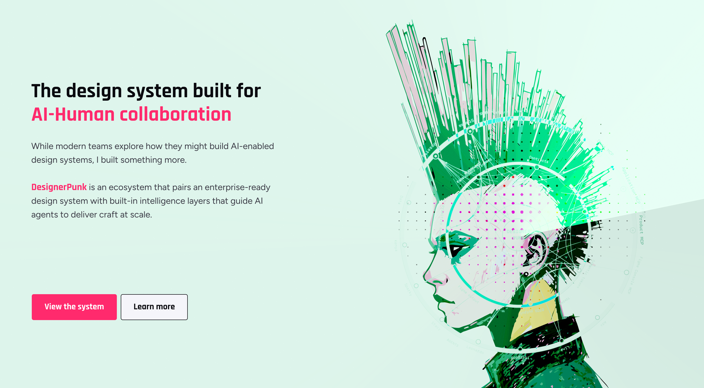

# Component Analysis: Hero-Rest

**Component Type**: COMPONENT
**Figma ID**: 3493:18479
**File Key**: yU7908VXR1khQN5hZXC6Cy
**Extracted**: 2026-05-10T02:26:03.962Z
**Extractor Version**: 6.3.0

---

## Classification Summary

| Tier | Count | Percentage |
| --- | --- | --- |
| ✅ Semantic Identified | 2 | 0% |
| ⚠️ Primitive Identified | 871 | 36% |
| ❌ Unidentified | 1541 | 64% |
| **Total** | **2414** | **100%** |

## Node Tree

- **Hero-Rest** (FRAME, depth 0) [S:0 P:1 U:5]
  - **Frame 554** (FRAME, depth 1) [S:1 P:0 U:5]
    - **The design system built for AI-Human collaboration** (TEXT, depth 2) [S:0 P:0 U:4]
    - **While modern teams explore how they might build AI-enabled design systems, I built something more. DesignerPunk is an ecosystem that pairs an enterprise-ready design system with built-in intelligence layers that guide AI agents to deliver craft at scale.** (TEXT, depth 2) [S:0 P:0 U:1]
  - **CTA Container** (FRAME, depth 1) [S:1 P:0 U:5]
    - **Primary CTA** (FRAME, depth 2) [S:0 P:1 U:7]
      - **View the system** (TEXT, depth 3) [S:0 P:1 U:4]
    - **Secondary CTA** (FRAME, depth 2) [S:0 P:2 U:7]
      - **Learn more** (TEXT, depth 3) [S:0 P:1 U:4]
  - **Hero Visualize Container** (FRAME, depth 1) [S:0 P:0 U:6]
    - **Illustration** (FRAME, depth 2) [S:0 P:0 U:5]
      - **Rectangle 171** (FRAME, depth 3) [S:0 P:1 U:1]
      - **Vector** (FRAME, depth 3) [S:0 P:1 U:1]
      - **Vector** (FRAME, depth 3) [S:0 P:1 U:1]
      - **Vector** (FRAME, depth 3) [S:0 P:1 U:1]
      - **Vector** (FRAME, depth 3) [S:0 P:1 U:1]
      - **Vector** (FRAME, depth 3) [S:0 P:1 U:1]
      - **Vector** (FRAME, depth 3) [S:0 P:1 U:1]
      - **Vector** (FRAME, depth 3) [S:0 P:1 U:1]
      - **Vector** (FRAME, depth 3) [S:0 P:1 U:1]
      - **Subtract** (FRAME, depth 3) [S:0 P:1 U:0]
        - **Vector** (FRAME, depth 4) [S:0 P:1 U:1]
        - **Vector** (FRAME, depth 4) [S:0 P:0 U:2]
      - **Vector** (FRAME, depth 3) [S:0 P:1 U:1]
      - **Vector** (FRAME, depth 3) [S:0 P:1 U:1]
      - **Vector** (FRAME, depth 3) [S:0 P:0 U:2]
      - **Vector** (FRAME, depth 3) [S:0 P:0 U:2]
      - **Vector** (FRAME, depth 3) [S:0 P:0 U:2]
      - **Vector** (FRAME, depth 3) [S:0 P:0 U:2]
      - **Vector** (FRAME, depth 3) [S:0 P:0 U:2]
      - **Vector** (FRAME, depth 3) [S:0 P:0 U:2]
      - **Vector** (FRAME, depth 3) [S:0 P:1 U:1]
      - **Vector** (FRAME, depth 3) [S:0 P:1 U:1]
      - **Vector** (FRAME, depth 3) [S:0 P:0 U:2]
      - **Vector** (FRAME, depth 3) [S:0 P:1 U:1]
      - **Vector** (FRAME, depth 3) [S:0 P:1 U:1]
      - **Vector** (FRAME, depth 3) [S:0 P:1 U:1]
      - **Vector** (FRAME, depth 3) [S:0 P:1 U:1]
      - **Vector** (FRAME, depth 3) [S:0 P:1 U:1]
      - **Vector** (FRAME, depth 3) [S:0 P:1 U:1]
      - **Vector** (FRAME, depth 3) [S:0 P:1 U:1]
      - **Vector** (FRAME, depth 3) [S:0 P:1 U:1]
      - **Vector** (FRAME, depth 3) [S:0 P:1 U:1]
      - **Vector** (FRAME, depth 3) [S:0 P:1 U:1]
      - **Vector** (FRAME, depth 3) [S:0 P:1 U:1]
      - **Vector** (FRAME, depth 3) [S:0 P:0 U:2]
      - **Vector** (FRAME, depth 3) [S:0 P:0 U:2]
      - **Vector** (FRAME, depth 3) [S:0 P:1 U:1]
      - **Vector** (FRAME, depth 3) [S:0 P:1 U:1]
      - **Vector** (FRAME, depth 3) [S:0 P:1 U:1]
      - **Vector** (FRAME, depth 3) [S:0 P:1 U:1]
      - **Vector** (FRAME, depth 3) [S:0 P:1 U:1]
      - **Vector** (FRAME, depth 3) [S:0 P:1 U:1]
      - **Vector** (FRAME, depth 3) [S:0 P:0 U:2]
      - **Vector** (FRAME, depth 3) [S:0 P:1 U:1]
      - **Vector** (FRAME, depth 3) [S:0 P:1 U:1]
      - **Vector** (FRAME, depth 3) [S:0 P:1 U:1]
      - **Vector** (FRAME, depth 3) [S:0 P:1 U:1]
      - **Vector** (FRAME, depth 3) [S:0 P:1 U:1]
      - **Vector** (FRAME, depth 3) [S:0 P:1 U:1]
      - **Vector** (FRAME, depth 3) [S:0 P:1 U:1]
      - **Vector** (FRAME, depth 3) [S:0 P:1 U:1]
      - **Vector** (FRAME, depth 3) [S:0 P:1 U:1]
      - **Vector** (FRAME, depth 3) [S:0 P:1 U:1]
      - **Vector** (FRAME, depth 3) [S:0 P:1 U:1]
      - **Vector** (FRAME, depth 3) [S:0 P:1 U:1]
      - **Vector** (FRAME, depth 3) [S:0 P:1 U:1]
      - **Vector** (FRAME, depth 3) [S:0 P:1 U:1]
      - **Vector** (FRAME, depth 3) [S:0 P:1 U:1]
      - **Vector** (FRAME, depth 3) [S:0 P:1 U:1]
      - **Vector** (FRAME, depth 3) [S:0 P:1 U:1]
      - **Vector** (FRAME, depth 3) [S:0 P:1 U:1]
      - **Vector** (FRAME, depth 3) [S:0 P:1 U:1]
      - **Vector** (FRAME, depth 3) [S:0 P:1 U:1]
      - **Vector** (FRAME, depth 3) [S:0 P:1 U:1]
      - **Vector** (FRAME, depth 3) [S:0 P:1 U:1]
      - **Vector** (FRAME, depth 3) [S:0 P:1 U:1]
      - **Vector** (FRAME, depth 3) [S:0 P:1 U:1]
      - **Vector** (FRAME, depth 3) [S:0 P:1 U:1]
      - **Vector** (FRAME, depth 3) [S:0 P:1 U:1]
      - **Vector** (FRAME, depth 3) [S:0 P:1 U:1]
      - **Vector** (FRAME, depth 3) [S:0 P:1 U:1]
      - **Vector** (FRAME, depth 3) [S:0 P:1 U:1]
      - **Vector** (FRAME, depth 3) [S:0 P:1 U:1]
      - **Vector** (FRAME, depth 3) [S:0 P:1 U:1]
      - **Vector** (FRAME, depth 3) [S:0 P:1 U:1]
      - **Vector** (FRAME, depth 3) [S:0 P:1 U:1]
      - **Vector** (FRAME, depth 3) [S:0 P:1 U:1]
      - **Vector** (FRAME, depth 3) [S:0 P:1 U:1]
      - **Vector** (FRAME, depth 3) [S:0 P:1 U:1]
      - **Vector** (FRAME, depth 3) [S:0 P:1 U:1]
      - **Vector** (FRAME, depth 3) [S:0 P:1 U:1]
      - **Vector** (FRAME, depth 3) [S:0 P:1 U:1]
      - **Vector** (FRAME, depth 3) [S:0 P:1 U:1]
      - **Vector** (FRAME, depth 3) [S:0 P:1 U:1]
      - **Vector** (FRAME, depth 3) [S:0 P:1 U:1]
      - **Vector** (FRAME, depth 3) [S:0 P:1 U:1]
      - **Vector** (FRAME, depth 3) [S:0 P:1 U:1]
      - **Vector** (FRAME, depth 3) [S:0 P:1 U:1]
      - **Vector** (FRAME, depth 3) [S:0 P:1 U:1]
      - **Vector** (FRAME, depth 3) [S:0 P:1 U:1]
      - **Vector** (FRAME, depth 3) [S:0 P:1 U:1]
      - **Vector** (FRAME, depth 3) [S:0 P:1 U:1]
      - **Vector** (FRAME, depth 3) [S:0 P:1 U:1]
      - **Vector** (FRAME, depth 3) [S:0 P:1 U:1]
      - **Vector** (FRAME, depth 3) [S:0 P:1 U:1]
      - **Vector** (FRAME, depth 3) [S:0 P:1 U:1]
      - **Vector** (FRAME, depth 3) [S:0 P:1 U:1]
      - **Vector** (FRAME, depth 3) [S:0 P:1 U:1]
      - **Vector** (FRAME, depth 3) [S:0 P:1 U:1]
      - **Vector** (FRAME, depth 3) [S:0 P:1 U:1]
      - **Vector** (FRAME, depth 3) [S:0 P:1 U:1]
      - **Vector** (FRAME, depth 3) [S:0 P:1 U:1]
      - **Vector** (FRAME, depth 3) [S:0 P:1 U:1]
      - **Vector** (FRAME, depth 3) [S:0 P:1 U:1]
      - **Vector** (FRAME, depth 3) [S:0 P:1 U:1]
      - **Vector** (FRAME, depth 3) [S:0 P:1 U:1]
      - **Vector** (FRAME, depth 3) [S:0 P:1 U:1]
      - **Vector** (FRAME, depth 3) [S:0 P:1 U:1]
      - **Vector** (FRAME, depth 3) [S:0 P:1 U:1]
      - **Vector** (FRAME, depth 3) [S:0 P:1 U:1]
      - **Vector** (FRAME, depth 3) [S:0 P:1 U:1]
      - **Vector** (FRAME, depth 3) [S:0 P:1 U:1]
      - **Vector** (FRAME, depth 3) [S:0 P:1 U:1]
      - **Vector** (FRAME, depth 3) [S:0 P:1 U:1]
      - **Vector** (FRAME, depth 3) [S:0 P:1 U:1]
      - **Vector** (FRAME, depth 3) [S:0 P:1 U:1]
      - **Vector** (FRAME, depth 3) [S:0 P:1 U:1]
      - **Vector** (FRAME, depth 3) [S:0 P:1 U:1]
      - **Vector** (FRAME, depth 3) [S:0 P:1 U:1]
      - **Vector** (FRAME, depth 3) [S:0 P:1 U:1]
      - **Vector** (FRAME, depth 3) [S:0 P:1 U:1]
      - **Vector** (FRAME, depth 3) [S:0 P:1 U:1]
      - **Vector** (FRAME, depth 3) [S:0 P:1 U:1]
      - **Vector** (FRAME, depth 3) [S:0 P:1 U:1]
      - **Vector** (FRAME, depth 3) [S:0 P:1 U:1]
      - **Vector** (FRAME, depth 3) [S:0 P:1 U:1]
      - **Vector** (FRAME, depth 3) [S:0 P:1 U:1]
      - **Vector** (FRAME, depth 3) [S:0 P:1 U:1]
      - **Vector** (FRAME, depth 3) [S:0 P:1 U:1]
      - **Vector** (FRAME, depth 3) [S:0 P:1 U:1]
      - **Vector** (FRAME, depth 3) [S:0 P:1 U:1]
      - **Vector** (FRAME, depth 3) [S:0 P:1 U:1]
      - **Vector** (FRAME, depth 3) [S:0 P:1 U:1]
      - **Vector** (FRAME, depth 3) [S:0 P:1 U:1]
      - **Vector** (FRAME, depth 3) [S:0 P:1 U:1]
      - **Vector** (FRAME, depth 3) [S:0 P:1 U:1]
      - **Vector** (FRAME, depth 3) [S:0 P:1 U:1]
      - **Vector** (FRAME, depth 3) [S:0 P:1 U:1]
      - **Vector** (FRAME, depth 3) [S:0 P:1 U:1]
      - **Vector** (FRAME, depth 3) [S:0 P:1 U:1]
      - **Vector** (FRAME, depth 3) [S:0 P:1 U:1]
      - **Vector** (FRAME, depth 3) [S:0 P:1 U:1]
      - **Vector** (FRAME, depth 3) [S:0 P:1 U:1]
      - **Vector** (FRAME, depth 3) [S:0 P:1 U:1]
      - **Vector** (FRAME, depth 3) [S:0 P:1 U:1]
      - **Vector** (FRAME, depth 3) [S:0 P:1 U:1]
      - **Vector** (FRAME, depth 3) [S:0 P:1 U:1]
      - **Vector** (FRAME, depth 3) [S:0 P:1 U:1]
      - **Vector** (FRAME, depth 3) [S:0 P:1 U:1]
      - **Vector** (FRAME, depth 3) [S:0 P:1 U:1]
      - **Vector** (FRAME, depth 3) [S:0 P:1 U:1]
      - **Vector** (FRAME, depth 3) [S:0 P:1 U:1]
      - **Vector** (FRAME, depth 3) [S:0 P:1 U:1]
      - **Vector** (FRAME, depth 3) [S:0 P:1 U:1]
      - **Vector** (FRAME, depth 3) [S:0 P:1 U:1]
      - **Vector** (FRAME, depth 3) [S:0 P:1 U:1]
      - **Vector** (FRAME, depth 3) [S:0 P:1 U:1]
      - **Vector** (FRAME, depth 3) [S:0 P:1 U:1]
      - **Vector** (FRAME, depth 3) [S:0 P:1 U:1]
      - **Vector** (FRAME, depth 3) [S:0 P:1 U:1]
      - **Vector** (FRAME, depth 3) [S:0 P:1 U:1]
      - **Vector** (FRAME, depth 3) [S:0 P:1 U:1]
      - **Vector** (FRAME, depth 3) [S:0 P:1 U:1]
      - **Vector** (FRAME, depth 3) [S:0 P:1 U:1]
      - **Vector** (FRAME, depth 3) [S:0 P:1 U:1]
      - **Vector** (FRAME, depth 3) [S:0 P:1 U:1]
      - **Vector** (FRAME, depth 3) [S:0 P:1 U:1]
      - **Vector** (FRAME, depth 3) [S:0 P:1 U:1]
      - **Vector** (FRAME, depth 3) [S:0 P:1 U:1]
      - **Vector** (FRAME, depth 3) [S:0 P:1 U:1]
      - **Vector** (FRAME, depth 3) [S:0 P:1 U:1]
      - **Union** (FRAME, depth 3) [S:0 P:1 U:0]
        - **Vector** (FRAME, depth 4) [S:0 P:0 U:2]
        - **Vector** (FRAME, depth 4) [S:0 P:1 U:1]
      - **Vector** (FRAME, depth 3) [S:0 P:1 U:1]
      - **Vector** (FRAME, depth 3) [S:0 P:1 U:1]
      - **Vector** (FRAME, depth 3) [S:0 P:1 U:1]
      - **Vector** (FRAME, depth 3) [S:0 P:1 U:1]
      - **Vector** (FRAME, depth 3) [S:0 P:1 U:1]
      - **Vector** (FRAME, depth 3) [S:0 P:1 U:1]
      - **Vector** (FRAME, depth 3) [S:0 P:1 U:1]
      - **Vector** (FRAME, depth 3) [S:0 P:1 U:1]
      - **Vector** (FRAME, depth 3) [S:0 P:0 U:2]
      - **Vector** (FRAME, depth 3) [S:0 P:1 U:1]
      - **Vector** (FRAME, depth 3) [S:0 P:0 U:2]
      - **Vector** (FRAME, depth 3) [S:0 P:1 U:1]
      - **Vector** (FRAME, depth 3) [S:0 P:1 U:1]
      - **Vector** (FRAME, depth 3) [S:0 P:1 U:1]
      - **Vector** (FRAME, depth 3) [S:0 P:1 U:1]
      - **Vector** (FRAME, depth 3) [S:0 P:1 U:1]
      - **Vector** (FRAME, depth 3) [S:0 P:1 U:1]
      - **Vector** (FRAME, depth 3) [S:0 P:1 U:1]
      - **Vector** (FRAME, depth 3) [S:0 P:1 U:1]
      - **Vector** (FRAME, depth 3) [S:0 P:1 U:1]
      - **Vector** (FRAME, depth 3) [S:0 P:1 U:1]
      - **Vector** (FRAME, depth 3) [S:0 P:1 U:1]
      - **Vector** (FRAME, depth 3) [S:0 P:1 U:1]
      - **Vector** (FRAME, depth 3) [S:0 P:1 U:1]
      - **Vector** (FRAME, depth 3) [S:0 P:1 U:1]
      - **Vector** (FRAME, depth 3) [S:0 P:1 U:1]
      - **Vector** (FRAME, depth 3) [S:0 P:1 U:1]
      - **Vector** (FRAME, depth 3) [S:0 P:1 U:1]
      - **Vector** (FRAME, depth 3) [S:0 P:1 U:1]
      - **Vector** (FRAME, depth 3) [S:0 P:1 U:1]
      - **Vector** (FRAME, depth 3) [S:0 P:1 U:1]
      - **Vector** (FRAME, depth 3) [S:0 P:1 U:1]
      - **Vector** (FRAME, depth 3) [S:0 P:1 U:1]
      - **Vector** (FRAME, depth 3) [S:0 P:1 U:1]
      - **Vector** (FRAME, depth 3) [S:0 P:1 U:1]
      - **Vector** (FRAME, depth 3) [S:0 P:0 U:2]
      - **Vector** (FRAME, depth 3) [S:0 P:1 U:1]
      - **Vector** (FRAME, depth 3) [S:0 P:1 U:1]
      - **Vector** (FRAME, depth 3) [S:0 P:1 U:1]
      - **Vector** (FRAME, depth 3) [S:0 P:1 U:1]
      - **Vector** (FRAME, depth 3) [S:0 P:1 U:1]
      - **Vector** (FRAME, depth 3) [S:0 P:1 U:1]
      - **Vector** (FRAME, depth 3) [S:0 P:1 U:1]
      - **Vector** (FRAME, depth 3) [S:0 P:1 U:1]
      - **Vector** (FRAME, depth 3) [S:0 P:1 U:1]
      - **Vector** (FRAME, depth 3) [S:0 P:1 U:1]
      - **Vector** (FRAME, depth 3) [S:0 P:1 U:1]
      - **Vector** (FRAME, depth 3) [S:0 P:1 U:1]
      - **Vector** (FRAME, depth 3) [S:0 P:1 U:1]
      - **Vector** (FRAME, depth 3) [S:0 P:1 U:1]
      - **Vector** (FRAME, depth 3) [S:0 P:1 U:1]
      - **Vector** (FRAME, depth 3) [S:0 P:1 U:1]
      - **Vector** (FRAME, depth 3) [S:0 P:1 U:1]
      - **Vector** (FRAME, depth 3) [S:0 P:0 U:2]
      - **Vector** (FRAME, depth 3) [S:0 P:1 U:1]
      - **Vector** (FRAME, depth 3) [S:0 P:1 U:1]
      - **Vector** (FRAME, depth 3) [S:0 P:1 U:1]
      - **Vector** (FRAME, depth 3) [S:0 P:1 U:1]
      - **Vector** (FRAME, depth 3) [S:0 P:1 U:1]
      - **Vector** (FRAME, depth 3) [S:0 P:1 U:1]
      - **Vector** (FRAME, depth 3) [S:0 P:1 U:1]
      - **Vector** (FRAME, depth 3) [S:0 P:1 U:1]
      - **Vector** (FRAME, depth 3) [S:0 P:1 U:1]
      - **Vector** (FRAME, depth 3) [S:0 P:1 U:1]
      - **Vector** (FRAME, depth 3) [S:0 P:1 U:1]
      - **Vector** (FRAME, depth 3) [S:0 P:1 U:1]
      - **Vector** (FRAME, depth 3) [S:0 P:1 U:1]
      - **Vector** (FRAME, depth 3) [S:0 P:1 U:1]
      - **Vector** (FRAME, depth 3) [S:0 P:1 U:1]
      - **Vector** (FRAME, depth 3) [S:0 P:1 U:1]
      - **Vector** (FRAME, depth 3) [S:0 P:1 U:1]
      - **Vector** (FRAME, depth 3) [S:0 P:0 U:2]
      - **Vector** (FRAME, depth 3) [S:0 P:1 U:1]
      - **Vector** (FRAME, depth 3) [S:0 P:1 U:1]
      - **Vector** (FRAME, depth 3) [S:0 P:1 U:1]
      - **Vector** (FRAME, depth 3) [S:0 P:1 U:1]
      - **Vector** (FRAME, depth 3) [S:0 P:1 U:1]
      - **Vector** (FRAME, depth 3) [S:0 P:1 U:1]
      - **Vector** (FRAME, depth 3) [S:0 P:1 U:1]
      - **Vector** (FRAME, depth 3) [S:0 P:1 U:1]
      - **Vector** (FRAME, depth 3) [S:0 P:1 U:1]
      - **Vector** (FRAME, depth 3) [S:0 P:1 U:1]
      - **Vector** (FRAME, depth 3) [S:0 P:1 U:1]
      - **Vector** (FRAME, depth 3) [S:0 P:1 U:1]
      - **Vector** (FRAME, depth 3) [S:0 P:1 U:1]
      - **Vector** (FRAME, depth 3) [S:0 P:1 U:1]
      - **Vector** (FRAME, depth 3) [S:0 P:1 U:1]
      - **Vector** (FRAME, depth 3) [S:0 P:1 U:1]
      - **Vector** (FRAME, depth 3) [S:0 P:1 U:1]
      - **Vector** (FRAME, depth 3) [S:0 P:0 U:2]
      - **Vector** (FRAME, depth 3) [S:0 P:1 U:1]
      - **Vector** (FRAME, depth 3) [S:0 P:1 U:1]
      - **Vector** (FRAME, depth 3) [S:0 P:1 U:1]
      - **Vector** (FRAME, depth 3) [S:0 P:1 U:1]
      - **Vector** (FRAME, depth 3) [S:0 P:0 U:2]
      - **Vector** (FRAME, depth 3) [S:0 P:1 U:1]
      - **Vector** (FRAME, depth 3) [S:0 P:1 U:1]
      - **Vector** (FRAME, depth 3) [S:0 P:1 U:1]
      - **Vector** (FRAME, depth 3) [S:0 P:0 U:2]
      - **Vector** (FRAME, depth 3) [S:0 P:1 U:1]
      - **Vector** (FRAME, depth 3) [S:0 P:1 U:1]
      - **Vector** (FRAME, depth 3) [S:0 P:0 U:2]
      - **Vector** (FRAME, depth 3) [S:0 P:1 U:1]
      - **Vector** (FRAME, depth 3) [S:0 P:1 U:1]
      - **Vector** (FRAME, depth 3) [S:0 P:1 U:1]
      - **Vector** (FRAME, depth 3) [S:0 P:1 U:1]
      - **Vector** (FRAME, depth 3) [S:0 P:1 U:1]
      - **Vector** (FRAME, depth 3) [S:0 P:1 U:1]
      - **Vector** (FRAME, depth 3) [S:0 P:1 U:1]
      - **Vector** (FRAME, depth 3) [S:0 P:0 U:2]
      - **Vector** (FRAME, depth 3) [S:0 P:1 U:1]
      - **Vector** (FRAME, depth 3) [S:0 P:1 U:1]
      - **Vector** (FRAME, depth 3) [S:0 P:1 U:1]
      - **Vector** (FRAME, depth 3) [S:0 P:1 U:1]
      - **Vector** (FRAME, depth 3) [S:0 P:1 U:1]
      - **Vector** (FRAME, depth 3) [S:0 P:1 U:1]
      - **Vector** (FRAME, depth 3) [S:0 P:0 U:2]
      - **Vector** (FRAME, depth 3) [S:0 P:1 U:1]
      - **Vector** (FRAME, depth 3) [S:0 P:1 U:1]
      - **Vector** (FRAME, depth 3) [S:0 P:0 U:2]
      - **Vector** (FRAME, depth 3) [S:0 P:1 U:1]
      - **Vector** (FRAME, depth 3) [S:0 P:1 U:1]
      - **Vector** (FRAME, depth 3) [S:0 P:1 U:1]
      - **Vector** (FRAME, depth 3) [S:0 P:1 U:1]
      - **Vector** (FRAME, depth 3) [S:0 P:0 U:2]
      - **Vector** (FRAME, depth 3) [S:0 P:1 U:1]
      - **Vector** (FRAME, depth 3) [S:0 P:1 U:1]
      - **Vector** (FRAME, depth 3) [S:0 P:1 U:1]
      - **Vector** (FRAME, depth 3) [S:0 P:0 U:2]
      - **Vector** (FRAME, depth 3) [S:0 P:0 U:2]
      - **Vector** (FRAME, depth 3) [S:0 P:0 U:2]
      - **Vector** (FRAME, depth 3) [S:0 P:1 U:1]
      - **Vector** (FRAME, depth 3) [S:0 P:1 U:1]
      - **Vector** (FRAME, depth 3) [S:0 P:1 U:1]
      - **Vector** (FRAME, depth 3) [S:0 P:1 U:1]
      - **Vector** (FRAME, depth 3) [S:0 P:1 U:1]
      - **Vector** (FRAME, depth 3) [S:0 P:1 U:1]
      - **Vector** (FRAME, depth 3) [S:0 P:1 U:1]
      - **Vector** (FRAME, depth 3) [S:0 P:1 U:1]
      - **Vector** (FRAME, depth 3) [S:0 P:1 U:1]
      - **Vector** (FRAME, depth 3) [S:0 P:1 U:1]
      - **Vector** (FRAME, depth 3) [S:0 P:1 U:1]
      - **Vector** (FRAME, depth 3) [S:0 P:1 U:1]
      - **Vector** (FRAME, depth 3) [S:0 P:1 U:1]
      - **Vector** (FRAME, depth 3) [S:0 P:0 U:2]
      - **Vector** (FRAME, depth 3) [S:0 P:1 U:1]
      - **Vector** (FRAME, depth 3) [S:0 P:1 U:1]
      - **Vector** (FRAME, depth 3) [S:0 P:1 U:1]
      - **Vector** (FRAME, depth 3) [S:0 P:1 U:1]
      - **Vector** (FRAME, depth 3) [S:0 P:0 U:2]
      - **Vector** (FRAME, depth 3) [S:0 P:1 U:1]
      - **Vector** (FRAME, depth 3) [S:0 P:1 U:1]
      - **Vector** (FRAME, depth 3) [S:0 P:1 U:1]
      - **Vector** (FRAME, depth 3) [S:0 P:0 U:2]
      - **Vector** (FRAME, depth 3) [S:0 P:1 U:1]
      - **Vector** (FRAME, depth 3) [S:0 P:1 U:1]
      - **Vector** (FRAME, depth 3) [S:0 P:1 U:1]
      - **Vector** (FRAME, depth 3) [S:0 P:1 U:1]
      - **Vector** (FRAME, depth 3) [S:0 P:1 U:1]
      - **Vector** (FRAME, depth 3) [S:0 P:1 U:1]
      - **Vector** (FRAME, depth 3) [S:0 P:1 U:1]
      - **Vector** (FRAME, depth 3) [S:0 P:1 U:1]
      - **Vector** (FRAME, depth 3) [S:0 P:1 U:1]
      - **Vector** (FRAME, depth 3) [S:0 P:1 U:1]
      - **Vector** (FRAME, depth 3) [S:0 P:1 U:1]
      - **Vector** (FRAME, depth 3) [S:0 P:1 U:1]
      - **Vector** (FRAME, depth 3) [S:0 P:1 U:1]
      - **Vector** (FRAME, depth 3) [S:0 P:1 U:1]
      - **Vector** (FRAME, depth 3) [S:0 P:1 U:1]
      - **Vector** (FRAME, depth 3) [S:0 P:1 U:1]
      - **Vector** (FRAME, depth 3) [S:0 P:1 U:1]
      - **Vector** (FRAME, depth 3) [S:0 P:1 U:1]
      - **Vector** (FRAME, depth 3) [S:0 P:1 U:1]
      - **Vector** (FRAME, depth 3) [S:0 P:1 U:1]
      - **Vector** (FRAME, depth 3) [S:0 P:1 U:1]
      - **Vector** (FRAME, depth 3) [S:0 P:1 U:1]
      - **Vector** (FRAME, depth 3) [S:0 P:1 U:1]
      - **Vector** (FRAME, depth 3) [S:0 P:1 U:1]
      - **Vector** (FRAME, depth 3) [S:0 P:1 U:1]
      - **Vector** (FRAME, depth 3) [S:0 P:1 U:1]
      - **Vector** (FRAME, depth 3) [S:0 P:1 U:1]
      - **Vector** (FRAME, depth 3) [S:0 P:1 U:1]
      - **Vector** (FRAME, depth 3) [S:0 P:1 U:1]
      - **Vector** (FRAME, depth 3) [S:0 P:1 U:1]
      - **Vector** (FRAME, depth 3) [S:0 P:1 U:1]
      - **Vector** (FRAME, depth 3) [S:0 P:1 U:1]
      - **Vector** (FRAME, depth 3) [S:0 P:1 U:1]
      - **Vector** (FRAME, depth 3) [S:0 P:1 U:1]
      - **Vector** (FRAME, depth 3) [S:0 P:1 U:1]
      - **Vector** (FRAME, depth 3) [S:0 P:1 U:1]
      - **Vector** (FRAME, depth 3) [S:0 P:1 U:1]
      - **Vector** (FRAME, depth 3) [S:0 P:1 U:1]
      - **Vector** (FRAME, depth 3) [S:0 P:1 U:1]
      - **Vector** (FRAME, depth 3) [S:0 P:1 U:1]
      - **Vector** (FRAME, depth 3) [S:0 P:1 U:1]
      - **Vector** (FRAME, depth 3) [S:0 P:1 U:1]
      - **Vector** (FRAME, depth 3) [S:0 P:1 U:1]
      - **Vector** (FRAME, depth 3) [S:0 P:1 U:1]
      - **Vector** (FRAME, depth 3) [S:0 P:1 U:1]
      - **Vector** (FRAME, depth 3) [S:0 P:1 U:1]
      - **Vector** (FRAME, depth 3) [S:0 P:1 U:1]
      - **Vector** (FRAME, depth 3) [S:0 P:1 U:1]
      - **Vector** (FRAME, depth 3) [S:0 P:1 U:1]
      - **Vector** (FRAME, depth 3) [S:0 P:1 U:1]
      - **Vector** (FRAME, depth 3) [S:0 P:1 U:1]
      - **Vector** (FRAME, depth 3) [S:0 P:1 U:1]
      - **Vector** (FRAME, depth 3) [S:0 P:1 U:1]
      - **Vector** (FRAME, depth 3) [S:0 P:1 U:1]
      - **Vector** (FRAME, depth 3) [S:0 P:1 U:1]
      - **Vector** (FRAME, depth 3) [S:0 P:1 U:1]
      - **Vector** (FRAME, depth 3) [S:0 P:1 U:1]
      - **Vector** (FRAME, depth 3) [S:0 P:1 U:1]
      - **Vector** (FRAME, depth 3) [S:0 P:1 U:1]
      - **Vector** (FRAME, depth 3) [S:0 P:1 U:1]
      - **Vector** (FRAME, depth 3) [S:0 P:1 U:1]
      - **Vector** (FRAME, depth 3) [S:0 P:1 U:1]
      - **Vector** (FRAME, depth 3) [S:0 P:1 U:1]
      - **Vector** (FRAME, depth 3) [S:0 P:1 U:1]
      - **Vector** (FRAME, depth 3) [S:0 P:1 U:1]
      - **Vector** (FRAME, depth 3) [S:0 P:1 U:1]
      - **Vector** (FRAME, depth 3) [S:0 P:1 U:1]
      - **Vector** (FRAME, depth 3) [S:0 P:1 U:1]
      - **Vector** (FRAME, depth 3) [S:0 P:1 U:1]
      - **Vector** (FRAME, depth 3) [S:0 P:1 U:1]
      - **Vector** (FRAME, depth 3) [S:0 P:1 U:1]
      - **Vector** (FRAME, depth 3) [S:0 P:1 U:1]
      - **Vector** (FRAME, depth 3) [S:0 P:1 U:1]
      - **Vector** (FRAME, depth 3) [S:0 P:1 U:1]
      - **Vector** (FRAME, depth 3) [S:0 P:1 U:1]
      - **Vector** (FRAME, depth 3) [S:0 P:1 U:1]
      - **Vector** (FRAME, depth 3) [S:0 P:1 U:1]
      - **Vector** (FRAME, depth 3) [S:0 P:1 U:1]
      - **Vector** (FRAME, depth 3) [S:0 P:1 U:1]
      - **Vector** (FRAME, depth 3) [S:0 P:1 U:1]
      - **Vector** (FRAME, depth 3) [S:0 P:1 U:1]
      - **Vector** (FRAME, depth 3) [S:0 P:1 U:1]
      - **Vector** (FRAME, depth 3) [S:0 P:1 U:1]
      - **Vector** (FRAME, depth 3) [S:0 P:1 U:1]
      - **Vector** (FRAME, depth 3) [S:0 P:1 U:1]
      - **Vector** (FRAME, depth 3) [S:0 P:1 U:1]
      - **Vector** (FRAME, depth 3) [S:0 P:1 U:1]
      - **Vector** (FRAME, depth 3) [S:0 P:1 U:1]
      - **Vector** (FRAME, depth 3) [S:0 P:1 U:1]
      - **Vector** (FRAME, depth 3) [S:0 P:1 U:1]
      - **Vector** (FRAME, depth 3) [S:0 P:1 U:1]
      - **Vector** (FRAME, depth 3) [S:0 P:1 U:1]
      - **Vector** (FRAME, depth 3) [S:0 P:1 U:1]
      - **Vector** (FRAME, depth 3) [S:0 P:1 U:1]
      - **Vector** (FRAME, depth 3) [S:0 P:1 U:1]
      - **Vector** (FRAME, depth 3) [S:0 P:1 U:1]
      - **Vector** (FRAME, depth 3) [S:0 P:1 U:1]
      - **Vector** (FRAME, depth 3) [S:0 P:1 U:1]
      - **Vector** (FRAME, depth 3) [S:0 P:1 U:1]
      - **Vector** (FRAME, depth 3) [S:0 P:0 U:2]
      - **Vector** (FRAME, depth 3) [S:0 P:1 U:1]
      - **Vector** (FRAME, depth 3) [S:0 P:1 U:1]
      - **Vector** (FRAME, depth 3) [S:0 P:1 U:1]
      - **Vector** (FRAME, depth 3) [S:0 P:1 U:1]
      - **Vector** (FRAME, depth 3) [S:0 P:1 U:1]
      - **Vector** (FRAME, depth 3) [S:0 P:1 U:1]
      - **Vector** (FRAME, depth 3) [S:0 P:1 U:1]
      - **Vector** (FRAME, depth 3) [S:0 P:1 U:1]
      - **Vector** (FRAME, depth 3) [S:0 P:1 U:1]
      - **Vector** (FRAME, depth 3) [S:0 P:1 U:1]
      - **Vector** (FRAME, depth 3) [S:0 P:1 U:1]
      - **Vector** (FRAME, depth 3) [S:0 P:1 U:1]
      - **Vector** (FRAME, depth 3) [S:0 P:0 U:2]
      - **Vector** (FRAME, depth 3) [S:0 P:1 U:1]
      - **Vector** (FRAME, depth 3) [S:0 P:1 U:1]
      - **Vector** (FRAME, depth 3) [S:0 P:1 U:1]
      - **Vector** (FRAME, depth 3) [S:0 P:1 U:1]
      - **Vector** (FRAME, depth 3) [S:0 P:1 U:1]
      - **Vector** (FRAME, depth 3) [S:0 P:1 U:1]
      - **Vector** (FRAME, depth 3) [S:0 P:1 U:1]
      - **Vector** (FRAME, depth 3) [S:0 P:1 U:1]
      - **Vector** (FRAME, depth 3) [S:0 P:1 U:1]
      - **Vector** (FRAME, depth 3) [S:0 P:1 U:1]
      - **Vector** (FRAME, depth 3) [S:0 P:1 U:1]
      - **Vector** (FRAME, depth 3) [S:0 P:1 U:1]
      - **Vector** (FRAME, depth 3) [S:0 P:1 U:1]
      - **Vector** (FRAME, depth 3) [S:0 P:1 U:1]
      - **Vector** (FRAME, depth 3) [S:0 P:1 U:1]
      - **Vector** (FRAME, depth 3) [S:0 P:1 U:1]
      - **Vector** (FRAME, depth 3) [S:0 P:1 U:1]
      - **Vector** (FRAME, depth 3) [S:0 P:1 U:1]
      - **Vector** (FRAME, depth 3) [S:0 P:1 U:1]
      - **Vector** (FRAME, depth 3) [S:0 P:1 U:1]
      - **Vector** (FRAME, depth 3) [S:0 P:1 U:1]
      - **Vector** (FRAME, depth 3) [S:0 P:1 U:1]
      - **Vector** (FRAME, depth 3) [S:0 P:1 U:1]
      - **Vector** (FRAME, depth 3) [S:0 P:1 U:1]
      - **Vector** (FRAME, depth 3) [S:0 P:1 U:1]
      - **Vector** (FRAME, depth 3) [S:0 P:1 U:1]
      - **Vector** (FRAME, depth 3) [S:0 P:1 U:1]
      - **Vector** (FRAME, depth 3) [S:0 P:1 U:1]
      - **Vector** (FRAME, depth 3) [S:0 P:1 U:1]
      - **Vector** (FRAME, depth 3) [S:0 P:1 U:1]
      - **Vector** (FRAME, depth 3) [S:0 P:1 U:1]
      - **Vector** (FRAME, depth 3) [S:0 P:1 U:1]
      - **Vector** (FRAME, depth 3) [S:0 P:1 U:1]
      - **Vector** (FRAME, depth 3) [S:0 P:1 U:1]
      - **Vector** (FRAME, depth 3) [S:0 P:1 U:1]
      - **Vector** (FRAME, depth 3) [S:0 P:1 U:1]
      - **Vector** (FRAME, depth 3) [S:0 P:1 U:1]
      - **Vector** (FRAME, depth 3) [S:0 P:1 U:1]
      - **Vector** (FRAME, depth 3) [S:0 P:1 U:1]
      - **Vector** (FRAME, depth 3) [S:0 P:1 U:1]
      - **Vector** (FRAME, depth 3) [S:0 P:1 U:1]
      - **Vector** (FRAME, depth 3) [S:0 P:1 U:1]
      - **Vector** (FRAME, depth 3) [S:0 P:0 U:2]
      - **Vector** (FRAME, depth 3) [S:0 P:1 U:1]
      - **Vector** (FRAME, depth 3) [S:0 P:1 U:1]
      - **Vector** (FRAME, depth 3) [S:0 P:1 U:1]
      - **Vector** (FRAME, depth 3) [S:0 P:1 U:1]
      - **Vector** (FRAME, depth 3) [S:0 P:1 U:1]
      - **Vector** (FRAME, depth 3) [S:0 P:1 U:1]
      - **Vector** (FRAME, depth 3) [S:0 P:1 U:1]
      - **Vector** (FRAME, depth 3) [S:0 P:1 U:1]
      - **Vector** (FRAME, depth 3) [S:0 P:1 U:1]
      - **Vector** (FRAME, depth 3) [S:0 P:1 U:1]
      - **Vector** (FRAME, depth 3) [S:0 P:1 U:1]
      - **Vector** (FRAME, depth 3) [S:0 P:1 U:1]
      - **Vector** (FRAME, depth 3) [S:0 P:1 U:1]
      - **Vector** (FRAME, depth 3) [S:0 P:1 U:1]
      - **Vector** (FRAME, depth 3) [S:0 P:0 U:2]
      - **Vector** (FRAME, depth 3) [S:0 P:1 U:1]
      - **Vector** (FRAME, depth 3) [S:0 P:1 U:1]
      - **Vector** (FRAME, depth 3) [S:0 P:1 U:1]
      - **Vector** (FRAME, depth 3) [S:0 P:1 U:1]
      - **Vector** (FRAME, depth 3) [S:0 P:1 U:1]
      - **Vector** (FRAME, depth 3) [S:0 P:1 U:1]
      - **Vector** (FRAME, depth 3) [S:0 P:1 U:1]
      - **Vector** (FRAME, depth 3) [S:0 P:0 U:2]
      - **Vector** (FRAME, depth 3) [S:0 P:1 U:1]
      - **Vector** (FRAME, depth 3) [S:0 P:1 U:1]
      - **Vector** (FRAME, depth 3) [S:0 P:1 U:1]
      - **Vector** (FRAME, depth 3) [S:0 P:1 U:1]
      - **Vector** (FRAME, depth 3) [S:0 P:1 U:1]
      - **Vector** (FRAME, depth 3) [S:0 P:1 U:1]
      - **Vector** (FRAME, depth 3) [S:0 P:1 U:1]
      - **Vector** (FRAME, depth 3) [S:0 P:1 U:1]
      - **Vector** (FRAME, depth 3) [S:0 P:1 U:1]
      - **Vector** (FRAME, depth 3) [S:0 P:1 U:1]
      - **Vector** (FRAME, depth 3) [S:0 P:1 U:1]
      - **Vector** (FRAME, depth 3) [S:0 P:1 U:1]
      - **Vector** (FRAME, depth 3) [S:0 P:1 U:1]
      - **Vector** (FRAME, depth 3) [S:0 P:0 U:2]
      - **Vector** (FRAME, depth 3) [S:0 P:1 U:1]
      - **Vector** (FRAME, depth 3) [S:0 P:1 U:1]
      - **Vector** (FRAME, depth 3) [S:0 P:1 U:1]
      - **Vector** (FRAME, depth 3) [S:0 P:1 U:1]
      - **Vector** (FRAME, depth 3) [S:0 P:1 U:1]
      - **Vector** (FRAME, depth 3) [S:0 P:1 U:1]
      - **Vector** (FRAME, depth 3) [S:0 P:1 U:1]
      - **Vector** (FRAME, depth 3) [S:0 P:1 U:1]
      - **Vector** (FRAME, depth 3) [S:0 P:0 U:2]
      - **Vector** (FRAME, depth 3) [S:0 P:1 U:1]
      - **Vector** (FRAME, depth 3) [S:0 P:1 U:1]
      - **Vector** (FRAME, depth 3) [S:0 P:1 U:1]
      - **Vector** (FRAME, depth 3) [S:0 P:1 U:1]
      - **Vector** (FRAME, depth 3) [S:0 P:0 U:2]
      - **Vector** (FRAME, depth 3) [S:0 P:1 U:1]
      - **Vector** (FRAME, depth 3) [S:0 P:1 U:1]
      - **Vector** (FRAME, depth 3) [S:0 P:1 U:1]
      - **Vector** (FRAME, depth 3) [S:0 P:1 U:1]
      - **Vector** (FRAME, depth 3) [S:0 P:0 U:2]
      - **Vector** (FRAME, depth 3) [S:0 P:1 U:1]
      - **Vector** (FRAME, depth 3) [S:0 P:1 U:1]
      - **Vector** (FRAME, depth 3) [S:0 P:1 U:1]
      - **Vector** (FRAME, depth 3) [S:0 P:1 U:1]
      - **Vector** (FRAME, depth 3) [S:0 P:1 U:1]
      - **Vector** (FRAME, depth 3) [S:0 P:1 U:1]
      - **Vector** (FRAME, depth 3) [S:0 P:1 U:1]
      - **Vector** (FRAME, depth 3) [S:0 P:0 U:2]
      - **Vector** (FRAME, depth 3) [S:0 P:1 U:1]
      - **Vector** (FRAME, depth 3) [S:0 P:1 U:1]
      - **Vector** (FRAME, depth 3) [S:0 P:0 U:2]
      - **Vector** (FRAME, depth 3) [S:0 P:1 U:1]
      - **Vector** (FRAME, depth 3) [S:0 P:1 U:1]
      - **Vector** (FRAME, depth 3) [S:0 P:1 U:1]
      - **Vector** (FRAME, depth 3) [S:0 P:1 U:1]
      - **Vector** (FRAME, depth 3) [S:0 P:1 U:1]
      - **Vector** (FRAME, depth 3) [S:0 P:1 U:1]
      - **Vector** (FRAME, depth 3) [S:0 P:1 U:1]
      - **Vector** (FRAME, depth 3) [S:0 P:1 U:1]
      - **Vector** (FRAME, depth 3) [S:0 P:1 U:1]
      - **Vector** (FRAME, depth 3) [S:0 P:0 U:2]
      - **Vector** (FRAME, depth 3) [S:0 P:1 U:1]
      - **Vector** (FRAME, depth 3) [S:0 P:1 U:1]
      - **Vector** (FRAME, depth 3) [S:0 P:1 U:1]
      - **Vector** (FRAME, depth 3) [S:0 P:1 U:1]
      - **Vector** (FRAME, depth 3) [S:0 P:1 U:1]
      - **Vector** (FRAME, depth 3) [S:0 P:1 U:1]
      - **Vector** (FRAME, depth 3) [S:0 P:1 U:1]
      - **Vector** (FRAME, depth 3) [S:0 P:1 U:1]
      - **Vector** (FRAME, depth 3) [S:0 P:1 U:1]
      - **Vector** (FRAME, depth 3) [S:0 P:1 U:1]
      - **Vector** (FRAME, depth 3) [S:0 P:1 U:1]
      - **Vector** (FRAME, depth 3) [S:0 P:1 U:1]
      - **Vector** (FRAME, depth 3) [S:0 P:1 U:1]
      - **Vector** (FRAME, depth 3) [S:0 P:1 U:1]
      - **Vector** (FRAME, depth 3) [S:0 P:1 U:1]
      - **Vector** (FRAME, depth 3) [S:0 P:1 U:1]
      - **Vector** (FRAME, depth 3) [S:0 P:1 U:1]
      - **Vector** (FRAME, depth 3) [S:0 P:1 U:1]
      - **Vector** (FRAME, depth 3) [S:0 P:0 U:2]
      - **Vector** (FRAME, depth 3) [S:0 P:1 U:1]
      - **Vector** (FRAME, depth 3) [S:0 P:1 U:1]
      - **Vector** (FRAME, depth 3) [S:0 P:1 U:1]
      - **Vector** (FRAME, depth 3) [S:0 P:1 U:1]
      - **Vector** (FRAME, depth 3) [S:0 P:1 U:1]
      - **Vector** (FRAME, depth 3) [S:0 P:0 U:2]
      - **Vector** (FRAME, depth 3) [S:0 P:1 U:1]
      - **Vector** (FRAME, depth 3) [S:0 P:1 U:1]
      - **Vector** (FRAME, depth 3) [S:0 P:0 U:2]
      - **Vector** (FRAME, depth 3) [S:0 P:1 U:1]
      - **Vector** (FRAME, depth 3) [S:0 P:1 U:1]
      - **Vector** (FRAME, depth 3) [S:0 P:1 U:1]
      - **Vector** (FRAME, depth 3) [S:0 P:1 U:1]
      - **Vector** (FRAME, depth 3) [S:0 P:1 U:1]
      - **Vector** (FRAME, depth 3) [S:0 P:1 U:1]
      - **Vector** (FRAME, depth 3) [S:0 P:0 U:2]
      - **Vector** (FRAME, depth 3) [S:0 P:1 U:1]
      - **Vector** (FRAME, depth 3) [S:0 P:1 U:1]
      - **Vector** (FRAME, depth 3) [S:0 P:1 U:1]
      - **Vector** (FRAME, depth 3) [S:0 P:1 U:1]
      - **Vector** (FRAME, depth 3) [S:0 P:1 U:1]
      - **Vector** (FRAME, depth 3) [S:0 P:1 U:1]
      - **Vector** (FRAME, depth 3) [S:0 P:1 U:1]
      - **Vector** (FRAME, depth 3) [S:0 P:1 U:1]
      - **Vector** (FRAME, depth 3) [S:0 P:1 U:1]
      - **Vector** (FRAME, depth 3) [S:0 P:1 U:1]
      - **Vector** (FRAME, depth 3) [S:0 P:1 U:1]
      - **Vector** (FRAME, depth 3) [S:0 P:1 U:1]
      - **Vector** (FRAME, depth 3) [S:0 P:1 U:1]
      - **Vector** (FRAME, depth 3) [S:0 P:1 U:1]
      - **Vector** (FRAME, depth 3) [S:0 P:0 U:2]
      - **Vector** (FRAME, depth 3) [S:0 P:1 U:1]
      - **Vector** (FRAME, depth 3) [S:0 P:1 U:1]
      - **Vector** (FRAME, depth 3) [S:0 P:1 U:1]
      - **Vector** (FRAME, depth 3) [S:0 P:1 U:1]
      - **Vector** (FRAME, depth 3) [S:0 P:1 U:1]
      - **Vector** (FRAME, depth 3) [S:0 P:1 U:1]
      - **Vector** (FRAME, depth 3) [S:0 P:1 U:1]
      - **Vector** (FRAME, depth 3) [S:0 P:1 U:1]
      - **Vector** (FRAME, depth 3) [S:0 P:1 U:1]
      - **Vector** (FRAME, depth 3) [S:0 P:1 U:1]
      - **Vector** (FRAME, depth 3) [S:0 P:1 U:1]
      - **Vector** (FRAME, depth 3) [S:0 P:1 U:1]
      - **Vector** (FRAME, depth 3) [S:0 P:1 U:1]
      - **Vector** (FRAME, depth 3) [S:0 P:0 U:2]
      - **Vector** (FRAME, depth 3) [S:0 P:0 U:2]
      - **Vector** (FRAME, depth 3) [S:0 P:1 U:1]
      - **Vector** (FRAME, depth 3) [S:0 P:1 U:1]
      - **Vector** (FRAME, depth 3) [S:0 P:1 U:1]
      - **Vector** (FRAME, depth 3) [S:0 P:1 U:1]
      - **Vector** (FRAME, depth 3) [S:0 P:0 U:2]
      - **Vector** (FRAME, depth 3) [S:0 P:1 U:1]
      - **Vector** (FRAME, depth 3) [S:0 P:1 U:1]
      - **Vector** (FRAME, depth 3) [S:0 P:0 U:2]
      - **Vector** (FRAME, depth 3) [S:0 P:1 U:1]
      - **Vector** (FRAME, depth 3) [S:0 P:1 U:1]
      - **Vector** (FRAME, depth 3) [S:0 P:0 U:2]
      - **Vector** (FRAME, depth 3) [S:0 P:1 U:1]
      - **Vector** (FRAME, depth 3) [S:0 P:1 U:1]
      - **Vector** (FRAME, depth 3) [S:0 P:1 U:1]
      - **Vector** (FRAME, depth 3) [S:0 P:0 U:2]
      - **Vector** (FRAME, depth 3) [S:0 P:1 U:1]
      - **Vector** (FRAME, depth 3) [S:0 P:1 U:1]
      - **Vector** (FRAME, depth 3) [S:0 P:0 U:2]
      - **Vector** (FRAME, depth 3) [S:0 P:0 U:2]
      - **Vector** (FRAME, depth 3) [S:0 P:0 U:2]
      - **Vector** (FRAME, depth 3) [S:0 P:0 U:2]
      - **Vector** (FRAME, depth 3) [S:0 P:0 U:2]
      - **Vector** (FRAME, depth 3) [S:0 P:1 U:1]
      - **Vector** (FRAME, depth 3) [S:0 P:1 U:1]
      - **Vector** (FRAME, depth 3) [S:0 P:1 U:1]
      - **Vector** (FRAME, depth 3) [S:0 P:1 U:1]
      - **Vector** (FRAME, depth 3) [S:0 P:0 U:2]
      - **Vector** (FRAME, depth 3) [S:0 P:0 U:2]
      - **Vector** (FRAME, depth 3) [S:0 P:0 U:2]
      - **Vector** (FRAME, depth 3) [S:0 P:0 U:2]
      - **Vector** (FRAME, depth 3) [S:0 P:0 U:2]
      - **Vector** (FRAME, depth 3) [S:0 P:1 U:1]
      - **Vector** (FRAME, depth 3) [S:0 P:0 U:2]
      - **Vector** (FRAME, depth 3) [S:0 P:0 U:2]
      - **Vector** (FRAME, depth 3) [S:0 P:0 U:2]
      - **Vector** (FRAME, depth 3) [S:0 P:1 U:1]
      - **Vector** (FRAME, depth 3) [S:0 P:1 U:1]
      - **Vector** (FRAME, depth 3) [S:0 P:0 U:2]
      - **Vector** (FRAME, depth 3) [S:0 P:0 U:2]
      - **Vector** (FRAME, depth 3) [S:0 P:0 U:2]
      - **Vector** (FRAME, depth 3) [S:0 P:1 U:1]
      - **Vector** (FRAME, depth 3) [S:0 P:1 U:1]
      - **Vector** (FRAME, depth 3) [S:0 P:0 U:2]
      - **Vector** (FRAME, depth 3) [S:0 P:0 U:2]
      - **Vector** (FRAME, depth 3) [S:0 P:0 U:2]
      - **Vector** (FRAME, depth 3) [S:0 P:0 U:2]
      - **Vector** (FRAME, depth 3) [S:0 P:0 U:2]
      - **Vector** (FRAME, depth 3) [S:0 P:1 U:1]
      - **Vector** (FRAME, depth 3) [S:0 P:1 U:1]
      - **Vector** (FRAME, depth 3) [S:0 P:0 U:2]
      - **Vector** (FRAME, depth 3) [S:0 P:0 U:2]
      - **Vector** (FRAME, depth 3) [S:0 P:1 U:1]
      - **Vector** (FRAME, depth 3) [S:0 P:0 U:2]
      - **Vector** (FRAME, depth 3) [S:0 P:0 U:2]
      - **Vector** (FRAME, depth 3) [S:0 P:0 U:2]
      - **Vector** (FRAME, depth 3) [S:0 P:0 U:2]
      - **Vector** (FRAME, depth 3) [S:0 P:1 U:1]
      - **Vector** (FRAME, depth 3) [S:0 P:1 U:1]
      - **Vector** (FRAME, depth 3) [S:0 P:1 U:1]
      - **Vector** (FRAME, depth 3) [S:0 P:1 U:1]
      - **Vector** (FRAME, depth 3) [S:0 P:0 U:2]
      - **Vector** (FRAME, depth 3) [S:0 P:0 U:2]
      - **Vector** (FRAME, depth 3) [S:0 P:0 U:2]
      - **Vector** (FRAME, depth 3) [S:0 P:0 U:2]
      - **Vector** (FRAME, depth 3) [S:0 P:1 U:1]
      - **Vector** (FRAME, depth 3) [S:0 P:0 U:2]
      - **Vector** (FRAME, depth 3) [S:0 P:1 U:1]
      - **Vector** (FRAME, depth 3) [S:0 P:1 U:1]
      - **Vector** (FRAME, depth 3) [S:0 P:1 U:1]
      - **Vector** (FRAME, depth 3) [S:0 P:1 U:1]
      - **Vector** (FRAME, depth 3) [S:0 P:1 U:1]
      - **Vector** (FRAME, depth 3) [S:0 P:1 U:1]
      - **Vector** (FRAME, depth 3) [S:0 P:0 U:2]
      - **Vector** (FRAME, depth 3) [S:0 P:1 U:1]
      - **Vector** (FRAME, depth 3) [S:0 P:0 U:2]
      - **Vector** (FRAME, depth 3) [S:0 P:1 U:1]
      - **Vector** (FRAME, depth 3) [S:0 P:0 U:2]
      - **Vector** (FRAME, depth 3) [S:0 P:0 U:2]
      - **Vector** (FRAME, depth 3) [S:0 P:0 U:2]
      - **Vector** (FRAME, depth 3) [S:0 P:1 U:1]
      - **Vector** (FRAME, depth 3) [S:0 P:1 U:1]
      - **Vector** (FRAME, depth 3) [S:0 P:0 U:2]
      - **Vector** (FRAME, depth 3) [S:0 P:0 U:2]
      - **Vector** (FRAME, depth 3) [S:0 P:0 U:2]
      - **Vector** (FRAME, depth 3) [S:0 P:0 U:2]
      - **Vector** (FRAME, depth 3) [S:0 P:0 U:2]
      - **Vector** (FRAME, depth 3) [S:0 P:0 U:2]
      - **Vector** (FRAME, depth 3) [S:0 P:0 U:2]
      - **Vector** (FRAME, depth 3) [S:0 P:0 U:2]
      - **Vector** (FRAME, depth 3) [S:0 P:0 U:2]
      - **Vector** (FRAME, depth 3) [S:0 P:0 U:2]
      - **Vector** (FRAME, depth 3) [S:0 P:0 U:2]
      - **Vector** (FRAME, depth 3) [S:0 P:1 U:1]
      - **Vector** (FRAME, depth 3) [S:0 P:0 U:2]
      - **Vector** (FRAME, depth 3) [S:0 P:1 U:1]
      - **Vector** (FRAME, depth 3) [S:0 P:0 U:2]
      - **Vector** (FRAME, depth 3) [S:0 P:0 U:2]
      - **Vector** (FRAME, depth 3) [S:0 P:0 U:2]
      - **Vector** (FRAME, depth 3) [S:0 P:0 U:2]
      - **Vector** (FRAME, depth 3) [S:0 P:0 U:2]
      - **Vector** (FRAME, depth 3) [S:0 P:1 U:1]
      - **Vector** (FRAME, depth 3) [S:0 P:1 U:1]
      - **Vector** (FRAME, depth 3) [S:0 P:0 U:2]
      - **Vector** (FRAME, depth 3) [S:0 P:0 U:2]
      - **Vector** (FRAME, depth 3) [S:0 P:1 U:1]
      - **Vector** (FRAME, depth 3) [S:0 P:1 U:1]
      - **Vector** (FRAME, depth 3) [S:0 P:0 U:2]
      - **Vector** (FRAME, depth 3) [S:0 P:0 U:2]
      - **Vector** (FRAME, depth 3) [S:0 P:0 U:2]
      - **Vector** (FRAME, depth 3) [S:0 P:0 U:2]
      - **Vector** (FRAME, depth 3) [S:0 P:0 U:2]
      - **Vector** (FRAME, depth 3) [S:0 P:0 U:2]
      - **Vector** (FRAME, depth 3) [S:0 P:1 U:1]
      - **Vector** (FRAME, depth 3) [S:0 P:0 U:2]
      - **Vector** (FRAME, depth 3) [S:0 P:0 U:2]
      - **Vector** (FRAME, depth 3) [S:0 P:1 U:1]
      - **Vector** (FRAME, depth 3) [S:0 P:1 U:1]
      - **Vector** (FRAME, depth 3) [S:0 P:0 U:2]
      - **Vector** (FRAME, depth 3) [S:0 P:0 U:2]
      - **Vector** (FRAME, depth 3) [S:0 P:1 U:1]
      - **Vector** (FRAME, depth 3) [S:0 P:0 U:2]
      - **Vector** (FRAME, depth 3) [S:0 P:0 U:2]
      - **Vector** (FRAME, depth 3) [S:0 P:0 U:2]
      - **Vector** (FRAME, depth 3) [S:0 P:0 U:2]
      - **Vector** (FRAME, depth 3) [S:0 P:0 U:2]
      - **Vector** (FRAME, depth 3) [S:0 P:0 U:2]
      - **Vector** (FRAME, depth 3) [S:0 P:1 U:1]
      - **Vector** (FRAME, depth 3) [S:0 P:0 U:2]
      - **Vector** (FRAME, depth 3) [S:0 P:0 U:2]
      - **Vector** (FRAME, depth 3) [S:0 P:0 U:2]
      - **Vector** (FRAME, depth 3) [S:0 P:1 U:1]
      - **Vector** (FRAME, depth 3) [S:0 P:1 U:1]
      - **Vector** (FRAME, depth 3) [S:0 P:1 U:1]
      - **Vector** (FRAME, depth 3) [S:0 P:0 U:2]
      - **Vector** (FRAME, depth 3) [S:0 P:0 U:2]
      - **Vector** (FRAME, depth 3) [S:0 P:0 U:2]
      - **Vector** (FRAME, depth 3) [S:0 P:0 U:2]
      - **Vector** (FRAME, depth 3) [S:0 P:1 U:1]
      - **Vector** (FRAME, depth 3) [S:0 P:0 U:2]
      - **Vector** (FRAME, depth 3) [S:0 P:0 U:2]
      - **Vector** (FRAME, depth 3) [S:0 P:0 U:2]
      - **Vector** (FRAME, depth 3) [S:0 P:1 U:1]
      - **Vector** (FRAME, depth 3) [S:0 P:0 U:2]
      - **Vector** (FRAME, depth 3) [S:0 P:0 U:2]
      - **Vector** (FRAME, depth 3) [S:0 P:0 U:2]
      - **Vector** (FRAME, depth 3) [S:0 P:1 U:1]
      - **Vector** (FRAME, depth 3) [S:0 P:0 U:2]
      - **Vector** (FRAME, depth 3) [S:0 P:0 U:2]
      - **Vector** (FRAME, depth 3) [S:0 P:0 U:2]
      - **Vector** (FRAME, depth 3) [S:0 P:0 U:2]
      - **Vector** (FRAME, depth 3) [S:0 P:0 U:2]
      - **Vector** (FRAME, depth 3) [S:0 P:0 U:2]
      - **Vector** (FRAME, depth 3) [S:0 P:0 U:2]
      - **Vector** (FRAME, depth 3) [S:0 P:0 U:2]
      - **Vector** (FRAME, depth 3) [S:0 P:1 U:1]
      - **Vector** (FRAME, depth 3) [S:0 P:0 U:2]
      - **Vector** (FRAME, depth 3) [S:0 P:0 U:2]
      - **Vector** (FRAME, depth 3) [S:0 P:0 U:2]
      - **Vector** (FRAME, depth 3) [S:0 P:0 U:2]
      - **Vector** (FRAME, depth 3) [S:0 P:0 U:2]
      - **Vector** (FRAME, depth 3) [S:0 P:1 U:1]
      - **Vector** (FRAME, depth 3) [S:0 P:0 U:2]
      - **Vector** (FRAME, depth 3) [S:0 P:0 U:2]
      - **Vector** (FRAME, depth 3) [S:0 P:0 U:2]
      - **Vector** (FRAME, depth 3) [S:0 P:0 U:2]
      - **Vector** (FRAME, depth 3) [S:0 P:0 U:2]
      - **Vector** (FRAME, depth 3) [S:0 P:0 U:2]
      - **Vector** (FRAME, depth 3) [S:0 P:0 U:2]
      - **Vector** (FRAME, depth 3) [S:0 P:0 U:2]
      - **Vector** (FRAME, depth 3) [S:0 P:0 U:2]
      - **Vector** (FRAME, depth 3) [S:0 P:1 U:1]
      - **Vector** (FRAME, depth 3) [S:0 P:0 U:2]
      - **Vector** (FRAME, depth 3) [S:0 P:1 U:1]
      - **Vector** (FRAME, depth 3) [S:0 P:1 U:1]
      - **Vector** (FRAME, depth 3) [S:0 P:1 U:1]
      - **Vector** (FRAME, depth 3) [S:0 P:0 U:2]
      - **Vector** (FRAME, depth 3) [S:0 P:0 U:2]
      - **Vector** (FRAME, depth 3) [S:0 P:1 U:1]
      - **Vector** (FRAME, depth 3) [S:0 P:0 U:2]
      - **Vector** (FRAME, depth 3) [S:0 P:0 U:2]
      - **Vector** (FRAME, depth 3) [S:0 P:1 U:1]
      - **Vector** (FRAME, depth 3) [S:0 P:0 U:2]
      - **Vector** (FRAME, depth 3) [S:0 P:1 U:1]
      - **Vector** (FRAME, depth 3) [S:0 P:1 U:1]
      - **Vector** (FRAME, depth 3) [S:0 P:1 U:1]
      - **Vector** (FRAME, depth 3) [S:0 P:0 U:2]
      - **Vector** (FRAME, depth 3) [S:0 P:0 U:2]
      - **Vector** (FRAME, depth 3) [S:0 P:0 U:2]
      - **Vector** (FRAME, depth 3) [S:0 P:0 U:2]
      - **Vector** (FRAME, depth 3) [S:0 P:1 U:1]
      - **Vector** (FRAME, depth 3) [S:0 P:0 U:2]
      - **Vector** (FRAME, depth 3) [S:0 P:0 U:2]
      - **Vector** (FRAME, depth 3) [S:0 P:0 U:2]
      - **Vector** (FRAME, depth 3) [S:0 P:0 U:2]
      - **Vector** (FRAME, depth 3) [S:0 P:0 U:2]
      - **Vector** (FRAME, depth 3) [S:0 P:0 U:2]
      - **Vector** (FRAME, depth 3) [S:0 P:0 U:2]
      - **Vector** (FRAME, depth 3) [S:0 P:0 U:2]
      - **Vector** (FRAME, depth 3) [S:0 P:0 U:2]
      - **Vector** (FRAME, depth 3) [S:0 P:0 U:2]
      - **Vector** (FRAME, depth 3) [S:0 P:1 U:1]
      - **Vector** (FRAME, depth 3) [S:0 P:0 U:2]
      - **Vector** (FRAME, depth 3) [S:0 P:0 U:2]
      - **Vector** (FRAME, depth 3) [S:0 P:0 U:2]
      - **Vector** (FRAME, depth 3) [S:0 P:1 U:1]
      - **Vector** (FRAME, depth 3) [S:0 P:1 U:1]
      - **Vector** (FRAME, depth 3) [S:0 P:0 U:2]
      - **Vector** (FRAME, depth 3) [S:0 P:0 U:2]
      - **Vector** (FRAME, depth 3) [S:0 P:0 U:2]
      - **Vector** (FRAME, depth 3) [S:0 P:1 U:1]
      - **Vector** (FRAME, depth 3) [S:0 P:1 U:1]
      - **Vector** (FRAME, depth 3) [S:0 P:1 U:1]
      - **Vector** (FRAME, depth 3) [S:0 P:0 U:2]
      - **Vector** (FRAME, depth 3) [S:0 P:1 U:1]
      - **Vector** (FRAME, depth 3) [S:0 P:0 U:2]
      - **Vector** (FRAME, depth 3) [S:0 P:1 U:1]
      - **Vector** (FRAME, depth 3) [S:0 P:0 U:2]
      - **Vector** (FRAME, depth 3) [S:0 P:0 U:2]
      - **Vector** (FRAME, depth 3) [S:0 P:0 U:2]
      - **Vector** (FRAME, depth 3) [S:0 P:0 U:2]
      - **Vector** (FRAME, depth 3) [S:0 P:0 U:2]
      - **Vector** (FRAME, depth 3) [S:0 P:1 U:1]
      - **Vector** (FRAME, depth 3) [S:0 P:1 U:1]
      - **Vector** (FRAME, depth 3) [S:0 P:0 U:2]
      - **Vector** (FRAME, depth 3) [S:0 P:1 U:1]
      - **Vector** (FRAME, depth 3) [S:0 P:0 U:2]
      - **Vector** (FRAME, depth 3) [S:0 P:1 U:1]
      - **Vector** (FRAME, depth 3) [S:0 P:1 U:1]
      - **Vector** (FRAME, depth 3) [S:0 P:1 U:1]
      - **Vector** (FRAME, depth 3) [S:0 P:1 U:1]
      - **Vector** (FRAME, depth 3) [S:0 P:1 U:1]
      - **Vector** (FRAME, depth 3) [S:0 P:0 U:2]
      - **Vector** (FRAME, depth 3) [S:0 P:1 U:1]
      - **Vector** (FRAME, depth 3) [S:0 P:1 U:1]
      - **Vector** (FRAME, depth 3) [S:0 P:1 U:1]
      - **Vector** (FRAME, depth 3) [S:0 P:1 U:1]
      - **Vector** (FRAME, depth 3) [S:0 P:0 U:2]
      - **Vector** (FRAME, depth 3) [S:0 P:0 U:2]
      - **Vector** (FRAME, depth 3) [S:0 P:0 U:2]
      - **Vector** (FRAME, depth 3) [S:0 P:1 U:1]
      - **Vector** (FRAME, depth 3) [S:0 P:0 U:2]
      - **Vector** (FRAME, depth 3) [S:0 P:0 U:2]
      - **Vector** (FRAME, depth 3) [S:0 P:0 U:2]
      - **Vector** (FRAME, depth 3) [S:0 P:1 U:1]
      - **Vector** (FRAME, depth 3) [S:0 P:1 U:1]
      - **Vector** (FRAME, depth 3) [S:0 P:0 U:2]
      - **Vector** (FRAME, depth 3) [S:0 P:0 U:2]
      - **Vector** (FRAME, depth 3) [S:0 P:0 U:2]
      - **Vector** (FRAME, depth 3) [S:0 P:0 U:2]
      - **Vector** (FRAME, depth 3) [S:0 P:0 U:2]
      - **Vector** (FRAME, depth 3) [S:0 P:1 U:1]
      - **Vector** (FRAME, depth 3) [S:0 P:0 U:2]
      - **Vector** (FRAME, depth 3) [S:0 P:1 U:1]
      - **Vector** (FRAME, depth 3) [S:0 P:1 U:1]
      - **Vector** (FRAME, depth 3) [S:0 P:0 U:2]
      - **Vector** (FRAME, depth 3) [S:0 P:0 U:2]
      - **Vector** (FRAME, depth 3) [S:0 P:0 U:2]
      - **Vector** (FRAME, depth 3) [S:0 P:0 U:2]
      - **Vector** (FRAME, depth 3) [S:0 P:0 U:2]
      - **Vector** (FRAME, depth 3) [S:0 P:0 U:2]
      - **Vector** (FRAME, depth 3) [S:0 P:1 U:1]
      - **Vector** (FRAME, depth 3) [S:0 P:1 U:1]
      - **Vector** (FRAME, depth 3) [S:0 P:0 U:2]
      - **Vector** (FRAME, depth 3) [S:0 P:0 U:2]
      - **Vector** (FRAME, depth 3) [S:0 P:0 U:2]
      - **Vector** (FRAME, depth 3) [S:0 P:0 U:2]
      - **Vector** (FRAME, depth 3) [S:0 P:0 U:2]
      - **Vector** (FRAME, depth 3) [S:0 P:0 U:2]
      - **Vector** (FRAME, depth 3) [S:0 P:1 U:1]
      - **Vector** (FRAME, depth 3) [S:0 P:0 U:2]
      - **Vector** (FRAME, depth 3) [S:0 P:0 U:2]
      - **Vector** (FRAME, depth 3) [S:0 P:0 U:2]
      - **Vector** (FRAME, depth 3) [S:0 P:0 U:2]
      - **Vector** (FRAME, depth 3) [S:0 P:0 U:2]
      - **Vector** (FRAME, depth 3) [S:0 P:1 U:1]
      - **Vector** (FRAME, depth 3) [S:0 P:0 U:2]
      - **Vector** (FRAME, depth 3) [S:0 P:0 U:2]
      - **Vector** (FRAME, depth 3) [S:0 P:1 U:1]
      - **Vector** (FRAME, depth 3) [S:0 P:0 U:2]
      - **Vector** (FRAME, depth 3) [S:0 P:1 U:1]
      - **Vector** (FRAME, depth 3) [S:0 P:1 U:1]
      - **Vector** (FRAME, depth 3) [S:0 P:0 U:2]
      - **Vector** (FRAME, depth 3) [S:0 P:0 U:2]
      - **Vector** (FRAME, depth 3) [S:0 P:1 U:1]
      - **Vector** (FRAME, depth 3) [S:0 P:1 U:1]
      - **Vector** (FRAME, depth 3) [S:0 P:1 U:1]
      - **Vector** (FRAME, depth 3) [S:0 P:0 U:2]
      - **Vector** (FRAME, depth 3) [S:0 P:0 U:2]
      - **Vector** (FRAME, depth 3) [S:0 P:0 U:2]
      - **Vector** (FRAME, depth 3) [S:0 P:1 U:1]
      - **Vector** (FRAME, depth 3) [S:0 P:1 U:1]
      - **Vector** (FRAME, depth 3) [S:0 P:0 U:2]
      - **Vector** (FRAME, depth 3) [S:0 P:1 U:1]
      - **Vector** (FRAME, depth 3) [S:0 P:0 U:2]
      - **Vector** (FRAME, depth 3) [S:0 P:0 U:2]
      - **Vector** (FRAME, depth 3) [S:0 P:0 U:2]
      - **Vector** (FRAME, depth 3) [S:0 P:1 U:1]
      - **Vector** (FRAME, depth 3) [S:0 P:0 U:2]
      - **Vector** (FRAME, depth 3) [S:0 P:1 U:1]
      - **Vector** (FRAME, depth 3) [S:0 P:0 U:2]
      - **Vector** (FRAME, depth 3) [S:0 P:0 U:2]
      - **Vector** (FRAME, depth 3) [S:0 P:0 U:2]
      - **Vector** (FRAME, depth 3) [S:0 P:0 U:2]
      - **Vector** (FRAME, depth 3) [S:0 P:0 U:2]
      - **Vector** (FRAME, depth 3) [S:0 P:0 U:2]
      - **Vector** (FRAME, depth 3) [S:0 P:0 U:2]
      - **Vector** (FRAME, depth 3) [S:0 P:1 U:1]
      - **Vector** (FRAME, depth 3) [S:0 P:0 U:2]
      - **Vector** (FRAME, depth 3) [S:0 P:1 U:1]
      - **Vector** (FRAME, depth 3) [S:0 P:1 U:1]
      - **Vector** (FRAME, depth 3) [S:0 P:0 U:2]
      - **Vector** (FRAME, depth 3) [S:0 P:0 U:2]
      - **Vector** (FRAME, depth 3) [S:0 P:1 U:1]
      - **Vector** (FRAME, depth 3) [S:0 P:0 U:2]
      - **Vector** (FRAME, depth 3) [S:0 P:0 U:2]
      - **Vector** (FRAME, depth 3) [S:0 P:0 U:2]
      - **Vector** (FRAME, depth 3) [S:0 P:1 U:1]
      - **Vector** (FRAME, depth 3) [S:0 P:0 U:2]
      - **Vector** (FRAME, depth 3) [S:0 P:1 U:1]
      - **Vector** (FRAME, depth 3) [S:0 P:0 U:2]
      - **Vector** (FRAME, depth 3) [S:0 P:0 U:2]
      - **Vector** (FRAME, depth 3) [S:0 P:0 U:2]
      - **Vector** (FRAME, depth 3) [S:0 P:0 U:2]
      - **Vector** (FRAME, depth 3) [S:0 P:0 U:2]
      - **Vector** (FRAME, depth 3) [S:0 P:1 U:1]
      - **Vector** (FRAME, depth 3) [S:0 P:0 U:2]
      - **Vector** (FRAME, depth 3) [S:0 P:1 U:1]
      - **Vector** (FRAME, depth 3) [S:0 P:0 U:2]
      - **Vector** (FRAME, depth 3) [S:0 P:1 U:1]
      - **Vector** (FRAME, depth 3) [S:0 P:1 U:1]
      - **Vector** (FRAME, depth 3) [S:0 P:1 U:1]
      - **Vector** (FRAME, depth 3) [S:0 P:1 U:1]
      - **Vector** (FRAME, depth 3) [S:0 P:0 U:2]
      - **Vector** (FRAME, depth 3) [S:0 P:0 U:2]
      - **Vector** (FRAME, depth 3) [S:0 P:0 U:2]
      - **Vector** (FRAME, depth 3) [S:0 P:1 U:1]
      - **Vector** (FRAME, depth 3) [S:0 P:1 U:1]
      - **Vector** (FRAME, depth 3) [S:0 P:1 U:1]
      - **Vector** (FRAME, depth 3) [S:0 P:0 U:2]
      - **Vector** (FRAME, depth 3) [S:0 P:1 U:1]
      - **Vector** (FRAME, depth 3) [S:0 P:1 U:1]
      - **Vector** (FRAME, depth 3) [S:0 P:0 U:2]
      - **Vector** (FRAME, depth 3) [S:0 P:0 U:2]
      - **Vector** (FRAME, depth 3) [S:0 P:1 U:1]
      - **Vector** (FRAME, depth 3) [S:0 P:1 U:1]
      - **Vector** (FRAME, depth 3) [S:0 P:0 U:2]
      - **Vector** (FRAME, depth 3) [S:0 P:0 U:2]
      - **Vector** (FRAME, depth 3) [S:0 P:1 U:1]
      - **Vector** (FRAME, depth 3) [S:0 P:1 U:1]
      - **Vector** (FRAME, depth 3) [S:0 P:0 U:2]
      - **Vector** (FRAME, depth 3) [S:0 P:1 U:1]
      - **Vector** (FRAME, depth 3) [S:0 P:1 U:1]
      - **Vector** (FRAME, depth 3) [S:0 P:0 U:2]
      - **Vector** (FRAME, depth 3) [S:0 P:1 U:1]
      - **Vector** (FRAME, depth 3) [S:0 P:1 U:1]
      - **Vector** (FRAME, depth 3) [S:0 P:0 U:2]
      - **Vector** (FRAME, depth 3) [S:0 P:0 U:2]
      - **Vector** (FRAME, depth 3) [S:0 P:0 U:2]
      - **Vector** (FRAME, depth 3) [S:0 P:1 U:1]
      - **Vector** (FRAME, depth 3) [S:0 P:1 U:1]
      - **Vector** (FRAME, depth 3) [S:0 P:1 U:1]
      - **Vector** (FRAME, depth 3) [S:0 P:1 U:1]
      - **Vector** (FRAME, depth 3) [S:0 P:0 U:2]
      - **Vector** (FRAME, depth 3) [S:0 P:1 U:1]
      - **Vector** (FRAME, depth 3) [S:0 P:0 U:2]
      - **Vector** (FRAME, depth 3) [S:0 P:0 U:2]
      - **Vector** (FRAME, depth 3) [S:0 P:1 U:1]
      - **Vector** (FRAME, depth 3) [S:0 P:1 U:1]
      - **Vector** (FRAME, depth 3) [S:0 P:1 U:1]
      - **Vector** (FRAME, depth 3) [S:0 P:0 U:2]
      - **Vector** (FRAME, depth 3) [S:0 P:0 U:2]
      - **Vector** (FRAME, depth 3) [S:0 P:1 U:1]
      - **Vector** (FRAME, depth 3) [S:0 P:1 U:1]
      - **Vector** (FRAME, depth 3) [S:0 P:1 U:1]
      - **Vector** (FRAME, depth 3) [S:0 P:1 U:1]
      - **Vector** (FRAME, depth 3) [S:0 P:1 U:1]
      - **Vector** (FRAME, depth 3) [S:0 P:0 U:2]
      - **Vector** (FRAME, depth 3) [S:0 P:1 U:1]
      - **Vector** (FRAME, depth 3) [S:0 P:0 U:2]
      - **Vector** (FRAME, depth 3) [S:0 P:1 U:1]
      - **Vector** (FRAME, depth 3) [S:0 P:1 U:1]
      - **Vector** (FRAME, depth 3) [S:0 P:1 U:1]
      - **Vector** (FRAME, depth 3) [S:0 P:0 U:2]
      - **Vector** (FRAME, depth 3) [S:0 P:1 U:1]
      - **Vector** (FRAME, depth 3) [S:0 P:1 U:1]
      - **Vector** (FRAME, depth 3) [S:0 P:1 U:1]
      - **Vector** (FRAME, depth 3) [S:0 P:1 U:1]
      - **Vector** (FRAME, depth 3) [S:0 P:1 U:1]
      - **Vector** (FRAME, depth 3) [S:0 P:1 U:1]
      - **Vector** (FRAME, depth 3) [S:0 P:1 U:1]
      - **Vector** (FRAME, depth 3) [S:0 P:0 U:2]
      - **Vector** (FRAME, depth 3) [S:0 P:0 U:2]
      - **Vector** (FRAME, depth 3) [S:0 P:0 U:2]
      - **Vector** (FRAME, depth 3) [S:0 P:1 U:1]
      - **Vector** (FRAME, depth 3) [S:0 P:0 U:2]
      - **Vector** (FRAME, depth 3) [S:0 P:1 U:1]
      - **Vector** (FRAME, depth 3) [S:0 P:1 U:1]
      - **Vector** (FRAME, depth 3) [S:0 P:1 U:1]
      - **Vector** (FRAME, depth 3) [S:0 P:1 U:1]
      - **Vector** (FRAME, depth 3) [S:0 P:1 U:1]
      - **Vector** (FRAME, depth 3) [S:0 P:0 U:2]
      - **Vector** (FRAME, depth 3) [S:0 P:1 U:1]
      - **Vector** (FRAME, depth 3) [S:0 P:1 U:1]
      - **Vector** (FRAME, depth 3) [S:0 P:0 U:2]
      - **Vector** (FRAME, depth 3) [S:0 P:1 U:1]
      - **Vector** (FRAME, depth 3) [S:0 P:0 U:2]
      - **Vector** (FRAME, depth 3) [S:0 P:0 U:2]
      - **Vector** (FRAME, depth 3) [S:0 P:0 U:2]
      - **Vector** (FRAME, depth 3) [S:0 P:1 U:1]
      - **Vector** (FRAME, depth 3) [S:0 P:1 U:1]
      - **Vector** (FRAME, depth 3) [S:0 P:1 U:1]
      - **Vector** (FRAME, depth 3) [S:0 P:0 U:2]
      - **Vector** (FRAME, depth 3) [S:0 P:0 U:2]
      - **Vector** (FRAME, depth 3) [S:0 P:1 U:1]
      - **Vector** (FRAME, depth 3) [S:0 P:0 U:2]
      - **Vector** (FRAME, depth 3) [S:0 P:1 U:1]
      - **Vector** (FRAME, depth 3) [S:0 P:1 U:1]
      - **Vector** (FRAME, depth 3) [S:0 P:0 U:2]
      - **Vector** (FRAME, depth 3) [S:0 P:1 U:1]
      - **Vector** (FRAME, depth 3) [S:0 P:0 U:2]
      - **Vector** (FRAME, depth 3) [S:0 P:1 U:1]
      - **Vector** (FRAME, depth 3) [S:0 P:1 U:1]
      - **Vector** (FRAME, depth 3) [S:0 P:0 U:2]
      - **Vector** (FRAME, depth 3) [S:0 P:1 U:1]
      - **Vector** (FRAME, depth 3) [S:0 P:1 U:1]
      - **Vector** (FRAME, depth 3) [S:0 P:0 U:2]
      - **Vector** (FRAME, depth 3) [S:0 P:1 U:1]
      - **Vector** (FRAME, depth 3) [S:0 P:0 U:2]
      - **Vector** (FRAME, depth 3) [S:0 P:1 U:1]
      - **Vector** (FRAME, depth 3) [S:0 P:1 U:1]
      - **Vector** (FRAME, depth 3) [S:0 P:0 U:2]
      - **Vector** (FRAME, depth 3) [S:0 P:1 U:1]
      - **Vector** (FRAME, depth 3) [S:0 P:1 U:1]
      - **Vector** (FRAME, depth 3) [S:0 P:1 U:1]
      - **Vector** (FRAME, depth 3) [S:0 P:1 U:1]
      - **Vector** (FRAME, depth 3) [S:0 P:0 U:2]
      - **Vector** (FRAME, depth 3) [S:0 P:1 U:1]
      - **Vector** (FRAME, depth 3) [S:0 P:1 U:1]
      - **Vector** (FRAME, depth 3) [S:0 P:1 U:1]
      - **Vector** (FRAME, depth 3) [S:0 P:1 U:1]
      - **Vector** (FRAME, depth 3) [S:0 P:1 U:1]
      - **Vector** (FRAME, depth 3) [S:0 P:1 U:1]
      - **Vector** (FRAME, depth 3) [S:0 P:1 U:1]
      - **Vector** (FRAME, depth 3) [S:0 P:0 U:2]
      - **Vector** (FRAME, depth 3) [S:0 P:1 U:1]
      - **Vector** (FRAME, depth 3) [S:0 P:1 U:1]
      - **Vector** (FRAME, depth 3) [S:0 P:1 U:1]
      - **Vector** (FRAME, depth 3) [S:0 P:1 U:1]
      - **Vector** (FRAME, depth 3) [S:0 P:1 U:1]
      - **Vector** (FRAME, depth 3) [S:0 P:1 U:1]
      - **Vector** (FRAME, depth 3) [S:0 P:1 U:1]
      - **Vector** (FRAME, depth 3) [S:0 P:1 U:1]
      - **Vector** (FRAME, depth 3) [S:0 P:1 U:1]
      - **Vector** (FRAME, depth 3) [S:0 P:1 U:1]
      - **Vector** (FRAME, depth 3) [S:0 P:1 U:1]
      - **Vector** (FRAME, depth 3) [S:0 P:1 U:1]
      - **Vector** (FRAME, depth 3) [S:0 P:1 U:1]
      - **Vector** (FRAME, depth 3) [S:0 P:1 U:1]
      - **Vector** (FRAME, depth 3) [S:0 P:1 U:1]
      - **Vector** (FRAME, depth 3) [S:0 P:1 U:1]
      - **Vector** (FRAME, depth 3) [S:0 P:1 U:1]
      - **Vector** (FRAME, depth 3) [S:0 P:1 U:1]
      - **Vector** (FRAME, depth 3) [S:0 P:1 U:1]
      - **Vector** (FRAME, depth 3) [S:0 P:1 U:1]
      - **Vector** (FRAME, depth 3) [S:0 P:1 U:1]
      - **Vector** (FRAME, depth 3) [S:0 P:1 U:1]
      - **Vector** (FRAME, depth 3) [S:0 P:1 U:1]
      - **Vector** (FRAME, depth 3) [S:0 P:1 U:1]
      - **Vector** (FRAME, depth 3) [S:0 P:1 U:1]
      - **Vector** (FRAME, depth 3) [S:0 P:0 U:2]
      - **Vector** (FRAME, depth 3) [S:0 P:0 U:2]
      - **Vector** (FRAME, depth 3) [S:0 P:1 U:1]
      - **Vector** (FRAME, depth 3) [S:0 P:1 U:1]
      - **Vector** (FRAME, depth 3) [S:0 P:1 U:1]
      - **Vector** (FRAME, depth 3) [S:0 P:1 U:1]
      - **Vector** (FRAME, depth 3) [S:0 P:1 U:1]
      - **Vector** (FRAME, depth 3) [S:0 P:1 U:1]
      - **Vector** (FRAME, depth 3) [S:0 P:0 U:2]
      - **Vector** (FRAME, depth 3) [S:0 P:1 U:1]
      - **Vector** (FRAME, depth 3) [S:0 P:1 U:1]
      - **Vector** (FRAME, depth 3) [S:0 P:1 U:1]
      - **Vector** (FRAME, depth 3) [S:0 P:1 U:1]
      - **Vector** (FRAME, depth 3) [S:0 P:1 U:1]
      - **Vector** (FRAME, depth 3) [S:0 P:1 U:1]
      - **Vector** (FRAME, depth 3) [S:0 P:1 U:1]
      - **Vector** (FRAME, depth 3) [S:0 P:1 U:1]
      - **Vector** (FRAME, depth 3) [S:0 P:1 U:1]
      - **Vector** (FRAME, depth 3) [S:0 P:1 U:1]
      - **Vector** (FRAME, depth 3) [S:0 P:1 U:1]
      - **Vector** (FRAME, depth 3) [S:0 P:1 U:1]
      - **Vector** (FRAME, depth 3) [S:0 P:0 U:2]
      - **Vector** (FRAME, depth 3) [S:0 P:1 U:1]
      - **Vector** (FRAME, depth 3) [S:0 P:1 U:1]
      - **Vector** (FRAME, depth 3) [S:0 P:1 U:1]
      - **Vector** (FRAME, depth 3) [S:0 P:0 U:2]
      - **Vector** (FRAME, depth 3) [S:0 P:1 U:1]
      - **Vector** (FRAME, depth 3) [S:0 P:1 U:1]
      - **Vector** (FRAME, depth 3) [S:0 P:0 U:2]
      - **Vector** (FRAME, depth 3) [S:0 P:1 U:1]
      - **Vector** (FRAME, depth 3) [S:0 P:1 U:1]
      - **Vector** (FRAME, depth 3) [S:0 P:1 U:1]
      - **Vector** (FRAME, depth 3) [S:0 P:1 U:1]
      - **Vector** (FRAME, depth 3) [S:0 P:1 U:1]
      - **Vector** (FRAME, depth 3) [S:0 P:1 U:1]
      - **Vector** (FRAME, depth 3) [S:0 P:1 U:1]
      - **Vector** (FRAME, depth 3) [S:0 P:1 U:1]
      - **Vector** (FRAME, depth 3) [S:0 P:1 U:1]
      - **Vector** (FRAME, depth 3) [S:0 P:1 U:1]
      - **Vector** (FRAME, depth 3) [S:0 P:1 U:1]
      - **Vector** (FRAME, depth 3) [S:0 P:1 U:1]
      - **Vector** (FRAME, depth 3) [S:0 P:1 U:1]
      - **Vector** (FRAME, depth 3) [S:0 P:1 U:1]
      - **Vector** (FRAME, depth 3) [S:0 P:1 U:1]
      - **Vector** (FRAME, depth 3) [S:0 P:1 U:1]
      - **Vector** (FRAME, depth 3) [S:0 P:1 U:1]
      - **Vector** (FRAME, depth 3) [S:0 P:1 U:1]
      - **Vector** (FRAME, depth 3) [S:0 P:1 U:1]
      - **Vector** (FRAME, depth 3) [S:0 P:1 U:1]
      - **Vector** (FRAME, depth 3) [S:0 P:1 U:1]
      - **Vector** (FRAME, depth 3) [S:0 P:1 U:1]
      - **Vector** (FRAME, depth 3) [S:0 P:1 U:1]
      - **Vector** (FRAME, depth 3) [S:0 P:1 U:1]
      - **Vector** (FRAME, depth 3) [S:0 P:1 U:1]
      - **Vector** (FRAME, depth 3) [S:0 P:1 U:1]
      - **Vector** (FRAME, depth 3) [S:0 P:1 U:1]
      - **Vector** (FRAME, depth 3) [S:0 P:1 U:1]
      - **Vector** (FRAME, depth 3) [S:0 P:1 U:1]
      - **Vector** (FRAME, depth 3) [S:0 P:1 U:1]
      - **Vector** (FRAME, depth 3) [S:0 P:1 U:1]
      - **Vector** (FRAME, depth 3) [S:0 P:1 U:1]
      - **Vector** (FRAME, depth 3) [S:0 P:1 U:1]
      - **Vector** (FRAME, depth 3) [S:0 P:1 U:1]
      - **Vector** (FRAME, depth 3) [S:0 P:1 U:1]
      - **Vector** (FRAME, depth 3) [S:0 P:1 U:1]
      - **Vector** (FRAME, depth 3) [S:0 P:1 U:1]
      - **Vector** (FRAME, depth 3) [S:0 P:0 U:2]
      - **Vector** (FRAME, depth 3) [S:0 P:1 U:1]
      - **Vector** (FRAME, depth 3) [S:0 P:1 U:1]
      - **Vector** (FRAME, depth 3) [S:0 P:1 U:1]
      - **Vector** (FRAME, depth 3) [S:0 P:1 U:1]
      - **Vector** (FRAME, depth 3) [S:0 P:1 U:1]
      - **Vector** (FRAME, depth 3) [S:0 P:1 U:1]
      - **Vector** (FRAME, depth 3) [S:0 P:1 U:1]
      - **Vector** (FRAME, depth 3) [S:0 P:1 U:1]
      - **Vector** (FRAME, depth 3) [S:0 P:1 U:1]
      - **Vector** (FRAME, depth 3) [S:0 P:1 U:1]
      - **Vector** (FRAME, depth 3) [S:0 P:1 U:1]
      - **Vector** (FRAME, depth 3) [S:0 P:0 U:2]
    - **Halftone** (FRAME, depth 2) [S:0 P:0 U:1]
    - **DP Graph** (FRAME, depth 2) [S:0 P:0 U:5]
      - **image 17** (FRAME, depth 3) [S:0 P:0 U:1]

## Token Usage by Node

### Hero-Rest (FRAME, depth 0)

- ⚠️ `fill`: color.green100 (binding, exact)
- ❌ `padding-top`: 24 (value-match)
- ❌ `padding-right`: 40 (value-match)
- ❌ `padding-bottom`: 24 (value-match)
- ❌ `padding-left`: 40 (value-match)
- ❌ `border-width`: 1 (value-match)

### Frame 554 (FRAME, depth 1)

- ✅ `item-spacing`: semanticSpace.related.loose → space.space300 (binding, exact)
- ❌ `padding-top`: 0 (value-match)
- ❌ `padding-right`: 0 (value-match)
- ❌ `padding-bottom`: 0 (value-match)
- ❌ `padding-left`: 0 (value-match)
- ❌ `border-width`: 1 (value-match)

### The design system built for AI-Human collaboration (TEXT, depth 2)

- ❌ `border-width`: 1 (value-match)
- ❌ `font-size`: 42 (value-match)
- ❌ `font-weight`: 700 (value-match)
- ❌ `line-height`: 48.0099983215332 (out-of-tolerance — closest: lineHeight.lineHeight125 (±46.453998321533206px))

### While modern teams explore how they might build AI-enabled design systems, I built something more. DesignerPunk is an ecosystem that pairs an enterprise-ready design system with built-in intelligence layers that guide AI agents to deliver craft at scale. (TEXT, depth 2)

- ❌ `border-width`: 1 (value-match)

### CTA Container (FRAME, depth 1)

- ✅ `item-spacing`: semanticSpace.grouped.normal → space.space100 (binding, exact)
- ❌ `padding-top`: 0 (value-match)
- ❌ `padding-right`: 0 (value-match)
- ❌ `padding-bottom`: 0 (value-match)
- ❌ `padding-left`: 0 (value-match)
- ❌ `border-width`: 1 (value-match)

### Primary CTA (FRAME, depth 2)

- ⚠️ `fill`: color.pink300 (binding, exact)
- ❌ `padding-top`: 12 (value-match)
- ❌ `padding-right`: 26 (value-match)
- ❌ `padding-bottom`: 12 (value-match)
- ❌ `padding-left`: 26 (value-match)
- ❌ `item-spacing`: 8 (value-match)
- ❌ `border-radius`: 4 (value-match)
- ❌ `border-width`: 1 (value-match)

### View the system (TEXT, depth 3)

- ⚠️ `fill`: color.white100 (binding, exact)
- ❌ `border-width`: 1 (value-match)
- ❌ `font-size`: 18 (value-match)
- ❌ `font-weight`: 700 (value-match)
- ❌ `line-height`: 28.010000228881836 (out-of-tolerance — closest: lineHeight.lineHeight125 (±26.454000228881835px))

### Secondary CTA (FRAME, depth 2)

- ⚠️ `fill`: color.white200 (binding, exact)
- ⚠️ `stroke`: color.black300 (binding, exact)
- ❌ `padding-top`: 12 (value-match)
- ❌ `padding-right`: 26 (value-match)
- ❌ `padding-bottom`: 12 (value-match)
- ❌ `padding-left`: 26 (value-match)
- ❌ `item-spacing`: 8 (value-match)
- ❌ `border-radius`: 4 (value-match)
- ❌ `border-width`: 1 (value-match)

### Learn more (TEXT, depth 3)

- ⚠️ `fill`: color.black300 (binding, exact)
- ❌ `border-width`: 1 (value-match)
- ❌ `font-size`: 18 (value-match)
- ❌ `font-weight`: 700 (value-match)
- ❌ `line-height`: 28.010000228881836 (out-of-tolerance — closest: lineHeight.lineHeight125 (±26.454000228881835px))

### Hero Visualize Container (FRAME, depth 1)

- ❌ `padding-top`: 0 (value-match)
- ❌ `padding-right`: 0 (value-match)
- ❌ `padding-bottom`: 0 (value-match)
- ❌ `padding-left`: 0 (value-match)
- ❌ `fill`: rgba(255, 255, 255, 1) (value-match)
- ❌ `border-width`: 1 (value-match)

### Illustration (FRAME, depth 2)

- ❌ `padding-top`: 0 (value-match)
- ❌ `padding-right`: 0 (value-match)
- ❌ `padding-bottom`: 0 (value-match)
- ❌ `padding-left`: 0 (value-match)
- ❌ `border-width`: 1 (value-match)

### Rectangle 171 (FRAME, depth 3)

- ⚠️ `fill`: color.pink200 (binding, exact)
- ❌ `border-width`: 1 (value-match)

### Vector (FRAME, depth 3)

- ⚠️ `fill`: color.purple200 (binding, exact)
- ❌ `border-width`: 0.6700036525726318 (value-match)

### Vector (FRAME, depth 3)

- ⚠️ `fill`: color.pink100 (binding, exact)
- ❌ `border-width`: 0.6700036525726318 (value-match)

### Vector (FRAME, depth 3)

- ⚠️ `fill`: color.pink300 (binding, exact)
- ❌ `border-width`: 0.6700036525726318 (value-match)

### Vector (FRAME, depth 3)

- ⚠️ `fill`: color.pink300 (binding, exact)
- ❌ `border-width`: 0.6700036525726318 (value-match)

### Vector (FRAME, depth 3)

- ⚠️ `fill`: color.pink300 (binding, exact)
- ❌ `border-width`: 0.6700036525726318 (value-match)

### Vector (FRAME, depth 3)

- ⚠️ `fill`: color.pink100 (binding, exact)
- ❌ `border-width`: 0.6700036525726318 (value-match)

### Vector (FRAME, depth 3)

- ⚠️ `fill`: color.pink300 (binding, exact)
- ❌ `border-width`: 0.6700036525726318 (value-match)

### Vector (FRAME, depth 3)

- ⚠️ `fill`: color.pink300 (binding, exact)
- ❌ `border-width`: 0.6700036525726318 (value-match)

### Subtract (FRAME, depth 3)

- ⚠️ `fill`: color.gray500 (binding, exact)

### Vector (FRAME, depth 4)

- ⚠️ `fill`: color.black300 (binding, exact)
- ❌ `border-width`: 0.6700036525726318 (value-match)

### Vector (FRAME, depth 4)

- ❌ `fill`: rgba(242, 242, 242, 1) (value-match)
- ❌ `border-width`: 0.6700036525726318 (value-match)

### Vector (FRAME, depth 3)

- ⚠️ `fill`: color.black200 (binding, exact)
- ❌ `border-width`: 0.6700036525726318 (value-match)

### Vector (FRAME, depth 3)

- ⚠️ `fill`: color.green300 (binding, exact)
- ❌ `border-width`: 0.6700036525726318 (value-match)

### Vector (FRAME, depth 3)

- ❌ `fill`: rgba(255, 255, 255, 1) (value-match)
- ❌ `border-width`: 0.6700036525726318 (value-match)

### Vector (FRAME, depth 3)

- ❌ `fill`: rgba(18, 18, 18, 1) (out-of-tolerance — closest: color.black300 (ΔE 3.5))
- ❌ `border-width`: 0.6700036525726318 (value-match)

### Vector (FRAME, depth 3)

- ❌ `fill`: rgba(18, 18, 18, 1) (out-of-tolerance — closest: color.black300 (ΔE 3.5))
- ❌ `border-width`: 0.6700036525726318 (value-match)

### Vector (FRAME, depth 3)

- ❌ `fill`: rgba(43, 43, 43, 1) (out-of-tolerance — closest: color.black200 (ΔE 7.0))
- ❌ `border-width`: 0.6700036525726318 (value-match)

### Vector (FRAME, depth 3)

- ❌ `fill`: rgba(18, 18, 18, 1) (out-of-tolerance — closest: color.black300 (ΔE 3.5))
- ❌ `border-width`: 0.6700036525726318 (value-match)

### Vector (FRAME, depth 3)

- ❌ `fill`: rgba(18, 18, 18, 1) (out-of-tolerance — closest: color.black300 (ΔE 3.5))
- ❌ `border-width`: 0.6700036525726318 (value-match)

### Vector (FRAME, depth 3)

- ⚠️ `fill`: color.purple200 (binding, exact)
- ❌ `border-width`: 0.6700036525726318 (value-match)

### Vector (FRAME, depth 3)

- ⚠️ `fill`: color.pink300 (binding, exact)
- ❌ `border-width`: 0.6700036525726318 (value-match)

### Vector (FRAME, depth 3)

- ❌ `fill`: rgba(53, 53, 53, 1) (out-of-tolerance — closest: color.gray300 (ΔE 7.5))
- ❌ `border-width`: 0.6700036525726318 (value-match)

### Vector (FRAME, depth 3)

- ⚠️ `fill`: color.black200 (binding, exact)
- ❌ `border-width`: 0.6700036525726318 (value-match)

### Vector (FRAME, depth 3)

- ⚠️ `fill`: color.pink200 (binding, exact)
- ❌ `border-width`: 0.6700036525726318 (value-match)

### Vector (FRAME, depth 3)

- ⚠️ `fill`: color.pink300 (binding, exact)
- ❌ `border-width`: 0.6700036525726318 (value-match)

### Vector (FRAME, depth 3)

- ⚠️ `fill`: color.black300 (binding, exact)
- ❌ `border-width`: 0.6700036525726318 (value-match)

### Vector (FRAME, depth 3)

- ⚠️ `fill`: color.pink300 (binding, exact)
- ❌ `border-width`: 0.6700036525726318 (value-match)

### Vector (FRAME, depth 3)

- ⚠️ `fill`: color.purple200 (binding, exact)
- ❌ `border-width`: 0.6700036525726318 (value-match)

### Vector (FRAME, depth 3)

- ⚠️ `fill`: color.purple200 (binding, exact)
- ❌ `border-width`: 0.6700036525726318 (value-match)

### Vector (FRAME, depth 3)

- ⚠️ `fill`: color.pink300 (binding, exact)
- ❌ `border-width`: 0.6700036525726318 (value-match)

### Vector (FRAME, depth 3)

- ⚠️ `fill`: color.black200 (binding, exact)
- ❌ `border-width`: 0.6700036525726318 (value-match)

### Vector (FRAME, depth 3)

- ⚠️ `fill`: color.pink300 (binding, exact)
- ❌ `border-width`: 0.6700036525726318 (value-match)

### Vector (FRAME, depth 3)

- ⚠️ `fill`: color.black500 (binding, exact)
- ❌ `border-width`: 0.6700036525726318 (value-match)

### Vector (FRAME, depth 3)

- ❌ `fill`: rgba(29, 29, 29, 1) (out-of-tolerance — closest: color.gray500 (ΔE 5.5))
- ❌ `border-width`: 0.6700036525726318 (value-match)

### Vector (FRAME, depth 3)

- ❌ `fill`: rgba(43, 43, 43, 1) (out-of-tolerance — closest: color.black200 (ΔE 7.0))
- ❌ `border-width`: 0.6700036525726318 (value-match)

### Vector (FRAME, depth 3)

- ⚠️ `fill`: color.pink300 (binding, exact)
- ❌ `border-width`: 0.6700036525726318 (value-match)

### Vector (FRAME, depth 3)

- ⚠️ `fill`: color.purple200 (binding, exact)
- ❌ `border-width`: 0.6700036525726318 (value-match)

### Vector (FRAME, depth 3)

- ⚠️ `fill`: color.pink200 (binding, exact)
- ❌ `border-width`: 0.6700036525726318 (value-match)

### Vector (FRAME, depth 3)

- ⚠️ `fill`: color.purple200 (binding, exact)
- ❌ `border-width`: 0.6700036525726318 (value-match)

### Vector (FRAME, depth 3)

- ⚠️ `fill`: color.pink100 (binding, exact)
- ❌ `border-width`: 0.6700036525726318 (value-match)

### Vector (FRAME, depth 3)

- ⚠️ `fill`: color.pink300 (binding, exact)
- ❌ `border-width`: 0.6700036525726318 (value-match)

### Vector (FRAME, depth 3)

- ❌ `fill`: rgba(53, 53, 53, 1) (out-of-tolerance — closest: color.gray300 (ΔE 7.5))
- ❌ `border-width`: 0.6700036525726318 (value-match)

### Vector (FRAME, depth 3)

- ⚠️ `fill`: color.pink300 (binding, exact)
- ❌ `border-width`: 0.6700036525726318 (value-match)

### Vector (FRAME, depth 3)

- ⚠️ `fill`: color.pink200 (binding, exact)
- ❌ `border-width`: 0.6700036525726318 (value-match)

### Vector (FRAME, depth 3)

- ⚠️ `fill`: color.pink300 (binding, exact)
- ❌ `border-width`: 0.6700036525726318 (value-match)

### Vector (FRAME, depth 3)

- ⚠️ `fill`: color.pink300 (binding, exact)
- ❌ `border-width`: 0.6700036525726318 (value-match)

### Vector (FRAME, depth 3)

- ⚠️ `fill`: color.pink300 (binding, exact)
- ❌ `border-width`: 0.6700036525726318 (value-match)

### Vector (FRAME, depth 3)

- ⚠️ `fill`: color.pink200 (binding, exact)
- ❌ `border-width`: 0.6700036525726318 (value-match)

### Vector (FRAME, depth 3)

- ⚠️ `fill`: color.black500 (binding, exact)
- ❌ `border-width`: 0.6700036525726318 (value-match)

### Vector (FRAME, depth 3)

- ⚠️ `fill`: color.pink100 (binding, exact)
- ❌ `border-width`: 0.6700036525726318 (value-match)

### Vector (FRAME, depth 3)

- ⚠️ `fill`: color.pink200 (binding, exact)
- ❌ `border-width`: 0.6700036525726318 (value-match)

### Vector (FRAME, depth 3)

- ⚠️ `fill`: color.black500 (binding, exact)
- ❌ `border-width`: 0.6700036525726318 (value-match)

### Vector (FRAME, depth 3)

- ⚠️ `fill`: color.pink300 (binding, exact)
- ❌ `border-width`: 0.6700036525726318 (value-match)

### Vector (FRAME, depth 3)

- ⚠️ `fill`: color.purple200 (binding, exact)
- ❌ `border-width`: 0.6700036525726318 (value-match)

### Vector (FRAME, depth 3)

- ⚠️ `fill`: color.pink300 (binding, exact)
- ❌ `border-width`: 0.6700036525726318 (value-match)

### Vector (FRAME, depth 3)

- ⚠️ `fill`: color.pink100 (binding, exact)
- ❌ `border-width`: 0.6700036525726318 (value-match)

### Vector (FRAME, depth 3)

- ⚠️ `fill`: color.pink100 (binding, exact)
- ❌ `border-width`: 0.6700036525726318 (value-match)

### Vector (FRAME, depth 3)

- ⚠️ `fill`: color.black300 (binding, exact)
- ❌ `border-width`: 0.6700036525726318 (value-match)

### Vector (FRAME, depth 3)

- ⚠️ `fill`: color.pink100 (binding, exact)
- ❌ `border-width`: 0.6700036525726318 (value-match)

### Vector (FRAME, depth 3)

- ⚠️ `fill`: color.purple200 (binding, exact)
- ❌ `border-width`: 0.6700036525726318 (value-match)

### Vector (FRAME, depth 3)

- ⚠️ `fill`: color.pink300 (binding, exact)
- ❌ `border-width`: 0.6700036525726318 (value-match)

### Vector (FRAME, depth 3)

- ⚠️ `fill`: color.pink100 (binding, exact)
- ❌ `border-width`: 0.6700036525726318 (value-match)

### Vector (FRAME, depth 3)

- ⚠️ `fill`: color.pink100 (binding, exact)
- ❌ `border-width`: 0.6700036525726318 (value-match)

### Vector (FRAME, depth 3)

- ⚠️ `fill`: color.purple200 (binding, exact)
- ❌ `border-width`: 0.6700036525726318 (value-match)

### Vector (FRAME, depth 3)

- ⚠️ `fill`: color.pink100 (binding, exact)
- ❌ `border-width`: 0.6700036525726318 (value-match)

### Vector (FRAME, depth 3)

- ⚠️ `fill`: color.purple200 (binding, exact)
- ❌ `border-width`: 0.6700036525726318 (value-match)

### Vector (FRAME, depth 3)

- ⚠️ `fill`: color.pink300 (binding, exact)
- ❌ `border-width`: 0.6700036525726318 (value-match)

### Vector (FRAME, depth 3)

- ⚠️ `fill`: color.black300 (binding, exact)
- ❌ `border-width`: 0.6700036525726318 (value-match)

### Vector (FRAME, depth 3)

- ⚠️ `fill`: color.black200 (binding, exact)
- ❌ `border-width`: 0.6700036525726318 (value-match)

### Vector (FRAME, depth 3)

- ⚠️ `fill`: color.pink300 (binding, exact)
- ❌ `border-width`: 0.6700036525726318 (value-match)

### Vector (FRAME, depth 3)

- ⚠️ `fill`: color.pink300 (binding, exact)
- ❌ `border-width`: 0.6700036525726318 (value-match)

### Vector (FRAME, depth 3)

- ⚠️ `fill`: color.pink300 (binding, exact)
- ❌ `border-width`: 0.6700036525726318 (value-match)

### Vector (FRAME, depth 3)

- ⚠️ `fill`: color.pink300 (binding, exact)
- ❌ `border-width`: 0.6700036525726318 (value-match)

### Vector (FRAME, depth 3)

- ⚠️ `fill`: color.pink200 (binding, exact)
- ❌ `border-width`: 0.6700036525726318 (value-match)

### Vector (FRAME, depth 3)

- ⚠️ `fill`: color.pink300 (binding, exact)
- ❌ `border-width`: 0.6700036525726318 (value-match)

### Vector (FRAME, depth 3)

- ⚠️ `fill`: color.pink100 (binding, exact)
- ❌ `border-width`: 0.6700036525726318 (value-match)

### Vector (FRAME, depth 3)

- ⚠️ `fill`: color.purple200 (binding, exact)
- ❌ `border-width`: 0.6700036525726318 (value-match)

### Vector (FRAME, depth 3)

- ⚠️ `fill`: color.purple200 (binding, exact)
- ❌ `border-width`: 0.6700036525726318 (value-match)

### Vector (FRAME, depth 3)

- ⚠️ `fill`: color.pink300 (binding, exact)
- ❌ `border-width`: 0.6700036525726318 (value-match)

### Vector (FRAME, depth 3)

- ⚠️ `fill`: color.purple200 (binding, exact)
- ❌ `border-width`: 0.6700036525726318 (value-match)

### Vector (FRAME, depth 3)

- ⚠️ `fill`: color.pink300 (binding, exact)
- ❌ `border-width`: 0.6700036525726318 (value-match)

### Vector (FRAME, depth 3)

- ⚠️ `fill`: color.pink300 (binding, exact)
- ❌ `border-width`: 0.6700036525726318 (value-match)

### Vector (FRAME, depth 3)

- ⚠️ `fill`: color.pink300 (binding, exact)
- ❌ `border-width`: 0.6700036525726318 (value-match)

### Vector (FRAME, depth 3)

- ⚠️ `fill`: color.pink300 (binding, exact)
- ❌ `border-width`: 0.6700036525726318 (value-match)

### Vector (FRAME, depth 3)

- ⚠️ `fill`: color.purple200 (binding, exact)
- ❌ `border-width`: 0.6700036525726318 (value-match)

### Vector (FRAME, depth 3)

- ⚠️ `fill`: color.pink100 (binding, exact)
- ❌ `border-width`: 0.6700036525726318 (value-match)

### Vector (FRAME, depth 3)

- ⚠️ `fill`: color.purple200 (binding, exact)
- ❌ `border-width`: 0.6700036525726318 (value-match)

### Vector (FRAME, depth 3)

- ⚠️ `fill`: color.pink300 (binding, exact)
- ❌ `border-width`: 0.6700036525726318 (value-match)

### Vector (FRAME, depth 3)

- ⚠️ `fill`: color.pink100 (binding, exact)
- ❌ `border-width`: 0.6700036525726318 (value-match)

### Vector (FRAME, depth 3)

- ⚠️ `fill`: color.pink300 (binding, exact)
- ❌ `border-width`: 0.6700036525726318 (value-match)

### Vector (FRAME, depth 3)

- ⚠️ `fill`: color.purple200 (binding, exact)
- ❌ `border-width`: 0.6700036525726318 (value-match)

### Vector (FRAME, depth 3)

- ⚠️ `fill`: color.pink100 (binding, exact)
- ❌ `border-width`: 0.6700036525726318 (value-match)

### Vector (FRAME, depth 3)

- ⚠️ `fill`: color.pink100 (binding, exact)
- ❌ `border-width`: 0.6700036525726318 (value-match)

### Vector (FRAME, depth 3)

- ⚠️ `fill`: color.pink100 (binding, exact)
- ❌ `border-width`: 0.6700036525726318 (value-match)

### Vector (FRAME, depth 3)

- ⚠️ `fill`: color.pink100 (binding, exact)
- ❌ `border-width`: 0.6700036525726318 (value-match)

### Vector (FRAME, depth 3)

- ⚠️ `fill`: color.pink300 (binding, exact)
- ❌ `border-width`: 0.6700036525726318 (value-match)

### Vector (FRAME, depth 3)

- ⚠️ `fill`: color.pink200 (binding, exact)
- ❌ `border-width`: 0.6700036525726318 (value-match)

### Vector (FRAME, depth 3)

- ⚠️ `fill`: color.pink300 (binding, exact)
- ❌ `border-width`: 0.6700036525726318 (value-match)

### Vector (FRAME, depth 3)

- ⚠️ `fill`: color.pink300 (binding, exact)
- ❌ `border-width`: 0.6700036525726318 (value-match)

### Vector (FRAME, depth 3)

- ⚠️ `fill`: color.pink100 (binding, exact)
- ❌ `border-width`: 0.6700036525726318 (value-match)

### Vector (FRAME, depth 3)

- ⚠️ `fill`: color.pink300 (binding, exact)
- ❌ `border-width`: 0.6700036525726318 (value-match)

### Vector (FRAME, depth 3)

- ⚠️ `fill`: color.pink300 (binding, exact)
- ❌ `border-width`: 0.6700036525726318 (value-match)

### Vector (FRAME, depth 3)

- ⚠️ `fill`: color.pink300 (binding, exact)
- ❌ `border-width`: 0.6700036525726318 (value-match)

### Vector (FRAME, depth 3)

- ⚠️ `fill`: color.pink100 (binding, exact)
- ❌ `border-width`: 0.6700036525726318 (value-match)

### Vector (FRAME, depth 3)

- ⚠️ `fill`: color.pink300 (binding, exact)
- ❌ `border-width`: 0.6700036525726318 (value-match)

### Vector (FRAME, depth 3)

- ⚠️ `fill`: color.pink300 (binding, exact)
- ❌ `border-width`: 0.6700036525726318 (value-match)

### Vector (FRAME, depth 3)

- ⚠️ `fill`: color.pink300 (binding, exact)
- ❌ `border-width`: 0.6700036525726318 (value-match)

### Vector (FRAME, depth 3)

- ⚠️ `fill`: color.pink300 (binding, exact)
- ❌ `border-width`: 0.6700036525726318 (value-match)

### Vector (FRAME, depth 3)

- ⚠️ `fill`: color.pink100 (binding, exact)
- ❌ `border-width`: 0.6700036525726318 (value-match)

### Vector (FRAME, depth 3)

- ⚠️ `fill`: color.purple200 (binding, exact)
- ❌ `border-width`: 0.6700036525726318 (value-match)

### Vector (FRAME, depth 3)

- ⚠️ `fill`: color.pink300 (binding, exact)
- ❌ `border-width`: 0.6700036525726318 (value-match)

### Vector (FRAME, depth 3)

- ⚠️ `fill`: color.pink300 (binding, exact)
- ❌ `border-width`: 0.6700036525726318 (value-match)

### Vector (FRAME, depth 3)

- ⚠️ `fill`: color.pink300 (binding, exact)
- ❌ `border-width`: 0.6700036525726318 (value-match)

### Vector (FRAME, depth 3)

- ⚠️ `fill`: color.pink300 (binding, exact)
- ❌ `border-width`: 0.6700036525726318 (value-match)

### Vector (FRAME, depth 3)

- ⚠️ `fill`: color.pink100 (binding, exact)
- ❌ `border-width`: 0.6700036525726318 (value-match)

### Vector (FRAME, depth 3)

- ⚠️ `fill`: color.pink300 (binding, exact)
- ❌ `border-width`: 0.6700036525726318 (value-match)

### Vector (FRAME, depth 3)

- ⚠️ `fill`: color.pink300 (binding, exact)
- ❌ `border-width`: 0.6700036525726318 (value-match)

### Vector (FRAME, depth 3)

- ⚠️ `fill`: color.pink300 (binding, exact)
- ❌ `border-width`: 0.6700036525726318 (value-match)

### Vector (FRAME, depth 3)

- ⚠️ `fill`: color.pink300 (binding, exact)
- ❌ `border-width`: 0.6700036525726318 (value-match)

### Vector (FRAME, depth 3)

- ⚠️ `fill`: color.pink300 (binding, exact)
- ❌ `border-width`: 0.6700036525726318 (value-match)

### Vector (FRAME, depth 3)

- ⚠️ `fill`: color.pink300 (binding, exact)
- ❌ `border-width`: 0.6700036525726318 (value-match)

### Vector (FRAME, depth 3)

- ⚠️ `fill`: color.purple200 (binding, exact)
- ❌ `border-width`: 0.6700036525726318 (value-match)

### Vector (FRAME, depth 3)

- ⚠️ `fill`: color.pink300 (binding, exact)
- ❌ `border-width`: 0.6700036525726318 (value-match)

### Vector (FRAME, depth 3)

- ⚠️ `fill`: color.pink300 (binding, exact)
- ❌ `border-width`: 0.6700036525726318 (value-match)

### Vector (FRAME, depth 3)

- ⚠️ `fill`: color.pink300 (binding, exact)
- ❌ `border-width`: 0.6700036525726318 (value-match)

### Vector (FRAME, depth 3)

- ⚠️ `fill`: color.pink100 (binding, exact)
- ❌ `border-width`: 0.6700036525726318 (value-match)

### Vector (FRAME, depth 3)

- ⚠️ `fill`: color.pink100 (binding, exact)
- ❌ `border-width`: 0.6700036525726318 (value-match)

### Vector (FRAME, depth 3)

- ⚠️ `fill`: color.pink300 (binding, exact)
- ❌ `border-width`: 0.6700036525726318 (value-match)

### Vector (FRAME, depth 3)

- ⚠️ `fill`: color.pink300 (binding, exact)
- ❌ `border-width`: 0.6700036525726318 (value-match)

### Vector (FRAME, depth 3)

- ⚠️ `fill`: color.pink300 (binding, exact)
- ❌ `border-width`: 0.6700036525726318 (value-match)

### Vector (FRAME, depth 3)

- ⚠️ `fill`: color.pink300 (binding, exact)
- ❌ `border-width`: 0.6700036525726318 (value-match)

### Vector (FRAME, depth 3)

- ⚠️ `fill`: color.pink300 (binding, exact)
- ❌ `border-width`: 0.6700036525726318 (value-match)

### Vector (FRAME, depth 3)

- ⚠️ `fill`: color.pink300 (binding, exact)
- ❌ `border-width`: 0.6700036525726318 (value-match)

### Vector (FRAME, depth 3)

- ⚠️ `fill`: color.pink300 (binding, exact)
- ❌ `border-width`: 0.6700036525726318 (value-match)

### Vector (FRAME, depth 3)

- ⚠️ `fill`: color.pink300 (binding, exact)
- ❌ `border-width`: 0.6700036525726318 (value-match)

### Vector (FRAME, depth 3)

- ⚠️ `fill`: color.pink300 (binding, exact)
- ❌ `border-width`: 0.6700036525726318 (value-match)

### Vector (FRAME, depth 3)

- ⚠️ `fill`: color.pink300 (binding, exact)
- ❌ `border-width`: 0.6700036525726318 (value-match)

### Vector (FRAME, depth 3)

- ⚠️ `fill`: color.pink300 (binding, exact)
- ❌ `border-width`: 0.6700036525726318 (value-match)

### Vector (FRAME, depth 3)

- ⚠️ `fill`: color.pink300 (binding, exact)
- ❌ `border-width`: 0.6700036525726318 (value-match)

### Vector (FRAME, depth 3)

- ⚠️ `fill`: color.pink100 (binding, exact)
- ❌ `border-width`: 0.6700036525726318 (value-match)

### Vector (FRAME, depth 3)

- ⚠️ `fill`: color.pink100 (binding, exact)
- ❌ `border-width`: 0.6700036525726318 (value-match)

### Vector (FRAME, depth 3)

- ⚠️ `fill`: color.pink300 (binding, exact)
- ❌ `border-width`: 0.6700036525726318 (value-match)

### Vector (FRAME, depth 3)

- ⚠️ `fill`: color.pink300 (binding, exact)
- ❌ `border-width`: 0.6700036525726318 (value-match)

### Vector (FRAME, depth 3)

- ⚠️ `fill`: color.pink300 (binding, exact)
- ❌ `border-width`: 0.6700036525726318 (value-match)

### Vector (FRAME, depth 3)

- ⚠️ `fill`: color.pink300 (binding, exact)
- ❌ `border-width`: 0.6700036525726318 (value-match)

### Vector (FRAME, depth 3)

- ⚠️ `fill`: color.pink300 (binding, exact)
- ❌ `border-width`: 0.6700036525726318 (value-match)

### Vector (FRAME, depth 3)

- ⚠️ `fill`: color.pink100 (binding, exact)
- ❌ `border-width`: 0.6700036525726318 (value-match)

### Vector (FRAME, depth 3)

- ⚠️ `fill`: color.pink300 (binding, exact)
- ❌ `border-width`: 0.6700036525726318 (value-match)

### Vector (FRAME, depth 3)

- ⚠️ `fill`: color.pink300 (binding, exact)
- ❌ `border-width`: 0.6700036525726318 (value-match)

### Vector (FRAME, depth 3)

- ⚠️ `fill`: color.pink300 (binding, exact)
- ❌ `border-width`: 0.6700036525726318 (value-match)

### Vector (FRAME, depth 3)

- ⚠️ `fill`: color.pink300 (binding, exact)
- ❌ `border-width`: 0.6700036525726318 (value-match)

### Vector (FRAME, depth 3)

- ⚠️ `fill`: color.pink100 (binding, exact)
- ❌ `border-width`: 0.6700036525726318 (value-match)

### Vector (FRAME, depth 3)

- ⚠️ `fill`: color.pink300 (binding, exact)
- ❌ `border-width`: 0.6700036525726318 (value-match)

### Vector (FRAME, depth 3)

- ⚠️ `fill`: color.pink300 (binding, exact)
- ❌ `border-width`: 0.6700036525726318 (value-match)

### Vector (FRAME, depth 3)

- ⚠️ `fill`: color.purple200 (binding, exact)
- ❌ `border-width`: 0.6700036525726318 (value-match)

### Vector (FRAME, depth 3)

- ⚠️ `fill`: color.pink300 (binding, exact)
- ❌ `border-width`: 0.6700036525726318 (value-match)

### Vector (FRAME, depth 3)

- ⚠️ `fill`: color.pink300 (binding, exact)
- ❌ `border-width`: 0.6700036525726318 (value-match)

### Vector (FRAME, depth 3)

- ⚠️ `fill`: color.pink300 (binding, exact)
- ❌ `border-width`: 0.6700036525726318 (value-match)

### Vector (FRAME, depth 3)

- ⚠️ `fill`: color.purple200 (binding, exact)
- ❌ `border-width`: 0.6700036525726318 (value-match)

### Vector (FRAME, depth 3)

- ⚠️ `fill`: color.pink300 (binding, exact)
- ❌ `border-width`: 0.6700036525726318 (value-match)

### Vector (FRAME, depth 3)

- ⚠️ `fill`: color.pink300 (binding, exact)
- ❌ `border-width`: 0.6700036525726318 (value-match)

### Vector (FRAME, depth 3)

- ⚠️ `fill`: color.pink300 (binding, exact)
- ❌ `border-width`: 0.6700036525726318 (value-match)

### Vector (FRAME, depth 3)

- ⚠️ `fill`: color.pink300 (binding, exact)
- ❌ `border-width`: 0.6700036525726318 (value-match)

### Vector (FRAME, depth 3)

- ⚠️ `fill`: color.pink300 (binding, exact)
- ❌ `border-width`: 0.6700036525726318 (value-match)

### Vector (FRAME, depth 3)

- ⚠️ `fill`: color.pink300 (binding, exact)
- ❌ `border-width`: 0.6700036525726318 (value-match)

### Vector (FRAME, depth 3)

- ⚠️ `fill`: color.pink300 (binding, exact)
- ❌ `border-width`: 0.6700036525726318 (value-match)

### Vector (FRAME, depth 3)

- ⚠️ `fill`: color.pink300 (binding, exact)
- ❌ `border-width`: 0.6700036525726318 (value-match)

### Vector (FRAME, depth 3)

- ⚠️ `fill`: color.pink100 (binding, exact)
- ❌ `border-width`: 0.6700036525726318 (value-match)

### Vector (FRAME, depth 3)

- ⚠️ `fill`: color.pink300 (binding, exact)
- ❌ `border-width`: 0.6700036525726318 (value-match)

### Vector (FRAME, depth 3)

- ⚠️ `fill`: color.pink300 (binding, exact)
- ❌ `border-width`: 0.6700036525726318 (value-match)

### Union (FRAME, depth 3)

- ⚠️ `fill`: color.orange300 (binding, exact)

### Vector (FRAME, depth 4)

- ❌ `fill`: rgba(242, 242, 242, 1) (value-match)
- ❌ `border-width`: 0.6700036525726318 (value-match)

### Vector (FRAME, depth 4)

- ⚠️ `fill`: color.purple200 (binding, exact)
- ❌ `border-width`: 0.6700036525726318 (value-match)

### Vector (FRAME, depth 3)

- ⚠️ `fill`: color.orange400 (binding, exact)
- ❌ `border-width`: 0.6700036525726318 (value-match)

### Vector (FRAME, depth 3)

- ⚠️ `fill`: color.purple200 (binding, exact)
- ❌ `border-width`: 0.6700036525726318 (value-match)

### Vector (FRAME, depth 3)

- ⚠️ `fill`: color.pink100 (binding, exact)
- ❌ `border-width`: 0.6700036525726318 (value-match)

### Vector (FRAME, depth 3)

- ⚠️ `fill`: color.pink100 (binding, exact)
- ❌ `border-width`: 0.6700036525726318 (value-match)

### Vector (FRAME, depth 3)

- ⚠️ `fill`: color.pink300 (binding, exact)
- ❌ `border-width`: 0.6700036525726318 (value-match)

### Vector (FRAME, depth 3)

- ⚠️ `fill`: color.pink300 (binding, exact)
- ❌ `border-width`: 0.6700036525726318 (value-match)

### Vector (FRAME, depth 3)

- ⚠️ `fill`: color.pink300 (binding, exact)
- ❌ `border-width`: 0.6700036525726318 (value-match)

### Vector (FRAME, depth 3)

- ⚠️ `fill`: color.pink300 (binding, exact)
- ❌ `border-width`: 0.6700036525726318 (value-match)

### Vector (FRAME, depth 3)

- ❌ `fill`: rgba(53, 53, 53, 1) (out-of-tolerance — closest: color.gray300 (ΔE 7.5))
- ❌ `border-width`: 0.6700036525726318 (value-match)

### Vector (FRAME, depth 3)

- ⚠️ `fill`: color.pink300 (binding, exact)
- ❌ `border-width`: 0.6700036525726318 (value-match)

### Vector (FRAME, depth 3)

- ❌ `fill`: rgba(43, 43, 43, 1) (out-of-tolerance — closest: color.black200 (ΔE 7.0))
- ❌ `border-width`: 0.6700036525726318 (value-match)

### Vector (FRAME, depth 3)

- ⚠️ `fill`: color.black200 (binding, exact)
- ❌ `border-width`: 0.6700036525726318 (value-match)

### Vector (FRAME, depth 3)

- ⚠️ `fill`: color.black200 (binding, exact)
- ❌ `border-width`: 0.6700036525726318 (value-match)

### Vector (FRAME, depth 3)

- ⚠️ `fill`: color.pink200 (binding, exact)
- ❌ `border-width`: 0.6700036525726318 (value-match)

### Vector (FRAME, depth 3)

- ⚠️ `fill`: color.pink300 (binding, exact)
- ❌ `border-width`: 0.6700036525726318 (value-match)

### Vector (FRAME, depth 3)

- ⚠️ `fill`: color.black200 (binding, exact)
- ❌ `border-width`: 0.6700036525726318 (value-match)

### Vector (FRAME, depth 3)

- ⚠️ `fill`: color.pink300 (binding, exact)
- ❌ `border-width`: 0.6700036525726318 (value-match)

### Vector (FRAME, depth 3)

- ⚠️ `fill`: color.gray400 (binding, exact)
- ❌ `border-width`: 0.6700036525726318 (value-match)

### Vector (FRAME, depth 3)

- ⚠️ `fill`: color.black300 (binding, exact)
- ❌ `border-width`: 0.6700036525726318 (value-match)

### Vector (FRAME, depth 3)

- ⚠️ `fill`: color.pink300 (binding, exact)
- ❌ `border-width`: 0.6700036525726318 (value-match)

### Vector (FRAME, depth 3)

- ⚠️ `fill`: color.pink100 (binding, exact)
- ❌ `border-width`: 0.6700036525726318 (value-match)

### Vector (FRAME, depth 3)

- ⚠️ `fill`: color.pink100 (binding, exact)
- ❌ `border-width`: 0.6700036525726318 (value-match)

### Vector (FRAME, depth 3)

- ⚠️ `fill`: color.pink100 (binding, exact)
- ❌ `border-width`: 0.6700036525726318 (value-match)

### Vector (FRAME, depth 3)

- ⚠️ `fill`: color.pink300 (binding, exact)
- ❌ `border-width`: 0.6700036525726318 (value-match)

### Vector (FRAME, depth 3)

- ⚠️ `fill`: color.pink300 (binding, exact)
- ❌ `border-width`: 0.6700036525726318 (value-match)

### Vector (FRAME, depth 3)

- ⚠️ `fill`: color.pink100 (binding, exact)
- ❌ `border-width`: 0.6700036525726318 (value-match)

### Vector (FRAME, depth 3)

- ⚠️ `fill`: color.black500 (binding, exact)
- ❌ `border-width`: 0.6700036525726318 (value-match)

### Vector (FRAME, depth 3)

- ⚠️ `fill`: color.pink300 (binding, exact)
- ❌ `border-width`: 0.6700036525726318 (value-match)

### Vector (FRAME, depth 3)

- ⚠️ `fill`: color.pink100 (binding, exact)
- ❌ `border-width`: 0.6700036525726318 (value-match)

### Vector (FRAME, depth 3)

- ⚠️ `fill`: color.pink300 (binding, exact)
- ❌ `border-width`: 0.6700036525726318 (value-match)

### Vector (FRAME, depth 3)

- ⚠️ `fill`: color.pink300 (binding, exact)
- ❌ `border-width`: 0.6700036525726318 (value-match)

### Vector (FRAME, depth 3)

- ⚠️ `fill`: color.pink300 (binding, exact)
- ❌ `border-width`: 0.6700036525726318 (value-match)

### Vector (FRAME, depth 3)

- ⚠️ `fill`: color.black500 (binding, exact)
- ❌ `border-width`: 0.6700036525726318 (value-match)

### Vector (FRAME, depth 3)

- ⚠️ `fill`: color.pink300 (binding, exact)
- ❌ `border-width`: 0.6700036525726318 (value-match)

### Vector (FRAME, depth 3)

- ⚠️ `fill`: color.gray400 (binding, exact)
- ❌ `border-width`: 0.6700036525726318 (value-match)

### Vector (FRAME, depth 3)

- ❌ `fill`: rgba(53, 53, 53, 1) (out-of-tolerance — closest: color.gray300 (ΔE 7.5))
- ❌ `border-width`: 0.6700036525726318 (value-match)

### Vector (FRAME, depth 3)

- ⚠️ `fill`: color.pink300 (binding, exact)
- ❌ `border-width`: 0.6700036525726318 (value-match)

### Vector (FRAME, depth 3)

- ⚠️ `fill`: color.pink300 (binding, exact)
- ❌ `border-width`: 0.6700036525726318 (value-match)

### Vector (FRAME, depth 3)

- ⚠️ `fill`: color.pink200 (binding, exact)
- ❌ `border-width`: 0.6700036525726318 (value-match)

### Vector (FRAME, depth 3)

- ⚠️ `fill`: color.pink200 (binding, exact)
- ❌ `border-width`: 0.6700036525726318 (value-match)

### Vector (FRAME, depth 3)

- ⚠️ `fill`: color.pink300 (binding, exact)
- ❌ `border-width`: 0.6700036525726318 (value-match)

### Vector (FRAME, depth 3)

- ⚠️ `fill`: color.pink300 (binding, exact)
- ❌ `border-width`: 0.6700036525726318 (value-match)

### Vector (FRAME, depth 3)

- ⚠️ `fill`: color.pink300 (binding, exact)
- ❌ `border-width`: 0.6700036525726318 (value-match)

### Vector (FRAME, depth 3)

- ⚠️ `fill`: color.pink100 (binding, exact)
- ❌ `border-width`: 0.6700036525726318 (value-match)

### Vector (FRAME, depth 3)

- ⚠️ `fill`: color.pink300 (binding, exact)
- ❌ `border-width`: 0.6700036525726318 (value-match)

### Vector (FRAME, depth 3)

- ⚠️ `fill`: color.pink300 (binding, exact)
- ❌ `border-width`: 0.6700036525726318 (value-match)

### Vector (FRAME, depth 3)

- ⚠️ `fill`: color.pink300 (binding, exact)
- ❌ `border-width`: 0.6700036525726318 (value-match)

### Vector (FRAME, depth 3)

- ⚠️ `fill`: color.purple200 (binding, exact)
- ❌ `border-width`: 0.6700036525726318 (value-match)

### Vector (FRAME, depth 3)

- ⚠️ `fill`: color.pink100 (binding, exact)
- ❌ `border-width`: 0.6700036525726318 (value-match)

### Vector (FRAME, depth 3)

- ⚠️ `fill`: color.pink300 (binding, exact)
- ❌ `border-width`: 0.6700036525726318 (value-match)

### Vector (FRAME, depth 3)

- ⚠️ `fill`: color.pink100 (binding, exact)
- ❌ `border-width`: 0.6700036525726318 (value-match)

### Vector (FRAME, depth 3)

- ⚠️ `fill`: color.pink100 (binding, exact)
- ❌ `border-width`: 0.6700036525726318 (value-match)

### Vector (FRAME, depth 3)

- ⚠️ `fill`: color.pink100 (binding, exact)
- ❌ `border-width`: 0.6700036525726318 (value-match)

### Vector (FRAME, depth 3)

- ❌ `fill`: rgba(53, 53, 53, 1) (out-of-tolerance — closest: color.gray300 (ΔE 7.5))
- ❌ `border-width`: 0.6700036525726318 (value-match)

### Vector (FRAME, depth 3)

- ⚠️ `fill`: color.pink200 (binding, exact)
- ❌ `border-width`: 0.6700036525726318 (value-match)

### Vector (FRAME, depth 3)

- ⚠️ `fill`: color.black200 (binding, exact)
- ❌ `border-width`: 0.6700036525726318 (value-match)

### Vector (FRAME, depth 3)

- ⚠️ `fill`: color.pink300 (binding, exact)
- ❌ `border-width`: 0.6700036525726318 (value-match)

### Vector (FRAME, depth 3)

- ⚠️ `fill`: color.pink200 (binding, exact)
- ❌ `border-width`: 0.6700036525726318 (value-match)

### Vector (FRAME, depth 3)

- ⚠️ `fill`: color.pink300 (binding, exact)
- ❌ `border-width`: 0.6700036525726318 (value-match)

### Vector (FRAME, depth 3)

- ⚠️ `fill`: color.pink100 (binding, exact)
- ❌ `border-width`: 0.6700036525726318 (value-match)

### Vector (FRAME, depth 3)

- ⚠️ `fill`: color.pink300 (binding, exact)
- ❌ `border-width`: 0.6700036525726318 (value-match)

### Vector (FRAME, depth 3)

- ⚠️ `fill`: color.pink300 (binding, exact)
- ❌ `border-width`: 0.6700036525726318 (value-match)

### Vector (FRAME, depth 3)

- ⚠️ `fill`: color.pink300 (binding, exact)
- ❌ `border-width`: 0.6700036525726318 (value-match)

### Vector (FRAME, depth 3)

- ⚠️ `fill`: color.pink300 (binding, exact)
- ❌ `border-width`: 0.6700036525726318 (value-match)

### Vector (FRAME, depth 3)

- ⚠️ `fill`: color.pink300 (binding, exact)
- ❌ `border-width`: 0.6700036525726318 (value-match)

### Vector (FRAME, depth 3)

- ⚠️ `fill`: color.pink300 (binding, exact)
- ❌ `border-width`: 0.6700036525726318 (value-match)

### Vector (FRAME, depth 3)

- ⚠️ `fill`: color.pink300 (binding, exact)
- ❌ `border-width`: 0.6700036525726318 (value-match)

### Vector (FRAME, depth 3)

- ⚠️ `fill`: color.pink300 (binding, exact)
- ❌ `border-width`: 0.6700036525726318 (value-match)

### Vector (FRAME, depth 3)

- ⚠️ `fill`: color.purple200 (binding, exact)
- ❌ `border-width`: 0.6700036525726318 (value-match)

### Vector (FRAME, depth 3)

- ⚠️ `fill`: color.pink100 (binding, exact)
- ❌ `border-width`: 0.6700036525726318 (value-match)

### Vector (FRAME, depth 3)

- ⚠️ `fill`: color.pink300 (binding, exact)
- ❌ `border-width`: 0.6700036525726318 (value-match)

### Vector (FRAME, depth 3)

- ❌ `fill`: rgba(29, 29, 29, 1) (out-of-tolerance — closest: color.gray500 (ΔE 5.5))
- ❌ `border-width`: 0.6700036525726318 (value-match)

### Vector (FRAME, depth 3)

- ⚠️ `fill`: color.pink100 (binding, exact)
- ❌ `border-width`: 0.6700036525726318 (value-match)

### Vector (FRAME, depth 3)

- ⚠️ `fill`: color.pink100 (binding, exact)
- ❌ `border-width`: 0.6700036525726318 (value-match)

### Vector (FRAME, depth 3)

- ⚠️ `fill`: color.pink100 (binding, exact)
- ❌ `border-width`: 0.6700036525726318 (value-match)

### Vector (FRAME, depth 3)

- ⚠️ `fill`: color.pink100 (binding, exact)
- ❌ `border-width`: 0.6700036525726318 (value-match)

### Vector (FRAME, depth 3)

- ⚠️ `fill`: color.purple200 (binding, exact)
- ❌ `border-width`: 0.6700036525726318 (value-match)

### Vector (FRAME, depth 3)

- ⚠️ `fill`: color.pink300 (binding, exact)
- ❌ `border-width`: 0.6700036525726318 (value-match)

### Vector (FRAME, depth 3)

- ⚠️ `fill`: color.purple200 (binding, exact)
- ❌ `border-width`: 0.6700036525726318 (value-match)

### Vector (FRAME, depth 3)

- ⚠️ `fill`: color.pink100 (binding, exact)
- ❌ `border-width`: 0.6700036525726318 (value-match)

### Vector (FRAME, depth 3)

- ⚠️ `fill`: color.pink300 (binding, exact)
- ❌ `border-width`: 0.6700036525726318 (value-match)

### Vector (FRAME, depth 3)

- ⚠️ `fill`: color.pink100 (binding, exact)
- ❌ `border-width`: 0.6700036525726318 (value-match)

### Vector (FRAME, depth 3)

- ⚠️ `fill`: color.pink300 (binding, exact)
- ❌ `border-width`: 0.6700036525726318 (value-match)

### Vector (FRAME, depth 3)

- ⚠️ `fill`: color.purple200 (binding, exact)
- ❌ `border-width`: 0.6700036525726318 (value-match)

### Vector (FRAME, depth 3)

- ⚠️ `fill`: color.pink300 (binding, exact)
- ❌ `border-width`: 0.6700036525726318 (value-match)

### Vector (FRAME, depth 3)

- ⚠️ `fill`: color.purple200 (binding, exact)
- ❌ `border-width`: 0.6700036525726318 (value-match)

### Vector (FRAME, depth 3)

- ⚠️ `fill`: color.pink300 (binding, exact)
- ❌ `border-width`: 0.6700036525726318 (value-match)

### Vector (FRAME, depth 3)

- ⚠️ `fill`: color.pink300 (binding, exact)
- ❌ `border-width`: 0.6700036525726318 (value-match)

### Vector (FRAME, depth 3)

- ⚠️ `fill`: color.pink200 (binding, exact)
- ❌ `border-width`: 0.6700036525726318 (value-match)

### Vector (FRAME, depth 3)

- ❌ `fill`: rgba(29, 29, 29, 1) (out-of-tolerance — closest: color.gray500 (ΔE 5.5))
- ❌ `border-width`: 0.6700036525726318 (value-match)

### Vector (FRAME, depth 3)

- ⚠️ `fill`: color.pink300 (binding, exact)
- ❌ `border-width`: 0.6700036525726318 (value-match)

### Vector (FRAME, depth 3)

- ⚠️ `fill`: color.pink200 (binding, exact)
- ❌ `border-width`: 0.6700036525726318 (value-match)

### Vector (FRAME, depth 3)

- ⚠️ `fill`: color.black200 (binding, exact)
- ❌ `border-width`: 0.6700036525726318 (value-match)

### Vector (FRAME, depth 3)

- ⚠️ `fill`: color.pink200 (binding, exact)
- ❌ `border-width`: 0.6700036525726318 (value-match)

### Vector (FRAME, depth 3)

- ❌ `fill`: rgba(43, 43, 43, 1) (out-of-tolerance — closest: color.black200 (ΔE 7.0))
- ❌ `border-width`: 0.6700036525726318 (value-match)

### Vector (FRAME, depth 3)

- ⚠️ `fill`: color.purple200 (binding, exact)
- ❌ `border-width`: 0.6700036525726318 (value-match)

### Vector (FRAME, depth 3)

- ⚠️ `fill`: color.pink100 (binding, exact)
- ❌ `border-width`: 0.6700036525726318 (value-match)

### Vector (FRAME, depth 3)

- ⚠️ `fill`: color.pink300 (binding, exact)
- ❌ `border-width`: 0.6700036525726318 (value-match)

### Vector (FRAME, depth 3)

- ❌ `fill`: rgba(43, 43, 43, 1) (out-of-tolerance — closest: color.black200 (ΔE 7.0))
- ❌ `border-width`: 0.6700036525726318 (value-match)

### Vector (FRAME, depth 3)

- ⚠️ `fill`: color.purple200 (binding, exact)
- ❌ `border-width`: 0.6700036525726318 (value-match)

### Vector (FRAME, depth 3)

- ⚠️ `fill`: color.pink300 (binding, exact)
- ❌ `border-width`: 0.6700036525726318 (value-match)

### Vector (FRAME, depth 3)

- ❌ `fill`: rgba(53, 53, 53, 1) (out-of-tolerance — closest: color.gray300 (ΔE 7.5))
- ❌ `border-width`: 0.6700036525726318 (value-match)

### Vector (FRAME, depth 3)

- ⚠️ `fill`: color.pink100 (binding, exact)
- ❌ `border-width`: 0.6700036525726318 (value-match)

### Vector (FRAME, depth 3)

- ⚠️ `fill`: color.pink300 (binding, exact)
- ❌ `border-width`: 0.6700036525726318 (value-match)

### Vector (FRAME, depth 3)

- ⚠️ `fill`: color.pink300 (binding, exact)
- ❌ `border-width`: 0.6700036525726318 (value-match)

### Vector (FRAME, depth 3)

- ⚠️ `fill`: color.pink200 (binding, exact)
- ❌ `border-width`: 0.6700036525726318 (value-match)

### Vector (FRAME, depth 3)

- ⚠️ `fill`: color.pink300 (binding, exact)
- ❌ `border-width`: 0.6700036525726318 (value-match)

### Vector (FRAME, depth 3)

- ⚠️ `fill`: color.black200 (binding, exact)
- ❌ `border-width`: 0.6700036525726318 (value-match)

### Vector (FRAME, depth 3)

- ⚠️ `fill`: color.purple200 (binding, exact)
- ❌ `border-width`: 0.6700036525726318 (value-match)

### Vector (FRAME, depth 3)

- ❌ `fill`: rgba(18, 18, 18, 1) (out-of-tolerance — closest: color.black300 (ΔE 3.5))
- ❌ `border-width`: 0.6700036525726318 (value-match)

### Vector (FRAME, depth 3)

- ⚠️ `fill`: color.pink100 (binding, exact)
- ❌ `border-width`: 0.6700036525726318 (value-match)

### Vector (FRAME, depth 3)

- ⚠️ `fill`: color.pink200 (binding, exact)
- ❌ `border-width`: 0.6700036525726318 (value-match)

### Vector (FRAME, depth 3)

- ⚠️ `fill`: color.pink300 (binding, exact)
- ❌ `border-width`: 0.6700036525726318 (value-match)

### Vector (FRAME, depth 3)

- ⚠️ `fill`: color.pink300 (binding, exact)
- ❌ `border-width`: 0.6700036525726318 (value-match)

### Vector (FRAME, depth 3)

- ⚠️ `fill`: color.pink300 (binding, exact)
- ❌ `border-width`: 0.6700036525726318 (value-match)

### Vector (FRAME, depth 3)

- ⚠️ `fill`: color.pink300 (binding, exact)
- ❌ `border-width`: 0.6700036525726318 (value-match)

### Vector (FRAME, depth 3)

- ❌ `fill`: rgba(53, 53, 53, 1) (out-of-tolerance — closest: color.gray300 (ΔE 7.5))
- ❌ `border-width`: 0.6700036525726318 (value-match)

### Vector (FRAME, depth 3)

- ⚠️ `fill`: color.pink300 (binding, exact)
- ❌ `border-width`: 0.6700036525726318 (value-match)

### Vector (FRAME, depth 3)

- ⚠️ `fill`: color.purple200 (binding, exact)
- ❌ `border-width`: 0.6700036525726318 (value-match)

### Vector (FRAME, depth 3)

- ❌ `fill`: rgba(18, 18, 18, 1) (out-of-tolerance — closest: color.black300 (ΔE 3.5))
- ❌ `border-width`: 0.6700036525726318 (value-match)

### Vector (FRAME, depth 3)

- ⚠️ `fill`: color.pink200 (binding, exact)
- ❌ `border-width`: 0.6700036525726318 (value-match)

### Vector (FRAME, depth 3)

- ⚠️ `fill`: color.pink100 (binding, exact)
- ❌ `border-width`: 0.6700036525726318 (value-match)

### Vector (FRAME, depth 3)

- ⚠️ `fill`: color.gray400 (binding, exact)
- ❌ `border-width`: 0.6700036525726318 (value-match)

### Vector (FRAME, depth 3)

- ⚠️ `fill`: color.purple200 (binding, exact)
- ❌ `border-width`: 0.6700036525726318 (value-match)

### Vector (FRAME, depth 3)

- ❌ `fill`: rgba(242, 242, 242, 1) (value-match)
- ❌ `border-width`: 0.6700036525726318 (value-match)

### Vector (FRAME, depth 3)

- ⚠️ `fill`: color.pink300 (binding, exact)
- ❌ `border-width`: 0.6700036525726318 (value-match)

### Vector (FRAME, depth 3)

- ⚠️ `fill`: color.pink300 (binding, exact)
- ❌ `border-width`: 0.6700036525726318 (value-match)

### Vector (FRAME, depth 3)

- ⚠️ `fill`: color.purple200 (binding, exact)
- ❌ `border-width`: 0.6700036525726318 (value-match)

### Vector (FRAME, depth 3)

- ❌ `fill`: rgba(242, 242, 242, 1) (value-match)
- ❌ `border-width`: 0.6700036525726318 (value-match)

### Vector (FRAME, depth 3)

- ❌ `fill`: rgba(242, 242, 242, 1) (value-match)
- ❌ `border-width`: 0.6700036525726318 (value-match)

### Vector (FRAME, depth 3)

- ❌ `fill`: rgba(242, 242, 242, 1) (value-match)
- ❌ `border-width`: 0.6700036525726318 (value-match)

### Vector (FRAME, depth 3)

- ⚠️ `fill`: color.pink200 (binding, exact)
- ❌ `border-width`: 0.6700036525726318 (value-match)

### Vector (FRAME, depth 3)

- ⚠️ `fill`: color.pink300 (binding, exact)
- ❌ `border-width`: 0.6700036525726318 (value-match)

### Vector (FRAME, depth 3)

- ⚠️ `fill`: color.purple200 (binding, exact)
- ❌ `border-width`: 0.6700036525726318 (value-match)

### Vector (FRAME, depth 3)

- ⚠️ `fill`: color.purple200 (binding, exact)
- ❌ `border-width`: 0.6700036525726318 (value-match)

### Vector (FRAME, depth 3)

- ⚠️ `fill`: color.pink200 (binding, exact)
- ❌ `border-width`: 0.6700036525726318 (value-match)

### Vector (FRAME, depth 3)

- ⚠️ `fill`: color.purple200 (binding, exact)
- ❌ `border-width`: 0.6700036525726318 (value-match)

### Vector (FRAME, depth 3)

- ⚠️ `fill`: color.pink100 (binding, exact)
- ❌ `border-width`: 0.6700036525726318 (value-match)

### Vector (FRAME, depth 3)

- ⚠️ `fill`: color.purple200 (binding, exact)
- ❌ `border-width`: 0.6700036525726318 (value-match)

### Vector (FRAME, depth 3)

- ⚠️ `fill`: color.black200 (binding, exact)
- ❌ `border-width`: 0.6700036525726318 (value-match)

### Vector (FRAME, depth 3)

- ⚠️ `fill`: color.pink300 (binding, exact)
- ❌ `border-width`: 0.6700036525726318 (value-match)

### Vector (FRAME, depth 3)

- ⚠️ `fill`: color.purple200 (binding, exact)
- ❌ `border-width`: 0.6700036525726318 (value-match)

### Vector (FRAME, depth 3)

- ⚠️ `fill`: color.pink100 (binding, exact)
- ❌ `border-width`: 0.6700036525726318 (value-match)

### Vector (FRAME, depth 3)

- ⚠️ `fill`: color.pink300 (binding, exact)
- ❌ `border-width`: 0.6700036525726318 (value-match)

### Vector (FRAME, depth 3)

- ❌ `fill`: rgba(29, 29, 29, 1) (out-of-tolerance — closest: color.gray500 (ΔE 5.5))
- ❌ `border-width`: 0.6700036525726318 (value-match)

### Vector (FRAME, depth 3)

- ⚠️ `fill`: color.pink100 (binding, exact)
- ❌ `border-width`: 0.6700036525726318 (value-match)

### Vector (FRAME, depth 3)

- ⚠️ `fill`: color.pink300 (binding, exact)
- ❌ `border-width`: 0.6700036525726318 (value-match)

### Vector (FRAME, depth 3)

- ⚠️ `fill`: color.black500 (binding, exact)
- ❌ `border-width`: 0.6700036525726318 (value-match)

### Vector (FRAME, depth 3)

- ⚠️ `fill`: color.purple200 (binding, exact)
- ❌ `border-width`: 0.6700036525726318 (value-match)

### Vector (FRAME, depth 3)

- ❌ `fill`: rgba(242, 242, 242, 1) (value-match)
- ❌ `border-width`: 0.6700036525726318 (value-match)

### Vector (FRAME, depth 3)

- ⚠️ `fill`: color.black200 (binding, exact)
- ❌ `border-width`: 0.6700036525726318 (value-match)

### Vector (FRAME, depth 3)

- ⚠️ `fill`: color.black200 (binding, exact)
- ❌ `border-width`: 0.6700036525726318 (value-match)

### Vector (FRAME, depth 3)

- ⚠️ `fill`: color.pink300 (binding, exact)
- ❌ `border-width`: 0.6700036525726318 (value-match)

### Vector (FRAME, depth 3)

- ❌ `fill`: rgba(43, 43, 43, 1) (out-of-tolerance — closest: color.black200 (ΔE 7.0))
- ❌ `border-width`: 0.6700036525726318 (value-match)

### Vector (FRAME, depth 3)

- ⚠️ `fill`: color.black200 (binding, exact)
- ❌ `border-width`: 0.6700036525726318 (value-match)

### Vector (FRAME, depth 3)

- ⚠️ `fill`: color.pink100 (binding, exact)
- ❌ `border-width`: 0.6700036525726318 (value-match)

### Vector (FRAME, depth 3)

- ⚠️ `fill`: color.pink300 (binding, exact)
- ❌ `border-width`: 0.6700036525726318 (value-match)

### Vector (FRAME, depth 3)

- ⚠️ `fill`: color.pink300 (binding, exact)
- ❌ `border-width`: 0.6700036525726318 (value-match)

### Vector (FRAME, depth 3)

- ⚠️ `fill`: color.pink300 (binding, exact)
- ❌ `border-width`: 0.6700036525726318 (value-match)

### Vector (FRAME, depth 3)

- ⚠️ `fill`: color.black300 (binding, exact)
- ❌ `border-width`: 0.6700036525726318 (value-match)

### Vector (FRAME, depth 3)

- ⚠️ `fill`: color.pink300 (binding, exact)
- ❌ `border-width`: 0.6700036525726318 (value-match)

### Vector (FRAME, depth 3)

- ⚠️ `fill`: color.pink200 (binding, exact)
- ❌ `border-width`: 0.6700036525726318 (value-match)

### Vector (FRAME, depth 3)

- ⚠️ `fill`: color.black300 (binding, exact)
- ❌ `border-width`: 0.6700036525726318 (value-match)

### Vector (FRAME, depth 3)

- ⚠️ `fill`: color.pink100 (binding, exact)
- ❌ `border-width`: 0.6700036525726318 (value-match)

### Vector (FRAME, depth 3)

- ⚠️ `fill`: color.pink200 (binding, exact)
- ❌ `border-width`: 0.6700036525726318 (value-match)

### Vector (FRAME, depth 3)

- ⚠️ `fill`: color.pink300 (binding, exact)
- ❌ `border-width`: 0.6700036525726318 (value-match)

### Vector (FRAME, depth 3)

- ⚠️ `fill`: color.pink200 (binding, exact)
- ❌ `border-width`: 0.6700036525726318 (value-match)

### Vector (FRAME, depth 3)

- ⚠️ `fill`: color.pink300 (binding, exact)
- ❌ `border-width`: 0.6700036525726318 (value-match)

### Vector (FRAME, depth 3)

- ⚠️ `fill`: color.pink300 (binding, exact)
- ❌ `border-width`: 0.6700036525726318 (value-match)

### Vector (FRAME, depth 3)

- ⚠️ `fill`: color.pink100 (binding, exact)
- ❌ `border-width`: 0.6700036525726318 (value-match)

### Vector (FRAME, depth 3)

- ⚠️ `fill`: color.pink100 (binding, exact)
- ❌ `border-width`: 0.6700036525726318 (value-match)

### Vector (FRAME, depth 3)

- ⚠️ `fill`: color.pink300 (binding, exact)
- ❌ `border-width`: 0.6700036525726318 (value-match)

### Vector (FRAME, depth 3)

- ⚠️ `fill`: color.pink100 (binding, exact)
- ❌ `border-width`: 0.6700036525726318 (value-match)

### Vector (FRAME, depth 3)

- ⚠️ `fill`: color.pink100 (binding, exact)
- ❌ `border-width`: 0.6700036525726318 (value-match)

### Vector (FRAME, depth 3)

- ⚠️ `fill`: color.pink300 (binding, exact)
- ❌ `border-width`: 0.6700036525726318 (value-match)

### Vector (FRAME, depth 3)

- ⚠️ `fill`: color.pink100 (binding, exact)
- ❌ `border-width`: 0.6700036525726318 (value-match)

### Vector (FRAME, depth 3)

- ⚠️ `fill`: color.pink100 (binding, exact)
- ❌ `border-width`: 0.6700036525726318 (value-match)

### Vector (FRAME, depth 3)

- ⚠️ `fill`: color.pink300 (binding, exact)
- ❌ `border-width`: 0.6700036525726318 (value-match)

### Vector (FRAME, depth 3)

- ⚠️ `fill`: color.black500 (binding, exact)
- ❌ `border-width`: 0.6700036525726318 (value-match)

### Vector (FRAME, depth 3)

- ⚠️ `fill`: color.black300 (binding, exact)
- ❌ `border-width`: 0.6700036525726318 (value-match)

### Vector (FRAME, depth 3)

- ⚠️ `fill`: color.pink300 (binding, exact)
- ❌ `border-width`: 0.6700036525726318 (value-match)

### Vector (FRAME, depth 3)

- ⚠️ `fill`: color.black200 (binding, exact)
- ❌ `border-width`: 0.6700036525726318 (value-match)

### Vector (FRAME, depth 3)

- ⚠️ `fill`: color.pink300 (binding, exact)
- ❌ `border-width`: 0.6700036525726318 (value-match)

### Vector (FRAME, depth 3)

- ⚠️ `fill`: color.pink300 (binding, exact)
- ❌ `border-width`: 0.6700036525726318 (value-match)

### Vector (FRAME, depth 3)

- ⚠️ `fill`: color.pink300 (binding, exact)
- ❌ `border-width`: 0.6700036525726318 (value-match)

### Vector (FRAME, depth 3)

- ⚠️ `fill`: color.pink100 (binding, exact)
- ❌ `border-width`: 0.6700036525726318 (value-match)

### Vector (FRAME, depth 3)

- ⚠️ `fill`: color.pink300 (binding, exact)
- ❌ `border-width`: 0.6700036525726318 (value-match)

### Vector (FRAME, depth 3)

- ⚠️ `fill`: color.pink300 (binding, exact)
- ❌ `border-width`: 0.6700036525726318 (value-match)

### Vector (FRAME, depth 3)

- ⚠️ `fill`: color.pink200 (binding, exact)
- ❌ `border-width`: 0.6700036525726318 (value-match)

### Vector (FRAME, depth 3)

- ⚠️ `fill`: color.black200 (binding, exact)
- ❌ `border-width`: 0.6700036525726318 (value-match)

### Vector (FRAME, depth 3)

- ⚠️ `fill`: color.black200 (binding, exact)
- ❌ `border-width`: 0.6700036525726318 (value-match)

### Vector (FRAME, depth 3)

- ⚠️ `fill`: color.black500 (binding, exact)
- ❌ `border-width`: 0.6700036525726318 (value-match)

### Vector (FRAME, depth 3)

- ⚠️ `fill`: color.pink300 (binding, exact)
- ❌ `border-width`: 0.6700036525726318 (value-match)

### Vector (FRAME, depth 3)

- ⚠️ `fill`: color.pink100 (binding, exact)
- ❌ `border-width`: 0.6700036525726318 (value-match)

### Vector (FRAME, depth 3)

- ⚠️ `fill`: color.pink300 (binding, exact)
- ❌ `border-width`: 0.6700036525726318 (value-match)

### Vector (FRAME, depth 3)

- ⚠️ `fill`: color.pink100 (binding, exact)
- ❌ `border-width`: 0.6700036525726318 (value-match)

### Vector (FRAME, depth 3)

- ⚠️ `fill`: color.pink100 (binding, exact)
- ❌ `border-width`: 0.6700036525726318 (value-match)

### Vector (FRAME, depth 3)

- ⚠️ `fill`: color.pink300 (binding, exact)
- ❌ `border-width`: 0.6700036525726318 (value-match)

### Vector (FRAME, depth 3)

- ⚠️ `fill`: color.pink100 (binding, exact)
- ❌ `border-width`: 0.6700036525726318 (value-match)

### Vector (FRAME, depth 3)

- ⚠️ `fill`: color.pink300 (binding, exact)
- ❌ `border-width`: 0.6700036525726318 (value-match)

### Vector (FRAME, depth 3)

- ⚠️ `fill`: color.gray400 (binding, exact)
- ❌ `border-width`: 0.6700036525726318 (value-match)

### Vector (FRAME, depth 3)

- ⚠️ `fill`: color.black200 (binding, exact)
- ❌ `border-width`: 0.6700036525726318 (value-match)

### Vector (FRAME, depth 3)

- ⚠️ `fill`: color.pink300 (binding, exact)
- ❌ `border-width`: 0.6700036525726318 (value-match)

### Vector (FRAME, depth 3)

- ⚠️ `fill`: color.pink300 (binding, exact)
- ❌ `border-width`: 0.6700036525726318 (value-match)

### Vector (FRAME, depth 3)

- ⚠️ `fill`: color.pink100 (binding, exact)
- ❌ `border-width`: 0.6700036525726318 (value-match)

### Vector (FRAME, depth 3)

- ⚠️ `fill`: color.pink300 (binding, exact)
- ❌ `border-width`: 0.6700036525726318 (value-match)

### Vector (FRAME, depth 3)

- ⚠️ `fill`: color.pink100 (binding, exact)
- ❌ `border-width`: 0.6700036525726318 (value-match)

### Vector (FRAME, depth 3)

- ⚠️ `fill`: color.pink300 (binding, exact)
- ❌ `border-width`: 0.6700036525726318 (value-match)

### Vector (FRAME, depth 3)

- ⚠️ `fill`: color.pink300 (binding, exact)
- ❌ `border-width`: 0.6700036525726318 (value-match)

### Vector (FRAME, depth 3)

- ⚠️ `fill`: color.pink300 (binding, exact)
- ❌ `border-width`: 0.6700036525726318 (value-match)

### Vector (FRAME, depth 3)

- ⚠️ `fill`: color.pink300 (binding, exact)
- ❌ `border-width`: 0.6700036525726318 (value-match)

### Vector (FRAME, depth 3)

- ⚠️ `fill`: color.pink100 (binding, exact)
- ❌ `border-width`: 0.6700036525726318 (value-match)

### Vector (FRAME, depth 3)

- ⚠️ `fill`: color.pink300 (binding, exact)
- ❌ `border-width`: 0.6700036525726318 (value-match)

### Vector (FRAME, depth 3)

- ⚠️ `fill`: color.pink300 (binding, exact)
- ❌ `border-width`: 0.6700036525726318 (value-match)

### Vector (FRAME, depth 3)

- ⚠️ `fill`: color.pink300 (binding, exact)
- ❌ `border-width`: 0.6700036525726318 (value-match)

### Vector (FRAME, depth 3)

- ⚠️ `fill`: color.pink200 (binding, exact)
- ❌ `border-width`: 0.6700036525726318 (value-match)

### Vector (FRAME, depth 3)

- ⚠️ `fill`: color.pink300 (binding, exact)
- ❌ `border-width`: 0.6700036525726318 (value-match)

### Vector (FRAME, depth 3)

- ⚠️ `fill`: color.black200 (binding, exact)
- ❌ `border-width`: 0.6700036525726318 (value-match)

### Vector (FRAME, depth 3)

- ⚠️ `fill`: color.pink200 (binding, exact)
- ❌ `border-width`: 0.6700036525726318 (value-match)

### Vector (FRAME, depth 3)

- ⚠️ `fill`: color.black500 (binding, exact)
- ❌ `border-width`: 0.6700036525726318 (value-match)

### Vector (FRAME, depth 3)

- ⚠️ `fill`: color.pink100 (binding, exact)
- ❌ `border-width`: 0.6700036525726318 (value-match)

### Vector (FRAME, depth 3)

- ⚠️ `fill`: color.pink300 (binding, exact)
- ❌ `border-width`: 0.6700036525726318 (value-match)

### Vector (FRAME, depth 3)

- ⚠️ `fill`: color.pink200 (binding, exact)
- ❌ `border-width`: 0.6700036525726318 (value-match)

### Vector (FRAME, depth 3)

- ⚠️ `fill`: color.pink300 (binding, exact)
- ❌ `border-width`: 0.6700036525726318 (value-match)

### Vector (FRAME, depth 3)

- ⚠️ `fill`: color.pink200 (binding, exact)
- ❌ `border-width`: 0.6700036525726318 (value-match)

### Vector (FRAME, depth 3)

- ⚠️ `fill`: color.pink200 (binding, exact)
- ❌ `border-width`: 0.6700036525726318 (value-match)

### Vector (FRAME, depth 3)

- ⚠️ `fill`: color.pink300 (binding, exact)
- ❌ `border-width`: 0.6700036525726318 (value-match)

### Vector (FRAME, depth 3)

- ⚠️ `fill`: color.pink200 (binding, exact)
- ❌ `border-width`: 0.6700036525726318 (value-match)

### Vector (FRAME, depth 3)

- ⚠️ `fill`: color.pink200 (binding, exact)
- ❌ `border-width`: 0.6700036525726318 (value-match)

### Vector (FRAME, depth 3)

- ⚠️ `fill`: color.pink200 (binding, exact)
- ❌ `border-width`: 0.6700036525726318 (value-match)

### Vector (FRAME, depth 3)

- ⚠️ `fill`: color.pink100 (binding, exact)
- ❌ `border-width`: 0.6700036525726318 (value-match)

### Vector (FRAME, depth 3)

- ⚠️ `fill`: color.pink100 (binding, exact)
- ❌ `border-width`: 0.6700036525726318 (value-match)

### Vector (FRAME, depth 3)

- ⚠️ `fill`: color.pink100 (binding, exact)
- ❌ `border-width`: 0.6700036525726318 (value-match)

### Vector (FRAME, depth 3)

- ⚠️ `fill`: color.pink100 (binding, exact)
- ❌ `border-width`: 0.6700036525726318 (value-match)

### Vector (FRAME, depth 3)

- ⚠️ `fill`: color.pink200 (binding, exact)
- ❌ `border-width`: 0.6700036525726318 (value-match)

### Vector (FRAME, depth 3)

- ⚠️ `fill`: color.pink300 (binding, exact)
- ❌ `border-width`: 0.6700036525726318 (value-match)

### Vector (FRAME, depth 3)

- ⚠️ `fill`: color.pink300 (binding, exact)
- ❌ `border-width`: 0.6700036525726318 (value-match)

### Vector (FRAME, depth 3)

- ⚠️ `fill`: color.pink300 (binding, exact)
- ❌ `border-width`: 0.6700036525726318 (value-match)

### Vector (FRAME, depth 3)

- ⚠️ `fill`: color.pink300 (binding, exact)
- ❌ `border-width`: 0.6700036525726318 (value-match)

### Vector (FRAME, depth 3)

- ⚠️ `fill`: color.black200 (binding, exact)
- ❌ `border-width`: 0.6700036525726318 (value-match)

### Vector (FRAME, depth 3)

- ⚠️ `fill`: color.pink200 (binding, exact)
- ❌ `border-width`: 0.6700036525726318 (value-match)

### Vector (FRAME, depth 3)

- ⚠️ `fill`: color.pink100 (binding, exact)
- ❌ `border-width`: 0.6700036525726318 (value-match)

### Vector (FRAME, depth 3)

- ⚠️ `fill`: color.pink300 (binding, exact)
- ❌ `border-width`: 0.6700036525726318 (value-match)

### Vector (FRAME, depth 3)

- ⚠️ `fill`: color.pink300 (binding, exact)
- ❌ `border-width`: 0.6700036525726318 (value-match)

### Vector (FRAME, depth 3)

- ⚠️ `fill`: color.pink100 (binding, exact)
- ❌ `border-width`: 0.6700036525726318 (value-match)

### Vector (FRAME, depth 3)

- ⚠️ `fill`: color.pink100 (binding, exact)
- ❌ `border-width`: 0.6700036525726318 (value-match)

### Vector (FRAME, depth 3)

- ⚠️ `fill`: color.pink300 (binding, exact)
- ❌ `border-width`: 0.6700036525726318 (value-match)

### Vector (FRAME, depth 3)

- ⚠️ `fill`: color.pink100 (binding, exact)
- ❌ `border-width`: 0.6700036525726318 (value-match)

### Vector (FRAME, depth 3)

- ⚠️ `fill`: color.pink200 (binding, exact)
- ❌ `border-width`: 0.6700036525726318 (value-match)

### Vector (FRAME, depth 3)

- ⚠️ `fill`: color.pink300 (binding, exact)
- ❌ `border-width`: 0.6700036525726318 (value-match)

### Vector (FRAME, depth 3)

- ⚠️ `fill`: color.pink300 (binding, exact)
- ❌ `border-width`: 0.6700036525726318 (value-match)

### Vector (FRAME, depth 3)

- ⚠️ `fill`: color.pink200 (binding, exact)
- ❌ `border-width`: 0.6700036525726318 (value-match)

### Vector (FRAME, depth 3)

- ⚠️ `fill`: color.black300 (binding, exact)
- ❌ `border-width`: 0.6700036525726318 (value-match)

### Vector (FRAME, depth 3)

- ❌ `fill`: rgba(18, 18, 18, 1) (out-of-tolerance — closest: color.black300 (ΔE 3.5))
- ❌ `border-width`: 0.6700036525726318 (value-match)

### Vector (FRAME, depth 3)

- ⚠️ `fill`: color.pink200 (binding, exact)
- ❌ `border-width`: 0.6700036525726318 (value-match)

### Vector (FRAME, depth 3)

- ⚠️ `fill`: color.pink200 (binding, exact)
- ❌ `border-width`: 0.6700036525726318 (value-match)

### Vector (FRAME, depth 3)

- ⚠️ `fill`: color.pink300 (binding, exact)
- ❌ `border-width`: 0.6700036525726318 (value-match)

### Vector (FRAME, depth 3)

- ⚠️ `fill`: color.pink300 (binding, exact)
- ❌ `border-width`: 0.6700036525726318 (value-match)

### Vector (FRAME, depth 3)

- ⚠️ `fill`: color.pink300 (binding, exact)
- ❌ `border-width`: 0.6700036525726318 (value-match)

### Vector (FRAME, depth 3)

- ⚠️ `fill`: color.pink300 (binding, exact)
- ❌ `border-width`: 0.6700036525726318 (value-match)

### Vector (FRAME, depth 3)

- ⚠️ `fill`: color.pink100 (binding, exact)
- ❌ `border-width`: 0.6700036525726318 (value-match)

### Vector (FRAME, depth 3)

- ⚠️ `fill`: color.pink100 (binding, exact)
- ❌ `border-width`: 0.6700036525726318 (value-match)

### Vector (FRAME, depth 3)

- ⚠️ `fill`: color.pink100 (binding, exact)
- ❌ `border-width`: 0.6700036525726318 (value-match)

### Vector (FRAME, depth 3)

- ⚠️ `fill`: color.pink100 (binding, exact)
- ❌ `border-width`: 0.6700036525726318 (value-match)

### Vector (FRAME, depth 3)

- ⚠️ `fill`: color.pink300 (binding, exact)
- ❌ `border-width`: 0.6700036525726318 (value-match)

### Vector (FRAME, depth 3)

- ⚠️ `fill`: color.pink300 (binding, exact)
- ❌ `border-width`: 0.6700036525726318 (value-match)

### Vector (FRAME, depth 3)

- ❌ `fill`: rgba(53, 53, 53, 1) (out-of-tolerance — closest: color.gray300 (ΔE 7.5))
- ❌ `border-width`: 0.6700036525726318 (value-match)

### Vector (FRAME, depth 3)

- ⚠️ `fill`: color.pink200 (binding, exact)
- ❌ `border-width`: 0.6700036525726318 (value-match)

### Vector (FRAME, depth 3)

- ⚠️ `fill`: color.pink200 (binding, exact)
- ❌ `border-width`: 0.6700036525726318 (value-match)

### Vector (FRAME, depth 3)

- ⚠️ `fill`: color.black200 (binding, exact)
- ❌ `border-width`: 0.6700036525726318 (value-match)

### Vector (FRAME, depth 3)

- ⚠️ `fill`: color.pink100 (binding, exact)
- ❌ `border-width`: 0.6700036525726318 (value-match)

### Vector (FRAME, depth 3)

- ⚠️ `fill`: color.pink300 (binding, exact)
- ❌ `border-width`: 0.6700036525726318 (value-match)

### Vector (FRAME, depth 3)

- ⚠️ `fill`: color.black200 (binding, exact)
- ❌ `border-width`: 0.6700036525726318 (value-match)

### Vector (FRAME, depth 3)

- ⚠️ `fill`: color.pink100 (binding, exact)
- ❌ `border-width`: 0.6700036525726318 (value-match)

### Vector (FRAME, depth 3)

- ⚠️ `fill`: color.pink300 (binding, exact)
- ❌ `border-width`: 0.6700036525726318 (value-match)

### Vector (FRAME, depth 3)

- ⚠️ `fill`: color.pink100 (binding, exact)
- ❌ `border-width`: 0.6700036525726318 (value-match)

### Vector (FRAME, depth 3)

- ⚠️ `fill`: color.pink100 (binding, exact)
- ❌ `border-width`: 0.6700036525726318 (value-match)

### Vector (FRAME, depth 3)

- ⚠️ `fill`: color.pink200 (binding, exact)
- ❌ `border-width`: 0.6700036525726318 (value-match)

### Vector (FRAME, depth 3)

- ⚠️ `fill`: color.pink300 (binding, exact)
- ❌ `border-width`: 0.6700036525726318 (value-match)

### Vector (FRAME, depth 3)

- ⚠️ `fill`: color.pink100 (binding, exact)
- ❌ `border-width`: 0.6700036525726318 (value-match)

### Vector (FRAME, depth 3)

- ⚠️ `fill`: color.black200 (binding, exact)
- ❌ `border-width`: 0.6700036525726318 (value-match)

### Vector (FRAME, depth 3)

- ⚠️ `fill`: color.black200 (binding, exact)
- ❌ `border-width`: 0.6700036525726318 (value-match)

### Vector (FRAME, depth 3)

- ⚠️ `fill`: color.pink300 (binding, exact)
- ❌ `border-width`: 0.6700036525726318 (value-match)

### Vector (FRAME, depth 3)

- ⚠️ `fill`: color.pink300 (binding, exact)
- ❌ `border-width`: 0.6700036525726318 (value-match)

### Vector (FRAME, depth 3)

- ⚠️ `fill`: color.pink300 (binding, exact)
- ❌ `border-width`: 0.6700036525726318 (value-match)

### Vector (FRAME, depth 3)

- ⚠️ `fill`: color.black500 (binding, exact)
- ❌ `border-width`: 0.6700036525726318 (value-match)

### Vector (FRAME, depth 3)

- ⚠️ `fill`: color.black300 (binding, exact)
- ❌ `border-width`: 0.6700036525726318 (value-match)

### Vector (FRAME, depth 3)

- ⚠️ `fill`: color.pink100 (binding, exact)
- ❌ `border-width`: 0.6700036525726318 (value-match)

### Vector (FRAME, depth 3)

- ⚠️ `fill`: color.purple200 (binding, exact)
- ❌ `border-width`: 0.6700036525726318 (value-match)

### Vector (FRAME, depth 3)

- ⚠️ `fill`: color.black200 (binding, exact)
- ❌ `border-width`: 0.6700036525726318 (value-match)

### Vector (FRAME, depth 3)

- ⚠️ `fill`: color.black500 (binding, exact)
- ❌ `border-width`: 0.6700036525726318 (value-match)

### Vector (FRAME, depth 3)

- ⚠️ `fill`: color.pink100 (binding, exact)
- ❌ `border-width`: 0.6700036525726318 (value-match)

### Vector (FRAME, depth 3)

- ⚠️ `fill`: color.pink300 (binding, exact)
- ❌ `border-width`: 0.6700036525726318 (value-match)

### Vector (FRAME, depth 3)

- ⚠️ `fill`: color.pink100 (binding, exact)
- ❌ `border-width`: 0.6700036525726318 (value-match)

### Vector (FRAME, depth 3)

- ⚠️ `fill`: color.pink200 (binding, exact)
- ❌ `border-width`: 0.6700036525726318 (value-match)

### Vector (FRAME, depth 3)

- ⚠️ `fill`: color.pink300 (binding, exact)
- ❌ `border-width`: 0.6700036525726318 (value-match)

### Vector (FRAME, depth 3)

- ⚠️ `fill`: color.black200 (binding, exact)
- ❌ `border-width`: 0.6700036525726318 (value-match)

### Vector (FRAME, depth 3)

- ⚠️ `fill`: color.pink200 (binding, exact)
- ❌ `border-width`: 0.6700036525726318 (value-match)

### Vector (FRAME, depth 3)

- ⚠️ `fill`: color.pink300 (binding, exact)
- ❌ `border-width`: 0.6700036525726318 (value-match)

### Vector (FRAME, depth 3)

- ⚠️ `fill`: color.pink200 (binding, exact)
- ❌ `border-width`: 0.6700036525726318 (value-match)

### Vector (FRAME, depth 3)

- ⚠️ `fill`: color.pink200 (binding, exact)
- ❌ `border-width`: 0.6700036525726318 (value-match)

### Vector (FRAME, depth 3)

- ⚠️ `fill`: color.black200 (binding, exact)
- ❌ `border-width`: 0.6700036525726318 (value-match)

### Vector (FRAME, depth 3)

- ⚠️ `fill`: color.black500 (binding, exact)
- ❌ `border-width`: 0.6700036525726318 (value-match)

### Vector (FRAME, depth 3)

- ⚠️ `fill`: color.pink200 (binding, exact)
- ❌ `border-width`: 0.6700036525726318 (value-match)

### Vector (FRAME, depth 3)

- ⚠️ `fill`: color.black500 (binding, exact)
- ❌ `border-width`: 0.6700036525726318 (value-match)

### Vector (FRAME, depth 3)

- ⚠️ `fill`: color.pink300 (binding, exact)
- ❌ `border-width`: 0.6700036525726318 (value-match)

### Vector (FRAME, depth 3)

- ⚠️ `fill`: color.black500 (binding, exact)
- ❌ `border-width`: 0.6700036525726318 (value-match)

### Vector (FRAME, depth 3)

- ⚠️ `fill`: color.pink100 (binding, exact)
- ❌ `border-width`: 0.6700036525726318 (value-match)

### Vector (FRAME, depth 3)

- ⚠️ `fill`: color.pink300 (binding, exact)
- ❌ `border-width`: 0.6700036525726318 (value-match)

### Vector (FRAME, depth 3)

- ❌ `fill`: rgba(29, 29, 29, 1) (out-of-tolerance — closest: color.gray500 (ΔE 5.5))
- ❌ `border-width`: 0.6700036525726318 (value-match)

### Vector (FRAME, depth 3)

- ⚠️ `fill`: color.black200 (binding, exact)
- ❌ `border-width`: 0.6700036525726318 (value-match)

### Vector (FRAME, depth 3)

- ⚠️ `fill`: color.pink300 (binding, exact)
- ❌ `border-width`: 0.6700036525726318 (value-match)

### Vector (FRAME, depth 3)

- ⚠️ `fill`: color.pink200 (binding, exact)
- ❌ `border-width`: 0.6700036525726318 (value-match)

### Vector (FRAME, depth 3)

- ⚠️ `fill`: color.pink200 (binding, exact)
- ❌ `border-width`: 0.6700036525726318 (value-match)

### Vector (FRAME, depth 3)

- ⚠️ `fill`: color.pink300 (binding, exact)
- ❌ `border-width`: 0.6700036525726318 (value-match)

### Vector (FRAME, depth 3)

- ⚠️ `fill`: color.gray400 (binding, exact)
- ❌ `border-width`: 0.6700036525726318 (value-match)

### Vector (FRAME, depth 3)

- ⚠️ `fill`: color.pink300 (binding, exact)
- ❌ `border-width`: 0.6700036525726318 (value-match)

### Vector (FRAME, depth 3)

- ⚠️ `fill`: color.pink200 (binding, exact)
- ❌ `border-width`: 0.6700036525726318 (value-match)

### Vector (FRAME, depth 3)

- ⚠️ `fill`: color.pink200 (binding, exact)
- ❌ `border-width`: 0.6700036525726318 (value-match)

### Vector (FRAME, depth 3)

- ⚠️ `fill`: color.pink200 (binding, exact)
- ❌ `border-width`: 0.6700036525726318 (value-match)

### Vector (FRAME, depth 3)

- ⚠️ `fill`: color.pink200 (binding, exact)
- ❌ `border-width`: 0.6700036525726318 (value-match)

### Vector (FRAME, depth 3)

- ⚠️ `fill`: color.black200 (binding, exact)
- ❌ `border-width`: 0.6700036525726318 (value-match)

### Vector (FRAME, depth 3)

- ⚠️ `fill`: color.pink200 (binding, exact)
- ❌ `border-width`: 0.6700036525726318 (value-match)

### Vector (FRAME, depth 3)

- ⚠️ `fill`: color.pink200 (binding, exact)
- ❌ `border-width`: 0.6700036525726318 (value-match)

### Vector (FRAME, depth 3)

- ❌ `fill`: rgba(18, 18, 18, 1) (out-of-tolerance — closest: color.black300 (ΔE 3.5))
- ❌ `border-width`: 0.6700036525726318 (value-match)

### Vector (FRAME, depth 3)

- ⚠️ `fill`: color.pink200 (binding, exact)
- ❌ `border-width`: 0.6700036525726318 (value-match)

### Vector (FRAME, depth 3)

- ⚠️ `fill`: color.pink300 (binding, exact)
- ❌ `border-width`: 0.6700036525726318 (value-match)

### Vector (FRAME, depth 3)

- ⚠️ `fill`: color.pink300 (binding, exact)
- ❌ `border-width`: 0.6700036525726318 (value-match)

### Vector (FRAME, depth 3)

- ⚠️ `fill`: color.purple200 (binding, exact)
- ❌ `border-width`: 0.6700036525726318 (value-match)

### Vector (FRAME, depth 3)

- ⚠️ `fill`: color.pink300 (binding, exact)
- ❌ `border-width`: 0.6700036525726318 (value-match)

### Vector (FRAME, depth 3)

- ⚠️ `fill`: color.pink300 (binding, exact)
- ❌ `border-width`: 0.6700036525726318 (value-match)

### Vector (FRAME, depth 3)

- ⚠️ `fill`: color.pink100 (binding, exact)
- ❌ `border-width`: 0.6700036525726318 (value-match)

### Vector (FRAME, depth 3)

- ❌ `fill`: rgba(53, 53, 53, 1) (out-of-tolerance — closest: color.gray300 (ΔE 7.5))
- ❌ `border-width`: 0.6700036525726318 (value-match)

### Vector (FRAME, depth 3)

- ⚠️ `fill`: color.black500 (binding, exact)
- ❌ `border-width`: 0.6700036525726318 (value-match)

### Vector (FRAME, depth 3)

- ⚠️ `fill`: color.black300 (binding, exact)
- ❌ `border-width`: 0.6700036525726318 (value-match)

### Vector (FRAME, depth 3)

- ⚠️ `fill`: color.pink300 (binding, exact)
- ❌ `border-width`: 0.6700036525726318 (value-match)

### Vector (FRAME, depth 3)

- ⚠️ `fill`: color.purple200 (binding, exact)
- ❌ `border-width`: 0.6700036525726318 (value-match)

### Vector (FRAME, depth 3)

- ⚠️ `fill`: color.pink100 (binding, exact)
- ❌ `border-width`: 0.6700036525726318 (value-match)

### Vector (FRAME, depth 3)

- ⚠️ `fill`: color.pink300 (binding, exact)
- ❌ `border-width`: 0.6700036525726318 (value-match)

### Vector (FRAME, depth 3)

- ⚠️ `fill`: color.black300 (binding, exact)
- ❌ `border-width`: 0.6700036525726318 (value-match)

### Vector (FRAME, depth 3)

- ⚠️ `fill`: color.pink200 (binding, exact)
- ❌ `border-width`: 0.6700036525726318 (value-match)

### Vector (FRAME, depth 3)

- ⚠️ `fill`: color.pink300 (binding, exact)
- ❌ `border-width`: 0.6700036525726318 (value-match)

### Vector (FRAME, depth 3)

- ⚠️ `fill`: color.pink300 (binding, exact)
- ❌ `border-width`: 0.6700036525726318 (value-match)

### Vector (FRAME, depth 3)

- ⚠️ `fill`: color.black200 (binding, exact)
- ❌ `border-width`: 0.6700036525726318 (value-match)

### Vector (FRAME, depth 3)

- ⚠️ `fill`: color.pink100 (binding, exact)
- ❌ `border-width`: 0.6700036525726318 (value-match)

### Vector (FRAME, depth 3)

- ⚠️ `fill`: color.pink100 (binding, exact)
- ❌ `border-width`: 0.6700036525726318 (value-match)

### Vector (FRAME, depth 3)

- ❌ `fill`: rgba(53, 53, 53, 1) (out-of-tolerance — closest: color.gray300 (ΔE 7.5))
- ❌ `border-width`: 0.6700036525726318 (value-match)

### Vector (FRAME, depth 3)

- ⚠️ `fill`: color.black200 (binding, exact)
- ❌ `border-width`: 0.6700036525726318 (value-match)

### Vector (FRAME, depth 3)

- ⚠️ `fill`: color.pink200 (binding, exact)
- ❌ `border-width`: 0.6700036525726318 (value-match)

### Vector (FRAME, depth 3)

- ⚠️ `fill`: color.pink300 (binding, exact)
- ❌ `border-width`: 0.6700036525726318 (value-match)

### Vector (FRAME, depth 3)

- ⚠️ `fill`: color.pink300 (binding, exact)
- ❌ `border-width`: 0.6700036525726318 (value-match)

### Vector (FRAME, depth 3)

- ⚠️ `fill`: color.purple200 (binding, exact)
- ❌ `border-width`: 0.6700036525726318 (value-match)

### Vector (FRAME, depth 3)

- ⚠️ `fill`: color.pink100 (binding, exact)
- ❌ `border-width`: 0.6700036525726318 (value-match)

### Vector (FRAME, depth 3)

- ⚠️ `fill`: color.pink100 (binding, exact)
- ❌ `border-width`: 0.6700036525726318 (value-match)

### Vector (FRAME, depth 3)

- ⚠️ `fill`: color.pink300 (binding, exact)
- ❌ `border-width`: 0.6700036525726318 (value-match)

### Vector (FRAME, depth 3)

- ❌ `fill`: rgba(18, 18, 18, 1) (out-of-tolerance — closest: color.black300 (ΔE 3.5))
- ❌ `border-width`: 0.6700036525726318 (value-match)

### Vector (FRAME, depth 3)

- ⚠️ `fill`: color.purple200 (binding, exact)
- ❌ `border-width`: 0.6700036525726318 (value-match)

### Vector (FRAME, depth 3)

- ⚠️ `fill`: color.pink200 (binding, exact)
- ❌ `border-width`: 0.6700036525726318 (value-match)

### Vector (FRAME, depth 3)

- ⚠️ `fill`: color.black300 (binding, exact)
- ❌ `border-width`: 0.6700036525726318 (value-match)

### Vector (FRAME, depth 3)

- ⚠️ `fill`: color.pink200 (binding, exact)
- ❌ `border-width`: 0.6700036525726318 (value-match)

### Vector (FRAME, depth 3)

- ❌ `fill`: rgba(53, 53, 53, 1) (out-of-tolerance — closest: color.gray300 (ΔE 7.5))
- ❌ `border-width`: 0.6700036525726318 (value-match)

### Vector (FRAME, depth 3)

- ⚠️ `fill`: color.pink300 (binding, exact)
- ❌ `border-width`: 0.6700036525726318 (value-match)

### Vector (FRAME, depth 3)

- ⚠️ `fill`: color.pink300 (binding, exact)
- ❌ `border-width`: 0.6700036525726318 (value-match)

### Vector (FRAME, depth 3)

- ⚠️ `fill`: color.black200 (binding, exact)
- ❌ `border-width`: 0.6700036525726318 (value-match)

### Vector (FRAME, depth 3)

- ⚠️ `fill`: color.pink300 (binding, exact)
- ❌ `border-width`: 0.6700036525726318 (value-match)

### Vector (FRAME, depth 3)

- ❌ `fill`: rgba(242, 242, 242, 1) (value-match)
- ❌ `border-width`: 0.6700036525726318 (value-match)

### Vector (FRAME, depth 3)

- ⚠️ `fill`: color.black300 (binding, exact)
- ❌ `border-width`: 0.6700036525726318 (value-match)

### Vector (FRAME, depth 3)

- ⚠️ `fill`: color.pink300 (binding, exact)
- ❌ `border-width`: 0.6700036525726318 (value-match)

### Vector (FRAME, depth 3)

- ⚠️ `fill`: color.pink300 (binding, exact)
- ❌ `border-width`: 0.6700036525726318 (value-match)

### Vector (FRAME, depth 3)

- ⚠️ `fill`: color.purple200 (binding, exact)
- ❌ `border-width`: 0.6700036525726318 (value-match)

### Vector (FRAME, depth 3)

- ⚠️ `fill`: color.black200 (binding, exact)
- ❌ `border-width`: 0.6700036525726318 (value-match)

### Vector (FRAME, depth 3)

- ⚠️ `fill`: color.purple200 (binding, exact)
- ❌ `border-width`: 0.6700036525726318 (value-match)

### Vector (FRAME, depth 3)

- ⚠️ `fill`: color.pink200 (binding, exact)
- ❌ `border-width`: 0.6700036525726318 (value-match)

### Vector (FRAME, depth 3)

- ❌ `fill`: rgba(242, 242, 242, 1) (value-match)
- ❌ `border-width`: 0.6700036525726318 (value-match)

### Vector (FRAME, depth 3)

- ⚠️ `fill`: color.gray400 (binding, exact)
- ❌ `border-width`: 0.6700036525726318 (value-match)

### Vector (FRAME, depth 3)

- ⚠️ `fill`: color.pink300 (binding, exact)
- ❌ `border-width`: 0.6700036525726318 (value-match)

### Vector (FRAME, depth 3)

- ❌ `fill`: rgba(242, 242, 242, 1) (value-match)
- ❌ `border-width`: 0.6700036525726318 (value-match)

### Vector (FRAME, depth 3)

- ⚠️ `fill`: color.gray400 (binding, exact)
- ❌ `border-width`: 0.6700036525726318 (value-match)

### Vector (FRAME, depth 3)

- ⚠️ `fill`: color.pink200 (binding, exact)
- ❌ `border-width`: 0.6700036525726318 (value-match)

### Vector (FRAME, depth 3)

- ⚠️ `fill`: color.purple200 (binding, exact)
- ❌ `border-width`: 0.6700036525726318 (value-match)

### Vector (FRAME, depth 3)

- ⚠️ `fill`: color.black500 (binding, exact)
- ❌ `border-width`: 0.6700036525726318 (value-match)

### Vector (FRAME, depth 3)

- ⚠️ `fill`: color.black500 (binding, exact)
- ❌ `border-width`: 0.6700036525726318 (value-match)

### Vector (FRAME, depth 3)

- ⚠️ `fill`: color.purple200 (binding, exact)
- ❌ `border-width`: 0.6700036525726318 (value-match)

### Vector (FRAME, depth 3)

- ⚠️ `fill`: color.black300 (binding, exact)
- ❌ `border-width`: 0.6700036525726318 (value-match)

### Vector (FRAME, depth 3)

- ⚠️ `fill`: color.black200 (binding, exact)
- ❌ `border-width`: 0.6700036525726318 (value-match)

### Vector (FRAME, depth 3)

- ⚠️ `fill`: color.black300 (binding, exact)
- ❌ `border-width`: 0.6700036525726318 (value-match)

### Vector (FRAME, depth 3)

- ❌ `fill`: rgba(18, 18, 18, 1) (out-of-tolerance — closest: color.black300 (ΔE 3.5))
- ❌ `border-width`: 0.6700036525726318 (value-match)

### Vector (FRAME, depth 3)

- ⚠️ `fill`: color.purple200 (binding, exact)
- ❌ `border-width`: 0.6700036525726318 (value-match)

### Vector (FRAME, depth 3)

- ⚠️ `fill`: color.black300 (binding, exact)
- ❌ `border-width`: 0.6700036525726318 (value-match)

### Vector (FRAME, depth 3)

- ⚠️ `fill`: color.gray400 (binding, exact)
- ❌ `border-width`: 0.6700036525726318 (value-match)

### Vector (FRAME, depth 3)

- ⚠️ `fill`: color.pink300 (binding, exact)
- ❌ `border-width`: 0.6700036525726318 (value-match)

### Vector (FRAME, depth 3)

- ⚠️ `fill`: color.black200 (binding, exact)
- ❌ `border-width`: 0.6700036525726318 (value-match)

### Vector (FRAME, depth 3)

- ⚠️ `fill`: color.pink300 (binding, exact)
- ❌ `border-width`: 0.6700036525726318 (value-match)

### Vector (FRAME, depth 3)

- ⚠️ `fill`: color.pink100 (binding, exact)
- ❌ `border-width`: 0.6700036525726318 (value-match)

### Vector (FRAME, depth 3)

- ⚠️ `fill`: color.pink200 (binding, exact)
- ❌ `border-width`: 0.6700036525726318 (value-match)

### Vector (FRAME, depth 3)

- ⚠️ `fill`: color.pink300 (binding, exact)
- ❌ `border-width`: 0.6700036525726318 (value-match)

### Vector (FRAME, depth 3)

- ⚠️ `fill`: color.black500 (binding, exact)
- ❌ `border-width`: 0.6700036525726318 (value-match)

### Vector (FRAME, depth 3)

- ⚠️ `fill`: color.pink200 (binding, exact)
- ❌ `border-width`: 0.6700036525726318 (value-match)

### Vector (FRAME, depth 3)

- ⚠️ `fill`: color.black300 (binding, exact)
- ❌ `border-width`: 0.6700036525726318 (value-match)

### Vector (FRAME, depth 3)

- ⚠️ `fill`: color.purple200 (binding, exact)
- ❌ `border-width`: 0.6700036525726318 (value-match)

### Vector (FRAME, depth 3)

- ⚠️ `fill`: color.pink100 (binding, exact)
- ❌ `border-width`: 0.6700036525726318 (value-match)

### Vector (FRAME, depth 3)

- ⚠️ `fill`: color.pink200 (binding, exact)
- ❌ `border-width`: 0.6700036525726318 (value-match)

### Vector (FRAME, depth 3)

- ⚠️ `fill`: color.gray400 (binding, exact)
- ❌ `border-width`: 0.6700036525726318 (value-match)

### Vector (FRAME, depth 3)

- ⚠️ `fill`: color.black200 (binding, exact)
- ❌ `border-width`: 0.6700036525726318 (value-match)

### Vector (FRAME, depth 3)

- ⚠️ `fill`: color.pink100 (binding, exact)
- ❌ `border-width`: 0.6700036525726318 (value-match)

### Vector (FRAME, depth 3)

- ❌ `fill`: rgba(29, 29, 29, 1) (out-of-tolerance — closest: color.gray500 (ΔE 5.5))
- ❌ `border-width`: 0.6700036525726318 (value-match)

### Vector (FRAME, depth 3)

- ⚠️ `fill`: color.pink100 (binding, exact)
- ❌ `border-width`: 0.6700036525726318 (value-match)

### Vector (FRAME, depth 3)

- ⚠️ `fill`: color.pink300 (binding, exact)
- ❌ `border-width`: 0.6700036525726318 (value-match)

### Vector (FRAME, depth 3)

- ⚠️ `fill`: color.pink100 (binding, exact)
- ❌ `border-width`: 0.6700036525726318 (value-match)

### Vector (FRAME, depth 3)

- ⚠️ `fill`: color.pink300 (binding, exact)
- ❌ `border-width`: 0.6700036525726318 (value-match)

### Vector (FRAME, depth 3)

- ⚠️ `fill`: color.purple200 (binding, exact)
- ❌ `border-width`: 0.6700036525726318 (value-match)

### Vector (FRAME, depth 3)

- ❌ `fill`: rgba(53, 53, 53, 1) (out-of-tolerance — closest: color.gray300 (ΔE 7.5))
- ❌ `border-width`: 0.6700036525726318 (value-match)

### Vector (FRAME, depth 3)

- ⚠️ `fill`: color.pink300 (binding, exact)
- ❌ `border-width`: 0.6700036525726318 (value-match)

### Vector (FRAME, depth 3)

- ⚠️ `fill`: color.pink200 (binding, exact)
- ❌ `border-width`: 0.6700036525726318 (value-match)

### Vector (FRAME, depth 3)

- ❌ `fill`: rgba(53, 53, 53, 1) (out-of-tolerance — closest: color.gray300 (ΔE 7.5))
- ❌ `border-width`: 0.6700036525726318 (value-match)

### Vector (FRAME, depth 3)

- ⚠️ `fill`: color.black200 (binding, exact)
- ❌ `border-width`: 0.6700036525726318 (value-match)

### Vector (FRAME, depth 3)

- ⚠️ `fill`: color.black200 (binding, exact)
- ❌ `border-width`: 0.6700036525726318 (value-match)

### Vector (FRAME, depth 3)

- ⚠️ `fill`: color.pink300 (binding, exact)
- ❌ `border-width`: 0.6700036525726318 (value-match)

### Vector (FRAME, depth 3)

- ⚠️ `fill`: color.pink200 (binding, exact)
- ❌ `border-width`: 0.6700036525726318 (value-match)

### Vector (FRAME, depth 3)

- ⚠️ `fill`: color.pink300 (binding, exact)
- ❌ `border-width`: 0.6700036525726318 (value-match)

### Vector (FRAME, depth 3)

- ⚠️ `fill`: color.pink200 (binding, exact)
- ❌ `border-width`: 0.6700036525726318 (value-match)

### Vector (FRAME, depth 3)

- ❌ `fill`: rgba(53, 53, 53, 1) (out-of-tolerance — closest: color.gray300 (ΔE 7.5))
- ❌ `border-width`: 0.6700036525726318 (value-match)

### Vector (FRAME, depth 3)

- ⚠️ `fill`: color.pink100 (binding, exact)
- ❌ `border-width`: 0.6700036525726318 (value-match)

### Vector (FRAME, depth 3)

- ⚠️ `fill`: color.black500 (binding, exact)
- ❌ `border-width`: 0.6700036525726318 (value-match)

### Vector (FRAME, depth 3)

- ⚠️ `fill`: color.black200 (binding, exact)
- ❌ `border-width`: 0.6700036525726318 (value-match)

### Vector (FRAME, depth 3)

- ⚠️ `fill`: color.pink200 (binding, exact)
- ❌ `border-width`: 0.6700036525726318 (value-match)

### Vector (FRAME, depth 3)

- ⚠️ `fill`: color.black200 (binding, exact)
- ❌ `border-width`: 0.6700036525726318 (value-match)

### Vector (FRAME, depth 3)

- ⚠️ `fill`: color.black300 (binding, exact)
- ❌ `border-width`: 0.6700036525726318 (value-match)

### Vector (FRAME, depth 3)

- ⚠️ `fill`: color.pink300 (binding, exact)
- ❌ `border-width`: 0.6700036525726318 (value-match)

### Vector (FRAME, depth 3)

- ⚠️ `fill`: color.pink200 (binding, exact)
- ❌ `border-width`: 0.6700036525726318 (value-match)

### Vector (FRAME, depth 3)

- ⚠️ `fill`: color.pink300 (binding, exact)
- ❌ `border-width`: 0.6700036525726318 (value-match)

### Vector (FRAME, depth 3)

- ⚠️ `fill`: color.pink200 (binding, exact)
- ❌ `border-width`: 0.6700036525726318 (value-match)

### Vector (FRAME, depth 3)

- ⚠️ `fill`: color.pink200 (binding, exact)
- ❌ `border-width`: 0.6700036525726318 (value-match)

### Vector (FRAME, depth 3)

- ⚠️ `fill`: color.black200 (binding, exact)
- ❌ `border-width`: 0.6700036525726318 (value-match)

### Vector (FRAME, depth 3)

- ⚠️ `fill`: color.black500 (binding, exact)
- ❌ `border-width`: 0.6700036525726318 (value-match)

### Vector (FRAME, depth 3)

- ⚠️ `fill`: color.pink200 (binding, exact)
- ❌ `border-width`: 0.6700036525726318 (value-match)

### Vector (FRAME, depth 3)

- ❌ `fill`: rgba(53, 53, 53, 1) (out-of-tolerance — closest: color.gray300 (ΔE 7.5))
- ❌ `border-width`: 0.6700036525726318 (value-match)

### Vector (FRAME, depth 3)

- ⚠️ `fill`: color.black200 (binding, exact)
- ❌ `border-width`: 0.6700036525726318 (value-match)

### Vector (FRAME, depth 3)

- ⚠️ `fill`: color.black200 (binding, exact)
- ❌ `border-width`: 0.6700036525726318 (value-match)

### Vector (FRAME, depth 3)

- ⚠️ `fill`: color.gray400 (binding, exact)
- ❌ `border-width`: 0.6700036525726318 (value-match)

### Vector (FRAME, depth 3)

- ⚠️ `fill`: color.pink200 (binding, exact)
- ❌ `border-width`: 0.6700036525726318 (value-match)

### Vector (FRAME, depth 3)

- ⚠️ `fill`: color.black300 (binding, exact)
- ❌ `border-width`: 0.6700036525726318 (value-match)

### Vector (FRAME, depth 3)

- ⚠️ `fill`: color.black300 (binding, exact)
- ❌ `border-width`: 0.6700036525726318 (value-match)

### Vector (FRAME, depth 3)

- ⚠️ `fill`: color.black200 (binding, exact)
- ❌ `border-width`: 0.6700036525726318 (value-match)

### Vector (FRAME, depth 3)

- ⚠️ `fill`: color.gray400 (binding, exact)
- ❌ `border-width`: 0.6700036525726318 (value-match)

### Vector (FRAME, depth 3)

- ⚠️ `fill`: color.pink300 (binding, exact)
- ❌ `border-width`: 0.6700036525726318 (value-match)

### Vector (FRAME, depth 3)

- ⚠️ `fill`: color.black500 (binding, exact)
- ❌ `border-width`: 0.6700036525726318 (value-match)

### Vector (FRAME, depth 3)

- ⚠️ `fill`: color.black500 (binding, exact)
- ❌ `border-width`: 0.6700036525726318 (value-match)

### Vector (FRAME, depth 3)

- ⚠️ `fill`: color.pink300 (binding, exact)
- ❌ `border-width`: 0.6700036525726318 (value-match)

### Vector (FRAME, depth 3)

- ⚠️ `fill`: color.pink300 (binding, exact)
- ❌ `border-width`: 0.6700036525726318 (value-match)

### Vector (FRAME, depth 3)

- ❌ `fill`: rgba(18, 18, 18, 1) (out-of-tolerance — closest: color.black300 (ΔE 3.5))
- ❌ `border-width`: 0.6700036525726318 (value-match)

### Vector (FRAME, depth 3)

- ❌ `fill`: rgba(29, 29, 29, 1) (out-of-tolerance — closest: color.gray500 (ΔE 5.5))
- ❌ `border-width`: 0.6700036525726318 (value-match)

### Vector (FRAME, depth 3)

- ⚠️ `fill`: color.black200 (binding, exact)
- ❌ `border-width`: 0.6700036525726318 (value-match)

### Vector (FRAME, depth 3)

- ⚠️ `fill`: color.pink300 (binding, exact)
- ❌ `border-width`: 0.6700036525726318 (value-match)

### Vector (FRAME, depth 3)

- ⚠️ `fill`: color.gray400 (binding, exact)
- ❌ `border-width`: 0.6700036525726318 (value-match)

### Vector (FRAME, depth 3)

- ⚠️ `fill`: color.black200 (binding, exact)
- ❌ `border-width`: 0.6700036525726318 (value-match)

### Vector (FRAME, depth 3)

- ❌ `fill`: rgba(53, 53, 53, 1) (out-of-tolerance — closest: color.gray300 (ΔE 7.5))
- ❌ `border-width`: 0.6700036525726318 (value-match)

### Vector (FRAME, depth 3)

- ⚠️ `fill`: color.black200 (binding, exact)
- ❌ `border-width`: 0.6700036525726318 (value-match)

### Vector (FRAME, depth 3)

- ⚠️ `fill`: color.black200 (binding, exact)
- ❌ `border-width`: 0.6700036525726318 (value-match)

### Vector (FRAME, depth 3)

- ❌ `fill`: rgba(29, 29, 29, 1) (out-of-tolerance — closest: color.gray500 (ΔE 5.5))
- ❌ `border-width`: 0.6700036525726318 (value-match)

### Vector (FRAME, depth 3)

- ⚠️ `fill`: color.black500 (binding, exact)
- ❌ `border-width`: 0.6700036525726318 (value-match)

### Vector (FRAME, depth 3)

- ⚠️ `fill`: color.black200 (binding, exact)
- ❌ `border-width`: 0.6700036525726318 (value-match)

### Vector (FRAME, depth 3)

- ❌ `fill`: rgba(29, 29, 29, 1) (out-of-tolerance — closest: color.gray500 (ΔE 5.5))
- ❌ `border-width`: 0.6700036525726318 (value-match)

### Vector (FRAME, depth 3)

- ⚠️ `fill`: color.black200 (binding, exact)
- ❌ `border-width`: 0.6700036525726318 (value-match)

### Vector (FRAME, depth 3)

- ⚠️ `fill`: color.black500 (binding, exact)
- ❌ `border-width`: 0.6700036525726318 (value-match)

### Vector (FRAME, depth 3)

- ⚠️ `fill`: color.pink300 (binding, exact)
- ❌ `border-width`: 0.6700036525726318 (value-match)

### Vector (FRAME, depth 3)

- ❌ `fill`: rgba(29, 29, 29, 1) (out-of-tolerance — closest: color.gray500 (ΔE 5.5))
- ❌ `border-width`: 0.6700036525726318 (value-match)

### Vector (FRAME, depth 3)

- ⚠️ `fill`: color.black500 (binding, exact)
- ❌ `border-width`: 0.6700036525726318 (value-match)

### Vector (FRAME, depth 3)

- ⚠️ `fill`: color.black500 (binding, exact)
- ❌ `border-width`: 0.6700036525726318 (value-match)

### Vector (FRAME, depth 3)

- ❌ `fill`: rgba(43, 43, 43, 1) (out-of-tolerance — closest: color.black200 (ΔE 7.0))
- ❌ `border-width`: 0.6700036525726318 (value-match)

### Vector (FRAME, depth 3)

- ❌ `fill`: rgba(29, 29, 29, 1) (out-of-tolerance — closest: color.gray500 (ΔE 5.5))
- ❌ `border-width`: 0.6700036525726318 (value-match)

### Vector (FRAME, depth 3)

- ❌ `fill`: rgba(29, 29, 29, 1) (out-of-tolerance — closest: color.gray500 (ΔE 5.5))
- ❌ `border-width`: 0.6700036525726318 (value-match)

### Vector (FRAME, depth 3)

- ❌ `fill`: rgba(43, 43, 43, 1) (out-of-tolerance — closest: color.black200 (ΔE 7.0))
- ❌ `border-width`: 0.6700036525726318 (value-match)

### Vector (FRAME, depth 3)

- ❌ `fill`: rgba(29, 29, 29, 1) (out-of-tolerance — closest: color.gray500 (ΔE 5.5))
- ❌ `border-width`: 0.6700036525726318 (value-match)

### Vector (FRAME, depth 3)

- ⚠️ `fill`: color.pink300 (binding, exact)
- ❌ `border-width`: 0.6700036525726318 (value-match)

### Vector (FRAME, depth 3)

- ⚠️ `fill`: color.gray400 (binding, exact)
- ❌ `border-width`: 0.6700036525726318 (value-match)

### Vector (FRAME, depth 3)

- ⚠️ `fill`: color.gray400 (binding, exact)
- ❌ `border-width`: 0.6700036525726318 (value-match)

### Vector (FRAME, depth 3)

- ⚠️ `fill`: color.gray400 (binding, exact)
- ❌ `border-width`: 0.6700036525726318 (value-match)

### Vector (FRAME, depth 3)

- ❌ `fill`: rgba(43, 43, 43, 1) (out-of-tolerance — closest: color.black200 (ΔE 7.0))
- ❌ `border-width`: 0.6700036525726318 (value-match)

### Vector (FRAME, depth 3)

- ❌ `fill`: rgba(29, 29, 29, 1) (out-of-tolerance — closest: color.gray500 (ΔE 5.5))
- ❌ `border-width`: 0.6700036525726318 (value-match)

### Vector (FRAME, depth 3)

- ❌ `fill`: rgba(18, 18, 18, 1) (out-of-tolerance — closest: color.black300 (ΔE 3.5))
- ❌ `border-width`: 0.6700036525726318 (value-match)

### Vector (FRAME, depth 3)

- ❌ `fill`: rgba(29, 29, 29, 1) (out-of-tolerance — closest: color.gray500 (ΔE 5.5))
- ❌ `border-width`: 0.6700036525726318 (value-match)

### Vector (FRAME, depth 3)

- ❌ `fill`: rgba(18, 18, 18, 1) (out-of-tolerance — closest: color.black300 (ΔE 3.5))
- ❌ `border-width`: 0.6700036525726318 (value-match)

### Vector (FRAME, depth 3)

- ⚠️ `fill`: color.pink300 (binding, exact)
- ❌ `border-width`: 0.6700036525726318 (value-match)

### Vector (FRAME, depth 3)

- ❌ `fill`: rgba(43, 43, 43, 1) (out-of-tolerance — closest: color.black200 (ΔE 7.0))
- ❌ `border-width`: 0.6700036525726318 (value-match)

### Vector (FRAME, depth 3)

- ❌ `fill`: rgba(29, 29, 29, 1) (out-of-tolerance — closest: color.gray500 (ΔE 5.5))
- ❌ `border-width`: 0.6700036525726318 (value-match)

### Vector (FRAME, depth 3)

- ❌ `fill`: rgba(29, 29, 29, 1) (out-of-tolerance — closest: color.gray500 (ΔE 5.5))
- ❌ `border-width`: 0.6700036525726318 (value-match)

### Vector (FRAME, depth 3)

- ⚠️ `fill`: color.pink200 (binding, exact)
- ❌ `border-width`: 0.6700036525726318 (value-match)

### Vector (FRAME, depth 3)

- ⚠️ `fill`: color.black200 (binding, exact)
- ❌ `border-width`: 0.6700036525726318 (value-match)

### Vector (FRAME, depth 3)

- ❌ `fill`: rgba(18, 18, 18, 1) (out-of-tolerance — closest: color.black300 (ΔE 3.5))
- ❌ `border-width`: 0.6700036525726318 (value-match)

### Vector (FRAME, depth 3)

- ❌ `fill`: rgba(29, 29, 29, 1) (out-of-tolerance — closest: color.gray500 (ΔE 5.5))
- ❌ `border-width`: 0.6700036525726318 (value-match)

### Vector (FRAME, depth 3)

- ❌ `fill`: rgba(18, 18, 18, 1) (out-of-tolerance — closest: color.black300 (ΔE 3.5))
- ❌ `border-width`: 0.6700036525726318 (value-match)

### Vector (FRAME, depth 3)

- ⚠️ `fill`: color.black200 (binding, exact)
- ❌ `border-width`: 0.6700036525726318 (value-match)

### Vector (FRAME, depth 3)

- ⚠️ `fill`: color.gray400 (binding, exact)
- ❌ `border-width`: 0.6700036525726318 (value-match)

### Vector (FRAME, depth 3)

- ❌ `fill`: rgba(53, 53, 53, 1) (out-of-tolerance — closest: color.gray300 (ΔE 7.5))
- ❌ `border-width`: 0.6700036525726318 (value-match)

### Vector (FRAME, depth 3)

- ❌ `fill`: rgba(18, 18, 18, 1) (out-of-tolerance — closest: color.black300 (ΔE 3.5))
- ❌ `border-width`: 0.6700036525726318 (value-match)

### Vector (FRAME, depth 3)

- ❌ `fill`: rgba(43, 43, 43, 1) (out-of-tolerance — closest: color.black200 (ΔE 7.0))
- ❌ `border-width`: 0.6700036525726318 (value-match)

### Vector (FRAME, depth 3)

- ❌ `fill`: rgba(29, 29, 29, 1) (out-of-tolerance — closest: color.gray500 (ΔE 5.5))
- ❌ `border-width`: 0.6700036525726318 (value-match)

### Vector (FRAME, depth 3)

- ❌ `fill`: rgba(29, 29, 29, 1) (out-of-tolerance — closest: color.gray500 (ΔE 5.5))
- ❌ `border-width`: 0.6700036525726318 (value-match)

### Vector (FRAME, depth 3)

- ⚠️ `fill`: color.black300 (binding, exact)
- ❌ `border-width`: 0.6700036525726318 (value-match)

### Vector (FRAME, depth 3)

- ⚠️ `fill`: color.pink200 (binding, exact)
- ❌ `border-width`: 0.6700036525726318 (value-match)

### Vector (FRAME, depth 3)

- ❌ `fill`: rgba(29, 29, 29, 1) (out-of-tolerance — closest: color.gray500 (ΔE 5.5))
- ❌ `border-width`: 0.6700036525726318 (value-match)

### Vector (FRAME, depth 3)

- ❌ `fill`: rgba(18, 18, 18, 1) (out-of-tolerance — closest: color.black300 (ΔE 3.5))
- ❌ `border-width`: 0.6700036525726318 (value-match)

### Vector (FRAME, depth 3)

- ⚠️ `fill`: color.black300 (binding, exact)
- ❌ `border-width`: 0.6700036525726318 (value-match)

### Vector (FRAME, depth 3)

- ❌ `fill`: rgba(29, 29, 29, 1) (out-of-tolerance — closest: color.gray500 (ΔE 5.5))
- ❌ `border-width`: 0.6700036525726318 (value-match)

### Vector (FRAME, depth 3)

- ❌ `fill`: rgba(18, 18, 18, 1) (out-of-tolerance — closest: color.black300 (ΔE 3.5))
- ❌ `border-width`: 0.6700036525726318 (value-match)

### Vector (FRAME, depth 3)

- ❌ `fill`: rgba(43, 43, 43, 1) (out-of-tolerance — closest: color.black200 (ΔE 7.0))
- ❌ `border-width`: 0.6700036525726318 (value-match)

### Vector (FRAME, depth 3)

- ❌ `fill`: rgba(18, 18, 18, 1) (out-of-tolerance — closest: color.black300 (ΔE 3.5))
- ❌ `border-width`: 0.6700036525726318 (value-match)

### Vector (FRAME, depth 3)

- ⚠️ `fill`: color.pink100 (binding, exact)
- ❌ `border-width`: 0.6700036525726318 (value-match)

### Vector (FRAME, depth 3)

- ⚠️ `fill`: color.black500 (binding, exact)
- ❌ `border-width`: 0.6700036525726318 (value-match)

### Vector (FRAME, depth 3)

- ⚠️ `fill`: color.pink200 (binding, exact)
- ❌ `border-width`: 0.6700036525726318 (value-match)

### Vector (FRAME, depth 3)

- ⚠️ `fill`: color.gray400 (binding, exact)
- ❌ `border-width`: 0.6700036525726318 (value-match)

### Vector (FRAME, depth 3)

- ❌ `fill`: rgba(29, 29, 29, 1) (out-of-tolerance — closest: color.gray500 (ΔE 5.5))
- ❌ `border-width`: 0.6700036525726318 (value-match)

### Vector (FRAME, depth 3)

- ❌ `fill`: rgba(18, 18, 18, 1) (out-of-tolerance — closest: color.black300 (ΔE 3.5))
- ❌ `border-width`: 0.6700036525726318 (value-match)

### Vector (FRAME, depth 3)

- ❌ `fill`: rgba(53, 53, 53, 1) (out-of-tolerance — closest: color.gray300 (ΔE 7.5))
- ❌ `border-width`: 0.6700036525726318 (value-match)

### Vector (FRAME, depth 3)

- ❌ `fill`: rgba(43, 43, 43, 1) (out-of-tolerance — closest: color.black200 (ΔE 7.0))
- ❌ `border-width`: 0.6700036525726318 (value-match)

### Vector (FRAME, depth 3)

- ⚠️ `fill`: color.black500 (binding, exact)
- ❌ `border-width`: 0.6700036525726318 (value-match)

### Vector (FRAME, depth 3)

- ❌ `fill`: rgba(18, 18, 18, 1) (out-of-tolerance — closest: color.black300 (ΔE 3.5))
- ❌ `border-width`: 0.6700036525726318 (value-match)

### Vector (FRAME, depth 3)

- ⚠️ `fill`: color.black500 (binding, exact)
- ❌ `border-width`: 0.6700036525726318 (value-match)

### Vector (FRAME, depth 3)

- ⚠️ `fill`: color.pink300 (binding, exact)
- ❌ `border-width`: 0.6700036525726318 (value-match)

### Vector (FRAME, depth 3)

- ⚠️ `fill`: color.black500 (binding, exact)
- ❌ `border-width`: 0.6700036525726318 (value-match)

### Vector (FRAME, depth 3)

- ⚠️ `fill`: color.black300 (binding, exact)
- ❌ `border-width`: 0.6700036525726318 (value-match)

### Vector (FRAME, depth 3)

- ⚠️ `fill`: color.black500 (binding, exact)
- ❌ `border-width`: 0.6700036525726318 (value-match)

### Vector (FRAME, depth 3)

- ⚠️ `fill`: color.black500 (binding, exact)
- ❌ `border-width`: 0.6700036525726318 (value-match)

### Vector (FRAME, depth 3)

- ❌ `fill`: rgba(29, 29, 29, 1) (out-of-tolerance — closest: color.gray500 (ΔE 5.5))
- ❌ `border-width`: 0.6700036525726318 (value-match)

### Vector (FRAME, depth 3)

- ⚠️ `fill`: color.black500 (binding, exact)
- ❌ `border-width`: 0.6700036525726318 (value-match)

### Vector (FRAME, depth 3)

- ❌ `fill`: rgba(18, 18, 18, 1) (out-of-tolerance — closest: color.black300 (ΔE 3.5))
- ❌ `border-width`: 0.6700036525726318 (value-match)

### Vector (FRAME, depth 3)

- ⚠️ `fill`: color.black500 (binding, exact)
- ❌ `border-width`: 0.6700036525726318 (value-match)

### Vector (FRAME, depth 3)

- ❌ `fill`: rgba(29, 29, 29, 1) (out-of-tolerance — closest: color.gray500 (ΔE 5.5))
- ❌ `border-width`: 0.6700036525726318 (value-match)

### Vector (FRAME, depth 3)

- ❌ `fill`: rgba(29, 29, 29, 1) (out-of-tolerance — closest: color.gray500 (ΔE 5.5))
- ❌ `border-width`: 0.6700036525726318 (value-match)

### Vector (FRAME, depth 3)

- ❌ `fill`: rgba(43, 43, 43, 1) (out-of-tolerance — closest: color.black200 (ΔE 7.0))
- ❌ `border-width`: 0.6700036525726318 (value-match)

### Vector (FRAME, depth 3)

- ⚠️ `fill`: color.pink300 (binding, exact)
- ❌ `border-width`: 0.6700036525726318 (value-match)

### Vector (FRAME, depth 3)

- ⚠️ `fill`: color.black500 (binding, exact)
- ❌ `border-width`: 0.6700036525726318 (value-match)

### Vector (FRAME, depth 3)

- ❌ `fill`: rgba(18, 18, 18, 1) (out-of-tolerance — closest: color.black300 (ΔE 3.5))
- ❌ `border-width`: 0.6700036525726318 (value-match)

### Vector (FRAME, depth 3)

- ❌ `fill`: rgba(18, 18, 18, 1) (out-of-tolerance — closest: color.black300 (ΔE 3.5))
- ❌ `border-width`: 0.6700036525726318 (value-match)

### Vector (FRAME, depth 3)

- ❌ `fill`: rgba(43, 43, 43, 1) (out-of-tolerance — closest: color.black200 (ΔE 7.0))
- ❌ `border-width`: 0.6700036525726318 (value-match)

### Vector (FRAME, depth 3)

- ❌ `fill`: rgba(29, 29, 29, 1) (out-of-tolerance — closest: color.gray500 (ΔE 5.5))
- ❌ `border-width`: 0.6700036525726318 (value-match)

### Vector (FRAME, depth 3)

- ❌ `fill`: rgba(53, 53, 53, 1) (out-of-tolerance — closest: color.gray300 (ΔE 7.5))
- ❌ `border-width`: 0.6700036525726318 (value-match)

### Vector (FRAME, depth 3)

- ❌ `fill`: rgba(43, 43, 43, 1) (out-of-tolerance — closest: color.black200 (ΔE 7.0))
- ❌ `border-width`: 0.6700036525726318 (value-match)

### Vector (FRAME, depth 3)

- ❌ `fill`: rgba(43, 43, 43, 1) (out-of-tolerance — closest: color.black200 (ΔE 7.0))
- ❌ `border-width`: 0.6700036525726318 (value-match)

### Vector (FRAME, depth 3)

- ❌ `fill`: rgba(53, 53, 53, 1) (out-of-tolerance — closest: color.gray300 (ΔE 7.5))
- ❌ `border-width`: 0.6700036525726318 (value-match)

### Vector (FRAME, depth 3)

- ❌ `fill`: rgba(29, 29, 29, 1) (out-of-tolerance — closest: color.gray500 (ΔE 5.5))
- ❌ `border-width`: 0.6700036525726318 (value-match)

### Vector (FRAME, depth 3)

- ❌ `fill`: rgba(18, 18, 18, 1) (out-of-tolerance — closest: color.black300 (ΔE 3.5))
- ❌ `border-width`: 0.6700036525726318 (value-match)

### Vector (FRAME, depth 3)

- ❌ `fill`: rgba(18, 18, 18, 1) (out-of-tolerance — closest: color.black300 (ΔE 3.5))
- ❌ `border-width`: 0.6700036525726318 (value-match)

### Vector (FRAME, depth 3)

- ⚠️ `fill`: color.pink300 (binding, exact)
- ❌ `border-width`: 0.6700036525726318 (value-match)

### Vector (FRAME, depth 3)

- ❌ `fill`: rgba(29, 29, 29, 1) (out-of-tolerance — closest: color.gray500 (ΔE 5.5))
- ❌ `border-width`: 0.6700036525726318 (value-match)

### Vector (FRAME, depth 3)

- ⚠️ `fill`: color.black500 (binding, exact)
- ❌ `border-width`: 0.6700036525726318 (value-match)

### Vector (FRAME, depth 3)

- ❌ `fill`: rgba(18, 18, 18, 1) (out-of-tolerance — closest: color.black300 (ΔE 3.5))
- ❌ `border-width`: 0.6700036525726318 (value-match)

### Vector (FRAME, depth 3)

- ❌ `fill`: rgba(29, 29, 29, 1) (out-of-tolerance — closest: color.gray500 (ΔE 5.5))
- ❌ `border-width`: 0.6700036525726318 (value-match)

### Vector (FRAME, depth 3)

- ❌ `fill`: rgba(18, 18, 18, 1) (out-of-tolerance — closest: color.black300 (ΔE 3.5))
- ❌ `border-width`: 0.6700036525726318 (value-match)

### Vector (FRAME, depth 3)

- ❌ `fill`: rgba(43, 43, 43, 1) (out-of-tolerance — closest: color.black200 (ΔE 7.0))
- ❌ `border-width`: 0.6700036525726318 (value-match)

### Vector (FRAME, depth 3)

- ❌ `fill`: rgba(53, 53, 53, 1) (out-of-tolerance — closest: color.gray300 (ΔE 7.5))
- ❌ `border-width`: 0.6700036525726318 (value-match)

### Vector (FRAME, depth 3)

- ⚠️ `fill`: color.black500 (binding, exact)
- ❌ `border-width`: 0.6700036525726318 (value-match)

### Vector (FRAME, depth 3)

- ⚠️ `fill`: color.black500 (binding, exact)
- ❌ `border-width`: 0.6700036525726318 (value-match)

### Vector (FRAME, depth 3)

- ❌ `fill`: rgba(29, 29, 29, 1) (out-of-tolerance — closest: color.gray500 (ΔE 5.5))
- ❌ `border-width`: 0.6700036525726318 (value-match)

### Vector (FRAME, depth 3)

- ❌ `fill`: rgba(18, 18, 18, 1) (out-of-tolerance — closest: color.black300 (ΔE 3.5))
- ❌ `border-width`: 0.6700036525726318 (value-match)

### Vector (FRAME, depth 3)

- ⚠️ `fill`: color.pink300 (binding, exact)
- ❌ `border-width`: 0.6700036525726318 (value-match)

### Vector (FRAME, depth 3)

- ⚠️ `fill`: color.pink200 (binding, exact)
- ❌ `border-width`: 0.6700036525726318 (value-match)

### Vector (FRAME, depth 3)

- ❌ `fill`: rgba(29, 29, 29, 1) (out-of-tolerance — closest: color.gray500 (ΔE 5.5))
- ❌ `border-width`: 0.6700036525726318 (value-match)

### Vector (FRAME, depth 3)

- ❌ `fill`: rgba(18, 18, 18, 1) (out-of-tolerance — closest: color.black300 (ΔE 3.5))
- ❌ `border-width`: 0.6700036525726318 (value-match)

### Vector (FRAME, depth 3)

- ❌ `fill`: rgba(18, 18, 18, 1) (out-of-tolerance — closest: color.black300 (ΔE 3.5))
- ❌ `border-width`: 0.6700036525726318 (value-match)

### Vector (FRAME, depth 3)

- ❌ `fill`: rgba(53, 53, 53, 1) (out-of-tolerance — closest: color.gray300 (ΔE 7.5))
- ❌ `border-width`: 0.6700036525726318 (value-match)

### Vector (FRAME, depth 3)

- ❌ `fill`: rgba(29, 29, 29, 1) (out-of-tolerance — closest: color.gray500 (ΔE 5.5))
- ❌ `border-width`: 0.6700036525726318 (value-match)

### Vector (FRAME, depth 3)

- ❌ `fill`: rgba(43, 43, 43, 1) (out-of-tolerance — closest: color.black200 (ΔE 7.0))
- ❌ `border-width`: 0.6700036525726318 (value-match)

### Vector (FRAME, depth 3)

- ⚠️ `fill`: color.black500 (binding, exact)
- ❌ `border-width`: 0.6700036525726318 (value-match)

### Vector (FRAME, depth 3)

- ❌ `fill`: rgba(29, 29, 29, 1) (out-of-tolerance — closest: color.gray500 (ΔE 5.5))
- ❌ `border-width`: 0.6700036525726318 (value-match)

### Vector (FRAME, depth 3)

- ❌ `fill`: rgba(43, 43, 43, 1) (out-of-tolerance — closest: color.black200 (ΔE 7.0))
- ❌ `border-width`: 0.6700036525726318 (value-match)

### Vector (FRAME, depth 3)

- ⚠️ `fill`: color.black500 (binding, exact)
- ❌ `border-width`: 0.6700036525726318 (value-match)

### Vector (FRAME, depth 3)

- ⚠️ `fill`: color.black500 (binding, exact)
- ❌ `border-width`: 0.6700036525726318 (value-match)

### Vector (FRAME, depth 3)

- ❌ `fill`: rgba(43, 43, 43, 1) (out-of-tolerance — closest: color.black200 (ΔE 7.0))
- ❌ `border-width`: 0.6700036525726318 (value-match)

### Vector (FRAME, depth 3)

- ❌ `fill`: rgba(29, 29, 29, 1) (out-of-tolerance — closest: color.gray500 (ΔE 5.5))
- ❌ `border-width`: 0.6700036525726318 (value-match)

### Vector (FRAME, depth 3)

- ⚠️ `fill`: color.pink200 (binding, exact)
- ❌ `border-width`: 0.6700036525726318 (value-match)

### Vector (FRAME, depth 3)

- ❌ `fill`: rgba(29, 29, 29, 1) (out-of-tolerance — closest: color.gray500 (ΔE 5.5))
- ❌ `border-width`: 0.6700036525726318 (value-match)

### Vector (FRAME, depth 3)

- ❌ `fill`: rgba(29, 29, 29, 1) (out-of-tolerance — closest: color.gray500 (ΔE 5.5))
- ❌ `border-width`: 0.6700036525726318 (value-match)

### Vector (FRAME, depth 3)

- ❌ `fill`: rgba(18, 18, 18, 1) (out-of-tolerance — closest: color.black300 (ΔE 3.5))
- ❌ `border-width`: 0.6700036525726318 (value-match)

### Vector (FRAME, depth 3)

- ❌ `fill`: rgba(18, 18, 18, 1) (out-of-tolerance — closest: color.black300 (ΔE 3.5))
- ❌ `border-width`: 0.6700036525726318 (value-match)

### Vector (FRAME, depth 3)

- ❌ `fill`: rgba(29, 29, 29, 1) (out-of-tolerance — closest: color.gray500 (ΔE 5.5))
- ❌ `border-width`: 0.6700036525726318 (value-match)

### Vector (FRAME, depth 3)

- ❌ `fill`: rgba(18, 18, 18, 1) (out-of-tolerance — closest: color.black300 (ΔE 3.5))
- ❌ `border-width`: 0.6700036525726318 (value-match)

### Vector (FRAME, depth 3)

- ⚠️ `fill`: color.black200 (binding, exact)
- ❌ `border-width`: 0.6700036525726318 (value-match)

### Vector (FRAME, depth 3)

- ❌ `fill`: rgba(43, 43, 43, 1) (out-of-tolerance — closest: color.black200 (ΔE 7.0))
- ❌ `border-width`: 0.6700036525726318 (value-match)

### Vector (FRAME, depth 3)

- ❌ `fill`: rgba(53, 53, 53, 1) (out-of-tolerance — closest: color.gray300 (ΔE 7.5))
- ❌ `border-width`: 0.6700036525726318 (value-match)

### Vector (FRAME, depth 3)

- ❌ `fill`: rgba(29, 29, 29, 1) (out-of-tolerance — closest: color.gray500 (ΔE 5.5))
- ❌ `border-width`: 0.6700036525726318 (value-match)

### Vector (FRAME, depth 3)

- ⚠️ `fill`: color.pink300 (binding, exact)
- ❌ `border-width`: 0.6700036525726318 (value-match)

### Vector (FRAME, depth 3)

- ⚠️ `fill`: color.pink200 (binding, exact)
- ❌ `border-width`: 0.6700036525726318 (value-match)

### Vector (FRAME, depth 3)

- ⚠️ `fill`: color.black200 (binding, exact)
- ❌ `border-width`: 0.6700036525726318 (value-match)

### Vector (FRAME, depth 3)

- ❌ `fill`: rgba(29, 29, 29, 1) (out-of-tolerance — closest: color.gray500 (ΔE 5.5))
- ❌ `border-width`: 0.6700036525726318 (value-match)

### Vector (FRAME, depth 3)

- ❌ `fill`: rgba(43, 43, 43, 1) (out-of-tolerance — closest: color.black200 (ΔE 7.0))
- ❌ `border-width`: 0.6700036525726318 (value-match)

### Vector (FRAME, depth 3)

- ❌ `fill`: rgba(43, 43, 43, 1) (out-of-tolerance — closest: color.black200 (ΔE 7.0))
- ❌ `border-width`: 0.6700036525726318 (value-match)

### Vector (FRAME, depth 3)

- ❌ `fill`: rgba(29, 29, 29, 1) (out-of-tolerance — closest: color.gray500 (ΔE 5.5))
- ❌ `border-width`: 0.6700036525726318 (value-match)

### Vector (FRAME, depth 3)

- ⚠️ `fill`: color.pink300 (binding, exact)
- ❌ `border-width`: 0.6700036525726318 (value-match)

### Vector (FRAME, depth 3)

- ❌ `fill`: rgba(29, 29, 29, 1) (out-of-tolerance — closest: color.gray500 (ΔE 5.5))
- ❌ `border-width`: 0.6700036525726318 (value-match)

### Vector (FRAME, depth 3)

- ❌ `fill`: rgba(18, 18, 18, 1) (out-of-tolerance — closest: color.black300 (ΔE 3.5))
- ❌ `border-width`: 0.6700036525726318 (value-match)

### Vector (FRAME, depth 3)

- ❌ `fill`: rgba(29, 29, 29, 1) (out-of-tolerance — closest: color.gray500 (ΔE 5.5))
- ❌ `border-width`: 0.6700036525726318 (value-match)

### Vector (FRAME, depth 3)

- ⚠️ `fill`: color.black200 (binding, exact)
- ❌ `border-width`: 0.6700036525726318 (value-match)

### Vector (FRAME, depth 3)

- ❌ `fill`: rgba(18, 18, 18, 1) (out-of-tolerance — closest: color.black300 (ΔE 3.5))
- ❌ `border-width`: 0.6700036525726318 (value-match)

### Vector (FRAME, depth 3)

- ❌ `fill`: rgba(53, 53, 53, 1) (out-of-tolerance — closest: color.gray300 (ΔE 7.5))
- ❌ `border-width`: 0.6700036525726318 (value-match)

### Vector (FRAME, depth 3)

- ❌ `fill`: rgba(43, 43, 43, 1) (out-of-tolerance — closest: color.black200 (ΔE 7.0))
- ❌ `border-width`: 0.6700036525726318 (value-match)

### Vector (FRAME, depth 3)

- ⚠️ `fill`: color.black200 (binding, exact)
- ❌ `border-width`: 0.6700036525726318 (value-match)

### Vector (FRAME, depth 3)

- ❌ `fill`: rgba(29, 29, 29, 1) (out-of-tolerance — closest: color.gray500 (ΔE 5.5))
- ❌ `border-width`: 0.6700036525726318 (value-match)

### Vector (FRAME, depth 3)

- ❌ `fill`: rgba(53, 53, 53, 1) (out-of-tolerance — closest: color.gray300 (ΔE 7.5))
- ❌ `border-width`: 0.6700036525726318 (value-match)

### Vector (FRAME, depth 3)

- ❌ `fill`: rgba(29, 29, 29, 1) (out-of-tolerance — closest: color.gray500 (ΔE 5.5))
- ❌ `border-width`: 0.6700036525726318 (value-match)

### Vector (FRAME, depth 3)

- ❌ `fill`: rgba(18, 18, 18, 1) (out-of-tolerance — closest: color.black300 (ΔE 3.5))
- ❌ `border-width`: 0.6700036525726318 (value-match)

### Vector (FRAME, depth 3)

- ❌ `fill`: rgba(18, 18, 18, 1) (out-of-tolerance — closest: color.black300 (ΔE 3.5))
- ❌ `border-width`: 0.6700036525726318 (value-match)

### Vector (FRAME, depth 3)

- ❌ `fill`: rgba(18, 18, 18, 1) (out-of-tolerance — closest: color.black300 (ΔE 3.5))
- ❌ `border-width`: 0.6700036525726318 (value-match)

### Vector (FRAME, depth 3)

- ❌ `fill`: rgba(29, 29, 29, 1) (out-of-tolerance — closest: color.gray500 (ΔE 5.5))
- ❌ `border-width`: 0.6700036525726318 (value-match)

### Vector (FRAME, depth 3)

- ❌ `fill`: rgba(43, 43, 43, 1) (out-of-tolerance — closest: color.black200 (ΔE 7.0))
- ❌ `border-width`: 0.6700036525726318 (value-match)

### Vector (FRAME, depth 3)

- ⚠️ `fill`: color.pink300 (binding, exact)
- ❌ `border-width`: 0.6700036525726318 (value-match)

### Vector (FRAME, depth 3)

- ❌ `fill`: rgba(29, 29, 29, 1) (out-of-tolerance — closest: color.gray500 (ΔE 5.5))
- ❌ `border-width`: 0.6700036525726318 (value-match)

### Vector (FRAME, depth 3)

- ❌ `fill`: rgba(29, 29, 29, 1) (out-of-tolerance — closest: color.gray500 (ΔE 5.5))
- ❌ `border-width`: 0.6700036525726318 (value-match)

### Vector (FRAME, depth 3)

- ❌ `fill`: rgba(29, 29, 29, 1) (out-of-tolerance — closest: color.gray500 (ΔE 5.5))
- ❌ `border-width`: 0.6700036525726318 (value-match)

### Vector (FRAME, depth 3)

- ❌ `fill`: rgba(18, 18, 18, 1) (out-of-tolerance — closest: color.black300 (ΔE 3.5))
- ❌ `border-width`: 0.6700036525726318 (value-match)

### Vector (FRAME, depth 3)

- ❌ `fill`: rgba(43, 43, 43, 1) (out-of-tolerance — closest: color.black200 (ΔE 7.0))
- ❌ `border-width`: 0.6700036525726318 (value-match)

### Vector (FRAME, depth 3)

- ⚠️ `fill`: color.pink300 (binding, exact)
- ❌ `border-width`: 0.6700036525726318 (value-match)

### Vector (FRAME, depth 3)

- ❌ `fill`: rgba(18, 18, 18, 1) (out-of-tolerance — closest: color.black300 (ΔE 3.5))
- ❌ `border-width`: 0.6700036525726318 (value-match)

### Vector (FRAME, depth 3)

- ❌ `fill`: rgba(53, 53, 53, 1) (out-of-tolerance — closest: color.gray300 (ΔE 7.5))
- ❌ `border-width`: 0.6700036525726318 (value-match)

### Vector (FRAME, depth 3)

- ❌ `fill`: rgba(43, 43, 43, 1) (out-of-tolerance — closest: color.black200 (ΔE 7.0))
- ❌ `border-width`: 0.6700036525726318 (value-match)

### Vector (FRAME, depth 3)

- ❌ `fill`: rgba(43, 43, 43, 1) (out-of-tolerance — closest: color.black200 (ΔE 7.0))
- ❌ `border-width`: 0.6700036525726318 (value-match)

### Vector (FRAME, depth 3)

- ❌ `fill`: rgba(29, 29, 29, 1) (out-of-tolerance — closest: color.gray500 (ΔE 5.5))
- ❌ `border-width`: 0.6700036525726318 (value-match)

### Vector (FRAME, depth 3)

- ❌ `fill`: rgba(18, 18, 18, 1) (out-of-tolerance — closest: color.black300 (ΔE 3.5))
- ❌ `border-width`: 0.6700036525726318 (value-match)

### Vector (FRAME, depth 3)

- ❌ `fill`: rgba(29, 29, 29, 1) (out-of-tolerance — closest: color.gray500 (ΔE 5.5))
- ❌ `border-width`: 0.6700036525726318 (value-match)

### Vector (FRAME, depth 3)

- ❌ `fill`: rgba(18, 18, 18, 1) (out-of-tolerance — closest: color.black300 (ΔE 3.5))
- ❌ `border-width`: 0.6700036525726318 (value-match)

### Vector (FRAME, depth 3)

- ❌ `fill`: rgba(53, 53, 53, 1) (out-of-tolerance — closest: color.gray300 (ΔE 7.5))
- ❌ `border-width`: 0.6700036525726318 (value-match)

### Vector (FRAME, depth 3)

- ⚠️ `fill`: color.pink300 (binding, exact)
- ❌ `border-width`: 0.6700036525726318 (value-match)

### Vector (FRAME, depth 3)

- ❌ `fill`: rgba(43, 43, 43, 1) (out-of-tolerance — closest: color.black200 (ΔE 7.0))
- ❌ `border-width`: 0.6700036525726318 (value-match)

### Vector (FRAME, depth 3)

- ⚠️ `fill`: color.pink300 (binding, exact)
- ❌ `border-width`: 0.6700036525726318 (value-match)

### Vector (FRAME, depth 3)

- ⚠️ `fill`: color.black200 (binding, exact)
- ❌ `border-width`: 0.6700036525726318 (value-match)

### Vector (FRAME, depth 3)

- ⚠️ `fill`: color.black200 (binding, exact)
- ❌ `border-width`: 0.6700036525726318 (value-match)

### Vector (FRAME, depth 3)

- ❌ `fill`: rgba(29, 29, 29, 1) (out-of-tolerance — closest: color.gray500 (ΔE 5.5))
- ❌ `border-width`: 0.6700036525726318 (value-match)

### Vector (FRAME, depth 3)

- ❌ `fill`: rgba(29, 29, 29, 1) (out-of-tolerance — closest: color.gray500 (ΔE 5.5))
- ❌ `border-width`: 0.6700036525726318 (value-match)

### Vector (FRAME, depth 3)

- ⚠️ `fill`: color.pink300 (binding, exact)
- ❌ `border-width`: 0.6700036525726318 (value-match)

### Vector (FRAME, depth 3)

- ❌ `fill`: rgba(29, 29, 29, 1) (out-of-tolerance — closest: color.gray500 (ΔE 5.5))
- ❌ `border-width`: 0.6700036525726318 (value-match)

### Vector (FRAME, depth 3)

- ❌ `fill`: rgba(29, 29, 29, 1) (out-of-tolerance — closest: color.gray500 (ΔE 5.5))
- ❌ `border-width`: 0.6700036525726318 (value-match)

### Vector (FRAME, depth 3)

- ⚠️ `fill`: color.black500 (binding, exact)
- ❌ `border-width`: 0.6700036525726318 (value-match)

### Vector (FRAME, depth 3)

- ❌ `fill`: rgba(29, 29, 29, 1) (out-of-tolerance — closest: color.gray500 (ΔE 5.5))
- ❌ `border-width`: 0.6700036525726318 (value-match)

### Vector (FRAME, depth 3)

- ⚠️ `fill`: color.pink200 (binding, exact)
- ❌ `border-width`: 0.6700036525726318 (value-match)

### Vector (FRAME, depth 3)

- ⚠️ `fill`: color.black200 (binding, exact)
- ❌ `border-width`: 0.6700036525726318 (value-match)

### Vector (FRAME, depth 3)

- ⚠️ `fill`: color.black200 (binding, exact)
- ❌ `border-width`: 0.6700036525726318 (value-match)

### Vector (FRAME, depth 3)

- ❌ `fill`: rgba(29, 29, 29, 1) (out-of-tolerance — closest: color.gray500 (ΔE 5.5))
- ❌ `border-width`: 0.6700036525726318 (value-match)

### Vector (FRAME, depth 3)

- ❌ `fill`: rgba(29, 29, 29, 1) (out-of-tolerance — closest: color.gray500 (ΔE 5.5))
- ❌ `border-width`: 0.6700036525726318 (value-match)

### Vector (FRAME, depth 3)

- ❌ `fill`: rgba(53, 53, 53, 1) (out-of-tolerance — closest: color.gray300 (ΔE 7.5))
- ❌ `border-width`: 0.6700036525726318 (value-match)

### Vector (FRAME, depth 3)

- ❌ `fill`: rgba(18, 18, 18, 1) (out-of-tolerance — closest: color.black300 (ΔE 3.5))
- ❌ `border-width`: 0.6700036525726318 (value-match)

### Vector (FRAME, depth 3)

- ⚠️ `fill`: color.pink200 (binding, exact)
- ❌ `border-width`: 0.6700036525726318 (value-match)

### Vector (FRAME, depth 3)

- ❌ `fill`: rgba(29, 29, 29, 1) (out-of-tolerance — closest: color.gray500 (ΔE 5.5))
- ❌ `border-width`: 0.6700036525726318 (value-match)

### Vector (FRAME, depth 3)

- ❌ `fill`: rgba(29, 29, 29, 1) (out-of-tolerance — closest: color.gray500 (ΔE 5.5))
- ❌ `border-width`: 0.6700036525726318 (value-match)

### Vector (FRAME, depth 3)

- ❌ `fill`: rgba(29, 29, 29, 1) (out-of-tolerance — closest: color.gray500 (ΔE 5.5))
- ❌ `border-width`: 0.6700036525726318 (value-match)

### Vector (FRAME, depth 3)

- ❌ `fill`: rgba(29, 29, 29, 1) (out-of-tolerance — closest: color.gray500 (ΔE 5.5))
- ❌ `border-width`: 0.6700036525726318 (value-match)

### Vector (FRAME, depth 3)

- ❌ `fill`: rgba(18, 18, 18, 1) (out-of-tolerance — closest: color.black300 (ΔE 3.5))
- ❌ `border-width`: 0.6700036525726318 (value-match)

### Vector (FRAME, depth 3)

- ❌ `fill`: rgba(43, 43, 43, 1) (out-of-tolerance — closest: color.black200 (ΔE 7.0))
- ❌ `border-width`: 0.6700036525726318 (value-match)

### Vector (FRAME, depth 3)

- ❌ `fill`: rgba(43, 43, 43, 1) (out-of-tolerance — closest: color.black200 (ΔE 7.0))
- ❌ `border-width`: 0.6700036525726318 (value-match)

### Vector (FRAME, depth 3)

- ❌ `fill`: rgba(43, 43, 43, 1) (out-of-tolerance — closest: color.black200 (ΔE 7.0))
- ❌ `border-width`: 0.6700036525726318 (value-match)

### Vector (FRAME, depth 3)

- ❌ `fill`: rgba(29, 29, 29, 1) (out-of-tolerance — closest: color.gray500 (ΔE 5.5))
- ❌ `border-width`: 0.6700036525726318 (value-match)

### Vector (FRAME, depth 3)

- ❌ `fill`: rgba(29, 29, 29, 1) (out-of-tolerance — closest: color.gray500 (ΔE 5.5))
- ❌ `border-width`: 0.6700036525726318 (value-match)

### Vector (FRAME, depth 3)

- ⚠️ `fill`: color.pink300 (binding, exact)
- ❌ `border-width`: 0.6700036525726318 (value-match)

### Vector (FRAME, depth 3)

- ❌ `fill`: rgba(18, 18, 18, 1) (out-of-tolerance — closest: color.black300 (ΔE 3.5))
- ❌ `border-width`: 0.6700036525726318 (value-match)

### Vector (FRAME, depth 3)

- ❌ `fill`: rgba(18, 18, 18, 1) (out-of-tolerance — closest: color.black300 (ΔE 3.5))
- ❌ `border-width`: 0.6700036525726318 (value-match)

### Vector (FRAME, depth 3)

- ❌ `fill`: rgba(29, 29, 29, 1) (out-of-tolerance — closest: color.gray500 (ΔE 5.5))
- ❌ `border-width`: 0.6700036525726318 (value-match)

### Vector (FRAME, depth 3)

- ⚠️ `fill`: color.black200 (binding, exact)
- ❌ `border-width`: 0.6700036525726318 (value-match)

### Vector (FRAME, depth 3)

- ⚠️ `fill`: color.pink300 (binding, exact)
- ❌ `border-width`: 0.6700036525726318 (value-match)

### Vector (FRAME, depth 3)

- ❌ `fill`: rgba(18, 18, 18, 1) (out-of-tolerance — closest: color.black300 (ΔE 3.5))
- ❌ `border-width`: 0.6700036525726318 (value-match)

### Vector (FRAME, depth 3)

- ❌ `fill`: rgba(29, 29, 29, 1) (out-of-tolerance — closest: color.gray500 (ΔE 5.5))
- ❌ `border-width`: 0.6700036525726318 (value-match)

### Vector (FRAME, depth 3)

- ❌ `fill`: rgba(29, 29, 29, 1) (out-of-tolerance — closest: color.gray500 (ΔE 5.5))
- ❌ `border-width`: 0.6700036525726318 (value-match)

### Vector (FRAME, depth 3)

- ⚠️ `fill`: color.pink300 (binding, exact)
- ❌ `border-width`: 0.6700036525726318 (value-match)

### Vector (FRAME, depth 3)

- ⚠️ `fill`: color.pink300 (binding, exact)
- ❌ `border-width`: 0.6700036525726318 (value-match)

### Vector (FRAME, depth 3)

- ⚠️ `fill`: color.pink100 (binding, exact)
- ❌ `border-width`: 0.6700036525726318 (value-match)

### Vector (FRAME, depth 3)

- ❌ `fill`: rgba(29, 29, 29, 1) (out-of-tolerance — closest: color.gray500 (ΔE 5.5))
- ❌ `border-width`: 0.6700036525726318 (value-match)

### Vector (FRAME, depth 3)

- ⚠️ `fill`: color.pink300 (binding, exact)
- ❌ `border-width`: 0.6700036525726318 (value-match)

### Vector (FRAME, depth 3)

- ❌ `fill`: rgba(43, 43, 43, 1) (out-of-tolerance — closest: color.black200 (ΔE 7.0))
- ❌ `border-width`: 0.6700036525726318 (value-match)

### Vector (FRAME, depth 3)

- ⚠️ `fill`: color.black200 (binding, exact)
- ❌ `border-width`: 0.6700036525726318 (value-match)

### Vector (FRAME, depth 3)

- ❌ `fill`: rgba(29, 29, 29, 1) (out-of-tolerance — closest: color.gray500 (ΔE 5.5))
- ❌ `border-width`: 0.6700036525726318 (value-match)

### Vector (FRAME, depth 3)

- ❌ `fill`: rgba(29, 29, 29, 1) (out-of-tolerance — closest: color.gray500 (ΔE 5.5))
- ❌ `border-width`: 0.6700036525726318 (value-match)

### Vector (FRAME, depth 3)

- ❌ `fill`: rgba(29, 29, 29, 1) (out-of-tolerance — closest: color.gray500 (ΔE 5.5))
- ❌ `border-width`: 0.6700036525726318 (value-match)

### Vector (FRAME, depth 3)

- ❌ `fill`: rgba(43, 43, 43, 1) (out-of-tolerance — closest: color.black200 (ΔE 7.0))
- ❌ `border-width`: 0.6700036525726318 (value-match)

### Vector (FRAME, depth 3)

- ❌ `fill`: rgba(53, 53, 53, 1) (out-of-tolerance — closest: color.gray300 (ΔE 7.5))
- ❌ `border-width`: 0.6700036525726318 (value-match)

### Vector (FRAME, depth 3)

- ⚠️ `fill`: color.pink300 (binding, exact)
- ❌ `border-width`: 0.6700036525726318 (value-match)

### Vector (FRAME, depth 3)

- ⚠️ `fill`: color.pink200 (binding, exact)
- ❌ `border-width`: 0.6700036525726318 (value-match)

### Vector (FRAME, depth 3)

- ❌ `fill`: rgba(53, 53, 53, 1) (out-of-tolerance — closest: color.gray300 (ΔE 7.5))
- ❌ `border-width`: 0.6700036525726318 (value-match)

### Vector (FRAME, depth 3)

- ⚠️ `fill`: color.pink300 (binding, exact)
- ❌ `border-width`: 0.6700036525726318 (value-match)

### Vector (FRAME, depth 3)

- ❌ `fill`: rgba(18, 18, 18, 1) (out-of-tolerance — closest: color.black300 (ΔE 3.5))
- ❌ `border-width`: 0.6700036525726318 (value-match)

### Vector (FRAME, depth 3)

- ⚠️ `fill`: color.black500 (binding, exact)
- ❌ `border-width`: 0.6700036525726318 (value-match)

### Vector (FRAME, depth 3)

- ⚠️ `fill`: color.pink200 (binding, exact)
- ❌ `border-width`: 0.6700036525726318 (value-match)

### Vector (FRAME, depth 3)

- ⚠️ `fill`: color.black200 (binding, exact)
- ❌ `border-width`: 0.6700036525726318 (value-match)

### Vector (FRAME, depth 3)

- ⚠️ `fill`: color.black200 (binding, exact)
- ❌ `border-width`: 0.6700036525726318 (value-match)

### Vector (FRAME, depth 3)

- ⚠️ `fill`: color.pink300 (binding, exact)
- ❌ `border-width`: 0.6700036525726318 (value-match)

### Vector (FRAME, depth 3)

- ❌ `fill`: rgba(43, 43, 43, 1) (out-of-tolerance — closest: color.black200 (ΔE 7.0))
- ❌ `border-width`: 0.6700036525726318 (value-match)

### Vector (FRAME, depth 3)

- ⚠️ `fill`: color.black200 (binding, exact)
- ❌ `border-width`: 0.6700036525726318 (value-match)

### Vector (FRAME, depth 3)

- ⚠️ `fill`: color.pink300 (binding, exact)
- ❌ `border-width`: 0.6700036525726318 (value-match)

### Vector (FRAME, depth 3)

- ⚠️ `fill`: color.black200 (binding, exact)
- ❌ `border-width`: 0.6700036525726318 (value-match)

### Vector (FRAME, depth 3)

- ⚠️ `fill`: color.black500 (binding, exact)
- ❌ `border-width`: 0.6700036525726318 (value-match)

### Vector (FRAME, depth 3)

- ❌ `fill`: rgba(29, 29, 29, 1) (out-of-tolerance — closest: color.gray500 (ΔE 5.5))
- ❌ `border-width`: 0.6700036525726318 (value-match)

### Vector (FRAME, depth 3)

- ❌ `fill`: rgba(29, 29, 29, 1) (out-of-tolerance — closest: color.gray500 (ΔE 5.5))
- ❌ `border-width`: 0.6700036525726318 (value-match)

### Vector (FRAME, depth 3)

- ❌ `fill`: rgba(18, 18, 18, 1) (out-of-tolerance — closest: color.black300 (ΔE 3.5))
- ❌ `border-width`: 0.6700036525726318 (value-match)

### Vector (FRAME, depth 3)

- ⚠️ `fill`: color.gray400 (binding, exact)
- ❌ `border-width`: 0.6700036525726318 (value-match)

### Vector (FRAME, depth 3)

- ❌ `fill`: rgba(53, 53, 53, 1) (out-of-tolerance — closest: color.gray300 (ΔE 7.5))
- ❌ `border-width`: 0.6700036525726318 (value-match)

### Vector (FRAME, depth 3)

- ❌ `fill`: rgba(29, 29, 29, 1) (out-of-tolerance — closest: color.gray500 (ΔE 5.5))
- ❌ `border-width`: 0.6700036525726318 (value-match)

### Vector (FRAME, depth 3)

- ❌ `fill`: rgba(18, 18, 18, 1) (out-of-tolerance — closest: color.black300 (ΔE 3.5))
- ❌ `border-width`: 0.6700036525726318 (value-match)

### Vector (FRAME, depth 3)

- ⚠️ `fill`: color.black500 (binding, exact)
- ❌ `border-width`: 0.6700036525726318 (value-match)

### Vector (FRAME, depth 3)

- ⚠️ `fill`: color.pink200 (binding, exact)
- ❌ `border-width`: 0.6700036525726318 (value-match)

### Vector (FRAME, depth 3)

- ❌ `fill`: rgba(29, 29, 29, 1) (out-of-tolerance — closest: color.gray500 (ΔE 5.5))
- ❌ `border-width`: 0.6700036525726318 (value-match)

### Vector (FRAME, depth 3)

- ❌ `fill`: rgba(53, 53, 53, 1) (out-of-tolerance — closest: color.gray300 (ΔE 7.5))
- ❌ `border-width`: 0.6700036525726318 (value-match)

### Vector (FRAME, depth 3)

- ❌ `fill`: rgba(53, 53, 53, 1) (out-of-tolerance — closest: color.gray300 (ΔE 7.5))
- ❌ `border-width`: 0.6700036525726318 (value-match)

### Vector (FRAME, depth 3)

- ❌ `fill`: rgba(29, 29, 29, 1) (out-of-tolerance — closest: color.gray500 (ΔE 5.5))
- ❌ `border-width`: 0.6700036525726318 (value-match)

### Vector (FRAME, depth 3)

- ❌ `fill`: rgba(18, 18, 18, 1) (out-of-tolerance — closest: color.black300 (ΔE 3.5))
- ❌ `border-width`: 0.6700036525726318 (value-match)

### Vector (FRAME, depth 3)

- ⚠️ `fill`: color.black300 (binding, exact)
- ❌ `border-width`: 0.6700036525726318 (value-match)

### Vector (FRAME, depth 3)

- ❌ `fill`: rgba(43, 43, 43, 1) (out-of-tolerance — closest: color.black200 (ΔE 7.0))
- ❌ `border-width`: 0.6700036525726318 (value-match)

### Vector (FRAME, depth 3)

- ⚠️ `fill`: color.black200 (binding, exact)
- ❌ `border-width`: 0.6700036525726318 (value-match)

### Vector (FRAME, depth 3)

- ⚠️ `fill`: color.pink300 (binding, exact)
- ❌ `border-width`: 0.6700036525726318 (value-match)

### Vector (FRAME, depth 3)

- ❌ `fill`: rgba(29, 29, 29, 1) (out-of-tolerance — closest: color.gray500 (ΔE 5.5))
- ❌ `border-width`: 0.6700036525726318 (value-match)

### Vector (FRAME, depth 3)

- ❌ `fill`: rgba(29, 29, 29, 1) (out-of-tolerance — closest: color.gray500 (ΔE 5.5))
- ❌ `border-width`: 0.6700036525726318 (value-match)

### Vector (FRAME, depth 3)

- ❌ `fill`: rgba(29, 29, 29, 1) (out-of-tolerance — closest: color.gray500 (ΔE 5.5))
- ❌ `border-width`: 0.6700036525726318 (value-match)

### Vector (FRAME, depth 3)

- ❌ `fill`: rgba(29, 29, 29, 1) (out-of-tolerance — closest: color.gray500 (ΔE 5.5))
- ❌ `border-width`: 0.6700036525726318 (value-match)

### Vector (FRAME, depth 3)

- ❌ `fill`: rgba(29, 29, 29, 1) (out-of-tolerance — closest: color.gray500 (ΔE 5.5))
- ❌ `border-width`: 0.6700036525726318 (value-match)

### Vector (FRAME, depth 3)

- ❌ `fill`: rgba(29, 29, 29, 1) (out-of-tolerance — closest: color.gray500 (ΔE 5.5))
- ❌ `border-width`: 0.6700036525726318 (value-match)

### Vector (FRAME, depth 3)

- ⚠️ `fill`: color.black300 (binding, exact)
- ❌ `border-width`: 0.6700036525726318 (value-match)

### Vector (FRAME, depth 3)

- ⚠️ `fill`: color.black200 (binding, exact)
- ❌ `border-width`: 0.6700036525726318 (value-match)

### Vector (FRAME, depth 3)

- ❌ `fill`: rgba(29, 29, 29, 1) (out-of-tolerance — closest: color.gray500 (ΔE 5.5))
- ❌ `border-width`: 0.6700036525726318 (value-match)

### Vector (FRAME, depth 3)

- ❌ `fill`: rgba(53, 53, 53, 1) (out-of-tolerance — closest: color.gray300 (ΔE 7.5))
- ❌ `border-width`: 0.6700036525726318 (value-match)

### Vector (FRAME, depth 3)

- ❌ `fill`: rgba(29, 29, 29, 1) (out-of-tolerance — closest: color.gray500 (ΔE 5.5))
- ❌ `border-width`: 0.6700036525726318 (value-match)

### Vector (FRAME, depth 3)

- ❌ `fill`: rgba(29, 29, 29, 1) (out-of-tolerance — closest: color.gray500 (ΔE 5.5))
- ❌ `border-width`: 0.6700036525726318 (value-match)

### Vector (FRAME, depth 3)

- ❌ `fill`: rgba(43, 43, 43, 1) (out-of-tolerance — closest: color.black200 (ΔE 7.0))
- ❌ `border-width`: 0.6700036525726318 (value-match)

### Vector (FRAME, depth 3)

- ❌ `fill`: rgba(29, 29, 29, 1) (out-of-tolerance — closest: color.gray500 (ΔE 5.5))
- ❌ `border-width`: 0.6700036525726318 (value-match)

### Vector (FRAME, depth 3)

- ⚠️ `fill`: color.pink300 (binding, exact)
- ❌ `border-width`: 0.6700036525726318 (value-match)

### Vector (FRAME, depth 3)

- ❌ `fill`: rgba(53, 53, 53, 1) (out-of-tolerance — closest: color.gray300 (ΔE 7.5))
- ❌ `border-width`: 0.6700036525726318 (value-match)

### Vector (FRAME, depth 3)

- ❌ `fill`: rgba(29, 29, 29, 1) (out-of-tolerance — closest: color.gray500 (ΔE 5.5))
- ❌ `border-width`: 0.6700036525726318 (value-match)

### Vector (FRAME, depth 3)

- ❌ `fill`: rgba(43, 43, 43, 1) (out-of-tolerance — closest: color.black200 (ΔE 7.0))
- ❌ `border-width`: 0.6700036525726318 (value-match)

### Vector (FRAME, depth 3)

- ❌ `fill`: rgba(29, 29, 29, 1) (out-of-tolerance — closest: color.gray500 (ΔE 5.5))
- ❌ `border-width`: 0.6700036525726318 (value-match)

### Vector (FRAME, depth 3)

- ❌ `fill`: rgba(18, 18, 18, 1) (out-of-tolerance — closest: color.black300 (ΔE 3.5))
- ❌ `border-width`: 0.6700036525726318 (value-match)

### Vector (FRAME, depth 3)

- ⚠️ `fill`: color.pink200 (binding, exact)
- ❌ `border-width`: 0.6700036525726318 (value-match)

### Vector (FRAME, depth 3)

- ❌ `fill`: rgba(29, 29, 29, 1) (out-of-tolerance — closest: color.gray500 (ΔE 5.5))
- ❌ `border-width`: 0.6700036525726318 (value-match)

### Vector (FRAME, depth 3)

- ❌ `fill`: rgba(53, 53, 53, 1) (out-of-tolerance — closest: color.gray300 (ΔE 7.5))
- ❌ `border-width`: 0.6700036525726318 (value-match)

### Vector (FRAME, depth 3)

- ⚠️ `fill`: color.pink300 (binding, exact)
- ❌ `border-width`: 0.6700036525726318 (value-match)

### Vector (FRAME, depth 3)

- ❌ `fill`: rgba(18, 18, 18, 1) (out-of-tolerance — closest: color.black300 (ΔE 3.5))
- ❌ `border-width`: 0.6700036525726318 (value-match)

### Vector (FRAME, depth 3)

- ⚠️ `fill`: color.black200 (binding, exact)
- ❌ `border-width`: 0.6700036525726318 (value-match)

### Vector (FRAME, depth 3)

- ⚠️ `fill`: color.black200 (binding, exact)
- ❌ `border-width`: 0.6700036525726318 (value-match)

### Vector (FRAME, depth 3)

- ❌ `fill`: rgba(43, 43, 43, 1) (out-of-tolerance — closest: color.black200 (ΔE 7.0))
- ❌ `border-width`: 0.6700036525726318 (value-match)

### Vector (FRAME, depth 3)

- ❌ `fill`: rgba(53, 53, 53, 1) (out-of-tolerance — closest: color.gray300 (ΔE 7.5))
- ❌ `border-width`: 0.6700036525726318 (value-match)

### Vector (FRAME, depth 3)

- ⚠️ `fill`: color.pink300 (binding, exact)
- ❌ `border-width`: 0.6700036525726318 (value-match)

### Vector (FRAME, depth 3)

- ⚠️ `fill`: color.pink300 (binding, exact)
- ❌ `border-width`: 0.6700036525726318 (value-match)

### Vector (FRAME, depth 3)

- ⚠️ `fill`: color.pink200 (binding, exact)
- ❌ `border-width`: 0.6700036525726318 (value-match)

### Vector (FRAME, depth 3)

- ❌ `fill`: rgba(43, 43, 43, 1) (out-of-tolerance — closest: color.black200 (ΔE 7.0))
- ❌ `border-width`: 0.6700036525726318 (value-match)

### Vector (FRAME, depth 3)

- ❌ `fill`: rgba(18, 18, 18, 1) (out-of-tolerance — closest: color.black300 (ΔE 3.5))
- ❌ `border-width`: 0.6700036525726318 (value-match)

### Vector (FRAME, depth 3)

- ❌ `fill`: rgba(29, 29, 29, 1) (out-of-tolerance — closest: color.gray500 (ΔE 5.5))
- ❌ `border-width`: 0.6700036525726318 (value-match)

### Vector (FRAME, depth 3)

- ⚠️ `fill`: color.black300 (binding, exact)
- ❌ `border-width`: 0.6700036525726318 (value-match)

### Vector (FRAME, depth 3)

- ⚠️ `fill`: color.black500 (binding, exact)
- ❌ `border-width`: 0.6700036525726318 (value-match)

### Vector (FRAME, depth 3)

- ❌ `fill`: rgba(29, 29, 29, 1) (out-of-tolerance — closest: color.gray500 (ΔE 5.5))
- ❌ `border-width`: 0.6700036525726318 (value-match)

### Vector (FRAME, depth 3)

- ⚠️ `fill`: color.black200 (binding, exact)
- ❌ `border-width`: 0.6700036525726318 (value-match)

### Vector (FRAME, depth 3)

- ❌ `fill`: rgba(53, 53, 53, 1) (out-of-tolerance — closest: color.gray300 (ΔE 7.5))
- ❌ `border-width`: 0.6700036525726318 (value-match)

### Vector (FRAME, depth 3)

- ❌ `fill`: rgba(29, 29, 29, 1) (out-of-tolerance — closest: color.gray500 (ΔE 5.5))
- ❌ `border-width`: 0.6700036525726318 (value-match)

### Vector (FRAME, depth 3)

- ❌ `fill`: rgba(29, 29, 29, 1) (out-of-tolerance — closest: color.gray500 (ΔE 5.5))
- ❌ `border-width`: 0.6700036525726318 (value-match)

### Vector (FRAME, depth 3)

- ⚠️ `fill`: color.pink300 (binding, exact)
- ❌ `border-width`: 0.6700036525726318 (value-match)

### Vector (FRAME, depth 3)

- ❌ `fill`: rgba(43, 43, 43, 1) (out-of-tolerance — closest: color.black200 (ΔE 7.0))
- ❌ `border-width`: 0.6700036525726318 (value-match)

### Vector (FRAME, depth 3)

- ⚠️ `fill`: color.pink200 (binding, exact)
- ❌ `border-width`: 0.6700036525726318 (value-match)

### Vector (FRAME, depth 3)

- ❌ `fill`: rgba(29, 29, 29, 1) (out-of-tolerance — closest: color.gray500 (ΔE 5.5))
- ❌ `border-width`: 0.6700036525726318 (value-match)

### Vector (FRAME, depth 3)

- ❌ `fill`: rgba(18, 18, 18, 1) (out-of-tolerance — closest: color.black300 (ΔE 3.5))
- ❌ `border-width`: 0.6700036525726318 (value-match)

### Vector (FRAME, depth 3)

- ❌ `fill`: rgba(43, 43, 43, 1) (out-of-tolerance — closest: color.black200 (ΔE 7.0))
- ❌ `border-width`: 0.6700036525726318 (value-match)

### Vector (FRAME, depth 3)

- ❌ `fill`: rgba(43, 43, 43, 1) (out-of-tolerance — closest: color.black200 (ΔE 7.0))
- ❌ `border-width`: 0.6700036525726318 (value-match)

### Vector (FRAME, depth 3)

- ❌ `fill`: rgba(29, 29, 29, 1) (out-of-tolerance — closest: color.gray500 (ΔE 5.5))
- ❌ `border-width`: 0.6700036525726318 (value-match)

### Vector (FRAME, depth 3)

- ❌ `fill`: rgba(29, 29, 29, 1) (out-of-tolerance — closest: color.gray500 (ΔE 5.5))
- ❌ `border-width`: 0.6700036525726318 (value-match)

### Vector (FRAME, depth 3)

- ❌ `fill`: rgba(29, 29, 29, 1) (out-of-tolerance — closest: color.gray500 (ΔE 5.5))
- ❌ `border-width`: 0.6700036525726318 (value-match)

### Vector (FRAME, depth 3)

- ⚠️ `fill`: color.pink100 (binding, exact)
- ❌ `border-width`: 0.6700036525726318 (value-match)

### Vector (FRAME, depth 3)

- ❌ `fill`: rgba(29, 29, 29, 1) (out-of-tolerance — closest: color.gray500 (ΔE 5.5))
- ❌ `border-width`: 0.6700036525726318 (value-match)

### Vector (FRAME, depth 3)

- ⚠️ `fill`: color.pink200 (binding, exact)
- ❌ `border-width`: 0.6700036525726318 (value-match)

### Vector (FRAME, depth 3)

- ⚠️ `fill`: color.pink100 (binding, exact)
- ❌ `border-width`: 0.6700036525726318 (value-match)

### Vector (FRAME, depth 3)

- ❌ `fill`: rgba(43, 43, 43, 1) (out-of-tolerance — closest: color.black200 (ΔE 7.0))
- ❌ `border-width`: 0.6700036525726318 (value-match)

### Vector (FRAME, depth 3)

- ❌ `fill`: rgba(29, 29, 29, 1) (out-of-tolerance — closest: color.gray500 (ΔE 5.5))
- ❌ `border-width`: 0.6700036525726318 (value-match)

### Vector (FRAME, depth 3)

- ⚠️ `fill`: color.pink300 (binding, exact)
- ❌ `border-width`: 0.6700036525726318 (value-match)

### Vector (FRAME, depth 3)

- ❌ `fill`: rgba(29, 29, 29, 1) (out-of-tolerance — closest: color.gray500 (ΔE 5.5))
- ❌ `border-width`: 0.6700036525726318 (value-match)

### Vector (FRAME, depth 3)

- ❌ `fill`: rgba(29, 29, 29, 1) (out-of-tolerance — closest: color.gray500 (ΔE 5.5))
- ❌ `border-width`: 0.6700036525726318 (value-match)

### Vector (FRAME, depth 3)

- ❌ `fill`: rgba(29, 29, 29, 1) (out-of-tolerance — closest: color.gray500 (ΔE 5.5))
- ❌ `border-width`: 0.6700036525726318 (value-match)

### Vector (FRAME, depth 3)

- ⚠️ `fill`: color.pink300 (binding, exact)
- ❌ `border-width`: 0.6700036525726318 (value-match)

### Vector (FRAME, depth 3)

- ❌ `fill`: rgba(53, 53, 53, 1) (out-of-tolerance — closest: color.gray300 (ΔE 7.5))
- ❌ `border-width`: 0.6700036525726318 (value-match)

### Vector (FRAME, depth 3)

- ⚠️ `fill`: color.pink300 (binding, exact)
- ❌ `border-width`: 0.6700036525726318 (value-match)

### Vector (FRAME, depth 3)

- ❌ `fill`: rgba(43, 43, 43, 1) (out-of-tolerance — closest: color.black200 (ΔE 7.0))
- ❌ `border-width`: 0.6700036525726318 (value-match)

### Vector (FRAME, depth 3)

- ❌ `fill`: rgba(29, 29, 29, 1) (out-of-tolerance — closest: color.gray500 (ΔE 5.5))
- ❌ `border-width`: 0.6700036525726318 (value-match)

### Vector (FRAME, depth 3)

- ❌ `fill`: rgba(29, 29, 29, 1) (out-of-tolerance — closest: color.gray500 (ΔE 5.5))
- ❌ `border-width`: 0.6700036525726318 (value-match)

### Vector (FRAME, depth 3)

- ❌ `fill`: rgba(43, 43, 43, 1) (out-of-tolerance — closest: color.black200 (ΔE 7.0))
- ❌ `border-width`: 0.6700036525726318 (value-match)

### Vector (FRAME, depth 3)

- ❌ `fill`: rgba(29, 29, 29, 1) (out-of-tolerance — closest: color.gray500 (ΔE 5.5))
- ❌ `border-width`: 0.6700036525726318 (value-match)

### Vector (FRAME, depth 3)

- ⚠️ `fill`: color.pink300 (binding, exact)
- ❌ `border-width`: 0.6700036525726318 (value-match)

### Vector (FRAME, depth 3)

- ❌ `fill`: rgba(43, 43, 43, 1) (out-of-tolerance — closest: color.black200 (ΔE 7.0))
- ❌ `border-width`: 0.6700036525726318 (value-match)

### Vector (FRAME, depth 3)

- ⚠️ `fill`: color.black200 (binding, exact)
- ❌ `border-width`: 0.6700036525726318 (value-match)

### Vector (FRAME, depth 3)

- ❌ `fill`: rgba(29, 29, 29, 1) (out-of-tolerance — closest: color.gray500 (ΔE 5.5))
- ❌ `border-width`: 0.6700036525726318 (value-match)

### Vector (FRAME, depth 3)

- ⚠️ `fill`: color.pink300 (binding, exact)
- ❌ `border-width`: 0.6700036525726318 (value-match)

### Vector (FRAME, depth 3)

- ⚠️ `fill`: color.pink300 (binding, exact)
- ❌ `border-width`: 0.6700036525726318 (value-match)

### Vector (FRAME, depth 3)

- ⚠️ `fill`: color.pink200 (binding, exact)
- ❌ `border-width`: 0.6700036525726318 (value-match)

### Vector (FRAME, depth 3)

- ⚠️ `fill`: color.pink300 (binding, exact)
- ❌ `border-width`: 0.6700036525726318 (value-match)

### Vector (FRAME, depth 3)

- ❌ `fill`: rgba(29, 29, 29, 1) (out-of-tolerance — closest: color.gray500 (ΔE 5.5))
- ❌ `border-width`: 0.6700036525726318 (value-match)

### Vector (FRAME, depth 3)

- ❌ `fill`: rgba(53, 53, 53, 1) (out-of-tolerance — closest: color.gray300 (ΔE 7.5))
- ❌ `border-width`: 0.6700036525726318 (value-match)

### Vector (FRAME, depth 3)

- ❌ `fill`: rgba(29, 29, 29, 1) (out-of-tolerance — closest: color.gray500 (ΔE 5.5))
- ❌ `border-width`: 0.6700036525726318 (value-match)

### Vector (FRAME, depth 3)

- ⚠️ `fill`: color.pink300 (binding, exact)
- ❌ `border-width`: 0.6700036525726318 (value-match)

### Vector (FRAME, depth 3)

- ⚠️ `fill`: color.black500 (binding, exact)
- ❌ `border-width`: 0.6700036525726318 (value-match)

### Vector (FRAME, depth 3)

- ⚠️ `fill`: color.pink300 (binding, exact)
- ❌ `border-width`: 0.6700036525726318 (value-match)

### Vector (FRAME, depth 3)

- ❌ `fill`: rgba(43, 43, 43, 1) (out-of-tolerance — closest: color.black200 (ΔE 7.0))
- ❌ `border-width`: 0.6700036525726318 (value-match)

### Vector (FRAME, depth 3)

- ⚠️ `fill`: color.pink300 (binding, exact)
- ❌ `border-width`: 0.6700036525726318 (value-match)

### Vector (FRAME, depth 3)

- ⚠️ `fill`: color.pink300 (binding, exact)
- ❌ `border-width`: 0.6700036525726318 (value-match)

### Vector (FRAME, depth 3)

- ❌ `fill`: rgba(29, 29, 29, 1) (out-of-tolerance — closest: color.gray500 (ΔE 5.5))
- ❌ `border-width`: 0.6700036525726318 (value-match)

### Vector (FRAME, depth 3)

- ❌ `fill`: rgba(53, 53, 53, 1) (out-of-tolerance — closest: color.gray300 (ΔE 7.5))
- ❌ `border-width`: 0.6700036525726318 (value-match)

### Vector (FRAME, depth 3)

- ⚠️ `fill`: color.pink300 (binding, exact)
- ❌ `border-width`: 0.6700036525726318 (value-match)

### Vector (FRAME, depth 3)

- ⚠️ `fill`: color.pink300 (binding, exact)
- ❌ `border-width`: 0.6700036525726318 (value-match)

### Vector (FRAME, depth 3)

- ❌ `fill`: rgba(43, 43, 43, 1) (out-of-tolerance — closest: color.black200 (ΔE 7.0))
- ❌ `border-width`: 0.6700036525726318 (value-match)

### Vector (FRAME, depth 3)

- ❌ `fill`: rgba(53, 53, 53, 1) (out-of-tolerance — closest: color.gray300 (ΔE 7.5))
- ❌ `border-width`: 0.6700036525726318 (value-match)

### Vector (FRAME, depth 3)

- ⚠️ `fill`: color.pink300 (binding, exact)
- ❌ `border-width`: 0.6700036525726318 (value-match)

### Vector (FRAME, depth 3)

- ⚠️ `fill`: color.pink300 (binding, exact)
- ❌ `border-width`: 0.6700036525726318 (value-match)

### Vector (FRAME, depth 3)

- ❌ `fill`: rgba(29, 29, 29, 1) (out-of-tolerance — closest: color.gray500 (ΔE 5.5))
- ❌ `border-width`: 0.6700036525726318 (value-match)

### Vector (FRAME, depth 3)

- ⚠️ `fill`: color.pink300 (binding, exact)
- ❌ `border-width`: 0.6700036525726318 (value-match)

### Vector (FRAME, depth 3)

- ⚠️ `fill`: color.pink300 (binding, exact)
- ❌ `border-width`: 0.6700036525726318 (value-match)

### Vector (FRAME, depth 3)

- ❌ `fill`: rgba(53, 53, 53, 1) (out-of-tolerance — closest: color.gray300 (ΔE 7.5))
- ❌ `border-width`: 0.6700036525726318 (value-match)

### Vector (FRAME, depth 3)

- ⚠️ `fill`: color.pink100 (binding, exact)
- ❌ `border-width`: 0.6700036525726318 (value-match)

### Vector (FRAME, depth 3)

- ⚠️ `fill`: color.black500 (binding, exact)
- ❌ `border-width`: 0.6700036525726318 (value-match)

### Vector (FRAME, depth 3)

- ❌ `fill`: rgba(53, 53, 53, 1) (out-of-tolerance — closest: color.gray300 (ΔE 7.5))
- ❌ `border-width`: 0.6700036525726318 (value-match)

### Vector (FRAME, depth 3)

- ❌ `fill`: rgba(43, 43, 43, 1) (out-of-tolerance — closest: color.black200 (ΔE 7.0))
- ❌ `border-width`: 0.6700036525726318 (value-match)

### Vector (FRAME, depth 3)

- ❌ `fill`: rgba(43, 43, 43, 1) (out-of-tolerance — closest: color.black200 (ΔE 7.0))
- ❌ `border-width`: 0.6700036525726318 (value-match)

### Vector (FRAME, depth 3)

- ⚠️ `fill`: color.pink300 (binding, exact)
- ❌ `border-width`: 0.6700036525726318 (value-match)

### Vector (FRAME, depth 3)

- ⚠️ `fill`: color.pink300 (binding, exact)
- ❌ `border-width`: 0.6700036525726318 (value-match)

### Vector (FRAME, depth 3)

- ⚠️ `fill`: color.pink300 (binding, exact)
- ❌ `border-width`: 0.6700036525726318 (value-match)

### Vector (FRAME, depth 3)

- ⚠️ `fill`: color.pink100 (binding, exact)
- ❌ `border-width`: 0.6700036525726318 (value-match)

### Vector (FRAME, depth 3)

- ❌ `fill`: rgba(29, 29, 29, 1) (out-of-tolerance — closest: color.gray500 (ΔE 5.5))
- ❌ `border-width`: 0.6700036525726318 (value-match)

### Vector (FRAME, depth 3)

- ⚠️ `fill`: color.pink300 (binding, exact)
- ❌ `border-width`: 0.6700036525726318 (value-match)

### Vector (FRAME, depth 3)

- ❌ `fill`: rgba(29, 29, 29, 1) (out-of-tolerance — closest: color.gray500 (ΔE 5.5))
- ❌ `border-width`: 0.6700036525726318 (value-match)

### Vector (FRAME, depth 3)

- ❌ `fill`: rgba(53, 53, 53, 1) (out-of-tolerance — closest: color.gray300 (ΔE 7.5))
- ❌ `border-width`: 0.6700036525726318 (value-match)

### Vector (FRAME, depth 3)

- ⚠️ `fill`: color.black200 (binding, exact)
- ❌ `border-width`: 0.6700036525726318 (value-match)

### Vector (FRAME, depth 3)

- ⚠️ `fill`: color.pink300 (binding, exact)
- ❌ `border-width`: 0.6700036525726318 (value-match)

### Vector (FRAME, depth 3)

- ⚠️ `fill`: color.pink300 (binding, exact)
- ❌ `border-width`: 0.6700036525726318 (value-match)

### Vector (FRAME, depth 3)

- ❌ `fill`: rgba(43, 43, 43, 1) (out-of-tolerance — closest: color.black200 (ΔE 7.0))
- ❌ `border-width`: 0.6700036525726318 (value-match)

### Vector (FRAME, depth 3)

- ❌ `fill`: rgba(43, 43, 43, 1) (out-of-tolerance — closest: color.black200 (ΔE 7.0))
- ❌ `border-width`: 0.6700036525726318 (value-match)

### Vector (FRAME, depth 3)

- ⚠️ `fill`: color.pink300 (binding, exact)
- ❌ `border-width`: 0.6700036525726318 (value-match)

### Vector (FRAME, depth 3)

- ⚠️ `fill`: color.black300 (binding, exact)
- ❌ `border-width`: 0.6700036525726318 (value-match)

### Vector (FRAME, depth 3)

- ⚠️ `fill`: color.pink300 (binding, exact)
- ❌ `border-width`: 0.6700036525726318 (value-match)

### Vector (FRAME, depth 3)

- ⚠️ `fill`: color.pink300 (binding, exact)
- ❌ `border-width`: 0.6700036525726318 (value-match)

### Vector (FRAME, depth 3)

- ⚠️ `fill`: color.pink300 (binding, exact)
- ❌ `border-width`: 0.6700036525726318 (value-match)

### Vector (FRAME, depth 3)

- ❌ `fill`: rgba(43, 43, 43, 1) (out-of-tolerance — closest: color.black200 (ΔE 7.0))
- ❌ `border-width`: 0.6700036525726318 (value-match)

### Vector (FRAME, depth 3)

- ⚠️ `fill`: color.pink300 (binding, exact)
- ❌ `border-width`: 0.6700036525726318 (value-match)

### Vector (FRAME, depth 3)

- ❌ `fill`: rgba(53, 53, 53, 1) (out-of-tolerance — closest: color.gray300 (ΔE 7.5))
- ❌ `border-width`: 0.6700036525726318 (value-match)

### Vector (FRAME, depth 3)

- ⚠️ `fill`: color.pink300 (binding, exact)
- ❌ `border-width`: 0.6700036525726318 (value-match)

### Vector (FRAME, depth 3)

- ⚠️ `fill`: color.black500 (binding, exact)
- ❌ `border-width`: 0.6700036525726318 (value-match)

### Vector (FRAME, depth 3)

- ⚠️ `fill`: color.black200 (binding, exact)
- ❌ `border-width`: 0.6700036525726318 (value-match)

### Vector (FRAME, depth 3)

- ❌ `fill`: rgba(18, 18, 18, 1) (out-of-tolerance — closest: color.black300 (ΔE 3.5))
- ❌ `border-width`: 0.6700036525726318 (value-match)

### Vector (FRAME, depth 3)

- ⚠️ `fill`: color.pink300 (binding, exact)
- ❌ `border-width`: 0.6700036525726318 (value-match)

### Vector (FRAME, depth 3)

- ⚠️ `fill`: color.pink300 (binding, exact)
- ❌ `border-width`: 0.6700036525726318 (value-match)

### Vector (FRAME, depth 3)

- ⚠️ `fill`: color.black500 (binding, exact)
- ❌ `border-width`: 0.6700036525726318 (value-match)

### Vector (FRAME, depth 3)

- ⚠️ `fill`: color.pink300 (binding, exact)
- ❌ `border-width`: 0.6700036525726318 (value-match)

### Vector (FRAME, depth 3)

- ⚠️ `fill`: color.pink300 (binding, exact)
- ❌ `border-width`: 0.6700036525726318 (value-match)

### Vector (FRAME, depth 3)

- ⚠️ `fill`: color.pink300 (binding, exact)
- ❌ `border-width`: 0.6700036525726318 (value-match)

### Vector (FRAME, depth 3)

- ⚠️ `fill`: color.pink300 (binding, exact)
- ❌ `border-width`: 0.6700036525726318 (value-match)

### Vector (FRAME, depth 3)

- ❌ `fill`: rgba(29, 29, 29, 1) (out-of-tolerance — closest: color.gray500 (ΔE 5.5))
- ❌ `border-width`: 0.6700036525726318 (value-match)

### Vector (FRAME, depth 3)

- ❌ `fill`: rgba(29, 29, 29, 1) (out-of-tolerance — closest: color.gray500 (ΔE 5.5))
- ❌ `border-width`: 0.6700036525726318 (value-match)

### Vector (FRAME, depth 3)

- ❌ `fill`: rgba(29, 29, 29, 1) (out-of-tolerance — closest: color.gray500 (ΔE 5.5))
- ❌ `border-width`: 0.6700036525726318 (value-match)

### Vector (FRAME, depth 3)

- ⚠️ `fill`: color.pink300 (binding, exact)
- ❌ `border-width`: 0.6700036525726318 (value-match)

### Vector (FRAME, depth 3)

- ❌ `fill`: rgba(53, 53, 53, 1) (out-of-tolerance — closest: color.gray300 (ΔE 7.5))
- ❌ `border-width`: 0.6700036525726318 (value-match)

### Vector (FRAME, depth 3)

- ⚠️ `fill`: color.pink200 (binding, exact)
- ❌ `border-width`: 0.6700036525726318 (value-match)

### Vector (FRAME, depth 3)

- ⚠️ `fill`: color.pink100 (binding, exact)
- ❌ `border-width`: 0.6700036525726318 (value-match)

### Vector (FRAME, depth 3)

- ⚠️ `fill`: color.pink300 (binding, exact)
- ❌ `border-width`: 0.6700036525726318 (value-match)

### Vector (FRAME, depth 3)

- ⚠️ `fill`: color.pink300 (binding, exact)
- ❌ `border-width`: 0.6700036525726318 (value-match)

### Vector (FRAME, depth 3)

- ⚠️ `fill`: color.pink200 (binding, exact)
- ❌ `border-width`: 0.6700036525726318 (value-match)

### Vector (FRAME, depth 3)

- ❌ `fill`: rgba(53, 53, 53, 1) (out-of-tolerance — closest: color.gray300 (ΔE 7.5))
- ❌ `border-width`: 0.6700036525726318 (value-match)

### Vector (FRAME, depth 3)

- ⚠️ `fill`: color.black200 (binding, exact)
- ❌ `border-width`: 0.6700036525726318 (value-match)

### Vector (FRAME, depth 3)

- ⚠️ `fill`: color.pink300 (binding, exact)
- ❌ `border-width`: 0.6700036525726318 (value-match)

### Vector (FRAME, depth 3)

- ❌ `fill`: rgba(53, 53, 53, 1) (out-of-tolerance — closest: color.gray300 (ΔE 7.5))
- ❌ `border-width`: 0.6700036525726318 (value-match)

### Vector (FRAME, depth 3)

- ⚠️ `fill`: color.pink100 (binding, exact)
- ❌ `border-width`: 0.6700036525726318 (value-match)

### Vector (FRAME, depth 3)

- ❌ `fill`: rgba(43, 43, 43, 1) (out-of-tolerance — closest: color.black200 (ΔE 7.0))
- ❌ `border-width`: 0.6700036525726318 (value-match)

### Vector (FRAME, depth 3)

- ❌ `fill`: rgba(53, 53, 53, 1) (out-of-tolerance — closest: color.gray300 (ΔE 7.5))
- ❌ `border-width`: 0.6700036525726318 (value-match)

### Vector (FRAME, depth 3)

- ❌ `fill`: rgba(53, 53, 53, 1) (out-of-tolerance — closest: color.gray300 (ΔE 7.5))
- ❌ `border-width`: 0.6700036525726318 (value-match)

### Vector (FRAME, depth 3)

- ⚠️ `fill`: color.pink200 (binding, exact)
- ❌ `border-width`: 0.6700036525726318 (value-match)

### Vector (FRAME, depth 3)

- ⚠️ `fill`: color.pink300 (binding, exact)
- ❌ `border-width`: 0.6700036525726318 (value-match)

### Vector (FRAME, depth 3)

- ⚠️ `fill`: color.pink200 (binding, exact)
- ❌ `border-width`: 0.6700036525726318 (value-match)

### Vector (FRAME, depth 3)

- ❌ `fill`: rgba(29, 29, 29, 1) (out-of-tolerance — closest: color.gray500 (ΔE 5.5))
- ❌ `border-width`: 0.6700036525726318 (value-match)

### Vector (FRAME, depth 3)

- ❌ `fill`: rgba(43, 43, 43, 1) (out-of-tolerance — closest: color.black200 (ΔE 7.0))
- ❌ `border-width`: 0.6700036525726318 (value-match)

### Vector (FRAME, depth 3)

- ⚠️ `fill`: color.pink300 (binding, exact)
- ❌ `border-width`: 0.6700036525726318 (value-match)

### Vector (FRAME, depth 3)

- ❌ `fill`: rgba(53, 53, 53, 1) (out-of-tolerance — closest: color.gray300 (ΔE 7.5))
- ❌ `border-width`: 0.6700036525726318 (value-match)

### Vector (FRAME, depth 3)

- ⚠️ `fill`: color.pink300 (binding, exact)
- ❌ `border-width`: 0.6700036525726318 (value-match)

### Vector (FRAME, depth 3)

- ⚠️ `fill`: color.black500 (binding, exact)
- ❌ `border-width`: 0.6700036525726318 (value-match)

### Vector (FRAME, depth 3)

- ❌ `fill`: rgba(29, 29, 29, 1) (out-of-tolerance — closest: color.gray500 (ΔE 5.5))
- ❌ `border-width`: 0.6700036525726318 (value-match)

### Vector (FRAME, depth 3)

- ⚠️ `fill`: color.pink100 (binding, exact)
- ❌ `border-width`: 0.6700036525726318 (value-match)

### Vector (FRAME, depth 3)

- ❌ `fill`: rgba(18, 18, 18, 1) (out-of-tolerance — closest: color.black300 (ΔE 3.5))
- ❌ `border-width`: 0.6700036525726318 (value-match)

### Vector (FRAME, depth 3)

- ⚠️ `fill`: color.pink300 (binding, exact)
- ❌ `border-width`: 0.6700036525726318 (value-match)

### Vector (FRAME, depth 3)

- ⚠️ `fill`: color.black500 (binding, exact)
- ❌ `border-width`: 0.6700036525726318 (value-match)

### Vector (FRAME, depth 3)

- ❌ `fill`: rgba(43, 43, 43, 1) (out-of-tolerance — closest: color.black200 (ΔE 7.0))
- ❌ `border-width`: 0.6700036525726318 (value-match)

### Vector (FRAME, depth 3)

- ⚠️ `fill`: color.black200 (binding, exact)
- ❌ `border-width`: 0.6700036525726318 (value-match)

### Vector (FRAME, depth 3)

- ⚠️ `fill`: color.pink200 (binding, exact)
- ❌ `border-width`: 0.6700036525726318 (value-match)

### Vector (FRAME, depth 3)

- ❌ `fill`: rgba(29, 29, 29, 1) (out-of-tolerance — closest: color.gray500 (ΔE 5.5))
- ❌ `border-width`: 0.6700036525726318 (value-match)

### Vector (FRAME, depth 3)

- ⚠️ `fill`: color.pink300 (binding, exact)
- ❌ `border-width`: 0.6700036525726318 (value-match)

### Vector (FRAME, depth 3)

- ❌ `fill`: rgba(53, 53, 53, 1) (out-of-tolerance — closest: color.gray300 (ΔE 7.5))
- ❌ `border-width`: 0.6700036525726318 (value-match)

### Vector (FRAME, depth 3)

- ⚠️ `fill`: color.black200 (binding, exact)
- ❌ `border-width`: 0.6700036525726318 (value-match)

### Vector (FRAME, depth 3)

- ⚠️ `fill`: color.black500 (binding, exact)
- ❌ `border-width`: 0.6700036525726318 (value-match)

### Vector (FRAME, depth 3)

- ❌ `fill`: rgba(53, 53, 53, 1) (out-of-tolerance — closest: color.gray300 (ΔE 7.5))
- ❌ `border-width`: 0.6700036525726318 (value-match)

### Vector (FRAME, depth 3)

- ⚠️ `fill`: color.pink100 (binding, exact)
- ❌ `border-width`: 0.6700036525726318 (value-match)

### Vector (FRAME, depth 3)

- ⚠️ `fill`: color.pink300 (binding, exact)
- ❌ `border-width`: 0.6700036525726318 (value-match)

### Vector (FRAME, depth 3)

- ⚠️ `fill`: color.black300 (binding, exact)
- ❌ `border-width`: 0.6700036525726318 (value-match)

### Vector (FRAME, depth 3)

- ⚠️ `fill`: color.black200 (binding, exact)
- ❌ `border-width`: 0.6700036525726318 (value-match)

### Vector (FRAME, depth 3)

- ❌ `fill`: rgba(29, 29, 29, 1) (out-of-tolerance — closest: color.gray500 (ΔE 5.5))
- ❌ `border-width`: 0.6700036525726318 (value-match)

### Vector (FRAME, depth 3)

- ⚠️ `fill`: color.pink300 (binding, exact)
- ❌ `border-width`: 0.6700036525726318 (value-match)

### Vector (FRAME, depth 3)

- ⚠️ `fill`: color.pink300 (binding, exact)
- ❌ `border-width`: 0.6700036525726318 (value-match)

### Vector (FRAME, depth 3)

- ⚠️ `fill`: color.pink300 (binding, exact)
- ❌ `border-width`: 0.6700036525726318 (value-match)

### Vector (FRAME, depth 3)

- ⚠️ `fill`: color.black500 (binding, exact)
- ❌ `border-width`: 0.6700036525726318 (value-match)

### Vector (FRAME, depth 3)

- ⚠️ `fill`: color.black300 (binding, exact)
- ❌ `border-width`: 0.6700036525726318 (value-match)

### Vector (FRAME, depth 3)

- ⚠️ `fill`: color.black200 (binding, exact)
- ❌ `border-width`: 0.6700036525726318 (value-match)

### Vector (FRAME, depth 3)

- ⚠️ `fill`: color.black500 (binding, exact)
- ❌ `border-width`: 0.6700036525726318 (value-match)

### Vector (FRAME, depth 3)

- ❌ `fill`: rgba(53, 53, 53, 1) (out-of-tolerance — closest: color.gray300 (ΔE 7.5))
- ❌ `border-width`: 0.6700036525726318 (value-match)

### Vector (FRAME, depth 3)

- ⚠️ `fill`: color.black500 (binding, exact)
- ❌ `border-width`: 0.6700036525726318 (value-match)

### Vector (FRAME, depth 3)

- ⚠️ `fill`: color.pink200 (binding, exact)
- ❌ `border-width`: 0.6700036525726318 (value-match)

### Vector (FRAME, depth 3)

- ⚠️ `fill`: color.black200 (binding, exact)
- ❌ `border-width`: 0.6700036525726318 (value-match)

### Vector (FRAME, depth 3)

- ⚠️ `fill`: color.pink200 (binding, exact)
- ❌ `border-width`: 0.6700036525726318 (value-match)

### Vector (FRAME, depth 3)

- ⚠️ `fill`: color.pink300 (binding, exact)
- ❌ `border-width`: 0.6700036525726318 (value-match)

### Vector (FRAME, depth 3)

- ⚠️ `fill`: color.pink200 (binding, exact)
- ❌ `border-width`: 0.6700036525726318 (value-match)

### Vector (FRAME, depth 3)

- ⚠️ `fill`: color.pink300 (binding, exact)
- ❌ `border-width`: 0.6700036525726318 (value-match)

### Vector (FRAME, depth 3)

- ⚠️ `fill`: color.pink300 (binding, exact)
- ❌ `border-width`: 0.6700036525726318 (value-match)

### Vector (FRAME, depth 3)

- ⚠️ `fill`: color.pink200 (binding, exact)
- ❌ `border-width`: 0.6700036525726318 (value-match)

### Vector (FRAME, depth 3)

- ⚠️ `fill`: color.pink300 (binding, exact)
- ❌ `border-width`: 0.6700036525726318 (value-match)

### Vector (FRAME, depth 3)

- ⚠️ `fill`: color.pink300 (binding, exact)
- ❌ `border-width`: 0.6700036525726318 (value-match)

### Vector (FRAME, depth 3)

- ⚠️ `fill`: color.pink300 (binding, exact)
- ❌ `border-width`: 0.6700036525726318 (value-match)

### Vector (FRAME, depth 3)

- ⚠️ `fill`: color.pink300 (binding, exact)
- ❌ `border-width`: 0.6700036525726318 (value-match)

### Vector (FRAME, depth 3)

- ⚠️ `fill`: color.black200 (binding, exact)
- ❌ `border-width`: 0.6700036525726318 (value-match)

### Vector (FRAME, depth 3)

- ⚠️ `fill`: color.pink300 (binding, exact)
- ❌ `border-width`: 0.6700036525726318 (value-match)

### Vector (FRAME, depth 3)

- ⚠️ `fill`: color.pink300 (binding, exact)
- ❌ `border-width`: 0.6700036525726318 (value-match)

### Vector (FRAME, depth 3)

- ⚠️ `fill`: color.pink200 (binding, exact)
- ❌ `border-width`: 0.6700036525726318 (value-match)

### Vector (FRAME, depth 3)

- ⚠️ `fill`: color.black200 (binding, exact)
- ❌ `border-width`: 0.6700036525726318 (value-match)

### Vector (FRAME, depth 3)

- ⚠️ `fill`: color.pink200 (binding, exact)
- ❌ `border-width`: 0.6700036525726318 (value-match)

### Vector (FRAME, depth 3)

- ⚠️ `fill`: color.pink300 (binding, exact)
- ❌ `border-width`: 0.6700036525726318 (value-match)

### Vector (FRAME, depth 3)

- ⚠️ `fill`: color.pink200 (binding, exact)
- ❌ `border-width`: 0.6700036525726318 (value-match)

### Vector (FRAME, depth 3)

- ⚠️ `fill`: color.black200 (binding, exact)
- ❌ `border-width`: 0.6700036525726318 (value-match)

### Vector (FRAME, depth 3)

- ⚠️ `fill`: color.pink300 (binding, exact)
- ❌ `border-width`: 0.6700036525726318 (value-match)

### Vector (FRAME, depth 3)

- ⚠️ `fill`: color.pink200 (binding, exact)
- ❌ `border-width`: 0.6700036525726318 (value-match)

### Vector (FRAME, depth 3)

- ⚠️ `fill`: color.pink300 (binding, exact)
- ❌ `border-width`: 0.6700036525726318 (value-match)

### Vector (FRAME, depth 3)

- ❌ `fill`: rgba(29, 29, 29, 1) (out-of-tolerance — closest: color.gray500 (ΔE 5.5))
- ❌ `border-width`: 0.6700036525726318 (value-match)

### Vector (FRAME, depth 3)

- ❌ `fill`: rgba(29, 29, 29, 1) (out-of-tolerance — closest: color.gray500 (ΔE 5.5))
- ❌ `border-width`: 0.6700036525726318 (value-match)

### Vector (FRAME, depth 3)

- ⚠️ `fill`: color.pink300 (binding, exact)
- ❌ `border-width`: 0.6700036525726318 (value-match)

### Vector (FRAME, depth 3)

- ⚠️ `fill`: color.black200 (binding, exact)
- ❌ `border-width`: 0.6700036525726318 (value-match)

### Vector (FRAME, depth 3)

- ⚠️ `fill`: color.pink200 (binding, exact)
- ❌ `border-width`: 0.6700036525726318 (value-match)

### Vector (FRAME, depth 3)

- ⚠️ `fill`: color.pink200 (binding, exact)
- ❌ `border-width`: 0.6700036525726318 (value-match)

### Vector (FRAME, depth 3)

- ⚠️ `fill`: color.pink300 (binding, exact)
- ❌ `border-width`: 0.6700036525726318 (value-match)

### Vector (FRAME, depth 3)

- ⚠️ `fill`: color.black200 (binding, exact)
- ❌ `border-width`: 0.6700036525726318 (value-match)

### Vector (FRAME, depth 3)

- ❌ `fill`: rgba(29, 29, 29, 1) (out-of-tolerance — closest: color.gray500 (ΔE 5.5))
- ❌ `border-width`: 0.6700036525726318 (value-match)

### Vector (FRAME, depth 3)

- ⚠️ `fill`: color.pink200 (binding, exact)
- ❌ `border-width`: 0.6700036525726318 (value-match)

### Vector (FRAME, depth 3)

- ⚠️ `fill`: color.black200 (binding, exact)
- ❌ `border-width`: 0.6700036525726318 (value-match)

### Vector (FRAME, depth 3)

- ⚠️ `fill`: color.black200 (binding, exact)
- ❌ `border-width`: 0.6700036525726318 (value-match)

### Vector (FRAME, depth 3)

- ⚠️ `fill`: color.pink200 (binding, exact)
- ❌ `border-width`: 0.6700036525726318 (value-match)

### Vector (FRAME, depth 3)

- ⚠️ `fill`: color.black300 (binding, exact)
- ❌ `border-width`: 0.6700036525726318 (value-match)

### Vector (FRAME, depth 3)

- ⚠️ `fill`: color.pink300 (binding, exact)
- ❌ `border-width`: 0.6700036525726318 (value-match)

### Vector (FRAME, depth 3)

- ⚠️ `fill`: color.black200 (binding, exact)
- ❌ `border-width`: 0.6700036525726318 (value-match)

### Vector (FRAME, depth 3)

- ⚠️ `fill`: color.pink100 (binding, exact)
- ❌ `border-width`: 0.6700036525726318 (value-match)

### Vector (FRAME, depth 3)

- ⚠️ `fill`: color.pink300 (binding, exact)
- ❌ `border-width`: 0.6700036525726318 (value-match)

### Vector (FRAME, depth 3)

- ⚠️ `fill`: color.pink100 (binding, exact)
- ❌ `border-width`: 0.6700036525726318 (value-match)

### Vector (FRAME, depth 3)

- ⚠️ `fill`: color.black300 (binding, exact)
- ❌ `border-width`: 0.6700036525726318 (value-match)

### Vector (FRAME, depth 3)

- ⚠️ `fill`: color.pink200 (binding, exact)
- ❌ `border-width`: 0.6700036525726318 (value-match)

### Vector (FRAME, depth 3)

- ❌ `fill`: rgba(53, 53, 53, 1) (out-of-tolerance — closest: color.gray300 (ΔE 7.5))
- ❌ `border-width`: 0.6700036525726318 (value-match)

### Vector (FRAME, depth 3)

- ⚠️ `fill`: color.black300 (binding, exact)
- ❌ `border-width`: 0.6700036525726318 (value-match)

### Vector (FRAME, depth 3)

- ⚠️ `fill`: color.pink300 (binding, exact)
- ❌ `border-width`: 0.6700036525726318 (value-match)

### Vector (FRAME, depth 3)

- ⚠️ `fill`: color.black500 (binding, exact)
- ❌ `border-width`: 0.6700036525726318 (value-match)

### Vector (FRAME, depth 3)

- ❌ `fill`: rgba(29, 29, 29, 1) (out-of-tolerance — closest: color.gray500 (ΔE 5.5))
- ❌ `border-width`: 0.6700036525726318 (value-match)

### Vector (FRAME, depth 3)

- ⚠️ `fill`: color.black500 (binding, exact)
- ❌ `border-width`: 0.6700036525726318 (value-match)

### Vector (FRAME, depth 3)

- ⚠️ `fill`: color.pink300 (binding, exact)
- ❌ `border-width`: 0.6700036525726318 (value-match)

### Vector (FRAME, depth 3)

- ❌ `fill`: rgba(43, 43, 43, 1) (out-of-tolerance — closest: color.black200 (ΔE 7.0))
- ❌ `border-width`: 0.6700036525726318 (value-match)

### Vector (FRAME, depth 3)

- ⚠️ `fill`: color.pink300 (binding, exact)
- ❌ `border-width`: 0.6700036525726318 (value-match)

### Vector (FRAME, depth 3)

- ⚠️ `fill`: color.black300 (binding, exact)
- ❌ `border-width`: 0.6700036525726318 (value-match)

### Vector (FRAME, depth 3)

- ⚠️ `fill`: color.black200 (binding, exact)
- ❌ `border-width`: 0.6700036525726318 (value-match)

### Vector (FRAME, depth 3)

- ⚠️ `fill`: color.black200 (binding, exact)
- ❌ `border-width`: 0.6700036525726318 (value-match)

### Vector (FRAME, depth 3)

- ⚠️ `fill`: color.pink200 (binding, exact)
- ❌ `border-width`: 0.6700036525726318 (value-match)

### Vector (FRAME, depth 3)

- ⚠️ `fill`: color.pink100 (binding, exact)
- ❌ `border-width`: 0.6700036525726318 (value-match)

### Vector (FRAME, depth 3)

- ⚠️ `fill`: color.pink300 (binding, exact)
- ❌ `border-width`: 0.6700036525726318 (value-match)

### Vector (FRAME, depth 3)

- ⚠️ `fill`: color.pink100 (binding, exact)
- ❌ `border-width`: 0.6700036525726318 (value-match)

### Vector (FRAME, depth 3)

- ⚠️ `fill`: color.pink200 (binding, exact)
- ❌ `border-width`: 0.6700036525726318 (value-match)

### Vector (FRAME, depth 3)

- ⚠️ `fill`: color.pink300 (binding, exact)
- ❌ `border-width`: 0.6700036525726318 (value-match)

### Vector (FRAME, depth 3)

- ⚠️ `fill`: color.black200 (binding, exact)
- ❌ `border-width`: 0.6700036525726318 (value-match)

### Vector (FRAME, depth 3)

- ⚠️ `fill`: color.black200 (binding, exact)
- ❌ `border-width`: 0.6700036525726318 (value-match)

### Vector (FRAME, depth 3)

- ⚠️ `fill`: color.pink300 (binding, exact)
- ❌ `border-width`: 0.6700036525726318 (value-match)

### Vector (FRAME, depth 3)

- ⚠️ `fill`: color.pink200 (binding, exact)
- ❌ `border-width`: 0.6700036525726318 (value-match)

### Vector (FRAME, depth 3)

- ⚠️ `fill`: color.pink300 (binding, exact)
- ❌ `border-width`: 0.6700036525726318 (value-match)

### Vector (FRAME, depth 3)

- ⚠️ `fill`: color.pink300 (binding, exact)
- ❌ `border-width`: 0.6700036525726318 (value-match)

### Vector (FRAME, depth 3)

- ⚠️ `fill`: color.pink300 (binding, exact)
- ❌ `border-width`: 0.6700036525726318 (value-match)

### Vector (FRAME, depth 3)

- ⚠️ `fill`: color.black200 (binding, exact)
- ❌ `border-width`: 0.6700036525726318 (value-match)

### Vector (FRAME, depth 3)

- ⚠️ `fill`: color.pink300 (binding, exact)
- ❌ `border-width`: 0.6700036525726318 (value-match)

### Vector (FRAME, depth 3)

- ⚠️ `fill`: color.black200 (binding, exact)
- ❌ `border-width`: 0.6700036525726318 (value-match)

### Vector (FRAME, depth 3)

- ⚠️ `fill`: color.pink300 (binding, exact)
- ❌ `border-width`: 0.6700036525726318 (value-match)

### Vector (FRAME, depth 3)

- ⚠️ `fill`: color.black500 (binding, exact)
- ❌ `border-width`: 0.6700036525726318 (value-match)

### Vector (FRAME, depth 3)

- ⚠️ `fill`: color.black200 (binding, exact)
- ❌ `border-width`: 0.6700036525726318 (value-match)

### Vector (FRAME, depth 3)

- ⚠️ `fill`: color.black300 (binding, exact)
- ❌ `border-width`: 0.6700036525726318 (value-match)

### Vector (FRAME, depth 3)

- ⚠️ `fill`: color.purple200 (binding, exact)
- ❌ `border-width`: 0.6700036525726318 (value-match)

### Vector (FRAME, depth 3)

- ⚠️ `fill`: color.pink200 (binding, exact)
- ❌ `border-width`: 0.6700036525726318 (value-match)

### Vector (FRAME, depth 3)

- ⚠️ `fill`: color.black300 (binding, exact)
- ❌ `border-width`: 0.6700036525726318 (value-match)

### Vector (FRAME, depth 3)

- ⚠️ `fill`: color.pink300 (binding, exact)
- ❌ `border-width`: 0.6700036525726318 (value-match)

### Vector (FRAME, depth 3)

- ⚠️ `fill`: color.black200 (binding, exact)
- ❌ `border-width`: 0.6700036525726318 (value-match)

### Vector (FRAME, depth 3)

- ⚠️ `fill`: color.pink200 (binding, exact)
- ❌ `border-width`: 0.6700036525726318 (value-match)

### Vector (FRAME, depth 3)

- ⚠️ `fill`: color.black200 (binding, exact)
- ❌ `border-width`: 0.6700036525726318 (value-match)

### Vector (FRAME, depth 3)

- ⚠️ `fill`: color.pink300 (binding, exact)
- ❌ `border-width`: 0.6700036525726318 (value-match)

### Vector (FRAME, depth 3)

- ⚠️ `fill`: color.pink200 (binding, exact)
- ❌ `border-width`: 0.6700036525726318 (value-match)

### Vector (FRAME, depth 3)

- ⚠️ `fill`: color.pink200 (binding, exact)
- ❌ `border-width`: 0.6700036525726318 (value-match)

### Vector (FRAME, depth 3)

- ⚠️ `fill`: color.black500 (binding, exact)
- ❌ `border-width`: 0.6700036525726318 (value-match)

### Vector (FRAME, depth 3)

- ⚠️ `fill`: color.black300 (binding, exact)
- ❌ `border-width`: 0.6700036525726318 (value-match)

### Vector (FRAME, depth 3)

- ⚠️ `fill`: color.pink100 (binding, exact)
- ❌ `border-width`: 0.6700036525726318 (value-match)

### Vector (FRAME, depth 3)

- ❌ `fill`: rgba(53, 53, 53, 1) (out-of-tolerance — closest: color.gray300 (ΔE 7.5))
- ❌ `border-width`: 0.6700036525726318 (value-match)

### Vector (FRAME, depth 3)

- ⚠️ `fill`: color.pink100 (binding, exact)
- ❌ `border-width`: 0.6700036525726318 (value-match)

### Vector (FRAME, depth 3)

- ⚠️ `fill`: color.pink300 (binding, exact)
- ❌ `border-width`: 0.6700036525726318 (value-match)

### Vector (FRAME, depth 3)

- ⚠️ `fill`: color.black300 (binding, exact)
- ❌ `border-width`: 0.6700036525726318 (value-match)

### Vector (FRAME, depth 3)

- ⚠️ `fill`: color.gray400 (binding, exact)
- ❌ `border-width`: 0.6700036525726318 (value-match)

### Vector (FRAME, depth 3)

- ⚠️ `fill`: color.black200 (binding, exact)
- ❌ `border-width`: 0.6700036525726318 (value-match)

### Vector (FRAME, depth 3)

- ⚠️ `fill`: color.pink200 (binding, exact)
- ❌ `border-width`: 0.6700036525726318 (value-match)

### Vector (FRAME, depth 3)

- ⚠️ `fill`: color.pink200 (binding, exact)
- ❌ `border-width`: 0.6700036525726318 (value-match)

### Vector (FRAME, depth 3)

- ⚠️ `fill`: color.pink200 (binding, exact)
- ❌ `border-width`: 0.6700036525726318 (value-match)

### Vector (FRAME, depth 3)

- ⚠️ `fill`: color.black200 (binding, exact)
- ❌ `border-width`: 0.6700036525726318 (value-match)

### Vector (FRAME, depth 3)

- ⚠️ `fill`: color.pink300 (binding, exact)
- ❌ `border-width`: 0.6700036525726318 (value-match)

### Vector (FRAME, depth 3)

- ⚠️ `fill`: color.black300 (binding, exact)
- ❌ `border-width`: 0.6700036525726318 (value-match)

### Vector (FRAME, depth 3)

- ❌ `fill`: rgba(0, 0, 0, 1) (value-match)
- ❌ `border-width`: 0.32816505432128906 (value-match)

### Halftone (FRAME, depth 2)

- ❌ `border-width`: 1 (value-match)

### DP Graph (FRAME, depth 2)

- ❌ `padding-top`: 0 (value-match)
- ❌ `padding-right`: 0 (value-match)
- ❌ `padding-bottom`: 0 (value-match)
- ❌ `padding-left`: 0 (value-match)
- ❌ `border-width`: 1 (value-match)

### image 17 (FRAME, depth 3)

- ❌ `border-width`: 1 (value-match)

## Recommendations

### Variant Mapping

⚠️ **Validation Required**: This analysis is based on Figma component structure. The optimal code structure may differ.

**Component**: Hero-Rest
**Classification**: styling

**A** ✅ Recommended
- Single component with a variant prop
- Rationale: Variants differ only in visual styling, making a single component with a variant prop the simplest API surface.
- Aligns with: Behavioral analysis: variants are styling-only
- Trade-offs: Simpler consumer API — one import, one tag., Internal complexity grows if behavioral differences emerge later., Harder to tree-shake unused variants.

**B** 
- Primitive + semantic component structure (Stemma pattern)
- Rationale: A split structure future-proofs the component for behavioral divergence, though current variants are styling-only.
- Trade-offs: Clean separation of behavioral contracts per component., Aligns with Stemma inheritance pattern used across DesignerPunk., More components to maintain and document.

**Domain Specialist Validation**:
- **Ada** (Token Specialist): Are token classifications correct? Should new semantic tokens be created?
- **Lina** (Component Specialist): Does the component architecture match Stemma patterns?
- **Thurgood** (Governance): Does this meet spec standards and test coverage requirements?

### Component Token Suggestions

⚠️ **Validation Required**: This analysis is based on Figma component structure. The optimal code structure may differ.

- **hero.padding = space.space000** ← `space.space000` (used 4× in padding-top, padding-right, padding-bottom, padding-left)
  - space.space000 is used across 4 properties (padding-top, padding-right, padding-bottom, padding-left). Consistent usage suggests semantic intent that could be encoded as a component token.

**Domain Specialist Validation**:
- **Ada** (Token Specialist): Are token classifications correct? Should new semantic tokens be created?
- **Lina** (Component Specialist): Does the component architecture match Stemma patterns?
- **Thurgood** (Governance): Does this meet spec standards and test coverage requirements?

## Unidentified Values

- **Hero-Rest** → `padding-top`: 24 (value-match — suggested: `semanticSpace.related.loose`)
- **Hero-Rest** → `padding-right`: 40 (value-match — suggested: `semanticSpace.sectioned.normal`)
- **Hero-Rest** → `padding-bottom`: 24 (value-match — suggested: `semanticSpace.related.loose`)
- **Hero-Rest** → `padding-left`: 40 (value-match — suggested: `semanticSpace.sectioned.normal`)
- **Hero-Rest** → `border-width`: 1 (value-match — suggested: `semanticBorderWidth.default`)
- **Frame 554** → `padding-top`: 0 (value-match — suggested: `semanticSpace.grouped.none`)
- **Frame 554** → `padding-right`: 0 (value-match — suggested: `semanticSpace.grouped.none`)
- **Frame 554** → `padding-bottom`: 0 (value-match — suggested: `semanticSpace.grouped.none`)
- **Frame 554** → `padding-left`: 0 (value-match — suggested: `semanticSpace.grouped.none`)
- **Frame 554** → `border-width`: 1 (value-match — suggested: `semanticBorderWidth.default`)
- **The design system built for AI-Human collaboration** → `border-width`: 1 (value-match — suggested: `semanticBorderWidth.default`)
- **The design system built for AI-Human collaboration** → `font-size`: 42 (value-match — suggested: `icon.icon.size700`)
- **The design system built for AI-Human collaboration** → `font-weight`: 700 (value-match — suggested: `fontWeight.fontWeight700`)
- **The design system built for AI-Human collaboration** → `line-height`: 48.0099983215332 (out-of-tolerance — closest: lineHeight.lineHeight125 (±46.453998321533206px))
- **While modern teams explore how they might build AI-enabled design systems, I built something more. DesignerPunk is an ecosystem that pairs an enterprise-ready design system with built-in intelligence layers that guide AI agents to deliver craft at scale.** → `border-width`: 1 (value-match — suggested: `semanticBorderWidth.default`)
- **CTA Container** → `padding-top`: 0 (value-match — suggested: `semanticSpace.grouped.none`)
- **CTA Container** → `padding-right`: 0 (value-match — suggested: `semanticSpace.grouped.none`)
- **CTA Container** → `padding-bottom`: 0 (value-match — suggested: `semanticSpace.grouped.none`)
- **CTA Container** → `padding-left`: 0 (value-match — suggested: `semanticSpace.grouped.none`)
- **CTA Container** → `border-width`: 1 (value-match — suggested: `semanticBorderWidth.default`)
- **Primary CTA** → `padding-top`: 12 (value-match — suggested: `semanticSpace.grouped.loose`)
- **Primary CTA** → `padding-right`: 26 (value-match — suggested: `semanticSpace.related.loose`)
- **Primary CTA** → `padding-bottom`: 12 (value-match — suggested: `semanticSpace.grouped.loose`)
- **Primary CTA** → `padding-left`: 26 (value-match — suggested: `semanticSpace.related.loose`)
- **Primary CTA** → `item-spacing`: 8 (value-match — suggested: `semanticSpace.grouped.normal`)
- **Primary CTA** → `border-radius`: 4 (value-match — suggested: `semanticRadius.small`)
- **Primary CTA** → `border-width`: 1 (value-match — suggested: `semanticBorderWidth.default`)
- **View the system** → `border-width`: 1 (value-match — suggested: `semanticBorderWidth.default`)
- **View the system** → `font-size`: 18 (value-match — suggested: `icon.icon.size125`)
- **View the system** → `font-weight`: 700 (value-match — suggested: `fontWeight.fontWeight700`)
- **View the system** → `line-height`: 28.010000228881836 (out-of-tolerance — closest: lineHeight.lineHeight125 (±26.454000228881835px))
- **Secondary CTA** → `padding-top`: 12 (value-match — suggested: `semanticSpace.grouped.loose`)
- **Secondary CTA** → `padding-right`: 26 (value-match — suggested: `semanticSpace.related.loose`)
- **Secondary CTA** → `padding-bottom`: 12 (value-match — suggested: `semanticSpace.grouped.loose`)
- **Secondary CTA** → `padding-left`: 26 (value-match — suggested: `semanticSpace.related.loose`)
- **Secondary CTA** → `item-spacing`: 8 (value-match — suggested: `semanticSpace.grouped.normal`)
- **Secondary CTA** → `border-radius`: 4 (value-match — suggested: `semanticRadius.small`)
- **Secondary CTA** → `border-width`: 1 (value-match — suggested: `semanticBorderWidth.default`)
- **Learn more** → `border-width`: 1 (value-match — suggested: `semanticBorderWidth.default`)
- **Learn more** → `font-size`: 18 (value-match — suggested: `icon.icon.size125`)
- **Learn more** → `font-weight`: 700 (value-match — suggested: `fontWeight.fontWeight700`)
- **Learn more** → `line-height`: 28.010000228881836 (out-of-tolerance — closest: lineHeight.lineHeight125 (±26.454000228881835px))
- **Hero Visualize Container** → `padding-top`: 0 (value-match — suggested: `semanticSpace.grouped.none`)
- **Hero Visualize Container** → `padding-right`: 0 (value-match — suggested: `semanticSpace.grouped.none`)
- **Hero Visualize Container** → `padding-bottom`: 0 (value-match — suggested: `semanticSpace.grouped.none`)
- **Hero Visualize Container** → `padding-left`: 0 (value-match — suggested: `semanticSpace.grouped.none`)
- **Hero Visualize Container** → `fill`: rgba(255, 255, 255, 1) (value-match — suggested: `semanticColor.color.feedback.notification.text`)
- **Hero Visualize Container** → `border-width`: 1 (value-match — suggested: `semanticBorderWidth.default`)
- **Illustration** → `padding-top`: 0 (value-match — suggested: `semanticSpace.grouped.none`)
- **Illustration** → `padding-right`: 0 (value-match — suggested: `semanticSpace.grouped.none`)
- **Illustration** → `padding-bottom`: 0 (value-match — suggested: `semanticSpace.grouped.none`)
- **Illustration** → `padding-left`: 0 (value-match — suggested: `semanticSpace.grouped.none`)
- **Illustration** → `border-width`: 1 (value-match — suggested: `semanticBorderWidth.default`)
- **Rectangle 171** → `border-width`: 1 (value-match — suggested: `semanticBorderWidth.default`)
- **Vector** → `border-width`: 0.6700036525726318 (value-match — suggested: `semanticBorderWidth.default`)
- **Vector** → `border-width`: 0.6700036525726318 (value-match — suggested: `semanticBorderWidth.default`)
- **Vector** → `border-width`: 0.6700036525726318 (value-match — suggested: `semanticBorderWidth.default`)
- **Vector** → `border-width`: 0.6700036525726318 (value-match — suggested: `semanticBorderWidth.default`)
- **Vector** → `border-width`: 0.6700036525726318 (value-match — suggested: `semanticBorderWidth.default`)
- **Vector** → `border-width`: 0.6700036525726318 (value-match — suggested: `semanticBorderWidth.default`)
- **Vector** → `border-width`: 0.6700036525726318 (value-match — suggested: `semanticBorderWidth.default`)
- **Vector** → `border-width`: 0.6700036525726318 (value-match — suggested: `semanticBorderWidth.default`)
- **Vector** → `border-width`: 0.6700036525726318 (value-match — suggested: `semanticBorderWidth.default`)
- **Vector** → `fill`: rgba(242, 242, 242, 1) (value-match — suggested: `semanticColor.color.structure.surface`)
- **Vector** → `border-width`: 0.6700036525726318 (value-match — suggested: `semanticBorderWidth.default`)
- **Vector** → `border-width`: 0.6700036525726318 (value-match — suggested: `semanticBorderWidth.default`)
- **Vector** → `border-width`: 0.6700036525726318 (value-match — suggested: `semanticBorderWidth.default`)
- **Vector** → `fill`: rgba(255, 255, 255, 1) (value-match — suggested: `semanticColor.color.feedback.notification.text`)
- **Vector** → `border-width`: 0.6700036525726318 (value-match — suggested: `semanticBorderWidth.default`)
- **Vector** → `fill`: rgba(18, 18, 18, 1) (out-of-tolerance — closest: color.black300 (ΔE 3.5))
- **Vector** → `border-width`: 0.6700036525726318 (value-match — suggested: `semanticBorderWidth.default`)
- **Vector** → `fill`: rgba(18, 18, 18, 1) (out-of-tolerance — closest: color.black300 (ΔE 3.5))
- **Vector** → `border-width`: 0.6700036525726318 (value-match — suggested: `semanticBorderWidth.default`)
- **Vector** → `fill`: rgba(43, 43, 43, 1) (out-of-tolerance — closest: color.black200 (ΔE 7.0))
- **Vector** → `border-width`: 0.6700036525726318 (value-match — suggested: `semanticBorderWidth.default`)
- **Vector** → `fill`: rgba(18, 18, 18, 1) (out-of-tolerance — closest: color.black300 (ΔE 3.5))
- **Vector** → `border-width`: 0.6700036525726318 (value-match — suggested: `semanticBorderWidth.default`)
- **Vector** → `fill`: rgba(18, 18, 18, 1) (out-of-tolerance — closest: color.black300 (ΔE 3.5))
- **Vector** → `border-width`: 0.6700036525726318 (value-match — suggested: `semanticBorderWidth.default`)
- **Vector** → `border-width`: 0.6700036525726318 (value-match — suggested: `semanticBorderWidth.default`)
- **Vector** → `border-width`: 0.6700036525726318 (value-match — suggested: `semanticBorderWidth.default`)
- **Vector** → `fill`: rgba(53, 53, 53, 1) (out-of-tolerance — closest: color.gray300 (ΔE 7.5))
- **Vector** → `border-width`: 0.6700036525726318 (value-match — suggested: `semanticBorderWidth.default`)
- **Vector** → `border-width`: 0.6700036525726318 (value-match — suggested: `semanticBorderWidth.default`)
- **Vector** → `border-width`: 0.6700036525726318 (value-match — suggested: `semanticBorderWidth.default`)
- **Vector** → `border-width`: 0.6700036525726318 (value-match — suggested: `semanticBorderWidth.default`)
- **Vector** → `border-width`: 0.6700036525726318 (value-match — suggested: `semanticBorderWidth.default`)
- **Vector** → `border-width`: 0.6700036525726318 (value-match — suggested: `semanticBorderWidth.default`)
- **Vector** → `border-width`: 0.6700036525726318 (value-match — suggested: `semanticBorderWidth.default`)
- **Vector** → `border-width`: 0.6700036525726318 (value-match — suggested: `semanticBorderWidth.default`)
- **Vector** → `border-width`: 0.6700036525726318 (value-match — suggested: `semanticBorderWidth.default`)
- **Vector** → `border-width`: 0.6700036525726318 (value-match — suggested: `semanticBorderWidth.default`)
- **Vector** → `border-width`: 0.6700036525726318 (value-match — suggested: `semanticBorderWidth.default`)
- **Vector** → `border-width`: 0.6700036525726318 (value-match — suggested: `semanticBorderWidth.default`)
- **Vector** → `fill`: rgba(29, 29, 29, 1) (out-of-tolerance — closest: color.gray500 (ΔE 5.5))
- **Vector** → `border-width`: 0.6700036525726318 (value-match — suggested: `semanticBorderWidth.default`)
- **Vector** → `fill`: rgba(43, 43, 43, 1) (out-of-tolerance — closest: color.black200 (ΔE 7.0))
- **Vector** → `border-width`: 0.6700036525726318 (value-match — suggested: `semanticBorderWidth.default`)
- **Vector** → `border-width`: 0.6700036525726318 (value-match — suggested: `semanticBorderWidth.default`)
- **Vector** → `border-width`: 0.6700036525726318 (value-match — suggested: `semanticBorderWidth.default`)
- **Vector** → `border-width`: 0.6700036525726318 (value-match — suggested: `semanticBorderWidth.default`)
- **Vector** → `border-width`: 0.6700036525726318 (value-match — suggested: `semanticBorderWidth.default`)
- **Vector** → `border-width`: 0.6700036525726318 (value-match — suggested: `semanticBorderWidth.default`)
- **Vector** → `border-width`: 0.6700036525726318 (value-match — suggested: `semanticBorderWidth.default`)
- **Vector** → `fill`: rgba(53, 53, 53, 1) (out-of-tolerance — closest: color.gray300 (ΔE 7.5))
- **Vector** → `border-width`: 0.6700036525726318 (value-match — suggested: `semanticBorderWidth.default`)
- **Vector** → `border-width`: 0.6700036525726318 (value-match — suggested: `semanticBorderWidth.default`)
- **Vector** → `border-width`: 0.6700036525726318 (value-match — suggested: `semanticBorderWidth.default`)
- **Vector** → `border-width`: 0.6700036525726318 (value-match — suggested: `semanticBorderWidth.default`)
- **Vector** → `border-width`: 0.6700036525726318 (value-match — suggested: `semanticBorderWidth.default`)
- **Vector** → `border-width`: 0.6700036525726318 (value-match — suggested: `semanticBorderWidth.default`)
- **Vector** → `border-width`: 0.6700036525726318 (value-match — suggested: `semanticBorderWidth.default`)
- **Vector** → `border-width`: 0.6700036525726318 (value-match — suggested: `semanticBorderWidth.default`)
- **Vector** → `border-width`: 0.6700036525726318 (value-match — suggested: `semanticBorderWidth.default`)
- **Vector** → `border-width`: 0.6700036525726318 (value-match — suggested: `semanticBorderWidth.default`)
- **Vector** → `border-width`: 0.6700036525726318 (value-match — suggested: `semanticBorderWidth.default`)
- **Vector** → `border-width`: 0.6700036525726318 (value-match — suggested: `semanticBorderWidth.default`)
- **Vector** → `border-width`: 0.6700036525726318 (value-match — suggested: `semanticBorderWidth.default`)
- **Vector** → `border-width`: 0.6700036525726318 (value-match — suggested: `semanticBorderWidth.default`)
- **Vector** → `border-width`: 0.6700036525726318 (value-match — suggested: `semanticBorderWidth.default`)
- **Vector** → `border-width`: 0.6700036525726318 (value-match — suggested: `semanticBorderWidth.default`)
- **Vector** → `border-width`: 0.6700036525726318 (value-match — suggested: `semanticBorderWidth.default`)
- **Vector** → `border-width`: 0.6700036525726318 (value-match — suggested: `semanticBorderWidth.default`)
- **Vector** → `border-width`: 0.6700036525726318 (value-match — suggested: `semanticBorderWidth.default`)
- **Vector** → `border-width`: 0.6700036525726318 (value-match — suggested: `semanticBorderWidth.default`)
- **Vector** → `border-width`: 0.6700036525726318 (value-match — suggested: `semanticBorderWidth.default`)
- **Vector** → `border-width`: 0.6700036525726318 (value-match — suggested: `semanticBorderWidth.default`)
- **Vector** → `border-width`: 0.6700036525726318 (value-match — suggested: `semanticBorderWidth.default`)
- **Vector** → `border-width`: 0.6700036525726318 (value-match — suggested: `semanticBorderWidth.default`)
- **Vector** → `border-width`: 0.6700036525726318 (value-match — suggested: `semanticBorderWidth.default`)
- **Vector** → `border-width`: 0.6700036525726318 (value-match — suggested: `semanticBorderWidth.default`)
- **Vector** → `border-width`: 0.6700036525726318 (value-match — suggested: `semanticBorderWidth.default`)
- **Vector** → `border-width`: 0.6700036525726318 (value-match — suggested: `semanticBorderWidth.default`)
- **Vector** → `border-width`: 0.6700036525726318 (value-match — suggested: `semanticBorderWidth.default`)
- **Vector** → `border-width`: 0.6700036525726318 (value-match — suggested: `semanticBorderWidth.default`)
- **Vector** → `border-width`: 0.6700036525726318 (value-match — suggested: `semanticBorderWidth.default`)
- **Vector** → `border-width`: 0.6700036525726318 (value-match — suggested: `semanticBorderWidth.default`)
- **Vector** → `border-width`: 0.6700036525726318 (value-match — suggested: `semanticBorderWidth.default`)
- **Vector** → `border-width`: 0.6700036525726318 (value-match — suggested: `semanticBorderWidth.default`)
- **Vector** → `border-width`: 0.6700036525726318 (value-match — suggested: `semanticBorderWidth.default`)
- **Vector** → `border-width`: 0.6700036525726318 (value-match — suggested: `semanticBorderWidth.default`)
- **Vector** → `border-width`: 0.6700036525726318 (value-match — suggested: `semanticBorderWidth.default`)
- **Vector** → `border-width`: 0.6700036525726318 (value-match — suggested: `semanticBorderWidth.default`)
- **Vector** → `border-width`: 0.6700036525726318 (value-match — suggested: `semanticBorderWidth.default`)
- **Vector** → `border-width`: 0.6700036525726318 (value-match — suggested: `semanticBorderWidth.default`)
- **Vector** → `border-width`: 0.6700036525726318 (value-match — suggested: `semanticBorderWidth.default`)
- **Vector** → `border-width`: 0.6700036525726318 (value-match — suggested: `semanticBorderWidth.default`)
- **Vector** → `border-width`: 0.6700036525726318 (value-match — suggested: `semanticBorderWidth.default`)
- **Vector** → `border-width`: 0.6700036525726318 (value-match — suggested: `semanticBorderWidth.default`)
- **Vector** → `border-width`: 0.6700036525726318 (value-match — suggested: `semanticBorderWidth.default`)
- **Vector** → `border-width`: 0.6700036525726318 (value-match — suggested: `semanticBorderWidth.default`)
- **Vector** → `border-width`: 0.6700036525726318 (value-match — suggested: `semanticBorderWidth.default`)
- **Vector** → `border-width`: 0.6700036525726318 (value-match — suggested: `semanticBorderWidth.default`)
- **Vector** → `border-width`: 0.6700036525726318 (value-match — suggested: `semanticBorderWidth.default`)
- **Vector** → `border-width`: 0.6700036525726318 (value-match — suggested: `semanticBorderWidth.default`)
- **Vector** → `border-width`: 0.6700036525726318 (value-match — suggested: `semanticBorderWidth.default`)
- **Vector** → `border-width`: 0.6700036525726318 (value-match — suggested: `semanticBorderWidth.default`)
- **Vector** → `border-width`: 0.6700036525726318 (value-match — suggested: `semanticBorderWidth.default`)
- **Vector** → `border-width`: 0.6700036525726318 (value-match — suggested: `semanticBorderWidth.default`)
- **Vector** → `border-width`: 0.6700036525726318 (value-match — suggested: `semanticBorderWidth.default`)
- **Vector** → `border-width`: 0.6700036525726318 (value-match — suggested: `semanticBorderWidth.default`)
- **Vector** → `border-width`: 0.6700036525726318 (value-match — suggested: `semanticBorderWidth.default`)
- **Vector** → `border-width`: 0.6700036525726318 (value-match — suggested: `semanticBorderWidth.default`)
- **Vector** → `border-width`: 0.6700036525726318 (value-match — suggested: `semanticBorderWidth.default`)
- **Vector** → `border-width`: 0.6700036525726318 (value-match — suggested: `semanticBorderWidth.default`)
- **Vector** → `border-width`: 0.6700036525726318 (value-match — suggested: `semanticBorderWidth.default`)
- **Vector** → `border-width`: 0.6700036525726318 (value-match — suggested: `semanticBorderWidth.default`)
- **Vector** → `border-width`: 0.6700036525726318 (value-match — suggested: `semanticBorderWidth.default`)
- **Vector** → `border-width`: 0.6700036525726318 (value-match — suggested: `semanticBorderWidth.default`)
- **Vector** → `border-width`: 0.6700036525726318 (value-match — suggested: `semanticBorderWidth.default`)
- **Vector** → `border-width`: 0.6700036525726318 (value-match — suggested: `semanticBorderWidth.default`)
- **Vector** → `border-width`: 0.6700036525726318 (value-match — suggested: `semanticBorderWidth.default`)
- **Vector** → `border-width`: 0.6700036525726318 (value-match — suggested: `semanticBorderWidth.default`)
- **Vector** → `border-width`: 0.6700036525726318 (value-match — suggested: `semanticBorderWidth.default`)
- **Vector** → `border-width`: 0.6700036525726318 (value-match — suggested: `semanticBorderWidth.default`)
- **Vector** → `border-width`: 0.6700036525726318 (value-match — suggested: `semanticBorderWidth.default`)
- **Vector** → `border-width`: 0.6700036525726318 (value-match — suggested: `semanticBorderWidth.default`)
- **Vector** → `border-width`: 0.6700036525726318 (value-match — suggested: `semanticBorderWidth.default`)
- **Vector** → `border-width`: 0.6700036525726318 (value-match — suggested: `semanticBorderWidth.default`)
- **Vector** → `border-width`: 0.6700036525726318 (value-match — suggested: `semanticBorderWidth.default`)
- **Vector** → `border-width`: 0.6700036525726318 (value-match — suggested: `semanticBorderWidth.default`)
- **Vector** → `border-width`: 0.6700036525726318 (value-match — suggested: `semanticBorderWidth.default`)
- **Vector** → `border-width`: 0.6700036525726318 (value-match — suggested: `semanticBorderWidth.default`)
- **Vector** → `border-width`: 0.6700036525726318 (value-match — suggested: `semanticBorderWidth.default`)
- **Vector** → `border-width`: 0.6700036525726318 (value-match — suggested: `semanticBorderWidth.default`)
- **Vector** → `border-width`: 0.6700036525726318 (value-match — suggested: `semanticBorderWidth.default`)
- **Vector** → `border-width`: 0.6700036525726318 (value-match — suggested: `semanticBorderWidth.default`)
- **Vector** → `border-width`: 0.6700036525726318 (value-match — suggested: `semanticBorderWidth.default`)
- **Vector** → `border-width`: 0.6700036525726318 (value-match — suggested: `semanticBorderWidth.default`)
- **Vector** → `border-width`: 0.6700036525726318 (value-match — suggested: `semanticBorderWidth.default`)
- **Vector** → `border-width`: 0.6700036525726318 (value-match — suggested: `semanticBorderWidth.default`)
- **Vector** → `border-width`: 0.6700036525726318 (value-match — suggested: `semanticBorderWidth.default`)
- **Vector** → `border-width`: 0.6700036525726318 (value-match — suggested: `semanticBorderWidth.default`)
- **Vector** → `border-width`: 0.6700036525726318 (value-match — suggested: `semanticBorderWidth.default`)
- **Vector** → `border-width`: 0.6700036525726318 (value-match — suggested: `semanticBorderWidth.default`)
- **Vector** → `border-width`: 0.6700036525726318 (value-match — suggested: `semanticBorderWidth.default`)
- **Vector** → `border-width`: 0.6700036525726318 (value-match — suggested: `semanticBorderWidth.default`)
- **Vector** → `border-width`: 0.6700036525726318 (value-match — suggested: `semanticBorderWidth.default`)
- **Vector** → `border-width`: 0.6700036525726318 (value-match — suggested: `semanticBorderWidth.default`)
- **Vector** → `border-width`: 0.6700036525726318 (value-match — suggested: `semanticBorderWidth.default`)
- **Vector** → `border-width`: 0.6700036525726318 (value-match — suggested: `semanticBorderWidth.default`)
- **Vector** → `border-width`: 0.6700036525726318 (value-match — suggested: `semanticBorderWidth.default`)
- **Vector** → `border-width`: 0.6700036525726318 (value-match — suggested: `semanticBorderWidth.default`)
- **Vector** → `border-width`: 0.6700036525726318 (value-match — suggested: `semanticBorderWidth.default`)
- **Vector** → `border-width`: 0.6700036525726318 (value-match — suggested: `semanticBorderWidth.default`)
- **Vector** → `border-width`: 0.6700036525726318 (value-match — suggested: `semanticBorderWidth.default`)
- **Vector** → `border-width`: 0.6700036525726318 (value-match — suggested: `semanticBorderWidth.default`)
- **Vector** → `border-width`: 0.6700036525726318 (value-match — suggested: `semanticBorderWidth.default`)
- **Vector** → `border-width`: 0.6700036525726318 (value-match — suggested: `semanticBorderWidth.default`)
- **Vector** → `border-width`: 0.6700036525726318 (value-match — suggested: `semanticBorderWidth.default`)
- **Vector** → `border-width`: 0.6700036525726318 (value-match — suggested: `semanticBorderWidth.default`)
- **Vector** → `border-width`: 0.6700036525726318 (value-match — suggested: `semanticBorderWidth.default`)
- **Vector** → `border-width`: 0.6700036525726318 (value-match — suggested: `semanticBorderWidth.default`)
- **Vector** → `border-width`: 0.6700036525726318 (value-match — suggested: `semanticBorderWidth.default`)
- **Vector** → `border-width`: 0.6700036525726318 (value-match — suggested: `semanticBorderWidth.default`)
- **Vector** → `border-width`: 0.6700036525726318 (value-match — suggested: `semanticBorderWidth.default`)
- **Vector** → `border-width`: 0.6700036525726318 (value-match — suggested: `semanticBorderWidth.default`)
- **Vector** → `border-width`: 0.6700036525726318 (value-match — suggested: `semanticBorderWidth.default`)
- **Vector** → `border-width`: 0.6700036525726318 (value-match — suggested: `semanticBorderWidth.default`)
- **Vector** → `border-width`: 0.6700036525726318 (value-match — suggested: `semanticBorderWidth.default`)
- **Vector** → `border-width`: 0.6700036525726318 (value-match — suggested: `semanticBorderWidth.default`)
- **Vector** → `border-width`: 0.6700036525726318 (value-match — suggested: `semanticBorderWidth.default`)
- **Vector** → `border-width`: 0.6700036525726318 (value-match — suggested: `semanticBorderWidth.default`)
- **Vector** → `border-width`: 0.6700036525726318 (value-match — suggested: `semanticBorderWidth.default`)
- **Vector** → `border-width`: 0.6700036525726318 (value-match — suggested: `semanticBorderWidth.default`)
- **Vector** → `border-width`: 0.6700036525726318 (value-match — suggested: `semanticBorderWidth.default`)
- **Vector** → `border-width`: 0.6700036525726318 (value-match — suggested: `semanticBorderWidth.default`)
- **Vector** → `border-width`: 0.6700036525726318 (value-match — suggested: `semanticBorderWidth.default`)
- **Vector** → `border-width`: 0.6700036525726318 (value-match — suggested: `semanticBorderWidth.default`)
- **Vector** → `border-width`: 0.6700036525726318 (value-match — suggested: `semanticBorderWidth.default`)
- **Vector** → `border-width`: 0.6700036525726318 (value-match — suggested: `semanticBorderWidth.default`)
- **Vector** → `border-width`: 0.6700036525726318 (value-match — suggested: `semanticBorderWidth.default`)
- **Vector** → `border-width`: 0.6700036525726318 (value-match — suggested: `semanticBorderWidth.default`)
- **Vector** → `border-width`: 0.6700036525726318 (value-match — suggested: `semanticBorderWidth.default`)
- **Vector** → `fill`: rgba(242, 242, 242, 1) (value-match — suggested: `semanticColor.color.structure.surface`)
- **Vector** → `border-width`: 0.6700036525726318 (value-match — suggested: `semanticBorderWidth.default`)
- **Vector** → `border-width`: 0.6700036525726318 (value-match — suggested: `semanticBorderWidth.default`)
- **Vector** → `border-width`: 0.6700036525726318 (value-match — suggested: `semanticBorderWidth.default`)
- **Vector** → `border-width`: 0.6700036525726318 (value-match — suggested: `semanticBorderWidth.default`)
- **Vector** → `border-width`: 0.6700036525726318 (value-match — suggested: `semanticBorderWidth.default`)
- **Vector** → `border-width`: 0.6700036525726318 (value-match — suggested: `semanticBorderWidth.default`)
- **Vector** → `border-width`: 0.6700036525726318 (value-match — suggested: `semanticBorderWidth.default`)
- **Vector** → `border-width`: 0.6700036525726318 (value-match — suggested: `semanticBorderWidth.default`)
- **Vector** → `border-width`: 0.6700036525726318 (value-match — suggested: `semanticBorderWidth.default`)
- **Vector** → `border-width`: 0.6700036525726318 (value-match — suggested: `semanticBorderWidth.default`)
- **Vector** → `fill`: rgba(53, 53, 53, 1) (out-of-tolerance — closest: color.gray300 (ΔE 7.5))
- **Vector** → `border-width`: 0.6700036525726318 (value-match — suggested: `semanticBorderWidth.default`)
- **Vector** → `border-width`: 0.6700036525726318 (value-match — suggested: `semanticBorderWidth.default`)
- **Vector** → `fill`: rgba(43, 43, 43, 1) (out-of-tolerance — closest: color.black200 (ΔE 7.0))
- **Vector** → `border-width`: 0.6700036525726318 (value-match — suggested: `semanticBorderWidth.default`)
- **Vector** → `border-width`: 0.6700036525726318 (value-match — suggested: `semanticBorderWidth.default`)
- **Vector** → `border-width`: 0.6700036525726318 (value-match — suggested: `semanticBorderWidth.default`)
- **Vector** → `border-width`: 0.6700036525726318 (value-match — suggested: `semanticBorderWidth.default`)
- **Vector** → `border-width`: 0.6700036525726318 (value-match — suggested: `semanticBorderWidth.default`)
- **Vector** → `border-width`: 0.6700036525726318 (value-match — suggested: `semanticBorderWidth.default`)
- **Vector** → `border-width`: 0.6700036525726318 (value-match — suggested: `semanticBorderWidth.default`)
- **Vector** → `border-width`: 0.6700036525726318 (value-match — suggested: `semanticBorderWidth.default`)
- **Vector** → `border-width`: 0.6700036525726318 (value-match — suggested: `semanticBorderWidth.default`)
- **Vector** → `border-width`: 0.6700036525726318 (value-match — suggested: `semanticBorderWidth.default`)
- **Vector** → `border-width`: 0.6700036525726318 (value-match — suggested: `semanticBorderWidth.default`)
- **Vector** → `border-width`: 0.6700036525726318 (value-match — suggested: `semanticBorderWidth.default`)
- **Vector** → `border-width`: 0.6700036525726318 (value-match — suggested: `semanticBorderWidth.default`)
- **Vector** → `border-width`: 0.6700036525726318 (value-match — suggested: `semanticBorderWidth.default`)
- **Vector** → `border-width`: 0.6700036525726318 (value-match — suggested: `semanticBorderWidth.default`)
- **Vector** → `border-width`: 0.6700036525726318 (value-match — suggested: `semanticBorderWidth.default`)
- **Vector** → `border-width`: 0.6700036525726318 (value-match — suggested: `semanticBorderWidth.default`)
- **Vector** → `border-width`: 0.6700036525726318 (value-match — suggested: `semanticBorderWidth.default`)
- **Vector** → `border-width`: 0.6700036525726318 (value-match — suggested: `semanticBorderWidth.default`)
- **Vector** → `border-width`: 0.6700036525726318 (value-match — suggested: `semanticBorderWidth.default`)
- **Vector** → `border-width`: 0.6700036525726318 (value-match — suggested: `semanticBorderWidth.default`)
- **Vector** → `border-width`: 0.6700036525726318 (value-match — suggested: `semanticBorderWidth.default`)
- **Vector** → `border-width`: 0.6700036525726318 (value-match — suggested: `semanticBorderWidth.default`)
- **Vector** → `border-width`: 0.6700036525726318 (value-match — suggested: `semanticBorderWidth.default`)
- **Vector** → `border-width`: 0.6700036525726318 (value-match — suggested: `semanticBorderWidth.default`)
- **Vector** → `fill`: rgba(53, 53, 53, 1) (out-of-tolerance — closest: color.gray300 (ΔE 7.5))
- **Vector** → `border-width`: 0.6700036525726318 (value-match — suggested: `semanticBorderWidth.default`)
- **Vector** → `border-width`: 0.6700036525726318 (value-match — suggested: `semanticBorderWidth.default`)
- **Vector** → `border-width`: 0.6700036525726318 (value-match — suggested: `semanticBorderWidth.default`)
- **Vector** → `border-width`: 0.6700036525726318 (value-match — suggested: `semanticBorderWidth.default`)
- **Vector** → `border-width`: 0.6700036525726318 (value-match — suggested: `semanticBorderWidth.default`)
- **Vector** → `border-width`: 0.6700036525726318 (value-match — suggested: `semanticBorderWidth.default`)
- **Vector** → `border-width`: 0.6700036525726318 (value-match — suggested: `semanticBorderWidth.default`)
- **Vector** → `border-width`: 0.6700036525726318 (value-match — suggested: `semanticBorderWidth.default`)
- **Vector** → `border-width`: 0.6700036525726318 (value-match — suggested: `semanticBorderWidth.default`)
- **Vector** → `border-width`: 0.6700036525726318 (value-match — suggested: `semanticBorderWidth.default`)
- **Vector** → `border-width`: 0.6700036525726318 (value-match — suggested: `semanticBorderWidth.default`)
- **Vector** → `border-width`: 0.6700036525726318 (value-match — suggested: `semanticBorderWidth.default`)
- **Vector** → `border-width`: 0.6700036525726318 (value-match — suggested: `semanticBorderWidth.default`)
- **Vector** → `border-width`: 0.6700036525726318 (value-match — suggested: `semanticBorderWidth.default`)
- **Vector** → `border-width`: 0.6700036525726318 (value-match — suggested: `semanticBorderWidth.default`)
- **Vector** → `border-width`: 0.6700036525726318 (value-match — suggested: `semanticBorderWidth.default`)
- **Vector** → `border-width`: 0.6700036525726318 (value-match — suggested: `semanticBorderWidth.default`)
- **Vector** → `border-width`: 0.6700036525726318 (value-match — suggested: `semanticBorderWidth.default`)
- **Vector** → `fill`: rgba(53, 53, 53, 1) (out-of-tolerance — closest: color.gray300 (ΔE 7.5))
- **Vector** → `border-width`: 0.6700036525726318 (value-match — suggested: `semanticBorderWidth.default`)
- **Vector** → `border-width`: 0.6700036525726318 (value-match — suggested: `semanticBorderWidth.default`)
- **Vector** → `border-width`: 0.6700036525726318 (value-match — suggested: `semanticBorderWidth.default`)
- **Vector** → `border-width`: 0.6700036525726318 (value-match — suggested: `semanticBorderWidth.default`)
- **Vector** → `border-width`: 0.6700036525726318 (value-match — suggested: `semanticBorderWidth.default`)
- **Vector** → `border-width`: 0.6700036525726318 (value-match — suggested: `semanticBorderWidth.default`)
- **Vector** → `border-width`: 0.6700036525726318 (value-match — suggested: `semanticBorderWidth.default`)
- **Vector** → `border-width`: 0.6700036525726318 (value-match — suggested: `semanticBorderWidth.default`)
- **Vector** → `border-width`: 0.6700036525726318 (value-match — suggested: `semanticBorderWidth.default`)
- **Vector** → `border-width`: 0.6700036525726318 (value-match — suggested: `semanticBorderWidth.default`)
- **Vector** → `border-width`: 0.6700036525726318 (value-match — suggested: `semanticBorderWidth.default`)
- **Vector** → `border-width`: 0.6700036525726318 (value-match — suggested: `semanticBorderWidth.default`)
- **Vector** → `border-width`: 0.6700036525726318 (value-match — suggested: `semanticBorderWidth.default`)
- **Vector** → `border-width`: 0.6700036525726318 (value-match — suggested: `semanticBorderWidth.default`)
- **Vector** → `border-width`: 0.6700036525726318 (value-match — suggested: `semanticBorderWidth.default`)
- **Vector** → `border-width`: 0.6700036525726318 (value-match — suggested: `semanticBorderWidth.default`)
- **Vector** → `border-width`: 0.6700036525726318 (value-match — suggested: `semanticBorderWidth.default`)
- **Vector** → `border-width`: 0.6700036525726318 (value-match — suggested: `semanticBorderWidth.default`)
- **Vector** → `fill`: rgba(29, 29, 29, 1) (out-of-tolerance — closest: color.gray500 (ΔE 5.5))
- **Vector** → `border-width`: 0.6700036525726318 (value-match — suggested: `semanticBorderWidth.default`)
- **Vector** → `border-width`: 0.6700036525726318 (value-match — suggested: `semanticBorderWidth.default`)
- **Vector** → `border-width`: 0.6700036525726318 (value-match — suggested: `semanticBorderWidth.default`)
- **Vector** → `border-width`: 0.6700036525726318 (value-match — suggested: `semanticBorderWidth.default`)
- **Vector** → `border-width`: 0.6700036525726318 (value-match — suggested: `semanticBorderWidth.default`)
- **Vector** → `border-width`: 0.6700036525726318 (value-match — suggested: `semanticBorderWidth.default`)
- **Vector** → `border-width`: 0.6700036525726318 (value-match — suggested: `semanticBorderWidth.default`)
- **Vector** → `border-width`: 0.6700036525726318 (value-match — suggested: `semanticBorderWidth.default`)
- **Vector** → `border-width`: 0.6700036525726318 (value-match — suggested: `semanticBorderWidth.default`)
- **Vector** → `border-width`: 0.6700036525726318 (value-match — suggested: `semanticBorderWidth.default`)
- **Vector** → `border-width`: 0.6700036525726318 (value-match — suggested: `semanticBorderWidth.default`)
- **Vector** → `border-width`: 0.6700036525726318 (value-match — suggested: `semanticBorderWidth.default`)
- **Vector** → `border-width`: 0.6700036525726318 (value-match — suggested: `semanticBorderWidth.default`)
- **Vector** → `border-width`: 0.6700036525726318 (value-match — suggested: `semanticBorderWidth.default`)
- **Vector** → `border-width`: 0.6700036525726318 (value-match — suggested: `semanticBorderWidth.default`)
- **Vector** → `border-width`: 0.6700036525726318 (value-match — suggested: `semanticBorderWidth.default`)
- **Vector** → `border-width`: 0.6700036525726318 (value-match — suggested: `semanticBorderWidth.default`)
- **Vector** → `border-width`: 0.6700036525726318 (value-match — suggested: `semanticBorderWidth.default`)
- **Vector** → `fill`: rgba(29, 29, 29, 1) (out-of-tolerance — closest: color.gray500 (ΔE 5.5))
- **Vector** → `border-width`: 0.6700036525726318 (value-match — suggested: `semanticBorderWidth.default`)
- **Vector** → `border-width`: 0.6700036525726318 (value-match — suggested: `semanticBorderWidth.default`)
- **Vector** → `border-width`: 0.6700036525726318 (value-match — suggested: `semanticBorderWidth.default`)
- **Vector** → `border-width`: 0.6700036525726318 (value-match — suggested: `semanticBorderWidth.default`)
- **Vector** → `border-width`: 0.6700036525726318 (value-match — suggested: `semanticBorderWidth.default`)
- **Vector** → `fill`: rgba(43, 43, 43, 1) (out-of-tolerance — closest: color.black200 (ΔE 7.0))
- **Vector** → `border-width`: 0.6700036525726318 (value-match — suggested: `semanticBorderWidth.default`)
- **Vector** → `border-width`: 0.6700036525726318 (value-match — suggested: `semanticBorderWidth.default`)
- **Vector** → `border-width`: 0.6700036525726318 (value-match — suggested: `semanticBorderWidth.default`)
- **Vector** → `border-width`: 0.6700036525726318 (value-match — suggested: `semanticBorderWidth.default`)
- **Vector** → `fill`: rgba(43, 43, 43, 1) (out-of-tolerance — closest: color.black200 (ΔE 7.0))
- **Vector** → `border-width`: 0.6700036525726318 (value-match — suggested: `semanticBorderWidth.default`)
- **Vector** → `border-width`: 0.6700036525726318 (value-match — suggested: `semanticBorderWidth.default`)
- **Vector** → `border-width`: 0.6700036525726318 (value-match — suggested: `semanticBorderWidth.default`)
- **Vector** → `fill`: rgba(53, 53, 53, 1) (out-of-tolerance — closest: color.gray300 (ΔE 7.5))
- **Vector** → `border-width`: 0.6700036525726318 (value-match — suggested: `semanticBorderWidth.default`)
- **Vector** → `border-width`: 0.6700036525726318 (value-match — suggested: `semanticBorderWidth.default`)
- **Vector** → `border-width`: 0.6700036525726318 (value-match — suggested: `semanticBorderWidth.default`)
- **Vector** → `border-width`: 0.6700036525726318 (value-match — suggested: `semanticBorderWidth.default`)
- **Vector** → `border-width`: 0.6700036525726318 (value-match — suggested: `semanticBorderWidth.default`)
- **Vector** → `border-width`: 0.6700036525726318 (value-match — suggested: `semanticBorderWidth.default`)
- **Vector** → `border-width`: 0.6700036525726318 (value-match — suggested: `semanticBorderWidth.default`)
- **Vector** → `border-width`: 0.6700036525726318 (value-match — suggested: `semanticBorderWidth.default`)
- **Vector** → `fill`: rgba(18, 18, 18, 1) (out-of-tolerance — closest: color.black300 (ΔE 3.5))
- **Vector** → `border-width`: 0.6700036525726318 (value-match — suggested: `semanticBorderWidth.default`)
- **Vector** → `border-width`: 0.6700036525726318 (value-match — suggested: `semanticBorderWidth.default`)
- **Vector** → `border-width`: 0.6700036525726318 (value-match — suggested: `semanticBorderWidth.default`)
- **Vector** → `border-width`: 0.6700036525726318 (value-match — suggested: `semanticBorderWidth.default`)
- **Vector** → `border-width`: 0.6700036525726318 (value-match — suggested: `semanticBorderWidth.default`)
- **Vector** → `border-width`: 0.6700036525726318 (value-match — suggested: `semanticBorderWidth.default`)
- **Vector** → `border-width`: 0.6700036525726318 (value-match — suggested: `semanticBorderWidth.default`)
- **Vector** → `fill`: rgba(53, 53, 53, 1) (out-of-tolerance — closest: color.gray300 (ΔE 7.5))
- **Vector** → `border-width`: 0.6700036525726318 (value-match — suggested: `semanticBorderWidth.default`)
- **Vector** → `border-width`: 0.6700036525726318 (value-match — suggested: `semanticBorderWidth.default`)
- **Vector** → `border-width`: 0.6700036525726318 (value-match — suggested: `semanticBorderWidth.default`)
- **Vector** → `fill`: rgba(18, 18, 18, 1) (out-of-tolerance — closest: color.black300 (ΔE 3.5))
- **Vector** → `border-width`: 0.6700036525726318 (value-match — suggested: `semanticBorderWidth.default`)
- **Vector** → `border-width`: 0.6700036525726318 (value-match — suggested: `semanticBorderWidth.default`)
- **Vector** → `border-width`: 0.6700036525726318 (value-match — suggested: `semanticBorderWidth.default`)
- **Vector** → `border-width`: 0.6700036525726318 (value-match — suggested: `semanticBorderWidth.default`)
- **Vector** → `border-width`: 0.6700036525726318 (value-match — suggested: `semanticBorderWidth.default`)
- **Vector** → `fill`: rgba(242, 242, 242, 1) (value-match — suggested: `semanticColor.color.structure.surface`)
- **Vector** → `border-width`: 0.6700036525726318 (value-match — suggested: `semanticBorderWidth.default`)
- **Vector** → `border-width`: 0.6700036525726318 (value-match — suggested: `semanticBorderWidth.default`)
- **Vector** → `border-width`: 0.6700036525726318 (value-match — suggested: `semanticBorderWidth.default`)
- **Vector** → `border-width`: 0.6700036525726318 (value-match — suggested: `semanticBorderWidth.default`)
- **Vector** → `fill`: rgba(242, 242, 242, 1) (value-match — suggested: `semanticColor.color.structure.surface`)
- **Vector** → `border-width`: 0.6700036525726318 (value-match — suggested: `semanticBorderWidth.default`)
- **Vector** → `fill`: rgba(242, 242, 242, 1) (value-match — suggested: `semanticColor.color.structure.surface`)
- **Vector** → `border-width`: 0.6700036525726318 (value-match — suggested: `semanticBorderWidth.default`)
- **Vector** → `fill`: rgba(242, 242, 242, 1) (value-match — suggested: `semanticColor.color.structure.surface`)
- **Vector** → `border-width`: 0.6700036525726318 (value-match — suggested: `semanticBorderWidth.default`)
- **Vector** → `border-width`: 0.6700036525726318 (value-match — suggested: `semanticBorderWidth.default`)
- **Vector** → `border-width`: 0.6700036525726318 (value-match — suggested: `semanticBorderWidth.default`)
- **Vector** → `border-width`: 0.6700036525726318 (value-match — suggested: `semanticBorderWidth.default`)
- **Vector** → `border-width`: 0.6700036525726318 (value-match — suggested: `semanticBorderWidth.default`)
- **Vector** → `border-width`: 0.6700036525726318 (value-match — suggested: `semanticBorderWidth.default`)
- **Vector** → `border-width`: 0.6700036525726318 (value-match — suggested: `semanticBorderWidth.default`)
- **Vector** → `border-width`: 0.6700036525726318 (value-match — suggested: `semanticBorderWidth.default`)
- **Vector** → `border-width`: 0.6700036525726318 (value-match — suggested: `semanticBorderWidth.default`)
- **Vector** → `border-width`: 0.6700036525726318 (value-match — suggested: `semanticBorderWidth.default`)
- **Vector** → `border-width`: 0.6700036525726318 (value-match — suggested: `semanticBorderWidth.default`)
- **Vector** → `border-width`: 0.6700036525726318 (value-match — suggested: `semanticBorderWidth.default`)
- **Vector** → `border-width`: 0.6700036525726318 (value-match — suggested: `semanticBorderWidth.default`)
- **Vector** → `border-width`: 0.6700036525726318 (value-match — suggested: `semanticBorderWidth.default`)
- **Vector** → `fill`: rgba(29, 29, 29, 1) (out-of-tolerance — closest: color.gray500 (ΔE 5.5))
- **Vector** → `border-width`: 0.6700036525726318 (value-match — suggested: `semanticBorderWidth.default`)
- **Vector** → `border-width`: 0.6700036525726318 (value-match — suggested: `semanticBorderWidth.default`)
- **Vector** → `border-width`: 0.6700036525726318 (value-match — suggested: `semanticBorderWidth.default`)
- **Vector** → `border-width`: 0.6700036525726318 (value-match — suggested: `semanticBorderWidth.default`)
- **Vector** → `border-width`: 0.6700036525726318 (value-match — suggested: `semanticBorderWidth.default`)
- **Vector** → `fill`: rgba(242, 242, 242, 1) (value-match — suggested: `semanticColor.color.structure.surface`)
- **Vector** → `border-width`: 0.6700036525726318 (value-match — suggested: `semanticBorderWidth.default`)
- **Vector** → `border-width`: 0.6700036525726318 (value-match — suggested: `semanticBorderWidth.default`)
- **Vector** → `border-width`: 0.6700036525726318 (value-match — suggested: `semanticBorderWidth.default`)
- **Vector** → `border-width`: 0.6700036525726318 (value-match — suggested: `semanticBorderWidth.default`)
- **Vector** → `fill`: rgba(43, 43, 43, 1) (out-of-tolerance — closest: color.black200 (ΔE 7.0))
- **Vector** → `border-width`: 0.6700036525726318 (value-match — suggested: `semanticBorderWidth.default`)
- **Vector** → `border-width`: 0.6700036525726318 (value-match — suggested: `semanticBorderWidth.default`)
- **Vector** → `border-width`: 0.6700036525726318 (value-match — suggested: `semanticBorderWidth.default`)
- **Vector** → `border-width`: 0.6700036525726318 (value-match — suggested: `semanticBorderWidth.default`)
- **Vector** → `border-width`: 0.6700036525726318 (value-match — suggested: `semanticBorderWidth.default`)
- **Vector** → `border-width`: 0.6700036525726318 (value-match — suggested: `semanticBorderWidth.default`)
- **Vector** → `border-width`: 0.6700036525726318 (value-match — suggested: `semanticBorderWidth.default`)
- **Vector** → `border-width`: 0.6700036525726318 (value-match — suggested: `semanticBorderWidth.default`)
- **Vector** → `border-width`: 0.6700036525726318 (value-match — suggested: `semanticBorderWidth.default`)
- **Vector** → `border-width`: 0.6700036525726318 (value-match — suggested: `semanticBorderWidth.default`)
- **Vector** → `border-width`: 0.6700036525726318 (value-match — suggested: `semanticBorderWidth.default`)
- **Vector** → `border-width`: 0.6700036525726318 (value-match — suggested: `semanticBorderWidth.default`)
- **Vector** → `border-width`: 0.6700036525726318 (value-match — suggested: `semanticBorderWidth.default`)
- **Vector** → `border-width`: 0.6700036525726318 (value-match — suggested: `semanticBorderWidth.default`)
- **Vector** → `border-width`: 0.6700036525726318 (value-match — suggested: `semanticBorderWidth.default`)
- **Vector** → `border-width`: 0.6700036525726318 (value-match — suggested: `semanticBorderWidth.default`)
- **Vector** → `border-width`: 0.6700036525726318 (value-match — suggested: `semanticBorderWidth.default`)
- **Vector** → `border-width`: 0.6700036525726318 (value-match — suggested: `semanticBorderWidth.default`)
- **Vector** → `border-width`: 0.6700036525726318 (value-match — suggested: `semanticBorderWidth.default`)
- **Vector** → `border-width`: 0.6700036525726318 (value-match — suggested: `semanticBorderWidth.default`)
- **Vector** → `border-width`: 0.6700036525726318 (value-match — suggested: `semanticBorderWidth.default`)
- **Vector** → `border-width`: 0.6700036525726318 (value-match — suggested: `semanticBorderWidth.default`)
- **Vector** → `border-width`: 0.6700036525726318 (value-match — suggested: `semanticBorderWidth.default`)
- **Vector** → `border-width`: 0.6700036525726318 (value-match — suggested: `semanticBorderWidth.default`)
- **Vector** → `border-width`: 0.6700036525726318 (value-match — suggested: `semanticBorderWidth.default`)
- **Vector** → `border-width`: 0.6700036525726318 (value-match — suggested: `semanticBorderWidth.default`)
- **Vector** → `border-width`: 0.6700036525726318 (value-match — suggested: `semanticBorderWidth.default`)
- **Vector** → `border-width`: 0.6700036525726318 (value-match — suggested: `semanticBorderWidth.default`)
- **Vector** → `border-width`: 0.6700036525726318 (value-match — suggested: `semanticBorderWidth.default`)
- **Vector** → `border-width`: 0.6700036525726318 (value-match — suggested: `semanticBorderWidth.default`)
- **Vector** → `border-width`: 0.6700036525726318 (value-match — suggested: `semanticBorderWidth.default`)
- **Vector** → `border-width`: 0.6700036525726318 (value-match — suggested: `semanticBorderWidth.default`)
- **Vector** → `border-width`: 0.6700036525726318 (value-match — suggested: `semanticBorderWidth.default`)
- **Vector** → `border-width`: 0.6700036525726318 (value-match — suggested: `semanticBorderWidth.default`)
- **Vector** → `border-width`: 0.6700036525726318 (value-match — suggested: `semanticBorderWidth.default`)
- **Vector** → `border-width`: 0.6700036525726318 (value-match — suggested: `semanticBorderWidth.default`)
- **Vector** → `border-width`: 0.6700036525726318 (value-match — suggested: `semanticBorderWidth.default`)
- **Vector** → `border-width`: 0.6700036525726318 (value-match — suggested: `semanticBorderWidth.default`)
- **Vector** → `border-width`: 0.6700036525726318 (value-match — suggested: `semanticBorderWidth.default`)
- **Vector** → `border-width`: 0.6700036525726318 (value-match — suggested: `semanticBorderWidth.default`)
- **Vector** → `border-width`: 0.6700036525726318 (value-match — suggested: `semanticBorderWidth.default`)
- **Vector** → `border-width`: 0.6700036525726318 (value-match — suggested: `semanticBorderWidth.default`)
- **Vector** → `border-width`: 0.6700036525726318 (value-match — suggested: `semanticBorderWidth.default`)
- **Vector** → `border-width`: 0.6700036525726318 (value-match — suggested: `semanticBorderWidth.default`)
- **Vector** → `border-width`: 0.6700036525726318 (value-match — suggested: `semanticBorderWidth.default`)
- **Vector** → `border-width`: 0.6700036525726318 (value-match — suggested: `semanticBorderWidth.default`)
- **Vector** → `border-width`: 0.6700036525726318 (value-match — suggested: `semanticBorderWidth.default`)
- **Vector** → `border-width`: 0.6700036525726318 (value-match — suggested: `semanticBorderWidth.default`)
- **Vector** → `border-width`: 0.6700036525726318 (value-match — suggested: `semanticBorderWidth.default`)
- **Vector** → `border-width`: 0.6700036525726318 (value-match — suggested: `semanticBorderWidth.default`)
- **Vector** → `border-width`: 0.6700036525726318 (value-match — suggested: `semanticBorderWidth.default`)
- **Vector** → `border-width`: 0.6700036525726318 (value-match — suggested: `semanticBorderWidth.default`)
- **Vector** → `border-width`: 0.6700036525726318 (value-match — suggested: `semanticBorderWidth.default`)
- **Vector** → `border-width`: 0.6700036525726318 (value-match — suggested: `semanticBorderWidth.default`)
- **Vector** → `border-width`: 0.6700036525726318 (value-match — suggested: `semanticBorderWidth.default`)
- **Vector** → `border-width`: 0.6700036525726318 (value-match — suggested: `semanticBorderWidth.default`)
- **Vector** → `border-width`: 0.6700036525726318 (value-match — suggested: `semanticBorderWidth.default`)
- **Vector** → `border-width`: 0.6700036525726318 (value-match — suggested: `semanticBorderWidth.default`)
- **Vector** → `border-width`: 0.6700036525726318 (value-match — suggested: `semanticBorderWidth.default`)
- **Vector** → `border-width`: 0.6700036525726318 (value-match — suggested: `semanticBorderWidth.default`)
- **Vector** → `border-width`: 0.6700036525726318 (value-match — suggested: `semanticBorderWidth.default`)
- **Vector** → `border-width`: 0.6700036525726318 (value-match — suggested: `semanticBorderWidth.default`)
- **Vector** → `border-width`: 0.6700036525726318 (value-match — suggested: `semanticBorderWidth.default`)
- **Vector** → `border-width`: 0.6700036525726318 (value-match — suggested: `semanticBorderWidth.default`)
- **Vector** → `border-width`: 0.6700036525726318 (value-match — suggested: `semanticBorderWidth.default`)
- **Vector** → `border-width`: 0.6700036525726318 (value-match — suggested: `semanticBorderWidth.default`)
- **Vector** → `border-width`: 0.6700036525726318 (value-match — suggested: `semanticBorderWidth.default`)
- **Vector** → `border-width`: 0.6700036525726318 (value-match — suggested: `semanticBorderWidth.default`)
- **Vector** → `border-width`: 0.6700036525726318 (value-match — suggested: `semanticBorderWidth.default`)
- **Vector** → `border-width`: 0.6700036525726318 (value-match — suggested: `semanticBorderWidth.default`)
- **Vector** → `border-width`: 0.6700036525726318 (value-match — suggested: `semanticBorderWidth.default`)
- **Vector** → `border-width`: 0.6700036525726318 (value-match — suggested: `semanticBorderWidth.default`)
- **Vector** → `border-width`: 0.6700036525726318 (value-match — suggested: `semanticBorderWidth.default`)
- **Vector** → `border-width`: 0.6700036525726318 (value-match — suggested: `semanticBorderWidth.default`)
- **Vector** → `border-width`: 0.6700036525726318 (value-match — suggested: `semanticBorderWidth.default`)
- **Vector** → `border-width`: 0.6700036525726318 (value-match — suggested: `semanticBorderWidth.default`)
- **Vector** → `border-width`: 0.6700036525726318 (value-match — suggested: `semanticBorderWidth.default`)
- **Vector** → `border-width`: 0.6700036525726318 (value-match — suggested: `semanticBorderWidth.default`)
- **Vector** → `border-width`: 0.6700036525726318 (value-match — suggested: `semanticBorderWidth.default`)
- **Vector** → `border-width`: 0.6700036525726318 (value-match — suggested: `semanticBorderWidth.default`)
- **Vector** → `border-width`: 0.6700036525726318 (value-match — suggested: `semanticBorderWidth.default`)
- **Vector** → `border-width`: 0.6700036525726318 (value-match — suggested: `semanticBorderWidth.default`)
- **Vector** → `border-width`: 0.6700036525726318 (value-match — suggested: `semanticBorderWidth.default`)
- **Vector** → `border-width`: 0.6700036525726318 (value-match — suggested: `semanticBorderWidth.default`)
- **Vector** → `border-width`: 0.6700036525726318 (value-match — suggested: `semanticBorderWidth.default`)
- **Vector** → `border-width`: 0.6700036525726318 (value-match — suggested: `semanticBorderWidth.default`)
- **Vector** → `border-width`: 0.6700036525726318 (value-match — suggested: `semanticBorderWidth.default`)
- **Vector** → `border-width`: 0.6700036525726318 (value-match — suggested: `semanticBorderWidth.default`)
- **Vector** → `border-width`: 0.6700036525726318 (value-match — suggested: `semanticBorderWidth.default`)
- **Vector** → `border-width`: 0.6700036525726318 (value-match — suggested: `semanticBorderWidth.default`)
- **Vector** → `border-width`: 0.6700036525726318 (value-match — suggested: `semanticBorderWidth.default`)
- **Vector** → `border-width`: 0.6700036525726318 (value-match — suggested: `semanticBorderWidth.default`)
- **Vector** → `border-width`: 0.6700036525726318 (value-match — suggested: `semanticBorderWidth.default`)
- **Vector** → `border-width`: 0.6700036525726318 (value-match — suggested: `semanticBorderWidth.default`)
- **Vector** → `border-width`: 0.6700036525726318 (value-match — suggested: `semanticBorderWidth.default`)
- **Vector** → `border-width`: 0.6700036525726318 (value-match — suggested: `semanticBorderWidth.default`)
- **Vector** → `border-width`: 0.6700036525726318 (value-match — suggested: `semanticBorderWidth.default`)
- **Vector** → `border-width`: 0.6700036525726318 (value-match — suggested: `semanticBorderWidth.default`)
- **Vector** → `border-width`: 0.6700036525726318 (value-match — suggested: `semanticBorderWidth.default`)
- **Vector** → `border-width`: 0.6700036525726318 (value-match — suggested: `semanticBorderWidth.default`)
- **Vector** → `fill`: rgba(18, 18, 18, 1) (out-of-tolerance — closest: color.black300 (ΔE 3.5))
- **Vector** → `border-width`: 0.6700036525726318 (value-match — suggested: `semanticBorderWidth.default`)
- **Vector** → `border-width`: 0.6700036525726318 (value-match — suggested: `semanticBorderWidth.default`)
- **Vector** → `border-width`: 0.6700036525726318 (value-match — suggested: `semanticBorderWidth.default`)
- **Vector** → `border-width`: 0.6700036525726318 (value-match — suggested: `semanticBorderWidth.default`)
- **Vector** → `border-width`: 0.6700036525726318 (value-match — suggested: `semanticBorderWidth.default`)
- **Vector** → `border-width`: 0.6700036525726318 (value-match — suggested: `semanticBorderWidth.default`)
- **Vector** → `border-width`: 0.6700036525726318 (value-match — suggested: `semanticBorderWidth.default`)
- **Vector** → `border-width`: 0.6700036525726318 (value-match — suggested: `semanticBorderWidth.default`)
- **Vector** → `border-width`: 0.6700036525726318 (value-match — suggested: `semanticBorderWidth.default`)
- **Vector** → `border-width`: 0.6700036525726318 (value-match — suggested: `semanticBorderWidth.default`)
- **Vector** → `border-width`: 0.6700036525726318 (value-match — suggested: `semanticBorderWidth.default`)
- **Vector** → `border-width`: 0.6700036525726318 (value-match — suggested: `semanticBorderWidth.default`)
- **Vector** → `border-width`: 0.6700036525726318 (value-match — suggested: `semanticBorderWidth.default`)
- **Vector** → `fill`: rgba(53, 53, 53, 1) (out-of-tolerance — closest: color.gray300 (ΔE 7.5))
- **Vector** → `border-width`: 0.6700036525726318 (value-match — suggested: `semanticBorderWidth.default`)
- **Vector** → `border-width`: 0.6700036525726318 (value-match — suggested: `semanticBorderWidth.default`)
- **Vector** → `border-width`: 0.6700036525726318 (value-match — suggested: `semanticBorderWidth.default`)
- **Vector** → `border-width`: 0.6700036525726318 (value-match — suggested: `semanticBorderWidth.default`)
- **Vector** → `border-width`: 0.6700036525726318 (value-match — suggested: `semanticBorderWidth.default`)
- **Vector** → `border-width`: 0.6700036525726318 (value-match — suggested: `semanticBorderWidth.default`)
- **Vector** → `border-width`: 0.6700036525726318 (value-match — suggested: `semanticBorderWidth.default`)
- **Vector** → `border-width`: 0.6700036525726318 (value-match — suggested: `semanticBorderWidth.default`)
- **Vector** → `border-width`: 0.6700036525726318 (value-match — suggested: `semanticBorderWidth.default`)
- **Vector** → `border-width`: 0.6700036525726318 (value-match — suggested: `semanticBorderWidth.default`)
- **Vector** → `border-width`: 0.6700036525726318 (value-match — suggested: `semanticBorderWidth.default`)
- **Vector** → `border-width`: 0.6700036525726318 (value-match — suggested: `semanticBorderWidth.default`)
- **Vector** → `border-width`: 0.6700036525726318 (value-match — suggested: `semanticBorderWidth.default`)
- **Vector** → `border-width`: 0.6700036525726318 (value-match — suggested: `semanticBorderWidth.default`)
- **Vector** → `border-width`: 0.6700036525726318 (value-match — suggested: `semanticBorderWidth.default`)
- **Vector** → `border-width`: 0.6700036525726318 (value-match — suggested: `semanticBorderWidth.default`)
- **Vector** → `border-width`: 0.6700036525726318 (value-match — suggested: `semanticBorderWidth.default`)
- **Vector** → `border-width`: 0.6700036525726318 (value-match — suggested: `semanticBorderWidth.default`)
- **Vector** → `border-width`: 0.6700036525726318 (value-match — suggested: `semanticBorderWidth.default`)
- **Vector** → `border-width`: 0.6700036525726318 (value-match — suggested: `semanticBorderWidth.default`)
- **Vector** → `border-width`: 0.6700036525726318 (value-match — suggested: `semanticBorderWidth.default`)
- **Vector** → `border-width`: 0.6700036525726318 (value-match — suggested: `semanticBorderWidth.default`)
- **Vector** → `border-width`: 0.6700036525726318 (value-match — suggested: `semanticBorderWidth.default`)
- **Vector** → `border-width`: 0.6700036525726318 (value-match — suggested: `semanticBorderWidth.default`)
- **Vector** → `border-width`: 0.6700036525726318 (value-match — suggested: `semanticBorderWidth.default`)
- **Vector** → `border-width`: 0.6700036525726318 (value-match — suggested: `semanticBorderWidth.default`)
- **Vector** → `border-width`: 0.6700036525726318 (value-match — suggested: `semanticBorderWidth.default`)
- **Vector** → `border-width`: 0.6700036525726318 (value-match — suggested: `semanticBorderWidth.default`)
- **Vector** → `border-width`: 0.6700036525726318 (value-match — suggested: `semanticBorderWidth.default`)
- **Vector** → `border-width`: 0.6700036525726318 (value-match — suggested: `semanticBorderWidth.default`)
- **Vector** → `border-width`: 0.6700036525726318 (value-match — suggested: `semanticBorderWidth.default`)
- **Vector** → `border-width`: 0.6700036525726318 (value-match — suggested: `semanticBorderWidth.default`)
- **Vector** → `border-width`: 0.6700036525726318 (value-match — suggested: `semanticBorderWidth.default`)
- **Vector** → `border-width`: 0.6700036525726318 (value-match — suggested: `semanticBorderWidth.default`)
- **Vector** → `border-width`: 0.6700036525726318 (value-match — suggested: `semanticBorderWidth.default`)
- **Vector** → `border-width`: 0.6700036525726318 (value-match — suggested: `semanticBorderWidth.default`)
- **Vector** → `border-width`: 0.6700036525726318 (value-match — suggested: `semanticBorderWidth.default`)
- **Vector** → `border-width`: 0.6700036525726318 (value-match — suggested: `semanticBorderWidth.default`)
- **Vector** → `border-width`: 0.6700036525726318 (value-match — suggested: `semanticBorderWidth.default`)
- **Vector** → `border-width`: 0.6700036525726318 (value-match — suggested: `semanticBorderWidth.default`)
- **Vector** → `border-width`: 0.6700036525726318 (value-match — suggested: `semanticBorderWidth.default`)
- **Vector** → `border-width`: 0.6700036525726318 (value-match — suggested: `semanticBorderWidth.default`)
- **Vector** → `border-width`: 0.6700036525726318 (value-match — suggested: `semanticBorderWidth.default`)
- **Vector** → `fill`: rgba(29, 29, 29, 1) (out-of-tolerance — closest: color.gray500 (ΔE 5.5))
- **Vector** → `border-width`: 0.6700036525726318 (value-match — suggested: `semanticBorderWidth.default`)
- **Vector** → `border-width`: 0.6700036525726318 (value-match — suggested: `semanticBorderWidth.default`)
- **Vector** → `border-width`: 0.6700036525726318 (value-match — suggested: `semanticBorderWidth.default`)
- **Vector** → `border-width`: 0.6700036525726318 (value-match — suggested: `semanticBorderWidth.default`)
- **Vector** → `border-width`: 0.6700036525726318 (value-match — suggested: `semanticBorderWidth.default`)
- **Vector** → `border-width`: 0.6700036525726318 (value-match — suggested: `semanticBorderWidth.default`)
- **Vector** → `border-width`: 0.6700036525726318 (value-match — suggested: `semanticBorderWidth.default`)
- **Vector** → `border-width`: 0.6700036525726318 (value-match — suggested: `semanticBorderWidth.default`)
- **Vector** → `border-width`: 0.6700036525726318 (value-match — suggested: `semanticBorderWidth.default`)
- **Vector** → `border-width`: 0.6700036525726318 (value-match — suggested: `semanticBorderWidth.default`)
- **Vector** → `border-width`: 0.6700036525726318 (value-match — suggested: `semanticBorderWidth.default`)
- **Vector** → `border-width`: 0.6700036525726318 (value-match — suggested: `semanticBorderWidth.default`)
- **Vector** → `border-width`: 0.6700036525726318 (value-match — suggested: `semanticBorderWidth.default`)
- **Vector** → `border-width`: 0.6700036525726318 (value-match — suggested: `semanticBorderWidth.default`)
- **Vector** → `border-width`: 0.6700036525726318 (value-match — suggested: `semanticBorderWidth.default`)
- **Vector** → `fill`: rgba(18, 18, 18, 1) (out-of-tolerance — closest: color.black300 (ΔE 3.5))
- **Vector** → `border-width`: 0.6700036525726318 (value-match — suggested: `semanticBorderWidth.default`)
- **Vector** → `border-width`: 0.6700036525726318 (value-match — suggested: `semanticBorderWidth.default`)
- **Vector** → `border-width`: 0.6700036525726318 (value-match — suggested: `semanticBorderWidth.default`)
- **Vector** → `border-width`: 0.6700036525726318 (value-match — suggested: `semanticBorderWidth.default`)
- **Vector** → `border-width`: 0.6700036525726318 (value-match — suggested: `semanticBorderWidth.default`)
- **Vector** → `border-width`: 0.6700036525726318 (value-match — suggested: `semanticBorderWidth.default`)
- **Vector** → `border-width`: 0.6700036525726318 (value-match — suggested: `semanticBorderWidth.default`)
- **Vector** → `border-width`: 0.6700036525726318 (value-match — suggested: `semanticBorderWidth.default`)
- **Vector** → `fill`: rgba(53, 53, 53, 1) (out-of-tolerance — closest: color.gray300 (ΔE 7.5))
- **Vector** → `border-width`: 0.6700036525726318 (value-match — suggested: `semanticBorderWidth.default`)
- **Vector** → `border-width`: 0.6700036525726318 (value-match — suggested: `semanticBorderWidth.default`)
- **Vector** → `border-width`: 0.6700036525726318 (value-match — suggested: `semanticBorderWidth.default`)
- **Vector** → `border-width`: 0.6700036525726318 (value-match — suggested: `semanticBorderWidth.default`)
- **Vector** → `border-width`: 0.6700036525726318 (value-match — suggested: `semanticBorderWidth.default`)
- **Vector** → `border-width`: 0.6700036525726318 (value-match — suggested: `semanticBorderWidth.default`)
- **Vector** → `border-width`: 0.6700036525726318 (value-match — suggested: `semanticBorderWidth.default`)
- **Vector** → `border-width`: 0.6700036525726318 (value-match — suggested: `semanticBorderWidth.default`)
- **Vector** → `border-width`: 0.6700036525726318 (value-match — suggested: `semanticBorderWidth.default`)
- **Vector** → `border-width`: 0.6700036525726318 (value-match — suggested: `semanticBorderWidth.default`)
- **Vector** → `border-width`: 0.6700036525726318 (value-match — suggested: `semanticBorderWidth.default`)
- **Vector** → `border-width`: 0.6700036525726318 (value-match — suggested: `semanticBorderWidth.default`)
- **Vector** → `border-width`: 0.6700036525726318 (value-match — suggested: `semanticBorderWidth.default`)
- **Vector** → `border-width`: 0.6700036525726318 (value-match — suggested: `semanticBorderWidth.default`)
- **Vector** → `fill`: rgba(53, 53, 53, 1) (out-of-tolerance — closest: color.gray300 (ΔE 7.5))
- **Vector** → `border-width`: 0.6700036525726318 (value-match — suggested: `semanticBorderWidth.default`)
- **Vector** → `border-width`: 0.6700036525726318 (value-match — suggested: `semanticBorderWidth.default`)
- **Vector** → `border-width`: 0.6700036525726318 (value-match — suggested: `semanticBorderWidth.default`)
- **Vector** → `border-width`: 0.6700036525726318 (value-match — suggested: `semanticBorderWidth.default`)
- **Vector** → `border-width`: 0.6700036525726318 (value-match — suggested: `semanticBorderWidth.default`)
- **Vector** → `border-width`: 0.6700036525726318 (value-match — suggested: `semanticBorderWidth.default`)
- **Vector** → `border-width`: 0.6700036525726318 (value-match — suggested: `semanticBorderWidth.default`)
- **Vector** → `border-width`: 0.6700036525726318 (value-match — suggested: `semanticBorderWidth.default`)
- **Vector** → `border-width`: 0.6700036525726318 (value-match — suggested: `semanticBorderWidth.default`)
- **Vector** → `fill`: rgba(18, 18, 18, 1) (out-of-tolerance — closest: color.black300 (ΔE 3.5))
- **Vector** → `border-width`: 0.6700036525726318 (value-match — suggested: `semanticBorderWidth.default`)
- **Vector** → `border-width`: 0.6700036525726318 (value-match — suggested: `semanticBorderWidth.default`)
- **Vector** → `border-width`: 0.6700036525726318 (value-match — suggested: `semanticBorderWidth.default`)
- **Vector** → `border-width`: 0.6700036525726318 (value-match — suggested: `semanticBorderWidth.default`)
- **Vector** → `border-width`: 0.6700036525726318 (value-match — suggested: `semanticBorderWidth.default`)
- **Vector** → `fill`: rgba(53, 53, 53, 1) (out-of-tolerance — closest: color.gray300 (ΔE 7.5))
- **Vector** → `border-width`: 0.6700036525726318 (value-match — suggested: `semanticBorderWidth.default`)
- **Vector** → `border-width`: 0.6700036525726318 (value-match — suggested: `semanticBorderWidth.default`)
- **Vector** → `border-width`: 0.6700036525726318 (value-match — suggested: `semanticBorderWidth.default`)
- **Vector** → `border-width`: 0.6700036525726318 (value-match — suggested: `semanticBorderWidth.default`)
- **Vector** → `border-width`: 0.6700036525726318 (value-match — suggested: `semanticBorderWidth.default`)
- **Vector** → `fill`: rgba(242, 242, 242, 1) (value-match — suggested: `semanticColor.color.structure.surface`)
- **Vector** → `border-width`: 0.6700036525726318 (value-match — suggested: `semanticBorderWidth.default`)
- **Vector** → `border-width`: 0.6700036525726318 (value-match — suggested: `semanticBorderWidth.default`)
- **Vector** → `border-width`: 0.6700036525726318 (value-match — suggested: `semanticBorderWidth.default`)
- **Vector** → `border-width`: 0.6700036525726318 (value-match — suggested: `semanticBorderWidth.default`)
- **Vector** → `border-width`: 0.6700036525726318 (value-match — suggested: `semanticBorderWidth.default`)
- **Vector** → `border-width`: 0.6700036525726318 (value-match — suggested: `semanticBorderWidth.default`)
- **Vector** → `border-width`: 0.6700036525726318 (value-match — suggested: `semanticBorderWidth.default`)
- **Vector** → `border-width`: 0.6700036525726318 (value-match — suggested: `semanticBorderWidth.default`)
- **Vector** → `fill`: rgba(242, 242, 242, 1) (value-match — suggested: `semanticColor.color.structure.surface`)
- **Vector** → `border-width`: 0.6700036525726318 (value-match — suggested: `semanticBorderWidth.default`)
- **Vector** → `border-width`: 0.6700036525726318 (value-match — suggested: `semanticBorderWidth.default`)
- **Vector** → `border-width`: 0.6700036525726318 (value-match — suggested: `semanticBorderWidth.default`)
- **Vector** → `fill`: rgba(242, 242, 242, 1) (value-match — suggested: `semanticColor.color.structure.surface`)
- **Vector** → `border-width`: 0.6700036525726318 (value-match — suggested: `semanticBorderWidth.default`)
- **Vector** → `border-width`: 0.6700036525726318 (value-match — suggested: `semanticBorderWidth.default`)
- **Vector** → `border-width`: 0.6700036525726318 (value-match — suggested: `semanticBorderWidth.default`)
- **Vector** → `border-width`: 0.6700036525726318 (value-match — suggested: `semanticBorderWidth.default`)
- **Vector** → `border-width`: 0.6700036525726318 (value-match — suggested: `semanticBorderWidth.default`)
- **Vector** → `border-width`: 0.6700036525726318 (value-match — suggested: `semanticBorderWidth.default`)
- **Vector** → `border-width`: 0.6700036525726318 (value-match — suggested: `semanticBorderWidth.default`)
- **Vector** → `border-width`: 0.6700036525726318 (value-match — suggested: `semanticBorderWidth.default`)
- **Vector** → `border-width`: 0.6700036525726318 (value-match — suggested: `semanticBorderWidth.default`)
- **Vector** → `border-width`: 0.6700036525726318 (value-match — suggested: `semanticBorderWidth.default`)
- **Vector** → `fill`: rgba(18, 18, 18, 1) (out-of-tolerance — closest: color.black300 (ΔE 3.5))
- **Vector** → `border-width`: 0.6700036525726318 (value-match — suggested: `semanticBorderWidth.default`)
- **Vector** → `border-width`: 0.6700036525726318 (value-match — suggested: `semanticBorderWidth.default`)
- **Vector** → `border-width`: 0.6700036525726318 (value-match — suggested: `semanticBorderWidth.default`)
- **Vector** → `border-width`: 0.6700036525726318 (value-match — suggested: `semanticBorderWidth.default`)
- **Vector** → `border-width`: 0.6700036525726318 (value-match — suggested: `semanticBorderWidth.default`)
- **Vector** → `border-width`: 0.6700036525726318 (value-match — suggested: `semanticBorderWidth.default`)
- **Vector** → `border-width`: 0.6700036525726318 (value-match — suggested: `semanticBorderWidth.default`)
- **Vector** → `border-width`: 0.6700036525726318 (value-match — suggested: `semanticBorderWidth.default`)
- **Vector** → `border-width`: 0.6700036525726318 (value-match — suggested: `semanticBorderWidth.default`)
- **Vector** → `border-width`: 0.6700036525726318 (value-match — suggested: `semanticBorderWidth.default`)
- **Vector** → `border-width`: 0.6700036525726318 (value-match — suggested: `semanticBorderWidth.default`)
- **Vector** → `border-width`: 0.6700036525726318 (value-match — suggested: `semanticBorderWidth.default`)
- **Vector** → `border-width`: 0.6700036525726318 (value-match — suggested: `semanticBorderWidth.default`)
- **Vector** → `border-width`: 0.6700036525726318 (value-match — suggested: `semanticBorderWidth.default`)
- **Vector** → `border-width`: 0.6700036525726318 (value-match — suggested: `semanticBorderWidth.default`)
- **Vector** → `border-width`: 0.6700036525726318 (value-match — suggested: `semanticBorderWidth.default`)
- **Vector** → `border-width`: 0.6700036525726318 (value-match — suggested: `semanticBorderWidth.default`)
- **Vector** → `border-width`: 0.6700036525726318 (value-match — suggested: `semanticBorderWidth.default`)
- **Vector** → `border-width`: 0.6700036525726318 (value-match — suggested: `semanticBorderWidth.default`)
- **Vector** → `fill`: rgba(29, 29, 29, 1) (out-of-tolerance — closest: color.gray500 (ΔE 5.5))
- **Vector** → `border-width`: 0.6700036525726318 (value-match — suggested: `semanticBorderWidth.default`)
- **Vector** → `border-width`: 0.6700036525726318 (value-match — suggested: `semanticBorderWidth.default`)
- **Vector** → `border-width`: 0.6700036525726318 (value-match — suggested: `semanticBorderWidth.default`)
- **Vector** → `border-width`: 0.6700036525726318 (value-match — suggested: `semanticBorderWidth.default`)
- **Vector** → `border-width`: 0.6700036525726318 (value-match — suggested: `semanticBorderWidth.default`)
- **Vector** → `border-width`: 0.6700036525726318 (value-match — suggested: `semanticBorderWidth.default`)
- **Vector** → `fill`: rgba(53, 53, 53, 1) (out-of-tolerance — closest: color.gray300 (ΔE 7.5))
- **Vector** → `border-width`: 0.6700036525726318 (value-match — suggested: `semanticBorderWidth.default`)
- **Vector** → `border-width`: 0.6700036525726318 (value-match — suggested: `semanticBorderWidth.default`)
- **Vector** → `border-width`: 0.6700036525726318 (value-match — suggested: `semanticBorderWidth.default`)
- **Vector** → `fill`: rgba(53, 53, 53, 1) (out-of-tolerance — closest: color.gray300 (ΔE 7.5))
- **Vector** → `border-width`: 0.6700036525726318 (value-match — suggested: `semanticBorderWidth.default`)
- **Vector** → `border-width`: 0.6700036525726318 (value-match — suggested: `semanticBorderWidth.default`)
- **Vector** → `border-width`: 0.6700036525726318 (value-match — suggested: `semanticBorderWidth.default`)
- **Vector** → `border-width`: 0.6700036525726318 (value-match — suggested: `semanticBorderWidth.default`)
- **Vector** → `border-width`: 0.6700036525726318 (value-match — suggested: `semanticBorderWidth.default`)
- **Vector** → `border-width`: 0.6700036525726318 (value-match — suggested: `semanticBorderWidth.default`)
- **Vector** → `border-width`: 0.6700036525726318 (value-match — suggested: `semanticBorderWidth.default`)
- **Vector** → `fill`: rgba(53, 53, 53, 1) (out-of-tolerance — closest: color.gray300 (ΔE 7.5))
- **Vector** → `border-width`: 0.6700036525726318 (value-match — suggested: `semanticBorderWidth.default`)
- **Vector** → `border-width`: 0.6700036525726318 (value-match — suggested: `semanticBorderWidth.default`)
- **Vector** → `border-width`: 0.6700036525726318 (value-match — suggested: `semanticBorderWidth.default`)
- **Vector** → `border-width`: 0.6700036525726318 (value-match — suggested: `semanticBorderWidth.default`)
- **Vector** → `border-width`: 0.6700036525726318 (value-match — suggested: `semanticBorderWidth.default`)
- **Vector** → `border-width`: 0.6700036525726318 (value-match — suggested: `semanticBorderWidth.default`)
- **Vector** → `border-width`: 0.6700036525726318 (value-match — suggested: `semanticBorderWidth.default`)
- **Vector** → `border-width`: 0.6700036525726318 (value-match — suggested: `semanticBorderWidth.default`)
- **Vector** → `border-width`: 0.6700036525726318 (value-match — suggested: `semanticBorderWidth.default`)
- **Vector** → `border-width`: 0.6700036525726318 (value-match — suggested: `semanticBorderWidth.default`)
- **Vector** → `border-width`: 0.6700036525726318 (value-match — suggested: `semanticBorderWidth.default`)
- **Vector** → `border-width`: 0.6700036525726318 (value-match — suggested: `semanticBorderWidth.default`)
- **Vector** → `border-width`: 0.6700036525726318 (value-match — suggested: `semanticBorderWidth.default`)
- **Vector** → `border-width`: 0.6700036525726318 (value-match — suggested: `semanticBorderWidth.default`)
- **Vector** → `border-width`: 0.6700036525726318 (value-match — suggested: `semanticBorderWidth.default`)
- **Vector** → `fill`: rgba(53, 53, 53, 1) (out-of-tolerance — closest: color.gray300 (ΔE 7.5))
- **Vector** → `border-width`: 0.6700036525726318 (value-match — suggested: `semanticBorderWidth.default`)
- **Vector** → `border-width`: 0.6700036525726318 (value-match — suggested: `semanticBorderWidth.default`)
- **Vector** → `border-width`: 0.6700036525726318 (value-match — suggested: `semanticBorderWidth.default`)
- **Vector** → `border-width`: 0.6700036525726318 (value-match — suggested: `semanticBorderWidth.default`)
- **Vector** → `border-width`: 0.6700036525726318 (value-match — suggested: `semanticBorderWidth.default`)
- **Vector** → `border-width`: 0.6700036525726318 (value-match — suggested: `semanticBorderWidth.default`)
- **Vector** → `border-width`: 0.6700036525726318 (value-match — suggested: `semanticBorderWidth.default`)
- **Vector** → `border-width`: 0.6700036525726318 (value-match — suggested: `semanticBorderWidth.default`)
- **Vector** → `border-width`: 0.6700036525726318 (value-match — suggested: `semanticBorderWidth.default`)
- **Vector** → `border-width`: 0.6700036525726318 (value-match — suggested: `semanticBorderWidth.default`)
- **Vector** → `border-width`: 0.6700036525726318 (value-match — suggested: `semanticBorderWidth.default`)
- **Vector** → `border-width`: 0.6700036525726318 (value-match — suggested: `semanticBorderWidth.default`)
- **Vector** → `border-width`: 0.6700036525726318 (value-match — suggested: `semanticBorderWidth.default`)
- **Vector** → `border-width`: 0.6700036525726318 (value-match — suggested: `semanticBorderWidth.default`)
- **Vector** → `fill`: rgba(18, 18, 18, 1) (out-of-tolerance — closest: color.black300 (ΔE 3.5))
- **Vector** → `border-width`: 0.6700036525726318 (value-match — suggested: `semanticBorderWidth.default`)
- **Vector** → `fill`: rgba(29, 29, 29, 1) (out-of-tolerance — closest: color.gray500 (ΔE 5.5))
- **Vector** → `border-width`: 0.6700036525726318 (value-match — suggested: `semanticBorderWidth.default`)
- **Vector** → `border-width`: 0.6700036525726318 (value-match — suggested: `semanticBorderWidth.default`)
- **Vector** → `border-width`: 0.6700036525726318 (value-match — suggested: `semanticBorderWidth.default`)
- **Vector** → `border-width`: 0.6700036525726318 (value-match — suggested: `semanticBorderWidth.default`)
- **Vector** → `border-width`: 0.6700036525726318 (value-match — suggested: `semanticBorderWidth.default`)
- **Vector** → `fill`: rgba(53, 53, 53, 1) (out-of-tolerance — closest: color.gray300 (ΔE 7.5))
- **Vector** → `border-width`: 0.6700036525726318 (value-match — suggested: `semanticBorderWidth.default`)
- **Vector** → `border-width`: 0.6700036525726318 (value-match — suggested: `semanticBorderWidth.default`)
- **Vector** → `border-width`: 0.6700036525726318 (value-match — suggested: `semanticBorderWidth.default`)
- **Vector** → `fill`: rgba(29, 29, 29, 1) (out-of-tolerance — closest: color.gray500 (ΔE 5.5))
- **Vector** → `border-width`: 0.6700036525726318 (value-match — suggested: `semanticBorderWidth.default`)
- **Vector** → `border-width`: 0.6700036525726318 (value-match — suggested: `semanticBorderWidth.default`)
- **Vector** → `border-width`: 0.6700036525726318 (value-match — suggested: `semanticBorderWidth.default`)
- **Vector** → `fill`: rgba(29, 29, 29, 1) (out-of-tolerance — closest: color.gray500 (ΔE 5.5))
- **Vector** → `border-width`: 0.6700036525726318 (value-match — suggested: `semanticBorderWidth.default`)
- **Vector** → `border-width`: 0.6700036525726318 (value-match — suggested: `semanticBorderWidth.default`)
- **Vector** → `border-width`: 0.6700036525726318 (value-match — suggested: `semanticBorderWidth.default`)
- **Vector** → `border-width`: 0.6700036525726318 (value-match — suggested: `semanticBorderWidth.default`)
- **Vector** → `fill`: rgba(29, 29, 29, 1) (out-of-tolerance — closest: color.gray500 (ΔE 5.5))
- **Vector** → `border-width`: 0.6700036525726318 (value-match — suggested: `semanticBorderWidth.default`)
- **Vector** → `border-width`: 0.6700036525726318 (value-match — suggested: `semanticBorderWidth.default`)
- **Vector** → `border-width`: 0.6700036525726318 (value-match — suggested: `semanticBorderWidth.default`)
- **Vector** → `fill`: rgba(43, 43, 43, 1) (out-of-tolerance — closest: color.black200 (ΔE 7.0))
- **Vector** → `border-width`: 0.6700036525726318 (value-match — suggested: `semanticBorderWidth.default`)
- **Vector** → `fill`: rgba(29, 29, 29, 1) (out-of-tolerance — closest: color.gray500 (ΔE 5.5))
- **Vector** → `border-width`: 0.6700036525726318 (value-match — suggested: `semanticBorderWidth.default`)
- **Vector** → `fill`: rgba(29, 29, 29, 1) (out-of-tolerance — closest: color.gray500 (ΔE 5.5))
- **Vector** → `border-width`: 0.6700036525726318 (value-match — suggested: `semanticBorderWidth.default`)
- **Vector** → `fill`: rgba(43, 43, 43, 1) (out-of-tolerance — closest: color.black200 (ΔE 7.0))
- **Vector** → `border-width`: 0.6700036525726318 (value-match — suggested: `semanticBorderWidth.default`)
- **Vector** → `fill`: rgba(29, 29, 29, 1) (out-of-tolerance — closest: color.gray500 (ΔE 5.5))
- **Vector** → `border-width`: 0.6700036525726318 (value-match — suggested: `semanticBorderWidth.default`)
- **Vector** → `border-width`: 0.6700036525726318 (value-match — suggested: `semanticBorderWidth.default`)
- **Vector** → `border-width`: 0.6700036525726318 (value-match — suggested: `semanticBorderWidth.default`)
- **Vector** → `border-width`: 0.6700036525726318 (value-match — suggested: `semanticBorderWidth.default`)
- **Vector** → `border-width`: 0.6700036525726318 (value-match — suggested: `semanticBorderWidth.default`)
- **Vector** → `fill`: rgba(43, 43, 43, 1) (out-of-tolerance — closest: color.black200 (ΔE 7.0))
- **Vector** → `border-width`: 0.6700036525726318 (value-match — suggested: `semanticBorderWidth.default`)
- **Vector** → `fill`: rgba(29, 29, 29, 1) (out-of-tolerance — closest: color.gray500 (ΔE 5.5))
- **Vector** → `border-width`: 0.6700036525726318 (value-match — suggested: `semanticBorderWidth.default`)
- **Vector** → `fill`: rgba(18, 18, 18, 1) (out-of-tolerance — closest: color.black300 (ΔE 3.5))
- **Vector** → `border-width`: 0.6700036525726318 (value-match — suggested: `semanticBorderWidth.default`)
- **Vector** → `fill`: rgba(29, 29, 29, 1) (out-of-tolerance — closest: color.gray500 (ΔE 5.5))
- **Vector** → `border-width`: 0.6700036525726318 (value-match — suggested: `semanticBorderWidth.default`)
- **Vector** → `fill`: rgba(18, 18, 18, 1) (out-of-tolerance — closest: color.black300 (ΔE 3.5))
- **Vector** → `border-width`: 0.6700036525726318 (value-match — suggested: `semanticBorderWidth.default`)
- **Vector** → `border-width`: 0.6700036525726318 (value-match — suggested: `semanticBorderWidth.default`)
- **Vector** → `fill`: rgba(43, 43, 43, 1) (out-of-tolerance — closest: color.black200 (ΔE 7.0))
- **Vector** → `border-width`: 0.6700036525726318 (value-match — suggested: `semanticBorderWidth.default`)
- **Vector** → `fill`: rgba(29, 29, 29, 1) (out-of-tolerance — closest: color.gray500 (ΔE 5.5))
- **Vector** → `border-width`: 0.6700036525726318 (value-match — suggested: `semanticBorderWidth.default`)
- **Vector** → `fill`: rgba(29, 29, 29, 1) (out-of-tolerance — closest: color.gray500 (ΔE 5.5))
- **Vector** → `border-width`: 0.6700036525726318 (value-match — suggested: `semanticBorderWidth.default`)
- **Vector** → `border-width`: 0.6700036525726318 (value-match — suggested: `semanticBorderWidth.default`)
- **Vector** → `border-width`: 0.6700036525726318 (value-match — suggested: `semanticBorderWidth.default`)
- **Vector** → `fill`: rgba(18, 18, 18, 1) (out-of-tolerance — closest: color.black300 (ΔE 3.5))
- **Vector** → `border-width`: 0.6700036525726318 (value-match — suggested: `semanticBorderWidth.default`)
- **Vector** → `fill`: rgba(29, 29, 29, 1) (out-of-tolerance — closest: color.gray500 (ΔE 5.5))
- **Vector** → `border-width`: 0.6700036525726318 (value-match — suggested: `semanticBorderWidth.default`)
- **Vector** → `fill`: rgba(18, 18, 18, 1) (out-of-tolerance — closest: color.black300 (ΔE 3.5))
- **Vector** → `border-width`: 0.6700036525726318 (value-match — suggested: `semanticBorderWidth.default`)
- **Vector** → `border-width`: 0.6700036525726318 (value-match — suggested: `semanticBorderWidth.default`)
- **Vector** → `border-width`: 0.6700036525726318 (value-match — suggested: `semanticBorderWidth.default`)
- **Vector** → `fill`: rgba(53, 53, 53, 1) (out-of-tolerance — closest: color.gray300 (ΔE 7.5))
- **Vector** → `border-width`: 0.6700036525726318 (value-match — suggested: `semanticBorderWidth.default`)
- **Vector** → `fill`: rgba(18, 18, 18, 1) (out-of-tolerance — closest: color.black300 (ΔE 3.5))
- **Vector** → `border-width`: 0.6700036525726318 (value-match — suggested: `semanticBorderWidth.default`)
- **Vector** → `fill`: rgba(43, 43, 43, 1) (out-of-tolerance — closest: color.black200 (ΔE 7.0))
- **Vector** → `border-width`: 0.6700036525726318 (value-match — suggested: `semanticBorderWidth.default`)
- **Vector** → `fill`: rgba(29, 29, 29, 1) (out-of-tolerance — closest: color.gray500 (ΔE 5.5))
- **Vector** → `border-width`: 0.6700036525726318 (value-match — suggested: `semanticBorderWidth.default`)
- **Vector** → `fill`: rgba(29, 29, 29, 1) (out-of-tolerance — closest: color.gray500 (ΔE 5.5))
- **Vector** → `border-width`: 0.6700036525726318 (value-match — suggested: `semanticBorderWidth.default`)
- **Vector** → `border-width`: 0.6700036525726318 (value-match — suggested: `semanticBorderWidth.default`)
- **Vector** → `border-width`: 0.6700036525726318 (value-match — suggested: `semanticBorderWidth.default`)
- **Vector** → `fill`: rgba(29, 29, 29, 1) (out-of-tolerance — closest: color.gray500 (ΔE 5.5))
- **Vector** → `border-width`: 0.6700036525726318 (value-match — suggested: `semanticBorderWidth.default`)
- **Vector** → `fill`: rgba(18, 18, 18, 1) (out-of-tolerance — closest: color.black300 (ΔE 3.5))
- **Vector** → `border-width`: 0.6700036525726318 (value-match — suggested: `semanticBorderWidth.default`)
- **Vector** → `border-width`: 0.6700036525726318 (value-match — suggested: `semanticBorderWidth.default`)
- **Vector** → `fill`: rgba(29, 29, 29, 1) (out-of-tolerance — closest: color.gray500 (ΔE 5.5))
- **Vector** → `border-width`: 0.6700036525726318 (value-match — suggested: `semanticBorderWidth.default`)
- **Vector** → `fill`: rgba(18, 18, 18, 1) (out-of-tolerance — closest: color.black300 (ΔE 3.5))
- **Vector** → `border-width`: 0.6700036525726318 (value-match — suggested: `semanticBorderWidth.default`)
- **Vector** → `fill`: rgba(43, 43, 43, 1) (out-of-tolerance — closest: color.black200 (ΔE 7.0))
- **Vector** → `border-width`: 0.6700036525726318 (value-match — suggested: `semanticBorderWidth.default`)
- **Vector** → `fill`: rgba(18, 18, 18, 1) (out-of-tolerance — closest: color.black300 (ΔE 3.5))
- **Vector** → `border-width`: 0.6700036525726318 (value-match — suggested: `semanticBorderWidth.default`)
- **Vector** → `border-width`: 0.6700036525726318 (value-match — suggested: `semanticBorderWidth.default`)
- **Vector** → `border-width`: 0.6700036525726318 (value-match — suggested: `semanticBorderWidth.default`)
- **Vector** → `border-width`: 0.6700036525726318 (value-match — suggested: `semanticBorderWidth.default`)
- **Vector** → `border-width`: 0.6700036525726318 (value-match — suggested: `semanticBorderWidth.default`)
- **Vector** → `fill`: rgba(29, 29, 29, 1) (out-of-tolerance — closest: color.gray500 (ΔE 5.5))
- **Vector** → `border-width`: 0.6700036525726318 (value-match — suggested: `semanticBorderWidth.default`)
- **Vector** → `fill`: rgba(18, 18, 18, 1) (out-of-tolerance — closest: color.black300 (ΔE 3.5))
- **Vector** → `border-width`: 0.6700036525726318 (value-match — suggested: `semanticBorderWidth.default`)
- **Vector** → `fill`: rgba(53, 53, 53, 1) (out-of-tolerance — closest: color.gray300 (ΔE 7.5))
- **Vector** → `border-width`: 0.6700036525726318 (value-match — suggested: `semanticBorderWidth.default`)
- **Vector** → `fill`: rgba(43, 43, 43, 1) (out-of-tolerance — closest: color.black200 (ΔE 7.0))
- **Vector** → `border-width`: 0.6700036525726318 (value-match — suggested: `semanticBorderWidth.default`)
- **Vector** → `border-width`: 0.6700036525726318 (value-match — suggested: `semanticBorderWidth.default`)
- **Vector** → `fill`: rgba(18, 18, 18, 1) (out-of-tolerance — closest: color.black300 (ΔE 3.5))
- **Vector** → `border-width`: 0.6700036525726318 (value-match — suggested: `semanticBorderWidth.default`)
- **Vector** → `border-width`: 0.6700036525726318 (value-match — suggested: `semanticBorderWidth.default`)
- **Vector** → `border-width`: 0.6700036525726318 (value-match — suggested: `semanticBorderWidth.default`)
- **Vector** → `border-width`: 0.6700036525726318 (value-match — suggested: `semanticBorderWidth.default`)
- **Vector** → `border-width`: 0.6700036525726318 (value-match — suggested: `semanticBorderWidth.default`)
- **Vector** → `border-width`: 0.6700036525726318 (value-match — suggested: `semanticBorderWidth.default`)
- **Vector** → `border-width`: 0.6700036525726318 (value-match — suggested: `semanticBorderWidth.default`)
- **Vector** → `fill`: rgba(29, 29, 29, 1) (out-of-tolerance — closest: color.gray500 (ΔE 5.5))
- **Vector** → `border-width`: 0.6700036525726318 (value-match — suggested: `semanticBorderWidth.default`)
- **Vector** → `border-width`: 0.6700036525726318 (value-match — suggested: `semanticBorderWidth.default`)
- **Vector** → `fill`: rgba(18, 18, 18, 1) (out-of-tolerance — closest: color.black300 (ΔE 3.5))
- **Vector** → `border-width`: 0.6700036525726318 (value-match — suggested: `semanticBorderWidth.default`)
- **Vector** → `border-width`: 0.6700036525726318 (value-match — suggested: `semanticBorderWidth.default`)
- **Vector** → `fill`: rgba(29, 29, 29, 1) (out-of-tolerance — closest: color.gray500 (ΔE 5.5))
- **Vector** → `border-width`: 0.6700036525726318 (value-match — suggested: `semanticBorderWidth.default`)
- **Vector** → `fill`: rgba(29, 29, 29, 1) (out-of-tolerance — closest: color.gray500 (ΔE 5.5))
- **Vector** → `border-width`: 0.6700036525726318 (value-match — suggested: `semanticBorderWidth.default`)
- **Vector** → `fill`: rgba(43, 43, 43, 1) (out-of-tolerance — closest: color.black200 (ΔE 7.0))
- **Vector** → `border-width`: 0.6700036525726318 (value-match — suggested: `semanticBorderWidth.default`)
- **Vector** → `border-width`: 0.6700036525726318 (value-match — suggested: `semanticBorderWidth.default`)
- **Vector** → `border-width`: 0.6700036525726318 (value-match — suggested: `semanticBorderWidth.default`)
- **Vector** → `fill`: rgba(18, 18, 18, 1) (out-of-tolerance — closest: color.black300 (ΔE 3.5))
- **Vector** → `border-width`: 0.6700036525726318 (value-match — suggested: `semanticBorderWidth.default`)
- **Vector** → `fill`: rgba(18, 18, 18, 1) (out-of-tolerance — closest: color.black300 (ΔE 3.5))
- **Vector** → `border-width`: 0.6700036525726318 (value-match — suggested: `semanticBorderWidth.default`)
- **Vector** → `fill`: rgba(43, 43, 43, 1) (out-of-tolerance — closest: color.black200 (ΔE 7.0))
- **Vector** → `border-width`: 0.6700036525726318 (value-match — suggested: `semanticBorderWidth.default`)
- **Vector** → `fill`: rgba(29, 29, 29, 1) (out-of-tolerance — closest: color.gray500 (ΔE 5.5))
- **Vector** → `border-width`: 0.6700036525726318 (value-match — suggested: `semanticBorderWidth.default`)
- **Vector** → `fill`: rgba(53, 53, 53, 1) (out-of-tolerance — closest: color.gray300 (ΔE 7.5))
- **Vector** → `border-width`: 0.6700036525726318 (value-match — suggested: `semanticBorderWidth.default`)
- **Vector** → `fill`: rgba(43, 43, 43, 1) (out-of-tolerance — closest: color.black200 (ΔE 7.0))
- **Vector** → `border-width`: 0.6700036525726318 (value-match — suggested: `semanticBorderWidth.default`)
- **Vector** → `fill`: rgba(43, 43, 43, 1) (out-of-tolerance — closest: color.black200 (ΔE 7.0))
- **Vector** → `border-width`: 0.6700036525726318 (value-match — suggested: `semanticBorderWidth.default`)
- **Vector** → `fill`: rgba(53, 53, 53, 1) (out-of-tolerance — closest: color.gray300 (ΔE 7.5))
- **Vector** → `border-width`: 0.6700036525726318 (value-match — suggested: `semanticBorderWidth.default`)
- **Vector** → `fill`: rgba(29, 29, 29, 1) (out-of-tolerance — closest: color.gray500 (ΔE 5.5))
- **Vector** → `border-width`: 0.6700036525726318 (value-match — suggested: `semanticBorderWidth.default`)
- **Vector** → `fill`: rgba(18, 18, 18, 1) (out-of-tolerance — closest: color.black300 (ΔE 3.5))
- **Vector** → `border-width`: 0.6700036525726318 (value-match — suggested: `semanticBorderWidth.default`)
- **Vector** → `fill`: rgba(18, 18, 18, 1) (out-of-tolerance — closest: color.black300 (ΔE 3.5))
- **Vector** → `border-width`: 0.6700036525726318 (value-match — suggested: `semanticBorderWidth.default`)
- **Vector** → `border-width`: 0.6700036525726318 (value-match — suggested: `semanticBorderWidth.default`)
- **Vector** → `fill`: rgba(29, 29, 29, 1) (out-of-tolerance — closest: color.gray500 (ΔE 5.5))
- **Vector** → `border-width`: 0.6700036525726318 (value-match — suggested: `semanticBorderWidth.default`)
- **Vector** → `border-width`: 0.6700036525726318 (value-match — suggested: `semanticBorderWidth.default`)
- **Vector** → `fill`: rgba(18, 18, 18, 1) (out-of-tolerance — closest: color.black300 (ΔE 3.5))
- **Vector** → `border-width`: 0.6700036525726318 (value-match — suggested: `semanticBorderWidth.default`)
- **Vector** → `fill`: rgba(29, 29, 29, 1) (out-of-tolerance — closest: color.gray500 (ΔE 5.5))
- **Vector** → `border-width`: 0.6700036525726318 (value-match — suggested: `semanticBorderWidth.default`)
- **Vector** → `fill`: rgba(18, 18, 18, 1) (out-of-tolerance — closest: color.black300 (ΔE 3.5))
- **Vector** → `border-width`: 0.6700036525726318 (value-match — suggested: `semanticBorderWidth.default`)
- **Vector** → `fill`: rgba(43, 43, 43, 1) (out-of-tolerance — closest: color.black200 (ΔE 7.0))
- **Vector** → `border-width`: 0.6700036525726318 (value-match — suggested: `semanticBorderWidth.default`)
- **Vector** → `fill`: rgba(53, 53, 53, 1) (out-of-tolerance — closest: color.gray300 (ΔE 7.5))
- **Vector** → `border-width`: 0.6700036525726318 (value-match — suggested: `semanticBorderWidth.default`)
- **Vector** → `border-width`: 0.6700036525726318 (value-match — suggested: `semanticBorderWidth.default`)
- **Vector** → `border-width`: 0.6700036525726318 (value-match — suggested: `semanticBorderWidth.default`)
- **Vector** → `fill`: rgba(29, 29, 29, 1) (out-of-tolerance — closest: color.gray500 (ΔE 5.5))
- **Vector** → `border-width`: 0.6700036525726318 (value-match — suggested: `semanticBorderWidth.default`)
- **Vector** → `fill`: rgba(18, 18, 18, 1) (out-of-tolerance — closest: color.black300 (ΔE 3.5))
- **Vector** → `border-width`: 0.6700036525726318 (value-match — suggested: `semanticBorderWidth.default`)
- **Vector** → `border-width`: 0.6700036525726318 (value-match — suggested: `semanticBorderWidth.default`)
- **Vector** → `border-width`: 0.6700036525726318 (value-match — suggested: `semanticBorderWidth.default`)
- **Vector** → `fill`: rgba(29, 29, 29, 1) (out-of-tolerance — closest: color.gray500 (ΔE 5.5))
- **Vector** → `border-width`: 0.6700036525726318 (value-match — suggested: `semanticBorderWidth.default`)
- **Vector** → `fill`: rgba(18, 18, 18, 1) (out-of-tolerance — closest: color.black300 (ΔE 3.5))
- **Vector** → `border-width`: 0.6700036525726318 (value-match — suggested: `semanticBorderWidth.default`)
- **Vector** → `fill`: rgba(18, 18, 18, 1) (out-of-tolerance — closest: color.black300 (ΔE 3.5))
- **Vector** → `border-width`: 0.6700036525726318 (value-match — suggested: `semanticBorderWidth.default`)
- **Vector** → `fill`: rgba(53, 53, 53, 1) (out-of-tolerance — closest: color.gray300 (ΔE 7.5))
- **Vector** → `border-width`: 0.6700036525726318 (value-match — suggested: `semanticBorderWidth.default`)
- **Vector** → `fill`: rgba(29, 29, 29, 1) (out-of-tolerance — closest: color.gray500 (ΔE 5.5))
- **Vector** → `border-width`: 0.6700036525726318 (value-match — suggested: `semanticBorderWidth.default`)
- **Vector** → `fill`: rgba(43, 43, 43, 1) (out-of-tolerance — closest: color.black200 (ΔE 7.0))
- **Vector** → `border-width`: 0.6700036525726318 (value-match — suggested: `semanticBorderWidth.default`)
- **Vector** → `border-width`: 0.6700036525726318 (value-match — suggested: `semanticBorderWidth.default`)
- **Vector** → `fill`: rgba(29, 29, 29, 1) (out-of-tolerance — closest: color.gray500 (ΔE 5.5))
- **Vector** → `border-width`: 0.6700036525726318 (value-match — suggested: `semanticBorderWidth.default`)
- **Vector** → `fill`: rgba(43, 43, 43, 1) (out-of-tolerance — closest: color.black200 (ΔE 7.0))
- **Vector** → `border-width`: 0.6700036525726318 (value-match — suggested: `semanticBorderWidth.default`)
- **Vector** → `border-width`: 0.6700036525726318 (value-match — suggested: `semanticBorderWidth.default`)
- **Vector** → `border-width`: 0.6700036525726318 (value-match — suggested: `semanticBorderWidth.default`)
- **Vector** → `fill`: rgba(43, 43, 43, 1) (out-of-tolerance — closest: color.black200 (ΔE 7.0))
- **Vector** → `border-width`: 0.6700036525726318 (value-match — suggested: `semanticBorderWidth.default`)
- **Vector** → `fill`: rgba(29, 29, 29, 1) (out-of-tolerance — closest: color.gray500 (ΔE 5.5))
- **Vector** → `border-width`: 0.6700036525726318 (value-match — suggested: `semanticBorderWidth.default`)
- **Vector** → `border-width`: 0.6700036525726318 (value-match — suggested: `semanticBorderWidth.default`)
- **Vector** → `fill`: rgba(29, 29, 29, 1) (out-of-tolerance — closest: color.gray500 (ΔE 5.5))
- **Vector** → `border-width`: 0.6700036525726318 (value-match — suggested: `semanticBorderWidth.default`)
- **Vector** → `fill`: rgba(29, 29, 29, 1) (out-of-tolerance — closest: color.gray500 (ΔE 5.5))
- **Vector** → `border-width`: 0.6700036525726318 (value-match — suggested: `semanticBorderWidth.default`)
- **Vector** → `fill`: rgba(18, 18, 18, 1) (out-of-tolerance — closest: color.black300 (ΔE 3.5))
- **Vector** → `border-width`: 0.6700036525726318 (value-match — suggested: `semanticBorderWidth.default`)
- **Vector** → `fill`: rgba(18, 18, 18, 1) (out-of-tolerance — closest: color.black300 (ΔE 3.5))
- **Vector** → `border-width`: 0.6700036525726318 (value-match — suggested: `semanticBorderWidth.default`)
- **Vector** → `fill`: rgba(29, 29, 29, 1) (out-of-tolerance — closest: color.gray500 (ΔE 5.5))
- **Vector** → `border-width`: 0.6700036525726318 (value-match — suggested: `semanticBorderWidth.default`)
- **Vector** → `fill`: rgba(18, 18, 18, 1) (out-of-tolerance — closest: color.black300 (ΔE 3.5))
- **Vector** → `border-width`: 0.6700036525726318 (value-match — suggested: `semanticBorderWidth.default`)
- **Vector** → `border-width`: 0.6700036525726318 (value-match — suggested: `semanticBorderWidth.default`)
- **Vector** → `fill`: rgba(43, 43, 43, 1) (out-of-tolerance — closest: color.black200 (ΔE 7.0))
- **Vector** → `border-width`: 0.6700036525726318 (value-match — suggested: `semanticBorderWidth.default`)
- **Vector** → `fill`: rgba(53, 53, 53, 1) (out-of-tolerance — closest: color.gray300 (ΔE 7.5))
- **Vector** → `border-width`: 0.6700036525726318 (value-match — suggested: `semanticBorderWidth.default`)
- **Vector** → `fill`: rgba(29, 29, 29, 1) (out-of-tolerance — closest: color.gray500 (ΔE 5.5))
- **Vector** → `border-width`: 0.6700036525726318 (value-match — suggested: `semanticBorderWidth.default`)
- **Vector** → `border-width`: 0.6700036525726318 (value-match — suggested: `semanticBorderWidth.default`)
- **Vector** → `border-width`: 0.6700036525726318 (value-match — suggested: `semanticBorderWidth.default`)
- **Vector** → `border-width`: 0.6700036525726318 (value-match — suggested: `semanticBorderWidth.default`)
- **Vector** → `fill`: rgba(29, 29, 29, 1) (out-of-tolerance — closest: color.gray500 (ΔE 5.5))
- **Vector** → `border-width`: 0.6700036525726318 (value-match — suggested: `semanticBorderWidth.default`)
- **Vector** → `fill`: rgba(43, 43, 43, 1) (out-of-tolerance — closest: color.black200 (ΔE 7.0))
- **Vector** → `border-width`: 0.6700036525726318 (value-match — suggested: `semanticBorderWidth.default`)
- **Vector** → `fill`: rgba(43, 43, 43, 1) (out-of-tolerance — closest: color.black200 (ΔE 7.0))
- **Vector** → `border-width`: 0.6700036525726318 (value-match — suggested: `semanticBorderWidth.default`)
- **Vector** → `fill`: rgba(29, 29, 29, 1) (out-of-tolerance — closest: color.gray500 (ΔE 5.5))
- **Vector** → `border-width`: 0.6700036525726318 (value-match — suggested: `semanticBorderWidth.default`)
- **Vector** → `border-width`: 0.6700036525726318 (value-match — suggested: `semanticBorderWidth.default`)
- **Vector** → `fill`: rgba(29, 29, 29, 1) (out-of-tolerance — closest: color.gray500 (ΔE 5.5))
- **Vector** → `border-width`: 0.6700036525726318 (value-match — suggested: `semanticBorderWidth.default`)
- **Vector** → `fill`: rgba(18, 18, 18, 1) (out-of-tolerance — closest: color.black300 (ΔE 3.5))
- **Vector** → `border-width`: 0.6700036525726318 (value-match — suggested: `semanticBorderWidth.default`)
- **Vector** → `fill`: rgba(29, 29, 29, 1) (out-of-tolerance — closest: color.gray500 (ΔE 5.5))
- **Vector** → `border-width`: 0.6700036525726318 (value-match — suggested: `semanticBorderWidth.default`)
- **Vector** → `border-width`: 0.6700036525726318 (value-match — suggested: `semanticBorderWidth.default`)
- **Vector** → `fill`: rgba(18, 18, 18, 1) (out-of-tolerance — closest: color.black300 (ΔE 3.5))
- **Vector** → `border-width`: 0.6700036525726318 (value-match — suggested: `semanticBorderWidth.default`)
- **Vector** → `fill`: rgba(53, 53, 53, 1) (out-of-tolerance — closest: color.gray300 (ΔE 7.5))
- **Vector** → `border-width`: 0.6700036525726318 (value-match — suggested: `semanticBorderWidth.default`)
- **Vector** → `fill`: rgba(43, 43, 43, 1) (out-of-tolerance — closest: color.black200 (ΔE 7.0))
- **Vector** → `border-width`: 0.6700036525726318 (value-match — suggested: `semanticBorderWidth.default`)
- **Vector** → `border-width`: 0.6700036525726318 (value-match — suggested: `semanticBorderWidth.default`)
- **Vector** → `fill`: rgba(29, 29, 29, 1) (out-of-tolerance — closest: color.gray500 (ΔE 5.5))
- **Vector** → `border-width`: 0.6700036525726318 (value-match — suggested: `semanticBorderWidth.default`)
- **Vector** → `fill`: rgba(53, 53, 53, 1) (out-of-tolerance — closest: color.gray300 (ΔE 7.5))
- **Vector** → `border-width`: 0.6700036525726318 (value-match — suggested: `semanticBorderWidth.default`)
- **Vector** → `fill`: rgba(29, 29, 29, 1) (out-of-tolerance — closest: color.gray500 (ΔE 5.5))
- **Vector** → `border-width`: 0.6700036525726318 (value-match — suggested: `semanticBorderWidth.default`)
- **Vector** → `fill`: rgba(18, 18, 18, 1) (out-of-tolerance — closest: color.black300 (ΔE 3.5))
- **Vector** → `border-width`: 0.6700036525726318 (value-match — suggested: `semanticBorderWidth.default`)
- **Vector** → `fill`: rgba(18, 18, 18, 1) (out-of-tolerance — closest: color.black300 (ΔE 3.5))
- **Vector** → `border-width`: 0.6700036525726318 (value-match — suggested: `semanticBorderWidth.default`)
- **Vector** → `fill`: rgba(18, 18, 18, 1) (out-of-tolerance — closest: color.black300 (ΔE 3.5))
- **Vector** → `border-width`: 0.6700036525726318 (value-match — suggested: `semanticBorderWidth.default`)
- **Vector** → `fill`: rgba(29, 29, 29, 1) (out-of-tolerance — closest: color.gray500 (ΔE 5.5))
- **Vector** → `border-width`: 0.6700036525726318 (value-match — suggested: `semanticBorderWidth.default`)
- **Vector** → `fill`: rgba(43, 43, 43, 1) (out-of-tolerance — closest: color.black200 (ΔE 7.0))
- **Vector** → `border-width`: 0.6700036525726318 (value-match — suggested: `semanticBorderWidth.default`)
- **Vector** → `border-width`: 0.6700036525726318 (value-match — suggested: `semanticBorderWidth.default`)
- **Vector** → `fill`: rgba(29, 29, 29, 1) (out-of-tolerance — closest: color.gray500 (ΔE 5.5))
- **Vector** → `border-width`: 0.6700036525726318 (value-match — suggested: `semanticBorderWidth.default`)
- **Vector** → `fill`: rgba(29, 29, 29, 1) (out-of-tolerance — closest: color.gray500 (ΔE 5.5))
- **Vector** → `border-width`: 0.6700036525726318 (value-match — suggested: `semanticBorderWidth.default`)
- **Vector** → `fill`: rgba(29, 29, 29, 1) (out-of-tolerance — closest: color.gray500 (ΔE 5.5))
- **Vector** → `border-width`: 0.6700036525726318 (value-match — suggested: `semanticBorderWidth.default`)
- **Vector** → `fill`: rgba(18, 18, 18, 1) (out-of-tolerance — closest: color.black300 (ΔE 3.5))
- **Vector** → `border-width`: 0.6700036525726318 (value-match — suggested: `semanticBorderWidth.default`)
- **Vector** → `fill`: rgba(43, 43, 43, 1) (out-of-tolerance — closest: color.black200 (ΔE 7.0))
- **Vector** → `border-width`: 0.6700036525726318 (value-match — suggested: `semanticBorderWidth.default`)
- **Vector** → `border-width`: 0.6700036525726318 (value-match — suggested: `semanticBorderWidth.default`)
- **Vector** → `fill`: rgba(18, 18, 18, 1) (out-of-tolerance — closest: color.black300 (ΔE 3.5))
- **Vector** → `border-width`: 0.6700036525726318 (value-match — suggested: `semanticBorderWidth.default`)
- **Vector** → `fill`: rgba(53, 53, 53, 1) (out-of-tolerance — closest: color.gray300 (ΔE 7.5))
- **Vector** → `border-width`: 0.6700036525726318 (value-match — suggested: `semanticBorderWidth.default`)
- **Vector** → `fill`: rgba(43, 43, 43, 1) (out-of-tolerance — closest: color.black200 (ΔE 7.0))
- **Vector** → `border-width`: 0.6700036525726318 (value-match — suggested: `semanticBorderWidth.default`)
- **Vector** → `fill`: rgba(43, 43, 43, 1) (out-of-tolerance — closest: color.black200 (ΔE 7.0))
- **Vector** → `border-width`: 0.6700036525726318 (value-match — suggested: `semanticBorderWidth.default`)
- **Vector** → `fill`: rgba(29, 29, 29, 1) (out-of-tolerance — closest: color.gray500 (ΔE 5.5))
- **Vector** → `border-width`: 0.6700036525726318 (value-match — suggested: `semanticBorderWidth.default`)
- **Vector** → `fill`: rgba(18, 18, 18, 1) (out-of-tolerance — closest: color.black300 (ΔE 3.5))
- **Vector** → `border-width`: 0.6700036525726318 (value-match — suggested: `semanticBorderWidth.default`)
- **Vector** → `fill`: rgba(29, 29, 29, 1) (out-of-tolerance — closest: color.gray500 (ΔE 5.5))
- **Vector** → `border-width`: 0.6700036525726318 (value-match — suggested: `semanticBorderWidth.default`)
- **Vector** → `fill`: rgba(18, 18, 18, 1) (out-of-tolerance — closest: color.black300 (ΔE 3.5))
- **Vector** → `border-width`: 0.6700036525726318 (value-match — suggested: `semanticBorderWidth.default`)
- **Vector** → `fill`: rgba(53, 53, 53, 1) (out-of-tolerance — closest: color.gray300 (ΔE 7.5))
- **Vector** → `border-width`: 0.6700036525726318 (value-match — suggested: `semanticBorderWidth.default`)
- **Vector** → `border-width`: 0.6700036525726318 (value-match — suggested: `semanticBorderWidth.default`)
- **Vector** → `fill`: rgba(43, 43, 43, 1) (out-of-tolerance — closest: color.black200 (ΔE 7.0))
- **Vector** → `border-width`: 0.6700036525726318 (value-match — suggested: `semanticBorderWidth.default`)
- **Vector** → `border-width`: 0.6700036525726318 (value-match — suggested: `semanticBorderWidth.default`)
- **Vector** → `border-width`: 0.6700036525726318 (value-match — suggested: `semanticBorderWidth.default`)
- **Vector** → `border-width`: 0.6700036525726318 (value-match — suggested: `semanticBorderWidth.default`)
- **Vector** → `fill`: rgba(29, 29, 29, 1) (out-of-tolerance — closest: color.gray500 (ΔE 5.5))
- **Vector** → `border-width`: 0.6700036525726318 (value-match — suggested: `semanticBorderWidth.default`)
- **Vector** → `fill`: rgba(29, 29, 29, 1) (out-of-tolerance — closest: color.gray500 (ΔE 5.5))
- **Vector** → `border-width`: 0.6700036525726318 (value-match — suggested: `semanticBorderWidth.default`)
- **Vector** → `border-width`: 0.6700036525726318 (value-match — suggested: `semanticBorderWidth.default`)
- **Vector** → `fill`: rgba(29, 29, 29, 1) (out-of-tolerance — closest: color.gray500 (ΔE 5.5))
- **Vector** → `border-width`: 0.6700036525726318 (value-match — suggested: `semanticBorderWidth.default`)
- **Vector** → `fill`: rgba(29, 29, 29, 1) (out-of-tolerance — closest: color.gray500 (ΔE 5.5))
- **Vector** → `border-width`: 0.6700036525726318 (value-match — suggested: `semanticBorderWidth.default`)
- **Vector** → `border-width`: 0.6700036525726318 (value-match — suggested: `semanticBorderWidth.default`)
- **Vector** → `fill`: rgba(29, 29, 29, 1) (out-of-tolerance — closest: color.gray500 (ΔE 5.5))
- **Vector** → `border-width`: 0.6700036525726318 (value-match — suggested: `semanticBorderWidth.default`)
- **Vector** → `border-width`: 0.6700036525726318 (value-match — suggested: `semanticBorderWidth.default`)
- **Vector** → `border-width`: 0.6700036525726318 (value-match — suggested: `semanticBorderWidth.default`)
- **Vector** → `border-width`: 0.6700036525726318 (value-match — suggested: `semanticBorderWidth.default`)
- **Vector** → `fill`: rgba(29, 29, 29, 1) (out-of-tolerance — closest: color.gray500 (ΔE 5.5))
- **Vector** → `border-width`: 0.6700036525726318 (value-match — suggested: `semanticBorderWidth.default`)
- **Vector** → `fill`: rgba(29, 29, 29, 1) (out-of-tolerance — closest: color.gray500 (ΔE 5.5))
- **Vector** → `border-width`: 0.6700036525726318 (value-match — suggested: `semanticBorderWidth.default`)
- **Vector** → `fill`: rgba(53, 53, 53, 1) (out-of-tolerance — closest: color.gray300 (ΔE 7.5))
- **Vector** → `border-width`: 0.6700036525726318 (value-match — suggested: `semanticBorderWidth.default`)
- **Vector** → `fill`: rgba(18, 18, 18, 1) (out-of-tolerance — closest: color.black300 (ΔE 3.5))
- **Vector** → `border-width`: 0.6700036525726318 (value-match — suggested: `semanticBorderWidth.default`)
- **Vector** → `border-width`: 0.6700036525726318 (value-match — suggested: `semanticBorderWidth.default`)
- **Vector** → `fill`: rgba(29, 29, 29, 1) (out-of-tolerance — closest: color.gray500 (ΔE 5.5))
- **Vector** → `border-width`: 0.6700036525726318 (value-match — suggested: `semanticBorderWidth.default`)
- **Vector** → `fill`: rgba(29, 29, 29, 1) (out-of-tolerance — closest: color.gray500 (ΔE 5.5))
- **Vector** → `border-width`: 0.6700036525726318 (value-match — suggested: `semanticBorderWidth.default`)
- **Vector** → `fill`: rgba(29, 29, 29, 1) (out-of-tolerance — closest: color.gray500 (ΔE 5.5))
- **Vector** → `border-width`: 0.6700036525726318 (value-match — suggested: `semanticBorderWidth.default`)
- **Vector** → `fill`: rgba(29, 29, 29, 1) (out-of-tolerance — closest: color.gray500 (ΔE 5.5))
- **Vector** → `border-width`: 0.6700036525726318 (value-match — suggested: `semanticBorderWidth.default`)
- **Vector** → `fill`: rgba(18, 18, 18, 1) (out-of-tolerance — closest: color.black300 (ΔE 3.5))
- **Vector** → `border-width`: 0.6700036525726318 (value-match — suggested: `semanticBorderWidth.default`)
- **Vector** → `fill`: rgba(43, 43, 43, 1) (out-of-tolerance — closest: color.black200 (ΔE 7.0))
- **Vector** → `border-width`: 0.6700036525726318 (value-match — suggested: `semanticBorderWidth.default`)
- **Vector** → `fill`: rgba(43, 43, 43, 1) (out-of-tolerance — closest: color.black200 (ΔE 7.0))
- **Vector** → `border-width`: 0.6700036525726318 (value-match — suggested: `semanticBorderWidth.default`)
- **Vector** → `fill`: rgba(43, 43, 43, 1) (out-of-tolerance — closest: color.black200 (ΔE 7.0))
- **Vector** → `border-width`: 0.6700036525726318 (value-match — suggested: `semanticBorderWidth.default`)
- **Vector** → `fill`: rgba(29, 29, 29, 1) (out-of-tolerance — closest: color.gray500 (ΔE 5.5))
- **Vector** → `border-width`: 0.6700036525726318 (value-match — suggested: `semanticBorderWidth.default`)
- **Vector** → `fill`: rgba(29, 29, 29, 1) (out-of-tolerance — closest: color.gray500 (ΔE 5.5))
- **Vector** → `border-width`: 0.6700036525726318 (value-match — suggested: `semanticBorderWidth.default`)
- **Vector** → `border-width`: 0.6700036525726318 (value-match — suggested: `semanticBorderWidth.default`)
- **Vector** → `fill`: rgba(18, 18, 18, 1) (out-of-tolerance — closest: color.black300 (ΔE 3.5))
- **Vector** → `border-width`: 0.6700036525726318 (value-match — suggested: `semanticBorderWidth.default`)
- **Vector** → `fill`: rgba(18, 18, 18, 1) (out-of-tolerance — closest: color.black300 (ΔE 3.5))
- **Vector** → `border-width`: 0.6700036525726318 (value-match — suggested: `semanticBorderWidth.default`)
- **Vector** → `fill`: rgba(29, 29, 29, 1) (out-of-tolerance — closest: color.gray500 (ΔE 5.5))
- **Vector** → `border-width`: 0.6700036525726318 (value-match — suggested: `semanticBorderWidth.default`)
- **Vector** → `border-width`: 0.6700036525726318 (value-match — suggested: `semanticBorderWidth.default`)
- **Vector** → `border-width`: 0.6700036525726318 (value-match — suggested: `semanticBorderWidth.default`)
- **Vector** → `fill`: rgba(18, 18, 18, 1) (out-of-tolerance — closest: color.black300 (ΔE 3.5))
- **Vector** → `border-width`: 0.6700036525726318 (value-match — suggested: `semanticBorderWidth.default`)
- **Vector** → `fill`: rgba(29, 29, 29, 1) (out-of-tolerance — closest: color.gray500 (ΔE 5.5))
- **Vector** → `border-width`: 0.6700036525726318 (value-match — suggested: `semanticBorderWidth.default`)
- **Vector** → `fill`: rgba(29, 29, 29, 1) (out-of-tolerance — closest: color.gray500 (ΔE 5.5))
- **Vector** → `border-width`: 0.6700036525726318 (value-match — suggested: `semanticBorderWidth.default`)
- **Vector** → `border-width`: 0.6700036525726318 (value-match — suggested: `semanticBorderWidth.default`)
- **Vector** → `border-width`: 0.6700036525726318 (value-match — suggested: `semanticBorderWidth.default`)
- **Vector** → `border-width`: 0.6700036525726318 (value-match — suggested: `semanticBorderWidth.default`)
- **Vector** → `fill`: rgba(29, 29, 29, 1) (out-of-tolerance — closest: color.gray500 (ΔE 5.5))
- **Vector** → `border-width`: 0.6700036525726318 (value-match — suggested: `semanticBorderWidth.default`)
- **Vector** → `border-width`: 0.6700036525726318 (value-match — suggested: `semanticBorderWidth.default`)
- **Vector** → `fill`: rgba(43, 43, 43, 1) (out-of-tolerance — closest: color.black200 (ΔE 7.0))
- **Vector** → `border-width`: 0.6700036525726318 (value-match — suggested: `semanticBorderWidth.default`)
- **Vector** → `border-width`: 0.6700036525726318 (value-match — suggested: `semanticBorderWidth.default`)
- **Vector** → `fill`: rgba(29, 29, 29, 1) (out-of-tolerance — closest: color.gray500 (ΔE 5.5))
- **Vector** → `border-width`: 0.6700036525726318 (value-match — suggested: `semanticBorderWidth.default`)
- **Vector** → `fill`: rgba(29, 29, 29, 1) (out-of-tolerance — closest: color.gray500 (ΔE 5.5))
- **Vector** → `border-width`: 0.6700036525726318 (value-match — suggested: `semanticBorderWidth.default`)
- **Vector** → `fill`: rgba(29, 29, 29, 1) (out-of-tolerance — closest: color.gray500 (ΔE 5.5))
- **Vector** → `border-width`: 0.6700036525726318 (value-match — suggested: `semanticBorderWidth.default`)
- **Vector** → `fill`: rgba(43, 43, 43, 1) (out-of-tolerance — closest: color.black200 (ΔE 7.0))
- **Vector** → `border-width`: 0.6700036525726318 (value-match — suggested: `semanticBorderWidth.default`)
- **Vector** → `fill`: rgba(53, 53, 53, 1) (out-of-tolerance — closest: color.gray300 (ΔE 7.5))
- **Vector** → `border-width`: 0.6700036525726318 (value-match — suggested: `semanticBorderWidth.default`)
- **Vector** → `border-width`: 0.6700036525726318 (value-match — suggested: `semanticBorderWidth.default`)
- **Vector** → `border-width`: 0.6700036525726318 (value-match — suggested: `semanticBorderWidth.default`)
- **Vector** → `fill`: rgba(53, 53, 53, 1) (out-of-tolerance — closest: color.gray300 (ΔE 7.5))
- **Vector** → `border-width`: 0.6700036525726318 (value-match — suggested: `semanticBorderWidth.default`)
- **Vector** → `border-width`: 0.6700036525726318 (value-match — suggested: `semanticBorderWidth.default`)
- **Vector** → `fill`: rgba(18, 18, 18, 1) (out-of-tolerance — closest: color.black300 (ΔE 3.5))
- **Vector** → `border-width`: 0.6700036525726318 (value-match — suggested: `semanticBorderWidth.default`)
- **Vector** → `border-width`: 0.6700036525726318 (value-match — suggested: `semanticBorderWidth.default`)
- **Vector** → `border-width`: 0.6700036525726318 (value-match — suggested: `semanticBorderWidth.default`)
- **Vector** → `border-width`: 0.6700036525726318 (value-match — suggested: `semanticBorderWidth.default`)
- **Vector** → `border-width`: 0.6700036525726318 (value-match — suggested: `semanticBorderWidth.default`)
- **Vector** → `border-width`: 0.6700036525726318 (value-match — suggested: `semanticBorderWidth.default`)
- **Vector** → `fill`: rgba(43, 43, 43, 1) (out-of-tolerance — closest: color.black200 (ΔE 7.0))
- **Vector** → `border-width`: 0.6700036525726318 (value-match — suggested: `semanticBorderWidth.default`)
- **Vector** → `border-width`: 0.6700036525726318 (value-match — suggested: `semanticBorderWidth.default`)
- **Vector** → `border-width`: 0.6700036525726318 (value-match — suggested: `semanticBorderWidth.default`)
- **Vector** → `border-width`: 0.6700036525726318 (value-match — suggested: `semanticBorderWidth.default`)
- **Vector** → `border-width`: 0.6700036525726318 (value-match — suggested: `semanticBorderWidth.default`)
- **Vector** → `fill`: rgba(29, 29, 29, 1) (out-of-tolerance — closest: color.gray500 (ΔE 5.5))
- **Vector** → `border-width`: 0.6700036525726318 (value-match — suggested: `semanticBorderWidth.default`)
- **Vector** → `fill`: rgba(29, 29, 29, 1) (out-of-tolerance — closest: color.gray500 (ΔE 5.5))
- **Vector** → `border-width`: 0.6700036525726318 (value-match — suggested: `semanticBorderWidth.default`)
- **Vector** → `fill`: rgba(18, 18, 18, 1) (out-of-tolerance — closest: color.black300 (ΔE 3.5))
- **Vector** → `border-width`: 0.6700036525726318 (value-match — suggested: `semanticBorderWidth.default`)
- **Vector** → `border-width`: 0.6700036525726318 (value-match — suggested: `semanticBorderWidth.default`)
- **Vector** → `fill`: rgba(53, 53, 53, 1) (out-of-tolerance — closest: color.gray300 (ΔE 7.5))
- **Vector** → `border-width`: 0.6700036525726318 (value-match — suggested: `semanticBorderWidth.default`)
- **Vector** → `fill`: rgba(29, 29, 29, 1) (out-of-tolerance — closest: color.gray500 (ΔE 5.5))
- **Vector** → `border-width`: 0.6700036525726318 (value-match — suggested: `semanticBorderWidth.default`)
- **Vector** → `fill`: rgba(18, 18, 18, 1) (out-of-tolerance — closest: color.black300 (ΔE 3.5))
- **Vector** → `border-width`: 0.6700036525726318 (value-match — suggested: `semanticBorderWidth.default`)
- **Vector** → `border-width`: 0.6700036525726318 (value-match — suggested: `semanticBorderWidth.default`)
- **Vector** → `border-width`: 0.6700036525726318 (value-match — suggested: `semanticBorderWidth.default`)
- **Vector** → `fill`: rgba(29, 29, 29, 1) (out-of-tolerance — closest: color.gray500 (ΔE 5.5))
- **Vector** → `border-width`: 0.6700036525726318 (value-match — suggested: `semanticBorderWidth.default`)
- **Vector** → `fill`: rgba(53, 53, 53, 1) (out-of-tolerance — closest: color.gray300 (ΔE 7.5))
- **Vector** → `border-width`: 0.6700036525726318 (value-match — suggested: `semanticBorderWidth.default`)
- **Vector** → `fill`: rgba(53, 53, 53, 1) (out-of-tolerance — closest: color.gray300 (ΔE 7.5))
- **Vector** → `border-width`: 0.6700036525726318 (value-match — suggested: `semanticBorderWidth.default`)
- **Vector** → `fill`: rgba(29, 29, 29, 1) (out-of-tolerance — closest: color.gray500 (ΔE 5.5))
- **Vector** → `border-width`: 0.6700036525726318 (value-match — suggested: `semanticBorderWidth.default`)
- **Vector** → `fill`: rgba(18, 18, 18, 1) (out-of-tolerance — closest: color.black300 (ΔE 3.5))
- **Vector** → `border-width`: 0.6700036525726318 (value-match — suggested: `semanticBorderWidth.default`)
- **Vector** → `border-width`: 0.6700036525726318 (value-match — suggested: `semanticBorderWidth.default`)
- **Vector** → `fill`: rgba(43, 43, 43, 1) (out-of-tolerance — closest: color.black200 (ΔE 7.0))
- **Vector** → `border-width`: 0.6700036525726318 (value-match — suggested: `semanticBorderWidth.default`)
- **Vector** → `border-width`: 0.6700036525726318 (value-match — suggested: `semanticBorderWidth.default`)
- **Vector** → `border-width`: 0.6700036525726318 (value-match — suggested: `semanticBorderWidth.default`)
- **Vector** → `fill`: rgba(29, 29, 29, 1) (out-of-tolerance — closest: color.gray500 (ΔE 5.5))
- **Vector** → `border-width`: 0.6700036525726318 (value-match — suggested: `semanticBorderWidth.default`)
- **Vector** → `fill`: rgba(29, 29, 29, 1) (out-of-tolerance — closest: color.gray500 (ΔE 5.5))
- **Vector** → `border-width`: 0.6700036525726318 (value-match — suggested: `semanticBorderWidth.default`)
- **Vector** → `fill`: rgba(29, 29, 29, 1) (out-of-tolerance — closest: color.gray500 (ΔE 5.5))
- **Vector** → `border-width`: 0.6700036525726318 (value-match — suggested: `semanticBorderWidth.default`)
- **Vector** → `fill`: rgba(29, 29, 29, 1) (out-of-tolerance — closest: color.gray500 (ΔE 5.5))
- **Vector** → `border-width`: 0.6700036525726318 (value-match — suggested: `semanticBorderWidth.default`)
- **Vector** → `fill`: rgba(29, 29, 29, 1) (out-of-tolerance — closest: color.gray500 (ΔE 5.5))
- **Vector** → `border-width`: 0.6700036525726318 (value-match — suggested: `semanticBorderWidth.default`)
- **Vector** → `fill`: rgba(29, 29, 29, 1) (out-of-tolerance — closest: color.gray500 (ΔE 5.5))
- **Vector** → `border-width`: 0.6700036525726318 (value-match — suggested: `semanticBorderWidth.default`)
- **Vector** → `border-width`: 0.6700036525726318 (value-match — suggested: `semanticBorderWidth.default`)
- **Vector** → `border-width`: 0.6700036525726318 (value-match — suggested: `semanticBorderWidth.default`)
- **Vector** → `fill`: rgba(29, 29, 29, 1) (out-of-tolerance — closest: color.gray500 (ΔE 5.5))
- **Vector** → `border-width`: 0.6700036525726318 (value-match — suggested: `semanticBorderWidth.default`)
- **Vector** → `fill`: rgba(53, 53, 53, 1) (out-of-tolerance — closest: color.gray300 (ΔE 7.5))
- **Vector** → `border-width`: 0.6700036525726318 (value-match — suggested: `semanticBorderWidth.default`)
- **Vector** → `fill`: rgba(29, 29, 29, 1) (out-of-tolerance — closest: color.gray500 (ΔE 5.5))
- **Vector** → `border-width`: 0.6700036525726318 (value-match — suggested: `semanticBorderWidth.default`)
- **Vector** → `fill`: rgba(29, 29, 29, 1) (out-of-tolerance — closest: color.gray500 (ΔE 5.5))
- **Vector** → `border-width`: 0.6700036525726318 (value-match — suggested: `semanticBorderWidth.default`)
- **Vector** → `fill`: rgba(43, 43, 43, 1) (out-of-tolerance — closest: color.black200 (ΔE 7.0))
- **Vector** → `border-width`: 0.6700036525726318 (value-match — suggested: `semanticBorderWidth.default`)
- **Vector** → `fill`: rgba(29, 29, 29, 1) (out-of-tolerance — closest: color.gray500 (ΔE 5.5))
- **Vector** → `border-width`: 0.6700036525726318 (value-match — suggested: `semanticBorderWidth.default`)
- **Vector** → `border-width`: 0.6700036525726318 (value-match — suggested: `semanticBorderWidth.default`)
- **Vector** → `fill`: rgba(53, 53, 53, 1) (out-of-tolerance — closest: color.gray300 (ΔE 7.5))
- **Vector** → `border-width`: 0.6700036525726318 (value-match — suggested: `semanticBorderWidth.default`)
- **Vector** → `fill`: rgba(29, 29, 29, 1) (out-of-tolerance — closest: color.gray500 (ΔE 5.5))
- **Vector** → `border-width`: 0.6700036525726318 (value-match — suggested: `semanticBorderWidth.default`)
- **Vector** → `fill`: rgba(43, 43, 43, 1) (out-of-tolerance — closest: color.black200 (ΔE 7.0))
- **Vector** → `border-width`: 0.6700036525726318 (value-match — suggested: `semanticBorderWidth.default`)
- **Vector** → `fill`: rgba(29, 29, 29, 1) (out-of-tolerance — closest: color.gray500 (ΔE 5.5))
- **Vector** → `border-width`: 0.6700036525726318 (value-match — suggested: `semanticBorderWidth.default`)
- **Vector** → `fill`: rgba(18, 18, 18, 1) (out-of-tolerance — closest: color.black300 (ΔE 3.5))
- **Vector** → `border-width`: 0.6700036525726318 (value-match — suggested: `semanticBorderWidth.default`)
- **Vector** → `border-width`: 0.6700036525726318 (value-match — suggested: `semanticBorderWidth.default`)
- **Vector** → `fill`: rgba(29, 29, 29, 1) (out-of-tolerance — closest: color.gray500 (ΔE 5.5))
- **Vector** → `border-width`: 0.6700036525726318 (value-match — suggested: `semanticBorderWidth.default`)
- **Vector** → `fill`: rgba(53, 53, 53, 1) (out-of-tolerance — closest: color.gray300 (ΔE 7.5))
- **Vector** → `border-width`: 0.6700036525726318 (value-match — suggested: `semanticBorderWidth.default`)
- **Vector** → `border-width`: 0.6700036525726318 (value-match — suggested: `semanticBorderWidth.default`)
- **Vector** → `fill`: rgba(18, 18, 18, 1) (out-of-tolerance — closest: color.black300 (ΔE 3.5))
- **Vector** → `border-width`: 0.6700036525726318 (value-match — suggested: `semanticBorderWidth.default`)
- **Vector** → `border-width`: 0.6700036525726318 (value-match — suggested: `semanticBorderWidth.default`)
- **Vector** → `border-width`: 0.6700036525726318 (value-match — suggested: `semanticBorderWidth.default`)
- **Vector** → `fill`: rgba(43, 43, 43, 1) (out-of-tolerance — closest: color.black200 (ΔE 7.0))
- **Vector** → `border-width`: 0.6700036525726318 (value-match — suggested: `semanticBorderWidth.default`)
- **Vector** → `fill`: rgba(53, 53, 53, 1) (out-of-tolerance — closest: color.gray300 (ΔE 7.5))
- **Vector** → `border-width`: 0.6700036525726318 (value-match — suggested: `semanticBorderWidth.default`)
- **Vector** → `border-width`: 0.6700036525726318 (value-match — suggested: `semanticBorderWidth.default`)
- **Vector** → `border-width`: 0.6700036525726318 (value-match — suggested: `semanticBorderWidth.default`)
- **Vector** → `border-width`: 0.6700036525726318 (value-match — suggested: `semanticBorderWidth.default`)
- **Vector** → `fill`: rgba(43, 43, 43, 1) (out-of-tolerance — closest: color.black200 (ΔE 7.0))
- **Vector** → `border-width`: 0.6700036525726318 (value-match — suggested: `semanticBorderWidth.default`)
- **Vector** → `fill`: rgba(18, 18, 18, 1) (out-of-tolerance — closest: color.black300 (ΔE 3.5))
- **Vector** → `border-width`: 0.6700036525726318 (value-match — suggested: `semanticBorderWidth.default`)
- **Vector** → `fill`: rgba(29, 29, 29, 1) (out-of-tolerance — closest: color.gray500 (ΔE 5.5))
- **Vector** → `border-width`: 0.6700036525726318 (value-match — suggested: `semanticBorderWidth.default`)
- **Vector** → `border-width`: 0.6700036525726318 (value-match — suggested: `semanticBorderWidth.default`)
- **Vector** → `border-width`: 0.6700036525726318 (value-match — suggested: `semanticBorderWidth.default`)
- **Vector** → `fill`: rgba(29, 29, 29, 1) (out-of-tolerance — closest: color.gray500 (ΔE 5.5))
- **Vector** → `border-width`: 0.6700036525726318 (value-match — suggested: `semanticBorderWidth.default`)
- **Vector** → `border-width`: 0.6700036525726318 (value-match — suggested: `semanticBorderWidth.default`)
- **Vector** → `fill`: rgba(53, 53, 53, 1) (out-of-tolerance — closest: color.gray300 (ΔE 7.5))
- **Vector** → `border-width`: 0.6700036525726318 (value-match — suggested: `semanticBorderWidth.default`)
- **Vector** → `fill`: rgba(29, 29, 29, 1) (out-of-tolerance — closest: color.gray500 (ΔE 5.5))
- **Vector** → `border-width`: 0.6700036525726318 (value-match — suggested: `semanticBorderWidth.default`)
- **Vector** → `fill`: rgba(29, 29, 29, 1) (out-of-tolerance — closest: color.gray500 (ΔE 5.5))
- **Vector** → `border-width`: 0.6700036525726318 (value-match — suggested: `semanticBorderWidth.default`)
- **Vector** → `border-width`: 0.6700036525726318 (value-match — suggested: `semanticBorderWidth.default`)
- **Vector** → `fill`: rgba(43, 43, 43, 1) (out-of-tolerance — closest: color.black200 (ΔE 7.0))
- **Vector** → `border-width`: 0.6700036525726318 (value-match — suggested: `semanticBorderWidth.default`)
- **Vector** → `border-width`: 0.6700036525726318 (value-match — suggested: `semanticBorderWidth.default`)
- **Vector** → `fill`: rgba(29, 29, 29, 1) (out-of-tolerance — closest: color.gray500 (ΔE 5.5))
- **Vector** → `border-width`: 0.6700036525726318 (value-match — suggested: `semanticBorderWidth.default`)
- **Vector** → `fill`: rgba(18, 18, 18, 1) (out-of-tolerance — closest: color.black300 (ΔE 3.5))
- **Vector** → `border-width`: 0.6700036525726318 (value-match — suggested: `semanticBorderWidth.default`)
- **Vector** → `fill`: rgba(43, 43, 43, 1) (out-of-tolerance — closest: color.black200 (ΔE 7.0))
- **Vector** → `border-width`: 0.6700036525726318 (value-match — suggested: `semanticBorderWidth.default`)
- **Vector** → `fill`: rgba(43, 43, 43, 1) (out-of-tolerance — closest: color.black200 (ΔE 7.0))
- **Vector** → `border-width`: 0.6700036525726318 (value-match — suggested: `semanticBorderWidth.default`)
- **Vector** → `fill`: rgba(29, 29, 29, 1) (out-of-tolerance — closest: color.gray500 (ΔE 5.5))
- **Vector** → `border-width`: 0.6700036525726318 (value-match — suggested: `semanticBorderWidth.default`)
- **Vector** → `fill`: rgba(29, 29, 29, 1) (out-of-tolerance — closest: color.gray500 (ΔE 5.5))
- **Vector** → `border-width`: 0.6700036525726318 (value-match — suggested: `semanticBorderWidth.default`)
- **Vector** → `fill`: rgba(29, 29, 29, 1) (out-of-tolerance — closest: color.gray500 (ΔE 5.5))
- **Vector** → `border-width`: 0.6700036525726318 (value-match — suggested: `semanticBorderWidth.default`)
- **Vector** → `border-width`: 0.6700036525726318 (value-match — suggested: `semanticBorderWidth.default`)
- **Vector** → `fill`: rgba(29, 29, 29, 1) (out-of-tolerance — closest: color.gray500 (ΔE 5.5))
- **Vector** → `border-width`: 0.6700036525726318 (value-match — suggested: `semanticBorderWidth.default`)
- **Vector** → `border-width`: 0.6700036525726318 (value-match — suggested: `semanticBorderWidth.default`)
- **Vector** → `border-width`: 0.6700036525726318 (value-match — suggested: `semanticBorderWidth.default`)
- **Vector** → `fill`: rgba(43, 43, 43, 1) (out-of-tolerance — closest: color.black200 (ΔE 7.0))
- **Vector** → `border-width`: 0.6700036525726318 (value-match — suggested: `semanticBorderWidth.default`)
- **Vector** → `fill`: rgba(29, 29, 29, 1) (out-of-tolerance — closest: color.gray500 (ΔE 5.5))
- **Vector** → `border-width`: 0.6700036525726318 (value-match — suggested: `semanticBorderWidth.default`)
- **Vector** → `border-width`: 0.6700036525726318 (value-match — suggested: `semanticBorderWidth.default`)
- **Vector** → `fill`: rgba(29, 29, 29, 1) (out-of-tolerance — closest: color.gray500 (ΔE 5.5))
- **Vector** → `border-width`: 0.6700036525726318 (value-match — suggested: `semanticBorderWidth.default`)
- **Vector** → `fill`: rgba(29, 29, 29, 1) (out-of-tolerance — closest: color.gray500 (ΔE 5.5))
- **Vector** → `border-width`: 0.6700036525726318 (value-match — suggested: `semanticBorderWidth.default`)
- **Vector** → `fill`: rgba(29, 29, 29, 1) (out-of-tolerance — closest: color.gray500 (ΔE 5.5))
- **Vector** → `border-width`: 0.6700036525726318 (value-match — suggested: `semanticBorderWidth.default`)
- **Vector** → `border-width`: 0.6700036525726318 (value-match — suggested: `semanticBorderWidth.default`)
- **Vector** → `fill`: rgba(53, 53, 53, 1) (out-of-tolerance — closest: color.gray300 (ΔE 7.5))
- **Vector** → `border-width`: 0.6700036525726318 (value-match — suggested: `semanticBorderWidth.default`)
- **Vector** → `border-width`: 0.6700036525726318 (value-match — suggested: `semanticBorderWidth.default`)
- **Vector** → `fill`: rgba(43, 43, 43, 1) (out-of-tolerance — closest: color.black200 (ΔE 7.0))
- **Vector** → `border-width`: 0.6700036525726318 (value-match — suggested: `semanticBorderWidth.default`)
- **Vector** → `fill`: rgba(29, 29, 29, 1) (out-of-tolerance — closest: color.gray500 (ΔE 5.5))
- **Vector** → `border-width`: 0.6700036525726318 (value-match — suggested: `semanticBorderWidth.default`)
- **Vector** → `fill`: rgba(29, 29, 29, 1) (out-of-tolerance — closest: color.gray500 (ΔE 5.5))
- **Vector** → `border-width`: 0.6700036525726318 (value-match — suggested: `semanticBorderWidth.default`)
- **Vector** → `fill`: rgba(43, 43, 43, 1) (out-of-tolerance — closest: color.black200 (ΔE 7.0))
- **Vector** → `border-width`: 0.6700036525726318 (value-match — suggested: `semanticBorderWidth.default`)
- **Vector** → `fill`: rgba(29, 29, 29, 1) (out-of-tolerance — closest: color.gray500 (ΔE 5.5))
- **Vector** → `border-width`: 0.6700036525726318 (value-match — suggested: `semanticBorderWidth.default`)
- **Vector** → `border-width`: 0.6700036525726318 (value-match — suggested: `semanticBorderWidth.default`)
- **Vector** → `fill`: rgba(43, 43, 43, 1) (out-of-tolerance — closest: color.black200 (ΔE 7.0))
- **Vector** → `border-width`: 0.6700036525726318 (value-match — suggested: `semanticBorderWidth.default`)
- **Vector** → `border-width`: 0.6700036525726318 (value-match — suggested: `semanticBorderWidth.default`)
- **Vector** → `fill`: rgba(29, 29, 29, 1) (out-of-tolerance — closest: color.gray500 (ΔE 5.5))
- **Vector** → `border-width`: 0.6700036525726318 (value-match — suggested: `semanticBorderWidth.default`)
- **Vector** → `border-width`: 0.6700036525726318 (value-match — suggested: `semanticBorderWidth.default`)
- **Vector** → `border-width`: 0.6700036525726318 (value-match — suggested: `semanticBorderWidth.default`)
- **Vector** → `border-width`: 0.6700036525726318 (value-match — suggested: `semanticBorderWidth.default`)
- **Vector** → `border-width`: 0.6700036525726318 (value-match — suggested: `semanticBorderWidth.default`)
- **Vector** → `fill`: rgba(29, 29, 29, 1) (out-of-tolerance — closest: color.gray500 (ΔE 5.5))
- **Vector** → `border-width`: 0.6700036525726318 (value-match — suggested: `semanticBorderWidth.default`)
- **Vector** → `fill`: rgba(53, 53, 53, 1) (out-of-tolerance — closest: color.gray300 (ΔE 7.5))
- **Vector** → `border-width`: 0.6700036525726318 (value-match — suggested: `semanticBorderWidth.default`)
- **Vector** → `fill`: rgba(29, 29, 29, 1) (out-of-tolerance — closest: color.gray500 (ΔE 5.5))
- **Vector** → `border-width`: 0.6700036525726318 (value-match — suggested: `semanticBorderWidth.default`)
- **Vector** → `border-width`: 0.6700036525726318 (value-match — suggested: `semanticBorderWidth.default`)
- **Vector** → `border-width`: 0.6700036525726318 (value-match — suggested: `semanticBorderWidth.default`)
- **Vector** → `border-width`: 0.6700036525726318 (value-match — suggested: `semanticBorderWidth.default`)
- **Vector** → `fill`: rgba(43, 43, 43, 1) (out-of-tolerance — closest: color.black200 (ΔE 7.0))
- **Vector** → `border-width`: 0.6700036525726318 (value-match — suggested: `semanticBorderWidth.default`)
- **Vector** → `border-width`: 0.6700036525726318 (value-match — suggested: `semanticBorderWidth.default`)
- **Vector** → `border-width`: 0.6700036525726318 (value-match — suggested: `semanticBorderWidth.default`)
- **Vector** → `fill`: rgba(29, 29, 29, 1) (out-of-tolerance — closest: color.gray500 (ΔE 5.5))
- **Vector** → `border-width`: 0.6700036525726318 (value-match — suggested: `semanticBorderWidth.default`)
- **Vector** → `fill`: rgba(53, 53, 53, 1) (out-of-tolerance — closest: color.gray300 (ΔE 7.5))
- **Vector** → `border-width`: 0.6700036525726318 (value-match — suggested: `semanticBorderWidth.default`)
- **Vector** → `border-width`: 0.6700036525726318 (value-match — suggested: `semanticBorderWidth.default`)
- **Vector** → `border-width`: 0.6700036525726318 (value-match — suggested: `semanticBorderWidth.default`)
- **Vector** → `fill`: rgba(43, 43, 43, 1) (out-of-tolerance — closest: color.black200 (ΔE 7.0))
- **Vector** → `border-width`: 0.6700036525726318 (value-match — suggested: `semanticBorderWidth.default`)
- **Vector** → `fill`: rgba(53, 53, 53, 1) (out-of-tolerance — closest: color.gray300 (ΔE 7.5))
- **Vector** → `border-width`: 0.6700036525726318 (value-match — suggested: `semanticBorderWidth.default`)
- **Vector** → `border-width`: 0.6700036525726318 (value-match — suggested: `semanticBorderWidth.default`)
- **Vector** → `border-width`: 0.6700036525726318 (value-match — suggested: `semanticBorderWidth.default`)
- **Vector** → `fill`: rgba(29, 29, 29, 1) (out-of-tolerance — closest: color.gray500 (ΔE 5.5))
- **Vector** → `border-width`: 0.6700036525726318 (value-match — suggested: `semanticBorderWidth.default`)
- **Vector** → `border-width`: 0.6700036525726318 (value-match — suggested: `semanticBorderWidth.default`)
- **Vector** → `border-width`: 0.6700036525726318 (value-match — suggested: `semanticBorderWidth.default`)
- **Vector** → `fill`: rgba(53, 53, 53, 1) (out-of-tolerance — closest: color.gray300 (ΔE 7.5))
- **Vector** → `border-width`: 0.6700036525726318 (value-match — suggested: `semanticBorderWidth.default`)
- **Vector** → `border-width`: 0.6700036525726318 (value-match — suggested: `semanticBorderWidth.default`)
- **Vector** → `border-width`: 0.6700036525726318 (value-match — suggested: `semanticBorderWidth.default`)
- **Vector** → `fill`: rgba(53, 53, 53, 1) (out-of-tolerance — closest: color.gray300 (ΔE 7.5))
- **Vector** → `border-width`: 0.6700036525726318 (value-match — suggested: `semanticBorderWidth.default`)
- **Vector** → `fill`: rgba(43, 43, 43, 1) (out-of-tolerance — closest: color.black200 (ΔE 7.0))
- **Vector** → `border-width`: 0.6700036525726318 (value-match — suggested: `semanticBorderWidth.default`)
- **Vector** → `fill`: rgba(43, 43, 43, 1) (out-of-tolerance — closest: color.black200 (ΔE 7.0))
- **Vector** → `border-width`: 0.6700036525726318 (value-match — suggested: `semanticBorderWidth.default`)
- **Vector** → `border-width`: 0.6700036525726318 (value-match — suggested: `semanticBorderWidth.default`)
- **Vector** → `border-width`: 0.6700036525726318 (value-match — suggested: `semanticBorderWidth.default`)
- **Vector** → `border-width`: 0.6700036525726318 (value-match — suggested: `semanticBorderWidth.default`)
- **Vector** → `border-width`: 0.6700036525726318 (value-match — suggested: `semanticBorderWidth.default`)
- **Vector** → `fill`: rgba(29, 29, 29, 1) (out-of-tolerance — closest: color.gray500 (ΔE 5.5))
- **Vector** → `border-width`: 0.6700036525726318 (value-match — suggested: `semanticBorderWidth.default`)
- **Vector** → `border-width`: 0.6700036525726318 (value-match — suggested: `semanticBorderWidth.default`)
- **Vector** → `fill`: rgba(29, 29, 29, 1) (out-of-tolerance — closest: color.gray500 (ΔE 5.5))
- **Vector** → `border-width`: 0.6700036525726318 (value-match — suggested: `semanticBorderWidth.default`)
- **Vector** → `fill`: rgba(53, 53, 53, 1) (out-of-tolerance — closest: color.gray300 (ΔE 7.5))
- **Vector** → `border-width`: 0.6700036525726318 (value-match — suggested: `semanticBorderWidth.default`)
- **Vector** → `border-width`: 0.6700036525726318 (value-match — suggested: `semanticBorderWidth.default`)
- **Vector** → `border-width`: 0.6700036525726318 (value-match — suggested: `semanticBorderWidth.default`)
- **Vector** → `border-width`: 0.6700036525726318 (value-match — suggested: `semanticBorderWidth.default`)
- **Vector** → `fill`: rgba(43, 43, 43, 1) (out-of-tolerance — closest: color.black200 (ΔE 7.0))
- **Vector** → `border-width`: 0.6700036525726318 (value-match — suggested: `semanticBorderWidth.default`)
- **Vector** → `fill`: rgba(43, 43, 43, 1) (out-of-tolerance — closest: color.black200 (ΔE 7.0))
- **Vector** → `border-width`: 0.6700036525726318 (value-match — suggested: `semanticBorderWidth.default`)
- **Vector** → `border-width`: 0.6700036525726318 (value-match — suggested: `semanticBorderWidth.default`)
- **Vector** → `border-width`: 0.6700036525726318 (value-match — suggested: `semanticBorderWidth.default`)
- **Vector** → `border-width`: 0.6700036525726318 (value-match — suggested: `semanticBorderWidth.default`)
- **Vector** → `border-width`: 0.6700036525726318 (value-match — suggested: `semanticBorderWidth.default`)
- **Vector** → `border-width`: 0.6700036525726318 (value-match — suggested: `semanticBorderWidth.default`)
- **Vector** → `fill`: rgba(43, 43, 43, 1) (out-of-tolerance — closest: color.black200 (ΔE 7.0))
- **Vector** → `border-width`: 0.6700036525726318 (value-match — suggested: `semanticBorderWidth.default`)
- **Vector** → `border-width`: 0.6700036525726318 (value-match — suggested: `semanticBorderWidth.default`)
- **Vector** → `fill`: rgba(53, 53, 53, 1) (out-of-tolerance — closest: color.gray300 (ΔE 7.5))
- **Vector** → `border-width`: 0.6700036525726318 (value-match — suggested: `semanticBorderWidth.default`)
- **Vector** → `border-width`: 0.6700036525726318 (value-match — suggested: `semanticBorderWidth.default`)
- **Vector** → `border-width`: 0.6700036525726318 (value-match — suggested: `semanticBorderWidth.default`)
- **Vector** → `border-width`: 0.6700036525726318 (value-match — suggested: `semanticBorderWidth.default`)
- **Vector** → `fill`: rgba(18, 18, 18, 1) (out-of-tolerance — closest: color.black300 (ΔE 3.5))
- **Vector** → `border-width`: 0.6700036525726318 (value-match — suggested: `semanticBorderWidth.default`)
- **Vector** → `border-width`: 0.6700036525726318 (value-match — suggested: `semanticBorderWidth.default`)
- **Vector** → `border-width`: 0.6700036525726318 (value-match — suggested: `semanticBorderWidth.default`)
- **Vector** → `border-width`: 0.6700036525726318 (value-match — suggested: `semanticBorderWidth.default`)
- **Vector** → `border-width`: 0.6700036525726318 (value-match — suggested: `semanticBorderWidth.default`)
- **Vector** → `border-width`: 0.6700036525726318 (value-match — suggested: `semanticBorderWidth.default`)
- **Vector** → `border-width`: 0.6700036525726318 (value-match — suggested: `semanticBorderWidth.default`)
- **Vector** → `border-width`: 0.6700036525726318 (value-match — suggested: `semanticBorderWidth.default`)
- **Vector** → `fill`: rgba(29, 29, 29, 1) (out-of-tolerance — closest: color.gray500 (ΔE 5.5))
- **Vector** → `border-width`: 0.6700036525726318 (value-match — suggested: `semanticBorderWidth.default`)
- **Vector** → `fill`: rgba(29, 29, 29, 1) (out-of-tolerance — closest: color.gray500 (ΔE 5.5))
- **Vector** → `border-width`: 0.6700036525726318 (value-match — suggested: `semanticBorderWidth.default`)
- **Vector** → `fill`: rgba(29, 29, 29, 1) (out-of-tolerance — closest: color.gray500 (ΔE 5.5))
- **Vector** → `border-width`: 0.6700036525726318 (value-match — suggested: `semanticBorderWidth.default`)
- **Vector** → `border-width`: 0.6700036525726318 (value-match — suggested: `semanticBorderWidth.default`)
- **Vector** → `fill`: rgba(53, 53, 53, 1) (out-of-tolerance — closest: color.gray300 (ΔE 7.5))
- **Vector** → `border-width`: 0.6700036525726318 (value-match — suggested: `semanticBorderWidth.default`)
- **Vector** → `border-width`: 0.6700036525726318 (value-match — suggested: `semanticBorderWidth.default`)
- **Vector** → `border-width`: 0.6700036525726318 (value-match — suggested: `semanticBorderWidth.default`)
- **Vector** → `border-width`: 0.6700036525726318 (value-match — suggested: `semanticBorderWidth.default`)
- **Vector** → `border-width`: 0.6700036525726318 (value-match — suggested: `semanticBorderWidth.default`)
- **Vector** → `border-width`: 0.6700036525726318 (value-match — suggested: `semanticBorderWidth.default`)
- **Vector** → `fill`: rgba(53, 53, 53, 1) (out-of-tolerance — closest: color.gray300 (ΔE 7.5))
- **Vector** → `border-width`: 0.6700036525726318 (value-match — suggested: `semanticBorderWidth.default`)
- **Vector** → `border-width`: 0.6700036525726318 (value-match — suggested: `semanticBorderWidth.default`)
- **Vector** → `border-width`: 0.6700036525726318 (value-match — suggested: `semanticBorderWidth.default`)
- **Vector** → `fill`: rgba(53, 53, 53, 1) (out-of-tolerance — closest: color.gray300 (ΔE 7.5))
- **Vector** → `border-width`: 0.6700036525726318 (value-match — suggested: `semanticBorderWidth.default`)
- **Vector** → `border-width`: 0.6700036525726318 (value-match — suggested: `semanticBorderWidth.default`)
- **Vector** → `fill`: rgba(43, 43, 43, 1) (out-of-tolerance — closest: color.black200 (ΔE 7.0))
- **Vector** → `border-width`: 0.6700036525726318 (value-match — suggested: `semanticBorderWidth.default`)
- **Vector** → `fill`: rgba(53, 53, 53, 1) (out-of-tolerance — closest: color.gray300 (ΔE 7.5))
- **Vector** → `border-width`: 0.6700036525726318 (value-match — suggested: `semanticBorderWidth.default`)
- **Vector** → `fill`: rgba(53, 53, 53, 1) (out-of-tolerance — closest: color.gray300 (ΔE 7.5))
- **Vector** → `border-width`: 0.6700036525726318 (value-match — suggested: `semanticBorderWidth.default`)
- **Vector** → `border-width`: 0.6700036525726318 (value-match — suggested: `semanticBorderWidth.default`)
- **Vector** → `border-width`: 0.6700036525726318 (value-match — suggested: `semanticBorderWidth.default`)
- **Vector** → `border-width`: 0.6700036525726318 (value-match — suggested: `semanticBorderWidth.default`)
- **Vector** → `fill`: rgba(29, 29, 29, 1) (out-of-tolerance — closest: color.gray500 (ΔE 5.5))
- **Vector** → `border-width`: 0.6700036525726318 (value-match — suggested: `semanticBorderWidth.default`)
- **Vector** → `fill`: rgba(43, 43, 43, 1) (out-of-tolerance — closest: color.black200 (ΔE 7.0))
- **Vector** → `border-width`: 0.6700036525726318 (value-match — suggested: `semanticBorderWidth.default`)
- **Vector** → `border-width`: 0.6700036525726318 (value-match — suggested: `semanticBorderWidth.default`)
- **Vector** → `fill`: rgba(53, 53, 53, 1) (out-of-tolerance — closest: color.gray300 (ΔE 7.5))
- **Vector** → `border-width`: 0.6700036525726318 (value-match — suggested: `semanticBorderWidth.default`)
- **Vector** → `border-width`: 0.6700036525726318 (value-match — suggested: `semanticBorderWidth.default`)
- **Vector** → `border-width`: 0.6700036525726318 (value-match — suggested: `semanticBorderWidth.default`)
- **Vector** → `fill`: rgba(29, 29, 29, 1) (out-of-tolerance — closest: color.gray500 (ΔE 5.5))
- **Vector** → `border-width`: 0.6700036525726318 (value-match — suggested: `semanticBorderWidth.default`)
- **Vector** → `border-width`: 0.6700036525726318 (value-match — suggested: `semanticBorderWidth.default`)
- **Vector** → `fill`: rgba(18, 18, 18, 1) (out-of-tolerance — closest: color.black300 (ΔE 3.5))
- **Vector** → `border-width`: 0.6700036525726318 (value-match — suggested: `semanticBorderWidth.default`)
- **Vector** → `border-width`: 0.6700036525726318 (value-match — suggested: `semanticBorderWidth.default`)
- **Vector** → `border-width`: 0.6700036525726318 (value-match — suggested: `semanticBorderWidth.default`)
- **Vector** → `fill`: rgba(43, 43, 43, 1) (out-of-tolerance — closest: color.black200 (ΔE 7.0))
- **Vector** → `border-width`: 0.6700036525726318 (value-match — suggested: `semanticBorderWidth.default`)
- **Vector** → `border-width`: 0.6700036525726318 (value-match — suggested: `semanticBorderWidth.default`)
- **Vector** → `border-width`: 0.6700036525726318 (value-match — suggested: `semanticBorderWidth.default`)
- **Vector** → `fill`: rgba(29, 29, 29, 1) (out-of-tolerance — closest: color.gray500 (ΔE 5.5))
- **Vector** → `border-width`: 0.6700036525726318 (value-match — suggested: `semanticBorderWidth.default`)
- **Vector** → `border-width`: 0.6700036525726318 (value-match — suggested: `semanticBorderWidth.default`)
- **Vector** → `fill`: rgba(53, 53, 53, 1) (out-of-tolerance — closest: color.gray300 (ΔE 7.5))
- **Vector** → `border-width`: 0.6700036525726318 (value-match — suggested: `semanticBorderWidth.default`)
- **Vector** → `border-width`: 0.6700036525726318 (value-match — suggested: `semanticBorderWidth.default`)
- **Vector** → `border-width`: 0.6700036525726318 (value-match — suggested: `semanticBorderWidth.default`)
- **Vector** → `fill`: rgba(53, 53, 53, 1) (out-of-tolerance — closest: color.gray300 (ΔE 7.5))
- **Vector** → `border-width`: 0.6700036525726318 (value-match — suggested: `semanticBorderWidth.default`)
- **Vector** → `border-width`: 0.6700036525726318 (value-match — suggested: `semanticBorderWidth.default`)
- **Vector** → `border-width`: 0.6700036525726318 (value-match — suggested: `semanticBorderWidth.default`)
- **Vector** → `border-width`: 0.6700036525726318 (value-match — suggested: `semanticBorderWidth.default`)
- **Vector** → `border-width`: 0.6700036525726318 (value-match — suggested: `semanticBorderWidth.default`)
- **Vector** → `fill`: rgba(29, 29, 29, 1) (out-of-tolerance — closest: color.gray500 (ΔE 5.5))
- **Vector** → `border-width`: 0.6700036525726318 (value-match — suggested: `semanticBorderWidth.default`)
- **Vector** → `border-width`: 0.6700036525726318 (value-match — suggested: `semanticBorderWidth.default`)
- **Vector** → `border-width`: 0.6700036525726318 (value-match — suggested: `semanticBorderWidth.default`)
- **Vector** → `border-width`: 0.6700036525726318 (value-match — suggested: `semanticBorderWidth.default`)
- **Vector** → `border-width`: 0.6700036525726318 (value-match — suggested: `semanticBorderWidth.default`)
- **Vector** → `border-width`: 0.6700036525726318 (value-match — suggested: `semanticBorderWidth.default`)
- **Vector** → `border-width`: 0.6700036525726318 (value-match — suggested: `semanticBorderWidth.default`)
- **Vector** → `border-width`: 0.6700036525726318 (value-match — suggested: `semanticBorderWidth.default`)
- **Vector** → `fill`: rgba(53, 53, 53, 1) (out-of-tolerance — closest: color.gray300 (ΔE 7.5))
- **Vector** → `border-width`: 0.6700036525726318 (value-match — suggested: `semanticBorderWidth.default`)
- **Vector** → `border-width`: 0.6700036525726318 (value-match — suggested: `semanticBorderWidth.default`)
- **Vector** → `border-width`: 0.6700036525726318 (value-match — suggested: `semanticBorderWidth.default`)
- **Vector** → `border-width`: 0.6700036525726318 (value-match — suggested: `semanticBorderWidth.default`)
- **Vector** → `border-width`: 0.6700036525726318 (value-match — suggested: `semanticBorderWidth.default`)
- **Vector** → `border-width`: 0.6700036525726318 (value-match — suggested: `semanticBorderWidth.default`)
- **Vector** → `border-width`: 0.6700036525726318 (value-match — suggested: `semanticBorderWidth.default`)
- **Vector** → `border-width`: 0.6700036525726318 (value-match — suggested: `semanticBorderWidth.default`)
- **Vector** → `border-width`: 0.6700036525726318 (value-match — suggested: `semanticBorderWidth.default`)
- **Vector** → `border-width`: 0.6700036525726318 (value-match — suggested: `semanticBorderWidth.default`)
- **Vector** → `border-width`: 0.6700036525726318 (value-match — suggested: `semanticBorderWidth.default`)
- **Vector** → `border-width`: 0.6700036525726318 (value-match — suggested: `semanticBorderWidth.default`)
- **Vector** → `border-width`: 0.6700036525726318 (value-match — suggested: `semanticBorderWidth.default`)
- **Vector** → `border-width`: 0.6700036525726318 (value-match — suggested: `semanticBorderWidth.default`)
- **Vector** → `border-width`: 0.6700036525726318 (value-match — suggested: `semanticBorderWidth.default`)
- **Vector** → `border-width`: 0.6700036525726318 (value-match — suggested: `semanticBorderWidth.default`)
- **Vector** → `border-width`: 0.6700036525726318 (value-match — suggested: `semanticBorderWidth.default`)
- **Vector** → `border-width`: 0.6700036525726318 (value-match — suggested: `semanticBorderWidth.default`)
- **Vector** → `border-width`: 0.6700036525726318 (value-match — suggested: `semanticBorderWidth.default`)
- **Vector** → `border-width`: 0.6700036525726318 (value-match — suggested: `semanticBorderWidth.default`)
- **Vector** → `border-width`: 0.6700036525726318 (value-match — suggested: `semanticBorderWidth.default`)
- **Vector** → `border-width`: 0.6700036525726318 (value-match — suggested: `semanticBorderWidth.default`)
- **Vector** → `border-width`: 0.6700036525726318 (value-match — suggested: `semanticBorderWidth.default`)
- **Vector** → `border-width`: 0.6700036525726318 (value-match — suggested: `semanticBorderWidth.default`)
- **Vector** → `border-width`: 0.6700036525726318 (value-match — suggested: `semanticBorderWidth.default`)
- **Vector** → `border-width`: 0.6700036525726318 (value-match — suggested: `semanticBorderWidth.default`)
- **Vector** → `fill`: rgba(29, 29, 29, 1) (out-of-tolerance — closest: color.gray500 (ΔE 5.5))
- **Vector** → `border-width`: 0.6700036525726318 (value-match — suggested: `semanticBorderWidth.default`)
- **Vector** → `fill`: rgba(29, 29, 29, 1) (out-of-tolerance — closest: color.gray500 (ΔE 5.5))
- **Vector** → `border-width`: 0.6700036525726318 (value-match — suggested: `semanticBorderWidth.default`)
- **Vector** → `border-width`: 0.6700036525726318 (value-match — suggested: `semanticBorderWidth.default`)
- **Vector** → `border-width`: 0.6700036525726318 (value-match — suggested: `semanticBorderWidth.default`)
- **Vector** → `border-width`: 0.6700036525726318 (value-match — suggested: `semanticBorderWidth.default`)
- **Vector** → `border-width`: 0.6700036525726318 (value-match — suggested: `semanticBorderWidth.default`)
- **Vector** → `border-width`: 0.6700036525726318 (value-match — suggested: `semanticBorderWidth.default`)
- **Vector** → `border-width`: 0.6700036525726318 (value-match — suggested: `semanticBorderWidth.default`)
- **Vector** → `fill`: rgba(29, 29, 29, 1) (out-of-tolerance — closest: color.gray500 (ΔE 5.5))
- **Vector** → `border-width`: 0.6700036525726318 (value-match — suggested: `semanticBorderWidth.default`)
- **Vector** → `border-width`: 0.6700036525726318 (value-match — suggested: `semanticBorderWidth.default`)
- **Vector** → `border-width`: 0.6700036525726318 (value-match — suggested: `semanticBorderWidth.default`)
- **Vector** → `border-width`: 0.6700036525726318 (value-match — suggested: `semanticBorderWidth.default`)
- **Vector** → `border-width`: 0.6700036525726318 (value-match — suggested: `semanticBorderWidth.default`)
- **Vector** → `border-width`: 0.6700036525726318 (value-match — suggested: `semanticBorderWidth.default`)
- **Vector** → `border-width`: 0.6700036525726318 (value-match — suggested: `semanticBorderWidth.default`)
- **Vector** → `border-width`: 0.6700036525726318 (value-match — suggested: `semanticBorderWidth.default`)
- **Vector** → `border-width`: 0.6700036525726318 (value-match — suggested: `semanticBorderWidth.default`)
- **Vector** → `border-width`: 0.6700036525726318 (value-match — suggested: `semanticBorderWidth.default`)
- **Vector** → `border-width`: 0.6700036525726318 (value-match — suggested: `semanticBorderWidth.default`)
- **Vector** → `border-width`: 0.6700036525726318 (value-match — suggested: `semanticBorderWidth.default`)
- **Vector** → `border-width`: 0.6700036525726318 (value-match — suggested: `semanticBorderWidth.default`)
- **Vector** → `fill`: rgba(53, 53, 53, 1) (out-of-tolerance — closest: color.gray300 (ΔE 7.5))
- **Vector** → `border-width`: 0.6700036525726318 (value-match — suggested: `semanticBorderWidth.default`)
- **Vector** → `border-width`: 0.6700036525726318 (value-match — suggested: `semanticBorderWidth.default`)
- **Vector** → `border-width`: 0.6700036525726318 (value-match — suggested: `semanticBorderWidth.default`)
- **Vector** → `border-width`: 0.6700036525726318 (value-match — suggested: `semanticBorderWidth.default`)
- **Vector** → `fill`: rgba(29, 29, 29, 1) (out-of-tolerance — closest: color.gray500 (ΔE 5.5))
- **Vector** → `border-width`: 0.6700036525726318 (value-match — suggested: `semanticBorderWidth.default`)
- **Vector** → `border-width`: 0.6700036525726318 (value-match — suggested: `semanticBorderWidth.default`)
- **Vector** → `border-width`: 0.6700036525726318 (value-match — suggested: `semanticBorderWidth.default`)
- **Vector** → `fill`: rgba(43, 43, 43, 1) (out-of-tolerance — closest: color.black200 (ΔE 7.0))
- **Vector** → `border-width`: 0.6700036525726318 (value-match — suggested: `semanticBorderWidth.default`)
- **Vector** → `border-width`: 0.6700036525726318 (value-match — suggested: `semanticBorderWidth.default`)
- **Vector** → `border-width`: 0.6700036525726318 (value-match — suggested: `semanticBorderWidth.default`)
- **Vector** → `border-width`: 0.6700036525726318 (value-match — suggested: `semanticBorderWidth.default`)
- **Vector** → `border-width`: 0.6700036525726318 (value-match — suggested: `semanticBorderWidth.default`)
- **Vector** → `border-width`: 0.6700036525726318 (value-match — suggested: `semanticBorderWidth.default`)
- **Vector** → `border-width`: 0.6700036525726318 (value-match — suggested: `semanticBorderWidth.default`)
- **Vector** → `border-width`: 0.6700036525726318 (value-match — suggested: `semanticBorderWidth.default`)
- **Vector** → `border-width`: 0.6700036525726318 (value-match — suggested: `semanticBorderWidth.default`)
- **Vector** → `border-width`: 0.6700036525726318 (value-match — suggested: `semanticBorderWidth.default`)
- **Vector** → `border-width`: 0.6700036525726318 (value-match — suggested: `semanticBorderWidth.default`)
- **Vector** → `border-width`: 0.6700036525726318 (value-match — suggested: `semanticBorderWidth.default`)
- **Vector** → `border-width`: 0.6700036525726318 (value-match — suggested: `semanticBorderWidth.default`)
- **Vector** → `border-width`: 0.6700036525726318 (value-match — suggested: `semanticBorderWidth.default`)
- **Vector** → `border-width`: 0.6700036525726318 (value-match — suggested: `semanticBorderWidth.default`)
- **Vector** → `border-width`: 0.6700036525726318 (value-match — suggested: `semanticBorderWidth.default`)
- **Vector** → `border-width`: 0.6700036525726318 (value-match — suggested: `semanticBorderWidth.default`)
- **Vector** → `border-width`: 0.6700036525726318 (value-match — suggested: `semanticBorderWidth.default`)
- **Vector** → `border-width`: 0.6700036525726318 (value-match — suggested: `semanticBorderWidth.default`)
- **Vector** → `border-width`: 0.6700036525726318 (value-match — suggested: `semanticBorderWidth.default`)
- **Vector** → `border-width`: 0.6700036525726318 (value-match — suggested: `semanticBorderWidth.default`)
- **Vector** → `border-width`: 0.6700036525726318 (value-match — suggested: `semanticBorderWidth.default`)
- **Vector** → `border-width`: 0.6700036525726318 (value-match — suggested: `semanticBorderWidth.default`)
- **Vector** → `border-width`: 0.6700036525726318 (value-match — suggested: `semanticBorderWidth.default`)
- **Vector** → `border-width`: 0.6700036525726318 (value-match — suggested: `semanticBorderWidth.default`)
- **Vector** → `border-width`: 0.6700036525726318 (value-match — suggested: `semanticBorderWidth.default`)
- **Vector** → `border-width`: 0.6700036525726318 (value-match — suggested: `semanticBorderWidth.default`)
- **Vector** → `border-width`: 0.6700036525726318 (value-match — suggested: `semanticBorderWidth.default`)
- **Vector** → `border-width`: 0.6700036525726318 (value-match — suggested: `semanticBorderWidth.default`)
- **Vector** → `border-width`: 0.6700036525726318 (value-match — suggested: `semanticBorderWidth.default`)
- **Vector** → `border-width`: 0.6700036525726318 (value-match — suggested: `semanticBorderWidth.default`)
- **Vector** → `border-width`: 0.6700036525726318 (value-match — suggested: `semanticBorderWidth.default`)
- **Vector** → `border-width`: 0.6700036525726318 (value-match — suggested: `semanticBorderWidth.default`)
- **Vector** → `border-width`: 0.6700036525726318 (value-match — suggested: `semanticBorderWidth.default`)
- **Vector** → `border-width`: 0.6700036525726318 (value-match — suggested: `semanticBorderWidth.default`)
- **Vector** → `border-width`: 0.6700036525726318 (value-match — suggested: `semanticBorderWidth.default`)
- **Vector** → `border-width`: 0.6700036525726318 (value-match — suggested: `semanticBorderWidth.default`)
- **Vector** → `border-width`: 0.6700036525726318 (value-match — suggested: `semanticBorderWidth.default`)
- **Vector** → `fill`: rgba(53, 53, 53, 1) (out-of-tolerance — closest: color.gray300 (ΔE 7.5))
- **Vector** → `border-width`: 0.6700036525726318 (value-match — suggested: `semanticBorderWidth.default`)
- **Vector** → `border-width`: 0.6700036525726318 (value-match — suggested: `semanticBorderWidth.default`)
- **Vector** → `border-width`: 0.6700036525726318 (value-match — suggested: `semanticBorderWidth.default`)
- **Vector** → `border-width`: 0.6700036525726318 (value-match — suggested: `semanticBorderWidth.default`)
- **Vector** → `border-width`: 0.6700036525726318 (value-match — suggested: `semanticBorderWidth.default`)
- **Vector** → `border-width`: 0.6700036525726318 (value-match — suggested: `semanticBorderWidth.default`)
- **Vector** → `border-width`: 0.6700036525726318 (value-match — suggested: `semanticBorderWidth.default`)
- **Vector** → `border-width`: 0.6700036525726318 (value-match — suggested: `semanticBorderWidth.default`)
- **Vector** → `border-width`: 0.6700036525726318 (value-match — suggested: `semanticBorderWidth.default`)
- **Vector** → `border-width`: 0.6700036525726318 (value-match — suggested: `semanticBorderWidth.default`)
- **Vector** → `border-width`: 0.6700036525726318 (value-match — suggested: `semanticBorderWidth.default`)
- **Vector** → `border-width`: 0.6700036525726318 (value-match — suggested: `semanticBorderWidth.default`)
- **Vector** → `fill`: rgba(0, 0, 0, 1) (value-match — suggested: `semanticColor.color.contrast.onLight`)
- **Vector** → `border-width`: 0.32816505432128906 (value-match — suggested: `semanticBorderWidth.none`)
- **Halftone** → `border-width`: 1 (value-match — suggested: `semanticBorderWidth.default`)
- **DP Graph** → `padding-top`: 0 (value-match — suggested: `semanticSpace.grouped.none`)
- **DP Graph** → `padding-right`: 0 (value-match — suggested: `semanticSpace.grouped.none`)
- **DP Graph** → `padding-bottom`: 0 (value-match — suggested: `semanticSpace.grouped.none`)
- **DP Graph** → `padding-left`: 0 (value-match — suggested: `semanticSpace.grouped.none`)
- **DP Graph** → `border-width`: 1 (value-match — suggested: `semanticBorderWidth.default`)
- **image 17** → `border-width`: 1 (value-match — suggested: `semanticBorderWidth.default`)

## Screenshots

*Component screenshot (png, 2x, captured 2026-05-10T02:26:03.955Z)*
