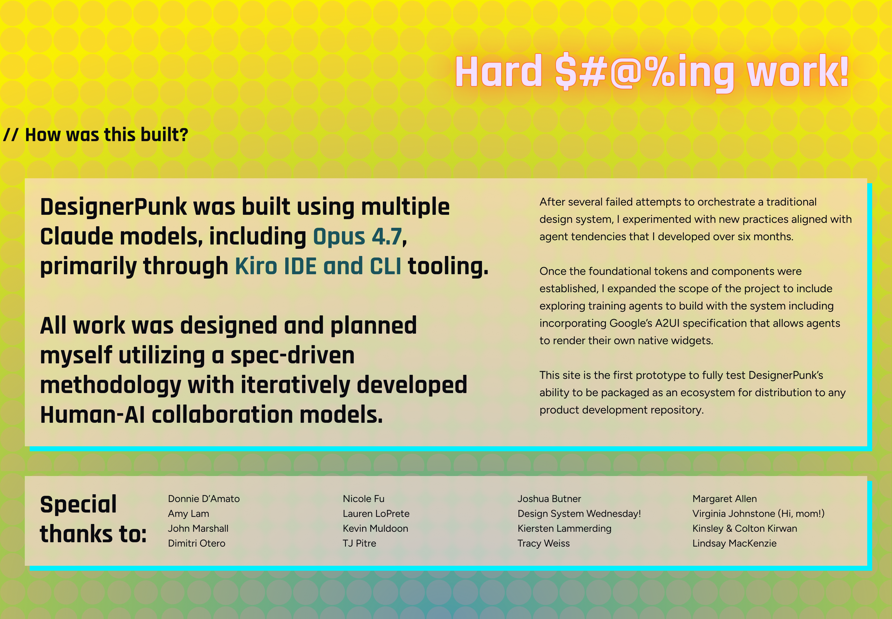

# Component Analysis: HowBuilt

**Component Type**: COMPONENT
**Figma ID**: 3492:2853
**File Key**: yU7908VXR1khQN5hZXC6Cy
**Extracted**: 2026-05-10T14:56:55.832Z
**Extractor Version**: 6.3.0

---

## Classification Summary

| Tier | Count | Percentage |
| --- | --- | --- |
| ✅ Semantic Identified | 12 | 11% |
| ⚠️ Primitive Identified | 13 | 12% |
| ❌ Unidentified | 87 | 78% |
| **Total** | **112** | **100%** |

## Node Tree

- **HowBuilt** (FRAME, depth 0) [S:0 P:0 U:5]
  - **How Was This Built Container** (FRAME, depth 1) [S:0 P:0 U:5]
    - **Background Pattern Container** (FRAME, depth 2) [S:0 P:0 U:5]
      - **2** (FRAME, depth 3) [S:0 P:1 U:2]
      - **1** (FRAME, depth 3) [S:0 P:1 U:2]
    - **Content Container** (FRAME, depth 2) [S:1 P:0 U:5]
      - **Header** (FRAME, depth 3) [S:0 P:0 U:6]
        - **How was this built?** (TEXT, depth 4) [S:0 P:1 U:4]
        - **//** (TEXT, depth 4) [S:0 P:1 U:4]
      - **Container Container** (FRAME, depth 3) [S:3 P:0 U:3]
        - **Feature Content Container** (FRAME, depth 4) [S:2 P:0 U:4]
          - **DesignerPunk was built using multiple Claude models, including Opus 4.7, primarily through Kiro IDE and CLI tooling. All work was designed and planned myself utilizing a spec-driven methodology with iteratively developed Human-AI collaboration models.** (TEXT, depth 5) [S:0 P:0 U:4]
        - **Supporting Contentent Container** (FRAME, depth 4) [S:2 P:0 U:4]
          - **After several failed attempts to orchestrate a traditional design system, I experimented with new practices aligned with agent tendencies that I developed over six months. Once the foundational tokens and components were established, I expanded the scope of the project to include exploring training agents to build with the system including incorporating Google’s A2UI specification that allows agents to render their own native widgets. This site is the first prototype to fully test DesignerPunk’s ability to be packaged as an ecosystem for distribution to any product development repository.** (TEXT, depth 5) [S:0 P:1 U:4]
      - **Special Thanks Container** (FRAME, depth 3) [S:4 P:0 U:2]
        - **Header Container** (FRAME, depth 4) [S:0 P:1 U:5]
          - **Special thanks to:** (TEXT, depth 5) [S:0 P:1 U:4]
        - **Donnie D’Amato Amy Lam John Marshall Dimitri Otero** (TEXT, depth 4) [S:0 P:1 U:4]
        - **Nicole Fu Lauren LoPrete Kevin Muldoon TJ Pitre** (TEXT, depth 4) [S:0 P:1 U:4]
        - **Joshua Butner Design System Wednesday! Kiersten Lammerding Tracy Weiss** (TEXT, depth 4) [S:0 P:1 U:4]
        - **Margaret Allen Virginia Johnstone (Hi, mom!) Kinsley & Colton Kirwan Lindsay MacKenzie** (TEXT, depth 4) [S:0 P:1 U:4]
    - **Hard $#@%ing work!** (TEXT, depth 2) [S:0 P:2 U:3]

## Token Usage by Node

### HowBuilt (FRAME, depth 0)

- ❌ `padding-top`: 0 (value-match)
- ❌ `padding-right`: 0 (value-match)
- ❌ `padding-bottom`: 0 (value-match)
- ❌ `padding-left`: 0 (value-match)
- ❌ `border-width`: 1 (value-match)

### How Was This Built Container (FRAME, depth 1)

- ❌ `padding-top`: 0 (value-match)
- ❌ `padding-right`: 0 (value-match)
- ❌ `padding-bottom`: 0 (value-match)
- ❌ `padding-left`: 0 (value-match)
- ❌ `border-width`: 1 (value-match)

### Background Pattern Container (FRAME, depth 2)

- ❌ `padding-top`: 0 (value-match)
- ❌ `padding-right`: 0 (value-match)
- ❌ `padding-bottom`: 0 (value-match)
- ❌ `padding-left`: 0 (value-match)
- ❌ `border-width`: 1 (value-match)

### 2 (FRAME, depth 3)

- ⚠️ `fill`: color.pink200 (binding, exact)
- ❌ `opacity`: 0.20000000298023224 (value-match)
- ❌ `border-width`: 0.7032260894775391 (value-match)

### 1 (FRAME, depth 3)

- ⚠️ `fill`: color.pink200 (binding, exact)
- ❌ `opacity`: 0.20000000298023224 (value-match)
- ❌ `border-width`: 0.7032260894775391 (value-match)

### Content Container (FRAME, depth 2)

- ✅ `item-spacing`: semanticSpace.sectioned.loose → space.space600 (binding, exact)
- ❌ `padding-top`: 0 (value-match)
- ❌ `padding-right`: 40 (value-match)
- ❌ `padding-bottom`: 0 (value-match)
- ❌ `padding-left`: 40 (value-match)
- ❌ `border-width`: 1 (value-match)

### Header (FRAME, depth 3)

- ❌ `padding-top`: 0 (value-match)
- ❌ `padding-right`: 0 (value-match)
- ❌ `padding-bottom`: 0 (value-match)
- ❌ `padding-left`: 0 (value-match)
- ❌ `item-spacing`: 8 (value-match)
- ❌ `border-width`: 1 (value-match)

### How was this built? (TEXT, depth 4)

- ⚠️ `fill`: color.black300 (binding, exact)
- ❌ `border-width`: 1 (value-match)
- ❌ `font-size`: 33 (value-match)
- ❌ `font-weight`: 700 (value-match)
- ❌ `line-height`: 40 (out-of-tolerance — closest: lineHeight.lineHeight125 (±38.444px))

### // (TEXT, depth 4)

- ⚠️ `fill`: color.black300 (binding, exact)
- ❌ `border-width`: 1 (value-match)
- ❌ `font-size`: 33 (value-match)
- ❌ `font-weight`: 700 (value-match)
- ❌ `line-height`: 40 (out-of-tolerance — closest: lineHeight.lineHeight125 (±38.444px))

### Container Container (FRAME, depth 3)

- ✅ `padding-top`: semanticSpace.inset.300 → space.space300 (binding, exact)
- ✅ `padding-bottom`: semanticSpace.inset.300 → space.space300 (binding, exact)
- ✅ `item-spacing`: semanticSpace.separated.normal → space.space300 (binding, exact)
- ❌ `padding-right`: 0 (value-match)
- ❌ `padding-left`: 0 (value-match)
- ❌ `fill`: rgba(255, 229, 220, 0.6000000238418579) (value-match)

### Feature Content Container (FRAME, depth 4)

- ✅ `padding-right`: semanticSpace.inset.300 → space.space300 (binding, exact)
- ✅ `padding-left`: semanticSpace.inset.300 → space.space300 (binding, exact)
- ❌ `padding-top`: 0 (value-match)
- ❌ `padding-bottom`: 0 (value-match)
- ❌ `item-spacing`: 0 (value-match)
- ❌ `border-radius`: 8 (value-match)

### DesignerPunk was built using multiple Claude models, including Opus 4.7, primarily through Kiro IDE and CLI tooling. All work was designed and planned myself utilizing a spec-driven methodology with iteratively developed Human-AI collaboration models. (TEXT, depth 5)

- ❌ `border-width`: 1 (value-match)
- ❌ `font-size`: 42 (value-match)
- ❌ `font-weight`: 700 (value-match)
- ❌ `line-height`: 48.0099983215332 (out-of-tolerance — closest: lineHeight.lineHeight125 (±46.453998321533206px))

### Supporting Contentent Container (FRAME, depth 4)

- ✅ `padding-right`: semanticSpace.inset.300 → space.space300 (binding, exact)
- ✅ `padding-left`: semanticSpace.inset.300 → space.space300 (binding, exact)
- ❌ `padding-top`: 0 (value-match)
- ❌ `padding-bottom`: 0 (value-match)
- ❌ `item-spacing`: 8 (value-match)
- ❌ `border-width`: 1 (value-match)

### After several failed attempts to orchestrate a traditional design system, I experimented with new practices aligned with agent tendencies that I developed over six months. Once the foundational tokens and components were established, I expanded the scope of the project to include exploring training agents to build with the system including incorporating Google’s A2UI specification that allows agents to render their own native widgets. This site is the first prototype to fully test DesignerPunk’s ability to be packaged as an ecosystem for distribution to any product development repository. (TEXT, depth 5)

- ⚠️ `fill`: color.black300 (binding, exact)
- ❌ `border-width`: 1 (value-match)
- ❌ `font-size`: 18 (value-match)
- ❌ `font-weight`: 400 (value-match)
- ❌ `line-height`: 28.010000228881836 (out-of-tolerance — closest: lineHeight.lineHeight125 (±26.454000228881835px))

### Special Thanks Container (FRAME, depth 3)

- ✅ `padding-top`: semanticSpace.inset.300 → space.space300 (binding, exact)
- ✅ `padding-right`: semanticSpace.inset.300 → space.space300 (binding, exact)
- ✅ `padding-bottom`: semanticSpace.inset.300 → space.space300 (binding, exact)
- ✅ `item-spacing`: semanticSpace.related.loose → space.space300 (binding, exact)
- ❌ `padding-left`: 0 (value-match)
- ❌ `fill`: rgba(255, 229, 220, 0.6000000238418579) (value-match)

### Header Container (FRAME, depth 4)

- ⚠️ `padding-left`: space.space300 (binding, exact)
- ❌ `padding-top`: 0 (value-match)
- ❌ `padding-right`: 0 (value-match)
- ❌ `padding-bottom`: 0 (value-match)
- ❌ `item-spacing`: 8 (value-match)
- ❌ `border-radius`: 8 (value-match)

### Special thanks to: (TEXT, depth 5)

- ⚠️ `fill`: color.black300 (binding, exact)
- ❌ `border-width`: 1 (value-match)
- ❌ `font-size`: 42 (value-match)
- ❌ `font-weight`: 700 (value-match)
- ❌ `line-height`: 48.0099983215332 (out-of-tolerance — closest: lineHeight.lineHeight125 (±46.453998321533206px))

### Donnie D’Amato Amy Lam John Marshall Dimitri Otero (TEXT, depth 4)

- ⚠️ `fill`: color.black300 (binding, exact)
- ❌ `border-width`: 1 (value-match)
- ❌ `font-size`: 16 (value-match)
- ❌ `font-weight`: 400 (value-match)
- ❌ `line-height`: 24 (out-of-tolerance — closest: lineHeight.lineHeight125 (±22.444px))

### Nicole Fu Lauren LoPrete Kevin Muldoon TJ Pitre (TEXT, depth 4)

- ⚠️ `fill`: color.black300 (binding, exact)
- ❌ `border-width`: 1 (value-match)
- ❌ `font-size`: 16 (value-match)
- ❌ `font-weight`: 400 (value-match)
- ❌ `line-height`: 24 (out-of-tolerance — closest: lineHeight.lineHeight125 (±22.444px))

### Joshua Butner Design System Wednesday! Kiersten Lammerding Tracy Weiss (TEXT, depth 4)

- ⚠️ `fill`: color.black300 (binding, exact)
- ❌ `border-width`: 1 (value-match)
- ❌ `font-size`: 16 (value-match)
- ❌ `font-weight`: 400 (value-match)
- ❌ `line-height`: 24 (out-of-tolerance — closest: lineHeight.lineHeight125 (±22.444px))

### Margaret Allen Virginia Johnstone (Hi, mom!) Kinsley & Colton Kirwan Lindsay MacKenzie (TEXT, depth 4)

- ⚠️ `fill`: color.black300 (binding, exact)
- ❌ `border-width`: 1 (value-match)
- ❌ `font-size`: 16 (value-match)
- ❌ `font-weight`: 400 (value-match)
- ❌ `line-height`: 24 (out-of-tolerance — closest: lineHeight.lineHeight125 (±22.444px))

### Hard $#@%ing work! (TEXT, depth 2)

- ⚠️ `fill`: color.purple100 (binding, exact)
- ⚠️ `stroke`: color.orange300 (binding, exact)
- ❌ `border-width`: 1 (value-match)
- ❌ `font-size`: 74 (out-of-tolerance — closest: fontSize.fontSize700 (±32px))
- ❌ `font-weight`: 700 (value-match)

## Recommendations

### Variant Mapping

⚠️ **Validation Required**: This analysis is based on Figma component structure. The optimal code structure may differ.

**Component**: HowBuilt
**Classification**: styling

**A** ✅ Recommended
- Single component with a variant prop
- Rationale: Variants differ only in visual styling, making a single component with a variant prop the simplest API surface.
- Aligns with: Behavioral analysis: variants are styling-only
- Trade-offs: Simpler consumer API — one import, one tag., Internal complexity grows if behavioral differences emerge later., Harder to tree-shake unused variants.

**B** 
- Primitive + semantic component structure (Stemma pattern)
- Rationale: A split structure future-proofs the component for behavioral divergence, though current variants are styling-only.
- Trade-offs: Clean separation of behavioral contracts per component., Aligns with Stemma inheritance pattern used across DesignerPunk., More components to maintain and document.

**Domain Specialist Validation**:
- **Ada** (Token Specialist): Are token classifications correct? Should new semantic tokens be created?
- **Lina** (Component Specialist): Does the component architecture match Stemma patterns?
- **Thurgood** (Governance): Does this meet spec standards and test coverage requirements?

### Component Token Suggestions

⚠️ **Validation Required**: This analysis is based on Figma component structure. The optimal code structure may differ.

- **how.item-spacing = space.space000** ← `space.space000` (used 5× in item-spacing, padding-top, padding-right, padding-bottom, padding-left)
  - space.space000 is used across 5 properties (item-spacing, padding-top, padding-right, padding-bottom, padding-left). Consistent usage suggests semantic intent that could be encoded as a component token.

**Domain Specialist Validation**:
- **Ada** (Token Specialist): Are token classifications correct? Should new semantic tokens be created?
- **Lina** (Component Specialist): Does the component architecture match Stemma patterns?
- **Thurgood** (Governance): Does this meet spec standards and test coverage requirements?

## Unidentified Values

- **HowBuilt** → `padding-top`: 0 (value-match — suggested: `semanticSpace.grouped.none`)
- **HowBuilt** → `padding-right`: 0 (value-match — suggested: `semanticSpace.grouped.none`)
- **HowBuilt** → `padding-bottom`: 0 (value-match — suggested: `semanticSpace.grouped.none`)
- **HowBuilt** → `padding-left`: 0 (value-match — suggested: `semanticSpace.grouped.none`)
- **HowBuilt** → `border-width`: 1 (value-match — suggested: `semanticBorderWidth.default`)
- **How Was This Built Container** → `padding-top`: 0 (value-match — suggested: `semanticSpace.grouped.none`)
- **How Was This Built Container** → `padding-right`: 0 (value-match — suggested: `semanticSpace.grouped.none`)
- **How Was This Built Container** → `padding-bottom`: 0 (value-match — suggested: `semanticSpace.grouped.none`)
- **How Was This Built Container** → `padding-left`: 0 (value-match — suggested: `semanticSpace.grouped.none`)
- **How Was This Built Container** → `border-width`: 1 (value-match — suggested: `semanticBorderWidth.default`)
- **Background Pattern Container** → `padding-top`: 0 (value-match — suggested: `semanticSpace.grouped.none`)
- **Background Pattern Container** → `padding-right`: 0 (value-match — suggested: `semanticSpace.grouped.none`)
- **Background Pattern Container** → `padding-bottom`: 0 (value-match — suggested: `semanticSpace.grouped.none`)
- **Background Pattern Container** → `padding-left`: 0 (value-match — suggested: `semanticSpace.grouped.none`)
- **Background Pattern Container** → `border-width`: 1 (value-match — suggested: `semanticBorderWidth.default`)
- **2** → `opacity`: 0.20000000298023224 (value-match — suggested: `opacity.opacity024`)
- **2** → `border-width`: 0.7032260894775391 (value-match — suggested: `semanticBorderWidth.default`)
- **1** → `opacity`: 0.20000000298023224 (value-match — suggested: `opacity.opacity024`)
- **1** → `border-width`: 0.7032260894775391 (value-match — suggested: `semanticBorderWidth.default`)
- **Content Container** → `padding-top`: 0 (value-match — suggested: `semanticSpace.grouped.none`)
- **Content Container** → `padding-right`: 40 (value-match — suggested: `semanticSpace.sectioned.normal`)
- **Content Container** → `padding-bottom`: 0 (value-match — suggested: `semanticSpace.grouped.none`)
- **Content Container** → `padding-left`: 40 (value-match — suggested: `semanticSpace.sectioned.normal`)
- **Content Container** → `border-width`: 1 (value-match — suggested: `semanticBorderWidth.default`)
- **Header** → `padding-top`: 0 (value-match — suggested: `semanticSpace.grouped.none`)
- **Header** → `padding-right`: 0 (value-match — suggested: `semanticSpace.grouped.none`)
- **Header** → `padding-bottom`: 0 (value-match — suggested: `semanticSpace.grouped.none`)
- **Header** → `padding-left`: 0 (value-match — suggested: `semanticSpace.grouped.none`)
- **Header** → `item-spacing`: 8 (value-match — suggested: `semanticSpace.grouped.normal`)
- **Header** → `border-width`: 1 (value-match — suggested: `semanticBorderWidth.default`)
- **How was this built?** → `border-width`: 1 (value-match — suggested: `semanticBorderWidth.default`)
- **How was this built?** → `font-size`: 33 (value-match — suggested: `icon.icon.size500`)
- **How was this built?** → `font-weight`: 700 (value-match — suggested: `fontWeight.fontWeight700`)
- **How was this built?** → `line-height`: 40 (out-of-tolerance — closest: lineHeight.lineHeight125 (±38.444px))
- **//** → `border-width`: 1 (value-match — suggested: `semanticBorderWidth.default`)
- **//** → `font-size`: 33 (value-match — suggested: `icon.icon.size500`)
- **//** → `font-weight`: 700 (value-match — suggested: `fontWeight.fontWeight700`)
- **//** → `line-height`: 40 (out-of-tolerance — closest: lineHeight.lineHeight125 (±38.444px))
- **Container Container** → `padding-right`: 0 (value-match — suggested: `semanticSpace.grouped.none`)
- **Container Container** → `padding-left`: 0 (value-match — suggested: `semanticSpace.grouped.none`)
- **Container Container** → `fill`: rgba(255, 229, 220, 0.6000000238418579) (value-match — suggested: `semanticColor.color.feedback.warning.background`)
- **Feature Content Container** → `padding-top`: 0 (value-match — suggested: `semanticSpace.grouped.none`)
- **Feature Content Container** → `padding-bottom`: 0 (value-match — suggested: `semanticSpace.grouped.none`)
- **Feature Content Container** → `item-spacing`: 0 (value-match — suggested: `semanticSpace.grouped.none`)
- **Feature Content Container** → `border-radius`: 8 (value-match — suggested: `semanticRadius.normal`)
- **DesignerPunk was built using multiple Claude models, including Opus 4.7, primarily through Kiro IDE and CLI tooling. All work was designed and planned myself utilizing a spec-driven methodology with iteratively developed Human-AI collaboration models.** → `border-width`: 1 (value-match — suggested: `semanticBorderWidth.default`)
- **DesignerPunk was built using multiple Claude models, including Opus 4.7, primarily through Kiro IDE and CLI tooling. All work was designed and planned myself utilizing a spec-driven methodology with iteratively developed Human-AI collaboration models.** → `font-size`: 42 (value-match — suggested: `icon.icon.size700`)
- **DesignerPunk was built using multiple Claude models, including Opus 4.7, primarily through Kiro IDE and CLI tooling. All work was designed and planned myself utilizing a spec-driven methodology with iteratively developed Human-AI collaboration models.** → `font-weight`: 700 (value-match — suggested: `fontWeight.fontWeight700`)
- **DesignerPunk was built using multiple Claude models, including Opus 4.7, primarily through Kiro IDE and CLI tooling. All work was designed and planned myself utilizing a spec-driven methodology with iteratively developed Human-AI collaboration models.** → `line-height`: 48.0099983215332 (out-of-tolerance — closest: lineHeight.lineHeight125 (±46.453998321533206px))
- **Supporting Contentent Container** → `padding-top`: 0 (value-match — suggested: `semanticSpace.grouped.none`)
- **Supporting Contentent Container** → `padding-bottom`: 0 (value-match — suggested: `semanticSpace.grouped.none`)
- **Supporting Contentent Container** → `item-spacing`: 8 (value-match — suggested: `semanticSpace.grouped.normal`)
- **Supporting Contentent Container** → `border-width`: 1 (value-match — suggested: `semanticBorderWidth.default`)
- **After several failed attempts to orchestrate a traditional design system, I experimented with new practices aligned with agent tendencies that I developed over six months. Once the foundational tokens and components were established, I expanded the scope of the project to include exploring training agents to build with the system including incorporating Google’s A2UI specification that allows agents to render their own native widgets. This site is the first prototype to fully test DesignerPunk’s ability to be packaged as an ecosystem for distribution to any product development repository.** → `border-width`: 1 (value-match — suggested: `semanticBorderWidth.default`)
- **After several failed attempts to orchestrate a traditional design system, I experimented with new practices aligned with agent tendencies that I developed over six months. Once the foundational tokens and components were established, I expanded the scope of the project to include exploring training agents to build with the system including incorporating Google’s A2UI specification that allows agents to render their own native widgets. This site is the first prototype to fully test DesignerPunk’s ability to be packaged as an ecosystem for distribution to any product development repository.** → `font-size`: 18 (value-match — suggested: `icon.icon.size125`)
- **After several failed attempts to orchestrate a traditional design system, I experimented with new practices aligned with agent tendencies that I developed over six months. Once the foundational tokens and components were established, I expanded the scope of the project to include exploring training agents to build with the system including incorporating Google’s A2UI specification that allows agents to render their own native widgets. This site is the first prototype to fully test DesignerPunk’s ability to be packaged as an ecosystem for distribution to any product development repository.** → `font-weight`: 400 (value-match — suggested: `fontWeight.fontWeight400`)
- **After several failed attempts to orchestrate a traditional design system, I experimented with new practices aligned with agent tendencies that I developed over six months. Once the foundational tokens and components were established, I expanded the scope of the project to include exploring training agents to build with the system including incorporating Google’s A2UI specification that allows agents to render their own native widgets. This site is the first prototype to fully test DesignerPunk’s ability to be packaged as an ecosystem for distribution to any product development repository.** → `line-height`: 28.010000228881836 (out-of-tolerance — closest: lineHeight.lineHeight125 (±26.454000228881835px))
- **Special Thanks Container** → `padding-left`: 0 (value-match — suggested: `semanticSpace.grouped.none`)
- **Special Thanks Container** → `fill`: rgba(255, 229, 220, 0.6000000238418579) (value-match — suggested: `semanticColor.color.feedback.warning.background`)
- **Header Container** → `padding-top`: 0 (value-match — suggested: `semanticSpace.grouped.none`)
- **Header Container** → `padding-right`: 0 (value-match — suggested: `semanticSpace.grouped.none`)
- **Header Container** → `padding-bottom`: 0 (value-match — suggested: `semanticSpace.grouped.none`)
- **Header Container** → `item-spacing`: 8 (value-match — suggested: `semanticSpace.grouped.normal`)
- **Header Container** → `border-radius`: 8 (value-match — suggested: `semanticRadius.normal`)
- **Special thanks to:** → `border-width`: 1 (value-match — suggested: `semanticBorderWidth.default`)
- **Special thanks to:** → `font-size`: 42 (value-match — suggested: `icon.icon.size700`)
- **Special thanks to:** → `font-weight`: 700 (value-match — suggested: `fontWeight.fontWeight700`)
- **Special thanks to:** → `line-height`: 48.0099983215332 (out-of-tolerance — closest: lineHeight.lineHeight125 (±46.453998321533206px))
- **Donnie D’Amato Amy Lam John Marshall Dimitri Otero** → `border-width`: 1 (value-match — suggested: `semanticBorderWidth.default`)
- **Donnie D’Amato Amy Lam John Marshall Dimitri Otero** → `font-size`: 16 (value-match — suggested: `icon.icon.size100`)
- **Donnie D’Amato Amy Lam John Marshall Dimitri Otero** → `font-weight`: 400 (value-match — suggested: `fontWeight.fontWeight400`)
- **Donnie D’Amato Amy Lam John Marshall Dimitri Otero** → `line-height`: 24 (out-of-tolerance — closest: lineHeight.lineHeight125 (±22.444px))
- **Nicole Fu Lauren LoPrete Kevin Muldoon TJ Pitre** → `border-width`: 1 (value-match — suggested: `semanticBorderWidth.default`)
- **Nicole Fu Lauren LoPrete Kevin Muldoon TJ Pitre** → `font-size`: 16 (value-match — suggested: `icon.icon.size100`)
- **Nicole Fu Lauren LoPrete Kevin Muldoon TJ Pitre** → `font-weight`: 400 (value-match — suggested: `fontWeight.fontWeight400`)
- **Nicole Fu Lauren LoPrete Kevin Muldoon TJ Pitre** → `line-height`: 24 (out-of-tolerance — closest: lineHeight.lineHeight125 (±22.444px))
- **Joshua Butner Design System Wednesday! Kiersten Lammerding Tracy Weiss** → `border-width`: 1 (value-match — suggested: `semanticBorderWidth.default`)
- **Joshua Butner Design System Wednesday! Kiersten Lammerding Tracy Weiss** → `font-size`: 16 (value-match — suggested: `icon.icon.size100`)
- **Joshua Butner Design System Wednesday! Kiersten Lammerding Tracy Weiss** → `font-weight`: 400 (value-match — suggested: `fontWeight.fontWeight400`)
- **Joshua Butner Design System Wednesday! Kiersten Lammerding Tracy Weiss** → `line-height`: 24 (out-of-tolerance — closest: lineHeight.lineHeight125 (±22.444px))
- **Margaret Allen Virginia Johnstone (Hi, mom!) Kinsley & Colton Kirwan Lindsay MacKenzie** → `border-width`: 1 (value-match — suggested: `semanticBorderWidth.default`)
- **Margaret Allen Virginia Johnstone (Hi, mom!) Kinsley & Colton Kirwan Lindsay MacKenzie** → `font-size`: 16 (value-match — suggested: `icon.icon.size100`)
- **Margaret Allen Virginia Johnstone (Hi, mom!) Kinsley & Colton Kirwan Lindsay MacKenzie** → `font-weight`: 400 (value-match — suggested: `fontWeight.fontWeight400`)
- **Margaret Allen Virginia Johnstone (Hi, mom!) Kinsley & Colton Kirwan Lindsay MacKenzie** → `line-height`: 24 (out-of-tolerance — closest: lineHeight.lineHeight125 (±22.444px))
- **Hard $#@%ing work!** → `border-width`: 1 (value-match — suggested: `semanticBorderWidth.default`)
- **Hard $#@%ing work!** → `font-size`: 74 (out-of-tolerance — closest: fontSize.fontSize700 (±32px))
- **Hard $#@%ing work!** → `font-weight`: 700 (value-match — suggested: `fontWeight.fontWeight700`)

## Screenshots

*Component screenshot (png, 2x, captured 2026-05-10T14:56:55.829Z)*
