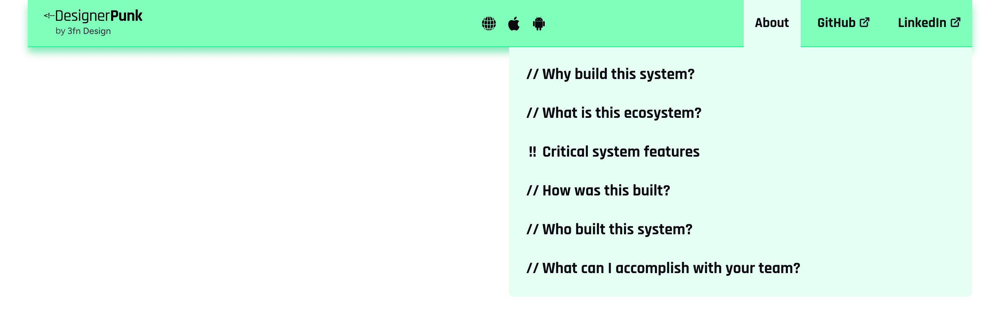

# Component Analysis: Nav

**Component Type**: COMPONENT
**Figma ID**: 3439:89084
**File Key**: yU7908VXR1khQN5hZXC6Cy
**Extracted**: 2026-05-08T21:38:12.747Z
**Extractor Version**: 6.3.0

---

## Classification Summary

| Tier | Count | Percentage |
| --- | --- | --- |
| ✅ Semantic Identified | 45 | 17% |
| ⚠️ Primitive Identified | 53 | 20% |
| ❌ Unidentified | 168 | 63% |
| **Total** | **266** | **100%** |

## Node Tree

- **Nav** (FRAME, depth 0) [S:0 P:1 U:5]
  - **NavBar** (FRAME, depth 1) [S:1 P:3 U:3]
    - **Logo Lockup Container** (FRAME, depth 2) [S:1 P:0 U:5]
      - **Logo Container** (FRAME, depth 3) [S:0 P:0 U:6]
        - **Logo Segment Container** (FRAME, depth 4) [S:0 P:0 U:6]
          - **Union** (FRAME, depth 5) [S:0 P:1 U:0]
      - **Credit Container** (FRAME, depth 3) [S:0 P:1 U:5]
        - **by** (TEXT, depth 4) [S:0 P:1 U:4]
        - **3fn Design** (TEXT, depth 4) [S:0 P:1 U:4]
    - **Platform Support Container** (FRAME, depth 2) [S:1 P:0 U:5]
      - **Web Icon Container** (FRAME, depth 3) [S:0 P:0 U:6]
        - **Subtract** (FRAME, depth 4) [S:0 P:1 U:0]
      - **iOS Icon Container** (FRAME, depth 3) [S:0 P:0 U:6]
        - **Apple_logo_black 2** (FRAME, depth 4) [S:0 P:0 U:6]
          - **Vector** (FRAME, depth 5) [S:0 P:1 U:1]
      - **Android Icon Container** (FRAME, depth 3) [S:0 P:0 U:6]
        - **Vector** (FRAME, depth 4) [S:0 P:1 U:1]
    - **Frame 341** (FRAME, depth 2) [S:1 P:0 U:5]
      - **Nav Button, About** (FRAME, depth 3) [S:2 P:3 U:2]
        - **About** (TEXT, depth 4) [S:0 P:1 U:4]
      - **Nav Button, GitHub** (FRAME, depth 3) [S:3 P:2 U:1]
        - **GitHub** (TEXT, depth 4) [S:0 P:1 U:4]
        - **Frame 511** (FRAME, depth 4) [S:0 P:0 U:5]
          - **external-link 1** (FRAME, depth 5) [S:0 P:0 U:6]
            - **Vector** (FRAME, depth 6) [S:0 P:1 U:1]
            - **Vector** (FRAME, depth 6) [S:0 P:1 U:1]
            - **Vector** (FRAME, depth 6) [S:0 P:1 U:1]
      - **Nav Button, About** (FRAME, depth 3) [S:3 P:2 U:1]
        - **LinkedIn** (TEXT, depth 4) [S:0 P:1 U:4]
        - **Frame 511** (FRAME, depth 4) [S:0 P:0 U:5]
          - **external-link 1** (FRAME, depth 5) [S:0 P:0 U:6]
            - **Vector** (FRAME, depth 6) [S:0 P:1 U:1]
            - **Vector** (FRAME, depth 6) [S:0 P:1 U:1]
            - **Vector** (FRAME, depth 6) [S:0 P:1 U:1]
  - **Subnav Container** (FRAME, depth 1) [S:2 P:2 U:3]
    - **Subnav Button List** (FRAME, depth 2) [S:1 P:0 U:5]
      - **Subnav Button** (FRAME, depth 3) [S:5 P:0 U:1]
        - **//** (TEXT, depth 4) [S:0 P:1 U:4]
        - **Why build this system?** (TEXT, depth 4) [S:0 P:3 U:2]
      - **Subnav Button** (FRAME, depth 3) [S:5 P:0 U:1]
        - **//** (TEXT, depth 4) [S:0 P:1 U:4]
        - **What is this ecosystem?** (TEXT, depth 4) [S:0 P:3 U:2]
      - **Subnav Button** (FRAME, depth 3) [S:5 P:0 U:1]
        - **!!** (TEXT, depth 4) [S:0 P:1 U:4]
        - **Critical system features** (TEXT, depth 4) [S:0 P:3 U:2]
      - **Subnav Button** (FRAME, depth 3) [S:5 P:0 U:1]
        - **//** (TEXT, depth 4) [S:0 P:1 U:4]
        - **How was this built?** (TEXT, depth 4) [S:0 P:3 U:2]
      - **Subnav Button** (FRAME, depth 3) [S:5 P:0 U:1]
        - **//** (TEXT, depth 4) [S:0 P:1 U:4]
        - **Who built this system?** (TEXT, depth 4) [S:0 P:3 U:2]
      - **Subnav Button** (FRAME, depth 3) [S:5 P:0 U:1]
        - **//** (TEXT, depth 4) [S:0 P:1 U:4]
        - **What can I accomplish with your team?** (TEXT, depth 4) [S:0 P:3 U:2]

## Token Usage by Node

### Nav (FRAME, depth 0)

- ⚠️ `fill`: color.white100 (binding, exact)
- ❌ `padding-top`: 0 (value-match)
- ❌ `padding-right`: 0 (value-match)
- ❌ `padding-bottom`: 0 (value-match)
- ❌ `padding-left`: 0 (value-match)
- ❌ `border-width`: 1 (value-match)

### NavBar (FRAME, depth 1)

- ✅ `item-spacing`: semanticSpace.separated.normal → space.space300 (binding, exact)
- ⚠️ `padding-left`: space.space500 (binding, exact)
- ⚠️ `fill`: color.green200 (binding, exact)
- ⚠️ `stroke`: color.green400 (binding, exact)
- ❌ `padding-top`: 0 (value-match)
- ❌ `padding-right`: 0 (value-match)
- ❌ `padding-bottom`: 0 (value-match)

### Logo Lockup Container (FRAME, depth 2)

- ✅ `item-spacing`: semanticSpace.grouped.none → space.space000 (binding, exact)
- ❌ `padding-top`: 0 (value-match)
- ❌ `padding-right`: 0 (value-match)
- ❌ `padding-bottom`: 0 (value-match)
- ❌ `padding-left`: 0 (value-match)
- ❌ `border-width`: 1 (value-match)

### Logo Container (FRAME, depth 3)

- ❌ `padding-top`: 0 (value-match)
- ❌ `padding-right`: 0 (value-match)
- ❌ `padding-bottom`: 0 (value-match)
- ❌ `padding-left`: 0 (value-match)
- ❌ `item-spacing`: 8 (value-match)
- ❌ `border-width`: 1 (value-match)

### Logo Segment Container (FRAME, depth 4)

- ❌ `padding-top`: 0 (value-match)
- ❌ `padding-right`: 0 (value-match)
- ❌ `padding-bottom`: 0 (value-match)
- ❌ `padding-left`: 0 (value-match)
- ❌ `item-spacing`: 8 (value-match)
- ❌ `border-width`: 1 (value-match)

### Union (FRAME, depth 5)

- ⚠️ `fill`: color.black500 (binding, exact)

### Credit Container (FRAME, depth 3)

- ⚠️ `item-spacing`: space.space025 (binding, exact)
- ❌ `padding-top`: 0 (value-match)
- ❌ `padding-right`: 0 (value-match)
- ❌ `padding-bottom`: 0 (value-match)
- ❌ `padding-left`: 0 (value-match)
- ❌ `border-width`: 1 (value-match)

### by (TEXT, depth 4)

- ⚠️ `fill`: color.black100 (binding, exact)
- ❌ `border-width`: 1 (value-match)
- ❌ `font-size`: 13 (value-match)
- ❌ `font-weight`: 400 (value-match)
- ❌ `line-height`: 20.010000228881836 (out-of-tolerance — closest: lineHeight.lineHeight125 (±18.454000228881835px))

### 3fn Design (TEXT, depth 4)

- ⚠️ `fill`: color.black100 (binding, exact)
- ❌ `border-width`: 1 (value-match)
- ❌ `font-size`: 13 (value-match)
- ❌ `font-weight`: 500 (value-match)
- ❌ `line-height`: 19.989999771118164 (out-of-tolerance — closest: lineHeight.lineHeight125 (±18.433999771118163px))

### Platform Support Container (FRAME, depth 2)

- ✅ `item-spacing`: semanticSpace.related.normal → space.space200 (binding, exact)
- ❌ `padding-top`: 0 (value-match)
- ❌ `padding-right`: 0 (value-match)
- ❌ `padding-bottom`: 0 (value-match)
- ❌ `padding-left`: 0 (value-match)
- ❌ `border-width`: 1 (value-match)

### Web Icon Container (FRAME, depth 3)

- ❌ `padding-top`: 0 (value-match)
- ❌ `padding-right`: 0 (value-match)
- ❌ `padding-bottom`: 0 (value-match)
- ❌ `padding-left`: 0 (value-match)
- ❌ `item-spacing`: 0 (value-match)
- ❌ `border-width`: 1 (value-match)

### Subtract (FRAME, depth 4)

- ⚠️ `fill`: color.black300 (binding, exact)

### iOS Icon Container (FRAME, depth 3)

- ❌ `padding-top`: 0 (value-match)
- ❌ `padding-right`: 0 (value-match)
- ❌ `padding-bottom`: 0 (value-match)
- ❌ `padding-left`: 0 (value-match)
- ❌ `item-spacing`: 8 (value-match)
- ❌ `border-width`: 1 (value-match)

### Apple_logo_black 2 (FRAME, depth 4)

- ❌ `padding-top`: 0 (value-match)
- ❌ `padding-right`: 0 (value-match)
- ❌ `padding-bottom`: 0 (value-match)
- ❌ `padding-left`: 0 (value-match)
- ❌ `fill`: rgba(255, 255, 255, 1) (value-match)
- ❌ `border-width`: 1 (value-match)

### Vector (FRAME, depth 5)

- ⚠️ `fill`: color.black300 (binding, exact)
- ❌ `border-width`: 1 (value-match)

### Android Icon Container (FRAME, depth 3)

- ❌ `padding-top`: 0 (value-match)
- ❌ `padding-right`: 0 (value-match)
- ❌ `padding-bottom`: 0 (value-match)
- ❌ `padding-left`: 0 (value-match)
- ❌ `fill`: rgba(255, 255, 255, 1) (value-match)
- ❌ `border-width`: 1 (value-match)

### Vector (FRAME, depth 4)

- ⚠️ `fill`: color.black300 (binding, exact)
- ❌ `border-width`: 81.46772003173828 (out-of-tolerance — closest: borderWidth.borderWidth400 (±77.46772003173828px))

### Frame 341 (FRAME, depth 2)

- ✅ `item-spacing`: semanticSpace.grouped.normal → space.space100 (binding, exact)
- ❌ `padding-top`: 0 (value-match)
- ❌ `padding-right`: 0 (value-match)
- ❌ `padding-bottom`: 0 (value-match)
- ❌ `padding-left`: 0 (value-match)
- ❌ `border-width`: 1 (value-match)

### Nav Button, About (FRAME, depth 3)

- ✅ `padding-right`: semanticSpace.inset.200 → space.space200 (binding, exact)
- ✅ `padding-left`: semanticSpace.inset.200 → space.space200 (binding, exact)
- ⚠️ `padding-top`: space.space250 (binding, exact)
- ⚠️ `padding-bottom`: space.space250 (binding, exact)
- ⚠️ `fill`: color.green100 (binding, exact)
- ❌ `item-spacing`: 0 (value-match)
- ❌ `border-width`: 1 (value-match)

### About (TEXT, depth 4)

- ⚠️ `fill`: color.black300 (binding, exact)
- ❌ `border-width`: 1 (value-match)
- ❌ `font-size`: 20 (value-match)
- ❌ `font-weight`: 700 (value-match)
- ❌ `line-height`: 28 (out-of-tolerance — closest: lineHeight.lineHeight125 (±26.444px))

### Nav Button, GitHub (FRAME, depth 3)

- ✅ `padding-right`: semanticSpace.inset.200 → space.space200 (binding, exact)
- ✅ `padding-left`: semanticSpace.inset.200 → space.space200 (binding, exact)
- ✅ `item-spacing`: semanticSpace.grouped.tight → space.space050 (binding, exact)
- ⚠️ `padding-top`: space.space250 (binding, exact)
- ⚠️ `padding-bottom`: space.space250 (binding, exact)
- ❌ `border-width`: 1 (value-match)

### GitHub (TEXT, depth 4)

- ⚠️ `fill`: color.black300 (binding, exact)
- ❌ `border-width`: 1 (value-match)
- ❌ `font-size`: 20 (value-match)
- ❌ `font-weight`: 700 (value-match)
- ❌ `line-height`: 28 (out-of-tolerance — closest: lineHeight.lineHeight125 (±26.444px))

### Frame 511 (FRAME, depth 4)

- ❌ `padding-top`: 0 (value-match)
- ❌ `padding-right`: 0 (value-match)
- ❌ `padding-bottom`: 0 (value-match)
- ❌ `padding-left`: 0 (value-match)
- ❌ `border-width`: 1 (value-match)

### external-link 1 (FRAME, depth 5)

- ❌ `padding-top`: 0 (value-match)
- ❌ `padding-right`: 0 (value-match)
- ❌ `padding-bottom`: 0 (value-match)
- ❌ `padding-left`: 0 (value-match)
- ❌ `fill`: rgba(255, 255, 255, 1) (value-match)
- ❌ `border-width`: 1 (value-match)

### Vector (FRAME, depth 6)

- ⚠️ `stroke`: color.black200 (binding, exact)
- ❌ `border-width`: 2 (value-match)

### Vector (FRAME, depth 6)

- ⚠️ `stroke`: color.black200 (binding, exact)
- ❌ `border-width`: 2 (value-match)

### Vector (FRAME, depth 6)

- ⚠️ `stroke`: color.black200 (binding, exact)
- ❌ `border-width`: 2 (value-match)

### Nav Button, About (FRAME, depth 3)

- ✅ `padding-right`: semanticSpace.inset.200 → space.space200 (binding, exact)
- ✅ `padding-left`: semanticSpace.inset.200 → space.space200 (binding, exact)
- ✅ `item-spacing`: semanticSpace.grouped.tight → space.space050 (binding, exact)
- ⚠️ `padding-top`: space.space250 (binding, exact)
- ⚠️ `padding-bottom`: space.space250 (binding, exact)
- ❌ `border-width`: 1 (value-match)

### LinkedIn (TEXT, depth 4)

- ⚠️ `fill`: color.black300 (binding, exact)
- ❌ `border-width`: 1 (value-match)
- ❌ `font-size`: 20 (value-match)
- ❌ `font-weight`: 700 (value-match)
- ❌ `line-height`: 28 (out-of-tolerance — closest: lineHeight.lineHeight125 (±26.444px))

### Frame 511 (FRAME, depth 4)

- ❌ `padding-top`: 0 (value-match)
- ❌ `padding-right`: 0 (value-match)
- ❌ `padding-bottom`: 0 (value-match)
- ❌ `padding-left`: 0 (value-match)
- ❌ `border-width`: 1 (value-match)

### external-link 1 (FRAME, depth 5)

- ❌ `padding-top`: 0 (value-match)
- ❌ `padding-right`: 0 (value-match)
- ❌ `padding-bottom`: 0 (value-match)
- ❌ `padding-left`: 0 (value-match)
- ❌ `fill`: rgba(255, 255, 255, 1) (value-match)
- ❌ `border-width`: 1 (value-match)

### Vector (FRAME, depth 6)

- ⚠️ `stroke`: color.black200 (binding, exact)
- ❌ `border-width`: 2 (value-match)

### Vector (FRAME, depth 6)

- ⚠️ `stroke`: color.black200 (binding, exact)
- ❌ `border-width`: 2 (value-match)

### Vector (FRAME, depth 6)

- ⚠️ `stroke`: color.black200 (binding, exact)
- ❌ `border-width`: 2 (value-match)

### Subnav Container (FRAME, depth 1)

- ✅ `padding-top`: semanticSpace.inset.200 → space.space200 (binding, exact)
- ✅ `padding-bottom`: semanticSpace.inset.200 → space.space200 (binding, exact)
- ⚠️ `item-spacing`: space.space100 (binding, exact)
- ⚠️ `fill`: color.green100 (binding, exact)
- ❌ `padding-right`: 0 (value-match)
- ❌ `padding-left`: 0 (value-match)
- ❌ `border-width`: 1 (value-match)

### Subnav Button List (FRAME, depth 2)

- ✅ `item-spacing`: semanticSpace.grouped.normal → space.space100 (binding, exact)
- ❌ `padding-top`: 0 (value-match)
- ❌ `padding-right`: 0 (value-match)
- ❌ `padding-bottom`: 0 (value-match)
- ❌ `padding-left`: 0 (value-match)
- ❌ `border-width`: 1 (value-match)

### Subnav Button (FRAME, depth 3)

- ✅ `padding-top`: semanticSpace.inset.100 → space.space100 (binding, exact)
- ✅ `padding-right`: semanticSpace.inset.300 → space.space300 (binding, exact)
- ✅ `padding-bottom`: semanticSpace.inset.100 → space.space100 (binding, exact)
- ✅ `padding-left`: semanticSpace.inset.300 → space.space300 (binding, exact)
- ✅ `item-spacing`: semanticSpace.grouped.tight → space.space050 (binding, exact)
- ❌ `border-width`: 1 (value-match)

### // (TEXT, depth 4)

- ⚠️ `fill`: color.black300 (binding, exact)
- ❌ `border-width`: 1 (value-match)
- ❌ `font-size`: 23 (value-match)
- ❌ `font-weight`: 700 (value-match)
- ❌ `line-height`: 31.989999771118164 (out-of-tolerance — closest: lineHeight.lineHeight125 (±30.433999771118163px))

### Why build this system? (TEXT, depth 4)

- ⚠️ `fill`: color.black300 (binding, exact)
- ⚠️ `font-size`: fontSize.fontSize200 (binding, exact)
- ⚠️ `font-weight`: fontWeight.fontWeight700 (binding, exact)
- ❌ `border-width`: 1 (value-match)
- ❌ `line-height`: 31.989999771118164 (out-of-tolerance — closest: lineHeight.lineHeight125 (±30.433999771118163px))

### Subnav Button (FRAME, depth 3)

- ✅ `padding-top`: semanticSpace.inset.100 → space.space100 (binding, exact)
- ✅ `padding-right`: semanticSpace.inset.300 → space.space300 (binding, exact)
- ✅ `padding-bottom`: semanticSpace.inset.100 → space.space100 (binding, exact)
- ✅ `padding-left`: semanticSpace.inset.300 → space.space300 (binding, exact)
- ✅ `item-spacing`: semanticSpace.grouped.tight → space.space050 (binding, exact)
- ❌ `border-width`: 1 (value-match)

### // (TEXT, depth 4)

- ⚠️ `fill`: color.black300 (binding, exact)
- ❌ `border-width`: 1 (value-match)
- ❌ `font-size`: 23 (value-match)
- ❌ `font-weight`: 700 (value-match)
- ❌ `line-height`: 31.989999771118164 (out-of-tolerance — closest: lineHeight.lineHeight125 (±30.433999771118163px))

### What is this ecosystem? (TEXT, depth 4)

- ⚠️ `fill`: color.black300 (binding, exact)
- ⚠️ `font-size`: fontSize.fontSize200 (binding, exact)
- ⚠️ `font-weight`: fontWeight.fontWeight700 (binding, exact)
- ❌ `border-width`: 1 (value-match)
- ❌ `line-height`: 31.989999771118164 (out-of-tolerance — closest: lineHeight.lineHeight125 (±30.433999771118163px))

### Subnav Button (FRAME, depth 3)

- ✅ `padding-top`: semanticSpace.inset.100 → space.space100 (binding, exact)
- ✅ `padding-right`: semanticSpace.inset.300 → space.space300 (binding, exact)
- ✅ `padding-bottom`: semanticSpace.inset.100 → space.space100 (binding, exact)
- ✅ `padding-left`: semanticSpace.inset.300 → space.space300 (binding, exact)
- ✅ `item-spacing`: semanticSpace.grouped.tight → space.space050 (binding, exact)
- ❌ `border-width`: 1 (value-match)

### !! (TEXT, depth 4)

- ⚠️ `fill`: color.black300 (binding, exact)
- ❌ `border-width`: 1 (value-match)
- ❌ `font-size`: 23 (value-match)
- ❌ `font-weight`: 700 (value-match)
- ❌ `line-height`: 31.989999771118164 (out-of-tolerance — closest: lineHeight.lineHeight125 (±30.433999771118163px))

### Critical system features (TEXT, depth 4)

- ⚠️ `fill`: color.black300 (binding, exact)
- ⚠️ `font-size`: fontSize.fontSize200 (binding, exact)
- ⚠️ `font-weight`: fontWeight.fontWeight700 (binding, exact)
- ❌ `border-width`: 1 (value-match)
- ❌ `line-height`: 31.989999771118164 (out-of-tolerance — closest: lineHeight.lineHeight125 (±30.433999771118163px))

### Subnav Button (FRAME, depth 3)

- ✅ `padding-top`: semanticSpace.inset.100 → space.space100 (binding, exact)
- ✅ `padding-right`: semanticSpace.inset.300 → space.space300 (binding, exact)
- ✅ `padding-bottom`: semanticSpace.inset.100 → space.space100 (binding, exact)
- ✅ `padding-left`: semanticSpace.inset.300 → space.space300 (binding, exact)
- ✅ `item-spacing`: semanticSpace.grouped.tight → space.space050 (binding, exact)
- ❌ `border-width`: 1 (value-match)

### // (TEXT, depth 4)

- ⚠️ `fill`: color.black300 (binding, exact)
- ❌ `border-width`: 1 (value-match)
- ❌ `font-size`: 23 (value-match)
- ❌ `font-weight`: 700 (value-match)
- ❌ `line-height`: 31.989999771118164 (out-of-tolerance — closest: lineHeight.lineHeight125 (±30.433999771118163px))

### How was this built? (TEXT, depth 4)

- ⚠️ `fill`: color.black300 (binding, exact)
- ⚠️ `font-size`: fontSize.fontSize200 (binding, exact)
- ⚠️ `font-weight`: fontWeight.fontWeight700 (binding, exact)
- ❌ `border-width`: 1 (value-match)
- ❌ `line-height`: 31.989999771118164 (out-of-tolerance — closest: lineHeight.lineHeight125 (±30.433999771118163px))

### Subnav Button (FRAME, depth 3)

- ✅ `padding-top`: semanticSpace.inset.100 → space.space100 (binding, exact)
- ✅ `padding-right`: semanticSpace.inset.300 → space.space300 (binding, exact)
- ✅ `padding-bottom`: semanticSpace.inset.100 → space.space100 (binding, exact)
- ✅ `padding-left`: semanticSpace.inset.300 → space.space300 (binding, exact)
- ✅ `item-spacing`: semanticSpace.grouped.tight → space.space050 (binding, exact)
- ❌ `border-width`: 1 (value-match)

### // (TEXT, depth 4)

- ⚠️ `fill`: color.black300 (binding, exact)
- ❌ `border-width`: 1 (value-match)
- ❌ `font-size`: 23 (value-match)
- ❌ `font-weight`: 700 (value-match)
- ❌ `line-height`: 31.989999771118164 (out-of-tolerance — closest: lineHeight.lineHeight125 (±30.433999771118163px))

### Who built this system? (TEXT, depth 4)

- ⚠️ `fill`: color.black300 (binding, exact)
- ⚠️ `font-size`: fontSize.fontSize200 (binding, exact)
- ⚠️ `font-weight`: fontWeight.fontWeight700 (binding, exact)
- ❌ `border-width`: 1 (value-match)
- ❌ `line-height`: 31.989999771118164 (out-of-tolerance — closest: lineHeight.lineHeight125 (±30.433999771118163px))

### Subnav Button (FRAME, depth 3)

- ✅ `padding-top`: semanticSpace.inset.100 → space.space100 (binding, exact)
- ✅ `padding-right`: semanticSpace.inset.300 → space.space300 (binding, exact)
- ✅ `padding-bottom`: semanticSpace.inset.100 → space.space100 (binding, exact)
- ✅ `padding-left`: semanticSpace.inset.300 → space.space300 (binding, exact)
- ✅ `item-spacing`: semanticSpace.grouped.tight → space.space050 (binding, exact)
- ❌ `border-width`: 1 (value-match)

### // (TEXT, depth 4)

- ⚠️ `fill`: color.black300 (binding, exact)
- ❌ `border-width`: 1 (value-match)
- ❌ `font-size`: 23 (value-match)
- ❌ `font-weight`: 700 (value-match)
- ❌ `line-height`: 31.989999771118164 (out-of-tolerance — closest: lineHeight.lineHeight125 (±30.433999771118163px))

### What can I accomplish with your team? (TEXT, depth 4)

- ⚠️ `fill`: color.black300 (binding, exact)
- ⚠️ `font-size`: fontSize.fontSize200 (binding, exact)
- ⚠️ `font-weight`: fontWeight.fontWeight700 (binding, exact)
- ❌ `border-width`: 1 (value-match)
- ❌ `line-height`: 31.989999771118164 (out-of-tolerance — closest: lineHeight.lineHeight125 (±30.433999771118163px))

## Recommendations

### Variant Mapping

⚠️ **Validation Required**: This analysis is based on Figma component structure. The optimal code structure may differ.

**Component**: Nav
**Classification**: styling

**A** ✅ Recommended
- Single component with a variant prop
- Rationale: Variants differ only in visual styling, making a single component with a variant prop the simplest API surface.
- Aligns with: Behavioral analysis: variants are styling-only
- Trade-offs: Simpler consumer API — one import, one tag., Internal complexity grows if behavioral differences emerge later., Harder to tree-shake unused variants.

**B** 
- Primitive + semantic component structure (Stemma pattern)
- Rationale: A split structure future-proofs the component for behavioral divergence, though current variants are styling-only.
- Trade-offs: Clean separation of behavioral contracts per component., Aligns with Stemma inheritance pattern used across DesignerPunk., More components to maintain and document.

**Domain Specialist Validation**:
- **Ada** (Token Specialist): Are token classifications correct? Should new semantic tokens be created?
- **Lina** (Component Specialist): Does the component architecture match Stemma patterns?
- **Thurgood** (Governance): Does this meet spec standards and test coverage requirements?

### Component Token Suggestions

⚠️ **Validation Required**: This analysis is based on Figma component structure. The optimal code structure may differ.

- **nav.padding = space.space000** ← `space.space000` (used 3× in padding-top, padding-right, padding-bottom)
  - space.space000 is used across 3 properties (padding-top, padding-right, padding-bottom). Consistent usage suggests semantic intent that could be encoded as a component token.

**Domain Specialist Validation**:
- **Ada** (Token Specialist): Are token classifications correct? Should new semantic tokens be created?
- **Lina** (Component Specialist): Does the component architecture match Stemma patterns?
- **Thurgood** (Governance): Does this meet spec standards and test coverage requirements?

## Unidentified Values

- **Nav** → `padding-top`: 0 (value-match — suggested: `semanticSpace.grouped.none`)
- **Nav** → `padding-right`: 0 (value-match — suggested: `semanticSpace.grouped.none`)
- **Nav** → `padding-bottom`: 0 (value-match — suggested: `semanticSpace.grouped.none`)
- **Nav** → `padding-left`: 0 (value-match — suggested: `semanticSpace.grouped.none`)
- **Nav** → `border-width`: 1 (value-match — suggested: `semanticBorderWidth.default`)
- **NavBar** → `padding-top`: 0 (value-match — suggested: `semanticSpace.grouped.none`)
- **NavBar** → `padding-right`: 0 (value-match — suggested: `semanticSpace.grouped.none`)
- **NavBar** → `padding-bottom`: 0 (value-match — suggested: `semanticSpace.grouped.none`)
- **Logo Lockup Container** → `padding-top`: 0 (value-match — suggested: `semanticSpace.grouped.none`)
- **Logo Lockup Container** → `padding-right`: 0 (value-match — suggested: `semanticSpace.grouped.none`)
- **Logo Lockup Container** → `padding-bottom`: 0 (value-match — suggested: `semanticSpace.grouped.none`)
- **Logo Lockup Container** → `padding-left`: 0 (value-match — suggested: `semanticSpace.grouped.none`)
- **Logo Lockup Container** → `border-width`: 1 (value-match — suggested: `semanticBorderWidth.default`)
- **Logo Container** → `padding-top`: 0 (value-match — suggested: `semanticSpace.grouped.none`)
- **Logo Container** → `padding-right`: 0 (value-match — suggested: `semanticSpace.grouped.none`)
- **Logo Container** → `padding-bottom`: 0 (value-match — suggested: `semanticSpace.grouped.none`)
- **Logo Container** → `padding-left`: 0 (value-match — suggested: `semanticSpace.grouped.none`)
- **Logo Container** → `item-spacing`: 8 (value-match — suggested: `semanticSpace.grouped.normal`)
- **Logo Container** → `border-width`: 1 (value-match — suggested: `semanticBorderWidth.default`)
- **Logo Segment Container** → `padding-top`: 0 (value-match — suggested: `semanticSpace.grouped.none`)
- **Logo Segment Container** → `padding-right`: 0 (value-match — suggested: `semanticSpace.grouped.none`)
- **Logo Segment Container** → `padding-bottom`: 0 (value-match — suggested: `semanticSpace.grouped.none`)
- **Logo Segment Container** → `padding-left`: 0 (value-match — suggested: `semanticSpace.grouped.none`)
- **Logo Segment Container** → `item-spacing`: 8 (value-match — suggested: `semanticSpace.grouped.normal`)
- **Logo Segment Container** → `border-width`: 1 (value-match — suggested: `semanticBorderWidth.default`)
- **Credit Container** → `padding-top`: 0 (value-match — suggested: `semanticSpace.grouped.none`)
- **Credit Container** → `padding-right`: 0 (value-match — suggested: `semanticSpace.grouped.none`)
- **Credit Container** → `padding-bottom`: 0 (value-match — suggested: `semanticSpace.grouped.none`)
- **Credit Container** → `padding-left`: 0 (value-match — suggested: `semanticSpace.grouped.none`)
- **Credit Container** → `border-width`: 1 (value-match — suggested: `semanticBorderWidth.default`)
- **by** → `border-width`: 1 (value-match — suggested: `semanticBorderWidth.default`)
- **by** → `font-size`: 13 (value-match — suggested: `icon.icon.size050`)
- **by** → `font-weight`: 400 (value-match — suggested: `fontWeight.fontWeight400`)
- **by** → `line-height`: 20.010000228881836 (out-of-tolerance — closest: lineHeight.lineHeight125 (±18.454000228881835px))
- **3fn Design** → `border-width`: 1 (value-match — suggested: `semanticBorderWidth.default`)
- **3fn Design** → `font-size`: 13 (value-match — suggested: `icon.icon.size050`)
- **3fn Design** → `font-weight`: 500 (value-match — suggested: `fontWeight.fontWeight500`)
- **3fn Design** → `line-height`: 19.989999771118164 (out-of-tolerance — closest: lineHeight.lineHeight125 (±18.433999771118163px))
- **Platform Support Container** → `padding-top`: 0 (value-match — suggested: `semanticSpace.grouped.none`)
- **Platform Support Container** → `padding-right`: 0 (value-match — suggested: `semanticSpace.grouped.none`)
- **Platform Support Container** → `padding-bottom`: 0 (value-match — suggested: `semanticSpace.grouped.none`)
- **Platform Support Container** → `padding-left`: 0 (value-match — suggested: `semanticSpace.grouped.none`)
- **Platform Support Container** → `border-width`: 1 (value-match — suggested: `semanticBorderWidth.default`)
- **Web Icon Container** → `padding-top`: 0 (value-match — suggested: `semanticSpace.grouped.none`)
- **Web Icon Container** → `padding-right`: 0 (value-match — suggested: `semanticSpace.grouped.none`)
- **Web Icon Container** → `padding-bottom`: 0 (value-match — suggested: `semanticSpace.grouped.none`)
- **Web Icon Container** → `padding-left`: 0 (value-match — suggested: `semanticSpace.grouped.none`)
- **Web Icon Container** → `item-spacing`: 0 (value-match — suggested: `semanticSpace.grouped.none`)
- **Web Icon Container** → `border-width`: 1 (value-match — suggested: `semanticBorderWidth.default`)
- **iOS Icon Container** → `padding-top`: 0 (value-match — suggested: `semanticSpace.grouped.none`)
- **iOS Icon Container** → `padding-right`: 0 (value-match — suggested: `semanticSpace.grouped.none`)
- **iOS Icon Container** → `padding-bottom`: 0 (value-match — suggested: `semanticSpace.grouped.none`)
- **iOS Icon Container** → `padding-left`: 0 (value-match — suggested: `semanticSpace.grouped.none`)
- **iOS Icon Container** → `item-spacing`: 8 (value-match — suggested: `semanticSpace.grouped.normal`)
- **iOS Icon Container** → `border-width`: 1 (value-match — suggested: `semanticBorderWidth.default`)
- **Apple_logo_black 2** → `padding-top`: 0 (value-match — suggested: `semanticSpace.grouped.none`)
- **Apple_logo_black 2** → `padding-right`: 0 (value-match — suggested: `semanticSpace.grouped.none`)
- **Apple_logo_black 2** → `padding-bottom`: 0 (value-match — suggested: `semanticSpace.grouped.none`)
- **Apple_logo_black 2** → `padding-left`: 0 (value-match — suggested: `semanticSpace.grouped.none`)
- **Apple_logo_black 2** → `fill`: rgba(255, 255, 255, 1) (value-match — suggested: `semanticColor.color.feedback.notification.text`)
- **Apple_logo_black 2** → `border-width`: 1 (value-match — suggested: `semanticBorderWidth.default`)
- **Vector** → `border-width`: 1 (value-match — suggested: `semanticBorderWidth.default`)
- **Android Icon Container** → `padding-top`: 0 (value-match — suggested: `semanticSpace.grouped.none`)
- **Android Icon Container** → `padding-right`: 0 (value-match — suggested: `semanticSpace.grouped.none`)
- **Android Icon Container** → `padding-bottom`: 0 (value-match — suggested: `semanticSpace.grouped.none`)
- **Android Icon Container** → `padding-left`: 0 (value-match — suggested: `semanticSpace.grouped.none`)
- **Android Icon Container** → `fill`: rgba(255, 255, 255, 1) (value-match — suggested: `semanticColor.color.feedback.notification.text`)
- **Android Icon Container** → `border-width`: 1 (value-match — suggested: `semanticBorderWidth.default`)
- **Vector** → `border-width`: 81.46772003173828 (out-of-tolerance — closest: borderWidth.borderWidth400 (±77.46772003173828px))
- **Frame 341** → `padding-top`: 0 (value-match — suggested: `semanticSpace.grouped.none`)
- **Frame 341** → `padding-right`: 0 (value-match — suggested: `semanticSpace.grouped.none`)
- **Frame 341** → `padding-bottom`: 0 (value-match — suggested: `semanticSpace.grouped.none`)
- **Frame 341** → `padding-left`: 0 (value-match — suggested: `semanticSpace.grouped.none`)
- **Frame 341** → `border-width`: 1 (value-match — suggested: `semanticBorderWidth.default`)
- **Nav Button, About** → `item-spacing`: 0 (value-match — suggested: `semanticSpace.grouped.none`)
- **Nav Button, About** → `border-width`: 1 (value-match — suggested: `semanticBorderWidth.default`)
- **About** → `border-width`: 1 (value-match — suggested: `semanticBorderWidth.default`)
- **About** → `font-size`: 20 (value-match — suggested: `icon.icon.size150`)
- **About** → `font-weight`: 700 (value-match — suggested: `fontWeight.fontWeight700`)
- **About** → `line-height`: 28 (out-of-tolerance — closest: lineHeight.lineHeight125 (±26.444px))
- **Nav Button, GitHub** → `border-width`: 1 (value-match — suggested: `semanticBorderWidth.default`)
- **GitHub** → `border-width`: 1 (value-match — suggested: `semanticBorderWidth.default`)
- **GitHub** → `font-size`: 20 (value-match — suggested: `icon.icon.size150`)
- **GitHub** → `font-weight`: 700 (value-match — suggested: `fontWeight.fontWeight700`)
- **GitHub** → `line-height`: 28 (out-of-tolerance — closest: lineHeight.lineHeight125 (±26.444px))
- **Frame 511** → `padding-top`: 0 (value-match — suggested: `semanticSpace.grouped.none`)
- **Frame 511** → `padding-right`: 0 (value-match — suggested: `semanticSpace.grouped.none`)
- **Frame 511** → `padding-bottom`: 0 (value-match — suggested: `semanticSpace.grouped.none`)
- **Frame 511** → `padding-left`: 0 (value-match — suggested: `semanticSpace.grouped.none`)
- **Frame 511** → `border-width`: 1 (value-match — suggested: `semanticBorderWidth.default`)
- **external-link 1** → `padding-top`: 0 (value-match — suggested: `semanticSpace.grouped.none`)
- **external-link 1** → `padding-right`: 0 (value-match — suggested: `semanticSpace.grouped.none`)
- **external-link 1** → `padding-bottom`: 0 (value-match — suggested: `semanticSpace.grouped.none`)
- **external-link 1** → `padding-left`: 0 (value-match — suggested: `semanticSpace.grouped.none`)
- **external-link 1** → `fill`: rgba(255, 255, 255, 1) (value-match — suggested: `semanticColor.color.feedback.notification.text`)
- **external-link 1** → `border-width`: 1 (value-match — suggested: `semanticBorderWidth.default`)
- **Vector** → `border-width`: 2 (value-match — suggested: `semanticBorderWidth.emphasis`)
- **Vector** → `border-width`: 2 (value-match — suggested: `semanticBorderWidth.emphasis`)
- **Vector** → `border-width`: 2 (value-match — suggested: `semanticBorderWidth.emphasis`)
- **Nav Button, About** → `border-width`: 1 (value-match — suggested: `semanticBorderWidth.default`)
- **LinkedIn** → `border-width`: 1 (value-match — suggested: `semanticBorderWidth.default`)
- **LinkedIn** → `font-size`: 20 (value-match — suggested: `icon.icon.size150`)
- **LinkedIn** → `font-weight`: 700 (value-match — suggested: `fontWeight.fontWeight700`)
- **LinkedIn** → `line-height`: 28 (out-of-tolerance — closest: lineHeight.lineHeight125 (±26.444px))
- **Frame 511** → `padding-top`: 0 (value-match — suggested: `semanticSpace.grouped.none`)
- **Frame 511** → `padding-right`: 0 (value-match — suggested: `semanticSpace.grouped.none`)
- **Frame 511** → `padding-bottom`: 0 (value-match — suggested: `semanticSpace.grouped.none`)
- **Frame 511** → `padding-left`: 0 (value-match — suggested: `semanticSpace.grouped.none`)
- **Frame 511** → `border-width`: 1 (value-match — suggested: `semanticBorderWidth.default`)
- **external-link 1** → `padding-top`: 0 (value-match — suggested: `semanticSpace.grouped.none`)
- **external-link 1** → `padding-right`: 0 (value-match — suggested: `semanticSpace.grouped.none`)
- **external-link 1** → `padding-bottom`: 0 (value-match — suggested: `semanticSpace.grouped.none`)
- **external-link 1** → `padding-left`: 0 (value-match — suggested: `semanticSpace.grouped.none`)
- **external-link 1** → `fill`: rgba(255, 255, 255, 1) (value-match — suggested: `semanticColor.color.feedback.notification.text`)
- **external-link 1** → `border-width`: 1 (value-match — suggested: `semanticBorderWidth.default`)
- **Vector** → `border-width`: 2 (value-match — suggested: `semanticBorderWidth.emphasis`)
- **Vector** → `border-width`: 2 (value-match — suggested: `semanticBorderWidth.emphasis`)
- **Vector** → `border-width`: 2 (value-match — suggested: `semanticBorderWidth.emphasis`)
- **Subnav Container** → `padding-right`: 0 (value-match — suggested: `semanticSpace.grouped.none`)
- **Subnav Container** → `padding-left`: 0 (value-match — suggested: `semanticSpace.grouped.none`)
- **Subnav Container** → `border-width`: 1 (value-match — suggested: `semanticBorderWidth.default`)
- **Subnav Button List** → `padding-top`: 0 (value-match — suggested: `semanticSpace.grouped.none`)
- **Subnav Button List** → `padding-right`: 0 (value-match — suggested: `semanticSpace.grouped.none`)
- **Subnav Button List** → `padding-bottom`: 0 (value-match — suggested: `semanticSpace.grouped.none`)
- **Subnav Button List** → `padding-left`: 0 (value-match — suggested: `semanticSpace.grouped.none`)
- **Subnav Button List** → `border-width`: 1 (value-match — suggested: `semanticBorderWidth.default`)
- **Subnav Button** → `border-width`: 1 (value-match — suggested: `semanticBorderWidth.default`)
- **//** → `border-width`: 1 (value-match — suggested: `semanticBorderWidth.default`)
- **//** → `font-size`: 23 (value-match — suggested: `icon.icon.size200`)
- **//** → `font-weight`: 700 (value-match — suggested: `fontWeight.fontWeight700`)
- **//** → `line-height`: 31.989999771118164 (out-of-tolerance — closest: lineHeight.lineHeight125 (±30.433999771118163px))
- **Why build this system?** → `border-width`: 1 (value-match — suggested: `semanticBorderWidth.default`)
- **Why build this system?** → `line-height`: 31.989999771118164 (out-of-tolerance — closest: lineHeight.lineHeight125 (±30.433999771118163px))
- **Subnav Button** → `border-width`: 1 (value-match — suggested: `semanticBorderWidth.default`)
- **//** → `border-width`: 1 (value-match — suggested: `semanticBorderWidth.default`)
- **//** → `font-size`: 23 (value-match — suggested: `icon.icon.size200`)
- **//** → `font-weight`: 700 (value-match — suggested: `fontWeight.fontWeight700`)
- **//** → `line-height`: 31.989999771118164 (out-of-tolerance — closest: lineHeight.lineHeight125 (±30.433999771118163px))
- **What is this ecosystem?** → `border-width`: 1 (value-match — suggested: `semanticBorderWidth.default`)
- **What is this ecosystem?** → `line-height`: 31.989999771118164 (out-of-tolerance — closest: lineHeight.lineHeight125 (±30.433999771118163px))
- **Subnav Button** → `border-width`: 1 (value-match — suggested: `semanticBorderWidth.default`)
- **!!** → `border-width`: 1 (value-match — suggested: `semanticBorderWidth.default`)
- **!!** → `font-size`: 23 (value-match — suggested: `icon.icon.size200`)
- **!!** → `font-weight`: 700 (value-match — suggested: `fontWeight.fontWeight700`)
- **!!** → `line-height`: 31.989999771118164 (out-of-tolerance — closest: lineHeight.lineHeight125 (±30.433999771118163px))
- **Critical system features** → `border-width`: 1 (value-match — suggested: `semanticBorderWidth.default`)
- **Critical system features** → `line-height`: 31.989999771118164 (out-of-tolerance — closest: lineHeight.lineHeight125 (±30.433999771118163px))
- **Subnav Button** → `border-width`: 1 (value-match — suggested: `semanticBorderWidth.default`)
- **//** → `border-width`: 1 (value-match — suggested: `semanticBorderWidth.default`)
- **//** → `font-size`: 23 (value-match — suggested: `icon.icon.size200`)
- **//** → `font-weight`: 700 (value-match — suggested: `fontWeight.fontWeight700`)
- **//** → `line-height`: 31.989999771118164 (out-of-tolerance — closest: lineHeight.lineHeight125 (±30.433999771118163px))
- **How was this built?** → `border-width`: 1 (value-match — suggested: `semanticBorderWidth.default`)
- **How was this built?** → `line-height`: 31.989999771118164 (out-of-tolerance — closest: lineHeight.lineHeight125 (±30.433999771118163px))
- **Subnav Button** → `border-width`: 1 (value-match — suggested: `semanticBorderWidth.default`)
- **//** → `border-width`: 1 (value-match — suggested: `semanticBorderWidth.default`)
- **//** → `font-size`: 23 (value-match — suggested: `icon.icon.size200`)
- **//** → `font-weight`: 700 (value-match — suggested: `fontWeight.fontWeight700`)
- **//** → `line-height`: 31.989999771118164 (out-of-tolerance — closest: lineHeight.lineHeight125 (±30.433999771118163px))
- **Who built this system?** → `border-width`: 1 (value-match — suggested: `semanticBorderWidth.default`)
- **Who built this system?** → `line-height`: 31.989999771118164 (out-of-tolerance — closest: lineHeight.lineHeight125 (±30.433999771118163px))
- **Subnav Button** → `border-width`: 1 (value-match — suggested: `semanticBorderWidth.default`)
- **//** → `border-width`: 1 (value-match — suggested: `semanticBorderWidth.default`)
- **//** → `font-size`: 23 (value-match — suggested: `icon.icon.size200`)
- **//** → `font-weight`: 700 (value-match — suggested: `fontWeight.fontWeight700`)
- **//** → `line-height`: 31.989999771118164 (out-of-tolerance — closest: lineHeight.lineHeight125 (±30.433999771118163px))
- **What can I accomplish with your team?** → `border-width`: 1 (value-match — suggested: `semanticBorderWidth.default`)
- **What can I accomplish with your team?** → `line-height`: 31.989999771118164 (out-of-tolerance — closest: lineHeight.lineHeight125 (±30.433999771118163px))

## Screenshots

*Component screenshot (png, 2x, captured 2026-05-08T21:38:12.741Z)*
