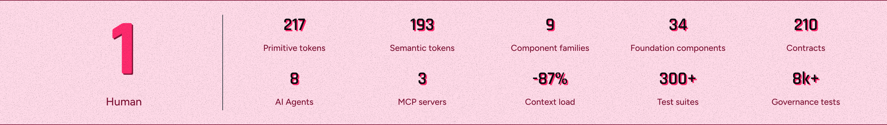

# Component Analysis: Stats

**Component Type**: COMPONENT
**Figma ID**: 3492:2
**File Key**: yU7908VXR1khQN5hZXC6Cy
**Extracted**: 2026-05-10T14:43:02.405Z
**Extractor Version**: 6.3.0

---

## Classification Summary

| Tier | Count | Percentage |
| --- | --- | --- |
| ✅ Semantic Identified | 19 | 9% |
| ⚠️ Primitive Identified | 25 | 12% |
| ❌ Unidentified | 168 | 79% |
| **Total** | **212** | **100%** |

## Node Tree

- **Stats** (FRAME, depth 0) [S:0 P:0 U:5]
  - **Stats Full  Width Container** (FRAME, depth 1) [S:0 P:2 U:4]
    - **Stats Content Container** (FRAME, depth 2) [S:5 P:0 U:0]
      - **1 Human Container** (FRAME, depth 3) [S:1 P:1 U:4]
        - **1** (TEXT, depth 4) [S:0 P:1 U:4]
        - **Human** (TEXT, depth 4) [S:0 P:1 U:4]
      - **Stats Container** (FRAME, depth 3) [S:1 P:0 U:5]
        - **Rosetta-Stemma Stats** (FRAME, depth 4) [S:1 P:0 U:6]
          - **Primtive Token Container** (FRAME, depth 5) [S:1 P:0 U:5]
            - **217** (TEXT, depth 6) [S:0 P:1 U:4]
            - **Primitive tokens** (TEXT, depth 6) [S:0 P:1 U:4]
          - **Semantic Token Container** (FRAME, depth 5) [S:1 P:0 U:5]
            - **193** (TEXT, depth 6) [S:0 P:1 U:4]
            - **Semantic tokens** (TEXT, depth 6) [S:0 P:1 U:4]
          - **Component Families Container** (FRAME, depth 5) [S:1 P:0 U:5]
            - **9** (TEXT, depth 6) [S:0 P:1 U:4]
            - **Component families** (TEXT, depth 6) [S:0 P:1 U:4]
          - **Foundation Components Container** (FRAME, depth 5) [S:1 P:0 U:5]
            - **34** (TEXT, depth 6) [S:0 P:1 U:4]
            - **Foundation components** (TEXT, depth 6) [S:0 P:1 U:4]
          - **Contracts Container** (FRAME, depth 5) [S:1 P:0 U:5]
            - **210** (TEXT, depth 6) [S:0 P:1 U:4]
            - **Contracts** (TEXT, depth 6) [S:0 P:1 U:4]
        - **Civitas Stats** (FRAME, depth 4) [S:1 P:0 U:6]
          - **Agents Container** (FRAME, depth 5) [S:1 P:0 U:5]
            - **8** (TEXT, depth 6) [S:0 P:1 U:4]
            - **AI Agents** (TEXT, depth 6) [S:0 P:1 U:4]
          - **MCP Container** (FRAME, depth 5) [S:1 P:0 U:5]
            - **3** (TEXT, depth 6) [S:0 P:1 U:4]
            - **MCP servers** (TEXT, depth 6) [S:0 P:1 U:4]
          - **Context Load Container** (FRAME, depth 5) [S:1 P:0 U:5]
            - **-87%** (TEXT, depth 6) [S:0 P:1 U:4]
            - **Context load** (TEXT, depth 6) [S:0 P:1 U:4]
          - **Test Suite Container** (FRAME, depth 5) [S:1 P:0 U:5]
            - **300+** (TEXT, depth 6) [S:0 P:1 U:4]
            - **Test suites** (TEXT, depth 6) [S:0 P:1 U:4]
          - **Governance Container** (FRAME, depth 5) [S:1 P:0 U:5]
            - **8k+** (TEXT, depth 6) [S:0 P:1 U:4]
            - **Governance tests** (TEXT, depth 6) [S:0 P:1 U:4]

## Token Usage by Node

### Stats (FRAME, depth 0)

- ❌ `padding-top`: 0 (value-match)
- ❌ `padding-right`: 0 (value-match)
- ❌ `padding-bottom`: 0 (value-match)
- ❌ `padding-left`: 0 (value-match)
- ❌ `border-width`: 1 (value-match)

### Stats Full  Width Container (FRAME, depth 1)

- ⚠️ `fill`: color.pink100 (binding, exact)
- ⚠️ `stroke`: color.pink500 (binding, exact)
- ❌ `padding-top`: 0 (value-match)
- ❌ `padding-right`: 0 (value-match)
- ❌ `padding-bottom`: 0 (value-match)
- ❌ `padding-left`: 0 (value-match)

### Stats Content Container (FRAME, depth 2)

- ✅ `padding-top`: semanticSpace.inset.300 → space.space300 (binding, exact)
- ✅ `padding-right`: semanticSpace.inset.none → space.space000 (binding, exact)
- ✅ `padding-bottom`: semanticSpace.inset.300 → space.space300 (binding, exact)
- ✅ `padding-left`: semanticSpace.inset.none → space.space000 (binding, exact)
- ✅ `item-spacing`: semanticSpace.related.loose → space.space300 (binding, exact)

### 1 Human Container (FRAME, depth 3)

- ✅ `item-spacing`: semanticSpace.grouped.none → space.space000 (binding, exact)
- ⚠️ `stroke`: color.gray300 (binding, exact)
- ❌ `padding-top`: 0 (value-match)
- ❌ `padding-right`: 0 (value-match)
- ❌ `padding-bottom`: 0 (value-match)
- ❌ `padding-left`: 0 (value-match)

### 1 (TEXT, depth 4)

- ⚠️ `fill`: color.pink300 (binding, exact)
- ❌ `border-width`: 1 (value-match)
- ❌ `font-size`: 128 (out-of-tolerance — closest: fontSize.fontSize700 (±86px))
- ❌ `font-weight`: 700 (value-match)
- ❌ `line-height`: 128 (out-of-tolerance — closest: lineHeight.lineHeight125 (±126.444px))

### Human (TEXT, depth 4)

- ⚠️ `fill`: color.pink500 (binding, exact)
- ❌ `border-width`: 1 (value-match)
- ❌ `font-size`: 18 (value-match)
- ❌ `font-weight`: 500 (value-match)
- ❌ `line-height`: 28.010000228881836 (out-of-tolerance — closest: lineHeight.lineHeight125 (±26.454000228881835px))

### Stats Container (FRAME, depth 3)

- ✅ `item-spacing`: semanticSpace.related.loose → space.space300 (binding, exact)
- ❌ `padding-top`: 0 (value-match)
- ❌ `padding-right`: 0 (value-match)
- ❌ `padding-bottom`: 0 (value-match)
- ❌ `padding-left`: 0 (value-match)
- ❌ `border-width`: 1 (value-match)

### Rosetta-Stemma Stats (FRAME, depth 4)

- ✅ `item-spacing`: semanticSpace.related.loose → space.space300 (binding, exact)
- ❌ `padding-top`: 0 (value-match)
- ❌ `padding-right`: 0 (value-match)
- ❌ `padding-bottom`: 0 (value-match)
- ❌ `padding-left`: 0 (value-match)
- ❌ `counter-axis-spacing`: 24 (value-match)
- ❌ `border-width`: 1 (value-match)

### Primtive Token Container (FRAME, depth 5)

- ✅ `item-spacing`: semanticSpace.grouped.normal → space.space100 (binding, exact)
- ❌ `padding-top`: 0 (value-match)
- ❌ `padding-right`: 0 (value-match)
- ❌ `padding-bottom`: 0 (value-match)
- ❌ `padding-left`: 0 (value-match)
- ❌ `border-width`: 1 (value-match)

### 217 (TEXT, depth 6)

- ⚠️ `fill`: color.black300 (binding, exact)
- ❌ `border-width`: 1 (value-match)
- ❌ `font-size`: 29 (value-match)
- ❌ `font-weight`: 600 (value-match)
- ❌ `line-height`: 35.9900016784668 (out-of-tolerance — closest: lineHeight.lineHeight125 (±34.4340016784668px))

### Primitive tokens (TEXT, depth 6)

- ⚠️ `fill`: color.pink500 (binding, exact)
- ❌ `border-width`: 1 (value-match)
- ❌ `font-size`: 14 (value-match)
- ❌ `font-weight`: 500 (value-match)
- ❌ `line-height`: 20.010000228881836 (out-of-tolerance — closest: lineHeight.lineHeight125 (±18.454000228881835px))

### Semantic Token Container (FRAME, depth 5)

- ✅ `item-spacing`: semanticSpace.grouped.normal → space.space100 (binding, exact)
- ❌ `padding-top`: 0 (value-match)
- ❌ `padding-right`: 0 (value-match)
- ❌ `padding-bottom`: 0 (value-match)
- ❌ `padding-left`: 0 (value-match)
- ❌ `border-width`: 1 (value-match)

### 193 (TEXT, depth 6)

- ⚠️ `fill`: color.black300 (binding, exact)
- ❌ `border-width`: 1 (value-match)
- ❌ `font-size`: 29 (value-match)
- ❌ `font-weight`: 600 (value-match)
- ❌ `line-height`: 35.9900016784668 (out-of-tolerance — closest: lineHeight.lineHeight125 (±34.4340016784668px))

### Semantic tokens (TEXT, depth 6)

- ⚠️ `fill`: color.pink500 (binding, exact)
- ❌ `border-width`: 1 (value-match)
- ❌ `font-size`: 14 (value-match)
- ❌ `font-weight`: 500 (value-match)
- ❌ `line-height`: 20.010000228881836 (out-of-tolerance — closest: lineHeight.lineHeight125 (±18.454000228881835px))

### Component Families Container (FRAME, depth 5)

- ✅ `item-spacing`: semanticSpace.grouped.normal → space.space100 (binding, exact)
- ❌ `padding-top`: 0 (value-match)
- ❌ `padding-right`: 0 (value-match)
- ❌ `padding-bottom`: 0 (value-match)
- ❌ `padding-left`: 0 (value-match)
- ❌ `border-width`: 1 (value-match)

### 9 (TEXT, depth 6)

- ⚠️ `fill`: color.black300 (binding, exact)
- ❌ `border-width`: 1 (value-match)
- ❌ `font-size`: 29 (value-match)
- ❌ `font-weight`: 600 (value-match)
- ❌ `line-height`: 35.9900016784668 (out-of-tolerance — closest: lineHeight.lineHeight125 (±34.4340016784668px))

### Component families (TEXT, depth 6)

- ⚠️ `fill`: color.pink500 (binding, exact)
- ❌ `border-width`: 1 (value-match)
- ❌ `font-size`: 14 (value-match)
- ❌ `font-weight`: 500 (value-match)
- ❌ `line-height`: 20.010000228881836 (out-of-tolerance — closest: lineHeight.lineHeight125 (±18.454000228881835px))

### Foundation Components Container (FRAME, depth 5)

- ✅ `item-spacing`: semanticSpace.grouped.normal → space.space100 (binding, exact)
- ❌ `padding-top`: 0 (value-match)
- ❌ `padding-right`: 0 (value-match)
- ❌ `padding-bottom`: 0 (value-match)
- ❌ `padding-left`: 0 (value-match)
- ❌ `border-width`: 1 (value-match)

### 34 (TEXT, depth 6)

- ⚠️ `fill`: color.black300 (binding, exact)
- ❌ `border-width`: 1 (value-match)
- ❌ `font-size`: 29 (value-match)
- ❌ `font-weight`: 600 (value-match)
- ❌ `line-height`: 35.9900016784668 (out-of-tolerance — closest: lineHeight.lineHeight125 (±34.4340016784668px))

### Foundation components (TEXT, depth 6)

- ⚠️ `fill`: color.pink500 (binding, exact)
- ❌ `border-width`: 1 (value-match)
- ❌ `font-size`: 14 (value-match)
- ❌ `font-weight`: 500 (value-match)
- ❌ `line-height`: 20.010000228881836 (out-of-tolerance — closest: lineHeight.lineHeight125 (±18.454000228881835px))

### Contracts Container (FRAME, depth 5)

- ✅ `item-spacing`: semanticSpace.grouped.normal → space.space100 (binding, exact)
- ❌ `padding-top`: 0 (value-match)
- ❌ `padding-right`: 0 (value-match)
- ❌ `padding-bottom`: 0 (value-match)
- ❌ `padding-left`: 0 (value-match)
- ❌ `border-width`: 1 (value-match)

### 210 (TEXT, depth 6)

- ⚠️ `fill`: color.black300 (binding, exact)
- ❌ `border-width`: 1 (value-match)
- ❌ `font-size`: 29 (value-match)
- ❌ `font-weight`: 600 (value-match)
- ❌ `line-height`: 35.9900016784668 (out-of-tolerance — closest: lineHeight.lineHeight125 (±34.4340016784668px))

### Contracts (TEXT, depth 6)

- ⚠️ `fill`: color.pink500 (binding, exact)
- ❌ `border-width`: 1 (value-match)
- ❌ `font-size`: 14 (value-match)
- ❌ `font-weight`: 500 (value-match)
- ❌ `line-height`: 20.010000228881836 (out-of-tolerance — closest: lineHeight.lineHeight125 (±18.454000228881835px))

### Civitas Stats (FRAME, depth 4)

- ✅ `item-spacing`: semanticSpace.related.loose → space.space300 (binding, exact)
- ❌ `padding-top`: 0 (value-match)
- ❌ `padding-right`: 0 (value-match)
- ❌ `padding-bottom`: 0 (value-match)
- ❌ `padding-left`: 0 (value-match)
- ❌ `counter-axis-spacing`: 40 (value-match)
- ❌ `border-width`: 1 (value-match)

### Agents Container (FRAME, depth 5)

- ✅ `item-spacing`: semanticSpace.grouped.normal → space.space100 (binding, exact)
- ❌ `padding-top`: 0 (value-match)
- ❌ `padding-right`: 0 (value-match)
- ❌ `padding-bottom`: 0 (value-match)
- ❌ `padding-left`: 0 (value-match)
- ❌ `border-width`: 1 (value-match)

### 8 (TEXT, depth 6)

- ⚠️ `fill`: color.black300 (binding, exact)
- ❌ `border-width`: 1 (value-match)
- ❌ `font-size`: 29 (value-match)
- ❌ `font-weight`: 600 (value-match)
- ❌ `line-height`: 35.9900016784668 (out-of-tolerance — closest: lineHeight.lineHeight125 (±34.4340016784668px))

### AI Agents (TEXT, depth 6)

- ⚠️ `fill`: color.pink500 (binding, exact)
- ❌ `border-width`: 1 (value-match)
- ❌ `font-size`: 14 (value-match)
- ❌ `font-weight`: 500 (value-match)
- ❌ `line-height`: 20.010000228881836 (out-of-tolerance — closest: lineHeight.lineHeight125 (±18.454000228881835px))

### MCP Container (FRAME, depth 5)

- ✅ `item-spacing`: semanticSpace.grouped.normal → space.space100 (binding, exact)
- ❌ `padding-top`: 0 (value-match)
- ❌ `padding-right`: 0 (value-match)
- ❌ `padding-bottom`: 0 (value-match)
- ❌ `padding-left`: 0 (value-match)
- ❌ `border-width`: 1 (value-match)

### 3 (TEXT, depth 6)

- ⚠️ `fill`: color.black300 (binding, exact)
- ❌ `border-width`: 1 (value-match)
- ❌ `font-size`: 29 (value-match)
- ❌ `font-weight`: 600 (value-match)
- ❌ `line-height`: 35.9900016784668 (out-of-tolerance — closest: lineHeight.lineHeight125 (±34.4340016784668px))

### MCP servers (TEXT, depth 6)

- ⚠️ `fill`: color.pink500 (binding, exact)
- ❌ `border-width`: 1 (value-match)
- ❌ `font-size`: 14 (value-match)
- ❌ `font-weight`: 500 (value-match)
- ❌ `line-height`: 20.010000228881836 (out-of-tolerance — closest: lineHeight.lineHeight125 (±18.454000228881835px))

### Context Load Container (FRAME, depth 5)

- ✅ `item-spacing`: semanticSpace.grouped.normal → space.space100 (binding, exact)
- ❌ `padding-top`: 0 (value-match)
- ❌ `padding-right`: 0 (value-match)
- ❌ `padding-bottom`: 0 (value-match)
- ❌ `padding-left`: 0 (value-match)
- ❌ `border-width`: 1 (value-match)

### -87% (TEXT, depth 6)

- ⚠️ `fill`: color.black300 (binding, exact)
- ❌ `border-width`: 1 (value-match)
- ❌ `font-size`: 29 (value-match)
- ❌ `font-weight`: 600 (value-match)
- ❌ `line-height`: 35.9900016784668 (out-of-tolerance — closest: lineHeight.lineHeight125 (±34.4340016784668px))

### Context load (TEXT, depth 6)

- ⚠️ `fill`: color.pink500 (binding, exact)
- ❌ `border-width`: 1 (value-match)
- ❌ `font-size`: 14 (value-match)
- ❌ `font-weight`: 500 (value-match)
- ❌ `line-height`: 20.010000228881836 (out-of-tolerance — closest: lineHeight.lineHeight125 (±18.454000228881835px))

### Test Suite Container (FRAME, depth 5)

- ✅ `item-spacing`: semanticSpace.grouped.normal → space.space100 (binding, exact)
- ❌ `padding-top`: 0 (value-match)
- ❌ `padding-right`: 0 (value-match)
- ❌ `padding-bottom`: 0 (value-match)
- ❌ `padding-left`: 0 (value-match)
- ❌ `border-width`: 1 (value-match)

### 300+ (TEXT, depth 6)

- ⚠️ `fill`: color.black300 (binding, exact)
- ❌ `border-width`: 1 (value-match)
- ❌ `font-size`: 29 (value-match)
- ❌ `font-weight`: 600 (value-match)
- ❌ `line-height`: 35.9900016784668 (out-of-tolerance — closest: lineHeight.lineHeight125 (±34.4340016784668px))

### Test suites (TEXT, depth 6)

- ⚠️ `fill`: color.pink500 (binding, exact)
- ❌ `border-width`: 1 (value-match)
- ❌ `font-size`: 14 (value-match)
- ❌ `font-weight`: 500 (value-match)
- ❌ `line-height`: 20.010000228881836 (out-of-tolerance — closest: lineHeight.lineHeight125 (±18.454000228881835px))

### Governance Container (FRAME, depth 5)

- ✅ `item-spacing`: semanticSpace.grouped.normal → space.space100 (binding, exact)
- ❌ `padding-top`: 0 (value-match)
- ❌ `padding-right`: 0 (value-match)
- ❌ `padding-bottom`: 0 (value-match)
- ❌ `padding-left`: 0 (value-match)
- ❌ `border-width`: 1 (value-match)

### 8k+ (TEXT, depth 6)

- ⚠️ `fill`: color.black300 (binding, exact)
- ❌ `border-width`: 1 (value-match)
- ❌ `font-size`: 29 (value-match)
- ❌ `font-weight`: 600 (value-match)
- ❌ `line-height`: 35.9900016784668 (out-of-tolerance — closest: lineHeight.lineHeight125 (±34.4340016784668px))

### Governance tests (TEXT, depth 6)

- ⚠️ `fill`: color.pink500 (binding, exact)
- ❌ `border-width`: 1 (value-match)
- ❌ `font-size`: 14 (value-match)
- ❌ `font-weight`: 500 (value-match)
- ❌ `line-height`: 20.010000228881836 (out-of-tolerance — closest: lineHeight.lineHeight125 (±18.454000228881835px))

## Recommendations

### Variant Mapping

⚠️ **Validation Required**: This analysis is based on Figma component structure. The optimal code structure may differ.

**Component**: Stats
**Classification**: styling

**A** ✅ Recommended
- Single component with a variant prop
- Rationale: Variants differ only in visual styling, making a single component with a variant prop the simplest API surface.
- Aligns with: Behavioral analysis: variants are styling-only
- Trade-offs: Simpler consumer API — one import, one tag., Internal complexity grows if behavioral differences emerge later., Harder to tree-shake unused variants.

**B** 
- Primitive + semantic component structure (Stemma pattern)
- Rationale: A split structure future-proofs the component for behavioral divergence, though current variants are styling-only.
- Trade-offs: Clean separation of behavioral contracts per component., Aligns with Stemma inheritance pattern used across DesignerPunk., More components to maintain and document.

**Domain Specialist Validation**:
- **Ada** (Token Specialist): Are token classifications correct? Should new semantic tokens be created?
- **Lina** (Component Specialist): Does the component architecture match Stemma patterns?
- **Thurgood** (Governance): Does this meet spec standards and test coverage requirements?

### Component Token Suggestions

⚠️ **Validation Required**: This analysis is based on Figma component structure. The optimal code structure may differ.

- **stats.item-spacing = space.space000** ← `space.space000` (used 5× in item-spacing, padding-top, padding-right, padding-bottom, padding-left)
  - space.space000 is used across 5 properties (item-spacing, padding-top, padding-right, padding-bottom, padding-left). Consistent usage suggests semantic intent that could be encoded as a component token.

**Domain Specialist Validation**:
- **Ada** (Token Specialist): Are token classifications correct? Should new semantic tokens be created?
- **Lina** (Component Specialist): Does the component architecture match Stemma patterns?
- **Thurgood** (Governance): Does this meet spec standards and test coverage requirements?

## Unidentified Values

- **Stats** → `padding-top`: 0 (value-match — suggested: `semanticSpace.grouped.none`)
- **Stats** → `padding-right`: 0 (value-match — suggested: `semanticSpace.grouped.none`)
- **Stats** → `padding-bottom`: 0 (value-match — suggested: `semanticSpace.grouped.none`)
- **Stats** → `padding-left`: 0 (value-match — suggested: `semanticSpace.grouped.none`)
- **Stats** → `border-width`: 1 (value-match — suggested: `semanticBorderWidth.default`)
- **Stats Full  Width Container** → `padding-top`: 0 (value-match — suggested: `semanticSpace.grouped.none`)
- **Stats Full  Width Container** → `padding-right`: 0 (value-match — suggested: `semanticSpace.grouped.none`)
- **Stats Full  Width Container** → `padding-bottom`: 0 (value-match — suggested: `semanticSpace.grouped.none`)
- **Stats Full  Width Container** → `padding-left`: 0 (value-match — suggested: `semanticSpace.grouped.none`)
- **1 Human Container** → `padding-top`: 0 (value-match — suggested: `semanticSpace.grouped.none`)
- **1 Human Container** → `padding-right`: 0 (value-match — suggested: `semanticSpace.grouped.none`)
- **1 Human Container** → `padding-bottom`: 0 (value-match — suggested: `semanticSpace.grouped.none`)
- **1 Human Container** → `padding-left`: 0 (value-match — suggested: `semanticSpace.grouped.none`)
- **1** → `border-width`: 1 (value-match — suggested: `semanticBorderWidth.default`)
- **1** → `font-size`: 128 (out-of-tolerance — closest: fontSize.fontSize700 (±86px))
- **1** → `font-weight`: 700 (value-match — suggested: `fontWeight.fontWeight700`)
- **1** → `line-height`: 128 (out-of-tolerance — closest: lineHeight.lineHeight125 (±126.444px))
- **Human** → `border-width`: 1 (value-match — suggested: `semanticBorderWidth.default`)
- **Human** → `font-size`: 18 (value-match — suggested: `icon.icon.size125`)
- **Human** → `font-weight`: 500 (value-match — suggested: `fontWeight.fontWeight500`)
- **Human** → `line-height`: 28.010000228881836 (out-of-tolerance — closest: lineHeight.lineHeight125 (±26.454000228881835px))
- **Stats Container** → `padding-top`: 0 (value-match — suggested: `semanticSpace.grouped.none`)
- **Stats Container** → `padding-right`: 0 (value-match — suggested: `semanticSpace.grouped.none`)
- **Stats Container** → `padding-bottom`: 0 (value-match — suggested: `semanticSpace.grouped.none`)
- **Stats Container** → `padding-left`: 0 (value-match — suggested: `semanticSpace.grouped.none`)
- **Stats Container** → `border-width`: 1 (value-match — suggested: `semanticBorderWidth.default`)
- **Rosetta-Stemma Stats** → `padding-top`: 0 (value-match — suggested: `semanticSpace.grouped.none`)
- **Rosetta-Stemma Stats** → `padding-right`: 0 (value-match — suggested: `semanticSpace.grouped.none`)
- **Rosetta-Stemma Stats** → `padding-bottom`: 0 (value-match — suggested: `semanticSpace.grouped.none`)
- **Rosetta-Stemma Stats** → `padding-left`: 0 (value-match — suggested: `semanticSpace.grouped.none`)
- **Rosetta-Stemma Stats** → `counter-axis-spacing`: 24 (value-match — suggested: `semanticSpace.related.loose`)
- **Rosetta-Stemma Stats** → `border-width`: 1 (value-match — suggested: `semanticBorderWidth.default`)
- **Primtive Token Container** → `padding-top`: 0 (value-match — suggested: `semanticSpace.grouped.none`)
- **Primtive Token Container** → `padding-right`: 0 (value-match — suggested: `semanticSpace.grouped.none`)
- **Primtive Token Container** → `padding-bottom`: 0 (value-match — suggested: `semanticSpace.grouped.none`)
- **Primtive Token Container** → `padding-left`: 0 (value-match — suggested: `semanticSpace.grouped.none`)
- **Primtive Token Container** → `border-width`: 1 (value-match — suggested: `semanticBorderWidth.default`)
- **217** → `border-width`: 1 (value-match — suggested: `semanticBorderWidth.default`)
- **217** → `font-size`: 29 (value-match — suggested: `icon.icon.size400`)
- **217** → `font-weight`: 600 (value-match — suggested: `fontWeight.fontWeight600`)
- **217** → `line-height`: 35.9900016784668 (out-of-tolerance — closest: lineHeight.lineHeight125 (±34.4340016784668px))
- **Primitive tokens** → `border-width`: 1 (value-match — suggested: `semanticBorderWidth.default`)
- **Primitive tokens** → `font-size`: 14 (value-match — suggested: `icon.icon.size075`)
- **Primitive tokens** → `font-weight`: 500 (value-match — suggested: `fontWeight.fontWeight500`)
- **Primitive tokens** → `line-height`: 20.010000228881836 (out-of-tolerance — closest: lineHeight.lineHeight125 (±18.454000228881835px))
- **Semantic Token Container** → `padding-top`: 0 (value-match — suggested: `semanticSpace.grouped.none`)
- **Semantic Token Container** → `padding-right`: 0 (value-match — suggested: `semanticSpace.grouped.none`)
- **Semantic Token Container** → `padding-bottom`: 0 (value-match — suggested: `semanticSpace.grouped.none`)
- **Semantic Token Container** → `padding-left`: 0 (value-match — suggested: `semanticSpace.grouped.none`)
- **Semantic Token Container** → `border-width`: 1 (value-match — suggested: `semanticBorderWidth.default`)
- **193** → `border-width`: 1 (value-match — suggested: `semanticBorderWidth.default`)
- **193** → `font-size`: 29 (value-match — suggested: `icon.icon.size400`)
- **193** → `font-weight`: 600 (value-match — suggested: `fontWeight.fontWeight600`)
- **193** → `line-height`: 35.9900016784668 (out-of-tolerance — closest: lineHeight.lineHeight125 (±34.4340016784668px))
- **Semantic tokens** → `border-width`: 1 (value-match — suggested: `semanticBorderWidth.default`)
- **Semantic tokens** → `font-size`: 14 (value-match — suggested: `icon.icon.size075`)
- **Semantic tokens** → `font-weight`: 500 (value-match — suggested: `fontWeight.fontWeight500`)
- **Semantic tokens** → `line-height`: 20.010000228881836 (out-of-tolerance — closest: lineHeight.lineHeight125 (±18.454000228881835px))
- **Component Families Container** → `padding-top`: 0 (value-match — suggested: `semanticSpace.grouped.none`)
- **Component Families Container** → `padding-right`: 0 (value-match — suggested: `semanticSpace.grouped.none`)
- **Component Families Container** → `padding-bottom`: 0 (value-match — suggested: `semanticSpace.grouped.none`)
- **Component Families Container** → `padding-left`: 0 (value-match — suggested: `semanticSpace.grouped.none`)
- **Component Families Container** → `border-width`: 1 (value-match — suggested: `semanticBorderWidth.default`)
- **9** → `border-width`: 1 (value-match — suggested: `semanticBorderWidth.default`)
- **9** → `font-size`: 29 (value-match — suggested: `icon.icon.size400`)
- **9** → `font-weight`: 600 (value-match — suggested: `fontWeight.fontWeight600`)
- **9** → `line-height`: 35.9900016784668 (out-of-tolerance — closest: lineHeight.lineHeight125 (±34.4340016784668px))
- **Component families** → `border-width`: 1 (value-match — suggested: `semanticBorderWidth.default`)
- **Component families** → `font-size`: 14 (value-match — suggested: `icon.icon.size075`)
- **Component families** → `font-weight`: 500 (value-match — suggested: `fontWeight.fontWeight500`)
- **Component families** → `line-height`: 20.010000228881836 (out-of-tolerance — closest: lineHeight.lineHeight125 (±18.454000228881835px))
- **Foundation Components Container** → `padding-top`: 0 (value-match — suggested: `semanticSpace.grouped.none`)
- **Foundation Components Container** → `padding-right`: 0 (value-match — suggested: `semanticSpace.grouped.none`)
- **Foundation Components Container** → `padding-bottom`: 0 (value-match — suggested: `semanticSpace.grouped.none`)
- **Foundation Components Container** → `padding-left`: 0 (value-match — suggested: `semanticSpace.grouped.none`)
- **Foundation Components Container** → `border-width`: 1 (value-match — suggested: `semanticBorderWidth.default`)
- **34** → `border-width`: 1 (value-match — suggested: `semanticBorderWidth.default`)
- **34** → `font-size`: 29 (value-match — suggested: `icon.icon.size400`)
- **34** → `font-weight`: 600 (value-match — suggested: `fontWeight.fontWeight600`)
- **34** → `line-height`: 35.9900016784668 (out-of-tolerance — closest: lineHeight.lineHeight125 (±34.4340016784668px))
- **Foundation components** → `border-width`: 1 (value-match — suggested: `semanticBorderWidth.default`)
- **Foundation components** → `font-size`: 14 (value-match — suggested: `icon.icon.size075`)
- **Foundation components** → `font-weight`: 500 (value-match — suggested: `fontWeight.fontWeight500`)
- **Foundation components** → `line-height`: 20.010000228881836 (out-of-tolerance — closest: lineHeight.lineHeight125 (±18.454000228881835px))
- **Contracts Container** → `padding-top`: 0 (value-match — suggested: `semanticSpace.grouped.none`)
- **Contracts Container** → `padding-right`: 0 (value-match — suggested: `semanticSpace.grouped.none`)
- **Contracts Container** → `padding-bottom`: 0 (value-match — suggested: `semanticSpace.grouped.none`)
- **Contracts Container** → `padding-left`: 0 (value-match — suggested: `semanticSpace.grouped.none`)
- **Contracts Container** → `border-width`: 1 (value-match — suggested: `semanticBorderWidth.default`)
- **210** → `border-width`: 1 (value-match — suggested: `semanticBorderWidth.default`)
- **210** → `font-size`: 29 (value-match — suggested: `icon.icon.size400`)
- **210** → `font-weight`: 600 (value-match — suggested: `fontWeight.fontWeight600`)
- **210** → `line-height`: 35.9900016784668 (out-of-tolerance — closest: lineHeight.lineHeight125 (±34.4340016784668px))
- **Contracts** → `border-width`: 1 (value-match — suggested: `semanticBorderWidth.default`)
- **Contracts** → `font-size`: 14 (value-match — suggested: `icon.icon.size075`)
- **Contracts** → `font-weight`: 500 (value-match — suggested: `fontWeight.fontWeight500`)
- **Contracts** → `line-height`: 20.010000228881836 (out-of-tolerance — closest: lineHeight.lineHeight125 (±18.454000228881835px))
- **Civitas Stats** → `padding-top`: 0 (value-match — suggested: `semanticSpace.grouped.none`)
- **Civitas Stats** → `padding-right`: 0 (value-match — suggested: `semanticSpace.grouped.none`)
- **Civitas Stats** → `padding-bottom`: 0 (value-match — suggested: `semanticSpace.grouped.none`)
- **Civitas Stats** → `padding-left`: 0 (value-match — suggested: `semanticSpace.grouped.none`)
- **Civitas Stats** → `counter-axis-spacing`: 40 (value-match — suggested: `semanticSpace.sectioned.normal`)
- **Civitas Stats** → `border-width`: 1 (value-match — suggested: `semanticBorderWidth.default`)
- **Agents Container** → `padding-top`: 0 (value-match — suggested: `semanticSpace.grouped.none`)
- **Agents Container** → `padding-right`: 0 (value-match — suggested: `semanticSpace.grouped.none`)
- **Agents Container** → `padding-bottom`: 0 (value-match — suggested: `semanticSpace.grouped.none`)
- **Agents Container** → `padding-left`: 0 (value-match — suggested: `semanticSpace.grouped.none`)
- **Agents Container** → `border-width`: 1 (value-match — suggested: `semanticBorderWidth.default`)
- **8** → `border-width`: 1 (value-match — suggested: `semanticBorderWidth.default`)
- **8** → `font-size`: 29 (value-match — suggested: `icon.icon.size400`)
- **8** → `font-weight`: 600 (value-match — suggested: `fontWeight.fontWeight600`)
- **8** → `line-height`: 35.9900016784668 (out-of-tolerance — closest: lineHeight.lineHeight125 (±34.4340016784668px))
- **AI Agents** → `border-width`: 1 (value-match — suggested: `semanticBorderWidth.default`)
- **AI Agents** → `font-size`: 14 (value-match — suggested: `icon.icon.size075`)
- **AI Agents** → `font-weight`: 500 (value-match — suggested: `fontWeight.fontWeight500`)
- **AI Agents** → `line-height`: 20.010000228881836 (out-of-tolerance — closest: lineHeight.lineHeight125 (±18.454000228881835px))
- **MCP Container** → `padding-top`: 0 (value-match — suggested: `semanticSpace.grouped.none`)
- **MCP Container** → `padding-right`: 0 (value-match — suggested: `semanticSpace.grouped.none`)
- **MCP Container** → `padding-bottom`: 0 (value-match — suggested: `semanticSpace.grouped.none`)
- **MCP Container** → `padding-left`: 0 (value-match — suggested: `semanticSpace.grouped.none`)
- **MCP Container** → `border-width`: 1 (value-match — suggested: `semanticBorderWidth.default`)
- **3** → `border-width`: 1 (value-match — suggested: `semanticBorderWidth.default`)
- **3** → `font-size`: 29 (value-match — suggested: `icon.icon.size400`)
- **3** → `font-weight`: 600 (value-match — suggested: `fontWeight.fontWeight600`)
- **3** → `line-height`: 35.9900016784668 (out-of-tolerance — closest: lineHeight.lineHeight125 (±34.4340016784668px))
- **MCP servers** → `border-width`: 1 (value-match — suggested: `semanticBorderWidth.default`)
- **MCP servers** → `font-size`: 14 (value-match — suggested: `icon.icon.size075`)
- **MCP servers** → `font-weight`: 500 (value-match — suggested: `fontWeight.fontWeight500`)
- **MCP servers** → `line-height`: 20.010000228881836 (out-of-tolerance — closest: lineHeight.lineHeight125 (±18.454000228881835px))
- **Context Load Container** → `padding-top`: 0 (value-match — suggested: `semanticSpace.grouped.none`)
- **Context Load Container** → `padding-right`: 0 (value-match — suggested: `semanticSpace.grouped.none`)
- **Context Load Container** → `padding-bottom`: 0 (value-match — suggested: `semanticSpace.grouped.none`)
- **Context Load Container** → `padding-left`: 0 (value-match — suggested: `semanticSpace.grouped.none`)
- **Context Load Container** → `border-width`: 1 (value-match — suggested: `semanticBorderWidth.default`)
- **-87%** → `border-width`: 1 (value-match — suggested: `semanticBorderWidth.default`)
- **-87%** → `font-size`: 29 (value-match — suggested: `icon.icon.size400`)
- **-87%** → `font-weight`: 600 (value-match — suggested: `fontWeight.fontWeight600`)
- **-87%** → `line-height`: 35.9900016784668 (out-of-tolerance — closest: lineHeight.lineHeight125 (±34.4340016784668px))
- **Context load** → `border-width`: 1 (value-match — suggested: `semanticBorderWidth.default`)
- **Context load** → `font-size`: 14 (value-match — suggested: `icon.icon.size075`)
- **Context load** → `font-weight`: 500 (value-match — suggested: `fontWeight.fontWeight500`)
- **Context load** → `line-height`: 20.010000228881836 (out-of-tolerance — closest: lineHeight.lineHeight125 (±18.454000228881835px))
- **Test Suite Container** → `padding-top`: 0 (value-match — suggested: `semanticSpace.grouped.none`)
- **Test Suite Container** → `padding-right`: 0 (value-match — suggested: `semanticSpace.grouped.none`)
- **Test Suite Container** → `padding-bottom`: 0 (value-match — suggested: `semanticSpace.grouped.none`)
- **Test Suite Container** → `padding-left`: 0 (value-match — suggested: `semanticSpace.grouped.none`)
- **Test Suite Container** → `border-width`: 1 (value-match — suggested: `semanticBorderWidth.default`)
- **300+** → `border-width`: 1 (value-match — suggested: `semanticBorderWidth.default`)
- **300+** → `font-size`: 29 (value-match — suggested: `icon.icon.size400`)
- **300+** → `font-weight`: 600 (value-match — suggested: `fontWeight.fontWeight600`)
- **300+** → `line-height`: 35.9900016784668 (out-of-tolerance — closest: lineHeight.lineHeight125 (±34.4340016784668px))
- **Test suites** → `border-width`: 1 (value-match — suggested: `semanticBorderWidth.default`)
- **Test suites** → `font-size`: 14 (value-match — suggested: `icon.icon.size075`)
- **Test suites** → `font-weight`: 500 (value-match — suggested: `fontWeight.fontWeight500`)
- **Test suites** → `line-height`: 20.010000228881836 (out-of-tolerance — closest: lineHeight.lineHeight125 (±18.454000228881835px))
- **Governance Container** → `padding-top`: 0 (value-match — suggested: `semanticSpace.grouped.none`)
- **Governance Container** → `padding-right`: 0 (value-match — suggested: `semanticSpace.grouped.none`)
- **Governance Container** → `padding-bottom`: 0 (value-match — suggested: `semanticSpace.grouped.none`)
- **Governance Container** → `padding-left`: 0 (value-match — suggested: `semanticSpace.grouped.none`)
- **Governance Container** → `border-width`: 1 (value-match — suggested: `semanticBorderWidth.default`)
- **8k+** → `border-width`: 1 (value-match — suggested: `semanticBorderWidth.default`)
- **8k+** → `font-size`: 29 (value-match — suggested: `icon.icon.size400`)
- **8k+** → `font-weight`: 600 (value-match — suggested: `fontWeight.fontWeight600`)
- **8k+** → `line-height`: 35.9900016784668 (out-of-tolerance — closest: lineHeight.lineHeight125 (±34.4340016784668px))
- **Governance tests** → `border-width`: 1 (value-match — suggested: `semanticBorderWidth.default`)
- **Governance tests** → `font-size`: 14 (value-match — suggested: `icon.icon.size075`)
- **Governance tests** → `font-weight`: 500 (value-match — suggested: `fontWeight.fontWeight500`)
- **Governance tests** → `line-height`: 20.010000228881836 (out-of-tolerance — closest: lineHeight.lineHeight125 (±18.454000228881835px))

## Screenshots

*Component screenshot (png, 2x, captured 2026-05-10T14:43:02.401Z)*
