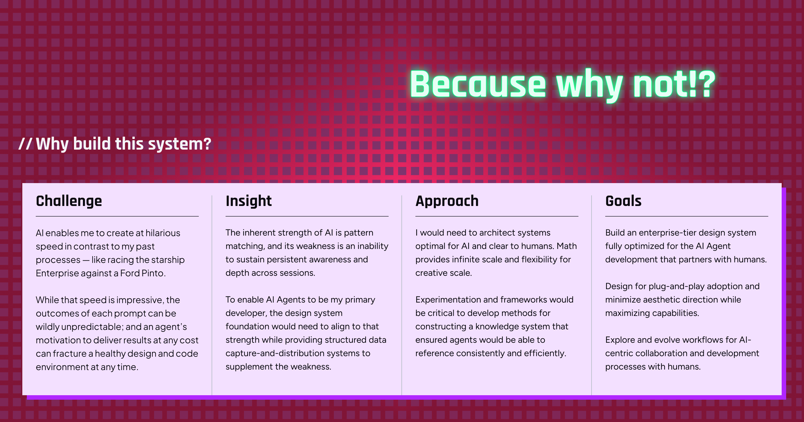

# Component Analysis: WhyBuild

**Component Type**: COMPONENT
**Figma ID**: 3492:1250
**File Key**: yU7908VXR1khQN5hZXC6Cy
**Extracted**: 2026-05-10T14:44:04.245Z
**Extractor Version**: 6.3.0

---

## Classification Summary

| Tier | Count | Percentage |
| --- | --- | --- |
| ✅ Semantic Identified | 20 | 15% |
| ⚠️ Primitive Identified | 23 | 17% |
| ❌ Unidentified | 94 | 69% |
| **Total** | **137** | **100%** |

## Node Tree

- **WhyBuild** (FRAME, depth 0) [S:0 P:0 U:5]
  - **Why Build This System Container** (FRAME, depth 1) [S:0 P:0 U:5]
    - **Vector** (FRAME, depth 2) [S:0 P:1 U:1]
    - **Content Container** (FRAME, depth 2) [S:1 P:0 U:5]
      - **Header Container** (FRAME, depth 3) [S:0 P:1 U:5]
        - **Header Content Container** (FRAME, depth 4) [S:0 P:0 U:6]
          - **Why build this system?** (TEXT, depth 5) [S:0 P:1 U:4]
          - **//** (TEXT, depth 5) [S:0 P:1 U:4]
      - **Copy Container** (FRAME, depth 3) [S:0 P:1 U:5]
        - **Challenge Container** (FRAME, depth 4) [S:4 P:1 U:0]
          - **Subheader Container** (FRAME, depth 5) [S:0 P:1 U:4]
            - **Challenge** (TEXT, depth 6) [S:0 P:1 U:4]
          - **AI enables me to create at hilarious speed in contrast to my past processes — like racing the starship Enterprise against a Ford Pinto. While that speed is impressive, the outcomes of each prompt can be wildly unpredictable; and an agent’s motivation to deliver results at any cost can fracture a healthy design and code environment at any time.** (TEXT, depth 5) [S:0 P:1 U:4]
        - **Line 133** (FRAME, depth 4) [S:1 P:0 U:1]
        - **Insight Container** (FRAME, depth 4) [S:4 P:1 U:0]
          - **Subheader Container** (FRAME, depth 5) [S:0 P:1 U:4]
            - **Insight** (TEXT, depth 6) [S:0 P:1 U:4]
          - **The inherent strength of AI is pattern matching, and its weakness is an inability to sustain persistent awareness and depth across sessions. To enable AI Agents to be my primary developer, the design system foundation would need to align to that strength while providing structured data capture-and-distribution systems to supplement the weakness.** (TEXT, depth 5) [S:0 P:1 U:4]
        - **Line 134** (FRAME, depth 4) [S:1 P:0 U:1]
        - **Approach Container** (FRAME, depth 4) [S:4 P:1 U:0]
          - **Subheader Container** (FRAME, depth 5) [S:0 P:1 U:4]
            - **Approach** (TEXT, depth 6) [S:0 P:1 U:4]
          - **I would need to architect systems optimal for AI and clear to humans. Math provides infinite scale and flexibility for creative scale. Experimentation and frameworks would be critical to develop methods for constructing a knowledge system that ensured agents would be able to reference consistently and efficiently.** (TEXT, depth 5) [S:0 P:1 U:4]
        - **Line 135** (FRAME, depth 4) [S:1 P:0 U:1]
        - **Goals Container** (FRAME, depth 4) [S:4 P:1 U:0]
          - **Subheader Container** (FRAME, depth 5) [S:0 P:1 U:4]
            - **Goals** (TEXT, depth 6) [S:0 P:1 U:4]
          - **Build an enterprise-tier design system fully optimized for the AI Agent development that partners with humans. Design for plug-and-play adoption and minimize aesthetic direction while maximizing capabilities. Explore and evolve workflows for AI-centric collaboration and development processes with humans.** (TEXT, depth 5) [S:0 P:1 U:4]
    - **Easter Egg - Because why not!?** (TEXT, depth 2) [S:0 P:2 U:3]

## Token Usage by Node

### WhyBuild (FRAME, depth 0)

- ❌ `padding-top`: 0 (value-match)
- ❌ `padding-right`: 0 (value-match)
- ❌ `padding-bottom`: 0 (value-match)
- ❌ `padding-left`: 0 (value-match)
- ❌ `border-width`: 1 (value-match)

### Why Build This System Container (FRAME, depth 1)

- ❌ `padding-top`: 0 (value-match)
- ❌ `padding-right`: 0 (value-match)
- ❌ `padding-bottom`: 0 (value-match)
- ❌ `padding-left`: 0 (value-match)
- ❌ `border-width`: 1 (value-match)

### Vector (FRAME, depth 2)

- ⚠️ `fill`: color.pink500 (binding, exact)
- ❌ `border-width`: 0.7031903862953186 (value-match)

### Content Container (FRAME, depth 2)

- ✅ `item-spacing`: semanticSpace.sectioned.loose → space.space600 (binding, exact)
- ❌ `padding-top`: 40 (value-match)
- ❌ `padding-right`: 40 (value-match)
- ❌ `padding-bottom`: 40 (value-match)
- ❌ `padding-left`: 40 (value-match)
- ❌ `border-width`: 1 (value-match)

### Header Container (FRAME, depth 3)

- ⚠️ `padding-left`: space.space300 (binding, exact)
- ❌ `padding-top`: 0 (value-match)
- ❌ `padding-right`: 0 (value-match)
- ❌ `padding-bottom`: 0 (value-match)
- ❌ `item-spacing`: 8 (value-match)
- ❌ `border-width`: 1 (value-match)

### Header Content Container (FRAME, depth 4)

- ❌ `padding-top`: 0 (value-match)
- ❌ `padding-right`: 0 (value-match)
- ❌ `padding-bottom`: 0 (value-match)
- ❌ `padding-left`: 0 (value-match)
- ❌ `item-spacing`: 8 (value-match)
- ❌ `border-width`: 1 (value-match)

### Why build this system? (TEXT, depth 5)

- ⚠️ `fill`: color.white200 (binding, exact)
- ❌ `border-width`: 1 (value-match)
- ❌ `font-size`: 33 (value-match)
- ❌ `font-weight`: 700 (value-match)
- ❌ `line-height`: 40 (out-of-tolerance — closest: lineHeight.lineHeight125 (±38.444px))

### // (TEXT, depth 5)

- ⚠️ `fill`: color.white200 (binding, exact)
- ❌ `border-width`: 1 (value-match)
- ❌ `font-size`: 33 (value-match)
- ❌ `font-weight`: 700 (value-match)
- ❌ `line-height`: 40 (out-of-tolerance — closest: lineHeight.lineHeight125 (±38.444px))

### Copy Container (FRAME, depth 3)

- ⚠️ `fill`: color.purple100 (binding, exact)
- ❌ `padding-top`: 0 (value-match)
- ❌ `padding-right`: 0 (value-match)
- ❌ `padding-bottom`: 0 (value-match)
- ❌ `padding-left`: 0 (value-match)
- ❌ `item-spacing`: 0 (value-match)

### Challenge Container (FRAME, depth 4)

- ✅ `padding-top`: semanticSpace.inset.200 → space.space200 (binding, exact)
- ✅ `padding-right`: semanticSpace.inset.300 → space.space300 (binding, exact)
- ✅ `padding-bottom`: semanticSpace.inset.200 → space.space200 (binding, exact)
- ✅ `padding-left`: semanticSpace.inset.300 → space.space300 (binding, exact)
- ⚠️ `item-spacing`: space.space200 (binding, exact)

### Subheader Container (FRAME, depth 5)

- ⚠️ `stroke`: color.black100 (binding, exact)
- ❌ `padding-top`: 0 (value-match)
- ❌ `padding-right`: 0 (value-match)
- ❌ `padding-bottom`: 0 (value-match)
- ❌ `padding-left`: 0 (value-match)

### Challenge (TEXT, depth 6)

- ⚠️ `fill`: color.black300 (binding, exact)
- ❌ `border-width`: 1 (value-match)
- ❌ `font-size`: 29 (value-match)
- ❌ `font-weight`: 700 (value-match)
- ❌ `line-height`: 35.9900016784668 (out-of-tolerance — closest: lineHeight.lineHeight125 (±34.4340016784668px))

### AI enables me to create at hilarious speed in contrast to my past processes — like racing the starship Enterprise against a Ford Pinto. While that speed is impressive, the outcomes of each prompt can be wildly unpredictable; and an agent’s motivation to deliver results at any cost can fracture a healthy design and code environment at any time. (TEXT, depth 5)

- ⚠️ `fill`: color.black300 (binding, exact)
- ❌ `border-width`: 1 (value-match)
- ❌ `font-size`: 16 (value-match)
- ❌ `font-weight`: 400 (value-match)
- ❌ `line-height`: 24 (out-of-tolerance — closest: lineHeight.lineHeight125 (±22.444px))

### Line 133 (FRAME, depth 4)

- ✅ `stroke`: semanticColor.color.structure.border.subtle → color.gray100 (binding, exact)
- ❌ `border-width`: 1 (value-match)

### Insight Container (FRAME, depth 4)

- ✅ `padding-top`: semanticSpace.inset.200 → space.space200 (binding, exact)
- ✅ `padding-right`: semanticSpace.inset.300 → space.space300 (binding, exact)
- ✅ `padding-bottom`: semanticSpace.inset.200 → space.space200 (binding, exact)
- ✅ `padding-left`: semanticSpace.inset.300 → space.space300 (binding, exact)
- ⚠️ `item-spacing`: space.space200 (binding, exact)

### Subheader Container (FRAME, depth 5)

- ⚠️ `stroke`: color.black100 (binding, exact)
- ❌ `padding-top`: 0 (value-match)
- ❌ `padding-right`: 0 (value-match)
- ❌ `padding-bottom`: 0 (value-match)
- ❌ `padding-left`: 0 (value-match)

### Insight (TEXT, depth 6)

- ⚠️ `fill`: color.black300 (binding, exact)
- ❌ `border-width`: 1 (value-match)
- ❌ `font-size`: 29 (value-match)
- ❌ `font-weight`: 700 (value-match)
- ❌ `line-height`: 35.9900016784668 (out-of-tolerance — closest: lineHeight.lineHeight125 (±34.4340016784668px))

### The inherent strength of AI is pattern matching, and its weakness is an inability to sustain persistent awareness and depth across sessions. To enable AI Agents to be my primary developer, the design system foundation would need to align to that strength while providing structured data capture-and-distribution systems to supplement the weakness. (TEXT, depth 5)

- ⚠️ `fill`: color.black300 (binding, exact)
- ❌ `border-width`: 1 (value-match)
- ❌ `font-size`: 16 (value-match)
- ❌ `font-weight`: 400 (value-match)
- ❌ `line-height`: 24 (out-of-tolerance — closest: lineHeight.lineHeight125 (±22.444px))

### Line 134 (FRAME, depth 4)

- ✅ `stroke`: semanticColor.color.structure.border.subtle → color.gray100 (binding, exact)
- ❌ `border-width`: 1 (value-match)

### Approach Container (FRAME, depth 4)

- ✅ `padding-top`: semanticSpace.inset.200 → space.space200 (binding, exact)
- ✅ `padding-right`: semanticSpace.inset.300 → space.space300 (binding, exact)
- ✅ `padding-bottom`: semanticSpace.inset.200 → space.space200 (binding, exact)
- ✅ `padding-left`: semanticSpace.inset.300 → space.space300 (binding, exact)
- ⚠️ `item-spacing`: space.space200 (binding, exact)

### Subheader Container (FRAME, depth 5)

- ⚠️ `stroke`: color.black100 (binding, exact)
- ❌ `padding-top`: 0 (value-match)
- ❌ `padding-right`: 0 (value-match)
- ❌ `padding-bottom`: 0 (value-match)
- ❌ `padding-left`: 0 (value-match)

### Approach (TEXT, depth 6)

- ⚠️ `fill`: color.black300 (binding, exact)
- ❌ `border-width`: 1 (value-match)
- ❌ `font-size`: 29 (value-match)
- ❌ `font-weight`: 700 (value-match)
- ❌ `line-height`: 35.9900016784668 (out-of-tolerance — closest: lineHeight.lineHeight125 (±34.4340016784668px))

### I would need to architect systems optimal for AI and clear to humans. Math provides infinite scale and flexibility for creative scale. Experimentation and frameworks would be critical to develop methods for constructing a knowledge system that ensured agents would be able to reference consistently and efficiently. (TEXT, depth 5)

- ⚠️ `fill`: color.black300 (binding, exact)
- ❌ `border-width`: 1 (value-match)
- ❌ `font-size`: 16 (value-match)
- ❌ `font-weight`: 400 (value-match)
- ❌ `line-height`: 24 (out-of-tolerance — closest: lineHeight.lineHeight125 (±22.444px))

### Line 135 (FRAME, depth 4)

- ✅ `stroke`: semanticColor.color.structure.border.subtle → color.gray100 (binding, exact)
- ❌ `border-width`: 1 (value-match)

### Goals Container (FRAME, depth 4)

- ✅ `padding-top`: semanticSpace.inset.200 → space.space200 (binding, exact)
- ✅ `padding-right`: semanticSpace.inset.300 → space.space300 (binding, exact)
- ✅ `padding-bottom`: semanticSpace.inset.200 → space.space200 (binding, exact)
- ✅ `padding-left`: semanticSpace.inset.300 → space.space300 (binding, exact)
- ⚠️ `item-spacing`: space.space200 (binding, exact)

### Subheader Container (FRAME, depth 5)

- ⚠️ `stroke`: color.black100 (binding, exact)
- ❌ `padding-top`: 0 (value-match)
- ❌ `padding-right`: 0 (value-match)
- ❌ `padding-bottom`: 0 (value-match)
- ❌ `padding-left`: 0 (value-match)

### Goals (TEXT, depth 6)

- ⚠️ `fill`: color.black300 (binding, exact)
- ❌ `border-width`: 1 (value-match)
- ❌ `font-size`: 29 (value-match)
- ❌ `font-weight`: 700 (value-match)
- ❌ `line-height`: 35.9900016784668 (out-of-tolerance — closest: lineHeight.lineHeight125 (±34.4340016784668px))

### Build an enterprise-tier design system fully optimized for the AI Agent development that partners with humans. Design for plug-and-play adoption and minimize aesthetic direction while maximizing capabilities. Explore and evolve workflows for AI-centric collaboration and development processes with humans. (TEXT, depth 5)

- ⚠️ `fill`: color.black300 (binding, exact)
- ❌ `border-width`: 1 (value-match)
- ❌ `font-size`: 16 (value-match)
- ❌ `font-weight`: 400 (value-match)
- ❌ `line-height`: 24 (out-of-tolerance — closest: lineHeight.lineHeight125 (±22.444px))

### Easter Egg - Because why not!? (TEXT, depth 2)

- ⚠️ `fill`: color.green100 (binding, exact)
- ⚠️ `stroke`: color.green400 (binding, exact)
- ❌ `border-width`: 1 (value-match)
- ❌ `font-size`: 72 (out-of-tolerance — closest: fontSize.fontSize700 (±30px))
- ❌ `font-weight`: 700 (value-match)

## Recommendations

### Variant Mapping

⚠️ **Validation Required**: This analysis is based on Figma component structure. The optimal code structure may differ.

**Component**: WhyBuild
**Classification**: styling

**A** ✅ Recommended
- Single component with a variant prop
- Rationale: Variants differ only in visual styling, making a single component with a variant prop the simplest API surface.
- Aligns with: Behavioral analysis: variants are styling-only
- Trade-offs: Simpler consumer API — one import, one tag., Internal complexity grows if behavioral differences emerge later., Harder to tree-shake unused variants.

**B** 
- Primitive + semantic component structure (Stemma pattern)
- Rationale: A split structure future-proofs the component for behavioral divergence, though current variants are styling-only.
- Trade-offs: Clean separation of behavioral contracts per component., Aligns with Stemma inheritance pattern used across DesignerPunk., More components to maintain and document.

**Domain Specialist Validation**:
- **Ada** (Token Specialist): Are token classifications correct? Should new semantic tokens be created?
- **Lina** (Component Specialist): Does the component architecture match Stemma patterns?
- **Thurgood** (Governance): Does this meet spec standards and test coverage requirements?

### Component Token Suggestions

⚠️ **Validation Required**: This analysis is based on Figma component structure. The optimal code structure may differ.

- **why.item-spacing = space.space000** ← `space.space000` (used 5× in item-spacing, padding-top, padding-right, padding-bottom, padding-left)
  - space.space000 is used across 5 properties (item-spacing, padding-top, padding-right, padding-bottom, padding-left). Consistent usage suggests semantic intent that could be encoded as a component token.

**Domain Specialist Validation**:
- **Ada** (Token Specialist): Are token classifications correct? Should new semantic tokens be created?
- **Lina** (Component Specialist): Does the component architecture match Stemma patterns?
- **Thurgood** (Governance): Does this meet spec standards and test coverage requirements?

## Unidentified Values

- **WhyBuild** → `padding-top`: 0 (value-match — suggested: `semanticSpace.grouped.none`)
- **WhyBuild** → `padding-right`: 0 (value-match — suggested: `semanticSpace.grouped.none`)
- **WhyBuild** → `padding-bottom`: 0 (value-match — suggested: `semanticSpace.grouped.none`)
- **WhyBuild** → `padding-left`: 0 (value-match — suggested: `semanticSpace.grouped.none`)
- **WhyBuild** → `border-width`: 1 (value-match — suggested: `semanticBorderWidth.default`)
- **Why Build This System Container** → `padding-top`: 0 (value-match — suggested: `semanticSpace.grouped.none`)
- **Why Build This System Container** → `padding-right`: 0 (value-match — suggested: `semanticSpace.grouped.none`)
- **Why Build This System Container** → `padding-bottom`: 0 (value-match — suggested: `semanticSpace.grouped.none`)
- **Why Build This System Container** → `padding-left`: 0 (value-match — suggested: `semanticSpace.grouped.none`)
- **Why Build This System Container** → `border-width`: 1 (value-match — suggested: `semanticBorderWidth.default`)
- **Vector** → `border-width`: 0.7031903862953186 (value-match — suggested: `semanticBorderWidth.default`)
- **Content Container** → `padding-top`: 40 (value-match — suggested: `semanticSpace.sectioned.normal`)
- **Content Container** → `padding-right`: 40 (value-match — suggested: `semanticSpace.sectioned.normal`)
- **Content Container** → `padding-bottom`: 40 (value-match — suggested: `semanticSpace.sectioned.normal`)
- **Content Container** → `padding-left`: 40 (value-match — suggested: `semanticSpace.sectioned.normal`)
- **Content Container** → `border-width`: 1 (value-match — suggested: `semanticBorderWidth.default`)
- **Header Container** → `padding-top`: 0 (value-match — suggested: `semanticSpace.grouped.none`)
- **Header Container** → `padding-right`: 0 (value-match — suggested: `semanticSpace.grouped.none`)
- **Header Container** → `padding-bottom`: 0 (value-match — suggested: `semanticSpace.grouped.none`)
- **Header Container** → `item-spacing`: 8 (value-match — suggested: `semanticSpace.grouped.normal`)
- **Header Container** → `border-width`: 1 (value-match — suggested: `semanticBorderWidth.default`)
- **Header Content Container** → `padding-top`: 0 (value-match — suggested: `semanticSpace.grouped.none`)
- **Header Content Container** → `padding-right`: 0 (value-match — suggested: `semanticSpace.grouped.none`)
- **Header Content Container** → `padding-bottom`: 0 (value-match — suggested: `semanticSpace.grouped.none`)
- **Header Content Container** → `padding-left`: 0 (value-match — suggested: `semanticSpace.grouped.none`)
- **Header Content Container** → `item-spacing`: 8 (value-match — suggested: `semanticSpace.grouped.normal`)
- **Header Content Container** → `border-width`: 1 (value-match — suggested: `semanticBorderWidth.default`)
- **Why build this system?** → `border-width`: 1 (value-match — suggested: `semanticBorderWidth.default`)
- **Why build this system?** → `font-size`: 33 (value-match — suggested: `icon.icon.size500`)
- **Why build this system?** → `font-weight`: 700 (value-match — suggested: `fontWeight.fontWeight700`)
- **Why build this system?** → `line-height`: 40 (out-of-tolerance — closest: lineHeight.lineHeight125 (±38.444px))
- **//** → `border-width`: 1 (value-match — suggested: `semanticBorderWidth.default`)
- **//** → `font-size`: 33 (value-match — suggested: `icon.icon.size500`)
- **//** → `font-weight`: 700 (value-match — suggested: `fontWeight.fontWeight700`)
- **//** → `line-height`: 40 (out-of-tolerance — closest: lineHeight.lineHeight125 (±38.444px))
- **Copy Container** → `padding-top`: 0 (value-match — suggested: `semanticSpace.grouped.none`)
- **Copy Container** → `padding-right`: 0 (value-match — suggested: `semanticSpace.grouped.none`)
- **Copy Container** → `padding-bottom`: 0 (value-match — suggested: `semanticSpace.grouped.none`)
- **Copy Container** → `padding-left`: 0 (value-match — suggested: `semanticSpace.grouped.none`)
- **Copy Container** → `item-spacing`: 0 (value-match — suggested: `semanticSpace.grouped.none`)
- **Subheader Container** → `padding-top`: 0 (value-match — suggested: `semanticSpace.grouped.none`)
- **Subheader Container** → `padding-right`: 0 (value-match — suggested: `semanticSpace.grouped.none`)
- **Subheader Container** → `padding-bottom`: 0 (value-match — suggested: `semanticSpace.grouped.none`)
- **Subheader Container** → `padding-left`: 0 (value-match — suggested: `semanticSpace.grouped.none`)
- **Challenge** → `border-width`: 1 (value-match — suggested: `semanticBorderWidth.default`)
- **Challenge** → `font-size`: 29 (value-match — suggested: `icon.icon.size400`)
- **Challenge** → `font-weight`: 700 (value-match — suggested: `fontWeight.fontWeight700`)
- **Challenge** → `line-height`: 35.9900016784668 (out-of-tolerance — closest: lineHeight.lineHeight125 (±34.4340016784668px))
- **AI enables me to create at hilarious speed in contrast to my past processes — like racing the starship Enterprise against a Ford Pinto. While that speed is impressive, the outcomes of each prompt can be wildly unpredictable; and an agent’s motivation to deliver results at any cost can fracture a healthy design and code environment at any time.** → `border-width`: 1 (value-match — suggested: `semanticBorderWidth.default`)
- **AI enables me to create at hilarious speed in contrast to my past processes — like racing the starship Enterprise against a Ford Pinto. While that speed is impressive, the outcomes of each prompt can be wildly unpredictable; and an agent’s motivation to deliver results at any cost can fracture a healthy design and code environment at any time.** → `font-size`: 16 (value-match — suggested: `icon.icon.size100`)
- **AI enables me to create at hilarious speed in contrast to my past processes — like racing the starship Enterprise against a Ford Pinto. While that speed is impressive, the outcomes of each prompt can be wildly unpredictable; and an agent’s motivation to deliver results at any cost can fracture a healthy design and code environment at any time.** → `font-weight`: 400 (value-match — suggested: `fontWeight.fontWeight400`)
- **AI enables me to create at hilarious speed in contrast to my past processes — like racing the starship Enterprise against a Ford Pinto. While that speed is impressive, the outcomes of each prompt can be wildly unpredictable; and an agent’s motivation to deliver results at any cost can fracture a healthy design and code environment at any time.** → `line-height`: 24 (out-of-tolerance — closest: lineHeight.lineHeight125 (±22.444px))
- **Line 133** → `border-width`: 1 (value-match — suggested: `semanticBorderWidth.default`)
- **Subheader Container** → `padding-top`: 0 (value-match — suggested: `semanticSpace.grouped.none`)
- **Subheader Container** → `padding-right`: 0 (value-match — suggested: `semanticSpace.grouped.none`)
- **Subheader Container** → `padding-bottom`: 0 (value-match — suggested: `semanticSpace.grouped.none`)
- **Subheader Container** → `padding-left`: 0 (value-match — suggested: `semanticSpace.grouped.none`)
- **Insight** → `border-width`: 1 (value-match — suggested: `semanticBorderWidth.default`)
- **Insight** → `font-size`: 29 (value-match — suggested: `icon.icon.size400`)
- **Insight** → `font-weight`: 700 (value-match — suggested: `fontWeight.fontWeight700`)
- **Insight** → `line-height`: 35.9900016784668 (out-of-tolerance — closest: lineHeight.lineHeight125 (±34.4340016784668px))
- **The inherent strength of AI is pattern matching, and its weakness is an inability to sustain persistent awareness and depth across sessions. To enable AI Agents to be my primary developer, the design system foundation would need to align to that strength while providing structured data capture-and-distribution systems to supplement the weakness.** → `border-width`: 1 (value-match — suggested: `semanticBorderWidth.default`)
- **The inherent strength of AI is pattern matching, and its weakness is an inability to sustain persistent awareness and depth across sessions. To enable AI Agents to be my primary developer, the design system foundation would need to align to that strength while providing structured data capture-and-distribution systems to supplement the weakness.** → `font-size`: 16 (value-match — suggested: `icon.icon.size100`)
- **The inherent strength of AI is pattern matching, and its weakness is an inability to sustain persistent awareness and depth across sessions. To enable AI Agents to be my primary developer, the design system foundation would need to align to that strength while providing structured data capture-and-distribution systems to supplement the weakness.** → `font-weight`: 400 (value-match — suggested: `fontWeight.fontWeight400`)
- **The inherent strength of AI is pattern matching, and its weakness is an inability to sustain persistent awareness and depth across sessions. To enable AI Agents to be my primary developer, the design system foundation would need to align to that strength while providing structured data capture-and-distribution systems to supplement the weakness.** → `line-height`: 24 (out-of-tolerance — closest: lineHeight.lineHeight125 (±22.444px))
- **Line 134** → `border-width`: 1 (value-match — suggested: `semanticBorderWidth.default`)
- **Subheader Container** → `padding-top`: 0 (value-match — suggested: `semanticSpace.grouped.none`)
- **Subheader Container** → `padding-right`: 0 (value-match — suggested: `semanticSpace.grouped.none`)
- **Subheader Container** → `padding-bottom`: 0 (value-match — suggested: `semanticSpace.grouped.none`)
- **Subheader Container** → `padding-left`: 0 (value-match — suggested: `semanticSpace.grouped.none`)
- **Approach** → `border-width`: 1 (value-match — suggested: `semanticBorderWidth.default`)
- **Approach** → `font-size`: 29 (value-match — suggested: `icon.icon.size400`)
- **Approach** → `font-weight`: 700 (value-match — suggested: `fontWeight.fontWeight700`)
- **Approach** → `line-height`: 35.9900016784668 (out-of-tolerance — closest: lineHeight.lineHeight125 (±34.4340016784668px))
- **I would need to architect systems optimal for AI and clear to humans. Math provides infinite scale and flexibility for creative scale. Experimentation and frameworks would be critical to develop methods for constructing a knowledge system that ensured agents would be able to reference consistently and efficiently.** → `border-width`: 1 (value-match — suggested: `semanticBorderWidth.default`)
- **I would need to architect systems optimal for AI and clear to humans. Math provides infinite scale and flexibility for creative scale. Experimentation and frameworks would be critical to develop methods for constructing a knowledge system that ensured agents would be able to reference consistently and efficiently.** → `font-size`: 16 (value-match — suggested: `icon.icon.size100`)
- **I would need to architect systems optimal for AI and clear to humans. Math provides infinite scale and flexibility for creative scale. Experimentation and frameworks would be critical to develop methods for constructing a knowledge system that ensured agents would be able to reference consistently and efficiently.** → `font-weight`: 400 (value-match — suggested: `fontWeight.fontWeight400`)
- **I would need to architect systems optimal for AI and clear to humans. Math provides infinite scale and flexibility for creative scale. Experimentation and frameworks would be critical to develop methods for constructing a knowledge system that ensured agents would be able to reference consistently and efficiently.** → `line-height`: 24 (out-of-tolerance — closest: lineHeight.lineHeight125 (±22.444px))
- **Line 135** → `border-width`: 1 (value-match — suggested: `semanticBorderWidth.default`)
- **Subheader Container** → `padding-top`: 0 (value-match — suggested: `semanticSpace.grouped.none`)
- **Subheader Container** → `padding-right`: 0 (value-match — suggested: `semanticSpace.grouped.none`)
- **Subheader Container** → `padding-bottom`: 0 (value-match — suggested: `semanticSpace.grouped.none`)
- **Subheader Container** → `padding-left`: 0 (value-match — suggested: `semanticSpace.grouped.none`)
- **Goals** → `border-width`: 1 (value-match — suggested: `semanticBorderWidth.default`)
- **Goals** → `font-size`: 29 (value-match — suggested: `icon.icon.size400`)
- **Goals** → `font-weight`: 700 (value-match — suggested: `fontWeight.fontWeight700`)
- **Goals** → `line-height`: 35.9900016784668 (out-of-tolerance — closest: lineHeight.lineHeight125 (±34.4340016784668px))
- **Build an enterprise-tier design system fully optimized for the AI Agent development that partners with humans. Design for plug-and-play adoption and minimize aesthetic direction while maximizing capabilities. Explore and evolve workflows for AI-centric collaboration and development processes with humans.** → `border-width`: 1 (value-match — suggested: `semanticBorderWidth.default`)
- **Build an enterprise-tier design system fully optimized for the AI Agent development that partners with humans. Design for plug-and-play adoption and minimize aesthetic direction while maximizing capabilities. Explore and evolve workflows for AI-centric collaboration and development processes with humans.** → `font-size`: 16 (value-match — suggested: `icon.icon.size100`)
- **Build an enterprise-tier design system fully optimized for the AI Agent development that partners with humans. Design for plug-and-play adoption and minimize aesthetic direction while maximizing capabilities. Explore and evolve workflows for AI-centric collaboration and development processes with humans.** → `font-weight`: 400 (value-match — suggested: `fontWeight.fontWeight400`)
- **Build an enterprise-tier design system fully optimized for the AI Agent development that partners with humans. Design for plug-and-play adoption and minimize aesthetic direction while maximizing capabilities. Explore and evolve workflows for AI-centric collaboration and development processes with humans.** → `line-height`: 24 (out-of-tolerance — closest: lineHeight.lineHeight125 (±22.444px))
- **Easter Egg - Because why not!?** → `border-width`: 1 (value-match — suggested: `semanticBorderWidth.default`)
- **Easter Egg - Because why not!?** → `font-size`: 72 (out-of-tolerance — closest: fontSize.fontSize700 (±30px))
- **Easter Egg - Because why not!?** → `font-weight`: 700 (value-match — suggested: `fontWeight.fontWeight700`)

## Screenshots

*Component screenshot (png, 2x, captured 2026-05-10T14:44:04.242Z)*
